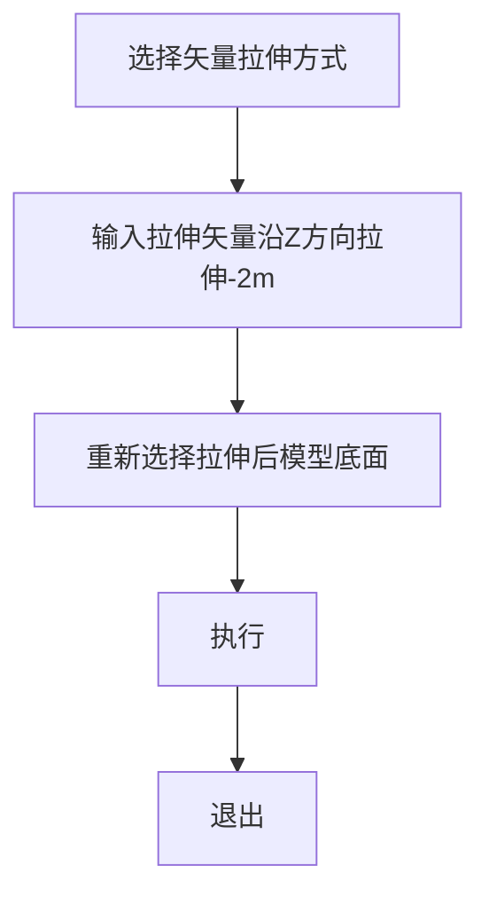
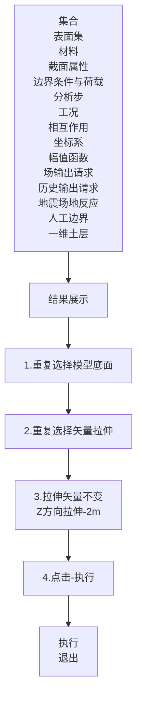
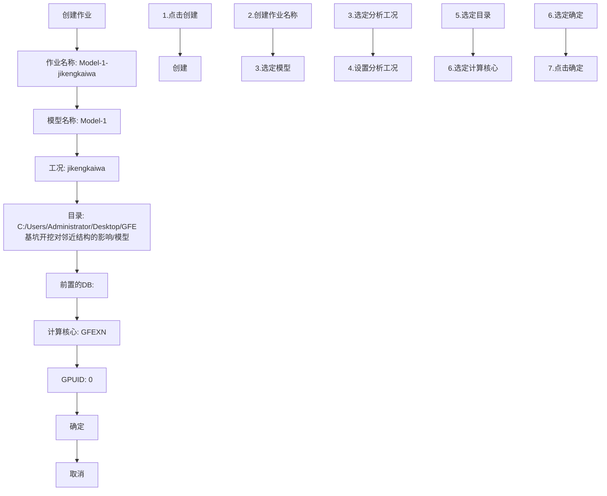
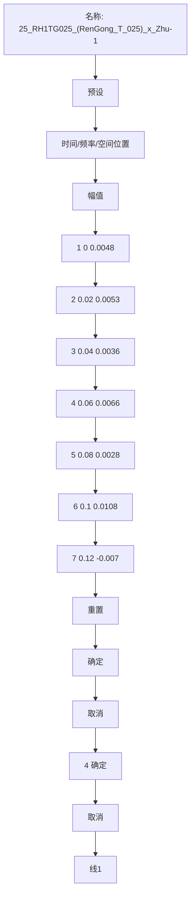

# 高性能有限元分析软件

# GFE

——实际案例操作手册 v2025


<details>
<summary>natural_image</summary>

Abstract 3D geometric illustration of interconnected buildings and nodes, no text or symbols present
</details>

广州颖力科技有限公司

2025年09月

# 目录

# 第 1 章 球铰支座建模分析....1

# § 1.1 分析模型.... 1

1.1.1 几何参数.... 1  
1.1.2 材料参数....1  
1.1.3 分析工况....1

# § 1.2 建模操作步骤....1

1.2.1 建立几何模型....1  
1.2.2 创建材料和截面属性....21  
1.2.3 建立边界条件和荷载.... 23  
1.2.4 设置场输出....24  
1.2.5 建立分析步 ..... 25  
1.2.6 建立工况....26  
1.2.7 网格划分....28

# § 1.3 分析操作步骤.... 29

1.3.1 创建作业....29  
1.3.2 分析作业....30  
1.3.3 查看分析结果....31

# 第 2 章 钢骨混凝土建模分析.... 34

# § 2.1 分析模型.... 34

2.1.1 几何参数.... 34  
2.1.2 材料参数.... 34  
2.1.3 分析工况....34

# § 2.2 建模操作步骤.... 34

2.2.1 建立几何模型....34  
2.2.2 建立材料和截面属性....48  
2.2.3 “合并”几何 ..... 53  
2.2.4 建立边界条件和荷载....54

2.2.5 建立场输出....56  
2.2.6 建立分析步....57  
2.2.7 建立相互作用....58  
2.2.8 建立工况....59  
2.2.9 网格划分....61

# § 2.3 分析操作步骤....62

2.3.1 创建作业....62  
2.3.2 分析作业....63  
2.3.3 查看分析结果....64  
2.3.4 结果查看部分操作....67

# 第 3 章 华夫板框架结构建模分析....68

# § 3.1 建模操作步骤....68

3.1.1 创建材料....68  
3.1.2 建立华夫板模型....69  
3.1.3 创建截面属性....80  
3.1.4 创建整体模型....83  
3.1.5 网格划分....84

# § 3.2 分析操作步骤....85

3.2.1 创建边界条件与荷载....85  
3.2.2 建立场输出....87  
3.2.3 创建分析步....88  
3.2.4 创建模型工况....89  
3.2.5 创建频响分析作业....90  
3.2.6 提交分析模型....91  
3.2.7 查看分析结果....92

# 第 4 章 核电站结构建模分析....98

§ 4.1 分析模型....98

# § 4.2 建模操作步骤....98

4.2.1 建立核电站模型....98

4.2.2 建立土体模型....125

# § 4.3 分析操作步骤.... 130

4.3.1 计算结构阻尼....130  
4.3.2 创建人工边界....131  
4.3.3 创建幅值函数....131  
4.3.4 创建地震场地反应....132  
4.3.5 建立动力分析步....133  
4.3.6 建立动力场输出....134  
4.3.7 建立动力工况....134  
4.3.8 创建动力分析作业....135  
4.3.9 提交分析模型....135  
4.3.10 查看结果....136

# 第 5 章 非均匀场地建模分析....137

# § 5.1 分析模型.... 137

5.1.1 整体模型....137

# § 5.2 建模操作步骤.... 137

5.2.1 建立非均匀土体模型....137  
5.2.2 网格划分....139  
5.2.3 创建集合....140  
5.2.4 创建表面集....141  
5.2.5 建立相互作用....142

# § 5.3 分析操作步骤.... 142

5.3.1 模态分析....142  
5.3.2 静力分析....146  
5.3.3 动力分析....149

# 第 6 章 邻近建筑的基坑开挖模拟.... 158

# § 6.1 模型参数.... 158

6.1.1 模型信息....158  
6.1.2 材料属性....159

6.1.3 截面属性....160  
6.1.4 相互作用....161  
6.1.5 边界条件与荷载.... 161  
6.1.6 网格尺寸控制....161  
6.1.7 基坑施工步骤.... 161

# § 6.2 基坑模型建立.... 162

6.2.1 新建放坡土层....162  
6.2.2 基坑土层建模....169  
6.2.3 基坑内支撑建模....170  
6.2.4 基坑立柱建模....176  
6.2.5 基坑模型合并....177

# § 6.3 材料设置.... 178

6.3.1 创建材料....178  
6.3.2 导入材料....179  
6.3.3 材料核对....180

# § 6.4 土体模型建立....180

6.4.1 创建一维土层....180  
6.4.2 快速建土....181  
6.4.3 土体平移....182  
6.4.4 模型分割.... 183

# § 6.5 既有结构模型建立.... 185

6.5.1 导入 YJK/PKPM 模型....185  
6.5.2 土结构相对位置....187  
6.5.3 模型裁剪....188

# § 6.6 创建集合....190

6.6.1 放坡....190  
6.6.2 开挖....190  
6.6.3 喷射混凝土....191  
6.6.4 地连墙.... 192

6.6.5 内支撑....192  
6.6.6 立柱....194

# § 6.7 网格划分....194

6.7.1 结构网格参数....194  
6.7.2 结构网格划分....195  
6.7.3 土体网格参数....196  
6.7.4 土体网格划分....196  
6.7.5 网格复制....197

# § 6.8 截面属性.... 200

# § 6.9 边界条件与荷载.... 203

6.9.1 绑定约束....204  
6.9.2 惯性力查看....204  
6.9.3 底面全约束....205  
6.9.4 土体侧面位移约束....205

# § 6.10 场输出设置.... 206

6.10.1 节点场....206  
6.10.2 单元场....206

# § 6.11 施工工况建立....209

6.11.1 静力分析步（地应力平衡）....209  
6.11.2 放坡分析步....209  
6.11.3 开挖分析步....210  
6.11.4 工况设置....212  
6.11.5 工况预览....216

# § 6.12 创建作业.... 217

6.12.1 作业提交....217

# § 6.13 结果查看.... 218

6.13.1 按阈值过滤....219  
6.13.2 位移云图....219  
6.13.3 塑性应变云图.... 220

6.13.4 施工过程查看....220  
6.13.5 既有结构结果查看....221

# 第 7 章 锚杆隧道施工模拟.... 223

# § 7.1 模型参数.... 223

7.1.1 材料参数.... 223  
7.1.2 土体参数.... 223

# § 7.2 模型建立.... 224

7.2.1 新建土体材料....224  
7.2.2 导入土体材料....226  
7.2.3 创建一维土层....227  
7.2.4 快速建土....228  
7.2.5 隧道设计....229  
7.2.6 分割土体....234  
7.2.7 创建集合....236  
7.2.8 网格划分....238  
7.2.9 截面属性....244  
7.2.10 相互作用....248  
7.2.11 边界条件与载荷....250

# § 7.3 施工工况建立....252

7.3.1 静力分析步....252  
7.3.2 场输出请求设置.... 253  
7.3.3 工况设置....254

# § 7.4 创建作业.... 260

7.4.1 作业提交....260  
7.4.2 结果查看....261

# 第 8 章 SPH 案例一 小球落水动力学分析 ..... 263

§ 8.1 案例描述.... 263  
§ 8.2 建模操作步骤.... 263  
§ 8.3 SPH 对象设置....266

§ 8.4 流体动力分析步设置....268  
§ 8.5 工况及作业设置....270  
§ 8.6 提交计算方式....271  
§ 8.7 后处理结果查看....273

# 第 9 章 SPH 案例二 水桶晃动动力学分析 ..... 274

§ 9.1 案例描述....274  
§ 9.2 建模操作步骤.... 274  
§ 9.3 水桶有限元模型创建.... 279  
§ 9.4 SPH 对象设置....284  
§ 9.5 流体动力分析步设置.... 285  
§ 9.6 工况及作业设置....287  
§ 9.7 提交计算....289  
§ 9.8 后处理查看结果.... 290

# 第 10 章 抗震分析案例-地铁站....292

§ 10.1 案例描述.... 292  
§ 10.2 导入 YJK 模型必要文件生成....292  
§ 10.3 导入 YJK 模型到 GFE 中....293  
§ 10.4 土体材料的导入....295  
§ 10.5 创建一维土层....295  
§ 10.6 创建三维土体....296  
§ 10.7 土体结构相对位置调整....297  
§ 10.8 土体裁剪....298  
§ 10.9 建立相互作用....300  
§ 10.10 建立人工边界.... 302  
§ 10.11 创建地震场地反应....303  
§ 10.12 网格划分....304  
§ 10.13 创建工况....305  
§ 10.14 提交作业.... 306  
§ 10.15 后处理结果查看....306

§ 10.16 弹塑性分析准备工作 ..... 307  
§ 10.17 土体材料转换....307  
§ 10.18 YJK 模型材料转换及配筋....308  
§ 10.19 建立静力分析步需要的边界....308  
§ 10.20 修改地震场地反应.... 310  
§ 10.21 加载预设场输出.... 310  
§ 10.22 创建工况....311  
§ 10.23 创建作业与提交计算.... 312  
§ 10.24 后处理结果查看....312

# 第 11 章 抗震分析案例-地上地下结构....314

§ 11.1 案例描述.... 314  
§ 11.2 导入 YJK 模型必要文件生成....314  
§ 11.3 导入 YJK 模型到 GFE 中....315  
§ 11.4 创建幅值函数.... 317  
§ 11.5 土体材料的导入.... 317  
§ 11.6 创建一维土层....319  
§ 11.7 创建三维土体....319  
§ 11.8 土体结构相对位置调整.... 320  
§ 11.9 土体裁剪.... 321  
§ 11.10 建立相互作用.... 322  
§ 11.11 建立人工边界.... 323  
§ 11.12 创建地震场地反应.... 324  
§ 11.13 网格划分.... 326  
§ 11.14 创建工况.... 327  
§ 11.15 提交作业.... 328  
§ 11.16 后处理结果查看....328  
§ 11.17 弹塑性分析准备工作 …… 329  
§ 11.18 土体材料转换.... 329  
§ 11. 19 YJK 模型材料转换及配筋 …… 330

§ 11.20 建立静力分析步需要的边界....330  
§ 11.21 修改地震场地反应.... 332  
§ 11.22 加载预设场输出....332  
§ 11.23 创建工况.... 333  
§ 11.24 创建作业与提交计算.... 334  
§ 11.25 后处理结果查看....334

# 第 12 章 施工模拟案例-地上地下综合体....336

§ 12.1 案例描述.... 336  
§ 12.2 导入 YJK 模型必要文件生成....336  
§ 12.3 导入 YJK 模型到 GFE 中....337  
§ 12.4 土体材料的导入.... 339  
§ 12.5 创建一维土层....340  
§ 12.6 创建三维土体.... 340  
§ 12.7 土体结构相对位置调整.... 341  
§ 12.8 土结模型的布尔运算.... 342  
§ 12.9 创建被挖土体的集合....343  
§ 12.10 赋予新创建土层材料.... 344  
§ 12.11 土体裁剪....345  
§ 12.12 建立相互作用 …… 346  
§ 12.13 建立边界条件.... 347  
§ 12.14 网格划分....348  
§ 12.15 建立分析步....349  
§ 12.16 工况建立——土体开挖.... 350  
§ 12.17 工况建立——主体结构施工.... 351

# 第 13 章 反应位移法案例.... 353

§ 13.1 案例描述.... 353  
§ 13.2 反应位移法一般性建模步骤.... 353  
§ 13.3 导入 YJK 模型必要文件生成....353  
§ 13.4 导入 YJK 模型到 GFE 中....355

§ 13.5 土体材料的导入.... 356  
§ 13.6 创建一维土层....357  
§ 13.7 创建幅值函数.... 358  
§ 13.8 创建地震场地反应....358  
§ 13.9 网格划分.... 359  
§ 13.10 使用反应位移助手.... 360  
§ 13.11 建立底部约束.... 361  
§ 13.12 建立场输出.... 362  
§ 13.13 提交作业.... 363

# 第 14 章 爆炸案例.... 365

§ 14.1 案例描述.... 365  
§ 14.2 起爆点建立.... 366  
§ 14.3 建立冲击波属性.... 367  
§ 14.4 建立爆炸荷载.... 368  
§ 14.5 建立分析步 ..... 370  
§ 14.6 创建场输出.... 370  
§ 14.7 工况建立.... 371  
§ 14.8 修改求解器参数.... 372  
§ 14.9 提交作业.... 372  
§ 14.10 后处理结果查看.... 373

# 第 15 章 列车振动分析案例.... 375

§ 15.1 案例描述.... 375  
§ 15.2 导入 YJK 模型到 GFE 中....375  
§ 15.3 土体材料的导入.... 376  
§ 15.4 创建一维土层.... 377  
§ 15.5 创建三维土体.... 378  
§ 15.6 土体结构相对位置调整.... 378  
§ 15.7 土体裁剪....379  
§ 15.8 模型建立....380

15.8.1 创建隧道模型....380  
15.8.2 创建道床模型....386  
15.8.3 创建轨道....390

§ 15.9 创建集合.... 391  
§ 15.10 截面属性.... 393  
§ 15.11 网格划分....396  
§ 15.12 建立相互作用.... 400  
15.12.1 创建道床与钢轨连接....400  
15.12.2 创建其他相互作用....405  
§ 15.13 建立边界条件.... 407  
§ 15.14 建立分析步.... 410  
§ 15.15 创建场输出....411  
§ 15.16 建立人工边界.... 412  
§ 15.17 创建工况.... 414  
§ 15.18 提交作业.... 415  
修订记录....416

# 前言

工业软件是现代产业体系之“魂”，是工业强国之重器。习近平总书记于2021年5月28日在两院院士大会和中国科协代表大会上发表重要讲话《加快建设科技强国，实现高水平科技自立自强》，指出：“科技攻关要坚持问题导向，奔着最紧急、最紧迫的问题去。要从国家急迫需要和长远需求出发，在石油天然气、基础原材料、高端芯片、工业软件、农作物种子、科学试验用仪器设备、化学制剂等方面关键核心技术上全力攻坚。”。实现工业软件特别是CAE软件的国产替代，解决卡脖子问题，是国家的重大战略需求之一。

以土木工程应用为主要场景,广州颖力科技有限公司自主研发了高性能有限元分析软件 GFE。该软件由有限元求解器模块和前后处理模块组成,并可与北京盈建科软件股份有限公司的 YJK 软件无缝对接进行结构前后处理。GFE 软件的优势与功能特色如下:

（1）“准”一集成了先进的土-结构动力相互作用分析模型与方法，保证计算结果准确。软件的各类单元、本构模型、相互作用条件、求解算法等对标国际主流通用有限元软件；软件集成了动力人工边界条件、地震场地反应分析、地震动输入等土-结构相互作用分析方法；软件集成了我国地下结构抗震设计规范要求的各类分析方法，包括二维和三维以及线性和非线性时程分析方法、以及反应加速度法和反应位移法等。  
（2）“快”一采用了多 GPU 并行计算的显式动力求解和编程架构，保证计算过程快速。软件采用 CPU+GPU 异构并行计算的显式动力分析技术，其计算速度是多 CPU 并行计算速度的 10 倍以上。  
（3）“简”一简化了土与结构一体化建模，可进行构件设计并生成计算书，操作简便。可将 YJK 软件建立的结构模型导入 GFE 软件，之后在 GFE 软件内简单完成土-结构系统建模；GFE 计算得到的结构结果可以导入 YJK 软件，之后在 YJK 软件内完成效应组合、截面验算、配筋、生成计算书等；GFE 软件也支持导入其他有限元软件的计算模型。

本手册为 GFE 软件的前后处理操作手册，分为前处理和后处理两章。第一章前处理包括：界面与操作、模型导入与导出、建立几何模型、建立有限元模型、求

解设置、集合和显示等常用工具。第二章后处理包括：界面与操作、显示、云图与动画、过滤器与切割、拾取与其他、地下结构结果。

# 第 1 章 球铰支座建模分析

# § 1.1 分析模型

# 1.1.1 几何参数

空心圆球：尺寸，外径 200mm，内径 160mm

圆 管：截面 1 尺寸，外径 100mm，内径 80mm，高 400mm
截面 2 尺寸，外径 100mm，内径 80mm，高 300mm
截面 3 尺寸，外径 75mm，内径 60mm，高 400mm
截面 4 尺寸，外径 50mm，内径 40mm，高 400mm

底部支座：截面 1 尺寸，800\*30\*300mm，倒角 120\*120mm
截面 2 尺寸，800\*30\*215mm，倒角 120\*120mm

网格划分：选择四面体网格划分，网格尺寸为 10mm

# 1.1.2 材料参数

采用 Q345 钢材，其密度：7.8E-9t/mm³；弹性模量：206000N/mm²；泊松比：0.25。

# 1.1.3 分析工况

# （1）模态计算

模型底部支座添加固定边界条件。

# (2) 静力计算

模型底部支座同样采用固定边界条件。荷载工况分为两部分，第一部分为模型自重；第二部分对圆管施加压力，大小为 50MPa。

# § 1.2 建模操作步骤

# 1.2.1 建立几何模型

打开 GFE PrePo 前处理，选择 “三维建模” 界面，如下图所示。


<details>
<summary>text_image</summary>

GFE PrePo
文件 通用 草图建模 三维建模 网格 工程
参考点 导入草图 长方体 色维 平移 拉伸建模 填销
折线段 圆柱体 椭形 布尔 旋转 旋转建模 重做
平面 球体 环形 运算 缩放 阵列
几何图元 几何变换
打开三维建模
</details>

图 1.2-1 三维建模

# （1）空心圆球

空心圆球可采用两个不同直径的实心球经过“布尔运算裁剪”得到，具体操作顺序如下。

①创建两个不同直径的实心球体。


<details>
<summary>text_image</summary>

GFE PrePo
文件 通用 草图建模 三维建模 网格 工程
参考点 导入草图 长方体 圆锥
折线段 圆柱体 楔形 布尔 旋转 旋转建模 重做
平面 环形 运算 缩放 阵列
几何图元
模型
Model-1
几何/网格
集合
表面集
材料
截面属性
边界条件与荷载
分析步
工况
相互作用
坐标系
幅值函数
场输出请求
历史输出请求
地震场地反应
人工边界
一维土层
1、选择球体建模 几何变换
Color: All
创建球
由参数创建球
R 200
确定 取消
2、给出球体半径参数
3、点击确认
Active code page: 65001
Z
FRONT
RIGHT
X
</details>

图 1.2-2 创建实心球体

②采用布尔运算裁剪，生成空心圆球的几何体。


<details>
<summary>text_image</summary>

GFE ProPo
文件 通用 单图建模 三维建模 网格 工程
参考点 导入草图 长方体 圆锥
折线段 圆柱体 楔形 球体 环形
平面
布尔
运算
平移 拉伸建模 撤销
旋转 旋转建模 重做
缩放 阵列
几何图元
几何变换
模型
Color: All
1、点击布尔运算
Model-1
几何/网格
ball-200
ball-160
集合
表面集
材料
截面属性
边界条件与荷载
分析步
工况
相互作用
坐标系
幅值函数
场输出请求
历史输出请求
地震场地反应
人工边界
一维土层
2、选择裁剪操作
X
Z
FRONT
RIGHT
X
请选择操作类型: 裁剪 下一步
3、点击下一步
Active code page: 65001
</details>

  
图 1.2-3 裁剪出空心球体

③打开“通用”界面，选择“切割”由布尔运算生成的空心圆球的几何，检查模型创建是否正确。


<details>
<summary>text_image</summary>

文件
通用
草图建模
三维建模
网格
工程
新建
保存
导入...
替换
相交
撤销
工况:
上一步
快
视图
切割
工具
其他
打开
另存为...
导出...
增加
对称差
重做
分析步:
下一步
播放/暂停
最近文件
退出
移除
所有
激活
网格预览
工具预览
颜色: All
模型
Model-1
几何/网格
ball-200
ball-160
ball
集合
表面集
材料
截面属性
边界条件与荷载
分析步
工况
相互作用
坐标系
幅值函数
场输出请求
历史输出请求
地震场地反应
人工边界
一维土层
1、选择通用模块
过滤器
显示
2、点击切割
Active code page: 65001
4、选择想要查看的方向
切割图形
切割图形 整个模型
自定义平面
名称
滑动
值
1 □ X:
0
2 □ Y:
54
3 □ Z:
0
添加
5、滑动按钮, 检查空心圆球是否正确
确定
取消
3、选择经过布尔运算生成的几何,
然后右键选择孤立
1、选择通用模块
3、选择经过布尔运算生成的几何,
然后右键选择孤立
4、选择想要查看的方向
5、滑动按钮, 检查空心圆球是否正确
</details>

# (2) 圆管一

圆管采用 “三维建模” 界面中两个不同直径的圆柱体经布尔运算得到，经过阵列排布，把圆管放置在不同的位置，操作如下：

①创建两个不同直径的圆柱体。


<details>
<summary>text_image</summary>

GFE PrePo
文件 通用 草图建模 三维建模 网格 工程
参考点 导入草图 长方体 圆锥
折线段 圆柱体 極形 布尔 旋转 旋转建模 重做
平面 球体 环形 运算 缩放 阵列
几何图元 几何变换
模型
Color: All
Model-1
几何/网格
ball-200
ball-160
ball
集合
表面集
材料
截面属性
边界条件与荷载
分析步
工况
相互作用
坐标系
幅值函数
场输出请求
历史输出请求
地震场地反应
人工边界
一维土层
1、选择圆柱体
2、输入几何参数
创建圆柱 ? ×
由参数创建圆柱
半径 80
高 400
确定 取消
3、点击确认
Active code page: 65001
</details>

图 1.2-4 创建圆柱

②采用与“空心圆球”同样的方式通过“布尔运算”裁剪“圆柱体”得到“圆管”，首先将两个“圆柱体”经过“布尔运算”裁剪为“圆管”，具体操作与上述得到“空心圆球”的方法一致，此处不再赘述。“圆管”为下图中的“pipe1”。接下来再使用“布尔运算”裁剪“圆管”深入“空心圆球”内部的部分，操作如

下：  


  
图 1.2-5 创建圆管一

③经过“阵列”中的“圆阵列”将“圆管”排布到指定的位置，（注意下图中模型显示部分为已经“阵列”分布过的，具体过程下图已经标注），操作如下：


<details>
<summary>text_image</summary>

GFE PrePo
文件 通用 草图建模 三维建模 网格 工程
参考点 导入草图 长方体 圆锥 拉伸建模 撤销
折线段 圆柱体 楼形 布尔 旋转 旋转建模 重做
平面 球体 环形 运算 缩放 阵列
几何图元
模型
Model-1
几何/网格
ball-200
ball-160
ball
column1-80-400
column1-100-400
pipe1
pipe1-1
pipe1-2
pipe1-3
集合
表面集
材料
截面属性
边界条件与荷载
分析步
工况
相互作用
坐标系
幅值函数
场输出请求
历史输出请求
地震场地反应
人工边界
一维十层
几何变换
Color: All
1、选择阵列
2、选择阵列对象（高亮显示的几何）
3、选择阵列数（阵列数包含阵列对象）
4、选择阵列角度
5、阵列的起始坐标
6、阵列的方向坐标
6、点击确认
阵列数量和角度: 2 -45 轴起点和方向: 0,0,0 1,0,0 确定
Active code page: 65001
</details>

（注：pipe1-2 和 pipe1-3 由 pipe1-1 旋转得来，旋转轴起始点为(0,0,0)，方向为(1,0,0)，pipe1-2 的阵列数量和角度为 2 和 -45，pipe1-3 的阵列数量和角度为 2 和 45）


<details>
<summary>text_image</summary>

GFE PrePo
文件 通用 草图建模 三维建模 网格 工程
参考点 导入草图 长方体 圆锥 布历 平移 拉伸建模 撤销
折线段 圆柱体 楔形 旋转 旋转建模 重做
平面 球体 环形 运算 缩放
几何图元
模型
Model-1
几何/网格
ball-200
ball-160
ball
column1-80-400
column1-100-400
pipe1
pipe1-1
pipe1-2
pipe1-3
pipe1-4
集合
表面集
材料
截面属性
边界条件与荷载
分析步
工况
相互作用
坐标系
幅值函数
场输出请求
历史输出请求
地震场地反应
人工边界
几何变
Color: All
1、选择阵列
2、选择阵列对象
阵列数量和角度: 2 -60 轴起点和方向: 0,0,0 0,1,0 确定
Active code page:
65001
4、输入起点和阵列方向
5、点击确认
</details>

(注: pipe1-4 由 pipe1-1 旋转得来, 旋转轴起始点为 (0,0,0), 方向为 (0,1,0), 阵列数量和角度为 2 和 -60; 角度 θ 表示所选几何绕旋转轴顺时针旋转 θ 度)


<details>
<summary>text_image</summary>

GFE PrePo
文件 通用 草图建模 三维建模 网格 工程
参考点 导入草图 长方体 圆锥 拉伸建模 撤销
折线段 圆柱体 模形 旋转 旋转建模 重做
平面 球体 环形 布尔 运算 缩放 阵列
几何图元 几何变换
模型
Color: All
Model-1
几何/网格
ball-200
ball-160
ball
column1-80-400
column1-100-400
pipe1
pipe1-1
pipe1-2
pipe1-3
pipe1-4
pipe1-5
pipe1-6
集合
表面集
材料
截面属性
边界条件与荷载
分析步
工况
相互作用
坐标系
幅值函数
场输出请求
历史输出请求
2、隐藏掉第一个圆管
得到右边的几何
1、阵列完成所有圆管
阵列数量和角度: 2 45 轴起点和方向: 0,0,0 0,0,1 确定
Active code page:
65001
</details>

图 1.2-6 对圆管一进行阵列

（注：pipe1-5 和 pipe1-6 由 pipe1-4 旋转得来，旋转轴起始点为 $(0,0,0)$ ，方向为 $(0,0,1)$ ，pipe1-5 的阵列数量和角度为 2 和 45，pipe1-6 的阵列数量和角度为 2 和 -45）

# （3）圆管二

这里同样采用 “布尔运算”，将两个 “圆柱体” 裁剪为空心 “圆管”，然后经过 “平移” 方法将裁剪后的 “圆管” 平移到指定位置，最后再经 “布尔运算” 把插入 “空心圆球” 内的部分裁剪掉，得到最终的几何，具体操作如下：


<details>
<summary>text_image</summary>

GFE PrePo
文件 通用 草图建模 三维建模 网格 工程
参考点 导入草图 长方体 圆锥 平移 拉伸建模 撤销
折线段 圆柱体 梯形 旋转 旋转建模 重做
平面 球体 环形 运算 缩放 阵列
几何图元 几何变换
模型
Model-1
几何/网格
ball-200
ball-160
ball
column1-80-400
column1-100-400
pipe1
pipe1-1
pipe1-2
pipe1-3
pipe1-4
pipe1-5
pipe1-6
column2-100-300
column2-80-300
pipe2
集合
表面集
材料
截面属性
边界条件与荷载
分析步
工况
相互作用
坐标系
1、选择圆柱体
2、建立两个不同直径的圆柱体
3、经布尔运算得到圆管二
5、采用矢量的方法
矢量
矢量: 0,0,-300
执行
退出
4、选择平移
6、根据需要选择平移的方向和距离
7、点击执行
Active code page:
65001
</details>


<details>
<summary>text_image</summary>

GFE PrePo
文件 通用 草图建模 三维建模 网格 工程
参考点 导入草图 长方体 圆锥
折线段 圆柱体 楔形 球体 环形
平面
几何图元
模型
Model-1
几何/网格
ball200
ball160
ball
column1-100-400
column1-80-400
pipe1
pipe1-1
pipe1-2
pipe1-3
pipe1-4
pipe1-5
pipe1-6
column2-100-300
column2-80-300
pipe2
pipe2-1
集合
表面集
材料
截面属性
边界条件与荷载
几何变换
Color: All
1、选择布尔运算
3、选择裁剪的图形
2、选择被裁剪的图形
4、最终得到右图高亮部分的圆管
Active code page: 65001
</details>

图 1.2-7 创建圆管二

# （4）圆管三

同圆管二创建方式相同，具体操作如下：


<details>
<summary>text_image</summary>

Model-1 E:\GFE用户手册复制测试/Chapter1.pre - GFE PrePo
文件  通用  草图建模  工程  网格  工程
参考点  插入草图  长方体  图像  布局  打印建模  删除
折线段  纹柱体  视图  布局  转换  放转建模  查看
平面  球体  环形  Test  运算  格式  筛选
几何图形
模型
模型-1
几何/网格
bali-200
bali-160
bali
column-100-400
column-80-400
pipe1
pipe1-1
pipe1-2
pipe1-3
pipe1-4
pipe1-5
pipe1-6
column2-100-300
column2-80-300
pipe2
pipe2-1
column3-75-400
column3-60-400
pipe3
1. 如法绘制得到圆管三
2. 选择旋转
3. 根据圆管3. 选择圆管3. 选择圆管3. 选择圆管3. 选择圆管3. 选择圆管3. 选择圆管3. 选择圆管3. 选择圆管3. 选择圆管3. 选择圆管3. 选择圆管3. 选择圆管3. 选择圆管3. 选择圆管3. 选择圆管3. 选择圆管3. 选择圆管3. 选择圆管3. 选择圆管3. 选择圆管3. 选择圆管3. 选择圆管3. 选择圆管3. 选择圆管3. 选择圆管3. 选择圆管3. 选择圆管3. 选择圆管3. 选择圆管3. 选择圆管3. 选择圆管3. 选择圆管3. 选择圆管3. 选择圆管3. 选择圆管3. 选择圆管3. 选择圆管3. 选择圆管3. 选择圆管3. 选择圆管3. 选择圆管3. 选择圆管3. 选择圆管3. 选择圆管3. 选择圆管3. 选择圆管3. 选择圆管3. 选择圆管3. 选择圆管3. 选择圆管3. 选择圆管3. 选择圆管3. 选择圆管3. 选择圆管3. 选择圆管3. 选择圆管3. 选择圆管3. 选择圆管3. 选择圆管3. 选择圆管3. 选择圆管3. 选择圆管3. 选择圆管3. 选择圆管3. 选择圆管3. 选择圆管3. 选择圆管3. 选择圆管3. 选择圆管3. 选择圆管3. 选择圆管3. 选择圆管3. 选择圆管3. 选择圆管3. 选择圆管3. 选择圆管3. 选择圆管3. 选择圆管3. 选择圆管3. 选择圆管3. 选择圆管3. 选择圆管3. 选择圆管3. 选择圆管3. 选择圆管3. 选择圆管3. 选择圆管3. 选择圆管3. 选择圆管3. 选择圆管3. 选择圆管3. 选择圆管3. 选择圆管3. 选择圆管3. 选择圆管3. 选择圆管3. 选择圆管3. 选择圆管3. 选择圆管3. 选择圆管3. 选择圆管3. 选择圆管3. 选择圆管3. 选择圆管3. 选择圆管3. 选择圆管3. 选择圆管3. 选择圆管3. 选择圆管3. 选择圆管3. 选择圆管3. 选择圆管3. 选择圆管3. 选择圆管3. 选择圆管3. 选择圆管3. 选择圆管3. 选择圆管3. 选择圆管3. 选择圆管3. 选择圆管3. 选择圆管3. 选择圆管3. 选择圆管3. 选择圆管3. 选择圆管3. 选择圆管3. 选择圆管3. 选择圆管3. 选择圆管3. 选择圆管3. 选择圆管3. 选择圆管3. 选择圆管3. 选择圆管3. 选择圆管3. 选择圆管3. 选择圆管3. 选择圆管3. 选择圆管3. 选择圆管3. 选择圆管3. 选择圆管3. 选择圆管3. 选择圆管3. 选择圆管3. 选择圆管3. 选择圆管3. 选择圆管3. 选择圆管3. 选择圆管3. 选择圆管3. 选择圆管3. 选择圆管3. 选择圆管3. 选择圆管3. 选择圆管3. 选择圆管3. 选择圆管3. 选择圆管3. 选择圆管3. 选择圆管3. 选择圆管3. 选择圆管3. 选择圆管3. 选择圆管3. 选择圆管3. 选择圆管3. 选择圆管3. 选择圆管3. 选择圆管3. 选择圆管3. 选择圆管3. 选择圆管3. 选择圆管3. 选择圆管3. 选择圆管3. 选择圆管3. 选择圆管3. 选择圆管3. 选择圆管3. 选择圆管3. 选择圆管3. 选择圆管3. 选择圆管3. 选择圆管3. 选择圆管3. 选择圆管3. 选择圆管3. 选择圆管3. 选择圆管3. 选择圆管3. 选择圆管3. 选择圆管3. 选择圆管3. 选择圆管3. 选择圆管3. 选择圆管3. 选择圆管3. 选择圆管3. 选择圆管3. 选择圆管3. 选择圆管3. 选择圆管3. 选择圆管3. 选择圆管3. 选择圆管3. 选择圆管3. 选择圆管3. 选择圆管3. 选择圆管3. 选择圆管3. 选择圆管3. 选择圆管3. 选择圆管3. 选择圆管3. 选择圆管3. 选择圆管3. 选择圆管3. 选择圆管3. 选择圆管3. 选择圆管3. 选择圆管3. 选择圆管3. 选择圆管3. 选择圆管3. 选择圆管3. 选择圆管3. 选择圆管3. 选择圆管3. 选择圆管3. 选择圆管3. 选择圆管3. 选择圆管3. 选择圆管3. 选择圆管3. 选择圆管3. 选择圆管3. 选择圆管3. 选择圆管3. 选择圆管3. 选择圆管3. 选择圆管3. 选择圆管3. 选择圆管3. 选择圆管3. 选择圆管3. 选择圆管3. 选择圆管3. 选择圆管3. 选择圆管3. 选择圆管3. 选择圆管3. 选择圆管3. 选择圆管3. 选择圆管3. 选择圆管3. 选择圆管3. 选择圆管3. 选择圆管3. 选择圆管3. 选择圆管3. 选择圆管3. 选择圆管3. 选择圆管3. 选择圆管3. 选择圆管3. 选择圆管3. 选择圆管3. 选择圆管3. 选择圆管3. 选择圆管3. 选择圆管3. 选择圆管3. 选择圆管3. 选择圆管3. 选择圆管3. 选择圆管3. 选择圆管3. 选择圆管3. 选择圆管3. 选择圆管3. 选择圆管3. 选择圆管3. 选择圆管3. 选择圆管3. 选择圆管3. 选择圆管3. 选择圆管3. 选择圆管3. 选择圆管3. 选择圆管3. 选择圆管3. 选择圆管3. 选择圆管3. 选择圆管3. 选择圆管3. 选择圆管3. 选择圆管3. 选择圆管3. 选择圆管3. 选择圆管3. 选择圆管3. 选择圆管3. 选择圆管3. 选择圆管3. 选择圆管3. 选择圆管3. 选择圆管3. 选择圆管3. 选择圆管3. 选择圆管3. 选择圆管3. 选择圆管3. 选择圆管3. 选择圆管3. 选择圆管3. 选择圆管3. 选择圆管3. 选择圆管3. 选择圆管3. 选择圆管3. 选择圆管3. 选择圆管3. 选择圆管3. 选择圆管3. 选择圆管3. 选择圆管3. 选择圆管3. 选择圆管3. 选择圆管3. 选择圆管3. 选择圆管3. 选择圆管3. 选择圆管3. 选择圆管3. 选择圆管3. 选择圆管3. 选择圆管3. 选择圆管3. 选择圆管3. 选择圆管3. 选择圆管3. 选择圆管3. 选择圆管3. 选择圆管3. 选择圆管3. 选择圆管3. 选择圆管3. 选择圆管3. 选择圆管3. 选择圆管3. 选择圆管3. 选择圆管3. 选择圆管3. 选择圆管3. 选择圆管3. 选择圆管3. 选择圆管3. 选择圆管3. 选择圆管3. 选择圆管3. 选择圆管3. 选择圆管3. 选择圆管3. 选择圆管3. 选择圆管3. 选择圆管3. 选择圆管3. 选择圆管3. 选择圆管3. 选择圆管3. 选择圆管3. 选择圆管3. 选择圆管3. 选择圆管3. 选择圆管3. 选择圆管3. 选择圆管3. 选择圆管3. 选择圆管3. 选择圆管3. 选择圆管3. 选择圆管3. 选择圆管3. 选择圆管3. 选择圆管3. 选择圆管3. 选择圆管3. 选择圆管3. 选择圆管3. 选择圆管3. 选择圆管3. 选择圆管3. 选择圆管3. 选择圆管3. 选择圆管3. 选择圆管3. 选择圆管3. 选择圆管3. 选择圆管3. 选择圆管3. 选择圆管3. 选择圆管3. 选择圆管3. 选择圆管3. 选择圆管3. 选择圆管3. 选择圆管3. 选择圆管3. 选择圆管3. 选择圆管3. 选择圆管3. 选择圆管3. 选择圆管3. 选择圆管3. 选择圆管3. 选择圆管3. 选择圆管3. 选择圆管3. 选择圆管3. 选择圆管3. 选择圆管3. 选择圆管3. 选择圆管3. 选择圆管3. 选择圆管3. 选择圆管3. 选择圆管3. 选择圆管3. 选择圆管3. 选择圆管3. 选择圆管3. 选择圆管3. 选择圆管3. 选择圆管3. 选择圆管3. 选择圆管3. 选择圆管3. 选择圆管3. 选择圆管3. 选择圆管3. 选择圆管3. 选择圆管3. 选择圆管3. 选择圆管3. 选择圆管3. 选择圆管3. 选择圆管3. 选择圆管3. 选择圆管3. 选择圆管3. 选择圆管3. 选择圆管3. 选择圆管3. 选择圆管3. 选择圆管3. 选择圆管3. 选择圆管3. 选择圆管3. 选择圆管3. 选择圆管3. 选择圆管3. 选择圆管3. 选择圆管3. 选择圆管3. 选择圆管3. 选择圆管3. 选择圆管3. 选择圆管3. 选择圆管3. 选择圆管3. 选择圆管3. 选择圆管3. 选择圆管3. 选择圆管3. 选择圆管3. 选择圆管3. 选择圆管3. 选择圆管3. 选择圆管3. 选择圆管3. 选择圆管3. 选择圆管3. 选择圆管3. 选择圆管3. 选择圆管3. 选择圆管3. 选择圆管3. 选择圆管3. 选择圆管3. 选择圆管3. 选择圆管3. 选择圆管3. 选择圆管3. 选择圆管3. 选择圆管3. 选择圆管3. 选择圆管3. 选择圆管3. 选择圆管3. 选择圆管3. 选择圆管3. 选择圆管3. 选择圆管3. 选择圆管3. 选择圆管3. 选择圆管3. 选择圆管3. 选择圆管3. 选择圆管3. 选择圆管3. 选择圆管3. 选择圆管3. 选择圆管3. 选择圆管3. 选择圆管3. 选择圆管3. 选择圆管3. 选择圆管3. 选择圆管3. 选择圆管3. 选择圆管3. 选择圆管3. 选择圆管3. 选择圆管3. 选择圆管3. 选择圆管3. 选择圆管3. 选择圆管3. 选择圆管3. 选择圆管3. 选择圆管3. 选择圆管3. 选择圆管3. 选择圆管3. 选择圆管3. 选择圆管3. 选择圆管3. 选择圆管3. 选择圆管3. 选择圆管3. 选择圆管3. 选择圆管3. 选择圆管3. 选择圆管3. 选择圆管3. 选择圆管3. 选择圆管3. 选择圆管3. 选择圆管3. 选择圆管3. 选择圆管3. 选择圆管3. 选择圆管3. 选择圆管3. 选择圆管3. 选择圆管3. 选择圆管3. 选择圆管3. 选择圆管3. 选择圆管3. 选择圆管3. 选择圆管3. 选择圆管3. 选择圆管3. 选择圆管3. 选择圆管3. 选择圆管3. 选择圆管3. 选择圆管3. 选择圆管3. 选择圆管3. 选择圆管3. 选择圆管3. 选择圆管3. 选择圆管3. 选择圆管3. 选择圆管3. 选择圆管3. 选择圆管3. 选择圆管3. 选择圆管3. 选择圆管3. 选择圆管3. 选择圆管3. 选择圆管3. 选择圆管3. 选择圆管3. 选择圆管3. 选择圆管3. 选择圆管3. 选择圆管3. 选择圆管3. 选择圆管3. 选择圆管3. 选择圆管3. 选择圆管3. 选择圆管3. 选择圆管3. 选择圆管3. 选择圆管3. 选择圆管3. 选择圆管3. 选择圆管3. 选择圆管3. 选择圆管3. 选择圆管3. 选择圆管3. 选择圆管3. 选择圆管3. 选择圆管3. 选择圆管3. 选择圆管3. 选择圆管3. 选择圆管3. 选择圆管3. 选择圆管3. 选择圆管3. 选择圆管3. 选择圆管3. 选择圆管3. 选择圆管3. 选择圆管3. 选择圆管3. 选择圆管3. 选择圆管3. 选择圆管3. 选择圆管3. 选择圆管3. 选择圆管3. 选择圆管3. 选择圆管3. 选择圆管3. 选择圆管3. 选择圆管3. 选择圆管3. 选择圆管3. 选择圆管3. 选择圆管3. 选择圆管3. 选择圆管3. 选择圆管3. 选择圆管3. 选择圆管3. 选择圆管3. 选择圆管3. 选择圆管3. 选择圆管3. 选择圆管3. 选择圆管3. 选择圆管3. 选择圆管3. 选择圆管3. 选择圆管3. 选择圆管3. 选择圆管3. 选择圆管3. 选择圆管3. 选择圆管3. 选择圆管3. 选择圆管3. 选择圆管3. 选择圆管3. 选择圆管3. 选择圆管3. 选择圆管3. 选择圆管3. 选择圆管3. 选择圆管3. 选择圆管3. 选择圆管3. 选择圆管3. 选择圆管3. 选择圆管3. 选择圆管3. 选择圆管3. 选择圆管3. 选择圆管3. 选择圆管3. 选择圆管3. 选择圆管3. 选择圆管3. 选择圆管3. 选择圆管3. 选择圆管3. 选择圆管3. 选择圆管3. 选择圆管3. 选择圆管3. 选择圆管3. 选择圆管3. 选择圆管3. 选择圆管3. 选择圆管3. 选择圆管3. 选择圆管3. 选择圆管3. 选择圆管3. 选择圆管3. 选择圆管3. 选择圆管3. 选择圆管3. 选择圆管3. 选择圆管3. 选择圆管3. 选择圆管3. 选择圆管3. 选择圆管3. 选择圆管3. 选择圆管3. 选择圆管3. 选择圆管3. 选择圆管3. 选择圆管3. 选择圆管3. 选择圆管3. 选择圆管3. 选择圆管3. 选择圆管3. 选择圆管3. 选择圆管3. 选择圆管3. 选择圆管3. 选择圆管3. 选择圆管3. 选择圆管3. 选择圆管3. 选择圆管3. 选择圆管3. 选择圆管3. 选择圆管3. 选择圆管3. 选择圆管3. 选择圆管3. 选择圆管3. 选择圆管3. 选择圆管3. 选择圆管3. 选择圆管3. 选择圆管3. 选择圆管3. 选择圆管3. 选择圆管3. 选择圆管3. 选择圆管3. 选择圆管3. 选择圆管3. 选择圆管3. 选择圆管3. 选择圆管3. 选择圆管3. 选择圆管3. 选择圆管3. 选择圆管3. 选择圆管3. 选择圆管3. 选择圆管3. 选择圆管3. 选择圆管3. 选择圆管3. 选择圆管3. 选择圆管3. 选择圆管3. 选择圆管3. 选择圆管3. 选择圆管3. 选择圆管3. 选择圆管3. 选择圆管3. 选择圆管3. 选择圆管3. 选择圆管3. 选择圆管3. 选择圆管3. 选择圆管3. 选择圆管3. 选择圆管3. 选择圆管3. 选择圆管3. 选择圆管3. 选择圆管3. 选择圆管3. 选择圆管3. 选择圆管3. 选择圆管3. 选择圆管3. 选择圆管3. 选择圆管3. 选择圆管3. 选择圆管3. 选择圆管3. 选择圆管3. 选择圆管3. 选择圆管3. 选择圆管3. 选择圆管3. 选择圆管3. 选择圆管3. 选择圆管3. 选择圆管3. 选择圆管3. 选择圆管3. 选择圆管3. 选择圆管3. 选择圆管3. 选择圆管3. 选择圆管3. 选择圆管3. 选择圆管3. 选择圆管3. 选择圆管3. 选择圆管3. 选择圆管3. 选择圆管3. 选择圆管3. 选择圆管3. 选择圆管3. 选择圆管3. 选择圆管3. 选择圆管3. 选择圆管3. 选择圆管3. 选择圆管3. 选择圆管3. 选择圆管3. 选择圆管3. 选择圆管3. 选择圆管3. 选择圆管3. 选择圆管3. 选择圆管3. 选择圆管3. 选择圆管3. 选择圆管3. 选择圆管3. 选择圆管3. 选择圆管3. 选择圆管3. 选择圆管3. 选择圆管3. 选择圆管3. 选择圆管3. 选择圆管3. 选择圆管3. 选择圆管3. 选择圆管3. 选择圆管3. 选择圆管3. 选择圆管3. 选择圆管3. 选择圆管3. 选择圆管3. 选择圆管3. 选择圆管3. 选择圆管3. 选择圆管3. 选择圆管3. 选择圆管3. 选择圆管3. 选择圆管3. 选择圆管3. 选择圆管3. 选择圆管3. 选择圆管3. 选择圆管3. 选择圆管3. 选择圆管3. 选择圆管3. 选择圆管3. 选择圆管3. 选择圆管3. 选择圆管3. 选择圆管3. 选择圆管3. 选择圆管3. 选择圆管3. 选择圆管3. 选择圆管3. 选择圆管3. 选择圆管3. 选择圆管3. 选择圆管3. 选择圆管3. 选择圆管3. 选择圆管3. 选择圆管3. 选择圆管3. 选择圆管3. 选择圆管3. 选择圆管3. 选择圆管3. 选择圆管3. 选择圆管3. 选择圆管3. 选择圆管3. 选择圆管3. 选择圆管3. 选择圆管3. 选择圆管3. 选择圆管3. 选择圆管3. 选择圆管3. 选择圆管3. 选择圆管3. 选择圆管3. 选择圆管3. 选择圆管3. 选择圆管3. 选择圆管3. 选择圆管3. 选择圆管3. 选择圆管3. 选择圆管3. 选择圆管3. 选择圆管3. 选择圆管3. 选择圆管3. 选择圆管3. 选择圆管3. 选择圆管3. 选择圆管3. 选择圆管3. 选择圆管3. 选择圆管3. 选择圆管3. 选择圆管3. 选择圆管3. 选择圆管3. 选择圆管3. 选择圆管3. 选择圆管3. 选择圆管3. 选择圆管3. 选择圆管3. 选择圆管3. 选择圆管3. 选择圆管3. 选择圆管3. 选择圆管3. 选择圆管3. 选择圆管3. 选择圆管3. 选择圆管3. 选择圆管3. 选择圆管3. 选择圆管3. 选择圆管3. 选择圆管3. 选择圆管3. 选择圆管3. 选择圆管3. 选择圆管3. 选择圆管3. 选择圆管3. 选择圆管3. 选择圆管3. 选择圆管3. 选择圆管3. 选择圆管3. 选择圆管3. 选择圆管3. 选择圆管3. 选择圆管3. 选择圆管3. 选择圆管3. 选择圆管3. 选择圆管3. 选择圆管3. 选择圆管3. 选择圆管3. 选择圆管3. 选择圆管3. 选择圆管3. 选择圆管3. 选择圆管3. 选择圆管3. 选择圆管3. 选择圆管3. 选择圆管3. 选择圆管3. 选择圆管3. 选择圆管3. 选择圆管3. 选择圆管3. 选择圆管3. 选择圆管3. 选择圆管3. 选择圆管3. 选择圆管3. 选择圆管3. 选择圆管3. 选择圆管3. 选择圆管3. 选择圆管3. 选择圆管3. 选择圆管3. 选择圆管3. 选择圆管3. 选择圆管3. 选择圆管3. 选择圆管3. 选择圆管3. 选择圆管3. 选择圆管3. 选择圆管3. 选择圆管3. 选择圆管3. 选择圆管3. 选择圆管3. 选择圆管3. 选择圆管3. 选择圆管3. 选择圆管3. 选择圆管3. 选择圆管3. 选择圆管3. 选择圆管3. 选择圆管3. 选择圆管3. 选择圆管3. 选择圆管3. 选择圆管3. 选择圆管3. 选择圆管3. 选择圆管3. 选择圆管3. 选择圆管3. 选择圆管3. 选择圆管3. 选择圆管3. 选择圆管3. 选择圆管3. 选择圆管3. 选择圆管3. 选择圆管3. 选择圆管3. 选择圆管3. 选择圆管3. 选择圆管3. 选择圆管3. 选择圆管3. 选择圆管3. 选择圆管3. 选择圆管3. 选择圆管3. 选择圆管3. 选择圆管3. 选择圆管3. 选择圆管3. 选择圆管3. 选择圆管3. 选择圆管3. 选择圆管3. 选择圆管3. 选择圆管3. 选择圆管3. 选择圆管3. 选择圆管3. 选择圆管3. 选择圆管3. 选择圆管3. 选择圆管3. 选择圆管3. 选择圆管3. 选择圆管3. 选择圆管3. 选择圆管3. 选择圆管3. 选择圆管3. 选择圆管3. 选择圆管3. 选择圆管3. 选择圆管3. 选择圆管3. 选择圆管3. 选择圆管3. 选择圆管3. 选择圆管3. 选择圆管3. 选择圆管3. 选择圆管3. 选择圆管3. 选择圆管3. 选择圆管3. 选择圆管3. 选择圆管3. 选择圆管3. 选择圆管3. 选择圆管3. 选择圆管3. 选择圆管3. 选择圆管3. 选择圆管3. 选择圆管3. 选择圆管3. 选择圆管3. 选择圆管3. 选择圆管3. 选择圆管3. 选择圆管3. 选择圆管3. 选择圆管3. 选择圆管3. 选择圆管3. 选择圆管3. 选择圆管3. 选择圆管3. 选择圆管3. 选择圆管3. 选择圆管3. 选择圆管3. 选择圆管3. 选择圆管3. 选择圆管3. 选择圆管3. 选择圆管3. 选择圆管3. 选择圆管3. 选择圆管3. 选择圆管3. 选择圆管3. 选择圆管3. 选择圆管3. 选择圆管3. 选择圆管3. 选择圆管3. 选择圆管3. 选择圆管3. 选择圆管3. 选择圆管3. 选择圆管3. 选择圆管3. 选择圆管3. 选择圆管3. 选择圆管3. 选择圆管3. 选择圆管3. 选择圆管3. 选择圆管3. 选择圆管3. 选择圆管3. 选择圆管3. 选择圆管3. 选择圆管3. 选择圆管3. 选择圆管3. 选择圆管3. 选择圆管3. 选择圆管3. 选择圆管3. 选择圆管3. 选择圆管3. 选择圆管3. 选择圆管3. 选择圆管3. 选择圆管3. 选择圆管3. 选择圆管3. 选择圆管3. 选择圆管3. 选择圆管3. 选择圆管3. 选择圆管3. 选择圆管3. 选择圆管3. 选择圆管3. 选择圆管3. 选择圆管3. 选择圆管3. 选择圆管3. 选择圆管3. 选择圆管3. 选择圆管3. 选择圆管3. 选择圆管3. 选择圆管3. 选择圆管3. 选择圆管3. 选择圆管3. 选择
</details>


<details>
<summary>text_image</summary>

GFE PrePo
文件 通用 草图建模 三维建模 网格 工程
参考点 导入草图 长方体 圆锥
折线段 圆柱体 楔形 旋转 旋转建模 重做
平面 球体 环形 缩放 阵列
几何图元
模型
Model-1
几何/网格
ball200
ball160
ball
column1-100-400
column1-80-400
pipe1
pipe1-1
pipe1-2
pipe1-3
pipe1-4
pipe1-5
pipe1-6
column2-100-300
column2-80-300
pipe2
pipe2-1
column3-75-400
column3-60-400
pipe3
pipe3-1
集
几何变换
Color: All
1、选择布尔运算
选择裁剪的图形
选择被裁剪的图形
4、得到右图高亮的圆管
Active code page: 65001
</details>

图 1.2-8 创建圆管三

# (5) 圆管四

同样创建空心 “圆管”，然后经过 “阵列” 方法将 “裁剪” 后的 “圆管” “平移” 到指定位置，最后再经 “布尔运算” 把插入 “空心圆球” 内的部分 “裁剪” 掉，得到最终的几何，具体操作如下：


<details>
<summary>text_image</summary>

GFE PrePo
文件	通用	草图建模	三维建模	网格	工程
参考点	导入草图	长方体	圆锥	平移	拉伸建模	撤销
折线段		圆柱体	楔形	旋转	旋转建模	重做
平面		球体	环形	布尔	运算	缩放	阵列
几何图元
模型
pipe1-2
pipe1-3
pipe1-4
pipe1-5
pipe1-6
column2-100-300
column2-80-300
pipe2
pipe2-1
column3-75-400
column3-60-400
pipe3
pipe3-1
column4-50-400
column4-40-400
pipe4
pipe4-1
pip14-2
集合
表面集
材料
截面属性
边界条件与荷载
分析步
工况
相互作用
几何变换
Color: All
输出
1、如法炮制建立圆管四
3、最终得到右图高亮部分
2、经过阵列控制要受到指示位置
阵列数量和角度: 2	180	轴起点和方向: 0,0,0	0,0,1	确定
</details>

图 1.2-9 创建圆管四

# (6) 底部支座

底部支座采用 “长方体” 创建，通过 “平移” 使其到指定位置；“倒角” 选择 “楔形” 经 “布尔运算” 得到。

①第一个支座的具体操作如下:


<details>
<summary>text_image</summary>

GFE PrePo
文件 通用 草图建模 三维建模 网格 工程
参考点 导入草图 长方体 圆锥 平移 拉伸建模 撤销
折线段 圆柱体 模形 布尔 旋转 旋转建模 重做
平面 球体 运算 缩放 阵列
几何图元 几何变换
模型
创建箱体
创建一个箱体，由：
参数 点
dx 800
dy 30
dz 300
确定 取消
1、选择长方体
2、输入参数
3、点击确认
输出
pipe1-5
pipe1-6
column2-100-300
column2-80-300
pipe2
pipe2-1
column3-75-400
column3-60-400
pipe3
pipe3-1
column4-50-400
column4-40-400
pipe4
pipe4-1
pip14-2
集合
表面集
材料
截面属性
边界条件与荷载
分析步
工况
相互作用
坐标系
幅值函数
场输出请求
</details>

（注：pipe4-1 和 pipe4-2 由 pipe4 旋转得来，旋转轴起始点为 $(0,0,0)$ ，方向为 $(1,0,0)$ ，pipe4-1 的阵列数量和角度为 2 和 -90，pipe4-2 的阵列数量和角度为 2

和 90)  


<details>
<summary>text_image</summary>

GFE PrePo
文件 通用 草图建模 三维建模 网格 工程
参考点 导入草图 长方体 圆锥
折线段 圆柱体 楼形 布尔 旋转 旋转建模 重做
平面 球体 环形 运算 缩放 系列
几何图元
模型
pipe1-5
pipe1-6
column2-100-300
column2-80-300
pipe2
pipe2-1
column3-75-400
column3-60-400
pipe3
pipe3-1
column4-50-400
column4-40-400
pipe4
pipe4-1
pip14-2
base1
集合
表面集
材料
截面属性
边界条件与荷载
分析步
工况
相互作用
坐标系
幅值函数
几何变换
1、选择平移
Color: All
2、选择平移对象（高亮部分）
3、采用矢量的平移方法
矢量
矢量: -400,-15,-300
4、输入平移矢量值
执行
退出
5、点击执行
输出
</details>

图 1.2-10 创建底部支座

创建 “楔形”，将 “楔形” 经过一系列 “平移” 或 “旋转”，使其到达指定位置，并经过 “布尔运算” 用 “楔形” 裁剪 “长方体”，使 “长方体” 出现 “倒角”。


<details>
<summary>text_image</summary>

GFE PrePo
文件 通用 草图建模 三维建模 网格 工程
参考点 导入草图 长方体 圆锥 布尔 平移 拉伸建模 撤销
折线段 圆柱体 楔形 旋转 旋转建模 重做
平面 球体 环形 运算 缩放 阵列
几何图元 几何变换
模型
1、选择楔形
2、输入参数
创建楔形 ？
由参数创建楔形
Dx 30
Dy 120
Dz 120
xmin 0
xmax 30
zmin 0
zmax 0
确定 取消
3、点击确认
输出
集
合
表面集
材料
截面属性
边界条件与荷载
分析步
工况
相互作用
坐标系
幅值函数
</details>

这里可以选择 “隐藏” 几何，便于观察 “楔形” 的具体位置。隐藏几何的方法有两种：第一种选择 “几何”，点击 “右键”，选择 “隐藏几何”；第二种点击每个几何前 “几何按钮” 如下图。同样也可经过上述操作 “显示几何”。


下述移动 “楔形” 到指定位置的方法不唯一，可根据几何的空间位置先 “旋转” 再 “平移”，也可自行尝试，以便更快熟悉操作。

# §1.2 建模操作步骤


<details>
<summary>text_image</summary>

GFE PrePo
文件 通用 草图建模 三维建模 网格 工程
参考点 导入草图 长方体 圆锥 模形 平移 拉伸建模 撤销
折线段 圆柱体 楷形 布尔 旋转建模 重做
平面 球体 环形 运算 缩放 阵列
几何图元 几何变换
模型
ball
column1-80-400
column1-100-400
pipe1
pipe1-1
pipe1-2
pipe1-3
pipe1-4
pipe1-5
pipe1-6
column2-100-300
column2-80-300
pipe2
pipe2-1
column3-75-400
column3-60-400
pipe3
pipe3-1
column4-50-400
column4-40-400
pipe4
pipe4-1
pip14-2
base1
Wedge-1
集合
1、选择平移
2、点击节点选取按钮
6、选择被平移的几何
BACK
3、选择顶点方法
4、结束节点选取按钮选择被平移的几何上某点
5、选择被平移到的某点
顶点 起点: 400, 15, 0 终点: -400, 15, 0 执行 退出
7、点击执行
</details>

“楔形”移动到指定位置后，接下来进行“布尔运算”进行裁剪。这里“裁剪”时可以勾选“替代原始图形”以替换掉原有的图形，即裁剪后的图形覆盖了裁剪前的图形。旋转“楔形”到另外的位置进行同样的操作，最终得到有“倒角”的底部支座。


<details>
<summary>text_image</summary>

Model-1 # D:/GFE_CBT/work/case/qiujiaozhizuo-caozuo-case/qiujiaozhizuo-jietuxiugaijianmo.pre - GFE PrePo
文件 通用 草图建模 三维建模 网格 工程
参考点 导入草图 长方体 圆锥 布尔
折线段 圆柱体 楔形 旋转 旋转建模 重做
平面 球体 环形 阵列
几何图元
模型
column2-80-300
pipe2
pipe2-1
column3-75-400
column3-60-400
pipe3
pipe3-1
column4-50-400
column4-40-400
pipe4
pipe4-1
pipe4-2
base1
Wedge-1
集合
表面集
材料
截面属性
边界条件与荷载
分析步
工况
相互作用
坐标系
幅值函数
场输出请求
历史输出请求
几何变换
Color: All
1、选择布尔运算
2、选择裁剪操作
3、点击下一步
请选择操作类型: 裁剪 下一步
Active code page: 65001
保存Pre: 'D:/GFE_CBT/
work/case/qiujiaozhizuo-
caozuo-case/
qiujiaozhizuo-
jietuxiugaijianmo.pre' 已保
存!
</details>

# §1.2 建模操作步骤


  
图 1.2-11 对底部支座进行倒角

通过 “圆阵列” 方法，复制底部支座到指定位置。

  
图 1.2-12 对底部支座进行圆阵列复制

②第二个底部支座的具体操作同上，第二个支座的具体位置如下图


③值得注意的是，支座贯穿了球体和圆管，需经过“布尔运算”“裁剪”得到最终的支座。


<details>
<summary>text_image</summary>

Model-1 # D:/GFE_CBT/work/case/qiujiaozhizuo/qiujiaozhizuo.pre - GFE PrePo
文件 通用 草图建模 三维建模 网格 工程
参考点 导入草图 长方体 圆锥 平移 拉伸建模 撤销
折线段 圆柱体 楔形 布尔 旋转 旋转建模 重做
平面 球体 环形 运算 缩放 阵列
几何图元 几何变换
模型
color: Material
Active code page: 65001
保存Pre: 'C:/Users/Administrator/
Documents/GFE/.PrePo.autosave-25872'
已保存!
1、得到最终的支座，见模型高亮部分
zhizuo
</details>

图 1.2-13 对底部支座进行布尔裁剪

# (7) 整体模型

裁剪完的几何只是在空间位置上是紧接的，实际几何之间无法传递力，不能产生直接作用，需要经过“布尔运算”“合并”到一起，具体操作如下：


<details>
<summary>text_image</summary>

GFE PrePo
文件 通用 单面建模 三维建模 网格 工程
参考点 导入草图 长方体 圆锥 布尔
折线段 圆柱体 楔形 旋转 旋转建模 重做
平面 球体 环形 缩放 阵列
几何图元
几何变换
模型
color: All
输出
1、选择布尔运算
2、选择合并
3、点击下一步
column1-100-400
pipe1
pipe1-1
pipe1-2
pipe1-3
pipe1-4
pipe1-5
pipe1-6
column2-100-300
column2-80-300
pipe2
pipe2-1
column3-75-400
column3-60-400
pipe3
pipe3-1
column4-50-400
column4-40-400
pipe4
pipe4-1
plp14-2
base1
Wedge-1
base1-1
base2
Wedge-2
base2-1
base
集合
表面集
材料
请选择操作类型: 合并 下一步
</details>

  
图 1.2-14 布尔操作-合并

# 1.2.2 创建材料和截面属性

①在左侧树状列表中双击“材料”，或右键“材料”选择“创建”，弹出材料对话框，如下图所示，可以在此对话框中设置材料名称，以及各种特性的数据。

  
图 1.2-15 创建材料

②在左侧树状列表中双击“截面属性”，或右键“截面属性”选择“创建”打开截面属性对话框，如下图所示，可以在此对话框中设置截面属性“名称”，以及各种参数。


<details>
<summary>text_image</summary>

GFE PrePo
文件 通用 单面建模 三维建模 网格 工程
参考点 导入草图 长方体 网格 布局 椭形 布局 布局
折线段 圆柱体 环形 环形
平面 环形
几何图元
几何变换
模型
Model-1
几何/网格
集合
几何集
单元集
节点集
表面集
材料
Q345
截面属性
边界条件与荷载
分析步
工况
相互作用
坐标系
幅值函数
场输出请求
历史输出请求
地震场地反应
人工边界
一堆土层
2、修改名称
4、选择实体选取，并点击模型
名称: qiujiao
类别: 实体
单元集:
类型 材料 Q345
各向同性 厚度 1
重置 确定 取消
3、选择单元集
9、点击确定
8、选择材料
选择几何或单元区域 (创建集合: qiujiao) 确定 集合
5、勾选创建几何
6、为几何命名
7、点击确定
</details>

图 1.2-16 赋予截面属性

# 1.2.3 建立边界条件和荷载

在左侧树状列表中双击 “边界条件与荷载”，或右键 “边界条件与荷载” 选择 “创建”，打开创建边界条件与荷载对话框，如下图所示。点击对话框中的作用 “区域” 设置按钮，会弹出作用区域选择对话框，可以选择相应类型的集合或直接输入 ID。

①创建边界条件


<details>
<summary>text_image</summary>

GFE PrePo
文件 通用 单面建模 三维建模 网格 工程
参考点 导入草图 长方体 圆锥 布形 布尔 拉伸建模 重销
折线段 圆柱体 楷形 旋转 旋转建模 重做
平面 球体 环形 运算 缩放 阵列
几何图元
几何变换
模型
Model-1
几何/网格
集合
几何集
单元集
节点集
表面集
材料
Q345
截面属性
qlujiao
边界条件与荷载
分析步
工况
相互作用
坐标系
幅值函数
场输出请求
历史输出请求
地震场地反应
人工边界
三维土层
2、修改名称
选择面选取按钮，选择支座底部面积为施加约束处（高亮部分）
3、选择约束区域
U1 0
U2 0
U3 0
UR1 0
UR2 0
UR3 0
5、创建几何件命名
6、点击确定
7、点击确定
确定 取消
选择几何或节点区域（创建集合：PickedSet-1） 确定 集合...
</details>

图 1.2-17 创建底部约束

②创建荷载  
  
图 1.2-18 创建荷载

# 1.2.4 设置场输出

双击树状列表中“场输出请求/历史输出请求”，或者右键“场输出请求/历史输出请求”—“创建”。选择添加子输出：定义输出物理量类型，可点击下方按钮进行“增加”或“删除”。点击“增加”时，弹出“新建子输出”窗口，如下图所示，可选择“节点”、“单元”、“能量”、“接触”或“统计量”五种物理量类型。子输出创建后，在子输出框中点击相应条目可在右方对该条目进行详细的输出设置，包括输出“区域”和输出“变量”选择。

  
图 1.2-19 设置场输出

# 1.2.5 建立分析步

求解设置需要定义一个或多个“分析步”。每个“分析步”可采用不同的分析过程、载荷和输出要求。GFE 提供“初始步”和“分析步”两种分析步。

①创建模态分析步（编辑页面直接使用默认参数）


<details>
<summary>text_image</summary>

GFE PrePo
文件 通用 草图建模 三维建模 网格 工程
参考点 导入草图 长方体 圆锥 建筑 拉伸建模 撤销
折线段 圆柱体 椭形 建筑 旋转 旋转建模 重做
平面 球体 环形 运算 缩放 阵列
几何图元
几何变换
模型
几何/网格
集合
几何集
base
qiujiao
单元集
节点集
表面集
PRESSURE
材料
Q345
截面属性
qiujiao
边界条件与荷载
BC-base
PRESSURE
GRA
分析步
Initial
工况
相互作用
坐标系
幅值函数
场输出请求
FieldOutput-1
历史输出请求
地震场地反应
人工边界
创建分析步
名称: MODAL
后面插入新的计算步
Initial
程序 线性摄动
模态分析
确定 取消
2、修改名称
3、选择线性摄动
4、点击确定
1、右键点击创建
</details>

图 1.2-20 创建模态分析步

②创建静力分析步（编辑页面直接使用默认参数）


<details>
<summary>text_image</summary>

GFE PrePo
文件 通用 草图建模 三维建模 网格 工程
参考点 导入草图 长方体 圆锥 布尔 旋转 旋转建模 重做
折线段 圆柱体 椭形 旋转
平面 球体 环形 运算 缩放 阵列
几何图元
几何变换
模型
几何/网格
集合
几何集
base
qiujiao
单元集
节点集
表面集
PRESSURE
材料
Q345
截面属性
qiujiao
边界条件与荷载
BC-base
PRESSURE
GRA
分析步
Initial
MODAL
工况
相互作用
坐标系
幅值函数
场输出请求
FieldOutput-1
历史输出请求
地离场地反应
创建分析步 ?
名称: STATIC
后面插入新的计算步
Initial
MODAL
程序 通用
静力分析
显式动力分析
确定 取消
2、修改名称
3、选择通用
4、选择静力分析
1、右键点击创建
5、点击确定
Color: All
输出
</details>

图 1.2-21 创建静力分析步

# 1.2.6 建立工况

双击树状列表中 “工况”，或者右键 “工况”——“创建”，弹出创建工况对话框。

①建立模态分析工况

在 “初始分析步” 中添加 “边界条件”，然后再添加 “模态分析步”，在 “模态分析步” 中添加 “场输出请求”。

  
图 1.2-22 创建模态分析工况

# ②建立静力分析工况

在 “初始分析步” 中添加 “边界条件”，然后再添加 “静力分析步”，在 “静力分析步” 中添加 “场输出请求” 和 “荷载”。

  
图 1.2-23 创建静力分析工况

# 1.2.7 网格划分

打开 “网格” 界面，激活 “图形形状” 选择，在视图中选择需要划分网格的几何体，点击 “网格生成”，弹出 “网格选项” 对话框，如下图。


<details>
<summary>text_image</summary>

Model-1 # D:/GFE_CBT/work/case/qiujiaozhizuo/qiujiaozhizuo.pre - GFE PrePo
文件 通用 草图建模 三维建模 网格 工程
1、打开网格界面
网格生成 管理器 全局参数 网格阶次 转换
网格控制 其他
模型
2、点击网格生成
6、选择形状，点击球铰支座几何
4、输入网格划分的大小
最大尺寸: 10
最小尺寸: 10
算法
2D剖分算法: Automatic 合并全部 (2D)
3D剖分算法: Delaunay 自动超限
2D合并算法: Simple
单元类型
线单元: B31 四面体: C3D4
三角形: S3R 六面体: C3D8R
四边形: S4R 四棱锥: C3D5
三棱柱: C3D6
Automatic: 对简单平面使用“Delaunay”法，对复杂曲面使用“MeshAdapt”法。
MeshAdapt: 对于复杂曲面，此算法健壮性最好。
Delaunay: 对于简单平面，此算法速度最快。
Frontal-Delaunay: 此算法生成的网格质量较好。
Frontal-Delaunay for Quads: “Frontal-Delaunay”法的变体，旨在使生成的
输出
Active code page: 65001
保存Pre: 'C:/Users/Administrator/
Documents/GFE/.PrePo.autosave-3492'
已保存!
3、点击参数设置
7、点击执行
请选择一个或多个几何体 执行 退出 全局参数设置
</details>

图 1.2-24 网格划分

# § 1.3 分析操作步骤

# 1.3.1 创建作业

打开通用界面中的“作业管理器”按钮，弹出作业管理器对话框，点击左下角“创建”，弹出“创建作业”对话框，进行“作业名称”、“模型名称”、“工况”、“目录”、“计算核心”等设置后，点击“确定”完成作业创建。

①创建静力分析作业


<details>
<summary>text_image</summary>

Model-1 D:/GFE_CBT/work/case/qiujiaozhizuo/qiujiaozhizuo.pre - GFE PrePo
文件 通用 草图建模 三维建模 网格 工程
新建 保存 导入... 替换 相交 撤销 工况: STATIC
打开 另存为... 导出... 增加 对称差 重做 分析步: Initial
最近文件 退出 所有 扫描/暂停 激活 网格预览 播放/暂停
文件
工具
工具
工具
工具
工具
工具
工具
工具
工具
工具
工具
工具
工具
工具
工具
工具
工具
工具
工具
工具
工具
工具
工具
工具
工具
工具
工具
工具
工具
工具
工具
工具
工具
工具
工具
工具
工具
工具
工具
工具
工具
工具
工具
工具
工具
工具
工具
工具
工具
工具
工具
工具
工具
工具
工具
工具
工具
工具
工具
工具
工具
工具
工具
工具
工具
工具
工具
工具
工具
工具
工具
工具
工具
工具
工具
工具
工具
工具
工具
工具
工具
工具
工具
工具
工具
工具
工具
工具
工具
工具
工具
工具
工具
工具
工具
工具
工具
工具
工具
工具
工具
工具
工具
工具
工具
工具
工具
工具
工具
工具
工具
工具
工具
工具
工具
工具
工具
工具
工具
工具
工具
工具
工具
工具
工具
工具
工具
工具
工具
工具
工具
工具
工具
工具
工具
工具
工具
工具
工具
工具
工具
工具
工具
工具
工具
工具
工具
工具
工具
工具
工具
工具
工具
工具
工具
工具
工具
工具
工具
工具
工具
工具
工具
工具
工具
工具
工具
工具
工具
工具
工具
工具
工具
工具
工具
工具
工具
工具
工具
工具
工具
工具
工具
工具
工具
工具
工具
工具
工具
工具
工具
工具
工具
工具
工具
工具
工具
工具
工具
工具
工具
工具
工具
工具
工具
工具
工具
工具
工具
工具
工具
工具
工具
工具
工具
工具
工具
工具
工具
工具
工具
工具
工具
工具
工具
工具
工具
工具
工具
工具
工具
工具
工具
工具
工具
工具
工具
工具
工具
工具
工具
工具
工具
工具
工具
工具
工具
工具
工具
工具
工具
工具
工具
工具
工具
工具
工具
工具
工具
工具
工具
工具
工具
工具
工具
工具
工具
工具
工具
工具
工具
工具
工具
工具
工具
工具
工具
工具
工具
工具
工具
工具
工具
工具
工具
工具
工具
工具
工具
工具
工具
工具
工具
工具
工具
工具
工具
工具
工具
工具
工具
工具
工具
工具
工具
工具
工具
工具
工具
工具
工具
工具
工具
工具
工具
工具
工具
工具
工具
工具
工具
工具
工具
工具
工具
工具
工具
工具
工具
工具
工具
工具
工具
工具
工具
工具
工具
工具
工具
工具
工具
工具
工具
工具
工具
工具
工具
工具
工具
工具
工具
工具
工具
工具
工具
工具
工具
工具
工具
工具
工具
工具
工具
工具
工具
工具
工具
工具
工具
工具
工具
工具
工具
工具
工具
工具
工具
工具
工具
工具
工具
工具
工具
工具
工具
工具
工具
工具
工具
工具
工具
工具
工具
工具
工具
工具
工具
工具
工具
工具
工具
工具
工具
工具
工具
工具
工具
工具
工具
工具
工具
工具
工具
工具
工具
工具
工具
工具
工具
工具
工具
工具
工具
工具
工具
工具
工具
工具
工具
工具
工具
工具
工具
工具
工具
工具
工具
工具
工具
工具
工具
工具
工具
工具
工具
工具
工具
工具
工具
工具
工具
工具
工具
工具
工具
工具
工具
工具
工具
工具
工具
工具
工具
工具
工具
工具
工具
工具
工具
工具
工具
工具
工具
工具
工具
工具
工具
工具
工具
工具
工具
工具
工具
工具
工具
工具
工具
工具
工具
工具
工具
工具
工具
工具
工具
工具
工具
工具
工具
工具
工具
工具
工具
工具
工具
工具
工具
工具
工具
工具
工具
工具
工具
工具
工具
工具
工具
工具
工具
工具
工具
工具
工具
工具
工具
工具
工具
工具
工具
工具
工具
工具
工具
工具
工具
工具
工具
工具
工具
工具
工具
工具
工具
工具
工具
工具
工具
工具
工具
工具
工具
工具
工具
工具
工具
工具
工具
工具
工具
工具
工具
工具
工具
工具
工具
工具
工具
工具
工具
工具
工具
工具
工具
工具
工具
工具
工具
工具
工具
工具
工具
工具
工具
工具
工具
工具
工具
工具
工具
工具
工具
工具
工具
工具
工具
工具
工具
工具
工具
工具
工具
工具
工具
工具
工具
工具
工具
工具
工具
工具
工具
工具
工具
工具
工具
工具
工具
工具
工具
工具
工具
工具
工具
工具
工具
工具
工具
工具
工具
工具
工具
工具
工具
工具
工具
工具
工具
工具
工具
工具
工具
工具
工具
工具
工具
工具
工具
工具
工具
工具
工具
工具
工具
工具
工具
工具
工具
工具
工具
工具
工具
工具
工具
工具
工具
工具
工具
工具
工具
工具
工具
工具
工具
工具
工具
工具
工具
工具
工具
工具
工具
工具
工具
工具
工具
工具
工具
工具
工具
工具
工具
工具
工具
工具
工具
工具
工具
工具
工具
工具
工具
工具
工具
工具
工具
工具
工具
工具
工具
工具
工具
工具
工具
工具
工具
工具
工具
工具
工具
工具
工具
工具
工具
工具
工具
工具
工具
工具
工具
工具
工具
工具
工具
工具
工具
工具
工具
工具
工具
工具
工具
工具
工具
工具
工具
工具
工具
工具
工具
工具
工具
工具
工具
工具
工具
工具
工具
工具
工具
工具
工具
工具
工具
工具
工具
工具
工具
工具
工具
工具
工具
工具
工具
工具
工具
工具
工具
工具
工具
工具
工具
工具
工具
工具
工具
工具
工具
工具
工具
工具
工具
工具
工具
工具
工具
工具
工具
工具
工具
工具
工具
工具
工具
工具
工具
工具
工具
工具
工具
工具
工具
工具
工具
工具
工具
工具
工具
工具
工具
工具
工具
工具
工具
工具
工具
工具
工具
工具
工具
工具
工具
工具
工具
工具
工具
工具
工具
工具
工具
工具
工具
工具
工具
工具
工具
工具
工具
工具
工具
工具
工具
工具
工具
工具
工具
工具
工具
工具
工具
工具
工具
工具
工具
工具
工具
工具
工具
工具
工具
工具
工具
工具
工具
工具
工具
工具
工具
工具
工具
工具
工具
工具
工具
工具
工具
工具
工具
工具
工具
工具
工具
工具
工具
工具
工具
工具
工具
工具
工具
工具
工具
工具
工具
工具
工具
工具
工具
工具
工具
工具
工具
工具
工具
工具
工具
工具
工具
工具
工具
工具
工具
工具
工具
工具
工具
工具
工具
工具
工具
工具
工具
工具
工具
工具
工具
工具
工具
工具
工具
工具
工具
工具
工具
工具
工具
工具
工具
工具
工具
工具
工具
工具
工具
工具
工具
工具
工具
工具
工具
工具
工具
工具
工具
工具
工具
工具
工具
工具
工具
工具
工具
工具
工具
工具
工具
工具
工具
工具
工具
工具
工具
工具
工具
工具
工具
工具
工具
工具
工具
工具
工具
工具
工具
工具
工具
工具
工具
工具
工具
工具
工具
工具
工具
工具
工具
工具
工具
工具
工具
工具
工具
工具
工具
工具
工具
工具
工具
工具
工具
工具
工具
工具
工具
工具
工具
工具
工具
工具
工具
工具
工具
工具
工具
工具
工具
工具
工具
工具
工具
工具
工具
工具
工具
工具
工具
工具
工具
工具
工具
工具
工具
工具
工具
工具
工具
工具
工具
工具
工具
工具
工具
工具
工具
工具
工具
工具
工具
工具
工具
工具
工具
工具
工具
工具
工具
工具
工具
工具
工具
工具
工具
工具
工具
工具
工具
工具
工具
工具
工具
工具
工具
工具
工具
工具
工具
工具
工具
工具
工具
工具
工具
工具
工具
工具
工具
工具
工具
工具
工具
工具
工具
工具
工具
工具
工具
工具
工具
工具
工具
工具
工具
工具
工具
工具
工具
工具
工具
工具
工具
工具
工具
工具
工具
工具
工具
工具
工具
工具
工具
工具
工具
工具
工具
工具
工具
工具
工具
工具
工具
工具
工具
工具
工具
工具
工具
工具
工具
工具
工具
工具
工具
工具
工具
工具
工具
工具
工具
工具
工具
工具
工具
工具
工具
工具
工具
工具
工具
工具
工具
工具
工具
工具
工具
工具
工具
工具
工具
工具
工具
工具
工具
工具
工具
工具
工具
工具
工具
工具
工具
工具
工具
工具
工具
工具
工具
工具
工具
工具
工具
工具
工具
工具
工具
工具
工具
工具
工具
工具
工具
工具
工具
工具
工具
工具
工具
工具
工具
工具
工具
工具
工具
工具
工具
工具
工具
工具
工具
工具
工具
工具
工具
工具
工具
工具
工具
工具
工具
工具
工具
工具
工具
工具
工具
工具
工具
工具
工具
工具
工具
工具
工具
工具
工具
工具
工具
工具
工具
工具
工具
工具
工具
工具
工具
工具
工具
工具
工具
工具
工具
工具
工具
工具
工具
工具
工具
工具
工具
工具
工具
工具
工具
工具
工具
工具
工具
工具
工具
工具
工具
工具
工具
工具
工具
工具
工具
工具
工具
工具
工具
工具
工具
工具
工具
工具
工具
工具
工具
工具
工具
工具
工具
工具
工具
工具
工具
工具
工具
工具
工具
工具
工具
工具
工具
工具
工具
工具
工具
工具
工具
工具
工具
工具
工具
工具
工具
工具
工具
工具
工具
工具
工具
工具
工具
工具
工具
工具
工具
工具
工具
工具
工具
工具
工具
工具
工具
工具
工具
工具
工具
工具
工具
工具
工具
工具
工具
工具
工具
工具
工具
工具
工具
工具
工具
工具
工具
工具
工具
工具
工具
工具
工具
工具
工具
工具
工具
工具
工具
工具
工具
工具
工具
工具
工具
工具
工具
工具
工具
工具
工具
工具
工具
工具
工具
工具
工具
工具
工具
工具
工具
工具
工具
工具
工具
工具
工具
工具
工具
工具
工具
工具
工具
工具
工具
工具
工具
工具
工具
工具
工具
工具
工具
工具
工具
工具
工具
工具
工具
工具
工具
工具
工具
工具
工具
工具
工具
工具
工具
工具
工具
工具
工具
工具
工具
工具
工具
工具
工具
工具
工具
工具
工具
工具
工具
工具
工具
工具
工具
工具
工具
工具
工具
工具
工具
工具
工具
工具
工具
工具
工具
工具
工具
工具
工具
工具
工具
工具
工具
工具
工具
工具
工具
工具
工具
工具
工具
工具
工具
工具
工具
工具
工具
工具
工具
工具
工具
工具
工具
工具
工具
工具
工具
工具
工具
工具
工具
工具
工具
工具
工具
工具
工具
工具
工具
工具
工具
工具
工具
工具
工具
工具
工具
工具
工具
工具
工具
工具
工具
工具
工具
工具
工具
工具
工具
工具
工具
工具
工具
工具
工具
工具
工具
工具
工具
工具
工具
工具
工具
工具
工具
工具
工具
工具
工具
工具
工具
工具
工具
工具
工具
工具
工具
工具
工具
工具
工具
工具
工具
工具
工具
工具
工具
工具
工具
工具
工具
工具
工具
工具
工具
工具
工具
工具
工具
工具
工具
工具
工具
工具
工具
工具
工具
工具
工具
工具
工具
工具
工具
工具
工具
工具
工具
工具
工具
工具
工具
工具
工具
工具
工具
工具
工具
工具
工具
工具
工具
工具
工具
工具
工具
工具
工具
工具
工具
工具
工具
工具
工具
工具
工具
工具
工具
工具
工具
工具
工具
工具
工具
工具
工具
工具
工具
工具
工具
工具
工具
工具
工具
工具
工具
工具
工具
工具
工具
工具
工具
工具
工具
工具
工具
工具
工具
工具
工具
工具
工具
工具
工具
工具
工具
工具
工具
工具
工具
工具
工具
工具
工具
工具
工具
工具
工具
工具
工具
工具
工具
工具
工具
工具
工具
工具
工具
工具
工具
工具
工具
工具
工具
工具
工具
工具
工具
工具
工具
工具
工具
工具
工具
工具
工具
工具
工具
工具
工具
工具
工具
工具
工具
工具
工具
工具
工具
工具
工具
工具
工具
工具
工具
工具
工具
工具
工具
工具
工具
工具
工具
工具
工具
工具
工具
工具
工具
工具
工具
工具
工具
工具
工具
工具
工具
工具
工具
工具
工具
工具
工具
工具
工具
工具
工具
工具
工具
工具
工具
工具
工具
工具
工具
工具
工具
工具
工具
工具
工具
工具
工具
工具
工具
工具
工具
工具
工具
工具
工具
工具
工具
工具
工具
工具
工具
工具
工具
工具
工具
工具
工具
工具
工具
工具
工具
工具
工具
工具
工具
工具
工具
工具
工具
工具
工具
工具
工具
工具
工具
工具
工具
工具
工具
工具
工具
工具
工具
工具
工具
工具
工具
工具
工具
工具
工具
工具
工具
工具
工具
工具
工具
工具
工具
工具
工具
工具
工具
工具
工具
工具
工具
工具
工具
工具
工具
工具
工具
工具
工具
工具
工具
工具
工具
工具
工具
工具
工具
工具
工具
工具
工具
工具
工具
工具
工具
工具
工具
工具
工具
工具
工具
工具
工具
工具
工具
工具
工具
工具
工具
工具
工具
工具
工具
工具
工具
工具
工具
工具
工具
工具
工具
工具
工具
工具
工具
工具
工具
工具
工具
工具
工具
工具
工具
工具
工具
工具
工具
工具
工具
工具
工具
工具
工具
工具
工具
工具
工具
工具
工具
工具
工具
工具
工具
工具
工具
工具
工具
工具
工具
工具
工具
工具
工具
工具
工具
工具
工具
工具
工具
工具
工具
工具
工具
工具
工具
工具
工具
工具
工具
工具
工具
工具
工具
工具
工具
工具
工具
工具
工具
工具
工具
工具
工具
工具
工具
工具
工具
工具
工具
工具
工具
工具
工具
工具
工具
工具
工具
工具
工具
工具
工具
工具
工具
工具
工具
工具
工具
工具
工具
工具
工具
工具
工具
工具
工具
工具
工具
工具
工具
工具
工具
工具
工具
工具
工具
工具
工具
工具
工具
工具
工具
工具
工具
工具
工具
工具
工具
工具
工具
工具
工具
工具
工具
工具
工具
工具
工具
工具
工具
工具
工具
工具
工具
工具
工具
工具
工具
工具
工具
工具
工具
工具
工具
工具
工具
工具
工具
工具
工具
工具
工具
工具
工具
工具
工具
工具
工具
工具
工具
工具
工具
工具
工具
工具
工具
工具
工具
工具
工具
工具
工具
工具
工具
工具
工具
工具
工具
工具
工具
工具
工具
工具
工具
工具
工具
工具
工具
工具
工具
工具
工具
工具
工具
工具
工具
工具
工具
工具
工具
工具
工具
工具
工具
工具
工具
工具
工具
工具
工具
工具
工具
工具
工具
工具
工具
工具
工具
工具
工具
工具
工具
工具
工具
工具
工具
工具
工具
工具
工具
工具
工具
工具
工具
工具
工具
工具
工具
工具
工具
工具
工具
工具
工具
工具
工具
工具
工具
工具
工具
工具
工具
工具
工具
工具
工具
工具
工具
工具
工具
工具
工具
工具
工具
工具
工具
工具
工具
工具
工具
工具
工具
工具
工具
工具
工具
工具
工具
工具
工具
工具
工具
工具
工具
工具
工具
工具
工具
工具
工具
工具
工具
工具
工具
工具
工具
工具
工具
工具
工具
工具
工具
工具
工具
工具
工具
工具
工具
工具
工具
工具
工具
工具
工具
工具
工具
工具
工具
工具
工具
工具
工具
工具
工具
工具
工具
工具
工具
工具
工具
工具
工具
工具
工具
工具
工具
工具
工具
工具
工具
工具
工具
工具
工具
工具
工具
工具
工具
工具
工具
工具
工具
工具
工具
工具
工具
工具
工具
工具
工具
工具
工具
工具
工具
工具
工具
工具
工具
工具
工具
工具
工具
工具
工具
工具
工具
工具
工具
工具
工具
工具
工具
工具
工具
工具
工具
工具
工具
工具
工具
工具
工具
工具
工具
工具
工具
工具
工具
工具
工具
工具
工具
工具
工具
工具
工具
工具
工具
工具
工具
工具
工具
工具
工具
工具
工具
工具
工具
工具
工具
工具
工具
工具
工具
工具
工具
工具
工具
工具
工具
工具
工具
工具
工具
工具
工具
工具
工具
工具
工具
工具
工具
工具
工具
工具
工具
工具
工具
工具
工具
工具
工具
工具
工具
工具
工具
工具
工具
工具
工具
工具
工具
工具
工具
工具
工具
工具
工具
工具
工具
工具
工具
工具
工具
工具
工具
工具
工具
工具
工具
工具
工具
工具
工具
工具
工具
工具
工具
工具
工具
工具
工具
工具
工具
工具
工具
工具
工具
工具
工具
工具
工具
工具
工具
工具
工具
工具
工具
工具
工具
工具
工具
工具
工具
工具
工具
工具
工具
工具
工具
工具
工具
工具
工具
工具
工具
工具
工具
工具
工具
工具
工具
工具
工具
工具
工具
工具
工具
工具
工具
工具
工具
工具
工具
工具
工具
工具
工具
工具
工具
工具
工具
工具
工具
工具
工具
工具
工具
工具
工具
工具
工具
工具
工具
工具
工具
工具
工具
工具
工具
工具
工具
工具
工具
工具
工具
工具
工具
工具
工具
工具
工具
工具
工具
工具
工具
工具
工具
工具
工具
工具
工具
工具
工具
工具
工具
工具
工具
工具
工具
工具
工具
工具
工具
工具
工具
工具
工具
工具
工具
工具
工具
工具
工具
工具
工具
工具
工具
工具
工具
工具
工具
工具
工具
工具
工具
工具
工具
工具
工具
工具
工具
工具
工具
工具
工具
工具
工具
工具
工具
工具
工具
工具
工具
工具
工具
工具
工具
工具
工具
工具
工具
工具
工具
工具
工具
工具
工具
工具
工具
工具
工具
工具
工具
工具
工具
工具
工具
工具
工具
工具
工具
工具
工具
工具
工具
工具
工具
工具
工具
工具
工具
工具
工具
工具
工具
工具
工具
工具
工具
工具
工具
工具
工具
工具
工具
工具
工具
工具
工具
工具
工具
工具
工具
工具
工具
工具
工具
工具
工具
工具
工具
工具
工具
工具
工具
工具
工具
工具
工具
工具
工具
工具
工具
工具
工具
工具
工具
工具
工具
工具
工具
工具
工具
工具
工具
工具
工具
工具
工具
工具
工具
工具
工具
工具
工具
工具
工具
工具
工具
工具
工具
工具
工具
工具
工具
工具
工具
工具
工具
工具
工具
工具
工具
工具
工具
工具
工具
工具
工具
工具
工具
工具
工具
工具
工具
工具
工具
工具
工具
工具
工具
工具
工具
工具
工具
工具
工具
工具
工具
工具
工具
工具
工具
工具
工具
工具
工具
工具
工具
工具
工具
工具
工具
工具
工具
工具
工具
工具
工具
工具
工具
工具
工具
工具
工具
工具
工具
工具
工具
工具
工具
工具
工具
工具
工具
工具
工具
工具
工具
工具
工具
工具
工具
工具
工具
工具
工具
工具
工具
工具
工具
工具
工具
工具
工具
工具
工具
工具
工具
工具
工具
工具
工具
工具
工具
工具
工具
工具
工具
工具
工具
工具
工具
工具
工具
工具
工具
工具
工具
工具
工具
工具
工具
工具
工具
工具
工具
工具
工具
工具
工具
工具
工具
工具
工具
工具
工具
工具
工具
工具
工具
工具
工具
工具
工具
工具
工具
工具
工具
工具
工具
工具
工具
工具
工具
工具
工具
工具
工具
工具
工具
工具
工具
工具
工具
工具
工具
工具
工具
工具
工具
工具
工具
工具
工具
工具
工具
工具
工具
工具
工具
工具
工具
工具
工具
工具
工具
工具
工具
工具
工具
工具
工具
工具
工具
工具
工具
工具
工具
工具
工具
工具
工具
工具
工具
工具
工具
工具
工具
工具
工具
工具
工具
工具
工具
工具
工具
工具
工具
工具
工具
工具
工具
工具
工具
工具
工具
工具
工具
工具
工具
工具
工具
工具
工具
工具
工具
工具
工具
工具
工具
工具
工具
工具
工具
工具
工具
工具
工具
工具
工具
工具
工具
工具
工具
工具
工具
工具
工具
工具
工具
工具
工具
工具
工具
工具
工具
工具
工具
工具
工具
工具
工具
工具
工具
工具
工具
工具
工具
工具
工具
工具
工具
工具
工具
工具
工具
工具
工具
工具
工具
工具
工具
工具
工具
工具
工具
工具
工具
工具
工具
工具
工具
工具
工具
工具
工具
工具
工具
工具
工具
工具
工具
工具
工具
工具
工具
工具
工具
工具
工具
工具
工具
工具
工具
工具
工具
工具
工具
工具
工具
工具
工具
工具
工具
工具
工具
工具
工具
工具
工具
工具
工具
工具
工具
工具
工具
工具
工具
工具
工具
工具
工具
工具
工具
工具
工具
工具
工具
工具
工具
工具
工具
工具
工具
工具
工具
工具
工具
工具
工具
工具
工具
工具
工具
工具
工具
工具
工具
工具
工具
工具
工具
工具
工具
工具
工具
工具
工具
工具
工具
工具
工具
工具
工具
工具
工具
工具
工具
工具
工具
工具
工具
工具
工具
工具
工具
工具
工具
工具
工具
工具
工具
工具
工具
工具
工具
工具
工具
工具
工具
工具
工具
工具
工具
工具
工具
工具
工具
工具
工具
工具
工具
工具
工具
工具
工具
工具
工具
工具
工具
工具
工具
工具
工具
工具
工具
工具
工具
工具
工具
工具
工具
工具
工具
工具
工具
工具
工具
工具
工具
工具
工具
工具
工具
工具
工具
工具
工具
工具
工具
工具
工具
工具
工具
工具
工具
工具
工具
工具
工具
工具
工具
工具
工具
工具
工具
工具
工具
工具
工具
工具
工具
工具
工具
工具
工具
工具
工具
工具
工具
工具
工具
工具
工具
工具
工具
工具
工具
工具
工具
工具
工具
工具
工具
工具
工具
工具
工具
工具
工具
工具
工具
工具
工具
工具
工具
工具
工具
工具
工具
工具
工具
工具
工具
工具
工具
工具
工具
工具
工具
工具
工具
工具
工具
工具
工具
工具
工具
工具
工具
工具
工具
工具
工具
工具
工具
工具
工具
工具
工具
工具
工具
工具
工具
工具
工具
工具
工具
工具
工具
工具
工具
工具
工具
工具
工具
工具
工具
工具
工具
工具
工具
工具
工具
工具
工具
工具
工具
工具
工具
工具
工具
工具
工具
工具
工具
工具
工具
工具
工具
工具
工具
工具
工具
工具
工具
工具
工具
工具
工具
工具
工具
工具
工具
工具
工具
工具
工具
工具
工具
工具
工具
工具
工具
工具
工具
工具
工具
工具
工具
工具
工具
工具
工具
工具
工具
工具
工具
工具
工具
工具
工具
工具
工具
工具
工具
工具
工具
工具
工具
工具
工具
工具
工具
工具
工具
工具
工具
工具
工具
工具
工具
工具
工具
工具
工具
工具
工具
工具
工具
工具
工具
工具
工具
工具
工具
工具
工具
工具
工具
工具
工具
工具
工具
工具
工具
工具
工具
工具
工具
工具
工具
工具
工具
工具
工具
工具
工具
工具
工具
工具
工具
工具
工具
工具
工具
工具
工具
工具
工具
工具
工具
工具
工具
工具
工具
工具
工具
工具
工具
工具
工具
工具
工具
工具
工具
工具
工具
工具
工具
工具
工具
工具
工具
工具
工具
工具
工具
工具
工具
工具
工具
工具
工具
工具
工具
工具
工具
工具
工具
工具
工具
工具
工具
工具
工具
工具
工具
工具
工具
工具
工具
工具
工具
工具
工具
工具
工具
工具
工具
工具
工具
工具
工具
工具
工具
工具
工具
工具
工具
工具
工具
工具
工具
工具
工具
工具
工具
工具
工具
工具
工具
工具
工具
工具
工具
工具
工具
工具
工具
工具
工具
工具
工具
工具
工具
工具
工具
工具
工具
工具
工具
工具
工具
工具
工具
工具
工具
工具
工具
工具
工具
工具
工具
工具

</details>

图 1.3-1 创建静力分析作业

# ①创建模态分析作业

操作与静力分析作业相同，只需在工况处选择模态分析工况。


<details>
<summary>text_image</summary>

创建作业
作业名称: Model-1-modal
模型名称: Model-1
工况: modal
目录: D:/GFE_CB/work/case/qiujiaozhizuo
前置的DB:
计算核心: CPU
GPUID: 0
高级 >>
移除单元 >>
取消
1、编辑模态分析名称
2、选择模态分析工况
3、选择分析路径
4、点击确定
确定
</details>

图 1.3-2 创建模态分析作业

# 1.3.2 分析作业

点击作业条目，可以对其进行“编辑”、“复制”、“删除”操作，也可以进行“写出 INP 文件”。

点击 “提交” 按钮，完成作业提交。

# ①提交静力分析作业

  
图 1.3-3 提交静力分析作业

②提交模态分析作业  
  
图 1.3-4 提交模态分析作业

# 1.3.3 查看分析结果

分析成功后即可点击 “结果” 进入 “后处理” 界面查看结果，前/后处理切换入口按钮即可进入前后处理界面。

①查看静力分析结果  


<details>
<summary>text_image</summary>

E:/GFE_User_Manual_Case_Test/Data/case/qixjiaozhizuo/Model-1-static/Model-1-static.db - GFE_PrePo
文件	结果	其他	工程	物体动力
内源ID
		替换	相交	撤销
		增加	对称量	重集	关闭节点标签	自动计算
		全集	自动调整视图	266.73
		过滤器		显示	场	Field_Output		Magnitude
3. 可以选择器放零者最后结果
1、选择场输出
2、选择想查看结果的选项
4、结果显示
U, Magnitude
1.13E-01
2.87E-01
2.61E-01
2.35E-01
2.09E-01
1.83E-01
1.57E-01
1.31E-01
1.04E-01
7.83E-02
5.22E-02
2.61E-02
0.00E+00
Model-1	Model-1-model-1	Model-1-static
D8: Model-1-static.db	2025-9/1 11:34
变形系数: 208.73
轴: 1: 0.00000000000000000000000000000000000000000000000000000000000000000000000000000000000000000000000000000000000000000000000000000000000000000000000000000000000000000000000000000000000000000000000000000000000000000000000000000000000000000000000000000000000000000000000000000000000000000000000000000000000000000000000000000000000000000000000000000000000000000000000000000000000000000000000000000000000000000000000000000000000000000000000000000000000000000000000000000000000000000000000000000000000000000000000000000000000000000000000000000000000000000000000000000000000000000000000000000000000000000000000000000000000000000000000000000000000000000000000000000000000000000000000000000000000000000000000000000000000000000000000000000000000000000000000000000000000000000000000000000000000000000000000000000000000000000000000000000000000000000000000000000000000000000000000000000000000000000000000000000000000000000000000000000000000000000000000000000000000000000000000000000000000000000000000000000000000000000000000000000000000000000000000000000000000000000000000000000000000000000000000000000000000000000000000000000000000000000000000000000000000000000000000000000000000000000000000000000000000000000000000000000000000000000000000000000000000000000000000000000000000000000000000000000000000000000000000000000000000000000000000000000000000000000000000000000000000000000000000000000000000000000000000000000000000000000000000000000000000000000000000000000000000000000000000000000000000000000000000000000000000000000000000000000000000000000000000000000000000000000000000000000000000000000000000000000000000000000000000000000000000000000000000000000000000000000000000000000000000000000000000000000000000000000000000000000000000000000000000000000000000000000000000000000000000000000000000000000000000000000000000000000000000000000000000000000000000000000000000000000000000000000000000000000000000000000000000000000000000000000000000000000000000000000000000000000000000000000000000000000000000000000000000000000000000000000000000000000000000000000000000000000000000000000000000000000000000000000000000000000000000000000000000000000000000000000000000000000000000000000000000000000000000000000000000000000000000000000000000000000000000000000000000000000000000000000000000000000000000000000000000000000000000000000000000000000000000000000000000000000000000000000000000000000000000000000000000000000000000000000000000000000000000000000000000000000000000000000000000000000000000000000000000000000000000000000000000000000000000000000000000000000000000000000000000000000000000000000000000000000000000000000000000000000000000000000000000000000000000000000000000000000000000000000000000000000000000000000000000000000000000000000000000000000000000000000000000000000000000000000000000000000000000000000000000000000000000000000000000000000000000000000000000000000000000000000000000000000000000000000000000000000000000000000000000000000000000000000000000000000000000000000000000000000000000000000000000000000000000000000000000000000000000000000000000000000000000000000000000000000000000000000000000000000000000000000000000000000000000000000000000000000000000000000000000000000000000000000000000000000000000000000000000000000000000000000000000000000000000000000000000000000000000000000000000000000000000000000000000000000000000000000000000000000000000000000000000000000000000000000000000000000000000000000000000000000000000000000000000000000000000000000000000000000000000000000000000000000000000000000000000000000000000000000000000000000000000000000000000000000000000000000000000000000000000000000000000000000000000000000000000000000000000000000000000000000000000000000000000000000000000000000000000000000000000000000000000000000000000000000000000000000000000000000000000000000000000000000000000000000000000000000000000000000000000000000000000000000000000000000000000000000000000000000000000000000000000000000000000000000000000000000000000000000000000000000000000000000000000000000000000000000000000000000000000000000000000000000000000000000000000000000000000000000000000000000000000000000000000000000000000000000000000000000000000000000000000000000000000000000000000000000000000000000000000000000000000000000000000000000000000000000000000000000000000000000000000000000000000000000000000000000000000000000000000000000000000000000000000000000000000000000000000000000000000000000000000000000000000000000000000000000000000000000000000000000000000000000000000000000000000000000000000000000000000000000000000000000000000000000000000000000000000000000000000000000000000000000000000000000000000000000000000000000000000000000000000000000000000000000000000000000000000000000000000000000000000000000000000000000000000000000000000000000000000000000000000000000000000000000000000000000000000000000000000000000000000000000000000000000000000000000000000000000000000000000000000000000000000000000000000000000000000000000000000000000000000000000000000000000000000000000000000000000000000000000000000000000000000000000000000000000000000000000000000000000000000000000000000000000000000000000000000000000000000000000000000000000000000000000000000000000000000000000000000000000000000000000000000000000000000000000000000000000000000000000000000000000000000000000000000000000000000000000000000000000000000000000000000000000000000000000000000000000000000000000000000000000000000000000000000000000000000000000000000000000000000000000000000000000000000000000000000000000000000000000000000000000000000000000000000000000000000000000000000000000000000000000000000000000000000000000000000000000000000000000000000000000000000000000000000000000000000000000000000000000000000000000000000000000000000000000000000000000000000000000000000000000000000000000000000000000000000000000000000000000000000000000000000000000000000000000000000000000000000000000000000000000000000000000000000000000000000000000000000000000000000000000000000000000000000000000000000000000000000000000000000000000000000000000000000000000000000000000000000000000000000000000000000000000000000000000000000000000000000000000000000000000000000000000000000000000000000000000000000000000000000000000000000000000000000000000000000000000000000000000000000000000000000000000000000000000000000000000000000000000000000000000000000000000000000000000000000000000000000000000000000000000000000000000000000000000000000000000000000000000000000000000000000000000000000000000000000000000000000000000000000000000000000000000000000000000000000000000000000000000000000000000000000000000000000000000000000000000000000000000000000000000000000000000000000000000000000000000000000000000000000000000000000000000000000000000000000000000000000000000000000000000000000000000000000000000000000000000000000000000000000000000000000000000000000000000000000000000000000000000000000000000000000000000000000000000000000000000000000000000000000000000000000000000000000000000000000000000000000000000
</details>

图 1.3-5 查看静力分析结果

前/后处理切换入口按钮即可进入前后处理界面。


<details>
<summary>text_image</summary>

E:/GFE_User_Manual_Case_Test/Data/case/qiujiaozhizuo/Model-1-static/Model-1-static.db - GFE_PraPa
文件	结果	其他	工程	液体动力
内部ID
标签
接收	过滤器	显示	场: Field Output	Magnitude
Model-1-static
材料
混合
截面属性
边界条件与装载
分析步
相互作用
辐射级数
表面
人工边界
一级土层
地震场地反应
U, Magnitude
3.13E-01
2.87E-01
2.61E-01
2.35E-01
2.09E-01
1.83E-01
1.57E-01
1.31E-01
1.04E-01
7.83E-02
5.22E-02
2.61E-02
0.00E+00
DB: Model-1-static.db 2025/9/1 11:34
变形系数: 255.73
线: 1, 分析步时间: 1
这里可以返回前处理
数据处理
输出
</details>

②查看模态分析结果

  
图 1.3-6 查看模态分析结果

# 第 2 章 钢骨混凝土建模分析

# § 2.1 分析模型

# 2.1.1 几何参数

工字钢：截面尺寸为400\*400mm\*20mm，高度4000mm

混凝土柱：截面尺寸为 600\*600mm，高度 4000mm

钢筋：主筋截面尺寸为 d25mm

箍筋截面尺寸为 d12mm

网格划分：选择四面体单元划分网格，网格尺寸为 50mm

# 2.1.2 材料参数

混凝土采用 C40，其密度：2.5E-9t/mm3；弹性模量：32500N/mm2；泊松比：0.20。钢筋采用 Q345，其密度：7.8E-9t/mm3；弹性模量：206000N/mm2；泊松比：0.25。

# 2.1.3 分析工况

# （1）模态计算

模型底部支座添加固定边界条件。

# (2) 静力计算

模型底部支座同样采用固定边界条件。荷载工况分为两部分，第一部分为模型自重；第二部分对钢骨混凝土施加的压力，混凝土柱截面上施加压力大小为20MPa，工字钢上翼缘施加压力为2MPa。

# § 2.2 建模操作步骤

# 2.2.1 建立几何模型

打开 GFE PrePo 前处理，打开 “草图建模” 界面，建模之前可以根据模型尺寸对草图大小进行 “设置”，如下图所示。


<details>
<summary>text_image</summary>

GFE PrePo
文件 通用 草图建模 三维建模 网格 工程
设置
邻近点
其他 光标捕捉
模型
X,Y: -558.167390, 284.2
模型-1
几何/网格
集合
表面集
材料
截面属性
边界条件与荷载
分析步
工况
相互作用
坐标系
幅值函数
场输出请求
历史输出请求
地震场地反应
人工边界
一维土层
X,Y: -558.167390, 284.2
方向
XY平面
XZ平面
YZ平面
反向
偏移: 0
栅格
长度: 1000
间隔: 10
3、选择格栅的大小
2、选择草图建模的平面
4、点击确定
确定 取消
输出
Active code page: 65001
Failed to fill area.
拾取矩形的一个角点或输入X,Y坐标 200,-180 下一步
</details>

图 2.2-1 GFE 草图建模界面设置

# （1）工字钢

①工字钢可先在草图上画出截面尺寸，工字钢截面可由三个“矩形”构成，通过删除闭合线内的线段得到工字钢的截面几何图形，然后填充几何图形，之后删除线框，具体操作顺序如下：


<details>
<summary>text_image</summary>

GFE ProPo
文件 通用 草图建模 三维建模 网格 工程
设置
其他 光标捕捉
模型
Model-1
几何/网格
集合
表面集
材料
截面属性
边界条件与荷载
分析步
工况
相互作用
坐标系
幅值函数
场输出请求
历史输出请求
地震场地反应
人工边界
一维土层
1、选择矩形
矩形
选择点
平移
中心对称
分段
水平
平行
竖直
垂直
删除
重做
完成草图
操作
XY-2.000000, -4.000000
XY
X
X
X
2、如按矩形的一个角点或坐标输入
X 捡取矩形的一个角点或输入XY坐标 -200, -200
下一步
3、点击下一步
Active code page: 65001
</details>

# §2.2 建模操作步骤


# §2.2 建模操作步骤

  
(注意 1: 在草图建模时, 避免误触在草图上留下不容易察觉的 “点” “线”)

# §2.2 建模操作步骤


<details>
<summary>text_image</summary>

GFE PrePo
文件 通用 草图建模 三维建模 网格 工程
设置
栅格 线段中点 点 矩形 选择点 平移 中心对称 分段 水平 平行 清空 撤销
邻近几何 线段
邻近点 多段折线 圆 (三点) 选择线 旋转 阵列 删除 删除 重做
选择面 缩放 填充区域 完成草图
其他 光标捕捉
模型
Model-1
几何/网格
集合
表面集
材料
截面属性
边界条件与荷载
分析步
工况
相互作用
坐标系
幅值函数
场输出请求
历史输出请求
地震场地反应
人工边界
一维土层
图示2. 点击“填充区域” 操作
3. 点击删除（删除工字钢外围线条）
1、框选工字钢截面图形
Active code page:
65001
Failed to fill area.
Failed to fill area.
Failed to fill area.
Failed to fill area.
Failed to fill area.
完成草图
</details>

图 2.2-2 GFE 草图建模操作

②打开“三维建模”界面，对“草图建模”中的几何进行“拉伸建模”，即可得到三维的“工字钢”，然后可以对“工字钢”进行“平移”、“阵列”等操作，使其到指定位置，具体操作顺序如下：


<details>
<summary>text_image</summary>

GFE PrePo
文件 通用 单图建模 三维建模 网格 工程
参考点 导入草图 长方体 圆锥
折线段 圆柱体 模形 布尔 旋转 旋转建模 撤销
平面 球体 环形 运算 缩放 阵列
几何图元
模型
Model-1
几何/网格
section-steel
集合
表面集
材料
截面属性
边界条件与荷载
分析步
工况
相互作用
坐标系
幅值函数
场输出请求
历史输出请求
地震场地反应
人工边界
一维土层
几何变换
Color: All
1、打开“三维建模”界面
2、右键选择重命名以便区分
3、点击“拉伸建模”
4、选择“矢量”
矢量 矢量: 0,0,4000
5、输入数据
执行 退出
6、点击执行
Active code page:
65001
Failed to fill area.
Failed to fill area.
Failed to fill area.
Failed to fill area.
Failed to fill area.
模型
输出
1、打开“三维建模”界面
2、右键选择重命名以便区分
3、点击“拉伸建模”
4、选择“矢量”
5、输入数据
6、点击执行
</details>

# §2.2 建模操作步骤


<details>
<summary>text_image</summary>

GFE PrePo
文件 通用 草图建模 三维建模 网格 工程
参考点 导入草图 长方体 圆锥
折线段 圆柱体 模形 布尔 旋转 旋转建模 重做
平面 球体 环形 运算 缩放 阵列
几何图元
模型
Model-1
几何/网格
section-steel
l-steel
l-steel-1
集合
表面集
材料
截面属性
边界条件与荷载
分析步
工况
相互作用
坐标系
幅值函数
场输出请求
历史输出请求
地震场地反应
人工边界
三维土层
几何变换
Color: All
1、点击“平移”
2、选择平移对象
3、选择“矢量”
矢量
矢量: 0,2000,2000
执行
退出
1、点击“平移”
2、选择平移对象
4、输入平移的距离
5、点击“执行”
Active code page:
65001
Failed to fill area.
Failed to fill area.
Failed to fill area.
Failed to fill area.
Failed to fill area.
</details>

图 2.2-3 工字钢建模操作

# (2) 混凝土柱

混凝土柱可采用“长方体”建模，然后“平移”到指定位置。


<details>
<summary>text_image</summary>

GFE PrePo
文件 通用 草图建模 三维建模 网格 工程
参考点 导入草图 长方体 圆锥 平移 拉伸建模 撤销
折线段 圆柱体 模形 布尔 旋转 旋转建模 重做
平面 球体 环形 运算 缩放 阵列
几何图元 几何变换
模型
Color: All
模型-1
几何/网格
section-steel
l-steel
l-steel-1
集合
表面集
材料
截面属性
边界条件与荷载
分析步
工况
相互作用
坐标系
幅值函数
场输出请求
历史输出请求
地震场地反应
人工边界
一维土层
1、点击“长方体”创建混凝土柱
2、输入几何参数
创建箱体 ? ×
创建一个箱体，由:
参数 ○ 点
dx 600
dy 600
dz 4000
确定 取消
3、点击“确定”
Active code page:
65001
Failed to fill area.
Failed to fill area.
Failed to fill area.
Failed to fill area.
Failed to fill area.
模型
Active code page:
65001
Failed to fill area.
Failed to fill area.
Failed to fill area.
Failed to fill area.
Failed to fill area.
模型
几何/网格
section-steel
l-steel
l-steel-1
集合
表面集
材料
截面属性
边界条件与荷载
分析步
工况
相互作用
坐标系
幅值函数
场输出请求
历史输出请求
地震场地反应
人工边界
一维土层
1、点击“长方体”创建混凝土柱
2、输入几何参数
3、点击“确定”
</details>


<details>
<summary>text_image</summary>

GFE PrePo
文件 通用 草图建模 三维建模 网格 工程
参考点 导入草图 长方体 圆锥
折线段 圆柱体 模形 布尔 旋转 旋转建模 重做
平面 球体 环形 运算 缩放 阵列
几何图元
模型
Model-1
几何/网格
section-steel
l-steel
l-steel-1
concrete pillar
集合
表面集
材料
截面属性
边界条件与荷载
分析步
工况
相互作用
坐标系
幅值函数
场输出请求
历史输出请求
地震场地反应
人工边界
一维土层
几何变换
Color: All
1、点击“平移”
2、选择被移动的对象
3、选择“矢量”
矢量 - 矢量: -300,-300,0
执行
退出
1、点击“平移”
2、选择被移动的对象
4、输入移动的距离
5、点击“执行”
Active code page:
65001
Failed to fill area.
Failed to fill area.
Failed to fill area.
Failed to fill area.
Failed to fill area.
模型
Active code page:
65001
Failed to fill area.
Failed to fill area.
Failed to fill area.
Failed to fill area.
输出
矢量: -300,-300,0
执行
退出
</details>

图 2.2-4 混凝土柱建模操作

# (3) 箍筋

箍筋同样可以先采用 “草图建模”，再经过 “阵列” 得到需要的箍筋个数及位置，操作如下：


<details>
<summary>text_image</summary>

Model-1 # D:/GFE_CBT/work/case/gangguhunnintu/gangguhunnintu.pre - GFE PrePo
文件 通用 草图建模 三维建模 网格 工程
设置
其他 光标捕捉
模型
Model-1
几何/网格
section-steel
l-steel
l-steel-1
concrete pillar
stirrup
集合
表面集
材料
截面属性
边界条件与荷载
分析步
工况
相互作用
坐标系
幅值函数
场输出请求
历史输出请求
地震场地反应
人工边界
一维土层
1、点击“矩形”
2、输入对顶点的坐标
3、点击“确定”
4、结果为左图所示
X,Y: -250.000000, -250.000000
X,Y
拾取矩形的另一个角点或输入XY坐标 -250,-250 确定
5、点击“完成草图”
完成草图
Active code page:
65001
Failed to fill area.
Failed to fill area.
Failed to fill area.
Failed to fill area.
Failed to fill area.
QFileSystemWatcher
::removePaths: list is
empty
保存Pre: 'D/
GFE_CBT/work/
case/
gangguhunnintu/
gangguhunnintu.pre
'已保存!
</details>

  
图 2.2-5 箍筋建模操作

# (4) 主筋

①主筋同样可以先采用“草图建模”。这里需要注意的地方是“草图建模”中平面的“方向设置”与草图中几何在“三维建模”界面中显示的方向有关，但影响不大，仍可通过“旋转”“平移”等操作纠正，操作如下：

# §2.2 建模操作步骤


<details>
<summary>text_image</summary>

Model-1 # D:/GFE_CBT/work/case/gangguhunnintu/gangguhunnintu.pre - GFE PrePo
文件 通用 草图建模 三维建模 网格 工程
设置 栅格 线段中点 点 矩形 选择点 平移 中心对称 分段 水平 平行 清空 撤销 完成草图
邻近几何 直线 图弧 (三点) 选择线 旋转 阵列 长度 直接 删除 重做
其他 光标捕捉 图元 操作
模型 X,Y: 0.000000, 0.000000
集合
衬集
材料
截面属性
边界条件与荷载
分析步
工况
相互作用
坐标系
幅值函数
场输出请求
历史输出请求
地震场地反应
人工边界
三维土层
1、输入第二点的坐标
3、点击“完成草图”
1、拾取直线的第二个点或输入XY坐标 0,4000 确定
2、点击“确定”
Active code page:
65001
Failed to fill area.
Failed to fill area.
Failed to fill area.
Failed to fill area.
Failed to fill area.
QFileSystemWatcher
::removePaths: list is
empty
保存Pre: 'D/
GFE_CBT/work/
case/
gangguhunnintu/
gangguhunnintu.pre
' 已保存!
</details>

图 2.2-6 主筋草图建模操作

②打开“三维建模”，对主筋进行一系列的操作如下：


<details>
<summary>text_image</summary>

Model-1 # D:/GFE_CBT/work/case/gangguhunnintu/gangguhunnintu.pre - GFE PrePo
文件 通用 草图建模 三维建模 网格 工程
参考点 导入草图 长方体 圆锥 平移 拉伸建模 撤销
折线段 圆柱体 模形 布尔 旋转 旋转建模 重做
平面 球体 环形 运算 缩放 阵列
几何图元 几何变换
模型
stirrup-32
stirrup-33
stirrup-34
stirrup-35
stirrup-36
stirrup-37
stirrup-38
stirrup-39
reinforcing bar
集合
表面集
材料
截面属性
边界条件与荷载
分析步
工况
相互作用
坐标系
幅值函数
场输出请求
历史输出请求
地震场地反应
人工边界
输出
Active code page:
65001
Failed to fill area.
Failed to fill area.
Failed to fill area.
Failed to fill area.
Failed to fill area.
QFileSystemWatcher
::removePaths: list is
empty
保存Pre: 'D/
GFE_CBT/work/
case/
gangguhunnintu/
gangguhunnintu.pre
'已保存!
1、打开“三维建模”界面
2、即可看到草图生成的钢筋几何
4、选择“矢量”
矢量: -250,-250,0
5、输入平移后的位置
执行
退出
6、点击“执行”
</details>


<details>
<summary>text_image</summary>

Model-1 # D:/GFE_CBT/work/case/gangguhunnintu/gangguhunnintu.pre - GFE PrePo
文件 通用 单面建模 三维建模 网格 工程
参考点 导入草图 长方体 圆锥 布尔 旋转 旋转建模 撤销
折线段 圆柱体 模形 运算 缩放 重做
平面 球体 环形
阵列
几何图元
模型
stirrup-32
stirrup-33
stirrup-34
stirrup-35
stirrup-36
stirrup-37
stirrup-38
stirrup-39
reinforcing bar
集合
表面集
材料
截面属性
边界条件与荷载
分析步
工况
相互作用
坐标系
幅值函数
场输出请求
历史输出请求
地震场地反应
人工边界
阵列行、列和高: 2 2 1 x,y,z方向偏移: 500,500,0
1、点击“阵列”
2、输入两个的后,并加高的个数
3、输入每个方向阵列的距离
4、点击“确定”
</details>

图 2.2-7 主筋建模操作

# (5) 整体模型

对于空间位置上重叠的几何，需要经过“布尔运算”进行“裁剪”。“裁剪”完的几何只是在空间位置上是紧接的，实际几何之间无法传递力，不能产生直接作用，需要经过“布尔运算”“合并”到一起，具体操作如下：


<details>
<summary>text_image</summary>

Model-1 # D:/GFE_CBT/work/case/gangguhunnintu/gangguhunnintu.pre - GFE PrePo
文件 通用 单面建模 三维建模 网格 工程
参考点 导入草图 长方体 圆锥 布尔 运算
折线段 圆柱体 模形 旋转 旋转建模 重做
平面 球体 环形 缩放 阵列
几何图元
几何变换
模型
Model-1
几何/网格
section-steel
l-steel
l-steel-1
concrete pillar
1、显示混凝土柱
2、点击“布尔运算”
3、选择“裁剪”操作
4、点击“下一步”
选择操作类型: 裁剪 下一步
Color: All
Active code page:
65001
Failed to fill area.
Failed to fill area.
Failed to fill area.
Failed to fill area.
Failed to fill area.
QFileSystemWatcher
removePaths: list is
empty
保存Pre: 'D:/GFE_CBT/work/case/
gangguhunnintu/
gangguhunnintu.pre
'已保存!
</details>

  
图 2.2-8 混凝土柱裁剪操作


<details>
<summary>text_image</summary>

Model-1 # D:/GFE_CBT/work/case/gangguhunnintu/gangguhunnintu.pre - GFE PrePo
文件 通用 草图建模 三维建模 网格 工程
参考点 导入草图 长方体 圆锥 布尔
折线段 圆柱体 模形 旋转 旋转建模 重做
平面 球体 环形 缩放 阵列
几何图元
几何变换
模型
模型-1
几何/网格
section-steel
l-steel
l-steel-1
concrete pillar
stirrup-1
stirrup-2
stirrup-3
stirrup-4
stirrup-5
stirrup-6
stirrup-7
stirrup-8
stirrup-9
stirrup-10
stirrup-11
stirrup-12
stirrup-13
stirrup-14
stirrup-15
stirrup-16
stirrup-17
stirrup-23
1、点击“布尔运算”
3、选择合并的图形
2、选择“合并”操作
4、点击“下一步”
选择操作类型：合并 下一步
Active code page:
65001
Failed to fill area.
Failed to fill area.
Failed to fill area.
Failed to fill area.
Failed to fill area.
QFileSystemWatcher
::removePaths: list is
empty
保存Pre: 'D:/ 
GFE_CBT/work/ 
case/ 
gangguhunnintu/ 
gangguhunnintu.pre
'已保存!
</details>

图 2.2-9 钢骨合并几何模型

# 2.2.2 建立材料和截面属性

①在左侧树状列表中双击“材料”，或右键“材料”选择“创建”，弹出材料对话框，如下图所示，可以在此对话框中设置材料名称，以及各种特性的数据。


<details>
<summary>text_image</summary>

GFE PrePo
文件 通用 单面建模 三维建模 网格 工程
参考点 导入草图 长方体 圆锥 布尔 旋转 旋转建模 重做
折线段 圆柱体 模形 运算 缩放 阵列
平面 球体 环形
几何图元
几何变换
模型
Model-1
几何/网格
集合
表面集
材料
截面属性
边界条件与荷载
分析步
工况
相互作用
坐标系
幅度函数
场输出请求
历史输出请求
地震场地反应
人工边界
一堆土层
2、修改名称为
名称: Q345
预设
3、选择常规
密度
密度
质量密度: 7.8E-9
4、选择密度
5、输入数据
6、点击确定
重置
确定 取消 应用
2、右键点击材料创建
3、选择密度
4、选择密度
5、输入数据
6、点击确定
RIGHT Y
</details>


<details>
<summary>text_image</summary>

GFE PrePo
文件 通用 草质建模 三维建模 网格 工程
参考点 导入草图 长方体 圆锥 布尔 拉伸建模 撤销
折线段 圆柱体 模形 旋转 旋转建模 重做
平面 球体 环形 运算 缩放 阵列
几何图元
几何变换
模型
Color: All
输出
Model-1
几何/网格
集合
表面集
材料
截面属性
边界条件与荷载
分析步
工况
相互作用
坐标系
幅值函数
场输出请求
历史输出请求
地震场地反应
人工边界
一堆土层
材料
名称: Q345
预设
常规类 弹性类 塑性类 混凝土类 岩土类
密度
弹性
弹性
杨氏模量: 206000
泊松比: 0.25
模量时间尺度: 长期
3、输入参数
4、点击确定
确定 取消 应用
1、选择弹性类
2、选择弹性
Z
RIGHT
Y
</details>

图 2.2-10 钢筋材料编辑  


<details>
<summary>text_image</summary>

Model-1 # D:/GFE_CBT/work/case/gangguhunnintu/gangguhunnintu.pre - GFE PrePo
文件 通用 单图建模 三维建模 网格 工程
新建 保存 导入...
打开 另存为... 导出...
最近文件 退出
文件
模型
Model-1
几何/网格
集合
表面集
材料
截面属性
边界条件与荷载
分析步
工况
相互作用
坐标系
幅值函数
场输出请求
历史输出请求
地震场地反应
人工边界
一维土层
2、为材料重命名
名称: C40
常规类 弹性类 塑性类 混凝土类 岩土类
密度
3、点击“常规类”
4、选择“密度”
5、输入密度参数
密度
质量密度: 2.5E-9
重置 确定 取消 应用
输出
Active code page: 65001
保存Pre: 'C:/Users/Administrator/
Documents/GFE/.PrePo.autosave-14680'
已保存!
保存Pre: 'D:/GFE_CBT/work/case/
gangguhunnintu/gangguhunnintu.pre' 已
保存!
保存Pre: 'D:/GFE_CBT/work/case/
gangguhunnintu/gangguhunnintu.pre' 已
保存!
保存Pre: 'D:/GFE_CBT/work/case/
gangguhunnintu/gangguhunnintu.pre' 已
保存!
</details>


<details>
<summary>text_image</summary>

材料
名称: C40
常规类 弹性类 塑性类 混凝土类 岩土类
密度
弹性
1、点击“弹性类”
2、选择“弹性”
3、输入混凝土参数
4、点击“确定”
确定 取消 应用
杨氏模量: 32500
铂松比: 0.2
模量时间尺度: 长期
</details>

图 2.2-11 混凝土材料编辑

②在左侧树状列表中双击“截面属性”，或右键“截面属性”选择“创建”打开截面属性对话框，如下图所示，可以在此对话框中设置截面属性“名称”，以及各种参数。

（注意 2：在选择 “单元集” 时，可以选择点击左侧树状列表中的几何进行选择，避免因为某些被裁剪的几何没有隐藏，导致在模型中点选单元集时被选中）


<details>
<summary>text_image</summary>

Model-1 # D:/GFE_CBT/work/case/gangguhunnintu/gangguhunnintu.pre - GFE PrePo
文件 通用 单图建模 三维建模 网格 工程
新建 保存 导入... 替换 相交 撤销 工况: 上一步 下一步 快
打开 另存为... 导出... 增加 对称差 重做 分析步: 网格预览 播放/暂停
最近文件 退出 执行器 执行器 执行器
文件
过滤器
工况预览
显示
模型
Color: Material
Active code page: 65001
保存Pre: 'C:/Users/
截面属性
名称: concrete
类别: 实体
单元集:
C40
类型
材料
C40
各向同性
厚度
重置
确定 取消
case/gangguhunnintu/
gangguhunnintu.pre' 已保存!
保存Pre: 'D'/GFE_CBT/work/
case/gangguhunnintu/
gangguhunnintu.pre' 已保存!
保存Pre: 'D'/GFE_CBT/work/
case/gangguhunnintu/
gangguhunnintu.pre' 已保存!
选择几何或单元区域 (创建集合: concrete) 确定 集合...
5、点击选择被赋予属性的几何
1、双击或右键点击创建
2、重命名
3、选择“实体”
4、选择“单元集”
8、选择被赋予的材料
9、点击“确定”
7、点击“确定”
6、勾选创建几何并命名
选择几何或单元区域 (创建集合: concrete) 确定 集合...
</details>

图 2.2-12 赋予混凝土截面属性  


<details>
<summary>text_image</summary>

Model-1 # D:/GFE_CBT/work/case/gangguhunnintu/gangguhunnintu.pre - GFE PrePo
文件 通用 单图建模 三维建模 网格 工程
新建 保存 导入... 替换 相交 撤销 工况: 上一步 快
打开 另存为... 导出... 增加 对称差 重做 分析步: 下一步 播放/暂停
最近文件 退出 执行器 执行器 执行器 执行器 执行器 执行器 执行器 执行器 执行器 执行器 执行器 执行器 执行器 执行器 执行器 执行器 执行器 执行器 执行器 执行器 执行器 执行器 执行器 执行器 执行器 执行器 执行器 执行器 执行器 执行器 执行器 执行器 执行器 执行器 执行器 执行器 执行器 执行器 执行器 执行器 执行器 执行器 执行器 执行器 执行器 执行器 执行器 执行器 执行器 执行器 执行器 执行器 执行器 执行器 执行器 执行器 执行器 执行器 执行器 执行器 执行器 执行器 执行器 执行器 执行器 执行器 执行器 执行器 执行器 执行器 执行器 执行器 执行器 执行器 执行器 执行器 执行器 执行器 执行器 执行器 执行器 执行器 执行器 执行器 执行器 执行器 执行器 执行器 执行器 执行器 执行器 执行器 执行器 执行器 执行器 执行器 执行器 执行器 执行器 执行器 执行器 执行器 执行器 执行器 执行器 执行器 执行器 执行器 执行器 执行器 执行器 执行器 执行器 执行器 执行器 执行器 执行器 执行器 执行器 执行器 执行器 执行器 执行器 执行器 执行器 执行器 执行器 执行器 执行器 执行器 执行器 执行器 执行器 执行器 执行器 执行器 执行器 执行器 执行器 执行器 执行器 执行器 执行器 执行器 执行器 执行器 执行器 执行器 执行器 执行器 执行器 执行器 执行器 执行器 执行器 执行器 执行器 执行器 执行器 执行器 执行器 执行器 执行器 执行器 执行器 执行器 执行器 执行器 执行器 执行器 执行器 执行器 执行器 执行器 执行器 执行器 执行器 执行器 执行器 执行器 执行器 执行器 执行器 执行器 执行器 执行器 执行器 执行器 执行器 执行器 执行器 执行器 执行器 执行器 执行器 执行器 执行器 执行器 执行器 执行器 执行器 执行器 执行器 执行器 执行器 执行器 执行器 执行器 执行器 执行器 执行器 执行器 执行器 执行器 执行器 执行器 执行器 执行器 执行器 执行器 执行器 执行器 执行器 执行器 执行器 执行器 执行器 执行器 执行器 执行器 执行器 执行器 执行器 执行器 执行器 执行器 执行器 执行器 执行器 执行器 执行器 执行器 执行器 执行器 执行器 执行器 执行器 执行器 执行器 执行器 执行器 执行器 执行器 执行器 执行器 执行器 执行器 执行器 执行器 执行器 执行器 执行器 执行器 执行器 执行器 执行器 执行器 执行器 执行器 执行器 执行器 执行器 执行器 执行器 执行器 执行器 执行器 执行器 执行器 执行器 执行器 执行器 执行器 执行器 执行器 执行器 执行器 执行器 执行器 执行器 执行器 执行器 执行器 执行器 执行器 执行器 执行器 执行器 执行器 执行器 执行器 执行器 执行器 执行器 执行器 执行器 执行器 执行器 执行器 执行器 执行器 执行器 执行器 执行器 执行器 执行器 执行器 执行器 执行器 执行器 执行器 执行器 执行器 执行器 执行器 执行器 执行器 执行器 执行器 执行器 执行器 执行器 执行器 执行器 执行器 执行器 执行器 执行器 执行器 执行器 执行器 执行器 执行器 执行器 执行器 执行器 执行器 执行器 执行器 执行器 执行器 执行器 执行器 执行器 执行器 执行器 执行器 执行器 执行器 执行器 执行器 执行器 执行器 执行器 执行器 执行器 执行器 执行器 执行器 执行器 执行器 执行器 执行器 执行器 执行器 执行器 执行器 执行器 执行器 执行器 执行器 执行器 执行器 执行器 执行器 执行器 执行器 执行器 执行器 执行器 执行器 执行器 执行器 执行器 执行器 执行器 执行器 执行器 执行器 执行器 执行器 执行器 执行器 执行器 执行器 执行器 执行器 执行器 执行器 执行器 执行器 执行器 执行器 执行器 执行器 执行器 执行器 执行器 执行器 执行器 执行器 执行器 执行器 执行器 执行器 执行器 执行器 执行器 执行器 执行器 执行器 执行器 执行器 执行器 执行器 执行器 执行器 执行器 执行器 执行器 执行器 执行器 执行器 执行器 执行器 执行器 执行器 执行器 执行器 执行器 执行器 执行器 执行器 执行器 执行器 执行器 执行器 执行器 执行器 执行器 执行器 执行器 执行器 执行器 执行器 执行器 执行器 执行器 执行器 执行器 执行器 执行器 执行器 执行器 执行器 执行器 执行器 执行器 执行器 执行器 执行器 执行器 执行器 执行器 执行器 执行器 执行器 执行器 执行器 执行器 执行器 执行器 执行器 执行器 执行器 执行器 执行器 执行器 执行器 执行器 执行器 执行器 执行器 执行器 执行器 执行器 执行器 执行器 执行器 执行器 执行器 执行器 执行器 执行器 执行器 执行器 执行器 执行器 执行器 执行器 执行器 执行器 执行器 执行器 执行器 执行器 执行器 执行器 执行器 执行器 执行器 执行器 执行器 执行器 执行器 执行器 执行器 执行器 执行器 执行器 执行器 执行器 执行器 执行器 执行器 执行器 执行器 执行器 执行器 执行器 执行器 执行器 执行器 执行器 执行器 执行器 执行器 执行器 执行器 执行器 执行器 执行器 执行器 执行器 执行器 执行器 执行器 执行器 执行器 执行器 执行器 执行器 执行器 执行器 执行器 执行器 执行器 执行器 执行器 执行器 执行器 执行器 执行器 执行器 执行器 执行器 执行器 执行器 执行器 执行器 执行器 执行器 执行器 执行器 执行器 执行器 执行器 执行器 执行器 执行器 执行器 执行器 执行器 执行器 执行器 执行器 执行器 执行器 执行器 执行器 执行器 执行器 执行器 执行器 执行器 执行器 执行器 执行器 执行器 执行器 执行器 执行器 执行器 执行器 执行器 执行器 执行器 执行器 执行器 执行器 执行器 执行器 执行器 执行器 执行器 执行器 执行器 执行器 执行器 执行器 执行器 执行器 执行器 执行器 执行器 执行器 执行器 执行器 执行器 执行器 执行器 执行器 执行器 执行器 执行器 执行器 执行器 执行器 执行器 执行器 执行器 执行器 执行器 执行器 执行器 执行器 执行器 执行器 执行器 执行器 执行器 执行器 执行器 执行器 执行器 执行器 执行器 执行器 执行器 执行器 执行器 执行器 执行器 执行器 执行器 执行器 执行器 执行器 执行器 执行器 执行器 执行器 执行器 执行器 执行器 执行器 执行器 执行器 执行器 执行器 执行器 执行器 执行器 执行器 执行器 执行器 执行器 执行器 执行器 执行器 执行器 执行器 执行器 执行器 执行器 执行器 执行器 执行器 执行器 执行器 执行器 执行器 执行器 执行器 执行器 执行器 执行器 执行器 执行器 执行器 执行器 执行器 执行器 执行器 执行器 执行器 执行器 执行器 执行器 执行器 执行器 执行器 执行器 执行器 执行器 执行器 执行器 执行器 执行器 执行器 执行器 执行器 执行器 执行器 执行器 执行器 执行器 执行器 执行器 执行器 执行器 执行器 执行器 执行器 执行器 执行器 执行器 执行器 执行器 执行器 执行器 执行器 执行器 执行器 执行器 执行器 执行器 执行器 执行器 执行器 执行器 执行器 执行器 执行器 执行器 执行器 执行器 执行器 执行器 执行器 执行器 执行器 执行器 执行器 执行器 执行器 执行器 执行器 执行器 执行器 执行器 执行器 执行器 执行器 执行器 执行器 执行器 执行器 执行器 执行器 执行器 执行器 执行器 执行器 执行器 执行器 执行器 执行器 执行器 执行器 执行器 执行器 执行器 执行器 执行器 执行器 执行器 执行器 执行器 执行器 执行器 执行器 执行器 执行器 执行器 执行器 执行器 执行器 执行器 执行器 执行器 执行器 执行器 执行器 执行器 执行器 执行器 执行器 执行器 执行器 执行器 执行器 执行器 执行器 执行器 执行器 执行器 执行器 执行器 执行器 执行器 执行器 执行器 执行器 执行器 执行器 执行器 执行器 执行器 执行器 执行器 执行器 执行器 执行器 执行器 执行器 执行器 执行器 执行器 执行器 执行器 执行器 执行器 执行器 执行器 执行器 执行器 执行器 执行器 执行器 执行器 执行器 执行器 执行器 执行器 执行器 执行器 执行器 执行器 执行器 执行器 执行器 执行器 执行器 执行器 执行器 执行器 执行器 执行器 执行器 执行器 执行器 执行器 执行器 执行器 执行器 执行器 执行器 执行器 执行器 执行器 执行器 执行器 执行器 执行器 执行器 执行器 执行器 执行器 执行器 执行器 执行器 执行器 执行器 执行器 执行器 执行器 执行器 执行器 执行器 执行器 执行器 执行器 执行器 执行器 执行器 执行器 执行器 执行器 执行器 执行器 执行器 执行器 执行器 执行器 执行器 执行器 执行器 执行器 执行器 执行器 执行器 执行器 执行器 执行器 执行器 执行器 执行器 执行器 执行器 执行器 执行器 执行器 执行器 执行器 执行器 执行器 执行器 执行器 执行器 执行器 执行器 执行器 执行器 执行器 执行器 执行器 执行器 执行器 执行器 执行器 执行器 执行器 执行器 执行器 执行器 执行器 执行器 执行器 执行器 执行器 执行器 执行器 执行器 执行器 执行器 执行器 执行器 执行器 执行器 执行器 执行器 执行器 执行器 执行器 执行器 执行器 执行器 执行器 执行器 执行器 执行器 执行器 执行器 执行器 执行器 执行器 执行器 执行器 执行器 执行器 执行器 执行器 执行器 执行器 执行器 执行器 执行器 执行器 执行器 执行器 执行器 执行器 执行器 执行器 执行器 执行器 执行器 执行器 执行器 执行器 执行器 执行器 执行器 执行器 执行器 执行器 执行器 执行器 执行器 执行器 执行器 执行器 执行器 执行器 执行器 执行器 执行器 执行器 执行器 执行器 执行器 执行器 执行器 执行器 执行器 执行器 执行器 执行器 执行器 执行器 执行器 执行器 执行器 执行器 执行器 执行器 执行器 执行器 执行器 执行器 执行器 执行器 执行器 执行器 执行器 执行器 执行器 执行器 执行器 执行器 执行器 执行器 执行器 执行器 执行器 执行器 执行器 执行器 执行器 执行器 执行器 执行器 执行器 执行器 执行器 执行器 执行器 执行器 执行器 执行器 执行器 执行器 执行器 执行器 执行器 执行器 执行器 执行器 执行器 执行器 执行器 执行器 执行器 执行器 执行器 执行器 执行器 执行器 执行器 执行器 执行器 执行器 执行器 执行器 执行器 执行器 执行器 执行器 执行器 执行器 执行器 执行器 执行器 执行器 执行器 执行器 执行器 执行器 执行器 执行器 执行器 执行器 执行器 执行器 执行器 执行器 执行器 执行器 执行器 执行器 执行器 执行器 执行器 执行器 执行器 执行器 执行器 执行器 执行器 执行器 执行器 执行器 执行器 执行器 执行器 执行器 执行器 执行器 执行器 执行器 执行器 执行器 执行器 执行器 执行器 执行器 执行器 执行器 执行器 执行器 执行器 执行器 执行器 执行器 执行器 执行器 执行器 执行器 执行器 执行器 执行器 执行器 执行器 执行器 执行器 执行器 执行器 执行器 执行器 执行器 执行器 执行器 执行器 执行器 执行器 执行器 执行器 执行器 执行器 执行器 执行器 执行器 执行器 执行器 执行器 执行器 执行器 执行器 执行器 执行器 执行器 执行器 执行器 执行器 执行器 执行器 执行器 执行器 执行器 执行器 执行器 执行器 执行器 执行器 执行器 执行器 执行器 执行器 执行器 执行器 执行器 执行器 执行器 执行器 执行器 执行器 执行器 执行器 执行器 执行器 执行器 执行器 执行器 执行器 执行器 执行器 执行器 执行器 执行器 执行器 执行器 执行器 执行器 执行器 执行器 执行器 执行器 执行器 执行器 执行器 执行器 执行器 执行器 执行器 执行器 执行器 执行器 执行器 执行器 执行器 执行器 执行器 执行器 执行器 执行器 执行器 执行器 执行器 执行器 执行器 执行器 执行器 执行器 执行器 执行器 执行器 执行器 执行器 执行器 执行器 执行器 执行器 执行器 执行器 执行器 执行器 执行器 执行器 执行器 执行器 执行器 执行器 执行器 执行器 执行器 执行器 执行器 执行器 执行器 执行器 执行器 执行器 执行器 执行器 执行器 执行器 执行器 执行器 执行器 执行器 执行器 执行器 执行器 执行器 执行器 执行器 执行器 执行器 执行器 执行器 执行器 执行器 执行器 执行器 执行器 执行器 执行器 执行器 执行器 执行器 执行器 执行器 执行器 执行器 执行器 执行器 执行器 执行器 执行器 执行器 执行器 执行器 执行器 执行器 执行器 执行器 执行器 执行器 执行器 执行器 执行器 执行器 执行器 执行器 执行器 执行器 执行器 执行器 执行器 执行器 执行器 执行器 执行器 执行器 执行器 执行器 执行器 执行器 执行器 执行器 执行器 执行器 执行器 执行器 执行器 执行器 执行器 执行器 执行器 执行器 执行器 执行器 执行器 执行器 执行器 执行器 执行器 执行器 执行器 执行器 执行器 执行器 执行器 执行器 执行器 执行器 执行器 执行器 执行器 执行器 执行器 执行器 执行器 执行器 执行器 执行器 执行器 执行器 执行器 执行器 执行器 执行器 执行器 执行器 执行器 执行器 执行器 执行器 执行器 执行器 执行器 执行器 执行器 执行器 执行器 执行器 执行器 执行器 执行器 执行器 执行器 执行器 执行器 执行器 执行器 执行器 执行器 执行器 执行器 执行器 执行器 执行器 执行器 执行器 执行器 执行器 执行器 执行器 执行器 执行器 执行器 执行器 执行器 执行器 执行器 执行器 执行器 执行器 执行器 执行器 执行器 执行器 执行器 执行器 执行器 执行器 执行器 执行器 执行器 执行器 执行器 执行器 执行器 执行器 执行器 执行器 执行器 执行器 执行器 执行器 执行器 执行器 执行器 执行器 执行器 执行器 执行器 执行器 执行器 执行器 执行器 执行器 执行器 执行器 执行器 执行器 执行器 执行器 执行器 执行器 执行器 执行器 执行器 执行器 执行器 执行器 执行器 执行器 执行器 执行器 执行器 执行器 执行器 执行器 执行器 执行器 执行器 执行器 执行器 执行器 执行器 执行器 执行器 执行器 执行器 执行器 执行器 执行器 执行器 执行器 执行器 执行器 执行器 执行器 执行器 执行器 执行器 执行器 执行器 执行器 执行器 执行器 执行器 执行器 执行器 执行器 执行器 执行器 执行器 执行器 执行器 执行器 执行器 执行器 执行器 执行器 执行器 执行器 执行器 执行器 执行器 执行器 执行器 执行器 执行器 执行器 执行器 执行器 执行器 执行器 执行器 执行器 执行器 执行器 执行器 执行器 执行器 执行器 执行器 执行器 执行器 执行器 执行器 执行器 执行器 执行器 执行器 执行器 执行器 执行器 执行器 执行器 执行器 执行器 执行器 执行器 执行器 执行器 执行器 执行器 执行器 执行器 执行器 执行器 执行器 执行器 执行器 执行器 执行器 执行器 执行器 执行器 执行器 执行器 执行器 执行器 执行器 执行器 执行器 执行器 执行器 执行器 执行器 执行器 执行器 执行器 执行器 执行器 执行器 执行器 执行器 执行器 执行器 执行器 执行器 执行器 执行器 执行器 执行器 执行器 执行器 执行器 执行器 执行器 执行器 执行器 执行器 执行器 执行器 执行器 执行器 执行器 执行器 执行器 执行器 执行器 执行器 执行器 执行器 执行器 执行器 执行器 执行器 执行器 执行器 执行器 执行器 执行器 执行器 执行器 执行器 执行器 执行器 执行器 执行器 执行器 执行器 执行器 执行器 执行器 执行器 执行器 执行器 执行器 执行器 执行器 执行器 执行器 执行器 执行器 执行器 执行器 执行器 执行器 执行器 执行器 执行器 执行器 执行器 执行器 执行器 执行器 执行器 执行器 执行器 执行器 执行器 执行器 执行器 执行器 执行器 执行器 执行器 执行器 执行器 执行器 执行器 执行器 执行器 执行器 执行器 执行器 执行器 执行器 执行器 执行器 执行器 执行器 执行器 执行器 执行器 执行器 执行器 执行器 执行器 执行器 执行器 执行器 执行器 执行器 执行器 执行器 执行器 执行器 执行器 执行器 执行器 执行器 执行器 执行器 执行器 执行器 执行器 执行器 执行器 执行器 执行器 执行器 执行器 执行器 执行器 执行器 执行器 执行器 执行器 执行器 执行器 执行器 执行器 执行器 执行器 执行器 执行器 执行器 执行器 执行器 执行器 执行器 执行器 执行器 执行器 执行器 执行器 执行器 执行器 执行器 执行器 执行器 执行器 执行器 执行器 执行器 执行器 执行器 执行器 执行器 执行器 执行器 执行器 执行器 执行器 执行器 执行器 执行器 执行器 执行器 执行器 执行器 执行器 执行器 执行器 执行器 执行器 执行器 执行器 执行器 执行器 执行器 执行器 执行器 执行器 执行器 执行器 执行器 执行器 执行器 执行器 执行器 执行器 执行器 执行器 执行器 执行器 执行器 执行器 执行器 执行器 执行器 执行器 执行器 执行器 执行器 执行器 执行器 执行器 执行器 执行器 执行器 执行器 执行器 执行器 执行器 执行器 执行器 执行器 执行器 执行器 执行器 执行器 执行器 执行器 执行器 执行器 执行器 执行器 执行器 执行器 执行器 执行器 执行器 执行器 执行器 执行器 执行器 执行器 执行器 执行器 执行器 执行器 执行器 执行器 执行器 执行器 执行器 执行器 执行器 执行器 执行器 执行器 执行器 执行器 执行器 执行器 执行器 执行器 执行器 执行器 执行器 执行器 执行器 执行器 执行器 执行器 执行器 执行器 执行器 执行器 执行器 执行器 执行器 执行器 执行器 执行器 执行器 执行器 执行器 执行器 执行器 执行器 执行器 执行器 执行器 执行器 执行器 执行器 执行器 执行器 执行器 执行器 执行器 执行器 执行器 执行器 执行器 执行器 执行器 执行器 执行器 执行器 执行器 执行器 执行器 执行器 执行器 执行器 执行器 执行器 执行器 执行器 执行器 执行器 执行器 执行器 执行器 执行器 执行器 执行器 执行器 执行器 执行器 执行器 执行器 执行器 执行器 执行器 执行器 执行器 执行器 执行器 执行器 执行器 执行器 执行器 执行器 执行器 执行器 执行器 执行器 执行器 执行器 执行器 执行器 执行器 执行器 执行器 执行器 执行器 执行器 执行器 执行器 执行器 执行器 执行器 执行器 执行器 执行器 执行器 执行器 执行器 执行器 执行器 执行器 执行器 执行器 执行器 执行器 执行器 执行器 执行器 执行器 执行器 执行器 执行器 执行器 执行器 执行器 执行器 执行器 执行器 执行器 执行器 执行器 执行器 执行器 执行器 执行器 执行器 执行器 执行器 执行器 执行器 执行器 执行器 执行器 执行器 执行器 执行器 执行器 执行器 执行器 执行器 执行器 执行器 执行器 执行器 执行器 执行器 执行器 执行器 执行器 执行器 执行器 执行器 执行器 执行器 执行器 执行器 执行器 执行器 执行器 执行器 执行器 执行器 执行器 执行器 执行器 执行器 执行器 执行器 执行器 执行器 执行器 执行器 执行器 执行器 执行器 执行器 执行器 执行器 执行器 执行器 执行器 执行器 执行器 执行器 执行器 执行器 执行器 执行器 执行器 执行器 执行器 执行器 执行器 执行器 执行器 执行器 执行器 执行器 执行器 执行器 执行器 执行器 执行器 执行器 执行器 执行器 执行器 执行器 执行器 执行器 执行器 执行器 执行器 执行器 执行器 执行器 执行器 执行器 执行器 执行器 执行器 执行器 执行器 执行器 执行器 执行器 执行器 执行器 执行器 执行器 执行器 执行器 执行器 执行器 执行器 执行器 执行器 执行器 执行器 执行器 执行器 执行器 执行器 执行器 执行器 执行器 执行器 执行器 执行器 执行器 执行器 执行器 执行器 执行器 执行器 执行器 执行器 执行器 执行器 执行器 执行器 执行器 执行器 执行器 执行器 执行器 执行器 执行器 执行器 执行器 执行器 执行器 执行器 执行器 执行器 执行器 执行器 执行器 执行器 执行器 执行器 执行器 执行器 执行器 执行器 执行器 执行器 执行器 执行器 执行器 执行器 执行器 执行器 执行器 执行器 执行器 执行器 执行器 执行器 执行器 执行器 执行器 执行器 执行器 执行器 执行器 执行器 执行器 执行器 执行器 执行器 执行器 执行器 执行器 执行器 执行器 执行器 执行器 执行器 执行器 执行器 执行器 执行器 执行器 执行器 执行器 执行器 执行器 执行器 执行器 执行器 执行器 执行器 执行器 执行器 执行器 执行器 执行器 执行器 执行器 执行器 执行器 执行器 执行器 执行器 执行器 执行器 执行器 执行器 执行器 执行器 执行器 执行器 执行器 执行器 执行器 执行器 执行器 执行器 执行器 执行器 执行器 执行器 执行器 执行器 执行器 执行器 执行器 执行器 执行器 执行器 执行器 执行器 执行器 执行器 执行器 执行器 执行器 执行器 执行器 执行器 执行器 执行器 执行器 执行器 执行器 执行器 执行器 执行器 执行器 执行器 执行器 执行器 执行器 执行器 执行器 执行器 执行器 执行器 执行器 执行器 执行器 执行器 执行器 执行器 执行器
</details>

图 2.2-13 赋予钢骨截面属性

  
图 2.2-14 赋予箍筋截面属性

  
图 2.2-15 赋予主筋截面属性

# 2.2.3 “合并” 几何

这里需要注意的是，对于赋予不同“材料”的“几何”组成的结构或构件，需要在赋予截面属性后，再对几何进行采用“绑定约束”或者“共节点”的方式建立联系。这里采用“共节点”的方式进行“合并”操作，具体操作如下：

（注意 3：这里合并后需要替换原有图形，是原有图形已被赋予截面属性，替换后新的几何也拥有截面属性）

  
图 2.2-16 钢骨混凝土合并


<details>
<summary>text_image</summary>

Model-1 # D:/GFE_CBT/work/case/gangguhunnintu/gangguhunnintu.pre - GFE PrePo
文件 通用 草图建模 三维建模 网格 工程
参考点 导入草图 长方体 圆锥
折线段 圆柱体 楔形 球体 环形
布尔
运算
平移 拉伸建模 撤销
旋转 旋转建模 重做
缩放 阵列
几何图元
几何变换
模型
stirrup-27
stirrup-28
stirrup-29
stirrup-30
stirrup-31
stirrup-32
stirrup-33
stirrup-34
stirrup-35
stirrup-36
stirrup-37
stirrup-38
stirrup-39
reinforcing bar
reinforcing bar-1
reinforcing bar-2
reinforcing bar-3
concrete
steel-steel
steel-concrete
Merge-1
集合
表面集
选择所有主筋和箍筋作为被合并的对象
1、钢筋和箍筋同样采用“布尔运算”中的“合并”
2、选择所有主筋和箍筋作为被合并的对象
3、勾选“替换原始图形的集合”
4、点击“确定”
请选择几何进行合并 替换原始图形的集合 确定
输出
gangguhunnintu.pre' 已保存!
保存Pre: 'D'/GFE_CBT/work/
case/gangguhunnintu/
gangguhunnintu.pre' 已保存!
保存Pre: 'D'/GFE_CBT/work/
case/gangguhunnintu/
gangguhunnintu.pre' 已保存!
保存Pre: 'D'/GFE_CBT/work/
case/gangguhunnintu/
gangguhunnintu.pre' 已保存!
保存Pre: 'D'/GFE_CBT/work/
case/gangguhunnintu/
gangguhunnintu.pre' 已保存!
保存Pre: 'D'/GFE_CBT/work/
case/gangguhunnintu/
gangguhunnintu.pre' 已保存!
保存Pre: 'D'/GFE_CBT/work/
case/gangguhunnintu/
gangguhunnintu.pre' 已保存!
保存Pre: 'D'/GFE_CBT/work/
case/gangguhunnintu/
gangguhunnintu.pre' 已保存!
保存Pre: 'D'/GFE_CBT/work/
case/gangguhunnintu/
gangguhunnintu.pre' 已保存!
选择所有主筋和箍筋作为被合并的对象
勾选“替换原始图形的集合
4、点击“确定”
</details>

图 2.2-17 主筋与箍筋合并

# 2.2.4 建立边界条件和荷载

在左侧树状列表中双击 “边界条件与荷载”，或右键 “边界条件与荷载” 选择 “创建”，打开创建边界条件与荷载对话框，如下图所示。点击对话框中的作用 “区域” 设置按钮，会弹出作用区域选择对话框，可以选择相应类型的集合或直接输入 ID。

①创建边界条件（此处第6步要注意选中的是2.2.3合并后几何中的底面，可以通过先设置单独显示合并几何来避免错选，后图2.2-20中选择压力载荷面处同理）


<details>
<summary>text_image</summary>

Model-1 # D:/GFE_CBT/work/case/gangguhunnintu/gangguhunnintu.pre - GFE PrePo
文件 通用 单图建模 三维建模 网格 工程
新建 保存 导入... 替换 相交 撤销 工况:
打开 另存为... 导出... 增加 对称差 重做 分析步:
最近文件 退出 执行
文件
模型
选择面
选择面
选择面
选择面
选择面
选择面
选择面
选择面
选择面
选择面
选择面
选择面
选择面
选择面
选择面
选择面
选择面
选择面
选择面
选择面
选择面
选择面
选择面
选择面
选择面
选择面
选择面
选择面
选择面
选择面
选择面
选择面
选择面
选择面
选择面
选择面
选择面
选择面
选择面
选择面
选择面
选择面
选择面
选择面
选择面
选择面
选择面
选择面
选择面
选择面
选择面
选择面
选择面
选择面
选择面
选择面
选择面
选择面
选择面
选择面
选择面
选择面
选择面
选择面
选择面
选择面
选择面
选择面
选择面
选择面
选择面
选择面
选择面
选择面
选择面
选择面
选择面
选择面
选择面
选择面
选择面
选择面
选择面
选择面
选择面
选择面
选择面
选择面
选择面
选择面
选择面
选择面
选择面
选择面
选择面
选择面
选择面
选择面
选择面
选择面
选择面
选择面
选择面
选择面
选择面
选择面
选择面
选择面
选择面
选择面
选择面
选择面
选择面
选择面
选择面
选择面
选择面
选择面
选择面
选择面
选择面
选择面
选择面
选择面
选择面
选择面
选择面
选择面
选择面
选择面
选择面
选择面
选择面
选择面
选择面
选择面
选择面
选择面
选择面
选择面
选择面
选择面
选择面
选择面
选择面
选择面
选择面
选择面
选择面
选择面
选择面
选择面
选择面
选择面
选择面
选择面
选择面
选择面
选择面
选择面
选择面
选择面
选择面
选择面
选择面
选择面
选择面
选择面
选择面
选择面
选择面
选择面
选择面
选择面
选择面
选择面
选择面
选择面
选择面
选择面
选择面
选择面
选择面
选择面
选择面
选择面
选择面
选择面
选择面
选择面
选择面
选择面
选择面
选择面
选择面
选择面
选择面
选择面
选择面
选择面
选择面
选择面
选择面
选择面
选择面
选择面
选择面
选择面
选择面
选择面
选择面
选择面
选择面
选择面
选择面
选择面
选择面
选择面
选择面
选择面
选择面
选择面
选择面
选择面
选择面
选择面
选择面
选择面
选择面
选择面
选择面
选择面
选择面
选择面
选择面
选择面
选择面
选择面
选择面
选择面
选择面
选择面
选择面
选择面
选择面
选择面
选择面
选择面
选择面
选择面
选择面
选择面
选择面
选择面
选择面
选择面
选择面
选择面
选择面
选择面
选择面
选择面
选择面
选择面
选择面
选择面
选择面
选择面
选择面
选择面
选择面
选择面
选择面
选择面
选择面
选择面
选择面
选择面
选择面
选择面
选择面
选择面
选择面
选择面
选择面
选择面
选择面
选择面
选择面
选择面
选择面
选择面
选择面
选择面
选择面
选择面
选择面
选择面
选择面
选择面
选择面
选择面
选择面
选择面
选择面
选择面
选择面
选择面
选择面
选择面
选择面
选择面
选择面
选择面
选择面
选择面
选择面
选择面
选择面
选择面
选择面
选择面
选择面
选择面
选择面
选择面
选择面
选择面
选择面
选择面
选择面
选择面
选择面
选择面
选择面
选择面
选择面
选择面
选择面
选择面
选择面
选择面
选择面
选择面
选择面
选择面
选择面
选择面
选择面
选择面
选择面
选择面
选择面
选择面
选择面
选择面
选择面
选择面
选择面
选择面
选择面
选择面
选择面
选择面
选择面
选择面
选择面
选择面
选择面
选择面
选择面
选择面
选择面
选择面
选择面
选择面
选择面
选择面
选择面
选择面
选择面
选择面
选择面
选择面
选择面
选择面
选择面
选择面
选择面
选择面
选择面
选择面
选择面
选择面
选择面
选择面
选择面
选择面
选择面
选择面
选择面
选择面
选择面
选择面
选择面
选择面
选择面
选择面
选择面
选择面
选择面
选择面
选择面
选择面
选择面
选择面
选择面
选择面
选择面
选择面
选择面
选择面
选择面
选择面
选择面
选择面
选择面
选择面
选择面
选择面
选择面
选择面
选择面
选择面
选择面
选择面
选择面
选择面
选择面
选择面
选择面
选择面
选择面
选择面
选择面
选择面
选择面
选择面
选择面
选择面
选择面
选择面
选择面
选择面
选择面
选择面
选择面
选择面
选择面
选择面
选择面
选择面
选择面
选择面
选择面
选择面
选择面
选择面
选择面
选择面
选择面
选择面
选择面
选择面
选择面
选择面
选择面
选择面
选择面
选择面
选择面
选择面
选择面
选择面
选择面
选择面
选择面
选择面
选择面
选择面
选择面
选择面
选择面
选择面
选择面
选择面
选择面
选择面
选择面
选择面
选择面
选择面
选择面
选择面
选择面
选择面
选择面
选择面
选择面
选择面
选择面
选择面
选择面
选择面
选择面
选择面
选择面
选择面
选择面
选择面
选择面
选择面
选择面
选择面
选择面
选择面
选择面
选择面
选择面
选择面
选择面
选择面
选择面
选择面
选择面
选择面
选择面
选择面
选择面
选择面
选择面
选择面
选择面
选择面
选择面
选择面
选择面
选择面
选择面
选择面
选择面
选择面
选择面
选择面
选择面
选择面
选择面
选择面
选择面
选择面
选择面
选择面
选择面
选择面
选择面
选择面
选择面
选择面
选择面
选择面
选择面
选择面
选择面
选择面
选择面
选择面
选择面
选择面
选择面
选择面
选择面
选择面
选择面
选择面
选择面
选择面
选择面
选择面
选择面
选择面
选择面
选择面
选择面
选择面
选择面
选择面
选择面
选择面
选择面
选择面
选择面
选择面
选择面
选择面
选择面
选择面
选择面
选择面
选择面
选择面
选择面
选择面
选择面
选择面
选择面
选择面
选择面
选择面
选择面
选择面
选择面
选择面
选择面
选择面
选择面
选择面
选择面
选择面
选择面
选择面
选择面
选择面
选择面
选择面
选择面
选择面
选择面
选择面
选择面
选择面
选择面
选择面
选择面
选择面
选择面
选择面
选择面
选择面
选择面
选择面
选择面
选择面
选择面
选择面
选择面
选择面
选择面
选择面
选择面
选择面
选择面
选择面
选择面
选择面
选择面
选择面
选择面
选择面
选择面
选择面
选择面
选择面
选择面
选择面
选择面
选择面
选择面
选择面
选择面
选择面
选择面
选择面
选择面
选择面
选择面
选择面
选择面
选择面
选择面
选择面
选择面
选择面
选择面
选择面
选择面
选择面
选择面
选择面
选择面
选择面
选择面
选择面
选择面
选择面
选择面
选择面
选择面
选择面
选择面
选择面
选择面
选择面
选择面
选择面
选择面
选择面
选择面
选择面
选择面
选择面
选择面
选择面
选择面
选择面
选择面
选择面
选择面
选择面
选择面
选择面
选择面
选择面
选择面
选择面
选择面
选择面
选择面
选择面
选择面
选择面
选择面
选择面
选择面
选择面
选择面
选择面
选择面
选择面
选择面
选择面
选择面
选择面
选择面
选择面
选择面
选择面
选择面
选择面
选择面
选择面
选择面
选择面
选择面
选择面
选择面
选择面
选择面
选择面
选择面
选择面
选择面
选择面
选择面
选择面
选择面
选择面
选择面
选择面
选择面
选择面
选择面
选择面
选择面
选择面
选择面
选择面
选择面
选择面
选择面
选择面
选择面
选择面
选择面
选择面
选择面
选择面
选择面
选择面
选择面
选择面
选择面
选择面
选择面
选择面
选择面
选择面
选择面
选择面
选择面
选择面
选择面
选择面
选择面
选择面
选择面
选择面
选择面
选择面
选择面
选择面
选择面
选择面
选择面
选择面
选择面
选择面
选择面
选择面
选择面
选择面
选择面
选择面
选择面
选择面
选择面
选择面
选择面
选择面
选择面
选择面
选择面
选择面
选择面
选择面
选择面
选择面
选择面
选择面
选择面
选择面
选择面
选择面
选择面
选择面
选择面
选择面
选择面
选择面
选择面
选择面
选择面
选择面
选择面
选择面
选择面
选择面
选择面
选择面
选择面
选择面
选择面
选择面
选择面
选择面
选择面
选择面
选择面
选择面
选择面
选择面
选择面
选择面
选择面
选择面
选择面
选择面
选择面
选择面
选择面
选择面
选择面
选择面
选择面
选择面
选择面
选择面
选择面
选择面
选择面
选择面
选择面
选择面
选择面
选择面
选择面
选择面
选择面
选择面
选择面
选择面
选择面
选择面
选择面
选择面
选择面
选择面
选择面
选择面
选择面
选择面
选择面
选择面
选择面
选择面
选择面
选择面
选择面
选择面
选择面
选择面
选择面
选择面
选择面
选择面
选择面
选择面
选择面
选择面
选择面
选择面
选择面
选择面
选择面
选择面
选择面
选择面
选择面
选择面
选择面
选择面
选择面
选择面
选择面
选择面
选择面
选择面
选择面
选择面
选择面
选择面
选择面
选择面
选择面
选择面
选择面
选择面
选择面
选择面
选择面
选择面
选择面
选择面
选择面
选择面
选择面
选择面
选择面
选择面
选择面
选择面
选择面
选择面
选择面
选择面
选择面
选择面
选择面
选择面
选择面
选择面
选择面
选择面
选择面
选择面
选择面
选择面
选择面
选择面
选择面
选择面
选择面
选择面
选择面
选择面
选择面
选择面
选择面
选择面
选择面
选择面
选择面
选择面
选择面
选择面
选择面
选择面
选择面
选择面
选择面
选择面
选择面
选择面
选择面
选择面
选择面
选择面
选择面
选择面
选择面
选择面
选择面
选择面
选择面
选择面
选择面
选择面
选择面
选择面
选择面
选择面
选择面
选择面
选择面
选择面
选择面
选择面
选择面
选择面
选择面
选择面
选择面
选择面
选择面
选择面
选择面
选择面
选择面
选择面
选择面
选择面
选择面
选择面
选择面
选择面
选择面
选择面
选择面
选择面
选择面
选择面
选择面
选择面
选择面
选择面
选择面
选择面
选择面
选择面
选择面
选择面
选择面
选择面
选择面
选择面
选择面
选择面
选择面
选择面
选择面
选择面
选择面
选择面
选择面
选择面
选择面
选择面
选择面
选择面
选择面
选择面
选择面
选择面
选择面
选择面
选择面
选择面
选择面
选择面
选择面
选择面
选择面
选择面
选择面
选择面
选择面
选择面
选择面
选择面
选择面
选择面
选择面
选择面
选择面
选择面
选择面
选择面
选择面
选择面
选择面
选择面
选择面
选择面
选择面
选择面
选择面
选择面
选择面
选择面
选择面
选择面
选择面
选择面
选择面
选择面
选择面
选择面
选择面
选择面
选择面
选择面
选择面
选择面
选择面
选择面
选择面
选择面
选择面
选择面
选择面
选择面
选择面
选择面
选择面
选择面
选择面
选择面
选择面
选择面
选择面
选择面
选择面
选择面
选择面
选择面
选择面
选择面
选择面
选择面
选择面
选择面
选择面
选择面
选择面
选择面
选择面
选择面
选择面
选择面
选择面
选择面
选择面
选择面
选择面
选择面
选择面
选择面
选择面
选择面
选择面
选择面
选择面
选择面
选择面
选择面
选择面
选择面
选择面
选择面
选择面
选择面
选择面
选择面
选择面
选择面
选择面
选择面
选择面
选择面
选择面
选择面
选择面
选择面
选择面
选择面
选择面
选择面
选择面
选择面
选择面
选择面
选择面
选择面
选择面
选择面
选择面
选择面
选择面
选择面
选择面
选择面
选择面
选择面
选择面
选择面
选择面
选择面
选择面
选择面
选择面
选择面
选择面
选择面
选择面
选择面
选择面
选择面
选择面
选择面
选择面
选择面
选择面
选择面
选择面
选择面
选择面
选择面
选择面
选择面
选择面
选择面
选择面
选择面
选择面
选择面
选择面
选择面
选择面
选择面
选择面
选择面
选择面
选择面
选择面
选择面
选择面
选择面
选择面
选择面
选择面
选择面
选择面
选择面
选择面
选择面
选择面
选择面
选择面
选择面
选择面
选择面
选择面
选择面
选择面
选择面
选择面
选择面
选择面
选择面
选择面
选择面
选择面
选择面
选择面
选择面
选择面
选择面
选择面
选择面
选择面
选择面
选择面
选择面
选择面
选择面
选择面
选择面
选择面
选择面
选择面
选择面
选择面
选择面
选择面
选择面
选择面
选择面
选择面
选择面
选择面
选择面
选择面
选择面
选择面
选择面
选择面
选择面
选择面
选择面
选择面
选择面
选择面
选择面
选择面
选择面
选择面
选择面
选择面
选择面
选择面
选择面
选择面
选择面
选择面
选择面
选择面
选择面
选择面
选择面
选择面
选择面
选择面
选择面
选择面
选择面
选择面
选择面
选择面
选择面
选择面
选择面
选择面
选择面
选择面
选择面
选择面
选择面
选择面
选择面
选择面
选择面
选择面
选择面
选择面
选择面
选择面
选择面
选择面
选择面
选择面
选择面
选择面
选择面
选择面
选择面
选择面
选择面
选择面
选择面
选择面
选择面
选择面
选择面
选择面
选择面
选择面
选择面
选择面
选择面
选择面
选择面
选择面
选择面
选择面
选择面
选择面
选择面
选择面
选择面
选择面
选择面
选择面
选择面
选择面
选择面
选择面
选择面
选择面
选择面
选择面
选择面
选择面
选择面
选择面
选择面
选择面
选择面
选择面
选择面
选择面
选择面
选择面
选择面
选择面
选择面
选择面
选择面
选择面
选择面
选择面
选择面
选择面
选择面
选择面
选择面
选择面
选择面
选择面
选择面
选择面
选择面
选择面
选择面
选择面
选择面
选择面
选择面
选择面
选择面
选择面
选择面
选择面
选择面
选择面
选择面
选择面
选择面
选择面
选择面
选择面
选择面
选择面
选择面
选择面
选择面
选择面
选择面
选择面
选择面
选择面
选择面
选择面
选择面
选择面
选择面
选择面
选择面
选择面
选择面
选择面
选择面
选择面
选择面
选择面
选择面
选择面
选择面
选择面
选择面
选择面
选择面
选择面
选择面
选择面
选择面
选择面
选择面
选择面
选择面
选择面
选择面
选择面
选择面
选择面
选择面
选择面
选择面
选择面
选择面
选择面
选择面
选择面
选择面
选择面
选择面
选择面
选择面
选择面
选择面
选择面
选择面
选择面
选择面
选择面
选择面
选择面
选择面
选择面
选择面
选择面
选择面
选择面
选择面
选择面
选择面
选择面
选择面
选择面
选择面
选择面
选择面
选择面
选择面
选择面
选择面
选择面
选择面
选择面
选择面
选择面
选择面
选择面
选择面
选择面
选择面
选择面
选择面
选择面
选择面
选择面
选择面
选择面
选择面
选择面
选择面
选择面
选择面
选择面
选择面
选择面
选择面
选择面
选择面
选择面
选择面
选择面
选择面
选择面
选择面
选择面
选择面
选择面
选择面
选择面
选择面
选择面
选择面
选择面
选择面
选择面
选择面
选择面
选择面
选择面
选择面
选择面
选择面
选择面
选择面
选择面
选择面
选择面
选择面
选择面
选择面
选择面
选择面
选择面
选择面
选择面
选择面
选择面
选择面
选择面
选择面
选择面
选择面
选择面
选择面
选择面
选择面
选择面
选择面
选择面
选择面
选择面
选择面
选择面
选择面
选择面
选择面
选择面
选择面
选择面
选择面
选择面
选择面
选择面
选择面
选择面
选择面
选择面
选择面
选择面
选择面
选择面
选择面
选择面
选择面
选择面
选择面
选择面
选择面
选择面
选择面
选择面
选择面
选择面
选择面
选择面
选择面
选择面
选择面
选择面
选择面
选择面
选择面
选择面
选择面
选择面
选择面
选择面
选择面
选择面
选择面
选择面
选择面
选择面
选择面
选择面
选择面
选择面
选择面
选择面
选择面
选择面
选择面
选择面
选择面
选择面
选择面
选择面
选择面
选择面
选择面
选择面
选择面
选择面
选择面
选择面
选择面
选择面
选择面
选择面
选择面
选择面
选择面
选择面
选择面
选择面
选择面
选择面
选择面
选择面
选择面
选择面
选择面
选择面
选择面
选择面
选择面
选择面
选择面
选择面
选择面
选择面
选择面
选择面
选择面
选择面
选择面
选择面
选择面
选择面
选择面
选择面
选择面
选择面
选择面
选择面
选择面
选择面
选择面
选择面
选择面
选择面
选择面
选择面
选择面
选择面
选择面
选择面
选择面
选择面
选择面
选择面
选择面
选择面
选择面
选择面
选择面
选择面
选择面
选择面
选择面
选择面
选择面
选择面
选择面
选择面
选择面
选择面
选择面
选择面
选择面
选择面
选择面
选择面
选择面
选择面
选择面
选择面
选择面
选择面
选择面
选择面
选择面
选择面
选择面
选择面
选择面
选择面
选择面
选择面
选择面
选择面
选择面
选择面
选择面
选择面
选择面
选择面
选择面
选择面
选择面
选择面
选择面
选择面
选择面
选择面
选择面
选择面
选择面
选择面
选择面
选择面
选择面
选择面
选择面
选择面
选择面
选择面
选择面
选择面
选择面
选择面
选择面
选择面
选择面
选择面
选择面
选择面
选择面
选择面
选择面
选择面
选择面
选择面
选择面
选择面
选择面
选择面
选择面
选择面
选择面
选择面
选择面
选择面
选择面
选择面
选择面
选择面
选择面
选择面
选择面
选择面
选择面
选择面
选择面
选择面
选择面
选择面
选择面
选择面
选择面
选择面
选择面
选择面
选择面
选择面
选择面
选择面
选择面
选择面
选择面
选择面
选择面
选择面
选择面
选择面
选择面
选择面
选择面
选择面
选择面
选择面
选择面
选择面
选择面
选择面
选择面
选择面
选择面
选择面
选择面
选择面
选择面
选择面
选择面
选择面
选择面
选择面
选择面
选择面
选择面
选择面
选择面
选择面
选择面
选择面
选择面
选择面
选择面
选择面
选择面
选择面
选择面
选择面
选择面
选择面
选择面
选择面
选择面
选择面
选择面
选择面
选择面
选择面
选择面
选择面
选择面
选择面
选择面
选择面
选择面
选择面
选择面
选择面
选择面
选择面
选择面
选择面
选择面
选择面
选择面
选择面
选择面
选择面
选择面
选择面
选择面
选择面
选择面
选择面
选择面
选择面
选择面
选择面
选择面
选择面
选择面
选择面
选择面
选择面
选择面
选择面
选择面
选择面
选择面
选择面
选择面
选择面
选择面
选择面
选择面
选择面
选择面
选择面
选择面
选择面
选择面
选择面
选择面
选择面
选择面
选择面
选择面
选择面
选择面
选择面
选择面
选择面
选择面
选择面
选择面
选择面
选择面
选择面
选择面
选择面
选择面
选择面
选择面
选择面
选择面
选择面
选择面
选择面
选择面
选择面
选择面
选择面
选择面
选择面
选择面
选择面
选择面
选择面
选择面
选择面
选择面
选择面
选择面
选择面
选择面
选择面
选择面
选择面
选择面
选择面
选择面
选择面
选择面
选择面
选择面
选择面
选择面
选择面
选择面
选择面
选择面
选择面
选择面
选择面
选择面
选择面
选择面
选择面
选择面
选择面
选择面
选择面
选择面
选择面
选择面
选择面
选择面
选择面
选择面
选择面
选择面
选择面
选择面
选择面
选择面
选择面
选择面
选择面
选择面
选择面
选择面
选择面
选择面
选择面
选择面
选择面
选择面
选择面
选择面
选择面
选择面
选择面
选择面
选择面
选择面
选择面
选择面
选择面
选择面
选择面
选择面
选择面
选择面
选择面
选择面
选择面
选择面
选择面
选择面
选择面
选择面
选择面
选择面
选择面
选择面
选择面
选择面
选择面
选择面
选择面
选择面
选择面
选择面
选择面
选择面
选择面
选择面
选择面
选择面
选择面
选择面
选择面
选择面
选择面
选择面
选择面
选择面
选择面
选择面
选择面
选择面
选择面
选择面
选择面
选择面
选择面
选择面
选择面
选择面
选择面
选择面
选择面
选择面
选择面
选择面
选择面
选择面
选择面
选择面
选择面
选择面
选择面
选择面
选择面
选择面
选择面
选择面
选择面
选择面
选择面
选择面
选择面
选择面
选择面
选择面
选择面
选择面
选择面
选择面
选择面
选择面
选择面
选择面
选择面
选择面
选择面
选择面
选择面
选择面
选择面
选择面
选择面
选择面
选择面
选择面
选择面
选择面
选择面
选择面
选择面
选择面
选择面
选择面
选择面
选择面
选择面
选择面
选择面
选择面
选择面
选择面
选择面
选择面
选择面
选择面
选择面
选择面
选择面
选择面
选择面
选择面
选择面
选择面
选择面
选择面
选择面
选择面
选择面
选择面
选择面
选择面
选择面
选择面
选择面
选择面
选择面
选择面
选择面
选择面
选择面
选择面
选择面
选择面
选择面
选择面
选择面
选择面
选择面
选择面
选择面
选择面
选择面
选择面
选择面
选择面
选择面
选择面
选择面
选择面
选择面
选择面
选择面
选择面
选择面
选择面
选择面
选择面
选择面
选择面
选择面
选择面
选择面
选择面
选择面
选择面
选择面
选择面
选择面
选择面
选择面
选择面
选择面
选择面
选择面
选择面
选择面
选择面
选择面
选择面
选择面
选择面
选择面
选择面
选择面
选择面
选择面
选择面
选择面
选择面
选择面
选择面
选择面
选择面
选择面
选择面
选择面
选择面
选择面
选择面
选择面
选择面
选择面
选择面
选择面
选择面
选择面
选择面
选择面
选择面
选择面
选择面
选择面
选择面
选择面
选择面
选择面
选择面
选择面
选择面
选择面
选择面
选择面
选择面
选择面
选择面
选择面
选择面
</details>

图 2.2-18 边界条件

# ②创建荷载

（注意 4：这里可以不用选择整体模型，对于 “惯性力”，软件默认是对整个模型）


<details>
<summary>text_image</summary>

Model-1 # D:/GFE_CBT/work/case/gangguhunnintu/gangguhunnintu.pre - GFE PrePo
文件 通用 单图建模 三维建模 网格 工程
新建 保存 导入... 替换 相交 撤销 工况:
打开 另存为... 导出... 增加 对称差 重做 分析步:
最近文件 退出 执行 执行 执行
文件
模型
Model-1
几何/网格
集合
几何集
concrete
steel-steel
stirrup
reinfoecing bar
bc-base
单元集
节点集
表面集
材料
C40
Q345
截面属性
concrete
steel-steel
stirrup
reinforcing bar
边界条件与荷载
BC-base
分析步
工具预览
过滤器
Color: Material
2、修改名称
名称: GRA
类型: 惯性力
区域: (整个模型)
3、选择“惯性力”
分量 1: 0
分量 2: 0
分量 3: -9.8
幅值函数: (瞬时)
8、输入参数
空间分布
类型: 均匀
方向:
幅值函数:
使用相对空间分布
5、点击“选择实体”选择整个模型
6、创建集合并命名
7、点击“确定”
9、点击“确定”
确定 取消
选择几何或单元区域 创建集合: All 确定
</details>

图 2.2-19 自重荷载  


<details>
<summary>text_image</summary>

Model-1 # D:/GFE_CBT/work/case/gangguhunnintu/gangguhunnintu.pre - GFE PrePo
文件
通用
草图建模
三维建模
网格
工程
新建
保存
导入...
替换
相交
撤销
工况:
上一步
下一步
分析步:
移除
对称差
重做
激活
网格预览
播放/重
最近文件
退出
文件
过滤器
工况预览
Color: Material
模型
stirrup
reinfoecing bar
bc-base
All
单元集
节点集
表面集
材料
C40
Q345
截面属性
concrete
steel-steel
stirrup
reinforcing bar
边界条件与荷载
BC-base
GRA
分析步
工况
相互作用
坐标系
幅值函数
选择表面区域
创建表面集: pressure
选择“选择面”选中工字钢上翼缘
(模型中高亮部分)
8、创建聚合环命名
7、点击“下一步”后，再点击“确定”
确定
取消
选择表面区域
创建表面集: pressure
通过以下方式选择面: 几何
下一步
2、修改名称
名称: PRESSURE
类型: 压力
区域:
3、选择“压力”类型
数值: 2
幅值函数: (瞬时)
4、点击“箭头”
8、输入参数
空间分布
类型: 均匀
方向:
幅值函数:
使用相对空间分布
9、点击“确定”
确定
取消
gangguhunnintu.pre'已保存!
</details>

图 2.2-20 压力荷载


<details>
<summary>text_image</summary>

Model-1 # D:/GFE_CBT/work/case/gangguhunnintu/gangguhunnintu.pre - GFE PrePo
文件 通用 草图建模 三维建模 网格 工程
新建 保存 导入... 替换 相交 撤销 工况: 
打开 另存为... 导出... 增加 对称差 重做 分析步: 
最近文件 退出 执行 选择 执行 选择
文件 过滤器 工况预览
模型
几何集
concrete
steel-steel
stirrup
reinfoecing bar
bc-base
All
单元集
节点集
表面集
pressure
材料
C40
Q345
截面属性
concrete
steel-steel
stirrup
reinforcing bar
边界条件与荷载
选择表面区域 ( 创建表面集: pressure-2 ), 通过以下方式选择面:
边界条件与荷载
名称: PRESSURE-2
类型: 压力
区域:
2、重命名
数值: 20
幅值函数: (瞬时)
空间分布
类型: 均匀
方向:
幅值函数:
4、输入数值
使用相对空间分布
5、点击“确定”
确定 取消
确定
下一步 表面集...
</details>

# 2.2.5 建立场输出

场输出有两种建立方式:

①双击树状列表中“场输出请求/历史输出请求”，或者右键“场输出请求/历史输出请求”—“创建”。选择添加子输出：定义输出物理量类型，可点击下方按钮进行“增加”或“删除”。点击“增加”时，弹出“新建子输出”窗口，如下图所示，可选择“节点”、“单元”、“能量”、“接触”或“统计量”五种物理量类型。子输出创建后，在子输出框中点击相应条目可在右方对该条目进行详细的输出设置，包括输出“区域”和输出“变量”选择。  
②可以右键点击“场输出请求/历史输出请求”，选择“加载预设”，选择GFE预先设计好的输出请求。

本模型选择“加载预设”的方法，具体如下：


<details>
<summary>text_image</summary>

Model-1 # D:/GFE_CBT/work/case/gangguhunnintu/gangguhunnintu.pre - GFE PrePo
文件 通用 单图建模 三维建模 网格 工程
新建 保存 导入... 替换 相交 撤销 工况:
打开 另存为... 导出... 增加 对称差 执行
最近文件 退出 执行
文件
模型
C40
Q345
截面属性
concrete
steel-steel
stirrup
reinforcing bar
边界条件与荷载
BC-base
GRA
PRESSURE
PRESSURE-2
分析步
Initial
工况
相互作用
坐标系
幅值函数
场输出请求
历史输出请求
地震场地反应
人工边界
三维土层
过滤器
输出请求预设
GFE预设
动力弹性
动力弹性性
静力
2、选择“静力”
3、点击“确定”
确定 取消
显示
输出
gangguhunnintu.pre' 已保存!
保存Pre: 'D:/GFE_CBT/work/
case/gangguhunnintu/
gangguhunnintu.pre' 已保存!
保存Pre: 'D:/GFE_CBT/work/
case/gangguhunnintu/
gangguhunnintu.pre' 已保存!
保存Pre: 'D:/GFE_CBT/work/
case/gangguhunnintu/
gangguhunnintu.pre' 已保存!
保存Pre: 'D:/GFE_CBT/work/
case/gangguhunnintu/
gangguhunnintu.pre' 已保存!
保存Pre: 'D:/GFE_CBT/work/
case/gangguhunnintu/
gangguhunnintu.pre' 已保存!
保存Pre: 'D:/GFE_CBT/work/
case/gangguhunnintu/
gangguhunnintu.pre' 已保存!
1、右键点击选择“加载预设”
3、点击“确定”
</details>

图 2.2-21 场输出请求

# 2.2.6 建立分析步

求解设置需要定义一个或多个“分析步”。每个“分析步”可采用不同的分析过程、载荷和输出要求。GFE 提供“初始步”和“分析步”两种分析步。

（注意 5：对已经建好的模型或操作应当及时保存，软件存在“闪退”现象较多）

①创建静力分析步


<details>
<summary>text_image</summary>

Model-1 # D:/GFE_CBT/work/case/gangguhunnintu/gangguhunnintu.pre - GFE PrePo
文件 通用 单图建模 三维建模 网格 工程
新建 保存 导入... 替换 相交 撤销 工况: 
打开 另存为... 导出... 增加 对称差 重做 分析步: 
最近文件 退出 执行 重做 执行 重做
文件 过滤器 工况预览 显示
模型
C40
Q345
截面属性
concrete
steel-steel
stirrup
reinforcing bar
边界条件与荷载
BC-base
GRA
PRESSURE
PRESSURE-2
分析步
Initial
工况
相互作用
坐标系
幅值函数
场输出请求
FO-Static
历史输出请求
地震场地反应
人工边界
模型
Color: Material
创建分析步
名称: Static-1
后面插入新的计算步
Initial
程序 通用
静力分析
显式动力分析
确定 取消
2、修改“名称”
3、选择“通用”
4、选择“静力分析”
5、点击确定
1、右键点击“创建”
gangguhunnintu.pre' 已保存!
保存Pre: 'D:/GFE_CBT/work/
case/gangguhunnintu/
gangguhunnintu.pre' 已保存!
保存Pre: 'D:/GFE_CBT/work/
case/gangguhunnintu/
gangguhunnintu.pre' 已保存!
保存Pre: 'D:/GFE_CBT/work/
case/gangguhunnintu/
gangguhunnintu.pre' 已保存!
保存Pre: 'D:/GFE_CBT/work/
case/gangguhunnintu/
gangguhunnintu.pre' 已保存!
保存Pre: 'D:/GFE_CBT/work/
case/gangguhunnintu/
gangguhunnintu.pre' 已保存!
保存Pre: 'D:/GFE_CBT/work/
case/gangguhunnintu/
gangguhunnintu.pre' 已保存!
保存Pre: 'D:/GFE_CBT/work/
case/gangguhunnintu/
gangguhunnintu.pre' 已保存!
保存Pre: 'D:/GFE_CBT/work/
case/gangguhunnintu/
gangguhunnintu.pre' 已保存!
保存Pre: 'D:/GFE_CBT/work/
case/gangguhunnintu/
gangguhunnintu.pre' 已保存!
保存Pre: 'D:/GFE_CBT/work/
case/gangguhunnintu/
gangguhunnintu.pre' 已保存!
保存Pre: 'D:/GFE_CBT/work/
case/gangguhunnintu/
gangguhunnintu.pre' 已保存!
保存Pre: 'D:/GFE_CBT/work/
case/gangguhunnintu/
gangguhunnintu.pre' 已保存!
保存Pre: 'D:/GFE_CBT/work/
case/gangguhunnintu/
gangguhunnintu.pre' 已保存!
保存Pre: 'D:/GFE_CBT/work/
case/gangguhunnintu/
gangguhunnintu.pre' 已保存!
保存Pre: 'D:/GFE_CBT/work/
case/gangguhunnintu/
gangguhunnintu.pre' 已保存!
保存Pre: 'D:/GFE_CBT/work/
case/gangguhunnintu/
gangguhunnintu.pre' 已保存!
保存Pre: 'D:/GFE_CBT/work/
case/gangguhunnintu/
gangguhunnintu.pre' 已保存!
保存Pre: 'D:/GFE_CBT/work/
case/gangguhunnintu/
gangguhunnintu.pre' 已保存!
保存Pre: 'D:/GFE_CBT/work/
case/gangguhunnintu/
gangguhunnintu.pre' 已保存!
保存Pre: 'D:/GFE_CBT/work/
case/gangguhunnintu/
gangguhunnintu.pre' 已保存!
保存Pre: 'D:/GFE_CBT/work/
case/gangguhunnintu/
gangguhunnintu.pre' 已保存!
保存Pre: 'D:/GFE_CBT/work/
case/gangguhunnintu/
gangguhunnintu.pre' 已保存!
保存Pre: 'D:/GFE_CBT/work/
case/gangguhunnintu/
gangguhunnintu.pre' 已保存!
保存Pre: 'D:/GFE_CBT/work/
case/gangguhunnintu/
gangguhunnintu.pre' 已保存!
保存Pre: 'D:/GFE_CBT/work/
case/gangguhunnintu/
gangguhunnintu.pre' 已保存!
保存Pre: 'D:/GFE_CBT/work/
case/gangguhunnintu/
gangguhunnintu.pre' 已保存!
保存Pre: 'D:/GFE_CBT/work/
case/gangguhunnintu/
gangguhunnintu.pre' 已保存!
保存Pre: 'D:/GFE_CBT/work/
case/gangguhunnintu/
gangguhunnintu.pre' 已保存!
保存Pre: 'D:/GFE_CBT/work/
case/gangguhunnintu/
gangguhunnintu.pre' 已保存!
保存Pre: 'D:/GFE_CBT/work/
case/gangguhunnintu/
gangguhunnintu.pre' 已保存!
保存Pre: 'D:/GFE_CBT/work/
case/gangguhunnintu/
gangguhunnintu.pre' 已保存!
保存Pre: 'D:/GFE_CBT/work/
case/gangguhunnintu/
gangguhunnintu.pre' 已保存!
保存Pre: 'D:/GFE_CBT/work/
case/gangguhunnintu/
gangguhunnintu.pre' 已保存!
保存Pre: 'D:/GFE_CBT/work/
case/gangguhunnintu/
gangguhunnintu.pre' 已保存!
保存Pre: 'D:/GFE_CBT/work/
case/gangguhunnintu/
gangguhunnintu.pre' 已保存!
保存Pre: 'D:/GFE_CBT/work/
case/gangguhunnintu/
gangguhunnintu.pre' 已保存!
保存Pre: 'D:/GFE_CBT/work/
case/gangguhunnintu/
gangguhunnintu.pre' 已保存!
保存Pre: 'D:/GFE_CBT/work/
case/gangguhunnintu/
gangguhunnintu.pre' 已保存!
保存Pre: 'D:/GFE_CBT/work/
case/gangguhunnintu/
gangguhunnintu.pre' 已保存!
保存Pre: 'D:/GFE_CBT/work/
case/gangguhunnintu/
gangguhunnintu.pre' 已保存!
保存Pre: 'D:/GFE_CBT/work/
case/gangguhunnintu/
gangguhunnintu.pre' 已保存!
保存Pre: 'D:/GFE_CBT/work/
case/gangguhunnintu/
gangguhunnintu.pre' 已保存!
保存Pre: 'D:/GFE_CBT/work/
case/gangguhunnintu/
gangguhunnintu.pre' 已保存!
保存Pre: 'D:/GFE_CBT/work/
case/gangguhunnintu/
gangguhunnintu.pre' 已保存!
保存Pre: 'D:/GFE_CBT/work/
case/gangguhunnintu/
gangguhunnintu.pre' 已保存!
保存Pre: 'D:/GFE_CBT/work/
case/gangguhunnintu/
gangguhunnintu.pre' 已保存!
保存Pre: 'D:/GFE_CBT/work/
case/gangguhunnintu/
gangguhunnintu.pre' 已保存!
保存Pre: 'D:/GFE_CBT/work/
case/gangguhunnintu/
gangguhunnintu.pre' 已保存!
保存Pre: 'D:/GFE_CBT/work/
case/gangguhunnintu/
gangguhunnintu.pre' 已保存!
保存Pre: 'D:/GFE_CBT/work/
case/gangguhunnintu/
gangguhunnintu.pre' 已保存!
保存Pre: 'D:/GFE_CBT/work/
case/gangguhunnintu/
gangguhunnintu.pre' 已保存!
保存Pre: 'D:/GFE_CBT/work/
case/gangguhunnintu/
gangguhunnintu.pre' 已保存!
保存Pre: 'D:/GFE_CBT/work/
case/gangguhunnintu/
gangguhunnintu.pre' 已保存!
保存Pre: 'D:/GFE_CBT/work/
case/gangguhunnintu/
gangguhunnintu.pre' 已保存!
保存Pre: 'D:/GFE_CBT/work/
case/gangguhunnintu/
gangguhunnintu.pre' 已保存!
保存Pre: 'D:/GFE_CBT/work/
case/gangguhunnintu/
gangguhunnintu.pre' 已保存!
保存Pre: 'D:/GFE_CBT/work/
case/gangguhunnintu/
gangguhunnintu.pre' 已保存!
保存Pre: 'D:/GFE_CBT/work/
case/gangguhunnintu/
gangguhunnintu.pre' 已保存!
保存Pre: 'D:/GFE_CBT/work/
case/gangguhunnintu/
gangguhunnintu.pre' 已保存!
保存Pre: 'D:/GFE_CBT/work/
case/gangguhunnintu/
gangguhunnintu.pre' 已保存!
保存Pre: 'D:/GFE_CBT/work/
case/gangguhunnintu/
gangguhunnintu.pre' 已保存!
保存Pre: 'D:/GFE_CBT/work/
case/gangguhunnintu/
gangguhunnintu.pre' 已保存!
保存Pre: 'D:/GFE_CBT/work/
case/gangguhunnintu/
gangguhunnintu.pre' 已保存!
保存Pre: 'D:/GFE_CBT/work/
case/gangguhunnintu/
gangguhunnintu.pre' 已保存!
保存Pre: 'D:/GFE_CBT/work/
case/gangguhunnintu/
gangguhunnintu.pre' 已保存!
保存Pre: 'D:/GFE_CBT/work/
case/gangguhunnintu/
gangguhunnintu.pre' 已保存!
保存Pre: 'D:/GFE_CBT/work/
case/gangguhunnintu/
gangguhunnintu.pre' 已保存!
保存Pre: 'D:/GFE_CBT/work/
case/gangguhunnintu/
gangguhunnintu.pre' 已保存!
保存Pre: 'D:/GFE_CBT/work/
case/gangguhunnintu/
gangguhunnintu.pre' 已保存!
保存Pre: 'D:/GFE_CBT/work/
case/gangguhunnintu/
gangguhunnintu.pre' 已保存!
保存Pre: 'D:/GFE_CBT/work/
case/gangguhunnintu/
gangguhunnintu.pre' 已保存!
保存Pre: 'D:/GFE_CBT/work/
case/gangguhunnintu/
gangguhunnintu.pre' 已保存!
保存Pre: 'D:/GFE_CBT/work/
case/gangguhunnintu/
gangguhunnintu.pre' 已保存!
保存Pre: 'D:/GFE_CBT/work/
case/gangguhunnintu/
gangguhunnintu.pre' 已保存!
保存Pre: 'D:/GFE_CBT/work/
case/gangguhunnintu/
gangguhunnintu.pre' 已保存!
保存Pre: 'D:/GFE_CBT/work/
case/gangguhunnintu/
gangguhunnintu.pre' 已保存!
保存Pre: 'D:/GFE_CBT/work/
case/gangguhunnintu/
gangguhunnintu.pre' 已保存!
保存Pre: 'D:/GFE_CBT/work/
case/gangguhunnintu/
gangguhunnintu.pre' 已保存!
保存Pre: 'D:/GFE_CBT/work/
case/gangguhunnintu/
gangguhunnintu.pre' 已保存!
保存Pre: 'D:/GFE_CBT/work/
case/gangguhunnintu/
gangguhunnintu.pre' 已保存!
保存Pre: 'D:/GFE_CBT/work/
case/gangguhunnintu/
gangguhunnintu.pre' 已保存!
保存Pre: 'D:/GFE_CBT/work/
case/gangguhunnintu/
gangguhunnintu.pre' 已保存!
保存Pre: 'D:/GFE_CBT/work/
case/gangguhunnintu/
gangguhunnintu.pre' 已保存!
保存Pre: 'D:/GFE_CBT/work/
case/gangguhunnintu/
gangguhunnintu.pre' 已保存!
保存Pre: 'D:/GFE_CBT/work/
case/gangguhunnintu/
gangguhunnintu.pre' 已保存!
保存Pre: 'D:/GFE_CBT/work/
case/gangguhunnintu/
gangguhunnintu.pre' 已保存!
保存Pre: 'D:/GFE_CBT/work/
case/gangguhunnintu/
gangguhunnintu.pre' 已保存!
保存Pre: 'D:/GFE_CBT/work/
case/gangguhunnintu/
gangguhunnintu.pre' 已保存!
保存Pre: 'D:/GFE_CBT/work/
case/gangguhunnintu/
gangguhunnintu.pre' 已保存!
保存Pre: 'D:/GFE_CBT/work/
case/gangguhunnintu/
gangguhunnintu.pre' 已保存!
保存Pre: 'D:/GFE_CBT/work/
case/gangguhunnintu/
gangguhunnintu.pre' 已保存!
保存Pre: 'D:/GFE_CBT/work/
case/gangguhunnintu/
gangguhunnintu.pre' 已保存!
保存Pre: 'D:/GFE_CBT/work/
case/gangguhunnintu/
gangguhunnintu.pre' 已保存!
保存Pre: 'D:/GFE_CBT/work/
case/gangguhunnintu/
gangguhunnintu.pre' 已保存!
保存Pre: 'D:/GFE_CBT/work/
case/gangguhunnintu/
gangguhunnintu.pre' 已保存!
保存Pre: 'D:/GFE_CBT/work/
case/gangguhunnintu/
gangguhunnintu.pre' 已保存!
保存Pre: 'D:/GFE_CBT/work/
case/gangguhunnintu/
gangguhunnintu.pre' 已保存!
保存Pre: 'D:/GFE_CBT/work/
case/gangguhunnintu/
gangguhunnintu.pre' 已保存!
保存Pre: 'D:/GFE_CBT/work/
case/gangguhunnintu/
gangguhunnintu.pre' 已保存!
保存Pre: 'D:/GFE_CBT/work/
case/gangguhunnintu/
gangguhunnintu.pre' 已保存!
保存Pre: 'D:/GFE_CBT/work/
case/gangguhunnintu/
gangguhunnintu.pre' 已保存!
保存Pre: 'D:/GFE_CBT/work/
case/gangguhunnintu/
gangguhunnintu.pre' 已保存!
保存Pre: 'D:/GFE_CBT/work/
case/gangguhunnintu/
gangguhunnintu.pre' 已保存!
保存Pre: 'D:/GFE_CBT/work/
case/gangguhunnintu/
gangguhunnintu.pre' 已保存!
保存Pre: 'D:/GFE_CBT/work/
case/gangguhunnintu/
gangguhunnintu.pre' 已保存!
保存Pre: 'D:/GFE_CBT/work/
case/gangguhunnintu/
gangguhunnintu.pre' 已保存!
保存Pre: 'D:/GFE_CBT/work/
case/gangguhunnintu/
gangguhunnintu.pre' 已保存!
保存Pre: 'D:/GFE_CBT/work/
case/gangguhunnintu/
gangguhunnintu.pre' 已保存!
保存Pre: 'D:/GFE_CBT/work/
case/gangguhunnintu/
gangguhunnintu.pre' 已保存!
保存Pre: 'D:/GFE_CBT/work/
case/gangguhunnintu/
gangguhunnintu.pre' 已保存!
保存Pre: 'D:/GFE_CBT/work/
case/gangguhunnintu/
gangguhunnintu.pre' 已保存!
保存Pre: 'D:/GFE_CBT/work/
case/gangguhunnintu/
gangguhunnintu.pre' 已保存!
保存Pre: 'D:/GFE_CBT/work/
case/gangguhunnintu/
gangguhunnintu.pre' 已保存!
保存Pre: 'D:/GFE_CBT/work/
case/gangguhunnintu/
gangguhunnintu.pre' 已保存!
保存Pre: 'D:/GFE_CBT/work/
case/gangguhunnintu/
gangguhunnintu.pre' 已保存!
保存Pre: 'D:/GFE_CBT/work/
case/gangguhunnintu/
gangguhunnintu.pre' 已保存!
保存Pre: 'D:/GFE_CBT/work/
case/gangguhunnintu/
gangguhunnintu.pre' 已保存!
保存Pre: 'D:/GFE_CBT/work/
case/gangguhunnintu/
gangguhunnintu.pre' 已保存!
保存Pre: 'D:/GFE_CBT/work/
case/gangguhunnintu/
gangguhunnintu.pre' 已保存!
保存Pre: 'D:/GFE_CBT/work/
case/gangguhunnintu/
gangguhunnintu.pre' 已保存!
保存Pre: 'D:/GFE_CBT/work/
case/gangguhunnintu/
gangguhunnintu.pre' 已保存!
保存Pre: 'D:/GFE_CBT/work/
case/gangguhunnintu/
gangguhunnintu.pre' 已保存!
保存Pre: 'D:/GFE_CBT/work/
case/gangguhunnintu/
gangguhunnintu.pre' 已保存!
保存Pre: 'D:/GFE_CBT/work/
case/gangguhunnintu/
gangguhunnintu.pre' 已保存!
保存Pre: 'D:/GFE_CBT/work/
case/gangguhunnintu/
gangguhunnintu.pre' 已保存!
保存Pre: 'D:/GFE_CBT/work/
case/gangguhunnintu/
gangguhunnintu.pre' 已保存!
保存Pre: 'D:/GFE_CBT/work/
case/gangguhunnintu/
gangguhunnintu.pre' 已保存!
保存Pre: 'D:/GFE_CBT/work/
case/gangguhunnintu/
gangguhunnintu.pre' 已保存!
保存Pre: 'D:/GFE_CBT/work/
case/gangguhunnintu/
gangguhunnintu.pre' 已保存!
保存Pre: 'D:/GFE_CBT/work/
case/gangguhunnintu/
gangguhunnintu.pre' 已保存!
保存Pre: 'D:/GFE_CBT/work/
case/gangguhunnintu/
gangguhunnintu.pre' 已保存!
保存Pre: 'D:/GFE_CBT/work/
case/gangguhunnintu/
gangguhunnintu.pre' 已保存!
保存Pre: 'D:/GFE_CBT/work/
case/gangguhunnintu/
gangguhunnintu.pre' 已保存!
保存Pre: 'D:/GFE_CBT/work/
case/gangguhunnintu/
gangguhunnintu.pre' 已保存!
保存Pre: 'D:/GFE_CBT/work/
case/gangguhunnintu/
gangguhunnintu.pre' 已保存!
保存Pre: 'D:/GFE_CBT/work/
case/gangguhunnintu/
gangguhunnintu.pre' 已保存!
保存Pre: 'D:/GFE_CBT/work/
case/gangguhunnintu/
gangguhunnintu.pre' 已保存!
保存Pre: 'D:/GFE_CBT/work/
case/gangguhunnintu/
gangguhunnintu.pre' 已保存!
保存Pre: 'D:/GFE_CBT/work/
case/gangguhunnintu/
gangguhunnintu.pre' 已保存!
保存Pre: 'D:/GFE_CBT/work/
case/gangguhunnintu/
gangguhunnintu.pre' 已保存!
保存Pre: 'D:/GFE_CBT/work/
case/gangguhunnintu/
gangguhunnintu.pre' 已保存!
保存Pre: 'D:/GFE_CBT/work/
case/gangguhunnintu/
gangguhunnintu.pre' 已保存!
保存Pre: 'D:/GFE_CBT/work/
case/gangguhunnintu/
gangguhunnintu.pre' 已保存!
保存Pre: 'D:/GFE_CBT/work/
case/gangguhunnintu/
gangguhunnintu.pre' 已保存!
保存Pre: 'D:/GFE_CBT/work/
case/gangguhunnintu/
gangguhunnintu.pre' 已保存!
保存Pre: 'D:/GFE_CBT/work/
case/gangguhunnintu/
gangguhunnintu.pre' 已保存!
保存Pre: 'D:/GFE_CBT/work/
case/gangguhunnintu/
gangguhunnintu.pre' 已保存!
保存Pre: 'D:/GFE_CBT/work/
case/gangguhunnintu/
gangguhunnintu.pre' 已保存!
保存Pre: 'D:/GFE_CBT/work/
case/gangguhunnintu/
gangguhunnintu.pre' 已保存!
保存Pre: 'D:/GFE_CBT/work/
case/gangguhunnintu/
gangguhunnintu.pre' 已保存!
保存Pre: 'D:/GFE_CBT/work/
case/gangguhunnintu/
gangguhunnintu.pre' 已保存!
保存Pre: 'D:/GFE_CBT/work/
case/gangguhunnintu/
gangguhunnintu.pre' 已保存!
保存Pre: 'D:/GFE_CBT/work/
case/gangguhunnintu/
gangguhunnintu.pre' 已保存!
保存Pre: 'D:/GFE_CBT/work/
case/gangguhunnintu/
gangguhunnintu.pre' 已保存!
保存Pre: 'D:/GFE_CBT/work/
case/gangguhunnintu/
gangguhunnintu.pre' 已保存!
保存Pre: 'D:/GFE_CBT/work/
case/gangguhunnintu/
gangguhunnintu.pre' 已保存!
保存Pre: 'D:/GFE_CBT/work/
case/gangguhunnintu/
gangguhunnintu.pre' 已保存!
保存Pre: 'D:/GFE_CBT/work/
case/gangguhunnintu/
gangguhunnintu.pre' 已保存!
保存Pre: 'D:/GFE_CBT/work/
case/gangguhunnintu/
gangguhunnintu.pre' 已保存!
保存Pre: 'D:/GFE_CBT/work/
case/gangguhunnintu/
gangguhunnintu.pre' 已保存!
保存Pre: 'D:/GFE_CBT/work/
case/gangguhunnintu/
gangguhunnintu.pre' 已保存!
保存Pre: 'D:/GFE_CBT/work/
case/gangguhunnintu/
gangguhunnintu.pre' 已保存!
保存Pre: 'D:/GFE_CBT/work/
case/gangguhunnintu/
gangguhunnintu.pre' 已保存!
保存Pre: 'D:/GFE_CBT/work/
case/gangguhunnintu/
gangguhunnintu.pre' 已保存!
保存Pre: 'D:/GFE_CBT/work/
case/gangguhunnintu/
gangguhunnintu.pre' 已保存!
保存Pre: 'D:/GFE_CBT/work/
case/gangguhunnintu/
gangguhunnintu.pre' 已保存!
保存Pre: 'D:/GFE_CBT/work/
case/gangguhunnintu/
gangguhunnintu.pre' 已保存!
保存Pre: 'D:/GFE_CBT/work/
case/gangguhunnintu/
gangguhunnintu.pre' 已保存!
保存Pre: 'D:/GFE_CBT/work/
case/gangguhunnintu/
gangguhunnintu.pre' 已保存!
保存Pre: 'D:/GFE_CBT/work/
case/gangguhunnintu/
gangguhunnintu.pre' 已保存!
保存Pre: 'D:/GFE_CBT/work/
case/gangguhunnintu/
gangguhunnintu.pre' 已保存!
保存Pre: 'D:/GFE_CBT/work/
case/gangguhunnintu/
gangguhunnintu.pre' 已保存!
保存Pre: 'D:/GFE_CBT/work/
case/gangguhunnintu/
gangguhunnintu.pre' 已保存!
保存Pre: 'D:/GFE_CBT/work/
case/gangguhunnintu/
gangguhunnintu.pre' 已保存!
保存Pre: 'D:/GFE_CBT/work/
case/gangguhunnintu/
gangguhunnintu.pre' 已保存!
保存Pre: 'D:/GFE_CBT/work/
case/gangguhunnintu/
gangguhunnintu.pre' 已保存!
保存Pre: 'D:/GFE_CBT/work/
case/gangguhunnintu/
gangguhunnintu.pre' 已保存!
保存Pre: 'D:/GFE_CBT/work/
case/gangguhunnintu/
gangguhunnintu.pre' 已保存!
保存Pre: 'D:/GFE_CBT/work/
case/gangguhunnintu/
gangguhunnintu.pre' 已保存!
保存Pre: 'D:/GFE_CBT/work/
case/gangguhunnintu/
gangguhunnintu.pre' 已保存!
保存Pre: 'D:/GFE_CBT/work/
case/gangguhunnintu/
gangguhunnintu.pre' 已保存!
保存Pre: 'D:/GFE_CBT/work/
case/gangguhunnintu/
gangguhunnintu.pre' 已保存!
保存Pre: 'D:/GFE_CBT/work/
case/gangguhunnintu/
gangguhunnintu.pre' 已保存!
保存Pre: 'D:/GFE_CBT/work/
case/gangguhunnintu/
gangguhunnintu.pre' 已保存!
保存Pre: 'D:/GFE_CBT/work/
case/gangguhunnintu/
gangguhunnintu.pre' 已保存!
保存Pre: 'D:/GFE_CBT/work/
case/gangguhunnintu/
gangguhunnintu.pre' 已保存!
保存Pre: 'D:/GFE_CBT/work/
case/gangguhunnintu/
gangguhunnintu.pre' 已保存!
保存Pre: 'D:/GFE_CBT/work/
case/gangguhunnintu/
gangguhunnintu.pre' 已保存!
保存Pre: 'D:/GFE_CBT/work/
case/gangguhunnintu/
gangguhunnintu.pre' 已保存!
保存Pre: 'D:/GFE_CBT/work/
case/gangguhunnintu/
gangguhunnintu.pre' 已保存!
保存Pre: 'D:/GFE_CBT/work/
case/gangguhunnintu/
gangguhunnintu.pre' 已保存!
保存Pre: 'D:/GFE_CBT/work/
case/gangguhunnintu/
gangguhunnintu.pre' 已保存!
保存Pre: 'D:/GFE_CBT/work/
case/gangguhunnintu/
gangguhunnintu.pre' 已保存!
保存Pre: 'D:/GFE_CBT/work/
case/gangguhunnintu/
gangguhunnintu.pre' 已保存!
保存Pre: 'D:/GFE_CBT/work/
case/gangguhunnintu/
gangguhunnintu.pre' 已保存!
保存Pre: 'D:/GFE_CBT/work/
case/gangguhunnintu/
gangguhunnintu.pre' 已保存!
保存Pre: 'D:/GFE_CBT/work/
case/gangguhunnintu/
gangguhunnintu.pre' 已保存!
保存Pre: 'D:/GFE_CBT/work/
case/gangguhunnintu/
gangguhunnintu.pre' 已保存!
保存Pre: 'D:/GFE_CBT/work/
case/gangguhunnintu/
gangguhunnintu.pre' 已保存!
保存Pre: 'D:/GFE_CBT/work/
case/gangguhunnintu/
gangguhunnintu.pre' 已保存!
保存Pre: 'D:/GFE_CBT-work/
case/gangguhunnintu/
gangguhunnintu.pre' 已保存!
保存Pre: 'D:/GFE_CBTwork/
case/gangguhunnintu/
gangguhunnintu.pre' 已保存!
保存Pre: 'D:/GFE_CBTwork/
case/gangguhunnintu/
gangguhunnintu.pre' 已保存!
保存Pre: 'D:/GFE_CBTwork/
case/gangguhunnintu/
gangguhunnintu.pre' 已保存!
保存Pre: 'D:/GFE_CBTwork/
case/gangguhunnintu/
gangguhunnintu.pre' 已保存!
保存Pre: 'D:/GFE_CBTwork/
case/gangguhunnintu/
gangguhunnintu.pre' 已保存!
保存Pre: 'D:/GFE_CBTwork/
case/gangguhunnintu/
gangguhunnintu.pre' 已保存!
保存Pre: 'D:/GFE_CBTwork/
case/gangguhunnintu/
gangguhunnintu.pre' 已保存!
保存Pre: 'D:/GFE_CBTwork/
case/gang
</details>

图 2.2-22 静力分析步

②创建模态分析步  


<details>
<summary>text_image</summary>

Model-1 # D:/GFE_CBT/work/case/gangguhunnintu/gangguhunnintu.pre - GFE PrePo
文件 通用 单图建模 三维建模 网格 工程
新建 保存 导入... 替换 相交 撤销 工况: 上一步 快
打开 另存为... 导出... 增加 对称差 重做 分析步: 下一步 拨放/暂停
最近文件 退出 执行器 执行器 执行器 执行器 执行器 执行器 执行器 执行器 执行器 执行器 执行器 执行器 执行器 执行器 执行器 执行器 执行器 执行器 执行器 执行器 执行器 执行器 执行器 执行器 执行器 执行器 执行器 执行器 执行器 执行器 执行器 执行器 执行器 执行器 执行器 执行器 执行器 执行器 执行器 执行器 执行器 执行器 执行器 执行器 执行器 执行器 执行器 执行器 执行器 执行器 执行器 执行器 执行器 执行器 执行器 执行器 执行器 执行器 执行器 执行器 执行器 执行器 执行器 执行器 执行器 执行器 执行器 执行器 执行器 执行器 执行器 执行器 执行器 执行器 执行器 执行器 执行器 执行器 执行器 执行器 执行器 执行器 执行器 执行器 执行器 执行器 执行器 执行器 执行器 执行器 执行器 执行器 执行器 执行器 执行器 执行器 执行器 执行器 执行器 执行器 执行器 执行器 执行器 执行器 执行器 执行器 执行器 执行器 执行器 执行器 执行器 执行器 执行器 执行器 执行器 执行器 执行器 执行器 执行器 执行器 执行器 执行器 执行器 执行器 执行器 执行器 执行器 执行器 执行器 执行器 执行器 执行器 执行器 执行器 执行器 执行器 执行器 执行器 执行器 执行器 执行器 执行器 执行器 执行器 执行器 执行器 执行器 执行器 执行器 执行器 执行器 执行器 执行器 执行器 执行器 执行器 执行器 执行器 执行器 执行器 执行器 执行器 执行器 执行器 执行器 执行器 执行器 执行器 执行器 执行器 执行器 执行器 执行器 执行器 执行器 执行器 执行器 执行器 执行器 执行器 执行器 执行器 执行器 执行器 执行器 执行器 执行器 执行器 执行器 执行器 执行器 执行器 执行器 执行器 执行器 执行器 执行器 执行器 执行器 执行器 执行器 执行器 执行器 执行器 执行器 执行器 执行器 执行器 执行器 执行器 执行器 执行器 执行器 执行器 执行器 执行器 执行器 执行器 执行器 执行器 执行器 执行器 执行器 执行器 执行器 执行器 执行器 执行器 执行器 执行器 执行器 执行器 执行器 执行器 执行器 执行器 执行器 执行器 执行器 执行器 执行器 执行器 执行器 执行器 执行器 执行器 执行器 执行器 执行器 执行器 执行器 执行器 执行器 执行器 执行器 执行器 执行器 执行器 执行器 执行器 执行器 执行器 执行器 执行器 执行器 执行器 执行器 执行器 执行器 执行器 执行器 执行器 执行器 执行器 执行器 执行器 执行器 执行器 执行器 执行器 执行器 执行器 执行器 执行器 执行器 执行器 执行器 执行器 执行器 执行器 执行器 执行器 执行器 执行器 执行器 执行器 执行器 执行器 执行器 执行器 执行器 执行器 执行器 执行器 执行器 执行器 执行器 执行器 执行器 执行器 执行器 执行器 执行器 执行器 执行器 执行器 执行器 执行器 执行器 执行器 执行器 执行器 执行器 执行器 执行器 执行器 执行器 执行器 执行器 执行器 执行器 执行器 执行器 执行器 执行器 执行器 执行器 执行器 执行器 执行器 执行器 执行器 执行器 执行器 执行器 执行器 执行器 执行器 执行器 执行器 执行器 执行器 执行器 执行器 执行器 执行器 执行器 执行器 执行器 执行器 执行器 执行器 执行器 执行器 执行器 执行器 执行器 执行器 执行器 执行器 执行器 执行器 执行器 执行器 执行器 执行器 执行器 执行器 执行器 执行器 执行器 执行器 执行器 执行器 执行器 执行器 执行器 执行器 执行器 执行器 执行器 执行器 执行器 执行器 执行器 执行器 执行器 执行器 执行器 执行器 执行器 执行器 执行器 执行器 执行器 执行器 执行器 执行器 执行器 执行器 执行器 执行器 执行器 执行器 执行器 执行器 执行器 执行器 执行器 执行器 执行器 执行器 执行器 执行器 执行器 执行器 执行器 执行器 执行器 执行器 执行器 执行器 执行器 执行器 执行器 执行器 执行器 执行器 执行器 执行器 执行器 执行器 执行器 执行器 执行器 执行器 执行器 执行器 执行器 执行器 执行器 执行器 执行器 执行器 执行器 执行器 执行器 执行器 执行器 执行器 执行器 执行器 执行器 执行器 执行器 执行器 执行器 执行器 执行器 执行器 执行器 执行器 执行器 执行器 执行器 执行器 执行器 执行器 执行器 执行器 执行器 执行器 执行器 执行器 执行器 执行器 执行器 执行器 执行器 执行器 执行器 执行器 执行器 执行器 执行器 执行器 执行器 执行器 执行器 执行器 执行器 执行器 执行器 执行器 执行器 执行器 执行器 执行器 执行器 执行器 执行器 执行器 执行器 执行器 执行器 执行器 执行器 执行器 执行器 执行器 执行器 执行器 执行器 执行器 执行器 执行器 执行器 执行器 执行器 执行器 执行器 执行器 执行器 执行器 执行器 执行器 执行器 执行器 执行器 执行器 执行器 执行器 执行器 执行器 执行器 执行器 执行器 执行器 执行器 执行器 执行器 执行器 执行器 执行器 执行器 执行器 执行器 执行器 执行器 执行器 执行器 执行器 执行器 执行器 执行器 执行器 执行器 执行器 执行器 执行器 执行器 执行器 执行器 执行器 执行器 执行器 执行器 执行器 执行器 执行器 执行器 执行器 执行器 执行器 执行器 执行器 执行器 执行器 执行器 执行器 执行器 执行器 执行器 执行器 执行器 执行器 执行器 执行器 执行器 执行器 执行器 执行器 执行器 执行器 执行器 执行器 执行器 执行器 执行器 执行器 执行器 执行器 执行器 执行器 执行器 执行器 执行器 执行器 执行器 执行器 执行器 执行器 执行器 执行器 执行器 执行器 执行器 执行器 执行器 执行器 执行器 执行器 执行器 执行器 执行器 执行器 执行器 执行器 执行器 执行器 执行器 执行器 执行器 执行器 执行器 执行器 执行器 执行器 执行器 执行器 执行器 执行器 执行器 执行器 执行器 执行器 执行器 执行器 执行器 执行器 执行器 执行器 执行器 执行器 执行器 执行器 执行器 执行器 执行器 执行器 执行器 执行器 执行器 执行器 执行器 执行器 执行器 执行器 执行器 执行器 执行器 执行器 执行器 执行器 执行器 执行器 执行器 执行器 执行器 执行器 执行器 执行器 执行器 执行器 执行器 执行器 执行器 执行器 执行器 执行器 执行器 执行器 执行器 执行器 执行器 执行器 执行器 执行器 执行器 执行器 执行器 执行器 执行器 执行器 执行器 执行器 执行器 执行器 执行器 执行器 执行器 执行器 执行器 执行器 执行器 执行器 执行器 执行器 执行器 执行器 执行器 执行器 执行器 执行器 执行器 执行器 执行器 执行器 执行器 执行器 执行器 执行器 执行器 执行器 执行器 执行器 执行器 执行器 执行器 执行器 执行器 执行器 执行器 执行器 执行器 执行器 执行器 执行器 执行器 执行器 执行器 执行器 执行器 执行器 执行器 执行器 执行器 执行器 执行器 执行器 执行器 执行器 执行器 执行器 执行器 执行器 执行器 执行器 执行器 执行器 执行器 执行器 执行器 执行器 执行器 执行器 执行器 执行器 执行器 执行器 执行器 执行器 执行器 执行器 执行器 执行器 执行器 执行器 执行器 执行器 执行器 执行器 执行器 执行器 执行器 执行器 执行器 执行器 执行器 执行器 执行器 执行器 执行器 执行器 执行器 执行器 执行器 执行器 执行器 执行器 执行器 执行器 执行器 执行器 执行器 执行器 执行器 执行器 执行器 执行器 执行器 执行器 执行器 执行器 执行器 执行器 执行器 执行器 执行器 执行器 执行器 执行器 执行器 执行器 执行器 执行器 执行器 执行器 执行器 执行器 执行器 执行器 执行器 执行器 执行器 执行器 执行器 执行器 执行器 执行器 执行器 执行器 执行器 执行器 执行器 执行器 执行器 执行器 执行器 执行器 执行器 执行器 执行器 执行器 执行器 执行器 执行器 执行器 执行器 执行器 执行器 执行器 执行器 执行器 执行器 执行器 执行器 执行器 执行器 执行器 执行器 执行器 执行器 执行器 执行器 执行器 执行器 执行器 执行器 执行器 执行器 执行器 执行器 执行器 执行器 执行器 执行器 执行器 执行器 执行器 执行器 执行器 执行器 执行器 执行器 执行器 执行器 执行器 执行器 执行器 执行器 执行器 执行器 执行器 执行器 执行器 执行器 执行器 执行器 执行器 执行器 执行器 执行器 执行器 执行器 执行器 执行器 执行器 执行器 执行器 执行器 执行器 执行器 执行器 执行器 执行器 执行器 执行器 执行器 执行器 执行器 执行器 执行器 执行器 执行器 执行器 执行器 执行器 执行器 执行器 执行器 执行器 执行器 执行器 执行器 执行器 执行器 执行器 执行器 执行器 执行器 执行器 执行器 执行器 执行器 执行器 执行器 执行器 执行器 执行器 执行器 执行器 执行器 执行器 执行器 执行器 执行器 执行器 执行器 执行器 执行器 执行器 执行器 执行器 执行器 执行器 执行器 执行器 执行器 执行器 执行器 执行器 执行器 执行器 执行器 执行器 执行器 执行器 执行器 执行器 执行器 执行器 执行器 执行器 执行器 执行器 执行器 执行器 执行器 执行器 执行器 执行器 执行器 执行器 执行器 执行器 执行器 执行器 执行器 执行器 执行器 执行器 执行器 执行器 执行器 执行器 执行器 执行器 执行器 执行器 执行器 执行器 执行器 执行器 执行器 执行器 执行器 执行器 执行器 执行器 执行器 执行器 执行器 执行器 执行器 执行器 执行器 执行器 执行器 执行器 执行器 执行器 执行器 执行器 执行器 执行器 执行器 执行器 执行器 执行器 执行器 执行器 执行器 执行器 执行器 执行器 执行器 执行器 执行器 执行器 执行器 执行器 执行器 执行器 执行器 执行器 执行器 执行器 执行器 执行器 执行器 执行器 执行器 执行器 执行器 执行器 执行器 执行器 执行器 执行器 执行器 执行器 执行器 执行器 执行器 执行器 执行器 执行器 执行器 执行器 执行器 执行器 执行器 执行器 执行器 执行器 执行器 执行器 执行器 执行器 执行器 执行器 执行器 执行器 执行器 执行器 执行器 执行器 执行器 执行器 执行器 执行器 执行器 执行器 执行器 执行器 执行器 执行器 执行器 执行器 执行器 执行器 执行器 执行器 执行器 执行器 执行器 执行器 执行器 执行器 执行器 执行器 执行器 执行器 执行器 执行器 执行器 执行器 执行器 执行器 执行器 执行器 执行器 执行器 执行器 执行器 执行器 执行器 执行器 执行器 执行器 执行器 执行器 执行器 执行器 执行器 执行器 执行器 执行器 执行器 执行器 执行器 执行器 执行器 执行器 执行器 执行器 执行器 执行器 执行器 执行器 执行器 执行器 执行器 执行器 执行器 执行器 执行器 执行器 执行器 执行器 执行器 执行器 执行器 执行器 执行器 执行器 执行器 执行器 执行器 执行器 执行器 执行器 执行器 执行器 执行器 执行器 执行器 执行器 执行器 执行器 执行器 执行器 执行器 执行器 执行器 执行器 执行器 执行器 执行器 执行器 执行器 执行器 执行器 执行器 执行器 执行器 执行器 执行器 执行器 执行器 执行器 执行器 执行器 执行器 执行器 执行器 执行器 执行器 执行器 执行器 执行器 执行器 执行器 执行器 执行器 执行器 执行器 执行器 执行器 执行器 执行器 执行器 执行器 执行器 执行器 执行器 执行器 执行器 执行器 执行器 执行器 执行器 执行器 执行器 执行器 执行器 执行器 执行器 执行器 执行器 执行器 执行器 执行器 执行器 执行器 执行器 执行器 执行器 执行器 执行器 执行器 执行器 执行器 执行器 执行器 执行器 执行器 执行器 执行器 执行器 执行器 执行器 执行器 执行器 执行器 执行器 执行器 执行器 执行器 执行器 执行器 执行器 执行器 执行器 执行器 执行器 执行器 执行器 执行器 执行器 执行器 执行器 执行器 执行器 执行器 执行器 执行器 执行器 执行器 执行器 执行器 执行器 执行器 执行器 执行器 执行器 执行器 执行器 执行器 执行器 执行器 执行器 执行器 执行器 执行器 执行器 执行器 执行器 执行器 执行器 执行器 执行器 执行器 执行器 执行器 执行器 执行器 执行器 执行器 执行器 执行器 执行器 执行器 执行器 执行器 执行器 执行器 执行器 执行器 执行器 执行器 执行器 执行器 执行器 执行器 执行器 执行器 执行器 执行器 执行器 执行器 执行器 执行器 执行器 执行器 执行器 执行器 执行器 执行器 执行器 执行器 执行器 执行器 执行器 执行器 执行器 执行器 执行器 执行器 执行器 执行器 执行器 执行器 执行器 执行器 执行器 执行器 执行器 执行器 执行器 执行器 执行器 执行器 执行器 执行器 执行器 执行器 执行器 执行器 执行器 执行器 执行器 执行器 执行器 执行器 执行器 执行器 执行器 执行器 执行器 执行器 执行器 执行器 执行器 执行器 执行器 执行器 执行器 执行器 执行器 执行器 执行器 执行器 执行器 执行器 执行器 执行器 执行器 执行器 执行器 执行器 执行器 执行器 执行器 执行器 执行器 执行器 执行器 执行器 执行器 执行器 执行器 执行器 执行器 执行器 执行器 执行器 执行器 执行器 执行器 执行器 执行器 执行器 执行器 执行器 执行器 执行器 执行器 执行器 执行器 执行器 执行器 执行器 执行器 执行器 执行器 执行器 执行器 执行器 执行器 执行器 执行器 执行器 执行器 执行器 执行器 执行器 执行器 执行器 执行器 执行器 执行器 执行器 执行器 执行器 执行器 执行器 执行器 执行器 执行器 执行器 执行器 执行器 执行器 执行器 执行器 执行器 执行器 执行器 执行器 执行器 执行器 执行器 执行器 执行器 执行器 执行器 执行器 执行器 执行器 执行器 执行器 执行器 执行器 执行器 执行器 执行器 执行器 执行器 执行器 执行器 执行器 执行器 执行器 执行器 执行器 执行器 执行器 执行器 执行器 执行器 执行器 执行器 执行器 执行器 执行器 执行器 执行器 执行器 执行器 执行器 执行器 执行器 执行器 执行器 执行器 执行器 执行器 执行器 执行器 执行器 执行器 执行器 执行器 执行器 执行器 执行器 执行器 执行器 执行器 执行器 执行器 执行器 执行器 执行器 执行器 执行器 执行器 执行器 执行器 执行器 执行器 执行器 执行器 执行器 执行器 执行器 执行器 执行器 执行器 执行器 执行器 执行器 执行器 执行器 执行器 执行器 执行器 执行器 执行器 执行器 执行器 执行器 执行器 执行器 执行器 执行器 执行器 执行器 执行器 执行器 执行器 执行器 执行器 执行器 执行器 执行器 执行器 执行器 执行器 执行器 执行器 执行器 执行器 执行器 执行器 执行器 执行器 执行器 执行器 执行器 执行器 执行器 执行器 执行器 执行器 执行器 执行器 执行器 执行器 执行器 执行器 执行器 执行器 执行器 执行器 执行器 执行器 执行器 执行器 执行器 执行器 执行器 执行器 执行器 执行器 执行器 执行器 执行器 执行器 执行器 执行器 执行器 执行器 执行器 执行器 执行器 执行器 执行器 执行器 执行器 执行器 执行器 执行器 执行器 执行器 执行器 执行器 执行器 执行器 执行器 执行器 执行器 执行器 执行器 执行器 执行器 执行器 执行器 执行器 执行器 执行器 执行器 执行器 执行器 执行器 执行器 执行器 执行器 执行器 执行器 执行器 执行器 执行器 执行器 执行器 执行器 执行器 执行器 执行器 执行器 执行器 执行器 执行器 执行器 执行器 执行器 执行器 执行器 执行器 执行器 执行器 执行器 执行器 执行器 执行器 执行器 执行器 执行器 执行器 执行器 执行器 执行器 执行器 执行器 执行器 执行器 执行器 执行器 执行器 执行器 执行器 执行器 执行器 执行器 执行器 执行器 执行器 执行器 执行器 执行器 执行器 执行器 执行器 执行器 执行器 执行器 执行器 执行器 执行器 执行器 执行器 执行器 执行器 执行器 执行器 执行器 执行器 执行器 执行器 执行器 执行器 执行器 执行器 执行器 执行器 执行器 执行器 执行器 执行器 执行器 执行器 执行器 执行器 执行器 执行器 执行器 执行器 执行器 执行器 执行器 执行器 执行器 执行器 执行器 执行器 执行器 执行器 执行器 执行器 执行器 执行器 执行器 执行器 执行器 执行器 执行器 执行器 执行器 执行器 执行器 执行器 执行器 执行器 执行器 执行器 执行器 执行器 执行器 执行器 执行器 执行器 执行器 执行器 执行器 执行器 执行器 执行器 执行器 执行器 执行器 执行器 执行器 执行器 执行器 执行器 执行器 执行器 执行器 执行器 执行器 执行器 执行器 执行器 执行器 执行器 执行器 执行器 执行器 执行器 执行器 执行器 执行器 执行器 执行器 执行器 执行器 执行器 执行器 执行器 执行器 执行器 执行器 执行器 执行器 执行器 执行器 执行器 执行器 执行器 执行器 执行器 执行器 执行器 执行器 执行器 执行器 执行器 执行器 执行器 执行器 执行器 执行器 执行器 执行器 执行器 执行器 执行器 执行器 执行器 执行器 执行器 执行器 执行器 执行器 执行器 执行器 执行器 执行器 执行器 执行器 执行器 执行器 执行器 执行器 执行器 执行器 执行器 执行器 执行器 执行器 执行器 执行器 执行器 执行器 执行器 执行器 执行器 执行器 执行器 执行器 执行器 执行器 执行器 执行器 执行器 执行器 执行器 执行器 执行器 执行器 执行器 执行器 执行器 执行器 执行器 执行器 执行器 执行器 执行器 执行器 执行器 执行器 执行器 执行器 执行器 执行器 执行器 执行器 执行器 执行器 执行器 执行器 执行器 执行器 执行器 执行器 执行器 执行器 执行器 执行器 执行器 执行器 执行器 执行器 执行器 执行器 执行器 执行器 执行器 执行器 执行器 执行器 执行器 执行器 执行器 执行器 执行器 执行器 执行器 执行器 执行器 执行器 执行器 执行器 执行器 执行器 执行器 执行器 执行器 执行器 执行器 执行器 执行器 执行器 执行器 执行器 执行器 执行器 执行器 执行器 执行器 执行器 执行器 执行器 执行器 执行器 执行器 执行器 执行器 执行器 执行器 执行器 执行器 执行器 执行器 执行器 执行器 执行器 执行器 执行器 执行器 执行器 执行器 执行器 执行器 执行器 执行器 执行器 执行器 执行器 执行器 执行器 执行器 执行器 执行器 执行器 执行器 执行器 执行器 执行器 执行器 执行器 执行器 执行器 执行器 执行器 执行器 执行器 执行器 执行器 执行器 执行器 执行器 执行器 执行器 执行器 执行器 执行器 执行器 执行器 执行器 执行器 执行器 执行器 执行器 执行器 执行器 执行器 执行器 执行器 执行器 执行器 执行器 执行器 执行器 执行器 执行器 执行器 执行器 执行器 执行器 执行器 执行器 执行器 执行器 执行器 执行器 执行器 执行器 执行器 执行器 执行器 执行器 执行器 执行器 执行器 执行器 执行器 执行器 执行器 执行器 执行器 执行器 执行器 执行器 执行器 执行器 执行器 执行器 执行器 执行器 执行器 执行器 执行器 执行器 执行器 执行器 执行器 执行器 执行器 执行器 执行器 执行器 执行器 执行器 执行器 执行器 执行器 执行器 执行器 执行器 执行器 执行器 执行器 执行器 执行器 执行器 执行器 执行器 执行器 执行器 执行器 执行器 执行器 执行器 执行器 执行器 执行器 执行器 执行器 执行器 执行器 执行器 执行器 执行器 执行器 执行器 执行器 执行器 执行器 执行器 执行器 执行器 执行器 执行器 执行器 执行器 执行器 执行器 执行器 执行器 执行器 执行器 执行器 执行器 执行器 执行器 执行器 执行器 执行器 执行器 执行器 执行器 执行器 执行器 执行器 执行器 执行器 执行器 执行器 执行器 执行器 执行器 执行器 执行器 执行器 执行器 执行器 执行器 执行器 执行器 执行器 执行器 执行器 执行器 执行器 执行器 执行器 执行器 执行器 执行器 执行器 执行器 执行器 执行器 执行器 执行器 执行器 执行器 执行器 执行器 执行器 执行器 执行器 执行器 执行器 执行器 执行器 执行器 执行器 执行器 执行器 执行器 执行器 执行器 执行器 执行器 执行器 执行器 执行器 执行器 执行器 执行器 执行器 执行器 执行器 执行器 执行器 执行器 执行器 执行器 执行器 执行器 执行器 执行器 执行器 执行器 执行器 执行器 执行器 执行器 执行器 执行器 执行器 执行器 执行器 执行器 执行器 执行器 执行器 执行器 执行器 执行器 执行器 执行器 执行器 执行器 执行器 执行器 执行器 执行器 执行器 执行器 执行器 执行器 执行器 执行器 执行器 执行器 执行器 执行器 执行器 执行器 执行器 执行器 执行器 执行器 执行器 执行器 执行器 执行器 执行器 执行器 执行器 执行器 执行器 执行器 执行器 执行器 执行器 执行器 执行器 执行器 执行器 执行器 执行器 执行器 执行器 执行器 执行器 执行器 执行器 执行器 执行器 执行器 执行器 执行器 执行器 执行器 执行器 执行器 执行器 执行器 执行器 执行器 执行器 执行器 执行器 执行器 执行器 执行器 执行器
</details>

图 2.2-23 模态分析步

# 2.2.7 建立相互作用

GFE 提供了 7 种相互作用，包括 “绑定约束”、“刚体”、“嵌入区域”、“多点约束”、“冲击波”、“接触”、“弹簧/阻尼”。

本模型涉及到钢筋与混凝土之间的相互作用，可使用“嵌入区域”，该功能常用来模拟加筋对基体的增强功能，具体操作如下：

①创建钢筋笼集合  


<details>
<summary>text_image</summary>

Model-1 # D:/GFE_CBT/work/case/gangguhunnintu/gangguhunnintu.pre - GFE PrePo
文件 通用 单图建模 三维建模 网格 工程
新建 保存 导入... 替换 相交 撤销 工况: 上一步 快
打开 另存为... 导出... 增加 对称差 重做 分析步: 下一步 拉放/暂停
最近文件 退出 执行 选择
文件 过滤器 工况预览 显示
模型
reinforcing bar-2
reinforcing bar-3
concrete
steel-steel
steel-concrete
reinforcement cage
集合
几何集
concrete
steel-steel
stirrup
reinfoecing bar
bc-base
All
单元集
节点集
表面集
pressure
pressure-2
材料
C40
Q345
截面属性
Color: Material
输出
gangguhunnintu.pre' 已保存!
保存Pre: 'Dr/GFE_CBT/work/
存!
存储
存储
存储
存储
存储
存储
存储
存储
存储
存储
存储
存储
存储
存储
存储
存储
存储
存储
存储
存储
存储
存储
存储
存储
存储
存储
存储
存储
存储
存储
存储
存储
存储
存储
存储
存储
存储
存储
存储
存储
存储
存储
存储
存储
存储
存储
存储
存储
存储
存储
存储
存储
存储
存储
存储
存储
存储
存储
存储
存储
存储
存储
存储
存储
存储
存储
存储
存储
存储
存储
存储
存储
存储
存储
存储
存储
存储
存储
存储
存储
存储
存储
存储
存储
存储
存储
存储
存储
存储
存储
存储
存储
存储
存储
存储
存储
存储
存储
存储
存储
存储
存储
存储
存储
存储
存储
存储
存储
存储
存储
存储
存储
存储
存储
存储
存储
存储
存储
存储
存储
存储
存储
存储
存储
存储
存储
存储
存储
存储
存储
存储
存储
存储
存储
存储
存储
存储
存储
存储
存储
存储
存储
存储
存储
存储
存储
存储
存储
存储
存储
存储
存储
存储
存储
存储
存储
存储
存储
存储
存储
存储
存储
存储
存储
存储
存储
存储
存储
存储
存储
存储
存储
存储
存储
存储
存储
存储
存储
存储
存储
存储
存储
存储
存储
存储
存储
存储
存储
存储
存储
存储
存储
存储
存储
存储
存储
存储
存储
存储
存储
存储
存储
存储
存储
存储
存储
存储
存储
存储
存储
存储
存储
存储
存储
存储
存储
存储
存储
存储
存储
存储
存储
存储
存储
存储
存储
存储
存储
存储
存储
存储
存储
存储
存储
存储
存储
存储
存储
存储
存储
存储
存储
存储
存储
存储
存储
存储
存储
存储
存储
存储
存储
存储
存储
存储
存储
存储
存储
存储
存储
存储
存储
存储
存储
存储
存储
存储
存储
存储
存储
存储
存储
存储
存储
存储
存储
存储
存储
存储
存储
存储
存储
存储
存储
存储
存储
存储
存储
存储
存储
存储
存储
存储
存储
存储
存储
存储
存储
存储
存储
存储
存储
存储
存储
存储
存储
存储
存储
存储
存储
存储
存储
存储
存储
存储
存储
存储
存储
存储
存储
存储
存储
存储
存储
存储
存储
存储
存储
存储
存储
存储
存储
存储
存储
存储
存储
存储
存储
存储
存储
存储
存储
存储
存储
存储
存储
存储
存储
存储
存储
存储
存储
存储
存储
存储
存储
存储
存储
存储
存储
存储
存储
存储
存储
存储
存储
存储
存储
存储
存储
存储
存储
存储
存储
存储
存储
存储
存储
存储
存储
存储
存储
存储
存储
存储
存储
存储
存储
存储
存储
存储
存储
存储
存储
存储
存储
存储
存储
存储
存储
存储
存储
存储
存储
存储
存储
存储
存储
存储
存储
存储
存储
存储
存储
存储
存储
存储
存储
存储
存储
存储
存储
存储
存储
存储
存储
存储
存储
存储
存储
存储
存储
存储
存储
存储
存储
存储
存储
存储
存储
存储
存储
存储
存储
存储
存储
存储
存储
存储
存储
存储
存储
存储
存储
存储
存储
存储
存储
存储
存储
存储
存储
存储
存储
存储
存储
存储
存储
存储
存储
存储
存储
存储
存储
存储
存储
存储
存储
存储
存储
存储
存储
存储
存储
存储
存储
存储
存储
存储
存储
存储
存储
存储
存储
存储
存储
存储
存储
存储
存储
存储
存储
存储
存储
存储
存储
存储
存储
存储
存储
存储
存储
存储
存储
存储
存储
存储
存储
存储
存储
存储
存储
存储
存储
存储
存储
存储
存储
存储
存储
存储
存储
存储
存储
存储
存储
存储
存储
存储
存储
存储
存储
存储
存储
存储
存储
存储
存储
存储
存储
存储
存储
存储
存储
存储
存储
存储
存储
存储
存储
存储
存储
存储
存储
存储
存储
存储
存储
存储
存储
存储
存储
存储
存储
存储
存储
存储
存储
存储
存储
存储
存储
存储
存储
存储
存储
存储
存储
存储
存储
存储
存储
存储
存储
存储
存储
存储
存储
存储
存储
存储
存储
存储
存储
存储
存储
存储
存储
存储
存储
存储
存储
存储
存储
存储
存储
存储
存储
存储
存储
存储
存储
存储
存储
存储
存储
存储
存储
存储
存储
存储
存储
存储
存储
存储
存储
存储
存储
存储
存储
存储
存储
存储
存储
存储
存储
存储
存储
存储
存储
存储
存储
存储
存储
存储
存储
存储
存储
存储
存储
存储
存储
存储
存储
存储
存储
存储
存储
存储
存储
存储
存储
存储
存储
存储
存储
存储
存储
存储
存储
存储
存储
存储
存储
存储
存储
存储
存储
存储
存储
存储
存储
存储
存储
存储
存储
存储
存储
存储
存储
存储
存储
存储
存储
存储
存储
存储
存储
存储
存储
存储
存储
存储
存储
存储
存储
存储
存储
存储
存储
存储
存储
存储
存储
存储
存储
存储
存储
存储
存储
存储
存储
存储
存储
存储
存储
存储
存储
存储
存储
存储
存储
存储
存储
存储
存储
存储
存储
存储
存储
存储
存储
存储
存储
存储
存储
存储
存储
存储
存储
存储
存储
存储
存储
存储
存储
存储
存储
存储
存储
存储
存储
存储
存储
存储
存储
存储
存储
存储
存储
存储
存储
存储
存储
存储
存储
存储
存储
存储
存储
存储
存储
存储
存储
存储
存储
存储
存储
存储
存储
存储
存储
存储
存储
存储
存储
存储
存储
存储
存储
存储
存储
存储
存储
存储
存储
存储
存储
存储
存储
存储
存储
存储
存储
存储
存储
存储
存储
存储
存储
存储
存储
存储
存储
存储
存储
存储
存储
存储
存储
存储
存储
存储
存储
存储
存储
存储
存储
存储
存储
存储
存储
存储
存储
存储
存储
存储
存储
存储
存储
存储
存储
存储
存储
存储
存储
存储
存储
存储
存储
存储
存储
存储
存储
存储
存储
存储
存储
存储
存储
存储
存储
存储
存储
存储
存储
存储
存储
存储
存储
存储
存储
存储
存储
存储
存储
存储
存储
存储
存储
存储
存储
存储
存储
存储
存储
存储
存储
存储
存储
存储
存储
存储
存储
存储
存储
存储
存储
存储
存储
存储
存储
存储
存储
存储
存储
存储
存储
存储
存储
存储
存储
存储
存储
存储
存储
存储
存储
存储
存储
存储
存储
存储
存储
存储
存储
存储
存储
存储
存储
存储
存储
存储
存储
存储
存储
存储
存储
存储
存储
存储
存储
存储
存储
存储
存储
存储
存储
存储
存储
存储
存储
存储
存储
存储
存储
存储
存储
存储
存储
存储
存储
存储
存储
存储
存储
存储
存储
存储
存储
存储
存储
存储
存储
存储
存储
存储
存储
存储
存储
存储
存储
存储
存储
存储
存储
存储
存储
存储
存储
存储
存储
存储
存储
存储
存储
存储
存储
存储
存储
存储
存储
存储
存储
存储
存储
存储
存储
存储
存储
存储
存储
存储
存储
存储
存储
存储
存储
存储
存储
存储
存储
存储
存储
存储
存储
存储
存储
存储
存储
存储
存储
存储
存储
存储
存储
存储
存储
存储
存储
存储
存储
存储
存储
存储
存储
存储
存储
存储
存储
存储
存储
存储
存储
存储
存储
存储
存储
存储
存储
存储
存储
存储
存储
存储
存储
存储
存储
存储
存储
存储
存储
存储
存储
存储
存储
存储
存储
存储
存储
存储
存储
存储
存储
存储
存储
存储
存储
存储
存储
存储
存储
存储
存储
存储
存储
存储
存储
存储
存储
存储
存储
存储
存储
存储
存储
存储
存储
存储
存储
存储
存储
存储
存储
存储
存储
存储
存储
存储
存储
存储
存储
存储
存储
存储
存储
存储
存储
存储
存储
存储
存储
存储
存储
存储
存储
存储
存储
存储
存储
存储
存储
存储
存储
存储
存储
存储
存储
存储
存储
存储
存储
存储
存储
存储
存储
存储
存储
存储
存储
存储
存储
存储
存储
存储
存储
存储
存储
存储
存储
存储
存储
存储
存储
存储
存储
存储
存储
存储
存储
存储
存储
存储
存储
存储
存储
存储
存储
存储
存储
存储
存储
存储
存储
存储
存储
存储
存储
存储
存储
存储
存储
存储
存储
存储
存储
存储
存储
存储
存储
存储
存储
存储
存储
存储
存储
存储
存储
存储
存储
存储
存储
存储
存储
存储
存储
存储
存储
存储
存储
存储
存储
存储
存储
存储
存储
存储
存储
存储
存储
存储
存储
存储
存储
存储
存储
存储
存储
存储
存储
存储
存储
存储
存储
存储
存储
存储
存储
存储
存储
存储
存储
存储
存储
存储
存储
存储
存储
存储
存储
存储
存储
存储
存储
存储
存储
存储
存储
存储
存储
存储
存储
存储
存储
存储
存储
存储
存储
存储
存储
存储
存储
存储
存储
存储
存储
存储
存储
存储
存储
存储
存储
存储
存储
存储
存储
存储
存储
存储
存储
存储
存储
存储
存储
存储
存储
存储
存储
存储
存储
存储
存储
存储
存储
存储
存储
存储
存储
存储
存储
存储
存储
存储
存储
存储
存储
存储
存储
存储
存储
存储
存储
存储
存储
存储
存储
存储
存储
存储
存储
存储
存储
存储
存储
存储
存储
存储
存储
存储
存储
存储
存储
存储
存储
存储
存储
存储
存储
存储
存储
存储
存储
存储
存储
存储
存储
存储
存储
存储
存储
存储
存储
存储
存储
存储
存储
存储
存储
存储
存储
存储
存储
存储
存储
存储
存储
存储
存储
存储
存储
存储
存储
存储
存储
存储
存储
存储
存储
存储
存储
存储
存储
存储
存储
存储
存储
存储
存储
存储
存储
存储
存储
存储
存储
存储
存储
存储
存储
存储
存储
存储
存储
存储
存储
存储
存储
存储
存储
存储
存储
存储
存储
存储
存储
存储
存储
存储
存储
存储
存储
存储
存储
存储
存储
存储
存储
存储
存储
存储
存储
存储
存储
存储
存储
存储
存储
存储
存储
存储
存储
存储
存储
存储
存储
存储
存储
存储
存储
存储
存储
存储
存储
存储
存储
存储
存储
存储
存储
存储
存储
存储
存储
存储
存储
存储
存储
存储
存储
存储
存储
存储
存储
存储
存储
存储
存储
存储
存储
存储
存储
存储
存储
存储
存储
存储
存储
存储
存储
存储
存储
存储
存储
存储
存储
存储
存储
存储
存储
存储
存储
存储
存储
存储
存储
存储
存储
存储
存储
存储
存储
存储
存储
存储
存储
存储
存储
存储
存储
存储
存储
存储
存储
存储
存储
存储
存储
存储
存储
存储
存储
存储
存储
存储
存储
存储
存储
存储
存储
存储
存储
存储
存储
存储
存储
存储
存储
存储
存储
存储
存储
存储
存储
存储
存储
存储
存储
存储
存储
存储
存储
存储
存储
存储
存储
存储
存储
存储
存储
存储
存储
存储
存储
存储
存储
存储
存储
存储
存储
存储
存储
存储
存储
存储
存储
存储
存储
存储
存储
存储
存储
存储
存储
存储
存储
存储
存储
存储
存储
存储
存储
存储
存储
存储
存储
存储
存储
存储
存储
存储
存储
存储
存储
存储
存储
存储
存储
存储
存储
存储
存储
存储
存储
存储
存储
存储
存储
存储
存储
存储
存储
存储
存储
存储
存储
存储
存储
存储
存储
存储
存储
存储
存储
存储
存储
存储
存储
存储
存储
存储
存储
存储
存储
存储
存储
存储
存储
存储
存储
存储
存储
存储
存储
存储
存储
存储
存储
存储
存储
存储
存储
存储
存储
存储
存储
存储
存储
存储
存储
存储
存储
存储
存储
存储
存储
存储
存储
存储
存储
存储
存储
存储
存储
存储
存储
存储
存储
存储
存储
存储
存储
存储
存储
存储
存储
存储
存储
存储
存储
存储
存储
存储
存储
存储
存储
存储
存储
存储
存储
存储
存储
存储
存储
存储
存储
存储
存储
存储
存储
存储
存储
存储
存储
存储
存储
存储
存储
存储
存储
存储
存储
存储
存储
存储
存储
存储
存储
存储
存储
存储
存储
存储
存储
存储
存储
存储
存储
存储
存储
存储
存储
存储
存储
存储
存储
存储
存储
存储
存储
存储
存储
存储
存储
存储
存储
存储
存储
存储
存储
存储
存储
存储
存储
存储
存储
存储
存储
存储
存储
存储
存储
存储
存储
存储
存储
存储
存储
存储
存储
存储
存储
存储
存储
存储
存储
存储
存储
存储
存储
存储
存储
存储
存储
存储
存储
存储
存储
存储
存储
存储
存储
存储
存储
存储
存储
存储
存储
存储
存储
存储
存储
存储
存储
存储
存储
存储
存储
存储
存储
存储
存储
存储
存储
存储
存储
存储
存储
存储
存储
存储
存储
存储
存储
存储
存储
存储
存储
存储
存储
存储
存储
存储
存储
存储
存储
存储
存储
存储
存储
存储
存储
存储
存储
存储
存储
存储
存储
存储
存储
存储
存储
存储
存储
存储
存储
存储
存储
存储
存储
存储
存储
存储
存储
存储
存储
存储
存储
存储
存储
存储
存储
存储
存储
存储
存储
存储
存储
存储
存储
存储
存储
存储
存储
存储
存储
存储
存储
存储
存储
存储
存储
存储
存储
存储
存储
存储
存储
存储
存储
存储
存储
存储
存储
存储
存储
存储
存储
存储
存储
存储
存储
存储
存储
存储
存储
存储
存储
存储
存储
存储
存储
存储
存储
存储
存储
存储
存储
存储
存储
存储
存储
存储
存储
存储
存储
存储
存储
存储
存储
存储
存储
存储
存储
存储
存储
存储
存储
存储
存储
存储
存储
存储
存储
存储
存储
存储
存储
存储
存储
存储
存储
存储
存储
存储
存储
存储
存储
存储
存储
存储
存储
存储
存储
存储
存储
存储
存储
存储
存储
存储
存储
存储
存储
存储
存储
存储
存储
存储
存储
存储
存储
存储
存储
存储
存储
存储
存储
存储
存储
存储
存储
存储
存储
存储
存储
存储
存储
存储
存储
存储
存储
存储
存储
存储
存储
存储
存储
存储
存储
存储
存储
存储
存储
存储
存储
存储
存储
存储
存储
存储
存储
存储
存储
存储
存储
存储
存储
存储
存储
存储
存储
存储
存储
存储
存储
存储
存储
存储
存储
存储
存储
存储
存储
存储
存储
存储
存储
存储
存储
存储
存储
存储
存储
存储
存储
存储
存储
存储
存储
存储
存储
存储
存储
存储
存储
存储
存储
存储
存储
存储
存储
存储
存储
存储
存储
存储
存储
存储
存储
存储
存储
存储
存储
存储
存储
存储
存储
存储
存储
存储
存储
存储
存储
存储
存储
存储
存储
存储
存储
存储
存储
存储
存储
存储
存储
存储
存储
存储
存储
存储
存储
存储
存储
存储
存储
存储
存储
存储
存储
存储
存储
存储
存储
存储
存储
存储
存储
存储
存储
存储
存储
存储
存储
存储
存储
存储
存储
存储
存储
存储
存储
存储
存储
存储
存储
存储
存储
存储
存储
存储
存储
存储
存储
存储
存储
存储
存储
存储
存储
存储
存储
存储
存储
存储
存储
存储
存储
存储
存储
存储
存储
存储
存储
存储
存储
存储
存储
存储
存储
存储
存储
存储
存储
存储
存储
存储
存储
存储
存储
存储
存储
存储
存储
存储
存储
存储
存储
存储
存储
存储
存储
存储
存储
存储
存储
存储
存储
存储
存储
存储
存储
存储
存储
存储
存储
存储
存储
存储
存储
存储
存储
存储
存储
存储
存储
存储
存储
存储
存储
存储
存储
存储
存储
存储
存储
存储
存储
存储
存储
存储
存储
存储
存储
存储
存储
存储
存储
存储
存储
存储
存储
存储
存储
存储
存储
存储
存储
存储
存储
存储
存储
存储
存储
存储
存储
存储
存储
存储
存储
存储
存储
存储
存储
存储
存储
存储
存储
存储
存储
存储
存储
存储
存储
存储
存储
存储
存储
存储
存储
存储
存储
存储
存储
存储
存储
存储
存储
存储
存储
存储
存储
存储
存储
存储
存储
存储
存储
存储
存储
存储
存储
存储
存储
存储
存储
存储
存储
存储
存储
存储
存储
存储
存储
存储
存储
存储
存储
存储
存储
存储
存储
存储
存储
存储
存储
存储
存储
存储
存储
存储
存储
存储
存储
存储
存储
存储
存储
存储
存储
存储
存储
存储
存储
存储
存储
存储
存储
存储
存储
存储
存储
存储
存储
存储
存储
存储
存储
存储
存储
存储
存储
存储
存储
存储
存储
存储
存储
存储
存储
存储
存储
存储
存储
存储
存储
存储
存储
存储
存储
存储
存储
存储
存储
存储
存储
存储
存储
存储
存储
存储
存储
存储
存储
存储
存储
存储
存储
存储
存储
存储
存储
存储
存储
存储
存储
存储
存储
存储
存储
存储
存储
存储
存储
存储
存储
存储
存储
存储
存储
存储
存储
存储
存储
存储
存储
存储
存储
存储
存储
存储
存储
存储
存储
存储
存储
存储
存储
存储
存储
存储
存储
存储
存储
存储
存储
存储
存储
存储
存储
存储
存储
存储
存储
存储
存储
存储
存储
存储
存储
存储
存储
存储
存储
存储
存储
存储
存储
存储
存储
存储
存储
存储
存储
存储
存储
存储
存储
存储
存储
存储
存储
存储
存储
存储
存储
存储
存储
存储
存储
存储
存储
存储
存储
存储
存储
存储
存储
存储
存储
存储
存储
存储
存储
存储
存储
存储
存储
存储
存储
存储
存储
存储
存储
存储
存储
存储
存储
存储
存储
存储
存储
存储
存储
存储
存储
存储
存储
存储
存储
存储
存储
存储
存储
存储
存储
存储
存储
存储
存储
存储
存储
存储
存储
存储
存储
存储
存储
存储
存储
存储
存储
存储
存储
存储
存储
存储
存储
存储
存储
存储
存储
存储
存储
存储
存储
存储
存储
存储
存储
存储
存储
存储
存储
存储
存储
存储
存储
存储
存储
存储
存储
存储
存储
存储
存储
存储
存储
存储
存储
存储
存储
存储
存储
存储
存储
存储
存储
存储
存储
存储
存储
存储
存储
存储
存储
存储
存储
存储
存储
存储
存储
存储
存储
存储
存储
存储
存储
存储
存储
存储
存储
存储
存储
存储
存储
存储
存储
存储
存储
存储
存储
存储
存储
存储
存储
存储
存储
存储
存储
存储
存储
存储
存储
存储
存储
存储
存储
存储
存储
存储
存储
存储
存储
存储
存储
存储
存储
存储
存储
存储
存储
存储
存储
存储
存储
存储
存储
存储
存储
存储
存储
存储
存储
存储
存储
存储
存储
存储
存储
存储
存储
存储
存储
存储
存储
存储
存储
存储
存储
存储
存储
存储
存储
存储
存储
存储
存储
存储
存储
存储
存储
存储
存储
存储
存储
存储
存储
存储
存储
存储
存储
存储
存储
存储
存储
存储
存储
存储
存储
存储
存储
存储
存储
存储
存储
存储
存储
存储
存储
存储
存储
存储
存储
存储
存储
存储
存储
存储
存储
存储
存储
存储
存储
存储
存储
存储
存储
存储
存储
存储
存储
存储
存储
存储
存储
存储
存储
存储
存储
存储
存储
存储
存储
存储
存储
存储
存储
存储
存储
存储
存储
存储
存储
存储
存储
存储
存储
存储
存储
存储
存储
存储
存储
存储
存储
存储
存储
存储
存储
存储
存储
存储
存储
存储
存储
存储
存储
存储
存储
存储
存储
存储
存储
存储
存储
存储
存储
存储
存储
存储
存储
存储
存储
存储
存储
存储
存储
存储
存储
存储
存储
存储
存储
存储
存储
存储
存储
存储
存储
存储
存储
存储
存储
存储
存储
存储
存储
存储
存储
存储
存储
存储
存储
存储
存储
存储
存储
存储
存储
存储
存储
存储
存储
存储
存储
存储
存储
存储
存储
存储
存储
存储
存储
存储
存储
存储
存储
存储
存储
存储
存储
存储
存储
存储
存储
存储
存储
存储
存储
存储
存储
存储
存储
存储
存储
存储
存储
存储
存储
存储
存储
存储
存储
存储
存储
存储
存储
存储
存储
存储
存储
存储
存储
存储
存储
存储
存储
存储
存储
存储
存储
存储
存储
存储
存储
存储
存储
存储
存储
存储
存储
存储
存储
存储
存储
存储
存储
存储
存储
存储
存储
存储
存储
存储
存储
存储
存储
存储
存储
存储
存储
存储
存储
存储
存储
存储
存储
存储
存储
存储
存储
存储
存储
存储
存储
存储
存储
存储
存储
存储
存储
存储
存储
存储
存储
存储
存储
存储
存储
存储
存储
存储
存储
存储
存储
存储
存储
存储
存储
存储
存储
存储
存储
存储
存储
存储
存储
存储
存储
存储
存储
存储
存储
存储
存储
存储
存储
存储
存储
存储
存储
存储
存储
存储
存储
存储
存储
存储
存储
存储
存储
存储
存储
存储
存储
存储
存储
存储
存储
存储
存储
存储
存储
存储
存储
存储
存储
存储
存储
存储
存储
存储
存储
存储
存储
存储
存储
存储
存储
存储
存储
存储
存储
存储
存储
存储
存储
存储
存储
存储
存储
存储
存储
存储
存储
存储
存储
存储
存储
存储
存储
存储
存储
存储
存储
存储
存储
存储
存储
存储
存储
存储
存储
存储
存储
存储
存储
存储
存储
存储
存储
存储
存储
存储
存储
存储
存储
存储
存储
存储
存储
存储
存储
存储
存储
存储
存储
存储
存储
存储
存储
存储
存储
存储
存储
存储
存储
存储
存储
存储
存储
存储
存储
存储
存储
存储
存储
存储
存储
存储
存储
存储
存储
存储
存储
存储
存储
存储
存储
存储
存储
存储
存储
存储
存储
存储
存储
存储
存储
存储
存储
存储
存储
存储
存储
存储
存储
存储
存储
存储
存储
存储
存储
存储
存储
存储
存储
存储
存储
存储
存储
存储
存储
存储
存储
存储
存储
存储
存储
存储
存储
存储
存储
存储
存储
存储
存储
存储
存储
存储
存储
存储
存储
存储
存储
存储
存储
存储
存储
存储
存储
存储
存储
存储
存储
存储
存储
存储
存储
存储
存储
存储
存储
存储
存储
存储
存储
存储
存储
存储
存储
存储
存储
存储
存储
存储
存储
存储
存储
存储
存储
存储
存储
存储
存储
存储
存储
存储
存储
存储
存储
存储
存储
存储
存储
存储
存储
存储
存储
存储
存储
存储
存储
存储
存储
存储
存储
存储
存储
存储
存储
存储
存储
存储
存储
存储
存储
存储
存储
存储
存储
存储
存储
存储
存储
存储
存储
存储
存储
存储
存储
存储
存储
存储
存储
存储
存储
存储
存储
存储
存储
存储
存储
存储
存储
存储
存储
存储
存储
存储
存储
存储
存储
存储
存储
存储
存储
存储
存储
存储
存储
存储
存储
存储
存储
存储
存储
存储
存储
存储
存储
存储
存储
存储
存储
存储
存储
存储
存储
存储
存储
存储
存储
存储
存储
存储
存储
存储
存储
存储
存储
存储
存储
存储
存储
存储
存储
存储
存储
存储
存储
存储
存储
存储
存储
存储
存储
存储
存储
存储
存储
存储
存储
存储
存储
存储
存储
存储
存储
存储
存储
</details>

图 2.2-24 钢筋笼集合

# ②创建嵌入区域

  
图 2.2-25 创建嵌入区域

# 2.2.8 建立工况

双击树状列表中 “工况”，或者右键 “工况”——“创建”，弹出创建工况对话框。

①建立模态分析工况

在 “初始分析步” 中添加 “边界条件”，然后再添加 “模态分析步”，在 “模态分析步” 中添加 “场输出请求”。


<details>
<summary>text_image</summary>

Model-1 # D:/GFE_CBT/work/case/gangguhunnintu/gangguhunnintu.pre - GFE PrePo
文件
通用
草图建模
三维建模
网格
工程
新建
保存
导入...
替换
相交
撤销
工况
打开
另存为...
导出...
增加
对称差
重做
分析
最近文件
退出
文件
过滤器
模型
concrete
steel-steel
stirrup
reinforcing bar
边界条件与荷载
BC-base
GRA
PRESSURE
PRESSURE-2
分析步
Initial
Static-1
Modal-1
工况
相互作用
绑定约束
刚体
嵌入区域
Embed-1
多点约束
冲击波
冲击波属性
接触
弹窗/打印
名称: modal
2、修改“名称”
所有组
分析步
Initial
Static-1
Modal-1
边界条件与荷载
BC-base
GRA
PRESSURE
PRESSURE-2
地震场地反应
人工边界
场输出请求
FO-Static
历史输出请求
几何集
concrete
steel-steel
stirrup
reinfoecing bar
bc-base
All
reinforcement cage
单元集
撤销
重做
+
-
添加单元
移除单元
激活组
分析步:
Initial
7、点击“+”
3、选择“初始分析步”
Initial
边界条件与荷载
确定
取消
1、右键点击“创建”
</details>


<details>
<summary>text_image</summary>

创建工况
名称: modal
所有组
分析步
Initial
Static-1
Modal-1
边界条件与荷载
BC-base
GRA
PRESSURE
PRESSURE-2
地震场地反应
人工边界
场输出请求
FO-Static
历史输出请求
几何集
concrete
steel-steel
stirrup
reinfoeking bar
bc-base
All
reinforcement cage
单元集
撤销
重做
+
-
添加单元
移除单元
激进组
分析步:
Initial
Modal-1
1、选择“模态分析
Modal-1
边界条件与荷载
地震场地反应
人工边界
场输出请求
历史输出请求
生死单元 - 添加
生死单元 - 移除
3、点击“+”
4、点击“确定”
确定
取消
</details>

图 2.2-26 模态分析工况

# ②建立静力分析工况

在 “初始分析步” 中添加 “边界条件”，然后再添加 “静力分析步”，在 “静力分析步” 中添加 “场输出请求” 和 “荷载”。


<details>
<summary>text_image</summary>

Model-1 # D:/GFE_CBT/work/case/gangguhunnintu/gangguhunnintu.pr
文件 通用 草图建模 三维建模 网络 工程
新建 保存 导入... 替换 相交 撤销 工况
打开 另存为... 导出... 增加 对称差 重做 分析步
最近文件 退出 执行
文件
过滤器
模型
concrete
steel-steel
stirrup
reinforcing bar
边界条件与荷载
BC-base
GRA
PRESSURE
PRESSURE-2
分析步
Initial
Static-1
Modal-1
工况
modal
相互作用
绑定约束
刚体
嵌入区域
Embed-1
多点约束
冲击波
冲击波属性
1、右键点击“创建”
2、修改“名称”
所有组
分析步
Initial
Static-1
Modal-1
边界条件与荷载
BC-base
GRA
PRESSURE
PRESSURE-2
地震场地反应
人工边界
场输出请求
FO-Static
历史输出请求
几何集
concrete
steel-steel
stirrup
reinfoecing bar
bc-base
All
reinforcement cage
单元集
6、选择“静力分析步”
4、选择边界条件
5、点击“+”
7、点击“+”
添加单元
重做
-
添加单元
移除单元
激活组
分析步
Initial
初始
Initial
边界条件与荷载
确定 取消
</details>


<details>
<summary>text_image</summary>

创建工况
名称: static
所有组
分析步
Initial
Static-1
Modal-1
边界条件与荷载
BC-base
GRA
PRESSURE
PRESSURE-2
地震场地反应
人工边界
场输出请求
FO-Static
历史输出请求
几何集
concrete
steel-steel
stirrup
reinfoecing bar
bc-base
All
reinforcement cage
单元集
2、选择“荷载”
3、点击“+”
4、选择“静力输出请求”
撤销
重做
+
-
添加单元
移除单元
1、选择“静力分析步”
Static-1
边界条件与荷载
地震场地反应
人工边界
场输出请求
历史输出请求
生死单元 - 添加
生死单元 - 移除
6、点击“确定”
激活组
分析步:
Initial
Static-1
确定
取消
</details>

图 2.2-27 静力分析工况

# 2.2.9 网格划分

打开 “网格” 界面，激活 “图形形状” 选择，在视图中选择需要划分网格的几何体，点击 “网格生成”，弹出 “网格选项” 对话框，如下图。

（注意 6：网格划分不成功时，检查需要被划分的几何模型。对于多个需要被划分的几何模型，可以尝试对几何以次单独划分，以便确定哪个几何的建模出现问题。）


<details>
<summary>text_image</summary>

Model-1 # D:/GFE_CBT/work/case/gangguhunnintu/gangguhunnintu.pre - GFE PrePo
文件 通用 草图建模 三维建模 网格 工程
1、打开“网格”界面
网格生成
管理器 全局参数 网格阶次
转换
网格控制 其他
模型
2、点击“网格生成”
stirrup-36
stirrup-37
stirrup-38
stirrup-39
reinforcing bar
reinforcing bar-1
reinforcing bar-2
reinforcing bar-3
concrete
steel-steel
steel-steel
reinforcement cage
集合
几何集
concrete
steel-steel
stirrup
reinfoencing bar
bc-base
All
reinforcement cage
单元集
节点集
选择被划分的几何
选择“网格
8、点击“执行”
3、点击“全局参数设置”
4、输入参数
最大尺寸: 50
最小尺寸: 50
全局网格控制参数
2D剖分算法: Automatic
3D剖分算法: Delaunay
2D合并算法: Simple
合并全部 (2D)
自动超限
单元类型
线单元: B31
三角形: S3R
四边形: S4R
四面体: C3D4
六面体: C3D8R
四棱锥: C3D5
三棱柱: C3D6
5、勾选“自动超限”
此算法决定了三角形如何合并为四边形。带有full-quads后缀的表示所有三角形都会被合并为四边形，但可能导致部分四边形质量较差。不带上述后缀的，表示允许少数三角形存在，但依然会尽可能多地生成四边形。
6、点击“确定”
确定 应用 取消
请选择一个或多个几何体 执行 退出 全局参数设置
gangguhunnintu.pre - 已执行
</details>

图 2.2-28 网格划分

# § 2.3 分析操作步骤

# 2.3.1 创建作业

打开通用界面中的“作业管理器”按钮，弹出作业管理器对话框，点击左下角“创建”，弹出“创建作业”对话框，进行“作业名称”、“模型名称”、“工况”、“目录”、“计算核心”等设置后，点击“确定”完成作业创建。

①创建模态分析作业


<details>
<summary>text_image</summary>

Model-1 # D:/GFE_CBT/work/case/gangguhunnintu/gangguhunnintu.pre - GFE PrePo
文件
通用
单图建模
三维建模
网格
工程
新建
保存
导入...
替换
相交
撤销
打开
另存为...
增加
对称差
重做
最近文件
退出
移除
所有
文件
1、打开“通用”界面
过滤器
模型
作业管理器
作业名称
模型名称
工况
GPUID
状态
创建
编辑
复制
删除
三维建模
工具
工具名
Modal
模型名称
Modal
工况
Modal
目录
D:/GFE_CBT/work/case
前置的DB:
计算核心: GPU
GPUID: 0
高级 >>
移除单元 >>
确定
取消
2、点击“作业管理器”
作业管理器
视图
切割
搜索
查询
拾取
几何
复制
网格
颜色
设置
视图
切割
搜索
查询
拾取
几何
复制
网格
颜色
设置
视图
切割
搜索
查询
拾取
几何
复制
网格
颜色
设置
视图
切割
搜索
查询
拾取
几何
复制
网格
颜色
设置
视图
切割
搜索
查询
拾取
几何
复制
网格
颜色
设置
视图
切割
搜索
查询
拾取
几何
复制
网格
颜色
设置
视图
切割
搜索
查询
拾取
几何
复制
网格
颜色
设置
视图
切割
搜索
查询
拾取
几何
复制
网格
颜色
设置
视图
切割
搜索
查询
拾取
几何
复制
网格
颜色
设置
视图
切割
搜索
查询
拾取
几何
复制
网格
颜色
设置
视图
切割
搜索
查询
拾取
几何
复制
网格
颜色
设置
视图
切割
搜索
查询
拾取
几何
复制
网格
颜色
设置
视图
切割
搜索
查询
拾取
几何
复制
网格
颜色
设置
视图
切割
搜索
查询
拾取
几何
复制
网格
颜色
设置
视图
切割
搜索
查询
拾取
几何
复制
网格
颜色
设置
视图
切割
搜索
查询
拾取
几何
复制
网格
颜色
设置
视图
切割
搜索
查询
拾取
几何
复制
网格
颜色
设置
视图
切割
搜索
查询
拾取
几何
复制
网格
颜色
设置
视图
切割
搜索
查询
拾取
几何
复制
网格
颜色
设置
视图
切割
搜索
查询
拾取
几何
复制
网格
颜色
设置
视图
切割
搜索
查询
拾取
几何
复制
网格
颜色
设置
视图
切割
搜索
查询
拾取
几何
复制
网格
颜色
设置
视图
切割
搜索
查询
拾取
几何
复制
网格
颜色
设置
视图
切割
搜索
查询
拾取
几何
复制
网格
颜色
设置
视图
切割
搜索
查询
拾取
几何
复制
网格
颜色
设置
视图
切割
搜索
查询
拾取
几何
复制
网格
颜色
设置
视图
切割
搜索
查询
拾取
几何
复制
网格
颜色
设置
视图
切割
搜索
查询
拾取
几何
复制
网格
颜色
设置
视图
切割
搜索
查询
拾取
几何
复制
网格
颜色
设置
视图
切割
搜索
查询
拾取
几何
复制
网格
颜色
设置
视图
切割
搜索
查询
拾取
几何
复制
网格
颜色
设置
视图
切割
搜索
查询
拾取
几何
复制
网格
颜色
设置
视图
切割
搜索
查询
拾取
几何
复制
网格
颜色
设置
视图
切割
搜索
查询
拾取
几何
复制
网格
颜色
设置
视图
切割
搜索
查询
拾取
几何
复制
网格
颜色
设置
视图
切割
搜索
查询
拾取
几何
复制
网格
颜色
设置
视图
切割
搜索
查询
拾取
几何
复制
网格
颜色
设置
视图
切割
搜索
查询
拾取
几何
复制
网格
颜色
设置
视图
切割
搜索
查询
拾取
几何
复制
网格
颜色
设置
视图
切割
搜索
查询
拾取
几何
复制
网格
颜色
设置
视图
切割
搜索
查询
拾取
几何
复制
网格
颜色
设置
视图
切割
搜索
查询
拾取
几何
复制
网格
颜色
设置
视图
切割
搜索
查询
拾取
几何
复制
网格
颜色
设置
视图
切割
搜索
查询
拾取
几何
复制
网格
颜色
设置
视图
切割
搜索
查询
拾取
几何
复制
网格
颜色
设置
视图
切割
搜索
查询
拾取
几何
复制
网格
颜色
设置
视图
切割
搜索
查询
拾取
几何
复制
网格
颜色
设置
视图
切割
搜索
查询
拾取
几何
复制
网格
颜色
设置
视图
切割
搜索
查询
拾取
几何
复制
网格
颜色
设置
视图
切割
搜索
查询
拾取
几何
复制
网格
颜色
设置
视图
切割
搜索
查询
拾取
几何
复制
网格
颜色
设置
视图
切割
搜索
查询
拾取
几何
复制
网格
颜色
设置
视图
切割
搜索
查询
拾取
几何
复制
网格
颜色
设置
视图
切割
搜索
查询
拾取
几何
复制
网格
颜色
设置
视图
切割
搜索
查询
拾取
几何
复制
网格
颜色
设置
视图
切割
搜索
查询
拾取
几何
复制
网格
颜色
设置
视图
切割
搜索
查询
拾取
几何
复制
网格
颜色
设置
视图
切割
搜索
查询
拾取
几何
复制
网格
颜色
设置
视图
切割
搜索
查询
拾取
几何
复制
网格
颜色
设置
视图
切割
搜索
查询
拾取
几何
复制
网格
颜色
设置
视图
切割
搜索
查询
拾取
几何
复制
网格
颜色
设置
视图
切割
搜索
查询
拾取
几何
复制
网格
颜色
设置
视图
切割
搜索
查询
拾取
几何
复制
网格
颜色
设置
视图
切割
搜索
查询
拾取
几何
复制
网格
颜色
设置
视图
切割
搜索
查询
拾取
几何
复制
网格
颜色
设置
视图
切割
搜索
查询
拾取
几何
复制
网格
颜色
设置
视图
切割
搜索
查询
拾取
几何
复制
网格
颜色
设置
视图
切割
搜索
查询
拾取
几何
复制
网格
颜色
设置
视图
切割
搜索
查询
拾取
几何
复制
网格
颜色
设置
视图
切割
搜索
查询
拾取
几何
复制
网格
颜色
设置
视图
切割
搜索
查询
拾取
几何
复制
网格
颜色
设置
视图
切割
搜索
查询
拾取
几何
复制
网格
颜色
设置
视图
切割
搜索
查询
拾取
几何
复制
网格
颜色
设置
视图
切割
搜索
查询
拾取
几何
复制
网格
颜色
设置
视图
切割
搜索
查询
拾取
几何
复制
网格
颜色
设置
视图
切割
搜索
查询
拾取
几何
复制
网格
颜色
设置
视图
切割
搜索
查询
拾取
几何
复制
网格
颜色
设置
视图
切割
搜索
查询
拾取
几何
复制
网格
颜色
设置
视图
切割
搜索
查询
拾取
几何
复制
网格
颜色
设置
视图
切割
搜索
查询
拾取
几何
复制
网格
颜色
设置
视图
切割
搜索
查询
拾取
几何
复制
网格
颜色
设置
视图
切割
搜索
查询
拾取
几何
复制
网格
颜色
设置
视图
切割
搜索
查询
拾取
几何
复制
网格
颜色
设置
视图
切割
搜索
查询
拾取
几何
复制
网格
颜色
设置
视图
切割
搜索
查询
拾取
几何
复制
网格
颜色
设置
视图
切割
搜索
查询
拾取
几何
复制
网格
颜色
设置
视图
切割
搜索
查询
拾取
几何
复制
网格
颜色
设置
视图
切割
搜索
查询
拾取
几何
复制
网格
颜色
设置
视图
切割
搜索
查询
拾取
几何
复制
网格
颜色
设置
视图
切割
搜索
查询
拾取
几何
复制
网格
颜色
设置
视图
切割
搜索
查询
拾取
几何
复制
网格
颜色
设置
视图
切割
搜索
查询
拾取
几何
复制
网格
颜色
设置
视图
切割
搜索
查询
拾取
几何
复制
网格
颜色
设置
视图
切割
搜索
查询
拾取
几何
复制
网格
颜色
设置
视图
切割
搜索
查询
拾取
几何
复制
网格
颜色
设置
视图
切割
搜索
查询
拾取
几何
复制
网格
颜色
设置
视图
切割
搜索
查询
拾取
几何
复制
网格
颜色
设置
视图
切割
搜索
查询
拾取
几何
复制
网格
颜色
设置
视图
切割
搜索
查询
拾取
几何
复制
网格
颜色
设置
视图
切割
搜索
查询
拾取
几何
复制
网格
颜色
设置
视图
切割
搜索
查询
拾取
几何
复制
网格
颜色
设置
视图
切割
搜索
查询
拾取
几何
复制
网格
颜色
设置
视图
切割
搜索
查询
拾取
几何
复制
网格
颜色
设置
视图
切割
搜索
查询
拾取
几何
复制
网格
颜色
设置
视图
切割
搜索
查询
拾取
几何
复制
网格
颜色
设置
视图
切割
搜索
查询
拾取
几何
复制
网格
颜色
设置
视图
切割
搜索
查询
拾取
几何
复制
网格
颜色
设置
视图
切割
搜索
查询
拾取
几何
复制
网格
颜色
设置
视图
切割
搜索
查询
拾取
几何
复制
网格
颜色
设置
视图
切割
搜索
查询
拾取
几何
复制
网格
颜色
设置
视图
切割
搜索
查询
拾取
几何
复制
网格
颜色
设置
视图
切割
搜索
查询
拾取
几何
复制
网格
颜色
设置
视图
切割
搜索
查询
拾取
几何
复制
网格
颜色
设置
视图
切割
搜索
查询
拾取
几何
复制
网格
颜色
设置
视图
切割
搜索
查询
拾取
几何
复制
网格
颜色
设置
视图
切割
搜索
查询
拾取
几何
复制
网格
颜色
设置
视图
切割
搜索
查询
拾取
几何
复制
网格
颜色
设置
视图
切割
搜索
查询
拾取
几何
复制
网格
颜色
设置
视图
切割
搜索
查询
拾取
几何
复制
网格
颜色
设置
视图
切割
搜索
查询
拾取
几何
复制
网格
颜色
设置
视图
切割
搜索
查询
拾取
几何
复制
网格
颜色
设置
视图
切割
搜索
查询
拾取
几何
复制
网格
颜色
设置
视图
切割
搜索
查询
拾取
几何
复制
网格
颜色
设置
视图
切割
搜索
查询
拾取
几何
复制
网格
颜色
设置
视图
切割
搜索
查询
拾取
几何
复制
网格
颜色
设置
视图
切割
搜索
查询
拾取
几何
复制
网格
颜色
设置
视图
切割
搜索
查询
拾取
几何
复制
网格
颜色
设置
视图
切割
搜索
查询
拾取
几何
复制
网格
颜色
设置
视图
切割
搜索
查询
拾取
几何
复制
网格
颜色
设置
视图
切割
搜索
查询
拾取
几何
复制
网格
颜色
设置
视图
切割
搜索
查询
拾取
几何
复制
网格
颜色
设置
视图
切割
搜索
查询
拾取
几何
复制
网格
颜色
设置
视图
切割
搜索
查询
拾取
几何
复制
网格
颜色
设置
视图
切割
搜索
查询
拾取
几何
复制
网格
颜色
设置
视图
切割
搜索
查询
拾取
几何
复制
网格
颜色
设置
视图
切割
搜索
查询
拾取
几何
复制
网格
颜色
设置
视图
切割
搜索
查询
拾取
几何
复制
网格
颜色
设置
视图
切割
搜索
查询
拾取
几何
复制
网格
颜色
设置
视图
切割
搜索
查询
拾取
几何
复制
网格
颜色
设置
视图
切割
搜索
查询
拾取
几何
复制
网格
颜色
设置
视图
切割
搜索
查询
拾取
几何
复制
网格
颜色
设置
视图
切割
搜索
查询
拾取
几何
复制
网格
颜色
设置
视图
切割
搜索
查询
拾取
几何
复制
网格
颜色
设置
视图
切割
搜索
查询
拾取
几何
复制
网格
颜色
设置
视图
切割
搜索
查询
拾取
几何
复制
网格
颜色
设置
视图
切割
搜索
查询
拾取
几何
复制
网格
颜色
设置
视图
切割
搜索
查询
拾取
几何
复制
网格
颜色
设置
视图
切割
搜索
查询
拾取
几何
复制
网格
颜色
设置
视图
切割
搜索
查询
拾取
几何
复制
网格
颜色
设置
视图
切割
搜索
查询
拾取
几何
复制
网格
颜色
设置
视图
切割
搜索
查询
拾取
几何
复制
网格
颜色
设置
视图
切割
搜索
查询
拾取
几何
复制
网格
颜色
设置
视图
切割
搜索
查询
拾取
几何
复制
网格
颜色
设置
视图
切割
搜索
查询
拾取
几何
复制
网格
颜色
设置
视图
切割
搜索
查询
拾取
几何
复制
网格
颜色
设置
视图
切割
搜索
查询
拾取
几何
复制
网格
颜色
设置
视图
切割
搜索
查询
拾取
几何
复制
网格
颜色
设置
视图
切割
搜索
查询
拾取
几何
复制
网格
颜色
设置
视图
切割
搜索
查询
拾取
几何
复制
网格
颜色
设置
视图
切割
搜索
查询
拾取
几何
复制
网格
颜色
设置
视图
切割
搜索
查询
拾取
几何
复制
网格
颜色
设置
视图
切割
搜索
查询
拾取
几何
复制
网格
颜色
设置
视图
切割
搜索
查询
拾取
几何
复制
网格
颜色
设置
视图
切割
搜索
查询
拾取
几何
复制
网格
颜色
设置
视图
切割
搜索
查询
拾取
几何
复制
网格
颜色
设置
视图
切割
搜索
查询
拾取
几何
复制
网格
颜色
设置
视图
切割
搜索
查询
拾取
几何
复制
网格
颜色
设置
视图
切割
搜索
查询
拾取
几何
复制
网格
颜色
设置
视图
切割
搜索
查询
拾取
几何
复制
网格
颜色
设置
视图
切割
搜索
查询
拾取
几何
复制
网格
颜色
设置
视图
切割
搜索
查询
拾取
几何
复制
网格
颜色
设置
视图
切割
搜索
查询
拾取
几何
复制
网格
颜色
设置
视图
切割
搜索
查询
拾取
几何
复制
网格
颜色
设置
视图
切割
搜索
查询
拾取
几何
复制
网格
颜色
设置
视图
切割
搜索
查询
拾取
几何
复制
网格
颜色
设置
视图
切割
搜索
查询
拾取
几何
复制
网格
颜色
设置
视图
切割
搜索
查询
拾取
几何
复制
网格
颜色
设置
视图
切割
搜索
查询
拾取
几何
复制
网格
颜色
设置
视图
切割
搜索
查询
拾取
几何
复制
网格
颜色
设置
视图
切割
搜索
查询
拾取
几何
复制
网格
颜色
设置
视图
切割
搜索
查询
拾取
几何
复制
网格
颜色
设置
视图
切割
搜索
查询
拾取
几何
复制
网格
颜色
设置
视图
切割
搜索
查询
拾取
几何
复制
网格
颜色
设置
视图
切割
搜索
查询
拾取
几何
复制
网格
颜色
设置
视图
切割
搜索
查询
拾取
几何
复制
网格
颜色
设置
视图
切割
搜索
查询
拾取
几何
复制
网格
颜色
设置
视图
切割
搜索
查询
拾取
几何
复制
网格
颜色
设置
视图
切割
搜索
查询
拾取
几何
复制
网格
颜色
设置
视图
切割
搜索
查询
拾取
几何
复制
网格
颜色
设置
视图
切割
搜索
查询
拾取
几何
复制
网格
颜色
设置
视图
切割
搜索
查询
拾取
几何
复制
网格
颜色
设置
视图
切割
搜索
查询
拾取
几何
复制
网格
颜色
设置
视图
切割
搜索
查询
拾取
几何
复制
网格
颜色
设置
视图
切割
搜索
查询
拾取
几何
复制
网格
颜色
设置
视图
切割
搜索
查询
拾取
几何
复制
网格
颜色
设置
视图
切割
搜索
查询
拾取
几何
复制
网格
颜色
设置
视图
切割
搜索
查询
拾取
几何
复制
网格
颜色
设置
视图
切割
搜索
查询
拾取
几何
复制
网格
颜色
设置
视图
切割
搜索
查询
拾取
几何
复制
网格
颜色
设置
视图
切割
搜索
查询
拾取
几何
复制
网格
颜色
设置
视图
切割
搜索
查询
拾取
几何
复制
网格
颜色
设置
视图
切割
搜索
查询
拾取
几何
复制
网格
颜色
设置
视图
切割
搜索
查询
拾取
几何
复制
网格
颜色
设置
视图
切割
搜索
查询
拾取
几何
复制
网格
颜色
设置
视图
切割
搜索
查询
拾取
几何
复制
网格
颜色
设置
视图
切割
搜索
查询
拾取
几何
复制
网格
颜色
设置
视图
切割
搜索
查询
拾取
几何
复制
网格
颜色
设置
视图
切割
搜索
查询
拾取
几何
复制
网格
颜色
设置
视图
切割
搜索
查询
拾取
几何
复制
网格
颜色
设置
视图
切割
搜索
查询
拾取
几何
复制
网格
颜色
设置
视图
切割
搜索
查询
拾取
几何
复制
网格
颜色
设置
视图
切割
搜索
查询
拾取
几何
复制
网格
颜色
设置
视图
切割
搜索
查询
拾取
几何
复制
网格
颜色
设置
视图
切割
搜索
查询
拾取
几何
复制
网格
颜色
设置
视图
切割
搜索
查询
拾取
几何
复制
网格
颜色
设置
视图
切割
搜索
查询
拾取
几何
复制
网格
颜色
设置
视图
切割
搜索
查询
拾取
几何
复制
网格
颜色
设置
视图
切割
搜索
查询
拾取
几何
复制
网格
颜色
设置
视图
切割
搜索
查询
拾取
几何
复制
网格
颜色
设置
视图
切割
搜索
查询
拾取
几何
复制
网格
颜色
设置
视图
切割
搜索
查询
拾取
几何
复制
网格
颜色
设置
视图
切割
搜索
查询
拾取
几何
复制
网格
颜色
设置
视图
切割
搜索
查询
拾取
几何
复制
网格
颜色
设置
视图
切割
搜索
查询
拾取
几何
复制
网格
颜色
设置
视图
切割
搜索
查询
拾取
几何
复制
网格
颜色
设置
视图
切割
搜索
查询
拾取
几何
复制
网格
颜色
设置
视图
切割
搜索
查询
拾取
几何
复制
网格
颜色
设置
视图
切割
搜索
查询
拾取
几何
复制
网格
颜色
设置
视图
切割
搜索
查询
拾取
几何
复制
网格
颜色
设置
视图
切割
搜索
查询
拾取
几何
复制
网格
颜色
设置
视图
切割
搜索
查询
拾取
几何
复制
网格
颜色
设置
视图
切割
搜索
查询
拾取
几何
复制
网格
颜色
设置
视图
切割
搜索
查询
拾取
几何
复制
网格
颜色
设置
视图
切割
搜索
查询
拾取
几何
复制
网格
颜色
设置
视图
切割
搜索
查询
拾取
几何
复制
网格
颜色
设置
视图
切割
搜索
查询
拾取
几何
复制
网格
颜色
设置
视图
切割
搜索
查询
拾取
几何
复制
网格
颜色
设置
视图
切割
搜索
查询
拾取
几何
复制
网格
颜色
设置
视图
切割
搜索
查询
拾取
几何
复制
网格
颜色
设置
视图
切割
搜索
查询
拾取
几何
复制
网格
颜色
设置
视图
切割
搜索
查询
拾取
几何
复制
网格
颜色
设置
视图
切割
搜索
查询
拾取
几何
复制
网格
颜色
设置
视图
切割
搜索
查询
拾取
几何
复制
网格
颜色
设置
视图
切割
搜索
查询
拾取
几何
复制
网格
颜色
设置
视图
切割
搜索
查询
拾取
几何
复制
网格
颜色
设置
视图
切割
搜索
查询
拾取
几何
复制
网格
颜色
设置
视图
切割
搜索
查询
拾取
几何
复制
网格
颜色
设置
视图
切割
搜索
查询
拾取
几何
复制
网格
颜色
设置
视图
切割
搜索
查询
拾取
几何
复制
网格
颜色
设置
视图
切割
搜索
查询
拾取
几何
复制
网格
颜色
设置
视图
切割
搜索
查询
拾取
几何
复制
网格
颜色
设置
视图
切割
搜索
查询
拾取
几何
复制
网格
颜色
设置
视图
切割
搜索
查询
拾取
几何
复制
网格
颜色
设置
视图
切割
搜索
查询
拾取
几何
复制
网格
颜色
设置
视图
切割
搜索
查询
拾取
几何
复制
网格
颜色
设置
视图
切割
搜索
查询
拾取
几何
复制
网格
颜色
设置
视图
切割
搜索
查询
拾取
几何
复制
网格
颜色
设置
视图
切割
搜索
查询
拾取
几何
复制
网格
颜色
设置
视图
切割
搜索
查询
拾取
几何
复制
网格
颜色
设置
视图
切割
搜索
查询
拾取
几何
复制
网格
颜色
设置
视图
切割
搜索
查询
拾取
几何
复制
网格
颜色
设置
视图
切割
搜索
查询
拾取
几何
复制
网格
颜色
设置
视图
切割
搜索
查询
拾取
几何
复制
网格
颜色
设置
视图
切割
搜索
查询
拾取
几何
复制
网格
颜色
设置
视图
切割
搜索
查询
拾取
几何
复制
网格
颜色
设置
视图
切割
搜索
查询
拾取
几何
复制
网格
颜色
设置
视图
切割
搜索
查询
拾取
几何
复制
网格
颜色
设置
视图
切割
搜索
查询
拾取
几何
复制
网格
颜色
设置
视图
切割
搜索
查询
拾取
几何
复制
网格
颜色
设置
视图
切割
搜索
查询
拾取
几何
复制
网格
颜色
设置
视图
切割
搜索
查询
拾取
几何
复制
网格
颜色
设置
视图
切割
搜索
查询
拾取
几何
复制
网格
颜色
设置
视图
切割
搜索
查询
拾取
几何
复制
网格
颜色
设置
视图
切割
搜索
查询
拾取
几何
复制
网格
颜色
设置
视图
切割
搜索
查询
拾取
几何
复制
网格
颜色
设置
视图
切割
搜索
查询
拾取
几何
复制
网格
颜色
设置
视图
切割
搜索
查询
拾取
几何
复制
网格
颜色
设置
视图
切割
搜索
查询
拾取
几何
复制
网格
颜色
设置
视图
切割
搜索
查询
拾取
几何
复制
网格
颜色
设置
视图
切割
搜索
查询
拾取
几何
复制
网格
颜色
设置
视图
切割
搜索
查询
拾取
几何
复制
网格
颜色
设置
视图
切割
搜索
查询
拾取
几何
复制
网格
颜色
设置
视图
切割
搜索
查询
拾取
几何
复制
网格
颜色
设置
视图
切割
搜索
查询
拾取
几何
复制
网格
颜色
设置
视图
切割
搜索
查询
拾取
几何
复制
网格
颜色
设置
视图
切割
搜索
查询
拾取
几何
复制
网格
颜色
设置
视图
切割
搜索
查询
拾取
几何
复制
网格
颜色
设置
视图
切割
搜索
查询
拾取
几何
复制
网格
颜色
设置
视图
切割
搜索
查询
拾取
几何
复制
网格
颜色
设置
视图
切割
搜索
查询
拾取
几何
复制
网格
颜色
设置
视图
切割
搜索
查询
拾取
几何
复制
网格
颜色
设置
视图
切割
搜索
查询
拾取
几何
复制
网格
颜色
设置
视图
切割
搜索
查询
拾取
几何
复制
网格
颜色
设置
视图
切割
搜索
查询
拾取
几何
复制
网格
颜色
设置
视图
切割
搜索
查询
拾取
几何
复制
网格
颜色
设置
视图
切割
搜索
查询
拾取
几何
复制
网格
颜色
设置
视图
切割
搜索
查询
拾取
几何
复制
网格
颜色
设置
视图
切割
搜索
查询
拾取
几何
复制
网格
颜色
设置
视图
切割
搜索
查询
拾取
几何
复制
网格
颜色
设置
视图
切割
搜索
查询
拾取
几何
复制
网格
颜色
设置
视图
切割
搜索
查询
拾取
几何
复制
网格
颜色
设置
视图
切割
搜索
查询
拾取
几何
复制
网格
颜色
设置
视图
切割
搜索
查询
拾取
几何
复制
网格
颜色
设置
视图
切割
搜索
查询
拾取
几何
复制
网格
颜色
设置
视图
切割
搜索
查询
拾取
几何
复制
网格
颜色
设置
视图
切割
搜索
查询
拾取
几何
复制
网格
颜色
设置
视图
切割
搜索
查询
拾取
几何
复制
网格
颜色
设置
视图
切割
搜索
查询
拾取
几何
复制
网格
颜色
设置
视图
切割
搜索
查询
拾取
几何
复制
网格
颜色
设置
视图
切割
搜索
查询
拾取
几何
复制
网格
颜色
设置
视图
切割
搜索
查询
拾取
几何
复制
网格
颜色
设置
</details>

图 2.3-1 模态分析作业

②创建静力分析作业

操作与模态分析作业相同，只需在工况处选择模态分析工况。


<details>
<summary>text_image</summary>

创建作业
作业名称: Model-1-static
模型名称: Model-1
工况: static
目录: D:/GFE_CBT/work/case/gangguhunnintu
前置的DB:
计算核心: GPU
GPUID: 0
高级 >>
移除单元 >>
取消
1、选择“静力工况”
2、选择工作路径
3、点击“确定”
确定
</details>

图 2.3-2 静力分析作业

# 2.3.2 分析作业

点击作业条目，可以对其进行“编辑”、“复制”、“删除”操作，也可以进行“写出 INP 文件”。

点击 “提交” 按钮，完成作业提交。

①提交模态分析作业


<details>
<summary>text_image</summary>

Model-1 # D:/GFE_CBT/work/case/gangguhunnintu/gangguhunnintu.pre - GFE PrePo
文件 通用 草图建模 三维建模 网格 工程
新建 保存 导入... 替换 相交 撤销 工况: modal 上一步 快
打开 另存为... 导出... 增加 对称差 重做 下一步 播放/暂停
最近文件 退出 移除 所有
文件 过滤器 工况预览 显示
模型
Color: Material
输出
Active code page: 65001
保存Pre: 'C:/Users/Administrator/
Documents/GFE/.PrePo.autosave-23564'
已保存!
模型
Model-1
几何/网格
集合
表面集
材料
截面属性
边界条件与荷载
分析步
工况
相互作用
坐标系
幅值函数
场输出请求
历史输出请求
地震场地反应
人工边界
一维土层
作业管理器
作业名称 模型名称 工况 GPUID 状态 进度
Model-1... Model-1 modal CPU 完成 (1/1) Modal-1: 100%
Model-1-static Model-1 static CPU 完成 (1/1) Static-1: 100%
1、选择“模态工况”作业
2、点击“提交”
3、点击“监控”选择查看
输出INP文件
提交
监控
结果
中断
创建 编辑 复制 删除
1、选择“模态工况”作业
2、点击“提交”
3、点击“监控”选择查看
</details>

图 2.3-3 模态分析提交

②提交静力分析作业  


<details>
<summary>text_image</summary>

Model-1 # D:/GFE_CBT/work/case/gangguhunnintu/gangguhunnintu.pre - GFE PrePo
文件 通用 单图建模 三维建模 网格 工程
新建 保存 导入... 替换 相交 撤销 工况: modal 上一步 快
打开 另存为... 导出... 增加 对称差 重做 下一步
最近文件 退出 移除 所有 移除 所有
文件 过滤器 工况预览 显示
模型
Color: Material
Active code page: 65001
保存Pre: C:/Users/Administrator/
Documents/GFE/.PrePo.autosave-23564'
已保存!
模型
Model-1
几何/网格
集合
表面集
材料
截面属性
边界条件与荷载
分析步
工况
相互作用
坐标系
幅值函数
场输出请求
历史输出请求
地震场地反应
人工边界
一维土层
作业管理器
作业名称 模型名称 工况 GPUID 状态 进度
Model-1... Model-1 modal CPU 完成 (1/1) Modal-1: 100%
Model-1-static Model-1 static CPU 完成 (1/1) Static-1: 100%
1、选择“静力工况”作业
2、点击“提交”
3、点击“监控”选择查看
输出
写出INP文件
提交
监控
结果
中断
创建 编辑 复制 删除
</details>

图 2.3-4 静力分析提交

# 2.3.3 查看分析结果

分析成功后即可点击 “结果” 进入 “后处理” 界面查看结果，前/后处理切换入口按钮即可进入前后处理界面。

①查看模态分析结果  


<details>
<summary>text_image</summary>

D:/GFE_CBT/work/case/3/Model-1-modal/Model-1-modal.db - GFE PrePo
文件	结果	其他	工程
内部ID
标签
拾取
结果
Model-1-modal
材料
集合
截面属性
边界条件与荷载
分析步
相互作用
幅值函数
表面
人工边界
一维土层
地震场地反应
信息
Model-1
Model-1-Case-1
4、选择方向
Field Output
U
Magnitude
输出
meshed!
Warning:
geometry
'Array-29' is not
meshed!
Warning:
geometry
'Array-30' is not
meshed!
Warning:
geometry
'Array-31' is not
meshed!
Warning:
geometry
'Array-32' is not
meshed!
Warning:
geometry
'Array-33' is not
meshed!
Warning:
geometry
'Array-34' is not
meshed!
Warning:
geometry
选择“场输出请求”
选择查看“输出项”
查看结果值
U, Magnitude
9.29E-01
8.51E-01
7.74E-01
6.95E-01
6.19E-01
5.42E-01
4.64E-01
3.87E-01
3.10E-01
2.32E-01
1.65E-01
1.10E-11
6、查看性能和频率
DB: Model-1-modal.db 2023/12/31 12.43
矩形系数: 20.83
矩: 1; 频率: 21.0394
1、选择“模态作业”
Model-1
Model-1-Case-1
Model-1-modal
</details>

图 2.3-5 模态分析结果

②前/后处理切换入口按钮即可进入前后处理界面。


<details>
<summary>text_image</summary>

D:/GFE_CBT/work/case/3/Model-1-Case-1/Model-1-Case-1.db - GFE PrePo
文件	结果	其他	工程
内部ID
标签
替换	相交	撤销
增加	对称差	重做
移除	全集	自动调整视图
显示	动画	云图	数据处理
拾取
过滤器
场: Field Output
U
Magnitude
输出
meshed!
Warning:
geometry
'Array-29' is not
meshed!
Warning:
geometry
'Array-30' is not
meshed!
Warning:
geometry
'Array-31' is not
meshed!
Warning:
geometry
'Array-32' is not
meshed!
Warning:
geometry
'Array-33' is not
meshed!
Warning:
geometry
'Array-34' is not
meshed!
Warning:
geometry
1、点击返回“前处理”
U, Magnitude
1.15E-01
1.05E-01
9.60E+00
8.64E+00
7.68E+00
6.72E+00
5.76E+00
4.80E+00
3.84E+00
2.88E+00
1.92E+00
9.60E-01
2.51E-09
DB: Model-1-Case-1.db 2023/12/31 12:43
变形系数: 34.9098
帧: 1: 分析步时间: 1
Model-1	Model-1-Case-1	Model-1-modal
</details>

图 2.3-6 前/后处理界面转换

③查看静力分析结果  
  
图 2.3-7 静力分析结果

# 2.3.4 结果查看部分操作

①更改标量的文字大小  


<details>
<summary>text_image</summary>

D:/GFE_CBT/work/case/3/Model-1-modal/Model-1-modal.db - GFE_PrePo
文件
结果
其他
工程
内部D
标签
替换
相交
旋转
曲面(特征边)
关闭节点标签
自动计算
关闭单元标签
20.83
间隔时间: 20 秒
帧: 1
帧数: 1.0000
渲染
编辑/渲染
视图
自动调整视图
视图
云图
数据处理
结果
模型-1-modal
材料
集合
截面属性
边界条件与荷载
分析步
相互作用
精选函数
表面
人工边界
一轴土层
地基场地反应
显示
场: Field Output
Magnitude
云图选项
基本
标量条
范围
长度
其他
大小
标题: 15
标签: 10
粗体
其他
十进制:
颜色:
2
3、更改字体大小
4、更改颜色显示
5、点击“确定”
重置
确定
取消
应用
U_Magnitude
1、打开“云图”“设置”按钮
输出
meshed:
Warning: geometry Array-25' is not
meshed:
Warning: geometry Array-26' is not
meshed:
Warning: geometry Array-27' is not
meshed:
Warning: geometry Array-28' is not
meshed:
Warning: geometry Array-29' is not
meshed:
Warning: geometry Array-30' is not
meshed:
Warning: geometry Array-31' is not
meshed:
Warning: geometry Array-32' is not
meshed:
Warning: geometry Array-33' is not
meshed:
Warning: geometry Array-34' is not
meshed:
Warning: geometry Array-35' is not
meshed:
Warning: geometry Array-36' is not
meshed:
Warning: geometry Array-37' is not
meshed:
Warning: geometry Array-38' is not
meshed:
Warning: geometry Array-39' is not
meshed:
Warning: geometry Array-40' is not
meshed:
Warning: geometry Geometry-3' is not
meshed:
Warning: geometry Array-19' is not
meshed:
Warning: geometry Array-20' is not
meshed:
Warning: geometry Array-21' is not
meshed:
Warning: geometry BoolCompute-1' is
Model-1
Model-1-Case-1
Model-1-modal
图: Model-1-modal.db 2023/12/31 12:43
变形系数: 20.83
帧: 1; 频率: 21.034
U_Magnitude
2. 选择“标量条”
3. 更改字体大小
4. 更改颜色显示
5. 点击“确定”
</details>

图 2.3-8 更改文字大小

②选择孤立集合查看  


<details>
<summary>text_image</summary>

D:/GFE_CBT/work/case/3/Model-1-modal/Model-1-modal.db - GFE_PrePo
文件	结果	其他	工程
内部ID
标签
替换	提交	撤销	画面(特征边)	变形
	增加	对称差	重做	关闭节点标签	自动计算	循环播放	缩放/溢波
	删除	关闭单元标签	关闭时间: 20 秒	帧: 1	位距: 1.0000
	选取	显示	场: Field Output	U	Magnitude
结果
Model-1-modal
材料
集合
截面属性
边界条件与荷载
分析步
相互作用
幅值函数
表面
人工边界
一层土层
地震场场反应
过滤器
1、点击“过滤器”设置按钮
2、选择“单元”
3、选择“集合”
4、选择想要孤立查看的“集合”
5、点击“滤波”
6、点击“关闭”
</details>

图 2.3-9 过滤集合

# 第 3 章 华夫板框架结构建模分析

# § 3.1 建模操作步骤

# 3.1.1 创建材料

在左侧树状列表中双击 “材料”，或右键 “材料” 选择 “创建”，弹出材料对话框，可以在此对话框中设置材料名称，以及各种特性的数据。

本模型采用 C30 混凝土材料，材料的质量密度为：2.5；弹性模量为：3E7；泊松比为：0.2。操作步骤如下图所示。

  
图 3.1-1 创建模型材料

# 3.1.2 建立华夫板模型

# （1）创建华夫板

打开 GFE PrePo 前处理，打开 “草图建模” 界面，建模之前可以根据模型大小设置 “格栅” 尺寸，操作步骤如下图所示。


<details>
<summary>text_image</summary>

1、打开“草图建模”界面
文件 通用 草图建模 三维建模 网格 工程
设置
其他 光标捕捉 图元
模型
Model-1
几何/网格
集合
表面集
材料
截面属性
边界条件与荷载
分析步
工况
相互作用
坐标系
幅值函数
场输出请求
历史输出请求
地面场地反应
人工边界
一维土层
2、点击“设置”
3、根据模型尺寸修改“参数”
方便草图画图
偏移: 0
栅格
长度: 200
间隔: 1
4、点击“确定”
确定 取消
操作
输出
</details>

图 3.1-2 设置格栅尺寸

华夫板模型纵横各分为 6 跨，每跨跨度为 8m，边长总共为 48m 的矩形，中间分布着半径为 0.25m 的圆孔。

首先建立矩形边框，点击“矩形”，输入矩形第一角点的坐标（0，0），点击“下一步”；然后输入对角顶点的坐标（48，48），点击“确定”，具体操作如下。


接着建立华夫板内的圆孔，以第一跨为例，建立直径为 0.5m 的圆形，圆形与矩形边框最近的距离为 0.6m，圆与圆之间的间距 0.9m。选择 “圆（圆心）” 的方法建立圆孔，首先输入左下角第一个圆的圆心坐标（0.85，0.85），再输入圆上一点的坐标（0.85，1.1），这样第一个圆孔建立完成。将第一个圆孔沿着 x，y 方向分别阵列 8 行，8 列，其偏移量均为 0.9m，得到第一跨的圆孔草图建模。

将第一跨内的圆孔沿着 x，y 方向分别阵列 6 行，6 列，其偏移量均为 8m，得到华夫板草图建模，具体操作如下。

# §3.1 建模操作步骤


  
图 3.1-3 华夫板草图建模

切换到 “三维建模” 界面，对草图建模完成的华夫板平面进行拉伸建模，沿 Z 方向拉伸 0.5m，完成华夫板的几何模型创建，具体操作如下。


<details>
<summary>text_image</summary>

GFE PrePo
文件 通用 草图建模 三维建模 网格 工程
参考点 导入草图 长方体 圆锥
折线段 圆柱体 模形 布尔 旋转 旋转建模 漫销
平面 球体 环形 运算 缩放 阵列
几何图元
几何变换
模型
Color: All
输出
Model-1
几何/网格
Geometry-1
集合
表面集
材料
截面属性
边界条件与荷载
分析步
工况
相互作用
坐标系
幅值函数
场输出请求
历史输出请求
地震场地反应
人工边界
三维土层
几何
3、点击“选择面”
4、点击模型
5、选择“矢量”
矢量: 0,0,0.5
8、输入数值
执行 退出
1、切换到“三维建模”界面
2、点击“拉伸建模”
3、点击“选择面”
4、点击模型
5、选择“矢量”
7、点击“执行”
</details>

图 3.1-4 华夫板几何模型

# （2）创建筏板

筏板同样选择草图建模中创建平面模型，然后经过几何拉伸得到。再次打开“草图建模”界面时，可对草图中的模型清空，操作步骤如下图所示。


<details>
<summary>text_image</summary>

Model-1 # D:/GFE_CBT/work/case/wafer-ssd/wafer.pre - GFE PrePo
文件 通用 草图建模 三维建模 网格 工程
设置
栅格 线段中点
邻近几何
邻近点
其他 光标捕捉
模型
Model-1
几何/网格
Geometry-1
Exturde-1
集合
表面集
材料
截面属性
边界条件与荷载
分析步
工况
相互作用
坐标系
幅值函数
场输出请求
历史输出请求
地震场地反应
人工边界
一维土层
图元
操作
保存Pre 'Dr/GFE_CBT/work/case/wafer-ssd/wafer.pre' 已保存!
1、点击 "清空"
</details>

图 3.1-5 清空草图模型

筏板的尺寸为 $48 \times 48 \, m$ 的矩形，“草图建模”中点击“矩形”，然后输入第一个角点坐标（0，0），点击“下一步”；然后输入对角的坐标（48，48），点击“确定”。建立完矩形后对矩形填充，完成草图建模。

切换到 “三维建模” 界面，对草图建模完成的筏板平面进行拉伸建模，沿 Z 方向拉伸 -0.4m，完成筏板的几何模型创建，具体操作如下。


<details>
<summary>text_image</summary>

GFE PrePo
文件 通用 单图建模 三维建模 网格 工程
设置
其他 光标捕捉
模型
Model-1
几何/网格
集合
表面集
材料
截面属性
边界条件与荷载
分析步
工况
相互作用
坐标系
幅值函数
场输出请求
历史输出请求
地震场地反应
人工边界
一维土层
1、点击“矩形”按钮
2、输入一个角点或坐标
3、点击“下一步”
</details>

# §3.1 建模操作步骤


图 3.1-6 筏板草图建模  


<details>
<summary>text_image</summary>

Model-1 # D:/GFE_CBT/work/case/wafer-ssd/wafer.pre - GFE PrePo
文件 通用 草图建模 三维建模 网格 工程
参考点 导入草图 长方体 圆锥 平移 拉伸建模 撤销
折线段 圆柱体 楔形 布尔 旋转 旋转建模 重做
平面 球体 环形 运算 缩放 阵列
几何图元
模型
几何/网络
Geometry-1
Geometry-2
集合
表面集
材料
截面属性
边界条件与荷载
分析步
工况
相互作用
坐标系
幅值函数
场输出请求
历史输出请求
地震场地反应
人工边界
一维土层
几何变换
Color: All
保存Pre: 'D:/GFE_CBT/work/case/wafer-ssd/wafer.pre' 已保存!
3、选择筏板几何
4、选择“矢量”
5、插入“平移方向的矢量值”
矢量 ∇ 矢量: 0,0,-4
执行 退出
6、点击“确定”
</details>

图 3.1-7 筏板几何模型

# （3）创建屋面板

屋面板同样在“草图建模”中创建，与筏板区别是屋面板有屋面梁，可以选择在筏板的草图建模的基础上加屋面梁得到，操作步骤如下图所示。

屋面梁通过拾取直线两点的坐标建立，将屋面板沿着横向和纵向各分为6个跨度，每一跨度的间距为8m。以第一跨的屋面梁为例，点击“直线”，输入第一个点的坐标（8，0），点击“下一步”；然后输入第二点的坐标（8，48），点击“确定”。


然后点击 “选择线”，选中直线，通过阵列的方式将其余梁画出。阵列的行数为 5，列数为 1，沿着阵列的方向偏移 8m，如下图操作。

# §3.1 建模操作步骤


另一方向如法炮制，具体操作如下。


<details>
<summary>text_image</summary>

Model-1 # D:/GFE_CBT/work/case/wafer-ssd/wafer.pre - GFE PrePo
文件 通用 草图建模 三维建模 网格 工程
栅格 线段中点
设置 邻近几何 邻近点
其他 光标捕捉
模型
Model-1
几何/网络
Geometry-1
Exturde-1
Geometry-2
集合
表面集
材料
截面属性
边界条件与荷载
分析步
工况
相互作用
坐标系
幅值函数
场输出请求
历史输出请求
地震场地反应
人工边界
一维土层
1、输入第二个点的坐标
X: Y: 48.000000, 7.000000
2、点击“确定”
保存Pre: 'D:/GFE_CBT/work/case/wafer-ssd/wafer.pre' 已保存!
拾取直线的第二个点或输入XY坐标 48.8 确定
</details>

# §3.1 建模操作步骤


图 3.1-8 屋面板草图建模  


<details>
<summary>text_image</summary>

Model-1 # D:/GFE_CBT/work/case/wafer-ssd/wafer.pre - GFE PrePo
文件 通用 草图建模 三维建模 网格 工程
1、切换到“三维建模”界面
参考点 导入草图 长方体 圆锥
折线段 圆柱体 楔形 布尔 旋转
平面 球体 环形 运算 缩放 阵列
几何图元
几何变换
模型
Color: All
保存Pre: 'D:/GFE_CBT/work/case/wafer-ssd/wafer.pre' 已保存!
保存Pre: 'D:/GFE_CBT/work/case/wafer-ssd/wafer.pre' 已保存!
3、选择“屋面板几何”
5、输入“矢量值”
4、选择“矢量”
矢量、矢量: 0,0,4
执行 退出
6、点击“执行”
</details>

图 3.1-9 屋面板几何模型

# （4）创建框架柱

框架柱同样采用草图建模，首先清空“草图建模”界面中的模型，然后设置把平面为 XZ 平面，方便几何建模，具体操作如下。


<details>
<summary>text_image</summary>

Model-1 # D:/GFE_CBT/work/case/wafer-ssd/wafer.pre - GFE PrePo
文件 通用 草图建模 三维建模 网格 工程 1、切换“草图建模”界面
设置
栅格 线段中点 点 矩形 选择点 平移 中心对称 分段 水平 平行 清空 撤销
邻近几何 圆弧 (三点) 选择线 转转 阵列 竖直 垂直 删除 重做 完成草图
其他 光标捕捉 图元
模型
Model-1
几何/网格 Geometry-1
Exturde-1
Geometry-2
Geometry-3
集合
表面集
材料
截面属性
边界条件与荷载
分析步
工况
相互作用
坐标系
幅值函数
场输出请求
历史输出请求
地震场地反应
人工边界
一维土层
草图设置
方向
XY平面
XZ平面
YZ平面
反向
偏移: 0
栅格
长度: 100
间隔: 1
3、选择“XZ”平面
4、点击“确定”
确定 取消
输出
保存Pre: 'Dr/GFE_CBT/work/case/wafer-ssd/wafer.pre' 已保存!
保存Pre: 'Dr/GFE_CBT/work/case/wafer-ssd/wafer.pre' 已保存!
</details>

图 3.1-10 设置草图平面

框架柱的高度为 8m，共 49 个。首先建立第一个框架柱，然后经过阵列的方式得到剩余框架柱。首先，在“草图建模”中画一条直线，点击“直线”，输入第一个点的坐标（0，-4），点击“下一步”；然后输入第二个点的坐标（0，4），点击“确定”，如下图所示。


<details>
<summary>text_image</summary>

Model-1 # D:/GFE_CBT/work/case/wafer-ssd/wafer.pre - GFE PrePo
文件 通用 草图建模 三维建模 网格 工程
设置
其他 光标捕捉
模型
Model-1
几何/网格
Geometry-1
Exturde-1
Geometry-2
Geometry-3
集合
表面集
材料
截面属性
边界条件与荷载
分析步
工况
相互作用
坐标系
幅值函数
场输出请求
历史输出请求
地震场地反应
人工边界
三维层
1、点击“直线”
直线
选择点
平移 中心对称 分段
平移 平行
竖直 垂直
旋转
阵列
缩放 填充区域
长度 相切
操作
输出
保存Pre: 'D:/GFE_CBT/work/case/wafer-ssd/wafer.pre' 已保存!
保存Pre: 'D:/GFE_CBT/work/case/wafer-ssd/wafer.pre' 已保存!
2、输入第一个点的坐标
X,Y: -8.00000 -16.00000
X
X
X
X
拾取直线的第一个点或输入X,Y坐标 0,-4
下一步
3、点击“下一步”
</details>


<details>
<summary>text_image</summary>

Model-1 # D:/GFE_CBT/work/case/wafer-ssd/wafer.pre - GFE PrePo
文件 通用 草图建模 三维建模 网格 工程
设置 邻近几何 邻近点
其他 光标捕捉
模型
Model-1
几何/网格
Geometry-1
Exturde-1
Geometry-2
Geometry-3
集合
表面集
材料
截面属性
边界条件与荷载
分析步
工况
相互作用
坐标系
幅值函数
场输出请求
历史输出请求
地震场地反应
人工边界
一维土层
X: Y: 0.0000, 5.0000
1、输入第二个点的坐标
X 拾取直线的第二个点或输入X Y坐标 0,4
确定
2、点击“确定”
操作
输出
保存Pre: 'D:/GFE_CBT/work/case/wafer-ssd/wafer.pre' 已保存!
保存Pre: 'D:/GFE_CBT/work/case/wafer-ssd/wafer.pre' 已保存!
3、点击“完成草图”
完成草图
</details>

图 3.1-11 框架柱草图建模

然后打开 “三维建模”，点击 “阵列” 沿着下 X，Y 方向各阵列 7 个，输入阵列的行、列和高（7，7，1），偏移量为（8，8，0），如下图所示。

  
图 3.1-12 框架柱几何模型

# 3.1.3 创建截面属性

在左侧树状列表中双击“截面属性”，或右键“截面属性”选择“创建”打开截面属性对话框，如下图所示，可以在此对话框中设置截面属性“名称”，以及各种参数，操作步骤如下图所示。

（1）创建华夫板截面属性：采用实体单元，赋予 C30 混凝土材料。


<details>
<summary>text_image</summary>

Model-1 # D:/GFE_CBT/work/case/wafer-ssd/wafer.pre - GFE PrePo
文件 通用 草图建模 三维建模 网格 工程
新建 保存 导入... 替换 相交 漏销 工况: 上一步 快
打开 另存为... 导出... 增加 对称差 重做 分析步: 下一步
最近文件 退出 执行 执行 执行 执行 执行 执行 执行 执行 执行 执行 执行 执行 执行 执行 执行 执行 执行 执行 执行 执行 执行 执行 执行 执行 执行 执行 执行 执行 执行 执行 执行 执行 执行 执行 执行 执行 执行 执行 执行 执行 执行 执行 执行 执行 执行 执行 执行 执行 执行 执行 执行 执行 执行 执行 执行 执行 执行 执行 执行 执行 执行 执行 执行 执行 执行 执行 执行 执行 执行 执行 执行 执行 执行 执行 执行 执行 执行 执行 执行 执行 执行 执行 执行 执行 执行 执行 执行 执行 执行 执行 执行 执行 执行 执行 执行 执行 执行 执行 执行 执行 执行 执行 执行 执行 执行 执行 执行 执行 执行 执行 执行 执行 执行 执行 执行 执行 执行 执行 执行 执行 执行 执行 执行 执行 执行 执行 执行 执行 执行 执行 执行 执行 执行 执行 执行 执行 执行 执行 执行 执行 执行 执行 执行 执行 执行 执行 执行 执行 执行 执行 执行 执行 执行 执行 执行 执行 执行 执行 执行 执行 执行 执行 执行 执行 执行 执行 执行 执行 执行 执行 执行 执行 执行 执行 执行 执行 执行 执行 执行 执行 执行 执行 执行 执行 执行 执行 执行 执行 执行 执行 执行 执行 执行 执行 执行 执行 执行 执行 执行 执行 执行 执行 执行 执行 执行 执行 执行 执行 执行 执行 执行 执行 执行 执行 执行 执行 执行 执行 执行 执行 执行 执行 执行 执行 执行 执行 执行 执行 执行 执行 执行 执行 执行 执行 执行 执行 执行 执行 执行 执行 执行 执行 执行 执行 执行 执行 执行 执行 执行 执行 执行 执行 执行 执行 执行 执行 执行 执行 执行 执行 执行 执行 执行 执行 执行 执行 执行 执行 执行 执行 执行 执行 执行 执行 执行 执行 执行 执行 执行 执行 执行 执行 执行 执行 执行 执行 执行 执行 执行 执行 执行 执行 执行 执行 执行 执行 执行 执行 执行 执行 执行 执行 执行 执行 执行 执行 执行 执行 执行 执行 执行 执行 执行 执行 执行 执行 执行 执行 执行 执行 执行 执行 执行 执行 执行 执行 执行 执行 执行 执行 执行 执行 执行 执行 执行 执行 执行 执行 执行 执行 执行 执行 执行 执行 执行 执行 执行 执行 执行 执行 执行 执行 执行 执行 执行 执行 执行 执行 执行 执行 执行 执行 执行 执行 执行 执行 执行 执行 执行 执行 执行 执行 执行 执行 执行 执行 执行 执行 执行 执行 执行 执行 执行 执行 执行 执行 执行 执行 执行 执行 执行 执行 执行 执行 执行 执行 执行 执行 执行 执行 执行 执行 执行 执行 执行 执行 执行 执行 执行 执行 执行 执行 执行 执行 执行 执行 执行 执行 执行 执行 执行 执行 执行 执行 执行 执行 执行 执行 执行 执行 执行 执行 执行 执行 执行 执行 执行 执行 执行 执行 执行 执行 执行 执行 执行 执行 执行 执行 执行 执行 执行 执行 执行 执行 执行 执行 执行 执行 执行 执行 执行 执行 执行 执行 执行 执行 执行 执行 执行 执行 执行 执行 执行 执行 执行 执行 执行 执行 执行 执行 执行 执行 执行 执行 执行 执行 执行 执行 执行 执行 执行 执行 执行 执行 执行 执行 执行 执行 执行 执行 执行 执行 执行 执行 执行 执行 执行 执行 执行 执行 执行 执行 执行 执行 执行 执行 执行 执行 执行 执行 执行 执行 执行 执行 执行 执行 执行 执行 执行 执行 执行 执行 执行 执行 执行 执行 执行 执行 执行 执行 执行 执行 执行 执行 执行 执行 执行 执行 执行 执行 执行 执行 执行 执行 执行 执行 执行 执行 执行 执行 执行 执行 执行 执行 执行 执行 执行 执行 执行 执行 执行 执行 执行 执行 执行 执行 执行 执行 执行 执行 执行 执行 执行 执行 执行 执行 执行 执行 执行 执行 执行 执行 执行 执行 执行 执行 执行 执行 执行 执行 执行 执行 执行 执行 执行 执行 执行 执行 执行 执行 执行 执行 执行 执行 执行 执行 执行 执行 执行 执行 执行 执行 执行 执行 执行 执行 执行 执行 执行 执行 执行 执行 执行 执行 执行 执行 执行 执行 执行 执行 执行 执行 执行 执行 执行 执行 执行 执行 执行 执行 执行 执行 执行 执行 执行 执行 执行 执行 执行 执行 执行 执行 执行 执行 执行 执行 执行 执行 执行 执行 执行 执行 执行 执行 执行 执行 执行 执行 执行 执行 执行 执行 执行 执行 执行 执行 执行 执行 执行 执行 执行 执行 执行 执行 执行 执行 执行 执行 执行 执行 执行 执行 执行 执行 执行 执行 执行 执行 执行 执行 执行 执行 执行 执行 执行 执行 执行 执行 执行 执行 执行 执行 执行 执行 执行 执行 执行 执行 执行 执行 执行 执行 执行 执行 执行 执行 执行 执行 执行 执行 执行 执行 执行 执行 执行 执行 执行 执行 执行 执行 执行 执行 执行 执行 执行 执行 执行 执行 执行 执行 执行 执行 执行 执行 执行 执行 执行 执行 执行 执行 执行 执行 执行 执行 执行 执行 执行 执行 执行 执行 执行 执行 执行 执行 执行 执行 执行 执行 执行 执行 执行 执行 执行 执行 执行 执行 执行 执行 执行 执行 执行 执行 执行 执行 执行 执行 执行 执行 执行 执行 执行 执行 执行 执行 执行 执行 执行 执行 执行 执行 执行 执行 执行 执行 执行 执行 执行 执行 执行 执行 执行 执行 执行 执行 执行 执行 执行 执行 执行 执行 执行 执行 执行 执行 执行 执行 执行 执行 执行 执行 执行 执行 执行 执行 执行 执行 执行 执行 执行 执行 执行 执行 执行 执行 执行 执行 执行 执行 执行 执行 执行 执行 执行 执行 执行 执行 执行 执行 执行 执行 执行 执行 执行 执行 执行 执行 执行 执行 执行 执行 执行 执行 执行 执行 执行 执行 执行 执行 执行 执行 执行 执行 执行 执行 执行 执行 执行 执行 执行 执行 执行 执行 执行 执行 执行 执行 执行 执行 执行 执行 执行 执行 执行 执行 执行 执行 执行 执行 执行 执行 执行 执行 执行 执行 执行 执行 执行 执行 执行 执行 执行 执行 执行 执行 执行 执行 执行 执行 执行 执行 执行 执行 执行 执行 执行 执行 执行 执行 执行 执行 执行 执行 执行 执行 执行 执行 执行 执行 执行 执行 执行 执行 执行 执行 执行 执行 执行 执行 执行 执行 执行 执行 执行 执行 执行 执行 执行 执行 执行 执行 执行 执行 执行 执行 执行 执行 执行 执行 执行 执行 执行 执行 执行 执行 执行 执行 执行 执行 执行 执行 执行 执行 执行 执行 执行 执行 执行 执行 执行 执行 执行 执行 执行 执行 执行 执行 执行 执行 执行 执行 执行 执行 执行 执行 执行 执行 执行 执行 执行 执行 执行 执行 执行 执行 执行 执行 执行 执行 执行 执行 执行 执行 执行 执行 执行 执行 执行 执行 执行 执行 执行 执行 执行 执行 执行 执行 执行 执行 执行 执行 执行 执行 执行 执行 执行 执行 执行 执行 执行 执行 执行 执行 执行 执行 执行 执行 执行 执行 执行 执行 执行 执行 执行 执行 执行 执行 执行 执行 执行 执行 执行 执行 执行 执行 执行 执行 执行 执行 执行 执行 执行 执行 执行 执行 执行 执行 执行 执行 执行 执行 执行 执行 执行 执行 执行 执行 执行 执行 执行 执行 执行 执行 执行 执行 执行 执行 执行 执行 执行 执行 执行 执行 执行 执行 执行 执行 执行 执行 执行 执行 执行 执行 执行 执行 执行 执行 执行 执行 执行 执行 执行 执行 执行 执行 执行 执行 执行 执行 执行 执行 执行 执行 执行 执行 执行 执行 执行 执行 执行 执行 执行 执行 执行 执行 执行 执行 执行 执行 执行 执行 执行 执行 执行 执行 执行 执行 执行 执行 执行 执行 执行 执行 执行 执行 执行 执行 执行 执行 执行 执行 执行 执行 执行 执行 执行 执行 执行 执行 执行 执行 执行 执行 执行 执行 执行 执行 执行 执行 执行 执行 执行 执行 执行 执行 执行 执行 执行 执行 执行 执行 执行 执行 执行 执行 执行 执行 执行 执行 执行 执行 执行 执行 执行 执行 执行 执行 执行 执行 执行 执行 执行 执行 执行 执行 执行 执行 执行 执行 执行 执行 执行 执行 执行 执行 执行 执行 执行 执行 执行 执行 执行 执行 执行 执行 执行 执行 执行 执行 执行 执行 执行 执行 执行 执行 执行 执行 执行 执行 执行 执行 执行 执行 执行 执行 执行 执行 执行 执行 执行 执行 执行 执行 执行 执行 执行 执行 执行 执行 执行 执行 执行 执行 执行 执行 执行 执行 执行 执行 执行 执行 执行 执行 执行 执行 执行 执行 执行 执行 执行 执行 执行 执行 执行 执行 执行 执行 执行 执行 执行 执行 执行 执行 执行 执行 执行 执行 执行 执行 执行 执行 执行 执行 执行 执行 执行 执行 执行 执行 执行 执行 执行 执行 执行 执行 执行 执行 执行 执行 执行 执行 执行 执行 执行 执行 执行 执行 执行 执行 执行 执行 执行 执行 执行 执行 执行 执行 执行 执行 执行 执行 执行 执行 执行 执行 执行 执行 执行 执行 执行 执行 执行 执行 执行 执行 执行 执行 执行 执行 执行 执行 执行 执行 执行 执行 执行 执行 执行 执行 执行 执行 执行 执行 执行 执行 执行 执行 执行 执行 执行 执行 执行 执行 执行 执行 执行 执行 执行 执行 执行 执行 执行 执行 执行 执行 执行 执行 执行 执行 执行 执行 执行 执行 执行 执行 执行 执行 执行 执行 执行 执行 执行 执行 执行 执行 执行 执行 执行 执行 执行 执行 执行 执行 执行 执行 执行 执行 执行 执行 执行 执行 执行 执行 执行 执行 执行 执行 执行 执行 执行 执行 执行 执行 执行 执行 执行 执行 执行 执行 执行 执行 执行 执行 执行 执行 执行 执行 执行 执行 执行 执行 执行 执行 执行 执行 执行 执行 执行 执行 执行 执行 执行 执行 执行 执行 执行 执行 执行 执行 执行 执行 执行 执行 执行 执行 执行 执行 执行 执行 执行 执行 执行 执行 执行 执行 执行 执行 执行 执行 执行 执行 执行 执行 执行 执行 执行 执行 执行 执行 执行 执行 执行 执行 执行 执行 执行 执行 执行 执行 执行 执行 执行 执行 执行 执行 执行 执行 执行 执行 执行 执行 执行 执行 执行 执行 执行 执行 执行 执行 执行 执行 执行 执行 执行 执行 执行 执行 执行 执行 执行 执行 执行 执行 执行 执行 执行 执行 执行 执行 执行 执行 执行 执行 执行 执行 执行 执行 执行 执行 执行 执行 执行 执行 执行 执行 执行 执行 执行 执行 执行 执行 执行 执行 执行 执行 执行 执行 执行 执行 执行 执行 执行 执行 执行 执行 执行 执行 执行 执行 执行 执行 执行 执行 执行 执行 执行 执行 执行 执行 执行 执行 执行 执行 执行 执行 执行 执行 执行 执行 执行 执行 执行 执行 执行 执行 执行 执行 执行 执行 执行 执行 执行 执行 执行 执行 执行 执行 执行 执行 执行 执行 执行 执行 执行 执行 执行 执行 执行 执行 执行 执行 执行 执行 执行 执行 执行 执行 执行 执行 执行 执行 执行 执行 执行 执行 执行 执行 执行 执行 执行 执行 执行 执行 执行 执行 执行 执行 执行 执行 执行 执行 执行 执行 执行 执行 执行 执行 执行 执行 执行 执行 执行 执行 执行 执行 执行 执行 执行 执行 执行 执行 执行 执行 执行 执行 执行 执行 执行 执行 执行 执行 执行 执行 执行 执行 执行 执行 执行 执行 执行 执行 执行 执行 执行 执行 执行 执行 执行 执行 执行 执行 执行 执行 执行 执行 执行 执行 执行 执行 执行 执行 执行 执行 执行 执行 执行 执行 执行 执行 执行 执行 执行 执行 执行 执行 执行 执行 执行 执行 执行 执行 执行 执行 执行 执行 执行 执行 执行 执行 执行 执行 执行 执行 执行 执行 执行 执行 执行 执行 执行 执行 执行 执行 执行 执行 执行 执行 执行 执行 执行 执行 执行 执行 执行 执行 执行 执行 执行 执行 执行 执行 执行 执行 执行 执行 执行 执行 执行 执行 执行 执行 执行 执行 执行 执行 执行 执行 执行 执行 执行 执行 执行 执行 执行 执行 执行 执行 执行 执行 执行 执行 执行 执行 执行 执行 执行 执行 执行 执行 执行 执行 执行 执行 执行 执行 执行 执行 执行 执行 执行 执行 执行 执行 执行 执行 执行 执行 执行 执行 执行 执行 执行 执行 执行 执行 执行 执行 执行 执行 执行 执行 执行 执行 执行 执行 执行 执行 执行 执行 执行 执行 执行 执行 执行 执行 执行 执行 执行 执行 执行 执行 执行 执行 执行 执行 执行 执行 执行 执行 执行 执行 执行 执行 执行 执行 执行 执行 执行 执行 执行 执行 执行 执行 执行 执行 执行 执行 执行 执行 执行 执行 执行 执行 执行 执行 执行 执行 执行 执行 执行 执行 执行 执行 执行 执行 执行 执行 执行 执行 执行 执行 执行 执行 执行 执行 执行 执行 执行 执行 执行 执行 执行 执行 执行 执行 执行 执行 执行 执行 执行 执行 执行 执行 执行 执行 执行 执行 执行 执行 执行 执行 执行 执行 执行 执行 执行 执行 执行 执行 执行 执行 执行 执行 执行 执行 执行 执行 执行 执行 执行 执行 执行 执行 执行 执行 执行 执行 执行 执行 执行 执行 执行 执行 执行 执行 执行 执行 执行 执行 执行 执行 执行 执行 执行 执行 执行 执行 执行 执行 执行 执行 执行 执行 执行 执行 执行 执行 执行 执行 执行 执行 执行 执行 执行 执行 执行 执行 执行 执行 执行 执行 执行 执行 执行 执行 执行 执行 执行 执行 执行 执行 执行 执行 执行 执行 执行 执行 执行 执行 执行 执行 执行 执行 执行 执行 执行 执行 执行 执行 执行 执行 执行 执行 执行 执行 执行 执行 执行 执行 执行 执行 执行 执行 执行 执行 执行 执行 执行 执行 执行 执行 执行 执行 执行 执行 执行 执行 执行 执行 执行 执行 执行 执行 执行 执行 执行 执行 执行 执行 执行 执行 执行 执行 执行 执行 执行 执行 执行 执行 执行 执行 执行 执行 执行 执行 执行 执行 执行 执行 执行 执行 执行 执行 执行 执行 执行 执行 执行 执行 执行 执行 执行 执行 执行 执行 执行 执行 执行 执行 执行 执行 执行 执行 执行 执行 执行 执行 执行 执行 执行 执行 执行 执行 执行 执行 执行 执行 执行 执行 执行 执行 执行 执行 执行 执行 执行 执行 执行 执行 执行 执行 执行 执行 执行 执行 执行 执行 执行 执行 执行 执行 执行 执行 执行 执行 执行 执行 执行 执行 执行 执行 执行 执行 执行 执行 执行 执行 执行 执行 执行 执行 执行 执行 执行 执行 执行 执行 执行 执行 执行 执行 执行 执行 执行 执行 执行 执行 执行 执行 执行 执行 执行 执行 执行 执行 执行 执行 执行 执行 执行 执行 执行 执行 执行 执行 执行 执行 执行 执行 执行 执行 执行 执行 执行 执行 执行 执行 执行 执行 执行 执行 执行 执行 执行 执行 执行 执行 执行 执行 执行 执行 执行 执行 执行 执行 执行 执行 执行 执行 执行 执行 执行 执行 执行 执行 执行 执行 执行 执行 执行 执行 执行 执行 执行 执行 执行 执行 执行 执行 执行 执行 执行 执行 执行 执行 执行 执行 执行 执行 执行 执行 执行 执行 执行 执行 执行 执行 执行 执行 执行 执行 执行 执行 执行 执行 执行 执行 执行 执行 执行 执行 执行 执行 执行 执行 执行 执行 执行 执行 执行 执行 执行 执行 执行 执行 执行 执行 执行 执行 执行 执行 执行 执行 执行 执行 执行 执行 执行 执行 执行 执行 执行 执行 执行 执行 执行 执行 执行 执行 执行 执行 执行 执行 执行 执行 执行 执行 执行 执行 执行 执行 执行 执行 执行 执行 执行 执行 执行 执行 执行 执行 执行 执行 执行 执行 执行 执行 执行 执行 执行 执行 执行 执行 执行 执行 执行 执行 执行 执行 执行 执行 执行 执行 执行 执行 执行 执行 执行 执行 执行 执行 执行 执行 执行 执行 执行 执行 执行 执行 执行 执行 执行 执行 执行 执行 执行 执行 执行 执行 执行 执行 执行 执行 执行 执行 执行 执行 执行 执行 执行 执行 执行 执行 执行 执行 执行 执行 执行 执行 执行 执行 执行 执行 执行 执行 执行 执行 执行 执行 执行 执行 执行 执行 执行 执行 执行 执行 执行 执行 执行 执行 执行 执行 执行 执行 执行 执行 执行 执行 执行 执行 执行 执行 执行 执行 执行 执行 执行 执行 执行 执行 执行 执行 执行 执行 执行 执行 执行 执行 执行 执行 执行 执行 执行 执行 执行 执行 执行 执行 执行 执行 执行 执行 执行 执行 执行 执行 执行 执行 执行 执行 执行 执行 执行 执行 执行 执行 执行 执行 执行 执行 执行 执行 执行 执行 执行 执行 执行 执行 执行 执行 执行 执行 执行 执行 执行 执行 执行 执行 执行 执行 执行 执行 执行 执行 执行 执行 执行 执行 执行 执行 执行 执行 执行 执行 执行 执行 执行 执行 执行 执行 执行 执行 执行 执行 执行 执行 执行 执行 执行 执行 执行 执行 执行 执行 执行 执行 执行 执行 执行 执行 执行 执行 执行 执行 执行 执行 执行 执行 执行 执行 执行 执行 执行 执行 执行 执行 执行 执行 执行 执行 执行 执行 执行 执行 执行 执行 执行 执行 执行 执行 执行 执行 执行 执行 执行 执行 执行 执行 执行 执行 执行 执行 执行 执行 执行 执行 执行 执行 执行 执行 执行 执行 执行 执行 执行 执行 执行 执行 执行 执行 执行 执行 执行 执行 执行 执行 执行 执行 执行 执行 执行 执行 执行 执行 执行 执行 执行 执行 执行 执行 执行 执行 执行 执行 执行 执行 执行 执行 执行 执行 执行 执行 执行 执行 执行 执行 执行 执行 执行 执行 执行 执行 执行 执行 执行 执行 执行 执行 执行 执行 执行 执行 执行 执行 执行 执行 执行 执行 执行 执行 执行 执行 执行 执行 执行 执行 执行 执行 执行 执行 执行 执行 执行 执行 执行 执行 执行 执行 执行 执行 执行 执行 执行 执行 执行 执行 执行 执行 执行 执行 执行 执行 执行 执行 执行 执行 执行 执行 执行 执行 执行 执行 执行 执行 执行 执行 执行 执行 执行 执行 执行 执行 执行 执行 执行 执行 执行 执行 执行 执行 执行 执行 执行 执行 执行 执行 执行 执行 执行 执行 执行 执行 执行 执行 执行 执行 执行 执行 执行 执行 执行 执行 执行 执行 执行 执行 执行 执行 执行 执行 执行 执行 执行 执行 执行 执行 执行 执行 执行 执行 执行 执行 执行 执行 执行 执行 执行 执行 执行 执行 执行 执行 执行 执行 执行 执行 执行 执行 执行 执行 执行 执行 执行 执行 执行 执行 执行 执行 执行 执行 执行 执行 执行 执行 执行 执行 执行 执行 执行 执行 执行 执行 执行 执行 执行 执行 执行 执行 执行 执行 执行 执行 执行 执行 执行 执行 执行 执行 执行 执行 执行 执行 执行 执行 执行 执行 执行 执行 执行 执行 执行 执行 执行 执行 执行 执行 执行 执行 执行 执行 执行 执行 执行 执行 执行 执行 执行 执行 执行 执行 执行 执行 执行 执行 执行 执行 执行 执行 执行 执行 执行 执行 执行 执行 执行 执行 执行 执行 执行 执行 执行 执行 执行 执行 执行 执行 执行 执行 执行 执行 执行 执行 执行 执行 执行 执行 执行 执行 执行 执行 执行 执行 执行 执行 执行 执行 执行 执行 执行 执行 执行 执行 执行 执行 执行 执行 执行 执行 执行 执行 执行 执行 执行 执行 执行 执行 执行 执行 执行 执行 执行 执行 执行 执行 执行 执行 执行 执行 执行 执行 执行 执行 执行 执行 执行 执行 执行 执行 执行 执行 执行 执行 执行 执行 执行 执行 执行 执行 执行 执行 执行 执行 执行 执行 执行 执行 执行 执行 执行 执行 执行 执行 执行 执行 执行 执行 执行 执行 执行 执行 执行 执行 执行 执行 执行 执行 执行 执行 执行 执行 执行 执行 执行 执行 执行 执行 执行 执行 执行 执行 执行 执行 执行 执行 执行 执行 执行 执行 执行 执行 执行 执行 执行 执行 执行 执行 执行 执行 执行 执行 执行 执行 执行 执行 执行 执行 执行 执行 执行 执行 执行 执行 执行 执行 执行 执行 执行 执行 执行 执行 执行 执行 执行 执行 执行 执行 执行 执行 执行 执行 执行 执行 执行 执行 执行 执行 执行 执行 执行 执行 执行 执行 执行 执行 执行 执行 执行 执行 执行 执行 执行 执行 执行 执行 执行 执行 执行 执行 执行 执行 执行 执行 执行 执行 执行 执行 执行 执行 执行 执行 执行 执行 执行 执行 执行 执行 执行 执行 执行 执行 执行 执行 执行 执行 执行 执行 执行 执行 执行 执行 执行 执行 执行 执行 执行 执行 执行 执行 执行 执行 执行 执行 执行 执行 执行 执行 执行 执行 执行 执行 执行 执行 执行 执行 执行 执行 执行 执行 执行 执行 执行 执行 执行 执行 执行 执行 执行 执行 执行 执行 执行 执行 执行 执行 执行 执行 执行 执行 执行 执行 执行 执行 执行 执行 执行 执行 执行 执行 执行 执行 执行 执行 执行 执行 执行 执行 执行 执行 执行 执行 执行 执行 执行 执行 执行 执行 执行 执行 执行 执行 执行 执行 执行 执行 执行 执行 执行 执行 执行 执行 执行 执行 执行 执行 执行 执行 执行 执行 执行 执行 执行 执行 执行 执行 执行 执行 执行 执行 执行 执行 执行 执行 执行 执行 执行 执行 执行 执行 执行 执行 执行 执行 执行 执行 执行 执行 执行 执行 执行 执行 执行 执行 执行 执行 执行 执行 执行 执行 执行 执行 执行 执行 执行 执行 执行 执行 执行 执行 执行 执行 执行 执行 执行 执行 执行 执行 执行 执行 执行 执行 执行 执行 执行 执行 执行 执行 执行 执行 执行 执行 执行 执行 执行 执行 执行 执行 执行 执行 执行 执行 执行 执行 执行 执行 执行 执行 执行 执行 执行 执行 执行 执行 执行 执行 执行 执行 执行 执行 执行 执行 执行 执行 执行 执行 执行 执行 执行 执行 执行 执行 执行 执行 执行 执行 执行 执行 执行 执行 执行 执行 执行 执行 执行 执行 执行 执行 执行 执行 执行 执行 执行 执行 执行 执行 执行 执行 执行 执行 执行 执行 执行 执行 执行 执行 执行 执行 执行 执行 执行 执行 执行 执行 执行 执行 执行 执行 执行 执行 执行 执行 执行 执行 执行 执行 执行 执行 执行 执行 执行 执行 执行 执行 执行 执行 执行 执行 执行 执行 执行 执行 执行 执行 执行 执行 执行 执行 执行 执行 执行 执行 执行 执行 执行 执行 执行 执行 执行 执行 执行 执行 执行 执行 执行 执行 执行 执行 执行 执行 执行 执行 执行 执行 执行 执行 执行 执行 执行 执行 执行 执行 执行 执行 执行 执行 执行 执行 执行 执行 执行 执行 执行 执行 执行 执行 执行 执行 执行 执行 执行 执行 执行 执行 执行 执行 执行 执行 执行 执行 执行 执行 执行 执行 执行 执行 执行 执行 执行 执行 执行 执行 执行 执行 执行 执行 执行 执行 执行 执行 执行 执行 执行 执行 执行 执行 执行 执行 执行 执行 执行 执行 执行 执行 执行 执行 执行 执行 执行 执行 执行 执行 执行 执行 执行 执行 执行 执行 执行 执行 执行 执行 执行 执行 执行 执行 执行 执行 执行 执行 执行 执行 执行 执行 执行 执行 执行 执行 执行 执行 执行 执行 执行 执行 执行 执行 执行 执行 执行 执行 执行 执行 执行 执行 执行 执行 执行 执行 执行 执行 执行 执行 执行 执行 执行 执行 执行
</details>

图 3.1-13 华夫板截面属性

（2）创建筏板截面属性：采用壳单元，赋予 C30 混凝土材料。壳的厚度为 0.3m；积分点个数为 5；偏心为 0。


<details>
<summary>text_image</summary>

Model-1 # D:/GFE_CBT/work/case/wafer-ssd/wafer.pre - GFE PrePo
文件 通用 草图建模 三维建模 网络 工程
新建 保存 导入... 替换 相交 激销 工况: 上一步 快
打开 另存为... 导出... 增加 对称差 重做 下一步
最近文件 退出 移除 所有 执行 激活 网格预览 插放/暂停
文件
过滤器
颜色: All
输出
模型
Model-1
几何/网格
集合
表面集
材料
C30
截面属性
wafer
边界条件与承载
分析步
工况
相互作用
坐标系
幅值函数
场输出请求
历史输出请求
地震场地反应
人工边界
一堆土层
2、修改“名称”
3、选择“壳”
4、点击“箭头”
5、点击“选择形状”
6、选择“筏板几何”
7、修点创建的跨框“集合名称”
8、点击“确定”
9、选择材料
10、输入壳厚度
材料: C30
壳厚度: 0.3
积分点个数: 5
钢筋层: 
偏心: 0
11、输入“积分点个”
12、输入“偏心值”
13、点击“确定”
确定 取消
选择几何或单元区域 ( 创建集合: raft)
确定
集合...
</details>

图 3.1-14 筏板截面属性

（3）创建屋面板截面属性:采用壳单元,赋予C30混凝土材料。壳的厚度为0.15m;积分点个数为5;偏心为0。


<details>
<summary>text_image</summary>

Model-1 # D:/GFE_CBT/work/case/wafer-ssd/wafer.pre - GFE PrePo
文件 通用 草图建模 三维建模 网格 工程
新建 保存 导入... 替换 相交 撤销 工况: 工况: 保存
打开 另存为... 导出... 增加 对称差 里做 分析步: 分析步: 激活 所有
最近文件 退出
文件
模型
Model-1
几何/网格
集合
表面集
材料
截面属性
wafer
RAFT
边界条件与荷载
分析步
工况
相互作用
坐标系
幅值函数
场输出请求
历史输出请求
地震场地反应
人工边界
一埋土层
过滤器
2、修改“名称”
截面属性
名称: roof
类别: 无
单元集:
类型
C30
壳厚度: 0.15
积分点个数: 5
钢筋层:
偏心: 0
9、选择“材料”
10、输入壳厚度
11、输入“积分点个数”
重置
确定 取消
5、点击“选择面”
3、选择“壳”
12、输入“偏心值”
13、点击“确定”
1、右键点击“创建”
7、输入创建和面板“集合名称”
8、点击“确定”
6、选择屋面板
选择几何或单元区域 ( 创建集合: roof ) 确定
User/Administrator/
(GFE/PrePo.autosave-32880)
选择“名称”
点击“箭头”
选择“材料”
输入“偏心值”
确定
取消
选择几何或单元区域 ( 创建集合: roof ) 确定
集合...
</details>

图 3.1-15 屋面板截面属性

（4）创建框架柱截面属性：采用梁单元，赋予 C30 混凝土材料。梁的截面尺寸为 $0.6m \times 0.6m$ 的矩形。


<details>
<summary>text_image</summary>

Model-1 # D:/GFE_CBT/work/case/wafer-ssd/wafer.pre - GFE PrePo
文件 通用 草图建模 三维建模 网络 工程
新建 保存 导入... 替换 相交 撤销 工况:
打开 另存为... 导出... 增加 对称差 重做 分析步: 分析液: 网格预览
最近文件 退出 执行器 执行器
文件
过滤器
工况预览
模型
Model-1
几何/网格
集合
表面集
材料
截面属性
wafer
RAFT
roof
边界条件与荷载
分析步
工况
相互作用
坐标系
幅值函数
场输出请求
历史输出请求
地震场地反应
人工边界
一维土层
Color: Material
1、右键点击“创建”
6、点击“选择边界”
7、按着“sfift”框选
8、修改“换合名称”
9、点击“确定”
选择几何或单元区域（创建集合：col）
确定
重置
截面属性
名称: col
类别: 梁
单元集:
2、修改“名称”
4、点击“箭头”
3、选择“梁”
类型
形状
数据
矩形
a: 0.6
b: 0.6
面积: 0.36
方向1等效面积: 0.3
方向2等效面积: 0.3
扭转惯量: 0.018252
方向1转动惯量: 0.0108
方向2转动惯量: 0.0108
方向1剪切刚度: 3.75e+06
方向2剪切刚度: 3.75e+06
12、输入数值
11、选择“矩形”
5、点击后切换到“框选准则: 重叠”
10、点击“形状”
</details>

# §3.1 建模操作步骤


<details>
<summary>text_image</summary>

截面属性
名称: col
类别: 梁
单元集: col
类型
● 梁
形状 数据
材料: C30
方向: 1 0 0
偏心: 0 0 0 0
13、点击“数据”
15、输入“方向”
14、选择“材料”
16、输入“偏心”
17、点击“确定”
重置 取消
确定
</details>

图 3.1-16 框架柱截面属性

（5）创建屋面梁截面属性：采用梁单元，赋予 C30 混凝土材料。梁的截面尺寸为宽 0.8m\*高 0.3m 的矩形。


<details>
<summary>text_image</summary>

Model-1 # D:/GFE_CBT/work/case/wafer-ssd/wafer.pre - GFE PrePo
文件 通用 草图建模 三维建模 网格 工程
新建 保存 导入... 替换 对称差 重做
打开 另存为... 增加
最近文件 退出
文件
模型
Model-1
几何/网格
集合
表面集
材料
截面属性
wafer
RAFT
roof
col
边界条件与荷载
分析步
工况
相互作用
坐标系
幅值函数
场输出请求
历史输出请求
地面场地反应
人工边界
三维层
文件
过滤器
Color: Material
工况预览
2、修改“名称”
名称: beam
类型: 梁
单元集:
类型
形状
数据
矩形
a: 0.8
b: 0.3
10、点击“形状”
5、点击然后选择“框选准则: 包含”
11、选择“矩形”
12、输入“边长”
8、输入“集合名称”
9、点击“确定”
选择几何或单元区域 ( 创建集合: beam ) 确定
重置
确定 取消
4、点击“箭头”
3、选择“梁”
选择几何或单元区域 ( 创建集合: beam ) 确定
</details>


<details>
<summary>text_image</summary>

截面属性
名称: beam
类别: 梁
单元集: beamb31-1
类型
● 梁
形状 数据
材料: C30
方向: 0 0 1
偏心: 0 0 0 0
13、点击“数据”
15、输入“方向”
14、选择“材料”
16、输入“偏心”
17、点击“确定”
重置 取消
</details>

图 3.1-17 屋面梁截面属性

# 3.1.4 创建整体模型

将上述赋予材料的“几何”经过“布尔运算”“合并”到一起（注意不要将没有赋予材料属性的草图形状合并到一起，此模型仅不用选取第一个几何），并且勾选“替换原始图形的集合”，具体操作如下。

  
图 3.1-18 合并几何

# 3.1.5 网格划分

在网格划分的全局参数中，我们将整体模型的网格尺寸控制在 1m。考虑到模型中的华夫板部分计算精度要求较高，需要更加精细的网格尺寸，我们可以使用软件的“线控制”功能，单独控制华夫板部分的网格尺寸在 0.5m，具体操作如下。

  
图 3.1-19 网格划分

目前 GFE 软件在进行网格划分时，平面内部的线条不会划分好梁单元，所以我们需要用 “复制网格” 功能，创建出屋面板内部的 B31 屋面梁单元集，操作步骤如下图所示。

  
图 3.1-20 复制网格

# § 3.2 分析操作步骤

# 3.2.1 创建边界条件与荷载

在左侧树状列表中双击“边界条件与荷载”，或右键“边界条件与荷载”选择“创建”，打开创建边界条件与荷载对话框，如下图所示。点击对话框中的作用“区域”设置按钮，会弹出作用区域选择对话框，可以选择相应类型的集合或直接输入ID，操作步骤如下图所示。

（1）创建边界条件：边界条件为约束筏板底部六个自由度，操作步骤如下图所示。


<details>
<summary>text_image</summary>

Model-1 # D:/GFE_CBT/work/caso/wafer-ssd/wafer.pre - GFE ProPo
文件 通用  空洞建模  三维建模  网络  工程
新建  保存  导入...  取消  工况:
打开  另存为...  导出  加加  对称差  垂换  分析步:  激励  网络预览  插
最近文件  退出
文件
模型
Model-1
几何/网格
集合
表面集
材料
截面属性
图形条件与参数
1、右键点击“创建”
5、点击“选择面”
6、选中“筏板”
7、输入“集合名称”
8、点击“确定”
9、点击“确定”
选择几何或节点区域（创建集合：base） 确定
边界条件与视图
名称: BC-1
类型: 全约束
区域:
U1 0
U2 0
U3 0
UR1 0
UR2 0
UR3 0
2、输入“名称”
3、选择“全约束”
4、点击“箭头”
确定 取消
</details>

图 3.2-1 底部约束

# (2) 创建荷载

荷载为：虚部单位集中荷载；作用位置：在华夫板的正中央处。由于华夫板的节点不容易被选取，因此采用“切割视图”的功能将模型切割。系统中默认的切割方向为正方向，因此，想要沿着某一负方向的切割，需要自己添加，操作步骤如下图所示。


  
图 3.2-2 集中荷载

# 3.2.2 建立场输出

双击 “场输出请求” 以创建场输出，选择 “场输出” 类型，时间选项选择频率，并设置频率为 1，然后新建节点子输出，勾选位移输出。

  
图 3.2-3 场输出设置

# 3.2.3 创建分析步

本模型案例为 “华夫板模型频响分析”，因此，求解设置需要定义 “频响分析”。GFE 提供了 “初始步”，只需创建分析 “频响分析步”，首先右键点击

“分析步”，选择“创建”；然后选择“线性摄动”中的“频响分析”。本模型案例计算方法选择求解精度更高的“直接法”，缩放方式为线性；最小频率、最大频率和频率点个数分别为1、50、10；结构阻尼为0.02，具体操作如下。

  
图 3.2-4 频响分析步

# 3.2.4 创建模型工况

双击树状列表中 “工况”，或者右键 “工况”——“创建”，弹出创建工况对话框。在 “初始分析步” 中添加 “边界条件”；然后再添加 “频响分析步”，在 “频响分析步” 中添加 “集中力荷载”，最后添加 “场输出请求”，具体操作如下。

  
图 3.2-5 频响分析工况

# 3.2.5 创建频响分析作业

打开通用界面中的“作业管理器”按钮，弹出作业管理器对话框，点击左下角“创建”，弹出“创建作业”对话框，进行“作业名称”、“模型名称”、“工况”、“目录”、“计算核心”等设置后，点击“确定”完成作业创建，具体操作如下。

  
图 3.2-6 频响分析作业

# 3.2.6 提交分析模型

点击作业条目，可以对其进行“编辑”、“复制”、“删除”操作，也可以进行“写出 INP 文件”，操作步骤如下图所示。

  
图 3.2-7 提交作业

# 3.2.7 查看分析结果

分析成功后即可点击 “结果” 进入 “后处理” 界面查看结果，前/后处理切换入口按钮即可进入前后处理界面，再查看结果之前可对云图结果显示进行调整，操作步骤如下图所示。

（1）修改云图的标量条，该操作可以调节字体大小及数值结果的小数位。


<details>
<summary>text_image</summary>

D:/BFE_CBT/模型资料/9.华夫板(倾斜)/wafer-ssd/Model-1-ssd/Model-1-ssd-1/Model-1-ssd-1-1.db - QFE PrePo
文件
结果
其他
工程
内部ID
标签
替换
相交
“摘”摘
表面(特征边)
变形
关闭节点标签
自动计算
关闭单元标签
1.81657e+06
间隔时间: 20 厘秒
帧: 0
帧数: 1.0000
0 - 0
线性
XY
数据
位置
过滤器
显示
场: Field Output
Magnitude
实例
云图选项
基本
标签条
范围
大小
标签: 18
标签: 18
粗体
其他
十进制: 3
颜色:
1、点击“云图设置按钮”
3、输入“字体大小”
4、滑动选择“保留小数位”
5、点击“确定”
确定
取消
应用
保存Pre 'C:/Users/Administrator/
Documents/QFE/PrePo/autosave-19004
已保存
U Magnitude
0.000-0
0.000-0
0.000-0
0.000-0
0.000-0
0.000-0
0.000-0
0.000-0
0.000-0
0.000-0
0.000-0
0.000-0
0.000-0
0.000-0
0.000-0
0.000-0
0.000-0
0.000-0
0.000-0
0.000-0
0.000-0
0.000-0
0.000-0
0.000-0
0.000-0
0.000-0
0.000-0
0.000-0
0.000-0
0.000-0
0.000-0
0.000-0
0.000-0
0.000-0
0.000-0
0.000-0
0.000-0
0.000-0
0.000-0
0.000-0
0.000-0
0.000-0
0.000-0
0.000-0
0.000-0
0.000-0
0.000-0
0.000-0
0.000-0
0.000-0
0.000-0
0.000-0
0.000-0
0.000-0
0.000-0
0.000-0
0.000-0
0.000-0
0.000-0
0.000-0
0.000-0
0.000-0
0.000-0
0.000-0
0.000-0
0.000-0
0.000-0
0.000-0
0.000-0
0.000-0
0.000-0
0.000-0
0.000-0
0.000-0
0.000-0
0.000-0
0.000-0
0.000-0
0.000-0
0.000-0
0.000-0
0.000-0
0.000-0
0.000-0
0.000-0
0.000-0
0.000-0
0.000-0
0.000-0
0.000-0
0.000-0
0.000-0
0.000-0
0.000-0
0.000-0
0.000-0
0.000-0
0.000-0
0.000-0
0.000-0
0.000-0
0.000-0
0.000-0
0.000-0
0.000-0
0.000-0
0.000-0
0.000-0
0.000-0
0.000-0
0.000-0
0.000-0
0.000-0
0.000-0
0.000-0
0.000-0
0.000-0
0.000-0
0.000-0
0.000-0
0.000-0
0.000-0
0.000-0
0.000-0
0.000-0
0.000-0
0.000-0
0.000-0
0.000-0
0.000-0
0.000-0
0.000-0
0.000-0
0.000-0
0.000-0
0.000-0
0.000-0
0.000-0
0.000-0
0.000-0
0.000-0
0.000-0
0.000-0
0.000-0
0.000-0
0.000-0
0.000-0
0.000-0
0.000-0
0.000-0
0.000-0
0.000-0
0.000-0
0.000-0
0.000-0
0.000-0
0.000-0
0.000-0
0.000-0
0.000-0
0.000-0
0.000-0
0.000-0
0.000-0
0.000-0
0.000-0
0.000-0
0.000-0
0.000-0
0.000-0
0.000-0
0.000-0
0.000-0
0.000-0
0.000-0
0.000-0
0.000-0
0.000-0
0.000-0
0.000-0
0.000-0
0.000-0
0.000-0
0.000-0
0.000-0
0.000-0
0.000-0
0.000-0
0.000-0
0.000-0
0.000-0
0.000-0
0.000-0
0.000-0
0.000-0
0.000-0
0.000-0
0.000-0
0.000-0
0.000-0
0.000-0
0.000-0
0.000-0
0.000-0
0.000-0
0.000-0
0.000-0
0.000-0
0.000-0
0.000-0
0.000-0
0.000-0
0.000-0
0.000-0
0.000-0
0.000-0
0.000-0
0.000-0
0.000-0
0.000-0
0.000-0
0.000-0
0.000-0
0.000-0
0.000-0
0.000-0
0.000-0
0.000-0
0.000-0
0.000-0
0.000-0
0.000-0
0.000-0
0.000-0
0.000-0
0.000-0
0.000-0
0.000-0
0.000-0
0.000-0
0.000-0
0.000-0
0.000-0
0.000-0
0.000-0
0.000-0
0.000-0
0.000-0
0.000-0
0.000-0
0.000-0
0.000-0
0.000-0
0.000-0
0.000-0
0.000-0
0.000-0
0.000-0
0.000-0
0.000-0
0.000-0
0.000-0
0.000-0
0.000-0
0.000-0
0.000-0
0.000-0
0.000-0
0.000-0
0.000-0
0.000-0
0.000-0
0.000-0
0.000-0
0.000-0
0.000-0
0.000-0
0.000-0
0.000-0
0.000-0
0.000-0
0.000-0
0.000-0
0.000-0
0.000-0
0.000-0
0.000-0
0.000-0
0.000-0
0.000-0
0.000-0
0.000-0
0.000-0
0.000-0
0.000-0
0.000-0
0.000-0
0.000-0
0.000-0
0.000-0
0.000-0
0.000-0
0.000-0
0.000-0
0.000-0
0.000-0
0.000-0
0.000-0
0.000-0
0.000-0
0.000-0
0.000-0
0.000-0
0.000-0
0.000-0
0.000-0
0.000-0
0.000-0
0.000-0
0.000-0
0.000-0
0.000-0
0.000-0
0.000-0
0.000-0
0.000-0
0.000-0
0.000-0
0.000-0
0.000-0
0.000-0
0.000-0
0.000-0
0.000-0
0.000-0
0.000-0
0.000-0
0.000-0
0.000-0
0.000-0
0.000-0
0.000-0
0.000-0
0.000-0
0.000-0
0.000-0
0.000-0
0.000-0
0.000-0
0.000-0
0.000-0
0.000-0
0.000-0
0.000-0
0.000-0
0.000-0
0.000-0
0.000-0
0.000-0
0.000-0
0.000-0
0.000-0
0.000-0
0.000-0
0.000-0
0.000-0
0.000-0
0.000-0
0.000-0
0.000-0
0.000-0
0.000-0
0.000-0
0.000-0
0.000-0
0.000-0
0.000-0
0.000-0
0.000-0
0.000-0
0.000-0
0.000-0
0.000-0
0.000-0
0.000-0
0.000-0
0.000-0
0.000-0
0.000-0
0.000-0
0.000-0
0.000-0
0.000-0
0.000-0
0.000-0
0.000-0
0.000-0
0.000-0
0.000-0
0.000-0
0.000-0
0.000-0
0.000-0
0.000-0
0.000-0
0.000-0
0.000-0
0.000-0
0.000-0
0.000-0
0.000-0
0.000-0
0.000-0
0.000-0
0.000-0
0.000-0
0.000-0
0.000-0
0.000-0
0.000-0
0.000-0
0.000-0
0.000-0
0.000-0
0.000-0
0.000-0
0.000-0
0.000-0
0.000-0
0.000-0
0.000-0
0.000-0
0.000-0
0.000-0
0.000-0
0.000-0
0.000-0
0.000-0
0.000-0
0.000-0
0.000-0
0.000-0
0.000-0
0.000-0
0.000-0
0.000-0
0.000-0
0.000-0
0.000-0
0.000-0
0.000-0
0.000-0
0.000-0
0.000-0
0.000-0
0.000-0
0.000-0
0.000-0
0.000-0
0.000-0
0.000-0
0.000-0
0.000-0
0.000-0
0.000-0
0.000-0
0.000-0
0.000-0
0.000-0
0.000-0
0.000-0
0.000-0
0.000-0
0.000-0
0.000-0
0.000-0
0.000-0
0.000-0
0.000-0
0.000-0
0.000-0
0.000-0
0.000-0
0.000-0
0.000-0
0.000-0
0.000-0
0.000-0
0.000-0
0.000-0
0.000-0
0.000-0
0.000-0
0.000-0
0.000-0
0.000-0
0.000-0
0.000-0
0.000-0
0.000-0
0.000-0
0.000-0
0.000-0
0.000-0
0.000-0
0.000-0
0.000-0
0.000-0
0.000-0
0.000-0
0.000-0
0.000-0
0.000-0
0.000-0
0.000-0
0.000-0
0.000-0
0.000-0
0.000-0
0.000-0
0.000-0
0.000-0
0.000-0
0.000-0
0.000-0
0.000-0
0.000-0
0.000-0
0.000-0
0.000-0
0.000-0
0.000-0
0.000-0
0.000-0
0.000-0
0.000-0
0.000-0
0.000-0
0.000-0
0.000-0
0.000-0
0.000-0
0.000-0
0.000-0
0.000-0
0.000-0
0.000-0
0.000-0
0.000-0
0.000-0
0.000-0
0.000-0
0.000-0
0.000-0
0.000-0
0.000-0
0.000-0
0.000-0
0.000-0
0.000-0
0.000-0
0.000-0
0.000-0
0.000-0
0.000-0
0.000-0
0.000-0
0.000-0
0.000-0
0.000-0
0.000-0
0.000-0
0.000-0
0.000-0
0.000-0
0.000-0
0.000-0
0.000-0
0.000-0
0.000-0
0.000-0
0.000-0
0.000-0
0.000-0
0.000-0
0.000-0
0.000-0
0.000-0
0.000-0
0.000-0
0.000-0
0.000-0
0.000-0
0.000-0
0.000-0
0.000-0
0.000-0
0.000-0
0.000-0
0.000-0
0.000-0
0.000-0
0.000-0
0.000-0
0.000-0
0.000-0
0.000-0
0.000-0
0.000-0
0.000-0
0.000-0
0.000-0
0.000-0
0.000-0
0.000-0
0.000-0
0.000-0
0.000-0
0.000-0
0.000-0
0.000-0
0.000-0
0.000-0
0.000-0
0.000-0
0.000-0
0.000-0
0.000-0
0.000-0
0.000-0
0.000-0
0.000-0
0.000-0
0.000-0
0.000-0
0.000-0
0.000-0
0.000-0
0.000-0
0.000-0
0.000-0
0.000-0
0.000-0
0.000-0
0.000-0
0.000-0
0.000-0
0.000-0
0.000-0
0.000-0
0.000-0
0.000-0
0.000-0
0.000-0
0.000-0
0.000-0
0.000-0
0.000-0
0.000-0
0.000-0
0.000-0
0.000-0
0.000-0
0.000-0
0.000-0
0.000-0
0.000-0
0.000-0
0.000-0
0.000-0
0.000-0
0.000-0
0.000-0
0.000-0
0.000-0
0.000-0
0.000-0
0.000-0
0.000-0
0.000-0
0.000-0
0.000-0
0.000-0
0.000-0
0.000-0
0.000-0
0.000-0
0.000-0
0.000-0
0.000-0
0.000-0
0.000-0
0.000-0
0.000-0
0.000-0
0.000-0
0.000-0
0.000-0
0.000-0
0.000-0
0.000-0
0.000-0
0.000-0
0.000-0
0.000-0
0.000-0
0.000-0
0.000-0
0.000-0
0.000-0
0.000-0
0.000-0
0.000-0
0.000-0
0.000-0
0.000-0
0.000-0
0.000-0
0.000-0
0.000-0
0.000-0
0.000-0
0.000-0
0.000-0
0.000-0
0.000-0
0.000-0
0.000-0
0.000-0
0.000-0
0.000-0
0.000-0
0.000-0
0.000-0
0.000-0
0.000-0
0.000-0
0.000-0
0.000-0
0.000-0
0.000-0
0.000-0
0.000-0
0.000-0
0.000-0
0.000-0
0.000-0
0.000-0
0.000-0
0.000-0
0.000-0
0.000-0
0.000-0
0.000-0
0.000-0
0.000-0
0.000-0
0.000-0
0.000-0
0.000-0
0.000-0
0.000-0
0.000-0
0.000-0
0.000-0
0.000-0
0.000-0
0.000-0
0.000-0
0.000-0
0.000-0
0.000-0
0.000-0
0.000-0
0.000-0
0.000-0
0.000-0
0.000-0
0.000-0
0.000-0
0.000-0
0.000-0
0.000-0
0.000-0
0.000-0
0.000-0
0.000-0
0.000-0
0.000-0
0.000-0
0.000-0
0.000-0
0.000-0
0.000-0
0.000-0
0.000-0
0.000-0
0.000-0
0.000-0
0.000-0
0.000-0
0.000-0
0.000-0
0.000-0
0.000-0
0.000-0
0.000-0
0.000-0
0.000-0
0.000-0
0.000-0
0.000-0
0.000-0
0.000-0
0.000-0
0.000-0
0.000-0
0.000-0
0.000-0
0.000-0
0.000-0
0.000-0
0.000-0
0.000-0
0.000-0
0.000-0
0.000-0
0.000-0
0.000-0
0.000-0
0.000-0
0.000-0
0.000-0
0.000-0
0.000-0
0.000-0
0.000-0
0.000-0
0.000-0
0.000-0
0.000-0
0.000-0
0.000-0
0.000-0
0.000-0
0.000-0
0.000-0
0.000-0
0.000-0
0.000-0
0.000-0
0.000-0
0.000-0
0.000-0
0.000-0
0.000-0
0.000-0
0.000-0
0.000-0
0.000-0
0.000-0
0.000-0
0.000-0
0.000-0
0.000-0
0.000-0
0.000-0
0.000-0
0.000-0
0.000-0
0.000-0
0.000-0
0.000-0
0.000-0
0.000-0
0.000-0
0.000-0
0.000-0
0
</details>

图 3.2-8 修改云图的标量条

(2) 查看云图。


<details>
<summary>text_image</summary>

D:/GFE_CBI/模型资料/9.华夫板（影响）/wafer-ssd/Model-1-ssd/Model-1-ssd-1/Model-1-ssd-1-1.db - GFE PrePo
文件
结果
其他
工程
内部D
标签
转换
相交
撤销
画面（特征边）
变形
循环播放
缩放/缩放
使用当前范围
平滑
自定义
XY
数据
过滤
标签
增加
对称差
复制
关闭节点标签
自动计算
关闭单元标签
时间: 20 秒
帧: 0
0 - 0
0 - 0
0 - 0
0 - 0
0 - 0
0 - 0
0 - 0
0 - 0
0 - 0
0 - 0
0 - 0
0 - 0
0 - 0
0 - 0
0 - 0
0 - 0
0 - 0
0 - 0
0 - 0
0 - 0
0 - 0
0 - 0
0 - 0
0 - 0
0 - 0
0 - 0
0 - 0
0 - 0
0 - 0
0 - 0
0 - 0
0 - 0
0 - 0
0 - 0
0 - 0
0 - 0
0 - 0
0 - 0
0 - 0
0 - 0
0 - 0
0 - 0
0 - 0
0 - 0
0 - 0
0 - 0
0 - 0
0 - 0
0 - 0
0 - 0
0 - 0
0 - 0
0 - 0
0 - 0
0 - 0
0 - 0
0 - 0
0 - 0
0 - 0
0 - 0
0 - 0
0 - 0
0 - 0
0 - 0
0 - 0
0 - 0
0 - 0
0 - 0
0 - 0
0 - 0
0 - 0
0 - 0
0 - 0
0 - 0
0 - 0
0 - 0
0 - 0
0 - 0
0 - 0
0 - 0
0 - 0
0 - 0
0 - 0
0 - 0
0 - 0
0 - 0
0 - 0
0 - 0
0 - 0
0 - 0
0 - 0
0 - 0
0 - 0
0 - 0
0 - 0
0 - 0
0 - 0
0 - 0
0 - 0
0 - 0
0 - 0
0 - 0
0 - 0
0 - 0
0 - 0
0 - 0
0 - 0
0 - 0
0 - 0
0 - 0
0 - 0
0 - 0
0 - 0
0 - 0
0 - 0
0 - 0
0 - 0
0 - 0
0 - 0
0 - 0
0 - 0
0 - 0
0 - 0
0 - 0
0 - 0
0 - 0
0 - 0
0 - 0
0 - 0
0 - 0
0 - 0
0 - 0
0 - 0
0 - 0
0 - 0
0 - 0
0 - 0
0 - 0
0 - 0
0 - 0
0 - 0
0 - 0
0 - 0
0 - 0
0 - 0
0 - 0
0 - 0
0 - 0
0 - 0
0 - 0
0 - 0
0 - 0
0 - 0
0 - 0
0 - 0
0 - 0
0 - 0
0 - 0
0 - 0
0 - 0
0 - 0
0 - 0
0 - 0
0 - 0
0 - 0
0 - 0
0 - 0
0 - 0
0 - 0
0 - 0
0 - 0
0 - 0
0 - 0
0 - 0
0 - 0
0 - 0
0 - 0
0 - 0
0 - 0
0 - 0
0 - 0
0 - 0
0 - 0
0 - 0
0 - 0
0 - 0
0 - 0
0 - 0
0 - 0
0 - 0
0 - 0
0 - 0
0 - 0
0 - 0
0 - 0
0 - 0
0 - 0
0 - 0
0 - 0
0 - 0
0 - 0
0 - 0
0 - 0
0 - 0
0 - 0
0 - 0
0 - 0
0 - 0
0 - 0
0 - 0
0 - 0
0 - 0
0 - 0
0 - 0
0 - 0
0 - 0
0 - 0
0 - 0
0 - 0
0 - 0
0 - 0
0 - 0
0 - 0
0 - 0
0 - 0
0 - 0
0 - 0
0 - 0
0 - 0
0 - 0
0 - 0
0 - 0
0 - 0
0 - 0
0 - 0
0 - 0
0 - 0
0 - 0
0 - 0
0 - 0
0 - 0
0 - 0
0 - 0
0 - 0
0 - 0
0 - 0
0 - 0
0 - 0
0 - 0
0 - 0
0 - 0
0 - 0
0 - 0
0 - 0
0 - 0
0 - 0
0 - 0
0 - 0
0 - 0
0 - 0
0 - 0
0 - 0
0 - 0
0 - 0
0 - 0
0 - 0
0 - 0
0 - 0
0 - 0
0 - 0
0 - 0
0 - 0
0 - 0
0 - 0
0 - 0
0 - 0
0 - 0
0 - 0
0 - 0
0 - 0
0 - 0
0 - 0
0 - 0
0 - 0
0 - 0
0 - 0
0 - 0
0 - 0
0 - 0
0 - 0
0 - 0
0 - 0
0 - 0
0 - 0
0 - 0
0 - 0
0 - 0
0 - 0
0 - 0
0 - 0
0 - 0
0 - 0
0 - 0
0 - 0
0 - 0
0 - 0
0 - 0
0 - 0
0 - 0
0 - 0
0 - 0
0 - 0
0 - 0
0 - 0
0 - 0
0 - 0
0 - 0
0 - 0
0 - 0
0 - 0
0 - 0
0 - 0
0 - 0
0 - 0
0 - 0
0 - 0
0 - 0
0 - 0
0 - 0
0 - 0
0 - 0
0 - 0
0 - 0
0 - 0
0 - 0
0 - 0
0 - 0
0 - 0
0 - 0
0 - 0
0 - 0
0 - 0
0 - 0
0 - 0
0 - 0
0 - 0
0 - 0
0 - 0
0 - 0
0 - 0
0 - 0
0 - 0
0 - 0
0 - 0
0 - 0
0 - 0
0 - 0
0 - 0
0 - 0
0 - 0
0 - 0
0 - 0
0 - 0
0 - 0
0 - 0
0 - 0
0 - 0
0 - 0
0 - 0
0 - 0
0 - 0
0 - 0
0 - 0
0 - 0
0 - 0
0 - 0
0 - 0
0 - 0
0 - 0
0 - 0
0 - 0
0 - 0
0 - 0
0 - 0
0 - 0
0 - 0
0 - 0
0 - 0
0 - 0
0 - 0
0 - 0
0 - 0
0 - 0
0 - 0
0 - 0
0 - 0
0 - 0
0 - 0
0 - 0
0 - 0
0 - 0
0 - 0
0 - 0
0 - 0
0 - 0
0 - 0
0 - 0
0 - 0
0 - 0
0 - 0
0 - 0
0 - 0
0 - 0
0 - 0
0 - 0
0 - 0
0 - 0
0 - 0
0 - 0
0 - 0
0 - 0
0 - 0
0 - 0
0 - 0
0 - 0
0 - 0
0 - 0
0 - 0
0 - 0
0 - 0
0 - 0
0 - 0
0 - 0
0 - 0
0 - 0
0 - 0
0 - 0
0 - 0
0 - 0
0 - 0
0 - 0
0 - 0
0 - 0
0 - 0
0 - 0
0 - 0
0 - 0
0 - 0
0 - 0
0 - 0
0 - 0
0 - 0
0 - 0
0 - 0
0 - 0
0 - 0
0 - 0
0 - 0
0 - 0
0 - 0
0 - 0
0 - 0
0 - 0
0 - 0
0 - 0
0 - 0
0 - 0
0 - 0
0 - 0
0 - 0
0 - 0
0 - 0
0 - 0
0 - 0
0 - 0
0 - 0
0 - 0
0 - 0
0 - 0
0 - 0
0 - 0
0 - 0
0 - 0
0 - 0
0 - 0
0 - 0
0 - 0
0 - 0
0 - 0
0 - 0
0 - 0
0 - 0
0 - 0
0 - 0
0 - 0
0 - 0
0 - 0
0 - 0
0 - 0
0 - 0
0 - 0
0 - 0
0 - 0
0 - 0
0 - 0
0 - 0
0 - 0
0 - 0
0 - 0
0 - 0
0 - 0
0 - 0
0 - 0
0 - 0
0 - 0
0 - 0
0 - 0
0 - 0
0 - 0
0 - 0
0 - 0
0 - 0
0 - 0
0 - 0
0 - 0
0 - 0
0 - 0
0 - 0
0 - 0
0 - 0
0 - 0
0 - 0
0 - 0
0 - 0
0 - 0
0 - 0
0 - 0
0 - 0
0 - 0
0 - 0
0 - 0
0 - 0
0 - 0
0 - 0
0 - 0
0 - 0
0 - 0
0 - 0
0 - 0
0 - 0
0 - 0
0 - 0
0 - 0
0 - 0
0 - 0
0 - 0
0 - 0
0 - 0
0 - 0
0 - 0
0 - 0
0 - 0
0 - 0
0 - 0
0 - 0
0 - 0
0 - 0
0 - 0
0 - 0
0 - 0
0 - 0
0 - 0
0 - 0
0 - 0
0 - 0
0 - 0
0 - 0
0 - 0
0 - 0
0 - 0
0 - 0
0 - 0
0 - 0
0 - 0
0 - 0
0 - 0
0 - 0
0 - 0
0 - 0
0 - 0
0 - 0
0 - 0
0 - 0
0 - 0
0 - 0
0 - 0
0 - 0
0 - 0
0 - 0
0 - 0
0 - 0
0 - 0
0 - 0
0 - 0
0 - 0
0 - 0
0 - 0
0 - 0
0 - 0
0 - 0
0 - 0
0 - 0
0 - 0
0 - 0
0 - 0
0 - 0
0 - 0
0 - 0
0 - 0
0 - 0
0 - 0
0 - 0
0 - 0
0 - 0
0 - 0
0 - 0
0 - 0
0 - 0
0 - 0
0 - 0
0 - 0
0 - 0
0 - 0
0 - 0
0 - 0
0 - 0
0 - 0
0 - 0
0 - 0
0 - 0
0 - 0
0 - 0
0 - 0
0 - 0
0 - 0
0 - 0
0 - 0
0 - 0
0 - 0
0 - 0
0 - 0
0 - 0
0 - 0
0 - 0
0 - 0
0 - 0
0 - 0
0 - 0
0 - 0
0 - 0
0 - 0
0 - 0
0 - 0
0 - 0
0 - 0
0 - 0
0 - 0
0 - 0
0 - 0
0 - 0
0 - 0
0 - 0
0 - 0
0 - 0
0 - 0
0 - 0
0 - 0
0 - 0
0 - 0
0 - 0
0 - 0
0 - 0
0 - 0
0 - 0
0 - 0
0 - 0
0 - 0
0 - 0
0 - 0
0 - 0
0 - 0
0 - 0
0 - 0
0 - 0
0 - 0
0 - 0
0 - 0
0 - 0
0 - 0
0 - 0
0 - 0
0 - 0
0 - 0
0 - 0
0 - 0
0 - 0
0 - 0
0 - 0
0 - 0
0 - 0
0 - 0
0 - 0
0 - 0
0 - 0
0 - 0
0 - 0
0 - 0
0 - 0
0 - 0
0 - 0
0 - 0
0 - 0
0 - 0
0 - 0
0 - 0
0 - 0
0 - 0
0 - 0
0 - 0
0 - 0
0 - 0
0 - 0
0 - 0
0 - 0
0 - 0
0 - 0
0 - 0
0 - 0
0 - 0
0 - 0
0 - 0
0 - 0
0 - 0
0 - 0
0 - 0
0 - 0
0 - 0
0 - 0
0 - 0
0 - 0
0 - 0
0 - 0
0 - 0
0 - 0
0 - 0
0 - 0
0 - 0
0 - 0
0 - 0
0 - 0
0 - 0
0 - 0
0 - 0
0 - 0
0 - 0
0 - 0
0 - 0
0 - 0
0 - 0
0 - 0
0 - 0
0 - 0
0 - 0
0 - 0
0 - 0
0 - 0
0 - 0
0 - 0
0 - 0
0 - 0
0 - 0
0 - 0
0 - 0
0 - 0
0 - 0
0 - 0
0 - 0
0 - 0
0 - 0
0 - 0
0 - 0
0 - 0
0 - 0
0 - 0
0 - 0
0 - 0
0 - 0
0 - 0
0 - 0
0 - 0
0 - 0
0 - 0
0 - 0
0 - 0
0 - 0
0 - 0
0 - 0
0 - 0
0 - 0
0 - 0
0 - 0
0 - 0
0 - 0
0 - 0
0 - 0
0 - 0
0 - 0
0 - 0
0 - 0
0 - 0
0 - 0
0 - 0
0 - 0
0 - 0
0 - 0
0 - 0
0 - 0
0 - 0
0 - 0
0 - 0
0 - 0
0 - 0
0 - 0
0 - 0
0 - 0
0 - 0
0 - 0
0 - 0
0 - 0
0 - 0
0 - 0
0 - 0
0 - 0
0 - 0
0 - 0
0 - 0
0 - 0
0 - 0
0 - 0
0 - 0
0 - 0
0 - 0
0 - 0
0 - 0
0 - 0
0 - 0
0 - 0
0 - 0
0 - 0
0 - 0
0 - 0
0 - 0
0 - 0
0 - 0
0 - 0
0 - 0
0 - 0
0 - 0
0 - 0
0 - 0
0 - 0
0 - 0
0 - 0
0 - 0
0 - 0
0 - 0
0 - 0
0 - 0
0 - 0
0 - 0
0 - 0
0 - 0
0 - 0
0 - 0
0 - 0
0 - 0
0 - 0
0 - 0
0 - 0
0 - 0
0 - 0
0 - 0
0 - 0
0 - 0
0 - 0
0 - 0
0 - 0
0 - 0
0 - 0
0 - 0
0 - 0
0 - 0
0 - 0
0 - 0
0 - 0
0 - 0
0 - 0
0 - 0
0 - 0
0 - 0
0 - 0
0 - 0
0 - 0
0 - 0
0 - 0
0 - 0
0 - 0
0 - 0
0 - 0
0 - 0
0 - 0
0 - 0
0 - 0
0 - 0
0 - 0
0 - 0
0 - 0
0 - 0
0 - 0
0 - 0
0 - 0
0 - 0
0 - 0
0 - 0
0 - 0
0 - 0
0 - 0
0 - 0
0 - 0
0 - 0
0 - 0
0 - 0
0 - 0
0 - 0
0 - 0
0 - 0
0 - 0
0 - 0
0 - 0
0 - 0
0 - 0
0 - 0
0 - 0
0 - 0
0 - 0
0 - 0
0 - 0
0 - 0
0 - 0
0 - 0
0 - 0
0 - 0
0 - 0
0 - 0
0 - 0
0 - 0
0 - 0
0 - 0
0 - 0
0 - 0
0 - 0
0 - 0
0 - 0
0 - 0
0 - 0
0 - 0
0 - 0
0 - 0
0 - 0
0 - 0
0 - 0
0 - 0
0 - 0
0 - 0
0 - 0
0 - 0
0 - 0
0 - 0
0 - 0
0 - 0
0 - 0
0 - 0
0 - 0
0 - 0
0 - 0
0 - 0
0 - 0
0 - 0
0 - 0
0 - 0
0 - 0
0 - 0
0 - 0
0 - 0
0 - 0
0 - 0
0 - 0
0 - 0
0 - 0
0 - 0
0 - 0
0 - 0
0 - 0
0 - 0
0 - 0
0 - 0
0 - 0
0 - 0
0 - 0
0 - 0
0 - 0
0 - 0
0 - 0
0 - 0
0 - 0
0 - 0
0 - 0
0 - 0
0 - 0
0 - 0
0 - 0
0 - 0
0 - 0
0 - 0
0 - 0
0 - 0
0 - 0
0 - 0
0 - 0
0 - 0
0 - 0
0 - 0
0 - 0
0 - 0
0 - 0
0 - 0
0 - 0
0 - 0
0 - 0
0 - 0
0 - 0
0 - 0
0 - 0
0 - 0
0 - 0
0 - 0
0 - 0
0 - 0
0 - 0
0 - 0
0 - 0
0 - 0
0 - 0
0 - 0
0 - 0
0 - 0
0 - 0
0 - 0
0 - 0
0 - 0
0 - 0
0 - 0
0 - 0
0 - 0
0 - 0
0 - 0
0 - 0
0 - 0
0 - 0
0 - 0
0 - 0
0 - 0
0 - 0
0 - 0
0 - 0
0 - 0
0 - 0
0 - 0
0 - 0
0 - 0
0 - 0
0 - 0
0 - 0
0 - 0
0 - 0
0 - 0
0 - 0
0 - 0
0 - 0
0 - 0
0 - 0
0 - 0
0 - 0
0 - 0
0 - 0
0 - 0
0 - 0
0 - 0
0 - 0
0 - 0
0 - 0
0 - 0
0 - 0
0 - 0
0 - 0
0 - 0
0 - 0
0 - 0
0 - 0
0 - 0
0 - 0
0 - 0
0 - 0
0 - 0
0 - 0
0 - 0
0 - 0
0 - 0
0 - 0
0 - 0
0 - 0
0 - 0
0 - 0
0 - 0
0 - 0
0 - 0
0 - 0
0 - 0
0 - 0
0 - 0
0 - 0
0 - 0
0 - 0
0 - 0
0 - 0
0 - 0
0 - 0
0 - 0
0 - 0
0 - 0
0 - 0
0 - 0
0 - 0
0 - 0
0 - 0
0 - 0
0 - 0
0 - 0
0 - 0
0 - 0
0 - 0
0 - 0
0 - 0
0 - 0
0 - 0
0 - 0
0 - 0
0 - 0
0 - 0
0 - 0
0 - 0
0 - 0
0 - 0
0 - 0
0 - 0
0 - 0
0 - 0
0 - 0
0 - 0
0 - 0
0 - 0
0 - 0
0 - 0
0 - 0
0 - 0
0 - 0
0 - 0
0 - 0
0 - 0
0 - 0
0 - 0
0 - 0
0 - 0
0 - 0
0 - 0
0 - 0
0 - 0
0 - 0
0 - 0
0 - 0
0 - 0
0 - 0
0 - 0
0 - 0
0 - 0
0 - 0
0 - 0
0 - 0
0 - 0
0 - 0
0 - 0
0 - 0
0 - 0
0 - 0
0 - 0
0 - 0
0 - 0
0 - 0
0 - 0
0 - 0
0 - 0
0 - 0
0 - 0
0 - 0
0 - 0
0 - 0
0 - 0
0 - 0
0 - 0
0 - 0
0 - 0
0 - 0
0 - 0
0 - 0
0 - 0
0 - 0
0 - 0
0 - 0
0 - 0
0 - 0
0 - 0
0 - 0
0 - 0
0 - 0
0 - 0
0 - 0
0 - 0
0 - 0
0 - 0
0 - 0
0 - 0
0 - 0
0 - 0
0 - 0
0 - 0
0 - 0
0 - 0
0 - 0
0 - 0
0 - 0
0 - 0
0 - 0
0 - 0
0 - 0
0 - 0
0 - 0
0 - 0
0 - 0
0 - 0
0 - 0
0 - 0
0 - 0
0 - 0
0 - 0
0 - 0
0 - 0
0 - 0
0 - 0
0 - 0
0 - 0
0 - 0
0 - 0
0 - 0
0 - 0
0 - 0
0 - 0
0 - 0
0 - 0
0 - 0
0 - 0
0 - 0
0 - 0
0 - 0
0 - 0
0 - 0
0 - 0
0 - 0
0 - 0
0 - 0
0 - 0
0 - 0
0 - 0
0 - 0
0 - 0
0 - 0
0 - 0
0 - 0
0 - 0
0 - 0
0 - 0
0 - 0
0 - 0
0 - 0
0 - 0
0 - 0
0 - 0
0 - 0
0 - 0
0 - 0
0 - 0
0 - 0
0 - 0
0 - 0
0 - 0
0 - 0
0 - 0
0 - 0
0 - 0
0 - 0
0 - 0
0 - 0
0 - 0
0 - 0
0 - 0
0 - 0
0 - 0
0 - 0
0 - 0
0 - 0
0 - 0
0 - 0
0 - 0
0 - 0
0 - 0
0 - 0
0 - 0
0 - 0
0 - 0
0 - 0
0 - 0
0 - 0
0 - 0
0 - 0
0 - 0
0 - 0
0 - 0
0 - 0
0 - 0
0 - 0
0 - 0
0 - 0
0 - 0
0 - 0
0 - 0
0 - 0
0 - 0
0 - 0
0 - 0
0 - 0
0 - 0
0 - 0
0 - 0
0 - 0
0 - 0
0 - 0
0 - 0
0 - 0
0 - 0
0 - 0
0 - 0
0 - 0
0 - 0
0 - 0
0 - 0
0 - 0
0 - 0
0 - 0
0 - 0
0 - 0
0 - 0
0 - 0
0 - 0
0 - 0
0 - 0
0 - 0
0 - 0
0 - 0
0 - 0
0 - 0
0 - 0
0 - 0
0 - 0
0 - 0
0 - 0
0 - 0
0 - 0
0 - 0
0 - 0
0 - 0
0 - 0
0 - 0
0 - 0
0 - 0
0 - 0
0 - 0
0 - 0
0 - 0
0 - 0
0 - 0
0 - 0
0 - 0
0 - 0
0 - 0
0 - 0
0 - 0
0 - 0
0 - 0
0 - 0
0 - 0
0
</details>

图 3.2-9 查看结果云图

（3）通过使用“过滤器”可以移除部分集合，方便查看云图。

  
图 3.2-10 过滤器设置

（4）创建节点的响应曲线。


<details>
<summary>text_image</summary>

D:/GFE_CBT/模型资料/9.华夫板（频响）/wafer-ssd/Model-1-ssd/Model-1-ssd-1/Model-1-ssd-1-1.db - GFE PrePo
文件	结果	其他	工程
内部ID
标签
替换	相交	撤销
增加	对称差	重做
移除	全集	自动调整视图
显示	动画	云图	数据处理
结果
Model-1-ssd-1-1
材料
集合
截面属性
边界条件与荷载
BC-1
Nameless-1
分析步
相互作用
幅值函数
表面
信息
名称	Nameless-1
类型	集中力
属性
节点集	Set-cload
自由度	0,0,1,0,0,0
Value(Imaginary)	0,0,1,0,0,0
1、点击“拾取节点”
2、点击节点
U, Magnitude
4.40E-07
4.04E-07
3.67E-07
3.30E-07
2.94E-07
2.57E-07
2.20E-07
1.83E-07
1.47E-07
1.10E-07
7.34E-08
6.67E-08
0.00E+00
保存Pre: 'C:/Users/Administrator/
Documents/GFE/PrePo.autosave-16000'
已保存!
</details>

# §3.2 分析操作步骤


<details>
<summary>line</summary>

| 时间 | U:Magnitude:N75286 |
| --- | --- |
| 0 | 0 |
| 1 | ~1e-8 |
| 2 | ~1e-8 |
| 3 | ~1e-8 |
| 4 | ~1e-8 |
| 5 | ~1e-8 |
| 6 | ~1e-8 |
| 7 | ~1e-8 |
| 8 | ~1e-8 |
| 9 | ~2e-8 |
| 10 | ~3e-8 |
| 11 | ~4e-8 |
| 12 | ~4e-8 |
| 13 | ~6e-8 |
| 14 | ~9e-8 |
| 15 | ~1.2e-7 |
| 16 | ~1.5e-7 |
| 17 | ~2.5e-7 |
| 18 | ~4e-7 |
| 19 | ~6e-7 |
| 20 | ~8e-7 |
| 21 | ~1.1e-6 |
| 22 | ~1.5e-6 |
| 23 | ~2.5e-6 |
| 24 | ~4e-6 |
| 25 | ~6e-6 |
| 26 | ~9e-6 |
| 27 | ~1.3e-5 |
| 28 | ~1.1e-5 |
| 29 | ~8e-6 |
| 30 | ~5e-6 |
| 31 | ~3e-6 |
| 32 | ~2e-6 |
| 33 | ~1.5e-6 |
| 34 | ~1.3e-5 |
| 35 | ~1.1e-5 |
| 36 | ~8e-6 |
| 37 | ~6e-6 |
| 38 | ~4e-6 |
| 39 | ~3e-6 |
| 40 | ~2.5e-6 |
| 41 | ~2e-6 |
| 42 | ~1.5e-6 |
| 43 | ~1.2e-6 |
| 44 | ~1e-6 |
| 45 | ~1.5e-7 |
| 46 | ~2.5e-7 |
| 47 | ~3.5e-7 |
| 48 | ~4.5e-7 |
| 49 | ~5.5e-7 |
| 50 | ~6.5e-7 |
</details>

图 3.2-11 实部频响分析的曲线


<details>
<summary>text_image</summary>

XY数据管理器
数据源
当前 ○ DB: Model-1-ssd-1-1
过滤器:
名称
1 U:Magnitude:N75286
2 U:Magnitude:N75286_Imginary
创建
编辑
删除
绘制
复制到DB
从DB加载
导出(测试)
1、选中
2、点击“绘制”
</details>


<details>
<summary>line</summary>

| 时间 | U:Magnitude:N75286 | U:Magnitude:N75286_Imginary |
| --- | --- | --- |
| 0 | 0 | 0 |
| 1 | ~1e-8 | ~8.4e-7 |
| 12 | ~3e-8 | ~9.5e-7 |
| 18 | ~1.5e-7 | ~1.95e-6 |
| 23 | ~9.1e-7 | ~2.3e-7 |
| 28 | ~6e-8 | ~3.2e-7 |
| 34 | ~1.29e-6 | ~1.91e-6 |
| 39 | ~3.8e-7 | ~2.3e-7 |
| 45 | ~1.4e-7 | ~1.1e-7 |
| 50 | ~6.3e-7 | ~1.5e-7 |
</details>

图 3.2-12 虚部和实部频响分析的曲线

# 第 4 章 核电站结构建模分析

# § 4.1 分析模型

# 4.1.1 整体模型

整体模型包含核电站结构和土体，示意图如下：


<details>
<summary>natural_image</summary>

3D rendering of a green spherical object placed inside a wireframe cube on a blue tray (no text or symbols visible)
</details>

图 4.1-1 核电站整体模型

# § 4.2 建模操作步骤

# 4.2.1 建立核电站模型

核电站结构模型主要由厂房和保护壳组成，下面将具体介绍建模的具体过程。

# （1）草图建模

打开 GFE PrePo 前处理，打开 “草图建模” 界面，建模之前可以根据模型大小设置 “格栅” 尺寸。


<details>
<summary>text_image</summary>

1、打开“草图建模”界面
文件 通用 草图建模 三维建模 网格 工程
设置
其他 光标捕捉
模型
○
几何/网格
集合
表面集
材料
截面属性
边界条件与荷载
分析步
工况
相互作用
坐标系
幅值函数
场输出请求
历史输出请求
地震场地反应
人工边界
三维土层
方向
○ XY平面
○ XZ平面
○ YZ平面
□ 反向
偏移: 0
栅格
长度: 200
间隔: 1
3、根据模型尺寸修改“参数”
方便草图画图
4、点击“确定”
确定 取消
操作
输出
</details>

图 4.2-1 设置格栅尺寸

# （2）创建厂房 1-5 层墙线

在 “草图建模” 界面中画出 “核电站” 的墙线，主要是安全壳和厂房的墙线，由 “圆、多段折线和直线” 组成。

# ①安全壳的墙线

安全壳的墙线通过 “圆” 画出（注意：鼠标左键长按可切换画圆的方式），具体操作如下图所示：


<details>
<summary>text_image</summary>

GFE PrePo
文件 通用 草图建模 三维建模 网格 工程
设置 邻近几何 邻近点
其他 光标捕捉
模型
Model-1
几何/网格
集合
表面集
材料
截面属性
边界条件与荷载
分析步
工况
相互作用
坐标系
幅值函数
场输出请求
历史输出请求
地震场地反应
人工边界
三维土层
多段折线
图元
操作
X: 3400900 - 4700000
1、点击“多段折线”
2、输入点的“坐标”
X 抽取折线段的一个点或输入XY坐标 -50.50 下一步
2、点击“下一步”
</details>

图 4.2-2 画安全壳墙线

# ②厂房的墙线

厂房的墙线通过“多段折线和直线”画出。下面操作中厂房外围墙体的墙线通过“多段折线”，内部墙体的墙线通过“直线”（用户也可自行选择）。

首先画出厂房外围墙体的墙线，使用“多段折线”。“多段折线”的画法为：输入“第一个点的坐标”后点击“下一步”，然后输入“第二个点的坐标”后点击“下一步”，重复上述操作直至“最后一个点的坐标”输入完。（注意：下面操作中只展示了第一段折线坐标的输入）

多段折线的所有坐标为:

(-50,50) (50,50) (50,37) (65,37) (65,0) (65,-20) (38,-20) (38,-65)
(0,-65) (-30,-65) (-30,0) (-50,0) (-50,50)。


<details>
<summary>text_image</summary>

GFE PrePo
文件 通用 草图建模 三维建模 网格 工程
设置
栅格 线段中点
邻近几何
邻近点
其他 光标捕捉
模型
Model-1
几何/网络
集合
表面集
材料
截面属性
边界条件与荷载
分析步
工况
相互作用
坐标系
幅值函数
场输出请求
历史输出请求
地震场地反应
人工边界
一维土层
X: 37.00000 - 37.00000
1、输入“坐标”
拾取折线段的一个点或输入XY坐标 50.50 下一步
2、点击“下一步”
</details>

图 4.2-3 画外围墙体的墙线

画完后的厂房外围墙体的墙线如下图所示:


<details>
<summary>text_image</summary>

GFE PrePo
文件 通用 草图建模 三维建模 网格 工程
栅格 线段中点
设置 邻近几何 邻近点
其他 光标捕捉
模型
Model-1
几何/网格
集合
表面集
材料
截面属性
边界条件与荷载
分析步
工况
相互作用
坐标系
幅值函数
场输出请求
历史输出请求
地震场地反应
人工边界
三维土层
图元
操作
输出
平移 中心对称 分段 水平 平行 清空 激销
直线 贴弧 (三点) 选择点 旋转 阵列 签直 垂直 删除 重做
多段折线 圆 (圆心) 选择面 缩放 填充区域 长度 相切
操作
图元
操作
输出
</details>

图 4.2-4 外围墙体的墙线

然后画出厂房内部墙体的墙线，使用“直线”。“直线”的画法为：输入“第一个点的坐标”后点击“下一步”，然后输入“第二个点的坐标”后点击“确定”。重复上述操作画第二条直线，直至所有直线画完。（注意：下面操作中只展示了第一个直线的输入）

直线的所有坐标为:

```txt
(-30,0) (-25,0)、(25,0) (65,0)、(0,25) (0,37)、(0,37) (0,50)、(0,-25) (0,-65)、(-30,0) (-30,50)、(50,37) (0,37)、(0,37) (-50,37)、(50,37) (50,0)、(50,0) (50,-20)、(38,-20) (38,0)、(38,0) (38,37)、(38,37) (38,50)、(-30,-50) (0,-50)、(0,-50) (38,-50)、(-30,-30) (0,-30)、(0,-30) (38,-30)、(30,-65) (30,0)、(30,0) (30,37)、(30,37) (30,50)。
```


<details>
<summary>text_image</summary>

GFE PrePo
文件 通用 草顶建模 三维建模 网格 工程
设置 栅格 线段中点 点 矩形 选择点 中心对称 分段 水平 平行 清空 撤销
邻近几何 颜色 (三点) 选择线 旋转 阵列 垂直 垂直 删除 重做 完成草图
其他 光标捕捉 图元 操作
模型
Model-1
几何/网格
集合
表面集
材料
截面属性
边界条件与荷载
分析步
工况
相互作用
坐标系
幅值函数
场输出请求
历史输出请求
地震场场反应
人工边界
三维土层
1、点击“直线”
2、输入第一个点的
“坐标”
X: 3.000000_366.000000
拾取直线的第一个点或输入XY坐标 -30,0 下一步
3、点击“下一步”
</details>


<details>
<summary>text_image</summary>

GFE PrePo
文件 通用 草图建模 三维建模 网格 工程
设置 领近几何 领近点
其他 光标捕捉
模型
Model-1
几何/网格
集合
表面集
材料
截面属性
边界条件与荷载
分析步
工况
相互作用
坐标系
幅值函数
场输出请求
历史输出请求
地震场地反应
人工边界
一建土层
点 矩形 选择点 平移 中心对称 分段 水平 平行 请空 撤销
直线 选项线 旋转 阵列 重置 删除 重做
多段折线 园(圆心) 选择面 缩放 填充区域 长度 相切
X,Y=25.00000X,0.000000
操作
输出
1、输入第二个点的
“坐标”
2、点击“确定”
拾取直线的第二个点或输入X,Y坐标 -25.0 确定
</details>

图 4.2-5 画内部墙体的墙线

画完后的厂房内部墙体的墙线如下图所示:


<details>
<summary>text_image</summary>

GFE ProPo
文件 通用 草图建模 三维建模 网格 工程
栅格 线段中点
设置 邻近几何 邻近点
其他 光标捕捉
模型
Model-1
几何/网格
集合
表面集
材料
截面属性
边界条件与荷载
分析步
工况
相互作用
坐标系
幅值函数
场输出请求
历史输出请求
地震场地反应
人工边界
一维土层
图元
操作
输出
点击“完成草”
</details>

图 4.2-6 内部墙体的墙线

完成草图后可在“通用”界面中查看建好的几何。


<details>
<summary>text_image</summary>

1、打开“通用”界面
文件 通用
草图建模 三维建模 网格 工程
新建 保存 导入...
打开 另存为 导出...
最近文件 退出
工具
工具
其他
模型
过滤器
颜色: All
显示
模型-1
几何/网格
Geometry-1
2、点击几何（高亮显示），检查几何
输出
</details>

图 4.2-7 墙体墙线的几何

# （3）创建厂房底板

  
图 4.2-8 厂房底板

# （4）创建厂房6\~8层墙线


<details>
<summary>text_image</summary>

GFE PrePo
文件 通用 草图建模 三维建模 网格 工程
1、打开“草图建模”界面
2、点击“选择面”
3、选择“面”
4、点击“删除”
5、选择“面”
</details>

厂房 6-8 层的墙线是在 1-5 层墙线的基础上修改的，为了节约建模时间，因此这里采用删除多余的线段得到 6-8 层的墙线，具体操作图下：


(在画圆弧的过程中需要注意的是，系统默认圆弧是逆时针画的)

# §4.2 建模操作步骤


<details>
<summary>text_image</summary>

GFE PrePo
文件 通用 草图建模 三维建模 网格 工程
设置 栅格 线段中点 点 矩形 选择点 平移 中心对称 分段 水平 平行 清空 删除 重做 完成草图
邻近几何 邻近点 直线 圆弧 (圆心) 选择线 旋转 阵列 长度 直直 垂直
多段折线 圆 (圆心) 选择面 缩放 填充区域 相切 直线
其他 光标捕捉 图元 操作
模型
X,Y=0.00000,25,00-004
Model-1
几何/网格
Geometry-1
Geometry-2
集合
表面集
材料
截面属性
边界条件与荷载
分析步
工况
相互作用
坐标系
幅值函数
场输出请求
历史输出请求
地震场地反应
人工边界
一维土层
1、输入圆弧的终点坐标
X 拾取圆弧的终点或输入X,Y坐标 0,25 确定
2、点击“确定”
</details>

图 4.2-9 完成 6-8 层墙线草图绘制  
  
图 4.2-10 6-8 层墙线

# （5）创建厂房6\~8层楼板

楼板的创建只需将外围墙线围绕的闭合线段进行“填充”即可。


（需要注意的是“草图建模完成后，其位置与草图建模时输入的“坐标”有关，这里可以通过“偏移”到指定的位置，“偏移”量为垂直于平面的方向，注意下图不要勾选“反向”）


<details>
<summary>text_image</summary>

GFE PrePo
文件 通用 草图建模 三维建模 网格 工程
设置
邻近几何
邻近点
其他 光标捕捉
模型
1、点击“设置”
Model-1
几何-1网格
Geometry-1
Geometry-2
Geometry-3
集合
表面集
材料
截面属性
边界条件与荷载
分析步
工况
相互作用
坐标系
幅值函数
场输出请求
历史输出请求
地震场地反应
人工边界
一维土层
图元
操作
方向
XY平面
XZ平面
YZ平面
反向
偏移: 46
栅格
长度: 200
间隔: 1
确定 取消
完成草图
4、点击“完成草图”
2、输入偏移量
3、点击“确定”
</details>


<details>
<summary>text_image</summary>

GFE ProPo
文件
通用
草图建模
三维建模
网格
工程
新建
保存
导入...
替换
相交
撤销
工况:
上一步
快
视图
切割
工具
其他
打开
另存为...
导出...
增加
对称差
重做
分析步:
下一步
移除
所有
激活
网格预览
播放/暂停
最近文件
退出
模型
过滤器
工况预览
显示
Color: All
Model-1
几何/网格
Geometry-1
Geometry-2
Geometry-3
Geometry-4
集合
表面集
材料
截面属性
边界条件与荷载
分析步
工况
相互作用
坐标系
幅值函数
场输出请求
历史输出请求
地震场场反应
人工边界
三维土层
2、选择几何查看
输出
</details>

图 4.2-11 6-8 层楼板

# (6) 创建厂房 1-5 层墙体


<details>
<summary>text_image</summary>

Model-1 # D:/GFE_CBT/work/case/hedianzhan/hedianzhan.pre - GFE PrePo
文件 通用 草图建模 三维建模 网格 工程
参考点 导入草图 长方体 圆锥 布尔 拉伸建模 撤销
折线段 圆柱体 椭形 旋转 旋转建模 重做
平面 球体 环形 运算 缩放 阵列
几何图元
几何变换
模型
Color: Material
保存Pre: 'C:/Users/Administrator/
Documents/GFE/.PrePo.autosave-26916'
已保存!
3、点击“选择形状”
4、选择被阵列的几何
1、输入阵列数量
2、输入偏移量
5、点击“确定
阵列行,列和高: 1 1 5 xyz方向偏移: 0,0,8 确定
</details>

图 4.2-12 1-5 层墙体

# (7) 创建厂房 6-8 层墙体


<details>
<summary>text_image</summary>

GFE PrePo
文件 通用 单面建模 三维建模 网格 工程
参考点 导入草图 长方体 圆锥 布尔 旋转 旋转建模 撤销
折线段 圆柱体 楔形 重做
平面 球体 环形 运算 缩放 阵列
几何图示
几何变换
模型
Color: All
3、点击“选择图形”
4、选中被阵列的图形
1、插入阵列数量
2、插入偏移量
5、点击“确定”
阵列行,列和高: 1 1 3 xy,z方向偏移: 0,0,6 确定
输出
</details>

图 4.2-13 6-8 层墙体

# （8）创建厂房墙体集合

这里创建 “集合” 是为了方便后续赋予 “截面属性”。


<details>
<summary>text_image</summary>

Model-1 # D:/GFE_CBT/work/case/hedianzhan/hedianzhan.pre - GFE PrePo
文件 通用 草图建模 三维建模 网格 工程
新建 保存 导入... 替换 相交 撤销 工况: 上一步 快
打开 另存为... 导出... 增加 对称差 重做 下一步
最近文件 退出 移除 所有 激活 网格预览 播放/暂停
文件 过滤器 工况预览 显示
模型
Model-1
几何/网格
Geometry-1
Geometry-2
Geometry-3
Geometry-4
Exturde-1
Array-1
Array-2
Array-3
Array-4
Exturde-2
Array-5
Array-6
集合
几何集
单元集
节点集
表面集
材料
截面属性
边界条件与荷载
分析步
3、点击“选择形状”
1、右键点击“创建”
2、输入“名称”
名称 PLANT-WALL
类型
几何 ○节点 ○单元
警告:
如果网格改变
节点和单元集将会失效
□ Add to mesh entity
确定 取消
5、点击“确定”
4、按着shift，鼠标左键框选
</details>

图 4.2-14 墙体集合

# （9）创建 1-5 层楼板


这里需要对 1-5 层的楼板进行 “裁剪”。


<details>
<summary>text_image</summary>

Model-1 # D:/GFE_CBT/work/case/hedianzhan/hedianzhan.pre - GFE PrePo
文件 通用 单面建模 三维建模 网络 工程
参考点 导入草图 长方体 圆锥
折线段 圆柱体 模形 布尔
平面 球体 环形 运算 缩放 阵列
几何图元
模型
几何/网格
Geometry-1
Geometry-2
Geometry-3
Geometry-4
Extude-1
Array-1
Array-2
Array-3
Array-4
Extude-2
Array-5
Array-6
Array-7
Geometry-5
集合
表面集
材料
截面属性
边界条件与荷载
分析步
工况
几何变换
几何变换
Color: Material
保存Pre: 'C:/Users/Administrator/
Documents/GFE/PrePo.autosave-24768'
已保存!
保存Pre: 'D:/GFE_CBT/work/case/
hedianzhan/hedianzhan.pre' 已保存!
保存Pre: 'D:/GFE_CBT/work/case/
hedianzhan/hedianzhan.pre' 已保存!
保存Pre: 'D:/GFE_CBT/work/case/
hedianzhan/hedianzhan.pre' 已保存!
保存Pre: 'D:/GFE_CBT/work/case/
hedianzhan/hedianzhan.pre' 已保存!
保存Pre: 'D:/GFE_CBT/work/case/
hedianzhan/hedianzhan.pre' 已保存!
保存Pre: 'D:/GFE_CBT/work/case/
hedianzhan/hedianzhan.pre' 已保存!
保存Pre: 'D:/GFE_CBT/work/case/
hedianzhan/hedianzhan.pre' 已保存!
保存Pre: 'D:/GFE_CBT/work/case/
hedianzhan/hedianzhan.pre' 已保存!
保存Pre: 'D:/GFE_CBT/work/case/
hedianzhan/hedianzhan.pre' 已保存!
保存Pre: 'D:/GFE_CBT/work/case/
hedianzhan/hedianzhan.pre' 已保存!
保存Pre: 'D:/GFE_CBT/work/case/
hedianzhan/hedianzhan.pre' 已保存!
保存Pre: 'D:/GFE_CBT/work/case/
hedianzhan/hedianzhan.pre' 已保存!
保存Pre: 'D:/GFE_CBT/work/case/
hedianzhan/hedianzhan.pre' 已保存!
保存Pre: 'D:/GFE_CBT/work/case/
hedianzhan/hedianzhan.pre' 已保存!
保存Pre: 'D:/GFE_CBT/work/case/
hedianzhan/hedianzhan.pre' 已保存!
保存Pre: 'D:/GFE_CBT/work/case/
hedianzhan/hedianzhan.pre' 已保存!
保存Pre: 'D:/GFE_CBT/work/case/
hedianzhan/hedianzhan.pre' 已保存!
保存Pre: 'D:/GFE_CBT/work/case/
hedianzhan/hedianzhan.pre' 已保存!
保存Pre: 'D:/GFE_CBT/work/case/
hedianzhan/hedianzhan.pre' 已保存!
保存Pre: 'D:/GFE_CBT/work/case/
hedianzhan/hedianzhan.pre' 已保存!
保存Pre: 'D:/GFE_CBT/work/case/
hedianzhan/hedianzhan.pre' 已保存!
保存Pre: 'D:/GFE_CBT/work/case/
hedianzhan/hedianzhan.pre' 已保存!
保存Pre: 'D:/GFE_CBT/work/case/
hedianzhan/hedianzhan.pre' 已保存!
保存Pre: 'D:/GFE_CBT/work/case/
hedianzhan/hedianzhan.pre' 已保存!
保存Pre: 'D:/GFE_CBT/work/case/
hedianzhan/hedianzhan.pre' 已保存!
保存Pre: 'D:/GFE_CBT/work/case/
hedianzhan/hedianzhan.pre' 已保存!
保存Pre: 'D:/GFE_CBT/work/case/
hedianzhan/hedianzhan.pre' 已保存!
保存Pre: 'D:/GFE_CBT/work/case/
hedianzhan/hedianzhan.pre' 已保存!
保存Pre: 'D:/GFE_CBT/work/case/
hedianzhan/hedianzhan.pre' 已保存!
保存Pre: 'D:/GFE_CBT/work/case/
hedianzhan/hedianzhan.pre' 已保存!
保存Pre: 'D:/GFE_CBT/work/case/
hedianzhan/hedianzhan.pre' 已保存!
保存Pre: 'D:/GFE_CBT/work/case/
hedianzhan/hedianzhan.pre' 已保存!
保存Pre: 'D:/GFE_CBT/work/case/
hedianzhan/hedianzhan.pre' 已保存!
保存Pre: 'D:/GFE_CBT/work/case/
hedianzhan/hedianzhan.pre' 已保存!
保存Pre: 'D:/GFE_CBT/work/case/
hedianzhan/hedianzhan.pre' 已保存!
保存Pre: 'D:/GFE_CBT/work/case/
hedianzhan/hedianzhan.pre' 已保存!
保存Pre: 'D:/GFE_CBT/work/case/
hedianzhan/hedianzhan.pre' 已保存!
保存Pre: 'D:/GFE_CBT/work/case/
hedianzhan/hedianzhan.pre' 已保存!
保存Pre: 'D:/GFE_CBT/work/case/
hedianzhan/hedianzhan.pre' 已保存!
保存Pre: 'D:/GFE_CBT/work/case/
hedianzhan/hedianzhan.pre' 已保存!
保存Pre: 'D:/GFE_CBT/work/case/
hedianzhan/hedianzhan.pre' 已保存!
保存Pre: 'D:/GFE_CBT/work/case/
hedianzhan/hedianzhan.pre' 已保存!
保存Pre: 'D:/GFE_CBT/work/case/
hedianzhan/hedianzhan.pre' 已保存!
保存Pre: 'D:/GFE_CBT/work/case/
hedianzhan/hedianzhan.pre' 已保存!
保存Pre: 'D:/GFE_CBT/work/case/
hedianzhan/hedianzhan.pre' 已保存!
保存Pre: 'D:/GFE_CBT/work/case/
hedianzhan/hedianzhan.pre' 已保存!
保存Pre: 'D:/GFE_CBT/work/case/
hedianzhan/hedianzhan.pre' 已保存!
保存Pre: 'D:/GFE_CBT/work/case/
hedianzhan/hedianzhan.pre' 已保存!
保存Pre: 'D:/GFE_CBT/work/case/
hedianzhan/hedianzhan.pre' 已保存!
保存Pre: 'D:/GFE_CBT/work/case/
hedianzhan/hedianzhan.pre' 已保存!
保存Pre: 'D:/GFE_CBT/work/case/
hedianzhan/hedianzhan.pre' 已保存!
保存Pre: 'D:/GFE_CBT/work/case/
hedianzhan/hedianzhan.pre' 已保存!
保存Pre: 'D:/GFE_CBT/work/case/
hedianzhan/hedianzhan.pre' 已保存!
保存Pre: 'D:/GFE_CBT/work/case/
hedianzhan/hedianzhan.pre' 已保存!
保存Pre: 'D:/GFE_CBT/work/case/
hedianzhan/hedianzhan.pre' 已保存!
保存Pre: 'D:/GFE_CBT/work/case/
hedianzhan/hedianzhan.pre' 已保存!
保存Pre: 'D:/GFE_CBT/work/case/
hedianzhan/hedianzhan.pre' 已保存!
保存Pre: 'D:/GFE_CBT/work/case/
hedianzhan/hedianzhan.pre' 已保存!
保存Pre: 'D:/GFE_CBT/work/case/
hedianzhan/hedianzhan.pre' 已保存!
保存Pre: 'D:/GFE_CBT/work/case/
hedianzhan/hedianzhan.pre' 已保存!
保存Pre: 'D:/GFE_CBT/work/case/
hedianzhan/hedianzhan.pre' 已保存!
保存Pre: 'D:/GFE_CBT/work/case/
hedianzhan/hedianzhan.pre' 已保存!
保存Pre: 'D:/GFE_CBT/work/case/
hedianzhan/hedianzhan.pre' 已保存!
保存Pre: 'D:/GFE_CBT/work/case/
hedianzhan/hedianzhan.pre' 已保存!
保存Pre: 'D:/GFE_CBT/work/case/
hedianzhan/hedianzhan.pre' 已保存!
保存Pre: 'D:/GFE_CBT/work/case/
hedianzhan/hedianzhan.pre' 已保存!
保存Pre: 'D:/GFE_CBT/work/case/
hedianzhan/hedianzhan.pre' 已保存!
保存Pre: 'D:/GFE_CBT/work/case/
hedianzhan/hedianzhan.pre' 已保存!
保存Pre: 'D:/GFE_CBT/work/case/
hedianzhan/hedianzhan.pre' 已保存!
保存Pre: 'D:/GFE_CBT/work/case/
hedianzhan/hedianzhan.pre' 已保存!
保存Pre: 'D:/GFE_CBT/work/case/
hedianzhan/hedianzhan.pre' 已保存!
保存Pre: 'D:/GFE_CBT/work/case/
hedianzhan/hedianzhan.pre' 已保存!
保存Pre: 'D:/GFE_CBT/work/case/
hedianzhan/hedianzhan.pre' 已保存!
保存Pre: 'D:/GFE_CBT/work/case/
hedianzhan/hedianzhan.pre' 已保存!
保存Pre: 'D:/GFE_CBT/work/case/
hedianzhan/hedianzhan.pre' 已保存!
保存Pre: 'D:/GFE_CBT/work/case/
hedianzhan/hedianzhan.pre' 已保存!
保存Pre: 'D:/GFE_CBT/work/case/
hedianzhan/hedianzhan.pre' 已保存!
保存Pre: 'D:/GFE_CBT/work/case/
hedianzhan/hedianzhan.pre' 已保存!
保存Pre: 'D:/GFE_CBT/work/case/
hedianzhan/hedianzhan.pre' 已保存!
保存Pre: 'D:/GFE_CBT/work/case/
hedianzhan/hedianzhan.pre' 已保存!
保存Pre: 'D:/GFE_CBT/work/case/
hedianzhan/hedianzhan.pre' 已保存!
保存Pre: 'D:/GFE_CBT/work/case/
hedianzhan/hedianzhan.pre' 已保存!
保存Pre: 'D:/GFE_CBT/work/case/
hedianzhan/hedianzhan.pre' 已保存!
保存Pre: 'D:/GFE_CBT/work/case/
hedianzhan/hedianzhan.pre' 已保存!
保存Pre: 'D:/GFE_CBT/work/case/
hedianzhan/hedianzhan.pre' 已保存!
保存Pre: 'D:/GFE_CBT/work/case/
hedianzhan/hedianzhan.pre' 已保存!
保存Pre: 'D:/GFE_CBT/work/case/
hedianzhan/hedianzhan.pre' 已保存!
保存Pre: 'D:/GFE_CBT/work/case/
hedianzhan/hedianzhan.pre' 已保存!
保存Pre: 'D:/GFE_CBT/work/case/
hedianzhan/hedianzhan.pre' 已保存!
保存Pre: 'D:/GFE_CBT/work/case/
hedianzhan/hedianzhan.pre' 已保存!
保存Pre: 'D:/GFE_CBT/work/case/
hedianzhan/hedianzhan.pre' 已保存!
保存Pre: 'D:/GFE_CBT/work/case/
hedianzhan/hedianzhan.pre' 已保存!
保存Pre: 'D:/GFE_CBT/work/case/
hedianzhan/hedianzhan.pre' 已保存!
保存Pre: 'D:/GFE_CBT/work/case/
hedianzhan/hedianzhan.pre' 已保存!
保存Pre: 'D:/GFE_CBT/work/case/
hedianzhan/hedianzhan.pre' 已保存!
保存Pre: 'D:/GFE_CBT/work/case/
hedianzhan/hedianzhan.pre' 已保存!
保存Pre: 'D:/GFE_CBT/work/case/
hedianzhan/hedianzhan.pre' 已保存!
保存Pre: 'D:/GFE_CBT/work/case/
hedianzhan/hedianzhan.pre' 已保存!
保存Pre: 'D:/GFE_CBT/work/case/
hedianzhan/hedianzhan.pre' 已保存!
保存Pre: 'D:/GFE_CBT/work/case/
hedianzhan/hedianzhan.pre' 已保存!
保存Pre: 'D:/GFE_CBT/work/case/
hedianzhan/hedianzhan.pre' 已保存!
保存Pre: 'D:/GFE_CBT/work/case/
hedianzhan/hedianzhan.pre' 已保存!
保存Pre: 'D:/GFE_CBT/work/case/
hedianzhan/hedianzhan.pre' 已保存!
保存Pre: 'D:/GFE_CBT/work/case/
hedianzhan/hedianzhan.pre' 已保存!
保存Pre: 'D:/GFE_CBT/work/case/
hedianzhan/hedianzhan.pre' 已保存!
保存Pre: 'D:/GFE_CBT/work/case/
hedianzhan/hedianzhan.pre' 已保存!
保存Pre: 'D:/GFE_CBT/work/case/
hedianzhan/hedianzhan.pre' 已保存!
保存Pre: 'D:/GFE_CBT/work/case/
hedianzhan/hedianzhan.pre' 已保存!
保存Pre: 'D:/GFE_CBT/work/case/
hedianzhan/hedianzhan.pre' 已保存!
保存Pre: 'D:/GFE_CBT/work/case/
hedianzhan/hedianzhan.pre' 已保存!
保存Pre: 'D:/GFE_CBT/work/case/
hedianzhan/hedianzhan.pre' 已保存!
保存Pre: 'D:/GFE_CBT/work/case/
hedianzhan/hedianzhan.pre' 已保存!
保存Pre: 'D:/GFE_CBT/work/case/
hedianzhan/hedianzhan.pre' 已保存!
保存Pre: 'D:/GFE_CBT/work/case/
hedianzhan/hedianzhan.pre' 已保存!
保存Pre: 'D:/GFE_CBT/work/case/
hedianzhan/hedianzhan.pre' 已保存!
保存Pre: 'D:/GFE_CBT/work/case/
hedianzhan/hedianzhan.pre' 已保存!
保存Pre: 'D:/GFE_CBT/work/case/
hedianzhan/hedianzhan.pre' 已保存!
保存Pre: 'D:/GFE_CBT/work/case/
hedianzhan/hedianzhan.pre' 已保存!
保存Pre: 'D:/GFE_CBT/work/case/
hedianzhan/hedianzhan.pre' 已保存!
保存Pre: 'D:/GFE_CBT/work/case/
hedianzhan/hedianzhan.pre' 已保存!
保存Pre: 'D:/GFE_CBT/work/case/
hedianzhan/hedianzhan.pre' 已保存!
保存Pre: 'D:/GFE_CBT/work/case/
hedianzhan/hedianzhan.pre' 已保存!
保存Pre: 'D:/GFE_CBT/work/case/
hedianzhan/hedianzhan.pre' 已保存!
保存Pre: 'D:/GFE_CBT/work/case/
hedianzhan/hedianzhan.pre' 已保存!
保存Pre: 'D:/GFE_CBT/work/case/
hedianzhan/hedianzhan.pre' 已保存!
保存Pre: 'D:/GFE_CBT/work/case/
hedianzhan/hedianzhan.pre' 已保存!
保存Pre: 'D:/GFE_CBT/work/case/
hedianzhan/hedianzhan.pre' 已保存!
保存Pre: 'D:/GFE_CBT/work/case/
hedianzhan/hedianzhan.pre' 已保存!
保存Pre: 'D:/GFE_CBT/work/case/
hedianzhan/hedianzhan.pre' 已保存!
保存Pre: 'D:/GFE_CBT/work/case/
hedianzhan/hedianzhan.pre' 已保存!
保存Pre: 'D:/GFE_CBT/work/case/
hedianzhan/hedianzhan.pre' 已保存!
保存Pre: 'D:/GFE_CBT/work/case/
hedianzhan/hedianzhan.pre' 已保存!
保存Pre: 'D:/GFE_CBT/work/case/
hedianzhan/hedianzhan.pre' 已保存!
保存Pre: 'D:/GFE_CBT/work/case/
hedianzhan/hedianzhan.pre' 已保存!
保存Pre: 'D:/GFE_CBT/work/case/
hedianzhan/hedianzhan.pre' 已保存!
保存Pre: 'D:/GFE_CBT/work/case/
hedianzhan/hedianzhan.pre' 已保存!
保存Pre: 'D:/GFE_CBT/work/case/
hedianzhan/hedianzhan.pre' 已保存!
保存Pre: 'D:/GFE_CBT/work/case/
hedianzhan/hedianzhan.pre' 已保存!
保存Pre: 'D:/GFE_CBT/work/case/
hedianzhan/hedianzhan.pre' 已保存!
保存Pre: 'D:/GFE_CBT/work/case/
hedianzhan/hedianzhan.pre' 已保存!
保存Pre: 'D:/GFE_CBT/work/case/
hedianzhan/hedianzhan.pre' 已保存!
保存Pre: 'D:/GFE_CBT/work/case/
hedianzhan/hedianzhan.pre' 已保存!
保存Pre: 'D:/GFE_CBT/work/case/
hedianzhan/hedianzhan.pre' 已保存!
保存Pre: 'D:/GFE_CBT/work/case/
hedianzhan/hedianzhan.pre' 已保存!
保存Pre: 'D:/GFE_CBT/work/case/
hedianzhan/hedianzhan.pre' 已保存!
保存Pre: 'D:/GFE_CBT/work/case/
hedianzhan/hedianzhan.pre' 已保存!
保存Pre: 'D:/GFE_CBT/work/case/
hedianzhan/hedianzhan.pre' 已保存!
保存Pre: 'D:/GFE_CBT/work/case/
hedianzhan/hedianzhan.pre' 已保存!
保存Pre: 'D:/GFE_CBT/work/case/
hedianzhan/hedianzhan.pre' 已保存!
保存Pre: 'D:/GFE_CBT/work/case/
hedianzhan/hedianzhan.pre' 已保存!
保存Pre: 'D:/GFE_CBT/work/case/
hedianzhan/hedianzhan.pre' 已保存!
保存Pre: 'D:/GFE_CBT/work/case/
hedianzhan/hedianzhan.pre' 已保存!
保存Pre: 'D:/GFE_CBT/work/case/
hedianzhan/hedianzhan.pre' 已保存!
保存Pre: 'D:/GFE_CBT/work/case/
hedianzhan/hedianzhan.pre' 已保存!
保存Pre: 'D:/GFE_CBT/work/case/
hedianzhan/hedianzhan.pre' 已保存!
保存Pre: 'D:/GFE_CBT/work/case/
hedianzhan/hedianzhan.pre' 已保存!
保存Pre: 'D:/GFE_CBT/work/case/
hedianzhan/hedianzhan.pre' 已保存!
保存Pre: 'D:/GFE_CBT/work/case/
hedianzhan/hedianzhan.pre' 已保存!
保存Pre: 'D:/GFE_CBT/work/case/
hedianzhan/hedianzhan.pre' 已保存!
保存Pre: 'D:/GFE_CBT/work/case/
hedianzhan/hedianzhan.pre' 已保存!
保存Pre: 'D:/GFE_CBT/work/case/
hedianzhan/hedianzhan.pre' 已保存!
保存Pre: 'D:/GFE_CBT/work/case/
hedianzhan/hedianzhan.pre' 已保存!
保存Pre: 'D:/GFE_CBT/work/case/
hedianzhan/hedianzhan.pre' 已保存!
保存Pre: 'D:/GFE_CBT/work/case/
hedianzhan/hedianzhan.pre' 已保存!
保存Pre: 'D:/GFE_CBT/work/case/
hedianzhan/hedianzhan.pre' 已保存!
保存Pre: 'D:/GFE_CBT/work/case/
hedianzhan/hedianzhan.pre' 已保存!
保存Pre: 'D:/GFE_CBT/work/case/
hedianzhan/hedianzhan.pre' 已保存!
保存Pre: 'D:/GFE_CBT/work/case/
hedianzhan/hedianzhan.pre' 已保存!
保存Pre: 'D:/GFE_CBT/work/case/
hedianzhan/hedianzhan.pre' 已保存!
保存Pre: 'D:/GFE_CBT/work/case/
hedianzhan/hedianzhan.pre' 已保存!
保存Pre: 'D:/GFE_CBT/work/case/
hedianzhan/hedianzhan.pre' 已保存!
保存Pre: 'D:/GFE_CBT/work/case/
hedianzhan/hedianzhan.pre' 已保存!
保存Pre: 'D:/GFE_CBT/work/case/
hedianzhan/hedianzhan.pre' 已保存!
保存Pre: 'D:/GFE_CBT/work/case/
hedianzhan/hedianzhan.pre' 已保存!
保存Pre: 'D:/GFE_CBT/work/case/
hedianzhan/hedianzhan.pre' 已保存!
保存Pre: 'D:/GFE_CBT/work/case/
hedianzhan/hedianzhan.pre' 已保存!
保存Pre: 'D:/GFE_CBT/work/case/
hedianzhan/hedianzhan.pre' 已保存!
保存Pre: 'D:/GFE_CBT/work/case/
hedianzhan/hedianzhan.pre' 已保存!
保存Pre: 'D:/GFE_CBT/work/case/
hedianzhan/hedianzhan.pre' 已保存!
保存Pre: 'D:/GFE_CBT/work/case/
hedianzhan/hedianzhan.pre' 已保存!
保存Pre: 'D:/GFE_CBT/work/case/
hedianzhan/hedianzhan.pre' 已保存!
保存Pre: 'D:/GFE_CBT/work/case/
hedianzhan/hedianzhan.pre' 已保存!
保存Pre: 'D:/GFE_CBT/work/case/
hedianzhan/hedianzhan.pre' 已保存!
保存Pre: 'D:/GFE_CBT/work/case/
hedianzhan/hedianzhan.pre' 已保存!
保存Pre: 'D:/GFE_CBT/work/case/
hedianzhan/hedianzhan.pre' 已保存!
保存Pre: 'D:/GFE_CBT/work/case/
hedianzhan/hedianzhan.pre' 已保存!
保存Pre: 'D:/GFE_CBT/work/case/
hedianzhan/hedianzhan.pre' 已保存!
保存Pre: 'D:/GFE_CBT/work/case/
hedianzhan/hedianzhan.pre' 已保存!
保存Pre: 'D:/GFE_CBT/work/case/
hedianzhan/hedianzhan.pre' 已保存!
保存Pre: 'D:/GFE_CBT/work/case/
hedianzhan/hedianzhan.pre' 已保存!
保存Pre: 'D:/GFE_CBT/work/case/
hedianzhan/hedianzhan.pre' 已保存!
保存Pre: 'D:/GFE_CBT/work/case/
hedianzhan/hedianzhan.pre' 已保存!
保存Pre: 'D:/GFE_CBT/work/case/
hedianzhan/hedianzhan.pre' 已保存!
保存Pre: 'D:/GFE_CBT/work/case/
hedianzhan/hedianzhan.pre' 已保存!
保存Pre: 'D:/GFE_CBT/work/case/
hedianzhan/hedianzhan.pre' 已保存!
保存Pre: 'D:/GFE_CBT/work/case/
hedianzhan/hedianzhan.pre' 已保存!
保存Pre: 'D:/GFE_CBT/work/case/
hedianzhan/hedianzhan.pre' 已保存!
保存Pre: 'D:/GFE_CBT/work/case/
hedianzhan/hedianzhan.pre' 已保存!
保存Pre: 'D:/GFE_CBT/work/case/
hedianzhan/hedianzhan.pre' 已保存!
保存Pre: 'D:/GFE_CBT/work/case/
hedianzhan/hedianzhan.pre' 已保存!
保存Pre: 'D:/GFE_CBT/work/case/
hedianzhan/hedianzhan.pre' 已保存!
保存Pre: 'D:/GFE_CBT/work/case/
hedianzhan/hedianzhan.pre' 已保存!
保存Pre: 'D:/GFE_CBT/work/case/
hedianzhan/hedianzhan.pre' 已保存!
保存Pre: 'D:/GFE_CBT/work/case/
hedianzhan/hedianzhan.pre' 已保存!
保存Pre: 'D:/GFE_CBT/work/case/
hedianzhan/hedianzhan.pre' 已保存!
保存Pre: 'D:/GFE_CBT/work/case/
hedianzhan/hedianzhan.pre' 已保存!
保存Pre: 'D:/GFE_CBT/work/case/
hedianzhan/hedianzhan.pre' 已保存!
保存Pre: 'D:/GFE_CBT/work/case/
hedianzhan/hedianzhan.pre' 已保存!
保存Pre: 'D:/GFE_CBT/work/case/
hedianzhan/hedianzhan.pre' 已保存!
保存Pre: 'D:/GFE_CBT/work/case/
hedianzhan/hedianzhan.pre' 已保存!
保存Pre: 'D:/GFE_CBT/work/case/
hedianzhan/hedianzhan.pre' 已保存!
保存Pre: 'D:/GFE_CBT/work/case/
hedianzhan/hedianzhan.pre' 已保存!
保存Pre: 'D:/GFE_CBT/work/case/
hedianzhan/hedianzhan.pre' 已保存!
保存Pre: 'D:/GFE_CBT/work/case/
hedianzhan/hedianzhan.pre' 已保存!
保存Pre: 'D:/GFE_CBT/work/case/
hedianzhan/hedianzhan.pre' 已保存!
保存Pre: 'D:/GFE_CBT/work/case/
hedianzhan/hedianzhan.pre' 已保存!
保存Pre: 'D:/GFE_CBT/work/case/
hedianzhan/hedianzhan.pre' 已保存!
保存Pre: 'D:/GFE_CBT/work/case/
hedianzhan/hedianzhan.pre' 已保存!
保存Pre: 'D:/GFE_CBT/work/case/
hedianzhan/hedianzhan.pre' 已保存!
保存Pre: 'D:/GFE_CBT/work/case/
hedianzhan/hedianzhan.pre' 已保存!
保存Pre: 'D:/GFE_CBT/work/case/
hedianzhan/hedianzhan.pre' 已保存!
保存Pre: 'D:/GFE_CBT/work/case/
hedianzhan/hedianzhan.pre' 已保存!
保存Pre: 'D:/GFE_CBT/work/case/
hedianzhan/hedianzhan.pre' 已保存!
保存Pre: 'D:/GFE_CBT/work/case/
hedianzhan/hedianzhan.pre' 已保存!
保存Pre: 'D:/GFE_CBT/work/case/
hedianzhan/hedianzhan.pre' 已保存!
保存Pre: 'D:/GFE_CBT/work/case/
hedianzhan/hedianzhan.pre' 已保存!
保存Pre: 'D:/GFE_CBT/work/case/
hedianzhan/hedianzhan.pre' 已保存!
保存Pre: 'D:/GFE_CBT/work/case/
hedianzhan/hedianzhan.pre' 已保存!
保存Pre: 'D:/GFE_CBT/work/case/
hedianzhan/hedianzhan.pre' 已保存!
保存Pre: 'D:/GFE_CBT/work/case/
hedianzhan/hedianzhan.pre' 已保存!
保存Pre: 'D:/GFE_CBT/work/case/
hedianzhan/hedianzhan.pre' 已保存!
保存Pre: 'D:/GFE_CBT/work/case/
hedianzhan/hedianzhan.pre' 已保存!
保存Pre: 'D:/GFE_CBT/work/case/
hedianzhan/hedianzhan.pre' 已保存!
保存Pre: 'D:/GFE_CBT/work/case/
hedianzhan/hedianzhan.pre' 已保存!
保存Pre: 'D:/GFE_CBT/work/case/
hedianzhan/hedianzhan.pre' 已保存!
保存Pre: 'D:/GFE_CBT/work/case/
hedianzhan/hedianzhan.pre' 已保存!
保存Pre: 'D:/GFE_CBT/work/case/
hedianzhan/hedianzhan.pre' 已保存!
保存Pre: 'D:/GFE_CBT/work/case/
hedianzhan/hedianzhan.pre' 已保存!
保存Pre: 'D:/GFE_CBT/work/case/
hedianzhan/hedianzhan.pre' 已保存!
保存Pre: 'D:/GFE_CBT/work/case/
hedianzhan/hedianzhan.pre' 已保存!
保存Pre: 'D:/GFE_CBT/work/case/
hedianzhan/hedianzhan.pre' 已保存!
保存Pre: 'D:/GFE_CBT/work/case/
hedianzhan/hedianzhan.pre' 已保存!
保存Pre: 'D:/GFE_CBT/work/case/
hedianzhan/hedianzhan.pre' 已保存!
保存Pre: 'D:/GFE_CBT/work/case/
hedianzhan/hedianzhan.pre' 已保存!
保存Pre: 'D:/GFE_CBT/work/case/
hedianzhan/hedianzhan.pre' 已保存!
保存Pre: 'D:/GFE_CBT/work/case/
hedianzhan/hedianzhan.pre' 已保存!
保存Pre: 'D:/GFE_CBT/work/case/
hedianzhan/hedianzhan.pre' 已保存!
保存Pre: 'D:/GFE_CBT/work/case/
hedianzhan/hedianzhan.pre' 已保存!
保存Pre: 'D:/GFE_CBT/work/case/
hedianzhan/hedianzhan.pre' 已保存!
保存Pre: 'D:/GFE_CBT/work/case/
hedianzhan/hedianzhan.pre' 已保存!
保存Pre: 'D:/GFE_CBT/work/case/
hedianzhan/hedianzhan.pre' 已保存!
保存Pre: 'D:/GFE_CBT/work/case/
hedianzhan/hedianzhan.pre' 已保存!
保存Pre: 'D:/GFE_CBT/work/case/
hedianzhan/hedianzhan.pre' 已保存!
保存Pre: 'D:/GFE_CBT/work/case/
hedianzhan/hedianzhan.pre' 已保存!
保存Pre: 'D:/GFE_CBT/work/case/
hedianzhan/hedianzhan.pre' 已保存!
保存Pre: 'D:/GFE_CBT/work/case/
hedianzhan/hedianzhan.pre' 已保存!
保存Pre: 'D:/GFE_CBT/work/case/
hedianzhan/hedianzhan.pre' 已保存!
保存Pre: 'D:/GFE_CBT/work/case/
hedianzhan/h
</details>


“裁剪”后的楼板将被阵列到1-5层。


<details>
<summary>text_image</summary>

Model-1 # D:/GFE_CBT/work/case/hedianzhan/hedianzhan.pre - GFE PrePo
文件 通用 草图建模 三维建模 网格 工程
参考点 导入草图 长方体 圆锥 布布 拉伸建模 重做
折线段 圆柱体 模形 旋转 旋转建模 重做
平面 球体 环形 运算 缩放
几何图元
模型
几何/网格
Geometry-1
Geometry-2
Geometry-3
Geometry-4
Exturde-1
Array-1
Array-2
Array-3
Array-4
Exturde-2
Array-5
Array-6
Array-7
Geometry-5
集合
表面集
材料
截面属性
边界条件与荷载
分析步
工况
几何变换
Color: All
1、点击“阵列”
2、选择“阵列”
3、点击“下一步”
保存Pre: 'C:/Users/Administrator/
Documents/GFE/PrePo.autosave-20592'
已保存!
保存Pre: 'D:/GFE_CBT/work/case/
hedianzhan/hedianzhan.pre' 已保存!
请选择操作类型: 阵列 下一步
</details>


<details>
<summary>text_image</summary>

Model-1 # D:/GFE_CBT/work/case/hedianzhan/hedianzhan.pre - GFE PrePo
文件 通用 草图建模 三维建模 网格 工程
参考点 导入草图 长方体 圆锥 平移 拉伸建模 撤销
折线段 圆柱体 模形 布尔 旋转 旋转建模 重做
平面 球体 环形 运算 缩放 阵列
几何图元 几何变换
模型
Model-1
几何/网格
Geometry-1
Geometry-2
Geometry-3
Geometry-4
Exturde-1
Array-1
Array-2
Array-3
Array-4
Exturde-2
Array-5
Array-6
Array-7
Geometry-5
集合
表面集
材料
截面属性
边界条件与荷载
分析步
工况
相互作用
Color: All
输出
保存Pre: 'C:/Users/Administrator/
Documents/GFE/.PrePo.autosave-20592'
已保存!
保存Pre: 'D:/GFE_CBT/work/case/
hedianzhan/hedianzhan.pre' 已保存!
3、点击“选择图形”
选中阵列的几何
1、输入阵列数量
2、输入面积量
阵列行,列和高: 1 1 5 x,y,z方向偏移: 0,0,8 确定
5、点击“确定”
</details>

图 4.2-15 1-5 层楼板

# （10）创建厂房6-8层楼板

  
图 4.2-16 6-8 层楼板

# （11）创建厂房 1-5 层楼板的集合


<details>
<summary>text_image</summary>

Model-1 # D:/GFE_CBT/work/case/hedianzhan/hedianzhan.pre - GFE PrePo
文件 通用 草图建模 三维建模 网络 工程
新建 保存 导入
打开 另存为... 导出... 
最近文件 退出
过滤器 工况预览 显示
模型
Model-1
几何/网格
Geometry-1
Geometry-2
Geometry-3
Geometry-4
Extude-1
Array-1
Array-2
Array-3
Array-4
Extude-2
Array-5
Array-6
Array-7
Geometry-5
Array-8
Array-9
Array-10
Array-11
Array-12
Array-13
集合
4、点击“选择图形” 3、输入“名称”
保存Pre: 'C:/Users/Administrator/
Documents/GFE/PrePo.autosave-21996'
已保存!
1、选择作为楼板的几何图形“显示”
2、右键点击“创建” 5、按着“shift”，鼠标左键框选图形
6、点击“确定”
确定 取消
</details>

图 4.2-17 1-5 层楼板集合

# （12）创建厂房底板集合


<details>
<summary>text_image</summary>

Model-1 # D:/GFE_CBT/work/case/hedianzhan/hedianzhan.pre - GFE PrePo
文件 通用 草图建模 三维建模 网格 工程
参考点 导入草图 长方体 圆锥
折线段 圆柱体 模形 布尔 旋转 旋转建模 重做
平面 球体 球形 运算 缩放 筛列
几何图形
模型
Model-1
几何/网格
Geometry-1
Geometry-2
Geometry-3
Geometry-4
Exturde-1
Array-1
Array-2
Array-3
Array-4
Exturde-5
Array-5
Array-6
Array-7
Geometry-5
Array-8
Array-9
Array-10
Array-11
Array-12
Array-13
集合
PLANT-WALL
PLANT-SLAB
几何选择
Color: All
保存Pre: 'C:/Users/
Administrator/Documents/
GFE./PrePo.autosave-21996'
创建组合
名称 RAFT
类型
几何 节点 单元
警告:
如果网格改变
节点和单元集将会失效
Add to mesh entity
确定 取消
1、右键点击“孤立”
2、右键点击“创建”
3、输入“名称”
4、点击“选择图形”
5、集中图形
6、点击“确定”
</details>

图 4.2-18 底板集合

# （13）创建材料

材料的创建有两种方式。

第一种：GFE 软件可导出已创建的材料信息并保存为 gmat 材料文件，以备下次创建相同材料时直接导入使用，避免重复输入材料参数的繁琐操作。

第二种：在左侧树状列表中双击“材料”，或右键“材料”选择“创建”，弹出材料对话框，可以在此对话框中设置材料名称，以及各种特性的数据。

这里选择选择了第二种方法，对 GFE 程序预设的材料进行了修改，具体操作如下：


<details>
<summary>text_image</summary>

Model-1 # D:/GFE_CBT/work/case/hedianzhan/hedianzhan.pre - GFE PrePo
文件 通用 单面建模 三维建模 网格 工程
参考点 导入草图 长方体 圆锥 平移 拉伸建模 撤销 折线段 圆柱体 梯形 布尔 旋转 旋转建模 重做 运算 运算 缩放 阵 材料
几何图元
模型
Array-5
Array-6
Array-7
Geometry-5
Array-8
Array-9
Array-10
Array-11
Array-12
Array-13
集合
几何集
PLANT-WALL
PLANT-SLAB
RAFT
单元集
节点集
表面集
材料
几何变
名称: C40-PLANT
预设
6、修改“名称”
2、点击“预设” 3、选择“混凝土塑性损伤”
混凝土塑性损伤
C2_Mat30
C2_Mat35
C2_Mat40
C2_Mat45
C2_Mat50
C2_Mat55
C2_Mat60
C2_Mat654
C2_Mat70
C2_Mat75
C2_Mat80
点击“C2-Mat40”
确定 取消
7、右键点击“移除”
8、点击“确定”
重置 确定 取消 应用
Z
X
右键点击“创建”
确定
点击“确定”
</details>


<details>
<summary>text_image</summary>

Model-1 # D:/GFE_CBT/work/case/hedianzhan/hedianzhan.pre - GFE PrePo
文件 通用 草图建模 三维建模 网格 工程
参考点 导入草图 长方体 圆锥 平移 拉伸建模 撤销
折线段 圆柱体 模形 布尔 旋转 旋转建模 重做
平面 球体 环形 运算 缩放 阵列
几何图元 几何变换
模型
Array-5
Array-6
Array-7
Geometry-5
Array-8
Array-9
Array-10
Array-11
Array-12
Array-13
集合
几何集
PLANT-WALL
PLANT-SLAB
RAFT
单元集
节点集
表面集
材料
C40-PLANT
截面属性
边界条件与荷载
分析步
工况
相互作用
坐标系
几何变换
名称: C60-PLANT
预设
2、点击“预设”
3、选择“混凝土塑性损
6、修改“名称”
7、右键点击“移除”
8、点击“确定”
9、点击“确定”
C2_Mat30
C2_Mat35
C2_Mat40
C2_Mat45
C2_Mat50
C2_Mat55
C2_Mat60
C2_Mat65
C2_Mat70
C2_Mat75
C2_Mat80
确定 取消
重置 确定 取消 应用
</details>

图 4.2-19 创建材料

# （14）创建厂房的截面属性

上述过程中创建了墙体、楼板、底板的集合，在赋予截面属性时可以选择已创建好的相对应的集合。

# ①赋予墙体的截面属性


<details>
<summary>text_image</summary>

Model-1 # D:/GFE_CBT/work/case/hedianzhan/hedianzhan.pre - GFE PrePo
文件 通用 草图建模 三维建模 网格 工程
参考点 导入草图 长方体 圆锥 布布 布局 拉伸建模 撤销
折线段 圆柱体 椭形 旋转 旋转建模 重做
平面 球体 环形 运算 缩放 阵列
几何图元
几何变换
模型
Color: All
保存Pre: 'C/Users/
Administrator/Documents/
GFE/PrePo.autosave-21996'
已保存!
2、修改“名称”
名称: PLANT-WALL
类别: 壳
单元集: PLANT-WALL
3、选择“壳”
4、选择“单元集”
5、选择“材料”
6、输入“壳厚度”值
8、输入“偏心”值
9、点击“确定”
重置 取消
1、右键点击“创建”
2、修改“名称”
3、选择“壳”
4、选择“单元集”
5、选择“材料”
6、输入“壳厚度”值
7、输入“积分点个数”值
8、输入“偏心”值
9、点击“确定”
截面属性
截面属性
名称: PLANT-WALL
类型: 壳
单元集: PLANT-WALL
材料: C40-PLANT
壳厚度: 2
积分点个数: 5
钢筋层: 
偏心: 0
C40-PLANT
C60-PLANT
截面属性
C40-PLANT
C60-PLANT
截面属性
边界条件与荷载
分析步
工况
相互作用
结构系
</details>

图 4.2-20 墙体截面属性

# ②赋予楼板的截面属性


<details>
<summary>text_image</summary>

Model-1 # D:/GFE_CBT/work/case/hedianzhan/hedianzhan.pre - GFE_PrePo
文件 通用 草图建模 三维建模 网格 工程
参考点 导入草图 长方体 圆锥 布布 布局 布局
折线段 圆柱体 椭形 环形 运算 运算
几何图元 几何变换
模型
Array-5
Array-6
Array-7
Geometry-5
Array-8
Array-9
Array-10
Array-11
Array-12
Array-13
集合
几何集
PLANT-WALL
PLANT-SLAB
RAFT
单元集
节点集
表面集
材料
C40-PLANT
C60-PLANT
截面属性
PLANT-WALL
边界条件与荷载
分析步
工况
相互作用
截面属性
名称: PLANT-SLAB
类别: 壳
单元集: PLANT-SLAB
类型
● 各向同性
○ 膜
材料: C40-PLANT
壳厚度: 1.8
积分点个数: 5
钢筋层: 0
偏心: 0
6、输入“壳厚度”值
8、输入“偏心”值
9、点击“确定”
重置 取消
修改“名称”
选择“壳”
选择“单元集”
选择“材料”
输入“积分点个数”值
1、右键点击“创建”
2、修改“名称”
3、选择“壳”
4、选择“单元集”
5、选择“材料”
7、输入“积分点个数”值
8、输入“偏心”值
确定
保存Pre: 'C/Users/
Administrator/Documents/
GFE/PrePo.autosave-21996'
已保存!
</details>

图 4.2-21 楼板截面属性

# ③赋予底板的截面属性


<details>
<summary>text_image</summary>

Model-1 # D:/GFE_CBT/work/case/hedianzhan/hedianzhan.pre - GFE PrePo
文件 通用 单面建模 三维建模 网格 工程
新建 保存 导入... 删除
打开 另存为... 导出... 增加 对称差 删除 分析步: 
最近文件 退出 所有 激活 网格预览 播放/暂停
模型
Array-5
Array-6
Array-7
Geometry-5
Array-8
Array-9
Array-10
Array-11
Array-12
Array-13
集合
几何集
PLANT-WALL
PLANT-SLAB
RAFT
单元集
节点集
表面集
材料
C40-PLANT
C60-PLANT
截面属性
名称: RAFT
类别: 完
单元度: RAFT
类型
各向同性
膜
材料: C40-PLANT
完厚度: 0.5
积分点个数: 5
钢筋层: 
偏心: 0
6、输入“壳厚度”值
5、选择“材料”
7、输入“积点个数”值
8、输入“偏心”值
重置
确定 取消
1、右键点击“创建”
2、修改“名称”
3、选择“壳”
4、选择“单元集”
5、选择“材料”
6、输入“壳厚度”值
7、输入“积点个数”值
8、输入“偏心”值
9、记录“保护”
保存Pre: C:/Users/
Administrator/Documents/
GFE/(PreP.autosave-21996)
已保存!
保存Pre: D:/GFE_CBT/work/
case/hedianzhan/
hedianzhan.pre'已保存!
</details>

图 4.2-22 底板截面属性

# （15）创建厂房几何

将上述楼板、底板、墙体通过“布尔运算”“合并”到一起，并且通过勾选“替换原始图形的集合”（选择合并的几何图形时，应当检查仔细，避免漏选）。

  
图 4.2-23 厂房集合

# （16）划分厂房几何的网格

打开 “网格” 界面，激活 “图形形状” 选择，在视图中选择需要划分网格的几何体，点击 “网格生成”，弹出 “网格选项” 对话框，如下图。


<details>
<summary>text_image</summary>

Model-1 # D:/GFE_CBT/work/case/hedianzhan/hedianzhan.pre - GFE PrePo
文件 通用 草图建模 三维建模 网格 工程
网格生成 管理器 全局参数 网格控制
1、打开“网格”界面
2、点击“网格生成”
3、点击“全局参数设置”
4、修改网格尺寸
5、勾选
6、点击“确定”
7、选择几何
8、点击“执行”
9、点击“全局参数设置
</details>

图 4.2-24 厂房网格划分

# （17）创建保护壳

保护壳通过 “草图建模” 创建线条，然后 “旋转拉伸” 得到。线条主要采用 “多段折线” 和 “圆弧” 的方式在 “草图建模中画出。


<details>
<summary>text_image</summary>

Model-1 D:/GFE_CBT/work/case/hedianzhan/hedianzhan.pre - GFE PrePo
文件 通用 草图建模 三维建模 网格 工程
栅格 线段中点 点 矩形 选择点 平移 中心对称 分段 一水平 平行 清空 撤销
设置 邻近几何 邻近点 直线 圆弧 (三点) 选择线 旋转 阵列 竖直 垂直 删除 重做 完成草图
其他 光标捕捉 图元 操作
模型 X: Y: 12.00000 - 13.00000
打开“草图建模”界面
3. 输入与起点坐标
集合
几何集
PLANT-WALL
PLANT-SLAB
RAFT
单元集
拾取折线段的一个点或输入XY坐标 0,0 下一步
4. 点击“下一步”
</details>


  
图 4.2-25 保护壳

（18）创建保护壳集合  


<details>
<summary>text_image</summary>

Model-1 # D:/GFE_CBT/work/case/hedianzhan/hedianzhan.pre - GFE PrePo
文件 通用 草图建模 三维建模 网络 工程
新建 保存 导入...
打开 另存为... 导出...
最近文件 退出
模型
Geometry-5
Array-8
Array-9
Array-10
Array-11
Array-12
Array-13
Merge-1
Geometry-6
Revolve-1
集合
几何集
PLANT-WALL
PLANT-SLAB
RAFT
单元集
节点集
表面集
材料
截面属性
边界条件与荷载
分析步
工况
过滤器
Color: Material
工况预览
显示
输出
保存Pre:'C:/Users/Administrator/
autosave-20744'
名称 分拟认
prk/case/
pre'已保存!
警告:
如果网格改变
节点和单元集将会失效
Add to mesh entity
确定 取消
3、点击“选择图形”
2、输入“名称”
4、选择几何图形
1、右键点击“创建”
5、点击“确定”
</details>

图 4.2-26 保护壳集合

# （19）创建保护壳的截面属性


<details>
<summary>text_image</summary>

Model-1 @ D:/GFE_CBT/work/case/hedianzhan/hedianzhan.pre - GFE PrePo
文件 通用 单面建模 三维建模 网络 工程
新建 保存 导入... 替换 相交 撤销 工况: 上一步 快
打开 另存为... 导出... 增加 对称差 重做 下一步
最近文件 退出 移除 所有 激活 网格预览 播放/暂停
文件
过滤器
工况预览
显示
模型
Array-13
Merge-1
Geometry-6
Revolve-1
集合
几何集
PLANT-WALL
PLANT-SLAB
RAFT
SHELL
单元集
节点集
表面集
材料
C40-PLANT
C60-PLANT
截面属性
名称: SHELL
类别: 完
单元集: SHELL
类型
● 各向同性
○ 膜
截面属性
名称: SHELL
类型: SHELL
名称: SHELL
类型: SHELL
名称: SHELL
类型: SHELL
名称: SHELL
类型: SHELL
名称: SHELL
类型: SHELL
名称: SHELL
类型: SHELL
名称: SHELL
类型: SHELL
名称: SHELL
类型: SHELL
名称: SHELL
类型: SHELL
名称: SHELL
类型: SHELL
名称: SHELL
类型: SHELL
名称: SHELL
类型: SHELL
名称: SHELL
类型: SHELL
名称: SHELL
类型: SHELL
名称: SHELL
类型: SHELL
名称: SHELL
类型: SHELL
名称: SHELL
类型: SHELL
名称: SHELL
类型: SHELL
名称: SHELL
类型: SHELL
名称: SHELL
类型: SHELL
名称: SHELL
类型: SHELL
名称: SHELL
类型: SHELL
名称: SHELL
类型: SHELL
名称: SHELL
类型: SHELL
名称: SHELL
类型: SHELL
名称: SHELL
类型: SHELL
名称: SHELL
类型: SHELL
名称: SHELL
类型: SHELL
名称: SHELL
类型: SHELL
名称: SHELL
类型: SHELL
名称: SHELL
类型: SHELL
名称: SHELL
类型: SHELL
名称: SHELL
类型: SHELL
名称: SHELL
类型: SHELL
名称: SHELL
类型: SHELL
名称: SHELL
类型: SHELL
名称: SHELL
类型: SHELL
名称: SHELL
类型: SHELL
名称: SHELL
类型: SHELL
名称: SHELL
类型: SHELL
名称: SHELL
类型: SHELL
名称: SHELL
类型: SHELL
名称: SHELL
类型: SHELL
名称: SHELL
类型: SHELL
名称: SHELL
类型: SHELL
名称: SHELL
类型: SHELL
名称: SHELL
类型: SHELL
名称: SHELL
类型: SHELL
名称: SHELL
类型: SHELL
名称: SHELL
类型: SHELL
名称: SHELL
类型: SHELL
名称: SHELL
类型: SHELL
名称: SHELL
类型: SHELL
名称: SHELL
类型: SHELL
名称: SHELL
类型: SHELL
名称: SHELL
类型: SHELL
名称: SHELL
类型: SHELL
名称: SHELL
类型: SHELL
名称: SHELL
类型: SHELL
名称: SHELL
类型: SHELL
名称: SHELL
类型: SHELL
名称: SHELL
类型: SHELL
名称: SHELL
类型: SHELL
名称: SHELL
类型: SHELL
名称: SHELL
类型: SHELL
名称: SHELL
类型: SHELL
名称: SHELL
类型: SHELL
名称: SHELL
类型: SHELL
名称: SHELL
类型: SHELL
名称: SHELL
类型: SHELL
名称: SHELL
类型: SHELL
名称: SHELL
类型: SHELL
名称: SHELL
类型: SHELL
名称: SHELL
类型: SHELL
名称: SHELL
类型: SHELL
名称: SHELL
类型: SHELL
名称: SHELL
类型: SHELL
名称: SHELL
类型: SHELL
名称: SHELL
类型: SHELL
名称: SHELL
类型: SHELL
名称: SHELL
类型: SHELL
名称: SHELL
类型: SHELL
名称: SHELL
类型: SHELL
名称: SHELL
类型: SHELL
名称: SHELL
类型: SHELL
名称: SHELL
类型: SHELL
名称: SHELL
类型: SHELL
名称: SHELL
类型: SHELL
名称: SHELL
类型: SHELL
名称: SHELL
类型: SHELL
名称: SHELL
类型: SHELL
名称: SHELL
类型: SHELL
名称: SHELL
类型: SHELL
名称: SHELL
类型: SHELL
名称: SHELL
类型: SHELL
名称: SHELL
类型: SHELL
名称: SHELL
类型: SHELL
名称: SHELL
类型: SHELL
名称: SHELL
类型: SHELL
名称: SHELL
类型: SHELL
名称: SHELL
类型: SHELL
名称: SHELL
类型: SHELL
名称: SHELL
类型: SHELL
名称: SHELL
类型: SHELL
名称: SHELL
类型: SHELL
名称: SHELL
类型: SHELL
名称: SHELL
类型: SHELL
名称: SHELL
类型: SHELL
名称: SHELL
类型: SHELL
名称: SHELL
类型: SHELL
名称: SHELL
类型: SHELL
名称: SHELL
类型: SHELL
名称: SHELL
类型: SHELL
名称: SHELL
类型: SHELL
名称: SHELL
类型: SHELL
名称: SHELL
类型: SHELL
名称: SHELL
类型: SHELL
名称: SHELL
类型: SHELL
名称: SHELL
类型: SHELL
名称: SHELL
类型: SHELL
名称: SHELL
类型: SHELL
名称: SHELL
类型: SHELL
名称: SHELL
类型: SHELL
名称: SHELL
类型: SHELL
名称: SHELL
类型: SHELL
名称: SHELL
类型: SHELL
名称: SHELL
类型: SHELL
名称: SHELL
类型: SHELL
名称: SHELL
类型: SHELL
名称: SHELL
类型: SHELL
名称: SHELL
类型: SHELL
名称: SHELL
类型: SHELL
名称: SHELL
类型: SHELL
名称: SHELL
类型: SHELL
名称: SHELL
类型: SHELL
名称: SHELL
类型: SHELL
名称: SHELL
类型: SHELL
名称: SHELL
类型: SHELL
名称: SHELL
类型: SHELL
名称: SHELL
类型: SHELL
名称: SHELL
类型: SHELL
名称: SHELL
类型: SHELL
名称: SHELL
类型: SHELL
名称: SHELL
类型: SHELL
名称: SHELL
类型: SHELL
名称: SHELL
类型: SHELL
名称: SHELL
类型: SHELL
名称: SHELL
类型: SHELL
名称: SHELL
类型: SHELL
名称: SHELL
类型: SHELL
名称: SHELL
类型: SHELL
名称: SHELL
类型: SHELL
名称: SHELL
类型: SHELL
名称: SHELL
类型: SHELL
名称: SHELL
类型: SHELL
名称: SHELL
类型: SHELL
名称: SHELL
类型: SHELL
名称: SHELL
类型: SHELL
名称: SHELL
类型: SHELL
名称: SHELL
类型: SHELL
名称: SHELL
类型: SHELL
名称: SHELL
类型: SHELL
名称: SHELL
类型: SHELL
名称: SHELL
类型: SHELL
名称: SHELL
类型: SHELL
名称: SHELL
类型: SHELL
名称: SHELL
类型: SHELL
名称: SHELL
类型: SHELL
名称: SHELL
类型: SHELL
名称: SHELL
类型: SHELL
名称: SHELL
类型: SHELL
名称: SHELL
类型: SHELL
名称: SHELL
类型: SHELL
名称: SHELL
类型: SHELL
名称: SHELL
类型: SHELL
名称: SHELL
类型: SHELL
名称: SHELL
类型: SHELL
名称: SHELL
类型: SHELL
名称: SHELL
类型: SHELL
名称: SHELL
类型: SHELL
名称: SHELL
类型: SHELL
名称: SHELL
类型: SHELL
名称: SHELL
类型: SHELL
名称: SHELL
类型: SHELL
名称: SHELL
类型: SHELL
名称: SHELL
类型: SHELL
名称: SHELL
类型: SHELL
名称: SHELL
类型: SHELL
名称: SHELL
类型: SHELL
名称: SHELL
类型: SHELL
名称: SHELL
类型: SHELL
名称: SHELL
类型: SHELL
名称: SHELL
类型: SHELL
名称: SHELL
类型: SHELL
名称: SHELL
类型: SHELL
名称: SHELL
类型: SHELL
名称: SHELL
类型: SHELL
名称: SHELL
类型: SHELL
名称: SHELL
类型: SHELL
名称: SHELL
类型: SHELL
名称: SHELL
类型: SHELL
名称: SHELL
类型: SHELL
名称: SHELL
类型: SHELL
名称: SHELL
类型: SHELL
名称: SHELL
类型: SHELL
名称: SHELL
类型: SHELL
名称: SHELL
类型: SHELL
名称: SHELL
类型: SHELL
名称: SHELL
类型: SHELL
名称: SHELL
类型: SHELL
名称: SHELL
类型: SHELL
名称: SHELL
类型: SHELL
名称: SHELL
类型: SHELL
名称: SHELL
类型: SHELL
名称: SHELL
类型: SHELL
名称: SHELL
类型: SHELL
名称: SHELL
类型: SHELL
名称: SHELL
类型: SHELL
名称: SHELL
类型: SHELL
名称: SHELL
类型: SHELL
名称: SHELL
类型: SHELL
名称: SHELL
类型: SHELL
名称: SHELL
类型: SHELL
名称: SHELL
类型: SHELL
名称: SHELL
类型: SHELL
名称: SHELL
类型: SHELL
名称: SHELL
类型: SHELL
名称: SHELL
类型: SHELL
名称: SHELL
类型: SHELL
名称: SHELL
类型: SHELL
名称: SHELL
类型: SHELL
名称: SHELL
类型: SHELL
名称: SHELL
类型: SHELL
名称: SHELL
类型: SHELL
名称: SHELL
类型: SHELL
名称: SHELL
类型: SHELL
名称: SHELL
类型: SHELL
名称: SHELL
类型: SHELL
名称: SHELL
类型: SHELL
名称: SHELL
类型: SHELL
名称: SHELL
类型: SHELL
名称: SHELL
类型: SHELL
名称: SHELL
类型: SHELL
名称: SHELL
类型: SHELL
名称: SHELL
类型: SHELL
名称: SHELL
类型: SHELL
名称: SHELL
类型: SHELL
名称: SHELL
类型: SHELL
名称: SHELL
类型: SHELL
名称: SHELL
类型: SHELL
名称: SHELL
类型: SHELL
名称: SHELL
类型: SHELL
名称: SHELL
类型: SHELL
名称: SHELL
类型: SHELL
名称: SHELL
类型: SHELL
名称: SHELL
类型: SHELL
名称: SHELL
类型: SHELL
名称: SHELL
类型: SHELL
名称: SHELL
类型: SHELL
名称: SHELL
类型: SHELL
名称: SHELL
类型: SHELL
名称: SHELL
类型: SHELL
名称: SHELL
类型: SHELL
名称: SHELL
类型: SHELL
名称: SHELL
类型: SHELL
名称: SHELL
类型: SHELL
名称: SHELL
类型: SHELL
名称: SHELL
类型: SHELL
名称: SHELL
类型: SHELL
名称: SHELL
类型: SHELL
名称: SHELL
类型: SHELL
名称: SHELL
类型: SHELL
名称: SHELL
类型: SHELL
名称: SHELL
类型: SHELL
名称: SHELL
类型: SHELL
名称: SHELL
类型: SHELL
名称: SHELL
类型: SHELL
名称: SHELL
类型: SHELL
名称: SHELL
类型: SHELL
名称: SHELL
类型: SHELL
名称: SHELL
类型: SHELL
名称: SHELL
类型: SHELL
名称: SHELL
类型: SHELL
名称: SHELL
类型: SHELL
名称: SHELL
类型: SHELL
名称: SHELL
类型: SHELL
名称: SHELL
类型: SHELL
名称: SHELL
类型: SHELL
名称: SHELL
类型: SHELL
名称: SHELL
类型: SHELL
名称: SHELL
类型: SHELL
名称: SHELL
类型: SHELL
名称: SHELL
类型: SHELL
名称: SHELL
类型: SHELL
名称: SHELL
类型: SHELL
名称: SHELL
类型: SHELL
名称: SHELL
类型: SHELL
名称: SHELL
类型: SHELL
名称: SHELL
类型: SHELL
名称: SHELL
类型: SHELL
名称: SHELL
类型: SHELL
名称: SHELL
类型: SHELL
名称: SHELL
类型: SHELL
名称: SHELL
类型: SHELL
名称: SHELL
类型: SHELL
名称: SHELL
类型: SHELL
名称: SHELL
类型: SHELL
名称: SHELL
类型: SHELL
名称: SHELL
类型: SHELL
名称: SHELL
类型: SHELL
名称: SHELL
类型: SHELL
名称: SHELL
类型: SHELL
名称: SHELL
类型: SHELL
名称: SHELL
类型: SHELL
名称: SHELL
类型: SHELL
名称: SHELL
类型: SHELL
名称: SHELL
类型: SHELL
名称: SHELL
类型: SHELL
名称: SHELL
类型: SHELL
名称: SHELL
类型: SHELL
名称: SHELL
类型: SHELL
名称: SHELL
类型: SHELL
名称: SHELL
类型: SHELL
名称: SHELL
类型: SHELL
名称: SHELL
类型: SHELL
名称: SHELL
类型: SHELL
名称: SHELL
类型: SHELL
名称: SHELL
类型: SHELL
名称: SHELL
类型: SHELL
名称: SHELL
类型: SHELL
名称: SHELL
类型: SHELL
名称: SHELL
类型: SHELL
名称: SHELL
类型: SHELL
名称: SHELL
类型: SHELL
名称: SHELL
类型: SHELL
名称: SHELL
类型: SHELL
名称: SHELL
类型: SHELL
名称: SHELL
类型: SHELL
名称: SHELL
类型: SHELL
名称: SHELL
类型: SHELL
名称: SHELL
类型: SHELL
名称: SHELL
类型: SHELL
名称: SHELL
类型: SHELL
名称: SHELL
类型: SHELL
名称: SHELL
类型: SHELL
名称: SHELL
类型: SHELL
名称: SHELL
类型: SHELL
名称: SHELL
类型: SHELL
名称: SHELL
类型: SHELL
名称: SHELL
类型: SHELL
名称: SHELL
类型: SHELL
名称: SHELL
类型: SHELL
名称: SHELL
类型: SHELL
名称: SHELL
类型: SHELL
名称: SHELL
类型: SHELL
名称: SHELL
类型: SHELL
名称: SHELL
类型: SHELL
名称: SHELL
类型: SHELL
名称: SHELL
类型: SHELL
名称: SHELL
类型: SHELL
名称: SHELL
类型: SHELL
名称: SHELL
类型: SHELL
名称: SHELL
类型: SHELL
名称: SHELL
类型: SHELL
名称: SHELL
类型: SHELL
名称: SHELL
类型: SHELL
名称: SHELL
类型: SHELL
名称: SHELL
类型: SHELL
名称: SHELL
类型: SHELL
名称: SHELL
类型: SHELL
名称: SHELL
类型: SHELL
名称: SHELL
类型: SHELL
名称: SHELL
类型: SHELL
名称: SHELL
类型: SHELL
名称: SHELL
类型: SHELL
名称: SHELL
类型: SHELL
名称: SHELL
类型: SHELL
名称: SHELL
类型: SHELL
名称: SHELL
类型: SHELL
名称: SHELL
类型: SHELL
名称: SHELL
类型: SHELL
名称: SHELL
类型: SHELL
名称: SHELL
类型: SHELL
名称: SHELL
类型: SHELL
名称: SHELL
类型: SHELL
名称: SHELL
类型: SHELL
名称: SHELL
类型: SHELL
名称: SHELL
类型: SHELL
名称: SHELL
类型: SHELL
名称: SHELL
类型: SHELL
名称: SHELL
类型: SHELL
名称: SHELL
类型: SHELL
名称: SHELL
类型: SHELL
名称: SHELL
类型: SHELL
名称: SHELL
类型: SHELL
名称: SHELL
类型: SHELL
名称: SHELL
类型: SHELL
名称: SHELL
类型: SHELL
名称: SHELL
类型: SHELL
名称: SHELL
类型: SHELL
名称: SHELL
类型: SHELL
名称: SHELL
类型: SHELL
名称: SHELL
类型: SHELL
名称: SHELL
类型: SHELL
名称: SHELL
类型: SHELL
名称: SHELL
类型: SHELL
名称: SHELL
类型: SHELL
名称: SHELL
类型: SHELL
名称: SHELL
类型: SHELL
名称: SHELL
类型: SHELL
名称: SHELL
类型: SHELL
名称: SHELL
类型: SHELL
名称: SHELL
类型: SHELL
名称: SHELL
类型: SHELL
名称: SHELL
类型: SHELL
名称: SHELL
类型: SHELL
名称: SHELL
类型: SHELL
名称: SHELL
类型: SHELL
名称: SHELL
类型: SHELL
名称: SHELL
类型: SHELL
名称: SHELL
类型: SHELL
名称: SHELL
类型: SHELL
名称: SHELL
类型: SHELL
名称: SHELL
类型: SHELL
名称: SHELL
类型: SHELL
名称: SHELL
类型: SHELL
名称: SHELL
类型: SHELL
名称: SHELL
类型: SHELL
名称: SHELL
类型: SHELL
名称: SHELL
类型: SHELL
名称: SHELL
类型: SHELL
名称: SHELL
类型: SHELL
名称: SHELL
类型: SHELL
名称: SHELL
类型: SHELL
名称: SHELL
类型: SHELL
名称: SHELL
类型: SHELL
名称: SHELL
类型: SHELL
名称: SHELL
类型: SHELL
名称: SHELL
类型: SHELL
名称: SHELL
类型: SHELL
名称: SHELL
类型: SHELL
名称: SHELL
类型: SHELL
名称: SHELL
类型: SHELL
名称: SHELL
类型: SHELL
名称: SHELL
类型: SHELL
名称: SHELL
类型: SHELL
名称: SHELL
类型: SHELL
名称: SHELL
类型: SHELL
名称: SHELL
类型: SHELL
名称: SHELL
类型: SHELL
名称: SHELL
类型: SHELL
名称: SHELL
类型: SHELL
名称: SHELL
类型: SHELL
名称: SHELL
类型: SHELL
名称: SHELL
类型: SHELL
名称: SHELL
类型: SHELL
名称: SHELL
类型: SHELL
名称: SHELL
类型: SHELL
名称: SHELL
类型: SHELL
名称: SHELL
类型: SHELL
名称: SHELL
类型: SHELL
名称: SHELL
类型: SHELL
名称: SHELL
类型: SHELL
名称: SHELL
类型: SHELL
名称: SHELL
类型: SHELL
名称: SHELL
类型: SHELL
名称: SHELL
类型: SHELL
名称: SHELL
类型: SHELL
名称: SHELL
类型: SHELL
名称: SHELL
类型: SHELL
名称: SHELL
类型: SHELL
名称: SHELL
类型: SHELL
名称: SHELL
类型: SHELL
名称: SHELL
类型: SHELL
名称: SHELL
类型: SHELL
名称: SHELL
类型: SHELL
名称: SHELL
类型: SHELL
名称: SHELL
类型: SHELL
名称: SHELL
类型: SHELL
名称: SHELL
类型: SHELL
名称: SHELL
类型: SHELL
名称: SHELL
类型: SHELL
名称: SHELL
类型: SHELL
名称: SHELL
类型: SHELL
名称: SHELL
类型: SHELL
名称: SHELL
类型: SHELL
名称: SHELL
类型: SHELL
名称: SHELL
类型: SHELL
名称: SHELL
类型: SHELL
名称: SHELL
类型: SHELL
名称: SHELL
类型: SHELL
名称: SHELL
类型: SHELL
名称: SHELL
类型: SHELL
名称: SHELL
类型: SHELL
名称: SHELL
类型: SHELL
名称: SHELL
类型: SHELL
名称: SHELL
类型: SHELL
名称: SHELL
类型: SHELL
名称: SHELL
类型: SHELL
名称: SHELL
类型: SHELL
名称: SHELL
类型: SHELL
名称: SHELL
类型: SHELL
名称: SHELL
类型: SHELL
名称: SHELL
类型: SHELL
名称: SHELL
类型: SHELL
名称: SHELL
类型: SHELL
名称: SHELL
类型: SHELL
名称: SHELL
类型: SHELL
名称: SHELL
类型: SHELL
名称: SHELL
类型: SHELL
名称: SHELL
类型: SHELL
名称: SHELL
类型: SHELL
名称: SHELL
类型: SHELL
名称: SHELL
类型: SHELL
名称: SHELL
类型: SHELL
名称: SHELL
类型: SHELL
名称: SHELL
类型: SHELL
名称: SHELL
类型: SHELL
名称: SHELL
类型: SHELL
名称: SHELL
类型: SHELL
名称: SHELL
类型: SHELL
名称: SHELL
类型: SHELL
名称: SHELL
类型: SHELL
名称: SHELL
类型: SHELL
名称: SHELL
类型: SHELL
名称: SHELL
类型: SHELL
名称: SHELL
类型: SHELL
名称: SHELL
类型: SHELL
名称: SHELL
类型: SHELL
名称: SHELL
类型: SHELL
名称: SHELL
类型: SHELL
名称: SHELL
类型: SHELL
名称: SHELL
类型: SHELL
名称: SHELL
类型: SHELL
名称: SHELL
类型: SHELL
名称: SHELL
类型: SHELL
名称: SHELL
类型: SHELL
名称: SHELL
类型: SHELL
名称: SHELL
类型: SHELL
名称: SHELL
类型: SHELL
名称: SHELL
类型: SHELL
名称: SHELL
类型: SHELL
名称: SHELL
类型: SHELL
名称: SHELL
类型: SHELL
名称: SHELL
类型: SHELL
名称: SHELL
类型: SHELL
名称: SHELL
类型: SHELL
名称: SHELL
类型: SHELL
名称: SHELL
类型: SHELL
名称: SHELL
类型: SHELL
名称: SHELL
类型: SHELL
名称: SHELL
类型: SHELL
名称: SHELL
类型: SHELL
名称: SHELL
类型: SHELL
名称: SHELL
类型: SHELL
名称: SHELL
类型: SHELL
名称: SHELL
类型: SHELL
名称: SHELL
类型: SHELL
名称: SHELL
类型: SHELL
名称: SHELL
类型: SHELL
名称: SHELL
类型: SHELL
名称: SHELL
类型: SHELL
名称: SHELL
类型: SHELL
名称: SHELL
类型: SHELL
名称: SHELL
类型: SHELL
名称: SHELL
类型: SHELL
名称: SHELL
类型: SHELL
名称: SHELL
类型: SHELL
名称: SHELL
类型: SHELL
名称: SHELL
类型: SHELL
名称: SHELL
类型: SHELL
名称: SHELL
类型: SHELL
名称: SHELL
类型: SHELL
名称: SHELL
类型: SHELL
名称: SHELL
类型: SHELL
名称: SHELL
类型: SHELL
名称: SHELL
类型: SHELL
名称: SHELL
类型: SHELL
名称: SHELL
类型: SHELL
名称: SHELL
类型: SHELL
名称: SHELL
类型: SHELL
名称: SHELL
类型: SHELL
名称: SHELL
类型: SHELL
名称: SHELL
类型: SHELL
名称: SHELL
类型: SHELL
名称: SHELL
类型: SHELL
名称: SHELL
类型: SHELL
名称: SHELL
类型: SHELL
名称: SHELL
类型: SHELL
名称: SHELL
类型: SHELL
名称: SHELL
类型: SHELL
名称: SHELL
类型: SHELL
名称: SHELL
类型: SHELL
名称: SHELL
类型: SHELL
名称: SHELL
类型: SHELL
名称: SHELL
类型: SHELL
名称: SHELL
类型: SHELL
名称: SHELL
类型: SHELL
名称: SHELL
类型: SHELL
名称: SHELL
类型: SHELL
名称: SHELL
类型: SHELL
名称: SHELL
类型: SHELL
名称: SHELL
类型: SHELL
名称: SHELL
类型: SHELL
名称: SHELL
类型: SHELL
名称: SHELL
类型: SHELL
名称: SHELL
类型: SHELL
名称: SHELL
类型: SHELL
名称: SHELL
类型: SHELL
名称: SHELL
类型: SHELL
名称: SHELL
类型: SHELL
名称: SHELL
类型: SHELL
名称: SHELL
类型: SHELL
名称: SHELL
类型: SHELL
名称: SHELL
类型: SHELL
名称: SHELL
类型: SHELL
名称: SHELL
类型: SHELL
名称: SHELL
类型: SHELL
名称: SHELL
类型: SHELL
名称: SHELL
类型: SHELL
名称: SHELL
类型: SHELL
名称: SHELL
类型: SHELL
名称: SHELL
类型: SHELL
名称: SHELL
类型: SHELL
名称: SHELL
类型: SHELL
名称: SHELL
类型: SHELL
名称: SHELL
类型: SHELL
名称: SHELL
类型: SHELL
名称: SHELL
类型: SHELL
名称: SHELL
类型: SHELL
名称: SHELL
类型: SHELL
名称: SHELL
类型: SHELL
名称: SHELL
类型: SHELL
名称: SHELL
类型: SHELL
名称: SHELL
类型: SHELL
名称: SHELL
类型: SHELL
名称: SHELL
类型: SHELL
名称: SHELL
类型: SHELL
名称: SHELL
类型: SHELL
名称: SHELL
类型: SHELL
名称: SHELL
类型: SHELL
名称: SHELL
类型: SHELL
名称: SHELL
类型: SHELL
名称: SHELL
类型: SHELL
名称: SHELL
类型: SHELL
名称: SHELL
类型: SHELL
名称: SHELL
类型: SHELL
名称: SHELL
类型: SHELL
名称: SHELL
类型: SHELL
名称: SHELL
类型: SHELL
名称: SHELL
类型: SHELL
名称: SHELL
类型: SHELL
名称: SHELL
类型: SHELL
名称: SHELL
类型: SHELL
名称: SHELL
类型: SHELL
名称: SHELL
类型: SHELL
名称: SHELL
类型: SHELL
名称: SHELL
类型: SHELL
名称: SHELL
类型: SHELL
名称: SHELL
类型: SHELL
名称: SHELL
类型: SHELL
名称: SHELL
类型: SHELL
名称: SHELL
类型: SHELL
名称: SHELL
类型: SHELL
名称: SHELL
类型: SHELL
名称: SHELL
类型: SHELL
名称: SHELL
类型: SHELL
名称: SHELL
类型: SHELL
名称: SHELL
类型: SHELL
名称: SHELL
类型: SHELL
名称: SHELL
类型: SHELL
名称: SHELL
类型: SHELL
名称: SHELL
类型: SHELL
名称: SHELL
类型: SHELL
名称: SHELL
类型: SHELL
名称: SHELL
类型: SHELL
名称: SHELL
类型: SHELL
名称: SHELL
类型: SHELL
名称: SHELL
类型: SHELL
名称: SHELL
类型: SHELL
名称: SHELL
类型: SHELL
名称: SHELL
类型: SHELL
名称: SHELL
类型: SHELL
名称: SHELL
类型: SHELL
名称: SHELL
类型: SHELL
名称: SHELL
类型: SHELL
名称: SHELL
类型: SHELL
名称: SHELL
类型: SHELL
名称: SHELL
类型: SHELL
名称: SHELL
类型: SHELL
名称: SHELL
类型: SHELL
名称: SHELL
类型: SHELL
名称: SHELL
类型: SHELL
名称: SHELL
类型: SHELL
名称: SHELL
类型: SHELL
名称: SHELL
类型: SHELL
名称: SHELL
类型: SHELL
名称: SHELL
类型: SHELL
名称: SHELL
类型: SHELL
名称: SHELL
类型: SHELL
名称: SHELL
类型: SHELL
名称: SHELL
类型: SHELL
名称: SHELL
类型: SHELL
名称: SHELL
类型: SHELL
名称: SHELL
类型: SHELL
名称: SHELL
类型: SHELL
名称: SHELL
类型: SHELL
名称: SHELL
类型: SHELL
名称: SHELL
类型: SHELL
名称: SHELL
类型: SHELL
名称: SHELL
类型: SHELL
名称: SHELL
类型: SHELL
名称: SHELL
类型: SHELL
名称: SHELL
类型
</details>

图 4.2-27 赋予保护壳截面属性

# （20）划分保护壳网格

打开 “网格” 界面，激活 “图形形状” 选择，在视图中选择需要划分网格的几何体，点击 “网格生成”，弹出 “网格选项” 对话框，如下图。


<details>
<summary>text_image</summary>

Model-1 D:/GFE_CBT/work/case/hedianzhan/hedianzhan.pre - GFE PrePo
文件 通用 草图建模 三维建模 网格 工程
1、打开“网格”界面
2、点击“网格生成”
3、点击“选择图形”
4、输入网格尺寸
5、勾选
6、选择“算法”
7、点击“确定”
8、点击“图形”
9、选择“图形”
10、点击“执行”
请选择一个或多个几何体 执行 退出 全局参数设置
选择一个或多个几何体 执行 退出 全局参数设置
选择一个或多个几何体 执行 退出 全局参数设置
选择一个或多个几何体 执行 退出 全局参数设置
选择一个或多个几何体 执行 退出 全局参数设置
选择一个或多个几何体 执行 退出 全局参数设置
选择一个或多个几何体 执行 退出 全局参数设置
选择一个或多个几何体 执行 退出 全局参数设置
选择一个或多个几何体 执行 退出 全局参数设置
选择一个或多个几何体 执行 退出 全局参数设置
选择一个或多个几何体 执行 退出 全局参数设置
选择一个或多个几何体 执行 退出 全局参数设置
选择一个或多个几何体 执行 退出 全局参数设置
选择一个或多个几何体 执行 退出 全局参数设置
选择一个或多个几何体 执行 退出 全局参数设置
选择一个或多个几何体 执行 退出 全局参数设置
选择一个或多个几何体 执行 退出 全局参数设置
选择一个或多个几何体 执行 退出 全局参数设置
选择一个或多个几何体 执行 退出 全局参数设置
选择一个或多个几何体 执行 退出 全局参数设置
选择一个或多个几何体 执行 退出 全局参数设置
选择一个或多个几何体 执行 退出 全局参数设置
选择一个或多个几何体 执行 退出 全局参数设置
选择一个或多个几何体 执行 退出 全局参数设置
选择一个或多个几何体 执行 退出 全局参数设置
选择一个或多个几何体 执行 退出 全局参数设置
选择一个或多个几何体 执行 退出 全局参数设置
选择一个或多个几何体 执行 退出 全局参数设置
选择一个或多个几何体 执行 退出 全局参数设置
选择一个或多个几何体 执行 退出 全局参数设置
选择一个或多个几何体 执行 退出 全局参数设置
选择一个或多个几何体 执行 退出 全局参数设置
选择一个或多个几何体 执行 退出 全局参数设置
选择一个或多个几何体 执行 退出 全局参数设置
选择一个或多个几何体 执行 退出 全局参数设置
选择一个或多个几何体 执行 退出 全局参数设置
选择一个或多个几何体 执行 退出 全局参数设置
选择一个或多个几何体 执行 退出 全局参数设置
选择一个或多个几何体 执行 退出 全局参数设置
选择一个或多个几何体 执行 退出 全局参数设置
选择一个或多个几何体 执行 退出 全局参数设置
选择一个或多个几何体 执行 退出 全局参数设置
选择一个或多个几何体 执行 退出 全局参数设置
选择一个或多个几何体 执行 退出 全局参数设置
选择一个或多个几何体 执行 退出 全局参数设置
选择一个或多个几何体 执行 退出 全局参数设置
选择一个或多个几何体 执行 退出 全局参数设置
选择一个或多个几何体 执行 退出 全局参数设置
选择一个或多个几何体 执行 退出 全局参数设置
选择一个或多个几何体 执行 退出 全局参数设置
选择一个或多个几何体 执行 退出 全局参数设置
选择一个或多个几何体 执行 退出 全局参数设置
选择一个或多个几何体 执行 退出 全局参数设置
选择一个或多个几何体 执行 退出 全局参数设置
选择一个或多个几何体 执行 退出 全局参数设置
选择一个或多个几何体 执行 退出 全局参数设置
选择一个或多个几何体 执行 退出 全局参数设置
选择一个或多个几何体 执行 退出 全局参数设置
选择一个或多个几何体 执行 退出 全局参数设置
选择一个或多个几何体 执行 退出 全局参数设置
选择一个或多个几何体 执行 退出 全局参数设置
选择一个或多个几何体 执行 退出 全局参数设置
选择一个或多个几何体 执行 退出 全局参数设置
选择一个或多个几何体 执行 退出 全局参数设置
选择一个或多个几何体 执行 退出 全局参数设置
选择一个或多个几何体 执行 退出 全局参数设置
选择一个或多个几何体 执行 退出 全局参数设置
选择一个或多个几何体 执行 退出 全局参数设置
选择一个或多个几何体 执行 退出 全局参数设置
选择一个或多个几何体 执行 退出 全局参数设置
选择一个或多个几何体 执行 退出 全局参数设置
选择一个或多个几何体 执行 退出 全局参数设置
选择一个或多个几何体 执行 退出 全局参数设置
选择一个或多个几何体 执行 退出 全局参数设置
选择一个或多个几何体 执行 退出 全局参数设置
选择一个或多个几何体 执行 退出 全局参数设置
选择一个或多个几何体 执行 退出 全局参数设置
选择一个或多个几何体 执行 退出 全局参数设置
选择一个或多个几何体 执行 退出 全局参数设置
选择一个或多个几何体 执行 退出 全局参数设置
选择一个或多个几何体 执行 退出 全局参数设置
选择一个或多个几何体 执行 退出 全局参数设置
选择一个或多个几何体 执行 退出 全局参数设置
选择一个或多个几何体 执行 退出 全局参数设置
选择一个或多个几何体 执行 退出 全局参数设置
选择一个或多个几何体 执行 退出 全局参数设置
选择一个或多个几何体 执行 退出 全局参数设置
选择一个或多个几何体 执行 退出 全局参数设置
选择一个或多个几何体 执行 退出 全局参数设置
选择一个或多个几何体 执行 退出 全局参数设置
选择一个或多个几何体 执行 退出 全局参数设置
选择一个或多个几何体 执行 退出 全局参数设置
选择一个或多个几何体 执行 退出 全局参数设置
选择一个或多个几何体 执行 退出 全局参数设置
选择一个或多个几何体 执行 退出 全局参数设置
选择一个或多个几何体 执行 退出 全局参数设置
选择一个或多个几何体 执行 退出 全局参数设置
选择一个或多个几何体 执行 退出 全局参数设置
选择一个或多个几何体 执行 退出 全局参数设置
选择一个或多个几何体 执行 退出 全局参数设置
选择一个或多个几何体 执行 退出 全局参数设置
选择一个或多个几何体 执行 退出 全局参数设置
选择一个或多个几何体 执行 退出 全局参数设置
选择一个或多个几何体 执行 退出 全局参数设置
选择一个或多个几何体 执行 退出 全局参数设置
选择一个或多个几何体 执行 退出 全局参数设置
选择一个或多个几何体 执行 退出 全局参数设置
选择一个或多个几何体 执行 退出 全局参数设置
选择一个或多个几何体 执行 退出 全局参数设置
选择一个或多个几何体 执行 退出 全局参数设置
选择一个或多个几何体 执行 退出 全局参数设置
选择一个或多个几何体 执行 退出 全局参数设置
选择一个或多个几何体 执行 退出 全局参数设置
选择一个或多个几何体 执行 退出 全局参数设置
选择一个或多个几何体 执行 退出 全局参数设置
选择一个或多个几何体 执行 退出 全局参数设置
选择一个或多个几何体 执行 退出 全局参数设置
选择一个或多个几何体 执行 退出 全局参数设置
选择一个或多个几何体 执行 退出 全局参数设置
选择一个或多个几何体 执行 退出 全局参数设置
选择一个或多个几何体 执行 退出 全局参数设置
选择一个或多个几何体 执行 退出 全局参数设置
选择一个或多个几何体 执行 退出 全局参数设置
选择一个或多个几何体 执行 退出 全局参数设置
选择一个或多个几何体 执行 退出 全局参数设置
选择一个或多个几何体 执行 退出 全局参数设置
选择一个或多个几何体 执行 退出 全局参数设置
选择一个或多个几何体 执行 退出 全局参数设置
选择一个或多个几何体 执行 退出 全局参数设置
选择一个或多个几何体 执行 退出 全局参数设置
选择一个或多个几何体 执行 退出 全局参数设置
选择一个或多个几何体 执行 退出 全局参数设置
选择一个或多个几何体 执行 退出 全局参数设置
选择一个或多个几何体 执行 退出 全局参数设置
选择一个或多个几何体 执行 退出 全局参数设置
选择一个或多个几何体 执行 退出 全局参数设置
选择一个或多个几何体 执行 退出 全局参数设置
选择一个或多个几何体 执行 退出 全局参数设置
选择一个或多个几何体 执行 退出 全局参数设置
选择一个或多个几何体 执行 退出 全局参数设置
选择一个或多个几何体 执行 退出 全局参数设置
选择一个或多个几何体 执行 退出 全局参数设置
选择一个或多个几何体 执行 退出 全局参数设置
选择一个或多个几何体 执行 退出 全局参数设置
选择一个或多个几何体 执行 退出 全局参数设置
选择一个或多个几何体 执行 退出 全局参数设置
选择一个或多个几何体 执行 退出 全局参数设置
选择一个或多个几何体 执行 退出 全局参数设置
选择一个或多个几何体 执行 退出 全局参数设置
选择一个或多个几何体 执行 退出 全局参数设置
选择一个或多个几何体 执行 退出 全局参数设置
选择一个或多个几何体 执行 退出 全局参数设置
选择一个或多个几何体 执行 退出 全局参数设置
选择一个或多个几何体 执行 退出 全局参数设置
选择一个或多个几何体 执行 退出 全局参数设置
选择一个或多个几何体 执行 退出 全局参数设置
选择一个或多个几何体 执行 退出 全局参数设置
选择一个或多个几何体 执行 退出 全局参数设置
选择一个或多个几何体 执行 退出 全局参数设置
选择一个或多个几何体 执行 退出 全局参数设置
选择一个或多个几何体 执行 退出 全局参数设置
选择一个或多个几何体 执行 退出 全局参数设置
选择一个或多个几何体 执行 退出 全局参数设置
选择一个或多个几何体 执行 退出 全局参数设置
选择一个或多个几何体 执行 退出 全局参数设置
选择一个或多个几何体 执行 退出 全局参数设置
选择一个或多个几何体 执行 退出 全局参数设置
选择一个或多个几何体 执行 退出 全局参数设置
选择一个或多个几何体 执行 退出 全局参数设置
选择一个或多个几何体 执行 退出 全局参数设置
选择一个或多个几何体 执行 退出 全局参数设置
选择一个或多个几何体 执行 退出 全局参数设置
选择一个或多个几何体 执行 退出 全局参数设置
选择一个或多个几何体 执行 退出 全局参数设置
选择一个或多个几何体 执行 退出 全局参数设置
选择一个或多个几何体 执行 退出 全局参数设置
选择一个或多个几何体 执行 退出 全局参数设置
选择一个或多个几何体 执行 退出 全局参数设置
选择一个或多个几何体 执行 退出 全局参数设置
选择一个或多个几何体 执行 退出 全局参数设置
选择一个或多个几何体 执行 退出 全局参数设置
选择一个或多个几何体 执行 退出 全局参数设置
选择一个或多个几何体 执行 退出 全局参数设置
选择一个或多个几何体 执行 退出 全局参数设置
选择一个或多个几何体 执行 退出 全局参数设置
选择一个或多个几何体 执行 退出 全局参数设置
选择一个或多个几何体 执行 退出 全局参数设置
选择一个或多个几何体 执行 退出 全局参数设置
选择一个或多个几何体 执行 退出 全局参数设置
选择一个或多个几何体 执行 退出 全局参数设置
选择一个或多个几何体 执行 退出 全局参数设置
选择一个或多个几何体 执行 退出 全局参数设置
选择一个或多个几何体 执行 退出 全局参数设置
选择一个或多个几何体 执行 退出 全局参数设置
选择一个或多个几何体 执行 退出 全局参数设置
选择一个或多个几何体 执行 退出 全局参数设置
选择一个或多个几何体 执行 退出 全局参数设置
选择一个或多个几何体 执行 退出 全局参数设置
选择一个或多个几何体 执行 退出 全局参数设置
选择一个或多个几何体 执行 退出 全局参数设置
选择一个或多个几何体 执行 退出 全局参数设置
选择一个或多个几何体 执行 退出 全局参数设置
选择一个或多个几何体 执行 退出 全局参数设置
选择一个或多个几何体 执行 退出 全局参数设置
选择一个或多个几何体 执行 退出 全局参数设置
选择一个或多个几何体 执行 退出 全局参数设置
选择一个或多个几何体 执行 退出 全局参数设置
选择一个或多个几何体 执行 退出 全局参数设置
选择一个或多个几何体 执行 退出 全局参数设置
选择一个或多个几何体 执行 退出 全局参数设置
选择一个或多个几何体 执行 退出 全局参数设置
选择一个或多个几何体 执行 退出 全局参数设置
选择一个或多个几何体 执行 退出 全局参数设置
选择一个或多个几何体 执行 退出 全局参数设置
选择一个或多个几何体 执行 退出 全局参数设置
选择一个或多个几何体 执行 退出 全局参数设置
选择一个或多个几何体 执行 退出 全局参数设置
选择一个或多个几何体 执行 退出 全局参数设置
选择一个或多个几何体 执行 退出 全局参数设置
选择一个或多个几何体 执行 退出 全局参数设置
选择一个或多个几何体 执行 退出 全局参数设置
选择一个或多个几何体 执行 退出 全局参数设置
选择一个或多个几何体 执行 退出 全局参数设置
选择一个或多个几何体 执行 退出 全局参数设置
选择一个或多个几何体 执行 退出 全局参数设置
选择一个或多个几何体 执行 退出 全局参数设置
选择一个或多个几何体 执行 退出 全局参数设置
选择一个或多个几何体 执行 退出 全局参数设置
选择一个或多个几何体 执行 退出 全局参数设置
选择一个或多个几何体 执行 退出 全局参数设置
选择一个或多个几何体 执行 退出 全局参数设置
选择一个或多个几何体 执行 退出 全局参数设置
选择一个或多个几何体 执行 退出 全局参数设置
选择一个或多个几何体 执行 退出 全局参数设置
选择一个或多个几何体 执行 退出 全局参数设置
选择一个或多个几何体 执行 退出 全局参数设置
选择一个或多个几何体 执行 退出 全局参数设置
选择一个或多个几何体 执行 退出 全局参数设置
选择一个或多个几何体 执行 退出 全局参数设置
选择一个或多个几何体 执行 退出 全局参数设置
选择一个或多个几何体 执行 退出 全局参数设置
选择一个或多个几何体 执行 退出 全局参数设置
选择一个或多个几何体 执行 退出 全局参数设置
选择一个或多个几何体 执行 退出 全局参数设置
选择一个或多个几何体 执行 退出 全局参数设置
选择一个或多个几何体 执行 退出 全局参数设置
选择一个或多个几何体 执行 退出 全局参数设置
选择一个或多个几何体 执行 退出 全局参数设置
选择一个或多个几何体 执行 退出 全局参数设置
选择一个或多个几何体 执行 退出 全局参数设置
选择一个或多个几何体 执行 退出 全局参数设置
选择一个或多个几何体 执行 退出 全局参数设置
选择一个或多个几何体 执行 退出 全局参数设置
选择一个或多个几何体 执行 退出 全局参数设置
选择一个或多个几何体 执行 退出 全局参数设置
选择一个或多个几何体 执行 退出 全局参数设置
选择一个或多个几何体 执行 退出 全局参数设置
选择一个或多个几何体 执行 退出 全局参数设置
选择一个或多个几何体 执行 退出 全局参数设置
选择一个或多个几何体 执行 退出 全局参数设置
选择一个或多个几何体 执行 退出 全局参数设置
选择一个或多个几何体 执行 退出 全局参数设置
选择一个或多个几何体 执行 退出 全局参数设置
选择一个或多个几何体 执行 退出 全局参数设置
选择一个或多个几何体 执行 退出 全局参数设置
选择一个或多个几何体 执行 退出 全局参数设置
选择一个或多个几何体 执行 退出 全局参数设置
选择一个或多个几何体 执行 退出 全局参数设置
选择一个或多个几何体 执行 退出 全局参数设置
选择一个或多个几何体 执行 退出 全局参数设置
选择一个或多个几何体 执行 退出 全局参数设置
选择一个或多个几何体 执行 退出 全局参数设置
选择一个或多个几何体 执行 退出 全局参数设置
选择一个或多个几何体 执行 退出 全局参数设置
选择一个或多个几何体 执行 退出 全局参数设置
选择一个或多个几何体 执行 退出 全局参数设置
选择一个或多个几何体 执行 退出 全局参数设置
选择一个或多个几何体 执行 退出 全局参数设置
选择一个或多个几何体 执行 退出 全局参数设置
选择一个或多个几何体 执行 退出 全局参数设置
选择一个或多个几何体 执行 退出 全局参数设置
选择一个或多个几何体 执行 退出 全局参数设置
选择一个或多个几何体 执行 退出 全局参数设置
选择一个或多个几何体 执行 退出 全局参数设置
选择一个或多个几何体 执行 退出 全局参数设置
选择一个或多个几何体 执行 退出 全局参数设置
选择一个或多个几何体 执行 退出 全局参数设置
选择一个或多个几何体 执行 退出 全局参数设置
选择一个或多个几何体 执行 退出 全局参数设置
选择一个或多个几何体 执行 退出 全局参数设置
选择一个或多个几何体 执行 退出 全局参数设置
选择一个或多个几何体 执行 退出 全局参数设置
选择一个或多个几何体 执行 退出 全局参数设置
选择一个或多个几何体 执行 退出 全局参数设置
选择一个或多个几何体 执行 退出 全局参数设置
选择一个或多个几何体 执行 退出 全局参数设置
选择一个或多个几何体 执行 退出 全局参数设置
选择一个或多个几何体 执行 退出 全局参数设置
选择一个或多个几何体 执行 退出 全局参数设置
选择一个或多个几何体 执行 退出 全局参数设置
选择一个或多个几何体 执行 退出 全局参数设置
选择一个或多个几何体 执行 退出 全局参数设置
选择一个或多个几何体 执行 退出 全局参数设置
选择一个或多个几何体 执行 退出 全局参数设置
选择一个或多个几何体 执行 退出 全局参数设置
选择一个或多个几何体 执行 退出 全局参数设置
选择一个或多个几何体 执行 退出 全局参数设置
选择一个或多个几何体 执行 退出 全局参数设置
选择一个或多个几何体 执行 退出 全局参数设置
选择一个或多个几何体 执行 退出 全局参数设置
选择一个或多个几何体 执行 退出 全局参数设置
选择一个或多个几何体 执行 退出 全局参数设置
选择一个或多个几何体 执行 退出 全局参数设置
选择一个或多个几何体 执行 退出 全局参数设置
选择一个或多个几何体 执行 退出 全局参数设置
选择一个或多个几何体 执行 退出 全局参数设置
选择一个或多个几何体 执行 退出 全局参数设置
选择一个或多个几何体 执行 退出 全局参数设置
选择一个或多个几何体 执行 退出 全局参数设置
选择一个或多个几何体 执行 退出 全局参数设置
选择一个或多个几何体 执行 退出 全局参数设置
选择一个或多个几何体 执行 退出 全局参数设置
选择一个或多个几何体 执行 退出 全局参数设置
选择一个或多个几何体 执行 退出 全局参数设置
选择一个或多个几何体 执行 退出 全局参数设置
选择一个或多个几何体 执行 退出 全局参数设置
选择一个或多个几何体 执行 退出 全局参数设置
选择一个或多个几何体 执行 退出 全局参数设置
选择一个或多个几何体 执行 退出 全局参数设置
选择一个或多个几何体 执行 退出 全局参数设置
选择一个或多个几何体 执行 退出 全局参数设置
选择一个或多个几何体 执行 退出 全局参数设置
选择一个或多个几何体 执行 退出 全局参数设置
选择一个或多个几何体 执行 退出 全局参数设置
选择一个或多个几何体 执行 退出 全局参数设置
选择一个或多个几何体 执行 退出 全局参数设置
选择一个或多个几何体 执行 退出 全局参数设置
选择一个或多个几何体 执行 退出 全局参数设置
选择一个或多个几何体 执行 退出 全局参数设置
选择一个或多个几何体 执行 退出 全局参数设置
选择一个或多个几何体 执行 退出 全局参数设置
选择一个或多个几何体 执行 退出 全局参数设置
选择一个或多个几何体 执行 退出 全局参数设置
选择一个或多个几何体 执行 退出 全局参数设置
选择一个或多个几何体 执行 退出 全局参数设置
选择一个或多个几何体 执行 退出 全局参数设置
选择一个或多个几何体 执行 退出 全局参数设置
选择一个或多个几何体 执行 退出 全局参数设置
选择一个或多个几何体 执行 退出 全局参数设置
选择一个或多个几何体 执行 退出 全局参数设置
选择一个或多个几何体 执行 退出 全局参数设置
选择一个或多个几何体 执行 退出 全局参数设置
选择一个或多个几何体 执行 退出 全局参数设置
选择一个或多个几何体 执行 退出 全局参数设置
选择一个或多个几何体 执行 退出 全局参数设置
选择一个或多个几何体 执行 退出 全局参数设置
选择一个或多个几何体 执行 退出 全局参数设置
选择一个或多个几何体 执行 退出 全局参数设置
选择一个或多个几何体 执行 退出 全局参数设置
选择一个或多个几何体 执行 退出 全局参数设置
选择一个或多个几何体 执行 退出 全局参数设置
选择一个或多个几何体 执行 退出 全局参数设置
选择一个或多个几何体 执行 退出 全局参数设置
选择一个或多个几何体 执行 退出 全局参数设置
选择一个或多个几何体 执行 退出 全局参数设置
选择一个或多个几何体 执行 退出 全局参数设置
选择一个或多个几何体 执行 退出 全局参数设置
选择一个或多个几何体 执行 退出 全局参数设置
选择一个或多个几何体 执行 退出 全局参数设置
选择一个或多个几何体 执行 退出 全局参数设置
选择一个或多个几何体 执行 退出 全局参数设置
选择一个或多个几何体 执行 退出 全局参数设置
选择一个或多个几何体 执行 退出 全局参数设置
选择一个或多个几何体 执行 退出 全局参数设置
选择一个或多个几何体 执行 退出 全局参数设置
选择一个或多个几何体 执行 退出 全局参数设置
选择一个或多个几何体 执行 退出 全局参数设置
选择一个或多个几何体 执行 退出 全局参数设置
选择一个或多个几何体 执行 退出 全局参数设置
选择一个或多个几何体 执行 退出 全局参数设置
选择一个或多个几何体 执行 退出 全局参数设置
选择一个或多个几何体 执行 退出 全局参数设置
选择一个或多个几何体 执行 退出 全局参数设置
选择一个或多个几何体 执行 退出 全局参数设置
选择一个或多个几何体 执行 退出 全局参数设置
选择一个或多个几何体 执行 退出 全局参数设置
选择一个或多个几何体 执行 退出 全局参数设置
选择一个或多个几何体 执行 退出 全局参数设置
选择一个或多个几何体 执行 退出 全局参数设置
选择一个或多个几何体 执行 退出 全局参数设置
选择一个或多个几何体 执行 退出 全局参数设置
选择一个或多个几何体 执行 退出 全局参数设置
选择一个或多个几何体 执行 退出 全局参数设置
选择一个或多个几何体 执行 退出 全局参数设置
选择一个或多个几何体 执行 退出 全局参数设置
选择一个或多个几何体 执行 退出 全局参数设置
选择一个或多个几何体 执行 退出 全局参数设置
选择一个或多个几何体 执行 退出 全局参数设置
选择一个或多个几何体 执行 退出 全局参数设置
选择一个或多个几何体 执行 退出 全局参数设置
选择一个或多个几何体 执行 退出 全局参数设置
选择一个或多个几何体 执行 退出 全局参数设置
选择一个或多个几何体 执行 退出 全局参数设置
选择一个或多个几何体 执行 退出 全局参数设置
选择一个或多个几何体 执行 退出 全局参数设置
选择一个或多个几何体 执行 退出 全局参数设置
选择一个或多个几何体 执行 退出 全局参数设置
选择一个或多个几何体 执行 退出 全局参数设置
选择一个或多个几何体 执行 退出 全局参数设置
选择一个或多个几何体 执行 退出 全局参数设置
选择一个或多个几何体 执行 退出 全局参数设置
选择一个或多个几何体 执行 退出 全局参数设置
选择一个或多个几何体 执行 退出 全局参数设置
选择一个或多个几何体 执行 退出 全局参数设置
选择一个或多个几何体 执行 退出 全局参数设置
选择一个或多个几何体 执行 退出 全局参数设置
选择一个或多个几何体 执行 退出 全局参数设置
选择一个或多个几何体 执行 退出 全局参数设置
选择一个或多个几何体 执行 退出 全局参数设置
选择一个或多个几何体 执行 退出 全局参数设置
选择一个或多个几何体 执行 退出 全局参数设置
选择一个或多个几何体 执行 退出 全局参数设置
选择一个或多个几何体 执行 退出 全局参数设置
选择一个或多个几何体 执行 退出 全局参数设置
选择一个或多个几何体 执行 退出 全局参数设置
选择一个或多个几何体 执行 退出 全局参数设置
选择一个或多个几何体 执行 退出 全局参数设置
选择一个或多个几何体 执行 退出 全局参数设置
选择一个或多个几何体 执行 退出 全局参数设置
选择一个或多个几何体 执行 退出 全局参数设置
选择一个或多个几何体 执行 退出 全局参数设置
选择一个或多个几何体 执行 退出 全局参数设置
选择一个或多个几何体 执行 退出 全局参数设置
选择一个或多个几何体 执行 退出 全局参数设置
选择一个或多个几何体 执行 退出 全局参数设置
选择一个或多个几何体 执行 退出 全局参数设置
选择一个或多个几何体 执行 退出 全局参数设置
选择一个或多个几何体 执行 退出 全局参数设置
选择一个或多个几何体 执行 退出 全局参数设置
选择一个或多个几何体 执行 退出 全局参数设置
选择一个或多个几何体 执行 退出 全局参数设置
选择一个或多个几何体 执行 退出 全局参数设置
选择一个或多个几何体 执行 退出 全局参数设置
选择一个或多个几何体 执行 退出 全局参数设置
选择一个或多个几何体 执行 退出 全局参数设置
选择一个或多个几何体 执行 退出 全局参数设置
选择一个或多个几何体 执行 退出 全局参数设置
选择一个或多个几何体 执行 退出 全局参数设置
选择一个或多个几何体 执行 退出 全局参数设置
选择一个
</details>

图 4.2-28 保护壳网格划分

# (21) 建立相互作用


<details>
<summary>text_image</summary>

Model-1 D:/GFE_CBT/work/case/hedianzhan/hedianzhan.pre - GFE PrePo
文件 通用 单面建模 三维建模 网格 工程
新建 保存 导入... 替换 相交 直销 工况: 上一步 快
打开 另换 导出... 分析步: 下一步 播放/暂停
最近文件 退出 执行器 执行器 执行器 执行器 执行器 执行器 执行器 执行器 执行器 执行器 执行器 执行器 执行器 执行器 执行器 执行器 执行器 执行器 执行器 执行器 执行器 执行器 执行器 执行器 执行器 执行器 执行器 执行器 执行器 执行器 执行器 执行器 执行器 执行器 执行器 执行器 执行器 执行器 执行器 执行器 执行器 执行器 执行器 执行器 执行器 执行器 执行器 执行器 执行器 执行器 执行器 执行器 执行器 执行器 执行器 执行器 执行器 执行器 执行器 执行器 执行器 执行器 执行器 执行器 执行器 执行器 执行器 执行器 执行器 执行器 执行器 执行器 执行器 执行器 执行器 执行器 执行器 执行器 执行器 执行器 执行器 执行器 执行器 执行器 执行器 执行器 执行器 执行器 执行器 执行器 执行器 执行器 执行器 执行器 执行器 执行器 执行器 执行器 执行器 执行器 执行器 执行器 执行器 执行器 执行器 执行器 执行器 执行器 执行器 执行器 执行器 执行器 执行器 执行器 执行器 执行器 执行器 执行器 执行器 执行器 执行器 执行器 执行器 执行器 执行器 执行器 执行器 执行器 执行器 执行器 执行器 执行器 执行器 执行器 执行器 执行器 执行器 执行器 执行器 执行器 执行器 执行器 执行器 执行器 执行器 执行器 执行器 执行器 执行器 执行器 执行器 执行器 执行器 执行器 执行器 执行器 执行器 执行器 执行器 执行器 执行器 执行器 执行器 执行器 执行器 执行器 执行器 执行器 执行器 执行器 执行器 执行器 执行器 执行器 执行器 执行器 执行器 执行器 执行器 执行器 执行器 执行器 执行器 执行器 执行器 执行器 执行器 执行器 执行器 执行器 执行器 执行器 执行器 执行器 执行器 执行器 执行器 执行器 执行器 执行器 执行器 执行器 执行器 执行器 执行器 执行器 执行器 执行器 执行器 执行器 执行器 执行器 执行器 执行器 执行器 执行器 执行器 执行器 执行器 执行器 执行器 执行器 执行器 执行器 执行器 执行器 执行器 执行器 执行器 执行器 执行器 执行器 执行器 执行器 执行器 执行器 执行器 执行器 执行器 执行器 执行器 执行器 执行器 执行器 执行器 执行器 执行器 执行器 执行器 执行器 执行器 执行器 执行器 执行器 执行器 执行器 执行器 执行器 执行器 执行器 执行器 执行器 执行器 执行器 执行器 执行器 执行器 执行器 执行器 执行器 执行器 执行器 执行器 执行器 执行器 执行器 执行器 执行器 执行器 执行器 执行器 执行器 执行器 执行器 执行器 执行器 执行器 执行器 执行器 执行器 执行器 执行器 执行器 执行器 执行器 执行器 执行器 执行器 执行器 执行器 执行器 执行器 执行器 执行器 执行器 执行器 执行器 执行器 执行器 执行器 执行器 执行器 执行器 执行器 执行器 执行器 执行器 执行器 执行器 执行器 执行器 执行器 执行器 执行器 执行器 执行器 执行器 执行器 执行器 执行器 执行器 执行器 执行器 执行器 执行器 执行器 执行器 执行器 执行器 执行器 执行器 执行器 执行器 执行器 执行器 执行器 执行器 执行器 执行器 执行器 执行器 执行器 执行器 执行器 执行器 执行器 执行器 执行器 执行器 执行器 执行器 执行器 执行器 执行器 执行器 执行器 执行器 执行器 执行器 执行器 执行器 执行器 执行器 执行器 执行器 执行器 执行器 执行器 执行器 执行器 执行器 执行器 执行器 执行器 执行器 执行器 执行器 执行器 执行器 执行器 执行器 执行器 执行器 执行器 执行器 执行器 执行器 执行器 执行器 执行器 执行器 执行器 执行器 执行器 执行器 执行器 执行器 执行器 执行器 执行器 执行器 执行器 执行器 执行器 执行器 执行器 执行器 执行器 执行器 执行器 执行器 执行器 执行器 执行器 执行器 执行器 执行器 执行器 执行器 执行器 执行器 执行器 执行器 执行器 执行器 执行器 执行器 执行器 执行器 执行器 执行器 执行器 执行器 执行器 执行器 执行器 执行器 执行器 执行器 执行器 执行器 执行器 执行器 执行器 执行器 执行器 执行器 执行器 执行器 执行器 执行器 执行器 执行器 执行器 执行器 执行器 执行器 执行器 执行器 执行器 执行器 执行器 执行器 执行器 执行器 执行器 执行器 执行器 执行器 执行器 执行器 执行器 执行器 执行器 执行器 执行器 执行器 执行器 执行器 执行器 执行器 执行器 执行器 执行器 执行器 执行器 执行器 执行器 执行器 执行器 执行器 执行器 执行器 执行器 执行器 执行器 执行器 执行器 执行器 执行器 执行器 执行器 执行器 执行器 执行器 执行器 执行器 执行器 执行器 执行器 执行器 执行器 执行器 执行器 执行器 执行器 执行器 执行器 执行器 执行器 执行器 执行器 执行器 执行器 执行器 执行器 执行器 执行器 执行器 执行器 执行器 执行器 执行器 执行器 执行器 执行器 执行器 执行器 执行器 执行器 执行器 执行器 执行器 执行器 执行器 执行器 执行器 执行器 执行器 执行器 执行器 执行器 执行器 执行器 执行器 执行器 执行器 执行器 执行器 执行器 执行器 执行器 执行器 执行器 执行器 执行器 执行器 执行器 执行器 执行器 执行器 执行器 执行器 执行器 执行器 执行器 执行器 执行器 执行器 执行器 执行器 执行器 执行器 执行器 执行器 执行器 执行器 执行器 执行器 执行器 执行器 执行器 执行器 执行器 执行器 执行器 执行器 执行器 执行器 执行器 执行器 执行器 执行器 执行器 执行器 执行器 执行器 执行器 执行器 执行器 执行器 执行器 执行器 执行器 执行器 执行器 执行器 执行器 执行器 执行器 执行器 执行器 执行器 执行器 执行器 执行器 执行器 执行器 执行器 执行器 执行器 执行器 执行器 执行器 执行器 执行器 执行器 执行器 执行器 执行器 执行器 执行器 执行器 执行器 执行器 执行器 执行器 执行器 执行器 执行器 执行器 执行器 执行器 执行器 执行器 执行器 执行器 执行器 执行器 执行器 执行器 执行器 执行器 执行器 执行器 执行器 执行器 执行器 执行器 执行器 执行器 执行器 执行器 执行器 执行器 执行器 执行器 执行器 执行器 执行器 执行器 执行器 执行器 执行器 执行器 执行器 执行器 执行器 执行器 执行器 执行器 执行器 执行器 执行器 执行器 执行器 执行器 执行器 执行器 执行器 执行器 执行器 执行器 执行器 执行器 执行器 执行器 执行器 执行器 执行器 执行器 执行器 执行器 执行器 执行器 执行器 执行器 执行器 执行器 执行器 执行器 执行器 执行器 执行器 执行器 执行器 执行器 执行器 执行器 执行器 执行器 执行器 执行器 执行器 执行器 执行器 执行器 执行器 执行器 执行器 执行器 执行器 执行器 执行器 执行器 执行器 执行器 执行器 执行器 执行器 执行器 执行器 执行器 执行器 执行器 执行器 执行器 执行器 执行器 执行器 执行器 执行器 执行器 执行器 执行器 执行器 执行器 执行器 执行器 执行器 执行器 执行器 执行器 执行器 执行器 执行器 执行器 执行器 执行器 执行器 执行器 执行器 执行器 执行器 执行器 执行器 执行器 执行器 执行器 执行器 执行器 执行器 执行器 执行器 执行器 执行器 执行器 执行器 执行器 执行器 执行器 执行器 执行器 执行器 执行器 执行器 执行器 执行器 执行器 执行器 执行器 执行器 执行器 执行器 执行器 执行器 执行器 执行器 执行器 执行器 执行器 执行器 执行器 执行器 执行器 执行器 执行器 执行器 执行器 执行器 执行器 执行器 执行器 执行器 执行器 执行器 执行器 执行器 执行器 执行器 执行器 执行器 执行器 执行器 执行器 执行器 执行器 执行器 执行器 执行器 执行器 执行器 执行器 执行器 执行器 执行器 执行器 执行器 执行器 执行器 执行器 执行器 执行器 执行器 执行器 执行器 执行器 执行器 执行器 执行器 执行器 执行器 执行器 执行器 执行器 执行器 执行器 执行器 执行器 执行器 执行器 执行器 执行器 执行器 执行器 执行器 执行器 执行器 执行器 执行器 执行器 执行器 执行器 执行器 执行器 执行器 执行器 执行器 执行器 执行器 执行器 执行器 执行器 执行器 执行器 执行器 执行器 执行器 执行器 执行器 执行器 执行器 执行器 执行器 执行器 执行器 执行器 执行器 执行器 执行器 执行器 执行器 执行器 执行器 执行器 执行器 执行器 执行器 执行器 执行器 执行器 执行器 执行器 执行器 执行器 执行器 执行器 执行器 执行器 执行器 执行器 执行器 执行器 执行器 执行器 执行器 执行器 执行器 执行器 执行器 执行器 执行器 执行器 执行器 执行器 执行器 执行器 执行器 执行器 执行器 执行器 执行器 执行器 执行器 执行器 执行器 执行器 执行器 执行器 执行器 执行器 执行器 执行器 执行器 执行器 执行器 执行器 执行器 执行器 执行器 执行器 执行器 执行器 执行器 执行器 执行器 执行器 执行器 执行器 执行器 执行器 执行器 执行器 执行器 执行器 执行器 执行器 执行器 执行器 执行器 执行器 执行器 执行器 执行器 执行器 执行器 执行器 执行器 执行器 执行器 执行器 执行器 执行器 执行器 执行器 执行器 执行器 执行器 执行器 执行器 执行器 执行器 执行器 执行器 执行器 执行器 执行器 执行器 执行器 执行器 执行器 执行器 执行器 执行器 执行器 执行器 执行器 执行器 执行器 执行器 执行器 执行器 执行器 执行器 执行器 执行器 执行器 执行器 执行器 执行器 执行器 执行器 执行器 执行器 执行器 执行器 执行器 执行器 执行器 执行器 执行器 执行器 执行器 执行器 执行器 执行器 执行器 执行器 执行器 执行器 执行器 执行器 执行器 执行器 执行器 执行器 执行器 执行器 执行器 执行器 执行器 执行器 执行器 执行器 执行器 执行器 执行器 执行器 执行器 执行器 执行器 执行器 执行器 执行器 执行器 执行器 执行器 执行器 执行器 执行器 执行器 执行器 执行器 执行器 执行器 执行器 执行器 执行器 执行器 执行器 执行器 执行器 执行器 执行器 执行器 执行器 执行器 执行器 执行器 执行器 执行器 执行器 执行器 执行器 执行器 执行器 执行器 执行器 执行器 执行器 执行器 执行器 执行器 执行器 执行器 执行器 执行器 执行器 执行器 执行器 执行器 执行器 执行器 执行器 执行器 执行器 执行器 执行器 执行器 执行器 执行器 执行器 执行器 执行器 执行器 执行器 执行器 执行器 执行器 执行器 执行器 执行器 执行器 执行器 执行器 执行器 执行器 执行器 执行器 执行器 执行器 执行器 执行器 执行器 执行器 执行器 执行器 执行器 执行器 执行器 执行器 执行器 执行器 执行器 执行器 执行器 执行器 执行器 执行器 执行器 执行器 执行器 执行器 执行器 执行器 执行器 执行器 执行器 执行器 执行器 执行器 执行器 执行器 执行器 执行器 执行器 执行器 执行器 执行器 执行器 执行器 执行器 执行器 执行器 执行器 执行器 执行器 执行器 执行器 执行器 执行器 执行器 执行器 执行器 执行器 执行器 执行器 执行器 执行器 执行器 执行器 执行器 执行器 执行器 执行器 执行器 执行器 执行器 执行器 执行器 执行器 执行器 执行器 执行器 执行器 执行器 执行器 执行器 执行器 执行器 执行器 执行器 执行器 执行器 执行器 执行器 执行器 执行器 执行器 执行器 执行器 执行器 执行器 执行器 执行器 执行器 执行器 执行器 执行器 执行器 执行器 执行器 执行器 执行器 执行器 执行器 执行器 执行器 执行器 执行器 执行器 执行器 执行器 执行器 执行器 执行器 执行器 执行器 执行器 执行器 执行器 执行器 执行器 执行器 执行器 执行器 执行器 执行器 执行器 执行器 执行器 执行器 执行器 执行器 执行器 执行器 执行器 执行器 执行器 执行器 执行器 执行器 执行器 执行器 执行器 执行器 执行器 执行器 执行器 执行器 执行器 执行器 执行器 执行器 执行器 执行器 执行器 执行器 执行器 执行器 执行器 执行器 执行器 执行器 执行器 执行器 执行器 执行器 执行器 执行器 执行器 执行器 执行器 执行器 执行器 执行器 执行器 执行器 执行器 执行器 执行器 执行器 执行器 执行器 执行器 执行器 执行器 执行器 执行器 执行器 执行器 执行器 执行器 执行器 执行器 执行器 执行器 执行器 执行器 执行器 执行器 执行器 执行器 执行器 执行器 执行器 执行器 执行器 执行器 执行器 执行器 执行器 执行器 执行器 执行器 执行器 执行器 执行器 执行器 执行器 执行器 执行器 执行器 执行器 执行器 执行器 执行器 执行器 执行器 执行器 执行器 执行器 执行器 执行器 执行器 执行器 执行器 执行器 执行器 执行器 执行器 执行器 执行器 执行器 执行器 执行器 执行器 执行器 执行器 执行器 执行器 执行器 执行器 执行器 执行器 执行器 执行器 执行器 执行器 执行器 执行器 执行器 执行器 执行器 执行器 执行器 执行器 执行器 执行器 执行器 执行器 执行器 执行器 执行器 执行器 执行器 执行器 执行器 执行器 执行器 执行器 执行器 执行器 执行器 执行器 执行器 执行器 执行器 执行器 执行器 执行器 执行器 执行器 执行器 执行器 执行器 执行器 执行器 执行器 执行器 执行器 执行器 执行器 执行器 执行器 执行器 执行器 执行器 执行器 执行器 执行器 执行器 执行器 执行器 执行器 执行器 执行器 执行器 执行器 执行器 执行器 执行器 执行器 执行器 执行器 执行器 执行器 执行器 执行器 执行器 执行器 执行器 执行器 执行器 执行器 执行器 执行器 执行器 执行器 执行器 执行器 执行器 执行器 执行器 执行器 执行器 执行器 执行器 执行器 执行器 执行器 执行器 执行器 执行器 执行器 执行器 执行器 执行器 执行器 执行器 执行器 执行器 执行器 执行器 执行器 执行器 执行器 执行器 执行器 执行器 执行器 执行器 执行器 执行器 执行器 执行器 执行器 执行器 执行器 执行器 执行器 执行器 执行器 执行器 执行器 执行器 执行器 执行器 执行器 执行器 执行器 执行器 执行器 执行器 执行器 执行器 执行器 执行器 执行器 执行器 执行器 执行器 执行器 执行器 执行器 执行器 执行器 执行器 执行器 执行器 执行器 执行器 执行器 执行器 执行器 执行器 执行器 执行器 执行器 执行器 执行器 执行器 执行器 执行器 执行器 执行器 执行器 执行器 执行器 执行器 执行器 执行器 执行器 执行器 执行器 执行器 执行器 执行器 执行器 执行器 执行器 执行器 执行器 执行器 执行器 执行器 执行器 执行器 执行器 执行器 执行器 执行器 执行器 执行器 执行器 执行器 执行器 执行器 执行器 执行器 执行器 执行器 执行器 执行器 执行器 执行器 执行器 执行器 执行器 执行器 执行器 执行器 执行器 执行器 执行器 执行器 执行器 执行器 执行器 执行器 执行器 执行器 执行器 执行器 执行器 执行器 执行器 执行器 执行器 执行器 执行器 执行器 执行器 执行器 执行器 执行器 执行器 执行器 执行器 执行器 执行器 执行器 执行器 执行器 执行器 执行器 执行器 执行器 执行器 执行器 执行器 执行器 执行器 执行器 执行器 执行器 执行器 执行器 执行器 执行器 执行器 执行器 执行器 执行器 执行器 执行器 执行器 执行器 执行器 执行器 执行器 执行器 执行器 执行器 执行器 执行器 执行器 执行器 执行器 执行器 执行器 执行器 执行器 执行器 执行器 执行器 执行器 执行器 执行器 执行器 执行器 执行器 执行器 执行器 执行器 执行器 执行器 执行器 执行器 执行器 执行器 执行器 执行器 执行器 执行器 执行器 执行器 执行器 执行器 执行器 执行器 执行器 执行器 执行器 执行器 执行器 执行器 执行器 执行器 执行器 执行器 执行器 执行器 执行器 执行器 执行器 执行器 执行器 执行器 执行器 执行器 执行器 执行器 执行器 执行器 执行器 执行器 执行器 执行器 执行器 执行器 执行器 执行器 执行器 执行器 执行器 执行器 执行器 执行器 执行器 执行器 执行器 执行器 执行器 执行器 执行器 执行器 执行器 执行器 执行器 执行器 执行器 执行器 执行器 执行器 执行器 执行器 执行器 执行器 执行器 执行器 执行器 执行器 执行器 执行器 执行器 执行器 执行器 执行器 执行器 执行器 执行器 执行器 执行器 执行器 执行器 执行器 执行器 执行器 执行器 执行器 执行器 执行器 执行器 执行器 执行器 执行器 执行器 执行器 执行器 执行器 执行器 执行器 执行器 执行器 执行器 执行器 执行器 执行器 执行器 执行器 执行器 执行器 执行器 执行器 执行器 执行器 执行器 执行器 执行器 执行器 执行器 执行器 执行器 执行器 执行器 执行器 执行器 执行器 执行器 执行器 执行器 执行器 执行器 执行器 执行器 执行器 执行器 执行器 执行器 执行器 执行器 执行器 执行器 执行器 执行器 执行器 执行器 执行器 执行器 执行器 执行器 执行器 执行器 执行器 执行器 执行器 执行器 执行器 执行器 执行器 执行器 执行器 执行器 执行器 执行器 执行器 执行器 执行器 执行器 执行器 执行器 执行器 执行器 执行器 执行器 执行器 执行器 执行器 执行器 执行器 执行器 执行器 执行器 执行器 执行器 执行器 执行器 执行器 执行器 执行器 执行器 执行器 执行器 执行器 执行器 执行器 执行器 执行器 执行器 执行器 执行器 执行器 执行器 执行器 执行器 执行器 执行器 执行器 执行器 执行器 执行器 执行器 执行器 执行器 执行器 执行器 执行器 执行器 执行器 执行器 执行器 执行器 执行器 执行器 执行器 执行器 执行器 执行器 执行器 执行器 执行器 执行器 执行器 执行器 执行器 执行器 执行器 执行器 执行器 执行器 执行器 执行器 执行器 执行器 执行器 执行器 执行器 执行器 执行器 执行器 执行器 执行器 执行器 执行器 执行器 执行器 执行器 执行器 执行器 执行器 执行器 执行器 执行器 执行器 执行器 执行器 执行器 执行器 执行器 执行器 执行器 执行器 执行器 执行器 执行器 执行器 执行器 执行器 执行器 执行器 执行器 执行器 执行器 执行器 执行器 执行器 执行器 执行器 执行器 执行器 执行器 执行器 执行器 执行器 执行器 执行器 执行器 执行器 执行器 执行器 执行器 执行器 执行器 执行器 执行器 执行器 执行器 执行器 执行器 执行器 执行器 执行器 执行器 执行器 执行器 执行器 执行器 执行器 执行器 执行器 执行器 执行器 执行器 执行器 执行器 执行器 执行器 执行器 执行器 执行器 执行器 执行器 执行器 执行器 执行器 执行器 执行器 执行器 执行器 执行器 执行器 执行器 执行器 执行器 执行器 执行器 执行器 执行器 执行器 执行器 执行器 执行器 执行器 执行器 执行器 执行器 执行器 执行器 执行器 执行器 执行器 执行器 执行器 执行器 执行器 执行器 执行器 执行器 执行器 执行器 执行器 执行器 执行器 执行器 执行器 执行器 执行器 执行器 执行器 执行器 执行器 执行器 执行器 执行器 执行器 执行器 执行器 执行器 执行器 执行器 执行器 执行器 执行器 执行器 执行器 执行器 执行器 执行器 执行器 执行器 执行器 执行器 执行器 执行器 执行器 执行器 执行器 执行器 执行器 执行器 执行器 执行器 执行器 执行器 执行器 执行器 执行器 执行器 执行器 执行器 执行器 执行器 执行器 执行器 执行器 执行器 执行器 执行器 执行器 执行器 执行器 执行器 执行器 执行器 执行器 执行器 执行器 执行器 执行器 执行器 执行器 执行器 执行器 执行器 执行器 执行器 执行器 执行器 执行器 执行器 执行器 执行器 执行器 执行器 执行器 执行器 执行器 执行器 执行器 执行器 执行器 执行器 执行器 执行器 执行器 执行器 执行器 执行器 执行器 执行器 执行器 执行器 执行器 执行器 执行器 执行器 执行器 执行器 执行器 执行器 执行器 执行器 执行器 执行器 执行器 执行器 执行器 执行器 执行器 执行器 执行器 执行器 执行器 执行器 执行器 执行器 执行器 执行器 执行器 执行器 执行器 执行器 执行器 执行器 执行器 执行器 执行器 执行器 执行器 执行器 执行器 执行器 执行器 执行器 执行器 执行器 执行器 执行器 执行器 执行器 执行器 执行器 执行器 执行器 执行器 执行器 执行器 执行器 执行器 执行器 执行器 执行器 执行器 执行器 执行器 执行器 执行器 执行器 执行器 执行器 执行器 执行器 执行器 执行器 执行器 执行器 执行器 执行器 执行器 执行器 执行器 执行器 执行器 执行器 执行器 执行器 执行器 执行器 执行器 执行器 执行器 执行器 执行器 执行器 执行器 执行器 执行器 执行器 执行器 执行器 执行器 执行器 执行器 执行器 执行器 执行器 执行器 执行器 执行器 执行器 执行器 执行器 执行器 执行器 执行器 执行器 执行器 执行器 执行器 执行器 执行器 执行器 执行器 执行器 执行器 执行器 执行器 执行器 执行器 执行器 执行器 执行器 执行器 执行器 执行器 执行器 执行器 执行器 执行器 执行器 执行器 执行器 执行器 执行器 执行器 执行器 执行器 执行器 执行器 执行器 执行器 执行器 执行器 执行器 执行器 执行器 执行器 执行器 执行器 执行器 执行器 执行器 执行器 执行器 执行器 执行器 执行器 执行器 执行器 执行器 执行器 执行器 执行器 执行器 执行器 执行器 执行器 执行器 执行器 执行器 执行器 执行器 执行器 执行器 执行器 执行器 执行器 执行器 执行器 执行器 执行器 执行器 执行器 执行器 执行器 执行器 执行器 执行器 执行器 执行器 执行器 执行器 执行器 执行器 执行器 执行器 执行器 执行器 执行器 执行器 执行器 执行器 执行器 执行器 执行器 执行器 执行器 执行器 执行器
</details>

图 4.2-29 厂房与保护壳的相互作用

# 4.2.2 建立土体模型

# （1）创建土层材料

第一种：GFE 软件可导出已创建的材料信息并保存为 gmat 材料文件，以备下次创建相同材料时直接导入使用，避免重复输入材料参数的繁琐操作。

第二种：在左侧树状列表中双击“材料”，或右键“材料”选择“创建”，弹出材料对话框，，可以在此对话框中设置材料名称，以及各种特性的数据。

这里选择导入土层的材料文件，然后在建立土层时选择赋予材料。


<details>
<summary>text_image</summary>

Model-1 # D:/GFE_CBT/work/case/hedianzhan/hedianzhan.pre - GFE PrePo
文件
通用
草图建模
三维建模
网格
工程
新建
保存
导入...
替换
相交
撤销
工况:
上一步
快
打开
另存为...
导出
增加
对称差
重做
分析步:
下一步
视图
切割
工具
其他
最近文件
退出
Import Material
文件
模型
Revolve-1
Exturde-3
集合
表面集
材料
C40-PLANT
C60-PLANT
sutiantu
lizhinianxingtu
quanfenghuahuagangyan
qiangfenghuahuagangyan
截面属性
边界条件与荷载
分析步
工况
相互作用
坐标系
幅值函数
场输出请求
历史输出请求
地震场地反应
人工边界
三维层
1、右键点击选择“导入材料”
2、选择“材料”
3、点击“打开”
文件名称(N): nol-soil.gmat
文件类型: GFE Material File(*.gmat)
打开(O)
取消
显示
保存Pre: 'C:/Users/Administrator/
Documents/GFE/.PrePo.autosave-25460'
已保存!
</details>

图 4.2-30 导入土层材料

# (2) 创建一维土层

双击树状列表中的“一维土层”或者右键“一维土层”——“创建”，启动创建土层对话框，如下图所示。设置土层的名称、层数、深度方向、深度、材料、基岩材料后点击“计算”，软件将自动计算土层的P波速、S波速、建议网格尺寸，最后点击“确定”完成土层创建。


<details>
<summary>text_image</summary>

Model-1 D:/GFE_CBT/work/case/hedianzhan/hedianzhan.pre - GFE PrePo
文件 通用 草图建模 三维建模 网格 工程
新建 保存 导入... 替换 相交 撤销 工况: 上一步 快
打开 另存为... 导出... 增加 对称差 下一步
最近文件 退出 移除 所有 执行 激活 网格预览 播放/暂停 视图 切割 工具 其他
文件
模型
Revolve-1
Exturde-3
集合
表面集
材料
C40-PLANT
C60-PLANT
sutiantu
lizhinianxingtu
quanfenghuahuagangyan
qiangfenghuahuagangyan
截面属性
边界条件与荷载
分析步
工况
相互作用
坐标系
幅值函数
场输出请求
历史输出请求
地震场地反应
人工边界
三维土层
过滤器
名称: Soil1D-1
3、输入“土层数”
层数 4
深度方向: z
厚度
(从高到低)
材料
P 波速
S 波速
建议网格尺寸
1 2.42
sutiantu
473.221
175.75
3.515
2 32.4
lizhinianxingtu
529.444
283
5.66
3 4
quanfenghuahuagangyan
638.26
368.5
7.37
4 23.8
qiangfenghuahuagangyan
831.384
480
9.6
4、输入每层土的厚度
5、选择每层土所赋予的材料
基岩材料: quanfenghuahuagangyan
复制
粘贴
计算
确定
取消
应用
1、右键点击“创建”
6、选择“基岩材料”
7、点击“计算”
8、点击“确定”
</details>

图 4.2-31 创建一维土层

# （3）快速建土

在 “工程” 界面中点击 “快速建土”，输入土的 “长和宽”，即可快速建好土体。将建好的土体 “平移” 至指定位置，通过布尔运算 “裁剪” 出核电站结构的地下室，具体操作如下：


<details>
<summary>text_image</summary>

Model-1 D:/GFE_CBT/work/case/hedianzhan/hedianzhan.pre - GFE PrePo
文件 通用 章图建模 三维建模 网格 工程
参考点 导入草图 长方体 圆锥
折线段 园柱体 模形 布尔 旋转 旋转建模 重做
平面 球体 环形 运算 缩放 阵列
几何图元
模型
模型-1
几何/网格
Geometry-1
Geometry-2
Geometry-3
Geometry-4
Exturde-1
Array-1
Array-2
Array-3
Array-4
Exturde-2
Array-5
Array-6
Array-7
Geometry-5
Array-8
Array-9
Array-10
Array-11
Array-12
Array-13
Merge-1
Geometry-6
几何变换
Color: Material
1. 打开“三维建模”界面
3. 点击“拉伸建模”
6. 点击“选择图形”
2. 右键点击“孤立”
7. 选中图形
4. 选择“矢量”
5. 输入数值
矢量 √ 矢量: 0,0,16
执行 退出
8. 点击“执行”
parameters of node 389 on surface 3
Warning : Failed to compute
parameters of node 390 on surface 3
Warning : Failed to compute
parameters of node 391 on surface 3
Warning : Failed to compute
parameters of node 392 on surface 3
Warning : Failed to compute
parameters of node 393 on surface 3
Warning : Failed to compute
parameters of node 394 on surface 3
Warning : Failed to compute
parameters of node 395 on surface 3
Warning : Failed to compute
parameters of node 396 on surface 3
Warning : Failed to compute
parameters of node 397 on surface 3
Warning : Failed to compute
parameters of node 2 on surface 3
Warning : Failed to compute
parameters of node 3 on surface 3
保存Pre: D:/GFE_CBT/work/case/
hedianzhan/hedianzhan.pre' 已保存!
保存Pre: D:/GFE_CBT/work/case/
hedianzhan/hedianzhan.pre' 已保存!
</details>


  
图 4.2-32 创建土

# （4）建立相互作用

本模型涉及到土与结构之间的相互作用，这里的土体与结构之间为“绑定约束”。该处涉及到的相互作用面较多，因此采用“搜索接触”的方式快速创建土与结构之间接触面的“绑定约束”，具体操作如下：


<details>
<summary>text_image</summary>

Model-1 # D:/GFE_CBT/work/case/hedianzhan/hedianzhan.pre - GFE PrePo
文件
通用
草图建模
三维建模
网格
工程
新建
保存
导入...
打开
另存为...
导出...
最近文件
退出
移动
移动
移动
移动
移动
移动
移动
移动
移动
移动
移动
移动
移动
移动
移动
移动
移动
移动
移动
移动
移动
移动
移动
移动
移动
移动
移动
移动
移动
移动
移动
移动
移动
移动
移动
移动
移动
移动
移动
移动
移动
移动
移动
移动
移动
移动
移动
移动
移动
移动
移动
移动
移动
移动
移动
移动
移动
移动
移动
移动
移动
移动
移动
移动
移动
移动
移动
移动
移动
移动
移动
移动
移动
移动
移动
移动
移动
移动
移动
移动
移动
移动
移动
移动
移动
移动
移动
移动
移动
移动
移动
移动
移动
移动
移动
移动
移动
移动
移动
移动
移动
移动
移动
移动
移动
移动
移动
移动
移动
移动
移动
移动
移动
移动
移动
移动
移动
移动
移动
移动
移动
移动
移动
移动
移动
移动
移动
移动
移动
移动
移动
移动
移动
移动
移动
移动
移动
移动
移动
移动
移动
移动
移动
移动
移动
移动
移动
移动
移动
移动
移动
移动
移动
移动
移动
移动
移动
移动
移动
移动
移动
移动
移动
移动
移动
移动
移动
移动
移动
移动
移动
移动
移动
移动
移动
移动
移动
移动
移动
移动
移动
移动
移动
移动
移动
移动
移动
移动
移动
移动
移动
移动
移动
移动
移动
移动
移动
移动
移动
移动
移动
移动
移动
移动
移动
移动
移动
移动
移动
移动
移动
移动
移动
移动
移动
移动
移动
移动
移动
移动
移动
移动
移动
移动
移动
移动
移动
移动
移动
移动
移动
移动
移动
移动
移动
移动
移动
移动
移动
移动
移动
移动
移动
移动
移动
移动
移动
移动
移动
移动
移动
移动
移动
移动
移动
移动
移动
移动
移动
移动
移动
移动
移动
移动
移动
移动
移动
移动
移动
移动
移动
移动
移动
移动
移动
移动
移动
移动
移动
移动
移动
移动
移动
移动
移动
移动
移动
移动
移动
移动
移动
移动
移动
移动
移动
移动
移动
移动
移动
移动
移动
移动
移动
移动
移动
移动
移动
移动
移动
移动
移动
移动
移动
移动
移动
移动
移动
移动
移动
移动
移动
移动
移动
移动
移动
移动
移动
移动
移动
移动
移动
移动
移动
移动
移动
移动
移动
移动
移动
移动
移动
移动
移动
移动
移动
移动
移动
移动
移动
移动
移动
移动
移动
移动
移动
移动
移动
移动
移动
移动
移动
移动
移动
移动
移动
移动
移动
移动
移动
移动
移动
移动
移动
移动
移动
移动
移动
移动
移动
移动
移动
移动
移动
移动
移动
移动
移动
移动
移动
移动
移动
移动
移动
移动
移动
移动
移动
移动
移动
移动
移动
移动
移动
移动
移动
移动
移动
移动
移动
移动
移动
移动
移动
移动
移动
移动
移动
移动
移动
移动
移动
移动
移动
移动
移动
移动
移动
移动
移动
移动
移动
移动
移动
移动
移动
移动
移动
移动
移动
移动
移动
移动
移动
移动
移动
移动
移动
移动
移动
移动
移动
移动
移动
移动
移动
移动
移动
移动
移动
移动
移动
移动
移动
移动
移动
移动
移动
移动
移动
移动
移动
移动
移动
移动
移动
移动
移动
移动
移动
移动
移动
移动
移动
移动
移动
移动
移动
移动
移动
移动
移动
移动
移动
移动
移动
移动
移动
移动
移动
移动
移动
移动
移动
移动
移动
移动
移动
移动
移动
移动
移动
移动
移动
移动
移动
移动
移动
移动
移动
移动
移动
移动
移动
移动
移动
移动
移动
移动
移动
移动
移动
移动
移动
移动
移动
移动
移动
移动
移动
移动
移动
移动
移动
移动
移动
移动
移动
移动
移动
移动
移动
移动
移动
移动
移动
移动
移动
移动
移动
移动
移动
移动
移动
移动
移动
移动
移动
移动
移动
移动
移动
移动
移动
移动
移动
移动
移动
移动
移动
移动
移动
移动
移动
移动
移动
移动
移动
移动
移动
移动
移动
移动
移动
移动
移动
移动
移动
移动
移动
移动
移动
移动
移动
移动
移动
移动
移动
移动
移动
移动
移动
移动
移动
移动
移动
移动
移动
移动
移动
移动
移动
移动
移动
移动
移动
移动
移动
移动
移动
移动
移动
移动
移动
移动
移动
移动
移动
移动
移动
移动
移动
移动
移动
移动
移动
移动
移动
移动
移动
移动
移动
移动
移动
移动
移动
移动
移动
移动
移动
移动
移动
移动
移动
移动
移动
移动
移动
移动
移动
移动
移动
移动
移动
移动
移动
移动
移动
移动
移动
移动
移动
移动
移动
移动
移动
移动
移动
移动
移动
移动
移动
移动
移动
移动
移动
移动
移动
移动
移动
移动
移动
移动
移动
移动
移动
移动
移动
移动
移动
移动
移动
移动
移动
移动
移动
移动
移动
移动
移动
移动
移动
移动
移动
移动
移动
移动
移动
移动
移动
移动
移动
移动
移动
移动
移动
移动
移动
移动
移动
移动
移动
移动
移动
移动
移动
移动
移动
移动
移动
移动
移动
移动
移动
移动
移动
移动
移动
移动
移动
移动
移动
移动
移动
移动
移动
移动
移动
移动
移动
移动
移动
移动
移动
移动
移动
移动
移动
移动
移动
移动
移动
移动
移动
移动
移动
移动
移动
移动
移动
移动
移动
移动
移动
移动
移动
移动
移动
移动
移动
移动
移动
移动
移动
移动
移动
移动
移动
移动
移动
移动
移动
移动
移动
移动
移动
移动
移动
移动
移动
移动
移动
移动
移动
移动
移动
移动
移动
移动
移动
移动
移动
移动
移动
移动
移动
移动
移动
移动
移动
移动
移动
移动
移动
移动
移动
移动
移动
移动
移动
移动
移动
移动
移动
移动
移动
移动
移动
移动
移动
移动
移动
移动
移动
移动
移动
移动
移动
移动
移动
移动
移动
移动
移动
移动
移动
移动
移动
移动
移动
移动
移动
移动
移动
移动
移动
移动
移动
移动
移动
移动
移动
移动
移动
移动
移动
移动
移动
移动
移动
移动
移动
移动
移动
移动
移动
移动
移动
移动
移动
移动
移动
移动
移动
移动
移动
移动
移动
移动
移动
移动
移动
移动
移动
移动
移动
移动
移动
移动
移动
移动
移动
移动
移动
移动
移动
移动
移动
移动
移动
移动
移动
移动
移动
移动
移动
移动
移动
移动
移动
移动
移动
移动
移动
移动
移动
移动
移动
移动
移动
移动
移动
移动
移动
移动
移动
移动
移动
移动
移动
移动
移动
移动
移动
移动
移动
移动
移动
移动
移动
移动
移动
移动
移动
移动
移动
移动
移动
移动
移动
移动
移动
移动
移动
移动
移动
移动
移动
移动
移动
移动
移动
移动
移动
移动
移动
移动
移动
移动
移动
移动
移动
移动
移动
移动
移动
移动
移动
移动
移动
移动
移动
移动
移动
移动
移动
移动
移动
移动
移动
移动
移动
移动
移动
移动
移动
移动
移动
移动
移动
移动
移动
移动
移动
移动
移动
移动
移动
移动
移动
移动
移动
移动
移动
移动
移动
移动
移动
移动
移动
移动
移动
移动
移动
移动
移动
移动
移动
移动
移动
移动
移动
移动
移动
移动
移动
移动
移动
移动
移动
移动
移动
移动
移动
移动
移动
移动
移动
移动
移动
移动
移动
移动
移动
移动
移动
移动
移动
移动
移动
移动
移动
移动
移动
移动
移动
移动
移动
移动
移动
移动
移动
移动
移动
移动
移动
移动
移动
移动
移动
移动
移动
移动
移动
移动
移动
移动
移动
移动
移动
移动
移动
移动
移动
移动
移动
移动
移动
移动
移动
移动
移动
移动
移动
移动
移动
移动
移动
移动
移动
移动
移动
移动
移动
移动
移动
移动
移动
移动
移动
移动
移动
移动
移动
移动
移动
移动
移动
移动
移动
移动
移动
移动
移动
移动
移动
移动
移动
移动
移动
移动
移动
移动
移动
移动
移动
移动
移动
移动
移动
移动
移动
移动
移动
移动
移动
移动
移动
移动
移动
移动
移动
移动
移动
移动
移动
移动
移动
移动
移动
移动
移动
移动
移动
移动
移动
移动
移动
移动
移动
移动
移动
移动
移动
移动
移动
移动
移动
移动
移动
移动
移动
移动
移动
移动
移动
移动
移动
移动
移动
移动
移动
移动
移动
移动
移动
移动
移动
移动
移动
移动
移动
移动
移动
移动
移动
移动
移动
移动
移动
移动
移动
移动
移动
移动
移动
移动
移动
移动
移动
移动
移动
移动
移动
移动
移动
移动
移动
移动
移动
移动
移动
移动
移动
移动
移动
移动
移动
移动
移动
移动
移动
移动
移动
移动
移动
移动
移动
移动
移动
移动
移动
移动
移动
移动
移动
移动
移动
移动
移动
移动
移动
移动
移动
移动
移动
移动
移动
移动
移动
移动
移动
移动
移动
移动
移动
移动
移动
移动
移动
移动
移动
移动
移动
移动
移动
移动
移动
移动
移动
移动
移动
移动
移动
移动
移动
移动
移动
移动
移动
移动
移动
移动
移动
移动
移动
移动
移动
移动
移动
移动
移动
移动
移动
移动
移动
移动
移动
移动
移动
移动
移动
移动
移动
移动
移动
移动
移动
移动
移动
移动
移动
移动
移动
移动
移动
移动
移动
移动
移动
移动
移动
移动
移动
移动
移动
移动
移动
移动
移动
移动
移动
移动
移动
移动
移动
移动
移动
移动
移动
移动
移动
移动
移动
移动
移动
移动
移动
移动
移动
移动
移动
移动
移动
移动
移动
移动
移动
移动
移动
移动
移动
移动
移动
移动
移动
移动
移动
移动
移动
移动
移动
移动
移动
移动
移动
移动
移动
移动
移动
移动
移动
移动
移动
移动
移动
移动
移动
移动
移动
移动
移动
移动
移动
移动
移动
移动
移动
移动
移动
移动
移动
移动
移动
移动
移动
移动
移动
移动
移动
移动
移动
移动
移动
移动
移动
移动
移动
移动
移动
移动
移动
移动
移动
移动
移动
移动
移动
移动
移动
移动
移动
移动
移动
移动
移动
移动
移动
移动
移动
移动
移动
移动
移动
移动
移动
移动
移动
移动
移动
移动
移动
移动
移动
移动
移动
移动
移动
移动
移动
移动
移动
移动
移动
移动
移动
移动
移动
移动
移动
移动
移动
移动
移动
移动
移动
移动
移动
移动
移动
移动
移动
移动
移动
移动
移动
移动
移动
移动
移动
移动
移动
移动
移动
移动
移动
移动
移动
移动
移动
移动
移动
移动
移动
移动
移动
移动
移动
移动
移动
移动
移动
移动
移动
移动
移动
移动
移动
移动
移动
移动
移动
移动
移动
移动
移动
移动
移动
移动
移动
移动
移动
移动
移动
移动
移动
移动
移动
移动
移动
移动
移动
移动
移动
移动
移动
移动
移动
移动
移动
移动
移动
移动
移动
移动
移动
移动
移动
移动
移动
移动
移动
移动
移动
移动
移动
移动
移动
移动
移动
移动
移动
移动
移动
移动
移动
移动
移动
移动
移动
移动
移动
移动
移动
移动
移动
移动
移动
移动
移动
移动
移动
移动
移动
移动
移动
移动
移动
移动
移动
移动
移动
移动
移动
移动
移动
移动
移动
移动
移动
移动
移动
移动
移动
移动
移动
移动
移动
移动
移动
移动
移动
移动
移动
移动
移动
移动
移动
移动
移动
移动
移动
移动
移动
移动
移动
移动
移动
移动
移动
移动
移动
移动
移动
移动
移动
移动
移动
移动
移动
移动
移动
移动
移动
移动
移动
移动
移动
移动
移动
移动
移动
移动
移动
移动
移动
移动
移动
移动
移动
移动
移动
移动
移动
移动
移动
移动
移动
移动
移动
移动
移动
移动
移动
移动
移动
移动
移动
移动
移动
移动
移动
移动
移动
移动
移动
移动
移动
移动
移动
移动
移动
移动
移动
移动
移动
移动
移动
移动
移动
移动
移动
移动
移动
移动
移动
移动
移动
移动
移动
移动
移动
移动
移动
移动
移动
移动
移动
移动
移动
移动
移动
移动
移动
移动
移动
移动
移动
移动
移动
移动
移动
移动
移动
移动
移动
移动
移动
移动
移动
移动
移动
移动
移动
移动
移动
移动
移动
移动
移动
移动
移动
移动
移动
移动
移动
移动
移动
移动
移动
移动
移动
移动
移动
移动
移动
移动
移动
移动
移动
移动
移动
移动
移动
移动
移动
移动
移动
移动
移动
移动
移动
移动
移动
移动
移动
移动
移动
移动
移动
移动
移动
移动
移动
移动
移动
移动
移动
移动
移动
移动
移动
移动
移动
移动
移动
移动
移动
移动
移动
移动
移动
移动
移动
移动
移动
移动
移动
移动
移动
移动
移动
移动
移动
移动
移动
移动
移动
移动
移动
移动
移动
移动
移动
移动
移动
移动
移动
移动
移动
移动
移动
移动
移动
移动
移动
移动
移动
移动
移动
移动
移动
移动
移动
移动
移动
移动
移动
移动
移动
移动
移动
移动
移动
移动
移动
移动
移动
移动
移动
移动
移动
移动
移动
移动
移动
移动
移动
移动
移动
移动
移动
移动
移动
移动
移动
移动
移动
移动
移动
移动
移动
移动
移动
移动
移动
移动
移动
移动
移动
移动
移动
移动
移动
移动
移动
移动
移动
移动
移动
移动
移动
移动
移动
移动
移动
移动
移动
移动
移动
移动
移动
移动
移动
移动
移动
移动
移动
移动
移动
移动
移动
移动
移动
移动
移动
移动
移动
移动
移动
移动
移动
移动
移动
移动
移动
移动
移动
移动
移动
移动
移动
移动
移动
移动
移动
移动
移动
移动
移动
移动
移动
移动
移动
移动
移动
移动
移动
移动
移动
移动
移动
移动
移动
移动
移动
移动
移动
移动
移动
移动
移动
移动
移动
移动
移动
移动
移动
移动
移动
移动
移动
移动
移动
移动
移动
移动
移动
移动
移动
移动
移动
移动
移动
移动
移动
移动
移动
移动
移动
移动
移动
移动
移动
移动
移动
移动
移动
移动
移动
移动
移动
移动
移动
移动
移动
移动
移动
移动
移动
移动
移动
移动
移动
移动
移动
移动
移动
移动
移动
移动
移动
移动
移动
移动
移动
移动
移动
移动
移动
移动
移动
移动
移动
移动
移动
移动
移动
移动
移动
移动
移动
移动
移动
移动
移动
移动
移动
移动
移动
移动
移动
移动
移动
移动
移动
移动
移动
移动
移动
移动
移动
移动
移动
移动
移动
移动
移动
移动
移动
移动
移动
移动
移动
移动
移动
移动
移动
移动
移动
移动
移动
移动
移动
移动
移动
移动
移动
移动
移动
移动
移动
移动
移动
移动
移动
移动
移动
移动
移动
移动
移动
移动
移动
移动
移动
移动
移动
移动
移动
移动
移动
移动
移动
移动
移动
移动
移动
移动
移动
移动
移动
移动
移动
移动
移动
移动
移动
移动
移动
移动
移动
移动
移动
移动
移动
移动
移动
移动
移动
移动
移动
移动
移动
移动
移动
移动
移动
移动
移动
移动
移动
移动
移动
移动
移动
移动
移动
移动
移动
移动
移动
移动
移动
移动
移动
移动
移动
移动
移动
移动
移动
移动
移动
移动
移动
移动
移动
移动
移动
移动
移动
移动
移动
移动
移动
移动
移动
移动
移动
移动
移动
移动
移动
移动
移动
移动
移动
移动
移动
移动
移动
移动
移动
移动
移动
移动
移动
移动
移动
移动
移动
移动
移动
移动
移动
移动
移动
移动
移动
移动
移动
移动
移动
移动
移动
移动
移动
移动
移动
移动
移动
移动
移动
移动
移动
移动
移动
移动
移动
移动
移动
移动
移动
移动
移动
移动
移动
移动
移动
移动
移动
移动
移动
移动
移动
移动
移动
移动
移动
移动
移动
移动
移动
移动
移动
移动
移动
移动
移动
移动
移动
移动
移动
移动
移动
移动
移动
移动
移动
移动
移动
移动
移动
移动
移动
移动
移动
移动
移动
移动
移动
移动
移动
移动
移动
移动
移动
移动
移动
移动
移动
移动
移动
移动
移动
移动
移动
移动
移动
移动
移动
移动
移动
移动
移动
移动
移动
移动
移动
移动
移动
移动
移动
移动
移动
移动
移动
移动
移动
移动
移动
移动
移动
移动
移动
移动
移动
移动
移动
移动
移动
移动
移动
移动
移动
移动
移动
移动
移动
移动
移动
移动
移动
移动
移动
移动
移动
移动
移动
移动
移动
移动
移动
移动
移动
移动
移动
移动
移动
移动
移动
移动
移动
移动
移动
移动
移动
移动
移动
移动
移动
移动
移动
移动
移动
移动
移动
移动
移动
移动
移动
移动
移动
移动
移动
移动
移动
移动
移动
移动
移动
移动
移动
移动
移动
移动
移动
移动
移动
移动
移动
移动
移动
移动
移动
移动
移动
移动
移动
移动
移动
移动
移动
移动
移动
移动
移动
移动
移动
移动
移动
移动
移动
移动
移动
移动
移动
移动
移动
移动
移动
移动
移动
移动
移动
移动
移动
移动
移动
移动
移动
移动
移动
移动
移动
移动
移动
移动
移动
移动
移动
移动
移动
移动
移动
移动
移动
移动
移动
移动
移动
移动
移动
移动
移动
移动
移动
移动
移动
移动
移动
移动
移动
移动
移动
移动
移动
移动
移动
移动
移动
移动
移动
移动
移动
移动
移动
移动
移动
移动
移动
移动
移动
移动
移动
移动
移动
移动
移动
移动
移动
移动
移动
移动
移动
移动
移动
移动
移动
移动
移动
移动
移动
移动
移动
移动
移动
移动
移动
移动
移动
移动
移动
移动
移动
移动
移动
移动
移动
移动
移动
移动
移动
移动
移动
移动
移动
移动
移动
移动
移动
移动
移动
移动
移动
移动
移动
移动
移动
移动
移动
移动
移动
移动
移动
移动
移动
移动
移动
移动
移动
移动
移动
移动
移动
移动
移动
移动
移动
移动
移动
移动
移动
移动
移动
移动
移动
移动
移动
移动
移动
移动
移动
移动
移动
移动
移动
移动
移动
移动
移动
移动
移动
移动
移动
移动
移动
移动
移动
移动
移动
移动
移动
移动
移动
移动
移动
移动
移动
移动
移动
移动
移动
移动
移动
移动
移动
移动
移动
移动
移动
移动
移动
移动
移动
移动
移动
移动
移动
移动
移动
移动
移动
移动
移动
移动
移动
移动
移动
移动
移动
移动
移动
移动
移动
移动
移动
移动
移动
移动
移动
移动
移动
移动
移动
移动
移动
移动
移动
移动
移动
移动
移动
移动
移动
移动
移动
移动
移动
移动
移动
移动
移动
移动
移动
移动
移动
移动
移动
移动
移动
移动
移动
移动
移动
移动
移动
移动
移动
移动
移动
移动
移动
移动
移动
移动
移动
移动
移动
移动
移动
移动
移动
移动
移动
移动
移动
移动
移动
移动
移动
移动
移动
移动
移动
移动
移动
移动
移动
移动
移动
移动
移动
移动
移动
移动
移动
移动
移动
移动
移动
移动
移动
移动
移动
移动
移动
移动
移动
移动
移动
移动
移动
移动
移动
移动
移动
移动
移动
移动
移动
移动
移动
移动
移动
移动
移动
移动
移动
移动
移动
移动
移动
移动
移动
移动
移动
移动
移动
移动
移动
移动
移动
移动
移动
移动
移动
移动
移动
移动
移动
移动
移动
移动
移动
移动
移动
移动
移动
移动
移动
移动
移动
移动
移动
移动
移动
移动
移动
移动
移动
移动
移动
移动
移动
移动
移动
移动
移动
移动
移动
移动
移动
移动
移动
移动
移动
移动
移动
移动
移动
移动
移动
移动
移动
移动
移动
移动
移动
移动
移动
移动
移动
移动
移动
移动
移动
移动
移动
移动
移动
移动
移动
移动
移动
移动
移动
移动
移动
移动
移动
移动
移动
移动
移动
移动
移动
移动
移动
移动
移动
移动
移动
移动
移动
移动
移动
移动
移动
移动
移动
移动
移动
移动
移动
移动
移动
移动
移动
移动
移动
移动
移动
移动
移动
移动
移动
移动
移动
移动
移动
移动
移动
移动
移动
移动
移动
移动
移动
移动
移动
移动
移动
移动
移动
移动
移动
移动
移动
移动
移动
移动
移动
移动
移动
移动
移动
移动
移动
移动
移动
移动
移动
移动
移动
移动
移动
移动
移动
移动
移动
移动
移动
移动
移动
移动
移动
移动
移动
移动
移动
移动
移动
移动
移动
移动
移动
移动
移动
移动
移动
移动
移动
移动
移动
移动
移动
移动
移动
移动
移动
移动
移动
移动
移动
移动
移动
移动
移动
移动
移动
移动
移动
移动
移动
移动
移动
移动
移动
移动
移动
移动
移动
移动
移动
移动
移动
移动
移动
移动
移动
移动
移动
移动
移动
移动
移动
移动
移动
移动
移动
移动
移动
移动
移动
移动
移动
移动
移动
移动
移动
移动
移动
移动
移动
移动
移动
移动
移动
移动
移动
移动
移动
移动
移动
移动
移动
移动
移动
移动
移动
移动
移动
移动
移动
移动
移动
移动
移动
移动
移动
移动
移动
移动
移动
移动
移动
移动
移动
移动
移动
移动
移动
移动
移动
移动
移动
移动
移动
移动
移动
移动
移动
移动
移动
移动
移动
移动
移动
移动
移动
移动
移动
移动
移动
移动
移动
移动
移动
移动
移动
移动
移动
移动
移动
移动
移动
移动
移动
移动
移动
移动
移动
移动
移动
移动
移动
移动
移动
移动
移动
移动
移动
移动
移动
移动
移动
移动
移动
移动
移动
移动
移动
移动
移动
移动
移动
移动
移动
移动
移动
移动
移动
移动
移动
移动
移动
移动
移动
移动
移动
移动
移动
移动
移动
移动
移动
移动
移动
移动
移动
移动
移动
移动
移动
移动
移动
移动
移动
移动
移动
移动
移动
移动
移动
移动
移动
移动
移动
移动
移动
移动
移动
移动
移动
移动
移动
移动
移动
移动
移动
移动
移动
移动
移动
移动
移动
移动
移动
移动
移动
移动
移动
移动
移动
移动
移动
移动
移动
移动
移动
移动
移动
移动
移动
移动
移动
移动
移动
移动
移动
移动
移动
移动
移动
移动
移动
移动
移动
移动
移动
移动
移动
移动
移动
移动
移动
移动
移动
移动
移动
移动
移动
移动
移动
移动
移动
移动
移动
移动
移动
移动
移动
移动
移动
移动
移动
移动
移动
移动
移动
移动
移动
移动
移动
移动
移动
移动
移动
移动
移动
移动
移动
移动
移动
移动
移动
移动
移动
移动
移动
移动
移动
移动
移动
移动
移动
移动
移动
移动
移动
移动
移动
移动
移动
移动
移动
移动
移动
移动
移动
移动
移动
移动
移动
移动
移动
移动
移动
移动
移动
移动
移动
移动
移动
移动
移动
移动
移动
移动
移动
移动
移动
移动
移动
移动
移动
移动
移动
移动
移动
移动
移动
移动
移动
移动
移动
移动
移动
移动
移动
移动
移动
移动
移动
移动
移动
移动
移动
移动
移动
移动
移动
移动
移动
移动
移动
移动
移动
移动
移动
移动
移动
移动
移动
移动
移动
移动
移动
移动
移动
移动
移动
移动
移动
移动
移动
移动
移动
移动
移动
移动
移动
移动
移动
移动
移动
移动
移动
移动
移动
移动
移动
移动
移动
移动
移动
移动
移动
移动
移动
移动
移动
移动
移动
移动
移动
移动
移动
移动
移动
移动
移动
移动
移动
移动
移动
移动
移动
移动
移动
移动
移动
移动
移动
移动
移动
移动
移动
移动
移动
移动
移动
移动
移动
移动
移动
移动
移动
移动
移动
移动
移动
移动
移动
移动
移动
移动
移动
移动
移动
移动
移动
移动
移动
移动
移动
移动
移动
移动
移动
移动
移动
移动
移动
移动
移动
移动
移动
移动
移动
移动
移动
移动
移动
移动
移动
移动
移动
移动
移动
移动
移动
移动
移动
移动
移动
移动
移动
移动
移动
移动
移动
移动
移动
移动
移动
移动
移动
移动
移动
移动
移动
移动
移动
移动
移动
移动
移动
移动
移动
移动
移动
移动
移动
移动
移动
移动
移动
移动
移动
移动
移动
移动
移动
移动
移动
移动
移动
移动
移动
移动
移动
移动
移动
移动
移动
移动
移动
移动
移动
移动
移动
移动
移动
移动
移动
移动
移动
移动
移动
移动
移动
移动
移动
移动
移动
移动
移动
移动
移动
移动
移动
移动
移动
移动
移动
移动
移动
移动
移动
移动
移动
移动
移动
移动
移动
移动
移动
移动
移动
移动
移动
移动
移动
移动
移动
移动
移动
移动
移动
移动
移动
移动
移动
移动
移动
移动
移动
移动
移动
移动
移动
移动
移动
移动
移动
移动
移动
移动
移动
移动
移动
移动
移动
移动
移动
移动
移动
移动
移动
移动
移动
移动
移动
移动
移动
移动
移动
移动
移动
移动
移动
移动
移动
移动
移动
移动
移动
移动
移动
移动
移动
移动
移动
移动
移动
移动
移动
移动
移动
移动
移动
移动
移动
移动
移动
移动
移动
移动
</details>

图 4.2-33 创建土与结构绑定约束

# （5）创建表面集

双击树状列表中 “表面”，或者右键 “表面” —— “创建”，图形窗口下方将出现下图所示选项。输入表面 “名称”，选择采用 “几何”、“单元” 或 “节点” 方式选择面，点击 “下一步” 按钮。

表面集是具有正反属性的面的集合，在定义压力载荷、人工边界、绑定约束、
面面接触时都需要用到表面集。对于实体，在选择表面，默认为外表面；若选择
了二维面，则通过继续选择颜色确定面。点击“确定”完成表面创建。

本模型土体为实体，在选择表面时默认为外表面；创建土体四周表面和底面的集合是为了后面创建人工边界。

  
图 4.2-34 创建土体四周和底部的表面集

# (6) 网格划分

打开 “网格” 界面，激活 “图形形状” 选择，在视图中选择需要划分网格的几何体，点击 “网格生成”，弹出 “网格选项” 对话框，如下图。


<details>
<summary>text_image</summary>

Model-1 # D:/GFE/GFE-TempWorkDir/section4-test.pre - GFE PrePo
文件 通用 草图建模 三维建模 网格 工程
网格生成 管理器 全局参数 网格阶次转换
网格控制
模型
2、点击网格生成
Model-1
几何/网格
集合
表面集
材料
截面属性
空间分布
边界条件与荷载
初始条件
分析步
工况
相互作用
坐标系
幅值函数
场输出请求
历史输出请求
地震场地反应
人工边界
一维土层
流体动力
1、点击网格
2、点击网格生成
其他
按角度选择
模型
全局网格控制参数
网格大致尺寸: 8
高级选项>>
单元形状
算法
三角形/四面体
2D剖分算法: Automatic
3D剖分算法: Delaunay
四边形/六面体
2D合并算法: Simple
单元类型
线单元: B31
四面体: C3D4
三角形: S3
六面体: C3D8R
四边形: S4R
四棱锥: C3D5
三棱柱: C3D6
Automatic: 对简单平面使用“Delaunay”法, 对复杂曲面使用“MeshAdapt”法。
MeshAdapt: 对于复杂曲面, 此算法链壮性最好。
Delaunay: 对于简单平面, 此算法速度最快。
Frontal-Delaunay: 此算法生成的网格质量较好。
Frontal-Delaunay for Quads: “Frontal-Delaunay”法的变体, 旨在使生成的三角形具有合适的角度, 从而令其合并成的四边形网格质量较好。
确定 应用 取消
8、选择图形
9、点击执行
3、点击全局参数
请选择一个或多个几何体 执行 退出 全局参数设置
4、修改网格尺寸
5、选择算法
6、点击确定
</details>

图 4.2-35 网格划分

# § 4.3 分析操作步骤

# 4.3.1 计算结构阻尼

在 GFE 中，可以通过输入阻尼比及一阶模态振型，程序自动计算并填写材料的阻尼，计算完阻尼值后可以选择查看结果。


<details>
<summary>text_image</summary>

Model-1 # D:/GFE_CBT/work/case/feijunyunchangdi/feijunyunchangdi.pre - GFE PrePo
文件 通用 草图建模 三维建模 网格 工程
快速建土 粘弹性 地震 非均匀 土体 隧道 施工助手 自动生成集合
阻尼比 十体材料 配筋 消能
阻尼转换
材料
C40-plant
C60-shell
sutiantu
lizhinianxingtu
quanfenghuahuagangyan
qiangfenghuahuagangyan
选择 全部选择
取消选择 全部取消选择
阻尼比: 0.05
频率: 1,50704
确定
选择
全部选择
选择
全部取消选择
输入模态分析得到的“频率”
5点击“确定”
2、点击“阻尼比”
3、选择“赋予结构的材料”
5点击“确定”
模型
Array-10
Array-11
Array-12
Array-13
Array-14
Exturde-3
Merge-1
Geometry-6
Revolve-1
NU-Soil-2
集合
表面集
材料
C40-plant
C60-shell
sutiantu
lizhinianxingtu
quanfenghuahuagangyan
qiangfenghuahuagangyan
截面属性
plant-wall
plant-slab
raft
shell
LEFT
输出
Warning: geometry 'Array-13' is not
meshed!
Warning: geometry 'Array-14' is not
meshed!
Warning: geometry 'Exturde-3' is not
meshed!
Warning: geometry 'Geometry-6' is not
meshed!
导出linpx文件: 未获取到结构形心, 使用默认
值(0, 0, 0)
导出linpx文件: 未获取到最低点高度, 使用默
认值0
Inp文件已导出到D:/GFE_CBT/work/case/
feijunyunchangdi/Model-1-modalinp'
Type: -1
错调轮廓范围 (最小>最大)
保存Pre: 'D:/GFE_CBT/work/case/
feijunyunchangdi/feijunyunchangdi.pre' 已
保存!
保存Pre: 'D:/GFE_CBT/work/case/
feijunyunchangdi/feijunyunchangdi.pre' 已
保存!
保存Pre: 'D:/GFE_CBT/work/case/
feijunyunchangdi/feijunyunchangdi.pre' 已
保存!
</details>

图 4.3-1 阻尼转换


<details>
<summary>text_image</summary>

Model-1 # D:/GFE_CBT/work/case/feijunyunchangdi/feijunyunchangdi.pre - GFE PrePo
文件 通用 草图建模 三维建模 网格 工程
快速建模 粘弹性 地震 非均匀 土体 链道 施工助手 自
模型
C40-plant
C60-shell
工具
名称: C40-plant
预设
常规类 弹性类 塑性类 混凝土类 岩土类
密度
阻尼
阻尼
阻尼
0.948805
0: 0
3、查看值
1、右键点击“编辑”
重置
确定 取消 应用
Warning: geometry
'Array-13' is not
meshed!
Warning: geometry
'Array-14' is not
meshed!
Warning: geometry
'Exturde-3' is not
meshed!
Warning: geometry
'Geometry-6' is not
meshed!
导出Inpx文件: 未获取到
结构形心, 使用默认值(0,
0,0)
导出Inpx文件: 未获取到
最低点高度, 使用默认值
0
Inp文件已导出到D/
GFE_CBT/work/case/
feijunyunchangdi/
Model-1-static.inp'
Type: -1
保存Pre: 'D/GFE_CBT/
work/case/
feijunyunchangdi/
feijunyunchangdi.pre' 已
保存1
Type: -1
保存Pre: 'D/GFE_CBT/
</details>

图 4.3-2 查看计算的结构阻尼结果

# 4.3.2 创建人工边界

双击树状列表中 “人工边界”，或者右键 “人工边界” —— “创建”，弹出创建人工边界对话框，如下图所示。根据需求设置 “名称” 和 “表面”，可通过选择结构自动确定形心或手动输入形心坐标确定形心，最后点击 “确定” 按钮完成人工边界的施加。


<details>
<summary>text_image</summary>

Model-1 # D:/GFE_CBT/work/case/hedianzhan/hedianzhan.pre - GFE PrePo
文件 通用 草图建模 三维建模 网格 工程
新建 保存 导入... 奔换 相交 贴销 工况: 上一步 快
打开 另存为 导出... 增加 对称差 下一步 视图 切割 搜索 查询 拾取 几何 复制
最近文件 退出 执行 执行 执行 执行 执行 执行 执行 执行 执行 执行 执行 执行 执行 执行 执行 执行 执行 执行 执行 执行 执行 执行 执行 执行 执行 执行 执行 执行 执行 执行 执行 执行 执行 执行 执行 执行 执行 执行 执行 执行 执行 执行 执行 执行 执行 执行 执行 执行 执行 执行 执行 执行 执行 执行 执行 执行 执行 执行 执行 执行 执行 执行 执行 执行 执行 执行 执行 执行 执行 执行 执行 执行 执行 执行 执行 执行 执行 执行 执行 执行 执行 执行 执行 执行 执行 执行 执行 执行 执行 执行 执行 执行 执行 执行 执行 执行 执行 执行 执行 执行 执行 执行 执行 执行 执行 执行 执行 执行 执行 执行 执行 执行 执行 执行 执行 执行 执行 执行 执行 执行 执行 执行 执行 执行 执行 执行 执行 执行 执行 执行 执行 执行 执行 执行 执行 执行 执行 执行 执行 执行 执行 执行 执行 执行 执行 执行 执行 执行 执行 执行 执行 执行 执行 执行 执行 执行 执行 执行 执行 执行 执行 执行 执行 执行 执行 执行 执行 执行 执行 执行 执行 执行 执行 执行 执行 执行 执行 执行 执行 执行 执行 执行 执行 执行 执行 执行 执行 执行 执行 执行 执行 执行 执行 执行 执行 执行 执行 执行 执行 执行 执行 执行 执行 执行 执行 执行 执行 执行 执行 执行 执行 执行 执行 执行 执行 执行 执行 执行 执行 执行 执行 执行 执行 执行 执行 执行 执行 执行 执行 执行 执行 执行 执行 执行 执行 执行 执行 执行 执行 执行 执行 执行 执行 执行 执行 执行 执行 执行 执行 执行 执行 执行 执行 执行 执行 执行 执行 执行 执行 执行 执行 执行 执行 执行 执行 执行 执行 执行 执行 执行 执行 执行 执行 执行 执行 执行 执行 执行 执行 执行 执行 执行 执行 执行 执行 执行 执行 执行 执行 执行 执行 执行 执行 执行 执行 执行 执行 执行 执行 执行 执行 执行 执行 执行 执行 执行 执行 执行 执行 执行 执行 执行 执行 执行 执行 执行 执行 执行 执行 执行 执行 执行 执行 执行 执行 执行 执行 执行 执行 执行 执行 执行 执行 执行 执行 执行 执行 执行 执行 执行 执行 执行 执行 执行 执行 执行 执行 执行 执行 执行 执行 执行 执行 执行 执行 执行 执行 执行 执行 执行 执行 执行 执行 执行 执行 执行 执行 执行 执行 执行 执行 执行 执行 执行 执行 执行 执行 执行 执行 执行 执行 执行 执行 执行 执行 执行 执行 执行 执行 执行 执行 执行 执行 执行 执行 执行 执行 执行 执行 执行 执行 执行 执行 执行 执行 执行 执行 执行 执行 执行 执行 执行 执行 执行 执行 执行 执行 执行 执行 执行 执行 执行 执行 执行 执行 执行 执行 执行 执行 执行 执行 执行 执行 执行 执行 执行 执行 执行 执行 执行 执行 执行 执行 执行 执行 执行 执行 执行 执行 执行 执行 执行 执行 执行 执行 执行 执行 执行 执行 执行 执行 执行 执行 执行 执行 执行 执行 执行 执行 执行 执行 执行 执行 执行 执行 执行 执行 执行 执行 执行 执行 执行 执行 执行 执行 执行 执行 执行 执行 执行 执行 执行 执行 执行 执行 执行 执行 执行 执行 执行 执行 执行 执行 执行 执行 执行 执行 执行 执行 执行 执行 执行 执行 执行 执行 执行 执行 执行 执行 执行 执行 执行 执行 执行 执行 执行 执行 执行 执行 执行 执行 执行 执行 执行 执行 执行 执行 执行 执行 执行 执行 执行 执行 执行 执行 执行 执行 执行 执行 执行 执行 执行 执行 执行 执行 执行 执行 执行 执行 执行 执行 执行 执行 执行 执行 执行 执行 执行 执行 执行 执行 执行 执行 执行 执行 执行 执行 执行 执行 执行 执行 执行 执行 执行 执行 执行 执行 执行 执行 执行 执行 执行 执行 执行 执行 执行 执行 执行 执行 执行 执行 执行 执行 执行 执行 执行 执行 执行 执行 执行 执行 执行 执行 执行 执行 执行 执行 执行 执行 执行 执行 执行 执行 执行 执行 执行 执行 执行 执行 执行 执行 执行 执行 执行 执行 执行 执行 执行 执行 执行 执行 执行 执行 执行 执行 执行 执行 执行 执行 执行 执行 执行 执行 执行 执行 执行 执行 执行 执行 执行 执行 执行 执行 执行 执行 执行 执行 执行 执行 执行 执行 执行 执行 执行 执行 执行 执行 执行 执行 执行 执行 执行 执行 执行 执行 执行 执行 执行 执行 执行 执行 执行 执行 执行 执行 执行 执行 执行 执行 执行 执行 执行 执行 执行 执行 执行 执行 执行 执行 执行 执行 执行 执行 执行 执行 执行 执行 执行 执行 执行 执行 执行 执行 执行 执行 执行 执行 执行 执行 执行 执行 执行 执行 执行 执行 执行 执行 执行 执行 执行 执行 执行 执行 执行 执行 执行 执行 执行 执行 执行 执行 执行 执行 执行 执行 执行 执行 执行 执行 执行 执行 执行 执行 执行 执行 执行 执行 执行 执行 执行 执行 执行 执行 执行 执行 执行 执行 执行 执行 执行 执行 执行 执行 执行 执行 执行 执行 执行 执行 执行 执行 执行 执行 执行 执行 执行 执行 执行 执行 执行 执行 执行 执行 执行 执行 执行 执行 执行 执行 执行 执行 执行 执行 执行 执行 执行 执行 执行 执行 执行 执行 执行 执行 执行 执行 执行 执行 执行 执行 执行 执行 执行 执行 执行 执行 执行 执行 执行 执行 执行 执行 执行 执行 执行 执行 执行 执行 执行 执行 执行 执行 执行 执行 执行 执行 执行 执行 执行 执行 执行 执行 执行 执行 执行 执行 执行 执行 执行 执行 执行 执行 执行 执行 执行 执行 执行 执行 执行 执行 执行 执行 执行 执行 执行 执行 执行 执行 执行 执行 执行 执行 执行 执行 执行 执行 执行 执行 执行 执行 执行 执行 执行 执行 执行 执行 执行 执行 执行 执行 执行 执行 执行 执行 执行 执行 执行 执行 执行 执行 执行 执行 执行 执行 执行 执行 执行 执行 执行 执行 执行 执行 执行 执行 执行 执行 执行 执行 执行 执行 执行 执行 执行 执行 执行 执行 执行 执行 执行 执行 执行 执行 执行 执行 执行 执行 执行 执行 执行 执行 执行 执行 执行 执行 执行 执行 执行 执行 执行 执行 执行 执行 执行 执行 执行 执行 执行 执行 执行 执行 执行 执行 执行 执行 执行 执行 执行 执行 执行 执行 执行 执行 执行 执行 执行 执行 执行 执行 执行 执行 执行 执行 执行 执行 执行 执行 执行 执行 执行 执行 执行 执行 执行 执行 执行 执行 执行 执行 执行 执行 执行 执行 执行 执行 执行 执行 执行 执行 执行 执行 执行 执行 执行 执行 执行 执行 执行 执行 执行 执行 执行 执行 执行 执行 执行 执行 执行 执行 执行 执行 执行 执行 执行 执行 执行 执行 执行 执行 执行 执行 执行 执行 执行 执行 执行 执行 执行 执行 执行 执行 执行 执行 执行 执行 执行 执行 执行 执行 执行 执行 执行 执行 执行 执行 执行 执行 执行 执行 执行 执行 执行 执行 执行 执行 执行 执行 执行 执行 执行 执行 执行 执行 执行 执行 执行 执行 执行 执行 执行 执行 执行 执行 执行 执行 执行 执行 执行 执行 执行 执行 执行 执行 执行 执行 执行 执行 执行 执行 执行 执行 执行 执行 执行 执行 执行 执行 执行 执行 执行 执行 执行 执行 执行 执行 执行 执行 执行 执行 执行 执行 执行 执行 执行 执行 执行 执行 执行 执行 执行 执行 执行 执行 执行 执行 执行 执行 执行 执行 执行 执行 执行 执行 执行 执行 执行 执行 执行 执行 执行 执行 执行 执行 执行 执行 执行 执行 执行 执行 执行 执行 执行 执行 执行 执行 执行 执行 执行 执行 执行 执行 执行 执行 执行 执行 执行 执行 执行 执行 执行 执行 执行 执行 执行 执行 执行 执行 执行 执行 执行 执行 执行 执行 执行 执行 执行 执行 执行 执行 执行 执行 执行 执行 执行 执行 执行 执行 执行 执行 执行 执行 执行 执行 执行 执行 执行 执行 执行 执行 执行 执行 执行 执行 执行 执行 执行 执行 执行 执行 执行 执行 执行 执行 执行 执行 执行 执行 执行 执行 执行 执行 执行 执行 执行 执行 执行 执行 执行 执行 执行 执行 执行 执行 执行 执行 执行 执行 执行 执行 执行 执行 执行 执行 执行 执行 执行 执行 执行 执行 执行 执行 执行 执行 执行 执行 执行 执行 执行 执行 执行 执行 执行 执行 执行 执行 执行 执行 执行 执行 执行 执行 执行 执行 执行 执行 执行 执行 执行 执行 执行 执行 执行 执行 执行 执行 执行 执行 执行 执行 执行 执行 执行 执行 执行 执行 执行 执行 执行 执行 执行 执行 执行 执行 执行 执行 执行 执行 执行 执行 执行 执行 执行 执行 执行 执行 执行 执行 执行 执行 执行 执行 执行 执行 执行 执行 执行 执行 执行 执行 执行 执行 执行 执行 执行 执行 执行 执行 执行 执行 执行 执行 执行 执行 执行 执行 执行 执行 执行 执行 执行 执行 执行 执行 执行 执行 执行 执行 执行 执行 执行 执行 执行 执行 执行 执行 执行 执行 执行 执行 执行 执行 执行 执行 执行 执行 执行 执行 执行 执行 执行 执行 执行 执行 执行 执行 执行 执行 执行 执行 执行 执行 执行 执行 执行 执行 执行 执行 执行 执行 执行 执行 执行 执行 执行 执行 执行 执行 执行 执行 执行 执行 执行 执行 执行 执行 执行 执行 执行 执行 执行 执行 执行 执行 执行 执行 执行 执行 执行 执行 执行 执行 执行 执行 执行 执行 执行 执行 执行 执行 执行 执行 执行 执行 执行 执行 执行 执行 执行 执行 执行 执行 执行 执行 执行 执行 执行 执行 执行 执行 执行 执行 执行 执行 执行 执行 执行 执行 执行 执行 执行 执行 执行 执行 执行 执行 执行 执行 执行 执行 执行 执行 执行 执行 执行 执行 执行 执行 执行 执行 执行 执行 执行 执行 执行 执行 执行 执行 执行 执行 执行 执行 执行 执行 执行 执行 执行 执行 执行 执行 执行 执行 执行 执行 执行 执行 执行 执行 执行 执行 执行 执行 执行 执行 执行 执行 执行 执行 执行 执行 执行 执行 执行 执行 执行 执行 执行 执行 执行 执行 执行 执行 执行 执行 执行 执行 执行 执行 执行 执行 执行 执行 执行 执行 执行 执行 执行 执行 执行 执行 执行 执行 执行 执行 执行 执行 执行 执行 执行 执行 执行 执行 执行 执行 执行 执行 执行 执行 执行 执行 执行 执行 执行 执行 执行 执行 执行 执行 执行 执行 执行 执行 执行 执行 执行 执行 执行 执行 执行 执行 执行 执行 执行 执行 执行 执行 执行 执行 执行 执行 执行 执行 执行 执行 执行 执行 执行 执行 执行 执行 执行 执行 执行 执行 执行 执行 执行 执行 执行 执行 执行 执行 执行 执行 执行 执行 执行 执行 执行 执行 执行 执行 执行 执行 执行 执行 执行 执行 执行 执行 执行 执行 执行 执行 执行 执行 执行 执行 执行 执行 执行 执行 执行 执行 执行 执行 执行 执行 执行 执行 执行 执行 执行 执行 执行 执行 执行 执行 执行 执行 执行 执行 执行 执行 执行 执行 执行 执行 执行 执行 执行 执行 执行 执行 执行 执行 执行 执行 执行 执行 执行 执行 执行 执行 执行 执行 执行 执行 执行 执行 执行 执行 执行 执行 执行 执行 执行 执行 执行 执行 执行 执行 执行 执行 执行 执行 执行 执行 执行 执行 执行 执行 执行 执行 执行 执行 执行 执行 执行 执行 执行 执行 执行 执行 执行 执行 执行 执行 执行 执行 执行 执行 执行 执行 执行 执行 执行 执行 执行 执行 执行 执行 执行 执行 执行 执行 执行 执行 执行 执行 执行 执行 执行 执行 执行 执行 执行 执行 执行 执行 执行 执行 执行 执行 执行 执行 执行 执行 执行 执行 执行 执行 执行 执行 执行 执行 执行 执行 执行 执行 执行 执行 执行 执行 执行 执行 执行 执行 执行 执行 执行 执行 执行 执行 执行 执行 执行 执行 执行 执行 执行 执行 执行 执行 执行 执行 执行 执行 执行 执行 执行 执行 执行 执行 执行 执行 执行 执行 执行 执行 执行 执行 执行 执行 执行 执行 执行 执行 执行 执行 执行 执行 执行 执行 执行 执行 执行 执行 执行 执行 执行 执行 执行 执行 执行 执行 执行 执行 执行 执行 执行 执行 执行 执行 执行 执行 执行 执行 执行 执行 执行 执行 执行 执行 执行 执行 执行 执行 执行 执行 执行 执行 执行 执行 执行 执行 执行 执行 执行 执行 执行 执行 执行 执行 执行 执行 执行 执行 执行 执行 执行 执行 执行 执行 执行 执行 执行 执行 执行 执行 执行 执行 执行 执行 执行 执行 执行 执行 执行 执行 执行 执行 执行 执行 执行 执行 执行 执行 执行 执行 执行 执行 执行 执行 执行 执行 执行 执行 执行 执行 执行 执行 执行 执行 执行 执行 执行 执行 执行 执行 执行 执行 执行 执行 执行 执行 执行 执行 执行 执行 执行 执行 执行 执行 执行 执行 执行 执行 执行 执行 执行 执行 执行 执行 执行 执行 执行 执行 执行 执行 执行 执行 执行 执行 执行 执行 执行 执行 执行 执行 执行 执行 执行 执行 执行 执行 执行 执行 执行 执行 执行 执行 执行 执行 执行 执行 执行 执行 执行 执行 执行 执行 执行 执行 执行 执行 执行 执行 执行 执行 执行 执行 执行 执行 执行 执行 执行 执行 执行 执行 执行 执行 执行 执行 执行 执行 执行 执行 执行 执行 执行 执行 执行 执行 执行 执行 执行 执行 执行 执行 执行 执行 执行 执行 执行 执行 执行 执行 执行 执行 执行 执行 执行 执行 执行 执行 执行 执行 执行 执行 执行 执行 执行 执行 执行 执行 执行 执行 执行 执行 执行 执行 执行 执行 执行 执行 执行 执行 执行 执行 执行 执行 执行 执行 执行 执行 执行 执行 执行 执行 执行 执行 执行 执行 执行 执行 执行 执行 执行 执行 执行 执行 执行 执行 执行 执行 执行 执行 执行 执行 执行 执行 执行 执行 执行 执行 执行 执行 执行 执行 执行 执行 执行 执行 执行 执行 执行 执行 执行 执行 执行 执行 执行 执行 执行 执行 执行 执行 执行 执行 执行 执行 执行 执行 执行 执行 执行 执行 执行 执行 执行 执行 执行 执行 执行 执行 执行 执行 执行 执行 执行 执行 执行 执行 执行 执行 执行 执行 执行 执行 执行 执行 执行 执行 执行 执行 执行 执行 执行 执行 执行 执行 执行 执行 执行 执行 执行 执行 执行 执行 执行 执行 执行 执行 执行 执行 执行 执行 执行 执行 执行 执行 执行 执行 执行 执行 执行 执行 执行 执行 执行 执行 执行 执行 执行 执行 执行 执行 执行 执行 执行 执行 执行 执行 执行 执行 执行 执行 执行 执行 执行 执行 执行 执行 执行 执行 执行 执行 执行 执行 执行 执行 执行 执行 执行 执行 执行 执行 执行 执行 执行 执行 执行 执行 执行 执行 执行 执行 执行 执行 执行 执行 执行 执行 执行 执行 执行 执行 执行 执行 执行 执行 执行 执行 执行 执行 执行 执行 执行 执行 执行 执行 执行 执行 执行 执行 执行 执行 执行 执行 执行 执行 执行 执行 执行 执行 执行 执行 执行 执行 执行 执行 执行 执行 执行 执行 执行 执行 执行 执行 执行 执行 执行 执行 执行 执行 执行 执行 执行 执行 执行 执行 执行 执行 执行 执行 执行 执行 执行 执行 执行 执行 执行 执行 执行 执行 执行 执行 执行 执行 执行 执行 执行 执行 执行 执行 执行 执行 执行 执行 执行 执行 执行 执行 执行 执行 执行 执行 执行 执行 执行 执行 执行 执行 执行 执行 执行 执行 执行 执行 执行 执行 执行 执行 执行 执行 执行 执行 执行 执行 执行 执行 执行 执行 执行 执行 执行 执行 执行 执行 执行 执行 执行 执行 执行 执行 执行 执行 执行 执行 执行 执行 执行 执行 执行 执行 执行 执行 执行 执行 执行 执行 执行 执行 执行 执行 执行 执行 执行 执行 执行 执行 执行 执行 执行 执行 执行 执行 执行 执行 执行 执行 执行 执行 执行 执行 执行 执行 执行 执行 执行 执行 执行 执行 执行 执行 执行 执行 执行 执行 执行 执行 执行 执行 执行 执行 执行 执行 执行 执行 执行 执行 执行 执行 执行 执行 执行 执行 执行 执行 执行 执行 执行 执行 执行 执行 执行 执行 执行 执行 执行 执行 执行 执行 执行 执行 执行 执行 执行 执行 执行 执行 执行 执行 执行 执行 执行 执行 执行 执行 执行 执行 执行 执行 执行 执行 执行 执行 执行 执行 执行 执行 执行 执行 执行 执行 执行 执行 执行 执行 执行 执行 执行 执行 执行 执行 执行 执行 执行 执行 执行 执行 执行 执行 执行 执行 执行 执行 执行 执行 执行 执行 执行 执行 执行 执行 执行 执行 执行 执行 执行 执行 执行 执行 执行 执行 执行 执行 执行 执行 执行 执行 执行 执行 执行 执行 执行 执行 执行 执行 执行 执行 执行 执行 执行 执行 执行 执行 执行 执行 执行 执行 执行 执行 执行 执行 执行 执行 执行 执行 执行 执行 执行 执行 执行 执行 执行 执行 执行 执行 执行 执行 执行 执行 执行 执行 执行 执行 执行 执行 执行 执行 执行 执行 执行 执行 执行 执行 执行 执行 执行 执行 执行 执行 执行 执行 执行 执行 执行 执行 执行 执行 执行 执行 执行 执行 执行 执行 执行 执行 执行 执行 执行 执行 执行 执行 执行 执行 执行 执行 执行 执行 执行 执行 执行 执行 执行 执行 执行 执行 执行 执行 执行 执行 执行 执行 执行 执行 执行 执行 执行 执行 执行 执行 执行 执行 执行 执行 执行 执行 执行 执行 执行 执行 执行 执行 执行 执行 执行 执行 执行 执行 执行 执行 执行 执行 执行 执行 执行 执行 执行 执行 执行 执行 执行 执行 执行 执行 执行 执行 执行 执行 执行 执行 执行 执行 执行 执行 执行 执行 执行 执行 执行 执行 执行 执行 执行 执行 执行 执行 执行 执行 执行 执行 执行 执行 执行 执行 执行 执行 执行 执行 执行 执行 执行 执行 执行 执行 执行 执行 执行 执行 执行 执行 执行 执行 执行 执行 执行 执行 执行 执行 执行 执行 执行 执行 执行 执行 执行 执行 执行 执行 执行 执行 执行 执行 执行 执行 执行 执行 执行 执行 执行 执行 执行 执行 执行 执行 执行 执行 执行 执行 执行 执行 执行 执行 执行 执行 执行 执行 执行 执行 执行 执行 执行 执行 执行 执行 执行 执行 执行 执行 执行 执行 执行 执行 执行 执行 执行 执行 执行 执行 执行 执行 执行 执行 执行 执行 执行 执行 执行 执行 执行 执行 执行 执行 执行 执行 执行 执行 执行 执行 执行 执行 执行 执行 执行 执行 执行 执行 执行 执行 执行 执行 执行 执行 执行 执行 执行 执行 执行 执行 执行 执行 执行 执行 执行 执行 执行 执行 执行 执行 执行 执行 执行 执行 执行 执行 执行 执行 执行 执行 执行 执行 执行 执行 执行 执行 执行 执行 执行 执行 执行 执行 执行 执行 执行 执行 执行 执行 执行 执行 执行 执行 执行 执行 执行 执行 执行 执行 执行 执行 执行 执行 执行 执行 执行 执行 执行 执行 执行 执行 执行 执行 执行 执行 执行 执行 执行 执行 执行 执行 执行 执行 执行 执行 执行 执行 执行 执行 执行 执行 执行 执行 执行 执行 执行 执行 执行 执行 执行 执行 执行 执行 执行 执行 执行 执行 执行 执行 执行 执行 执行 执行 执行 执行 执行 执行 执行 执行 执行 执行 执行 执行 执行 执行 执行 执行 执行 执行 执行 执行 执行 执行 执行 执行 执行 执行 执行 执行 执行 执行 执行 执行 执行 执行 执行 执行 执行 执行 执行 执行 执行 执行 执行 执行 执行 执行 执行 执行 执行 执行 执行 执行 执行 执行 执行 执行 执行 执行 执行 执行 执行 执行 执行 执行 执行 执行 执行 执行 执行 执行 执行 执行 执行 执行 执行 执行 执行 执行 执行 执行 执行 执行 执行 执行 执行 执行 执行 执行 执行 执行 执行 执行 执行 执行 执行 执行 执行 执行 执行 执行 执行 执行 执行 执行 执行 执行 执行 执行 执行 执行 执行 执行 执行 执行 执行 执行 执行 执行 执行 执行 执行 执行 执行 执行 执行 执行 执行 执行 执行 执行 执行 执行 执行 执行 执行 执行 执行 执行 执行 执行 执行 执行 执行 执行 执行 执行 执行 执行 执行 执行 执行 执行 执行 执行 执行 执行 执行 执行 执行 执行 执行 执行 执行 执行 执行 执行 执行 执行 执行 执行 执行 执行 执行 执行 执行 执行 执行 执行 执行 执行 执行 执行 执行 执行 执行 执行 执行 执行 执行 执行 执行 执行 执行 执行 执行 执行 执行 执行 执行 执行 执行 执行 执行 执行 执行 执行 执行 执行 执行 执行 执行 执行 执行 执行 执行 执行 执行 执行 执行 执行 执行 执行 执行 执行 执行 执行 执行 执行 执行 执行 执行 执行 执行 执行 执行 执行 执行 执行 执行 执行 执行 执行 执行 执行 执行 执行 执行 执行 执行 执行 执行 执行 执行 执行 执行 执行 执行 执行 执行 执行 执行 执行 执行 执行 执行 执行 执行 执行 执行 执行 执行 执行 执行 执行 执行 执行 执行 执行 执行 执行 执行 执行 执行 执行 执行 执行 执行 执行 执行 执行 执行 执行 执行 执行 执行 执行 执行 执行 执行 执行 执行 执行 执行 执行 执行 执行 执行 执行 执行 执行 执行 执行 执行 执行 执行 执行 执行 执行 执行 执行 执行 执行 执行 执行 执行 执行 执行 执行 执行 执行 执行 执行 执行 执行 执行 执行 执行 执行 执行 执行 执行 执行 执行 执行 执行 执行 执行 执行 执行 执行 执行 执行 执行 执行 执行 执行 执行 执行 执行 执行 执行 执行 执行 执行 执行 执行 执行 执行 执行 执行 执行 执行 执行 执行 执行 执行 执行 执行 执行 执行 执行 执行 执行 执行 执行 执行 执行 执行 执行 执行 执行 执行 执行 执行 执行 执行 执行 执行 执行 执行 执行 执行 执行 执行 执行 执行 执行 执行 执行 执行 执行 执行 执行 执行 执行 执行 执行 执行 执行 执行 执行 执行 执行 执行 执行 执行 执行 执行 执行 执行 执行 执行 执行 执行 执行 执行 执行 执行 执行 执行 执行 执行 执行 执行 执行 执行 执行 执行 执行 执行 执行 执行 执行 执行 执行 执行 执行 执行 执行 执行 执行 执行 执行 执行 执行 执行 执行 执行 执行 执行 执行 执行 执行 执行 执行 执行 执行 执行 执行 执行 执行 执行 执行 执行 执行 执行 执行 执行 执行 执行 执行 执行 执行 执行 执行 执行 执行 执行 执行 执行 执行 执行 执行 执行 执行 执行 执行 执行 执行 执行 执行 执行 执行 执行 执行 执行 执行 执行 执行 执行 执行 执行 执行 执行 执行 执行 执行 执行 执行 执行 执行 执行 执行 执行 执行 执行 执行 执行 执行 执行 执行 执行 执行 执行 执行 执行 执行 执行 执行 执行 执行 执行 执行 执行 执行 执行 执行 执行 执行 执行 执行 执行 执行 执行 执行 执行 执行 执行 执行 执行 执行 执行 执行 执行 执行 执行 执行 执行 执行 执行 执行 执行 执行 执行 执行 执行 执行 执行 执行 执行 执行 执行 执行 执行 执行 执行 执行 执行 执行 执行 执行 执行 执行 执行 执行 执行 执行 执行 执行 执行 执行 执行 执行 执行 执行 执行 执行 执行 执行 执行 执行 执行 执行 执行 执行 执行 执行 执行 执行 执行 执行 执行 执行 执行 执行 执行 执行 执行 执行 执行 执行 执行 执行 执行 执行 执行 执行 执行 执行 执行 执行 执行 执行
</details>

图 4.3-3 创建人工边界

# 4.3.3 创建幅值函数

创建 “幅值函数” 有两种方式：第一种方式为程序内部预设的地震波（包括天然波和人工波）；第二种方式为将已有的 “幅值函数” 复制到表格中即可。下面有具体操作：


<details>
<summary>text_image</summary>

Model-1 # D:/GFE_CBT/work/case/hedianzhan/hedianzhan.pre - GFE PrePo
文件
通用
草图建模
三维建模
网格
工程
新建
保存
导入...
替换
相交
取消
分析步:
上一步
下一步
视图
切割
搜索
查询
拾取
几何
复制
新建
保存
导入...
替换
相交
取消
分析步:
上一步
下一步
视图
切割
搜索
查询
拾取
几何
复制
最近文件
退出
模型
模型-1
几何/网格
集合
表面集
材料
截面属性
边界条件与荷载
分析步
工况
相互作用
坐标系
幅值函数
场输出请求
历史输出请求
地震场地反应
人工边界
ArtBC-1
三维土层
Soil1D-1
过滤器
模型
名称: 25_RH1TG025_(RenGong_T_025)_x_Zhu
类型: 表格
行: 1001
时间/频率/空间位置
幅值
1 0
0.0048
2 0.02
0.0053
3 0.04
0.0036
4 0.06
0.0066
5 0.08
0.0028
6 0.1
0.0108
7 0.12
-0.007
重置
确定
取消
2、点击“预设”
25_RH1TG025_(RenGong_T_025)_x_Zhu
25_RH1TG025_(RenGong_T_025)_y_CI
25_RH1TG025_(RenGong_T_025)_z_Shu
25_RH2TG025_(RenGong_T_025)_x_Zhu
25_RH2TG025_(RenGong_T_025)_y_CI
25_RH2TG025_(RenGong_T_025)_z_Shu
25_RH3TG025_(RenGong_T_025)_x_Zhu
25_RH3TG025_(RenGong_T_025)_y_CI
25_RH3TG025_(RenGong_T_025)_z_Shu
25_RH4TG025_(RenGong_T_025)_x_Zhu
25_RH4TG025_(RenGong_T_025)_y_CI
25_RH4TG025_(RenGong_T_025)_z_Shu
25_TH1TG025_(TianRan_T_025)_x_Zhu
25_TH1TG025_(TianRan_T_025)_y_CI
确定
确定
取消
3、点击“确定”
4、点击“确定”
</details>


<details>
<summary>text_image</summary>

幅值函数
名称: Amp-1
类型: 表格
预设
行:
1
时间/频率/
空间位置
幅值
1
2、根据已有的地震波数据粘贴到此处
重置
确定
取消
</details>

图 4.3-4 创建幅值函数

# 4.3.4 创建地震场地反应

双击树状列表中“地震场地反应”，或者右键“地震场地反应”——“创建”，弹出场地反应分析对话框，如下图所示：


<details>
<summary>text_image</summary>

Model-1 # D:/GFE_CBT/work/case/hedianzhan/hedianzhan.pre - GFE_PrePo
文件 通用 草图建模 三维建模 网格 工程
新建 保存 导入... 替换 撤销 工况: 
打开 另存为... 导出... 增加 对称差 重做 分析步: 
移除 所有 所有 激活 网格预览
最近文件 退出
文件
过滤器 工况预览
模型
Model-1
几何/网格
集合
表面集
材料
截面属性
边界条件与荷载
分析步
工况
相互作用
坐标系
幅值函数
25_RH1TG025_(RenGong_T_0...
场输出请求
历史输出请求
地基场地反应
人工边界
ArtBC-1
一维土层
Soil1D-1
2、勾选
4、点击“结果”
结果>>
5、选择“加速度”
时程曲线 纳计量 土
X方向 加速度 顶部
深度: 0 频域法 时域法
折线图 表格
6、选择查看
1、右键点击“创建”
2、点击“保存”
3、点击“计算”
7、点击“计算”
保存 计算 退出
</details>

图 4.3-5 创建地震场地反应

在 “时程曲线” 页面卡可选择查看某一土层位置的位移、速度、加速度和应力的时程结果；在 “统计量” 页面卡可查看迭代过程中各土层的剪切模量折减系数、阻尼比、最大位移、最大速度、最大加速度、最大应力、最大应变等统计信息；在 “土” 页面卡的 “模态” 选项中可查看底点固定的一维土柱的固有频率及振型，“材料” 选项中可查看各土层材料的刚度折减和阻尼变化情况。

# 4.3.5 建立动力分析步

求解设置需要定义一个或多个“分析步”。每个“分析步”可采用不同的分析过程、载荷和输出要求。GFE 提供“初始步”和“分析步”两种分析步。

  
图 4.3-6 动力分析步

质量缩放：目前 GFE 动力分析中的迭代步长等于质量缩放中设置的时间增量，如未设置质量缩放，默认为 5e-5。设置方法如下图，勾选 “使用下面的缩放定义”，点击左下角的 “添加新内容”，根据需求设置 “目标时间增量”。

# 4.3.6 建立动力场输出

①双击树状列表中“场输出请求/历史输出请求”，或者右键“场输出请求/历史输出请求”—“创建”。选择添加子输出：定义输出物理量类型，可点击下方按钮进行“增加”或“删除”。  
②可以右键点击“场输出请求/历史输出请求”，选择“加载预设”，选择GFE预先设计好的输出请求。

本模型选择 “加载预设” 的方法，具体如下：


<details>
<summary>text_image</summary>

Model-1 # D:/GFE_CBT/work/case/hedianzhan/hedianzhan.pre - GFE PrePo
文件
通用
草图建模
三维建模
网格
工程
新建
保存
导入...
打开
另存为...
导出...
最近文件
退出
替换
相交
撤销
工况:
上一步
下一步
移除
对称差
重做
分析步:
网格预览
播放/暂停
视图
切割
搜索
直接
几何
复制
网格
其他
文件
过滤器
模型
Model-1
几何/网格
集合
表面集
材料
截面属性
边界条件与荷载
分析步
Initial
Dyna-1
工况
相互作用
坐标系
幅值函数
25 RH1TG25 (RenGong T 0...
输出请求
输出请求预设
GFE预设
2、选择“动力弹性”
动力弹性
动力弹簧性
静力
1、右键点击选择“加载预设”
3、点击“确定”
确定
取消
保存Pre: C/Users/
Administrator/Documents/
GFE/PrePo.autosave-25460'
已保存!
保存Pre: 'D:/GFE_CBT/work/
case/hedianzhan/
hedianzhan.pre' 已保存!
保存Pre: 'D:/GFE_CBT/work/
case/hedianzhan/
hedianzhan.pre' 已保存!
确定
取消
1、右键点击选择“加载预设”
确定
取消
保存Pre: C/Users/
Administrator/Documents/
GFE/PrePo.autosave-25460'
已保存!
保存Pre: 'D:/GFE_CBT/work/
case/hedianzhan/
hedianzhan.pre' 已保存!
保存Pre: 'D:/GFE_CBT/work/
case/hedianzhan/
hedianzhan.pre' 已保存!
</details>

图 4.3-7 动力场输出请求

# 4.3.7 建立动力工况

双击树状列表中 “工况”，或者右键 “工况”——“创建”，弹出创建工况对话框。动力分析工况需要包含 “地震场地反应”、“人工边界” 和 “动力场输出请求”。


<details>
<summary>text_image</summary>

Model-1 # D:/GFE_CBT/work/case/fei
文件  通用  草图建模  三维建模  网格
新建  保存  导入...  帮助
打开  另...  导出...  增加
最近文件  退出
文件
模型
边界条件与荷载
BC-base
BC-x
BC-y
Gra
分析步
Initial
Modal-1
Static-1
Dyna-1
动态
modal
static
相互作用
绑定约束
刚体
嵌入区域
多点约束
冲击波
冲击波属性
接触
弹簧/阻尼
连接器行为
连接器
名称: Dyna
2. 输入“名称”
分析步
Initial
Modal-1
Static-1
Dyna-1
边界条件与荷载
BC-base
BC-x
BC-y
Gra
地震场地反应
VibLoad-1
人工边界
ArtBC-1
场输出请求
FO-Static
FO-DynaEla-All
历史输出请求
几何集
plant-wall
plant-slab
raft
shell
撤销
重做
+
添加单元
移除单元
3、选择“Dyna-1”分析步
4、点击“+”
5、选择“Dyna-1”
6、依次选择后点击“+
7、点击“确定”
激活组
分析步:
Initial
Dyna-1
动态条件与荷载
地震场地反应
人工边界
场输出请求
历史输出请求
生死单元 - 添加
生死单元 - 移除
确定  取消
输出
Warning: geometry 'Array-13' is not
meshed!
Warning: geometry 'Array-14' is not
meshed!
Warning: geometry 'Exturde-3' is not
meshed!
Warning: geometry 'Geometry-6' is not
meshed!
导出inpx文件: 未获取到结构形心, 使用默认
值(0, 0, 0)
导出inpx文件: 未获取到最低点高度, 使用默认
值
Inp文件已导出到'D/GFE_CBT/work/case/
feijunyunchangdi/Model-1-modal.lnp'
Type: -1
继续检索范围(最小>最大)
保存Pre: 'D/GFE_CBT/work/case/
feijunyunchangdi/feijunyunchangdi.pre' 已
保存!
保存Pre: 'D/GFE_CBT/work/case/
feijunyunchangdi/feijunyunchangdi.pre' 已
保存!
保存Pre: 'D/GFE_CBT/work/case/
feijunyunchangdi/feijunyunchangdi.pre' 已
保存!
</details>

图 4.3-8 动力分析工况

# 4.3.8 创建动力分析作业

打开通用界面中的“作业管理器”按钮，弹出作业管理器对话框，点击左下角“创建”，弹出“创建作业”对话框，进行“作业名称”、“模型名称”、“工况”、“目录”、“计算核心”等设置后，点击“确定”完成作业创建。


<details>
<summary>text_image</summary>

4、修改“名称”
2、点击“作业管理器”
模型名称: Model-1-dyna
模型名称: Model-1
工况: dyna
目录: D:/GFE_CBT/work/case/hedianzhan
前置的DB:
6、选择工作目录
计算核心: GFEXC
GPUID: 0
创建
编辑
确定
移动单元 >>
取消
选择输出路径
查看: D:\GFE_CBT\work\case
我的计算机
名称
大小
类型
日期
 Administration
hedianzhan
file._Ider 202
fejunyunchangdi-cazuo
file._Ider 202
qiujiaozhizuo-caozuo-case
file._Ider 202
gangguhunnintu
file._Ider 202
3
gangguhunningtu-caozuo-case
file._Ider 202
qiujiaozhizuo
file._Ider 202
8、点击“选择”
目录: hedianzhan
文件类型: 所有文件 (*)
</details>

图 4.3-9 动力分析作业

# 4.3.9 提交分析模型

点击作业条目，可以对其进行“编辑”、“复制”、“删除”操作，也可以进行“写出 INP 文件”。

  
图 4.3-10 提交作业

# 4.3.10 查看结果

计算完成后，查看计算结果。


<details>
<summary>text_image</summary>

结果
其他
工程
流体动力
内部ID
标签
替换
相交
撤销
表面（特征边）
变形
循环播放
缩放/谐波
关闭节点标签
自动计算
关闭单元标签
213.292
间隔时间：20毫秒
帧：8
系数：1.0000
拾取
过滤器
显示
动画
Field Output
U
Magnitude
Model-1-Dyna-20
材料
集合
截面属性
边界条件与荷载
分析步
相互作用
幅值函数
表面
人工边界
一维土层
地震场地反应
1、选择场输出
2、点击播放动画
3、查看结果
U, Magnitude
DB: Model-1-Dyna-20.db 2025/9/8 11:12
变形系数：213.292
帧：8； 分析步时间：0.8
1.75E-03
1.68E-03
1.62E-03
1.55E-03
1.49E-03
1.42E-03
1.36E-03
1.29E-03
1.23E-03
1.16E-03
1.10E-03
1.03E-03
9.70E-04
</details>

图 4.3-11 结果云图

# 第 5 章 非均匀场地建模分析

# § 5.1 分析模型

# 5.1.1 整体模型

整体模型包含上部结构体和非均匀场地，示意图如下：


<details>
<summary>natural_image</summary>

3D rendering of a green dome-shaped object resting on a blue grid surface with a curved base (no text or symbols)
</details>

图 5.1-1 非均匀场地整体模型

# § 5.2 建模操作步骤

对于整体的分析模型，分析结构采用某核电站结构，含一层地下室，其结构建模及地下室外轮廓建模不在此处赘述，详见二维及三维建模功能介绍；此文档详细介绍了分析土层的建模，具体操作如下。

# 5.2.1 建立非均匀土体模型

①创建土体材料

材料的创建有两种方式。

第一种：GFE 软件可导出已创建的材料信息并保存为 gmat 材料文件，以备下次创建相同材料时直接导入使用，避免重复输入材料参数的繁琐操作。

第二种：在左侧树状列表中双击“材料”，或右键“材料”选择“创建”，弹出材料对话框，可以在此对话框中设置材料名称，以及各种特性的数据。

这里选择导入土层的 gmat 材料文件，然后在建立土层时选择赋予材料。


<details>
<summary>text_image</summary>

Model-1 # D:\GFE_CBT\work/case/feijunyunchangdi/feijunyunchangdi.pre - GFE PrePo
文件 通用  草图建模  三维建模  网格  工程
新建  保存  导入...  替换  相交  盘销  工况: Modal  上一步  快  视图  切割  工具  其他
打开  另存为...  导出  增加  对称差  重做  分析步: Initial  下一步  摄放/解密  网格预览  执行  执行  执行  执行  执行  执行  执行  执行  执行  执行  执行  执行  执行  执行  执行  执行  执行  执行  执行  执行  执行  执行  执行  执行  执行  执行  执行  执行  执行  执行  执行  执行  执行  执行  执行  执行  执行  执行  执行  执行  执行  执行  执行  执行  执行  执行  执行  执行  执行  执行  执行  执行  执行  执行  执行  执行  执行  执行  执行  执行  执行  执行  执行  执行  执行  执行  执行  执行  执行  执行  执行  执行  执行  执行  执行  执行  执行  执行  执行  执行  执行  执行  执行  执行  执行  执行  执行  执行  执行  执行  执行  执行  执行  执行  执行  执行  执行  执行  执行  执行  执行  执行  执行  执行  执行  执行  执行  执行  执行  执行  执行  执行  执行  执行  执行  执行  执行  执行  执行  执行  执行  执行  执行  执行  执行  执行  执行  执行  执行  执行  执行  执行  执行  执行  执行  执行  执行  执行  执行  执行  执行  执行  执行  执行  执行  执行  执行  执行  执行  执行  执行  执行  执行  执行  执行  执行  执行  执行  执行  执行  执行  执行  执行  执行  执行  执行  执行  执行  执行  执行  执行  执行  执行  执行  执行  执行  执行  执行  执行  执行  执行  执行  执行  执行  执行  执行  执行  执行  执行  执行  执行  执行  执行  执行  执行  执行  执行  执行  执行  执行  执行  执行  执行  执行  执行  执行  执行  执行  执行  执行  执行  执行  执行  执行  执行  执行  执行  执行  执行  执行  执行  执行  执行  执行  执行  执行  执行  执行  执行  执行  执行  执行  执行  执行  执行  执行  执行  执行  执行  执行  执行  执行  执行  执行  执行  执行  执行  执行  执行  执行  执行  执行  执行  执行  执行  执行  执行  执行  执行  执行  执行  执行  执行  执行  执行  执行  执行  执行  执行  执行  执行  执行  执行  执行  执行  执行  执行  执行  执行  执行  执行  执行  执行  执行  执行  执行  执行  执行  执行  执行  执行  执行  执行  执行  执行  执行  执行  执行  执行  执行  执行  执行  执行  执行  执行  执行  执行  执行  执行  执行  执行  执行  执行  执行  执行  执行  执行  执行  执行  执行  执行  执行  执行  执行  执行  执行  执行  执行  执行  执行  执行  执行  执行  执行  执行  执行  执行  执行  执行  执行  执行  执行  执行  执行  执行  执行  执行  执行  执行  执行  执行  执行  执行  执行  执行  执行  执行  执行  执行  执行  执行  执行  执行  执行  执行  执行  执行  执行  执行  执行  执行  执行  执行  执行  执行  执行  执行  执行  执行  执行  执行  执行  执行  执行  执行  执行  执行  执行  执行  执行  执行  执行  执行  执行  执行  执行  执行  执行  执行  执行  执行  执行  执行  执行  执行  执行  执行  执行  执行  执行  执行  执行  执行  执行  执行  执行  执行  执行  执行  执行  执行  执行  执行  执行  执行  执行  执行  执行  执行  执行  执行  执行  执行  执行  执行  执行  执行  执行  执行  执行  执行  执行  执行  执行  执行  执行  执行  执行  执行  执行  执行  执行  执行  执行  执行  执行  执行  执行  执行  执行  执行  执行  执行  执行  执行  执行  执行  执行  执行  执行  执行  执行  执行  执行  执行  执行  执行  执行  执行  执行  执行  执行  执行  执行  执行  执行  执行  执行  执行  执行  执行  执行  执行  执行  执行  执行  执行  执行  执行  执行  执行  执行  执行  执行  执行  执行  执行  执行  执行  执行  执行  执行  执行  执行  执行  执行  执行  执行  执行  执行  执行  执行  执行  执行  执行  执行  执行  执行  执行  执行  执行  执行  执行  执行  执行  执行  执行  执行  执行  执行  执行  执行  执行  执行  执行  执行  执行  执行  执行  执行  执行  执行  执行  执行  执行  执行  执行  执行  执行  执行  执行  执行  执行  执行  执行  执行  执行  执行  执行  执行  执行  执行  执行  执行  执行  执行  执行  执行  执行  执行  执行  执行  执行  执行  执行  执行  执行  执行  执行  执行  执行  执行  执行  执行  执行  执行  执行  执行  执行  执行  执行  执行  执行  执行  执行  执行  执行  执行  执行  执行  执行  执行  执行  执行  执行  执行  执行  执行  执行  执行  执行  执行  执行  执行  执行  执行  执行  执行  执行  执行  执行  执行  执行  执行  执行  执行  执行  执行  执行  执行  执行  执行  执行  执行  执行  执行  执行  执行  执行  执行  执行  执行  执行  执行  执行  执行  执行  执行  执行  执行  执行  执行  执行  执行  执行  执行  执行  执行  执行  执行  执行  执行  执行  执行  执行  执行  执行  执行  执行  执行  执行  执行  执行  执行  执行  执行  执行  执行  执行  执行  执行  执行  执行  执行  执行  执行  执行  执行  执行  执行  执行  执行  执行  执行  执行  执行  执行  执行  执行  执行  执行  执行  执行  执行  执行  执行  执行  执行  执行  执行  执行  执行  执行  执行  执行  执行  执行  执行  执行  执行  执行  执行  执行  执行  执行  执行  执行  执行  执行  执行  执行  执行  执行  执行  执行  执行  执行  执行  执行  执行  执行  执行  执行  执行  执行  执行  执行  执行  执行  执行  执行  执行  执行  执行  执行  执行  执行  执行  执行  执行  执行  执行  执行  执行  执行  执行  执行  执行  执行  执行  执行  执行  执行  执行  执行  执行  执行  执行  执行  执行  执行  执行  执行  执行  执行  执行  执行  执行  执行  执行  执行  执行  执行  执行  执行  执行  执行  执行  执行  执行  执行  执行  执行  执行  执行  执行  执行  执行  执行  执行  执行  执行  执行  执行  执行  执行  执行  执行  执行  执行  执行  执行  执行  执行  执行  执行  执行  执行  执行  执行  执行  执行  执行  执行  执行  执行  执行  执行  执行  执行  执行  执行  执行  执行  执行  执行  执行  执行  执行  执行  执行  执行  执行  执行  执行  执行  执行  执行  执行  执行  执行  执行  执行  执行  执行  执行  执行  执行  执行  执行  执行  执行  执行  执行  执行  执行  执行  执行  执行  执行  执行  执行  执行  执行  执行  执行  执行  执行  执行  执行  执行  执行  执行  执行  执行  执行  执行  执行  执行  执行  执行  执行  执行  执行  执行  执行  执行  执行  执行  执行  执行  执行  执行  执行  执行  执行  执行  执行  执行  执行  执行  执行  执行  执行  执行  执行  执行  执行  执行  执行  执行  执行  执行  执行  执行  执行  执行  执行  执行  执行  执行  执行  执行  执行  执行  执行  执行  执行  执行  执行  执行  执行  执行  执行  执行  执行  执行  执行  执行  执行  执行  执行  执行  执行  执行  执行  执行  执行  执行  执行  执行  执行  执行  执行  执行  执行  执行  执行  执行  执行  执行  执行  执行  执行  执行  执行  执行  执行  执行  执行  执行  执行  执行  执行  执行  执行  执行  执行  执行  执行  执行  执行  执行  执行  执行  执行  执行  执行  执行  执行  执行  执行  执行  执行  执行  执行  执行  执行  执行  执行  执行  执行  执行  执行  执行  执行  执行  执行  执行  执行  执行  执行  执行  执行  执行  执行  执行  执行  执行  执行  执行  执行  执行  执行  执行  执行  执行  执行  执行  执行  执行  执行  执行  执行  执行  执行  执行  执行  执行  执行  执行  执行  执行  执行  执行  执行  执行  执行  执行  执行  执行  执行  执行  执行  执行  执行  执行  执行  执行  执行  执行  执行  执行  执行  执行  执行  执行  执行  执行  执行  执行  执行  执行  执行  执行  执行  执行  执行  执行  执行  执行  执行  执行  执行  执行  执行  执行  执行  执行  执行  执行  执行  执行  执行  执行  执行  执行  执行  执行  执行  执行  执行  执行  执行  执行  执行  执行  执行  执行  执行  执行  执行  执行  执行  执行  执行  执行  执行  执行  执行  执行  执行  执行  执行  执行  执行  执行  执行  执行  执行  执行  执行  执行  执行  执行  执行  执行  执行  执行  执行  执行  执行  执行  执行  执行  执行  执行  执行  执行  执行  执行  执行  执行  执行  执行  执行  执行  执行  执行  执行  执行  执行  执行  执行  执行  执行  执行  执行  执行  执行  执行  执行  执行  执行  执行  执行  执行  执行  执行  执行  执行  执行  执行  执行  执行  执行  执行  执行  执行  执行  执行  执行  执行  执行  执行  执行  执行  执行  执行  执行  执行  执行  执行  执行  执行  执行  执行  执行  执行  执行  执行  执行  执行  执行  执行  执行  执行  执行  执行  执行  执行  执行  执行  执行  执行  执行  执行  执行  执行  执行  执行  执行  执行  执行  执行  执行  执行  执行  执行  执行  执行  执行  执行  执行  执行  执行  执行  执行  执行  执行  执行  执行  执行  执行  执行  执行  执行  执行  执行  执行  执行  执行  执行  执行  执行  执行  执行  执行  执行  执行  执行  执行  执行  执行  执行  执行  执行  执行  执行  执行  执行  执行  执行  执行  执行  执行  执行  执行  执行  执行  执行  执行  执行  执行  执行  执行  执行  执行  执行  执行  执行  执行  执行  执行  执行  执行  执行  执行  执行  执行  执行  执行  执行  执行  执行  执行  执行  执行  执行  执行  执行  执行  执行  执行  执行  执行  执行  执行  执行  执行  执行  执行  执行  执行  执行  执行  执行  执行  执行  执行  执行  执行  执行  执行  执行  执行  执行  执行  执行  执行  执行  执行  执行  执行  执行  执行  执行  执行  执行  执行  执行  执行  执行  执行  执行  执行  执行  执行  执行  执行  执行  执行  执行  执行  执行  执行  执行  执行  执行  执行  执行  执行  执行  执行  执行  执行  执行  执行  执行  执行  执行  执行  执行  执行  执行  执行  执行  执行  执行  执行  执行  执行  执行  执行  执行  执行  执行  执行  执行  执行  执行  执行  执行  执行  执行  执行  执行  执行  执行  执行  执行  执行  执行  执行  执行  执行  执行  执行  执行  执行  执行  执行  执行  执行  执行  执行  执行  执行  执行  执行  执行  执行  执行  执行  执行  执行  执行  执行  执行  执行  执行  执行  执行  执行  执行  执行  执行  执行  执行  执行  执行  执行  执行  执行  执行  执行  执行  执行  执行  执行  执行  执行  执行  执行  执行  执行  执行  执行  执行  执行  执行  执行  执行  执行  执行  执行  执行  执行  执行  执行  执行  执行  执行  执行  执行  执行  执行  执行  执行  执行  执行  执行  执行  执行  执行  执行  执行  执行  执行  执行  执行  执行  执行  执行  执行  执行  执行  执行  执行  执行  执行  执行  执行  执行  执行  执行  执行  执行  执行  执行  执行  执行  执行  执行  执行  执行  执行  执行  执行  执行  执行  执行  执行  执行  执行  执行  执行  执行  执行  执行  执行  执行  执行  执行  执行  执行  执行  执行  执行  执行  执行  执行  执行  执行  执行  执行  执行  执行  执行  执行  执行  执行  执行  执行  执行  执行  执行  执行  执行  执行  执行  执行  执行  执行  执行  执行  执行  执行  执行  执行  执行  执行  执行  执行  执行  执行  执行  执行  执行  执行  执行  执行  执行  执行  执行  执行  执行  执行  执行  执行  执行  执行  执行  执行  执行  执行  执行  执行  执行  执行  执行  执行  执行  执行  执行  执行  执行  执行  执行  执行  执行  执行  执行  执行  执行  执行  执行  执行  执行  执行  执行  执行  执行  执行  执行  执行  执行  执行  执行  执行  执行  执行  执行  执行  执行  执行  执行  执行  执行  执行  执行  执行  执行  执行  执行  执行  执行  执行  执行  执行  执行  执行  执行  执行  执行  执行  执行  执行  执行  执行  执行  执行  执行  执行  执行  执行  执行  执行  执行  执行  执行  执行  执行  执行  执行  执行  执行  执行  执行  执行  执行  执行  执行  执行  执行  执行  执行  执行  执行  执行  执行  执行  执行  执行  执行  执行  执行  执行  执行  执行  执行  执行  执行  执行  执行  执行  执行  执行  执行  执行  执行  执行  执行  执行  执行  执行  执行  执行  执行  执行  执行  执行  执行  执行  执行  执行  执行  执行  执行  执行  执行  执行  执行  执行  执行  执行  执行  执行  执行  执行  执行  执行  执行  执行  执行  执行  执行  执行  执行  执行  执行  执行  执行  执行  执行  执行  执行  执行  执行  执行  执行  执行  执行  执行  执行  执行  执行  执行  执行  执行  执行  执行  执行  执行  执行  执行  执行  执行  执行  执行  执行  执行  执行  执行  执行  执行  执行  执行  执行  执行  执行  执行  执行  执行  执行  执行  执行  执行  执行  执行  执行  执行  执行  执行  执行  执行  执行  执行  执行  执行  执行  执行  执行  执行  执行  执行  执行  执行  执行  执行  执行  执行  执行  执行  执行  执行  执行  执行  执行  执行  执行  执行  执行  执行  执行  执行  执行  执行  执行  执行  执行  执行  执行  执行  执行  执行  执行  执行  执行  执行  执行  执行  执行  执行  执行  执行  执行  执行  执行  执行  执行  执行  执行  执行  执行  执行  执行  执行  执行  执行  执行  执行  执行  执行  执行  执行  执行  执行  执行  执行  执行  执行  执行  执行  执行  执行  执行  执行  执行  执行  执行  执行  执行  执行  执行  执行  执行  执行  执行  执行  执行  执行  执行  执行  执行  执行  执行  执行  执行  执行  执行  执行  执行  执行  执行  执行  执行  执行  执行  执行  执行  执行  执行  执行  执行  执行  执行  执行  执行  执行  执行  执行  执行  执行  执行  执行  执行  执行  执行  执行  执行  执行  执行  执行  执行  执行  执行  执行  执行  执行  执行  执行  执行  执行  执行  执行  执行  执行  执行  执行  执行  执行  执行  执行  执行  执行  执行  执行  执行  执行  执行  执行  执行  执行  执行  执行  执行  执行  执行  执行  执行  执行  执行  执行  执行  执行  执行  执行  执行  执行  执行  执行  执行  执行  执行  执行  执行  执行  执行  执行  执行  执行  执行  执行  执行  执行  执行  执行  执行  执行  执行  执行  执行  执行  执行  执行  执行  执行  执行  执行  执行  执行  执行  执行  执行  执行  执行  执行  执行  执行  执行  执行  执行  执行  执行  执行  执行  执行  执行  执行  执行  执行  执行  执行  执行  执行  执行  执行  执行  执行  执行  执行  执行  执行  执行  执行  执行  执行  执行  执行  执行  执行  执行  执行  执行  执行  执行  执行  执行  执行  执行  执行  执行  执行  执行  执行  执行  执行  执行  执行  执行  执行  执行  执行  执行  执行  执行  执行  执行  执行  执行  执行  执行  执行  执行  执行  执行  执行  执行  执行  执行  执行  执行  执行  执行  执行  执行  执行  执行  执行  执行  执行  执行  执行  执行  执行  执行  执行  执行  执行  执行  执行  执行  执行  执行  执行  执行  执行  执行  执行  执行  执行  执行  执行  执行  执行  执行  执行  执行  执行  执行  执行  执行  执行  执行  执行  执行  执行  执行  执行  执行  执行  执行  执行  执行  执行  执行  执行  执行  执行  执行  执行  执行  执行  执行  执行  执行  执行  执行  执行  执行  执行  执行  执行  执行  执行  执行  执行  执行  执行  执行  执行  执行  执行  执行  执行  执行  执行  执行  执行  执行  执行  执行  执行  执行  执行  执行  执行  执行  执行  执行  执行  执行  执行  执行  执行  执行  执行  执行  执行  执行  执行  执行  执行  执行  执行  执行  执行  执行  执行  执行  执行  执行  执行  执行  执行  执行  执行  执行  执行  执行  执行  执行  执行  执行  执行  执行  执行  执行  执行  执行  执行  执行  执行  执行  执行  执行  执行  执行  执行  执行  执行  执行  执行  执行  执行  执行  执行  执行  执行  执行  执行  执行  执行  执行  执行  执行  执行  执行  执行  执行  执行  执行  执行  执行  执行  执行  执行  执行  执行  执行  执行  执行  执行  执行  执行  执行  执行  执行  执行  执行  执行  执行  执行  执行  执行  执行  执行  执行  执行  执行  执行  执行  执行  执行  执行  执行  执行  执行  执行  执行  执行  执行  执行  执行  执行  执行  执行  执行  执行  执行  执行  执行  执行  执行  执行  执行  执行  执行  执行  执行  执行  执行  执行  执行  执行  执行  执行  执行  执行  执行  执行  执行  执行  执行  执行  执行  执行  执行  执行  执行  执行  执行  执行  执行  执行  执行  执行  执行  执行  执行  执行  执行  执行  执行  执行  执行  执行  执行  执行  执行  执行  执行  执行  执行  执行  执行  执行  执行  执行  执行  执行  执行  执行  执行  执行  执行  执行  执行  执行  执行  执行  执行  执行  执行 
</details>

图 5.2-1 导入土层材料

②创建非均匀土体

可以根据钻孔数据创建“土层数”，然后对每层土赋予材料。

钻孔数据可以选择输入钻孔的“坐标（x，y）”和“土层深度”的数值得到非均匀土体；也可以选择在输入钻孔数据时，直接粘贴钻孔数据。本模型选择直接粘贴已有的钻孔数据，具体操作如下：


<details>
<summary>text_image</summary>

Model-1 # D:/GFE_CBT/work/case/feijunyunchangdi/feijunyunchangdi.pre - GFE PrePo
文件 通用 单面建模 三维建模 网络 工程
快速建土 粘弹性 地震 非均匀 土体 链道 设计器 施工助手 自动生成集合 回归比 土体材料 配筋 消耗
模型
2. 点击“非均匀土体”
Array-8
Array-9
Array-10
Array-11
Array-12
Array-13
Array-14
Exturde-3
Merge-1
Geometry-6
Revolve-1
NU-Soil-1
集合
表面集
材料
C40-plant
C60-shell
sutiantu
lihiniianxingtu
quanfenghuahuagangyan
qiangfenghuahuagangyan
Y
X
0
6
12
18
24
30
Y
0
0
0
0
0
0
0
0
0
0
0
0
0
0
0
0
0
0
0
0
0
0
0
0
0
0
0
0
0
0
0
0
0
0
0
0
0
0
0
0
0
0
0
0
0
0
0
0
0
0
0
0
0
0
0
0
0
0
0
0
0
0
0
0
0
0
0
0
0
0
0
0
0
0
0
0
0
0
0
0
0
0
0
0
0
0
0
0
0
0
0
0
0
0
0
0
0
0
0
0
0
0
0
0
0
0
0
0
0
0
0
0
0
0
0
0
0
0
0
0
0
0
0
0
0
0
0
0
0
0
0
0
0
0
0
0
0
0
0
0
0
0
0
0
0
0
0
0
0
0
0
0
0
0
0
0
0
0
0
0
0
0
0
0
0
0
0
0
0
0
0
0
0
0
0
0
0
0
0
0
0
0
0
0
0
0
0
0
0
0
0
0
0
0
0
0
0
0
0
0
0
0
0
0
0
0
0
0
0
0
0
0
0
0
0
0
0
0
0
0
0
0
0
0
0
0
0
0
0
0
0
0
0
0
0
0
0
0
0
0
0
0
0
0
0
0
0
0
0
0
0
0
0
0
0
0
0
0
0
0
0
0
0
0
0
0
0
0
0
0
0
0
0
0
0
0
0
0
0
0
0
0
0
0
0
0
0
0
0
0
0
0
0
0
0
0
0
0
0
0
0
0
0
0
0
0
0
0
0
0
0
0
0
0
0
0
0
0
0
0
0
0
0
0
0
0
0
0
0
0
0
0
0
0
0
0
0
0
0
0
0
0
0
0
0
0
0
0
0
0
0
0
0
0
0
0
0
0
0
0
0
0
0
0
0
0
0
0
0
0
0
0
0
0
0
0
0
0
0
0
0
0
0
0
0
0
0
0
0
0
0
0
0
0
0
0
0
0
0
0
0
0
0
0
0
0
0
0
0
0
0
0
0
0
0
0
0
0
0
0
0
0
0
0
0
0
0
0
0
0
0
0
0
0
0
0
0
0
0
0
0
0
0
0
0
0
0
0
0
0
0
0
0
0
0
0
0
0
0
0
0
0
0
0
0
0
0
0
0
0
0
0
0
0
0
0
0
0
0
0
0
0
0
0
0
0
0
0
0
0
0
0
0
0
0
0
0
0
0
0
0
0
0
0
0
0
0
0
0
0
0
0
0
0
0
0
0
0
0
0
0
0
0
0
0
0
0
0
0
0
0
0
0
0
0
0
0
0
0
0
0
0
0
0
0
0
0
0
0
0
0
0
0
0
0
0
0
0
0
0
0
0
0
0
0
0
0
0
0
0
0
0
0
0
0
0
0
0
0
0
0
0
0
0
0
0
0
0
0
0
0
0
0
0
0
0
0
0
0
0
0
0
0
0
0
0
0
0
0
0
0
0
0
0
0
0
0
0
0
0
0
0
0
0
0
0
0
0
0
0
0
0
0
0
0
0
0
0
0
0
0
0
0
0
0
0
0
0
0
0
0
0
0
0
0
0
0
0
0
0
0
0
0
0
0
0
0
0
0
0
0
0
0
0
0
0
0
0
0
0
0
0
0
0
0
0
0
0
0
0
0
0
0
0
0
0
0
0
0
0
0
0
0
0
0
0
0
0
0
0
0
0
0
0
0
0
0
0
0
0
0
0
0
0
0
0
0
0
0
0
0
0
0
0
0
0
0
0
0
0
0
0
0
0
0
0
0
0
0
0
0
0
0
0
0
0
0
0
0
0
0
0
0
0
0
0
0
0
0
0
0
0
0
0
0
0
0
0
0
0
0
0
0
0
0
0
0
0
0
0
0
0
0
0
0
0
0
0
0
0
0
0
0
0
0
0
0
0
0
0
0
0
0
0
0
0
0
0
0
0
0
0
0
0
0
0
0
0
0
0
0
0
0
0
0
0
0
0
0
0
0
0
0
0
0
0
0
0
0
0
0
0
0
0
0
0
0
0
0
0
0
0
0
0
0
0
0
0
0
0
0
0
0
0
0
0
0
0
0
0
0
0
0
0
0
0
0
0
0
0
0
0
0
0
0
0
0
0
0
0
0
0
0
0
0
0
0
0
0
0
0
0
0
0
0
0
0
0
0
0
0
0
0
0
0
0
0
0
0
0
0
0
0
0
0
0
0
0
0
0
0
0
0
0
0
0
0
0
0
0
0
0
0
0
0
0
0
0
0
0
0
0
0
0
0
0
0
0
0
0
0
0
0
0
0
0
0
0
0
0
0
0
0
0
0
0
0
0
0
0
0
0
0
0
0
0
0
0
0
0
0
0
0
0
0
0
0
0
0
0
0
0
0
0
0
0
0
0
0
0
0
0
0
0
0
0
0
0
0
0
0
0
0
0
0
0
0
0
0
0
0
0
0
0
0
0
0
0
0
0
0
0
0
0
0
0
0
0
0
0
0
0
0
0
0
0
0
0
0
0
0
0
0
0
0
0
0
0
0
0
0
0
0
0
0
0
0
0
0
0
0
0
0
0
0
0
0
0
0
0
0
0
0
0
0
0
0
0
0
0
0
0
0
0
0
0
0
0
0
0
0
0
0
0
0
0
0
0
0
0
0
0
0
0
0
0
0
0
0
0
0
0
0
0
0
0
0
0
0
0
0
0
0
0
0
0
0
0
0
0
0
0
0
0
0
0
0
0
0
0
0
0
0
0
0
0
0
0
0
0
0
0
0
0
0
0
0
0
0
0
0
0
0
0
0
0
0
0
0
0
0
0
0
0
0
0
0
0
0
0
0
0
0
0
0
0
0
0
0
0
0
0
0
0
0
0
0
0
0
0
0
0
0
0
0
0
0
0
0
0
0
0
0
0
0
0
0
0
0
0
0
0
0
0
0
0
0
0
0
0
0
0
0
0
0
0
0
0
0
0
0
0
0
0
0
0
0
0
0
0
0
0
0
0
0
0
0
0
0
0
0
0
0
0
0
0
0
0
0
0
0
0
0
0
0
0
0
0
0
0
0
0
0
0
0
0
0
0
0
0
0
0
0
0
0
0
0
0
0
0
0
0
0
0
0
0
0
0
0
0
0
0
0
0
0
0
0
0
0
0
0
0
0
0
0
0
0
0
0
0
0
0
0
0
0
0
0
0
0
0
0
0
0
0
0
0
0
0
0
0
0
0
0
0
0
0
0
0
0
0
0
0
0
0
0
0
0
0
0
0
0
0
0
0
0
0
0
0
0
0
0
0
0
0
0
0
0
0
0
0
0
0
0
0
0
0
0
0
0
0
0
0
0
0
0
0
0
0
0
0
0
0
0
0
0
0
0
0
0
0
0
0
0
0
0
0
0
0
0
0
0
0
0
0
0
0
0
0
0
0
0
0
0
0
0
0
0
0
0
0
0
0
0
0
0
0
0
0
0
0
0
0
0
0
0
0
0
0
0
0
0
0
0
0
0
0
0
0
0
0
0
0
0
0
0
0
0
0
0
0
0
0
0
0
0
0
0
0
0
0
0
0
0
0
0
0
0
0
0
0
0
0
0
0
0
0
0
0
0
0
0
0
0
0
0
0
0
0
0
0
0
0
0
0
0
0
0
0
0
0
0
0
0
0
0
0
0
0
0
0
0
0
0
0
0
0
0
0
0
0
0
0
0
0
0
0
0
0
0
0
0
0
0
0
0
0
0
0
0
0
0
0
0
0
0
0
0
0
0
0
0
0
0
0
0
0
0
0
0
0
0
0
0
0
0
0
0
0
0
0
0
0
0
0
0
0
0
0
0
0
0
0
0
0
0
0
0
0
0
0
0
0
0
0
0
0
0
0
0
0
0
0
0
0
0
0
0
0
0
0
0
0
0
0
0
0
0
0
0
0
0
0
0
0
0
0
0
0
0
0
0
0
0
0
0
0
0
0
0
0
0
0
0
0
0
0
0
0
0
0
0
0
0
0
0
0
0
0
0
0
0
0
0
0
0
0
0
0
0
0
0
0
0
0
0
0
0
0
0
0
0
0
0
0
0
0
0
0
0
0
0
0
0
0
0
0
0
0
0
0
0
0
0
0
0
0
0
0
0
0
0
0
0
0
0
0
0
0
0
0
0
0
0
0
0
0
0
0
0
0
0
0
0
0
0
0
0
0
0
0
0
0
0
0
0
0
0
0
0
0
0
0
0
0
0
0
0
0
0
0
0
0
0
0
0
0
0
0
0
0
0
0
0
0
0
0
0
0
0
0
0
0
0
0
0
0
0
0
0
0
0
0
0
0
0
0
0
0
0
0
0
0
0
0
0
0
0
0
0
0
0
0
0
0
0
0
0
0
0
0
0
0
0
0
0
0
0
0
0
0
0
0
0
0
0
0
0
0
0
0
0
0
0
0
0
0
0
0
0
0
0
0
0
0
0
0
0
0
0
0
0
0
0
0
0
0
0
0
0
0
0
0
0
0
0
0
0
0
0
0
0
0
0
0
0
0
0
0
0
0
0
0
0
0
0
0
0
0
0
0
0
0
0
0
0
0
0
0
0
0
0
0
0
0
0
0
0
0
0
0
0
0
0
0
0
0
0
0
0
0
0
0
0
0
0
0
0
0
0
0
0
0
0
0
0
0
0
0
0
0
0
0
0
0
0
0
0
0
0
0
0
0
0
0
0
0
0
0
0
0
0
0
0
0
0
0
0
0
0
0
0
0
0
0
0
0
0
0
0
0
0
0
0
0
0
0
0
0
0
0
0
0
0
0
0
0
0
0
0
0
0
0
0
0
0
0
0
0
0
0
0
0
0
0
0
0
0
0
0
0
0
0
0
0
0
0
0
0
0
0
0
0
0
0
0
0
0
0
0
0
0
0
0
0
0
0
0
0
0
0
0
0
0
0
0
0
0
0
0
0
0
0
0
0
0
0
0
0
0
0
0
0
0
0
0
0
0
0
0
0
0
0
0
0
0
0
0
0
0
0
0
0
0
0
0
0
0
0
0
0
0
0
0
0
0
0
0
0
0
0
0
0
0
0
0
0
0
0
0
0
0
0
0
0
0
0
0
0
0
0
0
0
0
0
0
0
0
0
0
0
0
0
0
0
0
0
0
0
0
0
0
0
0
0
0
0
0
0
0
0
0
0
0
0
0
0
0
0
0
0
0
0
0
0
0
0
0
0
0
0
0
0
0
0
0
0
0
0
0
0
0
0
0
0
0
0
0
0
0
0
0
0
0
0
0
0
0
0
0
0
0
0
0
0
0
0
0
0
0
0
0
0
0
0
0
0
0
0
0
0
0
0
0
0
0
0
0
0
0
0
0
0
0
0
0
0
0
0
0
0
0
0
0
0
0
0
0
0
0
0
0
0
0
0
0
0
0
0
0
0
0
0
0
0
0
0
0
0
0
0
0
0
0
0
0
0
0
0
0
0
0
0
0
0
0
0
0
0
0
0
0
0
0
0
0
0
0
0
0
0
0
0
0
0
0
0
0
0
0
0
0
0
0
0
0
0
0
0
0
0
0
0
0
0
0
0
0
0
0
0
0
0
0
0
0
0
0
0
0
0
0
0
0
0
0
0
0
0
0
0
0
0
0
0
0
0
0
0
0
0
0
0
0
0
0
0
0
0
0
0
0
0
0
0
0
0
0
0
0
0
0
0
0
0
0
0
0
0
0
0
0
0
0
0
0
0
0
0
0
0
0
0
0
0
0
0
0
0
0
0
0
0
0
0
0
0
0
0
0
0
0
0
0
0
0
0
0
0
0
0
0
0
0
0
0
0
0
0
0
0
0
0
0
0
0
0
0
0
0
0
0
0
0
0
0
0
0
0
0
0
0
0
0
0
0
0
0
0
0
0
0
0
0
0
0
0
0
0
0
0
0
0
0
0
0
0
0
0
0
0
0
0
0
0
0
0
0
0
0
0
0
0
0
0
0
0
0
0
0
0
0
0
0
0
0
0
0
0
0
0
0
0
0
0
0
0
0
0
0
0
0
0
0
0
0
0
0
0
0
0
0
0
0
0
0
0
0
0
0
0
0
0
0
0
0
0
0
0
0
0
0
0
0
0
0
0
0
0
0
0
0
0
0
0
0
0
0
0
0
0
0
0
0
0
0
0
0
0
0
0
0
0
0
0
0
0
0
0
0
0
0
0
0
0
0
0
0
0
0
0
0
0
0
0
0
0
0
0
0
0
0
0
0
0
0
0
0
0
0
0
0
0
0
0
0
0
0
0
0
0
0
0
0
0
0
0
0
0
0
0
0
0
0
0
0
0
0
0
0
0
0
0
0
0
0
0
0
0
0
0
0
0
0
0
0
0
0
0
0
0
0
0
0
0
0
0
0
0
0
0
0
0
0
0
0
0
0
0
0
0
0
0
0
0
0
0
0
0
0
0
0
0
0
0
0
0
0
0
0
0
0
0
0
0
0
0
0
0
0
0
0
0
0
0
0
0
0
0
0
0
0
0
0
0
0
0
0
0
0
0
0
0
0
0
0
0
0
0
0
0
0
0
0
0
0
0
0
0
0
0
0
0
0
0
0
0
0
0
0
0
0
0
0
0
0
0
0
0
0
0
0
0
0
0
0
0
0
0
0
0
0
0
0
0
0
0
0
0
0
0
0
0
0
0
0
0
0
0
0
0
0
0
0
0
0
0
0
0
0
0
0
0
0
0
0
0
0
0
0
0
0
0
0
0
0
0
0
0
0
0
0
0
0
0
0
0
0
0
0
0
0
0
0
0
0
0
0
0
0
0
0
0
0
0
0
0
0
0
0
0
0
0
0
0
0
0
0
0
0
0
0
0
0
0
0
0
0
0
0
0
0
0
0
0
0
0
0
0
0
0
0
0
0
0
0
0
0
0
0
0
0
0
0
0
0
0
0
0
0
0
0
0
0
0
0
0
0
0
0
0
0
0
0
0
0
0
0
0
0
0
0
0
0
0
0
0
0
0
0
0
0
0
0
0
0
0
0
0
0
0
0
0
0
0
0
0
0
0
0
0
0
0
0
0
0
0
0
0
0
0
0
0
0
0
0
0
0
0
0
0
0
0
0
0
0
0
0
0
0
0
0
0
0
0
0
0
0
0
0
0
0
0
0
0
0
0
0
0
0
0
0
0
0
0
0
0
0
0
0
0
0
0
0
0
0
0
0
0
0
0
0
0
0
0
0
0
0
0
0
0
0
0
0
0
0
0
0
0
0
0
0
0
0
0
0
0
0
0
0
0
0
0
0
0
0
0
0
0
0
0
0
0
0
0
0
0
0
0
0
0
0
0
0
0
0
0
0
0
0
0
0
0
0
0
0
0
0
0
0
0
0
0
0
0
0
0
0
0
0
0
0
0
0
0
0
0
0
0
0
0
0
0
0
0
0
0
0
0
0
0
0
0
0
0
0
0
0
0
0
0
0
0
0
0
0
0
0
0
0
0
0
0
0
0
0
0
0
0
0
0
0
0
0
0
0
0
0
0
0
0
0
0
0
0
0
0
0
0
0
0
0
0
0
0
0
0
0
0
0
0
0
0
0
0
0
0
0
0
0
0
0
0
0
0
0
0
0
0
0
0
0
0
0
0
0
0
0
0
0
0
0
0
0
0
0
0
0
0
0
0
0
0
0
0
0
0
0
0
0
0
0
0
0
0
0
0
0
0
0
0
0
0
0
0
0
0
0
0
0
0
0
0
0
0
0
0
0
0
0
0
0
0
0
0
0
0
0
0
0
0
0
0
0
0
0
0
0
0
0
0
0
0
0
0
0
0
0
0
0
0
0
0
0
0
0
0
0
0
0
0
0
0
0
0
0
0
0
0
0
0
0
0
0
0
0
0
0
0
0
0
0
0
0
0
0
0
0
0
0
0
0
0
0
0
0
0
0
0
0
0
0
0
0
0
0
0
0
0
0
0
0
0
0
0
0
0
0
0
0
0
0
0
0
0
0
0
0
0
0
0
0
0
0
0
0
0
0
0
0
0
0
0
0
0
0
0
0
0
0
0
0
0
0
0
0
0
0
0
0
0
0
0
0
0
0
0
0
0
0
0
0
0
0
0
0
0
0
0
0
0
0
0
0
0
0
0
0
0
0
0
0
0
0
0
0
0
0
0
0
0
0
0
0
0
0
0
0
0
0
0
0
0
0
0
0
0
0
0
0
0
0
0
0
0
0
0
0
0
0
0
0
0
0
0
0
0
0
0
0
0
0
0
0
0
0
0
0
0
0
0
0
0
0
0
0
0
0
0
0
0
0
0
0
0
0
0
0
0
0
0
0
0
0
0
0
0
0
0
0
0
0

</details>

图 5.2-2 建立土体

这里选择使用 “布尔运算”，用核电站结构 “裁剪” 出地下室的位置。这里勾选 “替换原始图形” 是为了把 “裁剪” 后的土体几何赋予上材料。

  
图 5.2-3 裁剪土体

# 5.2.2 网格划分

打开 “网格” 界面，激活 “图形形状” 选择，在视图中选择需要划分网格的几何体，点击 “网格生成”，弹出 “网格选项” 对话框，如下图。

划分网格，钻孔的间距为 6m，因此网格大小控制到 3-6m 之间。


<details>
<summary>text_image</summary>

Model-1 # D:/GFE_CBT/work/case/fei.junyunchangdi/fei.junyunchangdi.pre - GFE PrePo
文件 通用 草图建模 三维建模 网格 工程
网格生成
管理器 全局参数 网格控制 网格控制 其他
模型
Array-5
Array-6
Array-7
Geometry-5
Array-8
Array-9
Array-10
Array-11
Array-12
Array-13
Array-14
Exturde-3
Merge-1
Geometry-6
Revolve-1
NU-Soil-2
集合
几何集
plant-wall
plant-slab
raft
shell
NU-Soil-1-1
NU-Soil-1-2
1、打开“网格”界面
2、点击“网格生成”
6、选择被划分的几何
1、点击“执行”
2、点击“网格”界面
3、点击“全局参数设置”
4、输入尺寸大小
最大尺寸: 6
最小尺寸: 3
2D剖分算法: Automatic
3D剖分算法: Delaunay
2D合并算法: Simple
单元类型
线单元: B31
三角形: S3R
四边形: S4R
四面体: C3D4
六面体: C3D8R
四棱锥: C3D5
三棱柱: C3D6
Automatic: 对简单平面使用“Delaunay”法, 对复杂曲面使用“MeshAdapt”法。
MeshAdapt: 对于复杂曲面, 此算法键性性最好。
Delaunay: 对于简单平面, 此算法速度最快。
Frontal-Delaunay: 此算法生成的网格质量较好。
Frontal-Delaunay for Quads: “Frontal-Delaunay”法的实体, 旨在使生成的
5、点击“确定” 确定 应用 取消
请选择一个或多个几何体 执行 退出 全局参数设置
全局网格控制参数
? ×
高级选项 >>
</details>

图 5.2-4 网格划分

# 5.2.3 创建集合

前处理可创建几何集、节点集、单元集，后续可对创建的集合进行操作，如：
赋予材料属性、施加边界条件等。

这里创建“集合”集是为了方便后续建立“边界条件和荷载”。在树状列表中双击“集合”，或右键“集合”——“创建”，弹出创建集合对话框，如下图所示。输入“名称”（同类型集合不允许重名），选择“类型”，在图形窗口中选中对象（框选后旋转视图角度，检查是否全部框选正确），点击“确定”完成创建。


<details>
<summary>text_image</summary>

Model-1 # D:/GFE_CBT/work/case/feijunyunchangdi/feijunyunchangdi.pre - GFE PrePo
文件 通用 草图建模 三维建模 网格 工程
网格生成 管理器 全局参数 线控制 网格阶次 转换 网格控制 其他
3、点击“选择面”
2、修改“名称”
创建集合
名称 Set-base
类型
几何 节点 单元
警告:
如果网格改变
节点和单元集将会失效
Add to mesh entity
确定 取消
1、右键点击“创建”
5、点击“确定”
确定
4、按“砂体”鼠标位置和选点按钮
BOPALgo_AlertAcquir
edSelfIntersection
BOPALgo_AlertAcquir
edSelfIntersection
BOPALgo_AlertAcquir
edSelfIntersection
BOPALgo_AlertAcquir
edSelfIntersection
BOPALgo_AlertAcquir
edSelfIntersection
BOPALgo_AlertAcquir
edSelfIntersection
BOPALgo_AlertAcquir
edSelfIntersection
BOPALgo_AlertAcquir
edSelfIntersection
BOPALgo_AlertAcquir
edSelfIntersection
BOPALgo_AlertAcquir
edSelfIntersection
BOPALgo_AlertAcquir
edSelfIntersection
BOPALgo_AlertAcquir
edSelfIntersection
BOPALgo_AlertAcquir
edSelfIntersection
BOPALgo_AlertAcquir
edSelfIntersection
BOPALgo_AlertAcquir
edSelfIntersection
BOPALgo_AlertAcquir
edSelfIntersection
BOPALgo_AlertAcquir
edSelfIntersection
BOPALgo_AlertAcquir
edSelfIntersection
BOPALgo_AlertAcquir
edSelfIntersection
BOPALgo_AlertAcquir
edSelfIntersection
BOPALgo_AlertAcquir
edSelfIntersection
BOPALgo_AlertAcquir
edSelfIntersection
BOPALgo_AlertAcquir
edSelfIntersection
BOPALgo_AlertAcquir
edSelfIntersection
BOPALgo_AlertAcquir
edSelfIntersection
BOPALgo_AlertAcquir
edSelfIntersection
BOPALgo_AlertAcquir
edSelfIntersection
BOPALgo_AlertAcquir
edSelfIntersection
BOPALgo_AlertAcquir
edSelfIntersection
BOPALgo_AlertAcquir
edSelfIntersection
BOPALgo_AlertAcquir
edSelfIntersection
BOPALgo_AlertAcquir
edSelfIntersection
BOPALgo_AlertAcquir
edSelfIntersection
BOPALgo_AlertAcquir
edSelfIntersection
BOPALgo_AlertAcquir
edSelfIntersection
BOPALgo_AlertAcquir
edSelfIntersection
BOPALgo_AlertAcquir
edSelfIntersection
BOPALgo_AlertAcquir
edSelfIntersection
BOPALgo_AlertAcquir
edSelfIntersection
BOPALgo_AlertAcquir
edSelfIntersection
BOPALgo_AlertAcquir
edSelfIntersection
BOPALgo_AlertAcquir
edSelfIntersection
BOPALgo_AlertAcquir
edSelfIntersection
BOPALgo_AlertAcquir
edSelfIntersection
BOPALgo_AlertAcquir
edSelfIntersection
BOPALgo_AlertAcquir
edSelfIntersection
BOPALgo_AlertAcquir
edSelfIntersection
BOPALgo_AlertAcquir
edSelfIntersection
BOPALgo_AlertAcquir
edSelfIntersection
BOPALgo_AlertAcquir
edSelfIntersection
BOPALgo_AlertAcquir
edSelfIntersection
BOPALgo_AlertAcquir
edSelfIntersection
BOPALgo_AlertAcquir
edSelfIntersection
BOPALgo_AlertAcquir
edSelfIntersection
BOPALgo_AlertAcquir
edSelfIntersection
BOPALgo_AlertAcquir
edSelfIntersection
BOPALgo_AlertAcquir
edSelfIntersection
BOPALgo_AlertAcquir
edSelfIntersection
BOPALgo_AlertAcquir
edSelfIntersection
BOPALgo_AlertAcquir
edSelfIntersection
BOPALgo_AlertAcquir
edSelfIntersection
BOPALgo_AlertAcquir
edSelfIntersection
BOPALgo_AlertAcquir
edSelfIntersection
BOPALgo_AlertAcquir
edSelfIntersection
BOPALgo_AlertAcquir
edSelfIntersection
BOPALgo_AlertAcquir
edSelfIntersection
BOPALgo_AlertAcquir
edSelfIntersection
BOPALgo_AlertAcquir
edSelfIntersection
BOPALgo_AlertAcquir
edSelfIntersection
BOPALgo_AlertAcquir
edSelfIntersection
BOPALgo_AlertAcquir
edSelfIntersection
BOPALgo_AlertAcquir
edSelfIntersection
BOPALgo_AlertAcquir
edSelfIntersection
BOPALgo_AlertAcquir
edSelfIntersection
BOPALgo_AlertAcquir
edSelfIntersection
BOPALgo_AlertAcquir
edSelfIntersection
BOPALgo_AlertAcquir
edSelfIntersection
BOPALgo_AlertAcquir
edSelfIntersection
BOPALgo_AlertAcquir
edSelfIntersection
BOPALgo_AlertAcquir
edSelfIntersection
BOPALgo_AlertAcquir
edSelfIntersection
BOPALgo_AlertAcquir
edSelfIntersection
BOPALgo_AlertAcquir
edSelfIntersection
BOPALgo_AlertAcquir
edSelfIntersection
BOPALgo_AlertAcquir
edSelfIntersection
BOPALgo_AlertAcquir
edSelfIntersection
BOPALgo_AlertAcquir
edSelfIntersection
BOPALgo_AlertAcquir
edSelfIntersection
BOPALgo_AlertAcquir
edSelfIntersection
BOPALgo_AlertAcquir
edSelfIntersection
BOPALgo_AlertAcquir
edSelfIntersection
BOPALgo_AlertAcquir
edSelfIntersection
BOPALgo_AlertAcquir
edSelfIntersection
BOPALgo_AlertAcquir
edSelfIntersection
BOPALgo_AlertAcquir
edSelfIntersection
BOPALgo_AlertAcquir
edSelfIntersection
BOPALgo_AlertAcquir
edSelfIntersection
BOPALgo_AlertAcquir
edSelfIntersection
BOPALgo_AlertAcquir
edSelfIntersection
BOPALgo_AlertAcquir
edSelfIntersection
BOPALgo_AlertAcquir
edSelfIntersection
BOPALgo_AlertAcquir
edSelfIntersection
BOPALgo_AlertAcquir
edSelfIntersection
BOPALgo_AlertAcquir
edSelfIntersection
BOPALgo_AlertAcquir
edSelfIntersection
BOPALgo_AlertAcquir
edSelfIntersection
BOPALgo_AlertAcquir
edSelfIntersection
BOPALgo_AlertAcquir
edSelfIntersection
BOPALgo_AlertAcquir
edSelfIntersection
BOPALgo_AlertAcquir
edSelfIntersection
BOPALgo_AlertAcquir
edSelfIntersection
BOPALgo_AlertAcquir
edSelfIntersection
BOPALgo_AlertAcquir
edSelfIntersection
BOPALgo_AlertAcquir
edSelfIntersection
BOPALgo_AlertAcquir
edSelfIntersection
BOPALgo_AlertAcquir
edSelfIntersection
BOPALgo_AlertAcquir
edSelfIntersection
BOPALgo_AlertAcquir
edSelfIntersection
BOPALgo_AlertAcquir
edSelfIntersection
BOPALgo_AlertAcquir
edSelfIntersection
BOPALgo_AlertAcquir
edSelfIntersection
BOPALgo_AlertAcquir
edSelfIntersection
BOPALgo_AlertAcquir
edSelfIntersection
BOPALgo_AlertAcquir
edSelfIntersection
BOPALgo_AlertAcquir
edSelfIntersection
BOPALgo_AlertAcquir
edSelfIntersection
BOPALgo_AlertAcquir
edSelfIntersection
BOPALgo_AlertAcquir
edSelfIntersection
BOPALgo_AlertAcquir
edSelfIntersection
BOPALgo_AlertAcquir
edSelfIntersection
BOPALgo_AlertAcquir
edSelfIntersection
BOPALgo_AlertAcquir
edSelfIntersection
BOPALgo_AlertAcquir
edSelfIntersection
BOPALgo_AlertAcquir
edSelfIntersection
BOPALgo_AlertAcquir
edSelfIntersection
BOPALgo_AlertAcquir
edSelfIntersection
BOPALgo_AlertAcquir
edSelfIntersection
BOPALgo_AlertAcquir
edSelfIntersection
BOPALgo_AlertAcquir
edSelfIntersection
BOPALgo_AlertAcquir
edSelfIntersection
BOPALgo_AlertAcquir
edSelfIntersection
BOPALgo_AlertAcquir
edSelfIntersection
BOPALgo_AlertAcquir
edSelfIntersection
BOPALgo_AlertAcquir
edSelfIntersection
BOPALgo_AlertAcquir
edSelfIntersection
BOPALgo_AlertAcquir
edSelfIntersection
BOPALgo_AlertAcquir
edSelfIntersection
BOPALgo_AlertAcquir
edSelfIntersection
BOPALgo_AlertAcquir
edSelfIntersection
BOPALgo_AlertAcquir
edSelfIntersection
BOPALgo_AlertAcquir
edSelfIntersection
BOPALgo_AlertAcquir
edSelfIntersection
BOPALgo_AlertAcquir
edSelfIntersection
BOPALgo_AlertAcquir
edSelfIntersection
BOPALgo_AlertAcquir
edSelfIntersection
BOPALgo_AlertAcquir
edSelfIntersection
BOPALgo_AlertAcquir
edSelfIntersection
BOPALgo_AlertAcquir
edSelfIntersection
BOPALgo_AlertAcquir
edSelfIntersection
BOPALgo_AlertAcquir
edSelfIntersection
BOPALgo_AlertAcquir
edSelfIntersection
BOPALgo_AlertAcquir
edSelfIntersection
BOPALgo_AlertAcquir
edSelfIntersection
BOPALgo_AlertAcquir
edSelfIntersection
BOPALgo_AlertAcquir
edSelfIntersection
BOPALgo_AlertAcquir
edSelfIntersection
BOPALgo_AlertAcquir
edSelfIntersection
BOPALgo_AlertAcquir
edSelfIntersection
BOPALgo_AlertAcquir
edSelfIntersection
BOPALgo_AlertAcquir
edSelfIntersection
BOPALgo_AlertAcquir
edSelfIntersection
BOPALgo_AlertAcquir
edSelfIntersection
BOPALgo_AlertAcquir
edSelfIntersection
BOPALgo_AlertAcquir
edSelfIntersection
BOPALgo_AlertAcquir
edSelfIntersection
BOPALgo_AlertAcquir
edSelfIntersection
BOPALgo_AlertAcquir
edSelfIntersection
BOPALgo_AlertAcquir
edSelfIntersection
BOPALgo_AlertAcquir
edSelfIntersection
BOPALgo_AlertAcquir
edSelfIntersection
BOPALgo_AlertAcquir
edSelfIntersection
BOPALgo_AlertAcquir
edSelfIntersection
BOPALgo_AlertAcquir
edSelfIntersection
BOPALgo_AlertAcquir
edSelfIntersection
BOPALgo_AlertAcquir
edSelfIntersection
BOPALgo_AlertAcquir
edSelfIntersection
BOPALgo_AlertAcquir
edSelfIntersection
BOPALgo_AlertAcquir
edSelfIntersection
BOPALgo_AlertAcquir
edSelfIntersection
BOPALgo_AlertAcquir
edSelfIntersection
BOPALgo_AlertAcquir
edSelfIntersection
BOPALgo_AlertAcquir
edSelfIntersection
BOPALgo_AlertAcquir
edSelfIntersection
BOPALgo_AlertAcquir
edSelfIntersection
BOPALgo_AlertAcquir
edSelfIntersection
BOPALgo_AlertAcquir
edSelfIntersection
BOPALgo_AlertAcquir
edSelfIntersection
BOPALgo_AlertAcquir
edSelfIntersection
BOPALgo_AlertAcquir
edSelfIntersection
BOPALgo_AlertAcquir
edSelfIntersection
BOPALgo_AlertAcquir
edSelfIntersection
BOPALgo_AlertAcquir
edSelfIntersection
BOPALgo_AlertAcquir
edSelfIntersection
BOPALgo_AlertAcquir
edSelfIntersection
BOPALgo_AlertAcquir
edSelfIntersection
BOPALgo_AlertAcquir
edSelfIntersection
BOPALgo_AlertAcquir
edSelfIntersection
BOPALgo_AlertAcquir
edSelfIntersection
BOPALgo_AlertAcquir
edSelfIntersection
BOPALgo_AlertAcquir
edSelfIntersection
BOPALgo_AlertAcquir
edSelfIntersection
BOPALgo_AlertAcquir
edSelfIntersection
BOPALgo_AlertAcquir
edSelfIntersection
BOPALgo_AlertAcquir
edSelfIntersection
BOPALgo_AlertAcquir
edSelfIntersection
BOPALgo_AlertAcquir
edSelfIntersection
BOPALgo_AlertAcquir
edSelfIntersection
BOPALgo_AlertAcquir
edSelfIntersection
BOPALgo_AlertAcquir
edSelfIntersection
BOPALgo_AlertAcquir
edSelfIntersection
BOPALgo_AlertAcquir
edSelfIntersection
BOPALgo_AlertAcquir
edSelfIntersection
BOPALgo_AlertAcquir
edSelfIntersection
BOPALgo_AlertAcquir
edSelfIntersection
BOPALgo_AlertAcquir
edSelfIntersection
BOPALgo_AlertAcquir
edSelfIntersection
BOPALgo_AlertAcquir
edSelfIntersection
BOPALgo_AlertAcquir
edSelfIntersection
BOPALgo_AlertAcquir
edSelfIntersection
BOPALgo_AlertAcquir
edSelfIntersection
BOPALgo_AlertAcquir
edSelfIntersection
BOPALgo_AlertAcquir
edSelfIntersection
BOPALgo_AlertAcquir
edSelfIntersection
BOPALgo_AlertAcquir
edSelfIntersection
BOPALgo_AlertAcquir
edSelfIntersection
BOPALgo_AlertAcquir
edSelfIntersection
BOPALgo_AlertAcquir
edSelfIntersection
BOPALgo_AlertAcquir
edSelfIntersection
BOPALgo_AlertAcquir
edSelfIntersection
BOPALgo_AlertAcquir
edSelfIntersection
BOPALgo_AlertAcquir
edSelfIntersection
BOPALgo_AlertAcquir
edSelfIntersection
BOPALgo_AlertAcquir
edSelfIntersection
BOPALgo_AlertAcquir
edSelfIntersection
BOPALgo_AlertAcquir
edSelfIntersection
BOPALgo_AlertAcquir
edSelfIntersection
BOPALgo_AlertAcquir
edSelfIntersection
BOPALgo_AlertAcquir
edSelfIntersection
BOPALgo_AlertAcquir
edSelfIntersection
BOPALgo_AlertAcquir
edSelfIntersection
BOPALgo_AlertAcquir
edSelfIntersection
BOPALgo_AlertAcquir
edSelfIntersection
BOPALgo_AlertAcquir
edSelfIntersection
BOPALgo_AlertAcquir
edSelfIntersection
BOPALgo_AlertAcquir
edSelfIntersection
BOPALgo_AlertAcquir
edSelfIntersection
BOPALgo_AlertAcquir
edSelfIntersection
BOPALgo_AlertAcquir
edSelfIntersection
BOPALgo_AlertAcquir
edSelfIntersection
BOPALgo_AlertAcquir
edSelfIntersection
BOPALgo_AlertAcquir
edSelfIntersection
BOPALgo_AlertAcquir
edSelfIntersection
BOPALgo_AlertAcquir
edSelfIntersection
BOPALgo_AlertAcquir
edSelfIntersection
BOPALgo_AlertAcquir
edSelfIntersection
BOPALgo_AlertAcquir
edSelfIntersection
BOPALgo_AlertAcquir
edSelfIntersection
BOPALgo_AlertAcquir
edSelfIntersection
BOPALgo_AlertAcquir
edSelfIntersection
BOPALgo_AlertAcquir
edSelfIntersection
BOPALgo_AlertAcquir
edSelfIntersection
BOPALgo_AlertAcquir
edSelfIntersection
BOPALgo_AlertAcquir
edSelfIntersection
BOPALgo_AlertAcquir
edSelfIntersection
BOPALgo_AlertAcquir
edSelfIntersection
BOPALgo_AlertAcquir
edSelfIntersection
BOPALgo_AlertAcquir
edSelfIntersection
BOPALgo_AlertAcquir
edSelfIntersection
BOPALgo_AlertAcquir
edSelfIntersection
BOPALgo_AlertAcquir
edSelfIntersection
BOPALgo_AlertAcquir
edSelfIntersection
BOPALgo_AlertAcquir
edSelfIntersection
BOPALgo_AlertAcquir
edSelfIntersection
BOPALgo_AlertAcquir
edSelfIntersection
BOPALgo_AlertAcquir
edSelfIntersection
BOPALgo_AlertAcquir
edSelfIntersection
BOPALgo_AlertAcquir
edSelfIntersection
BOPALgo_AlertAcquir
edSelfIntersection
BOPALgo_AlertAcquir
edSelfIntersection
BOPALgo_AlertAcquir
edSelfIntersection
BOPALgo_AlertAcquir
edSelfIntersection
BOPALgo_AlertAcquir
edSelfIntersection
BOPALgo_AlertAcquir
edSelfIntersection
BOPALgo_AlertAcquir
edSelfIntersection
BOPALgo_AlertAcquir
edSelfIntersection
BOPALgo_AlertAcquir
edSelfIntersection
BOPALgo_AlertAcquir
edSelfIntersection
BOPALgo_AlertAcquir
edSelfIntersection
BOPALgo_AlertAcquir
edSelfIntersection
BOPALgo_AlertAcquir
edSelfIntersection
BOPALgo_AlertAcquir
edSelfIntersection
BOPALgo_AlertAcquir
edSelfIntersection
BOPALgo_AlertAcquir
edSelfIntersection
BOPALgo_AlertAcquir
edSelfIntersection
BOPALgo_AlertAcquir
edSelfIntersection
BOPALgo_AlertAcquir
edSelfIntersection
BOPALgo_AlertAcquir
edSelfIntersection
BOPALgo_AlertAcquir
edSelfIntersection
BOPALgo_AlertAcquir
edSelfIntersection
BOPALgo_AlertAcquir
edSelfIntersection
BOPALgo_AlertAcquir
edSelfIntersection
BOPALgo_AlertAcquir
edSelfIntersection
BOPALgo_AlertAcquir
edSelfIntersection
BOPALgo_AlertAcquir
edSelfIntersection
BOPALgo_AlertAcquir
edSelfIntersection
BOPALgo_AlertAcquir
edSelfIntersection
BOPALgo_AlertAcquir
edSelfIntersection
BOPALgo_AlertAcquir
edSelfIntersection
BOPALgo_AlertAcquir
edSelfIntersection
BOPALgo_AlertAcquir
edSelfIntersection
BOPALgo_AlertAcquir
edSelfIntersection
BOPALgo_AlertAcquir
edSelfIntersection
BOPALgo_AlertAcquir
edSelfIntersection
BOPALgo_AlertAcquir
edSelfIntersection
BOPALgo_AlertAcquir
edSelfIntersection
BOPALgo_AlertAcquir
edSelfIntersection
BOPALgo_AlertAcquir
edSelfIntersection
BOPALgo_AlertAcquir
edSelfIntersection
BOPALgo_AlertAcquir
edSelfIntersection
BOPALgo_AlertAcquir
edSelfIntersection
BOPALgo_AlertAcquir
edSelfIntersection
BOPALgo_AlertAcquir
edSelfIntersection
BOPALgo_AlertAcquir
edSelfIntersection
BOPALgo_AlertAcquir
edSelfIntersection
BOPALgo_AlertAcquir
edSelfIntersection
BOPALgo_AlertAcquir
edSelfIntersection
BOPALgo_AlertAcquir
edSelfIntersection
BOPALgo_AlertAcquir
edSelfIntersection
BOPALgo_AlertAcquir
edSelfIntersection
BOPALgo_AlertAcquir
edSelfIntersection
BOPALgo_AlertAcquir
edSelfIntersection
BOPALgo_AlertAcquir
edSelfIntersection
BOPALgo_AlertAcquir
edSelfIntersection
BOPALgo_AlertAcquir
edSelfIntersection
BOPALgo_AlertAcquir
edSelfIntersection
BOPALgo_AlertAcquir
edSelfIntersection
BOPALgo_AlertAcquir
edSelfIntersection
BOPALgo_AlertAcquir
edSelfIntersection
BOPALgo_AlertAcquir
edSelfIntersection
BOPALgo_AlertAcquir
edSelfIntersection
BOPALgo_AlertAcquir
edSelfIntersection
BOPALgo_AlertAcquir
edSelfIntersection
BOPALgo_AlertAcquir
edSelfIntersection
BOPALgo_AlertAcquir
edSelfIntersection
BOPALgo_AlertAcquir
edSelfIntersection
BOPALgo_AlertAcquir
edSelfIntersection
BOPALgo_AlertAcquir
edSelfIntersection
BOPALgo_AlertAcquir
edSelfIntersection
BOPALgo_AlertAcquir
edSelfIntersection
BOPALgo_AlertAcquir
edSelfIntersection
BOPALgo_AlertAcquir
edSelfIntersection
BOPALgo_AlertAcquir
edSelfIntersection
BOPALgo_AlertAcquir
edSelfIntersection
BOPALgo_AlertAcquir
edSelfIntersection
BOPALgo_AlertAcquir
edSelfIntersection
BOPALgo_AlertAcquir
edSelfIntersection
BOPALgo_AlertAcquir
edSelfIntersection
BOPALgo_AlertAcquir
edSelfIntersection
BOPALgo_AlertAcquir
edSelfIntersection
BOPALgo_AlertAcquir
edSelfIntersection
BOPALgo_AlertAcquir
edSelfIntersection
BOPALgo_AlertAcquir
edSelfIntersection
BOPALgo_AlertAcquir
edSelfIntersection
BOPALgo_AlertAcquir
edSelfIntersection
BOPALgo_AlertAcquir
edSelfIntersection
BOPALgo_AlertAcquir
edSelfIntersection
BOPALgo_AlertAcquir
edSelfIntersection
BOPALgo_AlertAcquir
edSelfIntersection
BOPALgo_AlertAcquir
edSelfIntersection
BOPALgo_AlertAcquir
edSelfIntersection
BOPALgo_AlertAcquir
edSelfIntersection
BOPALgo_AlertAcquir
edSelfIntersection
BOPALgo_AlertAcquir
edSelfIntersection
BOPALgo_AlertAcquir
edSelfIntersection
BOPALgo_AlertAcquir
edSelfIntersection
BOPALgo_AlertAcquir
edSelfIntersection
BOPALgo_AlertAcquir
edSelfIntersection
BOPALgo_AlertAcquir
edSelfIntersection
BOPALgo_AlertAcquir
edSelfIntersection
BOPALgo_AlertAcquir
edSelfIntersection
BOPALgo_AlertAcquir
edSelfIntersection
BOPALgo_AlertAcquir
edSelfIntersection
BOPALgo_AlertAcquir
edSelfIntersection
BOPALgo_AlertAcquir
edSelfIntersection
BOPALgo_AlertAcquir
edSelfIntersection
BOPALgo_AlertAcquir
edSelfIntersection
BOPALgo_AlertAcquir
edSelfIntersection
BOPALgo_AlertAcquir
edSelfIntersection
BOPALgo_AlertAcquir
edSelfIntersection
BOPALgo_AlertAcquir
edSelfIntersection
BOPALgo_AlertAcquir
edSelfIntersection
BOPALgo_AlertAcquir
edSelfIntersection
BOPALgo_AlertAcquir
edSelfIntersection
BOPALgo_AlertAcquir
edSelfIntersection
BOPALgo_AlertAcquir
edSelfIntersection
BOPALgo_AlertAcquir
edSelfIntersection
BOPALgo_AlertAcquir
edSelfIntersection
BOPALgo_AlertAcquir
edSelfIntersection
BOPALgo_AlertAcquir
edSelfIntersection
BOPALgo_AlertAcquir
edSelfIntersection
BOPALgo_AlertAcquir
edSelfIntersection
BOPALgo_AlertAcquir
edSelfIntersection
BOPALgo_AlertAcquir
edSelfIntersection
BOPALgo_AlertAcquir
edSelfIntersection
BOPALgo_AlertAcquir
edSelfIntersection
BOPALgo_AlertAcquir
edSelfIntersection
BOPALgo_AlertAcquir
edSelfIntersection
BOPALgo_AlertAcquir
edSelfIntersection
BOPALgo_AlertAcquir
edSelfIntersection
BOPALgo_AlertAcquir
edSelfIntersection
BOPALgo_AlertAcquir
edSelfIntersection
BOPALgo_AlertAcquir
edSelfIntersection
BOPALgo_AlertAcquir
edSelfIntersection
BOPALgo_AlertAcquir
edSelfIntersection
BOPALgo_AlertAcquir
edSelfIntersection
BOPALgo_AlertAcquir
edSelfIntersection
BOPALgo_AlertAcquir
edSelfIntersection
BOPALgo_AlertAcquir
edSelfIntersection
BOPALgo_AlertAcquir
edSelfIntersection
BOPALgo_AlertAcquir
edSelfIntersection
BOPALgo_AlertAcquir
edSelfIntersection
BOPALgo_AlertAcquir
edSelfIntersection
BOPALgo_AlertAcquir
edSelfIntersection
BOPALgo_AlertAcquir
edSelfIntersection
BOPALgo_AlertAcquir
edSelfIntersection
BOPALgo_AlertAcquir
edSelfIntersection
BOPALgo_AlertAcquir
edSelfIntersection
BOPALgo_AlertAcquir
edSelfIntersection
BOPALgo_AlertAcquir
edSelfIntersection
BOPALgo_AlertAcquir
edSelfIntersection
BOPALgo_AlertAcquir
edSelfIntersection
BOPALgo_AlertAcquir
edSelfIntersection
BOPALgo_AlertAcquir
edSelfIntersection
BOPALgo_AlertAcquir
edSelfIntersection
BOPALgo_AlertAcquir
edSelfIntersection
BOPALgo_AlertAcquir
edSelfIntersection
BOPALgo_AlertAcquir
edSelfIntersection
BOPALgo_AlertAcquir
edSelfIntersection
BOPALgo_AlertAcquir
edSelfIntersection
BOPALgo_AlertAcquir
edSelfIntersection
BOPALgo_AlertAcquir
edSelfIntersection
BOPALgo_AlertAcquir
edSelfIntersection
BOPALgo_AlertAcquir
edSelfIntersection
BOPALgo_AlertAcquir
edSelfIntersection
BOPALgo_AlertAcquir
edSelfIntersection
BOPALgo_AlertAcquir
edSelfIntersection
BOPALgo_AlertAcquir
edSelfIntersection
BOPALgo_AlertAcquir
edSelfIntersection
BOPALgo_AlertAcquir
edSelfIntersection
BOPALgo_AlertAcquir
edSelfIntersection
BOPALgo_AlertAcquir
edSelfIntersection
BOPALgo_AlertAcquir
edSelfIntersection
BOPALgo_AlertAcquir
edSelfIntersection
BOPALgo_AlertAcquir
edSelfIntersection
BOPALgo_AlertAcquir
edSelfIntersection
BOPALgo_AlertAcquir
edSelfIntersection
BOPALgo_AlertAcquir
edSelfIntersection
BOPALgo_AlertAcquir
edSelfIntersection
BOPALgo_AlertAcquir
edSelfIntersection
BOPALgo_AlertAcquir
edSelfIntersection
BOPALgo_AlertAcquir
edSelfIntersection
BOPALgo_AlertAcquir
edSelfIntersection
BOPALgo_AlertAcquir
edSelfIntersection
BOPALgo_AlertAcquir
edSelfIntersection
BOPALgo_AlertAcquir
edSelfIntersection
BOPALgo_AlertAcquir
edSelfIntersection
BOPALgo_AlertAcquir
edSelfIntersection
BOPALgo_AlertAcquir
edSelfIntersection
BOPALgo_AlertAcquir
edSelfIntersection
BOPALgo_AlertAcquir
edSelfIntersection
BOPALgo_AlertAcquir
edSelfIntersection
BOPALgo_AlertAcquir
edSelfIntersection
BOPALgo_AlertAcquir
edSelfIntersection
BOPALgo_AlertAcquir
edSelfIntersection
BOPALgo_AlertAcquir
edSelfIntersection
BOPALgo_AlertAcquir
edSelfIntersection
BOPALgo_AlertAcquir
edSelfIntersection
BOPALgo_AlertAcquir
edSelfIntersection
BOPALgo_AlertAcquir
edSelfIntersection
BOPALgo_AlertAcquir
edSelfIntersection
BOPALgo_AlertAcquir
edSelfIntersection
BOPALgo_AlertAcquir
edSelfIntersection
BOPALgo_AlertAcquir
edSelfIntersection
BOPALgo_AlertAcquir
edSelfIntersection
BOPALgo_AlertAcquir
edSelfIntersection
BOPALgo_AlertAcquir
edSelfIntersection
BOPALgo_AlertAcquir
edSelfIntersection
BOPALgo_AlertAcquir
edSelfIntersection
BOPALgo_AlertAcquir
edSelfIntersection
BOPALgo_AlertAcquir
edSelfIntersection
BOPALgo_AlertAcquir
edSelfIntersection
BOPALgo_AlertAcquir
edSelfIntersection
BOPALgo_AlertAcquir
edSelfIntersection
BOPALgo_AlertAcquir
edSelfIntersection
BOPALgo_AlertAcquir
edSelfIntersection
BOPALgo_AlertAcquir
edSelfIntersection
BOPALgo_AlertAcquir
edSelfIntersection
BOPALgo_AlertAcquir
edSelfIntersection
BOPALgo_AlertAcquir
edSelfIntersection
BOPALgo_AlertAcquir
edSelfIntersection
BOPALgo_AlertAcquir
edSelfIntersection
BOPALgo_AlertAcquir
edSelfIntersection
BOPALgo_AlertAcquir
edSelfIntersection
BOPALgo_AlertAcquir
edSelfIntersection
BOPALgo_AlertAcquir
edSelfIntersection
BOPALgo_AlertAcquir
edSelfIntersection
BOPALgo_AlertAcquir
edSelfIntersection
BOPALgo_AlertAcquir
edSelfIntersection
BOPALgo_AlertAcquir
edSelfIntersection
BOPALgo_AlertAcquir
edSelfIntersection
BOPALgo_AlertAcquir
edSelfIntersection
BOPALgo_AlertAcquir
edSelfIntersection
BOPALgo_AlertAcquir
edSelfIntersection
BOPALgo_AlertAcquir
edSelfIntersection
BOPALgo_AlertAcquir
edSelfIntersection
BOPALgo_AlertAcquir
edSelfIntersection
BOPALgo_AlertAcquir
edSelfIntersection
BOPALgo_AlertAcquir
edSelfIntersection
BOPALgo_AlertAcquir
edSelfIntersection
BOPALgo_AlertAcquir
edSelfIntersection
BOPALgo_AlertAcquir
edSelfIntersection
BOPALgo_AlertAcquir
edSelfIntersection
BOPALgo_AlertAcquir
edSelfIntersection
BOPALgo_AlertAcquir
edSelfIntersection
BOPALgo_AlertAcquir
edSelfIntersection
BOPALgo_AlertAcquir
edSelfIntersection
BOPALgo_AlertAcquir
edSelfIntersection
BOPALgo_AlertAcquir
edSelfIntersection
BOPALgo_AlertAcquir
edSelfIntersection
BOPALgo_AlertAcquir
edSelfIntersection
BOPALgo_AlertAcquir
edSelfIntersection
BOPALgo_AlertAcquir
edSelfIntersection
BOPALgo_AlertAcquir
edSelfIntersection
BOPALgo_AlertAcquir
edSelfIntersection
BOPALgo_AlertAcquir
edSelfIntersection
BOPALgo_AlertAcquir
edSelfIntersection
BOPALgo_AlertAcquir
edSelfIntersection
BOPALgo_AlertAcquir
edSelfIntersection
BOPALgo_AlertAcquir
edSelfIntersection
BOPALgo_AlertAcquir
edSelfIntersection
BOPALgo_AlertAcquir
edSelfIntersection
BOPALgo_AlertAcquir
edSelfIntersection
BOPALgo_AlertAcquir
edSelfIntersection
BOPALgo_AlertAcquir
edSelfIntersection
BOPALgo_AlertAcquir
edSelfIntersection
BOPALgo_AlertAcquir
edSelf
</details>

图 5.2-5 创建底部截面集合


<details>
<summary>text_image</summary>

Model-1 # D:/GFE_CBT/work/case/fei:jununchangdi/fei:jununchangdi.pre - GFE PrePo
文件 通用 草图建模 三维建模 网格 工程
网络生成 管理器 全局参数 网格阶次 转换
网格控制
模型
Array-13
Array-14
Exturde-3
Merge-1
Geometry-6
Revolve-1
NU-Soil-2
集合
几何集
plant-wall
plant-slab
raft
shell
NU-Soil-2-1
NU-Soil-2-2
NU-Soil-2-3
NU-Soil-2-4
Set-base
单元集
节点集
表面集
材料
C40-plant
C50-shell
其他
2、修改“名称”
名称 Set-x
类型
几何 ○节点 ○单元
警告:
如果网格改变
节点和单元集将会失效
□ Add to mesh entity
5、点击“确定”
确定 取消
1、右键点击“创建”
4、按“cut+shift”和选“X”方向的两个截面
输出
BOPAigo_AvertAcquir
edSelfintersection
BOPAigo_AvertAcquir
edSelfintersection
BOPAigo_AvertAcquir
edSelfintersection
BOPAigo_AvertAcquir
edSelfintersection
BOPAigo_AvertAcquir
edSelfintersection
BOPAigo_AvertAcquir
edSelfintersection
BOPAigo_AvertAcquir
edSelfintersection
BOPAigo_AvertAcquir
edSelfintersection
BOPAigo_AvertAcquir
edSelfintersection
BOPAigo_AvertAcquir
edSelfintersection
BOPAigo_AvertAcquir
edSelfintersection
BOPAigo_AvertAcquir
edSelfintersection
BOPAigo_AvertAcquir
edSelfintersection
BOPAigo_AvertAcquir
edSelfintersection
BOPAigo_AvertAcquir
edSelfintersection
BOPAigo_AvertAcquir
edSelfintersection
BOPAigo_AvertAcquir
edSelfintersection
BOPAigo_AvertAcquir
edSelfintersection
BOPAigo_AvertAcquir
edSelfintersection
BOPAigo_AvertAcquir
edSelfintersection
BOPAigo_AvertAcquir
edSelfintersection
BOPAigo_AvertAcquir
edSelfintersection
BOPAigo_AvertAcquir
edSelfintersection
BOPAigo_AvertAcquir
edSelfintersection
BOPAigo_AvertAcquir
edSelfintersection
BOPAigo_AvertAcquir
edSelfintersection
BOPAigo_AvertAcquir
edSelfintersection
BOPAigo_AvertAcquir
edSelfintersection
BOPAigo_AvertAcquir
edSelfintersection
BOPAigo_AvertAcquir
edSelfintersection
BOPAigo_AvertAcquir
edSelfintersection
BOPAigo_AvertAcquir
edSelfintersection
BOPAigo_AvertAcquir
edSelfintersection
BOPAigo_AvertAcquir
edSelfintersection
BOPAigo_AvertAcquir
edSelfintersection
BOPAigo_AvertAcquir
edSelfintersection
BOPAigo_AvertAcquir
edSelfintersection
BOPAigo_AvertAcquir
edSelfintersection
BOPAigo_AvertAcquir
edSelfintersection
BOPAigo_AvertAcquir
edSelfintersection
BOPAigo_AvertAcquir
edSelfintersection
BOPAigo_AvertAcquir
edSelfintersection
BOPAigo_AvertAcquir
edSelfintersection
BOPAigo_AvertAcquir
edSelfintersection
BOPAigo_AvertAcquir
edSelfintersection
BOPAigo_AvertAcquir
edSelfintersection
BOPAigo_AvertAcquir
edSelfintersection
BOPAigo_AvertAcquir
edSelfintersection
BOPAigo_AvertAcquir
edSelfintersection
BOPAigo_AvertAcquir
edSelfintersection
BOPAigo_AvertAcquir
edSelfintersection
BOPAigo_AvertAcquir
edSelfintersection
BOPAigo_AvertAcquir
edSelfintersection
BOPAigo_AvertAcquir
edSelfintersection
BOPAigo_AvertAcquir
edSelfintersection
BOPAigo_AvertAcquir
edSelfintersection
BOPAigo_AvertAcquir
edSelfintersection
BOPAigo_AvertAcquir
edSelfintersection
BOPAigo_AvertAcquir
edSelfintersection
BOPAigo_AvertAcquir
edSelfintersection
BOPAigo_AvertAcquir
edSelfintersection
BOPAigo_AvertAcquir
edSelfintersection
BOPAigo_AvertAcquir
edSelfintersection
BOPAigo_AvertAcquir
edSelfintersection
BOPAigo_AvertAcquir
edSelfintersection
BOPAigo_AvertAcquir
edSelfintersection
BOPAigo_AvertAcquir
edSelfintersection
BOPAigo_AvertAcquir
edSelfintersection
BOPAigo_AvertAcquir
edSelfintersection
BOPAigo_AvertAcquir
edSelfintersection
BOPAigo_AvertAcquir
edSelfintersection
BOPAigo_AvertAcquir
edSelfintersection
BOPAigo_AvertAcquir
edSelfintersection
BOPAigo_AvertAcquir
edSelfintersection
BOPAigo_AvertAcquir
edSelfintersection
BOPAigo_AvertAcquir
edSelfintersection
BOPAigo_AvertAcquir
edSelfintersection
BOPAigo_AvertAcquir
edSelfintersection
BOPAigo_AvertAcquir
edSelfintersection
BOPAigo_AvertAcquir
edSelfintersection
BOPAigo_AvertAcquir
edSelfintersection
BOPAigo_AvertAcquir
edSelfintersection
BOPAigo_AvertAcquir
edSelfintersection
BOPAigo_AvertAcquir
edSelfintersection
BOPAigo_AvertAcquir
edSelfintersection
BOPAigo_AvertAcquir
edSelfintersection
BOPAigo_AvertAcquir
edSelfintersection
BOPAigo_AvertAcquir
edSelfintersection
BOPAigo_AvertAcquir
edSelfintersection
BOPAigo_AvertAcquir
edSelfintersection
BOPAigo_AvertAcquir
edSelfintersection
BOPAigo_AvertAcquir
edSelfintersection
BOPAigo_AvertAcquir
edSelfintersection
BOPAigo_AvertAcquir
edSelfintersection
BOPAigo_AvertAcquir
edSelfintersection
BOPAigo_AvertAcquir
edSelfintersection
BOPAigo_AvertAcquir
edSelfintersection
BOPAigo_AvertAcquir
edSelfintersection
BOPAigo_AvertAcquir
edSelfintersection
BOPAigo_AvertAcquir
edSelfintersection
BOPAigo_AvertAcquir
edSelfintersection
BOPAigo_AvertAcquir
edSelfintersection
BOPAigo_AvertAcquir
edSelfintersection
BOPAigo_AvertAcquir
edSelfintersection
BOPAigo_AvertAcquir
edSelfintersection
BOPAigo_AvertAcquir
edSelfintersection
BOPAigo_AvertAcquir
edSelfintersection
BOPAigo_AvertAcquir
edSelfintersection
BOPAigo_AvertAcquir
edSelfintersection
BOPAigo_AvertAcquir
edSelfintersection
BOPAigo_AvertAcquir
edSelfintersection
BOPAigo_AvertAcquir
edSelfintersection
BOPAigo_AvertAcquir
edSelfintersection
BOPAigo_AvertAcquir
edSelfintersection
BOPAigo_AvertAcquir
edSelfintersection
BOPAigo_AvertAcquir
edSelfintersection
BOPAigo_AvertAcquir
edSelfintersection
BOPAigo_AvertAcquir
edSelfintersection
BOPAigo_AvertAcquir
edSelfintersection
BOPAigo_AvertAcquir
edSelfintersection
BOPAigo_AvertAcquir
edSelfintersection
BOPAigo_AvertAcquir
edSelfintersection
BOPAigo_AvertAcquir
edSelfintersection
BOPAigo_AvertAcquir
edSelfintersection
BOPAigo_AvertAcquir
edSelfintersection
BOPAigo_AvertAcquir
edSelfintersection
BOPAigo_AvertAcquir
edSelfintersection
BOPAigo_AvertAcquir
edSelfintersection
BOPAigo_AvertAcquir
edSelfintersection
BOPAigo_AvertAcquir
edSelfintersection
BOPAigo_AvertAcquir
edSelfintersection
BOPAigo_AvertAcquir
edSelfintersection
BOPAigo_AvertAcquir
edSelfintersection
BOPAigo_AvertAcquir
edSelfintersection
BOPAigo_AvertAcquir
edSelfintersection
BOPAigo_AvertAcquir
edSelfintersection
BOPAigo_AvertAcquir
edSelfintersection
BOPAigo_AvertAcquir
edSelfintersection
BOPAigo_AvertAcquir
edSelfintersection
BOPAigo_AvertAcquir
edSelfintersection
BOPAigo_AvertAcquir
edSelfintersection
BOPAigo_AvertAcquir
edSelfintersection
BOPAigo_AvertAcquir
edSelfintersection
BOPAigo_AvertAcquir
edSelfintersection
BOPAigo_AvertAcquir
edSelfintersection
BOPAigo_AvertAcquir
edSelfintersection
BOPAigo_AvertAcquir
edSelfintersection
BOPAigo_AvertAcquir
edSelfintersection
BOPAigo_AvertAcquir
edSelfintersection
BOPAigo_AvertAcquir
edSelfintersection
BOPAigo_AvertAcquir
edSelfintersection
BOPAigo_AvertAcquir
edSelfintersection
BOPAigo_AvertAcquir
edSelfintersection
BOPAigo_AvertAcquir
edSelfintersection
BOPAigo_AvertAcquir
edSelfintersection
BOPAigo_AvertAcquir
edSelfintersection
BOPAigo_AvertAcquir
edSelfintersection
BOPAigo_AvertAcquir
edSelfintersection
BOPAigo_AvertAcquir
edSelfintersection
BOPAigo_AvertAcquir
edSelfintersection
BOPAigo_AvertAcquir
edSelfintersection
BOPAigo_AvertAcquir
edSelfintersection
BOPAigo_AvertAcquir
edSelfintersection
BOPAigo_AvertAcquir
edSelfintersection
BOPAigo_AvertAcquir
edSelfintersection
BOPAigo_AvertAcquir
edSelfintersection
BOPAigo_AvertAcquir
edSelfintersection
BOPAigo_AvertAcquir
edSelfintersection
BOPAigo_AvertAcquir
edSelfintersection
BOPAigo_AvertAcquir
edSelfintersection
BOPAigo_AvertAcquir
edSelfintersection
BOPAigo_AvertAcquir
edSelfintersection
BOPAigo_AvertAcquir
edSelfintersection
BOPAigo_AvertAcquir
edSelfintersection
BOPAigo_AvertAcquir
edSelfintersection
BOPAigo_AvertAcquir
edSelfintersection
BOPAigo_AvertAcquir
edSelfintersection
BOPAigo_AvertAcquir
edSelfintersection
BOPAigo_AvertAcquir
edSelfintersection
BOPAigo_AvertAcquir
edSelfintersection
BOPAigo_AvertAcquir
edSelfintersection
BOPAigo_AvertAcquir
edSelfintersection
BOPAigo_AvertAcquir
edSelfintersection
BOPAigo_AvertAcquir
edSelfintersection
BOPAigo_AvertAcquir
edSelfintersection
BOPAigo_AvertAcquir
edSelfintersection
BOPAigo_AvertAcquir
edSelfintersection
BOPAigo_AvertAcquir
edSelfintersection
BOPAigo_AvertAcquir
edSelfintersection
BOPAigo_AvertAcquir
edSelfintersection
BOPAigo_AvertAcquir
edSelfintersection
BOPAigo_AvertAcquir
edSelfintersection
BOPAigo_AvertAcquir
edSelfintersection
BOPAigo_AvertAcquir
edSelfintersection
BOPAigo_AvertAcquir
edSelfintersection
BOPAigo_AvertAcquir
edSelfintersection
BOPAigo_AvertAcquir
edSelfintersection
BOPAigo_AvertAcquir
edSelfintersection
BOPAigo_AvertAcquir
edSelfintersection
BOPAigo_AvertAcquir
edSelfintersection
BOPAigo_AvertAcquir
edSelfintersection
BOPAigo_AvertAcquir
edSelfintersection
BOPAigo_AvertAcquir
edSelfintersection
BOPAigo_AvertAcquir
edSelfintersection
BOPAigo_AvertAcquir
edSelfintersection
BOPAigo_AvertAcquir
edSelfintersection
BOPAigo_AvertAcquir
edSelfintersection
BOPAigo_AvertAcquir
edSelfintersection
BOPAigo_AvertAcquir
edSelfintersection
BOPAigo_AvertAcquir
edSelfintersection
BOPAigo_AvertAcquir
edSelfintersection
BOPAigo_AvertAcquir
edSelfintersection
BOPAigo_AvertAcquir
edSelfintersection
BOPAigo_AvertAcquir
edSelfintersection
BOPAigo_AvertAcquir
edSelfintersection
BOPAigo_AvertAcquir
edSelfintersection
BOPAigo_AvertAcquir
edSelfintersection
BOPAigo_AvertAcquir
edSelfintersection
BOPAigo_AvertAcquir
edSelfintersection
BOPAigo_AvertAcquir
edSelfintersection
BOPAigo_AvertAcquir
edSelfintersection
BOPAigo_AvertAcquir
edSelfintersection
BOPAigo_AvertAcquir
edSelfintersection
BOPAigo_AvertAcquir
edSelfintersection
BOPAigo_AvertAcquir
edSelfintersection
BOPAigo_AvertAcquir
edSelfintersection
BOPAigo_AvertAcquir
edSelfintersection
BOPAigo_AvertAcquir
edSelfintersection
BOPAigo_AvertAcquir
edSelfintersection
BOPAigo_AvertAcquir
edSelfintersection
BOPAigo_AvertAcquir
edSelfintersection
BOPAigo_AvertAcquir
edSelfintersection
BOPAigo_AvertAcquir
edSelfintersection
BOPAigo_AvertAcquir
edSelfintersection
BOPAigo_AvertAcquir
edSelfintersection
BOPAigo_AvertAcquir
edSelfintersection
BOPAigo_AvertAcquir
edSelfintersection
BOPAigo_AvertAcquir
edSelfintersection
BOPAigo_AvertAcquir
edSelfintersection
BOPAigo_AvertAcquir
edSelfintersection
BOPAigo_AvertAcquir
edSelfintersection
BOPAigo_AvertAcquir
edSelfintersection
BOPAigo_AvertAcquir
edSelfintersection
BOPAigo_AvertAcquir
edSelfintersection
BOPAigo_AvertAcquir
edSelfintersection
BOPAigo_AvertAcquir
edSelfintersection
BOPAigo_AvertAcquir
edSelfintersection
BOPAigo_AvertAcquir
edSelfintersection
BOPAigo_AvertAcquir
edSelfintersection
BOPAigo_AvertAcquir
edSelfintersection
BOPAigo_AvertAcquir
edSelfintersection
BOPAigo_AvertAcquir
edSelfintersection
BOPAigo_AvertAcquir
edSelfintersection
BOPAigo_AvertAcquir
edSelfintersection
BOPAigo_AvertAcquir
edSelfintersection
BOPAigo_AvertAcquir
edSelfintersection
BOPAigo_AvertAcquir
edSelfintersection
BOPAigo_AvertAcquir
edSelfintersection
BOPAigo_AvertAcquir
edSelfintersection
BOPAigo_AvertAcquir
edSelfintersection
BOPAigo_AvertAcquir
edSelfintersection
BOPAigo_AvertAcquir
edSelfintersection
BOPAigo_AvertAcquir
edSelfintersection
BOPAigo_AvertAcquir
edSelfintersection
BOPAigo_AvertAcquir
edSelfintersection
BOPAigo_AvertAcquir
edSelfintersection
BOPAigo_AvertAcquir
edSelfintersection
BOPAigo_AvertAcquir
edSelfintersection
BOPAigo_AvertAcquir
edSelfintersection
BOPAigo_AvertAcquir
edSelfintersection
BOPAigo_AvertAcquir
edSelfintersection
BOPAigo_AvertAcquir
edSelfintersection
BOPAigo_AvertAcquir
edSelfintersection
BOPAigo_AvertAcquir
edSelfintersection
BOPAigo_AvertAcquir
edSelfintersection
BOPAigo_AvertAcquir
edSelfintersection
BOPAigo_AvertAcquir
edSelfintersection
BOPAigo_AvertAcquir
edSelfintersection
BOPAigo_AvertAcquir
edSelfintersection
BOPAigo_AvertAcquir
edSelfintersection
BOPAigo_AvertAcquir
edSelfintersection
BOPAigo_AvertAcquir
edSelfintersection
BOPAigo_AvertAcquir
edSelfintersection
BOPAigo_AvertAcquir
edSelfintersection
BOPAigo_AvertAcquir
edSelfintersection
BOPAigo_AvertAcquir
edSelfintersection
BOPAigo_AvertAcquir
edSelfintersection
BOPAigo_AvertAcquir
edSelfintersection
BOPAigo_AvertAcquir
edSelfintersection
BOPAigo_AvertAcquir
edSelfintersection
BOPAigo_AvertAcquir
edSelfintersection
BOPAigo_AvertAcquir
edSelfintersection
BOPAigo_AvertAcquir
edSelfintersection
BOPAigo_AvertAcquir
edSelfintersection
BOPAigo_AvertAcquir
edSelfintersection
BOPAigo_AvertAcquir
edSelfintersection
BOPAigo_AvertAcquir
edSelfintersection
BOPAigo_AvertAcquir
edSelfintersection
BOPAigo_AvertAcquir
edSelfintersection
BOPAigo_AvertAcquir
edSelfintersection
BOPAigo_AvertAcquir
edSelfintersection
BOPAigo_AvertAcquir
edSelfintersection
BOPAigo_AvertAcquir
edSelfintersection
BOPAigo_AvertAcquir
edSelfintersection
BOPAigo_AvertAcquir
edSelfintersection
BOPAigo_AvertAcquir
edSelfintersection
BOPAigo_AvertAcquir
edSelfintersection
BOPAigo_AvertAcquir
edSelfintersection
BOPAigo_AvertAcquir
edSelfintersection
BOPAigo_AvertAcquir
edSelfintersection
BOPAigo_AvertAcquir
edSelfintersection
BOPAigo_AvertAcquir
edSelfintersection
BOPAigo_AvertAcquir
edSelfintersection
BOPAigo_AvertAcquir
edSelfintersection
BOPAigo_AvertAcquir
edSelfintersection
BOPAigo_AvertAcquir
edSelfintersection
BOPAigo_AvertAcquir
edSelfintersection
BOPAigo_AvertAcquir
edSelfintersection
BOPAigo_AvertAcquir
edSelfintersection
BOPAigo_AvertAcquir
edSelfintersection
BOPAigo_AvertAcquir
edSelfintersection
BOPAigo_AvertAcquir
edSelfintersection
BOPAigo_AvertAcquir
edSelfintersection
BOPAigo_AvertAcquir
edSelfintersection
BOPAigo_AvertAcquir
edSelfintersection
BOPAigo_AvertAcquir
edSelfintersection
BOPAigo_AvertAcquir
edSelfintersection
BOPAigo_AvertAcquir
edSelfintersection
BOPAigo_AvertAcquir
edSelfintersection
BOPAigo_AvertAcquir
edSelfintersection
BOPAigo_AvertAcquir
edSelfintersection
BOPAigo_AvertAcquir
edSelfintersection
BOPAigo_AvertAcquir
edSelfintersection
BOPAigo_AvertAcquir
edSelfintersection
BOPAigo_AvertAcquir
edSelfintersection
BOPAigo_AvertAcquir
edSelfintersection
BOPAigo_AvertAcquir
edSelfintersection
BOPAigo_AvertAcquir
edSelfintersection
BOPAigo_AvertAcquir
edSelfintersection
BOPAigo_AvertAcquir
edSelfintersection
BOPAigo_AvertAcquir
edSelfintersection
BOPAigo_AvertAcquir
edSelfintersection
BOPAigo_AvertAcquir
edSelfintersection
BOPAigo_AvertAcquir
edSelfintersection
BOPAigo_AvertAcquir
edSelfintersection
BOPAigo_AvertAcquir
edSelfintersection
BOPAigo_AvertAcquir
edSelfintersection
BOPAigo_AvertAcquir
edSelfintersection
BOPAigo_AvertAcquir
edSelfintersection
BOPAigo_AvertAcquir
edSelfintersection
BOPAigo_AvertAcquir
edSelfintersection
BOPAigo_AvertAcquir
edSelfintersection
BOPAigo_AvertAcquir
edSelfintersection
BOPAigo_AvertAcquir
edSelfintersection
BOPAigo_AvertAcquir
edSelfintersection
BOPAigo_AvertAcquir
edSelfintersection
BOPAigo_AvertAcquir
edSelfintersection
BOPAigo_AvertAcquir
edSelfintersection
BOPAigo_AvertAcquir
edSelfintersection
BOPAigo_AvertAcquir
edSelfintersection
BOPAigo_AvertAcquir
edSelfintersection
BOPAigo_AvertAcquir
edSelfintersection
BOPAigo_AvertAcquir
edSelfintersection
BOPAigo_AvertAcquir
edSelfintersection
BOPAigo_AvertAcquir
edSelfintersection
BOPAigo_AvertAcquir
edSelfintersection
BOPAigo_AvertAcquir
edSelfintersection
BOPAigo_AvertAcquir
edSelfintersection
BOPAigo_AvertAcquir
edSelfintersection
BOPAigo_AvertAcquir
edSelfintersection
BOPAigo_AvertAcquir
edSelfintersection
BOPAigo_AvertAcquir
edSelfintersection
BOPAigo_AvertAcquir
edSelfintersection
BOPAigo_AvertAcquir
edSelfintersection
BOPAigo_AvertAcquir
edSelfintersection
BOPAigo_AvertAcquir
edSelfintersection
BOPAigo_AvertAcquir
edSelfintersection
BOPAigo_AvertAcquir
edSelfintersection
BOPAigo_AvertAcquir
edSelfintersection
BOPAigo_AvertAcquir
edSelfintersection
BOPAigo_AvertAcquir
edSelfintersection
BOPAigo_AvertAcquir
edSelfintersection
BOPAigo_AvertAcquir
edSelfintersection
BOPAigo_AvertAcquir
edSelfintersection
BOPAigo_AvertAcquir
edSelfintersection
BOPAigo_AvertAcquir
edSelfintersection
BOPAigo_AvertAcquir
edSelfintersection
BOPAigo_AvertAcquir
edSelfintersection
BOPAigo_AvertAcquir
edSelfintersection
BOPAigo_AvertAcquir
edSelfintersection
BOPAigo_AvertAcquir
edSelfintersection
BOPAigo_AvertAcquir
edSelfintersection
BOPAigo_AvertAcquir
edSelfintersection
BOPAigo_AvertAcquir
edSelfintersection
BOPAigo_AvertAcquir
edSelfintersection
BOPAigo_AvertAcquir
edSelfintersection
BOPAigo_AvertAcquir
edSelfintersection
BOPAigo_AvertAcquir
edSelfintersection
BOPAigo_AvertAcquir
edSelfintersection
BOPAigo_AvertAcquir
edSelfintersection
BOPAigo_AvertAcquir
edSelfintersection
BOPAigo_AvertAcquir
edSelfintersection
BOPAigo_AvertAcquir
edSelfintersection
BOPAigo_AvertAcquir
edSelfintersection
BOPAigo_AvertAcquir
edSelfintersection
BOPAigo_AvertAcquir
edSelfintersection
BOPAigo_AvertAcquir
edSelfintersection
BOPAigo_AvertAcquir
edSelfintersection
BOPAigo_AvertAcquir
edSelfintersection
BOPAigo_AvertAcquir
edSelfintersection
BOPAigo_AvertAcquir
edSelfintersection
BOPAigo_AvertAcquir
edSelfintersection
BOPAigo_AvertAcquir
edSelfintersection
BOPAigo_AvertAcquir
edSelfintersection
BOPAigo_AvertAcquir
edSelfintersection
BOPAigo_AvertAcquir
edSelfintersection
BOPAigo_AvertAcquir
edSelfintersection
BOPAigo_AvertAcquir
edSelfintersection
BOPAigo_AvertAcquir
edSelfintersection
BOPAigo_AvertAcquir
edSelfintersection
BOPAigo_AvertAcquir
edSelfintersection
BOPAigo_AvertAcquir
edSelfintersection
BOPAigo_AvertAcquir
edSelfintersection
BOPAigo_AvertAcquir
edSelfintersection
BOPAigo_AvertAcquir
edSelfintersection
BOPAigo_AvertAcquir
edSelfintersection
BOPAigo_AvertAcquir
edSelfintersection
BOPAigo_AvertAcquir
edSelfintersection
BOPAigo_AvertAcquir
edSelfintersection
BOPAigo_AvertAcquir
edSelfintersection
BOPAigo_AvertAcquir
edSelfintersection
BOPAigo_AvertAcquir
edSelfintersection
BOPAigo_AvertAcquir
edSelfintersection
BOPAigo_AvertAcquir
edSelfintersection
BOPAigo_AvertAcquir
edSelfintersection
BOPAigo_AvertAcquir
edSelfintersection
BOPAigo_AvertAcquir
edSelfintersection
BOPAigo_AvertAcquir
edSelfintersection
BOPAigo_AvertAcquir
edSelfintersection
BOPAigo_AvertAcquir
edSelfintersection
BOPAigo_AvertAcquir
edSelfintersection
BOPAigo_AvertAcquir
edSelfintersection
BOPAigo_AvertAcquir
edSelfintersection
BOPAigo_AvertAcquir
edSelfintersection
BOPAigo_AvertAcquir
edSelfintersection
BOPAigo_AvertAcquir
edSelfintersection
BOPAigo_AvertAcquir
edSelfintersection
BOPAigo_AvertAcquir
edSelfintersection
BOPAigo_AvertAcquir
edSelfintersection
BOPAigo_AvertAcquir
edSelfintersection
BOPAigo_AvertAcquir
edSelfintersection
BOPAigo_AvertAcquir
edSelfintersection
BOPAigo_AvertAcquir
edSelfintersection
BOPAigo_AvertAcquir
edSelfintersection
BOPAigo_AvertAcquir
edSelfintersection
BOPAigo_AvertAcquir
edSelfintersection
BOPAigo_AvertAcquir
edSelfintersection
BOPAigo_AvertAcquir
edSelfintersection
BOPAigo_AvertAcquir
edSelfintersection
BOPAigo_AvertAcquir
edSelfintersection
BOPAigo_AvertAcquir
edSelfintersection
BOPAigo_AvertAcquir
edSelfintersection
BOPAigo_AvertAcquir
edSelfintersection
BOPAigo_AvertAcquir
edSelfintersection
BOPAigo_AvertAcquir
edSelfintersection
BOPAigo_AvertAcquir
edSelfintersection
BOPAigo_AvertAcquir
edSelfintersection
BOPAigo_AvertAcquir
edSelfintersection
BOPAigo_AvertAcquir
edSelfintersection
BOPAigo_AvertAcquir
edSelfintersection
BOPAigo_AvertAcquir
edSelfintersection
BOPAigo_AvertAcquir
edSelfintersection
BOPAigo_AvertAcquir
edSelfintersection
BOPAigo_AvertAcquir
edSelfintersection
BOPAigo_AvertAcquir
edSelfintersection
BOPAigo_AvertAcquir
edSelfintersection
BOPAigo_AvertAcquir
edSelfintersection
BOPAigo_AvertAcquir
edSelfintersection
BOPAigo_AvertAcquir
edSelfintersection
BOPAigo_AvertAcquir
edSelfintersection
BOPAigo_AvertAcquir
edSelfintersection
BOPAigo_AvertAcquir
edSelfintersection
BOPAigo_AvertAcquir
edSelfintersection
BOPAigo_AvertAcquir
edSelfintersection
BOPAigo_AvertAcquir
edSelfintersection
BOPAigo_AvertAcquir
edSelfintersection
BOPAigo_AvertAcquir
edSelfintersection
BOPAigo_AvertAcquir
edSelfintersection
BOPAigo_AvertAcquir
edSelfintersection
BOPAigo_AvertAcquir
edSelfintersection
BOPAigo_AvertAcquir
edSelfintersection
BOPAigo_AvertAcquir
edSelfintersection
BOPAigo_AvertAcquir
edSelfintersection
BOPAigo_AvertAcquir
edSelfintersection
BOPAigo_AvertAcquir
edSelfintersection
BOPAigo_AvertAcquir
edSelfintersection
BOPAigo_AvertAcquir
edSelfintersection
BOPAigo_AvertAcquir
edSelfintersection
BOPAigo_AvertAcquir
edSelfintersection
BOPAigo_AvertAcquir
edSelfintersection
BOPAigo_AvertAcquir
edSelfintersection
BOPAigo_AvertAcquir
edSelfintersection
BOPAigo_AvertAcquir
edSelfintersection
BOPAigo_AvertAcquir
edSelfintersection
BOPAigo_AvertAcquir
edSelfintersection
BOPAigo_AvertAcquir
edSelfintersection
BOPAigo_AvertAcquir
edSelfintersection
BOPAigo_AvertAcquir
edSelfintersection
BOPAigo_AvertAcquir
edSelfintersection
BOPAigo_AvertAcquir
edSelfintersection
BOPAigo_AvertAcquir
edSelfintersection
BOPAigo_AvertAcquir
edSelfintersection
BOPAigo_AvertAcquir
edSelfintersection
BOPAigo_AvertAcquir
edSelfintersection
BOPAigo_AvertAcquir
edSelfintersection
BOPAigo_AvertAcquir
edSelfintersection
BOPAigo_AvertAcquir
edSelfintersection
BOPAigo_AvertAcquir
edSelfintersection
BOPAigo_AvertAcquir
edSelfintersection
BOPAigo_AvertAcquir
edSelfintersection
BOPAigo_AvertAcquir
edSelfintersection
BOPAigo_AvertAcquir
edSelfintersection
BOPAigo_AvertAcquir
edSelfintersection
BOPAigo_AvertAcquir
edSelfintersection
BOPAigo_AvertAcquir
edSelfintersection
BOPAigo_AvertAcquir
edSelfintersection
BOPAigo_AvertAcquir
edSelfintersection
BOPAigo_AvertAcquir
edSelfintersection
BOPAigo_AvertAcquir
edSelfintersection
BOPAigo_AvertAcquir
edSelfintersection
BOPAigo_AvertAcquir
edSelfintersection
BOPAigo_AvertAcquir
edSelfintersection
BOPAigo_AvertAcquir
edSelfintersection
BOPAigo_AvertAcquir
edSelfintersection
BOPAigo_AvertAcquir
edSelfintersection
BOPAigo_AvertAcquir
edSelfintersection
BOPAigo_AvertAcquir
edSelfintersection
BOPAigo_AvertAcquir
edSelfintersection
BOPAigo_AvertAcquir
edSelfintersection
BOPAigo_AvertAcquir
edSelfintersection
BOPAigo_AvertAcquir
edSelfintersection
BOPAigo_AvertAcquir
edSelfintersection
BOPAigo_AvertAcquir
edSelfintersection
BOPAigo_AvertAcquir
edSelfintersection
BOPAigo_AvertAcquir
edSelfintersection
BOPAigo_AvertAcquir
edSelfintersection
BOPAigo_AvertAcquir
edSelfintersection
BOPAigo_AvertAcquir
edSelfintersection
BOPAigo_AvertAc
</details>

图 5.2-6 创建 “X” 方向的截面集合  


<details>
<summary>text_image</summary>

Model-1 # D:/GFE_CBT/work/case/fei junyunchangdi/fei junyunchangdi.pre - GFE PrePo
文件 通用 草图建模 三维建模 网格 工程
网络生成 管理器 全局参数 线控制 网络阶次 网络控制 网络控制
其他
名称 Set-y
类型
● 几何 ○ 节点 ○ 单元
警告:
如果网格改变
节点和单元集将会失效
□ Add to mesh entity
确定 取消
模型
Array-13
Array-14
Extude-3
Merge-1
Geometry-6
Revolve-1
NU-Soil-2
集合
几何集
plant-wall
plant-slab
raft
shell
NU-Soil-2-1
NU-Soil-2-2
NU-Soil-2-3
NU-Soil-2-4
Set-base
Set-x
单元集
节点集
表面集
材料
C40-paint
3
4
5
6、与上述不同的是该截面为“Y”方向的
输出
BOPALgo_A AlertAcquir
edSelfIntersection
BOPALgo_A AlertAcquir
edSelfIntersection
BOPALgo_A AlertAcquir
edSelfIntersection
BOPALgo_A AlertAcquir
edSelfIntersection
BOPALgo_A AlertAcquir
edSelfIntersection
BOPALgo_A AlertAcquir
edSelfIntersection
BOPALgo_A AlertAcquir
edSelfIntersection
BOPALgo_A AlertAcquir
edSelfIntersection
BOPALgo_A AlertAcquir
edSelfIntersection
BOPALgo_A AlertAcquir
edSelfIntersection
BOPALgo_A AlertAcquir
edSelfIntersection
BOPALgo_A AlertAcquir
edSelfIntersection
BOPALgo_A AlertAcquir
edSelfIntersection
BOPALgo_A AlertAcquir
edSelfIntersection
BOPALgo_A AlertAcquir
edSelfIntersection
BOPALgo_A AlertAcquir
edSelfIntersection
BOPALgo_A AlertAcquir
edSelfIntersection
BOPALgo_A AlertAcquir
edSelfIntersection
BOPALgo_A AlertAcquir
edSelfIntersection
BOPALgo_A AlertAcquir
edSelfIntersection
BOPALgo_A AlertAcquir
edSelfIntersection
BOPALgo_A AlertAcquir
edSelfIntersection
BOPALgo_A AlertAcquir
edSelfIntersection
BOPALgo_A AlertAcquir
edSelfIntersection
BOPALgo_A AlertAcquir
edSelfIntersection
BOPALgo_A AlertAcquir
edSelfIntersection
BOPALgo_A AlertAcquir
edSelfIntersection
BOPALgo_A AlertAcquir
edSelfIntersection
BOPALgo_A AlertAcquir
edSelfIntersection
BOPALgo_A AlertAcquir
edSelfIntersection
BOPALgo_A AlertAcquir
edSelfIntersection
BOPALgo_A AlertAcquir
edSelfIntersection
BOPALgo_A AlertAcquir
edSelfIntersection
BOPALgo_A AlertAcquir
edSelfIntersection
BOPALgo_A AlertAcquir
edSelfIntersection
BOPALgo_A AlertAcquir
edSelfIntersection
BOPALgo_A AlertAcquir
edSelfIntersection
BOPALgo_A AlertAcquir
edSelfIntersection
BOPALgo_A AlertAcquir
edSelfIntersection
BOPALgo_A AlertAcquir
edSelfIntersection
BOPALgo_A AlertAcquir
edSelfIntersection
BOPALgo_A AlertAcquir
edSelfIntersection
BOPALgo_A AlertAcquir
edSelfIntersection
BOPALgo_A AlertAcquir
edSelfIntersection
BOPALgo_A AlertAcquir
edSelfIntersection
BOPALgo_A AlertAcquir
edSelfIntersection
BOPALgo_A AlertAcquir
edSelfIntersection
BOPALgo_A AlertAcquir
edSelfIntersection
BOPALgo_A AlertAcquir
edSelfIntersection
BOPALgo_A AlertAcquir
edSelfIntersection
BOPALgo_A AlertAcquir
edSelfIntersection
BOPALgo_A AlertAcquir
edSelfIntersection
BOPALgo_A AlertAcquir
edSelfIntersection
BOPALgo_A AlertAcquir
edSelfIntersection
BOPALgo_A AlertAcquir
edSelfIntersection
BOPALgo_A AlertAcquir
edSelfIntersection
BOPALgo_A AlertAcquir
edSelfIntersection
BOPALgo_A AlertAcquir
edSelfIntersection
BOPALgo_A AlertAcquir
edSelfIntersection
BOPALgo_A AlertAcquir
edSelfIntersection
BOPALgo_A AlertAcquir
edSelfIntersection
BOPALgo_A AlertAcquir
edSelfIntersection
BOPALgo_A AlertAcquir
edSelfIntersection
BOPALgo_A AlertAcquir
edSelfIntersection
BOPALgo_A AlertAcquir
edSelfIntersection
BOPALgo_A AlertAcquir
edSelfIntersection
BOPALgo_A AlertAcquir
edSelfIntersection
BOPALgo_A AlertAcquir
edSelfIntersection
BOPALgo_A AlertAcquir
edSelfIntersection
BOPALgo_A AlertAcquir
edSelfIntersection
BOPALgo_A AlertAcquir
edSelfIntersection
BOPALgo_A AlertAcquir
edSelfIntersection
BOPALgo_A AlertAcquir
edSelfIntersection
BOPALgo_A AlertAcquir
edSelfIntersection
BOPALgo_A AlertAcquir
edSelfIntersection
BOPALgo_A AlertAcquir
edSelfIntersection
BOPALgo_A AlertAcquir
edSelfIntersection
BOPALgo_A AlertAcquir
edSelfIntersection
BOPALgo_A AlertAcquir
edSelfIntersection
BOPALgo_A AlertAcquir
edSelfIntersection
BOPALgo_A AlertAcquir
edSelfIntersection
BOPALgo_A AlertAcquir
edSelfIntersection
BOPALgo_A AlertAcquir
edSelfIntersection
BOPALgo_A AlertAcquir
edSelfIntersection
BOPALgo_A AlertAcquir
edSelfIntersection
BOPALgo_A AlertAcquir
edSelfIntersection
BOPALgo_A AlertAcquir
edSelfIntersection
BOPALgo_A AlertAcquir
edSelfIntersection
BOPALgo_A AlertAcquir
edSelfIntersection
BOPALgo_A AlertAcquir
edSelfIntersection
BOPALgo_A AlertAcquir
edSelfIntersection
BOPALgo_A AlertAcquir
edSelfIntersection
BOPALgo_A AlertAcquir
edSelfIntersection
BOPALgo_A AlertAcquir
edSelfIntersection
BOPALgo_A AlertAcquir
edSelfIntersection
BOPALgo_A AlertAcquir
edSelfIntersection
BOPALgo_A AlertAcquir
edSelfIntersection
BOPALgo_A AlertAcquir
edSelfIntersection
BOPALgo_A AlertAcquir
edSelfIntersection
BOPALgo_A AlertAcquir
edSelfIntersection
BOPALgo_A AlertAcquir
edSelfIntersection
BOPALgo_A AlertAcquir
edSelfIntersection
BOPALgo_A AlertAcquir
edSelfIntersection
BOPALgo_A AlertAcquir
edSelfIntersection
BOPALgo_A AlertAcquir
edSelfIntersection
BOPALgo_A AlertAcquir
edSelfIntersection
BOPALgo_A AlertAcquir
edSelfIntersection
BOPALgo_A AlertAcquir
edSelfIntersection
BOPALgo_A AlertAcquir
edSelfIntersection
BOPALgo_A AlertAcquir
edSelfIntersection
BOPALgo_A AlertAcquir
edSelfIntersection
BOPALgo_A AlertAcquir
edSelfIntersection
BOPALgo_A AlertAcquir
edSelfIntersection
BOPALgo_A AlertAcquir
edSelfIntersection
BOPALgo_A AlertAcquir
edSelfIntersection
BOPALgo_A AlertAcquir
edSelfIntersection
BOPALgo_A AlertAcquir
edSelfIntersection
BOPALgo_A AlertAcquir
edSelfIntersection
BOPALgo_A AlertAcquir
edSelfIntersection
BOPALgo_A AlertAcquir
edSelfIntersection
BOPALgo_A AlertAcquir
edSelfIntersection
BOPALgo_A AlertAcquir
edSelfIntersection
BOPALgo_A AlertAcquir
edSelfIntersection
BOPALgo_A AlertAcquir
edSelfIntersection
BOPALgo_A AlertAcquir
edSelfIntersection
BOPALgo_A AlertAcquir
edSelfIntersection
BOPALgo_A AlertAcquir
edSelfIntersection
BOPALgo_A AlertAcquir
edSelfIntersection
BOPALgo_A AlertAcquir
edSelfIntersection
BOPALgo_A AlertAcquir
edSelfIntersection
BOPALgo_A AlertAcquir
edSelfIntersection
BOPALgo_A AlertAcquir
edSelfIntersection
BOPALgo_A AlertAcquir
edSelfIntersection
BOPALgo_A AlertAcquir
edSelfIntersection
BOPALgo_A AlertAcquir
edSelfIntersection
BOPALgo_A AlertAcquir
edSelfIntersection
BOPALgo_A AlertAcquir
edSelfIntersection
BOPALgo_A AlertAcquir
edSelfIntersection
BOPALgo_A AlertAcquir
edSelfIntersection
BOPALgo_A AlertAcquir
edSelfIntersection
BOPALgo_A AlertAcquir
edSelfIntersection
BOPALgo_A AlertAcquir
edSelfIntersection
BOPALgo_A AlertAcquir
edSelfIntersection
BOPALgo_A AlertAcquir
edSelfIntersection
BOPALgo_A AlertAcquir
edSelfIntersection
BOPALgo_A AlertAcquir
edSelfIntersection
BOPALgo_A AlertAcquir
edSelfIntersection
BOPALgo_A AlertAcquir
edSelfIntersection
BOPALgo_A AlertAcquir
edSelfIntersection
BOPALgo_A AlertAcquir
edSelfIntersection
BOPALgo_A AlertAcquir
edSelfIntersection
BOPALgo_A AlertAcquir
edSelfIntersection
BOPALgo_A AlertAcquir
edSelfIntersection
BOPALgo_A AlertAcquir
edSelfIntersection
BOPALgo_A AlertAcquir
edSelfIntersection
BOPALgo_A AlertAcquir
edSelfIntersection
BOPALgo_A AlertAcquir
edSelfIntersection
BOPALgo_A AlertAcquir
edSelfIntersection
BOPALgo_A AlertAcquir
edSelfIntersection
BOPALgo_A AlertAcquir
edSelfIntersection
BOPALgo_A AlertAcquir
edSelfIntersection
BOPALgo_A AlertAcquir
edSelfIntersection
BOPALgo_A AlertAcquir
edSelfIntersection
BOPALgo_A AlertAcquir
edSelfIntersection
BOPALgo_A AlertAcquir
edSelfIntersection
BOPALgo_A AlertAcquir
edSelfIntersection
BOPALgo_A AlertAcquir
edSelfIntersection
BOPALgo_A AlertAcquir
edSelfIntersection
BOPALgo_A AlertAcquir
edSelfIntersection
BOPALgo_A AlertAcquir
edSelfIntersection
BOPALgo_A AlertAcquir
edSelfIntersection
BOPALgo_A AlertAcquir
edSelfIntersection
BOPALgo_A AlertAcquir
edSelfIntersection
BOPALgo_A AlertAcquir
edSelfIntersection
BOPALgo_A AlertAcquir
edSelfIntersection
BOPALgo_A AlertAcquir
edSelfIntersection
BOPALgo_A AlertAcquir
edSelfIntersection
BOPALgo_A AlertAcquir
edSelfIntersection
BOPALgo_A AlertAcquir
edSelfIntersection
BOPALgo_A AlertAcquir
edSelfIntersection
BOPALgo_A AlertAcquir
edSelfIntersection
BOPALgo_A AlertAcquir
edSelfIntersection
BOPALgo_A AlertAcquir
edSelfIntersection
BOPALgo_A AlertAcquir
edSelfIntersection
BOPALgo_A AlertAcquir
edSelfIntersection
BOPALgo_A AlertAcquir
edSelfIntersection
BOPALgo_A AlertAcquir
edSelfIntersection
BOPALgo_A AlertAcquir
edSelfIntersection
BOPALgo_A AlertAcquir
edSelfIntersection
BOPALgo_A AlertAcquir
edSelfIntersection
BOPALgo_A AlertAcquir
edSelfIntersection
BOPALgo_A AlertAcquir
edSelfIntersection
BOPALgo_A AlertAcquir
edSelfIntersection
BOPALgo_A AlertAcquir
edSelfIntersection
BOPALgo_A AlertAcquir
edSelfIntersection
BOPALgo_A AlertAcquir
edSelfIntersection
BOPALgo_A AlertAcquir
edSelfIntersection
BOPALgo_A AlertAcquir
edSelfIntersection
BOPALgo_A AlertAcquir
edSelfIntersection
BOPALgo_A AlertAcquir
edSelfIntersection
BOPALgo_A AlertAcquir
edSelfIntersection
BOPALgo_A AlertAcquir
edSelfIntersection
BOPALgo_A AlertAcquir
edSelfIntersection
BOPALgo_A AlertAcquir
edSelfIntersection
BOPALgo_A AlertAcquir
edSelfIntersection
BOPALgo_A AlertAcquir
edSelfIntersection
BOPALgo_A AlertAcquir
edSelfIntersection
BOPALgo_A AlertAcquir
edSelfIntersection
BOPALgo_A AlertAcquir
edSelfIntersection
BOPALgo_A AlertAcquir
edSelfIntersection
BOPALgo_A AlertAcquir
edSelfIntersection
BOPALgo_A AlertAcquir
edSelfIntersection
BOPALgo_A AlertAcquir
edSelfIntersection
BOPALgo_A AlertAcquir
edSelfIntersection
BOPALgo_A AlertAcquir
edSelfIntersection
BOPALgo_A AlertAcquir
edSelfIntersection
BOPALgo_A AlertAcquir
edSelfIntersection
BOPALgo_A AlertAcquir
edSelfIntersection
BOPALgo_A AlertAcquir
edSelfIntersection
BOPALgo_A AlertAcquir
edSelfIntersection
BOPALgo_A AlertAcquir
edSelfIntersection
BOPALgo_A AlertAcquir
edSelfIntersection
BOPALgo_A AlertAcquir
edSelfIntersection
BOPALgo_A AlertAcquir
edSelfIntersection
BOPALgo_A AlertAcquir
edSelfIntersection
BOPALgo_A AlertAcquir
edSelfIntersection
BOPALgo_A AlertAcquir
edSelfIntersection
BOPALgo_A AlertAcquir
edSelfIntersection
BOPALgo_A AlertAcquir
edSelfIntersection
BOPALgo_A AlertAcquir
edSelfIntersection
BOPALgo_A AlertAcquir
edSelfIntersection
BOPALgo_A AlertAcquir
edSelfIntersection
BOPALgo_A AlertAcquir
edSelfIntersection
BOPALgo_A AlertAcquir
edSelfIntersection
BOPALgo_A AlertAcquir
edSelfIntersection
BOPALgo_A AlertAcquir
edSelfIntersection
BOPALgo_A AlertAcquir
edSelfIntersection
BOPALgo_A AlertAcquir
edSelfIntersection
BOPALgo_A AlertAcquir
edSelfIntersection
BOPALgo_A AlertAcquir
edSelfIntersection
BOPALgo_A AlertAcquir
edSelfIntersection
BOPALgo_A AlertAcquir
edSelfIntersection
BOPALgo_A AlertAcquir
edSelfIntersection
BOPALgo_A AlertAcquir
edSelfIntersection
BOPALgo_A AlertAcquir
edSelfIntersection
BOPALgo_A AlertAcquir
edSelfIntersection
BOPALgo_A AlertAcquir
edSelfIntersection
BOPALgo_A AlertAcquir
edSelfIntersection
BOPALgo_A AlertAcquir
edSelfIntersection
BOPALgo_A AlertAcquir
edSelfIntersection
BOPALgo_A AlertAcquir
edSelfIntersection
BOPALgo_A AlertAcquir
edSelfIntersection
BOPALgo_A AlertAcquir
edSelfIntersection
BOPALgo_A AlertAcquir
edSelfIntersection
BOPALgo_A AlertAcquir
edSelfIntersection
BOPALgo_A AlertAcquir
edSelfIntersection
BOPALgo_A AlertAcquir
edSelfIntersection
BOPALgo_A AlertAcquir
edSelfIntersection
BOPALgo_A AlertAcquir
edSelfIntersection
BOPALgo_A AlertAcquir
edSelfIntersection
BOPALgo_A AlertAcquir
edSelfIntersection
BOPALgo_A AlertAcquir
edSelfIntersection
BOPALgo_A AlertAcquir
edSelfIntersection
BOPALgo_A AlertAcquir
edSelfIntersection
BOPALgo_A AlertAcquir
edSelfIntersection
BOPALgo_A AlertAcquir
edSelfIntersection
BOPALgo_A AlertAcquir
edSelfIntersection
BOPALgo_A AlertAcquir
edSelfIntersection
BOPALgo_A AlertAcquir
edSelfIntersection
BOPALgo_A AlertAcquir
edSelfIntersection
BOPALgo_A AlertAcquir
edSelfIntersection
BOPALgo_A AlertAcquir
edSelfIntersection
BOPALgo_A AlertAcquir
edSelfIntersection
BOPALgo_A AlertAcquir
edSelfIntersection
BOPALgo_A AlertAcquir
edSelfIntersection
BOPALgo_A AlertAcquir
edSelfIntersection
BOPALgo_A AlertAcquir
edSelfIntersection
BOPALgo_A AlertAcquir
edSelfIntersection
BOPALgo_A AlertAcquir
edSelfIntersection
BOPALgo_A AlertAcquir
edSelfIntersection
BOPALgo_A AlertAcquir
edSelfIntersection
BOPALgo_A AlertAcquir
edSelfIntersection
BOPALgo_A AlertAcquir
edSelfIntersection
BOPALgo_A AlertAcquir
edSelfIntersection
BOPALgo_A AlertAcquir
edSelfIntersection
BOPALgo_A AlertAcquir
edSelfIntersection
BOPALgo_A AlertAcquir
edSelfIntersection
BOPALgo_A AlertAcquir
edSelfIntersection
BOPALgo_A AlertAcquir
edSelfIntersection
BOPALgo_A AlertAcquir
edSelfIntersection
BOPALgo_A AlertAcquir
edSelfIntersection
BOPALgo_A AlertAcquir
edSelfIntersection
BOPALgo_A AlertAcquir
edSelfIntersection
BOPALgo_A AlertAcquir
edSelfIntersection
BOPALgo_A AlertAcquir
edSelfIntersection
BOPALgo_A AlertAcquir
edSelfIntersection
BOPALgo_A AlertAcquir
edSelfIntersection
BOPALgo_A AlertAcquir
edSelfIntersection
BOPALgo_A AlertAcquir
edSelfIntersection
BOPALgo_A AlertAcquir
edSelfIntersection
BOPALgo_A AlertAcquir
edSelfIntersection
BOPALgo_A AlertAcquir
edSelfIntersection
BOPALgo_A AlertAcquir
edSelfIntersection
BOPALgo_A AlertAcquir
edSelfIntersection
BOPALgo_A AlertAcquir
edSelfIntersection
BOPALgo_A AlertAcquir
edSelfIntersection
BOPALgo_A AlertAcquir
edSelfIntersection
BOPALgo_A AlertAcquir
edSelfIntersection
BOPALgo_A AlertAcquir
edSelfIntersection
BOPALgo_A AlertAcquir
edSelfIntersection
BOPALgo_A AlertAcquir
edSelfIntersection
BOPALgo_A AlertAcquir
edSelfIntersection
BOPALgo_A AlertAcquir
edSelfIntersection
BOPALgo_A AlertAcquir
edSelfIntersection
BOPALgo_A AlertAcquir
edSelfIntersection
BOPALgo_A AlertAcquir
edSelfIntersection
BOPALgo_A AlertAcquir
edSelfIntersection
BOPALgo_A AlertAcquir
edSelfIntersection
BOPALgo_A AlertAcquir
edSelfIntersection
BOPALgo_A AlertAcquir
edSelfIntersection
BOPALgo_A AlertAcquir
edSelfIntersection
BOPALgo_A AlertAcquir
edSelfIntersection
BOPALgo_A AlertAcquir
edSelfIntersection
BOPALgo_A AlertAcquir
edSelfIntersection
BOPALgo_A AlertAcquir
edSelfIntersection
BOPALgo_A AlertAcquir
edSelfIntersection
BOPALgo_A AlertAcquir
edSelfIntersection
BOPALgo_A AlertAcquir
edSelfIntersection
BOPALgo_A AlertAcquir
edSelfIntersection
BOPALgo_A AlertAcquir
edSelfIntersection
BOPALgo_A AlertAcquir
edSelfIntersection
BOPALgo_A AlertAcquir
edSelfIntersection
BOPALgo_A AlertAcquir
edSelfIntersection
BOPALgo_A AlertAcquir
edSelfIntersection
BOPALgo_A AlertAcquir
edSelfIntersection
BOPALgo_A AlertAcquir
edSelfIntersection
BOPALgo_A AlertAcquir
edSelfIntersection
BOPALgo_A AlertAcquir
edSelfIntersection
BOPALgo_A AlertAcquir
edSelfIntersection
BOPALgo_A AlertAcquir
edSelfIntersection
BOPALgo_A AlertAcquir
edSelfIntersection
BOPALgo_A AlertAcquir
edSelfIntersection
BOPALgo_A AlertAcquir
edSelfIntersection
BOPALgo_A AlertAcquir
edSelfIntersection
BOPALgo_A AlertAcquir
edSelfIntersection
BOPALgo_A AlertAcquir
edSelfIntersection
BOPALgo_A AlertAcquir
edSelfIntersection
BOPALgo_A AlertAcquir
edSelfIntersection
BOPALgo_A AlertAcquir
edSelfIntersection
BOPALgo_A AlertAcquir
edSelfIntersection
BOPALgo_A AlertAcquir
edSelfIntersection
BOPALgo_A AlertAcquir
edSelfIntersection
BOPALgo_A AlertAcquir
edSelfIntersection
BOPALgo_A AlertAcquir
edSelfIntersection
BOPALgo_A AlertAcquir
edSelfIntersection
BOPALgo_A AlertAcquir
edSelfIntersection
BOPALgo_A AlertAcquir
edSelfIntersection
BOPALgo_A AlertAcquir
edSelfIntersection
BOPALgo_A AlertAcquir
edSelfIntersection
BOPALgo_A AlertAcquir
edSelfIntersection
BOPALgo_A AlertAcquir
edSelfIntersection
BOPALgo_A AlertAcquir
edSelfIntersection
BOPALgo_A AlertAcquir
edSelfIntersection
BOPALgo_A AlertAcquir
edSelfIntersection
BOPALgo_A AlertAcquir
edSelfIntersection
BOPALgo_A AlertAcquir
edSelfIntersection
BOPALgo_A AlertAcquir
edSelfIntersection
BOPALgo_A AlertAcquir
edSelfIntersection
BOPALgo_A AlertAcquir
edSelfIntersection
BOPALgo_A AlertAcquir
edSelfIntersection
BOPALgo_A AlertAcquir
edSelfIntersection
BOPALgo_A AlertAcquir
edSelfIntersection
BOPALgo_A AlertAcquir
edSelfIntersection
BOPALgo_A AlertAcquir
edSelfIntersection
BOPALgo_A AlertAcquir
edSelfIntersection
BOPALgo_A AlertAcquir
edSelfIntersection
BOPALgo_A AlertAcquir
edSelfIntersection
BOPALgo_A AlertAcquir
edSelfIntersection
BOPALgo_A AlertAcquir
edSelfIntersection
BOPALgo_A AlertAcquir
edSelfIntersection
BOPALgo_A AlertAcquir
edSelfIntersection
BOPALgo_A AlertAcquir
edSelfIntersection
BOPALgo_A AlertAcquir
edSelfIntersection
BOPALgo_A AlertAcquir
edSelfIntersection
BOPALgo_A AlertAcquir
edSelfIntersection
BOPALgo_A AlertAcquir
edSelfIntersection
BOPALgo_A AlertAcquir
edSelfIntersection
BOPALgo_A AlertAcquir
edSelfIntersection
BOPALgo_A AlertAcquir
edSelfIntersection
BOPALgo_A AlertAcquir
edSelfIntersection
BOPALgo_A AlertAcquir
edSelfIntersection
BOPALgo_A AlertAcquir
edSelfIntersection
BOPALgo_A AlertAcquir
edSelfIntersection
BOPALgo_A AlertAcquir
edSelfIntersection
BOPALgo_A AlertAcquir
edSelfIntersection
BOPALgo_A AlertAcquir
edSelfIntersection
BOPALgo_A AlertAcquir
edSelfIntersection
BOPALgo_A AlertAcquir
edSelfIntersection
BOPALgo_A AlertAcquir
edSelfIntersection
BOPALgo_A AlertAcquir
edSelfIntersection
BOPALgo_A AlertAcquir
edSelfIntersection
BOPALgo_A AlertAcquir
edSelfIntersection
BOPALgo_A AlertAcquir
edSelfIntersection
BOPALgo_A AlertAcquir
edSelfIntersection
BOPALgo_A AlertAcquir
edSelfIntersection
BOPALgo_A AlertAcquir
edSelfIntersection
BOPALgo_A AlertAcquir
edSelfIntersection
BOPALgo_A AlertAcquir
edSelfIntersection
BOPALgo_A AlertAcquir
edSelfIntersection
BOPALgo_A AlertAcquir
edSelfIntersection
BOPALgo_A AlertAcquir
edSelfIntersection
BOPALgo_A AlertAcquir
edSelfIntersection
BOPALgo_A AlertAcquir
edSelfIntersection
BOPALgo_A AlertAcquir
edSelfIntersection
BOPALgo_A AlertAcquir
edSelfIntersection
BOPALgo_A AlertAcquir
edSelfIntersection
BOPALgo_A AlertAcquir
edSelfIntersection
BOPALgo_A AlertAcquir
edSelfIntersection
BOPALgo_A AlertAcquir
edSelfIntersection
BOPALgo_A AlertAcquir
edSelfIntersection
BOPALgo_A AlertAcquir
edSelfIntersection
BOPALgo_A AlertAcquir
edSelfIntersection
BOPALgo_A AlertAcquir
edSelfIntersection
BOPALgo_A AlertAcquir
edSelfIntersection
BOPALgo_A AlertAcquir
edSelfIntersection
BOPALgo_A AlertAcquir
edSelfIntersection
BOPALgo_A AlertAcquir
edSelfIntersection
BOPALgo_A AlertAcquir
edSelfIntersection
BOPALgo_A AlertAcquir
edSelfIntersection
BOPALgo_A AlertAcquir
edSelfIntersection
BOPALgo_A AlertAcquir
edSelfIntersection
BOPALgo_A AlertAcquir
edSelfIntersection
BOPALgo_A AlertAcquir
edSelfIntersection
BOPALgo_A AlertAcquir
edSelfIntersection
BOPALgo_A AlertAcquir
edSelfIntersection
BOPALgo_A AlertAcquir
edSelfIntersection
BOPALgo_A AlertAcquir
edSelfIntersection
BOPALgo_A AlertAcquir
edSelfIntersection
BOPALgo_A AlertAcquir
edSelfIntersection
BOPALgo_A AlertAcquir
edSelfIntersection
BOPALgo_A AlertAcquir
edSelfIntersection
BOPALgo_A AlertAcquir
edSelfIntersection
BOPALgo_A AlertAcquir
edSelfIntersection
BOPALgo_A AlertAcquir
edSelfIntersection
BOPALgo_A AlertAcquir
edSelfIntersection
BOPALgo_A AlertAcquir
edSelfIntersection
BOPALgo_A AlertAcquir
edSelfIntersection
BOPALgo_A AlertAcquir
edSelfIntersection
BOPALgo_A AlertAcquir
edSelfIntersection
BOPALgo_A AlertAcquir
edSelfIntersection
BOPALgo_A AlertAcquir
edSelfIntersection
BOPALgo_A AlertAcquir
edSelfIntersection
BOPALgo_A AlertAcquir
edSelfIntersection
BOPALgo_A AlertAcquir
edSelfIntersection
BOPALgo_A AlertAcquir
edSelfIntersection
BOPALgo_A AlertAcquir
edSelfIntersection
BOPALgo_A AlertAcquir
edSelfIntersection
BOPALgo_A AlertAcquir
edSelfIntersection
BOPALgo_A AlertAcquir
edSelfIntersection
BOPALgo_A AlertAcquir
edSelfIntersection
BOPALgo_A AlertAcquir
edSelfIntersection
BOPALgo_A AlertAcquir
edSelfIntersection
BOPALgo_A AlertAcquir
edSelfIntersection
BOPALgo_A AlertAcquir
edSelfIntersection
BOPALgo_A AlertAcquir
edSelfIntersection
BOPALgo_A AlertAcquir
edSelfIntersection
BOPALgo_A AlertAcquir
edSelfIntersection
BOPALgo_A AlertAcquir
edSelfIntersection
BOPALgo_A AlertAcquir
edSelfIntersection
BOPALgo_A AlertAcquir
edSelfIntersection
BOPALgo_A AlertAcquir
edSelfIntersection
BOPALgo_A AlertAcquir
edSelfIntersection
BOPALgo_A AlertAcquir
edSelfIntersection
BOPALgo_A AlertAcquir
edSelfIntersection
BOPALgo_A AlertAcquir
edSelfIntersection
BOPALgo_A AlertAcquir
edSelfIntersection
BOPALgo_A AlertAcquir
edSelfIntersection
BOPALgo_A AlertAcquir
edSelfIntersection
BOPALgo_A AlertAcquir
edSelfIntersection
BOPALgo_A AlertAcquir
edSelfIntersection
BOPALgo_A AlertAcquir
edSelfIntersection
BOPALgo_A AlertAcquir
edSelfIntersection
BOPALgo_A AlertAcquir
edSelfIntersection
BOPALgo_A AlertAcquir
edSelfIntersection
BOPALgo_A AlertAcquir
edSelfIntersection
BOPALgo_A AlertAcquir
edSelfIntersection
BOPALgo_A AlertAcquir
edSelfIntersection
BOPALgo_A AlertAcquir
edSelfIntersection
BOPALgo_A AlertAcquir
edSelfIntersection
BOPALgo_A AlertAcquir
edSelfIntersection
BOPALgo_A AlertAcquir
edSelfIntersection
BOPALgo_A AlertAcquir
edSelfIntersection
BOPALgo_A AlertAcquir
edSelfIntersection
BOPALgo_A AlertAcquir
edSelfIntersection
BOPALgo_A AlertAcquir
edSelfIntersection
BOPALgo_A AlertAcquir
edSelfIntersection
BOPALgo_A AlertAcquir
edSelfIntersection
BOPALgo_A AlertAcquir
edSelfIntersection
BOPALgo_A AlertAcquir
edSelfIntersection
BOPALgo_A AlertAcquir
edSelfIntersection
BOPALgo_A AlertAcquir
edSelfIntersection
BOPALgo_A AlertAcquir
edSelfIntersection
BOPALgo_A AlertAcquir
edSelfIntersection
BOPALgo_A AlertAcquir
edSelfIntersection
BOPALgo_A AlertAcquir
edSelfIntersection
BOPALgo_A AlertAcquir
edSelfIntersection
BOPALgo_A AlertAcquir
edSelfIntersection
BOPALgo_A AlertAcquir
edSelfIntersection
BOPALgo_A AlertAcquir
edSelfIntersection
BOPALgo_A AlertAcquir
edSelfIntersection
BOPALgo_A AlertAcquir
edSelfIntersection
BOPALgo_A AlertAcquir
edSelfIntersection
BOPALgo_A AlertAcquir
edSelfIntersection
BOPALgo_A AlertAcquir
edSelfIntersection
BOPALgo_A AlertAcquir
edSelfIntersection
BOPALgo_A AlertAcquir
edSelfIntersection
BOPALgo_A AlertAcquir
edSelfIntersection
BOPALgo_A AlertAcquir
edSelfIntersection
BOPALgo_A AlertAcquir
edSelfIntersection
BOPALgo_A AlertAcquir
edSelfIntersection
BOPALgo_A AlertAcquir
edSelfIntersection
BOPALgo_A AlertAcquir
edSelfIntersection
BOPALgo_A AlertAcquir
edSelfIntersection
BOPALgo_A AlertAcquir
edSelfIntersection
BOPALgo_A AlertAcquir
edSelfIntersection
BOPALgo_A AlertAcquir
edSelfIntersection
BOPALgo_A AlertAcquir
edSelfIntersection
BOPALgo_A AlertAcquir
edSelfIntersection
BOPALgo_A AlertAcquir
edSelfIntersection
BOPALgo_A AlertAcquir
edSelfIntersection
BOPALgo_A AlertAcquir
edSelfIntersection
BOPALgo_A AlertAcquir
edSelfIntersection
BOPALgo_A AlertAcquir
edSelfIntersection
BOPALgo_A AlertAcquir
edSelfIntersection
BOPALgo_A AlertAcquir
edSelfIntersection
BOPALgo_A AlertAcquir
edSelfIntersection
BOPALgo_A AlertAcquir
edSelfIntersection
BOPALgo_A AlertAcquir
edSelfIntersection
BOPALgo_A AlertAcquir
edSelfIntersection
BOPALgo_A AlertAcquir
edSelfIntersection
BOPALgo_A AlertAcquir
edSelfIntersection
BOPALgo_A AlertAcquir
edSelfIntersection
BOPALgo_A AlertAcquir
edSelfIntersection
BOPALgo_A AlertAcquir
edSelfIntersection
BOPALgo_A AlertAcquir
edSelfIntersection
BOPALgo_A AlertAcquir
edSelfIntersection
BOPALgo_A AlertAcquir
edSelfIntersection
BOPALgo_A AlertAcquir
edSelfIntersection
BOPALgo_A AlertAcquir
edSelfIntersection
BOPALgo_A AlertAcquir

</details>

图 5.2-7 创建 “Y” 方向的截面集合

# 5.2.4 创建表面集

表面集是具有正反属性的面的集合，在定义压力载荷、人工边界、绑定约束、
面面接触时都需要用到表面集。

双击树状列表中 “表面”，或者右键 “表面” —— “创建”，图形窗口下方将出现下图所示选项。输入表面 “名称”，选择采用 “几何”、“单元” 或 “节点” 方式选择面，点击 “下一步” 按钮。


<details>
<summary>text_image</summary>

Model-1 # D:/GFE_CBT/work/case/feijunyunchangdi/feijunyunchangdi.pre - GFE PrePo
文件 通用 草图建模 三维建模 网格 工程
新建 保存 导入... 替换 相交 撤销 工况: 上一步 快
打开 另... 导出... 增加 对称差 下一步 分析步: 下一步
最近文件 退出 移除 所有 激活 网格预览 播放/暂停 视图 切割 搜索 探取 几何 复制 网格 其他
模型
Array-13
Array-14
Exturde-3
Merge-1
Geometry-6
Revolve-1
NU-Soil-2
集合
几何集
plant-wall
plant-slab
raft
shell
NU-Soil-2-1
NU-Soil-2-2
NU-Soil-2-3
NU-Soil-2-4
Set-base
Set-x
Set-y
单元集
节点集
表面集
过滤器
工况预览
显示
工具
2、点击“选择面”
3、框选“底面、两个方向的侧面
4、输入“名称”
5、选择“几何”
6、点击“下一步”
名称: soil-around, 通过以下方式选择面: 几何 下一步
确定
请选择一些面, 转换为 单元面
点击“确定”
</details>

图 5.2-8 创建土体四周和底部的表面集

# 5.2.5 建立相互作用

本模型涉及到土与结构之间的相互作用，这里的土体与结构之间为“绑定约束”。该处涉及到的相互作用面较多，因此因此采用“搜索接触”的方式快速创建土与结构之间接触面的“绑定约束”，具体操作如下：


<details>
<summary>text_image</summary>

Model-1 D:/GFE_CBT/work/case/feijunyunchangdi/feijunyunchangdi.pre - GFE PrePo
文件 通用 草面建模 三维建模 网格 工程
新建 保存 导入
打开 另... 导出... 增加
最近文件 退出
转换
删除
删除
删除
删除
删除
删除
删除
删除
删除
删除
删除
删除
删除
删除
删除
删除
删除
删除
删除
删除
删除
删除
删除
删除
删除
删除
删除
删除
删除
删除
删除
删除
删除
删除
删除
删除
删除
删除
删除
删除
删除
删除
删除
删除
删除
删除
删除
删除
删除
删除
删除
删除
删除
删除
删除
删除
删除
删除
删除
删除
删除
删除
删除
删除
删除
删除
删除
删除
删除
删除
删除
删除
删除
删除
删除
删除
删除
删除
删除
删除
删除
删除
删除
删除
删除
删除
删除
删除
删除
删除
删除
删除
删除
删除
删除
删除
删除
删除
删除
删除
删除
删除
删除
删除
删除
删除
删除
删除
删除
删除
删除
删除
删除
删除
删除
删除
删除
删除
删除
删除
删除
删除
删除
删除
删除
删除
删除
删除
删除
删除
删除
删除
删除
删除
删除
删除
删除
删除
删除
删除
删除
删除
删除
删除
删除
删除
删除
删除
删除
删除
删除
删除
删除
删除
删除
删除
删除
删除
删除
删除
删除
删除
删除
删除
删除
删除
删除
删除
删除
删除
删除
删除
删除
删除
删除
删除
删除
删除
删除
删除
删除
删除
删除
删除
删除
删除
删除
删除
删除
删除
删除
删除
删除
删除
删除
删除
删除
删除
删除
删除
删除
删除
删除
删除
删除
删除
删除
删除
删除
删除
删除
删除
删除
删除
删除
删除
删除
删除
删除
删除
删除
删除
删除
删除
删除
删除
删除
删除
删除
删除
删除
删除
删除
删除
删除
删除
删除
删除
删除
删除
删除
删除
删除
删除
删除
删除
删除
删除
删除
删除
删除
删除
删除
删除
删除
删除
删除
删除
删除
删除
删除
删除
删除
删除
删除
删除
删除
删除
删除
删除
删除
删除
删除
删除
删除
删除
删除
删除
删除
删除
删除
删除
删除
删除
删除
删除
删除
删除
删除
删除
删除
删除
删除
删除
删除
删除
删除
删除
删除
删除
删除
删除
删除
删除
删除
删除
删除
删除
删除
删除
删除
删除
删除
删除
删除
删除
删除
删除
删除
删除
删除
删除
删除
删除
删除
删除
删除
删除
删除
删除
删除
删除
删除
删除
删除
删除
删除
删除
删除
删除
删除
删除
删除
删除
删除
删除
删除
删除
删除
删除
删除
删除
删除
删除
删除
删除
删除
删除
删除
删除
删除
删除
删除
删除
删除
删除
删除
删除
删除
删除
删除
删除
删除
删除
删除
删除
删除
删除
删除
删除
删除
删除
删除
删除
删除
删除
删除
删除
删除
删除
删除
删除
删除
删除
删除
删除
删除
删除
删除
删除
删除
删除
删除
删除
删除
删除
删除
删除
删除
删除
删除
删除
删除
删除
删除
删除
删除
删除
删除
删除
删除
删除
删除
删除
删除
删除
删除
删除
删除
删除
删除
删除
删除
删除
删除
删除
删除
删除
删除
删除
删除
删除
删除
删除
删除
删除
删除
删除
删除
删除
删除
删除
删除
删除
删除
删除
删除
删除
删除
删除
删除
删除
删除
删除
删除
删除
删除
删除
删除
删除
删除
删除
删除
删除
删除
删除
删除
删除
删除
删除
删除
删除
删除
删除
删除
删除
删除
删除
删除
删除
删除
删除
删除
删除
删除
删除
删除
删除
删除
删除
删除
删除
删除
删除
删除
删除
删除
删除
删除
删除
删除
删除
删除
删除
删除
删除
删除
删除
删除
删除
删除
删除
删除
删除
删除
删除
删除
删除
删除
删除
删除
删除
删除
删除
删除
删除
删除
删除
删除
删除
删除
删除
删除
删除
删除
删除
删除
删除
删除
删除
删除
删除
删除
删除
删除
删除
删除
删除
删除
删除
删除
删除
删除
删除
删除
删除
删除
删除
删除
删除
删除
删除
删除
删除
删除
删除
删除
删除
删除
删除
删除
删除
删除
删除
删除
删除
删除
删除
删除
删除
删除
删除
删除
删除
删除
删除
删除
删除
删除
删除
删除
删除
删除
删除
删除
删除
删除
删除
删除
删除
删除
删除
删除
删除
删除
删除
删除
删除
删除
删除
删除
删除
删除
删除
删除
删除
删除
删除
删除
删除
删除
删除
删除
删除
删除
删除
删除
删除
删除
删除
删除
删除
删除
删除
删除
删除
删除
删除
删除
删除
删除
删除
删除
删除
删除
删除
删除
删除
删除
删除
删除
删除
删除
删除
删除
删除
删除
删除
删除
删除
删除
删除
删除
删除
删除
删除
删除
删除
删除
删除
删除
删除
删除
删除
删除
删除
删除
删除
删除
删除
删除
删除
删除
删除
删除
删除
删除
删除
删除
删除
删除
删除
删除
删除
删除
删除
删除
删除
删除
删除
删除
删除
删除
删除
删除
删除
删除
删除
删除
删除
删除
删除
删除
删除
删除
删除
删除
删除
删除
删除
删除
删除
删除
删除
删除
删除
删除
删除
删除
删除
删除
删除
删除
删除
删除
删除
删除
删除
删除
删除
删除
删除
删除
删除
删除
删除
删除
删除
删除
删除
删除
删除
删除
删除
删除
删除
删除
删除
删除
删除
删除
删除
删除
删除
删除
删除
删除
删除
删除
删除
删除
删除
删除
删除
删除
删除
删除
删除
删除
删除
删除
删除
删除
删除
删除
删除
删除
删除
删除
删除
删除
删除
删除
删除
删除
删除
删除
删除
删除
删除
删除
删除
删除
删除
删除
删除
删除
删除
删除
删除
删除
删除
删除
删除
删除
删除
删除
删除
删除
删除
删除
删除
删除
删除
删除
删除
删除
删除
删除
删除
删除
删除
删除
删除
删除
删除
删除
删除
删除
删除
删除
删除
删除
删除
删除
删除
删除
删除
删除
删除
删除
删除
删除
删除
删除
删除
删除
删除
删除
删除
删除
删除
删除
删除
删除
删除
删除
删除
删除
删除
删除
删除
删除
删除
删除
删除
删除
删除
删除
删除
删除
删除
删除
删除
删除
删除
删除
删除
删除
删除
删除
删除
删除
删除
删除
删除
删除
删除
删除
删除
删除
删除
删除
删除
删除
删除
删除
删除
删除
删除
删除
删除
删除
删除
删除
删除
删除
删除
删除
删除
删除
删除
删除
删除
删除
删除
删除
删除
删除
删除
删除
删除
删除
删除
删除
删除
删除
删除
删除
删除
删除
删除
删除
删除
删除
删除
删除
删除
删除
删除
删除
删除
删除
删除
删除
删除
删除
删除
删除
删除
删除
删除
删除
删除
删除
删除
删除
删除
删除
删除
删除
删除
删除
删除
删除
删除
删除
删除
删除
删除
删除
删除
删除
删除
删除
删除
删除
删除
删除
删除
删除
删除
删除
删除
删除
删除
删除
删除
删除
删除
删除
删除
删除
删除
删除
删除
删除
删除
删除
删除
删除
删除
删除
删除
删除
删除
删除
删除
删除
删除
删除
删除
删除
删除
删除
删除
删除
删除
删除
删除
删除
删除
删除
删除
删除
删除
删除
删除
删除
删除
删除
删除
删除
删除
删除
删除
删除
删除
删除
删除
删除
删除
删除
删除
删除
删除
删除
删除
删除
删除
删除
删除
删除
删除
删除
删除
删除
删除
删除
删除
删除
删除
删除
删除
删除
删除
删除
删除
删除
删除
删除
删除
删除
删除
删除
删除
删除
删除
删除
删除
删除
删除
删除
删除
删除
删除
删除
删除
删除
删除
删除
删除
删除
删除
删除
删除
删除
删除
删除
删除
删除
删除
删除
删除
删除
删除
删除
删除
删除
删除
删除
删除
删除
删除
删除
删除
删除
删除
删除
删除
删除
删除
删除
删除
删除
删除
删除
删除
删除
删除
删除
删除
删除
删除
删除
删除
删除
删除
删除
删除
删除
删除
删除
删除
删除
删除
删除
删除
删除
删除
删除
删除
删除
删除
删除
删除
删除
删除
删除
删除
删除
删除
删除
删除
删除
删除
删除
删除
删除
删除
删除
删除
删除
删除
删除
删除
删除
删除
删除
删除
删除
删除
删除
删除
删除
删除
删除
删除
删除
删除
删除
删除
删除
删除
删除
删除
删除
删除
删除
删除
删除
删除
删除
删除
删除
删除
删除
删除
删除
删除
删除
删除
删除
删除
删除
删除
删除
删除
删除
删除
删除
删除
删除
删除
删除
删除
删除
删除
删除
删除
删除
删除
删除
删除
删除
删除
删除
删除
删除
删除
删除
删除
删除
删除
删除
删除
删除
删除
删除
删除
删除
删除
删除
删除
删除
删除
删除
删除
删除
删除
删除
删除
删除
删除
删除
删除
删除
删除
删除
删除
删除
删除
删除
删除
删除
删除
删除
删除
删除
删除
删除
删除
删除
删除
删除
删除
删除
删除
删除
删除
删除
删除
删除
删除
删除
删除
删除
删除
删除
删除
删除
删除
删除
删除
删除
删除
删除
删除
删除
删除
删除
删除
删除
删除
删除
删除
删除
删除
删除
删除
删除
删除
删除
删除
删除
删除
删除
删除
删除
删除
删除
删除
删除
删除
删除
删除
删除
删除
删除
删除
删除
删除
删除
删除
删除
删除
删除
删除
删除
删除
删除
删除
删除
删除
删除
删除
删除
删除
删除
删除
删除
删除
删除
删除
删除
删除
删除
删除
删除
删除
删除
删除
删除
删除
删除
删除
删除
删除
删除
删除
删除
删除
删除
删除
删除
删除
删除
删除
删除
删除
删除
删除
删除
删除
删除
删除
删除
删除
删除
删除
删除
删除
删除
删除
删除
删除
删除
删除
删除
删除
删除
删除
删除
删除
删除
删除
删除
删除
删除
删除
删除
删除
删除
删除
删除
删除
删除
删除
删除
删除
删除
删除
删除
删除
删除
删除
删除
删除
删除
删除
删除
删除
删除
删除
删除
删除
删除
删除
删除
删除
删除
删除
删除
删除
删除
删除
删除
删除
删除
删除
删除
删除
删除
删除
删除
删除
删除
删除
删除
删除
删除
删除
删除
删除
删除
删除
删除
删除
删除
删除
删除
删除
删除
删除
删除
删除
删除
删除
删除
删除
删除
删除
删除
删除
删除
删除
删除
删除
删除
删除
删除
删除
删除
删除
删除
删除
删除
删除
删除
删除
删除
删除
删除
删除
删除
删除
删除
删除
删除
删除
删除
删除
删除
删除
删除
删除
删除
删除
删除
删除
删除
删除
删除
删除
删除
删除
删除
删除
删除
删除
删除
删除
删除
删除
删除
删除
删除
删除
删除
删除
删除
删除
删除
删除
删除
删除
删除
删除
删除
删除
删除
删除
删除
删除
删除
删除
删除
删除
删除
删除
删除
删除
删除
删除
删除
删除
删除
删除
删除
删除
删除
删除
删除
删除
删除
删除
删除
删除
删除
删除
删除
删除
删除
删除
删除
删除
删除
删除
删除
删除
删除
删除
删除
删除
删除
删除
删除
删除
删除
删除
删除
删除
删除
删除
删除
删除
删除
删除
删除
删除
删除
删除
删除
删除
删除
删除
删除
删除
删除
删除
删除
删除
删除
删除
删除
删除
删除
删除
删除
删除
删除
删除
删除
删除
删除
删除
删除
删除
删除
删除
删除
删除
删除
删除
删除
删除
删除
删除
删除
删除
删除
删除
删除
删除
删除
删除
删除
删除
删除
删除
删除
删除
删除
删除
删除
删除
删除
删除
删除
删除
删除
删除
删除
删除
删除
删除
删除
删除
删除
删除
删除
删除
删除
删除
删除
删除
删除
删除
删除
删除
删除
删除
删除
删除
删除
删除
删除
删除
删除
删除
删除
删除
删除
删除
删除
删除
删除
删除
删除
删除
删除
删除
删除
删除
删除
删除
删除
删除
删除
删除
删除
删除
删除
删除
删除
删除
删除
删除
删除
删除
删除
删除
删除
删除
删除
删除
删除
删除
删除
删除
删除
删除
删除
删除
删除
删除
删除
删除
删除
删除
删除
删除
删除
删除
删除
删除
删除
删除
删除
删除
删除
删除
删除
删除
删除
删除
删除
删除
删除
删除
删除
删除
删除
删除
删除
删除
删除
删除
删除
删除
删除
删除
删除
删除
删除
删除
删除
删除
删除
删除
删除
删除
删除
删除
删除
删除
删除
删除
删除
删除
删除
删除
删除
删除
删除
删除
删除
删除
删除
删除
删除
删除
删除
删除
删除
删除
删除
删除
删除
删除
删除
删除
删除
删除
删除
删除
删除
删除
删除
删除
删除
删除
删除
删除
删除
删除
删除
删除
删除
删除
删除
删除
删除
删除
删除
删除
删除
删除
删除
删除
删除
删除
删除
删除
删除
删除
删除
删除
删除
删除
删除
删除
删除
删除
删除
删除
删除
删除
删除
删除
删除
删除
删除
删除
删除
删除
删除
删除
删除
删除
删除
删除
删除
删除
删除
删除
删除
删除
删除
删除
删除
删除
删除
删除
删除
删除
删除
删除
删除
删除
删除
删除
删除
删除
删除
删除
删除
删除
删除
删除
删除
删除
删除
删除
删除
删除
删除
删除
删除
删除
删除
删除
删除
删除
删除
删除
删除
删除
删除
删除
删除
删除
删除
删除
删除
删除
删除
删除
删除
删除
删除
删除
删除
删除
删除
删除
删除
删除
删除
删除
删除
删除
删除
删除
删除
删除
删除
删除
删除
删除
删除
删除
删除
删除
删除
删除
删除
删除
删除
删除
删除
删除
删除
删除
删除
删除
删除
删除
删除
删除
删除
删除
删除
删除
删除
删除
删除
删除
删除
删除
删除
删除
删除
删除
删除
删除
删除
删除
删除
删除
删除
删除
删除
删除
删除
删除
删除
删除
删除
删除
删除
删除
删除
删除
删除
删除
删除
删除
删除
删除
删除
删除
删除
删除
删除
删除
删除
删除
删除
删除
删除
删除
删除
删除
删除
删除
删除
删除
删除
删除
删除
删除
删除
删除
删除
删除
删除
删除
删除
删除
删除
删除
删除
删除
删除
删除
删除
删除
删除
删除
删除
删除
删除
删除
删除
删除
删除
删除
删除
删除
删除
删除
删除
删除
删除
删除
删除
删除
删除
删除
删除
删除
删除
删除
删除
删除
删除
删除
删除
删除
删除
删除
删除
删除
删除
删除
删除
删除
删除
删除
删除
删除
删除
删除
删除
删除
删除
删除
删除
删除
删除
删除
删除
删除
删除
删除
删除
删除
删除
删除
删除
删除
删除
删除
删除
删除
删除
删除
删除
删除
删除
删除
删除
删除
删除
删除
删除
删除
删除
删除
删除
删除
删除
删除
删除
删除
删除
删除
删除
删除
删除
删除
删除
删除
删除
删除
删除
删除
删除
删除
删除
删除
删除
删除
删除
删除
删除
删除
删除
删除
删除
删除
删除
删除
删除
删除
删除
删除
删除
删除
删除
删除
删除
删除
删除
删除
删除
删除
删除
删除
删除
删除
删除
删除
删除
删除
删除
删除
删除
删除
删除
删除
删除
删除
删除
删除
删除
删除
删除
删除
删除
删除
删除
删除
删除
删除
删除
删除
删除
删除
删除
删除
删除
删除
删除
删除
删除
删除
删除
删除
删除
删除
删除
删除
删除
删除
删除
删除
删除
删除
删除
删除
删除
删除
删除
删除
删除
删除
删除
删除
删除
删除
删除
删除
删除
删除
删除
删除
删除
删除
删除
删除
删除
删除
删除
删除
删除
删除
删除
删除
删除
删除
删除
删除
删除
删除
删除
删除
删除
删除
删除
删除
删除
删除
删除
删除
删除
删除
删除
删除
删除
删除
删除
删除
删除
删除
删除
删除
删除
删除
删除
删除
删除
删除
删除
删除
删除
删除
删除
删除
删除
删除
删除
删除
删除
删除
删除
删除
删除
删除
删除
删除
删除
删除
删除
删除
删除
删除
删除
删除
删除
删除
删除
删除
删除
删除
删除
删除
删除
删除
删除
删除
删除
删除
删除
删除
删除
删除
删除
删除
删除
删除
删除
删除
删除
删除
删除
删除
删除
删除
删除
删除
删除
删除
删除
删除
删除
删除
删除
删除
删除
删除
删除
删除
删除
删除
删除
删除
删除
删除
删除
删除
删除
删除
删除
删除
删除
删除
删除
删除
删除
删除
删除
删除
删除
删除
删除
删除
删除
删除
删除
删除
删除
删除
删除
删除
删除
删除
删除
删除
删除
删除
删除
删除
删除
删除
删除
删除
删除
删除
删除
删除
删除
删除
删除
删除
删除
删除
删除
删除
删除
删除
删除
删除
删除
删除
删除
删除
删除
删除
删除
删除
删除
删除
删除
删除
删除
删除
删除
删除
删除
删除
删除
删除
删除
删除
删除
删除
删除
删除
删除
删除
删除
删除
删除
删除
删除
删除
删除
删除
删除
删除
删除
删除
删除
删除
删除
删除
删除
删除
删除
删除
删除
删除
删除
删除
删除
删除
删除
删除
删除
删除
删除
删除
删除
删除
删除
删除
删除
删除
删除
删除
删除
删除
删除
删除
删除
删除
删除
删除
删除
删除
删除
删除
删除
删除
删除
删除
删除
删除
删除
删除
删除
删除
删除
删除
删除
删除
删除
删除
删除
删除
删除
删除
删除
删除
删除
删除
删除
删除
删除
删除
删除
删除
删除
删除
删除
删除
删除
删除
删除
删除
删除
删除
删除
删除
删除
删除
删除
删除
删除
删除
删除
删除
删除
删除
删除
删除
删除
删除
删除
删除
删除
删除
删除
删除
删除
删除
删除
删除
删除
删除
删除
删除
删除
删除
删除
删除
删除
删除
删除
删除
删除
删除
删除
删除
删除
删除
删除
删除
删除
删除
删除
删除
删除
删除
删除
删除
删除
删除
删除
删除
删除
删除
删除
删除
删除
删除
删除
删除
删除
删除
删除
删除
删除
删除
删除
删除
删除
删除
删除
删除
删除
删除
删除
删除
删除
删除
删除
删除
删除
删除
删除
删除
删除
删除
删除
删除
删除
删除
删除
删除
删除
删除
删除
删除
删除
删除
删除
删除
删除
删除
删除
删除
删除
删除
删除
删除
删除
删除
删除
删除
删除
删除
删除
删除
删除
删除
删除
删除
删除
删除
删除
删除
删除
删除
删除
删除
删除
删除
删除
删除
删除
删除
删除
删除
删除
删除
删除
删除
删除
删除
删除
删除
删除
删除
删除
删除
删除
删除
删除
删除
删除
删除
删除
删除
删除
删除
删除
删除
删除
删除
删除
删除
删除
删除
删除
删除
删除
删除
删除
删除
删除
删除
删除
删除
删除
删除
删除
删除
删除
删除
删除
删除
删除
删除
删除
删除
删除
删除
删除
删除
删除
删除
删除
删除
删除
删除
删除
删除
删除
删除
删除
删除
删除
删除
删除
删除
删除
删除
删除
删除
删除
删除
删除
删除
删除
删除
删除
删除
删除
删除
删除
删除
删除
删除
删除
删除
删除
删除
删除
删除
删除
删除
删除
删除
删除
删除
删除
删除
删除
删除
删除
删除
删除
删除
删除
删除
删除
删除
删除
删除
删除
删除
删除
删除
删除
删除
删除
删除
删除
删除
删除
删除
删除
删除
删除
删除
删除
删除
删除
删除
删除
删除
删除
删除
删除
删除
删除
删除
删除
删除
删除
删除
删除
删除
删除
删除
删除
删除
删除
删除
删除
删除
删除
删除
删除
删除
删除
删除
删除
删除
删除
删除
删除
删除
删除
删除
删除
删除
删除
删除
删除
删除
删除
删除
删除
删除
删除
删除
删除
删除
删除
删除
删除
删除
删除
删除
删除
删除
删除
删除
删除
删除
删除
删除
删除
删除
删除
删除
删除
删除
删除
删除
删除
删除
删除
删除
删除
删除
删除
删除
删除
删除
删除
删除
删除
删除
删除
删除
删除
删除
删除
删除
删除
删除
删除
删除
删除
删除
删除
删除
删除
删除
删除
删除
删除
删除
删除
删除
删除
删除
删除
删除
删除
删除
删除
删除
删除
删除
删除
删除
删除
删除
删除
删除
删除
删除
删除
删除
删除
删除
删除
删除
删除
删除
删除
删除
删除
删除
删除
删除
删除
删除
删除
删除
删除
删除
删除
删除
删除
删除
删除
删除
删除
删除
删除
删除
删除
删除
删除
删除
删除
删除
删除
删除
删除
删除
删除
删除
删除
删除
删除
删除
删除
删除
删除
删除
删除
删除
删除
删除
删除
删除
删除
删除
删除
删除
删除
删除
删除
删除
删除
删除
删除
删除
删除
删除
删除
删除
删除
删除
删除
删除
删除
删除
删除
删除
删除
删除
删除
删除
删除
删除
删除
删除
删除
删除
删除
删除
删除
删除
删除
删除
删除
删除
删除
删除
删除
删除
删除
删除
删除
删除
删除
删除
删除
删除
删除
删除
删除
删除
删除
删除
删除
删除
删除
删除
删除
删除
删除
删除
删除
删除
删除
删除
删除
删除
删除
删除
删除
删除
删除
删除
删除
删除
删除
删除
删除
删除
删除
删除
删除
删除
删除
删除
删除
删除
删除
删除
删除
删除
删除
删除
删除
删除
删除
删除
删除
删除
删除
删除
删除
删除
删除
删除
删除
删除
删除
删除
删除
删除
删除
删除
删除
删除
删除
删除
删除
删除
删除
删除
删除
删除
删除
删除
删除
删除
删除
删除
删除
删除
删除
删除
删除
删除
删除
删除
删除
删除
删除
删除
删除
删除
删除
删除
删除
删除
删除
删除
删除
删除
删除
删除
删除
删除
删除
删除
删除
删除
删除
删除
删除
删除
删除
删除
删除
删除
删除
删除
删除
删除
删除
删除
删除
删除
删除
删除
删除
删除
删除
删除
删除
删除
删除
删除
删除
删除
删除
删除
删除
删除
删除
删除
删除
删除
删除
删除
删除
删除
删除
删除
删除
删除
删除
删除
删除
删除
删除
删除
删除
删除
删除
删除
删除
删除
删除
删除
删除
删除
删除
删除
删除
删除
删除
删除
删除
删除
删除
删除
删除
删除
删除
删除
删除
删除
删除
删除
删除
删除
删除
删除
删除
删除
删除
删除
删除
删除
删除
删除
删除
删除
删除
删除
删除
删除
删除
删除
删除
删除
删除
删除
删除
删除
删除
删除
删除
删除
删除
删除
删除
删除
删除
删除
删除
删除
删除
删除
删除
删除
删除
删除
删除
删除
删除
删除
删除
删除
删除
删除
删除
删除
删除
删除
删除
删除
删除
删除
删除
删除
删除
删除
删除
删除
删除
删除
删除
删除
删除
删除
删除
删除
删除
删除
删除
删除
删除
删除
删除
删除
删除
删除
删除
删除
删除
删除
删除
删除
删除
删除
删除
删除
删除
删除
删除
删除
删除
删除
删除
删除
删除
删除
删除
删除
删除
删除
删除
删除
删除
删除
删除
删除
删除
删除
删除
删除
删除
删除
删除
删除
删除
删除
删除
删除
删除
删除
删除
删除
删除
删除
删除
删除
删除
删除
删除
删除
删除
删除
删除
删除
删除
删除
删除
删除
删除
删除
删除
删除
删除
删除
删除
删除
删除
删除
删除
删除
删除
删除
删除
删除
删除
删除
删除
删除
删除
删除
删除
删除
删除
删除
删除
删除
删除
删除
删除
删除
删除
删除
删除
删除
删除
删除
删除
删除
删除
删除
删除
删除
删除
删除
删除
删除
删除
删除
删除
删除
删除
删除
删除
删除
删除
删除
删除
删除
删除
删除
删除
删除
删除
删除
删除
删除
删除
删除
删除
删除
删除
删除
删除
删除
删除
删除
删除
删除
删除
删除
删除
删除
删除
删除
删除
删除
删除
删除
删除
删除
删除
删除
删除
删除
删除
删除
删除
删除
删除
删除
删除
删除
删除
删除
删除
删除
删除
删除
删除
删除
删除
删除
删除
删除
删除
删除
删除
删除
删除
删除
删除
删除
删除
删除
删除
删除
删除
删除
删除
删除
删除
删除
删除
删除
删除
删除
删除
删除
删除
删除
删除
删除
删除
删除
删除
删除
删除
删除
删除
删除
删除
删除
删除
删除
删除
删除
删除
删除
删除
删除
删除
删除
删除
删除
删除
删除
删除
删除
删除
删除
删除
删除
删除
删除
删除
删除
删除
删除
删除
删除
删除
删除
删除
删除
删除
删除
删除
删除
删除
删除
删除
删除
删除
删除
删除
删除
删除
删除
删除
删除
删除
删除
删除
删除
删除
删除
删除
删除
删除
删除
删除
删除
删除
删除
删除
删除
删除
删除
删除
删除
删除
删除
删除
删除
删除
删除
删除
删除
删除
删除
删除
删除
删除
删除
删除
删除
删除
删除
删除
删除
删除
删除
删除
删除
删除
删除
删除
删除
删除
删除
删除
删除
删除
删除
删除
删除
删除
删除
删除
删除
删除
删除
删除
删除
删除
删除
删除
删除
删除
删除
删除
删除
删除
删除
删除
删除
删除
删除
删除
删除
删除
删除
删除
删除
删除
删除
删除
删除
删除
删除
删除
删除
删除
删除
删除
删除
删除
删除
删除
删除
删除
删除

</details>

图 5.2-9 创建土与结构绑定约束

# § 5.3 分析操作步骤

# 5.3.1 模态分析

# （1）建立模态分析边界条件与荷载

在左侧树状列表中双击 “边界条件与荷载”，或右键 “边界条件与荷载” 选择 “创建”，如下图所示。点击对话框中的作用 “区域” 设置按钮，会弹出作用

区域选择对话框，可以选择相应类型的“集合”或直接输入 ID。


<details>
<summary>text_image</summary>

Model-1 # D:/GFE_CBT/work/case/feijunyunchangdi/feijunyunchangdi.pre - GFE PrePo
文件 通用 草图建模 三维建模 网格 工程
新建 保存 导入...
打开 另... 导出...
最近文件 退出
模型
NU-Soil-1-2
NU-Soil-1-3
NU-Soil-1-4
NU-Soil-2-1
NU-Soil-2-2
NU-Soil-2-3
NU-Soil-2-4
选择条件与图集
分析步
Initial
Modal
工况
Modal
相互作用
绑定约束
刚体
嵌入区域
多点约束
冲击波
冲击波属性
接触
弹簧/阻尼
连接器行为
选择几何或节点区域 ( 创建集合: PickedSet-1 )
确定
选择几何或节点区域 ( 创建集合: PickedSet-1 )
确定
选择“名称” ?
名称: BC-base
类型: 全约束
区域:
3、选择“全约束”
4、点击“箭头”
5、点击“集合”
6、点击“确定”
7、点击“确定”
8、点击“确定”
确定 取消
选择区域
选择区域
选择区域
选择区域
选择区域
选择区域
选择区域
选择区域
选择区域
选择区域
选择区域
选择区域
选择区域
选择区域
选择区域
选择区域
选择区域
选择区域
选择区域
选择区域
选择区域
选择区域
选择区域
选择区域
选择区域
选择区域
选择区域
选择区域
选择区域
选择区域
选择区域
选择区域
选择区域
选择区域
选择区域
选择区域
选择区域
选择区域
选择区域
选择区域
选择区域
选择区域
选择区域
选择区域
选择区域
选择区域
选择区域
选择区域
选择区域
选择区域
选择区域
选择区域
选择区域
选择区域
选择区域
选择区域
选择区域
选择区域
选择区域
选择区域
选择区域
选择区域
选择区域
选择区域
选择区域
选择区域
选择区域
选择区域
选择区域
选择区域
选择区域
选择区域
选择区域
选择区域
选择区域
选择区域
选择区域
选择区域
选择区域
选择区域
选择区域
选择区域
选择区域
选择区域
选择区域
选择区域
选择区域
选择区域
选择区域
选择区域
选择区域
选择区域
选择区域
选择区域
选择区域
选择区域
选择区域
选择区域
选择区域
选择区域
选择区域
选择区域
选择区域
选择区域
选择区域
选择区域
选择区域
选择区域
选择区域
选择区域
选择区域
选择区域
选择区域
选择区域
选择区域
选择区域
选择区域
选择区域
选择区域
选择区域
选择区域
选择区域
选择区域
选择区域
选择区域
选择区域
选择区域
选择区域
选择区域
选择区域
选择区域
选择区域
选择区域
选择区域
选择区域
选择区域
选择区域
选择区域
选择区域
选择区域
选择区域
选择区域
选择区域
选择区域
选择区域
选择区域
选择区域
选择区域
选择区域
选择区域
选择区域
选择区域
选择区域
选择区域
选择区域
选择区域
选择区域
选择区域
选择区域
选择区域
选择区域
选择区域
选择区域
选择区域
选择区域
选择区域
选择区域
选择区域
选择区域
选择区域
选择区域
选择区域
选择区域
选择区域
选择区域
选择区域
选择区域
选择区域
选择区域
选择区域
选择区域
选择区域
选择区域
选择区域
选择区域
选择区域
选择区域
选择区域
选择区域
选择区域
选择区域
选择区域
选择区域
选择区域
选择区域
选择区域
选择区域
选择区域
选择区域
选择区域
选择区域
选择区域
选择区域
选择区域
选择区域
选择区域
选择区域
选择区域
选择区域
选择区域
选择区域
选择区域
选择区域
选择区域
选择区域
选择区域
选择区域
选择区域
选择区域
选择区域
选择区域
选择区域
选择区域
选择区域
选择区域
选择区域
选择区域
选择区域
选择区域
选择区域
选择区域
选择区域
选择区域
选择区域
选择区域
选择区域
选择区域
选择区域
选择区域
选择区域
选择区域
选择区域
选择区域
选择区域
选择区域
选择区域
选择区域
选择区域
选择区域
选择区域
选择区域
选择区域
选择区域
选择区域
选择区域
选择区域
选择区域
选择区域
选择区域
选择区域
选择区域
选择区域
选择区域
选择区域
选择区域
选择区域
选择区域
选择区域
选择区域
选择区域
选择区域
选择区域
选择区域
选择区域
选择区域
选择区域
选择区域
选择区域
选择区域
选择区域
选择区域
选择区域
选择区域
选择区域
选择区域
选择区域
选择区域
选择区域
选择区域
选择区域
选择区域
选择区域
选择区域
选择区域
选择区域
选择区域
选择区域
选择区域
选择区域
选择区域
选择区域
选择区域
选择区域
选择区域
选择区域
选择区域
选择区域
选择区域
选择区域
选择区域
选择区域
选择区域
选择区域
选择区域
选择区域
选择区域
选择区域
选择区域
选择区域
选择区域
选择区域
选择区域
选择区域
选择区域
选择区域
选择区域
选择区域
选择区域
选择区域
选择区域
选择区域
选择区域
选择区域
选择区域
选择区域
选择区域
选择区域
选择区域
选择区域
选择区域
选择区域
选择区域
选择区域
选择区域
选择区域
选择区域
选择区域
选择区域
选择区域
选择区域
选择区域
选择区域
选择区域
选择区域
选择区域
选择区域
选择区域
选择区域
选择区域
选择区域
选择区域
选择区域
选择区域
选择区域
选择区域
选择区域
选择区域
选择区域
选择区域
选择区域
选择区域
选择区域
选择区域
选择区域
选择区域
选择区域
选择区域
选择区域
选择区域
选择区域
选择区域
选择区域
选择区域
选择区域
选择区域
选择区域
选择区域
选择区域
选择区域
选择区域
选择区域
选择区域
选择区域
选择区域
选择区域
选择区域
选择区域
选择区域
选择区域
选择区域
选择区域
选择区域
选择区域
选择区域
选择区域
选择区域
选择区域
选择区域
选择区域
选择区域
选择区域
选择区域
选择区域
选择区域
选择区域
选择区域
选择区域
选择区域
选择区域
选择区域
选择区域
选择区域
选择区域
选择区域
选择区域
选择区域
选择区域
选择区域
选择区域
选择区域
选择区域
选择区域
选择区域
选择区域
选择区域
选择区域
选择区域
选择区域
选择区域
选择区域
选择区域
选择区域
选择区域
选择区域
选择区域
选择区域
选择区域
选择区域
选择区域
选择区域
选择区域
选择区域
选择区域
选择区域
选择区域
选择区域
选择区域
选择区域
选择区域
选择区域
选择区域
选择区域
选择区域
选择区域
选择区域
选择区域
选择区域
选择区域
选择区域
选择区域
选择区域
选择区域
选择区域
选择区域
选择区域
选择区域
选择区域
选择区域
选择区域
选择区域
选择区域
选择区域
选择区域
选择区域
选择区域
选择区域
选择区域
选择区域
选择区域
选择区域
选择区域
选择区域
选择区域
选择区域
选择区域
选择区域
选择区域
选择区域
选择区域
选择区域
选择区域
选择区域
选择区域
选择区域
选择区域
选择区域
选择区域
选择区域
选择区域
选择区域
选择区域
选择区域
选择区域
选择区域
选择区域
选择区域
选择区域
选择区域
选择区域
选择区域
选择区域
选择区域
选择区域
选择区域
选择区域
选择区域
选择区域
选择区域
选择区域
选择区域
选择区域
选择区域
选择区域
选择区域
选择区域
选择区域
选择区域
选择区域
选择区域
选择区域
选择区域
选择区域
选择区域
选择区域
选择区域
选择区域
选择区域
选择区域
选择区域
选择区域
选择区域
选择区域
选择区域
选择区域
选择区域
选择区域
选择区域
选择区域
选择区域
选择区域
选择区域
选择区域
选择区域
选择区域
选择区域
选择区域
选择区域
选择区域
选择区域
选择区域
选择区域
选择区域
选择区域
选择区域
选择区域
选择区域
选择区域
选择区域
选择区域
选择区域
选择区域
选择区域
选择区域
选择区域
选择区域
选择区域
选择区域
选择区域
选择区域
选择区域
选择区域
选择区域
选择区域
选择区域
选择区域
选择区域
选择区域
选择区域
选择区域
选择区域
选择区域
选择区域
选择区域
选择区域
选择区域
选择区域
选择区域
选择区域
选择区域
选择区域
选择区域
选择区域
选择区域
选择区域
选择区域
选择区域
选择区域
选择区域
选择区域
选择区域
选择区域
选择区域
选择区域
选择区域
选择区域
选择区域
选择区域
选择区域
选择区域
选择区域
选择区域
选择区域
选择区域
选择区域
选择区域
选择区域
选择区域
选择区域
选择区域
选择区域
选择区域
选择区域
选择区域
选择区域
选择区域
选择区域
选择区域
选择区域
选择区域
选择区域
选择区域
选择区域
选择区域
选择区域
选择区域
选择区域
选择区域
选择区域
选择区域
选择区域
选择区域
选择区域
选择区域
选择区域
选择区域
选择区域
选择区域
选择区域
选择区域
选择区域
选择区域
选择区域
选择区域
选择区域
选择区域
选择区域
选择区域
选择区域
选择区域
选择区域
选择区域
选择区域
选择区域
选择区域
选择区域
选择区域
选择区域
选择区域
选择区域
选择区域
选择区域
选择区域
选择区域
选择区域
选择区域
选择区域
选择区域
选择区域
选择区域
选择区域
选择区域
选择区域
选择区域
选择区域
选择区域
选择区域
选择区域
选择区域
选择区域
选择区域
选择区域
选择区域
选择区域
选择区域
选择区域
选择区域
选择区域
选择区域
选择区域
选择区域
选择区域
选择区域
选择区域
选择区域
选择区域
选择区域
选择区域
选择区域
选择区域
选择区域
选择区域
选择区域
选择区域
选择区域
选择区域
选择区域
选择区域
选择区域
选择区域
选择区域
选择区域
选择区域
选择区域
选择区域
选择区域
选择区域
选择区域
选择区域
选择区域
选择区域
选择区域
选择区域
选择区域
选择区域
选择区域
选择区域
选择区域
选择区域
选择区域
选择区域
选择区域
选择区域
选择区域
选择区域
选择区域
选择区域
选择区域
选择区域
选择区域
选择区域
选择区域
选择区域
选择区域
选择区域
选择区域
选择区域
选择区域
选择区域
选择区域
选择区域
选择区域
选择区域
选择区域
选择区域
选择区域
选择区域
选择区域
选择区域
选择区域
选择区域
选择区域
选择区域
选择区域
选择区域
选择区域
选择区域
选择区域
选择区域
选择区域
选择区域
选择区域
选择区域
选择区域
选择区域
选择区域
选择区域
选择区域
选择区域
选择区域
选择区域
选择区域
选择区域
选择区域
选择区域
选择区域
选择区域
选择区域
选择区域
选择区域
选择区域
选择区域
选择区域
选择区域
选择区域
选择区域
选择区域
选择区域
选择区域
选择区域
选择区域
选择区域
选择区域
选择区域
选择区域
选择区域
选择区域
选择区域
选择区域
选择区域
选择区域
选择区域
选择区域
选择区域
选择区域
选择区域
选择区域
选择区域
选择区域
选择区域
选择区域
选择区域
选择区域
选择区域
选择区域
选择区域
选择区域
选择区域
选择区域
选择区域
选择区域
选择区域
选择区域
选择区域
选择区域
选择区域
选择区域
选择区域
选择区域
选择区域
选择区域
选择区域
选择区域
选择区域
选择区域
选择区域
选择区域
选择区域
选择区域
选择区域
选择区域
选择区域
选择区域
选择区域
选择区域
选择区域
选择区域
选择区域
选择区域
选择区域
选择区域
选择区域
选择区域
选择区域
选择区域
选择区域
选择区域
选择区域
选择区域
选择区域
选择区域
选择区域
选择区域
选择区域
选择区域
选择区域
选择区域
选择区域
选择区域
选择区域
选择区域
选择区域
选择区域
选择区域
选择区域
选择区域
选择区域
选择区域
选择区域
选择区域
选择区域
选择区域
选择区域
选择区域
选择区域
选择区域
选择区域
选择区域
选择区域
选择区域
选择区域
选择区域
选择区域
选择区域
选择区域
选择区域
选择区域
选择区域
选择区域
选择区域
选择区域
选择区域
选择区域
选择区域
选择区域
选择区域
选择区域
选择区域
选择区域
选择区域
选择区域
选择区域
选择区域
选择区域
选择区域
选择区域
选择区域
选择区域
选择区域
选择区域
选择区域
选择区域
选择区域
选择区域
选择区域
选择区域
选择区域
选择区域
选择区域
选择区域
选择区域
选择区域
选择区域
选择区域
选择区域
选择区域
选择区域
选择区域
选择区域
选择区域
选择区域
选择区域
选择区域
选择区域
选择区域
选择区域
选择区域
选择区域
选择区域
选择区域
选择区域
选择区域
选择区域
选择区域
选择区域
选择区域
选择区域
选择区域
选择区域
选择区域
选择区域
选择区域
选择区域
选择区域
选择区域
选择区域
选择区域
选择区域
选择区域
选择区域
选择区域
选择区域
选择区域
选择区域
选择区域
选择区域
选择区域
选择区域
选择区域
选择区域
选择区域
选择区域
选择区域
选择区域
选择区域
选择区域
选择区域
选择区域
选择区域
选择区域
选择区域
选择区域
选择区域
选择区域
选择区域
选择区域
选择区域
选择区域
选择区域
选择区域
选择区域
选择区域
选择区域
选择区域
选择区域
选择区域
选择区域
选择区域
选择区域
选择区域
选择区域
选择区域
选择区域
选择区域
选择区域
选择区域
选择区域
选择区域
选择区域
选择区域
选择区域
选择区域
选择区域
选择区域
选择区域
选择区域
选择区域
选择区域
选择区域
选择区域
选择区域
选择区域
选择区域
选择区域
选择区域
选择区域
选择区域
选择区域
选择区域
选择区域
选择区域
选择区域
选择区域
选择区域
选择区域
选择区域
选择区域
选择区域
选择区域
选择区域
选择区域
选择区域
选择区域
选择区域
选择区域
选择区域
选择区域
选择区域
选择区域
选择区域
选择区域
选择区域
选择区域
选择区域
选择区域
选择区域
选择区域
选择区域
选择区域
选择区域
选择区域
选择区域
选择区域
选择区域
选择区域
选择区域
选择区域
选择区域
选择区域
选择区域
选择区域
选择区域
选择区域
选择区域
选择区域
选择区域
选择区域
选择区域
选择区域
选择区域
选择区域
选择区域
选择区域
选择区域
选择区域
选择区域
选择区域
选择区域
选择区域
选择区域
选择区域
选择区域
选择区域
选择区域
选择区域
选择区域
选择区域
选择区域
选择区域
选择区域
选择区域
选择区域
选择区域
选择区域
选择区域
选择区域
选择区域
选择区域
选择区域
选择区域
选择区域
选择区域
选择区域
选择区域
选择区域
选择区域
选择区域
选择区域
选择区域
选择区域
选择区域
选择区域
选择区域
选择区域
选择区域
选择区域
选择区域
选择区域
选择区域
选择区域
选择区域
选择区域
选择区域
选择区域
选择区域
选择区域
选择区域
选择区域
选择区域
选择区域
选择区域
选择区域
选择区域
选择区域
选择区域
选择区域
选择区域
选择区域
选择区域
选择区域
选择区域
选择区域
选择区域
选择区域
选择区域
选择区域
选择区域
选择区域
选择区域
选择区域
选择区域
选择区域
选择区域
选择区域
选择区域
选择区域
选择区域
选择区域
选择区域
选择区域
选择区域
选择区域
选择区域
选择区域
选择区域
选择区域
选择区域
选择区域
选择区域
选择区域
选择区域
选择区域
选择区域
选择区域
选择区域
选择区域
选择区域
选择区域
选择区域
选择区域
选择区域
选择区域
选择区域
选择区域
选择区域
选择区域
选择区域
选择区域
选择区域
选择区域
选择区域
选择区域
选择区域
选择区域
选择区域
选择区域
选择区域
选择区域
选择区域
选择区域
选择区域
选择区域
选择区域
选择区域
选择区域
选择区域
选择区域
选择区域
选择区域
选择区域
选择区域
选择区域
选择区域
选择区域
选择区域
选择区域
选择区域
选择区域
选择区域
选择区域
选择区域
选择区域
选择区域
选择区域
选择区域
选择区域
选择区域
选择区域
选择区域
选择区域
选择区域
选择区域
选择区域
选择区域
选择区域
选择区域
选择区域
选择区域
选择区域
选择区域
选择区域
选择区域
选择区域
选择区域
选择区域
选择区域
选择区域
选择区域
选择区域
选择区域
选择区域
选择区域
选择区域
选择区域
选择区域
选择区域
选择区域
选择区域
选择区域
选择区域
选择区域
选择区域
选择区域
选择区域
选择区域
选择区域
选择区域
选择区域
选择区域
选择区域
选择区域
选择区域
选择区域
选择区域
选择区域
选择区域
选择区域
选择区域
选择区域
选择区域
选择区域
选择区域
选择区域
选择区域
选择区域
选择区域
选择区域
选择区域
选择区域
选择区域
选择区域
选择区域
选择区域
选择区域
选择区域
选择区域
选择区域
选择区域
选择区域
选择区域
选择区域
选择区域
选择区域
选择区域
选择区域
选择区域
选择区域
选择区域
选择区域
选择区域
选择区域
选择区域
选择区域
选择区域
选择区域
选择区域
选择区域
选择区域
选择区域
选择区域
选择区域
选择区域
选择区域
选择区域
选择区域
选择区域
选择区域
选择区域
选择区域
选择区域
选择区域
选择区域
选择区域
选择区域
选择区域
选择区域
选择区域
选择区域
选择区域
选择区域
选择区域
选择区域
选择区域
选择区域
选择区域
选择区域
选择区域
选择区域
选择区域
选择区域
选择区域
选择区域
选择区域
选择区域
选择区域
选择区域
选择区域
选择区域
选择区域
选择区域
选择区域
选择区域
选择区域
选择区域
选择区域
选择区域
选择区域
选择区域
选择区域
选择区域
选择区域
选择区域
选择区域
选择区域
选择区域
选择区域
选择区域
选择区域
选择区域
选择区域
选择区域
选择区域
选择区域
选择区域
选择区域
选择区域
选择区域
选择区域
选择区域
选择区域
选择区域
选择区域
选择区域
选择区域
选择区域
选择区域
选择区域
选择区域
选择区域
选择区域
选择区域
选择区域
选择区域
选择区域
选择区域
选择区域
选择区域
选择区域
选择区域
选择区域
选择区域
选择区域
选择区域
选择区域
选择区域
选择区域
选择区域
选择区域
选择区域
选择区域
选择区域
选择区域
选择区域
选择区域
选择区域
选择区域
选择区域
选择区域
选择区域
选择区域
选择区域
选择区域
选择区域
选择区域
选择区域
选择区域
选择区域
选择区域
选择区域
选择区域
选择区域
选择区域
选择区域
选择区域
选择区域
选择区域
选择区域
选择区域
选择区域
选择区域
选择区域
选择区域
选择区域
选择区域
选择区域
选择区域
选择区域
选择区域
选择区域
选择区域
选择区域
选择区域
选择区域
选择区域
选择区域
选择区域
选择区域
选择区域
选择区域
选择区域
选择区域
选择区域
选择区域
选择区域
选择区域
选择区域
选择区域
选择区域
选择区域
选择区域
选择区域
选择区域
选择区域
选择区域
选择区域
选择区域
选择区域
选择区域
选择区域
选择区域
选择区域
选择区域
选择区域
选择区域
选择区域
选择区域
选择区域
选择区域
选择区域
选择区域
选择区域
选择区域
选择区域
选择区域
选择区域
选择区域
选择区域
选择区域
选择区域
选择区域
选择区域
选择区域
选择区域
选择区域
选择区域
选择区域
选择区域
选择区域
选择区域
选择区域
选择区域
选择区域
选择区域
选择区域
选择区域
选择区域
选择区域
选择区域
选择区域
选择区域
选择区域
选择区域
选择区域
选择区域
选择区域
选择区域
选择区域
选择区域
选择区域
选择区域
选择区域
选择区域
选择区域
选择区域
选择区域
选择区域
选择区域
选择区域
选择区域
选择区域
选择区域
选择区域
选择区域
选择区域
选择区域
选择区域
选择区域
选择区域
选择区域
选择区域
选择区域
选择区域
选择区域
选择区域
选择区域
选择区域
选择区域
选择区域
选择区域
选择区域
选择区域
选择区域
选择区域
选择区域
选择区域
选择区域
选择区域
选择区域
选择区域
选择区域
选择区域
选择区域
选择区域
选择区域
选择区域
选择区域
选择区域
选择区域
选择区域
选择区域
选择区域
选择区域
选择区域
选择区域
选择区域
选择区域
选择区域
选择区域
选择区域
选择区域
选择区域
选择区域
选择区域
选择区域
选择区域
选择区域
选择区域
选择区域
选择区域
选择区域
选择区域
选择区域
选择区域
选择区域
选择区域
选择区域
选择区域
选择区域
选择区域
选择区域
选择区域
选择区域
选择区域
选择区域
选择区域
选择区域
选择区域
选择区域
选择区域
选择区域
选择区域
选择区域
选择区域
选择区域
选择区域
选择区域
选择区域
选择区域
选择区域
选择区域
选择区域
选择区域
选择区域
选择区域
选择区域
选择区域
选择区域
选择区域
选择区域
选择区域
选择区域
选择区域
选择区域
选择区域
选择区域
选择区域
选择区域
选择区域
选择区域
选择区域
选择区域
选择区域
选择区域
选择区域
选择区域
选择区域
选择区域
选择区域
选择区域
选择区域
选择区域
选择区域
选择区域
选择区域
选择区域
选择区域
选择区域
选择区域
选择区域
选择区域
选择区域
选择区域
选择区域
选择区域
选择区域
选择区域
选择区域
选择区域
选择区域
选择区域
选择区域
选择区域
选择区域
选择区域
选择区域
选择区域
选择区域
选择区域
选择区域
选择区域
选择区域
选择区域
选择区域
选择区域
选择区域
选择区域
选择区域
选择区域
选择区域
选择区域
选择区域
选择区域
选择区域
选择区域
选择区域
选择区域
选择区域
选择区域
选择区域
选择区域
选择区域
选择区域
选择区域
选择区域
选择区域
选择区域
选择区域
选择区域
选择区域
选择区域
选择区域
选择区域
选择区域
选择区域
选择区域
选择区域
选择区域
选择区域
选择区域
选择区域
选择区域
选择区域
选择区域
选择区域
选择区域
选择区域
选择区域
选择区域
选择区域
选择区域
选择区域
选择区域
选择区域
选择区域
选择区域
选择区域
选择区域
选择区域
选择区域
选择区域
选择区域
选择区域
选择区域
选择区域
选择区域
选择区域
选择区域
选择区域
选择区域
选择区域
选择区域
选择区域
选择区域
选择区域
选择区域
选择区域
选择区域
选择区域
选择区域
选择区域
选择区域
选择区域
选择区域
选择区域
选择区域
选择区域
选择区域
选择区域
选择区域
选择区域
选择区域
选择区域
选择区域
选择区域
选择区域
选择区域
选择区域
选择区域
选择区域
选择区域
选择区域
选择区域
选择区域
选择区域
选择区域
选择区域
选择区域
选择区域
选择区域
选择区域
选择区域
选择区域
选择区域
选择区域
选择区域
选择区域
选择区域
选择区域
选择区域
选择区域
选择区域
选择区域
选择区域
选择区域
选择区域
选择区域
选择区域
选择区域
选择区域
选择区域
选择区域
选择区域
选择区域
选择区域
选择区域
选择区域
选择区域
选择区域
选择区域
选择区域
选择区域
选择区域
选择区域
选择区域
选择区域
选择区域
选择区域
选择区域
选择区域
选择区域
选择区域
选择区域
选择区域
选择区域
选择区域
选择区域
选择区域
选择区域
选择区域
选择区域
选择区域
选择区域
选择区域
选择区域
选择区域
选择区域
选择区域
选择区域
选择区域
选择区域
选择区域
选择区域
选择区域
选择区域
选择区域
选择区域
选择区域
选择区域
选择区域
选择区域
选择区域
选择区域
选择区域
选择区域
选择区域
选择区域
选择区域
选择区域
选择区域
选择区域
选择区域
选择区域
选择区域
选择区域
选择区域
选择区域
选择区域
选择区域
选择区域
选择区域
选择区域
选择区域
选择区域
选择区域
选择区域
选择区域
选择区域
选择区域
选择区域
选择区域
选择区域
选择区域
选择区域
选择区域
选择区域
选择区域
选择区域
选择区域
选择区域
选择区域
选择区域
选择区域
选择区域
选择区域
选择区域
选择区域
选择区域
选择区域
选择区域
选择区域
选择区域
选择区域
选择区域
选择区域
选择区域
选择区域
选择区域
选择区域
选择区域
选择区域
选择区域
选择区域
选择区域
选择区域
选择区域
选择区域
选择区域
选择区域
选择区域
选择区域
选择区域
选择区域
选择区域
选择区域
选择区域
选择区域
选择区域
选择区域
选择区域
选择区域
选择区域
选择区域
选择区域
选择区域
选择区域
选择区域
选择区域
选择区域
选择区域
选择区域
选择区域
选择区域
选择区域
选择区域
选择区域
选择区域
选择区域
选择区域
选择区域
选择区域
选择区域
选择区域
选择区域
选择区域
选择区域
选择区域
选择区域
选择区域
选择区域
选择区域
选择区域
选择区域
选择区域
选择区域
选择区域
选择区域
选择区域
选择区域
选择区域
选择区域
选择区域
选择区域
选择区域
选择区域
选择区域
选择区域
选择区域
选择区域
选择区域
选择区域
选择区域
选择区域
选择区域
选择区域
选择区域
选择区域
选择区域
选择区域
选择区域
选择区域
选择区域
选择区域
选择区域
选择区域
选择区域
选择区域
选择区域
选择区域
选择区域
选择区域
选择区域
选择区域
选择区域
选择区域
选择区域
选择区域
选择区域
选择区域
选择区域
选择区域
选择区域
选择区域
选择区域
选择区域
选择区域
选择区域
选择区域
选择区域
选择区域
选择区域
选择区域
选择区域
选择区域
选择区域
选择区域
选择区域
选择区域
选择区域
选择区域
选择区域
选择区域
选择区域
选择区域
选择区域
选择区域
选择区域
选择区域
选择区域
选择区域
选择区域
选择区域
选择区域
选择区域
选择区域
选择区域
选择区域
选择区域
选择区域
选择区域
选择区域
选择区域
选择区域
选择区域
选择区域
选择区域
选择区域
选择区域
选择区域
选择区域
选择区域
选择区域
选择区域
选择区域
选择区域
选择区域
选择区域
选择区域
选择区域
选择区域
选择区域
选择区域
选择区域
选择区域
选择区域
选择区域
选择区域
选择区域
选择区域
选择区域
选择区域
选择区域
选择区域
选择区域
选择区域
选择区域
选择区域
选择区域
选择区域
选择区域
选择区域
选择区域
选择区域
选择区域
选择区域
选择区域
选择区域
选择区域
选择区域
选择区域
选择区域
选择区域
选择区域
选择区域
选择区域
选择区域
选择区域
选择区域
选择区域
选择区域
选择区域
选择区域
选择区域
选择区域
选择区域
选择区域
选择区域
选择区域
选择区域
选择区域
选择区域
选择区域
选择区域
选择区域
选择区域
选择区域
选择区域
选择区域
选择区域
选择区域
选择区域
选择区域
选择区域
选择区域
选择区域
选择区域
选择区域
选择区域
选择区域
选择区域
选择区域
选择区域
选择区域
选择区域
选择区域
选择区域
选择区域
选择区域
选择区域
选择区域
选择区域
选择区域
选择区域
选择区域
选择区域
选择区域
选择区域
选择区域
选择区域
选择区域
选择区域
选择区域
选择区域
选择区域
选择区域
选择区域
选择区域
选择区域
选择区域
选择区域
选择区域
选择区域
选择区域
选择区域
选择区域
选择区域
选择区域
选择区域
选择区域
选择区域
选择区域
选择区域
选择区域
选择区域
选择区域
选择区域
选择区域
选择区域
选择区域
选择区域
选择区域
选择区域
选择区域
选择区域
选择区域
选择区域
选择区域
选择区域
选择区域
选择区域
选择区域
选择区域
选择区域
选择区域
选择区域
选择区域
选择区域
选择区域
选择区域
选择区域
选择区域
选择区域
选择区域
选择区域
选择区域
选择区域
选择区域
选择区域
选择区域
选择区域
选择区域
选择区域
选择区域
选择区域
选择区域
选择区域
选择区域
选择区域
选择区域
选择区域
选择区域
选择区域
选择区域
选择区域
选择区域
选择区域
选择区域
选择区域
选择区域
选择区域
选择区域
选择区域
选择区域
选择区域
选择区域
选择区域
选择区域
选择区域
选择区域
选择区域
选择区域
选择区域
选择区域
选择区域
选择区域
选择区域
选择区域
选择区域
选择区域
选择区域
选择区域
选择区域
选择区域
选择区域
选择区域
选择区域
选择区域
选择区域
选择区域
选择区域
选择区域
选择区域
选择区域
选择区域
选择区域
选择区域
选择区域
选择区域
选择区域
选择区域
选择区域
选择区域
选择区域
选择区域
选择区域
选择区域
选择区域
选择区域
选择区域
选择区域
选择区域
选择区域
选择区域
选择区域
选择区域
选择区域
选择区域
选择区域
选择区域
选择区域
选择区域
选择区域
选择区域
选择区域
选择区域
选择区域
选择区域
选择区域
选择区域
选择区域
选择区域
选择区域
选择区域
选择区域
</details>

图 5.3-1 底部约束


<details>
<summary>text_image</summary>

Model-1 # D:/GFE/GFE-TempWorkDir/section5-temp.pre - GFE PrePo
文件 通用 单图建模 三维建模 网格 工程
新建 保存 导入... 替换 相交 删除
打开 另存为... 导出... 增加 对称差 重做
最近文件 退出 所有 所有 所有
文件 过滤器 工况预览 显示 工具
模型
Model-1
几何/网格
集合
表面集
材料
截面属性
空间分布
边界条件与荷载
BC-base
BC-x
BC-y
初始条件
分析步
Initial
Modal-1
工况
modal
相互作用
坐标系
幅值函数
场输出请求
历史输出请求
地离场地反应
人工边界
一维土层
流体动力
1.右键创建边界条件与荷载
选择区域
Eligible Regions
选择几何或节点区域
名称 过滤器:
名称	类型
PLANT-WALL	Geometry
PLANT-SLAB	Geometry
RAFT	Geometry
SHELL	Geometry
NU-Soil-1-1	Geometry
NU-Soil-1-2	Geometry
NU-Soil-1-3	Geometry
NU-Soil-1-4	Geometry
Set-base	Geometry
Set-x	Geometry
Set-y	Geometry
6.选择集合
确定	取消
边界条件与荷载
名称: BC-x
类型: 位移/转动位移
区域: Set-x
分布: (均匀)
U1	0
U2
U3
U41
U42
U43
幅值函数: (即时)
注意: 幅值函数2用于复数荷载虚数部分.
仅在频响分析下有效
幅值函数2 (无效)
确定	取消
2.修改名称
3.选择类型
4.点击选择区域
5.点击集合
6.点击确定
7.点击确定
选择几何或节点区域 ( 创建集合: PickedSet-1 ) 确定 集合...
</details>

图 5.3-2 x 方向约束


<details>
<summary>text_image</summary>

Model-1 # D:/GFE/GFE-TempWorkDir/section5-temp.pre - GFE PrePo
文件
通用
草图建模
三维建模
网格
工程
新建
保存
导入...
替换
相交
撤销
工况: model
上一步
快
打开
另存为...
导出...
增加
对称差
重做
分析步: Initial
下一步
最近文件
退出
移除
所有
表法
网格预览
播放/暂停
视图
切割
搜索
查询
指取
几何
修复
工具
模型
过滤器
工况预览
显示
工具
模型
Model-1
几何/网格
集合
表面集
材料
截面属性
空间分布
BC-base
BC-x
BC-y
初始条件
分析步
Initial
Modal-1
工况
modal
相互作用
坐标系
幅值函数
场输出请求
地面场场反应
人工边界
一维土层
流体动力
选择区域
Eligible Regions
选择几何或节点区域
名称 过滤器:
名称	类型
PLANT-WALL	Geometry
PLANT-SLAB	Geometry
RAFT	Geometry
SHELL	Geometry
NU-Soil-1-1	Geometry
NU-Soil-1-2	Geometry
NU-Soil-1-3	Geometry
NU-Soil-1-4	Geometry
Set-base	Geometry
Set-x	Geometry
Set-y	Geometry
高亮选中区域
确定	取消
边界条件与荷载
名称: BC-y
类型: 位移/转动位移
区域: Set-y
分布: (均匀)
U1
U2
U3
UML
UML
8.勾选约束自由度填入0
UML2
UML3
幅值函数: (瞬时)
注意:幅值函数2用于复数荷载虚数部分.
仅在频响分析下有效
幅值函数2 (无效)
确定	取消
2.修改名称
4.点击选择区域
3.选择类型
6.选择集合
7.点击确定
5.点击集合
选择几何或节点区域 ( 创建集合: PickedSet-1)
确定	集合...
</details>

图 5.3-3 y 方向约束

# (2) 建立场输出

本模型选择 “加载预设” 的方法，可以右键点击 “场输出请求/历史输出请求”，选择 “加载预设”，选择 GFE 预先设计好的输出请求，具体如下：


<details>
<summary>text_image</summary>

Model-1 # D:/GFE_CBT/work/case/feijunyunchangdi/feijunyunchangdi.pre - GFE PrePo
文件 通用 单面建模 三维建模 网格 工程
新建 保存 导入... 重换 相交 重销 工况: Modal 上一步快
打开 另... 导出... 增加 对称差 重做 分析步: Initial 下一步
最近文件 退出 移除 所有 网格预览 播放/暂停 视图 切割 搜索 查询 拾取 几何 复制 网格 其他
文件 过滤器 工况预览 显示 工具
模型
Initial
Modal-1
工况
Modal
相互作用
绑定约束
刚体
嵌入区域
多点约束
冲击波
冲击波属性
接触
弹簧/阻尼
连接器行为
连接器
特殊相互作用
坐标系
幅值函数
扬输出请求
历史输出请求
地震场地反应
人工边界
三维土层
1、右键点击，选择“加载预设”
GFE预设
动力弹性
动力弹簧性
静力
2、选择“静力”
3、点击“确定”
确定 取消
BOPAlgo_AlertAcquir
edSelfIntersection
BOPAlgo_AlertAcquir
edSelfIntersection
BOPAlgo_AlertAcquir
edSelfIntersection
BOPAlgo_AlertAcquir
edSelfIntersection
划分网格耗时:
51.332614
划分网格耗时:
4.447341
网格划分完成!
保存Pre: 'D/
GFE_CBT/work/case/
feijunyunchangdi/
feijunyunchangdi.pre'
已保存!
保存Pre: 'D/
GFE_CBT/work/case/
feijunyunchangdi/
feijunyunchangdi.pre'
已保存!
</details>

图 5.3-4 模态分析的场输出请求

# （3）建立模态分析步


<details>
<summary>text_image</summary>

Model-1 # D:/GFE_CBT/work/case/feijunyunchangdi/feijunyunchangdi.pre - GFE PrePo
文件 通用 草图建模 三维建模 网格 工程
新建 保存 导入... 替换 相交 取消 工况: Modal 上一步
打开 另... 导出... 增加 对称差 重做 分析步: Initial 下一步
最近文件 退出 执行 网格预览 播放/暂停 视图 切割 搜索 搜索 刷新 刷新 网格 其他
文件
过滤器
模型
NU-Soil-1-2
NU-Soil-1-3
NU-Soil-1-4
NU-Soil-2-1
NU-Soil-2-2
NU-Soil-2-3
NU-Soil-2-4
边界条件与荷载 BC-base
BC-x BC-y
分析步
Initial
工况
Modal
相互作用
绑定约束
刚体
嵌入区域
多点约束
冲击波
冲击波属性
接触
编辑/编辑
工况预览
名称: Modal-1
后面插入新的计算步
Initial
选择“线性摄动”
程序 线性摄动
模态分析
确定 取消
输入“名称”
2、输入“名称”
4、点击“确定”
1、右键点击“创建”
BOPALgo_AvertAcquir
edSelfIntersection
BOPALgo_AvertAcquir
edSelfIntersection
BOPALgo_AvertAcquir
edSelfIntersection
BOPALgo_AvertAcquir
edSelfIntersection
划分网格耗时:
51.332614
划分网格耗时:
4.447341
网格划分完成!
保存Pre: 'D/
GFE_CBT/work/case/
feijunyunchangdi/
feijunyunchangdl.pre'
已保存!
保存Pre: 'D/
GFE_CBT/work/case/
feijunyunchangdl/
feijunyunchangdl.pre'
已保存!
</details>

图 5.3-5 模态分析步

# （4）建立模态工况

在 “初始分析步” 中添加 “边界条件”，然后再添加 “模态分析步”，在 “模态分析步” 中添加 “场输出请求”。


<details>
<summary>text_image</summary>

Model-1 # D:/GFE_CBT/work/case/feijunyunchangdi/feijunyunchangdi.pre
文件
通用
草图建模
三维建模
网格
工程
新建
保存
导入...
替换
相交
撤销
工况:
打开
另...
导出...
增加
对称差
重做
分析步:
激活
网格预览
最近文件
退出
移除
所有
文件
模型
初始
交互作用
相互作用
绑定约束
刚体
嵌入区域
多点约束
冲击波
冲击波属性
接触
弹簧/阻尼
连接器行为
连接器
特殊相互作用
坐标系
幅值函数
场输出请求
FO-Static
历史输出请求
地震场地反应
人工边界
一堆土层
过滤器
创建工况
名称: modal
2、输入“名称”
所有组
分析步
Initial
Modal-1
边界条件与荷载
BC-base
BC-x
BC-y
地震场地反应
人工边界
场输出请求
FO-Static
历史输出请求
几何集
plant-wall
plant-slab
raft
shell
NU-Soil-2-1
NU-Soil-2-2
NU-Soil-2-3
NU-Soil-2-4
Set-base
Set-x
5、选择“modal-1”分析步
撤销
重做
+
-
添加单元
移除单元
6、点击“+”
3、选择初始分析步
Initial
确定
取消
确定
取消
1、右键点击“创建”
5、点击“+”
4、选择边界条件
</details>


<details>
<summary>text_image</summary>

创建工况
名称: modal
所有组
分析步
Initial
Modal-1
边界条件与荷载
BC-base
BC-x
BC-y
地需场地反应
人工边界
场输出请求
FO-Static
历史输出请求
几何集
plant-wall
plant-slab
raft
shell
NU-Soil-2-1
NU-Soil-2-2
NU-Soil-2-3
NU-Soil-2-4
Set-base
Set.x
2、选择“FO-Static”
场输出请求
3、点击
激活组
分析步
Initial
Modal-1
添加单元
删除单元
1、选择“modal-1”分析步
Modal-1
边界条件与荷载
地需场地反应
人工边界
场输出请求
历史输出请求
生死单元 - 添加
生死单元 - 删除
4、点击“确定”
确定 取消
</details>

图 5.3-6 模态分析工况

# （5）创建模态分析作业

  
图 5.3-7 模态分析作业

# (6) 查看模态分析结果


<details>
<summary>text_image</summary>

D:\GFE_CBT\work/caso/feijunyunchangdi/Model-1-model/Model-1-model.db - GFE PrePo
文件	结果	其他	工程
内部ID
标签
选取
结果
Model-1-modal-2
材料
集点
截面属性
边界条件与信载
分析法
相互作用
幅值函数
人工边界
一进上层
地图绝对反向
1、点击动画播放按钮
1、图层-1-0-0-0-0-0-0-0-0-0-0-0-0-0-0-0-0-0-0-0-0-0-0-0-0-0-0-0-0-0-0-0-0-0-0-0-0-0-0-0-0-0-0-0-0-0-0-0-0-0-0-0-0-0-0-0-0-0-0-0-0-0-0-0-0-0-0-0-0-0-0-0-0-0-0-0-0-0-0-0-0-0-0-0-0-0-0-0-0-0-0-0-0-0-0-0-0-0-0-0-0-0-0-0-0-0-0-0-0-0-0-0-0-0-0-0-0-0-0-0-0-0-0-0-0-0-0-0-0-0-0-0-0-0-0-0-0-0-0-0-0-0-0-0-0-0-0-0-0-0-0-0-0-0-0-0-0-0-0-0-0-0-0-0-0-0-0-0-0-0-0-0-0-0-0-0-0-0-0-0-0-0-0-0-0-0-0-0-0-0-0-0-0-0-0-0-0-0-0-0-0-0-0-0-0-0-0-0-0-0-0-0-0-0-0-0-0-0-0-0-0-0-0-0-0-0-0-0-0-0-0-0-0-0-0-0-0-0-0-0-0-0-0-0-0-0-0-0-0-0-0-0-0-0-0-0-0-0-0-0-0-0-0-0-0-0-0-0-0-0-0-0-0-0-0-0-0-0-0-0-0-0-0-0-0-0-0-0-0-0-0-0-0-0-0-0-0-0-0-0-0-0-0-0-0-0-0-0-0-0-0-0-0-0-0-0-0-0-0-0-0-0-0-0-0-0-0-0-0-0-0-0-0-0-0-0-0-0-0-0-0-0-0-0-0-0-0-0-0-0-0-0-0-0-0-0-0-0-0-0-0-0-0-0-0-0-0-0-0-0-0-0-0-0-0-0-0-0-0-0-0-0-0-0-0-0-0-0-0-0-0-0-0-0-0-0-0-0-0-0-0-0-0-0-0-0-0-0-0-0-0-0-0-0-0-0-0-0-0-0-0-0-0-0-0-0-0-0-0-0-0-0-0-0-0-0-0-0-0-0-0-0-0-0-0-0-0-0-0-0-0-0-0-0-0-0-0-0-0-0-0-0-0-0-0-0-0-0-0-0-0-0-0-0-0-0-0-0-0-0-0-0-0-0-0-0-0-0-0-0-0-0-0-0-0-0-0-0-0-0-0-0-0-0-0-0-0-0-0-0-0-0-0-0-0-0-0-0-0-0-0-0-0-0-0-0-0-0-0-0-0-0-0-0-0-0-0-0-0-0-0-0-0-0-0-0-0-0-0-0-0-0-0-0-0-0-0-0-0-0-0-0-0-0-0-0-0-0-0-0-0-0-0-0-0-0-0-0-0-0-0-0-0-0-0-0-0-0-0-0-0-0-0-0-0-0-0-0-0-0-0-0-0-0-0-0-0-0-0-0-0-0-0-0-0-0-0-0-0-0-0-0-0-0-0-0-0-0-0-0-0-0-0-0-0-0-0-0-0-0-0-0-0-0-0-0-0-0-0-0-0-0-0-0-0-0-0-0-0-0-0-0-0-0-0-0-0-0-0-0-0-0-0-0-0-0-0-0-0-0-0-0-0-0-0-0-0-0-0-0-0-0-0-0-0-0-0-0-0-0-0-0-0-0-0-0-0-0-0-0-0-0-0-0-0-0-0-0-0-0-0-0-0-0-0-0-0-0-0-0-0-0-0-0-0-0-0-0-0-0-0-0-0-0-0-0-0-0-0-0-0-0-0-0-0-0-0-0-0-0-0-0-0-0-0-0-0-0-0-0-0-0-0-0-0-0-0-0-0-0-0-0-0-0-0-0-0-0-0-0-0-0-0-0-0-0-0-0-0-0-0-0-0-0-0-0-0-0-0-0-0-0-0-0-0-0-0-0-0-0-0-0-0-0-0-0-0-0-0-0-0-0-0-0-0-0-0-0-0-0-0-0-0-0-0-0-0-0-0-0-0-0-0-0-0-0-0-0-0-0-0-0-0-0-0-0-0-0-0-0-0-0-0-0-0-0-0-0-0-0-0-0-0-0-0-0-0-0-0-0-0-0-0-0-0-0-0-0-0-0-0-0-0-0-0-0-0-0-0-0-0-0-0-0-0-0-0-0-0-0-0-0-0-0-0-0-0-0-0-0-0-0-0-0-0-0-0-0-0-0-0-0-0-0-0-0-0-0-0-0-0-0-0-0-0-0-0-0-0-0-0-0-0-0-0-0-0-0-0-0-0-0-0-0-0-0-0-0-0-0-0-0-0-0-0-0-0-0-0-0-0-0-0-0-0-0-0-0-0-0-0-0-0-0-0-0-0-0-0-0-0-0-0-0-0-0-0-0-0-0-0-0-0-0-0-0-0-0-0-0-0-0-0-0-0-0-0-0-0-0-0-0-0-0-0-0-0-0-0-0-0-0-0-0-0-0-0-0-0-0-0-0-0-0-0-0-0-0-0-0-0-0-0-0-0-0-0-0-0-0-0-0-0-0-0-0-0-0-0-0-0-0-0-0-0-0-0-0-0-0-0-0-0-0-0-0-0-0-0-0-0-0-0-0-0-0-0-0-0-0-0-0-0-0-0-0-0-0-0-0-0-0-0-0-0-0-0-0-0-0-0-0-0-0-0-0-0-0-0-0-0-0-0-0-0-0-0-0-0-0-0-0-0-0-0-0-0-0-0-0-0-0-0-0-0-0-0-0-0-0-0-0-0-0-0-0-0-0-0-0-0-0-0-0-0-0-0-0-0-0-0-0-0-0-0-0-0-0-0-0-0-0-0-0-0-0-0-0-0-0-0-0-0-0-0-0-0-0-0-0-0-0-0-0-0-0-0-0-0-0-0-0-0-0-0-0-0-0-0-0-0-0-0-0-0-0-0-0-0-0-0-0-0-0-0-0-0-0-0-0-0-0-0-0-0-0-0-0-0-0-0-0-0-0-0-0-0-0-0-0-0-0-0-0-0-0-0-0-0-0-0-0-0-0-0-0-0-0-0-0-0-0-0-0-0-0-0-0-0-0-0-0-0-0-0-0-0-0-0-0-0-0-0-0-0-0-0-0-0-0-0-0-0-0-0-0-0-0-0-0-0-0-0-0-0-0-0-0-0-0-0-0-0-0-0-0-0-0-0-0-0-0-0-0-0-0-0-0-0-0-0-0-0-0-0-0-0-0-0-0-0-0-0-0-0-0-0-0-0-0-0-0-0-0-0-0-0-0-0-0-0-0-0-0-0-0-0-0-0-0-0-0-0-0-0-0-0-0-0-0-0-0-0-0-0-0-0-0-0-0-0-0-0-0-0-0-0-0-0-0-0-0-0-0-0-0-0-0-0-0-0-0-0-0-0-0-0-0-0-0-0-0-0-0-0-0-0-0-0-0-0-0-0-0-0-0-0-0-0-0-0-0-0-0-0-0-0-0-0-0-0-0-0-0-0-0-0-0-0-0-0-0-0-0-0-0-0-0-0-0-0-0-0-0-0-0-0-0-0-0-0-0-0-0-0-0-0-0-0-0-0-0-0-0-0-0-0-0-0-0-0-0-0-0-0-0-0-0-0-0-0-0-0-0-0-0-0-0-0-0-0-0-0-0-0-0-0-0-0-0-0-0-0-0-0-0-0-0-0-0-0-0-0-0-0-0-0-0-0-0-0-0-0-0-0-0-0-0-0-0-0-0-0-0-0-0-0-0-0-0-0-0-0-0-0-0-0-0-0-0-0-0-0-0-0-0-0-0-0-0-0-0-0-0-0-0-0-0-0-0-0-0-0-0-0-0-0-0-0-0-0-0-0-0-0-0-0-0-0-0-0-0-0-0-0-0-0-0-0-0-0-0-0-0-0-0-0-0-0-0-0-0-0-0-0-0-0-0-0-0-0-0-0-0-0-0-0-0-0-0-0-0-0-0-0-0-0-0-0-0-0-0-0-0-0-0-0-0-0-0-0-0-0-0-0-0-0-0-0-0-0-0-0-0-0-0-0-0-0-0-0-0-0-0-0-0-0-0-0-0-0-0-0-0-0-0-0-0-0-0-0-0-0-0-0-0-0-0-0-0-0-0-0-0-0-0-0-0-0-0-0-0-0-0-0-0-0-0-0-0-0-0-0-0-0-0-0-0-0-0-0-0-0-0-0-0-0-0-0-0-0-0-0-0-0-0-0-0-0-0-0-0-0-0-0-0-0-0-0-0-0-0-0-0-0-0-0-0-0-0-0-0-0-0-0-0-0-0-0-0-0-0-0-0-0-0-0-0-0-0-0-0-0-0-0-0-0-0-0-0-0-0-0-0-0-0-0-0-0-0-0-0-0-0-0-0-0-0-0-0-0-0-0-0-0-0-0-0-0-0-0-0-0-0-0-0-0-0-0-0-0-0-0-0-0-0-0-0-0-0-0-0-0-0-0-0-0-0-0-0-0-0-0-0-0-0-0-0-0-0-0-0-0-0-0-0-0-0-0-0-0-0-0-0-0-0-0-0-0-0-0-0-0-0-0-0-0-0-0-0-0-0-0-0-0-0-0-0-0-0-0-0-0-0-0-0-0-0-0-0-0-0-0-0-0-0-0-0-0-0-0-0-0-0-0-0-0-0-0-0-0-0-0-0-0-0-0-0-0-0-0-0-0-0-0-0-0-0-0-0-0-0-0-0-0-0-0-0-0-0-0-0-0-0-0-0-0-0-0-0-0-0-0-0-0-0-0-0-0-0-0-0-0-0-0-0-0-0-0-0-0-0-0-0-0-0-0-0-0-0-0-0-0-0-0-0-0-0-0-0-0-0-0-0-0-0-0-0-0-0-0-0-0-0-0-0-0-0-0-0-0-0-0-0-0-0-0-0-0-0-0-0-0-0-0-0-0-0-0-0-0-0-0-0-0-0-0-0-0-0-0-0-0-0-0-0-0-0-0-0-0-0-0-0-0-0-0-0-0-0-0-0-0-0-0-0-0-0-0-0-0-0-0-0-0-0-0-0-0-0-0-0-0-0-0-0-0-0-0-0-0-0-0-0-0-0-0-0-0-0-0-0-0-0-0-0-0-0-0-0-0-0-0-0-0-0-0-0-0-0-0-0-0-0-0-0-0-0-0-0-0-0-0-0-0-0-0-0-0-0-0-0-0-0-0-0-0-0-0-0-0-0-0-0-0-0-0-0-0-0-0-0-0-0-0-0-0-0-0-0-0-0-0-0-0-0-0-0-0-0-0-0-0-0-0-0-0-0-0-0-0-0-0-0-0-0-0-0-0-0-0-0-0-0-0-0-0-0-0-0-0-0-0-0-0-0-0-0-0-0-0-0-0-0-0-0-0-0-0-0-0-0-0-0-0-0-0-0-0-0-0-0-0-0-0-0-0-0-0-0-0-0-0-0-0-0-0-0-0-0-0-0-0-0-0-0-0-0-0-0-0-0-0-0-0-0-0-0-0-0-0-0-0-0-0-0-0-0-0-0-0-0-0-0-0-0-0-0-0-0-0-0-0-0-0-0-0-0-0-0-0-0-0-0-0-0-0-0-0-0-0-0-0-0-0-0-0-0-0-0-0-0-0-0-0-0-0-0-0-0-0-0-0-0-0-0-0-0-0-0-0-0-0-0-0-0-0-0-0-0-0-0-0-0-0-0-0-0-0-0-0-0-0-0-0-0-0-0-0-0-0-0-0-0-0-0-0-0-0-0-0-0-0-0-0-0-0-0-0-0-0-0-0-0-0-0-0-0-0-0-0-0-0-0-0-0-0-0-0-0-0-0-0-0-0-0-0-0-0-0-0-0-0-0-0-0-0-0-0-0-0-0-0-0-0-0-0-0-0-0-0-0-0-0-0-0-0-0-0-0-0-0-0-0-0-0-0-0-0-0-0-0-0-0-0-0-0-0-0-0-0-0-0-0-0-0-0-0-0-0-0-0-0-0-0-0-0-0-0-0-0-0-0-0-0-0-0-0-0-0-0-0-0-0-0-0-0-0-0-0-0-0-0-0-0-0-0-0-0-0-0-0-0-0-0-0-0-0-0-0-0-0-0-0-0-0-0-0-0-0-0-0-0-0-0-0-0-0-0-0-0-0-0-0-0-0-0-0-0-0-0-0-0-0-0-0-0-0-0-0-0-0-0-0-0-0-0-0-0-0-0-0-0-0-0-0-0-0-0-0-0-0-0-0-0-0-0-0-0-0-0-0-0-0-0-0-0-0-0-0-0-0-0-0-0-0-0-0-0-0-0-0-0-0-0-0-0-0-0-0-0-0-0-0-0-0-0-0-0-0-0-0-0-0-0-0-0-0-0-0-0-0-0-0-0-0-0-0-0-0-0-0-0-0-0-0-0-0-0-0-0-0-0-0-0-0-0-0-0-0-0-0-0-0-0-0-0-0-0-0-0-0-0-0-0-0-0-0-0-0-0-0-0-0-0-0-0-0-0-0-0-0-0-0-0-0-0-0-0-0-0-0-0-0-0-0-0-0-0-0-0-0-0-0-0-0-0-0-0-0-0-0-0-0-0-0-0-0-0-0-0-0-0-0-0-0-0-0-0-0-0-0-0-0-0-0-0-0-0-0-0-0-0-0-0-0-0-0-0-0-0-0-0-0-0-0-0-0-0-0-0-0-0-0-0-0-0-0-0-0-0-0-0-0-0-0-0-0-0-0-0-0-0-0-0-0-0-0-0-0-0-0-0-0-0-0-0-0-0-0-0-0-0-0-0-0-0-0-0-0-0-0-0-0-0-0-0-0-0-0-0-0-0-0-0-0-0-0-0-0-0-0-0-0-0-0-0-0-0-0-0-0-0-0-0-0-0-0-0-0-0-0-0-0-0-0-0-0-0-0-0-0-0-0-0-0-0-0-0-0-0-0-0-0-0-0-0-0-0-0-0-0-0-0-0-0-0-0-0-0-0-0-0-0-0-0-0-0-0-0-0-0-0-0-0-0-0-0-0-0-0-0-0-0-0-0-0-0-0-0-0-0-0-0-0-0-0-0-0-0-0-0-0-0-0-0-0-0-0-0-0-0-0-0-0-0-0-0-0-0-0-0-0-0-0-0-0-0-0-0-0-0-0-0-0-0-0-0-0-0-0-0-0-0-0-0-0-0-0-0-0-0-0-0-0-0-0-0-0-0-0-0-0-0-0-0-0-0-0-0-0-0-0-0-0-0-0-0-0-0-0-0-0-0-0-0-0-0-0-0-0-0-0-0-0-0-0-0-0-0-0-0-0-0-0-0-0-0-0-0-0-0-0-0-0-0-0-0-0-0-0-0-0-0-0-0-0-0-0-0-0-0-0-0-0-0-0-0-0-0-0-0-0-0-0-0-0-0-0-0-0-0-0-0-0-0-0-0-0-0-0-0-0-0-0-0-0-0-0-0-0-0-0-0-0-0-0-0-0-0-0-0-0-0-0-0-0-0-0-0-0-0-0-0-0-0-0-0-0-0-0-0-0-0-0-0-0-0-0-0-0-0-0-0-0-0-0-0-0-0-0-0-0-0-0-0-0-0-0-0-0-0-0-0-0-0-0-0-0-0-0-0-0-0-0-0-0-0-0-0-0-0-0-0-0-0-0-0-0-0-0-0-0-0-0-0-0-0-0-0-0-0-0-0-0-0-0-0-0-0-0-0-0-0-0-0-0-0-0-0-0-0-0-0-0-0-0-0-0-0-0-0-0-0-0-0-0-0-0-0-0-0-0-0-0-0-0-0-0-0-0-0-0-0-0-0-0-0-0-0-0-0-0-0-0-0-0-0-0-0-0-0-0-0-0-0-0-0-0-0-0-0-0-0-0-0-0-0-0-0-0-0-0-0-0-0-0-0-0-0-0-0-0-0-0-0-0-0-0-0-0-0-0-0-0-0-0-0-0-0-0-0-0-0-0-0-0-0-0-0-0-0-0-0-0-0-0-0-0-0-0-0-0-0-0-0-0-0-0-0-0-0-0-0-0-0-0-0-0-0-0-0-0-0-0-0-0-0-0-0-0-0-0-0-0-0-0-0-0-0-0-0-0-0-0-0-0-0-0-0-0-0-0-0-0-0-0-0-0-0-0-0-0-0-0-0-0-0-0-0-0-0-0-0-0-0-0-0-0-0-0-0-0-0-0-0-0-0-0-0-0-0-0-0-0-
</details>

图 5.3-8 模态分析结果

# 5.3.2 静力分析

# （1）建立静力分析边界条件与荷载

①静力分析四周施加法向约束，底部添加固定约束。此处边界条件与模态分析中设置一致，不需新增。

# ②创建荷载


<details>
<summary>text_image</summary>

Model-1 # D:/GFE_CBT/work/case/feijunyunchangdi/feijunyunchangdi.pre - GFE PrePo
文件 通用 草图建模 三维建模 网格 工程
新建 保存 导入... 替换 相交 建销 工况:
打开 另... 导出... 增加 对称差 重做 分析步: 网格预览
最近文件 退出 执行
文件
过滤器
工况预览
模型
截面属性
plant-wall
plant-slab
raft
shell
NU-Soll-1-1
NU-Soll-1-2
NU-Soll-1-3
NU-Soll-1-4
NU-Soll-2-1
NU-Soll-2-2
NU-Soll-2-3
NU-Soll-2-4
边界条件与荷载
BC-base
BC-x
BC-y
分析步
工况
modal
相互作用
绑定约束
刚体
1、右键点击“创建”
2、输入“名称”
名称: Gra
类型: 惯性力
区域: (整个模型)
分量 1: 0
分量 2: 0
分量 3: -9.8
幅值函数: (瞬时)
空间分布
类型: 均匀
方向:
幅值函数:
使用相对空间分布
3、选择“惯性力”
4、输入“数值”
5、点击“确定”
确定 取消
输出
BOPALgo_AlertAcquir
edSelfIntersection
BOPALgo_AlertAcquir
edSelfIntersection
BOPALgo_AlertAcquir
edSelfIntersection
BOPALgo_AlertAcquir
edSelfIntersection
BOPALgo_AlertAcquir
edSelfIntersection
BOPALgo_AlertAcquir
edSelfIntersection
BOPALgo_AlertAcquir
edSelfIntersection
BOPALgo_AlertAcquir
edSelfIntersection
BOPALgo_AlertAcquir
edSelfIntersection
BOPALgo_AlertAcquir
edSelfIntersection
BOPALgo_AlertAcquir
edSelfIntersection
BOPALgo_AlertAcquir
edSelfIntersection
BOPALgo_AlertAcquir
edSelfIntersection
BOPALgo_AlertAcquir
edSelfIntersection
BOPALgo_AlertAcquir
edSelfIntersection
BOPALgo_AlertAcquir
edSelfIntersection
BOPALgo_AlertAcquir
edSelfIntersection
BOPALgo_AlertAcquir
edSelfIntersection
BOPALgo_AlertAcquir
edSelfIntersection
BOPALgo_AlertAcquir
edSelfIntersection
BOPALgo_AlertAcquir
edSelfIntersection
BOPALgo_AlertAcquir
edSelfIntersection
BOPALgo_AlertAcquir
edSelfIntersection
BOPALgo_AlertAcquir
edSelfIntersection
BOPALgo_AlertAcquir
edSelfIntersection
BOPALgo_AlertAcquir
edSelfIntersection
BOPALgo_AlertAcquir
edSelfIntersection
BOPALgo_AlertAcquir
edSelfIntersection
BOPALgo_AlertAcquir
edSelfIntersection
BOPALgo_AlertAcquir
edSelfIntersection
BOPALgo_AlertAcquir
edSelfIntersection
BOPALgo_AlertAcquir
edSelfIntersection
BOPALgo_AlertAcquir
edSelfIntersection
BOPALgo_AlertAcquir
edSelfIntersection
BOPALgo_AlertAcquir
edSelfIntersection
BOPALgo_AlertAcquir
edSelfIntersection
BOPALgo_AlertAcquir
edSelfIntersection
BOPALgo_AlertAcquir
edSelfIntersection
BOPALgo_AlertAcquir
edSelfIntersection
BOPALgo_AlertAcquir
edSelfIntersection
BOPALgo_AlertAcquir
edSelfIntersection
BOPALgo_AlertAcquir
edSelfIntersection
BOPALgo_AlertAcquir
edSelfIntersection
BOPALgo_AlertAcquir
edSelfIntersection
BOPALgo_AlertAcquir
edSelfIntersection
BOPALgo_AlertAcquir
edSelfIntersection
BOPALgo_AlertAcquir
edSelfIntersection
BOPALgo_AlertAcquir
edSelfIntersection
BOPALgo_AlertAcquir
edSelfIntersection
BOPALgo_AlertAcquir
edSelfIntersection
BOPALgo_AlertAcquir
edSelfIntersection
BOPALgo_AlertAcquir
edSelfIntersection
BOPALgo_AlertAcquir
edSelfIntersection
BOPALgo_AlertAcquir
edSelfIntersection
BOPALgo_AlertAcquir
edSelfIntersection
BOPALgo_AlertAcquir
edSelfIntersection
BOPALgo_AlertAcquir
edSelfIntersection
BOPALgo_AlertAcquir
edSelfIntersection
BOPALgo_AlertAcquir
edSelfIntersection
BOPALgo_AlertAcquir
edSelfIntersection
BOPALgo_AlertAcquir
edSelfIntersection
BOPALgo_AlertAcquir
edSelfIntersection
BOPALgo_AlertAcquir
edSelfIntersection
BOPALgo_AlertAcquir
edSelfIntersection
BOPALgo_AlertAcquir
edSelfIntersection
BOPALgo_AlertAcquir
edSelfIntersection
BOPALgo_AlertAcquir
edSelfIntersection
BOPALgo_AlertAcquir
edSelfIntersection
BOPALgo_AlertAcquir
edSelfIntersection
BOPALgo_AlertAcquir
edSelfIntersection
BOPALgo_AlertAcquir
edSelfIntersection
BOPALgo_AlertAcquir
edSelfIntersection
BOPALgo_AlertAcquir
edSelfIntersection
BOPALgo_AlertAcquir
edSelfIntersection
BOPALgo_AlertAcquir
edSelfIntersection
BOPALgo_AlertAcquir
edSelfIntersection
BOPALgo_AlertAcquir
edSelfIntersection
BOPALgo_AlertAcquir
edSelfIntersection
BOPALgo_AlertAcquir
edSelfIntersection
BOPALgo_AlertAcquir
edSelfIntersection
BOPALgo_AlertAcquir
edSelfIntersection
BOPALgo_AlertAcquir
edSelfIntersection
BOPALgo_AlertAcquir
edSelfIntersection
BOPALgo_AlertAcquir
edSelfIntersection
BOPALgo_AlertAcquir
edSelfIntersection
BOPALgo_AlertAcquir
edSelfIntersection
BOPALgo_AlertAcquir
edSelfIntersection
BOPALgo_AlertAcquir
edSelfIntersection
BOPALgo_AlertAcquir
edSelfIntersection
BOPALgo_AlertAcquir
edSelfIntersection
BOPALgo_AlertAcquir
edSelfIntersection
BOPALgo_AlertAcquir
edSelfIntersection
BOPALgo_AlertAcquir
edSelfIntersection
BOPALgo_AlertAcquir
edSelfIntersection
BOPALgo_AlertAcquir
edSelfIntersection
BOPALgo_AlertAcquir
edSelfIntersection
BOPALgo_AlertAcquir
edSelfIntersection
BOPALgo_AlertAcquir
edSelfIntersection
BOPALgo_AlertAcquir
edSelfIntersection
BOPALgo_AlertAcquir
edSelfIntersection
BOPALgo_AlertAcquir
edSelfIntersection
BOPALgo_AlertAcquir
edSelfIntersection
BOPALgo_AlertAcquir
edSelfIntersection
BOPALgo_AlertAcquir
edSelfIntersection
BOPALgo_AlertAcquir
edSelfIntersection
BOPALgo_AlertAcquir
edSelfIntersection
BOPALgo_AlertAcquir
edSelfIntersection
BOPALgo_AlertAcquir
edSelfIntersection
BOPALgo_AlertAcquir
edSelfIntersection
BOPALgo_AlertAcquir
edSelfIntersection
BOPALgo_AlertAcquir
edSelfIntersection
BOPALgo_AlertAcquir
edSelfIntersection
BOPALgo_AlertAcquir
edSelfIntersection
BOPALgo_AlertAcquir
edSelfIntersection
BOPALgo_AlertAcquir
edSelfIntersection
BOPALgo_AlertAcquir
edSelfIntersection
BOPALgo_AlertAcquir
edSelfIntersection
BOPALgo_AlertAcquir
edSelfIntersection
BOPALgo_AlertAcquir
edSelfIntersection
BOPALgo_AlertAcquir
edSelfIntersection
BOPALgo_AlertAcquir
edSelfIntersection
BOPALgo_AlertAcquir
edSelfIntersection
BOPALgo_AlertAcquir
edSelfIntersection
BOPALgo_AlertAcquir
edSelfIntersection
BOPALgo_AlertAcquir
edSelfIntersection
BOPALgo_AlertAcquir
edSelfIntersection
BOPALgo_AlertAcquir
edSelfIntersection
BOPALgo_AlertAcquir
edSelfIntersection
BOPALgo_AlertAcquir
edSelfIntersection
BOPALgo_AlertAcquir
edSelfIntersection
BOPALgo_AlertAcquir
edSelfIntersection
BOPALgo_AlertAcquir
edSelfIntersection
BOPALgo_AlertAcquir
edSelfIntersection
BOPALgo_AlertAcquir
edSelfIntersection
BOPALgo_AlertAcquir
edSelfIntersection
BOPALgo_AlertAcquir
edSelfIntersection
BOPALgo_AlertAcquir
edSelfIntersection
BOPALgo_AlertAcquir
edSelfIntersection
BOPALgo_AlertAcquir
edSelfIntersection
BOPALgo_AlertAcquir
edSelfIntersection
BOPALgo_AlertAcquir
edSelfIntersection
BOPALgo_AlertAcquir
edSelfIntersection
BOPALgo_AlertAcquir
edSelfIntersection
BOPALgo_AlertAcquir
edSelfIntersection
BOPALgo_AlertAcquir
edSelfIntersection
BOPALgo_AlertAcquir
edSelfIntersection
BOPALgo_AlertAcquir
edSelfIntersection
BOPALgo_AlertAcquir
edSelfIntersection
BOPALgo_AlertAcquir
edSelfIntersection
BOPALgo_AlertAcquir
edSelfIntersection
BOPALgo_AlertAcquir
edSelfIntersection
BOPALgo_AlertAcquir
edSelfIntersection
BOPALgo_AlertAcquir
edSelfIntersection
BOPALgo_AlertAcquir
edSelfIntersection
BOPALgo_AlertAcquir
edSelfIntersection
BOPALgo_AlertAcquir
edSelfIntersection
BOPALgo_AlertAcquir
edSelfIntersection
BOPALgo_AlertAcquir
edSelfIntersection
BOPALgo_AlertAcquir
edSelfIntersection
BOPALgo_AlertAcquir
edSelfIntersection
BOPALgo_AlertAcquir
edSelfIntersection
BOPALgo_AlertAcquir
edSelfIntersection
BOPALgo_AlertAcquir
edSelfIntersection
BOPALgo_AlertAcquir
edSelfIntersection
BOPALgo_AlertAcquir
edSelfIntersection
BOPALgo_AlertAcquir
edSelfIntersection
BOPALgo_AlertAcquir
edSelfIntersection
BOPALgo_AlertAcquir
edSelfIntersection
BOPALgo_AlertAcquir
edSelfIntersection
BOPALgo_AlertAcquir
edSelfIntersection
BOPALgo_AlertAcquir
edSelfIntersection
BOPALgo_AlertAcquir
edSelfIntersection
BOPALgo_AlertAcquir
edSelfIntersection
BOPALgo_AlertAcquir
edSelfIntersection
BOPALgo_AlertAcquir
edSelfIntersection
BOPALgo_AlertAcquir
edSelfIntersection
BOPALgo_AlertAcquir
edSelfIntersection
BOPALgo_AlertAcquir
edSelfIntersection
BOPALgo_AlertAcquir
edSelfIntersection
BOPALgo_AlertAcquir
edSelfIntersection
BOPALgo_AlertAcquir
edSelfIntersection
BOPALgo_AlertAcquir
edSelfIntersection
BOPALgo_AlertAcquir
edSelfIntersection
BOPALgo_AlertAcquir
edSelfIntersection
BOPALgo_AlertAcquir
edSelfIntersection
BOPALgo_AlertAcquir
edSelfIntersection
BOPALgo_AlertAcquir
edSelfIntersection
BOPALgo_AlertAcquir
edSelfIntersection
BOPALgo_AlertAcquir
edSelfIntersection
BOPALgo_AlertAcquir
edSelfIntersection
BOPALgo_AlertAcquir
edSelfIntersection
BOPALgo_AlertAcquir
edSelfIntersection
BOPALgo_AlertAcquir
edSelfIntersection
BOPALgo_AlertAcquir
edSelfIntersection
BOPALgo_AlertAcquir
edSelfIntersection
BOPALgo_AlertAcquir
edSelfIntersection
BOPALgo_AlertAcquir
edSelfIntersection
BOPALgo_AlertAcquir
edSelfIntersection
BOPALgo_AlertAcquir
edSelfIntersection
BOPALgo_AlertAcquir
edSelfIntersection
BOPALgo_AlertAcquir
edSelfIntersection
BOPALgo_AlertAcquir
edSelfIntersection
BOPALgo_AlertAcquir
edSelfIntersection
BOPALgo_AlertAcquir
edSelfIntersection
BOPALgo_AlertAcquir
edSelfIntersection
BOPALgo_AlertAcquir
edSelfIntersection
BOPALgo_AlertAcquir
edSelfIntersection
BOPALgo_AlertAcquir
edSelfIntersection
BOPALgo_AlertAcquir
edSelfIntersection
BOPALgo_AlertAcquir
edSelfIntersection
BOPALgo_AlertAcquir
edSelfIntersection
BOPALgo_AlertAcquir
edSelfIntersection
BOPALgo_AlertAcquir
edSelfIntersection
BOPALgo_AlertAcquir
edSelfIntersection
BOPALgo_AlertAcquir
edSelfIntersection
BOPALgo_AlertAcquir
edSelfIntersection
BOPALgo_AlertAcquir
edSelfIntersection
BOPALgo_AlertAcquir
edSelfIntersection
BOPALgo_AlertAcquir
edSelfIntersection
BOPALgo_AlertAcquir
edSelfIntersection
BOPALgo_AlertAcquir
edSelfIntersection
BOPALgo_AlertAcquir
edSelfIntersection
BOPALgo_AlertAcquir
edSelfIntersection
BOPALgo_AlertAcquir
edSelfIntersection
BOPALgo_AlertAcquir
edSelfIntersection
BOPALgo_AlertAcquir
edSelfIntersection
BOPALgo_AlertAcquir
edSelfIntersection
BOPALgo_AlertAcquir
edSelfIntersection
BOPALgo_AlertAcquir
edSelfIntersection
BOPALgo_AlertAcquir
edSelfIntersection
BOPALgo_AlertAcquir
edSelfIntersection
BOPALgo_AlertAcquir
edSelfIntersection
BOPALgo_AlertAcquir
edSelfIntersection
BOPALgo_AlertAcquir
edSelfIntersection
BOPALgo_AlertAcquir
edSelfIntersection
BOPALgo_AlertAcquir
edSelfIntersection
BOPALgo_AlertAcquir
edSelfIntersection
BOPALgo_AlertAcquir
edSelfIntersection
BOPALgo_AlertAcquir
edSelfIntersection
BOPALgo_AlertAcquir
edSelfIntersection
BOPALgo_AlertAcquir
edSelfIntersection
BOPALgo_AlertAcquir
edSelfIntersection
BOPALgo_AlertAcquir
edSelfIntersection
BOPALgo_AlertAcquir
edSelfIntersection
BOPALgo_AlertAcquir
edSelfIntersection
BOPALgo_AlertAcquir
edSelfIntersection
BOPALgo_AlertAcquir
edSelfIntersection
BOPALgo_AlertAcquir
edSelfIntersection
BOPALgo_AlertAcquir
edSelfIntersection
BOPALgo_AlertAcquir
edSelfIntersection
BOPALgo_AlertAcquir
edSelfIntersection
BOPALgo_AlertAcquir
edSelfIntersection
BOPALgo_AlertAcquir
edSelfIntersection
BOPALgo_AlertAcquir
edSelfIntersection
BOPALgo_AlertAcquir
edSelfIntersection
BOPALgo_AlertAcquir
edSelfIntersection
BOPALgo_AlertAcquir
edSelfIntersection
BOPALgo_AlertAcquir
edSelfIntersection
BOPALgo_AlertAcquir
edSelfIntersection
BOPALgo_AlertAcquir
edSelfIntersection
BOPALgo_AlertAcquir
edSelfIntersection
BOPALgo_AlertAcquir
edSelfIntersection
BOPALgo_AlertAcquir
edSelfIntersection
BOPALgo_AlertAcquir
edSelfIntersection
BOPALgo_AlertAcquir
edSelfIntersection
BOPALgo_AlertAcquir
edSelfIntersection
BOPALgo_AlertAcquir
edSelfIntersection
BOPALgo_AlertAcquir
edSelfIntersection
BOPALgo_AlertAcquir
edSelfIntersection
BOPALgo_AlertAcquir
edSelfIntersection
BOPALgo_AlertAcquir
edSelfIntersection
BOPALgo_AlertAcquir
edSelfIntersection
BOPALgo_AlertAcquir
edSelfIntersection
BOPALgo_AlertAcquir
edSelfIntersection
BOPALgo_AlertAcquir
edSelfIntersection
BOPALgo_AlertAcquir
edSelfIntersection
BOPALgo_AlertAcquir
edSelfIntersection
BOPALgo_AlertAcquir
edSelfIntersection
BOPALgo_AlertAcquir
edSelfIntersection
BOPALgo_AlertAcquir
edSelfIntersection
BOPALgo_AlertAcquir
edSelfIntersection
BOPALgo_AlertAcquir
edSelfIntersection
BOPALgo_AlertAcquir
edSelfIntersection
BOPALgo_AlertAcquir
edSelfIntersection
BOPALgo_AlertAcquir
edSelfIntersection
BOPALgo_AlertAcquir
edSelfIntersection
BOPALgo_AlertAcquir
edSelfIntersection
BOPALgo_AlertAcquir
edSelfIntersection
BOPALgo_AlertAcquir
edSelfIntersection
BOPALgo_AlertAcquir
edSelfIntersection
BOPALgo_AlertAcquir
edSelfIntersection
BOPALgo_AlertAcquir
edSelfIntersection
BOPALgo_AlertAcquir
edSelfIntersection
BOPALgo_AlertAcquir
edSelfIntersection
BOPALgo_AlertAcquir
edSelfIntersection
BOPALgo_AlertAcquir
edSelfIntersection
BOPALgo_AlertAcquir
edSelfIntersection
BOPALgo_AlertAcquir
edSelfIntersection
BOPALgo_AlertAcquir
edSelfIntersection
BOPALgo_AlertAcquir
edSelfIntersection
BOPALgo_AlertAcquir
edSelfIntersection
BOPALgo_AlertAcquir
edSelfIntersection
BOPALgo_AlertAcquir
edSelfIntersection
BOPALgo_AlertAcquir
edSelfIntersection
BOPALgo_AlertAcquir
edSelfIntersection
BOPALgo_AlertAcquir
edSelfIntersection
BOPALgo_AlertAcquir
edSelfIntersection
BOPALgo_AlertAcquir
edSelfIntersection
BOPALgo_AlertAcquir
edSelfIntersection
BOPALgo_AlertAcquir
edSelfIntersection
BOPALgo_AlertAcquir
edSelfIntersection
BOPALgo_AlertAcquir
edSelfIntersection
BOPALgo_AlertAcquir
edSelfIntersection
BOPALgo_AlertAcquir
edSelfIntersection
BOPALgo_AlertAcquir
edSelfIntersection
BOPALgo_AlertAcquir
edSelfIntersection
BOPALgo_AlertAcquir
edSelfIntersection
BOPALgo_AlertAcquir
edSelfIntersection
BOPALgo_AlertAcquir
edSelfIntersection
BOPALgo_AlertAcquir
edSelfIntersection
BOPALgo_AlertAcquir
edSelfIntersection
BOPALgo_AlertAcquir
edSelfIntersection
BOPALgo_AlertAcquir
edSelfIntersection
BOPALgo_AlertAcquir
edSelfIntersection
BOPALgo_AlertAcquir
edSelfIntersection
BOPALgo_AlertAcquir
edSelfIntersection
BOPALgo_AlertAcquir
edSelfIntersection
BOPALgo_AlertAcquir
edSelfIntersection
BOPALgo_AlertAcquir
edSelfIntersection
BOPALgo_AlertAcquir
edSelfIntersection
BOPALgo_AlertAcquir
edSelfIntersection
BOPALgo_AlertAcquir
edSelfIntersection
BOPALgo_AlertAcquir
edSelfIntersection
BOPALgo_AlertAcquir
edSelfIntersection
BOPALgo_AlertAcquir
edSelfIntersection
BOPALgo_AlertAcquir
edSelfIntersection
BOPALgo_AlertAcquir
edSelfIntersection
BOPALgo_AlertAcquir
edSelfIntersection
BOPALgo_AlertAcquir
edSelfIntersection
BOPALgo_AlertAcquir
edSelfIntersection
BOPALgo_AlertAcquir
edSelfIntersection
BOPALgo_AlertAcquir
edSelfIntersection
BOPALgo_AlertAcquir
edSelfIntersection
BOPALgo_AlertAcquir
edSelfIntersection
BOPALgo_AlertAcquir
edSelfIntersection
BOPALgo_AlertAcquir
edSelfIntersection
BOPALgo_AlertAcquir
edSelfIntersection
BOPALgo_AlertAcquir
edSelfIntersection
BOPALgo_AlertAcquir
edSelfIntersection
BOPALgo_AlertAcquir
edSelfIntersection
BOPALgo_AlertAcquir
edSelfIntersection
BOPALgo_AlertAcquir
edSelfIntersection
BOPALgo_AlertAcquir
edSelfIntersection
BOPALgo_AlertAcquir
edSelfIntersection
BOPALgo_AlertAcquir
edSelfIntersection
BOPALgo_AlertAcquir
edSelfIntersection
BOPALgo_AlertAcquir
edSelfIntersection
BOPALgo_AlertAcquir
edSelfIntersection
BOPALgo_AlertAcquir
edSelfIntersection
BOPALgo_AlertAcquir
edSelfIntersection
BOPALgo_AlertAcquir
edSelfIntersection
BOPALgo_AlertAcquir
edSelfIntersection
BOPALgo_AlertAcquir
edSelfIntersection
BOPALgo_AlertAcquir
edSelfIntersection
BOPALgo_AlertAcquir
edSelfIntersection
BOPALgo_AlertAcquir
edSelfIntersection
BOPALgo_AlertAcquir
edSelfIntersection
BOPALgo_AlertAcquir
edSelfIntersection
BOPALgo_AlertAcquir
edSelfIntersection
BOPALgo_AlertAcquir
edSelfIntersection
BOPALgo_AlertAcquir
edSelfIntersection
BOPALgo_AlertAcquir
edSelfIntersection
BOPALgo_AlertAcquir
edSelfIntersection
BOPALgo_AlertAcquir
edSelfIntersection
BOPALgo_AlertAcquir
edSelfIntersection
BOPALgo_AlertAcquir
edSelfIntersection
BOPALgo_AlertAcquir
edSelfIntersection
BOPALgo_AlertAcquir
edSelfIntersection
BOPALgo_AlertAcquir
edSelfIntersection
BOPALgo_AlertAcquir
edSelfIntersection
BOPALgo_AlertAcquir
edSelfIntersection
BOPALgo_AlertAcquir
edSelfIntersection
BOPALgo_AlertAcquir
edSelfIntersection
BOPALgo_AlertAcquir
edSelfIntersection
BOPALgo_AlertAcquir
edSelfIntersection
BOPALgo_AlertAcquir
edSelfIntersection
BOPALgo_AlertAcquir
edSelfIntersection
BOPALgo_AlertAcquir
edSelfIntersection
BOPALgo_AlertAcquir
edSelfIntersection
BOPALgo_AlertAcquir
edSelfIntersection
BOPALgo_AlertAcquir
edSelfIntersection
BOPALgo_AlertAcquir
edSelfIntersection
BOPALgo_AlertAcquir
edSelfIntersection
BOPALgo_AlertAcquir
edSelfIntersection
BOPALgo_AlertAcquir
edSelfIntersection
BOPALgo_AlertAcquir
edSelfIntersection
BOPALgo_AlertAcquir
edSelfIntersection
BOPALgo_AlertAcquir
edSelfIntersection
BOPALgo_AlertAcquir
edSelfIntersection
BOPALgo_AlertAcquir
edSelfIntersection
BOPALgo_AlertAcquir
edSelfIntersection
BOPALgo_AlertAcquir
edSelfIntersection
BOPALgo_AlertAcquir
edSelfIntersection
BOPALgo_AlertAcquir
edSelfIntersection
BOPALgo_AlertAcquir
edSelfIntersection
BOPALgo_AlertAcquir
edSelfIntersection
BOPALgo_AlertAcquir
edSelfIntersection
BOPALgo_AlertAcquir
edSelfIntersection
BOPALgo_AlertAcquir
edSelfIntersection
BOPALgo_AlertAcquir
edSelfIntersection
BOPALgo_AlertAcquir
edSelfIntersection
BOPALgo_AlertAcquir
edSelfIntersection
BOPALgo_AlertAcquir
edSelfIntersection
BOPALgo_AlertAcquir
edSelfIntersection
BOPALgo_AlertAcquir
edSelfIntersection
BOPALgo_AlertAcquir
edSelfIntersection
BOPALgo_AlertAcquir
edSelfIntersection
BOPALgo_AlertAcquir
edSelfIntersection
BOPALgo_AlertAcquir
edSelfIntersection
BOPALgo_AlertAcquir
edSelfIntersection
BOPALgo_AlertAcquir
edSelfIntersection
BOPALgo_AlertAcquir
edSelfIntersection
BOPALgo_AlertAcquir
edSelfIntersection
BOPALgo_AlertAcquir
edSelfIntersection
BOPALgo_AlertAcquir
edSelfIntersection
BOPALgo_AlertAcquir
edSelfIntersection
BOPALgo_AlertAcquir
edSelfIntersection
BOPALgo_AlertAcquir
edSelfIntersection
BOPALgo_AlertAcquir
edSelfIntersection
BOPALgo_AlertAcquir
edSelfIntersection
BOPALgo_AlertAcquir
edSelfIntersection
BOPALgo_AlertAcquir
edSelfIntersection
BOPALgo_AlertAcquir
edSelfIntersection
BOPALgo_AlertAcquir
edSelfIntersection
BOPALgo_AlertAcquir
edSelfIntersection
BOPALgo_AlertAcquir
edSelfIntersection
BOPALgo_AlertAcquir
edSelfIntersection
BOPALgo_AlertAcquir
edSelfIntersection
BOPALgo_AlertAcquir
edSelfIntersection
BOPALgo_AlertAcquir
edSelfIntersection
BOPALgo_AlertAcquir
edSelfIntersection
BOPALgo_AlertAcquir
edSelfIntersection
BOPALgo_AlertAcquir
edSelfIntersection
BOPALgo_AlertAcquir
edSelfIntersection
BOPALgo_AlertAcquir
edSelfIntersection
BOPALgo_AlertAcquir
edSelfIntersection
BOPALgo_AlertAcquir
edSelfIntersection
BOPALgo_AlertAcquir
edSelfIntersection
BOPALgo_AlertAcquir
edSelfIntersection
BOPALgo_AlertAcquir
edSelfIntersection
BOPALgo_AlertAcquir
edSelfIntersection
BOPALgo_AlertAcquir
edSelfIntersection
BOPALgo_AlertAcquir
edSelfIntersection
BOPALgo_AlertAcquir
edSelfIntersection
BOPALgo_AlertAcquir
edSelfIntersection
BOPALgo_AlertAcquir
edSelfIntersection
BOPALgo_AlertAcquir
edSelfIntersection
BOPALgo_AlertAcquir
edSelfIntersection
BOPALgo_AlertAcquir
edSelfIntersection
BOPALgo_AlertAcquir
edSelfIntersection
BOPALgo_AlertAcquir
edSelfIntersection
BOPALgo_AlertAcquir
edSelfIntersection
BOPALgo_AlertAcquir
edSelfIntersection
BOPALgo_AlertAcquir
edSelfIntersection
BOPALgo_AlertAcquir
edSelfIntersection
BOPALgo_AlertAcquir
edSelfIntersection
BOPALgo_AlertAcquir
edSelfIntersection
BOPALgo_AlertAcquir
edSelfIntersection
BOPALgo_AlertAcquir
edSelfIntersection
BOPALgo_AlertAcquir
edSelfIntersection
BOPALgo_AlertAcquir
edSelfIntersection
BOPALgo_AlertAcquir
edSelfIntersection
BOPALgo_AlertAcquir
edSelfIntersection
BOPALgo_AlertAcquir
edSelfIntersection
BOPALgo_AlertAcquir
edSelfIntersection
BOPALgo_AlertAcquir
edSelfIntersection
BOPALgo_AlertAcquir
edSelfIntersection
BOPALgo_AlertAcquir
edSelfIntersection
BOPALgo_AlertAcquir
edSelfIntersection
BOPALgo_AlertAcquir
edSelfIntersection
BOPALgo_AlertAcquir
edSelfIntersection
BOPALgo_AlertAcquir
edSelfIntersection
BOPALgo_AlertAcquir
edSelfIntersection
BOPALgo_AlertAcquir
edSelfIntersection
BOPALgo_AlertAcquir
edSelfIntersection
BOPALgo_AlertAcquir
edSelfIntersection
BOPALgo_AlertAcquir
edSelfIntersection
BOPALgo_AlertAcquir
edSelfIntersection
BOPALgo_AlertAcquir
edSelfIntersection
BOPALgo_AlertAcquir
edSelfIntersection
BOPALgo_AlertAcquir
edSelfIntersection
BOPALgo_AlertAcquir
edSelfIntersection
BOPALgo_AlertAcquir
edSelfIntersection
BOPALgo_AlertAcquir
edSelfIntersection
BOPALgo_AlertAcquir
edSelfIntersection
BOPALgo_AlertAcquir
edSelfIntersection
BOPALgo_AlertAcquir
edSelfIntersection
BOPALgo_AlertAcquir
edSelfIntersection
BOPALgo_AlertAcquir
edSelfIntersection
BOPALgo_AlertAcquir
edSelfIntersection
BOPALgo_AlertAcquir
edSelfIntersection
BOPALgo_AlertAcquir
edSelfIntersection
BOPALgo_AlertAcquir
edSelfIntersection
BOPALgo_AlertAcquir
edSelfIntersection
BOPALgo_AlertAcquir
edSelfIntersection
BOPALgo_AlertAcquir
edSelfIntersection
BOPALgo_AlertAcquir
edSelfIntersection
BOPALgo_AlertAcquir
edSelfIntersection
BOPALgo_AlertAcquir
edSelfIntersection
BOPALgo_AlertAcquir
edSelfIntersection
BOPALgo_AlertAcquir
edSelfIntersection
BOPALgo_AlertAcquir
edSelfIntersection
BOPALgo_AlertAcquir
edSelfIntersection
BOPALgo_AlertAcquir
edSelfIntersection
BOPALgo_AlertAcquir
edSelfIntersection
BOPALgo_AlertAcquir
edSelfIntersection
BOPALgo_AlertAcquir
edSelfIntersection
BOPALgo_AlertAcquir
edSelfIntersection
BOPALgo_AlertAcquir
edSelfIntersection
BOPALgo_AlertAcquir
edSelfIntersection
BOPALgo_AlertAcquir
edSelfIntersection
BOPALgo_AlertAcquir
edSelfIntersection
BOPALgo_AlertAcquir
edSelfIntersection
BOPALgo_AlertAcquir
edSelfIntersection
BOPALgo_AlertAcquir
edSelfIntersection
BOPALgo_AlertAcquir
edSelfIntersection
BOPALgo_AlertAcquir
edSelfIntersection
BOPALgo_AlertAcquir
edSelfIntersection
BOPALgo_AlertAcquir
edSelfIntersection
BOPALgo_AlertAcquir
edSelfIntersection
BOPALgo_AlertAcquir
edSelfIntersection
BOPALgo_AlertAcquir
edSelfIntersection
BOPALgo_AlertAcquir
edSelfIntersection
BOPALgo_AlertAcquir
edSelfIntersection
BOPALgo_AlertAcquir
edSelfIntersection
BOPALgo_AlertAcquir
edSelfIntersection
BOPALgo_AlertAcquir
edSelfIntersection
BOPALgo_AlertAcquir
edSelfIntersection
BOPALgo_AlertAcquir
edSelfIntersection
BOPALgo_AlertAcquir
edSelfIntersection
BOPALgo_AlertAcquir
</details>

图 5.3-9 自重荷载

# (2) 建立场输出

此处的“场输出”和模态分析一致，在创建“静力分析工况”时，输出请求同样为模态分析时建立的场输出请求。

# （3）建立静力分析步

  
图 5.3-10 静力分析步

# （4）建立静力工况

在 “初始分析步” 中添加 “边界条件”，然后再添加 “静力分析步”，在 “静力分析步” 中添加 “场输出请求” 和 “荷载”。


<details>
<summary>text_image</summary>

Model-1 D:/GFE_CBT/work/case/feijununchangdi/feijununchangdi.pre - GFE_PrePo
文件 通用 草图建模 三维建模 网格 工程
新建 保存 导入 替换 相交 删除
打开 另... 导出... 增加 对称差 重做
最近文件 退出 所有
文件
模型
NU-Soil-2-1
NU-Soil-2-2
NU-Soil-2-3
NU-Soil-2-4
边界条件与荷载
BC-base
BC-x
BC-y
Gra
分析步
Initial
Modal-1
Static-1
状态
modal
相互作用
锁定约束
刚体
嵌入区域
多点约束
冲击波
冲击波属性
接触
过滤器
名称: static
2、输入“名称”
所有组
分析步
Initial
Modal-1
Static-1
边界条件与荷载
BC-base
BC-x
BC-y
Gra
地震场地反应
人工边界
场输出请求
FO-Static
历史输出请求
几何集
plant-wall
plant-slab
raft
shell
NU-Soil-2-1
NU-Soil-2-2
NU-Soil-2-3
NU-Soil-2-4
6、选择“Static-1”分析步
选择“边界条件”
点击“+
7、点击“+”
3、选择“Initial”分析步
添加单元
删除单元
添加单元
删除单元
删除单元
删除单元
删除单元
删除单元
删除单元
删除单元
删除单元
删除单元
删除单元
删除单元
删除单元
删除单元
删除单元
删除单元
删除单元
删除单元
删除单元
删除单元
删除单元
删除单元
删除单元
删除单元
删除单元
删除单元
删除单元
删除单元
删除单元
删除单元
删除单元
删除单元
删除单元
删除单元
删除单元
删除单元
删除单元
删除单元
删除单元
删除单元
删除单元
删除单元
删除单元
删除单元
删除单元
删除单元
删除单元
删除单元
删除单元
删除单元
删除单元
删除单元
删除单元
删除单元
删除单元
删除单元
删除单元
删除单元
删除单元
删除单元
删除单元
删除单元
删除单元
删除单元
删除单元
删除单元
删除单元
删除单元
删除单元
删除单元
删除单元
删除单元
删除单元
删除单元
删除单元
删除单元
删除单元
删除单元
删除单元
删除单元
删除单元
删除单元
删除单元
删除单元
删除单元
删除单元
删除单元
删除单元
删除单元
删除单元
删除单元
删除单元
删除单元
删除单元
删除单元
删除单元
删除单元
删除单元
删除单元
删除单元
删除单元
删除单元
删除单元
删除单元
删除单元
删除单元
删除单元
删除单元
删除单元
删除单元
删除单元
删除单元
删除单元
删除单元
删除单元
删除单元
删除单元
删除单元
删除单元
删除单元
删除单元
删除单元
删除单元
删除单元
删除单元
删除单元
删除单元
删除单元
删除单元
删除单元
删除单元
删除单元
删除单元
删除单元
删除单元
删除单元
删除单元
删除单元
删除单元
删除单元
删除单元
删除单元
删除单元
删除单元
删除单元
删除单元
删除单元
删除单元
删除单元
删除单元
删除单元
删除单元
删除单元
删除单元
删除单元
删除单元
删除单元
删除单元
删除单元
删除单元
删除单元
删除单元
删除单元
删除单元
删除单元
删除单元
删除单元
删除单元
删除单元
删除单元
删除单元
删除单元
删除单元
删除单元
删除单元
删除单元
删除单元
删除单元
删除单元
删除单元
删除单元
删除单元
删除单元
删除单元
删除单元
删除单元
删除单元
删除单元
删除单元
删除单元
删除单元
删除单元
删除单元
删除单元
删除单元
删除单元
删除单元
删除单元
删除单元
删除单元
删除单元
删除单元
删除单元
删除单元
删除单元
删除单元
删除单元
删除单元
删除单元
删除单元
删除单元
删除单元
删除单元
删除单元
删除单元
删除单元
删除单元
删除单元
删除单元
删除单元
删除单元
删除单元
删除单元
删除单元
删除单元
删除单元
删除单元
删除单元
删除单元
删除单元
删除单元
删除单元
删除单元
删除单元
删除单元
删除单元
删除单元
删除单元
删除单元
删除单元
删除单元
删除单元
删除单元
删除单元
删除单元
删除单元
删除单元
删除单元
删除单元
删除单元
删除单元
删除单元
删除单元
删除单元
删除单元
删除单元
删除单元
删除单元
删除单元
删除单元
删除单元
删除单元
删除单元
删除单元
删除单元
删除单元
删除单元
删除单元
删除单元
删除单元
删除单元
删除单元
删除单元
删除单元
删除单元
删除单元
删除单元
删除单元
删除单元
删除单元
删除单元
删除单元
删除单元
删除单元
删除单元
删除单元
删除单元
删除单元
删除单元
删除单元
删除单元
删除单元
删除单元
删除单元
删除单元
删除单元
删除单元
删除单元
删除单元
删除单元
删除单元
删除单元
删除单元
删除单元
删除单元
删除单元
删除单元
删除单元
删除单元
删除单元
删除单元
删除单元
删除单元
删除单元
删除单元
删除单元
删除单元
删除单元
删除单元
删除单元
删除单元
删除单元
删除单元
删除单元
删除单元
删除单元
删除单元
删除单元
删除单元
删除单元
删除单元
删除单元
删除单元
删除单元
删除单元
删除单元
删除单元
删除单元
删除单元
删除单元
删除单元
删除单元
删除单元
删除单元
删除单元
删除单元
删除单元
删除单元
删除单元
删除单元
删除单元
删除单元
删除单元
删除单元
删除单元
删除单元
删除单元
删除单元
删除单元
删除单元
删除单元
删除单元
删除单元
删除单元
删除单元
删除单元
删除单元
删除单元
删除单元
删除单元
删除单元
删除单元
删除单元
删除单元
删除单元
删除单元
删除单元
删除单元
删除单元
删除单元
删除单元
删除单元
删除单元
删除单元
删除单元
删除单元
删除单元
删除单元
删除单元
删除单元
删除单元
删除单元
删除单元
删除单元
删除单元
删除单元
删除单元
删除单元
删除单元
删除单元
删除单元
删除单元
删除单元
删除单元
删除单元
删除单元
删除单元
删除单元
删除单元
删除单元
删除单元
删除单元
删除单元
删除单元
删除单元
删除单元
删除单元
删除单元
删除单元
删除单元
删除单元
删除单元
删除单元
删除单元
删除单元
删除单元
删除单元
删除单元
删除单元
删除单元
删除单元
删除单元
删除单元
删除单元
删除单元
删除单元
删除单元
删除单元
删除单元
删除单元
删除单元
删除单元
删除单元
删除单元
删除单元
删除单元
删除单元
删除单元
删除单元
删除单元
删除单元
删除单元
删除单元
删除单元
删除单元
删除单元
删除单元
删除单元
删除单元
删除单元
删除单元
删除单元
删除单元
删除单元
删除单元
删除单元
删除单元
删除单元
删除单元
删除单元
删除单元
删除单元
删除单元
删除单元
删除单元
删除单元
删除单元
删除单元
删除单元
删除单元
删除单元
删除单元
删除单元
删除单元
删除单元
删除单元
删除单元
删除单元
删除单元
删除单元
删除单元
删除单元
删除单元
删除单元
删除单元
删除单元
删除单元
删除单元
删除单元
删除单元
删除单元
删除单元
删除单元
删除单元
删除单元
删除单元
删除单元
删除单元
删除单元
删除单元
删除单元
删除单元
删除单元
删除单元
删除单元
删除单元
删除单元
删除单元
删除单元
删除单元
删除单元
删除单元
删除单元
删除单元
删除单元
删除单元
删除单元
删除单元
删除单元
删除单元
删除单元
删除单元
删除单元
删除单元
删除单元
删除单元
删除单元
删除单元
删除单元
删除单元
删除单元
删除单元
删除单元
删除单元
删除单元
删除单元
删除单元
删除单元
删除单元
删除单元
删除单元
删除单元
删除单元
删除单元
删除单元
删除单元
删除单元
删除单元
删除单元
删除单元
删除单元
删除单元
删除单元
删除单元
删除单元
删除单元
删除单元
删除单元
删除单元
删除单元
删除单元
删除单元
删除单元
删除单元
删除单元
删除单元
删除单元
删除单元
删除单元
删除单元
删除单元
删除单元
删除单元
删除单元
删除单元
删除单元
删除单元
删除单元
删除单元
删除单元
删除单元
删除单元
删除单元
删除单元
删除单元
删除单元
删除单元
删除单元
删除单元
删除单元
删除单元
删除单元
删除单元
删除单元
删除单元
删除单元
删除单元
删除单元
删除单元
删除单元
删除单元
删除单元
删除单元
删除单元
删除单元
删除单元
删除单元
删除单元
删除单元
删除单元
删除单元
删除单元
删除单元
删除单元
删除单元
删除单元
删除单元
删除单元
删除单元
删除单元
删除单元
删除单元
删除单元
删除单元
删除单元
删除单元
删除单元
删除单元
删除单元
删除单元
删除单元
删除单元
删除单元
删除单元
删除单元
删除单元
删除单元
删除单元
删除单元
删除单元
删除单元
删除单元
删除单元
删除单元
删除单元
删除单元
删除单元
删除单元
删除单元
删除单元
删除单元
删除单元
删除单元
删除单元
删除单元
删除单元
删除单元
删除单元
删除单元
删除单元
删除单元
删除单元
删除单元
删除单元
删除单元
删除单元
删除单元
删除单元
删除单元
删除单元
删除单元
删除单元
删除单元
删除单元
删除单元
删除单元
删除单元
删除单元
删除单元
删除单元
删除单元
删除单元
删除单元
删除单元
删除单元
删除单元
删除单元
删除单元
删除单元
删除单元
删除单元
删除单元
删除单元
删除单元
删除单元
删除单元
删除单元
删除单元
删除单元
删除单元
删除单元
删除单元
删除单元
删除单元
删除单元
删除单元
删除单元
删除单元
删除单元
删除单元
删除单元
删除单元
删除单元
删除单元
删除单元
删除单元
删除单元
删除单元
删除单元
删除单元
删除单元
删除单元
删除单元
删除单元
删除单元
删除单元
删除单元
删除单元
删除单元
删除单元
删除单元
删除单元
删除单元
删除单元
删除单元
删除单元
删除单元
删除单元
删除单元
删除单元
删除单元
删除单元
删除单元
删除单元
删除单元
删除单元
删除单元
删除单元
删除单元
删除单元
删除单元
删除单元
删除单元
删除单元
删除单元
删除单元
删除单元
删除单元
删除单元
删除单元
删除单元
删除单元
删除单元
删除单元
删除单元
删除单元
删除单元
删除单元
删除单元
删除单元
删除单元
删除单元
删除单元
删除单元
删除单元
删除单元
删除单元
删除单元
删除单元
删除单元
删除单元
删除单元
删除单元
删除单元
删除单元
删除单元
删除单元
删除单元
删除单元
删除单元
删除单元
删除单元
删除单元
删除单元
删除单元
删除单元
删除单元
删除单元
删除单元
删除单元
删除单元
删除单元
删除单元
删除单元
删除单元
删除单元
删除单元
删除单元
删除单元
删除单元
删除单元
删除单元
删除单元
删除单元
删除单元
删除单元
删除单元
删除单元
删除单元
删除单元
删除单元
删除单元
删除单元
删除单元
删除单元
删除单元
删除单元
删除单元
删除单元
删除单元
删除单元
删除单元
删除单元
删除单元
删除单元
删除单元
删除单元
删除单元
删除单元
删除单元
删除单元
删除单元
删除单元
删除单元
删除单元
删除单元
删除单元
删除单元
删除单元
删除单元
删除单元
删除单元
删除单元
删除单元
删除单元
删除单元
删除单元
删除单元
删除单元
删除单元
删除单元
删除单元
删除单元
删除单元
删除单元
删除单元
删除单元
删除单元
删除单元
删除单元
删除单元
删除单元
删除单元
删除单元
删除单元
删除单元
删除单元
删除单元
删除单元
删除单元
删除单元
删除单元
删除单元
删除单元
删除单元
删除单元
删除单元
删除单元
删除单元
删除单元
删除单元
删除单元
删除单元
删除单元
删除单元
删除单元
删除单元
删除单元
删除单元
删除单元
删除单元
删除单元
删除单元
删除单元
删除单元
删除单元
删除单元
删除单元
删除单元
删除单元
删除单元
删除单元
删除单元
删除单元
删除单元
删除单元
删除单元
删除单元
删除单元
删除单元
删除单元
删除单元
删除单元
删除单元
删除单元
删除单元
删除单元
删除单元
删除单元
删除单元
删除单元
删除单元
删除单元
删除单元
删除单元
删除单元
删除单元
删除单元
删除单元
删除单元
删除单元
删除单元
删除单元
删除单元
删除单元
删除单元
删除单元
删除单元
删除单元
删除单元
删除单元
删除单元
删除单元
删除单元
删除单元
删除单元
删除单元
删除单元
删除单元
删除单元
删除单元
删除单元
删除单元
删除单元
删除单元
删除单元
删除单元
删除单元
删除单元
删除单元
删除单元
删除单元
删除单元
删除单元
删除单元
删除单元
删除单元
删除单元
删除单元
删除单元
删除单元
删除单元
删除单元
删除单元
删除单元
删除单元
删除单元
删除单元
删除单元
删除单元
删除单元
删除单元
删除单元
删除单元
删除单元
删除单元
删除单元
删除单元
删除单元
删除单元
删除单元
删除单元
删除单元
删除单元
删除单元
删除单元
删除单元
删除单元
删除单元
删除单元
删除单元
删除单元
删除单元
删除单元
删除单元
删除单元
删除单元
删除单元
删除单元
删除单元
删除单元
删除单元
删除单元
删除单元
删除单元
删除单元
删除单元
删除单元
删除单元
删除单元
删除单元
删除单元
删除单元
删除单元
删除单元
删除单元
删除单元
删除单元
删除单元
删除单元
删除单元
删除单元
删除单元
删除单元
删除单元
删除单元
删除单元
删除单元
删除单元
删除单元
删除单元
删除单元
删除单元
删除单元
删除单元
删除单元
删除单元
删除单元
删除单元
删除单元
删除单元
删除单元
删除单元
删除单元
删除单元
删除单元
删除单元
删除单元
删除单元
删除单元
删除单元
删除单元
删除单元
删除单元
删除单元
删除单元
删除单元
删除单元
删除单元
删除单元
删除单元
删除单元
删除单元
删除单元
删除单元
删除单元
删除单元
删除单元
删除单元
删除单元
删除单元
删除单元
删除单元
删除单元
删除单元
删除单元
删除单元
删除单元
删除单元
删除单元
删除单元
删除单元
删除单元
删除单元
删除单元
删除单元
删除单元
删除单元
删除单元
删除单元
删除单元
删除单元
删除单元
删除单元
删除单元
删除单元
删除单元
删除单元
删除单元
删除单元
删除单元
删除单元
删除单元
删除单元
删除单元
删除单元
删除单元
删除单元
删除单元
删除单元
删除单元
删除单元
删除单元
删除单元
删除单元
删除单元
删除单元
删除单元
删除单元
删除单元
删除单元
删除单元
删除单元
删除单元
删除单元
删除单元
删除单元
删除单元
删除单元
删除单元
删除单元
删除单元
删除单元
删除单元
删除单元
删除单元
删除单元
删除单元
删除单元
删除单元
删除单元
删除单元
删除单元
删除单元
删除单元
删除单元
删除单元
删除单元
删除单元
删除单元
删除单元
删除单元
删除单元
删除单元
删除单元
删除单元
删除单元
删除单元
删除单元
删除单元
删除单元
删除单元
删除单元
删除单元
删除单元
删除单元
删除单元
删除单元
删除单元
删除单元
删除单元
删除单元
删除单元
删除单元
删除单元
删除单元
删除单元
删除单元
删除单元
删除单元
删除单元
删除单元
删除单元
删除单元
删除单元
删除单元
删除单元
删除单元
删除单元
删除单元
删除单元
删除单元
删除单元
删除单元
删除单元
删除单元
删除单元
删除单元
删除单元
删除单元
删除单元
删除单元
删除单元
删除单元
删除单元
删除单元
删除单元
删除单元
删除单元
删除单元
删除单元
删除单元
删除单元
删除单元
删除单元
删除单元
删除单元
删除单元
删除单元
删除单元
删除单元
删除单元
删除单元
删除单元
删除单元
删除单元
删除单元
删除单元
删除单元
删除单元
删除单元
删除单元
删除单元
删除单元
删除单元
删除单元
删除单元
删除单元
删除单元
删除单元
删除单元
删除单元
删除单元
删除单元
删除单元
删除单元
删除单元
删除单元
删除单元
删除单元
删除单元
删除单元
删除单元
删除单元
删除单元
删除单元
删除单元
删除单元
删除单元
删除单元
删除单元
删除单元
删除单元
删除单元
删除单元
删除单元
删除单元
删除单元
删除单元
删除单元
删除单元
删除单元
删除单元
删除单元
删除单元
删除单元
删除单元
删除单元
删除单元
删除单元
删除单元
删除单元
删除单元
删除单元
删除单元
删除单元
删除单元
删除单元
删除单元
删除单元
删除单元
删除单元
删除单元
删除单元
删除单元
删除单元
删除单元
删除单元
删除单元
删除单元
删除单元
删除单元
删除单元
删除单元
删除单元
删除单元
删除单元
删除单元
删除单元
删除单元
删除单元
删除单元
删除单元
删除单元
删除单元
删除单元
删除单元
删除单元
删除单元
删除单元
删除单元
删除单元
删除单元
删除单元
删除单元
删除单元
删除单元
删除单元
删除单元
删除单元
删除单元
删除单元
删除单元
删除单元
删除单元
删除单元
删除单元
删除单元
删除单元
删除单元
删除单元
删除单元
删除单元
删除单元
删除单元
删除单元
删除单元
删除单元
删除单元
删除单元
删除单元
删除单元
删除单元
删除单元
删除单元
删除单元
删除单元
删除单元
删除单元
删除单元
删除单元
删除单元
删除单元
删除单元
删除单元
删除单元
删除单元
删除单元
删除单元
删除单元
删除单元
删除单元
删除单元
删除单元
删除单元
删除单元
删除单元
删除单元
删除单元
删除单元
删除单元
删除单元
删除单元
删除单元
删除单元
删除单元
删除单元
删除单元
删除单元
删除单元
删除单元
删除单元
删除单元
删除单元
删除单元
删除单元
删除单元
删除单元
删除单元
删除单元
删除单元
删除单元
删除单元
删除单元
删除单元
删除单元
删除单元
删除单元
删除单元
删除单元
删除单元
删除单元
删除单元
删除单元
删除单元
删除单元
删除单元
删除单元
删除单元
删除单元
删除单元
删除单元
删除单元
删除单元
删除单元
删除单元
删除单元
删除单元
删除单元
删除单元
删除单元
删除单元
删除单元
删除单元
删除单元
删除单元
删除单元
删除单元
删除单元
删除单元
删除单元
删除单元
删除单元
删除单元
删除单元
删除单元
删除单元
删除单元
删除单元
删除单元
删除单元
删除单元
删除单元
删除单元
删除单元
删除单元
删除单元
删除单元
删除单元
删除单元
删除单元
删除单元
删除单元
删除单元
删除单元
删除单元
删除单元
删除单元
删除单元
删除单元
删除单元
删除单元
删除单元
删除单元
删除单元
删除单元
删除单元
删除单元
删除单元
删除单元
删除单元
删除单元
删除单元
删除单元
删除单元
删除单元
删除单元
删除单元
删除单元
删除单元
删除单元
删除单元
删除单元
删除单元
删除单元
删除单元
删除单元
删除单元
删除单元
删除单元
删除单元
删除单元
删除单元
删除单元
删除单元
删除单元
删除单元
删除单元
删除单元
删除单元
删除单元
删除单元
删除单元
删除单元
删除单元
删除单元
删除单元
删除单元
删除单元
删除单元
删除单元
删除单元
删除单元
删除单元
删除单元
删除单元
删除单元
删除单元
删除单元
删除单元
删除单元
删除单元
删除单元
删除单元
删除单元
删除单元
删除单元
删除单元
删除单元
删除单元
删除单元
删除单元
删除单元
删除单元
删除单元
删除单元
删除单元
删除单元
删除单元
删除单元
删除单元
删除单元
删除单元
删除单元
删除单元
删除单元
删除单元
删除单元
删除单元
删除单元
删除单元
删除单元
删除单元
删除单元
删除单元
删除单元
删除单元
删除单元
删除单元
删除单元
删除单元
删除单元
删除单元
删除单元
删除单元
删除单元
删除单元
删除单元
删除单元
删除单元
删除单元
删除单元
删除单元
删除单元
删除单元
删除单元
删除单元
删除单元
删除单元
删除单元
删除单元
删除单元
删除单元
删除单元
删除单元
删除单元
删除单元
删除单元
删除单元
删除单元
删除单元
删除单元
删除单元
删除单元
删除单元
删除单元
删除单元
删除单元
删除单元
删除单元
删除单元
删除单元
删除单元
删除单元
删除单元
删除单元
删除单元
删除单元
删除单元
删除单元
删除单元
删除单元
删除单元
删除单元
删除单元
删除单元
删除单元
删除单元
删除单元
删除单元
删除单元
删除单元
删除单元
删除单元
删除单元
删除单元
删除单元
删除单元
删除单元
删除单元
删除单元
删除单元
删除单元
删除单元
删除单元
删除单元
删除单元
删除单元
删除单元
删除单元
删除单元
删除单元
删除单元
删除单元
删除单元
删除单元
删除单元
删除单元
删除单元
删除单元
删除单元
删除单元
删除单元
删除单元
删除单元
删除单元
删除单元
删除单元
删除单元
删除单元
删除单元
删除单元
删除单元
删除单元
删除单元
删除单元
删除单元
删除单元
删除单元
删除单元
删除单元
删除单元
删除单元
删除单元
删除单元
删除单元
删除单元
删除单元
删除单元
删除单元
删除单元
删除单元
删除单元
删除单元
删除单元
删除单元
删除单元
删除单元
删除单元
删除单元
删除单元
删除单元
删除单元
删除单元
删除单元
删除单元
删除单元
删除单元
删除单元
删除单元
删除单元
删除单元
删除单元
删除单元
删除单元
删除单元
删除单元
删除单元
删除单元
删除单元
删除单元
删除单元
删除单元
删除单元
删除单元
删除单元
删除单元
删除单元
删除单元
删除单元
删除单元
删除单元
删除单元
删除单元
删除单元
删除单元
删除单元
删除单元
删除单元
删除单元
删除单元
删除单元
删除单元
删除单元
删除单元
删除单元
删除单元
删除单元
删除单元
删除单元
删除单元
删除单元
删除单元
删除单元
删除单元
删除单元
删除单元
删除单元
删除单元
删除单元
删除单元
删除单元
删除单元
删除单元
删除单元
删除单元
删除单元
删除单元
删除单元
删除单元
删除单元
删除单元
删除单元
删除单元
删除单元
删除单元
删除单元
删除单元
删除单元
删除单元
删除单元
删除单元
删除单元
删除单元
删除单元
删除单元
删除单元
删除单元
删除单元
删除单元
删除单元
删除单元
删除单元
删除单元
删除单元
删除单元
删除单元
删除单元
删除单元
删除单元
删除单元
删除单元
删除单元
删除单元
删除单元
删除单元
删除单元
删除单元
删除单元
删除单元
删除单元
删除单元
删除单元
删除单元
删除单元
删除单元
删除单元
删除单元
删除单元
删除单元
删除单元
删除单元
删除单元
删除单元
删除单元
删除单元
删除单元
删除单元
删除单元
删除单元
删除单元
删除单元
删除单元
删除单元
删除单元
删除单元
删除单元
删除单元
删除单元
删除单元
删除单元
删除单元
删除单元
删除单元
删除单元
删除单元
删除单元
删除单元
删除单元
删除单元
删除单元
删除单元
删除单元
删除单元
删除单元
删除单元
删除单元
删除单元
删除单元
删除单元
删除单元
删除单元
删除单元
删除单元
删除单元
删除单元
删除单元
删除单元
删除单元
删除单元
删除单元
删除单元
删除单元
删除单元
删除单元
删除单元
删除单元
删除单元
删除单元
删除单元
删除单元
删除单元
删除单元
删除单元
删除单元
删除单元
删除单元
删除单元
删除单元
删除单元
删除单元
删除单元
删除单元
删除单元
删除单元
删除单元
删除单元
删除单元
删除单元
删除单元
删除单元
删除单元
删除单元
删除单元
删除单元
删除单元
删除单元
删除单元
删除单元
删除单元
删除单元
删除单元
删除单元
删除单元
删除单元
删除单元
删除单元
删除单元
删除单元
删除单元
删除单元
删除单元
删除单元
删除单元
删除单元
删除单元
删除单元
删除单元
删除单元
删除单元
删除单元
删除单元
删除单元
删除单元
删除单元
删除单元
删除单元
删除单元
删除单元
删除单元
删除单元
删除单元
删除单元
删除单元
删除单元
删除单元
删除单元
删除单元
删除单元
删除单元
删除单元
删除单元
删除单元
删除单元
删除单元
删除单元
删除单元
删除单元
删除单元
删除单元
删除单元
删除单元
删除单元
删除单元
删除单元
删除单元
删除单元
删除单元
删除单元
删除单元
删除单元
删除单元
删除单元
删除单元
删除单元
删除单元
删除单元
删除单元
删除单元
删除单元
删除单元
删除单元
删除单元
删除单元
删除单元
删除单元
删除单元
删除单元
删除单元
删除单元
删除单元
删除单元
删除单元
删除单元
删除单元
删除单元
删除单元
删除单元
删除单元
删除单元
删除单元
删除单元
删除单元
删除单元
删除单元
删除单元
删除单元
删除单元
删除单元
删除单元
删除单元
删除单元
删除单元
删除单元
删除单元
删除单元
删除单元
删除单元
删除单元
删除单元
删除单元
删除单元
删除单元
删除单元
删除单元
删除单元
删除单元
删除单元
删除单元
删除单元
删除单元
删除单元
删除单元
删除单元
删除单元
删除单元
删除单元
删除单元
删除单元
删除单元
删除单元
删除单元
删除单元
删除单元
删除单元
删除单元
删除单元
删除单元
删除单元
删除单元
删除单元
删除单元
删除单元
删除单元
删除单元
删除单元
删除单元
删除单元
删除单元
删除单元
删除单元
删除单元
删除单元
删除单元
删除单元
删除单元
删除单元
删除单元
删除单元
删除单元
删除单元
删除单元
删除单元
删除单元
删除单元
删除单元
删除单元
删除单元
删除单元
删除单元
删除单元
删除单元
删除单元
删除单元
删除单元
删除单元
删除单元
删除单元
删除单元
删除单元
删除单元
删除单元
删除单元
删除单元
删除单元
删除单元
删除单元
删除单元
删除单元
删除单元
删除单元
删除单元
删除单元
删除单元
删除单元
删除单元
删除单元
删除单元
删除单元
删除单元
删除单元
删除单元
删除单元
删除单元
删除单元
删除单元
删除单元
删除单元
删除单元
删除单元
删除单元
删除单元
删除单元
删除单元
删除单元
删除单元
删除单元
删除单元
删除单元
删除单元
删除单元
删除单元
删除单元
删除单元
删除单元
删除单元
删除单元
删除单元
删除单元
删除单元
删除单元
删除单元
删除单元
删除单元
删除单元
删除单元
删除单元
删除单元
删除单元
删除单元
删除单元
删除单元
删除单元
删除单元
删除单元
删除单元
删除单元
删除单元
删除单元
删除单元
删除单元
删除单元
删除单元
删除单元
删除单元
删除单元
删除单元
删除单元
删除单元
删除单元
删除单元
删除单元
删除单元
删除单元
删除单元
删除单元
删除单元
删除单元
删除单元
删除单元
删除单元
删除单元
删除单元
删除单元
删除单元
删除单元
删除单元
删除单元
删除单元
删除单元
删除单元
删除单元
删除单元
删除单元
删除单元
删除单元
删除单元
删除单元
删除单元
删除单元
删除单元
删除单元
删除单元
删除单元
删除单元
删除单元
删除单元
删除单元
删除单元
删除单元
删除单元
删除单元
删除单元
删除单元
删除单元
删除单元
删除单元
删除单元
删除单元
删除单元
删除单元
删除单元
删除单元
删除单元
删除单元
删除单元
删除单元
删除单元
删除单元
删除单元
删除单元
删除单元
删除单元
删除单元
删除单元
删除单元
删除单元
删除单元
删除单元
删除单元
删除单元
删除单元
删除单元
删除单元
删除单元
删除单元
删除单元
删除单元
删除单元
删除单元
删除单元
删除单元
删除单元
删除单元
删除单元
删除单元
删除单元
删除单元
删除单元
删除单元
删除单元
删除单元
删除单元
删除单元
删除单元
删除单元
删除单元
删除单元
删除单元
删除单元
删除单元
删除单元
删除单元
删除单元
删除单元
删除单元
删除单元
删除单元
删除单元
删除单元
删除单元
删除单元
删除单元
删除单元
删除单元
删除单元
删除单元
删除单元
删除单元
删除单元
删除单元
删除单元
删除单元
删除单元
删除单元
删除单元
删除单元
删除单元
删除单元
删除单元
删除单元
删除单元
删除单元
删除单元
删除单元
删除单元
删除单元
删除单元
删除单元
删除单元
删除单元
删除单元
删除单元
删除单元
删除单元
删除单元
删除单元
删除单元
删除单元
删除单元
删除单元
删除单元
删除单元
删除单元
删除单元
删除单元
删除单元
删除单元
删除单元
删除单元
删除单元
删除单元
删除单元
删除单元
删除单元
删除单元
删除单元
删除单元
删除单元
删除单元
删除单元
删除单元
删除单元
删除单元
删除单元
删除单元
删除单元
删除单元
删除单元
删除单元
删除单元
删除单元
删除单元
删除单元
删除单元
删除单元
删除单元
删除单元
删除单元
删除单元
删除单元
删除单元
删除单元
删除单元
删除单元
删除单元
删除单元
删除单元
删除单元
删除单元
删除单元

</details>


<details>
<summary>text_image</summary>

创建工况
名称: static
所有组
分析步
Initial
Modal-1
Static-1
边界条件与荷载
BC-base
BC-x
BC-y
Grid
地震场地反应
人工边界
场输出请求
FO-Static
历史输出请求
几何集
plant-wall
plant-slab
raft
shell
NU-Soil-2-1
NU-Soil-2-2
NU-Soil-2-3
NU-Soil-2-4
撤销
重做
添加单元
移除单元
1、选择“Static-1”分析步
Static-1
边界条件与荷载
地震场地反应
人工边界
场输出请求
历史输出请求
生死单元 - 添加
生死单元 - 移除
2、选择“荷载”
3、点击“”
4、选择“场输出”
5、点击“”
6、点击“确定”
确定
取消
</details>

图 5.3-11 静力分析工况

# （5）创建静力分析作业

操作与模态分析作业相同，只需在工况处选择静力分析工况（计算核心可选择“CPU”，也可以选择“GPU”）。


  
图 5.3-12 静力分析作业

# (6) 查看静力分析结果


<details>
<summary>text_image</summary>

D:/EFE/EFE-ImgWorkDir/feijunyunchangdi/Model-1-static/Model-1-static.db - EFE PrePo
文件	结果	其他	工程	曲轴动力
名称
标称
参数
模型
Model-1-static
材料
混合
解面属性
图像特征和结构
分节步
相互作用
视图功能
曲面
人工边界
一曲主筋
视图场或应
选择场输出
选择查看变量
1.选择场输出
2.选择查看变量
4.查看云图结果
U, Magnitude
1.08E-01
9.85E-02
6.95E-02
8.07E-02
7.17E-02
6.27E-02
5.35E-02
4.48E-02
3.58E-02
2.69E-02
1.79E-02
8.96E-03
0.00E+00
Model-1 Static
Model-1 modal-1
Model-1-static
2025/9/1 14:27
查找系数: 100.000
轴: 1
分析步时间: 1
</details>

图 5.3-13 静力分析结果

# 5.3.3 动力分析

# （1）计算结构阻尼

在 GFE 中，可以通过输入阻尼比及一阶模态振型，程序自动计算并填写材料的阻尼，计算完阻尼值后可以选择查看结果。


<details>
<summary>text_image</summary>

Model-1 # D:/GFE_CBT/work/case/feijunyunchangdi/feijunyunchangdi.pre - GFE PrePo
文件 通用 草图建模 三维建模 网络 工程
快速建土 精密性 地震 非均匀 土体 隧道 设计器 施工助手 自动生成集合
工具
模型
Array-10
Array-11
Array-12
Array-13
Array-14
Extude-3
Merge-1
Geometry-6
Revolve-1
NU-Soil-2
集合
表面集
材料
C40-plant
C60-shell
sutiantu
lizhinlanxingtu
quanfenghuahuagangyan
qiangfenghuahuagangyan
截面属性
plant-wall
plant-slab
raft
C40-plant
C60-shell
sutiantu
lizhinlanxingtu
quanfenghuahuagangyan
qiangfenghuahuagangyan
选择
全部选择
取消选择
全部取消选择
阻尼比: 0.05
频率: 1.50704
确定
取消
3、点击“阻尼比”
3、选择“赋予结构的材料”
4、输入模态分析得到的“频率”
5、点击“确定”
1、打开“工程“界面
工程
1、打开“工程“界面
2、点击“阻尼比”
3、选择“赋予结构的材料”
4、输入模态分析得到的“频率”
5、点击“确定”
Warning: geometry 'Array-13' is not
meshed!
Warning: geometry 'Array-14' is not
meshed!
Warning: geometry 'Exturde-3' is not
meshed!
Warning: geometry 'Geometry-6' is not
meshed!
导出inpx文件: 未获取到结构形心, 使用默认
值(0, 0, 0)
导出inpx文件: 未获取到最低点高度, 使用默认
值
Inp文件已导出到D:/GFE_CBT/work/case/
feijunyunchangdi/Model-1-modal.inp'
Type: -1
错误轮廓范围 (最小>最大)
保存Pre: 'D:/GFE_CBT/work/case/
feijunyunchangdi/feijunyunchangdi.pre' 已
保存!
保存Pre: 'D:/GFE_CBT/work/case/
feijunyunchangdi/feijunyunchangdi.pre' 已
保存!
保存Pre: 'D:/GFE_CBT/work/case/
feijunyunchangdi/feijunyunchangdi.pre' 已
保存!
</details>

图 5.3-14 阻尼转换  


<details>
<summary>text_image</summary>

Model-1 # D:/GFE_CBT/work/case/fei junyunchangdi/fei junyunchangdi.pre - GFE PrePo
文件 通用 草图建模 三维建模 网格 工程
快速建土 粘弹性 地震 非均匀 土体 链道 施工助手 自动
模型
C40-plant
C60-shell
sutiantu
lizhinlanxingtu
quanfenghuahuagan...
qiangfenghuahuagan...
截面属性
边界条件与荷载
BC-base
BC-x
BC-y
Gra
分析步
工况
modal
static
Dyna
相互作用
坐标系
工具
2、点击“阻尼”
阻尼
阻尼
x: 0.948805
y: 0
3、查看值
重置 确定 取消 应用
输出
Warning: geometry
'Array-13' is not
meshed!
Warning: geometry
'Array-14' is not
meshed!
Warning: geometry
'Exturde-3' is not
meshed!
Warning: geometry
'Geometry-6' is not
meshed!
导出inpX文件: 未获取到
结构形心, 使用默认值(0,
0, 0)
导出inpX文件: 未获取到
最低点高度, 使用默认值
0
Inp文件已导出到D:/GFE_CBT/work/case/
fei junyunchangdi/
Model-1-static.inp'
Type: -1
保存Pre: 'D:/GFE_CBT/
work/case/
fei junyunchangdi/
fei junyunchangdi.pre' 已
保存
Type: -1
保存Pre: 'D:/GFE_CBT/
</details>

图 5.3-15 查看计算的结构阻尼结果

# （2）创建一维土层

双击树状列表中的“一维土层”或者右键“一维土层”——“创建”，启动创建土层对话框，如下图所示。设置土层的名称、层数、深度方向、深度、材料、基岩材料后点击“计算”，软件将自动计算土层的P波速、S波速、建议网格尺寸，最后点击“确定”完成土层创建。


<details>
<summary>text_image</summary>

Model-1 # D:/GFE_CBT/work/case/feijunyunchangdi/feijunyunchangdi.pre - GFE PrePo
文件 通用 单图建模 三维建模 网格 工程
新建 保存 导入... 替换 相交 撤销 工况: 上一步 快
打开 另... 导出... 增加 对称差 重做 下一步 播放/暂停 搜索 查询 几何 复制
最近文件 退出 执行 执行 执行 执行 执行 执行 执行 执行 执行 执行 执行 执行 执行 执行 执行 执行 执行 执行 执行 执行 执行 执行 执行 执行 执行 执行 执行 执行 执行 执行 执行 执行 执行 执行 执行 执行 执行 执行 执行 执行 执行 执行 执行 执行 执行 执行 执行 执行 执行 执行 执行 执行 执行 执行 执行 执行 执行 执行 执行 执行 执行 执行 执行 执行 执行 执行 执行 执行 执行 执行 执行 执行 执行 执行 执行 执行 执行 执行 执行 执行 执行 执行 执行 执行 执行 执行 执行 执行 执行 执行 执行 执行 执行 执行 执行 执行 执行 执行 执行 执行 执行 执行 执行 执行 执行 执行 执行 执行 执行 执行 执行 执行 执行 执行 执行 执行 执行 执行 执行 执行 执行 执行 执行 执行 执行 执行 执行 执行 执行 执行 执行 执行 执行 执行 执行 执行 执行 执行 执行 执行 执行 执行 执行 执行 执行 执行 执行 执行 执行 执行 执行 执行 执行 执行 执行 执行 执行 执行 执行 执行 执行 执行 执行 执行 执行 执行 执行 执行 执行 执行 执行 执行 执行 执行 执行 执行 执行 执行 执行 执行 执行 执行 执行 执行 执行 执行 执行 执行 执行 执行 执行 执行 执行 执行 执行 执行 执行 执行 执行 执行 执行 执行 执行 执行 执行 执行 执行 执行 执行 执行 执行 执行 执行 执行 执行 执行 执行 执行 执行 执行 执行 执行 执行 执行 执行 执行 执行 执行 执行 执行 执行 执行 执行 执行 执行 执行 执行 执行 执行 执行 执行 执行 执行 执行 执行 执行 执行 执行 执行 执行 执行 执行 执行 执行 执行 执行 执行 执行 执行 执行 执行 执行 执行 执行 执行 执行 执行 执行 执行 执行 执行 执行 执行 执行 执行 执行 执行 执行 执行 执行 执行 执行 执行 执行 执行 执行 执行 执行 执行 执行 执行 执行 执行 执行 执行 执行 执行 执行 执行 执行 执行 执行 执行 执行 执行 执行 执行 执行 执行 执行 执行 执行 执行 执行 执行 执行 执行 执行 执行 执行 执行 执行 执行 执行 执行 执行 执行 执行 执行 执行 执行 执行 执行 执行 执行 执行 执行 执行 执行 执行 执行 执行 执行 执行 执行 执行 执行 执行 执行 执行 执行 执行 执行 执行 执行 执行 执行 执行 执行 执行 执行 执行 执行 执行 执行 执行 执行 执行 执行 执行 执行 执行 执行 执行 执行 执行 执行 执行 执行 执行 执行 执行 执行 执行 执行 执行 执行 执行 执行 执行 执行 执行 执行 执行 执行 执行 执行 执行 执行 执行 执行 执行 执行 执行 执行 执行 执行 执行 执行 执行 执行 执行 执行 执行 执行 执行 执行 执行 执行 执行 执行 执行 执行 执行 执行 执行 执行 执行 执行 执行 执行 执行 执行 执行 执行 执行 执行 执行 执行 执行 执行 执行 执行 执行 执行 执行 执行 执行 执行 执行 执行 执行 执行 执行 执行 执行 执行 执行 执行 执行 执行 执行 执行 执行 执行 执行 执行 执行 执行 执行 执行 执行 执行 执行 执行 执行 执行 执行 执行 执行 执行 执行 执行 执行 执行 执行 执行 执行 执行 执行 执行 执行 执行 执行 执行 执行 执行 执行 执行 执行 执行 执行 执行 执行 执行 执行 执行 执行 执行 执行 执行 执行 执行 执行 执行 执行 执行 执行 执行 执行 执行 执行 执行 执行 执行 执行 执行 执行 执行 执行 执行 执行 执行 执行 执行 执行 执行 执行 执行 执行 执行 执行 执行 执行 执行 执行 执行 执行 执行 执行 执行 执行 执行 执行 执行 执行 执行 执行 执行 执行 执行 执行 执行 执行 执行 执行 执行 执行 执行 执行 执行 执行 执行 执行 执行 执行 执行 执行 执行 执行 执行 执行 执行 执行 执行 执行 执行 执行 执行 执行 执行 执行 执行 执行 执行 执行 执行 执行 执行 执行 执行 执行 执行 执行 执行 执行 执行 执行 执行 执行 执行 执行 执行 执行 执行 执行 执行 执行 执行 执行 执行 执行 执行 执行 执行 执行 执行 执行 执行 执行 执行 执行 执行 执行 执行 执行 执行 执行 执行 执行 执行 执行 执行 执行 执行 执行 执行 执行 执行 执行 执行 执行 执行 执行 执行 执行 执行 执行 执行 执行 执行 执行 执行 执行 执行 执行 执行 执行 执行 执行 执行 执行 执行 执行 执行 执行 执行 执行 执行 执行 执行 执行 执行 执行 执行 执行 执行 执行 执行 执行 执行 执行 执行 执行 执行 执行 执行 执行 执行 执行 执行 执行 执行 执行 执行 执行 执行 执行 执行 执行 执行 执行 执行 执行 执行 执行 执行 执行 执行 执行 执行 执行 执行 执行 执行 执行 执行 执行 执行 执行 执行 执行 执行 执行 执行 执行 执行 执行 执行 执行 执行 执行 执行 执行 执行 执行 执行 执行 执行 执行 执行 执行 执行 执行 执行 执行 执行 执行 执行 执行 执行 执行 执行 执行 执行 执行 执行 执行 执行 执行 执行 执行 执行 执行 执行 执行 执行 执行 执行 执行 执行 执行 执行 执行 执行 执行 执行 执行 执行 执行 执行 执行 执行 执行 执行 执行 执行 执行 执行 执行 执行 执行 执行 执行 执行 执行 执行 执行 执行 执行 执行 执行 执行 执行 执行 执行 执行 执行 执行 执行 执行 执行 执行 执行 执行 执行 执行 执行 执行 执行 执行 执行 执行 执行 执行 执行 执行 执行 执行 执行 执行 执行 执行 执行 执行 执行 执行 执行 执行 执行 执行 执行 执行 执行 执行 执行 执行 执行 执行 执行 执行 执行 执行 执行 执行 执行 执行 执行 执行 执行 执行 执行 执行 执行 执行 执行 执行 执行 执行 执行 执行 执行 执行 执行 执行 执行 执行 执行 执行 执行 执行 执行 执行 执行 执行 执行 执行 执行 执行 执行 执行 执行 执行 执行 执行 执行 执行 执行 执行 执行 执行 执行 执行 执行 执行 执行 执行 执行 执行 执行 执行 执行 执行 执行 执行 执行 执行 执行 执行 执行 执行 执行 执行 执行 执行 执行 执行 执行 执行 执行 执行 执行 执行 执行 执行 执行 执行 执行 执行 执行 执行 执行 执行 执行 执行 执行 执行 执行 执行 执行 执行 执行 执行 执行 执行 执行 执行 执行 执行 执行 执行 执行 执行 执行 执行 执行 执行 执行 执行 执行 执行 执行 执行 执行 执行 执行 执行 执行 执行 执行 执行 执行 执行 执行 执行 执行 执行 执行 执行 执行 执行 执行 执行 执行 执行 执行 执行 执行 执行 执行 执行 执行 执行 执行 执行 执行 执行 执行 执行 执行 执行 执行 执行 执行 执行 执行 执行 执行 执行 执行 执行 执行 执行 执行 执行 执行 执行 执行 执行 执行 执行 执行 执行 执行 执行 执行 执行 执行 执行 执行 执行 执行 执行 执行 执行 执行 执行 执行 执行 执行 执行 执行 执行 执行 执行 执行 执行 执行 执行 执行 执行 执行 执行 执行 执行 执行 执行 执行 执行 执行 执行 执行 执行 执行 执行 执行 执行 执行 执行 执行 执行 执行 执行 执行 执行 执行 执行 执行 执行 执行 执行 执行 执行 执行 执行 执行 执行 执行 执行 执行 执行 执行 执行 执行 执行 执行 执行 执行 执行 执行 执行 执行 执行 执行 执行 执行 执行 执行 执行 执行 执行 执行 执行 执行 执行 执行 执行 执行 执行 执行 执行 执行 执行 执行 执行 执行 执行 执行 执行 执行 执行 执行 执行 执行 执行 执行 执行 执行 执行 执行 执行 执行 执行 执行 执行 执行 执行 执行 执行 执行 执行 执行 执行 执行 执行 执行 执行 执行 执行 执行 执行 执行 执行 执行 执行 执行 执行 执行 执行 执行 执行 执行 执行 执行 执行 执行 执行 执行 执行 执行 执行 执行 执行 执行 执行 执行 执行 执行 执行 执行 执行 执行 执行 执行 执行 执行 执行 执行 执行 执行 执行 执行 执行 执行 执行 执行 执行 执行 执行 执行 执行 执行 执行 执行 执行 执行 执行 执行 执行 执行 执行 执行 执行 执行 执行 执行 执行 执行 执行 执行 执行 执行 执行 执行 执行 执行 执行 执行 执行 执行 执行 执行 执行 执行 执行 执行 执行 执行 执行 执行 执行 执行 执行 执行 执行 执行 执行 执行 执行 执行 执行 执行 执行 执行 执行 执行 执行 执行 执行 执行 执行 执行 执行 执行 执行 执行 执行 执行 执行 执行 执行 执行 执行 执行 执行 执行 执行 执行 执行 执行 执行 执行 执行 执行 执行 执行 执行 执行 执行 执行 执行 执行 执行 执行 执行 执行 执行 执行 执行 执行 执行 执行 执行 执行 执行 执行 执行 执行 执行 执行 执行 执行 执行 执行 执行 执行 执行 执行 执行 执行 执行 执行 执行 执行 执行 执行 执行 执行 执行 执行 执行 执行 执行 执行 执行 执行 执行 执行 执行 执行 执行 执行 执行 执行 执行 执行 执行 执行 执行 执行 执行 执行 执行 执行 执行 执行 执行 执行 执行 执行 执行 执行 执行 执行 执行 执行 执行 执行 执行 执行 执行 执行 执行 执行 执行 执行 执行 执行 执行 执行 执行 执行 执行 执行 执行 执行 执行 执行 执行 执行 执行 执行 执行 执行 执行 执行 执行 执行 执行 执行 执行 执行 执行 执行 执行 执行 执行 执行 执行 执行 执行 执行 执行 执行 执行 执行 执行 执行 执行 执行 执行 执行 执行 执行 执行 执行 执行 执行 执行 执行 执行 执行 执行 执行 执行 执行 执行 执行 执行 执行 执行 执行 执行 执行 执行 执行 执行 执行 执行 执行 执行 执行 执行 执行 执行 执行 执行 执行 执行 执行 执行 执行 执行 执行 执行 执行 执行 执行 执行 执行 执行 执行 执行 执行 执行 执行 执行 执行 执行 执行 执行 执行 执行 执行 执行 执行 执行 执行 执行 执行 执行 执行 执行 执行 执行 执行 执行 执行 执行 执行 执行 执行 执行 执行 执行 执行 执行 执行 执行 执行 执行 执行 执行 执行 执行 执行 执行 执行 执行 执行 执行 执行 执行 执行 执行 执行 执行 执行 执行 执行 执行 执行 执行 执行 执行 执行 执行 执行 执行 执行 执行 执行 执行 执行 执行 执行 执行 执行 执行 执行 执行 执行 执行 执行 执行 执行 执行 执行 执行 执行 执行 执行 执行 执行 执行 执行 执行 执行 执行 执行 执行 执行 执行 执行 执行 执行 执行 执行 执行 执行 执行 执行 执行 执行 执行 执行 执行 执行 执行 执行 执行 执行 执行 执行 执行 执行 执行 执行 执行 执行 执行 执行 执行 执行 执行 执行 执行 执行 执行 执行 执行 执行 执行 执行 执行 执行 执行 执行 执行 执行 执行 执行 执行 执行 执行 执行 执行 执行 执行 执行 执行 执行 执行 执行 执行 执行 执行 执行 执行 执行 执行 执行 执行 执行 执行 执行 执行 执行 执行 执行 执行 执行 执行 执行 执行 执行 执行 执行 执行 执行 执行 执行 执行 执行 执行 执行 执行 执行 执行 执行 执行 执行 执行 执行 执行 执行 执行 执行 执行 执行 执行 执行 执行 执行 执行 执行 执行 执行 执行 执行 执行 执行 执行 执行 执行 执行 执行 执行 执行 执行 执行 执行 执行 执行 执行 执行 执行 执行 执行 执行 执行 执行 执行 执行 执行 执行 执行 执行 执行 执行 执行 执行 执行 执行 执行 执行 执行 执行 执行 执行 执行 执行 执行 执行 执行 执行 执行 执行 执行 执行 执行 执行 执行 执行 执行 执行 执行 执行 执行 执行 执行 执行 执行 执行 执行 执行 执行 执行 执行 执行 执行 执行 执行 执行 执行 执行 执行 执行 执行 执行 执行 执行 执行 执行 执行 执行 执行 执行 执行 执行 执行 执行 执行 执行 执行 执行 执行 执行 执行 执行 执行 执行 执行 执行 执行 执行 执行 执行 执行 执行 执行 执行 执行 执行 执行 执行 执行 执行 执行 执行 执行 执行 执行 执行 执行 执行 执行 执行 执行 执行 执行 执行 执行 执行 执行 执行 执行 执行 执行 执行 执行 执行 执行 执行 执行 执行 执行 执行 执行 执行 执行 执行 执行 执行 执行 执行 执行 执行 执行 执行 执行 执行 执行 执行 执行 执行 执行 执行 执行 执行 执行 执行 执行 执行 执行 执行 执行 执行 执行 执行 执行 执行 执行 执行 执行 执行 执行 执行 执行 执行 执行 执行 执行 执行 执行 执行 执行 执行 执行 执行 执行 执行 执行 执行 执行 执行 执行 执行 执行 执行 执行 执行 执行 执行 执行 执行 执行 执行 执行 执行 执行 执行 执行 执行 执行 执行 执行 执行 执行 执行 执行 执行 执行 执行 执行 执行 执行 执行 执行 执行 执行 执行 执行 执行 执行 执行 执行 执行 执行 执行 执行 执行 执行 执行 执行 执行 执行 执行 执行 执行 执行 执行 执行 执行 执行 执行 执行 执行 执行 执行 执行 执行 执行 执行 执行 执行 执行 执行 执行 执行 执行 执行 执行 执行 执行 执行 执行 执行 执行 执行 执行 执行 执行 执行 执行 执行 执行 执行 执行 执行 执行 执行 执行 执行 执行 执行 执行 执行 执行 执行 执行 执行 执行 执行 执行 执行 执行 执行 执行 执行 执行 执行 执行 执行 执行 执行 执行 执行 执行 执行 执行 执行 执行 执行 执行 执行 执行 执行 执行 执行 执行 执行 执行 执行 执行 执行 执行 执行 执行 执行 执行 执行 执行 执行 执行 执行 执行 执行 执行 执行 执行 执行 执行 执行 执行 执行 执行 执行 执行 执行 执行 执行 执行 执行 执行 执行 执行 执行 执行 执行 执行 执行 执行 执行 执行 执行 执行 执行 执行 执行 执行 执行 执行 执行 执行 执行 执行 执行 执行 执行 执行 执行 执行 执行 执行 执行 执行 执行 执行 执行 执行 执行 执行 执行 执行 执行 执行 执行 执行 执行 执行 执行 执行 执行 执行 执行 执行 执行 执行 执行 执行 执行 执行 执行 执行 执行 执行 执行 执行 执行 执行 执行 执行 执行 执行 执行 执行 执行 执行 执行 执行 执行 执行 执行 执行 执行 执行 执行 执行 执行 执行 执行 执行 执行 执行 执行 执行 执行 执行 执行 执行 执行 执行 执行 执行 执行 执行 执行 执行 执行 执行 执行 执行 执行 执行 执行 执行 执行 执行 执行 执行 执行 执行 执行 执行 执行 执行 执行 执行 执行 执行 执行 执行 执行 执行 执行 执行 执行 执行 执行 执行 执行 执行 执行 执行 执行 执行 执行 执行 执行 执行 执行 执行 执行 执行 执行 执行 执行 执行 执行 执行 执行 执行 执行 执行 执行 执行 执行 执行 执行 执行 执行 执行 执行 执行 执行 执行 执行 执行 执行 执行 执行 执行 执行 执行 执行 执行 执行 执行 执行 执行 执行 执行 执行 执行 执行 执行 执行 执行 执行 执行 执行 执行 执行 执行 执行 执行 执行 执行 执行 执行 执行 执行 执行 执行 执行 执行 执行 执行 执行 执行 执行 执行 执行 执行 执行 执行 执行 执行 执行 执行 执行 执行 执行 执行 执行 执行 执行 执行 执行 执行 执行 执行 执行 执行 执行 执行 执行 执行 执行 执行 执行 执行 执行 执行 执行 执行 执行 执行 执行 执行 执行 执行 执行 执行 执行 执行 执行 执行 执行 执行 执行 执行 执行 执行 执行 执行 执行 执行 执行 执行 执行 执行 执行 执行 执行 执行 执行 执行 执行 执行 执行 执行 执行 执行 执行 执行 执行 执行 执行 执行 执行 执行 执行 执行 执行 执行 执行 执行 执行 执行 执行 执行 执行 执行 执行 执行 执行 执行 执行 执行 执行 执行 执行 执行 执行 执行 执行 执行 执行 执行 执行 执行 执行 执行 执行 执行 执行 执行 执行 执行 执行 执行 执行 执行 执行 执行 执行 执行 执行 执行 执行 执行 执行 执行 执行 执行 执行 执行 执行 执行 执行 执行 执行 执行 执行 执行 执行 执行 执行 执行 执行 执行 执行 执行 执行 执行 执行 执行 执行 执行 执行 执行 执行 执行 执行 执行 执行 执行 执行 执行 执行 执行 执行 执行 执行 执行 执行 执行 执行 执行 执行 执行 执行 执行 执行 执行 执行 执行 执行 执行 执行 执行 执行 执行 执行 执行 执行 执行 执行 执行 执行 执行 执行 执行 执行 执行 执行 执行 执行 执行 执行 执行 执行 执行 执行 执行 执行 执行 执行 执行 执行 执行 执行 执行 执行 执行 执行 执行 执行 执行 执行 执行 执行 执行 执行 执行 执行 执行 执行 执行 执行 执行 执行 执行 执行 执行 执行 执行 执行 执行 执行 执行 执行 执行 执行 执行 执行 执行 执行 执行 执行 执行 执行 执行 执行 执行 执行 执行 执行 执行 执行 执行 执行 执行 执行 执行 执行 执行 执行 执行 执行 执行 执行 执行 执行 执行 执行 执行 执行 执行 执行 执行 执行 执行 执行 执行 执行 执行 执行 执行 执行 执行 执行 执行 执行 执行 执行 执行 执行 执行 执行 执行 执行 执行 执行 执行 执行 执行 执行 执行 执行 执行 执行 执行 执行 执行 执行 执行 执行 执行 执行 执行 执行 执行 执行 执行 执行 执行 执行 执行 执行 执行 执行 执行 执行 执行 执行 执行 执行 执行 执行 执行 执行 执行 执行 执行 执行 执行 执行 执行 执行 执行 执行 执行 执行 执行 执行 执行 执行 执行 执行 执行 执行 执行 执行 执行 执行 执行 执行 执行 执行 执行 执行 执行 执行 执行 执行 执行 执行 执行 执行 执行 执行 执行 执行 执行 执行 执行 执行 执行 执行 执行 执行 执行 执行 执行 执行 执行 执行 执行 执行 执行 执行 执行 执行 执行 执行 执行 执行 执行 执行 执行 执行 执行 执行 执行 执行 执行 执行 执行 执行 执行 执行 执行 执行 执行 执行 执行 执行 执行 执行 执行 执行 执行 执行 执行 执行 执行 执行 执行 执行 执行 执行 执行 执行 执行 执行 执行 执行 执行 执行 执行 执行 执行 执行 执行 执行 执行 执行 执行 执行 执行 执行 执行 执行 执行 执行 执行 执行 执行 执行 执行 执行 执行 执行 执行 执行 执行 执行 执行 执行 执行 执行 执行 执行 执行 执行 执行 执行 执行 执行 执行 执行 执行 执行 执行 执行 执行 执行 执行 执行 执行 执行 执行 执行 执行 执行 执行 执行 执行 执行 执行 执行 执行 执行 执行 执行 执行 执行 执行 执行 执行 执行 执行 执行 执行 执行 执行 执行 执行 执行 执行 执行 执行 执行 执行 执行 执行 执行 执行 执行 执行 执行 执行 执行 执行 执行 执行 执行 执行 执行 执行 执行 执行 执行 执行 执行 执行 执行 执行 执行 执行 执行 执行 执行 执行 执行 执行 执行 执行 执行 执行 执行 执行 执行 执行 执行 执行 执行 执行 执行 执行 执行 执行 执行 执行 执行 执行 执行 执行 执行 执行 执行 执行 执行 执行 执行 执行 执行 执行 执行 执行 执行 执行 执行 执行 执行 执行 执行 执行 执行 执行 执行 执行 执行 执行 执行 执行 执行 执行 执行 执行 执行 执行 执行 执行 执行 执行 执行 执行 执行 执行 执行 执行 执行 执行 执行 执行 执行 执行 执行 执行 执行 执行 执行 执行 执行 执行 执行 执行 执行 执行 执行 执行 执行 执行 执行 执行 执行 执行 执行 执行 执行 执行 执行 执行 执行 执行 执行 执行 执行 执行 执行 执行 执行 执行 执行 执行 执行 执行 执行 执行 执行 执行 执行 执行 执行 执行 执行 执行 执行 执行 执行 执行 执行 执行 执行 执行 执行 执行 执行 执行 执行 执行 执行 执行 执行 执行 执行 执行 执行 执行 执行 执行 执行 执行 执行 执行 执行 执行 执行 执行 执行 执行 执行 执行 执行 执行 执行 执行 执行 执行 执行 执行 执行 执行 执行 执行 执行 执行 执行 执行 执行 执行 执行 执行 执行 执行 执行 执行 执行 执行 执行 执行 执行 执行 执行 执行 执行 执行 执行 执行 执行 执行 执行 执行 执行 执行 执行 执行 执行 执行 执行 执行 执行 执行 执行 执行 执行 执行 执行 执行 执行 执行 执行 执行 执行 执行 执行 执行 执行 执行 执行 执行 执行 执行 执行 执行 执行 执行 执行 执行 执行 执行 执行 执行 执行 执行 执行 执行 执行 执行 执行 执行 执行 执行 执行 执行 执行 执行 执行 执行 执行 执行 执行 执行 执行 执行 执行 执行 执行 执行 执行 执行 执行 执行 执行 执行 执行 执行 执行 执行 执行 执行 执行 执行 执行 执行 执行 执行 执行 执行 执行 执行 执行 执行 执行 执行 执行 执行 执行 执行 执行 执行 执行 执行 执行 执行 执行 执行 执行 执行 执行 执行 执行 执行 执行 执行 执行 执行 执行 执行 执行 执行 执行 执行 执行 执行 执行 执行 执行 执行 执行 执行 执行 执行 执行 执行 执行 执行 执行 执行 执行 执行 执行 执行 执行 执行 执行 执行 执行 执行 执行 执行 执行 执行 执行 执行 执行 执行 执行 执行 执行 执行 执行 执行 执行 执行 执行 执行 执行 执行 执行 执行 执行 执行 执行 执行 执行 执行 执行 执行 执行 执行 执行 执行 执行 执行 执行 执行 执行 执行 执行 执行 执行 执行 执行 执行 执行 执行 执行 执行 执行 执行 执行 执行 执行 执行 执行 执行 执行 执行 执行 执行 执行 执行 执行 执行 执行 执行 执行 执行 执行 执行 执行 执行 执行 执行 执行 执行 执行 执行 执行 执行 执行 执行 执行 执行 执行 执行 执行 执行 执行 执行 执行 执行 执行 执行 执行 执行 执行 执行 执行 执行 执行 执行 执行 执行 执行 执行 执行 执行 执行 执行 执行 执行 执行 执行 执行 执行 执行 执行 执行 执行 执行 执行 执行 执行 执行 执行 执行 执行 执行 执行 执行 执行 执行 执行 执行 执行 执行 执行 执行 执行 执行 执行 执行 执行 执行 执行 执行 执行 执行 执行 执行 执行 执行 执行 执行 执行 执行 执行 执行 执行 执行 执行 执行 执行 执行 执行 执行 执行 执行 执行 执行 执行 执行 执行 执行 执行 执行 执行 执行 执行 执行 执行 执行 执行 执行 执行 执行 执行 执行 执行 执行 执行 执行 执行 执行 执行 执行 执行 执行 执行 执行 执行 执行 执行 执行 执行 执行 执行 执行 执行 执行 执行 执行 执行 执行 执行 执行 执行 执行 执行 执行 执行 执行 执行 执行 执行 执行 执行 执行 执行 执行 执行 执行 执行 执行 执行 执行 执行 执行 执行 执行 执行 执行 执行 执行 执行 执行 执行 执行 执行 执行 执行 执行 执行 执行 执行 执行 执行 执行 执行 执行 执行 执行 执行 执行 执行 执行 执行 执行 执行 执行 执行 执行 执行 执行 执行 执行 执行 执行 执行 执行 执行 执行 执行 执行 执行 执行 执行 执行 执行 执行 执行 执行 执行 执行 执行 执行 执行 执行 执行 执行 执行 执行 执行 执行 执行 执行 执行 执行 执行 执行 执行 执行 执行 执行 执行 执行 执行 执行 执行 执行 执行 执行 执行 执行 执行 执行 执行 执行 执行 执行 执行 执行 执行 执行 执行 执行 执行 执行 执行 执行 执行 执行 执行 执行 执行 执行 执行 执行 执行 执行 执行 执行 执行 执行 执行 执行 执行 执行 执行 执行 执行 执行 执行 执行 执行 执行 执行 执行 执行 执行 执行 执行 执行 执行 执行 执行 执行 执行 执行 执行 执行 执行 执行 执行 执行 执行 执行 执行 执行 执行 执行 执行 执行 执行 执行 执行 执行 执行 执行 执行 执行 执行 执行 执行 执行 执行 执行 执行 执行 执行 执行 执行 执行 执行 执行 执行 执行 执行
</details>

图 5.3-16 创建一维土层

# （3）创建人工边界

双击树状列表中 “人工边界”，或者右键 “人工边界” —— “创建”，弹出创建人工边界对话框，如下图所示。根据需求设置 “名称” 和 “表面”，可通过选择结构自动确定形心或手动输入形心坐标确定形心，最后点击 “确定” 按钮完成人工边界的施加。


<details>
<summary>text_image</summary>

Model-1 # D:/GFE_CBT/work/case/feijunyunchangdi/feijunyunchangdi.pre - GFE PrePo
文件 通用 草图建模 三维建模 网格 工程
新建 保存 导入...
打开 另... 导出...
最近文件 退出
过滤器
工具预览
显示
工具
模型
modal
static
相互作用
指定的束
刚体
嵌入区域
多点的束
冲击波
冲击波属性
接触
弹簧/阻尼
连接器行为
连接器
特殊相互作用
坐标系
幅值函数
场输出请求
FO-Static
历史输出请求
场景场地变形
人工动产
一维土层
Soil1D-1
2、输入“名称”
创建人工边界
名称: ArtBC-1
表面: soil-around
结构
Merge-1
3、选择“表面集”
形心
5、点击“确定”
确定 取消
4、选择结构几何
1、右键点击“创建”
输出
meshed!
Warning: geometry 'Exturde-2' is not
meshed!
Warning: geometry 'Array-4' is not
meshed!
Warning: geometry 'Array-5' is not
meshed!
Warning: geometry 'Array-6' is not
meshed!
Warning: geometry 'Array-7' is not
meshed!
Warning: geometry 'Geometry-5' is not
meshed!
Warning: geometry 'Array-8' is not
meshed!
Warning: geometry 'Array-9' is not
meshed!
Warning: geometry 'Array-10' is not
meshed!
Warning: geometry 'Array-11' is not
meshed!
Warning: geometry 'Array-12' is not
meshed!
Warning: geometry 'Array-13' is not
meshed!
Warning: geometry 'Array-14' is not
</details>

图 5.3-17 创建人工边界

# （4）创建幅值函数

创建 “幅值函数” 有两种方式：第一种方式为程序内部预设的地震波（包括天然波和人工波）；第二种方式为将已有的 “幅值函数” 复制到表格中即可。下面有具体操作：


<details>
<summary>text_image</summary>

Model-1 # D:/GFE_CBT/work/case/feijununchangdi/feijununchangdi.pre - GFE PrePo
文件 通用 管理建模 三维建模 网络 工程
新建 保存 导入 替换 相交 撤销 工况: 上一步
打开 另... 导出 ... 增加 对称差 重做 分析步: 下一步
最近文件 退出 所有
模型
文件
过滤器
名称: KOBE_JAPAN_1-16-1995_MORIGAWACHI_x
类型: 表格
行: 2901
2、点击“预设”
预设
时间/频率/
空间位置 幅值
1 0 0.000137356
2 0.02 -0.00124718
3 0.04 -0.000800188
4 0.06 0.000626556
5 0.08 -0.000417312
6 0.1 0.000243576
7 0.12 0.000304554
重置 确定 取消
3、选择“地震”
5、点击“确定”
4、点击“确定”
地震动
JOSHUA_TREE_CA_4-23-1992_MORONGO_VALLEY_FIRE_z
KOBE_JAPAN_1-16-1995_ABENO_x
KOBE_JAPAN_1-16-1995_ABENO_y
KOBE_JAPAN_1-16-1995_ABENO_z
KOBE_JAPAN_1-16-1995_AMAGASAKI_x
KOBE_JAPAN_1-16-1995_AMAGASAKI_y
KOBE_JAPAN_1-16-1995_AMAGASAKI_z
KOBE_JAPAN_1-16-1995_FUKUSHIMA_x
KOBE_JAPAN_1-16-1995_FUKUSHIMA_y
KOBE_JAPAN_1-16-1995_FUKUSHIMA_z
KOBE_JAPAN_1-16-1995_MORIGAWACHI_x
KOBE_JAPAN_1-16-1995_MORIGAWACHI_y
KOBE_JAPAN_1-16-1995_MORIGAWACHI_z
KOBE_JAPAN_1-16-1995_OSAJ_x
确定
确定
确定
命令
命令
命令
命令
命令
命令
命令
命令
命令
命令
命令
命令
命令
命令
命令
命令
命令
命令
命令
命令
命令
命令
命令
命令
命令
命令
命令
命令
命令
命令
命令
命令
命令
命令
命令
命令
命令
命令
命令
命令
命令
命令
命令
命令
命令
命令
命令
命令
命令
命令
命令
命令
命令
命令
命令
命令
命令
命令
命令
命令
命令
命令
命令
命令
命令
命令
命令
命令
命令
命令
命令
命令
命令
命令
命令
命令
命令
命令
命令
命令
命令
命令
命令
命令
命令
命令
命令
命令
命令
命令
命令
命令
命令
命令
命令
命令
命令
命令
命令
命令
命令
命令
命令
命令
命令
命令
命令
命令
命令
命令
命令
命令
命令
命令
命令
命令
命令
命令
命令
命令
命令
命令
命令
命令
命令
命令
命令
命令
命令
命令
命令
命令
命令
命令
命令
命令
命令
命令
命令
命令
命令
命令
命令
命令
命令
命令
命令
命令
命令
命令
命令
命令
命令
命令
命令
命令
命令
命令
命令
命令
命令
命令
命令
命令
命令
命令
命令
命令
命令
命令
命令
命令
命令
命令
命令
命令
命令
命令
命令
命令
命令
命令
命令
命令
命令
命令
命令
命令
命令
命令
命令
命令
命令
命令
命令
命令
命令
命令
命令
命令
命令
命令
命令
命令
命令
命令
命令
命令
命令
命令
命令
命令
命令
命令
命令
命令
命令
命令
命令
命令
命令
命令
命令
命令
命令
命令
命令
命令
命令
命令
命令
命令
命令
命令
命令
命令
命令
命令
命令
命令
命令
命令
命令
命令
命令
命令
命令
命令
命令
命令
命令
命令
命令
命令
命令
命令
命令
命令
命令
命令
命令
命令
命令
命令
命令
命令
命令
命令
命令
命令
命令
命令
命令
命令
命令
命令
命令
命令
命令
命令
命令
命令
命令
命令
命令
命令
命令
命令
命令
命令
命令
命令
命令
命令
命令
命令
命令
命令
命令
命令
命令
命令
命令
命令
命令
命令
命令
命令
命令
命令
命令
命令
命令
命令
命令
命令
命令
命令
命令
命令
命令
命令
命令
命令
命令
命令
命令
命令
命令
命令
命令
命令
命令
命令
命令
命令
命令
命令
命令
命令
命令
命令
命令
命令
命令
命令
命令
命令
命令
命令
命令
命令
命令
命令
命令
命令
命令
命令
命令
命令
命令
命令
命令
命令
命令
命令
命令
命令
命令
命令
命令
命令
命令
命令
命令
命令
命令
命令
命令
命令
命令
命令
命令
命令
命令
命令
命令
命令
命令
命令
命令
命令
命令
命令
命令
命令
命令
命令
命令
命令
命令
命令
命令
命令
命令
命令
命令
命令
命令
命令
命令
命令
命令
命令
命令
命令
命令
命令
命令
命令
命令
命令
命令
命令
命令
命令
命令
命令
命令
命令
命令
命令
命令
命令
命令
命令
命令
命令
命令
命令
命令
命令
命令
命令
命令
命令
命令
命令
命令
命令
命令
命令
命令
命令
命令
命令
命令
命令
命令
命令
命令
命令
命令
命令
命令
命令
命令
命令
命令
命令
命令
命令
命令
命令
命令
命令
命令
命令
命令
命令
命令
命令
命令
命令
命令
命令
命令
命令
命令
命令
命令
命令
命令
命令
命令
命令
命令
命令
命令
命令
命令
命令
命令
命令
命令
命令
命令
命令
命令
命令
命令
命令
命令
命令
命令
命令
命令
命令
命令
命令
命令
命令
命令
命令
命令
命令
命令
命令
命令
命令
命令
命令
命令
命令
命令
命令
命令
命令
命令
命令
命令
命令
命令
命令
命令
命令
命令
命令
命令
命令
命令
命令
命令
命令
命令
命令
命令
命令
命令
命令
命令
命令
命令
命令
命令
命令
命令
命令
命令
命令
命令
命令
命令
命令
命令
命令
命令
命令
命令
命令
命令
命令
命令
命令
命令
命令
命令
命令
命令
命令
命令
命令
命令
命令
命令
命令
命令
命令
命令
命令
命令
命令
命令
命令
命令
命令
命令
命令
命令
命令
命令
命令
命令
命令
命令
命令
命令
命令
命令
命令
命令
命令
命令
命令
命令
命令
命令
命令
命令
命令
命令
命令
命令
命令
命令
命令
命令
命令
命令
命令
命令
命令
命令
命令
命令
命令
命令
命令
命令
命令
命令
命令
命令
命令
命令
命令
命令
命令
命令
命令
命令
命令
命令
命令
命令
命令
命令
命令
命令
命令
命令
命令
命令
命令
命令
命令
命令
命令
命令
命令
命令
命令
命令
命令
命令
命令
命令
命令
命令
命令
命令
命令
命令
命令
命令
命令
命令
命令
命令
命令
命令
命令
命令
命令
命令
命令
命令
命令
命令
命令
命令
命令
命令
命令
命令
命令
命令
命令
命令
命令
命令
命令
命令
命令
命令
命令
命令
命令
命令
命令
命令
命令
命令
命令
命令
命令
命令
命令
命令
命令
命令
命令
命令
命令
命令
命令
命令
命令
命令
命令
命令
命令
命令
命令
命令
命令
命令
命令
命令
命令
命令
命令
命令
命令
命令
命令
命令
命令
命令
命令
命令
命令
命令
命令
命令
命令
命令
命令
命令
命令
命令
命令
命令
命令
命令
命令
命令
命令
命令
命令
命令
命令
命令
命令
命令
命令
命令
命令
命令
命令
命令
命令
命令
命令
命令
命令
命令
命令
命令
命令
命令
命令
命令
命令
命令
命令
命令
命令
命令
命令
命令
命令
命令
命令
命令
命令
命令
命令
命令
命令
命令
命令
命令
命令
命令
命令
命令
命令
命令
命令
命令
命令
命令
命令
命令
命令
命令
命令
命令
命令
命令
命令
命令
命令
命令
命令
命令
命令
命令
命令
命令
命令
命令
命令
命令
命令
命令
命令
命令
命令
命令
命令
命令
命令
命令
命令
命令
命令
命令
命令
命令
命令
命令
命令
命令
命令
命令
命令
命令
命令
命令
命令
命令
命令
命令
命令
命令
命令
命令
命令
命令
命令
命令
命令
命令
命令
命令
命令
命令
命令
命令
命令
命令
命令
命令
命令
命令
命令
命令
命令
命令
命令
命令
命令
命令
命令
命令
命令
命令
命令
命令
命令
命令
命令
命令
命令
命令
命令
命令
命令
命令
命令
命令
命令
命令
命令
命令
命令
命令
命令
命令
命令
命令
命令
命令
命令
命令
命令
命令
命令
命令
命令
命令
命令
命令
命令
命令
命令
命令
命令
命令
命令
命令
命令
命令
命令
命令
命令
命令
命令
命令
命令
命令
命令
命令
命令
命令
命令
命令
命令
命令
命令
命令
命令
命令
命令
命令
命令
命令
命令
命令
命令
命令
命令
命令
命令
命令
命令
命令
命令
命令
命令
命令
命令
命令
命令
命令
命令
命令
命令
命令
命令
命令
命令
命令
命令
命令
命令
命令
命令
命令
命令
命令
命令
命令
命令
命令
命令
命令
命令
命令
命令
命令
命令
命令
命令
命令
命令
命令
命令
命令
命令
命令
命令
命令
命令
命令
命令
命令
命令
命令
命令
命令
命令
命令
命令
命令
命令
命令
命令
命令
命令
命令
命令
命令
命令
命令
命令
命令
命令
命令
命令
命令
命令
命令
命令
命令
命令
命令
命令
命令
命令
命令
命令
命令
命令
命令
命令
命令
命令
命令
命令
命令
命令
命令
命令
命令
命令
命令
命令
命令
命令
命令
命令
命令
命令
命令
命令
命令
命令
命令
命令
命令
命令
命令
命令
命令
命令
命令
命令
命令
命令
命令
命令
命令
命令
命令
命令
命令
命令
命令
命令
命令
命令
命令
命令
命令
命令
命令
命令
命令
命令
命令
命令
命令
命令
命令
命令
命令
命令
命令
命令
命令
命令
命令
命令
命令
命令
命令
命令
命令
命令
命令
命令
命令
命令
命令
命令
命令
命令
命令
命令
命令
命令
命令
命令
命令
命令
命令
命令
命令
命令
命令
命令
命令
命令
命令
命令
命令
命令
命令
命令
命令
命令
命令
命令
命令
命令
命令
命令
命令
命令
命令
命令
命令
命令
命令
命令
命令
命令
命令
命令
命令
命令
命令
命令
命令
命令
命令
命令
命令
命令
命令
命令
命令
命令
命令
命令
命令
命令
命令
命令
命令
命令
命令
命令
命令
命令
命令
命令
命令
命令
命令
命令
命令
命令
命令
命令
命令
命令
命令
命令
命令
命令
命令
命令
命令
命令
命令
命令
命令
命令
命令
命令
命令
命令
命令
命令
命令
命令
命令
命令
命令
命令
命令
命令
命令
命令
命令
命令
命令
命令
命令
命令
命令
命令
命令
命令
命令
命令
命令
命令
命令
命令
命令
命令
命令
命令
命令
命令
命令
命令
命令
命令
命令
命令
命令
命令
命令
命令
命令
命令
命令
命令
命令
命令
命令
命令
命令
命令
命令
命令
命令
命令
命令
命令
命令
命令
命令
命令
命令
命令
命令
命令
命令
命令
命令
命令
命令
命令
命令
命令
命令
命令
命令
命令
命令
命令
命令
命令
命令
命令
命令
命令
命令
命令
命令
命令
命令
命令
命令
命令
命令
命令
命令
命令
命令
命令
命令
命令
命令
命令
命令
命令
命令
命令
命令
命令
命令
命令
命令
命令
命令
命令
命令
命令
命令
命令
命令
命令
命令
命令
命令
命令
命令
命令
命令
命令
命令
命令
命令
命令
命令
命令
命令
命令
命令
命令
命令
命令
命令
命令
命令
命令
命令
命令
命令
命令
命令
命令
命令
命令
命令
命令
命令
命令
命令
命令
命令
命令
命令
命令
命令
命令
命令
命令
命令
命令
命令
命令
命令
命令
命令
命令
命令
命令
命令
命令
命令
命令
命令
命令
命令
命令
命令
命令
命令
命令
命令
命令
命令
命令
命令
命令
命令
命令
命令
命令
命令
命令
命令
命令
命令
命令
命令
命令
命令
命令
命令
命令
命令
命令
命令
命令
命令
命令
命令
命令
命令
命令
命令
命令
命令
命令
命令
命令
命令
命令
命令
命令
命令
命令
命令
命令
命令
命令
命令
命令
命令
命令
命令
命令
命令
命令
命令
命令
命令
命令
命令
命令
命令
命令
命令
命令
命令
命令
命令
命令
命令
命令
命令
命令
命令
命令
命令
命令
命令
命令
命令
命令
命令
命令
命令
命令
命令
命令
命令
命令
命令
命令
命令
命令
命令
命令
命令
命令
命令
命令
命令
命令
命令
命令
命令
命令
命令
命令
命令
命令
命令
命令
命令
命令
命令
命令
命令
命令
命令
命令
命令
命令
命令
命令
命令
命令
命令
命令
命令
命令
命令
命令
命令
命令
命令
命令
命令
命令
命令
命令
命令
命令
命令
命令
命令
命令
命令
命令
命令
命令
命令
命令
命令
命令
命令
命令
命令
命令
命令
命令
命令
命令
命令
命令
命令
命令
命令
命令
命令
命令
命令
命令
命令
命令
命令
命令
命令
命令
命令
命令
命令
命令
命令
命令
命令
命令
命令
命令
命令
命令
命令
命令
命令
命令
命令
命令
命令
命令
命令
命令
命令
命令
命令
命令
命令
命令
命令
命令
命令
命令
命令
命令
命令
命令
命令
命令
命令
命令
命令
命令
命令
命令
命令
命令
命令
命令
命令
命令
命令
命令
命令
命令
命令
命令
命令
命令
命令
命令
命令
命令
命令
命令
命令
命令
命令
命令
命令
命令
命令
命令
命令
命令
命令
命令
命令
命令
命令
命令
命令
命令
命令
命令
命令
命令
命令
命令
命令
命令
命令
命令
命令
命令
命令
命令
命令
命令
命令
命令
命令
命令
命令
命令
命令
命令
命令
命令
命令
命令
命令
命令
命令
命令
命令
命令
命令
命令
命令
命令
命令
命令
命令
命令
命令
命令
命令
命令
命令
命令
命令
命令
命令
命令
命令
命令
命令
命令
命令
命令
命令
命令
命令
命令
命令
命令
命令
命令
命令
命令
命令
命令
命令
命令
命令
命令
命令
命令
命令
命令
命令
命令
命令
命令
命令
命令
命令
命令
命令
命令
命令
命令
命令
命令
命令
命令
命令
命令
命令
命令
命令
命令
命令
命令
命令
命令
命令
命令
命令
命令
命令
命令
命令
命令
命令
命令
命令
命令
命令
命令
命令
命令
命令
命令
命令
命令
命令
命令
命令
命令
命令
命令
命令
命令
命令
命令
命令
命令
命令
命令
命令
命令
命令
命令
命令
命令
命令
命令
命令
命令
命令
命令
命令
命令
命令
命令
命令
命令
命令
命令
命令
命令
命令
命令
命令
命令
命令
命令
命令
命令
命令
命令
命令
命令
命令
命令
命令
命令
命令
命令
命令
命令
命令
命令
命令
命令
命令
命令
命令
命令
命令
命令
命令
命令
命令
命令
命令
命令
命令
命令
命令
命令
命令
命令
命令
命令
命令
命令
命令
命令
命令
命令
命令
命令
命令
命令
命令
命令
命令
命令
命令
命令
命令
命令
命令
命令
命令
命令
命令
命令
命令
命令
命令
命令
命令
命令
命令
命令
命令
命令
命令
命令
命令
命令
命令
命令
命令
命令
命令
命令
命令
命令
命令
命令
命令
命令
命令
命令
命令
命令
命令
命令
命令
命令
命令
命令
命令
命令
命令
命令
命令
命令
命令
命令
命令
命令
命令
命令
命令
命令
命令
命令
命令
命令
命令
命令
命令
命令
命令
命令
命令
命令
命令
命令
命令
命令
命令
命令
命令
命令
命令
命令
命令
命令
命令
命令
命令
命令
命令
命令
命令
命令
命令
命令
命令
命令
命令
命令
命令
命令
命令
命令
命令
命令
命令
命令
命令
命令
命令
命令
命令
命令
命令
命令
命令
命令
命令
命令
命令
命令
命令
命令
命令
命令
命令
命令
命令
命令
命令
命令
命令
命令
命令
命令
命令
命令
命令
命令
命令
命令
命令
命令
命令
命令
命令
命令
命令
命令
命令
命令
命令
命令
命令
命令
命令
命令
命令
命令
命令
命令
命令
命令
命令
命令
命令
命令
命令
命令
命令
命令
命令
命令
命令
命令
命令
命令
命令
命令
命令
命令
命令
命令
命令
命令
命令
命令
命令
命令
命令
命令
命令
命令
命令
命令
命令
命令
命令
命令
命令
命令
命令
命令
命令
命令
命令
命令
命令
命令
命令
命令
命令
命令
命令
命令
命令
命令
命令
命令
命令
命令
命令
命令
命令
命令
命令
命令
命令
命令
命令
命令
命令
命令
命令
命令
命令
命令
命令
命令
命令
命令
命令
命令
命令
命令
命令
命令
命令
命令
命令
命令
命令
命令
命令
命令
命令
命令
命令
命令
命令
命令
命令
命令
命令
命令
命令
命令
命令
命令
命令
命令
命令
命令
命令
命令
命令
命令
命令
命令
命令
命令
命令
命令
命令
命令
命令
命令
命令
命令
命令
命令
命令
命令
命令
命令
命令
命令
命令
命令
命令
命令
命令
命令
命令
命令
命令
命令
命令
命令
命令
命令
命令
命令
命令
命令
命令
命令
命令
命令
命令
命令
命令
命令
命令
命令
命令
命令
命令
命令
命令
命令
命令
命令
命令
命令
命令
命令
命令
命令
命令
命令
命令
命令
命令
命令
命令
命令
命令
命令
命令
命令
命令
命令
命令
命令
命令
命令
命令
命令
命令
命令
命令
命令
命令
命令
命令
命令
命令
命令
命令
命令
命令
命令
命令
命令
命令
命令
命令
命令
命令
命令
命令
命令
命令
命令
命令
命令
命令
命令
命令
命令
命令
命令
命令
命令
命令
命令
命令
命令
命令
命令
命令
命令
命令
命令
命令
命令
命令
命令
命令
命令
命令
命令
命令
命令
命令
命令
命令
命令
命令
命令
命令
命令
命令
命令
命令
命令
命令
命令
命令
命令
命令
命令
命令
命令
命令
命令
命令
命令
命令
命令
命令
命令
命令
命令
命令
命令
命令
命令
命令
命令
命令
命令
命令
命令
命令
命令
命令
命令
命令
命令
命令
命令
命令
命令
命令
命令
命令
命令
命令
命令
命令
命令
命令
命令
命令
命令
命令
命令
命令
命令
命令
命令
命令
命令
命令
命令
命令
命令
命令
命令
命令
命令
命令
命令
命令
命令
命令
命令
命令
命令
命令
命令
命令
命令
命令
命令
命令
命令
命令
命令
命令
命令
命令
命令
命令
命令
命令
命令
命令
命令
命令
命令
命令
命令
命令
命令
命令
命令
命令
命令
命令
命令
命令
命令
命令
命令
命令
命令
命令
命令
命令
命令
命令
命令
命令
命令
命令
命令
命令
命令
命令
命令
命令
命令
命令
命令
命令
命令
命令
命令
命令
命令
命令
命令
命令
命令
命令
命令
命令
命令
命令
命令
命令
命令
命令
命令
命令
命令
命令
命令
命令
命令
命令
命令
命令
命令
命令
命令
命令
命令
命令
命令
命令
命令
命令
命令
命令
命令
命令
命令
命令
命令
命令
命令
命令
命令
命令
命令
命令
命令
命令
命令
命令
命令
命令
命令
命令
命令
命令
命令
命令
命令
命令
命令
命令
命令
命令
命令
命令
命令
命令
命令
命令
命令
命令
命令
命令
命令
命令
命令
命令
命令
命令
命令
命令
命令
命令
命令
命令
命令
命令
命令
命令
命令
命令
命令
命令
命令
命令
命令
命令
命令
命令
命令
命令
命令
命令
命令
命令
命令
命令
命令
命令
命令
命令
命令
命令
命令
命令
命令
命令
命令
命令
命令
命令
命令
命令
命令
命令
命令
命令
命令
命令
命令
命令
命令
命令
命令
命令
命令
命令
命令
命令
命令
命令
命令
命令
命令
命令
命令
命令
命令
命令
命令
命令
命令
命令
命令
命令
命令
命令
命令
命令
命令
命令
命令
命令
命令
命令
命令
命令
命令
命令
命令
命令
命令
命令
命令
命令
命令
命令
命令
命令
命令
命令
命令
命令
命令
命令
命令
命令
命令
命令
命令
命令
命令
命令
命令
命令
命令
命令
命令
命令
命令
命令
命令
命令
命令
命令
命令
命令
命令
命令
命令
命令
命令
命令
命令
命令
命令
命令
命令
命令
命令
命令
命令
命令
命令
命令
命令
命令
命令
命令
命令
命令
命令
命令
命令
命令
命令
命令
命令
命令
命令
命令
命令
命令
命令
命令
命令
命令
命令
命令
命令
命令
命令
命令
命令
命令
命令
命令
命令
命令
命令
命令
命令
命令
命令
命令
命令
命令
命令
命令
命令
命令
命令
命令
命令
命令
命令
命令
命令
命令
命令
命令
命令
命令
命令
命令
命令
命令
命令
命令
命令
命令
命令
命令
命令
命令
命令
命令
命令
命令
命令
命令
命令
命令
命令
命令
命令
命令
命令
命令
命令
命令
命令
命令
命令
命令
命令
命令
命令
命令
命令
命令
命令
命令
命令
命令
命令
命令
命令
命令
命令
命令
命令
命令
命令
命令
命令
命令
命令
命令
命令
命令
命令
命令
命令
命令
命令
命令
命令
命令
命令
命令
命令
命令
命令
命令
命令
命令
命令
命令
命令
命令
命令
命令
命令
命令
命令
命令
命令
命令
命令
命令
命令
命令
命令
命令
命令
命令
命令
命令
命令
命令
命令
命令
命令
命令
命令
命令
命令
命令
命令
命令
命令
命令
命令
命令
命令
命令
命令
命令
命令
命令
命令
命令
命令
命令
命令
命令
命令
命令
命令
命令
命令
命令
命令
命令
命令
命令
命令
命令
命令
命令
命令
命令
命令
命令
命令
命令
命令
命令
命令
命令
命令
命令
命令
命令
命令
命令
命令
命令
命令
命令
命令
命令
命令
命令
命令
命令
命令
命令
命令
命令
命令
命令
命令
命令
命令
命令
命令
命令
命令
命令
命令
命令
命令
命令
命令
命令
命令
命令
命令
命令
命令
命令
命令
命令
命令
命令
命令
命令
命令
命令
命令
命令
命令
命令
命令
命令
命令
命令
命令
命令
命令
命令
命令
命令
命令
命令
命令
命令
命令
命令
命令
命令
命令
命令
命令
命令
命令
命令
命令
命令
命令
命令
命令
命令
命令
命令
命令
命令
命令
命令
命令
命令
命令
命令
命令
命令
命令
命令
命令
命令
命令
命令
命令
命令
命令
命令
命令
命令
命令
命令
命令
命令
命令
命令
命令
命令
命令
命令
命令
命令
命令
命令
命令
命令
命令
命令
命令
命令
命令
命令
命令
命令
命令
命令
命令
命令
命令
命令
命令
命令
命令
命令
命令
命令
命令
命令
命令
命令
命令
命令
命令
命令
命令
命令
命令
命令
命令
命令
命令
命令
命令
命令
命令
命令
命令
命令
命令
命令
命令
命令
命令
命令
命令
命令
命令
命令
命令
命令
命令
命令
命令
命令
命令
命令
命令
命令
命令
命令
命令
命令
命令
命令
命令
命令
命令
命令
命令
命令
命令
命令
命令
命令
命令
命令
命令
命令
命令
命令
命令
命令
命令
命令
命令
命令
命令
命令
命令
命令
命令
命令
命令
命令
命令
命令
命令
命令
命令
命令
命令
命令
命令
命令
命令
命令
命令
命令
命令
命令
命令
命令
命令
命令
命令
命令
命令
命令
命令
命令
命令
命令
命令
命令
命令
命令
命令
命令
命令
命令
命令
命令
命令
命令
命令
命令
命令
命令
命令
命令
命令
命令
命令
命令
命令
命令
命令
命令
命令
命令
命令
命令
命令
命令
命令
命令
命令
命令
命令
命令
命令
命令
命令
命令
命令
命令
命令
命令
命令
命令
命令
命令
命令
命令
命令
命令
命令
命令
命令
命令
命令
命令
命令
命令
命令
命令
命令
命令
命令
命令
命令
命令
命令
命令
命令
命令
命令
命令
命令
命令
命令
命令
命令
命令
命令
命令
命令
命令
命令
命令
命令
命令
命令
命令
命令
命令
命令
命令
命令
命令
命令
命令
命令
命令
命令
命令
命令
命令
命令
命令
命令
命令
命令
命令
命令
命令
命令
命令
命令
命令
命令
命令
命令
命令
命令
命令
命令
命令
命令
命令
命令
命令
命令
命令
命令
命令
命令
命令
命令
命令
命令
命令
命令
命令
命令
命令
命令
命令
命令
命令
命令
命令
命令
命令
命令
命令
命令
命令
命令
命令
命令
命令
命令
命令
命令
命令
命令
命令
命令
命令
命令
命令
命令
命令
命令
命令
命令
命令
命令
命令
命令
命令
命令
命令
命令
命令
命令
命令
命令
命令
命令
命令
命令
命令
命令
命令
命令
命令
命令
命令
命令
命令
命令
命令
命令
命令
命令
命令
命令
命令
命令
命令
命令
命令
命令
命令
命令
命令
命令
命令
命令
命令
命令
命令
命令
命令
命令
命令
命令
命令
命令
命令
命令

</details>


<details>
<summary>text_image</summary>

幅值函数
名称: Amp-1
类型: 表格
预设
行:
1
时间/频率/
空间位置
幅值
1
2、根据已有的地震波数据粘贴到此处
重置
确定
取消
</details>

图 5.3-18 创建幅值函数

# （5）创建地震场地反应

双击树状列表中“地震场地反应”，或者右键“地震场地反应”——“创建”，弹出场地反应分析对话框，如下图所示：


<details>
<summary>text_image</summary>

Model-1 # D:/GFE_CBT/work/case/feijunyunchangdi/feijunyunchangdi.pre - GFE PrePo
文件 通用  图层建模 三维建模  网格  工程
新建  保存  导入...  转换  相交  撤销  工况:  上一步  下一步  快
打开  另...  导出...  增加  对称差  重做  拾折  下一步
最近文件  退出  移除  所有
文件
模型
static
相互作用
绑定约束
刚体
嵌入区域
多点约束
冲击波
冲击波属性
接触
弹簧/阻尼
连接器行为
连接器
特殊相互作用
坐标系
数值函数
KOBE_JAPAN_1-16-1995_ABENO_x
场输出请求
FO-Static
历史输出请求
地震场地反应
人工边界
ArtBC-1
一堆土层
过滤器
名称: VibLoad-1
用于: 时程分析 (等效线性化)  高级>>
输入位置: 基础源头
幅值函数
x: KOBE_JAPAN_1-16-1995_ABENO  结果>>
y: KOBE_JAPAN_1-16-1995_ABENO
z: KOBE_JAPAN_1-16-1995_ABENO
调幅
土层信息: Sol1D-1
保存  计算  退出
1、右键点击“创建”
2、选择地震动输入方向
3、点击“计算”
4、点击结果
5、选择“加速度/速度/位移”查看。
时程曲线  统计量  土
X方向  加速度  顶部
深度: 0  频域法  时域法
折线图  表格
时间
加速度
-1
-2
-3
3
-4
-5
-6
-7
-8
-9
-10
-11
-12
-13
-14
-15
-16
-17
-18
-19
-20
-21
-22
-23
-24
-25
-26
-27
-28
-29
-30
-31
-32
-33
-34
-35
-36
-37
-38
-39
-40
-41
-42
-43
-44
-45
-46
-47
-48
-49
-50
-51
-52
-53
-54
-55
-56
-57
-58
-59
-60
-61
-62
-63
-64
-65
-66
-67
-68
-69
-70
-71
-72
-73
-74
-75
-76
-77
-78
-79
-80
-81
-82
-83
-84
-85
-86
-87
-88
-89
-90
-91
-92
-93
-94
-95
-96
-97
-98
-99
-100
-101
-102
-103
-104
-105
-106
-107
-108
-109
-110
-111
-112
-113
-114
-115
-116
-117
-118
-119
-120
-121
-122
-123
-124
-125
-126
-127
-128
-129
-130
-131
-132
-133
-134
-135
-136
-137
-138
-139
-140
-141
-142
-143
-144
-145
-146
-147
-148
-149
-150
-151
-152
-153
-154
-155
-156
-157
-158
-159
-160
-161
-162
-163
-164
-165
-166
-167
-168
-169
-170
-171
-172
-173
-174
-175
-176
-177
-178
-179
-180
-181
-182
-183
-184
-185
-186
-187
-188
-189
-190
-191
-192
-193
-194
-195
-196
-197
-198
-199
-200
-201
-202
-203
-204
-205
-206
-207
-208
-209
-210
-211
-212
-213
-214
-215
-216
-217
-218
-219
-220
-221
-222
-223
-224
-225
-226
-227
-228
-229
-230
-231
-232
-233
-234
-235
-236
-237
-238
-239
-240
-241
-242
-243
-244
-245
-246
-247
-248
-249
-250
-251
-252
-253
-254
-255
-256
-257
-258
-259
-260
-261
-262
-263
-264
-265
-266
-267
-268
-269
-270
-271
-272
-273
-274
-275
-276
-277
-278
-279
-280
-281
-282
-283
-284
-285
-286
-287
-288
-289
-290
-291
-292
-293
-294
-295
-296
-297
-298
-299
-300
-301
-302
-303
-304
-305
-306
-307
-308
-309
-310
-311
-312
-313
-314
-315
-316
-317
-318
-319
-320
-321
-322
-323
-324
-325
-326
-327
-328
-329
-330
-331
-332
-333
-334
-335
-336
-337
-338
-339
-340
-341
-342
-343
-344
-345
-346
-347
-348
-349
-350
-351
-352
-353
-354
-355
-356
-357
-358
-359
-360
-361
-362
-363
-364
-365
-366
-367
-368
-369
-370
-371
-372
-373
-374
-375
-376
-377
-378
-379
-380
-381
-382
-383
-384
-385
-386
-387
-388
-389
-390
-391
-392
-393
-394
-395
-396
-397
-398
-399
-400
-401
-402
-403
-404
-405
-406
-407
-408
-409
-410
-411
-412
-413
-414
-415
-416
-417
-418
-419
-420
-421
-422
-423
-424
-425
-426
-427
-428
-429
-430
-431
-432
-433
-434
-435
-436
-437
-438
-439
-440
-441
-442
-443
-444
-445
-446
-447
-448
-449
-450
-451
-452
-453
-454
-455
-456
-457
-458
-459
-460
-461
-462
-463
-464
-465
-466
-467
-468
-469
-470
-471
-472
-473
-474
-475
-476
-477
-478
-479
-480
-481
-482
-483
-484
-485
-486
-487
-488
-489
-490
-491
-492
-493
-494
-495
-496
-497
-498
-499
-500
-501
-502
-503
-504
-505
-506
-507
-508
-509
-510
-511
-512
-513
-514
-515
-516
-517
-518
-519
-520
-521
-522
-523
-524
-525
-526
-527
-528
-529
-530
-531
-532
-533
-534
-535
-536
-537
-538
-539
-540
-541
-542
-543
-544
-545
-546
-547
-548
-549
-550
-551
-552
-553
-554
-555
-556
-557
-558
-559
-560
-561
-562
-563
-564
-565
-566
-567
-568
-569
-570
-571
-572
-573
-574
-575
-576
-577
-578
-579
-580
-581
-582
-583
-584
-585
-586
-587
-588
-589
-590
-591
-592
-593
-594
-595
-596
-597
-598
-599
-600
-601
-602
-603
-604
-605
-606
-607
-608
-609
-610
-611
-612
-613
-614
-615
-616
-617
-618
-619
-620
-621
-622
-623
-624
-625
-626
-627
-628
-629
-630
-631
-632
-633
-634
-635
-636
-637
-638
-639
-640
-641
-642
-643
-644
-645
-646
-647
-648
-649
-650
-651
-652
-653
-654
-655
-656
-657
-658
-659
-660
-661
-662
-663
-664
-665
-666
-667
-668
-669
-670
-671
-672
-673
-674
-675
-676
-677
-678
-679
-680
-681
-682
-683
-684
-685
-686
-687
-688
-689
-690
-691
-692
-693
-694
-695
-696
-697
-698
-699
-700
-701
-702
-703
-704
-705
-706
-707
-708
-709
-710
-711
-712
-713
-714
-715
-716
-717
-718
-719
-720
-721
-722
-723
-724
-725
-726
-727
-728
-729
-730
-731
-732
-733
-734
-735
-736
-737
-738
-739
-740
-741
-742
-743
-744
-745
-746
-747
-748
-749
-750
-751
-752
-753
-754
-755
-756
-757
-758
-759
-760
-761
-762
-763
-764
-765
-766
-767
-768
-769
-770
-771
-772
-773
-774
-775
-776
-777
-778
-779
-780
-781
-782
-783
-784
-785
-786
-787
-788
-789
-790
-791
-792
-793
-794
-795
-796
-797
-798
-799
-800
-801
-802
-803
-804
-805
-806
-807
-808
-809
-810
-811
-812
-813
-814
-815
-816
-817
-818
-819
-820
-821
-822
-823
-824
-825
-826
-827
-828
-829
-830
-831
-832
-833
-834
-835
-836
-837
-838
-839
-840
-841
-842
-843
-844
-845
-846
-847
-848
-849
-850
-851
-852
-853
-854
-855
-856
-857
-858
-859
-860
-861
-862
-863
-864
-865
-866
-867
-868
-869
-870
-871
-872
-873
-874
-875
-876
-877
-878
-879
-880
-881
-882
-883
-884
-885
-886
-887
-888
-889
-890
-891
-892
-893
-894
-895
-896
-897
-898
-899
-900
-901
-902
-903
-904
-905
-906
-907
-908
-909
-910
-911
-912
-913
-914
-915
-916
-917
-918
-919
-920
-921
-922
-923
-924
-925
-926
-927
-928
-929
-930
-931
-932
-933
-934
-935
-936
-937
-938
-939
-940
-941
-942
-943
-944
-945
-946
-947
-948
-949
-950
-951
-952
-953
-954
-955
-956
-957
-958
-959
-960
-961
-962
-963
-964
-965
-966
-967
-968
-969
-970
-971
-972
-973
-974
-975
-976
-977
-978
-979
-980
-981
-982
-983
-984
-985
-986
-987
-988
-989
-990
-991
-992
-993
-994
-995
-996
-997
-998
-999
-1000
-1001
-1002
-1003
-1004
-1005
-1006
-1007
-1008
-1009
-1010
-1011
-1012
-1013
-1014
-1015
-1016
-1017
-1018
-1019
-1020
-1021
-1022
-1023
-1024
-1025
-1026
-1027
-1028
-1029
-1030
-1031
-1032
-1033
-1034
-1035
-1036
-1037
-1038
-1039
-1040
-1041
-1042
-1043
-1044
-1045
-1046
-1047
-1048
-1049
-1050
-1051
-1052
-1053
-1054
-1055
-1056
-1057
-1058
-1059
-1060
-1061
-1062
-1063
-1064
-1065
-1066
-1067
-1068
-1069
-1070
-1071
-1072
-1073
-1074
-1075
-1076
-1077
-1078
-1079
-1080
-1081
-1082
-1083
-1084
-1085
-1086
-1087
-1088
-1089
-1090
-1091
-1092
-1093
-1094
-1095
-1096
-1097
-1098
-1099
-1100
-1101
-1102
-1103
-1104
-1105
-1106
-1107
-1108
-1109
-1110
-1111
-1112
-1113
-1114
-1115
-1116
-1117
-1118
-1119
-1120
-1121
-1122
-1123
-1124
-1125
-1126
-1127
-1128
-1129
-1130
-1131
-1132
-1133
-1134
-1135
-1136
-1137
-1138
-1139
-1140
-1141
-1142
-1143
-1144
-1145
-1146
-1147
-1148
-1149
-1150
-1151
-1152
-1153
-1154
-1155
-1156
-1157
-1158
-1159
-1160
-1161
-1162
-1163
-1164
-1165
-1166
-1167
-1168
-1169
-1170
-1171
-1172
-1173
-1174
-1175
-1176
-1177
-1178
-1179
-1180
-1181
-1182
-1183
-1184
-1185
-1186
-1187
-1188
-1189
-1190
-1191
-1192
-1193
-1194
-1195
-1196
-1197
-1198
-1199
-1200
-1201
-1202
-1203
-1204
-1205
-1206
-1207
-1208
-1209
-1210
-1211
-1212
-1213
-1214
-1215
-1216
-1217
-1218
-1219
-1220
-1221
-1222
-1223
-1224
-1225
-1226
-1227
-1228
-1229
-1230
-1231
-1232
-1233
-1234
-1235
-1236
-1237
-1238
-1239
-1240
-1241
-1242
-1243
-1244
-1245
-1246
-1247
-1248
-1249
-1250
-1251
-1252
-1253
-1254
-1255
-1256
-1257
-1258
-1259
-1260
-1261
-1262
-1263
-1264
-1265
-1266
-1267
-1268
-1269
-1270
-1271
-1272
-1273
-1274
-1275
-1276
-1277
-1278
-1279
-1280
-1281
-1282
-1283
-1284
-1285
-1286
-1287
-1288
-1289
-1290
-1291
-1292
-1293
-1294
-1295
-1296
-1297
-1298
-1299
-1300
-1301
-1302
-1303
-1304
-1305
-1306
-1307
-1308
-1309
-1310
-1311
-1312
-1313
-1314
-1315
-1316
-1317
-1318
-1319
-1320
-1321
-1322
-1323
-1324
-1325
-1326
-1327
-1328
-1329
-1330
-1331
-1332
-1333
-1334
-1335
-1336
-1337
-1338
-1339
-1340
-1341
-1342
-1343
-1344
-1345
-1346
-1347
-1348
-1349
-13
</details>


<details>
<summary>text_image</summary>

地震场地反应分析
名称: VibLoad-1
用于: 时程分析 (等效线性化)
输入位置: 基岩露头
高级>>
幅值函数
x: KOBE_JAPAN_1-16-1995_ABENO
y: KOBE_JAPAN_1-16-1995_ABENO
z: KOBE_JAPAN_1-16-1995_ABENO
结果>>
调幅
目标地表加速度峰值: 1.500 m/s²
最大迭代次数: 5
容差: 0.010
土层信息: Soil1D-1
保存 计算 退出
地震场地反应分析
名称: VibLoad-1
用于: 时程分析 (等效线性化)
输入位置: 基岩露头
高级>>
幅值函数
x: KOBE_JAPAN_1-16-1995_ABENO
y: KOBE_JAPAN_1-16-1995_ABENO
z: KOBE_JAPAN_1-16-1995_ABENO
结果>>
调幅
土层信息: Soil1D-1
保存 计算 退出
2、根据模型或项目调整
点击“保存”
</details>

图 5.3-19 创建地震场地反应

在 “时程曲线” 页面卡可选择查看某一土层位置的位移、速度、加速度和应力的时程结果；在 “统计量” 页面卡可查看迭代过程中各土层的剪切模量折减系数、阻尼比、最大位移、最大速度、最大加速度、最大应力、最大应变等统计信息；在 “土” 页面卡的 “模态” 选项中可查看底点固定的一维土柱的固有频率及振型，“材料” 选项中可查看各土层材料的刚度折减和阻尼变化情况。

(6) 建立动力场输出  


<details>
<summary>text_image</summary>

输出请求预设
GFE预设
动力弹性
动力弹塑性
静力
确定
取消
截面属性
空间分布
边界条件与荷载
BC-base
BC-x
BC-y
Gra
初始条件
分析步
Initial
Modal-1
Static-1
工况
modal
static
相互作用
坐标系
幅值函数
KOBE_JAPAN_1-16-1995_MORIG...
场输出请求
历史输出请求
地震场地反应
VibLoad-1
人工边界
ArtBC-1
一维土层
Soil1D-1
流体动力
2.选择“动力弹性”
3.点击确定
1.右键点击“加载预设
</details>

图 5.3-20 动力场输出请求  
(7) 建立动力分析步

  
图 5.3-21 动力分析步

质量缩放：目前 GFE 动力分析中的迭代步长等于质量缩放中设置的时间增量，如未设置质量缩放，默认为 5e-5。设置方法如下图，勾选“使用下面的缩放定义”，点击左下角的“添加新内容”，根据需求设置“目标时间增量”。

# （8）建立动力工况

动力分析工况需要包含 “地震场地反应”、“人工边界” 和 “动力场输出请求”。


<details>
<summary>text_image</summary>

Model-1 D:\GFE_CBT/work/case/fei
名称: Dyna
文件 通用 草图建模 三维建模 网格
新建 保存 导入 帮助
打开 另... 导出 增加
最近文件 退出
文件
模型
边界条件与荷载
BC-base
BC-x
BC-y
Gra
分析步
Initial
Modal-1
Static-1
Dyna-1
边界条件与荷载
BC-base
BC-x
BC-y
Gra
地震场地反应
Vill-load-1
人工环
AnBC-1
场输出请求
FG-Static
FG-Dynaella-All
历史输出请求
几何集
plant-wall
plant-slab
raft
shell
1、右键点击“创建”
2、输入“名称”
3、选择“Dyna-1”分析步
4、点击“+”
5、选择“Dyna-1”
6、依次选择后点击“+
7、点击“确定”
激活器
分析步:
Initial
Dyna-1
撤销
重做
添加单元
移除单元
Dyna-1
边界条件与荷载
地震场地反应
人工边界
场输出请求
历史输出请求
生元单元 - 添加
生元单元 - 移除
确定 取消
输出
Warning: geometry 'Array-13' is not
meshed!
Warning: geometry 'Array-14' is not
meshed!
Warning: geometry 'Exturde-3' is not
meshed!
Warning: geometry 'Geometry-6' is not
meshed!
导dlinpX文件: 未获取到结构形心, 使用默认
值(0, 0)
导dlinpX文件: 未获取到最低点高度, 使用默
认值!
Inp文件已导出到D:\GFE_CBT/work/case/
feijunyunchangdl/Model-1-modal.inp'
Type: -1
错误轮廓范围 (最小>最大)
保存Pre: D:\GFE_CBT/work/case/
feijunyunchangdl/feijunyunchangdl.pre' 已
保存!
保存Pre: D:\GFE_CBT/work/case/
feijunyunchangdl/feijunyunchangdl.pre' 已
保存!
保存Pre: D:\GFE_CBT/work/case/
feijunyunchangdl/feijunyunchangdl.pre' 已
保存!
保存Pre: D:\GFE_CBT/work/case/
feijunyunchangdl/feijunyunchangdl.pre' 已
保存!
确定 取消
</details>

图 5.3-22 动力分析工况

# （9）创建动力分析作业

创建动力分析作业时选择“动力工况”，其余操作与静力分析作业一致。


<details>
<summary>text_image</summary>

Model-1 # D:/GFE_CBT/work/case/feijunyunchangdi/feijunyunchangdi.pre - GFE PrePo
文件 通用 单面建模 三维建模 网络 工程
新建 保存 导出... 替换 对称差 删除
打开 另存为... 增加
最近文件 退出
文件
过滤器
模型
截面属性
边界条件与荷载
BC-base
BC-x
BC-y
 Gra
分析步
工况
modal static
Dyna
相互作用
坐标系
幅度函数
KOBE_JAPAN_1-16... KOBE_JAPAN_1-16... KOBE_JAPAN_1-16... KOBEC-JAPAN_1-16... KOBEC_JAPAN_1-16... KOBEC_JAPAN_1-16... KOBEC_JAPAN_1-16... KOBEC_JAPAN_1-16... KOBEC_JAPAN_1-16... KOBEC_JAPAN_1-16... KOBEC_JAPAN_1-16... KOBEC_JAPAN_1-16... KOBEC_JAPAN_1-16... KOBEC_JAPAN_1-16... KOBEC_JAPAN_1-16... KOBEC_JAPAN_1-16... KOBEC_JAPAN_1-16... KOBEC_JAPAN_1-16... KOBEC_JAPAN_1-16... KOBEC_JAPAN_1-16... KOBEC_JAPAN_1-16... KOBEC_JAPAN_1-16... KOBEC_JAPAN_1-16... KOBEC_JAPAN_1-16... KOBEC_JAPAN_1-16... KOBEC_JAPAN_1-16... KOBEC_JAPAN_1-16... KOBEC_JAPAN_1-16... KOBEC_JAPAN_1-16... KOBEC_JAPAN_1-16... KOBEC_JAPAN_1-16... KOBEC_JAPAN_1-16... KOBEC_JAPAN_1-16... KOBEC_JAPAN_1-16... KOBEC_JAPAN_1-16... KOBEC_JAPAN_1-16... KOBEC_JAPAN_1-16... KOBEC_JAPAN_1-16... KOBEC_JAPAN_1-16... KOBEC_JAPAN_1-16... KOBEC_JAPAN_1-16... KOBEC_JAPAN_1-16... KOBEC_JAPAN_1-16... KOBEC_JAPAN_1-16... KOBEC_JAPAN_1-16... KOBEC_JAPAN_1-16... KOBEC_JAPAN_1-16... KOBEC_JAPAN_1-16... KOBEC_JAPAN_1-16... KOBEC_JAPAN_1-16... KOBEC_JAPAN_1-16... KOBEC_JAPAN_1-16... KOBEC_JAPAN_1-16... KOBEC_JAPAN_1-16... KOBEC_JAPAN_1-16... KOBEC_JAPAN_1-16... KOBEC_JAPAN_1-16... KOBEC_JAPAN_1-16... KOBEC_JAPAN_1-16... KOBEC_JAPAN_1-16... KOBEC_JAPAN_1-16... KOBEC_JAPAN_1-16... KOBEC_JAPAN_1-16... KOBEC_JAPAN_1-16... KOBEC_JAPAN_1-16... KOBEC_JAPAN_1-16... KOBEC_JAPAN_1-16... KOBEC_JAPAN_1-16... KOBEC_JAPAN_1-16... KOBEC_JAPAN_1-16... KOBEC_JAPAN_1-16... KOBEC_JAPAN_1-16... KOBEC_JAPAN_1-16... KOBEC_JAPAN_1-16... KOBEC_JAPAN_1-16... KOBEC_JAPAN_1-16... KOBEC_JAPAN_1-16... KOBEC_JAPAN_1-16... KOBEC_JAPAN_1-16... KOBEC_JAPAN_1-16... KOBEC_JAPAN_1-16... KOBEC_JAPAN_1-16... KOBEC_JAPAN_1-16... KOBEC_JAPAN_1-16... KOBEC_JAPAN_1-16... KOBEC_JAPAN_1-16... KOBEC_JAPAN_1-16... KOBEC_JAPAN_1-16... KOBEC_JAPAN_1-16... KOBEC_JAPAN_1-16... KOBEC_JAPAN_1-16... KOBEC_JAPAN_1-16... KOBEC_JAPAN_1-16... KOBEC_JAPAN_1-16... KOBEC_JAPAN_1-16... KOBEC_JAPAN_1-16... KOBEC_JAPAN_1-16... KOBEC_JAPAN_1-16... KOBEC_JAPAN_1-16... KOBEC_JAPAN_1-16... KOBEC_JAPAN_1-16... KOBEC_JAPAN_1-16... KOBEC_JAPAN_1-16... KOBEC_JAPAN_1-16... KOBEC_JAPAN_1-16... KOBEC_JAPAN_1-16... KOBEC_JAPAN_1-16... KOBEC_JAPAN_1-16... KOBEC_JAPAN_1-16... KOBEC_JAPAN_1-16... KOBEC_JAPAN_1-16... KOBEC_JAPAN_1-16... KOBEC_JAPAN_1-16... KOBEC_JAPAN_1-16... KOBEC_JAPAN_1-16... KOBEC_JAPAN_1-16... KOBEC_JAPAN_1-16... KOBEC_JAPAN_1-16... KOBEC_JAPAN_1-16... KOBEC_JAPAN_1-16... KOBEC_JAPAN_1-16... KOBEC_JAPAN_1-16... KOBEC_JAPAN_1-16... KOBEC_JAPAN_1-16... KOBEC_JAPAN_1-16... KOBEC_JAPAN_1-16... KOBEC_JAPAN_1-16... KOBEC_JAPAN_1-16... KOBEC_JAPAN_1-16... KOBEC_JAPAN_1-16... KOBEC_JAPAN_1-16... KOBEC_JAPAN_1-16... KOBEC_JAPAN_1-16... KOBEC_JAPAN_1-16... KOBEC_JAPAN_1-16... KOBEC_JAPAN_1-16... KOBEC_JAPAN_1-16... KOBEC_JAPAN_1-16... KOBEC_JAPAN_1-16... KOBEC_JAPAN_1-16... KOBEC_JAPAN_1-16... KOBEC_JAPAN_1-16... KOBEC_JAPAN_1-16... KOBEC_JAPAN_1-16... KOBEC_JAPAN_1-16... KOBEC_JAPAN_1-16... KOBEC_JAPAN_1-16... KOBEC_JAPAN_1-16... KOBEC_JAPAN_1-16... KOBEC_JAPAN_1-16... KOBEC_JAPAN_1-16... KOBEC_JAPAN_1-16... KOBEC_JAPAN_1-16... KOBEC_JAPAN_1-16... KOBEC_JAPAN_1-16... KOBEC_JAPAN_1-16... KOBEC_JAPAN_1-16... KOBEC_JAPAN_1-16... KOBEC_JAPAN_1-16... KOBEC_JAPAN_1-16... KOBEC_JAPAN_1-16... KOBEC_JAPAN_1-16... KOBEC_JAPAN_1-16... KOBEC_JAPAN_1-16... KOBEC_JAPAN_1-16... KOBEC_JAPAN_1-16... KOBEC_JAPAN_1-16... KOBEC_JAPAN_1-16... KOBEC_JAPAN_1-16... KOBEC_JAPAN_1-16... KOBEC_JAPAN_1-16... KOBEC_JAPAN_1-16... KOBEC_JAPAN_1-16... KOBEC_JAPAN_1-16... KOBEC_JAPAN_1-16... KOBEC_JAPAN_1-16... KOBEC_JAPAN_1-16... KOBEC_JAPAN_1-16... KOBEC_JAPAN_1-16... KOBEC_JAPAN_1-16... KOBEC_JAPAN_1-16... KOBEC_JAPAN_1-16... KOBEC_JAPAN_1-16... KOBEC_JAPAN_1-16... KOBEC_JAPAN_1-16... KOBEC_JAPAN_1-16... KOBEC_JAPAN_1-16... KOBEC_JAPAN_1-16... KOBEC_JAPAN_1-16... KOBEC_JAPAN_1-16... KOBEC_JAPAN_1-16... KOBEC_JAPAN_1-16... KOBEC_JAPAN_1-16... KOBEC_JAPAN_1-16... KOBEC_JAPAN_1-16... KOBEC_JAPAN_1-16... KOBEC_JAPAN_1-16... KOBEC_JAPAN_1-16... KOBEC_JAPAN_1-16... KOBEC_JAPAN_1-16... KOBEC_JAPAN_1-16... KOBEC_JAPAN_1-16... KOBEC_JAPAN_1-16... KOBEC_JAPAN_1-16... KOBEC_JAPAN_1-16... KOBEC_JAPAN_1-16... KOBEC_JAPAN_1-16... KOBEC_JAPAN_1-16... KOBEC_JAPAN_1-16... KOBEC_JAPAN_1-16... KOBEC_JAPAN_1-16... KOBEC_JAPAN_1-16... KOBEC_JAPAN_1-16... KOBEC_JAPAN_1-16... KOBEC_JAPAN_1-16... KOBEC_JAPAN_1-16... KOBEC_JAPAN_1-16... KOBEC_JAPAN_1-16... KOBEC_JAPAN_1-16... KOBEC_JAPAN_1-16... KOBEC_JAPAN_1-16... KOBEC_JAPAN_1-16... KOBEC_JAPAN_1-16... KOBEC_JAPAN_1-16... KOBEC_JAPAN_1-16... KOBEC_JAPAN_1-16... KOBEC_JAPAN_1-16... KOBEC_JAPAN_1-16... KOBEC_JAPAN_1-16... KOBEC_JAPAN_1-16... KOBEC_JAPAN_1-16... KOBEC_JAPAN_1-16... KOBEC_JAPAN_1-16... KOBEC_JAPAN_1-16... KOBEC_JAPAN_1-16... KOBEC_JAPAN_1-16... KOBEC_JAPAN_1-16... KOBEC_JAPAN_1-16... KOBEC_JAPAN_1-16... KOBEC_JAPAN_1-16... KOBEC_JAPAN_1-16... KOBEC_JAPAN_1-16... KOBEC_JAPAN_1-16... KOBEC_JAPAN_1-16... KOBEC_JAPAN_1-16... KOBEC_JAPAN_1-16... KOBEC_JAPAN_1-16... KOBEC_JAPAN_1-16... KOBEC_JAPAN_1-16... KOBEC_JAPAN_1-16... KOBEC_JAPAN_1-16... KOBEC_JAPAN_1-16... KOBEC_JAPAN_1-16... KOBEC_JAPAN_1-16... KOBEC_JAPAN_1-16... KOBEC_JAPAN_1-16... KOBEC_JAPAN_1-16... KOBEC_JAPAN_1-16... KOBEC_JAPAN_1-16... KOBEC_JAPAN_1-16... KOBEC_JAPAN_1-16... KOBEC_JAPAN_1-16... KOBEC_JAPAN_1-16... KOBEC_JAPAN_1-16... KOBEC_JAPAN_1-16... KOBEC_JAPAN_1-16... KOBEC_JAPAN_1-16... KOBEC_JAPAN_1-16... KOBEC_JAPAN_1-16... KOBEC_JAPAN_1-16... KOBEC_JAPAN_1-16... KOBEC_JAPAN_1-16... KOBEC_JAPAN_1-16... KOBEC_JAPAN_1-16... KOBEC_JAPAN_1-16... KOBEC_JAPAN_1-16... KOBEC_JAPAN_1-16... KOBEC_JAPAN_1-16... KOBEC_JAPAN_1-16... KOBEC_JAPAN_1-16... KOBEC_JAPAN_1-16... KOBEC_JAPAN_1-16... KOBEC_JAPAN_1-16... KOBEC_JAPAN_1-16... KOBEC_JAPAN_1-16... KOBEC_JAPAN_1-16... KOBEC_JAPAN_1-16... KOBEC_JAPAN_1-16... KOBEC_JAPAN_1-16... KOBEC_JAPAN_1-16... KOBEC_JAPAN_1-16... KOBEC_JAPAN_1-16... KOBEC_JAPAN_1-16... KOBEC_JAPAN_1-16... KOBEC_JAPAN_1-16... KOBEC_JAPAN_1-16... KOBEC_JAPAN_1-16... KOBEC_JAPAN_1-16... KOBEC_JAPAN_1-16... KOBEC_JAPAN_1-16... KOBEC_JAPAN_1-16... KOBEC_JAPAN_1-16... KOBEC_JAPAN_1-16... KOBEC_JAPAN_1-16... KOBEC_JAPAN_1-16... KOBEC_JAPAN_1-16... KOBEC_JAPAN_1-16... KOBEC_JAPAN_1-16... KOBEC_JAPAN_1-16... KOBEC_JAPAN_1-16... KOBEC_JAPAN_1-16... KOBEC_JAPAN_1-16... KOBEC_JAPAN_1-16... KOBEC_JAPAN_1-16... KOBEC_JAPAN_1-16... KOBEC_JAPAN_1-16... KOBEC_JAPAN_1-16... KOBEC_JAPAN_1-16... KOBEC_JAPAN_1-16... KOBEC_JAPAN_1-16... KOBEC_JAPAN_1-16... KOBEC_JAPAN_1-16... KOBEC_JAPAN_1-16... KOBEC_JAPAN_1-16... KOBEC_JAPAN_1-16... KOBEC_JAPAN_1-16... KOBEC_JAPAN_1-16... KOBEC_JAPAN_1-16... KOBEC_JAPAN_1-16... KOBEC_JAPAN_1-16... KOBEC_JAPAN_1-16... KOBEC_JAPAN_1-16... KOBEC_JAPAN_1-16... KOBEC_JAPAN_1-16... KOBEC_JAPAN_1-16... KOBEC_JAPAN_1-16... KOBEC_JAPAN_1-16... KOBEC_JAPAN_1-16... KOBEC_JAPAN_1-16... KOBEC_JAPAN_1-16... KOBEC_JAPAN_1-16... KOBEC_JAPAN_1-16... KOBEC_JAPAN_1-16... KOBEC_JAPAN_1-16... KOBEC_JAPAN_1-16... KOBEC_JAPAN_1-16... KOBEC_JAPAN_1-16... KOBEC_JAPAN_1-16... KOBEC_JAPAN_1-16... KOBEC_JAPAN_1-16... KOBEC_JAPAN_1-16... KOBEC_JAPAN_1-16... KOBEC_JAPAN_1-16... KOBEC_JAPAN_1-16... KOBEC_JAPAN_1-16... KOBEC_JAPAN_1-16... KOBEC_JAPAN_1-16... KOBEC_JAPAN_1-16... KOBEC_JAPAN_1-16... KOBEC_JAPAN_1-16... KOBEC_JAPAN_1-16... KOBEC_JAPAN_1-16... KOBEC_JAPAN_1-16... KOBEC_JAPAN_1-16... KOBEC_JAPAN_1-16... KOBEC_JAPAN_1-16... KOBEC_JAPAN_1-16... KOBEC_JAPAN_1-16... KOBEC_JAPAN_1-16... KOBEC_JAPAN_1-16... KOBEC_JAPAN_1-16... KOBEC_JAPAN_1-16... KOBEC_JAPAN_1-16... KOBEC_JAPAN_1-16... KOBEC_JAPAN_1-16... KOBEC_JAPAN_1-16... KOBEC_JAPAN_1-16... KOBEC_JAPAN_1-16... KOBEC_JAPAN_1-16... KOBEC_JAPAN_1-16... KOBEC_JAPAN_1-16... KOBEC_JAPAN_1-16... KOBEC_JAPAN_1-16... KOBEC_JAPAN_1-16... KOBEC_JAPAN_1-16... KOBEC_JAPAN_1-16... KOBEC_JAPAN_1-16... KOBEC_JAPAN_1-16... KOBEC_JAPAN_1-16... KOBEC_JAPAN_1-16... KOBEC_JAPAN_1-16... KOBEC_JAPAN_1-16... KOBEC_JAPAN_1-16... KOBEC_JAPAN_1-16... KOBEC_JAPAN_1-16... KOBEC_JAPAN_1-16... KOBEC_JAPAN_1-16... KOBEC_JAPAN_1-16... KOBEC_JAPAN_1-16... KOBEC_JAPAN_1-16... KOBEC_JAPAN_1-16... KOBEC_JAPAN_1-16... KOBEC_JAPAN_1-16... KOBEC_JAPAN_1-16... KOBEC_JAPAN_1-16... KOBEC_JAPAN_1-16... KOBEC_JAPAN_1-16... KOBEC_JAPAN_1-16... KOBEC_JAPAN_1-16... KOBEC_JAPAN_1-16... KOBEC_JAPAN_1-16... KOBEC_JAPAN_1-16... KOBEC_JAPAN_1-16... KOBEC_JAPAN_1-16... KOBEC_JAPAN_1-16... KOBEC_JAPAN_1-16... KOBEC_JAPAN_1-16... KOBEC_JAPAN_1-16... KOBEC_JAPAN_1-16... KOBEC_JAPAN_1-16... KOBEC_JAPAN_1-16... KOBEC_JAPAN_1-16... KOBEC_JAPAN_1-16... KOBEC_JAPAN_1-16... KOBEC_JAPAN_1-16... KOBEC_JAPAN_1-16... KOBEC_JAPAN_1-16... KOBEC_JAPAN_1-16... KOBEC_JAPAN_1-16... KOBEC_JAPAN_1-16... KOBEC_JAPAN_1-16... KOBEC_JAPAN_1-16... KOBEC_JAPAN_1-16... KOBEC_JAPAN_1-16... KOBEC_JAPAN_1-16... KOBEC_JAPAN_1-16... KOBEC_JAPAN_1-16... KOBEC_JAPAN_1-16... KOBEC_JAPAN_1-16... KOBEC_JAPAN_1-16... KOBEC_JAPAN_1-16... KOBEC_JAPAN_1-16... KOBEC_JAPAN_1-16... KOBEC_JAPAN_1-16... KOBEC_JAPAN_1-16... KOBEC_JAPAN_1-16... KOBEC_JAPAN_1-16... KOBEC_JAPAN_1-16... KOBEC_JAPAN_1-16... KOBEC_JAPAN_1-16... KOBEC_JAPAN_1-16... KOBEC_JAPAN_1-16... KOBEC_JAPAN_1-16... KOBEC_JAPAN_1-16... KOBEC_JAPAN_1-16... KOBEC_JAPAN_1-16... KOBEC_JAPAN_1-16... KOBEC_JAPAN_1-16... KOBEC_JAPAN_1-16... KOBEC_JAPAN_1-16... KOBEC_JAPAN_1-16... KOBEC_JAPAN_1-16... KOBEC_JAPAN_1-16... KOBEC_JAPAN_1-16... KOBEC_JAPAN_1-16... KOBEC_JAPAN_1-16... KOBEC_JAPAN_1-16... KOBEC_JAPAN_1-16... KOBEC_JAPAN_1-16... KOBEC_JAPAN_1-16... KOBEC_JAPAN_1-16... KOBEC_JAPAN_1-16... KOBEC_JAPAN_1-16... KOBEC_JAPAN_1-16... KOBEC_JAPAN_1-16... KOBEC_JAPAN_1-16... KOBEC_JAPAN_1-16... KOBEC_JAPAN_1-16... KOBEC_JAPAN_1-16... KOBEC_JAPAN_1-16... KOBEC_JAPAN_1-16... KOBEC_JAPAN_1-16... KOBEC_JAPAN_1-16... KOBEC_JAPAN_1-16... KOBEC_JAPAN_1-16... KOBEC_JAPAN_1-16... KOBEC_JAPAN_1-16... KOBEC_JAPAN_1-16... KOBEC_JAPAN_1-16... KOBEC_JAPAN_1-16... KOBEC_JAPAN_1-16... KOBEC_JAPAN_1-16... KOBEC_JAPAN_1-16... KOBEC_JAPAN_1-16... KOBEC_JAPAN_1-16... KOBEC_JAPAN_1-16... KOBEC_JAPAN_1-16... KOBEC_JAPAN_1-16... KOBEC_JAPAN_1-16... KOBEC_JAPAN_1-16... KOBEC_JAPAN_1-16... KOBEC_JAPAN_1-16... KOBEC_JAPAN_1-16... KOBEC_JAPAN_1-16... KOBEC_JAPAN_1-16... KOBEC_JAPAN_1-16... KOBEC_JAPAN_1-16... KOBEC_JAPAN_1-16... KOBEC_JAPAN_1-16... KOBEC_JAPAN_1-16... KOBEC_JAPAN_1-16... KOBEC_JAPAN_1-16... KOBEC_JAPAN_1-16... KOBEC_JAPAN_1-16... KOBEC_JAPAN_1-16... KOBEC_JAPAN_1-16... KOBEC_JAPAN_1-16... KOBEC_JAPAN_1-16... KOBEC_JAPAN_1-16... KOBEC_JAPAN_1-16... KOBEC_JAPAN_1-16... KOBEC_JAPAN_1-16... KOBEC_JAPAN_1-16... KOBEC_JAPAN_1-16... KOBEC_JAPAN_1-16... KOBEC_JAPAN_1-16... KOBEC_JAPAN_1-16... KOBEC_JAPAN_1-16... KOBEC_JAPAN_1-16... KOBEC_JAPAN_1-16... KOBEC_JAPAN_1-16... KOBEC_JAPAN_1-16... KOBEC_JAPAN_1-16... KOBEC_JAPAN_1-16... KOBEC_JAPAN_1-16... KOBEC_JAPAN_1-16... KOBEC_JAPAN_1-16... KOBEC_JAPAN_1-16... KOBEC_JAPAN_1-16... KOBEC_JAPAN_1-16... KOBEC_JAPAN_1-16... KOBEC_JAPAN_1-16... KOBEC_JAPAN_1-16... KOBEC_JAPAN_1-16... KOBEC_JAPAN_1-16... KOBEC_JAPAN_1-16... KOBEC_JAPAN_1-16... KOBEC_JAPAN_1-16... KOBEC_JAPAN_1-16... KOBEC_JAPAN_1-16... KOBEC_JAPAN_1-16... KOBEC_JAPAN_1-16... KOBEC_JAPAN_1-16... KOBEC_JAPAN_1-16... KOBEC_JAPAN_1-16... KOBEC_JAPAN_1-16... KOBEC_JAPAN_1-16... KOBEC_JAPAN_1-16... KOBEC_JAPAN_1-16... KOBEC_JAPAN_1-16... KOBEC_JAPAN_1-16... KOBEC_JAPAN_1-16... KOBEC_JAPAN_1-16... KOBEC_JAPAN_1-16... KOBEC_JAPAN_1-16... KOBEC_JAPAN_1-16... KOBEC_JAPAN_1-16... KOBEC_JAPAN_1-16... KOBEC_JAPAN_1-16... KOBEC_JAPAN_1-16... KOBEC_JAPAN_1-16... KOBEC_JAPAN_1-16... KOBEC_JAPAN_1-16... KOBEC_JAPAN_1-16... KOBEC_JAPAN_1-16... KOBEC_JAPAN_1-16... KOBEC_JAPAN_1-16... KOBEC_JAPAN_1-16... KOBEC_JAPAN_1-16... KOBEC_JAPAN_1-16... KOBEC_JAPAN_1-16... KOBEC_JAPAN_1-16... KOBEC_JAPAN_1-16... KOBEC_JAPAN_1-16... KOBEC_JAPAN_1-16... KOBEC_JAPAN_1-16... KOBEC_JAPAN_1-16... KOBEC_JAPAN_1-16... KOBEC_JAPAN_1-16... KOBEC_JAPAN_1-16... KOBEC_JAPAN_1-16... KOBEC_JAPAN_1-16... KOBEC_JAPAN_1-16... KOBEC_JAPAN_1-16... KOBEC_JAPAN_1-16... KOBEC_JAPAN_1-16... KOBEC_JAPAN_1-16... KOBEC_JAPAN_1-16... KOBEC_JAPAN_1-16... KOBEC_JAPAN_1-16... KOBEC_JAPAN_1-16... KOBEC_JAPAN_1-16... KOBEC_JAPAN_1-16... KOBEC_JAPAN_1-16... KOBEC_JAPAN_1-16... KOBEC_JAPAN_1-16... KOBEC_JAPAN_1-16... KOBEC_JAPAN_1-16... KOBEC_JAPAN_1-16... KOBEC_JAPAN_1-16... KOBEC_JAPAN_1-16... KOBEC_JAPAN_1-16... KOBEC_JAPAN_1-16... KOBEC_JAPAN
</details>

图 5.3-23 动力分析作业

# (10) 检查动力分析模型

将 “动力分析作业” 选择 “写出 inp 文件” 可以查看土层是否被赋予阻尼。

  
图 5.3-24 写出 inp 文件

在设置的工作目录下找到动力分析作业的 inp 文件，点击查看。

  
图 5.3-25 打开 inp 文件

# （11）提交动力分析作业

检查模型无误后，可以提交作业。作业提交有下面两种方式：

①界面提交:

点击作业条目，可以对其进行“编辑”、“复制”、“删除”操作，也可以进行“写出 INP 文件”、“提交”、“监控”（提交后）、“结果”（提交后）、“中断”（提交后）操作。点击“提交”按钮，完成作业提交。

②批处理提交：

除作业管理器提交外，还可通过批处理方式提交。当需要提交的任务较多，或需要提交多个相似任务时，采用批处理提交方式较为方便。


<details>
<summary>surface_3d</summary>

| Color | Magnitude |
| --- | --- |
| Red | 1.28E+01 |
| Orange-Red | 1.18E+01 |
| Orange | 1.07E+01 |
| Yellow-Orange | 9.63E+00 |
| Yellow | 8.56E+00 |
| Light Green | 7.49E+00 |
| Green | 6.42E+00 |
| Teal | 5.35E+00 |
| Cyan | 4.28E+00 |
| Light Blue | 3.21E+00 |
| Blue | 2.14E+00 |
| Dark Blue | 1.07E+00 |
| Deep Blue | 3.27E-03 |
</details>

图 5.3-26 动力分析结果

# 第 6 章 邻近建筑的基坑开挖模拟

# § 6.1 模型参数

# 6.1.1 模型信息

整体模型示意图如下:


<details>
<summary>natural_image</summary>

Isometric diagram of a building on a flat base with a 3D coordinate system (X, Y, Z axes) shown in the corner (no text or symbols on the diagram itself)
</details>

图 6.1-1 GFE 模型整体示意图

整体模型平面布置为土体尺寸为 $120m \times 120m$ ，既有建筑与基坑相对位置如下：


<details>
<summary>text_image</summary>

土体
既有建筑
30
10
25
基坑
25
120
120
Y
X
</details>

图 6.1-2 既有结构与基坑相对位置

基坑尺寸为 $42m \times 27m \times 8m$ ，土层分为五层土，分别为：杂填土、黏土、粉质粘土、砂质黏性土、强风化花岗岩。基坑平面以及剖面详图如下：


<details>
<summary>text_image</summary>

1 5 5 5 5 5 5 5 5 1
5 5 5 5 5 5 5 5 1
5 5 5 5 5 5 5 5 1
</details>

图 6.1-3 基坑平面布置图

  
图 6.1-4 基坑剖面详图

# 6.1.2 材料属性

# （1）杂填土

常规参数：质量密度：1.85t/m3;

弹性参数：杨氏模量：140141kPa；泊松比：0.3；

摩尔库伦：摩擦角： $10^{\circ}$ 剪胀角： $0^{\circ}$ ；黏结力屈服应力 30kPa；绝对塑性应变 0；

# (2) 黏土

常规参数：质量密度：1.65t/m3;

弹性参数：杨氏模量：50699kPa；泊松比：0.42；

摩尔库伦：摩擦角： $17^{\circ}$ 剪胀角： $0^{\circ}$ ；黏结力屈服应力 30kPa；绝对塑性应变 0；

# （3）粉质黏土

常规参数：质量密度：1.85t/m3;

弹性参数：杨氏模量：165454kPa；泊松比：0.35；

摩尔库伦：摩擦角：22°剪胀角：0°；黏结力屈服应力30kPa；绝对塑性应变0；

# （4）砂质黏土

常规参数：质量密度：1.85t/m3;

弹性参数：杨氏模量：384078kPa；泊松比：0.3；

摩尔库伦：摩擦角：22°剪胀角：0°；黏结力屈服应力30kPa；绝对塑性应变0；

# （5）强风化花岗岩

常规参数：质量密度：2t/m3;

弹性参数：杨氏模量：1226880kPa；泊松比：0.25；

摩尔库伦：摩擦角：28° 剪胀角：0°；黏结力屈服应力 30kPa；绝对塑性应变 0;

# (6) C35

常规参数：质量密度：2.5t/m3;

弹性参数：杨氏模量：31500000kPa；泊松比：0.2；

# (7) Q345

常规参数：质量密度：7.8t/m3;

弹性参数：杨氏模量：206000000kPa；泊松比：0.25；

# 6.1.3 截面属性

# （1）喷射混凝土

材料类型：C35;

常规参数：质量密度：2.5t/m3;

弹性参数：杨氏模量：31500000kPa；泊松比：0.2；

截面几何：矩形截面，厚度 0.2m

# (2) 地连墙

材料类型：C35;

常规参数：质量密度：2.5t/m3;

弹性参数：杨氏模量：31500000kPa；泊松比：0.2；

截面几何：矩形截面，厚度 0.5m

# (3) 立柱

材料类型：C35;

常规参数：质量密度：2.5t/m3;

弹性参数：杨氏模量：31500000kPa；泊松比：0.2；

截面几何：圆形截面，直径 1.0m

# （4）内支撑

材料类型：Q345;

常规参数：质量密度：7.8t/m3;

弹性参数：杨氏模量：206000000kPa；泊松比：0.25；

截面几何：H形截面，尺寸0.8m×0.5m×0.05m×0.05m

# 6.1.4 相互作用

既有结构与土体之间采用绑定约束；

基坑及基坑内部结构与土体采用共节点方式建模，无需创建相互作用。

# 6.1.5 边界条件与荷载

边界条件：土体底部固定约束，四周法向约束。

荷载：重力。

# 6.1.6 网格尺寸控制

既有结构：1m\~2m;

基坑土体：2m\~3m;

基坑结构：与基坑土体采用共节点方式建模，无需进行尺寸控制

# 6.1.7 基坑施工步骤

步骤一：既有结构与土体的地应力平衡

步骤二：放坡+坡面喷射混凝土+地连墙+第一排内支撑+立柱

步骤三：土体开挖1

步骤四：土体开挖 2+第二排内支撑

步骤五：土体开挖3

步骤六：土体开挖 4

# § 6.2 基坑模型建立

# 6.2.1 新建放坡土层

打开 GFE PrePo 前处理，打开 “草图建模” 界面，建模之前可以根据模型尺寸绘制我们所需要的土层形状，首先进行直线绘制，如下图所示。


<details>
<summary>text_image</summary>

1.选择草图建模
2.选择直线
3.第一个点选择
坐标系原点 (0,0)
4.根据提示选择第二个点
或者输入第二个点坐标 (27,0)
5.点击确定
按笔画的第二个点或输入文字坐标 27,0 确定
</details>

图 6.2-1 GFE 草图建模-放坡土层直线  


<details>
<summary>text_image</summary>

1.再次选择直线
2.选择直线起点
起点坐标为 (1, -1)
3.选择直线终点
直线终点为 (26, -1)
</details>

图 6.2-2 GFE 草图建模-放坡土层直线


<details>
<summary>text_image</summary>

1.再次选择直线
2.选择直线起点
起点坐标为：(27.0)
4.选择直线起点
起点坐标为：(0, 0)
5.选择直线终点
终点坐标为：(1, -1)
3.选择直线终点
终点坐标为：(26, -1)
选取直线的第一个点或输入X坐标 27.0 下一步
</details>

图 6.2-3 GFE 草图建模-放坡土层直线

随后对线所围成区域进行填充，如下图所示：


<details>
<summary>text_image</summary>

文件
通用
草图建模
三维建模
网格
工程
设置
栅格
邻近几何
邻近点
其他
光标捕捉
模型
Model-1
几何/网格
集合
表面集
材料
截面属性
边界条件与荷载
分析步
工况
相互作用
坐标系
幅值函数
场输出请求
历史输出请求
地震场地反应
人工边界
一维土层
1.选择线
2.按shift框选所有直线
3.点击填充区域
操作
图元
操作
水平
平行
垂直
垂直
长度
相切
分段
平移
中心对称
分段
旋转
阵列
缩放
填充区域
重做
重做
清除
撤销
重做
完成草图
</details>

图 6.2-4 GFE 草图建模-填充区域

随后对填充面进行保留，对线进行删除：


<details>
<summary>text_image</summary>

GFE PrePo
文件 通用 草图建模 三维建模 网格 工程
设置 邻近几何 邻近点
其他 光标捕捉
模型
Model-1
几何/网格
集合
表面集
材料
截面属性
边界条件与荷载
分析步
工况
相互作用
坐标系
幅值函数
场输出请求
历史输出请求
地震场地反应
人工边界
三维土层
1.选择线
2.按shift框选所有直线
3.删除线
4.结果如图所示
</details>

图 6.2-5 GFE 草图建模-删除线

接下来进行草图平面设置:


<details>
<summary>text_image</summary>

GFE ProPo
文件 通用 草面建模 三维建模 网格 工程
栅格 线段中点
线段几何
邻近点
选择设置
模型
Model-1
几何/网格
集合
表面集
材料
截面属性
边界条件与荷载
分析步
工况
相互作用
坐标系
幅值函数
场输出请求
历史输出请求
地震绝对反应
人工边界
三维土层
1.选择设置
2.方向选择
YZ平面
3.默认
4.确定
确定 取消
5.点击完成草图
</details>

图 6.2-6 GFE 草图建模-草图平面设置

草图建模完成以后，需要进行草图拉伸，形成我们所需要的几何体。打开GFE PrePo前处理，打开“三维建模”界面，进行拉伸建模，如下图所示：


<details>
<summary>text_image</summary>

GFE PrePo
文件 通用 草面建模 三维建模 网格 工程
参考点 导入草图 长方体 圆锥
折线段 圆柱体 形形 布尔 旋转 旋转建模 重做
平面 球体 环形 运算 缩放 转列
几何图元
几何变换
Color: All
Model-1
几何/网格
Geometry-1
1.选择三维建模
2.选择几何形状
3.结果展示
</details>

图 6.2-7 GFE 三维建模-选定拉伸几何


<details>
<summary>text_image</summary>

1.点击三维建模
2.选择拉伸建模
3.选择矢量拉伸
4.输入拉伸矢量
5.执行拉伸
矢量 - 夹量 42,0,0
执行
退出
</details>

图 6.2-8 GFE 三维建模-拉伸建模  


<details>
<summary>natural_image</summary>

3D rendering of a green rectangular plate with a small 3D coordinate system icon in the corner (no text or symbols on the plate itself)
</details>

图 6.2-9 GFE 模型结果展示

打开 “草图建模” 界面，删去前面绘制的几何面：


<details>
<summary>text_image</summary>

OFE PrePo
文件 通用 单面建模 网格 工程
设置
其他 光标捕捉
模型
Model-1
几何/网格
Geometry-1
Exturde-1
集合
表面集
材料
截面属性
边界条件与荷载
分析步
工况
相互作用
坐标系
幅值函数
场输出请求
历史输出请求
地震场地反应
人工边界
三维土层
1.选择草图建模
2.选择面
3.按shift键
框选面
4.点击删除
操作
</details>

图 6.2-10 GFE 草图建模-平面删除

继续进行草图建模设置，首先依然是进行直线绘制：


<details>
<summary>text_image</summary>

1.草图建模
2.选择直线
3.直线起点
选择坐标原点
(0,0)
4.直线终点输入
终点坐标 (42,0)
5.点击确定创建直线
</details>

图 6.2-11 GFE 草图建模-直线建模  


<details>
<summary>text_image</summary>

1.选择草图建模
2.选择直线
3.直线2
起点 (0, 0)
4.直线2
终点 (1, -1)
5.直线3
起点 (1, -1)
6.直线3
终点 (41, -1)
7.直线4
起点 (41, -1)
8.直线4
终点 (42, 0)
</details>

图 6.2-12 GFE 草图建模-直线建模

随后进行区域填充并删除直线:


<details>
<summary>text_image</summary>

GPE PrePo
文件 通用 草图建模 三维建模 网络 工程
1.点击草图建模
2.选择线
3.按shift框选
所有直线
4.点击填充区域
5.点击删除直线
6.结果如图
模型
Model-1
几何/网格
Geometry-1
Extude-1
集合
表面集
材料
截面属性
边界条件与荷载
分析步
工具
相互作用
坐标系
幅值函数
场输出请求
历史输出请求
地震场地反应
人工边界
一级土层
图元
操作
1.点击草图建模
2.选择线
3.按shift框选
所有直线
4.点击填充区域
5.点击删除直线
6.结果如图
完成草图
</details>

图 6.2-13 GFE 草图建模-区域填充

接下来进行草图平面设置:


<details>
<summary>text_image</summary>

OFE PrePo
文件 通用 草图建模 三维建模 网格 工程
设置
其他
光标捕捉
模型
Model-1
几何/网格
Geometry-1
Exturde-1
集合
表面集
材料
截面属性
边界条件与荷载
分析步
工况
相互作用
坐标系
幅值函数
场输出请求
历史输出请求
地震场地反应
人工边界
三维土层
1.点击草图建模
2.点击设置
3.方向选择XZ方向
4.其余设置默认
5.点击确定
确定 取消
操作
草图设置
方向
XY平面
XZ平面
YZ平面
反向
偏移: 0
栅格
长度: 100
间隔: 1
6.点击完成草图
水平 = 平行 清空 赠销
垂直 = 垂直
长度 = 相切 完成草图
</details>

图 6.2-14 GFE 草图建模-平面设置

草图建模完成以后，需要进行草图拉伸，形成我们所需要的几何体。打开GFE PrePo前处理，打开“三维建模”界面，进行拉伸建模，如下图所示：


<details>
<summary>text_image</summary>

1.选择-三维建模
2.点击-拉伸建模
3.选择-刚创建的草图
4.选择图形高亮
5.选择-矢量拉伸
6.沿Y方向拉伸27m
7.点击执行拉伸
矢量 - 头量 0.27(D)
执行
退出
</details>

图 6.2-15 GFE 三维建模-拉伸建模

# 功能入口：

上方工具栏——模型——布尔运算。点击“布尔运算”按钮后，在图形窗口下方会弹出一个辅助工具栏（HintBar），用于输入操作所需的一些信息，这里选择操作类型为取交：


<details>
<summary>text_image</summary>

GFE ProPo
文件 通用 草图建模 三维建模 网格 工程
参考点 导入草图 长方体 圆锥 平移 拉伸建模 删除
折线段 圆柱体 模形 旋转 旋转建模 重做
平面 球体 环形 布尔 运算 缩放 阵列
几何面元
模型
几何/网格
1.选择-三维建模
2.点击-布尔运算
3.操作类型-取交
4.点击-下一步
颜色: All
模型-1
几何/网格
Geometry-1
Exturde-1
Geometry-2
Exturde-2
集合
表面集
材料
截面属性
边界条件与荷载
分析步
工况
相互作用
坐标系
幅值函数
场输出请求
历史输出请求
地震场地反应
人工边界
一堆土层
FRONT
请选择操作类型: 取交 下一步
</details>

图 6.2-16 GFE 布尔运算-取交


<details>
<summary>text_image</summary>

文件
通用
草图建模
三维建模
网格
工程
参考点
导入草图
长方体
圆锥
布尔
平移
拉伸建模
撤销
折线段
圆柱体
圆形
旋转
旋转建模
重做
平面
球体
环形
运算
缩放
阵列
几何图示
几何变换
模型
Color: All
Model-1
几何/网格
Geometry-1
Exturde-1
Geometry-2
Exturde-2
集合
表面集
材料
截面属性
边界条件与荷载
分析步
工况
相互作用
坐标系
幅值函数
场输出请求
历史输出请求
地震场地反应
人工边界
一维土层
1.选定几何1
2.按ctrl键
加选几何2
3.点击确定求交
Z
FRONT
X
请选择用于求交的图形
确定
</details>

图 6.2-17 GFE 布尔运算-取交  


<details>
<summary>text_image</summary>

文件
通用
草图建模
三维建模
网格
工程
参考点
导入草图
长方体
圆锥
曲面
布尔
旋转
拉伸建模
旋转
折线段
圆柱体
椭圆
旋转建模
直线
平面
球体
环形
位置
缩放
阵列
几何图元
几何变换
Model-1
几何/网格
Geometry-1
Exturde-1
Geometry-2
Exturde-2
BoolCompute-1
集合
表面集
材料
截面属性
边界条件与缩放
分析步
工况
相互作用
坐标系
轴面函数
场输出请求
历史输出请求
地震场地反应
人工边界
一层土层
Color: All
</details>

图 6.2-18 GFE 布尔运算-结果展示

# 6.2.2 基坑土层建模

下面对基坑土层进行建模，同样采用拉伸建模：


<details>
<summary>text_image</summary>

文件
通用
草图建模
三维建模
网格
工程
参考点
导入草图
长方体
圆锥
平移
拉伸建模
撤销
折线段
圆柱体
模形
布尔
旋转
旋转建模
重做
平面
球体
环形
运算
缩放
阵列
几何面元
几何变换
模型
Model-1
几何/网格
Geometry-1
Exturde-1
Geometry-2
Exturde-2
BoolCompute-1
集合
表面集
材料
截面属性
边界条件与荷载
分析步
工况
相互作用
坐标系
幅值函数
场输出请求
历史输出请求
地震场地反应
人工边界
一维土层
几何-三维建模
选择-三维建模
选择-选择面
选择底面
选择-选择面
3.选择-选择面
4.选择底面
3.调整试图（YX视图）
6.输入拉伸矢量
Z方向拉伸-1m
5.选择矢量拉伸
6.输入拉伸矢量
Z方向拉伸-1m
7.点击执行拉伸
矢量
矢量: 0,0,-1
执行
退出
</details>

图 6.2-19 GFE 拉伸建模-基坑土层建模


<details>
<summary>flowchart</summary>


</details>

图 6.2-20 GFE 拉伸建模-基坑土层建模


<details>
<summary>flowchart</summary>


</details>

图 6.2-21 GFE 拉伸建模-基坑土层建模

# 6.2.3 基坑内支撑建模

在进行内支撑建模之前，需要删除前面草图建模所遗留的面，随后进行内支撑几何的创建，如下图所示：

# （1）创建矩形


<details>
<summary>text_image</summary>

文件 通用 草图建模
网络 工程
1.选择-草图建模
2.点击-选择面
3.按shift键
框选面
4.点击删除
模型
模型-1
几何/网格
Geometry-1
Exturde-1
Geometry-2
Exturde-2
BoolCompute-1
Exturde-3
Exturde-4
Exturde-5
Exturde-6
集合
表面集
材料
截面属性
边界条件与荷载
分析步
工况
相互作用
坐标系
幅值函数
场输出请求
历史输出请求
地震场场反应
人工边界
一堆土层
操作
图元
操作
水平 平行
竖直 垂直
长度 相切
平移 中心对称 分段
旋转 阵列
缩放 填充区域
1.选择-草图建模
2.点击-选择面
3.按shift键
框选面
4.点击删除
</details>

图 6.2-22 GFE 草图建模-删除面


<details>
<summary>text_image</summary>

文件
通用
草图建模
三维建模
网格
工程
1.点击-矩形
2.矩形第一点选择原点 (0,0)
3.拾取矩形第二点
坐标 (40,25)
4.点击-确定
</details>

图 6.2-23 GFE 内支撑建模-创建矩形  


<details>
<summary>text_image</summary>

文件 通用 草图建模 三维建模 网格 工程
设置
1、重新点击矩形
其他 光标吸附 图元
模型
XY: 40.000005_12.000000
Model-1
几何/网格
集合
表面集
材料
截面属性
空间分布
边界条件与荷载
初始条件
分析步
工况
相互作用
坐标系
幅值函数
场输出请求
历史输出请求
地震场地反应
人工边界
一维土层
流体力
2、拾取矩形的第一个点 (5,5)
拾取矩形的一个角点或输入XY坐标 5,5
操作
平移 中心对称 分段 一水平 平行 窗清
直线 圆弧 (三点) 选择点 旋转 阵列 缩放 填充区域 拾取矩形的第一个点 (35,20) 长度 相切
操作
拾取矩形的第一个点 (5,5)
拾取矩形的一个角点或输入XY坐标 5,5
下一步
</details>

图 6.2-24 GFE 内支撑建模-创建矩形

(2) 直线连接  


<details>
<summary>text_image</summary>

1.选择-直线
2.按图进行连线
</details>

图 6.2-25 GFE 内支撑建模-直线连接  


<details>
<summary>natural_image</summary>

Pure geometric diagram of a rectangular grid with yellow lines and a small blue dot at the bottom right corner (no text or symbols)
</details>

图 6.2-26 GFE 内支撑建模-直线连接  


<details>
<summary>natural_image</summary>

Geometric diagram of a square with yellow lines forming an irregular polygon on a grid background (no text or symbols)
</details>

图 6.2-27 GFE 内支撑建模-直线连接

# (3) 直线阵列

# 功能入口：

上方工具栏——三维建模——阵列。点击“阵列”按钮后，在图形窗口下方会弹出一个辅助工具栏，用于输入操作所需的一些信息，如下图所示：


<details>
<summary>text_image</summary>

文件 通用 草图建模 三维建模 网络 工程
设置 领近几何 光标确定
模型
Model-1
几何/网格
Geometry-1
Extude-1
Geometry-2
Extude-2
BookCompute-1
Extude-3
Extude-4
Extude-5
Extude-6
集合
表面集
材料
截面属性
边界条件与荷载
分析步
工况
相互作用
坐标系
幅值函数
场输出请求
历史输出请求
地图场地反应
人工边界
一垫土层
3.选择-选择线 图元
4.选择线
2.选择-阵列
5.输入行数、列数
6.输入偏移量
7.点击-确定
</details>

图 6.2-28 GFE 内支撑建模-直线阵列  


<details>
<summary>text_image</summary>

1.选择线
2.点击-确定
</details>

图 6.2-29 GFE 内支撑建模-直线阵列

# （4）直线连接

接下来继续进行直线连接，绘制内支撑所需直线：


<details>
<summary>text_image</summary>

1.选择直线
2.如图绘制直线
</details>

图 6.2-30 GFE 内支撑建模-直线连接

接下来进行草图平面设置:


<details>
<summary>text_image</summary>

1.点击设置
2.方向选择
XY平面
3.其余默认
4.点击确定
5.点击完成草图
模型-1
几何/网格
Geometry-1
Extude-1
Geometry-2
Extude-2
BookCompute-1
Extude-3
Extude-4
Extude-5
Extude-6
混合
表面集
材料
数据属性
边界条件与网格
分析件
工具
相互作用
坐标系
辅助函数
历史辅助需求
地图结构对应
人工边界
三维层
X: -9.000000, 29.000000
草图设置
方向
XY平面
XZ平面
YZ平面
反向
偏移: 0
缩放
长度: 100
间隔: 1
确定 取消
</details>

图 6.2-31 GFE 内支撑建模-直线连接

# (5) 内支撑平移

# 功能入口：

上方工具栏——三维建模——平移。点击“平移”按钮后，在图形窗口下方会弹出一个辅助工具栏（HintBar），用于输入操作所需的一些信息，这里选择按顶点方式平移，如下图所示：


<details>
<summary>text_image</summary>

文件
通用
草图建模
三维建模
剪辑
工程
参考点
导入草图
长方体
圆锥
圆柱体
椭圆形
椭圆形
椭圆形
椭圆形
椭圆形
椭圆形
椭圆形
椭圆形
椭圆形
椭圆形
椭圆形
椭圆形
椭圆形
椭圆形
椭圆形
椭圆形
椭圆形
椭圆形
椭圆形
椭圆形
椭圆形
椭圆形
椭圆形
椭圆形
椭圆形
椭圆形
椭圆形
椭圆形
椭圆形
椭圆形
椭圆形
椭圆形
椭圆形
椭圆形
椭圆形
椭圆形
椭圆形
椭圆形
椭圆形
椭圆形
椭圆形
椭圆形
椭圆形
椭圆形
椭圆形
椭圆形
椭圆形
椭圆形
椭圆形
椭圆形
椭圆形
椭圆形
椭圆形
椭圆形
椭圆形
椭圆形
椭圆形
椭圆形
椭圆形
椭圆形
椭圆形
椭圆形
椭圆形
椭圆形
椭圆形
椭圆形
椭圆形
椭圆形
椭圆形
椭圆形
椭圆形
椭圆形
椭圆形
椭圆形
椭圆形
椭圆形
椭圆形
椭圆形
椭圆形
椭圆形
椭圆形
椭圆形
椭圆形
椭圆形
椭圆形
椭圆形
椭圆形
椭圆形
椭圆形
椭圆形
椭圆形
椭圆形
椭圆形
椭圆形
椭圆形
椭圆形
椭圆形
椭圆形
椭圆形
椭圆形
椭圆形
椭圆形
椭圆形
椭圆形
椭圆形
椭圆形
椭圆形
椭圆形
椭圆形
椭圆形
椭圆形
椭圆形
椭圆形
椭圆形
椭圆形
椭圆形
椭圆形
椭圆形
椭圆形
椭圆形
椭圆形
椭圆形
椭圆形
椭圆形
椭圆形
椭圆形
椭圆形
椭圆形
椭圆形
椭圆形
椭圆形
椭圆形
椭圆形
椭圆形
椭圆形
椭圆形
椭圆形
椭圆形
椭圆形
椭圆形
椭圆形
椭圆形
椭圆形
椭圆形
椭圆形
椭圆形
椭圆形
椭圆形
椭圆形
椭圆形
椭圆形
椭圆形
椭圆形
椭圆形
椭圆形
椭圆形
椭圆形
椭圆形
椭圆形
椭圆形
椭圆形
椭圆形
椭圆形
椭圆形
椭圆形
椭圆形
椭圆形
椭圆形
椭圆形
椭圆形
椭圆形
椭圆形
椭圆形
椭圆形
椭圆形
椭圆形
椭圆形
椭圆形
椭圆形
椭圆形
椭圆形
椭圆形
椭圆形
椭圆形
椭圆形
椭圆形
椭圆形
椭圆形
椭圆形
椭圆形
椭圆形
椭圆形
椭圆形
椭圆形
椭圆形
椭圆形
椭圆形
椭圆形
椭圆形
椭圆形
椭圆形
椭圆形
椭圆形
椭圆形
椭圆形
椭圆形
椭圆形
椭圆形
椭圆形
椭圆形
椭圆形
椭圆形
椭圆形
椭圆形
椭圆形
椭圆形
椭圆形
椭圆形
椭圆形
椭圆形
椭圆形
椭圆形
椭圆形
椭圆形
椭圆形
椭圆形
椭圆形
椭圆形
椭圆形
椭圆形
椭圆形
椭圆形
椭圆形
椭圆形
椭圆形
椭圆形
椭圆形
椭圆形
椭圆形
椭圆形
椭圆形
椭圆形
椭圆形
椭圆形
椭圆形
椭圆形
椭圆形
椭圆形
椭圆形
椭圆形
椭圆形
椭圆形
椭圆形
椭圆形
椭圆形
椭圆形
椭圆形
椭圆形
椭圆形
椭圆形
椭圆形
椭圆形
椭圆形
椭圆形
椭圆形
椭圆形
椭圆形
椭圆形
椭圆形
椭圆形
椭圆形
椭圆形
椭圆形
椭圆形
椭圆形
椭圆形
椭圆形
椭圆形
椭圆形
椭圆形
椭圆形
椭圆形
椭圆形
椭圆形
椭圆形
椭圆形
椭圆形
椭圆形
椭圆形
椭圆形
椭圆形
椭圆形
椭圆形
椭圆形
椭圆形
椭圆形
椭圆形
椭圆形
椭圆形
椭圆形
椭圆形
椭圆形
椭圆形
椭圆形
椭圆形
椭圆形
椭圆形
椭圆形
椭圆形
椭圆形
椭圆形
椭圆形
椭圆形
椭圆形
椭圆形
椭圆形
椭圆形
椭圆形
椭圆形
椭圆形
椭圆形
椭圆形
椭圆形
椭圆形
椭圆形
椭圆形
椭圆形
椭圆形
椭圆形
椭圆形
椭圆形
椭圆形
椭圆形
椭圆形
椭圆形
椭圆形
椭圆形
椭圆形
椭圆形
椭圆形
椭圆形
椭圆形
椭圆形
椭圆形
椭圆形
椭圆形
椭圆形
椭圆形
椭圆形
椭圆形
椭圆形
椭圆形
椭圆形
椭圆形
椭圆形
椭圆形
椭圆形
椭圆形
椭圆形
椭圆形
椭圆形
椭圆形
椭圆形
椭圆形
椭圆形
椭圆形
椭圆形
椭圆形
椭圆形
椭圆形
椭圆形
椭圆形
椭圆形
椭圆形
椭圆形
椭圆形
椭圆形
椭圆形
椭圆形
椭圆形
椭圆形
椭圆形
椭圆形
椭圆形
椭圆形
椭圆形
椭圆形
椭圆形
椭圆形
椭圆形
椭圆形
椭圆形
椭圆形
椭圆形
椭圆形
椭圆形
椭圆形
椭圆形
椭圆形
椭圆形
椭圆形
椭圆形
椭圆形
椭圆形
椭圆形
椭圆形
椭圆形
椭圆形
椭圆形
椭圆形
椭圆形
椭圆形
椭圆形
椭圆形
椭圆形
椭圆形
椭圆形
椭圆形
椭圆形
椭圆形
椭圆形
椭圆形
椭圆形
椭圆形
椭圆形
椭圆形
椭圆形
椭圆形
椭圆形
椭圆形
椭圆形
椭圆形
椭圆形
椭圆形
椭圆形
椭圆形
椭圆形
椭圆形
椭圆形
椭圆形
椭圆形
椭圆形
椭圆形
椭圆形
椭圆形
椭圆形
椭圆形
椭圆形
椭圆形
椭圆形
椭圆形
椭圆形
椭圆形
椭圆形
椭圆形
椭圆形
椭圆形
椭圆形
椭圆形
椭圆形
椭圆形
椭圆形
椭圆形
椭圆形
椭圆形
椭圆形
椭圆形
椭圆形
椭圆形
椭圆形
椭圆形
椭圆形
椭圆形
椭圆形
椭圆形
椭圆形
椭圆形
椭圆形
椭圆形
椭圆形
椭圆形
椭圆形
椭圆形
椭圆形
椭圆形
椭圆形
椭圆形
椭圆形
椭圆形
椭圆形
椭圆形
椭圆形
椭圆形
椭圆形
椭圆形
椭圆形
椭圆形
椭圆形
椭圆形
椭圆形
椭圆形
椭圆形
椭圆形
椭圆形
椭圆形
椭圆形
椭圆形
椭圆形
椭圆形
椭圆形
椭圆形
椭圆形
椭圆形
椭圆形
椭圆形
椭圆形
椭圆形
椭圆形
椭圆形
椭圆形
椭圆形
椭圆形
椭圆形
椭圆形
椭圆形
椭圆形
椭圆形
椭圆形
椭圆形
椭圆形
椭圆形
椭圆形
椭圆形
椭圆形
椭圆形
椭圆形
椭圆形
椭圆形
椭圆形
椭圆形
椭圆形
椭圆形
椭圆形
椭圆形
椭圆形
椭圆形
椭圆形
椭圆形
椭圆形
椭圆形
椭圆形
椭圆形
椭圆形
椭圆形
椭圆形
椭圆形
椭圆形
椭圆形
椭圆形
椭圆形
椭圆形
椭圆形
椭圆形
椭圆形
椭圆形
椭圆形
椭圆形
椭圆形
椭圆形
椭圆形
椭圆形
椭圆形
椭圆形
椭圆形
椭圆形
椭圆形
椭圆形
椭圆形
椭圆形
椭圆形
椭圆形
椭圆形
椭圆形
椭圆形
椭圆形
椭圆形
椭圆形
椭圆形
椭圆形
椭圆形
椭圆形
椭圆形
椭圆形
椭圆形
椭圆形
椭圆形
椭圆形
椭圆形
椭圆形
椭圆形
椭圆形
椭圆形
椭圆形
椭圆形
椭圆形
椭圆形
椭圆形
椭圆形
椭圆形
椭圆形
椭圆形
椭圆形
椭圆形
椭圆形
椭圆形
椭圆形
椭圆形
椭圆形
椭圆形
椭圆形
椭圆形
椭圆形
椭圆形
椭圆形
椭圆形
椭圆形
椭圆形
椭圆形
椭圆形
椭圆形
椭圆形
椭圆形
椭圆形
椭圆形
椭圆形
椭圆形
椭圆形
椭圆形
椭圆形
椭圆形
椭圆形
椭圆形
椭圆形
椭圆形
椭圆形
椭圆形
椭圆形
椭圆形
椭圆形
椭圆形
椭圆形
椭圆形
椭圆形
椭圆形
椭圆形
椭圆形
椭圆形
椭圆形
椭圆形
椭圆形
椭圆形
椭圆形
椭圆形
椭圆形
椭圆形
椭圆形
椭圆形
椭圆形
椭圆形
椭圆形
椭圆形
椭圆形
椭圆形
椭圆形
椭圆形
椭圆形
椭圆形
椭圆形
椭圆形
椭圆形
椭圆形
椭圆形
椭圆形
椭圆形
椭圆形
椭圆形
椭圆形
椭圆形
椭圆形
椭圆形
椭圆形
椭圆形
椭圆形
椭圆形
椭圆形
椭圆形
椭圆形
椭圆形
椭圆形
椭圆形
椭圆形
椭圆形
椭圆形
椭圆形
椭圆形
椭圆形
椭圆形
椭圆形
椭圆形
椭圆形
椭圆形
椭圆形
椭圆形
椭圆形
椭圆形
椭圆形
椭圆形
椭圆形
椭圆形
椭圆形
椭圆形
椭圆形
椭圆形
椭圆形
椭圆形
椭圆形
椭圆形
椭圆形
椭圆形
椭圆形
椭圆形
椭圆形
椭圆形
椭圆形
椭圆形
椭圆形
椭圆形
椭圆形
椭圆形
椭圆形
椭圆形
椭圆形
椭圆形
椭圆形
椭圆形
椭圆形
椭圆形
椭圆形
椭圆形
椭圆形
椭圆形
椭圆形
椭圆形
椭圆形
椭圆形
椭圆形
椭圆形
椭圆形
椭圆形
椭圆形
椭圆形
椭圆形
椭圆形
椭圆形
椭圆形
椭圆形
椭圆形
椭圆形
椭圆形
椭圆形
椭圆形
椭圆形
椭圆形
椭圆形
椭圆形
椭圆形
椭圆形
椭圆形
椭圆形
椭圆形
椭圆形
椭圆形
椭圆形
椭圆形
椭圆形
椭圆形
椭圆形
椭圆形
椭圆形
椭圆形
椭圆形
椭圆形
椭圆形
椭圆形
椭圆形
椭圆形
椭圆形
椭圆形
椭圆形
椭圆形
椭圆形
椭圆形
椭圆形
椭圆形
椭圆形
椭圆形
椭圆形
椭圆形
椭圆形
椭圆形
椭圆形
椭圆形
椭圆形
椭圆形
椭圆形
椭圆形
椭圆形
椭圆形
椭圆形
椭圆形
椭圆形
椭圆形
椭圆形
椭圆形
椭圆形
椭圆形
椭圆形
椭圆形
椭圆形
椭圆形
椭圆形
椭圆形
椭圆形
椭圆形
椭圆形
椭圆形
椭圆形
椭圆形
椭圆形
椭圆形
椭圆形
椭圆形
椭圆形
椭圆形
椭圆形
椭圆形
椭圆形
椭圆形
椭圆形
椭圆形
椭圆形
椭圆形
椭圆形
椭圆形
椭圆形
椭圆形
椭圆形
椭圆形
椭圆形
椭圆形
椭圆形
椭圆形
椭圆形
椭圆形
椭圆形
椭圆形
椭圆形
椭圆形
椭圆形
椭圆形
椭圆形
椭圆形
椭圆形
椭圆形
椭圆形
椭圆形
椭圆形
椭圆形
椭圆形
椭圆形
椭圆形
椭圆形
椭圆形
椭圆形
椭圆形
椭圆形
椭圆形
椭圆形
椭圆形
椭圆形
椭圆形
椭圆形
椭圆形
椭圆形
椭圆形
椭圆形
椭圆形
椭圆形
椭圆形
椭圆形
椭圆形
椭圆形
椭圆形
椭圆形
椭圆形
椭圆形
椭圆形
椭圆形
椭圆形
椭圆形
椭圆形
椭圆形
椭圆形
椭圆形
椭圆形
椭圆形
椭圆形
椭圆形
椭圆形
椭圆形
椭圆形
椭圆形
椭圆形
椭圆形
椭圆形
椭圆形
椭圆形
椭圆形
椭圆形
椭圆形
椭圆形
椭圆形
椭圆形
椭圆形
椭圆形
椭圆形
椭圆形
椭圆形
椭圆形
椭圆形
椭圆形
椭圆形
椭圆形
椭圆形
椭圆形
椭圆形
椭圆形
椭圆形
椭圆形
椭圆形
椭圆形
椭圆形
椭圆形
椭圆形
椭圆形
椭圆形
椭圆形
椭圆形
椭圆形
椭圆形
椭圆形
椭圆形
椭圆形
椭圆形
椭圆形
椭圆形
椭圆形
椭圆形
椭圆形
椭圆形
椭圆形
椭圆形
椭圆形
椭圆形
椭圆形
椭圆形
椭圆形
椭圆形
椭圆形
椭圆形
椭圆形
椭圆形
椭圆形
椭圆形
椭圆形
椭圆形
椭圆形
椭圆形
椭圆形
椭圆形
椭圆形
椭圆形
椭圆形
椭圆形
椭圆形
椭圆形
椭圆形
椭圆形
椭圆形
椭圆形
椭圆形
椭圆形
椭圆形
椭圆形
椭圆形
椭圆形
椭圆形
椭圆形
椭圆形
椭圆形
椭圆形
椭圆形
椭圆形
椭圆形
椭圆形
椭圆形
椭圆形
椭圆形
椭圆形
椭圆形
椭圆形
椭圆形
椭圆形
椭圆形
椭圆形
椭圆形
椭圆形
椭圆形
椭圆形
椭圆形
椭圆形
椭圆形
椭圆形
椭圆形
椭圆形
椭圆形
椭圆形
椭圆形
椭圆形
椭圆形
椭圆形
椭圆形
椭圆形
椭圆形
椭圆形
椭圆形
椭圆形
椭圆形
椭圆形
椭圆形
椭圆形
椭圆形
椭圆形
椭圆形
椭圆形
椭圆形
椭圆形
椭圆形
椭圆形
椭圆形
椭圆形
椭圆形
椭圆形
椭圆形
椭圆形
椭圆形
椭圆形
椭圆形
椭圆形
椭圆形
椭圆形
椭圆形
椭圆形
椭圆形
椭圆形
椭圆形
椭圆形
椭圆形
椭圆形
椭圆形
椭圆形
椭圆形
椭圆形
椭圆形
椭圆形
椭圆形
椭圆形
椭圆形
椭圆形
椭圆形
椭圆形
椭圆形
椭圆形
椭圆形
椭圆形
椭圆形
椭圆形
椭圆形
椭圆形
椭圆形
椭圆形
椭圆形
椭圆形
椭圆形
椭圆形
椭圆形
椭圆形
椭圆形
椭圆形
椭圆形
椭圆形
椭圆形
椭圆形
椭圆形
椭圆形
椭圆形
椭圆形
椭圆形
椭圆形
椭圆形
椭圆形
椭圆形
椭圆形
椭圆形
椭圆形
椭圆形
椭圆形
椭圆形
椭圆形
椭圆形
椭圆形
椭圆形
椭圆形
椭圆形
椭圆形
椭圆形
椭圆形
椭圆形
椭圆形
椭圆形
椭圆形
椭圆形
椭圆形
椭圆形
椭圆形
椭圆形
椭圆形
椭圆形
椭圆形
椭圆形
椭圆形
椭圆形
椭圆形
椭圆形
椭圆形
椭圆形
椭圆形
椭圆形
椭圆形
椭圆形
椭圆形
椭圆形
椭圆形
椭圆形
椭圆形
椭圆形
椭圆形
椭圆形
椭圆形
椭圆形
椭圆形
椭圆形
椭圆形
椭圆形
椭圆形
椭圆形
椭圆形
椭圆形
椭圆形
椭圆形
椭圆形
椭圆形
椭圆形
椭圆形
椭圆形
椭圆形
椭圆形
椭圆形
椭圆形
椭圆形
椭圆形
椭圆形
椭圆形
椭圆形
椭圆形
椭圆形
椭圆形
椭圆形
椭圆形
椭圆形
椭圆形
椭圆形
椭圆形
椭圆形
椭圆形
椭圆形
椭圆形
椭圆形
椭圆形
椭圆形
椭圆形
椭圆形
椭圆形
椭圆形
椭圆形
椭圆形
椭圆形
椭圆形
椭圆形
椭圆形
椭圆形
椭圆形
椭圆形
椭圆形
椭圆形
椭圆形
椭圆形
椭圆形
椭圆形
椭圆形
椭圆形
椭圆形
椭圆形
椭圆形
椭圆形
椭圆形
椭圆形
椭圆形
椭圆形
椭圆形
椭圆形
椭圆形
椭圆形
椭圆形
椭圆形
椭圆形
椭圆形
椭圆形
椭圆形
椭圆形
椭圆形
椭圆形
椭圆形
椭圆形
椭圆形
椭圆形
椭圆形
椭圆形
椭圆形
椭圆形
椭圆形
椭圆形
椭圆形
椭圆形
椭圆形
椭圆形
椭圆形
椭圆形
椭圆形
椭圆形
椭圆形
椭圆形
椭圆形
椭圆形
椭圆形
椭圆形
椭圆形
椭圆形
椭圆形
椭圆形
椭圆形
椭圆形
椭圆形
椭圆形
椭圆形
椭圆形
椭圆形
椭圆形
椭圆形
椭圆形
椭圆形
椭圆形
椭圆形
椭圆形
椭圆形
椭圆形
椭圆形
椭圆形
椭圆形
椭圆形
椭圆形
椭圆形
椭圆形
椭圆形
椭圆形
椭圆形
椭圆形
椭圆形
椭圆形
椭圆形
椭圆形
椭圆形
椭圆形
椭圆形
椭圆形
椭圆形
椭圆形
椭圆形
椭圆形
椭圆形
椭圆形
椭圆形
椭圆形
椭圆形
椭圆形
椭圆形
椭圆形
椭圆形
椭圆形
椭圆形
椭圆形
椭圆形
椭圆形
椭圆形
椭圆形
椭圆形
椭圆形
椭圆形
椭圆形
椭圆形
椭圆形
椭圆形
椭圆形
椭圆形
椭圆形
椭圆形
椭圆形
椭圆形
椭圆形
椭圆形
椭圆形
椭圆形
椭圆形
椭圆形
椭圆形
椭圆形
椭圆形
椭圆形
椭圆形
椭圆形
椭圆形
椭圆形
椭圆形
椭圆形
椭圆形
椭圆形
椭圆形
椭圆形
椭圆形
椭圆形
椭圆形
椭圆形
椭圆形
椭圆形
椭圆形
椭圆形
椭圆形
椭圆形
椭圆形
椭圆形
椭圆形
椭圆形
椭圆形
椭圆形
椭圆形
椭圆形
椭圆形
椭圆形
椭圆形
椭圆形
椭圆形
椭圆形
椭圆形
椭圆形
椭圆形
椭圆形
椭圆形
椭圆形
椭圆形
椭圆形
椭圆形
椭圆形
椭圆形
椭圆形
椭圆形
椭圆形
椭圆形
椭圆形
椭圆形
椭圆形
椭圆形
椭圆形
椭圆形
椭圆形
椭圆形
椭圆形
椭圆形
椭圆形
椭圆形
椭圆形
椭圆形
椭圆形
椭圆形
椭圆形
椭圆形
椭圆形
椭圆形
椭圆形
椭圆形
椭圆形
椭圆形
椭圆形
椭圆形
椭圆形
椭圆形
椭圆形
椭圆形
椭圆形
椭圆形
椭圆形
椭圆形
椭圆形
椭圆形
椭圆形
椭圆形
椭圆形
椭圆形
椭圆形
椭圆形
椭圆形
椭圆形
椭圆形
椭圆形
椭圆形
椭圆形
椭圆形
椭圆形
椭圆形
椭圆形
椭圆形
椭圆形
椭圆形
椭圆形
椭圆形
椭圆形
椭圆形
椭圆形
椭圆形
椭圆形
椭圆形
椭圆形
椭圆形
椭圆形
椭圆形
椭圆形
椭圆形
椭圆形
椭圆形
椭圆形
椭圆形
椭圆形
椭圆形
椭圆形
椭圆形
椭圆形
椭圆形
椭圆形
椭圆形
椭圆形
椭圆形
椭圆形
椭圆形
椭圆形
椭圆形
椭圆形
椭圆形
椭圆形
椭圆形
椭圆形
椭圆形
椭圆形
椭圆形
椭圆形
椭圆形
椭圆形
椭圆形
椭圆形
椭圆形
椭圆形
椭圆形
椭圆形
椭圆形
椭圆形
椭圆形
椭圆形
椭圆形
椭圆形
椭圆形
椭圆形
椭圆形
椭圆形
椭圆形
椭圆形
椭圆形
椭圆形
椭圆形
椭圆形
椭圆形
椭圆形
椭圆形
椭圆形
椭圆形
椭圆形
椭圆形
椭圆形
椭圆形
椭圆形
椭圆形
椭圆形
椭圆形
椭圆形
椭圆形
椭圆形
椭圆形
椭圆形
椭圆形
椭圆形
椭圆形
椭圆形
椭圆形
椭圆形
椭圆形
椭圆形
椭圆形
椭圆形
椭圆形
椭圆形
椭圆形
椭圆形
椭圆形
椭圆形
椭圆形
椭圆形
椭圆形
椭圆形
椭圆形
椭圆形
椭圆形
椭圆形
椭圆形
椭圆形
椭圆形
椭圆形
椭圆形
椭圆形
椭圆形
椭圆形
椭圆形
椭圆形
椭圆形
椭圆形
椭圆形
椭圆形
椭圆形
椭圆形
椭圆形
椭圆形
椭圆形
椭圆形
椭圆形
椭圆形
椭圆形
椭圆形
椭圆形
椭圆形
椭圆形
椭圆形
椭圆形
椭圆形
椭圆形
椭圆形
椭圆形
椭圆形
椭圆形
椭圆形
椭圆形
椭圆形
椭圆形
椭圆形
椭圆形
椭圆形
椭圆形
椭圆形
椭圆形
椭圆形
椭圆形
椭圆形
椭圆形
椭圆形
椭圆形
椭圆形
椭圆形
椭圆形
椭圆形
椭圆形
椭圆形
椭圆形
椭圆形
椭圆形
椭圆形
椭圆形
椭圆形
椭圆形
椭圆形
椭圆形
椭圆形
椭圆形
椭圆形
椭圆形
椭圆形
椭圆形
椭圆形
椭圆形
椭圆形
椭圆形
椭圆形
椭圆形
椭圆形
椭圆形
椭圆形
椭圆形
椭圆形
椭圆形
椭圆形
椭圆形
椭圆形
椭圆形
椭圆形
椭圆形
椭圆形
椭圆形
椭圆形
椭圆形
椭圆形
椭圆形
椭圆形
椭圆形
椭圆形
椭圆形
椭圆形
椭圆形
椭圆形
椭圆形
椭圆形
椭圆形
椭圆形
椭圆形
椭圆形
椭圆形
椭圆形
椭圆形
椭圆形
椭圆形
椭圆形
椭圆形
椭圆形
椭圆形
椭圆形
椭圆形
椭圆形
椭圆形
椭圆形
椭圆形
椭圆形
椭圆形
椭圆形
椭圆形
椭圆形
椭圆形
椭圆形
椭圆形
椭圆形
椭圆形
椭圆形
椭圆形
椭圆形
椭圆形
椭圆形
椭圆形
椭圆形
椭圆形
椭圆形
椭圆形
椭圆形
椭圆形
椭圆形
椭圆形
椭圆形
椭圆形
椭圆形
椭圆形
椭圆形
椭圆形
椭圆形
椭圆形
椭圆形
椭圆形
椭圆形
椭圆形
椭圆形
椭圆形
椭圆形
椭圆形
椭圆形
椭圆形
椭圆形
椭圆形
椭圆形
椭圆形
椭圆形
椭圆形
椭圆形
椭圆形
椭圆形
椭圆形
椭圆形
椭圆形
椭圆形
椭圆形
椭圆形
椭圆形
椭圆形
椭圆形
椭圆形
椭圆形
椭圆形
椭圆形
椭圆形
椭圆形
椭圆形
椭圆形
椭圆形
椭圆形
椭圆形
椭圆形
椭圆形
椭圆形
椭圆形
椭圆形
椭圆形
椭圆形
椭圆形
椭圆形
椭圆形
椭圆形
椭圆形
椭圆形
椭圆形
椭圆形
椭圆形
椭圆形
椭圆形
椭圆形
椭圆形
椭圆形
椭圆形
椭圆形
椭圆形
椭圆形
椭圆形
椭圆形
椭圆形
椭圆形
椭圆形
椭圆形
椭圆形
椭圆形
椭圆形
椭圆形
椭圆形
椭圆形
椭圆形
椭圆形
椭圆形
椭圆形
椭圆形
椭圆形
椭圆形
椭圆形
椭圆形
椭圆形
椭圆形
椭圆形
椭圆形
椭圆形
椭圆形
椭圆形
椭圆形
椭圆形
椭圆形
椭圆形
椭圆形
椭圆形
椭圆形
椭圆形
椭圆形
椭圆形
椭圆形
椭圆形
椭圆形
椭圆形
椭圆形
椭圆形
椭圆形
椭圆形
椭圆形
椭圆形
椭圆形
椭圆形
椭圆形
椭圆形
椭圆形
椭圆形
椭圆形
椭圆形
椭圆形
椭圆形
椭圆形
椭圆形
椭圆形
椭圆形
椭圆形
椭圆形
椭圆形
椭圆形
椭圆形
椭圆形
椭圆形
椭圆形
椭圆形
椭圆形
椭圆形
椭圆形
椭圆形
椭圆形
椭圆形
椭圆形
椭圆形
椭圆形
椭圆形
椭圆形
椭圆形
椭圆形
椭圆形
椭圆形
椭圆形
椭圆形
椭圆形
椭圆形
椭圆形
椭圆形
椭圆形
椭圆形
椭圆形
椭圆形
椭圆形
椭圆形
椭圆形
椭圆形
椭圆形
椭圆形
椭圆形
椭圆形
椭圆形
椭圆形
椭圆形
椭圆形
椭圆形
椭圆形
椭圆形
椭圆形
椭圆形
椭圆形
椭圆形
椭圆形
椭圆形
椭圆形
椭圆形
椭圆形
椭圆形
椭圆形
椭圆形
椭圆形
椭圆形
椭圆形
椭圆形
椭圆形
椭圆形
椭圆形
椭圆形
椭圆形
椭圆形
椭圆形
椭圆形
椭圆形
椭圆形
椭圆形
椭圆形
椭圆形
椭圆形
椭圆形
椭圆形
椭圆形
椭圆形
椭圆形
椭圆形
椭圆形
椭圆形
椭圆形
椭圆形
椭圆形
椭圆形
椭圆形
椭圆形
椭圆形
椭圆形
椭圆形
椭圆形
椭圆形
椭圆形
椭圆形
椭圆形
椭圆形
椭圆形
椭圆形
椭圆形
椭圆形
椭圆形
椭圆形
椭圆形
椭圆形
椭圆形
椭圆形
椭圆形
椭圆形
椭圆形
椭圆形
椭圆形
椭圆形
椭圆形
椭圆形
椭圆形
椭圆形
椭圆形
椭圆形
椭圆形
椭圆形
椭圆形
椭圆形
椭圆形
椭圆形
椭圆形
椭圆形
椭圆形
椭圆形
椭圆形
椭圆形
椭圆形
椭圆形
椭圆形
椭圆形
椭圆形
椭圆形
椭圆形
椭圆形
椭圆形
椭圆形
椭圆形
椭圆形
椭圆形
椭圆形
椭圆形
椭圆形
椭圆形
椭圆形
椭圆形
椭圆形
椭圆形
椭圆形
椭圆形
椭圆形
椭圆形
椭圆形
椭圆形
椭圆形
椭圆形
椭圆形
椭圆形
椭圆形
椭圆形
椭圆形
椭圆形
椭圆形
椭圆形
椭圆形
椭圆形
椭圆形
椭圆形
椭圆形
椭圆形
椭圆形
椭圆形
椭圆形
椭圆形
椭圆形
椭圆形
椭圆形
椭圆形
椭圆形
椭圆形
椭圆形
椭圆形
椭圆形
椭圆形
椭圆形
椭圆形
椭圆形
椭圆形
椭圆形
椭圆形
椭圆形
椭圆形
椭圆形
椭圆形
椭圆形
椭圆形
椭圆形
椭圆形
椭圆形
椭圆形
椭圆形
椭圆形
椭圆形
椭圆形
椭圆形
椭圆形
椭圆形
椭圆形
椭圆形
椭圆形
椭圆形
椭圆形
椭圆形
椭圆形
椭圆形
椭圆形
椭圆形
椭圆形
椭圆形
椭圆形
椭圆形
椭圆形
椭圆形
椭圆形
椭圆形
椭圆形
椭圆形
椭圆形
椭圆形
椭圆形
椭圆形
椭圆形
椭圆形
椭圆形
椭圆形
椭圆形
椭圆形
椭圆形
椭圆形
椭圆形
椭圆形
椭圆形
椭圆形
椭圆形
椭圆形
椭圆形
椭圆形
椭圆形
椭圆形
椭圆形
椭圆形
椭圆形
椭圆形
椭圆形
椭圆形
椭圆形
椭圆形
椭圆形
椭圆形
椭圆形
椭圆形
椭圆形
椭圆形
椭圆形
椭圆形
椭圆形
椭圆形
椭圆形
椭圆形
椭圆形
椭圆形
椭圆形
椭圆形
椭圆形
椭圆形
椭圆形
椭圆形
椭圆形
椭圆形
椭圆形
椭圆形
椭圆形
椭圆形
椭圆形
椭圆形
椭圆形
椭圆形
椭圆形
椭圆形
椭圆形
椭圆形
椭圆形
椭圆形
椭圆形
椭圆形
椭圆形
椭圆形
椭圆形
椭圆形
椭圆形
椭圆形
椭圆形
椭圆形
椭圆形
椭圆形
椭圆形
椭圆形
椭圆形
椭圆形
椭圆形
椭圆形
椭圆形
椭圆形
椭圆形
椭圆形
椭圆形
椭圆形
椭圆形
椭圆形
椭圆形
椭圆形
椭圆形
椭圆形
椭圆形
椭圆形
椭圆形
椭圆形
椭圆形
椭圆形
椭圆形
椭圆形
椭圆形
椭圆形
椭圆形
椭圆形
椭圆形
椭圆形
椭圆形
椭圆形
椭圆形
椭圆形
椭圆形
椭圆形
椭圆形
椭圆形
椭圆形
椭圆形
椭圆形
椭圆形
椭圆形
椭圆形
椭圆形
椭圆形
椭圆形
椭圆形
椭圆形
椭圆形
椭圆形
椭圆形
椭圆形
椭圆形
椭圆形
椭圆形
椭圆形
椭圆形
椭圆形
椭圆形
椭圆形
椭圆形
椭圆形
椭圆形
椭圆形
椭圆形
椭圆形
椭圆形
椭圆形
椭圆形
椭圆形
椭圆形
椭圆形
椭圆形
椭圆形
椭圆形
椭圆形
椭圆形
椭圆形
椭圆形
椭圆形
椭圆形
椭圆形
椭圆形
椭圆形
椭圆形
椭圆形
椭圆形
椭圆形
椭圆形
椭圆形
椭圆形
椭圆形
椭圆形
椭圆形
椭圆形
椭圆形
椭圆形
椭圆形
椭圆形
椭圆形
椭圆形
椭圆形
椭圆形
椭圆形
椭圆形
椭圆形
椭圆形
椭圆形
椭圆形
椭圆形
椭圆形
椭圆形
椭圆形
椭圆形
椭圆形
椭圆形
椭圆形
椭圆形
椭圆形
椭圆形
椭圆形
椭圆形
椭圆形
椭圆形
椭圆形
椭圆形
椭圆形
椭圆形
椭圆形
椭圆形
椭圆形
椭圆形
椭圆形
椭圆形
椭圆形
椭圆形
椭圆形
椭圆形
椭圆形
椭圆形
椭圆形
椭圆形
椭圆形
椭圆形
椭圆形
椭圆形
椭圆形
椭圆形
椭圆形
椭圆形
椭圆形
椭圆形
椭圆形
椭圆形
椭圆形
椭圆形
椭圆形
椭圆形
椭圆形
椭圆形
椭圆形
椭圆形
椭圆形
椭圆形
椭圆形
椭圆形
椭圆形
椭圆形
椭圆形
椭圆形
椭圆形
椭圆形
椭圆形
椭圆形
椭圆形
椭圆形
椭圆形
椭圆形
椭圆形
椭圆形
椭圆形
椭圆形
椭圆形
椭圆形
椭圆形
椭圆形
椭圆形
椭圆形
椭圆形
椭圆形
椭圆形
椭圆形
椭圆形
椭圆形
椭圆形
椭圆形
椭圆形
椭圆形
椭圆形
椭圆形
椭圆形
椭圆形
椭圆形
椭圆形
椭圆形
椭圆形
椭圆形
椭圆形
椭圆形
椭圆形
椭圆形
椭圆形
椭圆形
椭圆形
椭圆形
椭圆形
椭圆形
椭圆形
椭圆形
椭圆形
椭圆形
椭圆形
椭圆形
椭圆形
椭圆形
椭圆形
椭圆形
椭圆形
椭圆形
椭圆形
椭圆形
椭圆形
椭圆形
椭圆形
椭圆形
椭圆形
椭圆形
椭圆形
椭圆形
椭圆形
椭圆形
椭圆形
椭圆形
椭圆形
椭圆形
椭圆形
椭圆形
椭圆形
椭圆形
椭圆形
椭圆形
椭圆形
椭圆形
椭圆形
椭圆形
椭圆形
椭圆形
椭圆形
椭圆形
椭圆形
椭圆形
</details>

图 6.2-32 GFE 内支撑平移


<details>
<summary>natural_image</summary>

3D architectural rendering of a green truss structure with red supports and grid lines, no text or symbols present
</details>

图 6.2-33 GFE 模型展示

# (6) 内支撑阵列

# 功能入口：

上方工具栏——三维建模——阵列。点击“阵列”按钮后，在图形窗口下方

会弹出一个辅助工具栏，用于输入操作所需的一些信息，如下图所示：


<details>
<summary>text_image</summary>

文件
通用
草图建模
三维建模
几何
工程
参考点
导入草图
长方体
圆柱体
椭圆
布
球体
环布
运算
旋转
缩放
阵列
几何图元
模型
Model-1
几何/网络
Geometry-1
Exturde-1
Geometry-2
Exturde-2
BoolCompute-1
Exturde-3
Exturde-4
Exturde-5
Exturde-6
Geometry-3
集合
表面集
材料
截面属性
边界条件与荷载
分析步
工况
相互作用
坐标系
幅值函数
场输出请求
历史输出请求
地震场地反应
人工边界
三维层
几何变换
Color: All
1.选择-三维建模
2.选择-阵列
3.选择几何图形
4.选择类型: 阵列类型
5.点击-下一步
请选择操作类型: 阵列
下一步
</details>

图 6.2-34 GFE 内支撑模型阵列  


<details>
<summary>text_image</summary>

Color: All
1.输入行、列、高信息
2.输入偏移信息
3.点击确定，完成阵列
阵列行,列距离: 1 1 2 xyz方向偏移: 0,0,-3 确定
</details>

图 6.2-35 GFE 内支撑模型阵列  


<details>
<summary>natural_image</summary>

3D architectural rendering of a building facade with green roof and red structural lines (no text or symbols)
</details>

图 6.2-36 GFE 内支撑模型展示

# 6.2.4 基坑立柱建模

接下来进行基坑立柱的创建，立柱是在内支撑的交点位置，对交点进行拉伸建模即可获得立柱：


<details>
<summary>text_image</summary>

模型
Model-1
几何网格
Geometry-1
Extude-1
Geometry-2
Extude-2
BootComput-1
Extude-3
Extude-4
Extude-5
Extude-6
Geometry-3
Array-1
1.鼠标右键
2.点击孤立
显示/隐藏几何
显示/隐藏网络
移除全部
移除几何
移除网格
孤立
复制
重命名
4.结果如图
3.选择XY视图
TOP
</details>

图 6.2-37 GFE 立柱建模-孤立内支撑


<details>
<summary>text_image</summary>

1.选择-三维建模
2.点击-拉伸建模
3.点击-选择点
4.按shift键框选
红色矩形范围
5.选择矢量方式拉伸
6.输入拉伸矢量
7.点击-执行
矢量 - 失量 0.0-12 执行 退出
</details>

图 6.2-38 GFE 立柱建模-框选交点  


<details>
<summary>natural_image</summary>

3D wireframe model of a truss structure with vertical supports (no text or symbols)
</details>

图 6.2-39 GFE 立柱建模-模型展示

# 6.2.5 基坑模型合并

接下来对基坑的土体、内支撑、立柱等模型进行合并，可以利用布尔运算的“合并”功能：

功能入口：

上方工具栏——三维建模——布尔运算。点击“布尔运算”按钮后，在图形窗口下方会弹出一个辅助工具栏（HintBar），用于输入操作所需的一些信息，这里选择操作类型为合并，如下图所示：


<details>
<summary>text_image</summary>

1.选择-三维建模
2.选择-布尔运算
4.按shift键+Ctrl键
框选红色矩形范围
3.操作类型选择-合并
5.点击下一步
选择操作类型: 合并
下一步
</details>

图 6.2-40 GFE 基坑模型合并  


<details>
<summary>text_image</summary>

1.按shift键+Ctrl键框选红色矩形范围
2.点击确定
</details>

图 6.2-41 GFE 基坑模型合并


<details>
<summary>text_image</summary>

1.按shift键+Ctrl键
框选红色矩形范围
2.鼠标右键-选择移除几何
显示/隐藏几何
显示/隐藏网格
移除全部
移除几何
移除网格
复制
重命名
Geometry-1
Exturde-1
Geometry-2
Exturde-2
BoolCompute-1
Exturde-3
Exturde-4
Exturde-5
Exturde-6
Geometry-3
Array-1
Exturde-7
Exturde-8
Exturde-9
Exturde-10
Exturde-11
Exturde-12
Exturde-13
Exturde-14
Exturde-15
Exturde-16
Exturde-17
Exturde-18
Exturde-19
Exturde-20
Exturde-21
Exturde-22
Exturde-23
Exturde-24
Exturde-25
Exturde-26
Exturde-27
Exturde-28
Merge-1
</details>

图 6.2-42 GFE 几何模型移除

# § 6.3 材料设置

# 6.3.1 创建材料

以 C35 材料为例讲解材料创建流程:


<details>
<summary>text_image</summary>

文件
过滤器
工况预览
Color: Material
模型
Model-1
几何/网格
集合
表面集
材料
截面属性
边界条件与荷载
分析步
工况
相互作用
坐标系
幅值函数
场输出请求
历史输出请求
地震场地反应
人工边界
一维土层
2.命名材料名称×
名称: C35
预设
常规类
弹性类
塑性类
混凝土类
岩土类
密度
阻尼
用户材料
3.点击常规
4.选择密度
质量密度: 2.5
5.输入参数
重置
确定
取消
应用
1.双击材料
创建材料
</details>

图 6.3-1 GFE 材料创建-C35 常规参数


<details>
<summary>text_image</summary>

材料
名称: C35
常规类
弹性类
塑性类
混凝土类
岩土类
密度
弹性
弹性
超弹性
泡棉
粘弹性
弹性
杨氏模量: 31500000
泊松比: 0.2
模量时间尺度: 长期
2.选择弹性
3.输入弹性参数
4.点击确定
重置
确定
取消
应用
</details>

图 6.3-2 GFE 材料创建-C35 弹性参数

# 6.3.2 导入材料

GFE 也可以通过导入文件的方式导入材料，通过文件导入材料的方法如下图所示：


<details>
<summary>text_image</summary>

Model-1 C:/Users/Administrator/Desktop/GFE基坑开挖对邻近结构的影响/模型/GFE基坑开挖对邻近结构的影响 - GFE PrePo
文件 通用
新建
保存
打开
另存为...
最近文件
退出
文件
导入...
替换
对称差
重做
工况:
上一步
快
分析步:
下一步
激活
网格预览
播放/暂停
视图
切割
搜索
查询
拾取
几何
复制
网格
模型
导入...
导入...
导入YJK/PKPM模型
导入INP
导入几何
导入GTS模型
导入Key
导入IFC
导入Ansys CD8
导入材料
2.选择-导入材料
Model-1
几何/网格
Merge-1
集合
表面集
材料
截面属性
边界条件与荷载
分析步
工况
相互作用
坐标系
幅值函数
场输出请求
历史输出请求
地震场地反应
人工边界
一堆土层
颜色: All
显示
工具
</details>

图 6.3-3 GFE 导入材料


<details>
<summary>text_image</summary>

Import Material
查看:
C:\Users\Admini...基坑开挖对邻近结构的影响\资料
我的计算机
Administra
名称	大小	类型	日期被修改
土层.gmat	10.71 KiB	gmat File	2023/12...0 13:00
施工图			<xcel><xcel><xcel><nl><	>	<	2023/12...0 13:02
文件名称(N):	土层.gmat	打开(O)
文件类型:	GFE Material File(*.gmat)	取消
</details>

图 6.3-4 GFE 选择材料文件

# 6.3.3 材料核对

完成操作后，GFE 界面左侧树状菜单出现材料信息，可以双击打开对应材料参数设置进行核对、更改，以杂填土材料为例：


<details>
<summary>text_image</summary>

Model-1
几何/网格
Merge-1
集合
表面集
材料
zatiantu
nantu
fenzhiniantu
shazhinianxingtu
qiangfenghuahuaganganyan
C30
Q345
截面属性
边界条件与荷载
分析步
工况
相互作用
坐标系
幅值函数
场输出请求
历史输出请求
地震场地反应
人工边界
一维土层
1.双击
2.检查参数
材料
名称: zatiantu
预设
常规类 弹性类 塑性类 混凝土类 岩土类
密度
弹性
摩尔库伦
摩尔库伦塑性
塑性类
摩擦角
剪胀角
1 10
5
黏结力
重置
确定
取消
应用
</details>

图 6.3-5 GFE 材料参数核对

# § 6.4 土体模型建立

# 6.4.1 创建一维土层

GFE 界面左侧树状菜单提供一维土层建立方式，双击或右键 “一维土层”

选择 “创建” 可打开土层建立对话框。


<details>
<summary>text_image</summary>

文件
通用
草图建模
三维建模
网格
工程
新建
保存
导入...
另存为...
导出...
转换
相交
撤销
工况:
上一步
快
下一步
视图
切换
搜索
查询
拾取
几何
修复
最近文件
退出
选择
删除
删除
删除
删除
删除
删除
删除
删除
删除
删除
删除
删除
删除
删除
删除
删除
删除
删除
删除
删除
删除
删除
删除
删除
删除
删除
删除
删除
删除
删除
删除
删除
删除
删除
删除
删除
删除
删除
删除
删除
删除
删除
删除
删除
删除
删除
删除
删除
删除
删除
删除
删除
删除
删除
删除
删除
删除
删除
删除
删除
删除
删除
删除
删除
删除
删除
删除
删除
删除
删除
删除
删除
删除
删除
删除
删除
删除
删除
删除
删除
删除
删除
删除
删除
删除
删除
删除
删除
删除
删除
删除
删除
删除
删除
删除
删除
删除
删除
删除
删除
删除
删除
删除
删除
删除
删除
删除
删除
删除
删除
删除
删除
删除
删除
删除
删除
删除
删除
删除
删除
删除
删除
删除
删除
删除
删除
删除
删除
删除
删除
删除
删除
删除
删除
删除
删除
删除
删除
删除
删除
删除
删除
删除
删除
删除
删除
删除
删除
删除
删除
删除
删除
删除
删除
删除
删除
删除
删除
删除
删除
删除
删除
删除
删除
删除
删除
删除
删除
删除
删除
删除
删除
删除
删除
删除
删除
删除
删除
删除
删除
删除
删除
删除
删除
删除
删除
删除
删除
删除
删除
删除
删除
删除
删除
删除
删除
删除
删除
删除
删除
删除
删除
删除
删除
删除
删除
删除
删除
删除
删除
删除
删除
删除
删除
删除
删除
删除
删除
删除
删除
删除
删除
删除
删除
删除
删除
删除
删除
删除
删除
删除
删除
删除
删除
删除
删除
删除
删除
删除
删除
删除
删除
删除
删除
删除
删除
删除
删除
删除
删除
删除
删除
删除
删除
删除
删除
删除
删除
删除
删除
删除
删除
删除
删除
删除
删除
删除
删除
删除
删除
删除
删除
删除
删除
删除
删除
删除
删除
删除
删除
删除
删除
删除
删除
删除
删除
删除
删除
删除
删除
删除
删除
删除
删除
删除
删除
删除
删除
删除
删除
删除
删除
删除
删除
删除
删除
删除
删除
删除
删除
删除
删除
删除
删除
删除
删除
删除
删除
删除
删除
删除
删除
删除
删除
删除
删除
删除
删除
删除
删除
删除
删除
删除
删除
删除
删除
删除
删除
删除
删除
删除
删除
删除
删除
删除
删除
删除
删除
删除
删除
删除
删除
删除
删除
删除
删除
删除
删除
删除
删除
删除
删除
删除
删除
删除
删除
删除
删除
删除
删除
删除
删除
删除
删除
删除
删除
删除
删除
删除
删除
删除
删除
删除
删除
删除
删除
删除
删除
删除
删除
删除
删除
删除
删除
删除
删除
删除
删除
删除
删除
删除
删除
删除
删除
删除
删除
删除
删除
删除
删除
删除
删除
删除
删除
删除
删除
删除
删除
删除
删除
删除
删除
删除
删除
删除
删除
删除
删除
删除
删除
删除
删除
删除
删除
删除
删除
删除
删除
删除
删除
删除
删除
删除
删除
删除
删除
删除
删除
删除
删除
删除
删除
删除
删除
删除
删除
删除
删除
删除
删除
删除
删除
删除
删除
删除
删除
删除
删除
删除
删除
删除
删除
删除
删除
删除
删除
删除
删除
删除
删除
删除
删除
删除
删除
删除
删除
删除
删除
删除
删除
删除
删除
删除
删除
删除
删除
删除
删除
删除
删除
删除
删除
删除
删除
删除
删除
删除
删除
删除
删除
删除
删除
删除
删除
删除
删除
删除
删除
删除
删除
删除
删除
删除
删除
删除
删除
删除
删除
删除
删除
删除
删除
删除
删除
删除
删除
删除
删除
删除
删除
删除
删除
删除
删除
删除
删除
删除
删除
删除
删除
删除
删除
删除
删除
删除
删除
删除
删除
删除
删除
删除
删除
删除
删除
删除
删除
删除
删除
删除
删除
删除
删除
删除
删除
删除
删除
删除
删除
删除
删除
删除
删除
删除
删除
删除
删除
删除
删除
删除
删除
删除
删除
删除
删除
删除
删除
删除
删除
删除
删除
删除
删除
删除
删除
删除
删除
删除
删除
删除
删除
删除
删除
删除
删除
删除
删除
删除
删除
删除
删除
删除
删除
删除
删除
删除
删除
删除
删除
删除
删除
删除
删除
删除
删除
删除
删除
删除
删除
删除
删除
删除
删除
删除
删除
删除
删除
删除
删除
删除
删除
删除
删除
删除
删除
删除
删除
删除
删除
删除
删除
删除
删除
删除
删除
删除
删除
删除
删除
删除
删除
删除
删除
删除
删除
删除
删除
删除
删除
删除
删除
删除
删除
删除
删除
删除
删除
删除
删除
删除
删除
删除
删除
删除
删除
删除
删除
删除
删除
删除
删除
删除
删除
删除
删除
删除
删除
删除
删除
删除
删除
删除
删除
删除
删除
删除
删除
删除
删除
删除
删除
删除
删除
删除
删除
删除
删除
删除
删除
删除
删除
删除
删除
删除
删除
删除
删除
删除
删除
删除
删除
删除
删除
删除
删除
删除
删除
删除
删除
删除
删除
删除
删除
删除
删除
删除
删除
删除
删除
删除
删除
删除
删除
删除
删除
删除
删除
删除
删除
删除
删除
删除
删除
删除
删除
删除
删除
删除
删除
删除
删除
删除
删除
删除
删除
删除
删除
删除
删除
删除
删除
删除
删除
删除
删除
删除
删除
删除
删除
删除
删除
删除
删除
删除
删除
删除
删除
删除
删除
删除
删除
删除
删除
删除
删除
删除
删除
删除
删除
删除
删除
删除
删除
删除
删除
删除
删除
删除
删除
删除
删除
删除
删除
删除
删除
删除
删除
删除
删除
删除
删除
删除
删除
删除
删除
删除
删除
删除
删除
删除
删除
删除
删除
删除
删除
删除
删除
删除
删除
删除
删除
删除
删除
删除
删除
删除
删除
删除
删除
删除
删除
删除
删除
删除
删除
删除
删除
删除
删除
删除
删除
删除
删除
删除
删除
删除
删除
删除
删除
删除
删除
删除
删除
删除
删除
删除
删除
删除
删除
删除
删除
删除
删除
删除
删除
删除
删除
删除
删除
删除
删除
删除
删除
删除
删除
删除
删除
删除
删除
删除
删除
删除
删除
删除
删除
删除
删除
删除
删除
删除
删除
删除
删除
删除
删除
删除
删除
删除
删除
删除
删除
删除
删除
删除
删除
删除
删除
删除
删除
删除
删除
删除
删除
删除
删除
删除
删除
删除
删除
删除
删除
删除
删除
删除
删除
删除
删除
删除
删除
删除
删除
删除
删除
删除
删除
删除
删除
删除
删除
删除
删除
删除
删除
删除
删除
删除
删除
删除
删除
删除
删除
删除
删除
删除
删除
删除
删除
删除
删除
删除
删除
删除
删除
删除
删除
删除
删除
删除
删除
删除
删除
删除
删除
删除
删除
删除
删除
删除
删除
删除
删除
删除
删除
删除
删除
删除
删除
删除
删除
删除
删除
删除
删除
删除
删除
删除
删除
删除
删除
删除
删除
删除
删除
删除
删除
删除
删除
删除
删除
删除
删除
删除
删除
删除
删除
删除
删除
删除
删除
删除
删除
删除
删除
删除
删除
删除
删除
删除
删除
删除
删除
删除
删除
删除
删除
删除
删除
删除
删除
删除
删除
删除
删除
删除
删除
删除
删除
删除
删除
删除
删除
删除
删除
删除
删除
删除
删除
删除
删除
删除
删除
删除
删除
删除
删除
删除
删除
删除
删除
删除
删除
删除
删除
删除
删除
删除
删除
删除
删除
删除
删除
删除
删除
删除
删除
删除
删除
删除
删除
删除
删除
删除
删除
删除
删除
删除
删除
删除
删除
删除
删除
删除
删除
删除
删除
删除
删除
删除
删除
删除
删除
删除
删除
删除
删除
删除
删除
删除
删除
删除
删除
删除
删除
删除
删除
删除
删除
删除
删除
删除
删除
删除
删除
删除
删除
删除
删除
删除
删除
删除
删除
删除
删除
删除
删除
删除
删除
删除
删除
删除
删除
删除
删除
删除
删除
删除
删除
删除
删除
删除
删除
删除
删除
删除
删除
删除
删除
删除
删除
删除
删除
删除
删除
删除
删除
删除
删除
删除
删除
删除
删除
删除
删除
删除
删除
删除
删除
删除
删除
删除
删除
删除
删除
删除
删除
删除
删除
删除
删除
删除
删除
删除
删除
删除
删除
删除
删除
删除
删除
删除
删除
删除
删除
删除
删除
删除
删除
删除
删除
删除
删除
删除
删除
删除
删除
删除
删除
删除
删除
删除
删除
删除
删除
删除
删除
删除
删除
删除
删除
删除
删除
删除
删除
删除
删除
删除
删除
删除
删除
删除
删除
删除
删除
删除
删除
删除
删除
删除
删除
删除
删除
删除
删除
删除
删除
删除
删除
删除
删除
删除
删除
删除
删除
删除
删除
删除
删除
删除
删除
删除
删除
删除
删除
删除
删除
删除
删除
删除
删除
删除
删除
删除
删除
删除
删除
删除
删除
删除
删除
删除
删除
删除
删除
删除
删除
删除
删除
删除
删除
删除
删除
删除
删除
删除
删除
删除
删除
删除
删除
删除
删除
删除
删除
删除
删除
删除
删除
删除
删除
删除
删除
删除
删除
删除
删除
删除
删除
删除
删除
删除
删除
删除
删除
删除
删除
删除
删除
删除
删除
删除
删除
删除
删除
删除
删除
删除
删除
删除
删除
删除
删除
删除
删除
删除
删除
删除
删除
删除
删除
删除
删除
删除
删除
删除
删除
删除
删除
删除
删除
删除
删除
删除
删除
删除
删除
删除
删除
删除
删除
删除
删除
删除
删除
删除
删除
删除
删除
删除
删除
删除
删除
删除
删除
删除
删除
删除
删除
删除
删除
删除
删除
删除
删除
删除
删除
删除
删除
删除
删除
删除
删除
删除
删除
删除
删除
删除
删除
删除
删除
删除
删除
删除
删除
删除
删除
删除
删除
删除
删除
删除
删除
删除
删除
删除
删除
删除
删除
删除
删除
删除
删除
删除
删除
删除
删除
删除
删除
删除
删除
删除
删除
删除
删除
删除
删除
删除
删除
删除
删除
删除
删除
删除
删除
删除
删除
删除
删除
删除
删除
删除
删除
删除
删除
删除
删除
删除
删除
删除
删除
删除
删除
删除
删除
删除
删除
删除
删除
删除
删除
删除
删除
删除
删除
删除
删除
删除
删除
删除
删除
删除
删除
删除
删除
删除
删除
删除
删除
删除
删除
删除
删除
删除
删除
删除
删除
删除
删除
删除
删除
删除
删除
删除
删除
删除
删除
删除
删除
删除
删除
删除
删除
删除
删除
删除
删除
删除
删除
删除
删除
删除
删除
删除
删除
删除
删除
删除
删除
删除
删除
删除
删除
删除
删除
删除
删除
删除
删除
删除
删除
删除
删除
删除
删除
删除
删除
删除
删除
删除
删除
删除
删除
删除
删除
删除
删除
删除
删除
删除
删除
删除
删除
删除
删除
删除
删除
删除
删除
删除
删除
删除
删除
删除
删除
删除
删除
删除
删除
删除
删除
删除
删除
删除
删除
删除
删除
删除
删除
删除
删除
删除
删除
删除
删除
删除
删除
删除
删除
删除
删除
删除
删除
删除
删除
删除
删除
删除
删除
删除
删除
删除
删除
删除
删除
删除
删除
删除
删除
删除
删除
删除
删除
删除
删除
删除
删除
删除
删除
删除
删除
删除
删除
删除
删除
删除
删除
删除
删除
删除
删除
删除
删除
删除
删除
删除
删除
删除
删除
删除
删除
删除
删除
删除
删除
删除
删除
删除
删除
删除
删除
删除
删除
删除
删除
删除
删除
删除
删除
删除
删除
删除
删除
删除
删除
删除
删除
删除
删除
删除
删除
删除
删除
删除
删除
删除
删除
删除
删除
删除
删除
删除
删除
删除
删除
删除
删除
删除
删除
删除
删除
删除
删除
删除
删除
删除
删除
删除
删除
删除
删除
删除
删除
删除
删除
删除
删除
删除
删除
删除
删除
删除
删除
删除
删除
删除
删除
删除
删除
删除
删除
删除
删除
删除
删除
删除
删除
删除
删除
删除
删除
删除
删除
删除
删除
删除
删除
删除
删除
删除
删除
删除
删除
删除
删除
删除
删除
删除
删除
删除
删除
删除
删除
删除
删除
删除
删除
删除
删除
删除
删除
删除
删除
删除
删除
删除
删除
删除
删除
删除
删除
删除
删除
删除
删除
删除
删除
删除
删除
删除
删除
删除
删除
删除
删除
删除
删除
删除
删除
删除
删除
删除
删除
删除
删除
删除
删除
删除
删除
删除
删除
删除
删除
删除
删除
删除
删除
删除
删除
删除
删除
删除
删除
删除
删除
删除
删除
删除
删除
删除
删除
删除
删除
删除
删除
删除
删除
删除
删除
删除
删除
删除
删除
删除
删除
删除
删除
删除
删除
删除
删除
删除
删除
删除
删除
删除
删除
删除
删除
删除
删除
删除
删除
删除
删除
删除
删除
删除
删除
删除
删除
删除
删除
删除
删除
删除
删除
删除
删除
删除
删除
删除
删除
删除
删除
删除
删除
删除
删除
删除
删除
删除
删除
删除
删除
删除
删除
删除
删除
删除
删除
删除
删除
删除
删除
删除
删除
删除
删除
删除
删除
删除
删除
删除
删除
删除
删除
删除
删除
删除
删除
删除
删除
删除
删除
删除
删除
删除
删除
删除
删除
删除
删除
删除
删除
删除
删除
删除
删除
删除
删除
删除
删除
删除
删除
删除
删除
删除
删除
删除
删除
删除
删除
删除
删除
删除
删除
删除
删除
删除
删除
删除
删除
删除
删除
删除
删除
删除
删除
删除
删除
删除
删除
删除
删除
删除
删除
删除
删除
删除
删除
删除
删除
删除
删除
删除
删除
删除
删除
删除
删除
删除
删除
删除
删除
删除
删除
删除
删除
删除
删除
删除
删除
删除
删除
删除
删除
删除
删除
删除
删除
删除
删除
删除
删除
删除
删除
删除
删除
删除
删除
删除
删除
删除
删除
删除
删除
删除
删除
删除
删除
删除
删除
删除
删除
删除
删除
删除
删除
删除
删除
删除
删除
删除
删除
删除
删除
删除
删除
删除
删除
删除
删除
删除
删除
删除
删除
删除
删除
删除
删除
删除
删除
删除
删除
删除
删除
删除
删除
删除
删除
删除
删除
删除
删除
删除
删除
删除
删除
删除
删除
删除
删除
删除
删除
删除
删除
删除
删除
删除
删除
删除
删除
删除
删除
删除
删除
删除
删除
删除
删除
删除
删除
删除
删除
删除
删除
删除
删除
删除
删除
删除
删除
删除
删除
删除
删除
删除
删除
删除
删除
删除
删除
删除
删除
删除
删除
删除
删除
删除
删除
删除
删除
删除
删除
删除
删除
删除
删除
删除
删除
删除
删除
删除
删除
删除
删除
删除
删除
删除
删除
删除
删除
删除
删除
删除
删除
删除
删除
删除
删除
删除
删除
删除
删除
删除
删除
删除
删除
删除
删除
删除
删除
删除
删除
删除
删除
删除
删除
删除
删除
删除
删除
删除
删除
删除
删除
删除
删除
删除
删除
删除
删除
删除
删除
删除
删除
删除
删除
删除
删除
删除
删除
删除
删除
删除
删除
删除
删除
删除
删除
删除
删除
删除
删除
删除
删除
删除
删除
删除
删除
删除
删除
删除
删除
删除
删除
删除
删除
删除
删除
删除
删除
删除
删除
删除
删除
删除
删除
删除
删除
删除
删除
删除
删除
删除
删除
删除
删除
删除
删除
删除
删除
删除
删除
删除
删除
删除
删除
删除
删除
删除
删除
删除
删除
删除
删除
删除
删除
删除
删除
删除
删除
删除
删除
删除
删除
删除
删除
删除
删除
删除
删除
删除
删除
删除
删除
删除
删除
删除
删除
删除
删除
删除
删除
删除
删除
删除
删除
删除
删除
删除
删除
删除
删除
删除
删除
删除
删除
删除
删除
删除
删除
删除
删除
删除
删除
删除
删除
删除
删除
删除
删除
删除
删除
删除
删除
删除
删除
删除
删除
删除
删除
删除
删除
删除
删除
删除
删除
删除
删除
删除
删除
删除
删除
删除
删除
删除
删除
删除
删除
删除
删除
删除
删除
删除
删除
删除
删除
删除
删除
删除
删除
删除
删除
删除
删除
删除
删除
删除
删除
删除
删除
删除
删除
删除
删除
删除
删除
删除
删除
删除
删除
删除
删除
删除
删除
删除
删除
删除
删除
删除
删除
删除
删除
删除
删除
删除
删除
删除
删除
删除
删除
删除
删除
删除
删除
删除
删除
删除
删除
删除
删除
删除
删除
删除
删除
删除
删除
删除
删除
删除
删除
删除
删除
删除
删除
删除
删除
删除
删除
删除
删除
删除
删除
删除
删除
删除
删除
删除
删除
删除
删除
删除
删除
删除
删除
删除
删除
删除
删除
删除
删除
删除
删除
删除
删除
删除
删除
删除
删除
删除
删除
删除
删除
删除
删除
删除
删除
删除
删除
删除
删除
删除
删除
删除
删除
删除
删除
删除
删除
删除
删除
删除
删除
删除
删除
删除
删除
删除
删除
删除
删除
删除
删除
删除
删除
删除
删除
删除
删除
删除
删除
删除
删除
删除
删除
删除
删除
删除
删除
删除
删除
删除
删除
删除
删除
删除
删除
删除
删除
删除
删除
删除
删除
删除
删除
删除
删除
删除
删除
删除
删除
删除
删除
删除
删除
删除
删除
删除
删除
删除
删除
删除
删除
删除
删除
删除
删除
删除
删除
删除
删除
删除
删除
删除
删除
删除
删除
删除
删除
删除
删除
删除
删除
删除
删除
删除
删除
删除
删除
删除
删除
删除
删除
删除
删除
删除
删除
删除
删除
删除
删除
删除
删除
删除
删除
删除
删除
删除
删除
删除
删除
删除
删除
删除
删除
删除
删除
删除
删除
删除
删除
删除
删除
删除
删除
删除
删除
删除
删除
删除
删除
删除
删除
删除
删除
删除
删除
删除
删除
删除
删除
删除
删除
删除
删除
删除
删除
删除
删除
删除
删除
删除
删除
删除
删除
删除
删除
删除
删除
删除
删除
删除
删除
删除
删除
删除
删除
删除
删除
删除
删除
删除
删除
删除
删除
删除
删除
删除
删除
删除
删除
删除
删除
删除
删除
删除
删除
删除
删除
删除
删除
删除
删除
删除
删除
删除
删除
删除
删除
删除
删除
删除
删除
删除
删除
删除
删除
删除
删除
删除
删除
删除
删除
删除
删除
删除
删除
删除
删除
删除
删除
删除
删除
删除
删除
删除
删除
删除
删除
删除
删除
删除
删除
删除
删除
删除
删除
删除
删除
删除
删除
删除
删除
删除
删除
删除
删除
删除
删除
删除
删除
删除
删除
删除
删除
删除
删除
删除
删除
删除
删除
删除
删除
删除
删除
删除
删除
删除
删除
删除
删除
删除
删除
删除
删除
删除
删除
删除
删除
删除
删除
删除
删除
删除
删除
删除
删除
删除
删除
删除
删除
删除
删除
删除
删除
删除
删除
删除
删除
删除
删除
删除
删除
删除
删除
删除
删除
删除
删除
删除
删除
删除
删除
删除
删除
删除
删除
删除
删除
删除
删除
删除
删除
删除
删除
删除
删除
删除
删除
删除
删除
删除
删除
删除
删除
删除
删除
删除
删除
删除
删除
删除
删除
删除
删除
删除
删除
删除
删除
删除
删除
删除
删除
删除
删除
删除
删除
删除
删除
删除
删除
删除
删除
删除
删除
删除
删除
删除
删除
删除
删除
删除
删除
删除
删除
删除
删除
删除
删除
删除
删除
删除
删除
删除
删除
删除
删除
删除
删除
删除
删除
删除
删除
删除
删除
删除
删除
删除
删除
删除
删除
删除
删除
删除
删除
删除
删除
删除
删除
删除
删除
删除
删除
删除
删除
删除
删除
删除
删除
删除
删除
删除
删除
删除
删除
删除
删除
删除
删除
删除
删除
删除
删除
删除
删除
删除
删除
删除
删除
删除
删除
删除
删除
删除
删除
删除
删除
删除
删除
删除
删除
删除
删除
删除
删除
删除
删除
删除
删除
删除
删除
删除
删除
删除
删除
删除
删除
删除
删除
删除
删除
删除
删除
删除
删除
删除
删除
删除
删除
删除
删除
删除
删除
删除
删除
删除
删除
删除
删除
删除
删除
删除
删除
删除
删除
删除
删除
删除
删除
删除
删除
删除
删除
删除
删除
删除
删除
删除
删除
删除
删除
删除
删除
删除
删除
删除
删除
删除
删除
删除
删除
删除
删除
删除
删除
删除
删除
删除
删除
删除
删除
删除
删除
删除
删除
删除
删除
删除
删除
删除
删除
删除
删除
删除
删除
删除
删除
删除
删除
删除
删除
删除
删除
删除
删除
删除
删除
删除
删除
删除
删除
删除
删除
删除
删除
删除
删除
删除
删除
删除
删除
删除
删除
删除
删除
删除
删除
删除
删除
删除
删除
删除
删除
删除
删除
删除
删除
删除
删除
删除
删除
删除
删除
删除
删除
删除
删除
删除
删除
删除
删除
删除
删除
删除
删除
删除
删除
删除
删除
删除
删除
删除
删除
删除
删除
删除
删除
删除
删除
删除
删除
删除
删除
删除
删除
删除
删除
删除
删除
删除
删除
删除
删除
删除
删除
删除
删除
删除
删除
删除
删除
删除
删除
删除
删除
删除
删除
删除
删除
删除
删除
删除
删除
删除
删除
删除
删除
删除
删除
删除
删除
删除
删除
删除
删除
删除
删除
删除
删除
删除
删除
删除
删除
删除
删除
删除
删除
删除
删除
删除
删除
删除
删除
删除
删除
删除
删除
删除
删除
删除
删除
删除
删除
删除
删除
删除
删除
删除
删除
删除
删除
删除
删除
删除
删除
删除
删除
删除
删除
删除
删除
删除
删除
删除
删除
删除
删除
删除
删除
删除
删除
删除
删除
删除
删除
删除
删除
删除
删除
删除
删除
删除
删除
删除
删除
删除
删除
删除
删除
删除
删除
删除
删除
删除
删除
删除
删除
删除
删除
删除
删除
删除
删除
删除
删除
删除
删除
删除
删除
删除
删除
删除
删除
删除
删除
删除
删除
删除
删除
删除
删除
删除
删除
删除
删除
删除
删除
删除
删除
删除
删除
删除
删除
删除
删除
删除
删除
删除
删除
删除
删除
删除
删除
删除
删除
删除
删除
删除
删除
删除
删除
删除
删除
删除
删除
删除
删除
删除
删除
删除
删除
删除
删除
删除
删除
删除
删除
删除
删除
删除
删除
删除
删除
删除
删除
删除
删除
删除
删除
删除
删除
删除
删除
删除
删除
删除
删除
删除
删除
删除
删除
删除
删除
删除
删除
删除
删除
删除
删除
删除
删除
删除
删除
删除
删除
删除
删除
删除
删除
删除
删除
删除
删除
删除
删除
删除
删除
删除
删除
删除
删除
删除
删除
删除
删除
删除
删除
删除
删除
删除
删除
删除
删除
删除
删除
删除
删除
删除
删除
删除
删除
删除
删除
删除
删除
删除
删除
删除
删除
删除
删除
删除
删除
删除
删除
删除
删除
删除
删除
删除
删除
删除
删除
删除
删除
删除
删除
删除
删除
删除
删除
删除
删除
删除
删除
删除
删除
删除
删除
删除
删除
删除
删除
删除
删除
删除
删除
删除
删除
删除
删除
删除
删除
删除
删除
删除
删除
删除
删除
删除
删除
删除
删除
删除
删除
删除
删除
删除
删除
删除
删除
删除
删除
删除
删除
删除
删除
删除
删除
删除
删除
删除
删除
删除
删除
删除
删除
删除
删除
删除
删除
删除
删除
删除
删除
删除
删除
删除
删除
删除
删除
删除
删除
删除
删除
删除
删除
删除
删除
删除
删除
删除
删除
删除
删除
删除
删除
删除
删除
删除
删除
删除
删除
删除
删除
删除
删除
删除
删除
删除
删除
删除
删除
删除
删除
删除
删除
删除
删除
删除
删除
删除
删除
删除
删除
删除
删除
删除
删除
删除
删除
删除
删除
删除
删除
删除
删除
删除
删除
删除
删除
删除
删除
删除
删除
删除
删除
删除
删除
删除
删除
删除
删除
删除
删除
删除
删除
删除
删除
删除
删除
删除
删除
删除
删除
删除
删除
删除
删除
删除
删除
删除
删除
删除
删除
删除
删除
删除
删除
删除
删除
删除
删除
删除
删除
删除
删除
删除
删除
删除
删除
删除
删除
删除
删除
删除
删除
删除
删除
删除
删除
删除
删除
删除
删除
删除
删除
删除
删除
删除
删除
删除
删除
删除
删除
删除
删除
删除
删除
删除
删除
删除
删除
删除
删除
删除
删除
删除
删除
删除
删除
删除
删除
删除
删除
删除
删除
删除
删除
删除
删除
删除
删除
删除
删除
删除
删除
删除
删除
删除
删除
删除
删除
删除
删除
删除
删除
删除
删除
删除
删除
删除
删除
删除
删除
删除
删除
删除
删除
删除
删除
删除
删除
删除
删除
删除
删除
删除
删除
删除
删除
删除
删除
删除
删除
删除
删除
删除
删除
删除
删除
删除
删除
删除
删除
删除
删除
删除
删除
删除
删除
删除
删除
删除
删除
删除
删除
</details>

图 6.4-1 GFE 创建一维土层

# 6.4.2 快速建土

功能入口：上方工具栏——工程——快速建土。点击“快速建土”，出现创建土体几何对话框，根据需求选择土体的形状、长度、宽度，点击“确定”即可完成土体几何创建。


<details>
<summary>text_image</summary>

文件
通用
草图建模
三维建模
网格
工程
快速建土
粘弹性
人工边界
地震
场地反应
非均匀
土体
隧道
设计器
施工助手
自动生成集合
阻尼比
土体材料
配筋
消能
子结构
工具
模型
转换
Color: All
Model-1
几何/网格
非Merge-1
集合
表面集
材料
zatiantu
niantu
fenzhiniantu
shazhinianxingtu
qiangfenghuahuagangyan
C30
Q345
截面属性
边界条件与荷载
分析步
工况
相互作用
坐标系
幅值函数
场输出请求
历史输出请求
地震场地反应
人工边界
三维土层
Soil1D-1
1.点击-工程
2.点击-快速建土
3.输入土体长度: 120m
宽度120m
4.点击确定
创建土体几何
名称: SoilGeom-1
● 长方体 (3D)
○ 圆柱体 (3D)
○ 长方形 (2D)
土层: Soil1D-1
长度: 120
宽: 120
确定
取消
应用
</details>

图 6.4-2 GFE 快速建土


<details>
<summary>text_image</summary>

1.颜色调整为材料
</details>

图 6.4-3 GFE 颜色渲染

# 6.4.3 土体平移

# 功能入口：

上方工具栏——三维建模——平移。点击“平移”按钮后，在图形窗口下方会弹出一个辅助工具栏（HintBar），用于输入操作所需的一些信息，这里用到了顶点和矢量两种平移方式，如下图所示：


<details>
<summary>text_image</summary>

文件
通用
草图建模
三维建模
网格
工程
参考点
导入草图
几何体
圆柱体
圆形
布尔
旋转
旋转建模
旋转
平面
几何图元
几何变换
几何变换
模型
1.选择-三维建模
Model-1
几何/网格
Merge-1
SoilGeom-1
集合
新集
材料
zatlantu
niantu
fenzhinlantu
shazhiniansingtu
qiangfenghuahuagangyan
C30
Q345
截面属性
SoilLayerProp-1
SoilLayerProp-2
SoilLayerProp-3
SoilLayerProp-4
SoilLayerProp-5
边界条件与背景
分步步
工况
相互作用
坐标系
幅值函数
场输出请求
历史输出请求
地面响应反应
人工边界
一墙土层
SoilGo1
9.选择基坑几何
3.点击-选择线
8.选择土层边界线
6.选择放坡直线
5.点击
7.点击
10.点击执行
4.选择顶点平移
顶点
起点: 21,0,0
终点: 21,0,0
执行
退出
Color: Material
</details>

图 6.4-4 GFE 顶点平移-基坑平移


<details>
<summary>natural_image</summary>

Simple geometric diagram with a square and a smaller rectangle, no text or symbols present
</details>

图 6.4-5 GFE 模型展示


<details>
<summary>text_image</summary>

文件
通用
草图建模
三维建模
网格
工程
参考点
导入草图
长方体
圆锥
椭圆
椭圆
椭圆
椭圆
椭圆
椭圆
椭圆
椭圆
椭圆
椭圆
椭圆
椭圆
椭圆
椭圆
椭圆
椭圆
椭圆
椭圆
椭圆
椭圆
椭圆
椭圆
椭圆
椭圆
椭圆
椭圆
椭圆
椭圆
椭圆
椭圆
椭圆
椭圆
椭圆
椭圆
椭圆
椭圆
椭圆
椭圆
椭圆
椭圆
椭圆
椭圆
椭圆
椭圆
椭圆
椭圆
椭圆
椭圆
椭圆
椭圆
椭圆
椭圆
椭圆
椭圆
椭圆
椭圆
椭圆
椭圆
椭圆
椭圆
椭圆
椭圆
椭圆
椭圆
椭圆
椭圆
椭圆
椭圆
椭圆
椭圆
椭圆
椭圆
椭圆
椭圆
椭圆
椭圆
椭圆
椭圆
椭圆
椭圆
椭圆
椭圆
椭圆
椭圆
椭圆
椭圆
椭圆
椭圆
椭圆
椭圆
椭圆
椭圆
椭圆
椭圆
椭圆
椭圆
椭圆
椭圆
椭圆
椭圆
椭圆
椭圆
椭圆
椭圆
椭圆
椭圆
椭圆
椭圆
椭圆
椭圆
椭圆
椭圆
椭圆
椭圆
椭圆
椭圆
椭圆
椭圆
椭圆
椭圆
椭圆
椭圆
椭圆
椭圆
椭圆
椭圆
椭圆
椭圆
椭圆
椭圆
椭圆
椭圆
椭圆
椭圆
椭圆
椭圆
椭圆
椭圆
椭圆
椭圆
椭圆
椭圆
椭圆
椭圆
椭圆
椭圆
椭圆
椭圆
椭圆
椭圆
椭圆
椭圆
椭圆
椭圆
椭圆
椭圆
椭圆
椭圆
椭圆
椭圆
椭圆
椭圆
椭圆
椭圆
椭圆
椭圆
椭圆
椭圆
椭圆
椭圆
椭圆
椭圆
椭圆
椭圆
椭圆
椭圆
椭圆
椭圆
椭圆
椭圆
椭圆
椭圆
椭圆
椭圆
椭圆
椭圆
椭圆
椭圆
椭圆
椭圆
椭圆
椭圆
椭圆
椭圆
椭圆
椭圆
椭圆
椭圆
椭圆
椭圆
椭圆
椭圆
椭圆
椭圆
椭圆
椭圆
椭圆
椭圆
椭圆
椭圆
椭圆
椭圆
椭圆
椭圆
椭圆
椭圆
椭圆
椭圆
椭圆
椭圆
椭圆
椭圆
椭圆
椭圆
椭圆
椭圆
椭圆
椭圆
椭圆
椭圆
椭圆
椭圆
椭圆
椭圆
椭圆
椭圆
椭圆
椭圆
椭圆
椭圆
椭圆
椭圆
椭圆
椭圆
椭圆
椭圆
椭圆
椭圆
椭圆
椭圆
椭圆
椭圆
椭圆
椭圆
椭圆
椭圆
椭圆
椭圆
椭圆
椭圆
椭圆
椭圆
椭圆
椭圆
椭圆
椭圆
椭圆
椭圆
椭圆
椭圆
椭圆
椭圆
椭圆
椭圆
椭圆
椭圆
椭圆
椭圆
椭圆
椭圆
椭圆
椭圆
椭圆
椭圆
椭圆
椭圆
椭圆
椭圆
椭圆
椭圆
椭圆
椭圆
椭圆
椭圆
椭圆
椭圆
椭圆
椭圆
椭圆
椭圆
椭圆
椭圆
椭圆
椭圆
椭圆
椭圆
椭圆
椭圆
椭圆
椭圆
椭圆
椭圆
椭圆
椭圆
椭圆
椭圆
椭圆
椭圆
椭圆
椭圆
椭圆
椭圆
椭圆
椭圆
椭圆
椭圆
椭圆
椭圆
椭圆
椭圆
椭圆
椭圆
椭圆
椭圆
椭圆
椭圆
椭圆
椭圆
椭圆
椭圆
椭圆
椭圆
椭圆
椭圆
椭圆
椭圆
椭圆
椭圆
椭圆
椭圆
椭圆
椭圆
椭圆
椭圆
椭圆
椭圆
椭圆
椭圆
椭圆
椭圆
椭圆
椭圆
椭圆
椭圆
椭圆
椭圆
椭圆
椭圆
椭圆
椭圆
椭圆
椭圆
椭圆
椭圆
椭圆
椭圆
椭圆
椭圆
椭圆
椭圆
椭圆
椭圆
椭圆
椭圆
椭圆
椭圆
椭圆
椭圆
椭圆
椭圆
椭圆
椭圆
椭圆
椭圆
椭圆
椭圆
椭圆
椭圆
椭圆
椭圆
椭圆
椭圆
椭圆
椭圆
椭圆
椭圆
椭圆
椭圆
椭圆
椭圆
椭圆
椭圆
椭圆
椭圆
椭圆
椭圆
椭圆
椭圆
椭圆
椭圆
椭圆
椭圆
椭圆
椭圆
椭圆
椭圆
椭圆
椭圆
椭圆
椭圆
椭圆
椭圆
椭圆
椭圆
椭圆
椭圆
椭圆
椭圆
椭圆
椭圆
椭圆
椭圆
椭圆
椭圆
椭圆
椭圆
椭圆
椭圆
椭圆
椭圆
椭圆
椭圆
椭圆
椭圆
椭圆
椭圆
椭圆
椭圆
椭圆
椭圆
椭圆
椭圆
椭圆
椭圆
椭圆
椭圆
椭圆
椭圆
椭圆
椭圆
椭圆
椭圆
椭圆
椭圆
椭圆
椭圆
椭圆
椭圆
椭圆
椭圆
椭圆
椭圆
椭圆
椭圆
椭圆
椭圆
椭圆
椭圆
椭圆
椭圆
椭圆
椭圆
椭圆
椭圆
椭圆
椭圆
椭圆
椭圆
椭圆
椭圆
椭圆
椭圆
椭圆
椭圆
椭圆
椭圆
椭圆
椭圆
椭圆
椭圆
椭圆
椭圆
椭圆
椭圆
椭圆
椭圆
椭圆
椭圆
椭圆
椭圆
椭圆
椭圆
椭圆
椭圆
椭圆
椭圆
椭圆
椭圆
椭圆
椭圆
椭圆
椭圆
椭圆
椭圆
椭圆
椭圆
椭圆
椭圆
椭圆
椭圆
椭圆
椭圆
椭圆
椭圆
椭圆
椭圆
椭圆
椭圆
椭圆
椭圆
椭圆
椭圆
椭圆
椭圆
椭圆
椭圆
椭圆
椭圆
椭圆
椭圆
椭圆
椭圆
椭圆
椭圆
椭圆
椭圆
椭圆
椭圆
椭圆
椭圆
椭圆
椭圆
椭圆
椭圆
椭圆
椭圆
椭圆
椭圆
椭圆
椭圆
椭圆
椭圆
椭圆
椭圆
椭圆
椭圆
椭圆
椭圆
椭圆
椭圆
椭圆
椭圆
椭圆
椭圆
椭圆
椭圆
椭圆
椭圆
椭圆
椭圆
椭圆
椭圆
椭圆
椭圆
椭圆
椭圆
椭圆
椭圆
椭圆
椭圆
椭圆
椭圆
椭圆
椭圆
椭圆
椭圆
椭圆
椭圆
椭圆
椭圆
椭圆
椭圆
椭圆
椭圆
椭圆
椭圆
椭圆
椭圆
椭圆
椭圆
椭圆
椭圆
椭圆
椭圆
椭圆
椭圆
椭圆
椭圆
椭圆
椭圆
椭圆
椭圆
椭圆
椭圆
椭圆
椭圆
椭圆
椭圆
椭圆
椭圆
椭圆
椭圆
椭圆
椭圆
椭圆
椭圆
椭圆
椭圆
椭圆
椭圆
椭圆
椭圆
椭圆
椭圆
椭圆
椭圆
椭圆
椭圆
椭圆
椭圆
椭圆
椭圆
椭圆
椭圆
椭圆
椭圆
椭圆
椭圆
椭圆
椭圆
椭圆
椭圆
椭圆
椭圆
椭圆
椭圆
椭圆
椭圆
椭圆
椭圆
椭圆
椭圆
椭圆
椭圆
椭圆
椭圆
椭圆
椭圆
椭圆
椭圆
椭圆
椭圆
椭圆
椭圆
椭圆
椭圆
椭圆
椭圆
椭圆
椭圆
椭圆
椭圆
椭圆
椭圆
椭圆
椭圆
椭圆
椭圆
椭圆
椭圆
椭圆
椭圆
椭圆
椭圆
椭圆
椭圆
椭圆
椭圆
椭圆
椭圆
椭圆
椭圆
椭圆
椭圆
椭圆
椭圆
椭圆
椭圆
椭圆
椭圆
椭圆
椭圆
椭圆
椭圆
椭圆
椭圆
椭圆
椭圆
椭圆
椭圆
椭圆
椭圆
椭圆
椭圆
椭圆
椭圆
椭圆
椭圆
椭圆
椭圆
椭圆
椭圆
椭圆
椭圆
椭圆
椭圆
椭圆
椭圆
椭圆
椭圆
椭圆
椭圆
椭圆
椭圆
椭圆
椭圆
椭圆
椭圆
椭圆
椭圆
椭圆
椭圆
椭圆
椭圆
椭圆
椭圆
椭圆
椭圆
椭圆
椭圆
椭圆
椭圆
椭圆
椭圆
椭圆
椭圆
椭圆
椭圆
椭圆
椭圆
椭圆
椭圆
椭圆
椭圆
椭圆
椭圆
椭圆
椭圆
椭圆
椭圆
椭圆
椭圆
椭圆
椭圆
椭圆
椭圆
椭圆
椭圆
椭圆
椭圆
椭圆
椭圆
椭圆
椭圆
椭圆
椭圆
椭圆
椭圆
椭圆
椭圆
椭圆
椭圆
椭圆
椭圆
椭圆
椭圆
椭圆
椭圆
椭圆
椭圆
椭圆
椭圆
椭圆
椭圆
椭圆
椭圆
椭圆
椭圆
椭圆
椭圆
椭圆
椭圆
椭圆
椭圆
椭圆
椭圆
椭圆
椭圆
椭圆
椭圆
椭圆
椭圆
椭圆
椭圆
椭圆
椭圆
椭圆
椭圆
椭圆
椭圆
椭圆
椭圆
椭圆
椭圆
椭圆
椭圆
椭圆
椭圆
椭圆
椭圆
椭圆
椭圆
椭圆
椭圆
椭圆
椭圆
椭圆
椭圆
椭圆
椭圆
椭圆
椭圆
椭圆
椭圆
椭圆
椭圆
椭圆
椭圆
椭圆
椭圆
椭圆
椭圆
椭圆
椭圆
椭圆
椭圆
椭圆
椭圆
椭圆
椭圆
椭圆
椭圆
椭圆
椭圆
椭圆
椭圆
椭圆
椭圆
椭圆
椭圆
椭圆
椭圆
椭圆
椭圆
椭圆
椭圆
椭圆
椭圆
椭圆
椭圆
椭圆
椭圆
椭圆
椭圆
椭圆
椭圆
椭圆
椭圆
椭圆
椭圆
椭圆
椭圆
椭圆
椭圆
椭圆
椭圆
椭圆
椭圆
椭圆
椭圆
椭圆
椭圆
椭圆
椭圆
椭圆
椭圆
椭圆
椭圆
椭圆
椭圆
椭圆
椭圆
椭圆
椭圆
椭圆
椭圆
椭圆
椭圆
椭圆
椭圆
椭圆
椭圆
椭圆
椭圆
椭圆
椭圆
椭圆
椭圆
椭圆
椭圆
椭圆
椭圆
椭圆
椭圆
椭圆
椭圆
椭圆
椭圆
椭圆
椭圆
椭圆
椭圆
椭圆
椭圆
椭圆
椭圆
椭圆
椭圆
椭圆
椭圆
椭圆
椭圆
椭圆
椭圆
椭圆
椭圆
椭圆
椭圆
椭圆
椭圆
椭圆
椭圆
椭圆
椭圆
椭圆
椭圆
椭圆
椭圆
椭圆
椭圆
椭圆
椭圆
椭圆
椭圆
椭圆
椭圆
椭圆
椭圆
椭圆
椭圆
椭圆
椭圆
椭圆
椭圆
椭圆
椭圆
椭圆
椭圆
椭圆
椭圆
椭圆
椭圆
椭圆
椭圆
椭圆
椭圆
椭圆
椭圆
椭圆
椭圆
椭圆
椭圆
椭圆
椭圆
椭圆
椭圆
椭圆
椭圆
椭圆
椭圆
椭圆
椭圆
椭圆
椭圆
椭圆
椭圆
椭圆
椭圆
椭圆
椭圆
椭圆
椭圆
椭圆
椭圆
椭圆
椭圆
椭圆
椭圆
椭圆
椭圆
椭圆
椭圆
椭圆
椭圆
椭圆
椭圆
椭圆
椭圆
椭圆
椭圆
椭圆
椭圆
椭圆
椭圆
椭圆
椭圆
椭圆
椭圆
椭圆
椭圆
椭圆
椭圆
椭圆
椭圆
椭圆
椭圆
椭圆
椭圆
椭圆
椭圆
椭圆
椭圆
椭圆
椭圆
椭圆
椭圆
椭圆
椭圆
椭圆
椭圆
椭圆
椭圆
椭圆
椭圆
椭圆
椭圆
椭圆
椭圆
椭圆
椭圆
椭圆
椭圆
椭圆
椭圆
椭圆
椭圆
椭圆
椭圆
椭圆
椭圆
椭圆
椭圆
椭圆
椭圆
椭圆
椭圆
椭圆
椭圆
椭圆
椭圆
椭圆
椭圆
椭圆
椭圆
椭圆
椭圆
椭圆
椭圆
椭圆
椭圆
椭圆
椭圆
椭圆
椭圆
椭圆
椭圆
椭圆
椭圆
椭圆
椭圆
椭圆
椭圆
椭圆
椭圆
椭圆
椭圆
椭圆
椭圆
椭圆
椭圆
椭圆
椭圆
椭圆
椭圆
椭圆
椭圆
椭圆
椭圆
椭圆
椭圆
椭圆
椭圆
椭圆
椭圆
椭圆
椭圆
椭圆
椭圆
椭圆
椭圆
椭圆
椭圆
椭圆
椭圆
椭圆
椭圆
椭圆
椭圆
椭圆
椭圆
椭圆
椭圆
椭圆
椭圆
椭圆
椭圆
椭圆
椭圆
椭圆
椭圆
椭圆
椭圆
椭圆
椭圆
椭圆
椭圆
椭圆
椭圆
椭圆
椭圆
椭圆
椭圆
椭圆
椭圆
椭圆
椭圆
椭圆
椭圆
椭圆
椭圆
椭圆
椭圆
椭圆
椭圆
椭圆
椭圆
椭圆
椭圆
椭圆
椭圆
椭圆
椭圆
椭圆
椭圆
椭圆
椭圆
椭圆
椭圆
椭圆
椭圆
椭圆
椭圆
椭圆
椭圆
椭圆
椭圆
椭圆
椭圆
椭圆
椭圆
椭圆
椭圆
椭圆
椭圆
椭圆
椭圆
椭圆
椭圆
椭圆
椭圆
椭圆
椭圆
椭圆
椭圆
椭圆
椭圆
椭圆
椭圆
椭圆
椭圆
椭圆
椭圆
椭圆
椭圆
椭圆
椭圆
椭圆
椭圆
椭圆
椭圆
椭圆
椭圆
椭圆
椭圆
椭圆
椭圆
椭圆
椭圆
椭圆
椭圆
椭圆
椭圆
椭圆
椭圆
椭圆
椭圆
椭圆
椭圆
椭圆
椭圆
椭圆
椭圆
椭圆
椭圆
椭圆
椭圆
椭圆
椭圆
椭圆
椭圆
椭圆
椭圆
椭圆
椭圆
椭圆
椭圆
椭圆
椭圆
椭圆
椭圆
椭圆
椭圆
椭圆
椭圆
椭圆
椭圆
椭圆
椭圆
椭圆
椭圆
椭圆
椭圆
椭圆
椭圆
椭圆
椭圆
椭圆
椭圆
椭圆
椭圆
椭圆
椭圆
椭圆
椭圆
椭圆
椭圆
椭圆
椭圆
椭圆
椭圆
椭圆
椭圆
椭圆
椭圆
椭圆
椭圆
椭圆
椭圆
椭圆
椭圆
椭圆
椭圆
椭圆
椭圆
椭圆
椭圆
椭圆
椭圆
椭圆
椭圆
椭圆
椭圆
椭圆
椭圆
椭圆
椭圆
椭圆
椭圆
椭圆
椭圆
椭圆
椭圆
椭圆
椭圆
椭圆
椭圆
椭圆
椭圆
椭圆
椭圆
椭圆
椭圆
椭圆
椭圆
椭圆
椭圆
椭圆
椭圆
椭圆
椭圆
椭圆
椭圆
椭圆
椭圆
椭圆
椭圆
椭圆
椭圆
椭圆
椭圆
椭圆
椭圆
椭圆
椭圆
椭圆
椭圆
椭圆
椭圆
椭圆
椭圆
椭圆
椭圆
椭圆
椭圆
椭圆
椭圆
椭圆
椭圆
椭圆
椭圆
椭圆
椭圆
椭圆
椭圆
椭圆
椭圆
椭圆
椭圆
椭圆
椭圆
椭圆
椭圆
椭圆
椭圆
椭圆
椭圆
椭圆
椭圆
椭圆
椭圆
椭圆
椭圆
椭圆
椭圆
椭圆
椭圆
椭圆
椭圆
椭圆
椭圆
椭圆
椭圆
椭圆
椭圆
椭圆
椭圆
椭圆
椭圆
椭圆
椭圆
椭圆
椭圆
椭圆
椭圆
椭圆
椭圆
椭圆
椭圆
椭圆
椭圆
椭圆
椭圆
椭圆
椭圆
椭圆
椭圆
椭圆
椭圆
椭圆
椭圆
椭圆
椭圆
椭圆
椭圆
椭圆
椭圆
椭圆
椭圆
椭圆
椭圆
椭圆
椭圆
椭圆
椭圆
椭圆
椭圆
椭圆
椭圆
椭圆
椭圆
椭圆
椭圆
椭圆
椭圆
椭圆
椭圆
椭圆
椭圆
椭圆
椭圆
椭圆
椭圆
椭圆
椭圆
椭圆
椭圆
椭圆
椭圆
椭圆
椭圆
椭圆
椭圆
椭圆
椭圆
椭圆
椭圆
椭圆
椭圆
椭圆
椭圆
椭圆
椭圆
椭圆
椭圆
椭圆
椭圆
椭圆
椭圆
椭圆
椭圆
椭圆
椭圆
椭圆
椭圆
椭圆
椭圆
椭圆
椭圆
椭圆
椭圆
椭圆
椭圆
椭圆
椭圆
椭圆
椭圆
椭圆
椭圆
椭圆
椭圆
椭圆
椭圆
椭圆
椭圆
椭圆
椭圆
椭圆
椭圆
椭圆
椭圆
椭圆
椭圆
椭圆
椭圆
椭圆
椭圆
椭圆
椭圆
椭圆
椭圆
椭圆
椭圆
椭圆
椭圆
椭圆
椭圆
椭圆
椭圆
椭圆
椭圆
椭圆
椭圆
椭圆
椭圆
椭圆
椭圆
椭圆
椭圆
椭圆
椭圆
椭圆
椭圆
椭圆
椭圆
椭圆
椭圆
椭圆
椭圆
椭圆
椭圆
椭圆
椭圆
椭圆
椭圆
椭圆
椭圆
椭圆
椭圆
椭圆
椭圆
椭圆
椭圆
椭圆
椭圆
椭圆
椭圆
椭圆
椭圆
椭圆
椭圆
椭圆
椭圆
椭圆
椭圆
椭圆
椭圆
椭圆
椭圆
椭圆
椭圆
椭圆
椭圆
椭圆
椭圆
椭圆
椭圆
椭圆
椭圆
椭圆
椭圆
椭圆
椭圆
椭圆
椭圆
椭圆
椭圆
椭圆
椭圆
椭圆
椭圆
椭圆
椭圆
椭圆
椭圆
椭圆
椭圆
椭圆
椭圆
椭圆
椭圆
椭圆
椭圆
椭圆
椭圆
椭圆
椭圆
椭圆
椭圆
椭圆
椭圆
椭圆
椭圆
椭圆
椭圆
椭圆
椭圆
椭圆
椭圆
椭圆
椭圆
椭圆
椭圆
椭圆
椭圆
椭圆
椭圆
椭圆
椭圆
椭圆
椭圆
椭圆
椭圆
椭圆
椭圆
椭圆
椭圆
椭圆
椭圆
椭圆
椭圆
椭圆
椭圆
椭圆
椭圆
椭圆
椭圆
椭圆
椭圆
椭圆
椭圆
椭圆
椭圆
椭圆
椭圆
椭圆
椭圆
椭圆
椭圆
椭圆
椭圆
椭圆
椭圆
椭圆
椭圆
椭圆
椭圆
椭圆
椭圆
椭圆
椭圆
椭圆
椭圆
椭圆
椭圆
椭圆
椭圆
椭圆
椭圆
椭圆
椭圆
椭圆
椭圆
椭圆
椭圆
椭圆
椭圆
椭圆
椭圆
椭圆
椭圆
椭圆
椭圆
椭圆
椭圆
椭圆
椭圆
椭圆
椭圆
椭圆
椭圆
椭圆
椭圆
椭圆
椭圆
椭圆
椭圆
椭圆
椭圆
椭圆
椭圆
椭圆
椭圆
椭圆
椭圆
椭圆
椭圆
椭圆
椭圆
椭圆
椭圆
椭圆
椭圆
椭圆
椭圆
椭圆
椭圆
椭圆
椭圆
椭圆
椭圆
椭圆
椭圆
椭圆
椭圆
椭圆
椭圆
椭圆
椭圆
椭圆
椭圆
椭圆
椭圆
椭圆
椭圆
椭圆
椭圆
椭圆
椭圆
椭圆
椭圆
椭圆
椭圆
椭圆
椭圆
椭圆
椭圆
椭圆
椭圆
椭圆
椭圆
椭圆
椭圆
椭圆
椭圆
椭圆
椭圆
椭圆
椭圆
椭圆
椭圆
椭圆
椭圆
椭圆
椭圆
椭圆
椭圆
椭圆
椭圆
椭圆
椭圆
椭圆
椭圆
椭圆
椭圆
椭圆
椭圆
椭圆
椭圆
椭圆
椭圆
椭圆
椭圆
椭圆
椭圆
椭圆
椭圆
椭圆
椭圆
椭圆
椭圆
椭圆
椭圆
椭圆
椭圆
椭圆
椭圆
椭圆
椭圆
椭圆
椭圆
椭圆
椭圆
椭圆
椭圆
椭圆
椭圆
椭圆
椭圆
椭圆
椭圆
椭圆
椭圆
椭圆
椭圆
椭圆
椭圆
椭圆
椭圆
椭圆
椭圆
椭圆
椭圆
椭圆
椭圆
椭圆
椭圆
椭圆
椭圆
椭圆
椭圆
椭圆
椭圆
椭圆
椭圆
椭圆
椭圆
椭圆
椭圆
椭圆
椭圆
椭圆
椭圆
椭圆
椭圆
椭圆
椭圆
椭圆
椭圆
椭圆
椭圆
椭圆
椭圆
椭圆
椭圆
椭圆
椭圆
椭圆
椭圆
椭圆
椭圆
椭圆
椭圆
椭圆
椭圆
椭圆
椭圆
椭圆
椭圆
椭圆
椭圆
椭圆
椭圆
椭圆
椭圆
椭圆
椭圆
椭圆
椭圆
椭圆
椭圆
椭圆
椭圆
椭圆
椭圆
椭圆
椭圆
椭圆
椭圆
椭圆
椭圆
椭圆
椭圆
椭圆
椭圆
椭圆
椭圆
椭圆
椭圆
椭圆
椭圆
椭圆
椭圆
椭圆
椭圆
椭圆
椭圆
椭圆
椭圆
椭圆
椭圆
椭圆
椭圆
椭圆
椭圆
椭圆
椭圆
椭圆
椭圆
椭圆
椭圆
椭圆
椭圆
椭圆
椭圆
椭圆
椭圆
椭圆
椭圆
椭圆
椭圆
椭圆
椭圆
椭圆
椭圆
椭圆
椭圆
椭圆
椭圆
椭圆
椭圆
椭圆
椭圆
椭圆
椭圆
椭圆
椭圆
椭圆
椭圆
椭圆
椭圆
椭圆
椭圆
椭圆
椭圆
椭圆
椭圆
椭圆
椭圆
椭圆
椭圆
椭圆
椭圆
椭圆
椭圆
椭圆
椭圆
椭圆
椭圆
椭圆
椭圆
椭圆
椭圆
椭圆
椭圆
椭圆
椭圆
椭圆
椭圆
椭圆
椭圆
椭圆
椭圆
椭圆
椭圆
椭圆
椭圆
椭圆
椭圆
椭圆
椭圆
椭圆
椭圆
椭圆
椭圆
椭圆
椭圆
椭圆
椭圆
椭圆
椭圆
椭圆
椭圆
椭圆
椭圆
椭圆
椭圆
椭圆
椭圆
椭圆
椭圆
椭圆
椭圆
椭圆
椭圆
椭圆
椭圆
椭圆
椭圆
椭圆
椭圆
椭圆
椭圆
椭圆
椭圆
椭圆
椭圆
椭圆
椭圆
椭圆
椭圆
椭圆
椭圆
椭圆
椭圆
椭圆
椭圆
椭圆
椭圆
椭圆
椭圆
椭圆
椭圆
椭圆
椭圆
椭圆
椭圆
椭圆
椭圆
椭圆
椭圆
椭圆
椭圆
椭圆
椭圆
椭圆
椭圆
椭圆
椭圆
椭圆
椭圆
椭圆
椭圆
椭圆
椭圆
椭圆
椭圆
椭圆
椭圆
椭圆
椭圆
椭圆
椭圆
椭圆
椭圆
椭圆
椭圆
椭圆
椭圆
椭圆
椭圆
椭圆
椭圆
椭圆
椭圆
椭圆
椭圆
椭圆
椭圆
椭圆
椭圆
椭圆
椭圆
椭圆
椭圆
椭圆
椭圆
椭圆
椭圆
椭圆
椭圆
椭圆
椭圆
椭圆
椭圆
椭圆
椭圆
椭圆
椭圆
椭圆
椭圆
椭圆
椭圆
椭圆
椭圆
椭圆
椭圆
椭圆
椭圆
椭圆
椭圆
椭圆
椭圆
椭圆
椭圆
椭圆
椭圆
椭圆
椭圆
椭圆
椭圆
椭圆
椭圆
椭圆
椭圆
椭圆
椭圆
椭圆
椭圆
椭圆
椭圆
椭圆
椭圆
椭圆
椭圆
椭圆
椭圆
椭圆
椭圆
椭圆
椭圆
椭圆
椭圆
椭圆
椭圆
椭圆
椭圆
椭圆
椭圆
椭圆
椭圆
椭圆
椭圆
椭圆
椭圆
椭圆
椭圆
椭圆
椭圆
椭圆
椭圆
椭圆
椭圆
椭圆
椭圆
椭圆
椭圆
椭圆
椭圆
椭圆
椭圆
椭圆
椭圆
椭圆
椭圆
椭圆
椭圆
椭圆
椭圆
椭圆
椭圆
椭圆
椭圆
椭圆
椭圆
椭圆
椭圆
椭圆
椭圆
椭圆
椭圆
椭圆
椭圆
椭圆
椭圆
椭圆
椭圆
椭圆
椭圆
椭圆
椭圆
椭圆
椭圆
椭圆
椭圆
椭圆
椭圆
椭圆
椭圆
椭圆
椭圆
椭圆
椭圆
椭圆
椭圆
椭圆
椭圆
椭圆
椭圆
椭圆
椭圆
椭圆
椭圆
椭圆
椭圆
椭圆
椭圆
椭圆
椭圆
椭圆
椭圆
椭圆
椭圆
椭圆
椭圆
椭圆
椭圆
椭圆
椭圆
椭圆
椭圆
椭圆
椭圆
椭圆
椭圆
椭圆
椭圆
椭圆
椭圆
椭圆
椭圆
椭圆
椭圆
椭圆
椭圆
椭圆
椭圆
椭圆
椭圆
椭圆
椭圆
椭圆
椭圆
椭圆
椭圆
椭圆
椭圆
椭圆
椭圆
椭圆
椭圆
椭圆
椭圆
椭圆
椭圆
椭圆
椭圆
椭圆
椭圆
椭圆
椭圆
椭圆
椭圆
椭圆
椭圆
椭圆
椭圆
椭圆
椭圆
椭圆
椭圆
椭圆
椭圆
椭圆
椭圆
椭圆
椭圆
椭圆
椭圆
椭圆
椭圆
椭圆
椭圆
椭圆
椭圆
椭圆
椭圆
椭圆
椭圆
椭圆
椭圆
椭圆
椭圆
椭圆
椭圆
椭圆
椭圆
椭圆
椭圆
椭圆
椭圆
椭圆
椭圆
椭圆
椭圆
椭圆
椭圆
椭圆
椭圆
椭圆
椭圆
椭圆
椭圆
椭圆
椭圆
椭圆
椭圆
椭圆
椭圆
椭圆
椭圆
椭圆
椭圆
椭圆
椭圆
椭圆
椭圆
椭圆
椭圆
椭圆
椭圆
椭圆
椭圆
椭圆
椭圆
椭圆
椭
</details>

图 6.4-6 GFE 矢量平移-基坑平移

# 6.4.4 模型分割

由于我们的基坑土体以及内部结构是采用共节点建模的,我们需要将基坑的几何形状印刻到整体的土体上,我们采用布尔运算中的“分割”功能。

# 功能入口：

上方工具栏——三维建模——布尔运算。点击“布尔运算”按钮后，在图形窗口下方会弹出一个辅助工具栏（HintBar），用于输入操作所需的一些信息，这里选择操作类型为分割，如下图所示：


<details>
<summary>text_image</summary>

文件
通用
草图建模
三维建模
网格
工程
参考点
导入草图
长方体
圆锥
折线段
圆柱体
楔形
平面
球体
环形
布尔
运算
平移
拉伸建模
撤销
旋转
旋转建模
重做
缩放
阵列
几何图元
几何变换
1.选择布尔运算
模型
Color: Material
</details>

图 6.4-7 GFE 布尔运算  


<details>
<summary>text_image</summary>

地震场地反应
人工边界
一维土层
Soil1D-1
1.操作类型选择
分割
请选择操作类型: 分割
下一步
</details>

图 6.4-8 GFE 布尔运算-分割


<details>
<summary>text_image</summary>

文件 通用 草图建模 三维建模 网格 工程
参考点 导入草图 长方体 圆锥 平移 拉伸建模 撤销
折线段 底柱体 模形 布尔 旋转 旋转建模 重做
平面 球体 环形 运算 缩放 阵列
几何图元
几何变换
模型
Color: Material
Model-1
几何/网络
Merge-1
SoilGeom-1
集合
表面集
材料
zatiantu
nantu
fenzhiniantu
shazhinianxingtu
qiangfenghuahuagangyan
C30
Q345
截面属性
SoilLayerProp-1
SoilLayerProp-2
SoilLayerProp-3
SoilLayerProp-4
SoilLayerProp-5
边界条件与荷载
分析步
工况
相互作用
坐标系
幅值函数
场输出请求
历史输出请求
地震场地反应
人工边界
一维土层
Soil1D-1
1.根据提示选择图形
2.选择土体
为被分割图形
3.点击下一步
请选择被分割的图形 下一步
</details>

图 6.4-9 GFE 布尔运算-模型分割


<details>
<summary>text_image</summary>

文件 通用 单面建模 三维建模 网格 工程
参考点 导入草图 长方体 网格 布局 拉伸建模 蓝色
折线段 圆柱体 椭形 布局 旋转 旋转建模 重做
平面 球体 环形 运算 缩放 阵列
几何图元
几何变换
模型
Color: Material
Model-1
几何/网格
Merge-1
SoilGeom-1
集合
表面集
材料
zatiantu
nlantu
fenzhiniantu
shazhinianxingtu
qiangfenghuahuagangyan
C30
Q345
截面属性
SoilLayerProp-1
SoilLayerProp-2
SoilLayerProp-3
SoilLayerProp-4
SoilLayerProp-5
边界条件与荷载
分析法
工况
相互作用
坐标系
幅值函数
场输出请求
历史输出请求
地震场地反应
人工边界
三维层
Soil1D-1
1.根据提示
选择分割图形
2.选择基坑几何图形
3.勾选替换原始图形
4.点击确定
请选择分割图形 确定 替换原始图形
</details>

图 6.4-10 GFE 布尔运算-模型分割  


<details>
<summary>natural_image</summary>

Diagram of a layered structure with red and blue horizontal layers and a central red structural element, no text or symbols present.
</details>

图 6.4-11 GFE 模型展示

# § 6.5 既有结构模型建立

# 6.5.1 导入 YJK/PKPM 模型

创建完土体以后，我们采用 GFE 的 YJK/PKPM 接口，导入基坑周边的一个既有结构。

功能入口:

上方工具栏——通用——导入 YJK/PKPM 模型。


<details>
<summary>text_image</summary>

Model-1 # C:/Users/Administrator/Desktop/GFE基坑开挖对邻近结构的影响/模型/GFE基坑开挖对邻近结构的影响 - GFE PrePo
文件 通用 单面建模 三维建模 网格 工程
新建 保存 保存
打开 另存为...
最近文件 退出 文件
模型
Model-1
几何/网格
Merge-1
SoilGeom-1
集合
表面集
材料
zatlantu
niantu
fenzhiniantu
shazhinianxingtu
qiangfenghuahuagangyan
C30
Q345
截面属性
SoilLayerProp-1
SoilLayerProp-2
SoilLayerProp-3
SoilLayerProp-4
1.选择-通用
2.选择-导入YJK/PKPM模型
</details>

图 6.5-1 导入既有结构  


<details>
<summary>text_image</summary>

导入选项
主目录: C:/Users/Administrator/Desktop/GFE基坑开挖对邻近结构的影响/资料/施工图
导入选项:
基本 外轮廓 减隔震
导入到当前窗口
附属结构
名称前缀:
不读取/不自动生成基础模型
读取基础模型
自动生成基础模型
竖向荷载转为质量
材料类型: 弹性
模型维度: 3
生成底部约束
生成配筋
梁夹角阈值: 0 °
最小板内角: 10 °
墙梁最小跨高比: 5
1.导入模型
筏板最大周长: 800 m
筏板或承台超出外轮廓的最大距离: 2800 mm
自动生成筏板厚度: 600 mm
最大楼板面积: 300 m²
最小楼板面积: 0 mm²
拆分变标高楼板
梁端点合并阈值: 200 mm
点合并阈值(地下室): 250 mm
上一页 下一页
生成配筋。
2.按照该图片
参数进行设置
3.点击确定
重置 确定 取消
</details>

图 6.5-2 导入既有结构


<details>
<summary>natural_image</summary>

3D rendering of a green layered structure with a blue wireframe model below, no visible text or symbols
</details>

图 6.5-3 模型展示

# 6.5.2 土结构相对位置

导入既有结构后，接下来对土体与既有结构的相对位置进行调整：


<details>
<summary>text_image</summary>

1.选择三维建模
2.选择平移
3.将上层建
筑消隐
4.点击-选择线
5.选择土层上
侧边界线
6.点击
7.选择建示基础边界线
8.点击
9.选择整块土体
10.点击执行
模型
Model-1
Merge-1
SoiGeom-1
SuperStru
RapementBoundary
基准面
材料
表面属性
边界条件与距离
分析法
工况
相互作用
坐标系
幅值函数
输出请求
历史输出请求
地震绝对应
人工边界
一端土层
顶点 60, 120, 25
终点 5.2253, -14.5399, 0
预览 退出
</details>

图 6.5-4 GFE 土结构相对位置调整-顶点平移


<details>
<summary>text_image</summary>

1.消隐
2.取消消隐
结果如图
</details>

图 6.5-5 GFE 模型展示


<details>
<summary>text_image</summary>

文件
通讯
草图建模
三维建模
网格
工程
参考点
导入草图
长方体
圆柱体
球体
平面
几何图元
模型
Model-1
Merge-1
SoilGeom-1
SuperStru
Basementboundary
集合
离层集
材料
表面属性
边界条件与荷载
分析多
工程
相互作用
坐标系
幅值函数
场输出请求
历史输出请求
地图输出应变
人工边界
三维土层
几何变换
Color: Material
1.选择三维建模
2.点击-选择集合体
3.选择土体
4.选择-平移
5.选择矢量平移
6.输入平移矢量
7.点击执行
矢量 免量 0,30,0
执行
退出
</details>

图 6.5-6 GFE 土结构相对位置调整-矢量平移

# 6.5.3 模型裁剪

土体与既有结构的相对位置调整完以后,我们采用布尔运算将既有结构地下室部分与土体重合的部分裁剪掉。

功能入口：

上方工具栏——三维建模——布尔运算。点击“布尔运算”按钮后，在图形窗口下方会弹出一个辅助工具栏（HintBar），用于输入操作所需的一些信息，这里选择操作类型为裁剪，如下图所示：


<details>
<summary>text_image</summary>

文件
通用
草图建模
三维建模
网格
工程
参考点
导入草图
长方体
圆锥
折线段
圆柱体
模形
平移
拉伸建模
撤销
球体
环形
布尔
运算
旋转
旋转建模
重做
平面
几何图元
几何变换
几何变换
1.选择-三维建模
2.选择布尔运算
模型
Color: Material
</details>

图 6.5-7 GFE 布尔运算  
  
图 6.5-8 GFE 布尔运算-裁剪


<details>
<summary>text_image</summary>

模型
Model-1
几何/网格
Merge-1
SoilGeom-1
Superitu
BastmentBoundary
焦点
表面集
材料
数据属性
边界条件与荷载
分析步
工况
相互作用
坐标系
隧道函数
场输出请求
历史输出请求
地震场地反应
人工边界
一维土层
2.选择土体
1.根据提示选择
被裁剪的图形
LEFT
请选择被裁剪的图形
下一步
</details>

图 6.5-9 GFE 既有结构地下部分裁剪


<details>
<summary>flowchart</summary>


</details>

图 6.5-10 GFE 既有结构地下部分裁剪  


<details>
<summary>text_image</summary>

文件
通用
草图建模
三维建模
网格
工程
新建
保存
导入...
打开
保存为...
导出...
最近文件
退出
转换
相交
撤销
工况:
上一步
快
下一步
视图
切裁
搜索
查看
抽取
几何
复制
修复
网格
作业
颜色
设置
模型
文件
过滤器
工具预览
显示
工具
其他
Model-1
几何/网格
Merge-1
SoilGeom-1
SuperStru
BasementBoundary
混合
表面集
材料
截面属性
边界条件与荷载
分碎片
工况
相互作用
坐频系
辐射函数
场输出请求
历史输出请求
地震场位反应
人工边界
一层土层
4.点击替换
2.点击-选择几何体
3.框选
1.调整视图
LEFT
</details>

图 6.5-11 GFE 模型展示


<details>
<summary>natural_image</summary>

Simple 3D diagram of a building with a vertical structure and a horizontal bar, no text or symbols present
</details>

图 6.5-12 GFE 模型展示

# § 6.6 创建集合

接下来创建后续施工模拟以及创建网格所用到的集合:

# 6.6.1 放坡


<details>
<summary>text_image</summary>

模型
Model-1
几何/网格
Merge-1
SoferGwen-1
SuperStru
BasementBoundary
双击创建集合
2.选择几何体
名称 Set-fanggo
类型
几何
节点
单元
警告:
如果网格改变
节点和单元集合会失效
Add to mesh entity
确定
取消
3.设置集合名称
5.点击确定
4.选择放坡模型
LEFT
</details>

图 6.6-1 GFE 创建集合-放坡

# 6.6.2 开挖


<details>
<summary>text_image</summary>

模型
Model-1
几何视图
Merge-1
SoilGeom-1
SuperStru
BasisentBoundary
1.双击创建集合
2.选择几何体
3.填写集合名称
名称 Set-bahna1
类型
几何
节点
单元
置素
加载网络改变
节点和填充集合损失
Add to mesh entity
确定
取消
4.点击确定
4.选择开挖
阶段基坑土层
Z
Y
</details>

图 6.6-2 GFE 创建集合-开挖 1


<details>
<summary>text_image</summary>

模型
Model-1
几何/网格
Merge-1
SoilGeom-1
SuperStru
BasementBoundary
属性
距离集
材料
截面属性
边界条件与简要
分析步
王龙
组织作用
投影系
铸造函数
输出请求
历史输出请求
地震场场反应
人工边界
一级土层
创建后台
名称: Set-kahwa2
类型
几何
节点
单元
警告:
如果网格改变
节点和单元集合将会失效
Add to mesh entity
确定
取消
LEFT
</details>

图 6.6-3 GFE 创建集合-开挖 2


<details>
<summary>text_image</summary>

模型
Model-1
几何/网格
Merge-1
SoilGeom-1
SuperStru
BasementBoundary
集合
表面集
材料
截面属性
边界条件与隐藏
分析步
工况
粗图作用
坐标系
辅助函数
场输出请求
历史输出请求
地震场地反应
人工边界
一层土层
创建集合
名称 Set-kaiva3
类型
几何 节点 单元
警告:
如果网格改变
节点和单元集将会失效
Add to mesh entity
确定 取消
LEFT
</details>

图 6.6-4 GFE 创建集合-开挖 3  


<details>
<summary>text_image</summary>

模型
Model-1
几何网格
Merge-1
SoilGeom-1
SuperStru
BasementBoundary
集合
表面集
材料
截面属性
边界条件与荷载
分析步
工况
相互作用
坐标系
辅助函数
场输出请求
历史输出请求
地离场地反应
人工边界
一层土层
创建集合
名称 Set-kalwad
类型
几何 节点 单元
警告:
如果网格改变
节点和单元集将会失效
Add to mesh entity
确定 取消
LEFT
</details>

图 6.6-5 GFE 创建集合-开挖 4

# 6.6.3 喷射混凝土


<details>
<summary>text_image</summary>

模型
Model-1
几何/网格
Merge-1
SoilGeom-1
SuperStru
BasementBoundary
集合
几何集
单元集
节点集
表面集
材料
截面属性
边界条件与荷载
分析部
工况
相互作用
坐标系
幅值函数
输出请求
历史输出请求
地震场地反应
人工边界
三维土层
2.选择面
3.创建集合名称
创建集合
名称 Set-psht
类型
● 几何 ○ 节点 ○ 单元
警告:
如果网格改变
节点和单元集将会失效
□ Add to mesh entity
确定 取消
4.选择喷射
混凝土
1.双击创建集合
5.点击确定
</details>

图 6.6-6 GFE 创建集合-喷射混凝土

# 6.6.4 地连墙


<details>
<summary>text_image</summary>

模型
Model-1
几何/网格
Merge-1
SoilGeom-1
SuperStru
BasementBoundary
集合
几何集
SoilLayer-1
SoilLayer-2
SoilLayer-3
SoilLayer-4
SoilLayer-5
Comb_PointLoad_359
Comb_PointLoad_360
Comb_PointLoad_361
Comb_PointLoad_362
Comb_PointLoad_363
Comb_PointLoad_364
Comb_PointLoad_365
Comb_PointLoad_366
Comb_PointLoad_367
Comb_PointLoad_368
Comb_PointLoad_369
Comb_PointLoad_370
Comb_PointLoad_371
Comb_PointLoad_372
Comb_PointLoad_373
Comb_PointLoad_374
Comb.PointLoad_375
Comb.PointLoad_376
Comb.PointLoad_377
Comb.PointLoad_378
Comb.PointLoad_379
Comb.PointLoad_380
Comb.PointLoad_381
Comb.PointLoad_382
Comb.PointLoad_383
创建集合
名称 Set-diliangliang
类型
几何 节点 单元
警告:
如果网格改变
节点和单元集将会失效
Add to mesh entity
确定 取消
</details>

图 6.6-7 GFE 创建集合-地连墙

# 6.6.5 内支撑

首先对第一层内支撑进行创建集合:


<details>
<summary>text_image</summary>

模型
Model-1
几何/网格
Merge-1
SoilGeom-1
SuperStru
BasementBoundary
集点
几何集
SoilLayer-1
SoilLayer-2
SoilLayer-3
SoilLayer-4
SoilLayer-5
Comb_PointLoad_359
Comb_PointLoad_360
Comb_PointLoad_361
Comb_PointLoad_362
Comb_PointLoad_363
Comb_PointLoad_364
Comb_PointLoad_365
Comb.PointLoad_366
Comb.PointLoad_367
Comb.PointLoad_368
Comb.PointLoad_369
Comb.PointLoad_370
Comb.PointLoad_371
Comb.PointLoad_372
Comb.PointLoad_373
Comb.PointLoad_374
Comb.PointLoad_375
Comb.PointLoad_376
Comb.PointLoad_377
Comb.PointLoad_378
Comb.PointLoad_379
Comb.PointLoad_380
Comb.PointLoad_381
Comb.PointLoad_382
Comb.PointLoad_383
创建集合
名称 Set-neizhicheng1
类型
几何
节点
单元
警告:
如果网格改变
节点和单元单词会失效
Add to mesh entity
确定
取消
2.点击-选择线
3.设置集合名称
1.双击添加集合
4.框选
RIGHT
</details>

图 6.6-8 GFE 创建集合-内支撑 1


<details>
<summary>text_image</summary>

模型
Model-1
几何/网格
Merge-1
SoilGeom-1
SuperStru
BasementBoundary
几何集
SoilLayer-1
SoilLayer-2
SoilLayer-3
SoilLayer-4
SoilLayer-5
Comb_PointLoad_359
Comb_PointLoad_360
Comb_PointLoad_361
Comb_PointLoad_362
Comb_PointLoad_363
Comb.PointLoad_364
Comb.PointLoad_365
Comb.PointLoad_366
Comb.PointLoad_367
Comb.PointLoad_368
Comb.PointLoad_369
Comb.PointLoad_370
Comb.PointLoad_371
Comb.PointLoad_372
Comb.PointLoad_373
Comb.PointLoad_374
Comb.PointLoad_375
Comb.PointLoad_376
Comb.PointLoad_377
Comb.PointLoad_378
Comb.PointLoad_379
Comb.PointLoad_380
Comb.PointLoad_381
Comb.PointLoad_382
Comb.PointLoad_383
2.结果
名称: Set-nelzhicheng1
类型
几何
节点
单元
警告:
如果网格改变
节点和单元集将会失效
Add to mesh entity
确定
取消
1.调整视图
4D1
</details>

图 6.6-9 GFE 创建集合-内支撑 1


<details>
<summary>text_image</summary>

模型
Model-1
几何/网格
Merge-1
SoilGeom-1
SuperStru
BasementBoundary
集合
几何集
SoilLayer-1
SoilLayer-2
SoilLayer-3
SoilLayer-4
SoilLayer-5
Comb_PointLoad_359
Comb_PointLoad_360
Comb_PointLoad_361
Comb_PointLoad_362
Comb_PointLoad_363
Comb_PointLoad_364
Comb_PointLoad_365
Comb_PointLoad_366
Comb_PointLoad_367
Comb_PointLoad_368
Comb_PointLoad_369
Comb_PointLoad_370
Comb_PointLoad_371
Comb_PointLoad_372
Comb_PointLoad_373
Comb_PointLoad_374
Comb_PointLoad_375
Comb_PointLoad_376
Comb_PointLoad_377
Comb_PointLoad_378
Comb_PointLoad_379
Comb_PointLoad_380
Comb_PointLoad_381
Comb_PointLoad_382
Comb.PointLoad_383
创建集合
名称 Set-nelzlicheng1
类型
● 几何 ○ 节点 ○ 单元
警告:
如果网格改变
节点和单元都将会失效
□ Add to mesh entity
确定 取消
1.点击-选择移除
2.框选
3.点击确定
</details>

图 6.6-10 GFE 创建集合-内支撑 1

重复上述操作，对第二层内支撑进行创建集合：


<details>
<summary>text_image</summary>

1.内支撑1
2.内支撑2
Z
RIGHT
Y
</details>

图 6.6-11 GFE 创建集合-内支撑 2

# 6.6.6 立柱


<details>
<summary>text_image</summary>

模型
Model-1
几何/网格
Merge-1
SoilGeom-1
SuperStru
BasementBoundary
集点
几何集
SoilLayer-1
SoilLayer-2
SoilLayer-3
SoilLayer-4
SoilLayer-5
Comb_PointLoad_359
Comb_PointLoad_360
Comb_PointLoad_361
Comb_PointLoad_362
Comb_PointLoad_363
Comb_PointLoad_364
Comb_PointLoad_365
Comb_PointLoad_366
Comb_PointLoad_367
Comb_PointLoad_368
Comb_PointLoad_369
Comb_PointLoad_370
Comb_PointLoad_371
Comb_PointLoad_372
Comb_PointLoad_373
Comb_PointLoad_374
Comb_PointLoad_375
Comb_PointLoad_376
Comb_PointLoad_377
Comb_PointLoad_378
Comb_PointLoad_379
Comb_PointLoad_380
Comb_PointLoad_381
Comb_PointLoad_382
Comb_PointLoad_383
创建集合名称
名称 Set-Itchu
类型
几何
节点
单元
警告:
如果网格改变
节点和单元集将会失效
Add to mesh entity
确定
取消
1.双击创建集合
2.创建集合名称
3.选择
4.确定
Z
RIGHT
Y
</details>

图 6.6-12 GFE 创建集合-立柱


<details>
<summary>natural_image</summary>

3D architectural rendering of a building facade with a red dashed line marking a corner (no text or symbols visible)
</details>

图 6.6-13 GFE 创建集合-立柱

# § 6.7 网格划分

接下来进行分析模型的网格划分操作，首先是对既有结构进行网格划分，先进行全局参数控制：

# 6.7.1 结构网格参数

功能入口：

上方工具栏——网格——全局参数。点击“全局参数”按钮，在图形窗口弹出一个全局网格控制参数对话框，用于输入网格控制参数的一些信息。


<details>
<summary>text_image</summary>

1.选择-网络
2.选择-全局参数
3.设置最大最小尺寸
4.勾选
5.确定
</details>

图 6.7-1 GFE 全局参数控制

# 6.7.2 结构网格划分

进行全局参数设置后，对既有结构进行网格划分。

功能入口：

上方工具栏——网格——网格生成。点击“网格生成”按钮，在图形窗口下方弹出一个选择几何体的操作提示栏（HintBar），用于选择几何体。


<details>
<summary>text_image</summary>

1.选择-网格
2.选择-网格生成
3.点击-选择集合体
4.选择既有建筑
5.点击执行
选择一个或多个几何体 执行 退出 全用参数设置
</details>

图 6.7-2 GFE 既有结构网格划分


<details>
<summary>natural_image</summary>

3D rendering of a layered electronic or mechanical component with a central structure and layered base (no text or symbols visible)
</details>

图 6.7-3 GFE 模型展示

# 6.7.3 土体网格参数

土体网格划分时要重新调整参数，操作过程如下：

功能入口：

上方工具栏——网格——全局参数。点击“全局参数”按钮，在图形窗口弹出一个全局网格控制参数对话框，用于输入网格控制参数的一些信息。


<details>
<summary>text_image</summary>

1.选择-网格
2.选择-全局参数
3.设置最大最小尺寸
最大尺寸: 3
最小尺寸: 2
算法
2D始分算法: Automatic
3D始分算法: Delaunay
2D合并算法: Simple
单元类型
线单元: B31
四面体: C3D4
三角形: S3R
六面体: C3D8R
四边形: S4R
四棱锥: C3D5
三棱柱: C3D6
均所有面上的三角形合并为四边形，勾选此选项会覆盖其他网格控制选项中的同类型选项。
确定
应用
取消
5.点击确定
</details>

图 6.7-4 GFE 全局参数控制

# 6.7.4 土体网格划分

根据基坑结构与土体模型的具体情况，重新进行网格的全局参数设置，然后对土体进行网格划分。

功能入口：

上方工具栏——网格——网格生成。点击“网格生成”按钮，在图形窗口下方弹出一个选择几何体的操作提示栏（HintBar），用于选择几何体。


<details>
<summary>text_image</summary>

1.选择-网格
2.选择-网格生成
3.选择土体
4.点击执行
请选择一个或多个几何体
执行
退出
全局参数设置
</details>

图 6.7-5 GFE 土体网格划分  


<details>
<summary>natural_image</summary>

3D rendering of a layered electronic or electronic component with a central structure and surrounding layers, shown in a 3D perspective (no text or symbols visible)
</details>

图 6.7-6 GFE 模型展示

# 6.7.5 网格复制

既有结构和土体网格划分完成以后，对土体的网格单元进行网格复制，生成共节点单元，得到基坑结构的网格单元。

# 功能入口：

上方工具栏——通用——复制网格。点击“复制网格”按钮，在图形窗口弹出复制网格对话框，用于复制网格。


<details>
<summary>text_image</summary>

文件
通用
单面建模
三维建模
网格
工程
新建
保存
导入...
替换
相交
撤销
工程:
上一步
快
下一步
视图
切割
搜索
查询
拾取
几何
复制
网格
作业
颜色
设置
最近文件
退出
输出
输出
输出
输出
输出
输出
输出
输出
输出
输出
输出
输出
输出
输出
输出
输出
输出
输出
输出
输出
输出
输出
输出
输出
输出
输出
输出
输出
输出
输出
输出
输出
输出
输出
输出
输出
输出
输出
输出
输出
输出
输出
输出
输出
输出
输出
输出
输出
输出
输出
输出
输出
输出
输出
输出
输出
输出
输出
输出
输出
输出
输出
输出
输出
输出
输出
输出
输出
输出
输出
输出
输出
输出
输出
输出
输出
输出
输出
输出
输出
输出
输出
输出
输出
输出
输出
输出
输出
输出
输出
输出
输出
输出
输出
输出
输出
输出
输出
输出
输出
输出
输出
输出
输出
输出
输出
输出
输出
输出
输出
输出
输出
输出
输出
输出
输出
输出
输出
输出
输出
输出
输出
输出
输出
输出
输出
输出
输出
输出
输出
输出
输出
输出
输出
输出
输出
输出
输出
输出
输出
输出
输出
输出
输出
输出
输出
输出
输出
输出
输出
输出
输出
输出
输出
输出
输出
输出
输出
输出
输出
输出
输出
输出
输出
输出
输出
输出
输出
输出
输出
输出
输出
输出
输出
输出
输出
输出
输出
输出
输出
输出
输出
输出
输出
输出
输出
输出
输出
输出
输出
输出
输出
输出
输出
输出
输出
输出
输出
输出
输出
输出
输出
输出
输出
输出
输出
输出
输出
输出
输出
输出
输出
输出
输出
输出
输出
输出
输出
输出
输出
输出
输出
输出
输出
输出
输出
输出
输出
输出
输出
输出
输出
输出
输出
输出
输出
输出
输出
输出
输出
输出
输出
输出
输出
输出
输出
输出
输出
输出
输出
输出
输出
输出
输出
输出
输出
输出
输出
输出
输出
输出
输出
输出
输出
输出
输出
输出
输出
输出
输出
输出
输出
输出
输出
输出
输出
输出
输出
输出
输出
输出
输出
输出
输出
输出
输出
输出
输出
输出
输出
输出
输出
输出
输出
输出
输出
输出
输出
输出
输出
输出
输出
输出
输出
输出
输出
输出
输出
输出
输出
输出
输出
输出
输出
输出
输出
输出
输出
输出
输出
输出
输出
输出
输出
输出
输出
输出
输出
输出
输出
输出
输出
输出
输出
输出
输出
输出
输出
输出
输出
输出
输出
输出
输出
输出
输出
输出
输出
输出
输出
输出
输出
输出
输出
输出
输出
输出
输出
输出
输出
输出
输出
输出
输出
输出
输出
输出
输出
输出
输出
输出
输出
输出
输出
输出
输出
输出
输出
输出
输出
输出
输出
输出
输出
输出
输出
输出
输出
输出
输出
输出
输出
输出
输出
输出
输出
输出
输出
输出
输出
输出
输出
输出
输出
输出
输出
输出
输出
输出
输出
输出
输出
输出
输出
输出
输出
输出
输出
输出
输出
输出
输出
输出
输出
输出
输出
输出
输出
输出
输出
输出
输出
输出
输出
输出
输出
输出
输出
输出
输出
输出
输出
输出
输出
输出
输出
输出
输出
输出
输出
输出
输出
输出
输出
输出
输出
输出
输出
输出
输出
输出
输出
输出
输出
输出
输出
输出
输出
输出
输出
输出
输出
输出
输出
输出
输出
输出
输出
输出
输出
输出
输出
输出
输出
输出
输出
输出
输出
输出
输出
输出
输出
输出
输出
输出
输出
输出
输出
输出
输出
输出
输出
输出
输出
输出
输出
输出
输出
输出
输出
输出
输出
输出
输出
输出
输出
输出
输出
输出
输出
输出
输出
输出
输出
输出
输出
输出
输出
输出
输出
输出
输出
输出
输出
输出
输出
输出
输出
输出
输出
输出
输出
输出
输出
输出
输出
输出
输出
输出
输出
输出
输出
输出
输出
输出
输出
输出
输出
输出
输出
输出
输出
输出
输出
输出
输出
输出
输出
输出
输出
输出
输出
输出
输出
输出
输出
输出
输出
输出
输出
输出
输出
输出
输出
输出
输出
输出
输出
输出
输出
输出
输出
输出
输出
输出
输出
输出
输出
输出
输出
输出
输出
输出
输出
输出
输出
输出
输出
输出
输出
输出
输出
输出
输出
输出
输出
输出
输出
输出
输出
输出
输出
输出
输出
输出
输出
输出
输出
输出
输出
输出
输出
输出
输出
输出
输出
输出
输出
输出
输出
输出
输出
输出
输出
输出
输出
输出
输出
输出
输出
输出
输出
输出
输出
输出
输出
输出
输出
输出
输出
输出
输出
输出
输出
输出
输出
输出
输出
输出
输出
输出
输出
输出
输出
输出
输出
输出
输出
输出
输出
输出
输出
输出
输出
输出
输出
输出
输出
输出
输出
输出
输出
输出
输出
输出
输出
输出
输出
输出
输出
输出
输出
输出
输出
输出
输出
输出
输出
输出
输出
输出
输出
输出
输出
输出
输出
输出
输出
输出
输出
输出
输出
输出
输出
输出
输出
输出
输出
输出
输出
输出
输出
输出
输出
输出
输出
输出
输出
输出
输出
输出
输出
输出
输出
输出
输出
输出
输出
输出
输出
输出
输出
输出
输出
输出
输出
输出
输出
输出
输出
输出
输出
输出
输出
输出
输出
输出
输出
输出
输出
输出
输出
输出
输出
输出
输出
输出
输出
输出
输出
输出
输出
输出
输出
输出
输出
输出
输出
输出
输出
输出
输出
输出
输出
输出
输出
输出
输出
输出
输出
输出
输出
输出
输出
输出
输出
输出
输出
输出
输出
输出
输出
输出
输出
输出
输出
输出
输出
输出
输出
输出
输出
输出
输出
输出
输出
输出
输出
输出
输出
输出
输出
输出
输出
输出
输出
输出
输出
输出
输出
输出
输出
输出
输出
输出
输出
输出
输出
输出
输出
输出
输出
输出
输出
输出
输出
输出
输出
输出
输出
输出
输出
输出
输出
输出
输出
输出
输出
输出
输出
输出
输出
输出
输出
输出
输出
输出
输出
输出
输出
输出
输出
输出
输出
输出
输出
输出
输出
输出
输出
输出
输出
输出
输出
输出
输出
输出
输出
输出
输出
输出
输出
输出
输出
输出
输出
输出
输出
输出
输出
输出
输出
输出
输出
输出
输出
输出
输出
输出
输出
输出
输出
输出
输出
输出
输出
输出
输出
输出
输出
输出
输出
输出
输出
输出
输出
输出
输出
输出
输出
输出
输出
输出
输出
输出
输出
输出
输出
输出
输出
输出
输出
输出
输出
输出
输出
输出
输出
输出
输出
输出
输出
输出
输出
输出
输出
输出
输出
输出
输出
输出
输出
输出
输出
输出
输出
输出
输出
输出
输出
输出
输出
输出
输出
输出
输出
输出
输出
输出
输出
输出
输出
输出
输出
输出
输出
输出
输出
输出
输出
输出
输出
输出
输出
输出
输出
输出
输出
输出
输出
输出
输出
输出
输出
输出
输出
输出
输出
输出
输出
输出
输出
输出
输出
输出
输出
输出
输出
输出
输出
输出
输出
输出
输出
输出
输出
输出
输出
输出
输出
输出
输出
输出
输出
输出
输出
输出
输出
输出
输出
输出
输出
输出
输出
输出
输出
输出
输出
输出
输出
输出
输出
输出
输出
输出
输出
输出
输出
输出
输出
输出
输出
输出
输出
输出
输出
输出
输出
输出
输出
输出
输出
输出
输出
输出
输出
输出
输出
输出
输出
输出
输出
输出
输出
输出
输出
输出
输出
输出
输出
输出
输出
输出
输出
输出
输出
输出
输出
输出
输出
输出
输出
输出
输出
输出
输出
输出
输出
输出
输出
输出
输出
输出
输出
输出
输出
输出
输出
输出
输出
输出
输出
输出
输出
输出
输出
输出
输出
输出
输出
输出
输出
输出
输出
输出
输出
输出
输出
输出
输出
输出
输出
输出
输出
输出
输出
输出
输出
输出
输出
输出
输出
输出
输出
输出
输出
输出
输出
输出
输出
输出
输出
输出
输出
输出
输出
输出
输出
输出
输出
输出
输出
输出
输出
输出
输出
输出
输出
输出
输出
输出
输出
输出
输出
输出
输出
输出
输出
输出
输出
输出
输出
输出
输出
输出
输出
输出
输出
输出
输出
输出
输出
输出
输出
输出
输出
输出
输出
输出
输出
输出
输出
输出
输出
输出
输出
输出
输出
输出
输出
输出
输出
输出
输出
输出
输出
输出
输出
输出
输出
输出
输出
输出
输出
输出
输出
输出
输出
输出
输出
输出
输出
输出
输出
输出
输出
输出
输出
输出
输出
输出
输出
输出
输出
输出
输出
输出
输出
输出
输出
输出
输出
输出
输出
输出
输出
输出
输出
输出
输出
输出
输出
输出
输出
输出
输出
输出
输出
输出
输出
输出
输出
输出
输出
输出
输出
输出
输出
输出
输出
输出
输出
输出
输出
输出
输出
输出
输出
输出
输出
输出
输出
输出
输出
输出
输出
输出
输出
输出
输出
输出
输出
输出
输出
输出
输出
输出
输出
输出
输出
输出
输出
输出
输出
输出
输出
输出
输出
输出
输出
输出
输出
输出
输出
输出
输出
输出
输出
输出
输出
输出
输出
输出
输出
输出
输出
输出
输出
输出
输出
输出
输出
输出
输出
输出
输出
输出
输出
输出
输出
输出
输出
输出
输出
输出
输出
输出
输出
输出
输出
输出
输出
输出
输出
输出
输出
输出
输出
输出
输出
输出
输出
输出
输出
输出
输出
输出
输出
输出
输出
输出
输出
输出
输出
输出
输出
输出
输出
输出
输出
输出
输出
输出
输出
输出
输出
输出
输出
输出
输出
输出
输出
输出
输出
输出
输出
输出
输出
输出
输出
输出
输出
输出
输出
输出
输出
输出
输出
输出
输出
输出
输出
输出
输出
输出
输出
输出
输出
输出
输出
输出
输出
输出
输出
输出
输出
输出
输出
输出
输出
输出
输出
输出
输出
输出
输出
输出
输出
输出
输出
输出
输出
输出
输出
输出
输出
输出
输出
输出
输出
输出
输出
输出
输出
输出
输出
输出
输出
输出
输出
输出
输出
输出
输出
输出
输出
输出
输出
输出
输出
输出
输出
输出
输出
输出
输出
输出
输出
输出
输出
输出
输出
输出
输出
输出
输出
输出
输出
输出
输出
输出
输出
输出
输出
输出
输出
输出
输出
输出
输出
输出
输出
输出
输出
输出
输出
输出
输出
输出
输出
输出
输出
输出
输出
输出
输出
输出
输出
输出
输出
输出
输出
输出
输出
输出
输出
输出
输出
输出
输出
输出
输出
输出
输出
输出
输出
输出
输出
输出
输出
输出
输出
输出
输出
输出
输出
输出
输出
输出
输出
输出
输出
输出
输出
输出
输出
输出
输出
输出
输出
输出
输出
输出
输出
输出
输出
输出
输出
输出
输出
输出
输出
输出
输出
输出
输出
输出
输出
输出
输出
输出
输出
输出
输出
输出
输出
输出
输出
输出
输出
输出
输出
输出
输出
输出
输出
输出
输出
输出
输出
输出
输出
输出
输出
输出
输出
输出
输出
输出
输出
输出
输出
输出
输出
输出
输出
输出
输出
输出
输出
输出
输出
输出
输出
输出
输出
输出
输出
输出
输出
输出
输出
输出
输出
输出
输出
输出
输出
输出
输出
输出
输出
输出
输出
输出
输出
输出
输出
输出
输出
输出
输出
输出
输出
输出
输出
输出
输出
输出
输出
输出
输出
输出
输出
输出
输出
输出
输出
输出
输出
输出
输出
输出
输出
输出
输出
输出
输出
输出
输出
输出
输出
输出
输出
输出
输出
输出
输出
输出
输出
输出
输出
输出
输出
输出
输出
输出
输出
输出
输出
输出
输出
输出
输出
输出
输出
输出
输出
输出
输出
输出
输出
输出
输出
输出
输出
输出
输出
输出
输出
输出
输出
输出
输出
输出
输出
输出
输出
输出
输出
输出
输出
输出
输出
输出
输出
输出
输出
输出
输出
输出
输出
输出
输出
输出
输出
输出
输出
输出
输出
输出
输出
输出
输出
输出
输出
输出
输出
输出
输出
输出
输出
输出
输出
输出
输出
输出
输出
输出
输出
输出
输出
输出
输出
输出
输出
输出
输出
输出
输出
输出
输出
输出
输出
输出
输出
输出
输出
输出
输出
输出
输出
输出
输出
输出
输出
输出
输出
输出
输出
输出
输出
输出
输出
输出
输出
输出
输出
输出
输出
输出
输出
输出
输出
输出
输出
输出
输出
输出
输出
输出
输出
输出
输出
输出
输出
输出
输出
输出
输出
输出
输出
输出
输出
输出
输出
输出
输出
输出
输出
输出
输出
输出
输出
输出
输出
输出
输出
输出
输出
输出
输出
输出
输出
输出
输出
输出
输出
输出
输出
输出
输出
输出
输出
输出
输出
输出
输出
输出
输出
输出
输出
输出
输出
输出
输出
输出
输出
输出
输出
输出
输出
输出
输出
输出
输出
输出
输出
输出
输出
输出
输出
输出
输出
输出
输出
输出
输出
输出
输出
输出
输出
输出
输出
输出
输出
输出
输出
输出
输出
输出
输出
输出
输出
输出
输出
输出
输出
输出
输出
输出
输出
输出
输出
输出
输出
输出
输出
输出
输出
输出
输出
输出
输出
输出
输出
输出
输出
输出
输出
输出
输出
输出
输出
输出
输出
输出
输出
输出
输出
输出
输出
输出
输出
输出
输出
输出
输出
输出
输出
输出
输出
输出
输出
输出
输出
输出
输出
输出
输出
输出
输出
输出
输出
输出
输出
输出
输出
输出
输出
输出
输出
输出
输出
输出
输出
输出
输出
输出
输出
输出
输出
输出
输出
输出
输出
输出
输出
输出
输出
输出
输出
输出
输出
输出
输出
输出
输出
输出
输出
输出
输出
输出
输出
输出
输出
输出
输出
输出
输出
输出
输出
输出
输出
输出
输出
输出
输出
输出
输出
输出
输出
输出
输出
输出
输出
输出
输出
输出
输出
输出
输出
输出
输出
输出
输出
输出
输出
输出
输出
输出
输出
输出
输出
输出
输出
输出
输出
输出
输出
输出
输出
输出
输出
输出
输出
输出
输出
输出
输出
输出
输出
输出
输出
输出
输出
输出
输出
输出
输出
输出
输出
输出
输出
输出
输出
输出
输出
输出
输出
输出
输出
输出
输出
输出
输出
输出
输出
输出
输出
输出
输出
输出
输出
输出
输出
输出
输出
输出
输出
输出
输出
输出
输出
输出
输出
输出
输出
输出
输出
输出
输出
输出
输出
输出
输出
输出
输出
输出
输出
输出
输出
输出
输出
输出
输出
输出
输出
输出
输出
输出
输出
输出
输出
输出
输出
输出
输出
输出
输出
输出
输出
输出
输出
输出
输出
输出
输出
输出
输出
输出
输出
输出
输出
输出
输出
输出
输出
输出
输出
输出
输出
输出
输出
输出
输出
输出
输出
输出
输出
输出
输出
输出
输出
输出
输出
输出
输出
输出
输出
输出
输出
输出
输出
输出
输出
输出
输出
输出
输出
输出
输出
输出
输出
输出
输出
输出
输出
输出
输出
输出
输出
输出
输出
输出
输出
输出
输出
输出
输出
输出
输出
输出
输出
输出
输出
输出
输出
输出
输出
输出
输出
输出
输出
输出
输出
输出
输出
输出
输出
输出
输出
输出
输出
输出
输出
输出
输出
输出
输出
输出
输出
输出
输出
输出
输出
输出
输出
输出
输出
输出
输出
输出
输出
输出
输出
输出
输出
输出
输出
输出
输出
输出
输出
输出
输出
输出
输出
输出
输出
输出
输出
输出
输出
输出
输出
输出
输出
输出
输出
输出
输出
输出
输出
输出
输出
输出
输出
输出
输出
输出
输出
输出
输出
输出
输出
输出
输出
输出
输出
输出
输出
输出
输出
输出
输出
输出
输出
输出
输出
输出
输出
输出
输出
输出
输出
输出
输出
输出
输出
输出
输出
输出
输出
输出
输出
输出
输出
输出
输出
输出
输出
输出
输出
输出
输出
输出
输出
输出
输出
输出
输出
输出
输出
输出
输出
输出
输出
输出
输出
输出
输出
输出
输出
输出
输出
输出
输出
输出
输出
输出
输出
输出
输出
输出
输出
输出
输出
输出
输出
输出
输出
输出
输出
输出
输出
输出
输出
输出
输出
输出
输出
输出
输出
输出
输出
输出
输出
输出
输出
输出
输出
输出
输出
输出
输出
输出
输出
输出
输出
输出
输出
输出
输出
输出
输出
输出
输出
输出
输出
输出
输出
输出
输出
输出
输出
输出
输出
输出
输出
输出
输出
输出
输出
输出
输出
输出
输出
输出
输出
输出
输出
输出
输出
输出
输出
输出
输出
输出
输出
输出
输出
输出
输出
输出
输出
输出
输出
输出
输出
输出
输出
输出
输出
输出
输出
输出
输出
输出
输出
输出
输出
输出
输出
输出
输出
输出
输出
输出
输出
输出
输出
输出
输出
输出
输出
输出
输出
输出
输出
输出
输出
输出
输出
输出
输出
输出
输出
输出
输出
输出
输出
输出
输出
输出
输出
输出
输出
输出
输出
输出
输出
输出
输出
输出
输出
输出
输出
输出
输出
输出
输出
输出
输出
输出
输出
输出
输出
输出
输出
输出
输出
输出
输出
输出
输出
输出
输出
输出
输出
输出
输出
输出
输出
输出
输出
输出
输出
输出
输出
输出
输出
输出
输出
输出
输出
输出
输出
输出
输出
输出
输出
输出
输出
输出
输出
输出
输出
输出
输出
输出
输出
输出
输出
输出
输出
输出
输出
输出
输出
输出
输出
输出
输出
输出
输出
输出
输出
输出
输出
输出
输出
输出
输出
输出
输出
输出
输出
输出
输出
输出
输出
输出
输出
输出
输出
输出
输出
输出
输出
输出
输出
输出
输出
输出
输出
输出
输出
输出
输出
输出
输出
输出
输出
输出
输出
输出
输出
输出
输出
输出
输出
输出
输出
输出
输出
输出
输出
输出
输出
输出
输出
输出
输出
输出
输出
输出
输出
输出
输出
输出
输出
输出
输出
输出
输出
输出
输出
输出
输出
输出
输出
输出
输出
输出
输出
输出
输出
输出
输出
输出
输出
输出
输出
输出
输出
输出
输出
输出
输出
输出
输出
输出
输出
输出
输出
输出
输出
输出
输出
输出
输出
输出
输出
输出
输出
输出
输出
输出
输出
输出
输出
输出
输出
输出
输出
输出
输出
输出
输出
输出
输出
输出
输出
输出
输出
输出
输出
输出
输出
输出
输出
输出
输出
输出
输出
输出
输出
输出
输出
输出
输出
输出
输出
输出
输出
输出
输出
输出
输出
输出
输出
输出
输出
输出
输出
输出
输出
输出
输出
输出
输出
输出
输出
输出
输出
输出
输出
输出
输出
输出
输出
输出
输出
输出
输出
输出
输出
输出
输出
输出
输出
输出
输出
输出
输出
输出
输出
输出
输出
输出
输出
输出
输出
输出
输出
输出
输出
输出
输出
输出
输出
输出
输出
输出
输出
输出
输出
输出
输出
输出
输出
输出
输出
输出
输出
输出
输出
输出
输出
输出
输出
输出
输出
输出
输出
输出
输出
输出
输出
输出
输出
输出
输出
输出
输出
输出
输出
输出
输出
输出
输出
输出
输出
输出
输出
输出
输出
输出
输出
输出
输出
输出
输出
输出
输出
输出
输出
输出
输出
输出
输出
输出
输出
输出
输出
输出
输出
输出
输出
输出
输出
输出
输出
输出
输出
输出
输出
输出
输出
输出
输出
输出
输出
输出
输出
输出
输出
输出
输出
输出
输出
输出
输出
输出
输出
输出
输出
输出
输出
输出
输出
输出
输出
输出
输出
输出
输出
输出
输出
输出
输出
输出
输出
输出
输出
输出
输出
输出
输出
输出
输出
输出
输出
输出
输出
输出
输出
输出
输出
输出
输出
输出
输出
输出
输出
输出
输出
输出
输出
输出
输出
输出
输出
输出
输出
输出
输出
输出
输出
输出
输出
输出
输出
输出
输出
输出
输出
输出
输出
输出
输出
输出
输出
输出
输出
输出
输出
输出
输出
输出
输出
输出
输出
输出
输出
输出
输出
输出
输出
输出
输出
输出
输出
输出
输出
输出
输出
输出
输出
输出
输出
输出
输出
输出
输出
输出
输出
输出
输出
输出
输出
输出
输出
输出
输出
输出
输出
输出
输出
输出
输出
输出
输出
输出
输出
输出
输出
输出
输出
输出
输出
输出
输出
输出
输出
输出
输出
输出
输出
输出
输出
输出
输出
输出
输出
输出
输出
输出
输出
输出
输出
输出
输出
输出
输出
输出
输出
输出
输出
输出
输出
输出
输出
输出
输出
输出
输出
输出
输出
输出
输出
输出
输出
输出
输出
输出
输出
输出
输出
输出
输出
输出
输出
输出
输出
输出
输出
输出
输出
输出
输出
输出
输出
输出
输出
输出
输出
输出
输出
输出
输出
输出
输出
输出
输出
输出
输出
输出
输出
输出
输出
输出
输出
输出
输出
输出
输出
输出
输出
输出
输出
输出
输出
输出
输出
输出
输出
输出
输出
输出
输出
输出
输出
输出
输出
输出
输出
输出
输出
输出
输出
输出
输出
输出
输出
输出
输出
输出
输出
输出
输出
输出
输出
输出
输出
输出
输出
输出
输出
输出
输出
输出
输出
输出
输出
输出
输出
输出
输出
输出
输出
输出
输出
输出
输出
输出
输出
输出
输出
输出
输出
输出
输出
输出
输出
输出
输出
输出
输出
输出
输出
输出
输出
输出
输出
输出
输出
输出
输出
输出
输出
输出
输出
输出
输出
输出
输出
输出
输出
输出
输出
输出
输出
输出
输出
输出
输出
输出
输出
输出
输出
输出
输出
输出
输出
输出
输出
输出
输出
输出
输出
输出
输出
输出
输出
输出
输出
输出
输出
输出
输出
输出
输出
输出
输出
输出
输出
输出
输出
输出
输出
输出
输出
输出
输出
输出
输出
输出
输出
输出
输出
输出
输出
输出
输出
输出
输出
输出
输出
输出
输出
输出
输出
输出
输出
输出
输出
输出
输出
输出
输出
输出
输出
输出
输出
输出
输出
输出
输出
输出
输出
输出
输出
输出
输出
输出
输出
输出
输出
输出
输出
输出
输出
输出
输出
输出
输出
输出
输出
输出
输出
输出
输出
输出
输出
输出
输出
输出
输出
输出
输出
输出
输出
输出
输出
输出
输出
输出
输出
输出
输出
输出
输出
输出
输出
输出
输出
输出
输出
输出
输出
输出
输出
输出
输出
输出
输出
输出
输出
输出
输出
输出
输出
输出
输出
输出
输出
输出
输出
输出
输出
输出
输出
输出
输出
输出
输出
输出
输出
输出
输出
输出
输出
输出
输出
输出
输出
输出
输出
输出
输出
输出
输出
输出
输出
输出
输出
输出
输出
输出
输出
输出
输出
输出
输出
输出
输出
输出
输出
输出
输出
输出
输出
输出
输出
输出
输出
输出
输出
输出
输出
输出
输出
输出
输出
输出
输出
输出
输出
输出
输出
输出
输出
输出
输出
输出
输出
输出
输出
输出
输出
输出
输出
输出
输出
输出
输出
输出
输出
输出
输出
输出
输出
输出
输出
输出
输出
输出
输出
输出
输出
输出
输出
输出
输出
输出
输出
输出
输出
输出
输出
输出
输出
输出
输出
输出
输出
输出
输出
输出
输出
输出
输出
输出
输出
输出
输出
输出
输出
输出
输出
输出
输出
输出
输出
输出
输出
输出
输出
输出
输出
输出
输出
输出
输出
输出
输出
输出
输出
输出
输出
输出
输出
输出
输出
输出
输出
输出
输出
输出
输出
输出
输出
输出
输出
输出
输出
输出
输出
输出
输出
输出
输出
输出
输出
输出
输出
输出
输出
输出
输出
输出
输出
输出
输出
输出
输出
输出
输出
输出
输出
输出
输出
输出
输出
输出
输出
输出
输出
输出
输出
输出
输出
输出
输出
输出
输出
输出
输出
输出
输出
输出
输出
输出
输出
输出
输出
输出
输出
输出
输出
输出
输出
输出
输出
输出
输出
输出
输出
输出
输出
输出
输出
输出
输出
输出
输出
输出
输出
输出
输出
输出
输出
输出
输出
输出
输出
输出
输出
输出
输出
输出
输出
输出
输出
输出
输出
输出
输出
输出
输出
输出
输出
输出
输出
输出
输出
输出
输出
输出
输出
输出
输出
输出
输出
输出
输出
输出
输出
输出
输出
输出
输出
输出
输出
输出
输出
输出
输出
输出
输出
输出
输出
输出
输出
输出
输出
输出
</details>

图 6.7-7 GFE 复制网格-喷射混凝土  


<details>
<summary>natural_image</summary>

3D architectural rendering of a building foundation with scaffolding and colored structural layers (no text or symbols)
</details>

图 6.7-8 GFE 复制网格-喷射混凝土


<details>
<summary>text_image</summary>

文件
透明
草图建模
三维建模
网格
工程
新建
保存
导入...
替换
相交
撤销
分析步:
下一步
视图
切割
搜索
查询
抽取
几何
复制
作业
颜色
设置
管理器
设置
退出
输出
退出
工具预览
工具
其他
模型
文件
过滤器
颜色: Material
1.选择-通用
2.点击-复制网格
3.源区域选择几何集
4.选择集合
5.目标单元
6.设置前缀
7.点击确定
源区域: 几何集
名称: 过滤器:
Set-kalwa3
Set-kalwa4
Set-pashnt
Set-dilangqiang
Set-neilicheng2
Set-neilicheng1
Set-lizhu
目标单元类型: S3F
使用和源相同的节点
目标单元集名称前缀: dilangqiang
确定
取消
1.选择-通用
2.点击-复制网格
3.源区域选择几何集
4.选择集合
5.目标单元
6.设置前缀
7.点击确定
</details>

图 6.7-9 GFE 复制网格-地连墙


<details>
<summary>text_image</summary>

复制网络
源区域: 几何集
名称 过滤器:
Set-kalwa2
Set-kalwa3
Set-kalwa4
Set-pshnt
Set-dillanqiang
Set-neizhicheng2
Set-neizhicheng1
Set-lizhu
目标单元类型: B31
使用和源相同的节点
目标单元集名称前缀 nelizhicheng1
确定 取消
</details>

图 6.7-10 GFE 复制网格-内支撑 1


<details>
<summary>text_image</summary>

复制网格
源区域: 几何集
名称 过滤器:
Set-kalwa2
Set-kalwa3
Set-kalwa4
Set-psht
Set-dilanqiang
Set-neizhicheng2
Set-neizhicheng1
Set-lizhu
目标单元类型: B31
使用和源相同的节点
目标单元集名称前缀: neizhicheng2
确定 取消
</details>

图 6.7-11 GFE 复制网格-内支撑 2


<details>
<summary>text_image</summary>

1.Ctrl键+shift键框选
2.结果预览
</details>

图 6.7-12 GFE 复制网格-模型展示

# § 6.8 截面属性

土层属性和既有结构属性已经创建完成, 接下来进行基坑内部截面属性创建:


<details>
<summary>text_image</summary>

模型
Model-1
几何/网格
集合
表面集
材料
zatiantu
niantu
fenzhiniantu
shazhinianxingtu
qiangfenghuahuagangyan
C35
Q345
C1_Mat30
C2_Mat30
C1_Mat60
C2_Mat60
HRB400
Q390
截面属性
边界条件与荷载
分析步
工况
相互作用
坐标系
幅值函数
场输出请求
历史输出请求
地震场地反应
1.双击截面属性
2.设置材料名称
3.设置类别
4.设置单元集
单元集: pshnt-1
类型
◎ 各向同性
○ 膜
5.选定类型
材料: C35
壳厚度: 0.2
积分点个数: 5
钢筋层:
偏心: 0
6.输入参数
7.点击确定
重置
确定 取消
</details>

图 6.8-1 GFE 截面属性-喷射混凝土  
  
图 6.8-2 GFE 截面属性-地连墙


<details>
<summary>text_image</summary>

截面属性
名称: lizhu
类别: 梁
单元集: lizhu-1
类型
● 梁
形状 数据
圆形
r: 0.5 面积: 0.785398
方向1等效面积: 0.706858
方向2等效面积: 0.706858
扭转惯量: 0.0981748
方向1转动惯量: 0.0490874
方向2转动惯量: 0.0490874
方向1剪切刚度: 9.27752e+06
方向2剪切刚度: 9.27752e+06
重置 确定 取消
</details>

图 6.8-3 GFE 截面属性-立柱  
  
图 6.8-4 GFE 截面属性-立柱


图 6.8-5 GFE 截面属性-立柱  


<details>
<summary>text_image</summary>

截面属性
名称: neizhicheng1
类别: 梁
单元集: neizhicheng1-1
类型
● 梁
形状	数据
工字型
l: 0.4	面积:
h: 0.8	方向1等效面积:
b1: 0.5	方向2等效面积:
b2: 0.5	扭转惯量:
t1: 0.05	方向1转动惯量:
t2: 0.05	方向2转动惯量:
t3: 0.05	方向1剪切刚度:
		方向2剪切刚度:
2
bz
tz
1
h
tz
t1
b1
重置	确定	取消
</details>

图 6.8-6 GFE 截面属性-内支撑 1


<details>
<summary>text_image</summary>

截面属性
名称: neizhicheng2
类别: 梁
单元集: neizhicheng2-1
类型
● 梁
形状	数据
工字型
l: 0.4	面积: 0.085
h: 0.8	方向1等效面积: 0.0416667
b1: 0.5	方向2等效面积: 0.04
b2: 0.5	扭转惯量: 7.5e-05
t1: 0.05	方向1转动惯量: 0.00847083
t2: 0.05	方向2转动惯量: 0.00104896
t3: 0.05	方向1剪切刚度: 3.43333e+06
	方向2剪切刚度: 3.296e+06
2
b2
t2
1
h
t3
t1
b1
重置	确定	取消
</details>

图 6.8-7 GFE 截面属性-内支撑 2  
  
图 6.8-8 GFE 截面属性-内支撑 2

# § 6.9 边界条件与荷载

接下来我们来创建结构与土体间的相互作用，采用“搜索接触”功能可以自动创建绑定约束。

# 6.9.1 绑定约束


<details>
<summary>text_image</summary>

文件
通用
常规编辑
三维建模
网格
工程
新建
保存
导入...
替换
相交
撤销
工况:
上一步
快
视图
切削
搜索
查询
抽取
几何
复制
网格
作业
颜色
设置
最近文件
导出
输出
清除
所有
激活
网格预览
播放/暂停
显示
工具
其他
模型
文件
过滤器
Color: Material
1.选择-通用
2.点击-搜索接触
查找接触对
查找选项: 其他
查找区域: 列表
查找区域选择列表
1. SoilGeom-1
SuperStru
搜索容量: 0.01
3.查找区域选择列表
4.选择主面、从面图形
5.点击搜索
名称:过滤器:
主从交换
命名方式
类型
潜移
添加为
*ALL*
相互作用
有限
锁定
CP-SoilGeom-1-SuperStru-1
相互作用
有限
锁定
CP-SoilGeom-1-SuperStru-2
相互作用
有限
锁定
CP-SoilGeom-1-SuperStru-3
相互作用
有限
锁定
CP-SoilGeom-1-SuperStru-4
相互作用
有限
锁定
CP-SoilGeom-1-SuperStru-5
相互作用
有限
锁定
搜索
确定
取消
操作
dlianglang
lizhu
nelchiheng1
shicheng1
边界条件与限制
分阶段
工况
相互作用
输出
幅值函数
场输出请求
历史输出请求
地震场地反应
人工边界
操作
确定
操作
确定
确定
操作
确定
操作
确定
操作
确定
操作
确定
操作
确定
操作
确定
操作
确定
操作
确定
操作
确定
操作
确定
操作
确定
操作
确定
操作
确定
操作
确定
操作
确定
操作
确定
操作
确定
操作
确定
操作
确定
操作
确定
操作
确定
操作
确定
操作
确定
操作
确定
操作
确定
操作
确定
操作
确定
操作
确定
操作
确定
操作
确定
操作
确定
操作
确定
操作
确定
操作
确定
操作
确定
操作
确定
操作
确定
操作
确定
操作
确定
操作
确定
操作
确定
操作
确定
操作
确定
操作
确定
操作
确定
操作
确定
操作
确定
操作
确定
操作
确定
操作
确定
操作
确定
操作
确定
操作
确定
操作
确定
操作
确定
操作
确定
操作
确定
操作
确定
操作
确定
操作
确定
操作
确定
操作
确定
操作
确定
操作
确定
操作
确定
操作
确定
操作
确定
操作
确定
操作
确定
操作
确定
操作
确定
操作
确定
操作
确定
操作
确定
操作
确定
操作
确定
操作
确定
操作
确定
操作
确定
操作
确定
操作
确定
操作
确定
操作
确定
操作
确定
操作
确定
操作
确定
操作
确定
操作
确定
操作
确定
操作
确定
操作
确定
操作
确定
操作
确定
操作
确定
操作
确定
操作
确定
操作
确定
操作
确定
操作
确定
操作
确定
操作
确定
操作
确定
操作
确定
操作
确定
操作
确定
操作
确定
操作
确定
操作
确定
操作
确定
操作
确定
操作
确定
操作
确定
操作
确定
操作
确定
操作
确定
操作
确定
操作
确定
操作
确定
操作
确定
操作
确定
操作
确定
操作
确定
操作
确定
操作
确定
操作
确定
操作
确定
操作
确定
操作
确定
操作
确定
操作
确定
操作
确定
操作
确定
操作
确定
操作
确定
操作
确定
操作
确定
操作
确定
操作
确定
操作
确定
操作
确定
操作
确定
操作
确定
操作
确定
操作
确定
操作
确定
操作
确定
操作
确定
操作
确定
操作
确定
操作
确定
操作
确定
操作
确定
操作
确定
操作
确定
操作
确定
操作
确定
操作
确定
操作
确定
操作
确定
操作
确定
操作
确定
操作
确定
操作
确定
操作
确定
操作
确定
操作
确定
操作
确定
操作
确定
操作
确定
操作
确定
操作
确定
操作
确定
操作
确定
操作
确定
操作
确定
操作
确定
操作
确定
操作
确定
操作
确定
操作
确定
操作
确定
操作
确定
操作
确定
操作
确定
操作
确定
操作
确定
操作
确定
操作
确定
操作
确定
操作
确定
操作
确定
操作
确定
操作
确定
操作
确定
操作
确定
操作
确定
操作
确定
操作
确定
操作
确定
操作
确定
操作
确定
操作
确定
操作
确定
操作
确定
操作
确定
操作
确定
操作
确定
操作
确定
操作
确定
操作
确定
操作
确定
操作
确定
操作
确定
操作
确定
操作
确定
操作
确定
操作
确定
操作
确定
操作
确定
操作
确定
操作
确定
操作
确定
操作
确定
操作
确定
操作
确定
操作
确定
操作
确定
操作
确定
操作
确定
操作
确定
操作
确定
操作
确定
操作
确定
操作
确定
操作
确定
操作
确定
操作
确定
操作
确定
操作
确定
操作
确定
操作
确定
操作
确定
操作
确定
操作
确定
操作
确定
操作
确定
操作
确定
操作
确定
操作
确定
操作
确定
操作
确定
操作
确定
操作
确定
操作
确定
操作
确定
操作
确定
操作
确定
操作
确定
操作
确定
操作
确定
操作
确定
操作
确定
操作
确定
操作
确定
操作
确定
操作
确定
操作
确定
操作
确定
操作
确定
操作
确定
操作
确定
操作
确定
操作
确定
操作
确定
操作
确定
操作
确定
操作
确定
操作
确定
操作
确定
操作
确定
操作
确定
操作
确定
操作
确定
操作
确定
操作
确定
操作
确定
操作
确定
操作
确定
操作
确定
操作
确定
操作
确定
操作
确定
操作
确定
操作
确定
操作
确定
操作
确定
操作
确定
操作
确定
操作
确定
操作
确定
操作
确定
操作
确定
操作
确定
操作
确定
操作
确定
操作
确定
操作
确定
操作
确定
操作
确定
操作
确定
操作
确定
操作
确定
操作
确定
操作
确定
操作
确定
操作
确定
操作
确定
操作
确定
操作
确定
操作
确定
操作
确定
操作
确定
操作
确定
操作
确定
操作
确定
操作
确定
操作
确定
操作
确定
操作
确定
操作
确定
操作
确定
操作
确定
操作
确定
操作
确定
操作
确定
操作
确定
操作
确定
操作
确定
操作
确定
操作
确定
操作
确定
操作
确定
操作
确定
操作
确定
操作
确定
操作
确定
操作
确定
操作
确定
操作
确定
操作
确定
操作
确定
操作
确定
操作
确定
操作
确定
操作
确定
操作
确定
操作
确定
操作
确定
操作
确定
操作
确定
操作
确定
操作
确定
操作
确定
操作
确定
操作
确定
操作
确定
操作
确定
操作
确定
操作
确定
操作
确定
操作
确定
操作
确定
操作
确定
操作
确定
操作
确定
操作
确定
操作
确定
操作
确定
操作
确定
操作
确定
操作
确定
操作
确定
操作
确定
操作
确定
操作
确定
操作
确定
操作
确定
操作
确定
操作
确定
操作
确定
操作
确定
操作
确定
操作
确定
操作
确定
操作
确定
操作
确定
操作
确定
操作
确定
操作
确定
操作
确定
操作
确定
操作
确定
操作
确定
操作
确定
操作
确定
操作
确定
操作
确定
操作
确定
操作
确定
操作
确定
操作
确定
操作
确定
操作
确定
操作
确定
操作
确定
操作
确定
操作
确定
操作
确定
操作
确定
操作
确定
操作
确定
操作
确定
操作
确定
操作
确定
操作
确定
操作
确定
操作
确定
操作
确定
操作
确定
操作
确定
操作
确定
操作
确定
操作
确定
操作
确定
操作
确定
操作
确定
操作
确定
操作
确定
操作
确定
操作
确定
操作
确定
操作
确定
操作
确定
操作
确定
操作
确定
操作
确定
操作
确定
操作
确定
操作
确定
操作
确定
操作
确定
操作
确定
操作
确定
操作
确定
操作
确定
操作
确定
操作
确定
操作
确定
操作
确定
操作
确定
操作
确定
操作
确定
操作
确定
操作
确定
操作
确定
操作
确定
操作
确定
操作
确定
操作
确定
操作
确定
操作
确定
操作
确定
操作
确定
操作
确定
操作
确定
操作
确定
操作
确定
操作
确定
操作
确定
操作
确定
操作
确定
操作
确定
操作
确定
操作
确定
操作
确定
操作
确定
操作
确定
操作
确定
操作
确定
操作
确定
操作
确定
操作
确定
操作
确定
操作
确定
操作
确定
操作
确定
操作
确定
操作
确定
操作
确定
操作
确定
操作
确定
操作
确定
操作
确定
操作
确定
操作
确定
操作
确定
操作
确定
操作
确定
操作
确定
操作
确定
操作
确定
操作
确定
操作
确定
操作
确定
操作
确定
操作
确定
操作
确定
操作
确定
操作
确定
操作
确定
操作
确定
操作
确定
操作
确定
操作
确定
操作
确定
操作
确定
操作
确定
操作
确定
操作
确定
操作
确定
操作
确定
操作
确定
操作
确定
操作
确定
操作
确定
操作
确定
操作
确定
操作
确定
操作
确定
操作
确定
操作
确定
操作
确定
操作
确定
操作
确定
操作
确定
操作
确定
操作
确定
操作
确定
操作
确定
操作
确定
操作
确定
操作
确定
操作
确定
操作
确定
操作
确定
操作
确定
操作
确定
操作
确定
操作
确定
操作
确定
操作
确定
操作
确定
操作
确定
操作
确定
操作
确定
操作
确定
操作
确定
操作
确定
操作
确定
操作
确定
操作
确定
操作
确定
操作
确定
操作
确定
操作
确定
操作
确定
操作
确定
操作
确定
操作
确定
操作
确定
操作
确定
操作
确定
操作
确定
操作
确定
操作
确定
操作
确定
操作
确定
操作
确定
操作
确定
操作
确定
操作
确定
操作
确定
操作
确定
操作
确定
操作
确定
操作
确定
操作
确定
操作
确定
操作
确定
操作
确定
操作
确定
操作
确定
操作
确定
操作
确定
操作
确定
操作
确定
操作
确定
操作
确定
操作
确定
操作
确定
操作
确定
操作
确定
操作
确定
操作
确定
操作
确定
操作
确定
操作
确定
操作
确定
操作
确定
操作
确定
操作
确定
操作
确定
操作
确定
操作
确定
操作
确定
操作
确定
操作
确定
操作
确定
操作
确定
操作
确定
操作
确定
操作
确定
操作
确定
操作
确定
操作
确定
操作
确定
操作
确定
操作
确定
操作
确定
操作
确定
操作
确定
操作
确定
操作
确定
操作
确定
操作
确定
操作
确定
操作
确定
操作
确定
操作
确定
操作
确定
操作
确定
操作
确定
操作
确定
操作
确定
操作
确定
操作
确定
操作
确定
操作
确定
操作
确定
操作
确定
操作
确定
操作
确定
操作
确定
操作
确定
操作
确定
操作
确定
操作
确定
操作
确定
操作
确定
操作
确定
操作
确定
操作
确定
操作
确定
操作
确定
操作
确定
操作
确定
操作
确定
操作
确定
操作
确定
操作
确定
操作
确定
操作
确定
操作
确定
操作
确定
操作
确定
操作
确定
操作
确定
操作
确定
操作
确定
操作
确定
操作
确定
操作
确定
操作
确定
操作
确定
操作
确定
操作
确定
操作
确定
操作
确定
操作
确定
操作
确定
操作
确定
操作
确定
操作
确定
操作
确定
操作
确定
操作
确定
操作
确定
操作
确定
操作
确定
操作
确定
操作
确定
操作
确定
操作
确定
操作
确定
操作
确定
操作
确定
操作
确定
操作
确定
操作
确定
操作
确定
操作
确定
操作
确定
操作
确定
操作
确定
操作
确定
操作
确定
操作
确定
操作
确定
操作
确定
操作
确定
操作
确定
操作
确定
操作
确定
操作
确定
操作
确定
操作
确定
操作
确定
操作
确定
操作
确定
操作
确定
操作
确定
操作
确定
操作
确定
操作
确定
操作
确定
操作
确定
操作
确定
操作
确定
操作
确定
操作
确定
操作
确定
操作
确定
操作
确定
操作
确定
操作
确定
操作
确定
操作
确定
操作
确定
操作
确定
操作
确定
操作
确定
操作
确定
操作
确定
操作
确定
操作
确定
操作
确定
操作
确定
操作
确定
操作
确定
操作
确定
操作
确定
操作
确定
操作
确定
操作
确定
操作
确定
操作
确定
操作
确定
操作
确定
操作
确定
操作
确定
操作
确定
操作
确定
操作
确定
操作
确定
操作
确定
操作
确定
操作
确定
操作
确定
操作
确定
操作
确定
操作
确定
操作
确定
操作
确定
操作
确定
操作
确定
操作
确定
操作
确定
操作
确定
操作
确定
操作
确定
操作
确定
操作
确定
操作
确定
操作
确定
操作
确定
操作
确定
操作
确定
操作
确定
操作
确定
操作
确定
操作
确定
操作
确定
操作
确定
操作
确定
操作
确定
操作
确定
操作
确定
操作
确定
操作
确定
操作
确定
操作
确定
操作
确定
操作
确定
操作
确定
操作
确定
操作
确定
操作
确定
操作
确定
操作
确定
操作
确定
操作
确定
操作
确定
操作
确定
操作
确定
操作
确定
操作
确定
操作
确定
操作
确定
操作
确定
操作
确定
操作
确定
操作
确定
操作
确定
操作
确定
操作
确定
操作
确定
操作
确定
操作
确定
操作
确定
操作
确定
操作
确定
操作
确定
操作
确定
操作
确定
操作
确定
操作
确定
操作
确定
操作
确定
操作
确定
操作
确定
操作
确定
操作
确定
操作
确定
操作
确定
操作
确定
操作
确定
操作
确定
操作
确定
操作
确定
操作
确定
操作
确定
操作
确定
操作
确定
操作
确定
操作
确定
操作
确定
操作
确定
操作
确定
操作
确定
操作
确定
操作
确定
操作
确定
操作
确定
操作
确定
操作
确定
操作
确定
操作
确定
操作
确定
操作
确定
操作
确定
操作
确定
操作
确定
操作
确定
操作
确定
操作
确定
操作
确定
操作
确定
操作
确定
操作
确定
操作
确定
操作
确定
操作
确定
操作
确定
操作
确定
操作
确定
操作
确定
操作
确定
操作
确定
操作
确定
操作
确定
操作
确定
操作
确定
操作
确定
操作
确定
操作
确定
操作
确定
操作
确定
操作
确定
操作
确定
操作
确定
操作
确定
操作
确定
操作
确定
操作
确定
操作
确定
操作
确定
操作
确定
操作
确定
操作
确定
操作
确定
操作
确定
操作
确定
操作
确定
操作
确定
操作
确定
操作
确定
操作
确定
操作
确定
操作
确定
操作
确定
操作
确定
操作
确定
操作
确定
操作
确定
操作
确定
操作
确定
操作
确定
操作
确定
操作
确定
操作
确定
操作
确定
操作
确定
操作
确定
操作
确定
操作
确定
操作
确定
操作
确定
操作
确定
操作
确定
操作
确定
操作
确定
操作
确定
操作
确定
操作
确定
操作
确定
操作
确定
操作
确定
操作
确定
操作
确定
操作
确定
操作
确定
操作
确定
操作
确定
操作
确定
操作
确定
操作
确定
操作
确定
操作
确定
操作
确定
操作
确定
操作
确定
操作
确定
操作
确定
操作
确定
操作
确定
操作
确定
操作
确定
操作
确定
操作
确定
操作
确定
操作
确定
操作
确定
操作
确定
操作
确定
操作
确定
操作
确定
操作
确定
操作
确定
操作
确定
操作
确定
操作
确定
操作
确定
操作
确定
操作
确定
操作
确定
操作
确定
操作
确定
操作
确定
操作
确定
操作
确定
操作
确定
操作
确定
操作
确定
操作
确定
操作
确定
操作
确定
操作
确定
操作
确定
操作
确定
操作
确定
操作
确定
操作
确定
操作
确定
操作
确定
操作
确定
操作
确定
操作
确定
操作
确定
操作
确定
操作
确定
操作
确定
操作
确定
操作
确定
操作
确定
操作
确定
操作
确定
操作
确定
操作
确定
操作
确定
操作
确定
操作
确定
操作
确定
操作
确定
操作
确定
操作
确定
操作
确定
操作
确定
操作
确定
操作
确定
操作
确定
操作
确定
操作
确定
操作
确定
操作
确定
操作
确定
操作
确定
操作
确定
操作
确定
操作
确定
操作
确定
操作
确定
操作
确定
操作
确定
操作
确定
操作
确定
操作
确定
操作
确定
操作
确定
操作
确定
操作
确定
操作
确定
操作
确定
操作
确定
操作
确定
操作
确定
操作
确定
操作
确定
操作
确定
操作
确定
操作
确定
操作
确定
操作
确定
操作
确定
操作
确定
操作
确定
操作
确定
操作
确定
操作
确定
操作
确定
操作
确定
操作
确定
操作
确定
操作
确定
操作
确定
操作
确定
操作
确定
操作
确定
操作
确定
操作
确定
操作
确定
操作
确定
操作
确定
操作
确定
操作
确定
操作
确定
操作
确定
操作
确定
操作
确定
操作
确定
操作
确定
操作
确定
操作
确定
操作
确定
操作
确定
操作
确定
操作
确定
操作
确定
操作
确定
操作
确定
操作
确定
操作
确定
操作
确定
操作
确定
操作
确定
操作
确定
操作
确定
操作
确定
操作
确定
操作
确定
操作
确定
操作
确定
操作
确定
操作
确定
操作
确定
操作
确定
操作
确定
操作
确定
操作
确定
操作
确定
操作
确定
操作
确定
操作
确定
操作
确定
操作
确定
操作
确定
操作
确定
操作
确定
操作
确定
操作
确定
操作
确定
操作
确定
操作
确定
操作
确定
操作
确定
操作
确定
操作
确定
操作
确定
操作
确定
操作
确定
操作
确定
操作
确定
操作
确定
操作
确定
操作
确定
操作
确定
操作
确定
操作
确定
操作
确定
操作
确定
操作
确定
操作
确定
操作
确定
操作
确定
操作
确定
操作
确定
操作
确定
操作
确定
操作
确定
操作
确定
操作
确定
操作
确定
操作
确定
操作
确定
操作
确定
操作
确定
操作
确定
操作
确定
操作
确定
操作
确定
操作
确定
操作
确定
操作
确定
操作
确定
操作
确定
操作
确定
操作
确定
操作
确定
操作
确定
操作
确定
操作
确定
操作
确定
操作
确定
操作
确定
操作
确定
操作
确定
操作
确定
操作
确定
操作
确定
操作
确定
操作
确定
操作
确定
操作
确定
操作
确定
操作
确定
操作
确定
操作
确定
操作
确定
操作
确定
操作
确定
操作
确定
操作
确定
操作
确定
操作
确定
操作
确定
操作
确定
操作
确定
操作
确定
操作
确定
操作
确定
操作
确定
操作
确定
操作
确定
操作
确定
操作
确定
操作
确定
操作
确定
操作
确定
操作
确定
操作
确定
操作
确定
操作
确定
操作
确定
操作
确定
操作
确定
操作
确定
操作
确定
操作
确定
操作
确定
操作
确定
操作
确定
操作
确定
操作
确定
操作
确定
操作
确定
操作
确定
操作
确定
操作
确定
操作
确定
操作
确定
操作
确定
操作
确定
操作
确定
操作
确定
操作
确定
操作
确定
操作
确定
操作
确定
操作
确定
操作
确定
操作
确定
操作
确定
操作
确定
操作
确定
操作
确定
操作
确定
操作
确定
操作
确定
操作
确定
操作
确定
操作
确定
操作
确定
操作
确定
操作
确定
操作
确定
操作
确定
操作
确定
操作
确定
操作
确定
操作
确定
操作
确定
操作
确定
操作
确定
操作
确定
操作
确定
操作
确定
操作
确定
操作
确定
操作
确定
操作
确定
操作
确定
操作
确定
操作
确定
操作
确定
操作
确定
操作
确定
操作
确定
操作
确定
操作
确定
操作
确定
操作
确定
操作
确定
操作
确定
操作
确定
操作
确定
操作
确定
操作
确定
操作
确定
操作
确定
操作
确定
操作
确定
操作
确定
操作
确定
操作
确定
操作
确定
操作
确定
操作
确定
操作
确定
操作
确定
操作
确定
操作
确定
操作
确定
操作
确定
操作
确定
操作
确定
操作
确定
操作
确定
操作
确定
操作
确定
操作
确定
操作
确定
操作
确定
操作
确定
操作
确定
操作
确定
操作
确定
操作
确定
操作
确定
操作
确定
操作
确定
操作
确定
操作
确定
操作
确定
操作
确定
操作
确定
操作
确定
操作
确定
操作
确定
操作
确定
操作
确定
操作
确定
操作
确定
操作
确定
操作
确定
操作
确定
操作
确定
操作
确定
操作
确定
操作
确定
操作
确定
操作
确定
操作
确定
操作
确定
操作
确定
操作
确定
操作
确定
操作
确定
操作
确定
操作
确定
操作
确定
操作
确定
操作
确定
操作
确定
操作
确定
操作
确定
操作
确定
操作
确定
操作
确定
操作
确定
操作
确定
操作
确定
操作
确定
操作
确定
操作
确定
操作
确定
操作
确定
操作
确定
操作
确定
操作
确定
操作
确定
操作
确定
操作
确定
操作
确定
操作
确定
操作
确定
操作
确定
操作
确定
操作
确定
操作
确定
操作
确定
操作
确定
操作
确定
操作
确定
操作
确定
操作
确定
操作
确定
操作
确定
操作
确定
操作
确定
操作
确定
操作
确定
操作
确定
操作
确定
操作
确定
操作
确定
操作
确定
操作
确定
操作
确定
操作
确定
操作
确定
操作
确定
操作
确定
操作
确定
操作
确定
操作
确定
操作
确定
操作
确定
操作
确定
操作
确定
操作
确定
操作
确定
操作
确定
操作
确定
操作
确定
操作
确定
操作
确定
操作
确定
操作
确定
操作
确定
操作
确定
操作
确定
操作
确定
操作
确定
操作
确定
操作
确定
操作
确定
操作
确定
操作
确定
操作
确定
操作
确定
操作
确定
操作
确定
操作
确定
操作
确定
操作
确定
操作
确定
操作
确定
操作
确定
操作
确定
操作
确定
操作
确定
操作
确定
操作
确定
操作
确定
操作
确定
操作
确定
操作
确定
操作
确定
操作
确定
操作
确定
操作
确定
操作
确定
操作
确定
操作
确定
操作
确定
操作
确定
操作
确定
操作
确定
操作
确定
操作
确定
操作
确定
操作
确定
操作
确定
操作
确定
操作
确定
操作
确定
操作
确定
操作
确定
操作
确定
操作
确定
操作
确定
操作
确定
操作
确定
操作
确定
操作
确定
操作
确定
操作
确定
操作
确定
操作
确定
操作
确定
操作
确定
操作
确定
操作
确定
操作
确定
操作
确定
操作
确定
操作
确定
操作
确定
操作
确定
操作
确定
操作
确定
操作
确定
操作
确定
操作
确定
操作
确定
操作
确定
操作
确定
操作
确定
操作
确定
操作
确定
操作
确定
操作
确定
操作
确定
操作
确定
操作
确定
操作
确定
操作
确定
操作
确定
操作
确定
操作
确定
操作
确定
操作
确定
操作
确定
操作
确定
操作
确定
操作
确定
操作
确定
操作
确定
操作
确定
操作
确定
操作
确定
操作
确定
操作
确定
操作
确定
操作
确定
操作
确定
操作
确定
操作
确定
操作
确定
操作
确定
操作
确定
操作
确定
操作
确定
操作
确定
操作
确定
操作
确定
操作
确定
操作
确定
操作
确定
操作
确定
操作
确定
操作
确定
操作
确定
操作
确定
操作
确定
操作
确定
操作
确定
操作
确定
操作
确定
操作
确定
操作
确定
操作
确定
操作
确定
操作
确定
操作
确定
操作
确定
操作
确定
操作
确定
操作
确定
操作
确定
操作
确定
操作
确定
操作
确定
操作
确定
操作
确定
操作
确定
操作
确定
操作
确定
操作
确定
操作
确定
操作
确定
操作
确定
操作
确定
操作
确定
操作
确定
操作
确定
操作
确定
操作
确定
操作
确定
操作
确定
操作
确定
操作
确定
操作
确定
操作
确定
操作
确定
操作
确定
操作
确定
操作
确定
操作
确定
操作
确定
操作
确定
操作
确定
操作
确定
操作
确定
操作
确定
操作
确定
操作
确定
操作
确定
操作
确定
操作
确定
操作
确定
操作
确定
操作
确定
操作
确定
操作
确定
操作
确定
操作
确定
操作
确定
操作
确定
操作
确定
操作
确定
操作
确定
操作
确定
操作
确定
操作
确定
操作
确定
操作
确定
操作
确定
操作
确定
操作
确定
操作
确定
操作
确定
操作
确定
操作
确定
操作
确定
操作
确定
操作
确定
操作
确定
操作
确定
操作
确定
操作
确定
操作
确定
操作
确定
操作
确定
操作
确定
操作
确定
操作
确定
操作
确定
操作
确定
操作
确定
操作
确定
操作
确定
操作
确定
操作
确定
操作
确定
操作
确定
操作
确定
操作
确定
操作
确定
操作
确定
操作
确定
操作
确定
操作
确定
操作
确定
操作
确定
操作
确定
操作
确定
操作
确定
操作
确定
操作
确定
操作
确定
操作
确定
操作
确定
操作
确定
操作
确定
操作
确定
操作
确定
操作
确定
操作
确定
操作
确定
操作
确定
操作
确定
操作
确定
操作
确定
操作
确定
操作
确定
操作
确定
操作
确定
操作
确定
操作
确定
操作
确定
操作
确定
操作
确定
操作
确定
操作
确定
操作
确定
操作
确定
操作
确定
操作
确定
操作
确定
操作
确定
操作
确定
操作
确定
操作
确定
操作
确定
操作
确定
操作
确定
操作
确定
操作
确定
操作
确定
操作
确定
操作
确定
操作
确定
操作
确定
操作
确定
操作
确定
操作
确定
操作
确定
操作
确定
操作
确定
操作
确定
操作
确定
操作
确定
操作
确定
操作
确定
操作
确定
操作
确定
操作
确定
操作
确定
操作
确定
操作
确定
操作
确定
操作
确定
操作
确定
操作
确定
操作
确定
操作
确定
操作
确定
操作
确定
操作
确定

</details>

图 6.9-1 GFE 搜索接触-绑定约束


<details>
<summary>text_image</summary>

1.Ctrl键+shift键框选
2.结果查看
</details>

图 6.9-2 GFE 模型查看

# 6.9.2 惯性力查看


<details>
<summary>text_image</summary>

模型
Dead_M.SLAB3_409
Comb_M.SLAB9_420
Comb_M.SLAB10_421
Comb_M.SLAB5_422
Comb_M.SLAB5_423
Comb_M.SLAB9_424
Comb_M.SLAB27_425
Comb_M.SLAB5_426
Comb_M.SLAB6_427
Comb_M.SLAB9_428
Comb_M.SLAB10_429
Comb_M.SLAB5_430
Comb_M.SLAB10_431
Comb_M.SLAB3_432
Comb_M.SLAB4_433
Comb_M.SLAB3_434
Comb_M.SLAB4_435
Comb_M.SLAB3_436
Comb_M.SLAB2_437
Comb_M.SLAB2_438
Comb_M.SLAB4_439
Comb_M.SLAB3_440
Comb_M.SLAB4_441
AIRGray
边界条件与间距
名称: AIRGray
类型: 惯性力
区域: (整个模型)
分量 1: 0
分量 2: 0
分量 3: -9.8
幅值函数: (瞬时)
空间分布
类型: 均匀
方向: 0.0.0
幅值函数:
使用相对空间分布
确定 取消
1.选择惯性力
2.查看
工作
粗件作用
指定位置
Tie-1
Tie-2
Tie-3
Tie-4
Tie-5
窗体
嵌入区域
多点约束
冲击波
冲击波属性
</details>

图 6.9-3 GFE 惯性力设置

# 6.9.3 底面全约束

接下来设置边界条件:


<details>
<summary>text_image</summary>

模型
Model-1
几何/网格
集合
表面集
材料
截面属性
边界条件与荷载
Dead_LL_BEAM4_232
Dead_LL_BEAM6_233
Dead_LL_BEAM7_234
Dead_LL_BEAM1_235
Dead_LL_BEAM2_236
Dead_LL_BEAM20_237
Dead_LL_BEAM27_238
Dead_LL_BEAM31_239
Dead_LL_BEAM24_240
Live_LL_BEAM10_241
Dead_LL_BEAM5_242
Dead_LL_BEAM13_243
Dead_LL_BEAM27_244
Dead_LL_BEAM20_245
Dead_LL_BEAM16_246
Dead_LL_BEAM22_247
Dead_LL_BEAM25_248
Dead_LL_BEAM20_249
Dead_LL_BEAM19_250
Dead_LL_BEAM4_251
Dead_LL_BEAM14_252
Dead_LL_BEAM17_253
Dead_LL_BEAM16_254
Dead_LL_BEAM17_255
Dead_LL_BEAM13_256
Dead_LL_BEAM22_257
Live_LL_BEAM3_258
Live_LL_BEAM7_259
Live_LL_BEAM5_260
Dead_LL_BEAM11_261
Live_LL_BEAM8_262
选择几何或节点区域 (创建集合: bc-z)
2.点击-选择面
3.填写名称
4.点击箭头
5.创建集合并命名
6.选定土体底面
7.点击确定
双击边界条件与荷载
确定 取消
选择几何或节点区域 (创建集合: bc-z)
确定 集合...
</details>

图 6.9-4 GFE 边界条件设置-底部固定

# 6.9.4 土体侧面位移约束


<details>
<summary>text_image</summary>

模型
Model-1
几何/网格
集合
表面集
材料
数据属性
边界条件与荷载
1.双击边界条件与荷载
2.设置命名
边界条件与荷载
名称: BC-x
类型: 位移/转动位移
区域:
U1
U2
U3
UR1
UR2
UR3
偏置函数: [输出]
4.勾选U1并设定值为0
6.选择面
5.设置命名
7.点击确定
8.点击确定
确定
取消
选择几何或节点区域 (创建集合: BC-x)
确定
集合...
</details>

图 6.9-5 GFE 边界条件设置-X 方向位移约束  


<details>
<summary>text_image</summary>

模型
1.双击边界条件与荷载
2.设置名称
3.设置类型
4.勾选U2并赋值为0
5.点击箭头
6.设置净名
7.选择面
8.点击确定
9.点击确定
选择几何或节点区域 (创建集合: bc-y)
确定
重合...
选择几何或节点区域 (创建集合: bc-y)
确定
重合...
区域:
U1
U2
U3
UR1
UR2
UR3
辅助函数: (随时)
确定
取消
</details>

图 6.9-6 GFE 边界条件设置-Y 方向位移约束

# § 6.10 场输出设置

场输出请求设置如下:  


<details>
<summary>text_image</summary>

模型-1
几何/网格
集合
数据集
材料
数据属性
边界条件与背景
分阶段
Initial
DynamicStep
StaticStep
fanggo
kalwa1
kalwa2
kalwa3
kalwa4
工场
Dead
Live
Comb
相互作用
坐标系
幅度函数
场输出请求
FO-Static
FO-DynaEla-Jiegou-0.02
FO-DynaEla-ShearForce
FO-DynaEla-Max
FO-DynaEla-Min
历史输出请求
人工边界
一层土层
编辑输出请求
名称: FO-Static
类型: 播输出
时间: 时间间隔 0.01
子输出
区域:
变量
自定义
新建子输出
名称: 000000
类型: 节点
确定 取消
3.点击添加
4.点击确定
5.点击确定
增加 删除
确定 取消
</details>

图 6.10-1 GFE 场输出设置

# 6.10.1 节点场

节点场输出请求设置如下:  


<details>
<summary>text_image</summary>

编辑输出请求
名称: FO-Static
类型: 场输出
时间: 时间间隔 1
子输出
SubOut-1 (节点)
SubOut-2 (单元)
区域: 所有区域
变量
自定义 所有 预选 清除
符号	描述
□ ISTIE
□ IWCONWEP
□ P
□ POR
> RF	Reaction force
> RM	Reaction moment
> U	Displacement
> UR	Rotational displacement
> V	Velocity
> VR	Rotational velocity
增加	删除
确定	取消
</details>

图 6.10-2 GFE 节点场输出请求

# 6.10.2 单元场

单元场输出请求设置如下:


<details>
<summary>text_image</summary>

编辑输出请求
名称: FO-Static
类型: 场输出
时间: 时间间隔 1
子输出
SubOut-1 (节点)
SubOut-2 (单元)
区域: 所有区域
变量
● 自定义 ○ 所有 ○ 预选 清除
符号	描述
□ DAMAGEC Compression damage
□ DAMAGET Tensile damage
□ DELTAP
□ DUCTCRT
> E Strain
> ELEN
□ EMSF
□ EVOL
□ IsRemoved
> LE Logarithmic strain
增加 删除
确定 取消
</details>

图 6.10-3 GFE 单元场输出请求  


<details>
<summary>text_image</summary>

编辑输出请求
名称: FO-Static
类型: 场输出
时间: 时间间隔 1
子输出
SubOut-1 (节点)
SubOut-2 (单元)
区域: 所有区域
变量
● 自定义 ○ 所有 ○ 预选 清除
符号	描述
□ DAMAGEC Compression damage
□ DAMAGET Tensile damage
□ DELTAP
□ DUCTCRT
> E Strain
> ELEN
□ EMSF
□ EVOL
□ IsRemoved
> LE Logarithmic strain
增加 删除
确定 取消
</details>

图 6.10-4 GFE 单元场输出请求


<details>
<summary>text_image</summary>

编辑输出请求
名称: FO-Static
类型: 场输出
时间: 时间间隔 1
子输出
SubOut-1 (节点)
SubOut-2 (单元)
区域: 所有区域
变量
● 自定义 ○ 所有 ○ 预选 清除
符号	描述
> PE	Plastic strain
> PEEQ	Equivalent plastic strain
□ PEEQT	Equivalent tensile plastic shear strain
□ PEEQ_RATE
> S	Stress
□ SDEG
> SDV
> SE	Section strain
> SF	Section force
> SK	Section Curvature
增加	删除
确定	取消
</details>

图 6.10-5 GFE 单元场输出请求  


<details>
<summary>text_image</summary>

编辑输出请求
名称: FO-Static
类型: 场输出
时间: 时间间隔 1
子输出
SubOut-1 (节点)
SubOut-2 (单元)
区域: 所有区域
变量
● 自定义 ○ 所有 ○ 预选 清除
符号	描述
□ PEEQ_RATE
> ✓ S	Stress
□ SDEG
> □ SDV
> □ SE	Section strain
> ✓ SF	Section force
> □ SK	Section Curvature
> ✓ SM	Section moment
> □ SP	All principal logarithmic stress component
□ YIELD
增加	删除
确定	取消
</details>

图 6.10-6 GFE 单元场输出请求

# § 6.11 施工工况建立

# 6.11.1 静力分析步（地应力平衡）

静力分析步（地应力平衡）设置如下：


<details>
<summary>text_image</summary>

1.双击分析步
创建分析步
2.选择静力分析
(地应力平衡)
3.创建分析名称
名称: GeoStatic-1
后面插入新的计算步
Initial
DynamicStep
StaticStep
fanggo
程序
通用
显示动力分析
静力分析
静力分析 (地应力平衡)
确定
取消
4.点击缩略
</details>

图 6.11-1 GFE 静力分析步（地应力平衡）设置  


<details>
<summary>text_image</summary>

编辑分析步
名称: GeoStatic-1
类型: 静力分析 (地应力平衡)
基本
描述:
总时长: 1
几何非线性: ○ 关闭
● 打开
(决定是否引入大位移非线性, 并将影响到随后的分析步。)
初始步长 最小步长 最大步长
时间增量 1 1e-05 1
确定 取消
</details>

图 6.11-2 GFE 静力分析步（地应力平衡）设置

# 6.11.2 放坡分析步

重复静力分析步（地应力平衡）设置流程，对放坡分析步设置如下：


<details>
<summary>text_image</summary>

编辑分析步
名称: fangpo
类型: 静力分析
基本
描述:
总时长: 1
几何非线性: ○ 关闭 (决定是否引入大位移非线性, 并将影响到随后的分析步。)
● 打开
初始	最小	最大
增量大小 1	1e-05	1
确定	取消
</details>

图 6.11-3 GFE 放坡分析步设置

# 6.11.3 开挖分析步

重复静力分析步（地应力平衡）设置流程，对开挖分析步设置如下，共四个开挖分析步：


<details>
<summary>text_image</summary>

编辑分析步
名称: kaiwa1
类型: 静力分析
基本
描述:
总时长: 1
几何非线性: ○ 关闭
● 打开
(决定是否引入大位移非线性, 并将影响到随后的分析步。)
初始	最小	最大
增量大小 1	1e-05	1
确定	取消
</details>

图 6.11-4 GFE 开挖分析步 1 设置  


<details>
<summary>text_image</summary>

编辑分析步
名称: kaiwa2
类型: 静力分析
基本
描述:
总时长: 1
○ 关闭
几何非线性: ○ 打开
（决定是否引入大位移非线性，并将影响到随后的分析步。）
初始	最小	最大
增量大小 1	1e-05	1
确定	取消
</details>

图 6.11-5 GFE 开挖分析步 2 设置  


<details>
<summary>text_image</summary>

编辑分析步
名称: kaiwa3
类型: 静力分析
基本
描述:
总时长: 1
几何非线性: ○ 关闭
● 打开
(决定是否引入大位移非线性, 并将影响到随后的分析步。)
初始 最小 最大
增量大小 1 1e-05 1
确定 取消
</details>

图 6.11-6 GFE 开挖分析步 3 设置


<details>
<summary>text_image</summary>

编辑分析步
名称: kaiwa4
类型: 静力分析
基本
描述:
总时长: 1
几何非线性: ○ 关闭
● 打开
(决定是否引入大位移非线性, 并将影响到随后的分析步。)
初始 最小 最大
增量大小 1 1e-05 1
确定 取消
</details>

图 6.11-7 GFE 开挖分析步 4 设置

# 6.11.4 工况设置

分析步设置完成以后，我们需要建立基坑开发工况，首先是对工况分析步进行设置：


<details>
<summary>text_image</summary>

模型
Model-1
几何/网格
Merge-1
SoilGeom-1
SuperStru
BasementBoundary
颜色
渐变集
材料
截面属性
边界条件与容积
分阶段
相互作用
坐标系
精度函数
场输出请求
历史输出请求
地理特征对应
人工边界
三维土层
编辑工况
名称: jiangkaiwa
所有组
分析步
Initial
DynamicStep
StaticStep
fangspo
kalwa1
kalwa2
kalwa3
kalwa4
GeoStatic-1
边界条件与容积
Dead_LL_BEAM4_232
Dead_LL_BEAM8_233
Dead_LL_BEAM7_234
Dead_LL_BEAM1_235
Dead_LL_BEAM2_236
Dead_LL_BEAM20_237
Dead_LL_BEAM27_238
Dead_LL_BEAM31_239
Dead_LL_BEAM24_240
Live_LL_BEAM10_241
Dead_LL_BEAM5_242
Dead_LL_BEAM13_243
2.设置工况名称
3.框选
4.点击添加
5.结果
分析步:
Initial
GeoStatic-1
fangspo
kalwa1
kalwa2
kalwa3
kalwa4
添加单元
删除单元
确定
取消
3.双击工况
添加工况
5.结果
边界条件与容积
AllGrav
地震绝对反应
人工边界
场输出请求
FO-Static
历史输出请求
生尼单元 - 添加
生尼单元 - 删除
pshint-1
dizgvalone-1
</details>

图 6.11-8 GFE 工况分析步设置

工况分析步设置完成以后,我们需要对每个分析步进行设置,包括单元生死、边界条件、载荷等:


<details>
<summary>text_image</summary>

编辑工况
名称: jikengkaiwa
所有组
Comb_M_SLAB3_432
Comb_M_SLAB4_433
Comb_M_SLAB3_434
Comb_M_SLAB4_435
Comb_M_SLAB3_436
Comb_M_SLAB2_437
Comb_M_SLAB2_438
Comb_M_SLAB4_439
Comb_M_SLAB3_440
Comb_M_SLAB4_441
Allgrav
BC-z
BC-x
BC-y
地震场地反应
人工边界
场输出请求
FO-Static
FO-DynaEla-Jiegou-0.02
FO-DynaEla-ShearForce
FO-DynaEla-Max
FO-DynaEla-Min
历史输出请求
撤销
重做
+
-
添加单元
移除单元
1.选定初始分析步
分析步:
✓ 分析步
Initial
GeoStatic-1
fangpo
kaiwa1
kaiwa2
kaiwa3
kaiwa4
Initial
✓ 边界条件与荷载
BC-z
BC-x
BC-y
4.结果
确定
取消
</details>

图 6.11-9 GFE 初始分析步设置

这里创建第一个分析步时采用静力分析（地应力平衡）：


<details>
<summary>text_image</summary>

编辑工况
名称: jikengkaiwa
所有组
Comb_M_SLAB3_432
Comb_M_SLAB4_433
Comb_M_SLAB3_434
Comb_M_SLAB4_435
Comb_M_SLAB3_436
Comb_M_SLAB2_437
Comb_M_SLAB2_438
Comb_M_SLAB4_439
Comb_M_SLAB3_440
Comb_M_SLAB4_441
AllGrav
BC-z
BC-x
BC-y
地震场地反应
人工边界
场输出请求
FO-Static
FO-DynaEla-Jiegou-0.02
FO-DynaEla-ShearForce
FO-DynaEla-Max
FO-DynaEla-Min
历史输出请求
激活组
分析步:
✓ 分析步
Initial
GeoStatic-1
fangpo
kaiwa1
kaiwa2
kaiwa3
kaiwa4
GeoStatic-1
✓ 边界条件与荷载
AllGrav
地震场地反应
人工边界
✓ 场输出请求
FO-Static
历史输出请求
生死单元 - 添加
✓ 生死单元 - 移除
pshnt-1
diliangjiao_1
确定 取消
</details>

图 6.11-10 GFE 静力分析步（地应力平衡）设置


<details>
<summary>text_image</summary>

编辑工况
名称: jikengkaiwa
所有组
Comb_M_SLAB3_440
Comb_M_SLAB4_441
AllGrav
BC-z
BC-x
BC-y
地震场地反应
人工边界
场输出请求
FO-Static
FO-DynaEla-Jiegou-0.02
FO-DynaEla-ShearForce
FO-DynaEla-Max
FO-DynaEla-Min
历史输出请求
几何集
单元集
pshnt-1
dilianqiang-1
lizhu-1
neizhicheng1-1
neizhicheng2-1
激活组
分析步:
✓ 分析步
Initial
GeoStatic-1
fangpo
kaiwa1
kaiwa2
kaiwa3
kaiwa4
GeoStatic-1
✓ 场输出请求
FO-Static
历史输出请求
生死单元 - 添加
✓ 生死单元 - 移除
pshnt-1
dilianqiang-1
lizhu-1
neizhicheng1-1
neizhicheng2-1
确定 取消
撤销
重做
+
-
添加单元
移除单元
</details>

图 6.11-11 GFE 静力分析步（地应力平衡）设置


<details>
<summary>text_image</summary>

编辑工况
名称: jikengkaiwa
所有组
Comb_M_SLAB3_440
Comb_M_SLAB4_441
AllGrav
BC-z
BC-x
BC-y
地震场地反应
人工边界
场输出请求
FO-Static
FO-DynaEla-Jiegou-0.02
FO-DynaEla-ShearForce
FO-DynaEla-Max
FO-DynaEla-Min
历史输出请求
几何集
单元集
pshnt-1
dilianqiang-1
lizhu-1
neizhicheng1-1
neizhicheng2-1
激活组
分析步:
✓ 分析步
Initial
GeoStatic-1
fangpo
kaiwa1
kaiwa2
kaiwa3
kaiwa4
添加单元
移除单元
场输出请求
FO-Static
历史输出请求
✓ 生死单元 - 添加
pshnt-1
dilianqiang-1
neizhicheng1-1
lizhu-1
✓ 生死单元 - 移除
Set-fangpo
确定 取消
</details>

图 6.11-12 GFE 放坡分析步设置


<details>
<summary>text_image</summary>

编辑工况
名称: jikengkaiwa
所有组
Comb_M_SLAB3_440
Comb_M_SLAB4_441
AllGrav
BC-z
BC-x
BC-y
地震场地反应
人工边界
场输出请求
FO-Static
FO-DynaEla-Jiegou-0.02
FO-DynaEla-ShearForce
FO-DynaEla-Max
FO-DynaEla-Min
历史输出请求
>几何集
单元集
pshnt-1
dilianqiang-1
lizhu-1
neizhicheng1-1
neizhicheng2-1
激活组
分析步:
✓ 分析步
Initial
GeoStatic-1
fangpo
kaiwa1
kaiwa2
kaiwa3
kaiwa4
kaiwa1
边界条件与荷载
地震场地反应
人工边界
✓ 场输出请求
FO-Static
历史输出请求
生死单元 - 添加
✓ 生死单元 - 移除
Set-kaiwa1
确定 取消
</details>

图 6.11-13 GFE 开挖分析步 1 设置


<details>
<summary>text_image</summary>

编辑工况
名称: jikengkaiwa
所有组
Comb_M_SLAB3_440
Comb_M_SLAB4_441
AllGrav
BC-z
BC-x
BC-y
地震场地反应
人工边界
场输出请求
FO-Static
FO-DynaEla-Jiegou-0.02
FO-DynaEla-ShearForce
FO-DynaEla-Max
FO-DynaEla-Min
历史输出请求
几何集
单元集
pshnt-1
dilianqiang-1
lizhu-1
neizhicheng1-1
neizhicheng2-1
激活组
分析步:
✓ 分析步
Initial
GeoStatic-1
fangpo
kaiwa1
kaiwa2
kaiwa3
kaiwa4
kaiwa2
边界条件与荷载
地震场地反应
人工边界
✓ 场输出请求
FO-Static
历史输出请求
✓ 生死单元 - 添加
neizhicheng2-1
✓ 生死单元 - 移除
Set-kaiwa2
确定 取消
</details>

图 6.11-14 GFE 开挖分析步 2 设置


<details>
<summary>text_image</summary>

编辑工况
名称: jikengkaiwa
所有组
Comb_M_SLAB3_440
Comb_M_SLAB4_441
AllGrav
BC-z
BC-x
BC-y
地震场地反应
人工边界
场输出请求
FO-Static
FO-DynaEla-Jiegou-0.02
FO-DynaEla-ShearForce
FO-DynaEla-Max
FO-DynaEla-Min
历史输出请求
>几何集
单元集
pshnt-1
dilianqiang-1
lizhu-1
neizhicheng1-1
neizhicheng2-1
激活组
分析步:
✓ 分析步
Initial
GeoStatic-1
fangpo
kaiwa1
kaiwa2
kaiwa3
kaiwa4
kaiwa3
边界条件与荷载
地震场地反应
人工边界
✓ 场输出请求
FO-Static
历史输出请求
生死单元 - 添加
✓ 生死单元 - 移除
Set-kaiwa3
确定 取消
</details>

图 6.11-15 GFE 开挖分析步 3 设置


<details>
<summary>text_image</summary>

编辑工况
名称: jikengkaiwa
所有组
Comb_M_SLAB3_440
Comb_M_SLAB4_441
AllGrav
BC-z
BC-x
BC-y
地震场地反应
人工边界
场输出请求
FO-Static
FO-DynaEla-Jiegou-0.02
FO-DynaEla-ShearForce
FO-DynaEla-Max
FO-DynaEla-Min
历史输出请求
>几何集
单元集
pshnt-1
dilianqiang-1
lizhu-1
neizhicheng1-1
neizhicheng2-1
激活组
分析步:
✓ 分析步
Initial
GeoStatic-1
fangpo
kaiwa1
kaiwa2
kaiwa3
kaiwa4
kaiwa4
边界条件与荷载
地震场地反应
人工边界
✓ 场输出请求
FO-Static
历史输出请求
生死单元 - 添加
✓ 生死单元 - 移除
Set-kaiwa4
确定 取消
</details>

图 6.11-16 GFE 开挖分析步 4 设置

# 6.11.5 工况预览

GFE PrePo 前处理提供工况预览功能，方便查看工况设置：


<details>
<summary>text_image</summary>

文件
通用
草图建模
三维建模
网格
工程
新建
保存
导入
替换
相交
撤销
分析步:
jkengkalwa
上一步
快
视图
切割
搜索
查看
几何
修复
网格
作业
颜色
设置
模型
文件
过滤器
工况预览
显示
3.选择分析步工具
其他
1.选择-通用
2.选择工况
4.勾选激活和网格预览
5.点击播放
6.结果显示
Model-1
几何/网格
集合
表面集
材料
截面属性
边界条件与参数
分析步
Initial
DynamicStep
StaticStep
fanggo
kalwa1
kalwa2
kalwa3
kalwa4
Dead
Live
Comb
jkengkalwa
相互作用
坐标系
椭圆函数
场输出请求
FO-Static
FO-DynaEla-Jegou-0.02
FO-DynaEla-ShearForce
FO-DynaEla-Max
FO-DynaEla-Min
历史输出请求
电路场地反应
人工边界
一级土层
</details>

图 6.11-17 GFE 工况预览

# § 6.12 创建作业

# 6.12.1 作业提交

功能入口:

上方工具栏——通用——作业管理器。点击“作业管理器”按钮，弹出作业管理器对话框，点击左下角“创建”，弹出“创建作业”对话框，进行“作业名称”、“模型名称”、“工况”、“目录”、“计算核心”等设置后，点击“确定”完成作业创建。


<details>
<summary>flowchart</summary>


</details>

图 6.12-1 GFE 作业创建

当工况中存在多个静力分析步时程序自动选用 GFEXN 隐式非线性求解器，如下：


<details>
<summary>text_image</summary>

编辑作业
作业名称: Model-1-jikengkaiwa20240105-v4
模型名称: Model-1
工况: jikengkaiwa
目录: C:/Users/Administrator/Desktop/GFE基坑开挖对邻近结构的影响/模型
前置的DB:
计算核心: GFEXN
GPUID: 0
高级 >>
移除单元 >>
确定 取消
</details>

图 6.12-2 GFE-GFEXN 隐式非线性求解器  
  
图 6.12-3 GFE 提交作业

# § 6.13 结果查看

分析成功后即可点击“结果”进入“后处理”界面查看结果，前/后处理切

换入口按钮即可进入前后处理界面。

# 6.13.1 按阈值过滤

在进行结果查看时可以先对结果进行阈值过滤:


<details>
<summary>text_image</summary>

文件
结果
其他
工程
替换
相交
撤销
表面(特征边)
变形
循环播放
缩放/锯齿
使用当前范围
平滑
自定义
XY
数据
查询
过滤器
显示
场: Field Output
2.勾选使用状态变量
状态变量
输出变量
使用状态变量
变量	类型	说明
E E11	单元
E E12	单元
E E22	单元
E E23	单元
E E31	单元
E E33	单元
E Max.Principal	单元
E Mid.Principal	单元
E Min.Principal	单元
IsRemoved ...	单元
PE ...	单元
PE ...	单元
PE ...	单元
PE PE11	单元
PE PE12	单元
5.最小值为1
5.选定
4.选定
6.点击确定
移除单元(最小值+)
最小值: 1
最大值: 0
确定	应用	取消
1.点击按阈值过滤
C:\Users\Administrator\Desktop\GFE...
材料
集合
数据属性
边界条件与荷载
分析步
相互作用
辐射函数
表面
人工边界
一维土层
地震场地反应
DB: Model-1-1-jikengkaiw-0104-1.db 2024/1/6/14
变形系数: 357.769
轴: (1): 分析多时间: 1
数据处理
输出
</details>

图 6.13-1 GFE 阈值过滤

# 6.13.2 位移云图

在进行结果查看时先进行位移云图设置，在进行查看：


<details>
<summary>text_image</summary>

相交
撤销
对称差
重做
全集
自动调整视图
表面（特征边）
关闭节点标签
关闭单元标签
变形
一致
1
3.查看位移云图
间隔时间: 20 毫秒
帧: 11
系数: 1.0000
动画
场: Field Output
U
Magnitude
实部
使用当前范围
平滑
1.7578e-1 - 0.0146882
线性
自定义
场
XY
数据
过滤器
1.选择一致
2.调至施工最后阶段
云图
数据处
</details>

图 6.13-2 GFE 查看位移云图


<details>
<summary>heatmap</summary>

| Color | U, Magnitude |
| --- | --- |
| Red | 4.0E-03 |
| Orange-Red | 3.7E-03 |
| Orange | 3.4E-03 |
| Yellow-Orange | 3.0E-03 |
| Yellow | 2.7E-03 |
| Yellow-Green | 2.3E-03 |
| Green | 2.0E-03 |
| Light Green | 1.7E-03 |
| Cyan-Green | 1.3E-03 |
| Cyan | 1.02E-03 |
| Light Blue | 6.82E-04 |
| Blue | 3.41E-04 |
| Dark Blue | 4.95E-14 |
</details>

图 6.13-3 GFE 位移云图

# 6.13.3 塑性应变云图

在进行结果查看时先进行塑性应变云图设置，再进行查看：


<details>
<summary>text_image</summary>

1.选择一致
显示
场: Field Output
U
变形
关闭节点标签
一致
1
3.查看位移云图
循环播放
缩放/谐波
间隔时间: 20 毫秒
帧: 11
1.7578e-1 - 0.014688
1.0000
2.调至施工最后阶段
使用当前范围
平滑
自定义
XY
数据
过滤器
动画
实部
数据处理
</details>

图 6.13-4 GFE 查看塑性应变云图


<details>
<summary>text_image</summary>

4.选择自定义范围
使用自定义范围
平滑
0 -0.0003
线性
0
数据
输出
3.选择一致
1.查看塑性应变云图
2.查看施工步
最后一步
5.输入范围
6.选择平滑
既有建筑边界出现塑性应变
PE, MaxPrincipal
2.00E-04
2.75E-04
2.50E-04
2.25E-04
2.00E-04
1.75E-04
1.50E-04
1.25E-04
1.00E-04
7.50E-05
6.25E-05
5.00E-05
4.75E-05
4.50E-05
4.25E-05
4.00E-05
3.75E-05
3.50E-05
3.25E-05
3.00E-05
2.75E-05
2.50E-05
2.25E-05
2.00E-05
1.75E-05
1.50E-05
1.25E-05
1.00E-05
7.50E-05
6.25E-05
5.00E-05
4.75E-05
4.50E-05
4.25E-05
4.00E-05
3.75E-05
3.50E-05
3.25E-05
3.00E-05
2.75E-05
2.50E-05
2.25E-05
2.00E-05
1.75E-05
1.50E-05
1.25E-05
1.00E-05
7.50E-05
6.25E-05
5.00E-05
4.75E-05
4.50E-05
4.25E-05
4.00E-05
3.75E-05
3.50E-05
3.25E-05
3.00E-05
2.75E-05
2.50E-05
2.25E-05
2.00E-05
1.75E-05
1.50E-05
1.25E-05
1.00E-05
7.50E-05
6.25E-05
5.00E-05
4.75E-05
4.50E-05
4.25E-05
4.00E-05
3.75E-05
3.50E-05
3.25E-05
3.00E-05
2.75E-05
2.50E-05
2.25E-05
2.00E-05
1.75E-05
1.50E-05
1.25E-05
1.00E-05
7.50E-05
6.25E-05
5.00E-05
4.75E-05
4.50E-05
4.25E-05
4.00E-05
3.75E-05
3.50E-05
3.25E-05
3.00E-05
2.75E-05
2.50E-05
2.25E-05
2.00E-05
1.75E-05
1.50E-05
1.25E-05
1.00E-05
7.50E-05
6.25E-05
5.00E-05
4.75E-05
4.50E-05
4.25E-05
4.00E-05
3.75E-05
3.50E-05
3.25E-05
3.00E-05
2.75E-05
2.50E-05
2.25E-05
2.00E-05
1.75E-05
1.50E-05
1.25E-05
1.00E-05
7.50E-05
6.25E-05
5.00E-05
4.75E-05
4.50E-05
4.25E-05
4.00E-05
3.75E-05
3.50E-05
3.25E-05
3.00E-05
2.75E-05
2.50E-05
2.25E-05
2.00E-05
1.75E-05
1.50E-05
1.25E-05
1.00E-05
7.50E-05
6.25E-05
5.00E-05
4.75E-05
4.50E-05
4.25E-05
4.00E-05
3.75E-05
3.50E-05
3.25E-05
3.00E-05
2.75E-05
2.50E-05
2.25E-05
2.00E-05
1.75E-05
1.50E-05
1.25E-05
1.00E-05
7.50E-05
6.25E-05
5.00E-05
4.75E-05
4.50E-05
4.25E-05
4.00E-05
3.75E-05
3.50E-05
3.25E-05
3.00E-05
2.75E-05
2.50E-05
2.25E-05
2.00E-05
1.75E-05
1.50E-05
1.25E-05
1.00E-05
7.50E-05
6.25E-05
5.00E-05
4.75E-05
4.50E-05
4.25E-05
4.00E-05
3.75E-05
3.50E-05
3.25E-05
3.00E-05
2.75E-05
2.50E-05
2.25E-05
2.00E-05
1.75E-05
1.50E-05
1.25E-05
1.00E-05
7.50E-05
6.25E-05
5.00E-05
4.75E-05
4.50E-05
4.25E-05
4.00E-05
3.75E-05
3.50E-05
3.25E-05
3.00E-05
2.75E-05
2.50E-05
2.25E-05
2.00E-05
1.75E-05
1.50E-05
1.25E-05
1.00E-05
7.50E-05
6.25E-05
5.00E-05
4.75E-05
4.50E-05
4.25E-05
4.00E-05
3.75E-05
3.50E-05
3.25E-05
3.00E-05
2.75E-05
2.50E-05
2.25E-05
2.00E-05
1.75E-05
1.50E-05
1.25E-05
1.00E-05
7.50E-05
6.25E-05
5.00E-05
4.75E-05
4.50E-05
4.25E-05
4.00E-05
3.75E-05
3.50E-05
3.25E-05
3.00E-05
2.75E-05
2.50E-05
2.25E-05
2.00E-05
1.75E-05
1.50E-05
1.25E-05
1.00E-05
7.50E-05
6.25E-05
5.00E-05
4.75E-05
4.50E-05
4.25E-05
4.00E-05
3.75E-05
3.50E-05
3.25E-05
3.00E-05
2.75E-05
2.50E-05
2.25E-05
2.00E-05
1.75E-05
1.50E-05
1.25E-05
1.00E-05
7.50E-05
6.25E-05
5.00E-05
4.75E-05
4.50E-05
4.25E-05
4.00E-05
3.75E-05
3.50E-05
3.25E-05
3.00E-05
2.75E-05
2.50E-05
2.25E-05
2.00E-05
1.75E-05
1.50E-05
1.25E-05
1.00E-05
7.50E-05
6.25E-05
5.00E-05
4.75E-05
4.50E-05
4.25E-05
4.00E-05
3.75E-05
3.50E-05
3.25E-05
3.00E-05
2.75E-05
2.50E-05
2.25E-05
2.00E-05
1.75E-05
1.50E-05
1.25E-05
1.00E-05
7.50E-05
6.25E-05
5.00E-05
4.75E-05
4.50E-05
4.25E-05
4.00E-05
3.75E-05
3.50E-05
3.25E-05
3.00E-05
2.75E-05
2.50E-05
2.25E-05
2.00E-05
1.75E-05
1.50E-05
1.25E-05
1.00E-05
7.50E-05
6.25E-05
5.00E-05
4.75E-05
4.50E-05
4.25E-05
4.00E-05
3.75E-05
3.50E-05
3.25E-05
3.00E-05
2.75E-05
2.50E-05
2.25E-05
2.00E-05
1.75E-05
1.50E-05
1.25E-05
1.00E-05
7.50E-05
6.25E-05
5.00E-05
4.75E-05
4.50E-05
4.25E-05
4.00E-05
3.75E-05
3.50E-05
3.25E-05
3.00E-05
2.75E-05
2.50E-05
2.25E-05
2.00E-05
1.75E-05
1.50E-05
1.25E-05
1.00E-05
7.50E-05
6.25E-05
5.00E-05
4.75E-05
4.50E-05
4.25E-05
4.00E-05
3.75E-05
3.50E-05
3.25E-05
3.00E-05
2.75E-05
2.50E-05
2.25E-05
2.00E-05
1.75E-05
1.50E-05
1.25E-05
1.00E-05
7.50E-05
6.25E-05
5.00E-05
4.75E-05
4.50E-05
4.25E-05
4.00E-05
3.75E-05
3.50E-05
3.25E-05
3.00E-05
2.75E-05
2.50E-05
2.25E-05
2.00E-05
1.75E-05
1.50E-05
1.25E-05
1.00E-05
7.50E-05
6.25E-05
5.00E-05
4.75E-05
4.50E-05
4.25E-05
4.00E-05
3.75E-05
3.50E-05
3.25E-05
3.00E-05
2.75E-05
2.50E-05
2.25E-05
2.00E-05
1.75E-05
1.50E-05
1.25E-05
1.00E-05
7.50E-05
6.25E-05
5.00E-05
4.75E-05
4.50E-05
4.25E-05
4.00E-05
3.75E-05
3.50E-05
3.25E-05
3.00E-05
2.75E-05
2.50E-05
2.25E-05
2.00E-05
1.75E-05
1.50E-05
1.25E-05
1.00E-05
7.50E-05
6.25E-05
5.00E-05
4.75E-05
4.50E-05
4.25E-05
4.00E-05
3.75E-05
3.50E-05
3.25E-05
3.00E-05
2.75E-05
2.50E-05
2.25E-05
2.00E-05
1.75E-05
1.50E-05
1.25E-05
1.00E-05
7.50E-05
6.25E-05
5.00E-05
4.75E-05
4.50E-05
4.25E-05
4.00E-05
3.75E-05
3.50E-05
3.25E-05
3.00E-05
2.75E-05
2.50E-05
2.25E-05
2.00E-05
1.75E-05
1.50E-05
1.25E-05
1.00E-05
7.50E-05
6.25E-05
5.00E-05
4.75E-05
4.50E-05
4.25E-05
4.00E-05
3.75E-05
3.50E-05
3.25E-05
3.00E-05
2.75E-05
2.50E-05
2.25E-05
2.00E-05
1.75E-05
1.50E-05
1.25E-05
1.00E-05
7.50E-05
6.25E-05
5.00E-05
4.75E-05
4.50E-05
4.25E-05
4.00E-05
3.75E-05
3.50E-05
3.25E-05
3.00E-05
2.75E-05
2.50E-05
2.25E-05
2.00E-05
1.75E-05
1.50E-05
1.25E-05
1.00E-05
7.50E-05
6.25E-05
5.00E-05
4.75E-05
4.50E-05
4.25E-05
4.00E-05
3.75E-05
3.50E-05
3.25E-05
3.00E-05
2.75E-05
2.50E-05
2.25E-05
2.00E-05
1.75E-05
1.50E-05
1.25E-05
1.00E-05
7.50E-05
6.25E-05
5.00E-05
4.75E-05
4.50E-05
4.25E-05
4.00E-05
3.75E-05
3.50E-05
3.25E-05
3.00E-05
2.75E-05
2.50E-05
2.25E-05
2.00E-05
1.75E-05
1.50E-05
1.25E-05
1.00E-05
7.50E-05
6.25E-05
5.00E-05
4.75E-05
4.50E-05
4.25E-05
4.00E-05
3.75E-05
3.50E-05
3.25E-05
3.00E-05
2.75E-05
2.50E-05
2.25E-05
2.00E-05
1.75E-05
1.50E-05
1.25E-05
1.00E-05
7.50E-05
6.25E-05
5.00E-05
4.75E-05
4.50E-05
4.25E-05
4.00E-05
3.75E-05
3.50E-05
3.25E-05
3.00E-05
2.75E-05
2.50E-05
2.25E-05
2.00E-05
1.75E-05
1.50E-05
1.25E-05
1.00E-05
7.50E-05
6.25E-05
5.00E-05
4.75E-05
4.50E-05
4.25E-05
4.00E-05
3.75E-05
3.50E-05
3.25E-05
3.00E-05
2.75E-05
2.50E-05
2.25E-05
2.00E-05
1.75E-05
1.50E-05
1.25E-05
1.00E-05
7.50E-05
6.25E-05
5.00E-05
4.75E-05
4.50E-05
4.25E-05
4.00E-05
3.75E-05
3.50E-05
3.25E-05
3.00E-05
2.75E-05
2.50E-05
2.25E-05
2.00E-05
1.75E-05
1.50E-05
1.25E-05
1.00E-05
7.50E-05
6.25E-05
5.00E-05
4.75E-05
4.50E-05
4.25E-05
4.00E-05
3.75E-05
3.50E-05
3.25E-05
3.00E-05
2.75E-05
2.50E-05
2.25E-05
2.00E-05
1.75E-05
1.50E-05
1.25E-05
1.00E-05
7.50E-05
6.25E-05
5.00E-05
4.75E-05
4.50E-05
4.25E-05
4.00E-05
3.75E-05
3.50E-05
3.25E-05
3.00E-05
2.75E-05
2.50E-05
2.25E-05
2.00E-05
1.75E-05
1.50E-05
1.25E-05
1.00E-05
7.50E-05
6.25E-05
5.00E-05
4.75E-05
4.50E-05
4.25E-05
4.00E-05
3.75E-05
3.50E-05
3.25E-05
3.00E-05
2.75E-05
2.50E-05
2.25E-05
2.00E-05
1.75E-05
1.50E-05
1.25E-05
1.00E-05
7.50E-05
6.25E-05
5.00E-05
4.75E-05
4.50E-05
4.25E-05
4.00E-05
3.75E-05
3.50E-05
3.25E-05
3.00E-05
2.75E-05
2.50E-05
2.25E-05
2.00E-05
1.75E-05
1.50E-05
1.25E-05
1.00E-05
7.50E-05
6.25E-05
5.00E-05
4.75E-05
4.50E-05
4.25E-05
4.00E-05
3.75E-05
3.50E-05
3.25E-05
3.00E-05
2.75E-05
2.50E-05
2.25E-05
2.00E-05
1.75E-05
1.50E-05
1.25E-05
1.00E-05
7.50E-05
6.25E-05
5.00E-05
4.75E-05
4.50E-05
4.25E-05
4.00E-05
3.75E-05
3.50E-05
3.25E-05
3.00E-05
2.75E-05
2.50E-05
2.25E-05
2.00E-05
1.75E-05
1.50E-05
1.25E-05
1.00E-05
7.50E-05
6.25E-05
5.00E-05
4.75E-05
4.50E-05
4.25E-05
4.00E-05
3.75E-05
3.50E-05
3.25E-05
3.00E-05
2.75E-05
2.50E-05
2.25E-05
2.00E-05
1.75E-05
1.50E-05
1.25E-05
1.00E-05
7.50E-05
6.25E-05
5.00E-05
4.75E-05
4.50E-05
4.25E-05
4.00E-05
3.75E-05
3.50E-05
3.25E-05
3.00E-05
2.75E-05
2.50E-05
2.25E-05
2.00E-05
1.75E-05
1.50E-05
1.25E-05
1.00E-05
7.50E-05
6.25E-05
5.00E-05
4.75E-05
4.50E-05
4.25E-05
4.00E-05
3.75E-05
3.50E-05
3.25E-05
3.00E-05
2.75E-05
2.50E-05
2.25E-05
2.00E-05
1.75E-05
1.50E-05
1.25E-05
1.00E-05
7.50E-05
6.25E-05
5.00E-05
4.75E-05
4.50E-05
4.25E-05
4.00E-05
3.75E-05
3.50E-05
</details>

图 6.13-5 GFE 塑性应变云图

# 6.13.4 施工过程查看

在进行结果查看时可以进行施工过程位移查看:


<details>
<summary>text_image</summary>

1.时间间隔源大，例如200ms
2.点击播放查看施工过程
</details>

图 6.13-6 GFE 查看施工过程


<details>
<summary>heatmap</summary>

| Color | U, Magnitude |
| --- | --- |
| Red | 3.97E-01 |
| Orange-Red | 3.81E-01 |
| Orange | 3.65E-01 |
| Yellow-Orange | 3.48E-01 |
| Yellow | 3.31E-01 |
| Light Green | 3.14E-01 |
| Green | 2.97E-01 |
| Teal | 2.79E-01 |
| Cyan | 2.61E-01 |
| Light Blue | 2.43E-01 |
| Blue | 2.25E-01 |
| Dark Blue | 2.07E-01 |
| Deep Blue | 1.90E-01 |
| Deep Blue | 1.71E-01 |
| Deep Blue | 1.52E-01 |
| Deep Blue | 1.33E-01 |
| Dark Blue | 1.14E-01 |
| Dark Blue | 9.48E-04 |
| Dark Blue | 6.32E-04 |
| Dark Blue | 3.16E-04 |
| Dark Blue | 1.16E-14 |
</details>

图 6.13-7 GFE 施工过程查看

# 6.13.5 既有结构结果查看

在进行结果查看时，我们可以通过 GFE 的过滤器功能，来查看既有结构的计算结果：


<details>
<summary>text_image</summary>

2.选择单元
1.点击齿轮
3.选择集合
5.点击结构
4.搜索结构
搜索: jiegou
7.点击关闭
6.点击替换
布尔显示
替换
增加
移除
相交
对称差
图码
关闭
信息
C:\Users\Administrator\Desktop\GFE...
材料
集合
截面属性
边界条件与荷载
分析步
相互作用
幅值函数
表面
人工边界
一维土层
地震场地反应
U. Magnitude
1.87E-01
1.83E-02
1.77E-07
1.70E-02
1.63E-03
1.56E-03
1.49E-03
1.42E-03
1.35E-03
1.28E-03
1.21E-03
1.14E-03
1.07E-03
1.00E-03
1.8E-10
DB: Model-1-jihengkai.xa-0104-1.db 2024/1/6 14:24
变形系数: 1
第: 11: 分析步时间: 1
</details>

图 6.13-8 GFE 过滤器


<details>
<summary>text_image</summary>

1.施工步调至最后一步
既有结构位移分布均匀
2.查看位移云图
接近开挖土体位移偏大
U, Magnitude
08: Model=1-jikengkaiwaPE-1.db 2024/1/8 15.08
变形系数: 1
帧: 11; 分析步时间: 1
</details>

图 6.13-9 GFE 既有结构位移云图

# 第 7 章 锚杆隧道施工模拟

# § 7.1 模型参数

# 7.1.1 材料参数

模型所涉及材料参数如下:

# (1) 风化土

常规参数：质量密度：1.83549kg/m³；阻尼系数： $\alpha=0,\beta=0;$

弹性参数：杨氏模量：50000Pa；泊松比：0.3；

摩尔库伦：摩擦角：36°剪胀角：18°；粘结力屈服应力30Pa；绝对塑性应变0；

# (2) 风化岩

常规参数：质量密度：2.34535kg/m³；阻尼系数： $\alpha=0,\beta=0;$

弹性参数：杨氏模量：500000Pa；泊松比：0.3；

摩尔库伦：摩擦角：36°剪胀角：18°；粘结力屈服应力30Pa；绝对塑性应变0；

# (3) 软岩

常规参数：质量密度：2.54929kg/m³；阻尼系数： $\alpha=0,\beta=0;$

弹性参数：杨氏模量：2000000Pa；泊松比：0.25；

# (4) 喷混

常规参数：质量密度：2.44732kg/m³；阻尼系数： $\alpha=0,\beta=0;$

弹性参数：杨氏模量：15000000Pa；泊松比：0.2；

# (5) 锚杆

常规参数：质量密度：8.00477kg/m³；阻尼系数： $\alpha=0,\beta=0;$

弹性参数：杨氏模量：210000000Pa；泊松比：0.3；

# 7.1.2 土体参数

# （1）土体信息：

几何信息：长：90m；宽：20m；

土层总数：3 层。

# (2) 土层信息:

第一层土体：风化土，厚度 5m;

第二层土体：风化岩，厚度 13m;

第三层土体：软岩，厚度 42m;

基岩材料：软岩。

# § 7.2 模型建立

# 7.2.1 新建土体材料

在 GFE 工作界面左侧树状列表中双击 “材料”，或右键 “材料” 选择 “创建”，弹出材料对话框，如图 6.2-1 所示，可以在此对话框中设置材料名称，以及各种特性的数据。以风化土材料为例给出操作步骤：


<details>
<summary>text_image</summary>

Model-1
几何/网格
集合
表面集
材料
fenghuatu
fenghuayan
ruanyan
penhun
maogan
截面属性
边界条件与荷载
分析步
工况
相互作用
坐标系
幅值函数
场输出请求
历史输出请求
地震场地反应
人工边界
一维土层
材料
名称: fenghuatu
常规类 弹性类 塑性类 混凝土类 岩土类
密度
阻尼
2.对材料进行命名
密度
质量密度: 1.83549
3.选择常规类
4.选择密度、阻尼
5.填写材料参数
密度: 1.83549
阻尼: alpha=0; beta=0
重置
确定 取消 应用
</details>

图 7.2-1 GFE 材料创建-常规参数


<details>
<summary>text_image</summary>

材料
名称: fenghuatu
预设
常规类 弹性类 塑性类 混凝土类 岩土类
密度
阻尼
弹性
1.选择弹性类
2.选择弹性
弹性
杨氏模量: 50000
泊松比: 0.3
模量时间尺度: 长期
3.填写弹性参数
重置
确定 取消 应用
</details>

图 7.2-2 GFE 材料创建-弹性参数  


<details>
<summary>text_image</summary>

材料
名称: fenghuatu
常规类 弹性类 塑性类 混凝土类 岩土类
密度
阻尼
弹性
摩尔库伦
摩尔库伦塑性
塑性类
1.点击塑性类
2.选择摩尔库伦
3.输入摩擦角和剪胀角
4.点击黏结力
黏结力
重置 确定 取消 应用
</details>

图 7.2-3 GFE 材料创建-塑性参数


<details>
<summary>text_image</summary>

材料
名称: fenghuatu
预设
常规类 弹性类 塑性类 混凝土类 岩土类
密度
阻尼
弹性
摩尔库伦
摩尔库伦塑性
塑性类
黏结力
行: 1
1.输入行数
黏结力屈服应力
绝对塑性应变
1 30
0
2.输入黏结力屈服应力、绝对塑性应变
3.确定建立材料
重置
确定 取消 应用
</details>

图 7.2-4 GFE 材料创建-塑性参数

根据项目实际建立其余土层材料，材料参数由 7.1.1 节给出。创建好的土层材料可以导出保存为\*.gmat 文件，方便下次建模时直接导入，操作过程如下：


<details>
<summary>text_image</summary>

Model-1 @ F:\GFE项目文件\锚杆隧道施工阶段分析教程\模型\20231227.pre - GFE PrePo
文件
通用
草图建模
三维建模
网格
工程
新建
保存
导入...
替换
相交
撤销
工况: Case-1
上一步
快
打开
另存为...
导出...
增加
对称差
重做
分析步: Initial
下一步
最近文件
退出
移除
所有
激活
网格预览
播放/暂停
文件
过滤器
工况预览
模型
导出材料
Color: Material
查看:
我的计算机
名称
大小
类型
日期被修改
Administra
课程组 (F:)
驱动器
2023/12...7 14:11
软件 (E:)
驱动器
2023/12/28 9:46
下载 (D:)
驱动器
2023/12...5 17:30
C:
驱动器
2023/12...5 10:21
< >
<
4.保存
文件名称(N): tuticail
保存(S)
文件类型: GFE Material File(*gmat)
材料文件后缀.gmat
取消
Model-1
几何/网格
集合
表面集
材料
fenghuatu
fenghuayan
ruanyan
penhun
maogan
截面属性
边界条件与荷载
分析步
工况
相互作用
坐标系
幅值函数
场输出请求
历史输出请求
地震场地反应
人工边界
三维土层
1.点击通用
2.点击导出，选择导出材料
3.输入材料文件名称
</details>

图 7.2-5 GFE 导出材料文件

# 7.2.2 导入土体材料

通过文件导入材料的方法如下图所示:


<details>
<summary>text_image</summary>

GFE PrePo
文件
通用
草图建模
三维建模
网格
工程
新建
保存
打开
另存为...
最近文件
退出
文件
导入...
替换
相交
撤销
工况:
上一步
快
视图
切割
搜索
查询
拾取
几何
复制
网格
作业
管理器
颜色
设置
工具
其他
模型
Model-1
几何/网格
集合
导入
导入YJK/PKPM模型
导入INP
导入几何
导入GTS模型
导入Key
导入IFC
导入Ansys CDB
导入材料
过滤器
工况预览
Color: All
2.点击导入材料
</details>

图 7.2-6 GFE 导入材料功能


<details>
<summary>text_image</summary>

3.选择土体材料文件
文件名称(N): Tunnel-3D.gmat
文件类型: GFE Material File(*.gmat)
打开(O)
取消
</details>

图 7.2-7 GFE 通过文件导入材料

完成操作后，GFE 界面左侧树状菜单出现材料信息，可以双击打开对应材料参数设置进行核对、更改，以风化土材料为例：


<details>
<summary>text_image</summary>

Model-1
几何/网格
集合
表面集
材料
fenghuatu
fenghuayan
ruanyan
penhun
maogan
截面属性
边界条件与荷载
分析步
工况
相互作用
坐标系
幅值函数
场输出请求
历史输出请求
地震场地反应
人工边界
一维土层
材料
名称: fenghuatu
常规类 弹性类 塑性类 混凝土类 岩土类
密度
阻尼
弹性
摩尔库伦
摩尔库伦塑性
塑性类
摩擦角
剪胀角
1 36
18
2.核对、修改材料参数
3.没问题点击确定
黏结力
重置
确定
取消
应用
预设
</details>

图 7.2-8 GFE 核对、修改材料信息

# 7.2.3 创建一维土层

GFE 界面左侧树状菜单提供一维土层建立方式，双击或右键 “一维土层” 选择 “创建” 可打开土层建立对话框。

  
图 7.2-9 GFE 一维土层创建

参数取值:

层数——设置土体层数，这里设置为3层；

深度方向——默认土体深度方向为 Z 向；

厚度——对土体每层厚度进行定义（从高到底），这里设置第一层土层厚度为 5m、第二层土层厚度为 13m、第三层土层厚度为 42m；

材料——对土体每层对应材料参数进行定义（从高到底），这里设置第一层土层材料为风化土、第二层土层材料为风化岩、第三层土层材料为软岩；

基岩材料——对土体基岩材料进行设置，这里设置土体基岩材料为软岩；

计算——点击"计算"可获得每层土体对应的 P 波速、S 波速、建议网格尺寸信息。

# 7.2.4 快速建土

功能入口：上方工具栏——工程——快速建土。点击“快速建土”，出现创建土体几何对话框，如图 1.2-10 所示，根据需求选择土体的形状、长度、宽度，点击“确定”即可完成土体几何创建。


<details>
<summary>text_image</summary>

GFE PrePo
文件 通用 草图建模 三维建模 网格 工程
快速建土 粘弹性 地震 非均匀 土体 隧道 施工助手 自动生成集合
模型
Model-1
几何/网格
集合
表面集
材料
fenghuatu
fenghuayan
ruanyan
penhun
maogan
截面属性
边界条件与荷载
工具
创建土体几何
名称: SoilGeom-1
● 长方体 (3D) ○ 圆柱体 (3D)
○ 长方形 (2D)
土层: Soil1D-1
长度: 90
宽: 20
确定 取消 应用
2.点击快速建土
4.点击确定
建立土体几何
3.输入土体参数
</details>

图 7.2-10 GFE 土体几何创建  


<details>
<summary>natural_image</summary>

3D rendering of a rectangular green box with no visible text, labels, or symbols
</details>

图 7.2-11 GFE 土体模型展示

# 7.2.5 隧道设计

# (1) 隧道建模

隧道设计可通过“隧道设计器”功能进行设计。

功能入口：上方工具栏——工程——隧道设计器。点击“隧道设计器”，出现隧道建模助手对话框，根据需求填写隧道的形状信息。


<details>
<summary>text_image</summary>

GFE PrePo
文件 通用 草图建模 三维建模 网格 工程
快速建土 粘弹性
人工边界 地震
场地反应 非均匀
土体 隧道
设计器 施工助手 自动生成集合
1.点击工程
2.点击隧道设计器
</details>

图 7.2-12 GFE 隧道设计器


<details>
<summary>text_image</summary>

隧道建模助手
隧道	锚杆	3D
名称:	Tunnel-1
形状:	3心圆
截面属性:
大小
R1	A1
R2	A2
仰拱
半径	角度
保存	导入
确定	取消
</details>

图 7.2-13 GFE 隧道建模助手

隧道建模信息如下:


<details>
<summary>text_image</summary>

隧道建模助手
隧道	锚杆	3D
名称:	Tunnel-1
形状:	3心圆
截面属性:
大小
R1	5.5	A1	90
R2	9	A2	25
仰拱
半径	角度
保存	导入
确定	取消
</details>

图 7.2-14 GFE 隧道设计器-隧道参数输入

R1、R2——3 心圆建模基本参数：隧道圆半径；  
A1、A2——3 心圆建模基本参数：隧道圆弧度。

锚杆建模信息如下:


<details>
<summary>text_image</summary>

隧道建模助手
隧道	锚杆	3D
锚杆
独立生成锚杆
截面属性:
数量:	13
长度	4
弧长 (L)	1.8
向外偏移	0.2
注意: 如果指定锚杆数量超过可用数量.
超过的部分锚杆将不会创建
确定	取消
</details>

图 7.2-15 GFE 隧道设计器-锚杆参数输入

独立生成锚杆——生成锚杆间相互独立；

数量——隧道锚杆数量；

长度——隧道锚杆长度；

弧长——隧道相邻锚杆间弧长；

偏移——锚杆至隧道壳间距离。


<details>
<summary>text_image</summary>

隧道建模助手
隧道	锚杆	3D
3D
扫掠
● 矢量拉伸 ○ 曲线扫掠
长度: 20
扫掠曲线 <选择曲线>
注意: 隧道将沿着曲线Z方向扫掠
分段
分段间隔: 2
锚杆间隔: 2
锚杆角度 0
注意: 如果扫掠曲线包含“曲线”, 生成的锚杆将错误
□ 施工
每个分析步隧道分段数量 1
每个分析步锚杆分段数量 1
确定	取消
</details>

图 7.2-16 GFE 隧道设计器-3D 参数输入

扫掠——提供矢量拉伸和曲线扫掠两种方式，这里为矢量拉伸；

长度——隧道矢量拉伸长度；

分段间隔——隧道每段长度，这里为 2m，表示隧道每 2m 为一段；

锚杆间隔——锚杆间距离，这里为2m，与隧道间隔相同。

模型建立后，界面显示如下：


<details>
<summary>natural_image</summary>

3D rendering of a rectangular green box with a small sun icon at the bottom left corner (no text or symbols)
</details>

图 7.2-17 GFE 隧道模型展示

# (2) 隧道平移

由于通过 “隧道设计器” 创建的隧道模型可能不会出现在模型需求位置，这时需要对模型进行平移。

# 功能入口：

上方工具栏——三维建模——平移。点击“平移”按钮，在图形窗口下方会弹出一个操作提示栏（HintBar），用于输入变换操作所需的一些信息。


<details>
<summary>text_image</summary>

GFE PrePo
文件 通用 草图建模 三维建模 网格 工程
参考点 导入草图 长方体 圆锥 平移 拉伸建模 撤销
折线段 圆柱体 模形 布尔 旋转 重做
平面 球体 环形 运算 缩放 阵列
几何图元 几何变换
1.选择三维建模
2.选择平移
</details>

图 7.2-18 GFE 平移功能

# 操作步骤:

a. 在 HintBar 的下拉框中选择平移方式，可以选择 “顶点” 的方式平移或者以 “矢量” 的方式平移。这里采用 “顶点” 方式平移，需要输入 “顶点 1” 和 “顶点 2”，选定图形将沿以顶点 1 与顶点 2 形成的矢量平移。  
b. 在图形窗口中选中要进行平移的图形，点击执行。


<details>
<summary>text_image</summary>

Model-1 # E:/GFE用户手册案例测试/Chapter7.pre - GFE PrePo
文件 通用 草图建模 三维建模 选择三维建模
参考点 导入草图 长方体 图框 格式 打样建模 窗销
折线段 空柱体 模形 环形 Top 运算 旋转 旋转建模 重做
平面 球体 环形 Top 运算 旋转 旋转建模 重做
几何图元
2. 选择平移
模型
Model-1
几何图层
Soil-1
Tunnel-1
Tunnel-1-Boundary
Tunnel-1-Rockbelt
集合
几何集
单元集
节点集
表面集
材料
截面属性
Soil-1-LayerProp-1
Soil-1-LayerProp-2
Soil-1-LayerProp-3
空间分布
边界条件与荷载
初始条件
分析步
工况
相互作用
坐标系
缩放函数
场输出请求
历史输出请求
地震场地反应
人工边界
一楼土层
SoilID-1
流体动力
3. 选择对象为线
8. 选择平移对象
5. 选择土层线
4. 选择隧道块
9. 选择平移
顶点 - 额点: 21e-16, 3.501408748
终点: 45, 0, 42
操作方式: ○复制 ○移动
执行
退出
输出 Python
</details>

图 7.2-19 GFE 平移功能-隧道顶点平移

隧道通过顶点平移操作完成后, 由于选定图形沿顶点 1 与顶点 2 形成的矢量进行平移。此时, 隧道处于土层分界线, 需将隧道沿 Z 轴向下平移一段距离, 可采用矢量平移方式进行:


<details>
<summary>text_image</summary>

Model-1
几何/网格
SoilGeom-1
Tunnel-1
Tunnel-1-Boundary
Tunnel-1-Rockbelt
集合
表面集
材料
fenghuatu
fenghuayan
ruanyan
penhun
maogan
截面属性
SoilLayerProp-1
SoilLayerProp-2
SoilLayerProp-3
边界条件与荷载
分析步
工况
相互作用
坐标系
幅值函数
场输出请求
历史输出请求
地震场地反应
人工边界
一维土层
Soil1D-1
12.选择对象
10.选择矢量平移
11.定义矢量
13.执行平移
矢量 √ 矢量: 0,0,-8
执行 退出
</details>

图 7.2-20 GFE 平移功能-隧道矢量平移

隧道通过矢量平移操作完成后，此时，锚杆处于土层表面，需将锚杆向内（Y方向）平移，使其嵌入土层。重复上图操作，选择矢量平移，定义矢量为

“0.0,0.2,0.0”，选择对象为锚杆，执行平移操作。


<details>
<summary>text_image</summary>

锚杆嵌入土层
</details>

图 7.2-21 GFE 平移功能-锚杆矢量平移（模型侧视图）

# 7.2.6 分割土体

功能入口:

上方工具栏——三维建模——布尔运算。点击“布尔运算”按钮，在图形窗口下方会弹出一个辅助工具栏（HintBar），用于输入变换操作所需的一些信息。


<details>
<summary>text_image</summary>

Model-1 F:\GFE项目文件\锚杆隧道施工阶段分析教程\模型\20231227.pre - GFE PrePo
文件 通用 草图建模 三维建模 网格 工程
参考点 导入草图 长方体 圆锥 布尔 旋转 旋转建模 重做
折线段 圆柱体 楔形
平面 球体 环形 运算 缩放 阵列
几何图元
模型
Color: All
Model-1
几何/网格
SoilGeom-1
Tunnel-1
Tunnel-1-Boundary
Tunnel-1-Rockbelt
集合
表面集
材料
fenghuatu
fenghuayan
ruanyan
penhun
maogan
截面属性
边界条件与荷载
分析步
工况
相互作用
坐标系
幅值函数
场输出请求
历史输出请求
地震场地反应
人工边界
一维土层
几何变换
1.选择三维建模
2.选择布尔运算
3.操作类型选择分割
4.点击下一步
请选择操作类型: 分割 下一步
</details>

图 7.2-22 GFE 布尔运算-分割

# 操作步骤:

a. 在下拉框中选中 “分割” 后点击 “下一步”，进入分割模式。

b. 选中被分割的图形，选择土体后点击“下一步”。  
c. 选中分割图像，选择隧道土体，根据需求选择是否勾选“替换原始形状”，若勾选将以分割结果替换被分割图形，若不勾选，则不替换。这里需勾选“替换原始形状”，点击“确定”完成分割。


<details>
<summary>text_image</summary>

GFE PrePo
文件 通用 草图建模 三维建模 网格 工程
参考点 导入草图 长方体 圆锥 布尔
折线段 圆柱体 楔形 旋转 旋转建模 重做
平面 球体 环形 运算 缩放 阵列
几何图元 几何变换
模型
Model-1
几何/网格
SoilGeom-1
Tunnel-1
Tunnel-1-Boundary
Tunnel-1-Rockbelt
集合
几何集
单元集
节点集
表面集
材料
fenghuatu
fenghuayan
ruanyan
penhun
maogan
截面属性
SoilLayerProp-1
SoilLayerProp-2
SoilLayerProp-3
边界条件与荷载
分析步
1.选择布尔运算
2.根据提示选择
被分割的图形
3.选择土体
颜色:
请选择被分割的图形 下一步
</details>

图 7.2-23 GFE 布尔运算-选择被分割图形


<details>
<summary>text_image</summary>

GFE PrePo
文件 通用 草图建模 三维建模 网格 工程
参考点 导入草图 长方体 圆锥 布尔 平移 拉伸建模 撤销
折线段 圆柱体 模形 旋转 旋转建模 重做
平面 球体 环形 运算 缩放 阵列
几何图元 几何变换
模型
Model-1
几何/网格
SoilGeom-1
Tunnel-1
Tunnel-1-Boundary
Tunnel-1-Rockbelt
集合
几何集
单元集
节点集
表面集
材料
fenghuatu
fenghuayan
ruanyan
penhun
maogan
截面属性
SoilLayerProp-1
SoilLayerProp-2
SoilLayerProp-3
边界条件与荷载
分析步
选择隧道
实体
1.根据提示
选择分割图形
2.选择隧道
实体
3.勾选替换原始图形
4.确定
请选择分割图形 确定 替换原始图形
东尔运算
</details>

图 7.2-24 GFE 布尔运算-选择分割图形


<details>
<summary>text_image</summary>

3.选择图元
可以看出土体已被分割
</details>

图 7.2-25 GFE 布尔运算-分割结果

# 7.2.7 创建集合

# （1）模型细节检查

GFE 支持查看模型的局部细节。以隧道土模型细节查看为例，操作如下：

(注意在单独显示 SoilGeom-1 状态下框选隧道区域)


<details>
<summary>text_image</summary>

GFE PrePo
文件
通用
草图建模
三维建模
网格
工程
新建
保存
导入...
打开
另存为...
导出...
最近文件
退出
替换
相交
撤销
工况:
分析步:
激活
网格预览
3.选择替换
增加
对称差
重做
移除
所有
模型
过滤器
Model-1
几何/网格
SoilGeom-1
Tunnel-1
Tunnel-1-Boundary
Tunnel-1-Rockbelt
集合
表面集
材料
fenghuatu
fenghuayan
ruanyan
penhun
maogan
截面属性
SoilLayerProp-1
SoilLayerProp-2
1.选择几何体
显示结果
2.按shift拖选隧道区域
</details>

图 7.2-26 GFE 模型局部细节查看

# (2) 自动生成集合

GFE 支持快速生成几何、单元、节点的集合，可通过 “自动生成集合” 实现功能。

功能入口:

上方工具栏——工程——自动生成集合。点击“自动生成集合”按钮后，弹出自动生成集合对话框，用于输入自动生成集合所需的一些信息。


<details>
<summary>text_image</summary>

Model-1 # F:\GFE项目文件\锚杆隧道施工阶段分析教程\模型\20231227.pre - GFE PrePo
文件 通用 草图建模 三维建模 网格 工程
快速建土 粘弹性 地震 非均匀 土体 隧道 施工助手 自动生成集合 阻尼比 土体材料 配筋 消能 子结构
工具 转换
模型
Model-1
几何/网格
SoilGeom-1
Tunnel-1
Tunnel-1-Boundary
Tunnel-1-Rockbelt
1.点击工程
2.点击自动生成集合
Color: All
</details>

图 7.2-27 GFE 自动生成集合功能


<details>
<summary>text_image</summary>

自动生成集合
区域类型: 几何
名称前缀: suidaotu
聚类设定
分类方向: Y
☑ 自动或由参考值分组
参考值 value1,value2,value3,...
确定 取消
</details>

图 7.2-28 GFE 自动生成集合界面

下面对隧道土和隧道壳进行创建集合，首先以隧道土为例：

# 操作步骤:

a. 区域类型中可选 “几何” “单元” “节点”，这里通过下拉框中选中 “几何” 进行下一步。  
b. 定义名称前缀。  
c. 聚类设定中分类方向有 X、Y、Z，选定 “Y” 方向，分类方向是指按几何体形心坐标的 “Y” 方向进行分类（坐标值从小到大）。  
d. 分组方式可以勾选“自动或由参考值分组”，也可以通过自定义参考值分组，若选自定义参考值分组则根据自定义区间进行分组，如参考值为“0.0,3.0,9.0”生成集合时将按[0.0,3.0]和[3.0,9.0]两个区间进行分组，这里选择“自动或由参考值分组”。


<details>
<summary>text_image</summary>

2.选择图元
3.按shift框选模型
1.定义生成集合信息
4.执行自动生成集合
确定 取消
</details>

图 7.2-29 GFE 自动生成集合-隧道土演示

完成隧道土的集合创建工作后，随后重复上图操作，对隧道壳进行自动生成集合，分类方向仍为“Y”方向，勾选“自动或由参考值分组”。此时可以通过选择面元进行选择操作，同时进行鼠标点选操作时，按住 Ctrl 可以多选，按住 Shift+Ctrl 可以进行框选多选，下面给出隧道壳生成集合的参数设置及模型示意，以便检查：


<details>
<summary>text_image</summary>

Color: All
自动生成集合
区域类型: 几何
名称前缀: suidaoqiao
聚类设定
分类方向: Y
自动或由参考值分组
参考值 value1,value2,value3,...
确定 取消
</details>

图 7.2-30 GFE 自动生成集合-隧道壳

# 7.2.8 网格划分

# (1) 查询

为了获得较好的网格划分，需要提前获取隧道部分建模信息，这可能需要用到 GFE 的查询功能。


<details>
<summary>text_image</summary>

Model-1 @ F:\GFE项目文件\锚杆隧道施工阶段分析教程\模型\20231227.pre - GFE PrePo
文件 通用 草图建模 三维建模 网格 工程
新建 保存 导入... 替换 相交 撤销 工况: Case-1 上一步 快
打开 另存为 导出... 增加 对称差 重做 下一步
最近文件 退出 执行移除 所有 分析步: Initial 播放/暂停
文件 过滤器 工况预览 显示 工具 其他
1.选择通用
</details>

图 7.2-31 GFE 查询功能

查询结果会输出在界面输出框中。


<details>
<summary>text_image</summary>

普通查询
点
距离
网格
节点
单元
输出
Active code page: 65001
Coordinate of vertex: 50.500000,
2.000000, 30.498590
Coordinate of vertex: 50.500000,
0.000000, 30.498590
The distance is 2.000000
The distance is 3.895913
The distance is 9.313540
1-2距离
1-4距离
2-3距离
</details>

图 7.2-32 GFE 查询功能-距离查询

# (2) 土体网格控制

为了获得较好的网格划分，通常将内部隧道部分网格划分密一些，外部土体网格划分稀疏一些，这是需要进行土体网格控制-线控制。

# 功能入口：

上方工具栏——网格——线控制。点击“线控制”按钮后，弹出线控制对话框，如下图所示，用于输入线控制所需的一些信息。


<details>
<summary>text_image</summary>

Model-1 @ F:\GFE项目文件\锚杆隧道施工阶段分析教程\模型\20231227.pre - GFE P
文件 通用 草图建模 三维建模 网格 工程
网格生成 管理器 全局参数 线控制 超限法 扫掠法 网格阶次转换
网格控制 其他
1.点击网格
2.点击线控制
</details>

图 7.2-33 GFE 线控制功能  


<details>
<summary>text_image</summary>

线控制
名称: CurveControl-1
区域:
节点数:
密度 -1
说明: 此选项用于指定选中的一条或多条线段上的网格点个数
确定 取消
</details>

图 7.2-34 GFE 网格划分-线控制界面

下面对隧道模型进行线控制:

# 操作步骤:

a. 对线控制进行命名  
b. 点击区域右侧箭头选择区域。

# c. 设置节点数。

隧道各部分线控制参数如下图:


<details>
<summary>text_image</summary>

线控制
名称: CurveControl-1
区域: PickedSet-1
节点数: 3
密度 -1
说明: 此选项用于指定选中的一条或多条线段上的网格点个数
确定 取消
</details>

图 7.2-35 GFE 网格划分-隧道线控制参数


<details>
<summary>text_image</summary>

线控制
名称: CurveControl-2
区域: PickedSet-2
节点数: 5
密度 -1
说明: 此选项用于指定选中的一条或多条线段上的网格点个数
确定 取消
</details>

图 7.2-36 GFE 网格划分-隧道线控制参数  


<details>
<summary>text_image</summary>

线控制
名称: CurveControl-3
区域: PickedSet-3
节点数: 10
密度 -1
说明: 此选项用于指定选中的一条或多条线段上的网格点个数
确定 取消
</details>

图 7.2-37 GFE 网格划分-隧道线控制参数


<details>
<summary>text_image</summary>

线控制
名称: CurveControl-4
区域: PickedSet-4
节点数: 18
密度: -1
说明: 此选项用于指定选中的一条或多条线段上的网格点个数
确定 取消
</details>

图 7.2-38 GFE 网格划分-隧道线控制参数

# （3）全局参数控制

进行线控制后，需对全局参数进行设置。

# 功能入口：

上方工具栏——网格——全局参数。点击“全局参数”按钮，在图形窗口弹出一个全局网格控制参数对话框，用于输入网格控制参数的一些信息。


<details>
<summary>text_image</summary>

Model-1 @ F:\GFE项目文件\锚杆隧道施工阶段分析教程\模型\20231227.pre - GFE
文件 通用 草图建模 三维建模 网格 工程
网格生成 管理器 全局参数 线控制 超限法 扫掠法 网格阶次 转换
网格控制 其他
1.点击网格
2.点击全局参数
模型
</details>

图 7.2-39 GFE 网格全局参数

下面对网格全局参数进行设置:

# 操作步骤:

a. 输入全局控制参数：最大尺寸和最小尺寸均为 1.5。  
b. 选择单元类型为四面体 C3D4 单元，其余默认。


<details>
<summary>text_image</summary>

全局网格控制参数
最大尺寸: 1.5
最小尺寸: 1.5
算法
2D剖分算法: Automatic
3D剖分算法: Delaunay
2D合并算法: Simple
合并全部 (2D)
自动超限
单元类型
线单元: B31
三角形: S3R
四边形: S4R
四面体: C3D4
六面体: C3D8R
四棱锥: C3D5
三棱柱: C3D6
2.选择四面体网格
Delaunay: 此算法键壮性最好。
HXT: "Delaunay"法的一种速度更快的实现。
Frontal: Netgen中的网格剖分算法。
确定 应用 取消
1.全局尺寸控制
确定 应用 取消
</details>

图 7.2-40 GFE 全局网格控制参数

# （4）土体网格划分

进行全局参数设置后，对土体进行网格划分。

# 功能入口：

上方工具栏——网格——网格生成。点击“网格生成”按钮，在图形窗口下方弹出一个选择几何体的操作提示栏（HintBar），用于选择几何体。


<details>
<summary>text_image</summary>

Model-1 @ F:\GFE项目文件\锚杆隧道施工阶段分析教程\模型\20231227.pre - GFE PrePo
文件 通用 草图建模 三维建模 网格 工程
网格生成 管理器 全局参数 线控制 超限法 扫掠法 网格阶次 转换
网格控制 其他
1.点击网格
2.点击网格生成
</details>

图 7.2-41 GFE 网格生成功能

下面对土体进行网格生成:

操作步骤:


<details>
<summary>text_image</summary>

GFE PrePo
文件 通用 草图建模 三维建模 网格 工程
网格生成 管理器 全局参数 线控制 网格阶次 转换
网格控制 其他
模型 1.点击网格生成
Model-1
几何/网格
SoilGeom-1
非 Tunnel-1
非 Tunnel-1-Boundary
非 Tunnel-1-Rockbelt
集合
几何集
SoilLayer-1
SoilLayer-2
SoilLayer-3
Set-Tunnel-1
Tunnel-1-seg-1
Tunnel-1-seg-2
Tunnel-1-seg-3
Tunnel-1-seg-4
Tunnel-1-seg-5
Tunnel-1-seg-6
Tunnel-1-seg-7
Tunnel-1-seg-8
Tunnel-1-seg-9
Tunnel-1-seg-10
Tunnel-1-boundseg-1
Tunnel-1-boundseg-2
Tunnel-1-boundseg-3
Tunnel-1-boundseg-4
Tunnel-1-boundseg-5
Tunnel-1-boundseg-6
Tunnel-1-boundseg-7
Tunnel-1-boundseg-8
Tunnel-1-boundseg-9
Tunnel-1-boundseg-10
Tunnel-1-rockseg-1
Tunnel-1-rockseg-2
Tunnel-1-rockseg-3
Tunnel-1-rockseg-4
Tunnel-1-rockseg-5
Tunnel-1-rockseg-6
Tunnel-1-rockseg-7
2.点击集合体
网格划分结果：
隧道部分密实
其余部分稀疏
3.选择集合体
4.执行网格划分
请选择一个或多个几何体 执行 退出 全局参数设置
</details>

图 7.2-42 GFE 土体网格划分

# （5）锚杆网格划分

重复上述操作，对锚杆进行网格划分，选择锚杆，全局控制参数最大尺寸和最小尺寸均为 1.0，其余默认。


<details>
<summary>text_image</summary>

模型
Model-1
几何/网格
SoilGeom-1
Tunnel-1
Tunnel-1-Boundary
Tunnel-1-Rockbelt
集合
几何集
单元集
节点集
表面集
材料
fenghuatu
fenghuayan
nanyan
penhun
maogan
制面属性
SoilLayerProp-1
SoilLayerProp-2
SoilLayerProp-3
边界条件与网格
分析步
工具
相互作用
坐标系
幅值函数
选择锚杆
1.选择锚杆
2.定义全局网格控制参数
最大尺寸: 1
最小尺寸: 1
算法
2D曲分算法: Automatic
3D曲分算法: Delaunay
2D合并算法: Simple
合并全部 (2D)
自动极限
单元类型
线单元: B31
四面体: C3D4
三角形: S3R
六面体: C3DBR
四边形: S4R
四棱锥: C3D5
三棱柱: C3D6
Delaunay: 此算法键性性最好。
HXT: "Delaunay"法的一种速度更快的实现。
Frontal: Netgen中的网格剖分算法。
确定
应用
取消
</details>

图 7.2-43 GFE 锚杆网格划分

# (6) 网格复制

网格划分对于隧道土体和隧道壳体采用共节点方式建模: 网格划分时只对土体进行网格划分, 隧道土体和隧道壳体网格通过吸取土体网格进行划分, 该功能通过复制网格功能实现。

# 功能入口:

上方工具栏——通用——复制网格。点击“复制网格”按钮，在图形窗口弹出复制网格对话框，用于复制网格。


<details>
<summary>text_image</summary>

Model-1 F:\GFE项目文件\锚杆隧道施工阶段分析教程\模型\20231227.pre - GFE PrePo
文件 通用 草图建模 三维建模 网格 工程
新建 保存 导入...
打开 另存为导出...
最近文件 退出
替换 相交 消销
增加 对称差 重做
移除 所有
工况: Case-1
分析步: Initial
□ 激活 □ 网格预览
上一步
下一步
播放/暂停
快
视图 切割 搜索 接触 查询 捕取 几何 修复 复制 网格 作业 管理器 颜色 设置
1.点击通用
过滤器 工况预览
显示 工具 其他
模型 Color: All
</details>

图 7.2-44 GFE 复制网格功能


<details>
<summary>text_image</summary>

复制网格
源区域: 单元集
名称 过滤器:
目标单元类型: <同源>
☑ 使用和源相同的节点
目标单元集名称前缀 CpMsh
确定 取消
</details>

图 7.2-45 GFE 复制网格功能界面

下面进行复制网格功能演示:

# 主要步骤:

a. 选择源区域  
b. 选择新生成的网格类型。若与源区域单元面形状不匹配，点击“确定”时会报错  
c. 选择是否源区域共节点  
d. 点击“确定”完成


<details>
<summary>text_image</summary>

1.源区域选择几何集
源区域: 几何集
名称 过滤器:
2.选择隧道壳
suidaoqiao-2
suidaoqiao-3
suidaoqiao-4
suidaoqiao-5
suidaoqiao-6
suidaoqiao-7
suidaoqiao-8
suidaoqiao-9
目标单元类型: S3R
使用和源相同的节点
目标单元集名称前缀 CpMsh
4.勾选
可以实现共节点
3.目标单元类型为壳单元
确定 取消
</details>

图 7.2-46 GFE 复制网格功能演示

# 7.2.9 截面属性

# （1）锚杆集合

为了方便锚杆截面分配，需要锚杆设置为统一的单元集。


<details>
<summary>text_image</summary>

模型
Model-1
几何/网格
SoilGeom-1
Tunnel-1
Tunnel-1-Boundary
Tunnel-1-Rockbelt
集合
表面集
材料
fenghuatu
fenghuayan
ruanyan
penhun
maogan
截面属性
边界条件与荷载
分析步
工况
相互作用
1.双击创建集合，弹出创建集合界面
创建集合
名称 Set-1
类型
● 几何	○ 节点	○ 单元
警告:
如果网格改变
节点和单元集将会失效
□ Add to mesh entity
确定	取消
</details>

图 7.2-47 GFE 创建集合


<details>
<summary>text_image</summary>

模型
Model-1
几何/网格
SoilGeom-1
Tunnel-1
Tunnel-1-Boundary
Tunnel-1-Rockbelt
集合
几何集
单元集
节点集
表面集
材料
fenghuatu
fenghuayan
ruanyan
penhun
1.选择集合体
2.显示锚杆
3.选择对象
创建集合
名称 Set-maogan
类型
几何	节点	单元
警告:
如果网格改变
节点和单元集将会失效
□ Add to mesh entity
确定	取消
</details>

图 7.2-48 GFE 创建集合-锚杆集合

# （2）锚杆截面属性分配

截面属性包含了部件的材料和几何等信息，双击 GFE 工作界面左侧树状列表中“截面属性”可弹出截面属性对话框：


<details>
<summary>text_image</summary>

1.双击截面属性，弹出截面属性对话框
截面属性
名称: Property-1
类别: 实体
单元集:
类型
◎ 各向同性
材料
□ 厚度 1
重置
确定
取消
</details>

图 7.2-49 GFE 截面属性功能  


<details>
<summary>text_image</summary>

截面属性
名称: Property-maogan
类别: 实体
单元集: 实体
壳
类型
材料
□ 厚度 1
● 各向同性
1.创建命名
2.选择梁
3.点击确定
重置 取消
确定
</details>

图 7.2-50 GFE 截面属性分配-锚杆截面属性


<details>
<summary>text_image</summary>

截面属性
名称: Property-maogan
类别: 梁
单元集: Set-maogan
类型
● 梁
形状	数据
圆形
r: 0.0125
面积:
方向1等效面积:
方向2等效面积:
扭转惯量:
方向1转动惯量:
方向2转动惯量:
方向1剪切刚度:
方向2剪切刚度:
1.单元集选中刚刚设定的锚杆集合
2.设置形状
3.设置半径
重置	确定	取消
</details>

图 7.2-51 GFE 截面属性分配-锚杆形状设置  


<details>
<summary>text_image</summary>

截面属性
名称: Property-maogan
类别: 梁
单元集: Set-maogan
类型
形状	数据
● 梁
1.定义材料
材料: maogan
方向: 0	1	0
中心:
2.定义方向
重置	确定	取消
</details>

图 7.2-52 GFE 截面属性分配-锚杆材料设置

# （3）衬砌集合

为了方便衬砌截面分配，需要将衬砌设置为统一的单元集。


<details>
<summary>text_image</summary>

模型
Model-1
几何/网格
SoilGeom-1
Tunnel-1
Tunnel-1-Boundary
Tunnel-1-Rockbelt
集合
表面集
材料
fenghuatu
fenghuayan
ruanyan
penhun
maogan
截面属性
边界条件与荷载
分析步
工况
相互作用
1.双击创建集合，弹出创建集合界面
创建集合
名称 Set-1
类型
● 几何	○ 节点	○ 单元
警告:
如果网格改变
节点和单元集将会失效
□ Add to mesh entity
确定	取消
</details>

图 7.2-53 GFE 创建集合


<details>
<summary>text_image</summary>

Model-1 E:\GFE用户手册案例测试\Chapter7.pre - GFE PrePa
文件
保存
导入...
另存为...
导出...
最近文件...
退出
文件
过滤器
工具预览
显示
工具
其他
模型
1. 随次图层
Model-1
几何网格
Soil-1
Tunnel-1
Tunnel-1-Boundary
Tunnel-1-RockMeth
集合
几何集
单元
GmMsh-1
GmMsh-2
GmMsh-3
GmMsh-4
GmMsh-5
GmMsh-6
GmMsh-7
GmMsh-8
GmMsh-9
GmMsh-10
节点集
多选单元集
3. 多选单元集
创建集合
名称: Set-CpMesh
类型
几何
节点
单元
保持选择节点/单元的顺序
在视图中选择相应对象以创建集合
警告:
如果网络改变
节点和单元集合将会失效
确定
取消
输出
Python
2. 类型选择单元
确定
取消
3. 多选单元集
4. 确定
</details>

图 7.2-54 GFE 创建集合-衬砌集合

# （4）衬砌截面属性分配


<details>
<summary>text_image</summary>

1.双击截面属性，弹出截面属性对话框
截面属性
名称: Property-1
类别: 实体
单元集:
类型
◎ 各向同性
材料
□ 厚度 1
重置
确定
取消
</details>

图 7.2-55 GFE 截面属性功能

衬砌截面属性设置参数如下:


<details>
<summary>text_image</summary>

截面属性
名称: Property-CpMsh
类别: 实体
单元集: 实体
壳
梁
类型
材料
□ 厚度 1
● 各向同性
重置
确定
取消
</details>

图 7.2-56 GFE 截面属性分配-衬砌截面属性


<details>
<summary>text_image</summary>

截面属性
名称: Property-CpMsh
类别: 壳
单元集: Set-CpMsh
类型
● 各向同性
○ 膜
材料: penhun
壳厚度: 0.15
积分点个数: 5
钢筋层:
偏心:
重置
确定
取消
</details>

图 7.2-57 GFE 截面属性分配-衬砌截面属性

# 7.2.10 相互作用

模型目前土体和隧道壳为共节点，但是锚杆并不和土体共节点，因而我们需要将锚杆嵌入到土体内部，这一功能通过“嵌入区域”完成。

首先创建土体集合体，并设置嵌入主区域。


<details>
<summary>text_image</summary>

模型
Model-1
几何/网格
集合
表面集
材料
截面属性
边界条件与荷载
分析步
工况
相互作用
绑定约束
刚体
嵌入区域
多点约束
冲击波
冲击波属性
接触
弹簧/阻尼
连接器行为
连接器
特殊相互作用
坐标系
幅值函数
场输出请求
历史输出请求
地震场地反应
人工边界
一维土层
Soil1D-1
选择嵌入主区域集合（☑ 创建集合：Set-tuti）
选择集合体
3.选择集合体
名称：Embed-1
嵌入区域：
主区域：
2.选择主区域
舍入容差：1e-06
外部容差：0.05
选择嵌入区域
类型	名称
重置	确定	取消
1.双击嵌入区域
4.选择全部土体
5.创建集合体
选择嵌入主区域集合（☑ 创建集合：Set-tuti）
确定	集合...
</details>

图 7.2-58 GFE 嵌入区域-主区域设置

设置嵌入区域:

  
图 7.2-59 GFE 嵌入区域-嵌入区域设置

  
图 7.2-60 GFE 嵌入区域-结果展示

# 7.2.11 边界条件与载荷

模型边界条件定义为土体底部固定，四面法向约束；载荷为重力载荷。

# （1）底面全约束

全约束的作用区域为土体底部:


<details>
<summary>text_image</summary>

模型
Model-1
几何/网格
SoilGeom-1
Tunnel-1
Tunnel-1-Boundary
Tunnel-1-Rockbelt
集合
表面集
材料
截面属性
边界条件与荷载
分析步
工况
相互作用
绑定约束
刚体
嵌入区域
Embed-1
多点约束
冲击波
冲击波属性
接触
弹簧/阻尼
连接器行为
连接器
特殊相互作用
坐标系
幅值函数
场输出请求
历史输出请求
地震场地反应
人工边界
三维土层
Color: All
边界条件与荷载
2.类型选择全约束
名称: BC-base
类型: 全约束
区域:
U1 0
U2 0
U3 0
UR1 0
UR2 0
UR3 0
5.激活面选项
4.选择区域
6.选择土体底面
7.点击确定施加底面全约束
Z
Y:RECONT
X
确定 取消
</details>

图 7.2-61 GFE 边界条件-全约束

# (2) 土层侧面位移约束

X方向位移约束的作用区域为土体左右两侧边界，可以选择施加U1、U2、

# U3、UR1、UR2 和 UR3 六个自由度上的位移和转动位移，这里为 U1:


<details>
<summary>text_image</summary>

模型
Color: All
Model-1
几何/网格
SoilGeom-1
Tunnel-1
Tunnel-1-Boundary
Tunnel-1-Rockbelt
集合
几何集
单元集
CpMsh-1
CpMsh-2
CpMsh-3
CpMsh-4
CpMsh-5
CpMsh-6
CpMsh-7
CpMsh-8
CpMsh-9
CpMsh-10
Set-CpMsh
节点集
表面集
材料
截面属性
边界条件与荷载
BC-base
分析步
工况
相互作用
绑定约束
刚体
嵌入区域
Embed-1
边界条件与荷载
边界条件与荷载
2.类型选择位移
名称: BC-X
类型: 位移/转动位移
区域:
3.选择区域
4.选择土体侧向边界
U1 0.0
U2
U3
UR1
UR2
UR3
幅值函数: (瞬时)
5.固定X方向位移
6.确定添加边界
确定 取消
</details>

图 7.2-62 GFE 边界条件-位移约束（X）

Y 方向位移约束的作用区域为土体前后两侧边界，可以选择施加 U1、U2、U3、UR1、UR2 和 UR3 六个自由度上的位移和转动位移，这里为 U2，操作如上图：


<details>
<summary>text_image</summary>

Model-1
几何/网格
SoilGeom-1
Tunnel-1
Tunnel-1-Boundary
Tunnel-1-Rockbelt
集合
几何集
单元集
CpMsh-1
CpMsh-2
CpMsh-3
CpMsh-4
CpMsh-5
CpMsh-6
CpMsh-7
CpMsh-8
CpMsh-9
CpMsh-10
Set-CpMsh
节点集
表面集
材料
截面属性
边界条件与荷载
BC-base
BC-X
分析步
工况
相互作用
绑定约束
刚体
嵌入区域
边界条件与荷载
名称: BC-Y
类型: 位移/转动位移
区域:
U1
U2
0
U3
UR1
UR2
UR3
幅值函数: (瞬时)
确定 取消
</details>

图 7.2-63 GFE 边界条件-位移约束（Y）

# （3）土层惯性力


<details>
<summary>text_image</summary>

Model-1
几何/网格
SoilGeom-1
Tunnel-1
Tunnel-1-Boundary
Tunnel-1-Rockbelt
集合
表面集
材料
fenghuatu
fenghuayan
ruanyan
penhun
maogan
截面属性
边界条件与荷载
BC-base
BC-x
BC-y
G-whole
分析步
工况
相互作用
坐标系
幅值函数
场输出请求
历史输出请求
地震场地反应
人工边界
一维土层
边界条件与荷载
名称: BC-1
类型: 全约束
区域: 全约束
位移/转动位移
初始速度
速度/角速度
加速度
集中力/力矩
压力
等效动水压力
惯性力
线荷载
UR1 0
UR2 0
UR3 0
2.类型选择惯性力
1.双击边界条件与荷载
确定 取消
</details>

图 7.2-64 GFE 惯性力

对模型施加惯性力，参数如下：


<details>
<summary>text_image</summary>

边界条件与荷载
名称: G-whole
类型: 惯性力
区域: (整个模型)
分量 1: 0
分量 2: 0
分量 3: -9.8
幅值函数: (瞬时)
空间分布
类型: 均匀
方向:
幅值函数:
□ 使用相对空间分布
确定 取消
</details>

图 7.2-65 GFE 惯性力设置-重力

# § 7.3 施工工况建立

# 7.3.1 静力分析步

静力分析步设置如下:


<details>
<summary>text_image</summary>

1.双击分析步
2.选中静力分析
程序 通用
3.确定
确定 取消
</details>

图 7.3-1 GFE 分析步设置-静力分析


<details>
<summary>text_image</summary>

编辑分析步
名称: Static-1
类型: 静力分析
基本
描述:
时间周期: 1
几何非线性: 关闭
○ 打开 (决定是否引入大位移非线性, 并将影响到随后的分析步。)
初始 最小 最大
增量大小 1 1e-05 1
确定 取消
</details>

图 7.3-2 GFE 分析步设置-静力分析

# 7.3.2 场输出请求设置

场输出请求设置如下:


<details>
<summary>text_image</summary>

Model-1
几何/网格
集合
表面集
材料
截面属性
边界条件与荷载
分析步
Initial
Static-1
工况
相互作用
坐标系
幅值函数
桥输出请求
历史输出请求
地震场地反应
人工边界
三维土层
Soil1D-1
编辑输出请求
名称: FieldOutput-1
类型: 场输出
时间: 时间间隔 1
子输出
区域:
变量
自定义 所有 预选 清除
符号
描述
新建子输出 ? ×
名称: SubOut-1
类型: 节点
确定 取消
默认
增加 删除
3.点击增加
4.点击确定
确定 取消
1.双击场输出请求
</details>

图 7.3-3 GFE 场输出请求设置

节点场输出请求设置如下，输出节点位移 U、节点转角 UR:


<details>
<summary>text_image</summary>

名称: FieldOutput-1
类型: 场输出
时间: 时间间隔 1
子输出
SubOut-1 (节点)
区域: 所有区域
变量
● 自定义 ○ 所有 ○ 预选 清除
符号	描述
□ ISTIE
□ IWCONWEP
□ P
□ POR
> □ RF	Reaction force
> □ RM	Reaction moment
> □ U	Displacement
> □ UR	Rotational displacement
> □ V	Velocity
> □ VR	Rotational velocity
增加	删除
确定	取消
</details>

图 7.3-4 GFE 场输出请求设置-节点场

单元场输出请求设置如下，输出应变 E、塑性应变 PE、应力 S:


<details>
<summary>text_image</summary>

名称: FieldOutput-1
类型: 杨输出
时间: 时间间隔 1
子输出
SubOut-1 (节点)
SubOut-2 (单元)
区域: 所有区域
变量
自定义 所有 预选 清除
符号	描述
> □ LE	Logarithmic strain
> □ LEP	All principal logarithmic strain component
□ MPSTATUS
> □ NFORC
> □ PE	Plastic strain
□ PEEQ	Equivalent plastic strain
□ PEEQT	Equivalent tensile plastic shear strain
□ PEEQ_RATE
> □ S	Stress
□ SDEG
1.点击增加
增加	删除
确定	取消
</details>

图 7.3-5 GFE 场输出请求设置-单元场

# 7.3.3 工况设置

# （1）静力工况

功能入口：树状菜单——工况。双击“工况”，出现工况设置对话框，根据需求填写初始和静力工况。


<details>
<summary>text_image</summary>

模型
Model-1
几何/网格
集合
表面集
材料
截面属性
边界条件与荷载
分析步
Initial
Static-1
工况
相互作用
坐标系
幅值函数
场输出请求
FieldOutput-1
历史输出请求
地震场地反应
人工边界
三维土层
Soil1D-1
1.双击创建工况
创建工况
名称: Case-1
所有组
分析步
Initial
Static-1
边界条件与荷载
BC-base
BC-X
BC-Y
G-whole
地震场地反应
人工边界
场输出请求
FieldOutput-1
历史输出请求
几何集
SoilLayer-1
SoilLayer-2
SoilLayer-3
Set-Tunnel-1
Tunnel-1-seg-1
Tunnel-1-seg-2
Tunnel-1-seg-3
Tunnel-1-seg-4
Tunnel-1-seg-5
2.点击静力分析步
4.Shift+Ctrl框选边界条件
5.添加边界条件
3.添加静力分析步
5.添加边界条件
激活组
分析步:
Initial
Static-1
撤销
重做
+
-
添加单元
移除单元
Initial
边界条件与荷载
BC-base
BC-X
BC-Y
确定
取消
</details>

图 7.3-6 GFE 工况设置-静力工况（静力工况、边界条件施加）


<details>
<summary>text_image</summary>

创建工况
名称: Case-1
所有组
分析步
Initial
Static-1
边界条件与荷载
BC-base
BC-X
BC-Y
G-whole
地震场地反应
人工边界
场输出请求
FieldOutput-1
历史输出请求
几何集
SoilLayer-1
SoilLayer-2
SoilLayer-3
Set-Tunnel-1
Tunnel-1-seg-1
Tunnel-1-seg-2
Tunnel-1-seg-3
Tunnel-1-seg-4
Tunnel-1-seg-5
撤销
重做
+
-
添加单元
移除单元
激活组
分析步:
1.选择静力
分析步
Initial
Static-1
3.添加重力
荷载
Static-1
边界条件与荷载
G-whole
地震场地反应
人工边界
场输出请求
FieldOutput-1
历史输出请求
生死单元 - 添加
生死单元 - 移除
5.添加场输出请求
确定 取消
2.选择重力荷载
4.选择场输出请求
</details>

图 7.3-7 GFE 工况设置-静力工况（载荷、场输出请求添加）

由于静力工况在作用时，我们设定的隧道壳、锚杆这些单元是不起作用的，因而需要用到生死单元将隧道壳、锚杆单元杀死（锚杆生死单元在几何集中选择），操作如下：


<details>
<summary>text_image</summary>

编辑工况
名称: Case-1
所有组
suidaoqiao-10
PickedSet-1
PickedSet-2
PickedSet-3
PickedSet-4
Set-maogan
set-tuti
set-base
set-x
set-y
✓单元集
CpMsh-1
CpMsh-2
CpMsh-3
CpMsh-4
CpMsh-5
CpMsh-6
CpMsh-7
CpMsh-8
CpMsh-9
CpMsh-10
Set-CpMsh
激活组
分析步:
✓分析步
Initial
Static-1
Stage-1
Stage-2
Stage-3
Stage-4
Stage-5
Stage-6
Stage-7
Stage-8
Static-1
✓生死单元 - 移除
Tunnel-1-rockseg-1
Tunnel-1-rockseg-2
Tunnel-1-rockseg-3
Tunnel-1-rockseg-4
Tunnel-1-rockseg-5
Tunnel-1-rockseg-6
Tunnel-1-rockseg-7
Tunnel-1-rockseg-8
Tunnel-1-rockseg-9
Tunnel-1-rockseg-10
✓选择隧道壳、锚杆
✓点击移除单元
✓锚杆几何集
✓选择静力工况
✓确定工况
确定 取消
</details>

图 7.3-8 GFE 工况设置-静力工况（生死单元设置）

# (2) 施工助手

对于隧道施工，每一阶段均需开挖（移除）隧道土、增加锚杆、添加衬砌，如此往复直至打通隧道为止，GFE PrePo 前处理提供施工助手功能，方便完成每阶段施工设置


<details>
<summary>text_image</summary>

Model-1 F:\GFE项目文件\锚杆隧道施工阶段分析教程\模型\20231227.pre - GFE PrePo
文件 通用 草图建模 三维建模 网格 工程
快速建土 粘弹性 地震 非均匀 土体 隧道 施工助手 自动生成集合 阻尼比 土体材料 配筋 消能子结构
工具 转换
模型
Model-1
几何/网格
SoilGeom-1
Tunnel-1
Tunnel-1-Boundary
Tunnel-1-Rockbelt
集合
表面集
材料
fenghuatu
fenghuayan
ruanyan
penhun
maogan
截面属性
边界条件与荷载
分析步
工况
相互作用
坐标系
幅值函数
场输出请求
历史输出请求
地震场地反应
人工边界
一维土层
施工助手
区域类型: 几何集
区域
搜索
SoilLayer-1
SoilLayer-2
SoilLayer-3
Set-Tunnel-1
Tunnel-1-seg-1
Tunnel-1-seg-2
排序
中心
最低点
最高点
X
Y
Z
反序
排序
分析
工况: Case-1
添加 (移除)
初始施工步 1
施工步增量 1
应用
确定
取消
1.点击工程
2.点击施工助手
</details>

图 7.3-9 GFE 施工助手

施工助手隧道土开挖设置：


<details>
<summary>text_image</summary>

施工助手
区域类型: 几何集
1.区域类型选择几何集
区域
搜索
suidaotu-6
suidaotu-7
suidaotu-8
suidaotu-9
suidaotu-10
suidaoqiao-1
2.选择隧道土集合
3.点击添加
suidaotu-1
suidaotu-2
suidaotu-3
suidaotu-4
suidaotu-5
suidaotu-6
排序
● 中心
○ 最低点
○ X
● Y
○ 最高点
○ Z
反序
排序
默认不勾选代表移除
分析
工况: Case-1
□ 添加 (移除)
初始施工步 1
施工步增量
1
5.点击排序
应用
6.初始施工步为1
施工步增量为1
7.点击应用
确定
取消
</details>

图 7.3-10 GFE 施工助手-隧道开挖设置

工况检查（隧道开挖）：


<details>
<summary>text_image</summary>

编辑工况
名称: Case-1
所有组
分析步
Initial
Static-1
Stage-1
Stage-2
Stage-3
Stage-4
Stage-5
Stage-6
Stage-7
Stage-8
Stage-9
Stage-10
边界条件与荷载
BC-base
BC-X
BC-Y
G-whole
地震场地反应
人工边界
场输出请求
FieldOutput-1
历史输出请求
激活组
分析步:
Initial
Static-1
Stage-1
Stage-2
Stage-3
Stage-4
Stage-5
Stage-6
Stage-7
Stage-8
Stage-1
边界条件与荷载
地震场地反应
人工边界
场输出请求
历史输出请求
生死单元 - 添加
生死单元 - 移除
suidaotu-1
确定 取消
</details>

图 7.3-11 GFE 工况检查-隧道开挖检查

# 锚杆设置:


<details>
<summary>text_image</summary>

施工助手
区域类型: 几何集
区域
搜索
1.选择锚杆
2.点击添加
Tunnel-1-rockseg-6
Tunnel-1-rockseg-7
Tunnel-1-rockseg-8
Tunnel-1-rockseg-9
Tunnel-1-rockseg-10
suidaotu-1
Tunnel-1-rockseg-1
Tunnel-1-rockseg-2
Tunnel-1-rockseg-3
Tunnel-1-rockseg-4
Tunnel-1-rockseg-5
Tunnel-1-rockseg-6
排序
● 中心
○ 最低点
○ X
● Y
○ 最高点
○ Z
反序
排序
分析
工况: Case-1
添加 (移除)
初始施工步 1
施工步增量 1
4.点击排序
应用
5.设置初始施工步为1
施工步增量为1
6.点击应用
确定
取消
</details>

图 7.3-12 GFE 施工助手-隧道锚杆添加

# 工况检查（锚杆）：


<details>
<summary>text_image</summary>

编辑工况
名称: Case-1
所有组
分析步
Initial
Static-1
Stage-1
Stage-2
Stage-3
Stage-4
Stage-5
Stage-6
Stage-7
Stage-8
Stage-9
Stage-10
边界条件与荷载
BC-base
BC-X
BC-Y
G-whole
地震场地反应
人工边界
场输出请求
FieldOutput-1
历史输出请求
撤销
重做
+
-
添加单元
移除单元
激活组
分析步:
Initial
Static-1
Stage-1
Stage-2
Stage-3
Stage-4
Stage-5
Stage-6
Stage-7
Stage-8
Stage-1
边界条件与荷载
地震场地反应
人工边界
场输出请求
历史输出请求
生死单元 - 添加
Tunnel-1-rockseg-1
生死单元 - 移除
suidaotu-1
确定 取消
</details>

图 7.3-13 GFE 工况检查-锚杆添加检查

# 衬砌设置：


<details>
<summary>flowchart</summary>

This image displays a software interface for setting project parameters, specifically focusing on regional type selection, covering search, sorting, and analysis steps.
</details>

图 7.3-14 GFE 施工助手-隧道衬砌添加

# 工况检查（衬砌）：


<details>
<summary>text_image</summary>

编辑工况
名称: Case-1
所有组
分析步
Initial
Static-1
Stage-1
Stage-2
Stage-3
Stage-4
Stage-5
Stage-6
Stage-7
Stage-8
Stage-9
Stage-10
Stage-11
边界条件与荷载
BC-base
BC-X
BC-Y
G-whole
地震场地反应
人工边界
场输出请求
FieldOutput-1
激活组
分析步:
Stage-2
Stage-3
Stage-4
Stage-5
Stage-6
Stage-7
Stage-8
Stage-9
Stage-10
Stage-11
撤销
重做
+
-
添加单元
移除单元
Stage-10
边界条件与荷载
地震场地反应
人工边界
场输出请求
历史输出请求
生死单元 - 添加
Tunnel-1-rockseg-10
CpMsh-9
生死单元 - 移除
suidaotu-10
确定 取消
</details>

图 7.3-15 GFE 工况检查-衬砌添加检查


<details>
<summary>text_image</summary>

编辑工况
名称: Case-1
所有组
Stage-1
Stage-2
Stage-3
Stage-4
Stage-5
Stage-6
Stage-7
Stage-8
Stage-9
Stage-10
Stage-11
边界条件与荷载
BC-base
BC-X
BC-Y
G-whole
地震场地反应
人工边界
场输出请求
FieldOutput-1
历史输出请求
几何集
Soillayer-1
激活组
分析步:
Stage-2
Stage-3
Stage-4
Stage-5
Stage-6
Stage-7
Stage-8
Stage-9
Stage-10
Stage-11
Stage-11
边界条件与荷载
地震场地反应
人工边界
场输出请求
FieldOutput-1
历史输出请求
生死单元 - 添加
CpMsh-10
生死单元 - 移除
确定 取消
撤销
重做
+
-
添加单元
移除单元
</details>

图 7.3-16 GFE 工况检查-衬砌添加检查

# （3）工况预览

GFE PrePo 前处理提供工况预览功能，方便查看工况设置：


<details>
<summary>text_image</summary>

GFE PrePo
文件	通用	草图建模	三维建模	网格	工程
新建	保存	导入...	替换	相交	撤销	工况: Case-1	上一步
打开	另存为...	导出...	增加	对称差	重做	分析步: Stage-11	下一步
最近文件	退出	移除	所有	激活	网格预览	播放/暂停
文件	过滤器	工况预览
</details>

图 7.3-17 GFE 工况预览

# § 7.4 创建作业

# 7.4.1 作业提交

# 功能入口：

上方工具栏——通用——作业管理器。点击“作业管理器”按钮，弹出作业管理器对话框，点击左下角“创建”，弹出“创建作业”对话框，进行“作业名称”、“模型名称”、“工况”、“目录”、“计算核心”等设置后，点击“确定”完成作业创建。


<details>
<summary>text_image</summary>

Model-1 F:\GFE项目文件\锚杆隧道施工阶段分析教程\模型\20231227.pre - GFE PrePo
文件 通用 草图建模 三维建模 网格 工程
新建 保存 导入...
打开 另存为... 导出...
最近文件 退出
替换 相交 重做
增加 对称差 重做
移除 所有
工况: Case-1 上一步
分析步: Initial 下一步
□ 激活 □ 网格预览 □ 播放/暂停
视图 切割 搜索 搜索
接触 搜索
查询 拾取 几何 复制
修复 网格 网格
作业 管理器 颜色 设置
文件 过滤器 工况预览 显示 工具 其他
模型 Color: All
Model-1
1.点击通用
2.点击作业管理器
</details>

图 7.4-1 GFE 作业管理器


<details>
<summary>text_image</summary>

作业管理器
作业名称	模型名称	工况	GPUID
1.点击创建
创建	编辑	复制	删除
创建作业
作业名称: Case-1
模型名称: Model-1
字段: Case-1
目录: E:/GFE/GFE-TempWorkDir
前置的DB:
计算核心: GPU
GPUID: 0
3.提交计算
高级 >>
移除单元 >>
确定	取消
</details>

图 7.4-2 GFE 创建作业、提交计算

# 7.4.2 结果查看

分析成功后即可点击 “结果” 进入 “后处理” 界面查看结果，前/后处理切换入口按钮即可进入前后处理界面。

查看位移结果:


<details>
<summary>text_image</summary>

1.选择输出场
2.选择查看结果类型
3.选择结果
4.调整工况
Active code page: 65001
Type: -1
</details>

图 7.4-3 GFE 结果查看-位移云图

按阈值过滤:  
  
图 7.4-4 GFE 结果查看-阈值过滤

施工过程查看:  


<details>
<summary>text_image</summary>

文件
结果
其他
工程
替换
相交
撤销
对称差
重做
全集
自动调整视图
表面（外部边）
变形
表面（特征边）
自动计算
表面（外部边）
43.118
间隔时间：20 厘秒
轴：16
振幅：1.0000
1.40487e-0.024680
线性
线（全部）
其他
场
Field Output
U
Magnitude
1.选择表面（外部边）
2.点击播放
Active code page: 65001
Type: -1
信息
Z
Y
X
U, Magnitude
2.47E-02
2.24E-02
2.01E-02
1.87E-02
1.64E-02
1.41E-02
1.20E-02
1.07E-02
8.83E-03
8.60E-03
8.37E-03
8.14E-03
7.91E-03
7.68E-03
7.45E-03
7.22E-03
7.00E-03
6.77E-03
6.54E-03
6.31E-03
6.08E-03
5.85E-03
5.62E-03
5.39E-03
5.16E-03
4.93E-03
4.70E-03
4.47E-03
4.24E-03
4.01E-03
3.78E-03
3.55E-03
3.32E-03
3.09E-03
2.86E-03
2.63E-03
2.40E-03
2.17E-03
1.94E-03
1.61E-03
1.38E-03
1.15E-03
0
0B: 2023/12/27-1-1, db  2023/12/27 13:42
变形系数：243.118
轴：16，分析步时间：0
</details>

图 7.4-5 GFE 结果查看-施工过程结果查看

# 第 8 章 SPH 案例一 小球落水动力学分析

# § 8.1 案例描述

水箱尺寸为 $3.5m \times 3.5m \times 5m$ ，水初始时刻尺寸为 $3m \times 3m \times 2m$ ，置于水箱底部。一半径为 0.5m，密度 $500kg/m^{3}$ 的皮球初始置于水中，模拟其在 1.5s 内与水一同下落，后弹起浮出水面的物理过程。

  
图 8.1-1 小球落水动力学分析案例描述

# § 8.2 建模操作步骤

水箱建模：在“三维建模”页面卡中选择“长方体”进行箱体创建，输入水箱长宽高后点击“确定”。


<details>
<summary>text_image</summary>

文件
通用
草图建模
三维建模
网格
工程
参考点
导入草图
长方体
圆锥
折线段
圆柱体
楔形
布尔
旋转
旋转建模
重做
平面
球体
环形
运算
缩放
阵列
几何图元
几何变换
模型
模型-1
几何/网格
Sphere-1
Box-1
Box-2
集合
几何集
单元集
节点集
表面集
材料
截面属性
空间分布
边界条件与荷载
初始条件
分析步
Initial
SPH-1
创建箱体
?
根据几何参数，创建箱体：
● 长宽高
○ 对角点
dx 3.5
dy 3.5
dz 5
确定
取消
独立地
</details>

图 8.2-1 水箱建模

水体建模：在“三维建模”页面卡中选择“长方体”进行箱体创建，输入水体长宽高后点击“确定”。


<details>
<summary>text_image</summary>

文件
通用
草图建模
三维建模
网格
工程
参考点
导入草图
长方体
圆锥
折线段
圆柱体
楔形
布尔
运算
平移
拉伸建模
撤销
旋转建模
重做
平面
球体
环形
缩放
阵列
几何图元
几何变换
模型
Model-1
几何/网格
Sphere-1
Box-1
Box-2
集合
几何集
单元集
节点集
表面集
材料
截面属性
空间分布
边界条件与荷载
初始条件
分析步
Initial
创建箱体
?
根据几何参数，创建箱体：
● 长宽高
○ 对角点
dx 3
dy 3
dz 2
确定
取消
独立地
</details>

图 8.2-2 水体建模

小球建模：在“三维建模”选项卡中选择“球体”建模，输入半径后点击“确定”。


<details>
<summary>text_image</summary>

文件
通用
草图建模
三维建模
网格
工程
参考点
导入草图
长方体
圆锥
折线段
圆柱体
楔形
布尔
旋转
旋转建模
重做
平面
球体
环形
运算
缩放
阵列
几何图元
几何变换
模型
Model-1
几何/网格
Sphere-1
Box-1
Box-2
集合
几何集
单元集
节点集
表面集
材料
截面属性
空间分布
边界条件与荷载
初始条件
创建球
?
根据几何参数，创建球体：
半径 0.5
确定
取消
独立地
</details>

图 8.2-3 小球建模

平移操作调整相对位置：通过平移调整小球和水的位置。点击“平移”，输入对应矢量，再选择需要平移的几何体点击“执行”即可。


<details>
<summary>text_image</summary>

GFE PrePo
文件 通用 草图建模 三维建模 网格 工程
参考点 导入草图 长方体 圆锥 布尔 拉伸建模 撤销
折线段 圆柱体 楔形 旋转 重做
平面 球体 环形 运算 缩放 阵列
几何图元
几何变换
模型
模型-1
几何/网格
Box-2
Box-1
Sphere-1
集合
表面集
材料
截面属性
空间分布
边界条件与荷载
初始条件
分析步
工况
相互作用
坐标系
幅值函数
场输出请求
历史输出请求
地震场地反应
人工边界
一维土层
流体动力
4.选择几何体
2.点击矢量
3.输入矢量
5.点击执行
矢量 √ 矢量: 0.25,0.25,0 , 操作方式: ○复制 ○移动 执行 退出
输出 Active code page: 65001
输出 Python
</details>

图 8.2-4 水体平移


<details>
<summary>text_image</summary>

GFE PrePo
文件 通用 草图建模 三维建模 网格 工程
参考点 导入草图 长方体 圆锥
折线段 圆柱体 模形 布尔 旋转 旋转建模 重做
平面 球体 环形 运算 缩放 阵列
几何图元 几何变换
模型
Model-1
几何/网格
Box-2
Box-1
Sphere-1
集合
表面集
材料
截面属性
空间分布
边界条件与荷载
初始条件
分析步
工况
相互作用
坐标系
幅值函数
场输出请求
历史输出请求
地震场地反应
人工边界
一维土层
流体动力
4.选择几何体
2.点击矢量
矢量 √ 矢量: 1.75,1.75,1
3.输入矢量
5.点击执行
输出 Python
按角度选择
Active code page: 65001
操作方式: ○复制 ●移动
执行 退出
</details>

图 8.2-5 小球平移

# § 8.3 SPH 对象设置

几何建模完成后需要将几何体设置为 SPH 粒子对象。设置小球为浮体：模型树最下方双击“流体动力”弹出 SPH 对象设置窗口。几何/网格选择小球的几何 Sphere-1，对象类型设置为固体，填充模式为全部，勾选设置浮体，浮体密度为 $500 ~kg/m^{3}$ .


<details>
<summary>text_image</summary>

创建流体动力
名称: SPH-sphere
SPH 区域: ● 几何/网格 ○ 单元集
几何/网格: Sphere-1
单元集:
对象类型: 固体
填充模式: 全部
☑ 设置为浮体
浮体密度 (kg/m³): 500
坐标系
幅值函数
场输出请求
历史输出请求
地震场地反应
人工边界
一维土层
流体动力 双击
确定 取消
</details>

图 8.3-1 SPH 对象设置\_1

同理，设置水箱为固体：设置选项如下图所示，由于水箱是中空的，需注意填充模式应选择“面”。


<details>
<summary>text_image</summary>

创建流体动力
名称: SPH-box
SPH 区域: ● 几何/网格 ○ 单元集
几何/网格: Box-2
单元集:
对象类型: 固体
填充模式: 面
□ 设置为浮体
浮体密度 (kg/m³): 500
确定 取消
</details>

图 8.3-2 SPH 对象设置\_2

# 设置水为流体:


<details>
<summary>text_image</summary>

创建流体动力
名称: SPH-water
SPH 区域: ● 几何/网格 ○ 单元集
几何/网格: Box-1
单元集:
对象类型: 流体
填充模式: 全部
✓ 设置为浮体
浮体密度 (kg/m³): 500
确定 取消
</details>

图 8.3-3 SPH 对象设置\_3

# § 8.4 流体动力分析步设置

在模型树中双击 “分析步” 弹出创建分析步对话框，在 “程序” 中选择 “线性摄动”，选择 “流体动力”，点击确定弹出流体动力分析步设置对话框。


<details>
<summary>text_image</summary>

Model-1
几何/网格
Sphere-1
Box-1
Box-2
集合
几何集
单元集
节点集
表面集
材料
截面属性
空间分布
边界条件与荷载
初始条件
1.
分析步
Initial
SPH-1
工况
Case-balldrop
相互作用
坐标系
幅值函数
场输出请求
历史输出请求
地震场地反应
人工边界
一维土层
流体动力
创建分析步
名称: SPH-2
后面插入新的计算步
Initial
SPH-1
程序
2. 线性摄动
模态分析
频响分析
模态动力分析
反应谱分析
3. 流体动力
4. 确定 取消
</details>

图 8.4-1 流体动力分析步设置\_1

在 “定义常量” 页面卡中设置内部粒子距离为 0.025m，并勾选 “自动计算 SPH 计算区域”。


<details>
<summary>text_image</summary>

编辑分析步
名称: SPH-1
类型: 流体动力
定义常量	对象顺序	求解参数	其他
内部粒子距离: 0.025	米
☑ 自动计算SPH计算区域
最小点[X, Y, Z]:		米
最大点[X, Y, Z]:		米
参考点[X, Y, Z]: 0	0	0	米
重力加速度[X, Y, Z]: 0	0	-9.81	米/秒²
流体参考密度: 1000	千克/米³
初始密度梯度方法: 2
☑ 自动计算使用声音系数计算声速的最大静水位
使用声音系数计算声速的最大静水位:		米
状态方程中使用的水的多方常数: 7	单位
☑ 自动计算最大系统速度
最大系统速度:		米/秒
声音系数: 20	单位
确定	取消
</details>

图 8.4-2 流体动力分析步设置\_2

在“对象顺序”页面卡中调整顺序依次为 SPH-box、SPH-water 和 SPH-sphere。

  
图 8.4-3 流体动力分析步设置\_3

在 “求解参数” 页面卡中设置分析时长为 1.5s，输出数据间隔为 0.01s，其余保持默认。


<details>
<summary>text_image</summary>

编辑分析步
名称: SPH-1
类型: 流体动力
定义常量	对象顺序	求解参数	其他
移动系数:	-2
自由边界检测阈值:	0
实体-实体接触:	流体动力
浮体冻结时间:	0.0	秒
☑ 自动计算初始分析步时间
初始分析步时间:	0.0001	秒
☑ 最小分析步时间:
最小分析步时间:	1e-5	秒
最小分析时间计算系数:	0.05
分析时长:	1.5	秒
输出数据时间:	0.01	秒
允许超出区域的流体粒子比例 (%):	1
最小有效密度:	700	千克/米³
最大有效密度:	1300	千克/米³
确定	取消
</details>

图 8.4-4 流体动力分析步设置 4

# § 8.5 工况及作业设置

创建 SPH 工况，将流体动力分析步添加到激活组分析步中。


<details>
<summary>text_image</summary>

编辑工况
名称: Case-balldrop
所有组
分析步
Initial
SPH-1
边界条件与荷载
初始条件
地震场地反应
人工边界
场输出请求
历史输出请求
几何集
单元集
撤销
重做
+
-
添加单元
移除单元
激活组
分析步:
Initial
SPH-1
SPH-1
边界条件与荷载
初始条件
地震场地反应
人工边界
场输出请求
历史输出请求
生死单元 - 添加
生死单元 - 移除
确定 取消
</details>

图 8.5-1 SPH 工况设置

创建作业并写出 xml 文件：在 “通用” 页面卡点击 “作业管理器”，创建新作业，依次设置好 “作业名称”、“模型名称”、“工况” 和结果 “目录” 后，

打开高级选项，在“高级设置”对话框中勾选“写出 SPH xml 文件”，点击确定完成作业创建。


<details>
<summary>text_image</summary>

文件
通用
草图建模
三维建模
网格
工程
新建
保存
导入...
另存为...
导出...
最近文件
退出
替换
相交
撤销
增加
对称差
重做
移除
所有
工况:
Case-balldrop
上一步
下一步
激活
网格预览
播放/暂停
视图
切割
搜索
查询
拾取
几何
复制
网格
作业
管理器
颜色
设置
文件
过滤器
工况预览
显示
工具
其他
模型
选择通用页面卡
模型-1
几何/网格
Sphere-1
Box-1
Box-2
集合
几何集
单元集
节点集
表面集
材料
截面属性
空间分布
边界条件与荷载
初始条件
分析步
Initial
SPH-1
工况
Case-balldrop
模型名称
工况
GPUD
状态
进度
Case-balldrop
Model-1
Case-balldrop
CPU
无
(1/1) SPH-1: 0%
创建
编辑
复制
编辑作业
?
?
作业名称:
Case-balldrop
模型名称:
Model-1
工况:
Case-balldrop
目录:
C:/Users/GZYL-06/Desktop/
SPH-modeling-test
前置的DB:
...
计算核心:
GPUID:
0
高级>>
移动单元>>
确定
取消
6.点击“写出inp文件”
6.点击“写出inp文件”
提交
监控
结果
中断
高级设置
?
?
写出Vuel
0.8
1
求解方法
Pardiso
□ 列车荷载写入inpx
□ 写出SPH xml文件
需要勾选“写出SPH xml”选项
3.创建工况
4. 高级 >>
5.
</details>

图 8.5-2 SPH 作业管理

# § 8.6 提交计算方式

点击 “写出 inp 文件” 后在工作目录中会生成后缀为 “\_Def.xml” 的求解文件，该求解文件可通过批处理提交计算。在批处理文件中修改作业名，设置 SPH 程序路径后保存文件，双击批处理文件即可提交计算。

  
图 8.6-1 批处理文件

# § 8.7 后处理结果查看

点击软件右上方后处理按钮进入 GFE 后处理模块。

  
图 8.7-1 切换到后处理

计算完成后在工作目录下后缀为 “\_out” 的文件夹即为结果文件夹，particle 文件夹中的 vtk 文件即为结果文件。切换到 “流体动力” 页面卡，打开文件，选择 vtk 结果文件即可查看计算结果。


<details>
<summary>text_image</summary>

GFE PrePo
文件	结果	其他	工程	流体动力
打开
场 Idp
SPH-Field
文件
SPH-Field
结果
选择流体VTK文件
vtk文件 p/SPH-modeling-test/Case-balldrop_out
显示自定义VTK窗口
3.
6.
确定	取消
打开
此电脑 > 桌面 > SPH-modeling-test > Case-balldrop_out
在 Case-balldrop_out 中搜索
新建文件夹
Model-1-Case-mod
WORD版本-每次更新
WPS云盘
OneDrive - Personal
百度网盘同步空间
此电脑
3D 对象
视频
图片
文档
下载
音乐
文件名(N): VTK Files (*.vtk)
修改日期	类型	大小
data	2024/7/8 20:52	文件夹
Case-balldrop_All.vtk	2024/7/8 20:52	VTK 文件	56,150 KB
Case-balldrop_Bound.vtk	2024/7/8 20:52	VTK 文件	7,866 KB
Case-balldrop_Fluid.vtk	2024/7/8 20:52	VTK 文件	48,284 KB
Case-balldrop_MkCells.vtk	2024/7/8 20:52	VTK 文件	484 KB
CfgInit_Domain.vtk	2024/7/8 20:52	VTK 文件	1 KB
CfgInit_MapCells.vtk	2024/7/8 20:52	VTK 文件	9 KB
4.选择vtk结果文件
文件名(N): VTK Files (*.vtk)
打开(O)	取消
1.72E+05
1.56E+05
1.40E+05
1.25E+05
1.09E+05
9.36E+04
7.80E+04
6.24E+04
4.68E+04
3.12E+04
1.56E+04
0.00E+00
</details>

图 8.7-2 打开 vtk 结果文件

# 第 9 章 SPH 案例二 水桶晃动动力学分析

# § 9.1 案例描述

半径为 0.5m、高 1.5m、壁厚为 0.005m 的圆柱体水桶，盛有半径 0.5m、高 1m 的水。水桶底部沿 X 方向施加加速度载荷，其余方向固定约束，模拟水桶晃动时桶中水的动力响应以及水桶的变形受力情况。由于需要模拟水桶的动力响应，需要对水桶进行 FEM-SPH 流固耦合分析。水桶晃动加速度时程如下图所示。

  
图 9.1-1 水桶晃动动力分析案例描述

# § 9.2 建模操作步骤

水桶建模:

水桶由圆柱的底面和侧面组成, 故只需创建出底面圆和圆柱侧面后将两者合并即可。在 “草图建模” 选项卡中, 点击 “圆”, 按照下方命令提示栏创建半径为 0.5m 的圆, 点击完成草图即可完成圆的创建。

  
图 9.2-1 水桶建模\_创建圆

在 “三维建模” 页面卡中，点击 “拉伸建模”，在下方操作提示栏选择以矢量方式定义拉伸矢量，选择前一步创建的圆后点击 “执行” 即可拉伸出圆柱体侧面。


<details>
<summary>text_image</summary>

文件
通用
草图建模
三维建模
网格
工程
参考点
导入草图
长方体
圆锥
折线段
圆柱体
楔形
布尔
运算
平移
旋转
旋转建模
2.
2.
几何图元
几何变换
模型
几何/网格
Geometry-1
Exturde-1
Geometry-2
Merge-1
Exturde-2
集合
表面集
材料
截面属性
空间分布
边界条件与荷载
初始条件
分析步
工况
相互作用
坐标系
幅值函数
25_RH1TG025_(RenGong_T_0...
场输出请求
历史输出请求
地震场地反应
人工边界
一维土层
流体动力
几何
4.选择需要拉伸的几何
5.
3.
矢量
矢量: 0,0,1.5
执行
退出
Z
X
Z
TCE
TCE
TCE
执行
退出
</details>

图 9.2-2 水桶建模\_拉伸

切回到“草图建模”页面卡，点击“选择线”，在视图中选择前一步创建好的圆，点击“填充区域”即可生成圆面，点击“完成草图”完成圆柱底面圆的创建。

  
图 9.2-3 水桶建模\_填充区域

在 “三维建模” 页面卡中，点击 “布尔运算”，在操作提示栏中选择操作类型为合并，点击 “下一步” 后在视图中分别选择圆和侧面两个几何进行合并。


<details>
<summary>text_image</summary>

文件
通用
草图建模
三维建模
网格
工程
参考点
导入草图
长方体
圆锥
折线段
圆柱体
楔形
球体
环形
布尔
运算
平移
拉伸建模
旋转
旋转建模
重做
平面
几何图元
几何变换
几何变换
模型
Model-1
几何/网格
Geometry-1
Exturde-1
Geometry-2
Merge-1
Exturde-2
集合
表面集
材料
截面属性
空间分布
边界条件与荷载
初始条件
分析步
工况
相互作用
坐标系
幅值函数
25_RH1TG025_(RenGong_T_0...
场输出请求
历史输出请求
地震场地反应
人工边界
三维土层
流体动力
3.
请选择操作类型: 合并
下一步
独立地
Z
TOP
X
4.
</details>

图 9.2-4 水桶建模\_布尔合并


<details>
<summary>text_image</summary>

文件 通用 草图建模 三维建模 网格 工程
参考点 导入草图 长方体 圆锥
折线段 圆柱体 楔形 布尔 旋转 旋转建模 重做
平面 球体 环形 运算 缩放 阵列
几何图元 几何变换
模型
Model-1
几何/网格
Geometry-1
Exturde-1
Geometry-2
Merge-1
Exturde-2
集合
表面集
材料
截面属性
空间分布
边界条件与荷载
初始条件
分析步
工况
相互作用
坐标系
幅值函数
-25_RH1TG025_(RenGong_T_0...
场输出请求
历史输出请求
地震场地反应
人工边界
一维土层
流体动力
5.选择需要合并的两个几何
6.
请选择几何进行合并 替换原始图形的集合 确定
Z
TOP
X
6.
</details>

图 9.2-5 水桶建模\_布尔合并\_2

# 水体建模:

在 “三维建模” 选项卡中，选择前一步创建的圆底面进行拉伸建模即可。


<details>
<summary>text_image</summary>

文件
通用
草图建模
三维建模
网格
工程
参考点
导入草图
长方体
圆锥
平移
拉伸建模
撤销
折线段
圆柱体
楔形
布尔
旋转
旋转建模
重做
平面
球体
环形
运算
缩放
阵列
几何图元
几何变换
模型
Model-1
几何/网格
Geometry-1
Exturde-1
Geometry-2
Merge-1
Exturde-2
集合
表面集
材料
截面属性
空间分布
边界条件与荷载
初始条件
分析步
工况
相互作用
坐标系
幅值函数
25_RH1TG025_(RenGong_T_0...
场输出请求
历史输出请求
地震场地反应
人工边界
一维土层
流体动力
3.选择圆面
3.选择圆面
4.
矢量
矢量: 0,0,1
执行
退出
独立地
Z
TOP
X
5.
矢量
</details>

图 9.2-6 水体建模\_布尔合并

# § 9.3 水桶有限元模型创建

由于水桶需要进行 FEM-SPH 流固耦合计算，故需对水桶进行有限元模型生成，包括赋予材料截面属性、网格划分、边界条件与载荷设置等。

材料创建：模型树中双击“材料”进行水桶材料创建，在“材料”对话框中点击“预设”可选择预设的材料参数。需要注意的是，GFE进行SPH流体动力分析采用的单位制为国际标准单位SI(m)，即kg、m、s、N、Pa、kg/m³、m/s等。因此材料参数亦必须为该套单位制下的单位。

创建材料，修改材料名称，添加常规类下的密度和阻尼以及弹性类下的弹性属性，并输入数值，点击确定。

# §9.3 水桶有限元模型创建


<details>
<summary>text_image</summary>

模型
Model-1
►几何/网格
►集合
►表面集
►材料
Material-Tong
截面属性
空间分布
边界条件与荷载
初始条件
►分析步
工况
►相互作用
坐标系
幅值函数
场输出请求
历史输出请求
地震场地反应
人工边界
一维土层
流体动力
3.常规类下创建密度、阻尼
2.修改名称
名称: Material-Tong
预设
常规类 弹性类 塑性类 混凝土类 岩土类 孔隙流体 其他
密度
阻尼
弹性
4.弹性类下创建弹性
密度
质量密度: 7800
5.输入密度
重置 确定 取消 应用
</details>

图 9.3-1 材料创建\_1


<details>
<summary>text_image</summary>

材料
名称: Material-Tong
预设
常规类 弹性类 塑性类 混凝土类 岩土类 孔隙流体 其他
密度
阻尼
弹性
阻尼
α: 0
β: 0
6.输入阻尼
重置 确定 取消 应用
</details>

图 9.3-2 材料创建\_2


<details>
<summary>text_image</summary>

材料
名称: Material-Tong
预设
常规类 弹性类 塑性类 混凝土类 岩土类 孔隙流体 其他
密度
阻尼
弹性
弹性
杨氏模量: 2.06e+11
泊松比: 0.25
模量时间尺度: 长期
7.输入弹性相关值
8.点击确定
重置 取消 应用
</details>

图 9.3-3 材料创建\_3

截面创建：水桶采用壳单元模拟，因此赋予壳截面属性即可，其中壳截面厚度为0.005m。


<details>
<summary>text_image</summary>

Geometry-2
Merge-1
Exturde-2
集合
表面集
材料
Material-Tong
截面属性
Property-tong
空间分布
边界条件与荷载
初始条件
分析步
工况
相互作用
坐标系
幅值函数
25_RH1TG025_(RenGong_T_0...
场输出请求
历史输出请求
地震场地反应
人工边界
一维土层
流体动力
截面属性
名称: Property-tong
类别: 壳
单元集: PickedSet-tong
类型
● 各向同性
○ 膜
材料: Material-Tong
壳厚度: 0.005
积分点个数: 5
钢筋层: 
偏心: 0
重置
确定
取消
</details>

图 9.3-4 截面创建

网格划分：对水桶进行网格划分，网格尺寸设置为 0.1m。需要注意的是，网格尺寸不宜过大或过小，应与后续设置的粒子间距相适应，一般 5-10 倍于粒子间

距。网格尺寸若过小，甚至小于粒子间距，则在单元体内无法生成粒子，导致后续计算报错。

切换到 “网格” 页面卡，点击 “网格生成”，在操作提示栏中点击 “全局参数设置” 设置网格尺寸，在视图中选择水桶几何点击 “执行” 划分网格。


<details>
<summary>text_image</summary>

文件 通用 草图建模 三维建模 网格 工程
网格生成 管理器 全局参数 线控制 网格阶次转换
网格控制 其他
模型
Model-1
几何/网格
Geometry-1
Exturde-1
Geometry-2
Merge-1
Exturde-2
集合
表面集
材料
Material-Tong
截面属性
Property-tong
空间分布
边界条件与荷载
初始条件
分析步
工况
相互作用
坐标系
幅值函数
25_RH1TG025_(RenGong_T_0...
场输出请求
历史输出请求
地震场地反应
人工边界
一维土层
流体动力
全局网格控制参数
? ×
网格大致尺寸: 0.1
高级选项>>
单元形状
○ 三角形/四面体
● 四边形/六面体
算法
2D剖分算法: Frontal-Delaunay for Quads
3D剖分算法: Delaunay
2D合并算法: Simple
单元类型
线单元: B31
三角形: S3
四边形: S4R
四面体: C3D4
六面体: C3D8R
四棱锥: C3D5
三棱柱: C3D6
此算法决定了三角形如何合并为四边形。带有'full-quads'后缀的表示所有三角形都会被合并为四边形，但可能导致部分四边形质量较差。不带上述后缀的，表示允许少数三角形存在，但依然会尽可能多地生成四边形。
5. 确定 应用 取消
6.视图中选择需要划分网格的几何
3. 请选择一个或多个几何体 执行 退出 全局参数设置
5. 确定 应用 取消
</details>

图 9.3-5 网格划分

# 边界条件与载荷:

设置水桶底面除 X 方向外全位移约束，并沿 X 方向施加峰值为 $1 \, m/s^{2}$ 的加速度载荷。其中，加速度载荷的幅值函数可在预设中选取，也可用户手动输入。


<details>
<summary>text_image</summary>

模型
Model-1
几何/网格
Geometry-1
Exturde-1
Geometry-2
Merge-1
Exturde-2
集合
表面集
材料
Material-Tong
截面属性
Property-tong
空间分布
边界条件与荷载
BC-base
Acc-X
初始条件
分析步
工况
相互作用
坐标系
幅值函数
25_RH1TG025_(RenGong_T_0...
场输出请求
历史输出请求
地震场地反应
人工边界
三维土层
流体动力
边界条件与荷载
名称: BC-base
类型: 位移/转动位移
区域: PickedSet-base
分布: (均匀)
U1
U2 0
U3 0
UR1 0
UR2 0
UR3 0
幅值函数: (瞬时)
注意:幅值函数2用于复数荷载虚数部分.
仅在频响分析下有效
幅值函数2 (无效)
确定 取消
</details>

图 9.3-6 边界条件设置


<details>
<summary>text_image</summary>

模型
Model-1
几何/网格
Geometry-1
Exturde-1
Geometry-2
Merge-1
Exturde-2
集合
表面集
材料
Material-Tong
截面属性
Property-tong
空间分布
边界条件与荷载
BC-base
Acc-X
初始条件
分析步
工况
相互作用
坐标系
幅值函数
25_RH1TG025_(RenGong_T_0...
场输出请求
历史输出请求
地震场地反应
人工边界
一维土层
流体动力
边界条件与荷载
名称: Acc-X
类型: 加速度
区域: PickedSet-base
分布: (均匀)
A1 1
A2
A3
幅值函数: 25_RH1TG025_(RenGong_T_025)_x_Zhu
注意:幅值函数2用于复数荷载虚数部分.
仅在频响分析下有效
幅值函数2 (无效)
确定 取消
</details>

图 9.3-7 荷载设置


<details>
<summary>flowchart</summary>


</details>

图 9.3-8 幅值函数设置

# § 9.4 SPH 对象设置

设置 Exturde-2 几何为流体:


<details>
<summary>text_image</summary>

创建流体动力
名称: SPH-water
SPH 区域: ● 几何/网格 ○ 单元集
几何/网格: Exturde-2
单元集:
对象类型: 流体
填充模式: 全部
□ 设置为浮体
浮体密度 (kg/m³): 1000
确定 取消
</details>

图 9.4-1 流体设置

设置 Merge-1 几何/网格为浮体，浮体密度为 $7800 ~kg/m^{3}$ .


<details>
<summary>text_image</summary>

创建流体动力
名称: SPH-tong
SPH 区域: ● 几何/网格 ○ 单元集
几何/网格: Merge-1
单元集:
对象类型: 固体
填充模式: 全部
☑ 设置为浮体
浮体密度 (kg/m³): 7800
确定 取消
</details>

图 9.4-2 浮体设置

# § 9.5 流体动力分析步设置

在模型树中双击 “分析步” 弹出创建分析步对话框，在 “程序” 中选择 “线性摄动”，选择 “流体动力”，点击确定弹出流体动力分析步设置对话框。在 “定义常量” 页面卡中设置内部粒子距离为 0.01m，并勾选 “自动计算 SPH 计算区域”。

  
图 9.5-1 流体动力分析步设置\_1

在 “对象顺序” 页面卡中分别设置 SPH-water 和 SPH-tong。

  
图 9.5-2 流体动力分析步设置\_2

在 “求解参数” 页面卡中设置分析时长为 1.5s，输出数据间隔为 0.01s，其余保持默认。


<details>
<summary>text_image</summary>

编辑分析步
名称: SPH-1
类型: 流体动力
定义常量	对象顺序	求解参数	其他
移动系数:	-2
自由边界检测阈值:	0
实体-实体接触:	流体动力
浮体冻结时间:	0.0	秒
☑ 自动计算初始分析步时间
初始分析步时间:	0.0001	秒
☑ 最小分析步时间:
最小分析步时间:	1e-5	秒
最小分析时间计算系数:	0.05
分析时长:	1.5	秒
输出数据时间:	0.01	秒
允许超出区域的流体粒子比例 (%):	1
最小有效密度:	700	千克/米³
最大有效密度:	1300	千克/米³
确定	取消
</details>

图 9.5-3 流体动力分析步设置\_3

# § 9.6 工况及作业设置

# 创建 FEM 计算的场输出请求:

需创建 FEM 计算结果的场输出以获得水桶的变形和受力状态。双击模型树中“场输出请求”进行场输出设置，可选择节点和单元物理量进行输出。需要注意的是，场输出时间间隔应与上一步流体动力分析步设置中的“输出数据间隔”相一致。

此处双击创建场输出，添加节点和单元输出，在节点输出中勾选位移、转动位移、速度变量，在单元输出中勾选应变和应力变量。


<details>
<summary>text_image</summary>

编辑输出请求
名称: FieldOutput-1
类型: 场输出
时间: 时间间隔 0.01
子输出
SubOut-1 (节点)
SubOut-2 (单元)
区域: 所有区域
变量
自定义 所有 预选 清除
符号 描述
FLVELM
ISTIE
IWCONWEP
P
POR
RF
RM
RVF
RVT
U 位移
UR 转动位移
V 速度
VR 转动速度
场输出请求
FieldOutput-1
集合
几何集
PickedSet-tong
PickedSet-base
单元集
节点集
表面集
材料
Material-Tong
截面属性
Property-tong
空间分布
边界条件与荷载
BC-base
Acc-X
初始条件
分析步
Initial
SPH-1
工况
Case-WaterBucket
相互作用
坐标系
幅值函数
25_RH1TG025_(RenGong_T...
场输出请求
FieldOutput-1
历史输出请求
地震场地反应
人工边界
一维土层
流体动力
SPH_water
增加 删除
确定 取消
</details>

图 9.6-1 场输出创建

创建 SPH 工况, 将 SPH-1 流体动力分析步添加到激活组分析步中; 将 BC-base 边界条件添加到 Initial 初始分析步中; 将加速度载荷 Acc-X 添加到 SPH-1 分析步中, 将场输出请求添加到 SPH-1 分析步中, 点击 “确定” 完成工况创建。


<details>
<summary>text_image</summary>

编辑工况
名称: Case-WaterBucket
所有组
分析步
Initial
SPH-1
边界条件与荷载
BC-base
Acc-X
初始条件
地震场地反应
人工边界
场输出请求
历史输出请求
几何集
单元集
激活组
分析步:
Initial
SPH-1
撤销
重做
+
-
添加单元
移除单元
Initial
边界条件与荷载
BC-base
初始条件
确定 取消
</details>

图 9.6-2 工况创建\_1


<details>
<summary>text_image</summary>

编辑工况
名称: Case-WaterBucket
所有组
分析步
Initial
SPH-1
边界条件与荷载
BC-base
Acc-X
初始条件
地震场地反应
人工边界
场输出请求
FieldOutput-1
历史输出请求
几何集
单元集
激活组
分析步:
Initial
SPH-1
添加单元
移除单元
撤销
重做
+
-
SPH-1
边界条件与荷载
Acc-X
初始条件
地震场地反应
人工边界
场输出请求
FieldOutput-1
历史输出请求
生死单元 - 添加
确定 取消
</details>

图 9.6-3 工况创建\_2

创建作业并写出 xml 文件：在 “通用” 页面卡点击 “作业管理器”，创建新作业，依次设置好 “作业名称”、“模型名称”、“工况” 和结果 “目录” 后，打开高级选项，在 “高级设置” 对话框中勾选 “写出 SPH xml 文件”，点击 “确定” 完成作业创建。


<details>
<summary>text_image</summary>

文件 1.通用
草图建模 三维建模 网格 工程
新建 保存 导入...
打开 另存为... 导出...
最近文件 退出
转换 相交 撤销 工况: Case-WaterBucket
分析步: Initial
激活 网格预览
视图 切割 搜索 搜索 查询 抽取 几何 复制 网格 作业 管理器 颜色 设置
工具
过滤器
工况预览
显示
其他
模型
Exturde-1
Geometry-2
Merge-1
Exturde-2
集合
几何集
PickedSet-tong
PickedSet-base
单元集
节点集
表面集
材料
Material-Tong
截面属性
Property-tong
空间分布
边界条件与荷载
BC-base
Acc-X
初始条件
分析步
Initial
SPH-1
工况
Case-WaterBucket
相互作用
坐标系
幅值函数
25_RH1TG025_(RenGong_T...
场输出请求
FieldOutput-1
历史输出请求
地震场地反应
人工边界
一堆土层
流体动力
SPH-water
作业管理器
作业名称 模型名称 工况
Case-... Model-1 Case-...
编辑作业
作业名称: Case-WaterBucket
模型名称: Model-1
工况: Case-WaterBucket
目录: C:/Users/GZYL-06/Desktop/WaterBucket
前置的DB:
计算核心:
GPUID: 0
高级设置
高级设置
写出Vuel 0.8 1
求解方法 Pardiso
列车荷载写入Inpx
写出SPH xml文件
确定 取消
确定 >> 高级 >>
</details>

图 9.6-4 写出文件

# § 9.7 提交计算

进行 FEM-SPH 流固耦合计算前需要对有限元部分(即水桶)进行预计算，以生成 fea 和 db 文件供 SPH 求解器读取有限元部分的数据。在 “作业管理器” 中直接点击 “提交” 即可进行有限元计算。提交后不必全部算完，算 1% 后即可中止。

点击 “写出 inp 文件” 后在工作目录中会生成 inp 文件、后缀为 “\_Def.xml” 的 SPH 求解文件和名为 mk2inpmap.txt 的文本文件。其中，SPH 求解文件可通过批处理提交计算：在批处理文件中修改作业名、设置 GFE 数据路径和 GFE 文件名(一般与作业名同名)、设置 SPH 程序路径后保存文件，双击批处理文件即可提交计算。其中 GFE 数据路径 gfedatapath 为预计算结果文件夹名，gfefilename 为预计算结果文件夹内.fea 文件的文件名。 mk2inpmap.txt 文件记录着 inp 中单元号与 xml 中浮体 mk 值的映射信息，是进行 FEM-SPH 流固耦合分析的必要文件，在批处理提交 xml 计算前应把该文件置于有限元预计算结果文件夹内。

  
图 9.7-1 批处理文件

# § 9.8 后处理查看结果

GFE 后处理可同时查看有限元和 SPH 分析的结果。打开 db 即可查看有限元部分结果：切换到软件后处理模块，点击 “文件” -> “打开”，选择有限元结果文件夹中的 db 文件，点击 “打开”。


<details>
<summary>text_image</summary>

文件
结果
其他
工程
流体动力
新建
打开
打开最近
视图
关于
材料
集合
截面属性
边界条件与荷载
分析步
相互作用
幅值函数
表面
人工边界
一堆土层
地震场地反应
过滤器
显示
场: Field Output
U
Magnitude
云图
U, Magnitude
DB: Case-WaterBucket.db 2024/11/1 9:04
变形系数: 1
帧: 5; 分析步时间: 0.05
2.88E-05
2.65E-05
2.42E-05
2.19E-05
1.96E-05
1.73E-05
1.50E-05
1.27E-05
1.04E-05
8.06E-06
5.75E-06
3.45E-06
1.15E-06
</details>

图 9.8-1 打开 db 文件查看结果

打开 vtk 文件可把流体也显示出来：切换到“流体动力”页面卡，点击文件“打开”，在选择 vtk 文件对话框中选择 SPH 结果的 vtk 文件，点击“打开”->“确定”即可。SPH 结果文件夹为“作业名\_out”名称的文件夹，结果 vtk 文件在其中的“particle”文件夹中，选择 vtk 时选后缀名为“\_Fluid”的流体粒子 vtk 文件即可。


<details>
<summary>text_image</summary>

文件
结果
其他
工程
流体动力
打开
场
CPH Field
文件
结果
Case-WaterBucket
材料
集合
截面属性
边界条件与荷载
分析步
相互作用
幅值函数
表面
人工边界
一维土层
地震场地反应
信息
请选择流体VTK文件
vtk文件
cket/Case-WaterBucket_out
显示自定义VTK视口
打开
此电脑
桌面
WaterBucket
在 WaterBucket 中搜索
组织
新建文件夹
WORD版本-每次更新
名称
修改日期
类型
WPS云盘
Case-WaterBucket
2024/11/1 9:04
文件夹
OneDrive - Personal
Case-WaterBucket_out
2024/7/10 18:36
百度网量同步空间
此电脑
3D 对象
视频
图片
文档
下载
音乐
桌面
文件名(N):
VTK Files (*.vtk)
打开(O)
取消
5.
确定
取消
DB: Case-WaterBucket.db 2024/11/1 9:04
变形系数: 1
帧: 0; 分析步时间: 0
</details>

图 9.8-2 打开 vtk 文件

# 第 10 章 抗震分析案例-地铁站

# § 10.1 案例描述

本案例将会基于地铁车站进行一个土-结构模型地震分析，包括弹性分析及弹塑性分析。本案例会进行弹性分析（10.2节到10.15节）。之后，在弹性分析的基础上对模型进行重构，再进行塑性分析。

# § 10.2 导入 YJK 模型必要文件生成

GFE 软件支持导入盈建科建筑结构设计软件及 PKPM 结构设计软件生成的模型，充分利用了盈建科软件和 PKPM 软件在建筑结构建模方面简单快捷的优势。盈建科软件接口主要读取以下三个文件：dtlmodel.ydb，dtlCalc.ydb，Jccad\_0.ydb。

dtlmodel.ydb：必要文件。读取 YJK 模型中的荷载、截面、基础布置及其他若干参数信息。上部结构计算完成后，打开盈建科软件的模型荷载输入模块，点击左上方标题栏中带有蓝色箭头的按钮，即可导出该文件。

dtlCalc.ydb：必要文件。读取 YJK 模型中的上部结构几何布置、材料、施工阶段、配筋信息。上部结构计算完成后，打开盈建科软件的设计结果模块，点击左上方标题栏中带有蓝色箭头的按钮，即可导出该文件。

Jccad\_0.ydb: 可选文件。读取 YJK 模型中的基础布置信息。在盈建科软件中完成基础计算后，YJK 模型目录下会自动生成该文件。

在 GFE 的导入界面中，可直接指定 YJK 模型目录，也可将上述文件复制到另外的目录中，并指定该目录。

若用户已于 YJK 模型荷载输入模块中，手动输入基础信息，则该信息会存于 dtlmodel.ydb 中，接口会自动读取，不再读取 Jccad\_0.ydb。

支持的盈建科建筑结构设计软件版本：4.0.0\~6.0.0（V4、V5、V6 系列）。其余版本未测试，不保证支持。

操作流程:

（1）导出上部结构构件文件 dtlmodel.ydb。

在 YJK 的”模型荷载输入模块“左上角点击导出”YJK 对外接口文件“，即导出 dtlmodel.ydb 至 YJK 计算文件路径下的施工图文件夹中。


<details>
<summary>text_image</summary>

点击导出按钮
设置导出路径（一般按照默认，选择导出类型为YJK对外接口，点击确定即可导出ydb文件）
</details>

图 10.2-1 导出上部结构构件文件 dtlmodel.ydb

# （2）导出结果文件 dtlCalc.ydb。

在 YJK 的”上部结构设计-设计结果模块“左上角点击导出, 即导出 dtlCalc.ydb 至 YJK 计算文件路径下的施工图文件夹中。


<details>
<summary>text_image</summary>

点击“导出按钮”，导出dtlCalc.ydb
</details>

图 10.2-2 导出结果文件 dtlCalc.ydb

# § 10.3 导入 YJK 模型到 GFE 中

GFE 提高了 YJK 模型的接口。用户在建立完成 YJK 模型后，可以将 YJK 模型直接通过 GFE 的接口导入到 GFE 中。该接口能够将 YJK 模型的模型本身、模型荷载设置、工况设置等模型相关参数均导入到 GFE 中，能够省去重复建模的时间，带来了极大的便利。

“YJK 接口”入口：GFE 主界面上方工具栏—通用—导入—土木工程—导入

YJK/PKPM 模型。YJK 接口的交互窗口提供了大量的参数设置供用户使用。在本例中按照默认参数进行设置。点击确定后，即可导入 YJK 模型，导入模型如图 10.3-2 所示。

# 操作流程:

（1）在 GFE 左上角点击”导入”，选择“导入 YJK/PKPM 模型”；  
（2）数据主目录选择 YJK 文件所在路径。

  
图 10.3-1 ydb 文件导入 GFE

  
图 10.3-2 由 YJK 模型导入生成的 GFE 模型

# § 10.4 土体材料的导入

GFE 中支持文件格式为 gmat 的材料的导入。该功能的入口:通用—导入—导入材料。导入材料对话框如图 10.4-1。导入后材料对话框变化情况，如图 10.4-2 所示。


<details>
<summary>text_image</summary>

E:/GFE_User Manual_Case_Test/Data/case/ditie/03.附件三YDB文件 - GFE_ProPo
文件 通用 显示速建 三维建模 网格 工程
新建 保存 导入
打开 另为... 退出
最近文件 退出
模型
文件
过滤器
工况预览
显示
工具
其他
1. 点击“导入”下的“导入材料”
2. 选择需要的gmt文件，
点击确定进行导入
3. 导入成功
Model-1
几何/网格
集合
表面集
C1_Mat30
C2_Mat30
C1_Mat35
C2_Mat35
C1_Mat60
C2_Mat60
HRG400
Q390
4-3
5H-2
6H
7H-A
7H-B
8H
9H
截面属性
空间分布
边界条件与跳转
切换条件
分析步
工况
相互作用
坐标系
编辑函数
场输出请求
历史输出请求
场景场地反应
人工边界
一稀土层
流体动力
E:\GFE_User_Manual_...\se\ditie/04.附件四土层资料
我的计算机
GZYL-11
名称
大小 类型
日期被修改
tu-Elastic.gmat
7.86 Ki/B gmat File 2025/8/29.1
文件名称(N): tu-Elastic.gmat
文件类型: GFE 材料文件 (*.gmt)
打开(O)
取消
输出 Python
VJK图形大版尺寸: X 263.60005, Y 35.1, Z
62.32
</details>

图 10.4-1 土体材料导入

# § 10.5 创建一维土层

功能入口：树状列表——一维土层

# 操作流程:

(1) 双击树状列表 “一维土层” 或右键点击创建一维土层;  
(2) 输入土层层数;  
（3）填入各土层深度及土层材料；

（4）选择基岩材料；  
(5) 点击"计算", 程序自动计算土层 P 波速、S 波速以及建议网格尺寸。  
（6）确认无误后，点击确定。


<details>
<summary>text_image</summary>

E:/GFE_User
Manual_Case
_Test/Data/case/ditie/03.附件三YDB文件 - GFE_PrePo
文件
通用
草图建模
三维建模
网格
工程
新建
保存
导入...
另存为...
导出...
最近文件
退出
工具
工具
工具
工具
工具
工具
工具
工具
工具
工具
工具
工具
工具
工具
工具
工具
工具
工具
工具
工具
工具
工具
工具
工具
工具
工具
工具
工具
工具
工具
工具
工具
工具
工具
工具
工具
工具
工具
工具
工具
工具
工具
工具
工具
工具
工具
工具
工具
工具
工具
工具
工具
工具
工具
工具
工具
工具
工具
工具
工具
工具
工具
工具
工具
工具
工具
工具
工具
工具
工具
工具
工具
工具
工具
工具
工具
工具
工具
工具
工具
工具
工具
工具
工具
工具
工具
工具
工具
工具
工具
工具
工具
工具
工具
工具
工具
工具
工具
工具
工具
工具
工具
工具
工具
工具
工具
工具
工具
工具
工具
工具
工具
工具
工具
工具
工具
工具
工具
工具
工具
工具
工具
工具
工具
工具
工具
工具
工具
工具
工具
工具
工具
工具
工具
工具
工具
工具
工具
工具
工具
工具
工具
工具
工具
工具
工具
工具
工具
工具
工具
工具
工具
工具
工具
工具
工具
工具
工具
工具
工具
工具
工具
工具
工具
工具
工具
工具
工具
工具
工具
工具
工具
工具
工具
工具
工具
工具
工具
工具
工具
工具
工具
工具
工具
工具
工具
工具
工具
工具
工具
工具
工具
工具
工具
工具
工具
工具
工具
工具
工具
工具
工具
工具
工具
工具
工具
工具
工具
工具
工具
工具
工具
工具
工具
工具
工具
工具
工具
工具
工具
工具
工具
工具
工具
工具
工具
工具
工具
工具
工具
工具
工具
工具
工具
工具
工具
工具
工具
工具
工具
工具
工具
工具
工具
工具
工具
工具
工具
工具
工具
工具
工具
工具
工具
工具
工具
工具
工具
工具
工具
工具
工具
工具
工具
工具
工具
工具
工具
工具
工具
工具
工具
工具
工具
工具
工具
工具
工具
工具
工具
工具
工具
工具
工具
工具
工具
工具
工具
工具
工具
工具
工具
工具
工具
工具
工具
工具
工具
工具
工具
工具
工具
工具
工具
工具
工具
工具
工具
工具
工具
工具
工具
工具
工具
工具
工具
工具
工具
工具
工具
工具
工具
工具
工具
工具
工具
工具
工具
工具
工具
工具
工具
工具
工具
工具
工具
工具
工具
工具
工具
工具
工具
工具
工具
工具
工具
工具
工具
工具
工具
工具
工具
工具
工具
工具
工具
工具
工具
工具
工具
工具
工具
工具
工具
工具
工具
工具
工具
工具
工具
工具
工具
工具
工具
工具
工具
工具
工具
工具
工具
工具
工具
工具
工具
工具
工具
工具
工具
工具
工具
工具
工具
工具
工具
工具
工具
工具
工具
工具
工具
工具
工具
工具
工具
工具
工具
工具
工具
工具
工具
工具
工具
工具
工具
工具
工具
工具
工具
工具
工具
工具
工具
工具
工具
工具
工具
工具
工具
工具
工具
工具
工具
工具
工具
工具
工具
工具
工具
工具
工具
工具
工具
工具
工具
工具
工具
工具
工具
工具
工具
工具
工具
工具
工具
工具
工具
工具
工具
工具
工具
工具
工具
工具
工具
工具
工具
工具
工具
工具
工具
工具
工具
工具
工具
工具
工具
工具
工具
工具
工具
工具
工具
工具
工具
工具
工具
工具
工具
工具
工具
工具
工具
工具
工具
工具
工具
工具
工具
工具
工具
工具
工具
工具
工具
工具
工具
工具
工具
工具
工具
工具
工具
工具
工具
工具
工具
工具
工具
工具
工具
工具
工具
工具
工具
工具
工具
工具
工具
工具
工具
工具
工具
工具
工具
工具
工具
工具
工具
工具
工具
工具
工具
工具
工具
工具
工具
工具
工具
工具
工具
工具
工具
工具
工具
工具
工具
工具
工具
工具
工具
工具
工具
工具
工具
工具
工具
工具
工具
工具
工具
工具
工具
工具
工具
工具
工具
工具
工具
工具
工具
工具
工具
工具
工具
工具
工具
工具
工具
工具
工具
工具
工具
工具
工具
工具
工具
工具
工具
工具
工具
工具
工具
工具
工具
工具
工具
工具
工具
工具
工具
工具
工具
工具
工具
工具
工具
工具
工具
工具
工具
工具
工具
工具
工具
工具
工具
工具
工具
工具
工具
工具
工具
工具
工具
工具
工具
工具
工具
工具
工具
工具
工具
工具
工具
工具
工具
工具
工具
工具
工具
工具
工具
工具
工具
工具
工具
工具
工具
工具
工具
工具
工具
工具
工具
工具
工具
工具
工具
工具
工具
工具
工具
工具
工具
工具
工具
工具
工具
工具
工具
工具
工具
工具
工具
工具
工具
工具
工具
工具
工具
工具
工具
工具
工具
工具
工具
工具
工具
工具
工具
工具
工具
工具
工具
工具
工具
工具
工具
工具
工具
工具
工具
工具
工具
工具
工具
工具
工具
工具
工具
工具
工具
工具
工具
工具
工具
工具
工具
工具
工具
工具
工具
工具
工具
工具
工具
工具
工具
工具
工具
工具
工具
工具
工具
工具
工具
工具
工具
工具
工具
工具
工具
工具
工具
工具
工具
工具
工具
工具
工具
工具
工具
工具
工具
工具
工具
工具
工具
工具
工具
工具
工具
工具
工具
工具
工具
工具
工具
工具
工具
工具
工具
工具
工具
工具
工具
工具
工具
工具
工具
工具
工具
工具
工具
工具
工具
工具
工具
工具
工具
工具
工具
工具
工具
工具
工具
工具
工具
工具
工具
工具
工具
工具
工具
工具
工具
工具
工具
工具
工具
工具
工具
工具
工具
工具
工具
工具
工具
工具
工具
工具
工具
工具
工具
工具
工具
工具
工具
工具
工具
工具
工具
工具
工具
工具
工具
工具
工具
工具
工具
工具
工具
工具
工具
工具
工具
工具
工具
工具
工具
工具
工具
工具
工具
工具
工具
工具
工具
工具
工具
工具
工具
工具
工具
工具
工具
工具
工具
工具
工具
工具
工具
工具
工具
工具
工具
工具
工具
工具
工具
工具
工具
工具
工具
工具
工具
工具
工具
工具
工具
工具
工具
工具
工具
工具
工具
工具
工具
工具
工具
工具
工具
工具
工具
工具
工具
工具
工具
工具
工具
工具
工具
工具
工具
工具
工具
工具
工具
工具
工具
工具
工具
工具
工具
工具
工具
工具
工具
工具
工具
工具
工具
工具
工具
工具
工具
工具
工具
工具
工具
工具
工具
工具
工具
工具
工具
工具
工具
工具
工具
工具
工具
工具
工具
工具
工具
工具
工具
工具
工具
工具
工具
工具
工具
工具
工具
工具
工具
工具
工具
工具
工具
工具
工具
工具
工具
工具
工具
工具
工具
工具
工具
工具
工具
工具
工具
工具
工具
工具
工具
工具
工具
工具
工具
工具
工具
工具
工具
工具
工具
工具
工具
工具
工具
工具
工具
工具
工具
工具
工具
工具
工具
工具
工具
工具
工具
工具
工具
工具
工具
工具
工具
工具
工具
工具
工具
工具
工具
工具
工具
工具
工具
工具
工具
工具
工具
工具
工具
工具
工具
工具
工具
工具
工具
工具
工具
工具
工具
工具
工具
工具
工具
工具
工具
工具
工具
工具
工具
工具
工具
工具
工具
工具
工具
工具
工具
工具
工具
工具
工具
工具
工具
工具
工具
工具
工具
工具
工具
工具
工具
工具
工具
工具
工具
工具
工具
工具
工具
工具
工具
工具
工具
工具
工具
工具
工具
工具
工具
工具
工具
工具
工具
工具
工具
工具
工具
工具
工具
工具
工具
工具
工具
工具
工具
工具
工具
工具
工具
工具
工具
工具
工具
工具
工具
工具
工具
工具
工具
工具
工具
工具
工具
工具
工具
工具
工具
工具
工具
工具
工具
工具
工具
工具
工具
工具
工具
工具
工具
工具
工具
工具
工具
工具
工具
工具
工具
工具
工具
工具
工具
工具
工具
工具
工具
工具
工具
工具
工具
工具
工具
工具
工具
工具
工具
工具
工具
工具
工具
工具
工具
工具
工具
工具
工具
工具
工具
工具
工具
工具
工具
工具
工具
工具
工具
工具
工具
工具
工具
工具
工具
工具
工具
工具
工具
工具
工具
工具
工具
工具
工具
工具
工具
工具
工具
工具
工具
工具
工具
工具
工具
工具
工具
工具
工具
工具
工具
工具
工具
工具
工具
工具
工具
工具
工具
工具
工具
工具
工具
工具
工具
工具
工具
工具
工具
工具
工具
工具
工具
工具
工具
工具
工具
工具
工具
工具
工具
工具
工具
工具
工具
工具
工具
工具
工具
工具
工具
工具
工具
工具
工具
工具
工具
工具
工具
工具
工具
工具
工具
工具
工具
工具
工具
工具
工具
工具
工具
工具
工具
工具
工具
工具
工具
工具
工具
工具
工具
工具
工具
工具
工具
工具
工具
工具
工具
工具
工具
工具
工具
工具
工具
工具
工具
工具
工具
工具
工具
工具
工具
工具
工具
工具
工具
工具
工具
工具
工具
工具
工具
工具
工具
工具
工具
工具
工具
工具
工具
工具
工具
工具
工具
工具
工具
工具
工具
工具
工具
工具
工具
工具
工具
工具
工具
工具
工具
工具
工具
工具
工具
工具
工具
工具
工具
工具
工具
工具
工具
工具
工具
工具
工具
工具
工具
工具
工具
工具
工具
工具
工具
工具
工具
工具
工具
工具
工具
工具
工具
工具
工具
工具
工具
工具
工具
工具
工具
工具
工具
工具
工具
工具
工具
工具
工具
工具
工具
工具
工具
工具
工具
工具
工具
工具
工具
工具
工具
工具
工具
工具
工具
工具
工具
工具
工具
工具
工具
工具
工具
工具
工具
工具
工具
工具
工具
工具
工具
工具
工具
工具
工具
工具
工具
工具
工具
工具
工具
工具
工具
工具
工具
工具
工具
工具
工具
工具
工具
工具
工具
工具
工具
工具
工具
工具
工具
工具
工具
工具
工具
工具
工具
工具
工具
工具
工具
工具
工具
工具
工具
工具
工具
工具
工具
工具
工具
工具
工具
工具
工具
工具
工具
工具
工具
工具
工具
工具
工具
工具
工具
工具
工具
工具
工具
工具
工具
工具
工具
工具
工具
工具
工具
工具
工具
工具
工具
工具
工具
工具
工具
工具
工具
工具
工具
工具
工具
工具
工具
工具
工具
工具
工具
工具
工具
工具
工具
工具
工具
工具
工具
工具
工具
工具
工具
工具
工具
工具
工具
工具
工具
工具
工具
工具
工具
工具
工具
工具
工具
工具
工具
工具
工具
工具
工具
工具
工具
工具
工具
工具
工具
工具
工具
工具
工具
工具
工具
工具
工具
工具
工具
工具
工具
工具
工具
工具
工具
工具
工具
工具
工具
工具
工具
工具
工具
工具
工具
工具
工具
工具
工具
工具
工具
工具
工具
工具
工具
工具
工具
工具
工具
工具
工具
工具
工具
工具
工具
工具
工具
工具
工具
工具
工具
工具
工具
工具
工具
工具
工具
工具
工具
工具
工具
工具
工具
工具
工具
工具
工具
工具
工具
工具
工具
工具
工具
工具
工具
工具
工具
工具
工具
工具
工具
工具
工具
工具
工具
工具
工具
工具
工具
工具
工具
工具
工具
工具
工具
工具
工具
工具
工具
工具
工具
工具
工具
工具
工具
工具
工具
工具
工具
工具
工具
工具
工具
工具
工具
工具
工具
工具
工具
工具
工具
工具
工具
工具
工具
工具
工具
工具
工具
工具
工具
工具
工具
工具
工具
工具
工具
工具
工具
工具
工具
工具
工具
工具
工具
工具
工具
工具
工具
工具
工具
工具
工具
工具
工具
工具
工具
工具
工具
工具
工具
工具
工具
工具
工具
工具
工具
工具
工具
工具
工具
工具
工具
工具
工具
工具
工具
工具
工具
工具
工具
工具
工具
工具
工具
工具
工具
工具
工具
工具
工具
工具
工具
工具
工具
工具
工具
工具
工具
工具
工具
工具
工具
工具
工具
工具
工具
工具
工具
工具
工具
工具
工具
工具
工具
工具
工具
工具
工具
工具
工具
工具
工具
工具
工具
工具
工具
工具
工具
工具
工具
工具
工具
工具
工具
工具
工具
工具
工具
工具
工具
工具
工具
工具
工具
工具
工具
工具
工具
工具
工具
工具
工具
工具
工具
工具
工具
工具
工具
工具
工具
工具
工具
工具
工具
工具
工具
工具
工具
工具
工具
工具
工具
工具
工具
工具
工具
工具
工具
工具
工具
工具
工具
工具
工具
工具
工具
工具
工具
工具
工具
工具
工具
工具
工具
工具
工具
工具
工具
工具
工具
工具
工具
工具
工具
工具
工具
工具
工具
工具
工具
工具
工具
工具
工具
工具
工具
工具
工具
工具
工具
工具
工具
工具
工具
工具
工具
工具
工具
工具
工具
工具
工具
工具
工具
工具
工具
工具
工具
工具
工具
工具
工具
工具
工具
工具
工具
工具
工具
工具
工具
工具
工具
工具
工具
工具
工具
工具
工具
工具
工具
工具
工具
工具
工具
工具
工具
工具
工具
工具
工具
工具
工具
工具
工具
工具
工具
工具
工具
工具
工具
工具
工具
工具
工具
工具
工具
工具
工具
工具
工具
工具
工具
工具
工具
工具
工具
工具
工具
工具
工具
工具
工具
工具
工具
工具
工具
工具
工具
工具
工具
工具
工具
工具
工具
工具
工具
工具
工具
工具
工具
工具
工具
工具
工具
工具
工具
工具
工具
工具
工具
工具
工具
工具
工具
工具
工具
工具
工具
工具
工具
工具
工具
工具
工具
工具
工具
工具
工具
工具
工具
工具
工具
工具
工具
工具
工具
工具
工具
工具
工具
工具
工具
工具
工具
工具
工具
工具
工具
工具
工具
工具
工具
工具
工具
工具
工具
工具
工具
工具
工具
工具
工具
工具
工具
工具
工具
工具
工具
工具
工具
工具
工具
工具
工具
工具
工具
工具
工具
工具
工具
工具
工具
工具
工具
工具
工具
工具
工具
工具
工具
工具
工具
工具
工具
工具
工具
工具
工具
工具
工具
工具
工具
工具
工具
工具
工具
工具
工具
工具
工具
工具
工具
工具
工具
工具
工具
工具
工具
工具
工具
工具
工具
工具
工具
工具
工具
工具
工具
工具
工具
工具
工具
工具
工具
工具
工具
工具
工具
工具
工具
工具
工具
工具
工具
工具
工具
工具
工具
工具
工具
工具
工具
工具
工具
工具
工具
工具
工具
工具
工具
工具
工具
工具
工具
工具
工具
工具
工具
工具
工具
工具
工具
工具
工具
工具
工具
工具
工具
工具
工具
工具
工具
工具
工具
工具
工具
工具
工具
工具
工具
工具
工具
工具
工具
工具
工具
工具
工具
工具
工具
工具
工具
工具
工具
工具
工具
工具
工具
工具
工具
工具
工具
工具
工具
工具
工具
工具
工具
工具
工具
工具
工具
工具
工具
工具
工具
工具
工具
工具
工具
工具
工具
工具
工具
工具
工具
工具
工具
工具
工具
工具
工具
工具
工具
工具
工具
工具
工具
工具
工具
工具
工具
工具
工具
工具
工具
工具
工具
工具
工具
工具
工具
工具
工具
工具
工具
工具
工具
工具
工具
工具
工具
工具
工具
工具
工具
工具
工具
工具
工具
工具
工具
工具
工具
工具
工具
工具
工具
工具
工具
工具
工具
工具
工具
工具
工具
工具
工具
工具
工具
工具
工具
工具
工具
工具
工具
工具
工具
工具
工具
工具
工具
工具
工具
工具
工具
工具
工具
工具
工具
工具
工具
工具
工具
工具
工具
工具
工具
工具
工具
工具
工具
工具
工具
工具
工具
工具
工具
工具
工具
工具
工具
工具
工具
工具
工具
工具
工具
工具
工具
工具
工具
工具
工具
工具
工具
工具
工具
工具
工具
工具
工具
工具
工具
工具
工具
工具
工具
工具
工具
工具
工具
工具
工具
工具
工具
工具
工具
工具
工具
工具
工具
工具
工具
工具
工具
工具
工具
工具
工具
工具
工具
工具
工具
工具
工具
工具
工具
工具
工具
工具
工具
工具
工具
工具
工具
工具
工具
工具
工具
工具
工具
工具
工具
工具
工具
工具
工具
工具
工具
工具
工具
工具
工具
工具
工具
工具
工具
工具
工具
工具
工具
工具
工具
工具
工具
工具
工具
工具
工具
工具
工具
工具
工具
工具
工具
工具
工具
工具
工具
工具
工具
工具
工具
工具
工具
工具
工具
工具
工具
工具
工具
工具
工具
工具
工具
工具
工具
工具
工具
工具
工具
工具
工具
工具
工具
工具
工具
工具
工具
工具
工具
工具
工具
工具
工具
工具
工具
工具
工具
工具
工具
工具
工具
工具
工具
工具
工具
工具
工具
工具
工具
工具
工具
工具
工具
工具
工具
工具
工具
工具
工具
工具
工具
工具
工具
工具
工具
工具
工具
工具
工具
工具
工具
工具
工具
工具
工具
工具
工具
工具
工具
工具
工具
工具
工具
工具
工具
工具
工具
工具
工具
工具
工具
工具
工具
工具
工具
工具
工具
工具
工具
工具
工具
工具
工具
工具
工具
工具
工具
工具
工具
工具
工具
工具
工具
工具
工具
工具
工具
工具
工具
工具
工具
工具
工具
工具
工具
工具
工具
工具
工具
工具
工具
工具
工具
工具
工具
工具
工具
工具
工具
工具
工具
工具
工具
工具
工具
工具
工具
工具
工具
工具
工具
工具
工具
工具
工具
工具
工具
工具
工具
工具
工具
工具
工具
工具
工具
工具
工具
工具
工具
工具
工具
工具
工具
工具
工具
工具
工具
工具
工具
工具
工具
工具
工具
工具
工具
工具
工具
工具
工具
工具
工具
工具
工具
工具
工具
工具
工具
工具
工具
工具
工具
工具
工具
工具
工具
工具
工具
工具
工具
工具
工具
工具
工具
工具
工具
工具
工具
工具
工具
工具
工具
工具
工具
工具
工具
工具
工具
工具
工具
工具
工具
工具
工具
工具
工具
工具
工具
工具
工具
工具
工具
工具
工具
工具
工具
工具
工具
工具
工具
工具
工具
工具
工具
工具
工具
工具
工具
工具
工具
工具
工具
工具
工具
工具
工具
工具
工具
工具
工具
工具
工具
工具
工具
工具
工具
工具
工具
工具
工具
工具
工具
工具
工具
工具
工具
工具
工具
工具
工具
工具
工具
工具
工具
工具
工具
工具
工具
工具
工具
工具
工具
工具
工具
工具
工具
工具
工具
工具
工具
工具
工具
工具
工具
工具
工具
工具
工具
工具
工具
工具
工具
工具
工具
工具
工具
工具
工具
工具
工具
工具
工具
工具
工具
工具
工具
工具
工具
工具
工具
工具
工具
工具
工具
工具
工具
工具
工具
工具
工具
工具
工具
工具
工具
工具
工具
工具
工具
工具
工具
工具
工具
工具
工具
工具
工具
工具
工具
工具
工具
工具
工具
工具
工具
工具
工具
工具
工具
工具
工具
工具
工具
工具
工具
工具
工具
工具
工具
工具
工具
工具
工具
工具
工具
工具
工具
工具
工具
工具
工具
工具
工具
工具
工具
工具
工具
工具
工具
工具
工具
工具
工具
工具
工具
工具
工具
工具
工具
工具
工具
工具
工具
工具
工具
工具
工具
工具
工具
工具
工具
工具
工具
工具
工具
工具
工具
工具
工具
工具
工具
工具
工具
工具
工具
工具
工具
工具
工具
工具
工具
工具
工具
工具
工具
工具
工具
工具
工具
工具
工具
工具
工具
工具
工具
工具
工具
工具
工具
工具
工具
工具
工具
工具
工具
工具
工具
工具
工具
工具
工具
工具
工具
工具
工具
工具
工具
工具
工具
工具
工具
工具
工具
工具
工具
工具
工具
工具
工具
工具
工具
工具
工具
工具
工具
工具
工具
工具
工具
工具
工具
工具
工具
工具
工具
工具
工具
工具
工具
工具
工具
工具
工具
工具
工具
工具
工具
工具
工具
工具
工具
工具
工具
工具
工具
工具
工具
工具
工具
工具
工具
工具
工具
工具
工具
工具
工具
工具
工具
工具
工具
工具
工具
工具
工具
工具
工具
工具
工具
工具
工具
工具
工具
工具
工具
工具
工具
工具
工具
工具
工具
工具
工具
工具
工具
工具
工具
工具
工具
工具
工具
工具
工具
工具
工具
工具
工具
工具
工具
工具
工具
工具
工具
工具
工具
工具
工具
工具
工具
工具
工具
工具
工具
工具
工具
工具
工具
工具
工具
工具
工具
工具
工具
工具
工具
工具
工具
工具
工具
工具
工具
工具
工具
工具
工具
工具
工具
工具
工具
工具
工具
工具
工具
工具
工具
工具
工具
工具
工具
工具
工具
工具
工具
工具
工具
工具
工具
工具
工具
工具
工具
工具
工具
工具
工具
工具
工具
工具
工具
工具
工具
工具
工具
工具
工具
工具
工具
工具
工具
工具
工具
工具
工具
工具
工具
工具
工具
工具
工具
工具
工具
工具
工具
工具
工具
工具
工具
工具
工具
工具
工具
工具
工具
工具
工具
工具
工具
工具
工具
工具
工具
工具
工具
工具
工具
工具
工具
工具
工具
工具
工具
工具
工具
工具
工具
工具
工具
工具
工具
工具
工具
工具
工具
工具
工具
工具
工具
工具
工具
工具
工具
工具
工具
工具
工具
工具
工具
工具
工具
工具
工具
工具
工具
工具
工具
工具
工具
工具
工具
工具
工具
工具
工具
工具
工具
工具
工具
工具
工具
工具
工具
工具
工具
工具
工具
工具
工具
工具
工具
工具
工具
工具
工具
工具
工具
工具
工具
工具
工具
工具
工具
工具
工具
工具
工具
工具
工具
工具
工具
工具
工具
工具
工具
工具
工具
工具
工具
工具
工具
工具
工具
工具
工具
工具
工具
工具
工具
工具
工具
工具
工具
工具
工具
工具
工具
工具
工具
工具
工具
工具
工具
工具
工具
工具
工具
工具
工具
工具
工具
工具
工具
工具
工具
工具
工具
工具
工具
工具
工具
工具
工具
工具
工具
工具
工具
工具
工具
工具
工具
工具
工具
工具
工具
工具
工具
工具
工具
工具
工具
工具
工具
工具
工具
工具
工具
工具
工具
工具
工具
工具
工具
工具
工具
工具
工具
工具
工具
工具
工具
工具
工具
工具
工具
工具
工具
工具
工具
工具
工具
工具
工具
工具
工具
工具
工具
工具
工具
工具
工具
工具
工具
工具
工具
工具
工具
工具
工具
工具
工具
工具
工具
工具
工具
工具
工具
工具
工具
工具
工具
工具
工具
工具
工具
工具
工具
工具
工具
工具
工具
工具
工具
工具
工具
工具
工具
工具
工具
工具
工具
工具
工具
工具
工具
工具
工具
工具
工具
工具
工具
工具
工具
工具
工具
工具
工具
工具
工具
工具
工具
工具
工具
工具
工具
工具
工具
工具
工具
工具
工具
工具
工具
工具
工具
工具
工具
工具
工具
工具
工具
工具
工具
工具
工具
工具
工具
工具
工具
工具
工具
工具
工具
工具
工具
工具
工具
工具
工具
工具
工具
工具
工具
工具
工具
工具
工具
工具
工具
工具
工具
工具
工具
工具
工具
工具
工具
工具
工具
工具
工具
工具
工具
工具
工具
工具
工具
工具
工具
工具
工具
工具
工具
工具
工具
工具
工具
工具
工具
工具
工具
工具
工具
工具
工具
工具
工具
工具
工具
工具
工具
工具
工具
工具
工具
工具
工具
工具
工具
工具
工具
工具
工具
工具
工具
工具
工具
工具
工具
工具
工具
工具
工具
工具
工具
工具
工具
工具
工具
工具
工具
工具
工具
工具
工具
工具
工具
工具
工具
工具
工具
工具
工具
工具
工具
工具
工具
工具
工具
工具
工具
工具
工具
工具

</details>

图 10.5-1 创建一维土层

# § 10.6 创建三维土体

功能入口：上方工具栏——工程——快速建土。

# 操作流程:

（1）切换至“工程”界面；  
(2) 点击 “快速建土”;  
（3）根据设计需要输入土体长度与宽度；  
（4）点击确定后，模型会生成土体几何模型，该几何模型可在左侧树状列表中进行查看编辑。


<details>
<summary>text_image</summary>

点击工程，切换到工程模块的菜单栏
点击快速建土，弹出对话框
创建土体几何
名称: SolAuto
长方体 (3D)
圆柱体 (3D)
长方形 (2D)
土层: SolR1D-1
长度: 300
高: 250
确定 取消 应用
选择土体类型（长方体、长方形、圆柱体），设置土层（一维土层）及长宽，点击确定，创建土体。
创建的三维土体
</details>

图 10.6-1 创建三维土体

# § 10.7 土体结构相对位置调整

这一步需要对土体进行两次平移。一次是将土体上表面形心位置移动至结构上表面形心位置，使得土体包围住结构。另一次需要将结构埋深调整至 4m，即在上一步基础上将土体上移 4m。

功能入口：上方工具栏—三维建模—几何变换—平移。

# 操作流程:

（1）点击“三维建模”栏下的“平移”；  
(2) 激活 “选择面”；  
（3）选择“顶点”平移方式；  
（4）选择土体表面，再点击拾取按钮，土体表面的形心会填写至坐标框；  
（5）选中地下室外轮廓上表面，再点击拾取按钮，地下室外轮廓上表面形心会填写至坐标框；  
(6) 激活 “选择轮廓”，在视图窗口选中土体几何；  
（7）坐标框输入完成后，点击“执行”，即可将土体表面形心与地下室外轮廓上表面形心对齐。  
（8）再次选择“平移”并选择矢量模式，输入矢量（0，0，4），选择土体，点击确定，即可设置结构埋深为4m。


<details>
<summary>text_image</summary>

点击三维建模，再点击平移，弹出下方平移交互栏
激活面选择
激活实体选择
移动后的效果
3 选顶点模式，点选土体上表面，点击起点后的按钮，就可以再起点内填入土体形心
4 选顶点模式，点选结构上表面，点击起点后的按钮，就可以再起点内填入结构形心
6 点击执行，移动土体
</details>

  
图 10.7-1 平移三维土体

# § 10.8 土体裁剪

功能入口：上方工具栏—三维建模—几何变换—布尔运算—裁剪。

# 操作流程:

（1）点击“三维建模”栏下的“布尔运算”，操作类型选择“裁剪”；  
（2）选中被裁剪的土体模型，点击“下一步”；  
（3）选中用于裁剪的地下室外轮廓模型，也可在左侧树状列表进行选择，确认无误后，点击“确定”完成土体的裁剪。若是选择替换原始图形，土体几何将会被替换，不选则会创建一个新的几何。  
（4）在左侧树状列表的几何目录下，点击蓝色立方体可对几何图形进行“显示/隐藏的操作”。隐藏除新生成的几何外的图形，使用切割功能进行裁剪情况的查看。


<details>
<summary>text_image</summary>

Model-1.8.0 / WORK_KOL/绘制手部画层/图层-绘图层/ProPo [fri Nov 8 00_08_37 2024].pre - GFE ProPo
打开
保存
插入...
删除
复制
新建
删除
工具
选择
工具
删除
删除
工具
选择
工具
选择
工具
选择
工具
选择
工具
选择
工具
选择
工具
选择
工具
选择
工具
选择
工具
选择
工具
选择
工具
选择
工具
选择
工具
选择
工具
选择
工具
选择
工具
选择
工具
选择
工具
选择
工具
选择
工具
选择
工具
选择
工具
选择
工具
选择
工具
选择
工具
选择
工具
选择
工具
选择
工具
选择
工具
选择
工具
选择
工具
选择
工具
选择
工具
选择
工具
选择
工具
选择
工具
选择
工具
选择
工具
选择
工具
选择
工具
选择
工具
选择
工具
选择
工具
选择
工具
选择
工具
选择
工具
选择
工具
选择
工具
选择
工具
选择
工具
选择
工具
选择
工具
选择
工具
选择
工具
选择
工具
选择
工具
选择
工具
选择
工具
选择
工具
选择
工具
选择
工具
选择
工具
选择
工具
选择
工具
选择
工具
选择
工具
选择
工具
选择
工具
选择
工具
选择
工具
选择
工具
选择
工具
选择
工具
选择
工具
选择
工具
选择
工具
选择
工具
选择
工具
选择
工具
选择
工具
选择
工具
选择
工具
选择
工具
选择
工具
选择
工具
选择
工具
选择
工具
选择
工具
选择
工具
选择
工具
选择
工具
选择
工具
选择
工具
选择
工具
选择
工具
选择
工具
选择
工具
选择
工具
选择
工具
选择
工具
选择
工具
选择
工具
选择
工具
选择
工具
选择
工具
选择
工具
选择
工具
选择
工具
选择
工具
选择
工具
选择
工具
选择
工具
选择
工具
选择
工具
选择
工具
选择
工具
选择
工具
选择
工具
选择
工具
选择
工具
选择
工具
选择
工具
选择
工具
选择
工具
选择
工具
选择
工具
选择
工具
选择
工具
选择
工具
选择
工具
选择
工具
选择
工具
选择
工具
选择
工具
选择
工具
选择
工具
选择
工具
选择
工具
选择
工具
选择
工具
选择
工具
选择
工具
选择
工具
选择
工具
选择
工具
选择
工具
选择
工具
选择
工具
选择
工具
选择
工具
选择
工具
选择
工具
选择
工具
选择
工具
选择
工具
选择
工具
选择
工具
选择
工具
选择
工具
选择
工具
选择
工具
选择
工具
选择
工具
选择
工具
选择
工具
选择
工具
选择
工具
选择
工具
选择
工具
选择
工具
选择
工具
选择
工具
选择
工具
选择
工具
选择
工具
选择
工具
选择
工具
选择
工具
选择
工具
选择
工具
选择
工具
选择
工具
选择
工具
选择
工具
选择
工具
选择
工具
选择
工具
选择
工具
选择
工具
选择
工具
选择
工具
选择
工具
选择
工具
选择
工具
选择
工具
选择
工具
选择
工具
选择
工具
选择
工具
选择
工具
选择
工具
选择
工具
选择
工具
选择
工具
选择
工具
选择
工具
选择
工具
选择
工具
选择
工具
选择
工具
选择
工具
选择
工具
选择
工具
选择
工具
选择
工具
选择
工具
选择
工具
选择
工具
选择
工具
选择
工具
选择
工具
选择
工具
选择
工具
选择
工具
选择
工具
选择
工具
选择
工具
选择
工具
选择
工具
选择
工具
选择
工具
选择
工具
选择
工具
选择
工具
选择
工具
选择
工具
选择
工具
选择
工具
选择
工具
选择
工具
选择
工具
选择
工具
选择
工具
选择
工具
选择
工具
选择
工具
选择
工具
选择
工具
选择
工具
选择
工具
选择
工具
选择
工具
选择
工具
选择
工具
选择
工具
选择
工具
选择
工具
选择
工具
选择
工具
选择
工具
选择
工具
选择
工具
选择
工具
选择
工具
选择
工具
选择
工具
选择
工具
选择
工具
选择
工具
选择
工具
选择
工具
选择
工具
选择
工具
选择
工具
选择
工具
选择
工具
选择
工具
选择
工具
选择
工具
选择
工具
选择
工具
选择
工具
选择
工具
选择
工具
选择
工具
选择
工具
选择
工具
选择
工具
选择
工具
选择
工具
选择
工具
选择
工具
选择
工具
选择
工具
选择
工具
选择
工具
选择
工具
选择
工具
选择
工具
选择
工具
选择
工具
选择
工具
选择
工具
选择
工具
选择
工具
选择
工具
选择
工具
选择
工具
选择
工具
选择
工具
选择
工具
选择
工具
选择
工具
选择
工具
选择
工具
选择
工具
选择
工具
选择
工具
选择
工具
选择
工具
选择
工具
选择
工具
选择
工具
选择
工具
选择
工具
选择
工具
选择
工具
选择
工具
选择
工具
选择
工具
选择
工具
选择
工具
选择
工具
选择
工具
选择
工具
选择
工具
选择
工具
选择
工具
选择
工具
选择
工具
选择
工具
选择
工具
选择
工具
选择
工具
选择
工具
选择
工具
选择
工具
选择
工具
选择
工具
选择
工具
选择
工具
选择
工具
选择
工具
选择
工具
选择
工具
选择
工具
选择
工具
选择
工具
选择
工具
选择
工具
选择
工具
选择
工具
选择
工具
选择
工具
选择
工具
选择
工具
选择
工具
选择
工具
选择
工具
选择
工具
选择
工具
选择
工具
选择
工具
选择
工具
选择
工具
选择
工具
选择
工具
选择
工具
选择
工具
选择
工具
选择
工具
选择
工具
选择
工具
选择
工具
选择
工具
选择
工具
选择
工具
选择
工具
选择
工具
选择
工具
选择
工具
选择
工具
选择
工具
选择
工具
选择
工具
选择
工具
选择
工具
选择
工具
选择
工具
选择
工具
选择
工具
选择
工具
选择
工具
选择
工具
选择
工具
选择
工具
选择
工具
选择
工具
选择
工具
选择
工具
选择
工具
选择
工具
选择
工具
选择
工具
选择
工具
选择
工具
选择
工具
选择
工具
选择
工具
选择
工具
选择
工具
选择
工具
选择
工具
选择
工具
选择
工具
选择
工具
选择
工具
选择
工具
选择
工具
选择
工具
选择
工具
选择
工具
选择
工具
选择
工具
选择
工具
选择
工具
选择
工具
选择
工具
选择
工具
选择
工具
选择
工具
选择
工具
选择
工具
选择
工具
选择
工具
选择
工具
选择
工具
选择
工具
选择
工具
选择
工具
选择
工具
选择
工具
选择
工具
选择
工具
选择
工具
选择
工具
选择
工具
选择
工具
选择
工具
选择
工具
选择
工具
选择
工具
选择
工具
选择
工具
选择
工具
选择
工具
选择
工具
选择
工具
选择
工具
选择
工具
选择
工具
选择
工具
选择
工具
选择
工具
选择
工具
选择
工具
选择
工具
选择
工具
选择
工具
选择
工具
选择
工具
选择
工具
选择
工具
选择
工具
选择
工具
选择
工具
选择
工具
选择
工具
选择
工具
选择
工具
选择
工具
选择
工具
选择
工具
选择
工具
选择
工具
选择
工具
选择
工具
选择
工具
选择
工具
选择
工具
选择
工具
选择
工具
选择
工具
选择
工具
选择
工具
选择
工具
选择
工具
选择
工具
选择
工具
选择
工具
选择
工具
选择
工具
选择
工具
选择
工具
选择
工具
选择
工具
选择
工具
选择
工具
选择
工具
选择
工具
选择
工具
选择
工具
选择
工具
选择
工具
选择
工具
选择
工具
选择
工具
选择
工具
选择
工具
选择
工具
选择
工具
选择
工具
选择
工具
选择
工具
选择
工具
选择
工具
选择
工具
选择
工具
选择
工具
选择
工具
选择
工具
选择
工具
选择
工具
选择
工具
选择
工具
选择
工具
选择
工具
选择
工具
选择
工具
选择
工具
选择
工具
选择
工具
选择
工具
选择
工具
选择
工具
选择
工具
选择
工具
选择
工具
选择
工具
选择
工具
选择
工具
选择
工具
选择
工具
选择
工具
选择
工具
选择
工具
选择
工具
选择
工具
选择
工具
选择
工具
选择
工具
选择
工具
选择
工具
选择
工具
选择
工具
选择
工具
选择
工具
选择
工具
选择
工具
选择
工具
选择
工具
选择
工具
选择
工具
选择
工具
选择
工具
选择
工具
选择
工具
选择
工具
选择
工具
选择
工具
选择
工具
选择
工具
选择
工具
选择
工具
选择
工具
选择
工具
选择
工具
选择
工具
选择
工具
选择
工具
选择
工具
选择
工具
选择
工具
选择
工具
选择
工具
选择
工具
选择
工具
选择
工具
选择
工具
选择
工具
选择
工具
选择
工具
选择
工具
选择
工具
选择
工具
选择
工具
选择
工具
选择
工具
选择
工具
选择
工具
选择
工具
选择
工具
选择
工具
选择
工具
选择
工具
选择
工具
选择
工具
选择
工具
选择
工具
选择
工具
选择
工具
选择
工具
选择
工具
选择
工具
选择
工具
选择
工具
选择
工具
选择
工具
选择
工具
选择
工具
选择
工具
选择
工具
选择
工具
选择
工具
选择
工具
选择
工具
选择
工具
选择
工具
选择
工具
选择
工具
选择
工具
选择
工具
选择
工具
选择
工具
选择
工具
选择
工具
选择
工具
选择
工具
选择
工具
选择
工具
选择
工具
选择
工具
选择
工具
选择
工具
选择
工具
选择
工具
选择
工具
选择
工具
选择
工具
选择
工具
选择
工具
选择
工具
选择
工具
选择
工具
选择
工具
选择
工具
选择
工具
选择
工具
选择
工具
选择
工具
选择
工具
选择
工具
选择
工具
选择
工具
选择
工具
选择
工具
选择
工具
选择
工具
选择
工具
选择
工具
选择
工具
选择
工具
选择
工具
选择
工具
选择
工具
选择
工具
选择
工具
选择
工具
选择
工具
选择
工具
选择
工具
选择
工具
选择
工具
选择
工具
选择
工具
选择
工具
选择
工具
选择
工具
选择
工具
选择
工具
选择
工具
选择
工具
选择
工具
选择
工具
选择
工具
选择
工具
选择
工具
选择
工具
选择
工具
选择
工具
选择
工具
选择
工具
选择
工具
选择
工具
选择
工具
选择
工具
选择
工具
选择
工具
选择
工具
选择
工具
选择
工具
选择
工具
选择
工具
选择
工具
选择
工具
选择
工具
选择
工具
选择
工具
选择
工具
选择
工具
选择
工具
选择
工具
选择
工具
选择
工具
选择
工具
选择
工具
选择
工具
选择
工具
选择
工具
选择
工具
选择
工具
选择
工具
选择
工具
选择
工具
选择
工具
选择
工具
选择
工具
选择
工具
选择
工具
选择
工具
选择
工具
选择
工具
选择
工具
选择
工具
选择
工具
选择
工具
选择
工具
选择
工具
选择
工具
选择
工具
选择
工具
选择
工具
选择
工具
选择
工具
选择
工具
选择
工具
选择
工具
选择
工具
选择
工具
选择
工具
选择
工具
选择
工具
选择
工具
选择
工具
选择
工具
选择
工具
选择
工具
选择
工具
选择
工具
选择
工具
选择
工具
选择
工具
选择
工具
选择
工具
选择
工具
选择
工具
选择
工具
选择
工具
选择
工具
选择
工具
选择
工具
选择
工具
选择
工具
选择
工具
选择
工具
选择
工具
选择
工具
选择
工具
选择
工具
选择
工具
选择
工具
选择
工具
选择
工具
选择
工具
选择
工具
选择
工具
选择
工具
选择
工具
选择
工具
选择
工具
选择
工具
选择
工具
选择
工具
选择
工具
选择
工具
选择
工具
选择
工具
选择
工具
选择
工具
选择
工具
选择
工具
选择
工具
选择
工具
选择
工具
选择
工具
选择
工具
选择
工具
选择
工具
选择
工具
选择
工具
选择
工具
选择
工具
选择
工具
选择
工具
选择
工具
选择
工具
选择
工具
选择
工具
选择
工具
选择
工具
选择
工具
选择
工具
选择
工具
选择
工具
选择
工具
选择
工具
选择
工具
选择
工具
选择
工具
选择
工具
选择
工具
选择
工具
选择
工具
选择
工具
选择
工具
选择
工具
选择
工具
选择
工具
选择
工具
选择
工具
选择
工具
选择
工具
选择
工具
选择
工具
选择
工具
选择
工具
选择
工具
选择
工具
选择
工具
选择
工具
选择
工具
选择
工具
选择
工具
选择
工具
选择
工具
选择
工具
选择
工具
选择
工具
选择
工具
选择
工具
选择
工具
选择
工具
选择
工具
选择
工具
选择
工具
选择
工具
选择
工具
选择
工具
选择
工具
选择
工具
选择
工具
选择
工具
选择
工具
选择
工具
选择
工具
选择
工具
选择
工具
选择
工具
选择
工具
选择
工具
选择
工具
选择
工具
选择
工具
选择
工具
选择
工具
选择
工具
选择
工具
选择
工具
选择
工具
选择
工具
选择
工具
选择
工具
选择
工具
选择
工具
选择
工具
选择
工具
选择
工具
选择
工具
选择
工具
选择
工具
选择
工具
选择
工具
选择
工具
选择
工具
选择
工具
选择
工具
选择
工具
选择
工具
选择
工具
选择
工具
选择
工具
选择
工具
选择
工具
选择
工具
选择
工具
选择
工具
选择
工具
选择
工具
选择
工具
选择
工具
选择
工具
选择
工具
选择
工具
选择
工具
选择
工具
选择
工具
选择
工具
选择
工具
选择
工具
选择
工具
选择
工具
选择
工具
选择
工具
选择
工具
选择
工具
选择
工具
选择
工具
选择
工具
选择
工具
选择
工具
选择
工具
选择
工具
选择
工具
选择
工具
选择
工具
选择
工具
选择
工具
选择
工具
选择
工具
选择
工具
选择
工具
选择
工具
选择
工具
选择
工具
选择
工具
选择
工具
选择
工具
选择
工具
选择
工具
选择
工具
选择
工具
选择
工具
选择
工具
选择
工具
选择
工具
选择
工具
选择
工具
选择
工具
选择
工具
选择
工具
选择
工具
选择
工具
选择
工具
选择
工具
选择
工具
选择
工具
选择
工具
选择
工具
选择
工具
选择
工具
选择
工具
选择
工具
选择
工具
选择
工具
选择
工具
选择
工具
选择
工具
选择
工具
选择
工具
选择
工具
选择
工具
选择
工具
选择
工具
选择
工具
选择
工具
选择
工具
选择
工具
选择
工具
选择
工具
选择
工具
选择
工具
选择
工具
选择
工具
选择
工具
选择
工具
选择
工具
选择
工具
选择
工具
选择
工具
选择
工具
选择
工具
选择
工具
选择
工具
选择
工具
选择
工具
选择
工具
选择
工具
选择
工具
选择
工具
选择
工具
选择
工具
选择
工具
选择
工具
选择
工具
选择
工具
选择
工具
选择
工具
选择
工具
选择
工具
选择
工具
选择
工具
选择
工具
选择
工具
选择
工具
选择
工具
选择
工具
选择
工具
选择
工具
选择
工具
选择
工具
选择
工具
选择
工具
选择
工具
选择
工具
选择
工具
选择
工具
选择
工具
选择
工具
选择
工具
选择
工具
选择
工具
选择
工具
选择
工具
选择
工具
选择
工具
选择
工具
选择
工具
选择
工具
选择
工具
选择
工具
选择
工具
选择
工具
选择
工具
选择
工具
选择
工具
选择
工具
选择
工具
选择
工具
选择
工具
选择
工具
选择
工具
选择
工具
选择
工具
选择
工具
选择
工具
选择
工具
选择
工具
选择
工具
选择
工具
选择
工具
选择
工具
选择
工具
选择
工具
选择
工具
选择
工具
选择
工具
选择
工具
选择
工具
选择
工具
选择
工具
选择
工具
选择
工具
选择
工具
选择
工具
选择
工具
选择
工具
选择
工具
选择
工具
选择
工具
选择
工具
选择
工具
选择
工具
选择
工具
选择
工具
选择
工具
选择
工具
选择
工具
选择
工具
选择
工具
选择
工具
选择
工具
选择
工具
选择
工具
选择
工具
选择
工具
选择
工具
选择
工具
选择
工具
选择
工具
选择
工具
选择
工具
选择
工具
选择
工具
选择
工具
选择
工具
选择
工具
选择
工具
选择
工具
选择
工具
选择
工具
选择
工具
选择
工具
选择
工具
选择
工具
选择
工具
选择
工具
选择
工具
选择
工具
选择
工具
选择
工具
选择
工具
选择
工具
选择
工具
选择
工具
选择
工具
选择
工具
选择
工具
选择
工具
选择
工具
选择
工具
选择
工具
选择
工具
选择
工具
选择
工具
选择
工具
选择
工具
选择
工具
选择
工具
选择
工具
选择
工具
选择
工具
选择
工具
选择
工具
选择
工具
选择
工具
选择
工具
选择
工具
选择
工具
选择
工具
选择
工具
选择
工具
选择
工具
选择
工具
选择
工具
选择
工具
选择
工具
选择
工具
选择
工具
选择
工具
选择
工具
选择
工具
选择
工具
选择
工具
选择
工具
选择
工具
选择
工具
选择
工具
选择
工具
选择
工具
选择
工具
选择
工具
选择
工具
选择
工具
选择
工具
选择
工具
选择
工具
选择
工具
选择
工具
选择
工具
选择
工具
选择
工具
选择
工具
选择
工具
选择
工具
选择
工具
选择
工具
选择
工具
选择
工具
选择
工具
选择
工具
选择
工具
选择
工具
选择
工具
选择
工具
选择
工具
选择
工具
选择
工具
选择
工具
选择
工具
选择
工具
选择
工具
选择
工具
选择
工具
选择
工具
选择
工具
选择
工具
选择
工具
选择
工具
选择
工具
选择
工具
选择
工具
选择
工具
选择
工具
选择
工具
选择
工具
选择
工具
选择
工具
选择
工具
选择
工具
选择
工具
选择
工具
选择
工具
选择
工具
选择
工具
选择
工具
选择
工具
选择
工具
选择
工具
选择
工具
选择
工具
选择
工具
选择
工具
选择
工具
选择
工具
选择
工具
选择
工具
选择
工具
选择
工具
选择
工具
选择
工具
选择
工具
选择
工具
选择
工具
选择
工具
选择
工具
选择
工具
选择
工具
选择
工具
选择
工具
选择
工具
选择
工具
选择
工具
选择
工具
选择
工具
选择
工具
选择
工具
选择
工具
选择
工具
选择
工具
选择
工具
选择
工具
选择
工具
选择
工具
选择
工具
选择
工具
选择
工具
选择
工具
选择
工具
选择
工具
选择
工具
选择
工具
选择
工具
选择
工具
选择
工具
选择
工具
选择
工具
选择
工具
选择
工具
选择
工具
选择
工具
选择
工具
选择
工具
选择
工具
选择
工具
选择
工具
选择
工具
选择
工具
选择
工具
选择
工具
选择
工具
选择
工具
选择
工具
选择
工具
选择
工具
选择
工具
选择
工具
选择
工具
选择
工具
选择
工具
选择
工具
选择
工具
选择
工具
选择
工具
选择
工具
选择
工具
选择
工具
选择
工具
选择
工具
选择
工具
选择
工具
选择
工具
选择
工具
选择
工具
选择
工具
选择
工具
选择
工具
选择
工具
选择
工具
选择
工具
选择
工具
选择
工具
选择
工具
选择
工具
选择
工具
选择
工具
选择
工具
选择
工具
选择
工具
选择
工具
选择
工具
选择
工具
选择
工具
选择
工具
选择
工具
选择
工具
选择
工具
选择
工具
选择
工具
选择
工具
选择
工具
选择
工具
选择
工具
选择
工具
选择
工具
选择
工具
选择
工具
选择
工具
选择
工具
选择
工具
选择
工具
选择
工具
选择
工具
选择
工具
选择
工具
选择
工具
选择
工具
选择
工具
选择
工具
选择
工具
选择
工具
选择
工具
选择
工具
选择
工具
选择
工具
选择
工具
选择
工具
选择
工具
选择
工具
选择
工具
选择
工具
选择
工具
选择
工具
选择
工具
选择
工具
选择
工具
选择
工具
选择
工具
选择
工具
选择
工具
选择
工具
选择
工具
选择
工具
选择
工具
选择
工具
选择
工具
选择
工具
选择
工具
选择
工具
选择
工具
选择
工具
选择
工具
选择
工具
选择
工具
选择
工具
选择
工具
选择
工具
选择
工具
选择
工具
选择
工具
选择
工具
选择
工具
选择
工具
选择
工具
选择
工具
选择
工具
选择
工具
选择
工具
选择
工具
选择
工具
选择
工具
选择
工具
选择
工具
选择
工具
选择
工具
选择
工具
选择
工具
选择
工具
选择
工具
选择
工具
选择
工具
选择
工具
选择
工具
选择
工具
选择
工具
选择
工具
选择
工具
选择
工具
选择
工具
选择
工具
选择
工具
选择
工具
选择
工具
选择
工具
选择
工具
选择
工具
选择
工具
选择
工具
选择
工具
选择
工具
选择
工具
选择
工具
选择
工具
选择
工具
选择
工具
选择
工具
选择
工具
选择
工具
选择
工具
选择
工具
选择
工具
选择
工具
选择
工具
选择
工具
选择
工具
选择
工具
选择
工具
选择
工具
选择
工具
选择
工具
选择
工具
选择
工具
选择
工具
选择
工具
选择
工具
选择
工具
选择
工具
选择
工具
选择
工具
选择
工具
选择
工具
选择
工具
选择
工具
选择
工具
选择
工具
选择
工具
选择
工具
选择
工具
选择
工具
选择
工具
选择
工具
选择
工具
选择
工具
选择
工具
选择
工具
选择
工具
选择
工具
选择
工具
选择
工具
选择
工具
选择
工具
选择
工具
选择
工具
选择
工具
选择
工具
选择
工具
选择
工具
选择
工具
选择
工具
选择
工具
选择
工具
选择
工具
选择
工具
选择
工具
选择
工具
选择
工具
选择
工具
选择
工具
选择
工具
选择
工具
选择
工具
选择
工具
选择
工具
选择
工具
选择
工具
选择
工具
选择
工具
选择
工具
选择
工具
选择
工具
选择
工具
选择
工具
选择
工具
选择
工具
选择
工具
选择
工具
选择
工具
选择
工具
选择
工具
选择
工具
选择
工具
选择
工具
选择
工具
选择
工具
选择
工具
选择
工具
选择
工具
选择
工具
选择
工具
选择
工具
选择
工具
选择
工具
选择
工具
选择
工具
选择
工具
选择
工具
选择
工具
选择
工具
选择
工具
选择
工具
选择
工具
选择
工具
选择
工具
选择
工具
选择
工具
选择
工具
选择
工具
选择
工具
选择
工具
选择
工具
选择
工具
选择
工具
选择
工具
选择
工具
选择
工具
选择
工具
选择
工具
选择
工具
选择
工具
选择
工具
选择
工具
选择
工具
选择
工具
选择
工具
选择
工具
选择
工具
选择
工具
选择
工具
选择
工具
选择
工具
选择
工具
选择
工具
选择
工具
选择
工具
选择
工具
选择
工具
选择
工具
选择
工具
选择
工具
选择
工具
选择
工具
选择
工具
选择
工具
选择
工具
选择
工具
选择
工具
选择
工具
选择
工具
选择
工具
选择
工具
选择
工具
选择
工具
选择
工具
选择
工具
选择
工具
选择
工具
选择
工具
选择
工具
选择
工具
选择
工具
选择
工具
选择
工具
选择
工具
选择
工具
选择
工具
选择
工具
选择
工具
选择
工具
选择
工具
选择
工具
选择
工具
选择
工具
选择
工具
选择
工具
选择
工具
选择
工具
选择
工具
选择
工具
选择
工具
选择
工具
选择
工具
选择
工具
选择
工具
选择
工具
选择
工具
选择
工具
选择
工具
选择
工具
选择
工具
选择
工具
选择
工具
选择
工具
选择
工具
选择
工具
选择
工具
选择
工具
选择
工具
选择
工具
选择
工具
选择
工具
选择
工具
选择
工具
选择
工具
选择
工具
选择
工具
选择
工具
选择
工具
选择
工具
选择
工具
选择
工具
选择
工具
选择
工具
选择
工具
选择
工具
选择
工具
选择
工具
选择
工具
选择
工具
选择
工具
选择
工具
选择
工具
选择
工具
选择
工具
选择
工具
选择
工具
选择
工具
选择
工具
选择
工具
选择
工具
选择
工具
选择
工具
选择
工具
选择
工具
选择
工具
选择
工具
选择
工具
选择
工具
选择
工具
选择
工具
选择
工具
选择
工具
选择
工具
选择
工具
选择
工具
选择
工具
选择
工具
选择
工具
选择
工具
选择
工具
选择
工具
选择
工具
选择
工具
选择
工具
选择
工具
选择
工具
选择
工具
选择
工具
选择
工具
选择
工具
选择
工具
选择
工具
选择
工具
选择
工具
选择
工具
选择
工具
选择
工具
选择
工具
选择
工具
选择
工具
选择

</details>

图 10.8-1 土体裁剪

# § 10.9 建立相互作用

这一步建立结构与土体中的相互作用，共有绑定与嵌入两种相互作用。

绑定功能入口：上方工具栏—通用—搜索接触。

嵌入功能入口：树形菜单—相互作用—嵌入区域。

# 操作流程:

(1) 点击 “通用” 栏下的 “搜索接触”；  
(2) 设置 “查找区域” 以及搜索容差;  
(3) 点击左下方的“搜索”，对话框中会显示搜索到的接触对；  
(4) 根据设计需要选择绑定约束的类型，项目无特殊要求时选择“绑定”即可；  
(5) 确认无误后，点击“确定”；  
(6) 搜索接触完成后，会在左侧树状列表中的相互作用下生成“绑定约束”。可通过单选或者 shift 多选的形式进行绑定约束的查看（红色/灰色高亮）。  
(7) 设置嵌入区域，设置嵌入区域以及主区域，点击确定，创建嵌入区域。

  
图 10.9-1 土体-结构绑定约束创建


<details>
<summary>text_image</summary>

模型-1 & 0 / WRDK_268/套例手册更新/堆叠-堆叠套例/PrePo-[Fri Nov - 09_08_57 2024].pra - MFE ProPo
① 双击嵌入区域，或者点击预设好嵌入区域（导入YJK的情况下）
② 设置嵌入区域（一般为桩基等）
③ 设置主区域，被嵌入的区域，本例子为土体）
④ 点击确定创建
</details>

(注: 这里桩基为几何集 floor0-AllCol)

图 10.9-2 设置嵌入区域

# § 10.10 建立人工边界

GFE 提供了土结模型的人工边界，用于模型无限大的土体。建立人工边界，首先需要建立土体边界的表面集，再通过人工边界交互界面进行人工边界的建立。人工边界功能入口：树形菜单—人工边界。

# 操作流程:

(1) 点击树形菜单下表面集，弹出表面集交互栏；  
(2) 激活面选择，点击左下角坐标轴方块，找到合适的角度；  
(3) 按下 Ctrl 以及 shift 键进行选取，点击下一步。  
(4) 选择转换为 “单元集”，点击确定。  
(5) 点击人工边界，弹出交互框。  
(6) 选择刚刚创建的土的边界并设置形心为 “选择几何”，同时设置选择土体作为形心。


<details>
<summary>text_image</summary>

模型1 - 0 # - WNN_206 / 选择手部设置/排量 - 确定左侧/PrePro (F:\ New & 000_00_07_2024) pre - BTE PrePro
模型1
工作簿
选择
选择
选择
选择
选择
选择
选择
选择
选择
选择
选择
选择
选择
选择
选择
选择
选择
选择
选择
选择
选择
选择
选择
选择
选择
选择
选择
选择
选择
选择
选择
选择
选择
选择
选择
选择
选择
选择
选择
选择
选择
选择
选择
选择
选择
选择
选择
选择
选择
选择
选择
选择
选择
选择
选择
选择
选择
选择
选择
选择
选择
选择
选择
选择
选择
选择
选择
选择
选择
选择
选择
选择
选择
选择
选择
选择
选择
选择
选择
选择
选择
选择
选择
选择
选择
选择
选择
选择
选择
选择
选择
选择
选择
选择
选择
选择
选择
选择
选择
选择
选择
选择
选择
选择
选择
选择
选择
选择
选择
选择
选择
选择
选择
选择
选择
选择
选择
选择
选择
选择
选择
选择
选择
选择
选择
选择
选择
选择
选择
选择
选择
选择
选择
选择
选择
选择
选择
选择
选择
选择
选择
选择
选择
选择
选择
选择
选择
选择
选择
选择
选择
选择
选择
选择
选择
选择
选择
选择
选择
选择
选择
选择
选择
选择
选择
选择
选择
选择
选择
选择
选择
选择
选择
选择
选择
选择
选择
选择
选择
选择
选择
选择
选择
选择
选择
选择
选择
选择
选择
选择
选择
选择
选择
选择
选择
选择
选择
选择
选择
选择
选择
选择
选择
选择
选择
选择
选择
选择
选择
选择
选择
选择
选择
选择
选择
选择
选择
选择
选择
选择
选择
选择
选择
选择
选择
选择
选择
选择
选择
选择
选择
选择
选择
选择
选择
选择
选择
选择
选择
选择
选择
选择
选择
选择
选择
选择
选择
选择
选择
选择
选择
选择
选择
选择
选择
选择
选择
选择
选择
选择
选择
选择
选择
选择
选择
选择
选择
选择
选择
选择
选择
选择
选择
选择
选择
选择
选择
选择
选择
选择
选择
选择
选择
选择
选择
选择
选择
选择
选择
选择
选择
选择
选择
选择
选择
选择
选择
选择
选择
选择
选择
选择
选择
选择
选择
选择
选择
选择
选择
选择
选择
选择
选择
选择
选择
选择
选择
选择
选择
选择
选择
选择
选择
选择
选择
选择
选择
选择
选择
选择
选择
选择
选择
选择
选择
选择
选择
选择
选择
选择
选择
选择
选择
选择
选择
选择
选择
选择
选择
选择
选择
选择
选择
选择
选择
选择
选择
选择
选择
选择
选择
选择
选择
选择
选择
选择
选择
选择
选择
选择
选择
选择
选择
选择
选择
选择
选择
选择
选择
选择
选择
选择
选择
选择
选择
选择
选择
选择
选择
选择
选择
选择
选择
选择
选择
选择
选择
选择
选择
选择
选择
选择
选择
选择
选择
选择
选择
选择
选择
选择
选择
选择
选择
选择
选择
选择
选择
选择
选择
选择
选择
选择
选择
选择
选择
选择
选择
选择
选择
选择
选择
选择
选择
选择
选择
选择
选择
选择
选择
选择
选择
选择
选择
选择
选择
选择
选择
选择
选择
选择
选择
选择
选择
选择
选择
选择
选择
选择
选择
选择
选择
选择
选择
选择
选择
选择
选择
选择
选择
选择
选择
选择
选择
选择
选择
选择
选择
选择
选择
选择
选择
选择
选择
选择
选择
选择
选择
选择
选择
选择
选择
选择
选择
选择
选择
选择
选择
选择
选择
选择
选择
选择
选择
选择
选择
选择
选择
选择
选择
选择
选择
选择
选择
选择
选择
选择
选择
选择
选择
选择
选择
选择
选择
选择
选择
选择
选择
选择
选择
选择
选择
选择
选择
选择
选择
选择
选择
选择
选择
选择
选择
选择
选择
选择
选择
选择
选择
选择
选择
选择
选择
选择
选择
选择
选择
选择
选择
选择
选择
选择
选择
选择
选择
选择
选择
选择
选择
选择
选择
选择
选择
选择
选择
选择
选择
选择
选择
选择
选择
选择
选择
选择
选择
选择
选择
选择
选择
选择
选择
选择
选择
选择
选择
选择
选择
选择
选择
选择
选择
选择
选择
选择
选择
选择
选择
选择
选择
选择
选择
选择
选择
选择
选择
选择
选择
选择
选择
选择
选择
选择
选择
选择
选择
选择
选择
选择
选择
选择
选择
选择
选择
选择
选择
选择
选择
选择
选择
选择
选择
选择
选择
选择
选择
选择
选择
选择
选择
选择
选择
选择
选择
选择
选择
选择
选择
选择
选择
选择
选择
选择
选择
选择
选择
选择
选择
选择
选择
选择
选择
选择
选择
选择
选择
选择
选择
选择
选择
选择
选择
选择
选择
选择
选择
选择
选择
选择
选择
选择
选择
选择
选择
选择
选择
选择
选择
选择
选择
选择
选择
选择
选择
选择
选择
选择
选择
选择
选择
选择
选择
选择
选择
选择
选择
选择
选择
选择
选择
选择
选择
选择
选择
选择
选择
选择
选择
选择
选择
选择
选择
选择
选择
选择
选择
选择
选择
选择
选择
选择
选择
选择
选择
选择
选择
选择
选择
选择
选择
选择
选择
选择
选择
选择
选择
选择
选择
选择
选择
选择
选择
选择
选择
选择
选择
选择
选择
选择
选择
选择
选择
选择
选择
选择
选择
选择
选择
选择
选择
选择
选择
选择
选择
选择
选择
选择
选择
选择
选择
选择
选择
选择
选择
选择
选择
选择
选择
选择
选择
选择
选择
选择
选择
选择
选择
选择
选择
选择
选择
选择
选择
选择
选择
选择
选择
选择
选择
选择
选择
选择
选择
选择
选择
选择
选择
选择
选择
选择
选择
选择
选择
选择
选择
选择
选择
选择
选择
选择
选择
选择
选择
选择
选择
选择
选择
选择
选择
选择
选择
选择
选择
选择
选择
选择
选择
选择
选择
选择
选择
选择
选择
选择
选择
选择
选择
选择
选择
选择
选择
选择
选择
选择
选择
选择
选择
选择
选择
选择
选择
选择
选择
选择
选择
选择
选择
选择
选择
选择
选择
选择
选择
选择
选择
选择
选择
选择
选择
选择
选择
选择
选择
选择
选择
选择
选择
选择
选择
选择
选择
选择
选择
选择
选择
选择
选择
选择
选择
选择
选择
选择
选择
选择
选择
选择
选择
选择
选择
选择
选择
选择
选择
选择
选择
选择
选择
选择
选择
选择
选择
选择
选择
选择
选择
选择
选择
选择
选择
选择
选择
选择
选择
选择
选择
选择
选择
选择
选择
选择
选择
选择
选择
选择
选择
选择
选择
选择
选择
选择
选择
选择
选择
选择
选择
选择
选择
选择
选择
选择
选择
选择
选择
选择
选择
选择
选择
选择
选择
选择
选择
选择
选择
选择
选择
选择
选择
选择
选择
选择
选择
选择
选择
选择
选择
选择
选择
选择
选择
选择
选择
选择
选择
选择
选择
选择
选择
选择
选择
选择
选择
选择
选择
选择
选择
选择
选择
选择
选择
选择
选择
选择
选择
选择
选择
选择
选择
选择
选择
选择
选择
选择
选择
选择
选择
选择
选择
选择
选择
选择
选择
选择
选择
选择
选择
选择
选择
选择
选择
选择
选择
选择
选择
选择
选择
选择
选择
选择
选择
选择
选择
选择
选择
选择
选择
选择
选择
选择
选择
选择
选择
选择
选择
选择
选择
选择
选择
选择
选择
选择
选择
选择
选择
选择
选择
选择
选择
选择
选择
选择
选择
选择
选择
选择
选择
选择
选择
选择
选择
选择
选择
选择
选择
选择
选择
选择
选择
选择
选择
选择
选择
选择
选择
选择
选择
选择
选择
选择
选择
选择
选择
选择
选择
选择
选择
选择
选择
选择
选择
选择
选择
选择
选择
选择
选择
选择
选择
选择
选择
选择
选择
选择
选择
选择
选择
选择
选择
选择
选择
选择
选择
选择
选择
选择
选择
选择
选择
选择
选择
选择
选择
选择
选择
选择
选择
选择
选择
选择
选择
选择
选择
选择
选择
选择
选择
选择
选择
选择
选择
选择
选择
选择
选择
选择
选择
选择
选择
选择
选择
选择
选择
选择
选择
选择
选择
选择
选择
选择
选择
选择
选择
选择
选择
选择
选择
选择
选择
选择
选择
选择
选择
选择
选择
选择
选择
选择
选择
选择
选择
选择
选择
选择
选择
选择
选择
选择
选择
选择
选择
选择
选择
选择
选择
选择
选择
选择
选择
选择
选择
选择
选择
选择
选择
选择
选择
选择
选择
选择
选择
选择
选择
选择
选择
选择
选择
选择
选择
选择
选择
选择
选择
选择
选择
选择
选择
选择
选择
选择
选择
选择
选择
选择
选择
选择
选择
选择
选择
选择
选择
选择
选择
选择
选择
选择
选择
选择
选择
选择
选择
选择
选择
选择
选择
选择
选择
选择
选择
选择
选择
选择
选择
选择
选择
选择
选择
选择
选择
选择
选择
选择
选择
选择
选择
选择
选择
选择
选择
选择
选择
选择
选择
选择
选择
选择
选择
选择
选择
选择
选择
选择
选择
选择
选择
选择
选择
选择
选择
选择
选择
选择
选择
选择
选择
选择
选择
选择
选择
选择
选择
选择
选择
选择
选择
选择
选择
选择
选择
选择
选择
选择
选择
选择
选择
选择
选择
选择
选择
选择
选择
选择
选择
选择
选择
选择
选择
选择
选择
选择
选择
选择
选择
选择
选择
选择
选择
选择
选择
选择
选择
选择
选择
选择
选择
选择
选择
选择
选择
选择
选择
选择
选择
选择
选择
选择
选择
选择
选择
选择
选择
选择
选择
选择
选择
选择
选择
选择
选择
选择
选择
选择
选择
选择
选择
选择
选择
选择
选择
选择
选择
选择
选择
选择
选择
选择
选择
选择
选择
选择
选择
选择
选择
选择
选择
选择
选择
选择
选择
选择
选择
选择
选择
选择
选择
选择
选择
选择
选择
选择
选择
选择
选择
选择
选择
选择
选择
选择
选择
选择
选择
选择
选择
选择
选择
选择
选择
选择
选择
选择
选择
选择
选择
选择
选择
选择
选择
选择
选择
选择
选择
选择
选择
选择
选择
选择
选择
选择
选择
选择
选择
选择
选择
选择
选择
选择
选择
选择
选择
选择
选择
选择
选择
选择
选择
选择
选择
选择
选择
选择
选择
选择
选择
选择
选择
选择
选择
选择
选择
选择
选择
选择
选择
选择
选择
选择
选择
选择
选择
选择
选择
选择
选择
选择
选择
选择
选择
选择
选择
选择
选择
选择
选择
选择
选择
选择
选择
选择
选择
选择
选择
选择
选择
选择
选择
选择
选择
选择
选择
选择
选择
选择
选择
选择
选择
选择
选择
选择
选择
选择
选择
选择
选择
选择
选择
选择
选择
选择
选择
选择
选择
选择
选择
选择
选择
选择
选择
选择
选择
选择
选择
选择
选择
选择
选择
选择
选择
选择
选择
选择
选择
选择
选择
选择
选择
选择
选择
选择
选择
选择
选择
选择
选择
选择
选择
选择
选择
选择
选择
选择
选择
选择
选择
选择
选择
选择
选择
选择
选择
选择
选择
选择
选择
选择
选择
选择
选择
选择
选择
选择
选择
选择
选择
选择
选择
选择
选择
选择
选择
选择
选择
选择
选择
选择
选择
选择
选择
选择
选择
选择
选择
选择
选择
选择
选择
选择
选择
选择
选择
选择
选择
选择
选择
选择
选择
选择
选择
选择
选择
选择
选择
选择
选择
选择
选择
选择
选择
选择
选择
选择
选择
选择
选择
选择
选择
选择
选择
选择
选择
选择
选择
选择
选择
选择
选择
选择
选择
选择
选择
选择
选择
选择
选择
选择
选择
选择
选择
选择
选择
选择
选择
选择
选择
选择
选择
选择
选择
选择
选择
选择
选择
选择
选择
选择
选择
选择
选择
选择
选择
选择
选择
选择
选择
选择
选择
选择
选择
选择
选择
选择
选择
选择
选择
选择
选择
选择
选择
选择
选择
选择
选择
选择
选择
选择
选择
选择
选择
选择
选择
选择
选择
选择
选择
选择
选择
选择
选择
选择
选择
选择
选择
选择
选择
选择
选择
选择
选择
选择
选择
选择
选择
选择
选择
选择
选择
选择
选择
选择
选择
选择
选择
选择
选择
选择
选择
选择
选择
选择
选择
选择
选择
选择
选择
选择
选择
选择
选择
选择
选择
选择
选择
选择
选择
选择
选择
选择
选择
选择
选择
选择
选择
选择
选择
选择
选择
选择
选择
选择
选择
选择
选择
选择
选择
选择
选择
选择
选择
选择
选择
选择
选择
选择
选择
选择
选择
选择
选择
选择
选择
选择
选择
选择
选择
选择
选择
选择
选择
选择
选择
选择
选择
选择
选择
选择
选择
选择
选择
选择
选择
选择
选择
选择
选择
选择
选择
选择
选择
选择
选择
选择
选择
选择
选择
选择
选择
选择
选择
选择
选择
选择
选择
选择
选择
选择
选择
选择
选择
选择
选择
选择
选择
选择
选择
选择
选择
选择
选择
选择
选择
选择
选择
选择
选择
选择
选择
选择
选择
选择
选择
选择
选择
选择
选择
选择
选择
选择
选择
选择
选择
选择
选择
选择
选择
选择
选择
选择
选择
选择
选择
选择
选择
选择
选择
选择
选择
选择
选择
选择
选择
选择
选择
选择
选择
选择
选择
选择
选择
选择
选择
选择
选择
选择
选择
选择
选择
选择
选择
选择
选择
选择
选择
选择
选择
选择
选择
选择
选择
选择
选择
选择
选择
选择
选择
选择
选择
选择
选择
选择
选择
选择
选择
选择
选择
选择
选择
选择
选择
选择
选择
选择
选择
选择
选择
选择
选择
选择
选择
选择
选择
选择
选择
选择
选择
选择
选择
选择
选择
选择
选择
选择
选择
选择
选择
选择
选择
选择
选择
选择
选择
选择
选择
选择
选择
选择
选择
选择
选择
选择
选择
选择
选择
选择
选择
选择
选择
选择
选择
选择
选择
选择
选择
选择
选择
选择
选择
选择
选择
选择
选择
选择
选择
选择
选择
选择
选择
选择
选择
选择
选择
选择
选择
选择
选择
选择
选择
选择
选择
选择
选择
选择
选择
选择
选择
选择
选择
选择
选择
选择
选择
选择
选择
选择
选择
选择
选择
选择
选择
选择
选择
选择
选择
选择
选择
选择
选择
选择
选择
选择
选择
选择
选择
选择
选择
选择
选择
选择
选择
选择
选择
选择
选择
选择
选择
选择
选择
选择
选择
选择
选择
选择
选择
选择
选择
选择
选择
选择
选择
选择
选择
选择
选择
选择
选择
选择
选择
选择
选择
选择
选择
选择
选择
选择
选择
选择
选择
选择
选择
选择
选择
选择
选择
选择
选择
选择
选择
选择
选择
选择
选择
选择
选择
选择
选择
选择
选择
选择
选择
选择
选择
选择
选择
选择
选择
选择
选择
选择
选择
选择
选择
选择
选择
选择
选择
选择
选择
选择
选择
选择
选择
选择
选择
选择
选择
选择
选择
选择
选择
选择
选择
选择
选择
选择
选择
选择
选择
选择
选择
选择
选择
选择
选择
选择
选择
选择
选择
选择
选择
选择
选择
选择
选择
选择
选择
选择
选择
选择
选择
选择
选择
选择
选择
选择
选择
选择
选择
选择
选择
选择
选择
选择
选择
选择
选择
选择
选择
选择
选择
选择
选择
选择
选择
选择
选择
选择
选择
选择
选择
选择
选择
选择
选择
选择
选择
选择
选择
选择
选择
选择
选择
选择
选择
选择
选择
选择
选择
选择
选择
选择
选择
选择
选择
选择
选择
选择
选择
选择
选择
选择
选择
选择
选择
选择
选择
选择
选择
选择
选择
选择
选择
选择
选择
选择
选择
选择
选择
选择
选择
选择
选择
选择
选择
选择
选择
选择
选择
选择
选择
选择
选择
选择
选择
选择
选择
选择
选择
选择
选择
选择
选择
选择
选择
选择
选择
选择
选择
选择
选择
选择
选择
选择
选择
选择
选择
选择
选择
选择
选择
选择
选择
选择
选择
选择
选择
选择
选择
选择
选择
选择
选择
选择
选择
选择
选择
选择
选择
选择
选择
选择
选择
选择
选择
选择
选择
选择
选择
选择
选择
选择
选择
选择
选择
选择
选择
选择
选择
选择
选择
选择
选择
选择
选择
选择
选择
选择
选择
选择
选择
选择
选择
选择
选择
选择
选择
选择
选择
选择
选择
选择
选择
选择
选择
选择
选择
选择
选择
选择
选择
选择
选择
选择
选择
选择
选择
选择
选择
选择
选择
选择
选择
选择
选择
选择
选择
选择
选择
选择
选择
选择
选择
选择
选择
选择
选择
选择
选择
选择
选择
选择
选择
选择
选择
选择
选择
选择
选择
选择
选择
选择
选择
选择
选择
选择
选择
选择
选择
选择
选择
选择
选择
选择
选择
选择
选择
选择
选择
选择
选择
选择
选择
选择
选择
选择
选择
选择
选择
选择
选择
选择
选择
选择
选择
选择
选择
选择
选择
选择
选择
选择
选择
选择
选择
选择
选择
选择
选择
选择
选择
选择
选择
选择
选择
选择
选择
选择
选择
选择
选择
选择
选择
选择
选择
选择
选择
选择
选择
选择
选择
选择
选择
选择
选择
选择
选择
选择
选择
选择
选择
选择
选择
选择
选择
选择
选择
选择
选择
选择
选择
选择
选择
选择
选择
选择
选择
选择
选择
选择
选择
选择
选择
选择
选择
选择
选择
选择
选择
选择
选择
选择
选择
选择
选择
选择
选择
选择
选择
选择
选择
选择
选择
选择
选择
选择
选择
选择
选择
选择
选择
选择
选择
选择
选择
选择
选择
选择
选择
选择
选择
选择
选择
选择
选择
选择
选择
选择
选择
选择
选择
选择
选择
选择
选择
选择
选择
选择
选择
选择
选择
选择
选择
选择
选择
选择
选择
选择
选择
选择
选择
选择
选择
选择
选择
选择
选择
选择
选择
选择
选择
选择
选择
选择
选择
选择
选择
选择
选择
选择
选择
选择
选择
选择
选择
选择
选择
选择
选择
选择
选择
选择
选择
选择
选择
选择
选择
选择
选择
选择
选择
选择
选择
选择
选择
选择
选择
选择
选择
选择
选择
选择
选择
选择
选择
选择
选择
选择
选择
选择
选择
选择
选择
选择
选择
选择
选择
选择
选择
选择
选择
选择
选择
选择
选择
选择
选择
选择
选择
选择
选择
选择
选择
选择
选择
选择
选择
选择
选择
选择
选择
选择
选择
选择
选择
选择
选择
选择
选择
选择
选择
选择
选择
选择
选择
选择
选择
选择
选择
选择
选择
选择
选择
选择
选择
选择
选择
选择
选择
选择
选择
选择
选择
选择
选择
选择
选择
选择
选择
选择
选择
选择
选择
选择
选择
选择
选择
选择
选择
选择
选择
选择
选择
选择
选择
选择
选择
选择
选择
选择
选择
选择
选择
选择
选择
选择
选择
选择
选择
选择
选择
选择
选择
选择
选择
选择
选择
选择
选择
选择
选择
选择
选择
选择
选择
选择
选择
选择
选择
选择
选择
选择
选择
选择
选择
选择
选择
选择
选择
选择
选择
选择
选择
选择
选择
选择
选择
选择
选择
选择
选择
选择
选择
选择
选择
选择
选择
选择
选择
选择
选择
选择
选择
选择
选择
选择
选择
选择
选择
选择
选择
选择
选择
选择
选择
选择
选择
选择
选择
选择
选择
选择
选择
选择
选择
选择
选择
选择
选择
选择
选择
选择
选择
选择
选择
选择
选择
选择
选择
选择
选择
选择
选择
选择
选择
选择
选择
选择
选择
选择
选择
选择
选择
选择
选择
选择
选择
选择
选择
选择
选择
选择
选择
选择
选择
选择
选择
选择
选择
选择
选择
选择
选择
选择
选择
选择
选择
选择
选择
选择
选择
选择
选择
选择
选择
选择
选择
选择
选择
选择
选择
选择
选择
选择
选择
选择
选择
选择
选择
选择
选择
选择
选择
选择
选择
选择
选择
选择
选择
选择
选择
选择
选择
选择
选择
选择
选择
选择
选择
选择
选择
选择
选择
选择
选择
选择
选择
选择
选择
选择
选择
选择
选择
选择
选择
选择
选择
选择
选择
选择
选择
选择
选择
选择
选择
选择
选择
选择
选择
选择
选择
选择
选择
选择
选择
选择
选择
选择
选择
选择
选择
选择
选择
选择
选择
选择
选择
选择
选择
选择
选择
选择
选择
选择
选择
选择
选择
选择
选择
选择
选择
选择
选择
选择
选择
选择
选择
选择
选择
选择
选择
选择
选择
选择
选择
选择
选择
选择
选择
选择
选择
选择
选择
选择
选择
选择
选择
选择
选择
选择
选择
选择
选择
选择
选择
选择
选择
选择
选择
选择
选择
选择
选择
选择
选择
选择
选择
选择
选择
选择
选择
选择
选择
选择
选择
选择
选择
选择
选择
选择
选择
选择
选择
选择
选择
选择
选择
选择
选择
选择
选择
选择
选择
选择
选择
选择
选择
选择
选择
选择
选择
选择
选择
选择
选择
选择
选择
选择
选择
选择
选择
选择
选择
选择
选择
选择
选择
选择
选择
选择
选择
选择
选择
选择
选择
选择
选择
选择
选择
选择
选择
选择
选择
选择
选择
选择
选择
选择
选择
选择
选择
选择
选择
选择
选择
选择
选择
选择
选择
选择
选择
选择
选择
选择
选择
选择
选择
选择
选择
选择
选择
选择
选择
选择
选择
选择
选择
选择
选择
选择
选择
选择
选择
选择
选择
选择
选择
选择
选择
选择
选择
选择
选择
选择
选择
选择
选择
选择
选择
选择
选择
选择
选择
选择
选择
选择
选择
选择
选择
选择
选择
选择
选择
选择
选择
选择
选择
选择
选择
选择
选择
选择
选择
选择
选择
选择
选择
选择
选择
选择
选择
选择
选择
选择
选择
选择
选择
选择
选择
选择
选择
选择
选择
选择
选择
选择
选择
选择
选择
选择
选择
选择
选择
选择
选择
选择
选择
选择
选择
选择
选择
选择
选择
选择
选择
选择
选择
选择
选择
选择
选择
选择
选择
选择
选择
选择
选择
选择
选择
选择
选择
选择
选择
选择
选择
选择
选择
选择
选择
选择
选择
选择
选择
选择
选择
选择
选择
选择
选择
选择
选择
选择
选择
选择
选择
选择
选择
选择
选择
选择
选择
选择
选择
选择
选择
选择
选择
选择
选择
选择
选择
选择
选择
选择
选择
选择
选择
选择
选择
选择
选择
选择
选择
选择
选择
选择
选择
选择
选择
选择
选择
选择
选择
选择
选择
选择
选择
选择
选择
选择
选择
选择
选择
选择
选择
选择
选择
选择
选择
选择
选择
选择
选择
选择
选择
选择
选择
选择
选择
选择
选择
选择
选择
选择
选择
选择
选择
选择
选择
选择
选择
选择
选择
选择
选择
选择
选择
选择
选择
选择
选择
选择
选择
选择
选择
选择
选择
选择
选择
选择
选择
选择
选择
选择
选择
选择
选择
选择
选择
选择
选择
选择
选择
选择
选择
选择
选择
选择
选择
选择
选择
选择
选择
选择
选择
选择
选择
选择
选择
选择
选择
选择
选择
选择
选择
选择
选择
选择
选择
选择
选择
选择
选择
选择
选择
选择
选择
选择
选择
选择
选择
选择
选择
选择
选择
选择
选择
选择
选择
选择
选择
选择
选择
选择
选择
选择
选择
选择
选择
选择
选择
选择
选择
选择
选择
选择
选择
选择
选择
选择
选择
选择
选择
选择
选择
选择
选择
选择
选择
选择
选择
选择
选择
选择
选择
选择
选择
选择
选择
选择
选择
选择
选择
选择
选择
选择
选择
选择
选择
选择
选择
选择
选择
选择
选择
选择
选择
选择
选择
选择
选择
选择
选择
选择
选择
选择
选择
选择
选择
选择
选择
选择
选择
选择
选择
选择
选择
选择
选择
选择
选择
选择
选择
选择
选择
选择
选择
选择
选择
选择
选择
选择
选择
选择
选择
选择
选择
选择
选择
选择
选择
选择
选择
选择
选择
选择
选择
选择
选择
选择
选择
选择
选择
选择
选择
选择
选择
选择
选择
选择
选择
选择
选择
选择
选择
选择
选择
选择
选择
选择
选择
选择
选择
选择
选择
选择
选择
选择
选择
选择
选择
选择
选择
选择
选择
选择
选择
选择
选择
选择
选择
选择
选择
选择
选择
选择
选择
选择
选择
选择
选择
选择
选择
选择
选择
选择
选择
选择
选择
选择
选择
选择
选择
选择
选择
选择
</details>


图 10.10-1 创建表面集  


<details>
<summary>text_image</summary>

选择刚刚创建的土的边界并设置形心为“选择几何”，同时设置选择土体作为形心
点击人工边界，弹出交互框
</details>

图 10.10-2 创建人工边界

# § 10.11 创建地震场地反应

GFE 提供了地震场地反应的创建。在此步骤中，需要先建立地震动幅值函数以及一维土层（之前步骤已经创建），再建立地震场地反应。此处幅值函数采用 GFE 内预设的地震动幅值函数。该地震场地反应用于中震分析。由于 y 方向刚度较小，故分析 y 方向的地震。

幅值函数功能入口：树形菜单—幅值函数。

地震场地反应功能入口：树形菜单—地震场地反应。

# 操作流程:

(1) 点击树形菜单下幅值函数，弹出对话框。  
(2) 点击预设，选择一个地震动时程函数，点击确定；  
(3) 点击确定后, 会将该地震动时程函数填入幅值函数的对话框内, 再点击确定,

创建设置好的幅值函数。

(4) 双击树形菜单下“地震场地反应”，弹出对话框。  
(5) 选择用于时程分析，幅值函数激活 y 方向，选择以及建立好的幅值函数。  
(6) 点击"计算"，点击结果可以查看，地震动场地反应的时频结果。  
(7) 点击"保存"，创建地震场地反应。


<details>
<summary>text_image</summary>

点击树形菜单下幅值函数，弹出对话框
点击预设，选择一个地震动函数，点击确定
点击确定后，会将该地震动时程函数填入幅值函数的对话框内，再点击确定，创建设置好的幅值函数
</details>

图 10.11-1 创建幅值函数  


<details>
<summary>text_image</summary>

① (点击树形菜单下场地地震反应，弹出对话框。
② 选择用于时程分析，幅值函数激活y方向，选择以及建立好的幅值函数。
③ 点击计算，点击结果可以查看，地震动场地反应的时频结果。
④ 点击保存，创建地震场地反应。
</details>

图 10.11-2 创建地震场地反应

# § 10.12 网格划分

此步骤进行网格的划分。对土体采取四面体的形式进行划分，网格大致尺寸为3。结构由于更加规则采取六面体的形式进行划分，大致尺寸为1。Basementboundary不参与计算，故不进行划分。

网格划分入口：上方工具栏—网格。

# 操作步骤:

（1）点击全局参数，设置大致尺寸及单元形状，本例中其他按照默认，点击确定。  
(2) 点击 “执行” 进行划分。


<details>
<summary>text_image</summary>

Model-1 # B:\WORK_2GL\实例手部宏查/放置: 地铁系保\ProPo [Fri Nov 8 00_08_37 2024].pre - GFE ProPo
文件
通用
网页编辑
工程
网络
网络生成
管理器
全局参数
网络
网络状态
网络
模型
Model-1
几何参数
SuperSinu
ResNetBoxData
25_RH15025_BenSong_T.0...
预览
预览
属性
属性
属性
属性
属性
属性
属性
属性
属性
属性
属性
属性
属性
属性
属性
属性
属性
属性
属性
属性
属性
属性
属性
属性
属性
属性
属性
属性
属性
属性
属性
属性
属性
属性
属性
属性
属性
属性
属性
属性
属性
属性
属性
属性
属性
属性
属性
属性
属性
属性
属性
属性
属性
属性
属性
属性
属性
属性
属性
属性
属性
属性
属性
属性
属性
属性
属性
属性
属性
属性
属性
属性
属性
属性
属性
属性
属性
属性
属性
属性
属性
属性
属性
属性
属性
属性
属性
属性
属性
属性
属性
属性
属性
属性
属性
属性
属性
属性
属性
属性
属性
属性
属性
属性
属性
属性
属性
属性
属性
属性
属性
属性
属性
属性
属性
属性
属性
属性
属性
属性
属性
属性
属性
属性
属性
属性
属性
属性
属性
属性
属性
属性
属性
属性
属性
属性
属性
属性
属性
属性
属性
属性
属性
属性
属性
属性
属性
属性
属性
属性
属性
属性
属性
属性
属性
属性
属性
属性
属性
属性
属性
属性
属性
属性
属性
属性
属性
属性
属性
属性
属性
属性
属性
属性
属性
属性
属性
属性
属性
属性
属性
属性
属性
属性
属性
属性
属性
属性
属性
属性
属性
属性
属性
属性
属性
属性
属性
属性
属性
属性
属性
属性
属性
属性
属性
属性
属性
属性
属性
属性
属性
属性
属性
属性
属性
属性
属性
属性
属性
属性
属性
属性
属性
属性
属性
属性
属性
属性
属性
属性
属性
属性
属性
属性
属性
属性
属性
属性
属性
属性
属性
属性
属性
属性
属性
属性
属性
属性
属性
属性
属性
属性
属性
属性
属性
属性
属性
属性
属性
属性
属性
属性
属性
属性
属性
属性
属性
属性
属性
属性
属性
属性
属性
属性
属性
属性
属性
属性
属性
属性
属性
属性
属性
属性
属性
属性
属性
属性
属性
属性
属性
属性
属性
属性
属性
属性
属性
属性
属性
属性
属性
属性
属性
属性
属性
属性
属性
属性
属性
属性
属性
属性
属性
属性
属性
属性
属性
属性
属性
属性
属性
属性
属性
属性
属性
属性
属性
属性
属性
属性
属性
属性
属性
属性
属性
属性
属性
属性
属性
属性
属性
属性
属性
属性
属性
属性
属性
属性
属性
属性
属性
属性
属性
属性
属性
属性
属性
属性
属性
属性
属性
属性
属性
属性
属性
属性
属性
属性
属性
属性
属性
属性
属性
属性
属性
属性
属性
属性
属性
属性
属性
属性
属性
属性
属性
属性
属性
属性
属性
属性
属性
属性
属性
属性
属性
属性
属性
属性
属性
属性
属性
属性
属性
属性
属性
属性
属性
属性
属性
属性
属性
属性
属性
属性
属性
属性
属性
属性
属性
属性
属性
属性
属性
属性
属性
属性
属性
属性
属性
属性
属性
属性
属性
属性
属性
属性
属性
属性
属性
属性
属性
属性
属性
属性
属性
属性
属性
属性
属性
属性
属性
属性
属性
属性
属性
属性
属性
属性
属性
属性
属性
属性
属性
属性
属性
属性
属性
属性
属性
属性
属性
属性
属性
属性
属性
属性
属性
属性
属性
属性
属性
属性
属性
属性
属性
属性
属性
属性
属性
属性
属性
属性
属性
属性
属性
属性
属性
属性
属性
属性
属性
属性
属性
属性
属性
属性
属性
属性
属性
属性
属性
属性
属性
属性
属性
属性
属性
属性
属性
属性
属性
属性
属性
属性
属性
属性
属性
属性
属性
属性
属性
属性
属性
属性
属性
属性
属性
属性
属性
属性
属性
属性
属性
属性
属性
属性
属性
属性
属性
属性
属性
属性
属性
属性
属性
属性
属性
属性
属性
属性
属性
属性
属性
属性
属性
属性
属性
属性
属性
属性
属性
属性
属性
属性
属性
属性
属性
属性
属性
属性
属性
属性
属性
属性
属性
属性
属性
属性
属性
属性
属性
属性
属性
属性
属性
属性
属性
属性
属性
属性
属性
属性
属性
属性
属性
属性
属性
属性
属性
属性
属性
属性
属性
属性
属性
属性
属性
属性
属性
属性
属性
属性
属性
属性
属性
属性
属性
属性
属性
属性
属性
属性
属性
属性
属性
属性
属性
属性
属性
属性
属性
属性
属性
属性
属性
属性
属性
属性
属性
属性
属性
属性
属性
属性
属性
属性
属性
属性
属性
属性
属性
属性
属性
属性
属性
属性
属性
属性
属性
属性
属性
属性
属性
属性
属性
属性
属性
属性
属性
属性
属性
属性
属性
属性
属性
属性
属性
属性
属性
属性
属性
属性
属性
属性
属性
属性
属性
属性
属性
属性
属性
属性
属性
属性
属性
属性
属性
属性
属性
属性
属性
属性
属性
属性
属性
属性
属性
属性
属性
属性
属性
属性
属性
属性
属性
属性
属性
属性
属性
属性
属性
属性
属性
属性
属性
属性
属性
属性
属性
属性
属性
属性
属性
属性
属性
属性
属性
属性
属性
属性
属性
属性
属性
属性
属性
属性
属性
属性
属性
属性
属性
属性
属性
属性
属性
属性
属性
属性
属性
属性
属性
属性
属性
属性
属性
属性
属性
属性
属性
属性
属性
属性
属性
属性
属性
属性
属性
属性
属性
属性
属性
属性
属性
属性
属性
属性
属性
属性
属性
属性
属性
属性
属性
属性
属性
属性
属性
属性
属性
属性
属性
属性
属性
属性
属性
属性
属性
属性
属性
属性
属性
属性
属性
属性
属性
属性
属性
属性
属性
属性
属性
属性
属性
属性
属性
属性
属性
属性
属性
属性
属性
属性
属性
属性
属性
属性
属性
属性
属性
属性
属性
属性
属性
属性
属性
属性
属性
属性
属性
属性
属性
属性
属性
属性
属性
属性
属性
属性
属性
属性
属性
属性
属性
属性
属性
属性
属性
属性
属性
属性
属性
属性
属性
属性
属性
属性
属性
属性
属性
属性
属性
属性
属性
属性
属性
属性
属性
属性
属性
属性
属性
属性
属性
属性
属性
属性
属性
属性
属性
属性
属性
属性
属性
属性
属性
属性
属性
属性
属性
属性
属性
属性
属性
属性
属性
属性
属性
属性
属性
属性
属性
属性
属性
属性
属性
属性
属性
属性
属性
属性
属性
属性
属性
属性
属性
属性
属性
属性
属性
属性
属性
属性
属性
属性
属性
属性
属性
属性
属性
属性
属性
属性
属性
属性
属性
属性
属性
属性
属性
属性
属性
属性
属性
属性
属性
属性
属性
属性
属性
属性
属性
属性
属性
属性
属性
属性
属性
属性
属性
属性
属性
属性
属性
属性
属性
属性
属性
属性
属性
属性
属性
属性
属性
属性
属性
属性
属性
属性
属性
属性
属性
属性
属性
属性
属性
属性
属性
属性
属性
属性
属性
属性
属性
属性
属性
属性
属性
属性
属性
属性
属性
属性
属性
属性
属性
属性
属性
属性
属性
属性
属性
属性
属性
属性
属性
属性
属性
属性
属性
属性
属性
属性
属性
属性
属性
属性
属性
属性
属性
属性
属性
属性
属性
属性
属性
属性
属性
属性
属性
属性
属性
属性
属性
属性
属性
属性
属性
属性
属性
属性
属性
属性
属性
属性
属性
属性
属性
属性
属性
属性
属性
属性
属性
属性
属性
属性
属性
属性
属性
属性
属性
属性
属性
属性
属性
属性
属性
属性
属性
属性
属性
属性
属性
属性
属性
属性
属性
属性
属性
属性
属性
属性
属性
属性
属性
属性
属性
属性
属性
属性
属性
属性
属性
属性
属性
属性
属性
属性
属性
属性
属性
属性
属性
属性
属性
属性
属性
属性
属性
属性
属性
属性
属性
属性
属性
属性
属性
属性
属性
属性
属性
属性
属性
属性
属性
属性
属性
属性
属性
属性
属性
属性
属性
属性
属性
属性
属性
属性
属性
属性
属性
属性
属性
属性
属性
属性
属性
属性
属性
属性
属性
属性
属性
属性
属性
属性
属性
属性
属性
属性
属性
属性
属性
属性
属性
属性
属性
属性
属性
属性
属性
属性
属性
属性
属性
属性
属性
属性
属性
属性
属性
属性
属性
属性
属性
属性
属性
属性
属性
属性
属性
属性
属性
属性
属性
属性
属性
属性
属性
属性
属性
属性
属性
属性
属性
属性
属性
属性
属性
属性
属性
属性
属性
属性
属性
属性
属性
属性
属性
属性
属性
属性
属性
属性
属性
属性
属性
属性
属性
属性
属性
属性
属性
属性
属性
属性
属性
属性
属性
属性
属性
属性
属性
属性
属性
属性
属性
属性
属性
属性
属性
属性
属性
属性
属性
属性
属性
属性
属性
属性
属性
属性
属性
属性
属性
属性
属性
属性
属性
属性
属性
属性
属性
属性
属性
属性
属性
属性
属性
属性
属性
属性
属性
属性
属性
属性
属性
属性
属性
属性
属性
属性
属性
属性
属性
属性
属性
属性
属性
属性
属性
属性
属性
属性
属性
属性
属性
属性
属性
属性
属性
属性
属性
属性
属性
属性
属性
属性
属性
属性
属性
属性
属性
属性
属性
属性
属性
属性
属性
属性
属性
属性
属性
属性
属性
属性
属性
属性
属性
属性
属性
属性
属性
属性
属性
属性
属性
属性
属性
属性
属性
属性
属性
属性
属性
属性
属性
属性
属性
属性
属性
属性
属性
属性
属性
属性
属性
属性
属性
属性
属性
属性
属性
属性
属性
属性
属性
属性
属性
属性
属性
属性
属性
属性
属性
属性
属性
属性
属性
属性
属性
属性
属性
属性
属性
属性
属性
属性
属性
属性
属性
属性
属性
属性
属性
属性
属性
属性
属性
属性
属性
属性
属性
属性
属性
属性
属性
属性
属性
属性
属性
属性
属性
属性
属性
属性
属性
属性
属性
属性
属性
属性
属性
属性
属性
属性
属性
属性
属性
属性
属性
属性
属性
属性
属性
属性
属性
属性
属性
属性
属性
属性
属性
属性
属性
属性
属性
属性
属性
属性
属性
属性
属性
属性
属性
属性
属性
属性
属性
属性
属性
属性
属性
属性
属性
属性
属性
属性
属性
属性
属性
属性
属性
属性
属性
属性
属性
属性
属性
属性
属性
属性
属性
属性
属性
属性
属性
属性
属性
属性
属性
属性
属性
属性
属性
属性
属性
属性
属性
属性
属性
属性
属性
属性
属性
属性
属性
属性
属性
属性
属性
属性
属性
属性
属性
属性
属性
属性
属性
属性
属性
属性
属性
属性
属性
属性
属性
属性
属性
属性
属性
属性
属性
属性
属性
属性
属性
属性
属性
属性
属性
属性
属性
属性
属性
属性
属性
属性
属性
属性
属性
属性
属性
属性
属性
属性
属性
属性
属性
属性
属性
属性
属性
属性
属性
属性
属性
属性
属性
属性
属性
属性
属性
属性
属性
属性
属性
属性
属性
属性
属性
属性
属性
属性
属性
属性
属性
属性
属性
属性
属性
属性
属性
属性
属性
属性
属性
属性
属性
属性
属性
属性
属性
属性
属性
属性
属性
属性
属性
属性
属性
属性
属性
属性
属性
属性
属性
属性
属性
属性
属性
属性
属性
属性
属性
属性
属性
属性
属性
属性
属性
属性
属性
属性
属性
属性
属性
属性
属性
属性
属性
属性
属性
属性
属性
属性
属性
属性
属性
属性
属性
属性
属性
属性
属性
属性
属性
属性
属性
属性
属性
属性
属性
属性
属性
属性
属性
属性
属性
属性
属性
属性
属性
属性
属性
属性
属性
属性
属性
属性
属性
属性
属性
属性
属性
属性
属性
属性
属性
属性
属性
属性
属性
属性
属性
属性
属性
属性
属性
属性
属性
属性
属性
属性
属性
属性
属性
属性
属性
属性
属性
属性
属性
属性
属性
属性
属性
属性
属性
属性
属性
属性
属性
属性
属性
属性
属性
属性
属性
属性
属性
属性
属性
属性
属性
属性
属性
属性
属性
属性
属性
属性
属性
属性
属性
属性
属性
属性
属性
属性
属性
属性
属性
属性
属性
属性
属性
属性
属性
属性
属性
属性
属性
属性
属性
属性
属性
属性
属性
属性
属性
属性
属性
属性
属性
属性
属性
属性
属性
属性
属性
属性
属性
属性
属性
属性
属性
属性
属性
属性
属性
属性
属性
属性
属性
属性
属性
属性
属性
属性
属性
属性
属性
属性
属性
属性
属性
属性
属性
属性
属性
属性
属性
属性
属性
属性
属性
属性
属性
属性
属性
属性
属性
属性
属性
属性
属性
属性
属性
属性
属性
属性
属性
属性
属性
属性
属性
属性
属性
属性
属性
属性
属性
属性
属性
属性
属性
属性
属性
属性
属性
属性
属性
属性
属性
属性
属性
属性
属性
属性
属性
属性
属性
属性
属性
属性
属性
属性
属性
属性
属性
属性
属性
属性
属性
属性
属性
属性
属性
属性
属性
属性
属性
属性
属性
属性
属性
属性
属性
属性
属性
属性
属性
属性
属性
属性
属性
属性
属性
属性
属性
属性
属性
属性
属性
属性
属性
属性
属性
属性
属性
属性
属性
属性
属性
属性
属性
属性
属性
属性
属性
属性
属性
属性
属性
属性
属性
属性
属性
属性
属性
属性
属性
属性
属性
属性
属性
属性
属性
属性
属性
属性
属性
属性
属性
属性
属性
属性
属性
属性
属性
属性
属性
属性
属性
属性
属性
属性
属性
属性
属性
属性
属性
属性
属性
属性
属性
属性
属性
属性
属性
属性
属性
属性
属性
属性
属性
属性
属性
属性
属性
属性
属性
属性
属性
属性
属性
属性
属性
属性
属性
属性
属性
属性
属性
属性
属性
属性
属性
属性
属性
属性
属性
属性
属性
属性
属性
属性
属性
属性
属性
属性
属性
属性
属性
属性
属性
属性
属性
属性
属性
属性
属性
属性
属性
属性
属性
属性
属性
属性
属性
属性
属性
属性
属性
属性
属性
属性
属性
属性
属性
属性
属性
属性
属性
属性
属性
属性
属性
属性
属性
属性
属性
属性
属性
属性
属性
属性
属性
属性
属性
属性
属性
属性
属性
属性
属性
属性
属性
属性
属性
属性
属性
属性
属性
属性
属性
属性
属性
属性
属性
属性
属性
属性
属性
属性
属性
属性
属性
属性
属性
属性
属性
属性
属性
属性
属性
属性
属性
属性
属性
属性
属性
属性
属性
属性
属性
属性
属性
属性
属性
属性
属性
属性
属性
属性
属性
属性
属性
属性
属性
属性
属性
属性
属性
属性
属性
属性
属性
属性
属性
属性
属性
属性
属性
属性
属性
属性
属性
属性
属性
属性
属性
属性
属性
属性
属性
属性
属性
属性
属性
属性
属性
属性
属性
属性
属性
属性
属性
属性
属性
属性
属性
属性
属性
属性
属性
属性
属性
属性
属性
属性
属性
属性
属性
属性
属性
属性
属性
属性
属性
属性
属性
属性
属性
属性
属性
属性
属性
属性
属性
属性
属性
属性
属性
属性
属性
属性
属性
属性
属性
属性
属性
属性
属性
属性
属性
属性
属性
属性
属性
属性
属性
属性
属性
属性
属性
属性
属性
属性
属性
属性
属性
属性
属性
属性
属性
属性
属性
属性
属性
属性
属性
属性
属性
属性
属性
属性
属性
属性
属性
属性
属性
属性
属性
属性
属性
属性
属性
属性
属性
属性
属性
属性
属性
属性
属性
属性
属性
属性
属性
属性
属性
属性
属性
属性
属性
属性
属性
属性
属性
属性
属性
属性
属性
属性
属性
属性
属性
属性
属性
属性
属性
属性
属性
属性
属性
属性
属性
属性
属性
属性
属性
属性
属性
属性
属性
属性
属性
属性
属性
属性
属性
属性
属性
属性
属性
属性
属性
属性
属性
属性
属性
属性
属性
属性
属性
属性
属性
属性
属性
属性
属性
属性
属性
属性
属性
属性
属性
属性
属性
属性
属性
属性
属性
属性
属性
属性
属性
属性
属性
属性
属性
属性
属性
属性
属性
属性
属性
属性
属性
属性
属性
属性
属性
属性
属性
属性
属性
属性
属性
属性
属性
属性
属性
属性
属性
属性
属性
属性
属性
属性
属性
属性
属性
属性
属性
属性
属性
属性
属性
属性
属性
属性
属性
属性
属性
属性
属性
属性
属性
属性
属性
属性
属性
属性
属性
属性
属性
属性
属性
属性
属性
属性
属性
属性
属性
属性
属性
属性
属性
属性
属性
属性
属性
属性
属性
属性
属性
属性
属性
属性
属性
属性
属性
属性
属性
属性
属性
属性
属性
属性
属性
属性
属性
属性
属性
属性
属性
属性
属性
属性
属性
属性
属性
属性
属性
属性
属性
属性
属性
属性
属性
属性
属性
属性
属性
属性
属性
属性
属性
属性
属性
属性
属性
属性
属性
属性
属性
属性
属性
属性
属性
属性
属性
属性
属性
属性
属性
属性
属性
属性
属性
属性
属性
属性
属性
属性
属性
属性
属性
属性
属性
属性
属性
属性
属性
属性
属性
属性
属性
属性
属性
属性
属性
属性
属性
属性
属性
属性
属性
属性
属性
属性
属性
属性
属性
属性
属性
属性
属性
属性
属性
属性
属性
属性
属性
属性
属性
属性
属性
属性
属性
属性
属性
属性
属性
属性
属性
属性
属性
属性
属性
属性
属性
属性
属性
属性
属性
属性
属性
属性
属性
属性
属性
属性
属性
属性
属性
属性
属性
属性
属性
属性
属性
属性
属性
属性
属性
属性
属性
属性
属性
属性
属性
属性
属性
属性
属性
属性
属性
属性
属性
属性
属性
属性
属性
属性
属性
属性
属性
属性
属性
属性
属性
属性
属性
属性
属性
属性
属性
属性
属性
属性
属性
属性
属性
属性
属性
属性
属性
属性
属性
属性
属性
属性
属性
属性
属性
属性
属性
属性
属性
属性
属性
属性
属性
属性
属性
属性
属性
属性
属性
属性
属性
属性
属性
属性
属性
属性
属性
属性
属性
属性
属性
属性
属性
属性
属性
属性
属性
属性
属性
属性
属性
属性
属性
属性
属性
属性
属性
属性
属性
属性
属性
属性
属性
属性
属性
属性
属性
属性
属性
属性
属性
属性
属性
属性
属性
属性
属性
属性
属性
属性
属性
属性
属性
属性
属性
属性
属性
属性
属性
属性
属性
属性
属性
属性
属性
属性
属性
属性
属性
属性
属性
属性
属性
属性
属性
属性
属性
属性
属性
属性
属性
属性
属性
属性
属性
属性
属性
属性
属性
属性
属性
属性
属性
属性
属性
属性
属性
属性
属性
属性
属性
属性
属性
属性
属性
属性
属性
属性
属性
属性
属性
属性
属性
属性
属性
属性
属性
属性
属性
属性
属性
属性
属性
属性
属性
属性
属性
属性
属性
属性
属性
属性
属性
属性
属性
属性
属性
属性
属性
属性
属性
属性
属性
属性
属性
属性
属性
属性
属性
属性
属性
属性
属性
属性
属性
属性
属性
属性
属性
属性
属性
属性
属性
属性
属性
属性
属性
属性
属性
属性
属性
属性
属性
属性
属性
属性
属性
属性
属性
属性
属性
属性
属性
属性
属性
属性
属性
属性
属性
属性
属性
属性
属性
属性
属性
属性
属性
属性
属性
属性
属性
属性
属性
属性
属性
属性
属性
属性
属性
属性
属性
属性
属性
属性
属性
属性
属性
属性
属性
属性
属性
属性
属性
属性
属性
属性
属性
属性
属性
属性
属性
属性
属性
属性
属性
属性
属性
属性
属性
属性
属性
属性
属性
属性
属性
属性
属性
属性
属性
属性
属性
属性
属性
属性
属性
属性
属性
属性
属性
属性
属性
属性
属性
属性
属性
属性
属性
属性
属性
属性
属性
属性
属性
属性
属性
属性
属性
属性
属性
属性
属性
属性
属性
属性
属性
属性
属性
属性
属性
属性
属性
属性
属性
属性
属性
属性
属性
属性
属性
属性
属性
属性
属性
属性
属性
属性
属性
属性
属性
属性
属性
属性
属性
属性
属性
属性
属性
属性
属性
属性
属性
属性
属性
属性
属性
属性
属性
属性
属性
属性
属性
属性
属性
属性
属性
属性
属性
属性
属性
属性
属性
属性
属性
属性
属性
属性
属性
属性
属性
属性
属性
属性
属性
属性
属性
属性
属性
属性
属性
属性
属性
属性
属性
属性
属性
属性
属性
属性
属性
属性
属性
属性
属性
属性
属性
属性
属性
属性
属性
属性
属性
属性
属性
属性
属性
属性
属性
属性
属性
属性
属性
属性
属性
属性
属性
属性
属性
属性
属性
属性
属性
属性
属性
属性
属性
属性
属性
属性
属性
属性
属性
属性
属性
属性
属性
属性
属性
属性
属性
属性
属性
属性
属性
属性
属性
属性
属性
属性
属性
属性
属性
属性
属性
属性
属性
属性
属性
属性
属性
属性
属性
属性
属性
属性
属性
属性
属性
属性
属性
属性
属性
属性
属性
属性
属性
属性
属性
属性
属性
属性
属性
属性
属性
属性
属性
属性
属性
属性
属性
属性
属性
属性
属性
属性
属性
属性
属性
属性
属性
属性
属性
属性
属性
属性
属性
属性
属性
属性
属性
属性
属性
属性
属性
属性
属性
属性
属性
属性
属性
属性
属性
属性
属性
属性
属性
属性
属性
属性
属性
属性
属性
属性
属性
属性
属性
属性
属性
属性
属性
属性
属性
属性
属性
属性
属性
属性
属性
属性
属性
属性
属性
属性
属性
属性
属性
属性
属性
属性
属性
属性
属性
属性
属性
属性
属性
属性
属性
属性
属性
属性
属性
属性
属性
属性
属性
属性
属性
属性
属性
属性
属性
属性
属性
属性
属性
属性
属性
属性
属性
属性
属性
属性
属性
属性
属性
属性
属性
属性
属性
属性
属性
属性
属性
属性
属性
属性
属性
属性
属性
属性
属性
属性
属性
属性
属性
属性
属性
属性
属性
属性
属性
属性
属性
属性
属性
属性
属性
属性
属性
属性
属性
属性
属性
属性
属性
属性
属性
属性
属性
属性
属性
属性
属性
属性
属性
属性
属性
属性
属性
属性
属性
属性
属性
属性
属性
属性
属性
属性
属性
属性
属性
属性
属性
属性
属性
属性
属性
属性
属性
属性
属性
属性
属性
属性
属性
属性
属性
属性
属性
属性
属性
属性
属性
属性
属性
属性
属性
属性
属性
属性
属性
属性
属性
属性
属性
属性
属性
属性
属性
属性
属性
属性
属性
属性
属性
属性
属性
属性
属性
属性
属性
属性
属性
属性
属性
属性
属性
属性
属性
属性
属性
属性
属性
属性
属性
属性
属性
属性
属性
属性
属性
属性
属性
属性
属性
属性
属性
属性
属性
属性
属性
属性
属性
属性
属性
属性
属性
属性
属性
属性
属性
属性
属性
属性
属性
属性
属性
属性
属性
属性
属性
属性
属性
属性
属性
属性
属性
属性
属性
属性
属性
属性
属性
属性
属性
属性
属性
属性
属性
属性
属性
属性
属性
属性
属性
属性
属性
属性
属性
属性
属性
属性
属性
属性
属性
属性
属性
属性
属性
属性
属性
属性
属性
属性
属性
属性
属性
属性
属性
属性
属性
属性
属性
属性
属性
属性
属性
属性
属性
属性
属性
属性
属性
属性
属性
属性
属性
属性
属性
属性
属性
属性
属性
属性
属性
属性
属性
属性
属性
属性
属性
属性
属性
属性
属性
属性
属性
属性
属性
属性
属性
属性
属性
属性
</details>

图 10.12-1 土体网格划分

# § 10.13 创建工况

按照一般的建模流程，创建工况之前需要先进行分析步创建。但是，此例是由 YJK 模型导入，导入后会自动生成一些分析步，故省略了分析步建立的步骤。工况入口：树形菜单一工况。

# 操作步骤:

（1）双击工况，将预设好的 DynamicStep 分析步添加入分析步中，再 initial 分析步中添加 “Comb M xxx” 的附加质量。  
（2）选择添加好的 DynamicStep 分析步，添加地震场地反应、人工边界及场输出。


<details>
<summary>text_image</summary>

双击工况，将预设好的DynamicStep分析步添加入分析步中，再initial分析步中添加“Comb_M_xxx”的附加质量
</details>


<details>
<summary>text_image</summary>

选择添加好的DynamicStep分析步。
添加场地地震反应
添加人工边界
场输出添加
点击确定，创建工况
</details>

图 10.13-1 工况创建

# § 10.14 提交作业

按照一般的建模流程，创建工况之前需要先进行分析步创建。但是，此例是由 YJK 模型导入，导入后会自动生成一些分析步，故省略了分析步建立的步骤。作业入口：通用—作业管理器。

操作步骤:

（1）点击作业管理器，点击创建，弹出交互框。  
（2）设置工况为刚才创建好的工况，选择计算核心为 GFEXC（使用 CPU 计算）或者 GFEXG（使用软件支持的英伟达显卡进行计算），点击确定。  
（3）点击创建好的作业进行提交，开始进行计算。


<details>
<summary>text_image</summary>

模型-1 # D:/WORK_2G/案例手册更新/地图-地铁实例/PrePo-[Fri Nov 8 00_08_57 2024].prn - GFE ProPo
① 点击作业管理器，点击创建，弹出交互框
② 设置工况为刚才创建好的工况，选择计算核心为GFEX C（使用CPU计算）或者GFEXG（使用软件支持的英伟达显卡进行计算），点击确定。
③ 点击创建好的作业进行提交，开始进行计算
④ 创建好的工况
① 点击创建好的工况，选择计算核心为GFEX C（使用CPU计算）或者GFEXG（使用软件支持的英伟达显卡进行计算），点击确定。
</details>

图 10.14-1 提交作业

# § 10.15 后处理结果查看

点击软件右上方后处理按钮进入 GFE 后处理模块。

  
图 10.15-1 后处理转换

此处，仅展示层间位移角的结果。


<details>
<summary>line</summary>

| Layer | Displacement (m) |
| --- | --- |
| X | 0 |
| Y | 0 |
| 1 | 0 |
| 2 | 0.00012942 |
| 3 | 9.87128e-05 |
| 4 | 0.000122059 |
| 5 | 0.00002014 |
| 6 | 0.00045313 |
| 7 | 0.00044608 |
| 8 | 0 |
</details>

# § 10.16 弹塑性分析准备工作

由于弹塑性分析相较于弹性分析而言，虽然模型整个上变动不大，但是由于需要修改材料参数，所以最佳的处理方式是将弹性分析的 pre 文件进行复制。之后，在新的 pre 文件内对模型进行修改。

# § 10.17 土体材料转换

在弹塑性分析中，需要考虑材料的塑性特性，所以需要对复制的 pre 文件中的材料参数进行修改。首先，对土体材料进行修改。GFE 中提供了土体材料的修改的接口—“土体材料转换”。

功能入口：工程—土体材料转换。

操作步骤:

（1）点击工程下的土体材料转换，弹出对话框。  
（2）勾选需要转换的土体材料，点击转化，转化成功后会有相应提示。  
（3）转化后再次点开土体材料，会新添加“Davidenkov”本构参数。


<details>
<summary>text_image</summary>

点击工程下的土体材料转换，弹出对话框
工具
转换
Model-1
几何/网格
集合
表面集
材料
C1_Mat30
C2_Mat30
C1_Mat35
C2_Mat35
C1_Mat60
C2_Mat60
HRB400
Q390
sutiantu
niantu
quanfenghuanizhishayan
qiangfenghuanizhishayan
zhongfenghuanizhishayan
选择
全部选择
取消选择
全部取消选择
范围：1e-5
x=3
转换
还原
转换到Davidenkov
转换到Davidenkov完成！
成功：5
关闭
2
勾选需要转换的土体材料，点击
转化，转化成功后会有相应提示
名称：sutiantu
预设
密度
弹性
Davidenkov
A: 1.7677
B: 0.41904
y0: 0.0001
液化
□ 考虑液化
yh_gama_tv: 0.0
yh_m: 0.345
yh_n: 6.689
yh_a3: 0.45
yh_c1: 1.051
yh_c3: 1.25
重置
确定
取消
应用
</details>

图 10.17-1 土体材料转换

# § 10.18 YJK 模型材料转换及配筋

在 GFE 中提供了 YJK 模型的材料转化及配筋。在配筋处选择 “配筋”，将会根据 YJK 的结果进行配筋。

功能入口：工程—材料及配筋转化。

操作步骤:

（1）点击工程下的材料及配筋转化，弹出对话框。  
（2）勾选择材料为非线性，选择配筋为“YJK”。  
（3）点击转化材料及转化配筋，完成材料及配筋的转化。


<details>
<summary>text_image</summary>

Model-1 # D:/WORK_ZGL/案例手册更新/地震-地铁案例/plastic.pre - GFE PrePo
文件 通用 草图建模 三维建模 网格 工程
快速建土 粘弹性 地震 非均匀 土体 自动生成 集合 隧道 施工助手 网格插值 反应 位移法 隧道反 应位移法 阻尼转换 土体材料 材料及配筋转换 消能子结构
工具 转换
模型
Model-1
几何/网格
集合
表面集
材料
C1_Mat30
C2_Mat30
C1_Mat35
C2_Mat35
C1_Mat60
C2_Mat60
HRB400
Q390
sutiantu
niantu
quanfenghuanizhishayan
qiangfenghuanizhishayan
zhongfenghuanizhishayan
截面属性
Beam
Col
Raft
Reinforce
YJK结构材料与配筋转换
材料: ○线性 ○非线性
配筋: ○无 ○默认 ○YJK
转换材料 转换配筋 取消
</details>

图 10.18-1 材料及配筋转化

# § 10.19 建立静力分析步需要的边界

静力分析步需要的边界为限制 X 向位移的边界 BC—X、限制 Y 向位移的边界 BC—Y 及底部的全约束 BC—base。

功能入口：树形菜单—边界条件与荷载

操作步骤:

（1）双击边界条件与荷载，弹出对话框。  
（2）选择相应的类型，按照需求设置边界条件。


图 10.19-1 限制 Y 向位移的边界 BC—Y  
  
图 10.19-2 限制 Y 向位移的边界 BC—Y


<details>
<summary>text_image</summary>

边界条件与荷载
名称: BC_base
类型: 全约束
区域: BC_base
U1 0
U2 0
U3 0
UR1 0
UR2 0
UR3 0
确定 取消
</details>

图 10.19-2 底部全约束 BC—Y

# § 10.20 修改地震场地反应

修改地震场地反应，修改“用于”为时程分析（非线性）。勾选调幅，设置“目标地表加速度峰值”为2.2，点击"计算"。


<details>
<summary>text_image</summary>

一维地震场地反应分析
名称: VibLoad-1
用于: 时程分析 (非线性)
输入位置: 基岩露头
高级>>
幅值函数
□ x: 25_RH1TG025_(RenGong_T_025)
☑ y: 25_RH1TG025_(RenGong_T_025)
□ z: 25_RH1TG025_(RenGong_T_025)
□ 去除线性趋势项
☑ 调幅
目标地表加速度峰值: 2.200 m/s²
最大迭代次数: 5
容差: 0.010
土层信息: Soil1D-1
保存 计算 退出
</details>

图 10.20-1 修改地震场地反应

# § 10.21 加载预设场输出

由于弹塑性分析的场输出与弹性分析不同，所以需要创建新的场输出。GFE针对弹塑性分析，预设了一些场输出。

功能入口：树形菜单—场输出请求—加载预设。

操作步骤:

（1）右键场输出请求，在弹出的菜单栏中，选择加载预设，弹出对应窗口。  
（2）选择动力弹塑性，点击确定。

  
图 10.21-1 分析步设置

# § 10.22 创建工况

创建一个弹塑性的工况。与弹性分析相同的，需要在 Initial 分析步骤添加“Comb\_M”的附加荷载，同时需要一个动力分析步。区别于弹性分析：

（1）Initial 分析步后面需要先添加静力分布步，在添加动力分析步。  
（2）静力分析步中需要添加预设好的 “AllGrav” 的重力荷载以及 10.19 中创建好的边界，按需添加场输出。  
（3）动力分析步中区别于弹性分析中的动力分析步需要额外添加 “AllGrav” 进行地应力平衡。同时，需要添加预设的弹塑性场输出。


<details>
<summary>text_image</summary>

编辑工况
名称: Case2
所有组
分析步
Initial
DynamicStep
StaticStep
边界条件与荷载
Dead_P_SLAB8_394
Dead_P_SLAB68_395
Live_P_SLAB4_396
Live_P_SLAB20_397
Comb_P_SLAB10_398
Comb_P_SLAB78_399
Dead_M_SLAB8_394
Dead_M_SLAB68_395
Comb_M_SLAB10_398
Comb_M_SLAB78_399
AllGrav
BC_Y
BC_X
BC_base
初始条件
> 地震场地反应
> 人工边界
> 场输出请求
FO-DynaPla-All
FO-DynaPla-Jiegou
FO-DynaPla-ShearForce
EO-DynaPla-Max
EO-DynaPla-Min
FO-Static
历史输出请求
> 几何集
激活组
分析步:
Initial
StaticStep
DynamicStep
撤销
重做
+
-
添加单元
移除单元
Initial
边界条件与荷载
Comb_M_SLAB10_398
Comb_M_SLAB78_399
初始条件
确定 取消
</details>

图 10.22-1 分析步设置

# § 10.23 创建作业与提交计算

该步骤参考 10.14 以及 10.15。

# § 10.24 后处理结果查看

点击软件右上方后处理按钮进入 GFE 后处理模块。

  
图 10.24-1 切换至 “后处理”

选择过滤器，选择 “单元” - “集合” - “jiegou” 点击替换。输出 E3 地震下结构 y 向位移结果。


<details>
<summary>text_image</summary>

选择过滤器，选择“单元” - “集合” - “jiegou”，点击替换。
</details>

图 10.24-2 结构 y 向位移云图

# 第 11 章 抗震分析案例-地上地下结构

# § 11.1 案例描述

本案例将会基于一个带地下室的高层结构进行土-结构模型弹性以及弹塑性地震分析。11.2节至11.16节是土结模型的弹性分析。11.17节至11.25节是土结模型弹塑性分析。

# § 11.2 导入 YJK 模型必要文件生成

GFE 软件支持导入盈建科建筑结构设计软件及 PKPM 结构设计软件生成的模型，充分利用了盈建科软件和 PKPM 软件在建筑结构建模方面简单快捷的优势。盈建科软件接口主要读取以下三个文件：dtlmodel.ydb，dtlCalc.ydb，Jccad\_0.ydb。

dtlmodel.ydb：必要文件。读取 YJK 模型中的荷载、截面、基础布置及其他若干参数信息。上部结构计算完成后，打开盈建科软件的模型荷载输入模块，点击左上方标题栏中带有蓝色箭头的按钮，即可导出该文件。

dtlCalc.ydb：必要文件。读取 YJK 模型中的上部结构几何布置、材料、施工阶段、配筋信息。上部结构计算完成后，打开盈建科软件的设计结果模块，点击左上方标题栏中带有蓝色箭头的按钮，即可导出该文件。

Jccad\_0.ydb: 可选文件。读取 YJK 模型中的基础布置信息。在盈建科软件中完成基础计算后，YJK 模型目录下会自动生成该文件。

在 GFE 的导入界面中，可直接指定 YJK 模型目录，也可将上述文件复制到另外的目录中，并指定该目录。

若用户已于 YJK 模型荷载输入模块中，手动输入基础信息，则该信息会存于 dtlmodel.ydb 中，接口会自动读取，不再读取 Jccad\_0.ydb。

支持的盈建科建筑结构设计软件版本：4.0.0\~6.0.0（V4、V5、V6 系列）。其余版本未测试，不保证支持。

操作流程:

（1）导出上部结构构件文件 dtlmodel.ydb。

在 YJK 的”模型荷载输入模块“左上角点击导出”YJK 对外接口文件“，即导出 dtlmodel.ydb 至 YJK 计算文件路径下的施工图文件夹中。


<details>
<summary>text_image</summary>

点击导出按钮
设置导出路径(一般按照默认, 选择导出类型为YJK对外接口, 点击确定即可导出ydb文件)
</details>

图 11.2-1 导出上部结构构件文件 dtlmodel.ydb

# （2）导出结果文件 dtlCalc.ydb。

在 YJK 的”上部结构设计-设计结果模块“左上角点击导出, 即导出 dtlCalc.ydb 至 YJK 计算文件路径下的施工图文件夹中。


<details>
<summary>text_image</summary>

点击导出按钮
点击设计结果
</details>

图 11.2-2 导出结果文件 dtlCalc.ydb

# § 11.3 导入 YJK 模型到 GFE 中

GFE 提供了 YJK 模型的接口。用户在建立完成 YJK 模型后，可以将 YJK 模型直接通过 GFE 的接口导入到 GFE 中。该接口能够将 YJK 模型的模型本身、模型荷载设置、工况设置等模型相关参数均导入到 GFE 中，能够省去重复建模的时间，带来了极大的便利。

“YJK 接口”入口：GFE 主界面上方工具栏—通用—导入—土木工程—导入

YJK/PKPM 模型。YJK 接口的交互窗口提供了大量的参数设置供用户使用。在本例中按照默认参数进行设置。点击确定后，即可导入 YJK 模型，导入模型如图 11.3-2 所示。

# 操作流程:

（1）在 GFE 左上角点击”导入”，选择“导入 YJK/PKPM 模型”；  
（2）数据主目录选择 YJK 文件所在路径。

  
图 11.3-1 ydb 文件导入 GFE


<details>
<summary>text_image</summary>

D:\B0000_200\实例手册更新\场景 - 高层结构\7383Model - BFC ProFe
文件
新建
保存
导入
保存为...
导出...
最近文件
退出
文件
模型
Model-1
几何/网格
集合
平面
材料
截面图层
空间分布
边界条件与网格
钻孔条件
分析法
工况
视图
创建
创建
创建
创建
创建
创建
创建
创建
创建
创建
创建
创建
创建
创建
创建
创建
创建
创建
创建
创建
创建
创建
创建
创建
创建
创建
创建
创建
创建
创建
创建
创建
创建
创建
创建
创建
创建
创建
创建
创建
创建
创建
创建
创建
创建
创建
创建
创建
创建
创建
创建
创建
创建
创建
创建
创建
创建
创建
创建
创建
创建
创建
创建
创建
创建
创建
创建
创建
创建
创建
创建
创建
创建
创建
创建
创建
创建
创建
创建
创建
创建
创建
创建
创建
创建
创建
创建
创建
创建
创建
创建
创建
创建
创建
创建
创建
创建
创建
创建
创建
创建
创建
创建
创建
创建
创建
创建
创建
创建
创建
创建
创建
创建
创建
创建
创建
创建
创建
创建
创建
创建
创建
创建
创建
创建
创建
创建
创建
创建
创建
创建
创建
创建
创建
创建
创建
创建
创建
创建
创建
创建
创建
创建
创建
创建
创建
创建
创建
创建
创建
创建
创建
创建
创建
创建
创建
创建
创建
创建
创建
创建
创建
创建
创建
创建
创建
创建
创建
创建
创建
创建
创建
创建
创建
创建
创建
创建
创建
创建
创建
创建
创建
创建
创建
创建
创建
创建
创建
创建
创建
创建
创建
创建
创建
创建
创建
创建
创建
创建
创建
创建
创建
创建
创建
创建
创建
创建
创建
创建
创建
创建
创建
创建
创建
创建
创建
创建
创建
创建
创建
创建
创建
创建
创建
创建
创建
创建
创建
创建
创建
创建
创建
创建
创建
创建
创建
创建
创建
创建
创建
创建
创建
创建
创建
创建
创建
创建
创建
创建
创建
创建
创建
创建
创建
创建
创建
创建
创建
创建
创建
创建
创建
创建
创建
创建
创建
创建
创建
创建
创建
创建
创建
创建
创建
创建
创建
创建
创建
创建
创建
创建
创建
创建
创建
创建
创建
创建
创建
创建
创建
创建
创建
创建
创建
创建
创建
创建
创建
创建
创建
创建
创建
创建
创建
创建
创建
创建
创建
创建
创建
创建
创建
创建
创建
创建
创建
创建
创建
创建
创建
创建
创建
创建
创建
创建
创建
创建
创建
创建
创建
创建
创建
创建
创建
创建
创建
创建
创建
创建
创建
创建
创建
创建
创建
创建
创建
创建
创建
创建
创建
创建
创建
创建
创建
创建
创建
创建
创建
创建
创建
创建
创建
创建
创建
创建
创建
创建
创建
创建
创建
创建
创建
创建
创建
创建
创建
创建
创建
创建
创建
创建
创建
创建
创建
创建
创建
创建
创建
创建
创建
创建
创建
创建
创建
创建
创建
创建
创建
创建
创建
创建
创建
创建
创建
创建
创建
创建
创建
创建
创建
创建
创建
创建
创建
创建
创建
创建
创建
创建
创建
创建
创建
创建
创建
创建
创建
创建
创建
创建
创建
创建
创建
创建
创建
创建
创建
创建
创建
创建
创建
创建
创建
创建
创建
创建
创建
创建
创建
创建
创建
创建
创建
创建
创建
创建
创建
创建
创建
创建
创建
创建
创建
创建
创建
创建
创建
创建
创建
创建
创建
创建
创建
创建
创建
创建
创建
创建
创建
创建
创建
创建
创建
创建
创建
创建
创建
创建
创建
创建
创建
创建
创建
创建
创建
创建
创建
创建
创建
创建
创建
创建
创建
创建
创建
创建
创建
创建
创建
创建
创建
创建
创建
创建
创建
创建
创建
创建
创建
创建
创建
创建
创建
创建
创建
创建
创建
创建
创建
创建
创建
创建
创建
创建
创建
创建
创建
创建
创建
创建
创建
创建
创建
创建
创建
创建
创建
创建
创建
创建
创建
创建
创建
创建
创建
创建
创建
创建
创建
创建
创建
创建
创建
创建
创建
创建
创建
创建
创建
创建
创建
创建
创建
创建
创建
创建
创建
创建
创建
创建
创建
创建
创建
创建
创建
创建
创建
创建
创建
创建
创建
创建
创建
创建
创建
创建
创建
创建
创建
创建
创建
创建
创建
创建
创建
创建
创建
创建
创建
创建
创建
创建
创建
创建
创建
创建
创建
创建
创建
创建
创建
创建
创建
创建
创建
创建
创建
创建
创建
创建
创建
创建
创建
创建
创建
创建
创建
创建
创建
创建
创建
创建
创建
创建
创建
创建
创建
创建
创建
创建
创建
创建
创建
创建
创建
创建
创建
创建
创建
创建
创建
创建
创建
创建
创建
创建
创建
创建
创建
创建
创建
创建
创建
创建
创建
创建
创建
创建
创建
创建
创建
创建
创建
创建
创建
创建
创建
创建
创建
创建
创建
创建
创建
创建
创建
创建
创建
创建
创建
创建
创建
创建
创建
创建
创建
创建
创建
创建
创建
创建
创建
创建
创建
创建
创建
创建
创建
创建
创建
创建
创建
创建
创建
创建
创建
创建
创建
创建
创建
创建
创建
创建
创建
创建
创建
创建
创建
创建
创建
创建
创建
创建
创建
创建
创建
创建
创建
创建
创建
创建
创建
创建
创建
创建
创建
创建
创建
创建
创建
创建
创建
创建
创建
创建
创建
创建
创建
创建
创建
创建
创建
创建
创建
创建
创建
创建
创建
创建
创建
创建
创建
创建
创建
创建
创建
创建
创建
创建
创建
创建
创建
创建
创建
创建
创建
创建
创建
创建
创建
创建
创建
创建
创建
创建
创建
创建
创建
创建
创建
创建
创建
创建
创建
创建
创建
创建
创建
创建
创建
创建
创建
创建
创建
创建
创建
创建
创建
创建
创建
创建
创建
创建
创建
创建
创建
创建
创建
创建
创建
创建
创建
创建
创建
创建
创建
创建
创建
创建
创建
创建
创建
创建
创建
创建
创建
创建
创建
创建
创建
创建
创建
创建
创建
创建
创建
创建
创建
创建
创建
创建
创建
创建
创建
创建
创建
创建
创建
创建
创建
创建
创建
创建
创建
创建
创建
创建
创建
创建
创建
创建
创建
创建
创建
创建
创建
创建
创建
创建
创建
创建
创建
创建
创建
创建
创建
创建
创建
创建
创建
创建
创建
创建
创建
创建
创建
创建
创建
创建
创建
创建
创建
创建
创建
创建
创建
创建
创建
创建
创建
创建
创建
创建
创建
创建
创建
创建
创建
创建
创建
创建
创建
创建
创建
创建
创建
创建
创建
创建
创建
创建
创建
创建
创建
创建
创建
创建
创建
创建
创建
创建
创建
创建
创建
创建
创建
创建
创建
创建
创建
创建
创建
创建
创建
创建
创建
创建
创建
创建
创建
创建
创建
创建
创建
创建
创建
创建
创建
创建
创建
创建
创建
创建
创建
创建
创建
创建
创建
创建
创建
创建
创建
创建
创建
创建
创建
创建
创建
创建
创建
创建
创建
创建
创建
创建
创建
创建
创建
创建
创建
创建
创建
创建
创建
创建
创建
创建
创建
创建
创建
创建
创建
创建
创建
创建
创建
创建
创建
创建
创建
创建
创建
创建
创建
创建
创建
创建
创建
创建
创建
创建
创建
创建
创建
创建
创建
创建
创建
创建
创建
创建
创建
创建
创建
创建
创建
创建
创建
创建
创建
创建
创建
创建
创建
创建
创建
创建
创建
创建
创建
创建
创建
创建
创建
创建
创建
创建
创建
创建
创建
创建
创建
创建
创建
创建
创建
创建
创建
创建
创建
创建
创建
创建
创建
创建
创建
创建
创建
创建
创建
创建
创建
创建
创建
创建
创建
创建
创建
创建
创建
创建
创建
创建
创建
创建
创建
创建
创建
创建
创建
创建
创建
创建
创建
创建
创建
创建
创建
创建
创建
创建
创建
创建
创建
创建
创建
创建
创建
创建
创建
创建
创建
创建
创建
创建
创建
创建
创建
创建
创建
创建
创建
创建
创建
创建
创建
创建
创建
创建
创建
创建
创建
创建
创建
创建
创建
创建
创建
创建
创建
创建
创建
创建
创建
创建
创建
创建
创建
创建
创建
创建
创建
创建
创建
创建
创建
创建
创建
创建
创建
创建
创建
创建
创建
创建
创建
创建
创建
创建
创建
创建
创建
创建
创建
创建
创建
创建
创建
创建
创建
创建
创建
创建
创建
创建
创建
创建
创建
创建
创建
创建
创建
创建
创建
创建
创建
创建
创建
创建
创建
创建
创建
创建
创建
创建
创建
创建
创建
创建
创建
创建
创建
创建
创建
创建
创建
创建
创建
创建
创建
创建
创建
创建
创建
创建
创建
创建
创建
创建
创建
创建
创建
创建
创建
创建
创建
创建
创建
创建
创建
创建
创建
创建
创建
创建
创建
创建
创建
创建
创建
创建
创建
创建
创建
创建
创建
创建
创建
创建
创建
创建
创建
创建
创建
创建
创建
创建
创建
创建
创建
创建
创建
创建
创建
创建
创建
创建
创建
创建
创建
创建
创建
创建
创建
创建
创建
创建
创建
创建
创建
创建
创建
创建
创建
创建
创建
创建
创建
创建
创建
创建
创建
创建
创建
创建
创建
创建
创建
创建
创建
创建
创建
创建
创建
创建
创建
创建
创建
创建
创建
创建
创建
创建
创建
创建
创建
创建
创建
创建
创建
创建
创建
创建
创建
创建
创建
创建
创建
创建
创建
创建
创建
创建
创建
创建
创建
创建
创建
创建
创建
创建
创建
创建
创建
创建
创建
创建
创建
创建
创建
创建
创建
创建
创建
创建
创建
创建
创建
创建
创建
创建
创建
创建
创建
创建
创建
创建
创建
创建
创建
创建
创建
创建
创建
创建
创建
创建
创建
创建
创建
创建
创建
创建
创建
创建
创建
创建
创建
创建
创建
创建
创建
创建
创建
创建
创建
创建
创建
创建
创建
创建
创建
创建
创建
创建
创建
创建
创建
创建
创建
创建
创建
创建
创建
创建
创建
创建
创建
创建
创建
创建
创建
创建
创建
创建
创建
创建
创建
创建
创建
创建
创建
创建
创建
创建
创建
创建
创建
创建
创建
创建
创建
创建
创建
创建
创建
创建
创建
创建
创建
创建
创建
创建
创建
创建
创建
创建
创建
创建
创建
创建
创建
创建
创建
创建
创建
创建
创建
创建
创建
创建
创建
创建
创建
创建
创建
创建
创建
创建
创建
创建
创建
创建
创建
创建
创建
创建
创建
创建
创建
创建
创建
创建
创建
创建
创建
创建
创建
创建
创建
创建
创建
创建
创建
创建
创建
创建
创建
创建
创建
创建
创建
创建
创建
创建
创建
创建
创建
创建
创建
创建
创建
创建
创建
创建
创建
创建
创建
创建
创建
创建
创建
创建
创建
创建
创建
创建
创建
创建
创建
创建
创建
创建
创建
创建
创建
创建
创建
创建
创建
创建
创建
创建
创建
创建
创建
创建
创建
创建
创建
创建
创建
创建
创建
创建
创建
创建
创建
创建
创建
创建
创建
创建
创建
创建
创建
创建
创建
创建
创建
创建
创建
创建
创建
创建
创建
创建
创建
创建
创建
创建
创建
创建
创建
创建
创建
创建
创建
创建
创建
创建
创建
创建
创建
创建
创建
创建
创建
创建
创建
创建
创建
创建
创建
创建
创建
创建
创建
创建
创建
创建
创建
创建
创建
创建
创建
创建
创建
创建
创建
创建
创建
创建
创建
创建
创建
创建
创建
创建
创建
创建
创建
创建
创建
创建
创建
创建
创建
创建
创建
创建
创建
创建
创建
创建
创建
创建
创建
创建
创建
创建
创建
创建
创建
创建
创建
创建
创建
创建
创建
创建
创建
创建
创建
创建
创建
创建
创建
创建
创建
创建
创建
创建
创建
创建
创建
创建
创建
创建
创建
创建
创建
创建
创建
创建
创建
创建
创建
创建
创建
创建
创建
创建
创建
创建
创建
创建
创建
创建
创建
创建
创建
创建
创建
创建
创建
创建
创建
创建
创建
创建
创建
创建
创建
创建
创建
创建
创建
创建
创建
创建
创建
创建
创建
创建
创建
创建
创建
创建
创建
创建
创建
创建
创建
创建
创建
创建
创建
创建
创建
创建
创建
创建
创建
创建
创建
创建
创建
创建
创建
创建
创建
创建
创建
创建
创建
创建
创建
创建
创建
创建
创建
创建
创建
创建
创建
创建
创建
创建
创建
创建
创建
创建
创建
创建
创建
创建
创建
创建
创建
创建
创建
创建
创建
创建
创建
创建
创建
创建
创建
创建
创建
创建
创建
创建
创建
创建
创建
创建
创建
创建
创建
创建
创建
创建
创建
创建
创建
创建
创建
创建
创建
创建
创建
创建
创建
创建
创建
创建
创建
创建
创建
创建
创建
创建
创建
创建
创建
创建
创建
创建
创建
创建
创建
创建
创建
创建
创建
创建
创建
创建
创建
创建
创建
创建
创建
创建
创建
创建
创建
创建
创建
创建
创建
创建
创建
创建
创建
创建
创建
创建
创建
创建
创建
创建
创建
创建
创建
创建
创建
创建
创建
创建
创建
创建
创建
创建
创建
创建
创建
创建
创建
创建
创建
创建
创建
创建
创建
创建
创建
创建
创建
创建
创建
创建
创建
创建
创建
创建
创建
创建
创建
创建
创建
创建
创建
创建
创建
创建
创建
创建
创建
创建
创建
创建
创建
创建
创建
创建
创建
创建
创建
创建
创建
创建
创建
创建
创建
创建
创建
创建
创建
创建
创建
创建
创建
创建
创建
创建
创建
创建
创建
创建
创建
创建
创建
创建
创建
创建
创建
创建
创建
创建
创建
创建
创建
创建
创建
创建
创建
创建
创建
创建
创建
创建
创建
创建
创建
创建
创建
创建
创建
创建
创建
创建
创建
创建
创建
创建
创建
创建
创建
创建
创建
创建
创建
创建
创建
创建
创建
创建
创建
创建
创建
创建
创建
创建
创建
创建
创建
创建
创建
创建
创建
创建
创建
创建
创建
创建
创建
创建
创建
创建
创建
创建
创建
创建
创建
创建
创建
创建
创建
创建
创建
创建
创建
创建
创建
创建
创建
创建
创建
创建
创建
创建
创建
创建
创建
创建
创建
创建
创建
创建
创建
创建
创建
创建
创建
创建
创建
创建
创建
创建
创建
创建
创建
创建
创建
创建
创建
创建
创建
创建
创建
创建
创建
创建
创建
创建
创建
创建
创建
创建
创建
创建
创建
创建
创建
创建
创建
创建
创建
创建
创建
创建
创建
创建
创建
创建
创建
创建
创建
创建
创建
创建
创建
创建
创建
创建
创建
创建
创建
创建
创建
创建
创建
创建
创建
创建
创建
创建
创建
创建
创建
创建
创建
创建
创建
创建
创建
创建
创建
创建
创建
创建
创建
创建
创建
创建
创建
创建
创建
创建
创建
创建
创建
创建
创建
创建
创建
创建
创建
创建
创建
创建
创建
创建
创建
创建
创建
创建
创建
创建
创建
创建
创建
创建
创建
创建
创建
创建
创建
创建
创建
创建
创建
创建
创建
创建
创建
创建
创建
创建
创建
创建
创建
创建
创建
创建
创建
创建
创建
创建
创建
创建
创建
创建
创建
创建
创建
创建
创建
创建
创建
创建
创建
创建
创建
创建
创建
创建
创建
创建
创建
创建
创建
创建
创建
创建
创建
创建
创建
创建
创建
创建
创建
创建
创建
创建
创建
创建
创建
创建
创建
创建
创建
创建
创建
创建
创建
创建
创建
创建
创建
创建
创建
创建
创建
创建
创建
创建
创建
创建
创建
创建
创建
创建
创建
创建
创建
创建
创建
创建
创建
创建
创建
创建
创建
创建
创建
创建
创建
创建
创建
创建
创建
创建
创建
创建
创建
创建
创建
创建
创建
创建
创建
创建
创建
创建
创建
创建
创建
创建
创建
创建
创建
创建
创建
创建
创建
创建
创建
创建
创建
创建
创建
创建
创建
创建
创建
创建
创建
创建
创建
创建
创建
创建
创建
创建
创建
创建
创建
创建
创建
创建
创建
创建
创建
创建
创建
创建
创建
创建
创建
创建
创建
创建
创建
创建
创建
创建
创建
创建
创建
创建
创建
创建
创建
创建
创建
创建
创建
创建
创建
创建
创建
创建
创建
创建
创建
创建
创建
创建
创建
创建
创建
创建
创建
创建
创建
创建
创建
创建
创建
创建
创建
创建
创建
创建
创建
创建
创建
创建
创建
创建
创建
创建
创建
创建
创建
创建
创建
创建
创建
创建
创建
创建
创建
创建
创建
创建
创建
创建
创建
创建
创建
创建
创建
创建
创建
创建
创建
创建
创建
创建
创建
创建
创建
创建
创建
创建
创建
创建
创建
创建
创建
创建
创建
创建
创建
创建
创建
创建
创建
创建
创建
创建
创建
创建
创建
创建
创建
创建
创建
创建
创建
创建
创建
创建
创建
创建
创建
创建
创建
创建
创建
创建
创建
创建
创建
创建
创建
创建
创建
创建
创建
创建
创建
创建
创建
创建
创建
创建
创建
创建
创建
创建
创建
创建
创建
创建
创建
创建
创建
创建
创建
创建
创建
创建
创建
创建
创建
创建
创建
创建
创建
创建
创建
创建
创建
创建
创建
创建
创建
创建
创建
创建
创建
创建
创建
创建
创建
创建
创建
创建
创建
创建
创建
创建
创建
创建
创建
创建
创建
创建
创建
创建
创建
创建
创建
创建
创建
创建
创建
创建
创建
创建
创建
创建
创建
创建
创建
创建
创建
创建
创建
创建
创建
创建
创建
创建
创建
创建
创建
创建
创建
创建
创建
创建
创建
创建
创建
创建
创建
创建
创建
创建
创建
创建
创建
创建
创建
创建
创建
创建
创建
创建
创建
创建
创建
创建
创建
创建
创建
创建
创建
创建
创建
创建
创建
创建
创建
创建
创建
创建
创建
创建
创建
创建
创建
创建
创建
创建
创建
创建
创建
创建
创建
创建
创建
创建
创建
创建
创建
创建
创建
创建
创建
创建
创建
创建
创建
创建
创建
创建
创建
创建
创建
创建
创建
创建
创建
创建
创建
创建
创建
创建
创建
创建
创建
创建
创建
创建
创建
创建
创建
创建
创建
创建
创建
创建
创建
创建
创建
创建
创建
创建
创建
创建
创建
创建
创建
创建
创建
创建
创建
创建
创建
创建
创建
创建
创建
创建
创建
创建
创建
创建
创建
创建
创建
创建
创建
创建
创建
创建
创建
创建
创建
创建
创建
创建
创建
创建
创建
创建
创建
创建
创建
创建
创建
创建
创建
创建
创建
创建
创建
创建
创建
创建
创建
创建
创建
创建
创建
创建
创建
创建
创建
创建
创建
创建
创建
创建
创建
创建
创建
创建
创建
创建
创建
创建
创建
创建
创建
创建
创建
创建
创建
创建
创建
创建
创建
创建
创建
创建
创建
创建
创建
创建
创建
创建
创建
创建
创建
创建
创建
创建
创建
创建
创建
创建
创建
创建
创建
创建
创建
创建
创建
创建
创建
创建
创建
创建
创建
创建
创建
创建
创建
创建
创建
创建
创建
创建
创建
创建
创建
创建
创建
创建
创建
创建
创建
创建
创建
创建
创建
创建
创建
创建
创建
创建
创建
创建
创建
创建
创建
创建
创建
创建
创建
创建
创建
创建
创建
创建
创建
创建
创建
创建
创建
创建
创建
创建
创建
创建
创建
创建
创建
创建
创建
创建
创建
创建
创建
创建
创建
创建
创建
创建
创建
创建
创建
创建
创建
创建
创建
创建
创建
创建
创建
创建
创建
创建
创建
创建
创建
创建
创建
创建
创建
创建
创建
创建
创建
创建
创建
创建
创建
创建
创建
创建
创建
创建
创建
创建
创建
创建
创建
创建
创建
创建
创建
创建
创建
创建
创建
创建
创建
创建
创建
创建
创建
创建
创建
创建
创建
创建
创建
创建
创建
创建
创建
创建
创建
创建
创建
创建
创建
创建
创建
创建
创建
创建
创建
创建
创建
创建
创建
创建
创建
创建
创建
创建
创建
创建
创建
创建
创建
创建
创建
创建
创建
创建
创建
创建
创建
创建
创建
创建
创建
创建
创建
创建
创建
创建
创建
创建
创建
创建
创建
创建
创建
创建
创建
创建
创建
创建
创建
创建
创建
创建
创建
创建
创建
创建
创建
创建
创建
创建
创建
创建
创建
创建
创建
创建
创建
创建
创建
创建
创建
创建
创建
创建
创建
创建
创建
创建
创建
创建
创建
创建
创建
创建
创建
创建
创建
创建
创建
创建
创建
创建
创建
创建
创建
创建
创建
创建
创建
创建
创建
创建
创建
创建
创建
创建
创建
创建
创建
创建
创建
创建
创建
创建
创建
创建
创建
创建
创建
创建
创建
创建
创建
创建
创建
创建
创建
创建
创建
创建
创建
创建
创建
创建
创建
创建
创建
创建
创建
创建
创建
创建
创建
创建
创建
创建
创建
创建
创建
创建
创建
创建
创建
创建
创建
创建
创建
创建
创建
创建
创建
创建
创建
创建
创建
创建
创建
创建
创建
创建
创建
创建
创建
创建
创建
创建
创建
创建
创建
创建
创建
创建
创建
创建
创建
创建
创建
创建
创建
创建
创建
创建
创建
创建
创建
创建
创建
创建
创建
创建
创建
创建
创建
创建
创建
创建
创建
创建
创建
创建
创建
创建
创建
创建
创建
创建
创建
创建
创建
创建
创建
创建
创建
创建
创建
创建
创建
创建
创建
创建
创建
创建
创建
创建
创建
创建
创建
创建
创建
创建
创建
创建
创建
创建
创建
创建
创建
创建
创建
创建
创建
创建
创建
创建
创建
创建
创建
创建
创建
创建
创建
创建
创建
创建
创建
创建
创建
创建
创建
创建
创建
创建
创建
创建
创建
创建
创建
创建
创建
创建
创建
创建
创建
创建
创建
创建
创建
创建
创建
创建
创建
创建
创建
创建
创建
创建
创建
创建
创建
创建
创建
创建
创建
创建
创建
创建
创建
创建
创建
创建
创建
创建
创建
创建
创建
创建
创建
创建
创建
创建
创建
创建
创建
创建
创建
创建
创建
创建
创建
创建
创建
创建
创建
创建
创建
创建
创建
创建
创建
创建
创建
创建
创建
创建
创建
创建
创建
创建
创建
创建
创建
创建
创建
创建
创建
创建
创建
创建
创建
创建
创建
创建
创建
创建
创建
创建
创建
创建
创建
创建
创建
创建
创建
创建
创建
创建
创建
创建
创建
创建
创建
创建
创建
创建
创建
创建
创建
创建
创建
创建
创建
创建
创建
创建
创建
创建
创建
创建
创建
创建
创建
创建
创建
创建
创建
创建
创建
创建
创建
创建
创建
创建
创建
创建
创建
创建
创建
创建
创建
创建
创建
创建
创建
创建
创建
创建
创建
创建
创建
创建
创建
创建
创建
创建
创建
创建
创建
创建
创建
创建
创建
创建
创建
创建
创建
创建
创建
创建
创建
创建
创建
创建
创建
创建
创建
创建
创建
创建
创建
创建
创建
创建
创建
创建
创建
创建
创建
创建
创建
创建
创建
创建
创建
创建
创建
创建
创建
创建
创建
创建
创建
创建
创建
创建
创建
创建
创建
创建
创建
创建
创建
创建
创建
创建
创建
创建
创建
创建
创建
创建
创建
创建
创建
创建
创建
创建
创建
创建
创建
创建
创建
创建
创建
创建
创建
创建
创建
创建
创建
创建
创建
创建
创建
创建
创建
创建
创建
创建
创建
创建
创建
创建
创建
创建
创建
创建
创建
创建
创建
创建
创建
创建
创建
创建
创建
创建
创建
创建
创建
创建
创建
创建
创建
创建
创建
创建
创建
创建
创建
创建
创建
创建
创建
创建
创建
创建
创建
创建
</details>

图 11.3-2 由 YJK 模型导入生成的 GFE 模型

# § 11.4 创建幅值函数

由于建立地震场地反应，所以需要先进行幅值函数创建。

功能入口：树状列表—幅值函数

# 操作流程:

（1）双击“幅值函数”，弹出对话框；  
（2）此处，选择预设的地震时程曲线。在弹出的预设对话框内，点击确定，创建预设好的对话框；  
（3）点击确定，创建幅值函数。


<details>
<summary>text_image</summary>

模型-1 & B:\PDM_K8\控制手册更新器\配置-高层结构\high.prc - GFE ProPo
① 双击“幅值函数”，弹出对话框
② 点击预设，弹出预设对话框
③ 选择时程曲线，点击确定
④ 点击确定，创建幅值函数
</details>

图 11.4-1 创建幅值函数

# § 11.5 土体材料的导入

GFE 中支持文件格式为 gmat 的材料的导入。该功能的入口:通用—导入—导

入材料。导入材料对话框及“材料”树形菜单变换，如图 11.5-1 所示。


<details>
<summary>text_image</summary>

点击"导入"下的"导入材料"
新增的土体材料
选择需要导入的gmat文件，点击确定进行导入
</details>

图 11.5-1 土体材料导入

# § 11.6 创建一维土层

功能入口：树状列表——一维土层

# 操作流程:

（1）双击树状列表“一维土层”或右键点击创建一维土层；  
(2) 输入土层层数;  
（3）填入各土层深度及土层材料；  
（4）选择基岩材料；  
(5) 点击"计算", 程序自动计算土层 P 波速、S 波速以及建议网格尺寸。  
（6）确认无误后，点击确定。


<details>
<summary>text_image</summary>

D:\WINDOWS_260\连接手册查看/搜索—高层结构/TXKModel - GFE ProPa
① 双击“一维土层”，弹出对话框
② 点击计算，可以得到土层P波速、S波速及建议网格尺寸
③ 复制预先准备好的土层信息
④ 点击粘贴，即可完成一维土层信息的导入
⑤ 点击确定，创建“一维土层”
</details>

图 11.6-1 创建一维土层

# § 11.7 创建三维土体

根据规范以及经验，创建长宽均为 260m、深度随创建好的一维土层的三维土体。

功能入口：上方工具栏——工程——快速建土。

# 操作流程:

（1）切换至“工程”界面；  
(2) 点击 “快速建土”;  
（3）根据设计需要输入土体长度与宽度；  
（4）点击确定后，模型会生成土体几何模型，该几何模型可在左侧树状列表中进行查看编辑。


<details>
<summary>text_image</summary>

点击工程，切换到工程模块的菜单栏
点击快速建土，弹出对话框
选择土体类型(长方体、长方形、圆柱体)设置土层(一维土层)及长宽，点击确定创建土体
点击确定，即可创建出三维土体
</details>

图 11.7-1 创建三维土体

# § 11.8 土体结构相对位置调整

这一步需要对土体进行平移，将土体上表面形心位置移动至结构地表形心位置。

功能入口：上方工具栏—三维建模—几何变换—平移。

# 操作流程:

（1）点击“三维建模”栏下的“平移”；  
(2) 激活 “选择面”；  
（3）选择“顶点”平移方式；  
（4）选择土体表面，再点击拾取按钮，土体表面的形心会填写至坐标框；  
（5）选中地下室外轮廓上表面，再点击拾取按钮，地下室外轮廓上表面形心会填写至坐标框；  
(6) 激活 “选择轮廓”，在视图窗口选中土体几何；  
（7）坐标框输入完成后，点击“执行”，即可将土体表面形心与地下室外轮廓上表面形心对齐。


<details>
<summary>text_image</summary>

点击三维建模，再点击平移，弹出下方平移交互栏
激活面选择
激活实体选择，并选择土体
点击执行，移动土体
选顶点模式，点选地面的表面，点击终点后的按钮，就可以在终点内填入结构形心
选顶点模式，点选土体上表面，点击起点后的按钮，就可以再起点内填入土体形心
</details>

图 11.8-1 平移三维土体

# § 11.9 土体裁剪

功能入口：上方工具栏—三维建模—几何变换—布尔运算—裁剪。

# 操作流程:

（1）点击“三维建模”栏下的“布尔运算”，操作类型选择“裁剪”；  
(2) 激活 “选择几何”；  
（3）选中被裁剪的土体模型，点击“下一步”；  
（4）选中用于裁剪的地下室外轮廓模型，也可在左侧树状列表进行选择，确认无误后，点击“确定”完成土体的裁剪。若是选择替换原始图形，土体几何将会被替换，不选则会创建一个新的几何。  
（5）在左侧树状列表的几何目录下，点击蓝色立方体可对几何图形进行“显示/隐藏的操作”。隐藏除新生成的几何外的图形，使用切割功能进行裁剪情况的查看。


  
图 11.9-1 土体裁剪

# § 11.10 建立相互作用

这一步建立结构与土体中的绑定相互作用。

绑定功能入口：上方工具栏—通用—搜索接触。

# 操作流程:

(1) 点击 “通用” 栏下的 “搜索接触”；  
(2) 设置 “查找区域” 以及搜索容差;  
(3) 点击左下方的“搜索”，对话框中会显示搜索到的接触对；  
(4) 根据设计需要选择绑定约束的类型，项目无特殊要求时选择“绑定”即可；  
(5) 确认无误后，点击“确定”；  
(6) 搜索接触完成后，会在左侧树状列表中的相互作用下生成“绑定约束”。可通过单选或者 shift 多选的形式进行绑定约束的查看（红色/灰色高亮）。

  
图 11.10-1 土体-结构绑定约束创建

# § 11.11 建立人工边界

GFE 提供了土结模型的人工边界，用于模型无限大的土体。建立人工边界，首先需要建立土体边界的表面集，再通过人工边界交互界面进行人工边界的建立。人工边界功能入口：树形菜单—人工边界。

# 操作流程:

(1) 点击树形菜单下表面集，弹出表面集交互栏；  
(2) 激活面选择，点击左下角坐标轴方块，找到合适的角度；  
(3) 按下 Ctrl 以及 shift 键进行选取，点击下一步。  
(4) 选择转换为 “单元集”，点击确定。  
(5) 点击人工边界，弹出交互框。  
(6) 选择刚刚创建的土的边界并设置形心为 “选择几何”，同时设置选择土体作为形心。

  
图 11.11-1 创建表面集


<details>
<summary>text_image</summary>

选择刚刚创建的土的边界并设置形心为“选择几何”，同时设置选择土体作为形心
点击人工边界，弹出交互框
</details>

图 11.11-2 创建人工边界

# § 11.12 创建地震场地反应

GFE 提供了地震场地反应的创建。在此步骤中，需要先建立地震动幅值函数以及一维土层（之前步骤已经创建），再建立地震场地反应。此处幅值函数采用 GFE 内预设的地震动幅值函数。

幅值函数功能入口：树形菜单—幅值函数。

地震场地反应功能入口：树形菜单—地震场地反应。

# 操作流程:

(1) 点击树形菜单下幅值函数，弹出对话框。  
(2) 点击预设，选择一个地震动时程函数，点击确定；  
(3) 点击确定后, 会将该地震动时程函数填入幅值函数的对话框内, 再点击确定, 创建设置好的幅值函数。  
(4) 双击树形菜单下“地震场地反应”，弹出对话框。  
(5) 选择用于时程分析，幅值函数激活 y 方向，选择以及建立好的幅值函数。  
(6) 点击"计算"，点击结果可以查看，地震动场地反应的时频结果。  
(7) 点击"保存"，创建地震场地反应。


<details>
<summary>text_image</summary>

点击树形菜单下幅值函数，弹出对话框
点击预设，选择一个地震动函数，点击确定
点击确定后，会将该地震动时程函数填入幅值函数的对话框内，再点击确定，创建设置好的幅值函数
</details>

图 11.12-1 创建幅值函数


<details>
<summary>text_image</summary>

① 点击树形菜单下场地地震反应，弹出对话框。
② 点击计算，点击结果可以查看，地震动场地反应的时频结果。
③ 点击保存，创建地震场地反应。
</details>

图 11.12-2 创建地震场地反应

# § 11.13 网格划分

此步骤进行网格的划分。对土体采取四面体的形式进行划分，网格大致尺寸为 3。Basementboundary 不参与计算，故不进行划分。

网格划分入口：上方工具栏—网格。

# 操作步骤:

（1）点击需要划分网格的几何，点击全局参数，设置大致尺寸及单元形状，本例中其他按照默认，点击确定。  
(2) 点击 “执行” 进行划分。


<details>
<summary>text_image</summary>

Model-1 # B:\BWORK_2GL\复制手册安装/清理、填筑系统\PrePo: [Fri Nov 8 02_08_31 2024].pre - dFE PrePo
文件
通用
网页编辑
工程模板
网络
网络控制
网络控制
模型
Model-1
几何结构
SuperSinu
ResinetBoxColor
软件
数据库
材料
数据库属性
应用程序
应用条件与功能
初始条件
程序
工具
响应引用
响应
磁盘函数
25_RH176025_RenSong_T-0...
预设输出
页面输出请求
纸箱输出状态
A:\工程
AntBC-1
线上云
SoftID-1
流体动力
选择一个或多个几何体
执行
退出
备用参数设置
1 点击全局参数，设置大致尺寸及单元形状，本例中其他按照默认，点击确定
2 点击网格生成，并选择需要划分的几何，点击确定进行划分
全部网格坐标参数
网格坐标：2
单元形状
三角形/四面体
20分位算法：Automatic
30分位算法：HXT
40分位算法：Simple
单元类型
线宽：831
正角：53
凹边：548
四轴体：C304
三轴体：C308R
四轴体：C305
三轴体：C304
Delosomy:点重法键化性能运行。
HXT:Delosomy[8]一种维度要的实现。
Frontal:Netgen中两轴体位置。
确定
应用
取消
Active code:page 65001
预设Pre: C:\Users\2GL\08/
Documents\2FL\Pre\Autoiverse-31248
已保存
BOPFlags_AnteBOPNotAllowed
Boolean Operation failed!
保存Pre:D:\WORK_2GL\复制字母更新/信息
-地址更新到PrePo:Jh6 Nov 8 10_29_53
2024.pnr 已保存
预设Pre:D:\WORK_2GL\复制字母更新/信息
-地址更新到PrePo:Jh6 Nov 8 10_99_53
2024.pnr 已保存
</details>

图 11.13-1 土体网格划分

结构由于比较规则采取六面体的形式进行划分，大致尺寸为 1。

网格划分入口：上方工具栏—网格。

操作步骤（仅对土体网格划分进行展示，结构网格划分步骤类似）：

（1）点击需要划分网格的几何，点击全局参数，设置大致尺寸及单元形状，本例中其他按照默认，点击确定。  
（2）点击网格生成，并选择需要划分的几何，点击“确定”进行划分。


<details>
<summary>text_image</summary>

Model-1 # B:/WORK_ZQL/案例手提审查/绘图-高层结构/high.prs - GFE PrApu
文件
工具
管理器
三维结构
网络
工程
网格
网格控制
网格次
其他
模型
1
点选结构，点击全局参数，设置大致尺寸及单元形状，本例中其他按照默认，点击确定。
2
点击网格生成，并选择需要划分的几何，点击确定进行划分
全部网格和网格参数
网格大小：2
单元类型：2
三角形/四边形
圆/四边形/六边形
单元类型
线形：831
三角形：53
四边形：548
网格大小：2
20给付算法：Frontal-Delaxmetry
30给付算法：HOT
20余件算法：Simple
此算法中通过三角形和四边形作为边界，所有Full-squares采用的几何图形和三角形都由各节点作为边界，但可将矩形和四边形都由各节点组成，不带上述图层的，则允许用于对三角形的定位。
确定
应用
取消
信息
路径：4511672
类型：53R
材料：C2_Mat30
框架属性：Raft_Conc3500_C30_137
框架属性：Raft_Conc3500_C30_137
YX构件ID：67102417
路径：4511686
类型：53R
材料：C2_Mat30
框架属性：Raft_Conc3500_C30_137
框架属性：Raft_Conc3500_C30_137
YX构件ID：67102417
路径：4511673
类型：53R
材料：C2_Mat30
框架属性：Raft_Conc3500_C30_137
框架属性：Raft_Conc3500_C30_137
YX构件ID：67102417
路径：4511687
类型：53R
材料：C2_Mat30
框架属性：Raft_Conc3500_C30_137
框架属性：Raft_Conc3500_C30_137
YX构件ID：67102417
路径：4511687
类型：53R
材料：C2_Mat30
框架属性：Raft_Conc3500_C30_137
框架属性：Raft_Conc3500_C30_137
YX构件ID：67102417
路径：4511687
类型：53R
材料：C2_Mat30
框架属性：Raft_Conc3500_C30_137
框架属性：Raft_Conc3500_C30_137
YX构件ID：67102417
路径：4511687
类型：53R
材料：C2_Mat30
框架属性：Raft_Conc3500_C30_137
框架属性：Raft_Conc3500_C30_137
YX构件ID：67102417
路径：4511687
类型：53R
材料：C2_Mat30
框架属性：Raft_Conc3500_C30_137
框架属性：Raft_Conc3500_C30_137
YX构件ID：67102417
路径：4511687
类型：53R
材料：C2_Mat30
框架属性：Raft_Conc3500_C30_137
框架属性：Raft_Conc3500_C30_137
YX构件ID：67102417
路径：4511687
类型：53R
材料：C2_Mat30
框架属性：Raft_Conc3500_C30_137
框架属性：Raft_Conc3500_C30_137
YX构件ID：67102417
路径：4511687
类型：53R
材料：C2_Mat30
框架属性：Raft_Conc3500_C30_137
框架属性：Raft_Conc3500_C30_137
YX构件ID：67102417
路径：4511687
类型：53R
材料：C2_Mat30
框架属性：Raft_Conc3500_C30_137
框架属性：Raft_Conc3500_C30_137
YX构件ID：67102417
路径：4511687
类型：53R
材料：C2_Mat30
框架属性：Raft_Conc3500_C30_137
框架属性：Raft_Conc3500_C30_137
YX构件ID：67102417
路径：4511687
类型：53R
材料：C2_Mat30
框架属性：Raft_Conc3500_C30_137
框架属性：Raft_Conc3500_C30_137
YX构件ID：67102417
路径：4511687
类型：53R
材料：C2_Mat30
框架属性：Raft_Conc3500_C30_137
框架属性：Raft_Conc3500_C30_137
YX构件ID：67102417
路径：4511687
类型：53R
材料：C2_Mat30
框架属性：Raft_Conc3500_C30_137
框架属性：Raft_Conc3500_C30_137
YX构件ID：67102417
路径：4511687
类型：53R
材料：C2_Mat30
框架属性：Raft_Conc3500_C30_137
框架属性：Raft_Conc3500_C30_137
YX构件ID：67102417
路径：4511687
类型：53R
材料：C2_Mat30
框架属性：Raft_Conc3500_C30_137
框架属性：Raft_Conc3500_C30_137
YX构件ID：67102417
路径：4511687
类型：53R
材料：C2_Mat30
框架属性：Raft_Conc3500_C30_137
框架属性：Raft_Conc3500_C30_137
YX构件ID：67102417
路径：4511687
类型：53R
材料：C2_Mat30
框架属性：Raft_Conc3500_C30_137
框架属性：Raft_Conc3500_C30_137
YX构件ID：67102417
路径：4511687
类型：53R
材料：C2_Mat30
框架属性：Raft_Conc3500_C30_137
框架属性：Raft_Conc3500_C30_137
YX构件ID：67102417
路径：4511687
类型：53R
材料：C2_Mat30
框架属性：Raft_Conc3500_C30_137
框架属性：Raft_Conc3500_C30_137
YX构件ID：67102417
路径：4511687
类型：53R
材料：C2_Mat30
框架属性：Raft_Conc3500_C30_137
框架属性：Raft_Conc3500_C30_137
YX构件ID：67102417
路径：4511687
类型：53R
材料：C2_Mat30
框架属性：Raft_Conc3500_C30_137
框架属性：Raft_Conc3500_C30_137
YX构件ID：67102417
路径：4511687
类型：53R
材料：C2_Mat30
框架属性：Raft_Conc3500_C30_137
框架属性：Raft_Conc3500_C30_137
YX构件ID：67102417
路径：4511687
类型：53R
材料：C2_Mat30
框架属性：Raft_Conc3500_C30_137
框架属性：Raft_Conc3500_C30_137
YX构件ID：67102417
路径：4511687
类型：53R
材料：C2_Mat30
框架属性：Raft_Conc3500_C30_137
框架属性：Raft_Conc3500_C30_137
YX构件ID：67102417
路径：4511687
类型：53R
材料：C2_Mat30
框架属性：Raft_Conc3500_C30_137
框架属性：Raft_Conc3500_C30_137
YX构件ID：67102417
路径：4511687
类型：53R
材料：C2_Mat30
框架属性：Raft_Conc3500_C30_137
框架属性：Raft_Conc3500_C30_137
YX构件ID：67102417
路径：4511687
类型：53R
材料：C2_Mat30
框架属性：Raft_Conc3500_C30_137
框架属性：Raft_Conc3500_C30_137
YX构件ID：67102417
路径：4511687
类型：53R
材料：C2_Mat30
框架属性：Raft_Conc3500_C30_137
框架属性：Raft_Conc3500_C30_137
YX构件ID：67102417
路径：4511687
类型：53R
材料：C2_Mat30
框架属性：Raft_Conc3500_C30_137
框架属性：Raft_Conc3500_C30_137
YX构件ID：67102417
路径：4511687
类型：53R
材料：C2_Mat30
框架属性：Raft_Conc3500_C30_137
框架属性：Raft_Conc3500_C30_137
YX构件ID：67102417
路径：4511687
类型：53R
材料：C2_Mat30
框架属性：Raft_Conc3500_C30_137
框架属性：Raft_Conc3500_C30_137
YX构件ID：67102417
路径：4511687
类型：53R
材料：C2_Mat30
框架属性：Raft_Conc3500_C30_137
框架属性：Raft_Conc3500_C30_137
YX构件ID：67102417
路径：4511687
类型：53R
材料：C2_Mat30
框架属性：Raft_Conc3500_C30_137
框架属性：Raft_Conc3500_C30_137
YX构件ID：67102417
路径：4511687
类型：53R
材料：C2_Mat30
框架属性：Raft_Conc3500_C30_137
框架属性：Raft_Conc3500_C30_137
YX构件ID：67102417
路径：4511687
类型：53R
材料：C2_Mat30
框架属性：Raft_Conc3500_C30_137
框架属性：Raft_Conc3500_C30_137
YX构件ID：67102417
路径：4511687
类型：53R
材料：C2_Mat30
框架属性：Raft_Conc3500_C30_137
框架属性：Raft_Conc3500_C30_137
YX构件ID：67102417
路径：4511687
类型：53R
材料：C2_Mat30
框架属性：Raft_Conc3500_C30_137
框架属性：Raft_Conc3500_C30_137
YX构件ID：67102417
路径：4511687
类型：53R
材料：C2_Mat30
框架属性：Raft_Conc3500_C30_137
框架属性：Raft_Conc3500_C30_137
YX构件ID：67102417
路径：4511687
类型：53R
材料：C2_Mat30
框架属性：Raft_Conc3500_C30_137
框架属性：Raft_Conc3500_C30_137
YX构件ID：67102417
路径：4511687
类型：53R
材料：C2_Mat30
框架属性：Raft_Conc3500_C30_137
框架属性：Raft_Conc3500_C30_137
YX构件ID：67102417
路径：4511687
类型：53R
材料：C2_Mat30
框架属性：Raft_Conc3500_C30_137
框架属性：Raft_Conc3500_C30_137
YX构件ID：67102417
路径：4511687
类型：53R
材料：C2_Mat30
框架属性：Raft_Conc3500_C30_137
框架属性：Raft_Conc3500_C30_137
YX构件ID：67102417
路径：4511687
类型：53R
材料：C2_Mat30
框架属性：Raft_Conc3500_C30_137
框架属性：Raft_Conc3500_C30_137
YX构件ID：67102417
路径：4511687
类型：53R
材料：C2_Mat30
框架属性：Raft_Conc3500_C30_137
框架属性：Raft_Conc3500_C30_137
YX构件ID：67102417
路径：4511687
类型：53R
材料：C2_Mat30
框架属性：Raft_Conc3500_C30_137
框架属性：Raft_Conc3500_C30_137
YX构件ID：67102417
路径：4511687
类型：53R
材料：C2_Mat30
框架属性：Raft_Conc3500_C30_137
框架属性：Raft_Conc3500_C30_137
YX构件ID：67102417
路径：4511687
类型：53R
材料：C2_Mat30
框架属性：Raft_Conc3500_C30_137
框架属性：Raft_Conc3500_C30_137
YX构件ID：67102417
路径：4511687
类型：53R
材料：C2_Mat30
框架属性：Raft_Conc3500_C30_137
框架属性：Raft_Conc3500_C30_137
YX构件ID：67102417
路径：4511687
类型：53R
材料：C2_Mat30
框架属性：Raft_Conc3500_C30_137
框架属性：Raft_Conc3500_C30_137
YX构件ID：67102417
路径：4511687
类型：53R
材料：C2_Mat30
框架属性：Raft_Conc3500_C30_137
框架属性：Raft_Conc3500_C30_137
YX构件ID：67102417
路径：4511687
类型：53R
材料：C2_Mat30
框架属性：Raft_Conc3500_C30_137
框架属性：Raft_Conc3500_C30_137
YX构件ID：67102417
路径：4511687
类型：53R
材料：C2_Mat30
框架属性：Raft_Conc3500_C30_137
框架属性：Raft_Conc3500_C30_137
YX构件ID：67102417
路径：4511687
类型：53R
材料：C2_Mat30
框架属性：Raft_Conc3500_C30_137
框架属性：Raft_Conc3500_C30_137
YX构件ID：67102417
路径：4511687
类型：53R
材料：C2_Mat30
框架属性：Raft_Conc3500_C30_137
框架属性：Raft_Conc3500_C30_137
YX构件ID：67102417
路径：4511687
类型：53R
材料：C2_Mat30
框架属性：Raft_Conc3500_C30_137
框架属性：Raft_Conc3500_C30_137
YX构件ID：67102417
路径：4511687
类型：53R
材料：C2_Mat30
框架属性：Raft_Conc3500_C30_137
框架属性：Raft_Conc3500_C30_137
YX构件ID：67102417
路径：4511687
类型：53R
材料：C2_Mat30
框架属性：Raft_Conc3500_C30_137
框架属性：Raft_Conc3500_C30_137
YX构件ID：67102417
路径：4511687
类型：53R
材料：C2_Mat30
框架属性：Raft_Conc3500_C30_137
框架属性：Raft_Conc3500_C30_137
YX构件ID：67102417
路径：4511687
类型：53R
材料：C2_Mat30
框架属性：Raft_Conc3500_C30_137
框架属性：Raft_Conc3500_C30_137
YX构件ID：67102417
路径：4511687
类型：53R
材料：C2_Mat30
框架属性：Raft_Conc3500_C30_137
框架属性：Raft_Conc3500_C30_137
YX构件ID：67102417
路径：4511687
类型：53R
材料：C2_Mat30
框架属性：Raft_Conc3500_C30_137
框架属性：Raft_Conc3500_C30_137
YX构件ID：67102417
路径：4511687
类型：53R
材料：C2_Mat30
框架属性：Raft_Conc3500_C30_137
框架属性：Raft_Conc3500_C30_137
YX构件ID：67102417
路径：4511687
类型：53R
材料：C2_Mat30
框架属性：Raft_Conc3500_C30_137
框架属性：Raft_Conc3500_C30_137
YX构件ID：67102417
路径：4511687
类型：53R
材料：C2_Mat30
框架属性：Raft_Conc3500_C30_137
框架属性：Raft_Conc3500_C30_137
YX构件ID：67102417
路径：4511687
类型：53R
材料：C2_Mat30
框架属性：Raft_Conc3500_C30_137
框架属性：Raft_Conc3500_C30_137
YX构件ID：67102417
路径：4511687
类型：53R
材料：C2_Mat30
框架属性：Raft_Conc3500_C30_137
框架属性：Raft_Conc3500_C30_137
YX构件ID：67102417
路径：4511687
类型：53R
材料：C2_Mat30
框架属性：Raft_Conc3500_C30_137
框架属性：Raft_Conc3500_C30_137
YX构件ID：67102417
路径：4511687
类型：53R
材料：C2_Mat30
框架属性：Raft_Conc3500_C30_137
框架属性：Raft_Conc3500_C30_137
YX构件ID：67102417
路径：4511687
类型：53R
材料：C2_Mat30
框架属性：Raft_Conc3500_C30_137
框架属性：Raft_Conc3500_C30_137
YX构件ID：67102417
路径：4511687
类型：53R
材料：C2_Mat30
框架属性：Raft_Conc3500_C30_137
框架属性：Raft_Conc3500_C30_137
YX构件ID：67102417
路径：4511687
类型：53R
材料：C2_Mat30
框架属性：Raft_Conc3500_C30_137
框架属性：Raft_Conc3500_C30_137
YX构件ID：67102417
路径：4511687
类型：53R
材料：C2_Mat30
框架属性：Raft_Conc3500_C30_137
框架属性：Raft_Conc3500_C30_137
YX构件ID：67102417
路径：4511687
类型：53R
材料：C2_Mat30
框架属性：Raft_Conc3500_C30_137
框架属性：Raft_Conc3500_C30_137
YX构件ID：67102417
路径：4511687
类型：53R
材料：C2_Mat30
框架属性：Raft_Conc3500_C30_137
框架属性：Raft_Conc3500_C30_137
YX构件ID：67102417
路径：4511687
类型：53R
材料：C2_Mat30
框架属性：Raft_Conc3500_C30_137
框架属性：Raft_Conc3500_C30_137
YX构件ID：67102417
路径：4511687
类型：53R
材料：C2_Mat30
框架属性：Raft_Conc3500_C30_137
框架属性：Raft_Conc3500_C30_137
YX构件ID：67102417
路径：4511687
类型：53R
材料：C2_Mat30
框架属性：Raft_Conc3500_C30_137
框架属性：Raft_Conc3500_C30_137
YX构件ID：67102417
路径：4511687
类型：53R
材料：C2_Mat30
框架属性：Raft_Conc3500_C30_137
框架属性：Raft_Conc3500_C30_137
YX构件ID：67102417
路径：4511687
类型：53R
材料：C2_Mat30
框架属性：Raft_Conc3500_C30_137
框架属性：Raft_Conc3500_C30_137
YX构件ID：67102417
路径：4511687
类型：53R
材料：C2_Mat30
框架属性：Raft_Conc3500_C30_137
框架属性：Raft_Conc3500_C30_137
YX构件ID：67102417
路径：4511687
类型：53R
材料：C2_Mat30
框架属性：Raft_Conc3500_C30_137
框架属性：Raft_Conc3500_C30_137
YX构件ID：67102417
路径：4511687
类型：53R
材料：C2_Mat30
框架属性：Raft_Conc3500_C30_137
框架属性：Raft_Conc3500_C30_137
YX构件ID：67102417
路径：4511687
类型：53R
材料：C2_Mat30
框架属性：Raft_Conc3500_C30_137
框架属性：Raft_Conc3500_C30_137
YX构件ID：67102417
路径：4511687
类型：53R
材料：C2_Mat30
框架属性：Raft_Conc3500_C30_137
框架属性：Raft_Conc3500_C30_137
YX构件ID：67102417
路径：4511687
类型：53R
材料：C2_Mat30
框架属性：Raft_Conc3500_C30_137
框架属性：Raft_Conc3500_C30_137
YX构件ID：67102417
路径：4511687
类型：53R
材料：C2_Mat30
框架属性：Raft_Conc3500_C30_137
框架属性：Raft_Conc3500_C30_137
YX构件ID：67102417
路径：4511687
类型：53R
材料：C2_Mat30
框架属性：Raft_Conc3500_C30_137
</details>

图 11.13-2 结构网格划分

# § 11.14 创建工况

按照一般的建模流程，创建工况之前需要先进行分析步创建。但是，此例是由 YJK 模型导入，导入后会自动生成一些分析步，故省略了分析步建立的步骤。工况入口：树形菜单一工况。

# 操作步骤:

（1）双击工况，将预设好的 DynamicStep 分析步添加入分析步中，再 initial 分析步中添加 “Comb M xxx” 的附加质量。  
（2）选择添加好的 DynamicStep 分析步，添加惯性力、底部约束及预设的场输出。


<details>
<summary>text_image</summary>

双击工况，将预设好的DynamicStep分析步添加入分析步中，再initial分析步中添加“Comb_M_xxx”的附加质量
</details>


<details>
<summary>text_image</summary>

选择添加好的DynamicStep分析步。
添加场地地震反应
添加人工边界
场输出添加
点击确定，创建工况
</details>

图 11.14-1 工况创建

# § 11.15 提交作业

按照一般的建模流程，创建工况之前需要先进行分析步创建。但是，此例是由 YJK 模型导入，导入后会自动生成一些分析步，故省略了分析步建立的步骤。作业入口：通用—作业管理器。

操作步骤:

（1）点击作业管理器，点击创建，弹出交互框。  
（2）设置工况为刚才创建好的工况，选择计算核心为 GFEXC（使用 CPU 计算）或者 GFEXG（使用软件支持的英伟达显卡进行计算），点击确定。  
（3）点击创建好的作业进行提交，开始进行计算。


<details>
<summary>text_image</summary>

Model-1 # D:/WORK_ZG/实例手册更新/配置-高层结构/high-pro-GFE ProPa
文件
工具
工具
工具
工具
工具
工具
工具
工具
工具
工具
工具
工具
工具
工具
工具
工具
工具
工具
工具
工具
工具
工具
工具
工具
工具
工具
工具
工具
工具
工具
工具
工具
工具
工具
工具
工具
工具
工具
工具
工具
工具
工具
工具
工具
工具
工具
工具
工具
工具
工具
工具
工具
工具
工具
工具
工具
工具
工具
工具
工具
工具
工具
工具
工具
工具
工具
工具
工具
工具
工具
工具
工具
工具
工具
工具
工具
工具
工具
工具
工具
工具
工具
工具
工具
工具
工具
工具
工具
工具
工具
工具
工具
工具
工具
工具
工具
工具
工具
工具
工具
工具
工具
工具
工具
工具
工具
工具
工具
工具
工具
工具
工具
工具
工具
工具
工具
工具
工具
工具
工具
工具
工具
工具
工具
工具
工具
工具
工具
工具
工具
工具
工具
工具
工具
工具
工具
工具
工具
工具
工具
工具
工具
工具
工具
工具
工具
工具
工具
工具
工具
工具
工具
工具
工具
工具
工具
工具
工具
工具
工具
工具
工具
工具
工具
工具
工具
工具
工具
工具
工具
工具
工具
工具
工具
工具
工具
工具
工具
工具
工具
工具
工具
工具
工具
工具
工具
工具
工具
工具
工具
工具
工具
工具
工具
工具
工具
工具
工具
工具
工具
工具
工具
工具
工具
工具
工具
工具
工具
工具
工具
工具
工具
工具
工具
工具
工具
工具
工具
工具
工具
工具
工具
工具
工具
工具
工具
工具
工具
工具
工具
工具
工具
工具
工具
工具
工具
工具
工具
工具
工具
工具
工具
工具
工具
工具
工具
工具
工具
工具
工具
工具
工具
工具
工具
工具
工具
工具
工具
工具
工具
工具
工具
工具
工具
工具
工具
工具
工具
工具
工具
工具
工具
工具
工具
工具
工具
工具
工具
工具
工具
工具
工具
工具
工具
工具
工具
工具
工具
工具
工具
工具
工具
工具
工具
工具
工具
工具
工具
工具
工具
工具
工具
工具
工具
工具
工具
工具
工具
工具
工具
工具
工具
工具
工具
工具
工具
工具
工具
工具
工具
工具
工具
工具
工具
工具
工具
工具
工具
工具
工具
工具
工具
工具
工具
工具
工具
工具
工具
工具
工具
工具
工具
工具
工具
工具
工具
工具
工具
工具
工具
工具
工具
工具
工具
工具
工具
工具
工具
工具
工具
工具
工具
工具
工具
工具
工具
工具
工具
工具
工具
工具
工具
工具
工具
工具
工具
工具
工具
工具
工具
工具
工具
工具
工具
工具
工具
工具
工具
工具
工具
工具
工具
工具
工具
工具
工具
工具
工具
工具
工具
工具
工具
工具
工具
工具
工具
工具
工具
工具
工具
工具
工具
工具
工具
工具
工具
工具
工具
工具
工具
工具
工具
工具
工具
工具
工具
工具
工具
工具
工具
工具
工具
工具
工具
工具
工具
工具
工具
工具
工具
工具
工具
工具
工具
工具
工具
工具
工具
工具
工具
工具
工具
工具
工具
工具
工具
工具
工具
工具
工具
工具
工具
工具
工具
工具
工具
工具
工具
工具
工具
工具
工具
工具
工具
工具
工具
工具
工具
工具
工具
工具
工具
工具
工具
工具
工具
工具
工具
工具
工具
工具
工具
工具
工具
工具
工具
工具
工具
工具
工具
工具
工具
工具
工具
工具
工具
工具
工具
工具
工具
工具
工具
工具
工具
工具
工具
工具
工具
工具
工具
工具
工具
工具
工具
工具
工具
工具
工具
工具
工具
工具
工具
工具
工具
工具
工具
工具
工具
工具
工具
工具
工具
工具
工具
工具
工具
工具
工具
工具
工具
工具
工具
工具
工具
工具
工具
工具
工具
工具
工具
工具
工具
工具
工具
工具
工具
工具
工具
工具
工具
工具
工具
工具
工具
工具
工具
工具
工具
工具
工具
工具
工具
工具
工具
工具
工具
工具
工具
工具
工具
工具
工具
工具
工具
工具
工具
工具
工具
工具
工具
工具
工具
工具
工具
工具
工具
工具
工具
工具
工具
工具
工具
工具
工具
工具
工具
工具
工具
工具
工具
工具
工具
工具
工具
工具
工具
工具
工具
工具
工具
工具
工具
工具
工具
工具
工具
工具
工具
工具
工具
工具
工具
工具
工具
工具
工具
工具
工具
工具
工具
工具
工具
工具
工具
工具
工具
工具
工具
工具
工具
工具
工具
工具
工具
工具
工具
工具
工具
工具
工具
工具
工具
工具
工具
工具
工具
工具
工具
工具
工具
工具
工具
工具
工具
工具
工具
工具
工具
工具
工具
工具
工具
工具
工具
工具
工具
工具
工具
工具
工具
工具
工具
工具
工具
工具
工具
工具
工具
工具
工具
工具
工具
工具
工具
工具
工具
工具
工具
工具
工具
工具
工具
工具
工具
工具
工具
工具
工具
工具
工具
工具
工具
工具
工具
工具
工具
工具
工具
工具
工具
工具
工具
工具
工具
工具
工具
工具
工具
工具
工具
工具
工具
工具
工具
工具
工具
工具
工具
工具
工具
工具
工具
工具
工具
工具
工具
工具
工具
工具
工具
工具
工具
工具
工具
工具
工具
工具
工具
工具
工具
工具
工具
工具
工具
工具
工具
工具
工具
工具
工具
工具
工具
工具
工具
工具
工具
工具
工具
工具
工具
工具
工具
工具
工具
工具
工具
工具
工具
工具
工具
工具
工具
工具
工具
工具
工具
工具
工具
工具
工具
工具
工具
工具
工具
工具
工具
工具
工具
工具
工具
工具
工具
工具
工具
工具
工具
工具
工具
工具
工具
工具
工具
工具
工具
工具
工具
工具
工具
工具
工具
工具
工具
工具
工具
工具
工具
工具
工具
工具
工具
工具
工具
工具
工具
工具
工具
工具
工具
工具
工具
工具
工具
工具
工具
工具
工具
工具
工具
工具
工具
工具
工具
工具
工具
工具
工具
工具
工具
工具
工具
工具
工具
工具
工具
工具
工具
工具
工具
工具
工具
工具
工具
工具
工具
工具
工具
工具
工具
工具
工具
工具
工具
工具
工具
工具
工具
工具
工具
工具
工具
工具
工具
工具
工具
工具
工具
工具
工具
工具
工具
工具
工具
工具
工具
工具
工具
工具
工具
工具
工具
工具
工具
工具
工具
工具
工具
工具
工具
工具
工具
工具
工具
工具
工具
工具
工具
工具
工具
工具
工具
工具
工具
工具
工具
工具
工具
工具
工具
工具
工具
工具
工具
工具
工具
工具
工具
工具
工具
工具
工具
工具
工具
工具
工具
工具
工具
工具
工具
工具
工具
工具
工具
工具
工具
工具
工具
工具
工具
工具
工具
工具
工具
工具
工具
工具
工具
工具
工具
工具
工具
工具
工具
工具
工具
工具
工具
工具
工具
工具
工具
工具
工具
工具
工具
工具
工具
工具
工具
工具
工具
工具
工具
工具
工具
工具
工具
工具
工具
工具
工具
工具
工具
工具
工具
工具
工具
工具
工具
工具
工具
工具
工具
工具
工具
工具
工具
工具
工具
工具
工具
工具
工具
工具
工具
工具
工具
工具
工具
工具
工具
工具
工具
工具
工具
工具
工具
工具
工具
工具
工具
工具
工具
工具
工具
工具
工具
工具
工具
工具
工具
工具
工具
工具
工具
工具
工具
工具
工具
工具
工具
工具
工具
工具
工具
工具
工具
工具
工具
工具
工具
工具
工具
工具
工具
工具
工具
工具
工具
工具
工具
工具
工具
工具
工具
工具
工具
工具
工具
工具
工具
工具
工具
工具
工具
工具
工具
工具
工具
工具
工具
工具
工具
工具
工具
工具
工具
工具
工具
工具
工具
工具
工具
工具
工具
工具
工具
工具
工具
工具
工具
工具
工具
工具
工具
工具
工具
工具
工具
工具
工具
工具
工具
工具
工具
工具
工具
工具
工具
工具
工具
工具
工具
工具
工具
工具
工具
工具
工具
工具
工具
工具
工具
工具
工具
工具
工具
工具
工具
工具
工具
工具
工具
工具
工具
工具
工具
工具
工具
工具
工具
工具
工具
工具
工具
工具
工具
工具
工具
工具
工具
工具
工具
工具
工具
工具
工具
工具
工具
工具
工具
工具
工具
工具
工具
工具
工具
工具
工具
工具
工具
工具
工具
工具
工具
工具
工具
工具
工具
工具
工具
工具
工具
工具
工具
工具
工具
工具
工具
工具
工具
工具
工具
工具
工具
工具
工具
工具
工具
工具
工具
工具
工具
工具
工具
工具
工具
工具
工具
工具
工具
工具
工具
工具
工具
工具
工具
工具
工具
工具
工具
工具
工具
工具
工具
工具
工具
工具
工具
工具
工具
工具
工具
工具
工具
工具
工具
工具
工具
工具
工具
工具
工具
工具
工具
工具
工具
工具
工具
工具
工具
工具
工具
工具
工具
工具
工具
工具
工具
工具
工具
工具
工具
工具
工具
工具
工具
工具
工具
工具
工具
工具
工具
工具
工具
工具
工具
工具
工具
工具
工具
工具
工具
工具
工具
工具
工具
工具
工具
工具
工具
工具
工具
工具
工具
工具
工具
工具
工具
工具
工具
工具
工具
工具
工具
工具
工具
工具
工具
工具
工具
工具
工具
工具
工具
工具
工具
工具
工具
工具
工具
工具
工具
工具
工具
工具
工具
工具
工具
工具
工具
工具
工具
工具
工具
工具
工具
工具
工具
工具
工具
工具
工具
工具
工具
工具
工具
工具
工具
工具
工具
工具
工具
工具
工具
工具
工具
工具
工具
工具
工具
工具
工具
工具
工具
工具
工具
工具
工具
工具
工具
工具
工具
工具
工具
工具
工具
工具
工具
工具
工具
工具
工具
工具
工具
工具
工具
工具
工具
工具
工具
工具
工具
工具
工具
工具
工具
工具
工具
工具
工具
工具
工具
工具
工具
工具
工具
工具
工具
工具
工具
工具
工具
工具
工具
工具
工具
工具
工具
工具
工具
工具
工具
工具
工具
工具
工具
工具
工具
工具
工具
工具
工具
工具
工具
工具
工具
工具
工具
工具
工具
工具
工具
工具
工具
工具
工具
工具
工具
工具
工具
工具
工具
工具
工具
工具
工具
工具
工具
工具
工具
工具
工具
工具
工具
工具
工具
工具
工具
工具
工具
工具
工具
工具
工具
工具
工具
工具
工具
工具
工具
工具
工具
工具
工具
工具
工具
工具
工具
工具
工具
工具
工具
工具
工具
工具
工具
工具
工具
工具
工具
工具
工具
工具
工具
工具
工具
工具
工具
工具
工具
工具
工具
工具
工具
工具
工具
工具
工具
工具
工具
工具
工具
工具
工具
工具
工具
工具
工具
工具
工具
工具
工具
工具
工具
工具
工具
工具
工具
工具
工具
工具
工具
工具
工具
工具
工具
工具
工具
工具
工具
工具
工具
工具
工具
工具
工具
工具
工具
工具
工具
工具
工具
工具
工具
工具
工具
工具
工具
工具
工具
工具
工具
工具
工具
工具
工具
工具
工具
工具
工具
工具
工具
工具
工具
工具
工具
工具
工具
工具
工具
工具
工具
工具
工具
工具
工具
工具
工具
工具
工具
工具
工具
工具
工具
工具
工具
工具
工具
工具
工具
工具
工具
工具
工具
工具
工具
工具
工具
工具
工具
工具
工具
工具
工具
工具
工具
工具
工具
工具
工具
工具
工具
工具
工具
工具
工具
工具
工具
工具
工具
工具
工具
工具
工具
工具
工具
工具
工具
工具
工具
工具
工具
工具
工具
工具
工具
工具
工具
工具
工具
工具
工具
工具
工具
工具
工具
工具
工具
工具
工具
工具
工具
工具
工具
工具
工具
工具
工具
工具
工具
工具
工具
工具
工具
工具
工具
工具
工具
工具
工具
工具
工具
工具
工具
工具
工具
工具
工具
工具
工具
工具
工具
工具
工具
工具
工具
工具
工具
工具
工具
工具
工具
工具
工具
工具
工具
工具
工具
工具
工具
工具
工具
工具
工具
工具
工具
工具
工具
工具
工具
工具
工具
工具
工具
工具
工具
工具
工具
工具
工具
工具
工具
工具
工具
工具
工具
工具
工具
工具
工具
工具
工具
工具
工具
工具
工具
工具
工具
工具
工具
工具
工具
工具
工具
工具
工具
工具
工具
工具
工具
工具
工具
工具
工具
工具
工具
工具
工具
工具
工具
工具
工具
工具
工具
工具
工具
工具
工具
工具
工具
工具
工具
工具
工具
工具
工具
工具
工具
工具
工具
工具
工具
工具
工具
工具
工具
工具
工具
工具
工具
工具
工具
工具
工具
工具
工具
工具
工具
工具
工具
工具
工具
工具
工具
工具
工具
工具
工具
工具
工具
工具
工具
工具
工具
工具
工具
工具
工具
工具
工具
工具
工具
工具
工具
工具
工具
工具
工具
工具
工具
工具
工具
工具
工具
工具
工具
工具
工具
工具
工具
工具
工具
工具
工具
工具
工具
工具
工具
工具
工具
工具
工具
工具
工具
工具
工具
工具
工具
工具
工具
工具
工具
工具
工具
工具
工具
工具
工具
工具
工具
工具
工具
工具
工具
工具
工具
工具
工具
工具
工具
工具
工具
工具
工具
工具
工具
工具
工具
工具
工具
工具
工具
工具
工具
工具
工具
工具
工具
工具
工具
工具
工具
工具
工具
工具
工具
工具
工具
工具
工具
工具
工具
工具
工具
工具
工具
工具
工具
工具
工具
工具
工具
工具
工具
工具
工具
工具
工具
工具
工具
工具
工具
工具
工具
工具
工具
工具
工具
工具
工具
工具
工具
工具
工具
工具
工具
工具
工具
工具
工具
工具
工具
工具
工具
工具
工具
工具
工具
工具
工具
工具
工具
工具
工具
工具
工具
工具
工具
工具
工具
工具
工具
工具
工具
工具
工具
工具
工具
工具
工具
工具
工具
工具
工具
工具
工具
工具
工具
工具
工具
工具
工具
工具
工具
工具
工具
工具
工具
工具
工具
工具
工具
工具
工具
工具
工具
工具
工具
工具
工具
工具
工具
工具
工具
工具
工具
工具
工具
工具
工具
工具
工具
工具
工具
工具
工具
工具
工具
工具
工具
工具
工具
工具
工具
工具
工具
工具
工具
工具
工具
工具
工具
工具
工具
工具
工具
工具
工具
工具
工具
工具
工具
工具
工具
工具
工具
工具
工具
工具
工具
工具
工具
工具
工具
工具
工具
工具
工具
工具
工具
工具
工具
工具
工具
工具
工具
工具
工具
工具
工具
工具
工具
工具
工具
工具
工具
工具
工具
工具
工具
工具
工具
工具
工具
工具
工具
工具
工具
工具
工具
工具
工具
工具
工具
工具
工具
工具
工具
工具
工具
工具
工具
工具
工具
工具
工具
工具
工具
工具
工具
工具
工具
工具
工具
工具
工具
工具
工具
工具
工具
工具
工具
工具
工具
工具
工具
工具
工具
工具
工具
工具
工具
工具
工具
工具
工具
工具
工具
工具
工具
工具
工具
工具
工具
工具
工具
工具
工具
工具
工具
工具
工具
工具
工具
工具
工具
工具
工具
工具
工具
工具
工具
工具
工具
工具
工具
工具
工具
工具
工具
工具
工具
工具
工具
工具
工具
工具
工具
工具
工具
工具
工具
工具
工具
工具
工具
工具
工具
工具
工具
工具
工具
工具
工具
工具
工具
工具
工具
工具
工具
工具
工具
工具
工具
工具
工具
工具
工具
工具
工具
工具
工具
工具
工具
工具
工具
工具
工具
工具
工具
工具
工具
工具
工具
工具
工具
工具
工具
工具
工具
工具
工具
工具
工具
工具
工具
工具
工具
工具
工具
工具
工具
工具
工具
工具
工具
工具
工具
工具
工具
工具
工具
工具
工具
工具
工具
工具
工具
工具
工具
工具
工具
工具
工具
工具
工具
工具
工具
工具
工具
工具
工具
工具
工具
工具
工具
工具
工具
工具
工具
工具
工具
工具
工具
工具
工具
工具
工具
工具
工具
工具
工具
工具
工具
工具
工具
工具
工具
工具
工具
工具
工具
工具
工具
工具
工具
工具
工具
工具
工具
工具
工具
工具
工具
工具
工具
工具
工具
工具
工具
工具
工具
工具
工具
工具
工具
工具
工具
工具
工具
工具
工具
工具
工具
工具
工具
工具
工具
工具
工具
工具
工具
工具
工具
工具
工具
工具
工具
工具
工具
工具
工具
工具
工具
工具
工具
工具
工具
工具
工具
工具
工具
工具
工具
工具
工具
工具
工具
工具
工具
工具
工具
工具
工具
工具
工具
工具
工具
工具
工具
工具
工具
工具
工具
工具
工具
工具
工具
工具
工具
工具
工具
工具
工具
工具
工具
工具
工具
工具
工具
工具
工具
工具
工具
工具
工具
工具
工具
工具
工具
工具
工具
工具
工具
工具
工具
工具
工具
工具
工具
工具
工具
工具
工具
工具
工具
工具
工具
工具
工具
工具
工具
工具
工具
工具
工具
工具
工具
工具
工具
工具
工具
工具
工具
工具
工具
工具
工具
工具
工具
工具
工具
工具
工具
工具
工具
工具
工具
工具
工具
工具
工具
工具
工具
工具
工具
工具
工具
工具
工具
工具
工具
工具
工具
工具
工具
工具
工具
工具
工具
工具
工具
工具
工具
工具
工具
工具
工具
工具
工具
工具
工具
工具
工具
工具
工具
工具
工具
工具
工具
工具
工具
工具
工具
工具
工具
工具
工具
工具
工具
工具
工具
工具
工具
工具
工具
工具
工具
工具
工具
工具
工具
工具
工具
工具
工具
工具
工具
工具
工具
工具
工具
工具
工具
工具
工具
工具
工具
工具
工具
工具
工具
工具
工具
工具
工具
工具
工具
工具
工具
工具
工具
工具
工具
工具
工具
工具
工具
工具
工具
工具
工具
工具
工具
工具
工具
工具
工具
工具
工具
工具
工具
工具
工具
工具
工具
工具
工具
工具
工具
工具
工具
工具
工具
工具
工具
工具
工具
工具
工具
工具
工具
工具
工具
工具
工具
工具
工具
工具
工具
工具
工具
工具
工具
工具
工具
工具
工具
工具
工具
工具
工具
工具
工具
工具
工具
工具
工具
工具
工具
工具
工具
工具
工具
工具
工具
工具
工具
工具
工具
工具
工具
工具
工具
工具
工具
工具
工具
工具
工具
工具
工具
工具
工具
工具
工具
工具
工具
工具
工具
工具
工具
工具
工具
工具
工具
工具
工具
工具
工具
工具
工具
工具
工具
工具
工具
工具
工具
工具
工具
工具
工具
工具
工具
工具
工具
工具
工具
工具
工具
工具
工具
工具
工具
工具
工具
工具
工具
工具
工具
工具
工具
工具
工具
工具
工具
工具
工具
工具
工具
工具
工具
工具
工具
工具
工具
工具
工具
工具
工具
工具
工具
工具
工具
工具
工具
工具
工具
工具
工具
工具
工具
工具
工具
工具
工具
工具
工具
工具
工具
工具
工具
工具
工具
工具
工具
工具
工具
工具
工具
工具
工具
工具
工具
工具
工具
工具
工具
工具
工具
工具
工具
工具
工具
工具
工具
工具
工具
工具
工具
工具
工具
工具
工具
工具
工具
工具
工具
工具
工具
工具
工具
工具
工具
工具
工具
工具
工具
工具
工具
工具
工具
工具
工具
工具
工具
工具
工具
工具
工具
工具
工具
工具
工具
工具
工具
工具
工具
工具
工具
工具
工具
工具
工具
工具
工具
工具
工具
工具
工具
工具
工具
工具
工具
工具
工具
工具
工具
工具
工具
工具
工具
工具
工具
工具
工具
工具
工具
工具
工具
工具
工具
工具
工具
工具
工具
工具
工具
工具
工具
工具
工具
工具
工具
工具
工具
工具
工具
工具
工具
工具
工具
工具
工具
工具
工具
工具
工具
工具
工具
工具
工具
工具
工具
工具
工具
工具
工具
工具
工具
工具
工具
工具
工具
工具
工具
工具
工具
工具
工具
工具
工具
工具
工具
工具
工具
工具
工具
工具
工具
工具
工具
工具
工具
工具
工具
工具
工具
工具
工具
工具
工具
工具
工具
工具
工具
工具
工具
工具
工具
工具
工具
工具
工具
工具
工具
工具
工具
工具
工具
工具
工具
工具
工具
工具
工具
工具
工具
工具
工具
工具
工具
工具
工具
工具
工具
工具
工具
工具
工具
工具
工具
工具
工具
工具
工具
工具
工具
工具
工具
工具
工具
工具
工具
工具
工具
工具
工具
工具
工具
工具
工具
工具
工具
工具
工具
工具
工具
工具
工具
工具
工具
工具
工具
工具
工具
工具
工具
工具
工具
工具
工具
工具
工具
工具
工具
工具
工具
工具
工具
工具
工具
工具
工具
工具
工具
工具
工具
工具
工具
工具
工具
工具
工具
工具
工具
工具
工具
工具
工具
工具
工具
工具
工具
工具
工具
工具
工具
工具
工具
工具
工具
工具
工具
工具
工具
工具
工具
工具
工具
工具
工具
工具
工具
工具
工具
工具
工具
工具
工具
工具
工具
工具
工具
工具
工具
工具
工具
工具
工具
工具
工具
工具
工具
工具
工具
工具
工具
工具
工具
工具
工具
工具
工具
工具
工具
工具
工具
工具
工具
工具
工具
工具
工具
工具
工具
工具
工具
工具
工具
工具
工具
工具
工具
工具
工具
工具
工具
工具
工具
工具
工具
工具
工具
工具
工具
工具
工具
工具
工具
工具
工具
工具
工具
工具
工具
工具
工具
工具
工具
工具
工具
工具
工具
工具
工具
工具
工具
工具
工具
工具
工具
工具
工具
工具
工具
工具
工具
工具
工具
工具
工具
工具
工具
工具
工具
工具
工具
工具
工具
工具
工具
工具
工具
工具
工具
工具
工具
工具
工具
工具
工具
工具
工具
工具
工具
工具
工具
工具
工具
工具
工具
工具
工具
工具
工具
工具
工具
工具
工具
工具
工具
工具
工具
工具
工具
工具
工具
工具
工具
工具
工具
工具
工具
工具
工具
工具
工具
工具
工具
工具
工具
工具
工具
工具
工具
工具
工具
工具
工具
工具
工具
工具
工具
工具
工具
工具
工具
工具
工具
工具
工具
工具
工具
工具
工具
工具
工具
工具
工具
工具
工具
工具
工具
工具
工具
工具
工具
工具
工具
工具
工具
工具
工具
工具
工具
工具
工具
工具
工具
工具
工具
工具
工具
工具
工具
工具
工具
工具
工具
工具
工具
工具
工具
工具
工具
工具
工具
工具
工具
工具
工具
工具
工具
工具
工具
工具
工具
工具
工具
工具
工具
工具
工具
工具
工具
工具
工具
工具
工具
工具
工具
工具
工具
工具
工具
工具
工具
工具
工具
工具
工具
工具
工具
工具
工具
工具
工具
工具
工具
工具
工具
工具
工具
工具
工具
工具
工具
工具
工具
工具
工具
工具
工具
工具
工具
工具
工具
工具
工具
工具
工具
工具
工具
工具
工具
工具
工具
工具
工具
工具
工具
工具
工具
工具
工具
工具
工具
工具
工具
工具
工具
工具
工具
工具
工具
工具
工具
工具
工具
工具
工具
工具
工具
工具
工具
工具
工具
工具
工具
工具
工具
工具
工具
工具
工具
工具
工具
工具
工具
工具
工具
工具
工具
工具
工具
工具
工具
工具
工具
工具
工具
工具
工具
工具
工具
工具
工具
工具
工具
工具
工具
工具
工具
工具
工具
工具
工具
工具
工具
工具
工具
工具
工具
工具
工具
工具
工具
工具
工具
工具
工具
工具
工具
工具
工具
工具
工具
工具
工具
工具
工具
工具
工具
工具
工具
工具
工具
工具
工具
工具
工具
工具
工具
工具
工具
工具
工具
工具
工具
工具
工具
工具
工具
工具
工具
工具
工具
工具
工具
</details>

图 11.15-1 提交作业

# § 11.16 后处理结果查看

点击软件右上方后处理按钮进入 GFE 后处理模块。

  
图 11.16-1 后处理转换

此处，仅展示位移的结果。


<details>
<summary>heatmap</summary>

| Color | U, Magnitude |
| --- | --- |
| Red | 8.17E-02 |
| Orange-Red | 9.66E-02 |
| Orange | 9.15E-02 |
| Yellow-Orange | 4.63E-02 |
| Yellow | 4.12E-02 |
| Light Green | 3.61E-02 |
| Green | 3.10E-02 |
| Teal | 2.58E-02 |
| Cyan | 2.07E-02 |
| Light Blue | 1.56E-02 |
| Blue | 1.05E-02 |
| Dark Blue | 9.35E-03 |
| Deep Blue | 2.32E-04 |
</details>

图 11.16-2 结构位移结果

# § 11.17 弹塑性分析准备工作

由于弹塑性分析相较于弹性分析而言，虽然模型整个上变动不大，但是由于需要修改材料参数，所以最佳的处理方式是将弹性分析的 pre 文件进行复制。之后，在新的 pre 文件内对模型进行修改。

# § 11.18 土体材料转换

在弹塑性分析中，需要考虑材料的塑性特性，所以需要对复制的 pre 文件中的材料参数进行修改。首先，对土体材料进行修改。GFE 中提供了土体材料的修改的接口—“土体材料转换”。

功能入口：工程—土体材料转换。

操作步骤:

（1）点击工程下的土体材料转换，弹出对话框。  
（2）勾选需要转换的土体材料，点击转化，转化成功后会有相应提示。  
（3）转化后再次点开土体材料，会新添加“Davidenkov”本构参数。


<details>
<summary>text_image</summary>

点击工程下的土体材料转换，弹出对话框
工具
转换
Model-1
几何/网格
集合
表面集
材料
C1_Mat30
C2_Mat30
C1_Mat35
C2_Mat35
C1_Mat60
C2_Mat60
HRB400
Q390
sutiantu
niantu
quanfenghuanizhishayan
qiangfenghuanizhishayan
zhongfenghuanizhishayan
选择
全部选择
取消选择
全部取消选择
范围：1e-5
x=3
转换
还原
转换到Davidenkov
转换到Davidenkov完成！
成功：5
关闭
2
勾选需要转换的土体材料，点击
转化，转化成功后会有相应提示
名称：sutiantu
预设
密度
弹性
Davidenkov
A: 1.7677
B: 0.41904
y0: 0.0001
液化
□ 考虑液化
yh_gama_tv: 0.0
yh_m: 0.345
yh_n: 6.689
yh_a3: 0.45
yh_c1: 1.051
yh_c3: 1.25
重置
确定
取消
应用
</details>

图 11.18-1 土体材料转换

# § 11.19 YJK 模型材料转换及配筋

在 GFE 中提供了 YJK 模型的材料转化及配筋。在配筋处选择 “配筋”，将会根据 YJK 的结果进行配筋。

功能入口：工程—材料及配筋转化。

操作步骤:

（1）点击工程下的材料及配筋转化，弹出对话框。  
（2）勾选择材料为非线性，选择配筋为“YJK”。  
（3）点击转化材料及转化配筋，完成材料及配筋的转化。


<details>
<summary>text_image</summary>

Model-1 # D:/WORK_ZGL/案例手册更新/地震-地铁案例/plastic.pre - GFE PrePo
文件 通用 草图建模 三维建模 网格 工程
快速建土 粘弹性 地震 非均匀 土体 自动生成 集合 隧道 设计器 施工助手 网格插值 反应 位移法 隧道反 应位移法 阻尼转换 土体材料 材料及配筋转换 消能子结构
工具 转换
模型
Model-1
几何/网格
集合
表面集
材料
C1_Mat30
C2_Mat30
C1_Mat35
C2_Mat35
C1_Mat60
C2_Mat60
HRB400
Q390
sutiantu
niantu
quanfenghuanizhishayan
qiangfenghuanizhishayan
zhongfenghuanizhishayan
截面属性
Beam
Col
Raft
Reinforce
YJK结构材料与配筋转换
材料: ○ 线性 ● 非线性
配筋: ○ 无 ○ 默认 ● YJK
转换材料 转换配筋 取消
</details>

图 11.19-1 材料及配筋转化

# § 11.20 建立静力分析步需要的边界

静力分析步需要的边界为限制 X 向位移的边界 BC—X、限制 Y 向位移的边界 BC—Y 及底部的全约束 BC—base。

功能入口：树形菜单—边界条件与荷载

操作步骤:

（1）双击边界条件与荷载，弹出对话框。

（2）选择相应的类型，按照需求设置边界条件。


图 11.20-1 限制 Y 向位移的边界 BC—Y  
  
图 11.20-2 限制 Y 向位移的边界 BC—Y


<details>
<summary>text_image</summary>

边界条件与荷载
名称: BC_base
类型: 全约束
区域: BC_base
U1 0
U2 0
U3 0
UR1 0
UR2 0
UR3 0
确定 取消
</details>

图 11.20-3 底部全约束 BC—Y

# § 11.21 修改地震场地反应

修改地震场地反应，修改“用于”为时程分析（非线性）。勾选调幅，设置“目标地表加速度峰值”为2.2，点击"计算"。


<details>
<summary>text_image</summary>

一维地震场地反应分析
名称: VibLoad-1
用于: 时程分析 (非线性)
输入位置: 基岩露头
高级>>
幅值函数
□ x: 25_RH1TG025_(RenGong_T_025)
☑ y: 25_RH1TG025_(RenGong_T_025)
□ z: 25_RH1TG025_(RenGong_T_025)
□ 去除线性趋势项
☑ 调幅
目标地表加速度峰值: 2.200 m/s²
最大迭代次数: 5
容差: 0.010
土层信息: Soil1D-1
保存 计算 退出
</details>

图 11.21-1 修改地震场地反应

# § 11.22 加载预设场输出

由于弹塑性分析的场输出与弹性分析不同，所以需要创建新的场输出。GFE针对弹塑性分析，预设了一些场输出。

功能入口：树形菜单—场输出请求—加载预设。

操作步骤:

（1）右键场输出请求，在弹出的菜单栏中，选择加载预设，弹出对应窗口。  
（2）选择动力弹塑性，点击确定。

  
图 11.22-1 分析步设置

# § 11.23 创建工况

创建一个弹塑性的工况。与弹性分析相同的，需要在 Initial 分析步骤添加“Comb\_M”的附加荷载，同时需要一个动力分析步。区别于弹性分析：

（1）Initial 分析步后面需要先添加静力分布步，在添加动力分析步。  
（2）静力分析步中需要添加预设好的 “AllGrav” 的重力荷载以及 10.19 中创建好的边界，按需添加场输出。  
（3）动力分析步中区别于弹性分析中的动力分析步需要额外添加 “AllGrav” 进行地应力平衡。同时，需要添加预设的弹塑性场输出。


<details>
<summary>text_image</summary>

编辑工况
名称: Case2
所有组
分析步
Initial
DynamicStep
StaticStep
边界条件与荷载
Dead_P_SLAB8_394
Dead_P_SLAB68_395
Live_P_SLAB4_396
Live_P_SLAB20_397
Comb_P_SLAB10_398
Comb_P_SLAB78_399
Dead_M_SLAB8_394
Dead_M_SLAB68_395
Comb_M_SLAB10_398
Comb_M_SLAB78_399
AllGrav
BC_Y
BC_X
BC_base
初始条件
> 地震场地反应
> 人工边界
> 场输出请求
FO-DynaPla-All
FO-DynaPla-Jiegou
FO-DynaPla-ShearForce
EO-DynaPla-Max
EO-DynaPla-Min
FO-Static
历史输出请求
> 几何集
激活组
分析步:
Initial
StaticStep
DynamicStep
撤销
重做
+
-
添加单元
移除单元
Initial
边界条件与荷载
Comb_M_SLAB10_398
Comb_M_SLAB78_399
初始条件
确定 取消
</details>

图 11.23-1 分析步设置

# § 11.24 创建作业与提交计算

该步骤参考 10.14 以及 10.15。

# § 11.25 后处理结果查看

点击软件右上方后处理按钮进入 GFE 后处理模块。

  
图 11.25-1 切换至 “后处理”

选择过滤器，选择 “单元” - “集合” - “jiegou” 点击替换。输出罕遇地震下结构位移结果。


<details>
<summary>surface_3d</summary>

| Color | U, Magnitude |
| --- | --- |
| Red | 1.51E-01 |
| Orange-Red | 1.40E-01 |
| Orange | 1.30E-01 |
| Yellow-Orange | 1.19E-01 |
| Yellow | 1.08E-01 |
| Light Green | 9.77E-02 |
| Green | 8.70E-02 |
| Teal | 7.64E-02 |
| Cyan | 6.57E-02 |
| Light Blue | 5.51E-02 |
| Blue | 4.45E-02 |
| Dark Blue | 3.38E-02 |
| Deep Blue | 2.32E-02 |
</details>

图 11.25-2 土结模型位移结果

# 第 12 章 施工模拟案例-地上地下综合体

# § 12.1 案例描述

本案例将会基于一个带地下室的高层结构进行施工模拟分析。

# § 12.2 导入 YJK 模型必要文件生成

GFE 软件支持导入盈建科建筑结构设计软件及 PKPM 结构设计软件生成的模型，充分利用了盈建科软件和 PKPM 软件在建筑结构建模方面简单快捷的优势。盈建科软件接口主要读取以下三个文件：dtlmodel.ydb，dtlCalc.ydb，Jccad\_0.ydb。

dtlmodel.ydb：必要文件。读取 YJK 模型中的荷载、截面、基础布置及其他若干参数信息。上部结构计算完成后，打开盈建科软件的模型荷载输入模块，点击左上方标题栏中带有蓝色箭头的按钮，即可导出该文件。

dtlCalc.ydb：必要文件。读取 YJK 模型中的上部结构几何布置、材料、施工阶段、配筋信息。上部结构计算完成后，打开盈建科软件的设计结果模块，点击左上方标题栏中带有蓝色箭头的按钮，即可导出该文件。

Jccad\_0.ydb: 可选文件。读取 YJK 模型中的基础布置信息。在盈建科软件中完成基础计算后，YJK 模型目录下会自动生成该文件。

在 GFE 的导入界面中，可直接指定 YJK 模型目录，也可将上述文件复制到另外的目录中，并指定该目录。

若用户已于 YJK 模型荷载输入模块中，手动输入基础信息，则该信息会存于 dtlmodel.ydb 中，接口会自动读取，不再读取 Jccad\_0.ydb。

支持的盈建科建筑结构设计软件版本：4.0.0\~6.0.0（V4、V5、V6 系列）。其余版本未测试，不保证支持。

操作流程:

（3）导出上部结构构件文件 dtlmodel.ydb。

在 YJK 的”模型荷载输入模块“左上角点击导出”YJK 对外接口文件“，即导出 dtlmodel.ydb 至 YJK 计算文件路径下的施工图文件夹中。


图 12.2-1 导出上部结构构件文件 dtlmodel.ydb

# （4）导出结果文件 dtlCalc.ydb。

在 YJK 的”上部结构设计-设计结果模块“左上角点击导出, 即导出 dtlCalc.ydb 至 YJK 计算文件路径下的施工图文件夹中。


<details>
<summary>text_image</summary>

点击导出按钮
点击设计结果
</details>

图 12.2-2 导出结果文件 dtlCalc.ydb

# § 12.3 导入 YJK 模型到 GFE 中

GFE 提供了 YJK 模型的接口。用户在建立完成 YJK 模型后，可以将 YJK 模型直接通过 GFE 的接口导入到 GFE 中。该接口能够将 YJK 模型的模型本身、模型荷载设置、工况设置等模型相关参数均导入到 GFE 中，能够省去重复建模的时间，带来了极大的便利。

“YJK 接口”入口：GFE 主界面上方工具栏—通用—导入—土木工程—导入 YJK/PKPM 模型。YJK 接口的交互窗口提供了大量的参数设置供用户使用。在本例中按照默认参数进行设置。点击确定后，即可导入 YJK 模型，导入模型如图 11.3-2 所示。

# 操作流程:

（1）在 GFE 左上角点击”导入”，选择“导入 YJK/PKPM 模型”；  
（2）数据主目录选择 YJK 文件所在路径。

  
图 12.3-1 ydb 文件导入 GFE


<details>
<summary>text_image</summary>

D:\B0000_200\实例手册更新\场景 - 高层结构\7383\Model - BFC ProFe
文件
新建
保存
导入
保存为...
导出...
输出
退出
帮助
工具栏
工具栏
工具栏
工具栏
工具栏
工具栏
工具栏
工具栏
工具栏
工具栏
工具栏
工具栏
工具栏
工具栏
工具栏
工具栏
工具栏
工具栏
工具栏
工具栏
工具栏
工具栏
工具栏
工具栏
工具栏
工具栏
工具栏
工具栏
工具栏
工具栏
工具栏
工具栏
工具栏
工具栏
工具栏
工具栏
工具栏
工具栏
工具栏
工具栏
工具栏
工具栏
工具栏
工具栏
工具栏
工具栏
工具栏
工具栏
工具栏
工具栏
工具栏
工具栏
工具栏
工具栏
工具栏
工具栏
工具栏
工具栏
工具栏
工具栏
工具栏
工具栏
工具栏
工具栏
工具栏
工具栏
工具栏
工具栏
工具栏
工具栏
工具栏
工具栏
工具栏
工具栏
工具栏
工具栏
工具栏
工具栏
工具栏
工具栏
工具栏
工具栏
工具栏
工具栏
工具栏
工具栏
工具栏
工具栏
工具栏
工具栏
工具栏
工具栏
工具栏
工具栏
工具栏
工具栏
工具栏
工具栏
工具栏
工具栏
工具栏
工具栏
工具栏
工具栏
工具栏
工具栏
工具栏
工具栏
工具栏
工具栏
工具栏
工具栏
工具栏
工具栏
工具栏
工具栏
工具栏
工具栏
工具栏
工具栏
工具栏
工具栏
工具栏
工具栏
工具栏
工具栏
工具栏
工具栏
工具栏
工具栏
工具栏
工具栏
工具栏
工具栏
工具栏
工具栏
工具栏
工具栏
工具栏
工具栏
工具栏
工具栏
工具栏
工具栏
工具栏
工具栏
工具栏
工具栏
工具栏
工具栏
工具栏
工具栏
工具栏
工具栏
工具栏
工具栏
工具栏
工具栏
工具栏
工具栏
工具栏
工具栏
工具栏
工具栏
工具栏
工具栏
工具栏
工具栏
工具栏
工具栏
工具栏
工具栏
工具栏
工具栏
工具栏
工具栏
工具栏
工具栏
工具栏
工具栏
工具栏
工具栏
工具栏
工具栏
工具栏
工具栏
工具栏
工具栏
工具栏
工具栏
工具栏
工具栏
工具栏
工具栏
工具栏
工具栏
工具栏
工具栏
工具栏
工具栏
工具栏
工具栏
工具栏
工具栏
工具栏
工具栏
工具栏
工具栏
工具栏
工具栏
工具栏
工具栏
工具栏
工具栏
工具栏
工具栏
工具栏
工具栏
工具栏
工具栏
工具栏
工具栏
工具栏
工具栏
工具栏
工具栏
工具栏
工具栏
工具栏
工具栏
工具栏
工具栏
工具栏
工具栏
工具栏
工具栏
工具栏
工具栏
工具栏
工具栏
工具栏
工具栏
工具栏
工具栏
工具栏
工具栏
工具栏
工具栏
工具栏
工具栏
工具栏
工具栏
工具栏
工具栏
工具栏
工具栏
工具栏
工具栏
工具栏
工具栏
工具栏
工具栏
工具栏
工具栏
工具栏
工具栏
工具栏
工具栏
工具栏
工具栏
工具栏
工具栏
工具栏
工具栏
工具栏
工具栏
工具栏
工具栏
工具栏
工具栏
工具栏
工具栏
工具栏
工具栏
工具栏
工具栏
工具栏
工具栏
工具栏
工具栏
工具栏
工具栏
工具栏
工具栏
工具栏
工具栏
工具栏
工具栏
工具栏
工具栏
工具栏
工具栏
工具栏
工具栏
工具栏
工具栏
工具栏
工具栏
工具栏
工具栏
工具栏
工具栏
工具栏
工具栏
工具栏
工具栏
工具栏
工具栏
工具栏
工具栏
工具栏
工具栏
工具栏
工具栏
工具栏
工具栏
工具栏
工具栏
工具栏
工具栏
工具栏
工具栏
工具栏
工具栏
工具栏
工具栏
工具栏
工具栏
工具栏
工具栏
工具栏
工具栏
工具栏
工具栏
工具栏
工具栏
工具栏
工具栏
工具栏
工具栏
工具栏
工具栏
工具栏
工具栏
工具栏
工具栏
工具栏
工具栏
工具栏
工具栏
工具栏
工具栏
工具栏
工具栏
工具栏
工具栏
工具栏
工具栏
工具栏
工具栏
工具栏
工具栏
工具栏
工具栏
工具栏
工具栏
工具栏
工具栏
工具栏
工具栏
工具栏
工具栏
工具栏
工具栏
工具栏
工具栏
工具栏
工具栏
工具栏
工具栏
工具栏
工具栏
工具栏
工具栏
工具栏
工具栏
工具栏
工具栏
工具栏
工具栏
工具栏
工具栏
工具栏
工具栏
工具栏
工具栏
工具栏
工具栏
工具栏
工具栏
工具栏
工具栏
工具栏
工具栏
工具栏
工具栏
工具栏
工具栏
工具栏
工具栏
工具栏
工具栏
工具栏
工具栏
工具栏
工具栏
工具栏
工具栏
工具栏
工具栏
工具栏
工具栏
工具栏
工具栏
工具栏
工具栏
工具栏
工具栏
工具栏
工具栏
工具栏
工具栏
工具栏
工具栏
工具栏
工具栏
工具栏
工具栏
工具栏
工具栏
工具栏
工具栏
工具栏
工具栏
工具栏
工具栏
工具栏
工具栏
工具栏
工具栏
工具栏
工具栏
工具栏
工具栏
工具栏
工具栏
工具栏
工具栏
工具栏
工具栏
工具栏
工具栏
工具栏
工具栏
工具栏
工具栏
工具栏
工具栏
工具栏
工具栏
工具栏
工具栏
工具栏
工具栏
工具栏
工具栏
工具栏
工具栏
工具栏
工具栏
工具栏
工具栏
工具栏
工具栏
工具栏
工具栏
工具栏
工具栏
工具栏
工具栏
工具栏
工具栏
工具栏
工具栏
工具栏
工具栏
工具栏
工具栏
工具栏
工具栏
工具栏
工具栏
工具栏
工具栏
工具栏
工具栏
工具栏
工具栏
工具栏
工具栏
工具栏
工具栏
工具栏
工具栏
工具栏
工具栏
工具栏
工具栏
工具栏
工具栏
工具栏
工具栏
工具栏
工具栏
工具栏
工具栏
工具栏
工具栏
工具栏
工具栏
工具栏
工具栏
工具栏
工具栏
工具栏
工具栏
工具栏
工具栏
工具栏
工具栏
工具栏
工具栏
工具栏
工具栏
工具栏
工具栏
工具栏
工具栏
工具栏
工具栏
工具栏
工具栏
工具栏
工具栏
工具栏
工具栏
工具栏
工具栏
工具栏
工具栏
工具栏
工具栏
工具栏
工具栏
工具栏
工具栏
工具栏
工具栏
工具栏
工具栏
工具栏
工具栏
工具栏
工具栏
工具栏
工具栏
工具栏
工具栏
工具栏
工具栏
工具栏
工具栏
工具栏
工具栏
工具栏
工具栏
工具栏
工具栏
工具栏
工具栏
工具栏
工具栏
工具栏
工具栏
工具栏
工具栏
工具栏
工具栏
工具栏
工具栏
工具栏
工具栏
工具栏
工具栏
工具栏
工具栏
工具栏
工具栏
工具栏
工具栏
工具栏
工具栏
工具栏
工具栏
工具栏
工具栏
工具栏
工具栏
工具栏
工具栏
工具栏
工具栏
工具栏
工具栏
工具栏
工具栏
工具栏
工具栏
工具栏
工具栏
工具栏
工具栏
工具栏
工具栏
工具栏
工具栏
工具栏
工具栏
工具栏
工具栏
工具栏
工具栏
工具栏
工具栏
工具栏
工具栏
工具栏
工具栏
工具栏
工具栏
工具栏
工具栏
工具栏
工具栏
工具栏
工具栏
工具栏
工具栏
工具栏
工具栏
工具栏
工具栏
工具栏
工具栏
工具栏
工具栏
工具栏
工具栏
工具栏
工具栏
工具栏
工具栏
工具栏
工具栏
工具栏
工具栏
工具栏
工具栏
工具栏
工具栏
工具栏
工具栏
工具栏
工具栏
工具栏
工具栏
工具栏
工具栏
工具栏
工具栏
工具栏
工具栏
工具栏
工具栏
工具栏
工具栏
工具栏
工具栏
工具栏
工具栏
工具栏
工具栏
工具栏
工具栏
工具栏
工具栏
工具栏
工具栏
工具栏
工具栏
工具栏
工具栏
工具栏
工具栏
工具栏
工具栏
工具栏
工具栏
工具栏
工具栏
工具栏
工具栏
工具栏
工具栏
工具栏
工具栏
工具栏
工具栏
工具栏
工具栏
工具栏
工具栏
工具栏
工具栏
工具栏
工具栏
工具栏
工具栏
工具栏
工具栏
工具栏
工具栏
工具栏
工具栏
工具栏
工具栏
工具栏
工具栏
工具栏
工具栏
工具栏
工具栏
工具栏
工具栏
工具栏
工具栏
工具栏
工具栏
工具栏
工具栏
工具栏
工具栏
工具栏
工具栏
工具栏
工具栏
工具栏
工具栏
工具栏
工具栏
工具栏
工具栏
工具栏
工具栏
工具栏
工具栏
工具栏
工具栏
工具栏
工具栏
工具栏
工具栏
工具栏
工具栏
工具栏
工具栏
工具栏
工具栏
工具栏
工具栏
工具栏
工具栏
工具栏
工具栏
工具栏
工具栏
工具栏
工具栏
工具栏
工具栏
工具栏
工具栏
工具栏
工具栏
工具栏
工具栏
工具栏
工具栏
工具栏
工具栏
工具栏
工具栏
工具栏
工具栏
工具栏
工具栏
工具栏
工具栏
工具栏
工具栏
工具栏
工具栏
工具栏
工具栏
工具栏
工具栏
工具栏
工具栏
工具栏
工具栏
工具栏
工具栏
工具栏
工具栏
工具栏
工具栏
工具栏
工具栏
工具栏
工具栏
工具栏
工具栏
工具栏
工具栏
工具栏
工具栏
工具栏
工具栏
工具栏
工具栏
工具栏
工具栏
工具栏
工具栏
工具栏
工具栏
工具栏
工具栏
工具栏
工具栏
工具栏
工具栏
工具栏
工具栏
工具栏
工具栏
工具栏
工具栏
工具栏
工具栏
工具栏
工具栏
工具栏
工具栏
工具栏
工具栏
工具栏
工具栏
工具栏
工具栏
工具栏
工具栏
工具栏
工具栏
工具栏
工具栏
工具栏
工具栏
工具栏
工具栏
工具栏
工具栏
工具栏
工具栏
工具栏
工具栏
工具栏
工具栏
工具栏
工具栏
工具栏
工具栏
工具栏
工具栏
工具栏
工具栏
工具栏
工具栏
工具栏
工具栏
工具栏
工具栏
工具栏
工具栏
工具栏
工具栏
工具栏
工具栏
工具栏
工具栏
工具栏
工具栏
工具栏
工具栏
工具栏
工具栏
工具栏
工具栏
工具栏
工具栏
工具栏
工具栏
工具栏
工具栏
工具栏
工具栏
工具栏
工具栏
工具栏
工具栏
工具栏
工具栏
工具栏
工具栏
工具栏
工具栏
工具栏
工具栏
工具栏
工具栏
工具栏
工具栏
工具栏
工具栏
工具栏
工具栏
工具栏
工具栏
工具栏
工具栏
工具栏
工具栏
工具栏
工具栏
工具栏
工具栏
工具栏
工具栏
工具栏
工具栏
工具栏
工具栏
工具栏
工具栏
工具栏
工具栏
工具栏
工具栏
工具栏
工具栏
工具栏
工具栏
工具栏
工具栏
工具栏
工具栏
工具栏
工具栏
工具栏
工具栏
工具栏
工具栏
工具栏
工具栏
工具栏
工具栏
工具栏
工具栏
工具栏
工具栏
工具栏
工具栏
工具栏
工具栏
工具栏
工具栏
工具栏
工具栏
工具栏
工具栏
工具栏
工具栏
工具栏
工具栏
工具栏
工具栏
工具栏
工具栏
工具栏
工具栏
工具栏
工具栏
工具栏
工具栏
工具栏
工具栏
工具栏
工具栏
工具栏
工具栏
工具栏
工具栏
工具栏
工具栏
工具栏
工具栏
工具栏
工具栏
工具栏
工具栏
工具栏
工具栏
工具栏
工具栏
工具栏
工具栏
工具栏
工具栏
工具栏
工具栏
工具栏
工具栏
工具栏
工具栏
工具栏
工具栏
工具栏
工具栏
工具栏
工具栏
工具栏
工具栏
工具栏
工具栏
工具栏
工具栏
工具栏
工具栏
工具栏
工具栏
工具栏
工具栏
工具栏
工具栏
工具栏
工具栏
工具栏
工具栏
工具栏
工具栏
工具栏
工具栏
工具栏
工具栏
工具栏
工具栏
工具栏
工具栏
工具栏
工具栏
工具栏
工具栏
工具栏
工具栏
工具栏
工具栏
工具栏
工具栏
工具栏
工具栏
工具栏
工具栏
工具栏
工具栏
工具栏
工具栏
工具栏
工具栏
工具栏
工具栏
工具栏
工具栏
工具栏
工具栏
工具栏
工具栏
工具栏
工具栏
工具栏
工具栏
工具栏
工具栏
工具栏
工具栏
工具栏
工具栏
工具栏
工具栏
工具栏
工具栏
工具栏
工具栏
工具栏
工具栏
工具栏
工具栏
工具栏
工具栏
工具栏
工具栏
工具栏
工具栏
工具栏
工具栏
工具栏
工具栏
工具栏
工具栏
工具栏
工具栏
工具栏
工具栏
工具栏
工具栏
工具栏
工具栏
工具栏
工具栏
工具栏
工具栏
工具栏
工具栏
工具栏
工具栏
工具栏
工具栏
工具栏
工具栏
工具栏
工具栏
工具栏
工具栏
工具栏
工具栏
工具栏
工具栏
工具栏
工具栏
工具栏
工具栏
工具栏
工具栏
工具栏
工具栏
工具栏
工具栏
工具栏
工具栏
工具栏
工具栏
工具栏
工具栏
工具栏
工具栏
工具栏
工具栏
工具栏
工具栏
工具栏
工具栏
工具栏
工具栏
工具栏
工具栏
工具栏
工具栏
工具栏
工具栏
工具栏
工具栏
工具栏
工具栏
工具栏
工具栏
工具栏
工具栏
工具栏
工具栏
工具栏
工具栏
工具栏
工具栏
工具栏
工具栏
工具栏
工具栏
工具栏
工具栏
工具栏
工具栏
工具栏
工具栏
工具栏
工具栏
工具栏
工具栏
工具栏
工具栏
工具栏
工具栏
工具栏
工具栏
工具栏
工具栏
工具栏
工具栏
工具栏
工具栏
工具栏
工具栏
工具栏
工具栏
工具栏
工具栏
工具栏
工具栏
工具栏
工具栏
工具栏
工具栏
工具栏
工具栏
工具栏
工具栏
工具栏
工具栏
工具栏
工具栏
工具栏
工具栏
工具栏
工具栏
工具栏
工具栏
工具栏
工具栏
工具栏
工具栏
工具栏
工具栏
工具栏
工具栏
工具栏
工具栏
工具栏
工具栏
工具栏
工具栏
工具栏
工具栏
工具栏
工具栏
工具栏
工具栏
工具栏
工具栏
工具栏
工具栏
工具栏
工具栏
工具栏
工具栏
工具栏
工具栏
工具栏
工具栏
工具栏
工具栏
工具栏
工具栏
工具栏
工具栏
工具栏
工具栏
工具栏
工具栏
工具栏
工具栏
工具栏
工具栏
工具栏
工具栏
工具栏
工具栏
工具栏
工具栏
工具栏
工具栏
工具栏
工具栏
工具栏
工具栏
工具栏
工具栏
工具栏
工具栏
工具栏
工具栏
工具栏
工具栏
工具栏
工具栏
工具栏
工具栏
工具栏
工具栏
工具栏
工具栏
工具栏
工具栏
工具栏
工具栏
工具栏
工具栏
工具栏
工具栏
工具栏
工具栏
工具栏
工具栏
工具栏
工具栏
工具栏
工具栏
工具栏
工具栏
工具栏
工具栏
工具栏
工具栏
工具栏
工具栏
工具栏
工具栏
工具栏
工具栏
工具栏
工具栏
工具栏
工具栏
工具栏
工具栏
工具栏
工具栏
工具栏
工具栏
工具栏
工具栏
工具栏
工具栏
工具栏
工具栏
工具栏
工具栏
工具栏
工具栏
工具栏
工具栏
工具栏
工具栏
工具栏
工具栏
工具栏
工具栏
工具栏
工具栏
工具栏
工具栏
工具栏
工具栏
工具栏
工具栏
工具栏
工具栏
工具栏
工具栏
工具栏
工具栏
工具栏
工具栏
工具栏
工具栏
工具栏
工具栏
工具栏
工具栏
工具栏
工具栏
工具栏
工具栏
工具栏
工具栏
工具栏
工具栏
工具栏
工具栏
工具栏
工具栏
工具栏
工具栏
工具栏
工具栏
工具栏
工具栏
工具栏
工具栏
工具栏
工具栏
工具栏
工具栏
工具栏
工具栏
工具栏
工具栏
工具栏
工具栏
工具栏
工具栏
工具栏
工具栏
工具栏
工具栏
工具栏
工具栏
工具栏
工具栏
工具栏
工具栏
工具栏
工具栏
工具栏
工具栏
工具栏
工具栏
工具栏
工具栏
工具栏
工具栏
工具栏
工具栏
工具栏
工具栏
工具栏
工具栏
工具栏
工具栏
工具栏
工具栏
工具栏
工具栏
工具栏
工具栏
工具栏
工具栏
工具栏
工具栏
工具栏
工具栏
工具栏
工具栏
工具栏
工具栏
工具栏
工具栏
工具栏
工具栏
工具栏
工具栏
工具栏
工具栏
工具栏
工具栏
工具栏
工具栏
工具栏
工具栏
工具栏
工具栏
工具栏
工具栏
工具栏
工具栏
工具栏
工具栏
工具栏
工具栏
工具栏
工具栏
工具栏
工具栏
工具栏
工具栏
工具栏
工具栏
工具栏
工具栏
工具栏
工具栏
工具栏
工具栏
工具栏
工具栏
工具栏
工具栏
工具栏
工具栏
工具栏
工具栏
工具栏
工具栏
工具栏
工具栏
工具栏
工具栏
工具栏
工具栏
工具栏
工具栏
工具栏
工具栏
工具栏
工具栏
工具栏
工具栏
工具栏
工具栏
工具栏
工具栏
工具栏
工具栏
工具栏
工具栏
工具栏
工具栏
工具栏
工具栏
工具栏
工具栏
工具栏
工具栏
工具栏
工具栏
工具栏
工具栏
工具栏
工具栏
工具栏
工具栏
工具栏
工具栏
工具栏
工具栏
工具栏
工具栏
工具栏
工具栏
工具栏
工具栏
工具栏
工具栏
工具栏
工具栏
工具栏
工具栏
工具栏
工具栏
工具栏
工具栏
工具栏
工具栏
工具栏
工具栏
工具栏
工具栏
工具栏
工具栏
工具栏
工具栏
工具栏
工具栏
工具栏
工具栏
工具栏
工具栏
工具栏
工具栏
工具栏
工具栏
工具栏
工具栏
工具栏
工具栏
工具栏
工具栏
工具栏
工具栏
工具栏
工具栏
工具栏
工具栏
工具栏
工具栏
工具栏
工具栏
工具栏
工具栏
工具栏
工具栏
工具栏
工具栏
工具栏
工具栏
工具栏
工具栏
工具栏
工具栏
工具栏
工具栏
工具栏
工具栏
工具栏
工具栏
工具栏
工具栏
工具栏
工具栏
工具栏
工具栏
工具栏
工具栏
工具栏
工具栏
工具栏
工具栏
工具栏
工具栏
工具栏
工具栏
工具栏
工具栏
工具栏
工具栏
工具栏
工具栏
工具栏
工具栏
工具栏
工具栏
工具栏
工具栏
工具栏
工具栏
工具栏
工具栏
工具栏
工具栏
工具栏
工具栏
工具栏
工具栏
工具栏
工具栏
工具栏
工具栏
工具栏
工具栏
工具栏
工具栏
工具栏
工具栏
工具栏
工具栏
工具栏
工具栏
工具栏
工具栏
工具栏
工具栏
工具栏
工具栏
工具栏
工具栏
工具栏
工具栏
工具栏
工具栏
工具栏
工具栏
工具栏
工具栏
工具栏
工具栏
工具栏
工具栏
工具栏
工具栏
工具栏
工具栏
工具栏
工具栏
工具栏
工具栏
工具栏
工具栏
工具栏
工具栏
工具栏
工具栏
工具栏
工具栏
工具栏
工具栏
工具栏
工具栏
工具栏
工具栏
工具栏
工具栏
工具栏
工具栏
工具栏
工具栏
工具栏
工具栏
工具栏
工具栏
工具栏
工具栏
工具栏
工具栏
工具栏
工具栏
工具栏
工具栏
工具栏
工具栏
工具栏
工具栏
工具栏
工具栏
工具栏
工具栏
工具栏
工具栏
工具栏
工具栏
工具栏
工具栏
工具栏
工具栏
工具栏
工具栏
工具栏
工具栏
工具栏
工具栏
工具栏
工具栏
工具栏
工具栏
工具栏
工具栏
工具栏
工具栏
工具栏
工具栏
工具栏
工具栏
工具栏
工具栏
工具栏
工具栏
工具栏
工具栏
工具栏
工具栏
工具栏
工具栏
工具栏
工具栏
工具栏
工具栏
工具栏
工具栏
工具栏
工具栏
工具栏
工具栏
工具栏
工具栏
工具栏
工具栏
工具栏
工具栏
工具栏
工具栏
工具栏
工具栏
工具栏
工具栏
工具栏
工具栏
工具栏
工具栏
工具栏
工具栏
工具栏
工具栏
工具栏
工具栏
工具栏
工具栏
工具栏
工具栏
工具栏
工具栏
工具栏
工具栏
工具栏
工具栏
工具栏
工具栏
工具栏
工具栏
工具栏
工具栏
工具栏
工具栏
工具栏
工具栏
工具栏
工具栏
工具栏
工具栏
工具栏
工具栏
工具栏
工具栏
工具栏
工具栏
工具栏
工具栏
工具栏
工具栏
工具栏
工具栏
工具栏
工具栏
工具栏
工具栏
工具栏
工具栏
工具栏
工具栏
工具栏
工具栏
工具栏
工具栏
工具栏
工具栏
工具栏
工具栏
工具栏
工具栏
工具栏
工具栏
工具栏
工具栏
工具栏
工具栏
工具栏
工具栏
工具栏
工具栏
工具栏
工具栏
工具栏
工具栏
工具栏
工具栏
工具栏
工具栏
工具栏
工具栏
工具栏
工具栏
工具栏
工具栏
工具栏
工具栏
工具栏
工具栏
工具栏
工具栏
工具栏
工具栏
工具栏
工具栏
工具栏
工具栏
工具栏
工具栏
工具栏
工具栏
工具栏
工具栏
工具栏
工具栏
工具栏
工具栏
工具栏
工具栏
工具栏
工具栏
工具栏
工具栏
工具栏
工具栏
工具栏
工具栏
工具栏
工具栏
工具栏
工具栏
工具栏
工具栏
工具栏
工具栏
工具栏
工具栏
工具栏
工具栏
工具栏
工具栏
工具栏
工具栏
工具栏
工具栏
工具栏
工具栏
工具栏
工具栏
工具栏
工具栏
工具栏
工具栏
工具栏
工具栏
工具栏
工具栏
工具栏
工具栏
工具栏
工具栏
工具栏
工具栏
工具栏
工具栏
工具栏
工具栏
工具栏
工具栏
工具栏
工具栏
工具栏
工具栏
工具栏
工具栏
工具栏
工具栏
工具栏
工具栏
工具栏
工具栏
工具栏
工具栏
工具栏
工具栏
工具栏
工具栏
工具栏
工具栏
工具栏
工具栏
工具栏
工具栏
工具栏
工具栏
工具栏
工具栏
工具栏
工具栏
工具栏
工具栏
工具栏
工具栏
工具栏
工具栏
工具栏
工具栏
工具栏
工具栏
工具栏
工具栏
工具栏
工具栏
工具栏
工具栏
工具栏
工具栏
工具栏
工具栏
工具栏
工具栏
工具栏
工具栏
工具栏
工具栏
工具栏
工具栏
工具栏
工具栏
工具栏
工具栏
工具栏
工具栏
工具栏
工具栏
工具栏
工具栏
工具栏
工具栏
工具栏
工具栏
工具栏
工具栏
工具栏
工具栏
工具栏
工具栏
工具栏
工具栏
工具栏
工具栏
工具栏
工具栏
工具栏
工具栏
工具栏
工具栏
工具栏
工具栏
工具栏
工具栏
工具栏
工具栏
工具栏
工具栏
工具栏
工具栏
工具栏
工具栏
工具栏
工具栏
工具栏
工具栏
工具栏
工具栏
工具栏
工具栏
工具栏
工具栏
工具栏
工具栏
工具栏
工具栏
工具栏
工具栏
工具栏
工具栏
工具栏
工具栏
工具栏
工具栏
工具栏
工具栏
工具栏
工具栏
工具栏
工具栏
工具栏
工具栏
工具栏
工具栏
工具栏
工具栏
工具栏
工具栏
工具栏
工具栏
工具栏
工具栏
工具栏
工具栏
工具栏
工具栏
工具栏
工具栏
工具栏
工具栏
工具栏
工具栏
工具栏
工具栏
工具栏
工具栏
工具栏
工具栏
工具栏
工具栏
工具栏
工具栏
工具栏
工具栏
工具栏
工具栏
工具栏
工具栏
工具栏
工具栏
工具栏
工具栏
工具栏
工具栏
工具栏
工具栏
工具栏
工具栏
工具栏
工具栏
工具栏
工具栏
工具栏
工具栏
工具栏
工具栏
工具栏
工具栏
工具栏
工具栏
工具栏
工具栏
工具栏
工具栏
工具栏
工具栏
工具栏
工具栏
工具栏
工具栏
工具栏
工具栏
工具栏
工具栏
工具栏
工具栏
工具栏
工具栏
工具栏
工具栏
工具栏
工具栏
工具栏
工具栏
工具栏
工具栏
工具栏
工具栏
工具栏
工具栏
工具栏
工具栏
工具栏
工具栏
工具栏
工具栏
工具栏
工具栏
工具栏
工具栏
工具栏
工具栏
工具栏
工具栏
工具栏
工具栏
工具栏
工具栏
工具栏
工具栏
工具栏
工具栏
工具栏
工具栏
工具栏
工具栏
工具栏
工具栏
工具栏
工具栏
工具栏
工具栏
工具栏
工具栏
工具栏
工具栏
工具栏
工具栏
工具栏
工具栏
工具栏
工具栏
工具栏
工具栏
工具栏
工具栏
工具栏
工具栏
工具栏
工具栏
工具栏
工具栏
工具栏
工具栏
工具栏
工具栏
工具栏
工具栏
工具栏
工具栏
工具栏
工具栏
工具栏
工具栏
工具栏
工具栏
工具栏
工具栏
工具栏
工具栏
工具栏
工具栏
工具栏
工具栏
工具栏
工具栏
工具栏
工具栏
工具栏
工具栏
工具栏
工具栏
工具栏
工具栏
工具栏
工具栏
工具栏
工具栏
工具栏
工具栏
工具栏
工具栏
工具栏
工具栏
工具栏
工具栏
工具栏
工具栏
工具栏
工具栏
工具栏
工具栏
工具栏
工具栏
工具栏
工具栏
工具栏
工具栏
工具栏
工具栏
工具栏
工具栏
工具栏
工具栏
工具栏
工具栏
工具栏
工具栏
工具栏
工具栏
工具栏
工具栏
工具栏
工具栏
工具栏
工具栏
工具栏
工具栏
工具栏
工具栏
工具栏
工具栏
工具栏
工具栏
</details>

图 12.3-2 由 YJK 模型导入生成的 GFE 模型

# § 12.4 土体材料的导入

GFE 中支持文件格式为 gmat 的材料的导入。该功能的入口:通用—导入—导入材料。导入材料对话框及 “材料” 树形菜单变换，如下图所示。


<details>
<summary>text_image</summary>

点击"导入"下的"导入材料"
新增的土体材料
选择需要导入的gmat文件，点击确定进行导入
</details>


<details>
<summary>text_image</summary>

点击"导入"下的"导入材料"
新增的土体材料
选择需要导入的gmat文件，点击确定进行导入
文件类型：GME材料文件 (*.gmat)
打开(O)
取消
①
②
③
Active code page: 65001
### read ydb
### start
### read dtmodel.ydb
### read dtCAc.ydb
### read lccat_cyddb
### to jc
### to jc.pet 0
### move sural
### move slab
### full side paint
### blue cross
### divide slab
### to set
### to shape
### build story 0
### build story 5
### build story 10
### build story 15
### build story 20
### build story 25
### build story 30
### build story 35
### build story 40
### build story 45
### build story 50
### build story 55
### build story 60
### build story 65
### build tower Shape
### add set
### to pre
### to surface
X:\Users\GZYL-08/
Documents\GFU\Pre\Adobe\21024
已研
</details>

图 12.4-1 土体材料导入

# § 12.5 创建一维土层

功能入口：树状列表——一维土层

# 操作流程:

（1）双击树状列表“一维土层”或右键点击创建一维土层；  
(2) 输入土层层数;  
（3）填入各土层深度及土层材料；  
（4）选择基岩材料；  
(5) 点击"计算", 程序自动计算土层 P 波速、S 波速以及建议网格尺寸。  
（6）确认无误后，点击确定。


<details>
<summary>text_image</summary>

D:\WINDOWS Z60\连接手册查看/搜索—高层结构/TXKModel - GFE ProPa
① 双击“一维土层”，弹出对话框
② 点击计算，可以得到土层P波速、S波速及建议网格尺寸
③ 复制预先准备好的土层信息
④ 点击粘贴，即可完成一维土层信息的导入
⑤ 点击确定，创建“一维土层”
</details>

图 12.5-1 创建土体材料

# § 12.6 创建三维土体

根据规范以及经验，创建长宽均为 260m、深度随创建好的一维土层的三维土体。

功能入口：上方工具栏——工程——快速建土。

# 操作流程:

（1）切换至“工程”界面；  
(2) 点击 “快速建土”;  
（3）根据设计需要输入土体长度与宽度；  
（4）点击确定后，模型会生成土体几何模型，该几何模型可在左侧树状列表中进行查看编辑。


<details>
<summary>text_image</summary>

点击工程，切换到工程模块的菜单栏
点击快速建土，弹出对话框
选择土体类型(长方体、长方形、圆柱体)设置土层(一维土层)及长宽，点击确定创建土体
点击确定，即可创建出三维土体
</details>

图 12.6-1 创建三维土体

# § 12.7 土体结构相对位置调整

这一步需要对土体进行平移, 将土体上表面形心位置移动至结构地表形心位置。

功能入口：上方工具栏—三维建模—几何变换—平移。

# 操作流程:

（1）点击“三维建模”栏下的“平移”；  
(2) 激活 “选择面”；  
（3）选择“顶点”平移方式；  
（4）选择土体表面，再点击拾取按钮，土体表面的形心会填写至坐标框；  
（5）选中地下室外轮廓上表面，再点击拾取按钮，地下室外轮廓上表面形心会填写至坐标框；  
(6) 激活 “选择轮廓”，在视图窗口选中土体几何；  
（7）坐标框输入完成后，点击“执行”，即可将土体表面形心与地下室外轮廓上表面形心对齐。


<details>
<summary>text_image</summary>

点击三维建模，再点击平移，弹出下方平移交互栏
激活面选择
激活实体选择，并选择土体
点击执行，移动土体
选顶点模式，点选地面的表面，点击终点后的按钮，就可以在终点内填入结构形心
选顶点模式，点选土体上表面，点击起点后的按钮，就可以再起点内填入土体形心
</details>

图 12.7-1 创建三维土体

# § 12.8 土结模型的布尔运算

由于本案例需要进行施工模拟分析，所以区别其他案例，此例中需要建立被挖土层的几何。实现此操作，需要运用 GFE 提供的布尔运算中的取交功能。

功能入口：上方工具栏—三维建模—几何变换—布尔运算。

# 操作流程:

（1）点击“三维建模”栏下的“布尔运算”，操作类型选择“取交”；  
(2) 按下 Ctrl 键，在树形菜单下选择需要取交的几何，点击 “确定”；  
（3）取交完成后，软件会创建新的几何。


  
图 12.8-1 取交操作

# § 12.9 创建被挖土体的集合

由于后续需要使用被挖土体的集合各层土，所以需要创建相应的集合。按照操作流程，建立三个土层集合。

功能入口：树形菜单—创建集合—激活“形状选择”—选择土层进行创建。

# 操作流程:

（1）点击 “三维建模” 栏下的 “布尔运算”，操作类型选择 “取交”；  
(2) 按下 Ctrl 键，在树形菜单下选择需要取交的几何，点击 “确定”；  
（3）取交完成后，软件会创建新的几何。


<details>
<summary>text_image</summary>

2. 激活"选择实体"
① 双击"集合"，弹出"创建集合"对话框
② 点选需要建立的土层
Active code page: 65001
## read ydb
## start
## read dtmodel.ydb
## read dtCalc.ydb
## read Acid.Rydb
## to ji
## int lc
## to ji pset 0
## move radicof
## move slab
## full slab point
## line cross
## double slab
## to rebar
## to set
## to shape
## build story 0
## build story 5
## build story 10
## build story 15
## build story 20
## build story 25
## build story 30
## build story 35
## build story 40
## build story 45
## build story 50
## build story 55
## build story 60
## build story 65
## build tower Shape
## add set
## to prs
## to surface
X: 57.6, Y: 57.6001, Z: 27.42
GRPPre C:\Users\G2F0-06/
Documents\GFS\Prs\autoase-22656
[已选]
</details>

图 12.9-1 创建土体集合

# § 12.10 赋予新创建土层材料

赋予土层集合材料。复制旧土层的上三层材料，改变其集合，赋予新土层材料。

功能入口：树形菜单—截面属性。

# 操作流程:

（1）右键想要复制土层的截面属性，在弹出的菜单栏中点击“复制”；  
（2）双击新复制出的截面属性，在弹出的对话框内，将集合修改为相应的集合。


<details>
<summary>text_image</summary>

截面属性
Beam
Col
Raft
Slab
Wall
SoilLayerProp-1
SoilLayerProp-2
SoilLayerProp-3
SoilLayerProp-4
SoilLayerProp-5
SoilLayerProp-6
SoilLayerProp-7
SoilLayerProp-1-copy-1
SoilLayerProp-2-copy-1
SoilLayerProp-3-copy-1
空间分布
边界条件与荷载
初始条件
分析步
工况
相互作用
坐标系
幅值函数
场输出请求
历史输出请求
地震场地反应
人工边界
一维土层
Soil1D-1
① 按下ctrl键，选择前三层土，右键后，点击“复制”
② 双击复制出的截面属性，修改相应的集合
截面属性
类别：实体
单元集：SoilLayer-3
类型
● 各向同性
材料
tu3
□ 厚度
重置
确定
取消
</details>

图 12.9-1 截面属性复制与修改

若是想要验证修改正确性，依据下图进行操作。


<details>
<summary>text_image</summary>

1 点击“颜色设置”，弹出对话框
2 修改类别为“Material”，点击“应用”并“确定”，弹出对话框
3 点击“切割”，弹出对话框
选择相应的方向，拉动滑动条，至对应位置。
可以观察到土层颜色一致
</details>

图 12.10-1 土层材料按颜色展示

# § 12.11 土体裁剪

在创建求出土体与结构的交集并赋予材料后, 此时原土层的几何与新建的几何是重复, 所以需要在原土层几何裁去这一部分。这一步骤与案例 11 中土层裁剪一样。

功能入口：上方工具栏—三维建模—几何变换—布尔运算—裁剪。

# 操作流程:

（1）点击“三维建模”栏下的“布尔运算”，操作类型选择“裁剪”；  
(2) 激活 “选择几何”；  
（3）选中被裁剪的土体模型，点击“下一步”；  
（4）选中用于裁剪的地下室外轮廓模型，也可在左侧树状列表进行选择，确认无误后，点击“确定”完成土体的裁剪。若是选择替换原始图形，土体几何将会被替换，不选则会创建一个新的几何。  
（5）在左侧树状列表的几何目录下，点击蓝色立方体可对几何图形进行“显示/隐藏的操作”。隐藏除新生成的几何外的图形，使用切割功能进行裁剪情况的查看。


<details>
<summary>text_image</summary>

点击布尔裁剪，弹出下方工具栏
选择裁剪，点击下一步
</details>

  
图 12.11-1 土体裁剪

# § 12.12 建立相互作用

这一步需要建立被挖土层及求交的得出土层间的相互作用, 还需要创建原始土体与结构间的相互作用。

绑定功能入口：上方工具栏—通用—搜索接触。

# 操作流程:

(1) 点击 “通用” 栏下的 “搜索接触”；  
(2) 设置 “查找区域” 以及搜索容差;  
(3) 点击左下方的“搜索”，对话框中会显示搜索到的接触对；  
(4) 根据设计需要选择绑定约束的类型，项目无特殊要求时选择“绑定”即可；  
(5) 确认无误后，点击“确定”；  
(6) 搜索接触完成后，会在左侧树状列表中的相互作用下生成“绑定约束”。可通过单选或者 shift 多选的形式进行绑定约束的查看（红色/灰色高亮）。


<details>
<summary>text_image</summary>

点击“通用”栏下的“搜索接触”
设置“查找区域”以及搜索容差
点击“搜索”后，点击确定
</details>

图 12.12-1 被挖土层及求交的得出土层间的相互作用  
  
图 12.12-1 土体-结构绑定约束创建

# § 12.13 建立边界条件

这一步需要建立土层的边界条件。建立约束法向位移的 x 以及 y 边界。建立底部的全约束。在进行该步骤前，需要建立相应的集合，分别是由土层底面构成的几何、土体 y 向的外表面、土体 x 向的外表面。需要注意的是可以使用 ctrl+shift 键进行多选。由于与土层集合建立类似，在此不进行赘述。

绑定功能入口：树形菜单—边界条件与荷载。

# 操作流程:

(1) 双击 “边界条件与荷载”，弹出对话框；  
(2) 选择相应的边界或者荷载类型。此例中，法向约束选择“位移/转动位移”，底部全约束选择全约束。法向约束需要设置相应的值，U1 表示 x 向，U2 表示 y 向；  
(3) 点击 “区域” 后的箭头，在弹出的状态栏中点击 “集合”；  
(4) 在 “选择区域” 对话框中，选择相应的集合；  
(5) 确认无误后，点击“确定”；  
(6) 再点击 “边界条件与荷载” 对话框中的 “确定”，创建边界。


<details>
<summary>text_image</summary>

选择相应的边界或者荷载类型。此例中，法向约束选择“位移/转动位移”，底部全约束选择全约束。法向约束需要设置相应的值，U1表示x向，U2表示y向
① 双击“边界条件与荷载”，弹出对话框
② 选择相应的边界或者荷载类型。此例中，法向约束选择“位移/转动位移”，底部全约束选择全约束。法向约束需要设置相应的值，U1表示x向，U2表示y向
③ 点击“确定”，创建边界
④ 在“选择区域”对话框中，选择相应的集合，确认无误，点击确定
⑤ 点击“区域”后的箭头，在弹出的状态栏中点击“集合”
</details>

图 12.13-1 Y 向边界建立

# § 12.14 网格划分

此步骤进行网格的划分。对土体以及开挖土体采取四面体的形式进行划分，网格大致尺寸为 3。Basementboundary 不参与计算，故不进行划分。

网格划分入口：上方工具栏—网格。

# 操作步骤:

（1）点击需要划分网格的几何，点击全局参数，设置大致尺寸及单元形状，本例中其他按照默认，点击确定。  
（2）点击“执行”进行划分。


<details>
<summary>text_image</summary>

模型-1 - B:\WORK_2GL\控制手册设置\模型-地块系统\ProPo [fri Nov 8 00_08_37 2024].pre - DFE ProPo
文件  选择  网络设置  工具  工具
网络生成  管理器  全局参数  网络阶次  制图
模型
Model-1
几何图形
SuperStru
ResinertBoundaries
节点
- 车面
- 制图
- 根据属性
- 选择结构
- 过程条件与功能
- 切换部件
- 车件
- 工况
- 标注专用
- 旋转
- 精度函数
- 25_RH15025_RenSong_T_0...
- 精度计算
- 精度输出
- 精度输出
- 人工审核
- 人防ID
- 二进士
- SoftID-1
- 流体动力
点击全局参数，设置大致尺寸及单元形状，本例中其他按照默认，点击确定
点击网格生成，并选择需要划分的几何，点击确定进行划分
全局网格坐标参数
网格坐标：2
单元形状
圆角:四面体
20轴位置法: Automatic
30轴位置法: HXT
40边距:六面体
20台并置法: Simple
单元类型
线单元: B31
四轴体: CD34
正角距: S3
六面体: CD38R
四边距: S4R
四轴体: CD35
正相距: CD36
Deliveracy: 正直线建立性进行。
NXT: "Deliveracy" 用于一种特定位置的实现。
Frontal: Niggen中所列的位置法。
确定  应用  取消
请选择一个或多个几何体  执行  退出  共用参数设置
Active code: page 65001
保存Pre: C:\Users\2GL-08/
Documents\GTE\Phy\autoBase-3124B
已保存
BOPFlags_AertBOPNotAllowed
Bookset: Operation failed
保存Pre: D:\WORK_2GL\旋转并置图层/包
器: 旋转位置为PrePo-36 Nov 8 10_29_53
2024.pnr 日期行
保存Pre: D:\WORK_2GL\旋转并置图层/包
器: 旋转位置为PrePo-36 Nov 8 10_99_53
2024.pnr 日期行
确定  应用  取消
</details>

图 12.14-1 土体网格划分

结构由于比较规则采取六面体的形式进行划分，大致尺寸为1。

网格划分入口：上方工具栏—网格。

操作步骤（仅对土体网格划分进行展示，结构网格划分步骤类似）：

（1）点击需要划分网格的几何，点击全局参数，设置大致尺寸及单元形状，本例中其他按照默认，点击确定。  
(2) 点击网格生成，并选择需要划分的几何，点击“确定”进行划分。


<details>
<summary>text_image</summary>

Model-1 # B:/WORK_ZQL/案例手提审查/绘图-高层结构/high.prs - GFE PrApu
文件
工具
管理器
三维结构
网络
工程
网格
网格控制
网格次
其他
模型
1
点选结构，点击全局参数，设置大致尺寸及单元形状，本例中其他按照默认，点击确定。
2
点击网格生成，并选择需要划分的几何，点击确定进行划分
全部网格和网格参数
网格大小：2
单元类型：2
三角形/四边形
圆/四边形/六边形
单元类型
线形：831
三角形：53
四边形：548
网格大小：2
置素
20给付算法：Frontal-Delaxmetry
30给付算法：HOT
20余件算法：Simple
此算法中通过三角形和几何作为边界，所有Full-squares以需要的几何与三角形都由各节点作为边界，但可将矩形和几何的边界组成，不带上述选项的，称为用于矩形的节点。
确定
应用
取消
信息
路径：4511672
类型：53R
材料：C2_Mat30
配置属性：Raft_Conc3500_C30_137
配置属性：Raft_Conc3500_C30_137
YX材料ID：67102417
路径：4511686
类型：53R
材料：C2_Mat30
配置属性：Raft_Conc3500_C30_137
配置属性：Raft_Conc3500_C30_137
YX材料ID：67102417
路径：4511673
类型：53R
材料：C2_Mat30
配置属性：Raft_Conc3500_C30_137
配置属性：Raft_Conc3500_C30_137
YX材料ID：67102417
路径：4511687
类型：53R
材料：C2_Mat30
配置属性：Raft_Conc3500_C30_137
配置属性：Raft_Conc3500_C30_137
YX材料ID：67102417
路径：4511687
类型：53R
材料：C2_Mat30
配置属性：Raft_Conc3500_C30_137
配置属性：Raft_Conc3500_C30_137
YX材料ID：67102417
路径：4511687
类型：53R
材料：C2_Mat30
配置属性：Raft_Conc3500_C30_137
配置属性：Raft_Conc3500_C30_137
YX材料ID：67102417
路径：4511687
类型：53R
材料：C2_Mat30
配置属性：Raft_Conc3500_C30_137
配置属性：Raft_Conc3500_C30_137
YX材料ID：67102417
路径：4511687
类型：53R
材料：C2_Mat30
配置属性：Raft_Conc3500_C30_137
配置属性：Raft_Conc3500_C30_137
YX材料ID：67102417
路径：4511687
类型：53R
材料：C2_Mat30
配置属性：Raft_Conc3500_C30_137
配置属性：Raft_Conc3500_C30_137
YX材料ID：67102417
路径：4511687
类型：53R
材料：C2_Mat30
配置属性：Raft_Conc3500_C30_137
配置属性：Raft_Conc3500_C30_137
YX材料ID：67102417
路径：4511687
类型：53R
材料：C2_Mat30
配置属性：Raft_Conc3500_C30_137
配置属性：Raft_Conc3500_C30_137
YX材料ID：67102417
路径：4511687
类型：53R
材料：C2_Mat30
配置属性：Raft_Conc3500_C30_137
配置属性：Raft_Conc3500_C30_137
YX材料ID：67102417
路径：4511687
类型：53R
材料：C2_Mat30
配置属性：Raft_Conc3500_C30_137
配置属性：Raft_Conc3500_C30_137
YX材料ID：67102417
路径：4511687
类型：53R
材料：C2_Mat30
配置属性：Raft_Conc3500_C30_137
配置属性：Raft_Conc3500_C30_137
YX材料ID：67102417
路径：4511687
类型：53R
材料：C2_Mat30
配置属性：Raft_Conc3500_C30_137
配置属性：Raft_Conc3500_C30_137
YX材料ID：67102417
路径：4511687
类型：53R
材料：C2_Mat30
配置属性：Raft_Conc3500_C30_137
配置属性：Raft_Conc3500_C30_137
YX材料ID：67102417
路径：4511687
类型：53R
材料：C2_Mat30
配置属性：Raft_Conc3500_C30_137
配置属性：Raft_Conc3500_C30_137
YX材料ID：67102417
路径：4511687
类型：53R
材料：C2_Mat30
配置属性：Raft_Conc3500_C30_137
配置属性：Raft_Conc3500_C30_137
YX材料ID：67102417
路径：4511687
类型：53R
材料：C2_Mat30
配置属性：Raft_Conc3500_C30_137
配置属性：Raft_Conc3500_C30_137
YX材料ID：67102417
路径：4511687
类型：53R
材料：C2_Mat30
配置属性：Raft_Conc3500_C30_137
配置属性：Raft_Conc3500_C30_137
YX材料ID：67102417
路径：4511687
类型：53R
材料：C2_Mat30
配置属性：Raft_Conc3500_C30_137
配置属性：Raft_Conc3500_C30_137
YX材料ID：67102417
路径：4511687
类型：53R
材料：C2_Mat30
配置属性：Raft_Conc3500_C30_137
配置属性：Raft_Conc3500_C30_137
YX材料ID：67102417
路径：4511687
类型：53R
材料：C2_Mat30
配置属性：Raft_Conc3500_C30_137
配置属性：Raft_Conc3500_C30_137
YX材料ID：67102417
路径：4511687
类型：53R
材料：C2_Mat30
配置属性：Raft_Conc3500_C30_137
配置属性：Raft_Conc3500_C30_137
YX材料ID：67102417
路径：4511687
类型：53R
材料：C2_Mat30
配置属性：Raft_Conc3500_C30_137
配置属性：Raft_Conc3500_C30_137
YX材料ID：67102417
路径：4511687
类型：53R
材料：C2_Mat30
配置属性：Raft_Conc3500_C30_137
配置属性：Raft_Conc3500_C30_137
YX材料ID：67102417
路径：4511687
类型：53R
材料：C2_Mat30
配置属性：Raft_Conc3500_C30_137
配置属性：Raft_Conc3500_C30_137
YX材料ID：67102417
路径：4511687
类型：53R
材料：C2_Mat30
配置属性：Raft_Conc3500_C30_137
配置属性：Raft_Conc3500_C30_137
YX材料ID：67102417
路径：4511687
类型：53R
材料：C2_Mat30
配置属性：Raft_Conc3500_C30_137
配置属性：Raft_Conc3500_C30_137
YX材料ID：67102417
路径：4511687
类型：53R
材料：C2_Mat30
配置属性：Raft_Conc3500_C30_137
配置属性：Raft_Conc3500_C30_137
YX材料ID：67102417
路径：4511687
类型：53R
材料：C2_Mat30
配置属性：Raft_Conc3500_C30_137
配置属性：Raft_Conc3500_C30_137
YX材料ID：67102417
路径：4511687
类型：53R
材料：C2_Mat30
配置属性：Raft_Conc3500_C30_137
配置属性：Raft_Conc3500_C30_137
YX材料ID：67102417
路径：4511687
类型：53R
材料：C2_Mat30
配置属性：Raft_Conc3500_C30_137
配置属性：Raft_Conc3500_C30_137
YX材料ID：67102417
路径：4511687
类型：53R
材料：C2_Mat30
配置属性：Raft_Conc3500_C30_137
配置属性：Raft_Conc3500_C30_137
YX材料ID：67102417
路径：4511687
类型：53R
材料：C2_Mat30
配置属性：Raft_Conc3500_C30_137
配置属性：Raft_Conc3500_C30_137
YX材料ID：67102417
路径：4511687
类型：53R
材料：C2_Mat30
配置属性：Raft_Conc3500_C30_137
配置属性：Raft_Conc3500_C30_137
YX材料ID：67102417
路径：4511687
类型：53R
材料：C2_Mat30
配置属性：Raft_Conc3500_C30_137
配置属性：Raft_Conc3500_C30_137
YX材料ID：67102417
路径：4511687
类型：53R
材料：C2_Mat30
配置属性：Raft_Conc3500_C30_137
配置属性：Raft_Conc3500_C30_137
YX材料ID：67102417
路径：4511687
类型：53R
材料：C2_Mat30
配置属性：Raft_Conc3500_C30_137
配置属性：Raft_Conc3500_C30_137
YX材料ID：67102417
路径：4511687
类型：53R
材料：C2_Mat30
配置属性：Raft_Conc3500_C30_137
配置属性：Raft_Conc3500_C30_137
YX材料ID：67102417
路径：4511687
类型：53R
材料：C2_Mat30
配置属性：Raft_Conc3500_C30_137
配置属性：Raft_Conc3500_C30_137
YX材料ID：67102417
路径：4511687
类型：53R
材料：C2_Mat30
配置属性：Raft_Conc3500_C30_137
配置属性：Raft_Conc3500_C30_137
YX材料ID：67102417
路径：4511687
类型：53R
材料：C2_Mat30
配置属性：Raft_Conc3500_C30_137
配置属性：Raft_Conc3500_C30_137
YX材料ID：67102417
路径：4511687
类型：53R
材料：C2_Mat30
配置属性：Raft_Conc3500_C30_137
配置属性：Raft_Conc3500_C30_137
YX材料ID：67102417
路径：4511687
类型：53R
材料：C2_Mat30
配置属性：Raft_Conc3500_C30_137
配置属性：Raft_Conc3500_C30_137
YX材料ID：67102417
路径：4511687
类型：53R
材料：C2_Mat30
配置属性：Raft_Conc3500_C30_137
配置属性：Raft_Conc3500_C30_137
YX材料ID：67102417
路径：4511687
类型：53R
材料：C2_Mat30
配置属性：Raft_Conc3500_C30_137
配置属性：Raft_Conc3500_C30_137
YX材料ID：67102417
路径：4511687
类型：53R
材料：C2_Mat30
配置属性：Raft_Conc3500_C30_137
配置属性：Raft_Conc3500_C30_137
YX材料ID：67102417
路径：4511687
类型：53R
材料：C2_Mat30
配置属性：Raft_Conc3500_C30_137
配置属性：Raft_Conc3500_C30_137
YX材料ID：67102417
路径：4511687
类型：53R
材料：C2_Mat30
配置属性：Raft_Conc3500_C30_137
配置属性：Raft_Conc3500_C30_137
YX材料ID：67102417
路径：4511687
类型：53R
材料：C2_Mat30
配置属性：Raft_Conc3500_C30_137
配置属性：Raft_Conc3500_C30_137
YX材料ID：67102417
路径：4511687
类型：53R
材料：C2_Mat30
配置属性：Raft_Conc3500_C30_137
配置属性：Raft_Conc3500_C30_137
YX材料ID：67102417
路径：4511687
类型：53R
材料：C2_Mat30
配置属性：Raft_Conc3500_C30_137
配置属性：Raft_Conc3500_C30_137
YX材料ID：67102417
路径：4511687
类型：53R
材料：C2_Mat30
配置属性：Raft_Conc3500_C30_137
配置属性：Raft_Conc3500_C30_137
YX材料ID：67102417
路径：4511687
类型：53R
材料：C2_Mat30
配置属性：Raft_Conc3500_C30_137
配置属性：Raft_Conc3500_C30_137
YX材料ID：67102417
路径：4511687
类型：53R
材料：C2_Mat30
配置属性：Raft_Conc3500_C30_137
配置属性：Raft_Conc3500_C30_137
YX材料ID：67102417
路径：4511687
类型：53R
材料：C2_Mat30
配置属性：Raft_Conc3500_C30_137
配置属性：Raft_Conc3500_C30_137
YX材料ID：67102417
路径：4511687
类型：53R
材料：C2_Mat30
配置属性：Raft_Conc3500_C30_137
配置属性：Raft_Conc3500_C30_137
YX材料ID：67102417
路径：4511687
类型：53R
材料：C2_Mat30
配置属性：Raft_Conc3500_C30_137
配置属性：Raft_Conc3500_C30_137
YX材料ID：67102417
路径：4511687
类型：53R
材料：C2_Mat30
配置属性：Raft_Conc3500_C30_137
配置属性：Raft_Conc3500_C30_137
YX材料ID：67102417
路径：4511687
类型：53R
材料：C2_Mat30
配置属性：Raft_Conc3500_C30_137
配置属性：Raft_Conc3500_C30_137
YX材料ID：67102417
路径：4511687
类型：53R
材料：C2_Mat30
配置属性：Raft_Conc3500_C30_137
配置属性：Raft_Conc3500_C30_137
YX材料ID：67102417
路径：4511687
类型：53R
材料：C2_Mat30
配置属性：Raft_Conc3500_C30_137
配置属性：Raft_Conc3500_C30_137
YX材料ID：67102417
路径：4511687
类型：53R
材料：C2_Mat30
配置属性：Raft_Conc3500_C30_137
配置属性：Raft_Conc3500_C30_137
YX材料ID：67102417
路径：4511687
类型：53R
材料：C2_Mat30
配置属性：Raft_Conc3500_C30_137
配置属性：Raft_Conc3500_C30_137
YX材料ID：67102417
路径：4511687
类型：53R
材料：C2_Mat30
配置属性：Raft_Conc3500_C30_137
配置属性：Raft_Conc3500_C30_137
YX材料ID：67102417
路径：4511687
类型：53R
材料：C2_Mat30
配置属性：Raft_Conc3500_C30_137
配置属性：Raft_Conc3500_C30_137
YX材料ID：67102417
路径：4511687
类型：53R
材料：C2_Mat30
配置属性：Raft_Conc3500_C30_137
配置属性：Raft_Conc3500_C30_137
YX材料ID：67102417
路径：4511687
类型：53R
材料：C2_Mat30
配置属性：Raft_Conc3500_C30_137
配置属性：Raft_Conc3500_C30_137
YX材料ID：67102417
路径：4511687
类型：53R
材料：C2_Mat30
配置属性：Raft_Conc3500_C30_137
配置属性：Raft_Conc3500_C30_137
YX材料ID：67102417
路径：4511687
类型：53R
材料：C2_Mat30
配置属性：Raft_Conc3500_C30_137
配置属性：Raft_Conc3500_C30_137
YX材料ID：67102417
路径：4511687
类型：53R
材料：C2_Mat30
配置属性：Raft_Conc3500_C30_137
配置属性：Raft_Conc3500_C30_137
YX材料ID：67102417
路径：4511687
类型：53R
材料：C2_Mat30
配置属性：Raft_Conc3500_C30_137
配置属性：Raft_Conc3500_C30_137
YX材料ID：67102417
路径：4511687
类型：53R
材料：C2_Mat30
配置属性：Raft_Conc3500_C30_137
配置属性：Raft_Conc3500_C30_137
YX材料ID：67102417
路径：4511687
类型：53R
材料：C2_Mat30
配置属性：Raft_Conc3500_C30_137
配置属性：Raft_Conc3500_C30_137
YX材料ID：67102417
路径：4511687
类型：53R
材料：C2_Mat30
配置属性：Raft_Conc3500_C30_137
配置属性：Raft_Conc3500_C30_137
YX材料ID：67102417
路径：4511687
类型：53R
材料：C2_Mat30
配置属性：Raft_Conc3500_C30_137
配置属性：Raft_Conc3500_C30_137
YX材料ID：67102417
路径：4511687
类型：53R
材料：C2_Mat30
配置属性：Raft_Conc3500_C30_137
配置属性：Raft_Conc3500_C30_137
YX材料ID：67102417
路径：4511687
类型：53R
材料：C2_Mat30
配置属性：Raft_Conc3500_C30_137
配置属性：Raft_Conc3500_C30_137
YX材料ID：67102417
路径：4511687
类型：53R
材料：C2_Mat30
配置属性：Raft_Conc3500_C30_137
配置属性：Raft_Conc3500_C30_137
YX材料ID：67102417
路径：4511687
类型：53R
材料：C2_Mat30
配置属性：Raft_Conc3500_C30_137
配置属性：Raft_Conc3500_C30_137
YX材料ID：67102417
路径：4511687
类型：53R
材料：C2_Mat30
配置属性：Raft_Conc3500_C30_137
配置属性：Raft_Conc3500_C30_137
YX材料ID：67102417
路径：4511687
类型：53R
材料：C2_Mat30
配置属性：Raft_Conc3500_C30_137
配置属性：Raft_Conc3500_C30_137
YX材料ID：67102417
路径：4511687
类型：53R
材料：C2_Mat30
配置属性：Raft_Conc3500_C30_137
配置属性：Raft_Conc3500_C30_137
YX材料ID：67102417
路径：4511687
类型：53R
材料：C2_Mat30
配置属性：Raft_Conc3500_C30_137
配置属性：Raft_Conc3500_C30_137
YX材料ID：67102417
路径：4511687
类型：53R
材料：C2_Mat30
配置属性：Raft_Conc3500_C30_137
配置属性：Raft_Conc3500_C30_137
YX材料ID：67102417
路径：4511687
类型：53R
材料：C2_Mat30
配置属性：Raft_Conc3500_C30_137
配置属性：Raft_Conc3500_C30_137
YX材料ID：67102417
路径：4511687
类型：53R
材料：C2_Mat30
配置属性：Raft_Conc3500_C30_137
配置属性：Raft_Conc3500_C30_137
YX材料ID：67102417
路径：4511687
类型：53R
材料：C2_Mat30
配置属性：Raft_Conc3500_C30_137
配置属性：Raft_Conc3500_C30_137
YX材料ID：67102417
路径：4511687
类型：53R
材料：C2_Mat30
配置属性：Raft_Conc3500_C30_137
配置属性：Raft
</details>

图 12.14-2 结构网格划分

# § 12.15 建立分析步

创建设置工况时需要的分析步，此处需要创建3个静力分析步，每个分析步均需要打开几何非线性。

功能入口：树形菜单—分析步。

操作流程:

(1) 双击 “分析步”，弹出 “创建分析步” 对话框；  
(2) 按需选择类型，此处选择静力分析，点击“确定”，弹出“编辑分析步”对话框；  
(3) 按需打开几何非线性;  
(4) 点击确定，创建分析步；


<details>
<summary>text_image</summary>

① 双击“分析步”，弹出“创建分析步”对话框
② 可根据需要修改命名
③ 打开几何非线性
④ 点击确定按钮，创建分析步
⑤ 选择“静力分析”，点击“确定”，弹出“编辑分析步”对话框
</details>

图 12.15-1 分析步建立

# § 12.16 工况建立——土体开挖

此步骤先在工况内按照现实内的施工顺序挖出土体进行设置。

# 操作流程:

(1) 双击 “工况”，弹出 “创建工况” 对话框；  
(2) 添加 3 个静力分析，在 initial 分析步内加入土体边界；  
(3) 在第一个静力分布步，移除 “jiegou” 几何体。具体是在 “所有组” 中，点击 “几何集” 内的 “jiegou”，再点击 “移除单元”，就可以在该分析步中的 “生死单元-移除” 添加这个几何。这个操作用于模拟天然场地未开挖情况。第一个分析步中还需要添加 “AllGrav” 的重力荷载（此重力无需在后续步骤重复添加）以及 “FO-static” 的场输出。  
(4) 之后的三个分析步，需要分别移除之前创建好的三个土层，即第一个分析步移除仅移除第一个土层几何、第二个分析步移除仅移除第二个土层几何、第三个分析步移除仅移除第三个土层几何。每个分析步加入 FO-static”的场输出。这一步骤模拟了土层的开挖。

  
图 12.16-1 工况建立

# § 12.17 工况建立——主体结构施工

此步骤先在工况内按照现实内的施工顺序建立主体结构进行设置。由于模型是从 YJK 模型进行导入的，因而导入时会生成相应各层的几何（命名为 “floorX-All”）。

# 操作流程:

(1) 点击 “工程” 下的 “施工助手”，弹出施工助手的对话框。  
(2) 区域类型按默认的 “几何集”；  
(3) 在搜索框内输入 “floor.\*AI\$” 用该正则表达式快速搜索出各层的几何，并添加到生效集中。  
(4) 排序，选 “最低点” 以及 “Z”，点击 “排序” 对生效集内的几何按名称进行排序；  
(5) 选择工况为新创建的工况，并选择“添加”；（添加为这一步的“添加单元”内添加相应的几何集）  
(6) 点击 “应用” 和 “确定”，就能在该工况内看到对应分析步。


<details>
<summary>text_image</summary>

点击“工程”下的“施工助手”，弹出施工助手的对话框
① 点击“工程”下的“施工助手”，弹出施工助手的对话框
② 区域类型按默认的“几何集”
③ 在搜索框内输入“floor.*AI$”用该正则表达式快速搜索出各层的几何，并添加到生效集中
④ 排序，选“最低点”以及“Z”，点击“排序”对生效集内的几何按名称进行排序
⑤ 选择工况为新创建的工况，并选择“添加”。（添加为这一步的“添加单元”内添加相应的几何集）
⑥ 点击“应用”和“确定”，就能在该工况内看到对应分析步。
</details>

图 12.17-1 施工助手分析步添加

(7) 在完成分析步的添加后，重新点开施工助手。  
(8) 选择区域类型 “场输出”，添加 “FO-static” 至生效集。  
(9) 选择新建工况，其余按默认，点击“应用”及确定，即可在新建工况内看到每个分析步都增加了“FO-static”的场输出。


<details>
<summary>text_image</summary>

Model-1 # 0 / MCMK_260/绘制手部素面/施工图层分析/model-pro - NFE ProPa
文件  通用  审阅建模  工程建模  网络  工程  程序  设计器  网络质量  反应  位移法  路径法  程序转换  土体材料  轻轨总图  消费器  子结构
模型
Stage-26
Stage-27
Stage-28
Stage-29
Stage-30
Stage-31
Stage-32
Stage-33
Stage-34
Stage-35
Stage-36
Stage-37
Stage-38
Stage-39
Stage-40
Stage-41
Stage-42
Stage-43
Stage-44
Stage-45
Stage-46
Stage-47
Stage-48
Stage-49
Stage-50
Stage-51
Stage-52
Stage-53
Stage-54
Stage-55
Stage-56
Stage-57
Stage-58
Stage-59
Stage-60
Stage-61
Stage-62
Stage-63
Stage-64
Stage-65
Stage-66
Stage-67
Stage-68
工具
Load
Line
Comb
Building
相互作用
坐标系
辅助函数
辅助点请求
匹配点距离表
地图构造反应
人工工具
三维图层
工具
转换
□ 当角度选择
施工助手
区域类型  精确点
区域
搜索
线距离
线距离
FO-Static
FO-Static Jagyou-0.02
FO-Oynaella-ShearForce
FO-Oynaella-Max
FO-Oynaella-Min
FO-Static
FO-Static
<<
排序
中心
最低点
最高点
X
Y
Z
应用
取消
分析
工况: building
○ 锁除  退出
初始施工图 1
施工图层 1
应用
确定  取消
Active code page: 65001
</details>

图 12.17-2 施工助手分析步添加

# 第 13 章 反应位移法案例

# § 13.1 案例描述

反应位移法是一种用于地下结构设计的抗震分析方法。此例中将从 YJK 内导入模型进行相应的操作。

# § 13.2 反应位移法一般性建模步骤

反应位移在 GFE 中一般的建模步骤如下。

(1) 先利用 GFE 中的 “草图建模” 构建出结构的几何模型。  
(2) 进行材料的定义与截面属性的赋予。需要注意的是材料定义中需要定义基床系数。  
(3) 对结构进行网格划分。  
(4) 创建一维土层及地震动幅值函数。通过前置的条件，创建地震场地反应。  
(5) 设置边界条件与荷载。这其中包括底部约束、地震动惯性力、土层剪力及相对位移。  
(6) 创建相互作用，包括结构（主体结构或者地连墙）与土体之间简化出来的接地弹簧、主体结构与地连墙之间的约束（只压不拉约束）。  
(7) 设置分析步、场输出后，设置工况并提交计算。

对于上述流程，如果适用 YJK 模型导入，前三步骤只需要再定义材料的基床系数即可。因为考虑到每个项目的土层信息及地震动情况的不同，步骤（4）开发给用户操作，进而也要求用户需手动完成这一部分。对于步骤（4）之后的步骤，可以通过反应位移法助手进行建立。用户只需要进行最后地提交计算即可。

# § 13.3 导入 YJK 模型必要文件生成

GFE 软件支持导入盈建科建筑结构设计软件及 PKPM 结构设计软件生成的模型，充分利用了盈建科软件和 PKPM 软件在建筑结构建模方面简单快捷的优势。盈建科软件接口主要读取以下三个文件：dtlmodel.ydb，dtlCalc.ydb，Jccad\_0.ydb。

dtlmodel.ydb：必要文件。读取 YJK 模型中的荷载、截面、基础布置及其他若干参数信息。上部结构计算完成后，打开盈建科软件的模型荷载输入模块，点击左上方标题栏中带有蓝色箭头的按钮，即可导出该文件。

dtlCalc.ydb：必要文件。读取 YJK 模型中的上部结构几何布置、材料、施工阶段、配筋信息。上部结构计算完成后，打开盈建科软件的设计结果模块，点击左上方标题栏中带有蓝色箭头的按钮，即可导出该文件。

Jccad\_0.ydb: 可选文件。读取 YJK 模型中的基础布置信息。在盈建科软件中完成基础计算后，YJK 模型目录下会自动生成该文件。

在 GFE 的导入界面中，可直接指定 YJK 模型目录，也可将上述文件复制到

另外的目录中，并指定该目录。

若用户已于 YJK 模型荷载输入模块中，手动输入基础信息，则该信息会存于 dtlmodel.ydb 中，接口会自动读取，不再读取 Jccad\_0.ydb。

支持的盈建科建筑结构设计软件版本：4.0.0\~6.0.0（V4、V5、V6 系列）。其余版本未测试，不保证支持。

操作流程:

（1）导出上部结构构件文件 dtlmodel.ydb。

在 YJK 的”模型荷载输入模块“左上角点击导出”YJK 对外接口文件“，即导出 dtlmodel.ydb 至 YJK 计算文件路径下的施工图文件夹中。


<details>
<summary>text_image</summary>

点击导出按钮
设置导出路径(一般按照默认，选择导出类型为YJK对外接口，点击确定即可导出ydb文件)
</details>

图 13.3-1 导出上部结构构件文件 dtlmodel.ydb

（2）导出结果文件 dtlCalc.ydb。

在 YJK 的”上部结构设计-设计结果模块“左上角点击导出, 即导出 dtlCalc.ydb 至 YJK 计算文件路径下的施工图文件夹中。


<details>
<summary>text_image</summary>

点击“设计结果”，点击导出按钮
</details>

图 13.3-2 导出结果文件 dtlCalc.ydb

# § 13.4 导入 YJK 模型到 GFE 中

GFE 提供了 YJK 模型的接口。用户在建立完成 YJK 模型后，可以将 YJK 模型直接通过 GFE 的接口导入到 GFE 中。该接口能够将 YJK 模型的模型本身、模型荷载设置、工况设置等模型相关参数均导入到 GFE 中，能够省去重复建模的时间，带来了极大的便利。

“YJK 接口”入口：GFE 主界面上方工具栏—通用—导入—土木工程—导入 YJK/PKPM 模型。YJK 接口的交互窗口提供了大量的参数设置供用户使用。在本例中按照默认参数进行设置。点击确定后，即可导入 YJK 模型，导入模型如图 11.3-2 所示。

# 操作流程:

（1）在 GFE 左上角点击”导入”，选择“导入 YJK/PKPM 模型”；  
（2）数据主目录选择 YJK 文件所在路径。

  
图 13.4-1 ydb 文件导入 GFE

# （1）导入主体结构至 GFE

按照上述操作导入主体结构。“导入选项”窗口内参数按照默认。

  
图 13.4-2 由 YJK 模型导入生成的主体结构模型

# （2）导入地连墙至 GFE

按照上述操作导入地连墙的 YJK 模型。“导入选项”窗口内参数点选附属结构，输入名称前缀 DLQ，其他按照默认。

  
图 13.4-3 由 YJK 模型导入生成的主体结构及地连墙模型

至此，主体结构与地连墙结构均导入到 GFE 中。

# § 13.5 土体材料的导入

进行反应位移法需要有惯性力的输入，惯性力的定义是基于一个幅值函数。而这个幅值函数是一个地震场地反应定义的。地震场地反应要求用户先建立一维土层以及一个预设的地震动时程曲线（一个幅值函数）。需要注意土体材料内需有基岩系数。没有基岩系数，则需要更新导入的土体材料参数（增加基岩参数的

定义）。

GFE 中支持文件格式为 gmat 的材料的导入。该功能的入口:通用—导入—导入材料。导入材料对话框及“材料”树形菜单变换，如图 13.6-1 所示。


<details>
<summary>text_image</summary>

Model-1 D:\GFE\GFE-TempWorkDir\section13.pre - GFE PrePo
文件 通用 草图建模 三维建模 网络 工程
新建 保存 导入
打开 另存为... 导出
最近文件 退出
文件
模型
Model-1
几何/网格
集合
表面集
材料
C1_Mat35
C2_Mat35
C1_Mat50
C2_Mat50
HRB400
DLQ-C1_Mat35
DLQ-C2_Mat35
DLQ-C1_Mat50
DLQ-C2_Mat50
DLQ-HRB400
TU-1
TU-1-3
TU-1-5
TU-2-1
TU-2-3
TU-2-5
TU-3-1
TU-3-8
TU4
截面属性
空间分布
边界条件与荷载
初始条件
分析法
工况
相互作用
坐标系
幅值函数
场输出请求
历史输出请求
场景场地适应
人工边界
一端土层
流体动力
1、文件——导入——导入材料
3、导入的土体材料
导入材料
查看: C:\Users\Administrat\step\案例手册资料整理\语口章?
名称	大小	类型	日期顺序
我的计		File Folder 2025/9/9 18:12
Admin		File Folder 2025/9/9 18:12
		18.84 KB gmat File 2025/9/9 17:55
文件名称(Q): 土层材料-含基床系数.gmat
文件类型: GFE 材料文件 (*.gmat)
2、选择相应gmat文件，点击确定
打开(O)
取消
</details>

图 13.5-1 土体材料导入

# § 13.6 创建一维土层

功能入口：树状列表——一维土层

# 操作流程:

(1) 双击树状列表 “一维土层” 或右键点击创建一维土层;  
(2) 输入土层层数，选择深度方向为 “y”；  
（3）填入各土层深度及土层材料；  
（4）选择基岩材料；  
(5) 点击"计算", 程序自动计算土层 P 波速、S 波速以及建议网格尺寸。  
（6）确认无误后，点击确定。

  
图 13.6-1 创建一维土层

# § 13.7 创建幅值函数

由于建立地震场地反应，所以需要先进行幅值函数创建。

功能入口：树状列表—幅值函数

# 操作流程:

（1）双击“幅值函数”，弹出对话框；  
（2）此处，选择预设的地震时程曲线。在弹出的预设对话框内，点击确定，创建预设好的对话框；  
（3）点击确定，创建幅值函数。


<details>
<summary>text_image</summary>

① 双击“幅值函数”，弹出对话框
② 点击预设，弹出预设对话框
③ 选择时程曲线，点击确定
④ 点击确定，创建幅值函数
⑤ 双击“幅值函数”，弹出对话框
</details>

图 13.7-1 创建幅值函数

# § 13.8 创建地震场地反应

GFE 提供了地震场地反应的创建。在此步骤中，需要先建立地震动幅值函

数以及一维土层（之前步骤已经创建），再建立地震场地反应。此处幅值函数采用 GFE 内预设的地震动幅值函数。

地震场地反应功能入口：树形菜单—地震场地反应。

# 操作流程:

(1) 双击树形菜单下“地震场地反应”，弹出对话框。  
(2) 选择 “拟动力分析”，幅值函数激活 x 方向，选择以及建立好的幅值函数。  
(3) 选择土层信息。一般默认选择第一个土层信息。输入结构顶底深度。该参数指的是结构顶部以及底部到土体表面的深度，是非负数。  
(4) 点击"计算"，点击结果可以查看，地震动场地反应的时频结果。  
(5) 点击"保存"，创建地震场地反应。


<details>
<summary>text_image</summary>

Model-1
几何/网格
集合
表面集
材料
C1_Mat35
C2_Mat35
C1_Mat50
C2_Mat50
HRB400
DLQ-C1_Mat35
DLQ-C2_Mat35
DLQ-C1_Mat50
DLQ-C2_Mat50
DLQ-HRB400
TU1-1
TU1-3
TU1-5
TU2-1
TU2-3
TU2-5
TU3-1
TU3-8
TU4
截面属性
空间分布
边界条件与荷载
初始条件
分析步
工况
相互作用
坐标系
幅值函数
25_RH1TG025_(RenGong_T_025)...
场输出请求
历史输出请求
地震场地反应
人工边界
一堆土层
Soil1D-1
流体动力
1、双击“地震场地反应”，打样对话框
2、选择“拟动力分析”，幅值函数激活x方向，选择已经建立好的幅值函数
3、选择土层信息
4、输入结构顶底深度
名称: VibLoad-1
用于: 拟动力分析
输入位置: 基算算头
高級>>
幅值函数
x: 25_RH1TG025_(RenGong_T_025)_x_Zhu
y: 25_RH1TG025_(RenGong_T_025)_x_Zhu
结果>>
去除线性趋势项
调幅
土层信息: Soil1D-1
拟动力
结构顶底点深度: -12 - 14.1
保存
计算
退出
场地分析结果
时程曲线
统计量
土
反应加速度
x方向
位移
顶部
深度: 0
频域法
时域法
折线图
表格
0
0.16
0.14
0.12
0.10
0.08
0.06
0.04
0.02
0
0
5
10
15
20
0
0.02
0.04
0.06
0.08
0.10
0.12
0.14
0.16
0.18
0.20
0.22
0.24
0.26
0.28
0.30
0.32
0.34
0.36
0.38
0.40
0.42
0.44
0.46
0.48
0.50
0.52
0.54
0.56
0.58
0.60
0.62
0.64
0.66
0.68
0.70
0.72
0.74
0.76
0.78
0.80
0.82
0.84
0.86
0.88
0.90
0.92
0.94
0.96
0.98
1
2
3
4
5
6
7
8
9
10
11
12
13
14
15
16
17
18
19
20
5
点击计算，点击结果可以查看地震动场地反应的时候结果
5、点击保存，创建地震场地反应
Y
</details>

图 13.8-1 创建地震场地反应

# § 13.9 网格划分

此步骤进行网格的划分。对结构主体及地连墙进行网格划分。

# 操作步骤:

（1）点击需要划分网格的几何，点击全局参数，设置大致尺寸及单元形状，本例中其他按照默认，点击确定。  
（2）点击“执行”进行划分。

注意此处结构主体和地连墙都需要进行进行网格划分。


<details>
<summary>text_image</summary>

1、点击需要划分网格的几何，点击全局参数，设置大致尺寸以及单元形状，本例中其他按照默认，点击确定
模型
Model-1
几何网格
SuperStrs
M2-PowerStrs
集合
表面度
材料
截面属性
空间分布
边界条件与界限
初始条件
分析法
工况
相互作用
坐标系
辐射函数
25_RHTG025_(RenGong_T_025)_...
场磁法请求
历史输出请求
地震场场反应
Vibload-1
人工边界
统一土器
So110-1
流体动力
全用网格控制参数
网格大小尺寸：1
单元形状
算法
○ 三角形/四面体
25部分算法：Automatic
○ 四边形/六面体
30部分算法：MXT
25合并算法：Simple
单元类型
线单元：831
四面体：C104
三角形：53
六面体：C108B
四边形：548
四棱锥：C106
三棱柱：C106
Automatic：对复杂单面使用“Delaware”法，对复杂曲面使用“MaskEdge”法。
MaskEdge：对于复杂曲面，此算法属性兼容。
Delaware：对于简单单面，此算法属性兼容。
Frontal-Delaware：此算法生成的字符结果较好。
Frontal-Delaware for Usuda：Frontal-Delaware法的实体，旨在使生成的三角形具
有合适的角度，从图中合并成的四边形网格数量较小。
确定
应用
取消
2、点击执行
请选择一个很多个几何体
执行
退出
全局参数设置
高级选项>>
Y
TOP
X
</details>

图 13.9-1 网格划分

# § 13.10 使用反应位移助手

使用反应位移助手完成除建立底部约束外的剩余所有操作:

(1) 剩余操作包括设置边界条件与荷载。这其中包括底部约束、地震动惯性力、土层剪力及相对位移。  
(2) 创建相互作用，包括结构（主体结构或者地连墙）与土体之间简化出来的接地弹簧、主体结构与地连墙之间的约束（只压不拉 tie）。

(3) 设置分析步、场输出后，设置工况并提交计算。

反应位移助手入口：工程—反应位移法。

# 操作流程:

(1) 点击 “工程” 下的 “反应位移助手”；  
(2) 选择 “结构” 为主结构的几何;  
(3) 勾选 “地连墙”；（本例有地连墙）  
(4) 地震场地反应选择已经建立好的地震场地反应;  
(5) 点击 “生成”，进行剩余操作的自动化。


<details>
<summary>text_image</summary>

Model-1 # D:\GFE\GFE-TempWorkDir\section13.pre - GFE PrePo
文件 通用 单面建模 三维建模 网格 工程
快速建模 粘弹性 场地反应 非均匀 土体 自动生成 集合 随着 设计器 第工助手 网络插值 反应 位移法 随通反 应位移法 选法工具 阻尼转换 土体材料 料料匹配 转换 子结构
模型
Model-1
几何/网格
SuperStrs
HA-SuperStrs
集合
表面层
材料
截面属性
空间分布
边界条件与荷载
初始条件
分析步
工况
相互作用
坐标系
幅值函数
25,RHHTG025_(RenGong_T_025)...
场输出请求
历史输出请求
地震场地反应
VibLoad-1
人工边界
一维土层
SoB1D-1
流体动力
1、点击“反应位移法”
2、填入参数
3、点击生成
对边框 ?
结构: SuperStrs
地速模: HA-SuperStrs
地震场地反应: VibLoad-1
主或 关闭
</details>

图 13.10-1 反应位移助手

使用反应位移法后，如图 13.10-2 所示。

  
图 13.10-2 反应位移助手后

使用后，只需要提交最新的工况后即可。

# § 13.11 建立底部约束

在使用完反应位移助手之后，需要进行底部约束，并将这一约束添加到新建立的工况内。具体操作如下：

(1) 根据需求建立相应的底部约束。  
(2) 将建立的底部约束添加到对应的工况内。


<details>
<summary>text_image</summary>

1. 预览选择亮点
2. 选择区域
边界条件与功能
名称: BC-2
类型: 全约束
区域: base1
U1 0
U2 0
U3 0
UR1 0
UR2 0
UR3 0
确定 取消
4. 修改名称
选择几何或节点区域 ( 创建集合: base1 ) 确定 集合...
</details>

图 13.11-1 创建底部约束


<details>
<summary>text_image</summary>

编辑工况
名称: ResDispCase-1
所有组
Dead_M_BEAM45_21
Comb_M_BEAM18_26
Comb_M_BEAM167_27
AllGrav
DLQ-WATER_LL_COL0_5
DLQ-Comb_LL_COL0_6
DLQ-WATER_LL_COL0_7
DLQ-Comb_LL_COL0_8
AllGrav-1
BC-1
Gravity-1
Shear-1
Shear-2
Shear-3
Shear-4
RelatedDisp-1
BC-2
初始条件
> 地震场地反应
> 人工边界
> 场输出请求
> 历史输出请求
> 几何集
单元集
激活组
分析步:
✓ 分析步
Initial
ResDispStep-1
撤销
重做
+
-
添加单元
移除单元
Initial
✓ 边界条件与荷载
BC-2
初始条件
确定	取消
将约束添加到初始分析步中
</details>

图 13.11-2 工况添加底部约束

# § 13.12 建立场输出

下面进行场输出的创建。此处我们简单设置一个场输出，针对整个模型输出其节点的位移 U，然后将场输出添加到工况中。

  
图 13.12-1 建立场输出

# § 13.13 提交作业

按照一般的建模流程，创建工况之前需要先进行分析步创建。但是，此例是由 YJK 模型导入，导入后会自动生成一些分析步，故省略了分析步建立的步骤。作业入口：通用—作业管理器。

操作步骤:

（1）点击作业管理器，点击创建，弹出交互框。  
(2) 设置工况为刚才创建好的工况, 选择计算核心为 GFEXC (使用 CPU 计算)

或者 GFEXG（使用软件支持的英伟达显卡进行计算），点击确定。

（3）点击创建好的作业进行提交，开始进行计算。

  
图 13.13-1 提交作业

# 第 14 章 爆炸案例

# § 14.1 案例描述

本案例将会针对一个半地下室结构进行一个爆炸分析。进行分析的模型可在颖力科技的官方的下载专区下载。本次所用的模型为官网的案例7模型（GFE案例演示7|土-结模型-地震动力非线性分析）。在模型文件里面找到GFE-model-Plastic。模型也可以向技术人员获取。


<details>
<summary>text_image</summary>

广州颖力科技有限公司
YINGLI TECHNOLOGY
首页 产品展示 关于我们 下载专区 试用通道 企业新闻
案例演示
下载专区
产品下载
功能介绍
案例演示
资料文档
常见问题
GFE案例演示8 | 二维抗震分析
https://share.weiyun.com/ASSKw8Um PPT请点击此链接
https://share.weiyun.com/tW01vs0z 模型数据请点击此链接GFE除了支持地下结构抗震的三维时程分析方法以外，也支持简化的二维拟动力分析方法，如反应加速度法、反应位移法。此类简化分析方法一般适用于简单规则的隧道车站结构，可以取标准断面进行抗震力学分析。
查看详情
案例演示8
二重抗震分析
GFE
CASE PRESENTATION
查看详情
案例演示7
土-结模型-地震动力非线性分析
GFE
CASE PRESENTATION
查看详情
GFE案例演示7 | 土-结模型-地震动力非线性分析
https://share.weiyun.com/kuM3aOCmPPT请点击此链接
https://share.weiyun.com/SI9OTchK 模型数据请点击此链接GFE的优势是可以考虑土-结相互作用并支持非线性计算，支持地下结构“土-结整体模型”的大震弹塑性分析，并且可以输出大震作用下的塑性应变、混凝土损伤、弹塑性层间位移角等关键信息。本课程以案例讲解的形式，介绍如何在GFE中进行土-结模型的静力分析。用户可以点击上方链接下载已准备好的案例模型，根据课程中的操作流程对案例模型进…
查看详情
</details>

GFE案例演示7 | 土-结模型-地震动力非线性分析  
发布日期：2023-03-21 17:17:02 浏览：642

https://share.weiyun.com/kuM3aOCm PPT请点击此链接

https://share.weiyun.com/SI9OTchK 模型数据请点击此链接

GFE的优势是可以考虑土-结相互作用并支持非线性计算，支持地下结构“土-结整体模型”的大震弹塑性分析，并且可以输出大震作用下的塑性应变、混凝土损伤、弹塑性层间位移角等关键信息。

本课程以案例讲解的形式，介绍如何在GFE中进行土-结模型的静力分析。

用户可以点击上方链接下载已准备好的案例模型，根据课程中的操作流程对案例模型进行处理及计算，也可以结合用户手册及技术手册对软件功能作更多的了解。

图 14.1-1 案例模型下载

使用 GFE 打开后，模型如图所示。


<details>
<summary>natural_image</summary>

3D CAD model of a green rectangular block with a wireframe mesh structure at the center (no text or symbols)
</details>

图 14.1-2 案例模型

# § 14.2 起爆点建立

爆炸荷载的建立需要一个起爆点（参考点）。本次爆炸荷载的参考点设置在最低层。首先需要将单独将最低层进行显示。这有便于参考点的建立。

# 操作步骤:

（1）单独显示出结构 SuperStru 的几何。  
（2）在搜索框内键入 “floor”，搜索出包含 “floor” 的条目。在几何集中，按下 Ctrl 键选择 “floor0-All” 以及 “floor1-All”。单击替换，单独显示出地下一层。  
（3）点击查询，查询需要设置参考点的位置的大致坐标。  
（4）点击“参考点”，对坐标进行修改后键入对话框，建立参考点。

  
图 14.2-1 地下一层单独显示


<details>
<summary>text_image</summary>

模型1-8.0 - [PROX.20] / [选择示意图/图形分析/UG NX-model-Plastic.pro - UGX ProPx
文件
属性
选择
工具
工具
工具
工具
工具
工具
工具
工具
工具
工具
工具
工具
工具
工具
工具
工具
工具
工具
工具
工具
工具
工具
工具
工具
工具
工具
工具
工具
工具
工具
工具
工具
工具
工具
工具
工具
工具
工具
工具
工具
工具
工具
工具
工具
工具
工具
工具
工具
工具
工具
工具
工具
工具
工具
工具
工具
工具
工具
工具
工具
工具
工具
工具
工具
工具
工具
工具
工具
工具
工具
工具
工具
工具
工具
工具
工具
工具
工具
工具
工具
工具
工具
工具
工具
工具
工具
工具
工具
工具
工具
工具
工具
工具
工具
工具
工具
工具
工具
工具
工具
工具
工具
工具
工具
工具
工具
工具
工具
工具
工具
工具
工具
工具
工具
工具
工具
工具
工具
工具
工具
工具
工具
工具
工具
工具
工具
工具
工具
工具
工具
工具
工具
工具
工具
工具
工具
工具
工具
工具
工具
工具
工具
工具
工具
工具
工具
工具
工具
工具
工具
工具
工具
工具
工具
工具
工具
工具
工具
工具
工具
工具
工具
工具
工具
工具
工具
工具
工具
工具
工具
工具
工具
工具
工具
工具
工具
工具
工具
工具
工具
工具
工具
工具
工具
工具
工具
工具
工具
工具
工具
工具
工具
工具
工具
工具
工具
工具
工具
工具
工具
工具
工具
工具
工具
工具
工具
工具
工具
工具
工具
工具
工具
工具
工具
工具
工具
工具
工具
工具
工具
工具
工具
工具
工具
工具
工具
工具
工具
工具
工具
工具
工具
工具
工具
工具
工具
工具
工具
工具
工具
工具
工具
工具
工具
工具
工具
工具
工具
工具
工具
工具
工具
工具
工具
工具
工具
工具
工具
工具
工具
工具
工具
工具
工具
工具
工具
工具
工具
工具
工具
工具
工具
工具
工具
工具
工具
工具
工具
工具
工具
工具
工具
工具
工具
工具
工具
工具
工具
工具
工具
工具
工具
工具
工具
工具
工具
工具
工具
工具
工具
工具
工具
工具
工具
工具
工具
工具
工具
工具
工具
工具
工具
工具
工具
工具
工具
工具
工具
工具
工具
工具
工具
工具
工具
工具
工具
工具
工具
工具
工具
工具
工具
工具
工具
工具
工具
工具
工具
工具
工具
工具
工具
工具
工具
工具
工具
工具
工具
工具
工具
工具
工具
工具
工具
工具
工具
工具
工具
工具
工具
工具
工具
工具
工具
工具
工具
工具
工具
工具
工具
工具
工具
工具
工具
工具
工具
工具
工具
工具
工具
工具
工具
工具
工具
工具
工具
工具
工具
工具
工具
工具
工具
工具
工具
工具
工具
工具
工具
工具
工具
工具
工具
工具
工具
工具
工具
工具
工具
工具
工具
工具
工具
工具
工具
工具
工具
工具
工具
工具
工具
工具
工具
工具
工具
工具
工具
工具
工具
工具
工具
工具
工具
工具
工具
工具
工具
工具
工具
工具
工具
工具
工具
工具
工具
工具
工具
工具
工具
工具
工具
工具
工具
工具
工具
工具
工具
工具
工具
工具
工具
工具
工具
工具
工具
工具
工具
工具
工具
工具
工具
工具
工具
工具
工具
工具
工具
工具
工具
工具
工具
工具
工具
工具
工具
工具
工具
工具
工具
工具
工具
工具
工具
工具
工具
工具
工具
工具
工具
工具
工具
工具
工具
工具
工具
工具
工具
工具
工具
工具
工具
工具
工具
工具
工具
工具
工具
工具
工具
工具
工具
工具
工具
工具
工具
工具
工具
工具
工具
工具
工具
工具
工具
工具
工具
工具
工具
工具
工具
工具
工具
工具
工具
工具
工具
工具
工具
工具
工具
工具
工具
工具
工具
工具
工具
工具
工具
工具
工具
工具
工具
工具
工具
工具
工具
工具
工具
工具
工具
工具
工具
工具
工具
工具
工具
工具
工具
工具
工具
工具
工具
工具
工具
工具
工具
工具
工具
工具
工具
工具
工具
工具
工具
工具
工具
工具
工具
工具
工具
工具
工具
工具
工具
工具
工具
工具
工具
工具
工具
工具
工具
工具
工具
工具
工具
工具
工具
工具
工具
工具
工具
工具
工具
工具
工具
工具
工具
工具
工具
工具
工具
工具
工具
工具
工具
工具
工具
工具
工具
工具
工具
工具
工具
工具
工具
工具
工具
工具
工具
工具
工具
工具
工具
工具
工具
工具
工具
工具
工具
工具
工具
工具
工具
工具
工具
工具
工具
工具
工具
工具
工具
工具
工具
工具
工具
工具
工具
工具
工具
工具
工具
工具
工具
工具
工具
工具
工具
工具
工具
工具
工具
工具
工具
工具
工具
工具
工具
工具
工具
工具
工具
工具
工具
工具
工具
工具
工具
工具
工具
工具
工具
工具
工具
工具
工具
工具
工具
工具
工具
工具
工具
工具
工具
工具
工具
工具
工具
工具
工具
工具
工具
工具
工具
工具
工具
工具
工具
工具
工具
工具
工具
工具
工具
工具
工具
工具
工具
工具
工具
工具
工具
工具
工具
工具
工具
工具
工具
工具
工具
工具
工具
工具
工具
工具
工具
工具
工具
工具
工具
工具
工具
工具
工具
工具
工具
工具
工具
工具
工具
工具
工具
工具
工具
工具
工具
工具
工具
工具
工具
工具
工具
工具
工具
工具
工具
工具
工具
工具
工具
工具
工具
工具
工具
工具
工具
工具
工具
工具
工具
工具
工具
工具
工具
工具
工具
工具
工具
工具
工具
工具
工具
工具
工具
工具
工具
工具
工具
工具
工具
工具
工具
工具
工具
工具
工具
工具
工具
工具
工具
工具
工具
工具
工具
工具
工具
工具
工具
工具
工具
工具
工具
工具
工具
工具
工具
工具
工具
工具
工具
工具
工具
工具
工具
工具
工具
工具
工具
工具
工具
工具
工具
工具
工具
工具
工具
工具
工具
工具
工具
工具
工具
工具
工具
工具
工具
工具
工具
工具
工具
工具
工具
工具
工具
工具
工具
工具
工具
工具
工具
工具
工具
工具
工具
工具
工具
工具
工具
工具
工具
工具
工具
工具
工具
工具
工具
工具
工具
工具
工具
工具
工具
工具
工具
工具
工具
工具
工具
工具
工具
工具
工具
工具
工具
工具
工具
工具
工具
工具
工具
工具
工具
工具
工具
工具
工具
工具
工具
工具
工具
工具
工具
工具
工具
工具
工具
工具
工具
工具
工具
工具
工具
工具
工具
工具
工具
工具
工具
工具
工具
工具
工具
工具
工具
工具
工具
工具
工具
工具
工具
工具
工具
工具
工具
工具
工具
工具
工具
工具
工具
工具
工具
工具
工具
工具
工具
工具
工具
工具
工具
工具
工具
工具
工具
工具
工具
工具
工具
工具
工具
工具
工具
工具
工具
工具
工具
工具
工具
工具
工具
工具
工具
工具
工具
工具
工具
工具
工具
工具
工具
工具
工具
工具
工具
工具
工具
工具
工具
工具
工具
工具
工具
工具
工具
工具
工具
工具
工具
工具
工具
工具
工具
工具
工具
工具
工具
工具
工具
工具
工具
工具
工具
工具
工具
工具
工具
工具
工具
工具
工具
工具
工具
工具
工具
工具
工具
工具
工具
工具
工具
工具
工具
工具
工具
工具
工具
工具
工具
工具
工具
工具
工具
工具
工具
工具
工具
工具
工具
工具
工具
工具
工具
工具
工具
工具
工具
工具
工具
工具
工具
工具
工具
工具
工具
工具
工具
工具
工具
工具
工具
工具
工具
工具
工具
工具
工具
工具
工具
工具
工具
工具
工具
工具
工具
工具
工具
工具
工具
工具
工具
工具
工具
工具
工具
工具
工具
工具
工具
工具
工具
工具
工具
工具
工具
工具
工具
工具
工具
工具
工具
工具
工具
工具
工具
工具
工具
工具
工具
工具
工具
工具
工具
工具
工具
工具
工具
工具
工具
工具
工具
工具
工具
工具
工具
工具
工具
工具
工具
工具
工具
工具
工具
工具
工具
工具
工具
工具
工具
工具
工具
工具
工具
工具
工具
工具
工具
工具
工具
工具
工具
工具
工具
工具
工具
工具
工具
工具
工具
工具
工具
工具
工具
工具
工具
工具
工具
工具
工具
工具
工具
工具
工具
工具
工具
工具
工具
工具
工具
工具
工具
工具
工具
工具
工具
工具
工具
工具
工具
工具
工具
工具
工具
工具
工具
工具
工具
工具
工具
工具
工具
工具
工具
工具
工具
工具
工具
工具
工具
工具
工具
工具
工具
工具
工具
工具
工具
工具
工具
工具
工具
工具
工具
工具
工具
工具
工具
工具
工具
工具
工具
工具
工具
工具
工具
工具
工具
工具
工具
工具
工具
工具
工具
工具
工具
工具
工具
工具
工具
工具
工具
工具
工具
工具
工具
工具
工具
工具
工具
工具
工具
工具
工具
工具
工具
工具
工具
工具
工具
工具
工具
工具
工具
工具
工具
工具
工具
工具
工具
工具
工具
工具
工具
工具
工具
工具
工具
工具
工具
工具
工具
工具
工具
工具
工具
工具
工具
工具
工具
工具
工具
工具
工具
工具
工具
工具
工具
工具
工具
工具
工具
工具
工具
工具
工具
工具
工具
工具
工具
工具
工具
工具
工具
工具
工具
工具
工具
工具
工具
工具
工具
工具
工具
工具
工具
工具
工具
工具
工具
工具
工具
工具
工具
工具
工具
工具
工具
工具
工具
工具
工具
工具
工具
工具
工具
工具
工具
工具
工具
工具
工具
工具
工具
工具
工具
工具
工具
工具
工具
工具
工具
工具
工具
工具
工具
工具
工具
工具
工具
工具
工具
工具
工具
工具
工具
工具
工具
工具
工具
工具
工具
工具
工具
工具
工具
工具
工具
工具
工具
工具
工具
工具
工具
工具
工具
工具
工具
工具
工具
工具
工具
工具
工具
工具
工具
工具
工具
工具
工具
工具
工具
工具
工具
工具
工具
工具
工具
工具
工具
工具
工具
工具
工具
工具
工具
工具
工具
工具
工具
工具
工具
工具
工具
工具
工具
工具
工具
工具
工具
工具
工具
工具
工具
工具
工具
工具
工具
工具
工具
工具
工具
工具
工具
工具
工具
工具
工具
工具
工具
工具
工具
工具
工具
工具
工具
工具
工具
工具
工具
工具
工具
工具
工具
工具
工具
工具
工具
工具
工具
工具
工具
工具
工具
工具
工具
工具
工具
工具
工具
工具
工具
工具
工具
工具
工具
工具
工具
工具
工具
工具
工具
工具
工具
工具
工具
工具
工具
工具
工具
工具
工具
工具
工具
工具
工具
工具
工具
工具
工具
工具
工具
工具
工具
工具
工具
工具
工具
工具
工具
工具
工具
工具
工具
工具
工具
工具
工具
工具
工具
工具
工具
工具
工具
工具
工具
工具
工具
工具
工具
工具
工具
工具
工具
工具
工具
工具
工具
工具
工具
工具
工具
工具
工具
工具
工具
工具
工具
工具
工具
工具
工具
工具
工具
工具
工具
工具
工具
工具
工具
工具
工具
工具
工具
工具
工具
工具
工具
工具
工具
工具
工具
工具
工具
工具
工具
工具
工具
工具
工具
工具
工具
工具
工具
工具
工具
工具
工具
工具
工具
工具
工具
工具
工具
工具
工具
工具
工具
工具
工具
工具
工具
工具
工具
工具
工具
工具
工具
工具
工具
工具
工具
工具
工具
工具
工具
工具
工具
工具
工具
工具
工具
工具
工具
工具
工具
工具
工具
工具
工具
工具
工具
工具
工具
工具
工具
工具
工具
工具
工具
工具
工具
工具
工具
工具
工具
工具
工具
工具
工具
工具
工具
工具
工具
工具
工具
工具
工具
工具
工具
工具
工具
工具
工具
工具
工具
工具
工具
工具
工具
工具
工具
工具
工具
工具
工具
工具
工具
工具
工具
工具
工具
工具
工具
工具
工具
工具
工具
工具
工具
工具
工具
工具
工具
工具
工具
工具
工具
工具
工具
工具
工具
工具
工具
工具
工具
工具
工具
工具
工具
工具
工具
工具
工具
工具
工具
工具
工具
工具
工具
工具
工具
工具
工具
工具
工具
工具
工具
工具
工具
工具
工具
工具
工具
工具
工具
工具
工具
工具
工具
工具
工具
工具
工具
工具
工具
工具
工具
工具
工具
工具
工具
工具
工具
工具
工具
工具
工具
工具
工具
工具
工具
工具
工具
工具
工具
工具
工具
工具
工具
工具
工具
工具
工具
工具
工具
工具
工具
工具
工具
工具
工具
工具
工具
工具
工具
工具
工具
工具
工具
工具
工具
工具
工具
工具
工具
工具
工具
工具
工具
工具
工具
工具
工具
工具
工具
工具
工具
工具
工具
工具
工具
工具
工具
工具
工具
工具
工具
工具
工具
工具
工具
工具
工具
工具
工具
工具
工具
工具
工具
工具
工具
工具
工具
工具
工具
工具
工具
工具
工具
工具
工具
工具
工具
工具
工具
工具
工具
工具
工具
工具
工具
工具
工具
工具
工具
工具
工具
工具
工具
工具
工具
工具
工具
工具
工具
工具
工具
工具
工具
工具
工具
工具
工具
工具
工具
工具
工具
工具
工具
工具
工具
工具
工具
工具
工具
工具
工具
工具
工具
工具
工具
工具
工具
工具
工具
工具
工具
工具
工具
工具
工具
工具
工具
工具
工具
工具
工具
工具
工具
工具
工具
工具
工具
工具
工具
工具
工具
工具
工具
工具
工具
工具
工具
工具
工具
工具
工具
工具
工具
工具
工具
工具
工具
工具
工具
工具
工具
工具
工具
工具
工具
工具
工具
工具
工具
工具
工具
工具
工具
工具
工具
工具
工具
工具
工具
工具
工具
工具
工具
工具
工具
工具
工具
工具
工具
工具
工具
工具
工具
工具
工具
工具
工具
工具
工具
工具
工具
工具
工具
工具
工具
工具
工具
工具
工具
工具
工具
工具
工具
工具
工具
工具
工具
工具
工具
工具
工具
工具
工具
工具
工具
工具
工具
工具
工具
工具
工具
工具
工具
工具
工具
工具
工具
工具
工具
工具
工具
工具
工具
工具
工具
工具
工具
工具
工具
工具
工具
工具
工具
工具
工具
工具
工具
工具
工具
工具
工具
工具
工具
工具
工具
工具
工具
工具
工具
工具
工具
工具
工具
工具
工具
工具
工具
工具
工具
工具
工具
工具
工具
工具
工具
工具
工具
工具
工具
工具
工具
工具
工具
工具
工具
工具
工具
工具
工具
工具
工具
工具
工具
工具
工具
工具
工具
工具
工具
工具
工具
工具
工具
工具
工具
工具
工具
工具
工具
工具
工具
工具
工具
工具
工具
工具
工具
工具
工具
工具
工具
工具
工具
工具
工具
工具
工具
工具
工具
工具
工具
工具
工具
工具
工具
工具
工具
工具
工具
工具
工具
工具
工具
工具
工具
工具
工具
工具
工具
工具
工具
工具
工具
工具
工具
工具
工具
工具
工具
工具
工具
工具
工具
工具
工具
工具
工具
工具
工具
工具
工具
工具
工具
工具
工具
工具
工具
工具
工具
工具
工具
工具
工具
工具
工具
工具
工具
工具
工具
工具
工具
工具
工具
工具
工具
工具
工具
工具
工具
工具
工具
工具
工具
工具
工具
工具
工具
工具
工具
工具
工具
工具
工具
工具
工具
工具
工具
工具
工具
工具
工具
工具
工具
工具
工具
工具
工具
工具
工具
工具
工具
工具
工具
工具
工具
工具
工具
工具
工具
工具
工具
工具
工具
工具
工具
工具
工具
工具
工具
工具
工具
工具
工具
工具
工具
工具
工具
工具
工具
工具
工具
工具
工具
工具
工具
工具
工具
工具
工具
工具
工具
工具
工具
工具
工具
工具
工具
工具
工具
工具
工具
工具
工具
工具
工具
工具
工具
工具
工具
工具
工具
工具
工具
工具
工具
工具
工具
工具
工具
工具
工具
工具
工具
工具
工具
工具
工具
工具
工具
工具
工具
工具
工具
工具
工具
工具
工具
工具
工具
工具
工具
工具
工具
工具
工具
工具
工具
工具
工具
工具
工具
工具
工具
工具
工具
工具
工具
工具
工具
工具
工具
工具
工具
工具
工具
工具
工具
工具
工具
工具
工具
工具
工具
工具
工具
工具
工具
工具
工具
工具
工具
工具
工具
工具
工具
工具
工具
工具
工具
工具
工具
工具
工具
工具
工具
工具
工具
工具
工具
工具
工具
工具
工具
工具
工具
工具
工具
工具
工具
工具
工具
工具
工具
工具
工具
工具
工具
工具
工具
工具
工具
工具
工具
工具
工具
工具
工具
工具
工具
工具
工具
工具
工具
工具
工具
工具
工具
工具
工具
工具
工具
工具
工具
工具
工具
工具
工具
工具
工具
工具
工具
工具
工具
工具
工具
工具
工具
工具
工具
工具
工具
工具
工具
工具
工具
工具
工具
工具
工具
工具
工具
工具
工具
工具
工具
工具
工具
工具
工具
工具
工具
工具
工具
工具
工具
工具
工具
工具
工具
工具
工具
工具
工具
工具
工具
工具
工具
工具
工具
工具
工具
工具
工具
工具
工具
工具
工具
工具
工具
工具
工具
工具
工具
工具
工具
工具
工具
工具
工具
工具
工具
工具
工具
工具
工具
工具
工具
工具
工具
工具
工具
工具
工具
工具
工具
工具
工具
工具
工具
工具
工具
工具
工具
工具
工具
工具
工具
工具
工具
工具
工具
工具
工具
工具
工具
工具
工具
工具
工具
工具
工具
工具
工具
工具
工具
工具
工具
工具
工具
工具
工具
工具
工具
工具
工具
工具
工具
工具
工具
工具
工具
工具
工具
工具
工具
工具
工具
工具
工具
工具
工具
工具
工具
工具
工具
工具
工具
工具
工具
工具
工具
工具
工具
工具
工具
工具
工具
工具
工具
工具
工具
工具
工具
工具
工具
工具
工具
工具
工具
工具
工具
工具
工具
工具
工具
工具
工具
工具
工具
工具
工具
工具
工具
工具
工具
工具
工具
工具
工具
工具
工具
工具
工具
工具
工具
工具
工具
工具
工具
工具
工具
工具
工具
工具
工具
工具
工具
工具
工具
工具
工具
工具
工具
工具
工具
工具
工具
工具
工具
工具
工具
工具
工具
工具
工具
工具
工具
工具
工具
工具
工具
工具
工具
工具
工具
工具
工具
工具
工具
工具
工具
工具
工具
工具
工具
工具
工具
工具
工具
工具
工具
工具
工具
工具
工具
工具
工具
工具
工具
工具
工具
工具
工具
工具
工具
工具
工具
工具
工具
工具
工具
工具
工具
工具
工具
工具
工具
工具
工具
工具
工具
工具
工具
工具
工具
工具
工具
工具
工具
工具
工具
工具
工具
工具
工具
工具
工具
工具
工具
工具
工具
工具
工具
工具
工具
工具
工具
工具
工具
工具
工具
工具
工具
工具
工具
工具
工具
工具
工具
工具
工具
工具
工具
工具
工具
工具
工具
工具
工具
工具
工具
工具
工具
工具
工具
工具
工具
工具
工具
工具
工具
工具
工具
工具
工具
工具
工具
工具
工具
工具
工具
工具
工具
工具
工具
工具
工具
工具
工具
工具
工具
工具
工具
工具
工具
工具
工具
工具
工具
工具
工具
工具
工具
工具
工具
工具
工具
工具
工具
工具
工具
工具
工具
工具
工具
工具
工具
工具
工具
工具
工具
工具
工具
工具
工具
工具
工具
工具
工具
工具
工具
工具
工具
工具
工具
工具
工具
工具
工具
工具
工具
工具
工具
工具
工具
工具
工具
工具
工具
工具
工具
工具
工具
工具
工具
工具
工具
工具
工具
工具
工具
工具
工具
工具
工具
工具
工具
工具
工具
工具
工具
工具
工具
工具
工具
工具
工具
工具
工具
工具
工具
工具
工具
工具
工具
工具
工具
工具
工具
工具
工具
工具
工具
工具
工具
工具
工具
工具
工具
工具
工具
工具
工具
工具
工具
工具
工具
工具
工具
工具
工具
工具
工具
工具
工具
工具
工具
工具
工具
工具
工具
工具
工具
工具
工具
工具
工具
工具
工具
工具
工具
工具
工具
工具
工具
工具
工具
工具
工具
工具
工具
工具
工具
工具
工具
工具
工具
工具
工具
工具
工具
工具
工具
工具
工具
工具
工具
工具
工具
工具
工具
工具
工具
工具
工具
工具
工具
工具
工具
工具
工具
工具
工具
工具
工具
工具
工具
工具
工具
工具
工具
工具
工具
工具
工具
工具
工具
工具
工具
工具
工具
工具
工具
工具
工具
工具
工具
工具
工具
工具
工具
工具
工具
工具
工具
工具
工具
工具
工具
工具
工具
工具
工具
工具
工具
工具
工具
工具
工具
工具
工具
工具
工具
工具
工具
工具
工具
工具
工具
工具
工具
工具
工具
工具
工具
工具
工具
工具
工具
工具
工具
工具
工具
工具
工具
工具
工具
工具
工具
工具
工具
工具
工具
工具
工具
工具
工具
工具
工具
工具
工具
工具
工具
工具
工具
工具
工具
工具
工具
工具
工具
工具
工具
工具
工具
工具
工具
工具
工具
工具
工具
工具
工具
工具
工具
工具
工具
工具
工具
工具
工具
工具
工具
工具
工具
工具
工具
工具
工具
工具
工具
工具
工具
工具
工具
工具
工具
工具
工具
工具
工具
工具
工具
工具
工具
工具
工具
工具
工具
工具
工具
工具
工具
工具
工具
工具
工具
工具
工具
工具
工具
工具
工具
工具
工具
工具
工具
工具
工具
工具
工具
工具
工具
工具
工具
工具
工具
工具
工具
工具
工具
工具
工具
工具
工具
工具
工具
工具
工具
工具
工具
工具
工具
工具
工具
工具
工具
工具
工具
工具
工具
工具
工具
工具
工具
工具
工具
工具
工具
工具
工具
工具
工具
工具
工具
工具
工具
工具
工具
工具
工具
工具
工具
工具
工具
工具
工具
工具
工具
工具
工具
工具
工具
工具
工具
工具
工具
工具
工具
工具
工具
工具
工具
工具
工具
工具
工具
工具
工具
工具
工具
工具
工具
工具
工具
工具
工具
工具
工具
工具
工具
工具
工具
工具
工具
工具
工具
工具
工具
工具
工具
工具
工具
工具
工具
工具
工具
工具
工具
工具
工具
工具
工具
工具
工具
工具
工具
工具
工具
工具
工具
工具
工具
工具
工具
工具
工具
工具
工具
工具
工具
工具
工具
工具
工具
工具
工具
工具
工具
工具
工具
工具
工具
工具
工具
工具
工具
工具
工具
工具
工具
工具
工具
工具
工具
工具
工具
工具
工具
工具
工具
工具
工具
工具
工具
工具
工具
工具
工具
工具
工具
工具
工具
工具
工具
工具
工具
工具
工具
工具
工具
工具
工具
工具
工具
工具
工具
工具
工具
工具
工具
工具
工具
工具
工具
工具
工具
工具
工具
工具
工具
工具
工具
工具
工具
工具
工具
工具
工具
工具
工具
工具
工具
工具
工具
工具
工具
工具
工具
工具
工具
工具
工具
工具
工具
工具
工具
工具
工具
工具
工具
工具
工具
工具
工具
工具
工具
工具
工具
工具
工具
工具
工具
工具
工具
工具
工具
工具
工具
工具
工具
工具
工具
工具
工具
工具
工具
工具
工具
工具
工具
工具
工具
工具
工具
工具
工具
工具
工具
工具
工具
工具
工具
工具
工具
工具
工具
工具
工具
工具
工具
工具
工具
工具
工具
工具
工具
工具
工具
工具
工具
工具
工具
工具
工具
工具
工具
工具
工具
工具
工具
工具
工具
工具
工具
工具
工具
工具
工具
工具
工具
工具
工具
工具
工具
工具
工具
工具
工具
工具
工具
工具
工具
工具
工具
工具
工具
工具
工具
工具
工具
工具
工具
工具
工具
工具
工具
工具
工具
工具
工具
工具
工具
工具
工具
工具
工具
工具
工具
工具
工具
工具
工具
工具
工具
工具
工具
工具
工具
工具
工具
工具
工具
工具
工具
工具
工具
工具
工具
工具
工具
工具
工具
工具
工具
工具
工具
工具
工具
工具
工具
工具
工具
工具
工具
工具
工具
工具
工具
工具
工具
工具
工具
工具
工具
工具
工具
工具
工具
工具
工具
工具
工具
工具
工具
工具
工具
工具
工具
工具
工具
工具
工具

</details>

图 14.2-2 点查询  


<details>
<summary>text_image</summary>

点击“参考点”，弹出下方对话框
建立的参考点
将查询到的坐标稍作修改，键入到对话框内
</details>

图 14.2-2 参考点建立

# § 14.3 建立冲击波属性

在建立爆炸荷载前，需要对冲击波属性进行建立。

# 操作步骤:

（1）在树形菜单中“相互作用”下，双击“冲击波属性”。  
（2）“定义”选择“空气爆破”。输入相应的“CONWEP”参数。此处建模时采用的单位为：a、质量采用吨；b、长度采用米；c、压力采用千帕。  
（3）点击“确定”，创建冲击波属性。


<details>
<summary>text_image</summary>

模型-1 - D:\WORK_2GL\定制曲面图层/制作分析\UG model-Plastic.pro - GPE ProPe
参数
导入/输出
目标
目标
目标
目标
目标
目标
目标
目标
目标
目标
目标
目标
目标
目标
目标
目标
目标
目标
目标
目标
目标
目标
目标
目标
目标
目标
目标
目标
目标
目标
目标
目标
目标
目标
目标
目标
目标
目标
目标
目标
目标
目标
目标
目标
目标
目标
目标
目标
目标
目标
目标
目标
目标
目标
目标
目标
目标
目标
目标
目标
目标
目标
目标
目标
目标
目标
目标
目标
目标
目标
目标
目标
目标
目标
目标
目标
目标
目标
目标
目标
目标
目标
目标
目标
目标
目标
目标
目标
目标
目标
目标
目标
目标
目标
目标
目标
目标
目标
目标
目标
目标
目标
目标
目标
目标
目标
目标
目标
目标
目标
目标
目标
目标
目标
目标
目标
目标
目标
目标
目标
目标
目标
目标
目标
目标
目标
目标
目标
目标
目标
目标
目标
目标
目标
目标
目标
目标
目标
目标
目标
目标
目标
目标
目标
目标
目标
目标
目标
目标
目标
目标
目标
目标
目标
目标
目标
目标
目标
目标
目标
目标
目标
目标
目标
目标
目标
目标
目标
目标
目标
目标
目标
目标
目标
目标
目标
目标
目标
目标
目标
目标
目标
目标
目标
目标
目标
目标
目标
目标
目标
目标
目标
目标
目标
目标
目标
目标
目标
目标
目标
目标
目标
目标
目标
目标
目标
目标
目标
目标
目标
目标
目标
目标
目标
目标
目标
目标
目标
目标
目标
目标
目标
目标
目标
目标
目标
目标
目标
目标
目标
目标
目标
目标
目标
目标
目标
目标
目标
目标
目标
目标
目标
目标
目标
目标
目标
目标
目标
目标
目标
目标
目标
目标
目标
目标
目标
目标
目标
目标
目标
目标
目标
目标
目标
目标
目标
目标
目标
目标
目标
目标
目标
目标
目标
目标
目标
目标
目标
目标
目标
目标
目标
目标
目标
目标
目标
目标
目标
目标
目标
目标
目标
目标
目标
目标
目标
目标
目标
目标
目标
目标
目标
目标
目标
目标
目标
目标
目标
目标
目标
目标
目标
目标
目标
目标
目标
目标
目标
目标
目标
目标
目标
目标
目标
目标
目标
目标
目标
目标
目标
目标
目标
目标
目标
目标
目标
目标
目标
目标
目标
目标
目标
目标
目标
目标
目标
目标
目标
目标
目标
目标
目标
目标
目标
目标
目标
目标
目标
目标
目标
目标
目标
目标
目标
目标
目标
目标
目标
目标
目标
目标
目标
目标
目标
目标
目标
目标
目标
目标
目标
目标
目标
目标
目标
目标
目标
目标
目标
目标
目标
目标
目标
目标
目标
目标
目标
目标
目标
目标
目标
目标
目标
目标
目标
目标
目标
目标
目标
目标
目标
目标
目标
目标
目标
目标
目标
目标
目标
目标
目标
目标
目标
目标
目标
目标
目标
目标
目标
目标
目标
目标
目标
目标
目标
目标
目标
目标
目标
目标
目标
目标
目标
目标
目标
目标
目标
目标
目标
目标
目标
目标
目标
目标
目标
目标
目标
目标
目标
目标
目标
目标
目标
目标
目标
目标
目标
目标
目标
目标
目标
目标
目标
目标
目标
目标
目标
目标
目标
目标
目标
目标
目标
目标
目标
目标
目标
目标
目标
目标
目标
目标
目标
目标
目标
目标
目标
目标
目标
目标
目标
目标
目标
目标
目标
目标
目标
目标
目标
目标
目标
目标
目标
目标
目标
目标
目标
目标
目标
目标
目标
目标
目标
目标
目标
目标
目标
目标
目标
目标
目标
目标
目标
目标
目标
目标
目标
目标
目标
目标
目标
目标
目标
目标
目标
目标
目标
目标
目标
目标
目标
目标
目标
目标
目标
目标
目标
目标
目标
目标
目标
目标
目标
目标
目标
目标
目标
目标
目标
目标
目标
目标
目标
目标
目标
目标
目标
目标
目标
目标
目标
目标
目标
目标
目标
目标
目标
目标
目标
目标
目标
目标
目标
目标
目标
目标
目标
目标
目标
目标
目标
目标
目标
目标
目标
目标
目标
目标
目标
目标
目标
目标
目标
目标
目标
目标
目标
目标
目标
目标
目标
目标
目标
目标
目标
目标
目标
目标
目标
目标
目标
目标
目标
目标
目标
目标
目标
目标
目标
目标
目标
目标
目标
目标
目标
目标
目标
目标
目标
目标
目标
目标
目标
目标
目标
目标
目标
目标
目标
目标
目标
目标
目标
目标
目标
目标
目标
目标
目标
目标
目标
目标
目标
目标
目标
目标
目标
目标
目标
目标
目标
目标
目标
目标
目标
目标
目标
目标
目标
目标
目标
目标
目标
目标
目标
目标
目标
目标
目标
目标
目标
目标
目标
目标
目标
目标
目标
目标
目标
目标
目标
目标
目标
目标
目标
目标
目标
目标
目标
目标
目标
目标
目标
目标
目标
目标
目标
目标
目标
目标
目标
目标
目标
目标
目标
目标
目标
目标
目标
目标
目标
目标
目标
目标
目标
目标
目标
目标
目标
目标
目标
目标
目标
目标
目标
目标
目标
目标
目标
目标
目标
目标
目标
目标
目标
目标
目标
目标
目标
目标
目标
目标
目标
目标
目标
目标
目标
目标
目标
目标
目标
目标
目标
目标
目标
目标
目标
目标
目标
目标
目标
目标
目标
目标
目标
目标
目标
目标
目标
目标
目标
目标
目标
目标
目标
目标
目标
目标
目标
目标
目标
目标
目标
目标
目标
目标
目标
目标
目标
目标
目标
目标
目标
目标
目标
目标
目标
目标
目标
目标
目标
目标
目标
目标
目标
目标
目标
目标
目标
目标
目标
目标
目标
目标
目标
目标
目标
目标
目标
目标
目标
目标
目标
目标
目标
目标
目标
目标
目标
目标
目标
目标
目标
目标
目标
目标
目标
目标
目标
目标
目标
目标
目标
目标
目标
目标
目标
目标
目标
目标
目标
目标
目标
目标
目标
目标
目标
目标
目标
目标
目标
目标
目标
目标
目标
目标
目标
目标
目标
目标
目标
目标
目标
目标
目标
目标
目标
目标
目标
目标
目标
目标
目标
目标
目标
目标
目标
目标
目标
目标
目标
目标
目标
目标
目标
目标
目标
目标
目标
目标
目标
目标
目标
目标
目标
目标
目标
目标
目标
目标
目标
目标
目标
目标
目标
目标
目标
目标
目标
目标
目标
目标
目标
目标
目标
目标
目标
目标
目标
目标
目标
目标
目标
目标
目标
目标
目标
目标
目标
目标
目标
目标
目标
目标
目标
目标
目标
目标
目标
目标
目标
目标
目标
目标
目标
目标
目标
目标
目标
目标
目标
目标
目标
目标
目标
目标
目标
目标
目标
目标
目标
目标
目标
目标
目标
目标
目标
目标
目标
目标
目标
目标
目标
目标
目标
目标
目标
目标
目标
目标
目标
目标
目标
目标
目标
目标
目标
目标
目标
目标
目标
目标
目标
目标
目标
目标
目标
目标
目标
目标
目标
目标
目标
目标
目标
目标
目标
目标
目标
目标
目标
目标
目标
目标
目标
目标
目标
目标
目标
目标
目标
目标
目标
目标
目标
目标
目标
目标
目标
目标
目标
目标
目标
目标
目标
目标
目标
目标
目标
目标
目标
目标
目标
目标
目标
目标
目标
目标
目标
目标
目标
目标
目标
目标
目标
目标
目标
目标
目标
目标
目标
目标
目标
目标
目标
目标
目标
目标
目标
目标
目标
目标
目标
目标
目标
目标
目标
目标
目标
目标
目标
目标
目标
目标
目标
目标
目标
目标
目标
目标
目标
目标
目标
目标
目标
目标
目标
目标
目标
目标
目标
目标
目标
目标
目标
目标
目标
目标
目标
目标
目标
目标
目标
目标
目标
目标
目标
目标
目标
目标
目标
目标
目标
目标
目标
目标
目标
目标
目标
目标
目标
目标
目标
目标
目标
目标
目标
目标
目标
目标
目标
目标
目标
目标
目标
目标
目标
目标
目标
目标
目标
目标
目标
目标
目标
目标
目标
目标
目标
目标
目标
目标
目标
目标
目标
目标
目标
目标
目标
目标
目标
目标
目标
目标
目标
目标
目标
目标
目标
目标
目标
目标
目标
目标
目标
目标
目标
目标
目标
目标
目标
目标
目标
目标
目标
目标
目标
目标
目标
目标
目标
目标
目标
目标
目标
目标
目标
目标
目标
目标
目标
目标
目标
目标
目标
目标
目标
目标
目标
目标
目标
目标
目标
目标
目标
目标
目标
目标
目标
目标
目标
目标
目标
目标
目标
目标
目标
目标
目标
目标
目标
目标
目标
目标
目标
目标
目标
目标
目标
目标
目标
目标
目标
目标
目标
目标
目标
目标
目标
目标
目标
目标
目标
目标
目标
目标
目标
目标
目标
目标
目标
目标
目标
目标
目标
目标
目标
目标
目标
目标
目标
目标
目标
目标
目标
目标
目标
目标
目标
目标
目标
目标
目标
目标
目标
目标
目标
目标
目标
目标
目标
目标
目标
目标
目标
目标
目标
目标
目标
目标
目标
目标
目标
目标
目标
目标
目标
目标
目标
目标
目标
目标
目标
目标
目标
目标
目标
目标
目标
目标
目标
目标
目标
目标
目标
目标
目标
目标
目标
目标
目标
目标
目标
目标
目标
目标
目标
目标
目标
目标
目标
目标
目标
目标
目标
目标
目标
目标
目标
目标
目标
目标
目标
目标
目标
目标
目标
目标
目标
目标
目标
目标
目标
目标
目标
目标
目标
目标
目标
目标
目标
目标
目标
目标
目标
目标
目标
目标
目标
目标
目标
目标
目标
目标
目标
目标
目标
目标
目标
目标
目标
目标
目标
目标
目标
目标
目标
目标
目标
目标
目标
目标
目标
目标
目标
目标
目标
目标
目标
目标
目标
目标
目标
目标
目标
目标
目标
目标
目标
目标
目标
目标
目标
目标
目标
目标
目标
目标
目标
目标
目标
目标
目标
目标
目标
目标
目标
目标
目标
目标
目标
目标
目标
目标
目标
目标
目标
目标
目标
目标
目标
目标
目标
目标
目标
目标
目标
目标
目标
目标
目标
目标
目标
目标
目标
目标
目标
目标
目标
目标
目标
目标
目标
目标
目标
目标
目标
目标
目标
目标
目标
目标
目标
目标
目标
目标
目标
目标
目标
目标
目标
目标
目标
目标
目标
目标
目标
目标
目标
目标
目标
目标
目标
目标
目标
目标
目标
目标
目标
目标
目标
目标
目标
目标
目标
目标
目标
目标
目标
目标
目标
目标
目标
目标
目标
目标
目标
目标
目标
目标
目标
目标
目标
目标
目标
目标
目标
目标
目标
目标
目标
目标
目标
目标
目标
目标
目标
目标
目标
目标
目标
目标
目标
目标
目标
目标
目标
目标
目标
目标
目标
目标
目标
目标
目标
目标
目标
目标
目标
目标
目标
目标
目标
目标
目标
目标
目标
目标
目标
目标
目标
目标
目标
目标
目标
目标
目标
目标
目标
目标
目标
目标
目标
目标
目标
目标
目标
目标
目标
目标
目标
目标
目标
目标
目标
目标
目标
目标
目标
目标
目标
目标
目标
目标
目标
目标
目标
目标
目标
目标
目标
目标
目标
目标
目标
目标
目标
目标
目标
目标
目标
目标
目标
目标
目标
目标
目标
目标
目标
目标
目标
目标
目标
目标
目标
目标
目标
目标
目标
目标
目标
目标
目标
目标
目标
目标
目标
目标
目标
目标
目标
目标
目标
目标
目标
目标
目标
目标
目标
目标
目标
目标
目标
目标
目标
目标
目标
目标
目标
目标
目标
目标
目标
目标
目标
目标
目标
目标
目标
目标
目标
目标
目标
目标
目标
目标
目标
目标
目标
目标
目标
目标
目标
目标
目标
目标
目标
目标
目标
目标
目标
目标
目标
目标
目标
目标
目标
目标
目标
目标
目标
目标
目标
目标
目标
目标
目标
目标
目标
目标
目标
目标
目标
目标
目标
目标
目标
目标
目标
目标
目标
目标
目标
目标
目标
目标
目标
目标
目标
目标
目标
目标
目标
目标
目标
目标
目标
目标
目标
目标
目标
目标
目标
目标
目标
目标
目标
目标
目标
目标
目标
目标
目标
目标
目标
目标
目标
目标
目标
目标
目标
目标
目标
目标
目标
目标
目标
目标
目标
目标
目标
目标
目标
目标
目标
目标
目标
目标
目标
目标
目标
目标
目标
目标
目标
目标
目标
目标
目标
目标
目标
目标
目标
目标
目标
目标
目标
目标
目标
目标
目标
目标
目标
目标
目标
目标
目标
目标
目标
目标
目标
目标
目标
目标
目标
目标
目标
目标
目标
目标
目标
目标
目标
目标
目标
目标
目标
目标
目标
目标
目标
目标
目标
目标
目标
目标
目标
目标
目标
目标
目标
目标
目标
目标
目标
目标
目标
目标
目标
目标
目标
目标
目标
目标
目标
目标
目标
目标
目标
目标
目标
目标
目标
目标
目标
目标
目标
目标
目标
目标
目标
目标
目标
目标
目标
目标
目标
目标
目标
目标
目标
目标
目标
目标
目标
目标
目标
目标
目标
目标
目标
目标
目标
目标
目标
目标
目标
目标
目标
目标
目标
目标
目标
目标
目标
目标
目标
目标
目标
目标
目标
目标
目标
目标
目标
目标
目标
目标
目标
目标
目标
目标
目标
目标
目标
目标
目标
目标
目标
目标
目标
目标
目标
目标
目标
目标
目标
目标
目标
目标
目标
目标
目标
目标
目标
目标
目标
目标
目标
目标
目标
目标
目标
目标
目标
目标
目标
目标
目标
目标
目标
目标
目标
目标
目标
目标
目标
目标
目标
目标
目标
目标
目标
目标
目标
目标
目标
目标
目标
目标
目标
目标
目标
目标
目标
目标
目标
目标
目标
目标
目标
目标
目标
目标
目标
目标
目标
目标
目标
目标
目标
目标
目标
目标
目标
目标
目标
目标
目标
目标
目标
目标
目标
目标
目标
目标
目标
目标
目标
目标
目标
目标
目标
目标
目标
目标
目标
目标
目标
目标
目标
目标
目标
目标
目标
目标
目标
目标
目标
目标
目标
目标
目标
目标
目标
目标
目标
目标
目标
目标
目标
目标
目标
目标
目标
目标
目标
目标
目标
目标
目标
目标
目标
目标
目标
目标
目标
目标
目标
目标
目标
目标
目标
目标
目标
目标
目标
目标
目标
目标
目标
目标
目标
目标
目标
目标
目标
目标
目标
目标
目标
目标
目标
目标
目标
目标
目标
目标
目标
目标
目标
目标
目标
目标
目标
目标
目标
目标
目标
目标
目标
目标
目标
目标
目标
目标
目标
目标
目标
目标
目标
目标
目标
目标
目标
目标
目标
目标
目标
目标
目标
目标
目标
目标
目标
目标
目标
目标
目标
目标
目标
目标
目标
目标
目标
目标
目标
目标
目标
目标
目标
目标
目标
目标
目标
目标
目标
目标
目标
目标
目标
目标
目标
目标
目标
目标
目标
目标
目标
目标
目标
目标
目标
目标
目标
目标
目标
目标
目标
目标
目标
目标
目标
目标
目标
目标
目标
目标
目标
目标
目标
目标
目标
目标
目标
目标
目标
目标
目标
目标
目标
目标
目标
目标
目标
目标
目标
目标
目标
目标
目标
目标
目标
目标
目标
目标
目标
目标
目标
目标
目标
目标
目标
目标
目标
目标
目标
目标
目标
目标
目标
目标
目标
目标
目标
目标
目标
目标
目标
目标
目标
目标
目标
目标
目标
目标
目标
目标
目标
目标
目标
目标
目标
目标
目标
目标
目标
目标
目标
目标
目标
目标
目标
目标
目标
目标
目标
目标
目标
目标
目标
目标
目标
目标
目标
目标
目标
目标
目标
目标
目标
目标
目标
目标
目标
目标
目标
目标
目标
目标
目标
目标
目标
目标
目标
目标
目标
目标
目标
目标
目标
目标
目标
目标
目标
目标
目标
目标
目标
目标
目标
目标
目标
目标
目标
目标
目标
目标
目标
目标
目标
目标
目标
目标
目标
目标
目标
目标
目标
目标
目标
目标
目标
目标
目标
目标
目标
目标
目标
目标
目标
目标
目标
目标
目标
目标
目标
目标
目标
目标
目标
目标
目标
目标
目标
目标
目标
目标
目标
目标
目标
目标
目标
目标
目标
目标
目标
目标
目标
目标
目标
目标
目标
目标
目标
目标
目标
目标
目标
目标
目标
目标
目标
目标
目标
目标
目标
目标
目标
目标
目标
目标
目标
目标
目标
目标
目标
目标
目标
目标
目标
目标
目标
目标
目标
目标
目标
目标
目标
目标
目标
目标
目标
目标
目标
目标
目标
目标
目标
目标
目标
目标
目标
目标
目标
目标
目标
目标
目标
目标
目标
目标
目标
目标
目标
目标
目标
目标
目标
目标
目标
目标
目标
目标
目标
目标
目标
目标
目标
目标
目标
目标
目标
目标
目标
目标
目标
目标
目标
目标
目标
目标
目标
目标
目标
目标
目标
目标
目标
目标
目标
目标
目标
目标
目标
目标
目标
目标
目标
目标
目标
目标
目标
目标
目标
目标
目标
目标
目标
目标
目标
目标
目标
目标
目标
目标
目标
目标
目标
目标
目标
目标
目标
目标
目标
目标
目标
目标
目标
目标
目标
目标
目标
目标
目标
目标
目标
目标
目标
目标
目标
目标
目标
目标
目标
目标
目标
目标
目标
目标
目标
目标
目标
目标
目标
目标
目标
目标
目标
目标
目标
目标
目标
目标
目标
目标
目标
目标
目标
目标
目标
目标
目标
目标
目标
目标
目标
目标
目标
目标
目标
目标
目标
目标
目标
目标
目标
目标
目标
目标
目标
目标
目标
目标
目标
目标
目标
目标
目标
目标
目标
目标
目标
目标
目标
目标
目标
目标
目标
目标
目标
目标
目标
目标
目标
目标
目标
目标
目标
目标
目标
目标
目标
目标
目标
目标
目标
目标
目标
目标
目标
目标
目标
目标
目标
目标
目标
目标
目标
目标
目标
目标
目标
目标
目标
目标
目标
目标
目标
目标
目标
目标
目标
目标
目标
目标
目标
目标
目标
目标
目标
目标
目标
目标
目标
目标
目标
目标
目标
目标
目标
目标
目标
目标
目标
目标
目标
目标
目标
目标
目标
目标
目标
目标
目标
目标
目标
目标
目标
目标
目标
目标
目标
目标
目标
目标
目标
目标
目标
目标
目标
目标
目标
目标
目标
目标
目标
目标
目标
目标
目标
目标
目标
目标
目标
目标
目标
目标
目标
目标
目标
目标
目标
目标
目标
目标
目标
目标
目标
目标
目标
目标
目标
目标
目标
目标
目标
目标
目标
目标
目标
目标
目标
目标
目标
目标
目标
目标
目标
目标
目标
目标
目标
目标
目标
目标
目标
目标
目标
目标
目标
目标
目标
目标
目标
目标
目标
目标
目标
目标
目标
目标
目标
目标
目标
目标
目标
目标
目标
目标
目标
目标
目标
目标
目标
目标
目标
目标
目标
目标
目标
目标
目标
目标
目标
目标
目标
目标
目标
目标
目标
目标
目标
目标
目标
目标
目标
目标
目标
目标
目标
目标
目标
目标
目标
目标
目标
目标
目标
目标
目标
目标
目标
目标
目标
目标
目标
目标
目标
目标
目标
目标
目标
目标
目标
目标
目标
目标
目标
目标
目标
目标
目标
目标
目标
目标
目标
目标
目标
目标
目标
目标
目标
目标
目标
目标
目标
目标
目标
目标
目标
目标
目标
目标
目标
目标
目标
目标
目标
目标
目标
目标
目标
目标
目标
目标
目标
目标
目标
目标
目标
目标
目标
目标
目标
目标
目标
目标
目标
目标
目标
目标
目标
目标
目标
目标
目标
目标
目标
目标
目标
目标
目标
目标
目标
目标
目标
目标
目标
目标
目标
目标
目标
目标
目标
目标
目标
目标
目标
目标
目标
目标
目标
目标
目标
目标
目标
目标
目标
目标
目标
目标
目标
目标
目标
目标
目标
目标
目标
目标
目标
目标
目标
目标
目标
目标
目标
目标
目标
目标
目标
目标
目标
目标
目标
目标
目标
目标
目标
目标
目标
目标
目标
目标
目标
目标
目标
目标
目标
目标
目标
目标
目标
目标
目标
目标
目标
目标
目标
目标
目标
目标
目标
目标
目标
目标
目标
目标
目标
目标
目标
目标
目标
目标
目标
目标
目标
目标
目标
目标
目标
目标
目标
目标
目标
目标
目标
目标
目标
目标
目标
目标
目标
目标
目标
目标
目标
目标
目标
目标
目标
目标
目标
目标
目标
目标
目标
目标
目标
目标
目标
目标
目标
目标
目标
目标
目标
目标
目标
目标
目标
目标
目标
目标
目标
目标
目标
目标
目标
目标
目标
目标
目标
目标
目标
目标
目标
目标
目标
目标
目标
目标
目标
目标
目标
目标
目标
目标
目标
目标
目标
目标
目标
目标
目标
目标
目标
目标
目标
目标
目标
目标
目标
目标
目标
目标
目标
目标
目标
目标
目标
目标
目标
目标
目标
目标
目标
目标
目标
目标
目标
目标
目标
目标
目标
目标
目标
目标
目标
目标
目标
目标
目标
目标
目标
目标
目标
目标
目标
目标
目标
目标
目标
目标
目标
目标
目标
目标
目标
目标
目标
目标
目标
目标
目标
目标
目标
目标
目标
目标
目标
目标
目标
目标
目标
目标
目标
目标
目标
目标
目标
目标
目标
目标
目标
目标
目标
目标
目标
目标
目标
目标
目标
目标
目标
目标
目标
目标
目标
目标
目标
目标
目标
目标
目标
目标
目标
目标
目标
目标
目标
目标
目标
目标
目标
目标
目标
目标
目标
目标
目标
目标
目标
目标
目标
目标
目标
目标
目标
目标
目标
目标
目标
目标
目标
目标
目标
目标
目标
目标
目标
目标
目标
目标
目标
目标
目标
目标
目标
目标
目标
目标
目标
目标
目标
目标
目标
目标
目标
目标
目标
目标
目标
目标
目标
目标
目标
目标
目标
目标
目标
目标
目标
目标
目标
目标
目标
目标
目标
目标
目标
目标
目标
目标
目标
目标
目标
目标
目标
目标
目标
目标
目标
目标
目标
目标
目标
目标
目标
目标
目标
目标
目标
目标
目标
目标
目标
目标
目标
目标
目标
目标
目标
目标
目标
目标
目标
目标
目标
目标
目标
目标
目标
目标
目标
目标
目标
目标
目标
目标
目标
目标
目标
目标
目标
目标
目标
目标
目标
目标
目标
目标
目标
目标
目标
目标
目标
目标
目标
目标
目标
目标
目标
目标
目标
目标
目标
目标
目标
目标
目标
目标
目标
目标
目标
目标
目标
目标
目标
目标
目标
目标
目标
目标
目标
目标
目标
目标
目标
目标
目标
目标
目标
目标
目标
目标
目标
目标
目标
目标
目标
目标
目标
目标
目标
目标
目标
目标
目标
目标
目标
目标
目标
目标
目标
目标
目标
目标
目标
目标
目标
目标
目标
目标
目标
目标
目标
目标
目标
目标
目标
目标
目标
目标
目标
目标
目标
目标
目标
目标
目标
目标
目标
目标
目标
目标
目标
目标
目标
目标
目标
目标
目标
目标
目标
目标
目标
目标
目标
目标
目标
目标
目标
目标
目标
目标
目标
目标
目标
目标
目标
目标
目标
目标
目标
目标
目标
目标
目标
目标
目标
目标
目标
目标
目标
目标
目标
目标
目标
目标
目标
目标
目标
目标
目标
目标
目标
目标
目标
目标
目标
目标
目标
目标
目标
目标
目标
目标
目标
目标
目标
目标
目标
目标
目标
目标
目标
目标
目标
目标
目标
目标
目标
目标
目标
目标
目标
目标
目标
目标
目标
目标
目标
目标
目标
目标
目标
目标
目标
目标
目标
目标
目标
目标
目标
目标
目标
目标
</details>

图 14.3-1 冲击波属性建立

# § 14.4 建立爆炸荷载

在该步骤中，对爆炸荷载进行建立。需要先建立起爆点的节点集以及迎爆面的表面集。迎爆面设置为最底下俩层。

# 操作步骤:

（1）单独显示出参考点，点击“节点”。双击“集合”，选择类型为“节点”。选择参考点，点击确定，创建参考点的节点集。


<details>
<summary>text_image</summary>

点击“节点”，激活节点选择
单独显示参考点
双击“集合”，选择类型为“节点”，点击参考点
新建的节点集
点击“确定”，创建节点集
</details>

图 14.4-1 建立节点集

（2）创建表面集，需要先单独显示出迎爆面，参考 14.2 中做法。单独显示 floor0-All、floor1-All、floor2-All。双击 “表面集”，激活 “选择面”，选择面方式为 “几何”。按下 shift 键，全选中，点击确定，再选择 “品红”。

  
图 14.4-2 建立表面集

（3）创建爆炸荷载。双击“相互作用”中的“冲击波”。点击“源点”后的齿

轮图标，选择新建立的节点集，点击“确定”。点击表面后的箭头图标，选择新建立的节点集，点击“确定”。属性选择创建好的属性。


<details>
<summary>text_image</summary>

点击表面后的箭头图标，选择新建立的节点集，点击“确定”。属性选择创建好的属性。
点击“源点”后的齿轮图标，选择新建立的节点集，点击“确定”。属性选择创建好的属性。
① 双击“相互作用”中的“冲击波”
② 新建立好的爆炸荷载
③ 点击“源点”后的齿轮图标，选择新建立的节点集，点击“确定”。属性选择创建好的属性。
④ 属性选择创建好的属性。设置起爆时间为0s，数量放缩系数为1，点击“确定”。
</details>

图 14.4-3 建立冲击波荷载

# § 14.5 建立分析步

创建设置工况时需要的动力分析步。

# 操作流程:

(1) 双击 “分析步”，弹出 “创建分析步” 对话框；  
(2) 按需选择类型, 此处选择显式动力分析, 分析时间设置为 1s, 其余按照默认。  
(3) 点击确定，创建分析步；

# § 14.6 创建场输出

设置两个场输出。一个输出节点的结构位移以及爆炸压力的场输出。另一个输出受压损伤、受拉损伤、应变、塑性应变以及应力。

# 操作流程:

(1) 双击 “场输出”，弹出 “编辑输出请求” 对话框；  
(2) 分别添加节点输出和单元输出，其中节点输出中选择位移及冲击波压力，单元输出中选择受压损伤、受拉损伤、应变、塑性应变、应力；  
(3) 点击确定，创建场输出；

  
图 14.4-3 建立场输出

# § 14.7 工况建立

该步骤中，建立相应的工况。在初始分析步内增加边界的约束。在动力分析步内添加新建的场输出即可。


<details>
<summary>text_image</summary>

模型-1 & D:\WORK_2G/案例计算变换器/操作分析/GFE-model-Plastic.pre - GFE_Prefo
文件
创建
保存
导入
删除
修改
修改
分析
分析
分析
分析
分析
分析
分析
分析
分析
分析
分析
分析
分析
分析
分析
分析
分析
分析
分析
分析
分析
分析
分析
分析
分析
分析
分析
分析
分析
分析
分析
分析
分析
分析
分析
分析
分析
分析
分析
分析
分析
分析
分析
分析
分析
分析
分析
分析
分析
分析
分析
分析
分析
分析
分析
分析
分析
分析
分析
分析
分析
分析
分析
分析
分析
分析
分析
分析
分析
分析
分析
分析
分析
分析
分析
分析
分析
分析
分析
分析
分析
分析
分析
分析
分析
分析
分析
分析
分析
分析
分析
分析
分析
分析
分析
分析
分析
分析
分析
分析
分析
分析
分析
分析
分析
分析
分析
分析
分析
分析
分析
分析
分析
分析
分析
分析
分析
分析
分析
分析
分析
分析
分析
分析
分析
分析
分析
分析
分析
分析
分析
分析
分析
分析
分析
分析
分析
分析
分析
分析
分析
分析
分析
分析
分析
分析
分析
分析
分析
分析
分析
分析
分析
分析
分析
分析
分析
分析
分析
分析
分析
分析
分析
分析
分析
分析
分析
分析
分析
分析
分析
分析
分析
分析
分析
分析
分析
分析
分析
分析
分析
分析
分析
分析
分析
分析
分析
分析
分析
分析
分析
分析
分析
分析
分析
分析
分析
分析
分析
分析
分析
分析
分析
分析
分析
分析
分析
分析
分析
分析
分析
分析
分析
分析
分析
分析
分析
分析
分析
分析
分析
分析
分析
分析
分析
分析
分析
分析
分析
分析
分析
分析
分析
分析
分析
分析
分析
分析
分析
分析
分析
分析
分析
分析
分析
分析
分析
分析
分析
分析
分析
分析
分析
分析
分析
分析
分析
分析
分析
分析
分析
分析
分析
分析
分析
分析
分析
分析
分析
分析
分析
分析
分析
分析
分析
分析
分析
分析
分析
分析
分析
分析
分析
分析
分析
分析
分析
分析
分析
分析
分析
分析
分析
分析
分析
分析
分析
分析
分析
分析
分析
分析
分析
分析
分析
分析
分析
分析
分析
分析
分析
分析
分析
分析
分析
分析
分析
分析
分析
分析
分析
分析
分析
分析
分析
分析
分析
分析
分析
分析
分析
分析
分析
分析
分析
分析
分析
分析
分析
分析
分析
分析
分析
分析
分析
分析
分析
分析
分析
分析
分析
分析
分析
分析
分析
分析
分析
分析
分析
分析
分析
分析
分析
分析
分析
分析
分析
分析
分析
分析
分析
分析
分析
分析
分析
分析
分析
分析
分析
分析
分析
分析
分析
分析
分析
分析
分析
分析
分析
分析
分析
分析
分析
分析
分析
分析
分析
分析
分析
分析
分析
分析
分析
分析
分析
分析
分析
分析
分析
分析
分析
分析
分析
分析
分析
分析
分析
分析
分析
分析
分析
分析
分析
分析
分析
分析
分析
分析
分析
分析
分析
分析
分析
分析
分析
分析
分析
分析
分析
分析
分析
分析
分析
分析
分析
分析
分析
分析
分析
分析
分析
分析
分析
分析
分析
分析
分析
分析
分析
分析
分析
分析
分析
分析
分析
分析
分析
分析
分析
分析
分析
分析
分析
分析
分析
分析
分析
分析
分析
分析
分析
分析
分析
分析
分析
分析
分析
分析
分析
分析
分析
分析
分析
分析
分析
分析
分析
分析
分析
分析
分析
分析
分析
分析
分析
分析
分析
分析
分析
分析
分析
分析
分析
分析
分析
分析
分析
分析
分析
分析
分析
分析
分析
分析
分析
分析
分析
分析
分析
分析
分析
分析
分析
分析
分析
分析
分析
分析
分析
分析
分析
分析
分析
分析
分析
分析
分析
分析
分析
分析
分析
分析
分析
分析
分析
分析
分析
分析
分析
分析
分析
分析
分析
分析
分析
分析
分析
分析
分析
分析
分析
分析
分析
分析
分析
分析
分析
分析
分析
分析
分析
分析
分析
分析
分析
分析
分析
分析
分析
分析
分析
分析
分析
分析
分析
分析
分析
分析
分析
分析
分析
分析
分析
分析
分析
分析
分析
分析
分析
分析
分析
分析
分析
分析
分析
分析
分析
分析
分析
分析
分析
分析
分析
分析
分析
分析
分析
分析
分析
分析
分析
分析
分析
分析
分析
分析
分析
分析
分析
分析
分析
分析
分析
分析
分析
分析
分析
分析
分析
分析
分析
分析
分析
分析
分析
分析
分析
分析
分析
分析
分析
分析
分析
分析
分析
分析
分析
分析
分析
分析
分析
分析
分析
分析
分析
分析
分析
分析
分析
分析
分析
分析
分析
分析
分析
分析
分析
分析
分析
分析
分析
分析
分析
分析
分析
分析
分析
分析
分析
分析
分析
分析
分析
分析
分析
分析
分析
分析
分析
分析
分析
分析
分析
分析
分析
分析
分析
分析
分析
分析
分析
分析
分析
分析
分析
分析
分析
分析
分析
分析
分析
分析
分析
分析
分析
分析
分析
分析
分析
分析
分析
分析
分析
分析
分析
分析
分析
分析
分析
分析
分析
分析
分析
分析
分析
分析
分析
分析
分析
分析
分析
分析
分析
分析
分析
分析
分析
分析
分析
分析
分析
分析
分析
分析
分析
分析
分析
分析
分析
分析
分析
分析
分析
分析
分析
分析
分析
分析
分析
分析
分析
分析
分析
分析
分析
分析
分析
分析
分析
分析
分析
分析
分析
分析
分析
分析
分析
分析
分析
分析
分析
分析
分析
分析
分析
分析
分析
分析
分析
分析
分析
分析
分析
分析
分析
分析
分析
分析
分析
分析
分析
分析
分析
分析
分析
分析
分析
分析
分析
分析
分析
分析
分析
分析
分析
分析
分析
分析
分析
分析
分析
分析
分析
分析
分析
分析
分析
分析
分析
分析
分析
分析
分析
分析
分析
分析
分析
分析
分析
分析
分析
分析
分析
分析
分析
分析
分析
分析
分析
分析
分析
分析
分析
分析
分析
分析
分析
分析
分析
分析
分析
分析
分析
分析
分析
分析
分析
分析
分析
分析
分析
分析
分析
分析
分析
分析
分析
分析
分析
分析
分析
分析
分析
分析
分析
分析
分析
分析
分析
分析
分析
分析
分析
分析
分析
分析
分析
分析
分析
分析
分析
分析
分析
分析
分析
分析
分析
分析
分析
分析
分析
分析
分析
分析
分析
分析
分析
分析
分析
分析
分析
分析
分析
分析
分析
分析
分析
分析
分析
分析
分析
分析
分析
分析
分析
分析
分析
分析
分析
分析
分析
分析
分析
分析
分析
分析
分析
分析
分析
分析
分析
分析
分析
分析
分析
分析
分析
分析
分析
分析
分析
分析
分析
分析
分析
分析
分析
分析
分析
分析
分析
分析
分析
分析
分析
分析
分析
分析
分析
分析
分析
分析
分析
分析
分析
分析
分析
分析
分析
分析
分析
分析
分析
分析
分析
分析
分析
分析
分析
分析
分析
分析
分析
分析
分析
分析
分析
分析
分析
分析
分析
分析
分析
分析
分析
分析
分析
分析
分析
分析
分析
分析
分析
分析
分析
分析
分析
分析
分析
分析
分析
分析
分析
分析
分析
分析
分析
分析
分析
分析
分析
分析
分析
分析
分析
分析
分析
分析
分析
分析
分析
分析
分析
分析
分析
分析
分析
分析
分析
分析
分析
分析
分析
分析
分析
分析
分析
分析
分析
分析
分析
分析
分析
分析
分析
分析
分析
分析
分析
分析
分析
分析
分析
分析
分析
分析
分析
分析
分析
分析
分析
分析
分析
分析
分析
分析
分析
分析
分析
分析
分析
分析
分析
分析
分析
分析
分析
分析
分析
分析
分析
分析
分析
分析
分析
分析
分析
分析
分析
分析
分析
分析
分析
分析
分析
分析
分析
分析
分析
分析
分析
分析
分析
分析
分析
分析
分析
分析
分析
分析
分析
分析
分析
分析
分析
分析
分析
分析
分析
分析
分析
分析
分析
分析
分析
分析
分析
分析
分析
分析
分析
分析
分析
分析
分析
分析
分析
分析
分析
分析
分析
分析
分析
分析
分析
分析
分析
分析
分析
分析
分析
分析
分析
分析
分析
分析
分析
分析
分析
分析
分析
分析
分析
分析
分析
分析
分析
分析
分析
分析
分析
分析
分析
分析
分析
分析
分析
分析
分析
分析
分析
分析
分析
分析
分析
分析
分析
分析
分析
分析
分析
分析
分析
分析
分析
分析
分析
分析
分析
分析
分析
分析
分析
分析
分析
分析
分析
分析
分析
分析
分析
分析
分析
分析
分析
分析
分析
分析
分析
分析
分析
分析
分析
分析
分析
分析
分析
分析
分析
分析
分析
分析
分析
分析
分析
分析
分析
分析
分析
分析
分析
分析
分析
分析
分析
分析
分析
分析
分析
分析
分析
分析
分析
分析
分析
分析
分析
分析
分析
分析
分析
分析
分析
分析
分析
分析
分析
分析
分析
分析
分析
分析
分析
分析
分析
分析
分析
分析
分析
分析
分析
分析
分析
分析
分析
分析
分析
分析
分析
分析
分析
分析
分析
分析
分析
分析
分析
分析
分析
分析
分析
分析
分析
分析
分析
分析
分析
分析
分析
分析
分析
分析
分析
分析
分析
分析
分析
分析
分析
分析
分析
分析
分析
分析
分析
分析
分析
分析
分析
分析
分析
分析
分析
分析
分析
分析
分析
分析
分析
分析
分析
分析
分析
分析
分析
分析
分析
分析
分析
分析
分析
分析
分析
分析
分析
分析
分析
分析
分析
分析
分析
分析
分析
分析
分析
分析
分析
分析
分析
分析
分析
分析
分析
分析
分析
分析
分析
分析
分析
分析
分析
分析
分析
分析
分析
分析
分析
分析
分析
分析
分析
分析
分析
分析
分析
分析
分析
分析
分析
分析
分析
分析
分析
分析
分析
分析
分析
分析
分析
分析
分析
分析
分析
分析
分析
分析
分析
分析
分析
分析
分析
分析
分析
分析
分析
分析
分析
分析
分析
分析
分析
分析
分析
分析
分析
分析
分析
分析
分析
分析
分析
分析
分析
分析
分析
分析
分析
分析
分析
分析
分析
分析
分析
分析
分析
分析
分析
分析
分析
分析
分析
分析
分析
分析
分析
分析
分析
分析
分析
分析
分析
分析
分析
分析
分析
分析
分析
分析
分析
分析
分析
分析
分析
分析
分析
分析
分析
分析
分析
分析
分析
分析
分析
分析
分析
分析
分析
分析
分析
分析
分析
分析
分析
分析
分析
分析
分析
分析
分析
分析
分析
分析
分析
分析
分析
分析
分析
分析
分析
分析
分析
分析
分析
分析
分析
分析
分析
分析
分析
分析
分析
分析
分析
分析
分析
分析
分析
分析
分析
分析
分析
分析
分析
分析
分析
分析
分析
分析
分析
分析
分析
分析
分析
分析
分析
分析
分析
分析
分析
分析
分析
分析
分析
分析
分析
分析
分析
分析
分析
分析
分析
分析
分析
分析
分析
分析
分析
分析
分析
分析
分析
分析
分析
分析
分析
分析
分析
分析
分析
分析
分析
分析
分析
分析
分析
分析
分析
分析
分析
分析
分析
分析
分析
分析
分析
分析
分析
分析
分析
分析
分析
分析
分析
分析
分析
分析
分析
分析
分析
分析
分析
分析
分析
分析
分析
分析
分析
分析
分析
分析
分析
分析
分析
分析
分析
分析
分析
分析
分析
分析
分析
分析
分析
分析
分析
分析
分析
分析
分析
分析
分析
分析
分析
分析
分析
分析
分析
分析
分析
分析
分析
分析
分析
分析
分析
分析
分析
分析
分析
分析
分析
分析
分析
分析
分析
分析
分析
分析
分析
分析
分析
分析
分析
分析
分析
分析
分析
分析
分析
分析
分析
分析
分析
分析
分析
分析
分析
分析
分析
分析
分析
分析
分析
分析
分析
分析
分析
分析
分析
分析
分析
分析
分析
分析
分析
分析
分析
分析
分析
分析
分析
分析
分析
分析
分析
分析
分析
分析
分析
分析
分析
分析
分析
分析
分析
分析
分析
分析
分析
分析
分析
分析
分析
分析
分析
分析
分析
分析
分析
分析
分析
分析
分析
分析
分析
分析
分析
分析
分析
分析
分析
分析
分析
分析
分析
分析
分析
分析
分析
分析
分析
分析
分析
分析
分析
分析
分析
分析
分析
分析
分析
分析
分析
分析
分析
分析
分析
分析
分析
分析
分析
分析
分析
分析
分析
分析
分析
分析
分析
分析
分析
分析
分析
分析
分析
分析
分析
分析
分析
分析
分析
分析
分析
分析
分析
分析
分析
分析
分析
分析
分析
分析
分析
分析
分析
分析
分析
分析
分析
分析
分析
分析
分析
分析
分析
分析
分析
分析
分析
分析
分析
分析
分析
分析
分析
分析
分析
分析
分析
分析
分析
分析
分析
分析
分析
分析
分析
分析
分析
分析
分析
分析
分析
分析
分析
分析
分析
分析
分析
分析
分析
分析
分析
分析
分析
分析
分析
分析
分析
分析
分析
分析
分析
分析
分析
分析
分析
分析
分析
分析
分析
分析
分析
分析
分析
分析
分析
分析
分析
分析
分析
分析
分析
分析
分析
分析
分析
分析
分析
分析
分析
分析
分析
分析
分析
分析
分析
分析
分析
分析
分析
分析
分析
分析
分析
分析
分析
分析
分析
分析
分析
分析
分析
分析
分析
分析
分析
分析
分析
分析
分析
分析
分析
分析
分析
分析
分析
分析
分析
分析
分析
分析
分析
分析
分析
分析
分析
分析
分析
分析
分析
分析
分析
分析
分析
分析
分析
分析
分析
分析
分析
分析
分析
分析
分析
分析
分析
分析
分析
分析
分析
分析
分析
分析
分析
分析
分析
分析
分析
分析
分析
分析
分析
分析
分析
分析
分析
分析
分析
分析
分析
分析
分析
分析
分析
分析
分析
分析
分析
分析
分析
分析
分析
分析
分析
分析
分析
分析
分析
分析
分析
分析
分析
分析
分析
分析
分析
分析
分析
分析
分析
分析
分析
分析
分析
分析
分析
分析
分析
分析
分析
分析
分析
分析
分析
分析
分析
分析
分析
分析
分析
分析
分析
分析
分析
分析
分析
分析
分析
分析
分析
分析
分析
分析
分析
分析
分析
分析
分析
分析
分析
分析
分析
分析
分析
分析
分析
分析
分析
分析
分析
分析
分析
分析
分析
分析
分析
分析
分析
分析
分析
分析
分析
分析
分析
分析
分析
分析
分析
分析
分析
分析
分析
分析
分析
分析
分析
分析
分析
分析
分析
分析
分析
分析
分析
分析
分析
分析
分析
分析
分析
分析
分析
分析
分析
分析
分析
分析
分析
分析
分析
分析
分析
分析
分析
分析
分析
分析
分析
分析
分析
分析
分析
分析
分析
分析
分析
分析
分析
分析
分析
分析
分析
分析
分析
分析
分析
分析
分析
分析
分析
分析
分析
分析
分析
分析
分析
分析
分析
分析
分析
分析
分析
分析
分析
分析
分析
分析
分析
分析
分析
分析
分析
分析
分析
分析
分析
分析
分析
分析
分析
分析
分析
分析
分析
分析
分析
分析
分析
分析
分析
分析
分析
分析
分析
分析
分析
分析
分析
分析
分析
分析
分析
分析
分析
分析
分析
分析
分析
分析
分析
分析
分析
分析
分析
分析
分析
分析
分析
分析
分析
分析
分析
分析
分析
分析
分析
分析
分析
分析
分析
分析
分析
分析
分析
分析
分析
分析
分析
分析
分析
分析
分析
分析
分析
分析
分析
分析
分析
分析
分析
分析
分析
分析
分析
分析
分析
分析
分析
分析
分析
分析
分析
分析
分析
分析
分析
分析
分析
分析
分析
分析
分析
分析
分析
分析
分析
分析
分析
分析
分析
分析
分析
分析
分析
分析
分析
分析
分析
分析
分析
分析
分析
分析
分析
分析
分析
分析
分析
分析
分析
分析
分析
分析
分析
分析
分析
分析
分析
分析
分析
分析
分析
分析
分析
分析
分析
分析
分析
分析
分析
分析
分析
分析
分析
分析
分析
分析
分析
分析
分析
分析
分析
分析
分析
分析
分析
分析
分析
分析
分析
分析
分析
分析
分析
分析
分析
分析
分析
分析
分析
分析
分析
分析
分析
分析
分析
分析
分析
分析
分析
分析
分析
分析
分析
分析
分析
分析
分析
分析
分析
分析
分析
分析
分析
分析
分析
分析
分析
分析
分析
分析
分析
分析
分析
分析
分析
分析
分析
分析
分析
分析
分析
分析
分析
分析
分析
分析
分析
分析
分析
分析
分析
分析
分析
分析
分析
分析
分析
分析
分析
分析
分析
分析
分析
分析
分析
分析
分析
分析
分析
分析
分析
分析
分析
分析
分析
分析
分析
分析
分析
分析
分析
分析
分析
分析
分析
分析
分析
分析
分析
分析
分析
分析
分析
分析
分析
分析
分析
分析
分析
分析
分析
分析
分析
分析
分析
分析
分析
分析
分析
分析
分析
分析
分析
分析
分析
分析
分析
分析
分析
分析
分析
分析
分析
分析
分析
分析
分析
分析
分析
分析
分析
分析
分析
分析
分析
分析
分析
分析
分析
分析
分析
分析
分析
分析
分析
分析
分析
分析
分析
分析
分析
分析
分析
分析
分析
分析
分析
分析
分析
分析
分析
分析
分析
分析
分析
分析
分析
分析
分析
分析
分析
分析
分析
分析
分析
分析
分析
分析
分析
分析
分析
分析
分析
分析
分析
分析
分析
分析
分析
分析
分析
分析
分析
分析
分析
分析
分析
分析
分析
分析
分析
分析
分析
分析
分析
分析
分析
分析
分析
分析
分析
分析
分析
分析
分析
分析
分析
分析
分析
分析
分析
分析
分析
分析
分析
分析
分析
分析
分析
分析
分析
分析
分析
分析
分析
分析
分析
分析
分析
分析
分析
分析
分析
分析
分析
分析
分析
分析
分析
分析
分析
分析
分析
分析
分析
分析
分析
分析
分析
分析
分析
分析
分析
分析
分析
分析
分析
分析
分析
分析
分析
分析
分析
分析
分析
分析
分析
分析
分析
分析
分析
分析
分析
分析
分析
分析
分析
分析
分析
分析
分析
分析
分析
分析
分析
分析
分析
分析
分析
分析
分析
分析
分析
分析
分析
分析
分析
分析
分析
分析
分析
分析
分析
分析
分析
分析
分析
分析
分析
分析
分析
分析
分析
分析
分析
分析
分析
分析
分析
分析
分析
分析
分析
分析
分析
分析
分析
分析
分析
分析
分析
分析
分析
分析
分析
分析
分析
分析
分析
分析
分析
分析
分析
分析
分析
分析
分析
分析
分析
分析
分析
分析
分析
分析
分析
分析
分析
分析
分析
分析
分析
分析
分析
分析
分析
分析
分析
分析
分析
分析
分析
分析
分析
分析
分析
分析
分析
分析
分析
分析
分析
分析
分析
分析
分析
分析
分析
分析
分析
分析
分析
分析
分析
分析
分析
分析
分析
分析
分析
分析
分析
分析
分析
分析
分析
分析
分析
分析
分析
分析
分析
分析
分析
分析
分析
分析
分析
分析
分析
分析
分析
分析
分析
分析
分析
分析
分析
分析
分析
分析
分析
分析
分析
分析
分析
分析
分析
分析
分析
分析
分析
分析
分析
分析
分析
分析
分析
分析
分析
分析
分析
分析
分析
分析
分析
分析
分析
分析
分析
分析
分析
分析
分析
分析
分析
分析
分析
分析
分析
分析
分析
分析
分析
分析
分析
分析
分析
分析
分析
分析
分析
分析
分析
分析
分析
分析
分析
分析
分析
分析
分析
分析
分析
分析
分析
分析
分析
分析
分析
分析
分析
分析
分析
分析
分析
分析
分析
分析
分析
分析
分析
分析
分析
分析
分析
分析
分析
分析
分析
分析
分析
分析
分析
分析
分析
分析
分析
分析
分析
分析
分析
分析
分析
分析
分析
分析
分析
分析
分析
分析
分析
分析
分析
分析
分析
分析
分析
分析
分析
分析
分析
分析
分析
分析
分析
分析
分析
分析
分析
分析
分析
分析
分析
分析
分析
分析
分析
分析
分析
分析
分析
分析
分析
分析
分析
分析
分析
分析
分析
分析
分析
分析
分析
分析
分析
分析
分析
分析
分析
分析
分析
分析
分析
分析
分析
分析
分析
分析
分析
分析
分析
分析
分析
分析
分析
分析
分析
分析
分析
分析
分析
分析
分析
分析
分析
分析
分析
分析
分析
分析
分析
分析
分析
分析
分析
分析
分析
分析
分析
分析
分析
分析
分析
分析
分析
分析
分析
分析
分析
分析
分析
分析
分析
分析
分析
分析
分析
分析
分析
分析
分析
分析
分析
分析
分析
分析
分析
分析
分析
分析
分析
分析
分析
分析
分析
分析
分析
分析
分析
分析
分析
分析
分析
分析
分析
分析
分析
分析
分析
分析
分析
分析
分析
分析
分析
分析
分析
分析
分析
分析
分析
分析
分析
分析
分析
分析
分析
分析
分析
分析
分析
分析
分析
分析
分析
分析
分析
分析
分析
分析
分析
分析
分析
分析
分析
分析
分析
分析
分析
分析
分析
分析
分析
分析
分析
分析
分析
分析
分析
分析
分析
分析
分析
分析
分析
分析
分析
分析
分析
分析
分析
分析
分析
分析
分析
分析
分析
分析
分析
分析
分析
分析
分析
分析
分析
分析
分析
分析
分析
分析
分析
分析
分析
分析
分析
分析
分析
分析
分析
分析
分析
分析
分析
分析
分析
分析
分析
分析
分析
分析
分析
分析
分析
分析
分析
分析
分析
分析
分析
分析
分析
分析
分析
分析
分析
分析
分析
分析
分析
分析
分析
分析
分析
分析
分析
分析
分析
分析
分析
分析
分析
分析
分析
分析
分析
分析
分析
分析
分析
分析
分析
分析
分析
分析
分析
分析
分析
分析
分析
分析
分析
分析
分析
分析
分析
分析
分析
分析
分析
分析
分析
分析
分析
分析
分析
分析
分析
分析
分析
分析
分析
分析
分析
分析
分析
分析
分析
分析
分析
分析
分析
分析
分析
分析
分析
分析
分析
分析
分析
分析
分析
分析
分析
分析
分析
分析
分析
分析
分析
分析
分析
分析
分析
分析
分析
分析
分析
分析
分析
分析
分析
分析
分析
分析
分析
分析
分析
分析
分析
分析
分析
分析
分析
分析
分析
分析
分析
分析
分析
分析
分析
分析
分析
分析
分析
分析
分析
分析
分析
分析
分析
分析
分析
分析
分析
分析
分析
分析
分析
分析
分析
分析
分析
分析
分析
分析
分析
分析
分析
分析
分析
分析
分析
分析
分析
分析
分析
分析
分析
分析
分析
分析
分析
分析
分析
分析
分析
分析
分析
分析
分析
分析
分析
分析
分析
分析
分析
分析
分析
分析
分析
分析
分析
分析
分析
分析
分析
分析
分析
分析
分析
分析
分析
分析
分析
分析
分析
分析
分析
分析
分析
分析
分析
分析
分析
分析
分析
分析
分析
分析
分析
分析
分析
分析
分析
分析
分析
分析
分析
分析
分析
分析
分析
分析
分析
分析
分析
分析
分析
分析
分析
分析
分析
分析
分析
分析
分析
分析
分析
分析
分析
分析
分析
分析
分析
分析
分析
分析
分析
分析
分析
分析
分析
分析
分析
分析
分析
分析
分析
分析
分析
分析
分析
分析
分析
分析
分析
分析
分析
分析
分析
分析
分析
分析
分析
分析
分析
分析
分析
分析
分析
分析
分析
分析
分析
分析
分析
分析
分析
分析
分析
分析
分析
分析
分析
分析
分析
分析
分析
分析
分析
分析
分析
分析
分析
分析
分析
分析
分析
分析
分析
分析
分析
分析
分析
分析
分析
分析
分析
分析
分析
分析
分析
分析
</details>

图 14.7-1 工况建立

# § 14.8 修改求解器参数

在爆炸过程中，一般有些构件最终会损坏失效，固需要设置相应的求解器参数来使得计算中的单元失效。

操作流程:

（1）打开 GFE 安装路径下的 “Program” 文件夹下的 Config 文件。  
（2）修改 “IsRemoved\_Co”、“IsRemoved2\_Co” 为 1。添加 “IsRemoved3\_Co = 1”。


<details>
<summary>text_image</summary>

此电脑 > 新加卷 (E:) > Program Files > GFE_2_11 > program
名称	修改日期	类型	大小
fonts	2024/11/28 11:29	文件夹
iconengines	2024/11/28 10:03	文件夹
imageformats	2024/11/28 10:03	文件夹
platforms	2024/11/28 10:03	文件夹
Preset	2024/11/28 10:03	文件夹
python3.8	2024/11/28 10:04	文件夹
styles	2024/11/28 10:04	文件夹
translation	2024/11/28 10:04	文件夹
amgxsh.dll	2020/12/16 11:56	应用程序扩展	194,332 KB
api_res_log	2021/9/1 11:23	文本文档	0 KB
arpack-ng.dll	2021/2/18 15:27	应用程序扩展	438 KB
avccodc-58.dll	2021/1/10 20:42	应用程序扩展	65,564 KB
avformat-58.dll	2021/1/10 20:42	应用程序扩展	9,208 KB
avutil-56.dll	2021/1/10 20:42	应用程序扩展	1,048 KB
blas.dll	2021/6/26 14:43	应用程序扩展	808 KB
comctl32.dll	2021/7/9 14:18	应用程序扩展	687 KB
config.txt	2024/12/2 16:32	文本文档	2 KB
configout.txt	2023/6/1 23:24	文本文档	2 KB
cublas64_10.dll	2019/7/29 13:30	应用程序扩展	57,452 KB
cublas64_80.dll	2016/9/13 4:49	应用程序扩展	39,790 KB
cublasL564_10.dll	2019/7/29 13:30	应用程序扩展	28,229 KB
cudart64_80.dll	2016/9/5 22:51	应用程序扩展	358 KB
cudart64_101.dll	2019/7/29 13:30	应用程序扩展	399 KB
cudart64_102.dll	2019/10/24 16:28	应用程序扩展	402 KB
cusolver64_10.dll	2019/10/24 16:28	应用程序扩展	184,405 KB
cusparse64_10.dll	2019/10/24 16:28	应用程序扩展	49,736 KB
D3DCompiler_47.dll	2014/3/11 18:54	应用程序扩展	4,077 KB
dbghelp.dll	2019/3/19 12:45	应用程序扩展	1,486 KB
dog_windows_x64_3162085.dll	2022/8/8 17:11	应用程序扩展	5,593 KB
feaOutput.dll	2024/11/22 9:14	应用程序扩展	718 KB
flang.dll	2021/2/1 4:13	应用程序扩展	2,519 KB
flangri.dll	2021/2/1 4:13	应用程序扩展	29 KB
freetype.dll	2018/5/29 9:56	应用程序扩展	690 KB
GFE_ANSYSIO.dll	2024/11/22 17:28	应用程序扩展	1,086 KB
GFE_ANSYSIO.dll_786538625.bak	2024/11/22 17:28	应用程序扩展	1,086 KB
GFE_API.dll	2024/11/22 9:14	应用程序扩展	1,086 KB
打开GFE安装路径下的“Program”文件夹下的Config文件
IsRemoved2_Co = 1
IsRemoved_Co = 1
IsRemoved3_Co = 1
IsRemoved2_Co = 1
修改“IsRemoved_Co”、“IsRemoved2_Co”为1。添加“IsRemoved3_Co = 1”
</details>

图 14.7-1 求解器参数设置

# § 14.9 提交作业

作业入口：通用—作业管理器。

# 操作步骤:

（1）点击作业管理器，点击创建，弹出交互框。  
（2）设置工况为刚才创建好的工况，选择计算核心为 GFEXC（使用 CPU 计算）或者 GFEXG（使用软件支持的英伟达显卡进行计算），点击确定。  
（3）点击创建好的作业进行提交，开始进行计算。


<details>
<summary>text_image</summary>

模型-1 #2 /WORK_2GL/控制手册审查/清理-地线采集/ProPc [Fri Nov 8 00_08_37 2024] pre - GFE ProPc
① 点击作业管理器，点击创建，弹出交互框
② 设置工况为刚才创建好的工况，选择计算核心为GFEX C（使用CPU计算）或者GFEXG（使用软件支持的英伟达显卡进行计算），点击确定。
③ 点击创建好的作业进行提交，开始进行计算
④ 点击创建好的工况
⑤ 点击创建好的作业进行提交，开始进行计算
⑥ 点击创建好的工况，选择计算核心为GFEX C（使用CPU计算）或者GFEXG（使用软件支持的英伟达显卡进行计算），点击确定。
</details>

图 14.9-1 提交作业

# § 14.10 后处理结果查看

点击软件右上方后处理按钮进入 GFE 后处理模块。

  
图 11.25-1 切换至 “后处理”

选择过滤器，选择“单元”-“集合”-“jiegou”点击替换。输出罕遇地震下结构位移结果。


<details>
<summary>heatmap</summary>

| Color Range | Damage Value |
| --- | --- |
| Red | 5.00E-01 |
| Orange-Red | 4.58E-01 |
| Orange | 4.17E-01 |
| Yellow-Orange | 3.75E-01 |
| Yellow | 3.33E-01 |
| Light Green | 2.92E-01 |
| Green | 2.50E-01 |
| Teal | 2.08E-01 |
| Cyan | 1.67E-01 |
| Light Blue | 1.25E-01 |
| Blue | 8.33E-02 |
| Dark Blue | 4.17E-02 |
| Deep Blue | 0.00E+00 |
</details>

图 14.10-2 模型受拉破坏

# 第 15 章 列车振动分析案例

# § 15.1 案例描述

GFE 软件在车辆诱发环境振动分析领域已构建起完备的三维精细化分析技术体系，具备高效构建轨道-场地-结构三维耦合分析模型的能力，可全面地分析列车运行引发的振动响应特征及传播衰减规律。本案例将详细介绍在 GFE 软件中进行车致环境振动分析的操作流程。

# § 15.2 导入 YJK 模型到 GFE 中

GFE 提供了 YJK 模型的接口。用户在建立完成 YJK 模型后，可以将 YJK 模型直接通过 GFE 的接口导入到 GFE 中。该接口能够将 YJK 模型的模型本身、模型荷载设置、工况设置等模型相关参数均导入到 GFE 中，能够省去重复建模的时间，带来了极大的便利。

“YJK 接口”入口：GFE 主界面上方工具栏—通用—导入—土木工程—导入 YJK/PKPM 模型。YJK 接口的交互窗口提供了大量的参数设置供用户使用。在本例中按照默认参数进行设置。点击确定后，即可导入 YJK 模型，导入模型如图 11.3-2 所示。

# 操作流程:

（1）在 GFE 左上角点击”导入”，选择“导入 YJK/PKPM 模型”；  
（2）数据主目录选择 YJK 文件所在路径。


<details>
<summary>text_image</summary>

GFE PrePo
文件	通用	草图建模	三维建模	网格	工程
新建	保存
打开	另存为...
最近文件	退出
文件
几何文件
有限元模型
土木工程
导入材料
导入...
替换	相交	撤销
增加	对称差	重做
移除	所有
导入YJK/PKPM模型
</details>


图 15.2-1 ydb 文件导入 GFE  


<details>
<summary>text_image</summary>

G:\Users\Administrator/Desktop\车场环境驱动建模及分析/TJK-example-above - GFE ProPo
文件
通用
程序模板
三维建模
网格
工程
新建
保存
导入...
打开
另存为...
导出...
最近文件
返回
模型
文件
过滤器
工具预览
显示
工具
其他
模型1
• 动态网络
• 集合
• 面面集
• 材料
• 颜面属性
• 空间分布
• 空间条件与网格
• 红结条件
• 红结状态
• 文化
• 覆盖作用
• 整体系
• 确定函数
• 线性函数
• 历史输出请求
• 线性输出应
• 人工边界
• 一维主图
• 其他动力
如角度选择
</details>

图 15.2-2 由 YJK 模型导入生成的 GFE 模型

# § 15.3 土体材料的导入

GFE 中支持文件格式为 gmat 的材料的导入。该功能的入口:通用—导入—导入材料。导入材料对话框及 “材料” 树形菜单变换，如下图所示。


<details>
<summary>text_image</summary>

C:/Users/Administrator/Desktop/车载环境驱动建模及分析/YJK-example-above - GFE PrePo
文件
通用
草图建模
三维建模
网格
工程
新建
保存
导入...
打开
另存为...
导出...
最近文件
退出
替换
相交
撤销
工况:
上一步
快
视图
切割
搜索
查询
拾取
几何
修复
模型
文件
过滤器
工况预览
显示
工具
按角度选择
1、点击导入，选择导入材料
导入材料
查看:
C:\Users\Admini...数环境驱动建模及分析\土层相关
我的计
名称
大小
类型
日期被修改
Admin
tu-Elastic.gmat
7.86 KiB gmat File 2023/11/29 16:02
文件名称(N): tu-Elastic.gmat
打开(O)
文件类型: GFE 材料文件 (*.gmat)
取消
3、导入的材料，可双击查看属性和编辑
2、选择材料路径，点击打开
3、导入的材料，可双击查看属性和编辑
</details>

图 15.3-1 土体材料导入

# § 15.4 创建一维土层

功能入口：树状列表——一维土层

# 操作流程:

（1）双击树状列表“一维土层”或右键点击创建一维土层；  
(2) 输入土层层数，选择深度方向为 “z”；  
（3）填入各土层深度及土层材料；  
（4）选择基岩材料；  
(5) 点击"计算", 程序自动计算土层 P 波速、S 波速以及建议网格尺寸。  
（6）确认无误后，点击确定。


<details>
<summary>text_image</summary>

C:\Users/Administrator/Desktop\车放环境振动建模及分析/YJK-example-above - GFE ProPo
文件
使用
新建模板
三维建模
网格
工程
新建
保存
导入
转换
相交
相移
工况:
上一步
快
下一步
视图
切割
搜索
查询
拾取
几何
复制
作业
颜色
设置
工具
设置
工具
工具
设置
工具
工具
工具
工具
工具
工具
工具
工具
工具
工具
工具
工具
工具
工具
工具
工具
工具
工具
工具
工具
工具
工具
工具
工具
工具
工具
工具
工具
工具
工具
工具
工具
工具
工具
工具
工具
工具
工具
工具
工具
工具
工具
工具
工具
工具
工具
工具
工具
工具
工具
工具
工具
工具
工具
工具
工具
工具
工具
工具
工具
工具
工具
工具
工具
工具
工具
工具
工具
工具
工具
工具
工具
工具
工具
工具
工具
工具
工具
工具
工具
工具
工具
工具
工具
工具
工具
工具
工具
工具
工具
工具
工具
工具
工具
工具
工具
工具
工具
工具
工具
工具
工具
工具
工具
工具
工具
工具
工具
工具
工具
工具
工具
工具
工具
工具
工具
工具
工具
工具
工具
工具
工具
工具
工具
工具
工具
工具
工具
工具
工具
工具
工具
工具
工具
工具
工具
工具
工具
工具
工具
工具
工具
工具
工具
工具
工具
工具
工具
工具
工具
工具
工具
工具
工具
工具
工具
工具
工具
工具
工具
工具
工具
工具
工具
工具
工具
工具
工具
工具
工具
工具
工具
工具
工具
工具
工具
工具
工具
工具
工具
工具
工具
工具
工具
工具
工具
工具
工具
工具
工具
工具
工具
工具
工具
工具
工具
工具
工具
工具
工具
工具
工具
工具
工具
工具
工具
工具
工具
工具
工具
工具
工具
工具
工具
工具
工具
工具
工具
工具
工具
工具
工具
工具
工具
工具
工具
工具
工具
工具
工具
工具
工具
工具
工具
工具
工具
工具
工具
工具
工具
工具
工具
工具
工具
工具
工具
工具
工具
工具
工具
工具
工具
工具
工具
工具
工具
工具
工具
工具
工具
工具
工具
工具
工具
工具
工具
工具
工具
工具
工具
工具
工具
工具
工具
工具
工具
工具
工具
工具
工具
工具
工具
工具
工具
工具
工具
工具
工具
工具
工具
工具
工具
工具
工具
工具
工具
工具
工具
工具
工具
工具
工具
工具
工具
工具
工具
工具
工具
工具
工具
工具
工具
工具
工具
工具
工具
工具
工具
工具
工具
工具
工具
工具
工具
工具
工具
工具
工具
工具
工具
工具
工具
工具
工具
工具
工具
工具
工具
工具
工具
工具
工具
工具
工具
工具
工具
工具
工具
工具
工具
工具
工具
工具
工具
工具
工具
工具
工具
工具
工具
工具
工具
工具
工具
工具
工具
工具
工具
工具
工具
工具
工具
工具
工具
工具
工具
工具
工具
工具
工具
工具
工具
工具
工具
工具
工具
工具
工具
工具
工具
工具
工具
工具
工具
工具
工具
工具
工具
工具
工具
工具
工具
工具
工具
工具
工具
工具
工具
工具
工具
工具
工具
工具
工具
工具
工具
工具
工具
工具
工具
工具
工具
工具
工具
工具
工具
工具
工具
工具
工具
工具
工具
工具
工具
工具
工具
工具
工具
工具
工具
工具
工具
工具
工具
工具
工具
工具
工具
工具
工具
工具
工具
工具
工具
工具
工具
工具
工具
工具
工具
工具
工具
工具
工具
工具
工具
工具
工具
工具
工具
工具
工具
工具
工具
工具
工具
工具
工具
工具
工具
工具
工具
工具
工具
工具
工具
工具
工具
工具
工具
工具
工具
工具
工具
工具
工具
工具
工具
工具
工具
工具
工具
工具
工具
工具
工具
工具
工具
工具
工具
工具
工具
工具
工具
工具
工具
工具
工具
工具
工具
工具
工具
工具
工具
工具
工具
工具
工具
工具
工具
工具
工具
工具
工具
工具
工具
工具
工具
工具
工具
工具
工具
工具
工具
工具
工具
工具
工具
工具
工具
工具
工具
工具
工具
工具
工具
工具
工具
工具
工具
工具
工具
工具
工具
工具
工具
工具
工具
工具
工具
工具
工具
工具
工具
工具
工具
工具
工具
工具
工具
工具
工具
工具
工具
工具
工具
工具
工具
工具
工具
工具
工具
工具
工具
工具
工具
工具
工具
工具
工具
工具
工具
工具
工具
工具
工具
工具
工具
工具
工具
工具
工具
工具
工具
工具
工具
工具
工具
工具
工具
工具
工具
工具
工具
工具
工具
工具
工具
工具
工具
工具
工具
工具
工具
工具
工具
工具
工具
工具
工具
工具
工具
工具
工具
工具
工具
工具
工具
工具
工具
工具
工具
工具
工具
工具
工具
工具
工具
工具
工具
工具
工具
工具
工具
工具
工具
工具
工具
工具
工具
工具
工具
工具
工具
工具
工具
工具
工具
工具
工具
工具
工具
工具
工具
工具
工具
工具
工具
工具
工具
工具
工具
工具
工具
工具
工具
工具
工具
工具
工具
工具
工具
工具
工具
工具
工具
工具
工具
工具
工具
工具
工具
工具
工具
工具
工具
工具
工具
工具
工具
工具
工具
工具
工具
工具
工具
工具
工具
工具
工具
工具
工具
工具
工具
工具
工具
工具
工具
工具
工具
工具
工具
工具
工具
工具
工具
工具
工具
工具
工具
工具
工具
工具
工具
工具
工具
工具
工具
工具
工具
工具
工具
工具
工具
工具
工具
工具
工具
工具
工具
工具
工具
工具
工具
工具
工具
工具
工具
工具
工具
工具
工具
工具
工具
工具
工具
工具
工具
工具
工具
工具
工具
工具
工具
工具
工具
工具
工具
工具
工具
工具
工具
工具
工具
工具
工具
工具
工具
工具
工具
工具
工具
工具
工具
工具
工具
工具
工具
工具
工具
工具
工具
工具
工具
工具
工具
工具
工具
工具
工具
工具
工具
工具
工具
工具
工具
工具
工具
工具
工具
工具
工具
工具
工具
工具
工具
工具
工具
工具
工具
工具
工具
工具
工具
工具
工具
工具
工具
工具
工具
工具
工具
工具
工具
工具
工具
工具
工具
工具
工具
工具
工具
工具
工具
工具
工具
工具
工具
工具
工具
工具
工具
工具
工具
工具
工具
工具
工具
工具
工具
工具
工具
工具
工具
工具
工具
工具
工具
工具
工具
工具
工具
工具
工具
工具
工具
工具
工具
工具
工具
工具
工具
工具
工具
工具
工具
工具
工具
工具
工具
工具
工具
工具
工具
工具
工具
工具
工具
工具
工具
工具
工具
工具
工具
工具
工具
工具
工具
工具
工具
工具
工具
工具
工具
工具
工具
工具
工具
工具
工具
工具
工具
工具
工具
工具
工具
工具
工具
工具
工具
工具
工具
工具
工具
工具
工具
工具
工具
工具
工具
工具
工具
工具
工具
工具
工具
工具
工具
工具
工具
工具
工具
工具
工具
工具
工具
工具
工具
工具
工具
工具
工具
工具
工具
工具
工具
工具
工具
工具
工具
工具
工具
工具
工具
工具
工具
工具
工具
工具
工具
工具
工具
工具
工具
工具
工具
工具
工具
工具
工具
工具
工具
工具
工具
工具
工具
工具
工具
工具
工具
工具
工具
工具
工具
工具
工具
工具
工具
工具
工具
工具
工具
工具
工具
工具
工具
工具
工具
工具
工具
工具
工具
工具
工具
工具
工具
工具
工具
工具
工具
工具
工具
工具
工具
工具
工具
工具
工具
工具
工具
工具
工具
工具
工具
工具
工具
工具
工具
工具
工具
工具
工具
工具
工具
工具
工具
工具
工具
工具
工具
工具
工具
工具
工具
工具
工具
工具
工具
工具
工具
工具
工具
工具
工具
工具
工具
工具
工具
工具
工具
工具
工具
工具
工具
工具
工具
工具
工具
工具
工具
工具
工具
工具
工具
工具
工具
工具
工具
工具
工具
工具
工具
工具
工具
工具
工具
工具
工具
工具
工具
工具
工具
工具
工具
工具
工具
工具
工具
工具
工具
工具
工具
工具
工具
工具
工具
工具
工具
工具
工具
工具
工具
工具
工具
工具
工具
工具
工具
工具
工具
工具
工具
工具
工具
工具
工具
工具
工具
工具
工具
工具
工具
工具
工具
工具
工具
工具
工具
工具
工具
工具
工具
工具
工具
工具
工具
工具
工具
工具
工具
工具
工具
工具
工具
工具
工具
工具
工具
工具
工具
工具
工具
工具
工具
工具
工具
工具
工具
工具
工具
工具
工具
工具
工具
工具
工具
工具
工具
工具
工具
工具
工具
工具
工具
工具
工具
工具
工具
工具
工具
工具
工具
工具
工具
工具
工具
工具
工具
工具
工具
工具
工具
工具
工具
工具
工具
工具
工具
工具
工具
工具
工具
工具
工具
工具
工具
工具
工具
工具
工具
工具
工具
工具
工具
工具
工具
工具
工具
工具
工具
工具
工具
工具
工具
工具
工具
工具
工具
工具
工具
工具
工具
工具
工具
工具
工具
工具
工具
工具
工具
工具
工具
工具
工具
工具
工具
工具
工具
工具
工具
工具
工具
工具
工具
工具
工具
工具
工具
工具
工具
工具
工具
工具
工具
工具
工具
工具
工具
工具
工具
工具
工具
工具
工具
工具
工具
工具
工具
工具
工具
工具
工具
工具
工具
工具
工具
工具
工具
工具
工具
工具
工具
工具
工具
工具
工具
工具
工具
工具
工具
工具
工具
工具
工具
工具
工具
工具
工具
工具
工具
工具
工具
工具
工具
工具
工具
工具
工具
工具
工具
工具
工具
工具
工具
工具
工具
工具
工具
工具
工具
工具
工具
工具
工具
工具
工具
工具
工具
工具
工具
工具
工具
工具
工具
工具
工具
工具
工具
工具
工具
工具
工具
工具
工具
工具
工具
工具
工具
工具
工具
工具
工具
工具
工具
工具
工具
工具
工具
工具
工具
工具
工具
工具
工具
工具
工具
工具
工具
工具
工具
工具
工具
工具
工具
工具
工具
工具
工具
工具
工具
工具
工具
工具
工具
工具
工具
工具
工具
工具
工具
工具
工具
工具
工具
工具
工具
工具
工具
工具
工具
工具
工具
工具
工具
工具
工具
工具
工具
工具
工具
工具
工具
工具
工具
工具
工具
工具
工具
工具
工具
工具
工具
工具
工具
工具
工具
工具
工具
工具
工具
工具
工具
工具
工具
工具
工具
工具
工具
工具
工具
工具
工具
工具
工具
工具
工具
工具
工具
工具
工具
工具
工具
工具
工具
工具
工具
工具
工具
工具
工具
工具
工具
工具
工具
工具
工具
工具
工具
工具
工具
工具
工具
工具
工具
工具
工具
工具
工具
工具
工具
工具
工具
工具
工具
工具
工具
工具
工具
工具
工具
工具
工具
工具
工具
工具
工具
工具
工具
工具
工具
工具
工具
工具
工具
工具
工具
工具
工具
工具
工具
工具
工具
工具
工具
工具
工具
工具
工具
工具
工具
工具
工具
工具
工具
工具
工具
工具
工具
工具
工具
工具
工具
工具
工具
工具
工具
工具
工具
工具
工具
工具
工具
工具
工具
工具
工具
工具
工具
工具
工具
工具
工具
工具
工具
工具
工具
工具
工具
工具
工具
工具
工具
工具
工具
工具
工具
工具
工具
工具
工具
工具
工具
工具
工具
工具
工具
工具
工具
工具
工具
工具
工具
工具
工具
工具
工具
工具
工具
工具
工具
工具
工具
工具
工具
工具
工具
工具
工具
工具
工具
工具
工具
工具
工具
工具
工具
工具
工具
工具
工具
工具
工具
工具
工具
工具
工具
工具
工具
工具
工具
工具
工具
工具
工具
工具
工具
工具
工具
工具
工具
工具
工具
工具
工具
工具
工具
工具
工具
工具
工具
工具
工具
工具
工具
工具
工具
工具
工具
工具
工具
工具
工具
工具
工具
工具
工具
工具
工具
工具
工具
工具
工具
工具
工具
工具
工具
工具
工具
工具
工具
工具
工具
工具
工具
工具
工具
工具
工具
工具
工具
工具
工具
工具
工具
工具
工具
工具
工具
工具
工具
工具
工具
工具
工具
工具
工具
工具
工具
工具
工具
工具
工具
工具
工具
工具
工具
工具
工具
工具
工具
工具
工具
工具
工具
工具
工具
工具
工具
工具
工具
工具
工具
工具
工具
工具
工具
工具
工具
工具
工具
工具
工具
工具
工具
工具
工具
工具
工具
工具
工具
工具
工具
工具
工具
工具
工具
工具
工具
工具
工具
工具
工具
工具
工具
工具
工具
工具
工具
工具
工具
工具
工具
工具
工具
工具
工具
工具
工具
工具
工具
工具
工具
工具
工具
工具
工具
工具
工具
工具
工具
工具
工具
工具
工具
工具
工具
工具
工具
工具
工具
工具
工具
工具
工具
工具
工具
工具
工具
工具
工具
工具
工具
工具
工具
工具
工具
工具
工具
工具
工具
工具
工具
工具
工具
工具
工具
工具
工具
工具
工具
工具
工具
工具
工具
工具
工具
工具
工具
工具
工具
工具
工具
工具
工具
工具
工具
工具
工具
工具
工具
工具
工具
工具
工具
工具
工具
工具
工具
工具
工具
工具
工具
工具
工具
工具
工具
工具
工具
工具
工具
工具
工具
工具
工具
工具
工具
工具
工具
工具
工具
工具
工具
工具
工具
工具
工具
工具
工具
工具
工具
工具
工具
工具
工具
工具
工具
工具
工具
工具
工具
工具
工具
工具
工具
工具
工具
工具
工具
工具
工具
工具
工具
工具
工具
工具
工具
工具
工具
工具
工具
工具
工具
工具
工具
工具
工具
工具
工具
工具
工具
工具
工具
工具
工具
工具
工具
工具
工具
工具
工具
工具
工具
工具
工具
工具
工具
工具
工具
工具
工具
工具
工具
工具
工具
工具
工具
工具
工具
工具
工具
工具
工具
工具
工具
工具
工具
工具
工具
工具
工具
工具
工具
工具
工具
工具
工具
工具
工具
工具
工具
工具
工具
工具
工具
工具
工具
工具
工具
工具
工具
工具
工具
工具
工具
工具
工具
工具
工具
工具
工具
工具
工具
工具
工具
工具
工具
工具
工具
工具
工具
工具
工具
工具
工具
工具
工具
工具
工具
工具
工具
工具
工具
工具
工具
工具
工具
工具
工具
工具
工具
工具
工具
工具
工具
工具
工具
工具
工具
工具
工具
工具
工具
工具
工具
工具
工具
工具
工具
工具
工具
工具
工具
工具
工具
工具
工具
工具
工具
工具
工具
工具
工具
工具
工具
工具
工具
工具
工具
工具
工具
工具
工具
工具
工具
工具
工具
工具
工具
工具
工具
工具
工具
工具
工具
工具
工具
工具
工具
工具
工具
工具
工具
工具
工具
工具
工具
工具
工具
工具
工具
工具
工具
工具
工具
工具
工具
工具
工具
工具
工具
工具
工具
工具
工具
工具
工具
工具
工具
工具
工具
工具
工具
工具
工具
工具
工具
工具
工具
工具
工具
工具
工具
工具
工具
工具
工具
工具
工具
工具
工具
工具
工具
工具
工具
工具
工具
工具
工具
工具
工具
工具
工具
工具
工具
工具
工具
工具
工具
工具
工具
工具
工具
工具
工具
工具
工具
工具
工具
工具
工具
工具
工具
工具
工具
工具
工具
工具
工具
工具
工具
工具
工具
工具
工具
工具
工具
工具
工具
工具
工具
工具
工具
工具
工具
工具
工具
工具
工具
工具
工具
工具
工具
工具
工具
工具
工具
工具
工具
工具
工具
工具
工具
工具
工具
工具
工具
工具
工具
工具
工具
工具
工具
工具
工具
工具
工具
工具
工具
工具
工具
工具
工具
工具
工具
工具
工具
工具
工具
工具
工具
工具
工具
工具
工具
工具
工具
工具
工具
工具
工具
工具
工具
工具
工具
工具
工具
工具
工具
工具
工具
工具
工具
工具
工具
工具
工具
工具
工具
工具
工具
工具
工具
工具
工具
工具
工具
工具
工具
工具
工具
工具
工具
工具
工具
工具
工具
工具
工具
工具
工具
工具
工具
工具
工具
工具
工具
工具
工具
工具
工具
工具
工具
工具
工具
工具
工具
工具
工具
工具
工具
工具
工具
工具
工具
工具
工具
工具
工具
工具
工具
工具
工具
工具
工具
工具
工具
工具
工具
工具
工具
工具
工具
工具
工具
工具
工具
工具
工具
工具
工具
工具
工具
工具
工具
工具
工具
工具
工具
工具
工具
工具
工具
工具
工具
工具
工具
工具
工具
工具
工具
工具
工具
工具
工具
工具
工具
工具
工具
工具
工具
工具
工具
工具
工具
工具
工具
工具
工具
工具
工具
工具
工具
工具
工具
工具
工具
工具
工具
工具
工具
工具
工具
工具
工具
工具
工具
工具
工具
工具
工具
工具
工具
工具
工具
工具
工具
工具
工具
工具
工具
工具
工具
工具
工具
工具
工具
工具
工具
工具
工具
工具
工具
工具
工具
工具
工具
工具
工具
工具
工具
工具
工具
工具
工具
工具
工具
工具
工具
工具
工具
工具
工具
工具
工具
工具
工具
工具
工具
工具
工具
工具
工具
工具
工具
工具
工具
工具
工具
工具
工具
工具
工具
工具
工具
工具
工具
工具
工具
工具
工具
工具
工具
工具
工具
工具
工具
工具
工具
工具
工具
工具
工具
工具
工具
工具
工具
工具
工具
工具
工具
工具
工具
工具
工具
工具
工具
工具
工具
工具
工具
工具
工具
工具
工具
工具
工具
工具
工具
工具
工具
工具
工具
工具
工具
工具
工具
工具
工具
工具
工具
工具
工具
工具
工具
工具
工具
工具
工具
工具
工具
工具
工具
工具
工具
工具
工具
工具
工具
工具
工具
工具
工具
工具
工具
工具
工具
工具
工具
工具
工具
工具
工具
工具
工具
工具
工具
工具
工具
工具
工具
工具
工具
工具
工具
工具
工具
工具
工具
工具
工具
工具
工具
工具
工具
工具
工具
工具
工具
工具
工具
工具
工具
工具
工具
工具
工具
工具
工具
工具
工具
工具
工具
工具
工具
工具
工具
工具
工具
工具
工具
工具
工具
工具
工具
工具
工具
工具
工具
工具
工具
工具
工具
工具
工具
工具
工具
工具
工具
工具
工具
工具
工具
工具
工具
工具
工具
工具
工具
工具
工具
工具
工具
工具
工具
工具
工具
工具
工具
工具
工具
工具
工具
工具
工具
工具
工具
工具
工具
工具
工具
工具
工具
工具
工具
工具
工具
工具
工具
工具
工具
工具
工具
工具
工具
工具
工具
工具
工具
工具
工具
工具
工具
工具
工具
工具
工具
工具
工具
工具
工具
工具
工具
工具
工具
工具
工具
工具
工具
工具
工具
工具
工具
工具
工具
工具
工具
工具
工具
工具
工具
工具
工具
工具
工具
工具
工具
工具
工具
工具
工具
工具
工具
工具
工具
工具
工具
工具
工具
工具
工具
工具
工具
工具
工具
工具
工具
工具
工具
工具
工具
工具
工具
工具
工具
工具
工具
工具
工具
工具
工具
工具
工具
工具
工具
工具
工具
工具
工具
工具
工具
工具
工具
工具
工具
工具
工具
工具
工具
工具
工具
工具
工具
工具
工具
工具
工具
工具
工具
工具
工具
工具
工具
工具
工具
工具
工具
工具
工具
工具
工具
工具
工具
工具
工具
工具
工具
工具
工具
工具
工具
工具
工具
工具
工具
工具
工具
工具
工具
工具
工具
工具
工具
工具
工具
工具
工具
工具
工具
工具
工具
工具
工具
工具
工具
工具
工具
工具
工具
工具
工具
工具
工具
工具
工具
工具
工具
工具
工具
工具
工具
工具
工具
工具
工具
工具
工具
工具
工具
工具
工具
工具
工具
工具
工具
工具
工具
工具
工具
工具
工具
工具
工具
工具
工具
工具
工具
工具
工具
工具
工具
工具
工具
工具
工具
工具
工具
工具
工具
工具
工具
工具
工具
工具
工具
工具
工具
工具
工具
工具
工具
工具
工具
工具
工具
工具
工具
工具
工具
工具
工具
工具
工具
工具
工具
工具
工具
工具
工具
工具
工具
工具
工具
工具
工具
工具
工具
工具
工具
工具
工具
工具
工具
工具
工具
工具
工具
工具
工具
工具
工具
工具
工具
工具
工具
工具
工具
工具
工具
工具
工具
工具
工具
工具
工具
工具
工具
工具
工具
工具
工具
工具
工具
工具
工具
工具
工具
工具
工具
工具
工具
工具
工具
工具
工具
工具
工具
工具
工具
工具
工具
工具
工具
工具
工具
工具
工具
工具
工具
工具
工具
工具
工具
工具
工具
工具
工具
工具
工具
工具
工具
工具
工具
工具
工具
工具
工具
工具
工具
工具
工具
工具
工具
工具
工具
工具
工具
工具
工具
工具
工具
工具
工具
工具
工具
工具
工具
工具
工具
工具
工具
工具
工具
工具
工具
工具
工具
工具
工具
工具
工具
工具
工具
工具
工具
工具
工具
工具
工具
工具
工具
工具
工具
工具
工具
工具
工具
工具
工具
工具
工具
工具
工具
工具
工具
工具
工具
工具
工具
工具
工具
工具
工具
工具
工具
工具
工具
工具
工具
工具
工具
工具
工具
工具
工具
工具
工具
工具
工具
工具
工具
工具
工具
工具
工具
工具
工具
工具
工具
工具
工具
工具
工具
工具
工具
工具
工具
工具
工具
工具
工具
工具
工具
工具
工具
工具
工具
工具
工具
工具
工具
工具
工具
工具
工具
工具
工具
工具
工具
工具
工具
工具
工具
工具
工具
工具
工具
工具
工具
工具
工具
工具
工具
工具
工具
工具
工具
工具
工具
工具
工具
工具
工具
工具
工具
工具
工具
工具
工具
工具
工具
工具
工具
工具
工具
工具
工具
工具
工具
工具
工具
工具
工具
工具
工具
工具
工具
工具
工具
工具
工具
工具
工具
工具
工具
工具
工具
工具
工具
工具
工具
工具
工具
工具
工具
工具
工具
工具
工具
工具
工具
工具
工具
工具
工具
工具
工具
工具
工具
工具
工具
工具
工具
工具
工具
工具
工具
工具
工具
工具
工具
工具
工具
工具
工具
工具
工具
工具
工具
工具
工具
工具
工具
工具
工具
工具
工具
工具
工具
工具
工具
工具
工具
工具
工具
工具
工具
工具
工具
工具
工具
工具
工具
工具
工具
工具
工具
工具
工具
工具
工具
工具
工具
工具
工具
工具
工具
工具
工具
工具
工具
工具
工具
工具
工具
工具
工具
工具
工具
工具
工具
工具
工具
工具
工具
工具
工具
工具
工具
工具
工具
工具
工具
工具
工具
工具
工具
工具
工具
工具
工具
工具
工具
工具
工具
工具
工具
工具
工具
工具
工具
工具
工具
工具
工具
工具
工具
工具
工具
工具
工具
工具
工具
工具
工具
工具
工具
工具
工具
工具
工具
工具
工具
工具
工具
工具
工具
工具
工具
工具
工具
工具
工具
工具
工具
工具
工具
工具
工具
工具
工具
工具
工具
工具
工具
工具
工具
工具
工具
工具
工具
工具
工具
工具
工具
工具
工具
工具
工具
工具
工具
工具
工具
工具
工具
工具
工具
工具
工具
工具
工具
工具
工具
工具
工具
工具
工具
工具
工具
工具
工具
工具
工具
工具
工具
工具
工具
工具
工具
工具
工具
工具
工具
工具
工具
工具
工具
工具
工具
工具
工具
工具
工具
工具
工具
工具
工具
工具
工具
工具
工具
工具
工具
工具
工具
工具
工具
工具
工具
工具
工具
工具
工具
工具
工具
工具
工具
工具
工具
工具
工具
工具
工具
工具
工具
工具
工具
工具
工具
工具
工具
工具
工具
工具
工具
工具
工具
工具
工具
工具
工具
工具
工具
工具
工具
工具
工具
工具
工具
工具
工具
工具
工具
工具
工具
工具
工具
工具
工具
工具
工具
工具
工具
工具
工具
工具
工具
工具
工具
工具
工具
工具
工具
工具
工具
工具
工具
工具
工具
工具
工具
工具
工具
工具
工具
工具
工具
工具
工具
工具
工具
工具
工具
工具
工具
工具
工具
工具
工具
工具
工具
工具
工具
工具
工具
工具
工具
工具
工具
工具
工具
工具
工具
工具
工具
工具
工具
工具
工具
工具
工具
工具
工具
工具
工具
工具
工具
工具
工具
工具
工具
工具
工具
工具
工具
工具
工具
工具
工具
工具
工具
工具
工具
工具
工具
工具
工具
工具
工具
工具
工具
工具
工具
工具
工具
工具
工具
工具
工具
工具
工具
工具
</details>

图 15.4-1 创建一维土层

# § 15.5 创建三维土体

功能入口：上方工具栏——工程——快速建土。

# 操作流程:

（1）切换至“工程”界面；  
(2) 点击 “快速建土”；  
（3）根据设计需要输入土体长度与宽度；  
（4）点击确定后，模型会生成土体几何模型，该几何模型可在左侧树状列表中进行查看编辑。


<details>
<summary>text_image</summary>

C:/Users/Administrator/Desktop/车致环境振动建模及分析/YJK-example-above - GFE PrePo
文件 通用 草图建模 三维建模 网格 工程
1、点击工程
快速建土 粘弹性 人工边界 地震 场地反应 非均匀 土体 自动生成 集合 隧道 设计器 施工助手 网格插值 反应 位移法 隧道反 应位移法 选波工具 阻尼转换 土体材料 材料及配 筋转换 消 子线
工具
转换
模型
2、点击快速建土
Model-1
▶几何/网格
▶集合
▶表面集
材料
C1_Mat30
C2_Mat30
C1_Mat40
C2_Mat40
C1_Mat50
C2_Mat50
C1_Mat60
C2_Mat60
HRB400
Q235
Q345
Q390
4-3
5H-2
6H
7H-A
7H-B
创建土体几何
名称: SoilGeom-1
● 长方体 (3D) ○ 圆柱体 (3D)
○ 长方形 (2D)
土层: Soil1D-1
长度 300
宽 300
确定 取消 应用
3、选择刚创建的土层
4、输入长和宽
5、点击确定
</details>

图 15.5-1 创建三维土体

# § 15.6 土体结构相对位置调整

这一步需要对土体进行平移。将土体上表面形心位置移动至地下室上表面形心位置，使得土体包围住结构。

功能入口：上方工具栏—三维建模—几何变换—平移。

# 操作流程:

（1）点击“三维建模”栏下的“平移”；  
(2) 激活 “选择面”；  
（3）选择“顶点”平移方式；  
（4）隐藏几何结构 SuperStru，选择土体表面，再点击拾取按钮，土体表面的形心会填写至坐标框；  
（5）选中地下室上表面，再点击拾取按钮，地下室上表面形心会填写至坐标框；  
(6) 激活 “选择轮廓”，在视图窗口选中土体几何；  
（7）坐标框输入完成后，点击“执行”，即可将土体表面形心与地下室外轮廓上表面形心对齐。


<details>
<summary>text_image</summary>

2. 点击中移
3. 选择面
8. 选中主体
4. 选中主体上表面
6. 选中用于最上表面
5. 点击鼠标粘贴面板
7. 选择鼠标移动面板
应用执行
顶点: 距离: 150, 150, 82.22
终点: 118, -34, 29306266, 0
操作方式: ○ 密接 ○ 移动
执行
退出
</details>

图 15.6-1 平移三维土体

# § 15.7 土体裁剪

功能入口：上方工具栏—三维建模—几何变换—布尔运算—裁剪。

# 操作流程:

(2) 点击 “三维建模” 栏下的 “布尔运算”，操作类型选择 “裁剪”；  
(2) 激活 “选择几何”；  
（3）选中被裁剪的土体模型，点击“下一步”；  
（4）选中用于裁剪的地下室外轮廓模型，也可在左侧树状列表进行选择，确认无误后，点击“确定”完成土体的裁剪。若是选择替换原始图形，土体几何将会被替换，不选则会创建一个新的几何。  
（5）在左侧树状列表的几何目录下，点击蓝色立方体可对几何图形进行“显示/隐藏的操作”。隐藏除新生成的几何外的图形，使用切割功能进行裁剪情况的查看。


<details>
<summary>text_image</summary>

C:/Users/Administrator/Desktop/车舱环境振动建模及分析/YJK-example-above - GFE PrePo
文件 通用 草图建模 三维建模 网格 工程
参考点 导入草图 长方体 图像 布局 转换 拉伸建模 摄销
折线段 面柱体 视形 旋转 旋转建模 重做
平面 绿体 环形 运行 缩放 阵列
几何图元
模型
Model-1
几何/网格
SuperStru
BasementBoundary
Soil-3
条名
表面集
材料
C1_Mat30
C2_Mat30
C1_Mat40
C2_Mat40
C1_Mat50
C2_Mat50
C1_Mat60
C2_Mat60
HRB400
Q235
Q345
Q390
4-3
5H-2
6H
7H-A
7H-B
8H
9H
截面属性
空间分布
边界条件与荷载
初始条件
分初步
工况
相互作用
坐标系
偏强函数
场输出请求
历史输出请求
地震场地反应
人工边界
三维层
SoilID-1
流体动力
1、点击布尔运算
2、选择序列
请选择操作类型: 趋刻 下一步
</details>


<details>
<summary>text_image</summary>

C:/Users/Administrator/Desktop/车载环境驱动建模及分析/YJK-example-above - GFE PrePo
文件  通用  草图建模  三维建模  网格  工程
参考点  导入草图  长方体  面模
折线段  面柱体  楔形  布局  拉伸建模  音频
平面  球体  环形  运算  旋转  阶列
几何图层
模型
Model-1
几何网格
SuperStru
BasementBoundary
Soil-1
集合
表面集
材料
C1_Mat30
C2_Mat30
C1_Mat40
C2_Mat40
C1_Mat50
C2_Mat50
C1_Mat60
C2_Mat60
HRB400
Q235
Q345
Q390
4-3
5H-2
6H
TH-A
TH-B
BH
9H
截面属性
空间分布
边界条件与背景
初始条件
分析步
工况
相互作用
坐标系
偏移函数
场输出请求
历史输出请求
地震场地反应
人工边界
三维层
SoilID-1
流体动力
2、裁剪图形选择地下室
1、被裁剪图形选择土体，点击下一步
3、可选算种原点图形，点击确定
请选择最亮图形  确定  替换原始图形
按角度选择
</details>

图 15.7-1 土体裁剪

# § 15.8 模型建立

# 15.8.1 创建隧道模型

# （1）草图建模

打开 GFE PrePo 前处理，打开 “草图建模” 界面，选中圆（圆心），创建一个以原点为圆心，半径为 3m 的圆。


<details>
<summary>text_image</summary>

C:\Users\Administrator/Desktop\车载终端驱动建投及分析/TJK-example-above - GFE PrePo
文件  适用  草图建模  网络  路径  1. 选择平面
设置  线段中点  点  形形  选择点  字形  中心对称  分段  水平  平行  满空  路径  长度  空间  删除  重叠  完成草图
其他  光标级别  图形  操作
Model-1
几何/网格
SuperStru
MomentumBoundary
Soil-1
集合
表面集
C1_Mat30
C2_Mat30
C1_Mat40
C2_Mat40
C1_Mat50
C2_Mat50
C1_Mat60
C2_Mat60
HRB400
Q335
Q345
Q990
4-3
5H-2
6H
7H-A
7H-B
8H
9H
截面属性
空间分布
边界条件与荷载
初始条件
分析步
C20
相互作用
坐标系
锚值函数
桥轴运动求
历史输出请求
地震动地响应
人工界
横土层
Soil10-1
滤波功
X,Y -3.0000000, 0.000000
1. 选择平面 (圆)
2. 第一个点的横点
3. 选取 (10)
4. 选取 (10)
5. 选取 (10)
6. 选取 (10)
7. 选取 (10)
8. 选取 (10)
9. 选取 (10)
10. 选取 (10)
11. 选取 (10)
12. 选取 (10)
13. 选取 (10)
14. 选取 (10)
15. 选取 (10)
16. 选取 (10)
17. 选取 (10)
18. 选取 (10)
19. 选取 (10)
20. 选取 (10)
21. 选取 (10)
22. 选取 (10)
23. 选取 (10)
24. 选取 (10)
25. 选取 (10)
26. 选取 (10)
27. 选取 (10)
28. 选取 (10)
29. 选取 (10)
30. 选取 (10)
31. 选取 (10)
32. 选取 (10)
33. 选取 (10)
34. 选取 (10)
35. 选取 (10)
36. 选取 (10)
37. 选取 (10)
38. 选取 (10)
39. 选取 (10)
40. 选取 (10)
41. 选取 (10)
42. 选取 (10)
43. 选取 (10)
44. 选取 (10)
45. 选取 (10)
46. 选取 (10)
47. 选取 (10)
48. 选取 (10)
49. 选取 (10)
50. 选取 (10)
51. 选取 (10)
52. 选取 (10)
53. 选取 (10)
54. 选取 (10)
55. 选取 (10)
56. 选取 (10)
57. 选取 (10)
58. 选取 (10)
59. 选取 (10)
60. 选取 (10)
61. 选取 (10)
62. 选取 (10)
63. 选取 (10)
64. 选取 (10)
65. 选取 (10)
66. 选取 (10)
67. 选取 (10)
68. 选取 (10)
69. 选取 (10)
70. 选取 (10)
71. 选取 (10)
72. 选取 (10)
73. 选取 (10)
74. 选取 (10)
75. 选取 (10)
76. 选取 (10)
77. 选取 (10)
78. 选取 (10)
79. 选取 (10)
80. 选取 (10)
81. 选取 (10)
82. 选取 (10)
83. 选取 (10)
84. 选取 (10)
85. 选取 (10)
86. 选取 (10)
87. 选取 (10)
88. 选取 (10)
89. 选取 (10)
90. 选取 (10)
91. 选取 (10)
92. 选取 (10)
93. 选取 (10)
94. 选取 (10)
95. 选取 (10)
96. 选取 (10)
97. 选取 (10)
98. 选取 (10)
99. 选取 (10)
100. 选取 (10)
101. 选取 (10)
102. 选取 (10)
103. 选取 (10)
104. 选取 (10)
105. 选取 (10)
106. 选取 (10)
107. 选取 (10)
108. 选取 (10)
109. 选取 (10)
110. 选取 (10)
111. 选取 (10)
112. 选取 (10)
113. 选取 (10)
114. 选取 (10)
115. 选取 (10)
116. 选取 (10)
117. 选取 (10)
118. 选取 (10)
119. 选取 (10)
120. 选取 (10)
121. 选取 (10)
122. 选取 (10)
123. 选取 (10)
124. 选取 (10)
125. 选取 (10)
126. 选取 (10)
127. 选取 (10)
128. 选取 (10)
129. 选取 (10)
130. 选取 (10)
131. 选取 (10)
132. 选取 (10)
133. 选取 (10)
134. 选取 (10)
135. 选取 (10)
136. 选取 (10)
137. 选取 (10)
138. 选取 (10)
139. 选取 (10)
140. 选取 (10)
141. 选取 (10)
142. 选取 (10)
143. 选取 (10)
144. 选取 (10)
145. 选取 (10)
146. 选取 (10)
147. 选取 (10)
148. 选取 (10)
149. 选取 (10)
150. 选取 (10)
151. 选取 (10)
152. 选取 (10)
153. 选取 (10)
154. 选取 (10)
155. 选取 (10)
156. 选取 (10)
157. 选取 (10)
158. 选取 (10)
159. 选取 (10)
160. 选取 (10)
161. 选取 (10)
162. 选取 (10)
163. 选取 (10)
164. 选取 (10)
165. 选取 (10)
166. 选取 (10)
167. 选取 (10)
168. 选取 (10)
169. 选取 (10)
170. 选取 (10)
171. 选取 (10)
172. 选取 (10)
173. 选取 (10)
174. 选取 (10)
175. 选取 (10)
176. 选取 (10)
177. 选取 (10)
178. 选取 (10)
179. 选取 (10)
180. 选取 (10)
181. 选取 (10)
182. 选取 (10)
183. 选取 (10)
184. 选取 (10)
185. 选取 (10)
186. 选取 (10)
187. 选取 (10)
188. 选取 (10)
189. 选取 (10)
190. 选取 (10)
191. 选取 (10)
192. 选取 (10)
193. 选取 (10)
194. 选取 (10)
195. 选取 (10)
196. 选取 (10)
197. 选取 (10)
198. 选取 (10)
199. 选取 (10)
200. 选取 (10)
201. 选取 (10)
202. 选取 (10)
203. 选取 (10)
204. 选取 (10)
205. 选取 (10)
206. 选取 (10)
207. 选取 (10)
208. 选取 (10)
209. 选取 (10)
210. 选取 (10)
211. 选取 (10)
212. 选取 (10)
213. 选取 (10)
214. 选取 (10)
215. 选取 (10)
216. 选取 (10)
217. 选取 (10)
218. 选取 (10)
219. 选取 (10)
220. 选取 (10)
221. 选取 (10)
222. 选取 (10)
223. 选取 (10)
224. 选取 (10)
225. 选取 (10)
226. 选取 (10)
227. 选取 (10)
228. 选取 (10)
229. 选取 (10)
230. 选取 (10)
231. 选取 (10)
232. 选取 (10)
233. 选取 (10)
234. 选取 (10)
235. 选取 (10)
236. 选取 (10)
237. 选取 (10)
238. 选取 (10)
239. 选取 (10)
240. 选取 (10)
241. 选取 (10)
242. 选取 (10)
243. 选取 (10)
244. 选取 (10)
245. 选取 (10)
246. 选取 (10)
247. 选取 (10)
248. 选取 (10)
249. 选取 (10)
250. 选取 (10)
251. 选取 (10)
252. 选取 (10)
253. 选取 (10)
254. 选取 (10)
255. 选取 (10)
256. 选取 (10)
257. 选取 (10)
258. 选取 (10)
259. 选取 (10)
260. 选取 (10)
261. 选取 (10)
262. 选取 (10)
263. 选取 (10)
264. 选取 (10)
265. 选取 (10)
266. 选取 (10)
267. 选取 (10)
268. 选取 (10)
269. 选取 (10)
270. 选取 (10)
271. 选取 (10)
272. 选取 (10)
273. 选取 (10)
274. 选取 (10)
275. 选取 (10)
276. 选取 (10)
277. 选取 (10)
278. 选取 (10)
279. 选取 (10)
280. 选取 (10)
281. 选取 (10)
282. 选取 (10)
283. 选取 (10)
284. 选取 (10)
285. 选取 (10)
286. 选取 (10)
287. 选取 (10)
288. 选取 (10)
289. 选取 (10)
290. 选取 (10)
291. 选取 (10)
292. 选取 (10)
293. 选取 (10)
294. 选取 (10)
295. 选取 (10)
296. 选取 (10)
297. 选取 (10)
298. 选取 (10)
299. 选取 (10)
300. 选取 (10)
301. 选取 (10)
302. 选取 (10)
303. 选取 (10)
304. 选取 (10)
305. 选取 (10)
306. 选取 (10)
307. 选取 (10)
308. 选取 (10)
309. 选取 (10)
310. 选取 (10)
311. 选取 (10)
312. 选取 (10)
313. 选取 (10)
314. 选取 (10)
315. 选取 (10)
316. 选取 (10)
317. 选取 (10)
318. 选取 (10)
319. 选取 (10)
320. 选取 (10)
321. 选取 (10)
322. 选取 (10)
323. 选取 (10)
324. 选取 (10)
325. 选取 (10)
326. 选取 (10)
327. 选取 (10)
328. 选取 (10)
329. 选取 (10)
330. 选取 (10)
331. 选取 (10)
332. 选取 (10)
333. 选取 (10)
334. 选取 (10)
335. 选取 (10)
336. 选取 (10)
337. 选取 (10)
338. 选取 (10)
339. 选取 (10)
340. 选取 (10)
341. 选取 (10)
342. 选取 (10)
343. 选取 (10)
344. 选取 (10)
345. 选取 (10)
346. 选取 (10)
347. 选取 (10)
348. 选取 (10)
349. 选取 (10)
350. 选取 (10)
351. 选取 (10)
352. 选取 (10)
353. 选取 (10)
354. 选取 (10)
355. 选取 (10)
356. 选取 (10)
357. 选取 (10)
358. 选取 (10)
359. 选取 (10)
360. 选取 (10)
361. 选取 (10)
362. 选取 (10)
363. 选取 (10)
364. 选取 (10)
365. 选取 (10)
366. 选取 (10)
367. 选取 (10)
368. 选取 (10)
369. 选取 (10)
370. 选取 (10)
371. 选取 (10)
372. 选取 (10)
373. 选取 (10)
374. 选取 (10)
375. 选取 (10)
376. 选取 (10)
377. 选取 (10)
378. 选取 (10)
379. 选取 (10)
380. 选取 (10)
381. 选取 (10)
382. 选取 (10)
383. 选取 (10)
384. 选取 (10)
385. 选取 (10)
386. 选取 (10)
387. 选取 (10)
388. 选取 (10)
389. 选取 (10)
390. 选取 (10)
391. 选取 (10)
392. 选取 (10)
393. 选取 (10)
394. 选取 (10)
395. 选取 (10)
396. 选取 (10)
397. 选取 (10)
398. 选取 (10)
399. 选取 (10)
400. 选取 (10)
401. 选取 (10)
402. 选取 (10)
403. 选取 (10)
404. 选取 (10)
405. 选取 (10)
406. 选取 (10)
407. 选取 (10)
408. 选取 (10)
409. 选取 (10)
410. 选取 (10)
411. 选取 (10)
412. 选取 (10)
413. 选取 (10)
414. 选取 (10)
415. 选取 (10)
416. 选取 (10)
417. 选取 (10)
418. 选取 (10)
419. 选取 (10)
420. 选取 (10)
421. 选取 (10)
422. 选取 (10)
423. 选取 (10)
424. 选取 (10)
425. 选取 (10)
426. 选取 (10)
427. 选取 (10)
428. 选取 (10)
429. 选取 (10)
430. 选取 (10)
431. 选取 (10)
432. 选取 (10)
433. 选取 (10)
434. 选取 (10)
435. 选取 (10)
436. 选取 (10)
437. 选取 (10)
438. 选取 (10)
439. 选取 (10)
440. 选取 (10)
441. 选取 (10)
442. 选取 (10)
443. 选取 (10)
444. 选取 (10)
445. 选取 (10)
446. 选取 (10)
447. 选取 (10)
448. 选取 (10)
449. 选取 (10)
450. 选取 (10)
451. 选取 (10)
452. 选取 (10)
453. 选取 (10)
454. 选取 (10)
455. 选取 (10)
456. 选取 (10)
457. 选取 (10)
458. 选取 (10)
459. 选取 (10)
460. 选取 (10)
461. 选取 (10)
462. 选取 (10)
463. 选取 (10)
464. 选取 (10)
465. 选取 (10)
466. 选取 (10)
467. 选取 (10)
468. 选取 (10)
469. 选取 (10)
470. 选取 (10)
471. 选取 (10)
472. 选取 (10)
473. 选取 (10)
474. 选取 (10)
475. 选取 (10)
476. 选取 (10)
477. 选取 (10)
478. 选取 (10)
479. 选取 (10)
480. 选取 (10)
481. 选取 (10)
482. 选取 (10)
483. 选取 (10)
484. 选取 (10)
485. 选取 (10)
486. 选取 (10)
487. 选取 (10)
488. 选取 (10)
489. 选取 (10)
490. 选取 (10)
491. 选取 (10)
492. 选取 (10)
493. 选取 (10)
494. 选取 (10)
495. 选取 (10)
496. 选取 (10)
497. 选取 (10)
498. 选取 (10)
499. 选取 (10)
500. 选取 (10)
501. 选取 (10)
502. 选取 (10)
503. 选取 (10)
504. 选取 (10)
505. 选取 (10)
506. 选取 (10)
507. 选取 (10)
508. 选取 (10)
509. 选取 (10)
510. 选取 (10)
511. 选取 (10)
512. 选取 (10)
513. 选取 (10)
514. 选取 (10)
515. 选取 (10)
516. 选取 (10)
517. 选取 (10)
518. 选取 (10)
519. 选取 (10)
520. 选取 (10)
521. 选取 (10)
522. 选取 (10)
523. 选取 (10)
524. 选取 (10)
525. 选取 (10)
526. 选取 (10)
527. 选取 (10)
528. 选取 (10)
529. 选取 (10)
530. 选取 (10)
531. 选取 (10)
532. 选取 (10)
533. 选取 (10)
534. 选取 (10)
535. 选取 (10)
536. 选取 (10)
537. 选取 (10)
538. 选取 (10)
539. 选取 (10)
540. 选取 (10)
541. 选取 (10)
542. 选取 (10)
543. 选取 (10)
544. 选取 (10)
545. 选取 (10)
546. 选取 (10)
547. 选取 (10)
548. 选取 (10)
549. 选取 (10)
550. 选取 (10)
551. 选取 (10)
552. 选取 (10)
553. 选取 (10)
554. 选取 (10)
555. 选取 (10)
556. 选取 (10)
557. 选取 (10)
558. 选取 (10)
559. 选取 (10)
560. 选取 (10)
561. 选取 (10)
562. 选取 (10)
563. 选取 (10)
564. 选取 (10)
565. 选取 (10)
566. 选取 (10)
567. 选取 (10)
568. 选取 (10)
569. 选取 (10)
570. 选取 (10)
571. 选取 (10)
572. 选取 (10)
573. 选取 (10)
574. 选取 (10)
575. 选取 (10)
576. 选取 (10)
577. 选取 (10)
578. 选取 (10)
579. 选取 (10)
580. 选取 (10)
581. 选取 (10)
582. 选取 (10)
583. 选取 (10)
584. 选取 (10)
585. 选取 (10)
586. 选取 (10)
587. 选取 (10)
588. 选取 (10)
589. 选取 (10)
590. 选取 (10)
591. 选取 (10)
592. 选取 (10)
593. 选取 (10)
594. 选取 (10)
595. 选取 (10)
596. 选取 (10)
597. 选取 (10)
598. 选取 (10)
599. 选取 (10)
600. 选取 (10)
601. 选取 (10)
602. 选取 (10)
603. 选取 (10)
604. 选取 (10)
605. 选取 (10)
606. 选取 (10)
607. 选取 (10)
608. 选取 (10)
609. 选取 (10)
610. 选取 (10)
611. 选取 (10)
612. 选取 (10)
613. 选取 (10)
614. 选取 (10)
615. 选取 (10)
616. 选取 (10)
617. 选取 (10)
618. 选取 (10)
619. 选取 (10)
620. 选取 (10)
621. 选取 (10)
622. 选取 (10)
623. 选取 (10)
624. 选取 (10)
625. 选取 (10)
626. 选取 (10)
627. 选取 (10)
628. 选取 (10)
629. 选取 (10)
630. 选取 (10)
631. 选取 (10)
632. 选取 (10)
633. 选取 (10)
634. 选取 (10)
635. 选取 (10)
636. 选取 (10)
637. 选取 (10)
638. 选取 (10)
639. 选取 (10)
640. 选取 (10)
641. 选取 (10)
642. 选取 (10)
643. 选取 (10)
644. 选取 (10)
645. 选取 (10)
646. 选取 (10)
647. 选取 (10)
648. 选取 (10)
649. 选取 (10)
650. 选取 (10)
651. 选取 (10)
652. 选取 (10)
653. 选取 (10)
654. 选取 (10)
655. 选取 (10)
656. 选取 (10)
657. 选取 (10)
658. 选取 (10)
659. 选取 (10)
660. 选取 (10)
661. 选取 (10)
662. 选取 (10)
663. 选取 (10)
664. 选取 (10)
665. 选取 (10)
666. 选取 (10)
667. 选取 (10)
668. 选取 (10)
669. 选取 (10)
670. 选取 (10)
671. 选取 (10)
672. 选取 (10)
673. 选取 (10)
674. 选取 (10)
675. 选取 (10)
676. 选取 (10)
677. 选取 (10)
678. 选取 (10)
679. 选取 (10)
680. 选取 (10)
681. 选取 (10)
682. 选取 (10)
683. 选取 (10)
684. 选取 (10)
685. 选取 (10)
686. 选取 (10)
687. 选取 (10)
688. 选取 (10)
689. 选取 (10)
690. 选取 (10)
691. 选取 (10)
692. 选取 (10)
693. 选取 (10)
694. 选取 (10)
695. 选取 (10)
696. 选取 (10)
697. 选取 (10)
698. 选取 (10)
699. 选取 (10)
700. 选取 (10)
701. 选取 (10)
702. 选取 (10)
703. 选取 (10)
704. 选取 (10)
705. 选取 (10)
706. 选取 (10)
707. 选取 (10)
708. 选取 (10)
709. 选取 (10)
710. 选取 (10)
711. 选取 (10)
712. 选取 (10)
713. 选取 (10)
714. 选取 (10)
715. 选取 (10)
716. 选取 (10)
717. 选取 (10)
718. 选取 (10)
719. 选取 (10)
720. 选取 (10)
721. 选取 (10)
722. 选取 (10)
723. 选取 (10)
72
</details>

图 15.8-1 创建圆

为了网格剖分更为规则，将对圆进行切割。先画两条相互垂直的直线，然后框选所有线条，点击分段，将圆的线条进行切割，最后删除直线。

  
图 15.8-1 切割圆

我们的目标是创建一条往 XZ 平面方向的隧道，因此需要在草图设置中选择 XZ 平面方向，如下图所示。


<details>
<summary>text_image</summary>

Model-1 D:/GFE/GFE-TempWorkDir/15.pre - GFE PrePo
文件 通用 草图建模 三维建模 网格 工程
设置
邻近几何
邻近点
其他 光标吸附 图元 操作
模型
Model-1
几何/网格
集合
表面集
材料
截面属性
空间分布
边界条件与荷载
初始条件
分析步
工况
相互作用
坐标系
幅值函数
场输出请求
历史输出请求
地震场地反应
人工边界
三维土层
流体动力
1、点击设置
草图设置
生成图形所在平面
XY平面
XZ平面
YZ平面
反向
偏移: 0
栅格
长度: 100
间隔: 1
确定 取消
2、选择XZ平面
3、点击确定
</details>

图 15.8-2 草图平面选择

点击右上角完成草图，回到三维建模，可以看到生成的几何。


<details>
<summary>text_image</summary>

Model-1 # D:\GFE/GFE-TempWorkDir/15.pre - GFE PrePu
文件 透明 单面滤镜 三维滤镜 网格 工程
参考点 导入蒙版 松方体 蓝柱体 椭形 布尔 转换 旋转 旋转
折线段 球体 环形 运算 筛换 筛换
几何图元
几何变换
Model-1
几何/网格
SuperStru
BamementBoundary
Soil-1
Geometry-1
集合
表面集
材料
截面属性
空间分布
边界条件与网格
初始条件
轮廓步
工况
相互作用
坐标系
轴信息
热输出请求
历史输出请求
地震场地反应
人工边界
三维上层
流体动力
放角度选择
</details>

图 15.8-2 创建几何线条

回到草图建模，框选圆的线条，然后点击填充区域，点击完成草图。创建出一个几何面，后续用于与土体做布尔运算。


<details>
<summary>text_image</summary>

Model-1 D:/QFE/QFE-TempWorkDir/15.pre - QFE PrePo
文件 通用 草图建模 三维建模 网格 工程
设置 线段中点 点 矩形 选择点 平移 中心对称 分段 水平 平行 清空 撤销
邻近几何 直线 圆弧 (三点) 选择线 旋转 阵列 删除 删除 重做 完成圆圈
多段折线 圆 (圆心) 选择面 缩放 填充区域 长度 相切
其他 光标吸附 图元 操作
模型
Model-1
几何/网格
SuperStru
BasementBoundary
Soil-1
Geometry-1
集合
表面集
材料
截面属性
空间分布
边界条件与荷载
初始条件
分析步
工况
相互作用
坐标系
幅值函数
场输出请求
历史输出请求
地震场地反应
人工边界
一维土层
流体动力
1、点击选择线
2、相选线条
3、点击偏移线
4、点击完成环图
</details>

图 15.8-3 创建几何面

# (2) 平移几何

回到三维建模，点击平移功能，选中几何获取起点坐标，然后选中土体中间层获取终点坐标，选中上一节中创建的几何点击执行进行平移操作。具体操作如下图所示。


<details>
<summary>text_image</summary>

Model-1 # D:/GFE/GFE-TempWorkDir/15.pre - GFE PrePo
文件 通用 草图建模 三维建模 网格 工程
参考点 导入草图 长方体 圆锥 布尔 旋转 旋转建模 重做
折线段 圆柱体 模形 环形 运算 缩放 阵列
几何图元
模型
Model-1
几何/网格
SuperStru
BasementBoundary
Soil-1
Geometry-1
Geometry-2
2、选中几何面
4、选中面
7、选中几何线和面
1、点击主体联动
3、点击插获
6、点击插获
8、点击执行
顶点 起点: 0, -9.423865723e-17 终点: 956, -184.293, -19.97 操作方式: ○复制 ○移动 执行 退出
输出
Active code page: 65001
操作
执行 退出
</details>

图 15.8-4 平移几何

接下来再对几何做 x 方向的平移，选择矢量平移，输入矢量（100,0,0），选中几何点击执行。


<details>
<summary>text_image</summary>

Model-1 D:/GFE/GFE-TempWorkDir/15.pre - GFE PrePo
文件 通用 草图建模 三维建模 网格 工程
参考点 导入草图 长方体 西锥 布尔 旋转 旋转建模 重做
折线段 圆柱体 楔形
平面 球体 环形 运算 缩放 阵列
几何图元
模型
几何/网格
SuperStru
BasementBoundary
Soil 1
Geometry 1
Geometry 2
集合
表面集
材料
截面属性
空间分布
边界条件与荷载
初始条件
分析步
工况
相互作用
坐标系
幅值函数
场输出请求
历史输出请求
地震场地反应
人工边界
一堆土层
流体动力
3、选中几何
1、切接矢量平移
2、输入矢量
4、点击执行
矢量 - 矢量: 100,0,0
操作方式: ○复制 ○移动
执行 退出
几何变换
按角度选择
</details>

图 15.8-5 平移几何\_2

# （3）拉伸几何

我们通过拉伸建模来创建隧道壳体几何，首先选择几何线，通过矢量拉伸建模的方式将其沿 y 方向拉伸 300m，如下图所示。


<details>
<summary>text_image</summary>

Model-1 # D:/QFE/QFE-TempWorkDir/15.pre - QFE PrePo
文件 通用 草图建模 三维建模 网格 工程
参考点 导入草图 长方体 国维
折线段 框柱体 楼形 布尔 旋转 旋转建模 重做
平面 球体 环形 运算 缩放 阵列
几何图元
几何变换
模型
Model-1
几何/网格
SuperStru
BasementBoundary
Soil-1
Geometry-1
Geometry-2
集合
表面集
材料
截面属性
空间分布
边界条件与荷载
初始条件
分析步
工况
相互作用
坐标系
缩放函数
场输出请求
历史输出请求
地震场地反应
人工边界
一推土层
流体动力
1、点击拉伸建模
4、选择几何线
2、选择矢量
3、输入矢量 (0,300,0)
矢量 × 矢量: 0,300,0
执行
退出
输出 Python
Active code page: 65001
</details>

图 15.8-6 拉伸几何

为了避免做布尔运算时两个面之间贴的太紧，在做几何面拉伸之前先将其向外平移 5m。


<details>
<summary>text_image</summary>

Model-1 D:/GFE/GFE-TempWorkDir/15.pre - GFE PrePo
文件 通用 草图建模 三维建模 网格 工程
参考点 导入草图 长方体 腐维 平移 拉伸建模 厢销
折线段 圆柱体 楷形 布尔 旋转 旋转建模 重做
平面 球体 环形 运算 缩放 阵列
几何图元
模型
几何/网格
SuperStru
BasementBoundary
Soil-1
Geometry-1
Geometry-2
Extrude-1
集合
表面集
材料
截面属性
空间分布
边界条件与荷载
初始条件
分析步
工况
相互作用
坐标系
幅值函数
场输出请求
历史输出请求
地震场地反应
人工边界
三维土层
流体动力
几何变换
按角度选择
1、点击平移
4、选中几何面
输出
Active code page: 65001
2、选择矢量
3、输入矢量
矢量 > 矢量: 0,5,0 , 操作方式: ○复制 ○移动
执行 退出
5、点击执行
输出 Python
</details>

图 15.8-7 平移几何面

选择几何面，通过矢量拉伸建模的方式将其沿 y 方向拉伸 310m，如下图所示。


<details>
<summary>text_image</summary>

Model-1 # D:/QFE/QFE-TempWorkDir/15.pre - QFE PrePo
文件 通用 草图建模 三维建模 网格 工程
参考点 导入草图 长方体 腐锥
折线段 框柱体 楼形 布尔 旋转 旋转建模 重做
平面 球体 环形 运算 缩放 阵列
几何图元
几何变换
模型
Model-1
几何/网格
SuperStru
BasementBoundary
Soil-1
Geometry-1
Geometry-2
Extrude-1
集合
表面集
材料
截面属性
空间分布
边界条件与荷载
初始条件
分析步
工况
相互作用
坐标系
幅值函数
场输出请求
历史输出请求
地震场地反应
人工边界
一推土层
流体动力
1. 点击拉伸建模
4. 选中几何
2. 选择矢量
3. 输入矢量
矢量 × 矢量: 0,310,0
执行
5. 点击执行
输出
Python
按角度选择
Active code page: 65001
</details>

图 15.8-8 拉伸几何\_2

# （4）裁剪土体

在布尔运算中选择裁剪，被裁剪对象选择土体，裁剪对象选择上一节中创建的几何，然后点击执行裁剪土体。操作完成后，删除多余的几何体。

  
图 15.8-9 裁剪土体

# 15.8.2 创建道床模型

# （1）草图建模

回到草图建模，清空草图。先创建一个半径为 3m 的圆，在其下部分画一条直线，选中所有线条，点击分段，然后删除多余线条。

  
图 15.8-10 道床草图建模

继续对圆以及道床进行分割，绘制数条直线，然后框选全部线条点击分段，再对多余线条进行删除。

  
图 15.8-11 道床草图建模\_2

框选道床，点击填充区域，完成草图。


<details>
<summary>text_image</summary>

Model-1 D:/GFE/GFE-TempWorkDir/15.pre - GFE PrePo
文件 通用 草图建模 三维建模 网格 工程
设置
邻近几何
邻近点
其他
光标吸附
图元
操作
2. 点击填充区域
3. 点击填充区域
1. 框选线条
模型
Active code page: 65001
保存Pre: D:/GFE/GFE-TempWorkDir/15.pre
已保存!
输出
Python
</details>

图 15.8-11 道床草图建模\_3

# (2) 平移几何

这一步我们要将道床几何平移到隧道几何的相应位置，单独显示两个几何，分别选中两个几何的底部点作为起点和终点，选中道床几何，点击执行将道床几何移动到隧道底部。


<details>
<summary>text_image</summary>

Model-1 # D:/GFE/GFE-TempWorkDir/15.pre - GFE PrePo
文件 通用 草图建模 三维建模 网格 工程
参考点 导入草图 长方体 图像 楷形 环形 布尔 运算 缩放 阵列
折线段 平面
几何图元
模型
Model-1
几何/网格
SuperStru
BasementBoundary
Soil-1
Extrude-1
Geometry 1
集合
表面集
材料
截面属性
空间分布
边界条件与荷载
初始条件
分析步
工况
相互作用
坐标系
编辑函数
场输出请求
历史输出请求
地震场地反应
人工边界
一推土基
流体动力
几何变换
2. 点击平移
3. 激活选中点
6. 选中道床几何
4. 起点选中道床的底部点
5. 降点选中通道的底点
7. 执行
输出
Active code page: 65001
保存Pre: D:/GFE/GFE-TempWorkDir/15.pre
已保存!
顶点 起点: 510910596e-16, 0, -3 终点: 044, -184.293, -22.97 操作方式: ○复制 ○移动 执行 退出
Python
</details>

图 15.8-12 道床平移

# （3）拉伸几何

同隧道建模，我们通过拉伸建模来创建道床几何，首先选择道床，通过矢量拉伸建模的方式将其沿 y 方向拉伸 300m，完成后将原几何删除，如下图所示。

  
图 15.8-13 拉伸几何

# 15.8.3 创建轨道

选中道床中的线，使用阵列功能来完成轨道创建。


<details>
<summary>text_image</summary>

Model-1 D:\GFE/GFE-TempWorkDir/15.pre - GFE PrePo
文件  通用  草图建模  三维建模  网格  工程
参考点  导入草图  长方体  圆锥  拉伸  拉伸建模  检销
斜线段  圆柱体  按形  布局  旋转  转换
平面  球体  环形  运算  能效  阵列
模型
几何图形
几何变换
3. 部次选择线
1. 点击阵列
4. 选中线
2. 选择阵列，点击下一步，插入参数
5. 点击确定
阵列模,级和高: 1 1 2 x,y,z方向偏移: 0,0,0,3 确定
输出
Active code page: 65001
保存Pre: D:\GFE\GFE-TempWorkDir/15.pre
已保存!
输出 Python
</details>

图 15.8-14 阵列生成轨道

# § 15.9 创建集合

双击树状列表中 “集合” 以创建集合，分别选中隧道、道床、轨道（分开左右两条）创建几何集。


<details>
<summary>text_image</summary>

Model-1 # D:/GFE/GFE-TempWorkDir/15.pre - GFE PrePo
文件  通用  单层建模  三维建模  网格  工程
参考点  导入草图  长方体  面墙  布位  拉伸建模  拉伸建模  布位  转换  转换  线性
平面  球体  环形  运算  组合  线性
几何图形
模型
Model 1
几何/网格
SuperStru
BasementBoundary
Soil-1
Extrude-1
Extrude-2
Array-1
Array-2
集合
表面集
材料
截面属性
空间分布
边界条件与荷载
初始条件
分割步
工况
相互作用
坐标系
幅值函数
场输出请求
历史输出请求
地震场地反应
人工边界
统一属性
流体力
几何变换
几何变换
按角度选择
3. 选中几何
2. 修改名称
1. 双击创建集合
创建集
名称 Set-tunnel
类型
几何  节点  单元
保持选择节点/单元的顺序
在视图中选择相对对参以创建集合
警告:
如果网络改变
节点和单元集合将会失效
确定  取消
4. 出击确定
阵列模, 线和数: 1 1 2 x,y,z方向偏移: 0,0,0,3  确定
输出
Active.code page: 65001
保存Pre: Dr:/GFE/GFE-TempWorkDir/15.pre
已保存!
输出 Python
</details>


<details>
<summary>text_image</summary>

Model-1 # D:/GFE/GFE-TempWorkDir/15.pre - GFE PrePo
文件 通用 草图建模 三维建模 网格 工程
参考点 导入草图 长方体 图像 建筑 拉伸建模 旋转
折线段 图柱体 模形 布尔 旋转 重做
平面 球体 环形 运算 线性
几何图光 几何变换
模型
Model-1
几何/网格
SuperStru
BasementBoundary
Soil-1
Extrude-1
Extrude-2
Array-1
Array-2
集合
表面集
材料
截面属性
空间分布
边界条件与网格
切削条件
分析步
工况
相互作用
坐标系
幅值函数
场输出请求
历史输出请求
地震场站反应
人工边界
一维土层
流体动力
创建集合
名称 Set-guidao-R
类型
几何 节点 单元
保持选择节点单元的顺序
在视图中选择相应对象以创建集合
警告:
如果网格改变
节点和单元集将会失效
确定 取消
阵列换,纵和高: 1 1 2 x,y,z方向偏移: 0,0,0,3 确定
输出 Python
Active code page: 65001
保存Pre: D:/GFE/GFE-TempWorkDir/15.pre
已保存!
</details>

图 15.9-1 创建几何集

# § 15.10 截面属性

完成集合创建后，对几何进行截面属性设置，使用上一节创建的集合。在创建钢轨截面时，可以通过复制来简化操作。


<details>
<summary>text_image</summary>

Model-1 # D:/GFE/GFE-TempWorkDir/15.pre - GFE PrePo
文件  通用  单面建模  三维建模  网格  工程
参考点  导入草图  长方体  圆锥  布历  拉伸建模  撤销
折线段  圆柱体  模形  布历  旋转  旋转建模  重做
平面  球体  环形  运算  缩放  陈列
几何图元
模型
几何变换
按角度选择
Model-1
几何/网格
SuperStru
BasementBoundary
Soil-1
Extrude-1
Extrude-2
Array-1
Array-2
集合
几何集
单元集
节点集
表面集
材料
截面属性
空间分布
边界条件与荷载
初始条件
分析步
工况
相互作用
坐标系
幅值函数
场输出请求
历史输出请求
地震场地反应
人工边界
一维土层
流体动力
截面属性
名称: Property-tunnel
类别: 壳
单元集: Set-tunnel
类型
各向同性
膜
材料: C2_Mat30
壳厚度: 0.35
积分点个数: 5
钢筋层: 
偏心: 0
重置
确定  取消
2、输入名称, 选择类别、单元集
4、点击确定
3、输入参数
1、双击创建截面属性
</details>


  
图 15.10-1 创建截面属性

完成截面属性创建后，可以在通用——视图中勾选“显示线/面截面”来检查梁的方向是否正确。


<details>
<summary>text_image</summary>

Model-1 # D:\GPE\GPE\TempWorksDir\15.pre - GPE ProPe
文件
打开
保存
打开为...
帮助
选择
工具
工具
确定
下一步
下一步
选择
工具
工具
路径
路径
路径
路径
路径
路径
路径
路径
路径
路径
路径
路径
路径
路径
路径
路径
路径
路径
路径
路径
路径
路径
路径
路径
路径
路径
路径
路径
路径
路径
路径
路径
路径
路径
路径
路径
路径
路径
路径
路径
路径
路径
路径
路径
路径
路径
路径
路径
路径
路径
路径
路径
路径
路径
路径
路径
路径
路径
路径
路径
路径
路径
路径
路径
路径
路径
路径
路径
路径
路径
路径
路径
路径
路径
路径
路径
路径
路径
路径
路径
路径
路径
路径
路径
路径
路径
路径
路径
路径
路径
路径
路径
路径
路径
路径
路径
路径
路径
路径
路径
路径
路径
路径
路径
路径
路径
路径
路径
路径
路径
路径
路径
路径
路径
路径
路径
路径
路径
路径
路径
路径
路径
路径
路径
路径
路径
路径
路径
路径
路径
路径
路径
路径
路径
路径
路径
路径
路径
路径
路径
路径
路径
路径
路径
路径
路径
路径
路径
路径
路径
路径
路径
路径
路径
路径
路径
路径
路径
路径
路径
路径
路径
路径
路径
路径
路径
路径
路径
路径
路径
路径
路径
路径
路径
路径
路径
路径
路径
路径
路径
路径
路径
路径
路径
路径
路径
路径
路径
路径
路径
路径
路径
路径
路径
路径
路径
路径
路径
路径
路径
路径
路径
路径
路径
路径
路径
路径
路径
路径
路径
路径
路径
路径
路径
路径
路径
路径
路径
路径
路径
路径
路径
路径
路径
路径
路径
路径
路径
路径
路径
路径
路径
路径
路径
路径
路径
路径
路径
路径
路径
路径
路径
路径
路径
路径
路径
路径
路径
路径
路径
路径
路径
路径
路径
路径
路径
路径
路径
路径
路径
路径
路径
路径
路径
路径
路径
路径
路径
路径
路径
路径
路径
路径
路径
路径
路径
路径
路径
路径
路径
路径
路径
路径
路径
路径
路径
路径
路径
路径
路径
路径
路径
路径
路径
路径
路径
路径
路径
路径
路径
路径
路径
路径
路径
路径
路径
路径
路径
路径
路径
路径
路径
路径
路径
路径
路径
路径
路径
路径
路径
路径
路径
路径
路径
路径
路径
路径
路径
路径
路径
路径
路径
路径
路径
路径
路径
路径
路径
路径
路径
路径
路径
路径
路径
路径
路径
路径
路径
路径
路径
路径
路径
路径
路径
路径
路径
路径
路径
路径
路径
路径
路径
路径
路径
路径
路径
路径
路径
路径
路径
路径
路径
路径
路径
路径
路径
路径
路径
路径
路径
路径
路径
路径
路径
路径
路径
路径
路径
路径
路径
路径
路径
路径
路径
路径
路径
路径
路径
路径
路径
路径
路径
路径
路径
路径
路径
路径
路径
路径
路径
路径
路径
路径
路径
路径
路径
路径
路径
路径
路径
路径
路径
路径
路径
路径
路径
路径
路径
路径
路径
路径
路径
路径
路径
路径
路径
路径
路径
路径
路径
路径
路径
路径
路径
路径
路径
路径
路径
路径
路径
路径
路径
路径
路径
路径
路径
路径
路径
路径
路径
路径
路径
路径
路径
路径
路径
路径
路径
路径
路径
路径
路径
路径
路径
路径
路径
路径
路径
路径
路径
路径
路径
路径
路径
路径
路径
路径
路径
路径
路径
路径
路径
路径
路径
路径
路径
路径
路径
路径
路径
路径
路径
路径
路径
路径
路径
路径
路径
路径
路径
路径
路径
路径
路径
路径
路径
路径
路径
路径
路径
路径
路径
路径
路径
路径
路径
路径
路径
路径
路径
路径
路径
路径
路径
路径
路径
路径
路径
路径
路径
路径
路径
路径
路径
路径
路径
路径
路径
路径
路径
路径
路径
路径
路径
路径
路径
路径
路径
路径
路径
路径
路径
路径
路径
路径
路径
路径
路径
路径
路径
路径
路径
路径
路径
路径
路径
路径
路径
路径
路径
路径
路径
路径
路径
路径
路径
路径
路径
路径
路径
路径
路径
路径
路径
路径
路径
路径
路径
路径
路径
路径
路径
路径
路径
路径
路径
路径
路径
路径
路径
路径
路径
路径
路径
路径
路径
路径
路径
路径
路径
路径
路径
路径
路径
路径
路径
路径
路径
路径
路径
路径
路径
路径
路径
路径
路径
路径
路径
路径
路径
路径
路径
路径
路径
路径
路径
路径
路径
路径
路径
路径
路径
路径
路径
路径
路径
路径
路径
路径
路径
路径
路径
路径
路径
路径
路径
路径
路径
路径
路径
路径
路径
路径
路径
路径
路径
路径
路径
路径
路径
路径
路径
路径
路径
路径
路径
路径
路径
路径
路径
路径
路径
路径
路径
路径
路径
路径
路径
路径
路径
路径
路径
路径
路径
路径
路径
路径
路径
路径
路径
路径
路径
路径
路径
路径
路径
路径
路径
路径
路径
路径
路径
路径
路径
路径
路径
路径
路径
路径
路径
路径
路径
路径
路径
路径
路径
路径
路径
路径
路径
路径
路径
路径
路径
路径
路径
路径
路径
路径
路径
路径
路径
路径
路径
路径
路径
路径
路径
路径
路径
路径
路径
路径
路径
路径
路径
路径
路径
路径
路径
路径
路径
路径
路径
路径
路径
路径
路径
路径
路径
路径
路径
路径
路径
路径
路径
路径
路径
路径
路径
路径
路径
路径
路径
路径
路径
路径
路径
路径
路径
路径
路径
路径
路径
路径
路径
路径
路径
路径
路径
路径
路径
路径
路径
路径
路径
路径
路径
路径
路径
路径
路径
路径
路径
路径
路径
路径
路径
路径
路径
路径
路径
路径
路径
路径
路径
路径
路径
路径
路径
路径
路径
路径
路径
路径
路径
路径
路径
路径
路径
路径
路径
路径
路径
路径
路径
路径
路径
路径
路径
路径
路径
路径
路径
路径
路径
路径
路径
路径
路径
路径
路径
路径
路径
路径
路径
路径
路径
路径
路径
路径
路径
路径
路径
路径
路径
路径
路径
路径
路径
路径
路径
路径
路径
路径
路径
路径
路径
路径
路径
路径
路径
路径
路径
路径
路径
路径
路径
路径
路径
路径
路径
路径
路径
路径
路径
路径
路径
路径
路径
路径
路径
路径
路径
路径
路径
路径
路径
路径
路径
路径
路径
路径
路径
路径
路径
路径
路径
路径
路径
路径
路径
路径
路径
路径
路径
路径
路径
路径
路径
路径
路径
路径
路径
路径
路径
路径
路径
路径
路径
路径
路径
路径
路径
路径
路径
路径
路径
路径
路径
路径
路径
路径
路径
路径
路径
路径
路径
路径
路径
路径
路径
路径
路径
路径
路径
路径
路径
路径
路径
路径
路径
路径
路径
路径
路径
路径
路径
路径
路径
路径
路径
路径
路径
路径
路径
路径
路径
路径
路径
路径
路径
路径
路径
路径
路径
路径
路径
路径
路径
路径
路径
路径
路径
路径
路径
路径
路径
路径
路径
路径
路径
路径
路径
路径
路径
路径
路径
路径
路径
路径
路径
路径
路径
路径
路径
路径
路径
路径
路径
路径
路径
路径
路径
路径
路径
路径
路径
路径
路径
路径
路径
路径
路径
路径
路径
路径
路径
路径
路径
路径
路径
路径
路径
路径
路径
路径
路径
路径
路径
路径
路径
路径
路径
路径
路径
路径
路径
路径
路径
路径
路径
路径
路径
路径
路径
路径
路径
路径
路径
路径
路径
路径
路径
路径
路径
路径
路径
路径
路径
路径
路径
路径
路径
路径
路径
路径
路径
路径
路径
路径
路径
路径
路径
路径
路径
路径
路径
路径
路径
路径
路径
路径
路径
路径
路径
路径
路径
路径
路径
路径
路径
路径
路径
路径
路径
路径
路径
路径
路径
路径
路径
路径
路径
路径
路径
路径
路径
路径
路径
路径
路径
路径
路径
路径
路径
路径
路径
路径
路径
路径
路径
路径
路径
路径
路径
路径
路径
路径
路径
路径
路径
路径
路径
路径
路径
路径
路径
路径
路径
路径
路径
路径
路径
路径
路径
路径
路径
路径
路径
路径
路径
路径
路径
路径
路径
路径
路径
路径
路径
路径
路径
路径
路径
路径
路径
路径
路径
路径
路径
路径
路径
路径
路径
路径
路径
路径
路径
路径
路径
路径
路径
路径
路径
路径
路径
路径
路径
路径
路径
路径
路径
路径
路径
路径
路径
路径
路径
路径
路径
路径
路径
路径
路径
路径
路径
路径
路径
路径
路径
路径
路径
路径
路径
路径
路径
路径
路径
路径
路径
路径
路径
路径
路径
路径
路径
路径
路径
路径
路径
路径
路径
路径
路径
路径
路径
路径
路径
路径
路径
路径
路径
路径
路径
路径
路径
路径
路径
路径
路径
路径
路径
路径
路径
路径
路径
路径
路径
路径
路径
路径
路径
路径
路径
路径
路径
路径
路径
路径
路径
路径
路径
路径
路径
路径
路径
路径
路径
路径
路径
路径
路径
路径
路径
路径
路径
路径
路径
路径
路径
路径
路径
路径
路径
路径
路径
路径
路径
路径
路径
路径
路径
路径
路径
路径
路径
路径
路径
路径
路径
路径
路径
路径
路径
路径
路径
路径
路径
路径
路径
路径
路径
路径
路径
路径
路径
路径
路径
路径
路径
路径
路径
路径
路径
路径
路径
路径
路径
路径
路径
路径
路径
路径
路径
路径
路径
路径
路径
路径
路径
路径
路径
路径
路径
路径
路径
路径
路径
路径
路径
路径
路径
路径
路径
路径
路径
路径
路径
路径
路径
路径
路径
路径
路径
路径
路径
路径
路径
路径
路径
路径
路径
路径
路径
路径
路径
路径
路径
路径
路径
路径
路径
路径
路径
路径
路径
路径
路径
路径
路径
路径
路径
路径
路径
路径
路径
路径
路径
路径
路径
路径
路径
路径
路径
路径
路径
路径
路径
路径
路径
路径
路径
路径
路径
路径
路径
路径
路径
路径
路径
路径
路径
路径
路径
路径
路径
路径
路径
路径
路径
路径
路径
路径
路径
路径
路径
路径
路径
路径
路径
路径
路径
路径
路径
路径
路径
路径
路径
路径
路径
路径
路径
路径
路径
路径
路径
路径
路径
路径
路径
路径
路径
路径
路径
路径
路径
路径
路径
路径
路径
路径
路径
路径
路径
路径
路径
路径
路径
路径
路径
路径
路径
路径
路径
路径
路径
路径
路径
路径
路径
路径
路径
路径
路径
路径
路径
路径
路径
路径
路径
路径
路径
路径
路径
路径
路径
路径
路径
路径
路径
路径
路径
路径
路径
路径
路径
路径
路径
路径
路径
路径
路径
路径
路径
路径
路径
路径
路径
路径
路径
路径
路径
路径
路径
路径
路径
路径
路径
路径
路径
路径
路径
路径
路径
路径
路径
路径
路径
路径
路径
路径
路径
路径
路径
路径
路径
路径
路径
路径
路径
路径
路径
路径
路径
路径
路径
路径
路径
路径
路径
路径
路径
路径
路径
路径
路径
路径
路径
路径
路径
路径
路径
路径
路径
路径
路径
路径
路径
路径
路径
路径
路径
路径
路径
路径
路径
路径
路径
路径
路径
路径
路径
路径
路径
路径
路径
路径
路径
路径
路径
路径
路径
路径
路径
路径
路径
路径
路径
路径
路径
路径
路径
路径
路径
路径
路径
路径
路径
路径
路径
路径
路径
路径
路径
路径
路径
路径
路径
路径
路径
路径
路径
路径
路径
路径
路径
路径
路径
路径
路径
路径
路径
路径
路径
路径
路径
路径
路径
路径
路径
路径
路径
路径
路径
路径
路径
路径
路径
路径
路径
路径
路径
路径
路径
路径
路径
路径
路径
路径
路径
路径
路径
路径
路径
路径
路径
路径
路径
路径
路径
路径
路径
路径
路径
路径
路径
路径
路径
路径
路径
路径
路径
路径
路径
路径
路径
路径
路径
路径
路径
路径
路径
路径
路径
路径
路径
路径
路径
路径
路径
路径
路径
路径
路径
路径
路径
路径
路径
路径
路径
路径
路径
路径
路径
路径
路径
路径
路径
路径
路径
路径
路径
路径
路径
路径
路径
路径
路径
路径
路径
路径
路径
路径
路径
路径
路径
路径
路径
路径
路径
路径
路径
路径
路径
路径
路径
路径
路径
路径
路径
路径
路径
路径
路径
路径
路径
路径
路径
路径
路径
路径
路径
路径
路径
路径
路径
路径
路径
路径
路径
路径
路径
路径
路径
路径
路径
路径
路径
路径
路径
路径
路径
路径
路径
路径
路径
路径
路径
路径
路径
路径
路径
路径
路径
路径
路径
路径
路径
路径
路径
路径
路径
路径
路径
路径
路径
路径
路径
路径
路径
路径
路径
路径
路径
路径
路径
路径
路径
路径
路径
路径
路径
路径
路径
路径
路径
路径
路径
路径
路径
路径
路径
路径
路径
路径
路径
路径
路径
路径
路径
路径
路径
路径
路径
路径
路径
路径
路径
路径
路径
路径
路径
路径
路径
路径
路径
路径
路径
路径
路径
路径
路径
路径
路径
路径
路径
路径
路径
路径
路径
路径
路径
路径
路径
路径
路径
路径
路径
路径
路径
路径
路径
路径
路径
路径
路径
路径
路径
路径
路径
路径
路径
路径
路径
路径
路径
路径
路径
路径
路径
路径
路径
路径
路径
路径
路径
路径
路径
路径
路径
路径
路径
路径
路径
路径
路径
路径
路径
路径
路径
路径
路径
路径
路径
路径
路径
路径
路径
路径
路径
路径
路径
路径
路径
路径
路径
路径
路径
路径
路径
路径
路径
路径
路径
路径
路径
路径
路径
路径
路径
路径
路径
路径
路径
路径
路径
路径
路径
路径
路径
路径
路径
路径
路径
路径
路径
路径
路径
路径
路径
路径
路径
路径
路径
路径
路径
路径
路径
路径
路径
路径
路径
路径
路径
路径
路径
路径
路径
路径
路径
路径
路径
路径
路径
路径
路径
路径
路径
路径
路径
路径
路径
路径
路径
路径
路径
路径
路径
路径
路径
路径
路径
路径
路径
路径
路径
路径
路径
路径
路径
路径
路径
路径
路径
路径
路径
路径
路径
路径
路径
路径
路径
路径
路径
路径
路径
路径
路径
路径
路径
路径
路径
路径
路径
路径
路径
路径
路径
路径
路径
路径
路径
路径
路径
路径
路径
路径
路径
路径
路径
路径
路径
路径
路径
路径
路径
路径
路径
路径
路径
路径
路径
路径
路径
路径
路径
路径
路径
路径
路径
路径
路径
路径
路径
路径
路径
路径
路径
路径
路径
路径
路径
路径
路径
路径
路径
路径
路径
路径
路径
路径
路径
路径
路径
路径
路径
路径
路径
路径
路径
路径
路径
路径
路径
路径
路径
路径
路径
路径
路径
路径
路径
路径
路径
路径
路径
路径
路径
路径
路径
路径
路径
路径
路径
路径
路径
路径
路径
路径
路径
路径
路径
路径
路径
路径
路径
路径
路径
路径
路径
路径
路径
路径
路径
路径
路径
路径
路径
路径
路径
路径
路径
路径
路径
路径
路径
路径
路径
路径
路径
路径
路径
路径
路径
路径
路径
路径
路径
路径
路径
路径
路径
路径
路径
路径
路径
路径
路径
路径
路径
路径
路径
路径
路径
路径
路径
路径
路径
路径
路径
路径
路径
路径
路径
路径
路径
路径
路径
路径
路径
路径
路径
路径
路径
路径
路径
路径
路径
路径
路径
路径
路径
路径
路径
路径
路径
路径
路径
路径
路径
路径
路径
路径
路径
路径
路径
路径
路径
路径
路径
路径
路径
路径
路径
路径
路径
路径
路径
路径
路径
路径
路径
路径
路径
路径
路径
路径
路径
路径
路径
路径
路径
路径
路径
路径
路径
路径
路径
路径
路径
路径
路径
路径
路径
路径
路径
路径
路径
路径
路径
路径
路径
路径
路径
路径
路径
路径
路径
路径
路径
路径
路径
路径
路径
路径
路径
路径
路径
路径
路径
路径
路径
路径
路径
路径
路径
路径
路径
路径
路径
路径
路径
路径
路径
路径
路径
路径
路径
路径
路径
路径
路径
路径
路径
路径
路径
路径
路径
路径
路径
路径
路径
路径
路径
路径
路径
路径
路径
路径
路径
路径
路径
路径
路径
路径
路径
路径
路径
路径
路径
路径
路径
路径
路径
路径
路径
路径
路径
路径
路径
路径
路径
路径
路径
路径
路径
路径
路径
路径
路径
路径
路径
路径
路径
路径
路径
路径
路径
路径
路径
路径
路径
路径
路径
路径
路径
路径
路径
路径
路径
路径
路径
路径
路径
路径
路径
路径
路径
路径
路径
路径
路径
路径
路径
路径
路径
路径
路径
路径
路径
路径
路径
路径
路径
路径
路径
路径
路径
路径
路径
路径
路径
路径
路径
路径
路径
路径
路径
路径
路径
路径
路径
路径
路径
路径
路径
路径
路径
路径
路径
路径
路径
路径
路径
路径
路径
路径
路径
路径
路径
路径
路径
路径
路径
路径
路径
路径
路径
路径
路径
路径
路径
路径
路径
路径
路径
路径
路径
路径
路径
路径
路径
路径
路径
路径
路径
路径
路径
路径
路径
路径
路径
路径
路径
路径
路径
路径
路径
路径
路径
路径
路径
路径
路径
路径
路径
路径
路径
路径
路径
路径
路径
路径
路径
路径
路径
路径
路径
路径
路径
路径
路径
路径
路径
路径
路径
路径
路径
路径
路径
路径
路径
路径
路径
路径
路径
路径
路径
路径
路径
路径
路径
路径
路径
路径
路径
路径
路径
路径
路径
路径
路径
路径
路径
路径
路径
路径
路径
路径
路径
路径
路径
路径
路径
路径
路径
路径
路径
路径
路径
路径
路径
路径
路径
路径
路径
路径
路径
路径
路径
路径
路径
路径
路径
路径
路径
路径
路径
路径
路径
路径
路径
路径
路径
路径
路径
路径
路径
路径
路径
路径
路径
路径
路径
路径
路径
路径
路径
路径
路径
路径
路径
路径
路径
路径
路径
路径
路径
路径
路径
路径
路径
路径
路径
路径
路径
路径
路径
路径
路径
路径
路径
路径
路径
路径
路径
路径
路径
路径
路径
路径
路径
路径
路径
路径
路径
路径
路径
路径
路径
路径
路径
路径
路径
路径
路径
路径
路径
路径
路径
路径
路径
路径
路径
路径
路径
路径
路径
路径
路径
路径
路径
路径
路径
路径
路径
路径
路径
路径
路径
路径
路径
路径
路径
路径
路径
路径
路径
路径
路径
路径
路径
路径
路径
路径
路径
路径
路径
路径
路径
路径
路径
路径
路径
路径
路径
路径
路径
路径
路径
路径
路径
路径
路径
路径
路径
路径
路径
路径
路径
路径
路径
路径
路径
路径
路径
路径
路径
路径
路径
路径
路径
路径
路径
路径
路径
路径
路径
路径
路径
路径
路径
路径
路径
路径
路径
路径
路径
路径
路径
路径
路径
路径
路径
路径
路径
路径
路径
路径
路径
路径
路径
路径
路径
路径
路径
路径
路径
路径
路径
路径
路径
路径
路径
路径
路径
路径
路径
路径
路径
路径
路径
路径
路径
路径
路径
路径
路径
路径
路径
路径
路径
路径
路径
路径
路径
路径
路径
路径
路径
路径
路径
路径
路径
路径
路径
路径
路径
路径
路径
路径
路径
路径
路径
路径
路径
路径
路径
路径
路径
路径
路径
路径
路径
路径
路径
路径
路径
路径
路径
路径
路径
路径
路径
路径
路径
路径
路径
路径
路径
路径
路径
路径
路径
路径
路径
路径
路径
路径
路径
路径
路径
路径
路径
路径
路径
路径
路径
路径
路径
路径
路径
路径
路径
路径
路径
路径
路径
路径
路径
路径
路径
路径
路径
路径
路径
路径
路径
路径
路径
路径
路径
路径
路径
路径
路径
路径
路径
路径
路径
路径
路径
路径
路径
路径
路径
路径
路径
路径
路径
路径
路径
路径
路径
路径
路径
路径
路径
路径
路径
路径
路径
路径
路径
路径
路径
路径
路径
路径
路径
路径
路径
路径
路径
路径
路径
路径
路径
路径
路径
路径
路径
路径
路径
路径
路径
路径
路径
路径
路径
路径
路径
路径
路径
路径
路径
路径
路径
路径
路径
路径
路径
路径
路径
路径
路径
路径
路径
路径
路径
路径
路径
路径
路径
路径
路径
路径
路径
路径
路径
路径
路径
路径
路径
路径
路径
路径
路径
路径
路径
路径
路径
路径
路径
路径
路径
路径
路径
路径
路径
路径
路径
路径
路径
路径
路径
路径
路径
路径
路径
路径
路径
路径
路径
路径
路径
路径
路径
路径
路径
路径
路径
路径
路径
路径
路径
路径
路径
路径
路径
路径
路径
路径
路径
路径
路径
路径
路径
路径
路径
路径
路径
路径
路径
路径
路径
路径
路径
路径
路径
路径
路径
路径
路径
路径
路径
路径
路径
路径
路径
路径
路径
路径
路径
路径
路径
路径
路径
路径
路径
路径
路径
路径
路径
路径
路径
路径
路径
路径
路径
路径
路径
路径
路径
路径
路径
路径
路径
路径
路径
路径
路径
路径
路径
路径
路径
路径
路径
路径
路径
路径
路径
路径
路径
路径
路径
路径
路径
路径
路径
路径
路径
路径
路径
路径
路径
路径
路径
路径
路径
路径
路径
路径
路径
路径
路径
路径
路径
路径
路径
路径
路径
路径
路径
路径
路径
路径
路径
路径
路径
路径
路径
路径
路径
路径
路径
路径
路径
路径
路径
路径
路径
路径
路径
路径
路径
路径
路径
路径
路径
路径
路径
路径
路径
路径
路径
路径
路径
路径
路径
路径
路径
路径
路径
路径
路径
路径
路径
路径
路径
路径
路径
路径
路径
路径
路径
路径
路径
路径
路径
路径
路径
路径
路径
路径
路径
路径
路径
路径
路径
路径
路径
路径
路径
路径
路径
路径
路径
路径
路径
路径
路径
路径
路径
路径
路径
路径
路径
路径
路径
路径
路径
路径
路径
路径
路径
路径
路径
路径
路径
路径
路径
路径
路径
路径
路径
路径
路径
路径
路径
路径
路径
路径
路径
路径
路径
路径
路径
路径
路径
路径
路径
路径
路径
路径
路径
路径
路径
路径
路径
路径
路径
路径
路径
路径
路径
路径
路径
路径
路径
路径
路径
路径
路径
路径
路径
路径
路径
路径
路径
路径
路径
路径
路径
路径
路径
路径
路径
路径
路径
路径
路径
路径
路径
路径
路径
路径
路径
路径
路径
路径
路径
路径
路径
路径
路径
路径
路径
路径
路径
路径
路径
路径
路径
路径
路径
路径
路径
路径
路径
路径
路径
路径
路径
路径
路径
路径
路径
路径
路径
路径
路径
路径
路径
路径
路径
路径
路径
路径
路径
路径
路径
路径
路径
路径
路径
路径
路径
路径
路径
路径
路径
路径
路径
路径
路径
路径
路径
路径
路径
路径
路径
路径
路径
路径
路径
路径
路径
路径
路径
路径
路径
路径
路径
路径
路径
路径
路径
路径
路径
路径
路径
路径
路径
路径
路径
路径
路径
路径
路径
路径
路径
路径
路径
路径
路径
路径
路径
路径
路径
路径
路径
路径
路径
路径
路径
路径
路径
路径
路径
路径
路径
路径
路径
路径
路径
路径
路径
路径
路径
路径
路径
路径
路径
路径
路径
路径
路径
路径
路径
路径
路径
路径
路径
路径
路径
路径
路径
路径
路径
路径
路径
路径
路径
路径
路径
路径
路径
路径
路径
路径
路径
路径
路径
路径
路径
路径
路径
路径
路径
路径
路径
路径
路径
路径
路径
路径
路径
路径
路径
路径
路径
路径
路径
路径
路径
路径
路径
路径
路径
路径
路径
路径
路径
路径
路径
路径
路径
路径
路径
路径
路径
路径
路径
路径
路径
路径
路径
路径
路径
路径
路径
路径
路径
路径
路径
路径
路径
路径
路径
路径
路径
路径
路径
路径
路径
路径
路径
路径
路径
路径
路径
路径
路径
路径
路径
路径
路径
路径
路径
路径
路径
路径
路径
路径
路径
路径
路径
路径
路径
路径
路径
路径
路径
路径
路径
路径
路径
路径
路径
路径
路径
路径
路径
路径
路径
路径
路径
路径
路径
路径
路径
路径
路径
路径
路径
路径
路径
路径
路径
路径
路径
路径
路径
路径
路径
路径
路径
路径
路径
路径
路径
路径
路径
路径
路径
路径
路径
路径
路径
路径
路径
路径
路径
路径
路径
路径
路径
路径
路径
路径
路径
路径
路径
路径
路径
路径
路径
路径
路径
路径
路径
路径
路径
路径
路径
路径
路径
路径
路径
路径
路径
路径
路径
路径
路径
路径
路径
路径
路径
路径
路径
路径
路径
路径
路径
路径
路径
路径
路径
路径
路径
路径
路径
路径
路径
路径
路径
路径
路径
路径
路径
路径
路径
路径
路径
路径
路径
路径
路径
路径
路径
路径
路径
路径
路径
路径
路径
路径
路径
路径
路径
路径
路径
路径
路径
路径
路径
路径
路径
路径
路径
路径
路径
路径
路径
路径
路径
路径
路径
路径
路径

</details>

图 15.10-2 显示线/面截面

# § 15.11 网格划分

此步骤进行网格的划分。

# 操作步骤:

（1）点击需要划分网格的几何，点击全局参数，设置大致尺寸及单元形状，本例中其他按照默认，点击确定。  
（2）点击“执行”进行划分。

首先对主体结构进行网格划分，设置网格大致尺寸为 1，选择单元形状为四边形/六面体，选择几何执行网格划分。


<details>
<summary>text_image</summary>

Model-1 D:/GFE/GFE-TempWorkDir/15.pre - GFE ProPo
文件 通用 草图建模 三维建模 网格 工程
网格生成 管理器 全局参数 线控制 网格阶次转换 网格控制 其他
1、点击网格
2、点击网格生成
Model-1
几何/网格
SuperStru
Basement_Boundary
Soil-1
Extrude-1
Extrude-2
Array-1
Array-2
集合
几何集
单元集
节点集
表面集
材料
截面属性
Reinforce
Walll_Conc700_C60_1092
Walll_Conc200_C60_1093
Walll_Conc400_C60_1094
Walll_Conc300_C60_1095
Walll_Conc500_C60_1096
Walll_Conc1000_C60_1097
Walll_Conc600_C60_1098
Walll_Conc600_C60_1099
Walll_Conc400_C60_1100
Walll_Conc600_C60_1101
Walll_Conc900_C60_1102
Walll_Conc300_C60_1103
Walll_Conc600_C60_1104
Walll_Conc600_C60_1105
Walll_Conc600_C60_1106
Walll_Conc600_C60_1107
Walll_Conc900_C60_1108
Walll_Conc400_C60_1109
Walll_Conc600_C60_1110
Walll_Conc600_C60_1111
Walll_Conc600_C60_1112
Walll_Conc900_C60_1113
Walll_Conc400_C60_1114
Walll_Conc900_C60_1115
Walll_Conc400_C60_1116
Walll_Conc200_C60_1117
Walll_Conc300_C60_1118
网格控制
全局网格控制参数
网格大致尺寸: 1
单元形状
○ 三角形/四面体
○ 四边形/六面体
算法
2D剖分算法: Frontal-Delaunay for Quads
3D剖分算法: Delaunay
2D合并算法: Simple
单元类型
线单元: B31
三角形: S3
四边形: S4R
四面体: C3D4
六面体: C3D8R
四棱锥: C3D5
三棱柱: C3D6
此算法决定了三角形如何合并为四边形。带有“full-quads”后缀的表示所有三角形都会被合并为四边形，但可能导致部分四边形质量较差。不带上述后缀的，表示允许少数三角形存在，但依然会尽可能多地生成四边形。
确定 应用 取消
6、点击确定
8、点击执行
3、点击全局参数设置
请选择一个或多个几何体 执行 退出 全局参数设置
高级选项>>
4、设置大致尺寸
5、选择单元形状
</details>

图 15.11-1 主体网格划分

下面再对土体结构进行网格划分，设置网格大致尺寸为3，选择单元形状为三角形/四面体。同时我们可以对隧道附近土体进行线控制调整，提升计算精度。最后选择几何执行网格划分。


<details>
<summary>text_image</summary>

全局网格控制参数
网格大致尺寸: 3
高级选项>>
单元形状
● 三角形/四面体
○ 四边形/六面体
算法
2D剖分算法: Frontal-Delaunay
3D剖分算法: HXT
2D合并算法: Simple
单元类型
线单元: B31
三角形: S3
四边形: S4R
四面体: C3D4
六面体: C3D8R
四棱锥: C3D5
三棱柱: C3D6
确定 应用 取消
</details>

  
图 15.11-2 土体网格划分

接着对隧道进行网格划分，设置网格大致尺寸为 1，选择单元形状为四边形/六面体，选择几何执行网格划分。


<details>
<summary>text_image</summary>

Model-1 # D:/GFE/GFE-TempWorkDir/15.pre - GFE PrePo
文件 通用 单面建模 三维建模 网格 工程
网格生成 管理器 全局参数 网格 转换
网格控制
网格控制
模型
几何/网格
SuperStru
BasementBoundary
Soil-1
Extrude-1
Extrude-2
Array-1
Array-2
集合
表面集
材料
截面属性
空间分布
边界条件与荷载
初始条件
分析步
工况
相互作用
坐标系
幅值函数
场输出请求
历史输出请求
地震场地反应
人工边界
一维土层
流体动力
全局网格控制参数
网格大数尺寸: 1
单元形状
算法
○ 三角形/四面体
● 四边形/六面体
2D剖分算法: Frontal-Delaunay for Quads
3D剖分算法: Delaunay
2D合并算法: Simple
单元类型
线单元: B31
四面体: C3D4
三角形: S3
六面体: C3D6R
四边形: S4R
四棱锥: C3D5
三棱柱: C3D6
确定 应用 取消
请选择一个或多个几何体 执行 退出 全局参数设置
</details>

图 15.11-3 隧道网格划分

接着对道床进行网格划分，设置网格大致尺寸为 0.6，选择单元形状为四边形/六面体。同时因为道床的形状较为规则，此处我们可以使用扫掠法来进行网格划分调整。最后选择几何执行网格划分。


<details>
<summary>text_image</summary>

全局网格控制参数
网格大致尺寸: 0.6
高级选项>>
单元形状
○ 三角形/四面体
● 四边形/六面体
算法
2D剖分算法: Frontal-Delaunay for Quads
3D剖分算法: Delaunay
2D合并算法: Simple
单元类型
线单元: B31
四面体: C3D4
三角形: S3
六面体: C3D8R
四边形: S4R
四棱锥: C3D5
三棱柱: C3D6
Automatic: 对简单平面使用“Delaunay”法, 对复杂曲面使用“MeshAdapt”法。
MeshAdapt: 对于复杂曲面, 此算法健壮性最好。
Delaunay: 对于简单平面, 此算法速度最快。
Frontal-Delaunay: 此算法生成的网格质量较好。
Frontal-Delaunay for Quads: “Frontal-Delaunay”法的变体, 旨在使生成的三角形具有合适的角度, 从而令其合并成的四边形网格质量较好。
确定 应用 取消
</details>

  
图 15.11-4 道床网格划分

最后对钢轨进行网格划分，网格全局参数保持不变，直接选择两条钢轨点击执行进行网格划分。

  
图 15.11-5 钢轨网格划分

# § 15.12 建立相互作用

这一步需要创建土体和结构之间的相互作用、土体与隧道之间的相互作用、道床和隧道之间的相互作用以及道床和钢轨的连接。

# 15.12.1 创建道床与钢轨连接

# （1）创建节点集

这里我们先来创建道床和钢轨的连接。我们首先创建道床和钢轨的节点集，用于后续批量创建连接器。对于钢轨，不需要选择起始点和终点，会在后面给予其固定约束。下面创建钢轨的节点集。

  
图 15.12-1 创建钢轨节点集

接着创建道床的节点集，此处要分别创建左边和右边两个节点集，分别对应左右钢轨。

  
图 15.12-2 创建道床节点集

# （2）建立局部坐标系

在左侧树状列表——相互作用——坐标系中可以双击创建坐标系。此处我们输入参数，创建一个局部坐标系，后续将用于连接器中。


<details>
<summary>text_image</summary>

创建/编辑坐标系
名称: Orientation-1
类型: 矩形
定义: 坐标
坐标
原点 0,0,0
点1 1,0,0
点2 0,1,0
确定 取消
1、双击创建坐标系
2、输入坐标参数
3、点位确定
坐标系
Orientation-1
幅值函数
场输出请求
历史输出请求
地震场地反应
人工边界
一维土层
流体动力
</details>

图 15.12-3 创建局部坐标系

# （3）创建连接器行为

在左侧树状列表——相互作用——连接器行为中可以双击创建连接器行为，为后续创建连接器做准备。右键添加弹性和阻尼，根据工程实际输入参数，然后点击确定。


<details>
<summary>text_image</summary>

Set-ganggui-L
Set-ganggui-R
Set-daochuang-L
Set-daochuang-R
表面集
材料
截面属性
空间分布
边界条件与荷载
初始条件
分析步
工况
相互作用
绑定约束
刚体
嵌入区域
约束/耦合
冲击波
冲击波属性
接触
弹簧/阻尼
连接器行为
连接器
特殊相互作用
坐标系
Orientation-1
幅值函数
场输出请求
历史输出请求
地震场地反应
人工边界
一维土层
流体动力
创建连接器行为
名称: ConnBeh-1
弹性
阻尼
分量:
F1 F2 F3
M1 M2 M3
刚性约束
抗拉刚度
抗压刚度
F1 39000
F2 39000
F3 39000
3、勾选
默认情况下,抗拉刚度等于抗压刚度。
4、输出参数 (根据工程实际输入,此处仅供参考)
确定 取消
1、双击创建连接器行为
2、右键创建弹性和阻尼
3、勾选
</details>


<details>
<summary>text_image</summary>

创建连接器行为
名称: ConnBeh-1
分量: F1 F2 F3
类型: GFE DAMP2
5、切换到阻尼
F1 40 1
F2 40 1
F3 40 1
6、勾选
7、选择类型
8、输入参数
9、点击确定
确定 取消
</details>

图 15.12-4 创建连接器行为

# （4）创建连接器

在左侧树状列表——相互作用——连接器中可以双击创建连接器。选择刚刚创建的连接器行为和局部坐标系，然后选择要创建连接的两个节点集，最后点击确定。


<details>
<summary>text_image</summary>

绑定约束
刚体
嵌入区域
约束/耦合
冲击波
冲击波属性
接触
弹簧/阻尼
连接器行为
ConnBeh-1
连接器
特殊相互作用
坐标系
幅值函数
场输出请求
FO-Static
FO-DynaEla-Jiegou-0.02
FO-DynaEla-ShearForce
FO-DynaEla-All
FO-DynaEla-Max
FO-DynaEla-Min
FieldOutput-1
历史输出请求
地震场地反应
人工边界
一堆土层
流体动力
创建连接器
名称: Connector-1
连接类型
平动类型: Catersian
转动类型: Rotation
有效分量: F1, F2, F3, M1, M2, M3
受约束分量:
连接器行为: ConnBeh-1
点1局部坐标系: Orientation-1
点2局部坐标系: (与点1相同)
区域
自动搜索
几何集/节点集
从窗口中拾取
几何点集
节点集
集合-1: Set-ganggui-L
集合-2: Set-daochuang-L
在两个集合之间自动建立连接关系。系统会遍历第二个集合中的每个点，计算并找到第一个集合中距离最近的点，然后在这两点之间创建连接器。
选择节点集，并选择钢轨和道床集合
确定
取消
2、选择连接类型
3、选择刚创建的连接器行为和局部坐标系
1、双击创建连接器
5、点击确定
</details>


<details>
<summary>text_image</summary>

编辑连接器
名称: Connector-2
连接类型
平动类型: Catersian
转动类型: Rotation
有效分量: F1, F2, F3, M1, M2, M3
受约束分量:
连接器行为: ConnBeh-1
点1局部坐标系: Orientation-1
点2局部坐标系: (与点1相同)
区域
自动搜索 几何集/节点集 从窗口中拾取
几何点集 节点集
集合-1: Set-ganggui-R
集合-2: Set-daochuang-R
创建右边连接，其余参数同上，注意修改集合
在两个集合之间自动建立连接关系。系统会遍历第二个集合中的每个点，计算并找到第一个集合
中距离最近的点，然后在这两点之间创建连接器。
确定 取消
</details>


<details>
<summary>text_image</summary>

Model-1 # D:\DFE/DFE-TempMarkDir/15.pre - DFE Pr###
文件	桌面	界面/选择	可选/预览	预览	工程
参考
导入菜单
默认
图层
标样体
样样
结果
编辑
排列
几何视图
模型
Model-1
几何视图
SuperStru
BaoementBoundary
Soil-1
Extrude-1
Extrude-2
Array-1
Array-2
集合
几何集
重光集
节点集
Set-gangui-1
Set-gangui-4
Set-danchuang-1
Set-danchuang-4
NSet-Connector-1
NSet-Connector-2
面面集
材料
截面属性
空间分布
边界条件与截面
初始条件
结构
工艺
相互作用
锁定约束
物体
嵌入区域
约束/调合
冲点
冲点距离
接缝
接缝起始
连接器行为
ConHub-1
补丁
Connector-1
Connector-2
-特殊截面作用
坐标系
Orientation-1
轴轨迹
历史轨迹请求
视图地点应
人工边界
三维主图
固体动力
按角度选择
预览
预览
预览
预览
预览
预览
预览
预览
预览
预览
预览
预览
预览
预览
预览
预览
预览
预览
预览
预览
预览
预览
预览
预览
预览
预览
预览
预览
预览
预览
预览
预览
预览
预览
预览
预览
预览
预览
预览
预览
预览
预览
预览
预览
预览
预览
预览
预览
预览
预览
预览
预览
预览
预览
预览
预览
预览
预览
预览
预览
预览
预览
预览
预览
预览
预览
预览
预览
预览
预览
预览
预览
预览
预览
预览
预览
预览
预览
预览
预览
预览
预览
预览
预览
预览
预览
预览
预览
预览
预览
预览
预览
预览
预览
预览
预览
预览
预览
预览
预览
预览
预览
预览
预览
预览
预览
预览
预览
预览
预览
预览
预览
预览
预览
预览
预览
预览
预览
预览
预览
预览
预览
预览
预览
预览
预览
预览
预览
预览
预览
预览
预览
预览
预览
预览
预览
预览
预览
预览
预览
预览
预览
预览
预览
预览
预览
预览
预览
预览
预览
预览
预览
预览
预览
预览
预览
预览
预览
预览
预览
预览
预览
预览
预览
预览
预览
预览
预览
预览
预览
预览
预览
预览
预览
预览
预览
预览
预览
预览
预览
预览
预览
预览
预览
预览
预览
预览
预览
预览
预览
预览
预览
预览
预览
预览
预览
预览
预览
预览
预览
预览
预览
预览
预览
预览
预览
预览
预览
预览
预览
预览
预览
预览
预览
预览
预览
预览
预览
预览
预览
预览
预览
预览
预览
预览
预览
预览
预览
预览
预览
预览
预览
预览
预览
预览
预览
预览
预览
预览
预览
预览
预览
预览
预览
预览
预览
预览
预览
预览
预览
预览
预览
预览
预览
预览
预览
预览
预览
预览
预览
预览
预览
预览
预览
预览
预览
预览
预览
预览
预览
预览
预览
预览
预览
预览
预览
预览
预览
预览
预览
预览
预览
预览
预览
预览
预览
预览
预览
预览
预览
预览
预览
预览
预览
预览
预览
预览
预览
预览
预览
预览
预览
预览
预览
预览
预览
预览
预览
预览
预览
预览
预览
预览
预览
预览
预览
预览
预览
预览
预览
预览
预览
预览
预览
预览
预览
预览
预览
预览
预览
预览
预览
预览
预览
预览
预览
预览
预览
预览
预览
预览
预览
预览
预览
预览
预览
预览
预览
预览
预览
预览
预览
预览
预览
预览
预览
预览
预览
预览
预览
预览
预览
预览
预览
预览
预览
预览
预览
预览
预览
预览
预览
预览
预览
预览
预览
预览
预览
预览
预览
预览
预览
预览
预览
预览
预览
预览
预览
预览
预览
预览
预览
预览
预览
预览
预览
预览
预览
预览
预览
预览
预览
预览
预览
预览
预览
预览
预览
预览
预览
预览
预览
预览
预览
预览
预览
预览
预览
预览
预览
预览
预览
预览
预览
预览
预览
预览
预览
预览
预览
预览
预览
预览
预览
预览
预览
预览
预览
预览
预览
预览
预览
预览
预览
预览
预览
预览
预览
预览
预览
预览
预览
预览
预览
预览
预览
预览
预览
预览
预览
预览
预览
预览
预览
预览
预览
预览
预览
预览
预览
预览
预览
预览
预览
预览
预览
预览
预览
预览
预览
预览
预览
预览
预览
预览
预览
预览
预览
预览
预览
预览
预览
预览
预览
预览
预览
预览
预览
预览
预览
预览
预览
预览
预览
预览
预览
预览
预览
预览
预览
预览
预览
预览
预览
预览
预览
预览
预览
预览
预览
预览
预览
预览
预览
预览
预览
预览
预览
预览
预览
预览
预览
预览
预览
预览
预览
预览
预览
预览
预览
预览
预览
预览
预览
预览
预览
预览
预览
预览
预览
预览
预览
预览
预览
预览
预览
预览
预览
预览
预览
预览
预览
预览
预览
预览
预览
预览
预览
预览
预览
预览
预览
预览
预览
预览
预览
预览
预览
预览
预览
预览
预览
预览
预览
预览
预览
预览
预览
预览
预览
预览
预览
预览
预览
预览
预览
预览
预览
预览
预览
预览
预览
预览
预览
预览
预览
预览
预览
预览
预览
预览
预览
预览
预览
预览
预览
预览
预览
预览
预览
预览
预览
预览
预览
预览
预览
预览
预览
预览
预览
预览
预览
预览
预览
预览
预览
预览
预览
预览
预览
预览
预览
预览
预览
预览
预览
预览
预览
预览
预览
预览
预览
预览
预览
预览
预览
预览
预览
预览
预览
预览
预览
预览
预览
预览
预览
预览
预览
预览
预览
预览
预览
预览
预览
预览
预览
预览
预览
预览
预览
预览
预览
预览
预览
预览
预览
预览
预览
预览
预览
预览
预览
预览
预览
预览
预览
预览
预览
预览
预览
预览
预览
预览
预览
预览
预览
预览
预览
预览
预览
预览
预览
预览
预览
预览
预览
预览
预览
预览
预览
预览
预览
预览
预览
预览
预览
预览
预览
预览
预览
预览
预览
预览
预览
预览
预览
预览
预览
预览
预览
预览
预览
预览
预览
预览
预览
预览
预览
预览
预览
预览
预览
预览
预览
预览
预览
预览
预览
预览
预览
预览
预览
预览
预览
预览
预览
预览
预览
预览
预览
预览
预览
预览
预览
预览
预览
预览
预览
预览
预览
预览
预览
预览
预览
预览
预览
预览
预览
预览
预览
预览
预览
预览
预览
预览
预览
预览
预览
预览
预览
预览
预览
预览
预览
预览
预览
预览
预览
预览
预览
预览
预览
预览
预览
预览
预览
预览
预览
预览
预览
预览
预览
预览
预览
预览
预览
预览
预览
预览
预览
预览
预览
预览
预览
预览
预览
预览
预览
预览
预览
预览
预览
预览
预览
预览
预览
预览
预览
预览
预览
预览
预览
预览
预览
预览
预览
预览
预览
预览
预览
预览
预览
预览
预览
预览
预览
预览
预览
预览
预览
预览
预览
预览
预览
预览
预览
预览
预览
预览
预览
预览
预览
预览
预览
预览
预览
预览
预览
预览
预览
预览
预览
预览
预览
预览
预览
预览
预览
预览
预览
预览
预览
预览
预览
预览
预览
预览
预览
预览
预览
预览
预览
预览
预览
预览
预览
预览
预览
预览
预览
预览
预览
预览
预览
预览
预览
预览
预览
预览
预览
预览
预览
预览
预览
预览
预览
预览
预览
预览
预览
预览
预览
预览
预览
预览
预览
预览
预览
预览
预览
预览
预览
预览
预览
预览
预览
预览
预览
预览
预览
预览
预览
预览
预览
预览
预览
预览
预览
预览
预览
预览
预览
预览
预览
预览
预览
预览
预览
预览
预览
预览
预览
预览
预览
预览
预览
预览
预览
预览
预览
预览
预览
预览
预览
预览
预览
预览
预览
预览
预览
预览
预览
预览
预览
预览
预览
预览
预览
预览
预览
预览
预览
预览
预览
预览
预览
预览
预览
预览
预览
预览
预览
预览
预览
预览
预览
预览
预览
预览
预览
预览
预览
预览
预览
预览
预览
预览
预览
预览
预览
预览
预览
预览
预览
预览
预览
预览
预览
预览
预览
预览
预览
预览
预览
预览
预览
预览
预览
预览
预览
预览
预览
预览
预览
预览
预览
预览
预览
预览
预览
预览
预览
预览
预览
预览
预览
预览
预览
预览
预览
预览
预览
预览
预览
预览
预览
预览
预览
预览
预览
预览
预览
预览
预览
预览
预览
预览
预览
预览
预览
预览
预览
预览
预览
预览
预览
预览
预览
预览
预览
预览
预览
预览
预览
预览
预览
预览
预览
预览
预览
预览
预览
预览
预览
预览
预览
预览
预览
预览
预览
预览
预览
预览
预览
预览
预览
预览
预览
预览
预览
预览
预览
预览
预览
预览
预览
预览
预览
预览
预览
预览
预览
预览
预览
预览
预览
预览
预览
预览
预览
预览
预览
预览
预览
预览
预览
预览
预览
预览
预览
预览
预览
预览
预览
预览
预览
预览
预览
预览
预览
预览
预览
预览
预览
预览
预览
预览
预览
预览
预览
预览
预览
预览
预览
预览
预览
预览
预览
预览
预览
预览
预览
预览
预览
预览
预览
预览
预览
预览
预览
预览
预览
预览
预览
预览
预览
预览
预览
预览
预览
预览
预览
预览
预览
预览
预览
预览
预览
预览
预览
预览
预览
预览
预览
预览
预览
预览
预览
预览
预览
预览
预览
预览
预览
预览
预览
预览
预览
预览
预览
预览
预览
预览
预览
预览
预览
预览
预览
预览
预览
预览
预览
预览
预览
预览
预览
预览
预览
预览
预览
预览
预览
预览
预览
预览
预览
预览
预览
预览
预览
预览
预览
预览
预览
预览
预览
预览
预览
预览
预览
预览
预览
预览
预览
预览
预览
预览
预览
预览
预览
预览
预览
预览
预览
预览
预览
预览
预览
预览
预览
预览
预览
预览
预览
预览
预览
预览
预览
预览
预览
预览
预览
预览
预览
预览
预览
预览
预览
预览
预览
预览
预览
预览
预览
预览
预览
预览
预览
预览
预览
预览
预览
预览
预览
预览
预览
预览
预览
预览
预览
预览
预览
预览
预览
预览
预览
预览
预览
预览
预览
预览
预览
预览
预览
预览
预览
预览
预览
预览
预览
预览
预览
预览
预览
预览
预览
预览
预览
预览
预览
预览
预览
预览
预览
预览
预览
预览
预览
预览
预览
预览
预览
预览
预览
预览
预览
预览
预览
预览
预览
预览
预览
预览
预览
预览
预览
预览
预览
预览
预览
预览
预览
预览
预览
预览
预览
预览
预览
预览
预览
预览
预览
预览
预览
预览
预览
预览
预览
预览
预览
预览
预览
预览
预览
预览
预览
预览
预览
预览
预览
预览
预览
预览
预览
预览
预览
预览
预览
预览
预览
预览
预览
预览
预览
预览
预览
预览
预览
预览
预览
预览
预览
预览
预览
预览
预览
预览
预览
预览
预览
预览
预览
预览
预览
预览
预览
预览
预览
预览
预览
预览
预览
预览
预览
预览
预览
预览
预览
预览
预览
预览
预览
预览
预览
预览
预览
预览
预览
预览
预览
预览
预览
预览
预览
预览
预览
预览
预览
预览
预览
预览
预览
预览
预览
预览
预览
预览
预览
预览
预览
预览
预览
预览
预览
预览
预览
预览
预览
预览
预览
预览
预览
预览
预览
预览
预览
预览
预览
预览
预览
预览
预览
预览
预览
预览
预览
预览
预览
预览
预览
预览
预览
预览
预览
预览
预览
预览
预览
预览
预览
预览
预览
预览
预览
预览
预览
预览
预览
预览
预览
预览
预览
预览
预览
预览
预览
预览
预览
预览
预览
预览
预览
预览
预览
预览
预览
预览
预览
预览
预览
预览
预览
预览
预览
预览
预览
预览
预览
预览
预览
预览
预览
预览
预览
预览
预览
预览
预览
预览
预览
预览
预览
预览
预览
预览
预览
预览
预览
预览
预览
预览
预览
预览
预览
预览
预览
预览
预览
预览
预览
预览
预览
预览
预览
预览
预览
预览
预览
预览
预览
预览
预览
预览
预览
预览
预览
预览
预览
预览
预览
预览
预览
预览
预览
预览
预览
预览
预览
预览
预览
预览
预览
预览
预览
预览
预览
预览
预览
预览
预览
预览
预览
预览
预览
预览
预览
预览
预览
预览
预览
预览
预览
预览
预览
预览
预览
预览
预览
预览
预览
预览
预览
预览
预览
预览
预览
预览
预览
预览
预览
预览
预览
预览
预览
预览
预览
预览
预览
预览
预览
预览
预览
预览
预览
预览
预览
预览
预览
预览
预览
预览
预览
预览
预览
预览
预览
预览
预览
预览
预览
预览
预览
预览
预览
预览
预览
预览
预览
预览
预览
预览
预览
预览
预览
预览
预览
预览
预览
预览
预览
预览
预览
预览
预览
预览
预览
预览
预览
预览
预览
预览
预览
预览
预览
预览
预览
预览
预览
预览
预览
预览
预览
预览
预览
预览
预览
预览
预览
预览
预览
预览
预览
预览
预览
预览
预览
预览
预览
预览
预览
预览
预览
预览
预览
预览
预览
预览
预览
预览
预览
预览
预览
预览
预览
预览
预览
预览
预览
预览
预览
预览
预览
预览
预览
预览
预览
预览
预览
预览
预览
预览
预览
预览
预览
预览
预览
预览
预览
预览
预览
预览
预览
预览
预览
预览
预览
预览
预览
预览
预览
预览
预览
预览
预览
预览
预览
预览
预览
预览
预览
预览
预览
预览
预览
预览
预览
预览
预览
预览
预览
预览
预览
预览
预览
预览
预览
预览
预览
预览
预览
预览
预览
预览
预览
预览
预览
预览
预览
预览
预览
预览
预览
预览
预览
预览
预览
预览
预览
预览
预览
预览
预览
预览
预览
预览
预览
预览
预览
预览
预览
预览
预览
预览
预览
预览
预览
预览
预览
预览
预览
预览
预览
预览
预览
预览
预览
预览
预览
预览
预览
预览
预览
预览
预览
预览
预览
预览
预览
预览
预览
预览
预览
预览
预览
预览
预览
预览
预览
预览
预览
预览
预览
预览
预览
预览
预览
预览
预览
预览
预览
预览
预览
预览
预览
预览
预览
预览
预览
预览
预览
预览
预览
预览
预览
预览
预览
预览
预览
预览
预览
预览
预览
预览
预览
预览
预览
预览
预览
预览
预览
预览
预览
预览
预览
预览
预览
预览
预览
预览
预览
预览
预览
预览
预览
预览
预览
预览
预览
预览
预览
预览
预览
预览
预览
预览
预览
预览
预览
预览
预览
预览
预览
预览
预览
预览
预览
预览
预览
预览
预览
预览
预览
预览
预览
预览
预览
预览
预览
预览
预览
预览
预览
预览
预览
预览
预览
预览
预览
预览
预览
预览
预览
预览
预览
预览
预览
预览
预览
预览
预览
预览
预览
预览
预览
预览
预览
预览
预览
预览
预览
预览
预览
预览
预览
预览
预览
预览
预览
预览
预览
预览
预览
预览
预览
预览
预览
预览
预览
预览
预览
预览
预览
预览
预览
预览
预览
预览
预览
预览
预览
预览
预览
预览
预览
预览
预览
预览
预览
预览
预览
预览
预览
预览
预览
预览
预览
预览
预览
预览
预览
预览
预览
预览
预览
预览
预览
预览
预览
预览
预览
预览
预览
预览
预览
预览
预览
预览
预览
预览
预览
预览
预览
预览
预览
预览
预览
预览
预览
预览
预览
预览
预览
预览
预览
预览
预览
预览
预览
预览
预览
预览
预览
预览
预览
预览
预览
预览
预览
预览
预览
预览
预览
预览
预览
预览
预览
预览
预览
预览
预览
预览
预览
预览
预览
预览
预览
预览
预览
预览
预览
预览
预览
预览
预览
预览
预览
预览
预览
预览
预览
预览
预览
预览
预览
预览
预览
预览
预览
预览
预览
预览
预览
预览
预览
预览
预览
预览
预览
预览
预览
预览
预览
预览
预览
预览
预览
预览
预览
预览
预览
预览
预览
预览
预览
预览
预览
预览
预览
预览
预览
预览
预览
预览
预览
预览
预览
预览
预览
预览
预览
预览
预览
预览
预览
预览
预览
预览
预览
预览
预览
预览
预览
预览
预览
预览
预览
预览
预览
预览
预览
预览
预览
预览
预览
预览
预览
预览
预览
预览
预览
预览
预览
预览
预览
预览
预览
预览
预览
预览
预览
预览
预览
预览
预览
预览
预览
预览
预览
预览
预览
预览
预览
预览
预览
预览
预览
预览
预览
预览
预览
预览
预览
预览
预览
预览

</details>

图 15.12-5 创建连接器

# 15.12.2 创建其他相互作用

在上方工具栏—通用—搜索接触可以快速搜索结构之间相互接触的表面，搜索接触完成后，会在左侧树状列表中的相互作用下生成“绑定约束”。可通过单选或者 shift 多选的形式进行绑定约束的查看（红色/灰色高亮）。

下面先创建土体与结构之间的相互作用。打开搜索接触，搜索区域选择列表，

右键添加新行，主面图形选择土体，从面图形选择结构，点击搜索开始搜索，搜索完成后点击确定。


<details>
<summary>text_image</summary>

Model-1 # D:/GFE/GFE-TempWorkDir/15.pre - GFE PrePo
文件 通用
草图建模 三接建模 网格 工程
1、点击通用
新建 保存 导入... 替换 相交 撤销 工况: Dead 上一步 快
打开 另存为... 导出... 增加 对称差 重做 分析步: Initial 下一步
最近文件 退出 移除 所有 激活 网格预览 播放/暂停
文件 过滤器 工况预览 显示
模型
模型-1
几何/网格
SuperStru
BasementBoundary
Soil-1
Extrude-1
Extrude-2
Array-1
Array-2
集合
几何集
单元集
节点集
Set-ganggui-L
Set-ganggui-R
Set-daochuang-L
Set-daochuang-R
NSet-Connector-1
NSet-Connector-2
表面集
材料
截面属性
空间分布
边界条件与荷载
初始条件
分析步
工况
相互作用
绑定约束
刚体
嵌入区域
约束/耦合
冲击波
冲击波属性
接触
弹簧/阻尼
连接器行为
ConnBeh-1
连接器
过滤器
按角度选择
搜索接触对
搜索选项 其他
搜索区域: 列表
主面图形 从面图形
1 Soil-1 SuperStru
搜索容差: 0.01
4、右键添加新行, 选择主面图形和从面图形
接触对 (10新候选)
名称过滤器: 
主从交换
名称 类型 滑移 添加为
*ALL* 相互作用 有限 绑定
CP-Soil-1-SuperStru-1 相互作用 有限 绑定
CP-Soil-1-SuperStru-2 相互作用 有限 绑定
CP-Soil-1-SuperStru-3 相互作用 有限 绑定
CP-Soil-1-SuperStru-4 相互作用 有限 绑定
CP-Soil-1-SuperStru-5 相互作用 有限 绑定
CP-Soil-1-SuperStru-6 相互作用 有限 绑定
搜索 确定 取消
2、点击搜索接触
5、点击搜索
6、点击确定
</details>

图 15.12-6 创建土体与结构相互作用

继续创建土体与隧道之间的相互作用，操作流程同上，此处不再赘述。

  
图 15.12-7 创建土体与隧道相互作用

继续创建隧道与道床之间的相互作用。


<details>
<summary>text_image</summary>

搜索接触对
搜索选项	其他
搜索区域:	列表
主面图形	从面图形
1	Extrude-1	Extrude-2
搜索容差:	0.01
接触对 (2新候选)
名称 过滤器:		□ 主从交换
名称	类型	滑移	添加为
*ALL*	相互作用	有限	绑定
CP-Extrude-1-Extrude-2-1	相互作用	有限	绑定
CP-Extrude-1-Extrude-2-2	相互作用	有限	绑定
搜索	确定	取消
</details>

图 15.12-7 创建隧道与道床相互作用

# § 15.13 建立边界条件

这一步需要建立列车荷载, 分别创建左轨道和右轨道的列车荷载以及轨道两端的全约束。首先进行列车荷载的创建。

在左侧树状列表——边界条件与荷载中，双击创建边界条件与荷载，在类型中选择列车荷载，点击区域右侧按钮选择创建的轨道几何集。然后在“基本”中填入轨道起点、终点、缩放系数、列车速度等参数。轮轨力可以选择静轮压力或者动轮轨力，对于静轮压力，在“列车数据”中可以选择加载 GFE 的预设，或者根据实际来进行填写，然后点击下面的绘制按钮绘制图形查看列车轨道节点的受力情况。动轮轨力可以选择轨道实测加速度法、轨道不平顺法、直接输入。这里我们选择轨道实测加速度法，然后填入加速度、时间间隔等参数，此处数据仅供参考，实际请按照工程中列车实际参数进行填写。


  
图 15.13-1 创建列车荷载\_1

为简化操作，可直接复制创建的列车荷载，修改名称、区域集合、起点和终点即可。


<details>
<summary>text_image</summary>

Comb_M_SLAB3_1592
Comb_M_SLAB6_1593
Comb_M_SLAB4_1594
Comb_M_SLAB11_1595
Comb_M_SLAB6_1596
Comb_M_SLAB7_1597
Comb_M_SLAB5_1598
Comb_M_SLAB5_1599
Comb_M_SLAB9_1600
Comb_M_SLAB11_1601
Comb_M_SLAB8_1602
Comb_M_SLAB10_1603
Comb_M_SLAB7_1604
Comb_M_SLAB10_1605
Comb_M_SLAB8_1606
Comb_M_SLAB11_1607
Comb_M_SLAB6_1608
Comb_M_SLAB8_1609
Comb_M_SLAB7_1610
Comb_M_SLAB5_1611
Comb_M_SLAB4_1612
Comb_M_SLAB8_1613
Comb_M_SLAB12_1614
Comb_M_SLAB20_1615
AllGrav
trainload-L
trainload-R
初始条件
分析步
工况
相互作用
坐标系
幅值函数
场输出请求
历史输出请求
边界条件与荷载
名称: trainload-R
类型: 列车荷载
区域: Set-guidao-R
3、修改区域
基本
列车数据
动轮轨力
维度:
3D
2D
起点:
起点已选择
终点:
终点已选择
缩放系数:
1
列车速度:
22.22
米/秒
起始时间:
0
秒
起始位置:
0
m
方向:
0
0
-1
轮轨力:
动轮轨力
1、右键复制
2、右键重命名,然后双击编辑
4、选择起点终点
5、确定
确定
取消
</details>

图 15.13-2 创建列车荷载\_2

接下来创建轨道两端的全约束，如下图所示。


<details>
<summary>text_image</summary>

Model-1 # D:\GFE/GFE-TempWorkDir/15.pro - GFE ProPo
文件
保存
导入...
另存为...
导出...
最近文件
退出
文件
模型
模型-1
几何网格
SuperStru
BasementBoundary
Soil-1
Extrude-1
Extrude-2
Array-1
Array-2
集合
垂直集
材料
垂直属性
空间分布
图层条件与名称
Dead_LL_BEAM11_1152
Dead_LL_BEAM10_1153
Dead_LL_BEAM19_1154
Dead_LL_BEAM46_1155
Dead_LL_BEAM37_1156
Dead_LL_BEAM13_1157
Dead_LL_BEAM31_1158
Dead_LL_BEAM25_1159
Dead_LL_BEAM8_1160
Dead_LL_BEAM18_1161
Dead_LL_BEAM19_1162
Dead_LL_BEAM48_1163
Dead_LL_BEAM37_1164
Dead_LL_BEAM14_1165
Dead_LL_BEAM32_1166
Dead_LL_BEAM36_1167
Dead_LL_BEAM5_1168
Dead_LL_BEAM31_1169
Dead_LL_BEAM31_1170
Dead_LL_BEAM13_1171
Dead_LL_BEAM26_1172
Dead_LL_BEAM32_1173
Dead_LL_BEAM18_1174
Dead_LL_BEAM49_1175
Dead_LL_BEAM9_1176
Dead_LL_BEAM12_1177
Dead_LL_BEAM19_1178
Dead_LL_BEAM16_1179
Live_LL_BEAM5_1180
Live_LL_BEAM8_1181
Dead_LL_BEAM4_1182
Dead_LL_BEAM43_1183
Dead_LL_BEAM30_1184
Live_LL_BEAM7_1185
Dead_LL_BEAM18_1186
Dead_LL_BEAM16_1187
Dead_LL_BEAM18_1188
Dead_LL_BEAM11_1189
Dead_LL_BEAM19_1190
Dead_LL_BEAM20_1191
Dead_LL_BEAM19_1192
选择几何或节点区域 ( 创建集合: PickedSet-Iangduan1 )
1. 双击创建
2. 修改名称
边界条件与缩略
名称: BC-Iangduan
类型: 全约束
区域:
U1 0
U2 0
U3 0
UR1 0
UR2 0
UR3 0
3. 选择区域
7. 确定
确定 取消
5. 选择轨道两层参数
4. 修改集合名称
6. 确定
选择几何或节点区域 ( 创建集合: PickedSet-Iangduan1 )
确定 集合...
</details>

图 15.13-3 创建轨道两端全约束

# § 15.14 建立分析步

创建设置工况时需要的动力分析步。

# 操作流程:

(1) 双击 “分析步”，弹出 “创建分析步” 对话框；  
(2) 选择显式动力分析，分析时间设置为 15s，其余按照默认。  
(3) 点击确定，创建分析步；


<details>
<summary>text_image</summary>

1、双击创建
2、选择显式动力
3、点击确定
</details>


<details>
<summary>text_image</summary>

编辑分析步
名称: Dyna-1
类型: 显式动力分析
基本	质量缩放	阻尼
描述:
总时长: 15
几何非线性: 关闭
打开
输入总时长, 其余保持默认
(决定是否引入大位移非线性, 并将影响到随后的分析步。)
点击确定
确定	取消
</details>

图 15.14-1 创建显式动力分析步

# § 15.15 创建场输出

下面进行场输出的创建。此处我们简单设置一个场输出，针对整个模型输出其节点的位移 U。可以根据实际需要去设置其他场输出来输出特定节点集的其他分析量，或者是创建历史输出，可以加速提取结果。

# 操作流程:

(1) 双击 “场输出”，弹出 “编辑输出请求” 对话框；  
(2) 修改时间间隔为 0.1  
(3) 添加节点输出，选择位移变量；  
(4) 点击确定，创建场输出；


<details>
<summary>text_image</summary>

编辑输出请求
名称: FieldOutput-1
类型: 场输出
时间: 时间间隔 0.1
子输出
SubOut-1 (节点)
区域: 整个模型
变量
自定义 所有 预选 清除
符号	描述
> A 加速度
> AR 转动加速度
> CF
> CFF
> FLVELM
> ISTIE
> IWCONWEP
> P
> POR
> RF
> RM
> RVF
> RVT
> U 位移
添加	删除
1、双击创建场输出
3、添加节点
4、选择位移
5、点击确定	确定	取消
</details>

图 15.15-1 创建场输出

# § 15.16 建立人工边界

GFE 提供了土结模型的人工边界，用于模型无限大的土体。建立人工边界，首先需要建立土体边界的表面集，再通过人工边界交互界面进行人工边界的建立。人工边界功能入口：树形菜单—人工边界。

# 操作流程:

(1) 点击树形菜单下表面集，弹出表面集交互栏；  
(2) 激活面选择，点击左下角坐标轴方块，找到合适的角度；  
(3) 按下 Ctrl 以及 shift 键进行选取，点击下一步。  
(4) 选择转换为 “单元集”，点击确定。  
(5) 点击人工边界，弹出交互框。  
(6) 选择刚刚创建的土的边界并设置形心为 “选择几何”，同时设置选择主体结构作为形心。

下面先进行土体表面集的创建。双击表面集进入创建界面，按下 Ctrl 以及 shift 键选取土体四周外表面，创建表面集。


  
图 15.16-1 创建土体表面集

表面集创建完成后，进行人工边界的创建。选择刚才创建的土体表面集，并选择主体结构作为形心几何，然后点击确定完成创建。


<details>
<summary>text_image</summary>

坐标系
幅值函数
场输出请求
历史输出请求
地震场地反应
人工边界
一维土层
流体动力
创建人工边界
名称: ArtBC-1
表面: artbc
形心: 选择几何
直接输入
SuperStru
确定 取消
1、双击创建人工边界
2、通过下拉列表或右侧按钮选择表面集
3、选择形心几何
4、确定
</details>

图 15.16-1 创建人工边界

# § 15.17 创建工况

该步骤中，建立相应的工况。在动力分析步内添加创建的边界条件与荷载，包括列车荷载和轨道两端的约束，然后添加人工边界以及创建的场输出即可。


<details>
<summary>text_image</summary>

集合
表面集
材料
截面属性
空间分布
边界条件与荷载
初始条件
分析步
工况
相互作用
坐标系
幅值函数
场输出请求
历史输出请求
地震场地反应
人工边界
ArtBC-1
一维土层
流体动力
1、双击创建工况
创建工况
名称: Case-1
所有组
分析步
Initial
DynamicStep
StaticStep
Dyna-1
边界条件与荷载
Dead_LL_BEAM11_1152
Dead_LL_BEAM10_1153
Dead_LL_BEAM19_1154
Dead_LL_BEAM6_1155
Dead_LL_BEAM37_1156
Dead_LL_BEAM13_1157
Dead_LL_BEAM31_1158
Dead_LL_BEAM25_1159
Dead_LL_BEAM8_1160
Dead_LL_BEAM18_1161
Dead_LL_BEAM19_1162
Dead_LL_BEAM8_1163
Dead_LL_BEAM37_1164
Dead_LL_BEAM14_1165
Dead_LL_BEAM32_1166
Dead_LL_BEAM36_1167
Dead_LL_BEAM5_1168
Dead_LL_BEAM31_1169
激活组
分析步:
Initial
Dyna-1
4、点击切换到分析步
3、点击
撤销
重做
+
-
添加单元
移除单元
Dyna-1
> 边界条件与荷载
地震场地反应
> 人工边界
> 场输出请求
历史输出请求
生死单元 - 添加
生死单元 - 移除
确定
取消
</details>


<details>
<summary>text_image</summary>

创建工况
名称: Case-1
所有组
Comb_M_SLAB5_1611
Comb_M_SLAB4_1612
Comb_M_SLAB8_1613
Comb_M_SLAB12_1614
Comb_M_SLAB20_1615
AllGray
trainload-L
trainload-R
BC-liangduan
初始条件
地震场地反应
人工边界
ArtBC-1
场输出请求
FO-Static
FO-DynaEla-Jiegou-0.02
FO-DynaEla-ShearForce
FO-DynaEla-All
FO-DynaEla-Max
FO-DynaEla-Min
FieldOutput-1
历史输出请求
>几何集
单元集
激活组
分析步:
✓ 分析步
Initial
Dyna-1
撤销
重做
+
-
添加单元
移除单元
6/8/10、点击
Dyna-1
✓ 边界条件与荷载
trainload-L
trainload-R
BC-liangduan
地震场地反应
✓ 人工边界
ArtBC-1
✓ 场输出请求
FieldOutput-1
历史输出请求
生死单元 - 添加
确定
取消
5、ctrl多选
7、选中
9、选中
11、确定
</details>

图 15.17-1 创建工况

# § 15.18 提交作业

作业入口：通用—作业管理器。

操作步骤:

（1）点击作业管理器，点击创建，弹出交互框。  
（2）设置工况为刚才创建好的工况，选择计算核心为 GFEXC（使用 CPU 计算）或者 GFEXG（使用软件支持的英伟达显卡进行计算），点击确定。  
（3）点击创建好的作业进行提交，开始进行计算。


<details>
<summary>text_image</summary>

Model-1 # D:/GFE/GFE-tempWorkDir/15.pro - GFE ProPo
文件
通用
草图建模
三维建模
网格
工程
新建
保存
导入...
打开
另存为...
导出...
最近文件
退出
替换
相交
撤销
工况: Dead
上一步
下一步
视图
切割
搜索
查询
抽取
几何
复制
网格
作业
颜色
设置
设置
工具预览
显示
工具
其他
模型
模型-1
几何/网格
SuperStru
BasementBoundary
Soil-1
Extrude-1
Extrude-2
Array-1
Array-2
集合
表面集
材料
截面属性
空间分布
边界条件与荷载
初始条件
分初步
工况
Dead
Live
Comb
Case-1
相互作用
坐标系
缩放曲线
输出请求
历史输出请求
地震场地反应
人工边界
ArtBIC-1
三维曲面
流体动力
操作管理器
作业名称
模型-1
模型名称
Model-1
工况:
Case-1
目录:
D:/GFE/GFE-tempWorkDir/15
3、选择刚才创建的工况
前置的DB:
6、可以点击提交作业,或者选择写出inp文件进行检查
提交
返回
结果
7、作业执行完成后,可以点击结果进行查看
创建
编辑
复制
删除
编辑作业
作业名称:
Model-1-Case-1
模型名称:
Model-1
工况:
Case-1
目录:
D:/GFE/GFE-tempWorkDir/15
3、选择刚才创建的工况
计算核心:
GFXIG
4、选择计算核心
GPUID: 0
GFEXG: 基于 GPU 的显式动力分析求解器 (需 6G 显示及以上 NVIDIA 显示)。
高级>>
移除单元>>
确定
取消
2、点击创建
5、点击确定
</details>

图 15.18-1 提交作业

# 修订记录

<table><tr><td>程序版本</td><td>修订日期</td><td>修改说明</td></tr><tr><td>v2.16.3</td><td>2025.8~2025.9</td><td>对第一章中部分描述进行补充说明,对部分图片以及图片序号进行修正。修正1.3.3中静力分析结果图片。对第二章中部分描述进行修正和补充。对第三章中部分图片及图片序号进行修正,对部分文字描述进行修正和补充。对3.1.1和3.1.2标题进行修正,补充3.2.2节建立场输出。修正3.2.7中频响分析实部曲线结果图片和实部与虚部曲线结果图片。对第四章中部分图片及图片序号进行修正。调整4.2.2土体网格划分参数,调整4.3.5动力分析步的目标时间增量,更新4.3.10结果云图。·修正5.3.1模态分析中x方向和y方向的边界条件设置图片以及与之相关描述。·修正5.3.2静力分析结果图片。·补充5.3.3动力分析结果图片。·修正第六章中部分图片错误以及图片序号调整。·修正第七章中部分图片错误,对部分描述添加文字补充。·对8.2中几何平移部分内容添加图片补充,同时补充相应描述。·对9.3中桶的材料设置添加图片补充·对9.6中场输出的具体变量选择添加文字补充·补充第八章和第九章图片的序号及名称。·修正第十章中部分图片错误,对部分描述添加文字补充。·修正第十章中部分图片错误,对部分描述添加文字补充。·对第十三章部分图文进行更新。</td></tr><tr><td></td><td></td><td>修正十四章中部分文字错误。新增第十五章列车振动分析案例。</td></tr></table>