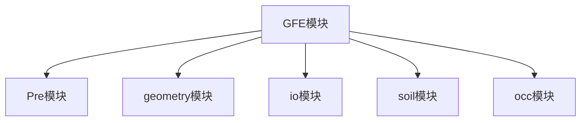

# 高性能有限元分析软件

# GFE

——命令流手册 v2024b


<details>
<summary>natural_image</summary>

Abstract 3D geometric illustration of interconnected city buildings and circuit lines (no text or symbols)
</details>

广州颖力科技有限公司

2025 年 08 月

# 目录

# 前言....1

# 第 1 章 命令模块总览....3

§ 1.1 总述.... 3  
§ 1.2 各模块介绍....3  
§ 1.3 命令流使用及模块导入.... 3

# 第 2 章 前处理（Pre）模块....5

§ 2.1 前处理模块介绍....5  
§ 2.2 文档模块（document）的函数介绍及应用示例....6

2.2.1 切换文档....6  
2.2.2 当前文档....6  
2.2.3 基于 ID 获得文档....6  
2.2.4 设置当前文档....7

# § 2.3 管理器介绍及应用示例....8

2.3.1 自动命名....8  
2.3.2 通用 add 函数....9  
2.3.3 几何管理器的 add 函数....9  
2.3.4 网格管理器的 add 函数....10  
2.3.5 查找对象....10  
2.3.6 基于 id 的几何查找.... 12  
2.3.7 基于 id 的网格查找.... 12  
2.3.8 编辑对象.... 13  
2.3.9 删除对象....13  
2.3.10 删除所有对象....14  
2.3.11 获取正常对象名称列表.... 14  
2.3.12 获取隐藏对象名称列表.... 14  
2.3.13 检查对象是否存在（正常）....15  
2.3.14 检查对象是否存在（隐藏）....15

2.3.15 检查对象是否存在（全部）....16  
2.3.16 激活/停用对象....16  
2.3.17 获取正常对象数量....17  
2.3.18 获取隐藏对象数量.... 17  
2.3.19 获取所有对象数量.... 17  
2.3.20 获取有效标签....18  
2.3.21 重命名对象....18  
2.3.22 err\_code 枚举....19  
2.3.23 status 类....20

# § 2.4 几何模块（geometry）的函数介绍及应用示例 ..... 20

2.4.1 几何管理器....20  
2.4.2 几何对象（geometry\_object）....21  
2.4.3 获取几何 id....21  
2.4.4 获取几何名称.... 21  
2.4.5 获取几何形状.... 22

# § 2.5 网格模块（mesh）的函数介绍及应用示例....22

2.5.1 网格管理器.... 22  
2.5.2 网格对象（mesh\_object）....23  
2.5.3 获取网格 id....23  
2.5.4 获取网格名称....24  
2.5.5 获取网格数据....24  
2.5.6 获取单元数据....25  
2.5.7 获取节点数据....25  
2.5.8 获取关联的几何 ..... 26  
2.5.9 查找最近节点.... 26  
2.5.10 查找最近单元....27  
2.5.11 查找边界框内节点....27  
2.5.12 查找边界框内单元....28

# § 2.6 材料模块（material）的函数介绍及应用示例....29

2.6.1 材料对象（material\_obj）....29  
2.6.2 密度（density\_obj）.... 29  
2.6.3 弹性（elastic\_obj）....30  
2.6.4 阻尼（Damping\_obj）....31  
2.6.5 塑性（elastic\_obj）....31  
2.6.6 超弹（hyperelastic\_obj）....32  
2.6.7 泡棉（hyperfoam\_obj）....36  
2.6.8 粘弹性（viscoelastic\_obj）....37  
2.6.9 摩尔库伦（mohr\_coulomb\_obj）....37  
2.6.10 用户材料（user\_obj）....38  
2.6.11 试验数据（test\_data\_obj）....39  
2.6.12 多孔体积模量（porous\_bulk\_moduli\_obj）....39  
2.6.13 膨胀（expansion\_obj）....40  
2.6.14 基床系数（bed\_coefficient\_obj）....40  
2.6.15 蠕变（creep\_obj）....41  
2.6.16 材料管理器....42

# § 2.7 集合模块（set）的函数介绍及应用示例....42

2.7.1 几何集合对象（gset）....42  
2.7.2 基础几何集合对象（gset\_basic）....42  
2.7.3 引用几何集合对象（gset\_ref）....44  
2.7.4 单元集合对象（elset）....46  
2.7.5 节点集合对象（nset）....46  
2.7.6 几何集合管理器（gset\_mgr）....46  
2.7.7 基于名称的几何集合查找……错误！未定义书签。  
2.7.8 添加几何集合（对象方式）……错误！未定义书签。  
2.7.9 添加几何集合（名称和形状方式）....10  
2.7.10 添加几何集合（名称和形状 ID 方式）....11  
2.7.11 编辑几何集合……错误！未定义书签。  
2.7.12 自动命名（几何集）……错误！未定义书签。

2.7.13 节点集合管理器（nset\_mgr）....47  
2.7.14 基于名称的节点集合查找……错误！未定义书签。  
2.7.15 添加节点集合（对象方式）……错误！未定义书签。  
2.7.16 编辑节点集合……错误！未定义书签。  
2.7.17 自动命名（节点集）……错误！未定义书签。  
2.7.18 单元集合管理器（elset\_mgr）....47

# § 2.8 表面集模块（surface）的函数介绍及应用示例....47

2.8.1 基础表面对象（surface）....47  
2.8.2 几何表面对象（geometry\_surface）....47  
2.8.3 单元表面对象（element\_surface）....48  
2.8.4 节点表面对象（node\_surface）....48  
2.8.5 获取表面管理器....49

# § 2.9 截面属性模块（section）的函数介绍及应用示例....49

2.9.1 实体截面（Solid Section）....49  
2.9.2 壳截面对象（property\_shell）....49  
2.9.3 梁截面对象（property\_beam）....50  
2.9.4 梁通用截面对象（property\_beam\_general）....51  
2.9.5 钢筋层对象（rebar\_layer）....52  
2.9.6 获取截面管理器....52  
2.9.7 梁截面形状参数对照表....52

# § 2.10 边界与荷载模块（boundary）的函数介绍及应用示例 …… 53

2.10.1 边界条件对象（boundary）....53  
2.10.2 边界条件类型说明....54  
2.10.3 自由度设置说明....56  
2.10.4 获取边界条件管理器....56

# § 2.11 初始条件（initial\_condition）的函数介绍及应用示例....57

2.11.1 基类属性（所有初始条件共有）....57  
2.11.2 初始应力 (Init\_Stress)....57  
2.11.3 速度初始条件（InitVelocity）....57

2.11.4 孔隙压力初始条件（InitPorePress）....58  
2.11.5 孔隙比初始条件（InitRatio）....58  
2.11.6 地应力初始条件（InitGeostaticStress）....58  
2.11.7 温度初始条件（InitTemperature）....59  
2.11.8 饱和度初始条件（InitSaturation）....59  
2.11.9 获取初始条件管理器....60

# § 2.12 幅值函数模块（amplitude）的函数介绍及应用示例....60

2.12.1 幅值函数对象（amplitude）....60  
2.12.2 幅值函数类型说明 ..... 61  
2.12.3 获取幅值函数管理器....61

# § 2.13 相互作用模块（interaction）的函数介绍及应用示例....61

2.13.1 表面对对象（surface\_pair）....61  
2.13.2 获取绑定管理器....62  
2.13.3 接触对象（contact）....62  
2.13.4 获取接触管理器....63  
2.13.5 刚体对象（rigid\_body）....63  
2.13.6 获取刚体管理器....63  
2.13.7 嵌入对象（embed）....64  
2.13.8 嵌入管理器....64  
2.13.9 多点约束对象（mpc）....65  
2.13.10 获取 MPC 管理器....65  
2.13.11 冲击波对象....65  
2.13.12 获取冲击波管理器....66  
2.13.13 冲击波属性对象....66  
2.13.14 获取冲击波属性对象管理器....67  
2.13.15 弹簧阻尼器对象....67  
2.13.16 获取弹簧阻尼器管理器....68  
2.13.17 连接器行为对象....68  
2.13.18 连接器弹性行为对象....69

2.13.19 连接器塑性行为对象....69  
2.13.20 连接器阻尼行为对象....70  
2.13.21 获取连接器行为管理器....70  
2.13.22 连接器属性对象....70  
2.13.23 获取连接器属性管理器....71  
2.13.24 特殊相互作用对象....71  
2.13.25 特殊相互作用管理器....72

# § 2.14 分析步模块（step）的函数介绍及应用示例....72

2.14.1 静态通用分析步对象....72  
2.14.2 模态分析步对象....73  
2.14.3 显式动力分析步对象....73  
2.14.4 隐式动力分析步对象....74  
2.14.5 地应力分析步对象....74  
2.14.6 模态动力学分析步对象....75  
2.14.7 频响分析步对象....76  
2.14.8 土分析步对象....76  
2.14.9 SPH 分析步对象....77  
2.14.10 全局阻尼对象....79  
2.14.11 质量缩放对象....80  
2.14.12 模态阻尼对象....80  
2.14.13 动态模态阻尼对象....81  
2.14.14 获取连接器属性管理器....81

# § 2.15 输出模块（output）的函数介绍及应用示例....82

2.15.1 场输出请求对象....82  
2.15.2 节点输出对象....83  
2.15.3 单元输出对象....83  
2.15.4 能量输出对象....84  
2.15.5 接触输出对象....84  
2.15.6 获取场输出管理器....85

2.15.7 查找所有场输出请求....85

§ 2.16 一维土层模块（soil）的函数介绍及应用示例....86

2.16.1 一维土层对象....86  
2.16.2 获取土层管理器....86

§ 2.17 场地地震反应（vibload）的函数介绍及应用示例....87

2.17.1 场地地震反应对象（目前只有时程分析，不调幅）....87  
2.17.2 获取场地地震反应管理器....88

§ 2.18 流体动力（SPH）的函数介绍及应用示例....88

2.18.1 SPH 对象....88  
2.18.2 获取 SPH 管理器....89

§ 2.19 坐标系（orientation）的函数介绍及应用示例 ..... 90

2.19.1 坐标系对象....90  
2.19.2 获取坐标系管理器....90

§ 2.20 人工边界（art\_bc）的函数介绍及应用示例....90

2.20.1 人工边界对象....90  
2.20.2 获取人工边界管理器....91

§ 2.21 工况（case）的函数介绍及应用示例....91

2.21.1 工况对象....91  
2.21.2 获取工况管理器....92

第 3 章 几何（Geometry）模块.... 93

§ 3.1 几何模块介绍.... 93  
§ 3.2 接触（contact\_pair）模块函数介绍....93

3.2.1 搜索接触面....93  
3.2.2 搜索接触面....94

§ 3.3 几何体构建器（GeoPrim）模块....94

3.3.1 获取几何体构建器....94  
3.3.2 撤销操作....95  
3.3.3 重做操作....95  
3.3.4 平移操作....95

3.3.5 旋转操作....96  
3.3.6 缩放操作....97  
3.3.7 合并操作....97  
3.3.8 求交操作....98  
3.3.9 求交操作.... 98  
3.3.10 拉伸操作....99  
3.3.11 矩形阵列....99  
3.3.12 圆形阵列....100

# § 3.4 几何工具模块（geotool）模块.... 100

3.4.1 质心计算.... 100  
3.4.2 获取所有子几何体....101  
3.4.3 获取指定类型的子几何体....101  
3.4.4 创建复合几何体....102  
3.4.5 获取几何体包围盒范围....103  
3.4.6 获取几何体包围盒.... 103  
3.4.7 判断几何体是否在包围盒内....104  
3.4.8 网格复制....104  
3.4.9 生成面....105  
3.4.10 几何修复....105  
3.4.11 创建多段线....106  
3.4.12 施工助手函数....106  
3.4.13 隧道建模....109  
3.4.14 获取选中形状....111  
3.4.15 获取选中形状 ID....112  
3.4.16 根据 ID 获取形状.... 113  
3.4.17 构建非均匀土层....114

# § 3.5 网格生成模块（mesh\_generator）模块....115

3.5.1 控制器 controller....117

# 第 4 章 土体建立（Soli）模块....145

§ 4.1 土体建立（Soli）模块介绍....145  
§ 4.2 模块导入.... 145  
§ 4.3 盒子构建器（box\_builder）....145  
§ 4.4 数据构建器（data\_builder）.... 146

# 第 5 章 文件导入导出（IO）模块....148

§ 5.1 文件导入导出（IO）模块介绍....148  
§ 5.2 模块导入.... 148  
§ 5.3 获取 IO 实例....148  
§ 5.4 IO 实例方法....148

5.4.1 导入 YJK....148  
5.4.2 打开 INP 文件....149  
5.4.3 打开 pre 文件....149  
5.4.4 导入 DWG 文件....150  
5.4.5 导出材料....151  
5.4.6 导入材料.... 151

§ 5.5 INP 写入器....151  
5.5.1 创建 INP 写入器....152  
5.5.2 设置分析工况....152  
5.5.3 设置列车荷载导出....152  
5.5.4 执行导出....153

# 第 6 章 OCC 模块....154

§ 6.1 OCC 模块介绍....154  
§ 6.2 模块导入.... 154  
§ 6.3 基础几何创建.... 154

6.3.1 创建立方体....154  
6.3.2 通过两点创建立方体....154  
6.3.3 创建圆锥体....155  
6.3.4 创建圆柱体....155  
6.3.5 创建球体....156

6.3.6 创建楔形体....156  
6.3.7 创建圆环体....156

# 第 7 章 命令流应用示例.... 158

§ 7.1 导入 YJK 进行恒荷载计算....158  
§ 7.2 隧道开挖监测....169

# 修订记录....181

# 前言

工业软件是现代产业体系之“魂”，是工业强国之重器。习近平总书记于2021年5月28日在两院院士大会和中国科协代表大会上发表重要讲话《加快建设科技强国，实现高水平科技自立自强》，指出：“科技攻关要坚持问题导向，奔着最紧急、最紧迫的问题去。要从国家急迫需要和长远需求出发，在石油天然气、基础原材料、高端芯片、工业软件、农作物种子、科学试验用仪器设备、化学制剂等方面关键核心技术上全力攻坚。”。实现工业软件特别是CAE软件的国产替代，解决卡脖子问题，是国家的重大战略需求之一。

以土木工程应用为主要场景,广州颖力科技有限公司自主研发了高性能有限元分析软件 GFE。该软件由有限元求解器模块和前后处理模块组成,并可与北京盈建科软件股份有限公司的 YJK 软件无缝对接进行结构前后处理。GFE 软件的优势与功能特色如下:

（1）“准”一集成了先进的土-结构动力相互作用分析模型与方法，保证计算结果准确。软件的各类单元、本构模型、相互作用条件、求解算法等对标国际主流通用有限元软件；软件集成了动力人工边界条件、场地地震反应分析、地震动输入等土-结构相互作用分析方法；软件集成了我国地下结构抗震设计规范要求的各类分析方法，包括二维和三维以及线性和非线性时程分析方法、以及反应加速度法和反应位移法等。  
（2）“快”一采用了多 GPU 并行计算的显式动力求解和编程架构，保证计算过程快速。软件采用 CPU+GPU 异构并行计算的显式动力分析技术，其计算速度是多 CPU 并行计算速度的 10 倍以上。  
（3）“简”—简化了土与结构一体化建模，可进行构件设计并生成计算书，操作简便。可将 YJK 软件建立的结构模型导入 GFE 软件，之后在 GFE 软件内简单完成土-结构系统建模；GFE 计算得到的结构结果可以导入 YJK 软件，之后在 YJK 软件内完成效应组合、截面验算、配筋、生成计算书等；GFE 软件也支

持导入其他有限元软件的计算模型。

本手册为 GFE 软件的前后处理操作手册，分为前处理和后处理两章。第一章前处理包括：界面与操作、模型导入与导出、建立几何模型、建立有限元模型、求解设置、集合和显示等常用工具。第二章后处理包括：界面与操作、显示、云图与动画、过滤器与切割、拾取与其他、地下结构结果。

# 第 1 章 命令模块总览

# § 1.1 总述

GFE 中命令流是 GFE 软件中十分实用的模块。该模块提供了大量的 python 代码接口。用户可以使用这些代码接口进行个性化的快速、自动化、批量的建模。使用场景可以为：仅设置参数不同的前处理建模流程，如批量建立材料、批量建立截面属性；用于重复的建模流程，如仅部分参数不同的同一模型的建模。命令流模块顶层的 python 模块命名为 GFE。GFE 模块之下有 Pre 模块、geometry 模块、io 模块、soil 以及 occ 模块。各模块之前还有更为细分的子模块。整体的模块组成如图 1.1-1 所示。


<details>
<summary>flowchart</summary>


</details>

图 1.1-1 GFE 命令流模块

# § 1.2 各模块介绍

Pre 模块为命令流模块中最核心的模块。其包含 document、geometry、mesh、material、set、section、step、boundary、interaction、amplitude、surface、output、vibration、artbc、soil、case、orientation、initial\_condition、field、sph。Pre 模块的子模块基本为 GFE 前处理界面树形菜单栏下的所有子项，可以完成大量的建模工作。

Geometry 模块的子模块有 ContactPair 模块、geoprim 模块、geotool、mesh\_generator 模块。Geometry 模块功能为搜索接触、布尔运算、几何运算以及网格的划分。

Soli 模块负责土体的建立。

IO 模块的子模块有 inpio 模块。模块负责文件的导入以及导出。

OCC 模块的子模块有 brep\_prim。该模块负责简单几何体的建立。

# § 1.3 命令流使用及模块导入

命令流的使用需要用户按照一定的格式在 GFE 预先设定好的输入框内进行

python 代码的输入。命令流输入框位于 GFE 软件前处理界面的右侧。右侧输入框的下面位置有 “Output” 以及 “python” 这两个按钮。点击 “python” 按钮将输入框切换为命令流的输入框，如图 1.3-1 所示。


<details>
<summary>text_image</summary>

GFE ProPcs
模型
Model-1
几何网格
集合
桌面
结构
桌面属性
空间分布
边界条件与网格
初始条件
工具
图形内容
目标系
键盘导航
输出输出单元
历史窗口单元
地图导航应用
人工边界
一维土图
界面动力
点击该按钮，转到命令流输入窗口
输出 Python
</details>

图 1.3-1 GFE 命令流

使用 GFE 命令流之前需要先导入各个模块，示例如下：

import GFE

from GFE import \*

该样例是导入 GFE 主模块，为使用命令流代码的必要模块。导入子模块示例如下：

```python
from GFE.Pre import *
from GFE.occ import *
```

上述代码导入了 GFE 模块的子模块 Pre 以及 occ（大小写敏感）。

# 第 2 章 前处理（Pre）模块

# § 2.1 前处理模块介绍

Pre 模块为命令流模块中最核心的模块。其包含 document、geometry、mesh、material、set、section、step、boundary、interaction、amplitude、surface、output、vibration、artbc、soil、case、orientation、initial\_condition、field、sph。Pre 模块的子模块基本为 GFE 前处理界面树形菜单栏下的所有子项，可以完成大量的建模工作。

document 模块负责获取几何管理器、获取和设置当前打开的模型。该模块使用的频次不高。

geometry 模块负责管理几何，包含添加、删除、查找几何，获取几何的 ID 名字以及各个组成部分。

mesh 模块负责获取网格管理器、查找、添加、删除网格。同时，能通过 mesh 模块获取网格的信息。

material 模块负责材料的创建、查找和添加。

set 模块负责集合的创建、查找和删除，同时也可以获得各个组合成该集合的成员。

boundary 模块负责边界的创建、查找和删除、获取一个不冲突的名称。

interaction 模块目前支持绑定约束、刚体、嵌入区域、约束/耦合、冲击波、冲击波属性、特殊相互作用、面面接触、弹簧、连接器、连接器行为的创建、编辑以及删除。

amplitude 模块支持幅值函数的创建、查找和删除。

surface 模块负责前处理表面集的编辑、创建以及删除。

output 模块负责输出的编辑、创建以及删除。

vibration 模块负责场地地震反应的编辑、创建以及删除。

artbc 模块负责人工边界的编辑、创建以及删除。

soil 模块负责一维土层的编辑、创建以及删除。

case 模块负责工况的编辑、创建以及删除。

initial\_condition 模块负责初始条件的编辑、创建以及删除。

field 模块负责场输出的编辑、创建以及删除。

sph 负责流体动力的编辑、创建以及删除。

# § 2.2 文档模块（document）的函数介绍及应用示例

# 2.2.1 切换文档

函数：set\_application\_by\_ui()

函数功能：从界面上切换文档时，会自动调用该函数。

参数：无需参数。

返回值：无。

使用示例：自动调用

# 2.2.2 当前文档

函数: current\_document()

函数功能：获得当前处于活动状态的文档。

参数：无需参数。

返回值:

document object: 文档对象

使用示例:

```python
import GFE
from GFE import *
from GFE.Pre import *
current_doc = GFE.Pre.document.current_document()
print(current_doc)

以上代码输出
<GFE.Pre.document.document object at 0x0000028E4CCA3F30>
```

# 2.2.3 基于 ID 获得文档

函数：get\_document(index)

函数功能：获得文档。

参数:

index：整数，一个小于当前文档数的数字，第一个文档对应0；若传入一

个大于当前文档数的数字，则会获得最后一个文档对象。

返回值:

document object: 文档对象

使用示例:

```python
import GFE
from GFE import *
from GFE.Pre import *
Doc0 = GFE.Pre.document.get_document(0)
print(Doc0)
Doc1 = GFE.Pre.document.get_document(1)
print(Doc1)
Doc2 = GFE.Pre.document.get_document(2)
print(Doc2)
以上代码输出
<GFE.Pre.document.document object at 0x0000028E4E20FE30>
<GFE.Pre.document.document object at 0x0000028E4CCA3F30>
<GFE.Pre.document.document object at 0x0000028E4CCA3F30>
测试案例只有两个文档对象（两个模型），所以输出的2，3行是一样的地址，都是取到最后一个文档对象。
```

# 2.2.4 设置当前文档

函数：set\_current(document\_object)

函数功能：获得当前文档。

参数:

document\_object: 文档对象。

返回值:

bool: 设置成功返回 True，失败返回 False

使用示例:

```txt
import GFE
```

```python
from GFE import *
from GFE.Pre import *
Doc1 = GFE.Pre.document.get_document(1)
print(GFE.Pre.document.set_current(Doc1))
以上代码输出
True
测试案例只有两个文档对象（两个模型）。
```

# § 2.3 管理器介绍及应用示例

每一个前处理模块都会有一个对应的管理器（单例类）进行管理。对该模块中的对象的增删查改需要通过管理器进行。本小节介绍所有管理器的基类以及其所拥有的函数。各个模块的管理器的获取具有独有的函数需要查看相应模块的介绍。

# 2.3.1 自动命名

函数: auto\_name(prefix, has0=False)

函数功能：根据前缀自动生成唯一的对象名称。

参数:

prefix: 字符串，名称前缀。

has0: 布尔型（可选），是否在名称中包含数字 0。默认：False。

返回值：字符串，自动生成的唯一名称。

使用示例:

```python
from GFE.Pre.geometry import geo_mgr
# 自动生成几何对象名称
name1 = geo_mgr().auto_name("Box")
print(name1)  # 输出: Box-1

name2 = geo_mgr().auto_name("Box")
print(name2)  # 输出: Box-2
```

```python
# 使用 has0 参数
name3 = geo_mgr().auto_name("Part", has0=True)
print(name3)  # 可能输出: Part-0
```

# 2.3.2 通用 add 函数

函数: add(obj, inner=False, auto\_name=False)

函数功能：向管理器中添加新对象。

参数:

obj: 对象指针或 shared\_ptr，要添加的对象实例。

inner: 布尔型（可选），是否为内部对象。默认：False。

auto\_name: 布尔型（可选），是否自动生成名称。默认：False。

返回值：通常返回创建的对象或操作状态。

使用示例:

```python
# 创建对象
my_gset = GFE.Pre.set.gset_basic()
my_gset.name = "MySet"
# 添加对象
GFE.Pre.set.gset_mgr().add(my_gset)
# 使用自动命名
GFE.Pre.set.gset_mgr().add(my_gset, auto_name=True)
```

# 2.3.3 几何管理器的 add 函数

函数: add(obj)

函数功能：添加几何对象。

参数:

obj: TopoDS\_Shape 或 Geometry 对象。

返回值: Geometry 对象。

使用示例:

```python
from GFE.Pre.geometry import geo_mgr
from GFE.geometry import geotool
```

```txt
# 创建形状
shape = geotool.create_segment([...])
# 添加几何对象
geo = geo_mgr().add(shape, "MyGeo")
```

# 2.3.4 网格管理器的 add 函数

函数: add(name, data)

函数功能：添加网格对象。

参数:

name: 字符串，网格名称。

data: shared\_ptr<Gfe\_MeshData>, 网格数据对象。

返回值: MeshObj 对象。

使用示例:

```python
from GFE.Pre.mesh import mesh_mgr
# 创建网格数据
data = GFE.Pre.mesh.mesh_data(centre=[0, 0, 0], dimension=[10, 10, 10])
# 添加网格
mesh = GFE.Pre.mesh.mesh_mgr().add("Mesh-1", data)
# 添加参考节点
ref_node = mesh_mgr().add()  # 无参数版本
```

# 2.3.5 添加几何集合（名称和形状方式）

函数: gset\_mgr().add(name, shapes, hidden=False, auto\_name=False)

函数功能：通过名称和形状列表添加几何集合。

参数:

name: 字符串，集合名称。

shapes: 形状列表，TopoDS\_Shape 对象列表。

hidden: 布尔值，是否隐藏，默认为 False。

auto\_name: 布尔值，是否自动命名，默认为 False。

返回值:

status: 操作状态

使用示例:  
```txt
GSetMgr = GFE.Pre.set.gset_mgr()
Geo_object = GeoMgr.find('Box-1')
obj = GFE.Pre.set.gset_basic('Set-1')
GSetMgr.add('Set-1',[Geo_object.shape()])
```

# 2.3.6 添加几何集合（名称和形状 ID 方式）

函数: gset\_mgr().add(name, shapes\_id, hidden=False, auto\_name=False)

函数功能：通过名称和形状 ID 列表添加几何集合。

参数:

name: 字符串，集合名称。

shapes\_id: 形状 ID 列表，包含[父 ID, 类型, 自身 ID]的数组列表。

hidden: 布尔值，是否隐藏，默认为 False。

auto\_name: 布尔值，是否自动命名，默认为 False。

返回值:

status: 操作状态

使用示例:

```python
obj = GFE.Pre.set.gset_basic('Set-1')
GSetMgr.add('Set-1',[[1,2,1]])
```

示例中:

Box-1 的 id 是 1，实体属性是 2，有一个实体在实体内的 id 是 1。

# 2.3.7 查找对象

函数: find(name)

函数功能：按名称查找对象。

参数:

name: 字符串，对象名称。

返回值：对象指针或 shared\_ptr，如果未找到则返回 None。

使用示例:

```python
from GFE.Pre.geometry import gset_mgr
# 查找对象
found_gset = gset_mgr().find("MySet")
if found_gset:
    print(f"找到对象: {found_gset.name}")
else:
    print("对象不存在")使用示例
```

# 2.3.8 基于 id 的几何查找

函数：geo\_mgr().find(id)

函数功能：删除一个几何。

参数:

id:整形数值，查询几何的 id。

返回值:

geometry\_object:几何对象

使用示例:

```python
findgeometry = mgr.find(4)
print(findgeometry.name)
```

以上代码输出:

Box，该例子中有 3 个已经存在的几何，之前创建并删除了一个几何，故现在第三个几何编号为 4，名称为 Box。

# 2.3.9 基于 id 的网格查找

函数：geo\_mgr().find(id)

函数功能：删除一个网格。

参数:

id:整形数值，查询网格的 id。

返回值:

mesh\_object:网格对象

使用示例:

```python
findmesh = MeshMgr .find(1)
print(findmesh)

以上代码输出:
<GFE.Pre.mesh.mesh_obj object at 0x000001C64AE37D70>
找到 id 为 1 的网格对象
```

# 2.3.10 编辑对象

函数: edit(obj)

函数功能：编辑已存在的对象。

参数:

obj: 对象指针或 shared\_ptr，要编辑的对象（必须已存在且已修改）。

返回值：通常返回操作状态或 void。

使用示例:

```python
from GFE.Pre.geometry import gset_mgr
# 查找对象
my_gset = gset_mgr().find("MySet")
if my_gset:
    # 修改对象属性
    my_gset.name = "NewName"
    my_gset.data = [...]
    # 保存修改
    gset_mgr().edit(my_gset)
```

# 2.3.11 删除对象

函数: delete(name\_list)

函数功能：删除指定的对象列表。

参数:

name\_list: 列表，要删除的对象名称列表。

返回值：无返回值。

使用示例:

```python
from GFE.Pre.geometry import geo_mgr
# 删除单个对象
geo_mgr().delete(["Box-1"])
# 删除多个对象
geo_mgr().delete(["Box-1", "Box-2", "Box-3"])
```

# 2.3.12 删除所有对象

函数: delete\_all()

函数功能：删除当前管理器中的所有对象。

参数：无参数。

返回值：无返回值。

使用示例:

```python
from GFE.Pre.geometry import geo_mgr
# 删除所有几何对象
geo_mgr().delete_all()
```

# 2.3.13 获取正常对象名称列表

函数: name\_list()

函数功能：获取所有正常（非隐藏）对象的名称列表。

参数：无参数。

返回值：列表，包含所有正常对象的名称字符串。

使用示例:

```python
from GFE.Pre.geometry import geo_mgr
# 获取所有几何对象名称
names = geo_mgr().name_list()
print(f"共有 {len(names)} 个几何对象")
for name in names:
    print(name)
```

# 2.3.14 获取隐藏对象名称列表

函数: name\_hidden()

函数功能：获取所有隐藏对象的名称列表。

参数：无参数。

返回值：列表，包含所有隐藏对象的名称字符串。

使用示例:

```python
from GFE.Pre.geometry import geo_mgr
# 获取所有隐藏的几何对象名称
hidden_names = geo_mgr().name_hidden()
print(f"共有 {len(hidden_names)} 个隐藏对象")
```

# 2.3.15 检查对象是否存在（正常）

函数: contains(name)

函数功能：检查指定名称的对象是否在正常对象列表中存在。

参数:

name: 字符串，要检查的对象名称。

返回值：布尔型，True 表示对象存在，False 表示不存在。

使用示例:

```python
from GFE.Pre.geometry import geo_mgr
# 检查对象是否存在
if geo_mgr().contains("Box-1"):
    print("Box-1 存在")
else:
    print("Box-1 不存在")
```

# 2.3.16 检查对象是否存在（隐藏）

函数: contains\_hidden(name)

函数功能：检查指定名称的对象是否在隐藏对象列表中存在。

参数:

name: 字符串，要检查的对象名称。

返回值：布尔型，True 表示对象存在且为隐藏状态，False 表示不存在或不是隐藏状态。

使用示例:

```python
from GFE.Pre.geometry import geo_mgr
# 检查对象是否为隐藏状态
if geo_mgr().contains_hidden("Box-1"):
    print("Box-1 是隐藏对象")
```

# 2.3.17 检查对象是否存在（全部）

函数: contains\_all(name)

函数功能：检查指定名称的对象是否存在（包括正常和隐藏对象）。

参数:

name: 字符串，要检查的对象名称。

返回值：布尔型，True 表示对象存在（无论是否隐藏），False 表示不存在。

使用示例:

```python
from GFE.Pre.geometry import geo_mgr
# 检查对象是否存在（包括隐藏的）
if geo_mgr().contains_all("Box-1"):
    print("Box-1 存在（可能是隐藏的）")
```

# 2.3.18 激活/停用对象

函数: activate(name, state)

函数功能：设置对象的激活状态。激活的对象在分析中会被使用，停用的对象会被忽略。

参数:

name: 字符串，对象名称。

state: 布尔型，True 表示激活，False 表示停用。

返回值：无返回值。

使用示例:

```python
from GFE.Pre.geometry import geo_mgr
# 激活对象
geo_mgr().activate("Box-1", True)
```

```julia
# 停用对象
geo_mgr().activate("Box-1", False)
```

# 2.3.19 获取正常对象数量

函数: count()

函数功能：获取正常（非隐藏）对象的数量。

参数：无参数。

返回值：整数，正常对象的数量。

使用示例:

```python
from GFE.Pre.geometry import geo_mgr
# 获取几何对象数量
num = geo_mgr().count()
print(f"共有 {num} 个几何对象")
```

# 2.3.20 获取隐藏对象数量

函数: count\_hidden()

函数功能：获取隐藏对象的数量。

参数：无参数。

返回值：整数，隐藏对象的数量。

使用示例:

```python
from GFE.Pre.geometry import geo_mgr
# 获取隐藏的几何对象数量
hidden_num = geo_mgr().count_hidden()
print(f"共有 {hidden_num} 个隐藏对象")
```

# 2.3.21 获取所有对象数量

函数: count\_all()

函数功能：获取所有对象（包括正常和隐藏）的数量。

参数：无参数。

返回值：整数，所有对象的数量。

使用示例:  
```python
from GFE.Pre.geometry import geo_mgr
# 获取所有几何对象数量（包括隐藏的）
total_num = geo_mgr().count_all()
print(f"共有 {total_num} 个对象（包括隐藏的）")
```

# 2.3.22 获取有效标签

函数: valid\_tag()

函数功能：获取有效的标签列表。标签用于标识对象的类型或分类。

参数：无参数。

返回值：列表，包含有效标签的字符串列表。

使用示例:

```python
from GFE.Pre.geometry import geo_mgr
# 获取有效标签
tags = geo_mgr().valid_tag()
print(f"有效标签: {tags}")
```

# 2.3.23 重命名对象

函数: rename(old\_name, new\_name)

函数功能：重命名对象。

参数:

old\_name: 字符串，原对象名称。

new\_name: 字符串，新对象名称。

返回值: err\_code 枚举值, 表示操作结果:

```yaml
- err_code.SUCCESS: 成功
- err_code.NAME_REPEATED: 名称重复
- err_code.NAME_ILLEGAL: 名称非法
- err_code.CHILD_NOT_EXIST: 子对象不存在
- err_code.MISS_REFERENCE: 缺少引用
- err_code.UNDEFINED: 未定义错误使用示例:
```

```python
from GFE.Pre.geometry import geo_mgr
# 重命名对象
result = geo_mgr().rename("Box-1", "MyBox")
if result == geo_mgr().err_code.SUCCESS:
    print("重命名成功")
elif result == geo_mgr().err_code.NAME_REPEATED:
    print("新名称已存在")
elif result == geo_mgr().err_code.NAME_ILLEGAL:
    print("新名称非法")
```

# 2.3.24 err\_code 枚举

err\_code 枚举定义了操作返回的错误代码。

枚举值:

UNDEFINED: 未定义错误

SUCCESS: 操作成功

NAME\_REPEATED: 名称重复

NAME\_ILLEGAL: 名称非法

CHILD\_NOT\_EXIST: 子对象不存在

MISS\_REFERENCE: 缺少引用

使用示例:

```python
from GFE.Pre.geometry import geo_mgr
# 检查操作结果
result = geo_mgr().rename("OldName", "NewName")
if result == geo_mgr().err_code.SUCCESS:
    print("操作成功")
elif result == geo_mgr().err_code.NAME_REPEATED:
    print("名称重复")
else:
    print("其他错误")
```

# 2.3.25 status 类

status 类用于表示操作的详细状态信息。

属性:

CODE: err\_code 枚举值，错误代码。

MESSAGE: 字符串，错误消息。

使用示例:

```python
from GFE.Pre.geometry import geo_mgr
# 创建状态对象（通常由管理器内部使用）
# status = geo_mgr().some_operation_that_returns_status()
# if status.CODE == geo_mgr().err_code.SUCCESS:
#     print(f"成功: {status.MESSAGE}")
# else:
#     print(f"失败: {status.MESSAGE}")
```

# § 2.4 几何模块（geometry）的函数介绍及应用示例

# 2.4.1 几何管理器

该函数为模块的核心函数，几乎所有属于该子模块的函数都需要基于这个函数获得的几何管理进行使用。

函数: geo\_mgr()

函数功能：获得几何管理器。

参数：无参数。

返回值:

geo\_mgr: 唯一的几何管理器。(单例类)

使用示例:

```python
import GFE
from GFE import *
from GFE.Pre import *
GeoMgr = GFE.Pre.geometry.geo_mgr()
print(GeoMgr)
```

以上代码输出

```txt
<GFE.Pre.geometry.manager object at 0x0000028E4E1F2430>
```

# 2.4.2 几何对象（geometry\_object）

该类为几何管理器管理的基本类，可以获得几何基础属性。

属性:

id: 整数，该几何的 id。

name: 字符串，几何的名字。

shape: 形状信息，包含该几何所有形状信息。

# 2.4.3 获取几何 id

函数: geometry\_object.id()

函数功能：获得该几何的 id。

参数：无参数

返回值:

id: 整数，该几何的 id。

使用示例:

```lua
findgeometry = mgr.find('Box')
print(findgeometry.id())
```

以上代码输出:

4，该例子中有 3 个已经存在的几何，之前创建并删除了一个几何，故现在第三个几何编号为 4，名称为 Box。

# 2.4.4 获取几何名称

函数：geometry\_object.name()

函数功能：获得该几何的 name。

参数：无参数

返回值:

name: 字符串，该几何的名称。

使用示例:

```python
findgeometry = mgr.find('Box')
print(findgeometry.name())
```

以上代码输出:
Box

# 2.4.5 获取几何形状

函数：geometry\_object.shape()

函数功能：获得该几何的形状。

参数：无参数

返回值:

Shape: 形状，该几何包含的所有形状。

使用示例:

```txt
findgeometry = mgr.find('Box')
print(findgeometry.shape())

以上代码输出:
<GFE.occ.shape object at 0x0000029BC96151F0>
```

# § 2.5 网格模块（mesh）的函数介绍及应用示例

# 2.5.1 网格管理器

该函数为模块的核心函数，几乎所有属于该子模块的函数都需要基于这个函数获得的网格管理器进行使用。

函数: mesh\_mgr()

函数功能：获得网格管理器。

参数：无参数。

返回值:

mesh\_mgr: 唯一的网格管理器。(单例类)

使用示例:

```python
import GFE
from GFE import *
from GFE.Pre import *
MeshMgr = GFE.Pre.mesh.mesh_mgr()
print(MeshMgr)

以上代码输出
<GFE.Pre.mesh.manager object at 0x000001ED863350F0>
```

# 2.5.2 网格对象（mesh\_object）

该类为网格管理器管理的基本类，可以获得网格基础属性。

属性:

id: 整数，该网格的 id。

name: 字符串，网格的名字。

geo\_obj: 几何信息，包含该网格关联的几何。

mesh: 网格数据，该网格的网格数据。

node\_data: 节点数据，该网格的节点数据，已排序。

element\_data: 单元数据，该网格的单元数据，已排序。

max\_node\_lable: 最大节点标签，该网格中最大的节点标签。

# 2.5.3 获取网格 id

函数: mesh\_object.id()

函数功能：获得该网格的 id。

参数：无参数

返回值:

id: 整数，该网格的 id。

使用示例:

```txt
MeshMgr = GFE.Pre.mesh.mesh_mgr()
findmesh = MeshMgr .find('Box-1')
print(findmesh.id())
```

以上代码输出:

1

# 2.5.4 获取网格名称

函数：mesh\_object.name()

函数功能：获得该网格的 name。

参数：无参数

返回值:

name: 字符串，该网格的名称。

使用示例:

```python
MeshMgr = GFE.Pre.mesh.mesh_mgr()
findmesh = MeshMgr .find('Box-1')
print(findmesh.name())

以上代码输出:
Box-1
```

# 2.5.5 获取网格数据

函数：mesh\_object.mesh()

函数功能：获得该网格的网格数据。

参数：无参数

返回值:

mesh\_data: mesh\_data，网格数据。

使用示例:

```python
MeshMgr = GFE.Pre.mesh.mesh_mgr()
findmesh = MeshMgr .find('Box-1')
print(findmesh.mesh())
以上代码输出:
```

```txt
<GFE.Pre.mesh.mesh_data object at 0x000001F95F699C70>
```

# 2.5.6 获取单元数据

函数：mesh\_object.element\_data()

函数功能：获得该网格的单元数据。

参数：无参数

返回值:

mesh\_data: mesh\_data, 单元数据。

使用示例:

```txt
MeshMgr = GFE.Pre.mesh.mesh_mgr()
findmesh = MeshMgr .find('Box-1')
print(findmesh.element_data())

以上代码输出:
<GFE.Pre.mesh.mesh_data object at 0x000001F95F699C70>
```

# 2.5.7 获取节点数据

函数：mesh\_object.node\_data()

函数功能：获得该网格的节点数据。

参数：无参数

返回值：[[nodeidlist],[node coordinate list]]

nodeidlist:节点的 id 的列表。

node coordinate list: 节点的坐标的列表。

使用示例:

```python
MeshMgr = GFE.Pre.mesh.mesh_mgr()
findmesh = MeshMgr .find('Box-1')
node_data = findmesh.node_data()
print(node_data)

以上代码输出:
```

```txt
([1, 2, 3, 4, 5, 6, 7, 8], [[0.0, 0.0, 1.0], [0.0, 0.0, 0.0], [0.0, 1.0, 1.0], [0.0, 1.0, 0.0],
[1.0, 0.0, 1.0], [1.0, 0.0, 0.0], [1.0, 1.0, 1.0], [1.0, 1.0, 0.0]])]
该网格为一个立方体几何的 C3D4 网格。前面显示节点号，后面是节点坐标。
```

# 2.5.8 获取关联的几何

函数：mesh\_object.geo\_obj()

函数功能：获得该网格关联的几何。

参数：无参数

返回值:

geometry\_object:几何对象，该网格关联的几何对象。

使用示例:

```txt
MeshMgr = GFE.Pre.mesh.mesh_mgr()
findmesh = MeshMgr .find('Box-1')
print(findmesh.geo_obj())
以上代码输出:
<GFE.Pre.geometry.object object at 0x000001F95F699D70>
```

# 2.5.9 查找最近节点

函数： find\_near\_node(centre, distance=1e-7)

函数功能：查找距离给定中心点最近的节点，在指定距离范围内。

参数:

centre: Vec3D 或列表 [x, y, z]，中心点坐标。

distance: 浮点数（可选），搜索距离范围。默认：1e-7。

返回值： node 对象，找到的最近节点（只读副本）。如果未找到，返回空节点对象。

使用示例:

```txt
# 假设已有 mesh_data 对象
# mesh = mesh_data(...)
# 查找距离点 (10.0, 20.0, 30.0) 最近的节点，搜索范围 0.1
```

```python
centre = [10.0, 20.0, 30.0]
found_node = mesh.find_near_node(centre, distance=0.1)
if found_node.nid > 0:
    print(f"找到节点 ID: {found_node.nid}, 坐标: {found_node.xyz}")
else:
    print("未找到节点")
```

# 2.5.10 查找最近单元

函数： find\_near\_element(centre, distance=1e-7)

函数功能：查找距离给定中心点最近的单元，在指定距离范围内。

参数:

centre: Vec3D 或列表 [x, y, z]，中心点坐标。

distance: 浮点数（可选），搜索距离范围。默认：1e-7。

返回值: element 对象, 找到的最近单元 (只读副本)。如果未找到, 返回空单元对象。

使用示例:

```python
# 假设已有 mesh_data 对象
# mesh = mesh_data(...)
# 查找距离点 (5.0, 10.0, 15.0) 最近的单元, 搜索范围 0.5
centre = [5.0, 10.0, 15.0]
found_element = mesh.find_near_element(centre, distance=0.5)
if found_element.eid > 0:
    print(f" 找到单元 ID: {found_element.eid}, 节点数 :
{found_element.node_size}")
    print(f"节点列表: {found_element.nodes}")
else:
    print("未找到单元")
```

# 2.5.11 查找边界框内节点

函数: find\_node\_inside(lower, upper)

函数功能：查找位于指定边界框内的所有节点。边界框由下角点和上角点

定义。

参数:

lower: Vec3D 或列表 [x, y, z]，边界框的下角点坐标（最小坐标）。

upper: Vec3D 或列表 [x, y, z]，边界框的上角点坐标（最大坐标）。

返回值：列表，包含所有位于边界框内的节点对象（只读副本）。

使用示例:

```python
# 假设已有 mesh_data 对象
# mesh = mesh_data(...)
# 定义边界框: 从 (0, 0, 0) 到 (10, 10, 10)
lower = [0.0, 0.0, 0.0]
upper = [10.0, 10.0, 10.0]
# 查找边界框内的所有节点
nodes_inside = mesh.find_node_inside(lower, upper)
print(f"找到 {len(nodes_inside)} 个节点在边界框内")
for node in nodes_inside:
    print(f"节点 ID: {node.nid}, 坐标: {node.xyz}")
```

# 2.5.12 查找边界框内单元

函数: find\_element\_inside(lower, upper)

函数功能：查找位于指定边界框内的所有单元。边界框由下角点和上角点定义。

参数:

lower: Vec3D 或列表 [x, y, z]，边界框的下角点坐标（最小坐标）。

upper: Vec3D 或列表 [x, y, z]，边界框的上角点坐标（最大坐标）。

返回值：列表，包含所有位于边界框内的单元对象（只读副本）。

使用示例:

```txt
# 假设已有 mesh_data 对象
# mesh = mesh_data(...)
# 定义边界框：从 (-5, -5, -5) 到 (5, 5, 5)
lower = [-5.0, -5.0, -5.0]
```

```python
upper = [5.0, 5.0, 5.0]
# 查找边界框内的所有单元
elements_inside = mesh.find_element_inside(lower, upper)
print(f"找到 {len(elements_inside)} 个单元在边界框内")
for element in elements_inside:
    print(f" 单元 ID: {element.eid}, 类型: {element.sub_type}, 节点数: {element.node_size}")
```

# § 2.6 材料模块（material）的函数介绍及应用示例

# 2.6.1 材料对象（material\_obj）

材料对象为材料模块的核心类。该类还有许多子类，表示多种不同的材料。

属性:

name: 字符串，材料的名称。

entries: 属性，材料的属性，如弹性、塑性、阻尼等。

使用示例:

```txt
obj = GFE.Pre.material.material()
obj.name = 'Material-1'
obj.entries = []
GFE.Pre.material.mat_mgr().add(obj)

以上代码输出
材料树形菜单处会多一个名为“Material-1”的材料。
```

# 2.6.2 密度（density\_obj）

属性:

n\_param: 整型数值，参数数量，目前默认为 1，一般无需修改。

moduli\_time\_scale: 整型值，模量时间尺度，共有两种选项。（0 为长期，1 为瞬态）。

params: 列表，第一位表示密度，其后位置为温度相关的参数，一般不进行设置。

temp\_dp: 布尔值，是否与温度相关，一般设置为 false。

使用示例:

```txt
obj = GFE.Pre.material.material()
obj.name = 'Material-1'
obj_density = GFE.Pre.material.density()
obj_density.temp_dp = False
obj_density.n_param = 1
obj_density.params = [2.6]
obj.entries = [obj_density]
GFE.Pre.material.mat_mgr().add(obj)

以上代码输出
材料树形菜单处会多一个名为“Material-1”的材料，具有密度属性，密度为2.6。
```

# 2.6.3 弹性（elastic\_obj）

属性:

n\_param: 整型数值，参数数量，目前默认为 2，一般无需修改。

moduli\_time\_scale: 整型值，模量时间尺度，共有两种选项。（0 为长期，1 为瞬态）。

params: 浮点数列表，第一位表示杨氏模量，第二位表示泊松比，其后位置为温度相关的参数，一般不进行设置。

temp\_dp: 布尔值，是否与温度相关，一般设置为 false。

type: 整型值，由于是弹性材料，需要设置为 0。

使用示例:

```python
obj = GFE.Pre.material.material()
obj.name = 'Material-1'
obj_ela = GFE.Pre.material.elastic()
obj_ela.temp_dp = False
obj_ela.n_param = 2
obj_ela.type = 0
```

```python
obj_ela.moduli_time_scale = 0
obj_ela.compression = False
obj_ela.params = [3e+07, 0.2]
obj.entries = [obj_ela]
GFE.Pre.material.mat_mgr().add(obj)
```

以上代码输出

材料树形菜单处会多一个名为 “Material-1” 的材料，具有弹性属性，杨氏模量为 $3e+07$ ，泊松比为 0.2，模量时间尺度为长期。

# 2.6.4 阻尼（Damping\_obj）

属性:

n\_param: 整型数值，参数数量，目前默认为 2，一般无需修改。

params: 浮点数列表，第一位表示 $\alpha$ ，第二位表示 $\beta$ 。

使用示例:

```python
obj = GFE.Pre.material.material()
obj.name = 'Material-1'
obj_damping = GFE.Pre.material.damping()
obj_damping.n_param = 2
obj_damping.params = [0.1, 0.2]
obj.entries = [obj_damping]
GFE.Pre.material.mat_mgr().add(obj)

以上代码输出
材料树形菜单处会多一个名为“Material-1”的材料，具有阻尼属性，α为0.1，β为0.2。
```

# 2.6.5 塑性 (elastic\_obj)

属性:

harden\_type: 整型数，硬化类型。0 为各项同性，1 为 Johnson-Cook。

rate\_dp: 布尔值，是否考虑率效应。

temp\_dp: 布尔值，是否考虑温度，目前均设为 false。

params: 浮点数列表。当类型为各项同性时，前两位为剪切失效时的等效塑性应变及等效塑性应变率。若不考虑剪切失效，前两位写小于零即可。后面则为屈服应力、屈服应变、应变率；当类型为 Johnson-Cook 时，则为 Johnson-Cook 本构要求的 6 个参数。

has\_jc\_rate: 布尔值，是否考虑 Johnson-Cook 率效应。

jc\_rate\_C: 浮点数, Johnson-Cook 率效应中的 C 值。

jc\_rate\_Ep0\_dot1: 浮点数, Johnson-Cook 率效应中的 $\varepsilon_{0}$ 值。

使用示例:

```txt
obj = GFE.Pre.material.material()
obj.name = 'Material-1'
obj_plastic= GFE.Pre.material.plastic()
obj_plastic.temp_dp = False
obj_plastic.harden_type = False
obj_plastic.rate_dp= False
obj_plastic.has_jc_rate= False
obj_plastic.params = [-1, -1,0.1,0.2,0.3,0.2,0.3,0.4,0.5,0.6,0.7]
obj.entries = [obj_plastic]
GFE.Pre.material.mat_mgr().add(obj)

以上代码输出
材料树形菜单处会多一个名为“Material-1”的材料，具有塑性属性。
```

# 2.6.6 混凝土损伤（concrete\_damaged\_obj）

属性:

n\_plasticity: 整型数，塑性参数的数量，需与 plasticity 列表长度一致

plasticity: 浮点数列表，[膨胀角、塑性函数偏移分数、初始单双轴强度比、粘性系数]

n\_comp\_harden: 整型，压缩硬化参数的数量，需与 comp\_harden 列表的组数一致，每两个数组一组。

comp\_harden: 浮点数列表，压缩硬化参数，按照[屈服应力 0、非弹性应变 0、屈服应力 1、非弹性应变 1、......]

n\_comp\_damage: 整型数，压缩损伤参数的数量，需与 comp\_damage 列表的组数一致，每两个数组一组。

comp\_damage: 浮点数列表，压缩损伤参数，按照[损伤参数 0、非弹性应变 0、损伤参数 1、非弹性应变 1、......]

n\_tens\_stiff: 整型数，拉伸刚度参数的数量，需与 tens\_stiff 列表的组数一致，每两个数组一组。

tens\_stiff: 浮点数列表，拉伸刚度参数，按照[屈服应力 0、开裂应变 0、屈服应力 1、开裂应变 1、......]

n\_tens\_damage: 整型数，拉伸损伤参数的数量，需与 tens\_damage 列表的组数一致，每两个数组一组。

tens\_damage: 浮点数列表，拉伸损伤参数，按照[损伤参数 0、开裂应变 0、损伤参数 1、开裂应变 1、......]

tens\_recov: 浮点数，拉损伤刚度恢复

comp\_recov: 浮点数，压损伤刚度恢复

rate\_type: 整型值，率效应类型：0 为无率效应；1 为 JohsonCook 率效应；2 为 CEB 规范率效应

rate\_data: 浮点列表，率效应数据。当为 JohnCook 率效应时，0 位为参数 C，1 位为参数 $\varepsilon_{0}$

使用示例:

```python
from GFE.Pre.material import material, concrete_damaged
from GFE.Pre.material import mat_mgr
```

#1. 创建材料对象

```txt
concrete_mat= GFE.Pre.material.material()
```

```python
concrete_mat.name = 'C30_Concrete_Damaged'
```

#2. 创建混凝土损伤本构对象

```txt
damaged_obj = GFE.Pre.material.concrete_damaged()
```

#3. 配置塑性参数（各向同性，无剪切失效）

```python
damaged_obj.n_plasticity = 5  # 塑性参数数量
damaged_obj.plasticity = [15.0, 0.1, 1.16, 0.6666666666666666, 0.0]
# 4. 配置压缩硬化参数
damaged_obj.n_comp_harden = 21
damaged_obj.comp_harden = [14472.0, 0.0, 16623.4, 2.69984e-05, 17825.4, 8.56531e-05, 18578.8, 0.000159258, 19088.2, 0.000241002, 19447.7, 0.000327736, 19705.5, 0.000417865, 19887.5, 0.000510519, 20008.6, 0.000605202, 20077.7, 0.00070162, 20100.0, 0.000799598, 17879.8, 0.00160842, 14644.5, 0.00245107, 12032.0, 0.00327296, 10083.2, 0.00407272, 8624.93, 0.00485613, 7510.16, 0.0056281, 6637.6, 0.00639198, 5939.41, 0.00715006, 5369.8, 0.00790385, 4897.19, 0.00865441]
```  
#5. 配置压缩损伤参数

```python
damaged_obj.n_comp_damage = 21
damaged_obj.comp_damage =[0.0, 0.0, 0.00563985, 2.69984e-05, 0.0274575, 8.56531e-05, 0.0605393, 0.000159258, 0.0988933, 0.000241002, 0.138773, 0.000327736, 0.178137, 0.000417865, 0.215959, 0.000510519, 0.251782, 0.000605202, 0.285459, 0.00070162, 0.317004, 0.000799598, 0.502373, 0.00160842, 0.628039, 0.00245107, 0.713761, 0.00327296, 0.773477, 0.00407272, 0.816318, 0.00485613, 0.847966, 0.0056281, 0.87197, 0.00639198, 0.890601, 0.00715006, 0.905355, 0.00790385, 0.917242, 0.00865441]
```

#6. 配置拉伸刚度参数  
```python
damaged_obj.n_tens_stiff = 7
damaged_obj.tens_stiff = [1447.07, 0.0, 1674.24, 1.71706e-06, 1829.1, 5.94001e-06, 1931.71, 1.19048e-05, 1990.73, 1.93224e-05, 2010.0, 2.8065e-05, 1787.27, 0.00014426]
```

#7. 配置拉伸损伤参数  
```python
damaged_obj.n_tens_damage = 7
damaged_obj.tens_damage =[0.0, 0.0, 0.00374808, 1.71706e-06, 0.0185059, 5.94001e-06, 0.0428385, 1.19048e-05, 0.07377, 1.93224e-05, 0.109028, 2.8065e-05,
```

```python
0.4, 0.00014426]
# 8. 配置损伤恢复特性
damaged_obj.tens_recov = 0.0
damaged_obj.comp_recov = 1.0
# 9.无率效应（不考虑）
damaged_obj.rate_type = 0
# 10. 绑定本构到材料并添加到材料管理器
concrete_mat.entries = [damaged_obj]
mat_mgr().add(concrete_mat)
```

# 2.6.7 超弹（hyperelastic\_obj）

属性:

he\_type: 整型数，超弹性类型。0 为 Mooney-Rivlin，1 为 Ogden，2 为 Yeoh，3 为 Polynomial，4 为 Marlow，5 为 Repolynomial，6 为 Arruda-Boyce，7 为 Neo-Hooke。

test\_data: 布尔值，是否使用试验数据。

moduli\_time\_scale: 整型数，模量时间尺度。（0 为长期，1 为瞬态）。

has\_poisson: 布尔值，是否有泊松比。

poisson: 浮点数，泊松比值。

N: 整型数，参数个数。

temp\_dp: 布尔值，是否考虑温度效应。

params: 浮点数列表，超弹性参数。

uniaxial: 浮点数列表，单轴试验数据。

biaxial: 浮点数列表，双轴试验数据。

planar: 浮点数列表，平面对验数据。

volumetric: 浮点数列表，体积试验数据。

使用示例:

```python
obj = GFE.Pre.material.material()
obj.name = 'Material-1'
obj_hyper = GFE.Pre.material.hyperelastic()
obj_hyper.he_type = 0 # Mooney-Rivlin
```

```txt
obj_hyper.test_data = False
obj_hyper.moduli_time_scale = 0
obj_hyper.has_poisson = False
obj_hyper.N = 2
obj_hyper.temp_dp = False
obj_hyper.params = [0.1, 0.2,0.3]
obj.entries = [obj_hyper]
GFE.Pre.material.mat_mgr().add(obj)

以上代码输出
材料树形菜单处会多一个名为“Material-1”的材料，具有超弹属性。
```

# 2.6.8 泡棉（hyperfoam\_obj）

属性:

test\_data: 布尔值，是否使用试验数据。

N: 整型数，参数个数。

temp\_dp: 布尔值，是否考虑温度效应。

moduli\_time\_scale: 整型数，模量时间尺度。

params: 浮点数列表，超泡沫参数。

uniaxial: 浮点数列表，单轴试验数据。

biaxial: 浮点数列表，双轴试验数据。

simple\_shear: 浮点数列表，简单剪切试验数据。

planar: 浮点数列表，平面对验数据。

volumetric: 浮点数列表，体积试验数据。

使用示例:

```python
obj = GFE.Pre.material.material()
obj.name = 'Material-2'
obj_foam = GFE.Pre.material.hyperfoam()
obj_foam.test_data = False
obj_foam.N = 1
```

```txt
obj_foam.temp_dp = False
obj_foam.moduli_time_scale = 0
obj_foam.params = [0.1, 0.2, 0.3]
obj.entries = [obj_foam]
GFE.Pre.material.mat_mgr().add(obj)

以上代码输出
材料树形菜单处会多一个名为“Material-1”的材料，具有泡棉属性。
```

# 2.6.9 粘弹性（viscoelastic\_obj）

属性:

type: 整型数，粘弹性类型。

n\_param: 整型数，参数个数。按照 g\_i，k\_i，τ\_i 的顺序多个书写即可。

params: 浮点数列表，粘弹性参数。

使用示例:

```txt
obj = GFE.Pre.material.material()
obj.name = 'Material-1'
obj_visco = GFE.Pre.material.viscoelastic()
obj_visco.type = 0
obj_visco.n_param = 6
obj_visco.params = [0.1, 0.2, 0.3, 0.4, 0.5, 0.6]
obj.entries = [obj_visco]
GFE.Pre.material.mat_mgr().add(obj)

以上代码输出
材料树形菜单处会多一个名为“Material-1”的材料，具有泡棉属性。
```

# 2.6.10 摩尔库伦（mohr\_coulomb\_obj）

属性:

n\_plasticity: 整型数，塑性参数个数。

plasticity: 浮点数列表，塑性参数。

n\_cohesion: 整型数，粘聚力参数个数。

cohesion: 浮点数列表，粘聚力参数。

使用示例:

```txt
obj = GFE.Pre.material.material()
obj.name = 'Material-1'
obj_mc = GFE.Pre.material.mohr_coulomb()
obj_mc.n_plasticity = 2
obj_mc.plasticity = [0.1, 0.2]
obj_mc.n_cohesion = 2
obj_mc.cohesion = [0.3, 0.4]
obj.entries = [obj_mc]
GFE.Pre.material.mat_mgr().add(obj)以上代码输出
材料树形菜单处会多一个名为“Material-1”的材料，具有摩尔库伦属性。
```

# 2.6.11 用户材料（user\_obj）

属性:

user\_type: 整型数, 用户材料类型。0 为普通, 1 为一维非线性, 2 为 Davidenkov, 3 为 HSS, 4 为南水模型, 5 为考虑屈曲的钢筋本构, 6 为 JH2 本构, 7 为 E\_v, 8 为 E\_B, 9 为 UserType\_Size, 10 为亚塑性本构。

n\_constants: 整型数，常数个数。

constants: 浮点数列表，材料常数。

使用示例:

```python
obj = GFE.Pre.material.material()
obj.name = 'Material-1'
obj_user = GFE.Pre.material.user()
obj_user.user_type = 0  # 普通用户材料
obj_user.n_constants = 5
obj_user.constants = [0.1, 0.2, 0.3, 0.4, 0.5]
obj.entries = [obj_user]
GFE.Pre.material.mat_mgr().add(obj)
```

以上代码输出

材料树形菜单处会多一个名为 “Material-1” 的材料，具有摩尔库伦属性。

# 2.6.12 试验数据（test\_data\_obj）

属性:

n\_test\_data: 整型数，试验数据行数。

test\_data: 浮点数列表，试验数据值。

使用示例:

```python
obj = GFE.Pre.material.material()
obj.name = 'Material-1'
obj_test = GFE.Pre.material.test_data()
obj_test.n_test_data = 2
obj_test.test_data = [0.1, 0.2, 0.3, 0.4, 0.5, 0.6]
obj.entries = [obj_test]
GFE.Pre.material.mat_mgr().add(obj)

以上代码输出
材料树形菜单处会多一个名为“Material-1”的材料，具有试验数据属性。
```

# 2.6.13 多孔体积模量（porous\_bulk\_moduli\_obj）

属性:

permeating\_fluid: 浮点数，渗透流体体积模量。

使用示例:

```python
obj = GFE.Pre.material.material()
obj.name = 'Material-1'
obj_porous = GFE.Pre.material.porous_bulk_moduli()
obj_porous.permeating_fluid = 0.2
obj.entries = [obj_porous]
GFE.Pre.material.mat_mgr().add(obj)
```

以上代码输出

材料树形菜单处会多一个名为 “Material-1” 的材料，具有多孔体积模量属性。

# 2.6.14 膨胀（expansion\_obj）

属性:

sub\_type: 整型数，子类型。

value: 浮点数列表，膨胀值。

使用示例:

```txt
obj = GFE.Pre.material.material()
obj.name = 'Material-1'
obj_exp = GFE.Pre.material.expansion()
obj_exp.sub_type = 0
obj_exp.value = [0.1, 0.2, 0.3]
obj.entries = [obj_exp]
GFE.Pre.material.mat_mgr().add(obj)

以上代码输出
材料树形菜单处会多一个名为“Material-1”的材料，具有膨胀属性。
```

# 2.6.15 基床系数（bed\_coefficient\_obj）

属性:

kh: 浮点数，水平床系数。

kv: 浮点数，垂直床系数。

使用示例:

```python
obj = GFE.Pre.material.material()
obj.name = 'Material-1'
obj_bed = GFE.Pre.material.bed_coefficient()
obj_bed.kh = 0.1
obj_bed.kv = 0.2
```

```python
obj.entries = [obj_bed]
GFE.Pre.material.mat_mgr().add(obj)
```

以上代码输出

材料树形菜单处会多一个名为 “Material-1” 的材料，具有基床系数属性。

# 2.6.16 蠕变（creep\_obj）

属性:

law: 整型数，蠕变定律类型。

time: 整型数，时间类型。

nRow: 整型数，行数。

data: 浮点数列表，蠕变数据。

使用示例：（蠕变需要塑性属性）

```txt
obj = GFE.Pre.material.material()
obj.name = 'Material-1'
obj_crep = GFE.Pre.material.crep()
obj_crep.law = 1
obj_crep.time = 1
obj_crep.nRow = 2
obj_crep.data = [0.1, 0.2, 0.3, 0.4, 0.5, 0.6]
obj_plastic = GFE.Pre.material.plastic()
obj_plastic.temp_dp = False
obj_plastic.harden_type = False
obj_plastic.rate_dp = False
obj_plastic.has_jc_rate = False
obj_plastic.params = [-1, -1,0.1,0.2,0.3,0.2,0.3,0.4,0.5,0.6,0.7]
obj.entries = [obj_plastic,obj_crep]
print(GFE.Pre.material.mat_mgr().add(obj))

以上代码输出
```

材料树形菜单处会多一个名为 “Material-1” 的材料，具有塑性以及蠕变属性。

# 2.6.17 材料管理器

该函数为模块的核心函数，几乎所有属于该子模块的函数都需要基于这个函数获得的网格管理器进行使用。

函数: mat\_mgr()

函数功能：获得材料管理器。

参数：无参数。

返回值:

mat\_mgr: 唯一的材料管理器

使用示例:

```python
import GFE
from GFE import *
from GFE.Pre import *
MaterialMgr = GFE.Pre.material.mat_mgr()
print(MaterialMgr)

以上代码输出
<GFE.Pre.material.manager object at 0x000001F95FDF3E30>
```

# § 2.7 集合模块（set）的函数介绍及应用示例

# 2.7.1 几何集合对象（gset）

属性:

name:字符串，集合名称。

方法:

add\_attribute(attr, value): 添加属性

attr: 整型数，属性类型。

value: 布尔值，属性值。

注：作为基类展示，无法创建调用。

# 2.7.2 基础几何集合对象（gset\_basic）

父类：几何集合对象 gset

# 函数组成:

a、构造函数：gset\_basic(name)

参数:

name:字符串，集合名称。

返回值

gset\_basic\_object:基础集合对象。

使用示例:

```python
obj = GFE.Pre.set.gset_basic('Set-1')
print(obj)
```

b、gset\_basic.set\_shapes(shapes)

函数功能：设置集合的形状列表。

参数:

shapes: TopoDS\_Shape 对象列表。

使用示例:

```txt
obj = GFE.Pre.set.gset_basic('Set-1')
shapes = [...]
obj.set_shapes(shapes)
```

c、gset\_basic.set\_shapes\_id(shapes\_id)

函数功能：设置集合的形状 ID 列表。

参数:

shapes\_id: 包含[父 ID, 类型, 自身 ID]的数组列表。

使用示例:

```python
obj = GFE.Pre.set.gset_basic('Set-1')
shapes_id = [[1, 2, 1]]  # [父 ID, 类型, 自身 ID]的数组列表
obj.set_shapes_id(shapes_id)
```

d、gset\_basic.get\_shapes\_id(shapes\_id)

函数功能：获取集合的形状 ID 列表。

参数:

shapes\_id: 包含[父 ID, 类型, 自身 ID]的数组列表。

使用示例:

```python
GSetMgr = GFE.Pre.set.gset_mgr()
findset = GSetMgr.find('Rail1_Set') # [父 ID, 类型, 自身 ID]的数组列表
print(findset.get_shapes_id())
```

e、gset\_basic.get\_shapes()

函数功能：获取集合的形状列表。

返回值:

shapes: TopoDS\_Shape 对象列表。

使用示例:

```lua
GSetMgr = GFE.Pre.set.gset_mgr()
findset = GSetMgr.find('Rail1_Set')
print(findset.get_shapes)
```

f、gset\_basic.get\_shapes()

函数: get\_shapes()

函数功能： 获取集合中的所有形状，返回 TopoDS\_Shape 对象列表。

参数：无参数。

返回值：列表，包含 TopoDS\_Shape 对象的列表。

使用示例:

```julia
my_set = GFE.Pre.set.gset_basic.GSetBasic("MySet")
my_set.set_shapes_id([[1, 3, 0], [1, 3, 1]])
# 获取形状对象
shapes = my_set.get_shapes()
print(f"集合包含 {len(shapes)} 个形状")
```

# 2.7.3 引用几何集合对象（gset\_ref）

父类：几何集合对象 gset

函数组成:

a、构造函数：gset\_ref(name)

参数:

name:字符串，集合名称。

返回值

gset\_ref\_object:引用几何集对象。

使用示例:

```python
obj = GFE.Pre.set.gset_ref('Set-1')
print(obj)
```

b、add\_ref(name)

参数:

name:字符串，集合名称。

返回值:无

使用示例:

```python
obj = GFE.Pre.set.gset_ref('Set-1')
obj.add_ref('Set-2')
print(obj)
```

c、set\_refs(name)

参数:

name:字符串，集合名称。

返回值

list:字符串列表，引用的几何集名称。

使用示例:

```python
obj = GFE.Pre.set.get_refs('Set-1')
obj.set.set_refs(['Set-1','Set-2'])
```

d、get\_refs(name)

参数:

name:字符串，集合名称。

返回值

list:字符串列表，引用的几何集名称。

使用示例:

```python
obj = GFE.Pre.set.get_refs('Set-1')
```

```python
namelist= GFE.Pre.set.get_refs('Set-1')
print(obj)
```

# 2.7.4 单元集合对象（elset）

属性:

name: 字符串，单元集合名称。

data: 单元 ID 列表，包含单元 ID 的数组列表。

unsort: 布尔值，是否不排序。value: 布尔值，属性值。

使用示例:

```python
obj = GFE.Pre.set.elset()
obj.name = 'ElementSet-1'
obj.data = [1,2]  # 单元 ID 列表
obj.unsort = False
```

# 2.7.5 节点集合对象（nset）

属性:

name: 字符串，节点集合名称。

data: 节点 ID 列表，包含节点 ID 的数组列表。

unsort: 布尔值，是否不排序。

使用示例:

```python
obj = GFE.Pre.set.nset()
obj.name = 'NodeSet-1'
obj.data = [1]
obj.unsort = False
```

# 2.7.6 几何集合管理器（gset\_mgr）

函数: gset\_mgr()

函数功能：获取几何集合管理器对象。

返回值:

gset\_manager: 几何集合管理器对象

使用示例:

```lua
GSetMgr = GFE.Pre.set.gset_mgr()
print(GSetMgr)
```

# 2.7.7 节点集合管理器（nset\_mgr）

函数: nset\_mgr()

函数功能：获取节点集合管理器对象。

返回值:

nset\_manager: 节点集合管理器对象

使用示例:

```lua
NSetMgr = GFE.Pre.set.nset_mgr()
print(NSetMgr)
```

# 2.7.8 单元集合管理器（elset\_mgr）

函数: elset\_mgr()

函数功能：获取单元集合管理器对象。

返回值:

elset\_manager: 单元集合管理器对象

使用示例:

```txt
ElSetMgr = GFE.Pre.set.elset_mgr()
print(ElSetMgr)
```

# § 2.8 表面集模块（surface）的函数介绍及应用示例

# 2.8.1 基础表面对象（surface）

属性:

name: 字符串，表面名称。

使用示例:

```txt
obj = GFE.Pre.surface.surface()
obj.name = 'Surface-1'
```

# 2.8.2 几何表面对象（geometry surface）

属性:

name: 字符串，表面名称。

data: 形状 ID 列表，包含[父 ID, 类型, 自身 ID]的数组列表。

[三元组 parent, face, side]

如果 face > 0, 区分 side。side 等于 -1/-2, Pos/Neg; side == 0, 查找外表面 (用于这个面是实体图形的一部分); side > 0, 这个面的某一条边 id。

如果 face 等于 -1，表示纯线 surface。side 表示边 id (如果该边为多个面的交线，产生"多个"surface)

如果 face 等于 -2, 表示点 surface, side 表示点 id

to\_node\_surface: 布尔值，是否转换为节点表面。

使用示例:

```python
obj = GFE.Pre.surface.geometry_surface('GeometrySurface-1')
obj.name = 'GeometrySurface-1'
obj.data = [[1, 1, 0], [1, 2, 0]]  #第一个几何的第一以及第二外表面
obj.to_node_surface = False
surf_mgr.add(obj)
```

# 2.8.3 单元表面对象（element surface）

属性:

name: 字符串，表面名称。

data: 单元 ID 列表，包含单元 ID 的数组列表[[父 ID，单元号，面号],……]。

elsets: 单元集名称列表，字符串数组。

使用示例:

```python
obj = GFE.Pre.surface.geometry_surface('GeometrySurface-1')
obj.name = 'GeometrySurface-1'
obj.data = [[1, 9, 2], [1, 11, 2]]
obj.to_node_surface = False
```

# 2.8.4 节点表面对象（node surface）

属性:

name: 字符串，表面名称。

data: 节点 ID 列表，包含节点 ID 的数组列表[[-1,节点号 1],[-1,节点号 2]]。
第一位固定为-1。第二位为节点号。

使用示例:

```python
obj = GFE.Pre.surface.node_surface('NodeSurface-1')
obj.name = 'NodeSurface-1'
obj.data = [[-1, 1], [-1, 2]] # 节点 ID 列表
surf_mgr.add(obj)
```

# 2.8.5 获取表面管理器

函数: GFE.Pre.surface.surf\_mgr()

函数功能：获取表面集管理器对象。

返回值: surf\_mgr\_object: 表面集管理器对象。

使用示例:

```python
surf_mgr = GFE.Pre.surface.surf_mgr()
print(surf_mgr)
```

# § 2.9 截面属性模块（section）的函数介绍及应用示例

# 2.9.1 实体截面（Solid Section）

属性:

name: 字符串，截面名称。

elset\_name: 字符串，作用单元集名称。

mat\_name: 字符串，材料名称。

has\_thickness: 布尔值，是否有厚度。

thickness: 浮点数，厚度值。

使用示例:

```python
obj = GFE.Pre.section.property_solid()
obj.name = 'Solid-1'
obj.elset_name = 'Elset-1'
obj.mat_name = 'Steel'
obj.has_thickness = False
obj.thickness = 0.0
```

# 2.9.2 壳截面对象（property\_shell）

属性:

name: 字符串，截面名称。

type: 整数，截面类型。

elset\_name: 字符串，作用单元集名称。

mat\_name: 字符串，材料名称。

thickness: 浮点数，厚度值。

integral\_point: 整数，积分点数。

layer\_num: 整数，层数。

params: 浮点数数组，其他参数。

has\_rebar: 布尔值，是否有钢筋层。

rebar: 钢筋层对象。

使用示例:

```python
obj = GFE.Pre.section.property_shell()
obj.name = 'Shell-1'
obj.elset_name = 'Elset-2'
obj.mat_name = 'Concrete'
obj.thickness = 0.2
obj.integral_point = 5
obj.layer_num = 1
obj.has_rebar = False
```

# 2.9.3 梁截面对象（property\_beam）

属性:

name: 字符串，截面名称。

elset\_name: 字符串，作用单元集名称。

mat\_name: 字符串，材料名称。

shape: 整数，截面形状类型（0-矩形，1-箱型，2-I型，3-圆形，4-L型，5-管型，6-厚管型，7-任意型）。

shape\_params: 浮点数数组，截面参数。

direction: 浮点数数组，长度为 3 的主方向向量。

fiber\_num: 整数，纤维数量。

params: 浮点数数组，其他参数。

shear: 浮点数数组，剪切参数。

使用示例:

```python
obj = GFE.Pre.section.property_beam()
obj.name = 'Beam-1'
obj.elset_name = 'Elset-3'
obj.mat_name = 'Steel'
obj.shape = 0  # 矩形截面
obj.shape_params = [0.3, 0.5]  # 宽 0.3，高 0.5
obj.direction = [0, 0, 1]
obj.fiber_num = 10
```

# 2.9.4 梁通用截面对象（property\_beam\_general）

属性:

name: 字符串，截面名称。

elset\_name: 字符串，作用单元集名称。

density: 浮点数，密度值。

poisson: 浮点数，泊松比值。

param1: 浮点数数组，截面参数 1（面积、惯性矩等）。

param2: 浮点数数组，截面参数 2（弹性模量、剪切模量）。

axis: 浮点数数组，长度为 3 的主方向向量。

使用示例:

```python
obj = GFE.Pre.section.property_beam()
obj.name = 'Beam-1'
obj.elset_name = 'Elset-3'
obj.mat_name = 'Steel'
obj.shape = 0  # 矩形截面
obj.shape_params = [0.3, 0.5]  # 宽 0.3，高 0.5
obj.direction = [0, 0, 1]
```

```python
obj.fiber_num = 10
```

# 2.9.5 钢筋层对象（rebar\_layer）

属性:

rebar\_geometry: 整数，钢筋几何类型。

orientation\_name: 字符串，方向名称。

rebar\_num: 整数，钢筋数量。

layer\_name: 字符串，层名称。

mat\_name: 字符串，材料名称。

params: 浮点数数组，钢筋参数。

使用示例:

```python
obj = GFE.Pre.section.rebar_layer()
obj.rebar_geometry = 0
obj.orientation_name = 'Global'
obj.rebar_num = 4
obj.layer_name = ['Layer-1', 'Layer-2']  # 字符串数组
obj.mat_name = ['Rebar-1', 'Rebar-2']      # 字符串数组
obj.params = [0.01, 0.1, 0.05]  # 直径、间距、保护层厚度
```

# 2.9.6 获取截面管理器

函数: sect\_mgr()

函数功能： 获取截面管理器。

参数：无参数

使用示例:

```python
sect_mgr = GFE.Pre.section.sect_mgr()
print(sect_mgr)
```

# 2.9.7 梁截面形状参数对照表

<table><tr><td>形状类型</td><td>shape 值</td><td>参数说明(shape_params)</td></tr><tr><td>矩形</td><td>0</td><td>[宽,高]</td></tr><tr><td>箱型</td><td>1</td><td>[宽,高,t1,t2,t3,t4]</td></tr><tr><td>I型</td><td>2</td><td>[l, h, b1, b2, t1, t2, t3]</td></tr><tr><td>圆形</td><td>3</td><td>[半径]</td></tr><tr><td>L型</td><td>4</td><td>[a, b, t1, t2]</td></tr><tr><td>管型</td><td>5</td><td>[r, t]</td></tr><tr><td>厚管型</td><td>6</td><td>[r, t]</td></tr><tr><td>任意型</td><td>7</td><td>[点数, x1, y1, x2, y2, ..., xn, yn, 面号]</td></tr></table>

# § 2.10 边界与荷载模块（boundary）的函数介绍及应用示例

# 2.10.1 边界条件对象（boundary）

属性:

name: 字符串，边界条件名称

set: 字符串，节点集或单元集名称

type: 整型数，边界条件类型

valid\_dof: 整型数，有效自由度（位掩码）

value: 列表，边界条件值

amplitude: 字符串，幅值函数名称

value\_im: 列表，虚部值（用于复数分析）

amplitude\_im: 字符串，虚部幅值函数名称

distribution: 字符串，分布场名称

node\_id: 列表，列表格式为[父 id，节点 id]，列车荷载时为起点、终点。

is\_node\_set: 布尔值，是否为节点集，列车荷载时，表示 set 是节点集还是几何集。

方法:

add\_attribute(attr, value): 添加属性

attr: 整型数，属性类型

value: 布尔值，属性值

使用示例:

```python
obj = GFE.Pre.boundary.boundary()
obj.name = 'BC-1'
```

```toml
obj.type = 0
obj.set = 'Set-1'
obj.valid_dof = 0
obj.value = [0.0, 0.0, 0.0, 0.0, 0.0, 0.0]
obj.amplitude = "
obj.value_im = [0.0, 0.0, 0.0, 0.0, 0.0, 0.0]
obj.amplitude_im = "
obj.distribution = "
```

# 2.10.2 列车荷载对象（boundary）

属性:

is\_mesh: 布尔值，起点终点是否为网格节点（False 为几何点）

set: 字符串，荷载作用的区域

begin\_end: 整型数列表，起点与终点的值

value: 浮点数列表，列车荷载值

track\_id: 整型数，轨道编号

track\_coord: 列表，轨道坐标

has\_if: 布尔值，是否有接口

if\_mode: 整型数，接口模式

if\_acce\_path: 字符串，接口加速度路径

if\_acce: 列表，接口加速度值

if\_param: 列表，接口参数

if\_itv: 浮点数，接口时间间隔

if\_tot: 浮点数，接口总时间

if\_grade: 浮点数，接口坡度

if\_force: 列表，接口力

方法:

add\_attribute(attr, value): 添加属性

attr: 整型数，属性类型

value: 布尔值，属性值

使用示例:  
```python
obj = GFE.Pre.boundary.boundary()
obj.name = 'BC-1'
obj.type = 0
obj.set = 'Set-1'
obj.valid_dof = 0
obj.value = [0.0, 0.0, 0.0, 0.0, 0.0, 0.0]
obj.amplitude = "
obj.value_im = [0.0, 0.0, 0.0, 0.0, 0.0, 0.0]
obj.amplitude_im = "
obj.distribution = "
obj.track_id = []
obj.track_coord = []
obj.has_if = False
obj.if_mode = 0
obj.if_acce_path = "
obj.if_acce = []
obj.if_param = []
obj.if_itv = 0.0
obj.if_tot = 0.0
obj.if_grade = 0
obj.if_force = []
```

# 2.10.3 边界条件类型说明

常用边界条件类型:

0: 约束 (CONSTRAIN) - 完全约束节点  
1: 位移约束 (DISPLACEMENT) - 约束节点的位移  
2: 初始速度 (INITIAL\_VELOCITY) - 设置初始速度条件  
3: 速度边界 (VELOCITY) - 指定节点的速度  
4: 加速度边界 (ACCELERATION) - 指定节点的加速度

5: 力边界 (FORCE) - 在节点上施加力  
6: 表面载荷 (SURFACE) - 在表面上施加压力  
7: 重力 (GRAVITY) - 施加重力载荷  
8: 线载荷 (LINELOAD) - 在线单元上施加载荷  
9: 列车载荷 (TRAINLOAD) - 列车载荷  
10: 质量 (MASS) - 在节点或单元上添加质量  
11: 声学 (ACOUSTIC) - 声学边界条件  
特殊边界条件类型:  
12: 响应载荷 (RLOAD) - Optistruct 响应载荷  
13: 压力 (PRESSURE) - 压力边界条件（未使用）  
14: 温度 (TEMPERATURE) - 温度边界条件（未使用）  
15: 水压力 (WATER\_PRESSURE) - 水压力边界条件  
16: 孔隙压力 (PORE\_PRESSURE) - 孔隙压力边界条件  
17: 集中孔隙流 (C\_PORE\_FLOW) - 集中孔隙流体  
18: 表面孔隙流 (S\_PORE\_FLOW) - 表面孔隙流体  
19: 体积力 (BODY\_FORCE) - 体积力载荷  
20: 声学位移 (AC\_DISP) - 声学自由度

# 2.10.4 自由度设置说明

valid\_dof 参数使用位掩码方式设置自由度,用二进制的 6 个位表示自由度的约束。1 为开放该自由度,0 为限制该自由度。比如二进制 0(rz) 0(ry) 0(rx) 1(z) 1(y) 1(x), 就是开放三个平动自由度, 限制 3 个转动自由度。

# 2.10.5 获取边界条件管理器

函数: bc\_mgr()

函数功能：获取边界条件管理器。

参数：无参数

使用示例:

```python
bc_mgr = GFE.Pre.boundary.bc_mgr()
print(bc_mgr)
```

# § 2.11 初始条件（initial\_condition）的函数介绍及应用示例

# 2.11.1 基类属性（所有初始条件共有）

属性:

name: 字符串，初始条件名称

set\_name: 字符串，节点集或单元集名称方法

# 2.11.2 初始应力 (Init\_Stress)

应力初始条件（InitStress）

属性:

name: 字符串，初始条件名称

distribution: 字符串，分布场名称

value: 列表，应力值 [σ 11, σ 22, σ 33, σ 12, σ 13, σ 23]

使用示例:

```toml
obj = GFE.Pre.initial_condition.InitStress()
obj.name = 'IC-Stress-1'
obj.distribution = 'StressField'
obj.value = [10.0, 20.0, 30.0, 0.0, 0.0, 0.0]
```

# 2.11.3 速度初始条件（InitVelocity）

属性:

name: 字符串，初始条件名称（继承自基类）

set\_name: 字符串，节点集或单元集名称（继承自基类）

distribution: 字符串，分布场名称

valid\_dof: 整型数，有效自由度（位掩码）

value: 列表，速度值 [v1, v2, v3]

使用示例:

```python
obj = GFE.Pre.initial_condition.InitVelocity()
obj.name = 'IC-Velocity-1'
obj.set_name = 'Set-2'
obj.distribution = 'VelocityField'
```

```txt
obj.valid_dof = 7  # 111 in binary (x, y, z)
obj.value = [1.0, 2.0, 3.0]
```

# 2.11.4 孔隙压力初始条件（InitPorePress）

属性:

name: 字符串，初始条件名称（继承自基类）

set\_name: 字符串，节点集或单元集名称（继承自基类）

is\_constant: 布尔值，是否为常数孔隙压力

value: 列表，孔隙压力参数 [p1, v1, p2, v2]

使用示例:

```toml
obj = GFE.Pre.initial_condition.InitPorePress()
obj.name = 'IC-PorePress-1'
obj.set_name = 'Set-3'
obj.is_constant = True
obj.value = [100.0, 0.0, 200.0, 10.0]
```

# 2.11.5 孔隙比初始条件（InitRatio）

属性:

name: 字符串，初始条件名称（继承自基类）

set\_name: 字符串，节点集或单元集名称（继承自基类）

is\_constant: 布尔值，是否为常数孔隙比

value: 列表，孔隙比参数 [r1, v1, r2, v2]

使用示例:

```toml
obj = GFE.Pre.initial_condition.InitRatio()
obj.name = 'IC-Ratio-1'
obj.set_name = 'Set-4'
obj.is_constant = False
obj.value = [0.5, 0.0, 0.8, 10.0]
```

# 2.11.6 地应力初始条件（InitGeostaticStress）

属性:

name: 字符串，初始条件名称（继承自基类）

set\_name: 字符串，节点集或单元集名称（继承自基类）

value: 列表，地应力参数 [σ 1, σ 3, Z, α]

使用示例:

```toml
obj = GFE.Pre.initial_condition.InitGeostaticStress()
obj.name = 'IC-Geostatic-1'
obj.set_name = 'Set-5'
obj.value = [100.0, 50.0, 0.0, 0.0]
```

# 2.11.7 温度初始条件（InitTemperature）

属性:

name: 字符串，初始条件名称（继承自基类）

set\_name: 字符串，节点集或单元集名称（继承自基类）

dis\_field: 字符串，离散场名称

value: 浮点数，温度值

使用示例:

```python
obj = GFE.Pre.initial_condition.InitTemperature()
obj.name = 'IC-Temperature-1'
obj.set_name = 'Set-6'
obj.dis_field = 'TempField'
obj.value = 25.0
```

# 2.11.8 饱和度初始条件（InitSaturation）

属性:

name: 字符串，初始条件名称（继承自基类）

set\_name: 字符串，节点集或单元集名称（继承自基类）

saturation: 浮点数，饱和度值

使用示例:

```lua
obj = GFE.Pre.initial_condition.InitSaturation()
obj.name = 'IC-Saturation-1'
```

```python
obj.set_name = 'Set-7'
obj.saturation = 0.8
```

# 2.11.9 获取初始条件管理器

函数:

manager() 或 ic\_mgr()

函数功能:

获取初始条件管理器。

参数:

无参数

返回值:

初始条件管理器对象

使用示例:

```python
ic_mgr = GFE.Pre.initial_condition.manager()
print(ic_mgr)
```

# § 2.12 幅值函数模块（amplitude）的函数介绍及应用示例

# 2.12.1 幅值函数对象（amplitude）

属性:

name: 字符串，幅值函数名称

type: 整型数，幅值函数类型

spectrum\_type: 整型数，谱幅值类型

gravity: 浮点数，谱幅值重力

value: 列表，幅值函数数据（时间-幅值对：x0, y0, x1, y1, x2, y2, ...)

方法:

add\_attribute(attr, value): 添加属性

attr: 整型数，属性类型

value: 布尔值，属性值

使用示例:

```txt
obj = GFE.Pre.amplitude.amplitude()
```

```python
obj.type = 0
obj.name = 'Amp-1'
obj.spectrum_type = -1
obj.gravity = 0.0
obj.value = [1.0, 1.0, 1.0, 1.0, 1.0, 1.0, 1.0, 1.0, 1.0, 1.0]
```

# 2.12.2 幅值函数类型说明

幅值函数类型（type）包括：

表格类型幅值函数:

0: 表格幅值 (TABULAR)  
4: 平滑分析步 (SMOOTH\_STEP)  
6: 波谱幅值 (SPECTRUM)

# 2.12.3 获取幅值函数管理器

函数: amp\_mgr()

函数功能：获取幅值函数管理器。

参数：无参数

使用示例:

```python
amp_mgr = GFE.Pre.amplitude.amp_mgr()
print(amp_mgr)
```

# § 2.13 相互作用模块（interaction）的函数介绍及应用示例

# 2.13.1 表面对对象（surface\_pair）

属性:

type: 整型数，表面对类型（0=绑定）

name: 字符串，表面对名称

first\_surf: 字符串，第一个表面名称

second\_surf: 字符串，第二个表面名称

param\_number: 整型数，参数数量

parameters: 列表，参数值

使用示例:

```txt
surfpair = GFE.Pre.interaction.surface_pair()
surfpair.name = 'Tie-1'
surfpair.first_surf = 'PickedSurf-1'
surfpair.second_surf = 'PickedSurf-2'
surfpair.param_number = 1
surfpair.parameters = [0.001]  # 位置容差
```

# 2.13.2 获取绑定管理器

函数: tie\_mgr()

函数功能：获取绑定管理器。

参数：无参数

使用示例:

```python
tie_mgr = GFE.Pre.interaction.tie_mgr()
print(tie_mgr)
```

# 2.13.3 接触对象（contact）

属性:

name: 字符串，接触名称

type: 整型数，接触类型（0=通用接触，1=表面到表面接触）

surface: 列表，表面名称列表

friction: 浮点数，摩擦系数

isCohesive: 布尔值，是否为粘性接触

damageInitiation: 列表，损伤起始参数

damageEvolution: 列表，损伤演化参数

power: 浮点数，幂律参数

使用示例:

```txt
contact = GFE.Pre.interaction.contact()
contact.name = 'Contact-1'
```

```txt
contact.type = 1  # 表面到表面接触
contact.surface = ['PickedSurf-1', 'PickedSurf-2']
contact.friction = 0.3
contact.isCohesive = False
```

# 2.13.4 获取接触管理器

函数: contact\_mgr()

函数功能：获取接触管理器。

参数： 无参数

使用示例：：

```python
contact_mgr = GFE.Pre.interaction.contact_mgr()
print(contact_mgr)
```

# 2.13.5 刚体对象（rigid\_body）

属性:

name: 字符串，刚体名称

type: 整型数，刚体类型（0=单元集，1=表面集）

set\_name: 字符串，集合名称

ref\_node: 整型数，参考节点编号

使用示例:

```toml
rigid = GFE.Pre.interaction.rigid_body()
rigid.name = 'Rigid-1'
rigid.type = 0  # 单元集类型
rigid.set_name = 'GeoSet-1'
rigid.ref_node = 0
```

# 2.13.6 获取刚体管理器

函数: rigid\_mgr()

函数功能：获取刚体管理器。

参数：无参数

使用示例:

```python
rigid_mgr = GFE.Pre.interaction.rigid_mgr()
print(rigid_mgr)
```

# 2.13.7 嵌入对象（embed）

属性:

id: 整型数，嵌入 ID

name: 字符串，嵌入名称

host\_name: 字符串，主机名称

roundoff\_tolerance: 浮点数，舍入容差

exterior\_tolerance: 浮点数，外部容差

embedded\_names: 列表，嵌入名称列表

方法:

add\_attribute(attr, value): 添加属性

attr: 整型数，属性类型

value: 布尔值，属性值

使用示例:

```txt
obj = GFE.Pre.interaction.embed()
obj.id = 1
obj.name = 'SteelEmbed'
obj.host_name = 'Elset-1'
obj.roundoff_tolerance = 1e-6
obj.exterior_tolerance = 1e-5
obj.embedded_names = ['PickedSet-1']
```

# 2.13.8 嵌入管理器

函数: embed\_mgr()

函数功能：获取嵌入管理器。

参数： 无参数

使用示例:

```python
embed_mgr = GFE.Pre.interaction.embed_mgr()
```

```lua
print(embed_mgr)
```

# 2.13.9 多点约束对象（mpc）

属性:

name: 字符串，mpc 名称

type: 整型数, mpc 类型 (0: 梁, 1: tie, 2: 耦合)

set\_name: 字符串，从节点集合名称

ref\_node: 字符串，参考节点

构造函数:

MPC(): 默认构造函数

使用示例:

```python
# 创建 mpc 对象
mpc= GFE.Pre.interaction.mpc()
mpc.name = mpc-1'
mpc.type = 0
mpc.set_name = 'PickedSet-2'  # 从节点集合
mpc.ref_node = 'PickedSet-2'  # 主节点
```

# 2.13.10 获取 MPC 管理器

函数: MPC\_mgr()

函数功能：获取 MPC 管理器。

参数：无参数

使用示例:

```python
mpc_mgr = GFE.Pre.interaction.mpc_mgr()
print(mpc_mgr)
```

# 2.13.11 冲击波对象

属性:

name: 字符串，iw 名称

is\_node\_set:布尔值，是否为节点集

set\_name: 字符串，节点集合名称

surf\_name:字符串，表面集名称

time\_detonation:整型数，起爆时间

mag\_scale\_factor:整型数，质量放大系数

prop\_name:字符串，爆炸属性名称

构造函数:

iw(): 默认构造函数

使用示例:

```txt
# 创建 iw 对象
iw = GFE.Pre.interaction.incident_wave()
iw.name = 'iw-1'
iw.set_name = 'PickedSet-2'
iw.surf_name = 'PickedSet-2'
iw.time_detonation = 0
iw.mag_scale_factor = 1
iw.prop_name = 'Prop-1'
```

# 2.13.12 获取冲击波管理器

函数: iw\_mgr()

函数功能： 获取 iw 管理器。

参数：无参数

使用示例:

```python
iw_mgr = GFE.Pre.interaction.iw_mgr()
print(iw_mgr)
```

# 2.13.13 冲击波属性对象

属性:

id: 整型数，冲击波属性的 ID。

name: 字符串，冲击波属性名称

type: 整型数，属性类型（0: AirBlast 空气爆炸，1: SurfaceBlast 表面爆炸）

data: 浮点数列表，属性数据数组。对应界面上，“TNT 等效质量”、“质量转换为千克”、“长度转换为米”、“时间转换为秒”、“压力转化为帕”。

构造函数:

incident\_wave\_property(): 默认构造函数

使用示例:

```python
prop = GFE.Pre.interaction.incident_wave_property()
prop.name = 'air_blast_prop'
prop.type = 0
prop.data = [1000.0, 1.0, 1.0, 1.0, 1.0]
```

# 2.13.14 获取冲击波属性对象管理器

函数: incident\_wave\_property\_manager()

函数功能：获取冲击波属性管理器。

参数：无参数

使用示例:

```python
iw_prop_mgr = GFE.Pre.interaction.iw_prop_mgr()
print(iw_prop_mgr)
```

# 2.13.15 弹簧阻尼器对象

属性:

id: 整型数，弹簧阻尼器 ID

type: 整型数, 类型(位运算组合: spring1=1, spring2=2, springA=4, dashpot1=8, dashpot2=16, dashpotA=32)

name: 字符串，弹簧阻尼器名称

nset: 字符串，节点集合名称（用于 spring1/dashpot1）

nset2: 字符串列表，节点集合名称列表（用于spring2/springA/dashpot2/dashpotA）

nodes: 整型数列表，节点 ID（用于后处理）

dof: 浮点数，自由度

dof2: 浮点数，第二自由度

stiffness: 浮点数，刚度值

coefficient: 浮点数，阻尼系数

orientation: 字符串，方向字符串

类型说明：

spring1 = 1: 单节点弹簧

spring2 = 2: 双节点弹簧

springA = 4: 双节点弹簧（所有自由度）

dashpot1 = 8: 单节点阻尼器

dashpot2 = 16: 双节点阻尼器

dashpotA = 32: 双节点阻尼器（所有自由度）

使用示例:

```txt
sd = GFE.Pre.interaction.spring_dashpot()
sd.name = 'spring_1'
sd.type = 1 # spring1
sd.nset = 'PickedSet-6'
sd.dof = 1 # Y 方向
sd.stiffness = 1000.0
```

# 2.13.16 获取弹簧阻尼器管理器

函数: spring\_dashpot\_manager()

函数功能： 获取弹簧阻尼器管理器。

参数：无参数

使用示例:

```python
sd_mgr = GFE.Pre.interaction.spring_dashpot_manager()
print(sd_mgr)
```

# 2.13.17 连接器行为对象

属性:

name: 字符串，连接器行为名称

behaviors: 连接器行为映射（通过管理器绑定）

构造函数:

connector\_behavior(): 默认构造函数

使用示例:

```python
behavior = GFE.Pre.interaction.connector_behavior()
behavior.name = 'behavior'
```

# 2.13.18 连接器弹性行为对象

属性:

component: 整型数，组件类型

rigid: 布尔型，是否刚性

compressive\_stiffness: 浮点数，压缩刚度。（从 component 的低位到高位存着各自由度的刚度）

tensile\_stiffness: 浮点数，拉伸刚度。（从 component 的低位到高位存着各自由度的刚度）

构造函数:

connector\_elastic(): 默认构造函数

使用示例:

```toml
elastic = GFE.Pre.interaction.connector_elastic()
elastic.component = 1
elastic.rigid = False
elastic.compressive_stiffness = [1000.0]
elastic.tensile_stiffness = [1000.0]
```

# 2.13.19 连接器塑性行为对象

属性:

component: 整型数，组件类型。

kh\_define: 字符串, kh 定义类型。(HALF CYCLE, GFE HDN2, GFE BW, GFE PEND)

kh\_values: 浮点数列表，kh 值列表。数据与前处理界面对应。

构造函数:

connector\_plastic(): 默认构造函数

使用示例:

```txt
plastic = GFE.Pre.interaction.connector_plastic()
```

```python
plastic.component = 1
plastic.kh_define = 'HALF CYCLE'
plastic.kh_values = [0.0, 100.0, 0.1, 200.0, 0.2, 300.0]
```

# 2.13.20 连接器阻尼行为对象

属性:

component: 整型数，组件类型

type: 字符串，阻尼类型。（VISCOUS，GFE DAMP2）

values: 浮点数列表，阻尼值列表

构造函数:

connector\_damping(): 默认构造函数

使用示例:

```toml
damping = GFE.Pre.interaction.connector_damping()
damping.component = 1
damping.type = 'VISCOUS'
damping.values = [0.0, 0.1, 0.5, 0.2, 1.0, 0.3]
```

# 2.13.21 获取连接器行为管理器

函数: connector\_behavior\_manager()

函数功能：获取连接器行为管理器。

参数：无参数

使用示例:

```txt
conn_beh_mgr = GFE.Pre.interaction.connector_behavior_manager()
print(conn_beh_mgr)
```

# 2.13.22 连接器属性对象

属性:

name: 字符串，连接器属性名称

behavior: 字符串，行为名称

orientation: 字符串，方向定义，不填为全局

orientation2: 字符串，第二方向定义

```javascript
connector_type: 连接器类型对（平移类型，旋转类型）。NONE = -1,CARTESIAN = 0,JOIN=1,LINK=2,ROTATION=3,Align=4)
```

```txt
set_name:字符串，节点集合
```

构造函数:

```txt
connector_section(): 默认构造函数
```

使用示例:

```toml
section = GFE.Pre.interaction.connector_section()
section.name = 'connector_prop_1'
section.connector_type = [0, -1]
section.set_name = 'PickedSet-5'
section.behavior = 'elastic_behavior'
section.orientation = "
```

# 2.13.23 获取连接器属性管理器

函数: connector\_property\_manager()

函数功能：获取连接器属性管理器。

参数：无参数

使用示例:

```python
conn_prop_mgr = GFE.Pre.interaction.connector_property_manager()
print(conn_prop_mgr)
```

# 2.13.24 特殊相互作用对象

属性:

name: 字符串，特殊相互作用名称

type: 整型数，特殊相互作用类型

parameters: 浮点数列表，特殊相互作用参数

namelist: 字符串列表，特殊相互作用区域列表（按类型）

类型说明：

1: GroundSpring\_Anisotropy (地面弹簧-各向异性)  
2: Tie\_OnlyCompress (连接-仅压缩法向约束，切向自由)  
3: Tie\_OnlyCompress\_Normal (连接-仅压缩法向约束，切向粘结)

4: Tie\_Material (带材料的连接)

构造函数:

special\_interaction(): 默认构造函数

使用示例:

```toml
spec_int = GFE.Pre.interaction.special_interaction()
spec_int.name = 'ground_spring_1'
spec_int.type = 1
spec_int.parameters = [1000.0, 1000.0, 1000.0, 500.0, 500.0, 500.0]
spec_int.namelist = ['PickedSurf-1']
```

# 2.13.25 特殊相互作用管理器

函数: spec\_mgr()

函数功能：获取特殊相互作用管理器。

参数：无参数

使用示例:

```python
spec_mgr = GFE.Pre.interaction.spec_mgr()
print(spec_mgr)
```

# § 2.14 分析步模块（step）的函数介绍及应用示例

# 2.14.1 静态通用分析步对象

属性:

init\_inc: 浮点数，初始增量

period: 浮点数，周期

min\_inc: 浮点数，最小增量

max\_inc: 浮点数，最大增量

构造函数:

static\_general\_step(): 默认构造函数

使用示例:

```python
static_step = GFE.Pre.step.static_general_step()
static_step.name = 'static_step_1'
```

```txt
static_step.init_inc = 0.1
static_step.period = 1.0
static_step.min_inc = 1e-5
static_step.max_inc = 0.1
```

# 2.14.2 模态分析步对象

属性:

eigen: 整型数，特征值数量

构造函数:

frequency\_step(): 默认构造函数

使用示例:

```python
freq_step = GFE.Pre.step.frequency_step()
freq_step.name = 'frequency_analysis'
freq_step.eigen = 20
```

# 2.14.3 显式动力分析步对象

属性:

name: 字符串，分析步名称

description: 字符串，分析步描述

nlgeom: 布尔型，非线性几何标志

period: 浮点数，周期

mass\_scaling: MassScaling 对象列表，质量缩放定义

modal\_damping: 动态模态阻尼对象（可选）

构造函数:

dynamic\_explicit\_step(): 默认构造函数

使用示例:

```txt
dyn_step = GFE.Pre.step.dynamic_explicit_step()
dyn_step.name = 'explicit_analysis'
dyn_step.period = 0.001
dyn_step = [obj_ms1]
```

# 2.14.4 隐式动力分析步对象

属性:

name: 字符串，分析步名称

description: 字符串，分析步描述

nlgeom: 布尔型，非线性几何标志

direct: 布尔型，直接求解标志

explicit：布尔型，显式标志（只读）

init\_inc: 浮点数，初始增量

period: 浮点数，周期

min\_inc: 浮点数，最小增量

max\_inc: 浮点数，最大增量

gfe\_linear: 布尔型，GFE 线性标志

构造函数:

dynamic\_implicit\_step(): 默认构造函数使用示例:

```python
dyn_impl_step = GFE.Pre.step.dynamic_implicit_step()
dyn_impl_step.name = 'implicit_analysis'
dyn_impl_step.description = 'Dynamic implicit analysis'
dyn_impl_step.nlgeom = True
dyn_impl_step.direct = True
dyn_impl_step.init_inc = 0.1
dyn_impl_step.period = 1.0
dyn_impl_step.min_inc = 1e-5
dyn_impl_step.max_inc = 0.1
dyn_impl_step.gfe_linear = False
```

# 2.14.5 地应力分析步对象

属性:

name: 字符串，分析步名称

description: 字符串，分析步描述

nlgeom: 布尔型，非线性几何标志

init\_inc: 浮点数，初始增量

period: 浮点数，周期

min\_inc: 浮点数，最小增量

max\_inc: 浮点数，最大增量

构造函数:

geo\_static\_step(): 默认构造函数

使用示例:

```python
geo_step = GFE.Pre.step.geo_static_step()
geo_step.name = 'geostatic_analysis'
geo_step.description = 'Geostatic analysis'
geo_step.nlgeom = True
geo_step.init_inc = 0.1
geo_step.period = 1.0
geo_step.min_inc = 1e-5
geo_step.max_inc = 0.1
```

# 2.14.6 模态动力学分析步对象

属性:

name: 字符串，分析步名称

description: 字符串，分析步描述

nlgeom: 布尔型，非线性几何标志

cont: 布尔型，继续标志

time\_increment: 浮点数，时间增量

time\_period: 浮点数，时间周期

modal\_damping: 模态阻尼对象

构造函数:

modal\_dynamic\_step(): 默认构造函数

使用示例:

```python
modal_step = GFE.Pre.step.modal_dynamic_step()
modal_step.name = 'modal_dynamics'
```

```python
modal_step.description = 'Modal dynamic analysis'
modal_step.nlgeom = False
modal_step.cont = False
modal_step.time_increment = 0.01
modal_step.time_period = 1.0
```

# 2.14.7 频响分析步对象

属性:

name: 字符串，分析步名称

description: 字符串，分析步描述

nlgeom: 布尔型，非线性几何标志

name: 字符串，响应谱名称

sum: 整型数，求和类型

spectrum: 字符串，谱类型

data: 浮点数列表，数据

modal\_damping: 模态阻尼对象

构造函数:

response\_spectrum\_step(): 默认构造函数

使用示例:

```python
resp_step = GFE.Pre.step.response_spectrum_step()
resp_step.name = 'response_spectrum'
resp_step.description = 'Response spectrum analysis'
resp_step.nlgeom = False
resp_step.sum = 1  # SRSS
resp_step.spectrum = 'acceleration'
resp_step.data = [0.1, 0.2, 0.3, 0.4, 0.5]
```

# 2.14.8 土分析步对象

属性:

name: 字符串，分析步名称

description: 字符串，分析步描述

nlgeom: 布尔型，非线性几何标志

cetol: 浮点数，收敛容差

utol: 浮点数，位移容差

end: 整型数，结束条件

is\_consolidation: 布尔型，是否固结

init\_inc: 浮点数，初始增量

period: 浮点数，周期

min\_inc: 浮点数，最小增量

max\_inc: 浮点数，最大增量

构造函数:

soils\_step(): 默认构造函数

使用示例:

```txt
soil_step = GFE.Pre.step.soils_step()
soil_step.name = 'soil_analysis'
soil_step.description = 'Soil analysis'
soil_step.nlgeom = True
soil_step.cetol = 1e-6
soil_step.utol = 1e-6
soil_step.end = 1.0
soil_step.is_consolidation = True
soil_step.init_inc = 0.1
soil_step.period = 1.0
soil_step.min_inc = 1e-5
soil_step.max_inc = 0.1
```

# 2.14.9 SPH 分析步对象

属性:

name: 字符串，分析步名称

description: 字符串，分析步描述

nlgeom: 布尔型，非线性几何标志

distance: 浮点数，粒子间距

auto\_area: 布尔型，自动区域标志

box\_area: 浮点数列表（6个元素），盒子区域尺寸

lattice: 浮点数对，格子参数（间距，类型）

pointref: 浮点数列表（3 个元素），参考点坐标

gravity: 浮点数列表（3 个元素），重力向量

rhop0: 浮点数，初始密度

rhopgradient: 浮点数，密度梯度

hswl: 浮点数对，高水位线（值，启用标志）

gamma: 浮点数，伽马参数

speedsystem: 浮点数对，速度系统（值，启用标志）

coefsound: 浮点数，声速系数

speedsound: 浮点数对，声速（值，启用标志）

coefh: 浮点数，h 系数

cflnumber: 浮点数，CFL 数

h: 浮点数对，h 参数（值，启用标志）

b: 浮点数对，b 参数（值，启用标志）

massbound: 浮点数对，质量边界（值，启用标志）

massfluid: 浮点数对，质量流体（值，启用标志）

objects: 整型数列表，对象 ID 列表

excute\_para: 字符串映射，执行参数字典

beam\_sect: 浮点数列表（可选），梁截面参数

shell\_sect: 浮点数列表（可选），壳截面参数

构造函数:

sph\_step(): 默认构造函数

使用示例:

#1. 创建 SPH 分析步

$$
\text {sph\_step} = \text {GFE.Pre.step.sph\_step()}
$$

#2. 设置基本属性

```txt
sph_step.name = 'sph_analysis'
sph_step.description = 'SPH fluid analysis'
sph_step.nlgeom = False
# 3. 设置 SPH 参数
sph_step.distance = 0.01 # 粒子间距
sph_step.auto_area = True # 自动区域
sph_step.box_area = [0.0, 0.0, 0.0, 1.0, 1.0, 1.0] # 计算区域
# 4. 设置物理参数
sph_step.lattice = (1.0, 1.0) # 格子参数
sph_step.pointref = [0.0, 0.0, 0.0] # 参考点
sph_step.gravity = [0.0, 0.0, -9.81] # 重力
sph_step.rhop0 = 1000.0 # 初始密度
sph_step.rhopgradient = 2.0 # 密度梯度
sph_step.hsw1 = (0.0, True) # 高水位线
sph_step.gamma = 7.0 # 伽马参数
# 5. 设置数值参数
sph_step.speedsystem = (0.0, True) # 速度系统
sph_step.coefsound = 20.0 # 声速系数
sph_step.speedsound = (0.0, True) # 声速
sph_step.coefh = 1.2 # h 系数
sph_step.cflnumber = 0.2 # CFL 数
sph_step.h = (0.0, True) # h 参数
sph_step.b = (0.0, True) # b 参数
sph_step.massbound = (0.0, True) # 质量边界
sph_step.massfluid = (0.0, True) # 质量流体
# 6. 设置对象和参数
sph_step.objects = [1, 2, 3] # 对象 ID 列表
sph_step.excute_para = {"param1": "value1", "param2": "value2"} # 执行参数
```

# 2.14.10 全局阻尼对象

属性:

alpha: 浮点数，阻尼系数 alpha

beta: 浮点数，阻尼系数 beta

field: 字符串，场类型

structural: 浮点数，结构阻尼值

构造函数:

global\_damping(): 默认构造函数

使用示例：使用示例：

```toml
damping = GFE.Pre.step.global_damping()
damping.alpha = 0.1
damping.beta = 0.01
damping.field = 'global'
damping.structual = 0.05
```

# 2.14.11 质量缩放对象

属性:

region: 字符串，质量缩放区域

type: 整型数，质量缩放类型

frequency: 浮点数，缩放频率

target\_time: 浮点数，目标时间

构造函数:

mass\_scaling(): 默认构造函数

使用示例:

```lua
mass_scale = GFE.Pre.step.mass_scaling()
mass_scale.region = 'all_elements'
mass_scale.type = 1
mass_scale.frequency = 1000.0
mass_scale.target_time = 1e-6
```

# 2.14.12 模态阻尼对象

属性:

type: 整型数，阻尼类型

definition: 字符串，阻尼定义

field: 字符串，场类型

构造函数:

modal\_damping(): 默认构造函数

使用示例:

```txt
modal_damp = GFE.Pre.step.modal_damping()
modal_damp.type = 1
modal_damp工人 definition = 'uniform'
modal_damp.field = 'global'
```

# 2.14.13 动态模态阻尼对象

属性:

db: 字符串，数据库名称

set\_name: 字符串，集合名称

values: 浮点数列表，阻尼值

构造函数:

dyn\_modal\_damping(): 默认构造函数

使用示例:

```python
dyn_modal = GFE.Pre.step.dyn_modal_damping()
dyn_modal.db = 'modal_db'
dyn_modal.set_name = 'mode_set'
dyn_modal.values = [0.02, 0.03, 0.04]
```

# 2.14.14 获取连接器属性管理器

函数: step\_manager()

函数功能：获取分析步管理器。

参数： 无参数

使用示例:

```txt
step_mgr = GFE.Pre.step.step_manager()
```

```lua
print(step_mgr)
```

# § 2.15 输出模块（output）的函数介绍及应用示例

# 2.15.1 场输出请求对象

属性:

name: 字符串，输出请求名称

step: 字符串，分析步名称

type: 整型数，请求类型（0场输出，1历史输出，2包络输出）

method: 字符串，输出方法（0 绝对值最大，1 绝对值最小，2 最大，3 最小）

time\_type: 整型数，时间类型

time\_interval: 浮点数，时间间隔（0 时间间隔，1 间隔数，2 频率）

number\_interval: 整型数，间隔数量

frequency: 整型数，输出频率

var\_option: 字符串，变量选项

time\_points: 浮点数列表，时间点列表

构造函数:

output\_request(): 默认构造函数

使用示例:

```python
obj = GFE.Pre.output.output_request()
obj.name = 'FieldOutput-1'
obj.step = ""
obj.type = 0
obj.method = 0
obj.time_type = 0
obj.time_interval = 0.01
obj.number_interval = 0
obj.frequency = 0
obj.var_option = -1
obj.time_points = "
```

```toml
obj_sub1 = GFE.Pre.output.node_output()
obj_sub1.name = 'SubOut-1'
obj_sub1.variables = ['A', 'V']
obj_sub1.var_option = -1
obj_sub1.reg_type = -1
obj_sub1.nset = ""
obj.sub_output = [obj_sub1]
```

# 2.15.2 节点输出对象

属性:

name: 字符串，输出名称

variables: 字符串列表，输出变量

var\_option: 整型数，变量选项（-1 自选，0 所有）

reg\_type: 整型数，区域类型（-1 整个模型，0 几何集，1 节点集）

nset: 字符串，节点集合名称

构造函数:

node\_output(): 默认构造函数

使用示例:

```txt
obj_sub1 = GFE.Pre.output.node_output()
obj_sub1.name = 'SubOut-1'
obj_sub1.variables = ['A', 'V']
obj_sub1.var_option = -1
obj_sub1.reg_type = -1
obj_sub1.nset = "
```

# 2.15.3 单元输出对象

属性:

name: 字符串，输出名称

variables: 字符串列表，输出变量

var\_option: 整型数，变量选项（-1 自选，0 所有）

reg\_type: 整型数，区域类型（-1 整个模型，0 几何集，2 单元集）

elset: 字符串，单元集合名称

构造函数:

element\_output(): 默认构造函数

使用示例:

```txt
obj_sub1 = GFE.Pre.output.element_output()
obj_sub1.name = 'SubOut-3'
obj_sub1.variables = ['DAMAGEC', 'DAMAGET']
obj_sub1.var_option = -1
obj_sub1.reg_type = -1
obj_sub1.elset = "
```

# 2.15.4 能量输出对象

属性:

name: 字符串，输出名称

variables: 字符串列表，输出变量

var\_option: 整型数，变量选项（-1 自选，0 所有）

reg\_type: 整型数，区域类型（-1 整个模型，0 几何集，2 单元集）

elset: 字符串，单元集合名称

per\_element\_set: 布尔型，是否按单元集合输出

构造函数:

energy\_output(): 默认构造函数

使用示例:

```python
obj_sub2 = GFE.Pre.output.energy_output()
obj_sub2.name = 'SubOut-4'
obj_sub2.variables = []
obj_sub2.var_option = 0
obj_sub2.reg_type = -1
obj_sub2.elset = "
obj_sub2.per_element_set = False
```

# 2.15.5 接触输出对象

属性:

name: 字符串，输出名称

variables: 字符串列表，输出变量

var\_option: 整型数，变量选项（-1 自选，0 所有）

reg\_type: 整型数，区域类型（3 通用接触，4 表面）

surface: 字符串，接触表面名称

general\_contact: 布尔型，是否通用接触

构造函数:

contact\_output(): 默认构造函数

使用示例:

```python
obj_sub3 = GFE.Pre.output.contact_output()
obj_sub3.name = 'SubOut-5'
obj_sub3.variables = []
obj_sub3.var_option = 0
obj_sub3.reg_type = 3
obj_sub3.surface = "
obj_sub3.general_contact = True
```

# 2.15.6 获取场输出管理器

函数: field\_mgr()

函数功能：获取场输出管理器。

参数： 无参数

返回值：场输出管理器对象

使用示例:

```python
field_mgr = GFE.Pre.output.field_mgr()
print(field_mgr)
```

# 2.15.7 查找所有场输出请求

函数: field\_mgr.find\_all()

函数功能：查找所有场输出请求对象。

参数： 无参数

返回值：场输出请求对象列表

使用示例:

```python
field_mgr = GFE.Pre.output.field_mgr()
all_outputs = field_mgr.find_all()
print(f"总共有 {len(all_outputs)} 个场输出请求:")
for output_req in all_outputs:
    print(f" - {output_req.name}: {output_req.step}")
```

# § 2.16 一维土层模块（soil）的函数介绍及应用示例

# 2.16.1 一维土层对象

属性:

name: 字符串，土层名称

depth: 浮点数列表，土层深度（米）

materials: 字符串列表，土层中的材料列表

bedrock\_mat: 字符串，基岩材料名称

depth\_dir: 整型数，深度方向（0：x 方向，1：y 方向，2：z 方向）

构造函数:

soil(): 默认构造函数

使用示例:

```python
soil = GFE.Pre.soil.soil()
soil.name = 'soil_profile_1'
soil.depth = [20.0,1,1]
soil.materials = ['clay_layer', 'sand_layer', 'gravel_layer']
soil.bedrock_mat = 'bedrock_material'
soil.depth_dir = 2
```

# 2.16.2 获取土层管理器

函数: soil\_manager() 或 soil\_mgr()

函数功能：获取一维土层管理器。

参数：无参数

返回值： 土层管理器对象

使用示例:

```python
soil_mgr = GFE.Pre.soil.soil_mgr()
print(soil_mgr)
```

# § 2.17 场地地震反应（vibload）的函数介绍及应用示例

# 2.17.1 场地地震反应对象

属性:

name: 字符串，场地地震反应名称

amp\_bottom\_x: 字符串，x 方向幅值函数名称

amp\_bottom\_y: 字符串，y 方向幅值函数名称

amp\_bottom\_z: 字符串，z 方向幅值函数名称

soil: 字符串，土层名称

is\_outcrop: 布尔型，是否为露头输入

input\_loc: 整型数，输入位置（当 input\_loc 为 false 时，1 表示地表，-1 表示基岩处；当 input\_loc 为 True 时，此选项无效，位置均为表示基岩露头。）

param:

构造函数:

vibra\_load(): 默认构造函数

使用示例:

```python
obj = GFE.Pre.vibration.vibra_load()
obj.name = 'VibLoad-2'
obj.amp_bottom_x = 'Amp-1'
obj.amp_bottom_y = 'Amp-1'
obj.amp_bottom_z = 'Amp-1'
obj.pwave_dir = 2
obj.soil = 'Soil1D-1'
obj.is_outcrop = False
obj.input_loc = 1
```

```txt
obj.level = 0
obj.set_parameter('DampConvOrder', '1')
obj.set_parameter('DampScale', '1')
obj.set_parameter('MaxIter', '100')
obj.set_parameter('N', '4096')
obj.set_parameter('Rr', '0.5')
obj.set_parameter('SubLayerHeight', '1')
obj.set_parameter('TimeInterval', '0.02')
obj.set_parameter('Tol', '1e-2')
obj.set_parameter('UI_ARBot', ")
obj.set_parameter('UI_ARTop', ")
obj.set_parameter('UI_Method', '1')
obj.set_parameter('UseAmp', 'true')
obj.set_parameter('UseEERAMat', 'false')
obj.set_parameter('UseIntgOutp', 'false')
```

# 2.17.2 获取场地地震反应管理器

函数：vibraload\_manager() 或 vib\_mgr()

函数功能：获取场地地震反应管理器。

参数：无参数

返回值：场地地震反应管理器对象

使用示例:

```python
vib_mgr = GFE.Pre.vibration.vibraload_manager()
# 或者使用别名
vib_mgr = GFE.Pre.vibration.vib_mgr()
print(vib_mgr)
```

# § 2.18 流体动力（SPH）的函数介绍及应用示例

# 2.18.1 SPH 对象

属性:

name: 字符串，SPH 对象名称

geo\_id: 整数，几何体 ID（当使用几何体时）

mesh\_id: 整数，网格 ID（当使用网格时）

set\_name: 字符串，单元集合名称（当使用单元集合时）

obj\_type: 整数，对象类型（0：流体，1：固体）

fill\_mode: 整数，填充模式（0：全部，1：实体，2：面，3：线框）

floating: 浮点数，浮动属性（浮力密度值，仅边界对象）

non\_newton: 浮点数列表（5 个元素），非牛顿流体属性 [密度, 粘度, 屈服应力, HBP\_m, HBP\_n]

init\_velocity: 浮点数列表（4 个元素），初始速度 [大小, X 方向, Y 方向, Z 方向]

构造函数:

sph(): 默认构造函数

使用示例:

```toml
sph = GFE.Pre.sph.sph()
sph.name = 'water_fluid'
sph.obj_type = 0  # 流体
sph.fill_mode = 0  # 完整填充
sph.geo_id = 1
sph.non_newton = [1000.0, 0.001, 0.0, 1.0, 1.0]
sph.init_velocity = [5.0, 1.0, 0.0, 0.0]
```

# 2.18.2 获取 SPH 管理器

函数: manager() 或 sph\_mgr()

函数功能： 获取 SPH 管理器。

参数：无参数

返回值: SPH 管理器对象

使用示例:

```python
sph_mgr = GFE.Pre.sph.manager()
print(sph_mgr)
```

# § 2.19 坐标系（orientation）的函数介绍及应用示例

# 2.19.1 坐标系对象

属性:

name: 字符串，坐标系名称

type: 整数，坐标系类型（0：矩形，1：圆形）

definition: 整数，定义方法（0：坐标）

```txt
data: 浮点数列表（9 个元素），坐标数据 [p1_x, p1_y, p1_z, p2_x, p2_y, p2_z, origin_x, origin_y, origin_z]
```

构造函数:

orientation(): 默认构造函数

使用示例:

```python
orientation = GFE.Pre.orientation.orientation()
orientation.name = 'my_coordinate_system'
orientation.type = 0
orientation工人 definition = 0
orientation.data = [1.0, 0.0, 0.0, 0.0, 1.0, 0.0, 0.0, 0.0, 0.0]
```

# 2.19.2 获取坐标系管理器

函数: manager() 或 orientation\_mgr()

函数功能：获取坐标系管理器。

参数：无参数

返回值：坐标系管理器对象

使用示例:

```python
orientation_mgr = GFE.Pre.orientation.manager()
print(orientation_mgr)
```

# § 2.20 人工边界（art\_bc）的函数介绍及应用示例

# 2.20.1 人工边界对象

属性:

name: 字符串，人工边界名称

structure：字符串，以几何来定形心

surface：字符串，表面集合

centered: 布尔值，是否以坐标定形心

center: 形心位置，列表，[x,y,z]

构造函数:

art\_bc(): 默认构造函数

使用示例:

```txt
obj = GFE.Pre.artbc.art_bc()
obj.name = 'ArtBC-1'
obj.structure = 'SuperStru'
obj.surface = 'arc_surface'
obj.centered = False
obj.center = []
```

# 2.20.2 获取人工边界管理器

函数: manager() 或 artbc\_mgr()

函数功能：获取人工边界管理器。

参数： 无参数

返回值：人工边界管理器对象

使用示例:

```python
arc_mgr = GFE.Pre.artbc.artbc_mgr()
```

# § 2.21 工况（case）的函数介绍及应用示例

# 2.21.1 工况对象

属性:

name: 字符串，工况名称

steps: 字符串列表，分析步名称列表

bcs: 映射，边界条件映射（步名称 -> 边界条件名称列表）

initialConditions: 映射，初始条件映射（步名称 -> 初始条件名称列表）

vload: 映射，振动荷载映射（步名称 -> 振动荷载名称列表）

artbc: 映射，人工边界条件映射（步名称 -> 人工边界条件名称列表）

fieldReqs: 映射，场输出请求映射（步名称 -> 场输出请求名称列表）

histReqs: 映射，历史输出请求映射（步名称 -> 历史输出请求名称列表）

elemAdd: 映射，添加单元映射（步名称 -> 单元集合名称列表）

elemDel: 映射，删除单元映射（步名称 -> 单元集合名称列表）

构造函数:

case(): 默认构造函数

使用示例:

```python
obj = GFE.Pre.case.case()
obj.name = 'Case-1'
obj.steps = ['Initial', 'Static-1']
obj.bcs['Initial'] = []
obj.bcs['Static-1'] = ['BC-1', 'BC-2']
obj.initialConditions['Initial'] = []
obj.fieldReqs['Static-1'] = ['FieldOutput-1']
obj.histReqs['Static-1'] = []
obj.elemAdd['Static-1'] = []
obj.elemDel['Static-1'] = []
GFE.Pre.case.case_mgr().add(obj)
```

# 2.21.2 获取工况管理器

函数: manager() 或 case\_mgr()

函数功能： 获取工况管理器。

参数：无参数

返回值：工况管理器对象

使用示例:

```python
case_mgr = GFE.Pre.case.case_mgr()
print(case_mgr)
```

# 第 3 章 几何（Geometry）模块

# § 3.1 几何模块介绍

几何模块在 GFE 模快中是一个具有工具箱属性的模块。模块下还包含接触（contact\_pair）模块、几何体构建器（GeoPrim）模块（geoprim）、几何工具模块（geotool）、网格生成模块（mesh\_generator）。

接触（contact\_pair）模块主要负责搜索接触。

几何体构建器（GeoPrim）模块负责布尔运算以及一些基本的操作（旋转等）。

几何工具模块（geotool）负责实用几何函数的管理。

网格生成模块（mesh\_generator）负责网格的生成。

# § 3.2 接触（contact\_pair）模块函数介绍

# 3.2.1 搜索接触面

函数: search\_face(master\_shape, slave\_shape, tolerance)

函数功能：在两个几何体之间搜索接触的面。

参数:

master\_shape: 主几何体（TopoDS\_Shape 对象或字符串名称）

slave\_shape: 从几何体（TopoDS\_Shape 对象或字符串名称）

tolerance: 浮点数，搜索容差

返回值：接触面对列表，每个元素包含两个集合（主几何体面集合和从几何体面集合）

使用示例:

```python
import GFE.geometry.contact_pair as cp
from GFE.Pre.geometry import geo_mgr
master_obj = geo_mgr().find("master_geometry")
slave_obj = geo_mgr().find("slave_geometry")
result = cp.search_face(master_obj.shape(), slave_obj.shape(), 0.001)
# 处理搜索结果
for contact_pair in result:
    master_faces = contact_pair[0]  # 主几何体面集合
```

```python
slave_faces = contact_pair[1]    # 从几何体面集合
print(f"主几何体面数量: {len(master_faces)}")
print(f"从几何体面数量: {len(slave_faces)}")
# 每个面由(面 ID, 侧面)组成
for face_id, side in master_faces:
    print(f"主几何体面 ID: {face_id}, 侧面: {side}")
```

# 3.2.2 搜索接触线

函数: search\_edge(master\_shape, slave\_shape, tolerance)

函数功能：在两个几何体之间搜索接触的边。

参数:

master\_shape: 主几何体（TopoDS\_Shape 对象或字符串名称）

slave\_shape: 从几何体（TopoDS\_Shape 对象或字符串名称）

tolerance: 浮点数，搜索容差

返回值：接触边对列表，每个元素包含两个集合（主几何体边集合和从几何体边集合）

使用示例:

```python
import GFE.geometry.contact_pair as cp
result = cp.search_edge(master_obj.shape(), slave_obj.shape(), 0.001)
for contact_pair in result:
    master_edges = contact_pair[0]  # 主几何体边集合
    slave_edges = contact_pair[1]    # 从几何体边集合
    print(f"主几何体边数量: {len(master_edges)}")
    print(f"从几何体边数量: {len(slave_edges)}")
    for edge_id, side in master_edges:
        print(f"主几何体边 ID: {edge_id}, 侧面: {side}")
```

# § 3.3 几何体构建器（GeoPrim）模块

# 3.3.1 获取几何体构建器

函数: builder()

函数功能：获取当前文档的几何体构建器对象。

参数： 无参数

返回值：几何体构建器对象

使用示例:

```python
from GFE.geometry.geoprim import builder
geo_builder = builder()
```

# 3.3.2 撤销操作

函数: undo()

函数功能：撤销上一步几何操作。

参数：无参数

返回值：无

使用示例:

```python
from GFE.geometry.geoprim import builder
geo_builder = builder()
geo_builder.undo()
```

# 3.3.3 重做操作

函数: redo()

函数功能：重做上一步撤销的操作。

参数：无参数

返回值：无

使用示例:

```python
from GFE.geometry.geoprim import builder
geo_builder = builder()
geo_builder.redo()
```

# 3.3.4 平移操作

函数： translate(shapes, vector, copy=False) 或 translate(names, vector, copy=False)

函数功能：平移几何体。

参数:

shapes: TopoDS\_Shape 对象列表，要平移的几何体

names: 字符串列表，要平移的几何体名称

vector: 浮点数列表[3]，平移向量 [x, y, z]

copy: 布尔型，是否复制几何体（默认 False）

返回值：变换后的几何体列表或操作成功的几何体数量

使用示例:

```python
from GFE.geometry.geoprim import builder
geo_builder = builder()
# 使用几何体名称平移
result = geo_builder.translate(['box1', 'cylinder1'], [10.0, 0.0, 0.0], copy=False)
# 使用几何体对象平移
from GFE.Pre.geometry import geo_mgr
shapes = [geo_mgr().find('box1').shape(), geo_mgr().find('cylinder1').shape()]
result = geo_builder.translate(shapes, [10.0, 0.0, 0.0], copy=False)
```

# 3.3.5 旋转操作

函数： rotate(shapes, axis\_loc, axis\_dir, angle, copy=False) 或 rotate(names, axis\_loc, axis\_dir, angle, copy=False)

函数功能：旋转几何体。

参数:

shapes: TopoDS\_Shape 对象列表，要旋转的几何体

names: 字符串列表，要旋转的几何体名称

axis\_loc: 浮点数列表[3]，旋转轴位置 [x, y, z]

axis\_dir: 浮点数列表[3]，旋转轴方向 [x, y, z]

angle: 浮点数，旋转角度（度）

copy: 布尔型，是否复制几何体（默认 False）

返回值：变换后的几何体列表或操作成功的几何体数量

使用示例:

```python
from GFE.geometry.geoprim import builder
```

```python
geo_builder = builder()
result = geo_builder.rotate(['box1'], [0.0, 0.0, 0.0], [0.0, 0.0, 1.0], 90.0, copy=True)
```

# 3.3.6 缩放操作

函数： scale(shapes, factor, copy=False) 或 scale(names, factor, copy=False)

函数: scale(shapes, centre, factor, copy=False) 或 scale(names, centre, factor, copy=False)

函数功能：缩放几何体。

参数:

shapes: TopoDS\_Shape 对象列表，要缩放的几何体

names: 字符串列表，要缩放的几何体名称

factor: 浮点数，缩放因子

centre: 浮点数列表[3]，缩放中心点 [x, y, z]（可选）

copy: 布尔型，是否复制几何体（默认 False）

返回值：变换后的几何体列表或操作成功的几何体数量

使用示例:

```python
from GFE.geometry.geoprim import builder
geo_builder = builder()
result = geo_builder.scale(['box1'], 2.0, copy=True)
result = geo_builder.scale(['cylinder1'], [0.0, 0.0, 0.0], 1.5, copy=False)
```

# 3.3.7 合并操作

函数: merge(shapes) 或 merge(names, replace\_set=False)

函数功能：合并多个几何体。

参数:

shapes: TopoDS\_Shape 对象列表，要合并的几何体

names: 字符串列表，要合并的几何体名称

replace\_set: 布尔型，是否替换原几何体集合（默认 False）(原有的几何体只能包含点、线、面及实体)

返回值：合并后的几何体列表或操作是否成功

使用示例:

```python
from GFE.geometry.geoprim import builder
geo_builder = builder()
result = geo_builder.merge(['box1', 'cylinder1', 'sphere1'], replace_set=True)
shapes = [geo_mgr().find('box1').shape(), geo_mgr().find('cylinder1').shape()]
result = geo_builder.merge(shapes)
```

# 3.3.8 求交操作

函数: common(shapes) 或 common(names)

函数功能：计算多个几何体的交集。

参数:

shapes: TopoDS\_Shape 对象列表，要求交的几何体

names: 字符串列表，要求交的几何体名称

返回值：交集几何体列表或操作是否成功

使用示例:

```python
from GFE.geometry.geoprim import builder
geo_builder = builder()
result = geo_builder.common(['box1', 'cylinder1'])
shapes = [geo_mgr().find('box1').shape(), geo_mgr().find('cylinder1').shape()]
result = geo_builder.common(shapes)
```

# 3.3.9 求交操作

函数： cut(shape\_be\_cut, shapes\_to\_cut) 或 cut(name\_be\_cut, names\_to\_cut, remove\_origin=False)

函数功能：从一个几何体中减去其他几何体。

参数:

shape\_be\_cut: TopoDS\_Shape 对象，被减的几何体

name\_be\_cut: 字符串，被减的几何体名称

shapes\_to\_cut: TopoDS\_Shape 对象列表，要减去的几何体

names\_to\_cut: 字符串列表，要减去的几何体名称

remove\_origin: 布尔型，是否删除原几何体（默认 False）

返回值：求差后的几何体或操作是否成功

使用示例:  
```python
from GFE.geometry.geoprim import builder
geo_builder = builder()
result = geo_builder.cut('box1', ['cylinder1'], remove_origin=True)
from GFE.Pre.geometry import geo_mgr
box_shape = geo_mgr().find('box1').shape()
cylinder_shape = geo_mgr().find('cylinder1').shape()
result = geo_builder.cut(box_shape, [cylinder_shape])
```

# 3.3.10 拉伸操作

函数: extrude(shapes, vector)

函数功能：沿指定方向拉伸几何体。

参数:

shapes: TopoDS\_Shape 对象列表，要拉伸的几何体

vector: 浮点数列表[3]，拉伸方向向量 [x, y, z]

返回值：拉伸后的几何体列表

使用示例:

```python
from GFE.geometry.geoprim import builder
geo_builder = builder()
shapes = [geo_mgr().find('face1').shape()]
result = geo_builder.extrude(shapes, [0.0, 0.0, 10.0])
```

# 3.3.11 矩形阵列

函数: make\_array(shapes, row, col, height, offset)

函数功能：创建矩形阵列。

参数:

shapes: TopoDS\_Shape 对象列表，要阵列的几何体

row: 整数，行数

col: 整数，列数

height: 整数，层数

offset: 浮点数列表[3]，偏移向量 [x, y, z]

返回值：阵列后的几何体列表

使用示例:

```python
from GFE.geometry.geoprim import builder
geo_builder = builder()
shapes = [geo_mgr().find('box1').shape()]
result = geo_builder.make_array(shapes, 3, 3, 2, [10.0, 10.0, 10.0])
```

# 3.3.12 圆形阵列

函数: make\_round\_array(shapes, cnt, rad, loc, dir)

函数功能：创建圆形阵列。

参数:

shapes: TopoDS\_Shape 对象列表，要阵列的几何体

cnt: 整数，阵列数量

rad: 浮点数，旋转角度（弧度）

loc: 浮点数列表[3]，旋转中心位置 [x, y, z]

dir: 浮点数列表[3]，旋转轴方向 [x, y, z]

返回值：阵列后的几何体列表

使用示例:

```python
from GFE.geometry.geoprim import builder
geo_builder = builder()
import math
shapes = [geo_mgr().find('cylinder1').shape()]
result = geo_builder.make_round_array(shapes, 8, math.pi/4, [0.0, 0.0, 0.0], [0.0, 0.0, 1.0])
```

# § 3.4 几何工具模块（geotool）模块

# 3.4.1 质心计算

函数: centre\_of\_mass(shape)

函数功能：计算几何体的质心坐标。

参数:

shape: TopoDS\_Shape 对象，要计算质心的几何体

返回值: 浮点数列表[3], 质心坐标 [x, y, z]

使用示例:

```python
from GFE.geometry import geotool
from GFE.Pre.geometry import geo_mgr
geo_obj = geo_mgr().find('Box-1')
shape = geo_obj.shape()
center = geotool.centre_of_mass(shape)
print(f"质心坐标: ({center[0]:.3f}, {center[1]:.3f}, {center[2]:.3f}")
```

# 3.4.2 获取所有子几何体

函数: children(shape)

函数功能：获取几何体的所有直接子几何体。

参数:

shape: TopoDS\_Shape 对象，父几何体

返回值： TopoDS\_Shape 对象列表，子几何体列表

使用示例:

```python
from GFE.geometry import geotool
from GFE.Pre.geometry import geo_mgr
geo_obj = geo_mgr().find('Box-1')
shape = geo_obj.shape()
children = geotool.children(shape)
print(f"子几何体数量: {len(children)}")
```

# 3.4.3 获取指定类型的子几何体

函数: children(shape, type)

函数功能：获取几何体中指定类型的子几何体。

参数:

shape: TopoDS\_Shape 对象，父几何体

type: 整数，几何体类型（TopAbs\_ShapeEnum 枚举值）

返回值： TopoDS Shape 对象列表，指定类型的子几何体列表

几何体类型常量:

```python
TopAbs_COMPOUND = 0      # 复合几何体
TopAbs_COMPSOLID = 1      # 复合实体
TopAbs_SOLID = 2          # 实体
TopAbs_SHELL = 3          # 壳体
TopAbs_FACE = 4          # 面
TopAbs_WIRE = 5          # 线框
TopAbs_EDGE = 6          # 边
TopAbs_VERTEX = 7          # 顶点
```

TopAbs\_SHAPE = 8 # 任意形状（所有类型）

使用示例:

```python
from GFE.geometry import geotool
from GFE.Pre.geometry import geo_mgr
geo_obj = geo_mgr().find('Box-1')
shape = geo_obj.shape()
faces = geotool.children(shape, 4)  # 4 TopAbs_FACE  面
print(f"面的数量: {len(faces)}")
for i, face in enumerate(faces):
    print(f"面 {i+1}: {face}")
```

# 3.4.4 创建复合几何体

函数: make\_compound(shapes)

函数功能：将多个几何体组合成一个复合几何体。

参数:

shapes: TopoDS\_Shape 列表，包含要合并的几何体

copy: 布尔值，默认为 False

False: 直接引用原始形状（更快，节省内存）

True: 复制形状（更安全，避免修改原始形状）

使用示例:

```python
from GFE.geometry import geotool
```

```python
from GFE.Pre.geometry import geo_mgr
shapes = []
for name in ['Box-1','Box-2']:
    geo_obj = geo_mgr().find(name)
    if geo_obj:
        shapes.append(geo_obj.shape())
# 添加第二个参数: copy=False（默认值）
compound = geotool.make_compound(shapes, False)
print(compound)
```

# 3.4.5 获取几何体包围盒范围

函数: get\_shape\_box\_range(shape, enlarge=0.0)

函数功能：获取几何体包围盒的坐标范围。

参数:

shape: TopoDS\_Shape 对象，几何体

enlarge: 浮点数，包围盒扩展值（默认 0.0）

返回值: 浮点数列表[6], 包围盒范围 [x\_min, y\_min, z\_min, x\_max, y\_max, z\_max]

使用示例:

```python
from GFE.geometry import geotool
from GFE.Pre.geometry import geo_mgr
geo_obj = geo_mgr().find('Box-1')
shape = geo_obj.shape()
box_range = geotool.get_shape_box_range(shape, 1.0)
x_min, y_min, z_min, x_max, y_max, z_max = box_range
print(f"包围盒范围：X[{x_min:.3f}, {x_max:.3f}], Y[{y_min:.3f}, {y_max:.3f}],
Z[{z_min:.3f}, {z_max:.3f}]")
```

# 3.4.6 获取几何体包围盒

函数: get\_shape\_box(shape, enlarge=0.0)

函数功能：获取几何体的包围盒对象。

参数:

shape: TopoDS\_Shape 对象，几何体

enlarge: 浮点数，包围盒扩展值（默认 0.0）

返回值： Bnd\_Box 对象，包围盒

使用示例:

```python
from GFE.geometry import geotool
from GFE.Pre.geometry import geo_mgr
geo_obj = geo_mgr().find('Box-1')
shape = geo_obj.shape()
box = geotool.get_shape_box(shape, 0.5)
print(f"包围盒: {box}")
```

# 3.4.7 判断几何体是否在包围盒内

函数: insidebox(shape, box)

函数功能：判断几何体是否在指定的包围盒内。

参数:

shape: TopoDS\_Shape 对象，几何体

box: Bnd\_Box 对象，包围盒

返回值：布尔型，True 表示在包围盒内，False 表示不在

使用示例:

```python
from GFE.geometry import geotool
from GFE.Pre.geometry import geo_mgr
box = geotool.get_shape_box(geo_mgr().find('Box-1').shape(),0)
for name in ['Box-1', 'Box-2']:
    geo_obj = geo_mgr().find(name)
    if geo_obj:
        shape = geo_obj.shape()
        is_inside = geotool.insidebox(shape, box)
        print(f"{name} 在包围盒内: {is_inside}")
```

# 3.4.8 网格复制

函数：copy\_mesh(name,origin\_node,asSource, typeName, newSetName)

函数功能：复制网格。

参数:

name: 字符串，复制网格的几何集或者单元集。

origin\_node: 布尔值，是否使用与源（几何集或者单元集）相同的节点

asSource: 布尔值，是否与源使用相同单元类型

typeName: 字符串，复制出的单元类型（仅在 asSource 为 false 时有效）

newSetName: 字符串，复制出来的单元集的名称

返回值：布尔型，True 表示复制成功，复制失败。

使用示例:

```python
from GFE.geometry import geotool
from GFE.Pre.geometry import geo_mgr
geotool.copy_mesh('GSet',True,False,'B31','NewSet')
```

# 3.4.9 生成面

函数：create\_face(type,shape)

函数功能：生成面。

参数:

type: 整型数，按照特定的模式形成面。0 是点形成面，1 是线形成面，2 是形状形成面。

shape: TopoDS\_Shape 对象，形成面的形状。

返回值： TopoDS\_Shape 对象，形成的面。

使用示例:

```python
from GFE.geometry import geotool
from GFE.Pre.geometry import geo_mgr
shape = geotool.create_face(1,shapes)
geo_mgr.add(shape)
```

# 3.4.10 几何修复

函数： fix\_selected\_shape(name)

函数功能：对几何体进行修复。

参数:

name: 字符串，执行修复的几何名称。

返回值：布尔型，True 表示修复成功，False 表示不在

使用示例:

```python
from GFE.geometry import geotool
from GFE.Pre.geometry import geo_mgr
box = geotool.fix_selected_shape(geo_mgr().find('Box-1'))
```

# 3.4.11 创建多段线

函数: create\_segment(points, name="")

函数功能：根据点坐标列表创建多段线几何对象。

参数:

points: 列表，包含多个 [x, y, z] 坐标点的列表，至少需要 2 个点。

name: 字符串（可选），几何对象名称。如果为空，将自动生成名称。

返回值： TopoDS Shape，创建的多段线形状对象。

使用示例:

```python
from GFE.geometry import geotool
# 定义多段线的点坐标
points = [
    [0.0, 0.0, 0.0],
    [10.0, 0.0, 0.0],
    [10.0, 10.0, 0.0],
    [0.0, 10.0, 0.0]
]
# 创建多段线
segment = geotool.create_segment(points, "MyPolyline")
```

# 3.4.12 施工助手函数

(1)排序函数

函数：sort\_stage\_items(type, method, comp, name\_list)

函数功能：对阶段项（几何集、单元集、边界条件等）按坐标进行排序。

参数:

type: 整数，区域类型:

```txt
0 = 几何集（Geometry Set）
1 = 单元集（Element Set）
2 = 边界条件（Boundary Condition）
3 = 场请求（Field Request，不支持排序）
```

method: 整数，排序方法:

```txt
0 = 中心点（Center）
1 = 最低点（Lowest）
2 = 最高点（Highest）
```

comp: 整数，坐标分量:

```txt
0 = X 坐标
1 = Y 坐标
2 = Z 坐标
```

name\_list: 列表，待排序的项名称列表。

返回值：列表，排序后的项名称列表（已去除重复项）。

使用示例:

```python
from GFE.geometry import geotool
# 对几何集按 Z 坐标的中心点排序
items = ['Soil-1-Layer1', 'Soil-1-Layer2', 'Soil-1-Layer3']
sorted_items = geotool.sort_stage_items(
    type=0,      # 几何集
    method=0,    # 中心点
    comp=2,      # Z 坐标
    name_list=items
)
print(sorted_items)  # 输出排序后的列表
```

(2) 添加阶段

函数: add\_stage(type, case\_name, begin, inc, add, items)

函数功能：向工况中添加或移除阶段项。

参数:

type: 整数，区域类型:

0 = 几何集（Geometry Set）

1 = 单元集（Element Set）

2 = 边界条件（Boundary Condition）

3 = 场请求（Field Request）

case\_name: 字符串，目标工况名称。

begin: 整数，起始阶段编号。

inc: 整数，阶段增量。

add: 布尔型，True 表示添加项，False 表示移除项。

items: 列表，要添加或移除的项名称列表。

返回值：布尔型，True 表示操作成功，False 表示操作失败。

使用示例:

```python
from GFE.geometry import geotool

# 先对项进行排序
items = ['Soil-1-Layer1', 'Soil-1-Layer2', 'Soil-1-Layer3']
sorted_items = geotool.sort_stage_items(
    type=0, method=0, comp=2, name_list=items
)

# 向工况中添加阶段
result = geotool.add_stage(
    type=0,          # 几何集
    case_name='Case-1',      # 工况名称
    begin=1,             # 起始阶段编号
    inc=1,             # 阶段增量
    add=True,          # 添加项
```

```python
items=sorted_items          # 排序后的项列表
)

if result:
    print("阶段添加成功")
else:
    print("阶段添加失败")
```

# 3.4.13 隧道建模

函数： build\_tunnel\_shape(shape\_type, radii=[], angles=[], invert\_enabled=False, invert\_radius=0.0, invert\_angle=0.0, rock\_enabled=False, rock\_individual=True, rock\_params=[], is\_3d=False, length3=0.0, tunnel\_spacing=[], rock\_spacing=[], rock\_belt\_angle=0.0, sweep\_by\_curve=False, sweep\_curve=None)

函数功能：根据参数构建隧道几何形状（隧道本体、边界、岩带）。此函数仅创建原始 OCC 形状，不创建 GFE 对象（几何、集合、属性、分析步、工况等），调用者需要手动将返回的形状添加到相应的管理器中。

参数:

shape\_type: 整数，隧道截面形状类型:

0 = 圆形（Circle）

1 = 三心圆（3 circle）

2 = 五心圆（5 circle）

radii: 列表（可选），主半径列表，最多使用 3 个值，不足的用 0 补齐。默认：[]。

angles: 列表（可选），主角度列表（度），最多使用 3 个值，不足的用 0 补齐。默认：[]。

invert\_enabled: 布尔型（可选），是否启用反拱。默认：False。

invert\_radius: 浮点数（可选），反拱半径。默认：0.0。

invert\_angle: 浮点数（可选），反拱角度（度）。默认：0.0。

rock\_enabled: 布尔型（可选），是否启用岩带。默认：False。

rock\_individual: 布尔型（可选），岩带是否独立。默认：True。

rock\_params: 列表（可选），岩带参数 [数量, 长度, 间距, 偏移]。默认：[]。

is\_3d: 布尔型（可选），是否构建 3D 隧道。默认：False。

length3: 浮点数（可选），3D 隧道总长度。默认：0.0。

tunnel\_spacing: 列表（可选），3D 隧道沿长度方向的分段间距列表。默认：
[]。

rock\_spacing: 列表（可选），3D 岩带间距列表。如果为空，则使用 tunnel\_spacing。默认：[]。

rock\_belt\_angle: 浮点数（可选），3D 模式下岩带角度。默认：0.0。

sweep\_by\_curve: 布尔型（可选），是否使用扫掠曲线。默认：False。

sweep\_curve: TopoDS\_Shape（可选），扫掠引导曲线形状。如果未使用，可为 None。默认：None。

返回值：元组 (tunnel, boundary, rockbelt)，包含：

\- tunnel: TopoDS\_Shape，隧道实体形状。

\- boundary: TopoDS\_Shape，边界形状。

\- rockbelt: TopoDS Shape, 岩带形状(如果 rock\_enabled=False, 则为空形状)。

使用示例:

```python
from GFE.geometry import geotool
from GFE.Pre.geometry import geo_mgr, gset_mgr
```

\# 创建简单的圆形隧道

```python
tunnel, boundary, rockbelt = geotool.build_tunnel_shape(
```

shape\_type=0,          # 圆形

radii=[5.0],          # 半径 5.0

angles=[360.0]          # 完整圆

\# 将隧道形状添加到几何管理器

```python
geo_name = geo_mgr().auto_name("Tunnel-1")
```

```txt
geo_mgr().create(geo_name, tunnel)
```

```python
# 创建带反拱和岩带的复杂隧道
tunnel2, boundary2, rockbelt2 = geotool.build_tunnel_shape(
    shape_type=1,          # 三心圆
    radii=[5.0, 3.0, 2.0],    # 三个半径
    angles=[180.0, 90.0, 90.0], # 三个角度
    invert_enabled=True,      # 启用反拱
    invert_radius=2.0,          # 反拱半径
    invert_angle=120.0,      # 反拱角度
    rock_enabled=True,          # 启用岩带
    rock_individual=True,      # 独立岩带
    rock_params=[4, 2.0, 0.5, 0.2]  #[数量, 长度, 间距, 偏移]
)

# 创建 3D 隧道
tunnel3, boundary3, rockbelt3 = geotool.build_tunnel_shape(
    shape_type=0,
    radii=[5.0],
    angles=[360.0],
    is_3d=True,          # 3D 模式
    length3=100.0,          # 总长度 100
    tunnel_spacing=[20.0, 30.0, 50.0],  # 分段间距
    rock_spacing=[25.0, 35.0, 40.0]      # 岩带间距
)
```

# 3.4.14 获取选中形状

函数: get\_selected\_shape(type)

函数功能：获取当前选中的形状列表，可按照形状类型过滤。

参数:

type: 整数，形状类型枚举值:

```txt
0 = TopAbs_VERTEX（顶点）
1 = TopAbs_EDGE（边）
2 = TopAbs_WIRE（线框）
3 = TopAbs_FACE（面）
4 = TopAbs_SHELL（壳）
5 = TopAbs_SOLID（实体）
6 = TopAbs_COMPSOLID（复
7 = TopAbs_COMPOUND（复
8 = TopAbs_SHAPE（任意形状）
```

返回值：列表，包含所有匹配类型的选中形状对象（TopoDS\_Shape）。

使用示例:

```python
from GFE.geometry import geotool
# 获取所有选中的面
faces = geotool.get_selected_shape(3)  # 3 = TopAbs_FACE
print(f"选中了 {len(faces)} 个面")

# 获取所有选中的形状（不过滤）
all_shapes = geotool.get_selected_shape(8)  # 8 = TopAbs_SHAPE
```

# 3.4.15 获取选中形状 ID

函数: get\_selected\_shape\_id(type)

函数功能：获取当前选中形状的 ID 信息，返回几何对象 ID、形状类型和形状索引。

参数:

type: 整数，形状类型枚举值（与 get\_selected\_shape 相同）：

```txt
0 = TopAbs_VERTEX（顶点）
1 = TopAbs_EDGE（边）
2 = TopAbs_WIRE（线框）
3 = TopAbs_FACE（面）
```

4 = TopAbs\_SHELL（壳）

5 = TopAbs\_SOLID（实体）

6 = TopAbs\_COMPSOLID（复合实体）

7 = TopAbs\_COMPOUND（复合形状）

8 = TopAbs\_SHAPE（任意形状）

返回值： 列表，每个元素为 [pid, shape\_type, id] 的数组：

\- pid: 整数，几何对象 ID

\- shape\_type: 整数，形状类型枚举值

\- id: 整数，形状在几何对象中的索引

使用示例:

```python
from GFE.geometry import geotool
# 获取选中面的 ID 信息
face_ids = geotool.get_selected_shape_id(3)  # 3 = TopAbs_FACE
for pid, shape_type, id in face_ids:
    print(f"几何对象 ID: {pid}, 形状类型: {shape_type}, 形状索引: {id}")
```

# 3.4.16 根据 ID 获取形状

函数： get\_shape\_by\_id(pid, shape\_type, id)

函数功能：根据几何对象 ID、形状类型和形状索引获取对应的形状对象。

参数:

pid: 整数，几何对象 ID。

shape\_type: 整数，形状类型枚举值（与 get\_selected\_shape 相同）。

id: 整数，形状在几何对象中的索引（从 1 开始）。

返回值：TopoDS\_Shape，找到的形状对象。如果未找到或参数无效，返回空形状。

使用示例:

```python
from GFE.geometry import geotool
# 根据 ID 获取形状
shape = geotool.get_shape_by_id(pid=1, shape_type=3, id=5)  # 获取几何对象 1 的第 5 个面
```

```python
if not shape.IsValid():
    print("成功获取形状")
else:
    print("未找到形状或参数无效")
```

# 3.4.17 构建非均匀土层

函数: build\_non\_uniform\_soil(dim, materials, samples)

函数功能：根据采样点数据构建非均匀土层，自动创建几何对象、几何集和属性。此函数作用于当前 Pre 文档。

参数:

dim: 整数，维度类型:

0 = 3D（使用 Delaunay 三角剖分，需要至少 3 个不共线的采样点）

1 = 2D（适用于沿一条线分布的采样点，需要不同的 x 坐标）

materials: 列表，每一层的材料名称（从上到下），材料数量应等于层数。

samples: 列表，SoilSample 对象列表，每个对象包含：

- x: 浮点数，采样点 x 坐标  
-y: 浮点数，采样点 y 坐标  
- depth: 列表，各层深度值（从顶层到底层，向下为负）

返回值：无返回值。成功时自动创建几何对象、几何集和属性；失败时抛出异常。

使用示例:

```python
from GFE.geometry import geotool
# 创建采样点数据
soil_samples = []
# 对于 2D 方法，需要不同的 x 坐标
x_values = [0.0, 6.0, 12.0, 18.0, 24.0]
base_depth = [0.0, -7.0, -18.0, -26.0, -62.0]
for xv in x_values:
    sample = geotool.SoilSample(xv, 0.0, base_depth)
    soil_samples.append(sample)
```

```python
# 定义各层的材料名称（从上到下）
materials = [
    'sutiantu',
    'lizhinianxingtu',
    'quanfenghuahuagangyan',
    'qiangfenghuahuagangyan'
]
# 创建非均匀土体（2D 方法）
geotool.build_non_uniform_soil(
    dim=1, # 2D 方法
    materials=materials,
    samples=soil_samples
)
print("非均匀土层构建完成！")
```

# 3.4.18 转化为 davidenkov 材料

函数: convert\_to\_davidenkov(mats)

函数功能： 把输入的材料转换为 davidenkov 材料（需要材料有 test data 属性）

返回值： list[string]，材料名列表。

使用示例:

```javascript
GFE.geometry.geotool.convert_to_davidenkov(['mat-1','mat-2'])
```

# 3.4.19 davidenkov 材料复原

函数：revert\_davidenkov(mats)

函数功能： 把输入的材料转换为普通材料

返回值： list[string]，材料名列表。

使用示例:

```txt
GFE.geometry.geotool.revert_davidenkov(['mat-1','mat-2'])
```

# 3.4.20 转换材料（YJK）

函数: convert\_material(type)

函数功能：YJK 模型导入的材料线性与非线性材料的互相转换。

参数:

type: 整数，0，非线性转换为线性；1，线性转换为非线性

返回值： bool，转换成功为 True，失败为 False。

使用示例:

```python
# 如果为 YJK 模型一般放回值为 True
GFE.geometry.geotool.convert_material(1)
# 重复转换返回值则为 False
GFE.geometry.geotool.convert_material(1)
```

# 3.4.21 转换配筋（YJK）

函数: convert\_reinforce(type)

函数功能：转换 YJK 模型中的配筋。

参数:

type: 整数，0，移除所有配筋；1，转换为 YJK 配筋；2，转换为默认配筋。

返回值： bool，转换成功为 True，失败为 False。

使用示例:

```javascript
GFE.geometry.geotool.convert_reinforce(1)
```

# 3.4.22 调幅函数

函数：compute\_era(target\_acce，adjust\_iter，adjust\_target\_tol，a\_layer，vibra\_name)

函数功能：对地震动进行调幅。

参数:

target\_acce: 浮点数，目标赋值

adjust\_iter: 整型数，迭代次数

adjust\_target\_tol: 浮点数，迭代目标容差

a\_layer: 整型数，输入位置，0 为基岩处，1 为基岩露头，2 为地表

vibra\_name: 字符串，地震动反应的名称

返回值： bool，调幅成功为 True，失败为 False。

使用示例:

```txt
GFE.geometry.geotool.compute_era(0.5,5,0.01,0,'Vibra-load')
```

# 3.4.23 通用扫掠（通过几何形状）

函数：general\_sweep\_by\_shapes (path\_shape, face\_shape, is\_solid)

函数功能：将一个面的外轮廓或者一个线框沿着路径进行扫掠生成一个壳面，再根据 False 或 True 看是否把壳面进行填充。

参数:

path\_shape: TopoDS\_Shape 对象，扫掠的路径几何形状（支持直线、曲线、多段线、圆弧等一维 / 二维路径）

face\_shape: TopoDS\_Shape 对象，面或者一个线框

is\_solid: 布尔值，是否生成实体（True = 生成三维实体，False = 生成壳体）

返回值:

元组（success, res）：

success: 布尔值, 扫掠操作是否成功 (True = 成功, False = 失败)

res: TopoDS\_Shape 对象，扫掠生成的几何形状（失败时为空形状）

使用示例：使用示例：

```python
#假设 pre 内有一个面以及一条扫掠的路径
face = GFE.Pre.geometry.geo_mgr().find('face').shape()    #face 替换成需要扫掠的几何名
line = GFE.Pre.geometry.geo_mgr().find('line').shape()    #line 替换成扫掠路径的几何名
[res,res_shape] = GFE.geometry.geotool.general_sweep_by_shapes(line,face,False) # False 为 不形成实体，True 为形成实体
GFE.Pre.geometry.geo_mgr().add('test',res_shape)
```

# § 3.5 网格生成模块（mesh\_generator）模块

# 3.5.1 控制器 controller

创建网格控制器

```txt
controller = mesh_generator.controller()
```

# 常用属性

number\_option: dict, 数值型参数（如算法编号、线程数等）

string\_option: dict, 字符串型参数

user\_option: dict, 用户自定义参数（如默认网格尺寸等）

sweep\_option: list，扫掠控制参数（高级用法）

size\_option: list，曲线尺寸控制参数（高级用法）

geom\_to\_type: dict, 几何体类型映射

generate\_dim: int, 生成网格的维度

auto\_transfinite: bool, 是否自动使用 Transfinite 算法

# 常用方法

set\_as\_default()

恢复为推荐的默认参数配置。

set\_approximate\_size(size: float)

快速设置全局网格尺寸（等价于 user\_option["GFE.DefaultSize"] = size）。

# 使用示例:

from GFE.geometry import mesh\_generator

generator = mesh\_generator.generator()

controller = mesh\_generator.controller()

controller.number\_option = {

'General.ExpertMode' : 1.0,

'General.NumThreads' : 0.0,

'General.Terminal': 1.0,

'Mesh.Algorithm': 8.0,

'Mesh.Algorithm3D' : 1.0,

'Mesh.AngleToleranceFacetOverlap' : 0.001,

'Mesh.ElementOrder' : 1.0,

'Mesh.MeshSizeExtendFromBoundary' : 1.0,

'Mesh.MeshSizeFromCurvature' : 0.0,

'Mesh.MeshSizeFromPoints': 1.0,

```txt
'Mesh.MeshSizeMax' : 1e+22,
'Mesh.MeshSizeMin' : 0.0,
'Mesh.Optimize' : 1.0,
'Mesh.RecombinationAlgorithm' : 0.0,
}
controller.string_option = {}
controller.user_option = {
'GFE.AutoTransfinite' : True,
'GFE.DefaultSize' : 1.0,
'GFE.Optimize' : False,
'GFE.Recombine2D' : True,
}
controller.geom_to_type = {
0 : 0,
1 : 5,
2 : 9,
3 : 14,
4 : 17,
5 : 19,
6 : 20,
7 : 22,
8 : 17,
}
controller.generate_dim = 3
controller.auto_transfinite = True
generator.mesh(['Merge-1'], controller)
```

# 3.5.2 扫掠控制器对象

创建扫掠对象

```python
from GFE.geometry.mesh_generator import sweep_control
```

```txt
sweep = sweep_control()
```

常用属性

source: list, 源面的形状 ID, 格式为 [parent\_id, type, self\_index]

target: list, 目标面的形状 ID, 格式为 [parent\_id, type, self\_index]

body: list, 扫掠体的形状 ID, 格式为 [parent\_id, type, self\_index]

dx: float, 扫掠方向的 X 分量

dy: float, 扫掠方向的 Y 分量

dz: float, 扫掠方向的 Z 分量

layers: list[int], 扫掠网格的层数列表, 可与 ratio 配合实现非均匀扫掠

ratio: list[float], 扫掠比例列表, 必须与 layers 长度相同, 递增序列, 值在

0 到 1 之间，最后一个值必须为 1

recomb\_lateral: bool，是否将侧面的三角形单元重组为四边形单元

recomb\_source: bool, 是否将源面的三角形单元重组为四边形单元

使用示例:

```python
from GFE.geometry.mesh_generator import sweep_control, controller, generator
# 创建扫掠控制对象
```

```txt
sweep = sweep_control()
```

```txt
sweep.source = [1, 3, 0]  # 源面
```

```txt
sweep.target = [1, 3, 1]  # 目标面
```

```txt
sweep.body = [1, 5, 0]      # 扫掠体
```

```txt
sweep.dx = 0.0
```

```txt
sweep.dy = 0.0
```

```txt
sweep.dz = 10.0  # 沿 Z 轴扫掠
```

```txt
sweep.layers = [5, 8, 10]  # 非均匀层数
```

```txt
sweep.ratio = [0.3, 0.6, 1.0]  # 对应的比例
```

```txt
sweep.recomb_lateral = True
```

```txt
sweep.recomb_source = False
```

```txt
# 创建网格控制器并添加扫掠选项
```

```txt
ctrl = controller()
```

```python
ctrl.sweep_option = [sweep]
# 生成网格
gen = generator()
shapes = [...]  # 要生成网格的几何形状列表
gen.mesh(shapes, ctrl)
```

# 3.5.3 线控制器对象

创建线控制对象

```python
from GFE.geometry.mesh_generator import curve_control
# 创建线控制对象
curve = curve_control()
```

常用属性

set\_name: str，边集合的名称，该集合必须包含要控制的边（线）。（注：对集合名称赋值时，会自动将几何内的 shape\_id 添加进 edge 属性内，同时需要满足集合内全部为线。）

edges: dict, 边字典, 键为父几何 ID, 值为该几何中边的索引列表, 通常由系统根据 set\_name 自动填充

count: int, 边上的网格节点数量（顶点数），如果使用密度控制则可能被忽略

density: float, 边上的网格密度（节点间距），density > 0 使用密度控制，density <= 0 使用 count 控制

使用示例:

```python
from GFE.geometry.mesh_generator import curve_control, controller, generator
from GFE.Pre.set import gset_mgr
# 创建边集合（假设已存在名为 "Edge-Set-1" 的集合）
# 或者通过 gset_mgr 创建
# 创建线控制对象
curve = curve_control()
# 对集合名称赋值时，会自动将几何内的 shape_id 添加进 edge 属性内，同时需要满足集合内全部为线。
```

```toml
curve.set_name = "Edge-Set-1"
curve.count = 20  # 在边上生成 20 个节点
curve.density = -1  # 使用 count 控制
# 或者使用密度控制
# curve.count = 0
# curve.density = 0.5  # 节点间距 0.5
# 创建网格控制器并添加尺寸选项
ctrl = controller()
ctrl.size_option = [curve]
# 生成网格
gen = generator()
shapes = [...]  # 要生成网格的几何形状列表
gen.mesh(shapes, ctrl)
```

# § 3.6 复杂场地模块（complex\_field）模块介绍

# 3.6.1 复杂场地对象（complex\_field）

创建复杂场地对象

```python
cf = GFE.geometry.complex_field.complex_field()
```

常用属性

set\_geometry: str，设置进行复杂场地反应的几何体名称，该几何需要已划分好网格

set\_material\_as\_current: None，设置从当前的模型读取材料截面信息

set\_output\_dir: str, 设置结果输出目前，该目录需要预先已创建好

set\_amplitude: int, str, 设置某个方向的地震动幅值。其中 0、1、2 分别代表 x、y、z 方向

set\_analysis: str, str, 设置需要计算的工况和分析步。该工况和分析步内的分析时长、荷载、输出请求等将会被继承，用于复杂场地的计算

perform: None, 执行复杂场地计算

```python
cf = GFE.geometry.complex_field.complex_field()
```

```python
cf.set_geometry('TU')
cf.set_material_as_current()
cf.set_output_dir('F:/mq')
cf.set_amplitude(0, 'Amp-7.0')
cf.set_analysis('Case-3', 'Dyna-1')
cf.perform()
```

# § 3.7 工程模块（engineer）介绍

# 3.7.1 传递位移

函数 pass\_disp(db, src, dst, tolerance)，用于从 db 中读取 src 节点集的位移结果，作为荷载施加到 dst 节点集上

参数:

db: str, 读取位移结果的 db 文件名

src: str, 节点集名称，从 db 内读取该节点集的位移

dst: str, 节点集名称，当前模型中需要施加位移边界的节点所在的集合

tolerance: float, 位置容差, 判读 src 和 dst 节点位置的差异, 如果 dst 内某个节点的位置和 src 内任意一个节点距离超过容差, 则该节点找不到对应节点, 将不会施加位移荷载

```txt
db = 'F:/pass_disp/test.db' # db 路径
src = 'NodeSet-L'    # 传出边界的节点集
dst = 'NodeSet-R'    # 接入边界的节点集
GFE.geometry.engineer.pass_disp(db, src, dst, 1)      # 传递位移边界
```

# 3.7.2 传递力

\- 函数 pass\_force(db, src, dst, tolerance), 用于从 db 中读取 src 的表面集上节点的位移、速度和单元的应力，并转换为集中力施加到 dst 节点上

参数:

db: str, 读取位移结果的 db 文件名

src: str, 表面集名称，从 db 内读取该表面集上节点的位移、速度，读取该表面集单元上的应力

dst: str, 节点集名称, 当前模型中需要施加集中力边界的节点所在的集合

tolerance: float, 位置容差, 判读 src 和 dst 节点位置的差异, 如果 dst 内某个节点的位置和 src 内任意一个节点距离超过容差, 则该节点找不到对应节点, 将不会施加集中力荷载

```python
db = 'F:/FORCE-TRANS/Model-1-Case-dyna-copy-2.db'    # db 路径
src = 'surf-L'    # 传出边界的表面集
dst = 'NodeSet-R'    # 接入边界的节点集
GFE.geometry.engineer.pass_force(db, src, dst, 15)    # 传递力边界 参数 15
为容差
```

# 第 4 章 草图建模（draft）模块

# § 4.1 草图建模模块介绍

草图建模模块包含草图建模界面上多项设置，可以在不使用前处理界面的情况下对二维图形进行建模，并导入到 GFE 的 OCC 图形主界面中。

# § 4.2 模块导入

使用该模块需要先将该模块导入。

```python
from GFE import draft
```

# § 4.3 获得当前绘制界面

函数: get\_current()

函数功能：获得当前绘制界面

使用示例:

```python
from GFE import draft
```

```txt
GFE.draft.get_current()
```

# § 4.4 设置操作模式

函数: set\_operate\_mode(mode)

函数功能：设置操作模式枚举值。用来绘制相应的图形或者定义几何关系

-1: 不设置任何操作模式

0: 点模式

1: 线模式,

2: 多段折线

3: 矩形,

4: 3 点画弧

5: 以中心点画弧

6: 3 点画圆

7: 中心点画圆

8: 平移

9: 中心对称

10: 轴对称

11: 旋转  
12: 缩放  
13: 填充区域  
14: 阵列  
15: 圆阵列  
16: 拉伸  
17: 回转  
18: 水平  
19: 竖直  
20: 长度  
21: 平行  
22: 垂直  
23: 相切

参数:

mode:整型数，模式对应的整型数

使用示例:

from GFE import draft

GFE.draft.get\_current().set\_operate\_mode(1)

# § 4.5 设置单种几何选择模式

函数: set\_snap\_object(mode)

函数功能：设置单种选择模式枚举值。用来设置可选择的几何。

参数：mode：整型数，选择模型枚举值规定如下：

-1: 不设置任何选择模式  
0: 设置选中点  
1: 设置选中线  
2: 设置选中面  
使用示例:

from GFE import draft

GFE.draft.get\_current().set\_snap\_object(2)#只能选中面，若选择区域内存在点和

线，点线不会被选中。

# § 4.6 设置多种几何选择模式

函数: set\_snap\_object(list)

函数功能：设置多种选择模式。

参数：list，包含 3 个数的整型数列表。列表第 0 位表示是否开启点选择；列表第一位表示是否开启线选择；列表第二位表示是否开启面选择。设置为 0 表示不开启，设置为 1 表示为开启。

使用示例:

```python
from GFE import draft
GFE.draft.get_current().set_snap_object([0,1,1])#开启线选择以及面选择, 不开启点选择
```

# § 4.7 捕获区域内对象

函数： snap\_object(u\_min,u\_mau,v\_min,v\_mau)

函数功能：根据输入的参数，按照对角形成矩形形成捕获区域，并捕获区域内对象。即是用点（u\_min,v\_min）和点（u\_mau,v\_mau）去形成矩形捕获区域，并捕获区域内的对象。

参数:

u\_min: 浮点数，u 的最小值。

u\_mau: 浮点数，u 的最大值。

v\_min: 浮点数，v 的最小值。

v\_mau: 浮点数，v 的最大值。

使用示例:

```python
from GFE import draft
GFE.draft.get_current().snap_object(-10,10,-10,10)
```

# § 4.8 通过点选捕获对象

函数: snap\_object(u,v)

函数功能：根据输入的参数，点选对象。

参数:

u: u 的坐标。

v: v 的坐标。

使用示例:

```python
from GFE import draft
GFE.draft.get_current().snap_object(-10,10)
```

# § 4.9 设置捕获容差

函数: set\_snap\_tolerance(tol)

函数功能：设置捕获容差。

参数:

tol: 浮点数，捕获容差。

使用示例:

```python
from GFE import draft
GFE.draft.get_current().set_snap_tolerance(1e-2)
```

# § 4.10 选中捕获的对象

函数：select\_snaped(add)

函数功能：选中捕获的对象，并根据 add 参数判断是在之前选中对象的基础上添加当前捕获的对象，还是只选中当前捕获的对象，之前选中的对象将取消选择。

参数:

add: 布尔值，选中模型，True，将当前捕获的追加到选中对象中，False 则为取消之前选中的对象，只选中当前捕获的对象。

使用示例:

```python
from GFE import draft
GFE.draft.get_current().select_snaped(1e-2)
```

# § 4.11 填充选中的对象

函数：fill\_selected()

函数功能：填充选中的对象。

使用示例:

```python
from GFE import draft
GFE.draft.get_current().fill_selected()
```

# § 4.12 分割选中的线

函数: split\_selected()

函数功能：对选中的线按照交点进行分割。

使用示例:

```python
from GFE import draft
GFE.draft.get_current().split_selected()
```

# § 4.13 阵列选中的对象

函数：array\_selected(row,col,offset\_u,offset\_v)

函数功能：对选中的对象进行阵列。

参数:

row: 整型数，阵列的行数

col: 整型数，阵列的列数

offset\_u: u 方向的偏移

offset\_v: v 方向的偏移

使用示例:

```python
from GFE import draft
GFE.draft.get_current().array_selected()
```

# § 4.14 阵列选中的对象（圆阵列）

函数：round\_array\_selected(cnt, rad, centre\_u, centre\_v)

函数功能：对选中的对象进行圆阵列。

参数:

cnt: 整型数，阵列数量

rad: 整型数，阵列角度

centre\_u: 阵列中心的 u 坐标

centre\_v: 阵列中心的 v 坐标

使用示例:

```python
from GFE import draft
GFE.draft.get_current().round_array_selected(5,1,1,1)
```

# § 4.15 取消选中

函数：remove\_selected()

函数功能：取消选中。

使用示例:

```python
from GFE import draft
GFE.draft.get_current().remove_selected()
```

# § 4.16 清除草图

函数: clear()

函数功能：清除当前绘制的草图。

使用示例:

```python
from GFE import draft
GFE.draft.get_current().clear()
```

# § 4.17 撤销

函数: undo()

函数功能：撤销上一步操作。

使用示例:

```python
from GFE import draft
GFE.draft.get_current().undo()
```

# § 4.18 恢复操作

函数: redo()

函数功能：恢复撤销的操作。（每次恢复一个操作，可恢复多次）

使用示例:

```python
from GFE import draft
GFE.draft.get_current().redo()
```

# § 4.19 通过点选择点几何

函数：select\_point(u,v,replace)

函数功能：选择点（u,v）附近的点，根据 replace 判断是否覆盖之前的选择。

参数:

u: 浮点数，点的 u 坐标

v: 浮点数，点的 v 坐标

replace: 布尔值，是否覆盖之前的选择

使用示例:

```python
from GFE import draft
```

```txt
GFE.draft.get_current().select_point(1,1,True)
```

# § 4.20 框选点几何

函数：select\_point(u\_min,u\_mau,v\_min,v\_mau,replace)

函数功能：根据四个参数构建一个选择区域，选中区域内的点。根据 replace 判断是否覆盖之前的选择。

参数:

使用示例:

```python
from GFE import draft
```

```txt
GFE.draft.get_current().select_point(0,2,0,2,True)
```

# § 4.21 通过点选择线几何

函数：select\_line(u,v,replace)函数功能：选择点（u,v）附近的线，根据 replace 判断是否覆盖之前的选择。

参数:

u: 浮点数，点的 u 坐标

v: 浮点数，点的 v 坐标

replace: 布尔值，是否覆盖之前的选择，默认值为 True

使用示例:

```python
from GFE import draft
```

```txt
GFE.draft.get_current().select_line(1,1,True)
```

```txt
# 也可使用默认参数（replace=True）
```

```txt
GFE.draft.get_current().select_line(1,1)
```

# § 4.22 框选线几何

函数：select\_line (u\_min,u\_max,v\_min,v\_max,replace)

函数功能：根据四个参数构建一个选择区域，选中区域内的线。根据 replace 判断是否覆盖之前的选择。

参数:

u\_min: 浮点数，选择区域 u 坐标最小值

u\_max: 浮点数，选择区域 u 坐标最大值

v\_min: 浮点数，选择区域 v 坐标最小值

v\_max: 浮点数，选择区域 v 坐标最大值

replace: 布尔值，是否覆盖之前的选择，默认值为 True

使用示例:

```python
from GFE import draft
```

```txt
GFE.draft.get_current().select_line(0,2,0,2,True)
```

\# 也可使用默认参数（replace=True）

```txt
GFE.draft.get_current().select_line(0,2,0,2)
```

# § 4.23 通过点选择面几何

函数：select\_face (u,v,replace)

函数功能：选择点（u,v）附近的面，根据 replace 判断是否覆盖之前的选择。

参数:

u: 浮点数，点的 u 坐标

v: 浮点数，点的 v 坐标

replace: 布尔值，是否覆盖之前的选择，默认值为 True

使用示例:

```python
from GFE import draft
```

```txt
GFE.draft.get_current().select_face(1,1,True)
```

\# 也可使用默认参数（replace=True）

```txt
GFE.draft.get_current().select_face(1,1)
```

# § 4.24 框选面几何

函数：select\_face (umin,umax,vmin,vmax,replace)

函数功能：根据四个参数构建一个选择区域，选中区域内的面。根据 replace 判断是否覆盖之前的选择。

参数:

umin: 浮点数，选择区域 u 坐标最小值

umax: 浮点数，选择区域 u 坐标最大值

vmin: 浮点数，选择区域 v 坐标最小值

vmax: 浮点数，选择区域 v 坐标最大值

replace: 布尔值，是否覆盖之前的选择，默认值为 True

使用示例:

```python
from GFE import draft
GFE.draft.get_current().select_face(0,2,0,2,True)
# 也可使用默认参数（replace=True）
GFE.draft.get_current().select_face(0,2,0,2)
```

# § 4.25 添加点几何

函数: add\_point (point)

函数功能：在指定位置添加一个点几何对象。

参数：point：列表 / 元组（[x,y] 或 (x,y)），点的二维坐标，x、y 均为浮点数

使用示例:

```python
from GFE import draft
# 添加坐标为(1,1)的点
GFE.draft.get_current().add_point([1,1])
# 也可使用元组形式
GFE.draft.get_current().add_point((2.5, 3.8))
```

# § 4.26 添加线几何

函数：add\_line (start\_point, end\_point)

函数功能：通过起点和终点坐标添加一条直线几何对象。

参数:

start\_point: 列表 / 元组（[x,y] 或 (x,y)），直线起点的二维坐标

end\_point: 列表 / 元组（[x,y] 或 (x,y)），直线终点的二维坐标

使用示例:

```python
from GFE import draft
# 添加从(0,0)到(2,2)的直线
GFE.draft.get_current().add_line([0,0],[2,2])
# 混合使用列表和元组
GFE.draft.get_current().add_line((1.0, 0.5), [4.2, 5.6])
```

# § 4.27 添加多段线几何

函数：add\_polyline (points\_list)

函数功能：通过一系列连续的坐标点添加多段线几何对象（首尾不闭合）。

参数:

points\_list: 列表（[[x1,y1],[x2,y2],...]），多段线的顶点坐标列表，每个元素为二维坐标

使用示例:

```python
from GFE import draft
# 添加由(0,0)→(1,2)→(3,1)→(5,4)组成的多段线
GFE.draft.get_current().add_polyline([[0,0],[1,2],[3,1],[5,4]])
# 也可使用元组组成的列表
GFE.draft.get_current().add_polyline([[0.5, 1.0), (2.3, 4.1), (6.7, 2.9)])
```

# § 4.28 添加矩形几何

函数：add\_rectangle (corner1, corner2)

函数功能: 通过两个对角点坐标添加一个矩形几何对象（边与坐标轴平行）。

参数:

corner1: 列表 / 元组（[x1,y1] 或 (x1,y1)），矩形第一个对角点的二维坐标

corner2: 列表 / 元组（[x2,y2] 或 (x2,y2)），矩形第二个对角点的二维坐标使用示例：

```python
from GFE import draft
# 添加以(0,0)和(4,3)为对角点的矩形
GFE.draft.get_current().add_rectangle([0,0],[4,3])
# 元组形式参数
GFE.draft.get_current().add_rectangle((1.2, 2.5), (5.8, 7.1))
```

# § 4.29 三点添加圆弧几何

函数：add\_arc\_points(point1, point2, point3)

函数功能：通过三个点（起点、中间点、终点）添加一段圆弧几何对象。

参数:

```txt
point1: 列表 / 元组（[x1,y1] 或 (x1,y1)），圆弧起点的二维坐标
point2: 列表 / 元组（[x2,y2] 或 (x2,y2)），圆弧上任意中间点的二维坐标
point3: 列表 / 元组（[x3,y3] 或 (x3,y3)），圆弧终点的二维坐标
使用示例：
```

```python
from GFE import draft
# 通过(0,1)、(1,0)、(0,-1)三点添加圆弧
GFE.draft.get_current().add_arc_points([0,1],[1,0],[0,-1])
```

# § 4.30 圆心两点添加圆弧几何

函数：add\_arc\_centre (centre\_point, start\_point, end\_point)

函数功能：通过圆心、起点和终点坐标添加一段圆弧几何对象。

参数:

```txt
centre_point: 列表 / 元组 ([x,y] 或 (x,y))，圆弧圆心的二维坐标
start_point: 列表 / 元组 ([x,y] 或 (x,y))，圆弧起点的二维坐标
end_point: 列表 / 元组 ([x,y] 或 (x,y))，圆弧终点的二维坐标使用示例：
使用示例：
```

```python
from GFE import draft
# 圆心(0,0)，起点(1,0)，终点(0,1)的圆弧
GFE.draft.get_current().add_arc_centre([0,0],[1,0],[0,1])
```

# § 4.31 三点添加圆形几何

函数：add\_circle\_points(point1, point2, point3)

函数功能：通过圆周上的三个点坐标添加一个圆形几何对象。

参数:

```txt
point1: 列表 / 元组（[x1,y1] 或 (x1,y1)），圆周上第一个点的二维坐标
point2: 列表 / 元组（[x2,y2] 或 (x2,y2)），圆周上第二个点的二维坐标
point3: 列表 / 元组（[x3,y3] 或 (x3,y3)），圆周上第三个点的二维坐标
使用示例：
```

```python
from GFE import draft
# 通过(1,0)、(0,1)、(-1,0)三点添加圆形
GFE.draft.get_current().add_circle_points([1,0],[0,1],[-1,0])
```

# § 4.32 圆心一点添加圆形几何

函数：add\_circle\_centre (centre\_point, radius\_point)

函数功能：通过圆心坐标和圆周上任意一点坐标添加一个圆形几何对象。

参数:

centre\_point: 列表 / 元组（[x,y] 或 (x,y)），圆形圆心的二维坐标

radius\_point: 列表 / 元组 ([x,y] 或 (x,y))，圆周上任意一点的二维坐标（用于确定半径）

使用示例:

```python
from GFE import draft
# 圆心(0,0)，圆周点(2,0)（半径为2）的圆形
GFE.draft.get_current().add_circle_centre([0,0],[2,0])
```

# § 4.33 平移选中的几何对象（两点向量法）

函数：translate\_selected (begin, end, copy=False)

函数功能：以 end-begin 为平移向量，平移选中的几何对象；copy 为 True 时复制对象（原对象保留），False 时直接移动原对象。

参数:

```txt
begin: 列表 / 元组（[x,y] 或 (x,y)），平移向量的起点坐标
end: 列表 / 元组（[x,y] 或 (x,y)），平移向量的终点坐标
copy: 布尔值，是否复制对象后平移，默认值为 False
```

使用示例:

```python
from GFE import draft
# 选中对象后，按向量(2,3)（从(0,0)到(2,3)）平移（移动原对象）
GFE.draft.get_current().translate_selected([0,0],[2,3])
```

# § 4.34 平移选中的几何对象（直接向量法）

函数：translate\_selected (vector, copy=False)

函数功能: 直接以指定向量平移选中的几何对象; copy 为 True 时复制对象, False 时移动原对象。

参数:

vector: 列表 / 元组 ([dx,dy] 或 (dx,dy)), 平移的位移向量 (x 方向偏移 dx, y 方向偏移 dy)

copy: 布尔值，是否复制对象后平移，默认值为 False

使用示例:

```python
from GFE import draft
# 选中对象后，沿向量(3,5)平移（移动原对象）
GFE.draft.get_current().translate_selected([3,5])
```

# § 4.35 旋转选中的几何对象

函数：rotate\_selected (centre, angle, copy=False)

函数功能：以指定中心点为旋转中心，将选中的几何对象旋转指定角度。

参数:

centre: 列表 / 元组（[x,y] 或 (x,y)），旋转中心点的二维坐标

angle: 浮点数，旋转角度（单位：度，顺时针 / 逆时针按软件默认规则）

copy: 布尔值，是否复制对象后平移，默认值为 False

使用示例:

```python
from GFE import draft
# 选中对象后，以(0,0)为中心旋转 90 度
GFE.draft.get_current().rotate_selected([0,0], 90, False)
```

# § 4.36 缩放选中的几何对象

函数：scale\_selected (centre, factor, copy=False)

函数功能：以指定中心点为缩放中心，按指定比例缩放选中的几何对象。

参数:

centre: 列表 / 元组（[x,y] 或 (x,y)），缩放中心点的二维坐标

factor: 浮点数，缩放比例（>1 放大，0<factor<1 缩小，负数会反转）

copy: 布尔值，是否复制对象后平移，默认值为 False

使用示例:

```python
from GFE import draft
# 选中对象后，以(1,1)为中心放大 2 倍
GFE.draft.get_current().scale_selected([1,1], 2.0)
# 以(0,0)为中心缩小至 50%
GFE.draft.get_current().scale_selected((0,0), 0.5)
```

# § 4.37 镜像选中的几何对象（点对称）

函数：mirror\_selected (sym\_point, copy=False)

函数功能：以指定点为对称中心，对选中的几何对象进行点对称镜像；copy 为 True 时复制对象，False 时直接镜像原对象。

参数:

sym\_point: 列表 / 元组（[x,y] 或 (x,y)），点对称的中心点坐标

copy: 布尔值，是否复制对象后镜像，默认值为 False

使用示例:

```python
from GFE import draft
# 选中对象后，以(2,2)为中心做点对称镜像（移动原对象）
GFE.draft.get_current().mirror_selected([2,2])
# 以(0,0)为中心镜像并复制对象
GFE.draft.get_current().mirror_selected((0,0), copy=True)
```

# § 4.38 镜像选中的几何对象（轴对称）

函数：mirror\_selected (point1, point2, copy=False)

函数功能：以 point1 和 point2 确定的直线为对称轴，对选中的几何对象进行轴对称镜像；copy 为 True 时复制对象，False 时直接镜像原对象。

参数:

point1: 列表 / 元组（[x,y] 或 (x,y)），对称轴上的第一个点坐标

point2: 列表 / 元组（[x,y] 或 (x,y)），对称轴上的第二个点坐标 copy：布尔值，是否复制对象后镜像，默认值为 False

使用示例:

```python
from GFE import draft
# 选中对象后，以(0,0)-(2,2)为对称轴做轴对称镜像（移动原对象
GFE.draft.get_current().mirror_selected([0,0],[2,2])
# 以(1,0)-(1,5)为对称轴镜像并复制对象
GFE.draft.get_current().mirror_selected((1,0), (1,5), copy=True)
```

# § 4.39 约束选中的线为水平

函数：constrain\_selected\_horizontal ()

函数功能：将选中的直线几何对象约束为水平方向（平行于 X 轴）。

参数：无

使用示例:

```python
from GFE import draft
# 选中直线后，约束其为水平
GFE.draft.get_current().constrain_selected_horizontal()
```

# § 4.40 约束选中的线为垂直

函数：constrain\_selected\_vertical ()

函数功能：将选中的直线几何对象约束为垂直方向（平行于 Y 轴）。

参数：无

使用示例:

```python
from GFE import draft
# 选中直线后，约束其为垂直
GFE.draft.get_current().constrain_selected_vertical()
```

# § 4.41 约束选中的线为指定长度

函数：constrain\_selected\_length (length)

函数功能：将选中的直线几何对象的长度约束为指定值。

参数:

length: 浮点数，直线的目标长度（需大于 0）

使用示例:

```txt
from GFE import draft
# 选中直线后，约束其长度为 5.0
GFE.draft.get_current().constrain_selected_length(5.0)
# 约束长度为 2.5
GFE.draft.get_current().constrain_selected_length(2.5)
```

# § 4.42 约束选中的线为平行

函数：constrain\_selected\_parallel (set\_ref)

函数功能：设置选中的直线为平行关系；set\_ref=True 时将选中的线设为参考线，set\_ref=False 时将选中的线约束为与参考线平行。

参数：set\_ref：布尔值，是否将选中的线设为参考线（True = 设为参考线，False = 约束为平行）

使用示例:

```python
from GFE import draft
# 第一步：选中第一条线，设为参考线
GFE.draft.get_current().constrain_selected_parallel(True)
# 第二步：选中第二条线，约束其与参考线平行
GFE.draft.get_current().constrain_selected_parallel(False)
```

# § 4.43 约束选中的线为垂直

函数：constrain\_selected\_perpendicular (set\_ref)

函数功能：设置选中的直线为垂直关系；set\_ref=True 时将选中的线设为参考线，set\_ref=False 时将选中的线约束为与参考线垂直。

参数:

set\_ref: 布尔值, 是否将选中的线设为参考线 (True = 设为参考线, False = 约束为垂直)

使用示例:

```python
from GFE import draft
# 第一步：选中参考线，标记为参考
GFE.draft.get_current().constrain_selected_perpendicular(True)
# 第二步：选中目标线，约束其与参考线垂直
GFE.draft.get_current().constrain_selected_perpendicular(False)
```

# § 4.44 约束选中的线与圆弧相切

函数：constrain\_selected\_tangent (set\_ref)

函数功能：设置选中的线与圆弧为相切关系；set\_ref=True 时将选中的圆弧设为参考圆弧，set\_ref=False 时将选中的线约束为与参考圆弧相切。

参数:

set\_ref: 布尔值，是否将选中的圆弧设为参考（True = 设为参考圆弧，False = 约束线为相切）

使用示例:

```python
from GFE import draft
# 第一步：选中圆弧，设为参考圆弧
GFE.draft.get_current().constrain_selected_tangent(True)
# 第二步：选中直线，约束其与参考圆弧相切
GFE.draft.get_current().constrain_selected_tangent(False)
```

# § 4.45 导出形状

函数: export ()

函数功能：将当前草图的内容形成形成

返回值:

shape: OCC 形状，形状

使用示例:

```python
from GFE import draft
shape = GFE.draft.get_current().export ()
```

# § 4.46 输入

函数：input(u,v)

函数功能：输入每个模式下需要的参数，如平移需要起点与终点。绘制直线时两点成一条线。该函数是为了前处理 UI 交互设计而设计的函数。命令流可以通过其他函数实现。

参数:

u: 浮点数，点坐标 u 值  
v: 浮点数，点坐标 v 值

使用示例:

```python
#此案例绘制两条直线
from GFE import draft
control = GFE.draft.get_current()
control.set_operate_mode(1) #设置直线绘制模型
control.input(0,0)#通过两个 input 绘制一条从（0，0）到（1，1）的直线
control.input(1,1)
control.input(2,1)#通过两个 input 绘制一条从（2，1）到（4，1）的直线
control.input(4,1)
control.set_operate_mode(-1) #通过设置绘制模型结束此次绘制
```

# § 4.47 输入

函数：input\_selected()

函数功能：在选择模式后，将选择的几何进行输入，用于对选中几何进行操作。适用于平移、缩放、中心对称、旋转。

使用示例:

```txt
#示例 1 移动
GFE.draft.get_current().set_operate_mode(-1)
GFE.draft.get_current().set_snap_object(2)
GFE.draft.get_current().set_operate_mode(8)
#选中该范围内的几何
GFE.draft.get_current().snap_object(-12.8098, 9.84293, 10.9599, -9.84293)
GFE.draft.get_current().select_snaped(False)
#设置移动复制
```

```txt
GFE.draft.get_current().set_copy_transform(False)
GFE.draft.get_current().input_selected()
GFE.draft.get_current().input(0.0, 0.0)
GFE.draft.get_current().input(1.0, 1.0)

#示例 2 中心对称
GFE.draft.get_current().set_operate_mode(9)
GFE.draft.get_current().snap_object(-12.3211, 14.6248, 12.5305, -13.2635)
GFE.draft.get_current().select_snaped(False)
GFE.draft.get_current().set_copy_transform(False)
GFE.draft.get_current().input_selected()
GFE.draft.get_current().input(1.0, 1.0)
```

# § 4.48 设置几何变换模式

函数：set\_copy\_transform(f)

函数功能：设置为几何变换模式。UI 交互时使用的函数。适用于平移、缩放、中心对称、旋转。

参数:

f: 布尔值，是否平移复制。

使用示例:

```txt
#示例 2 中心对称
GFE.draft.get_current().set_operate_mode(9)
GFE.draft.get_current().snap_object(-12.3211, 14.6248, 12.5305, -13.2635)
GFE.draft.get_current().select_snaped(False)
GFE.draft.get_current().set_copy_transform(False)
GFE.draft.get_current().input_selected()
#通过 input 函数输入变换中心点
GFE.draft.get_current().input(1.0, 1.0)
```

# § 4.49 导出形状

函数: export ()

函数功能：将当前草图的内容形成形成

返回值:

shape: OCC 形状，形状

使用示例:

```python
from GFE import draft
shape = GFE.draft.get_current().export ()
```

# 第 5 章 土体建立（Soli）模块

# § 5.1 土体建立（Soli）模块介绍

土体建立模块较为简单，负责三维以及二维的土体建立。

# § 5.2 模块导入

使用该模块需要先将该模块导入。

```python
from GFE import soil
```

# § 5.3 盒子构建器（box\_builder）

创建盒子构建器。

```coffeescript
builder = soil.box_builder()
```

主要方法

```txt
set_height(height: list[float], depth_dir: int)
```

设置土层高度和深度方向。

```txt
height: 各土层高度列表（从下到上）
```

depth\_dir: 深度方向

0: X 方向（沿 X 轴延伸）

1: Y 方向（沿 Y 轴延伸）

2: Z 方向（沿 Z 轴延伸，默认）

```python
set_parameter(length: float, width: float)
```

设置盒子的长度和宽度。

length: 盒子长度

width: 盒子宽度

```txt
build() 或 perform()
```

执行构建，返回土层形状列表。

返回值： list[list[TopoDS\_Shape]] - 每个内层列表代表一个土层的所有几何体

使用示例:

```python
obj = GFE.Pre.soil.soil()
obj.name = 'Soil1D-1'
```

```python
obj.depth = [1.0, 1.0, 1.0]
obj.materials = ['Material-1', 'Material-2', 'Material-3']
obj.bedrock_mat = 'Material-3'
obj.depth_dir = 2
GFE.Pre.soil.soil_mgr().add(obj)
builder = GFE.soil.box_builder()
soil = GFE.Pre.soil.soil_mgr().find('Soil1D-1')
builder.set_height(soil.depth, soil.depth_dir)
builder.set_parameter(10, 10)
soil_shape = builder.build()
```

# § 5.4 数据构建器（data\_builder）

创建数据构建器

```txt
builder = soil.data_builder()
```

主要属性

```txt
dimension: int - 维度（2 或 3）
name: str - 几何体名称
layer_shape: list[list[TopoDS_Shape]] - 各土层形状列表
layer_material: list[str] - 各土层材料名称列表
主要方法
build() 或 perform()
执行数据构建，创建几何体、集合和属性。
返回值： bool - 是否成功
使用示例：
```

```python
obj = GFE.Pre.soil.soil()
obj.name = 'Soil1D-1'
obj.depth = [1.0, 1.0, 1.0]
obj.materials = ['Material-1', 'Material-2', 'Material-3']
obj.bedrock_mat = 'Material-3'
obj.depth_dir = 2
```

```python
GFE.Pre.soil.soil_mgr().add(obj)
builder = GFE.soil.box_builder()
soil = GFE.Pre.soil.soil_mgr().find('Soil1D-1')
builder.set_height(soil.depth, soil.depth_dir)
builder.set_parameter(10, 10)
soil_shape = builder.build()
builder2 = GFE.soil.data_builder()
builder2.dimension = 3
builder2.name = 'Soil-1'
builder2.layer_shape = soil_shape
builder2.layer_material = soil.materials
builder2.build()
GFE.Pre.soil.soil_mgr().add(obj)
builder = GFE.soil.box_builder()
soil = GFE.Pre.soil.soil_mgr().find('Soil1D-1')
builder.set_height(soil.depth, soil.depth_dir)
builder.set_parameter(10, 10)
soil_shape = builder.build()
```

# 第 6 章 文件导入导出（IO）模块

# § 6.1 文件导入导出（IO）模块介绍

文件导入导出（IO）模块负责文件的导入和导出。目前该模块均支持相对路径，并以工作路径作为基准。

# § 6.2 模块导入

使用该模块需要先将该模块导入。

```python
from GFE import io
```

```python
from GFE.io import inpio
```

# § 6.3 获取 IO 实例

```python
io_instance = io.get_current()
```

# § 6.4 IO 实例方法

# 6.4.1 导入 YJK

函数： import\_yjk(u8path, para\_int, para\_str, to\_cur\_win, name\_prefix, is\_accessory)

函数功能：导入 YJK/PKPM 模型文件。

参数:

u8path: 字符串 - 文件路径（UTF-8 编码）（该路径下包含 dtlmodel.ydb 与 dtlCalc.ydb）

para\_int: 整数列表 - 整数参数列表

para\_str: 字符串列表 - 字符串参数列表

to\_cur\_win: 布尔型，是否导入到当前窗口（默认 False）

name\_prefix: 字符串 - 名称前缀（默认""）

is\_accessory: 布尔型，是否为附属文件（默认 False）

返回值： 操作状态

使用示例:

```python
from GFE import io
```

```txt
# 获取 IO 实例
```

```python
io_instance = io.get_current()
yjk_para = [1, 1, 0, 0, 0, 0, 0, 0,
300, 5, 40, 0, 510, 2800, 200, 610,
150, 3, 1, 0, 5, 250, 0, 40000,
1, 10, 10, 300, 140, 260, 80, 160,
400, 179, 310, 50, 0, 260, 0, 100,
0, 0, 0]
yjk_para2 = [", "]
result = io_instance.import_yjk('xxx', yjk_para, yjk_para2, True, ", False)

if result:
    print("YJK 模型导入成功")
else:
    print("YJK 模型导入失败")
```

# 6.4.2 打开 INP 文件

函数: open\_inp(u8path)

函数功能： 打开 Abaqus INP 文件。

参数:

u8path: 字符串 - INP 文件路径（UTF-8 编码）

返回值： 操作状态

使用示例:

```python
# 打开 INP 文件
io_instance = io.get_current()
result = io_instance.open_inp("C:/models/model.inp")
if result:
    print("INP 文件打开成功")
else:
    print("INP 文件打开失败")
```

# 6.4.3 打开 pre 文件

函数： open\_pre(u8path, merge=False, prefix="Part")

函数功能：打开 GFE pre 文件。

参数:

u8path: 字符串 - pre 文件路径（UTF-8 编码）

merge: 布尔型，是否合并到当前文档（默认 False）

prefix: 字符串 - 合并时的名称前缀（默认"Part")

返回值： 操作状态

使用示例:

```python
# 打开新文档
io_instance = io.get_current()
result = io_instance.open_pre("C:/models/model.pre")
if result:
    print("pre 文件打开成功")
else:
    print("pre 文件打开失败")
```

# 6.4.4 导入 DWG 文件

函数: open\_dwg(u8path, parameter)

函数功能：导入 AutoCAD DWG 文件。

参数:

u8path: 字符串 - DWG 文件路径（UTF-8 编码）

parameter: 整数列表 - 导入参数列表

返回值： 操作状态

使用示例:

```python
# 导入 DWG 文件
result = io_instance.open_dwg("C:/drawings/plan.dwg", [1, 0, 1, 0])
if result:
    print("DWG 文件导入成功")
else:
    print("DWG 文件导入失败")
```

# 6.4.5 导入材料

函数: import\_mat(u8path)

函数功能：导入 gmat 文件。

参数:

u8path: 字符串 -gmat 文件路径（UTF-8 编码）

返回值：列表，导入材料的材料名

使用示例:

```cmake
io_inst = GFE.io.get_current()
io_inst.import_mat("D:/WORK_ZGL/code/test/exported_material.gmat")
```

# 6.4.6 导出材料

函数: export\_mat(u8path)

函数功能：导出 gmat 文件。

参数:

u8path: 字符串

使用示例:

```cmake
io_inst = GFE.io.get_current()
io_inst.export_mat("D:/WORK_ZGL/code/test/exported_material.gmat")
```

# 6.4.7 获得工作路径

函数: get\_work\_path()

函数功能：获得工作路径。

使用示例:

```python
io_inst = GFE.io.get_current()
io_inst.get_work_path()
```

# 6.4.8 设置工作路径

函数: set\_work\_path()

函数功能：设置工作路径。

使用示例:

```txt
io_inst = GFE.io.get_current()
```

```txt
io_inst.set_work_path()
```

# § 6.5 INP 写入器

# 6.5.1 创建 INP 写入器

函数: inpio.writer(file\_path)

函数功能：创建 INP 文件写入器。

参数:

file\_path: 字符串 - 输出文件路径

返回值: INP 写入器对象

返回值： 操作状态

使用示例:

```python
from GFE.geometry import inpio
# 创建 INP 写入器
writer = inpio.writer("C:/output/model.inp")
```

# 6.5.2 设置分析工况

函数: set\_case(case\_name)

函数功能：设置要导出的分析工况。

参数:

case\_name: 字符串 - 分析工况名称

返回值：无

使用示例:

\# 设置分析工况

```txt
writer.set_case("Static_Analysis")
```

# 6.5.3 设置列车荷载导出

函数: set\_trainload2inpx(enable)

函数功能：设置是否将列车荷载导出到 INPX 文件。

参数:

enable: 布尔型 - 是否启用列车荷载导出

返回值：无

使用示例:

```txt
# 启用列车荷载导出
writer.set_trainload2inpx(True)
```

# 6.5.4 执行导出

函数: perform()

函数功能：执行 INP 文件导出。

参数：无

返回值：操作状态

使用示例:

```python
# 执行导出
result = writer.perform()
if result:
    print("INP 文件导出成功")
else:
    print("INP 文件导出失败")
```

# 第 7 章 OCC 模块

# § 7.1 OCC 模块介绍

OCC 模块负责一些简单的几何建立。

# § 7.2 模块导入

使用该模块需要先将该模块导入。

```txt
from GFE import occ
```

# § 7.3 基础几何创建

# 7.3.1 创建立方体

函数: make\_box(dx, dy, dz)

函数功能：创建指定尺寸的立方体。

参数:

dx: 浮点型 - X 方向长度

dy: 浮点型 - Y 方向长度

dz: 浮点型 - Z 方向长度

返回值: TopoDS\_Shape - 立方体几何体

使用示例:

```python
from GFE import occ
# 创建立方体
box = occ.brep_prim.make_box(10.0, 5.0, 3.0)
print(f"立方体类型: {box.ShapeType()}")
```

# 7.3.2 通过两点创建立方体

函数: make\_box(pt1, pt2)

函数功能：通过两个对角点创建立方体。

参数:

pt1: Vec3D - 第一个角点坐标

pt2: Vec3D - 对角点坐标

返回值: TopoDS\_Shape - 立方体几何体

使用示例:

```python
from GFE import occ
# 通过两点创建立方体
box = occ.make_box([0,0,0], [1,1,1],)
print(f"立方体类型: {box.ShapeType()}")
```

# 7.3.3 创建圆锥体

函数: make\_cone(bot\_r, h, top\_r=0)

函数功能：创建圆锥体或圆台。

参数:

bot\_r: 浮点型 - 底面半径

h: 浮点型 - 高度

top\_r: 浮点型 - 顶面半径（默认 0，为圆锥体）

返回值: TopoDS\_Shape - 圆锥体几何体

使用示例:

```python
cone = occ.brep_prim.make_cone(5.0, 10.0)
print(f"圆锥体类型: {cone.ShapeType()}")
truncated_cone = occ.make_cone(5.0, 10.0, 2.0)
print(f"圆台类型: {truncated_cone.ShapeType()}")
```

# 7.3.4 创建圆柱体

函数: make\_cylinder(r, h)

函数功能：创建指定半径和高度的圆柱体。

参数:

r: 浮点型 - 底面半径

h: 浮点型 - 高度

返回值: TopoDS\_Shape - 圆柱体几何体

使用示例:

```python
# 创建球体

sphere = occ.brep_prim.make_sphere(5.0)
```

```txt
print(f"球体类型: {sphere.ShapeType()}")
```

# 7.3.5 创建球体

函数: make\_sphere(r)

函数功能：创建指定半径的球体。

参数:

r: 浮点型 - 球体半径

返回值: TopoDS\_Shape - 球体几何体

使用示例:

\# 创建球体

```python
sphere = occ.brep_prim.make_sphere(5.0)
```

```txt
print(f"球体类型: {sphere.ShapeType()}")
```

# 7.3.6 创建楔形体

函数: make\_wedge(dx, dy, dz, xmin, xmax, zmin, zmax)

函数功能：创建楔形体，在 dy 面的截面由 xmin,zmin 到 xmax,zmax 定义。

参数:

dx: 浮点型 - X 方向长度

dy: 浮点型 - Y 方向长度

dz: 浮点型 - Z 方向长度

xmin: 浮点型 - X 方向最小值

xmax: 浮点型 - X 方向最大值

zmin: 浮点型 - Z 方向最小值

zmax: 浮点型 - Z 方向最大值

返回值: TopoDS\_Shape - 楔形体几何体

使用示例:

\# 创建楔形体

```txt
wedge = occ.brep_prim.make_wedge(10.0, 5.0, 3.0, 0.0, 5.0, 0.0, 2.0)
```

```javascript
print(f"楔形体类型: {wedge.ShapeType()}")
```

# 7.3.7 创建圆环体

函数: make\_torus(r1, r2)

函数功能：创建圆环体（甜甜圈形状）。

参数:

r1: 浮点型 - 主半径（从中心到管道中心的距离）  
r2: 浮点型 - 管道半径  
返回值: TopoDS\_Shape - 圆环体几何体  
使用示例:

```python
# 创建圆环体
torus = occ.brep_prim.make_torus(8.0, 2.0)
print(f"圆环体类型: {torus.ShapeType()}")
```

# 第 8 章 命令流应用示例

§ 8.1 导入 YJK 进行恒荷载计算  
```python
# 导入所需的模块
from GFE import io
from GFE.io import inpio
import GFE
from GFE import *
from GFE.Pre import *
from GFE.occ import *
GFE.Pre.document.set_application_by_ui()
GFE.Pre.document.set_application_by_ui()
# 创建 GFE IO 实例
io_instance = io.get_current()
# import yjk model
from GFE import io as gfeio
yjk_para = [1, 1, 0, 1, 1, 0, 1, 0,
300, 5, 40, 0, 510, 2800, 200, 610,
150, 3, 1, 0, 5, 250, 0, 40000,
1, 10, 10, 300, 140, 260, 80, 160,
400, 179, 310, 50, 1, 260, 0, 100,
0, 0, 0]
yjk_para2 = [", "]
result =io_instance.import_yjk('E:/Program Files/2_15_1/example/YJK-model',
yjk_para, yjk_para2, True, ", False)

if result:
    print("YJK 模型导入成功")
else:
```

```txt
print("YJK 模型导入失败")
# 材料管理
# 创建土层材料并设置其属性
MaterialMgr = GFE.Pre.material.mat_mgr()
obj = GFE.Pre.material.material()
obj_density = GFE.Pre.material.density()
obj_density.temp_dp = False
obj_density.n_param = 1
obj_density.params = [2]
obj = GFE.Pre.material.material()
obj.name = 'tu-1'
obj_elastic = GFE.Pre.material.elastic()
obj_elastic.params = [1346, 0.4]
obj.entries = [obj_elastic,obj_density]
MaterialMgr.add(obj)
#土层材料 2
MaterialMgr = GFE.Pre.material.mat_mgr()
obj = GFE.Pre.material.material()
obj_density = GFE.Pre.material.density()
obj_density.temp_dp = False
obj_density.n_param = 1
obj_density.params = [1.92]
obj = GFE.Pre.material.material()
obj.name = 'tu-2'
obj_elastic = GFE.Pre.material.elastic()
obj_elastic.params = [8035, 0.4]
obj.entries = [obj_elastic,obj_density]
MaterialMgr.add(obj)
#土层材料 3
```

```python
MaterialMgr = GFE.Pre.material.mat_mgr()
obj = GFE.Pre.material.material()
obj_density = GFE.Pre.material.density()
obj_density.temp_dp = False
obj_density.n_param = 1
obj_density.params = [1.98]
obj = GFE.Pre.material.material()
obj.name = 'tu-3'
obj_elastic = GFE.Pre.material.elastic()
obj_elastic.params = [20432, 0.4]
obj.entries = [obj_elastic,obj_density]
MaterialMgr.add(obj)

obj = GFE.Pre.soil.soil()
obj.name = 'Soil1D-1'
obj.depth = [10, 20, 30]
obj.materials = ['tu-1', 'tu-2', 'tu-3']
obj.bedrock_mat = 'tu-3'
obj.depth_dir = 2
GFE.Pre.soil.soil_mgr().add(obj)
builder = GFE.soil.box_builder()
soil = GFE.Pre.soil.soil_mgr().find('Soil1D-1')
builder.set_height(soil.depth, soil.depth_dir)
builder.set_parameter(150, 150)
soil_shape = builder.build()
builder2 = GFE.soil.data_builder()
builder2.dimension = 3
builder2.name = 'Soil-1'
builder2.layer_shape = soil_shape
```

```python
builder2.layer_material = soil.materials
builder2.build()
GFE.Pre.soil.soil_mgr().add(obj)
builder = GFE.soil.box_builder()
soil = GFE.Pre.soil.soil_mgr().find('Soil1D-1')
builder.set_height(soil.depth, soil.depth_dir)
builder.set_parameter(10, 10)
soil_shape = builder.build()

# 查找地下室边界的几何体
boundary_geo = GFE.Pre.geometry.geo_mgr().find("BasementBoundary")
# 计算地下室上表面的形心
maxZ = -99999;
for f in GFE.geometry.geotool.children(boundary_geo.shape(), 4):
    fz = GFE.geometry.geotool.centre_of_mass(f) # 获取面 f 的形心
    if fz[2] > maxZ: # 如果当前面 z 坐标大于已知的最大 z 值
        maxZ = fz[2] # 更新
        top_face_center = fz

# 查找土壤的几何体
soil_geo = GFE.Pre.geometry.geo_mgr().find("Soil-1")
# 计算地下室上表面的形心
maxZ = -99999;
for f in GFE.geometry.geotool.children(soil_geo.shape(), 4):
    tu_fz = GFE.geometry.geotool.centre_of_mass(f) # 获取面 f 的形心
    if tu_fz[2] > maxZ: # 如果当前面 z 坐标大于已知的最大 z 值
        maxZ = tu_fz[2] # 更新
        tu_top_face_center = tu_fz
# 计算土壤质心与地下室边界质心之间的位移向量
```

```python
trsf_vec = [top_face_center[i] - tu_top_face_center[i] for i in range(3)]
# 创建几何体构建器
primbuilder = GFE.geometry.geoprim.builder()
# 将土壤几何体平移到新的位置
primbuilder.translate(["Soil-1"], trsf_vec)
# 在地下室边界内切割土壤几何体
primbuilder.cut("Soil-1", ["BasementBoundary"], True)
# Make box
sp = occ.brep_prim.make_box(200, 200, 50)
if not sp.is_null():
    mgr = Pre.geometry.geo_mgr()
    name = mgr.auto_name('Box')
    mgr.add(name, sp)
# translate
builder = GFE.geometry.geoprim.builder()
builder.translate(['Box-1'], [107.908, -104.287, -19.4], False)
# translate
builder = GFE.geometry.geoprim.builder()
builder.translate(['Box-1'], [0.0, 138.287, 0.0], False)
# cut
builder = GFE.geometry.geoprim.builder()
builder.cut('Soil-1', ['Box-1'], True)

# 边界条件设置
# 查找土壤几何体的底面
z = 1e10  # 初始化 z 值为一个很大的数
bot_face = list()  # 存储底面几何体的列表
# 遍历土壤几何体的所有面
```

```python
for f in GFE.geometry.geotool.children(soil_geo.shape(), 4):
    fz = GFE.geometry.geotool.centre_of_mass(f)[2]  # 获取面 f 的 z 坐标
    if fz < z:  # 如果当前面 z 坐标小于已知的最小 z 值
        z = fz  # 更新最小 z 值
        bot_face = [f]  # 更新底面列表
# 将底面几何体添加到 gfe
GFE.Pre.set.gset_mgr().add("bot", bot_face)

# 创建边界条件对象
bc = GFE.Pre.boundary.boundary()
bc.type = 0  # 设置边界条件类型
bc.name = "bot-fix"  # 设置边界条件名称
bc.set = "bot"  # 关联底面集合
GFE.Pre.boundary.bc_mgr().add(bc)  # 将边界条件添加到 gfe
#创建重力
gra= GFE.Pre.boundary.boundary()
gra.name = 'gra'
gra.type = 7
gra.name = 'gra'
gra.valid_dof = 0
gra.value = [0.0, 0.0, -9.8]
GFE.Pre.boundary.bc_mgr().add(gra)

# 处理连接
surfMgr = GFE.Pre.surface.surface_mgr()  # 获取表面管理器的实例
tieMgr = GFE.Pre.interaction.tie_mgr()  # 获取连接管理器的实例
sp = GFE.geometry.contact_pair.search_face("Soil-1", "SuperStru", 0.1)  # 查找土壤与结构之间的接触面
masterid = soil_geo.id()  # 获取土壤几何体的 ID
```

```txt
slaveid = GFE.Pre.geometry.geo_mgr().find("SuperStru").id()  # 获取结构几何体的 ID
```  
# 遍历接触对并创建表面

for pairs in sp:  
# 创建土壤表面  
```python
surfl = GFE.Pre.surface.geometry_surface(surfMgr.auto_name("Soil-Surf"))
surfl.data = [[masterid] + list(x) for x in pairs[0]]  # 设置土壤表面的数据
surfMgr.add(surf1)  # 将土壤表面添加到 gfe
```

# 创建结构表面  
```python
surf2 = GFE.Pre.surface.geometry_surface(surfMgr.auto_name("Struct-Surf"))
surf2.data = [[slaveid] + list(x) for x in pairs[1]]  # 设置结构表面的数据
surfMgr.add(surf2)  # 将结构表面添加到 gfe
```

# 创建连接对  
```python
surfpair = GFE.Pre.interaction.surface_pair()
surfpair.name = tieMgr.auto_name("Tie")  # 自动命名连接对
surfpair.first_surf = surf1.name  # 设置连接对的第一个表面为土壤表面
surfpair.second_surf = surf2.name  # 设置连接对的第二个表面为结构表面
surfpair.param_number = 1  # 设置连接对的参数数量
surfpair.parameters = [0.01]  # 设置连接对的参数值
tieMgr.add(surfpair)  # 将连接对添加到 gfe
```

#网格划分  
```python
from GFE.geometry import mesh_generator
generator = mesh_generator.generator()
controller = mesh_generator.controller()
controller.number_option = {
'General.ExpertMode' : 1.0,
```

```javascript
'General.NumThreads' : 0.0,
'General.Terminal' : 1.0,
'Mesh Algorithm' : 2.0,
'Mesh Algorithm3D' : 10.0,
'Mesh.AngleToleranceFacetOverlap' : 0.001,
'Mesh.ElementOrder' : 1.0,
'Mesh.MeshSizeExtendFromBoundary' : 1.0,
'Mesh.MeshSizeFromCurvature' : 0.0,
'Mesh.MeshSizeFromPoints' : 1.0,
'Mesh.MeshSizeMax' : 1e+22,
'Mesh.MeshSizeMin' : 0.0,
'Mesh.Optimize' : 1.0,
'Mesh.RecombinationAlgorithm' : 0.0,
}
controller.string_option = {}
controller.user_option = {
'GFE.AutoTransfinite' : True,
'GFE.DefaultSize' : 5.0,
'GFE.Optimize' : False,
'GFE.Recombine2D' : False,
}
controller.geom_to_type = {
0 : 0,
1 : 5,
2 : 9,
3 : 14,
4 : 17,
5 : 19,
6 : 20,
```

```python
7 : 22,
8 : 17,
}
controller.generate_dim = 3
controller.auto_transfinite = True

generator.mesh(['Soil-1'], controller)

#网格划分
from GFE.geometry import mesh_generator
generator = mesh_generator.gender()
controller = mesh_generator.controller()
controller.number_option = {
'General.ExpertMode' : 1.0,
'General.NumThreads' : 0.0,
'General.Terminal' : 1.0,
'Mesh Algorithm' : 2.0,
'Mesh Algorithm3D' : 10.0,
'Mesh.AngleToleranceFacetOverlap' : 0.001,
'Mesh.ElementOrder' : 1.0,
'Mesh.MeshSizeExtendFromBoundary' : 1.0,
'Mesh.MeshSizeFromCurvature' : 0.0,
'Mesh.MeshSizeFromPoints' : 1.0,
'Mesh.MeshSizeMax' : 1e+22,
'Mesh.MeshSizeMin' : 0.0,
'Mesh.Optimize' : 1.0,
'Mesh.RecombinationAlgorithm' : 0.0,
}
controller.string_option = {}
```

```python
controller.user_option = {
'GFE.AutoTransfinite' : True,
'GFE.DefaultSize' : 2.0,
'GFE.Optimize' : False,
'GFE.Recombine2D' : False,
}
controller.geom_to_type = {
0 : 0,
1 : 5,
2 : 9,
3 : 14,
4 : 17,
5 : 19,
6 : 20,
7 : 22,
8 : 17,
}
controller.generate_dim = 3
controller.auto_transfinite = True

generator.mesh(['SuperStru'], controller)

# step and case
static_step = GFE.Pre.step.static_general_step()
static_step.name = 'static_step_1'
static_step.init_inc = 0.1
static_step.period = 1.0
static_step.min_inc = 1e-5
static_step.max_inc = 0.1
```

```txt
GFE.Pre.step.step_mgr().add(static_step)
#创建工况
obj = GFE.Pre.case.case()
obj.name = 'Case-1'
obj.steps = ['Initial', 'static_step_1']
obj.set_bcs('Initial',          ['Dead_M_BEAM11_745',          'Dead_M_BEAM22_746',
'Dead_M_BEAM12_747',    'Dead_M_BEAM24_748',    'Dead_M_BEAM12_749',
'Dead_M_BEAM23_750', 'Dead_M_BEAM25_751', 'Dead_M_BEAM38_752',
'Dead_M_BEAM12_753',    'Dead_M_BEAM5_755',    'Dead_M_BEAM19_756',
'Dead_M_BEAM8_757',    'Dead_M_BEAM80_758',    'Dead_M_BEAM17_759',
'Dead_M_BEAM20_760', 'Dead_M_BEAM17_761',
'Dead_M_BEAM7_762',    'Dead_M_BEAM10_763',    'Dead_M_BEAM15_764',
'Dead_M_BEAM1_765',    'Dead_M_BEAM2_766',    'Dead_M_BEAM12_768',
'Dead_M_BEAM18_770', 'Dead_M_BEAM11_771',
'Dead_M_BEAM11_772',    'Dead_M_BEAM5_774',    'Dead_M_BEAM6_781',
'Dead_M_BEAM3_783',    'Dead_M_BEAM8_786',    'Dead_M_BEAM9_787',
'Dead_M_BEAM8_790', 'Dead_M_BEAM2_793',
'Dead_M_BEAM8_795',          'Dead_M_BEAM9_800',          'Dead_M_Point838',
'Dead_M_Point839', 'Dead_M_Point840', 'Dead_M_Point841', 'Dead_M_Point842',
'Dead_M_Point843',
'Dead_M_Point844', 'Dead_M_Point845', 'Dead_M_Point846', 'Dead_M_Point847',
'Dead_M_Point848', 'Dead_M_Point849', 'Dead_M_Point850', 'Dead_M_Point851',
'Dead_M_Point852', 'Dead_M_Point853', 'Dead_M_Point854', 'Dead_M_Point855',
'Dead_M_Point856', 'Dead_M_Point857', 'Dead_M_Point858', 'Dead_M_Point859',
'Dead_M_Point860', 'Dead_M_Point861', 'Dead_M_Point862', 'Dead_M_Point863',
'Dead_M_Point864', 'Dead_M_Point865', 'Dead_M_Point866', 'Dead_M_Point867',
'Dead_M_Point868', 'Dead_M_Point869', 'Dead_M_Point870', 'Dead_M_Point871',
'Dead_M_Point872', 'Dead_M_Point873', 'Dead_M_Point874', 'Dead_M_Point875',
'Dead_M_Point876',          'Dead_M_Point877',          'Dead_M_SLAB2_998',
```

```python
'Dead_M_SLAB3_999',      'Dead_M_SLAB5_1000',      'Dead_M_SLAB10_1001',
'Dead_M_SLAB8_1002', 'Dead_M_SLAB7_1003',
'Dead_M_SLAB6_1004',      'Dead_M_SLAB4_1005',      'Dead_M_SLAB7_1006',
'Dead_M_SLAB4_1007',      'Dead_M_SLAB8_1008',      'Dead_M_SLAB8_1009',
'Dead_M_SLAB7_1010', 'Dead_M_SLAB12_1011',
'Dead_M_SLAB5_1012',      'Dead_M_SLAB6_1013',      'Dead_M_SLAB6_1014',
'Dead_M_SLAB5_1015',      'Dead_M_SLAB4_1016',      'Dead_M_SLAB10_1017',
'Dead_M_SLAB36_1018', 'Dead_M_SLAB2_1019',
'bot-fix'])
obj.set_bcs('static_step_1', ['gra'])
obj.set_initialConditions('Initial', [])
obj.set_fieldReqs('static_step_1', ['FO-Static'])
obj.set_histReqs('static_step_1', [])
obj.set_elemAdd('static_step_1', [])
obj.set_elemDel('static_step_1', [])
GFE.Pre.case.case_mgr().add(obj)
# 写入输入文件
inpwriter = GFE.io.inpio.writer("F:/test.inp")  # 创建 inp 文件写入器实例
inpwriter.set_case("Case-1")  # 设置要写入的工况为“Dead”
result =inpwriter.perform()  # 执行写入操作
print(result )
```

# § 8.2 隧道开挖监测

```python
import numpy as np
from GFE import io
io_instance = io.get_current()
file_path = r'E:\Program Files\2_15_1\example\example_tunnel.pre'
result = io_instance.open_pre(file_path)
if result:
    print("pre 文件打开成功")
```

```python
else:
    print("pre 文件打开失败")
# 1、定义一些必要的变量
pos0 = 19
pos1 = 27
pos2 = 37
pos_tunnel = 30
radius = 6.2
z1 = -5
z2 = -15
length_dungou = 15
dougoutou = 5
z_ranges = [(z1, float('inf')), (z2, z1), (-float('inf'), z2)]
# 定义 x 轴的范围
x_ranges = [(0, pos0 - length_dungou), (pos0 - length_dungou, pos0), (pos0, pos1), (pos1, pos2), (pos2, 120)]
# 定义 y 轴的范围
y_range = (60, 80)#记得改隧道所在范围

# 2、移动隧道
builder = GFE.geometry.geoprim.builder()
builder.translate(['tunnel'], [0.0, 0.0, -pos_tunnel], False)

# 3、做布尔隧道与土体
builder = GFE.geometry.geoprim.builder()
builder.split('tu', ['tunnel'], True)

# 4、从分割后的土体找到隧道 shape 以及两侧土体
tu_geo = GFE.Pre.geometry.geo_mgr().find("tu")
```

```python
tu_shape = tu_geo.shape()
solid_shapes = GFE.geometry.geotool.children(tu_shape,2)
tunnel_geo = GFE.Pre.geometry.geo_mgr().find("tunnel")
tunnel_shape = tunnel_geo.shape()

trange = GFE.geometry.geotool.get_shape_box_range(tunnel_shape,0)
x_min, y_min, z_min, x_max, y_max, z_max = trange
gset_tunnel_shape = list()
gset_tu_shape = list()
for shape in solid_shapes:
    center = GFE.geometry.geotool.centre_of_mass(shape)
    boxrange = GFE.geometry.geotool.get_shape_box_range(shape,0)
    x_min, y_min, z_min, x_max, y_max, z_max = boxrange
    if y_min > y_range[0]+1 and y_max < y_range[1] -1 :
        gset_tunnel_shape.append(shape)
        x_min, y_min, z_min, x_max, y_max, z_max = boxrange
    if center[1] < y_range[0] or center[1] > y_range[1] :
        gset_tu_shape.append(shape)
GFE.Pre.set.gset_mgr().add("solid_tunnel", gset_tunnel_shape)
GFE.Pre.set.gset_mgr().add("tu", gset_tu_shape)

# 5、移动盾构切割面
#首先构建布尔运算器
builder = GFE.geometry.geoprim.builder()
#分别对应 Trsf-x=0-1【第一天盾构头部】，Trsf-x=0-2【第二天盾构头部】，
Trsf-x=0-3【第三天盾构头部】，Trsf-x=0-4【第一天盾构中部】
builder.translate(['x=0'], [pos0, 0.0, 0.0], True)
builder.translate(['x=0'], [pos1, 0.0, 0.0], True)
builder.translate(['x=0'], [pos2, 0.0, 0.0], True)
```

```python
builder.translate(['x=0'], [pos0-length_dungou, 0.0, 0.0], True)
#做分割
builder.split('tu', ['Trsf-x=0-1'], True)
builder.split('tu', ['Trsf-x=0-2'], True)
builder.split('tu', ['Trsf-x=0-3'], True)
builder.split('tu', ['Trsf-x=0-4'], True)
#生成材料用的集合
tu_geo = GFE.Pre.geometry.geo_mgr().find("tu")
tu_shape = tu_geo.shape()
solid_shapes = GFE.geometry.geotool.children(tu_shape,2)
# 创建一个嵌套列表，包含三个子列表，每个子列表有五个空列表，用来存储建立土体材料
tu_mid = [[list() for _ in range(5)] for _ in range(3)]
# 按形心 区分出五块土体
for shape in solid_shapes:
    center = GFE.geometry.geotool.centre_of_mass(shape)
    x, y, z = center
    for i, z_range in enumerate(z_ranges):
        for j, x_range in enumerate(x_ranges):
            # 检查当前形状的质心是否在指定的 z、x、y 范围内
            if z_range[0] < z < z_range[1] and x_range[0] < x < x_range[1] and y_range[0] < y < y_range[1]:
                tu_mid[i][j].append(shape)
# 6、 建立中间土体集合
for i in range(len(z_ranges)):
    for j in range(len(x_ranges)):
        if tu_mid[i][j]:
            name = f'tunnel{i}-{j}"
            GFE.Pre.set.gset_mgr().add(name, tu_mid[i][j])
```

# 建立开挖土体  
```python
x_kaiwa_range = [(0, pos0),(pos0, pos1), (pos1, pos2)]
kaiwa = [list() for _ in range(3)]
kaiwa_set = GFE.Pre.set.gset_mgr().find("solid_tunnel")
shapes = kaiwa_set.get_shapes()
for f in shapes:
    fx = GFE.geometry.geotool.centre_of_mass(f)
    for i, (start, end) in enumerate(x_kaiwa_range):
        if start < fx[0] < end:
            kaiwa[i].append(f)
```

```txt
GFE.Pre.set.gset_mgr().add("kaiwa0", kaiwa[0])
GFE.Pre.set.gset_mgr().add("kaiwa1", kaiwa[1])
GFE.Pre.set.gset_mgr().add("kaiwa2", kaiwa[2])
```  
#7、移动盾构切割面

#首先构建布尔运算器  
```txt
builder = GFE.geometry.geoprim.builder()
#分别对应 Trsf-x=0-5【第一天盾构中部】，Trsf-x=0-6【第二天盾构中部】，Trsf-x=0-7【第二天盾构尾部】，Trsf-x=0-8【第3天盾构中部】，Trsf-x=0-9【第3天盾构尾部】
```

```txt
builder.translate(['x=0'], [pos0-dougoutou, 0.0, 0.0], True)
builder.translate(['x=0'], [pos1-dougoutou, 0.0, 0.0], True)
builder.translate(['x=0'], [pos1-length_dungou, 0.0, 0.0], True)
builder.translate(['x=0'], [pos2-dougoutou, 0.0, 0.0], True)
builder.translate(['x=0'], [pos2-length_dungou, 0.0, 0.0], True)
#做分割
builder.split('tu', ['Trsf-x=0-5'], True)
builder.split('tu', ['Trsf-x=0-6'], True)
```

```txt
builder.split('tu', ['Trsf-x=0-7'], True)
builder.split('tu', ['Trsf-x=0-8'], True)
builder.split('tu', ['Trsf-x=0-9'], True)
```

#8、建立盾构位置的集合  
```txt
temp = [list() for _ in range(3)]
test_set = GFE.Pre.set.gset_mgr().find("solid_tunnel")
shapes = test_set.get_shapes()
x_ranges = [(pos0 - length_dungou , pos0 ), (pos1 - length_dungou , pos1),(pos2 - length_dungou , pos2)]
```

for f in shapes:  
```python
fx = GFE.geometry.geotool.centre_of_mass(f)
for i, (start, end) in enumerate(x_ranges):
    if start < fx[0] < end:
        temp[i].append(f)
```

```txt
GFE.Pre.set.gset_mgr().add("dungou0", temp[0])
GFE.Pre.set.gset_mgr().add("dungou1", temp[1])
GFE.Pre.set.gset_mgr().add("dungou2", temp[2])
```

#材料定义  
```python
for X in range(0, 3):
    for Y in range(0, 5):
        for Z in range(1, 2):
            obj = GFE.Pre.material.material()
            obj.name = f'tunnel{X}-{Y}'
            obj_density = GFE.Pre.material.density()
            obj_density.temp_dp = False
```

```python
obj_density.n_param = 1
obj_density.params = [1.0]
obj_ela = GFE.Pre.material.elastic()
obj_ela.temp_dp = False
obj_ela.n_param = 2
obj_ela.type = 0
obj_ela.moduli_time_scale = 0
obj_ela.compression = False
obj_ela.tension = False
obj_ela.params = [2500000, 0.25]
obj.entries = [obj_density, obj_ela]
GFE.Pre.material.mat_mgr().add(obj)
#建立截面
sect_mgr = GFE.Pre.section.sect_mgr()
#隧道截面
for X in range(0, 3):
    for Y in range(0, 5):
        for Z in range(1, 2):
            obj = GFE.Pre.section.property_solid()
            obj.name = f'section_tunnel{X}-{Y}'
            obj.mat_name = f'tunnel{X}-{Y}'#需要有相应的材料存在
            obj.has_thickness = False
            obj.elset_name = f'tunnel{X}-{Y}'#需要有相应的单元集存在
            sect_mgr.add(obj)
obj = GFE.Pre.section.property_solid()
obj.name = f'section_tu'
obj.mat_name = f'tu'#需要有相应的材料存在
obj.has_thickness = False
obj.elset_name = f'tu'#需要有相应的单元集存在
```

```txt
sect_mgr.add(obj)
#创建静力分析步
static_step1 = GFE.Pre.step.static_general_step()
static_step1.name = 'Static-1'
static_step1.init_inc = 0.1
static_step1.period = 1.0
static_step1.min_inc = 1e-5
static_step1.max_inc = 0.1
```

```ini
static_step2 = GFE.Pre.step.static_general_step()
static_step2.name = 'Static-2'
static_step2.init_inc = 0.1
static_step2.period = 1.0
static_step2.min_inc = 1e-5
static_step2.max_inc = 0.1
```

```ini
static_step3 = GFE.Pre.step.static_general_step()
static_step3.name = 'Static-3'
static_step3.init_inc = 0.1
static_step3.period = 1.0
static_step3.min_inc = 1e-5
static_step3.max_inc = 0.1
```

```python
GFE.Pre.step.step_mgr().add(static_step1)
GFE.Pre.step.step_mgr().add(static_step2)
GFE.Pre.step.step_mgr().add(static_step3)
#划分网格
from GFE.geometry import mesh_generator
generator = mesh_generator.generator()
```

```txt
controller = mesh_generator.controller()
controller.number_option = {
'General.ExpertMode' : 1.0,
'General.NumThreads' : 0.0,
'General.Terminal' : 1.0,
'Mesh Algorithm' : 6.0,
'Mesh Algorithm3D' : 10.0,
'Mesh.AngleToleranceFacetOverlap' : 0.001,
'Mesh.ElementOrder' : 1.0,
'Mesh.MeshSizeExtendFromBoundary' : 1.0,
'Mesh.MeshSizeFromCurvature' : 0.0,
'Mesh.MeshSizeFromPoints' : 1.0,
'Mesh.MeshSizeMax' : 1e+22,
'Mesh.MeshSizeMin' : 0.0,
'Mesh.Optimize' : 1.0,
'Mesh.RecombinationAlgorithm' : 0.0,
}
controller.string_option = {}
controller.user_option = {
'GFE.AutoTransfinite' : True,
'GFE.DefaultSize' : 10.0,
'GFE.Optimize' : False,
'GFE.Recombine2D' : False,
}
controller.geom_to_type = {
0 : 0,
1 : 5,
2 : 9,
3 : 14,
```

```python
4 : 17,
5 : 19,
6 : 20,
7 : 22,
8 : 17,
}
controller.generate_dim = 3
controller.auto_transfinite = True
generator.mesh(['tu'], controller)

obj = GFE.Pre.case.case()
obj.name = 'Case-1'
obj.steps = ['Initial', 'Static-1', 'Static-2', 'Static-3']
obj.set_bcs('Initial', ['base', 'around'])
obj.set_bcs('Static-1', ['gra'])
obj.set_bcs('Static-2', ['gra'])
obj.set_bcs('Static-3', ['gra'])
obj.set_initialConditions('Initial', [])
obj.set_fieldReqs('Static-1', ['FieldOutput-1'])
obj.set_fieldReqs('Static-2', ['FieldOutput-1'])
obj.set_fieldReqs('Static-3', ['FieldOutput-1'])
obj.set_histReqs('Static-1', [])
obj.set_histReqs('Static-2', [])
obj.set_histReqs('Static-3', [])
obj.set_elemAdd('Static-1', [])
obj.set_elemAdd('Static-2', [])
obj.set_elemAdd('Static-3', [])
obj.set_elemDel('Static-1', ['kaiwa0'])
obj.set_elemDel('Static-2', ['kaiwa1'])
```

```python
obj.set_elemDel('Static-3', ['kaiwa2'])
GFE.Pre.case.case_mgr().add(obj)

# 写入输入文件
inpwriter = GFE.io.inpio.writer("F:/test_tunnel.inp")  # 创建 inp 文件写入器实例
inpwriter.set_case("Case-1")  # 设置要写入的工况为“Dead”
result =inpwriter.perform()  # 执行写入操作
print(result )
```  
§ 8.3 修改材料属性

```python
import GFE
from GFE import *
from GFE.Pre import *
from GFE.occ import *
#建立一个示例材料用于之后的修改
obj = GFE.Pre.material.material()
obj.name = 'Material-1'
obj_density = GFE.Pre.material.density()
obj_density.temp_dp = False
obj_density.n_param = 1
obj_density.params = [11.0]
obj.entries = [obj_density]
GFE.Pre.material.mat_mgr().add(obj)
#查找相应的材料
test = GFE.Pre.material.mat_mgr().find('Material-1')
#示例：打印出 entries 内的属性
print(test.entries)
# 输出： [<GFE.Pre.material.density object at 0x0000015B53289130>,
<GFE.Pre.material.damping object at 0x0000015B53271A70>]
# 遍历列表，筛选出 damping 对象
```

```python
damping_obj = None
for entry in test.entries:
# 判断对象类型是否为 damping
print(type(entry).__name__)
if type(entry).__name__ == "damping": # 方式 1: 通过类名判断
damping_obj = entry
break
#输出
#density
#damping
damping_obj.params = [0.1,0.1]
GFE.Pre.material.mat_mgr().edit(test)
```

修订记录

<table><tr><td>程序版本</td><td>修订日期</td><td>修改说明</td></tr><tr><td>3.4.0</td><td>2026.02</td><td>●新增复杂场地模块介绍●新增子模型传递位移、传递力介绍●新增草图建模的相关函数介绍●Geotool模块新增面或线框进行路径扫掠●材料新增混凝土损伤、亚塑性模型</td></tr><tr><td>3.3.0</td><td>2026.01</td><td>●增加davidenkov的转换以及复原(geotool)●增加YJK材料转换以及配筋转换(geotool)●更新冲击波对象●荷载新增列车荷载对象,●荷载新增列车荷载对象,荷载通用对象取消部分属于列车荷载的属性,以往的命令流会出现问题(目前处v3.30-test8.8)●io模块新增获得工作路径以及设置工作路径的函数</td></tr><tr><td>3.2.2</td><td>2025.12</td><td>● 删除管理器的冗余介绍,新增管理器介绍章节,整理、补充管理器通用函数及部分管理器特有函数介绍。● 增加 geotool 模块的网格复制函数、生成面、几何修复、创建多段线、施工助手函数、隧道建模函数、非均匀场地创建函数。● 补充通过形状获取 ID 及逆向函数。● 增加荷载的 is_node_set 以及 node_id 属性。(针对列车荷载的增加)。● 增加导入、导出材料、导入 CAD 的相应的函数。补充原先已有的导入几何的函数说明。IO 模块各类函数支持相对路径(以工作路径为基准)● 对工况的示例进行改写,目前工况的复制修改为更方便的赋值形式。● 对几何集的开放进行修改,对象开放新增 gset_ref。修改原对象 gset_basic 的名称为 gset_basic。● 增加线控制、扫掠法的说明● 勘误示例及笔误</td></tr><tr><td>2.15.2</td><td>2025.07</td><td>第一次正式发布</td></tr></table>

删除[枭晓小笑 [2]]: