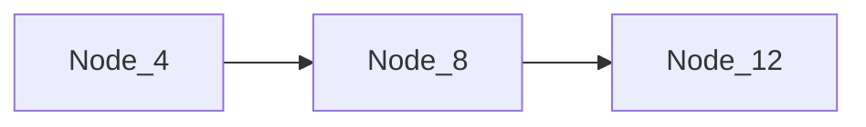
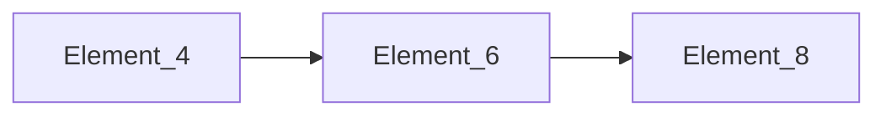
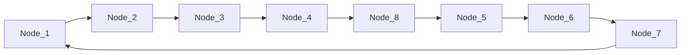
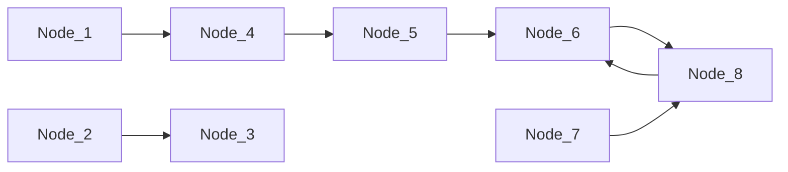
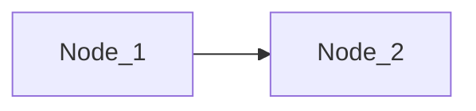
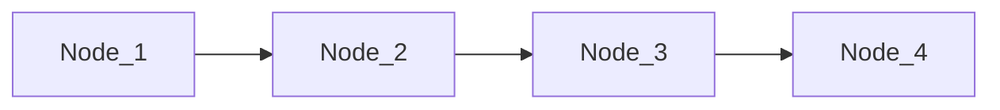
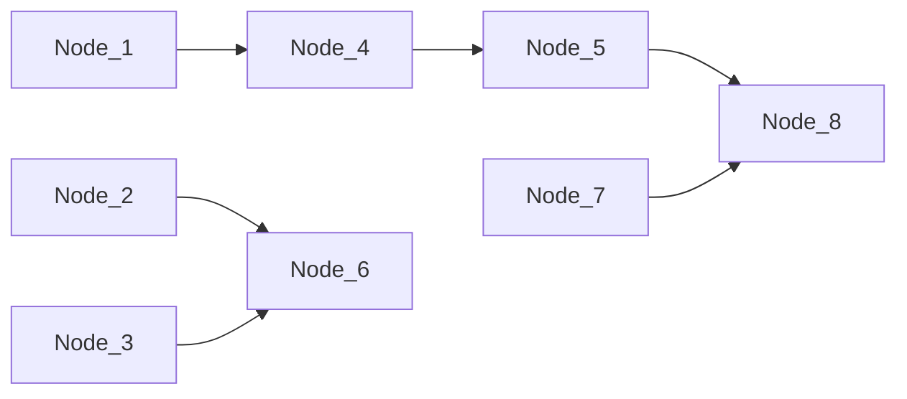
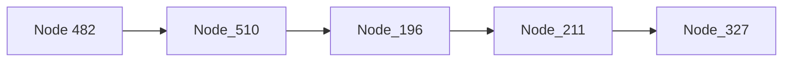

# 高性能有限元分析软件

# GFE

# ——显式求解器技术手册 v2025


<details>
<summary>natural_image</summary>

Abstract 3D geometric illustration of interconnected buildings and nodes, no text or symbols present
</details>

杜修力院士科研团队

广州颖力科技有限公司

2025年09月

# 目录

前言....1

第1章 有限单元....3

1.1 纤维梁单元....3

1.1.1 二维梁单元....4  
1.1.2 三维梁单元....8  
1.1.3 梁单元偏心....12  
1.1.4 梁单元几何非线性....14

1.2 平面应变单元....18

1.2.1 三节点三角形平面应变单元....18  
1.2.2 四节点四边形平面应变单元....22

1.3 分层壳单元....26

1.3.1 三节点三角形分层壳单元....26  
1.3.2 四节点四边形分层壳单元....30  
1.3.3 分层壳单元几何非线性....34

1.4 三维实体单元....37

1.4.1 一阶四面体单元....37  
1.4.2 一阶楔形单元....41  
1.4.3 一阶六面体单元....45  
1.4.4 二阶四面体单元....49

1.5 声学单元....53

1.5.1 AC3D8 单元....53  
1.5.2 AC3D6 单元....55  
1.5.3 AC3D4 单元....56

第 2 章 本构模型....58

2.1 弹性本构模型....58

2.1.1 单向拉伸变形....59  
2.1.2 单向剪切变形....60

2.2 弹塑性本构模型....61

2.2.1 二维模型(平面应变单元)....61  
2.2.2 三维模型....63

2.3 摩尔库伦本构模型....65

2.3.1 二维模型(平面应变单元)....65  
2.3.2 三维模型....67

2.4 塑性损伤本构模型....70

2.4.1 一维模型....70  
2.4.2 二维模型(平面应力单元)....73  
2.4.3 二维模型(平面应变单元)....79  
2.4.4 三维模型....81

2.5 Davidenkov 本构模型....86

2.5.1 三维模型....86  
2.5.2 二维模型(平面应变单元)....89

2.6 Davidenkov 液化本构模型 ..... 92

2.6.1 三维模型....93  
2.6.2 二维模型(平面应变单元)....94

2.7 Hyperelastic 本构模型....97

2.7.1 Mooney-Rivlin 应变势能....98  
2.7.2 Ogden 应变势能....100  
2.7.3 Yeoh 应变势能....102  
2.7.4 Polynomial 应变势能....104  
2.7.5 Reduced Polynomial 应变势能....106  
2.7.6 Arruda-Boyce 应变势能....108  
2.7.7 Neo-Hooke 应变势能....110  
2.7.8 VAN-DER-WAALS 应变势能....112

2.8 Hyperfoam 本构模型....114

2.8.1 基本理论....115  
2.8.2 正确性验证.... 115

2.9 陶瓷本构模型....117

2.9.1 仿真模型简介 …… 117  
2.9.2 正确性验证....119

# 2.10 南水模型本构....120

2.10.1 基本理论....120  
2.10.2 常规三轴压缩试验验证....121

# 2.11 HSS 本构....124

2.11.1 单元测试.... 124

# 2.12 考虑屈曲的一维钢筋本构....130

2.12.1 基本理论....130  
2.12.2 模型验证....132

# 第 3 章 边界条件和荷载....134

# 3.1 显式动力分析 ..... 134

3.1.1 位移/转动位移....134  
3.1.2 速度....135  
3.1.3 加速度....136  
3.1.4 集中力/力矩....137  
3.1.5 压力....137  
3.1.6 惯性力....138  
3.1.7 非结构性质量....139  
3.1.8 体力 ..... 140  
3.1.9 温度....140  
3.1.10 等效动水压力....141  
3.1.11 线荷载.... 142

# 3.2 静力分析....142

3.2.1 集中力/力矩....143  
3.2.2 压力....143  
3.2.3 惯性力....144  
3.2.4 非结构性质量....145  
3.2.5 体力 ..... 146

3.2.6 线荷载....146

# 第 4 章 相互作用....148

# 4.1 绑定约束....148

4.1.1 静力分析....148  
4.1.2 模态分析....149  
4.1.3 动力分析....150

# 4.2 多点约束....151

4.2.1 静力分析....152  
4.2.2 模态分析....153  
4.2.3 动力分析....154

# 4.3 嵌入....155

4.3.1 静力分析....155  
4.3.2 模态分析....156  
4.3.3 动力分析....157

# 4.4 通用接触....158

4.4.1 三点压弯....158  
4.4.2 手机跌落仿真....164

# 4.5 刚体....174

# 4.6 耦合约束....175

# 4.7 连接器....177

4.7.1 速度相关型消能器....178  
4.7.2 位移相关型消能器....181  
4.7.3 隔震支座....185

# 4.8 特殊相互作用....188

4.8.1 绑定约束（法向只压不拉，切向无作用）....188  
4.8.2 绑定约束（法向只压不拉，切向绑定）....189  
4.8.3 附带材料属性的绑定约束....190  
4.8.4 绑定约束（三向刚度可指定）....191

# 第5章 人工边界....195

# 第6章 爆炸、列车等特殊荷载....197

6.1 爆炸荷载....197

6.1.1 模型简介....197  
6.1.2 计算结果....200

6.2 列车振动荷载....202

6.2.1 模型简介....202  
6.2.2 计算结果....202

6.3 速度&加速度约束荷载....204

6.3.1 速度约束荷载....205  
6.3.2 加速度约束荷载....206

# 第 7 章 一维场地地震反应分析....209

7.1 不同位置地震动下场地反应分析 ..... 209

7.1.1 场地反应分析的算法原理简介 …… 209  
7.1.2 数值算例....210

7.2 瑞利阻尼模型....212  
7.3 本章小结....215

# 第8章 地震动输入.... 217

8.1 三维模型 S 波入射 ..... 217

8.1.1 立方体模型....217  
8.1.2 三棱柱模型....218  
8.1.3 圆柱模型....219  
8.1.4 半球模型....220

8.2 三维模型 P 波入射....221  
8.3 三维模型三向波动入射....221  
8.4 二维模型 S 波入射 ..... 223  
8.5 二维模型 P 波入射 ..... 224

# 第 9 章 非线性分析的初始应力条件....226

9.1 梁单元....226

9.2 壳单元....227

9.2.1 三角形壳单元....227  
9.2.2 四边形壳单元....228

9.3 实体单元....228  
9.4 地下结构-土体系统....229

# 第 10 章 组合壳综合管廊结构构件力学分析....232

10.1 工程简介....232  
10.2 分析模型....232  
10.3 分析结果.....233

10.3.1 位移云图....233  
10.3.2 混凝土损伤云图....234  
10.3.3 钢材塑性应变云图....234  
10.3.4 支反力曲线....235

# 第 11 章 地铁运行环境振动分析.... 237

11.1 模型简介....237  
11.2 计算结果....238

# 第 12 章 核岛结构地震反应分析.... 240

12.1 工程简介....240  
12.2 分析模型....241

12.2.1 结构和地基信息....241  
12.2.2 地震动和场地反应....242  
12.2.3 结构-地基系统有限元模型....243

12.3 重力场分析....244

12.3.1 节点位移....244  
12.3.2 单元应力....245

12.4 模态分析....247

12.4.1 固有频率....247  
12.4.2 固有振型....248

12.5 线弹性材料地震反应分析 ..... 248

12.5.1 节点位移....248  
12.5.2 单元应力....250

12.6 非线性材料地震反应分析 ..... 250

12.6.1 节点位移....250  
12.6.2 损伤....251

# 第 13 章 大型综合交通枢纽结构地震反应分析....255

13.1 工程简介....255  
13.2 分析模型....255

13.2.1 结构信息....255  
13.2.2 土层信息....256  
13.2.3 地震动与场地反应....261  
13.2.4 土-结构系统有限元模型....263

13.3 线弹性材料地震反应分析 ..... 265

13.3.1 结构层间位移角 ..... 265  
13.3.2 位移及内力云图....266

13.4 土结相互作用线弹性材料地震反应分析 ..... 270

13.4.1 结构层间位移角 ..... 270  
13.4.2 位移云图....271

13.5 重力场分析....273  
13.6 土结相互作用非线性材料地震反应分析 ..... 274

13.6.1 结构层间位移角 ..... 274  
13.6.2 塑性损伤云图....275

13.7 总结....279

# 附录 梁和壳单元的局部坐标和输出物理量定义.... 281

# 前言

工业软件是现代产业体系之“魂”，是工业强国之重器。习近平总书记于2021年5月28日在两院院士大会和中国科协代表大会上发表重要讲话《加快建设科技强国，实现高水平科技自立自强》，指出：“科技攻关要坚持问题导向，奔着最紧急、最紧迫的问题去。要从国家急迫需要和长远需求出发，在石油天然气、基础原材料、高端芯片、工业软件、农作物种子、科学试验用仪器设备、化学制剂等方面关键核心技术上全力攻坚。”。实现工业软件特别是CAE软件的国产替代，解决卡脖子问题，是国家的重大战略需求之一。

以土木工程应用为主要场景，广州颖力科技有限公司自主研发了高性能有限元分析软件 GFE。该软件由有限元求解器模块和前后处理模块组成，并可与结构专业设计软件无缝对接进行结构前后处理。GFE 软件的优势与功能特色如下：

（1）“准”一集成了先进的土-结构动力相互作用分析模型与方法，保证计算结果准确。软件的各类单元、本构模型、相互作用条件、求解算法等对标国际主流通用有限元软件；软件集成了动力人工边界条件、场地地震反应分析、地震动输入等土-结构相互作用分析方法；软件集成了我国地下结构抗震设计规范要求的各类分析方法，包括二维和三维以及线性和非线性时程分析方法、以及反应加速度法和反应位移法等。  
（2）“快”一采用了多 GPU 并行计算的显式动力求解和编程架构，保证计算过程快速。软件采用 CPU+GPU 异构并行计算的显式动力分析技术，其计算速度是多 CPU 并行计算速度的 10 倍以上。  
（3）“简”—简化了土与结构一体化建模，可进行构件设计并生成计算书，操作简便。可将结构专业设计软件建立的结构模型导入 GFE 软件，之后在 GFE 软件内简单完成土-结构系统建模；基于 GFE 计算得到的结构结果可以完成效应组合、截面验算、配筋、生成计算书等；GFE 软件也支持导入其他有限元软件的计算模型。

本手册为 GFE 软件的技术手册。首先介绍 GFE 软件的有限单元、材料非线性本构模型、交界面相互作用条件、人工边界条件、爆炸和列车荷载、场地地震反应分析和地震动输入、以及非线性分析的初始应力条件，并与主流商业有限元软件结果对比说明 GFE 软件的可靠性；之后给出多个应用案例，包括综合管廊结构构件力学分析、地铁运行环境振动分析、核岛结构地震反应分析、以及大型综合交通枢纽结构地震反应分析，说明了 GFE 软件在实际工程应用中的可靠性。

# 第 1 章 有限单元

GFE 软件提供有限元分析常用的单元类型，包括纤维梁单元、分层壳单元、平面应变单元和实体单元，如表 1.1 所示。本章提供每种单元类型的静力、模态和动力分析算例，与理论解或国际知名通用有限元软件（软件 A）的计算结果进行对比，验证 GFE 软件中有限单元的正确性。

表 1.1 GFE 软件中的有限单元

<table><tr><td>单元类型</td><td>子类型</td><td>节点数</td><td>节点自由度数</td><td>支持材料类型</td></tr><tr><td rowspan="3">纤维梁单元</td><td>二维</td><td>2</td><td>3</td><td>线弹性材料</td></tr><tr><td rowspan="2">三维</td><td rowspan="2">2</td><td rowspan="2">6</td><td>弹塑性材料</td></tr><tr><td>一维混凝土塑性损伤材料</td></tr><tr><td rowspan="4">平面应变单元</td><td rowspan="2">三角形</td><td rowspan="2">3</td><td rowspan="2">2</td><td>线弹性材料</td></tr><tr><td>摩尔库伦材料</td></tr><tr><td rowspan="2">四边形</td><td rowspan="2">4</td><td rowspan="2">2</td><td>混凝土塑性损伤材料</td></tr><tr><td>Davidenkov 材料</td></tr><tr><td rowspan="3">分层壳单元</td><td>三角形</td><td>3</td><td>6</td><td>线弹性材料</td></tr><tr><td rowspan="2">四边形</td><td rowspan="2">4</td><td rowspan="2">6</td><td>弹塑性材料</td></tr><tr><td>混凝土塑性损伤材料</td></tr><tr><td rowspan="5">实体单元</td><td>一阶四面体</td><td>4</td><td>3</td><td>线弹性材料</td></tr><tr><td>二阶四面体</td><td>10</td><td>3</td><td>弹塑性材料</td></tr><tr><td rowspan="2">一阶六面体</td><td rowspan="2">8</td><td rowspan="2">3</td><td>摩尔库伦材料</td></tr><tr><td>混凝土塑性损伤材料</td></tr><tr><td>楔形体</td><td>6</td><td>3</td><td>Davidenkov 材料</td></tr></table>

# 1.1 纤维梁单元

分别采用 GFE 软件和软件 A 中的纤维梁单元对悬臂梁进行静力、模态和动力分析。悬臂梁长 6m、宽 0.6m、高 0.25m；质量密度 $2.5t/m^{3}$ ，弹性模量 $3.0 \times 10^{7}kPa$ ，泊松比 0.25。

悬臂梁的有限元模型如图 1.1-1 所示，分别采用二维一阶梁单元和三维一阶梁单元模拟，节点数为 13，单元数为 12。


<details>
<summary>natural_image</summary>

Blue 3D rectangular object with segmented vertical lines, resembling a metal rod or barrier (no text or symbols)
</details>

图 1.1-1 悬臂梁有限元模型

# 1.1.1 二维梁单元

# 1.1.1.1 静力分析

对悬臂梁整体施加沿 Y 负方向、大小为 $9.8 \, m/s^{2}$ 的惯性力荷载进行静力计算，坐标系和约束条件如图 1.1-2 所示。选取悬臂梁上若干节点和单元，如图 1.1-3 所示，输出其位移、剪力和弯矩结果进行分析对比。表 1.1-1 给出了所选节点的 Y 方向位移，表 1.1-2 和表 1.1-3 分别给出了所选单元的 Y 方向剪力和 X-Y 平面内弯矩。从表可见，GFE 软件与软件 A 计算得到的位移、剪力和弯矩结果差异小于 3%。悬臂梁的位移如图 1.1-4 所示。图中可以看出，两款软件计算得到的位移云图结果吻合较好。


<details>
<summary>natural_image</summary>

Pure coordinate axes with no text, numbers, or symbols
</details>

图 1.1-2 悬臂梁的坐标系和约束条件


<details>
<summary>flowchart</summary>


</details>

(a) 节点编号


<details>
<summary>flowchart</summary>


</details>

(b) 单元编号  
图 1.1-3 输出结果的节点和单元编号

表 1.1-1 Y 轴方向位移

<table><tr><td>节点号</td><td>GFE(mm)</td><td>软件A(mm)</td><td>相对差异(%)</td></tr><tr><td>4</td><td>-1.5000</td><td>-1.5000</td><td>0.000</td></tr><tr><td>8</td><td>-10.410</td><td>-10.410</td><td>0.000</td></tr><tr><td>12</td><td>-22.410</td><td>-22.410</td><td>0.000</td></tr></table>

表 1.1-2 Y 轴方向剪力

<table><tr><td>单元号</td><td>GFE(kN)</td><td>软件A(kN)</td><td>相对差异(%)</td></tr><tr><td>4</td><td>-15.035</td><td>-15.035</td><td>0.000</td></tr><tr><td>6</td><td>-11.024</td><td>-11.025</td><td>0.009</td></tr><tr><td>8</td><td>-7.0166</td><td>-7.0159</td><td>0.010</td></tr></table>

表 1.1-3 X-Y 平面内弯矩

<table><tr><td>单元号</td><td>GFE(kN·m)</td><td>软件A(kN·m)</td><td>相对差异(%)</td></tr><tr><td>4</td><td>30.000</td><td>30.888</td><td>2.875</td></tr><tr><td>6</td><td>16.211</td><td>16.674</td><td>2.778</td></tr><tr><td>8</td><td>6.6400</td><td>6.8340</td><td>2.839</td></tr></table>


<details>
<summary>heatmap</summary>

| Color | U, Magnitude |
| --- | --- |
| Red | 2.550E-02 |
| Orange | 2.337E-02 |
| Yellow-Orange | 2.125E-02 |
| Yellow | 1.912E-02 |
| Light Green | 1.700E-02 |
| Green | 1.487E-02 |
| Teal | 1.275E-02 |
| Cyan | 1.062E-02 |
| Light Blue | 8.499E-03 |
| Blue | 6.375E-03 |
| Dark Blue | 4.250E-03 |
| Deep Blue | 2.125E-03 |
| Darkest Blue | 2.205E-13 |
</details>

图 1.1-4 位移云图

# 1.1.1.2 模态分析

进行上述悬臂梁模型的模态分析。前三阶固有频率如表 1.1-4 所示，可以看出，两个软件的计算结果差异小于 2%。前三阶振型如图 1.1-5 所示，可以看出，两个软件的计算结果吻合较好。

  
图 1.1-5 悬臂梁前三阶振型

表 1.1-4 悬臂梁固有频率

<table><tr><td>阶数</td><td>GFE(Hz)</td><td>软件A(Hz)</td><td>相对差异(%)</td></tr><tr><td>1</td><td>3.8650</td><td>3.8700</td><td>0.129</td></tr><tr><td>2</td><td>23.756</td><td>23.895</td><td>0.582</td></tr><tr><td>3</td><td>64.957</td><td>65.777</td><td>1.247</td></tr></table>

# 1.1.1.3 动力分析

在悬臂梁上施加随时间正弦变化的惯性力载荷,幅值为 $1 \, m/s^{2}$ , 加速度时程如图 1.1-6 所示。选取悬臂梁上若干节点和单元, 如图 1.1-7 所示, 输出其位移、剪力和弯矩结果进行分析对比。图 1.1-8 为节点的 Y 方向位移时程, 图 1.1-9 和图 1.1-10 分别为单元的 Y 方向剪力和 X-Y 平面内弯矩。由图可知, 两款软件的计算结果吻合较好。


<details>
<summary>line</summary>

| 时间/s | 幅值 |
| --- | --- |
| 0 | 0 |
| ~0.25 | ~1.0 |
| ~0.5 | ~-1.0 |
| ~0.75 | ~1.0 |
| ~1.0 | ~-1.0 |
| ~1.25 | ~1.0 |
| ~1.5 | ~-1.0 |
| ~1.75 | ~1.0 |
| ~2.0 | ~-1.0 |
| ~2.25 | ~1.0 |
| ~2.5 | ~-1.0 |
| ~2.75 | ~1.0 |
| ~3.0 | ~-1.0 |
| ~3.25 | ~1.0 |
| ~3.5 | ~-1.0 |
| ~3.75 | ~1.0 |
| ~4.0 | ~-1.0 |
| ~4.25 | ~1.0 |
| ~4.5 | ~-1.0 |
| ~4.75 | ~1.0 |
| ~5.0 | ~-1.0 |
| ~5.25 | ~1.0 |
| ~5.5 | ~-1.0 |
| ~5.75 | ~1.0 |
| ~6.0 | ~-1.0 |
| ~6.25 | ~1.0 |
| ~6.5 | ~-1.0 |
| ~6.75 | ~1.0 |
| ~7.0 | ~-1.0 |
| ~7.25 | ~1.0 |
| ~7.5 | ~-1.0 |
| ~7.75 | ~1.0 |
| 8 | 0 |
</details>

图 1.1-6 正弦惯性力载荷的加速度时程


<details>
<summary>text_image</summary>

Node_4
Node_8
</details>

(a) 节点编号


<details>
<summary>text_image</summary>

Element_4
Element_8
</details>

(b) 单元编号

图 1.1-7 输出节点和单元的编号  


<details>
<summary>line</summary>

| 时间/s | \(GFE (10^{-3}m)\) | \(软件A (10^{-3}m)\) |
| --- | --- | --- |
| 0 | 0 | 0 |
| ~0.2 | ~0.22 | ~0.21 |
| ~0.6 | ~-0.21 | ~-0.21 |
| ~1.0 | ~0.20 | ~0.20 |
| ~1.4 | ~-0.20 | ~-0.20 |
| ~1.8 | ~0.19 | ~0.19 |
| ~2.2 | ~-0.19 | ~-0.19 |
| ~2.6 | ~0.18 | ~0.18 |
| ~3.0 | ~-0.18 | ~-0.18 |
| ~3.4 | ~0.18 | ~0.18 |
| ~3.8 | ~-0.18 | ~-0.18 |
| ~4.2 | ~0.18 | ~0.18 |
| ~4.6 | ~-0.18 | ~-0.18 |
| ~5.0 | ~0.18 | ~0.18 |
| ~5.4 | ~-0.18 | ~-0.18 |
| ~5.8 | ~0.18 | ~0.18 |
| ~6.2 | ~-0.18 | ~-0.18 |
| ~6.6 | ~0.18 | ~0.18 |
| ~7.0 | ~-0.18 | ~-0.18 |
| ~7.4 | ~0.18 | ~0.18 |
| ~7.8 | ~-0.18 | ~-0.18 |
</details>

(a) 4 号节点


<details>
<summary>line</summary>

| 时间/s | \(GFE (10^{-3}m)\) | \(软件A (10^{-3}m)\) |
| --- | --- | --- |
| 0 | 0 | 0 |
| ~0.2 | ~1.55 | ~1.55 |
| ~0.6 | ~-1.5 | ~-1.5 |
| ~1.0 | ~1.45 | ~1.45 |
| ~1.4 | ~-1.4 | ~-1.4 |
| ~1.8 | ~1.35 | ~1.35 |
| ~2.2 | ~-1.35 | ~-1.35 |
| ~2.6 | ~1.3 | ~1.3 |
| ~3.0 | ~-1.3 | ~-1.3 |
| ~3.4 | ~1.25 | ~1.25 |
| ~3.8 | ~-1.25 | ~-1.25 |
| ~4.2 | ~1.25 | ~1.25 |
| ~4.6 | ~-1.25 | ~-1.25 |
| ~5.0 | ~1.2 | ~1.2 |
| ~5.4 | ~-1.2 | ~-1.2 |
| ~5.8 | ~1.2 | ~1.2 |
| ~6.2 | ~-1.2 | ~-1.2 |
| ~6.6 | ~1.2 | ~1.2 |
| ~7.0 | ~-1.2 | ~-1.2 |
| ~7.4 | ~1.2 | ~1.2 |
| ~7.8 | ~-1.2 | ~-1.2 |
</details>

(b) 8 号节点  
图 1.1-8 Y 轴方向位移


<details>
<summary>line</summary>

| 时间/s | GFE (kN) | 软件A (kN) |
| --- | --- | --- |
| 0 | 0 | 0 |
| ~0.2 | ~2.1 | ~2.1 |
| ~0.6 | ~-2.0 | ~-2.0 |
| ~1.1 | ~2.0 | ~2.0 |
| ~1.5 | ~-1.9 | ~-1.9 |
| ~1.9 | ~1.9 | ~1.9 |
| ~2.3 | ~-1.8 | ~-1.8 |
| ~2.7 | ~1.8 | ~1.8 |
| ~3.1 | ~-1.8 | ~-1.8 |
| ~3.5 | ~1.7 | ~1.7 |
| ~3.9 | ~-1.7 | ~-1.7 |
| ~4.3 | ~1.7 | ~1.7 |
| ~4.7 | ~-1.7 | ~-1.7 |
| ~5.1 | ~1.7 | ~1.7 |
| ~5.5 | ~-1.7 | ~-1.7 |
| ~5.9 | ~1.7 | ~1.7 |
| ~6.3 | ~-1.7 | ~-1.7 |
| ~6.7 | ~1.7 | ~1.7 |
| ~7.1 | ~-1.7 | ~-1.7 |
| ~7.5 | ~1.7 | ~1.7 |
| ~7.9 | ~-1.7 | ~-1.7 |
</details>

(a) 4 号单元


<details>
<summary>line</summary>

| 时间/s | GFE (kN) | 软件A (kN) |
| --- | --- | --- |
| 0 | 0 | 0 |
| ~0.3 | ~1.1 | ~1.1 |
| ~0.6 | ~-1.05 | ~-1.05 |
| ~1.0 | ~1.0 | ~1.0 |
| ~1.3 | ~-1.0 | ~-1.0 |
| ~1.8 | ~0.95 | ~0.95 |
| ~2.1 | ~-0.9 | ~-0.9 |
| ~2.6 | ~0.9 | ~0.9 |
| ~2.9 | ~-0.9 | ~-0.9 |
| ~3.4 | ~0.85 | ~0.85 |
| ~3.7 | ~-0.85 | ~-0.85 |
| ~4.2 | ~0.85 | ~0.85 |
| ~4.5 | ~-0.85 | ~-0.85 |
| ~5.0 | ~0.85 | ~0.85 |
| ~5.3 | ~-0.85 | ~-0.85 |
| ~5.8 | ~0.85 | ~0.85 |
| ~6.1 | ~-0.85 | ~-0.85 |
| ~6.6 | ~0.85 | ~0.85 |
| ~6.9 | ~-0.85 | ~-0.85 |
| ~7.4 | ~0.85 | ~0.85 |
| ~7.7 | ~-0.85 | ~-0.85 |
| 8 | 0 | 0 |
</details>

(b) 8 号单元

图 1.1-9 Y 轴方向剪力  


<details>
<summary>line</summary>

| 时间/s | GFE (kN.m) | 软件A (kN.m) |
| --- | --- | --- |
| 0 | 0 | 0 |
| ~0.2 | ~-4.7 | ~-4.7 |
| ~0.6 | ~4.5 | ~4.5 |
| ~1.0 | ~-4.3 | ~-4.3 |
| ~1.4 | ~4.2 | ~4.2 |
| ~1.8 | ~-4.0 | ~-4.0 |
| ~2.2 | ~3.9 | ~3.9 |
| ~2.6 | ~-3.8 | ~-3.8 |
| ~3.0 | ~3.7 | ~3.7 |
| ~3.4 | ~-3.7 | ~-3.7 |
| ~3.8 | ~3.6 | ~3.6 |
| ~4.2 | ~-3.6 | ~-3.6 |
| ~4.6 | ~3.5 | ~3.5 |
| ~5.0 | ~-3.5 | ~-3.5 |
| ~5.4 | ~3.5 | ~3.5 |
| ~5.8 | ~-3.5 | ~-3.5 |
| ~6.2 | ~3.5 | ~3.5 |
| ~6.6 | ~-3.5 | ~-3.5 |
| ~7.0 | ~3.5 | ~3.5 |
| ~7.4 | ~-3.5 | ~-3.5 |
| ~7.8 | ~3.5 | ~3.5 |
</details>

(a) 4 号单元


<details>
<summary>line</summary>

| 时间/s | GFE (kN.m) | 软件A (kN.m) |
| --- | --- | --- |
| 0 | 0 | 0 |
| ~0.2 | ~-1.1 | ~-1.1 |
| ~0.6 | ~1.05 | ~1.05 |
| ~1.0 | ~-1.0 | ~-1.0 |
| ~1.4 | ~0.95 | ~0.95 |
| ~1.8 | ~-0.95 | ~-0.95 |
| ~2.2 | ~0.9 | ~0.9 |
| ~2.6 | ~-0.9 | ~-0.9 |
| ~3.0 | ~0.85 | ~0.85 |
| ~3.4 | ~-0.85 | ~-0.85 |
| ~3.8 | ~0.8 | ~0.8 |
| ~4.2 | ~-0.8 | ~-0.8 |
| ~4.6 | ~0.8 | ~0.8 |
| ~5.0 | ~-0.8 | ~-0.8 |
| ~5.4 | ~0.8 | ~0.8 |
| ~5.8 | ~-0.8 | ~-0.8 |
| ~6.2 | ~0.8 | ~0.8 |
| ~6.6 | ~-0.8 | ~-0.8 |
| ~7.0 | ~0.8 | ~0.8 |
| ~7.4 | ~-0.8 | ~-0.8 |
| ~7.8 | ~0.8 | ~0.8 |
</details>

(b) 8 号单元  
图 1.1-10 X-Y 平面内弯矩

# 1.1.2 三维梁单元

# 1.1.2.1 静力分析

悬臂梁左端固定，右端沿 Y 轴负方向施加大小为 1000kN 的集中力荷载，进行静力计算，坐标系和约束条件如图 1.1-11 所示。选取悬臂梁上若干节点和单元，如图 1.1-12 所示，输出其位移、剪力和弯矩结果进行分析对比。表 1.1-5 给出了所选节点的 Y 方向位移，表 1.1-6 和表 1.1-7 分别给出了所选单元的 Y 方向剪力和 X-Y 平面内弯矩。从表可见，GFE 软件与软件 A 计算得到的位移、剪力和弯矩结果差异小于 3%。悬臂梁的位移如图 1.1-13 所示。图中可以看出，两个软件计算得到的位移云图结果一致。


<details>
<summary>text_image</summary>

Y
X
Y
</details>

图 1.1-11 悬臂梁的坐标系和约束条件


<details>
<summary>flowchart</summary>


</details>

(a) 节点编号


<details>
<summary>text_image</summary>

Element_4
Element_8
Element_12
</details>

(b) 单元编号

图 1.1-12 选择输出结果的节点和单元编号  
表 1.1-5 Y 轴方向位移

<table><tr><td>节点号</td><td>GFE(mm)</td><td>软件A(mm)</td><td>相对差异(%)</td></tr><tr><td>4</td><td>-0.265</td><td>-0.265</td><td>0.000</td></tr><tr><td>8</td><td>-1.265</td><td>-1.265</td><td>0.000</td></tr><tr><td>12</td><td>-2.691</td><td>-2.691</td><td>0.000</td></tr></table>

表 1.1-6 Y 轴方向剪力

<table><tr><td>单元号</td><td>GFE(kN)</td><td>软件A(kN)</td><td>相对差异(%)</td></tr><tr><td>4</td><td>-1000.000</td><td>-1000.000</td><td>0.000</td></tr><tr><td>8</td><td>-1000.130</td><td>-1000.000</td><td>0.013</td></tr><tr><td>12</td><td>-999.9800</td><td>-1000.000</td><td>0.002</td></tr></table>

表 1.1-7 X-Y 平面内的弯矩

<table><tr><td>单元号</td><td>GFE(kN)</td><td>软件A(kN)</td><td>相对差异(%)</td></tr><tr><td>4</td><td>4131.940</td><td>4250.000</td><td>2.778</td></tr><tr><td>8</td><td>2187.500</td><td>2250.000</td><td>2.778</td></tr><tr><td>12</td><td>243.0600</td><td>250.0000</td><td>2.776</td></tr></table>

U, Magnitude  
  
(a) GFE 软件

  
(b) 软件 A  
图 1.1-13 位移云图

# 1.1.2.2 模态分析

进行上述悬臂梁模型的模态分析。前三阶固有频率如表 1. 所示，可以看到，两个软件计算结果的差异小于 0.7%。前三阶振型如图 1.1-14 所示，可以看到，两个软件计算各阶振型形状较为一致（注意两个软件的振型归一化标准不相同）。

表 1.1-8 悬臂梁固有频率

<table><tr><td>阶数</td><td>GFE(Hz)</td><td>软件A(Hz)</td><td>相对差异(%)</td></tr><tr><td>1</td><td>3.867</td><td>3.872</td><td>0.1290</td></tr><tr><td>2</td><td>9.237</td><td>9.235</td><td>0.0217</td></tr><tr><td>3</td><td>23.795</td><td>23.941</td><td>0.6100</td></tr></table>

  
图 1.1-14 悬臂梁前三阶振型

# 1.1.2.3 动力分析

在悬臂梁 Y 方向上施加随时间正弦变化的惯性力载荷，幅值为 $1 \, m/s^{2}$ ，加速度时程如图 1.1-6 所示。选取悬臂梁上若干节点和单元，如图 1.1-15 所示，输出其位移、剪力

和弯矩结果进行分析对比。图 1.1-16 为节点的 Y 方向位移时程，图 1.1-17 和图 1.1-18 分别为单元的 Y 方向剪力和 X-Y 平面内弯矩。由图可知，两款软件的计算结果吻合较好。


<details>
<summary>text_image</summary>

Node_6
Node_12
</details>

(a) 节点编号


<details>
<summary>text_image</summary>

Element_6
Element_12
</details>

(b) 单元编号

图 1.1-15 输出结果的节点和单元编号  


<details>
<summary>line</summary>

| 时间/s | \(GFE (10^{-3}m)\) | \(软件A (10^{-3}m)\) |
| --- | --- | --- |
| 0 | 0 | 0 |
| ~0.2 | ~-1.05 | ~-1.05 |
| ~0.6 | ~1.00 | ~1.00 |
| ~1.0 | ~-0.95 | ~-0.95 |
| ~1.4 | ~0.90 | ~0.90 |
| ~1.8 | ~-0.90 | ~-0.90 |
| ~2.2 | ~0.85 | ~0.85 |
| ~2.6 | ~-0.85 | ~-0.85 |
| ~3.0 | ~0.80 | ~0.80 |
| ~3.4 | ~-0.80 | ~-0.80 |
| ~3.8 | ~0.75 | ~0.75 |
| ~4.2 | ~-0.75 | ~-0.75 |
| ~4.6 | ~0.75 | ~0.75 |
| ~5.0 | ~-0.75 | ~-0.75 |
| ~5.4 | ~0.75 | ~0.75 |
| ~5.8 | ~-0.75 | ~-0.75 |
| ~6.2 | ~0.75 | ~0.75 |
| ~6.6 | ~-0.75 | ~-0.75 |
| ~7.0 | ~0.75 | ~0.75 |
| ~7.4 | ~-0.75 | ~-0.75 |
| ~7.8 | ~0.75 | ~0.75 |
</details>

(a) 6 号节点


<details>
<summary>line</summary>

| 时间/s | GFE \(( \times 10^{-3}m)\) | 软件A \(( \times 10^{-3}m)\) |
| --- | --- | --- |
| 0 | 0 | 0 |
| 0.5 | ~3.8 | ~3.8 |
| 1 | ~-3.5 | ~-3.5 |
| 1.5 | ~3.5 | ~3.5 |
| 2 | ~-3.2 | ~-3.2 |
| 2.5 | ~3.3 | ~3.3 |
| 3 | ~-3.1 | ~-3.1 |
| 3.5 | ~3.2 | ~3.2 |
| 4 | ~-3.0 | ~-3.0 |
| 4.5 | ~3.1 | ~3.1 |
| 5 | ~-3.0 | ~-3.0 |
| 5.5 | ~3.0 | ~3.0 |
| 6 | ~-3.0 | ~-3.0 |
| 6.5 | ~3.0 | ~3.0 |
| 7 | ~-3.0 | ~-3.0 |
| 7.5 | ~3.0 | ~3.0 |
| 8 | ~0 | ~0 |
</details>

(b) 12 号节点

图 1.1-16 Y 轴方向位移  


<details>
<summary>line</summary>

| 时间/s | GFE (kN) | 软件A (kN) |
| --- | --- | --- |
| 0 | 0.00 | 0.00 |
| 0.5 | ~1.50 | ~1.50 |
| 1.0 | ~-1.40 | ~-1.40 |
| 1.5 | ~1.35 | ~1.35 |
| 2.0 | ~-1.30 | ~-1.30 |
| 2.5 | ~1.25 | ~1.25 |
| 3.0 | ~-1.20 | ~-1.20 |
| 3.5 | ~1.20 | ~1.20 |
| 4.0 | ~-1.15 | ~-1.15 |
| 4.5 | ~1.15 | ~1.15 |
| 5.0 | ~-1.10 | ~-1.10 |
| 5.5 | ~1.15 | ~1.15 |
| 6.0 | ~-1.10 | ~-1.10 |
| 6.5 | ~1.15 | ~1.15 |
| 7.0 | ~-1.10 | ~-1.10 |
| 7.5 | ~1.15 | ~1.15 |
| 8.0 | ~0.00 | ~0.00 |
</details>

(a) 6号单元


<details>
<summary>line</summary>

| 时间/s | GFE (kN) | 软件A (kN) |
| --- | --- | --- |
| 0 | 0 | 0 |
| 0.5 | ~1.05 | ~1.05 |
| 1 | ~-1.05 | ~-1.05 |
| 1.5 | ~1.05 | ~1.05 |
| 2 | ~-1.05 | ~-1.05 |
| 2.5 | ~1.05 | ~1.05 |
| 3 | ~-1.05 | ~-1.05 |
| 3.5 | ~1.05 | ~1.05 |
| 4 | ~-1.05 | ~-1.05 |
| 4.5 | ~1.05 | ~1.05 |
| 5 | ~-1.05 | ~-1.05 |
| 5.5 | ~1.05 | ~1.05 |
| 6 | ~-1.05 | ~-1.05 |
| 6.5 | ~1.05 | ~1.05 |
| 7 | ~-1.05 | ~-1.05 |
| 7.5 | ~1.05 | ~1.05 |
| 8 | ~0 | ~0 |
</details>

(b) 12 号单元  
图 1.1-17 Y 轴方向剪力


<details>
<summary>line</summary>

| 时间/s | GFE \((kN \cdot m)\) | 软件A \((kN \cdot m)\) |
| --- | --- | --- |
| 0 | 0 | 0 |
| ~0.3 | ~4.5 | ~4.5 |
| ~0.6 | ~-4.2 | ~-4.2 |
| ~1.0 | ~4.2 | ~4.2 |
| ~1.3 | ~-4.0 | ~-4.0 |
| ~1.8 | ~4.0 | ~4.0 |
| ~2.1 | ~-3.8 | ~-3.8 |
| ~2.6 | ~3.8 | ~3.8 |
| ~2.9 | ~-3.6 | ~-3.6 |
| ~3.4 | ~3.6 | ~3.6 |
| ~3.7 | ~-3.5 | ~-3.5 |
| ~4.2 | ~3.5 | ~3.5 |
| ~4.5 | ~-3.4 | ~-3.4 |
| ~5.0 | ~3.4 | ~3.4 |
| ~5.3 | ~-3.3 | ~-3.3 |
| ~5.8 | ~3.3 | ~3.3 |
| ~6.1 | ~-3.2 | ~-3.2 |
| ~6.6 | ~3.3 | ~3.3 |
| ~6.9 | ~-3.2 | ~-3.2 |
| ~7.4 | ~3.3 | ~3.3 |
| ~7.7 | ~-3.2 | ~-3.2 |
</details>

(a) 6 号单元


<details>
<summary>line</summary>

| 时间/s | GFE \((kN \cdot m)\) | 软件A \((kN \cdot m)\) |
| --- | --- | --- |
| 0 | 0 | 0 |
| ~0.3 | ~0.27 | ~0.27 |
| ~0.6 | ~-0.27 | ~-0.27 |
| ~0.9 | ~0.27 | ~0.27 |
| ~1.2 | ~-0.27 | ~-0.27 |
| ~1.5 | ~0.27 | ~0.27 |
| ~1.8 | ~-0.27 | ~-0.27 |
| ~2.1 | ~0.27 | ~0.27 |
| ~2.4 | ~-0.27 | ~-0.27 |
| ~2.7 | ~0.27 | ~0.27 |
| ~3.0 | ~-0.27 | ~-0.27 |
| ~3.3 | ~0.27 | ~0.27 |
| ~3.6 | ~-0.27 | ~-0.27 |
| ~3.9 | ~0.27 | ~0.27 |
| ~4.2 | ~-0.27 | ~-0.27 |
| ~4.5 | ~0.27 | ~0.27 |
| ~4.8 | ~-0.27 | ~-0.27 |
| ~5.1 | ~0.27 | ~0.27 |
| ~5.4 | ~-0.27 | ~-0.27 |
| ~5.7 | ~0.27 | ~0.27 |
| ~6.0 | ~-0.27 | ~-0.27 |
| ~6.3 | ~0.27 | ~0.27 |
| ~6.6 | ~-0.27 | ~-0.27 |
| ~6.9 | ~0.27 | ~0.27 |
| ~7.2 | ~-0.27 | ~-0.27 |
| ~7.5 | ~0.27 | ~0.27 |
| ~7.8 | ~-0.27 | ~-0.27 |
</details>

(b) 12 号单元  
图 1.1-18 X-Y 平面内弯矩

# 1.1.3 梁单元偏心

分别采用 GFE 软件和软件 A 对悬臂梁进行静力和动力分析。悬臂梁下部由实体单元模拟，上部由梁单元模拟。悬臂梁长 10m、宽 1.2m（实体单元和梁单元都为 0.6m）；质量密度 $1.97t/m^{3}$ ，弹性模量 $7.203 \times 10^{8}kPa$ ，泊松比 0.3，质量阻尼系数 1.0。悬臂梁的有限元模型如图 1.1-19 所示，梁单元数共 100，实体单元数共 600。


<details>
<summary>natural_image</summary>

3D coordinate system diagram with X, Y, Z axes labeled, no text or symbols present
</details>

图 1.1-19 悬臂梁有限元模型

# 1.1.3.1 静力分析

悬臂梁左端固定，右端施加沿 Z 轴竖直向下的集中荷载，进行静力计算。约束条件如图 1.1-20 所示，加载历程如图 1.1-21 所示。选取悬臂梁上某节点，如图 1.1-22 所示，输出其位移结果进行分析对比。表 1.1-9 给出了所选节点的 Z 方向位移。从表可见，GFE 软件与软件 A 计算得到的位移结果差异小于 1%。悬臂梁的位移如图 1.1-23 所示。图中可以看出，两个软件计算得到的位移云图结果一致。


<details>
<summary>natural_image</summary>

Grid pattern with red vertical bars at the left end and a single green dot at the center (no text or symbols)
</details>

图 1.1-20 悬臂梁的约束条件


<details>
<summary>line</summary>

| 时间/s | 荷载力/kN |
| --- | --- |
| 0 | 0 |
| 5 | 1 |
</details>

图 1.1-21 加载历程


<details>
<summary>text_image</summary>

Node_707
</details>

图 1.1-22 梁偏心构件节点编号

表 1.1-9 沿 Z 向位移（U3）

<table><tr><td>节点号</td><td>GFE(m)</td><td>软件A(m)</td><td>相对差异(%)</td></tr><tr><td>707</td><td>-1.238</td><td>-1.243</td><td>0.4</td></tr></table>

  
图 1.1-23 位移云图

# 1.1.3.2 动力分析

在悬臂梁一端施加动力载荷，如图 1.1-24 所示，荷载时程如图 1.1-25 所示。选取悬臂梁上 707 号节点，输出其位移结果进行分析对比。图 1.1-26 为节点的 Z 方向位移时程。由图可知，两款软件的计算结果吻合较好。


<details>
<summary>natural_image</summary>

Green grid pattern with yellow markers at top and bottom (no text or symbols)
</details>

图 1.1-24 约束及荷载施加  


<details>
<summary>line</summary>

| 时间/s | 荷载力/kN |
| --- | --- |
| 0 | 0.00 |
| ~1.5 | ~0.60 |
| ~2.2 | ~0.90 |
| ~2.5 | ~-0.65 |
| ~3.2 | ~0.50 |
| ~3.5 | ~-0.55 |
| ~3.8 | ~0.50 |
| ~4.2 | ~-0.45 |
| ~4.5 | ~0.40 |
| ~5.0 | ~-0.45 |
| ~5.5 | ~0.15 |
| ~6.0 | ~0.15 |
| ~6.5 | ~-0.25 |
| ~7.0 | ~0.10 |
| ~7.5 | ~0.15 |
| ~8.0 | ~0.05 |
| ~8.5 | ~0.15 |
| ~9.0 | ~0.00 |
| ~10.0 | ~0.00 |
| ~11.0 | ~0.00 |
| ~12.0 | ~0.00 |
| ~13.0 | ~0.00 |
| 14 | 0.00 |
</details>

图 1.1-25 加载历程  


<details>
<summary>line</summary>

| 时间/s | GFE (位移/10^-6m) | 软件A (位移/10^-6m) |
| --- | --- | --- |
| 0 | 0 | 0 |
| 2 | ~1.1 | ~1.1 |
| 3 | ~-3.0 | ~-3.0 |
| 4 | ~6.1 | ~6.1 |
| 5 | ~-6.0 | ~-6.0 |
| 6 | ~6.5 | ~6.5 |
| 7 | ~-6.5 | ~-6.5 |
| 8 | ~6.7 | ~6.7 |
| 9 | ~-6.2 | ~-6.2 |
| 10 | ~6.0 | ~6.0 |
| 11 | ~-6.1 | ~-6.1 |
| 12 | ~6.1 | ~6.1 |
| 13 | ~-6.0 | ~-6.0 |
| 14 | ~6.1 | ~6.1 |
</details>

图 1.1-26 沿 Z 向位移

# 1.1.4 梁单元几何非线性

分别采用 GFE 软件和软件 A 中的梁单元对斜杆模型进行拟静力分析。斜杆模型如图 1.1-27 所示，斜杆竖直投影高度为 4.5m、水平投影长度为 0.1m，截面为矩形 0.12m×0.12m；弹性模量 3.0×10 $^{7}$ kPa、泊松比 0.2。斜杆底部固定约束、顶点施加随时间线性增加的弯矩如图 1.1-28 所示。


<details>
<summary>text_image</summary>

4500
A
A
100
120
120
A-A截面示意图
</details>

图 1.1-27 斜杆模型


<details>
<summary>line</summary>

| 时间/s | 弯矩/kN.m |
| --- | --- |
| 0 | 0 |
| 60 | 500 |
</details>

图 1.1-28 顶点弯矩荷载

为对比几何非线性对分析结果的影响，分别设置了考虑几何非线性和不考虑几何非线性（线性）两种工况，两种情况均不考虑材料非线性。图 1.1-29 和图 1.1-30 分别给出斜杆顶端水平位移和竖向位移结果，可以看到，是否考虑几何非线性对计算结果影响较大，在每种工况下 GFE 软件的计算结果均与软件 A 结果吻合较好。图 1.1-31-图 1.1-36 进一步给出考虑几何非线性情况下 10s、20s、30s、40s、50s 和 60s 时刻斜杆位移云图，可以看到，两款软件的计算结果吻合较好。


<details>
<summary>line</summary>

| 时间/s | GFE几何非线性 (m) | 软件A几何非线性 (m) | GFE线性 (m) | 软件A线性 (m) |
| --- | --- | --- | --- | --- |
| 0 | 0 | 0 | 0 | 0 |
| 10 | ~1.5 | ~1.5 | ~1.5 | ~1.5 |
| 20 | ~2.5 | ~2.5 | ~3.5 | ~3.5 |
| 30 | ~3.2 | ~3.2 | ~5.5 | ~5.5 |
| 40 | ~3.0 | ~3.0 | ~7.5 | ~7.5 |
| 50 | ~2.0 | ~2.0 | ~9.5 | ~9.5 |
| 60 | ~1.2 | ~1.2 | 10 | ~9.8 |
</details>

图 1.1-29 斜杆顶端水平位移  


<details>
<summary>line</summary>

| 时间/s | GFE几何非线性 (位移/m) | 软件A几何非线性 (位移/m) | GFE线性 (位移/m) | 软件A线性 (位移/m) |
| --- | --- | --- | --- | --- |
| 0 | 0 | 0 | 0 | 0 |
| 10 | ~-0.5 | ~-0.5 | ~-0.1 | ~-0.1 |
| 20 | ~-1.5 | ~-1.5 | ~-0.2 | ~-0.2 |
| 30 | ~-2.8 | ~-2.8 | ~-0.3 | ~-0.3 |
| 40 | ~-4.2 | ~-4.2 | ~-0.4 | ~-0.4 |
| 50 | ~-5.2 | ~-5.2 | ~-0.5 | ~-0.5 |
| 60 | ~-5.5 | ~-5.5 | ~-0.6 | ~-0.6 |
</details>

图 1.1-30 斜杆顶端竖向位移


<details>
<summary>heatmap</summary>

| Color | U, Magnitude |
| --- | --- |
| Red | 1.650E+00 |
| Orange-Red | 1.512E+00 |
| Orange | 1.375E+00 |
| Yellow-Orange | 1.237E+00 |
| Yellow | 1.100E+00 |
| Light Green | 9.624E-01 |
| Green | 8.249E-01 |
| Teal | 6.875E-01 |
| Cyan | 5.500E-01 |
| Light Blue | 4.125E-01 |
| Blue | 2.750E-01 |
| Dark Blue | 1.375E-01 |
| Deep Blue | 0.000E+00 |
</details>

图 1.1-31 加载到 10s 时斜杆位移云图


<details>
<summary>heatmap</summary>

| Color | U, Magnitude |
| --- | --- |
| Red | 3.149E+00 |
| Orange-Red | 2.887E+00 |
| Orange | 2.625E+00 |
| Yellow-Orange | 2.362E+00 |
| Yellow | 2.100E+00 |
| Light Green | 1.837E+00 |
| Green | 1.575E+00 |
| Teal | 1.312E+00 |
| Cyan | 1.050E+00 |
| Light Blue | 7.874E-01 |
| Blue | 5.249E-01 |
| Dark Blue | 2.625E-01 |
| Deep Blue | 0.000E+00 |
</details>

图 1.1-32 加载到 20s 时斜杆位移云图


<details>
<summary>heatmap</summary>

| Color | U, Magnitude |
| --- | --- |
| Red | 4.369E+00 |
| Orange-Red | 4.005E+00 |
| Orange | 3.641E+00 |
| Yellow-Orange | 3.277E+00 |
| Yellow | 2.913E+00 |
| Light Green | 2.549E+00 |
| Green | 2.185E+00 |
| Teal | 1.821E+00 |
| Cyan | 1.456E+00 |
| Light Blue | 1.092E+00 |
| Blue | 7.282E-01 |
| Dark Blue | 3.641E-01 |
| Deep Blue | 0.000E+00 |
</details>

图 1.1-33 加载到 30s 时斜杆位移云图  


<details>
<summary>heatmap</summary>

| Color | U, Magnitude |
| --- | --- |
| Red | 5.212E+00 |
| Orange-Red | 4.778E+00 |
| Orange | 4.344E+00 |
| Yellow-Orange | 3.909E+00 |
| Yellow | 3.475E+00 |
| Light Green | 3.041E+00 |
| Green | 2.606E+00 |
| Teal | 2.172E+00 |
| Cyan | 1.737E+00 |
| Light Blue | 1.303E+00 |
| Blue | 8.687E-01 |
| Dark Blue | 4.344E-01 |
| Deep Blue | 0.000E+00 |
</details>

图 1.1-34 加载到 40s 时斜杆位移云图


<details>
<summary>heatmap</summary>

| Color | U, Magnitude |
| --- | --- |
| Red | +5.616e+00 |
| Orange | +5.148e+00 |
| Yellow-Orange | +4.680e+00 |
| Yellow | +4.212e+00 |
| Light Green | +3.744e+00 |
| Green | +3.276e+00 |
| Teal | +2.808e+00 |
| Cyan | +2.340e+00 |
| Light Blue | +1.872e+00 |
| Blue | +1.404e+00 |
| Dark Blue | +9.360e-01 |
| Deep Blue | +4.680e-01 |
| Darkest Blue | +0.000e+00 |
</details>

图 1.1-35 加载到 50s 时斜杆位移云图


<details>
<summary>heatmap</summary>

| Color | U, Magnitude |
| --- | --- |
| Red | 5.631E+00 |
| Orange-Red | 5.161E+00 |
| Orange | 4.692E+00 |
| Yellow-Orange | 4.223E+00 |
| Yellow | 3.754E+00 |
| Light Green | 3.285E+00 |
| Green | 2.815E+00 |
| Teal | 2.346E+00 |
| Cyan | 1.877E+00 |
| Light Blue | 1.408E+00 |
| Blue | 9.384E-01 |
| Dark Blue | 4.692E-01 |
| Deep Blue | 0.000E+00 |
</details>

图 1.1-36 加载到 60s 时斜杆位移云图

# 1.2 平面应变单元

分别采用 GFE 软件和软件 A 中的平面应变单元对一矩形区域进行静力、模态和动力分析。矩形宽 5m、高 3m；质量密度 $2t/m^{3}$ ，弹性模量 $5.63 \times 10^{5}kPa$ ，泊松比 0.33。矩形底边固定，其余三边自由。分别采用三节点三角形平面应变单元和四节点四边形平面应变单元模拟。

# 1.2.1 三节点三角形平面应变单元

# 1.2.1.1 静力分析

对模型整体在 Y 负方向上施加 $9.8 \, m/s^{2}$ 的惯性力载荷，有限元模型如图 1.2-1 所示。选取模型上若干节点和单元，如图 1.2-2 所示，输出其位移、最大主应变和 Mises 应力结果进行分析对比。表 1.2-1 给出所选节点的 Y 方向位移，表 1.2-2 和表 1.2-3 分别给出所选单元的最大主应变和 Mises 应力，可以看到，两款软件计算结果的差异小于 0.2%。图 1.2-3 进一步给出位移云图结果，可以看到，两款软件的计算结果吻合较好。


<details>
<summary>natural_image</summary>

Green mesh grid pattern with triangular nodes and XYZ axis indicators (no text or symbols)
</details>

图 1.2-1 有限元模型


<details>
<summary>text_image</summary>

Node_40
Node_41
Node_5
</details>

(a) 节点编号


<details>
<summary>text_image</summary>

Element_41
Element_5
Element_40
</details>

(b) 单元编号

图 1.2-2 选取输出结果的节点和单元编号  
表 1.2-1 Y 轴方向位移

<table><tr><td>节点号</td><td>GFE(mm)</td><td>软件A(mm)</td><td>相对差异(%)</td></tr><tr><td>5</td><td>-0.120</td><td>-0.120</td><td>0.000</td></tr><tr><td>40</td><td>-0.110</td><td>-0.110</td><td>0.000</td></tr><tr><td>41</td><td>-0.120</td><td>-0.120</td><td>0.000</td></tr></table>

表 1.2-2 单元最大主应变

<table><tr><td>单元号</td><td>GFE( $10^{-5}$ )</td><td>软件A( $10^{-5}$ )</td><td>相对差异(%)</td></tr><tr><td>5</td><td>1.350</td><td>1.350</td><td>0.000</td></tr><tr><td>40</td><td>2.050</td><td>2.050</td><td>0.000</td></tr><tr><td>41</td><td>1.660</td><td>1.660</td><td>0.000</td></tr></table>

表 1.2-3 单元 Mises 应力

<table><tr><td>单元号</td><td>GFE(kPa)</td><td>软件(kPa)</td><td>相对差异(%)</td></tr><tr><td>5</td><td>14.463</td><td>14.462</td><td>0.007</td></tr><tr><td>40</td><td>31.724</td><td>31.720</td><td>0.013</td></tr><tr><td>41</td><td>15.969</td><td>15.971</td><td>0.013</td></tr></table>

# 1.2.1.2 模态分析

进行上述模型的模态分析。前三阶固有频率如表 1.所示，可以看出，两款软件的计算结果差异小于 0.1%。前三阶振型如图 1.2-4 所示，可以看出，两款软件的计算结果吻合较好。

表 1.2-4 固有频率

<table><tr><td>阶数</td><td>GFE(HZ)</td><td>软件A(HZ)</td><td>相对差异(%)</td></tr><tr><td>1</td><td>22.704</td><td>22.715</td><td>0.048</td></tr><tr><td>2</td><td>46.529</td><td>46.554</td><td>0.054</td></tr><tr><td>3</td><td>50.044</td><td>50.072</td><td>0.056</td></tr></table>


<details>
<summary>heatmap</summary>

| Value Range | Color |
| --- | --- |
| 3.191E-01 | Red |
| 2.925E-01 | Orange-Red |
| 2.659E-01 | Orange |
| 2.393E-01 | Yellow-Orange |
| 2.127E-01 | Yellow |
| 1.861E-01 | Light Green |
| 1.595E-01 | Green |
| 1.329E-01 | Green |
| 1.064E-01 | Teal |
| 7.977E-02 | Blue |
| 5.318E-02 | Dark Blue |
| 2.659E-02 | Deep Blue |
| 8.588E-09 | Deep Blue |
</details>

(a) 1 阶振型（GFE 软件）


<details>
<summary>heatmap</summary>

| Color Range | U, Magnitude |
| --- | --- |
| Red | +3.191e-01 |
| Orange-Red | +2.925e-01 |
| Orange | +2.659e-01 |
| Yellow-Orange | +2.393e-01 |
| Yellow | +2.127e-01 |
| Light Green | +1.861e-01 |
| Green | +1.595e-01 |
| Teal | +1.329e-01 |
| Cyan | +1.064e-01 |
| Light Blue | +7.977e-02 |
| Blue | +5.318e-02 |
| Dark Blue | +2.659e-02 |
| Deep Blue | +0.000e+00 |
</details>

(b) 1 阶振型（软件 A）


<details>
<summary>heatmap</summary>

| Value Range | Color |
| --- | --- |
| 2.931E-01 | Red |
| 2.687E-01 | Orange-Red |
| 2.443E-01 | Orange |
| 2.198E-01 | Yellow-Orange |
| 1.954E-01 | Yellow |
| 1.710E-01 | Light Green |
| 1.466E-01 | Green |
| 1.221E-01 | Teal |
| 9.771E-02 | Blue |
| 7.328E-02 | Dark Blue |
| 4.885E-02 | Deep Blue |
| 2.443E-02 | Very Deep Blue |
| 3.092E-08 | Darkest Blue |
</details>

(c) 2 阶振型（GFE 软件）


<details>
<summary>heatmap</summary>

| Color Range | G, Magnitude |
| --- | --- |
| Red | +2.931e-01 |
| Orange | +2.687e-01 |
| Yellow-Orange | +2.443e-01 |
| Yellow | +2.198e-01 |
| Light Green | +1.954e-01 |
| Green | +1.710e-01 |
| Teal | +1.466e-01 |
| Cyan | +1.221e-01 |
| Light Blue | +9.771e-02 |
| Blue | +7.378e-02 |
| Dark Blue | +4.885e-02 |
| Deep Blue | +2.443e-02 |
| Very Deep Blue | +0.000e+00 |
</details>

(d) 2 阶振型（软件 A）


<details>
<summary>heatmap</summary>

| Color Range | U, Magnitude |
| --- | --- |
| Red | 3.878E-01 |
| Orange-Red | 3.555E-01 |
| Orange | 3.232E-01 |
| Yellow-Orange | 2.909E-01 |
| Yellow | 2.585E-01 |
| Light Green | 2.262E-01 |
| Green | 1.939E-01 |
| Light Green | 1.616E-01 |
| Green-Cyan | 1.293E-01 |
| Cyan | 9.695E-02 |
| Light Blue | 6.463E-02 |
| Blue | 3.232E-02 |
| Dark Blue | 2.915E-08 |
</details>

(e) 3 阶振型（GFE 软件）


<details>
<summary>heatmap</summary>

| Color | U, Magnitude |
| --- | --- |
| Red | +3.878e-01 |
| Orange-Red | +3.555e-01 |
| Orange | +3.232e-01 |
| Yellow-Orange | +2.908e-01 |
| Yellow | +2.585e-01 |
| Yellow-Green | +2.262e-01 |
| Green | +1.939e-01 |
| Light Green | +1.616e-01 |
| Green-Cyan | +1.293e-01 |
| Cyan | +9.695e-02 |
| Light Blue | +6.463e-02 |
| Blue | +3.232e-02 |
| Dark Blue | +0.000e+00 |
</details>

(f) 3 阶振型（软件 A）  
图 1.2-4 前三阶振型

# 1.2.1.3 动力分析

对模型 X 方向施加随时间正弦变化的惯性力载荷，幅值为 $1 \, m/s^{2}$ ，加速度时程如图 1.1-6 所示。选取模型上若干节点和单元，如图 1.2-5 所示，输出其位移、最大主应变和 Mises 应力结果进行分析对比。图 1.2-6 为节点的 X 方向位移时程，图 1.2-7 和图 1.2-8 分别为单元的最大主应变和 Mises 应力。由图可知，两款软件的计算结果吻合较好。


<details>
<summary>text_image</summary>

Node_40
Node_5
</details>

(a) 节点编号


<details>
<summary>text_image</summary>

Element_5
Element_40
</details>

(b) 单元编号

图 1.2-5 输出结果的节点和单元编号  


<details>
<summary>line</summary>

| 时间/s | GFE (位移/10^-6m) | 软件A (位移/10^-6m) |
| --- | --- | --- |
| 0 | 0 | 0 |
| ~0.25 | ~60 | ~60 |
| ~0.5 | ~-60 | ~-60 |
| ~0.75 | ~60 | ~60 |
| ~1.0 | ~-60 | ~-60 |
| ~1.25 | ~60 | ~60 |
| ~1.5 | ~-60 | ~-60 |
| ~1.75 | ~60 | ~60 |
| ~2.0 | ~-60 | ~-60 |
| ~2.25 | ~60 | ~60 |
| ~2.5 | ~-60 | ~-60 |
| ~2.75 | ~60 | ~60 |
| ~3.0 | ~-60 | ~-60 |
| ~3.25 | ~60 | ~60 |
| ~3.5 | ~-60 | ~-60 |
| ~3.75 | ~60 | ~60 |
| ~4.0 | ~-60 | ~-60 |
| ~4.25 | ~60 | ~60 |
| ~4.5 | ~-60 | ~-60 |
| ~4.75 | ~60 | ~60 |
| ~5.0 | ~-60 | ~-60 |
| ~5.25 | ~60 | ~60 |
| ~5.5 | ~-60 | ~-60 |
| ~5.75 | ~60 | ~60 |
| ~6.0 | ~-60 | ~-60 |
| ~6.25 | ~60 | ~60 |
| ~6.5 | ~-60 | ~-60 |
| ~6.75 | ~60 | ~60 |
| ~7.0 | ~-60 | ~-60 |
| ~7.25 | ~60 | ~60 |
| ~7.5 | ~-60 | ~-60 |
| ~7.75 | ~60 | ~60 |
| 8 | ~-60 | ~-60 |
</details>

(a) 5 号节点


<details>
<summary>line</summary>

| 时间/s | GFE (位移/10^-6m) | 软件A (位移/10^-6m) |
| --- | --- | --- |
| 0 | 0 | 0 |
| ~0.25 | ~52 | ~52 |
| ~0.5 | ~-50 | ~-50 |
| ~0.75 | ~52 | ~52 |
| ~1.0 | ~-50 | ~-50 |
| ~1.25 | ~52 | ~52 |
| ~1.5 | ~-50 | ~-50 |
| ~1.75 | ~52 | ~52 |
| ~2.0 | ~-50 | ~-50 |
| ~2.25 | ~52 | ~52 |
| ~2.5 | ~-50 | ~-50 |
| ~2.75 | ~52 | ~52 |
| ~3.0 | ~-50 | ~-50 |
| ~3.25 | ~52 | ~52 |
| ~3.5 | ~-50 | ~-50 |
| ~3.75 | ~52 | ~52 |
| ~4.0 | ~-50 | ~-50 |
| ~4.25 | ~52 | ~52 |
| ~4.5 | ~-50 | ~-50 |
| ~4.75 | ~52 | ~52 |
| ~5.0 | ~-50 | ~-50 |
| ~5.25 | ~52 | ~52 |
| ~5.5 | ~-50 | ~-50 |
| ~5.75 | ~52 | ~52 |
| ~6.0 | ~-50 | ~-50 |
| ~6.25 | ~52 | ~52 |
| ~6.5 | ~-50 | ~-50 |
| ~6.75 | ~52 | ~52 |
| ~7.0 | ~-50 | ~-50 |
| ~7.25 | ~52 | ~52 |
| ~7.5 | ~-50 | ~-50 |
| ~7.75 | ~52 | ~52 |
| 8 | 0 | 0 |
</details>

(b) 40 号节点

图 1.2-6 X 轴方向位移  


<details>
<summary>line</summary>

| 时间/s | GFE (10^6) | 软件A (10^6) |
| --- | --- | --- |
| 0 | 0 | 0 |
| 0.5 | ~1.8 | ~1.8 |
| 1 | ~1.8 | ~1.8 |
| 1.5 | ~1.8 | ~1.8 |
| 2 | ~1.8 | ~1.8 |
| 2.5 | ~1.8 | ~1.8 |
| 3 | ~1.8 | ~1.8 |
| 3.5 | ~1.8 | ~1.8 |
| 4 | ~1.8 | ~1.8 |
| 4.5 | ~1.8 | ~1.8 |
| 5 | ~1.8 | ~1.8 |
| 5.5 | ~1.8 | ~1.8 |
| 6 | ~1.8 | ~1.8 |
| 6.5 | ~1.8 | ~1.8 |
| 7 | ~1.8 | ~1.8 |
| 7.5 | ~1.8 | ~1.8 |
| 8 | ~1.8 | ~1.8 |
</details>

(a) 5 号单元


<details>
<summary>line</summary>

| 时间/s | GFE (最大主应变/10^-6) | 软件A (最大主应变/10^-6) |
| --- | --- | --- |
| 0 | 0 | 0 |
| 0.5 | ~11.5 | ~11.5 |
| 1.0 | ~11.5 | ~11.5 |
| 1.5 | ~11.5 | ~11.5 |
| 2.0 | ~11.5 | ~11.5 |
| 2.5 | ~11.5 | ~11.5 |
| 3.0 | ~11.5 | ~11.5 |
| 3.5 | ~11.5 | ~11.5 |
| 4.0 | ~11.5 | ~11.5 |
| 4.5 | ~11.5 | ~11.5 |
| 5.0 | ~11.5 | ~11.5 |
| 5.5 | ~11.5 | ~11.5 |
| 6.0 | ~11.5 | ~11.5 |
| 6.5 | ~11.5 | ~11.5 |
| 7.0 | ~11.5 | ~11.5 |
| 7.5 | ~11.5 | ~11.5 |
| 8.0 | ~11.5 | ~11.5 |
</details>

(b) 40 号单元  
图 1.2-7 最大主应变


<details>
<summary>line</summary>

| 时间/s | GFE (kPa) | 软件A (kPa) |
| --- | --- | --- |
| 0 | 0.00 | 0.00 |
| 0.5 | ~1.25 | ~1.25 |
| 1.0 | ~0.05 | ~0.05 |
| 1.5 | ~1.25 | ~1.25 |
| 2.0 | ~0.05 | ~0.05 |
| 2.5 | ~1.25 | ~1.25 |
| 3.0 | ~0.05 | ~0.05 |
| 3.5 | ~1.25 | ~1.25 |
| 4.0 | ~0.05 | ~0.05 |
| 4.5 | ~1.25 | ~1.25 |
| 5.0 | ~0.05 | ~0.05 |
| 5.5 | ~1.25 | ~1.25 |
| 6.0 | ~0.05 | ~0.05 |
| 6.5 | ~1.25 | ~1.25 |
| 7.0 | ~0.05 | ~0.05 |
| 7.5 | ~1.25 | ~1.25 |
| 8.0 | ~0.05 | ~0.05 |
</details>

(a) 5 号单元


<details>
<summary>line</summary>

| 时间/s | GFE (kPa) | 软件A (kPa) |
| --- | --- | --- |
| 0 | 0 | 0 |
| ~0.25 | ~8.8 | ~8.8 |
| ~0.5 | ~0.3 | ~0.3 |
| ~0.75 | ~8.8 | ~8.8 |
| ~1.0 | ~0.3 | ~0.3 |
| ~1.25 | ~8.8 | ~8.8 |
| ~1.5 | ~0.3 | ~0.3 |
| ~1.75 | ~8.8 | ~8.8 |
| ~2.0 | ~0.3 | ~0.3 |
| ~2.25 | ~8.8 | ~8.8 |
| ~2.5 | ~0.3 | ~0.3 |
| ~2.75 | ~8.8 | ~8.8 |
| ~3.0 | ~0.3 | ~0.3 |
| ~3.25 | ~8.8 | ~8.8 |
| ~3.5 | ~0.3 | ~0.3 |
| ~3.75 | ~8.8 | ~8.8 |
| ~4.0 | ~0.3 | ~0.3 |
| ~4.25 | ~8.8 | ~8.8 |
| ~4.5 | ~0.3 | ~0.3 |
| ~4.75 | ~8.8 | ~8.8 |
| ~5.0 | ~0.3 | ~0.3 |
| ~5.25 | ~8.8 | ~8.8 |
| ~5.5 | ~0.3 | ~0.3 |
| ~5.75 | ~8.8 | ~8.8 |
| ~6.0 | ~0.3 | ~0.3 |
| ~6.25 | ~8.8 | ~8.8 |
| ~6.5 | ~0.3 | ~0.3 |
| ~6.75 | ~8.8 | ~8.8 |
| ~7.0 | ~0.3 | ~0.3 |
| ~7.25 | ~8.8 | ~8.8 |
| ~7.5 | ~0.3 | ~0.3 |
| ~7.75 | ~8.8 | ~8.8 |
| 8 | ~0 | ~0 |
</details>

(b) 40 号单元  
图 1.2-8 Mises 应力

# 1.2.2 四节点四边形平面应变单元

# 1.2.2.1 静力分析

对模型整体施加 Y 负方向上 $9.8 \, m/s^{2}$ 的惯性力载荷，有限元模型如图 1.2-9 所示。选取模型上若干节点和单元，如图 1.2-10 所示，输出其位移、最大主应变和 Mises 应力结果进行分析对比。表 1.2-5 给出所选节点的 Y 方向位移，表 1.2-6 和表 1.2-7 分别给出所选单元的最大主应变和 Mises 应力，可以看到，两款软件计算结果的差异小于 3%。图 1.2-11 进一步给出位移云图结果，可以看到，两款软件的计算结果吻合较好。


<details>
<summary>natural_image</summary>

Grid pattern with X, Y, Z axes labeled, no text or symbols present
</details>

图 1.2-9 有限元模型  


<details>
<summary>text_image</summary>

Node_41
Node_40
Node_5
</details>

(a) 节点编号


<details>
<summary>text_image</summary>

Element_5
Element_40
Element_41
</details>

(b) 单元编号  
图 1.2-10 输出结果的节点和单元编号

表 1.2-5 Y 轴方向位移

<table><tr><td>节点号</td><td>GFE(mm)</td><td>软件A(mm)</td><td>相对差异(%)</td></tr><tr><td>5</td><td>-0.120</td><td>-0.120</td><td>0.000</td></tr><tr><td>40</td><td>-0.120</td><td>-0.120</td><td>0.000</td></tr><tr><td>41</td><td>-0.120</td><td>-0.120</td><td>0.000</td></tr></table>

表 1.2-6 最大主应变

<table><tr><td>单元号</td><td>GFE( $10^{-5}$ )</td><td>软件A( $10^{-5}$ )</td><td>相对差异(%)</td></tr><tr><td>5</td><td>1.370</td><td>1.380</td><td>0.725</td></tr><tr><td>40</td><td>2.135</td><td>2.090</td><td>2.153</td></tr><tr><td>41</td><td>3.030</td><td>3.080</td><td>1.623</td></tr></table>

表 1.2-7 Mises 应力

<table><tr><td>单元号</td><td>GFE( $10^{-5}$ kPa)</td><td>软件A( $10^{-5}$ kPa)</td><td>相对差异(%)</td></tr><tr><td>5</td><td>9.7460</td><td>9.7860</td><td>0.409</td></tr><tr><td>40</td><td>25.058</td><td>24.537</td><td>2.123</td></tr><tr><td>41</td><td>34.133</td><td>34.454</td><td>0.932</td></tr></table>


<details>
<summary>heatmap</summary>

| Color Range | U, Magnitude |
| --- | --- |
| Red | 1.299E-04 |
| Orange-Red | 1.191E-04 |
| Orange | 1.082E-04 |
| Yellow-Orange | 9.741E-05 |
| Yellow | 8.659E-05 |
| Yellow-Green | 7.576E-05 |
| Green | 6.494E-05 |
| Light Green | 5.412E-05 |
| Cyan-Green | 4.329E-05 |
| Cyan | 3.247E-05 |
| Light Blue | 2.165E-05 |
| Medium Blue | 1.082E-05 |
| Dark Blue | 2.088E-13 |
</details>

(a) GFE 软件


<details>
<summary>heatmap</summary>

| Color Range | U, Magnitude |
| --- | --- |
| Red | +1.301e-04 |
| Orange-Red | +1.193e-04 |
| Orange | +1.084e-04 |
| Yellow-Orange | +9.758e-05 |
| Yellow | +8.674e-05 |
| Light Green | +7.590e-05 |
| Green | +6.506e-05 |
| Teal | +5.421e-05 |
| Cyan | +4.337e-05 |
| Light Blue | +3.253e-05 |
| Blue | +2.169e-05 |
| Dark Blue | +1.084e-05 |
| Deep Blue | +0.000e+00 |
</details>

(b) 软件 A  
图 1.2-11 位移云图

# 1.2.2.2 模态分析

进行上述模型的模态分析。前三阶固有频率如表 1. 所示，可以看出，两款软件的计算结果差异小于 0.5%。前三阶振型如图 1.2-12 所示，可以看出，两款软件的计算结果吻合较好。

表 1.2-8 固有频率

<table><tr><td>阶数</td><td>GFE(Hz)</td><td>软件A(Hz)</td><td>相对差异(%)</td></tr><tr><td>1</td><td>22.607</td><td>22.514</td><td>0.413</td></tr><tr><td>2</td><td>46.336</td><td>46.268</td><td>0.147</td></tr><tr><td>3</td><td>49.642</td><td>49.524</td><td>0.238</td></tr></table>


<details>
<summary>heatmap</summary>

| Color | U, Magnitude |
| --- | --- |
| Red | 3.218E-01 |
| Orange-Red | 2.950E-01 |
| Orange | 2.681E-01 |
| Yellow-Orange | 2.413E-01 |
| Yellow | 2.145E-01 |
| Light Green | 1.877E-01 |
| Green | 1.609E-01 |
| Teal | 1.341E-01 |
| Cyan | 1.073E-01 |
| Light Blue | 8.044E-02 |
| Blue | 5.363E-02 |
| Dark Blue | 2.681E-02 |
| Deep Blue | 1.284E-08 |
</details>

(a) 1 阶振型（GFE 软件）


<details>
<summary>heatmap</summary>

| Color Range | Value |
| --- | --- |
| Red | +3.203e-01 |
| Orange-Red | +2.936e-01 |
| Orange | +2.669e-01 |
| Yellow-Orange | +2.402e-01 |
| Yellow | +2.135e-01 |
| Light Green | +1.868e-01 |
| Green | +1.601e-01 |
| Teal | +1.334e-01 |
| Cyan | +1.068e-01 |
| Light Blue | +8.006e-02 |
| Blue | +5.338e-02 |
| Dark Blue | +2.669e-02 |
| Deep Blue | +0.000e+00 |
</details>

(b) 1 阶振型（软件 A）


<details>
<summary>heatmap</summary>

| Color | U, Magnitude |
| --- | --- |
| Red | 3.032E-01 |
| Orange-Red | 2.780E-01 |
| Orange | 2.527E-01 |
| Yellow-Orange | 2.274E-01 |
| Yellow | 2.022E-01 |
| Yellow-Green | 1.769E-01 |
| Green | 1.516E-01 |
| Light Green | 1.263E-01 |
| Cyan-Green | 1.011E-01 |
| Cyan | 7.581E-02 |
| Light Blue | 5.054E-02 |
| Blue | 2.527E-02 |
| Dark Blue | 3.848E-08 |
</details>

(c) 2 阶振型（GFE 软件）


<details>
<summary>heatmap</summary>

| Color | U, Magnitude |
| --- | --- |
| Red | +2.876e-01 |
| Orange-Red | +2.636e-01 |
| Orange | +2.396e-01 |
| Yellow-Orange | +2.157e-01 |
| Yellow | +1.917e-01 |
| Yellow-Green | +1.677e-01 |
| Green | +1.438e-01 |
| Light Green | +1.198e-01 |
| Cyan | +9.586e-02 |
| Light Blue | +7.189e-02 |
| Blue | +4.793e-02 |
| Dark Blue | +2.396e-02 |
| Deep Blue | +0.000e+00 |
</details>

(d) 2 阶振型（软件 A）


<details>
<summary>heatmap</summary>

| Color Range | U, Magnitude |
| --- | --- |
| Red | 4.080E-01 |
| Orange-Red | 3.740E-01 |
| Orange | 3.400E-01 |
| Yellow-Orange | 3.060E-01 |
| Yellow | 2.720E-01 |
| Yellow-Green | 2.380E-01 |
| Green | 2.040E-01 |
| Light Green | 1.700E-01 |
| Green-Cyan | 1.360E-01 |
| Cyan | 1.020E-01 |
| Light Blue | 6.801E-02 |
| Medium Blue | 3.400E-02 |
| Dark Blue | 3.989E-08 |
</details>

(e) 3 阶振型（GFE 软件）


<details>
<summary>heatmap</summary>

| Color Range | U, Magnitude |
| --- | --- |
| Red | +3.966e-01 |
| Orange-Red | +3.636e-01 |
| Orange | +3.305e-01 |
| Yellow-Orange | +2.975e-01 |
| Yellow | +2.644e-01 |
| Light Green | +2.314e-01 |
| Green | +1.983e-01 |
| Teal | +1.653e-01 |
| Cyan | +1.322e-01 |
| Light Blue | +9.916e-02 |
| Blue | +6.610e-02 |
| Dark Blue | +3.305e-02 |
| Deep Blue | +0.000e+00 |
</details>

(f) 3 阶振型（软件 A）  
图 1.2-12 前三阶振型

# 1.2.2.3 动力分析

对模型整体在 X 方向上施加随时间正弦变化的惯性力载荷，幅值为 $1 \, m/s^{2}$ ，加速度时程如图 1.1-6 所示。选取模型上若干节点和单元，如图 1.2-13 所示，输出其位移、最大主应变和 Mises 应力结果进行分析对比。图 1.2-14 为节点的 X 方向位移时程，图 1.2-15 和图 1.2-16 分别为单元的最大主应变和 Mises 应力。由图可知，两款软件的计算结果吻合较好。


<details>
<summary>text_image</summary>

Node_40
Node_5
</details>

(a) 节点编号


<details>
<summary>text_image</summary>

Element_5
Element_40
</details>

(b) 单元编号

图 1.2-13 选取输出结果的节点和单元编号  


<details>
<summary>line</summary>

| 时间/s | GFE (位移/10^-6m) | 软件A (位移/10^-6m) |
| --- | --- | --- |
| 0 | 0 | 0 |
| 0.5 | ~62 | ~62 |
| 1 | ~-62 | ~-62 |
| 1.5 | ~62 | ~62 |
| 2 | ~-62 | ~-62 |
| 2.5 | ~62 | ~62 |
| 3 | ~-62 | ~-62 |
| 3.5 | ~62 | ~62 |
| 4 | ~-62 | ~-62 |
| 4.5 | ~62 | ~62 |
| 5 | ~-62 | ~-62 |
| 5.5 | ~62 | ~62 |
| 6 | ~-62 | ~-62 |
| 6.5 | ~62 | ~62 |
| 7 | ~-62 | ~-62 |
| 7.5 | ~62 | ~62 |
| 8 | ~-62 | ~-62 |
</details>

(a) 5 号节点


<details>
<summary>line</summary>

| 时间/s | GFE (位移/10^-6m) | 软件A (位移/10^-6m) |
| --- | --- | --- |
| 0 | 0 | 0 |
| 0.5 | ~60 | ~60 |
| 1 | ~-60 | ~-60 |
| 1.5 | ~60 | ~60 |
| 2 | ~-60 | ~-60 |
| 2.5 | ~60 | ~60 |
| 3 | ~-60 | ~-60 |
| 3.5 | ~60 | ~60 |
| 4 | ~-60 | ~-60 |
| 4.5 | ~60 | ~60 |
| 5 | ~-60 | ~-60 |
| 5.5 | ~60 | ~60 |
| 6 | ~-60 | ~-60 |
| 6.5 | ~60 | ~60 |
| 7 | ~-60 | ~-60 |
| 7.5 | ~60 | ~60 |
| 8 | ~-60 | ~-60 |
</details>

(b) 40 号节点

图 1.2-14 沿 X 轴方向位移  


<details>
<summary>line</summary>

| 时间/s | GFE (最大主应变/10^-6) | 软件A (最大主应变/10^-6) |
| --- | --- | --- |
| 0 | 0 | 0 |
| 0.5 | ~2.5 | ~2.5 |
| 1.0 | ~2.6 | ~2.6 |
| 1.5 | ~2.6 | ~2.6 |
| 2.0 | ~2.6 | ~2.6 |
| 2.5 | ~2.6 | ~2.6 |
| 3.0 | ~2.6 | ~2.6 |
| 3.5 | ~2.6 | ~2.6 |
| 4.0 | ~2.6 | ~2.6 |
| 4.5 | ~2.6 | ~2.6 |
| 5.0 | ~2.6 | ~2.6 |
| 5.5 | ~2.6 | ~2.6 |
| 6.0 | ~2.6 | ~2.6 |
| 6.5 | ~2.6 | ~2.6 |
| 7.0 | ~2.6 | ~2.6 |
| 7.5 | ~2.6 | ~2.6 |
| 8.0 | ~2.6 | ~2.6 |
</details>

(a) 5 号单元


<details>
<summary>line</summary>

| 时间/s | GFE (最大主应变/10^-6) | 软件AI (最大主应变/10^-6) |
| --- | --- | --- |
| 0 | 0 | 0 |
| ~0.2 | ~7 | ~6.5 |
| ~0.5 | ~3 | ~3.5 |
| ~0.8 | ~7 | ~6.5 |
| ~1.1 | ~3 | ~3.5 |
| ~1.4 | ~7 | ~6.5 |
| ~1.7 | ~3 | ~3.5 |
| ~2.0 | ~7 | ~6.5 |
| ~2.3 | ~3 | ~3.5 |
| ~2.6 | ~7 | ~6.5 |
| ~2.9 | ~3 | ~3.5 |
| ~3.2 | ~7 | ~6.5 |
| ~3.5 | ~3 | ~3.5 |
| ~3.8 | ~7 | ~6.5 |
| ~4.1 | ~3 | ~3.5 |
| ~4.4 | ~7 | ~6.5 |
| ~4.7 | ~3 | ~3.5 |
| ~5.0 | ~7 | ~6.5 |
| ~5.3 | ~3 | ~3.5 |
| ~5.6 | ~7 | ~6.5 |
| ~5.9 | ~3 | ~3.5 |
| ~6.2 | ~7 | ~6.5 |
| ~6.5 | ~3 | ~3.5 |
| ~6.8 | ~7 | ~6.5 |
| ~7.1 | ~3 | ~3.5 |
| ~7.4 | ~7 | ~6.5 |
| ~7.7 | ~3 | ~3.5 |
| 8 | 0 | 0 |
</details>

(b) 40 号单元  
图 1.2-15 最大主应变


<details>
<summary>line</summary>

| 时间/s | GFE (kPa) | 软件A (kPa) |
| --- | --- | --- |
| 0 | 0.00 | 0.00 |
| 0.5 | ~1.75 | ~1.75 |
| 1.0 | ~0.00 | ~0.00 |
| 1.5 | ~1.75 | ~1.75 |
| 2.0 | ~0.00 | ~0.00 |
| 2.5 | ~1.75 | ~1.75 |
| 3.0 | ~0.00 | ~0.00 |
| 3.5 | ~1.75 | ~1.75 |
| 4.0 | ~0.00 | ~0.00 |
| 4.5 | ~1.75 | ~1.75 |
| 5.0 | ~0.00 | ~0.00 |
| 5.5 | ~1.75 | ~1.75 |
| 6.0 | ~0.00 | ~0.00 |
| 6.5 | ~1.75 | ~1.75 |
| 7.0 | ~0.00 | ~0.00 |
| 7.5 | ~1.75 | ~1.75 |
| 8.0 | ~0.00 | ~0.00 |
</details>

(a) 5 号单元


<details>
<summary>line</summary>

| 时间/s | GFE (kPa) | 软件A (kPa) |
| --- | --- | --- |
| 0 | 0 | 0 |
| ~0.2 | ~4.1 | ~3.8 |
| ~0.4 | ~0.1 | ~0.1 |
| ~0.6 | ~4.1 | ~3.8 |
| ~0.8 | ~0.1 | ~0.1 |
| ~1.0 | ~4.1 | ~3.8 |
| ~1.2 | ~0.1 | ~0.1 |
| ~1.4 | ~4.1 | ~3.8 |
| ~1.6 | ~0.1 | ~0.1 |
| ~1.8 | ~4.1 | ~3.8 |
| ~2.0 | ~0.1 | ~0.1 |
| ~2.2 | ~4.1 | ~3.8 |
| ~2.4 | ~0.1 | ~0.1 |
| ~2.6 | ~4.1 | ~3.8 |
| ~2.8 | ~0.1 | ~0.1 |
| ~3.0 | ~4.1 | ~3.8 |
| ~3.2 | ~0.1 | ~0.1 |
| ~3.4 | ~4.1 | ~3.8 |
| ~3.6 | ~0.1 | ~0.1 |
| ~3.8 | ~4.1 | ~3.8 |
| ~4.0 | ~0.1 | ~0.1 |
| ~4.2 | ~4.1 | ~3.8 |
| ~4.4 | ~0.1 | ~0.1 |
| ~4.6 | ~4.1 | ~3.8 |
| ~4.8 | ~0.1 | ~0.1 |
| ~5.0 | ~4.1 | ~3.8 |
| ~5.2 | ~0.1 | ~0.1 |
| ~5.4 | ~4.1 | ~3.8 |
| ~5.6 | ~0.1 | ~0.1 |
| ~5.8 | ~4.1 | ~3.8 |
| ~6.0 | ~0.1 | ~0.1 |
| ~6.2 | ~4.1 | ~3.8 |
| ~6.4 | ~0.1 | ~0.1 |
| ~6.6 | ~4.1 | ~3.8 |
| ~6.8 | ~0.1 | ~0.1 |
| ~7.0 | ~4.1 | ~3.8 |
| ~7.2 | ~0.1 | ~0.1 |
| ~7.4 | ~4.1 | ~3.8 |
| ~7.6 | ~0.1 | ~0.1 |
| ~7.8 | ~4.1 | ~3.8 |
</details>

(b) 40 号单元  
图 1.2-16 Mises 应力

# 1.3 分层壳单元

分别采用 GFE 软件和软件 A 中的分层壳单元对一矩形薄壳模型进行静力、模态和动力分析。模型长 5m、宽 0.2m、高 3m；质量密度 $2.5t/m^{3}$ ，弹性模量 $3.0 \times 10^{7}kPa$ ，泊松比 0.25。模型左边界固定，其余边界自由。分别采用三节点三角形分层壳单元和四节点四边形分层壳单元模拟。

# 1.3.1 三节点三角形分层壳单元

# 1.3.1.1 静力计算

对模型 X、Y、Z 三个方向上分别施加大小为 $5.66 \, m/s^{2}$ 的惯性力载荷，有限元模型如图 1.3-1 所示。选取模型上若干节点和单元，如图 1.3-2 所示，输出其位移、剪力和弯矩结果进行分析对比。表 1.3-1 给出所选节点的 Z 方向位移，表 1.3-2 和表 1.3-3 分别给出所选单元的剪力和弯矩，可以看到，两款软件计算结果的差异小于 4%。图 1.3-3 进一步给出位移云图结果，可以看到，两款软件的计算结果吻合较好。


<details>
<summary>natural_image</summary>

3D mesh grid pattern with X, Y, Z axes indicator (no text or symbols)
</details>

图 1.3-1 有限元模型


<details>
<summary>text_image</summary>

Node_40
Node_41
Node_5
</details>

(a) 节点编号


<details>
<summary>text_image</summary>

Element_5
Element_10
Element_40
</details>

(b) 单元编号

图 1.3-2 节点编号及单元编号  
表 1.3-1 Z 轴方向位移

<table><tr><td>节点号</td><td>GFE(mm)</td><td>软件A(mm)</td><td>相对差异(%)</td></tr><tr><td>5</td><td>11.000</td><td>10.651</td><td>3.277</td></tr><tr><td>40</td><td>0.580</td><td>0.585</td><td>0.855</td></tr><tr><td>41</td><td>5.670</td><td>5.717</td><td>0.822</td></tr></table>

表 1.3-2 剪力 SF2

<table><tr><td>单元号</td><td>GFE(kN)</td><td>软件A(kN)</td><td>相对差异(%)</td></tr><tr><td>5</td><td>0.518</td><td>0.514</td><td>0.778</td></tr><tr><td>10</td><td>5.941</td><td>5.875</td><td>1.128</td></tr><tr><td>40</td><td>-1.252</td><td>-1.254</td><td>0.141</td></tr></table>

表 1.3-3 弯矩 SM2

<table><tr><td>单元号</td><td>GFE(kN·m)</td><td>软件A(kN·m)</td><td>相对差异(%)</td></tr><tr><td>5</td><td>0.502</td><td>0.684</td><td>0.266</td></tr><tr><td>10</td><td>-7.735</td><td>-8.049</td><td>0.039</td></tr><tr><td>40</td><td>0.265</td><td>0.572</td><td>0.537</td></tr></table>

图 1.3-3 位移云图

# 1.3.1.2 模态分析

进行上述模型的模态分析。前三阶固有频率如表 1.3-4 所示，可以看出，两款软件的计算结果差异小于 4%。前三阶振型如图 1.3-4 所示，可以看出，两款软件的计算结果吻合较好。

表 1.3-4 固有频率

<table><tr><td>阶数</td><td>GFE(Hz)</td><td>软件A(Hz)</td><td>相对差异(%)</td></tr><tr><td>1</td><td>4.586</td><td>4.554</td><td>0.703</td></tr><tr><td>2</td><td>17.575</td><td>16.930</td><td>3.810</td></tr><tr><td>3</td><td>28.944</td><td>28.436</td><td>1.786</td></tr></table>


<details>
<summary>heatmap</summary>

| Color Range | U Magnitude |
| --- | --- |
| Red | 7.324E-01 |
| Orange-Red | 6.713E-01 |
| Orange | 6.103E-01 |
| Yellow-Orange | 5.493E-01 |
| Yellow | 4.882E-01 |
| Light Green | 4.272E-01 |
| Green | 3.662E-01 |
| Teal | 3.051E-01 |
| Cyan | 2.441E-01 |
| Light Blue | 1.831E-01 |
| Blue | 1.221E-01 |
| Dark Blue | 6.103E-02 |
| Deep Blue | 1.254E-02 |
</details>

(a) 1 阶振型（GFE 软件）


<details>
<summary>heatmap</summary>

| Color | U, Magnitude |
| --- | --- |
| Red | +7.314e-01 |
| Orange | +6.705e-01 |
| Yellow-Orange | +6.095e-01 |
| Yellow | +5.486e-01 |
| Light Green | +4.876e-01 |
| Green | +4.267e-01 |
| Teal | +3.657e-01 |
| Cyan | +3.048e-01 |
| Light Blue | +2.438e-01 |
| Blue | +1.829e-01 |
| Dark Blue | +1.219e-01 |
| Deep Blue | +6.095e-02 |
| Very Deep Blue | +0.000e+00 |
</details>

(b) 1 阶振型（软件 A）


<details>
<summary>heatmap</summary>

| Color Range | U, Magnitude |
| --- | --- |
| Red | 9.965E-01 |
| Orange | 9.135E-01 |
| Yellow | 8.304E-01 |
| Light Green | 7.474E-01 |
| Green | 6.643E-01 |
| Teal | 5.813E-01 |
| Cyan | 4.982E-01 |
| Light Blue | 4.152E-01 |
| Blue | 3.322E-01 |
| Dark Blue | 2.491E-01 |
| Deep Blue | 1.661E-01 |
| Very Deep Blue | 8.304E-02 |
| Deepest Blue | 8.782E-12 |
</details>

(c) 2 阶振型（GFE 软件）


<details>
<summary>heatmap</summary>

| Color | U, Magnitude |
| --- | --- |
| Red | +9.889e-01 |
| Orange | +9.065e-01 |
| Yellow-Orange | +8.241e-01 |
| Yellow | +7.417e-01 |
| Light Green | +6.593e-01 |
| Green | +5.769e-01 |
| Teal | +4.945e-01 |
| Cyan | +4.121e-01 |
| Light Blue | +3.296e-01 |
| Blue | +2.472e-01 |
| Dark Blue | +1.648e-01 |
| Deep Blue | +8.241e-02 |
| Very Deep Blue | +0.000e+00 |
</details>

(d) 2 阶振型（软件 A）


<details>
<summary>heatmap</summary>

| Color Range | U, Magnitude |
| --- | --- |
| Red | 7.523E-01 |
| Orange-Red | 6.896E-01 |
| Orange | 6.269E-01 |
| Yellow-Orange | 5.642E-01 |
| Yellow | 5.015E-01 |
| Light Green | 4.388E-01 |
| Green | 3.761E-01 |
| Teal | 3.134E-01 |
| Cyan | 2.508E-01 |
| Light Blue | 1.881E-01 |
| Blue | 1.254E-01 |
| Dark Blue | 6.269E-02 |
| Deep Blue | 1.368E-09 |
</details>

(e) 3 阶振型（GFE 软件）


<details>
<summary>heatmap</summary>

| Color Range | U, Magnitude |
| --- | --- |
| Red | +7.465e-01 |
| Orange-Red | +6.843e-01 |
| Orange | +6.221e-01 |
| Yellow-Orange | +5.599e-01 |
| Yellow | +4.976e-01 |
| Light Green | +4.354e-01 |
| Green | +3.732e-01 |
| Teal | +3.110e-01 |
| Cyan | +2.488e-01 |
| Light Blue | +1.866e-01 |
| Blue | +1.244e-01 |
| Dark Blue | +6.221e-02 |
| Deep Blue | +0.000e+00 |
</details>

(f) 3 阶振型（软件 A）  
图 1.3-4 前三阶振型

# 1.3.1.3 动力分析

对模型整体施加 X、Y、Z 三个方向的正弦惯性力载荷，幅值为 $1 \, m/s^{2}$ ，加速度时程如图 1.1-6 所示。选取模型若干节点和单元，如图 1.3-5 所示，输出其位移、剪力和弯矩

结果进行分析对比。图 1.3-6 为节点的 Z 方向位移时程，图 1.3-7 和图 1.3-8 分别为单元的剪力和弯矩时程。由图可知，两款软件的计算结果吻合较好。


<details>
<summary>text_image</summary>

Node_12
Node_6
</details>

(a) 节点编号示意


<details>
<summary>text_image</summary>

Element_12
Element_6
</details>

(b) 单元编号示意

图 1.3-5 节点编号及单元编号  


<details>
<summary>line</summary>

| 时间/s | GFE \((10^{-3}m)\) | 软件A \((10^{-3}m)\) |
| --- | --- | --- |
| 0 | 0 | 0 |
| ~0.2 | ~2.6 | ~2.6 |
| ~0.5 | ~-2.1 | ~-2.1 |
| ~1.0 | ~2.2 | ~2.2 |
| ~1.5 | ~-2.4 | ~-2.4 |
| ~2.0 | ~2.2 | ~2.2 |
| ~2.5 | ~-2.0 | ~-2.0 |
| ~3.0 | ~2.2 | ~2.2 |
| ~3.5 | ~-2.2 | ~-2.2 |
| ~4.0 | ~2.1 | ~2.1 |
| ~4.5 | ~-2.1 | ~-2.1 |
| ~5.0 | ~2.1 | ~2.1 |
| ~5.5 | ~-2.1 | ~-2.1 |
| ~6.0 | ~2.1 | ~2.1 |
| ~6.5 | ~-2.1 | ~-2.1 |
| ~7.0 | ~2.1 | ~2.1 |
| ~7.5 | ~-2.1 | ~-2.1 |
| 8 | ~-0.2 | ~-0.2 |
</details>

(a) 6 号节点


<details>
<summary>line</summary>

| 时间/s | GFE \((10^{-3}m)\) | 软件A \((10^{-3}m)\) |
| --- | --- | --- |
| 0 | 0 | 0 |
| ~0.2 | ~0.35 | ~0.35 |
| ~0.5 | ~-0.28 | ~-0.28 |
| ~1.0 | ~0.30 | ~0.30 |
| ~1.5 | ~-0.32 | ~-0.32 |
| ~2.0 | ~0.30 | ~0.30 |
| ~2.5 | ~-0.28 | ~-0.28 |
| ~3.0 | ~0.30 | ~0.30 |
| ~3.5 | ~-0.30 | ~-0.30 |
| ~4.0 | ~0.28 | ~0.28 |
| ~4.5 | ~-0.28 | ~-0.28 |
| ~5.0 | ~0.28 | ~0.28 |
| ~5.5 | ~-0.28 | ~-0.28 |
| ~6.0 | ~0.28 | ~0.28 |
| ~6.5 | ~-0.28 | ~-0.28 |
| ~7.0 | ~0.28 | ~0.28 |
| ~7.5 | ~-0.28 | ~-0.28 |
| 8 | 0 | 0 |
</details>

(b) 12 号节点

图 1.3-6 Z 轴方向位移  


<details>
<summary>line</summary>

| 时间/s | GFE (kN) | 软件A (kN) |
| --- | --- | --- |
| 0 | 0 | 0 |
| 0.5 | ~0.125 | ~0.125 |
| 1 | ~-0.125 | ~-0.125 |
| 1.5 | ~0.125 | ~0.125 |
| 2 | ~-0.125 | ~-0.125 |
| 2.5 | ~0.125 | ~0.125 |
| 3 | ~-0.125 | ~-0.125 |
| 3.5 | ~0.125 | ~0.125 |
| 4 | ~-0.125 | ~-0.125 |
| 4.5 | ~0.125 | ~0.125 |
| 5 | ~-0.125 | ~-0.125 |
| 5.5 | ~0.125 | ~0.125 |
| 6 | ~-0.125 | ~-0.125 |
| 6.5 | ~0.125 | ~0.125 |
| 7 | ~-0.125 | ~-0.125 |
| 7.5 | ~0.125 | ~0.125 |
| 8 | 0 | 0 |
</details>

(a) 6 号单元


<details>
<summary>line</summary>

| 时间/s | GFE (反力/SF1/kN) | 软件A (反力/SF1/kN) |
| --- | --- | --- |
| 0 | 0 | 0 |
| ~0.2 | ~4.4 | ~4.4 |
| ~0.6 | ~-4.4 | ~-4.4 |
| ~1.1 | ~4.4 | ~4.4 |
| ~1.6 | ~-4.4 | ~-4.4 |
| ~2.1 | ~4.4 | ~4.4 |
| ~2.6 | ~-4.4 | ~-4.4 |
| ~3.1 | ~4.4 | ~4.4 |
| ~3.6 | ~-4.4 | ~-4.4 |
| ~4.1 | ~4.4 | ~4.4 |
| ~4.6 | ~-4.4 | ~-4.4 |
| ~5.1 | ~4.4 | ~4.4 |
| ~5.6 | ~-4.4 | ~-4.4 |
| ~6.1 | ~4.4 | ~4.4 |
| ~6.6 | ~-4.4 | ~-4.4 |
| ~7.1 | ~4.4 | ~4.4 |
| ~7.6 | ~-4.4 | ~-4.4 |
| 8 | 0 | 0 |
</details>

(b) 12 号单元  
图 1.3-7 X 轴方向剪力（SF1）


<details>
<summary>line</summary>

| 时间/s | GFE (kN.m) | 软件A (kN.m) |
| --- | --- | --- |
| 0 | 0 | 0 |
| 0.5 | ~0.035 | ~0.035 |
| 1 | ~-0.035 | ~-0.035 |
| 1.5 | ~0.04 | ~0.04 |
| 2 | ~-0.035 | ~-0.035 |
| 2.5 | ~0.03 | ~0.03 |
| 3 | ~-0.035 | ~-0.035 |
| 3.5 | ~0.035 | ~0.035 |
| 4 | ~-0.035 | ~-0.035 |
| 4.5 | ~0.035 | ~0.035 |
| 5 | ~-0.035 | ~-0.035 |
| 5.5 | ~0.035 | ~0.035 |
| 6 | ~-0.035 | ~-0.035 |
| 6.5 | ~0.035 | ~0.035 |
| 7 | ~-0.035 | ~-0.035 |
| 7.5 | ~0.035 | ~0.035 |
| 8 | ~0.035 | ~0.035 |
</details>

(a) 6 号单元


<details>
<summary>line</summary>

| 时间/s | GFE (kN.m) | 软件A (kN.m) |
| --- | --- | --- |
| 0 | 0 | 0 |
| ~0.2 | ~-5 | ~-5 |
| ~0.5 | ~4 | ~4 |
| ~1.0 | ~-4.5 | ~-4.5 |
| ~1.5 | ~4.5 | ~4.5 |
| ~2.0 | ~-4.2 | ~-4.2 |
| ~2.5 | ~3.5 | ~3.5 |
| ~3.0 | ~4.2 | ~4.2 |
| ~3.5 | ~-4 | ~-4 |
| ~4.0 | ~4 | ~4 |
| ~4.5 | ~-4.2 | ~-4.2 |
| ~5.0 | ~4 | ~4 |
| ~5.5 | ~-4 | ~-4 |
| ~6.0 | ~4 | ~4 |
| ~6.5 | ~-4 | ~-4 |
| ~7.0 | ~4 | ~4 |
| ~7.5 | ~-4 | ~-4 |
| ~8.0 | ~4 | ~4 |
</details>

(b) 12 号单元  
图 1.3-8 X-Y 平面内的弯矩（SM1）

# 1.3.2 四节点四边形分层壳单元

# 1.3.2.1 静力分析

对模型 X、Y、Z 三个方向上分别施加 $5.66 \, m/s^{2}$ 的惯性力载荷，有限元模型如图 1.3-9 所示。选取模型上若干节点和单元，如图 1.3-10 所示，输出其位移、剪力和弯矩结果进行分析对比。表 1.3-5 给出所选节点的 Z 方向位移，表 1.3-6 和表 1.3-7 分别给出所选单元的剪力和弯矩，可以看到，两款软件计算结果的差异小于 3%。图 1.3-11 进一步给出位移云图结果，可以看到，两款软件的计算结果吻合较好。


<details>
<summary>natural_image</summary>

Grid of uniform teal squares with XYZ axis indicators at bottom-left corner (no text or symbols)
</details>

图 1.3-9 有限元模型  
  
图 1.3-10 节点及单元编号

表 1.3-5 Z 轴方向位移

<table><tr><td>节点号</td><td>GFE(mm)</td><td>软件A(mm)</td><td>相对差异(%)</td></tr><tr><td>5</td><td>10.681</td><td>10.679</td><td>0.021</td></tr><tr><td>40</td><td>0.727</td><td>0.727</td><td>0.000</td></tr><tr><td>41</td><td>0.198</td><td>0.197</td><td>0.508</td></tr></table>

表 1.3-6 剪力 SF2

<table><tr><td>单元号</td><td>GFE(kN)</td><td>软件A(kN)</td><td>相对差异(%)</td></tr><tr><td>5</td><td>0.411</td><td>0.407</td><td>0.983</td></tr><tr><td>10</td><td>-5.885</td><td>-5.854</td><td>0.530</td></tr><tr><td>40</td><td>4.483</td><td>4.493</td><td>0.223</td></tr></table>

表 1.3-7 弯矩 SM1

<table><tr><td>单元号</td><td>GFE(kN·m)</td><td>软件A(kN·m)</td><td>相对差异(%)</td></tr><tr><td>5</td><td>-7.078</td><td>-7.284</td><td>2.828</td></tr><tr><td>10</td><td>-28.662</td><td>-29.422</td><td>2.583</td></tr><tr><td>40</td><td>-32.992</td><td>-33.885</td><td>2.635</td></tr></table>


<details>
<summary>heatmap</summary>

| Color Range | U, Magnitude |
| --- | --- |
| Dark Blue | 1.206E-13 |
| Medium Blue | 8.917E-03 |
| Light Blue | 1.783E-03 |
| Cyan | 2.675E-03 |
| Green | 3.567E-03 |
| Yellow-Green | 4.458E-03 |
| Yellow | 5.350E-03 |
| Orange | 6.242E-03 |
| Light Orange | 7.133E-03 |
| Yellow-Orange | 8.025E-03 |
| Orange-Yellow | 8.917E-03 |
| Red-Orange | 9.808E-03 |
| Red | 1.070E-02 |
</details>

(a) GFE 软件


<details>
<summary>heatmap</summary>

| Color Range | U, Magnitude |
| --- | --- |
| Dark Blue | +0.000e+00 |
| Blue | +1.783e-03 |
| Light Blue | +2.675e-03 |
| Cyan | +3.566e-03 |
| Green | +4.458e-03 |
| Teal | +5.349e-03 |
| Light Green | +6.241e-03 |
| Yellow | +7.132e-03 |
| Orange | +8.024e-03 |
| Red-Orange | +8.915e-03 |
| Red | +9.807e-03 |
| Darkest Red | +1.070e-02 |
</details>

(b) 软件 A 计算结果  
图 1.3-11 位移云图

# 1.3.2.2 模态分析

进行上述模型的模态分析。前三阶固有频率如表 1.所示，可以看出，两款软件的计算结果差异小于 1.5%。前三阶振型如图 1.3-12 所示，可以看出，两款软件的计算结果吻合较好。

表 1.3-8 固有频率

<table><tr><td>阶数</td><td>GFE(Hz)</td><td>软件A(Hz)</td><td>相对差异(%)</td></tr><tr><td>1</td><td>4.5680</td><td>4.5630</td><td>0.120</td></tr><tr><td>2</td><td>17.128</td><td>16.912</td><td>1.277</td></tr><tr><td>3</td><td>29.053</td><td>28.906</td><td>0.509</td></tr></table>


<details>
<summary>heatmap</summary>

| Color Range | U, Magnitude |
| --- | --- |
| Dark Blue | 1.008E-10 |
| Medium Blue | 1.223E-01 |
| Light Blue | 1.834E-01 |
| Cyan | 2.446E-01 |
| Green | 3.057E-01 |
| Yellow-Green | 3.669E-01 |
| Yellow | 4.280E-01 |
| Orange | 4.892E-01 |
| Red-Orange | 5.503E-01 |
| Red | 6.114E-01 |
| Dark Red | 6.726E-01 |
| Darkest Red | 7.337E-01 |
</details>

(a) 1 阶振型（GFE 软件）


<details>
<summary>heatmap</summary>

| Color Range | U, Magnitude |
| --- | --- |
| Red | +7.333e-01 |
| Orange-Red | +6.722e-01 |
| Orange | +6.111e-01 |
| Yellow-Orange | +5.500e-01 |
| Yellow | +4.889e-01 |
| Light Green | +4.278e-01 |
| Green | +3.666e-01 |
| Teal | +3.055e-01 |
| Cyan | +2.444e-01 |
| Light Blue | +1.833e-01 |
| Blue | +1.222e-01 |
| Dark Blue | +6.111e-02 |
| Deep Blue | +0.000e+00 |
</details>

(b) 1 阶振型（软件 A）


<details>
<summary>heatmap</summary>

| Color Range | U, Magnitude |
| --- | --- |
| Red | 9.989E-01 |
| Orange-Red | 9.157E-01 |
| Orange | 8.324E-01 |
| Yellow-Orange | 7.492E-01 |
| Yellow | 6.659E-01 |
| Yellow-Green | 5.827E-01 |
| Green | 4.995E-01 |
| Light Green | 4.162E-01 |
| Cyan-Green | 3.330E-01 |
| Cyan | 2.497E-01 |
| Light Blue | 1.665E-01 |
| Medium Blue | 8.324E-02 |
| Dark Blue | 2.941E-16 |
</details>

(c) 2 阶振型（GFE 软件）


<details>
<summary>heatmap</summary>

| Color Range | U, Magnitude |
| --- | --- |
| Red | +9.965e-01 |
| Orange-Red | +9.135e-01 |
| Orange | +8.304e-01 |
| Yellow-Orange | +7.474e-01 |
| Yellow | +6.643e-01 |
| Yellow-Green | +5.813e-01 |
| Green | +4.983e-01 |
| Light Green | +4.152e-01 |
| Cyan-Green | +3.322e-01 |
| Cyan | +2.491e-01 |
| Light Blue | +1.661e-01 |
| Medium Blue | +8.304e-02 |
| Dark Blue | +0.000e+00 |
</details>

(d) 2 阶振型（软件 A）


<details>
<summary>heatmap</summary>

| Color Range | U Magnitude |
| --- | --- |
| Dark Blue | 1.059E-09 |
| Blue | 1.269E-01 |
| Cyan | 1.904E-01 |
| Light Green | 2.538E-01 |
| Green | 3.173E-01 |
| Yellow-Green | 3.807E-01 |
| Yellow | 4.442E-01 |
| Light Green | 5.077E-01 |
| Yellow | 5.711E-01 |
| Orange | 6.346E-01 |
| Red-Orange | 6.980E-01 |
| Red | 7.615E-01 |
</details>

(e) 3 阶振型（GFE 软件）


<details>
<summary>heatmap</summary>

| Color Range | U, Magnitude |
| --- | --- |
| Red | +7.582e-01 |
| Orange-Red | +6.950e-01 |
| Orange | +6.318e-01 |
| Yellow-Orange | +5.686e-01 |
| Yellow | +5.054e-01 |
| Light Green | +4.423e-01 |
| Green | +3.791e-01 |
| Teal | +3.159e-01 |
| Cyan | +2.527e-01 |
| Light Blue | +1.895e-01 |
| Blue | +1.264e-01 |
| Dark Blue | +6.318e-02 |
| Darkest Blue | +0.000e+00 |
</details>

(f) 3 阶振型（软件 A）  
图 1.3-12 前三阶振型

# 1.3.2.3 动力分析

对模型整体施加 X、Y、Z 三个方向的正弦惯性力载荷，幅值为 $1 \, m/s^{2}$ ，加速度时程如图 1.1-6 所示。选取模型若干节点和单元，如图 1.3-13 所示，输出其位移、剪力和弯矩结果进行分析对比。图 1.3-14 为节点的 Z 方向位移时程，图 1.3-15 和图 1.3-16 分别为单元的剪力和弯矩时程。由图可知，两款软件的计算结果吻合较好。


<details>
<summary>text_image</summary>

Node_12
Node_6
</details>

(a) 节点编号示意


<details>
<summary>text_image</summary>

Element_6
Element_12
</details>

(b) 单元编号示意

图 1.3-13 节点及单元编号  


<details>
<summary>line</summary>

| 时间/s | \(GFE (10^{-3}m)\) | \(软件A (10^{-3}m)\) |
| --- | --- | --- |
| 0 | 0 | 0 |
| ~0.2 | ~2.6 | ~2.6 |
| ~0.5 | ~-2.1 | ~-2.1 |
| ~0.8 | ~1.5 | ~1.5 |
| ~1.1 | ~2.2 | ~2.2 |
| ~1.4 | ~-2.4 | ~-2.4 |
| ~1.7 | ~2.2 | ~2.2 |
| ~2.0 | ~-1.9 | ~-1.9 |
| ~2.3 | ~2.2 | ~2.2 |
| ~2.6 | ~-2.2 | ~-2.2 |
| ~2.9 | ~2.1 | ~2.1 |
| ~3.2 | ~-2.1 | ~-2.1 |
| ~3.5 | ~2.1 | ~2.1 |
| ~3.8 | ~-2.1 | ~-2.1 |
| ~4.1 | ~2.1 | ~2.1 |
| ~4.4 | ~-2.1 | ~-2.1 |
| ~4.7 | ~2.1 | ~2.1 |
| ~5.0 | ~-2.1 | ~-2.1 |
| ~5.3 | ~2.1 | ~2.1 |
| ~5.6 | ~-2.1 | ~-2.1 |
| ~5.9 | ~2.1 | ~2.1 |
| ~6.2 | ~-2.1 | ~-2.1 |
| ~6.5 | ~2.1 | ~2.1 |
| ~6.8 | ~-2.1 | ~-2.1 |
| ~7.1 | ~2.1 | ~2.1 |
| ~7.4 | ~-2.1 | ~-2.1 |
| ~7.7 | ~2.1 | ~2.1 |
| ~8.0 | ~-2.1 | ~-2.1 |
</details>

(a) 6 号节点


<details>
<summary>line</summary>

| 时间/s | GFE \((10^{-3}m)\) | 软件A \((10^{-3}m)\) |
| --- | --- | --- |
| 0 | 0 | 0 |
| ~0.2 | ~0.35 | ~0.35 |
| ~0.6 | ~-0.29 | ~-0.29 |
| ~1.1 | ~0.30 | ~0.30 |
| ~1.5 | ~-0.32 | ~-0.32 |
| ~1.9 | ~0.30 | ~0.30 |
| ~2.3 | ~-0.27 | ~-0.27 |
| ~2.7 | ~0.29 | ~0.29 |
| ~3.1 | ~-0.30 | ~-0.30 |
| ~3.5 | ~0.28 | ~0.28 |
| ~3.9 | ~-0.28 | ~-0.28 |
| ~4.3 | ~0.29 | ~0.29 |
| ~4.7 | ~-0.29 | ~-0.29 |
| ~5.1 | ~0.28 | ~0.28 |
| ~5.5 | ~-0.28 | ~-0.28 |
| ~5.9 | ~0.29 | ~0.29 |
| ~6.3 | ~-0.28 | ~-0.28 |
| ~6.7 | ~0.28 | ~0.28 |
| ~7.1 | ~-0.28 | ~-0.28 |
| ~7.5 | ~0.28 | ~0.28 |
| ~7.9 | ~-0.28 | ~-0.28 |
</details>

(b) 12 号节点

图 1.3-14 Z 轴方向位移  


<details>
<summary>line</summary>

| 时间/s | GFE (kN) | 软件A (kN) |
| --- | --- | --- |
| 0 | ~-0.2 | ~-0.2 |
| 0.5 | ~1.8 | ~1.8 |
| 1.0 | ~-1.8 | ~-1.8 |
| 1.5 | ~1.8 | ~1.8 |
| 2.0 | ~-1.8 | ~-1.8 |
| 2.5 | ~1.8 | ~1.8 |
| 3.0 | ~-1.8 | ~-1.8 |
| 3.5 | ~1.8 | ~1.8 |
| 4.0 | ~-1.8 | ~-1.8 |
| 4.5 | ~1.8 | ~1.8 |
| 5.0 | ~-1.8 | ~-1.8 |
| 5.5 | ~1.8 | ~1.8 |
| 6.0 | ~-1.8 | ~-1.8 |
| 6.5 | ~1.8 | ~1.8 |
| 7.0 | ~-1.8 | ~-1.8 |
| 7.5 | ~1.8 | ~1.8 |
| 8.0 | ~0.2 | ~0.2 |
</details>

(a) 6 号单元


<details>
<summary>line</summary>

| 时间/s | GFE (kN) | 软件A (kN) |
| --- | --- | --- |
| 0 | 0 | 0 |
| 0.5 | ~0.14 | ~0.14 |
| 1 | ~-0.15 | ~-0.15 |
| 1.5 | ~0.14 | ~0.14 |
| 2 | ~-0.14 | ~-0.14 |
| 2.5 | ~0.14 | ~0.14 |
| 3 | ~-0.14 | ~-0.14 |
| 3.5 | ~0.14 | ~0.14 |
| 4 | ~-0.14 | ~-0.14 |
| 4.5 | ~0.14 | ~0.14 |
| 5 | ~-0.14 | ~-0.14 |
| 5.5 | ~0.14 | ~0.14 |
| 6 | ~-0.14 | ~-0.14 |
| 6.5 | ~0.14 | ~0.14 |
| 7 | ~-0.14 | ~-0.14 |
| 7.5 | ~0.14 | ~0.14 |
| 8 | ~-0.14 | ~-0.14 |
</details>

(b) 12 号单元  
图 1.3-15 剪力 SF1


<details>
<summary>line</summary>

| 时间/s | GFE (kN.m) | 软件A (kN.m) |
| --- | --- | --- |
| 0 | 0 | 0 |
| ~0.2 | ~-2.7 | ~-2.7 |
| ~0.5 | ~2.2 | ~2.2 |
| ~0.8 | ~1.8 | ~1.8 |
| ~1.0 | ~-2.3 | ~-2.3 |
| ~1.4 | ~2.5 | ~2.5 |
| ~1.8 | ~-2.3 | ~-2.3 |
| ~2.2 | ~1.9 | ~1.9 |
| ~2.5 | ~-2.3 | ~-2.3 |
| ~3.0 | ~2.3 | ~2.3 |
| ~3.5 | ~-2.1 | ~-2.1 |
| ~4.0 | ~2.1 | ~2.1 |
| ~4.5 | ~-2.2 | ~-2.2 |
| ~5.0 | ~2.1 | ~2.1 |
| ~5.5 | ~-2.1 | ~-2.1 |
| ~6.0 | ~2.1 | ~2.1 |
| ~6.5 | ~-2.1 | ~-2.1 |
| ~7.0 | ~2.1 | ~2.1 |
| ~7.5 | ~-2.1 | ~-2.1 |
| ~8.0 | ~2.1 | ~2.1 |
</details>

(a) 6 号单元


<details>
<summary>line</summary>

| 时间/s | GFE (kN.m) | 软件A (kN.m) |
| --- | --- | --- |
| 0 | 0 | 0 |
| ~0.2 | ~-0.25 | ~-0.25 |
| ~0.5 | ~0.2 | ~0.2 |
| ~1.0 | ~-0.2 | ~-0.2 |
| ~1.5 | ~0.22 | ~0.22 |
| ~2.0 | ~-0.2 | ~-0.2 |
| ~2.5 | ~0.18 | ~0.18 |
| ~3.0 | ~-0.18 | ~-0.18 |
| ~3.5 | ~0.18 | ~0.18 |
| ~4.0 | ~-0.18 | ~-0.18 |
| ~4.5 | ~0.18 | ~0.18 |
| ~5.0 | ~-0.18 | ~-0.18 |
| ~5.5 | ~0.18 | ~0.18 |
| ~6.0 | ~-0.18 | ~-0.18 |
| ~6.5 | ~0.18 | ~0.18 |
| ~7.0 | ~-0.18 | ~-0.18 |
| ~7.5 | ~0.18 | ~0.18 |
| 8 | ~0.05 | ~0.05 |
</details>

(b) 12 号单元  
图 1.3-16 弯矩 SM1

# 1.3.3 分层壳单元几何非线性

# 1.3.3.1 三节点三角形分层壳单元

某矩形薄壳长 4m、宽 3m、厚度 0.1m，质量密度 $2.6t/m^{3}$ ，弹性模量 $3.0 \times 10^{7}kPa$ ，泊松比 0.2，模型采用三节点三角形分层壳单元模拟，下边界约束三向平动自由度，上边界施加位移荷载，在考虑几何非线性的情形下，分别采用 GFE 软件和软件 A 对其进行显式动力分析。


<details>
<summary>natural_image</summary>

Geometric grid pattern with diagonal white lines on a solid green background (no text or symbols)
</details>

图 1.3-17 有限元模型

任选模型中两个节点，如图 1.3-18 所示，输出其位移进行对比，详见图 1.3-19 和 20。


<details>
<summary>text_image</summary>

Node56
Node41
</details>

图 1.3-18 节点编号


<details>
<summary>line</summary>

| 时间 | 软件A.N41 | GFE.N41 |
| --- | --- | --- |
| 0 | 0 | 0 |
| 1 | ~0.5 | ~0.5 |
| 2 | ~0.75 | ~0.75 |
| 3 | ~0.95 | ~0.95 |
| 4 | ~1.15 | ~1.15 |
| 5 | ~1.3 | ~1.3 |
| 6 | ~1.45 | ~1.45 |
| 7 | ~1.6 | ~1.6 |
| 8 | ~1.75 | ~1.75 |
| 9 | ~1.9 | ~1.9 |
| 10 | ~2.05 | ~2.05 |
</details>

图 1.3-19 节点 41 位移对比


<details>
<summary>line</summary>

| 时间 | GFE: N56 | 软件A:N56 |
| --- | --- | --- |
| 0 | 0 | 0 |
| 1 | ~0.35 | ~0.35 |
| 2 | ~0.6 | ~0.6 |
| 3 | ~0.85 | ~0.85 |
| 4 | ~1.05 | ~1.05 |
| 5 | ~1.25 | ~1.25 |
| 6 | ~1.45 | ~1.45 |
| 7 | ~1.65 | ~1.65 |
| 8 | ~1.95 | ~1.95 |
| 9 | ~2.2 | ~2.2 |
| 10 | ~2.4 | ~2.4 |
</details>

图 1.3-20 节点 56 位移对比

图 1.3-21 和 22 进一步给出位移云图结果，可以看到，两款软件的计算结果基本一致。  


<details>
<summary>heatmap</summary>

| Color | U, Magnitude |
| --- | --- |
| Red | 3.00E+00 |
| Orange-Red | 2.75E+00 |
| Orange | 2.50E+00 |
| Yellow-Orange | 2.25E+00 |
| Yellow | 2.00E+00 |
| Light Green | 1.75E+00 |
| Green | 1.50E+00 |
| Teal | 1.25E+00 |
| Cyan | 1.00E+00 |
| Light Blue | 7.50E-01 |
| Blue | 5.00E-01 |
| Dark Blue | 2.50E-01 |
| Deep Blue | 0.00E+00 |
</details>

图 1.3-21 GFE 位移云图


<details>
<summary>heatmap</summary>

| Color | U, Magnitude |
| --- | --- |
| Red | +3.00e+00 |
| Orange | +2.75e+00 |
| Yellow-Orange | +2.50e+00 |
| Yellow | +2.25e+00 |
| Yellow-Green | +2.00e+00 |
| Green | +1.75e+00 |
| Light Green | +1.50e+00 |
| Green-Cyan | +1.25e+00 |
| Cyan | +1.00e+00 |
| Light Blue | +7.50e-01 |
| Blue | +5.00e-01 |
| Dark Blue | +2.50e-01 |
| Deep Blue | +0.00e+00 |
</details>

图 1.3-22 软件 A 位移云图

# 1.3.3.2 四节点四边形分层壳单元

某矩形薄壳长 4m、宽 3m、厚度 0.1m，质量密度 2.6t/m³，弹性模量 3.0×10⁷kPa，泊松比 0.2。模型采用四节点四边形分层壳单元模拟，下边界约束三向平动自由度，上边界施加位移荷载，在考虑几何非线性的情形下，分别采用 GFE 软件和软件 A 对其进行显式动力分析。

  
图 1.3-23 有限元模型

任选模型中两个节点，如图 1.3-24 所示，输出其位移进行对比，详见图 1.3-25 和图 26。


<details>
<summary>text_image</summary>

Node54
Node45
</details>

图 1.3-24 节点编号


<details>
<summary>line</summary>

| time | GFE:N45 | A:N45 |
| --- | --- | --- |
| 0 | 0 | 0 |
| 1 | ~0.5 | ~0.5 |
| 2 | ~0.7 | ~0.7 |
| 3 | ~0.9 | ~0.9 |
| 4 | ~1.1 | ~1.1 |
| 5 | ~1.2 | ~1.2 |
| 6 | ~1.4 | ~1.4 |
| 7 | ~1.6 | ~1.6 |
| 8 | ~1.7 | ~1.7 |
| 9 | ~1.9 | ~1.9 |
| 10 | ~2.0 | ~2.1 |
</details>

图 1.3-25 节点 45 位移对比


<details>
<summary>line</summary>

| time | GFEN54 | A:N54 |
| --- | --- | --- |
| 0 | 0 | 0 |
| 1 | ~0.35 | ~0.35 |
| 2 | ~0.6 | ~0.6 |
| 3 | ~0.8 | ~0.8 |
| 4 | ~1.0 | ~1.0 |
| 5 | ~1.2 | ~1.2 |
| 6 | ~1.4 | ~1.4 |
| 7 | ~1.7 | ~1.7 |
| 8 | ~1.9 | ~1.9 |
| 9 | ~2.1 | ~2.1 |
| 10 | ~2.4 | ~2.4 |
</details>

图 1.3-26 节点 54 位移对比

图 1.3-27 和 28 进一步给出位移云图结果，可以看到，两款软件的计算结果基本一致。  


<details>
<summary>natural_image</summary>

Color gradient grid with red to blue hues arranged in a 3x3 grid (no text or symbols)
</details>

图 1.3-27 GFE 位移云图


<details>
<summary>heatmap</summary>

| U, Magnitude | Value Range |
| --- | --- |
| Red | 3.00E+00 |
| Orange-Red | 2.75E+00 |
| Orange | 2.50E+00 |
| Yellow-Orange | 2.25E+00 |
| Yellow | 2.00E+00 |
| Yellow-Green | 1.75E+00 |
| Green | 1.50E+00 |
| Light Green | 1.25E+00 |
| Green-Cyan | 1.00E+00 |
| Cyan | 7.50E-01 |
| Blue-Cyan | 5.00E-01 |
| Blue | 2.50E-01 |
| Dark Blue | 0.00E+00 |
</details>

图 1.3-28 软件 A 位移云图


<details>
<summary>heatmap</summary>

| Color | Value |
| --- | --- |
| Red | +3.000e+00 |
| Orange-Red | +2.750e+00 |
| Orange | +2.500e+00 |
| Yellow-Orange | +2.250e+00 |
| Yellow | +2.000e+00 |
| Light Green | +1.750e+00 |
| Green | +1.500e+00 |
| Teal | +1.250e+00 |
| Cyan | +1.000e+00 |
| Light Blue | +7.500e-01 |
| Blue | +5.000e-01 |
| Dark Blue | +2.500e-01 |
| Deep Blue | +0.000e+00 |
</details>

# 1.4 三维实体单元

分别采用 GFE 软件和软件 A 中的实体单元对一柱体进行静力、模态和动力分析。柱体长 0.5m、宽 0.5m、高 3m；质量密度 $2.5t/m^{3}$ ，弹性模量 $3.0 \times 10^{7}kPa$ ，泊松比 0.25，质量阻尼系数 1.1788。柱体底边固定，其余各边界自由。分别采用一阶四面体单元、一阶楔形单元、一阶六面体单元和二阶四面体单元模拟。

# 1.4.1 一阶四面体单元

# 1.4.1.1 静力分析

对模型整体施加 X 负方向 $10 \, m/s^{2}$ 的惯性力荷载，有限元模型如图 1.4-1 所示。选取模型上若干节点和单元，如图 1.4-2 所示，输出其位移、最大主应变和 Mises 应力结果进行分析对比。表 1.4-1 给出所选节点的 X 方向位移，表 1.4-2 和表 1.4-3 分别给出所选

单元的最大主应变和 Mises 应力，可以看到，两款软件计算结果基本完全吻合。图 1.4-3 进一步给出位移云图结果，可以看到，两款软件的计算结果吻合较好。


<details>
<summary>natural_image</summary>

3D wireframe model of a tall blue cylindrical structure with orange nodes and yellow directional arrows, no text or symbols present.
</details>

图 1.4-1 有限元模型


<details>
<summary>text_image</summary>

Node_179
Node_333
Node_5
</details>

(a) 节点编号示意


<details>
<summary>text_image</summary>

Element_179
Element_333
Element_5
</details>

(b) 单元编号示意

图 1.4-2 节点及单元编号  
表 1.4-1 X 轴方向位移

<table><tr><td>节点号</td><td>GFE(mm)</td><td>软件A(mm)</td><td>相对差异(%)</td></tr><tr><td>5</td><td>-0.361</td><td>-0.361</td><td>0.000</td></tr><tr><td>179</td><td>-0.303</td><td>-0.303</td><td>0.000</td></tr><tr><td>333</td><td>-0.170</td><td>-0.170</td><td>0.000</td></tr></table>

表 1.4-2 最大主应变

<table><tr><td>单元号</td><td>GFE( $10^{-6}$ )</td><td>软件A( $10^{-6}$ )</td><td>相对差异(%)</td></tr><tr><td>5</td><td>2.130</td><td>2.130</td><td>0.000</td></tr><tr><td>179</td><td>6.110</td><td>6.110</td><td>0.000</td></tr><tr><td>333</td><td>7.650</td><td>7.650</td><td>0.000</td></tr></table>

表 1.4-3 Mises 应力

<table><tr><td>单元号</td><td>GFE(kPa)</td><td>软件A(kPa)</td><td>相对差异(%)</td></tr><tr><td>5</td><td>63.3580</td><td>63.3570</td><td>0.001</td></tr><tr><td>179</td><td>270.338</td><td>270.339</td><td>0.000</td></tr><tr><td>333</td><td>259.514</td><td>259.513</td><td>0.000</td></tr></table>

  
图 1.4-3 位移云图

# 1.4.1.2 模态分析

进行上述模型的模态分析。前三阶固有频率如表 1.4-4 所示，可以看出，两款软件的计算结果基本完全吻合。前三阶振型如图 1.4-4 所示，可以看出，两款软件的计算的振型形状吻合较好。

表 1.4-4 固有频率

<table><tr><td>阶数</td><td>GFE(Hz)</td><td>软件A(Hz)</td><td>相对差异(%)</td></tr><tr><td>1</td><td>32.620</td><td>32.619</td><td>0.003</td></tr><tr><td>2</td><td>32.668</td><td>32.667</td><td>0.003</td></tr><tr><td>3</td><td>182.258</td><td>182.261</td><td>0.002</td></tr></table>


<details>
<summary>heatmap</summary>

| Color | U, Magnitude |
| --- | --- |
| Red | 1.456E+00 |
| Orange-Red | 1.335E+00 |
| Orange | 1.214E+00 |
| Yellow-Orange | 1.092E+00 |
| Yellow | 9.708E-01 |
| Yellow-Green | 8.495E-01 |
| Green | 7.281E-01 |
| Light Green | 6.068E-01 |
| Cyan | 4.854E-01 |
| Light Blue | 3.641E-01 |
| Blue | 2.427E-01 |
| Dark Blue | 1.214E-01 |
| Deep Blue | 1.393E-11 |
</details>

(a) 1 阶振型（GFE 软件）


<details>
<summary>heatmap</summary>

| Color | U, Magnitude |
| --- | --- |
| Red | +1.050e+00 |
| Orange-Red | +9.628e-01 |
| Orange | +8.753e-01 |
| Yellow-Orange | +7.877e-01 |
| Yellow | +7.002e-01 |
| Yellow-Green | +6.127e-01 |
| Green | +5.252e-01 |
| Light Green | +4.376e-01 |
| Cyan-Green | +3.501e-01 |
| Cyan | +2.626e-01 |
| Light Blue | +1.751e-01 |
| Blue | +8.753e-02 |
| Dark Blue | +0.000e+00 |
</details>

(b) 1 阶振型（软件 A）


<details>
<summary>heatmap</summary>

| Color Range | U, Magnitude |
| --- | --- |
| Red | 1.457E+00 |
| Orange-Red | 1.336E+00 |
| Orange | 1.214E+00 |
| Yellow-Orange | 1.093E+00 |
| Yellow | 9.716E-01 |
| Yellow-Green | 8.501E-01 |
| Green | 7.287E-01 |
| Green-Cyan | 6.072E-01 |
| Cyan | 4.858E-01 |
| Light Blue | 3.643E-01 |
| Blue | 2.429E-01 |
| Dark Blue | 1.214E-01 |
| Deep Blue | 1.579E-11 |
</details>

(c) 2 阶振型（GFE 软件）


<details>
<summary>heatmap</summary>

| Color Range | U, Magnitude |
| --- | --- |
| Red | +1.051e+00 |
| Orange-Red | +9.631e-01 |
| Orange | +8.756e-01 |
| Yellow-Orange | +7.880e-01 |
| Yellow | +7.005e-01 |
| Yellow-Green | +6.129e-01 |
| Green | +5.253e-01 |
| Light Green | +4.378e-01 |
| Cyan-Green | +3.502e-01 |
| Cyan | +2.627e-01 |
| Light Blue | +1.751e-01 |
| Blue | +8.756e-02 |
| Dark Blue | +0.000e+00 |
</details>

(d) 2 阶振型（软件 A）


<details>
<summary>heatmap</summary>

| Color | U, Magnitude |
| --- | --- |
| Red | 1.505E+00 |
| Orange | 1.379E+00 |
| Yellow-Orange | 1.254E+00 |
| Yellow | 1.129E+00 |
| Yellow-Green | 1.003E+00 |
| Green | 8.777E-01 |
| Light Green | 7.523E-01 |
| Green-Cyan | 6.270E-01 |
| Cyan | 5.016E-01 |
| Light Blue | 3.762E-01 |
| Blue | 2.508E-01 |
| Dark Blue | 1.254E-01 |
| Deep Blue | 5.481E-11 |
</details>

(e) 3 阶振型（GFE 软件）


<details>
<summary>heatmap</summary>

| Color | U, Magnitude |
| --- | --- |
| Red | +1.276e+00 |
| Orange-Red | +1.170e+00 |
| Orange | +1.063e+00 |
| Yellow-Orange | +9.569e-01 |
| Yellow | +8.506e-01 |
| Light Green | +7.443e-01 |
| Green | +6.379e-01 |
| Teal | +5.316e-01 |
| Cyan | +4.253e-01 |
| Light Blue | +3.190e-01 |
| Blue | +2.126e-01 |
| Dark Blue | +1.063e-01 |
| Deep Blue | +0.000e+00 |
</details>

(f) 3 阶振型（软件 A）  
图 1.4-4 前三阶振型

# 1.4.1.3 动力分析

对模型整体施加 X 方向随时间正弦变化的惯性力载荷，幅值为 $10 \, m/s^{2}$ ，加速度时程如图 1.1-6 所示。选取模型若干节点和单元，如图 1.4-5 所示，输出其位移、Mises 应力结果进行分析对比。图 1.4-6 为节点的 X 方向位移时程，图 1.4-7 为单元的 Mises 应力。由图可知，两款软件的计算结果吻合较好。


<details>
<summary>text_image</summary>

Node_333
Node_315
</details>

(a) 节点编号示意


<details>
<summary>text_image</summary>

Element_315
Element_333
</details>

(b) 单元编号示意  
图 1.4-5 节点及单元编号


<details>
<summary>line</summary>

| 时间/s | \(GFE (10^{-3}m)\) | \(软件A (10^{-3}m)\) |
| --- | --- | --- |
| 0 | 0 | 0 |
| ~0.25 | ~-0.3 | ~-0.3 |
| ~0.5 | ~0.3 | ~0.3 |
| ~0.75 | ~-0.3 | ~-0.3 |
| ~1.0 | ~0.3 | ~0.3 |
| ~1.25 | ~-0.3 | ~-0.3 |
| ~1.5 | ~0.3 | ~0.3 |
| ~1.75 | ~-0.3 | ~-0.3 |
| ~2.0 | ~0.3 | ~0.3 |
| ~2.25 | ~-0.3 | ~-0.3 |
| ~2.5 | ~0.3 | ~0.3 |
| ~2.75 | ~-0.3 | ~-0.3 |
| ~3.0 | ~0.3 | ~0.3 |
| ~3.25 | ~-0.3 | ~-0.3 |
| ~3.5 | ~0.3 | ~0.3 |
| ~3.75 | ~-0.3 | ~-0.3 |
| ~4.0 | ~0.3 | ~0.3 |
| ~4.25 | ~-0.3 | ~-0.3 |
| ~4.5 | ~0.3 | ~0.3 |
| ~4.75 | ~-0.3 | ~-0.3 |
| ~5.0 | ~0.3 | ~0.3 |
| ~5.25 | ~-0.3 | ~-0.3 |
| ~5.5 | ~0.3 | ~0.3 |
| ~5.75 | ~-0.3 | ~-0.3 |
| ~6.0 | ~0.3 | ~0.3 |
| ~6.25 | ~-0.3 | ~-0.3 |
| ~6.5 | ~0.3 | ~0.3 |
| ~6.75 | ~-0.3 | ~-0.3 |
| ~7.0 | ~0.3 | ~0.3 |
| ~7.25 | ~-0.3 | ~-0.3 |
| ~7.5 | ~0.3 | ~0.3 |
| ~7.75 | ~-0.3 | ~-0.3 |
| 8 | 0 | 0 |
</details>

(a) 315 号节点


<details>
<summary>line</summary>

| 时间/s | \(GFE (10^{-3}m)\) | \(软件A (10^{-3}m)\) |
| --- | --- | --- |
| 0 | 0 | 0 |
| ~0.25 | ~-0.17 | ~-0.17 |
| ~0.5 | ~0.17 | ~0.17 |
| ~0.75 | ~-0.17 | ~-0.17 |
| ~1.0 | ~0.17 | ~0.17 |
| ~1.25 | ~-0.17 | ~-0.17 |
| ~1.5 | ~0.17 | ~0.17 |
| ~1.75 | ~-0.17 | ~-0.17 |
| ~2.0 | ~0.17 | ~0.17 |
| ~2.25 | ~-0.17 | ~-0.17 |
| ~2.5 | ~0.17 | ~0.17 |
| ~2.75 | ~-0.17 | ~-0.17 |
| ~3.0 | ~0.17 | ~0.17 |
| ~3.25 | ~-0.17 | ~-0.17 |
| ~3.5 | ~0.17 | ~0.17 |
| ~3.75 | ~-0.17 | ~-0.17 |
| ~4.0 | ~0.17 | ~0.17 |
| ~4.25 | ~-0.17 | ~-0.17 |
| ~4.5 | ~0.17 | ~0.17 |
| ~4.75 | ~-0.17 | ~-0.17 |
| ~5.0 | ~0.17 | ~0.17 |
| ~5.25 | ~-0.17 | ~-0.17 |
| ~5.5 | ~0.17 | ~0.17 |
| ~5.75 | ~-0.17 | ~-0.17 |
| ~6.0 | ~0.17 | ~0.17 |
| ~6.25 | ~-0.17 | ~-0.17 |
| ~6.5 | ~0.17 | ~0.17 |
| ~6.75 | ~-0.17 | ~-0.17 |
| ~7.0 | ~0.17 | ~0.17 |
| ~7.25 | ~-0.17 | ~-0.17 |
| ~7.5 | ~0.17 | ~0.17 |
| ~7.75 | ~-0.17 | ~-0.17 |
| 8 | 0 | 0 |
</details>

(b) 333 号节点

图 1.4-6 X 轴方向位移  


<details>
<summary>line</summary>

| 时间/s | GFE (kPa) | 软件A (kPa) |
| --- | --- | --- |
| 0 | 0 | 0 |
| ~0.2 | ~210 | ~210 |
| ~0.4 | ~-5 | ~-5 |
| ~0.6 | ~210 | ~210 |
| ~0.8 | ~-5 | ~-5 |
| ~1.0 | ~210 | ~210 |
| ~1.2 | ~-5 | ~-5 |
| ~1.4 | ~210 | ~210 |
| ~1.6 | ~-5 | ~-5 |
| ~1.8 | ~210 | ~210 |
| ~2.0 | ~-5 | ~-5 |
| ~2.2 | ~210 | ~210 |
| ~2.4 | ~-5 | ~-5 |
| ~2.6 | ~210 | ~210 |
| ~2.8 | ~-5 | ~-5 |
| ~3.0 | ~210 | ~210 |
| ~3.2 | ~-5 | ~-5 |
| ~3.4 | ~210 | ~210 |
| ~3.6 | ~-5 | ~-5 |
| ~3.8 | ~210 | ~210 |
| ~4.0 | ~-5 | ~-5 |
| ~4.2 | ~210 | ~210 |
| ~4.4 | ~-5 | ~-5 |
| ~4.6 | ~210 | ~210 |
| ~4.8 | ~-5 | ~-5 |
| ~5.0 | ~210 | ~210 |
| ~5.2 | ~-5 | ~-5 |
| ~5.4 | ~210 | ~210 |
| ~5.6 | ~-5 | ~-5 |
| ~5.8 | ~210 | ~210 |
| ~6.0 | ~-5 | ~-5 |
| ~6.2 | ~210 | ~210 |
| ~6.4 | ~-5 | ~-5 |
| ~6.6 | ~210 | ~210 |
| ~6.8 | ~-5 | ~-5 |
| ~7.0 | ~210 | ~210 |
| ~7.2 | ~-5 | ~-5 |
| ~7.4 | ~210 | ~210 |
| ~7.6 | ~-5 | ~-5 |
| ~7.8 | ~210 | ~210 |
</details>

(a) 315 号单元


<details>
<summary>line</summary>

| 时间/s | GFE (kPa) | 软件A (kPa) |
| --- | --- | --- |
| 0 | 0 | 0 |
| ~0.2 | ~265 | ~265 |
| ~0.4 | ~5 | ~5 |
| ~0.6 | ~265 | ~265 |
| ~0.8 | ~5 | ~5 |
| ~1.0 | ~265 | ~265 |
| ~1.2 | ~5 | ~5 |
| ~1.4 | ~265 | ~265 |
| ~1.6 | ~5 | ~5 |
| ~1.8 | ~265 | ~265 |
| ~2.0 | ~5 | ~5 |
| ~2.2 | ~265 | ~265 |
| ~2.4 | ~5 | ~5 |
| ~2.6 | ~265 | ~265 |
| ~2.8 | ~5 | ~5 |
| ~3.0 | ~265 | ~265 |
| ~3.2 | ~5 | ~5 |
| ~3.4 | ~265 | ~265 |
| ~3.6 | ~5 | ~5 |
| ~3.8 | ~265 | ~265 |
| ~4.0 | ~5 | ~5 |
| ~4.2 | ~265 | ~265 |
| ~4.4 | ~5 | ~5 |
| ~4.6 | ~265 | ~265 |
| ~4.8 | ~5 | ~5 |
| ~5.0 | ~265 | ~265 |
| ~5.2 | ~5 | ~5 |
| ~5.4 | ~265 | ~265 |
| ~5.6 | ~5 | ~5 |
| ~5.8 | ~265 | ~265 |
| ~6.0 | ~5 | ~5 |
| ~6.2 | ~265 | ~265 |
| ~6.4 | ~5 | ~5 |
| ~6.6 | ~265 | ~265 |
| ~6.8 | ~5 | ~5 |
| ~7.0 | ~265 | ~265 |
| ~7.2 | ~5 | ~5 |
| ~7.4 | ~265 | ~265 |
| ~7.6 | ~5 | ~5 |
| ~7.8 | ~265 | ~265 |
</details>

(b) 333 号单元  
图 1.4-7 Mises 应力

# 1.4.2 一阶楔形单元

# 1.4.2.1 静力分析

对模型整体施加 X 负方向 $10m/s^{2}$ 的惯性力荷载，有限元模型如图 1.4-8 所示。选取模型上若干节点和单元，如图 1.4-9 所示，输出其位移、最大主应变和 Mises 应力结果进行分析对比。表 1.4-5 给出所选节点的 X 方向位移，表 1.4-6 和表 1.4-7 分别给出所选单元的最大主应变和 Mises 应力，可以看到，两款软件计算结果完全吻合。图 1.4-10 进一步给出位移云图结果，可以看到，两款软件的计算结果吻合较好。


<details>
<summary>natural_image</summary>

3D diagram of a blue vertical column with internal grid structure and small red nodes at the base (no text or symbols)
</details>

图 1.4-8 有限元模型


<details>
<summary>text_image</summary>

Node_948
Node_714
Node_52
</details>

(a) 节点编号示意


<details>
<summary>text_image</summary>

Element_948
Element_714
Element_52
</details>

(b) 单元编号示意  
图 1.4-9 节点及单元编号

表 1.4-5 X 轴方向位移

<table><tr><td>节点号</td><td>GFE(mm)</td><td>软件A(mm)</td><td>相对差异(%)</td></tr><tr><td>52</td><td>-0.00103</td><td>-0.00103</td><td>0.000</td></tr><tr><td>714</td><td>-0.199</td><td>-0.199</td><td>0.000</td></tr><tr><td>948</td><td>-0.304</td><td>-0.304</td><td>0.000</td></tr></table>

表 1.4-6 最大主应变

<table><tr><td>单元号</td><td>GFE( $10^{-6}$ )</td><td>软件A( $10^{-6}$ )</td><td>相对差异(%)</td></tr><tr><td>52</td><td>1.840</td><td>1.840</td><td>0.000</td></tr><tr><td>714</td><td>2.420</td><td>2.420</td><td>0.000</td></tr><tr><td>948</td><td>1.610</td><td>1.610</td><td>0.000</td></tr></table>

表 1.4-7 Mises 应力

<table><tr><td>单元号</td><td>GFE(kPa)</td><td>软件A(kPa)</td><td>相对差异(%)</td></tr><tr><td>52</td><td>231.914</td><td>231.914</td><td>0.000</td></tr><tr><td>714</td><td>193.401</td><td>193.400</td><td>0.000</td></tr><tr><td>948</td><td>97.9060</td><td>97.9060</td><td>0.000</td></tr></table>


<details>
<summary>natural_image</summary>

3D rendered rectangular prism with a gradient color transition from red to blue (no text or symbols)
</details>

(a) GFE 软件


<details>
<summary>heatmap</summary>

| Color | U, Magnitude |
| --- | --- |
| Red | 4.14 |
| Orange-Red | 3.79 |
| Orange | 3.45 |
| Yellow-Orange | 3.10 |
| Yellow | 2.76 |
| Yellow-Green | 2.41 |
| Green | 2.07 |
| Light Green | 1.72 |
| Green-Cyan | 1.38 |
| Cyan | 1.03 |
| Light Blue | 6.90 |
| Blue | 3.45 |
| Dark Blue | 3.30 |
</details>

(b) 软件 A  
图 1.4-10 位移云图

# 1.4.2.2 模态分析

进行上述模型的模态分析。前三阶固有频率如表 1.4-8 所示，可以看出，两款软件的计算结果基本完全吻合。前三阶振型如图 1.4-11 所示，可以看出，两款软件的计算的模态形状吻合较好。

表 1.4-8 固有频率

<table><tr><td>阶数</td><td>GFE(Hz)</td><td>软件A(Hz)</td><td>相对差异(%)</td></tr><tr><td>1</td><td>30.592</td><td>30.592</td><td>0.000</td></tr><tr><td>2</td><td>30.618</td><td>30.618</td><td>0.000</td></tr><tr><td>3</td><td>164.449</td><td>164.443</td><td>0.004</td></tr></table>


<details>
<summary>heatmap</summary>

| Color | U, Magnitude |
| --- | --- |
| Red | 1.456E+00 |
| Orange-Red | 1.335E+00 |
| Orange | 1.213E+00 |
| Yellow-Orange | 1.092E+00 |
| Yellow | 9.708E-01 |
| Yellow-Green | 8.494E-01 |
| Green | 7.281E-01 |
| Light Green | 6.067E-01 |
| Cyan-Green | 4.854E-01 |
| Cyan | 3.640E-01 |
| Light Blue | 2.427E-01 |
| Blue | 1.213E-01 |
| Dark Blue | 4.324E-12 |
</details>

(a) 1 阶振型（GFE 软件）


<details>
<summary>heatmap</summary>

| Color | U, Magnitude |
| --- | --- |
| Red | +1.021e+00 |
| Orange-Red | +9.355e-01 |
| Orange | +8.505e-01 |
| Yellow-Orange | +7.654e-01 |
| Yellow | +6.804e-01 |
| Yellow-Green | +5.953e-01 |
| Green | +5.103e-01 |
| Light Green | +4.252e-01 |
| Cyan-Green | +3.402e-01 |
| Cyan | +2.551e-01 |
| Light Blue | +1.701e-01 |
| Blue | +8.505e-02 |
| Dark Blue | +0.000e+00 |
</details>

(b) 1 阶振型（软件 A）


<details>
<summary>heatmap</summary>

| Color Range | U, Magnitude |
| --- | --- |
| Red | 1.456E+00 |
| Orange-Red | 1.335E+00 |
| Orange | 1.213E+00 |
| Yellow-Orange | 1.092E+00 |
| Yellow | 9.708E-01 |
| Yellow-Green | 8.494E-01 |
| Green | 7.281E-01 |
| Cyan-Green | 6.067E-01 |
| Cyan | 4.854E-01 |
| Light Blue | 3.640E-01 |
| Blue | 2.427E-01 |
| Dark Blue | 1.213E-01 |
| Deep Blue | 1.230E-11 |
</details>

(c) 2 阶振型（GFE 软件）


<details>
<summary>heatmap</summary>

| Color | U. Magnitude |
| --- | --- |
| Red | +1.021e+00 |
| Orange-Red | +9.355e-01 |
| Orange | +8.505e-01 |
| Yellow-Orange | +7.654e-01 |
| Yellow | +6.804e-01 |
| Yellow-Green | +5.953e-01 |
| Green | +5.103e-01 |
| Light Green | +4.252e-01 |
| Cyan-Green | +3.402e-01 |
| Cyan | +2.551e-01 |
| Light Blue | +1.701e-01 |
| Blue | +8.505e-02 |
| Dark Blue | +0.000e+00 |
</details>

(d) 2 阶振型（软件 A）


<details>
<summary>heatmap</summary>

| Color Range | U, Magnitude |
| --- | --- |
| Red | 1.739E+00 |
| Orange-Red | 1.594E+00 |
| Orange | 1.449E+00 |
| Yellow-Orange | 1.304E+00 |
| Yellow | 1.159E+00 |
| Yellow-Green | 1.015E+00 |
| Green | 8.696E-01 |
| Light Green | 7.247E-01 |
| Cyan-Green | 5.797E-01 |
| Cyan | 4.348E-01 |
| Light Blue | 2.899E-01 |
| Blue | 1.449E-01 |
| Dark Blue | 2.439E-11 |
</details>

(e) 3 阶振型（GFE 软件）


<details>
<summary>heatmap</summary>

| Color Range | U, Magnitude |
| --- | --- |
| Red | +1.739e+00 |
| Orange-Red | +1.594e+00 |
| Orange | +1.449e+00 |
| Yellow-Orange | +1.304e+00 |
| Yellow | +1.159e+00 |
| Yellow-Green | +1.015e+00 |
| Green | +8.696e-01 |
| Light Green | +7.247e-01 |
| Cyan-Green | +5.797e-01 |
| Cyan | +4.348e-01 |
| Light Blue | +2.899e-01 |
| Blue | +1.449e-01 |
| Dark Blue | +0.000e+00 |
</details>

(f) 3 阶振型（软件 A）  
图 1.4-11 前三阶振型

# 1.4.2.3 动力分析

对模型施加 X 方向随时间正弦变化的惯性力载荷，幅值为 $10 \, m/s^{2}$ ，加速度时程如图 1.1-6 所示。选取模型若干节点和单元，如图 1.4-12 所示，输出其位移、Mises 应力结果进行分析对比。图 1.4-13 为节点的 X 方向位移时程，图 1.4-14 为单元的 Mises 应力。由图可知，两款软件的计算结果吻合较好。


<details>
<summary>text_image</summary>

Node_100
Node_878
</details>

(a) 节点编号示意


<details>
<summary>text_image</summary>

Element_100
Element_878
</details>

(b) 单元编号示意  
图 1.4-12 节点及单元编号


<details>
<summary>line</summary>

| 时间/s | GFE \((10^{-6}m)\) | 软件A \((10^{-6}m)\) |
| --- | --- | --- |
| 0 | 0 | 0 |
| ~0.25 | ~-4.5 | ~-4.5 |
| ~0.5 | ~4.5 | ~4.5 |
| ~0.75 | ~-4.5 | ~-4.5 |
| ~1.0 | ~4.5 | ~4.5 |
| ~1.25 | ~-4.5 | ~-4.5 |
| ~1.5 | ~4.5 | ~4.5 |
| ~1.75 | ~-4.5 | ~-4.5 |
| ~2.0 | ~4.5 | ~4.5 |
| ~2.25 | ~-4.5 | ~-4.5 |
| ~2.5 | ~4.5 | ~4.5 |
| ~2.75 | ~-4.5 | ~-4.5 |
| ~3.0 | ~4.5 | ~4.5 |
| ~3.25 | ~-4.5 | ~-4.5 |
| ~3.5 | ~4.5 | ~4.5 |
| ~3.75 | ~-4.5 | ~-4.5 |
| ~4.0 | ~4.5 | ~4.5 |
| ~4.25 | ~-4.5 | ~-4.5 |
| ~4.5 | ~4.5 | ~4.5 |
| ~4.75 | ~-4.5 | ~-4.5 |
| ~5.0 | ~4.5 | ~4.5 |
| ~5.25 | ~-4.5 | ~-4.5 |
| ~5.5 | ~4.5 | ~4.5 |
| ~5.75 | ~-4.5 | ~-4.5 |
| ~6.0 | ~4.5 | ~4.5 |
| ~6.25 | ~-4.5 | ~-4.5 |
| ~6.5 | ~4.5 | ~4.5 |
| ~6.75 | ~-4.5 | ~-4.5 |
| ~7.0 | ~4.5 | ~4.5 |
| ~7.25 | ~-4.5 | ~-4.5 |
| ~7.5 | ~4.5 | ~4.5 |
| ~7.75 | ~-4.5 | ~-4.5 |
| 8 | ~0 | ~0 |
</details>

(a) 100 号节点


<details>
<summary>line</summary>

| 时间/s | \(GFE (10^{-3}m)\) | \(软件A (10^{-3}m)\) |
| --- | --- | --- |
| 0 | 0 | 0 |
| 0.5 | ~0.28 | ~0.28 |
| 1 | ~-0.28 | ~-0.28 |
| 1.5 | ~0.28 | ~0.28 |
| 2 | ~-0.28 | ~-0.28 |
| 2.5 | ~0.28 | ~0.28 |
| 3 | ~-0.28 | ~-0.28 |
| 3.5 | ~0.28 | ~0.28 |
| 4 | ~-0.28 | ~-0.28 |
| 4.5 | ~0.28 | ~0.28 |
| 5 | ~-0.28 | ~-0.28 |
| 5.5 | ~0.28 | ~0.28 |
| 6 | ~-0.28 | ~-0.28 |
| 6.5 | ~0.28 | ~0.28 |
| 7 | ~-0.28 | ~-0.28 |
| 7.5 | ~0.28 | ~0.28 |
| 8 | ~0.05 | ~0.05 |
</details>

(b) 878 号节点

图 1.4-13 沿 X 轴方向位移  


<details>
<summary>line</summary>

| 时间/s | GFE (kPa) | 软件A (kPa) |
| --- | --- | --- |
| 0 | 0 | 0 |
| ~0.25 | ~225 | ~225 |
| ~0.5 | ~225 | ~225 |
| ~0.75 | ~225 | ~225 |
| ~1.0 | ~225 | ~225 |
| ~1.25 | ~225 | ~225 |
| ~1.5 | ~225 | ~225 |
| ~1.75 | ~225 | ~225 |
| ~2.0 | ~225 | ~225 |
| ~2.25 | ~225 | ~225 |
| ~2.5 | ~225 | ~225 |
| ~2.75 | ~225 | ~225 |
| ~3.0 | ~225 | ~225 |
| ~3.25 | ~225 | ~225 |
| ~3.5 | ~225 | ~225 |
| ~3.75 | ~225 | ~225 |
| ~4.0 | ~225 | ~225 |
| ~4.25 | ~225 | ~225 |
| ~4.5 | ~225 | ~225 |
| ~4.75 | ~225 | ~225 |
| ~5.0 | ~225 | ~225 |
| ~5.25 | ~225 | ~225 |
| ~5.5 | ~225 | ~225 |
| ~5.75 | ~225 | ~225 |
| ~6.0 | ~225 | ~225 |
| ~6.25 | ~225 | ~225 |
| ~6.5 | ~225 | ~225 |
| ~6.75 | ~225 | ~225 |
| ~7.0 | ~225 | ~225 |
| ~7.25 | ~225 | ~225 |
| ~7.5 | ~225 | ~225 |
| ~7.75 | ~225 | ~225 |
| 8 | 0 | 0 |
</details>

(a) 100 号单元


<details>
<summary>line</summary>

| 时间/s | GFE (kPa) | 软件A (kPa) |
| --- | --- | --- |
| 0 | 0 | 0 |
| ~0.2 | ~94 | ~94 |
| ~0.4 | ~2 | ~2 |
| ~0.6 | ~94 | ~94 |
| ~0.8 | ~2 | ~2 |
| ~1.0 | ~92 | ~92 |
| ~1.2 | ~2 | ~2 |
| ~1.4 | ~92 | ~92 |
| ~1.6 | ~2 | ~2 |
| ~1.8 | ~92 | ~92 |
| ~2.0 | ~2 | ~2 |
| ~2.2 | ~92 | ~92 |
| ~2.4 | ~2 | ~2 |
| ~2.6 | ~92 | ~92 |
| ~2.8 | ~2 | ~2 |
| ~3.0 | ~92 | ~92 |
| ~3.2 | ~2 | ~2 |
| ~3.4 | ~92 | ~92 |
| ~3.6 | ~2 | ~2 |
| ~3.8 | ~92 | ~92 |
| ~4.0 | ~2 | ~2 |
| ~4.2 | ~92 | ~92 |
| ~4.4 | ~2 | ~2 |
| ~4.6 | ~92 | ~92 |
| ~4.8 | ~2 | ~2 |
| ~5.0 | ~92 | ~92 |
| ~5.2 | ~2 | ~2 |
| ~5.4 | ~92 | ~92 |
| ~5.6 | ~2 | ~2 |
| ~5.8 | ~92 | ~92 |
| ~6.0 | ~2 | ~2 |
| ~6.2 | ~92 | ~92 |
| ~6.4 | ~2 | ~2 |
| ~6.6 | ~92 | ~92 |
| ~6.8 | ~2 | ~2 |
| ~7.0 | ~92 | ~92 |
| ~7.2 | ~2 | ~2 |
| ~7.4 | ~92 | ~92 |
| ~7.6 | ~2 | ~2 |
| ~7.8 | ~92 | ~92 |
</details>

(b) 878 号单元  
图 1.4-14 Mises 应力

# 1.4.3 一阶六面体单元

# 1.4.3.1 静力分析

对模型整体施加 X 负方向 $10m/s^{2}$ 的惯性力荷载，有限元模型如图 1.4-15 所示。选取模型上若干节点和单元，如图 1.4-16 所示，输出其位移、最大主应变和 Mises 应力结果进行分析对比。表 1.4-9 给出所选节点的 X 方向位移，表 1.4-10 和表 1.4-11 分别给出所选单元的最大主应变和 Mises 应力，可以看到，两款软件计算结果的差异小于 2%。图 1.4-17 进一步给出位移云图结果，可以看到，两款软件的计算结果吻合较好。


<details>
<summary>natural_image</summary>

3D diagram of a blue grid structure with XYZ coordinate axes at the base (no text or symbols)
</details>

图 1.4-15 有限元模型


<details>
<summary>text_image</summary>

Node_160
Node_534
Node_76
</details>

(a) 节点编号示意


<details>
<summary>text_image</summary>

Element_76
Element_160
Element_534
</details>

(b) 单元编号示意  
图 1.4-16 节点及单元编号

表 1.4-9 X 轴方向位移

<table><tr><td>节点号</td><td>GFE( $10^{-3}$ mm)</td><td>软件A( $10^{-3}$ mm)</td><td>相对差异(%)</td></tr><tr><td>76</td><td>-4.710</td><td>-4.700</td><td>0.213</td></tr><tr><td>160</td><td>-2.440</td><td>-2.440</td><td>0.000</td></tr><tr><td>534</td><td>-0.647</td><td>-0.647</td><td>0.000</td></tr></table>

表 1.4-10 最大主应变

<table><tr><td>单元号</td><td>GFE( $10^{-5}$ )</td><td>软件A( $10^{-5}$ )</td><td>相对差异(%)</td></tr><tr><td>76</td><td>0.724</td><td>0.711</td><td>1.828</td></tr><tr><td>160</td><td>2.210</td><td>2.210</td><td>0.000</td></tr><tr><td>534</td><td>0.197</td><td>0.196</td><td>0.510</td></tr></table>

表 1.4-11 Mises 应力

<table><tr><td>单元号</td><td>GFE(kPa)</td><td>软件A(kPa)</td><td>相对差异(%)</td></tr><tr><td>76</td><td>837.827</td><td>837.858</td><td>0.004</td></tr><tr><td>160</td><td>665.071</td><td>665.070</td><td>0.000</td></tr><tr><td>534</td><td>62.8920</td><td>62.8920</td><td>0.000</td></tr></table>


<details>
<summary>natural_image</summary>

3D block diagram with a gradient color transition from red to blue (no text or symbols)
</details>

(a) GFE 软件


<details>
<summary>heatmap</summary>

| Color | U, Magnitude |
| --- | --- |
| Red | +4.132e-04 |
| Orange-Red | +3.788e-04 |
| Orange | +3.443e-04 |
| Yellow-Orange | +3.099e-04 |
| Yellow | +2.755e-04 |
| Yellow-Green | +2.410e-04 |
| Green | +2.066e-04 |
| Light Green | +1.722e-04 |
| Cyan-Green | +1.377e-04 |
| Cyan | +1.033e-04 |
| Light Blue | +6.886e-05 |
| Medium Blue | +3.443e-05 |
| Dark Blue | +0.000e+00 |
</details>

(b) 软件 A  
图 1.4-17 位移云图

# 1.4.3.2 模态分析

进行上述模型的模态分析。前三阶固有频率如表 1.3-12 所示，可以看出，两款软件的计算结果基本完全吻合。前三阶振型如图 1.4-18 所示，可以看出，两款软件的计算的模态形状吻合较好。

表 1.4-12 固有频率

<table><tr><td>阶数</td><td>GFE(Hz)</td><td>软件A(Hz)</td><td>相对差异(%)</td></tr><tr><td>1</td><td>30.645</td><td>30.645</td><td>0.000</td></tr><tr><td>2</td><td>30.645</td><td>30.645</td><td>0.000</td></tr><tr><td>3</td><td>164.580</td><td>164.570</td><td>0.006</td></tr></table>


<details>
<summary>heatmap</summary>

| Color | U, Magnitude |
| --- | --- |
| Red | 1.454E+00 |
| Orange | 1.333E+00 |
| Yellow | 1.212E+00 |
| Light Green | 1.091E+00 |
| Green | 9.695E-01 |
| Teal | 8.483E-01 |
| Cyan | 7.271E-01 |
| Light Blue | 6.059E-01 |
| Blue | 4.847E-01 |
| Dark Blue | 3.636E-01 |
| Deep Blue | 2.424E-01 |
| Very Deep Blue | 1.212E-01 |
| Deepest Blue | 3.809E-11 |
</details>

(a) 1 阶振型（GFE 软件）


<details>
<summary>heatmap</summary>

| Color | U, Magnitude |
| --- | --- |
| Red | +1.225e+00 |
| Orange-Red | +1.123e+00 |
| Orange | +1.021e+00 |
| Yellow-Orange | +9.187e-01 |
| Yellow | +8.166e-01 |
| Yellow-Green | +7.146e-01 |
| Green | +6.125e-01 |
| Light Green | +5.104e-01 |
| Cyan-Green | +4.083e-01 |
| Cyan | +3.062e-01 |
| Light Blue | +2.042e-01 |
| Blue | +1.021e-01 |
| Dark Blue | +0.000e+00 |
</details>

(b) 1 阶振型（软件 A）


<details>
<summary>heatmap</summary>

| Color | U, Magnitude |
| --- | --- |
| Red | 1.454E+00 |
| Orange-Red | 1.333E+00 |
| Orange | 1.212E+00 |
| Yellow-Orange | 1.091E+00 |
| Yellow | 9.695E-01 |
| Yellow-Green | 8.483E-01 |
| Green | 7.271E-01 |
| Light Green | 6.059E-01 |
| Cyan | 4.847E-01 |
| Light Blue | 3.636E-01 |
| Blue | 2.424E-01 |
| Dark Blue | 1.212E-01 |
| Deep Blue | 3.809E-11 |
</details>

(c) 2 阶振型（GFE 软件）


<details>
<summary>heatmap</summary>

| Color | U, Magnitude |
| --- | --- |
| Red | +1.225e+00 |
| Orange | +1.123e+00 |
| Yellow | +1.021e+00 |
| Light Green | +9.187e-01 |
| Green | +8.166e-01 |
| Teal | +7.146e-01 |
| Cyan | +6.125e-01 |
| Light Blue | +5.104e-01 |
| Blue | +4.083e-01 |
| Dark Blue | +3.062e-01 |
| Deep Blue | +2.042e-01 |
| Deep Blue | +1.021e-01 |
| Deep Blue | +0.000e+00 |
</details>

(d) 2 阶振型（软件 A）


<details>
<summary>heatmap</summary>

| Color Range | U, Magnitude |
| --- | --- |
| Red | 1.725E+00 |
| Orange-Red | 1.581E+00 |
| Orange | 1.438E+00 |
| Yellow-Orange | 1.294E+00 |
| Yellow | 1.150E+00 |
| Light Green | 1.006E+00 |
| Green | 8.625E-01 |
| Teal | 7.188E-01 |
| Cyan | 5.750E-01 |
| Light Blue | 4.313E-01 |
| Blue | 2.875E-01 |
| Dark Blue | 1.438E-01 |
| Deep Blue | 1.608E-10 |
</details>

(e) 3 阶振型（GFE 软件）


<details>
<summary>heatmap</summary>

| Color Range | U, Magnitude |
| --- | --- |
| Red | +1.414e+00 |
| Orange-Red | +1.296e+00 |
| Orange | +1.179e+00 |
| Yellow-Orange | +1.061e+00 |
| Yellow | +9.428e-01 |
| Light Green | +8.250e-01 |
| Green | +7.071e-01 |
| Teal | +5.893e-01 |
| Cyan | +4.714e-01 |
| Light Blue | +3.536e-01 |
| Blue | +2.357e-01 |
| Dark Blue | +1.179e-01 |
| Deep Blue | +0.000e+00 |
</details>

(f) 3 阶振型（软件 A）  
图 1.4-18 前三阶振型

# 1.4.3.3 动力分析

对模型施加 X 方向随时间正弦变化的惯性力载荷，幅值为 $10 \, m/s^{2}$ ，加速度时程如图 1.1-6 所示。选取模型若干节点和单元，如图 1.4-19 所示，输出其位移、最大主应变和 Mises 应力结果进行分析对比。图 1.4-20 为节点的 X 方向位移时程，图 1.4-21 和图 1.4-22 分别为单元的最大主应变和 Mises 应力。由图可知，两款软件的计算结果吻合较好。


<details>
<summary>text_image</summary>

Node_236
Node_50
</details>

(a) 节点编号示意


<details>
<summary>text_image</summary>

Element_236
Element_50
</details>

(b) 单元编号示意  
图 1.4-19 节点及单元编号


<details>
<summary>line</summary>

| 时间/s | GFE (位移/10^-6m) | 软件A (位移/10^-6m) |
| --- | --- | --- |
| 0 | 0 | 0 |
| ~0.2 | ~-65 | ~-65 |
| ~0.6 | ~63 | ~63 |
| ~1.1 | ~-64 | ~-64 |
| ~1.6 | ~63 | ~63 |
| ~2.1 | ~-64 | ~-64 |
| ~2.6 | ~63 | ~63 |
| ~3.1 | ~-64 | ~-64 |
| ~3.6 | ~63 | ~63 |
| ~4.1 | ~-64 | ~-64 |
| ~4.6 | ~63 | ~63 |
| ~5.1 | ~-64 | ~-64 |
| ~5.6 | ~63 | ~63 |
| ~6.1 | ~-64 | ~-64 |
| ~6.6 | ~63 | ~63 |
| ~7.1 | ~-64 | ~-64 |
| ~7.6 | ~63 | ~63 |
| 8 | 0 | 0 |
</details>

(a) 50 号节点


<details>
<summary>line</summary>

| 时间/s | GFE \((10^{-3}m)\) | 软件A \((10^{-3}m)\) |
| --- | --- | --- |
| 0 | 0 | 0 |
| 0.5 | ~0.23 | ~0.23 |
| 1 | ~-0.23 | ~-0.23 |
| 1.5 | ~0.23 | ~0.23 |
| 2 | ~-0.23 | ~-0.23 |
| 2.5 | ~0.23 | ~0.23 |
| 3 | ~-0.23 | ~-0.23 |
| 3.5 | ~0.23 | ~0.23 |
| 4 | ~-0.23 | ~-0.23 |
| 4.5 | ~0.23 | ~0.23 |
| 5 | ~-0.23 | ~-0.23 |
| 5.5 | ~0.23 | ~0.23 |
| 6 | ~-0.23 | ~-0.23 |
| 6.5 | ~0.23 | ~0.23 |
| 7 | ~-0.23 | ~-0.23 |
| 7.5 | ~0.23 | ~0.23 |
| 8 | ~0.05 | ~0.05 |
</details>

(b) 236 号节点

图 1.4-20 X 轴方向位移  


<details>
<summary>line</summary>

| 时间/s | GFE (10^-6) | 软件A (10^-6) |
| --- | --- | --- |
| 0 | 0 | 0 |
| ~0.2 | ~32 | ~32 |
| ~0.6 | ~9 | ~9 |
| ~1.0 | ~32 | ~32 |
| ~1.4 | ~9 | ~9 |
| ~1.8 | ~32 | ~32 |
| ~2.2 | ~9 | ~9 |
| ~2.6 | ~32 | ~32 |
| ~3.0 | ~9 | ~9 |
| ~3.4 | ~32 | ~32 |
| ~3.8 | ~9 | ~9 |
| ~4.2 | ~32 | ~32 |
| ~4.6 | ~9 | ~9 |
| ~5.0 | ~32 | ~32 |
| ~5.4 | ~9 | ~9 |
| ~5.8 | ~32 | ~32 |
| ~6.2 | ~9 | ~9 |
| ~6.6 | ~32 | ~32 |
| ~7.0 | ~9 | ~9 |
| ~7.4 | ~32 | ~32 |
| ~7.8 | ~9 | ~9 |
</details>

(a) 50 号单元


<details>
<summary>line</summary>

| 时间/s | GFE (10^-6) | 软件A (10^-6) |
| --- | --- | --- |
| 0 | 0 | 0 |
| ~0.3 | ~4.2 | ~4.2 |
| ~0.6 | ~17 | ~17 |
| ~0.9 | ~4.2 | ~4.2 |
| ~1.2 | ~17 | ~17 |
| ~1.5 | ~4.2 | ~4.2 |
| ~1.8 | ~17 | ~17 |
| ~2.1 | ~4.2 | ~4.2 |
| ~2.4 | ~17 | ~17 |
| ~2.7 | ~4.2 | ~4.2 |
| ~3.0 | ~17 | ~17 |
| ~3.3 | ~4.2 | ~4.2 |
| ~3.6 | ~17 | ~17 |
| ~3.9 | ~4.2 | ~4.2 |
| ~4.2 | ~17 | ~17 |
| ~4.5 | ~4.2 | ~4.2 |
| ~4.8 | ~17 | ~17 |
| ~5.1 | ~4.2 | ~4.2 |
| ~5.4 | ~17 | ~17 |
| ~5.7 | ~4.2 | ~4.2 |
| ~6.0 | ~17 | ~17 |
| ~6.3 | ~4.2 | ~4.2 |
| ~6.6 | ~17 | ~17 |
| ~6.9 | ~4.2 | ~4.2 |
| ~7.2 | ~17 | ~17 |
| ~7.5 | ~4.2 | ~4.2 |
| ~7.8 | ~17 | ~17 |
</details>

(b) 236 号单元

图 1.4-21 最大主应变  


<details>
<summary>line</summary>

| 时间/s | GFE (kPa) | 软件A (kPa) |
| --- | --- | --- |
| 0 | 0 | 0 |
| ~0.2 | ~980 | ~980 |
| ~0.4 | ~50 | ~50 |
| ~0.6 | ~980 | ~980 |
| ~0.8 | ~50 | ~50 |
| ~1.0 | ~980 | ~980 |
| ~1.2 | ~50 | ~50 |
| ~1.4 | ~980 | ~980 |
| ~1.6 | ~50 | ~50 |
| ~1.8 | ~980 | ~980 |
| ~2.0 | ~50 | ~50 |
| ~2.2 | ~980 | ~980 |
| ~2.4 | ~50 | ~50 |
| ~2.6 | ~980 | ~980 |
| ~2.8 | ~50 | ~50 |
| ~3.0 | ~980 | ~980 |
| ~3.2 | ~50 | ~50 |
| ~3.4 | ~980 | ~980 |
| ~3.6 | ~50 | ~50 |
| ~3.8 | ~980 | ~980 |
| ~4.0 | ~50 | ~50 |
| ~4.2 | ~980 | ~980 |
| ~4.4 | ~50 | ~50 |
| ~4.6 | ~980 | ~980 |
| ~4.8 | ~50 | ~50 |
| ~5.0 | ~980 | ~980 |
| ~5.2 | ~50 | ~50 |
| ~5.4 | ~980 | ~980 |
| ~5.6 | ~50 | ~50 |
| ~5.8 | ~980 | ~980 |
| ~6.0 | ~50 | ~50 |
| ~6.2 | ~980 | ~980 |
| ~6.4 | ~50 | ~50 |
| ~6.6 | ~980 | ~980 |
| ~6.8 | ~50 | ~50 |
| ~7.0 | ~980 | ~980 |
| ~7.2 | ~50 | ~50 |
| ~7.4 | ~980 | ~980 |
| ~7.6 | ~50 | ~50 |
| ~7.8 | ~980 | ~980 |
</details>

(a) 50 号单元


<details>
<summary>line</summary>

| 时间/s | GFE (kPa) | 软件A (kPa) |
| --- | --- | --- |
| 0 | 0 | 0 |
| ~0.2 | ~520 | ~520 |
| ~0.4 | ~20 | ~20 |
| ~0.6 | ~520 | ~520 |
| ~0.8 | ~20 | ~20 |
| ~1.0 | ~520 | ~520 |
| ~1.2 | ~20 | ~20 |
| ~1.4 | ~520 | ~520 |
| ~1.6 | ~20 | ~20 |
| ~1.8 | ~520 | ~520 |
| ~2.0 | ~20 | ~20 |
| ~2.2 | ~520 | ~520 |
| ~2.4 | ~20 | ~20 |
| ~2.6 | ~520 | ~520 |
| ~2.8 | ~20 | ~20 |
| ~3.0 | ~520 | ~520 |
| ~3.2 | ~20 | ~20 |
| ~3.4 | ~520 | ~520 |
| ~3.6 | ~20 | ~20 |
| ~3.8 | ~520 | ~520 |
| ~4.0 | ~20 | ~20 |
| ~4.2 | ~520 | ~520 |
| ~4.4 | ~20 | ~20 |
| ~4.6 | ~520 | ~520 |
| ~4.8 | ~20 | ~20 |
| ~5.0 | ~520 | ~520 |
| ~5.2 | ~20 | ~20 |
| ~5.4 | ~520 | ~520 |
| ~5.6 | ~20 | ~20 |
| ~5.8 | ~520 | ~520 |
| ~6.0 | ~20 | ~20 |
| ~6.2 | ~520 | ~520 |
| ~6.4 | ~20 | ~20 |
| ~6.6 | ~520 | ~520 |
| ~6.8 | ~20 | ~20 |
| ~7.0 | ~520 | ~520 |
| ~7.2 | ~20 | ~20 |
| ~7.4 | ~520 | ~520 |
| ~7.6 | ~20 | ~20 |
| ~7.8 | ~520 | ~520 |
</details>

(b) 236 号单元  
图 1.4-22 Mises 应力

# 1.4.4 二阶四面体单元

# 1.4.4.1 静力分析

对模型整体施加 X 负方向 $10m/s^{2}$ 的惯性力荷载，有限元模型如图 1.4-23 所示。选

取模型上若干节点和单元，如图 1.4-24 所示，输出其位移、最大主应变和 Mises 应力结果进行分析对比。表 1.4-13 给出所选节点的 X 方向位移，表 1.4-14 和表 1.4-15 分别给出所选单元的最大主应变和 Mises 应力，可以看到，两款软件计算结果的差异小于 4%。图进一步给出位移云图结果，可以看到，两款软件的计算结果吻合较好。


<details>
<summary>natural_image</summary>

3D diagram of a blue triangular structure with internal orange nodes and a yellow directional arrow at the base (no text or symbols)
</details>

图 1.4-23 有限元模型


<details>
<summary>text_image</summary>

Node_50
Node_177
Node_300
</details>

(a) 节点编号示意


<details>
<summary>text_image</summary>

Element_300
Element_177
Element_50
</details>

(b) 单元编号示意  
图 1.4-24 节点及单元编号

表 1.4-13 X 轴方向位移

<table><tr><td>节点号</td><td>GFE(mm)</td><td>软件A(mm)</td><td>相对差异(%)</td></tr><tr><td>50</td><td>-0.023</td><td>-0.023</td><td>0.000</td></tr><tr><td>177</td><td>-0.304</td><td>-0.304</td><td>0.000</td></tr><tr><td>300</td><td>-0.287</td><td>-0.287</td><td>0.000</td></tr></table>

表 1.4-14 最大主应变

<table><tr><td>单元号</td><td>GFE( $10^{-7}$ )</td><td>软件 A( $10^{-7}$ )</td><td>相对差异(%)</td></tr><tr><td>50</td><td>7.060</td><td>7.132</td><td>-1.010</td></tr><tr><td>177</td><td>2.710</td><td>2.799</td><td>-3.180</td></tr><tr><td>300</td><td>4.980</td><td>4.820</td><td>3.319</td></tr></table>

表 1.4-15 Mises 应力

<table><tr><td>单元号</td><td>GFE(kPa)</td><td>软件A(kPa)</td><td>相对差异(%)</td></tr><tr><td>50</td><td>26.969</td><td>27.371</td><td>-1.469</td></tr><tr><td>177</td><td>21.117</td><td>21.365</td><td>-1.161</td></tr><tr><td>300</td><td>22.624</td><td>22.755</td><td>-0.576</td></tr></table>


<details>
<summary>natural_image</summary>

3D wireframe model of a rectangular prism with a rainbow-colored gradient from red to blue (no text or symbols)
</details>

(a) GFE 软件


<details>
<summary>natural_image</summary>

3D rendered rectangular prism with rainbow-colored gradient from red to blue (no text or symbols)
</details>

(b) 软件 A

  
图 1.4-25 位移云图

# 1.4.4.2 模态分析

进行上述模型的模态分析。前三阶固有频率如表 1.4-16 所示，可以看出，两款软件的计算结果差异小于 0.1%。前三阶振型如图 1. 所示，可以看出，两款软件的计算的模态形状吻合较好。

表 1.4-16 固有频率

<table><tr><td>阶数</td><td>GFE(Hz)</td><td>软件A(Hz)</td><td>相对差异(%)</td></tr><tr><td>1</td><td>30.620</td><td>30.599</td><td>0.069</td></tr><tr><td>2</td><td>30.622</td><td>30.599</td><td>0.075</td></tr><tr><td>3</td><td>166.869</td><td>166.783</td><td>0.052</td></tr></table>


<details>
<summary>heatmap</summary>

| Color | U, Magnitude |
| --- | --- |
| Red | 1.462E+00 |
| Orange | 1.340E+00 |
| Yellow-Orange | 1.218E+00 |
| Yellow | 1.096E+00 |
| Light Green | 9.744E-01 |
| Green | 8.526E-01 |
| Teal | 7.308E-01 |
| Cyan | 6.090E-01 |
| Light Blue | 4.872E-01 |
| Blue | 3.654E-01 |
| Dark Blue | 2.436E-01 |
| Deep Blue | 1.218E-01 |
| Deep Blue | 2.410E-13 |
</details>

(a) 1 阶振型（GFE 软件）


<details>
<summary>heatmap</summary>

| Color | U, Magnitude |
| --- | --- |
| Red | +1.011e+00 |
| Orange-Red | +9.269e-01 |
| Orange | +8.426e-01 |
| Yellow-Orange | +7.584e-01 |
| Yellow | +6.741e-01 |
| Light Green | +5.898e-01 |
| Green | +5.056e-01 |
| Teal | +4.213e-01 |
| Cyan | +3.371e-01 |
| Light Blue | +2.528e-01 |
| Blue | +1.685e-01 |
| Dark Blue | +8.426e-02 |
| Deep Blue | +0.000e+00 |
</details>

(b) 1 阶振型（软件 A）


<details>
<summary>heatmap</summary>

| Color | U, Magnitude |
| --- | --- |
| Red | 1.462E+00 |
| Orange-Red | 1.340E+00 |
| Orange | 1.218E+00 |
| Yellow-Orange | 1.096E+00 |
| Yellow | 9.744E-01 |
| Yellow-Green | 8.526E-01 |
| Green | 7.308E-01 |
| Light Green | 6.090E-01 |
| Cyan | 4.872E-01 |
| Light Blue | 3.654E-01 |
| Blue | 2.436E-01 |
| Dark Blue | 1.218E-01 |
| Deep Blue | 3.898E-13 |
</details>

(c) 2 阶振型（GFE 软件）


<details>
<summary>heatmap</summary>

| Color | U, Magnitude |
| --- | --- |
| Red | +1.011e+00 |
| Orange | +9.269e-01 |
| Yellow-Orange | +8.426e-01 |
| Yellow | +7.584e-01 |
| Light Green | +6.741e-01 |
| Green | +5.898e-01 |
| Teal | +5.056e-01 |
| Cyan | +4.213e-01 |
| Light Blue | +3.371e-01 |
| Blue | +2.528e-01 |
| Dark Blue | +1.685e-01 |
| Deep Blue | +8.426e-02 |
| Darkest Blue | +0.000e+00 |
</details>

(d) 2 阶振型（软件 A）


<details>
<summary>heatmap</summary>

| Color Range | U, Magnitude |
| --- | --- |
| Red | 1.779E+00 |
| Orange-Red | 1.631E+00 |
| Orange | 1.482E+00 |
| Yellow-Orange | 1.334E+00 |
| Yellow | 1.186E+00 |
| Light Green | 1.038E+00 |
| Green | 8.895E-01 |
| Teal | 7.412E-01 |
| Cyan | 5.930E-01 |
| Light Blue | 4.447E-01 |
| Blue | 2.965E-01 |
| Dark Blue | 1.482E-01 |
| Deep Blue | 1.355E-13 |
</details>

(e) 3 阶振型（GFE 软件）


<details>
<summary>heatmap</summary>

| Color Range | U, Magnitude |
| --- | --- |
| Red | +1.414e+ |
| Orange-Red | +1.296e+ |
| Orange | +1.178e+ |
| Yellow-Orange | +1.060e+ |
| Yellow | +9.425e-L |
| Yellow-Green | +8.247e-L |
| Green | +7.069e-L |
| Light Green | +5.891e-L |
| Cyan-Green | +4.713e-L |
| Cyan | +3.535e-L |
| Light Blue | +2.356e-L |
| Medium Blue | +1.178e-L |
| Dark Blue | +0.000e+ |
</details>

(f) 3 阶振型（软件 A）  
图 1.4-26 前三阶振型

# 1.4.4.3 动力分析

对模型施加 X 方向随时间正弦变化的惯性力载荷，幅值为 $10 \, m/s^{2}$ ，加速度时程如图 1.1-6 所示。选取模型若干节点和单元，如图 1.4-27 所示，输出其位移、Mises 应力结果进行分析对比。图 1.4-28 为节点的 X 方向位移时程，图 1.4-29 为单元的 Mises 应力。由图可知，两款软件的计算结果吻合较好。


<details>
<summary>text_image</summary>

Node_73
Node_321
</details>

(a) 节点编号示意


<details>
<summary>text_image</summary>

Element_321
Element_73
</details>

(b) 单元编号示意

图 1.4-27 节点及单元编号  


<details>
<summary>line</summary>

| 时间/s | GFE \((10^{-3}m)\) | 软件A \((10^{-3}m)\) |
| --- | --- | --- |
| 0 | 0 | 0 |
| 0.5 | ~0.38 | ~0.38 |
| 1 | ~-0.38 | ~-0.38 |
| 1.5 | ~0.38 | ~0.38 |
| 2 | ~-0.38 | ~-0.38 |
| 2.5 | ~0.38 | ~0.38 |
| 3 | ~-0.38 | ~-0.38 |
| 3.5 | ~0.38 | ~0.38 |
| 4 | ~-0.38 | ~-0.38 |
| 4.5 | ~0.38 | ~0.38 |
| 5 | ~-0.38 | ~-0.38 |
| 5.5 | ~0.38 | ~0.38 |
| 6 | ~-0.38 | ~-0.38 |
| 6.5 | ~0.38 | ~0.38 |
| 7 | ~-0.38 | ~-0.38 |
| 7.5 | ~0.38 | ~0.38 |
| 8 | ~0.05 | ~0.05 |
</details>

(a) 73 号节点


<details>
<summary>line</summary>

| 时间/s | GFE \((10^{-3}m)\) | 软件A \((10^{-3}m)\) |
| --- | --- | --- |
| 0 | 0 | 0 |
| 0.5 | ~0.18 | ~0.18 |
| 1 | ~-0.18 | ~-0.18 |
| 1.5 | ~0.18 | ~0.18 |
| 2 | ~-0.18 | ~-0.18 |
| 2.5 | ~0.18 | ~0.18 |
| 3 | ~-0.18 | ~-0.18 |
| 3.5 | ~0.18 | ~0.18 |
| 4 | ~-0.18 | ~-0.18 |
| 4.5 | ~0.18 | ~0.18 |
| 5 | ~-0.18 | ~-0.18 |
| 5.5 | ~0.18 | ~0.18 |
| 6 | ~-0.18 | ~-0.18 |
| 6.5 | ~0.18 | ~0.18 |
| 7 | ~-0.18 | ~-0.18 |
| 7.5 | ~0.18 | ~0.18 |
| 8 | ~0.05 | ~0.05 |
</details>

(b) 321 号节点

图 1.4-28 X 轴方向位移  


<details>
<summary>line</summary>

| 时间/s | GFE \((10^{3}kPa)\) | 软件A \((10^{3}kPa)\) |
| --- | --- | --- |
| 0 | 0 | 0 |
| 0.25 | ~0.55 | ~0.55 |
| 0.5 | ~0.02 | ~0.02 |
| 0.75 | ~0.58 | ~0.58 |
| 1.0 | ~0.01 | ~0.01 |
| 1.25 | ~0.57 | ~0.57 |
| 1.5 | ~0.01 | ~0.01 |
| 1.75 | ~0.56 | ~0.56 |
| 2.0 | ~0.01 | ~0.01 |
| 2.25 | ~0.57 | ~0.57 |
| 2.5 | ~0.01 | ~0.01 |
| 2.75 | ~0.56 | ~0.56 |
| 3.0 | ~0.01 | ~0.01 |
| 3.25 | ~0.56 | ~0.56 |
| 3.5 | ~0.01 | ~0.01 |
| 3.75 | ~0.56 | ~0.56 |
| 4.0 | ~0.01 | ~0.01 |
| 4.25 | ~0.56 | ~0.56 |
| 4.5 | ~0.01 | ~0.01 |
| 4.75 | ~0.56 | ~0.56 |
| 5.0 | ~0.01 | ~0.01 |
| 5.25 | ~0.56 | ~0.56 |
| 5.5 | ~0.01 | ~0.01 |
| 5.75 | ~0.56 | ~0.56 |
| 6.0 | ~0.01 | ~0.01 |
| 6.25 | ~0.56 | ~0.56 |
| 6.5 | ~0.01 | ~0.01 |
| 6.75 | ~0.56 | ~0.56 |
| 7.0 | ~0.01 | ~0.01 |
| 7.25 | ~0.56 | ~0.56 |
| 7.5 | ~0.01 | ~0.01 |
| 7.75 | ~0.56 | ~0.56 |
| 8.0 | ~0.01 | ~0.01 |
</details>

(a) 73 号单元


<details>
<summary>line</summary>

| 时间/s | GFE \((10^{3}kPa)\) | 软件A \((10^{3}kPa)\) |
| --- | --- | --- |
| 0 | 0 | 0 |
| ~0.25 | ~0.84 | ~0.84 |
| ~0.5 | ~0.03 | ~0.03 |
| ~0.75 | ~0.88 | ~0.88 |
| ~1.0 | ~0.02 | ~0.02 |
| ~1.25 | ~0.87 | ~0.87 |
| ~1.5 | ~0.02 | ~0.02 |
| ~1.75 | ~0.86 | ~0.86 |
| ~2.0 | ~0.02 | ~0.02 |
| ~2.25 | ~0.87 | ~0.87 |
| ~2.5 | ~0.02 | ~0.02 |
| ~2.75 | ~0.86 | ~0.86 |
| ~3.0 | ~0.02 | ~0.02 |
| ~3.25 | ~0.86 | ~0.86 |
| ~3.5 | ~0.02 | ~0.02 |
| ~3.75 | ~0.86 | ~0.86 |
| ~4.0 | ~0.02 | ~0.02 |
| ~4.25 | ~0.86 | ~0.86 |
| ~4.5 | ~0.02 | ~0.02 |
| ~4.75 | ~0.86 | ~0.86 |
| ~5.0 | ~0.02 | ~0.02 |
| ~5.25 | ~0.86 | ~0.86 |
| ~5.5 | ~0.02 | ~0.02 |
| ~5.75 | ~0.86 | ~0.86 |
| ~6.0 | ~0.02 | ~0.02 |
| ~6.25 | ~0.86 | ~0.86 |
| ~6.5 | ~0.02 | ~0.02 |
| ~6.75 | ~0.86 | ~0.86 |
| ~7.0 | ~0.02 | ~0.02 |
| ~7.25 | ~0.86 | ~0.86 |
| ~7.5 | ~0.02 | ~0.02 |
| ~7.75 | ~0.86 | ~0.86 |
| 8 | 0 | 0 |
</details>

(b) 321 号单元  
图 1.4-29 Mises 应力

# 1.5 声学单元

# 1.5.1 AC3D8 单元

该模型由一根长度为 4 米、横截面积恒定的管道组成。管道水平放置（沿 x 轴），

在 x = 0 米处有一个声音源，以 100Hz 正弦声压的形式给出。从 x = 0 米到 x = 4 米，管道内的声学材料是空气，其体积模量为 $1.424 \times 10^{5} \, N/m^{2}$ ，密度为 $1.21 \, kg/m^{3}$ 。在 x = 4 米处是一个封闭端。针对这些空气常数，声速为 $c = 343 \, m/s$ 。在最高频率 1100 Hz 时，波长为 0.312 米。网格间距（节点之间的距离）始终为 0.01 米；因此，在这个频率下，每个波长有 30 个一阶单元或 15 个二阶单元。采用 AC3D8 单元对该模型进行瞬态动力学分析，激励频率 100Hz，模拟时长 0.05s，提取模型中段两节点声压时程与软件 A 结果进行对比。图 1.5.1-2 为 t = 0.025s 时模型声压云图，图 1.5.1-3 为 N67 和 N174 节点的声压时程曲线，结果表明，两软件计算结果完全一致。


<details>
<summary>text_image</summary>

声源
N67
N174
封闭端
</details>

图 1.5.1-1 有限元模型  


<details>
<summary>heatmap</summary>

| Color | Value |
| --- | --- |
| Red | 1.773E-02 |
| Orange-Red | 1.494E-02 |
| Orange | 1.215E-02 |
| Yellow-Orange | 9.361E-03 |
| Yellow | 6.571E-03 |
| Light Green | 3.781E-03 |
| Green | 9.910E-04 |
| Teal | -1.799E-03 |
| Cyan | -4.589E-03 |
| Light Blue | -7.379E-03 |
| Blue | -1.017E-02 |
| Dark Blue | -1.296E-02 |
| Deep Blue | -1.575E-02 |
</details>

图 1.5.1-2 t=0.025s 时声压云图


<details>
<summary>line</summary>

| 时间/s | GFE (声压/Pa) | 软件A (声压/Pa) |
| --- | --- | --- |
| 0.00 | 0.00 | 0.00 |
| 0.005 | ~0.01 | ~0.01 |
| 0.01 | ~-0.01 | ~-0.01 |
| 0.015 | ~0.01 | ~0.01 |
| 0.02 | ~-0.01 | ~-0.01 |
| 0.025 | ~0.02 | ~0.02 |
| 0.03 | ~-0.027 | ~-0.027 |
| 0.035 | ~0.027 | ~0.027 |
| 0.04 | ~-0.027 | ~-0.027 |
| 0.045 | ~0.027 | ~0.027 |
| 0.05 | ~-0.034 | ~-0.034 |
| 0.055 | ~-0.008 | ~-0.008 |
</details>

(a) N67


<details>
<summary>line</summary>

| 时间/s | GFE (Pa) | 软件A (Pa) |
| --- | --- | --- |
| 0.00 | 0.00 | 0.00 |
| 0.005 | 0.00 | 0.00 |
| 0.008 | ~0.01 | ~0.01 |
| 0.012 | ~-0.01 | ~-0.01 |
| 0.018 | ~0.01 | ~0.01 |
| 0.022 | ~-0.01 | ~-0.01 |
| 0.028 | ~0.01 | ~0.01 |
| 0.032 | ~-0.01 | ~-0.01 |
| 0.038 | ~0.01 | ~0.01 |
| 0.042 | ~-0.015 | ~-0.018 |
| 0.048 | ~0.02 | ~0.018 |
| 0.05 | ~0.01 | ~0.01 |
</details>

(b) N174  
图 1.5.1-3 声压时程曲线

# 1.5.2 AC3D6 单元

该模型由一根长度为 4 米、横截面积恒定的管道组成。管道水平放置（沿 x 轴），在 x = 0 米处有一个声音源，以 100Hz 正弦声压的形式给出。从 x = 0 米到 x = 4 米，管道内的声学材料是空气，其体积模量为 $1.424 \times 10^{5} \, N/m^{2}$ ，密度为 $1.21 \, kg/m^{3}$ 。在 x = 4 米处是一个封闭端。针对这些空气常数，声速为 c = 343 m/s。在最高频率 1100 Hz 时，波长为 0.312 米。网格间距（节点之间的距离）始终为 0.01 米；因此，在这个频率下，每个波长有 30 个一阶单元或 15 个二阶单元。采用 AC3D6 单元对该模型进行瞬态动力学分析，激励频率 100Hz，模拟时长 0.05s，提取模型中段两节点声压时程与软件 A 结果进行对比。图 1.5.2-2 为 t = 0.05s 时模型声压云图，图 1.5.2-3 为 N635 和 N774 节点的声压时程曲线，结果表明，两软件计算结果完全一致。


<details>
<summary>text_image</summary>

N635
N774
封闭端
声源
</details>

图 1.5.2-1 有限元模型  


<details>
<summary>heatmap</summary>

| Color | Value Range |
| --- | --- |
| Red | 1.684E-02 |
| Orange-Red | 1.403E-02 |
| Orange | 1.123E-02 |
| Yellow-Orange | 8.421E-03 |
| Yellow | 5.614E-03 |
| Light Green | 2.808E-03 |
| Green | 8.820E-07 |
| Teal | -2.806E-03 |
| Cyan | -5.612E-03 |
| Light Blue | -8.419E-03 |
| Blue | -1.123E-02 |
| Dark Blue | -1.403E-02 |
| Deep Blue | -1.684E-02 |
</details>

图 1.5.2-2 t=0.025s 时声压云图

  
图 1.5.2-3 声压时程曲线

# 1.5.3 AC3D4 单元

该模型由一根长度为 4 米、横截面积恒定的管道组成。管道水平放置（沿 x 轴），在 x = 0 米处有一个声音源，以 100Hz 正弦声压的形式给出。从 x = 0 米到 x = 4 米，管道内的声学材料是空气，其体积模量为 $1.424 \times 10^{5} \, N/m^{2}$ ，密度为 $1.21 \, kg/m^{3}$ 。在 x = 4 米处是一个封闭端。针对这些空气常数，声速为 c = 343 m/s。在最高频率 1100 Hz 时，波长为 0.312 米。网格间距（节点之间的距离）始终为 0.01 米；因此，在这个频率下，每个波长有 30 个一阶单元或 15 个二阶单元。采用 AC3D4 单元对该模型进行瞬态动力学分析，激励频率 100Hz，模拟时长 0.05s，提取模型中段两节点声压时程与软件 A 结果进行对比。图 1.5.3-2 为 t = 0.05s 时模型声压云图，图 1.5.3-3 为 N1561 和 N1161 节点的声压时程曲线，结果表明，两软件计算结果完全一致。


<details>
<summary>text_image</summary>

声源
N1561
N1161
封闭端
</details>

图 1.5.3-1 有限元模型  


<details>
<summary>heatmap</summary>

| Color | POR Value |
| --- | --- |
| Red | 3.789E-02 |
| Orange-Red | 3.157E-02 |
| Orange | 2.526E-02 |
| Yellow-Orange | 1.894E-02 |
| Yellow | 1.262E-02 |
| Light Green | 6.305E-03 |
| Green | -1.191E-05 |
| Teal | -6.329E-03 |
| Cyan | -1.265E-02 |
| Light Blue | -1.896E-02 |
| Blue | -2.528E-02 |
| Dark Blue | -3.160E-02 |
| Deep Blue | -3.791E-02 |
</details>

(a) GFE


<details>
<summary>heatmap</summary>

| Color | POR Value |
| --- | --- |
| Red | +3.791e-02 |
| Orange | +3.160e-02 |
| Yellow-Orange | +2.530e-02 |
| Yellow | +1.899e-02 |
| Light Green | +1.268e-02 |
| Green | +6.373e-03 |
| Dark Green | +6.533e-05 |
| Teal | -6.243e-03 |
| Cyan | -1.255e-02 |
| Light Blue | -1.886e-02 |
| Blue | -2.517e-02 |
| Dark Blue | -3.147e-02 |
| Deep Blue | -3.778e-02 |
</details>

(b) 软件 A

图 1.5.3-2 t=0.05s 时声压云图  


<details>
<summary>line</summary>

| 时间/s | GFE (Pa) | 软件A (Pa) |
| --- | --- | --- |
| 0.00 | 0.00 | 0.00 |
| 0.005 | ~0.01 | ~0.01 |
| 0.01 | ~-0.01 | ~-0.01 |
| 0.015 | ~0.01 | ~0.01 |
| 0.02 | ~-0.01 | ~-0.01 |
| 0.025 | ~0.02 | ~0.02 |
| 0.03 | ~-0.03 | ~-0.03 |
| 0.035 | ~0.03 | ~0.03 |
| 0.04 | ~-0.03 | ~-0.03 |
| 0.045 | ~0.03 | ~0.03 |
| 0.05 | ~-0.04 | ~-0.04 |
</details>

(a) N1561


<details>
<summary>line</summary>

| 时间/s | GFE (Pa) | 软件A (Pa) |
| --- | --- | --- |
| 0.00 | 0.00 | 0.00 |
| 0.005 | 0.00 | 0.00 |
| 0.008 | ~0.01 | ~0.01 |
| 0.012 | ~-0.01 | ~-0.01 |
| 0.018 | ~0.01 | ~0.01 |
| 0.02 | ~0.002 | ~0.002 |
| 0.025 | ~-0.002 | ~-0.002 |
| 0.03 | ~0.002 | ~0.002 |
| 0.033 | ~-0.01 | ~-0.01 |
| 0.038 | ~0.01 | ~0.01 |
| 0.042 | ~-0.01 | ~-0.01 |
| 0.045 | ~-0.004 | ~-0.004 |
| 0.05 | ~0.004 | ~0.004 |
</details>

(b) N1161  
图 1.5.3-3 声压时程曲线

# 第 2 章 本构模型

GFE 提供常用的材料本构模型，包括：弹性本构、弹塑性本构、摩尔库伦本构、混凝土塑性损伤本构和 Davidenkov 本构等，如表 2.1 所示。并预设有 Q235-Q460 钢材、HPB235-HPB500 钢材、C30-C80 混凝土等多种常用材料的非线性模型参数，方便用户直接调用。本章提供每种材料本构模型的分析，与国际知名通用有限元软件（软件 A）的计算结果进行对比，验证 GFE 软件中材料本构模型的正确性。

表 2.1 GFE 材料类型

<table><tr><td>材料类型</td><td>支持单元类型</td><td>支持分析类型</td></tr><tr><td>弹性本构</td><td>梁单元、平面应变单元、壳单元、实体单元</td><td>隐式静力分析模态分析显式动力学分析</td></tr><tr><td>弹塑性本构</td><td>梁单元、壳单元、实体单元</td><td>显式动力学分析</td></tr><tr><td>摩尔库伦本构</td><td>平面应变单元、实体单元</td><td>显式动力学分析</td></tr><tr><td>一维塑性损伤本构</td><td>梁单元</td><td>显式动力学分析</td></tr><tr><td>塑性损伤本构</td><td>壳单元、实体单元</td><td>显式动力学分析</td></tr><tr><td>Davidenkov 本构</td><td>平面应变单元、实体单元</td><td>显式动力学分析</td></tr></table>

# 2.1 弹性本构模型

分别采用 GFE 软件和软件 A 中的弹性本构模型对单元进行单向拉伸和单向剪切作用动力分析。模型为边长为 1m 的立方体，如图 2.1-1 所示。单元的质量密度 $2.6t/m^{3}$ ，弹性模量 $3.0 \times 10^{7}kPa$ ，泊松比 0.2。采用实体单元，单元的节点编号如图 2.1-2 所示。


<details>
<summary>natural_image</summary>

3D cube diagram with XYZ coordinate axes labeled (no text or symbols beyond axis labels)
</details>

(a) 拉伸作用


<details>
<summary>natural_image</summary>

3D cube diagram with labeled X, Y, Z axes and corner points, no text or symbols present
</details>

(b) 剪切作用

图 2.1-1 单元模型  


<details>
<summary>flowchart</summary>


</details>

(a) 节点编号示意


<details>
<summary>text_image</summary>

Element_1
</details>

(b) 单元编号示意  
图 2.1-2 节点编号及单元编号

# 2.1.1 单向拉伸变形

单元 1、2、3、4 号节点自由度全约束，5、6、7、8 节点沿 Z 方向施加 1m 的位移约束。输出 t=2s 时 5 号节点支反力，单元 Mises 和 S33 应力时程结果进行分析对比。表 2.1-1 给出了 5 号节点支反力结果，由表可见，GFE 软件与软件 A 计算得到的节点支反力差异小于 0.2%。图 2.1-3 给出了单元的 Mises 和 S33 应力时程结果，由图可见，两款软件的计算结果吻合较好。

表 2.1-1 t=2s 时 5 号节点反力结果

<table><tr><td>节点反力</td><td>GFE(kN)</td><td>软件A(kN)</td><td>相对差异(%)</td></tr><tr><td>RF1</td><td>-2081250.250</td><td>-2083600.000</td><td>0.113</td></tr><tr><td>RF2</td><td>-2081250.250</td><td>-2083600.000</td><td>0.113</td></tr><tr><td>RF3</td><td>8325000.500</td><td>8333600.000</td><td>0.103</td></tr></table>


<details>
<summary>line</summary>

| 时间/s | GFE (Mises应力/10^6kPa) | 软件A (Mises应力/10^6kPa) |
| --- | --- | --- |
| 0.0 | 0 | 0 |
| 0.5 | ~6.5 | ~6.5 |
| 1.0 | ~12.5 | ~12.5 |
| 1.5 | ~18.5 | ~18.5 |
| 2.0 | 25 | 25 |
</details>

(a) Mises 应力


<details>
<summary>line</summary>

| 时间/s | GFE (10^6 kPa) | 软件A (10^6 kPa) |
| --- | --- | --- |
| 0.0 | 0 | 0 |
| 0.5 | ~8 | ~8 |
| 1.0 | ~16 | ~16 |
| 1.5 | ~24 | ~24 |
| 2.0 | ~33 | ~33 |
</details>

(b) 应力 S33  
图 2.1-3 1 号单元应力时程

# 2.1.2 单向剪切变形

单元 1、2、3、4 号节点自由度全约束，5、6、7、8 节点沿 X 方向施加 0.08m 的位移约束。输出 t=2s 时 5 号节点支反力，单元 Mises 和 S13 应力时程结果进行分析对比。表 2.1-2 给出了 5 号节点支反力结果，由表可见，GFE 软件与软件 A 计算得到的节点支反力差异小于 0.2%。图 2.1-4 给出了单元的 Mises 和 S13 应力时程结果，由图可见，两款软件的计算结果吻合较好。

表 2.1-2 t=2s 时 5 号节点反力结果

<table><tr><td>节点反力</td><td>GFE(kN)</td><td>软件A(kN)</td><td>相对差异(%)</td></tr><tr><td>RF1</td><td>249750.020</td><td>250000.000</td><td>0.100</td></tr><tr><td>RF2</td><td>0.000</td><td>0.000</td><td>0.000</td></tr><tr><td>RF3</td><td>-249750.020</td><td>-250000.000</td><td>0.100</td></tr></table>


<details>
<summary>line</summary>

| 时间/s | GFE (Mises应力/10^6kPa) | 软件A (Mises应力/10^6kPa) |
| --- | --- | --- |
| 0.0 | 0.0 | 0.0 |
| 0.5 | ~0.45 | ~0.45 |
| 1.0 | ~0.85 | ~0.85 |
| 1.5 | ~1.3 | ~1.3 |
| 2.0 | ~1.75 | ~1.75 |
</details>

(a) Mises 应力


<details>
<summary>line</summary>

| 时间/s | GFE (10^6 kPa) | 软件A (10^6 kPa) |
| --- | --- | --- |
| 0.0 | 0.0 | 0.0 |
| 0.5 | ~0.25 | ~0.25 |
| 1.0 | ~0.5 | ~0.5 |
| 1.5 | ~0.75 | ~0.75 |
| 2.0 | 1.0 | 1.0 |
</details>

(b) 应力 S13

图 2.1-4 1 号单元应力时程

# 2.2 弹塑性本构模型

分别采用 GFE 软件和软件 A 中的弹塑性本构模型对平面应变单元和三维实体单元进行动力分析。单元的质量密度 $7.8 \, t/m^{3}$ ，弹性模量 $2.1 \times 10^{8} \, kPa$ ，泊松比 0。塑性应力应变时程如图 2. 所示。


<details>
<summary>line</summary>

| 应变 \((10^{-3})\) | 应力 \((10^{3}\) kPa) |
| --- | --- |
| 0 | 0 |
| ~1.5 | 300 |
| 25 | ~390 |
</details>

图 2.2-1 线性强化弹塑性材料应力应变时程

# 2.2.1 二维模型(平面应变单元)

采用二维平面应变单元，节点编号及单元编号如图 2.2-2 所示，单元底部 1、2 号节点自由度全约束，3、4 节点沿 X、Y 向分别施加幅值为 -0.01m、0.01m 的位移约束，位移约束在 5s 时间内均匀施加，加载历程见图 2.2-3。输出 4 号节点反力、单元应变和应力时程结果进行分析对比。图 2.2-4 给出了 4 号节点支反力时程，图 2.2-5 和图 2.2-6 给出了单元的应变和应力结果。由图可见，两款软件的计算结果吻合较好。


<details>
<summary>text_image</summary>

Node_4
Node_3
Node_1
N0de_2
0
X
Y
</details>

(a) 节点编号示意


<details>
<summary>text_image</summary>

Element_1
</details>

(b) 单元编号示意  
图 2.2-2 节点编号及单元编号


<details>
<summary>line</summary>

| 时间/s | 幅值 |
| --- | --- |
| 0 | 0 |
| 5 | 1 |
</details>

图 2.2-3 加载历程


<details>
<summary>line</summary>

| 时间/s | GFE (10^4 kN) | 软件A (10^4 kN) |
| --- | --- | --- |
| 0 | 0 | 0 |
| 0.5 | ~-6 | ~-6 |
| 1 | ~-10 | ~-10 |
| 2 | ~-16 | ~-16 |
| 3 | ~-22 | ~-22 |
| 4 | ~-28 | ~-28 |
| 5 | ~-37 | ~-37 |
</details>

(a) 反力 RF1


<details>
<summary>line</summary>

| 时间/s | GFE (10^4 kN) | 软件A (10^4 kN) |
| --- | --- | --- |
| 0 | 0 | 0 |
| 0.5 | ~17 | ~17 |
| 5 | 50 | 50 |
</details>

(b) 反力 RF2

图 2.2-4 4 号节点反力  


<details>
<summary>line</summary>

| 时间/s | GFE (10^-4) | 软件A (10^-4) |
| --- | --- | --- |
| 0 | 0 | 0 |
| 1 | ~-4 | ~-4 |
| 2 | ~-9 | ~-9 |
| 3 | ~-14 | ~-14 |
| 4 | ~-20 | ~-20 |
| 5 | ~-29.5 | ~-29.5 |
</details>

(a) 应变 PE11


<details>
<summary>line</summary>

| 时间/s | GFE (10^-3) | 软件A (10^-3) |
| --- | --- | --- |
| 0 | 0 | 0 |
| 0.5 | 0 | 0 |
| 1 | ~0.5 | ~0.5 |
| 2 | ~2.0 | ~2.0 |
| 3 | ~3.5 | ~3.5 |
| 4 | ~4.8 | ~4.8 |
| 5 | ~5.9 | ~5.9 |
</details>

(b) 应变 PE22  
图 2.2-5 1 号单元应变


<details>
<summary>line</summary>

| 时间/s | GFE (10^4 kPa) | 软件A (10^4 kPa) |
| --- | --- | --- |
| 0 | 0 | 0 |
| ~0.6 | ~-11.4 | ~-11.4 |
| 5 | ~-12.4 | ~-12.4 |
</details>

(a) 应力 S12


<details>
<summary>line</summary>

| 时间/s | GFE (10^5 kPa) | 软件A (10^5 kPa) |
| --- | --- | --- |
| 0 | 0 | 0 |
| 0.5 | ~2.2 | ~2.2 |
| 5 | ~8.6 | ~8.6 |
</details>

(b) 应力 S22  
图 2.2-6 1 号单元应力

# 2.2.2 三维模型

# 2.2.2.1 单向拉伸变形

采用实体单元，单元的几何尺寸和节点编号与2.1节相同。模型底部1、2、3、4号节点自由度全约束，5、6、7、8节点沿Z方向施加2.4mm的位移约束，位移约束在4s时间内均匀施加。输出t=4s时5号节点支反力、单元Mises和S33应力时程结果进行分析对比。表2.2-1给出了5号节点支反力结果，由表可见，GFE软件与软件A计算得到的节点支反力差异小于0.1%。图2.2-7给出了单元的Mises和S33应力时程结果，由图可见，两款软件的计算结果吻合较好。

表 2.2-1 t=4s 时 5 号节点反力结果

<table><tr><td>节点反力</td><td>GFE(kN)</td><td>软件A(kN)</td><td>相对差异(%)</td></tr><tr><td>RF1</td><td>16794.430</td><td>16794.700</td><td>0.002</td></tr><tr><td>RF2</td><td>-16794.430</td><td>-16794.700</td><td>0.002</td></tr><tr><td>RF3</td><td>92339.810</td><td>92340.100</td><td>0.000</td></tr></table>


<details>
<summary>line</summary>

| 时间/s | GFE (Mises应力/10^6kPa) | 软件A (Mises应力/10^6kPa) |
| --- | --- | --- |
| 0 | 0.00 | 0.00 |
| 2.4 | 0.30 | 0.30 |
| 4 | 0.30 | 0.30 |
</details>

(a) Mises 应力


<details>
<summary>line</summary>

| 时间/s | GFE (10^9kPa) | 软件A (10^9kPa) |
| --- | --- | --- |
| 0 | 0 | 0 |
| 2.4 | 0.3 | 0.3 |
| 4 | ~0.37 | ~0.37 |
</details>

(b) 应力 S33  
图 2.2-7 1 号单元应力时程

# 2.2.2.2 单向剪切变形

采用实体单元，单元的几何尺寸和节点编号与2.1节相同。模型2、4、6、8号节点自由度全约束，1、3、5、7节点沿X方向施加2.4mm的位移约束，位移约束在4s时间内均匀施加。输出t=4s时5号节点支反力、单元Mises和S13应力时程结果进行分析对比。表2.2-2给出了5号节点支反力结果，由表可见，GFE软件与软件A计算得到的节点支反力差异小于0.2%。图2.2-8给出了单元的Mises和S33应力时程结果，由图可见，两款软件的计算结果吻合较好。

表 2.2-2 t=4s 时 5 号节点反力结果

<table><tr><td>节点反力</td><td>GFE(kN)</td><td>软件A(kN)</td><td>相对差异(%)</td></tr><tr><td>RF1</td><td>43521.940</td><td>43472.700</td><td>0.113</td></tr><tr><td>RF3</td><td>43479.150</td><td>43479.100</td><td>0.000</td></tr></table>


<details>
<summary>line</summary>

| 时间/s | GFE (Mises应力/10^6kPa) | 软件A (Mises应力/10^6kPa) |
| --- | --- | --- |
| 0 | 0 | 0 |
| 2.7 | 0.3 | 0.3 |
| 4 | 0.3 | 0.3 |
</details>

(a) Mises 应力


<details>
<summary>line</summary>

| 时间/s | GFE (10^6 kPa) | 软件A (10^6 kPa) |
| --- | --- | --- |
| 0 | 0.00 | 0.00 |
| 2.7 | 0.17 | 0.17 |
| 4 | 0.17 | 0.17 |
</details>

(b) 应力 S13  
图 2.2-8 1 号单元应力时程

# 2.3 摩尔库伦本构模型

分别采用 GFE 软件和软件 A 中的摩尔库伦本构模型对平面应变单元和三维实体单元进行动力分析。单元的质量密度 $2t/m^{3}$ ，弹性模量 $1.71 \times 10^{5}kPa$ ，泊松比 0.3，摩擦角 0.35，剪胀角 0.69，初始屈服粘聚力 $4 \times 10^{4}kPa$ 。

# 2.3.1 二维模型(平面应变单元)

采用二维平面应变单元，节点及单元编号如图 2.3-1 所示，单元底部 1、2 号节点自由度全约束，3、4 节点沿 X、Y 向分别施加幅值为 -0.01m、0.01m 的位移约束，位移约束在 5s 时间内均匀施加，加载历程见图 2.3-2。输出 4 号节点支反力、单元应变和应力时程结果进行分析对比。图 2.3-3 给出了 4 号节点支反力时程，图 2.3-4 和图 2.3-5 给出了 1 号单元的应变和应力结果。由图可见，两款软件的计算结果吻合较好。


<details>
<summary>text_image</summary>

Node_4
Node_3
Node_1
Node_2
0
X
Y
</details>

(a) 节点编号示意


<details>
<summary>text_image</summary>

Element_1
</details>

(b) 单元编号示意

图 2.3-1 节点编号及单元编号  


<details>
<summary>line</summary>

| 时间/s | 幅值 |
| --- | --- |
| 0 | 0 |
| 5 | 1 |
</details>

图 2.3-2 加载历程


<details>
<summary>line</summary>

| 时间/s | GFE (kN) | 软件A (kN) |
| --- | --- | --- |
| 0 | 0 | 0 |
| ~0.1 | ~-34 | ~-34 |
| 5 | ~-34 | ~-34 |
</details>

(a) 反力 RF1


<details>
<summary>line</summary>

| 时间/s | GFE (kN) | 软件A (kN) |
| --- | --- | --- |
| 0 | 0 | 0 |
| ~0.1 | ~34.5 | ~34.5 |
| 5 | ~34.5 | ~34.5 |
</details>

(b) 反力 RF2

图 2.3-3 4 号节点反力  


<details>
<summary>line</summary>

| 时间/s | GFE (10^-5) | 软件A (10^-5) |
| --- | --- | --- |
| 0 | 0 | 0 |
| ~0.1 | ~-23.5 | ~-23.5 |
| 5 | ~-23.5 | ~-23.5 |
</details>

(a) 应变 PE11


<details>
<summary>line</summary>

| 时间/s | GFE (10^-2) | 软件A (10^-2) |
| --- | --- | --- |
| 0 | 0 | 0 |
| 5 | 10 | 10 |
</details>

(b) 应变 PE22

图 2.3-4 1 号单元应变  


<details>
<summary>line</summary>

| 时间/s | GFE (kPa) | 软件A (kPa) |
| --- | --- | --- |
| 0 | 0 | 0 |
| ~0.1 | ~68 | ~68 |
| 5 | ~68 | ~68 |
</details>

(a) 应力 S11


<details>
<summary>line</summary>

| 时间/s | GFE (kPa) | 软件A (kPa) |
| --- | --- | --- |
| 0 | 0 | 0 |
| ~0.1 | ~69 | ~69 |
| 5 | ~69 | ~69 |
</details>

(b) 应力 S22  
图 2.3-5 1 号单元应力

# 2.3.2 三维模型

三维实体单元为边长 1m 的立方体，采用单元，其节点编号如图 2.3-6 所示。


<details>
<summary>flowchart</summary>


</details>

(a) 节点编号示意


<details>
<summary>natural_image</summary>

3D cube diagram with XYZ coordinate axes and label 'Element_1' pointing to its right face (no other text or symbols)
</details>

(b) 单元编号示意  
图 2.3-6 节点编号及单元编号

# 2.3.2.1 单向拉伸变形

模型 3、4、6、8 号节点自由度全约束，1、2、5、7 节点沿 Z 方向施加 1.2mm 的位移约束，位移约束在 1s 时间内均匀施加。输出 t=1s 时 5 号节点支反力、单元 Mises 和 S33 应力时程结果进行分析对比。表 2.3-1 给出了 5 号节点支反力结果，由表可见，GFE 软件与软件 A 计算得到的节点支反力差异小于 1%。图 2.3-7 给出了 1 号单元的 Mises 和 S33 应力时程结果，由图可见，两款软件的计算结果吻合较好。

表 2.3-1 t=1s 时 5 号节点反力结果

<table><tr><td>反力</td><td>GFE(kN)</td><td>软件A(kN)</td><td>相对差异(%)</td></tr><tr><td>RF1</td><td>22647.490</td><td>22592.900</td><td>0.242</td></tr><tr><td>RF2</td><td>22647.490</td><td>22592.900</td><td>0.242</td></tr><tr><td>RF3</td><td>42259.090</td><td>42195.900</td><td>0.150</td></tr></table>


<details>
<summary>line</summary>

| 时间/s | GFE (Mises应力/10^3kPa) | 软件A (Mises应力/10^3kPa) |
| --- | --- | --- |
| 0.0 | 0 | 0 |
| 0.75 | ~79 | ~79 |
| 1.0 | ~79 | ~79 |
</details>

(a) Mises 应力


<details>
<summary>line</summary>

| 时间/s | GFE (10^3 kPa) | 软件A (10^3 kPa) |
| --- | --- | --- |
| 0.0 | 0 | 0 |
| 0.73 | ~138 | ~138 |
| 1.0 | ~168 | ~168 |
</details>

(b) 应力 S33  
图 2.3-7 1 号单元应力时程

# 2.3.2.2 单向剪切变形

模型 3、4、6、8 号节点自由度全约束，1、2、5、7 节点沿 X 方向施加 1.2mm 的位移约束，位移约束在 1s 时间内均匀施加。输出 t=1s 时 5 号节点支反力、单元 Mises 和 S13 应力时程结果进行分析对比。表 2.3-2 给出了 5 号节点支反力结果，由表可见，GFE 软件与软件 A 计算得到的节点支反力差异小于 1%。图 2.3-8 给出了单元的 Mises 和 S33 应力时程结果，由图可见，两款软件的计算结果吻合较好。

表 2.3-2 t=4s 时 5 号节点反力结果

<table><tr><td>反力</td><td>GFE(kN)</td><td>软件A(kN)</td><td>相对差异(%)</td></tr><tr><td>RF1</td><td>9953.920</td><td>9883.740</td><td>0.710</td></tr><tr><td>RF3</td><td>9953.920</td><td>9883.740</td><td>0.710</td></tr></table>


<details>
<summary>line</summary>

| 时间/s | GFE (Mises应力/10^3kPa) | 软件A (Mises应力/10^3kPa) |
| --- | --- | --- |
| 0.0 | 0 | 0 |
| 0.75 | ~69 | ~69 |
| 1.0 | ~69 | ~69 |
</details>

(a) Mises 应力


<details>
<summary>line</summary>

| 时间/s | GFE (10^3 kPa) | 软件A (10^3 kPa) |
| --- | --- | --- |
| 0.0 | 0 | 0 |
| 0.75 | 40 | 40 |
| 1.0 | 40 | 40 |
</details>

(b) 应力 S13  
图 2.3-8 1 号单元应力时程

# 2.3.2.3 压剪-拉剪变形

模型 3、4、6、8 号节点自由度全约束，1、2、5、7 节点沿 X、Z 方向施加如图 2.3-9 的位移约束，加载幅值为 -1.2m，Y 向位移为 0。输出节点支反力、位移以及单元应力时程结果进行分析对比。图 2.3-10 和图 2.3-11 分别给出了节点的支反力和位移时程，图 2.3-12 给出了单元的 S13、S22 和 Mises 应力时程。由图可见，两款软件的计算结果吻合较好。


<details>
<summary>line</summary>

| 时间/s | 幅值 |
| --- | --- |
| 0 | 0 |
| 5 | 1 |
| 10 | -1 |
</details>

图 2.3-9 加载历程


<details>
<summary>line</summary>

| 时间/s | GFE (10^3 kN) | 软件A (10^3 kN) |
| --- | --- | --- |
| 0 | 0 | 0 |
| 2.7 | ~3.5 | ~3.5 |
| 5 | ~18 | ~17.5 |
| 7.5 | ~11 | ~11 |
| 10 | ~-17 | ~-17 |
</details>

(a) 2 号节点


<details>
<summary>line</summary>

| 时间/s | GFE (RFI) / 10^3kN | 软件A (RFI) / 10^3kN |
| --- | --- | --- |
| 0 | 0 | 0 |
| 5 | ~-32 | ~-32 |
| 10 | ~30 | ~30 |
</details>

(b) 5 号节点


<details>
<summary>line</summary>

| 时间/s | GFE (10^3 kN) | 软件A (10^3 kN) |
| --- | --- | --- |
| 0 | 0 | 0 |
| 5 | ~-32 | ~-32 |
| 10 | ~30 | ~30 |
</details>

(c) 7 号节点

图 2.3-10 反力时程  


<details>
<summary>line</summary>

| 时间/s | GFE (m) | 软件A (m) |
| --- | --- | --- |
| 0 | 0.0 | 0.0 |
| 5 | -1.2 | -1.2 |
| 10 | 1.2 | 1.2 |
</details>

(a) 2 号节点


<details>
<summary>line</summary>

| 时间/s | GFE (m) | 软件A (m) |
| --- | --- | --- |
| 0 | 0 | 0 |
| 5 | -1.2 | -1.2 |
| 10 | 1.2 | 1.2 |
</details>

(b) 5 号节点


<details>
<summary>line</summary>

| 时间/s | GFE (m) | 软件A (m) |
| --- | --- | --- |
| 0 | 0 | 0 |
| 5 | -1.2 | -1.2 |
| 10 | 1.2 | 1.2 |
</details>

(c) 7 号节点  
图 2.3-11 位移时程


<details>
<summary>line</summary>

| 时间/s | GFE (10^4 kPa) | 软件A (10^4 kPa) |
| --- | --- | --- |
| 0 | 0 | 0 |
| 2.5 | -2.7 | -2.9 |
| 5 | -2.7 | -2.9 |
| 7.5 | 2.7 | 2.8 |
| 10 | 2.6 | 2.8 |
</details>

(a) 应力 S13


<details>
<summary>line</summary>

| 时间/s | GFE (10^3 kPa) | 软件A (10^3 kPa) |
| --- | --- | --- |
| 0 | 0 | 0 |
| 2.5 | ~-40 | ~-40 |
| 5 | -100 | -100 |
| 7.5 | ~-20 | ~-20 |
| 10 | 100 | 100 |
</details>

(b) 应力 S22


<details>
<summary>line</summary>

| 时间/s | GFE \((10^{3}kPa)\) | 软件A \((10^{3}kPa)\) |
| --- | --- | --- |
| 0 | 0 | 0 |
| 2.5 | ~71 | ~75 |
| 5 | ~72 | ~76 |
| 6.3 | 0 | 0 |
| 7.5 | ~70 | ~74 |
| 10 | ~69 | ~73 |
</details>

(c) Mises 应力  
图 2.3-12 1 号单元应力时程

# 2.4 塑性损伤本构模型

分别采用 GFE 软件和软件 A 中的塑性损伤本构对一维模型、二维平面应力单元模型、二维平面应变单元模型和三维实体单元模型进行拉伸、压缩、剪切等动力分析。

# 2.4.1 一维模型

模型长 5m，宽 0.6m，高 0.25m。如图 2.4-1 所示，对单个梁单元进行拉伸、压缩和拉压滞回模拟。采用 C30 混凝土材料，一维混凝土塑性损伤本构关系如图 2.4-2 所示。材料的密度 $\rho=2.5t/m^{3}$ ，弹性模量 $3\times10^{7}kPa$ 、抗压强度 20100kPa、极限抗压应变 0.0014719、压缩软化系数 0.746531、抗拉强度 2010kPa、极限拉应变 9.52563e-5、拉伸软化系数 1.2625。节点及单元编号示意图如图 2.4-3 所示。

  
(a) 拉伸单元

  
(b) 压缩单元

图 2.4-1 不同类型的单元约束  


<details>
<summary>line</summary>

| 应变 \((10^{-3})\) | 应力 \((10^{3}\) kPa) |
| --- | --- |
| 0 | ~15.2 |
| ~0.2 | ~18.0 |
| ~0.8 | ~20.1 |
| ~1.8 | ~17.8 |
| ~2.5 | ~14.8 |
| ~3.5 | ~12.0 |
| ~4.2 | ~10.2 |
| ~5.0 | ~8.8 |
| ~6.0 | ~7.5 |
| ~6.8 | ~6.6 |
</details>


<details>
<summary>line</summary>

| 应变 \((10^{-3})\) | 应力 (kPa) |
| --- | --- |
| 0 | 0 |
| ~0.8 | ~0.32 |
| ~1.6 | ~0.50 |
| ~2.4 | ~0.63 |
| ~3.2 | ~0.72 |
| ~4.0 | ~0.78 |
| ~4.8 | ~0.82 |
| ~6.6 | ~0.88 |
</details>

(a) 混凝土受压硬化  


<details>
<summary>line</summary>

| 应变 \((10^{-3})\) | 应力 \((10^{3}\) kPa) |
| --- | --- |
| 0.00 | ~1.45 |
| ~0.005 | ~1.70 |
| ~0.01 | ~1.83 |
| ~0.015 | ~1.93 |
| ~0.02 | ~1.99 |
| ~0.03 | ~2.01 |
| ~0.12 | ~1.83 |
</details>

(c) 混凝土抗拉刚度

(b) 混凝土受压损伤  


<details>
<summary>line</summary>

| 应变/10^-3 | 应力/kPa |
| --- | --- |
| 0.00 | 0.0 |
| ~0.03 | ~0.11 |
| ~0.13 | ~0.35 |
</details>

(d) 混凝土受拉损伤  
图 2.4-2 混凝土材料参数


<details>
<summary>flowchart</summary>


</details>

(a) 节点编号示意


<details>
<summary>text_image</summary>

Element_1
</details>

(b) 单元编号示意  
图 2.4-3 节点编号及单元编号

# 2.4.1.1 单向拉伸变形

模型 1 号节点自由度全约束，2 号节点沿 X 方向施加 0.001m 的位移约束，位移约束在 1s 时间内均匀施加。输出 t=1s 时 2 号节点支反力、单元 S11 应力和 2 号节点支反力时程结果进行分析对比。表 2.4-1 给出了 2 号节点支反力结果，由表可见，GFE 软件与软件 A 计算得到的节点支反力差异小于 0.1%。图 2.4-4 给出了单元的 S11 应力和 2 号节点支反力时程结果，由图可见，两款软件的计算结果吻合较好。

表 2.4-1 t=1s 时 2 号节点反力结果

<table><tr><td>反力</td><td>GFE(kN)</td><td>软件A(kN)</td><td>相对差异(%)</td></tr><tr><td>RF1</td><td>176.657</td><td>176.657</td><td>0.000</td></tr></table>


<details>
<summary>line</summary>

| 时间/s | GFE (10^3 kPa) | 软件A (10^3 kPa) |
| --- | --- | --- |
| 0.0 | 0.0 | 0.0 |
| 0.2 | ~0.9 | ~0.9 |
| 0.4 | ~1.8 | ~1.8 |
| 0.5 | 2.0 | 2.0 |
| 0.6 | ~1.8 | ~1.8 |
| 0.8 | ~1.4 | ~1.4 |
| 1.0 | ~1.2 | ~1.2 |
</details>

(a) 应力 S11


<details>
<summary>line</summary>

| 时间/s | GFE (kN) | 软件A (kN) |
| --- | --- | --- |
| 0.0 | 0 | 0 |
| 0.2 | ~-140 | ~-140 |
| 0.4 | ~-280 | ~-280 |
| 0.5 | ~-300 | ~-300 |
| 0.6 | ~-280 | ~-280 |
| 0.8 | ~-210 | ~-210 |
| 1.0 | ~-160 | ~-160 |
</details>

(b) 反力 RF1  
图 2.4-4 应力与反力时程

# 2.4.1.2 单向压缩变形

模型 1 号节点自由度全约束，2 号节点沿 X 负方向施加 0.1m 的位移约束，位移约束在 1s 时间内均匀施加。输出 2 号节点最大支反力、单元 S11 应力和 2 号节点支反力时程结果进行分析对比。表 2.4-2 给出了 2 号节点支反力结果，由表可见，GFE 软件与软件 A 计算得到的节点支反力差异小于 0.3%。图 2.4-5 给出了单元的 S11 应力和 2 号节点支反力时程结果，由图可见，两款软件的计算结果吻合较好。

表 2.4-2 最大反力结果对比

<table><tr><td>反力</td><td>GFE(kN)</td><td>软件A(kN)</td><td>相对差异(%)</td></tr><tr><td>RF1</td><td>3014.387</td><td>3020.680</td><td>0.209</td></tr></table>


<details>
<summary>line</summary>

| 时间/s | GFE (10^3 kPa) | 软件A (10^3 kPa) |
| --- | --- | --- |
| 0.0 | 0 | 0 |
| 0.2 | ~-24.5 | ~-24.5 |
| 0.4 | ~-15.5 | ~-15.5 |
| 0.6 | ~-9.5 | ~-9.5 |
| 0.8 | ~-7.0 | ~-7.0 |
| 1.0 | ~-6.5 | ~-6.5 |
</details>

(a) 应力 S11


<details>
<summary>line</summary>

| 时间/s | GFE (kN) | 软件A (kN) |
| --- | --- | --- |
| 0.0 | 0 | 0 |
| 0.1 | ~3000 | ~3000 |
| 0.2 | ~1700 | ~1700 |
| 0.3 | ~1100 | ~1100 |
| 0.4 | ~800 | ~800 |
| 0.5 | ~650 | ~650 |
| 0.6 | ~550 | ~550 |
| 0.7 | ~450 | ~450 |
| 0.8 | ~400 | ~400 |
| 0.9 | ~350 | ~350 |
| 1.0 | ~300 | ~300 |
</details>

(b) 反力 RF1  
图 2.4-5 应力与反力时程

# 2.4.1.3 单向拉压变形

模型 1 号节点自由度全约束，2 号节点沿 X 负方向施加如图 2.4-6 的位移约束，加载幅值为 -0.01m，位移约束在 10s 时间内均匀施加。输出 2 号节点位移和支反力时程结果进行分析对比。图 2.4-7 给出了 2 号节点位移和支反力时程结果，由图可见，两款软件的计算结果吻合较好。


<details>
<summary>line</summary>

| 时间/s | 幅值 |
| --- | --- |
| 0 | 0.0 |
| 5 | 1.0 |
| 10 | -1.0 |
</details>

图 2.4-6 加载历程


<details>
<summary>line</summary>

| 时间/s | GFE (m) | 软件A (m) |
| --- | --- | --- |
| 0 | 0.000 | 0.000 |
| 5 | -0.010 | -0.010 |
| 10 | 0.010 | 0.010 |
</details>

(a) 2 号节点位移


<details>
<summary>line</summary>

| 时间/s | GFE (kN) | 软件A (kN) |
| --- | --- | --- |
| 0 | 0 | 0 |
| ~3.5 | ~-3000 | ~-3000 |
| ~5 | ~-2800 | ~-2800 |
| ~6.7 | ~300 | ~300 |
| 10 | 0 | 0 |
</details>

(b) 2 号节点反力  
图 2.4-7 反力与位移时程

# 2.4.2 二维模型(平面应力单元)

对边长为 1m 的正方形单元进行拉伸、压缩和剪切模拟，如图 2.4-8 所示。材料密度 $2.6 ~t/m^{3}$ ，弹性模量 $3 \times 10^{7} ~kPa$ ，泊松比 0.2，剪胀角 $15^{\circ}$ ，塑性函数偏移分数 0.1，初始单双轴强度比 1.16，粘性稀疏 0。采用混凝土塑性损伤模型，其混凝土压缩硬化、混凝土压缩损伤、混凝土拉伸刚度和混凝土拉伸损伤如图 2.4-2 所示。采用壳单元，节点编号及单元编号如图 2.4-9 所示。


<details>
<summary>natural_image</summary>

Solid green square with no text, symbols, or markings
</details>

(a) 拉伸单元


<details>
<summary>natural_image</summary>

Empty green square with corner markers and no text or symbols
</details>

(b) 压缩单元


<details>
<summary>natural_image</summary>

Solid green square with no text, symbols, or markings
</details>

(c) 剪切单元

图 2.4-8 不同类型的位移约束  


<details>
<summary>text_image</summary>

Node_4
Node_3
Node_1
Node_2
</details>

(a) 节点编号示意


<details>
<summary>text_image</summary>

Element_1
</details>

(b) 单元编号示意  
图 2.4-9 节点编号及单元编号

# 2.4.2.1 单向拉伸变形

单元 1、4 号节点自由度全约束，2、3 节点沿 X 方向施加 10mm 的位移约束，位移约束在 1s 时间内均匀施加。输出 t=1s 时 2 号节点支反力，单元塑性应变和应力时程结果进行分析对比。表 2.4-3 给出了 2 号节点支反力结果，由表可见，GFE 软件与软件 A 计算得到的节点支反力差异小于 0.1%。图 2.4-10 和图 2.4-11 分别给出了单元的塑性应变和应力时程结果，由图可见，两款软件的计算结果吻合较好。

表 2.4-3 t=1s 时 2 号节点反力结果

<table><tr><td>反力</td><td>GFE(kN)</td><td>软件A(kN)</td><td>相对差异(%)</td></tr><tr><td>RF1</td><td>-0.910</td><td>-0.910</td><td>0.000</td></tr><tr><td>RF2</td><td>-0.360</td><td>-0.360</td><td>0.000</td></tr></table>


<details>
<summary>line</summary>

| 时间/s | GFE (10^-3) | 软件A (10^-3) |
| --- | --- | --- |
| 0.0 | 0.00 | 0.00 |
| 0.2 | ~0.005 | ~0.005 |
| 0.4 | ~0.045 | ~0.045 |
| 0.6 | ~0.095 | ~0.095 |
| 0.8 | ~0.155 | ~0.155 |
| 1.0 | ~0.205 | ~0.205 |
</details>

(a) 应变 PE11


<details>
<summary>line</summary>

| 时间/s | GFE (10^-6) | 软件A (10^-6) |
| --- | --- | --- |
| 0.0 | 0 | 0 |
| 0.2 | ~-1 | ~-1 |
| 0.4 | ~-7 | ~-7 |
| 0.6 | ~-12 | ~-12 |
| 0.8 | ~-17 | ~-17 |
| 1.0 | ~-20 | ~-20 |
</details>

(b) 应变 PE22

图 2.4-10 1 号单元塑性应变时程  


<details>
<summary>line</summary>

| 时间/s | GFE (10^3 kPa) | 软件A (10^3 kPa) |
| --- | --- | --- |
| 0.0 | 0.0 | 0.0 |
| 0.2 | ~1.7 | ~1.7 |
| 0.3 | ~2.0 | ~2.0 |
| 0.4 | ~2.0 | ~1.95 |
| 0.6 | ~1.9 | ~1.85 |
| 0.7 | ~1.8 | ~1.8 |
| 1.0 | ~1.8 | ~1.8 |
</details>

(a) 应力 S11


<details>
<summary>line</summary>

| 时间/s | GFE (10^3 kPa) | 软件A (10^3 kPa) |
| --- | --- | --- |
| 0.0 | 0.0 | 0.0 |
| 0.2 | ~0.35 | ~0.35 |
| 0.4 | ~0.58 | ~0.57 |
| 0.6 | ~0.63 | ~0.62 |
| 0.8 | ~0.68 | ~0.68 |
| 1.0 | ~0.72 | ~0.72 |
</details>

(b) 应力 S22  
图 2.4-11 1 号单元应力时程

# 2.4.2.2 单向压缩变形

单元 1、4 号节点自由度全约束，2、3 节点沿 X 方向施加-10mm 的位移约束，位移约束在 1s 时间内均匀施加。输出 t=1s 时 2 号节点支反力，单元塑性应变和应力时程结果进行分析对比。表 2.4-4 给出了 2 号节点支反力结果，由表可见，GFE 软件与软件 A 计算得到的节点支反力差异小于 0.1%。图 2.4-12 和图 2.4-13 分别给出了单元的塑性应变和应力时程结果，由图可见，两款软件的计算结果吻合较好。

表 2.4-4 t=1s 时 2 号节点反力结果对比

<table><tr><td>反力</td><td>GFE(kN)</td><td>软件A(kN)</td><td>相对差异(%)</td></tr><tr><td>RF1</td><td>3.170</td><td>3.170</td><td>0.000</td></tr><tr><td>RF2</td><td>1.760</td><td>1.760</td><td>0.000</td></tr></table>


<details>
<summary>line</summary>

| 时间/s | GFE (10^-3) | 软件A (10^-3) |
| --- | --- | --- |
| 0.0 | 0 | 0 |
| 0.2 | ~-0.8 | ~-0.8 |
| 0.4 | ~-2.2 | ~-2.2 |
| 0.6 | ~-3.8 | ~-3.8 |
| 0.8 | ~-5.8 | ~-5.8 |
| 1.0 | ~-7.8 | ~-7.8 |
</details>

(a) 应变 PE11


<details>
<summary>line</summary>

| 时间/s | GFE (10^-3) | 软件A (10^-3) |
| --- | --- | --- |
| 0.0 | 0.0 | 0.0 |
| 0.1 | ~0.05 | ~0.05 |
| 0.2 | ~0.25 | ~0.25 |
| 0.3 | ~0.42 | ~0.42 |
| 0.4 | ~0.55 | ~0.55 |
| 0.5 | ~0.65 | ~0.65 |
| 0.6 | ~0.72 | ~0.72 |
| 0.7 | ~0.78 | ~0.78 |
| 0.8 | ~0.83 | ~0.83 |
| 0.9 | ~0.88 | ~0.88 |
| 1.0 | ~0.92 | ~0.92 |
</details>

(b) 应变 PE22

图 2.4-12 1 号单元塑性应变时程  


<details>
<summary>line</summary>

| 时间/s | GFE (10^3 kPa) | 软件A (10^3 kPa) |
| --- | --- | --- |
| 0.0 | 0 | 0 |
| 0.2 | ~-24.5 | ~-24.5 |
| 0.4 | ~-15.5 | ~-15.5 |
| 0.6 | ~-10.5 | ~-10.5 |
| 0.8 | ~-7.5 | ~-7.5 |
| 1.0 | ~-6.5 | ~-6.5 |
</details>

(a) 应力 S11


<details>
<summary>line</summary>

| 时间/s | GFE (10^3 kPa) | 软件A (10^3 kPa) |
| --- | --- | --- |
| 0.0 | 0 | 0 |
| 0.2 | ~-9.3 | ~-9.3 |
| 0.4 | ~-7.5 | ~-7.5 |
| 0.6 | ~-5.5 | ~-5.5 |
| 0.8 | ~-4.0 | ~-4.0 |
| 1.0 | ~-3.5 | ~-3.5 |
</details>

(b) 应力 S22  
图 2.4-13 1 号单元应力时程

# 2.4.2.3 单向剪切变形

单元 1、4 号节点自由度全约束，2、3 节点沿 Y 方向施加 10mm 的位移约束，位移约束在 1s 时间内均匀施加。输出 t=1s 时 2 号节点支反力，单元塑性应变和应力时程结果进行分析对比。表 2.4-5 给出了 2 号节点支反力结果，由表可见，GFE 软件与软件 A 计算得到的节点支反力差异小于 0.1%。图 2.4-14 和图 2.4-15 分别给出了单元的塑性应变和应力时程结果，由图可见，两款软件的计算结果吻合较好。

表 2.4-5 t=1s 时 2 号节点反力结果对比

<table><tr><td>反力</td><td>GFE(kN)</td><td>软件A(kN)</td><td>相对差异(%)</td></tr><tr><td>RF1</td><td>0.480</td><td>0.480</td><td>0.000</td></tr><tr><td>RF2</td><td>0.480</td><td>0.480</td><td>0.000</td></tr></table>


<details>
<summary>line</summary>

| 时间/s | GFE(PE11) (10^-3) | 软件A(PE11) (10^-3) | GFE(PE22) (10^-3) | 软件A(PE22) (10^-3) |
| --- | --- | --- | --- | --- |
| 0.0 | 0.00 | 0.00 | 0.00 | 0.00 |
| 0.2 | ~0.27 | ~0.27 | ~0.27 | ~0.27 |
| 0.4 | ~0.31 | ~0.31 | ~0.31 | ~0.31 |
| 0.6 | ~0.32 | ~0.32 | ~0.32 | ~0.32 |
| 0.8 | ~0.325 | ~0.325 | ~0.325 | ~0.325 |
| 1.0 | ~0.33 | ~0.33 | ~0.33 | ~0.33 |
</details>

(a) 应变 PE11 和 PE22


<details>
<summary>line</summary>

| 时间/s | GFE (10^-3) | 软件A (10^-3) |
| --- | --- | --- |
| 0.0 | 0 | 0 |
| 1.0 | -9.6 | -9.6 |
</details>

(b) 应变 PE12

图 2.4-14 1 号单元塑性应变时程  


<details>
<summary>line</summary>

| 时间/s | GFE(S11) \((10^{3}kPa)\) | 软件A(S11) \((10^{3}kPa)\) | GFE(S22) \((10^{3}kPa)\) | 软件A(S22) \((10^{3}kPa)\) |
| --- | --- | --- | --- | --- |
| 0.0 | 0.0 | 0.0 | 0.0 | 0.0 |
| 0.2 | ~-0.61 | ~-0.62 | ~-0.62 | ~-0.63 |
| 0.4 | ~-0.50 | ~-0.50 | ~-0.50 | ~-0.50 |
| 0.6 | ~-0.38 | ~-0.38 | ~-0.38 | ~-0.38 |
| 0.8 | ~-0.30 | ~-0.30 | ~-0.30 | ~-0.30 |
| 1.0 | ~-0.23 | ~-0.23 | ~-0.23 | ~-0.23 |
</details>

(a) 应力 S11 和 S22


<details>
<summary>line</summary>

| 时间/s | GFE (10^3 kPa) | 软件A (10^3 kPa) |
| --- | --- | --- |
| 0.0 | 0.0 | 0.0 |
| 0.1 | ~-2.45 | ~-2.45 |
| 0.2 | ~-2.15 | ~-2.25 |
| 0.3 | ~-1.85 | ~-1.85 |
| 0.4 | ~-1.65 | ~-1.65 |
| 0.5 | ~-1.45 | ~-1.45 |
| 0.6 | ~-1.25 | ~-1.25 |
| 0.7 | ~-1.05 | ~-1.05 |
| 0.8 | ~-0.95 | ~-0.95 |
| 0.9 | ~-0.85 | ~-0.85 |
| 1.0 | ~-0.75 | ~-0.75 |
</details>

(b) 应力 S12  
图 2.4-15 1 号单元应力时程

# 2.4.2.4 循环加载

单元 1、4 号节点自由度全约束，2、3 节点沿 Y 方向施加如图 2.4-16 的位移约束，加载幅值为 -0.01m，位移约束在 10s 时间内均匀施加。输出节点支反力、位移以及单元应力和应变时程结果进行分析对比。图 2.4-17、图 2.4-18 和图 2.4-19 分别给出了节点支反力、位移以及单元应力和应变时程结果，由图可见，两款软件的计算结果吻合较好。


<details>
<summary>line</summary>

| 时间/s | 幅值 |
| --- | --- |
| 0 | 0.0 |
| 5 | 1.0 |
| 10 | -1.0 |
</details>

图 2.4-16 加载历程


<details>
<summary>line</summary>

| 时间/s | GFE (kN) | 软件A (kN) |
| --- | --- | --- |
| 0 | 0 | 0 |
| ~0.8 | ~-6.9 | ~-6.9 |
| ~3.8 | ~-2.2 | ~-2.2 |
| ~5.2 | ~-2.3 | ~-2.3 |
| ~5.8 | 0 | 0 |
| 10 | 0 | 0 |
</details>

(a) 1 号节点


<details>
<summary>line</summary>

| 时间/s | GFE (kN) | 软件A (kN) |
| --- | --- | --- |
| 0 | 0 | 0 |
| ~0.8 | ~13.2 | ~13.2 |
| ~3.8 | ~3.4 | ~3.4 |
| ~5.5 | ~3.4 | ~3.4 |
| ~5.6 | ~-0.4 | ~-0.4 |
| 10 | 0 | 0 |
</details>

(b) 2 号节点


<details>
<summary>line</summary>

| 时间/s | GFE (反力 (RF1)/kN) | 软件A (反力 (RF1)/kN) |
| --- | --- | --- |
| 0 | 0 | 0 |
| ~0.7 | ~-13 | ~-13 |
| ~3.8 | ~-3.5 | ~-3.5 |
| ~5.2 | ~-3.5 | ~-3.5 |
| ~5.5 | ~0.2 | ~0.2 |
| 10 | 0 | 0 |
</details>

(c) 3 号节点

图 2.4-17 节点反力时程  


<details>
<summary>line</summary>

| 时间/s | GFE (m) | 软件A (m) |
| --- | --- | --- |
| 0 | 0.000 | 0.000 |
| 5 | -0.010 | -0.010 |
| 10 | 0.010 | 0.010 |
</details>

(a) 1 号节点


<details>
<summary>line</summary>

| 时间/s | GFE (m) | 软件A (m) |
| --- | --- | --- |
| 0 | 0.000 | 0.000 |
| 5 | -0.010 | -0.010 |
| 10 | 0.010 | 0.010 |
</details>

(b) 3 号节点  
图 2.4-18 节点位移时程


<details>
<summary>line</summary>

| 时间/s | GFE | 软件A |
| --- | --- | --- |
| 0 | 0.000 | 0.000 |
| 5 | -0.010 | -0.010 |
| 10 | 0.010 | 0.010 |
</details>

(a) 应变 E11


<details>
<summary>line</summary>

| 时间/s | GFE \((10^{3}kPa)\) | 软件A \((10^{3}kPa)\) |
| --- | --- | --- |
| 0 | 0 | 0 |
| ~0.7 | ~21 | ~21 |
| ~3.8 | ~5.3 | ~5.3 |
| ~5.0 | ~5.3 | ~5.3 |
| ~5.5 | ~2.5 | ~2.5 |
| ~5.7 | 0 | 0 |
| 10 | 0 | 0 |
</details>

(b) Mises 应力  
图 2.4-19 应变与应力时程

# 2.4.3 二维模型(平面应变单元)

采用二维平面应变单元，节点及单元编号如图 2.4-20 所示。1、2 号节点 X 向施加幅值 -0.01 的位移，3、4 号节点施加幅值为 0.01 的位移，约束 3、4 号节点的轴向位移，加载历程如图 2.4-21 所示。输出节点支反力、以及单元塑性应变和应力时程结果进行分析对比。图 2.4-22、图 2.4-23 和图 2.4-24 分别给出了节点支反力、单元塑性应变和应力时程结果，由图可见，两款软件的计算结果吻合较好。


<details>
<summary>flowchart</summary>


</details>

(a) 节点编号示意


<details>
<summary>text_image</summary>

Element_1
</details>

（b）单元编号示意  
图 2.4-20 节点及单元编号


<details>
<summary>line</summary>

| 时间/s | 幅值 |
| --- | --- |
| 0 | 0.0 |
| 5 | 1.0 |
</details>

图 2.4-21 加载历程


<details>
<summary>line</summary>

| 时间/s | GFE (kN) | 软件A (kN) |
| --- | --- | --- |
| 0 | 0 | 0 |
| ~0.25 | ~-1090 | ~-1090 |
| 1 | ~-1090 | ~-1090 |
| 2 | ~-1090 | ~-1090 |
| 3 | ~-1090 | ~-1090 |
| 4 | ~-1090 | ~-1090 |
| 5 | ~-1090 | ~-1090 |
</details>

(a) 反力 RF1


<details>
<summary>line</summary>

| 时间/s | GFE (kN) | 软件A (kN) |
| --- | --- | --- |
| 0 | 0 | 0 |
| ~0.1 | ~200 | ~400 |
| ~0.2 | ~1080 | ~1080 |
| 5 | ~1080 | ~1080 |
</details>

(b) 反力 RF2

图 2.4-22 4 号节点反力  


<details>
<summary>line</summary>

| 时间/s | GFE (10^-5) | 软件A (10^-5) |
| --- | --- | --- |
| 0 | 0 | 0 |
| ~0.25 | ~-7.2 | ~-7.2 |
| 1 | ~-7.2 | ~-7.2 |
| 2 | ~-7.2 | ~-7.2 |
| 3 | ~-7.2 | ~-7.2 |
| 4 | ~-7.2 | ~-7.2 |
| 5 | ~-7.2 | ~-7.2 |
</details>

(a) 应变 PE11


<details>
<summary>line</summary>

| 时间/s | GFE (10^-3) | 软件A (10^-3) |
| --- | --- | --- |
| 0 | 0 | 0 |
| 5 | 10 | 10 |
</details>

(b) 应变 PE22  
图 2.4-23 1 号单元塑性应变


<details>
<summary>line</summary>

| 时间/s | GFE (kPa) | 软件A (kPa) |
| --- | --- | --- |
| 0 | 0 | 0 |
| ~0.1 | ~-240 | ~-240 |
| ~0.2 | ~-5 | ~-5 |
| 1 | ~-5 | ~-5 |
| 2 | ~-5 | ~-5 |
| 3 | ~-5 | ~-5 |
| 4 | ~-5 | ~-5 |
| 5 | ~-5 | ~-5 |
</details>

(a) 应力 S12


<details>
<summary>line</summary>

| 时间/s | GFE (10^3 kPa) | 软件A (10^3 kPa) |
| --- | --- | --- |
| 0 | 0 | 0 |
| ~0.2 | ~1.9 | ~1.9 |
| ~0.3 | ~2.15 | ~2.15 |
| 5 | ~2.15 | ~2.15 |
</details>

(b) 应力 S22  
图 2.4-24 1 号单元应力

# 2.4.4 三维模型

对边长为 1m 的立方体单元进行进行拉伸、压缩和剪切模拟，如图 2.4-25 所示。材料密度 $2.6t/m^{3}$ ，弹性模量 $3 \times 10^{7}kPa$ ，泊松比 0.2，剪胀角 $15^{\circ}$ ，塑性函数偏移分数 0.1，初始单双轴强度比 1.16，粘性稀疏 0。采用混凝土塑性损伤模型，其混凝土压缩硬化、混凝土压缩损伤、混凝土拉伸刚度和混凝土拉伸损伤如图 2.4-2 所示。采用实体单元，节点编号及单元编号如图 2.4-26 所示。


<details>
<summary>natural_image</summary>

3D cube diagram with X, Y, Z axes labeled, no text or symbols present
</details>

(a) 拉伸单元


<details>
<summary>natural_image</summary>

3D cube diagram with labeled X, Y, Z axes at origin (no text or symbols beyond axis labels)
</details>

(b) 压缩单元


<details>
<summary>natural_image</summary>

3D cube diagram with labeled X, Y, Z axes and colored nodes at vertices (no text or symbols beyond axis labels)
</details>

(c) 剪切单元  
图 2.4-25 不同类型的位移约束


<details>
<summary>text_image</summary>

Node_3
Node_2
Node_1
Node_4
Node_5
Node_6
Node_7
Node_8
</details>

(a) 节点编号示意


<details>
<summary>text_image</summary>

Element_1
</details>

(b) 单元编号示意  
图 2.4-26 节点编号及单元编号

# 2.4.4.1 单向拉伸变形

单元 3、4、6、8 号节点平动自由度全约束，1、2、5、7 号节点沿 Z 方向施加 1mm 的位移约束，位移约束在 1s 时间内均匀施加。输出 t=1s 时 2 号节点支反力，单元应力和应变时程结果进行分析对比。表 2.4-6 给出了 2 号节点支反力结果，由表可见，GFE 软件与软件 A 计算得到的节点支反力差异小于 0.1%。图 2.4-27 和图 2.4-28 分别给出了单元的应力和应变时程结果，由图可见，两款软件的计算结果吻合较好。

表 2.4-6 t=1s 时 2 号节点反力结果

<table><tr><td>反力</td><td>GFE(kN)</td><td>软件A(kN)</td><td>相对差异(%)</td></tr><tr><td>RF3</td><td>447.130</td><td>446.850</td><td>0.062</td></tr></table>


<details>
<summary>line</summary>

| 时间/s | GFE (Mises应力/10^3kPa) | 软件A (Mises应力/10^3kPa) |
| --- | --- | --- |
| 0.0 | 0.0 | 0.0 |
| 0.1 | ~2.0 | ~2.0 |
| 0.2 | ~1.8 | ~1.8 |
| 0.3 | ~1.8 | ~1.8 |
| 0.4 | ~1.8 | ~1.8 |
| 0.5 | ~1.8 | ~1.8 |
| 0.6 | ~1.8 | ~1.8 |
| 0.7 | ~1.8 | ~1.8 |
| 0.8 | ~1.8 | ~1.8 |
| 0.9 | ~1.8 | ~1.8 |
| 1.0 | ~1.8 | ~1.8 |
</details>

(a) Mises 应力


<details>
<summary>line</summary>

| 时间/s | GFE \((10^{3}kPa)\) | 软件A \((10^{3}kPa)\) |
| --- | --- | --- |
| 0.0 | 0.0 | 0.0 |
| ~0.1 | ~2.0 | ~2.0 |
| ~0.2 | ~1.8 | ~1.8 |
| 0.4 | ~1.8 | ~1.8 |
| 0.6 | ~1.8 | ~1.8 |
| 0.8 | ~1.8 | ~1.8 |
| 1.0 | ~1.8 | ~1.8 |
</details>

(b) 应力 S33  
图 2.4-27 1 号单元应力时程


<details>
<summary>line</summary>

| 时间/s | GFE \((10^{-3})\) | 软件A \((10^{-3})\) |
| --- | --- | --- |
| 0.0 | 0.0 | 0.0 |
| 1.0 | 1.0 | 1.0 |
</details>

(a) 最大主应变


<details>
<summary>line</summary>

| 时间/s | GFE (10^-3) | 软件A (10^-3) |
| --- | --- | --- |
| 0.0 | 0.0 | 0.0 |
| 1.0 | 1.0 | 1.0 |
</details>

(b) 应变 E33  
图 2.4-28 1 号单元应变时程

# 2.4.4.2 单向压缩变形

单元 3、4、6、8 号节点平动自由度全约束，1、2、5、7 号节点沿 Z 方向施加-50mm 的位移约束，位移约束在 1s 时间内均匀施加。输出 t=1s 时 2 号节点支反力，单元应力和应变时程结果进行分析对比。表 2.4-7 给出了 2 号节点支反力结果，由表可见，GFE 软件与软件 A 计算得到的节点支反力差异小于 2%。图 2.4-29 和图 2.4-30 分别给出了单元的应力和应变时程结果，由图可见，两款软件的计算结果吻合较好。

表 2.4-7 t=1s 时反力结果对比

<table><tr><td>反力</td><td>GFE(kN)</td><td>软件A(kN)</td><td>相对差异(%)</td></tr><tr><td>RF3</td><td>-1246.130</td><td>-1229.930</td><td>1.317</td></tr></table>


<details>
<summary>line</summary>

| 时间/s | GFE \((10^{3}kPa)\) | 软件A \((10^{3}kPa)\) |
| --- | --- | --- |
| 0.0 | 0 | 0 |
| ~0.05 | ~20 | ~20 |
| ~0.1 | ~10 | ~10 |
| ~0.15 | ~6 | ~6 |
| ~0.2 | ~5 | ~5 |
| ~0.3 | ~5 | ~5 |
| ~0.4 | ~5 | ~5 |
| ~0.5 | ~5 | ~5 |
| ~0.6 | ~5 | ~5 |
| ~0.7 | ~5 | ~5 |
| ~0.8 | ~5 | ~5 |
| ~0.9 | ~5 | ~5 |
| 1.0 | ~5 | ~5 |
</details>

(a) Mises 应力


<details>
<summary>line</summary>

| 时间/s | GFE (10^3 kPa) | 软件A (10^3 kPa) |
| --- | --- | --- |
| 0.0 | 0 | 0 |
| ~0.03 | ~-20 | ~-20 |
| ~0.15 | ~-5 | ~-5 |
| 0.2~1.0 | ~-5 | ~-5 |
</details>

(b) 应力 S33  
图 2.4-29 1 号单元应力时程


<details>
<summary>line</summary>

| 时间/s | GFE \((10^{-3})\) | 软件A \((10^{-3})\) |
| --- | --- | --- |
| 0.0 | 0 | 0 |
| 0.2 | ~5.5 | ~5.5 |
| 0.4 | ~11.5 | ~11.5 |
| 0.6 | ~17.5 | ~17.5 |
| 0.8 | ~24.5 | ~24.5 |
| 1.0 | ~31.5 | ~31.5 |
</details>

(a) 最大主应变


<details>
<summary>line</summary>

| 时间/s | GFE (10^-3) | 软件A (10^-3) |
| --- | --- | --- |
| 0.0 | 0 | 0 |
| 1.0 | -50 | -50 |
</details>

(b) 应变 E33  
图 2.4-30 1 号单元应变时程

# 2.4.4.3 单向剪切变形

单元 3、4、6、8 号节点平动自由度全约束，1、2、5、7 号节点沿 X 方向施加 10mm 的位移约束，位移约束在 1s 时间内均匀施加。输出 t=1s 时 2 号节点反力，单元应力和应变时程结果进行分析对比。表 2.4-8 给出了 2 号节点支反力结果，由表可见，GFE 软件与软件 A 计算得到的节点支反力差异小于 0.1%。图 2.4-31 和图 2.4-32 分别给出了单元的应力和应变时程结果，由图可见，两款软件的计算结果吻合较好。

表 2.4-8 t=1s 时 2 号节点反力结果对比

<table><tr><td>反力</td><td>GFE(kN)</td><td>软件A(kN)</td><td>相对差异(%)</td></tr><tr><td>RF1</td><td>2114.090</td><td>2114.530</td><td>0.021</td></tr><tr><td>RF2</td><td>-1037.190</td><td>-1037.560</td><td>0.036</td></tr><tr><td>RF3</td><td>-2114.090</td><td>-2114.530</td><td>0.021</td></tr></table>


<details>
<summary>line</summary>

| 时间/s | GFE (Mises应力/10^3 kPa) | 软件A (Mises应力/10^3 kPa) |
| --- | --- | --- |
| 0.0 | 0 | 0 |
| 0.1 | ~5.5 | ~5.5 |
| 0.2 | ~6.5 | ~6.6 |
| 0.3 | ~7.4 | ~7.4 |
| 0.4 | ~7.8 | ~7.8 |
| 0.5 | ~8.0 | ~8.0 |
| 0.6 | ~8.0 | ~8.0 |
| 0.7 | ~7.9 | ~7.9 |
| 0.8 | ~7.8 | ~7.8 |
| 0.9 | ~7.6 | ~7.6 |
| 1.0 | ~7.4 | ~7.4 |
</details>

(a) Mises 应力


<details>
<summary>line</summary>

| 时间/s | GFE (10^3 kPa) | 软件A (10^3 kPa) |
| --- | --- | --- |
| 0.0 | 0.0 | 0.0 |
| 0.2 | ~3.8 | ~3.9 |
| 0.4 | ~4.5 | ~4.5 |
| 0.6 | ~4.7 | ~4.7 |
| 0.8 | ~4.5 | ~4.5 |
| 1.0 | ~4.3 | ~4.3 |
</details>

(b) 应力 S13  
图 2.4-31 1 号单元应力时程


<details>
<summary>line</summary>

| 时间/s | GFE (最大主应变/10^-3) | 软件A (最大主应变/10^-3) |
| --- | --- | --- |
| 0.0 | 0 | 0 |
| 0.2 | ~1.0 | ~1.0 |
| 0.4 | ~2.0 | ~2.0 |
| 0.6 | ~3.0 | ~3.0 |
| 0.8 | ~4.0 | ~4.0 |
| 1.0 | 5 | 5 |
</details>

(a) 最大主应变


<details>
<summary>line</summary>

| 时间/s | GFE (10^-3) | 软件A (10^-3) |
| --- | --- | --- |
| 0.0 | 0 | 0 |
| 0.2 | ~2 | ~2 |
| 0.4 | ~4 | ~4 |
| 0.6 | ~6 | ~6 |
| 0.8 | ~8 | ~8 |
| 1.0 | ~9.5 | ~9.5 |
</details>

(b) 应变 E33  
图 2.4-32 1 号单元应变时程

# 2.4.4.4 压剪-拉剪变形

单元 3、4、6、8 号节点平动自由度全约束，1、2、5、7 号节点沿 X 方向、Z 方向施加如图 2.4-33 所示的位移约束，幅值为 -10mm。输出单元应力和应变时程结果进行分析对比。图 2.4-34 和图 2.4-35 分别给出了单元的应力和应变时程结果，由图可见，两款软件的计算结果吻合较好。


<details>
<summary>line</summary>

| 时间/s | 幅值 |
| --- | --- |
| 0 | 0.0 |
| 5 | 1.0 |
| 10 | -1.0 |
</details>

图 2.4-33 加载历程


<details>
<summary>line</summary>

| 时间/s | GFE (10^4 kPa) | 软件A (10^4 kPa) |
| --- | --- | --- |
| 0 | 0 | 0 |
| 2 | ~-2.8 | ~-2.8 |
| 4 | ~-4.1 | ~-4.1 |
| 5 | ~-4.5 | ~-4.5 |
| 6 | ~-3.2 | ~-3.2 |
| 8 | 0 | 0 |
| 10 | 0 | 0 |
</details>

(a) 应力 S11


<details>
<summary>line</summary>

| 时间/s | GFE (10^4kPa) | 软件A (10^4kPa) |
| --- | --- | --- |
| 0 | 0 | 0 |
| 5 | ~-4.5 | ~-4.5 |
| 8 | 0 | 0 |
| 10 | 0 | 0 |
</details>

(b) 应力 S22

图 2.4-34 单元应力时程  


<details>
<summary>line</summary>

| 时间/s | GFE | 软件A |
| --- | --- | --- |
| 0 | 0.000 | 0.000 |
| 5 | -0.010 | -0.010 |
| 10 | 0.010 | 0.010 |
</details>

(a) 应变 E31


<details>
<summary>line</summary>

| 时间/s | GFE | 软件A |
| --- | --- | --- |
| 0 | 0.000 | 0.000 |
| 5 | -0.010 | -0.010 |
| 10 | 0.010 | 0.010 |
</details>

(b) 应变 E33  
图 2.4-35 单元应变时程

# 2.5 Davidenkov 本构模型

分别采用 GFE 软件和软件 A 中的 Davidenkov 本构模型对二维平面应变单元和三维实体单元进行拉伸、压缩和剪切作用分析。单元的质量密度 $1.9 \, t/m^{3}$ 、弹性模量 $83940 \, kPa$ 、泊松比 0.35，材料试验参数 A=1.01、B=0.45、 $\gamma_{0}=0.0005$ 。

# 2.5.1 三维模型

对边长为 1m 的立方体单元进行拉伸、压缩和剪切模拟，如图 2.5-1 所示。采用六面体实体单元，节点编号及单元编号如图 2.5-2 所示。


<details>
<summary>natural_image</summary>

3D cube diagram with labeled X, Y, Z axes and corner points, no text or symbols present
</details>

(a) 拉伸单元


<details>
<summary>natural_image</summary>

3D cube diagram with labeled x, y, z axes and corner points, no text or symbols present
</details>

(b) 压缩单元


<details>
<summary>natural_image</summary>

3D cube diagram with labeled X, Y, Z axes and corner points, no text or symbols present
</details>

(c) 剪切单元

图 2.5-1 不同类型的位移约束  


<details>
<summary>flowchart</summary>


</details>

(a) 节点编号示意


<details>
<summary>text_image</summary>

Element_1
</details>

（b）单元编号示意  
图 2.5-2 节点编号及单元编号

# 2.5.1.1 单向拉伸变形

单元 3、4、6、8 号节点平动自由度全约束，1、2、5、7 号节点沿 Z 方向施加 5mm 的位移约束，位移约束在 5s 时间内均匀施加。输出单元应力和节点反力时程结果进行分析对比。图 2.5-3 分别给出了单元应力和节点反力时程结果，由图可见，两款软件的计算结果吻合较好。


<details>
<summary>line</summary>

| 时间/s | GFE (kPa) | 软件A (kPa) |
| --- | --- | --- |
| 0 | 0 | 0 |
| 1 | ~43 | ~43 |
| 2 | ~55 | ~55 |
| 3 | ~61 | ~61 |
| 4 | ~65 | ~65 |
| 5 | ~68 | ~68 |
</details>

(a) 应力 S33


<details>
<summary>line</summary>

| 时间/s | GFE (kN) | 软件A (kN) |
| --- | --- | --- |
| 0 | 0 | 0 |
| 1 | ~-10 | ~-10 |
| 2 | ~-13 | ~-13 |
| 3 | ~-15 | ~-15 |
| 4 | ~-16 | ~-16 |
| 5 | ~-17 | ~-17 |
</details>

(b) 反力 RF3  
图 2.5-3 应力与反力时程

# 2.5.1.2 单向压缩变形

单元 3、4、6、8 号节点平动自由度全约束，1、2、5、7 号节点沿 Z 方向施加-0.5mm 的位移约束，位移约束在 5s 时间内均匀施加。输出单元应力和节点反力时程结果进行分析对比。图 2.5-4 分别给出了元应力和节点反力时程结果，由图可见，两款软件的计算结果吻合较好。


<details>
<summary>line</summary>

| 时间/s | GFE (kPa) | 软件A (kPa) |
| --- | --- | --- |
| 0 | 0 | 0 |
| 1 | ~-11 | ~-11 |
| 2 | ~-18 | ~-18 |
| 3 | ~-24 | ~-24 |
| 4 | ~-28 | ~-28 |
| 5 | ~-32 | ~-32 |
</details>

(a) S33


<details>
<summary>line</summary>

| 时间/s | GFE (kN) | 软件A (kN) |
| --- | --- | --- |
| 0 | 0 | 0 |
| 1 | ~2.5 | ~2.5 |
| 2 | ~4.5 | ~4.5 |
| 3 | ~6.0 | ~6.0 |
| 4 | ~7.0 | ~7.0 |
| 5 | 8 | 8 |
</details>

(b) 反力 RF3  
图 2.5-4 应力与反力时程

# 2.5.1.3 单向剪切变形

单元 3、4、6、8 号节点平动自由度全约束，1、2、5、7 号节点沿 X 方向施加 -0.5mm 的位移约束，位移约束在 5s 时间内均匀施加。输出单元应力和节点反力时程结果进行分析对比。图 2.5-5 分别给出了单元应力和节点反力时程结果，由图可见，两款软件的计算结果吻合较好。


<details>
<summary>line</summary>

| 时间/s | GFE (kPa) | 软件A (kPa) |
| --- | --- | --- |
| 0 | 0 | 0 |
| 1 | ~2.5 | ~2.5 |
| 2 | ~4.3 | ~4.3 |
| 3 | ~5.7 | ~5.7 |
| 4 | ~6.9 | ~6.9 |
| 5 | ~7.8 | ~7.8 |
</details>

(a) S31


<details>
<summary>line</summary>

| 时间/s | GFE (kN) | 软件A (kN) |
| --- | --- | --- |
| 0 | 0.0 | 0.0 |
| 1 | ~-0.6 | ~-0.6 |
| 2 | ~-1.1 | ~-1.1 |
| 3 | ~-1.4 | ~-1.4 |
| 4 | ~-1.7 | ~-1.7 |
| 5 | ~-1.95 | ~-1.95 |
</details>

(b) 反力 RF3  
图 2.5-5 应力与反力时程

# 2.5.2 二维模型(平面应变单元)

分别用单个四边形平面应变单元与单个六面体单元单元模拟，对比其在拉伸、压缩和剪切作用下的应力，理论上相应的应力结果应相同。节点编号及单元编号如图 2.5-2 和 2.5-6 所示。


<details>
<summary>text_image</summary>

Node_4
Node_3
Node_2
Node_1
</details>

(a) 节点编号示意


<details>
<summary>text_image</summary>

Element_1
</details>

(b) 单元编号示意  
图 2.5-6 节点编号及单元编号

# 2.5.2.1 单向拉伸变形

单元 2、4 号节点采用固定约束，在 X 轴施加幅值 0.3mm 的位移，约束 1、3 号节点的 Y 向位移。3、4、6、8 号节点施加固定约束，1、2、5、7 号节点 Z 方向施加幅值为 0.3mm 的位移，约束结构 X、Y 向的位移。加载历程如图 2.5-7 所示，单向拉伸应力及应变对比如图 2.5-8 所示。由图可见，两个单元的结果吻合较好。


<details>
<summary>line</summary>

| 时间/s | 幅值 |
| --- | --- |
| 0.0 | 0.0 |
| 1.0 | 1.0 |
</details>

图 2.5-7 加载历程


<details>
<summary>line</summary>

| 时间/s | CPE4R-E11 (应变/(E)/10^-4) | C3D8R-E33 (应变/(E)/10^-4) | CPE4R-E11-软件A (应变/(E)/10^-4) |
| --- | --- | --- | --- |
| 0.0 | 0.0 | 0.0 | 0.0 |
| 1.0 | 3.0 | 3.0 | 3.0 |
</details>

(a) 应变 E


<details>
<summary>line</summary>

| 时间/s | CPE4R-S11 (kPa) | C3D8R-S33 (kPa) | CPE4R-S11-软件A (kPa) |
| --- | --- | --- | --- |
| 0.0 | 0 | 0 | 0 |
| 0.2 | ~6.5 | ~6.5 | ~6.5 |
| 0.4 | ~12.5 | ~12.5 | ~13 |
| 0.6 | ~17 | ~17 | ~18 |
| 0.8 | ~21 | ~21 | ~22 |
| 1.0 | ~23.5 | ~23.5 | ~24.5 |
</details>

(b) 应力 S  
图 2.5-8 单向拉伸应力及应变对比

# 2.5.2.2 单向压缩变形

单元 2、4 号节点采用固定端约束，1、3 号节点 X 方向施加幅值为 -3mm 的位移，同时约束结构 Y 向位移，3、4、6、8 号节点施加固定约束，1、2、5、7 号节点 Z 方向施加幅值为 -3mm 的位移，约束结构 X、Y 向的位移。加载历程如图 2.5-7 所示，单向压缩应力及应变对比如图 2.5-9 所示。由图可见，两个单元的结果吻合较好。


<details>
<summary>line</summary>

| 时间/s | CPE4R-E11 (应变 (E)/10^-4) | C3D8R-E33 (应变 (E)/10^-4) | CPE4R-E11-软件A (应变 (E)/10^-4) |
| --- | --- | --- | --- |
| 0.0 | 0 | 0 | 0 |
| 1.0 | -30 | -30 | -30 |
</details>

(a) 应变 E


<details>
<summary>line</summary>

| 时间/s | CPE4R-S11 (kPa) | C3D8R-S33 (kPa) | CPE4R-S11-软件A (kPa) |
| --- | --- | --- | --- |
| 0.0 | 0 | 0 | 0 |
| 0.2 | ~-32 | ~-33 | ~-35 |
| 0.4 | ~-48 | ~-49 | ~-51 |
| 0.6 | ~-62 | ~-63 | ~-65 |
| 0.8 | ~-76 | ~-77 | ~-79 |
| 1.0 | ~-84 | ~-85 | ~-87 |
</details>

(b) 应力 S  
图 2.5-9 单向压缩应力及应变对比

# 2.5.2.3 单向剪切变形

单元 2、4 号节点采用固定约束，约束 1、3 号节点的 X 向位移，在 Y 轴施加幅值 3mm 的位移。3 号、4 号、6 号、8 号节点施加固定约束，1 号、2 号、5 号、7 号节点 X 方向施加幅值为 3mm 的位移，约束结构 Y、Z 向的位移，加载历程如图 2.5-7 所示，单向剪切应力及应变对比如图 2.5-10 所示。由图可见，两个单元的结果吻合较好。


<details>
<summary>line</summary>

| 时间/s | CPE4R-E12 (应变 / \(10^{-3})\) | C3D8R-E31 (应变 / \(10^{-3})\) | CPE4R-E12-软件A (应变 / \(10^{-3})\) |
| --- | --- | --- | --- |
| 0.0 | 0.0 | 0.0 | 0.0 |
| 1.0 | 3.0 | 3.0 | 3.0 |
</details>

(a) 应变 E


<details>
<summary>line</summary>

| 时间/s | CPE4R-S12 (kPa) | C3D8R-S31 (kPa) | CPE4R-S12-软件A (kPa) |
| --- | --- | --- | --- |
| 0.0 | 0 | 0 | 0 |
| 0.2 | ~8.5 | ~8.5 | ~8.5 |
| 0.4 | ~11.5 | ~11.5 | ~11.5 |
| 0.6 | ~14.5 | ~14.5 | ~14.5 |
| 0.8 | ~17.5 | ~17.5 | ~17.5 |
| 1.0 | 20 | 20 | 20 |
</details>

(b) 应力 S  
图 2.5-10 单向剪切应力及应变对比

# 2.6 Davidenkov 液化本构模型

# 孔压增量模型（孔压耦合部分）

有效应力原理：对于饱和土，产生体积压密变形则要从孔隙中排出相同体积的水，地震作用下，孔隙水来不及排出，一般近似为不排水状态，则有：

$$
u = - \sigma^ {\prime}
$$

体积相容原理: Martin 等人认为土的有效净正应力的降低要引起土体积回弹(卸荷), 在往返剪切作用引起的永久体积压缩, 孔隙水排出以及有效应力的降低满足相容条件, 即:

$$
\varepsilon_ {v, d} + \varepsilon_ {v, r} = \varepsilon_ {v, f}
$$

其中上述分别为压密应变，有效应力引起的体积回弹以及排水体积

通过孔压增量与体应变增量之间的关系引出退荷模量

$$
E _ {r} = \frac {u}{\varepsilon_ {v , d}}
$$

由此，通过孔压增量与体应变增量之间的关系引出退荷模量，循环加载下可液化土的剪切-体积应变增量耦合为

$$
\varepsilon_ {v d} = A _ {1} \left(\gamma - A _ {2} \varepsilon_ {v d}\right) + \frac {A _ {3} \varepsilon_ {v d} ^ {2}}{\gamma + A _ {4} \varepsilon_ {v d}}
$$

Byrne 对 Matrain 给出的公式进行了简化，形式为:

$$
\frac {\Delta \varepsilon_ {v d}}{\gamma} = C _ {1} \cdot e x p \left(- C _ {2} \frac {\varepsilon_ {v d}}{\gamma}\right)
$$

陈国兴等引入门槛剪应变，将其进一步修正为：

$$
\frac {\Delta \varepsilon_ {v d}}{\gamma^ {*}} = C _ {1} \cdot e x p \left(- C _ {2} \frac {\varepsilon_ {v d}}{\gamma^ {*}}\right)
$$

其中 $\gamma^{*}=(\gamma-\gamma_{tv})^{C_{3}},C_{1}\cdot C_{2}=0.15$ ，GFE 采用该剪应变作为有效剪应变，

并由试验拟合出了卸荷模量 $E_{r}$ 的表达式:

$$
E _ {r} = 1 0 0 \sigma_ {c 0} ^ {\prime} m n \cdot \exp \left(- r _ {u} / m\right)
$$

其中 m，n 均为拟合参数， $\sigma_{c0}^{'}$ 为初始有效固结应力。

最后将孔压作为土体刚度衰退的参数，考虑孔压增长引起刚度衰退影响的瞬态剪切模量参数可按式

$$
G _ {\max} ^ {t} = G _ {\max} \cdot \left(1 - u _ {e} / \sigma_ {v 0} ^ {\prime}\right) ^ {a 3}
$$

其中， $G_{max}^{t}$ 为应变反转时的切线剪切模量； $\sigma_{v0}^{\prime}$ 为初始有效上覆压力；a3 为拟合参数。

# 2.6.1 三维模型

GFE 支持液化的 Davidenkov 本构模型。对 $1m \times 1m \times 1m$ 的立方体土单个 C3D8R 单元底部固定，侧面四周约束 y 和 z 方向位移，顶面沿 x 方向施加 $0.0003t \sin(4\pi t)$ 的位移约束载荷(图 2.6-1、2.6-2)。采用 GFE 分别计算土 davidenkov 材料液化和不液化下的结果，以验证 GFE 对 Davidenkov 材料液化功能的实现。Davidenkov 材料密度 $1.83t/m^{3}$ 、弹性模量 83940kPa、泊松比 0.49，材料试验参数 A=1.01、B=0.45、 $\gamma_{0}=0.0005$ ；液化参数 $\gamma_{tv}=0$ 、m=0.345、n=6.689、a3=0.45、c1=1.051、c3=1.25。


<details>
<summary>line</summary>

| 时间 (s) | 位移 U (m) |
| --- | --- |
| 0 | 0 |
| 1 | ~0.0003 |
| 2 | ~0.0006 |
| 3 | ~0.0009 |
| 4 | ~0.0012 |
| 5 | ~0.0015 |
| 6 | ~0.0018 |
| 7 | ~0.0021 |
| 8 | ~0.0024 |
| 9 | ~0.0027 |
| 10 | ~0.0030 |
</details>

图 2.6-1 位移约束曲线


<details>
<summary>natural_image</summary>

3D cube diagram with labeled axes (x, y, z) and numbered faces (1), no text or symbols beyond labels
</details>

图 2.6-2 位移约束边界条件

分别输出液化和不液化情况下单元的 E31 剪应变和 S31 剪应力时程曲线，如图 2.6-3(a)、(b) 所示，在两者应变相同且震荡幅值逐渐增大的情况下，液化模型的应力在后期震荡幅值会衰减，而不液化模型震荡幅值则是继续增大。由图 2.6-3(c)、(d) 可见，液化模型的应变-应力滞回曲线斜率会不断减小，说明最大剪切模量因孔压的积累而不断减小。图 2.6-4 展示了孔压比不断增大的过程。


<details>
<summary>line</summary>

| 时间/s | davidenkov (E31) | 液化davidenkov (E31) |
| --- | --- | --- |
| 0 | 0 | 0 |
| 1 | ~0.0003 | ~0.0003 |
| 2 | ~0.0006 | ~0.0006 |
| 3 | ~0.0009 | ~0.0009 |
| 4 | ~0.0012 | ~0.0012 |
| 5 | ~0.0015 | ~0.0015 |
| 6 | ~0.0018 | ~0.0018 |
| 7 | ~0.0021 | ~0.0021 |
| 8 | ~0.0024 | ~0.0024 |
| 9 | ~0.0027 | ~0.0027 |
| 10 | ~0.0029 | ~0.0029 |
</details>

(a) E31


<details>
<summary>line</summary>

| 时间/s | davidenkov (S31/kPa) | 液化davidenkov (S31/kPa) |
| --- | --- | --- |
| 0 | ~0 | ~0 |
| 1 | ~4 | ~4 |
| 2 | ~7 | ~6 |
| 3 | ~9 | ~7 |
| 4 | ~11 | ~7 |
| 5 | ~12 | ~6 |
| 6 | ~13 | ~6 |
| 7 | ~14 | ~5 |
| 8 | ~15 | ~5 |
| 9 | ~17 | ~4 |
| 10 | ~18 | ~4 |
</details>

(b) S31


<details>
<summary>contour</summary>

| 应变 (E31) | 应力 (S31) |
| --- | --- |
| -0.003 | -18 |
| -0.002 | -10 |
| -0.001 | -5 |
| 0.000 | 0 |
| 0.001 | 5 |
| 0.002 | 10 |
| 0.003 | 18 |
</details>

(c) davidenkov 滞回曲线


<details>
<summary>contour</summary>

| 应变 (E31) | 应力 (S31) |
| --- | --- |
| -0.003 | -5.2 |
| -0.002 | -4.8 |
| -0.001 | -3.5 |
| 0.000 | -2.5 |
| 0.001 | -1.5 |
| 0.002 | -0.5 |
| 0.003 | 0.5 |
| 0.002 | 1.5 |
| 0.001 | 2.5 |
| 0.000 | 3.5 |
| -0.001 | 4.8 |
| -0.002 | 5.2 |
| -0.003 | 5.2 |
</details>

(d) davidenkov 液化滞回曲线

图 2.6-3 应变与应力  


<details>
<summary>line</summary>

| 时间/s | 孔压比 |
| --- | --- |
| 0 | 0.0 |
| 0.2 | 0.02 |
| 0.4 | 0.07 |
| 0.6 | 0.12 |
| 0.8 | 0.18 |
| 1.0 | 0.23 |
| 1.2 | 0.28 |
| 1.4 | 0.32 |
| 1.6 | 0.36 |
| 1.8 | 0.40 |
| 2.0 | 0.44 |
| 2.2 | 0.47 |
| 2.4 | 0.50 |
| 2.6 | 0.53 |
| 2.8 | 0.56 |
| 3.0 | 0.59 |
| 3.2 | 0.62 |
| 3.4 | 0.65 |
| 3.6 | 0.68 |
| 3.8 | 0.71 |
| 4.0 | 0.74 |
| 4.2 | 0.77 |
| 4.4 | 0.80 |
| 4.6 | 0.83 |
| 4.8 | 0.86 |
| 5.0 | 0.89 |
| 5.2 | 0.92 |
| 5.4 | 0.95 |
| 5.6 | 0.98 |
| 5.8 | 1.0 |
</details>

图 2.6-4 Davidenkov 液化的孔压比

# 2.6.2 二维模型(平面应变单元)

对 $1m \times 1m$ 的正方形土单个 CPE4R 单元底部固定，两侧约束 y 方向位移，顶部沿 x 方向施加 $0.0003t \sin(4\pi t)$ 的位移约束载荷(图 2.6-5、2.6-6)。采用 GFE 分别计算土

davidenkov 材料液化和不液化下的结果，以验证 GFE 对 Davidenkov 材料液化功能的实现。Davidenkov 材料密度 $1.83 ~t/m^{3}$ 、弹性模量 83940kPa 、泊松比 0.49，材料试验参数 A=1.01、B=0.45、 $\gamma_{0}=0.0005$ ；液化参数 $\gamma_{tv}=0$ 、m=0.345、n=6.689、a3=0.45、c1=1.051、c3=1.25。


<details>
<summary>line</summary>

| 时间 (s) | 位移 U (m) |
| --- | --- |
| 0 | 0 |
| 1 | ~0.0003 |
| 2 | ~0.0006 |
| 3 | ~0.0009 |
| 4 | ~0.0012 |
| 5 | ~0.0015 |
| 6 | ~0.0018 |
| 7 | ~0.0021 |
| 8 | ~0.0024 |
| 9 | ~0.0027 |
| 10 | ~0.0029 |
</details>

图 2.6-5 位移约束曲线


<details>
<summary>text_image</summary>

4
3
1
Y
X
5
2
A
B
</details>

图 2.6-6 位移约束边界条件

分别输出液化和不液化情况下单元的 E21 剪应变和 S21 剪应力时程曲线，如图 2.6-7(a)、(b) 所示，在两者应变相同且震荡幅值逐渐增大的情况下，液化模型的应力在后期震荡幅值会衰减，而不液化模型震荡幅值则是继续增大。由图 2.6-7(c)、(d) 可见，液化模型的应变-应力滞回曲线斜率会不断减小，说明最大剪切模量因孔压的积累而不断减小。图 2.6-8 展示了孔压比不断增大的过程。


<details>
<summary>line</summary>

| 时间/s | davidenkov (E21) | 液化davidenkov (E21) |
| --- | --- | --- |
| 0 | 0 | 0 |
| 1 | ~0.0003 | ~0.0003 |
| 2 | ~0.0006 | ~0.0006 |
| 3 | ~0.0009 | ~0.0009 |
| 4 | ~0.0012 | ~0.0012 |
| 5 | ~0.0015 | ~0.0015 |
| 6 | ~0.0018 | ~0.0018 |
| 7 | ~0.0021 | ~0.0021 |
| 8 | ~0.0024 | ~0.0024 |
| 9 | ~0.0027 | ~0.0027 |
| 10 | ~0.0030 | ~0.0030 |
</details>

(a) E21


<details>
<summary>line</summary>

| 时间/s | davidenkov (S21/kPa) | 液化davidenkov (S21/kPa) |
| --- | --- | --- |
| 0 | 0 | 0 |
| 1 | ~-5 | ~-5 |
| 2 | ~-8 | ~-8 |
| 3 | ~-10 | ~-10 |
| 4 | ~-11 | ~-11 |
| 5 | ~-12 | ~-12 |
| 6 | ~-14 | ~-14 |
| 7 | ~-15 | ~-15 |
| 8 | ~-16 | ~-16 |
| 9 | ~-17 | ~-17 |
| 10 | ~-18 | ~-18 |
</details>

(b) S21


<details>
<summary>contour</summary>

| 应变 (E21) | 应力 (S21) |
| --- | --- |
| -0.003 | -18 |
| -0.002 | -10 |
| -0.001 | -5 |
| 0.000 | 0 |
| 0.001 | 5 |
| 0.002 | 10 |
| 0.003 | 18 |
</details>

(c) davidenkov 滞回曲线


<details>
<summary>contour</summary>

| 应变 (E21) | 应力 (S21) |
| --- | --- |
| -0.003 | -5 |
| -0.002 | ~-4 |
| -0.001 | ~-2 |
| 0.000 | 0 |
| 0.001 | ~2 |
| 0.002 | ~4 |
| 0.003 | 5 |
</details>

(d) davidenkov 液化滞回曲线

图 2.6-7 应变与应力  


<details>
<summary>line</summary>

| 时间/s | 孔压比 |
| --- | --- |
| 0 | 0.0 |
| 0.2 | 0.02 |
| 0.4 | 0.07 |
| 0.6 | 0.07 |
| 0.8 | 0.12 |
| 1.0 | 0.12 |
| 1.2 | 0.18 |
| 1.4 | 0.18 |
| 1.6 | 0.23 |
| 1.8 | 0.23 |
| 2.0 | 0.28 |
| 2.2 | 0.28 |
| 2.4 | 0.32 |
| 2.6 | 0.32 |
| 2.8 | 0.36 |
| 3.0 | 0.36 |
| 3.2 | 0.40 |
| 3.4 | 0.40 |
| 3.6 | 0.44 |
| 3.8 | 0.44 |
| 4.0 | 0.48 |
| 4.2 | 0.48 |
| 4.4 | 0.52 |
| 4.6 | 0.52 |
| 4.8 | 0.56 |
| 5.0 | 0.56 |
| 5.2 | 0.60 |
| 5.4 | 0.60 |
| 5.6 | 0.64 |
| 5.8 | 0.64 |
| 6.0 | 0.68 |
| 6.2 | 0.68 |
| 6.4 | 0.72 |
| 6.6 | 0.72 |
| 6.8 | 0.76 |
| 7.0 | 0.76 |
| 7.2 | 0.80 |
| 7.4 | 0.80 |
| 7.6 | 0.84 |
| 7.8 | 0.84 |
| 8.0 | 0.88 |
| 8.2 | 0.88 |
| 8.4 | 0.92 |
| 8.6 | 0.92 |
| 8.8 | 0.96 |
| 9.0 | 0.96 |
| 9.2 | 0.98 |
| 9.4 | 0.98 |
| 9.6 | 1.0 |
| 9.8 | 1.0 |
| 10.0 | 1.0 |
</details>

图 2.6-8 Davidenkov 液化的孔压比

Davidenkov 材料本构模型相关理论参考以下文献:

[1]王彦臻，赵丁凤，陈国兴,等.一维场地地震反应非线性有效应力分析法及其验证[J].岩土工程学报,2021,43(3):502-510.  
[2]陈国兴，庄海洋.基于 Davidenkov 骨架曲线的土体动力本构关系及其参数研究[J].岩土工程学报,2005,27(8):860-864.

# 2.7 Hyperelastic 本构模型

采用 GFE 软件和软件 A 中的 Hyperelastic 本构模型下 Mooney-Rivlin、Ogden、Yeoh、Polynomial 及 Reduced Polynomial 五种应变势能对三维圆柱体实体单元进行大变形剪切作用分析。模型圆柱体直径 1m，高度 1m，质量密度 $2t/m^{3}$ 。模型网格划分及单元节点编号如图 2.7-1 所示。采用 GFE 软件和软件 A 中的 C3D4 单元进行分析，考虑材料和几何非线性。通过对比单元 1 应力和底部支座整体反力的计算结果，验证 GFE 软件 Hyperelastic 本构模型的正确性。


<details>
<summary>natural_image</summary>

Solid blue cylinder with no text or symbols
</details>

(a) 模型简图


<details>
<summary>natural_image</summary>

3D wireframe model of a cylindrical structure with triangular grid pattern (no text or symbols)
</details>

(b) GFE 软件网格


<details>
<summary>natural_image</summary>

3D wireframe model of a cylindrical structure with triangular mesh pattern and XYZ axis indicators (no text or symbols)
</details>

(c) 软件 A 网格


<details>
<summary>text_image</summary>

Element1
</details>

(d) 单元编号示意


<details>
<summary>natural_image</summary>

3D rendering of a blue cylinder with a dotted pattern on its surface (no text or symbols)
</details>

(e) 底部支座示意  
图 2.7-1 网格划分及单元支座示意

圆柱体底部约束六个自由度。顶部施加 5m 的 x 向剪切位移，分为 50 步，单步位移 0.1 m，同时约束 y 向以及 z 向的位移为 0。加载历程如图 2.7.2 所示。


<details>
<summary>line</summary>

| 时间/s | 位移/m |
| --- | --- |
| 0 | 0 |
| 5 | 5 |
</details>

图 2.7-2 加载历程

# 2.7.1 Mooney-Rivlin 应变势能

# 2.7.1.1 基本理论

Mooney-Rivlin 应变能函数为:

$$
U = C _ {1 0} (\overline {{I _ {1}}} - 3) + C _ {0 1} (\overline {{I _ {2}}} - 3) + \frac {1}{D _ {1}} (J ^ {e l} - 1) ^ {2}
$$

应力由应变能函数对变形偏导得到。

# 2.7.1.2 正确性验证

Mooney-Rivlin 应变势能材料参数设置如表 2.7-1-1 所示。除直接输入材料参数外，Mooney-Rivlin 还支持 Uniaxial Test Data 的方式输入单轴测试数据，GFE 会在预处理阶段将测试数据转换为材料参数进行计算。

表 2.7-1-1 Mooney-Rivlin 应变势能材料参数

<table><tr><td>应变势能</td><td>C10</td><td>C01</td><td>D1</td></tr><tr><td>Mooney-Rivlin</td><td>80</td><td>20</td><td>0.002</td></tr></table>

有限元分析最终时刻位移云图（变形系数 0.25）如图 2.7.1-1 所示


<details>
<summary>heatmap</summary>

| Color | U, U1 (Value) |
| --- | --- |
| Red | 5.000E+00 |
| Orange-Red | 4.583E+00 |
| Orange | 4.167E+00 |
| Yellow-Orange | 3.750E+00 |
| Yellow | 3.333E+00 |
| Light Green | 2.917E+00 |
| Green | 2.500E+00 |
| Teal | 2.083E+00 |
| Cyan | 1.667E+00 |
| Light Blue | 1.250E+00 |
| Blue | 6.333E-01 |
| Dark Blue | 4.167E-01 |
| Deep Blue | 0.000E+00 |
</details>

图 2.7.1-1 最终时刻位移云图

输出单元位移应力曲线结果进行分析对比, 表 2.7.1-2 给出了最终时刻应力对比结果, 图 2.7.1-2 给出了单元位移应力的数值曲线, 两款软件的计算结果吻合较好。

表 2.7.1-2 Element1 最终时刻应力对比

<table><tr><td></td><td>S11(kPa)</td><td>S33(kPa)</td><td>S13(kPa)</td></tr><tr><td>GFE</td><td>1684.300</td><td>356.692</td><td>581.445</td></tr><tr><td>软件A</td><td>1686.850</td><td>357.385</td><td>581.897</td></tr><tr><td>相对差异(%)</td><td>0.15</td><td>0.19</td><td>0.08</td></tr></table>


<details>
<summary>line</summary>

| 剪切变形/m | GFE (kPa) | 软件A (kPa) |
| --- | --- | --- |
| 0 | 0 | 0 |
| 0.5 | ~100 | ~100 |
| 1 | ~250 | ~250 |
| 1.5 | ~400 | ~400 |
| 2 | ~600 | ~600 |
| 2.5 | ~800 | ~800 |
| 3 | ~1000 | ~1000 |
| 3.5 | ~1200 | ~1200 |
| 4 | ~1400 | ~1400 |
| 4.5 | ~1600 | ~1600 |
| 5 | ~1700 | ~1700 |
</details>

(a) 应力 S11


<details>
<summary>line</summary>

| 剪切变形/m | GFE (kPa) | 软件A (kPa) |
| --- | --- | --- |
| 0 | 0 | 0 |
| 0.5 | ~120 | ~120 |
| 1 | ~230 | ~230 |
| 1.5 | ~340 | ~340 |
| 2 | ~400 | ~400 |
| 2.5 | ~430 | ~430 |
| 3 | ~440 | ~440 |
| 3.5 | ~450 | ~450 |
| 4 | ~440 | ~440 |
| 4.5 | ~400 | ~400 |
| 5 | ~360 | ~360 |
</details>

(b) 应力 S33


<details>
<summary>line</summary>

| 剪切变形/m | GFR (kPa) | 软件A (kPa) |
| --- | --- | --- |
| 0 | 0 | 0 |
| 0.2 | ~10 | ~10 |
| 0.4 | ~40 | ~40 |
| 0.6 | ~70 | ~70 |
| 0.8 | ~100 | ~100 |
| 1.0 | ~130 | ~130 |
| 1.2 | ~150 | ~150 |
| 1.4 | ~190 | ~190 |
| 1.6 | ~220 | ~220 |
| 1.8 | ~250 | ~250 |
| 2.0 | ~270 | ~270 |
| 2.2 | ~280 | ~280 |
| 2.4 | ~310 | ~310 |
| 2.6 | ~330 | ~330 |
| 2.8 | ~370 | ~370 |
| 3.0 | ~390 | ~390 |
| 3.2 | ~420 | ~420 |
| 3.4 | ~450 | ~450 |
| 3.6 | ~480 | ~480 |
| 3.8 | ~510 | ~510 |
| 4.0 | ~540 | ~540 |
| 4.2 | ~560 | ~560 |
| 4.4 | ~580 | ~580 |
</details>

(c) 应力 S13  
图 2.7.1-2 应力变形数值曲线

输出底部支座 RF1 合力曲线结果进行分析对比, 表 2.7.1-3 给出了最终时刻反力对比结果, 图 2.7.1-3 给出了位移反力的数值曲线, 两款软件的计算结果吻合较好。

表 2.7.1-3 底部支座最终时刻 RF1 合力对比

<table><tr><td>底部支座</td><td>GFE</td><td>软件A</td><td>相对差异(%)</td></tr><tr><td>RF1(kN)</td><td>-469.360</td><td>-469.424</td><td>-0.01</td></tr></table>


<details>
<summary>line</summary>

| 剪切位移/m | GFE (kN) | 软件A (kN) |
| --- | --- | --- |
| 0 | 0 | 0 |
| 0.2 | ~-20 | ~-20 |
| 0.4 | ~-50 | ~-50 |
| 0.6 | ~-80 | ~-80 |
| 0.8 | ~-100 | ~-100 |
| 1.0 | ~-120 | ~-120 |
| 1.2 | ~-140 | ~-140 |
| 1.4 | ~-160 | ~-160 |
| 1.6 | ~-180 | ~-180 |
| 1.8 | ~-200 | ~-200 |
| 2.0 | ~-220 | ~-220 |
| 2.2 | ~-240 | ~-240 |
| 2.4 | ~-260 | ~-260 |
| 2.6 | ~-280 | ~-280 |
| 2.8 | ~-300 | ~-300 |
| 3.0 | ~-320 | ~-320 |
| 3.2 | ~-340 | ~-340 |
| 3.4 | ~-360 | ~-360 |
| 3.6 | ~-380 | ~-380 |
| 3.8 | ~-400 | ~-400 |
| 4.0 | ~-420 | ~-420 |
| 4.2 | ~-440 | ~-440 |
| 4.4 | ~-460 | ~-460 |
| 4.6 | ~-480 | ~-480 |
| 4.8 | ~-500 | ~-500 |
| 5.0 | ~-520 | ~-520 |
</details>

图 2.7.1-3 反力变形数值曲线

以上结果表明，GFE 软件 Mooney-Rivlin 应变势能 Hyperelastic 本构模型是正确的。

# 2.7.2 Ogden 应变势能

# 2.7.2.1 基本理论

Ogden 应变能函数为:

$$
U = \sum_ {i = 1} ^ {N} \frac {2 \mu_ {i}}{\alpha_ {i} ^ {2}} (\overline {{\lambda_ {1}}} ^ {\alpha_ {i}} + \overline {{\lambda_ {2}}} ^ {\alpha_ {i}} + \overline {{\lambda_ {3}}} ^ {\alpha_ {i}} - 3) + \sum_ {i = 1} ^ {N} \frac {1}{D _ {i}} (J ^ {e l} - 1) ^ {2 i}
$$

应力由应变能函数对变形偏导得到。

# 2.7.2.2 正确性验证

Ogden 应变势能材料参数设置如表 2.7.2-1 所示。

表 2.7.2-1 Ogden 应变势能材料参数

<table><tr><td>阶次</td><td>μ</td><td>α</td><td>D</td></tr><tr><td>1</td><td>160</td><td>2</td><td>0.002</td></tr><tr><td>2</td><td>40</td><td>-2</td><td>0.002</td></tr></table>

有限元分析最终时刻位移云图（变形系数 0.25）如图 2.7.2-1 所示


<details>
<summary>heatmap</summary>

| Legend Item | Description |
| --- | --- |
| (a) GFE 软件 | Surface plot showing displacement magnitude distribution |
| (b) 软件 A | Surface plot showing displacement magnitude distribution |
</details>

图 2.7.2-1 最终时刻位移云图

输出单元位移应力曲线结果进行分析对比，表 2.7.2-2 给出了最终时刻应力对比结果，图 2.7.2-2 给出了单元位移应力的数值曲线，两款软件的计算结果吻合较好。

表 2.7.2-2 Element1 最终时刻应力对比

<table><tr><td></td><td>S11(kPa)</td><td>S33(kPa)</td><td>S13(kPa)</td></tr><tr><td>GFE</td><td>2085.880</td><td>485.396</td><td>618.405</td></tr><tr><td>软件A</td><td>2081.950</td><td>482.517</td><td>618.211</td></tr><tr><td>相对差异(%)</td><td>0.19</td><td>0.60</td><td>0.03</td></tr></table>


<details>
<summary>line</summary>

| 剪切变形/m | GFE (kPa) | 软件A (kPa) |
| --- | --- | --- |
| 0 | 0 | 0 |
| 1 | ~250 | ~250 |
| 2 | ~700 | ~700 |
| 3 | ~1150 | ~1150 |
| 4 | ~1650 | ~1650 |
| 5 | ~2050 | ~2050 |
</details>

(a) 应力 S11


<details>
<summary>line</summary>

| 剪切变形/m | GFE (kPa) | 软件A (kPa) |
| --- | --- | --- |
| 0 | 0 | 0 |
| 0.5 | ~120 | ~120 |
| 1 | ~230 | ~230 |
| 1.5 | ~380 | ~380 |
| 2 | ~460 | ~460 |
| 2.5 | ~520 | ~520 |
| 3 | ~560 | ~560 |
| 3.5 | ~590 | ~590 |
| 4 | ~560 | ~560 |
| 4.5 | ~540 | ~540 |
| 5 | ~490 | ~490 |
</details>

(b) 应力 S33


<details>
<summary>line</summary>

| 剪切变形/m | 应力S13/kPa |
| --- | --- |
| 0 | 0 |
| ~0.2 | ~10 |
| ~0.3 | ~40 |
| ~0.4 | ~35 |
| ~0.5 | ~70 |
| ~0.6 | ~75 |
| ~0.7 | ~100 |
| ~0.8 | ~95 |
| ~0.9 | ~125 |
| ~1.0 | ~130 |
| ~1.1 | ~150 |
| ~1.2 | ~150 |
| ~1.3 | ~180 |
| ~1.4 | ~190 |
| ~1.5 | ~210 |
| ~1.6 | ~225 |
| ~1.7 | ~230 |
| ~1.8 | ~255 |
| ~1.9 | ~250 |
| ~2.0 | ~275 |
| ~2.1 | ~280 |
| ~2.2 | ~290 |
| ~2.3 | ~320 |
| ~2.4 | ~320 |
| ~2.5 | ~345 |
| ~2.6 | ~340 |
| ~2.7 | ~360 |
| ~2.8 | ~370 |
| ~2.9 | ~380 |
| ~3.0 | ~405 |
| ~3.1 | ~400 |
| ~3.2 | ~420 |
| ~3.3 | ~430 |
| ~3.4 | ~440 |
| ~3.5 | ~460 |
| ~3.6 | ~465 |
| ~3.7 | ~480 |
| ~3.8 | ~490 |
| ~3.9 | ~490 |
| ~4.0 | ~520 |
| ~4.1 | ~520 |
| ~4.2 | ~555 |
| ~4.3 | ~550 |
| ~4.4 | ~580 |
| ~4.5 | ~590 |
| ~4.6 | ~600 |
| ~4.7 | ~610 |
| ~4.8 | ~620 |
</details>

(c) 应力 S13  
图 2.7.2-2 应力变形数值曲线

输出底部支座 RF1 合力曲线结果进行分析对比, 表 2.7.2-3 给出了最终时刻反力对比结果, 图 2.7.2-3 给出了位移反力的数值曲线, 两款软件的计算结果吻合较好。

表 2.7.2-3 底部支座最终时刻 RF1 合力对比

<table><tr><td>底部支座</td><td>GFE</td><td>软件A</td><td>相对差异(%)</td></tr><tr><td>RF1(kN)</td><td>-509.057</td><td>-509.168</td><td>-0.02</td></tr></table>


<details>
<summary>line</summary>

| 剪切位移/m | GFE (kN) | 软件A (kN) |
| --- | --- | --- |
| 0 | 0 | 0 |
| 0.2 | ~-20 | ~-20 |
| 0.4 | ~-50 | ~-50 |
| 0.6 | ~-80 | ~-80 |
| 0.8 | ~-100 | ~-100 |
| 1.0 | ~-120 | ~-120 |
| 1.2 | ~-140 | ~-140 |
| 1.4 | ~-160 | ~-160 |
| 1.6 | ~-180 | ~-180 |
| 1.8 | ~-200 | ~-200 |
| 2.0 | ~-220 | ~-220 |
| 2.2 | ~-240 | ~-240 |
| 2.4 | ~-260 | ~-260 |
| 2.6 | ~-280 | ~-280 |
| 2.8 | ~-300 | ~-300 |
| 3.0 | ~-320 | ~-320 |
| 3.2 | ~-340 | ~-340 |
| 3.4 | ~-360 | ~-360 |
| 3.6 | ~-380 | ~-380 |
| 3.8 | ~-400 | ~-400 |
| 4.0 | ~-420 | ~-420 |
| 4.2 | ~-440 | ~-440 |
| 4.4 | ~-460 | ~-460 |
| 4.6 | ~-480 | ~-480 |
| 4.8 | ~-500 | ~-500 |
| 5.0 | ~-510 | ~-510 |
</details>

图 2.7.2-3 反力变形数值曲线

以上结果表明，GFE 软件 Ogden 应变势能 Hyperelastic 本构模型是正确的。

# 2.7.3 Yeoh 应变势能

# 2.7.3.1 基本理论

Yeoh 应变能函数为:

$$
\begin{array}{l} U = C _ {1 0} (\overline {{I _ {1}}} - 3) + C _ {2 0} (\overline {{I _ {1}}} - 3) ^ {2} + C _ {3 0} (\overline {{I _ {1}}} - 3) ^ {3} \\ + \frac {1}{D _ {1}} (J ^ {\mathrm{e} \ell} - 1) ^ {2} + \frac {1}{D _ {2}} (J ^ {\mathrm{e} \ell} - 1) ^ {4} + \frac {1}{D _ {3}} (J ^ {\mathrm{e} \ell} - 1) ^ {6} \\ \end{array}
$$

应力由应变能函数对变形偏导得到。

# 2.7.3.2 正确性验证

Yeoh 应变势能材料参数设置如表 2.7.3-1 所示。

表 2.7.3-1 Yeoh 应变势能材料参数

<table><tr><td>阶次</td><td> $C_{10}$ </td><td> $C_{20}$ </td><td> $C_{30}$ </td><td> $D_1$ </td><td> $D_2$ </td><td> $D_3$ </td></tr><tr><td>3</td><td>100</td><td>-1</td><td>0.01</td><td>0.001</td><td>0.001</td><td>0.001</td></tr></table>

有限元分析最终时刻位移云图（变形系数 0.25）如图 2.7.3-1 所示

  
图 2.7.3-1 最终时刻位移云图

输出单元位移应力曲线结果进行分析对比，表 2.7.3-2 给出了最终时刻应力对比结果，图 2.7.3-2 给出了单元位移应力的数值曲线，两款软件的计算结果吻合较好。

表 2.7.3-2 Element1 最终时刻应力对比

<table><tr><td></td><td>S11(kPa)</td><td>S33(kPa)</td><td>S13(kPa)</td></tr><tr><td>GFE</td><td>2624.500</td><td>338.890</td><td>604.370</td></tr><tr><td>软件A</td><td>2623.310</td><td>339.855</td><td>604.165</td></tr><tr><td>相对差异(%)</td><td>0.05</td><td>-0.28</td><td>0.03</td></tr></table>


<details>
<summary>line</summary>

| 剪切位移/m | GFE (kPa) | 软件A (kPa) |
| --- | --- | --- |
| 0 | 0 | 0 |
| 0.5 | ~130 | ~130 |
| 1 | ~280 | ~280 |
| 1.5 | ~420 | ~420 |
| 2 | ~500 | ~500 |
| 2.5 | ~540 | ~540 |
| 3 | ~550 | ~550 |
| 3.5 | ~540 | ~540 |
| 4 | ~470 | ~470 |
| 4.5 | ~420 | ~420 |
| 5 | ~340 | ~340 |
</details>

(a) 应力 S11


<details>
<summary>line</summary>

| 剪切位移/m | GFE (kPa) | 软件A (kPa) |
| --- | --- | --- |
| 0 | 0 | 0 |
| 0.5 | ~150 | ~150 |
| 1 | ~350 | ~350 |
| 1.5 | ~600 | ~600 |
| 2 | ~900 | ~900 |
| 2.5 | ~1200 | ~1200 |
| 3 | ~1500 | ~1500 |
| 3.5 | ~1800 | ~1800 |
| 4 | ~2000 | ~2000 |
| 4.5 | ~2400 | ~2400 |
| 5 | ~2600 | ~2600 |
</details>

(b) 应力 S33


<details>
<summary>line</summary>

| 剪切位移/m | GFE (kPa) | 软件A (kPa) |
| --- | --- | --- |
| 0 | 0 | 0 |
| 0.2 | ~10 | ~10 |
| 0.4 | ~40 | ~40 |
| 0.6 | ~80 | ~80 |
| 0.8 | ~110 | ~110 |
| 1.0 | ~140 | ~140 |
| 1.2 | ~180 | ~180 |
| 1.4 | ~210 | ~210 |
| 1.6 | ~250 | ~250 |
| 1.8 | ~290 | ~290 |
| 2.0 | ~320 | ~320 |
| 2.2 | ~340 | ~340 |
| 2.4 | ~360 | ~360 |
| 2.6 | ~390 | ~390 |
| 2.8 | ~410 | ~410 |
| 3.0 | ~440 | ~440 |
| 3.2 | ~460 | ~460 |
| 3.4 | ~480 | ~480 |
| 3.6 | ~500 | ~500 |
| 3.8 | ~520 | ~520 |
| 4.0 | ~530 | ~530 |
| 4.2 | ~550 | ~550 |
| 4.4 | ~560 | ~560 |
| 4.6 | ~580 | ~580 |
| 4.8 | ~590 | ~590 |
| 5.0 | ~600 | ~600 |
</details>

(c) 应力 S13  
图 2.7.3-2 应力变形数值曲线

输出底部支座 RF1 合力曲线结果进行分析对比, 表 2.7.3-3 给出了最终时刻反力对比结果, 图 2.7.3-3 给出了位移反力的数值曲线, 两款软件的计算结果吻合较好。

表 2.7.3-3 底部支座最终时刻 RF1 合力对比

<table><tr><td>底部支座</td><td>GFE</td><td>软件A</td><td>相对差异(%)</td></tr><tr><td>RF1(kN)</td><td>-457.008</td><td>-457.126</td><td>-0.03</td></tr></table>


<details>
<summary>line</summary>

| 剪切位移/m | GFE (kN) | 软件A (kN) |
| --- | --- | --- |
| 0 | 0 | 0 |
| 0.2 | ~-20 | ~-20 |
| 0.4 | ~-50 | ~-50 |
| 0.6 | ~-80 | ~-80 |
| 0.8 | ~-100 | ~-100 |
| 1.0 | ~-130 | ~-130 |
| 1.2 | ~-150 | ~-150 |
| 1.4 | ~-180 | ~-180 |
| 1.6 | ~-210 | ~-210 |
| 1.8 | ~-240 | ~-240 |
| 2.0 | ~-260 | ~-260 |
| 2.2 | ~-270 | ~-270 |
| 2.4 | ~-290 | ~-290 |
| 2.6 | ~-320 | ~-320 |
| 2.8 | ~-340 | ~-340 |
| 3.0 | ~-360 | ~-360 |
| 3.2 | ~-380 | ~-380 |
| 3.4 | ~-390 | ~-390 |
| 3.6 | ~-400 | ~-400 |
| 3.8 | ~-410 | ~-410 |
| 4.0 | ~-420 | ~-420 |
| 4.2 | ~-430 | ~-430 |
| 4.4 | ~-440 | ~-440 |
| 4.6 | ~-450 | ~-450 |
| 4.8 | ~-455 | ~-455 |
| 5.0 | ~-455 | ~-455 |
</details>

图 2.7.3-3 反力变形数值曲线

以上结果表明，GFE 软件 Yeoh 应变势能 Hyperelastic 本构模型是正确的。

# 2.7.4 Polynomial 应变势能

# 2.7.4.1 基本理论

Polynomial 应变能函数为:

$$
U = \sum_ {i + j = 1} ^ {N} C _ {i j} (\overline {{I _ {1}}} - 3) ^ {i} (\overline {{I _ {2}}} - 3) ^ {j} + \sum_ {i = 1} ^ {N} \frac {1}{D _ {i}} (J ^ {e l} - 1) ^ {2 i}
$$

应力由应变能函数对变形偏导得到。

# 2.7.4.2 正确性验证

Polynomial 应变势能材料参数设置如表 2.7.4-1 所示。除直接输入材料参数外，Polynomial 还支持 Uniaxial Test Data 的方式输入单轴测试数据，GFE 会在预处理阶段将测试数据转换为材料参数进行计算。

表 2.7.4-1 Polynomial 应变势能材料参数

<table><tr><td>应变势能</td><td> $C_{10}$ </td><td> $C_{01}$ </td><td> $D_1$ </td></tr><tr><td>Polynomial</td><td>100</td><td>100</td><td>100</td></tr></table>

有限元分析最终时刻位移云图（变形系数 0.25）如图 2.7.4-1 所示


<details>
<summary>heatmap</summary>

| Software | Max Displacement (U, Magnitude) |
| :--- | :--- |
| (a) GFE 软件 | 5.295E+00 |
| (b) 软件 A | +5.290e+00 |
</details>

图 2.7.4-1 最终时刻位移云图

输出单元位移应力曲线结果进行分析对比，表 2.7.4-2 给出了最终时刻应力对比结果，图 2.7.4-2 给出了单元位移应力的数值曲线，两款软件的计算结果吻合较好。

表 2.7.4-2 Element1 最终时刻应力对比

<table><tr><td></td><td>S11(kPa)</td><td>S33(kPa)</td><td>S13(kPa)</td></tr><tr><td>GFE</td><td>26.591</td><td>-372.283</td><td>178.808</td></tr><tr><td>软件A</td><td>25.707</td><td>-373.813</td><td>180.150</td></tr><tr><td>相对差异(%)</td><td>3.44</td><td>-0.41</td><td>-0.74</td></tr></table>


<details>
<summary>line</summary>

| 剪切位移/m | GFE (kPa) | 软件A (kPa) |
| --- | --- | --- |
| 0 | 0 | 0 |
| 0.2 | ~2 | ~2 |
| 0.5 | ~25 | ~25 |
| 0.8 | ~55 | ~55 |
| 1.0 | ~80 | ~80 |
| 1.2 | ~95 | ~95 |
| 1.4 | ~115 | ~110 |
| 1.6 | ~110 | ~110 |
| 1.8 | ~115 | ~115 |
| 2.0 | ~110 | ~110 |
| 2.2 | ~115 | ~115 |
| 2.4 | ~118 | ~118 |
| 2.6 | ~98 | ~100 |
| 2.8 | ~105 | ~105 |
| 3.0 | ~95 | ~95 |
| 3.2 | ~85 | ~85 |
| 3.4 | ~80 | ~80 |
| 3.6 | ~82 | ~82 |
| 3.8 | ~65 | ~65 |
| 4.0 | ~60 | ~60 |
| 4.2 | ~58 | ~58 |
| 4.4 | ~50 | ~50 |
| 4.6 | ~35 | ~35 |
| 4.8 | ~32 | ~32 |
| 5.0 | ~28 | ~28 |
</details>

(a) 应力 S11


<details>
<summary>line</summary>

| 剪切位移/m | GFE (kPa) | 软件A (kPa) |
| --- | --- | --- |
| 0 | 0 | 0 |
| 0.5 | ~-20 | ~-20 |
| 1 | ~-120 | ~-120 |
| 1.5 | ~-220 | ~-220 |
| 2 | ~-310 | ~-310 |
| 2.5 | ~-340 | ~-340 |
| 3 | ~-370 | ~-370 |
| 3.5 | ~-380 | ~-380 |
| 4 | ~-380 | ~-380 |
| 4.5 | ~-380 | ~-380 |
| 5 | ~-370 | ~-370 |
</details>

(b) 应力 S33


<details>
<summary>line</summary>

| 剪切位移/m | GFE (kPa) | 软件A (kPa) |
| --- | --- | --- |
| 0 | 0 | 0 |
| ~0.2 | ~85 | ~85 |
| ~0.4 | ~140 | ~140 |
| ~0.6 | ~190 | ~190 |
| ~0.8 | ~240 | ~240 |
| ~1.0 | ~250 | ~250 |
| ~1.2 | ~270 | ~270 |
| ~1.4 | ~265 | ~265 |
| ~1.6 | ~260 | ~260 |
| ~1.8 | ~250 | ~250 |
| ~2.0 | ~240 | ~240 |
| ~2.2 | ~230 | ~230 |
| ~2.4 | ~220 | ~220 |
| ~2.6 | ~210 | ~210 |
| ~2.8 | ~210 | ~210 |
| ~3.0 | ~200 | ~200 |
| ~3.2 | ~195 | ~195 |
| ~3.4 | ~190 | ~190 |
| ~3.6 | ~190 | ~190 |
| ~3.8 | ~185 | ~185 |
| ~4.0 | ~185 | ~185 |
| ~4.2 | ~185 | ~185 |
| ~4.4 | ~180 | ~180 |
| ~4.6 | ~180 | ~180 |
| ~4.8 | ~180 | ~180 |
| 5.0 | ~180 | ~180 |
</details>

(c) 应力 S13  
图 2.7.4-2 应力变形数值曲线

输出底部支座 RF1 合力曲线结果进行分析对比, 表 2.7.4-3 给出了最终时刻反力对比结果, 图 2.7.4-3 给出了位移反力的数值曲线, 两款软件的计算结果吻合较好。

表 2.7.4-3 底部支座最终时刻 RF1 合力对比

<table><tr><td>底部支座</td><td>GFE</td><td>软件 A</td><td>相对差异(%)</td></tr><tr><td>RF1(kN)</td><td>-70.046</td><td>-69.656</td><td>0.56</td></tr></table>


<details>
<summary>line</summary>

| 剪切位移/m | GFE (kN) | 软件A (kN) |
| --- | --- | --- |
| 0 | 0 | 0 |
| 0.2 | ~-10 | ~-10 |
| 0.4 | ~-35 | ~-35 |
| 0.6 | ~-58 | ~-58 |
| 0.8 | ~-53 | ~-53 |
| 1.0 | ~-65 | ~-65 |
| 1.2 | ~-58 | ~-58 |
| 1.4 | ~-63 | ~-63 |
| 1.6 | ~-49 | ~-49 |
| 1.8 | ~-59 | ~-59 |
| 2.0 | ~-53 | ~-53 |
| 2.2 | ~-46 | ~-46 |
| 2.4 | ~-50 | ~-50 |
| 2.6 | ~-50 | ~-50 |
| 2.8 | ~-49 | ~-49 |
| 3.0 | ~-52 | ~-52 |
| 3.2 | ~-54 | ~-54 |
| 3.4 | ~-53 | ~-53 |
| 3.6 | ~-54 | ~-54 |
| 3.8 | ~-58 | ~-58 |
| 4.0 | ~-59 | ~-59 |
| 4.2 | ~-60 | ~-60 |
| 4.4 | ~-64 | ~-64 |
| 4.6 | ~-65 | ~-65 |
| 4.8 | ~-69 | ~-69 |
| 5.0 | ~-70 | ~-70 |
</details>

图 2.7.4-3 反力变形数值曲线

以上结果表明，GFE 软件 Polynomial 应变势能 Hyperelastic 本构模型是正确的。

# 2.7.5 Reduced Polynomial 应变势能

# 2.7.5.1 基本理论

Reduced Polynomial 应变能函数为:

$$
U = \sum_ {i = 1} ^ {N} C _ {i 0} (\overline {{I _ {1}}} - 3) ^ {i} + \sum_ {i = 1} ^ {N} \frac {1}{D _ {i}} (J ^ {e l} - 1) ^ {2 i}
$$

应力由应变能函数对变形偏导得到。

# 2.7.5.2 正确性验证

Reduced Polynomial 应变势能材料参数设置如表 2.7.5-1 所示。

表 2.7.5-1 Reduced Polynomial 应变势能材料参数

<table><tr><td>阶次</td><td>C10</td><td>C20</td><td>D1</td><td>D2</td></tr><tr><td>2</td><td>80</td><td>20</td><td>0.001</td><td>0.001</td></tr></table>

有限元分析最终时刻位移云图（变形系数 0.25）如图 2.7.5-1 所示


<details>
<summary>heatmap</summary>

| Color | U, Magnitude |
| --- | --- |
| Red | 5.000E+00 |
| Orange-Red | 4.583E+00 |
| Orange | 4.167E+00 |
| Yellow-Orange | 3.750E+00 |
| Yellow | 3.333E+00 |
| Yellow-Green | 2.917E+00 |
| Green | 2.500E+00 |
| Green-Cyan | 2.083E+00 |
| Cyan | 1.667E+00 |
| Light Blue | 1.250E+00 |
| Blue | 8.333E-01 |
| Dark Blue | 4.167E-01 |
| Deep Blue | 0.000E+00 |
</details>

(a) GFE 软件


<details>
<summary>heatmap</summary>

| Color Range | U, Magnitude |
| --- | --- |
| Red | +5.000e+00 |
| Orange | +4.583e+00 |
| Yellow-Orange | +4.167e+00 |
| Yellow | +3.750e+00 |
| Yellow-Green | +3.333e+00 |
| Green | +2.917e+00 |
| Light Green | +2.500e+00 |
| Cyan | +2.083e+00 |
| Light Blue | +1.667e+00 |
| Blue | +1.250e+00 |
| Dark Blue | +8.333e-01 |
| Deep Blue | +4.167e-01 |
| Darkest Blue | +0.000e+00 |
</details>

(b) 软件 A  
图 2.7.5-1 最终时刻位移云图

输出单元位移应力曲线结果进行分析对比，表 2.7.5-2 给出了最终时刻应力对比结果，图 2.7.5-2 给出了单元位移应力的数值曲线，两款软件的计算结果吻合较好。

表 2.7.5-2 Element1 最终时刻应力对比

<table><tr><td></td><td>S11(kPa)</td><td>S33(kPa)</td><td>S13(kPa)</td></tr><tr><td>GFE</td><td>12080.800</td><td>52.262</td><td>4905.630</td></tr><tr><td>软件A</td><td>12036.500</td><td>85.503</td><td>4886.84</td></tr><tr><td>相对差异(%)</td><td>0.37</td><td>38.88</td><td>0.38</td></tr></table>


<details>
<summary>line</summary>

| 剪切位移/m | GFE (kPa) | 软件A (kPa) |
| --- | --- | --- |
| 0 | 0 | 0 |
| 1 | ~500 | ~500 |
| 2 | ~1500 | ~1500 |
| 3 | ~3500 | ~3500 |
| 4 | ~6500 | ~6500 |
| 5 | 12000 | 12000 |
</details>

(a) 应力 S11


<details>
<summary>line</summary>

| 剪切位移/m | GFE (kPa) | 软件A (kPa) |
| --- | --- | --- |
| 0 | 0 | 0 |
| 0.5 | ~130 | ~130 |
| 1 | ~300 | ~300 |
| 1.5 | ~450 | ~450 |
| 2 | ~650 | ~650 |
| 2.5 | ~850 | ~850 |
| 3 | ~1050 | ~1050 |
| 3.5 | ~1080 | ~1080 |
| 4 | ~1000 | ~1000 |
| 4.5 | ~750 | ~750 |
| 5 | ~80 | ~80 |
</details>

(b) 应力 S33


<details>
<summary>line</summary>

| 剪切位移/m | GFE (kPa) | 软件A (kPa) |
| --- | --- | --- |
| 0 | 0 | 0 |
| 1 | ~150 | ~150 |
| 2 | ~600 | ~600 |
| 3 | ~1500 | ~1500 |
| 4 | ~2800 | ~2800 |
| 5 | ~4900 | ~4900 |
</details>

(c) 应力 S13  
图 2.7.5-2 应力变形数值曲线

输出底部支座 RF1 合力曲线结果进行分析对比, 表 2.7.5-3 给出了最终时刻反力对比结果, 图 2.7.5-3 给出了位移反力的数值曲线, 两款软件的计算结果吻合较好。

表 2.7.5-3 底部支座最终时刻 RF1 合力对比

<table><tr><td>底部支座</td><td>GFE</td><td>软件 A</td><td>相对差异(%)</td></tr><tr><td>RF1(kN)</td><td>-3584.760</td><td>-3545.910</td><td>1.10</td></tr></table>


<details>
<summary>line</summary>

| 剪切位移/m | GFE (kN) | 软件A (kN) |
| --- | --- | --- |
| 0 | 0 | 0 |
| 1 | ~-150 | ~-150 |
| 2 | ~-450 | ~-450 |
| 3 | ~-1100 | ~-1100 |
| 4 | ~-2000 | ~-2000 |
| 5 | ~-3600 | ~-3600 |
</details>

图 2.7.5-3 反力变形数值曲线

以上结果表明, GFE 软件 Reduced Polynomial 应变势能 Hyperelastic 本构模型是正确的。

# 2.7.6 Arruda-Boyce 应变势能

# 2.7.6.1 基本理论

Arruda-Boyce 应变能函数为:

$$
U = \mu \sum_ {i = 1} ^ {5} \frac {C _ {i}}{\lambda_ {m} ^ {2 i - 2}} \left(\bar {I} _ {1} ^ {i} - 3 ^ {i}\right) + \frac {1}{D} \left(\frac {J _ {e \ell} ^ {2} - 1}{2} - \ln J _ {e \ell}\right)
$$

应力由应变能函数对变形偏导得到。

# 2.7.6.2 正确性验证

Arruda-Boyce 应变势能材料参数设置如表 2.7.6-1 所示。

表 2.7.6-1 Arruda-Boyce 应变势能材料参数

<table><tr><td>材料参数</td><td>μ</td><td>λm</td><td>D</td></tr><tr><td>Arruda-Boyce</td><td>200</td><td>5</td><td>0.001</td></tr></table>

有限元分析最终时刻位移云图（变形系数 0.25）如图 2.7.6-1 所示


<details>
<summary>heatmap</summary>

| Color | Value Range |
| --- | --- |
| Red | 5.000E+00 |
| Orange-Red | 4.583E+00 |
| Orange | 4.167E+00 |
| Yellow-Orange | 3.750E+00 |
| Yellow | 3.333E+00 |
| Light Green | 2.917E+00 |
| Green | 2.500E+00 |
| Teal | 2.083E+00 |
| Cyan | 1.667E+00 |
| Light Blue | 1.250E+00 |
| Blue | 6.333E-01 |
| Dark Blue | 4.167E-01 |
| Deep Blue | 0.000E+00 |
</details>

图 2.7.6-1 最终时刻位移云图

输出单元位移应力曲线结果进行分析对比，表 2.7.6-2 给出了最终时刻应力对比结果，图 2.7.6-2 给出了单元位移应力的数值曲线，两款软件的计算结果吻合较好。

表 2.7.6-2 E4534 单元最终时刻应力对比

<table><tr><td></td><td>S11(kPa)</td><td>S33(kPa)</td><td>S13(kPa)</td></tr><tr><td>GFE</td><td>2559.5</td><td>143.479</td><td>331.22</td></tr><tr><td>软件A</td><td>2557.56</td><td>146.491</td><td>331.772</td></tr><tr><td>相对差异(%)</td><td>0.08</td><td>2.10</td><td>0.17</td></tr></table>


<details>
<summary>line</summary>

| 时间 (s) | GFE (kPa) | 软件A (kPa) |
| --- | --- | --- |
| 0 | 0 | 0 |
| 1 | ~300 | ~300 |
| 2 | ~700 | ~700 |
| 3 | ~1200 | ~1200 |
| 4 | ~1800 | ~1800 |
| 5 | ~2500 | ~2500 |
</details>

(a) 应力 S11


<details>
<summary>line</summary>

| 时间 (s) | GFE (kPa) | 软件A (kPa) |
| --- | --- | --- |
| 0 | 0 | 0 |
| 0.2 | ~10 | ~10 |
| 0.4 | ~20 | ~20 |
| 0.6 | ~40 | ~40 |
| 0.8 | ~60 | ~60 |
| 1.0 | ~85 | ~85 |
| 1.2 | ~85 | ~85 |
| 1.4 | ~105 | ~105 |
| 1.6 | ~115 | ~115 |
| 1.8 | ~120 | ~120 |
| 2.0 | ~125 | ~125 |
| 2.2 | ~120 | ~130 |
| 2.4 | ~130 | ~130 |
| 2.6 | ~140 | ~140 |
| 2.8 | ~135 | ~135 |
| 3.0 | ~135 | ~135 |
| 3.2 | ~140 | ~140 |
| 3.4 | ~140 | ~140 |
| 3.6 | ~130 | ~130 |
| 3.8 | ~140 | ~140 |
| 4.0 | ~135 | ~135 |
| 4.2 | ~140 | ~140 |
| 4.4 | ~130 | ~130 |
| 4.6 | ~150 | ~150 |
| 4.8 | ~140 | ~140 |
| 5.0 | ~145 | ~145 |
</details>

(b) 应力 S33


<details>
<summary>line</summary>

| 时间 (s) | GFE (kPa) | 软件A (kPa) |
| --- | --- | --- |
| 0 | 0 | 0 |
| 0.5 | ~75 | ~75 |
| 1 | ~115 | ~115 |
| 1.5 | ~155 | ~155 |
| 2 | ~185 | ~185 |
| 2.5 | ~230 | ~230 |
| 3 | ~270 | ~270 |
| 3.5 | ~290 | ~290 |
| 4 | ~315 | ~315 |
| 4.5 | ~325 | ~325 |
| 5 | ~330 | ~330 |
</details>

(c) 应力 S13  
图 2.7.1-2 应力变形数值曲线

输出底部支座 RF1 合力曲线结果进行分析对比, 表 2.7.6-3 给出了最终时刻反力对比结果, 图 2.7.6-3 给出了位移反力的数值曲线, 两款软件的计算结果吻合较好。

表 2.7.6-3 底部支座最终时刻 RF1 合力对比

<table><tr><td>底部支座</td><td>GFE</td><td>软件A</td><td>相对差异(%)</td></tr><tr><td>RF1(kN)</td><td>-618.443</td><td>-619.059</td><td>0.10</td></tr></table>


<details>
<summary>line</summary>

| 时间 (s) | GFE (kPa) | 软件A (kPa) |
| --- | --- | --- |
| 0 | 0 | 0 |
| 0.25 | ~-30 | ~-30 |
| 0.5 | ~-60 | ~-60 |
| 0.75 | ~-90 | ~-90 |
| 1.0 | ~-120 | ~-120 |
| 1.25 | ~-150 | ~-150 |
| 1.5 | ~-180 | ~-180 |
| 1.75 | ~-210 | ~-210 |
| 2.0 | ~-240 | ~-240 |
| 2.25 | ~-270 | ~-270 |
| 2.5 | ~-300 | ~-300 |
| 2.75 | ~-330 | ~-330 |
| 3.0 | ~-360 | ~-360 |
| 3.25 | ~-390 | ~-390 |
| 3.5 | ~-420 | ~-420 |
| 3.75 | ~-450 | ~-450 |
| 4.0 | ~-480 | ~-480 |
| 4.25 | ~-510 | ~-510 |
| 4.5 | ~-540 | ~-540 |
| 4.75 | ~-570 | ~-570 |
| 5.0 | ~-620 | ~-620 |
</details>

图 2.7.6-3 反力变形数值曲线

以上结果表明，GFE 软件 Arruda-Boyce 应变势能 Hyperelastic 本构模型是正确的。

# 2.7.7 Neo-Hooke 应变势能

# 2.7.7.1 基本理论

Neo-Hooke 应变能函数为:

$$
U = C _ {1 0} (\overline {{I _ {1}}} - 3) + C _ {0 1} (\overline {{I _ {2}}} - 3) + \frac {1}{D _ {1}} (J ^ {e l} - 1) ^ {2}
$$

应力由应变能函数对变形偏导得到。

# 2.7.7.2 正确性验证

Neo-Hooke 应变势能材料参数设置如表 2.7.7-1 所示。

表 2.7.7-1 Neo-Hooke 应变势能材料参数

<table><tr><td>材料参数</td><td>C10</td><td>D1</td></tr><tr><td>Neo-Hooke</td><td>50.0</td><td>0.001</td></tr></table>

有限元分析最终时刻位移云图（变形系数 0.25）如图 2.7.7-1 所示


<details>
<summary>heatmap</summary>

| Component | Description |
| --- | --- |
| (a) GFE 软件 | Surface plot showing displacement values ranging from 0.000E+00 to 5.000E+00 |
| (b) 软件 A | Surface plot showing displacement values ranging from 0.000E+00 to 5.000E+00 |
</details>

图 2.7.7-1 最终时刻位移云图

输出单元位移应力曲线结果进行分析对比, 表 2.7.7-2 给出了最终时刻应力对比结果, 图 2.7.7-2 给出了单元位移应力的数值曲线, 两款软件的计算结果吻合较好。

表 2.7.7-2 E4534 单元最终时刻应力对比

<table><tr><td></td><td>S11(kPa)</td><td>S33(kPa)</td><td>S13(kPa)</td></tr><tr><td>GFE</td><td>1326.09</td><td>153.413</td><td>196.619</td></tr><tr><td>软件A</td><td>1327.16</td><td>152.614</td><td>197.008</td></tr><tr><td>相对差异(%)</td><td>0.08</td><td>0.52</td><td>0.19</td></tr></table>


<details>
<summary>line</summary>

| 时间 (s) | GFE (kPa) | 软件A (kPa) |
| --- | --- | --- |
| 0 | 0 | 0 |
| 0.5 | ~50 | ~50 |
| 1 | ~150 | ~150 |
| 1.5 | ~225 | ~225 |
| 2 | ~350 | ~350 |
| 2.5 | ~450 | ~450 |
| 3 | ~600 | ~600 |
| 3.5 | ~750 | ~750 |
| 4 | ~900 | ~900 |
| 4.5 | ~1100 | ~1100 |
| 5 | ~1300 | ~1300 |
</details>

(a) 应力 S11


<details>
<summary>line</summary>

| 时间 (s) | GFE (kPa) | 软件A (kPa) |
| --- | --- | --- |
| 0.2 | ~0 | ~0 |
| 0.3 | ~15 | ~15 |
| 0.4 | ~20 | ~20 |
| 0.5 | ~15 | ~15 |
| 0.6 | ~25 | ~25 |
| 0.7 | ~30 | ~30 |
| 0.8 | ~45 | ~45 |
| 0.9 | ~55 | ~55 |
| 1.0 | ~65 | ~65 |
| 1.1 | ~70 | ~70 |
| 1.2 | ~65 | ~65 |
| 1.3 | ~75 | ~75 |
| 1.4 | ~80 | ~80 |
| 1.5 | ~85 | ~85 |
| 1.6 | ~95 | ~95 |
| 1.7 | ~100 | ~100 |
| 1.8 | ~100 | ~100 |
| 1.9 | ~105 | ~105 |
| 2.0 | ~105 | ~105 |
| 2.1 | ~110 | ~110 |
| 2.2 | ~110 | ~110 |
| 2.3 | ~115 | ~115 |
| 2.4 | ~115 | ~115 |
| 2.5 | ~115 | ~115 |
| 2.6 | ~120 | ~120 |
| 2.7 | ~120 | ~120 |
| 2.8 | ~120 | ~120 |
| 2.9 | ~125 | ~125 |
| 3.0 | ~125 | ~125 |
| 3.1 | ~125 | ~125 |
| 3.2 | ~120 | ~120 |
| 3.3 | ~125 | ~125 |
| 3.4 | ~125 | ~125 |
| 3.5 | ~130 | ~130 |
| 3.6 | ~130 | ~130 |
| 3.7 | ~135 | ~135 |
| 3.8 | ~135 | ~135 |
| 3.9 | ~140 | ~140 |
| 4.0 | ~140 | ~140 |
| 4.1 | ~140 | ~140 |
| 4.2 | ~145 | ~145 |
| 4.3 | ~145 | ~145 |
| 4.4 | ~145 | ~145 |
| 4.5 | ~150 | ~150 |
| 4.6 | ~150 | ~150 |
| 4.7 | ~150 | ~150 |
| 4.8 | ~155 | ~155 |
| 4.9 | ~155 | ~155 |
| 5.0 | ~155 | ~155 |
</details>

(b) 应力 S33


<details>
<summary>line</summary>

| 时间 (s) | GFE (kPa) | 软件A (kPa) |
| --- | --- | --- |
| 0 | 0 | 0 |
| 0.2 | ~10 | ~10 |
| 0.4 | ~30 | ~30 |
| 0.6 | ~40 | ~40 |
| 0.8 | ~50 | ~50 |
| 1.0 | ~60 | ~60 |
| 1.2 | ~70 | ~70 |
| 1.4 | ~80 | ~80 |
| 1.6 | ~90 | ~90 |
| 1.8 | ~100 | ~100 |
| 2.0 | ~110 | ~110 |
| 2.2 | ~120 | ~120 |
| 2.4 | ~130 | ~130 |
| 2.6 | ~140 | ~140 |
| 2.8 | ~150 | ~150 |
| 3.0 | ~160 | ~160 |
| 3.2 | ~170 | ~170 |
| 3.4 | ~180 | ~180 |
| 3.6 | ~190 | ~190 |
| 3.8 | ~200 | ~200 |
| 4.0 | ~210 | ~210 |
| 4.2 | ~220 | ~220 |
| 4.4 | ~230 | ~230 |
| 4.6 | ~240 | ~240 |
| 4.8 | ~250 | ~250 |
| 5.0 | ~260 | ~260 |
</details>

(c) 应力 S13  
图 2.7.7-2 应力变形数值曲线

输出底部支座 RF1 合力曲线结果进行分析对比, 表 2.7.7-3 给出了最终时刻反力对比结果, 图 2.7.7-3 给出了位移反力的数值曲线, 两款软件的计算结果吻合较好。

表 2.7.7-3 底部支座最终时刻 RF1 合力对比

<table><tr><td>底部支座</td><td>GFE</td><td>软件 A</td><td>相对差异(%)</td></tr><tr><td>RF1(kN)</td><td>-214.965</td><td>-215.145</td><td>0.08</td></tr></table>


<details>
<summary>line</summary>

| 时间 (s) | GFE (kPa) | 软件A (kPa) |
| --- | --- | --- |
| 0 | 0 | 0 |
| 0.1 | ~-20 | ~-20 |
| 0.2 | ~-15 | ~-15 |
| 0.3 | ~-20 | ~-20 |
| 0.4 | ~-35 | ~-35 |
| 0.5 | ~-30 | ~-30 |
| 0.6 | ~-45 | ~-45 |
| 0.7 | ~-50 | ~-50 |
| 0.8 | ~-50 | ~-50 |
| 0.9 | ~-60 | ~-60 |
| 1.0 | ~-65 | ~-65 |
| 1.1 | ~-65 | ~-65 |
| 1.2 | ~-75 | ~-75 |
| 1.3 | ~-80 | ~-80 |
| 1.4 | ~-80 | ~-80 |
| 1.5 | ~-90 | ~-90 |
| 1.6 | ~-95 | ~-95 |
| 1.7 | ~-100 | ~-100 |
| 1.8 | ~-105 | ~-105 |
| 1.9 | ~-105 | ~-105 |
| 2.0 | ~-110 | ~-110 |
| 2.1 | ~-115 | ~-115 |
| 2.2 | ~-120 | ~-120 |
| 2.3 | ~-120 | ~-120 |
| 2.4 | ~-130 | ~-130 |
| 2.5 | ~-130 | ~-130 |
| 2.6 | ~-140 | ~-140 |
| 2.7 | ~-140 | ~-140 |
| 2.8 | ~-150 | ~-150 |
| 2.9 | ~-150 | ~-150 |
| 3.0 | ~-155 | ~-155 |
| 3.1 | ~-160 | ~-160 |
| 3.2 | ~-165 | ~-165 |
| 3.3 | ~-170 | ~-170 |
| 3.4 | ~-175 | ~-175 |
| 3.5 | ~-180 | ~-180 |
| 3.6 | ~-185 | ~-185 |
| 3.7 | ~-190 | ~-190 |
| 3.8 | ~-195 | ~-195 |
| 3.9 | ~-200 | ~-200 |
| 4.0 | ~-205 | ~-205 |
| 4.1 | ~-210 | ~-210 |
| 4.2 | ~-215 | ~-215 |
| 4.3 | ~-215 | ~-215 |
| 4.4 | ~-220 | ~-220 |
| 4.5 | ~-220 | ~-220 |
| 4.6 | ~-225 | ~-225 |
| 4.7 | ~-225 | ~-225 |
| 4.8 | ~-230 | ~-230 |
| 4.9 | ~-230 | ~-230 |
| 5.0 | ~-235 | ~-235 |
</details>

图 2.7.7-3 反力变形数值曲线

以上结果表明，GFE 软件 Neo-Hooke 应变势能 Hyperelastic 本构模型是正确的。

# 2.7.8 VAN-DER-WAALS 应变势能

# 2.7.8.1 基本理论

VAN-DER-WAALS 应变能函数为:

$$
U = \mu \left\{- \left(\lambda_ {m} ^ {2} - 3\right) [ \ln (1 - \eta) + \eta ] - \frac {2}{3} a \left(\frac {\tilde {I} - 3}{2}\right) ^ {\frac {3}{2}} \right\} + \frac {1}{D} \left(\frac {J _ {e \ell} ^ {2} - 1}{2} - \ln J _ {e \ell}\right)
$$

应力由应变能函数对变形偏导得到。

# 2.7.8.2 正确性验证

VAN-DER-WAALS 应变势能材料参数设置如表 2.7.8-1 所示。

表 2.7.8-1 VAN-DER-WAALS 应变势能材料参数

<table><tr><td>材料参数</td><td>μ</td><td>λm</td><td>α</td><td>β</td><td>D</td></tr><tr><td>VAN-DER-WAALS</td><td>20</td><td>10</td><td>0.1</td><td>0.02</td><td>0.1</td></tr></table>

有限元分析最终时刻位移云图（变形系数 0.25）如图 2.7.8-1 所示


<details>
<summary>heatmap</summary>

| Category | Value Range |
| --- | --- |
| (a) GFE 软件 | 0.000E+00 ~ 5.000E+00 |
| (b) 软件 A | 0.000E+00 ~ +5.000E+00 |
</details>

图 2.7.8-1 最终时刻位移云图

输出单元位移应力曲线结果进行分析对比, 表 2.7.8-2 给出了最终时刻应力对比结果, 图 2.7.8-2 给出了单元位移应力的数值曲线, 两款软件的计算结果吻合较好。

表 2.7.8-2 E4534 单元最终时刻应力对比

<table><tr><td></td><td>S11(kPa)</td><td>S33(kPa)</td><td>S13(kPa)</td></tr><tr><td>GFE</td><td>79.5297</td><td>1.74016</td><td>6.93918</td></tr><tr><td>软件A</td><td>79.1662</td><td>1.89142</td><td>6.87192</td></tr><tr><td>相对差异(%)</td><td>0.46</td><td>8.69</td><td>0.97</td></tr></table>


<details>
<summary>line</summary>

| 时间 (s) | GFE (kPa) | 软件A (kPa) |
| --- | --- | --- |
| 0 | 0 | 0 |
| 0.2 | ~3 | ~3 |
| 0.4 | ~3 | ~3 |
| 0.6 | ~8 | ~8 |
| 0.8 | ~8 | ~8 |
| 1.0 | ~14 | ~14 |
| 1.2 | ~15 | ~15 |
| 1.4 | ~18 | ~18 |
| 1.6 | ~23 | ~23 |
| 1.8 | ~27 | ~27 |
| 2.0 | ~30 | ~30 |
| 2.2 | ~34 | ~34 |
| 2.4 | ~40 | ~40 |
| 2.6 | ~38 | ~38 |
| 2.8 | ~42 | ~42 |
| 3.0 | ~46 | ~46 |
| 3.2 | ~47 | ~47 |
| 3.4 | ~52 | ~52 |
| 3.6 | ~54 | ~54 |
| 3.8 | ~56 | ~56 |
| 4.0 | ~61 | ~61 |
| 4.2 | ~66 | ~66 |
| 4.4 | ~68 | ~68 |
| 4.6 | ~70 | ~70 |
| 4.8 | ~76 | ~76 |
| 5.0 | ~79 | ~79 |
</details>

(a) 应力 S11


<details>
<summary>line</summary>

| 时间 (s) | GFE (kPa) | 软件A (kPa) |
| --- | --- | --- |
| 0 | 0 | 0 |
| 0.2 | ~-0.6 | ~-0.7 |
| 0.4 | ~1.4 | ~1.3 |
| 0.6 | ~-0.2 | ~-0.2 |
| 0.8 | ~1.1 | ~0.9 |
| 1.0 | ~0.3 | ~0.3 |
| 1.2 | ~2.3 | ~2.3 |
| 1.4 | ~3.5 | ~3.3 |
| 1.6 | ~1.3 | ~1.3 |
| 1.8 | ~3.3 | ~2.9 |
| 2.0 | ~3.5 | ~3.3 |
| 2.2 | ~3.2 | ~3.1 |
| 2.4 | ~1.7 | ~2.8 |
| 2.6 | ~2.8 | ~2.3 |
| 2.8 | ~3.2 | ~2.9 |
| 3.0 | ~2.0 | ~2.3 |
| 3.2 | ~2.6 | ~2.5 |
| 3.4 | ~2.1 | ~2.8 |
| 3.6 | ~1.8 | ~2.1 |
| 3.8 | ~1.4 | ~2.1 |
| 4.0 | ~2.8 | ~2.5 |
| 4.2 | ~2.1 | ~2.2 |
| 4.4 | ~1.7 | ~1.9 |
| 4.6 | ~2.5 | ~2.1 |
| 4.8 | ~1.5 | ~1.8 |
| 5.0 | ~1.8 | ~1.8 |
</details>

(b) 应力 S33


<details>
<summary>line</summary>

| 时间 (s) | GFE (kPa) | 软件A (kPa) |
| --- | --- | --- |
| 0 | 0 | 0 |
| 0.2 | ~5.1 | ~5.1 |
| 0.4 | ~3.6 | ~3.6 |
| 0.6 | ~3.2 | ~3.2 |
| 0.8 | ~5.3 | ~5.3 |
| 1.0 | ~5.4 | ~5.4 |
| 1.2 | ~6.5 | ~6.5 |
| 1.4 | ~7.7 | ~7.7 |
| 1.6 | ~6.0 | ~6.0 |
| 1.8 | ~7.0 | ~6.9 |
| 2.0 | ~7.4 | ~7.4 |
| 2.2 | ~7.7 | ~7.7 |
| 2.4 | ~8.5 | ~8.2 |
| 2.6 | ~9.2 | ~8.8 |
| 2.8 | ~7.4 | ~7.4 |
| 3.0 | ~8.7 | ~8.5 |
| 3.2 | ~8.1 | ~8.1 |
| 3.4 | ~9.0 | ~9.0 |
| 3.6 | ~8.1 | ~8.1 |
| 3.8 | ~8.7 | ~8.7 |
| 4.0 | ~7.3 | ~7.3 |
| 4.2 | ~8.4 | ~8.4 |
| 4.4 | ~7.1 | ~7.1 |
| 4.6 | ~8.5 | ~8.5 |
| 4.8 | ~7.1 | ~7.1 |
| 5.0 | ~7.0 | ~7.0 |
</details>

(c) 应力 S13  
图 2.7.8-2 应力变形数值曲线

输出底部支座 RF1 合力曲线结果进行分析对比, 表 2.7.8-3 给出了最终时刻反力对比结果, 图 2.7.8-3 给出了位移反力的数值曲线, 两款软件的计算结果吻合较好。

表 2.7.8-3 底部支座最终时刻 RF1 合力对比

<table><tr><td>底部支座</td><td>GFE</td><td>软件A</td><td>相对差异(%)</td></tr><tr><td>RF1(kN)</td><td>-37.8432</td><td>-37.8187</td><td>0.06</td></tr></table>


<details>
<summary>line</summary>

| 时间 (s) | GFE (kPa) | 软件A (kPa) |
| --- | --- | --- |
| 0 | 0 | 0 |
| 0.3 | ~1.5 | ~1.5 |
| 0.4 | ~-7.5 | ~-7.5 |
| 0.8 | ~-5.5 | ~-5.5 |
| 1.0 | ~-7.5 | ~-7.5 |
| 1.1 | ~-12 | ~-12 |
| 1.3 | ~-14.5 | ~-14.5 |
| 1.5 | ~-13 | ~-13 |
| 1.7 | ~-14.5 | ~-14.5 |
| 1.9 | ~-20 | ~-20 |
| 2.1 | ~-21.5 | ~-21.5 |
| 2.3 | ~-19.5 | ~-19.5 |
| 2.5 | ~-21 | ~-21 |
| 2.7 | ~-26 | ~-26 |
| 2.9 | ~-27 | ~-27 |
| 3.1 | ~-26.5 | ~-26.5 |
| 3.3 | ~-26.5 | ~-26.5 |
| 3.5 | ~-31.5 | ~-31.5 |
| 3.7 | ~-32.5 | ~-32.5 |
| 3.9 | ~-31.5 | ~-31.5 |
| 4.1 | ~-33 | ~-33 |
| 4.3 | ~-37 | ~-37 |
| 4.5 | ~-37.5 | ~-37.5 |
| 4.7 | ~-36.5 | ~-36.5 |
| 4.9 | ~-38 | ~-38 |
</details>

图 2.7.8-3 反力变形数值曲线

以上结果表明, GFE 软件 VAN-DER-WAALS 应变势能 Hyperelastic 本构模型是正确的。

# 2.8 Hyperfoam 本构模型

采用 GFE 软件和软件 A 中的 Hyperfoam 本构模型对三维圆柱体实体单元进行大变形剪切作用分析。模型圆柱体直径 1m，高度 1m，质量密度 $2t/m^{3}$ 。模型网格划分及单元节点编号如图 2.8-1 所示。采用 GFE 软件和软件 A 中的 C3D4 单元进行分析，考虑材料和几何非线性。通过对比单元 1 应力和底部支座整体反力的计算结果，验证 GFE 软件 Hyperfoam 本构模型的正确性。


<details>
<summary>natural_image</summary>

Solid blue cylinder with no text or symbols
</details>

(a) 模型简图


<details>
<summary>natural_image</summary>

3D wireframe model of a cylindrical structure with triangular grid pattern (no text or symbols)
</details>

(b) GFE 软件网格


<details>
<summary>natural_image</summary>

3D wireframe model of a cylindrical structure with triangular mesh pattern and XYZ axis indicators (no text or symbols)
</details>

(c) 软件 A 网格


<details>
<summary>text_image</summary>

Element1
</details>


<details>
<summary>natural_image</summary>

3D illustration of a blue cylinder with a dotted pattern on its surface (no text or symbols)
</details>

(d) 单元编号示意

(e) 底部支座示意

图 2.8-1 网格划分及单元支座示意

圆柱体底部约束六个自由度。顶部施加 5m 的 x 向剪切位移，分为 50 步，单步位移 0.1 m，同时约束 y 向以及 z 向的位移为 0。加载历程如图 2.8.2 所示。


<details>
<summary>line</summary>

| 时间/s | 位移/m |
| --- | --- |
| 0 | 0 |
| 5 | 5 |
</details>

图 2.8-2 加载历程

# 2.8.1 基本理论

Hyperfoam 应变能函数为:

$$
U = \sum_ {i = 1} ^ {N} \frac {2 \mu_ {i}}{\alpha_ {i} ^ {2}} \left[ \hat {\lambda} _ {1} ^ {\alpha_ {i}} + \hat {\lambda} _ {2} ^ {\alpha_ {i}} + \hat {\lambda} _ {3} ^ {\alpha_ {i}} - 3 + \frac {1}{\beta_ {i}} \left((J ^ {e \ell}) ^ {- \alpha_ {i} \beta_ {i}} - 1\right) \right],
$$

应力由应变能函数对变形偏导得到。

# 2.8.2 正确性验证

Hyperfoam 材料参数设置如表 2.8-1 所示。除直接输入材料参数外，Hyperfoam 还支持 Uniaxial Test Data 的方式输入单轴测试数据，GFE 会在预处理阶段将测试数据转换为材料参数进行计算。

表 2.8-1 Hyperfoam 应变势能材料参数

<table><tr><td>阶次</td><td>μ</td><td>α</td><td>ν</td></tr><tr><td>1</td><td>160</td><td>2</td><td>9.998e-5</td></tr><tr><td>2</td><td>40</td><td>-2</td><td>9.998e-5</td></tr></table>

有限元分析最终时刻位移云图（变形系数 0.25）如图 2.8-3 所示


<details>
<summary>heatmap</summary>

| Color Range | U, Magnitude |
| --- | --- |
| Red | 5.000E+00 |
| Orange-Red | 4.583E+00 |
| Orange | 4.167E+00 |
| Yellow-Orange | 3.750E+00 |
| Yellow | 3.333E+00 |
| Yellow-Green | 2.917E+00 |
| Green | 2.500E+00 |
| Light Green | 2.083E+00 |
| Cyan | 1.667E+00 |
| Light Blue | 1.250E+00 |
| Blue | 6.333E-01 |
| Dark Blue | 4.167E-01 |
| Deep Blue | 0.000E+00 |
</details>

(a) GFE 软件


<details>
<summary>heatmap</summary>

| Color | U, Magnitude |
| --- | --- |
| Red | +5.000e+00 |
| Orange-Red | +4.583e+00 |
| Orange | +4.167e+00 |
| Yellow-Orange | +3.750e+00 |
| Yellow | +3.333e+00 |
| Yellow-Green | +2.917e+00 |
| Green | +2.500e+00 |
| Light Green | +2.083e+00 |
| Cyan-Green | +1.667e+00 |
| Cyan | +1.250e+00 |
| Light Blue | +8.333e-01 |
| Blue | +4.167e-01 |
| Dark Blue | +0.000e+00 |
</details>

(b) 软件 A  
图 2.8-3 最终时刻位移云图

输出单元位移应力曲线结果进行分析对比，表 2.8-2 给出了最终时刻应力对比结果，图 2.8-4 给出了单元位移应力的数值曲线，两款软件的计算结果吻合较好。

表 2.8-2 Element1 最终时刻应力对比

<table><tr><td></td><td>S11(kPa)</td><td>S33(kPa)</td><td>S13(kPa)</td></tr><tr><td>GFE</td><td>1736.830</td><td>192.627</td><td>816.069</td></tr><tr><td>软件A</td><td>1744.600</td><td>190.560</td><td>816.997</td></tr><tr><td>相对差异(%)</td><td>-0.45</td><td>1.08</td><td>-0.01</td></tr></table>


<details>
<summary>line</summary>

| 剪切位移/s | GFE (kPa) | 软件A (kPa) |
| --- | --- | --- |
| 0 | 0 | 0 |
| 0.5 | ~30 | ~30 |
| 1.0 | ~80 | ~80 |
| 1.5 | ~180 | ~180 |
| 2.0 | ~350 | ~350 |
| 2.5 | ~520 | ~520 |
| 3.0 | ~700 | ~700 |
| 3.5 | ~920 | ~920 |
| 4.0 | ~1220 | ~1220 |
| 4.5 | ~1520 | ~1520 |
| 5.0 | ~1750 | ~1750 |
</details>

(a) 应力 S11


<details>
<summary>line</summary>

| 剪切位移/s | GFE (kPa) | 软件A (kPa) |
| --- | --- | --- |
| 0 | 0 | 0 |
| 0.5 | ~30 | ~30 |
| 1 | ~90 | ~90 |
| 1.5 | ~125 | ~125 |
| 2 | ~145 | ~145 |
| 2.5 | ~165 | ~165 |
| 3 | ~175 | ~175 |
| 3.5 | ~180 | ~180 |
| 4 | ~185 | ~185 |
| 4.5 | ~190 | ~190 |
| 5 | ~195 | ~195 |
</details>

(b) 应力 S33


<details>
<summary>line</summary>

| 剪切位移/s | GFE (kPa) | 软件A (kPa) |
| --- | --- | --- |
| 0 | 0 | 0 |
| 0.2 | ~20 | ~20 |
| 0.4 | ~50 | ~50 |
| 0.6 | ~80 | ~80 |
| 0.8 | ~120 | ~120 |
| 1.0 | ~150 | ~150 |
| 1.2 | ~180 | ~180 |
| 1.4 | ~220 | ~220 |
| 1.6 | ~260 | ~260 |
| 1.8 | ~300 | ~300 |
| 2.0 | ~330 | ~330 |
| 2.2 | ~360 | ~360 |
| 2.4 | ~390 | ~390 |
| 2.6 | ~420 | ~420 |
| 2.8 | ~450 | ~450 |
| 3.0 | ~480 | ~480 |
| 3.2 | ~510 | ~510 |
| 3.4 | ~540 | ~540 |
| 3.6 | ~570 | ~570 |
| 3.8 | ~600 | ~600 |
| 4.0 | ~640 | ~640 |
| 4.2 | ~670 | ~670 |
| 4.4 | ~700 | ~700 |
| 4.6 | ~740 | ~740 |
| 4.8 | ~780 | ~780 |
| 5.0 | ~820 | ~820 |
</details>

(c) 应力 S13  
图 2.8-4 应力变形数值曲线

输出底部支座 RF1 合力曲线结果进行分析对比，表 2.8-3 给出了最终时刻反力对比结果，图 2.8-5 给出了位移反力的数值曲线，两款软件的计算结果吻合较好。

表 2.8-3 底部支座最终时刻 RF1 合力对比

<table><tr><td>底部支座</td><td>GFE</td><td>软件A</td><td>相对差异(%)</td></tr><tr><td>RF1(kN)</td><td>-609.160</td><td>-608.315</td><td>0.14</td></tr></table>


<details>
<summary>line</summary>

| 剪切位移/s | GFE (kN) | 软件A (kN) |
| --- | --- | --- |
| 0 | 0 | 0 |
| 0.2 | ~-10 | ~-10 |
| 0.4 | ~-30 | ~-30 |
| 0.6 | ~-50 | ~-50 |
| 0.8 | ~-80 | ~-80 |
| 1.0 | ~-100 | ~-100 |
| 1.2 | ~-120 | ~-120 |
| 1.4 | ~-140 | ~-140 |
| 1.6 | ~-160 | ~-160 |
| 1.8 | ~-190 | ~-190 |
| 2.0 | ~-220 | ~-220 |
| 2.2 | ~-250 | ~-250 |
| 2.4 | ~-280 | ~-280 |
| 2.6 | ~-310 | ~-310 |
| 2.8 | ~-340 | ~-340 |
| 3.0 | ~-360 | ~-360 |
| 3.2 | ~-390 | ~-390 |
| 3.4 | ~-420 | ~-420 |
| 3.6 | ~-450 | ~-450 |
| 3.8 | ~-480 | ~-480 |
| 4.0 | ~-510 | ~-510 |
| 4.2 | ~-540 | ~-540 |
| 4.4 | ~-570 | ~-570 |
| 4.6 | ~-600 | ~-600 |
</details>

图 2.8-5 位移反力数值曲线

以上结果表明，GFE 软件 Hyperfoam 本构模型是正确的。

# 2.9 陶瓷本构模型

# 2.9.1 仿真模型简介

采用 GFE 软件和软件 A 中的陶瓷本构模型对模型进行跌落工况的计算分析。模型由轴和轴套组成，轴采用陶瓷材料，轴套则采用钢材，轴与轴套的模型简图及模型网格划分如图 2.9-1 所示。

采用 GFE 软件和软件 A 中的 C3D8R 单元，考虑材料和几何非线性，跌落工况触地初速度 4.8m/s，跌落高度 0.4m，重力加速度 9.8m/s²，不同构件间采用通用接触，其中法向为硬接触、切向摩擦系数 0.25，分析轴在跌落至刚性地面的工况下的应力应变和断裂状况，从而验证 GFE 软件陶瓷本构模型的正确性。


<details>
<summary>natural_image</summary>

Blue cylindrical object with smooth surface, isolated on white background (no text or symbols)
</details>

(a) 轴


<details>
<summary>natural_image</summary>

3D rendered blue cylindrical object with a hollow center (no text or symbols)
</details>

(b) 轴套


<details>
<summary>natural_image</summary>

3D wireframe model of a cylindrical object resting on a textured surface (no text or symbols)
</details>

(c) 网格划分  
图 2.9-1 模型简图与网格划分

陶瓷材料以及钢材参数设置如表 2.9-1、2.9-2 所示。

表 2.9-1 陶瓷材料参数

<table><tr><td>rho0</td><td>3.700e-09</td><td>sigIMax</td><td>1.23795</td><td>D2</td><td>0.500</td></tr><tr><td>G</td><td>9.016e+04</td><td>sigFMax</td><td>0.200</td><td>efMax</td><td>1.2</td></tr><tr><td>A</td><td>0.927</td><td>**sigHEL</td><td>1.0785e+04</td><td>efMin</td><td>0.0</td></tr><tr><td>N</td><td>0.670</td><td>**sigIMax</td><td>1.23795</td><td>K1</td><td>2.700e+05</td></tr><tr><td>B</td><td>0.700</td><td>**sigFMax</td><td>0.1319127</td><td>K2</td><td>-5.930e+05</td></tr><tr><td>M</td><td>0.850</td><td>HEL</td><td>1.590e+04</td><td>K3</td><td>2.800e+06</td></tr><tr><td>C</td><td>0.005</td><td>PHEL</td><td>8710</td><td>FS</td><td>0.010</td></tr><tr><td>edot0</td><td>1.000</td><td>beta</td><td>1.000</td><td></td><td></td></tr><tr><td>T</td><td>260</td><td>D1</td><td>0.001</td><td></td><td></td></tr></table>

表 2.9-1 钢材参数

<table><tr><td>E</td><td> $\nu$ </td><td> $\rho$ </td><td>初始屈服应力</td></tr><tr><td>2e+05</td><td>0.28</td><td>7.8e-09</td><td>452</td></tr></table>

# 2.9.2 正确性验证

在跌落工况仿真分析中 GFE 及软件 A 都在 8e-4s 时轴发生了破坏，损伤云图如图 2.9-2 所示，两款软件轴发生破坏的时间一致，且破坏都发生在轴与轴套接触位置，由此可知两款软件损伤结果吻合较好。


<details>
<summary>heatmap</summary>

| Color | SDEG (Value) |
| --- | --- |
| Red | 1.000E+00 |
| Orange-Red | 9.167E-01 |
| Orange | 8.333E-01 |
| Yellow-Orange | 7.500E-01 |
| Yellow | 6.667E-01 |
| Yellow-Green | 5.833E-01 |
| Green | 5.000E-01 |
| Light Green | 4.167E-01 |
| Green-Cyan | 3.333E-01 |
| Cyan | 2.500E-01 |
| Light Blue | 1.667E-01 |
| Blue | 8.333E-02 |
| Dark Blue | 0.000E+00 |
</details>

(a) GFE


<details>
<summary>heatmap</summary>

| Color Range | SDV_Damage Value |
| --- | --- |
| Red | +1.000e+00 |
| Orange | +9.167e-01 |
| Yellow-Orange | +8.333e-01 |
| Yellow | +7.500e-01 |
| Yellow-Green | +6.667e-01 |
| Green | +5.833e-01 |
| Light Green | +5.000e-01 |
| Cyan | +4.167e-01 |
| Light Blue | +3.333e-01 |
| Blue | +2.500e-01 |
| Dark Blue | +1.667e-01 |
| Deep Blue | +8.333e-02 |
| Darkest Blue | +0.000e+00 |
</details>

(b)软件 A  
图 2.9-2 损伤云图(t=8e-4s)

输出破坏时刻轴的应力结果进行分析对比，表 2.9-3 给出了 t=8e-4s 时软件的计算结果，图 2.9-3 给出了轴的应力云图，两款软件的结果吻合结果较好。

表 2.9-3 t=8e-4s 时最大 Mises 应力结果

<table><tr><td></td><td>GFE</td><td>软件 A</td><td>相对差异(%)</td></tr><tr><td>S,Mises</td><td>4.722e+02</td><td>4.767e+02</td><td>-0.94</td></tr></table>


<details>
<summary>heatmap</summary>

| Color | S, Mises |
| --- | --- |
| Red | 4.722E+02 |
| Orange | 4.328E+02 |
| Yellow-Orange | 3.935E+02 |
| Yellow | 3.541E+02 |
| Light Green | 3.148E+02 |
| Green | 2.754E+02 |
| Teal | 2.361E+02 |
| Cyan | 1.967E+02 |
| Light Blue | 1.574E+02 |
| Blue | 1.180E+02 |
| Dark Blue | 7.870E+01 |
| Deep Blue | 3.936E+01 |
| Darkest Blue | 9.783E-03 |
</details>

(a)GFE


<details>
<summary>heatmap</summary>

| Color | S, Mises |
| --- | --- |
| Red | +4.767e+02 |
| Orange-Red | +4.369e+02 |
| Orange | +3.972e+02 |
| Yellow-Orange | +3.575e+02 |
| Yellow | +3.178e+02 |
| Light Green | +2.781e+02 |
| Green | +2.383e+02 |
| Teal | +1.986e+02 |
| Cyan | +1.589e+02 |
| Light Blue | +1.192e+02 |
| Blue | +7.945e+01 |
| Dark Blue | +3.973e+01 |
| Deep Blue | +1.106e-02 |
</details>

(b) 软件 A  
图 2.9-3 Mises 应力云图(t=8e-4s)

输出破坏时刻轴的对数应变结果进行分析对比，表 2.9-4 给出了 t=8e-4s 时软件的计算结果，图 2.9-4 给出了轴的对数应变云图，两款软件的结果吻合结果较好。

表 2.9-4 t=8e-4s 时最大对数应变结果

<table><tr><td></td><td>GFE</td><td>软件A</td><td>相对差异(%)</td></tr><tr><td>LE,Max,Principal</td><td>6.314e-03</td><td>5.652e-03</td><td>11.71</td></tr><tr><td colspan="2"></td><td colspan="2"></td></tr><tr><td colspan="2">(a)GFE</td><td colspan="2">(b)软件A</td></tr></table>

图 2.9-4 对数应变云图 $(t=8e-4s)$

以上结果表明，GFE 软件与软件 A 在跌落工况下，轴发生破坏的时间及位置，破坏时刻轴的应力应变结果均吻合较好，所以 GFE 软件陶瓷本构模型是正确的。

# 2.10 南水模型本构

# 2.10.1 基本理论

南水双屈服面模型很好地反映了土体的非线性、剪胀性、土体软化等特性。南水模型的双屈服面方程为:

$$
f _ {1} = p ^ {2} + r ^ {2} q ^ {2}; f _ {2} = \frac {q ^ {s}}{p}
$$

式中：r、s 为屈服面参数；p、q 为八面体正应力、八面体剪应力。采用正交流动法则，弹塑性应力-应变关系表达式为：

$$
\{\Delta \varepsilon \} = [ D ] ^ {- 1} \{\Delta \sigma \} + A _ {1} \Delta f _ {1} \frac {\partial f _ {1}}{\partial \sigma_ {i j}} + A _ {2} \Delta f _ {2} \frac {\partial f _ {2}}{\partial \sigma_ {i j}}
$$

$$
A _ {1} = \frac {\eta \left(\frac {9}{E _ {\mathrm{t}}} - 3 \frac {\mu_ {\mathrm{t}}}{E _ {\mathrm{t}}} - \frac {3}{G _ {\mathrm{e}}}\right) + 2 s \left(\frac {3 \mu_ {\mathrm{t}}}{E _ {\mathrm{t}}} - \frac {1}{B _ {\mathrm{e}}}\right)}{4 \sqrt {2} (1 + \sqrt {2} r ^ {2} \eta) (s + r ^ {2} \eta^ {2})}
$$

$$
A _ {2} = \frac {\left(\frac {9}{E _ {\mathrm{t}}} - \frac {3 \mu_ {\mathrm{t}}}{E _ {\mathrm{t}}} - \frac {3}{G _ {\mathrm{e}}}\right) - 2 r ^ {2} \eta \left(\frac {3 \mu_ {\mathrm{t}}}{E _ {\mathrm{t}}} - \frac {1}{B _ {\mathrm{e}}}\right)}{\sqrt {2} \eta^ {2} (\sqrt {2} s - \eta) (s + r ^ {2} \eta^ {2})}
$$

$$
\left\{ \begin{array}{l} \mathrm{d} \varepsilon_ {\mathrm{v}} \\ \mathrm{d} \varepsilon_ {\mathrm{p}} \end{array} \right\} = \left[ \begin{array}{c c} \frac {1}{K} + 4 p ^ {2} A _ {1} + \frac {\tau^ {2 \mathrm{s}}}{p ^ {4}} A _ {2} & 4 r ^ {2} p \tau A _ {1} - \frac {s \tau^ {2 \mathrm{s}}}{p ^ {3} \tau} A _ {2} \\ 4 r ^ {2} p \tau A _ {1} - \frac {s \tau^ {2 \mathrm{s}}}{p ^ {3} \tau} A _ {2} & \frac {1}{G} + \frac {2}{3} \left(4 r ^ {2} \tau^ {2} A _ {1} + \frac {s ^ {2} \tau^ {2 \mathrm{s}}}{p ^ {2} \tau^ {2}} A _ {2}\right) \end{array} \right] \left\{ \begin{array}{l} \mathrm{d} q \\ \mathrm{d} p \end{array} \right\}
$$

理论假定三轴试验中的 $(\sigma_{1}-\sigma_{3})-\varepsilon_{1}$ 关系曲线仍为双曲线，而 $\varepsilon_{V}-\varepsilon_{1}$ 的关系曲线为抛物线，则相应参数表达形式为

$$
\begin{array}{l} E _ {\mathrm{t}} = E _ {i} (1 - R _ {\mathrm{f}} D _ {\mathrm{s}}) ^ {2}; B = \frac {E _ {\mathrm{ur}}}{3 (1 - 2 \nu)} \\ G = \frac {E _ {\mathrm{ur}}}{2 (1 + \nu)}; D _ {\mathrm{s}} = \frac {\sigma_ {1} - \sigma_ {3}}{(\sigma_ {1} - \sigma_ {3}) _ {\mathrm{f}}} \\ u _ {\mathrm{t}} = 2 C _ {\mathrm{d}} \left(\frac {\sigma_ {3}}{P a}\right) ^ {\mathrm{d}} \frac {E _ {i} R _ {\mathrm{f}}}{\sigma_ {1} - \sigma_ {3}} \frac {1 - R _ {\mathrm{d}}}{R _ {\mathrm{d}}} \left(1 - \frac {D _ {\mathrm{s}}}{1 - D _ {\mathrm{s}}} \frac {1 - R _ {\mathrm{d}}}{R _ {\mathrm{d}}}\right) \\ \end{array}
$$

式中： $E_{i}$ 为初始模量； $R_{f}$ 为破坏比； $D_{s}$ 为应力水平； $C_{d}$ 为 $\sigma_{3}$ 等于一个标准大气压时的最大收缩体应变； $n_{d}$ 为收缩体应变随 $\sigma_{3}$ 增加而增加的幂指数； $R_{d}$ 为发生最大收缩时的 $\sigma_{3}-\sigma_{3}$ 与偏应力的渐进值 $(\sigma_{3}-\sigma_{3})_{\mathrm{ult}}$ 之比。南水模型包括 c、 $\varphi$ 、 $\Delta\varphi$ 、 $R_{f}$ 、K、 $K_{ur}$ 、n、 $C_{d}$ 、 $n_{d}$ 、 $R_{d}$ 等 10 个材料参数。

# 2.10.2 常规三轴压缩试验验证

通过模拟三轴排水固结试验并与试验结果进行比较，以验证 GFE 计算南水本构模型结果的可靠性。算例引自雅砻江水电站开展的大型三轴试验，试样标准为 $\phi$ 300 mm $\times$ 700 mm，试样相对密实度为 90% 的粗粒土，试验分为 3 级加载，加载围压分别为 500、1 000、2 000 kPa。

首先使试样在围压下固结，然后排水剪切，剪切速率为 0.002 mm/min。经试验数据整理，南水双屈服面模型参数如表所列：

表 2.10.2-1 NHRI 本构模型试验参数

<table><tr><td>c / kPa</td><td> $\phi$ /(°)</td><td> $\Delta \varphi$ /(°)</td><td> $R_{\mathrm {f}}$ </td><td>K</td><td>n</td><td> $G_{\mathrm {D}}$ </td><td> $n_{\mathrm {d}}$ </td><td> $r_{\mathrm {d}}$ </td><td> $K_{\mathrm {ur}}$ </td></tr><tr><td>0</td><td>56.25</td><td>12</td><td>0.7</td><td>540</td><td>0.3</td><td>0.01</td><td>0.6</td><td>0.66</td><td>864</td></tr></table>

本次有限元数值计算完全模仿常规土工三轴排水固结试验过程。计算模型为 $\Phi$ 300 mm、高 700 mm 的圆柱体，模型尺寸与试样一致，计算分为 500、1 000、2 000 kPa 3 级加载。计算过程分 3 步实现：首先对模型实现自重应力平衡，然后施加围压，最后施加轴向偏差载荷。

  
图 2.10.2-1 试验模型边界条件与载荷

图 2.10.2-2 为 1000kPa 围压工况下模型变形云图, 图 2.10.2-3\~图 2.10.2-5 分别为 500、1000、2000kPa 围压下偏应力与轴向应变对比曲线, 由图可知, GFE 计算结果与软件 A 结果、试验数据基本吻合, 验证了 GFE 南水双屈服面模型的正确性。

  
图 2.10.2-2 1000kPa 围压下模型各阶段变形云图


<details>
<summary>line</summary>

| \(轴向\epsilon/%\) | 试验 (kPa) | 软件A (kPa) | GFE (kPa) |
| --- | --- | --- | --- |
| 0.00 | 0 | 0 | 0 |
| 0.20 | ~200 | ~200 | ~200 |
| 0.40 | ~400 | ~400 | ~400 |
| 0.60 | ~600 | ~600 | ~600 |
| 0.80 | ~800 | ~800 | ~800 |
| 1.00 | ~900 | ~900 | ~1000 |
| 1.20 | ~1000 | ~1000 | ~1100 |
| 1.40 | ~1100 | ~1100 | ~1200 |
| 1.60 | ~1200 | ~1200 | ~1300 |
| 1.80 | ~1300 | ~1300 | ~1400 |
| 2.00 | ~1400 | ~1400 | ~1500 |
| 2.20 | ~1500 | ~1500 | ~1600 |
| 2.40 | ~1600 | ~1600 | ~1700 |
| 2.60 | ~1700 | ~1700 | ~1800 |
| 2.80 | ~1800 | ~1800 | ~1900 |
| 3.00 | ~1900 | ~1900 | ~2000 |
| 3.20 | ~2000 | ~2000 | ~2100 |
| 3.40 | ~2100 | ~2100 | ~2200 |
| 3.60 | ~2200 | ~2200 | ~2300 |
| 3.80 | ~2300 | ~2300 | ~2400 |
| 4.00 | ~2400 | ~2400 | ~2500 |
| 4.20 | ~2500 | ~2500 | ~2600 |
| 4.40 | ~2600 | ~2600 | ~2700 |
| 4.60 | ~2700 | ~2700 | ~2800 |
| 4.80 | ~2800 | ~2800 | ~2900 |
| 5.00 | ~2900 | ~2900 | ~3000 |
| 5.20 | ~3000 | ~3000 | ~3100 |
| 5.40 | ~3100 | ~3100 | ~3200 |
| 5.60 | ~3200 | ~3200 | ~3300 |
| 5.80 | ~3300 | ~3300 | ~3400 |
| 6.00 | ~3400 | ~3400 | ~3500 |
| 6.20 | ~3500 | ~3500 | ~3600 |
| 6.40 | ~3600 | ~3600 | ~3700 |
| 6.60 | ~3700 | ~3700 | ~3800 |
| 6.80 | ~3800 | ~3800 | ~3900 |
| 7.00 | ~3900 | ~3900 | ~4000 |
| 7.20 | ~4000 | ~4000 | ~4100 |
| 7.40 | ~4100 | ~4100 | ~4200 |
| 7.60 | ~4200 | ~4200 | ~4300 |
| 7.80 | ~4300 | ~4300 | ~4400 |
| 8.00 | ~4400 | ~4400 | ~4500 |
| 8.20 | ~4500 | ~4500 | ~4600 |
| 8.40 | ~4600 | ~4600 | ~4700 |
| 8.60 | ~4700 | ~4700 | ~4800 |
| 8.80 | ~4800 | ~4800 | ~4900 |
| 9.00 | ~4900 | ~4900 | ~5000 |
| 9.20 | ~5000 | ~5000 | ~5100 |
| 9.40 | ~5100 | ~5100 | ~5200 |
| 9.60 | ~5200 | ~5200 | ~5300 |
| 9.80 | ~5300 | ~5300 | ~5400 |
| 10.00 | ~5400 | ~5400 | ~5500 |
| 10.20 | ~5500 | ~5500 | ~5600 |
| 10.40 | ~5600 | ~5600 | ~5700 |
| 10.60 | ~5700 | ~5700 | ~5800 |
| 10.80 | ~5800 | ~5800 | ~5900 |
| 11.00 | ~5900 | ~5900 | ~6000 |
| 11.20 | ~6000 | ~6000 | ~6100 |
| 11.40 | ~6100 | ~6100 | ~6200 |
| 11.60 | ~6200 | ~6200 | ~6300 |
| 11.80 | ~6300 | ~6300 | ~6400 |
| 12.00 | ~6400 | ~6400 | ~6500 |
| 12.20 | ~6500 | ~6500 | ~6600 |
| 12.40 | ~6600 | ~6600 | ~6700 |
| 12.60 | ~6700 | ~6700 | ~6800 |
| 12.80 | ~6800 | ~6800 | ~6900 |
| 13.00 | ~6900 | ~6900 | ~7000 |
| 13.20 | ~7000 | ~7000 | ~7100 |
| 13.40 | ~7100 | ~7100 | ~7200 |
| 13.60 | ~7200 | ~7200 | ~7300 |
| 13.80 | ~7300 | ~7300 | ~7400 |
| 14.00 | ~7400 | ~7400 | ~7500 |
</details>

图 2.10.2-3 500kPa 围压下 NHRI 偏应力与轴向应变曲线


<details>
<summary>line</summary>

| 轴向 \(\epsilon/%\) | 试验 (kPa) | 软件A (kPa) | GFE (kPa) |
| --- | --- | --- | --- |
| 0.00 | 0 | 0 | 0 |
| 0.20 | ~200 | ~200 | ~200 |
| 0.40 | ~400 | ~400 | ~400 |
| 0.60 | ~600 | ~600 | ~600 |
| 0.80 | ~900 | ~900 | ~900 |
| 1.00 | ~1200 | ~1100 | ~1200 |
| 1.20 | ~1400 | ~1300 | ~1400 |
| 1.40 | ~1600 | ~1500 | ~1600 |
| 1.60 | ~1800 | ~1700 | ~1800 |
| 1.80 | ~2000 | ~1900 | ~2000 |
| 2.00 | ~2200 | ~2100 | ~2200 |
| 2.20 | ~2400 | ~2300 | ~2400 |
| 2.40 | ~2600 | ~2500 | ~2600 |
| 2.60 | ~2800 | ~2700 | ~2800 |
| 2.80 | ~3000 | ~2900 | ~3000 |
| 3.00 | ~3200 | ~3100 | ~3200 |
| 3.20 | ~3400 | ~3300 | ~3400 |
| 3.40 | ~3600 | ~3500 | ~3600 |
| 3.60 | ~3800 | ~3700 | ~3800 |
| 3.80 | ~4000 | ~3900 | ~4000 |
| 4.00 | ~4200 | ~4100 | ~4200 |
| 4.20 | ~4400 | ~4300 | ~4400 |
| 4.40 | ~4600 | ~4500 | ~4600 |
| 4.60 | ~4800 | ~4700 | ~4800 |
| 4.80 | ~5000 | ~4900 | ~5000 |
| 5.00 | ~5200 | ~5100 | ~5200 |
| 5.20 | ~5400 | ~5300 | ~5400 |
| 5.40 | ~5600 | ~5500 | ~5600 |
| 5.60 | ~5800 | ~5700 | ~5800 |
| 5.80 | ~6000 | ~5900 | ~6000 |
| 6.00 | ~6200 | ~6100 | ~6200 |
| 6.20 | ~6400 | ~6300 | ~6400 |
| 6.40 | ~6600 | ~6500 | ~6600 |
| 6.60 | ~6800 | ~6700 | ~6800 |
| 6.80 | ~7000 | ~6900 | ~7000 |
| 7.00 | ~7200 | ~7100 | ~7200 |
| 7.20 | ~7400 | ~7300 | ~7400 |
| 7.40 | ~7600 | ~7500 | ~7600 |
| 7.60 | ~7800 | ~7700 | ~7800 |
| 7.80 | ~8000 | ~7900 | ~8000 |
| 8.00 | ~8200 | ~8100 | ~8200 |
| 8.20 | ~8400 | ~8300 | ~8400 |
| 8.40 | ~8600 | ~8500 | ~8600 |
| 8.60 | ~8800 | ~8700 | ~8800 |
| 8.80 | ~9000 | ~8900 | ~9000 |
| 9.00 | ~9200 | ~9100 | ~9200 |
| 9.20 | ~9400 | ~9300 | ~9400 |
| 9.40 | ~9600 | ~9500 | ~9600 |
| 9.60 | ~9800 | ~9700 | ~9800 |
| 9.80 | ~10000 | ~9900 | ~10000 |
| 10.00 | ~10200 | ~10100 | ~10200 |
| 10.20 | ~10400 | ~10300 | ~10400 |
| 10.40 | ~10600 | ~10500 | ~10600 |
| 10.60 | ~10800 | ~10700 | ~10800 |
| 10.80 | ~11000 | ~10900 | ~11000 |
| 11.00 | ~11200 | ~11100 | ~11200 |
| 11.20 | ~11400 | ~11300 | ~11400 |
| 11.40 | ~11600 | ~11500 | ~11600 |
| 11.60 | ~11800 | ~11700 | ~11800 |
| 11.80 | ~12000 | ~11900 | ~12000 |
| 12.00 | ~12200 | ~12100 | ~12200 |
| 12.20 | ~12400 | ~12300 | ~12400 |
| 12.40 | ~12600 | ~12500 | ~12600 |
| 12.60 | ~12800 | ~12700 | ~12800 |
| 12.80 | ~13000 | ~12900 | ~13000 |
| 13.00 | ~13200 | ~13100 | ~13200 |
</details>

图 2.10.2-4 1000kPa 围压下 NHRI 偏应力与轴向应变曲线


<details>
<summary>line</summary>

| 轴向 \(\epsilon/%\) | 试验 (kPa) | 软件A (kPa) | GFE (kPa) |
| --- | --- | --- | --- |
| 0.00 | 0 | 0 | 0 |
| 0.50 | ~600 | ~600 | ~600 |
| 1.00 | ~1300 | ~1300 | ~1300 |
| 2.00 | ~2000 | ~2300 | ~2600 |
| 3.00 | ~2500 | ~2900 | ~3100 |
| 4.00 | ~3000 | ~3400 | ~3600 |
| 4.50 | ~3200 | ~3600 | ~3900 |
| 5.00 | ~3500 | ~3900 | ~4200 |
| 6.00 | ~4200 | ~4500 | ~4700 |
| 7.00 | ~4700 | ~4900 | ~5200 |
| 8.00 | ~5400 | ~5300 | ~5600 |
| 9.00 | ~5800 | ~5700 | ~5900 |
| 10.00 | ~6100 | ~6000 | ~6200 |
| 11.00 | ~6500 | ~6300 | ~6500 |
| 12.00 | ~6600 | ~6500 | ~6600 |
</details>

图 2.10.2-5 2000kPa 围压下 NHRI 偏应力与轴向应变曲线

# 2.11 HSS 本构

# 2.11.1 单元测试

# 2.11.1.1 与软件 Z 对比测试

测试采用 $1m*1m*1m$ 的单个六面体 c3d8 单元进行验证，材料参数设置如下：

```txt
c0 = 40;
ej = 0.1; φ = 3.14 × 40 / 180; ψ = 3.14 × 20 / 180;
γ07 = 1.5 * 10^-4; m = 0.8; G0ref = 160000;
Erefuf = 80000;
pref = 100; μur = 0.2;
σ1 = 1;
```

单元固定 z 方向上底部的 4 个顶点，在顶部 4 个顶点施加从时间 1-10 均匀增加的，幅值为 0.00006 的 z 轴正方向位移。计算结果见图 2.11.2-1 和图 2.11.2-2，由图可知，在非线性弹性部分，GFE 与软件 Z 计算结果完全一致。


<details>
<summary>heatmap</summary>

| Temperature Range \(({}^{\circ}C)\) | Color |
| --- | --- |
| 40.00~42.00 | Red |
| 38.00~40.00 | Orange |
| 36.00~38.00 | Yellow |
| 34.00~36.00 | Green |
| 32.00~34.00 | Cyan |
| 30.00~32.00 | Blue |
| 28.00~30.00 | Dark Blue |
| 26.00~28.00 | Deep Blue |
| 24.00~26.00 | Deep Blue |
| 22.00~24.00 | Deep Blue |
| 20.00~22.00 | Dark Blue |
| 18.00~20.00 | Dark Blue |
| 16.00~18.00 | Dark Blue |
| 14.00~16.00 | Dark Blue |
| 12.00~14.00 | Dark Blue |
| 10.00~12.00 | Dark Blue |
| 8.00~10.00 | Dark Blue |
| 6.00~8.00 | Dark Blue |
| 4.00~6.00 | Dark Blue |
| 2.00~4.00 | Dark Blue |
| 0.00~2.00 | Dark Blue |
</details>

软件 Z


<details>
<summary>heatmap</summary>

| Color | U, Magnitude |
| --- | --- |
| Red | 6.38E-05 |
| Orange | 5.85E-05 |
| Yellow | 5.32E-05 |
| Light Green | 4.79E-05 |
| Green | 4.26E-05 |
| Teal | 3.72E-05 |
| Cyan | 3.19E-05 |
| Blue-Green | 2.66E-05 |
| Blue | 2.13E-05 |
| Dark Blue | 1.60E-05 |
| Deep Blue | 1.06E-05 |
| Deep Blue | 5.32E-06 |
| Deep Blue | 7.50E-11 |
</details>

GFE

图 2.11.1-1 总位移云图  


<details>
<summary>line</summary>

| x | S33-GFE-imp (y) | S33-ZS01L (y) |
|---|---|---|
| 1 | ~1.0 | ~1.0 |
| 2 | ~1.9 | ~1.9 |
| 3 | ~2.8 | ~2.8 |
| 4 | ~3.7 | ~3.7 |
| 5 | ~4.6 | ~4.6 |
| 6 | ~5.5 | ~5.5 |
| 7 | ~6.3 | ~6.2 |
</details>

图 2.11.1-2 S33 应力时程曲线对比

# 2.11.1.2 单元单拉测试

单元固定 z 方向上底部的 4 个顶点，在顶部 4 个顶点施加从时间 1-10 均匀增加的，幅值为 0.0012 的 z 轴正方向位移。计算结果如图 2.11.2-4\~图 2.11.2-5 所示，由图可知，材料在时间 6-7s 时进入塑性，与应力变化曲线图趋势相符。


<details>
<summary>text_image</summary>

坐标: Amp 1
类型: 宽框
X: 2
坐标: 0
X坐标: 0
1.0
0
2.10
1
重置
确定
取消
坐标: pull-1
类型: 标准/坐标/位移
选中: PickedSet 4
U1
U2
U3
0.0012
UR1
UR2
UR3
输出函数: Amp 1
结果: 标准的使用于直接剪切或旋转
仅在输出中可作
输出函数2 (无)
确定
取消
</details>

图 2.11.1-3 位移载荷设置


<details>
<summary>text_image</summary>

Z
Y
X
1000000000000000000000000000000000000000000000000000000000000000000000000000000000000000000000000000000000000000000000000000000000000000000000000000000000000000000000000000000000000000000000000000000000000000000000000000000000000000000000000000000000000000000000000000000000000000000000000000000000000000000000000000000000000000000000000000000000000000000000000000000000000000000000000000000000000000000000000000000000000000000000000000000000000000000000000000000000000000000000000000000000000000000000000000000000000000000000000000000000000000000000000000000000000000000000000000000000000000000000000000000000000000000000000000000000000000000000000000000000000000000000000000000000000000000000000000000000000000000000000000000000000000000000000000000000000000000000000000000000000000000000000000000000000000000000000000000000000000000000000000000000000000000000000000000000000000000000000000000000000000000000000000000000000000000000000000000000000000000000000000000000000000000000000000000000000000000000000000000000000000000000000000000000000000000000000000000000000000000000000000000000000000000000000000000000000000000000000000000000000000000000000000000000000000000000000000000000000000000000000000000000000000000000000000000000000000000000000000000000000000000000000000000000000000000000000000000000000000000000000000000000000000000000000000000000000000000000000000000000000000000000000000000000000000000000000000000000000000000000000000000000000000000000000000000000000000000000000000000000000000000000000000000000000000000000000000000000000000000000000000000000000000000000000000000000000000000000000000000000000000000000000000000000000000000000000000000000000000000000000000000000000000000000000000000000000000000000000000000000000000000000000000000000000000000000000000000000000000000000000000000000000000000000000000000000000000000000000000000000000000000000000000000000000000000000000000000000000000000000000000000000000000000000000000000000000000000000000000000000000000000000000000000000000000000000000000000000000000000000000000000000000000000000000000000000000000000000000000000000000000000000000000000000000000000000000000000000000000000000000000000000000000000000000000000000000000000000000000000000000000000000000000000000000000000000000000000000000000000000000000000000000000000000000000000000000000000000000000000000000000000000000000000000000000000000000000000000000000000000000000000000000000000000000000000000000000000000000000000000000000000000000000000000000000000000000000000000000000000000000000000000000000000000000000000000000000000000000000000000000000000000000000000000000000000000000000000000000000000000000000000000000000000000000000000000000000000000000000000000000000000000000000000000000000000000000000000000000000000000000000000000000000000000000000000000000000000000000000000000000000000000000000000000000000000000000000000000000000000000000000000000000000000000000000000000000000000000000000000000000000000000000000000000000000000000000000000000000000000000000000000000000000000000000000000000000000000000000000000000000000000000000000000000000000000000000000000000000000000000000000000000000000000000000000000000000000000000000000000000000000000000000000000000000000000000000000000000000000000000000000000000000000000000000000000000000000000000000000000000000000000000000000000000000000000000000000000000000000000000000000000000000000000000000000000000000000000000000000000000000000000000000000000000000000000000000000000000000000000000000000000000000000000000000000000000000000000000000000000000000000000000000000000000000000000000000000000000000000000000000000000000000000000000000000000000000000000000000000000000000000000000000000000000000000000000000000000000000000000000000000000000000000000000000000000000000000000000000000000000000000000000000000000000000000000000000000000000000000000000000000000000000000000000000000000000000000000000000000000000000000000000000000000000000000000000000000000000000000000000000000000000000000000000000000000000000000000000000000000000000000000000000000000000000000000000000000000000000000000000000000000000000000000000000000000000000000000000000000000000000000000000000000000000000000000000000000000000000000000000000000000000000000000000000000000000000000000000000000000000000000000000000000000000000000000000000000000000000000000000000000000000000000000000000000000000000000000000000000000000000000000000000000000000000000000000000000000000000000000000000000000000000000000000000000000000000000000000000000000000000000000000000000000000000000000000000000000000000000000000000000000000000000000000000000000000000000000000000000000000000000000000000000000000000000000000000000000000000000000000000000000000000000000000000000000000000000000000000000000000000000000000000000000000000000000000000000000000000000000000000000000000000000000000000000000000000000000000000000000000000000000000000000000000000000000000000000000000000000000000000000000000000000000000000000000000000000000000000000000000000000000000000000000000000000000000000000000000000000000000000000000000000000000000000000000000000000000000000000000000000000000000000000000000000000000000000000000000000000000000000000000000000000000000000000000000000000000000000000000000000000000000000000000000000000000000000000000000000000000000000000000000000000000000000000000000000000000000000000000000000000000000000000000000000000000000000000000000000000000000000000000000000000000000000000000000000000000000000000000000000000000000000000000000000000000000000000000000000000000000000000000000000000000000000000000000000000000000000000000000000000000000000000000000000000000000000000000000000000000000000000000000000000000000000000000000000000000000000000000000000000000000000000000000000000000000000000000000000000000000000000000000000000000000000000000000000000000000000000000000000000000000000000000000000000000000000000000000000000000000000000000000000000000000000000000000000000000000000000000000000000000000000000000000000000000000000000000000000000000000000000000000000000000000000000000000000000000000000000000000000000000000000000000000000000000000000000000000000000000000000000000000000000000000000000000000000000000000000000000000000000000000000000000000000000000000000000000000000000000000000000000000000000000000000000000000000000000000000000000000000000000000000000000000000000000000000000000000000000000000000000000000000000000000000000000000000000000000000000000000000000000000000000000000000000000000000000000000000000000000000000000000000000000000000000000000000000000000000000000000000000000000000000000000000000000000000000000000000000000000000000000000000000000000000000000000000000000000000000000000000000000000000000000000000000000000000000000000000000000000000000000000000000000000000000000000000000000000000000000000000000000000000000000000000000000000000000000000000000000000000000000000000000000000000000000000000000000000000000000000000000000000000000000000000000000000000000000000000000000000000000000000000000000000000000000000000000000000000000000000000000000000000000000000000000000000000000000000000000000000000000000000000000000000000000000000000000000000000000000000000000000000000000000000000000000000000000000000000000000000000000000000000000000000000000000000000000000000000000000000000000000000000000000000000000000000000000000000000000000000000000000000000000000000000000000000000000000000000000000000000000000000000000000000000000000000000000000000000000000000000000000000000000000000000000000000000000000000000000000000000000000000000000000000000000000000000000000000000000000000000000000000000000000000000000000000000000000000000000000000000000000000000000000000000000000000000000000000000000000000000000000000000000000000000000000000000000000000000000000000000000000000000000000000000000000000000000000000000000000000000000000000000000000000000
</details>

图 2.11.1-4 总位移云图


<details>
<summary>line</summary>

| 时间 | E:E33:E1 |
| --- | --- |
| 0 | 0 |
| 10 | ~0.0013 |
</details>

E33


<details>
<summary>line</summary>

| 时间 | S:S33:E1 |
| --- | --- |
| 0 | 0 |
| 1 | ~10 |
| 2 | ~16 |
| 4 | ~25 |
| 6 | ~33 |
| 7 | ~37 |
| 8 | ~37.5 |
| 10 | ~37.5 |
</details>

S33


<details>
<summary>line</summary>

| 时间 | PE:PE33:E1 |
| --- | --- |
| 0 | 0 |
| 2 | 0 |
| 4 | 0 |
| 6 | 0 |
| 7 | ~1.5e-5 |
| 8 | ~0.00015 |
| 10 | ~0.00042 |
</details>


<details>
<summary>line</summary>

| 时间 | PEEQ:PEEQ:E1 |
| --- | --- |
| 0 | 0 |
| 6 | 0 |
| 7 | ~1.5e-5 |
| 10 | ~0.00038 |
</details>

PE33

PEEQ

图 2.11.1-5 单元应变与应力曲线

# 2.11.1.3 单元剪切测试

单元固定 z 方向上底部的 4 个顶点，在顶部 4 个顶点施加从时间 1-10 均匀增加的，幅值为 0.0056 的 x 轴正方向位移。计算结果如图 2.11.2-6\~图 2.11.2-7 所示，由图可知，材料在时间 7-8s 时进入塑性，与应力变化曲线相符。


<details>
<summary>heatmap</summary>

| Color | Value |
| --- | --- |
| Red | 0.15 |
| Orange | 0.12 |
| Yellow-Orange | 0.10 |
| Yellow | 0.08 |
| Light Green | 0.06 |
| Green | 0.04 |
| Cyan | 0.02 |
| Blue | 0.00 |
| Dark Blue | -0.02 |
</details>

图 2.11.1-6 GFE 总位移云图


<details>
<summary>line</summary>

| 时间 | E.E31:E1 |
| --- | --- |
| 0 | 0 |
| 10 | 0.0045 |
</details>

E31


<details>
<summary>line</summary>

| 时间 | S.S31:E1 |
| --- | --- |
| 0 | 0 |
| 1 | 5 |
| 8 | 26 |
| 9 | 28 |
| 10 | 29 |
</details>

S31


<details>
<summary>line</summary>

| 时间 | PE_PE31.E1 |
| --- | --- |
| 0 | 0 |
| 1 | 0 |
| 2 | 0 |
| 3 | 0 |
| 4 | 0 |
| 5 | 0 |
| 6 | 0 |
| 7 | ~0.2e-5 |
| 8 | ~1.5e-5 |
| 9 | ~1.5e-5 |
| 10 | ~3.6e-5 |
</details>

PE31


<details>
<summary>line</summary>

| 时间 | PEEQ-PEEQ-E1 |
| --- | --- |
| 0 | 0 |
| 1 | 0 |
| 2 | 0 |
| 3 | 0 |
| 4 | 0 |
| 5 | 0 |
| 6 | 0 |
| 7 | ~2.5e-5 |
| 8 | ~0.00025 |
| 9 | ~0.00045 |
| 10 | ~0.00065 |
</details>

PEEQ  
图 2.11.1-7 单元应变与应力曲线

# 2.11.1.4 反复加载测试

弹性区间测试: 首先单元固定 z 方向上底部的 4 个顶点, 在顶部 4 个顶点施加从时间 1-30 反复加卸载的, 幅值为 0.00036 的 x 轴和 z 轴位移。计算结果如图 2.11.2-9\~图 2.11.2-10 所示, 由图可知, 材料并未进入塑性, 滞回曲线结果符合预期。


<details>
<summary>line</summary>

| 时间/频率/位置 | 位移 |
| --- | --- |
| 0 | 2 |
| 5 | 1 |
| 15 | -1 |
| 25 | 1 |
| 30 | 2 |
</details>

图 2.11.1-8 反复加载设置


<details>
<summary>line</summary>

| 时间 | E.E33.E1 |
| --- | --- |
| 0 | 0 |
| 5 | -0.00033 |
| 15 | 0.00037 |
| 25 | -0.00033 |
| 30 | 0 |
</details>

E33


<details>
<summary>line</summary>

| 时间 | $S:S33:E1 |
| --- | --- |
| 0 | 0 |
| 5 | -27 |
| 15 | 29 |
| 25 | -27 |
| 30 | 2 |
</details>

S33


<details>
<summary>line</summary>

| 时间 | PE:PE33: E1 |
| --- | --- |
| 0 | 0 |
| 5 | 0 |
| 10 | 0 |
| 15 | 0 |
| 20 | 0 |
| 25 | 0 |
| 30 | 0 |
</details>

PE33


<details>
<summary>line</summary>

| 时间 | PEEQ PEQ-1 |
| --- | --- |
| 0 | 0 |
| 5 | 0 |
| 10 | 0 |
| 15 | 0 |
| 20 | 0 |
| 25 | 0 |
| 30 | 0 |
</details>

PEEQ

图 2.11.1-9 单元应变与应力曲线  


<details>
<summary>line</summary>

| E | S |
| --- | --- |
| -0.0004 | ~-27.5 |
| -0.00035 | ~-26.5 |
| -0.0003 | ~-25.5 |
| -0.00025 | ~-24.5 |
| -0.0002 | ~-23.5 |
| -0.00015 | ~-22.0 |
| -0.0001 | ~-20.0 |
| -0.00005 | ~-17.5 |
| 0 | 0 |
| 0.00005 | ~7.5 |
| 0.0001 | ~12.5 |
| 0.00015 | ~16.0 |
| 0.0002 | ~18.5 |
| 0.00025 | ~20.5 |
| 0.0003 | ~22.5 |
| 0.00035 | ~24.5 |
| 0.0004 | ~26.5 |
</details>

图 2.11.1-10 应力-应变滞回曲线

塑性区间测试: 首先单元固定 z 方向上底部的 4 个顶点, 在顶部 4 个顶点施加从时间 1-30 反复加卸载, 幅值为 0.003 的 x 轴和 z 轴位移, 幅值函数同上测试。计算结果如图

2.11.2-11\~图 2.11.2-12 所示，由图可知，材料在首次负向加载时未进入塑性，曲线符合弹性区间内行为，在首次正向加载进入塑性区间后，展现出塑性行为。


<details>
<summary>line</summary>

| Time | Value |
| --- | --- |
| 0 | 0 |
| 5 | 0 |
| 10 | 100000 |
| 20 | 0 |
| 25 | 0 |
| 30 | 0 |
</details>

E33


<details>
<summary>line</summary>

| X | S1 |
| --- | --- |
| 0 | 0 |
| 1 | ~-15 |
| 2 | ~-5 |
| 3 | ~15 |
| 4 | ~35 |
| 5 | ~38 |
| 6 | ~39 |
| 7 | ~15 |
| 8 | ~-5 |
| 9 | ~-15 |
| 10 | ~-35 |
| 11 | ~-45 |
| 12 | ~-15 |
</details>

S33


<details>
<summary>line</summary>

| 时间 | PE PED3: E1 |
| --- | --- |
| 0 | 0 |
| 12 | 0 |
| 15 | ~0.00008 |
| 30 | ~0.00008 |
</details>

PE33


<details>
<summary>line</summary>

| Time | Value |
| --- | --- |
| 0 | 0 |
</details>

PEEQ

图 2.11.1-11 单元应变与应力曲线  


<details>
<summary>line</summary>

| E33 | E33-033 |
| --- | --- |
| -0.003 | -118 |
| -0.0025 | -105 |
| -0.002 | -92 |
| -0.0015 | -80 |
| -0.001 | -68 |
| -0.0005 | -55 |
| 0 | -42 |
| 0.0005 | -35 |
| 0.001 | -28 |
| 0.0015 | -22 |
| 0.002 | -16 |
| 0.0025 | -12 |
| 0.003 | 12 |
| 0.0035 | 35 |
| 0.0035 | 40 |
| 0.003 | 40 |
| 0.0025 | 38 |
| 0.002 | 37 |
| 0.0015 | 36 |
| 0.001 | 35 |
| 0.0005 | 34 |
| 0 | 33 |
| -0.0005 | 32 |
| -0.001 | 30 |
| -0.0015 | 28 |
| -0.002 | 25 |
| -0.0025 | 22 |
| -0.003 | 19 |
| -0.0035 | 16 |
| -0.0035 | 13 |
| -0.003 | 10 |
| -0.0025 | 7 |
| -0.002 | 4 |
| -0.0015 | 1 |
| -0.001 | -10 |
| -0.0005 | -20 |
| 0 | -30 |
| 0.0005 | -40 |
| 0.001 | -50 |
| 0.0015 | -60 |
| 0.002 | -70 |
| 0.0025 | -80 |
| 0.003 | -90 |
| 0.0035 | -100 |
| 0.0035 | -110 |
| 0.003 | -120 |
| 0.0025 | -130 |
| 0.002 | -140 |
| 0.0015 | -150 |
| 0.001 | -160 |
| 0.0005 | -170 |
| 0 | -180 |
| -0.0005 | -190 |
| -0.001 | -195 |
| -0.0015 | -198 |
| -0.002 | -200 |
| -0.0025 | -202 |
| -0.003 | -203 |
| -0.0035 | -204 |
</details>

图 2.11.1-12 应变-应力滞回曲线

# 2.12 考虑屈曲的一维钢筋本构

# 2.12.1 基本理论

GFE 提供了考虑屈曲的一维钢筋本构模型。该本构模型理论主要来自于 VECCHIO 模型以及屈服效应模型。VECCHIO 模型提供了本构模型受拉情况下的应力应变关系，如图 2.7-1 所示。


<details>
<summary>text_image</summary>

σ
σm
fy
B
C
M
N
Esh
1
Esr
1
Es
1
Esr
1
εm
ε0
ε0
εm
ε
K
J
E,1
F
D
H
G
A
</details>

图 2.12-1 边界条件荷载

本模型中的钢筋受拉阶段采用图 2.12-1 中的 LM 段及 MD 段。区别于 VECCHIO 模型中的 ABCM 的三折线模型，此本构模型采用双折线模型。

对于 LM 段，采用下式进行计算。

$$
\sigma = E _ {s r} \left(\varepsilon - \varepsilon_ {0}\right) + \frac {\left(E _ {s h} - E _ {s r}\right) \left(\varepsilon - \varepsilon_ {0}\right) ^ {N}}{N \left(\varepsilon_ {m} - \varepsilon_ {0}\right) ^ {N - 1}}
$$

其中， $\varepsilon_{m}$ 为最大应变点， $\varepsilon_{0}$ 为最小应变点。 $E_{sr}$ 为卸载刚度。 $E_{sh}$ 为硬化刚度。 $\sigma$ 为应力。
系数 N 由下式确定。

$$
N = \frac {\left(E _ {s h} - E _ {s r}\right) \left(\varepsilon_ {m} - \varepsilon_ {0}\right)}{\sigma_ {m} - E _ {s r} \left(\varepsilon_ {m} - \varepsilon_ {0}\right)}
$$

对于卸载时的刚度 $E_{sr}$ ，分为不同情况进行计算。当 $\varepsilon_{m}-\varepsilon_{0}<\varepsilon_{y}$ 时（ $\varepsilon_{y}$ 为屈服应变），卸载刚度等于初始刚度 E；当 $\varepsilon_{m}-\varepsilon_{0}>4\varepsilon_{y}$ 时，卸载刚度取 0.85E；当 $\varepsilon_{y}\leq\varepsilon_{m}-\varepsilon_{0}\leq4\varepsilon_{y}$ 时，卸载刚度按照下式计算：

$$
E _ {s r} = E _ {s} (1. 0 5 - 0. 0 5 \frac {\left(\varepsilon_ {m} - \varepsilon_ {0}\right)}{\varepsilon_ {y}})
$$

不 完全加载与卸载路径如图 2.12-1 中 EFGHI 线段。其中 EF 和 GH 的卸载段是直线，FG 和 HI 是 LM 段的计算式确定的曲线。

受压阶段的本构关系由屈服效应模型确定。每次使用该本构关系时，需要确定在不考虑屈曲时钢筋的本构关系。同时，需要确定参数中间应变（由进入压状态时的应变减去屈服效应模型确定的 $\varepsilon^{*}$ ）。在本程序中，不考虑屈曲时钢筋的本构关系由 VECCHIO 模型确定。 $\varepsilon^{*}$ 由下式确定。

$$
\varepsilon^ {*} = (5 5 - 2. 3 \sqrt {\frac {f _ {y}}{1 0 0}} \frac {L}{D}) \times \varepsilon_ {y}
$$

其中， $f_{y}$ 为钢筋屈服强度，L/D 为钢筋的长细比， $\varepsilon_{y}$ 为屈服应变。


<details>
<summary>line</summary>

| Point | \(\epsilon\) | \(\sigma\) |
| --- | --- | --- |
| E_s | 0 | 0 |
| (εy, fy) | ~0.1 | ~0.6 |
| \((\epsilon*, \sigma*)\) | ~0.3 | ~0.5 |
| Peak stress | ~0.4 | ~0.7 |
| Tension envelope | ~0.4 | ~0.8 |
| Compression envelope | ~0.8 | 0.2f_y |
</details>

图 2.12-2 屈服效应模型

确定完不考虑屈曲时钢筋的本构关系及中间应变后，根据不考虑屈曲时钢筋的本构关系，确定中间应变点的应力取值。该应力用下式确定。

$$
\sigma^ {*} = \alpha \times (1. 1 - 0. 0 1 6 \sqrt {\frac {f _ {y}}{1 0 0}} \frac {L}{D}) \times \sigma_ {L} ^ {*}
$$

其中， $\sigma_{L}^{*}$ 为不考虑屈曲时钢筋的本构关系应变为中间应变时的应力。 $\alpha$ 为常数，取值在 0.75\~1.0 之间，建议对于线性硬化的取 1.0，而理想弹塑性的取 0.75。

屈曲钢筋压应力应变曲线分成 4 段: (1) 当应变不超过屈服应变时, 曲线与无屈曲时相同; (2) 从屈服应变到中间应变, 曲线由下面的公式确定; (3) 中间应变 $\varepsilon^{*}$ 后应

力应变为直线关系,斜率为初始刚度的 2%;（4）当应力下降到 0.2 倍屈服应力后,其后应力保持为常数。

拉压时，不完全卸载加载的应力应变关系按照 VECCHIO 模型进行。

基于以上理论形成了该本构模型。


<details>
<summary>text_image</summary>

σ
σm
fy
B
C
M
N
Esh
1
Esr
1
Esr
1
E0+
A
D
ε0+
εm+
σ*
F
H
E
εy
ε*
ε*
</details>

图 2.12-3 本程序使用的本构模型

# 2.12.2 模型验证

采用 1 个 T3D2 单元进行模拟，材料参数： $E_{s}=1.8\times10^{5}MPa$ ，硬化刚度与初始刚度比为 0.04， $f_{y}=430MPa$ ，L/D=11。本文用直径 16 mm 作为分析对象，钢筋长度为 176 mm， $\alpha$ 取 1。


<details>
<summary>line</summary>

| E11 | S11 |
| --- | --- |
| ~-0.035 | ~-680 |
| ~-0.032 | 0 |
| ~-0.020 | ~-570 |
| ~-0.017 | 0 |
| ~-0.010 | ~-490 |
| ~-0.008 | 0 |
| ~-0.003 | ~-430 |
| ~0.000 | ~310 |
| ~0.000 | 0 |
| ~0.002 | ~430 |
| ~0.007 | 0 |
| ~0.009 | ~480 |
| ~0.017 | 0 |
| ~0.019 | ~550 |
</details>

图 2.12-4 GFE 显式单元 1 的滞回曲线

# 第 3 章 边界条件和荷载

GFE 软件提供了多种边界条件或荷载。本章分成显式动力分析与静力分析两节，提供不同边界条件下结构的静力和显式动力分析算例，与国际知名通用有限元软件（软件 A）的计算结果进行对比，验证 GFE 软件中边界条件的正确性。

# 3.1 显式动力分析

分别采用 GFE 软件和软件 A 对如图 3.1-1 所示的有限元模型施加不同的荷载进行显示动力分析。模型材料密度 $2.6 \, t/m^{3}$ ，弹性模量 $3.25 \times 10^{7} \, kPa$ ，泊松比 0.2。采用实体单元模拟，节点数 165，单元数 110


<details>
<summary>natural_image</summary>

3D rendered blue cylindrical object with grid pattern and XYZ axis indicator (no text or symbols)
</details>

图 3-1 有限元模型


<details>
<summary>text_image</summary>

45
43
41
</details>

图 3-2 节点标号

# 3.1.1 位移/转动位移

模型底部固定，模型顶部在 y 方向施加 0.1m 的位移，选取结构上若干节点，如图 3-2 所示，输出其位移结果进行分析对比。表 3.1-1 给出了所选节点的 y 方向位移。由表可见，GFE 软件与软件 A 计算得到的位移结果差异小于 0.2%。结构位移如图 3.1-2. 所示。由图可见，两款软件计算得到的位移云图结果吻合较好。

表 3.1-1 节点位移

<table><tr><td>节点</td><td>GFE(m)</td><td>软件A(m)</td><td>相对差异(%)</td></tr><tr><td>41</td><td>0.0219773</td><td>0.0219514</td><td>0.12</td></tr><tr><td>43</td><td>0.0441765</td><td>0.0441645</td><td>0.03</td></tr><tr><td>45</td><td>0.070943</td><td>0.0709416</td><td>0.002</td></tr></table>


<details>
<summary>heatmap</summary>

| Color | Value Range |
| --- | --- |
| Red | 1.00E-01 |
| Orange-Red | 9.17E-02 |
| Orange | 8.33E-02 |
| Yellow-Orange | 7.50E-02 |
| Yellow | 6.67E-02 |
| Light Green | 5.83E-02 |
| Green | 5.00E-02 |
| Teal | 4.17E-02 |
| Cyan | 3.33E-02 |
| Light Blue | 2.50E-02 |
| Blue | 1.67E-02 |
| Dark Blue | 8.33E-03 |
| Deep Blue | 0.00E+00 |
</details>

图 3.1-2 位移云图（左 GFE 右 A 软件）

# 3.1.2 速度

模型底部固定，模型顶部在 x 方向施加 1m/s 的速度，选取结构上若干节点，如图 3-2 所示，输出其位移结果进行分析对比。表 3.1-3 给出了所选节点的 y 方向位移。由表可见，GFE 软件与软件 A 计算得到的位移结果差异小于 0.03%。结构位移如图 3.1-4 所示。由图可见，两款软件计算得到的位移云图结果吻合较好。

图 3.1-3 节点位移

<table><tr><td>节点</td><td>GFE(m)</td><td>软件A(m)</td><td>相对差异(%)</td></tr><tr><td>41</td><td>0.211214</td><td>0.211149</td><td>0.03</td></tr><tr><td>43</td><td>0.435692</td><td>0.435603</td><td>0.02</td></tr><tr><td>45</td><td>0.706403</td><td>0.706306</td><td>0.014</td></tr></table>


<details>
<summary>heatmap</summary>

| Color Scale Value | Description |
| --- | --- |
| 1.00E+00 | Maximum value (Red) |
| 9.17E-01 | High value (Orange) |
| 8.33E-01 | High value (Orange) |
| 7.50E-01 | High value (Orange) |
| 6.67E-01 | High value (Yellow) |
| 5.83E-01 | High value (Green) |
| 5.00E-01 | High value (Green) |
| 4.17E-01 | High value (Light Green) |
| 3.33E-01 | High value (Light Green) |
| 2.50E-01 | High value (Cyan) |
| 1.67E-01 | High value (Cyan) |
| 8.33E-02 | Low value (Blue) |
| 0.00E+00 | Minimum value (Dark Blue) |
</details>

图 3.1-4 位移云图（左 GFE 右 A 软件）

# 3.1.3 加速度

模型底部固定，模型顶部在 x 方向施加-0.1m/s^2 的加速度，选取结构上若干节点，如图 3-2 所示，输出其位移结果进行分析对比。表 3.1-5 给出了所选节点的 x 方向位移。由表可见，GFE 软件与软件 A 计算得到的位移结果差异小于 0.04%。结构位移如图 3.1-6 所示。由图可见，两款软件计算得到的位移云图结果吻合较好。

图 3.1-5 节点位移

<table><tr><td>节点</td><td>GFE(m)</td><td>软件A(m)</td><td>相对差异(%)</td></tr><tr><td>41</td><td>-0.00615321</td><td>-0.00615577</td><td>0.04</td></tr><tr><td>43</td><td>-0.0126996</td><td>-0.0127022</td><td>0.02</td></tr><tr><td>45</td><td>-0.0205966</td><td>-0.0205985</td><td>0.01</td></tr></table>


<details>
<summary>heatmap</summary>

| Color | Value Range |
| --- | --- |
| Red | 0.00E+00 |
| Orange-Red | -2.43E-03 |
| Orange | -4.86E-03 |
| Yellow-Orange | -7.29E-03 |
| Yellow | -9.72E-03 |
| Light Green | -1.22E-02 |
| Green | -1.46E-02 |
| Teal | -1.70E-02 |
| Cyan | -1.94E-02 |
| Light Blue | -2.19E-02 |
| Blue | -2.43E-02 |
| Dark Blue | -2.67E-02 |
| Deep Blue | -2.92E-02 |
</details>

3.1-6 位移云图（左 GFE 右 A 软件）

# 3.1.4 集中力/力矩

模型底部固定，模型顶部在 x 方向施加 0.1KN 的集中力，选取结构上若干节点，如图 3-2 所示，输出其位移结果进行分析对比。表 3.1-7 给出了所选节点的 x 方向位移。由表可见，GFE 软件与软件 A 计算得到的位移结果差异小于 4.5%。结构位移如图 3.1-8 所示。由图可见，两款软件计算得到的位移云图结果吻合较好。

图 3.1-7 节点位移

<table><tr><td>节点</td><td>GFE(m)</td><td>软件A(m)</td><td>相对差异(%)</td></tr><tr><td>41</td><td>3.52428 10^-06</td><td>3.4532 10^-06</td><td>2</td></tr><tr><td>43</td><td>7.34995 10^-06</td><td>7.06632 10^-06</td><td>4</td></tr><tr><td>45</td><td>1.18605 10^-05</td><td>1.13492 10^-05</td><td>4.5</td></tr></table>


<details>
<summary>heatmap</summary>

| Color Scale Value | Description |
| --- | --- |
| 1.67E-05 | Red (Max) |
| 1.53E-05 | Orange-Red |
| 1.39E-05 | Orange |
| 1.25E-05 | Yellow-Orange |
| 1.11E-05 | Yellow |
| 9.72E-06 | Light Green |
| 8.33E-06 | Green |
| 6.94E-06 | Green-Cyan |
| 5.55E-06 | Cyan |
| 4.16E-06 | Light Blue |
| 2.78E-06 | Blue |
| 1.39E-06 | Dark Blue |
| 0.00E+00 | Darkest Blue |
</details>

3.1-8 位移云图（左 GFE 右 A 软件）

# 3.1.5 压力

模型底部固定，模型顶部在 z 方向施加 100KN 的压力，选取结构上若干节点，如图 3-2 所示，输出其位移结果进行分析对比。表 3.1-9 给出了所选节点的 z 方向位移。由表可见，GFE 软件与软件 A 计算得到的位移结果差异小于 2.5%。结构位移如图 3.1-10 所示。由图可见，两款软件计算得到的位移云图结果吻合较好。

图 3.1-9 节点位移

<table><tr><td>节点</td><td>GFE(m)</td><td>软件A(m)</td><td>相对差异(%)</td></tr><tr><td>41</td><td>3.65758 10^-06</td><td>3.64836 10^-06</td><td>2.5</td></tr><tr><td>43</td><td>5.48968 10^-06</td><td>5.49502 10^-06</td><td>0.9</td></tr><tr><td>45</td><td>7.33473 10^-06</td><td>7.34095 10^-06</td><td>0.8</td></tr></table>


<details>
<summary>heatmap</summary>

| Color | Value Range |
| --- | --- |
| Red | 9.18E-06 |
| Orange-Red | 8.42E-06 |
| Orange | 7.65E-06 |
| Yellow-Orange | 6.89E-06 |
| Yellow | 6.12E-06 |
| Light Green | 5.36E-06 |
| Green | 4.59E-06 |
| Teal | 3.83E-06 |
| Cyan | 3.06E-06 |
| Light Blue | 2.30E-06 |
| Blue | 1.53E-06 |
| Dark Blue | 7.65E-07 |
| Deep Blue | 0.00E+00 |
</details>

3.1-10 位移云图（左 GFE 右 A 软件）

# 3.1.6 惯性力

模型底部固定，模型顶部施加沿 z 轴向下的 10KN 的惯性力，选取结构上若干节点，如图 3-2 所示，输出其位移结果进行分析对比。表 3.1-11 给出了所选节点的位移。由表可见，GFE 软件与软件 A 计算得到的位移结果差异小于 0.006%。结构位移如图 3.1-12 所示。由图可见，两款软件计算得到的位移云图结果吻合较好。

图 3.1-11 节点位移

<table><tr><td>节点</td><td>GFE(m)</td><td>软件A(m)</td><td>相对差异(%)</td></tr><tr><td>41</td><td>6.64641 10^-07</td><td>6.64667 10^-07</td><td>0.004</td></tr><tr><td>43</td><td>3.45767 10^-06</td><td>3.45786 10^-06</td><td>0.006</td></tr><tr><td>45</td><td>2.64369 10^-06</td><td>2.64382 10^-06</td><td>0.005</td></tr></table>


<details>
<summary>heatmap</summary>

| Color | U, Magnitude |
| --- | --- |
| Red | +3.570e-06 |
| Orange-Red | +3.272e-06 |
| Orange | +2.975e-06 |
| Yellow-Orange | +2.677e-06 |
| Yellow | +2.380e-06 |
| Light Green | +2.082e-06 |
| Green | +1.785e-06 |
| Teal | +1.487e-06 |
| Cyan | +1.190e-06 |
| Light Blue | +8.924e-07 |
| Blue | +5.949e-07 |
| Dark Blue | +2.975e-07 |
| Deep Blue | 0.00E+00 |
</details>

3.1-12 位移云图（左 GFE 右 A 软件）

# 3.1.7 非结构性质量

模型底部固定，模型顶部施加 10t 的节点质量与沿 z 轴向下的 10KN 的惯性力，选取结构上若干节点，如图 3-2 所示，输出其位移结果进行分析对比。表 3.1-13 给出了所选节点的位移。由表可见，GFE 软件与软件 A 计算得到的位移结果差异小于 0.01%。结构位移如图 3.1-14 所示。由图可见，两款软件计算得到的位移云图结果吻合较好。

图 3.1-13 节点位移

<table><tr><td>节点</td><td>GFE(m)</td><td>软件A(m)</td><td>相对差异(%)</td></tr><tr><td>41</td><td>1.98653 10^-05</td><td>1.98631 10^-05</td><td>0.01</td></tr><tr><td>43</td><td>0.000166957</td><td>0.000166938</td><td>0.01</td></tr><tr><td>45</td><td>8.87909 10^-05</td><td>8.87801 10^-05</td><td>0.01</td></tr></table>


<details>
<summary>heatmap</summary>

| Model | Min Value | Max Value |
| --- | --- | --- |
| Left Model | 0.00E+00 | 2.19E-04 |
| Right Model | 0.000E+00 | +2.193E-04 |
</details>

3.1-14 位移云图（左 GFE 右 A 软件）

# 3.1.8 体力

模型底部固定，模型顶部施加 0.1KN 的体力，选取结构上若干节点，如图 3-2 所示，输出其位移结果进行分析对比。表 3.1-15 给出了所选节点的位移。由表可见，GFE 软件与软件 A 计算得到的位移结果差异小于 0.13%。结构位移如图 3.1-16 所示。由图可见，两款软件计算得到的位移云图结果吻合较好。

图 3.1-15 节点位移

<table><tr><td>节点</td><td>GFE(m)</td><td>软件A(m)</td><td>相对差异(%)</td></tr><tr><td>41</td><td>8.70627 10^-09</td><td>8.71718 10^-09</td><td>0.12</td></tr><tr><td>43</td><td>1.14619 10^-08</td><td>1.14776 10^-08</td><td>0.13</td></tr><tr><td>45</td><td>1.31161 10^-08</td><td>1.31323 10^-08</td><td>0.12</td></tr></table>


<details>
<summary>heatmap</summary>

| Color | Value (U, Magnitude) |
| --- | --- |
| Red | 1.37E-08 |
| Orange-Red | 1.26E-08 |
| Orange | 1.14E-08 |
| Yellow-Orange | 1.03E-08 |
| Yellow | 9.16E-09 |
| Light Green | 8.01E-09 |
| Green | 6.87E-09 |
| Teal | 5.72E-09 |
| Cyan | 4.58E-09 |
| Light Blue | 3.43E-09 |
| Blue | 2.29E-09 |
| Dark Blue | 1.14E-09 |
| Deep Blue | 0.00E+00 |
</details>

3.1-16 位移云图（左 GFE 右 A 软件）

# 3.1.9 温度

模型底部固定，膨胀系数为 $0.1^{\circ}C$ ，模型整体施加 $0.1^{\circ}C$ 的温度荷载，选取结构上若干节点，如图 3-2 所示，输出其位移结果进行分析对比。表 3.1-17 给出了所选节点的位移。由表可见，GFE 软件与软件 A 计算得到的位移结果差异小于 0.23%。结构位移如图 3.1-18 所示。由图可见，两款软件计算得到的位移云图结果吻合较好。

图 3.1-17 节点位移

<table><tr><td>节点</td><td>GFE(m)</td><td>软件A(m)</td><td>相对差异(%)</td></tr><tr><td>41</td><td>0.0136395</td><td>0.0136082</td><td>0.23</td></tr><tr><td>43</td><td>0.0193563</td><td>0.0193447</td><td>0.06</td></tr><tr><td>45</td><td>0.0252025</td><td>0.025194</td><td>0.03</td></tr></table>


<details>
<summary>surface_3d</summary>

| Color | Value (U, Magnitude) |
| --- | --- |
| Red | 3.11E-02 |
| Orange-Red | 2.85E-02 |
| Orange | 2.59E-02 |
| Yellow-Orange | 2.33E-02 |
| Yellow | 2.07E-02 |
| Light Green | 1.82E-02 |
| Green | 1.56E-02 |
| Teal | 1.30E-02 |
| Cyan | 1.04E-02 |
| Light Blue | 7.78E-03 |
| Blue | 5.19E-03 |
| Dark Blue | 2.59E-03 |
| Deep Blue | 0.00E+00 |
</details>

3.1-18 位移云图（左 GFE 右 A 软件）

# 3.1.10 等效动水压力

模型底部固定，模型整体施加 10t 的节点质量的非结构性质量与沿 z 轴向下的 10KN 的惯性力，并在圆柱体施加密度为 $1t/m^{3}$ ，水位高度为 0.1m 的等效动水压力，有等效动水压力与无等效动水压力的结构位移如图 3.1-19 所示。


<details>
<summary>heatmap</summary>

| Model | U, Magnitude Range |
| --- | --- |
| Left | 0.00E+00 ~ 1.53E+01 |
| Right | 0.00E+00 ~ 1.09E-03 |
</details>

# 3.1-19 位移云图（左有等效动水压力右无）

# 3.1.11 线荷载

模型划分 B31 单元，一端固定，另一端选取若干单元施加 100KN 的线荷载。结构位移如图 3.1-20 所示。由图可见，两款软件计算得到的位移云图结果吻合较好。


<details>
<summary>heatmap</summary>

| Color | U, Magnitude |
| --- | --- |
| Red | 1.18E-02 |
| Orange-Red | 1.09E-02 |
| Orange | 9.87E-03 |
| Yellow-Orange | 8.88E-03 |
| Yellow | 7.89E-03 |
| Yellow-Green | 6.91E-03 |
| Green | 5.92E-03 |
| Light Green | 4.93E-03 |
| Green-Cyan | 3.95E-03 |
| Cyan | 2.96E-03 |
| Light Blue | 1.97E-03 |
| Blue | 9.87E-04 |
| Dark Blue | 7.20E-13 |
</details>

3.1-20 位移云图（左 GFE 右 A 软件）

# 3.2 静力分析

分别采用 GFE 软件和软件 A 对如图 3.1-1 所示的有限元模型施加不同的荷载进行显示动力分析。模型材料密度 $2.6 \, t/m^{3}$ ，弹性模量 $3.0 \times 10^{7} \, kPa$ ，泊松比 0.2。采用实体单元模拟，节点数 176，单元数 130


<details>
<summary>natural_image</summary>

3D rendered blue cylindrical object with grid pattern (no text or symbols)
</details>

图 3-3 有限元模型


<details>
<summary>text_image</summary>

45
43
41
</details>

图 3-4 节点标号

# 3.2.1 集中力/力矩

模型底部固定，模型顶部在 x 方向施加 1KN 的集中力，选取结构上若干节点，如图 3-4 所示，输出其位移结果进行分析对比。表 3.2-3 给出了所选节点的位移。由表可见，GFE 软件与软件 A 计算得到的位移结果差异小于 0.02%。结构位移如图 3.2-4 所示。由图可见，两款软件计算得到的位移云图结果吻合较好。

图 3.1.1-1 节点位移

<table><tr><td>节点</td><td>GFE(m)</td><td>软件A(m)</td><td>相对差异(%)</td></tr><tr><td>41</td><td>2.51328 10^-05</td><td>2.51383 10^-05</td><td>0.02</td></tr><tr><td>43</td><td>5.10629 10^-05</td><td>5.10733 10^-05</td><td>0.02</td></tr><tr><td>45</td><td>8.23598 10^-05</td><td>8.23763 10^-05</td><td>0.02</td></tr></table>


<details>
<summary>heatmap</summary>

| Color | U, Magnitude |
| --- | --- |
| Red | 1.19E-04 |
| Orange-Red | 1.09E-04 |
| Orange | 9.95E-05 |
| Yellow-Orange | 8.96E-05 |
| Yellow | 7.96E-05 |
| Light Green | 6.97E-05 |
| Green | 5.97E-05 |
| Teal | 4.98E-05 |
| Cyan | 3.98E-05 |
| Light Blue | 2.99E-05 |
| Blue | 1.99E-05 |
| Dark Blue | 9.95E-06 |
| Deep Blue | 0.00E+00 |
</details>

图 3.2.1-2 位移云图（左 GFE 右 A 软件）

# 3.2.2 压力

模型底部固定，模型顶部在 z 方向施加 1KN 的压力，选取结构上若干节点，如图 3-4 所示，输出其位移结果进行分析对比。表 3.2-5 给出了所选节点的位移。由表可见，GFE 软件与软件 A 计算得到的位移结果差异小于 0.005%。结构位移如图 3.2-6 所示。由图可见，两款软件计算得到的位移云图结果吻合较好。

图 3.2.2-1 节点位移

<table><tr><td>节点</td><td>GFE(m)</td><td>软件A(m)</td><td>相对差异(%)</td></tr><tr><td>41</td><td>3.96595 10^-08</td><td>3.96577 10^-08</td><td>0.005</td></tr><tr><td>43</td><td>5.96216 10^-08</td><td>5.9621 10^-08</td><td>0.001</td></tr><tr><td>45</td><td>7.95976 10^-08</td><td>7.95969 10^-08</td><td>0.001</td></tr></table>


<details>
<summary>heatmap</summary>

| Color | U, Magnitude |
| --- | --- |
| Red | 9.96E-08 |
| Orange-Red | 9.13E-08 |
| Orange | 8.30E-08 |
| Yellow-Orange | 7.46E-08 |
| Yellow | 6.63E-08 |
| Light Green | 5.80E-08 |
| Green | 4.97E-08 |
| Teal | 4.14E-08 |
| Cyan | 3.31E-08 |
| Light Blue | 2.49E-08 |
| Blue | 1.66E-08 |
| Dark Blue | 8.30E-09 |
| Deep Blue | 0.00E+00 |
</details>

图 3.2.2-2 位移云图（左 GFE 右 A 软件）

# 3.2.3 惯性力

模型底部固定，对模型施加 1KN 的惯性力，选取结构上若干节点，如图 3-4 所示，输出其位移结果进行分析对比。表 3.2.3-1 给出了所选节点的位移。由表可见，GFE 软件与软件 A 计算得到的位移结果无差异。结构位移如图 3.2.3-2 所示。由图可见，两款软件计算得到的位移云图结果吻合较好。

图 3.2.3-1 节点位移

<table><tr><td>节点</td><td>GFE(m)</td><td>软件A(m)</td><td>相对差异(%)</td></tr><tr><td>15</td><td>3.60969 10^-06</td><td>3.60969 10^-06</td><td>0</td></tr><tr><td>17</td><td>6.09431 10^-06</td><td>6.09431 10^-06</td><td>0</td></tr><tr><td>19</td><td>8.77333 10^-06</td><td>8.77333 10^-06</td><td>0</td></tr></table>


<details>
<summary>heatmap</summary>

| Color | U, Magnitude |
| --- | --- |
| Red | +1.151e-05 |
| Orange-Red | +1.055e-05 |
| Orange | +9.589e-06 |
| Yellow-Orange | +8.630e-06 |
| Yellow | +7.672e-06 |
| Light Green | +6.713e-06 |
| Green | +5.754e-06 |
| Teal | +4.795e-06 |
| Cyan | +3.836e-06 |
| Light Blue | +2.877e-06 |
| Blue | +1.918e-06 |
| Dark Blue | +9.589e-07 |
| Deep Blue | +0.000e+00 |
</details>

图 3.2.3-2 位移云图（左 GFE 右 A 软件）

# 3.2.4 非结构性质量

模型底部固定，对模型施加 9.8KN 的惯性力，并对模型顶部的每个节点赋予 10t 的节点质量。选取结构上若干节点，如图 3-4 所示，输出其位移结果进行分析对比。表 3.2.4-1 给出了所选节点的位移。由表可见，GFE 软件与软件 A 计算得到的位移结果无差异。结构位移如图 3.2.4-2 所示。由图可见，两款软件计算得到的位移云图结果吻合较好。

表 3.2.4-1 节点位移

<table><tr><td>节点</td><td>GFE(m)</td><td>软件A(m)</td><td>相对差异(%)</td></tr><tr><td>15</td><td>2.29564 10^-06</td><td>2.29564 10^-06</td><td>0</td></tr><tr><td>17</td><td>3.03009 10^-06</td><td>3.03009 10^-06</td><td>0</td></tr><tr><td>19</td><td>3.48206 10^-06</td><td>3.48206 10^-06</td><td>0</td></tr></table>


<details>
<summary>heatmap</summary>

| Color | U, Magnitude |
| --- | --- |
| Red | +3.644e-06 |
| Orange-Red | +3.340e-06 |
| Orange | +3.037e-06 |
| Yellow-Orange | +2.733e-06 |
| Yellow | +2.429e-06 |
| Light Green | +2.126e-06 |
| Green | +1.822e-06 |
| Teal | +1.518e-06 |
| Cyan | +1.215e-06 |
| Light Blue | +9.110e-07 |
| Blue | +6.074e-07 |
| Dark Blue | +3.037e-07 |
| Deep Blue | +0.000e+00 |
| Dark Blue | 1.09E-13 |
</details>

图 3.2.4-2 位移云图（左 GFE 右 A 软件）

# 3.2.5 体力

模型底部固定，对模型施加 100KN 的体力，选取结构上若干节点，如图 3-4 所示，输出其位移结果进行分析对比。表 3.2.5-1 给出了所选节点的位移。由表可见，GFE 软件与软件 A 计算得到的位移结果有 5.7% 差异。结构位移如图 3.2.5-2 所示。由图可见，两款软件计算得到的位移云图结果吻合较好。

表 3.2.5-1 节点位移

<table><tr><td>节点</td><td>GFE(m)</td><td>软件A(m)</td><td>相对差异(%)</td></tr><tr><td>15</td><td>9.32328 10^-06</td><td>8.82562 10^-06</td><td>5.6</td></tr><tr><td>17</td><td>1.22972 10^-05</td><td>1.16404 10^-05</td><td>5.6</td></tr><tr><td>19</td><td>1.41183 10^-05</td><td>1.33526 10^-05</td><td>5.7</td></tr></table>


<details>
<summary>heatmap</summary>

| Model | U, Magnitude Range |
| --- | --- |
| Left Model | 8.88E-15 ~ 1.48E-05 |
| Right Model | 0.000e+00 ~ 1.393e-05 |
</details>

图 3.2.5-2 位移云图（左 GFE 右 A 软件）

# 3.2.6 线荷载

模型划分 B31 单元，一端固定，另一端选取若干单元施加 100KN 的线荷载。结构位移如图 3.2.6-1 所示。由图可见，两款软件计算得到的位移云图结果吻合较好。


<details>
<summary>heatmap</summary>

| Color | U, Magnitude |
| --- | --- |
| Red | 1.18E-02 |
| Orange-Red | 1.09E-02 |
| Orange | 9.87E-03 |
| Yellow-Orange | 8.88E-03 |
| Yellow | 7.89E-03 |
| Yellow-Green | 6.91E-03 |
| Green | 5.92E-03 |
| Green-Cyan | 4.93E-03 |
| Cyan | 3.95E-03 |
| Light Blue | 2.96E-03 |
| Blue | 1.97E-03 |
| Dark Blue | 9.87E-04 |
| Deep Blue | 7.20E-13 |
</details>

图 3.2.6-1 位移云图（左 GFE 右 A 软件）

# 第 4 章 相互作用

GFE 软件提供多种结构间相互作用，包括刚体约束、弹簧约束、多点约束、绑定约束、嵌入约束、通用接触等，如表 4.1 所示。本章提供不同约束条件下结构的静力、模态和动力分析算例，与国际知名通用有限元软件（软件 A）的计算结果进行对比，验证 GFE 软件中约束条件的正确性。

表 4.1 GFE 相互作用类型及其适用范围

<table><tr><td>相互作用类型</td><td>适用情况</td></tr><tr><td>绑定约束 Tie</td><td>线-线、面-面</td></tr><tr><td>多点约束 MPC</td><td>点-点集</td></tr><tr><td>嵌入约束 Embedded</td><td>线-&gt;面、线-&gt;体、面-&gt;体、体-&gt;体</td></tr><tr><td>通用接触 Contact</td><td>面-面接触</td></tr></table>

# 4.1 绑定约束

分别采用 GFE 软件和软件 A 对如图 4.1-1 所示的有限元模型进行静力、模态和动力分析。模型两个 Part 间采用绑定约束。模型材料密度 $2.551 \, t/m^{3}$ ，弹性模量 $3 \times 10^{7} \, kPa$ ，泊松比 0.2。采用实体单元模拟，节点数 633，单元数 364。


<details>
<summary>natural_image</summary>

3D wireframe model of a rectangular block with a small 3D coordinate axis indicator (X, Y, Z axes), no text or symbols present.
</details>

图 4.1-1 有限元模型

# 4.1.1 静力分析

结构底端固定，Y 向施加 $10m/s^{2}$ 的重力荷载。选取结构上若干节点，如图 4.1-2 所示，输出其位移结果进行分析对比。表 4.1-1 给出了所选节点的 Y 方向位移。由表可见，GFE 软件与软件 A 计算得到的位移结果差异小于 0.3%。结构位移如图 1. 所示。由图可

见，两款软件计算得到的位移云图结果吻合较好。


<details>
<summary>natural_image</summary>

3D illustration of a green rectangular block with a small purple triangular pattern at the top end (no text or symbols)
</details>

(a) 底端约束


<details>
<summary>flowchart</summary>


</details>

(b) 节点编号  
图 4.1-2 底端约束及节点编号

表 4.1-1 节点位移

<table><tr><td>节点</td><td>GFE(mm)</td><td>软件A(mm)</td><td>相对差异(%)</td></tr><tr><td>196</td><td>2.049</td><td>2.049</td><td>0.000</td></tr><tr><td>211</td><td>1.204</td><td>1.204</td><td>0.000</td></tr><tr><td>327</td><td>0.105</td><td>0.105</td><td>0.000</td></tr><tr><td>482</td><td>8.238</td><td>8.262</td><td>0.291</td></tr><tr><td>510</td><td>5.253</td><td>5.261</td><td>0.152</td></tr></table>


<details>
<summary>heatmap</summary>

| Color | U, Magnitude |
| --- | --- |
| Red | 8.694E-03 |
| Orange | 7.969E-03 |
| Yellow | 7.245E-03 |
| Light Green | 6.520E-03 |
| Green | 5.796E-03 |
| Teal | 5.071E-03 |
| Cyan | 4.347E-03 |
| Light Blue | 3.622E-03 |
| Blue | 2.898E-03 |
| Dark Blue | 2.173E-03 |
| Deep Blue | 1.449E-03 |
| Deep Blue | 7.245E-04 |
| Deep Blue | 1.194E-13 |
</details>

(a) GFE 软件


<details>
<summary>heatmap</summary>

| Color | U, Magnitude |
| --- | --- |
| Red | +8.720e-03 |
| Orange | +7.994e-03 |
| Yellow | +7.267e-03 |
| Light Green | +6.540e-03 |
| Green | +5.814e-03 |
| Teal | +5.087e-03 |
| Cyan | +4.360e-03 |
| Light Blue | +3.633e-03 |
| Blue | +2.907e-03 |
| Dark Blue | +2.180e-03 |
| Deep Blue | +1.453e-03 |
| Very Deep Blue | +7.267e-04 |
| Darkest Blue | +0.000e+00 |
</details>

(b) 软件 A  
图 4.1-3 位移云图

# 4.1.2 模态分析

进行上述结构的模态分析。前三阶固有频率如表 1. 所示，可以看出，两个软件的计算结果差异小于 1%。前三阶振型如图 1. 所示，可以看出，两个软件的计算结果吻合较好。

表 4.1-2 固有频率

<table><tr><td>阶数</td><td>GFE(Hz)</td><td>软件A(Hz)</td><td>相对差异(%)</td></tr><tr><td>1</td><td>7.006</td><td>7.005</td><td>0.014</td></tr><tr><td>2</td><td>7.016</td><td>7.005</td><td>0.157</td></tr><tr><td>3</td><td>29.530</td><td>29.433</td><td>0.330</td></tr></table>


<details>
<summary>heatmap</summary>

| Color | U, Magnitude |
| --- | --- |
| Red | 2.231E-01 |
| Orange | 2.045E-01 |
| Yellow-Orange | 1.859E-01 |
| Yellow | 1.673E-01 |
| Light Green | 1.487E-01 |
| Green | 1.301E-01 |
| Teal | 1.115E-01 |
| Cyan | 9.294E-02 |
| Light Blue | 7.435E-02 |
| Blue | 5.576E-02 |
| Dark Blue | 3.718E-02 |
| Deep Blue | 1.859E-02 |
| Deep Blue | 4.823E-13 |
</details>

(a) 1 阶振型（GFE 软件）


<details>
<summary>heatmap</summary>

| Color | U, Magnitude |
| --- | --- |
| Red | +2.225e-01 |
| Orange-Red | +2.040e-01 |
| Orange | +1.854e-01 |
| Yellow-Orange | +1.669e-01 |
| Yellow | +1.484e-01 |
| Yellow-Green | +1.298e-01 |
| Green | +1.113e-01 |
| Green-Cyan | +9.272e-02 |
| Cyan | +7.418e-02 |
| Light Blue | +5.563e-02 |
| Blue | +3.709e-02 |
| Dark Blue | +1.854e-02 |
| Deep Blue | +0.000e+00 |
</details>

(b) 1 阶振型（软件 A）


<details>
<summary>heatmap</summary>

| Color | U, Magnitude |
| --- | --- |
| Red | 2.227E-01 |
| Orange | 2.042E-01 |
| Yellow-Orange | 1.856E-01 |
| Yellow | 1.670E-01 |
| Light Green | 1.485E-01 |
| Green | 1.299E-01 |
| Teal | 1.114E-01 |
| Cyan | 9.280E-02 |
| Light Blue | 7.424E-02 |
| Blue | 5.568E-02 |
| Dark Blue | 3.712E-02 |
| Deep Blue | 1.856E-02 |
| Deep Blue | 4.776E-13 |
</details>

(c) 2 阶振型（GFE 软件）


<details>
<summary>heatmap</summary>

| Color | U, Magnitude |
| --- | --- |
| Red | +2.225e-01 |
| Orange-Red | +2.040e-01 |
| Orange | +1.854e-01 |
| Yellow-Orange | +1.669e-01 |
| Yellow | +1.484e-01 |
| Light Green | +1.298e-01 |
| Green | +1.113e-01 |
| Teal | +9.272e-02 |
| Cyan | +7.418e-02 |
| Light Blue | +5.563e-02 |
| Blue | +3.709e-02 |
| Dark Blue | +1.854e-02 |
| Deep Blue | +0.000e+00 |
</details>

(d) 2 阶振型（软件 A）


<details>
<summary>heatmap</summary>

| Color | U, Magnitude |
| --- | --- |
| Red | 2.475E-01 |
| Orange | 2.269E-01 |
| Yellow-Orange | 2.063E-01 |
| Yellow | 1.857E-01 |
| Light Green | 1.650E-01 |
| Green | 1.444E-01 |
| Teal | 1.238E-01 |
| Cyan | 1.031E-01 |
| Light Blue | 8.251E-02 |
| Blue | 6.188E-02 |
| Dark Blue | 4.126E-02 |
| Deep Blue | 2.063E-02 |
| Deep Blue | 3.478E-12 |
</details>

(e) 3 阶振型（GFE 软件）


<details>
<summary>heatmap</summary>

| Color | U, Magnitude |
| --- | --- |
| Red | +2.405e-01 |
| Orange | +2.204e-01 |
| Yellow | +2.004e-01 |
| Light Green | +1.804e-01 |
| Green | +1.603e-01 |
| Teal | +1.403e-01 |
| Cyan | +1.202e-01 |
| Light Blue | +1.002e-01 |
| Blue | +8.016e-02 |
| Dark Blue | +6.012e-02 |
| Deep Blue | +4.008e-02 |
| Very Deep Blue | +2.004e-02 |
| Deepest Blue | +0.000e+00 |
</details>

(f) 3 阶振型（软件 A）  
图 4.1-4 前三阶振型

# 4.1.3 动力分析

模型底部固定，给模型施加 Y 轴方向幅值为 $10 \, m/s^{2}$ 的正弦惯性力载荷，正弦时程如图 4.1-5 所示。选取模型上若干节点，如图 4.1-6 所示，输出其位移结果进行分析对比。图 4.1-7 为节点的 Y 方向位移时程。由图可知，两款软件的计算结果吻合较好。


<details>
<summary>line</summary>

| 时间/s | 幅值 |
| --- | --- |
| 0 | 0 |
| ~0.3 | ~1.0 |
| ~0.7 | ~-1.0 |
| ~1.1 | ~1.0 |
| ~1.5 | ~-1.0 |
| ~1.9 | ~1.0 |
| ~2.3 | ~-1.0 |
| ~2.7 | ~1.0 |
| ~3.1 | ~-1.0 |
| ~3.5 | ~1.0 |
| ~3.9 | ~-1.0 |
| ~4.3 | ~1.0 |
| ~4.7 | ~-1.0 |
| ~5.1 | ~1.0 |
| ~5.5 | ~-1.0 |
| ~5.9 | ~1.0 |
| ~6.3 | ~-1.0 |
| ~6.7 | ~1.0 |
| ~7.1 | ~-1.0 |
| ~7.5 | ~1.0 |
| ~7.9 | ~-1.0 |
</details>

图 4.1-5 加载方式


<details>
<summary>text_image</summary>

Node_196
Node_502
Node_531
</details>

图 4.1-6 节点编号


<details>
<summary>line</summary>

| 时间/s | GFE (mm) | 软件A (mm) |
| --- | --- | --- |
| 0 | 0 | 0 |
| ~0.1 | ~3 | ~3 |
| ~0.3 | ~-2.8 | ~-2.8 |
| ~0.6 | ~2.6 | ~2.6 |
| ~0.9 | ~-2.4 | ~-2.4 |
| ~1.1 | ~2.2 | ~2.2 |
| ~1.4 | ~-2.4 | ~-2.4 |
| ~1.7 | ~2.5 | ~2.5 |
| ~2.0 | ~-2.6 | ~-2.6 |
| ~2.3 | ~2.5 | ~2.5 |
| ~2.6 | ~-2.4 | ~-2.4 |
| ~2.9 | ~2.4 | ~2.4 |
| ~3.2 | ~-2.2 | ~-2.2 |
| ~3.5 | ~2.3 | ~2.3 |
| ~3.8 | ~-2.4 | ~-2.4 |
| ~4.1 | ~2.4 | ~2.4 |
| ~4.4 | ~-2.4 | ~-2.4 |
| ~4.7 | ~2.3 | ~2.3 |
| 5 | ~0.5 | ~0.5 |
</details>

(a) 196 号节点


<details>
<summary>line</summary>

| 时间/s | GFE (mm) | 软件A (mm) |
| --- | --- | --- |
| 0 | 0 | 0 |
| ~0.1 | ~9 | ~9 |
| ~0.3 | ~-9 | ~-9 |
| ~0.6 | ~8 | ~8 |
| ~0.8 | ~-7 | ~-7 |
| ~1.0 | ~6 | ~6 |
| ~1.2 | ~-6 | ~-6 |
| ~1.4 | ~7 | ~7 |
| ~1.6 | ~-7 | ~-7 |
| ~1.8 | ~8 | ~8 |
| ~2.0 | ~-8 | ~-8 |
| ~2.2 | ~8 | ~8 |
| ~2.4 | ~-8 | ~-8 |
| ~2.6 | ~7 | ~7 |
| ~2.8 | ~-7 | ~-7 |
| ~3.0 | ~6 | ~6 |
| ~3.2 | ~-6 | ~-6 |
| ~3.4 | ~7 | ~7 |
| ~3.6 | ~-7 | ~-7 |
| ~3.8 | ~7 | ~7 |
| ~4.0 | ~-7 | ~-7 |
| ~4.2 | ~7 | ~7 |
| ~4.4 | ~-7 | ~-7 |
| ~4.6 | ~7 | ~7 |
| ~4.8 | ~-7 | ~-7 |
| 5 | ~7 | ~7 |
</details>

(b) 502 号节点


<details>
<summary>line</summary>

| 时间/s | GFE (mm) | 软件A (mm) |
| --- | --- | --- |
| 0 | 0 | 0 |
| ~0.2 | ~13 | ~13 |
| ~0.4 | ~-12 | ~-12 |
| ~0.6 | ~11 | ~11 |
| ~0.8 | ~-10 | ~-10 |
| ~1.0 | ~9 | ~9 |
| ~1.2 | ~-9 | ~-9 |
| ~1.4 | ~10 | ~10 |
| ~1.6 | ~-10 | ~-10 |
| ~1.8 | ~11 | ~11 |
| ~2.0 | ~-10 | ~-10 |
| ~2.2 | ~11 | ~11 |
| ~2.4 | ~-10 | ~-10 |
| ~2.6 | ~10 | ~10 |
| ~2.8 | ~-10 | ~-10 |
| ~3.0 | ~9 | ~9 |
| ~3.2 | ~-10 | ~-10 |
| ~3.4 | ~9 | ~9 |
| ~3.6 | ~-10 | ~-10 |
| ~3.8 | ~10 | ~10 |
| ~4.0 | ~-10 | ~-10 |
| ~4.2 | ~10 | ~10 |
| ~4.4 | ~-10 | ~-10 |
| ~4.6 | ~10 | ~10 |
| ~4.8 | ~-10 | ~-10 |
| 5.0 | ~9 | ~9 |
</details>

(c) 531 号节点  
图 4.1-7 结点位移

# 4.2 多点约束

分别采用 GFE 软件和软件 A 对如图 4.2-1 所示的两垂直梁模型进行静力、模态和动力分析。梁模型截面为半径 0.005m 的圆，平行于 X 轴方向的梁长 5m，平行于 Y 轴方向的梁长 3m，在交点处采用多点约束实现位移协调。模型材料密度 $7.85t/m^{3}$ ，弹性模量 $2.1 \times 10^{8}kPa$ ，泊松比 0.3，质量阻尼系数 1.0。采用梁单元模拟，节点数 31，单元数 29。


<details>
<summary>natural_image</summary>

Pure 3D coordinate system diagram with X, Y, Z axes and a right-angle line, no text or symbols present
</details>

图 4.2-1 有限元模型

# 4.2.1 静力分析

X 方向梁两端点处固定，模型整体沿 Y 向施加 $10m/s^{2}$ 的惯性力荷载。选取结构上若干节点，如图 4.2-2 所示，输出其位移结果进行分析对比。表 4.2-1 给出了所选节点的 Y 方向位移。由表可见，GFE 软件与软件 A 计算得到的位移结果差异小于 1%。结构位移如图 1. 所示。由图可见，两款软件计算得到的位移云图结果吻合较好。


<details>
<summary>text_image</summary>

Node_10
Node_13
Node_16
Node_18
Node_22
</details>

图 4.2-2 节点编号

表 4.2-1 节点位移对比

<table><tr><td>节点</td><td>GFE(m)</td><td>软件A(m)</td><td>相对差异(%)</td></tr><tr><td>10</td><td>0.202</td><td>0.202</td><td>0.000</td></tr><tr><td>13</td><td>0.201</td><td>0.202</td><td>0.495</td></tr><tr><td>16</td><td>0.121</td><td>0.121</td><td>0.000</td></tr><tr><td>18</td><td>0.055</td><td>0.055</td><td>0.000</td></tr><tr><td>22</td><td>0.216</td><td>0.216</td><td>0.000</td></tr></table>

  
图 4.2-3 位移云图

# 4.2.2 模态分析

进行上述结构的模态分析。前三阶固有频率如表 1. 所示，可以看出，两个软件的计算结果差异小于 1%。前三阶振型如图 1. 所示，可以看出，两个软件的计算结果吻合较好。

表 4.2-2 固有频率对比

<table><tr><td>阶数</td><td>GFE(Hz)</td><td>软件A(Hz)</td><td>相对差异(%)</td></tr><tr><td>1</td><td>0.431</td><td>0.433</td><td>0.462</td></tr><tr><td>2</td><td>0.669</td><td>0.670</td><td>0.149</td></tr><tr><td>3</td><td>1.161</td><td>1.158</td><td>0.259</td></tr></table>


<details>
<summary>heatmap</summary>

| Color | U, Magnitude |
| --- | --- |
| Red | 4.099E+01 |
| Orange-Red | 3.758E+01 |
| Orange | 3.416E+01 |
| Yellow-Orange | 3.074E+01 |
| Yellow | 2.733E+01 |
| Yellow-Green | 2.391E+01 |
| Green | 2.050E+01 |
| Green-Cyan | 1.708E+01 |
| Cyan | 1.366E+01 |
| Light Blue | 1.025E+01 |
| Blue | 6.832E+00 |
| Dark Blue | 3.416E+00 |
| Deep Blue | 1.460E-15 |
</details>

(a) 1 阶振型（GFE 软件）


<details>
<summary>heatmap</summary>

| Color | U, Magnitude |
| --- | --- |
| Red | +4.106e+01 |
| Orange | +3.764e+01 |
| Yellow-Orange | +3.422e+01 |
| Yellow | +3.080e+01 |
| Light Green | +2.737e+01 |
| Green | +2.395e+01 |
| Teal | +2.053e+01 |
| Cyan | +1.711e+01 |
| Light Blue | +1.369e+01 |
| Blue | +1.027e+01 |
| Dark Blue | +6.843e+00 |
| Deep Blue | +3.422e+00 |
| Very Deep Blue | +0.000e+00 |
</details>

(b) 1 阶振型（软件 A）


<details>
<summary>heatmap</summary>

| Color | U, Magnitude |
| --- | --- |
| Red | 4.431E+01 |
| Orange | 4.062E+01 |
| Yellow-Orange | 3.692E+01 |
| Yellow | 3.323E+01 |
| Light Green | 2.954E+01 |
| Green | 2.585E+01 |
| Teal | 2.215E+01 |
| Cyan | 1.846E+01 |
| Light Blue | 1.477E+01 |
| Blue | 1.108E+01 |
| Dark Blue | 7.385E+00 |
| Deep Blue | 3.692E+00 |
| Very Deep Blue | 4.826E-15 |
</details>

(c) 2 阶振型（GFE 软件）


<details>
<summary>heatmap</summary>

| Color | U, Magnitude |
| --- | --- |
| Red | +4.439e+01 |
| Orange | +4.069e+01 |
| Yellow-Orange | +3.699e+01 |
| Yellow | +3.329e+01 |
| Yellow-Green | +2.960e+01 |
| Green | +2.590e+01 |
| Green-Cyan | +2.220e+01 |
| Cyan | +1.850e+01 |
| Light Blue | +1.480e+01 |
| Blue | +1.110e+01 |
| Dark Blue | +7.399e+00 |
| Deep Blue | +3.699e+00 |
| Very Deep Blue | +0.0000e+00 |
</details>

(d) 2 阶振型（软件 A）


<details>
<summary>heatmap</summary>

| Color | U, Magnitude |
| --- | --- |
| Red | 1.860E+01 |
| Orange-Red | 1.705E+01 |
| Orange | 1.550E+01 |
| Yellow-Orange | 1.395E+01 |
| Yellow | 1.240E+01 |
| Yellow-Green | 1.085E+01 |
| Green | 9.300E+00 |
| Light Green | 7.750E+00 |
| Cyan | 6.200E+00 |
| Light Blue | 4.650E+00 |
| Blue | 3.100E+00 |
| Dark Blue | 1.550E+00 |
| Deep Blue | 1.543E-14 |
</details>

(e) 3 阶振型（GFE 软件）


<details>
<summary>heatmap</summary>

| Color | U, Magnitude |
| --- | --- |
| Red | +1.862e+01 |
| Orange-Red | +1.707e+01 |
| Orange | +1.551e+01 |
| Yellow-Orange | +1.396e+01 |
| Yellow | +1.241e+01 |
| Yellow-Green | +1.086e+01 |
| Green | +9.308e+00 |
| Light Green | +7.757e+00 |
| Cyan | +6.206e+00 |
| Light Blue | +4.654e+00 |
| Blue | +3.103e+00 |
| Dark Blue | +1.551e+00 |
| Deep Blue | +0.000e+00 |
</details>

(f) 3 阶振型（软件 A）  
图 4.2-4 前三阶振型

# 4.2.3 动力分析

模型 X 方向梁的两端点处固定，给模型整体施加 X 方向幅值为 $0.1 \, m/s^{2}$ 的正弦惯性力载荷，正弦时程如图 4.2-5 所示。选取模型上若干节点，如图 4.2-6 所示，输出其位移结果进行分析对比。图 4.2-7 为节点的 X 方向位移时程。由图可两款软件的计算结果吻合较好。


<details>
<summary>line</summary>

| 时间/s | 幅值 |
| --- | --- |
| 0 | 0 |
| ~0.3 | ~1.0 |
| ~0.7 | ~-1.0 |
| ~1.1 | ~1.0 |
| ~1.5 | ~-1.0 |
| ~1.9 | ~1.0 |
| ~2.3 | ~-1.0 |
| ~2.7 | ~1.0 |
| ~3.1 | ~-1.0 |
| ~3.5 | ~1.0 |
| ~3.9 | ~-1.0 |
| ~4.3 | ~1.0 |
| ~4.7 | ~-1.0 |
| ~5.1 | ~1.0 |
| ~5.5 | ~-1.0 |
| ~5.9 | ~1.0 |
| ~6.3 | ~-1.0 |
| ~6.7 | ~1.0 |
| ~7.1 | ~-1.0 |
| ~7.5 | ~1.0 |
| ~7.9 | ~-1.0 |
</details>

图 4.2-5 加载方式


<details>
<summary>text_image</summary>

Node_21
Node_26
Node_28
</details>

图 4.2-6 节点编号


<details>
<summary>line</summary>

| 时间/s | GFE (mm) | 软件A (mm) |
| --- | --- | --- |
| 0 | 0 | 0 |
| ~0.5 | ~7 | ~7 |
| 1 | ~-6 | ~-7 |
| ~1.5 | ~1.5 | ~2.5 |
| ~2 | ~4.5 | ~4 |
| ~2.5 | ~-4.5 | ~-5.5 |
| ~3 | ~2.5 | ~3.5 |
| ~3.5 | ~-2.5 | ~-2.5 |
| ~4 | ~4 | ~3.5 |
| ~4.5 | ~3 | ~3.5 |
| 5 | ~-3 | ~-3 |
</details>

(a) 21 号节点


<details>
<summary>line</summary>

| 时间/s | GFE (mm) | 软件A (mm) |
| --- | --- | --- |
| 0 | 0 | 0 |
| 0.5 | ~3.4 | ~3.4 |
| 1 | ~-3.0 | ~-3.4 |
| 1.5 | ~0.5 | ~1.2 |
| 2 | ~-0.6 | ~-0.4 |
| 2.5 | ~2.2 | ~2.2 |
| 3 | ~-2.2 | ~-2.6 |
| 3.5 | ~1.1 | ~1.7 |
| 4 | ~-1.0 | ~-1.0 |
| 4.5 | ~1.8 | ~1.8 |
| 5 | ~-1.3 | ~-1.3 |
</details>

(b) 26 号节点


<details>
<summary>line</summary>

| 时间/s | GFE (mm) | 软件A (mm) |
| --- | --- | --- |
| 0 | 0 | 0 |
| 1 | ~-1.5 | ~-1.8 |
| 2 | ~1.2 | ~1.1 |
| 3 | ~0.5 | ~0.9 |
| 4 | ~0.9 | ~0.8 |
| 5 | ~-0.7 | ~-0.7 |
</details>

(c) 28 号节点  
图 4.2-7 节点位移

# 4.3 嵌入

分别采用 GFE 软件和软件 A 对如图 4.3-1 所示的有限元模型进行静力、模态和动力分析。模型中的壳体被嵌入实体中。实体质量密度 $2.5 \, t/m^{3}$ ，弹性模量 $3 \times 10^{7} \, kPa$ ，泊松比 0.25；壳体质量密度 $2 \, t/m^{3}$ ，弹性模量 $2 \times 10^{5} \, kPa$ ，泊松比 0.2。有限元模型节点数为 9345，单元数为 8072，其中四边形壳单元共 72 个，六面体单元共 8000 个。


<details>
<summary>natural_image</summary>

3D wireframe cube with XYZ axis indicators at bottom-left corner (no text or symbols on cube)
</details>

(a) 实体


<details>
<summary>natural_image</summary>

3D wireframe model of a rectangular prism with green grid cells and XYZ axis indicators (no text or symbols)
</details>

(b) 壳体


<details>
<summary>natural_image</summary>

3D wireframe cube with X, Y, Z axes and a small brown cube inside, no text or symbols present
</details>

(c) 组合  
图 4.3-1 有限元模型

# 4.3.1 静力分析

结构底端固定，Y 向施加 $10m/s^{2}$ 的惯性力。选取结构上若干节点，如图 4.3-2 所示，输出其位移结果进行分析对比。表 4.3-1 给出了所选节点的 Y 方向位移。由表可见，GFE 软件与软件 A 计算得到的位移结果差异小于 0.1%。结构位移如图 1. 所示。由图可见，两款软件计算得到的位移云图结果吻合较好。


<details>
<summary>text_image</summary>

Node_1605
Node_27
Node_2342
Node_6
Node-920
</details>

图 4.3-2 节点编号

表 4.3-1 节点位移

<table><tr><td>节点号</td><td>GFE(m)</td><td>软件A(m)</td><td>相对差异(%)</td></tr><tr><td>6</td><td>0.095</td><td>0.095</td><td>0.000</td></tr><tr><td>27</td><td>0.079</td><td>0.079</td><td>0.000</td></tr><tr><td>920</td><td>0.078</td><td>0.078</td><td>0.000</td></tr><tr><td>1605</td><td>0.075</td><td>0.075</td><td>0.000</td></tr><tr><td>2342</td><td>0.113</td><td>0.112</td><td>0.000</td></tr></table>


<details>
<summary>heatmap</summary>

| Color | U, Magnitude |
| --- | --- |
| Red | 1.216E-01 |
| Orange | 1.115E-01 |
| Yellow-Orange | 1.014E-01 |
| Yellow | 9.122E-02 |
| Light Green | 8.109E-02 |
| Green | 7.095E-02 |
| Teal | 6.082E-02 |
| Cyan | 5.068E-02 |
| Light Blue | 4.054E-02 |
| Blue | 3.041E-02 |
| Dark Blue | 2.027E-02 |
| Deep Blue | 1.014E-02 |
| Deep Blue | 1.942E-12 |
</details>

(a) GFE 软件


<details>
<summary>heatmap</summary>

| Color | U, Magnitude |
| --- | --- |
| Red | +1.216e-01 |
| Orange-Red | +1.115e-01 |
| Orange | +1.014e-01 |
| Yellow-Orange | +9.122e-02 |
| Yellow | +8.109e-02 |
| Light Green | +7.095e-02 |
| Green | +6.082e-02 |
| Teal | +5.068e-02 |
| Cyan | +4.054e-02 |
| Light Blue | +3.041e-02 |
| Blue | +2.027e-02 |
| Dark Blue | +1.014e-02 |
| Deep Blue | +0.000e+00 |
</details>

(b) 软件 A  
图 4.3-3 位移云图

# 4.3.2 模态分析

进行上述结构的模态分析。前三阶固有频率如表 1. 所示，可以看出，两个软件的计算结果差异小于 1%。前三阶振型如图 1. 所示，可以看出，两个软件的计算结果吻合较好。

表 4.3-2 固有频率

<table><tr><td>阶数</td><td>GFE(Hz)</td><td>软件A(Hz)</td><td>相对差异(%)</td></tr><tr><td>1</td><td>1.696</td><td>1.697</td><td>0.059</td></tr><tr><td>2</td><td>1.697</td><td>1.698</td><td>0.059</td></tr><tr><td>3</td><td>2.375</td><td>2.376</td><td>0.042</td></tr></table>


<details>
<summary>heatmap</summary>

| Color | U, Magnitude |
| --- | --- |
| Red | 1.543E-02 |
| Orange-Red | 1.414E-02 |
| Orange | 1.286E-02 |
| Yellow-Orange | 1.157E-02 |
| Yellow | 1.029E-02 |
| Yellow-Green | 9.000E-03 |
| Green | 7.714E-03 |
| Light Green | 6.428E-03 |
| Cyan | 5.143E-03 |
| Light Blue | 3.857E-03 |
| Blue | 2.571E-03 |
| Dark Blue | 1.286E-03 |
| Deep Blue | 4.138E-15 |
</details>

(a) 1 阶振型（GFE 软件）


<details>
<summary>heatmap</summary>

| Color | U, Magnitude |
| --- | --- |
| Red | +1.543e-02 |
| Orange-Red | +1.414e-02 |
| Orange | +1.286e-02 |
| Yellow-Orange | +1.157e-02 |
| Yellow | +1.029e-02 |
| Yellow-Green | +9.000e-03 |
| Green | +7.714e-03 |
| Light Green | +6.428e-03 |
| Cyan | +5.143e-03 |
| Light Blue | +3.857e-03 |
| Blue | +2.571e-03 |
| Dark Blue | +1.286e-03 |
| Deep Blue | +0.000e+00 |
</details>

(b) 1 阶振型（软件 A）


<details>
<summary>heatmap</summary>

| Color | U, Magnitude |
| --- | --- |
| Red | 1.543E-02 |
| Orange-Red | 1.415E-02 |
| Orange | 1.286E-02 |
| Yellow-Orange | 1.157E-02 |
| Yellow | 1.029E-02 |
| Yellow-Green | 9.001E-03 |
| Green | 7.715E-03 |
| Light Green | 6.430E-03 |
| Cyan | 5.144E-03 |
| Light Blue | 3.858E-03 |
| Blue | 2.572E-03 |
| Dark Blue | 1.286E-03 |
| Deep Blue | 4.864E-15 |
</details>

(c) 2 阶振型（GFE 软件）


<details>
<summary>heatmap</summary>

| Color | U, Magnitude |
| --- | --- |
| Red | +1.543e-02 |
| Orange-Red | +1.415e-02 |
| Orange | +1.286e-02 |
| Yellow-Orange | +1.157e-02 |
| Yellow | +1.029e-02 |
| Yellow-Green | +9.001e-03 |
| Green | +7.716e-03 |
| Light Green | +6.430e-03 |
| Cyan | +5.144e-03 |
| Light Blue | +3.858e-03 |
| Blue | +2.572e-03 |
| Dark Blue | +1.286e-03 |
| Deep Blue | +0.000e+00 |
</details>

(d) 2 阶振型（软件 A）


<details>
<summary>heatmap</summary>

| Color | U, Magnitude |
| --- | --- |
| Red | 2.003E-02 |
| Orange-Red | 1.836E-02 |
| Orange | 1.669E-02 |
| Yellow-Orange | 1.502E-02 |
| Yellow | 1.335E-02 |
| Yellow-Green | 1.168E-02 |
| Green | 1.001E-02 |
| Light Green | 8.344E-03 |
| Cyan | 6.675E-03 |
| Light Blue | 5.007E-03 |
| Blue | 3.338E-03 |
| Dark Blue | 1.669E-03 |
| Deep Blue | 7.803E-16 |
</details>

(e) 3 阶振型（GFE 软件）


<details>
<summary>heatmap</summary>

| Color | U, Magnitude |
| --- | --- |
| Red | +2.003e-02 |
| Orange-Red | +1.836e-02 |
| Orange | +1.669e-02 |
| Yellow-Orange | +1.502e-02 |
| Yellow | +1.335e-02 |
| Light Green | +1.168e-02 |
| Green | +1.001e-02 |
| Teal | +8.344e-03 |
| Cyan | +6.675e-03 |
| Light Blue | +5.007e-03 |
| Medium Blue | +3.338e-03 |
| Dark Blue | +1.669e-03 |
| Deep Blue | +0.000e+00 |
</details>

(f) 3 阶振型（软件 A）  
图 4.3-4 前三阶振型

# 4.3.3 动力分析

模型底部固定，给模型施加 X 轴方向幅值为 $1 \, m/s^{2}$ 的正弦惯性力载荷，正弦时程如图 4.3-5 所示。选取模型上若干节点，如图 4.3-6 所示，输出其位移结果进行分析对比。

图 4.3-7 为节点的 X 方向位移时程。由图可知，两款软件的计算结果吻合较好。  


<details>
<summary>line</summary>

| 时间/s | 幅值 |
| --- | --- |
| 0 | 0 |
| ~0.3 | ~1.0 |
| ~0.7 | ~-1.0 |
| ~1.1 | ~1.0 |
| ~1.5 | ~-1.0 |
| ~1.9 | ~1.0 |
| ~2.3 | ~-1.0 |
| ~2.7 | ~1.0 |
| ~3.1 | ~-1.0 |
| ~3.5 | ~1.0 |
| ~3.9 | ~-1.0 |
| ~4.3 | ~1.0 |
| ~4.7 | ~-1.0 |
| ~5.1 | ~1.0 |
| ~5.5 | ~-1.0 |
| ~5.9 | ~1.0 |
| ~6.3 | ~-1.0 |
| ~6.7 | ~1.0 |
| ~7.1 | ~-1.0 |
| ~7.5 | ~1.0 |
| ~7.9 | ~-1.0 |
</details>

图 4.3-5 加载历程  


<details>
<summary>text_image</summary>

Node-2342
Node_6
Node_920
</details>

图 4.3-6 节点编号


<details>
<summary>line</summary>

| 时间/s | GFE (mm) | 软件A (mm) |
| --- | --- | --- |
| 0 | 0 | 0 |
| ~0.5 | ~15 | ~15 |
| ~0.7 | ~-25 | ~-25 |
| ~1.0 | ~29 | ~29 |
| ~1.4 | ~-26 | ~-26 |
| ~1.8 | ~20 | ~20 |
| ~2.2 | ~-15 | ~-15 |
| ~2.6 | ~18 | ~18 |
| ~3.0 | ~-22 | ~-22 |
| ~3.4 | ~23 | ~23 |
| ~3.8 | ~-21 | ~-21 |
| ~4.2 | ~19 | ~19 |
| ~4.6 | ~-19 | ~-19 |
| 5 | ~19 | ~19 |
</details>

(a) 6 号节点


<details>
<summary>line</summary>

| 时间/s | GFE (mm) | 软件A (mm) |
| --- | --- | --- |
| 0 | 0 | 0 |
| 0.5 | ~12 | ~12 |
| 1 | ~24 | ~24 |
| 1.5 | ~-22 | ~-22 |
| 2 | ~17 | ~17 |
| 2.5 | ~-13 | ~-13 |
| 3 | ~15 | ~15 |
| 3.5 | ~-19 | ~-19 |
| 4 | ~19 | ~19 |
| 4.5 | ~-18 | ~-18 |
| 5 | ~16 | ~16 |
</details>

(b) 920 号节点


<details>
<summary>line</summary>

| 时间/s | GFE (mm) | 软件A (mm) |
| --- | --- | --- |
| 0 | 0 | 0 |
| ~0.5 | ~18 | ~18 |
| ~0.8 | ~-31 | ~-31 |
| ~1.1 | ~35 | ~35 |
| ~1.4 | ~-32 | ~-32 |
| ~1.8 | ~24 | ~24 |
| ~2.2 | ~-19 | ~-19 |
| ~2.6 | ~22 | ~22 |
| ~3.0 | ~-27 | ~-27 |
| ~3.4 | ~28 | ~28 |
| ~3.8 | ~-26 | ~-26 |
| ~4.2 | ~23 | ~23 |
| ~4.6 | ~-23 | ~-23 |
| 5 | ~23 | ~23 |
</details>

(c) 2342 号节点  
图 4.3-7 节点位移

# 4.4 通用接触

# 4.4.1 三点压弯

尺寸为 $15m \times 5m \times 2m$ 的长方体块受直径为 1m 刚体圆柱壳三点压弯。下部两圆柱壳全固定约束，顶部圆柱壳在 1s 时间内均匀下压 1m，圆柱壳与长方体接触为通用硬接触。

分别建立节点规模为 2 万、30 万和 87 万的有限元模型，采用 GFE 软件和软件 A 进行计算，对比其计算效率和计算结果。模型质量密度 $1.8 \times 10^{-3} ~t/m^{3}$ ，弹性模量 233000 kPa，泊松比 0.35。

# 4.4.1.1 2 万个节点的有限元模型

有限元模型如图 4.4-1 所示，模型总节点数为 19962 个，总单元数为 14327 个，其中四边形刚体单元 3696 个，二阶四面体单元 10631 个。Windows10 系统下，11 代酷睿 i7（11th Gen Intel(R) Core(TM) i7-11700F @ 2.50GHz），采用 12 核心线程计算，软件 A 双精度计算时长为 89 秒。Windows10 系统下，双精度计算，GFE 在 NVIDIA GeForce RTX 3060 单卡计算时长为 200 秒。


<details>
<summary>natural_image</summary>

3D wireframe model of a mechanical assembly with cylindrical components and a base plate (no text or symbols)
</details>

图 4.4-1 2 万节点模型

选取结构上若干节点，如图 4.4-2 所示，输出其支反力结果进行分析对比。表 4.4-1 给出了所选节点的支反力结果。由表可见，GFE 软件与软件 A 计算得到的位移结果差异小于 3%。图 4.4-3、图 4.4-4 和图 4.4-5 分别给出了结构位移、单元 Mises 应力和单元 E22 应变云图。由图可知，两款软件的计算结果吻合较好。


<details>
<summary>text_image</summary>

Node_19965
Node_18710
Node_17455
</details>

图 4.4-2 节点编号

表 4.4-1 圆柱壳参考点反力 RF2 结果

<table><tr><td>节点号</td><td>GFE(kN)</td><td>软件A(kN)</td><td>相对差异(%)</td></tr><tr><td>19965</td><td>-250.767</td><td>-256.598</td><td>2.272</td></tr><tr><td>17455</td><td>125.215</td><td>127.102</td><td>1.485</td></tr><tr><td>18710</td><td>125.293</td><td>128.158</td><td>2.235</td></tr></table>

  
图 4.4-3 位移云图

  
图 4.4-4 Mises 应力云图

  
图 4.4-5 E22 应变云图

# 4.4.1.2 约 30 万个节点的有限元模型

有限元模型如图 4.4-6 所示，模型总节点数为 300459 个，总单元数为 211319 个，其中四边形刚体单元 3696 个，二阶四面体单元 207623 个。Windows10 系统下，AMD Ryzen 5 3600 6-Core Processor 处理器下，采用 12 核心线程计算，软件 A 双精度计算时长为 76 分 23 秒。Windows10 系统下，双精度计算，GFE 在 NVIDIA GeForce RTX 3060 单卡计算时长为 26 分 25 秒。


<details>
<summary>natural_image</summary>

3D CAD model of a mechanical component with cylindrical and rod-like features, shown in green mesh (no text or symbols)
</details>

图 4.4-6 有限元模型

选取结构上若干节点，如图 4.4-7 所示，输出其支反力结果进行分析对比。表 4.4-2 给出了所选节点的支反力结果。由表可见，GFE 软件与软件 A 计算得到的位移结果差异小于 2%。图 4.4-8、图 4.4-9 和图 4.4-10 分别给出了结构位移、单元 Mises 应力和单元 E22 应变云图。由图可知，两款软件的计算结果吻合较好。


<details>
<summary>text_image</summary>

Node_18710
Node_19965
Node_17455
</details>

图 4.4-7 节点编号

表 4.4-2 圆柱壳参考点反力 RF2 结果对比

<table><tr><td>节点号</td><td>GFE(kN)</td><td>软件A(kN)</td><td>相对差异(%)</td></tr><tr><td>17455</td><td>124.550</td><td>124.800</td><td>0.200</td></tr><tr><td>19965</td><td>-250.650</td><td>-250.240</td><td>0.164</td></tr><tr><td>18710</td><td>126.320</td><td>124.840</td><td>1.186</td></tr></table>


<details>
<summary>natural_image</summary>

3D rendered mechanical component with colored mesh and rod (no text or symbols)
</details>

(a) GFE 软件

  
(b) 软件 A

图 4.4-8 位移云图  


<details>
<summary>natural_image</summary>

3D rendered mechanical component with colored surfaces and cylindrical pins (no text or symbols)
</details>

(a) GFE 软件

  
(b) 软件 A

图 4.4-9 Mises 应力云图  


<details>
<summary>natural_image</summary>

3D rendered mechanical component with green base and cylindrical pins (no text or symbols)
</details>

(a) GFE 软件


<details>
<summary>natural_image</summary>

3D rendered mechanical component with green base and cylindrical protrusions (no text or symbols)
</details>

(b) 软件 A  
图 4.4-10 E22 应变云图

# 4.4.1.3 约 87 万个节点的有限元模型

有限元模型如图 4.4-11 所示，模型总节点数为 875500 个，总单元数为 623767 个，其中四边形刚体单元 3696 个，二阶四面体单元 620071 个。Windows10 系统下，AMD Ryzen 5 3600 6-Core Processor 处理器下，采用 12 核心线程计算，软件 A 双精度计算时长为 4 小时 20 分 39 秒。Windows10 系统下，双精度计算，GFE 在 NVIDIA GeForce RTX 3060 单卡计算时长为 1 小时 2 分 46 秒。


<details>
<summary>natural_image</summary>

3D CAD model of a mechanical component with cylindrical pins and a base plate, shown with XYZ coordinate axes (no text or symbols)
</details>

图 4.4-11 有限元模型

选取结构上若干节点，如图 4.4-12 所示，输出其支反力结果进行分析对比。表 4.4-3 给出了所选节点的支反力结果。由表可见，GFE 软件与软件 A 计算得到的位移结果差异小于 6%。图 4.4-13、图 4.4-14 和图 4.4-15 分别给出了结构位移、单元 Mises 应力和单元 E22 应变云图。由图可知，两款软件的计算结果吻合较好。


<details>
<summary>text_image</summary>

Node_17455
Node_18710
Node_19965
</details>

图 4.4-12 节点编号

表 4.4-3 圆柱壳参考点反力 RF2 结果对比

<table><tr><td>节点号</td><td>GFE(kN)</td><td>软件A(kN)</td><td>相对差异(%)</td></tr><tr><td>17455</td><td>118.400</td><td>125.660</td><td>5.778</td></tr><tr><td>19965</td><td>-249.110</td><td>-250.140</td><td>0.412</td></tr><tr><td>18710</td><td>119.630</td><td>123.680</td><td>3.275</td></tr></table>


<details>
<summary>heatmap</summary>

| Color | U, Magnitude |
| --- | --- |
| Red | 1.000E+00 |
| Orange | 9.167E-01 |
| Yellow-Orange | 8.333E-01 |
| Yellow | 7.500E-01 |
| Light Green | 6.667E-01 |
| Green | 5.833E-01 |
| Teal | 5.000E-01 |
| Cyan | 4.167E-01 |
| Light Blue | 3.333E-01 |
| Blue | 2.500E-01 |
| Dark Blue | 1.667E-01 |
| Deep Blue | 8.333E-02 |
| Deep Blue | 0.000E+00 |
</details>

(a) GFE 软件


<details>
<summary>heatmap</summary>

| Color | U, Magnitude |
| --- | --- |
| Red | +1.010e+00 |
| Orange-Red | +9.255e-01 |
| Orange | +8.414e-01 |
| Yellow-Orange | +7.573e-01 |
| Yellow | +6.731e-01 |
| Yellow-Green | +5.890e-01 |
| Green | +5.048e-01 |
| Light Green | +4.207e-01 |
| Cyan | +3.366e-01 |
| Light Blue | +2.524e-01 |
| Blue | +1.683e-01 |
| Dark Blue | +8.414e-02 |
| Deep Blue | +0.000e+00 |
</details>

(b) 软件 A

图 4.4-13 位移云图  


<details>
<summary>heatmap</summary>

| Color | S, Mises |
| --- | --- |
| Red | 3.177E+02 |
| Orange | 2.913E+02 |
| Yellow | 2.648E+02 |
| Light Green | 2.384E+02 |
| Green | 2.120E+02 |
| Teal | 1.855E+02 |
| Cyan | 1.591E+02 |
| Light Blue | 1.326E+02 |
| Blue | 1.062E+02 |
| Dark Blue | 7.976E+01 |
| Deep Blue | 5.332E+01 |
| Deep Blue | 2.688E+01 |
| Deep Blue | 4.445E-01 |
</details>

(a) GFE 软件


<details>
<summary>heatmap</summary>

| Color | S, Mises |
| --- | --- |
| Red | +2.607e+02 |
| Orange-Red | +2.390e+02 |
| Orange | +2.173e+02 |
| Yellow-Orange | +1.955e+02 |
| Yellow | +1.738e+02 |
| Yellow-Green | +1.521e+02 |
| Green | +1.304e+02 |
| Light Green | +1.087e+02 |
| Cyan | +8.694e+01 |
| Light Blue | +6.522e+01 |
| Blue | +4.350e+01 |
| Dark Blue | +2.178e+01 |
| Deep Blue | +5.434e-02 |
</details>

(b) 软件 A

图 4.4-14 Mises 应力云图  


<details>
<summary>heatmap</summary>

| Color Range | Value (E, E22) |
| --- | --- |
| Red | 8.032E-02 |
| Orange-Red | 6.665E-02 |
| Orange | 5.298E-02 |
| Yellow-Orange | 3.931E-02 |
| Yellow | 2.565E-02 |
| Light Green | 1.198E-02 |
| Green | -1.692E-03 |
| Teal | -1.536E-02 |
| Cyan | -2.903E-02 |
| Light Blue | -4.270E-02 |
| Blue | -5.637E-02 |
| Dark Blue | -7.003E-02 |
| Deep Blue | -8.370E-02 |
</details>

(a) GFE 软件


<details>
<summary>heatmap</summary>

| Color Range | LE (Value) |
| --- | --- |
| Red | +6.037e-02 |
| Orange-Red | +4.815e-02 |
| Orange | +3.593e-02 |
| Yellow-Orange | +2.371e-02 |
| Yellow | +1.149e-02 |
| Light Green | -7.321e-04 |
| Green | -1.295e-02 |
| Teal | -2.517e-02 |
| Cyan | -3.740e-02 |
| Light Blue | -4.962e-02 |
| Blue | -6.184e-02 |
| Dark Blue | -7.406e-02 |
| Deep Blue | -8.628e-02 |
</details>

(b) 软件 A  
图 4.4-15 E22 应变云图

# 4.4.2 手机跌落仿真

尺寸为 $158mm \times 77.4mm \times 7.7mm$ 的手机模型在距离地面 13mm 处以 20mm/s 的初速

度跌落，模拟其在 2s 内冲击地面的物理过程。手机材质为各向同性的匀质材料，质量密度 $1.18 \times 10^{-9} ~t/mm^{3}$ ，弹性模量 2330MPa，泊松比 0.35。地面为刚性平面壳，并约束其全部自由度。分别建立节点规模为 35 万、92 万和 158 万的有限元模型，并在不同系统下分别用 GFE 软件和软件 A 进行计算，对比其计算效率和计算结果。

# 4.4.2.1 35 万个节点的有限元模型

有限元模型如图 4.4-16 所示，模型总节点数为 350393 个，总单元数为 240096 个，其中四边形刚体单元 121 个，二阶四面体单元 239975 个。Windows10 系统下，11 代酷睿 i7(11th Gen Intel(R) Core(TM) i7-11700F @ 2.50GHz) 处理器下，采用 12 核心线程计算，软件 A 双精度计算时长为 32 分。Ubuntu 系统下，双精度计算，GFE 在 NVIDIA GeForce RTX 2080 单卡计算时长为 18 分 12 秒，双卡计算时长为 10 分 17 秒。


<details>
<summary>natural_image</summary>

3D rendered object on a green grid plane with XYZ axis indicator (no text or symbols on the object itself)
</details>

图 4.4-16 3 万节点手机跌落模型

图 4.4-17、图 4.4-18 和图 4.4-19 给出了模型最后时刻位移云图、地面所受反力时程和不同时刻 Mises 应力云图。由图可知，两款软件的计算结果吻合较好。

  
图 4.4-17 最后时刻位移云图


<details>
<summary>line</summary>

| 时间/s | GFE (kN) | 软件A (kN) |
| --- | --- | --- |
| 0.0 | 0 | 0 |
| 0.5 | 0 | 0 |
| 0.6 | 0 | 0 |
| 0.7 | ~5 | ~5 |
| 0.8 | ~13 | ~13 |
| 0.85 | ~16 | ~16 |
| 0.9 | ~13 | ~13 |
| 1.0 | ~5 | ~5 |
| 1.1 | 0 | 0 |
| 1.5 | 0 | 0 |
| 2.0 | 0 | 0 |
</details>

图 4.4-18 地面法线方向反力时程


<details>
<summary>heatmap</summary>

| Color | Value (Mises) |
| --- | --- |
| Dark Blue | 0.000E+00 |
| Medium Blue | 0.000E+00 |
| Light Blue | 0.000E+00 |
| White | 0.000E+00 |
| Lightest Blue | 0.000E+00 |
| Darkest Blue | 0.000E+00 |
</details>

(a) t=0s (GFE 软件)


<details>
<summary>heatmap</summary>

| Color | Value (Mises) |
| --- | --- |
| Red | +0.000e+00 |
| Orange | +0.000e+00 |
| Yellow | +0.000e+00 |
| Light Green | +0.000e+00 |
| Green | +0.000e+00 |
| Cyan | +0.000e+00 |
| Light Blue | +0.000e+00 |
| Blue | +0.000e+00 |
| Dark Blue | +0.000e+00 |
</details>

(b) t=0s（软件 A）


<details>
<summary>heatmap</summary>

| Color | S, Mises |
| --- | --- |
| Red | 2.272E+02 |
| Orange-Red | 2.083E+02 |
| Orange | 1.894E+02 |
| Yellow-Orange | 1.704E+02 |
| Yellow | 1.515E+02 |
| Yellow-Green | 1.326E+02 |
| Green | 1.136E+02 |
| Green-Cyan | 9.468E+01 |
| Cyan | 7.574E+01 |
| Light Blue | 5.681E+01 |
| Blue | 3.787E+01 |
| Dark Blue | 1.894E+01 |
| Deep Blue | 6.820E-10 |
</details>

(c) t=0.64s (GFE 软件)


<details>
<summary>heatmap</summary>

| Color | Value (Mises) |
| --- | --- |
| Red | +2.516e+02 |
| Orange | +2.306e+02 |
| Yellow-Orange | +2.097e+02 |
| Yellow | +1.887e+02 |
| Yellow-Green | +1.677e+02 |
| Green | +1.468e+02 |
| Light Green | +1.258e+02 |
| Cyan | +1.048e+02 |
| Light Blue | +8.387e+01 |
| Medium Blue | +6.290e+01 |
| Blue | +4.194e+01 |
| Dark Blue | +2.097e+01 |
| Deep Blue | +2.936e-14 |
</details>

(d) t=0.64s（软件 A）


<details>
<summary>heatmap</summary>

| Color | Stress (S, Mises) |
| --- | --- |
| Red | 4.474E+02 |
| Orange-Red | 4.101E+02 |
| Orange | 3.728E+02 |
| Yellow-Orange | 3.355E+02 |
| Yellow | 2.982E+02 |
| Yellow-Green | 2.610E+02 |
| Green | 2.237E+02 |
| Light Green | 1.864E+02 |
| Cyan | 1.491E+02 |
| Light Blue | 1.118E+02 |
| Blue | 7.456E+01 |
| Dark Blue | 3.728E+01 |
| Deep Blue | 1.023E-04 |
</details>

(e) t=0.72s (GFE 软件)


<details>
<summary>heatmap</summary>

| Color | Value (S, Mises) |
| --- | --- |
| Red | +4.807e+02 |
| Orange | +4.406e+02 |
| Yellow | +4.005e+02 |
| Light Green | +3.605e+02 |
| Green | +3.204e+02 |
| Teal | +2.804e+02 |
| Cyan | +2.403e+02 |
| Light Blue | +2.003e+02 |
| Blue | +1.602e+02 |
| Dark Blue | +1.202e+02 |
| Deep Blue | +8.011e+01 |
| Very Deep Blue | +4.005e+01 |
| Deepest Blue | +4.541e-05 |
</details>

(f) t=0.72s（软件 A）

  
图 4.4-19 不同时刻 Mises 应力云图

# 4.4.2.2 92 万个节点的有限元模型

有限元模型如图 4.4-20 所示，模型总节点数为 929774 个，总单元数为 652180 个，其中四边形刚体单元 121 个，二阶四面体单元 652059 个。Windows10 系统下，11 代酷睿 i7（11th Gen Intel（R） Core（TM） i7-11700F @ 2.50GHz）处理器下，采用 12 核心线程计算，软件 A 双精度计算时长为 1 时 20 分 42 秒。Ubuntu 系统下，双精度计算，GFE 在 NVIDIA GeForce RTX 2080 单卡计算时长为 36 分 19 秒，双卡计算时长为 23 分 32 秒。


<details>
<summary>natural_image</summary>

3D model of a black rectangular object resting on a green grid surface, with no visible text or symbols on the object itself.
</details>

图 4.4-20 92 万节点手机跌落模型

图 4.4-21、图 4.4-22 和图 4.4-23 给出了模型最后时刻位移云图、地面所受反力时程和不同时刻 Mises 应力云图。由图可知，两款软件的计算结果吻合较好。


<details>
<summary>heatmap</summary>

| Color | U, Magnitude |
| --- | --- |
| Red | 1.492E+01 |
| Orange | 1.368E+01 |
| Yellow-Orange | 1.244E+01 |
| Yellow | 1.119E+01 |
| Light Green | 9.948E+00 |
| Green | 8.705E+00 |
| Teal | 7.461E+00 |
| Cyan | 6.218E+00 |
| Light Blue | 4.974E+00 |
| Blue | 3.731E+00 |
| Dark Blue | 2.487E+00 |
| Deep Blue | 1.244E+00 |
| Very Deep Blue | 0.000E+00 |
</details>

(a) t=2s (GFE 软件)


<details>
<summary>heatmap</summary>

| Color | U, Magnitude |
| --- | --- |
| Red | +1.413e+01 |
| Orange-Red | +1.295e+01 |
| Orange | +1.177e+01 |
| Yellow-Orange | +1.059e+01 |
| Yellow | +9.417e+00 |
| Yellow-Green | +8.240e+00 |
| Green | +7.063e+00 |
| Light Green | +5.885e+00 |
| Cyan-Green | +4.708e+00 |
| Cyan | +3.531e+00 |
| Light Blue | +2.354e+00 |
| Blue | +1.177e+00 |
| Dark Blue | +0.000e+00 |
</details>

(b) t=2s（软件 A）  
图 4.4-21 最后时刻位移


<details>
<summary>line</summary>

| 时间/s | GFE (kN) | 软件A (kN) |
| --- | --- | --- |
| 0.0 | 0 | 0 |
| 0.6 | 0 | 0 |
| 0.8 | ~16 | ~16 |
| 1.0 | ~2 | ~2 |
| 1.1 | 0 | 0 |
| 2.0 | 0 | 0 |
</details>

图 4.4-22 地面法线方向反力时程


<details>
<summary>heatmap</summary>

| Value |
| --- |
| 0.000E+00 |
</details>

(a) t=0s (GFE 软件)


<details>
<summary>heatmap</summary>

| Color | Value (S, Mises) |
| --- | --- |
| Red | +0.000e+00 |
| Orange | +0.000e+00 |
| Yellow | +0.000e+00 |
| Light Green | +0.000e+00 |
| Green | +0.000e+00 |
| Teal | +0.000e+00 |
| Cyan | +0.000e+00 |
| Light Blue | +0.000e+00 |
| Blue | +0.000e+00 |
| Dark Blue | +0.000e+00 |
</details>

(b) t=0s（软件 A）


<details>
<summary>heatmap</summary>

| Color | Value (Mises) |
| --- | --- |
| Red | 3.033E+02 |
| Orange | 2.780E+02 |
| Yellow | 2.528E+02 |
| Light Green | 2.275E+02 |
| Green | 2.022E+02 |
| Teal | 1.769E+02 |
| Cyan | 1.517E+02 |
| Light Blue | 1.264E+02 |
| Blue | 1.011E+02 |
| Dark Blue | 7.583E+01 |
| Deep Blue | 5.055E+01 |
| Very Deep Blue | 2.528E+01 |
| Deepest Blue | 6.666E-10 |
</details>

(c) t=0.66s (GFE 软件)


<details>
<summary>heatmap</summary>

| Color | S, Mises |
| --- | --- |
| Red | +3.135e+02 |
| Orange-Red | +2.874e+02 |
| Orange | +2.612e+02 |
| Yellow-Orange | +2.351e+02 |
| Yellow | +2.090e+02 |
| Yellow-Green | +1.829e+02 |
| Green | +1.567e+02 |
| Light Green | +1.306e+02 |
| Cyan-Green | +1.045e+02 |
| Cyan | +7.837e+01 |
| Light Blue | +5.225e+01 |
| Medium Blue | +2.612e+01 |
| Dark Blue | +1.985e-14 |
</details>

(d) t=0.66s (软件 A)


<details>
<summary>heatmap</summary>

| Color | Stress (S, Mises) |
| --- | --- |
| Red | 4.326E+02 |
| Orange | 3.966E+02 |
| Yellow | 3.605E+02 |
| Light Green | 3.245E+02 |
| Green | 2.884E+02 |
| Teal | 2.524E+02 |
| Cyan | 2.163E+02 |
| Light Blue | 1.803E+02 |
| Blue | 1.442E+02 |
| Dark Blue | 1.082E+02 |
| Deep Blue | 7.211E+01 |
| Deep Blue | 3.605E+01 |
| Deep Blue | 6.727E-05 |
</details>

(e) t=0.72s (GFE)


<details>
<summary>heatmap</summary>

| Color | S, Mises |
| --- | --- |
| Red | +4.492e+02 |
| Orange-Red | +4.118e+02 |
| Orange | +3.744e+02 |
| Yellow-Orange | +3.369e+02 |
| Yellow | +2.995e+02 |
| Yellow-Green | +2.621e+02 |
| Green | +2.246e+02 |
| Light Green | +1.872e+02 |
| Cyan-Green | +1.497e+02 |
| Cyan | +1.123e+02 |
| Light Blue | +7.487e+01 |
| Blue | +3.744e+01 |
| Dark Blue | +1.127e-05 |
</details>

(f) t=0.72s（软件 A）


<details>
<summary>heatmap</summary>

| Color | Stress (Mises) |
| --- | --- |
| Red | 5.285E+02 |
| Orange-Red | 4.845E+02 |
| Orange | 4.404E+02 |
| Yellow-Orange | 3.964E+02 |
| Yellow | 3.524E+02 |
| Yellow-Green | 3.083E+02 |
| Green | 2.643E+02 |
| Light Green | 2.203E+02 |
| Cyan | 1.762E+02 |
| Light Blue | 1.322E+02 |
| Medium Blue | 8.814E+01 |
| Dark Blue | 4.411E+01 |
| Deep Blue | 6.779E-02 |
</details>

(g) t=0.80s (GFE 软件)


<details>
<summary>heatmap</summary>

| Color | S, Mises |
| --- | --- |
| Red | +5.406e+02 |
| Orange | +4.955e+02 |
| Yellow-Orange | +4.505e+02 |
| Yellow | +4.054e+02 |
| Yellow-Green | +3.604e+02 |
| Green | +3.153e+02 |
| Green-Cyan | +2.703e+02 |
| Cyan | +2.252e+02 |
| Light Blue | +1.802e+02 |
| Blue | +1.352e+02 |
| Dark Blue | +9.011e+01 |
| Deep Blue | +4.506e+01 |
| Deepest Blue | +1.564e-02 |
</details>

(h) t=0.80s（软件 A）


<details>
<summary>heatmap</summary>

| Color | Stress (Mises) |
| --- | --- |
| Red | 3.929E+02 |
| Orange-Red | 3.602E+02 |
| Orange | 3.274E+02 |
| Yellow-Orange | 2.947E+02 |
| Yellow | 2.620E+02 |
| Yellow-Green | 2.292E+02 |
| Green | 1.965E+02 |
| Light Green | 1.638E+02 |
| Cyan | 1.310E+02 |
| Light Blue | 9.829E+01 |
| Blue | 6.555E+01 |
| Dark Blue | 3.281E+01 |
| Deep Blue | 7.609E-02 |
</details>

(i) t=0.96s (GFE 软件)


<details>
<summary>heatmap</summary>

| Color | S, Mises |
| --- | --- |
| Red | +3.960e+02 |
| Orange-Red | +3.630e+02 |
| Orange | +3.300e+02 |
| Yellow-Orange | +2.970e+02 |
| Yellow | +2.640e+02 |
| Yellow-Green | +2.310e+02 |
| Green | +1.980e+02 |
| Light Green | +1.650e+02 |
| Green-Cyan | +1.320e+02 |
| Cyan | +9.903e+01 |
| Light Blue | +6.603e+01 |
| Blue | +3.302e+01 |
| Dark Blue | +2.324e-02 |
</details>

(j) t=0.96s（软件 A）


<details>
<summary>heatmap</summary>

| Color Range | S, Mises |
| --- | --- |
| Red | 1.370E+01 |
| Orange-Red | 1.257E+01 |
| Orange | 1.143E+01 |
| Yellow-Orange | 1.029E+01 |
| Yellow | 9.154E+00 |
| Yellow-Green | 8.017E+00 |
| Green | 6.880E+00 |
| Light Green | 5.743E+00 |
| Cyan-Green | 4.606E+00 |
| Cyan | 3.469E+00 |
| Light Blue | 2.332E+00 |
| Medium Blue | 1.195E+00 |
| Dark Blue | 5.747E-02 |
</details>

(k) t=1.34s (GFE 软件)


<details>
<summary>heatmap</summary>

| Color | S, Mises |
| --- | --- |
| Red | +2.136e+01 |
| Orange-Red | +1.958e+01 |
| Orange | +1.780e+01 |
| Yellow-Orange | +1.603e+01 |
| Yellow | +1.425e+01 |
| Yellow-Green | +1.247e+01 |
| Green | +1.069e+01 |
| Light Green | +8.916e+00 |
| Cyan | +7.138e+00 |
| Light Blue | +5.361e+00 |
| Medium Blue | +3.583e+00 |
| Dark Blue | +1.806e+00 |
| Deep Blue | +2.819e-02 |
</details>

(1) t=1.34s（软件 A）


<details>
<summary>heatmap</summary>

| Color | S, Mises |
| --- | --- |
| Red | 1.756E+01 |
| Orange-Red | 1.610E+01 |
| Orange | 1.464E+01 |
| Yellow-Orange | 1.318E+01 |
| Yellow | 1.173E+01 |
| Yellow-Green | 1.027E+01 |
| Green | 8.807E+00 |
| Light Green | 7.348E+00 |
| Cyan-Green | 5.888E+00 |
| Cyan | 4.429E+00 |
| Light Blue | 2.970E+00 |
| Medium Blue | 1.511E+00 |
| Dark Blue | 5.168E-02 |
</details>

(m) t=2s (GFE 软件)


<details>
<summary>heatmap</summary>

| Color | Value (S, Mises) |
| --- | --- |
| Red | +2.370e+01 |
| Orange | +2.173e+01 |
| Yellow | +1.975e+01 |
| Light Green | +1.778e+01 |
| Green | +1.581e+01 |
| Teal | +1.383e+01 |
| Cyan | +1.186e+01 |
| Light Blue | +9.887e+00 |
| Blue | +7.913e+00 |
| Dark Blue | +5.939e+00 |
| Deep Blue | +3.966e+00 |
| Deep Blue | +1.992e+00 |
| Deep Blue | +1.883e-02 |
</details>

(n) t=2s（软件 A）  
图 4.4-23 不同时刻 Mises 应力云图

# 4.4.2.3 158 万个节点的有限元模型

有限元模型如图 4.4-24 所示, 模型总节点数为 1585337 个, 总单元数为 1123444 个, 其中四边形刚体单元 64 个, 二阶四面体单元 1123380 个。Windows10 系统下, 11 代酷睿 i7（11th Gen Intel（R） Core（TM） i7-11700F @ 2.50GHz）处理器下, 采用 12 核心线程计算, 软件 A 双精度计算时长为 2 时 21 分 53 秒。Ubuntu 系统下, 双精度计算, GFE 在 NVIDIA GeForce RTX 2080 单卡计算时长为 57 分 19 秒, 双卡计算时长为 32 分 32 秒。


<details>
<summary>natural_image</summary>

3D rendering of a black rectangular object resting on a green grid plane with XYZ axis indicators (no text or symbols on the object itself)
</details>

图 4.4-24 158 万节点手机跌落模型

图 4.4-25、图 4.4-26 和图 4.4-27 给出了模型最后时刻位移云图、地面所受反力时程和不同时刻 Mises 应力云图。由图可知，两款软件的计算结果吻合较好。


<details>
<summary>heatmap</summary>

| Color | U, Magnitude |
| --- | --- |
| Red | 3.469E+01 |
| Orange-Red | 3.180E+01 |
| Orange | 2.891E+01 |
| Yellow-Orange | 2.602E+01 |
| Yellow | 2.313E+01 |
| Yellow-Green | 2.024E+01 |
| Green | 1.735E+01 |
| Light Green | 1.446E+01 |
| Cyan | 1.156E+01 |
| Light Blue | 8.674E+00 |
| Blue | 5.782E+00 |
| Dark Blue | 2.891E+00 |
| Deep Blue | 0.000E+00 |
</details>

(a) t=2s (GFE 软件)


<details>
<summary>heatmap</summary>

| Color | U, Magnitude |
| --- | --- |
| Red | +3.319e+01 |
| Orange-Red | +3.042e+01 |
| Orange | +2.766e+01 |
| Yellow-Orange | +2.489e+01 |
| Yellow | +2.212e+01 |
| Yellow-Green | +1.936e+01 |
| Green | +1.659e+01 |
| Light Green | +1.383e+01 |
| Cyan-Green | +1.106e+01 |
| Cyan | +8.297e+00 |
| Light Blue | +5.531e+00 |
| Medium Blue | +2.766e+00 |
| Dark Blue | +0.000e+00 |
</details>

(b) t=2s（软件 A）  
图 4.4-25 最后时刻位移云图


<details>
<summary>line</summary>

| 时间/s | GFE (kN) | 软件A (kN) |
| --- | --- | --- |
| 0.0 | 0 | 0 |
| 0.75 | 0 | 0 |
| 0.9 | ~14 | ~14 |
| 0.95 | ~14.8 | ~14.8 |
| 1.1 | ~1.5 | ~1.5 |
| 1.15 | 0 | 0 |
| 2.0 | 0 | 0 |
</details>

图 4.4-26 地面法线方向反力时程


<details>
<summary>heatmap</summary>

| Color | Value (Mises) |
| --- | --- |
| Blue | 0.000E+00 |
</details>

(a) t=0s (GFE 软件)


<details>
<summary>heatmap</summary>

| Color | Value (S, Mises) |
| --- | --- |
| Red | +0.000e+00 |
| Orange | +0.000e+00 |
| Yellow-Orange | +0.000e+00 |
| Yellow | +0.000e+00 |
| Yellow-Green | +0.000e+00 |
| Green | +0.000e+00 |
| Light Green | +0.000e+00 |
| Cyan | +0.000e+00 |
| Light Blue | +0.000e+00 |
| Blue | +0.000e+00 |
| Dark Blue | +0.000e+00 |
</details>

(b) t=0s（软件 A）


<details>
<summary>heatmap</summary>

| Color | Value (Mises) |
| --- | --- |
| Red | 4.670E+00 |
| Orange-Red | 4.281E+00 |
| Orange | 3.891E+00 |
| Yellow-Orange | 3.502E+00 |
| Yellow | 3.113E+00 |
| Yellow-Green | 2.724E+00 |
| Green | 2.335E+00 |
| Light Green | 1.946E+00 |
| Cyan-Green | 1.557E+00 |
| Cyan | 1.167E+00 |
| Light Blue | 7.783E-01 |
| Blue | 3.891E-01 |
| Dark Blue | 8.502E-10 |
</details>

(c) t=0.75s (GFE 软件)


<details>
<summary>heatmap</summary>

| Color | S, Mises |
| --- | --- |
| Red | +2.544e+01 |
| Orange | +2.332e+01 |
| Yellow-Orange | +2.120e+01 |
| Yellow | +1.908e+01 |
| Yellow-Green | +1.696e+01 |
| Green | +1.484e+01 |
| Light Green | +1.272e+01 |
| Cyan | +1.060e+01 |
| Light Blue | +8.480e+00 |
| Blue | +6.360e+00 |
| Dark Blue | +4.240e+00 |
| Deep Blue | +2.120e+00 |
| Darkest Blue | +0.000e+00 |
</details>

(d) t=0.75s（软件 A）


<details>
<summary>heatmap</summary>

| Color | S, Mises |
| --- | --- |
| Red | 4.388E+02 |
| Orange | 4.022E+02 |
| Yellow-Orange | 3.657E+02 |
| Yellow | 3.291E+02 |
| Light Green | 2.925E+02 |
| Green | 2.560E+02 |
| Teal | 2.194E+02 |
| Cyan | 1.828E+02 |
| Light Blue | 1.463E+02 |
| Blue | 1.097E+02 |
| Dark Blue | 7.313E+01 |
| Deep Blue | 3.657E+01 |
| Darkest Blue | 1.669E-04 |
</details>

(e) t=0.85s (GFE 软件)


<details>
<summary>heatmap</summary>

| Color | S, Mises |
| --- | --- |
| Red | +4.469e+02 |
| Orange-Red | +4.097e+02 |
| Orange | +3.725e+02 |
| Yellow-Orange | +3.352e+02 |
| Yellow | +2.980e+02 |
| Yellow-Green | +2.607e+02 |
| Green | +2.235e+02 |
| Light Green | +1.862e+02 |
| Cyan-Green | +1.490e+02 |
| Cyan | +1.117e+02 |
| Light Blue | +7.449e+01 |
| Medium Blue | +3.725e+01 |
| Dark Blue | +1.171e-04 |
</details>

(f) t=0.85s（软件 A）


<details>
<summary>heatmap</summary>

| Color | Stress (Mises) |
| --- | --- |
| Red | 5.097E+02 |
| Orange | 4.673E+02 |
| Yellow-Orange | 4.248E+02 |
| Yellow | 3.823E+02 |
| Light Green | 3.399E+02 |
| Green | 2.974E+02 |
| Teal | 2.549E+02 |
| Cyan | 2.124E+02 |
| Light Blue | 1.700E+02 |
| Blue | 1.275E+02 |
| Dark Blue | 8.502E+01 |
| Deep Blue | 4.255E+01 |
| Deep Blue | 7.646E-02 |
</details>

(g) t=0.95s (GFE 软件)


<details>
<summary>heatmap</summary>

| Color Range | Stress (S, Mises) |
| --- | --- |
| Red | +5.324e+02 |
| Orange-Red | +4.880e+02 |
| Orange | +4.437e+02 |
| Yellow-Orange | +3.993e+02 |
| Yellow | +3.549e+02 |
| Yellow-Green | +3.106e+02 |
| Green | +2.662e+02 |
| Light Green | +2.218e+02 |
| Green-Cyan | +1.775e+02 |
| Cyan | +1.331e+02 |
| Light Blue | +8.875e+01 |
| Blue | +4.438e+01 |
| Dark Blue | +2.183e-02 |
</details>

(h) t=0.95s（软件 A）


<details>
<summary>heatmap</summary>

| Color | Value (Mises) |
| --- | --- |
| Red | 3.776E+02 |
| Orange | 3.461E+02 |
| Yellow | 3.147E+02 |
| Light Green | 2.832E+02 |
| Green | 2.517E+02 |
| Teal | 2.203E+02 |
| Cyan | 1.888E+02 |
| Light Blue | 1.573E+02 |
| Blue | 1.259E+02 |
| Dark Blue | 9.442E+01 |
| Deep Blue | 6.296E+01 |
| Very Deep Blue | 3.150E+01 |
| Deepest Blue | 3.799E-02 |
</details>

(i) t=1.05s (GFE 软件)


<details>
<summary>heatmap</summary>

| Color | Stress (S, Mises) |
| --- | --- |
| Red | +3.998e+02 |
| Orange-Red | +3.665e+02 |
| Orange | +3.332e+02 |
| Yellow-Orange | +2.999e+02 |
| Yellow | +2.666e+02 |
| Yellow-Green | +2.332e+02 |
| Green | +1.999e+02 |
| Green-Cyan | +1.666e+02 |
| Cyan | +1.333e+02 |
| Light Blue | +9.997e+01 |
| Blue | +6.665e+01 |
| Dark Blue | +3.333e+01 |
| Deep Blue | +1.434e+02 |
</details>

(j) t=1.05s（软件 A）


<details>
<summary>heatmap</summary>

| Color | S, Mises |
| --- | --- |
| Red | 1.125E+01 |
| Orange-Red | 1.031E+01 |
| Orange | 9.378E+00 |
| Yellow-Orange | 8.443E+00 |
| Yellow | 7.508E+00 |
| Yellow-Green | 6.573E+00 |
| Green | 5.638E+00 |
| Light Green | 4.703E+00 |
| Cyan-Green | 3.768E+00 |
| Cyan | 2.833E+00 |
| Light Blue | 1.897E+00 |
| Medium Blue | 9.622E-01 |
| Dark Blue | 2.712E-02 |
</details>

(k) t=1.2s (GFE 软件)


<details>
<summary>heatmap</summary>

| Color | Value (S, Mises) |
| --- | --- |
| Red | +6.963e+00 |
| Orange-Red | +6.384e+00 |
| Orange | +5.805e+00 |
| Yellow-Orange | +5.226e+00 |
| Yellow | +4.647e+00 |
| Light Green | +4.068e+00 |
| Green | +3.489e+00 |
| Teal | +2.910e+00 |
| Cyan | +2.330e+00 |
| Light Blue | +1.751e+00 |
| Medium Blue | +1.172e+00 |
| Dark Blue | +5.932e-01 |
| Deep Blue | +1.413e-02 |
</details>

(1) t=1.2s（软件 A）


<details>
<summary>heatmap</summary>

| Color | Stress (S, Mises) |
| --- | --- |
| Red | 1.015E+01 |
| Orange-Red | 9.307E+00 |
| Orange | 8.463E+00 |
| Yellow-Orange | 7.620E+00 |
| Yellow | 6.777E+00 |
| Yellow-Green | 5.933E+00 |
| Green | 5.090E+00 |
| Light Green | 4.246E+00 |
| Cyan-Green | 3.403E+00 |
| Cyan | 2.560E+00 |
| Light Blue | 1.716E+00 |
| Medium Blue | 8.728E-01 |
| Dark Blue | 2.943E-02 |
</details>

(m) t=2s (GFE 软件)


<details>
<summary>heatmap</summary>

| Color | Value (S, Mises) |
| --- | --- |
| Red | +8.006e+00 |
| Orange-Red | +7.340e+00 |
| Orange | +6.675e+00 |
| Yellow-Orange | +6.010e+00 |
| Yellow | +5.345e+00 |
| Light Green | +4.680e+00 |
| Green | +4.015e+00 |
| Teal | +3.350e+00 |
| Cyan | +2.685e+00 |
| Light Blue | +2.020e+00 |
| Blue | +1.355e+00 |
| Dark Blue | +6.894e-01 |
| Deep Blue | +2.428e-02 |
</details>

(n) t=2s（软件 A）  
图 4.4-27 不同时刻 Mises 应力云图

# 4.5 刚体

采用 GFE 软件和软件 A 对如图 4.5-1 所示的有限元模型进行动力分析。以模型顶面中心节点坐标创建参考点作为为刚体约束的主控点，从属区域为模型顶面的单元集。模型材料密度 $7.8 \, t/m^{3}$ ，弹性模量 $2.1 \times 10^{8} \, kPa$ ，泊松比 0.25。采用实体单元模拟，节点数 575，单元数 352。


<details>
<summary>text_image</summary>

(a)主控点示意
(b) 从属区域示意
</details>

图 4.5-1 有限元模型

模型底部固定，给模型施加 X 轴方向幅值为 1000kN 的正弦惯性力载荷，正弦时程如图 4.5-2 所示。选取刚体约束主控点，输出其位移结果进行分析对比。图 4.5-3 为刚体约束主控点的 X 方向位移时程。由图可知，两款软件的计算结果吻合较好。


<details>
<summary>line</summary>

| 时间/s | 幅值 |
| --- | --- |
| 0 | 0 |
| ~0.3 | 1000 |
| ~0.7 | -1000 |
| ~1.1 | 1000 |
| ~1.5 | -1000 |
| ~1.9 | 1000 |
| ~2.3 | -1000 |
| ~2.7 | 1000 |
| ~3.1 | -1000 |
| ~3.5 | 1000 |
| ~3.9 | -1000 |
| ~4.3 | 1000 |
| ~4.7 | -1000 |
| ~5.1 | 1000 |
| ~5.5 | -1000 |
| ~5.9 | 1000 |
| ~6.3 | -1000 |
| ~6.7 | 1000 |
| ~7.1 | -1000 |
| ~7.5 | 1000 |
| ~7.9 | -1000 |
</details>

图 4.5-2 加载方式


<details>
<summary>line</summary>

| 时间/s | GFE (m) | 软件A (m) |
| --- | --- | --- |
| 0 | 0 | 0 |
| ~0.5 | ~0.0012 | ~0.0012 |
| ~1.0 | ~-0.0012 | ~-0.0012 |
| ~1.5 | ~0.0012 | ~0.0012 |
| ~2.0 | ~-0.0012 | ~-0.0012 |
| ~2.5 | ~0.0012 | ~0.0012 |
| ~3.0 | ~-0.0012 | ~-0.0012 |
| ~3.5 | ~0.0012 | ~0.0012 |
| ~4.0 | ~-0.0012 | ~-0.0012 |
| ~4.5 | ~0.0012 | ~0.0012 |
| ~5.0 | ~-0.0012 | ~-0.0012 |
| ~5.5 | ~0.0012 | ~0.0012 |
| ~6.0 | ~-0.0012 | ~-0.0012 |
| ~6.5 | ~0.0012 | ~0.0012 |
| ~7.0 | ~-0.0012 | ~-0.0012 |
| ~7.5 | ~0.0012 | ~0.0012 |
| 8 | 0 | 0 |
</details>

图 4.5-3 主控点位移

输出底部支座 RF1 合力曲线结果进行分析对比，如图 4.5-4 所示，两款软件的计算结果吻合较好。


<details>
<summary>line</summary>

| 时间/s | GFE (kN) | 软件A (kN) |
| --- | --- | --- |
| 0 | 0 | 0 |
| ~0.25 | -1000 | -1000 |
| ~0.75 | 1000 | 1000 |
| ~1.25 | -1000 | -1000 |
| ~1.75 | 1000 | 1000 |
| ~2.25 | -1000 | -1000 |
| ~2.75 | 1000 | 1000 |
| ~3.25 | -1000 | -1000 |
| ~3.75 | 1000 | 1000 |
| ~4.25 | -1000 | -1000 |
| ~4.75 | 1000 | 1000 |
| ~5.25 | -1000 | -1000 |
| ~5.75 | 1000 | 1000 |
| ~6.25 | -1000 | -1000 |
| ~6.75 | 1000 | 1000 |
| ~7.25 | -1000 | -1000 |
| ~7.75 | 1000 | 1000 |
</details>

图 4.5-4 支座反力 RF1 合力

# 4.6 耦合约束

采用 GFE 软件和软件 A 对如图 4.6-1 所示的有限元模型进行动力分析。以模型顶面中心节点坐标创建参考点作为为耦合约束的主控点，从属区域为模型的顶面。模型材料

密度 $7.8 \, t/m^{3}$ ，弹性模量 $2.1 \times 10^{8} \, kPa$ ，泊松比 0.25。采用实体单元模拟，节点数 575，单元数 352。


<details>
<summary>text_image</summary>

(a)主控点示意
(b) 从属区域示意
</details>

图 4.6-1 有限元模型

模型底部固定，给模型施加 X 轴方向幅值为 1000kN 的正弦惯性力载荷，正弦时程如图 4.6-2 所示。选取耦合约束主控点，输出其位移结果进行分析对比。图 4.6-3 为耦合约束主控点的 X 方向位移时程。由图可知，两款软件的计算结果吻合较好。


<details>
<summary>line</summary>

| 时间/s | 幅值 |
| --- | --- |
| 0 | 0 |
| ~0.3 | 1000 |
| ~0.7 | -1000 |
| ~1.1 | 1000 |
| ~1.5 | -1000 |
| ~1.9 | 1000 |
| ~2.3 | -1000 |
| ~2.7 | 1000 |
| ~3.1 | -1000 |
| ~3.5 | 1000 |
| ~3.9 | -1000 |
| ~4.3 | 1000 |
| ~4.7 | -1000 |
| ~5.1 | 1000 |
| ~5.5 | -1000 |
| ~5.9 | 1000 |
| ~6.3 | -1000 |
| ~6.7 | 1000 |
| ~7.1 | -1000 |
| ~7.5 | 1000 |
| ~7.9 | -1000 |
</details>

图 4.6-2 加载方式


<details>
<summary>line</summary>

| 时间/s | GFE (m) | 软件A (m) |
| --- | --- | --- |
| 0 | 0 | 0 |
| ~0.5 | ~0.0012 | ~0.0012 |
| ~1.0 | ~-0.0012 | ~-0.0012 |
| ~1.5 | ~0.0012 | ~0.0012 |
| ~2.0 | ~-0.0012 | ~-0.0012 |
| ~2.5 | ~0.0012 | ~0.0012 |
| ~3.0 | ~-0.0012 | ~-0.0012 |
| ~3.5 | ~0.0012 | ~0.0012 |
| ~4.0 | ~-0.0012 | ~-0.0012 |
| ~4.5 | ~0.0012 | ~0.0012 |
| ~5.0 | ~-0.0012 | ~-0.0012 |
| ~5.5 | ~0.0012 | ~0.0012 |
| ~6.0 | ~-0.0012 | ~-0.0012 |
| ~6.5 | ~0.0012 | ~0.0012 |
| ~7.0 | ~-0.0012 | ~-0.0012 |
| ~7.5 | ~0.0012 | ~0.0012 |
| 8 | 0 | 0 |
</details>

图 4.6-3 主控点位移

输出底部支座 RF1 合力曲线结果进行分析对比，如图 4.6-4 所示，两款软件的计算结果吻合较好。


<details>
<summary>line</summary>

| 时间/s | GFE (kN) | 软件A (kN) |
| --- | --- | --- |
| 0 | 0 | 0 |
| ~0.3 | -1000 | -1000 |
| ~0.8 | 1000 | 1000 |
| ~1.3 | -1000 | -1000 |
| ~1.8 | 1000 | 1000 |
| ~2.3 | -1000 | -1000 |
| ~2.8 | 1000 | 1000 |
| ~3.3 | -1000 | -1000 |
| ~3.8 | 1000 | 1000 |
| ~4.3 | -1000 | -1000 |
| ~4.8 | 1000 | 1000 |
| ~5.3 | -1000 | -1000 |
| ~5.8 | 1000 | 1000 |
| ~6.3 | -1000 | -1000 |
| ~6.8 | 1000 | 1000 |
| ~7.3 | -1000 | -1000 |
| ~7.8 | 1000 | 1000 |
</details>

图 4.6-4 支座反力 RF1 合力

# 4.7 连接器

分别采用 GFE 软件与软件 S（或软件 A）对如图 4.7-1 所示的连接器模型进行动力分析并比较两种的计算结果，进而验证 GFE 软件中连接器本构的正确性。连接器模型均由上下两个距离为 1m 的节点及节点之间的连接器组成。


<details>
<summary>text_image</summary>

TOP
FRONT
</details>

图 4.7-1 有限元模型

# 4.7.1 速度相关型消能器

速度相关型消能器指黏滞消能器和黏弹性消能器等。黏滞消能器增加结构的阻尼，其刚度很小，不改变结构周期，通过增加结构的阻尼实现减小结构基底剪力和层间位移的效果。

速度相关型消能器宜采用 Maxwell 模型或 Kelvin 模型。 Maxwell 模型中阻尼单元与弹簧单元串联，当模拟黏滞消能器时可将弹簧单元刚度设成无穷大，则模型中只有阻尼单元发挥作用。Kelvin 模型该模型是由一个线性弹簧单元和一个线性阻尼单元并联组成，模型中的输出力是二者之和。Maxwell 模型及 Kelvin 模型如图 4.5.1-1 所示。


<details>
<summary>text_image</summary>

K
C
</details>

(a) Maxwell 模型


<details>
<summary>text_image</summary>

K
C
</details>

(b) Kelvin 模型  
图 4.7.1-1 速度相关性消能器模型

在 GFE 软件中，速度相关型阻尼器的阻尼部分可选的本构模型有 VISCOUS 连接器本构和 GFE DAMP2 连接器本构两种。在 VISCOUS 连接器本构中，用户可以用列表的形式输入相应的阻尼力 F 及其对应的速度 V；在 GFE DAMP2 连接器本构中，用户可以输入阻尼系数 C 及阻尼指数 exp，在求解器中阻尼力与速度有以下关系： $F=CV^{exp}$ 。

由于软件 A 与软件 S 中的连接器本构类型有限，无法在一款软件中同时对比

VISCOUS 连接器与 GFE DAMP2 连接器，下文将与软件 A 对比 VISCOUS 连接器本构的计算结果，与软件 S 对比 GFE DAMP2 连接器本构的计算结果。

# (1) VISCOUS 连接器

VISCOUS 连接器参数设置如表 4.7.1-1 所示。

表 4.7.1-1 VISCOUS 连接器参数设置

<table><tr><td>阻尼力</td><td>速度</td></tr><tr><td>0</td><td>0</td></tr><tr><td>119.432</td><td>0.1</td></tr><tr><td>147.038</td><td>0.2</td></tr><tr><td>......</td><td>......</td></tr><tr><td>472.594</td><td>9.8</td></tr><tr><td>474.036</td><td>9.9</td></tr></table>

有限元模型底部节点固定，上部节点约束除 X 方向外其余五个方向的自由度。给模型上部节点施加 X 方向幅值为 100KN 的正弦激励载荷，正弦时程如图 4.5.1-2 所示。输出连接器的滞回结果曲线进行分析对比。连接器滞回曲线如图 4.5.1-3 所示，可见两款软件的计算结果吻合较好。


<details>
<summary>line</summary>

| 时间/S | 力/kN |
| --- | --- |
| 0 | 0 |
| ~0.3 | 100 |
| ~0.7 | -100 |
| ~1.1 | 100 |
| ~1.5 | -100 |
| ~1.9 | 100 |
| ~2.3 | -100 |
| ~2.7 | 100 |
| ~3.1 | -100 |
| ~3.5 | 100 |
| ~3.9 | -100 |
| ~4.3 | 100 |
| ~4.7 | -100 |
| ~5.1 | 100 |
| ~5.5 | -100 |
| ~5.9 | 100 |
| ~6.3 | -100 |
| ~6.7 | 100 |
| ~7.1 | -100 |
| ~7.5 | 100 |
| ~7.9 | -100 |
| ~8.3 | 100 |
| ~8.7 | -100 |
| ~9.1 | 100 |
| ~9.5 | -100 |
| 10 | 0 |
</details>

图 4.7.1-2 加载历程


<details>
<summary>line</summary>

| SE | GFE (SF) | 软件A (SF) |
| --- | --- | --- |
| -0.10 | ~120 | ~120 |
| -0.09 | ~165 | ~165 |
| -0.08 | ~190 | ~190 |
| -0.06 | ~200 | ~200 |
| -0.03 | ~205 | ~205 |
| 0.00 | 0 | 0 |
| 0.03 | ~205 | ~205 |
| 0.06 | ~200 | ~200 |
| 0.08 | ~190 | ~190 |
| 0.09 | ~165 | ~165 |
| 0.10 | ~120 | ~120 |
| 0.09 | ~-165 | ~-165 |
| 0.08 | ~-190 | ~-190 |
| 0.06 | ~-190 | ~-190 |
| 0.03 | ~-205 | ~-205 |
| 0.00 | ~-205 | ~-205 |
| -0.03 | ~-200 | ~-200 |
| -0.06 | ~-190 | ~-190 |
| -0.08 | ~-165 | ~-165 |
| -0.09 | ~-120 | ~-120 |
| -0.10 | ~-120 | ~-120 |
</details>

图 4.7.1-3 滞回曲线

# (2) GFE DAMP2 连接器

GFE DAMP2 连接器参数设置如表 4.7.1-2 所示。

表 4.7.1-2 GFE DAMP2 连接器参数设置

<table><tr><td rowspan="2">阻尼参数</td><td>阻尼系数</td><td>阻尼指数</td></tr><tr><td>100</td><td>0.1</td></tr></table>

有限元模型底部节点固定，上部节点约束除 X 方向外其余五个方向的自由度。给模型上部节点施加 X 方向幅值为 100KN 的正弦激励载荷，正弦时程如图 4.5.1-4 所示。输出连接器的滞回结果曲线进行分析对比。连接器滞回曲线如图 4.5.1-5 所示，可见两款软件的计算结果吻合较好。


<details>
<summary>line</summary>

| 时间/S | 力/KN |
| --- | --- |
| 0 | 0 |
| ~0.3 | 100 |
| ~0.7 | -100 |
| ~1.1 | 100 |
| ~1.5 | -100 |
| ~1.9 | 100 |
| ~2.3 | -100 |
| ~2.7 | 100 |
| ~3.1 | -100 |
| ~3.5 | 100 |
| ~3.9 | -100 |
| ~4.3 | 100 |
| ~4.7 | -100 |
| ~5.1 | 100 |
| ~5.5 | -100 |
| ~5.9 | 100 |
| ~6.3 | -100 |
| ~6.7 | 100 |
| ~7.1 | -100 |
| ~7.5 | 100 |
| ~7.9 | -100 |
| ~8.3 | 100 |
| ~8.7 | -100 |
| ~9.1 | 100 |
| ~9.5 | -100 |
| 10 | 0 |
</details>

图 4.7.1-4 加载历程  


<details>
<summary>line</summary>

| SE | SF (GFE) | SF (软件S) |
| --- | --- | --- |
| 0 | ~-85 | ~-85 |
| 0.01 | ~-95 | ~-95 |
| 0.02 | ~-97 | ~-97 |
| 0.03 | ~-98 | ~-98 |
| 0.04 | ~-98 | ~-98 |
| 0.05 | ~-98 | ~-98 |
| 0.06 | ~-98 | ~-98 |
| 0.07 | ~-97 | ~-97 |
| 0.08 | ~-95 | ~-95 |
| 0.09 | ~-92 | ~-92 |
| 0.1 | ~-85 | ~-85 |
| 0.105 | ~-60 | ~-60 |
| 0.105 | ~60 | ~60 |
| 0.1 | ~95 | ~95 |
| 0.09 | ~97 | ~97 |
| 0.08 | ~98 | ~98 |
| 0.07 | ~98 | ~98 |
| 0.06 | ~98 | ~98 |
| 0.05 | ~98 | ~98 |
| 0.04 | ~98 | ~98 |
| 0.03 | ~98 | ~98 |
| 0.02 | ~98 | ~98 |
| 0.01 | ~98 | ~98 |
| 0 | ~95 | ~95 |
</details>

图 4.7.1-5 滞回曲线

# 4.7.2 位移相关型消能器

位移相关型消能器指金属屈服消能器和摩擦消能器等，包括:屈曲约束支撑 (BRB)、软钢剪切消能器、摩擦型消能器、铅消能器等。位移相关型可以有效的增加结构阻尼比，同时增加结构刚度，因此加入位移相关型消能器后，结构的周期变短，阻尼比增加。这种消能器对于减小结构的总基底剪力效果有时候并不显著，但对于控制结构位移效果显著。

在软件中模拟位移相关型消能器时一般有两种力学模型，分别是二折线模型和Bouc-Wen模型。Bouc-Wen模型的原始力学由一个线性弹簧和一个非线性单元组成，其中非线性单元由一个线性弹簧和一个摩擦块串联组成。两种模型的示意图如图4.7.2-1所示。


<details>
<summary>text_image</summary>

F
Fdmax
Fdy
F0
O
Keff
Δudy
Δudmax
Δu
</details>

(a) 二折性模型


<details>
<summary>line</summary>

| Curve | Description |
| --- | --- |
| exp = 0 | Curve that reaches a vertical asymptote at F |
| exp = 1 | Curve that approaches the linear asymptote at F |
| exp = 2 | Curve that approaches the linear asymptote at F |
</details>

(b) Bouc-wen 模型  
图 4.7.2-1 位移相关性消能器模型

# (1) GFE HDN2 连接器

GFE 软件中的 GFE HDN2 连接器本构对应二折线力学模型，参数设置如表 4.7.2-1 所示。

表 4.7.2-1 GFE HDN2 连接器参数设置

<table><tr><td rowspan="2">弹性参数</td><td colspan="2">抗压刚度</td></tr><tr><td colspan="2">10000</td></tr><tr><td rowspan="2">塑性参数</td><td>屈服力</td><td>刚度折减系数</td></tr><tr><td>100</td><td>0.1</td></tr></table>

有限元模型底部节点固定，上部节点约束除 X 方向外其余五个方向的自由度。给模型上部节点施加 X 方向幅值为 110KN 的正弦激励载荷，正弦时程如图 4.7.2-2 所示。输出连接器的滞回结果曲线进行分析对比。连接器滞回曲线如图 4.7.2-3 所示，可见两款软件的计算结果吻合较好。


<details>
<summary>line</summary>

| 时间/s | 力/kN |
| --- | --- |
| 0 | 0 |
| ~0.3 | ~110 |
| ~0.8 | ~-110 |
| ~1.3 | ~110 |
| ~1.8 | ~-110 |
| ~2.3 | ~110 |
| ~2.8 | ~-110 |
| ~3.3 | ~110 |
| ~3.8 | ~-110 |
| ~4.3 | ~110 |
| ~4.8 | ~-110 |
| ~5.3 | ~110 |
| ~5.8 | ~-110 |
| ~6.3 | ~110 |
| ~6.8 | ~-110 |
| ~7.3 | ~110 |
| ~7.8 | ~-110 |
| ~8.3 | ~110 |
| ~8.8 | ~-110 |
| ~9.3 | ~110 |
| ~9.8 | ~-110 |
</details>

图 4.7.2-2 加载历程


<details>
<summary>line</summary>

| SE | GFE (SF) | 软件S (SF) |
| --- | --- | --- |
| -0.10 | ~-190 | ~-190 |
| -0.08 | ~15 | ~10 |
| 0.00 | 0 | 0 |
| 0.08 | ~-10 | ~-5 |
| 0.10 | ~190 | ~190 |
</details>

图 4.7.2-3 滞回曲线

# (2) GFE BW 连接器

GFE 软件中的 GFE BW 连接器本构对应 Bouc-Wen 力学模型，参数设置如表 4.7.3-1 所示。

表 4.7.2-2 GFE BW 连接器参数设置

<table><tr><td rowspan="2">弹性参数</td><td>抗压刚度</td></tr><tr><td>10000</td></tr></table>

<table><tr><td rowspan="2">塑性参数</td><td>屈服力</td><td>刚度折减系数</td><td>屈服指数</td></tr><tr><td>100</td><td>0.01</td><td>10</td></tr></table>

有限元模型底部节点固定，上部节点约束除 X 方向外其余五个方向的自由度。给模型上部节点施加 X 方向幅值为 110KN 的正弦激励载荷，正弦时程如图 4.7.2-4 所示。输出连接器的滞回结果曲线进行分析对比。连接器滞回曲线如图 4.7.2-5 所示，可见两款软件的计算结果吻合较好。


<details>
<summary>line</summary>

| 时间/s | 力/kN |
| --- | --- |
| 0 | 0 |
| ~0.3 | ~110 |
| ~0.8 | ~-110 |
| ~1.3 | ~110 |
| ~1.8 | ~-110 |
| ~2.3 | ~110 |
| ~2.8 | ~-110 |
| ~3.3 | ~110 |
| ~3.8 | ~-110 |
| ~4.3 | ~110 |
| ~4.8 | ~-110 |
| ~5.3 | ~110 |
| ~5.8 | ~-110 |
| ~6.3 | ~110 |
| ~6.8 | ~-110 |
| ~7.3 | ~110 |
| ~7.8 | ~-110 |
| ~8.3 | ~110 |
| ~8.8 | ~-110 |
| ~9.3 | ~110 |
| ~9.8 | ~-110 |
</details>

图 4.7.2-4 加载历程


<details>
<summary>line</summary>

| SE | GFE (SF) | 软件S (SF) |
| --- | --- | --- |
| -0.035 | ~-128 | ~-128 |
| -0.03 | ~-80 | ~-80 |
| -0.02 | ~-20 | ~-20 |
| -0.015 | ~60 | ~60 |
| -0.01 | ~75 | ~75 |
| 0 | ~80 | ~80 |
| 0.005 | ~85 | ~85 |
| 0.01 | ~90 | ~90 |
| 0.015 | ~95 | ~95 |
| 0.02 | ~100 | ~100 |
| 0.025 | ~105 | ~105 |
| 0.03 | ~110 | ~110 |
| 0.035 | ~125 | ~125 |
</details>

图 4.7.2-5 滞回曲线

# 4.7.3 隔震支座

根据《建筑隔震设计标准》第 5.1.1 条，隔震结构宜采用的隔震支座类型，主要包括天然橡胶支座、铅芯橡胶支座、高阻尼橡胶支座、弹性滑板支座、摩擦摆支座及其他隔震支座。

摩擦摆支座由平面滑板、面滑板、减震球摆、减震滑板、减震底座等组成。摩擦摆支座通过摆动，延长下部结构自振周期，实现隔震功能，摩擦摆支座具有良好的自动复位能力和较高的竖向承载能力、较大的水平位移能力和良好的耐久性。铅芯橡胶支座由铅芯棒、橡胶层、钢板等叠层粘结而成。铅芯棒增大支座的阻尼，吸收能量，并且可以提供较大的竖向刚度。由于铅芯可以屈服，铅芯橡胶支座具有非线性属性。铅芯橡胶支座既具有较高的承载力，又具有较大的阻尼，较大的水平位移能力和复位功能，是一种集支承与耗能于一体的隔震装置。摩擦摆支座模型和铅芯橡胶支座模型如图 4.5.3-1 所示。


<details>
<summary>text_image</summary>

P
Qy
Ky
δ
</details>

(a) 摩擦摆支座模型


<details>
<summary>text_image</summary>

P
Q₁
K₁
δ
K₀
</details>

(b) 铅芯橡胶支座模型  
图 4.7.3-1 隔震支座模型

# (1) GFE PEND 连接器

GFE PEND 连接器对应隔震支座中的摩擦摆支座模型，连接器参数设置如表 4.7.4-1 所示。

表 4.7.4-1 GFE PEND 连接器参数设置

<table><tr><td rowspan="2">弹性参数</td><td>竖向抗压刚度</td><td>横向抗压强度</td><td></td><td></td><td></td></tr><tr><td>1330000</td><td>100000</td><td></td><td></td><td></td></tr><tr><td rowspan="2">塑性参数</td><td>摩擦系数变化率</td><td>屈服位移</td><td>快摩擦系数</td><td>慢摩擦系数</td><td>等效半径</td></tr><tr><td>20</td><td>0.0025</td><td>0.05</td><td>0.04</td><td>0.5</td></tr></table>

有限元模型底部节点固定，上部节点约束除 X 方向、Z 方向外其余四个方向的自由度。给模型上部节点施加 Z 方向的 -5000kN 集中力荷载和 X 方向幅值为 500KN 的正弦激励载荷，正弦时程如图 4.7.3-2 所示。输出连接器的滞回结果曲线进行分析对比。连接器滞回曲线如图 4.7.3-3 所示，可见两款软件的计算结果吻合较好。


<details>
<summary>line</summary>

| 时间/S | 力/KN |
| --- | --- |
| 0 | 0 |
| ~0.3 | ~500 |
| ~0.7 | ~-500 |
| ~1.1 | ~500 |
| ~1.5 | ~-500 |
| ~1.9 | ~500 |
| ~2.3 | ~-500 |
| ~2.7 | ~500 |
| ~3.1 | ~-500 |
| ~3.5 | ~500 |
| ~3.9 | ~-500 |
| ~4.3 | ~500 |
| ~4.7 | ~-500 |
| ~5.1 | ~500 |
| ~5.5 | ~-500 |
| ~5.9 | ~500 |
| ~6.3 | ~-500 |
| ~6.7 | ~500 |
| ~7.1 | ~-500 |
| ~7.5 | ~500 |
| ~7.9 | ~-500 |
| ~8.3 | ~500 |
| ~8.7 | ~-500 |
| ~9.1 | ~500 |
| ~9.5 | ~-500 |
| 10 | 0 |
</details>

图 4.7.3-2 加载历程  


<details>
<summary>line</summary>

| SE | SF (GFE) | SF (软件S) |
| --- | --- | --- |
| -0.2 | ~-550 | ~-550 |
| -0.15 | ~-400 | ~-400 |
| 0 | ~-250 | ~250 |
| 0.15 | ~400 | ~400 |
| 0.2 | ~500 | ~500 |
| 0.2 | ~500 | ~570 |
| 0.15 | ~400 | ~400 |
| 0 | ~-250 | ~250 |
| -0.15 | ~-400 | ~-400 |
| -0.2 | ~-550 | ~-550 |
</details>

图 4.7.3-3 滞回曲线

# (2) HALF CYCLE 连接器

HALF CYCLE 连接器对应隔震支座中的铅芯橡胶支座模型，连接器参数设置如表4.7.3-2所示。

表 4.7.3-2 HALF CYCLE 连接器参数设置

<table><tr><td rowspan="2">弹性参数</td><td colspan="2">抗压刚度</td></tr><tr><td colspan="2">10000</td></tr><tr><td rowspan="3">塑性参数</td><td>屈服力</td><td>塑性变形</td></tr><tr><td>100</td><td>0.01</td></tr><tr><td>200</td><td>0.1</td></tr></table>

有限元模型底部节点固定，上部节点约束除 X 方向外其余五个方向的自由度。给模型上部节点施加 X 方向幅值为 120KN 的正弦激励载荷，正弦时程如图 4.7.3-4 所示。输出连接器的滞回结果曲线进行分析对比。连接器滞回曲线如图 4.7.3-5 所示，可见两款软件的计算结果吻合较好。


<details>
<summary>line</summary>

| 时间/S | 力/KN |
| --- | --- |
| 0 | 0 |
| ~0.3 | ~120 |
| ~0.7 | ~-120 |
| ~1.1 | ~120 |
| ~1.5 | ~-120 |
| ~1.9 | ~120 |
| ~2.3 | ~-120 |
| ~2.7 | ~120 |
| ~3.1 | ~-120 |
| ~3.5 | ~120 |
| ~3.9 | ~-120 |
| ~4.3 | ~120 |
| ~4.7 | ~-120 |
| ~5.1 | ~120 |
| ~5.5 | ~-120 |
| ~5.9 | ~120 |
| ~6.3 | ~-120 |
| ~6.7 | ~120 |
| ~7.1 | ~-120 |
| ~7.5 | ~120 |
| ~7.9 | ~-120 |
| ~8.3 | ~120 |
| ~8.7 | ~-120 |
| ~9.1 | ~120 |
| ~9.5 | ~-120 |
| 10 | 0 |
</details>

图 4.7.3-4 加载历程


<details>
<summary>line</summary>

| SE | SF (软件S) | SF (GFE) |
| --- | --- | --- |
| -0.045 | -140 | -140 |
| -0.025 | 60 | 60 |
| 0 | 0 | 0 |
| 0.01 | 100 | 100 |
| 0.02 | -68 | -68 |
| 0.027 | -60 | -60 |
| 0.04 | 132 | 132 |
| 0.047 | 140 | 140 |
</details>

图 4.7.3-5 滞回曲线

# 4.8 特殊相互作用

GFE 显式求解器支持四种不同的特殊相互作用，包括绑定约束（法向只压不拉，切向无作用）、绑定约束（法向只压不拉，切向绑定）、附带材料属性的绑定约束及绑定约束（三向刚度可指定）。

# 4.8.1 绑定约束（法向只压不拉，切向无作用）

有限元模型如图 4.8.1-1 所示红色高亮面为主面。分析设置如下：0-0.5s 在法向施加 0.2m 的位移，幅值函数如图 4.8.1-2 所示；0.5-1s 施加切向位移 0.5m。使用显式动力分析步。图 4.8.1-3 和图 4.8.1-4 分别为 0.5s 时刻位移云图和最后时刻位移云图，由云图可知，模型实现了法向只压不拉，切向无作用的绑定约束。


<details>
<summary>natural_image</summary>

3D diagram of two green cubes with a red plane and XYZ axis indicator (no text or symbols on cubes)
</details>

图 4.8.1-1 有限元模型


<details>
<summary>line</summary>

| X | Amp-1 |
| --- | --- |
| 0 | 0 |
| 0.2 | ~0.2 |
| 0.3 | 1 |
| 0.4 | 2 |
</details>

图 4.8.1-2 法向幅值函数


<details>
<summary>surface_3d</summary>

| Color | U, Magnitude |
| --- | --- |
| Red | 4.00E-01 |
| Orange | 3.67E-01 |
| Yellow | 3.33E-01 |
| Light Green | 3.00E-01 |
| Green | 2.67E-01 |
| Teal | 2.33E-01 |
| Cyan | 2.00E-01 |
| Light Blue | 1.67E-01 |
| Blue | 1.33E-01 |
| Dark Blue | 1.00E-01 |
| Deep Blue | 6.67E-02 |
| Deep Blue | 3.33E-02 |
| Deep Blue | 0.00E+00 |
</details>

图 4.8.1-3 0.5s 时刻位移云图


<details>
<summary>surface_3d</summary>

| Color | U, Magnitude |
| --- | --- |
| Red | 6.40E-01 |
| Orange-Red | 5.87E-01 |
| Orange | 5.34E-01 |
| Yellow-Orange | 4.80E-01 |
| Yellow | 4.27E-01 |
| Light Green | 3.74E-01 |
| Green | 3.20E-01 |
| Teal | 2.67E-01 |
| Cyan | 2.13E-01 |
| Light Blue | 1.60E-01 |
| Blue | 1.07E-01 |
| Dark Blue | 5.34E-02 |
| Deep Blue | 0.00E+00 |
</details>

图 4.8.1-4 最后时刻位移云图

# 4.8.2 绑定约束（法向只压不拉，切向绑定）

有限元模型如图 4.8.2-1 所示，红色高亮面为主面。分析设置如下：0-0.5s 在法向施加 0.01m 的位移，幅值函数如图 4.8.2-2 所示；0.5-1s 施加切向位移 0.1m。使用显式动力分析步。图 4.8.2-3 和图 4.8.2-4 分别为 0.5s 时刻位移云图和最后时刻位移云图，由云图可知，模型实现了法向只压不拉，切向绑定的绑定约束。


<details>
<summary>natural_image</summary>

3D rendering of two green cubes with a red lid, no text or symbols present
</details>

图 4.8.2-1 有限元模型

  
图 4.8.2-2 法向幅值函数


<details>
<summary>heatmap</summary>

| Color | U, Magnitude |
| --- | --- |
| Red | 2.00E-02 |
| Orange | 1.83E-02 |
| Yellow-Orange | 1.67E-02 |
| Yellow | 1.50E-02 |
| Light Green | 1.33E-02 |
| Green | 1.17E-02 |
| Teal | 1.00E-02 |
| Cyan | 8.33E-03 |
| Light Blue | 6.67E-03 |
| Blue | 5.00E-03 |
| Dark Blue | 3.33E-03 |
| Deep Blue | 1.67E-03 |
| Very Deep Blue | 0.00E+00 |
</details>

图 4.8.2-3 0.5s 时刻位移云图


<details>
<summary>heatmap</summary>

| Color | U, Magnitude |
| --- | --- |
| Red | 1.02E-01 |
| Orange-Red | 9.35E-02 |
| Orange | 8.50E-02 |
| Yellow-Orange | 7.65E-02 |
| Yellow | 6.80E-02 |
| Yellow-Green | 5.95E-02 |
| Green | 5.10E-02 |
| Light Green | 4.25E-02 |
| Green-Light | 3.40E-02 |
| Green | 2.55E-02 |
| Light Blue | 1.70E-02 |
| Medium Blue | 8.50E-03 |
| Dark Blue | 0.00E+00 |
</details>

图 4.8.2-4 最后时刻位移云图

# 4.8.3 附带材料属性的绑定约束

有限元模型如图 4.8.3-1 所示，红色高亮面为主面。法向施加 0.01m 的位移，使用显式动力分析步。图 4.8.3-2 和图 4.8.3-3 分别为 TIE 位移云图和附带材料属性的绑定约束位移云图，由云图可知，模型实现了附带材料属性的绑定约束。


<details>
<summary>natural_image</summary>

3D diagram of two green cubes with a red plane and XYZ axis indicator (no text or symbols on cubes)
</details>

图 4.8.3-1 有限元模型


<details>
<summary>heatmap</summary>

| Color | U, Magnitude |
| --- | --- |
| Red | 1.00E-02 |
| Orange-Red | 9.17E-03 |
| Orange | 8.33E-03 |
| Yellow-Orange | 7.50E-03 |
| Yellow | 6.67E-03 |
| Yellow-Green | 5.83E-03 |
| Green | 5.00E-03 |
| Light Green | 4.17E-03 |
| Cyan | 3.33E-03 |
| Light Blue | 2.50E-03 |
| Blue | 1.67E-03 |
| Dark Blue | 8.33E-04 |
| Deep Blue | 0.00E+00 |
</details>

图 4.8.3-2TIE 位移云图


<details>
<summary>heatmap</summary>

| Color | U, Magnitude |
| --- | --- |
| Red | 1.00E-02 |
| Orange-Red | 9.17E-03 |
| Orange | 8.33E-03 |
| Yellow-Orange | 7.50E-03 |
| Yellow | 6.67E-03 |
| Yellow-Green | 5.83E-03 |
| Green | 5.00E-03 |
| Light Green | 4.17E-03 |
| Green-Cyan | 3.33E-03 |
| Cyan | 2.50E-03 |
| Light Blue | 1.67E-03 |
| Blue | 8.33E-04 |
| Dark Blue | 0.00E+00 |
</details>

图 4.8.3-3 附带材料属性的绑定约束位移云图

# 4.8.4 绑定约束（三向刚度可指定）

有限元模型如图 4.8.4-1 所示，红色高亮面为主面。刚度设置如图 4.8.4-2 所示，config 参数如图 4.8.4-3 所示。法向施加 0.01m 的位移，使用显式动力分析步。由图 4.8.4-3 位移云图可知模型实现了三向刚度指定的绑定约束。


<details>
<summary>natural_image</summary>

3D diagram of two green cubes with a red plane on top, accompanied by a small coordinate system labeled 'RIGHT' in the corner (no text or symbols on the cubes themselves)
</details>

图 4.8.4-1 有限元模型

  
图 4.8.4-2 刚度设置

  
图 4.8.4-3 config 参数设置


<details>
<summary>heatmap</summary>

| Color | U, Magnitude |
| --- | --- |
| Red | 1.00E-02 |
| Orange | 9.17E-03 |
| Yellow-Orange | 8.33E-03 |
| Yellow | 7.50E-03 |
| Light Green | 6.67E-03 |
| Green | 5.83E-03 |
| Teal | 5.00E-03 |
| Cyan | 4.17E-03 |
| Light Blue | 3.33E-03 |
| Blue | 2.50E-03 |
| Medium Blue | 1.67E-03 |
| Dark Blue | 8.33E-04 |
| Deep Blue | 0.00E+00 |
</details>

图 4.8.4-4 位移云图

# 第 5 章 人工边界

GFE 提供通用有限元分析常用的边界条件，包括位移、初始速度等运动学约束。表 5.1 列出了边界的作用域以及是否支持时域及空间分布。另外，GFE 还提供二维数值模型和三维数值模型的黏性和黏弹性人工边界，考虑了模型边界非规则性，通过软件中一键命令即可快速实现黏弹性人工边界的自动施加。

表 5.1 边界适用范围

<table><tr><td>边界</td><td>作用域</td><td>时域分布</td><td>空间分布</td></tr><tr><td>位移</td><td>几何集、节点集</td><td>支持</td><td>--</td></tr><tr><td>初始速度</td><td>几何集、节点集</td><td>支持</td><td>-</td></tr></table>

为验证黏弹性边界的精度，建立长宽高为 $60m \times 60m \times 30m$ 的长方体模型，如图 5.1 所示。该模型在除地表的外围施加黏弹性边界模拟截去的无限域介质，地表中心点处施加脉冲集中力载荷，脉冲如图 5.2 所示。模型的材料密度 $1.9t/m^{3}$ ，弹性模量 197600kPa，泊松比 0.3。有限元网格尺寸为 1m。通过对比黏弹性边界模型解与参考解，验证黏弹性边界的计算精度。黏弹性边界的弹簧和阻尼参数计算公式见（4-1）。参考解为扩展网格模型解，扩展网格模型对截断边界不做任何处理，通过增加计算域以保证观测位置无截断边界虚假反射波。

$$
K _ {_ N} = l _ {_ k} \frac {1}{1 + A} \frac {\lambda + 2 G}{2 r} \text {和} K _ {_ T} = l _ {_ k} \frac {1}{1 + A} \frac {G}{r} \tag {4-1a}
$$

$$
C _ {D} = l _ {k} B \rho \boldsymbol {c} _ {P} \text {和} C _ {T} = l _ {k} B \rho \boldsymbol {c} _ {S} \tag {4-1b}
$$

其中下标 N 和 T 分别表示边界的法向和切向； $\rho,\lambda,G,$ ， $c_{S}$ 和 $c_{P}$ 分别表示密度，第一拉梅常数，剪切模量，剪切波速和压缩波速； $l_{k}$ 是集中离散化系数；r 取模型高度；A 和 B 是修正系数，取 0.8 和 1.1。


<details>
<summary>text_image</summary>

vecout force
vecout center of interest
</details>

图 5.1 有限元模型


<details>
<summary>line</summary>

| 时间/s | \(竖向荷载/10^{6}N\) |
| --- | --- |
| 0.0 | 0.0 |
| ~0.15 | ~1.0 |
| ~0.3 | 0.0 |
</details>

图 5.2 加载点荷载时程

加载点处的竖向位移和竖向加速度时程时程与参考解如图 5.4 所示，从图中可以看出，黏弹性边界模型的解与参考解吻合良好。


<details>
<summary>line</summary>

| 时间/s | 黏弹性边界 (竖向位移/m) | 参考解 (竖向位移/m) |
| --- | --- | --- |
| 0.0 | 0.000 | 0.000 |
| ~0.15 | ~0.009 | ~0.009 |
| ~0.3 | 0.000 | 0.000 |
| 0.6 | 0.000 | 0.000 |
</details>

(a) 位移


<details>
<summary>line</summary>

| 时间/s | 黏弹性边界 (g) | 参考解 (g) |
| --- | --- | --- |
| 0.0 | 0.0 | 0.0 |
| ~0.08 | ~-0.18 | ~-0.18 |
| ~0.15 | ~0.35 | ~0.35 |
| ~0.23 | ~-0.2 | ~-0.2 |
| ~0.3 | 0.0 | 0.0 |
| 0.6 | 0.0 | 0.0 |
</details>

(b) 加速度  
图 5.4 黏弹性模型加载点竖向位移和加速度时程

# 第 6 章 爆炸、列车等特殊荷载

GFE 提供通用有限元分析常用荷载形式，包括集中力、压力、惯性力、线载荷、列车载荷、非结构质量、爆炸荷载等。表 6.1 列出了荷载的作用域以及是否支持时域及空间分布。本章对特殊的载荷形式：爆炸荷载和列车振动荷载进行介绍。

表 6.1 载荷适用范围

<table><tr><td>载荷形式</td><td>作用域</td><td>时域分布</td><td>空间分布</td></tr><tr><td>集中力</td><td>几何点集、节点集</td><td>支持</td><td>-</td></tr><tr><td>压力</td><td>Surface 面</td><td>支持</td><td>支持</td></tr><tr><td>惯性力</td><td>整体模型</td><td>支持</td><td>支持</td></tr><tr><td>线载荷</td><td>几何线集</td><td>支持</td><td>支持</td></tr><tr><td>列车载荷</td><td>几何线集</td><td>-</td><td>-</td></tr><tr><td>非结构质量</td><td>节点集</td><td>-</td><td>-</td></tr></table>

# 6.1 爆炸荷载

GFE 爆炸荷载采用 CONWEP（Conventional Weapons Effects Program）模型。CONWEP 模型最早由 Kingery 和 Bulmash 于 1984 年建立，可用于自由空气场爆炸和近距离爆炸计算。CONWEP 模型考虑空气的可压缩性与轻质的特点，忽略了空气的刚度与惯性效应，因此在分析空中爆炸时，结构模型可直接参与爆炸响应计算，在精度允许范围内，节省爆炸分析的计算量。

在软件计算时，需要定义起爆点、结构上的爆炸载荷作用面、爆炸类型和炸药的TNT当量，内置的CONWEP模型可以据此计算出爆炸载荷时程中的载荷到达时间、最大超压、超压时间、指数衰减因子等参数。

# 6.1.1 模型简介

结构构件模型图如图 6.1-1 和图 6.1-2 所示，混凝土结构外部附一层钢板，单元类型为六面体单元，节点数 186808，单元数 165644。


<details>
<summary>natural_image</summary>

3D rendered image of a green rectangular frame with a U-shaped end (no text or symbols)
</details>

(a) 混凝土结构（外附钢板）


<details>
<summary>natural_image</summary>

3D isometric view of a green rectangular block with grid pattern (no text or symbols)
</details>

(b) 混凝土底板

图 6.1-1 结构示意图  


<details>
<summary>natural_image</summary>

3D rendered mechanical part with green mesh background and black internal structure (no text or symbols)
</details>

图 6.1-2 结构模型示意图

模型采用三种材料，包括混凝土 C、混凝土 C1 及钢材 S。其中，混凝土 C 的密度 $2.65 ~t/m^{3}$ ，弹性模量 $3.25 \times 10^{7} ~kPa$ ，泊松比 0.25，剪胀角为 $36^{\circ}$ ，混凝土塑性损伤模型参数如图 6.1-3 所示；混凝土 C1 的密度 $2.65 ~t/m^{3}$ ，弹性模量 $3.25 \times 10^{7} ~kPa$ ，泊松比 0.25。钢材 S 的密度 $7.8 ~t/m^{3}$ ，弹性模量 $2.06 \times 10^{8} ~kPa$ ，泊松比 0.3。


<details>
<summary>line</summary>

| 应变/10^-2 | 应力/10^6 kPa |
| --- | --- |
| 0.0 | ~8 |
| ~0.1 | ~26.5 |
| ~0.3 | ~14 |
| ~0.4 | ~11 |
| ~0.6 | ~7.5 |
| ~0.9 | ~4.5 |
| 2.0 | ~1.5 |
</details>

(a) 混凝土受压硬化


<details>
<summary>line</summary>

| 应变 \((10^{-2})\) | 应力 (kPa) |
| --- | --- |
| 0.0 | 0.0 |
| ~0.1 | ~0.28 |
| ~0.2 | ~0.48 |
| ~0.3 | ~0.62 |
| ~0.4 | ~0.72 |
| ~0.5 | ~0.78 |
| ~0.6 | ~0.80 |
| ~0.9 | ~0.88 |
| 2.0 | ~0.95 |
</details>

(b) 混凝土受压损伤


<details>
<summary>line</summary>

| 应变/10^-3 | 应力/10^6 kPa |
| --- | --- |
| 0.0 | 0 |
| ~0.05 | ~24 |
| ~0.2 | ~12 |
| ~0.3 | ~9 |
| ~0.4 | ~6.5 |
| ~0.65 | ~4 |
| ~1.8 | ~1.5 |
</details>

(c) 混凝土受拉刚度


<details>
<summary>line</summary>

| 应变 \((10^{-3})\) | 应力 (kPa) |
| --- | --- |
| 0.0 | 0.0 |
| ~0.1 | ~0.35 |
| ~0.2 | ~0.60 |
| ~0.3 | ~0.70 |
| ~0.4 | ~0.78 |
| ~0.6 | ~0.86 |
| ~1.8 | ~0.95 |
</details>

(d) 混凝土受拉损伤  
图 6.1-3 混凝土材料参数

首先，在结构底端施加固定端约束，对结构整体施加沿 Z 向幅值为 $-9.8 \, m/s^{2}$ 的重力荷载，加载时间为 1s，加载历程如图 6.1-4 所示。


<details>
<summary>line</summary>

| 时间/s | 幅值 |
| --- | --- |
| 0.0 | 0.0 |
| 1.0 | 1.0 |
| 2.0 | 1.0 |
</details>

图 6.1-4 加载历程

爆炸荷载起爆时间为 1s，结构顶部开始发生爆炸，其中荷载的 Equivalent Mass 为

400, Mass Factor 为 1, Length Factor 为 1, Time Factor 为 1, Pressure Factor 为 1。结构上的爆炸载荷作用面，如图 6.1-5 所示。


<details>
<summary>natural_image</summary>

3D rendering of a layered structure with a cyan top layer and grid-patterned base (no text or symbols)
</details>

图 6.1-5 爆炸载荷作用面

# 6.1.2 计算结果

# 6.1.2.1 重力场

当时间达到 1s 时，重力荷载施加完成。提取结构位移、混凝土受压损伤，钢材塑性应变的云图进行对比。图 6.1-6 为重力场下结构位移，图 6.1-7 为重力场下混凝土受压损伤，图 6.1-8 为重力场下钢材塑性应变。GFE 和软件 A 计算结果一致


<details>
<summary>natural_image</summary>

Thermal or heat map visualization with a color gradient from blue to red, no text or symbols present
</details>

(a) GFE

U, Magnitude  


<details>
<summary>natural_image</summary>

Thermal or heat map visualization with a color gradient from blue to red, no text or symbols present
</details>

(b) 软件 A

U, Magnitude  


<details>
<summary>heatmap</summary>

| Color | Value |
| --- | --- |
| Red | +8.065e-03 |
| Orange-Red | +7.393e-03 |
| Orange | +6.721e-03 |
| Yellow-Orange | +6.049e-03 |
| Yellow | +5.377e-03 |
| Light Green | +4.704e-03 |
| Green | +4.032e-03 |
| Teal | +3.360e-03 |
| Cyan | +2.688e-03 |
| Light Blue | +2.016e-03 |
| Blue | +1.344e-03 |
| Dark Blue | +6.721e-04 |
| Darkest Blue | +0.000e+00 |
</details>

图 6.1-6 重力场下结构位移  


<details>
<summary>heatmap</summary>

| Color | Damage Value |
| --- | --- |
| Red | 2.241E-03 |
| Orange | 2.054E-03 |
| Yellow-Orange | 1.867E-03 |
| Yellow | 1.681E-03 |
| Light Green | 1.494E-03 |
| Green | 1.307E-03 |
| Light Green | 1.120E-03 |
| Green | 9.337E-04 |
| Cyan | 7.469E-04 |
| Light Blue | 5.602E-04 |
| Blue | 3.735E-04 |
| Dark Blue | 1.867E-04 |
| Deep Blue | 0.000E+00 |
</details>

(a) GFE


<details>
<summary>natural_image</summary>

Solid blue rectangular object with four corner markers at the base (no text or symbols)
</details>

(b) 软件 A  
  
图 6.1-7 重力场下混凝土受压损伤

  
图 6.1-8 重力场下钢材塑性应变

# 6.1.2.2 爆炸过程

爆炸开始时（t=1.01s 时刻），如图 6.1-9 所示，对应混凝土结构的受压损伤，从图中得知 GFE 软件计算结果与软件 A 软件计算结果吻合较好。


<details>
<summary>heatmap</summary>

| Color Range | Damage Value |
| --- | --- |
| Red | 2.607E-02 |
| Orange | 2.390E-02 |
| Yellow-Orange | 2.173E-02 |
| Yellow | 1.955E-02 |
| Light Green | 1.738E-02 |
| Green | 1.521E-02 |
| Teal | 1.304E-02 |
| Cyan | 1.086E-02 |
| Light Blue | 8.690E-03 |
| Blue | 6.518E-03 |
| Dark Blue | 4.345E-03 |
| Deep Blue | 2.173E-03 |
| Darkest Blue | 0.000E+00 |
</details>

(a) GFE


<details>
<summary>heatmap</summary>

| Color | Damage Value |
| --- | --- |
| Red | +2.440e-02 |
| Orange | +2.237e-02 |
| Yellow-Orange | +2.033e-02 |
| Yellow | +1.830e-02 |
| Light Green | +1.627e-02 |
| Green | +1.423e-02 |
| Teal | +1.220e-02 |
| Cyan | +1.017e-02 |
| Light Blue | +8.133e-03 |
| Blue | +6.100e-03 |
| Dark Blue | +4.066e-03 |
| Deep Blue | +2.033e-03 |
| Darkest Blue | +0.000e+00 |
</details>

(b) 软件 A  
图 6.1-9 t=1.01s 时混凝土受压损伤

为分析在爆炸过程中结构的压强变化，选取 t=1.01s 时刻，结构爆炸过程中压强变化云图如图 6.1-10 所示。从图中得知 GFE 软件计算结果与软件 A 软件计算结果吻合较好。


<details>
<summary>heatmap</summary>

| Color | Value Range |
| --- | --- |
| Red | 6.056E+05 |
| Orange-Red | 5.551E+05 |
| Orange | 5.047E+05 |
| Yellow-Orange | 4.542E+05 |
| Yellow | 4.037E+05 |
| Yellow-Green | 3.533E+05 |
| Green | 3.028E+05 |
| Light Green | 2.523E+05 |
| Cyan | 2.019E+05 |
| Light Blue | 1.514E+05 |
| Blue | 1.009E+05 |
| Dark Blue | 5.047E+04 |
| Deep Blue | 0.000E+00 |
</details>

(a) t=1.01 (GFE)


<details>
<summary>heatmap</summary>

| Color | Value Range |
| --- | --- |
| Red | +6.758e+05 |
| Orange | +6.195e+05 |
| Yellow-Orange | +5.632e+05 |
| Yellow | +5.069e+05 |
| Light Green | +4.505e+05 |
| Green | +3.942e+05 |
| Teal | +3.379e+05 |
| Cyan | +2.816e+05 |
| Light Blue | +2.253e+05 |
| Blue | +1.690e+05 |
| Dark Blue | +1.126e+05 |
| Deep Blue | +5.632e+04 |
| Darkest Blue | +0.000e+00 |
</details>

(b) t=1.01 (软件 A)  
图 6.1-10 爆炸过程压强变化云图

# 6.2 列车振动荷载

# 6.2.1 模型简介

结构材料密度 $2.1 \, t/m^{3}$ ，弹性模量 $1.007 \times 10^{6} \, kPa$ ，泊松比 0.25。采用一阶四面体单元模拟土体，节点数为 147523，单元数为 768126，有限元模型如图 6.2-1 所示。将列车荷载作为线荷载施加于结构中，如图 6.2-2 所示。


<details>
<summary>natural_image</summary>

3D-rendered dark gray rectangular block with textured surface (no text or symbols)
</details>

图 6.2-1 有限元模型


<details>
<summary>natural_image</summary>

3D illustration of a rectangular block with a purple diagonal line and a small circular mark at the bottom (no text or symbols)
</details>

图 6.2-2 列车荷载

# 6.2.2 计算结果

为方便比较隧道位置处的位移云图，在隧道中心处进行剖面处理，所得结果如图6.2-3所示。提取位移进行比较，提取的节点编号见图6.2-4。结构三个方向的位移结果见图6.2-5所示。从图中可知GFE计算结果与软件A计算结果吻合较好。


<details>
<summary>heatmap</summary>

| Color Range | U, Magnitude |
| --- | --- |
| Red | 1.436E-04 |
| Orange-Red | 1.316E-04 |
| Orange | 1.196E-04 |
| Yellow-Orange | 1.077E-04 |
| Yellow | 9.570E-05 |
| Yellow-Green | 8.374E-05 |
| Green | 7.178E-05 |
| Light Green | 5.982E-05 |
| Cyan-Green | 4.785E-05 |
| Cyan | 3.589E-05 |
| Light Blue | 2.393E-05 |
| Medium Blue | 1.197E-05 |
| Dark Blue | 4.314E-09 |
</details>

(a) t=0.5s (GFE)


<details>
<summary>heatmap</summary>

| Color | U, Magnitude (m) |
| --- | --- |
| Red | +1.257e-04 |
| Orange | +1.153e-04 |
| Yellow-Orange | +1.048e-04 |
| Yellow | +9.431e-05 |
| Yellow-Green | +8.384e-05 |
| Green | +7.336e-05 |
| Light Green | +6.288e-05 |
| Cyan | +5.241e-05 |
| Light Blue | +4.193e-05 |
| Blue | +3.145e-05 |
| Dark Blue | +2.098e-05 |
| Deep Blue | +1.050e-05 |
| Deep Blue | +2.323e-08 |
</details>

(b) t=0.5s（软件 A）


<details>
<summary>heatmap</summary>

| Color | Value (U, Magnitude) |
| --- | --- |
| Red | 1.114E-04 |
| Orange | 1.021E-04 |
| Yellow | 9.283E-05 |
| Light Green | 8.355E-05 |
| Green | 7.427E-05 |
| Teal | 6.499E-05 |
| Blue-Green | 5.571E-05 |
| Blue | 4.643E-05 |
| Dark Blue | 3.715E-05 |
| Deep Blue | 2.787E-05 |
| Very Deep Blue | 1.859E-05 |
| Deepest Blue | 9.313E-06 |
| Darkest Blue | 3.319E-08 |
</details>

(c) t=1.5s (GFE)


<details>
<summary>heatmap</summary>

| Color | U, Magnitude |
| --- | --- |
| Red | +1.093e-04 |
| Orange | +1.002e-04 |
| Yellow-Orange | +9.108e-05 |
| Yellow | +8.197e-05 |
| Light Green | +7.287e-05 |
| Green | +6.376e-05 |
| Teal | +5.465e-05 |
| Cyan | +4.555e-05 |
| Light Blue | +3.644e-05 |
| Blue | +2.733e-05 |
| Dark Blue | +1.823e-05 |
| Deep Blue | +9.120e-06 |
| Darkest Blue | +1.372e-08 |
</details>

(d) t=1.5s（软件 A）


<details>
<summary>heatmap</summary>

| Color Range | U, Magnitude |
| --- | --- |
| Red | 1.320E-04 |
| Orange | 1.210E-04 |
| Yellow | 1.100E-04 |
| Light Green | 9.901E-05 |
| Green | 8.803E-05 |
| Teal | 7.704E-05 |
| Cyan | 6.606E-05 |
| Light Blue | 5.508E-05 |
| Blue | 4.409E-05 |
| Dark Blue | 3.311E-05 |
| Deep Blue | 2.212E-05 |
| Deep Blue | 1.114E-05 |
| Deep Blue | 1.571E-07 |
</details>

(e) t=2.5s (GFE)


<details>
<summary>heatmap</summary>

| Color Range | U, Magnitude (Magnitude) |
| --- | --- |
| Red | +1.442e-04 |
| Orange | +1.322e-04 |
| Yellow-Orange | +1.202e-04 |
| Yellow | +1.082e-04 |
| Light Green | +9.618e-05 |
| Green | +8.417e-05 |
| Teal | +7.217e-05 |
| Cyan | +6.016e-05 |
| Light Blue | +4.815e-05 |
| Blue | +3.615e-05 |
| Dark Blue | +2.414e-05 |
| Deep Blue | +1.213e-05 |
| Darkest Blue | +1.261e-07 |
</details>

(f) t=2.5s（软件 A）


<details>
<summary>heatmap</summary>

| Color | U, Magnitude |
| --- | --- |
| Red | 1.507E-04 |
| Orange-Red | 1.381E-04 |
| Orange | 1.256E-04 |
| Yellow-Orange | 1.130E-04 |
| Yellow | 1.005E-04 |
| Light Green | 8.790E-05 |
| Green | 7.535E-05 |
| Teal | 6.279E-05 |
| Cyan | 5.024E-05 |
| Light Blue | 3.768E-05 |
| Blue | 2.513E-05 |
| Dark Blue | 1.258E-05 |
| Deep Blue | 2.099E-08 |
</details>

(g) t=3.5s (GFE)


<details>
<summary>heatmap</summary>

| Color | Value (u, Magnitude) |
| --- | --- |
| Red | +1.325e-04 |
| Orange | +1.215e-04 |
| Yellow-Orange | +1.105e-04 |
| Yellow | +9.943e-05 |
| Yellow-Green | +8.839e-05 |
| Green | +7.736e-05 |
| Light Green | +6.632e-05 |
| Cyan | +5.528e-05 |
| Light Blue | +4.425e-05 |
| Blue | +3.321e-05 |
| Dark Blue | +2.217e-05 |
| Deep Blue | +1.114e-05 |
| Darkest Blue | +9.902e-08 |
</details>

(h) t=3.5s（软件 A）


<details>
<summary>heatmap</summary>

| Color | Value (U, Magnitude) |
| --- | --- |
| Red | 1.207E-04 |
| Orange | 1.106E-04 |
| Yellow | 1.006E-04 |
| Light Green | 9.055E-05 |
| Green | 8.051E-05 |
| Teal | 7.047E-05 |
| Cyan | 6.043E-05 |
| Light Blue | 5.039E-05 |
| Blue | 4.035E-05 |
| Dark Blue | 3.031E-05 |
| Deep Blue | 2.027E-05 |
| Deep Blue | 1.023E-05 |
| Deep Blue | 1.938E-07 |
</details>

(i) t=4.5s (GFE)


<details>
<summary>heatmap</summary>

| Color | U, Magnitude |
| --- | --- |
| Red | +1.117e-04 |
| Orange | +1.024e-04 |
| Yellow-Orange | +9.312e-05 |
| Yellow | +8.382e-05 |
| Light Green | +7.453e-05 |
| Green | +6.524e-05 |
| Teal | +5.594e-05 |
| Cyan | +4.665e-05 |
| Light Blue | +3.735e-05 |
| Blue | +2.806e-05 |
| Dark Blue | +1.877e-05 |
| Deep Blue | +9.473e-06 |
| Darkest Blue | +1.790e-07 |
</details>

(j) t=4.5s（软件 A）


<details>
<summary>heatmap</summary>

| Color Range | Value (U, Magnitude) |
| --- | --- |
| Red | 1.146E-04 |
| Orange-Red | 1.050E-04 |
| Orange | 9.549E-05 |
| Yellow-Orange | 8.594E-05 |
| Yellow | 7.640E-05 |
| Light Green | 6.685E-05 |
| Green | 5.730E-05 |
| Teal | 4.776E-05 |
| Cyan | 3.821E-05 |
| Light Blue | 2.866E-05 |
| Blue | 1.912E-05 |
| Dark Blue | 9.570E-06 |
| Deep Blue | 2.355E-08 |
</details>

(k) t=5.5s (GFE)


<details>
<summary>heatmap</summary>

| Color | U, Magnitude |
| --- | --- |
| Red | +1.089e-04 |
| Orange | +9.980e-05 |
| Yellow-Orange | +9.073e-05 |
| Yellow | +8.166e-05 |
| Light Green | +7.259e-05 |
| Green | +6.352e-05 |
| Teal | +5.445e-05 |
| Cyan | +4.538e-05 |
| Light Blue | +3.631e-05 |
| Blue | +2.724e-05 |
| Dark Blue | +1.817e-05 |
| Deep Blue | +9.096e-06 |
| Darkest Blue | +2.637e-08 |
</details>

(1) t=5.5s（软件 A）

图 6.2-3 不同时刻位移云图对比  


<details>
<summary>text_image</summary>

Node_16717
Node_17900
Node_2237
Node_2088
</details>

图 6.2-4 节点编号


(a) X 向位移  
  
(b) Y 向位移

  
(c) Z 向位移  
图 6.2-5 节点位移

# 6.3 速度&加速度约束荷载

梁长 6m、宽 0.6m、高 0.25m；质量密度 $2.5t/m^{3}$ ，弹性模量 $3.0 \times 10^{7}kPa$ ，泊松比 0.25。悬臂梁的有限元模型如图 6.3-1 所示，采用二维一阶梁单元模拟，节点数为 13，单元数为 12。悬臂梁左端施加全约束，对 Node1 分别施加速度约束荷载和加速度约束荷载进

行动力分析，坐标系和约束条件如图 6.3-2 所示。


<details>
<summary>natural_image</summary>

Blue 3D rectangular object with segmented vertical sections, no text or symbols visible
</details>

图 6.3-1 悬臂梁有限元模型


<details>
<summary>text_image</summary>

Node1
</details>

图 6.3.-2 悬臂梁坐标系和约束条件

# 6.3.1 速度约束荷载

在悬臂梁 Node1 施加随时间正弦变化的速度约束载荷，幅值为 8m/s，速度时程如图 6.3.1-1 所示。输出速度、位移、加速度结果进行分析对比。图 6.3.1-2 为 Node1 的 Y 方向速度时程，图 6.3.1-3 为 Node1 的 Y 方向位移时程，图 6.3.1-4 为 Node1 的 Y 方向加速度时程。由图可知，两款软件的计算结果吻合较好，且与解析解的误差极小。


<details>
<summary>line</summary>

| 时间/s | 幅值 |
| --- | --- |
| 0 | 8 |
| ~0.4 | -8 |
| ~0.8 | 8 |
| ~1.2 | -8 |
| ~1.6 | 8 |
| ~2.0 | -8 |
| ~2.4 | 8 |
| ~2.8 | -8 |
| ~3.2 | 8 |
| ~3.6 | -8 |
| ~4.0 | 8 |
| ~4.4 | -8 |
| ~4.8 | 8 |
| 5 | -5 |
</details>

图 6.3.1-1 速度约束载荷时程


<details>
<summary>line</summary>

| 时间/s | 解析解 (m/s) | GFE (m/s) | 软件A (m/s) |
| --- | --- | --- | --- |
| 0 | 8 | 8 | 8 |
| 0.5 | -8 | -8 | -8 |
| 1 | 8 | 8 | 8 |
| 1.5 | -8 | -8 | -8 |
| 2 | 8 | 8 | 8 |
| 2.5 | -8 | -8 | -8 |
| 3 | 8 | 8 | 8 |
| 3.5 | -8 | -8 | -8 |
| 4 | 8 | 8 | 8 |
| 4.5 | -8 | -8 | -8 |
| 5 | -5 | -5 | -5 |
</details>

图 6.3.1-2 Node1 速度时程


<details>
<summary>line</summary>

| 时间/s | 解析解 (m) | GFE (m) | 软件A (m) |
| --- | --- | --- | --- |
| 0 | 0 | 0 | 0 |
| 0.25 | 1 | 1 | 1 |
| 0.5 | 0 | 0 | 0 |
| 0.75 | -1 | -1 | -1 |
| 1 | 0 | 0 | 0 |
| 1.25 | 1 | 1 | 1 |
| 1.5 | 0 | 0 | 0 |
| 1.75 | -1 | -1 | -1 |
| 2 | 0 | 0 | 0 |
| 2.25 | 1 | 1 | 1 |
| 2.5 | 0 | 0 | 0 |
| 2.75 | -1 | -1 | -1 |
| 3 | 0 | 0 | 0 |
| 3.25 | 1 | 1 | 1 |
| 3.5 | 0 | 0 | 0 |
| 3.75 | -1 | -1 | -1 |
| 4 | 0 | 0 | 0 |
| 4.25 | 1 | 1 | 1 |
| 4.5 | 0 | 0 | 0 |
| 4.75 | -1 | -1 | -1 |
| 5 | 0 | 0 | 0 |
</details>

图 6.3.1-3 Node1 位移时程


<details>
<summary>line</summary>

| 时间/s | 解析解 \((m/s^{2})\) | GFE \((m/s^{2})\) | 软件A \((m/s^{2})\) |
| --- | --- | --- | --- |
| 0 | 0 | 0 | 0 |
| ~0.25 | ~-64 | ~-64 | ~-64 |
| ~0.5 | ~64 | ~64 | ~64 |
| ~0.75 | ~-64 | ~-64 | ~-64 |
| ~1.0 | ~64 | ~64 | ~64 |
| ~1.25 | ~-64 | ~-64 | ~-64 |
| ~1.5 | ~64 | ~64 | ~64 |
| ~1.75 | ~-64 | ~-64 | ~-64 |
| ~2.0 | ~64 | ~64 | ~64 |
| ~2.25 | ~-64 | ~-64 | ~-64 |
| ~2.5 | ~64 | ~64 | ~64 |
| ~2.75 | ~-64 | ~-64 | ~-64 |
| ~3.0 | ~64 | ~64 | ~64 |
| ~3.25 | ~-64 | ~-64 | ~-64 |
| ~3.5 | ~64 | ~64 | ~64 |
| ~3.75 | ~-64 | ~-64 | ~-64 |
| ~4.0 | ~64 | ~64 | ~64 |
| ~4.25 | ~-64 | ~-64 | ~-64 |
| ~4.5 | ~64 | ~64 | ~64 |
| ~4.75 | ~-64 | ~-64 | ~-64 |
| 5 | ~-64 | ~-64 | ~-64 |
</details>

图 6.3.1-4 Node1 加速度时程

# 6.3.2 加速度约束荷载

在悬臂梁 Node1 施加随时间正弦变化的加速度约束载荷，幅值为 $64 \, m/s^{2}$ ，同时施加 y 方向 8m/s 的初始加速度，加速度时程如图 6.3.2-1 所示。输出加速度、位移、速度结果进行分析对比。图 6.3.2-2 为 Node1 的 Y 方向加速度时程，图 6.3.2-3 为 Node1 的 Y 方向位移时程，图 6.3.2-4 为 Node1 的 Y 方向速度时程。由图可知，两款软件的计算结果吻合较好，且与解析解的误差极小。


<details>
<summary>line</summary>

| 时间/s | 幅值 |
| --- | --- |
| 0 | 0 |
| ~0.2 | ~-65 |
| ~0.6 | ~65 |
| ~1.0 | ~-65 |
| ~1.4 | ~65 |
| ~1.8 | ~-65 |
| ~2.2 | ~65 |
| ~2.6 | ~-65 |
| ~3.0 | ~65 |
| ~3.4 | ~-65 |
| ~3.8 | ~65 |
| ~4.2 | ~-65 |
| ~4.6 | ~65 |
| 5 | ~-65 |
</details>

图 6.3.2-1 加速度约束载荷时程


<details>
<summary>line</summary>

| 时间/s | 解析解 \((m/s^{2})\) | GFE \((m/s^{2})\) | 软件A \((m/s^{2})\) |
| --- | --- | --- | --- |
| 0 | 0 | 0 | 0 |
| 0.25 | ~-64 | ~-64 | ~-64 |
| 0.5 | ~64 | ~64 | ~64 |
| 0.75 | ~-64 | ~-64 | ~-64 |
| 1 | 0 | 0 | 0 |
| 1.25 | ~64 | ~64 | ~64 |
| 1.5 | ~-64 | ~-64 | ~-64 |
| 1.75 | ~0 | 0 | 0 |
| 2 | ~64 | ~64 | ~64 |
| 2.25 | ~-64 | ~-64 | ~-64 |
| 2.5 | 0 | 0 | 0 |
| 2.75 | ~64 | ~64 | ~64 |
| 3 | ~-64 | ~-64 | ~-64 |
| 3.25 | ~0 | 0 | 0 |
| 3.5 | ~64 | ~64 | ~64 |
| 3.75 | ~-64 | ~-64 | ~-64 |
| 4 | 0 | 0 | 0 |
| 4.25 | ~64 | ~64 | ~64 |
| 4.5 | ~-64 | ~-64 | ~-64 |
| 4.75 | ~0 | 0 | 0 |
| 5 | ~-50 | ~-50 | ~-50 |
</details>

图 6.3.2-2 Node1 加速度时程


<details>
<summary>line</summary>

| 时间/s | 解析解 (m) | GFE (m) | 软件A (m) |
| --- | --- | --- | --- |
| 0 | 0 | 0 | 0 |
| 0.25 | 1 | 1 | 1 |
| 0.5 | -1 | -1 | -1 |
| 0.75 | 1 | 1 | 1 |
| 1 | -1 | -1 | -1 |
| 1.25 | 1 | 1 | 1 |
| 1.5 | -1 | -1 | -1 |
| 1.75 | 1 | 1 | 1 |
| 2 | -1 | -1 | -1 |
| 2.25 | 1 | 1 | 1 |
| 2.5 | -1 | -1 | -1 |
| 2.75 | 1 | 1 | 1 |
| 3 | -1 | -1 | -1 |
| 3.25 | 1 | 1 | 1 |
| 3.5 | -1 | -1 | -1 |
| 3.75 | 1 | 1 | 1 |
| 4 | -1 | -1 | -1 |
| 4.25 | 1 | 1 | 1 |
| 4.5 | -1 | -1 | -1 |
| 4.75 | 1 | 1 | 1 |
| 5 | 0 | 0 | 0 |
</details>

图 6.3.2-3 Node1 位移时程


<details>
<summary>line</summary>

| 时间/s | 解析解 (m/s) | GFE (m/s) | 软件A (m/s) |
| --- | --- | --- | --- |
| 0 | 8 | 8 | 8 |
| 0.5 | ~-8 | ~-8 | ~-8 |
| 1 | 8 | 8 | 8 |
| 1.5 | ~-8 | ~-8 | ~-8 |
| 2 | 8 | 8 | 8 |
| 2.5 | ~-8 | ~-8 | ~-8 |
| 3 | 8 | 8 | 8 |
| 3.5 | ~-8 | ~-8 | ~-8 |
| 4 | 8 | 8 | 8 |
| 4.5 | ~-8 | ~-8 | ~-8 |
| 5 | 8 | 8 | 8 |
</details>

图 6.3.2-4 Node1 速度时程

# 第 7 章 一维场地地震反应分析

GFE 支持土体考虑等效线性化模型的一维场地地震反应分析，可快速实现场地地震响应分析。除 GFE 外，目前常用的一维场地地震反应的等效线性化程序为 EERA。GEF 软件中一维场地分析功能与 EERA 程序功能相同，可选择在基岩地表、基岩和场地地表三个位置进行地震动输入，获得正确的场地地震反应分析结果。EERA 频域法通常采用振型阻尼模型，阻尼比可通过一维场地等效线性化来获取。地下结构时程分析多采用瑞利阻尼模型，GEF 软件可将频域等效线性化模型转化为时域瑞利阻尼模型。本章将结合 EERA 程序，介绍分别给定基岩地表记录、基岩露头记录和场地地表记录条件下，GFE 实现场地反应分析的方法，并对比 GFE 与 EERA 程序的场地反应分析计算结果，最后介绍 GFE 中不同土层等效阻尼比转换为瑞利阻尼的方法并验证其有效性。

# 7.1 不同位置地震动下场地反应分析

# 7.1.1 场地反应分析的算法原理简介

在利用动力时程分析方法开展土-结构动力相互作用有限元分析之前，需要进行一维场地地震反应分析，GFE-SSA会根据场地反应分析结果直接在人工边界处生成相应的地震动载荷，操作十分简便，因而场地反应分析结果的准确性至关重要。在场地地震反应分析中，对于局部范围内场地条件较为均匀简单的情况，可以将场地介质模型简化为成层土层模型，在地震动作为平面体波竖直入射情况下，场地地震反应分析属于空间一维问题。

一维场地地震反应分析如图 7.1-1 所示，入射地震动为 $u_{i}$ ；忽略地震动在半空间基岩中的传播时间，则基岩地表运动为 $2u_{i}$ ；入射地震动传播进入工程场地获得场地地震反应，场地地表运动为 $u_{s}$ ，基岩运动为 $u = u_{i} + u_{r}$ 。

在给定基岩地表运动、基岩运动或者场地地表运动三个不同位置的地震动参数条件下，求解整个场地的场地反应。若已知基岩地表的地震动，可将其折半在底部基岩处输入(基岩底部为开放半空间)；若测得基岩与土体交界面处的地震动，直接强制在基岩与土体交界面处；若测得场地地表的地震动，需反演得到场地地震反应。对于同一次地震，给定基岩地表运动、基岩运动或者场地地表运动，能够获得相同的场地反应。


<details>
<summary>text_image</summary>

基岩地表运动 2uᵢ
场地地表运动 uₛ
一维波动
工程场地
基岩
基岩运动 uᵢ + uᵣ
入射地震动 uᵢ
一维波动
一维场地地震反应分析
</details>

图 7.1-1 工程场地的一维场地反应分析

# 7.1.2 数值算例

土层参数见表 7.1-1，表中土体类别 1 为黏土，土体类别 2 为砂土，土层等效线性化参数见图 7.1-2 所示。采用在基岩露头处测得的 Kobe 地震记录作为输入，其加速度时程如图 7.1-3 所示。通过在 GFE 软件设置基岩地表处 Outcrop 选项，进行场地反应分析，获得土-基岩交界面和场地地表处的加速度时程，如图 7.1-4 和 7.1-5 所示。分别在 GFE 和 EERA 中输入基岩地表、土-基岩交界面、场地地表处的加速度进行场地反应计算，处理方式见上一小节。图 7.1-6 和 7.1-7 展示了场地地表相对基岩处的位移以及地表处的绝对加速度时程，图中可以看出 GFE 软件和 EERA 软件的计算结果相同。将 GFE 中采用三个不同位置地震动输入获得的场地基岩处剪应力结果展示在图 7.1-8 中，可以看出对于同一次地震，给定基岩地表运动、基岩运动或者场地地表运动，能够获得相同的场地反应。

表 7.1-1 土层参数

<table><tr><td>土层号</td><td>深度/ m</td><td>容重/ (t·m-3)</td><td>剪切波速/ (m·s-1)</td><td>泊松比</td><td>土体类别</td></tr><tr><td>1</td><td>0.0~1.0</td><td>1.9</td><td>140</td><td>0.33</td><td>1</td></tr><tr><td>2</td><td>1.0~5.0</td><td>1.9</td><td>140</td><td>0.32</td><td>2</td></tr><tr><td>3</td><td>5.0~8.0</td><td>1.9</td><td>170</td><td>0.32</td><td>2</td></tr><tr><td>4</td><td>8.0~11.0</td><td>1.9</td><td>190</td><td>0.40</td><td>1</td></tr><tr><td>5</td><td>11.0~17.0</td><td>1.9</td><td>240</td><td>0.30</td><td>1</td></tr><tr><td>6</td><td>17.0~22.0</td><td>2.0</td><td>330</td><td>0.26</td><td>2</td></tr><tr><td>7</td><td>22~∞</td><td>2.0</td><td>500</td><td>-</td><td>-</td></tr></table>


图 7.1-2 动剪切模量比和阻尼比随着剪应变变化的曲线  


<details>
<summary>line</summary>

| 时间/s | 加速度/g |
| --- | --- |
| 0 | 0 |
| ~4 | ~0.08 |
| ~5 | ~-0.15 |
| ~6 | ~0.23 |
| ~7 | ~-0.15 |
| ~8 | ~0.25 |
| ~9 | ~-0.27 |
| ~10 | ~0.1 |
| ~11 | ~-0.15 |
| ~12 | ~0.08 |
| ~13 | ~-0.05 |
| ~14 | ~0.05 |
| ~15 | ~-0.02 |
| ~16 | ~0.04 |
| ~17 | ~-0.03 |
| ~18 | ~0.02 |
| ~19 | ~-0.02 |
| 20 | 0 |
</details>

图 7.1-3 Kobe 记录加速度时程


<details>
<summary>line</summary>

| 时间/s | 加速度/g |
| --- | --- |
| 0 | 0 |
| ~4 | ~0.07 |
| ~5.5 | ~-0.22 |
| ~6 | ~0.15 |
| ~8 | ~-0.23 |
| ~8.5 | ~0.25 |
| ~10 | ~0.08 |
| ~15 | ~0.03 |
| 20 | 0 |
</details>

图 7.1-4 土-基岩交界面加速度时程  


<details>
<summary>line</summary>

| 时间/s | 加速度/g |
| --- | --- |
| 0 | 0 |
| ~5 | ~0.22 |
| ~6 | ~0.4 |
| ~8 | ~-0.38 |
| ~9 | ~0.33 |
| ~10 | ~-0.3 |
| ~13 | ~0.17 |
| ~15 | ~0.08 |
| 20 | ~0.02 |
</details>

图 7.1-5 场地地表加速度时程


<details>
<summary>line</summary>

| 时间/s | GFE (cm) | EERA (cm) |
| --- | --- | --- |
| 0 | 0 | 0 |
| 5 | ~0.6 | ~0.6 |
| 6 | ~1.8 | ~1.9 |
| 7 | ~-1.2 | ~-1.2 |
| 8 | ~2.3 | ~2.4 |
| 9 | ~-2.2 | ~-2.4 |
| 10 | ~1.3 | ~1.3 |
| 11 | ~-1.0 | ~-1.0 |
| 12 | ~1.4 | ~1.4 |
| 13 | ~-0.9 | ~-0.9 |
| 14 | ~0.7 | ~0.7 |
| 15 | ~-0.4 | ~-0.4 |
| 16 | ~0.4 | ~0.4 |
| 17 | ~-0.3 | ~-0.3 |
| 18 | ~0.3 | ~0.3 |
| 19 | ~-0.2 | ~-0.2 |
| 20 | ~0.1 | ~0.1 |
</details>

图 7.1-6 场地地表相对基岩处的位移


<details>
<summary>line</summary>

| 时间/s | GFE (g) | EERA (g) |
| --- | --- | --- |
| 0 | 0 | 0 |
| 5 | ~0.05 | ~0.05 |
| 6 | ~0.4 | ~0.4 |
| 8 | ~-0.4 | ~-0.4 |
| 10 | ~0.3 | ~0.3 |
| 13 | ~0.15 | ~0.15 |
| 15 | ~0.05 | ~0.05 |
| 20 | ~0 | ~0 |
</details>

图 7.1-7 场地地表加速度  


<details>
<summary>line</summary>

| 时间/s | outcrop (kPa) | inside (kPa) | shallow (kPa) |
| --- | --- | --- | --- |
| 0 | 0 | 0 | 0 |
| 5 | ~90 | ~90 | ~90 |
| 10 | ~100 | ~100 | ~100 |
| 15 | ~15 | ~15 | ~15 |
| 20 | 0 | 0 | 0 |
</details>

图 7.1-8 土-基岩交界处剪应力

# 7.2 瑞利阻尼模型

在工程应用方面，基于等效线性化的频域分析方法如 EERA 和 SHAKE 是一维场地反应计算常用的方法。频域分析方法经常采用振型阻尼，通过等效线性化方法近似模拟土体的非线性，这种阻尼与频率参数无关。然而时域分析一般采用粘滞阻尼即阻尼力与速度呈正比，这种阻尼类型是与频率有关的，比如瑞利(Rayleigh)阻尼模型。研究者已经给出一种由频域等效线性化模型确定瑞利阻尼的方法，基于获得的瑞利阻尼进行有阻尼线弹性分析。对于一维土层模型，其频域内的节点动力平衡方程可以表示为：

$$
\left[ (1 - 2 \zeta i) [ K ] - \omega^ {2} [ M ] \right] \{U \} = \{P \} \tag {7.2-1}
$$

式中： $\zeta$ 为滞回阻尼比， $\omega$ 为频率，K 和 M 分别为刚度矩阵和质量矩阵，U 为位移向量，P 为等效地震荷载向量。当进行时域分析时，土层节点的运动平衡方程可以表示为：

$$
[ M ] \{\ddot {u} \} _ {t} + [ C ] \{\dot {u} \} _ {t} + [ K ] \{u \} _ {t} = - [ M ] \{\ddot {u} _ {g} \} _ {t} \tag {7.2-2}
$$

式中：M 为体系的质量矩阵； $\{\ddot{u}\}_{t}$ 、 $\{\dot{u}\}_{t}$ 和 $\{u\}_{t}$ 分别为各节点 t 时刻相对于基岩的相对加速度、相对速度和相对位移向量； $\ddot{u}_{g}$ 为 t 时刻底部基岩输入的加速度。时域分析中土体介质阻尼一般采用瑞利阻尼。GFE 软件采用与质量矩阵成比例的瑞利阻尼形式，即：

$$
[ C ] = \alpha [ M ] \tag {7.2-3}
$$

该阻尼是一种正交阻尼，有利于在时域逐步积分中运用。阻尼系数根据下式计算

$$
\alpha = 2 \omega \zeta_ {n} \tag {7.2-4}
$$

式中， $\zeta_{n}$ 为 n 土层的滞回阻尼比， $\omega$ 取土层的第一阶固有圆频率。

为验证以上阻尼取值的合理性，计算一实际工程场地的地震响应，对比采用瑞丽阻尼模型和滞变阻尼模型的结果。其中滞变阻尼模型采用 EERA 软件计算，瑞利阻尼模型采用 GFE 计算。场地的土层参数（弹性模量为经过等效线性化场地反应分析衰减后的）见表 7.2-1。基岩处输入的加速度时程见图 7.2-1。采用两种阻尼模型得到的随场地深度变化的位移峰值见图 7.2-2，从图中可以看两种阻尼模型的场地响应结果接近。

表 7.2-1 土层参数

<table><tr><td>层号</td><td>剪切模量 kPa</td><td>阻尼比</td><td>泊松比</td><td>层厚 m</td><td>密度 t/m3</td></tr><tr><td>TU1-1</td><td>56525</td><td>0.029</td><td>0.350</td><td>1</td><td>1.9</td></tr><tr><td>TU1-2</td><td>45656</td><td>0.036</td><td>0.350</td><td>1</td><td>1.9</td></tr><tr><td>TU1-3</td><td>31429</td><td>0.060</td><td>0.350</td><td>1</td><td>1.9</td></tr><tr><td>TU1-4</td><td>18959</td><td>0.083</td><td>0.350</td><td>1</td><td>1.9</td></tr><tr><td>TU1-5</td><td>14724</td><td>0.096</td><td>0.350</td><td>1</td><td>1.9</td></tr><tr><td>TU2-1</td><td>137957</td><td>0.041</td><td>0.290</td><td>2</td><td>1.92</td></tr><tr><td>TU2-2</td><td>134367</td><td>0.045</td><td>0.290</td><td>2</td><td>1.92</td></tr><tr><td>TU2-3</td><td>131545</td><td>0.048</td><td>0.290</td><td>2</td><td>1.92</td></tr><tr><td>TU2-4</td><td>129219</td><td>0.050</td><td>0.290</td><td>2</td><td>1.92</td></tr><tr><td>TU2-5</td><td>126275</td><td>0.053</td><td>0.290</td><td>2</td><td>1.92</td></tr><tr><td>TU2-6</td><td>123746</td><td>0.056</td><td>0.290</td><td>2</td><td>1.92</td></tr><tr><td>TU2-7</td><td>121730</td><td>0.058</td><td>0.290</td><td>2</td><td>1.92</td></tr><tr><td>TU2-8</td><td>120172</td><td>0.059</td><td>0.290</td><td>2</td><td>1.92</td></tr><tr><td>TU2-9</td><td>119015</td><td>0.060</td><td>0.290</td><td>2</td><td>1.92</td></tr><tr><td>TU2-10</td><td>118201</td><td>0.061</td><td>0.290</td><td>2</td><td>1.92</td></tr><tr><td>TU3-1</td><td>134093</td><td>0.061</td><td>0.280</td><td>2</td><td>1.95</td></tr><tr><td>TU3-2</td><td>132247</td><td>0.062</td><td>0.280</td><td>2</td><td>1.95</td></tr><tr><td>TU3-3</td><td>130972</td><td>0.062</td><td>0.280</td><td>2</td><td>1.95</td></tr><tr><td>TU3-4</td><td>130301</td><td>0.063</td><td>0.280</td><td>2</td><td>1.95</td></tr><tr><td>TU3-5</td><td>129009</td><td>0.063</td><td>0.28</td><td>2</td><td>1.95</td></tr><tr><td>TU3-6</td><td>126484</td><td>0.064</td><td>0.280</td><td>2</td><td>1.95</td></tr><tr><td>TU3-7</td><td>124912</td><td>0.065</td><td>0.280</td><td>2</td><td>1.95</td></tr><tr><td>TU3-8</td><td>124441</td><td>0.065</td><td>0.28</td><td>2</td><td>1.95</td></tr><tr><td>TU4</td><td>2453636</td><td>0.000</td><td>0.25</td><td>9</td><td>2.3</td></tr></table>


<details>
<summary>line</summary>

| 时间 (s) | 加速度 (g) |
| --- | --- |
| 0 | 0.00 |
| ~2 | ~0.05 |
| ~3 | ~-0.11 |
| ~4 | ~0.09 |
| ~5 | ~-0.09 |
| ~6 | ~0.13 |
| ~7 | ~-0.15 |
| ~8 | ~0.12 |
| ~9 | ~-0.07 |
| ~10 | ~0.11 |
| ~11 | ~-0.12 |
| ~12 | ~0.08 |
| ~13 | ~-0.10 |
| ~14 | ~0.10 |
| ~15 | ~-0.05 |
| ~16 | ~0.04 |
| ~17 | ~-0.04 |
| ~18 | ~0.03 |
| ~19 | ~-0.03 |
| ~20 | ~0.02 |
| ~21 | ~-0.02 |
| ~22 | ~0.01 |
| ~23 | ~-0.01 |
| ~24 | ~0.01 |
| ~25 | ~-0.01 |
| ~26 | ~0.01 |
| ~27 | ~-0.01 |
| ~28 | ~0.01 |
| ~29 | ~-0.01 |
| 30 | 0.00 |
</details>

图 7.2-1 输入加速度时程


<details>
<summary>line</summary>

| 深度/m | 滞变阻尼模型 (位移/m) | 瑞利阻尼模型 (位移/m) |
| --- | --- | --- |
| 0 | ~0.028 | ~0.028 |
| 2 | ~0.027 | ~0.027 |
| 4 | ~0.026 | ~0.026 |
| 6 | ~0.025 | ~0.025 |
| 8 | ~0.024 | ~0.024 |
| 10 | ~0.023 | ~0.023 |
| 12 | ~0.022 | ~0.022 |
| 14 | ~0.021 | ~0.021 |
| 16 | ~0.020 | ~0.020 |
| 18 | ~0.019 | ~0.019 |
| 20 | ~0.018 | ~0.018 |
| 22 | ~0.017 | ~0.017 |
| 24 | ~0.016 | ~0.016 |
| 26 | ~0.015 | ~0.015 |
| 28 | ~0.014 | ~0.014 |
| 30 | ~0.013 | ~0.013 |
| 32 | ~0.012 | ~0.012 |
| 34 | ~0.011 | ~0.011 |
| 36 | ~0.010 | ~0.010 |
| 38 | ~0.009 | ~0.009 |
| 40 | ~0.008 | ~0.008 |
</details>

图 7.2-2 随场地深度变化的位移峰值

# 7.3 本章小结

本章介绍了一维场地地震分析对于土-结构相互作用有限元分析的必要性，以及GFE在基岩地表、基岩露头、场地地表三种不同输入位置时实现场地反应分析的方法。数值算例结果表明，对于同一次地震，GFE的三种不同输入方式得到的场地反应结果相同，验证了GFE对一维场地地震分析算法实现的正确性。此外，GFE的计算结果与EERA程序的计算结果相同，验证了GFE场地分析结果的正确性。同时本章也介绍了GFE中不同土层等效阻尼比转换为瑞利阻尼的方法，并通过一个算例验证了该转换方法的有效性。结果表明，GFE的两种场地分析方法计算结果十分接近。

需要说明的是，GFE 将场地反应分析结果与地下结构抗震分析（包括：反应位移法、反应加速度法、时程方法）无缝对接，无需多个软件间的数据处理，大幅降低了软件操作难度。

# 第 8 章 地震动输入

GFE 软件支持二维模型和三维模型的黏弹性人工边界条件, 提供不同地震动波形(P波、SV 波、SH 波) 和复杂模型截断边界的地震动波动输入, 用户在进行地下结构动力时程分析时可方便地进行地震动输入。本章利用 GFE 软件计算立方体模型、圆柱模型、半球模型和三棱柱模型在 SV 波入射、P 波入射和三个方向同时入射条件下的波动问题, 将计算结果和理论值进行对比, 验证软件人工边界及地震动输入功能的正确性。

# 8.1 三维模型 S 波入射

介质材料参数为密度 $2t/m^{3}$ ，弹性模量 $1.17 \times 10^{5}$ kPa，泊松比 0.3，剪切波速 150m/s。在模型底部施加脉冲荷载，输入的脉冲为垂直入射剪切波，时间步长为 0.01s，时长为 5s，其速度与位移时程见图 8.1-1 与图 8.1-2。分别提取模型人工边界处最底部和顶部两节点的速度和位移时程与理论值进行对比。


<details>
<summary>line</summary>

| 时间/s | 速度/m/s |
| --- | --- |
| 0 | 0.000 |
| ~0.4 | ~0.080 |
| ~0.7 | ~-0.080 |
| 1 | 0.000 |
| 2 | 0.000 |
| 3 | 0.000 |
| 4 | 0.000 |
| 5 | 0.000 |
| 6 | 0.000 |
</details>

图 8.1-1 输入脉冲速度时程


<details>
<summary>line</summary>

| 时间/s | 位移/m |
| --- | --- |
| 0 | 0.000 |
| ~0.5 | 0.020 |
| 1 | 0.000 |
| 6 | 0.000 |
</details>

图 8.1-2 输入脉冲位移时程

# 8.1.1 立方体模型

截取 $250m \times 250m \times 250m$ 的立方体有限区域进行计算，用 $10m \times 10m \times 10m$ 的六面体实体单元离散，建立有限元模型及黏弹性人工边界见图 8.1-3。模型总节点数为 17576，总单元数为 15625，采用一阶六面体单元。

图 8.1-4 为脉冲在土体中传播 3 秒时，模型的 X 向位移云图。如图 8.1-5 和图 8.1-6 所示，采用黏弹性边界后立方体模型顶部位移和速度理论值与 GFE 计算结果一致。


<details>
<summary>text_image</summary>

自由地表面
人工边界面
</details>

图 8.1-3 立方体模型


<details>
<summary>heatmap</summary>

| Color Range | Value |
| --- | --- |
| Red | 1.016E+00 |
| Orange-Red | 9.237E-01 |
| Orange | 8.313E-01 |
| Yellow-Orange | 7.389E-01 |
| Yellow | 6.466E-01 |
| Light Green | 5.542E-01 |
| Green | 4.618E-01 |
| Teal | 3.695E-01 |
| Cyan | 2.771E-01 |
| Light Blue | 1.848E-01 |
| Blue | 9.240E-02 |
| Dark Blue | 3.436E-05 |
| Deep Blue | -9.233E-02 |
</details>

图 8.1-4 t=3s 时 X 方向位移云图


<details>
<summary>line</summary>

| 时间/s | 理论解 (m) | 数值解 (m) |
| --- | --- | --- |
| 0 | 0 | 0 |
| 1 | 0 | 0 |
| 2 | ~0.005 | ~0.005 |
| 2.2 | 0.04 | 0.04 |
| 3 | 0 | 0 |
| 4 | 0 | 0 |
| 5 | 0 | 0 |
</details>

图 8.1-5 立方体顶部处位移时程


<details>
<summary>line</summary>

| 时间/s | 理论解 (m/s) | 数值解 (m/s) |
| --- | --- | --- |
| 0 | 0 | 0 |
| 1 | 0 | 0 |
| 2 | ~0.16 | ~0.16 |
| 3 | 0 | 0 |
| 4 | 0 | 0 |
| 5 | 0 | 0 |
</details>

图 8.1-6 立方体顶部处速度时程

# 8.1.2 三棱柱模型

取各边长均为 250m 的三棱柱有限区域进行计算，以约 5m 单元边长划分六面体网格，建立有限元模型及黏弹性人工边界见图 8.1-7。模型总节点数为 99501，总单元数为 93750，采用一阶六面体单元。


<details>
<summary>text_image</summary>

自由地表面
人工边界面
</details>

图 8.1-7 三棱柱模型


<details>
<summary>heatmap</summary>

| Color | U, Magnitude |
| --- | --- |
| Red | 2.034E-02 |
| Orange-Red | 1.865E-02 |
| Orange | 1.695E-02 |
| Yellow-Orange | 1.526E-02 |
| Yellow | 1.356E-02 |
| Light Green | 1.187E-02 |
| Green | 1.017E-02 |
| Teal | 8.476E-03 |
| Cyan | 6.781E-03 |
| Light Blue | 5.085E-03 |
| Blue | 3.390E-03 |
| Dark Blue | 1.695E-03 |
| Deep Blue | 4.433E-08 |
</details>

图 8.1-8 t=3s 时 X 方向位移云图

图 8.1-8 为脉冲在土体中传播 3 秒时，模型的 X 向位移云图。如图 8.1-9 和 8.1-10

所示，采用黏弹性边界后三棱柱模型顶部的位移和速度理论值与 GFE 计算结果一致。


<details>
<summary>line</summary>

| 时间/s | 理论解 (m) | 数值解 (m) |
| --- | --- | --- |
| 0 | 0 | 0 |
| 1 | 0 | 0 |
| 2 | ~0.005 | ~0.005 |
| 2.2 | 0.04 | 0.04 |
| 3 | 0 | 0 |
| 4 | 0 | 0 |
| 5 | 0 | 0 |
</details>

图 8.1-9 三棱柱顶部位移时程


<details>
<summary>line</summary>

| 时间/s | 理论解 (m/s) | 数值解 (m/s) |
| --- | --- | --- |
| 0 | 0 | 0 |
| 1 | 0 | 0 |
| 2 | ~0.16 | ~0.16 |
| 3 | 0 | 0 |
| 4 | 0 | 0 |
| 5 | 0 | 0 |
</details>

图 8.1-10 三棱柱顶部速度时程

# 8.1.3 圆柱模型

取直径和高度皆为 250m 的圆柱有限区域进行计算，以约 5m 单元边长划分六面体网格，建立有限元模型及黏弹性人工边界见图 8.1-11。模型总节点数为 133314，总单元数为 126700，采用一阶六面体单元。图 8.1-12 为脉冲在土体中传播 3 秒时，模型的 X 向位移云图。


<details>
<summary>text_image</summary>

自由地表面
人工边界面
17.04
</details>

图 8.1-11 圆柱模型


<details>
<summary>heatmap</summary>

| Color | U, Magnitude |
| --- | --- |
| Red | 2.025E-02 |
| Orange-Red | 1.856E-02 |
| Orange | 1.687E-02 |
| Yellow-Orange | 1.519E-02 |
| Yellow | 1.350E-02 |
| Light Green | 1.181E-02 |
| Green | 1.012E-02 |
| Teal | 8.436E-03 |
| Cyan | 6.749E-03 |
| Light Blue | 5.062E-03 |
| Blue | 3.375E-03 |
| Dark Blue | 1.687E-03 |
| Deep Blue | 2.110E-07 |
</details>

图 8.1-12 t=3s 时 X 方向位移云图

如图 8.1-13 和 8.1-14 所示，采用黏弹性边界后圆柱模型顶部(Z=250，B 点)的位移和速度理论值与 GFE 计算结果的一致。


<details>
<summary>line</summary>

| 时间/s | 理论解 (位移/m) | 数值解 (位移/m) |
| --- | --- | --- |
| 0 | 0 | 0 |
| 1 | 0 | 0 |
| 2 | ~0.015 | ~0.015 |
| 2.2 | 0.04 | 0.04 |
| 3 | 0 | 0 |
| 4 | 0 | 0 |
| 5 | 0 | 0 |
</details>

图 8.1-13 圆柱顶部位移时程


<details>
<summary>line</summary>

| 时间/s | 理论解 (m/s) | 数值解 (m/s) |
| --- | --- | --- |
| 0 | 0 | 0 |
| 1 | 0 | 0 |
| 2 | ~0.16 | ~0.16 |
| 3 | 0 | 0 |
| 4 | 0 | 0 |
| 5 | 0 | 0 |
</details>

图 8.1-14 圆柱顶部速度时程

# 8.1.4 半球模型

取直径为 250m 的半球有限区域进行计算，以约 5m 单元边长划分四面体网格，建立有限元模型及黏弹性人工边界见图 8.1-15。模型总节点数为 26484，总单元数为 140848，采用一阶四面体单元进行分析。

图 8.1-16 为脉冲在土体中传播 1.7 秒时, 模型的 X 向位移云图。如图 8.1-17 和 8.1-18 所示, 采用黏弹性边界后半球模型底面和顶部的位移和速度理论值与 GFE 计算结果一致。


<details>
<summary>text_image</summary>

自由地表面
人工边界面
</details>

图 8.1-15 半球模型


<details>
<summary>heatmap</summary>

| Color Range | Value Range |
| --- | --- |
| Red | 2.019E-02 |
| Orange-Red | 1.851E-02 |
| Orange | 1.683E-02 |
| Yellow-Orange | 1.516E-02 |
| Yellow | 1.348E-02 |
| Yellow-Green | 1.180E-02 |
| Green | 1.012E-02 |
| Light Green | 8.443E-03 |
| Cyan | 6.765E-03 |
| Light Blue | 5.087E-03 |
| Blue | 3.409E-03 |
| Dark Blue | 1.731E-03 |
| Deep Blue | 5.238E-05 |
</details>

图 8.1-16 t=1.7s 时 X 方向位移云图


<details>
<summary>line</summary>

| 时间/s | 理论值 (m) | 数值解 (m) |
| --- | --- | --- |
| 0 | 0 | 0 |
| 1 | 0 | 0 |
| ~1.3 | 0.04 | 0.04 |
| 2 | 0 | 0 |
| 3 | 0 | 0 |
| 4 | 0 | 0 |
| 5 | 0 | 0 |
</details>

图 8.1-17 半球顶部位移时程


<details>
<summary>line</summary>

| 时间/s | 理论值 (m/s) | 数值解 (m/s) |
| --- | --- | --- |
| 0 | 0 | 0 |
| 1 | 0 | 0 |
| ~1.2 | ~0.16 | ~0.16 |
| ~1.5 | ~-0.16 | ~-0.16 |
| 2 | 0 | 0 |
| 3 | 0 | 0 |
| 4 | 0 | 0 |
| 5 | 0 | 0 |
</details>

图 8.1-18 半球顶部速度时程

# 8.2 三维模型 P 波入射

由于 P 波波速较快，对 8.1.1 节 $250m \times 250m \times 250m$ 的立方体模型进行网格加密，用 $5m \times 5m \times 5m$ 的六面体实体单元划分网格，有限元模型如图 8.2-1。模型总节点数为 132651，总单元数为 125000，采用一阶六面体单元模拟。输入脉冲仍采用 8.1 节的脉冲，振动方向选为 Z 方向，与波传播方向一致。

图 8.2-2 为脉冲在土体中传播 0.94 秒时，模型的 z 向位移云图。如图 8.2-3 和 8.2-4 所示，立方体模型顶部位移和速度理论值与 GFE 计算结果一致。


<details>
<summary>natural_image</summary>

3D wireframe cube with green grid pattern and black side (no text or symbols)
</details>

图 8.2-1 立方体模型


<details>
<summary>heatmap</summary>

| Color Range | Value (U, U3) |
| --- | --- |
| Red | 4.997E-01 |
| Orange-Red | 4.582E-01 |
| Orange | 4.167E-01 |
| Yellow-Orange | 3.751E-01 |
| Yellow | 3.336E-01 |
| Light Green | 2.921E-01 |
| Green | 2.506E-01 |
| Teal | 2.091E-01 |
| Cyan | 1.676E-01 |
| Light Blue | 1.261E-01 |
| Blue | 8.453E-02 |
| Dark Blue | 4.302E-02 |
| Deep Blue | 1.502E-03 |
</details>

图 8.2-2 t=0.94s 时 Z 方向位移云图


<details>
<summary>line</summary>

| 时间/s | 理论值 (m) | 数值解 (m) |
| --- | --- | --- |
| 0 | 0 | 0 |
| 1 | 0 | 0 |
| ~1.4 | 1.0 | 1.0 |
| 2 | 0 | 0 |
| 3 | 0 | 0 |
| 4 | 0 | 0 |
| 5 | 0 | 0 |
</details>

图 8.2-3 立方体边界顶部处位移时程


<details>
<summary>line</summary>

| 时间/s | 理论值 (m/s) | 数值解 (m/s) |
| --- | --- | --- |
| 0 | 0 | 0 |
| 1 | 0 | 0 |
| ~1.3 | 4 | 4 |
| ~1.6 | -4 | -4 |
| 2 | 0 | 0 |
| 3 | 0 | 0 |
| 4 | 0 | 0 |
| 5 | 0 | 0 |
</details>

图 8.2-4 立方体边界顶部处速度时程

# 8.3 三维模型三向波动入射

对 8.1.1 节有限元模型输入 X、Y、Z 三个方向的脉冲，图 8.3-1 至 8.3-4 分别为脉冲在土体中传播 1.27 秒时，模型的 U、U1、U2、U3 位移云图。立方体模型底部三个方向的位移和速度时程如图 8.3-5 至 8.3-10 所示，可以看出立方体模型底面和顶部位移和速度理论值与 GFE 计算结果一致。


<details>
<summary>heatmap</summary>

| Color | U, Magnitude |
| --- | --- |
| Red | 7.104E-01 |
| Orange-Red | 6.512E-01 |
| Orange | 5.920E-01 |
| Yellow-Orange | 5.328E-01 |
| Yellow | 4.736E-01 |
| Light Green | 4.144E-01 |
| Green | 3.552E-01 |
| Teal | 2.960E-01 |
| Cyan | 2.368E-01 |
| Light Blue | 1.776E-01 |
| Blue | 1.184E-01 |
| Dark Blue | 5.922E-02 |
| Deep Blue | 2.241E-05 |
</details>

图 8.3-1 t=1.27s 时 U 总位移云图


<details>
<summary>heatmap</summary>

| Color Range | Value |
| --- | --- |
| Red | 5.012E-01 |
| Orange-Red | 4.593E-01 |
| Orange | 4.173E-01 |
| Yellow-Orange | 3.754E-01 |
| Yellow | 3.335E-01 |
| Light Green | 2.916E-01 |
| Green | 2.496E-01 |
| Teal | 2.077E-01 |
| Cyan | 1.658E-01 |
| Light Blue | 1.239E-01 |
| Blue | 8.196E-02 |
| Dark Blue | 4.004E-02 |
| Deep Blue | -1.879E-03 |
</details>

图 8.3-2 t=1.27s 时 U1 位移云图


<details>
<summary>heatmap</summary>

| Color Range | Value |
| --- | --- |
| Red | 5.012E-01 |
| Orange-Red | 4.593E-01 |
| Orange | 4.173E-01 |
| Yellow-Orange | 3.754E-01 |
| Yellow | 3.335E-01 |
| Light Green | 2.916E-01 |
| Green | 2.496E-01 |
| Teal | 2.077E-01 |
| Cyan | 1.658E-01 |
| Light Blue | 1.239E-01 |
| Blue | 8.196E-02 |
| Dark Blue | 4.004E-02 |
| Deep Blue | -1.879E-03 |
</details>

图 8.3-3 t=1.27s 时 U2 位移云图


<details>
<summary>heatmap</summary>

| Color Range | Value |
| --- | --- |
| Red | 7.104E-01 |
| Orange-Red | 6.509E-01 |
| Orange | 5.913E-01 |
| Yellow-Orange | 5.317E-01 |
| Yellow | 4.722E-01 |
| Yellow-Green | 4.126E-01 |
| Green | 3.530E-01 |
| Light Green | 2.935E-01 |
| Cyan | 2.339E-01 |
| Light Blue | 1.743E-01 |
| Medium Blue | 1.148E-01 |
| Dark Blue | 5.518E-02 |
| Deep Blue | -4.384E-03 |
</details>

图 8.3-4 t=1.27s 时 U3 位移云图


<details>
<summary>line</summary>

| 时间/s | 理论解 (m) | 解析解 (m) |
| --- | --- | --- |
| 0 | 0 | 0 |
| 1 | 0 | 0 |
| 2 | ~0.8 | ~0.8 |
| 2.2 | 1.0 | 1.0 |
| 2.5 | ~0.1 | ~0.1 |
| 2.7 | 0 | ~-0.02 |
| 3 | 0 | 0 |
| 4 | 0 | 0 |
| 5 | 0 | 0 |
</details>

图 8.3-5 立方体边界顶部 X 向位移时程


<details>
<summary>line</summary>

| 时间/s | 理论解 (m/s) | 解析解 (m/s) |
| --- | --- | --- |
| 0 | 0 | 0 |
| 1 | 0 | 0 |
| 2 | ~4 | ~4 |
| 3 | 0 | 0 |
| 4 | 0 | 0 |
| 5 | 0 | 0 |
</details>

图 8.3-6 立方体边界顶部 X 向速度时程


<details>
<summary>line</summary>

| 时间/s | 理论解 (位移/m) | 解析解 (位移/m) |
| --- | --- | --- |
| 0 | 0 | 0 |
| 1 | 0 | 0 |
| 2 | ~0.5 | ~0.5 |
| 2.2 | 1.0 | 1.0 |
| 2.5 | ~0.1 | ~0.1 |
| 3 | 0 | 0 |
| 4 | 0 | 0 |
| 5 | 0 | 0 |
</details>

图 8.3-7 立方体边界顶部 Y 向位移时程


<details>
<summary>line</summary>

| 时间/s | 理论解 (m/s) | 解析解 (m/s) |
| --- | --- | --- |
| 0 | 0 | 0 |
| 1 | 0 | 0 |
| 2 | ~4 | ~4 |
| 3 | 0 | 0 |
| 4 | 0 | 0 |
| 5 | 0 | 0 |
</details>

图 8.3-8 立方体边界顶部 Y 向速度时程


<details>
<summary>line</summary>

| 时间/s | 理论解 (m) | 数值解 (m) |
| --- | --- | --- |
| 0 | 0 | 0 |
| 1 | 0 | 0 |
| ~1.4 | 1.0 | 1.0 |
| 2 | 0 | 0 |
| 3 | 0 | 0 |
| 4 | 0 | 0 |
| 5 | 0 | 0 |
</details>

图 8.3-9 立方体边界顶部 Z 向位移时程


<details>
<summary>line</summary>

| 时间/s | 理论解 (m/s) | 数值解 (m/s) |
| --- | --- | --- |
| 0 | 0 | 0 |
| 1 | 0 | 0 |
| ~1.3 | 4 | 4 |
| ~1.6 | -4 | -4 |
| 2 | 0 | 0 |
| 3 | 0 | 0 |
| 4 | 0 | 0 |
| 5 | 0 | 0 |
</details>

图 8.3-10 立方体边界顶部 Z 向速度时程

# 8.4 二维模型 S 波入射

取边长为 250m 的正方形有限区域进行计算，以约 2m 单元边长划分四面体网格，建立有限元模型见图 8.4-1。模型总节点数为 15876，总单元数为 15625，采用四边形平面应变单元共 15625 单元模拟。图 8.4-2 为脉冲在土体中传播 3 秒时，模型在 X 方向位移云图。模型底部和顶部的位移和速度时程如图 8.4-3 至 8.4-6 所示，可以看出模型底面和顶部位移和速度理论值与 GFE 计算结果一致。


<details>
<summary>heatmap</summary>

| Color | U, Magnitude |
| --- | --- |
| Red | 4.978E-01 |
| Orange-Red | 4.563E-01 |
| Orange | 4.148E-01 |
| Yellow-Orange | 3.734E-01 |
| Yellow | 3.319E-01 |
| Light Green | 2.904E-01 |
| Green | 2.489E-01 |
| Teal | 2.074E-01 |
| Cyan | 1.660E-01 |
| Light Blue | 1.245E-01 |
| Blue | 8.300E-02 |
| Dark Blue | 4.151E-02 |
| Deep Blue | 3.268E-05 |
</details>

图 8.4-1 正方形模型


<details>
<summary>heatmap</summary>

| Color Range | Value |
| --- | --- |
| Red | 4.978E-01 |
| Orange-Red | 4.555E-01 |
| Orange | 4.133E-01 |
| Yellow-Orange | 3.710E-01 |
| Yellow | 3.287E-01 |
| Light Green | 2.864E-01 |
| Green | 2.442E-01 |
| Teal | 2.019E-01 |
| Cyan | 1.596E-01 |
| Light Blue | 1.173E-01 |
| Blue | 7.508E-02 |
| Dark Blue | 3.280E-02 |
| Deep Blue | -9.470E-03 |
</details>

图 8.4-2 t=3s 时 X 方向位移云图


<details>
<summary>line</summary>

| 时间/s | 理论解 (m) | 解析解 (m) |
| --- | --- | --- |
| 0 | 0 | 0 |
| ~0.3 | 0.5 | 0.5 |
| ~0.6 | 0 | 0 |
| ~3.3 | 0 | 0 |
| ~3.6 | 0.5 | 0.5 |
| ~3.9 | 0 | 0 |
| 5 | 0 | 0 |
</details>

图 8.4-3 正方形底部位移时程


<details>
<summary>line</summary>

| 时间/s | 理论解 (m/s) | 解析解 (m/s) |
| --- | --- | --- |
| 0 | 0 | 0 |
| ~0.25 | ~3.3 | ~3.3 |
| ~0.5 | ~-3.3 | ~-3.3 |
| ~0.75 | 0 | 0 |
| ~3.3 | 0 | 0 |
| ~3.5 | ~3.3 | ~3.3 |
| ~3.75 | ~-3.5 | ~-3.5 |
| ~4 | 0 | 0 |
| 5 | 0 | 0 |
</details>

图 8.4-4 正方形底部速度时程


<details>
<summary>line</summary>

| 时间/s | 理论解 (m) | 解析解 (m) |
| --- | --- | --- |
| 0 | 0 | 0 |
| 1 | 0 | 0 |
| 2 | 1.0 | 1.0 |
| 3 | 0 | 0 |
| 4 | 0 | 0 |
| 5 | 0 | 0 |
</details>

图 8.4-5 正方形顶部处位移时程


<details>
<summary>line</summary>

| 时间/s | 理论解 (m/s) | 解析解 (m/s) |
| --- | --- | --- |
| 0 | 0 | 0 |
| ~1.7 | 0 | 0 |
| ~1.8 | ~6.5 | ~6.5 |
| ~2.1 | ~-6.5 | ~-7.0 |
| ~2.3 | 0 | 0 |
| 5 | 0 | 0 |
</details>

图 8.4-6 正方形顶部处速度时程

# 8.5 二维模型 P 波入射

取边长为 250m 的正方形有限区域进行计算，以约 2m 单元边长划分四面体网格，建立有限元模型见图 8.5-1。模型总节点数为 15876，采用四边形平面应变单元共 15625 单元模拟。图 8.5-2 为脉冲在土体中传播 2 秒时，模型在 Y 方向位移云图。模型底部和顶部的位移和速度时程如图 8.5-3 至 8.5-6 所示，可以看出模型底面和顶部位移和速度理论值与 GFE 计算结果一致。


<details>
<summary>heatmap</summary>

| Color | U, Magnitude |
| --- | --- |
| Red | 4.898E-01 |
| Orange | 4.490E-01 |
| Yellow-Orange | 4.082E-01 |
| Yellow | 3.674E-01 |
| Light Green | 3.266E-01 |
| Green | 2.857E-01 |
| Teal | 2.449E-01 |
| Cyan | 2.041E-01 |
| Light Blue | 1.633E-01 |
| Blue | 1.225E-01 |
| Dark Blue | 8.166E-02 |
| Deep Blue | 4.084E-02 |
| Deep Blue | 2.132E-05 |
</details>

图 8.5-1 正方形模型


<details>
<summary>heatmap</summary>

| Color Range | Value |
| --- | --- |
| Red | 4.898E-01 |
| Orange-Red | 4.482E-01 |
| Orange | 4.066E-01 |
| Yellow-Orange | 3.649E-01 |
| Yellow | 3.233E-01 |
| Light Green | 2.817E-01 |
| Green | 2.400E-01 |
| Teal | 1.984E-01 |
| Cyan | 1.568E-01 |
| Light Blue | 1.152E-01 |
| Blue | 7.352E-02 |
| Dark Blue | 3.189E-02 |
| Deep Blue | -9.743E-03 |
</details>

图 8.5-2 t=2s 时 X 方向位移云图


<details>
<summary>line</summary>

| 时间/s | 理论解 (m) | 解析解 (m) |
| --- | --- | --- |
| 0 | 0 | 0 |
| ~0.3 | 0.5 | 0.5 |
| ~0.6 | 0 | 0 |
| ~1.8 | 0 | 0 |
| ~2.1 | 0.5 | 0.5 |
| ~2.4 | 0 | 0 |
| 5 | 0 | ~-0.01 |
</details>

图 8.5-3 正方形底部位移时程


<details>
<summary>line</summary>

| 时间/s | 理论解 (m/s) | 解析解 (m/s) |
| --- | --- | --- |
| 0 | 0 | 0 |
| ~0.25 | ~3.3 | ~3.3 |
| ~0.5 | ~-3.3 | ~-3.3 |
| ~0.75 | 0 | 0 |
| ~1.75 | 0 | 0 |
| ~2.0 | ~3.3 | ~3.3 |
| ~2.25 | ~-3.3 | ~-3.3 |
| ~2.5 | 0 | 0 |
| 5 | 0 | 0 |
</details>

图 8.5-4 正方形底部速度时程


<details>
<summary>line</summary>

| 时间/s | 理论解 (m) | 解析解 (m) |
| --- | --- | --- |
| 0 | 0 | 0 |
| 1 | 0 | 0 |
| ~1.2 | 1.0 | 1.0 |
| 2 | 0 | 0 |
| 3 | 0 | ~-0.02 |
| 4 | 0 | ~-0.02 |
| 5 | 0 | ~-0.02 |
</details>

图 8.5-5 正方形顶部处位移时程


<details>
<summary>line</summary>

| 时间/s | 理论解 (m/s) | 解析解 (m/s) |
| --- | --- | --- |
| 0 | 0 | 0 |
| 1 | 0 | 0 |
| ~1.1 | ~6.7 | ~6.7 |
| ~1.3 | ~-6.7 | ~-6.7 |
| 1.5 | 0 | 0 |
| 2 | 0 | 0 |
| 3 | 0 | 0 |
| 4 | 0 | 0 |
| 5 | 0 | 0 |
</details>

图 8.5-6 正方形顶部处速度时程

# 第 9 章 非线性分析的初始应力条件

初始应力直接影响非线性分析。GFE 支持非线性分析的初始应力条件。自重作用下，岩体形变会引起介质内部产生相互作用力，在长期的地质发展过程中，这种作用力会累积，即形成场地的初始地应力。因此场地内的地下结构应考虑场地的初始地应力作用。为此应先进行应力平衡，所谓应力平衡是对没有地下结构的自由场施加重力，进而产生初始应力场，由于施加重力的过程中也会产生初始位移场，而实际上，场地内没有初始位移场，因此需要采取措施在保留初始应力场的基础上，平衡初始位移场，这个过程即地应力平衡。

针对地应力平衡问题，分别采用梁单元、三角形壳单元、四边形壳单元、一阶四面体单元和地下车站结构进行地应力平衡，通过分析平衡前后的应力和位移，验证 GFE 软件应力平衡方法的正确性。

# 9.1 梁单元

模型采用梁单元模拟，底部固定约束，施加 $9.8 \, m/s^{2}$ 的重力荷载。模型材料的弹性模量 $3.0 \times 10^{10} \, kPa$ ，泊松比 0.2。梁截面面积为 $0.15 \, m^{2}$ ，长度为 1m。有限元模型节点数 13，单元数 12。

从图 9.1-1 得知，应力未平衡之前，模型位移为 $4.733 \times 10^{-3} ~m$ ，应力为 $3.439 \times 10^{6} ~kPa$ 。应力平衡之后，位移为 $9.106 \times 10^{-5} ~m$ ，应力基本不变为 $3.519 \times 10^{6} ~kPa$ ，应力平衡。


<details>
<summary>heatmap</summary>

| Metric | Value Range |
| --- | --- |
| U, Magnitude | 4.733E-03 ~ 3.309E-10 |
| S, S11 | 3.439E+06 ~ 7.040E+03 |
</details>

图 9.1-1 应力平衡前


<details>
<summary>heatmap</summary>

| Metric | Min Value | Max Value |
| --- | --- | --- |
| U, Magnitude | 0.000E+00 | 9.106E-05 |
| S, S11 | 7.375E+03 | 3.519E+06 |
</details>

图 9.1-2 应力平衡

# 9.2 壳单元

# 9.2.1 三角形壳单元

壳单元（三角形）采用线弹性材料，密度 $2.5 \, t/m^{3}$ ，弹性模量 $3 \times 10^{6} \, kPa$ 和泊松比 0.2，采用底端固定约束，单元的尺寸为 0.3m，荷载为 $9.8 \, m/s^{2}$ 向下的重力荷载。采用三角形壳单元模拟，其中节点数目 121，单元数目 200。

在进行应力平衡之前，结构的位移最大为 $1.452 \times 10^{-4} ~m$ ，应力为 4.288 kPa；应力平衡之后最大位移为 $7.244 \times 10^{-6} ~m$ ，应力为 4.060 kPa，说明此时单元实现了应力平衡。


<details>
<summary>heatmap</summary>

| Color | U, Magnitude |
| --- | --- |
| Red | 1.452E-04 |
| Orange-Red | 1.331E-04 |
| Orange | 1.210E-04 |
| Yellow-Orange | 1.089E-04 |
| Yellow | 9.679E-05 |
| Light Green | 8.469E-05 |
| Green | 7.259E-05 |
| Teal | 6.049E-05 |
| Cyan | 4.839E-05 |
| Light Blue | 3.630E-05 |
| Blue | 2.420E-05 |
| Dark Blue | 1.210E-05 |
| Deep Blue | 2.020E-15 |
</details>

(a) U-Magnitude


<details>
<summary>heatmap</summary>

| Color Range | Value |
| --- | --- |
| Red | 4.288E+00 |
| Orange-Red | 8.803E-01 |
| Orange | -2.528E+00 |
| Yellow-Orange | -5.936E+00 |
| Yellow | -9.344E+00 |
| Yellow-Green | -1.275E+01 |
| Green | -1.616E+01 |
| Light Green | -1.957E+01 |
| Cyan | -2.298E+01 |
| Light Blue | -2.638E+01 |
| Blue | -2.979E+01 |
| Dark Blue | -3.320E+01 |
| Deep Blue | -3.661E+01 |
</details>

(b) S-Max.Principal

图 9.2-1 应力平衡前  


<details>
<summary>heatmap</summary>

| Color | U, Magnitude |
| --- | --- |
| Red | 7.244E-06 |
| Orange | 6.640E-06 |
| Yellow-Orange | 6.036E-06 |
| Yellow | 5.433E-06 |
| Light Green | 4.829E-06 |
| Green | 4.226E-06 |
| Teal | 3.622E-06 |
| Cyan | 3.018E-06 |
| Light Blue | 2.415E-06 |
| Blue | 1.811E-06 |
| Dark Blue | 1.207E-06 |
| Deep Blue | 6.036E-07 |
| Darkest Blue | 0.000E+00 |
</details>

(a) U-Magnitude


<details>
<summary>heatmap</summary>

| Color Range | Value |
| --- | --- |
| Red | 4.060E+00 |
| Orange-Red | 5.109E-01 |
| Orange | -3.039E+00 |
| Yellow-Orange | -6.588E+00 |
| Yellow | -1.014E+01 |
| Light Green | -1.369E+01 |
| Green | -1.724E+01 |
| Teal | -2.079E+01 |
| Cyan | -2.434E+01 |
| Light Blue | -2.789E+01 |
| Blue | -3.144E+01 |
| Dark Blue | -3.498E+01 |
| Deep Blue | -3.853E+01 |
</details>

(b) S-Max.Principal  
图 9.2-2 应力平衡

# 9.2.2 四边形壳单元

壳单元（四边形）采用线弹性材料，材料密度 $2.5 \, t/m^{3}$ ，弹性模量 $3 \times 10^{6} \, kPa$ ，泊松比 0.2。模型底端固定约束，单元的尺寸为 0.3m，荷载为 $9.8 \, m/s^{2}$ 向下的重力荷载。采用四边形壳单元单元模拟，节点数 121，单元数 100。

在进行应力平衡之前，位移最大为 $1.473 \times 10^{-4} ~m$ ，应力为 72.13 kPa，进行应力平衡之后最大位移为 $4.51 \times 10^{-6} ~m$ ，最大应力为 72.77 kPa，说明此时单元的地应力得到平衡。


<details>
<summary>heatmap</summary>

| Color | U, Magnitude |
| --- | --- |
| Red | 1.473E-04 |
| Orange-Red | 1.350E-04 |
| Orange | 1.227E-04 |
| Yellow-Orange | 1.104E-04 |
| Yellow | 9.817E-05 |
| Yellow-Green | 8.590E-05 |
| Green | 7.363E-05 |
| Light Green | 6.136E-05 |
| Cyan | 4.909E-05 |
| Light Blue | 3.681E-05 |
| Medium Blue | 2.454E-05 |
| Dark Blue | 1.227E-05 |
| Deep Blue | 1.040E-13 |
</details>

(a) U-Magnitude


<details>
<summary>heatmap</summary>

| Color Range | S, Max.Principal |
| --- | --- |
| Red | 7.213E+01 |
| Orange-Red | 3.470E+01 |
| Orange | -2.737E+00 |
| Yellow-Orange | -4.017E+01 |
| Yellow | -7.761E+01 |
| Light Green | -1.150E+02 |
| Green | -1.525E+02 |
| Teal | -1.899E+02 |
| Cyan | -2.273E+02 |
| Light Blue | -2.648E+02 |
| Blue | -3.022E+02 |
| Dark Blue | -3.397E+02 |
| Deep Blue | -3.771E+02 |
</details>

(b) S-Max.Principal

图 9.2-3 应力平衡前  


<details>
<summary>heatmap</summary>

| Color Range | U, Magnitude |
| --- | --- |
| Red | 4.512E-06 |
| Orange-Red | 4.136E-06 |
| Orange | 3.760E-06 |
| Yellow-Orange | 3.384E-06 |
| Yellow | 3.008E-06 |
| Light Green | 2.632E-06 |
| Green | 2.256E-06 |
| Teal | 1.880E-06 |
| Cyan | 1.504E-06 |
| Light Blue | 1.128E-06 |
| Blue | 7.521E-07 |
| Dark Blue | 3.760E-07 |
| Darkest Blue | 0.000E+00 |
</details>

(a) U-Magnitude


<details>
<summary>heatmap</summary>

| Color Range | Value |
| --- | --- |
| Red | 7.277E+01 |
| Orange-Red | 3.433E+01 |
| Orange | -4.101E+00 |
| Yellow-Orange | -4.254E+01 |
| Yellow | -8.097E+01 |
| Light Green | -1.194E+02 |
| Green | -1.578E+02 |
| Teal | -1.963E+02 |
| Cyan | -2.347E+02 |
| Light Blue | -2.731E+02 |
| Blue | -3.116E+02 |
| Dark Blue | -3.500E+02 |
| Deep Blue | -3.884E+02 |
</details>

(b) S-Max.Principal  
图 9.2-4 应力平衡

# 9.3 实体单元

模型底端固定约束，向结构 X、Y、Z 三个方向施加 $980 \, m/s^{2}$ 的惯性力荷载。模型材料密度 $2.551 \, t/m^{3}$ ，弹性模量 $3 \times 10^{7} \, kPa$ ，泊松比 0.2。模型采用一阶四面体单元，其中节点数为 747，单元数为 2885。

在进行应力平衡前，模型最大位移为 1.064m，最大的应力为 $7.918 \times 10^{5}$ kPa；进行应力平衡之后，结构的最大位移为 $8.304 \times 10^{-3}$ m，最大应力变为 $7.913 \times 10^{5}$ kPa，说明该模型

实现了应力平衡。


<details>
<summary>heatmap</summary>

| Color | U, Magnitude |
| --- | --- |
| Red | 1.064E+00 |
| Orange | 9.757E-01 |
| Yellow-Orange | 8.870E-01 |
| Yellow | 7.983E-01 |
| Yellow-Green | 7.096E-01 |
| Green | 6.209E-01 |
| Green-Cyan | 5.322E-01 |
| Cyan | 4.435E-01 |
| Light Blue | 3.548E-01 |
| Blue | 2.661E-01 |
| Dark Blue | 1.774E-01 |
| Deep Blue | 8.870E-02 |
| Very Deep Blue | 2.731E-11 |
</details>

(a) U-Magnitude


<details>
<summary>heatmap</summary>

| Color Range | S, Max.Principal |
| --- | --- |
| Red | 7.918E+05 |
| Orange | 7.189E+05 |
| Yellow-Orange | 6.460E+05 |
| Yellow | 5.731E+05 |
| Light Green | 5.002E+05 |
| Green | 4.274E+05 |
| Teal | 3.545E+05 |
| Cyan | 2.816E+05 |
| Light Blue | 2.087E+05 |
| Blue | 1.358E+05 |
| Dark Blue | 6.292E+04 |
| Deep Blue | -9.969E+03 |
| Very Deep Blue | -8.286E+04 |
</details>

(b)S-Max.Principal

图 9.3-1 应力平衡前  


<details>
<summary>heatmap</summary>

| Color | U, Magnitude |
| --- | --- |
| Red | 8.304E-03 |
| Orange | 7.612E-03 |
| Yellow-Orange | 6.920E-03 |
| Yellow | 6.228E-03 |
| Yellow-Green | 5.536E-03 |
| Green | 4.844E-03 |
| Light Green | 4.152E-03 |
| Cyan | 3.460E-03 |
| Light Blue | 2.768E-03 |
| Blue | 2.076E-03 |
| Dark Blue | 1.384E-03 |
| Deep Blue | 6.920E-04 |
| Darkest Blue | 0.000E+00 |
</details>

(a) U-Magnitude


<details>
<summary>heatmap</summary>

| Color Range | Value (S, Max.Principal) |
| --- | --- |
| Red | 7.913E+05 |
| Orange-Red | 7.184E+05 |
| Orange | 6.456E+05 |
| Yellow-Orange | 5.728E+05 |
| Yellow | 5.000E+05 |
| Light Green | 4.272E+05 |
| Green | 3.544E+05 |
| Teal | 2.815E+05 |
| Cyan | 2.087E+05 |
| Light Blue | 1.359E+05 |
| Blue | 6.310E+04 |
| Dark Blue | -9.718E+03 |
| Deep Blue | -8.253E+04 |
</details>

(b) S-Max.Principal  
图 9.3-2 应力平衡

# 9.4 地下结构-土体系统

土-地下结构模型的尺寸 $X \times Y \times Z = 470m \times 175m \times 83.65m$ ，上覆土层厚度为 3m。模型总节点数 128817 个，总单元数 615157 个，其中梁单元数 1452 个，三角形壳单元 2550 个，四边形壳单元 18306 个，一阶四面体实体单元 592849 个。模型中土体采用一阶四面体单元模拟，网格统一划分尺寸为 4m，对于不同土层，网格满足一般地震波波长 1/5-1/10 倍的要求；结构楼板和墙体采用壳单元模拟，车站梁柱采用梁单元模拟，网格划分尺寸为 1m。表 9.4-1 为结构材料参数，表 9.4-2 为土层材料参数。

表 9.4-1 结构材料参数

<table><tr><td>结构材料</td><td>密度(t/m3)</td><td>弹性模量(10^7kPa)</td><td>泊松比</td></tr><tr><td>C1_Mat30、C2_Mat30</td><td>2.5</td><td>3.000</td><td>0.200</td></tr><tr><td>Q235</td><td>7.8</td><td>20.600</td><td>0.300</td></tr></table>

表 9.4-2 土层材料参数

<table><tr><td>名称</td><td>密度(t/m3)</td><td>弹性模量(104kPa)</td><td>泊松比</td></tr><tr><td>素填土</td><td>1.9</td><td>8.394</td><td>0.350</td></tr><tr><td>粉质粘土</td><td>1.92</td><td>19.432</td><td>0.350</td></tr><tr><td>砂质粘土</td><td>1.95</td><td>34.039</td><td>0.280</td></tr><tr><td>L4_quanfenghua-hgy</td><td>1.97</td><td>56.326</td><td>0.330</td></tr><tr><td>L5_qiangfenghua-hgy</td><td>2.1</td><td>100.690</td><td>0.250</td></tr></table>


<details>
<summary>natural_image</summary>

Green textured fabric with repeating triangular pattern and a black horizontal band at the bottom (no text or symbols)
</details>

(a) 土层有限元模型


<details>
<summary>natural_image</summary>

3D wireframe model of a mechanical or structural component with grid pattern (no text or symbols)
</details>

(b) 结构有限元模型  
图 9.4-1 有限元模型

在进行地应力平衡之前，位移最大为 $4.905 \times 10^{-2} ~m$ ，应力为 $8.387 \times 10^{3} ~kPa$ ；进行地应力平衡之后最大位移为 $4.470 \times 10^{-4} ~m$ ，最大应力为 $8.407 \times 10^{3} ~kPa$ ，说明该模型实现了应力平衡。


<details>
<summary>heatmap</summary>

| Color Range | U, Magnitude |
| --- | --- |
| Red | 4.905E-02 |
| Orange-Red | 4.496E-02 |
| Orange | 4.088E-02 |
| Yellow-Orange | 3.679E-02 |
| Yellow | 3.270E-02 |
| Light Yellow | 2.861E-02 |
| Light Green | 2.453E-02 |
| Green | 2.044E-02 |
| Teal | 1.635E-02 |
| Cyan | 1.226E-02 |
| Light Blue | 8.175E-03 |
| Blue | 4.088E-03 |
| Dark Blue | 4.966E-11 |
</details>

(a) U-Magnitude


<details>
<summary>heatmap</summary>

| Color | Value (S, Max.Principal) |
| --- | --- |
| Red | 8.387E+03 |
| Orange-Red | 7.442E+03 |
| Orange | 6.496E+03 |
| Yellow-Orange | 5.551E+03 |
| Yellow | 4.605E+03 |
| Light Green | 3.660E+03 |
| Green | 2.714E+03 |
| Teal | 1.769E+03 |
| Cyan | 8.231E+02 |
| Light Blue | -1.224E+02 |
| Blue | -1.068E+03 |
| Dark Blue | -2.013E+03 |
| Deep Blue | -2.959E+03 |
</details>

(b) S-Max.Principal  
图 9.4-2 应力平衡前

  
(a) U-Magnitude  
(b) S-Max.Principal

图 9.4-3 应力平衡  


<details>
<summary>heatmap</summary>

| Color Range | U, Magnitude |
| --- | --- |
| Red | 4.905E-02 |
| Orange-Red | 4.528E-02 |
| Orange | 4.152E-02 |
| Yellow-Orange | 3.775E-02 |
| Yellow | 3.398E-02 |
| Yellow-Green | 3.022E-02 |
| Green | 2.645E-02 |
| Light Green | 2.268E-02 |
| Cyan | 1.892E-02 |
| Light Blue | 1.515E-02 |
| Blue | 1.138E-02 |
| Dark Blue | 7.617E-03 |
| Deep Blue | 3.850E-03 |
</details>

(a) U-Magnitude


<details>
<summary>heatmap</summary>

| Color Range | Value (S, Max.Principal) |
| --- | --- |
| Red | 8.387E+03 |
| Orange | 7.442E+03 |
| Yellow | 6.496E+03 |
| Light Green | 5.551E+03 |
| Green | 4.605E+03 |
| Teal | 3.660E+03 |
| Cyan | 2.714E+03 |
| Light Blue | 1.769E+03 |
| Blue | 8.231E+02 |
| Dark Blue | -1.224E+02 |
| Deep Blue | -1.068E+02 |
| Very Deep Blue | -2.013E+03 |
| Darkest Blue | -2.959E+03 |
</details>

(b) S-Max.Principal

图 9.4-4 应力平衡前  


<details>
<summary>heatmap</summary>

| Color | U, Magnitude |
| --- | --- |
| Red | 4.470E-04 |
| Orange-Red | 4.098E-04 |
| Orange | 3.725E-04 |
| Yellow-Orange | 3.353E-04 |
| Yellow | 2.980E-04 |
| Yellow-Green | 2.608E-04 |
| Green | 2.235E-04 |
| Light Green | 1.863E-04 |
| Cyan | 1.490E-04 |
| Light Blue | 1.118E-04 |
| Blue | 7.455E-05 |
| Dark Blue | 3.731E-05 |
| Deep Blue | 6.169E-08 |
</details>

(a) U-Magnitude


<details>
<summary>heatmap</summary>

| Color Range | Value (S, Max.Principal) |
| --- | --- |
| Red | 8.407E+03 |
| Orange-Red | 7.460E+03 |
| Orange | 6.513E+03 |
| Yellow-Orange | 5.566E+03 |
| Yellow | 4.619E+03 |
| Light Green | 3.672E+03 |
| Green | 2.725E+03 |
| Teal | 1.779E+03 |
| Cyan | 8.316E+02 |
| Light Blue | -1.154E+02 |
| Medium Blue | -1.062E+03 |
| Dark Blue | -2.009E+03 |
| Deep Blue | -2.956E+03 |
</details>

(b) S-Max.Principal  
图 9.4-5 应力平衡

# 第 10 章 组合壳综合管廊结构构件力学分析

# 10.1 工程简介

组合壳综合管廊结构作为一种新型装配式地下综合管廊结构，可大大提高现场施工速度并降低施工对环境的影响。为促进组合壳综合管廊的推广和应用，从而为地下综合管廊的设计、制作和施工提供参考，需对组合壳综合管廊结构的力学性能进行分析。

为明确组合壳地下综合管廊的受力性能，采用 GFE 软件对组合壳墙在面外单调静载作用下的破坏形态及受力性能进行非线性有限元分析。

# 10.2 分析模型

为研究结构在拟静力荷载作用下的该构件力学性能，建立如图 10.2-1 所示的模型，模型高 2.3m，厚 0.25m。模型材料采用 C50 混凝土和 Q235 的钢材。钢板、钢筋和拉结钢构件嵌入混凝土中。该有限元模型中节点数 409994，单元数 233784。其中，混凝土采用六面体单元，单元数 196664；钢材采用二阶四面体单元，单元数 37120。


<details>
<summary>natural_image</summary>

3D CAD model of a blue L-shaped structural component with coordinate axes shown in the corner (no text or symbols on the model itself)
</details>

(a) 整体部分


<details>
<summary>natural_image</summary>

3D rendering of a blue structural panel mounted on a metal frame (no text or symbols visible)
</details>

(b) 钢材部分  
图 10.2-1 整体模型

如图 10.2-2，模型底部固定端约束，在顶端沿水平向施加幅值为 30mm 的位移，加载历程如图 10.2-3 所示。


<details>
<summary>natural_image</summary>

3D rendering of a blue structural component with a pink base layer (no text or symbols)
</details>

(a) 底端固定


<details>
<summary>natural_image</summary>

3D rendering of a blue structural component with a pink top and dotted base (no text or symbols)
</details>

(b) 顶端加载

图 10.2-2 结构所受约束  


<details>
<summary>line</summary>

| 时间/s | 幅值 |
| --- | --- |
| 0.0 | 0.0 |
| 3.0 | 1.0 |
</details>

图 10.2-3 加载历程

# 10.3 分析结果

# 10.3.1 位移云图

构件位移云图结果如图 10.3-1 所示，利用嵌入实现了混凝土和钢材的位移协调，最后时刻最大位移为 30mm。


<details>
<summary>heatmap</summary>

| Color | U, Magnitude |
| --- | --- |
| Red | 3.022E+01 |
| Orange | 2.770E+01 |
| Yellow-Orange | 2.518E+01 |
| Yellow | 2.266E+01 |
| Light Green | 2.014E+01 |
| Green | 1.763E+01 |
| Teal | 1.511E+01 |
| Cyan | 1.259E+01 |
| Light Blue | 1.007E+01 |
| Blue | 7.554E+00 |
| Dark Blue | 5.036E+00 |
| Deep Blue | 2.518E+00 |
| Deep Blue | 0.000E+00 |
</details>

(a) 整体位移云图


<details>
<summary>heatmap</summary>

| Color | U, Magnitude |
| --- | --- |
| Red | 3.021E+01 |
| Orange | 2.770E+01 |
| Yellow-Orange | 2.518E+01 |
| Yellow | 2.266E+01 |
| Light Green | 2.014E+01 |
| Green | 1.763E+01 |
| Teal | 1.511E+01 |
| Cyan | 1.259E+01 |
| Light Blue | 1.007E+01 |
| Blue | 7.554E+00 |
| Dark Blue | 5.036E+00 |
| Deep Blue | 2.518E+00 |
| Very Deep Blue | 2.705E-04 |
</details>

(b) 钢材位移云图  
图 10.3-1 位移云图结果

# 10.3.2 混凝土损伤云图

混凝土受压损伤云图如图 10.3-2 所示，只在受压集中位置产生受压损伤，最大受压损伤为 0.775。


<details>
<summary>heatmap</summary>

| Color Range | Damage Value |
| --- | --- |
| Red | 7.755E-01 |
| Orange | 7.109E-01 |
| Yellow-Orange | 6.463E-01 |
| Yellow | 5.816E-01 |
| Light Green | 5.170E-01 |
| Green | 4.524E-01 |
| Teal | 3.878E-01 |
| Cyan | 3.231E-01 |
| Light Blue | 2.585E-01 |
| Blue | 1.939E-01 |
| Dark Blue | 1.293E-01 |
| Deep Blue | 6.463E-02 |
| Darkest Blue | 0.000E+00 |
</details>

图 10.3-2 混凝土受压损伤云图

# 10.3.3 钢材塑性应变云图

钢材塑性应变如图 10.3-3 所示，只在受拉侧出现塑性应变，最大主拉塑性应变为 0.076.


<details>
<summary>heatmap</summary>

| Color | PE, Max.Principal |
| --- | --- |
| Red | 7.600E-03 |
| Orange | 6.967E-03 |
| Yellow | 6.333E-03 |
| Light Green | 5.700E-03 |
| Green | 5.067E-03 |
| Teal | 4.433E-03 |
| Cyan | 3.800E-03 |
| Light Blue | 3.167E-03 |
| Blue | 2.533E-03 |
| Light Blue | 1.900E-03 |
| Medium Blue | 1.267E-03 |
| Dark Blue | 6.333E-04 |
| Deep Blue | 2.000E-20 |
</details>

(a) 钢材塑性应变云图  


<details>
<summary>heatmap</summary>

| Color | PE, Max.Principal |
| --- | --- |
| Red | 7.600E-03 |
| Orange-Red | 6.967E-03 |
| Orange | 6.333E-03 |
| Yellow-Orange | 5.700E-03 |
| Yellow | 5.067E-03 |
| Yellow-Green | 4.433E-03 |
| Green | 3.800E-03 |
| Light Green | 3.167E-03 |
| Cyan-Green | 2.533E-03 |
| Cyan | 1.900E-03 |
| Light Blue | 1.267E-03 |
| Blue | 6.333E-04 |
| Dark Blue | 2.000E-20 |
</details>

（b）局部放大塑性应变云图  
图 10.3-3 钢材塑性应变云图

# 10.3.4 支反力曲线

结构支反力如图 10.3-4 所示，支反力进入非线性阶段，但未进入下降段。


<details>
<summary>line</summary>

| 时间/s | 反力 (RF3) / 10^5 kN |
| --- | --- |
| 0.0 | 0 |
| 0.5 | ~1.8 |
| 1.0 | ~2.7 |
| 1.5 | ~3.3 |
| 2.0 | ~3.8 |
| 2.5 | ~4.2 |
| 3.0 | ~4.5 |
</details>

图 10.3-4 顶部反力

综上，由混凝土损伤云图、钢材塑性应变云图和支反力曲线可知，该构件层间位移角达到 1/77 时，构件局部混凝土和钢材进入非线性，但承载力未出现软化，力学性能良好。

# 第 11 章 地铁运行环境振动分析

列车载荷支持动轮轨力加载，包括轨道实测法、轨道不平顺法以及直接输入三种方式，以下为某地铁列车环境振动项目结果。

# 11.1 模型简介

该项目首层为车辆段，二层为小汽车库，三层平台上为二次物业。盖上为剪力墙结构住宅建筑和框架结构社区配套建筑。模型尺寸 $X \times Y \times Z = 400m \times 240m \times 120m$ ，建筑楼板、剪力墙等结构采用四边形壳体单元模拟；建筑结构梁和桩采用梁单元模拟；土体采用二阶四面体实体单元模拟，有限元模型如图 11.1-1 所示。该模拟列车运行工况如图 11.1-2 所示。


<details>
<summary>natural_image</summary>

3D architectural model of a building complex with grid-patterned sections and surrounding structures (no visible text or symbols)
</details>

图 11.1-1 有限元模型


<details>
<summary>text_image</summary>

编辑改变
v = 20km/h
</details>

图 11.1-2 列车荷载

列车轮轨力计算采用二系悬挂系统简化计算模型，考虑车体-构架-轮对多体动力学相互影响并引入美国六级轨道不平顺作为激励输入。为避免荷载突加效应对结构反应的影响，采用等效连续加载方式。软件可实现多段折线与曲线连续加载，可实现列车出库-咽喉区变道全过程模拟。列车荷载施加如图 11.1-3 所示。


<details>
<summary>text_image</summary>

边界条件与荷载
名称: BC-1
类型: 列车荷载
区域:
基本 数据 惯性力
○ 轨道实测法 ● 轨道不平顺法
总时长: 秒
轨道不平顺等级: 级别6
轮对质量: 吨
转向架质量: 吨
车厢质量: 吨
一系悬挂垂向阻尼: 10.626 千牛秒/米
二系悬挂垂向阻尼: 40.0 千牛秒/米
一系悬挂垂向刚度: 1260.0 千牛/米
二系悬挂垂向刚度: 490.0 千牛/米
确定 取消
</details>

图 11.1-3 列车荷载施加

# 11.2 计算结果

由软件计算的轮轨力时程如图 11.2-1 所示。轨道垂向振动加速度软件结果与实测对比如图 11.2-2 所示。


<details>
<summary>line</summary>

| 时间 (s) | 轮轨力 (N) |
| --- | --- |
| 0 | ~156000 |
| 10 | ~156000 |
| 20 | ~156000 |
| 30 | ~156000 |
| 40 | ~156000 |
| 50 | ~156000 |
| 60 | ~156000 |
| 70 | ~156000 |
| 80 | ~156000 |
| 90 | ~156000 |
| 100 | ~156000 |
| 110 | ~156000 |
| 120 | ~156000 |
| 130 | ~156000 |
</details>

图 11.2-1 软件轮轨力时程


<details>
<summary>line</summary>

| 时间 (s) | GFE \((m/s^{2})\) | 实测 \((m/s^{2})\) |
| --- | --- | --- |
| 45 | ~0 | ~0 |
| 50 | ~0 | ~0 |
| 55 | ~0 | ~0 |
| 60 | ~0 | ~0 |
| 65 | ~0 | ~0 |
| 70 | ~0 | ~0 |
| 75 | ~0 | ~0 |
</details>

图 11.2-2 轨道垂向振动加速度对比

模型整体竖向位移分布云图如图 11.2-3 所示。模型整体竖向加速度分布云图如图 11.2-4 所示。


<details>
<summary>heatmap</summary>

| Color Range | U, U3 Value |
| --- | --- |
| Red | 6.74E-04 |
| Orange-Red | -2.17E-05 |
| Orange | -5.01E-05 |
| Yellow-Orange | -7.85E-05 |
| Yellow | -1.07E-04 |
| Light Green | -1.35E-04 |
| Green | -1.64E-04 |
| Teal | -1.92E-04 |
| Cyan | -2.21E-04 |
| Light Blue | -2.49E-04 |
| Blue | -2.77E-04 |
| Dark Blue | -3.06E-04 |
| Deep Blue | -3.34E-04 |
</details>

图 11.2-3 模型整体竖向位移分布云图


<details>
<summary>text_image</summary>

A, A3
2.81E-01
2.35E-01
1.89E-01
1.43E-01
9.74E-02
5.16E-02
5.80E-03
-4.00E-02
-8.59E-02
-1.32E-01
-1.78E-01
-2.23E-01
-2.69E-01
</details>

图 11.2-4 模型整体竖向位移分布云图

在有限元模型中，A区和B区建筑室内地面拾振点选为各层卧室地面中央，G区在靠近振源的各层室内地面中央设置拾振点，各层拾振点水平位置保持一致。各拾振点具体位置如图11.2-5所示。


<details>
<summary>text_image</summary>

G3
A1 A2
B1 B2
G2
B7 B8
X
Y
</details>

图 11.2-5 上盖建筑拾振点水平位置

B1、B2 首层及顶层垂向加速度时程如图 11.2-6 所示。


<details>
<summary>spectrogram</summary>

| 时间 (s) | 加速度 \((m/s^{2})\) |
| --- | --- |
| 20 | ~0.000 |
| 30 | ~0.000 |
| 40 | ~0.000 |
| 50 | ~0.000 |
| 60 | ~0.000 |
| 70 | ~0.000 |
| 80 | ~0.000 |
| 90 | ~0.000 |
</details>

(a) B1 首层垂向加速度时程


<details>
<summary>spectrogram</summary>

| 时间 (s) | 加速度 \((m/s^{2})\) |
| --- | --- |
| 20 | ~0.000 |
| 30 | ~0.000 |
| 40 | ~0.000 |
| 50 | ~0.000 |
| 60 | ~0.000 |
| 70 | ~0.000 |
| 80 | ~0.000 |
| 90 | ~0.000 |
</details>

(b) B1 顶层垂向加速度时程


<details>
<summary>spectrogram</summary>

| Time (s) | Amplitude (m) |
| --- | --- |
| 0 | ~0 |
| 20 | ~0 |
| 40 | ~0 |
| 60 | ~0 |
| 80 | ~0 |
| 100 | ~0 |
| 120 | ~0 |
| 140 | ~0 |
| 160 | ~0 |
| 180 | ~0 |
| 200 | ~0 |
| 220 | ~0 |
| 240 | ~0 |
| 260 | ~0 |
| 280 | ~0 |
| 300 | ~0 |
| 320 | ~0 |
| 340 | ~0 |
| 360 | ~0 |
| 380 | ~0 |
| 400 | ~0 |
| 420 | ~0 |
| 440 | ~0 |
| 460 | ~0 |
| 480 | ~0 |
| 500 | ~0 |
</details>

(c) B2 首层垂向加速度时程


<details>
<summary>line</summary>

| 时间 (s) | 加速度 \((m/s^{2})\) |
| --- | --- |
| 20 | ~0.000 |
| 30 | ~0.000 |
| 40 | ~0.000 |
| 50 | ~0.000 |
| 60 | ~0.000 |
| 70 | ~0.000 |
| 80 | ~0.000 |
| 90 | ~0.000 |
</details>

(d) B1 顶层垂向加速度时程  
图 11.2-6 B1、B2 首层及顶层垂向加速度时程

建筑室内地面中央拾振点计权加速度级如图 11.2-7 所示。

  
图 11.2-7 建筑室内地面中央拾振点计权加速度级

# 第 12 章 核岛结构地震反应分析

# 12.1 工程简介

CAP1400 核岛结构主要分为屏蔽厂房、安全壳、内部结构和辅助厂房。结构总高度约 88m，平面最大尺寸为 57m×91m。屏蔽厂房为圆形筒状斜屋顶结构，筒体底部外径为 50.m、筒体壁厚 1.1m。屋顶为型钢混凝土结构，设有钢筋混凝土结构的环形冷却系统储水箱。辅助厂房三面围绕屏蔽厂房布置，并含有 2 层地下室，概念图见图 12.1-1。

  
图 12.1-1 CAP1400 核电结构

# 12.2 分析模型

# 12.2.1 结构和地基信息

核岛结构主要包含钢筋混凝土结构和型钢混凝土结构，地基为硬岩场地。结构和地基的线弹性材料参数见表 12.2-1。

表 12.2-1 材料参数

<table><tr><td>名称</td><td>密度(t/m3)</td><td>E(10^7kPa)</td><td>泊松比</td><td>质量系数</td></tr><tr><td>硬岩场地</td><td>2.800</td><td>2.000</td><td>0.394</td><td>1.702</td></tr><tr><td>混凝土</td><td>2.350</td><td>3.450</td><td>0.180</td><td>2.004</td></tr></table>

非线性分析时地基使用摩尔库伦本构模型进行分析。地基材料参数如表 12.2-2 所示。
混凝土采用塑性损伤本构，混凝土参数如图 12.2-1 所示。

表 12.2-2 摩尔库伦本构模型

<table><tr><td>名称</td><td>摩擦角(°)</td><td>剪胀角(°)</td><td>粘聚力(Pa)</td></tr><tr><td>摩尔库伦</td><td>20</td><td>10</td><td>24000.000</td></tr></table>


<details>
<summary>line</summary>

| 应变/10^-2 | 应力/10^7kPa |
| --- | --- |
| 0.0 | 2.3 |
| ~0.08 | ~3.25 |
| 0.2 | ~2.5 |
| 0.3 | ~1.85 |
| 0.4 | ~1.35 |
| 0.6 | ~0.85 |
| 0.8 | ~0.6 |
| 1.0 | ~0.45 |
</details>

(a) 混凝土压缩硬化


<details>
<summary>line</summary>

| 应变/10^-2 | 应力/kPa |
| --- | --- |
| 0.0 | 0.0 |
| ~0.08 | ~0.21 |
| ~0.18 | ~0.43 |
| ~0.28 | ~0.58 |
| ~0.38 | ~0.69 |
| ~0.48 | ~0.76 |
| ~0.58 | ~0.81 |
| ~0.68 | ~0.85 |
| ~0.78 | ~0.88 |
| ~0.88 | ~0.90 |
| 1.0 | ~0.92 |
</details>

(b) 混凝土压缩损伤


<details>
<summary>line</summary>

| 应变/10^-4 | 应力/10^6kPa |
| --- | --- |
| 0.0 | 1.9 |
| ~0.05 | 2.2 |
| ~0.1 | 2.4 |
| ~0.15 | 2.54 |
| ~0.25 | 2.62 |
| ~0.35 | 2.64 |
| ~1.65 | 2.35 |
</details>

(c) 混凝土拉伸刚度


<details>
<summary>line</summary>

| 应变/10^-4 | 应力/kPa |
| --- | --- |
| 0.0 | 0.0 |
| ~0.35 | ~0.12 |
| ~1.65 | 0.4 |
</details>

(d) 混凝土拉伸损伤  
图 12.2-1 混凝土材料参数

# 12.2.2 地震动和场地反应

选取某基岩露头地震记录作为输入地震动，其加速度时程如图 12.2-2 所示。


<details>
<summary>line</summary>

| 时间/s | 加速度/g |
| --- | --- |
| 0 | ~0.00 |
| 1 | ~0.02 |
| 2 | ~0.19 |
| 3 | ~-0.15 |
| 4 | ~0.11 |
| 5 | ~-0.14 |
| 6 | ~0.11 |
| 7 | ~0.02 |
| 8 | ~0.02 |
| 9 | ~0.10 |
| 10 | ~0.02 |
| 11 | ~0.02 |
| 12 | ~0.12 |
| 13 | ~0.02 |
| 14 | ~0.08 |
| 15 | ~0.02 |
| 16 | ~0.02 |
| 17 | ~0.05 |
| 18 | ~0.02 |
| 19 | ~0.02 |
| 20 | ~0.02 |
</details>

图 12.2-2 地震波加速度时程曲线

对地基进行等效线性化场地地震反应分析，分析结果如图 12.2-3 所示。


<details>
<summary>line</summary>

| 深度/m | 加速度/m/s^2 |
| --- | --- |
| 0 | ~17.0 |
| 10 | ~16.9 |
| 20 | ~16.8 |
| 30 | ~16.7 |
| 40 | ~16.5 |
| 50 | ~16.3 |
| 60 | ~16.0 |
| 70 | ~15.7 |
| 80 | ~15.3 |
</details>

(a) 峰值加速度


<details>
<summary>line</summary>

| 深度/m | 相对位移/m |
| --- | --- |
| 0 | ~0.662 |
| 10 | ~0.661 |
| 20 | ~0.660 |
| 30 | ~0.659 |
| 40 | ~0.658 |
| 50 | ~0.657 |
| 60 | ~0.656 |
| 70 | ~0.655 |
| 80 | ~0.654 |
</details>

(b) 峰值位移


<details>
<summary>line</summary>

| 深度/m | 剪应力/10^6kPa |
| --- | --- |
| 0 | 0 |
| 10 | ~1.1 |
| 20 | ~1.9 |
| 30 | ~2.7 |
| 40 | ~3.5 |
| 50 | ~4.3 |
| 60 | ~5.1 |
| 70 | ~5.9 |
| 80 | ~6.7 |
</details>

(c) 峰值剪应力  
图 12.2-3 场地分析结果

# 12.2.3 结构-地基系统有限元模型

屏蔽厂房和辅助厂房采用壳单元，基础底板采用实体单元，网格划分尺寸为 2m。地基有限元模型尺寸为 $500m \times 500m \times 70m$ ，均为实体单元，网格统一划分尺寸为 5m，对于不同土层，网格满足一般地震波波长 1/5-1/10 的要求。地基-核岛结构系统模型总节点数 199033 个，总单元数 180072 个。主体结构模型示意图如图 12.2-4 所示。模型示意图如图 12.2-5 所示。


<details>
<summary>natural_image</summary>

Green 3D wireframe model of a cylindrical container with a cylindrical top (no text or symbols)
</details>

(a) 屏蔽厂房


<details>
<summary>natural_image</summary>

3D wireframe model of a mechanical or architectural component with grid texture (no text or symbols)
</details>

(b) 辅助厂房

图 12.2-4 主体结构模型示意图  


<details>
<summary>natural_image</summary>

3D mesh model of a rectangular block with a central structure and coordinate axes (X, Y, Z) shown in the corner (no text or symbols on the model itself)
</details>

图 12.2-5 核电结构模型

# 12.3 重力场分析

# 12.3.1 节点位移

对结构进行重力场分析，土体底面固定，四周施加法向约束。分别提取屏蔽厂房、辅助厂房位置处节点竖向位移进行对比，节点位置如图 12.3-1 所示。节点 Z 向位移见表 12.3-1。位移云图如图 12.3-2 所示。可以看出，两款软件计算结果的相对差异小于 11%。


<details>
<summary>text_image</summary>

Node_19823
Node_20827
Node_20534
Node_19781
Node_21414
</details>

(a) 屏蔽厂房


<details>
<summary>text_image</summary>

Node_20329
Node_7337
Node_6228
Node_5711
Node_19817
Node_19725
Node_20062
</details>

(b) 主体结构

图 12.3-1 节点编号示意图  
表 12.3-1 节点 Z 向位移

<table><tr><td>节点号</td><td>GFE(mm)</td><td>软件A(mm)</td><td>相对差异(%)</td></tr><tr><td>20534</td><td>-3.219</td><td>-2.916</td><td>9.413</td></tr></table>

<table><tr><td>20827</td><td>-3.370</td><td>-3.096</td><td>8.131</td></tr><tr><td>19823</td><td>-2.991</td><td>-3.263</td><td>9.094</td></tr><tr><td>19817</td><td>-2.928</td><td>-2.654</td><td>9.358</td></tr><tr><td>5711</td><td>-4.021</td><td>-3.750</td><td>6.740</td></tr><tr><td>6288</td><td>-5.916</td><td>-5.959</td><td>0.727</td></tr><tr><td>7337</td><td>-5.908</td><td>-6.116</td><td>3.521</td></tr><tr><td>20329</td><td>-3.191</td><td>-2.897</td><td>9.213</td></tr><tr><td>20062</td><td>-3.162</td><td>-2.840</td><td>10.18</td></tr><tr><td>19725</td><td>-2.444</td><td>-2.321</td><td>5.033</td></tr></table>

  
图 12.3-2 重力作用下模型位移云图

# 12.3.2 单元应力

分别提取土层单元进行对比，单元位置示意如图 12.3-3 所示。单元 Mises 应力对比

如表 12.3-2 所示, 土层单元最大主应力对比如表 12.3-3 所示, Mises 应力云图如图 12.3-4 所示。可以看出, 两款软件的计算结果的相对差异小于 14%。


<details>
<summary>text_image</summary>

Element-51139
Element_54620
Element_56229
Element_56507
Element_58160
Element_60805
</details>

图 12.3-3 单元编号示意图

表 12.3-2 土层单元 Mises 应力对比

<table><tr><td>单元号</td><td>GFE(kPa)</td><td>软件A(kPa)</td><td>相对差异(%)</td></tr><tr><td>51139</td><td>23.166</td><td>23.173</td><td>0.030</td></tr><tr><td>54620</td><td>24.283</td><td>22.343</td><td>7.989</td></tr><tr><td>56229</td><td>25.716</td><td>23.162</td><td>9.932</td></tr><tr><td>56507</td><td>23.298</td><td>23.167</td><td>0.562</td></tr><tr><td>60805</td><td>23.239</td><td>23.170</td><td>0.297</td></tr></table>

表 12.3-3 土层单元最大主应力对比

<table><tr><td>单元号</td><td>GFE(kPa)</td><td>软件A(kPa)</td><td>相对差异(%)</td></tr><tr><td>51139</td><td>-39913.418</td><td>-40613.800</td><td>1.755</td></tr><tr><td>54620</td><td>-36958.559</td><td>-39883.700</td><td>7.915</td></tr><tr><td>56229</td><td>-35034.484</td><td>-40583.900</td><td>15.840</td></tr><tr><td>56507</td><td>-39992.074</td><td>-40617.600</td><td>1.564</td></tr><tr><td>60805</td><td>-40473.805-</td><td>40580.200</td><td>0.262</td></tr></table>


<details>
<summary>heatmap</summary>

| Color | Stress (S, Mises) |
| --- | --- |
| Red | 2.23E+06 |
| Orange | 2.05E+06 |
| Yellow-Orange | 1.86E+06 |
| Yellow | 1.67E+06 |
| Light Green | 1.49E+06 |
| Green | 1.30E+06 |
| Light Green | 1.12E+06 |
| Green | 9.30E+05 |
| Cyan | 7.44E+05 |
| Light Blue | 5.58E+05 |
| Blue | 3.72E+05 |
| Dark Blue | 1.86E+05 |
| Deep Blue | 0.00E+00 |
</details>

(a) GFE 软件


<details>
<summary>heatmap</summary>

| Color | Value |
| --- | --- |
| Red | +2.35e+06 |
| Orange-Red | +2.16e+06 |
| Orange | +1.96e+06 |
| Yellow-Orange | +1.77e+06 |
| Yellow | +1.57e+06 |
| Yellow-Green | +1.38e+06 |
| Green | +1.18e+06 |
| Light Green | +9.90e+05 |
| Cyan | +7.96e+05 |
| Light Blue | +6.01e+05 |
| Medium Blue | +4.06e+05 |
| Dark Blue | +2.12e+05 |
| Deep Blue | +1.71e+04 |
</details>


<details>
<summary>natural_image</summary>

3D rendered diagram of a layered structure with a central yellow cylindrical object on a blue substrate (no text or symbols)
</details>

(b) 软件 A  
图 12.3-4 重力作用下模型 Mises 应力结果云图

# 12.4 模态分析

# 12.4.1 固有频率

对结构进行模态分析，模型土体底部固定，土体侧面竖向约束。使用 GFE 和软件 A 分别计算上述模型前 3 阶固有频率，结果如表 12.4-1 所示，两款软件计算结果的差异小于 3%。

表 12.4-1 固有频率对比

<table><tr><td>阶数</td><td>GFE(Hz)</td><td>软件A(Hz)</td><td>相对差异(%)</td></tr><tr><td>1</td><td>4.386</td><td>4.537</td><td>3.374</td></tr><tr><td>2</td><td>4.644</td><td>4.782</td><td>2.993</td></tr><tr><td>3</td><td>4.999</td><td>4.999</td><td>0.000</td></tr></table>

# 12.4.2 固有振型

前三阶振型如图 1. 所示，可以看出，两款软件的计算结果吻合较好。


<details>
<summary>natural_image</summary>

3D rendered object with a small colored object on top, set against a blue background (no text or symbols)
</details>

(a) 1 阶振型（GFE 软件）


<details>
<summary>natural_image</summary>

3D rendered object with a glowing top and blue base, no visible text or symbols
</details>

(b) 1 阶振型（软件 A）


<details>
<summary>natural_image</summary>

3D rendered object with a colorful gradient on top, set against a solid blue background (no text or symbols)
</details>

(c) 2 阶振型（GFE 软件）


<details>
<summary>natural_image</summary>

3D rendered object with a colorful gradient overlay on a blue rectangular base (no text or symbols)
</details>

(d) 2 阶振型（软件 A）


<details>
<summary>natural_image</summary>

Thermal or density distribution visualization with a central blue structure and gradient color gradient (no text or symbols)
</details>

(e) 3 阶振型（GFE 软件）


<details>
<summary>natural_image</summary>

3D simulation visualization of a curved surface with a color gradient from blue to red, no text or symbols present
</details>

(f) 3 阶振型（软件 A）  
图 12.4-1 前三阶模态

# 12.5 线弹性材料地震反应分析

# 12.5.1 节点位移

对模型进行线弹性地震反应分析。地震动见图 12.2-2，模型参数见表 12.2-1，地基与结构间为绑定接触，模型四周与底部采用黏弹性边界，模拟垂直入射 SV 地震动作用。

对比结构的位移响应, 节点位置示意图如图 12.5-1 所示, 位移时程如图 12.5-2 所示。t=8.2s 时, 结构水平位移最大, 此时结构位移云图如图 12.5-3 所示。对比结构顶底部节点的相对位移, 节点位置示意图如图 12.5-4 所示, 相对位移时程如图 12.5-5 所示。由图可见, 两款软件的计算结果吻合较好。


<details>
<summary>text_image</summary>

Node_7316
Node_20911
Node_28336
</details>

图 12.5-1 节点编号示意图


<details>
<summary>line</summary>

| 时间/s | GFE \((10^{-2}m)\) | 软件A \((10^{-2}m)\) |
| --- | --- | --- |
| 0 | 0 | 0 |
| 1 | ~-7 | ~-7 |
| 2 | ~-4 | ~-4 |
| 3 | ~-1 | ~-1 |
| 4 | ~-8 | ~-8 |
| 5 | ~-4 | ~-4 |
| 6 | ~-5 | ~-5 |
| 7 | ~-3 | ~-3 |
| 8 | ~-1 | ~-1 |
| 9 | ~2 | ~2 |
| 10 | ~1 | ~1 |
| 11 | ~2 | ~2 |
| 12 | ~-3 | ~-3 |
| 13 | ~-7 | ~-7 |
| 14 | ~-9 | ~-9 |
| 15 | ~-8 | ~-8 |
| 16 | ~-6 | ~-6 |
| 17 | ~-4 | ~-4 |
| 18 | ~-2 | ~-2 |
| 19 | ~0 | ~0 |
| 20 | ~1 | ~1 |
</details>

(a) 7316 号节点


<details>
<summary>line</summary>

| 时间/s | \(位移/10^{-2}m\) (GFE) | \(位移/10^{-2}m\) (软件A) |
| --- | --- | --- |
| 0 | 0 | 0 |
| 1 | ~-7 | ~-7 |
| 2 | ~-4 | ~-4 |
| 3 | ~-0.5 | ~-0.5 |
| 4 | ~-8 | ~-8 |
| 5 | ~-0.5 | ~-0.5 |
| 6 | ~-5 | ~-5 |
| 7 | ~-3 | ~-3 |
| 8 | ~-1 | ~-1 |
| 9 | ~3.5 | ~3.5 |
| 10 | ~1 | ~1 |
| 11 | ~2.5 | ~2.5 |
| 12 | ~-3 | ~-3 |
| 13 | ~-8 | ~-8 |
| 14 | ~-9 | ~-9 |
| 15 | ~-8 | ~-8 |
| 16 | ~-6 | ~-6 |
| 17 | ~-4 | ~-4 |
| 18 | ~-2 | ~-2 |
| 19 | ~0 | ~0 |
| 20 | ~1 | ~1 |
</details>

(b) 20911 号节点


<details>
<summary>line</summary>

| 时间/s | \(GFE (10^{-2}m)\) | \(软件A (10^{-2}m)\) |
| --- | --- | --- |
| 0 | 0 | 0 |
| 1 | ~-7 | ~-7 |
| 2 | ~-4 | ~-4 |
| 3 | ~-0.5 | ~-0.5 |
| 4 | ~-8 | ~-8 |
| 5 | ~-0.5 | ~-0.5 |
| 6 | ~-5 | ~-5 |
| 7 | ~-3 | ~-3 |
| 8 | ~-1 | ~-1 |
| 9 | ~3.5 | ~3.5 |
| 10 | ~1 | ~1 |
| 11 | ~2.5 | ~2.5 |
| 12 | ~-3 | ~-3 |
| 13 | ~-8 | ~-8 |
| 14 | ~-9 | ~-9 |
| 15 | ~-8 | ~-8 |
| 16 | ~-6 | ~-6 |
| 17 | ~-4 | ~-4 |
| 18 | ~-2 | ~-2 |
| 19 | ~0 | ~0 |
| 20 | ~1 | ~1 |
</details>

(c) 28336 号节点

图 12.5-2 节点位移时程  


<details>
<summary>heatmap</summary>

| Color Range | U2 Value |
| --- | --- |
| Red | +2.520e-02 |
| Orange-Red | +2.477e-02 |
| Orange | +2.433e-02 |
| Yellow-Orange | +2.390e-02 |
| Yellow | +2.347e-02 |
| Light Green | +2.303e-02 |
| Green | +2.260e-02 |
| Teal | +2.217e-02 |
| Cyan | +2.173e-02 |
| Light Blue | +2.130e-02 |
| Blue | +2.087e-02 |
| Dark Blue | +2.043e-02 |
| Deep Blue | +2.000e-02 |
| Black | +0.000e+00 |
</details>

(a) GFE 软件


<details>
<summary>heatmap</summary>

| Color Range | Value |
| --- | --- |
| Red | +2.520e-02 |
| Orange-Red | +2.477e-02 |
| Orange | +2.433e-02 |
| Yellow-Orange | +2.390e-02 |
| Yellow | +2.347e-02 |
| Yellow-Green | +2.303e-02 |
| Green | +2.260e-02 |
| Light Green | +2.217e-02 |
| Cyan-Green | +2.173e-02 |
| Cyan | +2.130e-02 |
| Light Blue | +2.087e-02 |
| Blue | +2.043e-02 |
| Dark Blue | +2.000e-02 |
| Black | +0.000e+00 |
</details>

(b) 软件 A  
图 12.5-3 t=8.2s 时模型位移云图


<details>
<summary>text_image</summary>

Node_7821
Node_14246
</details>

图 12.5-4 节点编号示意图


<details>
<summary>line</summary>

| 时间/s | GFE (m) | 软件A (m) |
| --- | --- | --- |
| 0 | ~0.009 | ~0.009 |
| 5 | ~0.007 | ~0.006 |
| 10 | ~0.005 | ~0.004 |
| 15 | ~0.007 | ~0.005 |
| 20 | ~0.003 | ~0.002 |
</details>

图 12.5-5 顶部与底部位移差时程

# 12.5.2 单元应力

对比结构的单元应力结果。单元位置示意如图 12.5-6 所示，单元 Mises 应力如图 5-7 所示。由图可见，两款软件的计算结果吻合较好。


<details>
<summary>text_image</summary>

Element_13260
</details>

图 12.5-6 单元编号示意图


<details>
<summary>line</summary>

| 时间/s | GFE (kPa) | 软件A (kPa) |
| --- | --- | --- |
| 0 | ~780 | ~720 |
| 1 | ~420 | ~150 |
| 2 | ~100 | ~120 |
| 3 | ~180 | ~320 |
| 4 | ~100 | ~150 |
| 5 | ~100 | ~250 |
| 6 | ~50 | ~100 |
| 7 | ~50 | ~100 |
| 8 | ~50 | ~100 |
| 9 | ~50 | ~100 |
| 10 | ~50 | ~100 |
| 11 | ~50 | ~100 |
| 12 | ~50 | ~100 |
| 13 | ~50 | ~100 |
| 14 | ~100 | ~250 |
| 15 | ~50 | ~100 |
| 16 | ~50 | ~100 |
| 17 | ~50 | ~100 |
| 18 | ~50 | ~100 |
| 19 | ~50 | ~100 |
| 20 | ~50 | ~100 |
</details>

图 12.5-7 单元 Mises 应力

# 12.6 非线性材料地震反应分析

# 12.6.1 节点位移

对模型进行非线性时程分析。结构采用混凝土塑性损伤本构模型，地基采用摩尔库伦本构模型，土体与结构间为绑定接触，土体四周与底部采用黏弹性边界，模拟垂直入射的 SV 地震动作用。

输出结构节点位移响应，将非线性分析结果与线弹性分析结果进行对比，选取的节点位置示意如图 12.5-1 所示，节点位移时程如图 12.6-1 所示。


<details>
<summary>line</summary>

| 时间/s | 线弹性 \((10^{-2}m)\) | 非线性 \((10^{-2}m)\) |
| --- | --- | --- |
| 0 | 0 | 0 |
| 1 | ~-7 | ~-7 |
| 2 | ~-6 | ~-6 |
| 3 | ~0 | ~0 |
| 4 | ~-8 | ~-8 |
| 5 | ~0 | ~0 |
| 6 | ~-5 | ~-5 |
| 7 | ~-3 | ~-3 |
| 8 | ~2 | ~2 |
| 9 | ~4 | ~4 |
| 10 | ~1 | ~1 |
| 11 | ~3 | ~3 |
| 12 | ~-3 | ~-3 |
| 13 | ~-8 | ~-8 |
| 14 | ~-9 | ~-9 |
| 15 | ~-8 | ~-8 |
| 16 | ~-6 | ~-6 |
| 17 | ~-4 | ~-4 |
| 18 | ~-2 | ~-2 |
| 19 | ~0 | ~0 |
| 20 | ~1 | ~1 |
</details>

(a) 7316 号节点


<details>
<summary>line</summary>

| 时间/s | 线弹性 \((10^{-2}m)\) | 非线性 \((10^{-2}m)\) |
| --- | --- | --- |
| 0 | 0 | 0 |
| 1 | ~-7 | ~-7 |
| 2 | ~-6 | ~-6 |
| 3 | ~0 | ~0 |
| 4 | ~-8 | ~-8 |
| 5 | ~0 | ~0 |
| 6 | ~-5 | ~-5 |
| 7 | ~-3 | ~-3 |
| 8 | ~2 | ~2 |
| 9 | ~4 | ~4 |
| 10 | ~1 | ~1 |
| 11 | ~2 | ~2 |
| 12 | ~-3 | ~-3 |
| 13 | ~-8 | ~-8 |
| 14 | ~-9 | ~-9 |
| 15 | ~-8 | ~-8 |
| 16 | ~-6 | ~-6 |
| 17 | ~-3 | ~-3 |
| 18 | ~-2 | ~-2 |
| 19 | ~0 | ~0 |
| 20 | ~1 | ~1 |
</details>

(b) 20911 号节点


<details>
<summary>line</summary>

| 时间/s | 线弹性 \((10^{-2}m)\) | 非线性 \((10^{-2}m)\) |
| --- | --- | --- |
| 0 | 0 | 0 |
| ~1.5 | ~-7 | ~-7 |
| ~2.5 | ~0 | ~0 |
| ~4 | ~-8 | ~-8 |
| ~5 | ~0 | ~0 |
| ~6 | ~-5 | ~-5 |
| ~9 | ~3.8 | ~3.8 |
| ~11 | ~2.5 | ~2.5 |
| ~13 | ~-8.5 | ~-8.5 |
| ~14 | ~-9 | ~-9 |
| ~16 | ~-6 | ~-6 |
| ~18 | ~-2 | ~-2 |
| 20 | ~1 | ~1 |
</details>

(c) 28336 号节点  
图 12.6-1 结构节点位移时程

选取结果顶部节点与底部节点，节点位置如图 12.5-4 所示，计算得出顶部与底部两个节点位移差时程，并与线弹性分析结果进行对比，如图 12.6-2 所示。


<details>
<summary>line</summary>

| 时间/s | 线弹性 (位移/m) | 非线性 (位移/m) |
| --- | --- | --- |
| 0 | ~0.008 | ~0.003 |
| 5 | ~0.007 | ~-0.008 |
| 10 | ~0.005 | ~-0.006 |
| 15 | ~0.007 | ~-0.009 |
| 20 | ~0.003 | ~-0.002 |
</details>

图 12.6-2 顶部与底部位移差时程

# 12.6.2 损伤

输出结构的受压损伤、受拉损伤、结构塑性应变，分别见图 12.6-3 至图 12.6-7。


<details>
<summary>heatmap</summary>

| Color | Damage Value |
| --- | --- |
| Red | 2.054E-01 |
| Orange-Red | 1.883E-01 |
| Orange | 1.712E-01 |
| Yellow-Orange | 1.541E-01 |
| Yellow | 1.369E-01 |
| Light Green | 1.198E-01 |
| Green | 1.027E-01 |
| Teal | 8.559E-02 |
| Cyan | 6.847E-02 |
| Light Blue | 5.135E-02 |
| Blue | 3.424E-02 |
| Dark Blue | 1.712E-02 |
| Deep Blue | 0.000E+00 |
</details>

图 12.6-3 受压损伤

  
图 12.6-4 受拉损伤


<details>
<summary>natural_image</summary>

3D rendered blue mechanical part with cylindrical and rectangular features (no text or symbols)
</details>

PEEQ, PEEQ  


<details>
<summary>natural_image</summary>

Blue cylindrical object with a small protrusion on top, no visible text or symbols
</details>

PEEQ, PEEQ  


图 12.6-5 等效塑性应变  


<details>
<summary>natural_image</summary>

3D rendered blue mechanical component with cylindrical body and flange (no text or symbols)
</details>

PE, Max.Principal  


<details>
<summary>natural_image</summary>

Blue cylindrical object with a small protrusion on top, no visible text or symbols
</details>

PE, Max.Principal  
  
图 12.6-6 塑性应变


<details>
<summary>heatmap</summary>

| Color | Value Range |
| --- | --- |
| Red | 2.226E-03 |
| Orange | 2.041E-03 |
| Yellow-Orange | 1.855E-03 |
| Yellow | 1.670E-03 |
| Light Green | 1.484E-03 |
| Green | 1.299E-03 |
| Teal | 1.113E-03 |
| Cyan | 9.277E-04 |
| Light Blue | 7.421E-04 |
| Blue | 5.566E-04 |
| Dark Blue | 3.711E-04 |
| Deep Blue | 1.855E-04 |
| Darkest Blue | 0.000E+00 |
</details>

图 12.6-7 等效塑性应变

# 第 13 章 大型综合交通枢纽结构地震反应分析

# 13.1 工程简介

某大型综合交通枢纽工程，地上总建筑面积约139万平米，地下总建筑面积约128万平米。地下结构的最大埋深为34.5m，长宽为722m×540m。地下结构层数为4层，部分区域带夹层，地上结构包含6座超高层、6座高层和若干多层建筑，概念图如图13.1-1所示。该结构地下部分属于公共交通设施，按照《城市轨道交通结构抗震设计规范》（GB50909-2014）和《地下结构抗震设计标准》（GB/T51336-2018）的要求，地下结构须进行抗震设计。该结构地下部在E2地震作用下需满足性能等级I的要求，同时由于结构形式复杂，分析方法需采用等效线性化的时程方法。


<details>
<summary>natural_image</summary>

Architectural rendering of a modern industrial complex with red and white structural elements, no visible text or symbols.
</details>

图 13.1-1 某大型综合交通枢纽项目概念图

# 13.2 分析模型

# 13.2.1 结构信息

模型高层均为框架核心筒或筒中筒结构、多层裙房主要为框架或框剪结构。地面天

窗采用轻钢结构，主要结构形式为大跨钢梁、钢桁架或网架结构，与钢梁相接的框架柱采用型钢混凝土柱。表 13.1 为结构材料弹性参数。

表 13.2-1 结构材料弹性参数

<table><tr><td>结构材料</td><td>密度(t/m3)</td><td>弹性模量(10^7kPa)</td><td>泊松比</td></tr><tr><td>C25</td><td>2.500</td><td>2.800</td><td>0.200</td></tr><tr><td>C30</td><td>2.500</td><td>3.000</td><td>0.200</td></tr><tr><td>C35</td><td>2.500</td><td>3.150</td><td>0.200</td></tr><tr><td>C40</td><td>2.500</td><td>3.250</td><td>0.200</td></tr><tr><td>C50</td><td>2.500</td><td>3.450</td><td>0.200</td></tr><tr><td>C55</td><td>2.500</td><td>3.550</td><td>0.200</td></tr><tr><td>C60</td><td>2.500</td><td>3.600</td><td>0.200</td></tr><tr><td>Q235</td><td>7.800</td><td>20.600</td><td>0.250</td></tr><tr><td>Q345</td><td>7.800</td><td>20.600</td><td>0.250</td></tr></table>

# 13.2.2 土层信息

根据工程地质勘查报告所得土层信息进行简化建模，共建立 13 层不同材料土体单元，图 13.2-1 为相应钻孔剪切波速随深度变化的分布图，图 13.2-2 为各类土体的动剪切模量比、阻尼比与剪应变的关系曲线。模型最终的土层参数根据自由场等效线性分析的结果确定。在弹性分析中，车站周围土层参数信息如表 13.2 所示，经过等效线性化折减后的土层参数如表 13.3-13.4 所示。


<details>
<summary>line</summary>

| 钻孔深度/m | 剪切波速/m/s |
| --- | --- |
| 0 | ~180 |
| -12 | ~200 |
| -22 | ~270 |
| -30 | ~320 |
| -35 | ~330 |
| -40 | ~340 |
| -47 | ~360 |
| -55 | ~390 |
| -60 | ~400 |
| -64 | ~410 |
| -76 | ~430 |
| -92 | ~440 |
| -99 | ~490 |
| -100 | ~510 |
</details>

图 13.2-1 钻孔剪切波速随深度的变化分布


<details>
<summary>line</summary>

| 剪应变 | G/Gmax (Black) | G/Gmax (Red) |
| --- | --- | --- |
| 1E-5 | 1.0 | ~0.02 |
| ~5E-5 | ~0.94 | ~0.04 |
| 1E-4 | ~0.88 | ~0.06 |
| ~0.0005 | ~0.60 | ~0.11 |
| 0.001 | ~0.42 | ~0.13 |
| ~0.005 | ~0.13 | ~0.16 |
| 0.01 | ~0.07 | ~0.17 |
</details>

(a) 黏质粉土


<details>
<summary>line</summary>

| 剪应变 | G/Gmax (Black Square) | G/Gmax (Red Square) |
| --- | --- | --- |
| 1E-5 | 1.0 | ~0.02 |
| ~5E-5 | ~0.92 | ~0.05 |
| 1E-4 | ~0.84 | ~0.07 |
| ~5E-4 | ~0.52 | ~0.12 |
| 0.001 | ~0.35 | ~0.14 |
| ~0.005 | ~0.10 | ~0.17 |
| 0.01 | ~0.05 | ~0.17 |
</details>

(b) 细砂


<details>
<summary>line</summary>

| 剪应变 | G/Gmax (Black Square) | G/Gmax (Red Square) |
| --- | --- | --- |
| 1E-5 | 1.0 | 0.01 |
| ~5E-5 | 0.95 | 0.03 |
| 1E-4 | 0.9 | 0.045 |
| ~5E-4 | 0.65 | 0.09 |
| 0.001 | 0.48 | 0.115 |
| ~5E-3 | 0.15 | 0.155 |
| 0.01 | 0.08 | 0.165 |
</details>

(c) 粉质黏土-1


<details>
<summary>line</summary>

| 剪应变 | G/Gmax (Black Square) | G/Gmax (Red Square) |
| --- | --- | --- |
| 1E-5 | 1.0 | 0.01 |
| ~5E-5 | ~0.95 | ~0.02 |
| 1E-4 | 0.9 | 0.04 |
| ~5E-4 | 0.65 | 0.09 |
| 0.001 | 0.48 | 0.12 |
| ~5E-3 | 0.15 | 0.16 |
| 0.01 | 0.08 | 0.17 |
</details>

(d) 粉质黏土-2  
图 13.2-2 各类土体的动剪切模量比、阻尼比与剪应变的关系

表 13.2-2 土层参数信息

<table><tr><td rowspan="2">层号</td><td rowspan="2">名称</td><td rowspan="2">厚度(m)</td><td colspan="3">材料参数</td></tr><tr><td>密度(t/m3)</td><td>弹性模量(kPa)</td><td>泊松比</td></tr><tr><td>1</td><td>黏质粉土</td><td>11.300</td><td>1.920</td><td>191110.300</td><td>0.470</td></tr><tr><td>2</td><td>细砂</td><td>11.200</td><td>2.000</td><td>428652.000</td><td>0.470</td></tr><tr><td>3</td><td>细砂</td><td>6.400</td><td>2.050</td><td>672348.000</td><td>0.470</td></tr><tr><td>4</td><td>黏质粉土</td><td>5.300</td><td>1.870</td><td>591475.300</td><td>0.470</td></tr><tr><td>5</td><td>细砂</td><td>6.600</td><td>2.060</td><td>643650.000</td><td>0.470</td></tr><tr><td>6</td><td>粉质黏土-1</td><td>5.600</td><td>2.030</td><td>718625.00</td><td>0.470</td></tr><tr><td>7</td><td>细砂</td><td>8.600</td><td>2.080</td><td>934897.900</td><td>0.470</td></tr><tr><td>8</td><td>细砂</td><td>4.600</td><td>2.080</td><td>988240.800</td><td>0.470</td></tr><tr><td>9</td><td>粉质黏土-1</td><td>3.800</td><td>1.990</td><td>867205.200</td><td>0.470</td></tr><tr><td>10</td><td>细砂</td><td>12.900</td><td>2.060</td><td>1075930.000</td><td>0.470</td></tr><tr><td>11</td><td>细砂</td><td>15.800</td><td>2.080</td><td>1168937.000</td><td>0.470</td></tr><tr><td>12</td><td>粉质黏土-2</td><td>6.900</td><td>2.020</td><td>1098084.000</td><td>0.470</td></tr><tr><td>13</td><td>中砂</td><td>6.000</td><td>2.100</td><td>1618477.000</td><td>0.470</td></tr></table>

表 13.2-3 E2 地震动作用下土层等效线性化折减后参数信息

<table><tr><td rowspan="2">层号</td><td rowspan="2">名称</td><td rowspan="2">厚度(m)</td><td colspan="4">材料参数</td></tr><tr><td>密度(t/m3)</td><td>弹性模量(kPa)</td><td>泊松比</td><td>阻尼比</td></tr><tr><td>1</td><td>黏质粉土</td><td>11.300</td><td>1.920</td><td>152119.000</td><td>0.470</td><td>0.073</td></tr><tr><td>2</td><td>细砂</td><td>11.200</td><td>2.000</td><td>310185.000</td><td>0.470</td><td>0.088</td></tr><tr><td>3</td><td>细砂</td><td>6.400</td><td>2.050</td><td>520705.000</td><td>0.470</td><td>0.080</td></tr><tr><td>4</td><td>黏质粉土</td><td>5.300</td><td>1.870</td><td>471640.000</td><td>0.470</td><td>0.075</td></tr><tr><td>5</td><td>细砂</td><td>6.600</td><td>2.060</td><td>453116.000</td><td>0.470</td><td>0.091</td></tr><tr><td>6</td><td>粉质黏土-1</td><td>5.600</td><td>2.030</td><td>559837.000</td><td>0.470</td><td>0.076</td></tr><tr><td>7</td><td>细砂</td><td>8.600</td><td>2.080</td><td>710913.000</td><td>0.470</td><td>0.082</td></tr><tr><td>8</td><td>细砂</td><td>4.600</td><td>2.080</td><td>755136.000</td><td>0.470</td><td>0.081</td></tr><tr><td>9</td><td>粉质黏土-1</td><td>3.800</td><td>1.990</td><td>696941.000</td><td>0.470</td><td>0.073</td></tr><tr><td>10</td><td>细砂</td><td>12.900</td><td>2.060</td><td>815636.000</td><td>0.470</td><td>0.082</td></tr><tr><td>11</td><td>细砂</td><td>15.800</td><td>2.080</td><td>887920.000</td><td>0.470</td><td>0.0826</td></tr><tr><td>12</td><td>粉质黏土-2</td><td>6.900</td><td>2.020</td><td>912759.000</td><td>0.470</td><td>0.057</td></tr><tr><td>13</td><td>中砂</td><td>6.000</td><td>2.100</td><td>1620000.000</td><td>0.470</td><td>0.000</td></tr></table>

表 13.2-4 E3 地震动作用下土层等效线性化折减后参数信息

<table><tr><td rowspan="2">层号</td><td rowspan="2">名称</td><td rowspan="2">厚度(m)</td><td colspan="4">材料参数</td></tr><tr><td>密度(t/m3)</td><td>弹性模量(kPa)</td><td>泊松比</td><td>阻尼比</td></tr><tr><td>1</td><td>黏质粉土</td><td>11.300</td><td>1.920</td><td>101965.000</td><td>0.470</td><td>0.116</td></tr><tr><td>2</td><td>细砂</td><td>11.200</td><td>2.000</td><td>146851.000</td><td>0.470</td><td>0.143</td></tr><tr><td>3</td><td>细砂</td><td>6.400</td><td>2.050</td><td>313856.000</td><td>0.470</td><td>0.128</td></tr><tr><td>4</td><td>黏质粉土</td><td>5.300</td><td>1.870</td><td>292975.000</td><td>0.470</td><td>0.124</td></tr><tr><td>5</td><td>细砂</td><td>6.600</td><td>2.060</td><td>212125.000</td><td>0.470</td><td>0.144</td></tr><tr><td>6</td><td>粉质黏土-1</td><td>5.600</td><td>2.030</td><td>302469.000</td><td>0.470</td><td>0.130</td></tr><tr><td>7</td><td>细砂</td><td>8.600</td><td>2.080</td><td>321016.000</td><td>0.470</td><td>0.143</td></tr><tr><td>8</td><td>细砂</td><td>4.600</td><td>2.080</td><td>338164.000</td><td>0.470</td><td>0.143</td></tr><tr><td>9</td><td>粉质黏土-1</td><td>3.800</td><td>1.990</td><td>373926.000</td><td>0.470</td><td>0.132</td></tr><tr><td>10</td><td>细砂</td><td>12.900</td><td>2.060</td><td>370447.000</td><td>0.470</td><td>0.143</td></tr><tr><td>11</td><td>细砂</td><td>15.800</td><td>2.080</td><td>405436.000</td><td>0.470</td><td>0.142</td></tr><tr><td>12</td><td>粉质黏土-2</td><td>6.900</td><td>2.020</td><td>667716.000</td><td>0.470</td><td>0.098</td></tr><tr><td>13</td><td>中砂</td><td>6.000</td><td>2.100</td><td>1620000.000</td><td>0.470</td><td>0.000</td></tr></table>

表 13.2-5 Mohr-coulomb 本构模型土层参数信息

<table><tr><td rowspan="2">层号</td><td rowspan="2">名称</td><td rowspan="2">厚度(m)</td><td colspan="3">材料参数</td></tr><tr><td>摩擦角(°)</td><td>剪胀角(°)</td><td>黏聚力(kPa)</td></tr><tr><td>1</td><td>黏质粉土</td><td>11.300</td><td>21.350</td><td>10.675</td><td>18.050</td></tr><tr><td>2</td><td>细砂</td><td>11.200</td><td>-</td><td>-</td><td>-</td></tr><tr><td>3</td><td>细砂</td><td>6.400</td><td>-</td><td>-</td><td>-</td></tr><tr><td>4</td><td>黏质粉土</td><td>5.300</td><td>13.200</td><td>6.600</td><td>34.000</td></tr><tr><td>5</td><td>细砂</td><td>6.600</td><td>-</td><td>-</td><td>-</td></tr><tr><td>6</td><td>粉质黏土-1</td><td>5.600</td><td>23.800</td><td>11.900</td><td>17.500</td></tr><tr><td>7</td><td>细砂</td><td>8.600</td><td>-</td><td>-</td><td>-</td></tr><tr><td>8</td><td>细砂</td><td>4.600</td><td>-</td><td>-</td><td>-</td></tr><tr><td>9</td><td>粉质黏土-1</td><td>3.800</td><td>18.300</td><td>9.150</td><td>42.300</td></tr><tr><td>10</td><td>细砂</td><td>12.900</td><td>-</td><td>-</td><td>-</td></tr><tr><td>11</td><td>细砂</td><td>15.800</td><td>-</td><td>-</td><td>-</td></tr><tr><td>12</td><td>粉质黏土-2</td><td>6.900</td><td>20.000</td><td>10.000</td><td>48.500</td></tr><tr><td>13</td><td>中砂</td><td>6.000</td><td>-</td><td>-</td><td>-</td></tr></table>

# 13.2.3 地震动与场地反应

在土-结构相互作用模型的线弹性分析中，输入的基岩露头地震动加速度时程如图13.2-3所示。在土-结构相互作用模型的弹塑性分析中，输入的基岩露头地震动加速度时程如图13.2-4所示。


<details>
<summary>line</summary>

| 时间/s | \(加速度/m/s^{2}\) |
| --- | --- |
| 0 | 0 |
| 5 | ~0.5 |
| 10 | ~0.2 |
| 15 | ~0.1 |
| 20 | ~0.05 |
| 25 | ~0.02 |
| 30 | 0 |
</details>

图 13.2-3 E2 地震动加速度时程  


<details>
<summary>line</summary>

| 时间/s | \(加速度/m/s^{2}\) |
| --- | --- |
| 0 | 0.0 |
| 5 | ~0.5 |
| 10 | ~0.5 |
| 15 | ~0.5 |
| 20 | ~0.5 |
| 25 | ~0.0 |
| 30 | ~0.0 |
</details>

图 13.3-4 E3 地震动加速度时程

不考虑土-结构相互作用的无土模型线弹性分析中，输入的地震动为 E2 地震动作用下的场地分析中结构底板相应位置处的场地加速度，时程如图 13.2-5 所示。不考虑土-结构相互作用的无土模型弹塑性分析中，输入的地震动为 E3 地震动作用下的场地分析中结构底板相应位置处的场地加速度，时程如图 13.2-6 所示。


<details>
<summary>line</summary>

| 时间/s | \(加速度/m/s^{2}\) |
| --- | --- |
| 0 | 0 |
| ~2.5 | ~0.8 |
| ~3.5 | ~-0.9 |
| ~6.5 | ~1.0 |
| ~7.5 | ~-1.2 |
| ~9.5 | ~1.1 |
| ~10.5 | ~-1.0 |
| ~13 | ~-1.1 |
| ~15 | ~0.5 |
| ~20 | ~0.3 |
| ~25 | ~0.1 |
| 30 | 0 |
</details>

图 13.2-5 E2 地震动作用下结构底板相应位置处加速度时程  


<details>
<summary>line</summary>

| 时间/s | \(加速度/m/s^{2}\) |
| --- | --- |
| 0 | ~0 |
| 5 | ~0 |
| 10 | ~0 |
| 15 | ~0 |
| 20 | ~0 |
| 25 | ~0 |
| 30 | ~0 |
</details>

图 13.2-6 E3 地震动作用下结构底板相应位置处加速度时程

在线弹性分析中，首先进行场地分析，计算场地土体的最大加速度、峰值位移和剪应力，如图 13.2-7 所示。


<details>
<summary>line</summary>

| Depth (m) | Acceleration \((m/s^{2})\) |
| --- | --- |
| 0 | ~2.1 |
| 5 | ~1.4 |
| 10 | ~1.3 |
| 15 | ~1.4 |
| 20 | ~1.3 |
| 25 | ~1.2 |
| 30 | ~1.2 |
| 35 | ~1.2 |
| 40 | ~1.2 |
| 45 | ~1.2 |
| 50 | ~1.2 |
| 55 | ~1.2 |
| 60 | ~1.2 |
| 65 | ~1.2 |
| 70 | ~1.2 |
| 75 | ~1.2 |
| 80 | ~1.2 |
| 85 | ~1.2 |
| 90 | ~1.2 |
| 95 | ~1.2 |
| 100 | ~1.2 |
</details>

(a) 峰值加速度


<details>
<summary>line</summary>

| 深度/m | 相对位移/m |
| --- | --- |
| 0 | ~0.021 |
| 20 | ~0.019 |
| 40 | ~0.017 |
| 60 | ~0.011 |
| 80 | ~0.007 |
| 100 | 0.000 |
</details>

(b) 峰值位移


<details>
<summary>line</summary>

| 深度/m | 剪应力/kPa |
| --- | --- |
| 0 | 0 |
| ~15 | ~60 |
| ~20 | ~70 |
| ~30 | ~80 |
| ~45 | ~90 |
| ~58 | ~100 |
| ~80 | ~120 |
| ~95 | ~140 |
</details>

(c) 峰值剪应力  
图 13.2-7 场地分析结果

# 13.2.4 土-结构系统有限元模型

根据计算分析需要，模型的尺寸 $X \times Y \times Z = 1122m \times 940m \times 105m$ ，模型总节点数 161 万个，总单元数 494 万个，其中梁单元数 121 万个，三角形壳单元 6 万个，四边形壳单元 103 万个，一阶四面体实体单元 264 万个。模型中，土体采用一阶四面体单元模拟，网格统一划分尺寸为 5m，对于不同土层，网格满足一般地震波波长 1/5-1/10 的要求；车站楼板和墙采用分层壳单元模拟，车站梁柱采用纤维梁单元模拟，网格划分尺寸为 1.5m。结构有限元模型如图 13.2-8 所示，土-结构整体模型如图 13.2-9 所示，结构分布如图 13.2-10 所示。


<details>
<summary>natural_image</summary>

3D architectural model of a modern city with multiple high-rise buildings and a central car (no text or symbols visible)
</details>

图 13.2-8 结构有限元模型


<details>
<summary>natural_image</summary>

3D rendered diagram of a layered structure with green vertical columns and a central rectangular base (no text or symbols)
</details>

图 13.2-9 土-结构整体模型


<details>
<summary>flowchart</summary>


</details>

图 13.2-10 结构位置分布图

# 13.3 线弹性材料地震反应分析

对大型综合交通枢纽模型分别采用 GFE 与软件 A 进行了土-结构相互作用的线弹性地震反应分析。地震动见图 13.2-3，土层信息如表 13.2-3 所示，土体与结构间为绑定接触，土体四周与底部采用黏弹性边界，模拟在 Y 向振动的垂直入射 SV 地震动作用。两软件均采用动力显式算法计算，稳定时间步长为 5e-5，所需计算分别为 8 Hour31 Min32 Sec 和 64 Hour33 Min30 Sec，所得计算结果如下，图 13.3-1 至图 13.3-4 为不同建筑楼底至楼顶的层间位移时程曲线对比，图 13.3-5 至图 13.3-8 为不同建筑层间位移角峰值包络对比。

13.3.1 结构层间位移角  


<details>
<summary>line</summary>

| 时间(s) | GFE (mm) | 软件A (mm) |
| --- | --- | --- |
| 0 | 0 | 0 |
| 5 | ~2.6 | ~2.6 |
| 10 | ~2.7 | ~2.7 |
| 15 | ~0.8 | ~0.8 |
| 20 | ~0.3 | ~0.3 |
| 25 | ~0.1 | ~0.1 |
| 30 | 0 | 0 |
</details>

图 13.3-1 地下结构层间位移时程曲线对比


<details>
<summary>line</summary>

| 时间(s) | GFE (mm) | 软件A (mm) |
| --- | --- | --- |
| 0 | 0 | 0 |
| 5 | ~-90 | ~-90 |
| 10 | ~-115 | ~-115 |
| 15 | ~25 | ~25 |
| 20 | ~15 | ~15 |
| 25 | ~5 | ~5 |
| 30 | 0 | 0 |
</details>

图 13.3-2 超高层 B 层间位移时程曲线对比


<details>
<summary>line</summary>

| 时间 (s) | GFE (mm) | 软件A (mm) |
| --- | --- | --- |
| 0 | 0 | 0 |
| 5 | ~95 | ~95 |
| 10 | ~80 | ~80 |
| 15 | ~35 | ~35 |
| 20 | ~20 | ~20 |
| 25 | ~5 | ~5 |
| 30 | 0 | 0 |
</details>

图 13.3-3 高层 A 层间位移时程曲线对比


<details>
<summary>line</summary>

| 时间 (s) | GFE (mm) | 软件A (mm) |
| --- | --- | --- |
| 0 | 0 | 0 |
| 5 | ~55 | ~55 |
| 10 | ~75 | ~75 |
| 15 | ~20 | ~20 |
| 20 | ~10 | ~10 |
| 25 | ~5 | ~5 |
| 30 | 0 | 0 |
</details>

图 13.3-4 多层 D 层间位移时程曲线对比


<details>
<summary>line</summary>

| 楼层 | GFE (层间位移角) | 软件A (层间位移角) |
| --- | --- | --- |
| -1 | 1/833 | ~1/1100 |
| -2 | 1/1250 | 1/1250 |
| -3 | 1/1000 | 1/1000 |
| -4 | 1/1250 | 1/1250 |
| -5 | 1/1667 | 1/1667 |
</details>

图 13.3-5 地下结构层间位移角峰值包络对比


<details>
<summary>line</summary>

| 楼层 | GFE (层间位移角) | 软件A (层间位移角) |
| --- | --- | --- |
| 1 | ~1.1250 | ~1.1250 |
| 2 | ~1.1240 | ~1.1240 |
| 3 | ~1.1235 | ~1.1235 |
| 4 | ~1.1230 | ~1.1230 |
| 5 | ~1.1225 | ~1.1225 |
| 6 | ~1.1220 | ~1.1220 |
| 7 | ~1.1215 | ~1.1215 |
| 8 | ~1.1210 | ~1.1210 |
| 9 | ~1.1205 | ~1.1205 |
| 10 | ~1.1200 | ~1.1200 |
| 11 | ~1.1195 | ~1.1195 |
| 12 | ~1.1190 | ~1.1190 |
| 13 | ~1.1185 | ~1.1185 |
| 14 | ~1.1180 | ~1.1180 |
| 15 | ~1.1175 | ~1.1175 |
| 16 | ~1.1170 | ~1.1170 |
| 17 | ~1.1165 | ~1.1165 |
| 18 | ~1.1160 | ~1.1160 |
| 19 | ~1.1155 | ~1.1155 |
| 20 | ~1.1150 | ~1.1150 |
| 21 | ~1.1145 | ~1.1145 |
| 22 | ~1.1140 | ~1.1140 |
| 23 | ~1.1135 | ~1.1135 |
| 24 | ~1.1130 | ~1.1130 |
| 25 | ~1.1125 | ~1.1125 |
| 26 | ~1.1120 | ~1.1120 |
| 27 | ~1.1115 | ~1.1115 |
| 28 | ~1.1110 | ~1.1110 |
| 29 | ~1.1105 | ~1.1105 |
| 30 | ~1.1100 | ~1.1100 |
| 31 | ~1.1095 | ~1.1095 |
| 32 | ~1.1090 | ~1.1090 |
| 33 | ~1.1085 | ~1.1085 |
| 34 | ~1.1080 | ~1.1080 |
| 35 | ~1.1075 | ~1.1075 |
| 36 | ~1.1070 | ~1.1070 |
| 37 | ~1.1065 | ~1.1065 |
| 38 | ~1.1060 | ~1.1060 |
| 39 | ~1.1055 | ~1.1055 |
| 40 | ~1.1050 | ~1.1050 |
</details>

图 13.3-6 超高层 B 层间位移角峰值包络对比


<details>
<summary>line</summary>

| 楼层 | GFE | 软件A |
| --- | --- | --- |
| 1 | ~1/1111 | ~1/1111 |
| 2 | ~1/1050 | ~1/1050 |
| 3 | ~1/950 | ~1/950 |
| 4 | ~1/900 | ~1/900 |
| 5 | ~1/880 | ~1/880 |
| 6 | ~1/870 | ~1/870 |
| 7 | ~1/860 | ~1/860 |
| 8 | ~1/850 | ~1/850 |
| 9 | ~1/840 | ~1/840 |
| 10 | ~1/830 | ~1/830 |
| 11 | ~1/820 | ~1/820 |
| 12 | ~1/780 | ~1/780 |
| 13 | ~1/720 | ~1/720 |
| 14 | ~1/680 | ~1/680 |
| 15 | ~1/660 | ~1/660 |
| 16 | ~1/650 | ~1/650 |
| 17 | ~1/640 | ~1/640 |
| 18 | ~1/630 | ~1/630 |
| 19 | ~1/620 | ~1/620 |
| 20 | ~1/610 | ~1/610 |
| 21 | ~1/600 | ~1/600 |
| 22 | ~1/590 | ~1/590 |
</details>

图 13.3-7 高层 A 层间位移角峰值包络对比


<details>
<summary>line</summary>

| 楼层 | GFE | 软件A |
| --- | --- | --- |
| 1 | 1/625 | 1/625 |
| 2 | 1/417 | 1/417 |
| 3 | 1/357 | 1/357 |
| 4 | 1/313 | 1/313 |
| 5 | 1/313 | 1/313 |
| 6 | 1/313 | 1/313 |
| 7 | 1/313 | 1/313 |
| 8 | 1/357 | 1/357 |
| 9 | 1/417 | 1/417 |
| 10 | 1/500 | 1/500 |
| 11 | 1/625 | 1/625 |
| 12 | 1/625 | 1/625 |
</details>

图 13.3-8 多层 D 层间位移角峰值包络对比

由上图可见，软件 GFE 与软件 A 计算所得的建筑顶底层间位移时程曲线差异值与各建筑层间位移角峰值包络的差异值都很小，说明两软件的计算结果吻合较好。

# 13.3.2 位移及内力云图

图 13.3-9 为软件 GFE 与软件 A 计算得出的某同一时刻结构位移云图；图 13.3-10 和图 13.3-11 分别为软件 GFE 与软件 A 计算得出的高层建筑 D 剪力墙内力云图。由云图可以看出，两软件云图差异较小。


<details>
<summary>surface_3d</summary>

| Color | Magnitude (Value) |
| --- | --- |
| Red | 2.20E-01 |
| Orange-Red | 2.05E-01 |
| Orange | 1.91E-01 |
| Yellow-Orange | 1.77E-01 |
| Yellow | 1.62E-01 |
| Yellow-Green | 1.48E-01 |
| Light Green | 1.34E-01 |
| Green | 1.20E-01 |
| Cyan-Green | 1.05E-01 |
| Cyan | 9.09E-02 |
| Light Blue | 7.67E-02 |
| Blue | 6.24E-02 |
| Dark Blue | 4.81E-02 |
</details>

(a) GFE 软件  


<details>
<summary>surface_3d</summary>

| Color | U, Magnitude |
| --- | --- |
| Red | +2.220e-01 |
| Orange | +2.115e-01 |
| Yellow | +2.011e-01 |
| Light Green | +1.906e-01 |
| Green | +1.801e-01 |
| Teal | +1.697e-01 |
| Light Blue | +1.592e-01 |
| Cyan | +1.488e-01 |
| Light Blue | +1.383e-01 |
| Light Blue | +1.279e-01 |
| Light Blue | +1.174e-01 |
| Blue | +1.069e-01 |
| Dark Blue | +9.649e-02 |
</details>

(b) 软件 A  
图 13.3-9 t=10s 时结构位移云图

  
(a) SF1 云图  
(b) SF2 云图

  
(c) SM1 云图  
(d) SM2 云图  
图 13.3-10 软件 GFE 所得高层结构 D 内力云图


<details>
<summary>heatmap</summary>

| Color | Value Range |
| --- | --- |
| Red | +3.909e+03 |
| Orange | +3.241e+03 |
| Yellow-Orange | +2.574e+03 |
| Yellow | +1.907e+03 |
| Yellow-Green | +1.239e+03 |
| Light Green | +5.719e+02 |
| Green | -9.545e+01 |
| Teal | -7.628e+02 |
| Cyan | -1.430e+03 |
| Light Blue | -2.098e+03 |
| Blue | -2.765e+03 |
| Dark Blue | -3.432e+03 |
| Deep Blue | -4.100e+03 |
</details>


(a) SF1 云图  


<details>
<summary>natural_image</summary>

3D architectural model of a multi-story building with green structural elements and no visible text or symbols
</details>


<details>
<summary>heatmap</summary>

| Color | Value |
| --- | --- |
| Red | +5.183e+03 |
| Orange | +4.367e+03 |
| Yellow-Orange | +3.550e+03 |
| Yellow | +2.734e+03 |
| Light Green | +1.918e+03 |
| Green | +1.102e+03 |
| Teal | +2.852e+02 |
| Cyan | -5.311e+02 |
| Light Blue | -1.347e+03 |
| Blue | -2.164e+03 |
| Dark Blue | -2.980e+03 |
| Deep Blue | -3.796e+03 |
| Darkest Blue | -4.612e+03 |
</details>


(b) SF2 云图  


<details>
<summary>natural_image</summary>

3D architectural model of a high-rise building with color-coded elevation zones (no text or symbols)
</details>


<details>
<summary>heatmap</summary>

| Color | Value |
| --- | --- |
| Red | +1.882e+02 |
| Orange-Red | +1.490e+02 |
| Orange | +1.097e+02 |
| Yellow-Orange | +7.048e+01 |
| Yellow | +3.124e+01 |
| Light Green | -8.001e+00 |
| Green | -4.724e+01 |
| Teal | -8.649e+01 |
| Cyan | -1.257e+02 |
| Light Blue | -1.650e+02 |
| Blue | -2.042e+02 |
| Dark Blue | -2.435e+02 |
| Deep Blue | -2.827e+02 |
</details>


(c) SM1 云图  


<details>
<summary>natural_image</summary>

3D architectural model of a multi-story building with green and yellow coloration (no text or symbols)
</details>


<details>
<summary>heatmap</summary>

| Color | Value Range |
| --- | --- |
| Red | +1.724e+02 |
| Orange-Red | +1.448e+02 |
| Orange | +1.172e+02 |
| Yellow-Orange | +8.965e+01 |
| Yellow | +6.205e+01 |
| Light Green | +3.445e+01 |
| Green | +6.855e+00 |
| Teal | -2.074e+01 |
| Cyan | -4.834e+01 |
| Light Blue | -7.594e+01 |
| Blue | -1.035e+02 |
| Dark Blue | -1.311e+02 |
| Deep Blue | -1.587e+02 |
</details>


(d) SM2 云图  


<details>
<summary>natural_image</summary>

3D rendered diagram of a U-shaped structure with internal grid patterns (no text or symbols)
</details>

图 13.3-11 软件 A 所得高层结构 D 内力云图

# 13.4 土结相互作用线弹性材料地震反应分析

采用 GFE 软件，对大型综合交通枢纽模型分别进行了土-结构相互作用和无土-结构相互作用的线弹性分析。地震动见图 13.2-3 和图 13.2-5，土层信息如表 13.2-3 所示，土体与结构间为绑定接触，土体四周与底部采用黏弹性边界，模拟在 Y 向振动的垂直入射 SV 地震动作用。无土-结构相互作用线弹性分析中，结构与土体的接触面设为固定边界，地震动以惯性力的形式施加到结构模型上，地震动加速度为 E2 地震动作用下结构底板相应位置处的加速度。两个模型均采用动力显式算法计算，稳定时间步长为 5e-5，所需计算分别为 8 Hour31 Min32 Sec 和 5 Hour59 Min59 Sec，所得计算结果如下，土-结构相互作用模型的地下结构最大层间位移角为 1/697，地上结构最大层间位移角为 1/310；无土-结构相互作用模型的地下结构最大层间位移角为 1/807，地上结构最大层间位移角为 1/339。图 13.4-1 至图 13.4-6 为不同建筑层间位移角峰值包络对比。

13.4.1 结构层间位移角  


<details>
<summary>line</summary>

| 楼层 | 土结相互作用 (层间位移角) | 无上结相互作用 (层间位移角) |
| --- | --- | --- |
| -1 | 1/714 | 1/833 |
| -2 | 1/1000 | 1/1000 |
| -3 | 1/1667 | 1/1667 |
| -4 | 1/1250 | 1/1250 |
| -5 | 1/1667 | 1/1667 |
</details>

图 13.4-1 地下结构层间位移角峰值包络对比  


<details>
<summary>line</summary>

| 楼层 | 土结相互作用 (层间位移角) | 无土结相互作用 (层间位移角) |
| --- | --- | --- |
| 1 | — | ~0.00000000000000000000000000000000000000000000000000000000000000000000000000000000000000000000000000000000000000000000000000000000000000000000000000000000000000000000000000000000000000000000000000000000000000000000000000000000000000000000000000000000000000000000000000000000000000000000000000000000000000000000000000000000000000000000000000000000000000000000000000000000000000000000000000000000000000000000000000000000000000000000000000000000000000000000000000000000000000000000000000000000000000000000000000000000000000000000000000000000000000000000000000000000000000000000000000000000000000000000000000000000000000000000000000000000000000000000000000000000000000000000000000000000000000000000000000000000000000000000000000000000000000000000000000000000000000000000000000000000000000000000000000000000000000000000000000000000000000000000000000000000000000000000000000000000000000000000000000000000000000000000000000000000000000000000000000000000000000000000000000000000000000000000000000000000000000000000000000000000000000000000000000000000000000000000000000000000000000000000000000000000000000000000000000000000000000000000000000000000000000000000000000000000000000000000000000000000000000000000000000000000000000000000000000000000000000000000000000000000000000000000000000000000000000000000000000000000000000000000000000000000000000000000000000000000000000000000000000000000000000000000000000000000000000000000000000000000000000000000000000000000000000000000000000000000000000000000000000000000000000000000000000000000000000000000000000000000000000000000000000000000000000000000000000000000000000000000000000000000000000000000000000000000000000000000000000000000000000000000000000000000000000000000000000000000000000000000000000000000000000000000000000000000000000000000000000000000000000000000000000000000000000000000000000000000000000000000000000000000000000000000000000000000000000000000000000000000000000000000000000000000000000000000000000000000000000000000000000000000000000000000000000000000000000000000000000000000000000000000000000000000000000000000000000000000000000000000000000000000000000000000000000000000000000000000000000000000000000000000000000000000000000000000000000000000000000000000000000000000000000000000000000000000000000000000000000000000000000000000000000000000000000000000000000000000000000000000000000000000000000000000000000000000000000000000000000000000000000000000000000000000000000000000000000000000000000000000000000000000000000000000000000000000000000000000000000000000000000000000000000000000000000000000000000000000000000000000000000000000000000000000000000000000000000000000000000000000000000000000000000000000000000000000000000000000000000000000000000000000000000000000000000000000000000000000000000000000000000000000000000000000000000000000000000000000000000000000000000000000000000000000000000000000000000000000000000000000000000000000000000000000000000000000000000000000000000000000000000000000000000000000000000000000000000000000000000000000000000000000000000000000000000000000000000000000000000000000000000000000000000000000000000000000000000000000000000000000000000000000000000000000000000000000000000000000000000000000000000000000000000000000000000000000000000000000000000000000000000000000000000000000000000000000000000000000000000000000000000000000000000000000000000000000000000000000000000000000000000000000000000000000000000000000000000000000000000000000000000000000000000000000000000000000000000000000000000000000000000000000000000000000000000000000000000000000000000000000000000000000000000000000000000000000000000000000000000000000000000000000000000000000000000000000000000000000000000000000000000000000000000000000000000000000000000000000000000000000000000000000000000000000000000000000000000000000000000000000000000000000000000000000000000000000000000000000000000000000000000000000000000000000000000000000000000000000000000000000000000000000000000000000000000000000000000000000000000000000000000000000000000000000000000000000000000000000000000000000000000000000000000000000000000000000000000000000000000000000000000000000000000000000000000000000000000000000000000000000000000000000000000000000000000000000000000000000000000000000000000000000000000000000000000000000000000000000000000000000000000000000000000000000000000000000000000000000000000000000000000000000000000000000000000000000000000000000000000000000000000000000000000000000000000000000000000000000000000000000000000000000000000000000000000000000000000000000000000000000000000000000000000000000000000000000000000000000000000000000000000000000000000000000000000000000000000000000000000000000000000000000000000000000000000000000000000000000000000000000000000000000000000000000000000000000000000000000000000000000000000000000000000000000000000000000000000000000000000000000000000000000000000000000000000000000000000000000000000000000000000000000000000000000000000000000000000000000000000000000000000000000000000000000000000000000000000000000000000000000000000000000000000000000000000000000000000000000000000000000000000000000000000000000000000000000000000000000000000000000000000000000000000000000000000000000000000000000000000000000000000000000000000000000000000000000000000000000000000000000000000000000000000000000000000000000000000000000000000000000000000000000000000000000000000000000000000000000000000000000000000000000000000000000000000000000000000000000000000000000000000000000000000000000000000000000000000000000000000000000000000000000000000000000000000000000000000000000000000000000000000000000000000000000000000000000000000000000000000000000000000000000000000000000000000000000000000000000000000000000000000000000000000000000000000000000000000000000000000000000000000000000000000000000000000000000000000000000000000000000000000000000000000000000000000000000000000000000000000000000000000000000000000000000000000000000000000000000000000000000000000000000000000000000000000000000000000000000000000000000000000000000000000000000000000000000000000000000000000000000000000000000000000000000000000000000000000000000000000000000000000000000000000000000000000000000000000000000000000000000000000000000000000000000000000000000000000000000000000000000000000000000000000000000000000000000000000000000000000000000000000000000000000000000000000000000000000000000000000000000000000000000000000000000000000000000000000000000000000000000000000000000000000000000000000000000000000000000000000000000000000000000000000000000000000000000000000000000000000000000000000000000000000000000000000000000000000000000000000000000000000000000000000000000000000000000000000000000000000000000000000000000000000000000000000000000000000000000000000000000000000000000000000000000000000000000000000000000000000000000000000000000000000000000000000000000000000000000000000000000000000000000000000000000000000000000000000000000000000000000000000000000000000000000000000000000000000000000000000000000000000000000000000000000000000000000000000000000000000000000000000000000000000000000000000000000000000000000000000000000000000000000000000000000000000000000000000000000000000000000000000000000000000000000000000000000000000000000000000000000000000000000000000000000000000000000000000000000000000000000000000000000000000000000000000000000000000000000000000000000000000000000000000000000000000000000000000000000000000000000000000000000000000000000000000000000000000000000000000000000000000000000000000000000000000000000000000000000000000000000000000000000000000000000000000000000000000000000000000000000000000000000000000000000000000000000000000000000000000000000000000000000000000000000000000000000000000000000000000000000000000000000000000000000000000000000000000000000000000000000000000000000000000000000000000000000000000000000000000000000000000000000000000
</details>

图 13.4-3 超高层 F 层间位移角峰值包络对比


<details>
<summary>line</summary>

| 楼层 | 土结相互作用 (层间位移角) | 无土结相互作用 (层间位移角) |
| :--- | :--- | :--- |
| 1 | 1/1250 | 1/1667 |
| 2 | 1/1250 | 1/1667 |
| 3 | 1/1250 | 1/1667 |
| 4 | 1/1250 | 1/1667 |
| 5 | 1/1250 | 1/1667 |
| 6 | 1/1250 | 1/1667 |
| 7 | 1/1250 | 1/1667 |
| 8 | 1/1250 | 1/1667 |
| 9 | 1/1250 | 1/1667 |
| 10 | 1/1250 | 1/1667 |
| 11 | 1/1250 | 1/1667 |
| 12 | 1/1250 | 1/1667 |
| 13 | 1/1250 | 1/1667 |
| 14 | 1/1250 | 1/1667 |
| 15 | 1/1250 | 1/1667 |
| 16 | 1/1250 | 1/1667 |
| 17 | 1/1250 | 1/1667 |
| 18 | 1/1250 | 1/1667 |
| 19 | 1/1250 | 1/1667 |
| 20 | 1/1250 | 1/1667 |
| 21 | 1/1250 | 1/1667 |
| 22 | 1/1250 | 1/1667 |
| 23 | 1/1250 | 1/1667 |
| 24 | 1/1250 | 1/1667 |
| 25 | 1/1250 | 1/1667 |
| 26 | 1/1250 | 1/1667 |
| 27 | 1/1250 | 1/1667 |
| 28 | 1/1250 | 1/1667 |
| 29 | 1/1250 | 1/1667 |
| 30 | 1/1250 | 1/1667 |
| 31 | 1/1250 | 1/1667 |
| 32 | 1/1250 | 1/1667 |
| 33 | 1/1250 | 1/1667 |
| 34 | 1/1250 | 1/1667 |
| 35 | 1/1250 | 1/1667 |
| 36 | 1/1250 | 1/1667 |
| 37 | 1/1250 | 1/1667 |
| 38 | 1/1250 | 1/1667 |
| 39 | 1/1250 | 1/1667 |
| 40 | 1/1250 | 1/1667 |
| 41 | 1/1250 | 1/1667 |
| 42 | 1/1250 | 1/1667 |
| 43 | 1/1250 | 1/1667 |
| 44 | 1/1250 | 1/1667 |
| 45 | 1/1250 | 1/1667 |
| 46 | 1/1250 | 1/1667 |
| 47 | 1/1250 | 1/1667 |
| 48 | 1/1250 | 1/1667 |
| 49 | 1/1250 | 1/1667 |
| 50 | 1/1250 | 1/1667 |
</details>

图 13.4-2 超高层 A 层间位移角峰值包络对比


<details>
<summary>line</summary>

| 楼层 | 土结相互作用 (层间位移角) | 无土结相互作用 (层间位移角) |
| --- | --- | --- |
| 1 | — | ~0.0001 |
| 2 | — | ~0.0002 |
| 3 | — | ~0.0003 |
| 4 | — | ~0.0004 |
| 5 | ~0.0005 | ~0.0006 |
| 6 | ~0.0006 | ~0.0007 |
| 7 | ~0.0007 | ~0.0008 |
| 8 | ~0.0008 | ~0.0009 |
| 9 | ~0.0009 | ~0.0010 |
| 10 | ~0.0010 | ~0.0011 |
| 11 | ~0.0011 | ~0.0012 |
| 12 | ~0.0012 | ~0.0013 |
| 13 | ~0.0013 | ~0.0014 |
| 14 | ~0.0014 | ~0.0015 |
| 15 | ~0.0015 | ~0.0016 |
| 16 | ~0.0016 | ~0.0017 |
| 17 | ~0.0017 | ~0.0018 |
| 18 | ~0.0018 | ~0.0019 |
| 19 | ~0.0019 | ~0.0020 |
| 20 | ~0.0020 | ~0.0021 |
| 21 | ~0.0021 | ~0.0022 |
| 22 | ~0.0022 | ~0.0023 |
</details>

图 13.4-4 高层 D 层间位移角峰值包络对比


<details>
<summary>line</summary>

| 楼层 | 土结相互作用 (层间位移角) | 无土结相互作用 (层间位移角) |
| :--- | :--- | :--- |
| 1 | — | 1 |
| 2 | — | 2 |
| 3 | — | 3 |
| 4 | — | 4 |
| 5 | 1 | 5 |
| 6 | 2 | 6 |
| 7 | 3 | 7 |
| 8 | 5 | 8 |
| 9 | 6 | 9 |
| 10 | 7 | 10 |
| 11 | 8 | 11 |
| 12 | 9 | 12 |
| 13 | 10 | 13 |
| 14 | 11 | 14 |
| 15 | 12 | 15 |
| 16 | 13 | 16 |
| 17 | 14 | 17 |
| 18 | 15 | 18 |
</details>

图 13.4-5 高层 F 层间位移角峰值包络对比


<details>
<summary>line</summary>

| 楼层 | 土结相互作用 (层间位移角) | 无土结相互作用 (层间位移角) |
| --- | --- | --- |
| 1 | 1/556 | 1/1000 |
| 2 | 1/500 | 1/833 |
| 3 | 1/625 | 1/833 |
| 4 | 1/714 | 1/1000 |
| 5 | 1/714 | 1/1250 |
</details>

图 13.4-6 多层 C 层间位移角峰值包络对比

由图可见，考虑土-结构相互作用模型的地下结构和地上结构的动力响应都要明显大于无土-结构相互作用模型的结构响应，因此，针对大型一体化建筑结构抗震分析时，考虑土-结构相互作用十分必要。

# 13.4.2 位移云图

图 13.4-7 和图 13.4-8 分别为土-结构相互作用模型在地下结构顶底层间位移最大时刻和地上结构 A 顶底层间位移最大时刻的结构位移云图；图 13.4-9 和图 13.4-10 分别为无土-结构相互作用模型在地下结构顶底层间位移最大时刻和地上结构 A 顶底层间位移最大时刻的结构位移云图。


<details>
<summary>surface_3d</summary>

| Color | U, Magnitude |
| --- | --- |
| Red | 6.243E-02 |
| Orange | 5.724E-02 |
| Yellow-Orange | 5.205E-02 |
| Yellow | 4.686E-02 |
| Light Green | 4.167E-02 |
| Green | 3.647E-02 |
| Light Green | 3.128E-02 |
| Green | 2.609E-02 |
| Cyan | 2.090E-02 |
| Light Blue | 1.571E-02 |
| Blue | 1.051E-02 |
| Dark Blue | 5.321E-03 |
| Deep Blue | 1.290E-04 |
</details>

图 13.4-7 t=2.75s 土-结构相互作用模型的结构位移云图


<details>
<summary>surface_3d</summary>

| Color | U, Magnitude |
| --- | --- |
| Red | 1.096E-01 |
| Orange | 1.004E-01 |
| Yellow-Orange | 9.132E-02 |
| Yellow | 8.219E-02 |
| Light Green | 7.307E-02 |
| Green | 6.395E-02 |
| Teal | 5.482E-02 |
| Cyan | 4.570E-02 |
| Light Blue | 3.657E-02 |
| Blue | 2.745E-02 |
| Dark Blue | 1.832E-02 |
| Deep Blue | 9.199E-03 |
| Deep Blue | 7.430E-05 |
</details>

图 13.4-8 t=6.10s 土-结构相互作用模型的结构位移云图


<details>
<summary>surface_3d</summary>

| Color | U, Magnitude |
| --- | --- |
| Red | 1.05E-01 |
| Orange | 9.66E-02 |
| Yellow-Orange | 8.78E-02 |
| Yellow | 7.90E-02 |
| Light Green | 7.03E-02 |
| Green | 6.15E-02 |
| Light Blue | 5.27E-02 |
| Cyan | 4.39E-02 |
| Light Cyan | 3.51E-02 |
| Light Blue | 2.63E-02 |
| Blue | 1.76E-02 |
| Dark Blue | 8.78E-03 |
| Deep Blue | 0.00E+00 |
</details>

图 13.4-9 t=3.85s 无土-结构相互作用模型位移云图


<details>
<summary>surface_3d</summary>

| Color | U, Magnitude |
| --- | --- |
| Red | 1.10E-01 |
| Orange-Red | 1.01E-01 |
| Orange | 9.15E-02 |
| Yellow-Orange | 8.24E-02 |
| Yellow | 7.32E-02 |
| Light Green | 6.41E-02 |
| Green | 5.49E-02 |
| Teal | 4.58E-02 |
| Cyan | 3.66E-02 |
| Light Blue | 2.75E-02 |
| Blue | 1.83E-02 |
| Dark Blue | 9.15E-03 |
| Deep Blue | 0.00E+00 |
</details>

图 13.4-10 t=7.05s 无土-结构相互作用模型位移云图

# 13.5 重力场分析

对模型进行重力场分析，静力时间步所用土层信息如表 13.2-4 所示。图 13.5-1 和图 13.5-2 为模型在重力作用下的位移云图；


<details>
<summary>surface_3d</summary>

| Color | U, Magnitude |
| --- | --- |
| Red | 1.16E-01 |
| Orange-Red | 1.06E-01 |
| Orange | 9.68E-02 |
| Yellow-Orange | 8.71E-02 |
| Yellow | 7.74E-02 |
| Yellow-Green | 6.77E-02 |
| Green | 5.81E-02 |
| Light Green | 4.84E-02 |
| Cyan | 3.87E-02 |
| Light Blue | 2.90E-02 |
| Blue | 1.94E-02 |
| Dark Blue | 9.68E-03 |
| Deep Blue | 3.89E-10 |
</details>

图 13.5-1 土-结构相互作用模型重力作用下的位移云图


<details>
<summary>surface_3d</summary>

| Color | U, Magnitude |
| --- | --- |
| Red | 5.91E-02 |
| Orange | 5.42E-02 |
| Yellow-Orange | 4.92E-02 |
| Yellow | 4.43E-02 |
| Light Green | 3.94E-02 |
| Green | 3.45E-02 |
| Light Green | 2.95E-02 |
| Green | 2.46E-02 |
| Light Green | 1.97E-02 |
| Cyan | 1.48E-02 |
| Light Blue | 9.85E-03 |
| Blue | 4.92E-03 |
| Dark Blue | 3.76E-14 |
</details>

图 13.5-2 无土-结构相互作用模型重力作用下的位移云图

由云图可以得出，土-结构相互作用与无土-结构相互作用模型的结构的最大位移均在超高层顶层，而前者因考虑土-结构相互作用，在重力作用下结构会发生沉降现象，故竖向位移要略大于无土-结构相互作用模型的位移。

# 13.6 土结相互作用非线性材料地震反应分析

采用 GFE 软件，对大型综合交通枢纽模型进行了土-结构相互作用和无土-结构相互作用的弹塑性分析。非线性分析时考虑初始地应力平衡，重力场分析见章节 13.5，地震动见图 13.2-4 和图 13.2-6，土层信息如表 13.2-4 表 13.2-5 所示。混凝土采用塑性损伤本构模型，土体采用摩尔库伦本构模型，两模型的稳定时间步长均为 5e-5，所需计算分别为 17 Hour33 Min25 Sec 和 14 Hour5 Min12 Sec，所得计算结果如下，土-结构相互作用模型的地下结构最大层间位移角为 1/318，地上结构最大层间位移角为 1/126；无土-结构相互作用模型的地下结构最大层间位移角为 1/340，地上结构最大层间位移角为 1/133。图 13.6-1 至 13.6-6 为各建筑层间位移角峰值包络对比。

13.6.1 结构层间位移角  


<details>
<summary>line</summary>

| 楼层 | 土结相互作用 (层间位移角) | 无土结相互作用 (层间位移角) |
| --- | --- | --- |
| -1 | 1/333 | 1/333 |
| -2 | 1/500 | 1/667 |
| -3 | 1/400 | 1/667 |
| -4 | 1/500 | 1/1000 |
| -5 | 1/500 | 1/200 |
</details>

图 13.6-1 地下结构层间位移角峰值包络对比


<details>
<summary>line</summary>

| 楼层 | 土结相互作用 (层间位移角) | 无土结相互作用 (层间位移角) |
| :--- | :--- | :--- |
| 1 | ~1/333 | ~1/333 |
| 2 | ~1/334 | ~1/332 |
| 3 | ~1/333 | ~1/331 |
| 4 | ~1/332 | ~1/330 |
| 5 | ~1/331 | ~1/329 |
| 6 | ~1/330 | ~1/328 |
| 7 | ~1/329 | ~1/327 |
| 8 | ~1/328 | ~1/326 |
| 9 | ~1/327 | ~1/325 |
| 10 | ~1/326 | ~1/324 |
| 11 | ~1/325 | ~1/323 |
| 12 | ~1/324 | ~1/322 |
| 13 | ~1/323 | ~1/321 |
| 14 | ~1/322 | ~1/320 |
| 15 | ~1/321 | ~1/319 |
| 16 | ~1/320 | ~1/318 |
| 17 | ~1/319 | ~1/317 |
| 18 | ~1/318 | ~1/316 |
| 19 | ~1/317 | ~1/315 |
| 20 | ~1/316 | ~1/314 |
</details>

图 13.6-3 超高层 F 层间位移角峰值包络对比


<details>
<summary>line</summary>

| 楼层 | 土结相互作用 (层间位移角) | 无土结相互作用 (层间位移角) |
| :--- | :--- | :--- |
| 1 | ~1/400 | ~1/1000 |
| 2 | ~1/405 | ~1/667 |
| 3 | ~1/408 | ~1/670 |
| 4 | ~1/410 | ~1/672 |
| 5 | ~1/412 | ~1/675 |
| 6 | ~1/415 | ~1/678 |
| 7 | ~1/418 | ~1/680 |
| 8 | ~1/420 | ~1/682 |
| 9 | ~1/422 | ~1/685 |
| 10 | ~1/425 | ~1/688 |
| 11 | ~1/428 | ~1/690 |
| 12 | ~1/430 | ~1/692 |
| 13 | ~1/432 | ~1/695 |
| 14 | ~1/435 | ~1/698 |
| 15 | ~1/438 | ~1/700 |
| 16 | ~1/440 | ~1/702 |
| 17 | ~1/442 | ~1/705 |
| 18 | ~1/445 | ~1/708 |
| 19 | ~1/448 | ~1/710 |
| 20 | ~1/450 | ~1/712 |
| 21 | ~1/452 | ~1/715 |
| 22 | ~1/455 | ~1/718 |
| 23 | ~1/458 | ~1/720 |
| 24 | ~1/460 | ~1/722 |
| 25 | ~1/462 | ~1/725 |
| 26 | ~1/465 | ~1/728 |
| 27 | ~1/468 | ~1/730 |
| 28 | ~1/470 | ~1/732 |
| 29 | ~1/472 | ~1/735 |
| 30 | ~1/475 | ~1/738 |
| 31 | ~1/478 | ~1/740 |
| 32 | ~1/480 | ~1/742 |
| 33 | ~1/482 | ~1/745 |
| 34 | ~1/485 | ~1/748 |
| 35 | ~1/488 | ~1/750 |
| 36 | ~1/490 | ~1/752 |
| 37 | ~1/492 | ~1/755 |
| 38 | ~1/495 | ~1/758 |
| 39 | ~1/498 | ~1/760 |
| 40 | ~1/500 | ~1/762 |
| 41 | ~1/502 | ~1/765 |
| 42 | ~1/505 | ~1/768 |
| 43 | ~1/508 | ~1/770 |
| 44 | ~1/510 | ~1/772 |
| 45 | ~1/512 | ~1/775 |
| 46 | ~1/515 | ~1/778 |
| 47 | ~1/518 | ~1/780 |
| 48 | ~1/520 | ~1/782 |
| 49 | ~1/522 | ~1/785 |
| 50 | ~1/525 | ~1/788 |
| 51 | ~1/528 | ~1/790 |
</details>

图 13.6-2 超高层 A 层间位移角峰值包络对比


<details>
<summary>line</summary>

| 楼层 | 土结相互作用 (层间位移角) | 无土结相互作用 (层间位移角) |
| --- | --- | --- |
| 1 | — | ~1.333 |
| 2 | ~1.286 | ~1.286 |
| 3 | ~1.289 | ~1.289 |
| 4 | ~1.291 | ~1.291 |
| 5 | ~1.295 | ~1.295 |
| 6 | ~1.298 | ~1.298 |
| 7 | ~1.302 | ~1.302 |
| 8 | ~1.306 | ~1.306 |
| 9 | ~1.310 | ~1.310 |
| 10 | ~1.314 | ~1.314 |
| 11 | ~1.318 | ~1.318 |
| 12 | ~1.322 | ~1.322 |
| 13 | ~1.326 | ~1.326 |
| 14 | ~1.330 | ~1.330 |
| 15 | ~1.334 | ~1.334 |
| 16 | ~1.338 | ~1.338 |
| 17 | ~1.342 | ~1.342 |
| 18 | ~1.346 | ~1.346 |
| 19 | ~1.350 | ~1.350 |
| 20 | ~1.354 | ~1.354 |
| 21 | ~1.358 | ~1.358 |
| 22 | ~1.362 | ~1.362 |
</details>

图 13.6-4 高层 D 层间位移角峰值包络对比


<details>
<summary>line</summary>

| 楼层 | 土结相互作用 (层间位移角) | 无土结相互作用 (层间位移角) |
| :--- | :--- | :--- |
| 1 | ~1/475 | — |
| 2 | ~1/410 | ~1/325 |
| 3 | ~1/380 | ~1/335 |
| 4 | ~1/355 | ~1/345 |
| 5 | ~1/335 | ~1/355 |
| 6 | ~1/315 | ~1/365 |
| 7 | ~1/295 | ~1/375 |
| 8 | ~1/285 | ~1/385 |
| 9 | ~1/280 | ~1/390 |
| 10 | ~1/275 | ~1/395 |
| 11 | ~1/270 | ~1/400 |
| 12 | ~1/265 | ~1/405 |
| 13 | ~1/260 | ~1/410 |
| 14 | ~1/255 | ~1/415 |
| 15 | ~1/250 | ~1/420 |
| 16 | ~1/245 | ~1/425 |
| 17 | ~1/240 | ~1/430 |
| 18 | ~1/235 | ~1/435 |
</details>

图 13.6-5 高层 F 层间位移角峰值包络对比


<details>
<summary>line</summary>

| 楼层 | 土结相互作用 (层间位移角) | 无土结相互作用 (层间位移角) |
| --- | --- | --- |
| 1 | 1/215 | 1/500 |
| 2 | 1/235 | 1/400 |
| 3 | 1/225 | 1/333 |
| 4 | 1/255 | 1/333 |
| 5 | 1/290 | 1/333 |
</details>

图 13.6-6 多层 C 层间位移角峰值包络对比

弹塑性分析所得层间位移角峰值包络结果与线弹性所得结论一致，考虑土-结构相互作用模型的地下结构和地上结构的动力响应都要明显大于无土-结构相互作用模型的结构响应。

# 13.6.2 塑性损伤云图

图 13.6-7 为土体在重力和地震动作用下的塑性损伤云图。图 13.6-8 至图 13.6-17 为模型的塑性损伤云图对比。由损伤云图得知，地下结构损伤多出现于结构刚度突变的位置（如落地核心筒附近的地下墙体、上下层墙体布置突变的位置等）以及地下结构与地上结构的交界处；地上结构的损伤出现在裙房与超高层建筑的交界、超高层建筑存在加强层的上下层楼板、核心筒的连梁等位置。


<details>
<summary>heatmap</summary>

| Color Range | PE, Max.Principal |
| --- | --- |
| Red | 2.00E-03 |
| Orange | 1.83E-03 |
| Yellow | 1.67E-03 |
| Light Green | 1.50E-03 |
| Green | 1.33E-03 |
| Teal | 1.17E-03 |
| Cyan | 1.00E-03 |
| Light Blue | 8.33E-04 |
| Blue | 6.67E-04 |
| Dark Blue | 5.00E-04 |
| Deep Blue | 3.33E-04 |
| Very Deep Blue | 1.67E-04 |
| Deepest Blue | 0.00E+00 |
</details>

图 13.6-7 土-结构相互作用模型的土体塑性变形云图


<details>
<summary>text_image</summary>

DAMAGEC, DAMAGEC
DB: Model-0502-PLAengli:Step-1.db 2022/5/6/12
Deform Factor: 1
Frame: 600; Step Time: 30
9.19E-01
8.42E-01
7.66E-01
6.89E-01
6.13E-01
5.36E-01
4.59E-01
3.83E-01
3.06E-01
2.30E-01
1.53E-01
7.66E-02
0.00E+00
</details>

图 13.6-8 土-结构相互作用模型的结构楼板压损伤云图


<details>
<summary>heatmap</summary>

| Color | Damage Level |
| --- | --- |
| Red | 9.19E-01 |
| Orange | 8.42E-01 |
| Yellow | 7.66E-01 |
| Light Green | 6.89E-01 |
| Green | 6.13E-01 |
| Teal | 5.36E-01 |
| Cyan | 4.59E-01 |
| Light Blue | 3.83E-01 |
| Blue | 3.06E-01 |
| Dark Blue | 2.30E-01 |
| Deep Blue | 1.53E-01 |
| Very Deep Blue | 7.66E-02 |
| Deepest Blue | 0.00E+00 |
</details>

图 13.6-9 无土-结构相互作用模型的结构楼板压损伤云图


<details>
<summary>heatmap</summary>

| Damage Level | Color Description |
| --- | --- |
| 4.00E-01 | Red |
| 3.67E-01 | Orange |
| 3.33E-01 | Yellow-Orange |
| 3.00E-01 | Yellow |
| 2.67E-01 | Light Green |
| 2.33E-01 | Green |
| 2.00E-01 | Teal |
| 1.67E-01 | Cyan |
| 1.33E-01 | Light Blue |
| 1.00E-01 | Blue |
| 6.67E-02 | Dark Blue |
| 3.33E-02 | Deep Blue |
| 0.00E+00 | Deepest Blue |
</details>

图 13.6-10 土-结构相互作用模型的结构楼板拉损伤云图


<details>
<summary>heatmap</summary>

| Damage Level | Color Description |
| --- | --- |
| 4.00E-01 | Red |
| 3.67E-01 | Orange-Red |
| 3.33E-01 | Orange |
| 3.00E-01 | Yellow-Orange |
| 2.67E-01 | Yellow |
| 2.33E-01 | Light Green |
| 2.00E-01 | Green |
| 1.67E-01 | Light Blue-Green |
| 1.33E-01 | Cyan |
| 1.00E-01 | Light Blue |
| 6.67E-02 | Blue |
| 3.33E-02 | Dark Blue |
| 0.00E+00 | Deep Blue |
</details>

图 13.6-11 无土-结构相互作用模型的结构楼板拉损伤云图  


<details>
<summary>surface_3d</summary>

| Color | Damage Value |
| --- | --- |
| Red | 9.21E-01 |
| Orange | 8.44E-01 |
| Yellow | 7.67E-01 |
| Light Green | 6.91E-01 |
| Green | 6.14E-01 |
| Teal | 5.37E-01 |
| Cyan | 4.60E-01 |
| Light Blue | 3.84E-01 |
| Blue | 3.07E-01 |
| Dark Blue | 2.30E-01 |
| Deep Blue | 1.53E-01 |
| Very Deep Blue | 7.67E-02 |
| Deepest Blue | 0.00E+00 |
</details>

图 13.6-12 土-结构相互作用模型的结构墙体压损伤云图  


<details>
<summary>surface_3d</summary>

| Color | Damage Value |
| --- | --- |
| Red | 9.21E-01 |
| Orange | 8.44E-01 |
| Yellow-Orange | 7.67E-01 |
| Yellow | 6.91E-01 |
| Light Green | 6.14E-01 |
| Green | 5.37E-01 |
| Teal | 4.60E-01 |
| Cyan | 3.84E-01 |
| Light Blue | 3.07E-01 |
| Blue | 2.30E-01 |
| Dark Blue | 1.53E-01 |
| Deep Blue | 7.67E-02 |
| Darkest Blue | 0.00E+00 |
</details>

图 13.6-13 无土-结构相互作用模型的结构墙体压损伤云图


<details>
<summary>heatmap</summary>

| Damage Level | Color Description |
| --- | --- |
| 4.00E-01 | Red |
| 3.67E-01 | Orange-Red |
| 3.33E-01 | Orange |
| 3.00E-01 | Yellow-Orange |
| 2.67E-01 | Yellow |
| 2.33E-01 | Yellow-Green |
| 2.00E-01 | Green |
| 1.67E-01 | Light Green |
| 1.33E-01 | Cyan |
| 1.00E-01 | Light Blue |
| 6.67E-02 | Blue |
| 3.33E-02 | Dark Blue |
| 0.00E+00 | Deep Blue |
</details>

图 13.6-14 土-结构相互作用模型的结构墙体拉损伤云图


<details>
<summary>heatmap</summary>

| Color | Damage Value |
| --- | --- |
| Red | 4.00E-01 |
| Orange | 3.67E-01 |
| Yellow | 3.33E-01 |
| Light Green | 3.00E-01 |
| Green | 2.67E-01 |
| Teal | 2.33E-01 |
| Cyan | 2.00E-01 |
| Light Blue | 1.67E-01 |
| Blue | 1.33E-01 |
| Dark Blue | 1.00E-01 |
| Deep Blue | 6.67E-02 |
| Deep Blue | 3.33E-02 |
| Deep Blue | 0.00E+00 |
</details>

图 13.6-15 无土-结构相互作用模型的结构墙体拉损伤云图  


<details>
<summary>text_image</summary>

(a) 土-结构相互作用模型
(b) 无土-结构相互作用模型
</details>

图 13.6-16 弹塑性模型的高层 F 墙体压损伤云图对比


<details>
<summary>text_image</summary>

(a) 土-结构相互作用模型
(b) 无土-结构相互作用模型
</details>

图 13.6-17 弹塑性模型的高层 F 墙体拉损伤云图对比

# 13.7 总结

根据规范要求采用 GFE-SSA 软件对某大型综合交通枢纽进行了 E2 地震的等效线性化分析，计算结果与某国际著名通用有限元软件 A 的计算结果基本一致，但计算的时间仅为软件 A 的 1/8。从层间位移角的分析结果来看，该综合交通枢纽地下结构部分的设计满足规范要求。同时进行了土-结构相互作用和无土-结构相互作用的非线性分析。在结构刚度突变位置，构件混凝土部分损伤。从层间位移角的分析结果来看，该综合交通枢纽地下结构部分的设计满足规范要求。

# 附录 梁和壳单元的局部坐标和输出物理量定义

在 GFE 软件中，梁单元和壳单元后处理输出的物理量，均按照单元局部坐标系定义。下面给出梁单元和壳单元的局部坐标系和各物理量的符号说明。

# （1）梁单元局部坐标系与物理量符号说明


<details>
<summary>text_image</summary>

z
y
x
n₂
n₁
t
1
2
</details>

附图 1 梁单元局部坐标系

梁单元的局部坐标系为 $(n_{1},n_{2},t)$ ，如附图1所示。t为梁单元轴向，方向以1节点指向2节点为正； $n_{1}$ 和 $n_{2}$ 为梁横截面内坐标，需在全局坐标系中定义 $n_{1}$ 向量，以确定单元局部坐标系。局部坐标系为右手坐标系。

梁单元输出各物理量含义:

SF1: 轴力

SF2: $n_{2}$ 轴方向剪力

SF3: $n_{1}$ 轴方向剪力

SM1: $n_{1}$ 轴方向弯矩

SM2: $n_{2}$ 轴方向弯矩

SM3: 轴向扭矩

SE1: 轴向应变

SE2: $n_{2}$ 轴方向的横向剪应变

SE3: $n_{1}$ 轴方向的横向剪应变

SK1: $n_{1}$ 轴方向的曲率变化量

SK2: $n_{2}$ 轴方向的曲率变化量

SK3: 轴向扭曲

S11: 轴向正应力

# S12: 由扭曲导致的剪应力

# （2）壳单元局部坐标系与物理量符号说明


<details>
<summary>text_image</summary>

3
t₂
n
t₁
1
2
z
y
x
</details>

附图 2 壳单元局部坐标系

壳单元的局部坐标系为 $(t_{1},t_{2},n)$ ，如附图2所示。 $t_{1}$ 和 $t_{2}$ 为壳平面内坐标；n 为壳平面法向坐标。当壳单元平面与整体坐标系的 x 轴不垂直时，将 x 轴在壳单元平面内的投影为 $t_{1}$ 轴；当壳单元平面垂直于整体坐标系的 x 轴时，整体坐标系 z 轴在壳单元平面内的投影为 $t_{1}$ 轴。局部坐标系为右手坐标系，四指按壳单元节点顺序（即 $t_{1}$ 至 $t_{2}$ 方向）旋转，拇指指向为 n 方向。

SF1: $t_{1}$ 轴方向上单位长度截面力

SF2: $t_{2}$ 轴方向上单位长度截面力

SF3: $t_{1}-t_{2}$ 平面单位长度截面剪力

SF4: 法线 $t_{1}$ 轴平面单位长度截面横向剪力

SF5: 法线 $t_{2}$ 轴平面单位长度截面横向剪力

SM1: $t_{2}$ 轴方向单位长度截面弯矩

SM2: t₁ 轴方向单位长度截面弯矩

SM3: n 轴方向单位长度截面扭矩

SE1: $t_{1}$ 方向面内截面正应变

SE2: $t_{2}$ 方向面内截面正应变

SE3: $t_{1}-t_{2}$ 平面内截面剪应变

SE4: t₁ 轴方向截面横向剪应变

SE5: $t_{2}$ 轴方向截面横向剪应变

SE6: n 轴方向正应变

SK1: $t_{2}$ 轴方向截面截面曲率

SK2: $t_1$ 轴方向截面截面曲率

SK3: $t_{1}-t_{2}$ 平面截面扭曲

S11: $t_{1}$ 轴方向正应力

S22: $t_{2}$ 轴方向正应力

S12: $t_{1}-t_{2}$ 平面内剪应力