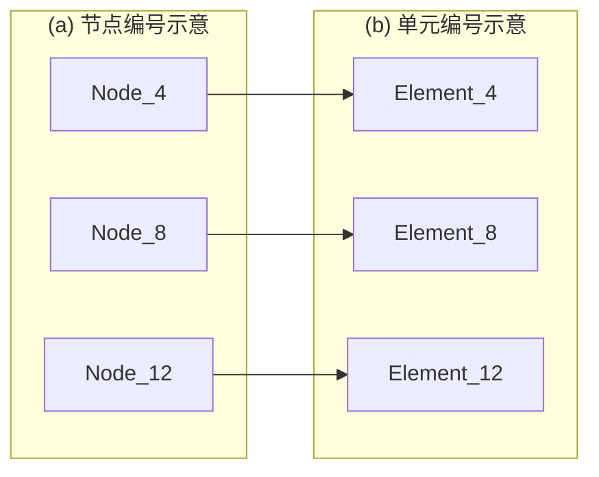
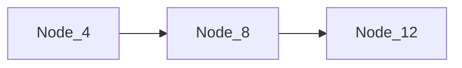

# 高性能有限元分析软件

# GFE

# ——隐式求解器技术手册 v2025


<details>
<summary>natural_image</summary>

Abstract 3D illustration of interconnected buildings and circuit lines, no text or symbols present
</details>

杜修力院士科研团队

广州颖力科技有限公司

2025年09月

# 目录

前言....1

第一章 有限单元验证....3

1.1 三维实体单元.... 4

1.1.1 C3D4 单元....4  
1.1.2 C3D6 单元....7  
1.1.3 C3D8 单元....10  
1.1.4 C3D8I 单元....14  
1.1.5 C3D10 单元....17

1.2 壳单元.... 21

1.2.1 S3 单元....21  
1.2.2 S4 单元....24

1.3 梁单元.... 28

1.3.1 B31 单元....28  
1.3.2 B21 单元....31

1.4 平面应变单元.... 34

1.4.1 CPE3 单元....34

1.5 孔压单元.... 37

1.5.1 CPE3P 单元....37  
1.5.2 C3D4P 单元....39  
1.5.3 C3D4P 单元纯渗流分析 ..... 44

1.6 本章小结.... 46

第二章 材料本构验证....47

2.1 弹塑性模型....47

2.1.1 线性强化弹塑性....47  
2.1.2 Mohr Coloumb 弹塑性....50

2.2 超弹材料....51

2.2.1 Mooney-Rivlin....51  
2.2.2 Marlow ....54

2.2.3 Hyperfoam....57  
2.2.4 Polynomial....60  
2.2.5 Reduce Polynomial....62  
2.2.6 Yeoh....65  
2.2.7 Arruda-Boyce 应变势能....68  
2.2.8 Neo-Hooke 应变势能....70  
2.2.9 VAN-DER-WAALS 应变势能....72

2.3 热膨胀材料....75

2.4 HSS 本构....77

2.4.1 单元测试....77

2.5 南水模型本构....83

2.5.1 基本理论....83

2.5.2 常规三轴压缩试验验证....84

2.6 蠕变材料....87

2.7考虑屈曲的一维钢筋本构....88

2.7.1 基本理论....88

2.7.2 模型验证....90

2.8 本章小结.... 91

# 第三章 分析类型.... 93

3.1 静力分析....93

3.2 模态分析....95

3.3 动力分析....97

3.2.1 newmark 法....97

3.2.2 振型叠加法....99

3.4 频响分析....101

3.4.1 直接法....101

3.4.2 模态法.... 102

3.4.3 人工边界法....104

3.5 反应谱分析....105

3.5.1 验证案例....105  
3.5.2 地下结构反应谱分析 ..... 107

3.6 粘弹性分析....111  
3.7 本章小结....113

第四章 边界条件和荷载....114

4.1 隐式动力分析....114

4.1.1 位移....114  
4.1.2 集中力....115  
4.1.3 压力....116  
4.1.4 惯性力....117  
4.1.5 非结构性质量....117  
4.1.6 体力....118  
4.1.7 线荷载....119

4.2 静力分析....119

4.2.1 位移....120  
4.2.2 集中力....121  
4.2.3 压力....121  
4.2.4 惯性力....122  
4.2.5 非结构性质量....123  
4.2.6 温度....125  
4.2.7 体力....125  
4.2.8 线荷载.... 126

第五章 相互作用....129

5.1 Tie 绑定约束.... 129

5.1.1 静力分析....129  
5.1.2 模态分析....130

5.2 约束/耦合....131

5.2.1 MPC 多点约束....131  
5.2.2 Coupling 耦合约束....133

5.3 嵌入约束....134

5.3.1 静力分析....135  
5.3.2 模态分析....136

5.4 刚体约束....137  
5.5 特殊相互作用....138

5.5.1 接地弹簧（拉压异性）.... 138  
5.5.2 绑定约束（法向只压不拉，切向无作用）.... 139  
5.5.3 绑定约束（法向只压不拉，切向绑定）.... 141  
5.5.4 附带材料属性的绑定约束.... 142  
5.5.5 绑定约束（三向刚度可指定）.... 142

5.6 本章小结....143

第六章 阻尼....145

6.1 全局瑞利阻尼....145

6.1.1 振型叠加法动力分析....145  
6.1.2 Newmark 法动力分析 ..... 147  
6.1.3 直接法频响分析....148  
6.1.4 振型叠加法频响分析....150

6.2 全局结构阻尼....152

6.2.1 直接法频响分析 ..... 152

6.3 振型阻尼比....154

6.3.1 振型叠加法动力分析....154  
6.3.2 振型叠加法频响分析....156  
6.3.3 响应谱分析....158

6.4 振型瑞利阻尼....159

6.4.1 振型叠加法动力分析....159  
6.4.2 振型叠加法频响分析....161

6.5 visco 粘弹性阻尼....163

6.5.1 直接法频响分析....163

6.6 材料瑞利阻尼....165

6.6.1 Newmark 法动力分析 ..... 165

6.7 本章小结....167

第七章 施工阶段分析....169

7.1 三维实体单元....169

7.1.1 C3D4 单元....169  
7.1.2 C3D8 单元....171

7.2 壳单元....173

7.2.1 S3R 单元....173  
7.2.2 S4R 单元....174

7.3 梁单元....176

7.3.1 B31 单元....176  
7.3.2 B21 单元....178

7.4 平面应变单元....180

7.4.1 CPE3 单元....180  
7.4.2 CPE4 单元....181

7.5 本章小结....183

参考文献....184

# 前言

工业软件是现代产业体系之“魂”，是工业强国之重器。习近平总书记于2021年5月28日在两院院士大会和中国科协代表大会上发表重要讲话《加快建设科技强国，实现高水平科技自立自强》，指出：“科技攻关要坚持问题导向，奔着最紧急、最紧迫的问题去。要从国家急迫需要和长远需求出发，在石油天然气、基础原材料、高端芯片、工业软件、农作物种子、科学试验用仪器设备、化学制剂等方面关键核心技术上全力攻坚。”。实现工业软件特别是CAE软件的国产替代，解决卡脖子问题，是国家的重大战略需求之一。

以土木工程应用为主要场景,广州颖力科技有限公司自主研发了高性能有限元分析软件 GFE。该软件由有限元求解器模块和前后处理模块组成，并可与结构专业设计软件无缝对接进行结构前后处理。GFE 软件的优势与功能特色如下:

（1）“准”一集成了先进的土-结构动力相互作用分析模型与方法，保证计算结果准确。软件的各类单元、本构模型、相互作用条件、求解算法等对标国际主流通用有限元软件；软件集成了动力人工边界条件、场地地震反应分析、地震动输入等土-结构相互作用分析方法；软件集成了我国地下结构抗震设计规范要求的各类分析方法，包括二维和三维以及线性和非线性时程分析方法、以及反应加速度法和反应位移法等。  
（2）“快”一采用了 CPU 并行计算的隐式求解和编程架构，保证计算过程快速。  
（3）“简”一简化了土与结构一体化建模，可进行构件设计并生成计算书，操作简便。可将结构专业设计软件建立的结构模型导入 GFE 软件，之后在 GFE 软件内简单完成土-结构系统建模；基于 GFE 计算得到的结构结果可以完成效应组合、截面验算、配筋、生成计算书等；GFE 软件也支持导入其他有限元软件的计算模型。

本手册为 GFE 软件技术手册的第二部分-隐式求解器分册。本册介绍了 GFE 软件隐式求解器 GFEXN 所支持的单元类型、材料非线性本构模型、分析类型、交界面相互作用条件、阻尼条件、以及施工阶段分析，并给出了合适的算例进行

计算验证，计算结果与主流商业有限元软件结果进行对比，验证 GFE 软件的可靠性。之后给出多个应用案例，包括高层建筑施工、临近建筑基坑开挖、二维基坑开挖、锚杆隧道施工、双排桩基基坑支护等，验证了 GFE 软件在施工阶段分析实际工程应用中的可靠性。

# 第一章 有限单元验证

GFE 隐式求解器 GFEXN 支持有限元分析常用的单元类型, 包括纤维梁单元、分层壳单元、平面应变单元和实体单元。如表 1 所示, 本章提供每种单元类型的部分静力分析算例, 与理论解或国际知名通用有限元软件 (软件 A) 的计算结果进行对比, 验证 GFE 软件中有限单元的正确性。

表 1 GFE 软件中的有限单元

<table><tr><td>单元类型</td><td>子类型</td><td>材料本构</td></tr><tr><td rowspan="4">纤维梁单元</td><td rowspan="2">二维(B21)</td><td>线弹性</td></tr><tr><td>线性强化弹塑性</td></tr><tr><td rowspan="2">三维(B31)</td><td>线弹性</td></tr><tr><td>线性强化弹塑性</td></tr><tr><td rowspan="4">平面应变单元</td><td rowspan="2">三角形(CPE3)</td><td>线弹性</td></tr><tr><td>Mohr Coloumb 弹塑性</td></tr><tr><td rowspan="2">四边形(CPE4)</td><td>线弹性</td></tr><tr><td>Mohr Coloumb 弹塑性</td></tr><tr><td rowspan="4">分层壳单元</td><td rowspan="2">三角形(S3)</td><td>线弹性</td></tr><tr><td>线性强化弹塑性</td></tr><tr><td rowspan="2">四边形(S4)</td><td>线弹性</td></tr><tr><td>线性强化弹塑性</td></tr><tr><td rowspan="8">实体单元</td><td rowspan="2">一阶四面体(C3D4)</td><td>线弹性</td></tr><tr><td>Mohr Coloumb 弹塑性</td></tr><tr><td rowspan="2">二阶四面体(C3D10)</td><td>线弹性</td></tr><tr><td>Hyperfoam</td></tr><tr><td rowspan="2">一阶六面体(C3D8\C3D8I)</td><td>线弹性</td></tr><tr><td>线性强化弹塑性/Mohr Coloumb 弹塑性</td></tr><tr><td rowspan="2">楔形体(C3D6)</td><td>线弹性</td></tr><tr><td>Mohr Coloumb 弹塑性</td></tr></table>

# 1.1 三维实体单元

# 1.1.1 C3D4 单元

# 1.1.1.1 线弹性

采用 GFE 软件和软件 A 中的线弹性本构模型对模型进行静力作用分析。模型的质量密度 $2.65 \, t/m^{3}$ ，弹性模量 $3.0 \times 10^{7} \, kPa$ ，泊松比 0.2。

模型底部固定，对模型顶面施加 X 正方向 1000N 的静力荷载，有限元模型如图 1.1.1-1 所示。选取模型上若干节点和单元，如图 1.1.1-2 所示，输出其位移、最大主应变和 Mises 应力结果进行分析对比。表 1.1.1-1 出所选节点的 X 方向位移，表 1.1.1-2 和表 1.1.1-3 分别给出所选单元的最大主应变和 Mises 应力，可以看到，两款软件计算结果基本完全吻合。图 1.1.1-3 进一步给出位移云图结果，可以看到，两款软件的计算结果吻合较好。


<details>
<summary>natural_image</summary>

3D mesh model of a rectangular prism with green and orange triangular faces, no text or symbols present
</details>

图 1.1.1-1 有限元模型


<details>
<summary>text_image</summary>

Node_179
Node_333
Node_5
</details>

(a) 节点编号示意


<details>
<summary>text_image</summary>

Element_179
Element_333
Element_5
</details>

(b) 单元编号示意  
图 1.1.1-2 节点及单元编号

表 1.1.1-1 X 轴方向位移

<table><tr><td>节点号</td><td>GFE(mm)</td><td>软件A(mm)</td><td>相对差异(%)</td></tr><tr><td>5</td><td>1.47713</td><td>1.47744</td><td>0.0210</td></tr><tr><td>179</td><td>1.35567</td><td>1.35612</td><td>0.0332</td></tr><tr><td>333</td><td>0.634596</td><td>0.634674</td><td>0.0123</td></tr></table>

表 1.1.1-2 最大主应变

<table><tr><td>单元号</td><td>GFE</td><td>软件A</td><td>相对差异(%)</td></tr><tr><td>5</td><td>0.00359236</td><td>0.00354168</td><td>1.4208</td></tr><tr><td>179</td><td>0.0234468</td><td>0.0234023</td><td>0.1900</td></tr><tr><td>333</td><td>0.0221398</td><td>0.0221604</td><td>0.0930</td></tr></table>

表 1.1.1-3 Mises 应力

<table><tr><td>单元号</td><td>GFE</td><td>软件A</td><td>相对差异(%)</td></tr><tr><td>5</td><td>517692</td><td>513708</td><td>0.7725</td></tr><tr><td>179</td><td>991097</td><td>993569</td><td>0.2491</td></tr><tr><td>333</td><td>1181810</td><td>1177420</td><td>0.3722</td></tr></table>


<details>
<summary>heatmap</summary>

| Metric | Value |
| --- | --- |
| (a) GFE Software (Max) | 1.665E+00 |
| (a) GFE Software (Min) | 7.753E-10 |
| (b) Software A (Max) | +1.666e+00 |
| (b) Software A (Min) | +0.000e+00 |
</details>

图 1.1.1-3 位移云图

# 1.1.1.2 Mohr Coloumb 弹塑性

采用 GFE 软件和软件 A 中的 Mohr Coloumb 弹塑性本构模型对模型进行静力作用分析。模型的质量密度 $2.0 \, t/m^{3}$ ，弹性模量 $3.0 \times 10^{5} \, kPa$ ，泊松比 0.3，摩擦角 $20^{\circ}$ ，黏聚力 200kPa。

模型底部固定，X 正方向施加 $4 ~m/s^{2}$ 的惯性力荷载，有限元模型如图 1.1.1-4 所示。选取模型上若干节点和单元，如图 1.1.1-5 所示，输出其位移、最大主应变 Mises 应力结果进行分析对比。表 1.1.1-4 出所选节点的 X 方向位移，表 1.1.1-5 和表 1.1.1-6 分别给出所选单元的最大主应变和 Mises 应力，可以看到，两款软件计算结果基本完全吻合。图 1.1.1-6 进一步给出位移云图结果，可以看到，两款软件的计算结果吻合较好。


<details>
<summary>natural_image</summary>

3D mesh model of a rectangular prism with triangular faces and blue nodes at the top (no text or symbols)
</details>

图 1.1.1-4 有限元模型  


<details>
<summary>text_image</summary>

Node_179
Node_333
Node_5
</details>

(a) 节点编号示意


<details>
<summary>text_image</summary>

Element_179
Element_333
Element_5
</details>

(b) 单元编号示意

图 1.1.1-5 节点及单元编号  
表 1.1.1-4 X 轴方向位移

<table><tr><td>节点号</td><td>GFE(mm)</td><td>软件A(mm)</td><td>相对差异(%)</td></tr><tr><td>5</td><td>11.8554</td><td>11.8800</td><td>0.0207</td></tr><tr><td>179</td><td>9.9651</td><td>9.9891</td><td>0.0240</td></tr><tr><td>333</td><td>5.6991</td><td>5.7185</td><td>0.0339</td></tr></table>

表 1.1.1-5 最大主应变

<table><tr><td>单元号</td><td>GFE</td><td>软件A</td><td>相对差异(%)</td></tr><tr><td>5</td><td>2.1899e-5</td><td>2.2364e-5</td><td>2.079</td></tr><tr><td>179</td><td>2.2059e-4</td><td>2.2740e-4</td><td>2.995</td></tr><tr><td>333</td><td>1.4897e-4</td><td>1.4946e-4</td><td>0.328</td></tr></table>

表 1.1.1-6 Mises 应力

<table><tr><td>单元号</td><td>GFE</td><td>软件A</td><td>相对差异(%)</td></tr><tr><td>5</td><td>19.9023</td><td>20.0636</td><td>0.804</td></tr><tr><td>179</td><td>82.7276</td><td>85.4658</td><td>3.204</td></tr><tr><td>333</td><td>79.8628</td><td>79.8437</td><td>0.024</td></tr></table>


<details>
<summary>heatmap</summary>

| Model | Displacement Magnitude (U, Magnitude) |
| :--- | :--- |
| (a) GFE 软件 | 5.658E-12 ~ 1.186E-02 |
| (b) 软件 A | +0.000e+00 ~ +1.189e-02 |
</details>

图 1.1.1-6 位移云图

# 1.1.2 C3D6 单元

# 1.1.2.1 线弹性

采用 GFE 软件和软件 A 中的线弹性本构模型对模型进行静力作用分析。模型的质量密度 $2.5 \, t/m^{3}$ ，弹性模量 $3.0 \times 10^{7} \, kPa$ ，泊松比 0.25。

模型底部固定，对模型顶面施加 X 正方向 1000N 的静力荷载，有限元模型如图 1.1.2-1 所示。选取模型上若干节点和单元，如图 1.1.2-1 所示，输出其位移、最大主应变和 Mises 应力结果进行分析对比。表 1.1.2-1 出所选节点的 X 方向位移，表 1.1.2-2 和表 1.1.2-3 分别给出所选单元的最大主应变和 Mises 应力，可以看到，两款软件计算结果基本完全吻合。图 1.1.2-3 进一步给出位移云图结果，

可以看到，两款软件的计算结果吻合较好。


<details>
<summary>natural_image</summary>

3D rendering of a green rectangular prism with yellow triangular markers at the base and top edges (no text or symbols)
</details>

图 1.1.2-1 有限元模型


<details>
<summary>text_image</summary>

Node_912
Node_487
Node_1171
</details>

(a) 节点编号示意


<details>
<summary>text_image</summary>

Element 1210
Element_755
Element_1651
</details>

(b) 单元编号示意

图 1.1.2-2 节点及单元编号  
表 1.1.2-1 X 轴方向位移

<table><tr><td>节点号</td><td>GFE(mm)</td><td>软件A(mm)</td><td>相对差异(%)</td></tr><tr><td>487</td><td>0.3383</td><td>0.3379</td><td>0.12</td></tr><tr><td>912</td><td>1.0802</td><td>1.0792</td><td>0.09</td></tr><tr><td>1171</td><td>1.5345</td><td>1.5333</td><td>0.08</td></tr></table>


<details>
<summary>heatmap</summary>

| Color | U (Magnitude) |
| --- | --- |
| Red | 1.500E+00 |
| Orange | 1.400E+00 |
| Yellow | 1.300E+00 |
| Light Green | 1.150E+00 |
| Green | 1.000E+00 |
| Teal | 8.750E-01 |
| Cyan | 7.000E-01 |
| Light Blue | 5.500E-01 |
| Blue | 4.375E-01 |
| Dark Blue | 2.910E-01 |
| Deep Blue | 1.460E-01 |
| Very Deep Blue | 0.000E+00 |
</details>

(a) GFE 软件


<details>
<summary>heatmap</summary>

| Color | U, Magnitude |
| --- | --- |
| Red | +1.745e+00 |
| Orange-Red | +1.599e+00 |
| Orange | +1.454e+00 |
| Yellow-Orange | +1.309e+00 |
| Yellow | +1.163e+00 |
| Yellow-Green | +1.018e+00 |
| Green | +8.724e-01 |
| Light Green | +7.270e-01 |
| Cyan | +5.816e-01 |
| Light Blue | +4.362e-01 |
| Blue | +2.908e-01 |
| Dark Blue | +1.454e-01 |
| Deep Blue | +0.000e+00 |
</details>

(b) 软件 A  
图 1.1.2-3 位移云图

# 1.1.2.2 Mohr Coloumb 弹塑性

采用 GFE 软件和软件 A 中的 Mohr Coloumb 弹塑性本构对模型进行静力作用分析。模型的质量密度 $2.0 \, t/m^{3}$ ，弹性模量 $3.0 \times 10^{5} \, kPa$ ，泊松比 0.3，摩擦角 $20^{\circ}$ ，黏聚力 200kPa。

模型底部固定，X 正方向施加 $4 ~m/s^{2}$ 的惯性力荷载，有限元模型如图 1.1.2-4 所示。选取模型上若干节点和单元，如图 1.1.2-5 所示，输出其位移、最大主应变 Mises 应力结果进行分析对比。表 1.1.2-4 出所选节点的 X 方向位移，表 1.1.2-5 Mises 应力，可以看到，两款软件计算结果基本完全吻合。图 1.1.2-6 进一步给出位移云图结果，可以看到，两款软件的计算结果吻合较好。


<details>
<summary>natural_image</summary>

3D rendering of a green rectangular prism with blue nodes at the top and bottom edges, labeled X and Y axes (no text or symbols on the structure itself)
</details>

图 1.1.2-4 有限元模型


<details>
<summary>text_image</summary>

Node_912
Node_487
Node_1171
</details>

(a) 节点编号示意


<details>
<summary>text_image</summary>

Element_1210
Element_755
Element_1651
</details>

(b) 单元编号示意

图 1.1.2-5 节点及单元编号  
表 1.1.2-2 X 轴方向位移

<table><tr><td>节点号</td><td>GFE(mm)</td><td>软件A(mm)</td><td>相对差异(%)</td></tr><tr><td>487</td><td>3.6956e-3</td><td>3.6563e-3</td><td>0.0207</td></tr><tr><td>912</td><td>9.5250e-3</td><td>9.4462e-3</td><td>0.0240</td></tr><tr><td>1171</td><td>1.3726e-2</td><td>1.3618e-2</td><td>0.0339</td></tr></table>


<details>
<summary>heatmap</summary>

| Model | Displacement Magnitude (U, Magnitude) |
| :--- | :--- |
| (a) GFE 软件 | 1.373E-02 to 1.319E-12 |
| (b) 软件 A | +1.362E-02 to +0.000e+00 |
</details>

图 1.1.2-6 位移云图

# 1.1.3 C3D8 单元

# 1.1.3.1 线弹性

分别采用 GFE 软件和软件 A 中的线弹性本构对模型进行静力分析。模型的质量密度 $2.5 \, t/m^{3}$ ，弹性模量 $3.0 \times 10^{7} \, kPa$ ，泊松比 0.25。

模型底部固定，对模型顶面施加 X 正方向 1000N 的静力荷载，有限元模型如图 1.1.3-1 所示。选取模型上若干节点和单元，如图 1.1.3-1 所示，输出其位移、最大主应变和 Mises 应力结果进行分析对比。表 1.1.3-1 出所选节点的 X 方向位移，表 1.1.3-2 和表 1.1.3-3 分别给出所选单元的最大主应变和 Mises 应力，可以看到，两款软件计算结果基本完全吻合。图 1.1.3-3 进一步给出位移云图结果，可以看到，两款软件的计算结果吻合较好。


<details>
<summary>natural_image</summary>

3D rendering of a green rectangular prism with grid lines and yellow markers at the base (no text or symbols)
</details>

图 1.1.3-1 有限元模型


<details>
<summary>text_image</summary>

Node_553
Node_286
Node_7
</details>

(a) 节点编号示意


<details>
<summary>text_image</summary>

Element_523
Element_85
Element_750
</details>

(b) 单元编号示意  
图 1.1.3-2 节点及单元编号

表 1.1.3-1 X 轴方向位移

<table><tr><td>节点号</td><td>GFE(mm)</td><td>软件A(mm)</td><td>相对差异(%)</td></tr><tr><td>7</td><td>1.4664</td><td>1.4656</td><td>0.055</td></tr><tr><td>286</td><td>4.4428e-2</td><td>4.4420e-2</td><td>0.018</td></tr><tr><td>553</td><td>8.4668e-1</td><td>8.4633e-1</td><td>0.041</td></tr></table>

表 1.1.3-3 Mises 应力

<table><tr><td>单元号</td><td>GFE</td><td>软件A</td><td>相对差异(%)</td></tr><tr><td>85</td><td>3.25673e6</td><td>3.41429e6</td><td>4.615</td></tr><tr><td>523</td><td>496896</td><td>458478</td><td>7.732</td></tr><tr><td>750</td><td>393637</td><td>371712</td><td>5.570</td></tr></table>


<details>
<summary>heatmap</summary>

| Color | U, Magnitude |
| --- | --- |
| Red | 1.651E+00 |
| Orange-Red | 1.513E+00 |
| Orange | 1.376E+00 |
| Yellow-Orange | 1.238E+00 |
| Yellow | 1.101E+00 |
| Yellow-Green | 9.631E-01 |
| Green | 8.255E-01 |
| Light Green | 6.879E-01 |
| Cyan-Green | 5.504E-01 |
| Cyan | 4.128E-01 |
| Light Blue | 2.752E-01 |
| Blue | 1.376E-01 |
| Dark Blue | 2.758E-09 |
</details>

(a) GFE 软件


<details>
<summary>heatmap</summary>

| Color | U, Magnitude |
| --- | --- |
| Red | +1.650e+00 |
| Orange-Red | +1.512e+00 |
| Orange | +1.375e+00 |
| Yellow-Orange | +1.237e+00 |
| Yellow | +1.100e+00 |
| Yellow-Green | +9.624e-01 |
| Green | +8.249e-01 |
| Light Green | +6.874e-01 |
| Cyan-Green | +5.499e-01 |
| Cyan | +4.124e-01 |
| Light Blue | +2.750e-01 |
| Blue | +1.375e-01 |
| Dark Blue | +0.000e+00 |
</details>

(b) 软件 A  
图 1.1.3-3 位移云图

# 1.1.3.2 线性强化弹塑性

采用 GFE 软件和软件 A 中的线性强化弹塑性本构模型对模型进行静力作用分析。模型的质量密度 $2.65 \, t/m^{3}$ ，弹性模量 $3.0 \times 10^{7} \, kPa$ ，泊松比 0.2，线性强化弹塑性参数如表 1.1.3-4 所示。

表 1.1.3-4 线性强化弹塑性参数

<table><tr><td>屈服应力(kPa)</td><td>塑性应变</td></tr><tr><td>500000</td><td>0</td></tr><tr><td>1000000</td><td>0.1</td></tr><tr><td>5000000</td><td>1</td></tr></table>

模型底部固定，对模型顶面施加 X 正方向 200N 的静力荷载，有限元模型如图 1.1.3-4 所示。选取模型上若干节点和单元，如图 1.1.3-5 所示，输出其位移、最大主应变 Mises 应力结果进行分析对比。表 1.1.3-5 出所选节点的 X 方向位移，表 1.1.3-6 给出所选单元的 Mises 应力，可以看到，两款软件计算结果基本完全吻合。图 1.1.3-6 进一步给出位移云图结果，可以看到，两款软件的计算结果吻合较好。


<details>
<summary>natural_image</summary>

3D rendering of a rectangular prism with green grid and yellow nodes, no text or symbols present
</details>

图 1.1.3-4 有限元模型  


<details>
<summary>text_image</summary>

Node_553
Node_286
Node_7
</details>

(a) 节点编号示意


<details>
<summary>text_image</summary>

Element_523
Element_750
Element_85
</details>

(b) 单元编号示意

图 1.1.3-5 节点及单元编号  
表 1.1.3-5 X 轴方向位移

<table><tr><td>节点号</td><td>GFE(mm)</td><td>软件A(mm)</td><td>相对差异(%)</td></tr><tr><td>7</td><td>0.406371</td><td>0.406312</td><td>0.0145</td></tr><tr><td>286</td><td>0.0115172</td><td>0.0115158</td><td>0.0121</td></tr><tr><td>553</td><td>0.215122</td><td>0.215102</td><td>0.0093</td></tr></table>

表 1.1.3-6 Mises 应力

<table><tr><td>单元号</td><td>GFE</td><td>软件A</td><td>相对差异(%)</td></tr><tr><td>85</td><td>759181</td><td>820981</td><td>7.528</td></tr><tr><td>523</td><td>105591</td><td>112266</td><td>5.946</td></tr><tr><td>750</td><td>87604.4</td><td>89332</td><td>1.934</td></tr></table>


<details>
<summary>heatmap</summary>

| Color | U Magnitude |
| --- | --- |
| Red | 4.17E-01 |
| Orange-Red | 3.82E-01 |
| Orange | 3.48E-01 |
| Yellow-Orange | 3.13E-01 |
| Yellow | 2.78E-01 |
| Yellow-Green | 2.43E-01 |
| Green | 2.09E-01 |
| Light Green | 1.74E-01 |
| Cyan-Green | 1.39E-01 |
| Cyan | 1.04E-01 |
| Light Blue | 6.95E-02 |
| Blue | 3.48E-02 |
| Dark Blue | 0.00E+00 |
</details>

(a) GFE 软件


<details>
<summary>heatmap</summary>

| Color | U, Magnitude |
| --- | --- |
| Red | +4.170e-01 |
| Orange-Red | +3.823e-01 |
| Orange | +3.475e-01 |
| Yellow-Orange | +3.128e-01 |
| Yellow | +2.780e-01 |
| Yellow-Green | +2.433e-01 |
| Green | +2.085e-01 |
| Light Green | +1.738e-01 |
| Cyan-Green | +1.390e-01 |
| Cyan | +1.043e-01 |
| Light Blue | +6.951e-02 |
| Blue | +3.475e-02 |
| Dark Blue | +0.000e+00 |
</details>

(b) 软件 A  
图 1.1.3-6 位移云图

# 1.1.4 C3D8I 单元

# 1.1.4.1 线弹性

分别采用 GFE 软件和软件 A 中的线弹性本构对模型进行静力分析。模型的质量密度 $2.5 \, t/m^{3}$ ，弹性模量 $3.0 \times 10^{7} \, kPa$ ，泊松比 0.25。

模型底部固定，对模型顶面施加 X 正方向 200N 的静力荷载，有限元模型如图 1.1.4-1 所示。选取模型上若干节点和单元，如图 1.1.4-1 所示，输出其位移、最大主应变和 Mises 应力结果进行分析对比。表 1.1.4-1 出所选节点的 X 方向位移，表 1.1.4-2 和表 1.1.4-3 分别给出所选单元的最大主应变和 Mises 应力，可以看到，两款软件计算结果基本完全吻合。图 1.1.4-3 进一步给出位移云图结果，可以看到，两款软件的计算结果吻合较好。


<details>
<summary>natural_image</summary>

3D rendering of a green rectangular prism with yellow grid lines and blue nodes at the top (no text or symbols)
</details>

图 1.1.4-1 有限元模型


<details>
<summary>text_image</summary>

Node_553
Node_286
Node_7
</details>

(a) 节点编号示意


<details>
<summary>text_image</summary>

Element_523
Element_750
Element_85
</details>

(b) 单元编号示意  
图 1.1.4-2 节点及单元编号  
表 1.1.4-1 X 轴方向位移

<table><tr><td>节点号</td><td>GFE(mm)</td><td>软件A(mm)</td><td>相对差异(%)</td></tr><tr><td>7</td><td>0.406624</td><td>0.406384</td><td>0.059</td></tr><tr><td>286</td><td>0.0116028</td><td>0.0116054</td><td>0.022</td></tr><tr><td>553</td><td>0.214981</td><td>0.214895</td><td>0.040</td></tr></table>

表 1.1.4-3 Mises 应力

<table><tr><td>单元号</td><td>GFE</td><td>软件A</td><td>相对差异(%)</td></tr><tr><td>85</td><td>832098</td><td>838234</td><td>0.732</td></tr><tr><td>523</td><td>82611.5</td><td>91588.2</td><td>9.801</td></tr><tr><td>750</td><td>90929.6</td><td>85162.7</td><td>6.772</td></tr></table>


<details>
<summary>heatmap</summary>

| Color | U-Magnitude |
| --- | --- |
| Red | 6.175e-01 |
| Orange-Red | 5.935e-01 |
| Orange | 5.691e-01 |
| Yellow-Orange | 5.356e-01 |
| Yellow | 5.013e-01 |
| Yellow-Green | 4.769e-01 |
| Green | 4.435e-01 |
| Light Green | 4.091e-01 |
| Green-Cyan | 3.756e-01 |
| Cyan | 3.392e-01 |
| Light Blue | 3.048e-01 |
| Blue | 2.694e-01 |
| Dark Blue | 2.340e-01 |
| Deep Blue | 1.986e-01 |
| Deep Blue | 1.632e-01 |
| Deep Blue | 1.288e-01 |
| Deep Blue | 9.444e-02 |
| Deep Blue | 6.990e-02 |
| Dark Blue | 3.488e-02 |
| Very Dark Blue | 0.006e+08 |
</details>

(a) GFE 软件


<details>
<summary>heatmap</summary>

| Color | U, Magnitude |
| --- | --- |
| Red | +4.171e-01 |
| Orange | +3.823e-01 |
| Yellow-Orange | +3.476e-01 |
| Yellow | +3.128e-01 |
| Light Green | +2.781e-01 |
| Green | +2.433e-01 |
| Teal | +2.086e-01 |
| Cyan | +1.738e-01 |
| Light Blue | +1.390e-01 |
| Blue | +1.043e-01 |
| Dark Blue | +6.952e-02 |
| Darker Blue | +3.476e-02 |
| Darkest Blue | +0.000e+00 |
</details>

(b) 软件 A  
图 1.1.4-3 位移云图

# 1.1.4.2 Mohr Coloumb 弹塑性

采用 GFE 软件和软件 A 中的 Mohr Coloumb 弹塑性本构对模型进行静力分析。模型的质量密度 $2.0 \, t/m^{3}$ ，弹性模量 $3.0 \times 10^{5} \, kPa$ ，泊松比 0.3，摩擦角 $20^{\circ}$ ，黏聚力 200kPa。

模型底部固定，X 正方向施加 $4 ~m/s^{2}$ 的惯性力荷载，有限元模型如图 1.1.4-4 所示。选取模型上若干节点和单元，如图 1.1.4-5 所示，输出其位移和 Mises 应力结果进行分析对比。表 1.1.4-4 出所选节点的 X 方向位移，表 1.1.4-5 给出所选单元的 Mises 应力，可以看到，两款软件计算结果基本完全吻合。图 1.1.4-6 进

一步给出位移云图结果，可以看到，两款软件的计算结果吻合较好。


<details>
<summary>natural_image</summary>

3D rendering of a rectangular prism with green grid and yellow nodes, no text or symbols present
</details>

图 1.1.4-4 有限元模型


<details>
<summary>text_image</summary>

Node_553
Node_286
Node_7
</details>

(a) 节点编号示意


<details>
<summary>text_image</summary>

Element_523
Element_750
Element_85
</details>

(b) 单元编号示意

图 1.1.4-5 节点及单元编号  
表 1.1.4-4 X 轴方向位移

<table><tr><td>节点号</td><td>GFE(mm)</td><td>软件A(mm)</td><td>相对差异(%)</td></tr><tr><td>7</td><td>1.37694e-2</td><td>1.37838e-2</td><td>0.104</td></tr><tr><td>286</td><td>7.76583e-4</td><td>7.78351e-4</td><td>0.227</td></tr><tr><td>553</td><td>7.81036e-3</td><td>7.82030e-3</td><td>0.127</td></tr></table>

表 1.1.4-5 Mises 应力

<table><tr><td>单元号</td><td>GFE</td><td>软件A</td><td>相对差异(%)</td></tr><tr><td>85</td><td>324.665</td><td>324.922</td><td>0.079</td></tr><tr><td>523</td><td>22.2241</td><td>22.3099</td><td>0.385</td></tr><tr><td>750</td><td>0.588157</td><td>0.588337</td><td>0.031</td></tr></table>

  
图 1.1.4-6 位移云图

# 1.1.5 C3D10 单元

# 1.1.5.1 线弹性

分别采用 GFE 软件和软件 A 中的线弹性本构模型对模型进行静力作用分析。
模型的质量密度 $2.5 \, t/m^{3}$ ，弹性模量 $3.0 \times 10^{7} \, kPa$ ，泊松比 0.25。

模型底部固定，对模型顶面施加 X 正方向 1000N 的静力荷载，有限元模型如图 1.1.5-1 所示。选取模型上若干节点和单元，如图 1.1.5-2 所示，输出其位移、最大主应变和 Mises 应力结果进行分析对比。表 1.1.5-1 出所选节点的 X 方向位移，表 1.1.5-2 和表 1.1.5-3 分别给出所选单元的最大主应变和 Mises 应力，可以看到，两款软件计算结果基本完全吻合。图 1.1.5-3 进一步给出位移云图结果，可以看到，两款软件的计算结果吻合较好。


<details>
<summary>natural_image</summary>

3D simulation of a rectangular beam with green grid structure and scattered blue and yellow particles at the end (no text or symbols)
</details>

图 1.1.5-1 有限元模型


<details>
<summary>text_image</summary>

Node_421
Node_202
Node_2
</details>

(a) 节点编号示意


<details>
<summary>text_image</summary>

Element_4090
Element_2595
Element_1775
</details>

(b) 单元编号示意  
图 1.1.5-2 节点及单元编号

表 1.1.5-1 X 轴方向位移

<table><tr><td>节点号</td><td>GFE(mm)</td><td>软件A(mm)</td><td>相对差异(%)</td></tr><tr><td>2</td><td>2.21855</td><td>2.21511</td><td>0.1552</td></tr><tr><td>202</td><td>1.06984</td><td>1.0678</td><td>0.1909</td></tr><tr><td>421</td><td>2.02461</td><td>2.02093</td><td>0.1819</td></tr></table>

表 1.1.5-2 最大主应变

<table><tr><td>单元号</td><td>GFE</td><td>软件A</td><td>相对差异(%)</td></tr><tr><td>1755</td><td>0.0232472</td><td>0.0229737</td><td>1.2</td></tr><tr><td>2595</td><td>0.0539443</td><td>0.052251</td><td>3.1890</td></tr><tr><td>4090</td><td>0.0264986</td><td>0.026591</td><td>0.3481</td></tr></table>

表 1.1.5-3 Mises 应力

<table><tr><td>单元号</td><td>GFE</td><td>软件A</td><td>相对差异(%)</td></tr><tr><td>1775</td><td>367167</td><td>386929</td><td>5.1</td></tr><tr><td>2595</td><td>4462950</td><td>4447910</td><td>0.34</td></tr><tr><td>4090</td><td>650379</td><td>619769</td><td>4.9</td></tr></table>


<details>
<summary>heatmap</summary>

| Color | U, Magnitude |
| --- | --- |
| Red | 2.877E+00 |
| Orange | 2.637E+00 |
| Yellow-Orange | 2.398E+00 |
| Yellow | 2.158E+00 |
| Light Green | 1.918E+00 |
| Green | 1.678E+00 |
| Teal | 1.439E+00 |
| Cyan | 1.199E+00 |
| Light Blue | 9.590E-01 |
| Blue | 7.193E-01 |
| Dark Blue | 4.795E-01 |
| Deep Blue | 2.398E-01 |
| Deep Blue | 4.649E-10 |
</details>

(a) GFE 软件


<details>
<summary>heatmap</summary>

| Color | U, Magnitude |
| --- | --- |
| Red | +2.870e+00 |
| Orange | +2.631e+00 |
| Yellow-Orange | +2.392e+00 |
| Yellow | +2.153e+00 |
| Light Green | +1.913e+00 |
| Green | +1.674e+00 |
| Teal | +1.435e+00 |
| Cyan | +1.196e+00 |
| Light Blue | +9.567e-01 |
| Blue | +7.175e-01 |
| Dark Blue | +4.784e-01 |
| Deep Blue | +2.392e-01 |
| Very Deep Blue | +0.000e+00 |
</details>

(b) 软件 A  
图 1.1.5-3 位移云图

# 1.1.5.2 Hyperfoam 本构

分别采用 GFE 软件和软件 A 中的 Hyperfoam 本构模型对模型进行静力作用分析。模型的质量密度 $2t/m^{3}$ ，Hyperfoam 本构参数如表 1.1.5-4 所示。

表 1.1.5-4 Hyperfoam 本构材料参数

<table><tr><td>阶次</td><td>μ</td><td>α</td><td>ν</td></tr><tr><td>1</td><td>160</td><td>2</td><td>9.998e-5</td></tr><tr><td>2</td><td>40</td><td>-2</td><td>9.998e-5</td></tr></table>

模型底部固定，对模型顶面 1s 内均速施加 X 正方向 5m 的位移作用，有限元模型如图 1.1.5-4 所示。选取模型上若干节点和单元，如图 1.1.5-5 所示，输出其位移、最大主应变和 Mises 应力结果进行分析对比。表 1.1.5-5 出所选节点的 X 方向位移，表 1.1.5-6 和表 1.1.5-7 分别给出所选单元的最大主应变和 Mises 应力，可以看到，两款软件计算结果基本完全吻合。图 1.1.5-6 进一步给出位移云图结果，可以看到，两款软件的计算结果吻合较好。


<details>
<summary>natural_image</summary>

3D simulation of a rectangular prism with green mesh and yellow triangular faces, no text or symbols present
</details>

图 1.1.5-4 有限元模型  


<details>
<summary>text_image</summary>

Node_421
Node_202
Node_2
</details>

(a) 节点编号示意


<details>
<summary>text_image</summary>

Element_4090
Element_2595
Element_1775
</details>

(b) 单元编号示意  
图 1.1.5-5 节点及单元编号

表 1.1.5-5 X 轴方向位移

<table><tr><td>节点号</td><td>GFE(mm)</td><td>软件A(mm)</td><td>相对差异(%)</td></tr><tr><td>2</td><td>5</td><td>5</td><td>0.000</td></tr><tr><td>202</td><td>2.89036</td><td>2.89177</td><td>0.049</td></tr><tr><td>421</td><td>4.25079</td><td>4.26881</td><td>0.422</td></tr></table>

表 1.1.5-6 最大主应变

<table><tr><td>单元号</td><td>GFE</td><td>软件A</td><td>相对差异(%)</td></tr><tr><td>1755</td><td>0.612374</td><td>0.612539</td><td>0.027</td></tr><tr><td>2595</td><td>0.618055</td><td>0.634741</td><td>2.629</td></tr><tr><td>4090</td><td>0.66113</td><td>0.665116</td><td>0.599</td></tr></table>

表 1.1.5-7 Mises 应力

<table><tr><td>单元号</td><td>GFE</td><td>软件A</td><td>相对差异(%)</td></tr><tr><td>1775</td><td>238.099</td><td>239.172</td><td>0.449</td></tr><tr><td>2595</td><td>225.776</td><td>232.195</td><td>2.764</td></tr><tr><td>4090</td><td>242.536</td><td>244.067</td><td>0.627</td></tr></table>


<details>
<summary>heatmap</summary>

| Color | U, Magnitude |
| --- | --- |
| Red | 5.000E+00 |
| Orange-Red | 4.583E+00 |
| Orange | 4.167E+00 |
| Yellow-Orange | 3.750E+00 |
| Yellow | 3.333E+00 |
| Yellow-Green | 2.917E+00 |
| Green | 2.500E+00 |
| Light Green | 2.083E+00 |
| Cyan | 1.667E+00 |
| Light Blue | 1.250E+00 |
| Blue | 8.333E-01 |
| Dark Blue | 4.167E-01 |
| Deep Blue | 1.585E-10 |
</details>

(a) GFE 软件


<details>
<summary>heatmap</summary>

| Color | U, Magnitude |
| --- | --- |
| Red | +5.000e+00 |
| Orange-Red | +4.583e+00 |
| Orange | +4.167e+00 |
| Yellow-Orange | +3.750e+00 |
| Yellow | +3.333e+00 |
| Light Green | +2.917e+00 |
| Green | +2.500e+00 |
| Teal | +2.083e+00 |
| Cyan | +1.667e+00 |
| Light Blue | +1.250e+00 |
| Blue | +8.333e-01 |
| Dark Blue | +4.167e-01 |
| Deep Blue | +0.000e+00 |
</details>

(b) 软件 A  
图 1.1.5-6 位移云图

# 1.2 壳单元

# 1.2.1 S3 单元

# 1.2.1.1 线弹性

采用 GFE 软件和软件 A 中的线弹性本构模型对模型进行静力作用分析。模型的质量密度 $2.5 \, t/m^{3}$ ，弹性模量 $3.0 \times 10^{7} \, kPa$ ，泊松比 0.25。

对模型整体施加 XYZ 三个方向的惯性力荷载，幅值为 $5.66 \, m/s^{2}$ ，有限元模型如图 1.2.1-1 所示。选取模型上若干节点和单元，如图 1.2.1-2 所示，输出其位移结果进行分析对比。表 1.2.1-1 出所选节点的 Magnitude 位移，可以看到，两款软件计算结果基本完全吻合。图 1.2.1-3 进一步给出位移云图结果，可以看到，两款软件的计算结果吻合较好。


<details>
<summary>natural_image</summary>

3D mesh model of a rectangular plate with triangular faces and a small coordinate axis, no text or symbols present
</details>

图 1.2.1-1 有限元模型


<details>
<summary>text_image</summary>

Node_54
Node_1
Node_31
</details>

图 1.2.1-2 节点编号

表 1.2.1-1 Magnitude 位移

<table><tr><td>节点号</td><td>GFE(mm)</td><td>软件A(mm)</td><td>相对差异(%)</td></tr><tr><td>1</td><td>0.0110846</td><td>0.0106327</td><td>4.250</td></tr><tr><td>31</td><td>0.000688813</td><td>0.000664127</td><td>3.717</td></tr><tr><td>54</td><td>0.0030748</td><td>0.00295022</td><td>4.223</td></tr></table>


<details>
<summary>heatmap</summary>

| Color Range | U, Magnitude |
| --- | --- |
| Red | 1.112E-02 |
| Orange-Red | 1.019E-02 |
| Orange | 9.268E-03 |
| Yellow-Orange | 8.341E-03 |
| Yellow | 7.414E-03 |
| Light Green | 6.488E-03 |
| Green | 5.561E-03 |
| Teal | 4.634E-03 |
| Cyan | 3.707E-03 |
| Light Blue | 2.780E-03 |
| Blue | 1.854E-03 |
| Dark Blue | 9.268E-04 |
| Deep Blue | 2.674E-12 |
</details>

(a) GFE 软件


<details>
<summary>heatmap</summary>

| Color | U, Magnitude |
| --- | --- |
| Red | +1.067e-02 |
| Orange | +9.781e-03 |
| Yellow-Orange | +8.892e-03 |
| Yellow | +8.003e-03 |
| Light Green | +7.113e-03 |
| Green | +6.224e-03 |
| Teal | +5.335e-03 |
| Cyan | +4.446e-03 |
| Light Blue | +3.557e-03 |
| Blue | +2.668e-03 |
| Dark Blue | +1.778e-03 |
| Deep Blue | +8.892e-04 |
| Darkest Blue | +0.000e+00 |
</details>

(b) 软件 A  
图 1.2.1-3 位移云图

# 1.2.1.2 线性强化弹塑性

采用 GFE 软件和软件 A 中的线性强化弹塑性本构对模型进行静力作用分析。模型的质量密度 $2.5 \, t/m^{3}$ ，弹性模量 $3.0 \times 10^{7} \, kPa$ ，泊松比 0.25，线性强化弹塑性参数如表 1.2.1-2 所示。

表 1.2.1-2 线性强化弹塑性参数

<table><tr><td>屈服应力(kPa)</td><td>塑性应变</td></tr><tr><td>1500</td><td>0</td></tr><tr><td>3000</td><td>0.1</td></tr><tr><td>6000</td><td>1</td></tr></table>

对模型整体施加 XYZ 三个方向的惯性力荷载，幅值为 $1 \, m/s^{2}$ ，有限元模型如图 1.2.1-4 所示。选取模型上若干节点和单元，如图 1.2.1-5 所示，输出其位移结果进行分析对比。表 1.2.1-3 出所选节点的 Magnitude 位移，可以看到，两款软件计算结果基本完全吻合。图 1.2.1-6 进一步给出位移云图结果，可以看到，两款软件的计算结果吻合较好。


<details>
<summary>natural_image</summary>

3D mesh model of a green triangular grid structure with blue nodes and a yellow coordinate axis (no text or symbols)
</details>

图 1.2.1-4 有限元模型  


<details>
<summary>text_image</summary>

Node_54
Node_31
Node_1
</details>

图 1.2.1-5 节点编号

表 1.2.1-3 Magnitude 位移

<table><tr><td>节点号</td><td>GFE(mm)</td><td>软件A(mm)</td><td>相对差异(%)</td></tr><tr><td>1</td><td>1.95758e-3</td><td>1.87781e-3</td><td>4.248</td></tr><tr><td>31</td><td>1.21674e-4</td><td>1.17315e-4</td><td>3.716</td></tr><tr><td>54</td><td>5.43046e-4</td><td>5.21052e-4</td><td>4.221</td></tr></table>


<details>
<summary>heatmap</summary>

| Color | U, Magnitude |
| --- | --- |
| Red | 1.964E-03 |
| Orange | 1.800E-03 |
| Yellow-Orange | 1.637E-03 |
| Yellow | 1.473E-03 |
| Light Green | 1.309E-03 |
| Green | 1.146E-03 |
| Teal | 9.821E-04 |
| Cyan | 8.184E-04 |
| Light Blue | 6.547E-04 |
| Blue | 4.910E-04 |
| Dark Blue | 3.274E-04 |
| Deep Blue | 1.637E-04 |
| Darkest Blue | 4.724E-13 |
</details>

(a) GFE 软件


<details>
<summary>heatmap</summary>

| Color | U, Magnitude |
| --- | --- |
| Red | +1.884e-03 |
| Orange-Red | +1.727e-03 |
| Orange | +1.570e-03 |
| Yellow-Orange | +1.413e-03 |
| Yellow | +1.256e-03 |
| Light Green | +1.099e-03 |
| Green | +9.422e-04 |
| Teal | +7.852e-04 |
| Cyan | +6.282e-04 |
| Light Blue | +4.711e-04 |
| Blue | +3.141e-04 |
| Dark Blue | +1.570e-04 |
| Deep Blue | +0.000e+00 |
</details>

(b) 软件 A  
图 1.2.1-6 位移云图

# 1.2.2 S4 单元

# 1.2.2.1 线弹性

采用 GFE 软件和软件 A 中的线弹性本构模型对模型进行静力作用分析。模型的质量密度 $2.5 \, t/m^{3}$ ，弹性模量 $3.0 \times 10^{7} \, kPa$ ，泊松比 0.25。

对模型整体施加 XYZ 三个方向的惯性力荷载，幅值为 $5.66 \, m/s^{2}$ ，有限元模型如图 1.2.2-1 所示。选取模型上若干节点和单元，如图 1.2.2-2 所示，输出其位移结果进行分析对比。表 1.2.2-1 出所选节点的 Magnitude 位移，可以看到，两款软件计算结果基本完全吻合。图 1.2.2-3 进一步给出位移云图结果，可以看到，两款软件的计算结果吻合较好。


<details>
<summary>natural_image</summary>

3D diagram of a green grid with blue nodes and yellow directional arrows, no text or symbols present
</details>

图 1.2.2-1 有限元模型


<details>
<summary>text_image</summary>

Node_55
Node_1
Node_31
</details>

图 1.2.2-2 节点编号

表 1.2.2-1 Magnitude 位移

<table><tr><td>节点号</td><td>GFE( $10^{-3}$ mm)</td><td>软件A( $10^{-3}$ mm)</td><td>相对差异(%)</td></tr><tr><td>1</td><td>11.058</td><td>10.6564</td><td>3.767</td></tr><tr><td>31</td><td>0.679445</td><td>0.656389</td><td>3.513</td></tr><tr><td>55</td><td>3.91941</td><td>3.78097</td><td>3.661</td></tr></table>


<details>
<summary>heatmap</summary>

| Color | Value Range |
| --- | --- |
| Dark Blue | ~2.00E-04 |
| Medium Blue | ~2.50E-04 |
| Cyan | ~3.00E-04 |
| Green | ~3.50E-04 |
| Yellow | ~4.00E-04 |
| Orange | ~4.00E-04 |
| Red | ~4.00E-04 |
</details>

(a) GFE 软件


<details>
<summary>heatmap</summary>

| Color Range | U, Magnitude |
| --- | --- |
| Red | +1.069e-02 |
| Orange | +9.803e-03 |
| Yellow-Orange | +8.912e-03 |
| Yellow | +8.021e-03 |
| Light Green | +7.130e-03 |
| Green | +6.239e-03 |
| Teal | +5.347e-03 |
| Cyan | +4.456e-03 |
| Light Blue | +3.565e-03 |
| Blue | +2.674e-03 |
| Dark Blue | +1.782e-03 |
| Deep Blue | +8.912e-04 |
| Deepest Blue | +0.000e+00 |
</details>

(b) 软件 A  
图 1.2.2-3 位移云图

# 1.2.2.2 线性强化弹塑性

采用 GFE 软件和软件 A 中的线性强化弹塑性本构对模型进行静力作用分析。模型的质量密度 $2.5 \, t/m^{3}$ ，弹性模量 $3.0 \times 10^{7} \, kPa$ ，泊松比 0.25，线性强化弹塑性参数如表 1.2.2-2 所示。

表 1.2.2-2 线性强化弹塑性参数

<table><tr><td>屈服应力(kPa)</td><td>塑性应变</td></tr><tr><td>1500</td><td>0</td></tr><tr><td>3000</td><td>0.1</td></tr><tr><td>6000</td><td>1</td></tr></table>

对模型整体施加 XYZ 三个方向的惯性力荷载，幅值为 $5.66 \, m/s^{2}$ ，有限元模型如图 1.2.2-4 所示。选取模型上若干节点和单元，如图 1.2.2-5 所示，输出其位移结果进行分析对比。表 1.2.2-3 出所选节点的 Magnitude 位移，可以看到，两款软件计算结果基本完全吻合。图 1.2.2-6 进一步给出位移云图结果，可以看到，两款软件的计算结果吻合较好。


<details>
<summary>natural_image</summary>

3D diagram of a green grid with blue nodes and yellow coordinate axes, no text or symbols present
</details>

图 1.2.2-4 有限元模型  


<details>
<summary>text_image</summary>

Node_55
Node_1
Node_31
</details>

图 1.2.2-5 节点编号

表 1.2.2-2 Magnitude 位移

<table><tr><td>节点号</td><td>GFE(mm)</td><td>软件A(mm)</td><td>相对差异(%)</td></tr><tr><td>1</td><td>1.32537</td><td>1.22211</td><td>8.449</td></tr><tr><td>31</td><td>0.196417</td><td>0.179564</td><td>9.386</td></tr><tr><td>54</td><td>0.617674</td><td>0.569757</td><td>8.410</td></tr></table>

  
图 1.2.2-6 位移云图

# 1.3 梁单元

# 1.3.1 B31 单元

# 1.3.1.1 线弹性

分别采用 GFE 软件和软件 A 中的线弹性本构模型对模型进行静力作用分析。
模型的质量密度 $7.8 \, t/m^{3}$ ，弹性模量 $2.0 \times 10^{8} \, kPa$ ，泊松比 0.25。

模型最左侧节点固定，模型最右侧节点施加 Y 轴负方向 200kN 的集中力，有限元模型如图 1.3.1-1 所示。选取模型上若干节点和单元，如图 1.3.1-2 所示，输出其位移和截面弯矩结果进行分析对比。表 1.3.1-1 出所选节点的 Magnitude 位移，表 1.3.1-2 给出所选单元的截面弯矩 SM1，可以看到，两款软件计算结果基本完全吻合。图 1.3.1-3 进一步给出位移云图结果，可以看到，两款软件的计算结果吻合较好。


<details>
<summary>natural_image</summary>

Pure diagram of a horizontal line with labeled points Y and X, no text or symbols present
</details>

图 1.3.1-1 有限元模型

  
图 1.3.1-2 节点及单元编号

表 1.3.1-1 Magnitude 位移

<table><tr><td>节点号</td><td>GFE(m)</td><td>软件A(m)</td><td>相对差异(%)</td></tr><tr><td>4</td><td>7.83726e-3</td><td>7.55971e-3</td><td>3.671</td></tr><tr><td>8</td><td>3.73004e-2</td><td>3.61248e-2</td><td>3.254</td></tr><tr><td>12</td><td>7.92989e-2</td><td>7.68774e-2</td><td>3.150</td></tr></table>

表 1.3.1-2 SM1

<table><tr><td>单元号</td><td>GFE</td><td>软件A</td><td>相对差异(%)</td></tr><tr><td>4</td><td>849.845</td><td>849.854</td><td>0.001</td></tr><tr><td>8</td><td>449.896</td><td>449.902</td><td>0.001</td></tr><tr><td>12</td><td>49.9873</td><td>49.988</td><td>0.001</td></tr></table>


<details>
<summary>heatmap</summary>

| Chart | Color | U, Magnitude |
| --- | --- | --- |
| (a) GFE 软件 | Red | 9.058E-02 |
| (a) GFE 软件 | Orange-Red | 8.303E-02 |
| (a) GFE 软件 | Orange | 7.549E-02 |
| (a) GFE 软件 | Yellow-Orange | 6.794E-02 |
| (a) GFE 软件 | Yellow | 6.039E-02 |
| (a) GFE 软件 | Light Green | 5.284E-02 |
| (a) GFE 软件 | Green | 4.529E-02 |
| (a) GFE 软件 | Teal | 3.774E-02 |
| (a) GFE 软件 | Cyan | 3.019E-02 |
| (a) GFE 软件 | Light Blue | 2.265E-02 |
| (a) GFE 软件 | Blue | 1.510E-02 |
| (a) GFE 软件 | Dark Blue | 7.549E-03 |
| (a) GFE 软件 | Very Dark Blue | 0.000E+00 |
| (b) 软件 A | Red | +8.783E-02 |
| (b) 软件 A | Orange-Red | +8.051E-02 |
| (b) 软件 A | Orange | +7.319E-02 |
| (b) 软件 A | Yellow-Orange | +6.587E-02 |
| (b) 软件 A | Yellow | +5.855E-02 |
| (b) 软件 A | Light Green | +5.123E-02 |
| (b) 软件 A | Green | +4.391E-02 |
| (b) 软件 A | Cyan | +3.659E-02 |
| (b) 软件 A | Light Blue | +2.928E-02 |
| (b) 软件 A | Blue | +2.196E-02 |
| (b) 软件 A | Dark Blue | +1.464E-02 |
| (b) 软件 A | Very Dark Blue | +7.319E-03 |
| (b) 软件 A | Darkest Blue | +0.000E+00 |
</details>

图 1.3.1-3 位移云图

# 1.3.1.2 线性强化弹塑性

分别采用 GFE 软件和软件 A 中的线性强化弹塑性本构对模型进行静力作用分析。模型的质量密度 $7.8 \, t/m^{3}$ ，弹性模量 $2.0 \times 10^{8} \, kPa$ ，泊松比 0.25，线性强化弹塑性参数如表 1.3.1-4 所示。

表 1.3.1-4 线性强化弹塑性参数

<table><tr><td>屈服应力(kPa)</td><td>塑性应变</td></tr><tr><td>150000</td><td>0</td></tr><tr><td>200000</td><td>0.025</td></tr></table>

模型最左侧节点固定，模型最右侧节点施加 Y 轴负方向 200kN 的集中力，有限元模型如图 1.3.1-4 所示。选取模型上若干节点和单元，如图 1.3.1-5 所示，

输出其位移、最大主应变和 Mises 应力结果进行分析对比。表 1.3.1-5 出所选节点的 Magnitude 位移，表 1.3.1-6 给出所选单元的截面弯矩 SM1，可以看到，两款软件计算结果基本完全吻合。图 1.3.1-6 进一步给出位移云图结果，可以看到，两款软件的计算结果吻合较好。


<details>
<summary>text_image</summary>

A
B
Y
Y
X
Y
</details>

图 1.3.1-4 有限元模型


<details>
<summary>text_image</summary>

Node_4
Node_8
Node_12
</details>

(a) 节点编号示意


<details>
<summary>text_image</summary>

Element_4
Element_8
Element_12
</details>

(b) 单元编号示意  
图 1.3.1-5 节点及单元编号

表 1.3.1-5 Magnitude 位移

<table><tr><td>节点号</td><td>GFE(m)</td><td>软件A(m)</td><td>相对差异(%)</td></tr><tr><td>4</td><td>0.00836823</td><td>8.61450e-003</td><td>2.859</td></tr><tr><td>8</td><td>0.0386807</td><td>3.91947e-002</td><td>1.311</td></tr><tr><td>12</td><td>0.0815285</td><td>8.19620e-002</td><td>0.529</td></tr></table>

表 1.3.1-6 SM1

<table><tr><td>单元号</td><td>GFE</td><td>软件A</td><td>相对差异(%)</td></tr><tr><td>4</td><td>849.838</td><td>849.838</td><td>0.000</td></tr><tr><td>8</td><td>449.891</td><td>449.892</td><td>0.000</td></tr><tr><td>12</td><td>49.9868</td><td>49.9869</td><td>0.000</td></tr></table>


<details>
<summary>heatmap</summary>

| Chart | Color Scale (U, Magnitude) |
| --- | --- |
| (a) GFE 软件 | 9.302E-02 to 3.975E-11 |
| (b) 软件 A | +9.342e-02 to +0.000e+00 |
</details>

图 1.3.1-6 位移云图

# 1.3.2 B21 单元

# 1.3.2.1 线弹性

分别采用 GFE 软件和软件 A 中的线弹性本构模型对模型进行静力作用分析。模型的质量密度 $7.8 \, t/m^{3}$ ，弹性模量 $2.0 \times 10^{8} \, kPa$ ，泊松比 0.25。

模型最左侧节点固定，模型最右侧节点施加 Y 轴负方向 200kN 的集中力，有限元模型如图 1.3.2-1 所示。选取模型上若干节点和单元，如图 1.3.2-2 所示，输出其位移和截面弯矩结果进行分析对比。表 1.3.2-1 出所选节点的 Magnitude 位移，表 1.3.2-2 给出所选单元的截面弯矩 SM1，可以看到，两款软件计算结果基本完全吻合。图 1.3.2-3 进一步给出位移云图结果，可以看到，两款软件的计算结果吻合较好。


<details>
<summary>natural_image</summary>

Pure horizontal line with labeled points X and Y, no text or symbols present
</details>

图 1.3.2-1 有限元模型


<details>
<summary>flowchart</summary>


</details>

图 1.3.2-2 节点及单元编号

表 1.3.2-1 Magnitude 位移

<table><tr><td>节点号</td><td>GFE(m)</td><td>软件A(m)</td><td>相对差异(%)</td></tr><tr><td>4</td><td>8.22399e-3</td><td>7.93636e-3</td><td>3.624</td></tr><tr><td>8</td><td>3.91530e-2</td><td>3.79276e-2</td><td>3.231</td></tr><tr><td>12</td><td>8.32439e-2</td><td>8.07153e-2</td><td>3.133</td></tr></table>

表 1.3.2-2 SM1

<table><tr><td>单元号</td><td>GFE</td><td>软件A</td><td>相对差异(%)</td></tr><tr><td>4</td><td>849.829</td><td>849.854</td><td>0.001</td></tr><tr><td>8</td><td>449.885</td><td>449.902</td><td>0.001</td></tr><tr><td>12</td><td>49.9860</td><td>49.988</td><td>0.001</td></tr></table>


<details>
<summary>heatmap</summary>

| Color | Magnitude |
| --- | --- |
| Red | 9.5E-34 |
| Orange-Red | 8.7E-34 |
| Orange | 7.5E-34 |
| Yellow-Orange | 7.0E-34 |
| Yellow | 6.5E-34 |
| Yellow-Green | 5.8E-34 |
| Green | 4.5E-34 |
| Light Green | 3.8E-34 |
| Cyan | 3.1E-34 |
| Light Blue | 2.3E-34 |
| Blue | 1.6E-34 |
| Dark Blue | 7.8E-34 |
| Deep Blue | 2.0E-34 |
</details>

(a) GFE 软件


<details>
<summary>heatmap</summary>

| Color | U, Magnitude |
| --- | --- |
| Red | +9.221e-02 |
| Orange | +8.453e-02 |
| Yellow-Orange | +7.684e-02 |
| Yellow | +6.916e-02 |
| Yellow-Green | +6.147e-02 |
| Green | +5.379e-02 |
| Light Green | +4.611e-02 |
| Cyan | +3.842e-02 |
| Light Blue | +3.074e-02 |
| Blue | +2.305e-02 |
| Dark Blue | +1.537e-02 |
| Deep Blue | +7.684e-03 |
| Navy | +0.000e+00 |
</details>

(b) 软件 A  
图 1.3.2-3 位移云图

# 1.3.2.2 线性强化弹塑性

分别采用 GFE 软件和软件 A 中的线性强化弹塑性本构对模型进行静力作用分析。模型的质量密度 $7.8 \, t/m^{3}$ ，弹性模量 $2.0 \times 10^{8} \, kPa$ ，泊松比 0.25，线性强化弹塑性参数如表 1.3.2-4 所示。

表 1.3.2-4 线性强化弹塑性参数

<table><tr><td>屈服应力(kPa)</td><td>塑性应变</td></tr><tr><td>150000</td><td>0</td></tr></table>

200000
0.025

模型最左侧节点固定，模型最右侧节点施加 Y 轴负方向 200kN 的集中力，有限元模型如图 1.3.2-4 所示。选取模型上若干节点和单元，如图 1.3.2-5 所示，输出其位移、最大主应变和 Mises 应力结果进行分析对比。表 1.3.2-5 出所选节点的 Magnitude 位移，表 1.3.2-6 给出所选单元的截面弯矩 SM1，可以看到，两款软件计算结果基本完全吻合。图 1.3.2-6 进一步给出位移云图结果，可以看到，两款软件的计算结果吻合较好。


<details>
<summary>text_image</summary>

A
B
C
Y
Y
X
Y
</details>

图 1.3.2-4 有限元模型


<details>
<summary>flowchart</summary>


</details>

(a) 节点编号示意


<details>
<summary>text_image</summary>

Element_4
Element_8
Element_12
</details>

(b) 单元编号示意

图 1.3.2-5 节点及单元编号  
表 1.3.2-5 Magnitude 位移

<table><tr><td>节点号</td><td>GFE(m)</td><td>软件A(m)</td><td>相对差异(%)</td></tr><tr><td>4</td><td>0.00878105</td><td>9.04272e-003</td><td>2.894</td></tr><tr><td>8</td><td>0.0406012</td><td>4.11474e-002</td><td>1.327</td></tr><tr><td>12</td><td>0.0855830</td><td>8.60482e-002</td><td>0.541</td></tr></table>

表 1.3.2-6 SM1

<table><tr><td>单元号</td><td>GFE</td><td>软件A</td><td>相对差异(%)</td></tr><tr><td>4</td><td>849.821</td><td>849.821</td><td>0.000</td></tr><tr><td>8</td><td>449.880</td><td>449.881</td><td>0.000</td></tr><tr><td>12</td><td>49.9854</td><td>49.9854</td><td>0.000</td></tr></table>


<details>
<summary>heatmap</summary>

| Color | U Magnitude |
| --- | --- |
| Red | 9.77E-01 |
| Orange | 9.06E-02 |
| Yellow-Orange | 8.14E-02 |
| Yellow | 7.32E-02 |
| Yellow-Green | 6.51E-02 |
| Green | 5.70E-02 |
| Light Green | 4.84E-02 |
| Cyan | 4.07E-02 |
| Light Blue | 3.24E-02 |
| Blue | 2.46E-02 |
| Dark Blue | 1.63E-02 |
| Deep Blue | 8.14E-03 |
| Very Deep Blue | 2.04E-34 |
</details>

(a) GFE 软件


<details>
<summary>heatmap</summary>

| Color Range | U, Magnitude |
| --- | --- |
| Red | +9.807e-02 |
| Orange-Red | +8.990e-02 |
| Orange | +8.173e-02 |
| Yellow-Orange | +7.355e-02 |
| Yellow | +6.538e-02 |
| Yellow-Green | +5.721e-02 |
| Green | +4.904e-02 |
| Light Green | +4.086e-02 |
| Cyan | +3.269e-02 |
| Light Blue | +2.452e-02 |
| Blue | +1.635e-02 |
| Dark Blue | +8.173e-03 |
| Deep Blue | +0.000e+00 |
</details>

(b) 软件 A  
图 1.3.2-6 位移云图

# 1.4 平面应变单元

# 1.4.1 CPE3 单元

# 1.4.1.1 线弹性

采用 GFE 软件和软件 A 中的线弹性本构模型对模型进行静力作用分析。模型的质量密度 $2.0 \, t/m^{3}$ ，弹性模量 $563260 \, kPa$ ，泊松比 0.33。

对模型整体在 Y 负方向上施加 $9.8 \, m/s^{2}$ 的惯性力载荷，有限元模型如图 1.4.1-1 所示。选取模型上若干节点和单元，如图 1.4.1-2 所示，输出其位移和最大主应变结果进行分析对比。表 1.4.1-1 给出所选节点的 Y 方向位移，表 1.4.1-2 给出所选单元的最大主应变，可以看到，两款软件计算结果基本吻合。图 1.4.1-3 进一步给出位移云图结果，可以看到，两款软件的计算结果吻合较好。


<details>
<summary>natural_image</summary>

3D mesh grid pattern with X, Y, Z axes labeled, no text or symbols present
</details>

图 1.4.1-1 有限元模型


<details>
<summary>text_image</summary>

Node_40
Node_41
Node_5
</details>

(a) 节点编号


<details>
<summary>text_image</summary>

Element_41
Element_5
Element_40
</details>

(b) 单元编号

图 1.4.1-2 选取输出结果的节点和单元编号  
表 1.4.1-1 Magnitude 位移

<table><tr><td>节点号</td><td>GFE(m)</td><td>软件A(m)</td><td>相对差异(%)</td></tr><tr><td>5</td><td>1.19155e-4</td><td>1.19155e-4</td><td>0.000</td></tr><tr><td>40</td><td>1.16740e-4</td><td>1.16740e-4</td><td>0.000</td></tr><tr><td>41</td><td>1.17536e-4</td><td>1.17536e-4</td><td>0.000</td></tr></table>

表 1.4.1-2 单元最大主应变

<table><tr><td>单元号</td><td>GFE</td><td>软件A</td><td>相对差异(%)</td></tr><tr><td>5</td><td>1.32831e-05</td><td>1.35226e-05</td><td>1.771</td></tr><tr><td>40</td><td>2.02647e-05</td><td>2.05492e-05</td><td>1.384</td></tr><tr><td>41</td><td>1.61656e-05</td><td>1.6603e-05</td><td>2.634</td></tr><tr><td></td><td></td><td></td><td></td></tr><tr><td colspan="2">(a) GFE软件</td><td colspan="2">(b) 软件A</td></tr></table>

(b) 软件 A  
图 1.4.1-3 位移云图

# 1.4.1.2 Mohr Coloumb 弹塑性

采用 GFE 软件和软件 A 中的线性强化弹塑性本构对模型进行静力作用分析。模型的质量密度 $2.0 \, t/m^{3}$ ，弹性模量 $300000 \, kPa$ ，泊松比 0.3，摩擦角 $10^{\circ}$ ，黏聚力 $15 \, kPa$ 。

对模型整体在 Y 负方向上施加 $9.8 \, m/s^{2}$ 的惯性力载荷，有限元模型如图 1.4.1-4 所示。选取模型上若干节点和单元，如图 1.4.1-5 所示，输出其位移和最大主应变结果进行分析对比。表 1.4.1-3 给出所选节点的 Y 方向位移，表 1.4.1-4 给出所选单元的最大主应变，可以看到，两款软件计算结果基本吻合。图 1.4.1-6 进一步给出位移云图结果，可以看到，两款软件的计算结果吻合较好。


<details>
<summary>natural_image</summary>

3D mesh grid pattern with X, Y, Z axes indicator (no text or symbols)
</details>

图 1.4.1-4 有限元模型  


<details>
<summary>text_image</summary>

Node_40
Node_41
Node_5
</details>

(a) 节点编号


<details>
<summary>text_image</summary>

Element_41
Element_5
Element_40
</details>

(b) 单元编号

图 1.4.1-5 选取输出结果的节点和单元编号  
表 1.4.1-3 Magnitude 位移

<table><tr><td>节点号</td><td>GFE(m)</td><td>软件A(m)</td><td>相对差异(%)</td></tr><tr><td>5</td><td>2.45994e-4</td><td>2.46366e-4</td><td>0.151</td></tr><tr><td>40</td><td>2.37629e-4</td><td>2.37076e-4</td><td>0.233</td></tr><tr><td>41</td><td>2.36454e-4</td><td>2.36674e-4</td><td>0.093</td></tr></table>

表 1.4.1-4 单元最大主应变

<table><tr><td>单元号</td><td>GFE</td><td>软件A</td><td>相对差异(%)</td></tr><tr><td>5</td><td>2.21191e-5</td><td>2.27121e-5</td><td>2.611</td></tr><tr><td>40</td><td>3.57336e-5</td><td>3.6448e-5</td><td>1.960</td></tr><tr><td>41</td><td>2.87385e-5</td><td>2.98465e-5</td><td>3.712</td></tr></table>


<details>
<summary>heatmap</summary>

| Chart | Color Range (U, Magnitude) |
| --- | --- |
| (a) GFE 软件 | 0.000E+00 ~ 2.611E-04 |
| (b) 软件 A | 0.000E+00 ~ +2.611E-04 |
</details>

图 1.4.1-6 位移云图

# 1.5 孔压单元

# 1.5.1 CPE3P 单元

采用 GFE 软件对模型进行应力-渗流耦合分析。模型的质量密度 0.1，弹性模量 200000，泊松比 0，渗透系数 0.000037，水容重取 10。

模型底部固定，两边节点施加位移法向约束，材料初始孔隙比为 0.1，初始孔压为 0-20，沿 Y 方向线性分布。对模型进行两步分析。第一步为地应力平衡分析，对模型整体在 Y 负方向上施加 $9.8 \, m/s^{2}$ 的惯性力载荷，两边节点施加 0-20 的孔压边界条件，沿 Y 向线性分布，如图 1.5.1-1 所示。第二步为放水的稳态应力-渗流耦合分析，在土体中 1096、1076 号节点设置节点流量载荷，往土体中注水，如图 1.5.1-2 所示。图 1.5.1-3、图 1.5.1-4 分别给出了第一步和第二步的位移云图和孔压云图结果。

两边节点X向位移约束，同时施加沿Y向线性分布孔压边界条件  


<details>
<summary>text_image</summary>

底部节点全固定约束
</details>

图 1.5.1-1 位移与孔压边界条件  


<details>
<summary>text_image</summary>

N1096
N1076
Y
Z
X
</details>

图 1.5.1-2 节点流量载荷  


<details>
<summary>heatmap</summary>

| Metric | Unit | Range / Value |
| --- | --- | --- |
| Displacement (U, Magnitude) | Magnitude | 5.275E-12 ~ 8.907E-05 |
| Pressure (POR, POR) | Value | -4.825E-01 ~ 2.000E+01 |
</details>

图 1.5.3-3 第一步结果


<details>
<summary>heatmap</summary>

| Color Range | U (Magnitude) |
| --- | --- |
| Red | 1.822E-04 |
| Orange-Red | 1.670E-04 |
| Orange | 1.518E-04 |
| Yellow-Orange | 1.366E-04 |
| Yellow | 1.214E-04 |
| Yellow-Green | 1.063E-04 |
| Green | 9.108E-05 |
| Light Green | 7.590E-05 |
| Cyan-Green | 6.072E-05 |
| Cyan | 4.554E-05 |
| Light Blue | 3.036E-05 |
| Medium Blue | 1.518E-05 |
| Dark Blue | 4.718E-12 |
</details>

(a) 位移


<details>
<summary>heatmap</summary>

| Color Range | Value |
| --- | --- |
| Red | 4.000E+01 |
| Orange-Red | 3.667E+01 |
| Orange | 3.333E+01 |
| Yellow-Orange | 3.000E+01 |
| Yellow | 2.667E+01 |
| Light Green | 2.333E+01 |
| Green | 2.000E+01 |
| Teal | 1.667E+01 |
| Cyan | 1.333E+01 |
| Light Blue | 1.000E+01 |
| Blue | 6.667E+00 |
| Dark Blue | 3.333E+00 |
| Deep Blue | -5.188E-19 |
</details>

(b) 孔压  
图 1.5.3-4 第二步结果

# 1.5.2 C3D4P 单元

在基坑开挖前一般需要对场地进行降水处理，主要目的是控制地下水位，确保开挖过程中基坑内部保持干燥。开挖前进行降水有以下作用：

地下水位控制：在一些地区，地下水位可能较高，特别是在靠近河流、湖泊或地下水脉络的地方。如果基坑开挖时地下水位过高，会导致基坑内部涌水，增加开挖的难度和风险。通过降低地下水位，可以减少基坑内涌水的数量和涌水量。

地质稳定性：一些地质条件下，土层或岩石中含有较多的水分，当施工人员进行开挖时，水分的减少可能导致土层或岩石的不稳定。通过适当降低地下水位，可以减少土层或岩石的饱和度，提高施工的安全性。

地下结构保护：在某些情况下，基坑周围可能存在一些地下结构，如管道、地下设施或邻近建筑物的地基。如果地下水位过高，可能会对这些结构造成不利影响，例如增加地下水压力、引起土体沉降等。通过降低地下水位，可以减轻对地下结构的不利影响。

GFE 支持 C3D4P 孔压单元和应力渗流耦合分析, 采用 GFE 进行基坑开挖施工阶段分析可考虑降水的影响。

分析模型为 $160m*40m$ 土体，中央宽 40m 基坑分 4 段进行开挖，每段开挖深度 2.5m。每段基坑开挖施工前对场地进行降水，基坑两侧设有不透水的地下连续墙，为止水帷幕，基坑两侧 3m 处设有深 12m 的抽水管井。


<details>
<summary>text_image</summary>

土体参数:
密度 1800 kN/m3
弹性模量 1e8 Pa
泊松比 0.3
内摩擦角 30°
粘聚力 35 kPa
40
59,1
20
3
20
20
59,1
抽水管井
20
20
0,6
2,5
0,9
地下连续墙
0,9
40
80
80
地下连续墙:
密度 2500 kN/m3
弹性模量 2e10 Pa
泊松比 0.2
</details>

图 1.5.2-1 基坑降水分析模型简图

土体宽度取 10m 建立三维有限元模型，土体和抽水管井采用 C3D4P 孔压单元模拟，止水帷幕采用普通 C3D4 模拟。其中土体材料渗透系数为 1e-6m/s，抽水管井材料渗透系数为 1e-5m/s。模型底部全固定约束，四周位移法向约束，两侧设置沿高度线性变化的孔压边界条件，其中地表孔压 0Pa，模型底部孔压 392000Pa。地表抽水管井面设置面流载荷，4 个降水阶段面流分别为 5e-06m/s、1e-05m/s、1.2e-05m/s、1.6e-05m/s。


<details>
<summary>text_image</summary>

抽水管井
止水帷幕
</details>

图 1.5.2-2 有限元模型示意图


<details>
<summary>text_image</summary>

面流载荷
孔压边界条件
</details>

图 1.5.2-3 边界条件与载荷  


<details>
<summary>heatmap</summary>

| Color | S, Mises |
| --- | --- |
| Red | 1.145E+06 |
| Orange-Red | 1.050E+06 |
| Orange | 9.548E+05 |
| Yellow-Orange | 8.596E+05 |
| Yellow | 7.644E+05 |
| Light Green | 6.691E+05 |
| Green | 5.739E+05 |
| Teal | 4.787E+05 |
| Cyan | 3.834E+05 |
| Light Blue | 2.842E+05 |
| Blue | 1.930E+05 |
| Dark Blue | 9.776E+04 |
| Deep Blue | 2.530E+03 |
</details>

(a) 应力


<details>
<summary>heatmap</summary>

| Color Range | Value (POR) |
| --- | --- |
| Red | 3.920E+05 |
| Orange-Red | 3.593E+05 |
| Orange | 3.267E+05 |
| Yellow-Orange | 2.940E+05 |
| Yellow | 2.613E+05 |
| Yellow-Green | 2.287E+05 |
| Green | 1.960E+05 |
| Light Green | 1.633E+05 |
| Cyan | 1.307E+05 |
| Light Blue | 9.800E+04 |
| Blue | 6.533E+04 |
| Dark Blue | 3.267E+04 |
| Deep Blue | 0.000E+00 |
</details>

(b) 孔压  
图 1.5.2-4 地应力平衡结果


<details>
<summary>heatmap</summary>

| Color | U, Magnitude |
| --- | --- |
| Red | 1.555E-03 |
| Orange-Red | 1.425E-03 |
| Orange | 1.295E-03 |
| Yellow-Orange | 1.166E-03 |
| Yellow | 1.036E-03 |
| Light Green | 9.068E-04 |
| Green | 7.773E-04 |
| Teal | 6.477E-04 |
| Cyan | 5.182E-04 |
| Light Blue | 3.886E-04 |
| Blue | 2.591E-04 |
| Dark Blue | 1.295E-04 |
| Deep Blue | 8.327E-13 |
</details>

(a) 位移


<details>
<summary>heatmap</summary>

| Color Range | POR Value |
| --- | --- |
| Red | 3.920E+05 |
| Orange-Red | 3.593E+05 |
| Orange | 3.267E+05 |
| Yellow-Orange | 2.940E+05 |
| Yellow | 2.613E+05 |
| Yellow-Green | 2.287E+05 |
| Green | 1.960E+05 |
| Light Green | 1.633E+05 |
| Cyan | 1.307E+05 |
| Light Blue | 9.800E+04 |
| Blue | 6.533E+04 |
| Dark Blue | 3.267E+04 |
| Deep Blue | 0.000E+00 |
</details>

(b) 孔压  
图 1.5.2-4 第一次降水结果


<details>
<summary>heatmap</summary>

| Color | U (Magnitude) |
| --- | --- |
| Red | 1.002E-02 |
| Orange-Red | 9.187E-03 |
| Orange | 8.352E-03 |
| Yellow-Orange | 7.517E-03 |
| Yellow | 6.681E-03 |
| Light Green | 5.846E-03 |
| Green | 5.011E-03 |
| Teal | 4.176E-03 |
| Cyan | 3.341E-03 |
| Light Blue | 2.506E-03 |
| Blue | 1.670E-03 |
| Dark Blue | 8.352E-04 |
| Deep Blue | 1.290E-11 |
</details>

(a) 位移


<details>
<summary>heatmap</summary>

| Color | POR Value |
| --- | --- |
| Red | 3.920E+05 |
| Orange-Red | 3.593E+05 |
| Orange | 3.267E+05 |
| Yellow-Orange | 2.940E+05 |
| Yellow | 2.613E+05 |
| Yellow-Green | 2.287E+05 |
| Green | 1.960E+05 |
| Light Green | 1.633E+05 |
| Cyan | 1.307E+05 |
| Light Blue | 9.800E+04 |
| Blue | 6.533E+04 |
| Dark Blue | 3.267E+04 |
| Deep Blue | 0.000E+00 |
</details>

(b) 孔压  
图 1.5.2-5 第一次开挖结果


<details>
<summary>heatmap</summary>

| Color | U, Magnitude |
| --- | --- |
| Red | 1.06E-02 |
| Orange-Red | 9.720E-03 |
| Orange | 8.836E-03 |
| Yellow-Orange | 7.952E-03 |
| Yellow | 7.069E-03 |
| Light Green | 6.185E-03 |
| Green | 5.302E-03 |
| Teal | 4.418E-03 |
| Cyan | 3.534E-03 |
| Light Blue | 2.651E-03 |
| Blue | 1.767E-03 |
| Dark Blue | 8.836E-04 |
| Deep Blue | 1.504E-11 |
</details>

(a) 位移


<details>
<summary>heatmap</summary>

| Color Range | POR Value |
| --- | --- |
| Red | 3.920E+05 |
| Orange-Red | 3.593E+05 |
| Orange | 3.267E+05 |
| Yellow-Orange | 2.940E+05 |
| Yellow | 2.613E+05 |
| Yellow-Green | 2.287E+05 |
| Green | 1.960E+05 |
| Light Green | 1.633E+05 |
| Cyan | 1.307E+05 |
| Light Blue | 9.800E+04 |
| Blue | 6.533E+04 |
| Dark Blue | 3.267E+04 |
| Deep Blue | 0.000E+00 |
</details>

(b) 孔压  
图 1.5.2-6 第二次降水结果


<details>
<summary>heatmap</summary>

| Color Range | Value (U, Magnitude) |
| --- | --- |
| Red | 1.848E-02 |
| Orange-Red | 1.694E-02 |
| Orange | 1.540E-02 |
| Yellow-Orange | 1.366E-02 |
| Yellow | 1.232E-02 |
| Light Green | 1.078E-02 |
| Green | 9.238E-03 |
| Teal | 7.698E-03 |
| Cyan | 6.158E-03 |
| Light Blue | 4.619E-03 |
| Blue | 3.079E-03 |
| Dark Blue | 1.540E-03 |
| Deep Blue | 1.133E-11 |
</details>

(a) 位移


<details>
<summary>heatmap</summary>

| Color Range | POR Value |
| --- | --- |
| Red | 3.920E+05 |
| Orange-Red | 3.593E+05 |
| Orange | 3.267E+05 |
| Yellow-Orange | 2.940E+05 |
| Yellow | 2.613E+05 |
| Yellow-Green | 2.287E+05 |
| Green | 1.960E+05 |
| Light Green | 1.633E+05 |
| Green-Cyan | 1.307E+05 |
| Cyan | 9.800E+04 |
| Light Blue | 6.533E+04 |
| Blue | 3.267E+04 |
| Dark Blue | 0.000E+00 |
</details>

(b) 孔压  
图 1.5.2-7 第二次开挖结果


<details>
<summary>heatmap</summary>

| Color | Value (U, Magnitude) |
| --- | --- |
| Red | 1.88E-02 |
| Orange-Red | 1.73E-02 |
| Orange | 1.57E-02 |
| Yellow-Orange | 1.41E-02 |
| Yellow | 1.25E-02 |
| Light Green | 1.10E-02 |
| Green | 9.43E-03 |
| Teal | 7.86E-03 |
| Cyan | 6.29E-03 |
| Light Blue | 4.71E-03 |
| Blue | 3.14E-03 |
| Dark Blue | 1.57E-03 |
| Deep Blue | 1.22E-11 |
</details>

(a) 位移


<details>
<summary>heatmap</summary>

| Color Range | Value (POR) |
| --- | --- |
| Red | 3.920E+05 |
| Orange-Red | 3.593E+05 |
| Orange | 3.267E+05 |
| Yellow-Orange | 2.940E+05 |
| Yellow | 2.613E+05 |
| Light Green | 2.287E+05 |
| Green | 1.960E+05 |
| Teal | 1.633E+05 |
| Cyan | 1.307E+05 |
| Light Blue | 9.800E+04 |
| Blue | 6.533E+04 |
| Dark Blue | 3.267E+04 |
| Deep Blue | 0.000E+00 |
</details>

(b) 孔压  
图 1.5.2-8 第三次降水结果


<details>
<summary>heatmap</summary>

| Color Range | Value (U, Magnitude) |
| --- | --- |
| Red | 2.584E-02 |
| Orange-Red | 2.366E-02 |
| Orange | 2.153E-02 |
| Yellow-Orange | 1.938E-02 |
| Yellow | 1.722E-02 |
| Light Green | 1.507E-02 |
| Green | 1.292E-02 |
| Teal | 1.077E-02 |
| Cyan | 8.612E-03 |
| Light Blue | 6.459E-03 |
| Blue | 4.306E-03 |
| Dark Blue | 2.153E-03 |
| Deep Blue | 6.499E-12 |
</details>

(a) 位移


<details>
<summary>heatmap</summary>

| Color Range | Value (POR) |
| --- | --- |
| Red | 3.920E+05 |
| Orange | 3.593E+05 |
| Yellow-Orange | 3.267E+05 |
| Yellow | 2.940E+05 |
| Light Green | 2.613E+05 |
| Green | 2.287E+05 |
| Teal | 1.960E+05 |
| Cyan | 1.633E+05 |
| Light Blue | 1.307E+05 |
| Blue | 9.800E+04 |
| Dark Blue | 6.533E+04 |
| Deep Blue | 3.267E+04 |
| Deepest Blue | 0.000E+00 |
</details>

(b) 孔压  
图 1.5.2-9 第三次开挖结果


<details>
<summary>heatmap</summary>

| Color | Value (U, Magnitude) |
| --- | --- |
| Red | 2.623E-02 |
| Orange | 2.404E-02 |
| Yellow-Orange | 2.186E-02 |
| Yellow | 1.967E-02 |
| Light Green | 1.749E-02 |
| Green | 1.530E-02 |
| Teal | 1.311E-02 |
| Cyan | 1.093E-02 |
| Light Blue | 8.743E-03 |
| Blue | 6.557E-03 |
| Dark Blue | 4.372E-03 |
| Deep Blue | 2.186E-03 |
| Darkest Blue | 6.804E-12 |
</details>

(a) 位移


<details>
<summary>heatmap</summary>

| Color Range | POR Value |
| --- | --- |
| Red | 3.920E+05 |
| Orange | 3.593E+05 |
| Yellow-Orange | 3.267E+05 |
| Yellow | 2.940E+05 |
| Light Green | 2.613E+05 |
| Green | 2.287E+05 |
| Teal | 1.960E+05 |
| Cyan | 1.633E+05 |
| Light Blue | 1.307E+05 |
| Blue | 9.800E+04 |
| Dark Blue | 6.533E+04 |
| Deep Blue | 3.267E+04 |
| Very Deep Blue | 0.000E+00 |
</details>

(b) 孔压  
图 1.5.2-10 第四次降水结果


<details>
<summary>heatmap</summary>

| Color | U, Magnitude |
| --- | --- |
| Red | 3.238E-02 |
| Orange | 2.968E-02 |
| Yellow-Orange | 2.698E-02 |
| Yellow | 2.428E-02 |
| Yellow-Green | 2.158E-02 |
| Green | 1.889E-02 |
| Light Green | 1.619E-02 |
| Green-Cyan | 1.349E-02 |
| Cyan | 1.079E-02 |
| Light Blue | 8.094E-03 |
| Blue | 5.396E-03 |
| Dark Blue | 2.698E-03 |
| Deep Blue | 2.753E-12 |
</details>

(a) 位移


<details>
<summary>heatmap</summary>

| Color Range | Value (POR) |
| --- | --- |
| Red | 3.920E+05 |
| Orange-Red | 3.593E+05 |
| Orange | 3.267E+05 |
| Yellow-Orange | 2.940E+05 |
| Yellow | 2.613E+05 |
| Yellow-Green | 2.287E+05 |
| Green | 1.960E+05 |
| Light Green | 1.633E+05 |
| Green-Cyan | 1.307E+05 |
| Cyan | 9.800E+04 |
| Light Blue | 6.533E+04 |
| Blue | 3.267E+04 |
| Dark Blue | 0.000E+00 |
</details>

(b) 孔压  
图 1.5.2-11 第四次开挖结果

本案例对三维基坑施工过程进行了降水-开挖施工阶段分析，计算结果表明：在基坑开挖过程中，基坑底部有隆起现象，隆起值约为20-30mm；基坑周围略有沉降，但沉降值很小，在可控范围内，该施工过程合理可行。GFE可进行基坑降水开挖分析，计算结果合理可靠。

# 1.5.3 C3D4P 单元纯渗流分析

GFE 针对纯渗流工况，支持前处理阶段的单独分析。

分析模型案例为 $0.1 \, m^{*} \, 1 \, m^{*} \, 1 \, m$ 的渗水墙壁。墙体采用 C3D4P 单元，墙体材料采用密度 $2.5 \, t/m^{3}$ ，杨氏模量 $3 \, e^{7} \, Pa$ ，泊松比 0.3，渗透系数为 $1 \, e^{-5} \, m/s$ ，初始孔隙比为 0.2。墙体底面固定，墙体一侧施加从墙顶的 $0 \, kPa$ 到墙底 $10 \, kPa$ 线性增强的孔压荷载。


<details>
<summary>natural_image</summary>

3D wireframe model of a green rectangular prism with grid pattern, no text or symbols present
</details>

图 1.5.3-1 有限元模型示意图

GFE 针对纯渗流工况，采用批处理的方式提交分析，在最后添加 tmp-soils 关键字表示纯渗流分析模式，例如：

chcp 65001

for /R %%s in (shenshuiqiang.inp) do (

D:\workingtools\gfe2025\_7\00\_GFE-v2.15.1-0630\00\_GFE-v2.15.1-0630\program\PrePo.exe-daemon-dat "%%s" -gfedir "%cd%\%%\~ns" tmp-soils & pause)

分析结果与软件 A 对比:


<details>
<summary>heatmap</summary>

| Color | Value |
| --- | --- |
| Red | 2.000 |
| Orange-Red | 1.975 |
| Orange | 1.915 |
| Yellow-Orange | 1.875 |
| Yellow | 1.815 |
| Yellow-Green | 1.755 |
| Green | 1.705 |
| Light Green | 1.655 |
| Cyan-Green | 1.605 |
| Cyan | 1.555 |
| Light Blue | 1.505 |
| Blue | 1.455 |
| Dark Blue | 1.300 |
</details>

(a) GFE 分析结果


<details>
<summary>heatmap</summary>

| Color | POR Value |
| --- | --- |
| Red | +0.000e+00 |
| Orange | -8.333e-01 |
| Yellow-Orange | -1.667e+00 |
| Yellow | -2.500e+00 |
| Yellow-Green | -3.333e+00 |
| Green | -4.167e+00 |
| Light Green | -5.000e+00 |
| Green-Cyan | -5.833e+00 |
| Cyan | -6.667e+00 |
| Light Blue | -7.500e+00 |
| Blue | -8.333e+00 |
| Dark Blue | -9.167e+00 |
| Deep Blue | -1.000e+01 |
</details>

(b) 软件 A 分析结果  
图 1.5.3-2 孔压分析结果


<details>
<summary>heatmap</summary>

| Color | Value (E+07E+07) |
| --- | --- |
| Red | 4.71E+07 |
| Orange | 3.87E+07 |
| Yellow | 3.03E+07 |
| Light Green | 2.15E+07 |
| Green | 1.36E+07 |
| Cyan | 0.58E+07 |
| Blue | -0.88E+07 |
| Dark Blue | -3.75E+08 |
</details>

(a) GFE 分析结果


<details>
<summary>heatmap</summary>

| Color Range | Value Range |
| --- | --- |
| Dark Blue | -1.1210E-08 |
| Blue | -0.8496E-08 |
| Light Blue | -0.6253E-08 |
| Cyan | -0.4200E-08 |
| Light Green | -0.2048E-08 |
| Green | -0.0383E-08 |
| Yellow-Green | -0.0140E-08 |
| Yellow | +0.0080E-08 |
| Orange | +0.0163E-08 |
| Red-Orange | +0.0355E-08 |
| Red | +0.0545E-08 |
| Dark Red | +0.0745E-08 |
| Deep Red | +0.0926E-08 |
| Very Deep Red | +0.1088E-08 |
</details>

(b) 软件 A 分析结果  
图 1.5.3-2 流量分析结果

结果表明，GFE 分析结果与软件 A 高度一致，证明了 GFE 纯渗流分析的正确性。

# 1.6 本章小结

本章通过设置纤维梁单元、分层壳单元、平面应变单元和实体单元的简单验证算例，将计算结果与理论解或国际知名通用有限元软件（软件 A）的计算结果进行对比，验证了 GFE 软件隐式求解器 GFEXN 对单元求解的健壮性。

# 第二章 材料本构验证

GFE 隐式求解器 GFEXN 支持常用的材料本构模型，包括：弹性本构、弹塑性本构、摩尔库伦本构、混凝土塑性损伤本构、超弹本构等。本章提供部分材料本构的验证算例，并与国际知名通用有限元软件（软件 A）的计算结果进行对比，验证 GFE 软件中材料本构模型的正确性。

表 2 GFE 材料类型

<table><tr><td>材料类型</td><td>子类型</td><td>支持单元类型</td></tr><tr><td rowspan="2">弹性</td><td>线弹性本构</td><td>梁单元、平面应变单元、壳单元、实体单元</td></tr><tr><td>热膨胀材料</td><td>实体单元</td></tr><tr><td rowspan="5">弹塑性</td><td>弹塑性本构</td><td>梁单元、壳单元、实体单元</td></tr><tr><td>摩尔库伦本构</td><td>平面应变单元、实体单元</td></tr><tr><td>一维混凝土塑性损伤</td><td>梁单元</td></tr><tr><td>混凝土塑性损伤</td><td>壳单元、实体单元</td></tr><tr><td>弹塑性蠕变 creep</td><td>壳单元、实体单元</td></tr><tr><td>超弹</td><td>Mooney-Rivlin、Marlow、Hyperfoam、Polynomial、Reduce Polynomial、Yeoh</td><td>实体单元</td></tr></table>

# 2.1 弹塑性模型

# 2.1.1 线性强化弹塑性

分别采用 GFE 软件和软件 A 中的弹塑性本构对模型进行静力分析。模型的

质量密度 $2.65 \, t/m^{3}$ ，弹性模量 $3.0 \times 10^{7} \, kPa$ ，泊松比 0.2，塑性参数如表 2.1.1-1 所示。

表 2.1.1-1 塑性参数

<table><tr><td>屈服强度(MPa)</td><td>塑性应变</td></tr><tr><td>$ 5.0 \times 10^{5} $</td><td>0</td></tr><tr><td>$ 1.0 \times 10^{6} $</td><td>0.1</td></tr><tr><td>$ 5.0 \times 10^{6} $</td><td>1</td></tr></table>

对模型顶面施加 X 正方向 1000N 的静力荷载,有限元模型如图 2.1.1-1 所示。选取模型上若干节点和单元,如图 2.1.1-2 所示,输出其位移、最大主应变、最大塑性主应变和 Mises 应力结果进行分析对比。表 2.1.1-2 给出所选节点的 X 方向位移,表 2.1.1-3、表 2.1.1-4 和表 2.1.1-5 分别给出所选单元的最大主应变、最大塑性主应变和 Mises 应力,可以看到,两款软件计算结果基本完全吻合。图 2.1.1-3 进一步给出位移云图结果,可以看到,两款软件的计算结果吻合较好。


<details>
<summary>natural_image</summary>

3D mesh model of a rectangular prism with triangular faces and scattered orange nodes (no text or symbols)
</details>

图 2.1.1-1 有限元模型


<details>
<summary>text_image</summary>

Node_179
Node_333
Node_5
</details>

(a) 节点编号示意


<details>
<summary>text_image</summary>

Element_179
Element_333
Element_5
</details>

(b) 单元编号示意  
图 2.1.1-2 节点及单元编号

表 2.1.1-2 X 轴方向位移

<table><tr><td>节点号</td><td>GFE(mm)</td><td>软件A(mm)</td><td>相对差异(%)</td></tr><tr><td>5</td><td>2.30375</td><td>2.30283</td><td>0.0399</td></tr><tr><td>179</td><td>2.30504</td><td>2.30456</td><td>0.0208</td></tr><tr><td>333</td><td>1.12556</td><td>1.1244</td><td>0.1031</td></tr></table>

表 2.1.1-3 最大主应变

<table><tr><td>单元号</td><td>GFE</td><td>软件A</td><td>相对差异(%)</td></tr><tr><td>5</td><td>0.000746854</td><td>0.000697196</td><td>6.8776</td></tr><tr><td>179</td><td>0.0532992</td><td>0.0526949</td><td>1.1403</td></tr><tr><td>333</td><td>0.0418064</td><td>0.041841</td><td>0.0827</td></tr></table>

表 2.1.1-4 最大塑性主应变

<table><tr><td>单元号</td><td>GFE</td><td>软件A</td><td>相对差异(%)</td></tr><tr><td>5</td><td>2.18732e-11</td><td>0</td><td>0.0000</td></tr><tr><td>179</td><td>0.0290876</td><td>0.0286957</td><td>1.3657</td></tr><tr><td>333</td><td>0.02518</td><td>0.0250258</td><td>0.6162</td></tr></table>

表 2.1.1-5 Mises 应力

<table><tr><td>单元号</td><td>GFE</td><td>软件A</td><td>相对差异(%)</td></tr><tr><td>5</td><td>101753</td><td>99637.7</td><td>2.1230</td></tr><tr><td>179</td><td>669641</td><td>667717</td><td>0.2881</td></tr><tr><td>333</td><td>652066</td><td>651058</td><td>0.1548</td></tr></table>


<details>
<summary>heatmap</summary>

| Color | U, Magnitude |
| --- | --- |
| Red | 2.966E+00 |
| Orange | 2.719E+00 |
| Yellow-Orange | 2.472E+00 |
| Yellow | 2.224E+00 |
| Yellow-Green | 1.977E+00 |
| Green | 1.730E+00 |
| Light Green | 1.483E+00 |
| Cyan | 1.236E+00 |
| Light Blue | 9.886E-01 |
| Blue | 7.415E-01 |
| Dark Blue | 4.943E-01 |
| Deep Blue | 2.472E-01 |
| Deep Blue | 5.050E-10 |
</details>

(a) GFE 软件


<details>
<summary>heatmap</summary>

| Color | U, Magnitude |
| --- | --- |
| Red | +2.966e+00 |
| Orange-Red | +2.718e+00 |
| Orange | +2.471e+00 |
| Yellow-Orange | +2.224e+00 |
| Yellow | +1.977e+00 |
| Yellow-Green | +1.730e+00 |
| Green | +1.483e+00 |
| Light Green | +1.236e+00 |
| Cyan | +9.885e-01 |
| Light Blue | +7.414e-01 |
| Blue | +4.943e-01 |
| Dark Blue | +2.471e-01 |
| Deep Blue | +0.000e+00 |
</details>

(b) 软件 A

图 2.1.1-3 位移云图

# 2.1.2 Mohr Coloumb 弹塑性

采用 GFE 软件和软件 A 中的 Mohr Coloumb 弹塑性本构对模型进行静力作用分析。模型的质量密度 $2.0 \, t/m^{3}$ ，弹性模量 $3.0 \times 10^{5} \, kPa$ ，泊松比 0.3，摩擦角 $20^{\circ}$ ，黏聚力 200kPa。

模型底部固定，X 正方向施加 $4 ~m/s^{2}$ 的惯性力荷载，有限元模型如图 2.1.2-1 所示。选取模型上若干节点和单元，如图 2.1.2-2 所示，输出其位移和 Mises 应力结果进行分析对比。表 2.1.2-1 出所选节点的 X 方向位移，表 2.1.2-2 给出所选单元的 Mises 应力，可以看到，两款软件计算结果基本完全吻合。图 2.1.2-3 进一步给出位移云图结果，可以看到，两款软件的计算结果吻合较好。


<details>
<summary>natural_image</summary>

3D wireframe model of a rectangular prism with green grid and yellow triangular markers at vertices (no text or symbols)
</details>

图 2.1.2-1 有限元模型


<details>
<summary>text_image</summary>

Node_912
Node_487
Node_1171
</details>

(a) 节点编号示意


<details>
<summary>text_image</summary>

Element 1210
Element_755
Element_1651
</details>

(b) 单元编号示意  
图 2.1.2-2 节点及单元编号  
表 2.1.2-1 X 轴方向位移

<table><tr><td>节点号</td><td>GFE</td><td>软件A</td><td>相对差异(%)</td></tr><tr><td>487</td><td>0.00351156</td><td>0.00347278</td><td>1.1167</td></tr><tr><td>912</td><td>0.00952045</td><td>0.00944169</td><td>0.8342</td></tr><tr><td>1171</td><td>0.0136402</td><td>0.0135376</td><td>0.7579</td></tr></table>

表 2.1.2-2 最大主应变

<table><tr><td>单元号</td><td>GFE( $10^{-3}$ )</td><td>软件A( $10^{-3}$ )</td><td>相对差异(%)</td></tr><tr><td>755</td><td>0.000112642</td><td>0.00011759</td><td>4.2078</td></tr><tr><td>1210</td><td>5.46153e-05</td><td>5.56248e-05</td><td>1.8148</td></tr><tr><td>1651</td><td>8.11523e-07</td><td>8.06677e-07</td><td>0.6007</td></tr></table>

表 2.1.2-3 Mises 应力

<table><tr><td>单元号</td><td>GFE( $10^{5}$ )</td><td>软件 A( $10^{5}$ )</td><td>相对差异(%)</td></tr><tr><td>755</td><td>118.336</td><td>116.177</td><td>1.8584</td></tr><tr><td>1210</td><td>22.4822</td><td>22.4222</td><td>0.2676</td></tr><tr><td>1651</td><td>0.481446</td><td>0.423388</td><td>13.7127</td></tr></table>


<details>
<summary>heatmap</summary>

| Color | U, Magnitude |
| --- | --- |
| Red | 1.373E-02 |
| Orange-Red | 1.258E-02 |
| Orange | 1.144E-02 |
| Yellow-Orange | 1.030E-02 |
| Yellow | 9.152E-03 |
| Yellow-Green | 8.008E-03 |
| Green | 6.864E-03 |
| Light Green | 5.720E-03 |
| Cyan-Green | 4.576E-03 |
| Cyan | 3.432E-03 |
| Light Blue | 2.288E-03 |
| Blue | 1.144E-03 |
| Dark Blue | 1.319E-12 |
</details>

(a) GFE 软件


<details>
<summary>heatmap</summary>

| Color | U_r Magnitude |
| --- | --- |
| Red | +1.362e-02 |
| Orange-Red | +1.249e-02 |
| Orange | +1.135e-02 |
| Yellow-Orange | +1.022e-02 |
| Yellow | +9.083e-03 |
| Light Green | +7.948e-03 |
| Green | +6.812e-03 |
| Teal | +5.677e-03 |
| Cyan | +4.542e-03 |
| Light Blue | +3.406e-03 |
| Blue | +2.271e-03 |
| Dark Blue | +1.135e-03 |
| Deep Blue | +0.000e+00 |
</details>

(b) 软件 A  
图 2.1.2-3 位移云图

# 2.2 超弹材料

# 2.2.1 Mooney-Rivlin

分别采用 GFE 软件和软件 A 中的超弹性 Mooney-Rivlin 本构模型对模型进

行静力分析。模型的质量密度 $2.5 \, t/m^{3}$ ，Mooney-Rivlin 应变势能材料参数设置如表 2.2.1-1 所示。除直接输入材料参数外，Mooney-Rivlin 还支持 Uniaxial Test Data 的方式输入单轴测试数据，GFE 会在预处理阶段将测试数据转换为材料参数进行计算。

表 2.2.1-1 Mooney-Rivlin 应变势能材料参数

<table><tr><td>应变势能</td><td>C10</td><td>C01</td><td>D1</td></tr><tr><td>Mooney-Rivlin</td><td>80</td><td>20</td><td>0.002</td></tr></table>

对模型整体施加 X 正方向的位移约束，有限元模型如图 2.2.1-1 所示。选取模型上若干节点和单元，如图 2.2.1-2 所示，输出其位移、最大主应变和 Mises 应力结果进行分析对比。表 2.2.1-2 给出所选节点的 X 方向位移，表 2.2.1-3 和表 2.2.1-4 分别给出所选单元的最大主应变和 Mises 应力，可以看到，两款软件计算结果基本完全吻合。图 2.2.1-3、图 2.2.1-4、图 2.2.1-5 进一步给出位移、应力、反力云图结果，可以看到，两款软件的计算结果吻合较好。


<details>
<summary>natural_image</summary>

3D mesh model of a rectangular prism with triangular faces and a small cluster of blue and orange spheres at the top (no text or symbols)
</details>

图 2.2.1-1 有限元模型


<details>
<summary>text_image</summary>

Node_179
Node_333
Node_5
</details>

(a) 节点编号示意


<details>
<summary>text_image</summary>

Element_179
Element_333
Element_5
</details>

(b) 单元编号示意

图 2.2.1-2 节点及单元编号  
表 2.2.1-2 X 轴方向位移

<table><tr><td>节点号</td><td>GFE(mm)</td><td>软件A(mm)</td><td>相对差异(%)</td></tr><tr><td>5</td><td>0.250</td><td>0.250</td><td>0.000</td></tr><tr><td>179</td><td>0.237</td><td>0.237</td><td>0.000</td></tr><tr><td>333</td><td>0.155</td><td>0.155</td><td>0.000</td></tr></table>

表 2.2.1-3 Mises 应力

<table><tr><td>单元号</td><td>GFE</td><td>软件A</td><td>相对差异(%)</td></tr><tr><td>5</td><td>8.62342</td><td>8.61403</td><td>0.109</td></tr><tr><td>179</td><td>5.47552</td><td>5.48267</td><td>-0.130</td></tr><tr><td>333</td><td>3.26014</td><td>3.25912</td><td>0.031</td></tr></table>

  
图 2.2.1-3 位移云图

  
图 2.2.1-4 Mises 应力云图


<details>
<summary>heatmap</summary>

| Color Range | Value Range |
| --- | --- |
| Red | 1.288E-01 |
| Orange-Red | 1.068E-01 |
| Orange | 8.490E-02 |
| Yellow-Orange | 6.296E-02 |
| Yellow | 4.102E-02 |
| Light Green | 1.908E-02 |
| Green | -2.867E-03 |
| Teal | -2.481E-02 |
| Cyan | -4.675E-02 |
| Light Blue | -6.869E-02 |
| Blue | -9.064E-02 |
| Dark Blue | -1.126E-01 |
| Deep Blue | -1.345E-01 |
</details>

(a) GFE 软件


<details>
<summary>heatmap</summary>

| Color | Value |
| --- | --- |
| Red | +1.290e-01 |
| Orange | +1.071e-01 |
| Yellow-Orange | +8.508e-02 |
| Yellow | +6.309e-02 |
| Light Green | +4.111e-02 |
| Green | +1.913e-02 |
| Light Green | -2.856e-03 |
| Cyan | -2.484e-02 |
| Light Blue | -4.682e-02 |
| Blue | -6.881e-02 |
| Dark Blue | -9.079e-02 |
| Deep Blue | -1.128e-01 |
| Deep Blue | -1.348e-01 |
</details>

(b) 软件 A  
图 2.2.1-5 RF1 反力云图

# 2.2.2 Marlow

分别采用 GFE 软件和软件 A 中的超弹性 marlow 本构模型对模型进行静力分析。材料密度 $0.001 \, t/m^{3}$ ，超弹参数如表 2.2.2-1 所示。

表 2.2.2-1 超弹性 Marlow 本构参数

<table><tr><td>Poisson</td><td>MOIULI</td></tr><tr><td>0.45</td><td>INSTANTANEOUS</td></tr></table>


<details>
<summary>line</summary>

| 名义应力 (kPa) | 名义应变 |
| --- | --- |
| 0E+00 | 0 |
| ~5E+05 | ~1 |
| ~1E+06 | ~2.5 |
| ~2E+06 | ~4 |
| ~3E+06 | ~5 |
| ~4E+06 | ~6 |
| ~5E+06 | ~6.3 |
| ~6E+06 | ~6.5 |
| ~6.5E+06 | ~6.6 |
</details>

对模型整体施加 X 正方向位移约束，有限元模型如图 2.2.2-1 所示。选取模型上若干节点和单元，如图 2.2.2-2 所示，输出其位移、最大主应变和 Mises 应力结果进行分析对比。表 2.2.2-2 给出所选节点的 X 方向位移，表 2.2.2-3 和表 2.2.2-4 分别给出所选单元的最大主应变和 Mises 应力，可以看到，两款软件计算

结果基本完全吻合。图 2.2.2-3、图 2.2.2-4、图 2.2.2-5、图 2.2.2-6 进一步给出位移、真应变、应力及反力云图结果，可以看到，两款软件的计算结果吻合较好。


<details>
<summary>natural_image</summary>

3D mesh model of a rectangular prism with triangular faces and internal triangular elements, no text or symbols present
</details>

图 2.2.2-1 有限元模型


<details>
<summary>text_image</summary>

Node_179
Node_333
Node_5
</details>

(a) 节点编号示意


<details>
<summary>text_image</summary>

Element_179
Element_333
Element_5
</details>

(b) 单元编号示意

图 2.2.2-2 节点及单元编号  
表 2.2.2-2 X 轴方向位移

<table><tr><td>节点号</td><td>GFE(mm)</td><td>软件A(mm)</td><td>相对差异(%)</td></tr><tr><td>5</td><td>0.050</td><td>0.050</td><td>0</td></tr><tr><td>179</td><td>0.0475025</td><td>0.0474668</td><td>0.075</td></tr><tr><td>333</td><td>0.0315057</td><td>0.0314749</td><td>0.098</td></tr></table>

表 2.2.2-4 Mises 应力

<table><tr><td>单元号</td><td>GFE</td><td>软件A</td><td>相对差异(%)</td></tr><tr><td>5</td><td>3092.1</td><td>3474.68</td><td>-11.01051032</td></tr><tr><td>179</td><td>2389.32</td><td>2659.69</td><td>-10.16547041</td></tr><tr><td>333</td><td>1668.77</td><td>1878.52</td><td>-11.16570492</td></tr></table>


<details>
<summary>heatmap</summary>

| Color | U, Magnitude |
| --- | --- |
| Red | 5.006E-02 |
| Orange-Red | 4.589E-02 |
| Orange | 4.171E-02 |
| Yellow-Orange | 3.754E-02 |
| Yellow | 3.337E-02 |
| Yellow-Green | 2.920E-02 |
| Green | 2.503E-02 |
| Light Green | 2.086E-02 |
| Cyan | 1.669E-02 |
| Light Blue | 1.251E-02 |
| Blue | 8.343E-03 |
| Dark Blue | 4.171E-03 |
| Deep Blue | 2.277E-11 |
</details>

(a) GFE 软件


<details>
<summary>surface_3d</summary>

| Color | U_r Magnitude |
| --- | --- |
| Red | +5.004e-02 |
| Orange | +4.587e-02 |
| Yellow-Orange | +4.170e-02 |
| Yellow | +3.753e-02 |
| Yellow-Green | +3.336e-02 |
| Green | +2.919e-02 |
| Green-Cyan | +2.502e-02 |
| Cyan | +2.085e-02 |
| Light Blue | +1.668e-02 |
| Blue | +1.251e-02 |
| Dark Blue | +8.340e-03 |
| Deep Blue | +4.170e-03 |
| Very Deep Blue | +0.000e+00 |
</details>

(b) 软件 A  
图 2.2.2-3 位移云图


<details>
<summary>heatmap</summary>

| Color Range | LE, Max.Principal |
| --- | --- |
| Red | 9.183E-03 |
| Orange-Red | 8.440E-03 |
| Orange | 7.697E-03 |
| Yellow-Orange | 6.953E-03 |
| Yellow | 6.210E-03 |
| Light Green | 5.467E-03 |
| Green | 4.724E-03 |
| Teal | 3.980E-03 |
| Cyan | 3.237E-03 |
| Light Blue | 2.494E-03 |
| Blue | 1.751E-03 |
| Dark Blue | 1.007E-03 |
| Deep Blue | 2.641E-04 |
</details>

(a) GFE 软件


<details>
<summary>heatmap</summary>

| Color | LEt Max. Principal |
| --- | --- |
| Red | +8.581e-03 |
| Orange | +7.879e-03 |
| Yellow-Orange | +7.177e-03 |
| Yellow | +6.475e-03 |
| Light Green | +5.773e-03 |
| Green | +5.072e-03 |
| Light Green | +4.370e-03 |
| Green | +3.668e-03 |
| Cyan | +2.966e-03 |
| Light Blue | +2.264e-03 |
| Blue | +1.563e-03 |
| Dark Blue | +8.609e-04 |
| Deep Blue | +1.591e-04 |
</details>

(b) 软件 A  
图 2.2.2-4 最大主真应变云图


<details>
<summary>heatmap</summary>

| Color Range | Value |
| --- | --- |
| Red | 8.193E+01 |
| Orange-Red | 6.673E+01 |
| Orange | 5.152E+01 |
| Yellow-Orange | 3.632E+01 |
| Yellow | 2.112E+01 |
| Light Green | 5.913E+00 |
| Green | -9.291E+00 |
| Teal | -2.449E+01 |
| Cyan | -3.970E+01 |
| Light Blue | -5.490E+01 |
| Blue | -7.011E+01 |
| Dark Blue | -8.531E+01 |
| Deep Blue | -1.005E+02 |
</details>

(a) GFE 软件


<details>
<summary>heatmap</summary>

| Color Range | Value |
| --- | --- |
| Red | +7.808e+01 |
| Orange-Red | +6.384e+01 |
| Orange | +4.960e+01 |
| Yellow-Orange | +3.535e+01 |
| Yellow | +2.111e+01 |
| Light Green | +6.867e+00 |
| Green | +7.376e+00 |
| Teal | -2.162e+01 |
| Cyan | -3.586e+01 |
| Light Blue | -5.011e+01 |
| Blue | -6.435e+01 |
| Dark Blue | -7.859e+01 |
| Deep Blue | -9.284e+01 |
</details>

(b) 软件 A  
图 2.2.2-5 RF1 反力云图


<details>
<summary>heatmap</summary>

| Legend Item | Value Range |
| --- | --- |
| (a) GFE 软件 (GFE Software) | 2.679E+02 ~ 1.012E+04 |
| (b) 软件 A (Software A) | 2.861E+02 ~ 1.125E+04 |
</details>

图 2.2.2-6 Mises 应力云图

# 2.2.3 Hyperfoam

分别采用 GFE 软件和软件 A 中的超弹性 foam 本构对模型进行静力分析。模型的材料密度 $0.001 \, t/m^{3}$ ，Hyperfoam 参数如表 2.2.3-1 所示。除直接输入材料参数外，Hyperfoam 还支持 Uniaxial Test Data 的方式输入单轴测试数据，GFE 会在预处理阶段将测试数据转换为材料参数进行计算。

表 2.2.3-1 Hyperfoam 应变势能材料参数

<table><tr><td>阶次</td><td>μ</td><td>α</td><td>ν</td></tr><tr><td>1</td><td>0.6</td><td>9.9</td><td>0.05</td></tr></table>

对模型整体施加 X 正方向的位移约束，有限元模型如图 2.2.3-1 所示。选取模型上若干节点和单元，如图 2.2.3-2 所示，输出其位移、最大主应变和 Mises 应力结果进行分析对比。表 2.2.3-2 给出所选节点的 X 方向位移，表 2.2.3-3 给出所选单元的 Mises 应力，可以看到，两款软件计算结果基本完全吻合。图 2.2.3-3、图 2.2.3-4 图 2.2.3-5 图 2.2.3-6 进一步给出位移、真应变、应力、反力云图结果，可以看到，两款软件的计算结果吻合较好。


<details>
<summary>natural_image</summary>

3D mesh model of a rectangular prism with triangular faces and scattered particles (no text or symbols)
</details>

图 2.2.3-1 有限元模型


<details>
<summary>text_image</summary>

Node_179
Node_333
Node_5
</details>

(a) 节点编号示意


<details>
<summary>text_image</summary>

Element_179
Element_333
Element_5
</details>

(b) 单元编号示意  
图 2.2.3-2 节点及单元编号

表 2.2.3-2 X 轴方向位移

<table><tr><td>节点号</td><td>GFE(mm)</td><td>软件A(mm)</td><td>相对差异(%)</td></tr><tr><td>5</td><td>0.500</td><td>0.500</td><td>0</td></tr><tr><td>179</td><td>0.474687</td><td>0.474650</td><td>0.008</td></tr><tr><td>333</td><td>0.306492</td><td>0.306463</td><td>0.009</td></tr></table>

表 2.2.3-3 Mises 应力

<table><tr><td>单元号</td><td>GFE( $10^{-3}$ )</td><td>软件A( $10^{-3}$ )</td><td>相对差异(%)</td></tr><tr><td>5</td><td>13.5808</td><td>13.56</td><td>0.153</td></tr><tr><td>179</td><td>10.3983</td><td>10.4002</td><td>0.018</td></tr><tr><td>333</td><td>7.07975</td><td>7.07397</td><td>0.082</td></tr></table>


<details>
<summary>heatmap</summary>

| Color | U, Magnitude |
| --- | --- |
| Red | 5.000E-01 |
| Orange-Red | 4.583E-01 |
| Orange | 4.167E-01 |
| Yellow-Orange | 3.750E-01 |
| Yellow | 3.333E-01 |
| Yellow-Green | 2.917E-01 |
| Green | 2.500E-01 |
| Light Green | 2.083E-01 |
| Cyan-Green | 1.667E-01 |
| Cyan | 1.250E-01 |
| Light Blue | 8.333E-02 |
| Blue | 4.167E-02 |
| Dark Blue | 2.167E-10 |
</details>

(a) GFE 软件


<details>
<summary>heatmap</summary>

| Color | U_r Magnitude |
| --- | --- |
| Red | +5.000e-01 |
| Orange-Red | +4.583e-01 |
| Orange | +4.167e-01 |
| Yellow-Orange | +3.750e-01 |
| Yellow | +3.333e-01 |
| Light Green | +2.917e-01 |
| Green | +2.500e-01 |
| Teal | +2.083e-01 |
| Cyan | +1.667e-01 |
| Light Blue | +1.250e-01 |
| Blue | +8.333e-02 |
| Dark Blue | +4.167e-02 |
| Deep Blue | +0.000e+00 |
</details>

(b) 软件 A  
图 2.2.3-3 位移云图


<details>
<summary>heatmap</summary>

| Color Range | LE, Max.Principal |
| --- | --- |
| Red | 1.172E-01 |
| Orange-Red | 1.074E-01 |
| Orange | 9.763E-02 |
| Yellow-Orange | 8.785E-02 |
| Yellow | 7.807E-02 |
| Light Green | 6.829E-02 |
| Green | 5.850E-02 |
| Teal | 4.872E-02 |
| Cyan | 3.894E-02 |
| Light Blue | 2.916E-02 |
| Blue | 1.938E-02 |
| Dark Blue | 9.596E-03 |
| Deep Blue | -1.856E-04 |
</details>

(a) GFE 软件


<details>
<summary>surface_3d</summary>

| Color Range | LE, Max. Principal |
| --- | --- |
| Red | +1.090e-01 |
| Orange-Red | +9.980e-02 |
| Orange | +9.064e-02 |
| Yellow-Orange | +8.147e-02 |
| Yellow | +7.231e-02 |
| Light Green | +6.314e-02 |
| Green | +5.398e-02 |
| Teal | +4.481e-02 |
| Cyan | +3.565e-02 |
| Light Blue | +2.648e-02 |
| Blue | +1.731e-02 |
| Dark Blue | +8.149e-03 |
| Deep Blue | -1.017e-03 |
</details>

(b) 软件 A  
图 2.2.3-4 最大主真应变云图


<details>
<summary>heatmap</summary>

| Color | S, Mises |
| --- | --- |
| Red | 4.254E+01 |
| Orange-Red | 3.905E+01 |
| Orange | 3.555E+01 |
| Yellow-Orange | 3.205E+01 |
| Yellow | 2.856E+01 |
| Light Green | 2.506E+01 |
| Green | 2.156E+01 |
| Teal | 1.807E+01 |
| Cyan | 1.457E+01 |
| Light Blue | 1.107E+01 |
| Blue | 7.576E+00 |
| Dark Blue | 4.080E+00 |
| Deep Blue | 5.832E-01 |
</details>

(a) GFE 软件


<details>
<summary>heatmap</summary>

| Color | Value (Mises) |
| --- | --- |
| Red | +4.259e+01 |
| Orange-Red | +3.909e+01 |
| Orange | +3.559e+01 |
| Yellow-Orange | +3.209e+01 |
| Yellow | +2.858e+01 |
| Light Green | +2.508e+01 |
| Green | +2.158e+01 |
| Teal | +1.808e+01 |
| Cyan | +1.458e+01 |
| Light Blue | +1.108e+01 |
| Blue | +7.583e+00 |
| Dark Blue | +4.083e+00 |
| Deep Blue | +5.823e-01 |
</details>

(b) 软件 A  
图 2.2.3-5 Mises 应力云图


<details>
<summary>heatmap</summary>

| Color Range | Value (RF) |
| --- | --- |
| Red | 6.813E-02 |
| Orange-Red | 5.751E-02 |
| Orange | 4.690E-02 |
| Yellow-Orange | 3.629E-02 |
| Yellow | 2.568E-02 |
| Light Green | 1.507E-02 |
| Green | 4.456E-03 |
| Teal | -6.155E-03 |
| Cyan | -1.677E-02 |
| Light Blue | -2.738E-02 |
| Blue | -3.799E-02 |
| Dark Blue | -4.860E-02 |
| Deep Blue | -5.921E-02 |
</details>

(a) GFE 软件


<details>
<summary>heatmap</summary>

| Color Range | Value Range |
| --- | --- |
| Red | +6.827e-02 |
| Orange-Red | +5.763e-02 |
| Orange | +4.699e-02 |
| Yellow-Orange | +3.635e-02 |
| Yellow | +2.571e-02 |
| Light Green | +1.508e-02 |
| Green | +4.440e-03 |
| Teal | -6.198e-03 |
| Cyan | -1.684e-02 |
| Light Blue | -2.747e-02 |
| Blue | -3.811e-02 |
| Dark Blue | -4.875e-02 |
| Deep Blue | -5.939e-02 |
</details>

(b) 软件 A  
图 2.2.3-6 RF1 反力云图

# 2.2.4 Polynomial

分别采用 GFE 软件和软件 A 中的超弹性 Polynomial 本构对模型进行静力分析。材料密度 $0.001 \, t/m^{3}$ ，超弹参数如表 2.2.4-1 所示。除直接输入材料参数外，Polynomial 还支持 Uniaxial Test Data 的方式输入单轴测试数据，GFE 会在预处理阶段将测试数据转换为材料参数进行计算。

表 2.2.4-1 Polynomial 应变势能材料参数

<table><tr><td>阶次</td><td> $C_{10}$ </td><td> $C_{01}$ </td><td> $D_1$ </td></tr><tr><td>1</td><td>100</td><td>100</td><td>0.001</td></tr><tr><td>2</td><td>100</td><td>100</td><td>0.001</td></tr></table>

对模型整体施加 X 正方向的位移约束，有限元模型如图 2.2.4-1 所示。选取模型上若干节点和单元，如图 2.2.4-2 所示，输出其位移、最大主应变和 Mises 应力结果进行分析对比。表 2.2.4-2 给出所选节点的 X 方向位移，表 2.2.4-3 给出所选单元的 Mises 应力，可以看到，两款软件计算结果基本完全吻合。图 2.2.4-3、图 2.2.4-4、图 2.2.4-5 进一步给出位移、应力和反力云图结果，可以看到，两款软件的计算结果吻合较好。


<details>
<summary>natural_image</summary>

3D mesh model of a rectangular prism with triangular faces and scattered orange and blue particles (no text or symbols)
</details>

图 2.2.4-1 有限元模型


<details>
<summary>text_image</summary>

Node_179
Node_333
Node_5
</details>

(a) 节点编号示意


<details>
<summary>text_image</summary>

Element_179
Element_333
Element_5
</details>

(b) 单元编号示意

图 2.2.4-2 节点及单元编号  
表 2.2.4-2 X 轴方向位移

<table><tr><td>节点号</td><td>GFE(mm)</td><td>软件A(mm)</td><td>相对差异(%)</td></tr><tr><td>5</td><td>0.250</td><td>0.250</td><td>0</td></tr><tr><td>179</td><td>0.237381</td><td>0.237361</td><td>0.008</td></tr><tr><td>333</td><td>0.155322</td><td>0.155295</td><td>0.017</td></tr></table>

表 2.2.4-3 Mises 应力

<table><tr><td>单元号</td><td>GFE</td><td>软件A</td><td>相对差异(%)</td></tr><tr><td>5</td><td>17.2319</td><td>17.214</td><td>0.104</td></tr><tr><td>179</td><td>10.9623</td><td>10.9758</td><td>0.123</td></tr><tr><td>333</td><td>6.53594</td><td>6.53424</td><td>0.026</td></tr></table>


<details>
<summary>heatmap</summary>

| Color | U, Magnitude |
| --- | --- |
| Red | 2.500E-01 |
| Orange-Red | 2.292E-01 |
| Orange | 2.083E-01 |
| Yellow-Orange | 1.875E-01 |
| Yellow | 1.667E-01 |
| Yellow-Green | 1.458E-01 |
| Green | 1.250E-01 |
| Light Green | 1.042E-01 |
| Cyan | 8.333E-02 |
| Light Blue | 6.250E-02 |
| Blue | 4.167E-02 |
| Dark Blue | 2.083E-02 |
| Deep Blue | 2.555E-10 |
</details>

(a) GFE 软件


<details>
<summary>heatmap</summary>

| Color | U1 Magnitude |
| --- | --- |
| Red | +2.500e-01 |
| Orange-Red | +2.292e-01 |
| Orange | +2.083e-01 |
| Yellow-Orange | +1.875e-01 |
| Yellow | +1.667e-01 |
| Yellow-Green | +1.458e-01 |
| Green | +1.250e-01 |
| Green-Cyan | +1.042e-01 |
| Cyan | +8.333e-02 |
| Light Blue | +6.250e-02 |
| Blue | +4.167e-02 |
| Dark Blue | +2.083e-02 |
| Deep Blue | +0.000e+00 |
</details>

(b) 软件 A  
图 2.2.4-3 位移云图


<details>
<summary>heatmap</summary>

| Color | Value (Mises) |
| --- | --- |
| Red | 4.823E+01 |
| Orange-Red | 4.434E+01 |
| Orange | 4.046E+01 |
| Yellow-Orange | 3.658E+01 |
| Yellow | 3.270E+01 |
| Light Green | 2.881E+01 |
| Green | 2.493E+01 |
| Teal | 2.105E+01 |
| Cyan | 1.717E+01 |
| Light Blue | 1.329E+01 |
| Blue | 9.403E+00 |
| Dark Blue | 5.521E+00 |
| Deep Blue | 1.639E+00 |
</details>

(a) GFE 软件


<details>
<summary>heatmap</summary>

| Color | Value (S, Mises) |
| --- | --- |
| Red | +4.826e+01 |
| Orange-Red | +4.438e+01 |
| Orange | +4.049e+01 |
| Yellow-Orange | +3.661e+01 |
| Yellow | +3.272e+01 |
| Yellow-Green | +2.884e+01 |
| Green | +2.495e+01 |
| Light Green | +2.107e+01 |
| Cyan | +1.718e+01 |
| Light Blue | +1.329e+01 |
| Blue | +9.409e+00 |
| Dark Blue | +5.524e+00 |
| Deep Blue | +1.639e+00 |
</details>

(b) 软件 A  
图 2.2.4-4 Mises 应力云图


<details>
<summary>heatmap</summary>

| Color Range | Value Range |
| --- | --- |
| Red | 2.577E-01 |
| Orange-Red | 2.138E-01 |
| Orange | 1.699E-01 |
| Yellow-Orange | 1.260E-01 |
| Yellow | 8.205E-02 |
| Light Green | 3.814E-02 |
| Green | -5.777E-03 |
| Teal | -4.969E-02 |
| Cyan | -9.360E-02 |
| Light Blue | -1.375E-01 |
| Blue | -1.814E-01 |
| Dark Blue | -2.253E-01 |
| Deep Blue | -2.693E-01 |
</details>

(a) GFE 软件


<details>
<summary>surface_3d</summary>

| Color | Value Range |
| --- | --- |
| Red | +2.582e-01 |
| Orange | +2.142e-01 |
| Yellow | +1.702e-01 |
| Light Green | +1.262e-01 |
| Green | +8.223e-02 |
| Teal | +3.824e-02 |
| Cyan | -5.755e-03 |
| Light Blue | -4.975e-02 |
| Blue | -9.374e-02 |
| Dark Blue | -1.377e-01 |
| Deep Blue | -1.817e-01 |
| Navy | -2.257e-01 |
| Deep Navy | -2.697e-01 |
</details>

(b) 软件 A  
图 2.2.4-5 RF1 反力云图

# 2.2.5 Reduce Polynomial

分别采用 GFE 软件和软件 A 中的超弹性 Reduced Polynomial 本构对模型进

行静力分析。材料密度 $0.001 \, t/m^{3}$ ，超弹参数如表 2.2.5-1 所示。

表 2.2.5-1 Reduced Polynomial 应变势能材料参数

<table><tr><td>阶次</td><td> $C_{10}$ </td><td> $C_{20}$ </td><td> $D_1$ </td><td> $D_2$ </td></tr><tr><td>2</td><td>80</td><td>20</td><td>0.001</td><td>0.001</td></tr></table>

对模型整体施加 X 正方向的位移约束，有限元模型如图 2.2.5-1 所示。选取模型上若干节点和单元，如图 2.2.5-2 所示，输出其位移、最大主应变和 Mises 应力结果进行分析对比。表 2.2.5-2 给出所选节点的 X 方向位移，表 2.2.5-3 给出所选单元的 Mises 应力，可以看到，两款软件计算结果基本完全吻合。图 2.2.5-3、图 2.2.5-4、图 2.2.5-5 进一步给出位移、真应变、应力、反力云图结果，可以看到，两款软件的计算结果吻合较好。


<details>
<summary>natural_image</summary>

3D mesh model of a rectangular prism with triangular faces and scattered orange and blue particles at the base (no text or symbols)
</details>

图 2.2.5-1 有限元模型


<details>
<summary>text_image</summary>

Node_179
Node_333
Node_5
</details>

(a) 节点编号示意


<details>
<summary>text_image</summary>

Element_179
Element_333
Element_5
</details>

(b) 单元编号示意  
图 2.2.5-2 节点及单元编号

表 2.2.5-2 X 轴方向位移

<table><tr><td>节点号</td><td>GFE(mm)</td><td>软件A(mm)</td><td>相对差异(%)</td></tr><tr><td>5</td><td>0.150</td><td>0.150</td><td>0</td></tr><tr><td>179</td><td>0.14259</td><td>0.142591</td><td>-0.001</td></tr><tr><td>333</td><td>0.0939357</td><td>0.0939370</td><td>-0.001</td></tr></table>

表 2.2.5-4 Mises 应力

<table><tr><td>单元号</td><td>GFE</td><td>软件A</td><td>相对差异(%)</td></tr><tr><td>5</td><td>4.16529</td><td>4.16574</td><td>0.011</td></tr><tr><td>179</td><td>2.83106</td><td>2.83088</td><td>0.006</td></tr><tr><td>333</td><td>1.77689</td><td>1.77697</td><td>0.005</td></tr></table>


<details>
<summary>heatmap</summary>

| Color | U, Magnitude |
| --- | --- |
| Red | 1.501E-01 |
| Orange | 1.376E-01 |
| Yellow-Orange | 1.251E-01 |
| Yellow | 1.126E-01 |
| Light Green | 1.001E-01 |
| Green | 8.758E-02 |
| Teal | 7.507E-02 |
| Cyan | 6.256E-02 |
| Light Blue | 5.004E-02 |
| Blue | 3.753E-02 |
| Dark Blue | 2.502E-02 |
| Deep Blue | 1.251E-02 |
| Deep Blue | 9.270E-11 |
</details>

(a) GFE 软件


<details>
<summary>heatmap</summary>

| Color | U_r Magnitude |
| --- | --- |
| Red | +1.501e-01 |
| Orange-Red | +1.376e-01 |
| Orange | +1.251e-01 |
| Yellow-Orange | +1.126e-01 |
| Yellow | +1.001e-01 |
| Light Green | +8.758e-02 |
| Green | +7.507e-02 |
| Teal | +6.256e-02 |
| Cyan | +5.004e-02 |
| Light Blue | +3.753e-02 |
| Blue | +2.502e-02 |
| Dark Blue | +1.251e-02 |
| Deep Blue | +0.000e+00 |
</details>

(b) 软件 A  
图 2.2.5-3 位移云图


<details>
<summary>heatmap</summary>

| Color Range | LE, Max.Principal |
| --- | --- |
| Red | 2.811E-02 |
| Orange-Red | 2.580E-02 |
| Orange | 2.348E-02 |
| Yellow-Orange | 2.117E-02 |
| Yellow | 1.885E-02 |
| Light Green | 1.654E-02 |
| Green | 1.422E-02 |
| Teal | 1.191E-02 |
| Cyan | 9.595E-03 |
| Light Blue | 7.280E-03 |
| Blue | 4.965E-03 |
| Dark Blue | 2.651E-03 |
| Deep Blue | 3.360E-04 |
</details>

(a) GFE 软件


<details>
<summary>heatmap</summary>

| Color Range | LE, Max. Principal |
| --- | --- |
| Red | +2.693e-02 |
| Orange-Red | +2.468e-02 |
| Orange | +2.244e-02 |
| Yellow-Orange | +2.019e-02 |
| Yellow | +1.794e-02 |
| Light Green | +1.569e-02 |
| Green | +1.344e-02 |
| Teal | +1.120e-02 |
| Cyan | +8.948e-03 |
| Light Blue | +6.701e-03 |
| Blue | +4.453e-03 |
| Dark Blue | +2.205e-03 |
| Deep Blue | -4.290e-05 |
</details>

(b) 软件 A  
图 2.2.5-3 最大主真应变云图


<details>
<summary>heatmap</summary>

| Color | Value (Mises) |
| --- | --- |
| Red | 1.269E+01 |
| Orange | 1.167E+01 |
| Yellow-Orange | 1.065E+01 |
| Yellow | 9.627E+00 |
| Light Green | 8.607E+00 |
| Green | 7.586E+00 |
| Teal | 6.566E+00 |
| Cyan | 5.546E+00 |
| Light Blue | 4.525E+00 |
| Blue | 3.505E+00 |
| Dark Blue | 2.484E+00 |
| Deep Blue | 1.464E+00 |
| Deep Blue | 4.436E-01 |
</details>

(a) GFE 软件


<details>
<summary>heatmap</summary>

| Color | Value (S, Mises) |
| --- | --- |
| Red | +1.269e+01 |
| Orange-Red | +1.167e+01 |
| Orange | +1.065e+01 |
| Yellow-Orange | +9.626e+00 |
| Yellow | +8.606e+00 |
| Light Green | +7.586e+00 |
| Green | +6.565e+00 |
| Teal | +5.545e+00 |
| Cyan | +4.525e+00 |
| Light Blue | +3.504e+00 |
| Blue | +2.484e+00 |
| Dark Blue | +1.464e+00 |
| Deep Blue | +4.435e-01 |
</details>

(b) 软件 A  
图 2.2.5-3 Mises 应力云图


<details>
<summary>heatmap</summary>

| Color Range | Value (RF) |
| --- | --- |
| Red | 9.703E-02 |
| Orange-Red | 7.978E-02 |
| Orange | 6.253E-02 |
| Yellow-Orange | 4.529E-02 |
| Yellow | 2.804E-02 |
| Light Green | 1.079E-02 |
| Green | -6.453E-03 |
| Teal | -2.370E-02 |
| Cyan | -4.095E-02 |
| Light Blue | -5.819E-02 |
| Blue | -7.544E-02 |
| Dark Blue | -9.269E-02 |
| Deep Blue | -1.099E-01 |
</details>

(a) GFE 软件


<details>
<summary>heatmap</summary>

| Color Range | Value Range |
| --- | --- |
| Red | +9.701e-02 |
| Orange-Red | +7.976e-02 |
| Orange | +6.252e-02 |
| Yellow-Orange | +4.528e-02 |
| Yellow | +2.803e-02 |
| Light Green | +1.079e-02 |
| Green | -6.455e-03 |
| Teal | -2.370e-02 |
| Cyan | -4.094e-02 |
| Light Blue | -5.818e-02 |
| Blue | -7.543e-02 |
| Dark Blue | -9.267e-02 |
| Deep Blue | -1.099e-01 |
</details>

(b) 软件 A  
图 2.2.5-3 RF1 反力云图

# 2.2.6 Yeoh

分别采用 GFE 软件和软件 A 中的超弹性 Yeoh 本构模型对模型进行静力分析。材料密度 $0.001 \, t/m^{3}$ ，超弹参数如表 2.2.6-1 所示。

表 2.2.6-1 Yeoh 应变势能材料参数

<table><tr><td>阶次</td><td> $C_{10}$ </td><td> $C_{20}$ </td><td> $C_{30}$ </td><td> $D_1$ </td><td> $D_2$ </td><td> $D_3$ </td></tr><tr><td>3</td><td>100</td><td>-1</td><td>0.01</td><td>0.001</td><td>0.001</td><td>0.001</td></tr></table>

对模型整体施加 X 正方向的位移约束，有限元模型如图 2.2.6-1 所示。选取模型上若干节点和单元，如图 2.2.6-2 所示，输出其位移、最大主应变和 Mises 应力结果进行分析对比。表 2.2.6-2 给出所选节点的 X 方向位移，表 2.2.6-3 给出所选单元的 Mises 应力，可以看到，两款软件计算结果基本完全吻合。图 2.2.6-3、图 2.2.6-4、图 2.2.6-5、图 2.2.6-6 进一步给出位移云图结果，可以看到，两款软件的计算结果吻合较好。


<details>
<summary>natural_image</summary>

3D mesh model of a rectangular prism with triangular faces and scattered orange particles at the base (no text or symbols)
</details>

图 2.2.6-1 有限元模型


<details>
<summary>text_image</summary>

Node_179
Node_333
Node 5
</details>

(a) 节点编号示意


<details>
<summary>text_image</summary>

Element_179
Element_333
Element_5
</details>

(b) 单元编号示意

图 2.2.6-2 节点及单元编号  
表 2.2.6-2 X 轴方向位移

<table><tr><td>节点号</td><td>GFE(mm)</td><td>软件A(mm)</td><td>相对差异(%)</td></tr><tr><td>5</td><td>0.150</td><td>0.150</td><td>0</td></tr><tr><td>179</td><td>0.142526</td><td>0.142467</td><td>0.041</td></tr><tr><td>333</td><td>0.0938875</td><td>0.0937868</td><td>0.107</td></tr></table>

表 2.2.6-3 Mises 应力

<table><tr><td>单元号</td><td>GFE( $10^{-5}$ )</td><td>软件A( $10^{-5}$ )</td><td>相对差异(%)</td></tr><tr><td>5</td><td>5.10063</td><td>5.0501</td><td>1.000</td></tr><tr><td>179</td><td>3.44873</td><td>3.28236</td><td>5.069</td></tr><tr><td>333</td><td>2.17405</td><td>2.20516</td><td>1.411</td></tr></table>


<details>
<summary>heatmap</summary>

| Color | U, Magnitude |
| --- | --- |
| Red | 1.501E-01 |
| Orange-Red | 1.376E-01 |
| Orange | 1.251E-01 |
| Yellow-Orange | 1.126E-01 |
| Yellow | 1.001E-01 |
| Yellow-Green | 8.756E-02 |
| Green | 7.505E-02 |
| Light Green | 6.254E-02 |
| Cyan | 5.003E-02 |
| Light Blue | 3.752E-02 |
| Blue | 2.502E-02 |
| Dark Blue | 1.251E-02 |
| Deep Blue | 1.014E-10 |
</details>

(a) GFE 软件


<details>
<summary>heatmap</summary>

| Color | U, Magnitude |
| --- | --- |
| Red | +1.502e-01 |
| Orange-Red | +1.377e-01 |
| Orange | +1.251e-01 |
| Yellow-Orange | +1.126e-01 |
| Yellow | +1.001e-01 |
| Yellow-Green | +8.760e-02 |
| Green | +7.509e-02 |
| Light Green | +6.257e-02 |
| Cyan-Green | +5.006e-02 |
| Cyan | +3.754e-02 |
| Light Blue | +2.503e-02 |
| Blue | +1.251e-02 |
| Dark Blue | +0.000e+00 |
</details>

(b) 软件 A  
图 2.2.6-3 位移云图


<details>
<summary>heatmap</summary>

| Color Range | LE, Max. Principal |
| --- | --- |
| Red | 2.856E-02 |
| Orange-Red | 2.620E-02 |
| Orange | 2.384E-02 |
| Yellow-Orange | 2.148E-02 |
| Yellow | 1.912E-02 |
| Light Green | 1.676E-02 |
| Green | 1.440E-02 |
| Teal | 1.204E-02 |
| Cyan | 9.684E-03 |
| Light Blue | 7.324E-03 |
| Blue | 4.964E-03 |
| Dark Blue | 2.604E-03 |
| Deep Blue | 2.439E-04 |
</details>

(a) GFE 软件


<details>
<summary>heatmap</summary>

| Color Range | LE, Max. Principal |
| --- | --- |
| Red | +2.770e-02 |
| Orange-Red | +2.540e-02 |
| Orange | +2.311e-02 |
| Yellow-Orange | +2.081e-02 |
| Yellow | +1.852e-02 |
| Light Green | +1.623e-02 |
| Green | +1.393e-02 |
| Teal | +1.164e-02 |
| Cyan | +9.344e-03 |
| Light Blue | +7.050e-03 |
| Blue | +4.756e-03 |
| Dark Blue | +2.462e-03 |
| Deep Blue | +1.684e-04 |
</details>

(b) 软件 A  
图 2.2.6-4 最大主真应变云图


<details>
<summary>heatmap</summary>

| Color | S, Mises |
| --- | --- |
| Red | 1.541E+01 |
| Orange-Red | 1.417E+01 |
| Orange | 1.294E+01 |
| Yellow-Orange | 1.170E+01 |
| Yellow | 1.047E+01 |
| Light Green | 9.235E+00 |
| Green | 8.000E+00 |
| Teal | 6.765E+00 |
| Cyan | 5.531E+00 |
| Light Blue | 4.296E+00 |
| Blue | 3.061E+00 |
| Dark Blue | 1.826E+00 |
| Deep Blue | 5.912E-01 |
</details>

(a) GFE 软件


<details>
<summary>heatmap</summary>

| Color | Value (S, Mises) |
| --- | --- |
| Red | +1.543e+01 |
| Orange-Red | +1.418e+01 |
| Orange | +1.293e+01 |
| Yellow-Orange | +1.168e+01 |
| Yellow | +1.043e+01 |
| Light Green | +9.183e+00 |
| Green | +7.934e+00 |
| Teal | +6.684e+00 |
| Cyan | +5.434e+00 |
| Light Blue | +4.185e+00 |
| Blue | +2.935e+00 |
| Dark Blue | +1.685e+00 |
| Deep Blue | +4.354e-01 |
</details>

(b) 软件 A  
图 2.2.6-5 Mises 应力云图


<details>
<summary>heatmap</summary>

| Color Range | Value Range |
| --- | --- |
| Red | 1.072E-01 |
| Orange-Red | 8.840E-02 |
| Orange | 6.960E-02 |
| Yellow-Orange | 5.079E-02 |
| Yellow | 3.198E-02 |
| Light Green | 1.318E-02 |
| Green | -5.629E-03 |
| Teal | -2.444E-02 |
| Cyan | -4.324E-02 |
| Light Blue | -6.205E-02 |
| Blue | -8.086E-02 |
| Dark Blue | -9.966E-02 |
| Deep Blue | -1.185E-01 |
</details>

(a) GFE 软件


<details>
<summary>heatmap</summary>

| Color Range | Value Range |
| --- | --- |
| Red | +9.124e-02 |
| Orange-Red | +7.554e-02 |
| Orange | +5.985e-02 |
| Yellow-Orange | +4.415e-02 |
| Yellow | +2.846e-02 |
| Light Green | +1.277e-02 |
| Green | -2.929e-03 |
| Teal | -1.862e-02 |
| Cyan | -3.432e-02 |
| Light Blue | -5.001e-02 |
| Blue | -6.571e-02 |
| Dark Blue | -8.140e-02 |
| Deep Blue | -9.710e-02 |
</details>

(b) 软件 A  
图 2.2.6-6 RF1 反力云图

# 2.2.7 Arruda-Boyce 应变势能

# 2.2.7.1 基本理论

Arruda-Boyce 应变能函数为:

$$
U = \mu \sum_ {i = 1} ^ {5} \frac {C _ {i}}{\lambda_ {m} ^ {2 i - 2}} \left(\bar {I} _ {1} ^ {i} - 3 ^ {i}\right) + \frac {1}{D} \left(\frac {J _ {e \ell} ^ {2} - 1}{2} - \ln J _ {e \ell}\right)
$$

应力由应变能函数对变形偏导得到。

# 2.2.7.2 正确性验证

Arruda-Boyce 应变势能材料参数设置如表 2.2.7-1 所示。

表 2.2.7-1 Arruda-Boyce 应变势能材料参数

<table><tr><td>材料参数</td><td>μ</td><td>λ m</td><td>D</td></tr><tr><td>Arruda-Boyce</td><td>200</td><td>5</td><td>0.001</td></tr></table>

有限元分析最终时刻位移云图（变形系数 0.25）如图 2.2.7-1 所示


<details>
<summary>heatmap</summary>

| Category | Value Range |
| --- | --- |
| (a) GFE 软件 | 0.000E+00 ~ 5.000E+00 |
| (b) 软件 A | 0.000E+00 ~ +5.000E+00 |
</details>

图 2.2.7-1 最终时刻位移云图

输出单元位移应力曲线结果进行分析对比,表 2.2.7-2 给出了最终时刻应力对比结果, 图 2.2.7-2 给出了单元位移应力的数值曲线, 两款软件的计算结果吻合较好。

表 2.2.7-2 E4534 单元最终时刻应力对比

<table><tr><td></td><td>S11(kPa)</td><td>S33(kPa)</td><td>S13(kPa)</td></tr><tr><td>GFE</td><td>2559.5</td><td>143.479</td><td>331.22</td></tr><tr><td>软件A</td><td>2557.56</td><td>146.491</td><td>331.772</td></tr><tr><td>相对差异(%)</td><td>0.08</td><td>2.10</td><td>0.17</td></tr></table>


<details>
<summary>line</summary>

| 时间 (s) | GFE (kPa) | 软件A (kPa) |
| --- | --- | --- |
| 0 | 0 | 0 |
| 1 | ~300 | ~300 |
| 2 | ~700 | ~700 |
| 3 | ~1200 | ~1200 |
| 4 | ~1800 | ~1800 |
| 5 | ~2500 | ~2500 |
</details>

(a) 应力 S11


<details>
<summary>line</summary>

| 时间 (s) | GFE (kPa) | 软件A (kPa) |
| --- | --- | --- |
| 0 | 0 | 0 |
| 0.2 | ~10 | ~10 |
| 0.4 | ~25 | ~25 |
| 0.6 | ~45 | ~45 |
| 0.8 | ~60 | ~60 |
| 1.0 | ~85 | ~85 |
| 1.2 | ~85 | ~85 |
| 1.4 | ~105 | ~105 |
| 1.6 | ~115 | ~115 |
| 1.8 | ~120 | ~120 |
| 2.0 | ~125 | ~125 |
| 2.2 | ~120 | ~130 |
| 2.4 | ~130 | ~130 |
| 2.6 | ~140 | ~140 |
| 2.8 | ~135 | ~135 |
| 3.0 | ~135 | ~135 |
| 3.2 | ~140 | ~140 |
| 3.4 | ~140 | ~140 |
| 3.6 | ~130 | ~130 |
| 3.8 | ~140 | ~140 |
| 4.0 | ~135 | ~135 |
| 4.2 | ~140 | ~140 |
| 4.4 | ~130 | ~130 |
| 4.6 | ~140 | ~140 |
| 4.8 | ~150 | ~150 |
| 5.0 | ~145 | ~145 |
</details>

(b) 应力 S33


<details>
<summary>line</summary>

| 时间 (s) | GFE (kPa) | 软件A (kPa) |
| --- | --- | --- |
| 0 | 0 | 0 |
| 0.2 | ~35 | ~35 |
| 0.4 | ~65 | ~65 |
| 0.6 | ~90 | ~90 |
| 0.8 | ~110 | ~110 |
| 1.0 | ~125 | ~125 |
| 1.2 | ~140 | ~140 |
| 1.4 | ~155 | ~155 |
| 1.6 | ~170 | ~170 |
| 1.8 | ~180 | ~180 |
| 2.0 | ~195 | ~195 |
| 2.2 | ~210 | ~210 |
| 2.4 | ~225 | ~225 |
| 2.6 | ~240 | ~240 |
| 2.8 | ~255 | ~255 |
| 3.0 | ~270 | ~270 |
| 3.2 | ~285 | ~285 |
| 3.4 | ~290 | ~290 |
| 3.6 | ~315 | ~315 |
| 3.8 | ~315 | ~315 |
| 4.0 | ~320 | ~320 |
| 4.2 | ~325 | ~325 |
| 4.4 | ~330 | ~330 |
| 4.6 | ~325 | ~325 |
| 4.8 | ~330 | ~330 |
| 5.0 | ~330 | ~330 |
</details>

(c) 应力 S13  
图 2.7.1-2 应力变形数值曲线

输出底部支座 RF1 合力曲线结果进行分析对比，表 2.2.7-3 给出了最终时刻反力对比结果，图 2.2.7-3 给出了位移反力的数值曲线，两款软件的计算结果吻

合较好。

表 2.2.7-3 底部支座最终时刻 RF1 合力对比

<table><tr><td>底部支座</td><td>GFE</td><td>软件 A</td><td>相对差异(%)</td></tr><tr><td>RF1(kN)</td><td>-618.443</td><td>-619.059</td><td>0.10</td></tr></table>


<details>
<summary>line</summary>

| 时间 (s) | GFE (kPa) | 软件A (kPa) |
| --- | --- | --- |
| 0 | 0 | 0 |
| 0.25 | ~-35 | ~-35 |
| 0.5 | ~-60 | ~-60 |
| 0.75 | ~-85 | ~-85 |
| 1 | ~-110 | ~-110 |
| 1.25 | ~-135 | ~-135 |
| 1.5 | ~-160 | ~-160 |
| 1.75 | ~-185 | ~-185 |
| 2 | ~-210 | ~-210 |
| 2.25 | ~-235 | ~-235 |
| 2.5 | ~-260 | ~-260 |
| 2.75 | ~-285 | ~-285 |
| 3 | ~-310 | ~-310 |
| 3.25 | ~-335 | ~-335 |
| 3.5 | ~-360 | ~-360 |
| 3.75 | ~-385 | ~-385 |
| 4 | ~-410 | ~-410 |
| 4.25 | ~-435 | ~-435 |
| 4.5 | ~-460 | ~-460 |
| 4.75 | ~-485 | ~-485 |
| 5 | ~-510 | ~-510 |
</details>

图 2.2.7-3 反力变形数值曲线

以上结果表明, GFE 软件 Arruda-Boyce 应变势能 Hyperelastic 本构模型是正确的。

# 2.2.8 Neo-Hooke 应变势能

# 2.2.8.1 基本理论

Neo-Hooke 应变能函数为:

$$
U = C _ {1 0} (\overline {{I _ {1}}} - 3) + C _ {0 1} (\overline {{I _ {2}}} - 3) + \frac {1}{D _ {1}} (J ^ {e l} - 1) ^ {2}
$$

应力由应变能函数对变形偏导得到。

# 2.2.8.2 正确性验证

Neo-Hooke 应变势能材料参数设置如表 2.2.8-1 所示。

表 2.2.8-1 Neo-Hooke 应变势能材料参数

<table><tr><td>材料参数</td><td>C10</td><td>D1</td></tr><tr><td>Neo-Hooke</td><td>50.0</td><td>0.001</td></tr></table>

有限元分析最终时刻位移云图（变形系数 0.25）如图 2.2.8-1 所示


<details>
<summary>heatmap</summary>

| Component | Description |
| --- | --- |
| (a) GFE 软件 | Surface plot showing displacement values ranging from 0.000E+00 to 5.000E+00 |
| (b) 软件 A | Surface plot showing displacement values ranging from 0.000E+00 to 5.000E+00 |
</details>

图 2.2.8-1 最终时刻位移云图

输出单元位移应力曲线结果进行分析对比,表 2.2.8-2 给出了最终时刻应力对比结果, 图 2.2.8-2 给出了单元位移应力的数值曲线, 两款软件的计算结果吻合较好。

表 2.2.8-2 E4534 单元最终时刻应力对比

<table><tr><td></td><td>S11(kPa)</td><td>S33(kPa)</td><td>S13(kPa)</td></tr><tr><td>GFE</td><td>1326.09</td><td>153.413</td><td>196.619</td></tr><tr><td>软件A</td><td>1327.16</td><td>152.614</td><td>197.008</td></tr><tr><td>相对差异(%)</td><td>0.08</td><td>0.52</td><td>0.19</td></tr></table>


<details>
<summary>line</summary>

| 时间 (s) | GFE (kPa) | 软件A (kPa) |
| --- | --- | --- |
| 0 | 0 | 0 |
| 0.5 | ~30 | ~30 |
| 1 | ~130 | ~130 |
| 1.5 | ~230 | ~230 |
| 2 | ~330 | ~330 |
| 2.5 | ~450 | ~450 |
| 3 | ~580 | ~580 |
| 3.5 | ~750 | ~750 |
| 4 | ~900 | ~900 |
| 4.5 | ~1100 | ~1100 |
| 5 | ~1300 | ~1300 |
</details>

(a) 应力 S11


<details>
<summary>line</summary>

| 时间 (s) | GFE (kPa) | 软件A (kPa) |
| --- | --- | --- |
| 0.25 | ~0 | ~0 |
| 0.3 | ~15 | ~15 |
| 0.4 | ~20 | ~20 |
| 0.5 | ~15 | ~15 |
| 0.6 | ~25 | ~25 |
| 0.7 | ~30 | ~30 |
| 0.8 | ~45 | ~45 |
| 0.9 | ~50 | ~50 |
| 1.0 | ~65 | ~65 |
| 1.1 | ~70 | ~70 |
| 1.2 | ~70 | ~70 |
| 1.3 | ~75 | ~75 |
| 1.4 | ~80 | ~80 |
| 1.5 | ~85 | ~85 |
| 1.6 | ~100 | ~100 |
| 1.7 | ~100 | ~100 |
| 1.8 | ~105 | ~105 |
| 1.9 | ~105 | ~105 |
| 2.0 | ~105 | ~105 |
| 2.1 | ~110 | ~110 |
| 2.2 | ~110 | ~110 |
| 2.3 | ~115 | ~115 |
| 2.4 | ~115 | ~115 |
| 2.5 | ~115 | ~115 |
| 2.6 | ~115 | ~115 |
| 2.7 | ~120 | ~120 |
| 2.8 | ~120 | ~120 |
| 2.9 | ~120 | ~120 |
| 3.0 | ~125 | ~125 |
| 3.1 | ~125 | ~125 |
| 3.2 | ~120 | ~120 |
| 3.3 | ~125 | ~125 |
| 3.4 | ~125 | ~125 |
| 3.5 | ~130 | ~130 |
| 3.6 | ~130 | ~130 |
| 3.7 | ~135 | ~135 |
| 3.8 | ~135 | ~135 |
| 3.9 | ~140 | ~140 |
| 4.0 | ~140 | ~140 |
| 4.1 | ~140 | ~140 |
| 4.2 | ~145 | ~145 |
| 4.3 | ~145 | ~145 |
| 4.4 | ~145 | ~145 |
| 4.5 | ~150 | ~150 |
| 4.6 | ~150 | ~150 |
| 4.7 | ~150 | ~150 |
| 4.8 | ~150 | ~150 |
| 4.9 | ~150 | ~150 |
| 5.0 | ~150 | ~150 |
</details>

(b) 应力 S33


<details>
<summary>line</summary>

| 时间 (s) | GFE (kPa) | 软件A (kPa) |
| --- | --- | --- |
| 0 | 0 | 0 |
| 0.2 | ~10 | ~10 |
| 0.4 | ~30 | ~30 |
| 0.6 | ~40 | ~40 |
| 0.8 | ~50 | ~50 |
| 1.0 | ~55 | ~55 |
| 1.2 | ~65 | ~65 |
| 1.4 | ~75 | ~75 |
| 1.6 | ~85 | ~85 |
| 1.8 | ~95 | ~95 |
| 2.0 | ~105 | ~105 |
| 2.2 | ~115 | ~115 |
| 2.4 | ~125 | ~125 |
| 2.6 | ~130 | ~130 |
| 2.8 | ~135 | ~135 |
| 3.0 | ~140 | ~140 |
| 3.2 | ~145 | ~145 |
| 3.4 | ~150 | ~150 |
| 3.6 | ~155 | ~155 |
| 3.8 | ~160 | ~160 |
| 4.0 | ~165 | ~165 |
| 4.2 | ~170 | ~170 |
| 4.4 | ~175 | ~175 |
| 4.6 | ~180 | ~180 |
| 4.8 | ~185 | ~185 |
| 5.0 | ~195 | ~195 |
</details>

(c) 应力 S13  
图 2.2.8-2 应力变形数值曲线

输出底部支座 RF1 合力曲线结果进行分析对比，表 2.2.8-3 给出了最终时刻反力对比结果，图 2.2.8-3 给出了位移反力的数值曲线，两款软件的计算结果吻合较好。

表 2.2.8-3 底部支座最终时刻 RF1 合力对比

<table><tr><td>底部支座</td><td>GFE</td><td>软件A</td><td>相对差异(%)</td></tr><tr><td>RF1(kN)</td><td>-214.965</td><td>-215.145</td><td>0.08</td></tr></table>


<details>
<summary>line</summary>

| 时间 (s) | GFE (kPa) | 软件A (kPa) |
| --- | --- | --- |
| 0 | 0 | 0 |
| 0.1 | ~-20 | ~-20 |
| 0.2 | ~-15 | ~-15 |
| 0.3 | ~-35 | ~-35 |
| 0.4 | ~-25 | ~-25 |
| 0.5 | ~-45 | ~-45 |
| 0.6 | ~-50 | ~-50 |
| 0.7 | ~-60 | ~-60 |
| 0.8 | ~-65 | ~-65 |
| 0.9 | ~-75 | ~-75 |
| 1.0 | ~-80 | ~-80 |
| 1.1 | ~-90 | ~-90 |
| 1.2 | ~-95 | ~-95 |
| 1.3 | ~-105 | ~-105 |
| 1.4 | ~-110 | ~-110 |
| 1.5 | ~-115 | ~-115 |
| 1.6 | ~-120 | ~-120 |
| 1.7 | ~-125 | ~-125 |
| 1.8 | ~-130 | ~-130 |
| 1.9 | ~-135 | ~-135 |
| 2.0 | ~-140 | ~-140 |
| 2.1 | ~-145 | ~-145 |
| 2.2 | ~-150 | ~-150 |
| 2.3 | ~-155 | ~-155 |
| 2.4 | ~-160 | ~-160 |
| 2.5 | ~-165 | ~-165 |
| 2.6 | ~-170 | ~-170 |
| 2.7 | ~-175 | ~-175 |
| 2.8 | ~-180 | ~-180 |
| 2.9 | ~-185 | ~-185 |
| 3.0 | ~-190 | ~-190 |
| 3.1 | ~-195 | ~-195 |
| 3.2 | ~-200 | ~-200 |
| 3.3 | ~-205 | ~-205 |
| 3.4 | ~-210 | ~-210 |
| 3.5 | ~-215 | ~-215 |
</details>

图 2.2.8-3 反力变形数值曲线

以上结果表明，GFE 软件 Neo-Hooke 应变势能 Hyperelastic 本构模型是正确的。

# 2.2.9 VAN-DER-WAALS 应变势能

# 2.2.9.1 基本理论

VAN-DER-WAALS 应变能函数为:

$$
U = \mu \left\{- \left(\lambda_ {m} ^ {2} - 3\right) [ \ln (1 - \eta) + \eta ] - \frac {2}{3} a \left(\frac {\tilde {I} - 3}{2}\right) ^ {\frac {3}{2}} \right\} + \frac {1}{D} \left(\frac {J _ {e \ell} ^ {2} - 1}{2} - \ln J _ {e \ell}\right)
$$

应力由应变能函数对变形偏导得到。

# 2.2.9.2 正确性验证

VAN-DER-WAALS 应变势能材料参数设置如表 2.2.9-1 所示。

表 2.2.9-1 VAN-DER-WAALS 应变势能材料参数

<table><tr><td>材料参数</td><td>μ</td><td>λm</td><td>α</td><td>β</td><td>D</td></tr><tr><td>VAN-DER-WAALS</td><td>20</td><td>10</td><td>0.1</td><td>0.02</td><td>0.1</td></tr></table>

有限元分析最终时刻位移云图（变形系数 0.25）如图 2.2.9-1 所示


<details>
<summary>heatmap</summary>

| Category | Value Range |
| --- | --- |
| (a) GFE 软件 | 0.000E+00 ~ 5.000E+00 |
| (b) 软件 A | 0.000E+00 ~ +5.000E+00 |
</details>

图 2.2.9-1 最终时刻位移云图

输出单元位移应力曲线结果进行分析对比,表 2.2.9-2 给出了最终时刻应力对比结果, 图 2.2.9-2 给出了单元位移应力的数值曲线, 两款软件的计算结果吻合较好。

表 2.2.9-2 E4534 单元最终时刻应力对比

<table><tr><td></td><td>S11(kPa)</td><td>S33(kPa)</td><td>S13(kPa)</td></tr><tr><td>GFE</td><td>79.5297</td><td>1.74016</td><td>6.93918</td></tr><tr><td>软件A</td><td>79.1662</td><td>1.89142</td><td>6.87192</td></tr><tr><td>相对差异(%)</td><td>0.46</td><td>8.69</td><td>0.97</td></tr></table>


<details>
<summary>line</summary>

| 时间 (s) | GFE (kPa) | 软件A (kPa) |
| --- | --- | --- |
| 0 | 0 | 0 |
| 0.2 | ~3 | ~3 |
| 0.4 | ~3 | ~3 |
| 0.6 | ~8 | ~8 |
| 0.8 | ~8 | ~8 |
| 1.0 | ~14 | ~14 |
| 1.2 | ~15 | ~15 |
| 1.4 | ~18 | ~18 |
| 1.6 | ~23 | ~23 |
| 1.8 | ~27 | ~27 |
| 2.0 | ~30 | ~30 |
| 2.2 | ~34 | ~34 |
| 2.4 | ~40 | ~40 |
| 2.6 | ~38 | ~38 |
| 2.8 | ~43 | ~43 |
| 3.0 | ~47 | ~47 |
| 3.2 | ~53 | ~53 |
| 3.4 | ~54 | ~54 |
| 3.6 | ~56 | ~56 |
| 3.8 | ~61 | ~61 |
| 4.0 | ~65 | ~65 |
| 4.2 | ~68 | ~68 |
| 4.4 | ~69 | ~69 |
| 4.6 | ~73 | ~73 |
| 4.8 | ~77 | ~77 |
| 5.0 | ~79 | ~79 |
</details>

(a) 应力 S11


<details>
<summary>line</summary>

| 时间 (s) | GFE (kPa) | 软件A (kPa) |
| --- | --- | --- |
| 0 | ~-0.1 | ~-0.1 |
| 0.2 | ~-0.7 | ~-0.7 |
| 0.4 | ~0.2 | ~0.2 |
| 0.6 | ~1.4 | ~1.4 |
| 0.8 | ~-0.2 | ~-0.2 |
| 1.0 | ~1.1 | ~1.1 |
| 1.2 | ~2.3 | ~2.3 |
| 1.4 | ~3.5 | ~3.5 |
| 1.6 | ~1.2 | ~1.2 |
| 1.8 | ~3.3 | ~2.9 |
| 2.0 | ~3.5 | ~3.0 |
| 2.2 | ~3.2 | ~3.2 |
| 2.4 | ~1.7 | ~2.3 |
| 2.6 | ~2.8 | ~3.4 |
| 2.8 | ~2.3 | ~2.7 |
| 3.0 | ~3.2 | ~2.9 |
| 3.2 | ~2.0 | ~2.3 |
| 3.4 | ~2.6 | ~2.6 |
| 3.6 | ~1.8 | ~2.1 |
| 3.8 | ~1.4 | ~2.1 |
| 4.0 | ~2.8 | ~2.2 |
| 4.2 | ~2.1 | ~2.1 |
| 4.4 | ~1.7 | ~1.8 |
| 4.6 | ~2.5 | ~2.2 |
| 4.8 | ~1.5 | ~1.8 |
| 5.0 | ~2.3 | ~2.1 |
</details>

(b) 应力 S33


<details>
<summary>line</summary>

| 时间 (s) | GFE (kPa) | 软件A (kPa) |
| --- | --- | --- |
| 0 | 0 | 0 |
| 0.2 | ~5.1 | ~5.1 |
| 0.4 | ~3.7 | ~3.8 |
| 0.6 | ~3.3 | ~3.4 |
| 0.8 | ~5.3 | ~5.4 |
| 1.0 | ~5.4 | ~5.5 |
| 1.2 | ~6.5 | ~6.6 |
| 1.4 | ~7.7 | ~7.7 |
| 1.6 | ~6.1 | ~6.2 |
| 1.8 | ~7.0 | ~6.9 |
| 2.0 | ~7.4 | ~7.4 |
| 2.2 | ~7.7 | ~7.7 |
| 2.4 | ~8.5 | ~8.3 |
| 2.6 | ~9.2 | ~8.8 |
| 2.8 | ~7.4 | ~7.5 |
| 3.0 | ~8.7 | ~8.5 |
| 3.2 | ~8.1 | ~8.1 |
| 3.4 | ~9.0 | ~8.9 |
| 3.6 | ~8.1 | ~8.1 |
| 3.8 | ~8.7 | ~8.5 |
| 4.0 | ~7.3 | ~7.4 |
| 4.2 | ~8.5 | ~8.3 |
| 4.4 | ~7.1 | ~7.2 |
| 4.6 | ~8.5 | ~8.4 |
| 4.8 | ~7.1 | ~7.1 |
| 5.0 | ~7.0 | ~7.0 |
</details>

(c) 应力 S13  
图 2.2.9-2 应力变形数值曲线

输出底部支座 RF1 合力曲线结果进行分析对比，表 2.2.9-3 给出了最终时刻反力对比结果，图 2.2.9-3 给出了位移反力的数值曲线，两款软件的计算结果吻合较好。

表 2.2.9-3 底部支座最终时刻 RF1 合力对比

<table><tr><td>底部支座</td><td>GFE</td><td>软件A</td><td>相对差异(%)</td></tr><tr><td>RF1(kN)</td><td>-37.8432</td><td>-37.8187</td><td>0.06</td></tr></table>


<details>
<summary>line</summary>

| 时间 (s) | GFE (kPa) | 软件A (kPa) |
| --- | --- | --- |
| 0 | 0 | 0 |
| 0.3 | ~1.5 | ~1.5 |
| 0.4 | ~-7.5 | ~-7.5 |
| 0.8 | ~-5.5 | ~-5.5 |
| 1.0 | ~-7.5 | ~-7.5 |
| 1.1 | ~-12 | ~-12 |
| 1.3 | ~-14.5 | ~-14.5 |
| 1.5 | ~-13 | ~-13 |
| 1.7 | ~-14.5 | ~-14.5 |
| 1.9 | ~-20 | ~-20 |
| 2.1 | ~-22 | ~-22 |
| 2.3 | ~-19 | ~-19 |
| 2.5 | ~-21.5 | ~-21.5 |
| 2.7 | ~-26.5 | ~-26.5 |
| 2.9 | ~-27.5 | ~-27.5 |
| 3.1 | ~-26.5 | ~-26.5 |
| 3.3 | ~-27 | ~-27 |
| 3.5 | ~-32 | ~-32 |
| 3.7 | ~-33 | ~-33 |
| 3.9 | ~-32 | ~-32 |
| 4.1 | ~-33 | ~-33 |
| 4.3 | ~-37 | ~-37 |
| 4.5 | ~-37.5 | ~-37.5 |
| 4.7 | ~-36.5 | ~-36.5 |
| 4.9 | ~-38 | ~-38 |
</details>

图 2.2.9-3 反力变形数值曲线

以上结果表明，GFE 软件 VAN-DER-WAALS 应变势能 Hyperelastic 本构模型是正确的。

# 2.3 热膨胀材料

采用 GFE 软件和软件 A 对热膨胀材料进行静力作用分析。模型的质量密度 $2.65 ~t/m^{3}$ ，弹性模量 $3.0 \times 10^{7} ~kPa$ ，泊松比 0.2，热膨胀系数为 $1.0 ~e^{-5}$ （ $1/℃$ ）。分别对长方体柱模型施加两端固定约束和一端固定约束边界条件进行静力分析，模型整体施加 $20℃$ 的温度载荷。边界条件如图 2.3-1 所示。

  
图 2.3-1 约束边界条件

由于热膨胀，对于两端固定模型，柱体内部将产生较大的热应力，对于一端固定模型，柱体则会产生较大的热变形。图 2.3-2、2.3-3 分别为两端固定模型的总位移云图和 Mises 应力云图，由图可知 GFE 和软件 A 的结果完全一致，产生的最大热应力为 12440kPa。


<details>
<summary>heatmap</summary>

| Color Range | U, Magnitude |
| --- | --- |
| Red | 8.699E-05 |
| Orange-Red | 7.974E-05 |
| Orange | 7.249E-05 |
| Yellow-Orange | 6.524E-05 |
| Yellow | 5.800E-05 |
| Light Green | 5.075E-05 |
| Green | 4.350E-05 |
| Teal | 3.625E-05 |
| Cyan | 2.900E-05 |
| Light Blue | 2.175E-05 |
| Blue | 1.450E-05 |
| Dark Blue | 7.249E-06 |
| Deep Blue | 9.701E-12 |
</details>

(a)GFE 软件


<details>
<summary>heatmap</summary>

| Color | U1 Magnitude |
| --- | --- |
| Red | +8.699e-05 |
| Orange-Red | +7.974e-05 |
| Orange | +7.249e-05 |
| Yellow-Orange | +6.524e-05 |
| Yellow | +5.799e-05 |
| Yellow-Green | +5.075e-05 |
| Green | +4.350e-05 |
| Light Green | +3.625e-05 |
| Cyan | +2.900e-05 |
| Light Blue | +2.175e-05 |
| Blue | +1.450e-05 |
| Dark Blue | +7.249e-06 |
| Deep Blue | +0.000e+00 |
</details>

(b)软件 A  
图 2.3-2 两端固定模型总位移云图


<details>
<summary>heatmap</summary>

| Color Range | S, Mises |
| --- | --- |
| Red | 1.244E+04 |
| Orange-Red | 1.147E+04 |
| Orange | 1.051E+04 |
| Yellow-Orange | 9.540E+03 |
| Yellow | 8.573E+03 |
| Light Green | 7.606E+03 |
| Green | 6.639E+03 |
| Teal | 5.672E+03 |
| Cyan | 4.705E+03 |
| Light Blue | 3.737E+03 |
| Blue | 2.770E+03 |
| Dark Blue | 1.803E+03 |
| Deep Blue | 8.359E+02 |
</details>

(a)GFE 软件


<details>
<summary>heatmap</summary>

| Color | Value (S, Mises) |
| --- | --- |
| Red | +1.244e+04 |
| Orange-Red | +1.147e+04 |
| Orange | +1.051e+04 |
| Yellow-Orange | +9.540e+03 |
| Yellow | +8.573e+03 |
| Light Green | +7.606e+03 |
| Green | +6.639e+03 |
| Teal | +5.672e+03 |
| Cyan | +4.705e+03 |
| Light Blue | +3.738e+03 |
| Blue | +2.771e+03 |
| Dark Blue | +1.804e+03 |
| Deep Blue | +8.365e+02 |
</details>

(b)软件 A  
图 2.3-3 两端固定模型 Mises 应力云图

图 2.3-4、2.3-5 分别为一端固定模型的总位移云图和 Mises 应力云图，由图可知 GFE 和软件 A 的结果完全一致，产生的最大热变形为 6.133e-4m。


<details>
<summary>heatmap</summary>

| Color | U, Magnitude |
| --- | --- |
| Red | 6.133E-04 |
| Orange | 5.622E-04 |
| Yellow | 5.111E-04 |
| Light Green | 4.600E-04 |
| Green | 4.088E-04 |
| Teal | 3.577E-04 |
| Cyan | 3.066E-04 |
| Light Blue | 2.555E-04 |
| Blue | 2.044E-04 |
| Dark Blue | 1.533E-04 |
| Deep Blue | 1.022E-04 |
| Deep Blue | 5.111E-05 |
| Deep Blue | 1.800E-12 |
</details>

(a)GFE 软件


<details>
<summary>heatmap</summary>

| Color | Uf Magnitude |
| --- | --- |
| Red | +6.133e-04 |
| Orange-Red | +5.622e-04 |
| Orange | +5.111e-04 |
| Yellow-Orange | +4.600e-04 |
| Yellow | +4.088e-04 |
| Yellow-Green | +3.577e-04 |
| Green | +3.066e-04 |
| Light Green | +2.555e-04 |
| Cyan | +2.044e-04 |
| Light Blue | +1.533e-04 |
| Blue | +1.022e-04 |
| Dark Blue | +5.111e-05 |
| Deep Blue | +0.000e+00 |
</details>

(b)软件 A  
图 2.3-3 一端固定模型总位移云图


<details>
<summary>heatmap</summary>

| Color | S, Mises |
| --- | --- |
| Red | 1.035E+04 |
| Orange-Red | 9.489E+03 |
| Orange | 8.627E+03 |
| Yellow-Orange | 7.764E+03 |
| Yellow | 6.901E+03 |
| Light Green | 6.039E+03 |
| Green | 5.176E+03 |
| Teal | 4.313E+03 |
| Cyan | 3.451E+03 |
| Light Blue | 2.588E+03 |
| Blue | 1.725E+03 |
| Dark Blue | 8.627E+02 |
| Deep Blue | 1.568E-07 |
</details>

(a)GFE 软件


<details>
<summary>surface_3d</summary>

| Color | Value (S, Mises) |
| --- | --- |
| Red | +1.035e+04 |
| Orange-Red | +9.489e+03 |
| Orange | +8.626e+03 |
| Yellow-Orange | +7.764e+03 |
| Yellow | +6.901e+03 |
| Yellow-Green | +6.039e+03 |
| Green | +5.176e+03 |
| Light Green | +4.313e+03 |
| Cyan | +3.451e+03 |
| Light Blue | +2.588e+03 |
| Blue | +1.725e+03 |
| Dark Blue | +8.626e+02 |
| Deep Blue | +1.568e-07 |
</details>

(b)软件 A  
图 2.3-4 一端固定模型 Mises 应力云图

# 2.4 HSS 本构

# 2.4.1 单元测试

# 2.4.2.1 与软件 Z 对比测试

测试采用 $1m*1m*1m$ 的单个六面体 c3d8 单元进行验证，材料参数设置如下：

```txt
c0 = 40;
ej = 0.1; φ = 3.14 × 40 / 180; ψ = 3.14 × 20 / 180;
γ07 = 1.5 * 10^-4; m = 0.8; G0ref = 160000;
Erefuf = 80000;
pref = 100; μur = 0.2;
σ1 = 1;
```

单元固定 z 方向上底部的 4 个顶点，在顶部 4 个顶点施加从时间 1-10 均匀增加的，幅值为 0.00006 的 z 轴正方向位移。计算结果见图 2.4.2-1 和图 2.4.2-2，由图可知，在非线性弹性部分，GFE 与软件 Z 计算结果完全一致。


<details>
<summary>heatmap</summary>

| Temperature \(({}^{\circ}C)\) |
| --- |
| 4.31e-17 |
| 3.91e-05 |
| 3.61e-05 |
| 3.31e-05 |
| 2.91e-05 |
| 2.61e-05 |
| 2.31e-05 |
| 2.01e-05 |
| 1.71e-05 |
| 1.41e-05 |
| 1.11e-05 |
| 0.81e-05 |
| 0.51e-05 |
| 0.21e-05 |
| -0.11e-05 |
| -0.31e-05 |
| -0.51e-05 |
| -0.71e-05 |
| -1.01e-05 |
| -1.21e-05 |
| -1.41e-05 |
| -1.61e-05 |
| -1.81e-05 |
| -2.01e-05 |
| -2.21e-05 |
| -2.41e-05 |
| -2.61e-05 |
| -2.81e-05 |
| -3.01e-05 |
| -3.21e-05 |
| -3.41e-05 |
| -3.61e-05 |
| -3.81e-05 |
| -4.01e-05 |
| -4.21e-05 |
| -4.41e-05 |
| -4.61e-05 |
| -4.81e-05 |
| -5.01e-05 |
| -5.21e-05 |
| -5.41e-05 |
| -5.61e-05 |
| -5.81e-05 |
| -6.01e-05 |
| -6.21e-05 |
| -6.41e-05 |
| -6.61e-05 |
| -6.81e-05 |
| -7.01e-05 |
| -7.21e-05 |
| -7.41e-05 |
| -7.61e-05 |
| -7.81e-05 |
| -8.01e-05 |
| -8.21e-05 |
| -8.41e-05 |
| -8.61e-05 |
| -8.81e-05 |
| -9.01e-05 |
| -9.21e-05 |
| -9.41e-05 |
| -9.61e-05 |
| -9.81e-05 |
| -10.01e-05 |
</details>

软件 Z


<details>
<summary>heatmap</summary>

| Color | U, Magnitude |
| --- | --- |
| Red | 6.38E-05 |
| Orange | 5.85E-05 |
| Yellow-Orange | 5.32E-05 |
| Yellow | 4.79E-05 |
| Light Green | 4.25E-05 |
| Green | 3.72E-05 |
| Teal | 3.19E-05 |
| Cyan | 2.66E-05 |
| Light Blue | 2.13E-05 |
| Blue | 1.60E-05 |
| Dark Blue | 1.06E-05 |
| Deep Blue | 5.32E-06 |
| Deep Blue | 7.50E-11 |
</details>

GFE  
图 2.4.2-1 总位移云图  


<details>
<summary>line</summary>

| x | S33-GFE-imp (y) | S33-ZS01L (y) |
|---|---|---|
| 1 | ~1.0 | ~1.0 |
| 2 | ~1.9 | ~1.9 |
| 3 | ~2.8 | ~2.8 |
| 4 | ~3.7 | ~3.7 |
| 5 | ~4.6 | ~4.6 |
| 6 | ~5.5 | ~5.5 |
| 7 | ~6.3 | ~6.2 |
</details>

图 2.4.2-2 S33 应力时程曲线对比

# 2.4.2.2 单元单拉测试

单元固定 z 方向上底部的 4 个顶点，在顶部 4 个顶点施加从时间 1-10 均匀增加的，幅值为 0.0012 的 z 轴正方向位移。计算结果如图 2.4.2-4\~图 2.4.2-5 所示，由图可知，材料在时间 6-7s 时进入塑性，与应力变化曲线图趋势相符。


<details>
<summary>text_image</summary>

缩放函数
名称: Amp-1
类型: 表格
预设
行: 2
时间/频率/  值
空间位置
1 0      0
2 10      1
重置  确定  取消
名称: pull-1
类型: 位移/转动位移
区域: PickedSet-4
U1
U2
U3 0.0012
UR1
UR2
UR3
缩放函数: Amp-1
重建-缩放函数2用于复数并载流数据分
仅在缩放分析下有效
缩放函数2 (无效)
确定  取消
</details>

图 2.4.2-3 位移载荷设置


<details>
<summary>heatmap</summary>

| Color | Magnitude (dB) |
| --- | --- |
| Red | 1.0000 |
| Orange | ~0.95 |
| Yellow | ~0.90 |
| Light Green | ~0.85 |
| Green | ~0.80 |
| Cyan | ~0.75 |
| Blue | ~0.70 |
| Dark Blue | ~0.65 |
</details>

图 2.4.2-4 总位移云图

  
图 2.4.2-5 单元应变与应力曲线

# 2.4.2.3 单元剪切测试

单元固定 z 方向上底部的 4 个顶点，在顶部 4 个顶点施加从时间 1-10 均匀增加的，幅值为 0.0056 的 x 轴正方向位移。计算结果如图 2.4.2-6\~图 2.4.2-7 所示，由图可知，材料在时间 7-8s 时进入塑性，与应力变化曲线相符。


<details>
<summary>heatmap</summary>

| Color | \(\sigma (\)Stress) |
| --- | --- |
| Red | 4.075 |
| Orange-Red | 3.750 |
| Orange | 3.250 |
| Yellow-Orange | 2.750 |
| Yellow | 2.250 |
| Light Green | 1.750 |
| Green | 1.250 |
| Teal | 0.750 |
| Cyan | 0.250 |
| Light Blue | -0.750 |
| Blue | -1.250 |
| Dark Blue | -1.750 |
</details>

图 2.4.2-6 GFE 总位移云图


<details>
<summary>line</summary>

| 时间 | E:E31:E1 |
| --- | --- |
| 0 | 0 |
| 10 | 0.0045 |
</details>

E31


<details>
<summary>line</summary>

| 时间 | $5.531 E1 |
| --- | --- |
| 0 | 0 |
| 1 | 5 |
| 8 | 21 |
| 9 | 22 |
| 10 | 23 |
| 11 | 24 |
| 12 | 25 |
| 13 | 26 |
| 14 | 27 |
| 15 | 28 |
| 16 | 29 |
</details>

S31


<details>
<summary>line</summary>

| 时间 | PE:PE31:E1 |
| --- | --- |
| 0 | 0 |
| 1 | 0 |
| 2 | 0 |
| 3 | 0 |
| 4 | 0 |
| 5 | 0 |
| 6 | 0 |
| 7 | ~0.2e-6 |
| 8 | ~1.5e-6 |
| 9 | ~1.5e-5 |
| 10 | ~3.5e-5 |
</details>

PE31


<details>
<summary>line</summary>

| 时间 | PEEQ:PEQ: E1 |
| --- | --- |
| 0 | 0 |
| 1 | 0 |
| 2 | 0 |
| 3 | 0 |
| 4 | 0 |
| 5 | 0 |
| 6 | 0 |
| 7 | ~0.000025 |
| 8 | ~0.00025 |
| 9 | ~0.00045 |
| 10 | 0.0006 |
</details>

PEEQ  
图 2.4.2-7 单元应变与应力曲线

# 2.4.2.4 反复加载测试

弹性区间测试：首先单元固定 z 方向上底部的 4 个顶点，在顶部 4 个顶点施加从时间 1-30 反复加卸载的，幅值为 0.00036 的 x 轴和 z 轴位移。计算结果如图 2.4.2-9\~图 2.4.2-10 所示，由图可知，材料并未进入塑性，滞回曲线结果符合预期。


<details>
<summary>line</summary>

| 时间 (s) | Value |
| --- | --- |
| 0 | 0 |
| 5 | 1 |
| 15 | -1 |
| 25 | 1 |
| 30 | 0 |
</details>

图 2.4.2-8 反复加载设置


<details>
<summary>line</summary>

| 时间 | E.E33.E1 |
| --- | --- |
| 0 | 0 |
| 5 | -0.00035 |
| 15 | 0.00037 |
| 25 | -0.00035 |
| 30 | 0 |
</details>

E33


<details>
<summary>line</summary>

| 时间 | S.S33:E1 |
| --- | --- |
| 0 | 0 |
| 5 | -27.5 |
| 15 | 29 |
| 25 | -27.5 |
| 30 | 2 |
</details>

S33


<details>
<summary>line</summary>

| 时间 | PE PE33.E1 |
| --- | --- |
| 0 | 0 |
| 5 | 0 |
| 10 | 0 |
| 15 | 0 |
| 20 | 0 |
| 25 | 0 |
| 30 | 0 |
</details>

PE33


<details>
<summary>line</summary>

| 时间 | PEG PEG E1 |
| --- | --- |
| 0 | 0 |
| 5 | 0 |
| 10 | 0 |
| 15 | 0 |
| 20 | 0 |
| 25 | 0 |
| 30 | 0 |
</details>

PEEQ  
图 2.4.2-9 单元应变与应力曲线


<details>
<summary>line</summary>

| E | S |
| --- | --- |
| -0.0004 | ~-27.5 |
| -0.00035 | ~-26.5 |
| -0.0003 | ~-25.5 |
| -0.00025 | ~-24.5 |
| -0.0002 | ~-23.5 |
| -0.00015 | ~-22.0 |
| -0.0001 | ~-20.0 |
| -0.00005 | ~-17.5 |
| 0 | ~-10.0 |
| 0.00005 | ~-2.5 |
| 0.0001 | ~5.0 |
| 0.00015 | ~10.0 |
| 0.0002 | ~14.0 |
| 0.00025 | ~17.5 |
| 0.0003 | ~21.0 |
| 0.00035 | ~24.0 |
| 0.0004 | ~27.5 |
</details>

图 2.4.2-10 应力-应变滞回曲线

塑性区间测试：首先单元固定 z 方向上底部的 4 个顶点，在顶部 4 个顶点施加从时间 1-30 反复加卸载，幅值为 0.003 的 x 轴和 z 轴位移，幅值函数同上测试。计算结果如图 2.4.2-11\~图 2.4.2-12 所示，由图可知，材料在首次负向加载时未进入塑性，曲线符合弹性区间内行为，在首次正向加载进入塑性区间后，展现出塑性行为。


<details>
<summary>line</summary>

| 时间 | Value |
| --- | --- |
| 0 | 0 |
| 5 | ~-0.0055 |
| 15 | ~0.0057 |
| 20 | ~-0.0002 |
| 25 | ~-0.0055 |
| 30 | ~0.0002 |
</details>

E33


<details>
<summary>line</summary>

| 时间 | Value |
| --- | --- |
| 0 | ~-10 |
| 3 | ~-120 |
| 10 | ~-20 |
| 11 | ~35 |
| 15 | ~40 |
| 16 | ~15 |
| 25 | ~-190 |
| 30 | ~-85 |
</details>

S33


<details>
<summary>line</summary>

| 时间 | PE-PE33-E1 |
| --- | --- |
| 0 | 0 |
| 12 | 0 |
| 15 | ~0.00078 |
| 30 | ~0.00078 |
</details>

PE33


<details>
<summary>line</summary>

| 时间 | PSSA POS 014 |
| --- | --- |
| 0 | 0 |
| 10 | 0 |
| 14 | 0.0024 |
| 24 | 0.0024 |
| 25 | 0.0030 |
| 30 | 0.0030 |
</details>

PEEQ

图 2.4.2-11 单元应变与应力曲线  


<details>
<summary>line</summary>

| E33 | E33-333 |
| --- | --- |
| -0.003 | -118 |
| -0.002 | -80 |
| -0.001 | -40 |
| 0 | -2 |
| 0.0005 | 36 |
| 0.001 | 37 |
| 0.002 | 38 |
| 0.003 | 40 |
| 0.0025 | 12 |
| 0.002 | -12 |
| 0.001 | -88 |
| 0.0005 | -90 |
| -0.001 | -110 |
| -0.002 | -140 |
| -0.003 | -188 |
</details>

图 2.4.2-12 应变-应力滞回曲线

# 2.5 南水模型本构

# 2.5.1 基本理论

南水双屈服面模型很好地反映了土体的非线性、剪胀性、土体软化等特性。
南水模型的双屈服面方程为:

$$
f _ {1} = p ^ {2} + r ^ {2} q ^ {2}; f _ {2} = \frac {q ^ {s}}{p}
$$

式中：r、s 为屈服面参数；p、q 为八面体正应力、八面体剪应力。采用正交流
动法则，弹塑性应力-应变关系表达式为：

$$
\begin{array}{l} \{\Delta \varepsilon \} = [ D ] ^ {- 1} \{\Delta \sigma \} + A _ {1} \Delta f _ {1} \frac {\partial f _ {1}}{\partial \sigma_ {i j}} + A _ {2} \Delta f _ {2} \frac {\partial f _ {2}}{\partial \sigma_ {i j}} \\ A _ {1} = \frac {\eta \left(\frac {9}{E _ {\mathrm{t}}} - 3 \frac {\mu_ {\mathrm{t}}}{E _ {\mathrm{t}}} - \frac {3}{G _ {\mathrm{e}}}\right) + 2 s \left(\frac {3 \mu_ {\mathrm{t}}}{E _ {\mathrm{t}}} - \frac {1}{B _ {\mathrm{e}}}\right)}{4 \sqrt {2} (1 + \sqrt {2} r ^ {2} \eta) (s + r ^ {2} \eta^ {2})} \\ A _ {2} = \frac {\left(\frac {9}{E _ {\mathrm{t}}} - \frac {3 \mu_ {\mathrm{t}}}{E _ {\mathrm{t}}} - \frac {3}{G _ {\mathrm{e}}}\right) - 2 r ^ {2} \eta \left(\frac {3 \mu_ {\mathrm{t}}}{E _ {\mathrm{t}}} - \frac {1}{B _ {\mathrm{e}}}\right)}{\sqrt {2} \eta^ {2} (\sqrt {2} s - \eta) (s + r ^ {2} \eta^ {2})} \\ \end{array}
$$

$$
\left\{ \begin{array}{l} \mathrm{d} \varepsilon_ {\mathrm{v}} \\ \mathrm{d} \varepsilon_ {\mathrm{p}} \end{array} \right\} = \left[ \begin{array}{c c} \frac {1}{K} + 4 p ^ {2} A _ {1} + \frac {\tau^ {2 \mathrm{s}}}{p ^ {4}} A _ {2} & 4 r ^ {2} p \tau A _ {1} - \frac {s \tau^ {2 \mathrm{s}}}{p ^ {3} \tau} A _ {2} \\ 4 r ^ {2} p \tau A _ {1} - \frac {s \tau^ {2 \mathrm{s}}}{p ^ {3} \tau} A _ {2} & \frac {1}{G} + \frac {2}{3} \left(4 r ^ {2} \tau^ {2} A _ {1} + \frac {s ^ {2} \tau^ {2 \mathrm{s}}}{p ^ {2} \tau^ {2}} A _ {2}\right) \end{array} \right] \left\{ \begin{array}{l} \mathrm{d} q \\ \mathrm{d} p \end{array} \right\}
$$

理论假定三轴试验中的 $(\sigma_{1}-\sigma_{3})-\varepsilon_{1}$ 关系曲线仍为双曲线，而 $\varepsilon_{V}-\varepsilon_{1}$ 的关系曲线为抛物线，则相应参数表达形式为

$$
\begin{array}{l} E _ {\mathrm{t}} = E _ {i} (1 - R _ {\mathrm{f}} D _ {\mathrm{S}}) ^ {2}; B = \frac {E _ {\mathrm{ur}}}{3 (1 - 2 \nu)} \\ G = \frac {E _ {\mathrm{ur}}}{2 (1 + \nu)}; D _ {\mathrm{s}} = \frac {\sigma_ {1} - \sigma_ {3}}{(\sigma_ {1} - \sigma_ {3}) _ {\mathrm{f}}} \\ u _ {\mathrm{t}} = 2 C _ {\mathrm{d}} \left(\frac {\sigma_ {3}}{P a}\right) ^ {\mathrm{d}} \frac {E _ {i} R _ {\mathrm{f}}}{\sigma_ {1} - \sigma_ {3}} \frac {1 - R _ {\mathrm{d}}}{R _ {\mathrm{d}}} \left(1 - \frac {D _ {\mathrm{s}}}{1 - D _ {\mathrm{s}}} \frac {1 - R _ {\mathrm{d}}}{R _ {\mathrm{d}}}\right) \\ \end{array}
$$

式中： $E_{i}$ 为初始模量； $R_{f}$ 为破坏比； $D_{s}$ 为应力水平； $C_{d}$ 为 $\sigma_{3}$ 等于一个标准大气压时的最大收缩体应变； $n_{d}$ 为收缩体应变随 $\sigma_{3}$ 增加而增加的幂指数； $R_{d}$ 为发生最大收缩时的 $\sigma_{3}-\sigma_{3}$ 与偏应力的渐进值 $(\sigma_{3}-\sigma_{3})_{\mathrm{ult}}$ 之比。南水模型包括 c、 $\varphi$ 、 $\Delta\varphi$ 、 $R_{f}$ 、K、 $K_{ur}$ 、n、 $C_{d}$ 、 $n_{d}$ 、 $R_{d}$ 等 10 个材料参数。

# 2.5.2 常规三轴压缩试验验证

通过模拟三轴排水固结试验并与试验结果进行比较，以验证 GFE 计算南水本构模型结果的可靠性。算例引自雅砻江水电站开展的大型三轴试验，试样标准为 $\phi$ 300 mm×700 mm，试样相对密实度为 90% 的粗粒土，试验分为 3 级加载，加载围压分别为 500、1 000、2 000 kPa。

首先使试样在围压下固结，然后排水剪切，剪切速率为 0.002 mm/min。经试验数据整理，南水双屈服面模型参数如表所列：

表 2.5.2-1 NHRI 本构模型试验参数

<table><tr><td>c / kPa</td><td> $\phi$ /(°)</td><td> $\Delta \varphi$ /(°)</td><td> $R_{\mathrm {f}}$ </td><td>K</td><td>n</td><td> $G_{\mathrm {D}}$ </td><td> $n_{\mathrm {d}}$ </td><td> $r_{\mathrm {d}}$ </td><td> $K_{\mathrm {ur}}$ </td></tr><tr><td>0</td><td>56.25</td><td>12</td><td>0.7</td><td>540</td><td>0.3</td><td>0.01</td><td>0.6</td><td>0.66</td><td>864</td></tr></table>

本次有限元数值计算完全模仿常规土工三轴排水固结试验过程。计算模型为

$\Phi$ 300 mm、高 700 mm 的圆柱体，模型尺寸与试样一致，计算分为 500、1 000、2 000 kPa 3 级加载。计算过程分 3 步实现：首先对模型实现自重应力平衡，然后施加围压，最后施加轴向偏差载荷。


<details>
<summary>text_image</summary>

(a)底部 Z 向固定约束
(b)施加围压
(c)顶部施加轴向载荷
</details>

图 2.5.2-1 试验模型边界条件与载荷

图 2.5.2-2 为 1000kPa 围压工况下模型变形云图，图 2.5.2-3\~图 2.5.2-5 分别为 500、1000、2000kPa 围压下偏应力与轴向应变对比曲线，由图可知，GFE 计算结果与软件 A 结果、试验数据基本吻合，验证了 GFE 南水双屈服面模型的正确性。


<details>
<summary>heatmap</summary>

| Scenario | Description | Min Value (U, Magnitude) | Max Value (U, Magnitude) |
| :--- | :--- | :--- | :--- |
| (a) | Self-reversal deformation | 4.021E-07 | 1.319E-04 |
| (b) | Load application at 1000kPa (围压后变形) | 1.359E-06 | 5.027E-03 |
| (c) | Load application at load-bearing post-vehicle (变形后变形) | 4.281E-05 | 8.150E-02 |
</details>

图 2.5.2-2 1000kPa 围压下模型各阶段变形云图


<details>
<summary>line</summary>

| \(轴向\epsilon/%\) | 试验 (kPa) | 软件A (kPa) | GFE (kPa) |
| --- | --- | --- | --- |
| 0.00 | 0 | 0 | 0 |
| 0.20 | ~200 | ~200 | ~200 |
| 0.40 | ~400 | ~400 | ~400 |
| 0.60 | ~600 | ~600 | ~600 |
| 0.80 | ~800 | ~800 | ~800 |
| 1.00 | ~900 | ~900 | ~1000 |
| 1.20 | ~1000 | ~1000 | ~1100 |
| 1.40 | ~1100 | ~1100 | ~1200 |
| 1.60 | ~1200 | ~1200 | ~1300 |
| 1.80 | ~1300 | ~1300 | ~1400 |
| 2.00 | ~1400 | ~1400 | ~1500 |
| 2.20 | ~1500 | ~1500 | ~1600 |
| 2.40 | ~1600 | ~1600 | ~1700 |
| 2.60 | ~1700 | ~1700 | ~1800 |
| 2.80 | ~1800 | ~1800 | ~1900 |
| 3.00 | ~1900 | ~1900 | ~2000 |
| 3.20 | ~2000 | ~2000 | ~2100 |
| 3.40 | ~2100 | ~2100 | ~2200 |
| 3.60 | ~2200 | ~2200 | ~2300 |
| 3.80 | ~2300 | ~2300 | ~2400 |
| 4.00 | ~2400 | ~2400 | ~2500 |
| 4.20 | ~2500 | ~2500 | ~2600 |
| 4.40 | ~2600 | ~2600 | ~2700 |
| 4.60 | ~2700 | ~2700 | ~2800 |
| 4.80 | ~2800 | ~2800 | ~2900 |
| 5.00 | ~2900 | ~2900 | ~3000 |
| 5.20 | ~3000 | ~3000 | ~3100 |
| 5.40 | ~3100 | ~3100 | ~3200 |
| 5.60 | ~3200 | ~3200 | ~3300 |
| 5.80 | ~3300 | ~3300 | ~3400 |
| 6.00 | ~3400 | ~3400 | ~3500 |
| 6.20 | ~3500 | ~3500 | ~3600 |
| 6.40 | ~3600 | ~3600 | ~3700 |
| 6.60 | ~3700 | ~3700 | ~3800 |
| 6.80 | ~3800 | ~3800 | ~3900 |
| 7.00 | ~3900 | ~3900 | ~4000 |
| 7.20 | ~4000 | ~4000 | ~4100 |
| 7.40 | ~4100 | ~4100 | ~4200 |
| 7.60 | ~4200 | ~4200 | ~4300 |
| 7.80 | ~4300 | ~4300 | ~4400 |
| 8.00 | ~4400 | ~4400 | ~4500 |
| 8.20 | ~4500 | ~4500 | ~4600 |
| 8.40 | ~4600 | ~4600 | ~4700 |
| 8.60 | ~4700 | ~4700 | ~4800 |
| 8.80 | ~4800 | ~4800 | ~4900 |
| 9.00 | ~4900 | ~4900 | ~5000 |
| 9.20 | ~5000 | ~5000 | ~5100 |
| 9.40 | ~5100 | ~5100 | ~5200 |
| 9.60 | ~5200 | ~5200 | ~5300 |
| 9.80 | ~5300 | ~5300 | ~5400 |
| 10.00 | ~5400 | ~5400 | ~5500 |
| 10.20 | ~5500 | ~5500 | ~5600 |
| 10.40 | ~5600 | ~5600 | ~5700 |
| 10.60 | ~5700 | ~5700 | ~5800 |
| 10.80 | ~5800 | ~5800 | ~5900 |
| 11.00 | ~5900 | ~5900 | ~6000 |
| 11.20 | ~6000 | ~6000 | ~6100 |
| 11.40 | ~6100 | ~6100 | ~6200 |
| 11.60 | ~6200 | ~6200 | ~6300 |
| 11.80 | ~6300 | ~6300 | ~6400 |
| 12.00 | ~6400 | ~6400 | ~6500 |
| 12.20 | ~6500 | ~6500 | ~6600 |
| 12.40 | ~6600 | ~6600 | ~6700 |
| 12.60 | ~6700 | ~6700 | ~6800 |
| 12.80 | ~6800 | ~6800 | ~6900 |
| 13.00 | ~6900 | ~6900 | ~7000 |
| 13.20 | ~7000 | ~7000 | ~7100 |
| 13.40 | ~7100 | ~7100 | ~7200 |
| 13.60 | ~7200 | ~7200 | ~7300 |
| 13.80 | ~7300 | ~7300 | ~7400 |
| 14.00 | ~7400 | ~7400 | ~7500 |
</details>

图 2.5.2-3 500kPa 围压下 NHRI 偏应力与轴向应变曲线


<details>
<summary>line</summary>

| \(轴向\epsilon/%\) | 试验 (kPa) | 软件A (kPa) | GFE (kPa) |
| --- | --- | --- | --- |
| 0.00 | 0 | 0 | 0 |
| 0.25 | ~250 | ~200 | ~300 |
| 0.50 | ~500 | ~450 | ~600 |
| 0.75 | ~800 | ~750 | ~900 |
| 1.00 | ~1100 | ~1050 | ~1200 |
| 1.25 | ~1350 | ~1300 | ~1450 |
| 1.50 | ~1550 | ~1500 | ~1650 |
| 1.75 | ~1750 | ~1700 | ~1850 |
| 2.00 | ~1950 | ~1900 | ~2050 |
| 2.25 | ~2150 | ~2100 | ~2250 |
| 2.50 | ~2300 | ~2250 | ~2400 |
| 2.75 | ~2450 | ~2400 | ~2550 |
| 3.00 | ~2600 | ~2550 | ~2700 |
| 3.25 | ~2750 | ~2700 | ~2850 |
| 3.50 | ~2900 | ~2850 | ~3000 |
| 3.75 | ~3050 | ~3000 | ~3150 |
| 4.00 | ~3200 | ~3150 | ~3300 |
| 4.25 | ~3350 | ~3300 | ~3450 |
| 4.50 | ~3500 | ~3450 | ~3600 |
| 4.75 | ~3650 | ~3600 | ~3750 |
| 5.00 | ~3800 | ~3750 | ~3900 |
| 5.25 | ~3950 | ~3900 | ~4050 |
| 5.50 | ~4100 | ~4050 | ~4200 |
| 5.75 | ~4250 | ~4200 | ~4350 |
| 6.00 | ~4400 | ~4350 | ~4500 |
</details>

图 2.5.2-4 1000kPa 围压下 NHRI 偏应力与轴向应变曲线


<details>
<summary>line</summary>

| \(轴向\epsilon/%\) | 试验 (kPa) | 软件A (kPa) | GFE (kPa) |
| --- | --- | --- | --- |
| 0.00 | 0 | 0 | 0 |
| 0.50 | ~700 | ~700 | ~700 |
| 1.00 | ~1300 | ~1300 | ~1300 |
| 2.00 | ~2000 | ~2200 | ~2300 |
| 2.50 | ~2200 | ~2500 | ~2600 |
| 3.00 | ~2500 | ~2800 | ~2900 |
| 3.50 | ~2800 | ~3100 | ~3200 |
| 4.00 | ~3100 | ~3400 | ~3500 |
| 4.50 | ~3500 | ~3800 | ~3900 |
| 5.00 | ~3700 | ~4000 | ~4200 |
| 5.50 | ~4000 | ~4300 | ~4500 |
| 6.00 | ~4200 | ~4500 | ~4800 |
| 6.50 | ~4600 | ~4800 | ~5100 |
| 7.00 | ~5000 | ~5100 | ~5300 |
| 7.50 | ~5200 | ~5300 | ~5500 |
| 8.00 | ~5400 | ~5500 | ~5700 |
| 8.50 | ~5600 | ~5700 | ~5900 |
| 9.00 | ~5800 | ~5900 | ~6100 |
| 9.50 | ~6000 | ~6100 | ~6300 |
| 10.00 | ~6200 | ~6300 | ~6500 |
| 10.50 | ~6400 | ~6500 | ~6600 |
| 11.00 | ~6500 | ~6600 | ~6700 |
| 11.50 | ~6600 | ~6700 | ~6800 |
| 12.00 | ~6700 | ~6800 | ~6900 |
</details>

图 2.5.2-5 2000kPa 围压下 NHRI 偏应力与轴向应变曲线

# 2.6 蠕变材料

GFE 支持 strain hardening 形式的蠕变材料参数，其 “应变硬化” 形式为:

$$
\dot {\bar {\varepsilon}} ^ {c r} = \left(A \tilde {q} ^ {n} [ (m + 1) \bar {\varepsilon} ^ {c r} ] ^ {m}\right) ^ {\frac {1}{m + 1}},
$$

其中， $\dot{\varepsilon}^{cr}$ 为单轴等效蠕变应变率； $\tilde{q}$ 为单轴等效偏应力；A，n，m 为用户定义材料参数，其中 A、n 必须为正值，m 取值范围为 $-1 < m \leqslant 0$ 。材料为各向同性材料时， $\tilde{q}$ 可为 Mises 等效应力。

单个 C3D8 单元底部四个节点全固定约束，右上角一节点施加 XYZ 三方向 0.0825 的位移。材料密度为 2，弹性模量为 30000，泊松比为 0.3，Creep 材料参数为 A=1e-10，n=5，m=-0.1。分别采用 GFE 和软件 A 对考虑 creep 参数模型进行静力分析，并对比其应力结果。


<details>
<summary>text_image</summary>

位移加载节点
固定约束节点
</details>

图 2.6-1 边界条件荷载

表 2.6-1 考虑 creep 模型应力对比

<table><tr><td></td><td>S11</td><td>S22</td><td>S12</td></tr><tr><td>GFE</td><td>-36.59</td><td>-36.59</td><td>-21.66</td></tr><tr><td>软件A</td><td>-36.61</td><td>-36.61</td><td>-21.57</td></tr><tr><td>差异率(%)</td><td>-0.054</td><td>-0.054</td><td>0.417</td></tr></table>

表 2.6-1 应力计算结果表明, GFE 蠕变材料计算结果与软件 A 结果完全一致。

# 2.7考虑屈曲的一维钢筋本构

# 2.7.1 基本理论

GFE 提供了考虑屈曲的一维钢筋本构模型。该本构模型理论主要来自于 VECCHIO 模型以及屈服效应模型。VECCHIO 模型提供了本构模型受拉情况下的应力应变关系，如图 2.7-1 所示。


<details>
<summary>text_image</summary>

σ
σm
fy
B
C
M
N
Esh
1
Esr
1
Es
1
Esr
1
F
G
H
D1
ε0
εm
ε
εm
ε
ε0
ε
K
J
Es, l
</details>

图 2.7-1 边界条件荷载

本模型中的钢筋受拉阶段采用图 2.7-1 中的 LM 段及 MD 段。区别于 VECCHIO 模型中的 ABCM 的三折线模型，此本构模型采用双折线模型。

对于 LM 段，采用下式进行计算。

$$
\sigma = E _ {s r} \left(\varepsilon - \varepsilon_ {0}\right) + \frac {\left(E _ {s h} - E _ {s r}\right) \left(\varepsilon - \varepsilon_ {0}\right) ^ {N}}{N \left(\varepsilon_ {m} - \varepsilon_ {0}\right) ^ {N - 1}}
$$

其中， $\varepsilon_{m}$ 为最大应变点， $\varepsilon_{0}$ 为最小应变点。 $E_{sr}$ 为卸载刚度。 $E_{sh}$ 为硬化刚度。 $\sigma$ 为应力。系数 N 由下式确定。

$$
N = \frac {\left(E _ {s h} - E _ {s r}\right) \left(\varepsilon_ {m} - \varepsilon_ {0}\right)}{\sigma_ {m} - E _ {s r} \left(\varepsilon_ {m} - \varepsilon_ {0}\right)}
$$

对于卸载时的刚度 $E_{sr}$ ，分为不同情况进行计算。当 $\varepsilon_{m}-\varepsilon_{0}<\varepsilon_{y}$ 时（ $\varepsilon_{y}$ 为屈服应变），卸载刚度等于初始刚度 E；当 $\varepsilon_{m}-\varepsilon_{0}>4\varepsilon_{y}$ 时，卸载刚度取 0.85E；当 $\varepsilon_{y}\leq\varepsilon_{m}-\varepsilon_{0}\leq4\varepsilon_{y}$ 时，卸载刚度按照下式计算：

$$
E _ {s r} = E _ {s} (1. 0 5 - 0. 0 5 \frac {\left(\varepsilon_ {m} - \varepsilon_ {0}\right)}{\varepsilon_ {y}})
$$

不完全加载与卸载路径如图 2.7-1 中 EFGHI 线段。其中 EF 和 GH 的卸载段是直线，FG 和 HI 是 LM 段的计算式确定的曲线。

受压阶段的本构关系由屈服效应模型确定。每次使用该本构关系时，需要确定在不考虑屈曲时钢筋的本构关系。同时，需要确定参数中间应变（由进入压状态时的应变减去屈服效应模型确定的 $\varepsilon^{*}$ ）。在本程序中，不考虑屈曲时钢筋的本构关系由 VECCHIO 模型确定。 $\varepsilon^{*}$ 由下式确定。

$$
\varepsilon^ {*} = (5 5 - 2. 3 \sqrt {\frac {f _ {y}}{1 0 0}} \frac {L}{D}) \times \varepsilon_ {y}
$$

其中， $f_{y}$ 为钢筋屈服强度，L/D 为钢筋的长细比， $\varepsilon_{y}$ 为屈服应变。


<details>
<summary>line</summary>

| Point | \(\epsilon\) | \(\sigma\) |
| --- | --- | --- |
| E_s | 0 | 0 |
| \((\epsilon_y, f_y)\) | ~0.1 | ~0.6 |
| \((\epsilon*, \sigma*)\) | ~0.3 | ~0.55 |
| Peak stress | ~0.4 | ~0.7 |
| \(\epsilon*\) | \(\epsilon*\) | ~0.7 |
| E_s | ~0.8 | 0.2f_y |
| Compression envelope | ~0.8 | 0.2f_y |
</details>

图 2.7-2 屈服效应模型

确定完不考虑屈曲时钢筋的本构关系及中间应变后,根据不考虑屈曲时钢筋的本构关系,确定中间应变点的应力取值。该应力用下式确定。

$$
\sigma^ {*} = \alpha \times (1. 1 - 0. 0 1 6 \sqrt {\frac {f _ {y}}{1 0 0}} \frac {L}{D}) \times \sigma_ {L} ^ {*}
$$

其中， $\sigma_{L}^{*}$ 为不考虑屈曲时钢筋的本构关系应变为中间应变时的应力。 $\alpha$ 为常数，取值在 0.75\~1.0 之间，建议对于线性硬化的取 1.0，而理想弹塑性的取 0.75。

屈曲钢筋压应力应变曲线分成 4 段: (1) 当应变不超过屈服应变时, 曲线与无屈曲时相同; (2) 从屈服应变到中间应变, 曲线由下面的公式确定; (3) 中间

应变 $\varepsilon^{*}$ 后应力应变为直线关系,斜率为初始刚度的 2%;（4）当应力下降到 0.2 倍屈服应力后,其后应力保持为常数。

拉压时，不完全卸载加载的应力应变关系按照 VECCHIO 模型进行。

基于以上理论形成了该本构模型。


<details>
<summary>text_image</summary>

σ
σm
fy
Esr
B
C
M
N
Esh
1
L
Ers
1
Ess
εm
ε0+
A
D
ε0-
εm+
ε
σ*
F
E
σL*
H
εy
ε*
ε*
</details>

图 2.7-3 本程序使用的本构模型

# 2.7.2 模型验证

采用 5 个 T3D2 单元进行模拟，材料参数： $E_{s} = -1.8 \times 10^{5} \, MPa$ ，硬化刚度与初始刚度比为 0.04， $f_{y} = 430 \, MPa$ ，L/D = 11。本文用直径 16 mm 作为分析对象，钢筋长度为 176 mm， $\alpha$ 取 1。结果表明，GFE 与软件 A 的结果吻合良好。


<details>
<summary>line</summary>

| strain | GFE (stress) | 软件A (stress) |
| --- | --- | --- |
| -0.035 | ~-140 | ~-110 |
| -0.02 | ~-210 | ~-190 |
| -0.01 | ~-360 | ~-250 |
| 0 | ~-260 | ~0 |
| 0.01 | ~-200 | ~480 |
| 0.02 | ~550 | ~550 |
</details>

图 2.7-4 GFE 和软件 A 单元 4 的滞回曲线对比

# 2.8 本章小结

本章通过设置弹性、弹塑性、超弹和热膨胀材料的验证算例进行测试，并将计算结果与国际知名通用有限元软件（软件 A）的计算结果进行对比，验证了 GFE 软件隐式求解器 GFEXN 材料本构的正确性。

# 第三章 分析类型

GFE 隐式求解器 GFEXN 支持多种分析类型，包括静力分析、模态分析、动力分析(振型叠加法、Newmark 法)、频响分析(直接法、模态法)、反应谱分析，粘弹性分析等。本章对各分析类型设置简单算例进行测试，将计算结果与国际知名通用有限元软件（软件 A）的计算结果进行对比，验证 GFE 软件隐式求解器 GFEXN 对各类分析类型求解的健壮性。

# 3.1 静力分析

采用 GFE 软件和软件 A 中的线性强化弹塑性本构模型对模型进行静力作用分析。模型的质量密度 $2.65 \, t/m^{3}$ ，弹性模量 $3.0 \times 10^{7} \, kPa$ ，泊松比 0.2，线性强化弹塑性参数如表 3.1-1 所示。

表 3.1-1 线性强化弹塑性参数

<table><tr><td>屈服应力(kPa)</td><td>塑性应变</td></tr><tr><td>500000</td><td>0</td></tr><tr><td>1000000</td><td>0.1</td></tr><tr><td>5000000</td><td>1</td></tr></table>

模型底部固定，对模型顶面施加 X 正方向 200N 的静力荷载，有限元模型如图 3.1-1 所示。选取模型上若干节点和单元，如图 3.1-2 所示，输出其位移、最大主应变和 Mises 应力结果进行分析对比。表 3.1-2 出所选节点的 X 方向位移，表 3.1-3 和表 3.1-4 分别给出所选单元的最大主应变和 Mises 应力，可以看到，两款软件计算结果基本完全吻合。图 3.1-3 进一步给出位移云图结果，可以看到，两款软件的计算结果吻合较好。


<details>
<summary>natural_image</summary>

3D simulation of a cylindrical structure with triangular mesh and color-coded stress or deformation zones (no text or symbols)
</details>

图 3.1-1 有限元模型


<details>
<summary>text_image</summary>

Node_179
Node_333
Node_5
</details>

(a) 节点编号示意


<details>
<summary>text_image</summary>

Element_179
Element_333
Element_5
</details>

(b) 单元编号示意  
图 3.1-2 节点及单元编号

表 3.1-2 X 轴方向位移

<table><tr><td>节点号</td><td>GFE(mm)</td><td>软件A(mm)</td><td>相对差异(%)</td></tr><tr><td>5</td><td>0.635589</td><td>0.635482</td><td>0.017</td></tr><tr><td>179</td><td>0.532121</td><td>0.532046</td><td>0.014</td></tr><tr><td>333</td><td>0.294553</td><td>0.294461</td><td>0.031</td></tr></table>

表 3.1-3 最大主应变

<table><tr><td>单元号</td><td>GFE</td><td>软件A</td><td>相对差异(%)</td></tr><tr><td>5</td><td>0.00116594</td><td>0.00115767</td><td>0.714</td></tr><tr><td>179</td><td>0.00832745</td><td>0.00836271</td><td>0.422</td></tr><tr><td>333</td><td>0.00738074</td><td>0.00740036</td><td>0.265</td></tr></table>

表 3.1-4 Mises 应力

<table><tr><td>单元号</td><td>GFE</td><td>软件A</td><td>相对差异(%)</td></tr><tr><td>5</td><td>163409</td><td>162903</td><td>0.311</td></tr><tr><td>179</td><td>320985</td><td>323025</td><td>0.632</td></tr><tr><td>333</td><td>442494</td><td>441047</td><td>0.328</td></tr></table>


<details>
<summary>heatmap</summary>

| Color Range | U, Magnitude |
| --- | --- |
| Red | 6.396E-01 |
| Orange-Red | 5.863E-01 |
| Orange | 5.330E-01 |
| Yellow-Orange | 4.797E-01 |
| Yellow | 4.264E-01 |
| Yellow-Green | 3.731E-01 |
| Green | 3.198E-01 |
| Light Green | 2.665E-01 |
| Cyan-Green | 2.132E-01 |
| Cyan | 1.599E-01 |
| Light Blue | 1.066E-01 |
| Blue | 5.330E-02 |
| Dark Blue | 2.325E-10 |
</details>

(a) GFE 软件


<details>
<summary>heatmap</summary>

| Color | U, Magnitude |
| --- | --- |
| Red | +6.395e-01 |
| Orange-Red | +5.862e-01 |
| Orange | +5.329e-01 |
| Yellow-Orange | +4.796e-01 |
| Yellow | +4.263e-01 |
| Light Green | +3.730e-01 |
| Green | +3.198e-01 |
| Teal | +2.665e-01 |
| Cyan | +2.132e-01 |
| Light Blue | +1.599e-01 |
| Blue | +1.066e-01 |
| Dark Blue | +5.329e-02 |
| Deep Blue | +0.000e+00 |
</details>

(b) 软件 A  
图 3.1-3 位移云图

# 3.2 模态分析

采用 GFE 软件和软件 A 中的线弹性本构模型对模型进行模态分析。模型的质量密度 $2.65 ~t/m^{3}$ ，弹性模量 $3.0 \times 10^{7} ~kPa$ ，泊松比 0.2。模型底部固定，有限元模型如图 3.2-1 所示。


<details>
<summary>natural_image</summary>

3D mesh model of a rectangular prism with triangular faces and blue nodes at the top (no text or symbols)
</details>

图 3.2-1 有限元模型

前三阶固有频率如表 3.2-1 所示，可以看出，两款软件的计算结果基本完全吻合。前三阶振型如图 3.2-2 所示，可以看出，两款软件的计算的振型形状吻合

较好。

表 3.2-1 固有频率

<table><tr><td>阶数</td><td>GFE(Hz)</td><td>软件A(Hz)</td><td>相对差异(%)</td></tr><tr><td>1</td><td>31.556</td><td>31.556</td><td>0.000</td></tr><tr><td>2</td><td>31.605</td><td>31.605</td><td>0.000</td></tr><tr><td>3</td><td>176.944</td><td>176.944</td><td>0.000</td></tr></table>


<details>
<summary>heatmap</summary>

| Color | U, Magnitude |
| --- | --- |
| Red | 1.413E+00 |
| Orange-Red | 1.296E+00 |
| Orange | 1.178E+00 |
| Yellow-Orange | 1.060E+00 |
| Yellow | 9.423E-01 |
| Yellow-Green | 8.245E-01 |
| Green | 7.067E-01 |
| Light Green | 5.889E-01 |
| Cyan | 4.712E-01 |
| Light Blue | 3.534E-01 |
| Blue | 2.356E-01 |
| Dark Blue | 1.178E-01 |
| Deep Blue | 4.134E-10 |
</details>

(a) 1 阶振型（GFE 软件）


<details>
<summary>heatmap</summary>

| Color | U, Magnitude |
| --- | --- |
| Red | +1.413e+00 |
| Orange-Red | +1.296e+00 |
| Orange | +1.178e+00 |
| Yellow-Orange | +1.060e+00 |
| Yellow | +9.423e-01 |
| Yellow-Green | +8.245e-01 |
| Green | +7.067e-01 |
| Green-Cyan | +5.889e-01 |
| Cyan | +4.712e-01 |
| Light Blue | +3.534e-01 |
| Blue | +2.356e-01 |
| Dark Blue | +1.178e-01 |
| Deep Blue | +0.000e+00 |
</details>

(b) 1 阶振型（软件 A）


<details>
<summary>heatmap</summary>

| Color | U, Magnitude |
| --- | --- |
| Red | 1.415E+00 |
| Orange-Red | 1.297E+00 |
| Orange | 1.179E+00 |
| Yellow-Orange | 1.061E+00 |
| Yellow | 9.430E-01 |
| Yellow-Green | 8.252E-01 |
| Green | 7.073E-01 |
| Light Green | 5.894E-01 |
| Cyan-Green | 4.715E-01 |
| Cyan | 3.536E-01 |
| Light Blue | 2.358E-01 |
| Blue | 1.179E-01 |
| Dark Blue | 3.383E-10 |
</details>

(c) 2 阶振型（GFE 软件）


<details>
<summary>heatmap</summary>

| Color | U, Magnitude |
| --- | --- |
| Red | +1.415e+00 |
| Orange | +1.297e+00 |
| Yellow-Orange | +1.179e+00 |
| Yellow | +1.061e+00 |
| Light Green | +9.430e-01 |
| Green | +8.252e-01 |
| Teal | +7.073e-01 |
| Cyan | +5.894e-01 |
| Light Blue | +4.715e-01 |
| Blue | +3.536e-01 |
| Dark Blue | +2.358e-01 |
| Deep Blue | +1.179e-01 |
| Deep Blue | +0.000e+00 |
</details>

(d) 2 阶振型（软件 A）


<details>
<summary>heatmap</summary>

| Color | U, Magnitude |
| --- | --- |
| Red | 1.468E+00 |
| Orange-Red | 1.345E+00 |
| Orange | 1.223E+00 |
| Yellow-Orange | 1.101E+00 |
| Yellow | 9.783E-01 |
| Light Green | 8.560E-01 |
| Green | 7.338E-01 |
| Teal | 6.115E-01 |
| Cyan | 4.892E-01 |
| Light Blue | 3.669E-01 |
| Blue | 2.446E-01 |
| Dark Blue | 1.223E-01 |
| Deep Blue | 1.279E-09 |
</details>

(e) 3 阶振型（GFE 软件）


<details>
<summary>surface_3d</summary>

| Color | U, Magnitude |
| --- | --- |
| Red | +1.468e+00 |
| Orange-Red | +1.345e+00 |
| Orange | +1.223e+00 |
| Yellow-Orange | +1.101e+00 |
| Yellow | +9.783e-01 |
| Yellow-Green | +8.560e-01 |
| Green | +7.338e-01 |
| Green-Cyan | +6.115e-01 |
| Cyan | +4.892e-01 |
| Light Blue | +3.669e-01 |
| Blue | +2.446e-01 |
| Dark Blue | +1.223e-01 |
| Deep Blue | +0.000e+00 |
</details>

(f) 3 阶振型（软件 A）  
图 3.2-2 前三阶振型

# 3.3 动力分析

# 3.2.1 newmark 法

采用 GFE 软件和软件 A 中的线弹性本构模型对模型进行 newmark 法动力分析。模型的质量密度 $2.5 \, t/m^{3}$ ，弹性模量 $3.0 \times 10^{7} \, kPa$ ，泊松比 0.25。模型底部固定，有限元模型如图 3.2.1-1 所示。


<details>
<summary>natural_image</summary>

3D mesh model of a rectangular prism with triangular faces and blue nodes at the top (no text or symbols)
</details>

图 3.2.1-1 有限元模型

对模型整体施加 X 方向随时间正弦变化的惯性力载荷，幅值为 $10 \, m/s^{2}$ ，惯性力荷载时程如图 3.2.1-2 所示。选取模型若干节点和单元，如图 3.2.1-3 所示，输出其位移、Mises 应力结果进行分析对比。图 3.2.1-4 为节点的 X 方向位移时程，图 3.2.1-5 为单元的 Mises 应力。由图可知，两款软件的计算结果吻合较好。


<details>
<summary>line</summary>

| 时间/s | 幅值 |
| --- | --- |
| 0 | 0 |
| ~0.2 | 10 |
| ~0.5 | -10 |
| ~0.8 | 10 |
| ~1.1 | -10 |
| ~1.4 | 10 |
| ~1.7 | -10 |
| ~2.0 | 10 |
| ~2.3 | -10 |
| ~2.6 | 10 |
| ~2.9 | -10 |
| ~3.2 | 10 |
| ~3.5 | -10 |
| ~3.8 | 10 |
| ~4.1 | -10 |
| ~4.4 | 10 |
| ~4.7 | -10 |
| ~5.0 | 10 |
| ~5.3 | -10 |
| ~5.6 | 10 |
| ~5.9 | -10 |
| ~6.2 | 10 |
| ~6.5 | -10 |
| ~6.8 | 10 |
| ~7.1 | -10 |
| ~7.4 | 10 |
| ~7.7 | -10 |
| 8 | 0 |
</details>

图 3.2.1-2 惯性力荷载时程


<details>
<summary>text_image</summary>

Node_315
Node_333
</details>

(a) 节点编号示意


<details>
<summary>text_image</summary>

Element_315
Element_333
</details>

(b) 单元编号示意

图 3.2.1-3 节点及单元编号  


<details>
<summary>line</summary>

| 时间/s | GFE (m) | 软件A (m) |
| --- | --- | --- |
| 0 | 0 | 0 |
| ~0.2 | ~-0.0003 | ~-0.0003 |
| ~0.6 | ~0.0003 | ~0.0003 |
| ~1.0 | ~-0.0003 | ~-0.0003 |
| ~1.4 | ~0.0003 | ~0.0003 |
| ~1.8 | ~-0.0003 | ~-0.0003 |
| ~2.2 | ~0.0003 | ~0.0003 |
| ~2.6 | ~-0.0003 | ~-0.0003 |
| ~3.0 | ~0.0003 | ~0.0003 |
| ~3.4 | ~-0.0003 | ~-0.0003 |
| ~3.8 | ~0.0003 | ~0.0003 |
| ~4.2 | ~-0.0003 | ~-0.0003 |
| ~4.6 | ~0.0003 | ~0.0003 |
| ~5.0 | ~-0.0003 | ~-0.0003 |
| ~5.4 | ~0.0003 | ~0.0003 |
| ~5.8 | ~-0.0003 | ~-0.0003 |
| ~6.2 | ~0.0003 | ~0.0003 |
| ~6.6 | ~-0.0003 | ~-0.0003 |
| ~7.0 | ~0.0003 | ~0.0003 |
| ~7.4 | ~-0.0003 | ~-0.0003 |
| ~7.8 | ~0.0003 | ~0.0003 |
</details>

(a) 315 号节点


<details>
<summary>line</summary>

| 时间/s | GFE (m) | 软件A (m) |
| --- | --- | --- |
| 0 | 0 | 0 |
| ~0.5 | ~0.00016 | ~0.00016 |
| ~1.0 | ~-0.00017 | ~-0.00017 |
| ~1.5 | ~0.00016 | ~0.00016 |
| ~2.0 | ~-0.00016 | ~-0.00016 |
| ~2.5 | ~0.00017 | ~0.00017 |
| ~3.0 | ~-0.00016 | ~-0.00016 |
| ~3.5 | ~0.00016 | ~0.00016 |
| ~4.0 | ~-0.00016 | ~-0.00016 |
| ~4.5 | ~0.00016 | ~0.00016 |
| ~5.0 | ~-0.00016 | ~-0.00016 |
| ~5.5 | ~0.00017 | ~0.00017 |
| ~6.0 | ~-0.00016 | ~-0.00016 |
| ~6.5 | ~0.00016 | ~0.00016 |
| ~7.0 | ~-0.00016 | ~-0.00016 |
| ~7.5 | ~0.00016 | ~0.00016 |
| 8 | 0 | 0 |
</details>

(b) 333 号节点

图 3.2.1-4 X 轴方向位移  


<details>
<summary>line</summary>

| 时间/s | GFE (kPa) | 软件A (kPa) |
| --- | --- | --- |
| 0 | 0 | 0 |
| ~0.2 | ~215 | ~215 |
| ~0.4 | ~5 | ~5 |
| ~0.6 | ~205 | ~205 |
| ~0.8 | ~5 | ~5 |
| ~1.0 | ~220 | ~220 |
| ~1.2 | ~5 | ~5 |
| ~1.4 | ~210 | ~210 |
| ~1.6 | ~5 | ~5 |
| ~1.8 | ~210 | ~210 |
| ~2.0 | ~5 | ~5 |
| ~2.2 | ~220 | ~220 |
| ~2.4 | ~5 | ~5 |
| ~2.6 | ~205 | ~205 |
| ~2.8 | ~5 | ~5 |
| ~3.0 | ~215 | ~215 |
| ~3.2 | ~5 | ~5 |
| ~3.4 | ~215 | ~215 |
| ~3.6 | ~5 | ~5 |
| ~3.8 | ~205 | ~205 |
| ~4.0 | ~5 | ~5 |
| ~4.2 | ~220 | ~220 |
| ~4.4 | ~5 | ~5 |
| ~4.6 | ~210 | ~210 |
| ~4.8 | ~5 | ~5 |
| ~5.0 | ~210 | ~210 |
| ~5.2 | ~5 | ~5 |
| ~5.4 | ~220 | ~220 |
| ~5.6 | ~5 | ~5 |
| ~5.8 | ~205 | ~205 |
| ~6.0 | ~5 | ~5 |
| ~6.2 | ~215 | ~215 |
| ~6.4 | ~5 | ~5 |
| ~6.6 | ~215 | ~215 |
| ~6.8 | ~5 | ~5 |
| ~7.0 | ~205 | ~205 |
| ~7.2 | ~5 | ~5 |
| ~7.4 | ~220 | ~220 |
| ~7.6 | ~5 | ~5 |
| ~7.8 | ~210 | ~210 |
</details>

(a) 315 号单元


<details>
<summary>line</summary>

| 时间/s | GFE (kPa) | 软件A (kPa) |
| --- | --- | --- |
| 0 | 0 | 0 |
| ~0.2 | ~265 | ~265 |
| ~0.4 | ~10 | ~10 |
| ~0.6 | ~250 | ~250 |
| ~0.8 | ~10 | ~10 |
| ~1.0 | ~270 | ~270 |
| ~1.2 | ~10 | ~10 |
| ~1.4 | ~255 | ~255 |
| ~1.6 | ~10 | ~10 |
| ~1.8 | ~255 | ~255 |
| ~2.0 | ~10 | ~10 |
| ~2.2 | ~270 | ~270 |
| ~2.4 | ~10 | ~10 |
| ~2.6 | ~250 | ~250 |
| ~2.8 | ~10 | ~10 |
| ~3.0 | ~265 | ~265 |
| ~3.2 | ~10 | ~10 |
| ~3.4 | ~265 | ~265 |
| ~3.6 | ~10 | ~10 |
| ~3.8 | ~250 | ~250 |
| ~4.0 | ~10 | ~10 |
| ~4.2 | ~270 | ~270 |
| ~4.4 | ~10 | ~10 |
| ~4.6 | ~255 | ~255 |
| ~4.8 | ~10 | ~10 |
| ~5.0 | ~255 | ~255 |
| ~5.2 | ~10 | ~10 |
| ~5.4 | ~270 | ~270 |
| ~5.6 | ~10 | ~10 |
| ~5.8 | ~250 | ~250 |
| ~6.0 | ~10 | ~10 |
| ~6.2 | ~265 | ~265 |
| ~6.4 | ~10 | ~10 |
| ~6.6 | ~265 | ~265 |
| ~6.8 | ~10 | ~10 |
| ~7.0 | ~250 | ~250 |
| ~7.2 | ~10 | ~10 |
| ~7.4 | ~270 | ~270 |
| ~7.6 | ~10 | ~10 |
| ~7.8 | ~255 | ~255 |
</details>

(b) 333 号单元  
图 3.2.1-5Mises 应力

# 3.2.2 振型叠加法

采用 GFE 软件和软件 A 中的线弹性本构模型对模型进行 newmark 法动力分析。模型的质量密度 $2.5 \, t/m^{3}$ ，弹性模量 $3.0 \times 10^{7} \, kPa$ ，泊松比 0.25。模型底部固定，有限元模型如图 3.2.2-1 所示。


<details>
<summary>natural_image</summary>

3D mesh model of a rectangular prism with triangular faces and blue nodes at the top (no text or symbols)
</details>

图 3.2.2-1 有限元模型

对模型整体施加 X 方向随时间正弦变化的惯性力载荷，幅值为 $10 \, m/s^{2}$ ，惯性力荷载时程如图 3.2.2-2 所示。选取模型若干节点和单元，如图 3.2.2-3 所示，输出其位移、Mises 应力结果进行分析对比。图 3.2.2-4 为节点的 X 方向位移时程，图 3.2.2-5 为单元的 Mises 应力。由图可知，两款软件的计算结果吻合较好。


<details>
<summary>line</summary>

| 时间/s | 幅值 |
| --- | --- |
| 0 | 0 |
| ~0.25 | 10 |
| ~0.5 | 0 |
| ~0.75 | -10 |
| ~1.0 | 0 |
| ~1.25 | 10 |
| ~1.5 | 0 |
| ~1.75 | -10 |
| ~2.0 | 0 |
| ~2.25 | 10 |
| ~2.5 | 0 |
| ~2.75 | -10 |
| ~3.0 | 0 |
| ~3.25 | 10 |
| ~3.5 | 0 |
| ~3.75 | -10 |
| ~4.0 | 0 |
| ~4.25 | 10 |
| ~4.5 | 0 |
| ~4.75 | -10 |
| ~5.0 | 0 |
| ~5.25 | 10 |
| ~5.5 | 0 |
| ~5.75 | -10 |
| ~6.0 | 0 |
| ~6.25 | 10 |
| ~6.5 | 0 |
| ~6.75 | -10 |
| ~7.0 | 0 |
| ~7.25 | 10 |
| ~7.5 | 0 |
| ~7.75 | -10 |
| 8 | 0 |
</details>

图 3.2.2-2 惯性力荷载时程


<details>
<summary>text_image</summary>

Node_315
Node_333
</details>

(a) 节点编号示意


<details>
<summary>text_image</summary>

Element_315
Element_333
</details>

(b) 单元编号示意

图 3.2.2-3 节点及单元编号  


<details>
<summary>line</summary>

| 时间/s | \(GFE (10^{-3}m)\) | \(软件A (10^{-3}m)\) |
| --- | --- | --- |
| 0 | 0 | 0 |
| 0.5 | ~0.31 | ~0.31 |
| 1 | ~-0.31 | ~-0.31 |
| 1.5 | ~0.31 | ~0.31 |
| 2 | ~-0.31 | ~-0.31 |
| 2.5 | ~0.31 | ~0.31 |
| 3 | ~-0.31 | ~-0.31 |
| 3.5 | ~0.31 | ~0.31 |
| 4 | ~-0.31 | ~-0.31 |
| 4.5 | ~0.31 | ~0.31 |
| 5 | ~-0.31 | ~-0.31 |
| 5.5 | ~0.31 | ~0.31 |
| 6 | ~-0.31 | ~-0.31 |
| 6.5 | ~0.31 | ~0.31 |
| 7 | ~-0.31 | ~-0.31 |
| 7.5 | ~0.31 | ~0.31 |
| 8 | ~0.05 | ~0.05 |
</details>

(a) 315 号节点


<details>
<summary>line</summary>

| 时间/s | GFE \((10^{-3}m)\) | 软件A \((10^{-3}m)\) |
| --- | --- | --- |
| 0 | 0 | 0 |
| 0.25 | ~-0.17 | ~-0.17 |
| 0.5 | ~0.17 | ~0.17 |
| 0.75 | ~-0.17 | ~-0.17 |
| 1 | ~0.17 | ~0.17 |
| 1.25 | ~-0.17 | ~-0.17 |
| 1.5 | ~0.17 | ~0.17 |
| 1.75 | ~-0.17 | ~-0.17 |
| 2 | ~0.17 | ~0.17 |
| 2.25 | ~-0.17 | ~-0.17 |
| 2.5 | ~0.17 | ~0.17 |
| 2.75 | ~-0.17 | ~-0.17 |
| 3 | ~0.17 | ~0.17 |
| 3.25 | ~-0.17 | ~-0.17 |
| 3.5 | ~0.17 | ~0.17 |
| 3.75 | ~-0.17 | ~-0.17 |
| 4 | ~0.17 | ~0.17 |
| 4.25 | ~-0.17 | ~-0.17 |
| 4.5 | ~0.17 | ~0.17 |
| 4.75 | ~-0.17 | ~-0.17 |
| 5 | ~0.17 | ~0.17 |
| 5.25 | ~-0.17 | ~-0.17 |
| 5.5 | ~0.17 | ~0.17 |
| 5.75 | ~-0.17 | ~-0.17 |
| 6 | ~0.17 | ~0.17 |
| 6.25 | ~-0.17 | ~-0.17 |
| 6.5 | ~0.17 | ~0.17 |
| 6.75 | ~-0.17 | ~-0.17 |
| 7 | ~0.17 | ~0.17 |
| 7.25 | ~-0.17 | ~-0.17 |
| 7.5 | ~0.17 | ~0.17 |
| 7.75 | ~-0.17 | ~-0.17 |
| 8 | ~0.17 | ~0.17 |
</details>

(b) 333 号节点

图 3.2.2-4 X 轴方向位移  


<details>
<summary>line</summary>

| 时间/s | GFE (kPa) | 软件A (kPa) |
| --- | --- | --- |
| 0 | 0 | 0 |
| ~0.25 | ~210 | ~210 |
| ~0.5 | ~-5 | ~-5 |
| ~0.75 | ~210 | ~210 |
| ~1.0 | ~-5 | ~-5 |
| ~1.25 | ~210 | ~210 |
| ~1.5 | ~-5 | ~-5 |
| ~1.75 | ~210 | ~210 |
| ~2.0 | ~-5 | ~-5 |
| ~2.25 | ~210 | ~210 |
| ~2.5 | ~-5 | ~-5 |
| ~2.75 | ~210 | ~210 |
| ~3.0 | ~-5 | ~-5 |
| ~3.25 | ~210 | ~210 |
| ~3.5 | ~-5 | ~-5 |
| ~3.75 | ~210 | ~210 |
| ~4.0 | ~-5 | ~-5 |
| ~4.25 | ~210 | ~210 |
| ~4.5 | ~-5 | ~-5 |
| ~4.75 | ~210 | ~210 |
| ~5.0 | ~-5 | ~-5 |
| ~5.25 | ~210 | ~210 |
| ~5.5 | ~-5 | ~-5 |
| ~5.75 | ~210 | ~210 |
| ~6.0 | ~-5 | ~-5 |
| ~6.25 | ~210 | ~210 |
| ~6.5 | ~-5 | ~-5 |
| ~6.75 | ~210 | ~210 |
| ~7.0 | ~-5 | ~-5 |
| ~7.25 | ~210 | ~210 |
| ~7.5 | ~-5 | ~-5 |
| ~7.75 | ~210 | ~210 |
| 8 | 0 | 0 |
</details>

(a) 315 号单元


<details>
<summary>line</summary>

| 时间/s | GFE (kPa) | 软件A (kPa) |
| --- | --- | --- |
| 0 | 0 | 0 |
| ~0.2 | ~265 | ~265 |
| ~0.4 | ~5 | ~5 |
| ~0.6 | ~265 | ~265 |
| ~0.8 | ~5 | ~5 |
| ~1.0 | ~265 | ~265 |
| ~1.2 | ~5 | ~5 |
| ~1.4 | ~265 | ~265 |
| ~1.6 | ~5 | ~5 |
| ~1.8 | ~265 | ~265 |
| ~2.0 | ~5 | ~5 |
| ~2.2 | ~265 | ~265 |
| ~2.4 | ~5 | ~5 |
| ~2.6 | ~265 | ~265 |
| ~2.8 | ~5 | ~5 |
| ~3.0 | ~265 | ~265 |
| ~3.2 | ~5 | ~5 |
| ~3.4 | ~265 | ~265 |
| ~3.6 | ~5 | ~5 |
| ~3.8 | ~265 | ~265 |
| ~4.0 | ~5 | ~5 |
| ~4.2 | ~265 | ~265 |
| ~4.4 | ~5 | ~5 |
| ~4.6 | ~265 | ~265 |
| ~4.8 | ~5 | ~5 |
| ~5.0 | ~265 | ~265 |
| ~5.2 | ~5 | ~5 |
| ~5.4 | ~265 | ~265 |
| ~5.6 | ~5 | ~5 |
| ~5.8 | ~265 | ~265 |
| ~6.0 | ~5 | ~5 |
| ~6.2 | ~265 | ~265 |
| ~6.4 | ~5 | ~5 |
| ~6.6 | ~265 | ~265 |
| ~6.8 | ~5 | ~5 |
| ~7.0 | ~265 | ~265 |
| ~7.2 | ~5 | ~5 |
| ~7.4 | ~265 | ~265 |
| ~7.6 | ~5 | ~5 |
| ~7.8 | ~265 | ~265 |
</details>

(b) 333 号单元  
图 3.2.2-5Mises 应力

# 3.4 频响分析

# 3.4.1 直接法

采用 GFE 软件和软件 A 中的线弹性本构模型对模型进行直接法频响分析。模型的质量密度 $2.5 \, t/m^{3}$ ，弹性模量 $3.0 \times 10^{7} \, kPa$ ，泊松比 0.25。模型底部固定，有限元模型如图 3.4.1-1 所示。

对模型顶面施加 X 正方向 100kN 的集中力荷载。选取模型若干节点和单元，如图 3.4.1-2 所示，输出其位移、Mises 应力结果进行分析对比。图 3.4.1-3 为节点的 X 方向位移时程，图 3.4.1-4 为单元的 Mises 应力。由图可知，两款软件的位移计算结果吻合较好。


<details>
<summary>natural_image</summary>

3D rendering of a green rectangular prism with yellow triangular markers at the base and top edges (no text or symbols)
</details>

图 3.4.1-1 有限元模型


<details>
<summary>text_image</summary>

Node_912
Node_487
Node_1171
</details>

(a) 节点编号示意


<details>
<summary>text_image</summary>

Element_1210
Element_755
Element_1651
</details>

(b) 单元编号示意  
图 3.4.1-2 节点及单元编号


<details>
<summary>line</summary>

| Frequency (Hz) | GFE (mm) | 软件A (mm) |
| --- | --- | --- |
| 0 | 0 | 0 |
| ~30 | ~4.5 | ~4.5 |
| ~30 | ~-2.5 | ~-2.5 |
| ~170 | ~1 | ~1 |
| ~170 | ~-3.8 | ~-3.8 |
| 200 | 0 | 0 |
</details>

(a) 487 号节点


<details>
<summary>line</summary>

| 频率 (Hz) | GFE (mm) | 软件A (mm) |
| --- | --- | --- |
| 0 | 0 | 0 |
| ~30 | ~13 | ~13 |
| ~30 | ~-7 | ~-7 |
| 50 | 0 | 0 |
| 100 | 0 | 0 |
| 150 | 0 | 0 |
| 200 | 0 | 0 |
</details>

(b) 912 号节点

图 3.4.1-3 X 轴方向位移  


<details>
<summary>spectrogram</summary>

| Frequency (Hz) | GFE (MisespV/刀) | 软件A (MisespV/刀) |
| --- | --- | --- |
| ~30 | ~2.0E+07 | ~2.0E+07 |
| ~170 | ~5.0E+07 | ~5.0E+07 |
</details>

(a) 755 号单元


<details>
<summary>spectrogram</summary>

| Frequency (Hz) | GFE (Mises应力) | 软件A (Mises应力) |
| --- | --- | --- |
| ~30 | ~4.0E+6 | ~3.5E+6 |
| ~170 | ~3.1E+7 | ~3.0E+7 |
</details>

(b) 1210 号单元  
图 3.4.1-4 Mises 应力

# 3.4.2 模态法

采用 GFE 软件和软件 A 中的超弹本构模型 Polynomial 应变势能对模型进行模态法频响分析。模型的质量密度 $2t/m^{3}$ ，Polynomial 应变势能材料阶次 n=2, 参数设置如表 3.4.2-1 所示。

表 3.4.2-1 Polynomial 应变势能材料参数

<table><tr><td>应变势能</td><td> $C_{10}$ </td><td> $C_{01}$ </td><td> $C_{11}$ </td><td> $C_{20}$ </td><td> $C_{02}$ </td><td>D1</td><td>D2</td></tr><tr><td>Polynomial</td><td>100</td><td>100</td><td>100</td><td>100</td><td>100</td><td>0.001</td><td>0.001</td></tr></table>

模型底部固定，对模型顶面施加 X 正方向 100kN 的集中力荷载，有限元模型如图 3.4.1-1 所示。选取模型若干节点和单元，如图 3.4.1-2 所示，输出其位移结果进行分析对比。图 3.4.1-3 为节点的 X 方向位移时程。由图可知，两款软件的位移计算结果吻合较好。


<details>
<summary>natural_image</summary>

3D rendering of a green rectangular prism with yellow triangular markers at the base and top (no text or symbols)
</details>

图 3.4.2-1 有限元模型


<details>
<summary>text_image</summary>

Node_912
Node_487
Node_1171
</details>

图 3.4.2-2 节点编号示意


<details>
<summary>line</summary>

| 频率/Hz | GFE (U1位移/m) | 软件A (U1位移/m) |
| --- | --- | --- |
| 0 | ~20 | ~20 |
| ~0.2 | ~650 | ~650 |
| ~0.3 | ~-180 | ~-180 |
| ~1.2 | ~-540 | ~-540 |
| ~1.3 | ~80 | ~80 |
| ~2.9 | ~40 | ~40 |
| ~3.0 | ~-40 | ~-40 |
| 5 | ~0 | ~0 |
</details>

(a) 487 号节点


<details>
<summary>line</summary>

| 频率/Hz | GFE (U1位移/m) | 软件A (U1位移/m) |
| --- | --- | --- |
| 0 | ~50 | ~50 |
| ~0.2 | ~1800 | ~1800 |
| ~0.3 | ~-500 | ~-500 |
| ~1.2 | ~0 | ~0 |
| ~2.9 | ~0 | ~0 |
| 5 | ~0 | ~0 |
</details>

(b) 912 号节点  
图 3.4.2-3 X 轴方向位移

# 3.4.3 人工边界法

模型半径 50m，高度 24m，由 4 层土体组成。在场地地表中心位置输入激励荷载 10000N。底部及侧面均使用粘弹性人工边界。

GFE 与 A 软件的位移云图如下所示，如图可知两款软件位移计算结果拟合较好。


<details>
<summary>heatmap</summary>

| Color | U, Magnitude |
| --- | --- |
| Red | 3.28E-02 |
| Orange | 3.00E-02 |
| Yellow-Orange | 2.73E-02 |
| Yellow | 2.46E-02 |
| Light Green | 2.18E-02 |
| Green | 1.91E-02 |
| Teal | 1.64E-02 |
| Cyan | 1.37E-02 |
| Light Blue | 1.09E-02 |
| Blue | 8.19E-03 |
| Dark Blue | 5.46E-03 |
| Deep Blue | 2.73E-03 |
| Deep Blue | 2.87E-06 |
</details>

图 3.4.3-1 GFE 位移云图  


<details>
<summary>heatmap</summary>

| Color | U, Magnitude |
| --- | --- |
| Red | +3.169e-02 |
| Orange | +2.908e-02 |
| Yellow-Orange | +2.641e-02 |
| Yellow | +2.377e-02 |
| Light Green | +2.113e-02 |
| Green | +1.849e-02 |
| Teal | +1.585e-02 |
| Cyan | +1.320e-02 |
| Light Blue | +1.056e-02 |
| Blue | +7.923e-03 |
| Dark Blue | +5.292e-03 |
| Deep Blue | +2.641e-03 |
| Deep Blue | +0.000e+00 |
</details>

图 3.4.3-2 A 软件云图

选取 N23 节点的位移响应曲线对比，两款软件计算结果比较吻合。


<details>
<summary>line</summary>

| X | U:U3:N23 | N23-abaqus |
| --- | --- | --- |
| 0 | 0 | 0 |
| 5 | 0 | 0 |
| 10 | ~-0.01 | ~-0.02 |
| 15 | ~-0.13 | ~-0.07 |
| 17.5 | ~-0.26 | ~-0.20 |
| 20 | ~-0.05 | ~-0.05 |
| 25 | ~-0.03 | ~-0.03 |
| 30 | ~-0.04 | ~-0.04 |
</details>

# 3.5 反应谱分析

# 3.5.1 验证案例

采用 GFE 软件和软件 A 中的线弹性本构模型对模型进行反应谱分析。模型的质量密度 $2.65 \, t/m^{3}$ ，弹性模量 $3.0 \times 10^{7} \, kPa$ ，泊松比 0.2。

模型底部固定，考虑 X 正方向的加速度谱，加速度谱如图 3.5.1-1 所示，有限元模型如图 3.5.1-2 所示。选取模型上若干节点和单元，如图 3.5.1-3 所示，输出其位移和 Mises 应力结果进行分析对比。表 3.5.1-1 出所选节点的 X 方向位移，表 3.5.1-2 出所选单元的 Mises 应力，可以看到，两款软件计算结果基本完全吻合。图 3.5.1-4 进一步给出位移云图结果，可以看到，两款软件的计算结果吻合较好。


<details>
<summary>line</summary>

| 频率/Hz | 加速度/(m/s^2) |
| --- | --- |
| 0 | ~0.35 |
| ~0.2 | ~0.79 |
| ~0.5 | ~0.79 |
| ~2.3 | ~0.19 |
| 5 | ~0.14 |
</details>

图 3.5.1-1 加速度谱


<details>
<summary>natural_image</summary>

3D mesh model of a rectangular prism with triangular faces and blue nodes at the top (no text or symbols)
</details>

图 3.5.1-2 有限元模型  


<details>
<summary>text_image</summary>

Node_179
Node_333
Node_5
</details>

(a) 节点编号示意


<details>
<summary>text_image</summary>

Element_179
Element_333
Element_5
</details>

(b) 单元编号示意

图 3.5.1-3 节点及单元编号  
表 3.5.1-1 X 轴方向位移

<table><tr><td>节点号</td><td>GFE(mm)</td><td>软件A(mm)</td><td>相对差异(%)</td></tr><tr><td>5</td><td>4.95809e-06</td><td>4.95809e-06</td><td>0.00</td></tr><tr><td>179</td><td>4.11873e-06</td><td>4.11873e-06</td><td>0.00</td></tr><tr><td>333</td><td>2.29847e-06</td><td>2.29847e-06</td><td>0.00</td></tr></table>

表 3.5.1-2 Mises 应力

<table><tr><td>单元号</td><td>GFE</td><td>软件A</td><td>相对差异(%)</td></tr><tr><td>5</td><td>1.54979</td><td>1.591</td><td>2.59</td></tr><tr><td>179</td><td>4.45728</td><td>4.39096</td><td>1.51</td></tr><tr><td>333</td><td>3.97168</td><td>3.9636</td><td>0.20</td></tr></table>


<details>
<summary>heatmap</summary>

| Color | Magnitude |
| --- | --- |
| Red | 4.959E-06 |
| Orange-Red | 4.546E-06 |
| Orange | 4.132E-06 |
| Yellow-Orange | 3.719E-06 |
| Yellow | 3.306E-06 |
| Yellow-Green | 2.893E-06 |
| Green | 2.479E-06 |
| Light Green | 2.066E-06 |
| Cyan-Green | 1.653E-06 |
| Cyan | 1.240E-06 |
| Light Blue | 8.265E-07 |
| Blue | 4.132E-07 |
| Dark Blue | 2.199E-15 |
</details>

(a) GFE 软件


<details>
<summary>heatmap</summary>

| Color | U, Magnitude |
| --- | --- |
| Red | +4.959e-06 |
| Orange-Red | +4.546e-06 |
| Orange | +4.132e-06 |
| Yellow-Orange | +3.719e-06 |
| Yellow | +3.306e-06 |
| Light Green | +2.893e-06 |
| Green | +2.479e-06 |
| Teal | +2.066e-06 |
| Cyan | +1.653e-06 |
| Light Blue | +1.240e-06 |
| Blue | +8.265e-07 |
| Dark Blue | +4.132e-07 |
| Deep Blue | +0.000e+00 |
</details>

(b) 软件 A  
图 3.5.1-4 位移云图

# 3.5.2 地下结构反应谱分析

反应谱分析是求解结构动力最大值响应的近似分析方法, 可对大模型长瞬态问题快速求得最大响应的近似解。地下结构抗震分析方法有反应加速度法、反应位移法和时程分析方法。其中时程分析方法为准确方法, 但计算时间较长, 反应加速度法、反应位移法为二维模型的近似分析方法。对于地下结构三维模型的地震响应近似求解可采用反应谱分析方法。在 GFE 进行反应谱分析的一般步骤为:

1. 模型建立;  
2. 根据地震波生成响应谱;  
3. 边界条件设定：底部固定、四周滚轴约束；  
4. 设置分析步与工况;  
5.后处理结果查看。

对某一地铁车站进行响应谱分析，并将计算结果与动力时程分析结果进行对比。地铁车站模型土体长宽尺寸 X\*Y=450m\*230m，高度尺寸为 43.2m。模型节点数 189446 个，单元数 902248 个，如图 3.5.2-1\~图 3.5.2-4 所示。土体采用 C3D4 实体单元模拟，车站主体的结构墙和结构板采用 S3R、S4R 壳单元模拟，车站主体的结构梁和结构柱采用 B31 梁单元模拟，围护结构（如地连墙）采用 S3R、S4R 壳单元模拟。地层物理参数如表 3.5.2-1 所示，结构物理参数如表 3.5.2-2 所示。


<details>
<summary>text_image</summary>

中间为装配式区段
</details>

图 3.5.2-1 主体结构模型(整体)


<details>
<summary>natural_image</summary>

3D rendered model of a rectangular structure with green and gray grid overlay (no text or symbols)
</details>

图 3.5.2-2 主体结构模型(网格细节)


<details>
<summary>natural_image</summary>

3D diagram of two layered rectangular blocks with purple and pink surfaces, no text or symbols present
</details>

图 3.5.2-3 整体模型(部分剖切)


<details>
<summary>natural_image</summary>

3D architectural or structural rendering showing layered materials with green mesh overlay (no text or symbols)
</details>

图 3.5.2-4 整体模型(网格细节)

表 6.5.3.1-1 地层物理参数统计表

<table><tr><td rowspan="2">土层名称</td><td rowspan="2">层厚(m)</td><td colspan="3">动弹性参数(平均值)</td></tr><tr><td>弹性模量 E(MPa)</td><td>泊松比 v</td><td>容重(kN/m3)</td></tr><tr><td>素填土</td><td>4.2</td><td>170.2</td><td>0.42</td><td>19.4</td></tr><tr><td>淤泥质砂</td><td>2.4</td><td>83.4</td><td>0.32</td><td>17.6</td></tr><tr><td>砾质黏性土</td><td>4.8</td><td>406.1</td><td>0.3</td><td>19.5</td></tr><tr><td>全风化花岗岩</td><td>14.3</td><td>634.8</td><td>0.25</td><td>18.7</td></tr><tr><td>强风化花岗岩</td><td>17.5</td><td>1226.9</td><td>0.25</td><td>21.3</td></tr></table>

表 6.5.3.1-2 结构物理参数统计表

<table><tr><td>结构构件</td><td>混凝土强度等级</td><td>弹性模量E(MPa)</td><td>泊松比v</td><td>容重(kN/m3)</td><td>备注</td></tr><tr><td>梁、板、墙</td><td>C35</td><td>31500</td><td>0.2</td><td>25.0</td><td>现浇钢筋混凝土</td></tr><tr><td>梁、板、墙</td><td>C35</td><td>26800</td><td>0.2</td><td>25.0</td><td>装配式构件</td></tr><tr><td>柱</td><td>C50</td><td>34500</td><td>0.2</td><td>25.0</td><td>现浇钢筋混凝土</td></tr><tr><td>柱</td><td>C50</td><td>29300</td><td>0.2</td><td>25.0</td><td>装配式构件</td></tr><tr><td>连接构件</td><td>C35</td><td>3150</td><td>0.2</td><td>25.0</td><td>用于现浇构件与装配式构件的连接部位</td></tr><tr><td>地连墙</td><td>C30</td><td>30000</td><td>0.2</td><td>25.0</td><td>现浇钢筋混凝土</td></tr></table>

地震波的时程曲线及加速度反应谱如图 3.5.2-5、图 3.5.2-6 所示。


<details>
<summary>line</summary>

| 时间(s) | 加速度 \((m/s^{2})\) |
| --- | --- |
| 0 | 0 |
| 1.12 | ~0.1 |
| 2.24 | ~0.2 |
| 3.36 | ~0.3 |
| 4.48 | ~0.4 |
| 5.6 | ~0.5 |
| 6.72 | ~0.6 |
| 7.84 | ~0.7 |
| 8.96 | ~0.8 |
| 10.08 | ~0.7 |
| 11.2 | ~0.6 |
| 12.32 | ~0.5 |
| 13.44 | ~0.4 |
| 14.56 | ~0.3 |
| 15.68 | ~0.2 |
| 16.8 | ~0.1 |
| 17.92 | ~0.1 |
| 19.04 | ~0.1 |
| 20.16 | ~0.1 |
| 21.28 | ~0.1 |
| 22.4 | ~0.1 |
| 23.52 | ~0.1 |
| 24.64 | ~0.1 |
| 25.76 | ~0.1 |
| 26.88 | ~0.1 |
| 28 | ~0.1 |
| 29.12 | ~0.1 |
| 30.24 | ~0.1 |
| 31.36 | ~0.1 |
| 32.48 | ~0.1 |
| 33.6 | ~0.1 |
| 34.72 | ~0.1 |
| 35.84 | ~0.1 |
| 36.96 | ~0.1 |
| 38.08 | ~0.1 |
| 39.2 | ~0.1 |
</details>

图 3.5.2-5 地震动加速度时程曲线


<details>
<summary>line</summary>

| Frequency | Amax |
| --- | --- |
| 0 | ~0.8 |
| 0.2 | ~2.6 |
| 0.5 | ~1.9 |
| 1.0 | ~0.6 |
| 2.0 | ~0.3 |
| 3.0 | ~0.15 |
| 4.0 | ~0.08 |
| 5.0 | ~0.05 |
| 6.0 | ~0.03 |
| 7.0 | ~0.02 |
| 8.0 | ~0.01 |
| 9.0 | ~0.01 |
| 10.0 | ~0.0 |
</details>

图 3.5.2-6 加速度反应谱曲线

计算 GFE 反应谱分析结果的模态叠加法有平方和开平方根法(SRSS)和完全二次型组合法(CQC)，用户可在后处理中通过自定义场功能组合得到。图 3.5.2-7、图 3.5.2-8 分别给出了 SRSS 方法和 CQC 方法计算得到的组合位移云图。


<details>
<summary>heatmap</summary>

| Metric | Value |
| --- | --- |
| SRSS-U Magnitude (a) | 3.721E-03 |
| SRSS-U Magnitude (b) | 3.693E-03 |
</details>

图 3.5.2-7 SRSS 法位移云图


<details>
<summary>heatmap</summary>

| Metric | Value |
| --- | --- |
| Maximum Value (Red) | 4.240E-03 |
| High-Mid Value (Orange) | 3.687E-03 |
| Mid-High Value (Yellow) | 3.534E-03 |
| Mid-Low Value (Green) | 3.180E-03 |
| Low Value (Cyan) | 2.827E-03 |
| Very Low Value (Blue) | 2.474E-03 |
| Minimum Value (Dark Blue) | 2.120E-03 |
| Minimum Value (Dark Blue) | 1.767E-03 |
| Minimum Value (Dark Blue) | 1.413E-03 |
| Minimum Value (Dark Blue) | 1.060E-03 |
| Minimum Value (Dark Blue) | 7.067E-04 |
| Minimum Value (Dark Blue) | 3.534E-04 |
| Minimum Value (Dark Blue) | 2.749E-12 |
</details>

图 3.5.2-8 CQC 法位移云图


<details>
<summary>line</summary>

| 层间位移角 | Layer Drift Y SRSS | Layer Drift Y CQC |
| --- | --- | --- |
| 0 | 0 | 0 |
| 0.00015 | ~0.98 | ~0.85 |
| 0.00018 | ~1.15 | ~1.0 |
| 0.00026 | ~2.0 | ~1.95 |
</details>

图 3.5.2-9 SRSS 和 CQC 法结构层间位移角结果

图 3.5.2-9 为 SRSS 法和 CQC 法算得反应谱分析层间位移角结果, 其中 SRSS 最大层间位移角为 1/3750, CQC 最大层间位移角为 1/3323, 时程方法结果为 1/2834。反应谱分析计算结果与时程方法结果误差约为 10%-20%, 属正常范围。

# 3.6 粘弹性分析

分别采用 GFE 软件和软件 A 中的超弹本构 Yeoh 应变势能模型对模型进行粘弹性分析。模型的质量密度 $2t/m^{3}$ ，Yeoh 应变势能材料参数设置如表 3.6-1 所示。

表 3.6-1 Yeoh 应变势能材料参数

<table><tr><td>阶次</td><td> $C_{10}$ </td><td> $C_{20}$ </td><td> $C_{30}$ </td><td> $D_1$ </td><td> $D_2$ </td><td> $D_3$ </td></tr><tr><td>3</td><td>100</td><td>-1</td><td>0.01</td><td>0.001</td><td>0.001</td><td>0.001</td></tr></table>

表 3.6-2 粘弹性参数

<table><tr><td>阶次</td><td> $\overline{g}_{1}^{P}$ </td><td> $\overline{k}_{1}^{P}$ </td><td> $\tau_{1}$ </td></tr><tr><td>1</td><td>0.25</td><td>0.25</td><td>5</td></tr><tr><td>2</td><td>0.25</td><td>0.25</td><td>10</td></tr></table>

模型底部固定，对模型顶面施加 X 正方向 1kN 的静力荷载，有限元模型如图 3.6-1 所示。选取模型上若干节点和单元，如图 3.6-2 所示，输出其位移、最大主应变和 Mises 应力结果进行分析对比。表 3.6-2 出所选节点的 X 方向位移，表 1.1.4-2 和表 1.1.4-3 分别给出所选单元的最大主应变和 Mises 应力，可以看到，两款软件计算结果基本完全吻合。图 1.1.4-3 进一步给出位移云图结果，可以看到，两款软件的计算结果吻合较好。


<details>
<summary>natural_image</summary>

3D rendering of a rectangular green grid structure with yellow nodes and blue nodes at the top corner (no text or symbols)
</details>

图 3.6-1 有限元模型


<details>
<summary>text_image</summary>

Node_553
Node_286
Node_7
</details>

(a) 节点编号示意


<details>
<summary>text_image</summary>

Element_523
Element_85
Element_750
</details>

(b) 单元编号示意

图 3.6-2 节点及单元编号  
表 1.1.4-1 X 轴方向位移

<table><tr><td>节点号</td><td>GFE(mm)</td><td>软件A(mm)</td><td>相对差异(%)</td></tr><tr><td>7</td><td>0.0914252</td><td>0.0905581</td><td>0.96</td></tr><tr><td>286</td><td>0.0102444</td><td>0.0101834</td><td>0.60</td></tr><tr><td>553</td><td>0.0535593</td><td>0.0534958</td><td>0.12</td></tr></table>

表 1.4.4-2 最大主应变

<table><tr><td>单元号</td><td>GFE</td><td>软件A</td><td>相对差异(%)</td></tr><tr><td>85</td><td>0.0271806</td><td>0.0271885</td><td>0.03</td></tr><tr><td>523</td><td>0.0269474</td><td>0.026946</td><td>0.01</td></tr><tr><td>750</td><td>0.0755724</td><td>0.0708878</td><td>6.61</td></tr></table>

表 1.4.4-3 Mises 应力

<table><tr><td>单元号</td><td>GFE</td><td>软件A</td><td>相对差异(%)</td></tr><tr><td>85</td><td>14.9022</td><td>14.9073</td><td>0.03</td></tr><tr><td>523</td><td>14.7565</td><td>14.7561</td><td>0.00</td></tr><tr><td>750</td><td>43.0617</td><td>40.4257</td><td>6.52</td></tr></table>


<details>
<summary>heatmap</summary>

| Color | U, Magnitude |
| --- | --- |
| Red | 9.143E-02 |
| Orange-Red | 8.381E-02 |
| Orange | 7.619E-02 |
| Yellow-Orange | 6.857E-02 |
| Yellow | 6.095E-02 |
| Yellow-Green | 5.333E-02 |
| Green | 4.571E-02 |
| Light Green | 3.809E-02 |
| Cyan-Green | 3.048E-02 |
| Cyan | 2.286E-02 |
| Light Blue | 1.524E-02 |
| Blue | 7.619E-03 |
| Dark Blue | 1.653E-09 |
</details>

(a) GFE 软件


<details>
<summary>heatmap</summary>

| Color | U, Magnitude |
| --- | --- |
| Red | +9.056e-02 |
| Orange-Red | +8.301e-02 |
| Orange | +7.547e-02 |
| Yellow-Orange | +6.792e-02 |
| Yellow | +6.037e-02 |
| Yellow-Green | +5.283e-02 |
| Green | +4.528e-02 |
| Light Green | +3.773e-02 |
| Cyan | +3.019e-02 |
| Light Blue | +2.264e-02 |
| Blue | +1.509e-02 |
| Dark Blue | +7.547e-03 |
| Deep Blue | +0.000e+00 |
</details>

(b) 软件 A  
图 3.6-3 位移云图

如图 3.6-4 所示，选取模型顶部 N721 节点绘制其位移徐变曲线，由图可知 GFE 结果与软件 A 结果完全一致。


<details>
<summary>line</summary>

| 时间 (s) | GFE (m) | 软件A (m) |
| --- | --- | --- |
| 0.0 | 0.0E+00 | 0.0E+00 |
| 0.0 | ~1.16E-02 | ~1.16E-02 |
| 1.0 | ~1.25E-02 | ~1.25E-02 |
</details>

图 3.6-4 位移徐变曲线

# 3.7 本章小结

本章对各分析类型设置简单算例进行测试，结果表明，GFE 计算结果与国际知名通用有限元软件（软件 A）的结果基本一致，验证 GFE 软件隐式求解器 GFEXN 对各类分析类型求解的健壮性。

# 第四章 边界条件和荷载

GFE 软件提供了多种边界条件或荷载。本章分成隐式动力分析与静力分析两节，提供不同边界条件下结构的隐式动力分析和静力分析算例，与国际知名通用有限元软件（软件 A）的计算结果进行对比，验证 GFE 软件中边界条件的正确性。

# 4.1 隐式动力分析

GFEXN 求解器的边界条件支持位移、集中力、压力、惯性力、非结构性质量、体力、线荷载等功能。隐式分析步中有线性计算与非线性计算两种功能，线性计算将材料设为线性，只计算一遍刚度矩阵；非线性则通过迭代计算非线性方程组。本节都使用线性计算。

分别采用 GFE 软件和软件 A 对如图 4-1 所示的有限元模型施加不同的荷载进行隐式动力分析。模型材料密度 $2.6 \, t/m^{3}$ ，弹性模量 $3.25 \times 10^{7} \, kPa$ ，泊松比 0.2。采用实体单元模拟，节点数 158，单元数 425


<details>
<summary>natural_image</summary>

3D wireframe model of a blue cylindrical object with triangular mesh pattern (no text or symbols)
</details>

图 4-1 有限元模型


<details>
<summary>text_image</summary>

109
99
45
</details>

图 4-2 节点标号

# 4.1.1 位移

模型底部固定，模型顶部在 y 方向施加 0.1m 的位移，选取结构上若干节点，如图 4-2 所示，输出其位移结果进行分析对比。表 4.1-1 给出了所选节点的位移。

由表可见，GFE 软件与软件 A 计算得到的位移结果无差异。结构位移如图 4.1-2 所示。由图可见，两款软件计算得到的位移云图结果吻合较好。

表 4.1-1 节点位移

<table><tr><td>节点</td><td>GFE(m)</td><td>软件A(m)</td><td>相对差异(%)</td></tr><tr><td>45</td><td>0.0360163</td><td>0.0360163</td><td>0</td></tr><tr><td>99</td><td>0.0601645</td><td>0.0601645</td><td>0</td></tr><tr><td>109</td><td>0.0880001</td><td>0.0880001</td><td>0</td></tr></table>


<details>
<summary>heatmap</summary>

| Model | Min Value | Max Value |
| --- | --- | --- |
| Left Model | 1.17E-12 | 1.03E-01 |
| Right Model | 0.000e+00 | 1.025e-01 |
</details>

表 4.1-2 位移云图（左 GFE 右 A 软件）

# 4.1.2 集中力

模型底部固定，模型顶部在 z 方向施加 10KN 的集中力，选取结构上若干节点，如图 4-2 所示，输出其位移结果进行分析对比。表 4.1-3 给出了所选节点的位移。由表可见，GFE 软件与软件 A 计算得到的位移结果无差异。结构位移如图 4.1-4 所示。由图可见，两款软件计算得到的位移云图结果吻合较好。

表 4.1-3 节点位移

<table><tr><td>节点</td><td>GFE(m)</td><td>软件A(m)</td><td>相对差异(%)</td></tr><tr><td>45</td><td>8.52596 10^-06</td><td>8.52596 10^-06</td><td>0</td></tr><tr><td>99</td><td>1.206 10^-05</td><td>1.206 10^-05</td><td>0</td></tr><tr><td>109</td><td>1.58724 10^-05</td><td>1.58724 10^-05</td><td>0</td></tr></table>


<details>
<summary>heatmap</summary>

| Color | U, Magnitude |
| --- | --- |
| Red | 2.13E-05 |
| Orange-Red | 1.96E-05 |
| Orange | 1.78E-05 |
| Yellow-Orange | 1.60E-05 |
| Yellow | 1.42E-05 |
| Light Green | 1.25E-05 |
| Green | 1.07E-05 |
| Light Green | 8.90E-06 |
| Cyan-Green | 7.12E-06 |
| Cyan | 5.34E-06 |
| Light Blue | 3.56E-06 |
| Blue | 1.78E-06 |
| Dark Blue | 6.31E-15 |
</details>

表 4.1-4 位移云图（左 GFE 右 A 软件）

# 4.1.3 压力

模型底部固定，模型顶部施加 10KN 的压力，选取结构上若干节点，如图 4-2 所示，输出其位移结果进行分析对比。表 4.1-5 给出了所选节点的位移。由表可见，GFE 软件与软件 A 计算得到的位移结果基本无差异。结构位移如图 4.1-6 所示。由图可见，两款软件计算得到的位移云图结果吻合较好。

表 4.1-5 节点位移

<table><tr><td>节点</td><td>GFE(m)</td><td>软件A(m)</td><td>相对差异(%)</td></tr><tr><td>45</td><td>4.47872 10^-07</td><td>4.47872 10^-07</td><td>0</td></tr><tr><td>99</td><td>6.28403 10^-07</td><td>6.28403 10^-07</td><td>0</td></tr><tr><td>109</td><td>8.11231 10^-07</td><td>8.11227 10^-07</td><td>0.00001</td></tr></table>


<details>
<summary>surface_3d</summary>

| Color | Value Range |
| --- | --- |
| Red | 9.03E-07 |
| Orange-Red | 8.27E-07 |
| Orange | 7.52E-07 |
| Yellow-Orange | 6.77E-07 |
| Yellow | 6.02E-07 |
| Light Green | 5.26E-07 |
| Green | 4.51E-07 |
| Light Green | 3.76E-07 |
| Cyan-Green | 3.01E-07 |
| Cyan | 2.26E-07 |
| Light Blue | 1.50E-07 |
| Blue | 7.52E-08 |
| Dark Blue | 3.13E-16 |
</details>

表 4.1-6 位移云图（左 GFE 右 A 软件）

# 4.1.4 惯性力

模型底部固定，模型施加 9.8KN 的惯性力，选取结构上若干节点，如图 4-2 所示，输出其位移结果进行分析对比。表 4.1-7 给出了所选节点的位移。由表可见，GFE 软件与软件 A 计算得到的位移结果无差异。结构位移如图 4.1-8 所示。由图可见，两款软件计算得到的位移云图结果吻合较好。

表 4.1-7 节点位移

<table><tr><td>节点</td><td>GFE(m)</td><td>软件A(m)</td><td>相对差异(%)</td></tr><tr><td>45</td><td>2.59124 10^-06</td><td>2.59124 10^-06</td><td>0</td></tr><tr><td>99</td><td>3.16055 10^-06</td><td>3.16055 10^-06</td><td>0</td></tr><tr><td>109</td><td>3.44676 10^-06</td><td>3.44676 10^-06</td><td>0</td></tr></table>


<details>
<summary>surface_3d</summary>

| Color | Value (U, Magnitude) |
| --- | --- |
| Red | 3.50E-06 |
| Orange-Red | 3.21E-06 |
| Orange | 2.92E-06 |
| Yellow-Orange | 2.62E-06 |
| Yellow | 2.33E-06 |
| Light Green | 2.04E-06 |
| Green | 1.75E-06 |
| Light Green | 1.46E-06 |
| Cyan-Green | 1.17E-06 |
| Cyan | 8.75E-07 |
| Light Blue | 5.83E-07 |
| Blue | 2.92E-07 |
| Dark Blue | 2.31E-15 |
</details>

表 4.1-8 位移云图（左 GFE 右 A 软件）

# 4.1.5 非结构性质量

模型底部固定，模型施加 9.8KN 的惯性力，顶部的每个节点赋予 10t 的节点质量，选取结构若干节点，如图 4-2 所示，输出其位移结果进行分析对比。表 4.1-9 给出了所选节点的位移。由表可见，GFE 软件与软件 A 计算得到的位移结果无差异。结构位移如图 4.1-10 所示。由图可见，两款软件计算得到的位移云图结果吻合较好。

表 4.1-9 节点位移

<table><tr><td>节点</td><td>GFE(m)</td><td>软件A(m)</td><td>相对差异(%)</td></tr><tr><td>45</td><td>8.6627 10^-05</td><td>8.6627 10^-05</td><td>0</td></tr><tr><td>99</td><td>0.000121947</td><td>0.000121947</td><td>0</td></tr><tr><td>109</td><td>0.000159667</td><td>0.000159667</td><td>0</td></tr></table>


<details>
<summary>heatmap</summary>

| Color | U, Magnitude |
| --- | --- |
| Red | +2.131e-04 |
| Orange-Red | +1.954e-04 |
| Orange | +1.776e-04 |
| Yellow-Orange | +1.598e-04 |
| Yellow | +1.421e-04 |
| Light Green | +1.243e-04 |
| Green | +1.066e-04 |
| Teal | +8.880e-05 |
| Cyan | +7.104e-05 |
| Light Blue | +5.328e-05 |
| Blue | +3.552e-05 |
| Dark Blue | +1.776e-05 |
| Deep Blue | +0.000e+00 |
</details>

表 4.1-10 位移云图（左 GFE 右 A 软件）

# 4.1.6 体力

模型底部固定，模型施加 10KN 的体力，选取结构上若干节点，如图 4-2 所示，输出其位移结果进行分析对比。表 4.1-11 给出了所选节点的位移。由表可见，GFE 软件与软件 A 计算得到的位移结果无差异。结构位移如图 4.1-12 所示。由图可见，两款软件计算得到的位移云图结果吻合较好

表 4.1-11 节点位移

<table><tr><td>节点</td><td>GFE(m)</td><td>软件A(m)</td><td>相对差异(%)</td></tr><tr><td>45</td><td>1.01697 10^-06</td><td>1.01697 10^-06</td><td>0</td></tr><tr><td>99</td><td>1.2404 10^-06</td><td>1.2404 10^-06</td><td>0</td></tr><tr><td>109</td><td>1.35273 10^-06</td><td>1.35273 10^-06</td><td>0</td></tr></table>


<details>
<summary>heatmap</summary>

| Model | U, Magnitude Range |
| --- | --- |
| Left Model | 9.07E-16 ~ 1.37E-06 |
| Right Model | 0.000E+00 ~ +1.373E-06 |
</details>

表 4.1-12 位移云图（左 GFE 右 A 软件）

# 4.1.7 线荷载

模型划分 B31 单元，一端固定，另一端选取若干单元施加 100KN 的线荷载。结构位移如图 4.1-13 所示。由图可见，两款软件计算得到的位移云图结果吻合较好。


<details>
<summary>heatmap</summary>

| Color | U, Magnitude |
| --- | --- |
| Red | 1.02E-02 |
| Orange-Red | 9.35E-03 |
| Orange | 8.50E-03 |
| Yellow-Orange | 7.65E-03 |
| Yellow | 6.80E-03 |
| Light Green | 5.95E-03 |
| Green | 5.10E-03 |
| Teal | 4.25E-03 |
| Cyan | 3.40E-03 |
| Light Blue | 2.55E-03 |
| Blue | 1.70E-03 |
| Dark Blue | 8.50E-04 |
| Deep Blue | 7.61E-14 |
</details>

表 4.1-13 位移云图（左 GFE 右 A 软件）

# 4.2 静力分析

GFEXN 求解器的边界条件支持位移、集中力、压力、惯性力、非结构性质量、体力、温度、线荷载等功能。

分别采用 GFE 软件和软件 A 对如图 4-3 所示的有限元模型施加不同的荷载进行隐式动力分析。模型材料密度 $2.5 \, t/m^{3}$ ，弹性模量 $3.0 \times 10^{7} \, kPa$ ，泊松比 0.2。
采用实体单元模拟，节点数 175，单元数 499


<details>
<summary>natural_image</summary>

3D wireframe model of a blue cylindrical object with triangular mesh pattern (no text or symbols)
</details>

图 4-3 有限元模型


<details>
<summary>text_image</summary>

19
17
15
</details>

图 4-4 节点标号

# 4.2.1 位移

模型底部固定，模型顶部在 x 方向施加 0.1m 的位移，选取结构上若干节点，如图 4-4 所示，输出其位移结果进行分析对比。表 4.2-1 给出了所选节点的位移。由表可见，GFE 软件与软件 A 计算得到的位移结果基本无差异。结构位移如图 4.2-2 所示。由图可见，两款软件计算得到的位移云图结果吻合较好。

表 4.2-1 节点位移

<table><tr><td>节点</td><td>GFE(m)</td><td>软件A(m)</td><td>相对差异(%)</td></tr><tr><td>15</td><td>0.0268608</td><td>0.0268603</td><td>0.0019</td></tr><tr><td>17</td><td>0.0486968</td><td>0.0486963</td><td>0.001</td></tr><tr><td>19</td><td>0.0745019</td><td>0.0745015</td><td>0.0005</td></tr></table>


<details>
<summary>heatmap</summary>

| Model | Min Value | Max Value |
| --- | --- | --- |
| Left Model | 1.43E-10 | 1.03E-01 |
| Right Model | +0.000e+00 | +1.033e-01 |
</details>

表 4.2-2 位移云图（左 GFE 右 A 软件）

# 4.2.2 集中力

模型底部固定，模型顶部在 x 方向施加 1KN 的集中力，选取结构上若干节点，如图 4-4 所示，输出其位移结果进行分析对比。表 4.2-3 给出了所选节点的位移。由表可见，GFE 软件与软件 A 计算得到的位移结果无差异。结构位移如图 4.2-4 所示。由图可见，两款软件计算得到的位移云图结果吻合较好。

表 4.2-3 节点位移

<table><tr><td>节点</td><td>GFE(m)</td><td>软件A(m)</td><td>相对差异(%)</td></tr><tr><td>15</td><td>2.25424 10^-05</td><td>2.25424 10^-05</td><td>0</td></tr><tr><td>17</td><td>4.08433 10^-05</td><td>4.08433 10^-05</td><td>0</td></tr><tr><td>19</td><td>6.2454 10^-05</td><td>6.2454 10^-05</td><td>0</td></tr></table>


<details>
<summary>heatmap</summary>

| Color | Value |
| --- | --- |
| Red | 8.61E-05 |
| Orange-Red | 7.90E-05 |
| Orange | 7.18E-05 |
| Yellow-Orange | 6.46E-05 |
| Yellow | 5.74E-05 |
| Light Green | 5.02E-05 |
| Green | 4.31E-05 |
| Light Green | 3.59E-05 |
| Cyan-Green | 2.87E-05 |
| Cyan | 2.15E-05 |
| Light Blue | 1.44E-05 |
| Blue | 7.18E-06 |
| Dark Blue | 1.18E-13 |
</details>

表 4.2-4 位移云图（左 GFE 右 A 软件）

# 4.2.3 压力

模型底部固定，对模型顶部施加 1KN 的压力，选取结构上若干节点，如图

4-4 所示，输出其位移结果进行分析对比。表 4.2-5 给出了所选节点的位移。由表可见，GFE 软件与软件 A 计算得到的位移结果基本无差异。结构位移如图 4.2-6 所示。由图可见，两款软件计算得到的位移云图结果吻合较好。

表 4.2-5 节点位移

<table><tr><td>节点</td><td>GFE(m)</td><td>软件A(m)</td><td>相对差异(%)</td></tr><tr><td>15</td><td>3.89385 10^-08</td><td>3.89405 10^-08</td><td>0.005</td></tr><tr><td>17</td><td>5.8732 10^-08</td><td>5.87347 10^-08</td><td>0.005</td></tr><tr><td>19</td><td>7.85263 10^-08</td><td>7.85293 10^-08</td><td>0.004</td></tr></table>


<details>
<summary>heatmap</summary>

| Model | Min Value | Max Value |
| --- | --- | --- |
| Left Model | 1.53E-15 | 9.79E-08 |
| Right Model | 0.000e+00 | 9.794e-08 |
</details>

表 4.2-6 位移云图（左 GFE 右 A 软件）

# 4.2.4 惯性力

模型底部固定，对模型施加 1KN 的惯性力，选取结构上若干节点，如图 4-4 所示，输出其位移结果进行分析对比。表 4.2-7 给出了所选节点的位移。由表可见，GFE 软件与软件 A 计算得到的位移结果无差异。结构位移如图 4.2-8 所示。由图可见，两款软件计算得到的位移云图结果吻合较好。

表 4.2-7 节点位移

<table><tr><td>节点</td><td>GFE(m)</td><td>软件A(m)</td><td>相对差异(%)</td></tr><tr><td>15</td><td>3.60969 10^-06</td><td>3.60969 10^-06</td><td>0</td></tr><tr><td>17</td><td>6.09431 10^-06</td><td>6.09431 10^-06</td><td>0</td></tr><tr><td>19</td><td>8.77333 10^-06</td><td>8.77333 10^-06</td><td>0</td></tr></table>

  
表 4.2-8 位移云图（左 GFE 右 A 软件）

# 4.2.5 非结构性质量

模型底部固定，对模型施加 9.8KN 的惯性力，并对模型顶部的每个节点赋予 10t 的节点质量。选取结构上若干节点，如图 4-4 所示，输出其位移结果进行分析对比。表 4.2-9 给出了所选节点的位移。由表可见，GFE 软件与软件 A 计算得到的位移结果无差异。结构位移如图 4.2-10 所示。由图可见，两款软件计算得到的位移云图结果吻合较好。

表 4.2-9 节点位移

<table><tr><td>节点</td><td>GFE(m)</td><td>软件A(m)</td><td>相对差异(%)</td></tr><tr><td>15</td><td>2.29564 10^-06</td><td>2.29564 10^-06</td><td>0</td></tr><tr><td>17</td><td>3.03009 10^-06</td><td>3.03009 10^-06</td><td>0</td></tr><tr><td>19</td><td>3.48206 10^-06</td><td>3.48206 10^-06</td><td>0</td></tr></table>

U, Magnitude  


<details>
<summary>heatmap</summary>

| Color | U, Magnitude |
| --- | --- |
| Red | +3.644e-06 |
| Orange | +3.340e-06 |
| Yellow-Orange | +3.037e-06 |
| Yellow | +2.733e-06 |
| Light Green | +2.429e-06 |
| Green | +2.126e-06 |
| Light Green | +1.822e-06 |
| Cyan | +1.518e-06 |
| Light Blue | +1.215e-06 |
| Blue | +9.110e-07 |
| Dark Blue | +6.074e-07 |
| Deep Blue | +3.037e-07 |
| Deep Blue | +0.000e+00 |
</details>

表 4.2-10 位移云图（左 GFE 右 A 软件）

# 4.2.6 温度

模型底部固定，膨胀系数为 $1e-6^{\circ}C$ ，对模型顶部施加 $1^{\circ}C$ 的温度荷载。结构位移如图 4.2-11 所示。由图可见，两款软件计算得到的位移云图结果吻合较好。


<details>
<summary>heatmap</summary>

| Metric | Value |
| --- | --- |
| Scale (Red) | 3.41E-07 |
| Scale (Orange-Red) | 3.13E-07 |
| Scale (Orange) | 2.84E-07 |
| Scale (Yellow-Orange) | 2.56E-07 |
| Scale (Yellow) | 2.27E-07 |
| Scale (Light Green) | 1.99E-07 |
| Scale (Green) | 1.71E-07 |
| Scale (Teal) | 1.42E-07 |
| Scale (Cyan) | 1.14E-07 |
| Scale (Cyan) | 8.53E-08 |
| Scale (Blue) | 5.68E-08 |
| Scale (Blue) | 2.84E-08 |
| Scale (Dark Blue) | 2.83E-21 |
| Scale (Red) | +3.410e-07 |
| Scale (Orange-Red) | +3.126e-07 |
| Scale (Orange) | +2.842e-07 |
| Scale (Yellow-Orange) | +2.558e-07 |
| Scale (Yellow) | +2.274e-07 |
| Scale (Light Green) | +1.989e-07 |
| Scale (Green) | +1.705e-07 |
| Scale (Teal) | +1.421e-07 |
| Scale (Cyan) | +1.137e-07 |
| Scale (Cyan) | +8.526e-08 |
| Scale (Blue) | +5.684e-08 |
| Scale (Blue) | +2.842e-08 |
| Scale (Dark Blue) | +0.000e+00 |
</details>

表 4.2-11 位移云图（左 GFE 右 A 软件）

# 4.2.7 体力

模型底部固定，对模型施加 100KN 的体力，选取结构上若干节点，如图 4-4 所示，输出其位移结果进行分析对比。表 4.2-12 给出了所选节点的位移。由表可见，GFE 软件与软件 A 计算得到的位移结果有 5.7% 差异。结构位移如图 4.2-13 所示。由图可见，两款软件计算得到的位移云图结果吻合较好。

表 4.2-12 节点位移

<table><tr><td>节点</td><td>GFE(m)</td><td>软件A(m)</td><td>相对差异(%)</td></tr><tr><td>15</td><td>9.32328 10^-06</td><td>8.82562 10^-06</td><td>5.6</td></tr><tr><td>17</td><td>1.22972 10^-05</td><td>1.16404 10^-05</td><td>5.6</td></tr><tr><td>19</td><td>1.41183 10^-05</td><td>1.33526 10^-05</td><td>5.7</td></tr></table>


<details>
<summary>heatmap</summary>

| Color | Value |
| --- | --- |
| Red | +1.393e-05 |
| Orange | +1.277e-05 |
| Yellow-Orange | +1.161e-05 |
| Yellow | +1.045e-05 |
| Light Green | +9.289e-06 |
| Green | +8.128e-06 |
| Teal | +6.967e-06 |
| Cyan | +5.806e-06 |
| Light Blue | +4.645e-06 |
| Blue | +3.484e-06 |
| Dark Blue | +2.322e-06 |
| Deep Blue | +1.161e-06 |
| Darkest Blue | +0.000e+00 |
</details>

表 4.2-13 位移云图（左 GFE 右 A 软件）

# 4.2.8 线荷载

模型划分 B31 单元，一端固定，另一端选取若干单元施加 100KN 的线荷载。结构位移如图 4.2-14 所示。由图可见，两款软件计算得到的位移云图结果吻合较好。


<details>
<summary>heatmap</summary>

| Color | U, Magnitude |
| --- | --- |
| Red | 1.18E-02 |
| Orange-Red | 1.09E-02 |
| Orange | 9.87E-03 |
| Yellow-Orange | 8.88E-03 |
| Yellow | 7.89E-03 |
| Yellow-Green | 6.91E-03 |
| Green | 5.92E-03 |
| Green-Cyan | 4.93E-03 |
| Cyan | 3.95E-03 |
| Light Blue | 2.96E-03 |
| Blue | 1.97E-03 |
| Dark Blue | 9.87E-04 |
| Deep Blue | 7.20E-13 |
</details>

表 4.2-14 位移云图（左 GFE 右 A 软件）

# 第五章 相互作用

GFE 软件提供多种结构间相互作用，包括刚体约束、弹簧约束、多点约束、绑定约束、嵌入约束、通用接触等，如表 5 所示。本章提供不同约束条件下结构的静力、模态分析算例，与国际知名通用有限元软件（软件 A）的计算结果进行对比，验证 GFE 软件中约束条件的正确性。

表 5 GFE 相互作用类型及其适用范围

<table><tr><td>相互作用类型</td><td>适用情况</td></tr><tr><td>绑定约束 Tie</td><td>线-线、面-面</td></tr><tr><td>多点约束 MPC</td><td>点-点集</td></tr><tr><td>嵌入约束 Embedded</td><td>线-&gt;面、线-&gt;体、面-&gt;体、体-&gt;体</td></tr><tr><td>通用接触 Contact</td><td>面-面接触</td></tr></table>

# 5.1 Tie 绑定约束

分别采用 GFE 软件和软件 A 中的线弹性本构模型对模型进行静力分析和模态分析。模型两个部分间采用绑定约束。模型材料密度 $2.551 \, t/m^{3}$ ，弹性模量 $3 \times 10^{7} \, kPa$ ，泊松比 0.2。采用实体单元模拟，节点数 633，单元数 364。

# 5.1.1 静力分析

对模型整体施加 Y 方向的重力荷载，有限元模型如图 5.1.1-1 所示。选取模型上若干节点和单元，如图 5.1.1-2 所示，输出其位移结果进行分析对比。表 5.1.1-1 出所选节点的 Y 方向位移，可以看到，两款软件计算结果基本完全吻合。图 5.1.1-3 进一步给出位移云图结果，可以看到，两款软件的计算结果吻合较好。


<details>
<summary>natural_image</summary>

3D diagram of a green grid structure with blue nodes at the top and bottom (no text or symbols)
</details>

图 5.1.1-1 有限元模型


<details>
<summary>text_image</summary>

Node_426
Node_176
Node_68
</details>

图 5.1.1-2 节点编号示意

表 5.1.1-1 Y 方向位移

<table><tr><td>节点号</td><td>GFE( $10^{-3}$ mm)</td><td>软件A( $10^{-3}$ mm)</td><td>相对差异(%)</td></tr><tr><td>68</td><td>0.1996</td><td>0.1996</td><td>0.000</td></tr><tr><td>176</td><td>3.3573</td><td>3.3585</td><td>0.048</td></tr><tr><td>426</td><td>8.8000</td><td>8.6961</td><td>1.195</td></tr></table>


<details>
<summary>heatmap</summary>

| Color Range | Value (U, U2) |
| --- | --- |
| Red | 8.800E-03 |
| Orange-Red | 8.067E-03 |
| Orange | 7.333E-03 |
| Yellow-Orange | 6.600E-03 |
| Yellow | 5.867E-03 |
| Yellow-Green | 5.133E-03 |
| Green | 4.400E-03 |
| Light Green | 3.667E-03 |
| Cyan-Green | 2.933E-03 |
| Cyan | 2.200E-03 |
| Light Blue | 1.467E-03 |
| Blue | 7.333E-04 |
| Dark Blue | -2.209E-12 |
</details>

(a) GFE 软件


<details>
<summary>heatmap</summary>

| Color | Value |
| --- | --- |
| Red | +8.696e-03 |
| Orange-Red | +7.971e-03 |
| Orange | +7.247e-03 |
| Yellow-Orange | +6.522e-03 |
| Yellow | +5.797e-03 |
| Yellow-Green | +5.073e-03 |
| Green | +4.348e-03 |
| Light Green | +3.623e-03 |
| Cyan | +2.899e-03 |
| Light Blue | +2.174e-03 |
| Blue | +1.449e-03 |
| Dark Blue | +7.247e-04 |
| Deep Blue | +0.000e+00 |
</details>

(b) 软件 A  
图 5.1.1-3 位移云图

# 5.1.2 模态分析

进行上述模型的模态分析。前三阶固有频率如表 5.1.2-1 所示，可以看出，两款软件的计算结果基本完全吻合。前三阶振型如图 5.1.2-1 所示，可以看出，两款软件的计算的振型形状吻合较好。

表 5.1.2-1 固有频率

<table><tr><td>阶数</td><td>GFE(Hz)</td><td>软件A(Hz)</td><td>相对差异(%)</td></tr><tr><td>1</td><td>7.19508</td><td>7.0014</td><td>2.76632</td></tr><tr><td>2</td><td>7.20497</td><td>7.0014</td><td>2.90749</td></tr><tr><td>3</td><td>30.0121</td><td>29.4190</td><td>2.01621</td></tr></table>


<details>
<summary>heatmap</summary>

| Color | U, Magnitude |
| --- | --- |
| Red | 2.247E-01 |
| Orange-Red | 2.060E-01 |
| Orange | 1.872E-01 |
| Yellow-Orange | 1.685E-01 |
| Yellow | 1.498E-01 |
| Yellow-Green | 1.311E-01 |
| Green | 1.123E-01 |
| Green-Cyan | 9.362E-02 |
| Cyan | 7.489E-02 |
| Light Blue | 5.617E-02 |
| Blue | 3.745E-02 |
| Dark Blue | 1.872E-02 |
| Deep Blue | 4.449E-12 |
</details>

(a) 1 阶振型（GFE 软件）


<details>
<summary>heatmap</summary>

| Color | U, Magnitude |
| --- | --- |
| Red | +2.225e-01 |
| Orange-Red | +2.040e-01 |
| Orange | +1.854e-01 |
| Yellow-Orange | +1.669e-01 |
| Yellow | +1.484e-01 |
| Light Green | +1.298e-01 |
| Green | +1.113e-01 |
| Teal | +9.272e-02 |
| Cyan | +7.418e-02 |
| Light Blue | +5.563e-02 |
| Blue | +3.709e-02 |
| Dark Blue | +1.854e-02 |
| Deep Blue | +0.000e+00 |
</details>

(b) 1 阶振型（软件 A）


<details>
<summary>heatmap</summary>

| Color | U, Magnitude |
| --- | --- |
| Red | 2.243E-01 |
| Orange-Red | 2.056E-01 |
| Orange | 1.869E-01 |
| Yellow-Orange | 1.682E-01 |
| Yellow | 1.495E-01 |
| Yellow-Green | 1.308E-01 |
| Green | 1.121E-01 |
| Light Green | 9.345E-02 |
| Cyan-Green | 7.476E-02 |
| Cyan | 5.607E-02 |
| Light Blue | 3.738E-02 |
| Blue | 1.869E-02 |
| Dark Blue | 4.401E-12 |
</details>

(c) 2 阶振型（GFE 软件）


<details>
<summary>heatmap</summary>

| Color | U, Magnitude |
| --- | --- |
| Red | +2.225e-01 |
| Orange | +2.040e-01 |
| Yellow-Orange | +1.854e-01 |
| Yellow | +1.669e-01 |
| Yellow-Green | +1.484e-01 |
| Green | +1.298e-01 |
| Light Green | +1.113e-01 |
| Green-Cyan | +9.272e-02 |
| Cyan | +7.418e-02 |
| Light Blue | +5.563e-02 |
| Blue | +3.709e-02 |
| Dark Blue | +1.854e-02 |
| Deep Blue | +0.000e+00 |
</details>

(d) 2 阶振型（软件 A）


<details>
<summary>heatmap</summary>

| Color Range | U, Magnitude |
| --- | --- |
| Red | 2.445E-01 |
| Orange-Red | 2.241E-01 |
| Orange | 2.037E-01 |
| Yellow-Orange | 1.834E-01 |
| Yellow | 1.630E-01 |
| Yellow-Green | 1.426E-01 |
| Green | 1.222E-01 |
| Light Green | 1.019E-01 |
| Cyan-Green | 8.149E-02 |
| Cyan | 6.112E-02 |
| Light Blue | 4.075E-02 |
| Blue | 2.037E-02 |
| Dark Blue | 9.645E-11 |
</details>

(e) 3 阶振型（GFE 软件）


<details>
<summary>heatmap</summary>

| Color | U, Magnitude |
| --- | --- |
| Red | +2.405e-01 |
| Orange-Red | +2.204e-01 |
| Orange | +2.004e-01 |
| Yellow-Orange | +1.803e-01 |
| Yellow | +1.603e-01 |
| Yellow-Green | +1.403e-01 |
| Green | +1.202e-01 |
| Light Green | +1.002e-01 |
| Cyan | +8.015e-02 |
| Light Blue | +6.011e-02 |
| Blue | +4.008e-02 |
| Dark Blue | +2.004e-02 |
| Deep Blue | +0.000e+00 |
</details>

(f) 3 阶振型（软件 A）  
图 5.1.2-1 前三阶振型

# 5.2 约束/耦合

# 5.2.1 MPC 多点约束

分别采用 GFE 软件和软件 A 中的线弹性本构模型对模型进行模态分析。模型截面为半径 0.005m 的圆，平行于 X 轴方向的梁长 5m，平行于 Y 轴方向的梁

长 3m，在交点处采用多点约束实现位移协调。模型材料密度 $7.85 ~t/m^{3}$ ，弹性模量 $2.1 \times 10^{8} ~kPa$ ，泊松比 0.3，质量阻尼系数 1.0。采用梁单元模拟，节点数 31，单元数 29。有限元模型如图 5.2.1-1 所示。


<details>
<summary>natural_image</summary>

Simple 3D coordinate system diagram with labeled axes (X, Y, Z) and a central point marked 'MP', no text or symbols present.
</details>

图 5.2.1-1 有限元模型

进行上述模型的模态分析，前 10 阶固有频率如表 5.2.1-1 所示，可以看出，两款软件的计算结果基本完全吻合。前 3 阶振型如图 5.2.1-2 所示，可以看出，两款软件的计算的振型形状吻合较好。

表 5.2.1-1 固有频率

<table><tr><td>阶数</td><td>GFE(Hz)</td><td>软件A(Hz)</td><td>相对差异(%)</td></tr><tr><td>1</td><td>0.432782</td><td>0.43242</td><td>0.0836998</td></tr><tr><td>2</td><td>0.67034</td><td>0.66957</td><td>0.115062</td></tr><tr><td>3</td><td>1.16237</td><td>1.1575</td><td>0.420525</td></tr><tr><td>4</td><td>1.561</td><td>1.5562</td><td>0.308604</td></tr><tr><td>5</td><td>4.0949</td><td>4.1048</td><td>0.241097</td></tr><tr><td>6</td><td>4.15896</td><td>4.1756</td><td>0.398509</td></tr><tr><td>7</td><td>5.10345</td><td>5.0943</td><td>0.179581</td></tr><tr><td>8</td><td>6.058</td><td>6.1174</td><td>0.971015</td></tr><tr><td>9</td><td>8.3786</td><td>8.1399</td><td>2.93248</td></tr><tr><td>10</td><td>9.29619</td><td>9.1896</td><td>1.15991</td></tr></table>


<details>
<summary>heatmap</summary>

| Color | U, Magnitude |
| --- | --- |
| Red | 4.090E+01 |
| Orange-Red | 3.749E+01 |
| Orange | 3.409E+01 |
| Yellow-Orange | 3.068E+01 |
| Yellow | 2.727E+01 |
| Yellow-Green | 2.386E+01 |
| Green | 2.045E+01 |
| Green-Cyan | 1.704E+01 |
| Cyan | 1.363E+01 |
| Light Blue | 1.023E+01 |
| Blue | 6.817E+00 |
| Dark Blue | 3.409E+00 |
| Deep Blue | 1.977E-08 |
</details>

(a) 1 阶振型（GFE 软件）


<details>
<summary>heatmap</summary>

| Color | U, Magnitude |
| --- | --- |
| Red | +4.106e+01 |
| Orange-Red | +3.764e+01 |
| Orange | +3.422e+01 |
| Yellow-Orange | +3.080e+01 |
| Yellow | +2.737e+01 |
| Yellow-Green | +2.395e+01 |
| Green | +2.053e+01 |
| Light Green | +1.711e+01 |
| Cyan-Green | +1.369e+01 |
| Cyan | +1.027e+01 |
| Light Blue | +6.843e+00 |
| Blue | +3.422e+00 |
| Dark Blue | +0.000e+00 |
</details>

(b) 1 阶振型（软件 A）


<details>
<summary>heatmap</summary>

| Color | U, Magnitude |
| --- | --- |
| Red | 4.409E+01 |
| Orange | 4.042E+01 |
| Yellow-Orange | 3.675E+01 |
| Yellow | 3.307E+01 |
| Light Green | 2.940E+01 |
| Green | 2.572E+01 |
| Teal | 2.205E+01 |
| Cyan | 1.837E+01 |
| Light Blue | 1.470E+01 |
| Blue | 1.102E+01 |
| Dark Blue | 7.349E+00 |
| Deep Blue | 3.675E+00 |
| Darkest Blue | 4.428E-08 |
</details>

(c) 2 阶振型（GFE 软件）


<details>
<summary>heatmap</summary>

| Color | U, Magnitude |
| --- | --- |
| Red | +4.439e+01 |
| Orange-Red | +4.069e+01 |
| Orange | +3.699e+01 |
| Yellow-Orange | +3.329e+01 |
| Yellow | +2.960e+01 |
| Yellow-Green | +2.590e+01 |
| Green | +2.220e+01 |
| Light Green | +1.850e+01 |
| Cyan | +1.480e+01 |
| Light Blue | +1.110e+01 |
| Blue | +7.399e+00 |
| Dark Blue | +3.699e+00 |
| Deep Blue | +0.000e+00 |
</details>

(d) 2 阶振型（软件 A）


<details>
<summary>heatmap</summary>

| Color | U, Magnitude |
| --- | --- |
| Red | 1.859E+01 |
| Orange-Red | 1.704E+01 |
| Orange | 1.549E+01 |
| Yellow-Orange | 1.394E+01 |
| Yellow | 1.239E+01 |
| Yellow-Green | 1.084E+01 |
| Green | 9.293E+00 |
| Light Green | 7.745E+00 |
| Cyan | 6.196E+00 |
| Light Blue | 4.647E+00 |
| Blue | 3.098E+00 |
| Dark Blue | 1.549E+00 |
| Deep Blue | 1.850E-07 |
</details>

(e) 3 阶振型（GFE 软件）


<details>
<summary>heatmap</summary>

| Color | U, Magnitude |
| --- | --- |
| Red | +1.862e+01 |
| Orange-Red | +1.707e+01 |
| Orange | +1.551e+01 |
| Yellow-Orange | +1.396e+01 |
| Yellow | +1.241e+01 |
| Yellow-Green | +1.086e+01 |
| Green | +9.308e+00 |
| Light Green | +7.757e+00 |
| Cyan | +6.206e+00 |
| Light Blue | +4.654e+00 |
| Blue | +3.103e+00 |
| Dark Blue | +1.551e+00 |
| Deep Blue | +0.000e+00 |
</details>

(f) 3 阶振型（软件 A）  
图 5.2.1-2 前 3 阶振型

# 5.2.2 Coupling 耦合约束

对一长宽厚为 $80m*5.8m*0.5m$ 的弹性悬臂板进行静力分析。悬臂板材料密度为 $2tonne/m^{3}$ ，弹性模量 30000kPa，泊松比 0.3。悬臂板左端面全固定约束，右侧部分节点与参考点定义 coupling 耦合约束，如图 5.2.2-1 所示。约束参考点 X、Y 方向位移，Z 方向施加 0.5m 位移载荷进行静力分析。图 5.2.2-2 为总位移云图，由图可知两软件计算结果完全一致，验证了 GFE 软件 coupling 耦合约束相互作用的正确性。


<details>
<summary>text_image</summary>

耦合约束节点
全固定约束
参考点
</details>

图 5.2.2-1 边界条件与刚体约束

  
图 5.2.2-2 总位移云图对比

# 5.3 嵌入约束

分别采用 GFE 软件和软件 A 中的线弹性本构模型对模型进行静力分析和模态分析。模型中的壳体被嵌入实体中。实体质量密度 $2.5 \, t/m^{3}$ ，弹性模量 $3 \times 10^{7} \, kPa$ ，泊松比 0.25；壳体质量密度 $2 \, t/m^{3}$ ，弹性模量 $2 \times 10^{5} \, kPa$ ，泊松比 0.2。有限元模型节点数为 9345，单元数为 8072，其中四边形壳单元共 72 个，六面体单元共 8000 个，有限元模型如图 5.3-1 所示。


<details>
<summary>natural_image</summary>

3D wireframe cube with green grid pattern (no text or symbols)
</details>

(a) 实体


<details>
<summary>natural_image</summary>

3D illustration of a green rectangular prism with grid lines, no text or symbols present
</details>

(b) 壳体


<details>
<summary>natural_image</summary>

3D wireframe cube with a small red cube inside, no text or symbols present
</details>

(c) 组合  
图 5.3-1 有限元模型

# 5.3.1 静力分析

结构底端固定，Y 向施加 $10 \, m/s^{2}$ 的惯性力。选取结构上若干节点，如图 5.3.1-1 所示，输出其位移结果进行分析对比。表 5.3.1-1 给出了所选节点的 Y 方向位移。由表可见，GFE 软件与软件 A 计算得到的位移结果差异小于 0.1%。结构位移如图 5.3.1-2 所示。由图可见，两款软件计算得到的位移云图结果吻合较好。


<details>
<summary>text_image</summary>

Node_1605
Node_27
Node_2342
Node_6
Node-920
</details>

图 5.3.1-1 节点编号

表 5.3.1-1 节点位移

<table><tr><td>节点号</td><td>GFE(m)</td><td>软件A(m)</td><td>相对差异(%)</td></tr><tr><td>6</td><td>0.0959</td><td>0.0956</td><td>0.3138</td></tr><tr><td>27</td><td>0.0804</td><td>0.0800</td><td>0.5000</td></tr><tr><td>920</td><td>0.0781</td><td>0.0778</td><td>0.3856</td></tr><tr><td>1605</td><td>0.0852</td><td>0.0849</td><td>0.3533</td></tr><tr><td>2342</td><td>0.1133</td><td>0.1128</td><td>0.4433</td></tr></table>


<details>
<summary>heatmap</summary>

| Color | U, Magnitude |
| --- | --- |
| Red | 1.223E-01 |
| Orange-Red | 1.121E-01 |
| Orange | 1.019E-01 |
| Yellow-Orange | 9.169E-02 |
| Yellow | 8.150E-02 |
| Yellow-Green | 7.132E-02 |
| Green | 6.113E-02 |
| Light Green | 5.094E-02 |
| Cyan | 4.075E-02 |
| Light Blue | 3.056E-02 |
| Blue | 2.038E-02 |
| Dark Blue | 1.019E-02 |
| Deep Blue | 2.472E-09 |
</details>

(a) GFE 软件


<details>
<summary>heatmap</summary>

| Color | U, Magnitude |
| --- | --- |
| Red | +1.216e-01 |
| Orange | +1.115e-01 |
| Yellow-Orange | +1.014e-01 |
| Yellow | +9.122e-02 |
| Light Green | +8.109e-02 |
| Green | +7.095e-02 |
| Teal | +6.082e-02 |
| Cyan | +5.068e-02 |
| Light Blue | +4.054e-02 |
| Blue | +3.041e-02 |
| Dark Blue | +2.027e-02 |
| Deep Blue | +1.014e-02 |
| Very Deep Blue | +0.000e+00 |
</details>

(b) 软件 A  
图 5.3.1-2 位移云图

# 5.3.2 模态分析

进行上述模型的模态分析。前三阶固有频率如表 5.3.2-1 所示，可以看出，两款软件的计算结果基本完全吻合。前三阶振型如图 5.3.2-1 所示，可以看出，两款软件的计算的振型形状吻合较好。

表 5.3.2-1 固有频率

<table><tr><td>阶数</td><td>GFE(Hz)</td><td>软件A(Hz)</td><td>相对差异(%)</td></tr><tr><td>1</td><td>1.69524</td><td>1.6963</td><td>0.0626</td></tr><tr><td>2</td><td>1.69539</td><td>1.6967</td><td>0.0772</td></tr><tr><td>3</td><td>2.37872</td><td>2.3747</td><td>0.1693</td></tr></table>


<details>
<summary>heatmap</summary>

| Color Range | U, Magnitude |
| --- | --- |
| Red | 1.545E-02 |
| Orange-Red | 1.417E-02 |
| Orange | 1.288E-02 |
| Yellow-Orange | 1.159E-02 |
| Yellow | 1.030E-02 |
| Yellow-Green | 9.014E-03 |
| Green | 7.727E-03 |
| Light Green | 6.439E-03 |
| Cyan | 5.151E-03 |
| Light Blue | 3.863E-03 |
| Blue | 2.576E-03 |
| Dark Blue | 1.288E-03 |
| Deep Blue | 1.073E-11 |
</details>

(a) 1 阶振型（GFE 软件）


<details>
<summary>heatmap</summary>

| Color | U, Magnitude |
| --- | --- |
| Red | +1.543e-02 |
| Orange-Red | +1.414e-02 |
| Orange | +1.286e-02 |
| Yellow-Orange | +1.157e-02 |
| Yellow | +1.029e-02 |
| Yellow-Green | +9.000e-03 |
| Green | +7.714e-03 |
| Light Green | +6.426e-03 |
| Cyan-Green | +5.143e-03 |
| Cyan | +3.857e-03 |
| Light Blue | +2.571e-03 |
| Blue | +1.286e-03 |
| Dark Blue | +0.000e+00 |
</details>

(b) 1 阶振型（软件 A）


<details>
<summary>heatmap</summary>

| Color | U, Magnitude |
| --- | --- |
| Red | 1.546E-02 |
| Orange | 1.417E-02 |
| Yellow | 1.288E-02 |
| Light Green | 1.159E-02 |
| Green | 1.031E-02 |
| Teal | 9.017E-03 |
| Cyan | 7.729E-03 |
| Light Blue | 6.441E-03 |
| Blue | 5.153E-03 |
| Dark Blue | 3.864E-03 |
| Deep Blue | 2.576E-03 |
| Deep Blue | 1.288E-03 |
| Deep Blue | 1.291E-11 |
</details>

(c) 2 阶振型（GFE 软件）


<details>
<summary>heatmap</summary>

| Color | U, Magnitude |
| --- | --- |
| Red | +1.543e-02 |
| Orange-Red | +1.415e-02 |
| Orange | +1.286e-02 |
| Yellow-Orange | +1.157e-02 |
| Yellow | +1.029e-02 |
| Yellow-Green | +9.001e-03 |
| Green | +7.716e-03 |
| Light Green | +6.430e-03 |
| Cyan | +5.144e-03 |
| Light Blue | +3.858e-03 |
| Blue | +2.572e-03 |
| Dark Blue | +1.286e-03 |
| Deep Blue | +0.000e+00 |
</details>

(d) 2 阶振型（软件 A）


<details>
<summary>heatmap</summary>

| Color Range | U, Magnitude |
| --- | --- |
| Red | 2.006E-02 |
| Orange-Red | 1.838E-02 |
| Orange | 1.671E-02 |
| Yellow-Orange | 1.504E-02 |
| Yellow | 1.337E-02 |
| Yellow-Green | 1.170E-02 |
| Green | 1.003E-02 |
| Light Green | 8.357E-03 |
| Cyan | 6.685E-03 |
| Light Blue | 5.014E-03 |
| Blue | 3.343E-03 |
| Dark Blue | 1.671E-03 |
| Deep Blue | 7.503E-13 |
</details>

(e) 3 阶振型（GFE 软件）


<details>
<summary>heatmap</summary>

| Color | U, Magnitude |
| --- | --- |
| Red | +2.003e-02 |
| Orange-Red | +1.836e-02 |
| Orange | +1.669e-02 |
| Yellow-Orange | +1.502e-02 |
| Yellow | +1.335e-02 |
| Yellow-Green | +1.168e-02 |
| Green | +1.001e-02 |
| Light Green | +8.344e-03 |
| Cyan-Green | +6.675e-03 |
| Cyan | +5.007e-03 |
| Light Blue | +3.338e-03 |
| Blue | +1.669e-03 |
| Dark Blue | +0.000e+00 |
</details>

(f) 3 阶振型（软件 A）  
图 5.3.2-1 前三阶振型

# 5.4 刚体约束

对一长宽厚为 $80m*5.8m*0.5m$ 的弹性悬臂板进行静力分析。悬臂板材料密度为 $2tonne/m^{3}$ ，弹性模量 30000kPa，泊松比 0.3。悬臂板左端面全固定约束，右侧刚性面与参考点定义刚体约束，如图 5.4-1 所示。约束参考点 X、Y 方向位移，Z 方向施加 0.5m 位移载荷进行静力分析。图 5.4-2 为总位移云图，由图可知两软件计算结果完全一致，验证了 GFE 软件刚体约束相互作用的正确性。


<details>
<summary>text_image</summary>

固定约束
刚性面
参考点
</details>

图 5.4-1 边界条件与刚体约束

  
图 5.4-2 总位移云图对比

# 5.5 特殊相互作用

GFE 提供五种不同的特殊相互作用，包括接地弹簧（拉压异性）、绑定约束（法向只压不拉，切向无作用）、绑定约束（法向只压不拉，切向绑定）、附带材料属性的绑定约束及绑定约束（三向刚度可指定）。

# 5.5.1 接地弹簧（拉压异性）

有限元模型如图 5.5.1-1 所示。刚度参数如图 5.5.1-2 所示，抗拉刚度设置为抗压刚度的两倍。模型法向施加 9.8KN 的惯性力（抗拉时方向向上，抗压时方向向下），分别使用隐式动力分析和静力分析。结果如图 5.5.1-3 所示，位移与刚度设置符合，结果合理。


<details>
<summary>natural_image</summary>

Simple four-quadrant green square divided vertically (no text or symbols)
</details>

图 5.5.1-1 有限元模型


<details>
<summary>text_image</summary>

创建特殊相互作用
名称: OrSpring-1
类型: 接地弹簧 (拉压异性)
作用区域 (表面集): PickedSurf-2
抗压刚度
X: 3e8
Y: 3e8
Z: 3e8
抗拉刚度
X: 6e8
Y: 6e8
Z: 6e8
确定 取消
</details>

图 5.5.1-2 刚度参数

  
图 5.5.1-3 接地弹簧（拉压异性）对比

# 5.5.2 绑定约束（法向只压不拉，切向无作用）

有限元模型如图 5.5.2-1 所示，红色高亮面为主面。分析设置如下：0-0.5s 在法向施加 0.01m 的位移，幅值函数如图 5.5.2-2 所示；0.5-1s 施加切向位移 0.5m。分

别使用隐式动力分析和静力分析。0.5s 位移云图和最后时刻位移云图如图 5.5.2-3 所示，由云图可知，模型在隐式动力分析和静力分析都实现了法向只压不拉，切向无作用的绑定约束。


<details>
<summary>natural_image</summary>

3D rendering of two green cubes with a red rectangular cutout, no text or symbols present
</details>

图 5.5.2-1 有限元模型


图 5.5.2-2 法向幅值函数

<table><tr><td></td><td></td></tr><tr><td>a)隐式动力分析-0.5s位移云图</td><td>b)隐式动力分析-最后时刻位移云图</td></tr><tr><td></td><td></td></tr><tr><td>c)静力分析-0.5s位移云图</td><td>d)静力分析-最后时刻位移云图</td></tr><tr><td colspan="2">图5.5.2-3位移云图</td></tr></table>

# 5.5.3 绑定约束（法向只压不拉，切向绑定）

有限元模型如图 5.5.3-1 所示，红色高亮面为主面。分析设置如下：0-0.5s 在法向施加 0.01m 的位移，幅值函数如图 5.5.3-2 所示；0.5-1s 施加切向位移 0.1m。分别使用隐式动力分析和静力分析。0.5s 位移云图和最后时刻位移云图如图 5.5.3-3 所示，由云图可知，模型在隐式动力分析和静力分析都实现了法向只压不拉，切向绑定的绑定约束。


<details>
<summary>natural_image</summary>

3D rendering of two green cubes with a red lid, one larger and one smaller, displayed with XYZ axis indicators (no text or symbols on the cubes themselves)
</details>

图 5.5.3-1 有限元模型图

  
5.5.3-2 法向幅值函数


<details>
<summary>heatmap</summary>

| Color | U, Magnitude |
| --- | --- |
| Red | 2.00E-02 |
| Orange | 1.83E-02 |
| Yellow | 1.67E-02 |
| Light Green | 1.50E-02 |
| Green | 1.33E-02 |
| Yellow-Green | 1.17E-02 |
| Light Green | 1.00E-02 |
| Green | 8.33E-03 |
| Light Blue | 6.67E-03 |
| Blue | 5.00E-03 |
| Dark Blue | 3.33E-03 |
| Darker Blue | 1.67E-03 |
| Deep Blue | 9.21E-10 |
</details>

a)隐式动力分析-0.5s位移云图


<details>
<summary>heatmap</summary>

| Color | U, Magnitude |
| --- | --- |
| Red | 1.12E-01 |
| Orange-Red | 1.03E-01 |
| Orange | 9.35E-02 |
| Yellow-Orange | 8.42E-02 |
| Yellow | 7.46E-02 |
| Yellow-Green | 6.55E-02 |
| Green | 5.61E-02 |
| Light Green | 4.68E-02 |
| Cyan-Green | 3.74E-02 |
| Cyan | 2.81E-02 |
| Light Blue | 1.87E-02 |
| Blue | 9.35E-03 |
| Dark Blue | 2.59E-09 |
</details>

b)隐式动力分析-最后时刻位移云图


<details>
<summary>heatmap</summary>

| Color | U, Magnitude |
| --- | --- |
| Red | 2.00E-02 |
| Orange-Red | 1.83E-02 |
| Orange | 1.67E-02 |
| Yellow-Orange | 1.50E-02 |
| Yellow | 1.33E-02 |
| Light Green | 1.17E-02 |
| Green | 1.00E-02 |
| Teal | 8.33E-03 |
| Cyan | 6.67E-03 |
| Light Blue | 5.00E-03 |
| Blue | 3.33E-03 |
| Dark Blue | 1.67E-03 |
| Deep Blue | 2.23E-10 |
</details>


<details>
<summary>heatmap</summary>

| Color | U, Magnitude |
| --- | --- |
| Red | 1.11E-01 |
| Orange-Red | 1.02E-01 |
| Orange | 9.24E-02 |
| Yellow-Orange | 8.31E-02 |
| Yellow | 7.39E-02 |
| Yellow-Green | 6.47E-02 |
| Green | 5.54E-02 |
| Light Green | 4.62E-02 |
| Cyan | 3.69E-02 |
| Light Blue | 2.77E-02 |
| Blue | 1.85E-02 |
| Dark Blue | 9.24E-03 |
| Deep Blue | 1.57E-09 |
</details>

<table><tr><td>c)静力分析-0.5s 位移云图</td><td>d)静力分析-最后时刻位移云图</td></tr><tr><td colspan="2">图 5.5.3-3 位移云图</td></tr></table>

# 5.5.4 附带材料属性的绑定约束

有限元模型如图 5.5.4-1 所示，红色高亮面为主面。法向施加 0.01m 的位移，使用显式动力分析步。图 5.5.4-2 和图 5.5.4-3 分别为 TIE 位移云图和附带材料属性的绑定约束位移云图，由云图可知，模型实现了附带材料属性的绑定约束。


<details>
<summary>natural_image</summary>

3D diagram of two green cubes with a red plane on top, next to a 3D coordinate axis labeled 'RIGHT' (no text or symbols on cubes)
</details>

图 5.5.3-1 有限元模型


<details>
<summary>heatmap</summary>

| Color | U, Magnitude |
| --- | --- |
| Red | 1.00E-02 |
| Orange | 9.17E-03 |
| Yellow-Orange | 8.33E-03 |
| Yellow | 7.50E-03 |
| Light Green | 6.67E-03 |
| Green | 5.83E-03 |
| Teal | 5.00E-03 |
| Cyan | 4.17E-03 |
| Light Blue | 3.33E-03 |
| Blue | 2.50E-03 |
| Dark Blue | 1.67E-03 |
| Deep Blue | 6.33E-04 |
| Deep Blue | 2.08E-09 |
</details>

图 5.5.4-2TIE 位移云图


<details>
<summary>heatmap</summary>

| Color | U, Magnitude |
| --- | --- |
| Red | 1.00E-02 |
| Orange-Red | 9.17E-03 |
| Orange | 8.33E-03 |
| Yellow-Orange | 7.50E-03 |
| Yellow | 6.67E-03 |
| Light Green | 5.83E-03 |
| Green | 5.00E-03 |
| Teal | 4.17E-03 |
| Cyan | 3.33E-03 |
| Light Blue | 2.50E-03 |
| Blue | 1.67E-03 |
| Dark Blue | 8.33E-04 |
| Deep Blue | 1.77E-09 |
</details>

图 5.5.4-3 附带材料属性的绑定约束位移云图

# 5.5.5 绑定约束（三向刚度可指定）

有限元模型如图 5.5.5-1 所示，红色高亮面为主面。刚度设置如图 5.5.5-2 所示。
法向施加 0.01m 的位移，使用隐式动力分析步。由图 5.5.5-3 位移云图可知模型

实现了三向刚度指定的绑定约束。

  
图 5.5.5-2 刚度设置


<details>
<summary>surface_3d</summary>

| Color | U, Magnitude |
| --- | --- |
| Red | 1.00E-02 |
| Orange-Red | 9.17E-03 |
| Orange | 8.33E-03 |
| Yellow-Orange | 7.50E-03 |
| Yellow | 6.67E-03 |
| Light Green | 5.83E-03 |
| Green | 5.00E-03 |
| Teal | 4.17E-03 |
| Cyan | 3.33E-03 |
| Light Blue | 2.50E-03 |
| Blue | 1.67E-03 |
| Dark Blue | 8.33E-04 |
| Deep Blue | 4.54E-10 |
</details>

图 5.5.5-3 位移云图

# 5.6 本章小结

本章对各 Tie、MPC、coupling、特殊相互作用等相互作用类型设置简单算例进行测试，结果表明，GFE 计算结果与国际知名通用有限元软件（软件 A）

的结果基本一致，验证 GFE 软件隐式求解器 GFEXN 对各类相互作用类型求解的健壮性。

# 第六章 阻尼

对于动力分析类型，GFE 隐式求解器支持全局瑞利阻尼、全局结构阻尼、振型阻尼比、振型瑞利阻尼、visco 粘弹性阻尼等多种阻尼类型，所支持动力分析类型如下表 5 所示。

表 6 各分析类型支持的阻尼

<table><tr><td></td><td>模态分析</td><td>直接法频响分析</td><td>振型叠加法-频响</td><td>振型叠加法-时域动力</td><td>NewMark直接法弹性</td><td>反应谱分析</td></tr><tr><td>全局瑞利阻尼</td><td>N</td><td>Y</td><td>Y</td><td>Y</td><td>Y</td><td>N</td></tr><tr><td>全局结构阻尼</td><td>N</td><td>Y</td><td>N</td><td>N</td><td>N</td><td>N</td></tr><tr><td>振型阻尼比</td><td>N</td><td>N</td><td>Y</td><td>Y</td><td>N</td><td>Y</td></tr><tr><td>振型瑞利阻尼</td><td>N</td><td>N</td><td>Y</td><td>Y</td><td>N</td><td>N</td></tr><tr><td>超弹材料-visco</td><td>N</td><td>Y</td><td>N</td><td>N</td><td>N</td><td>N</td></tr></table>

本章将分别采用 GFE 软件和软件 A 对长方体柱模型进行不同阻尼类型下的各种动力分析，并将计算结果进行对比，验证 GFE 阻尼模型的正确性。

# 6.1 全局瑞利阻尼

瑞利阻尼(Rayleigh damping)是通过在系统的质量矩阵和刚度矩阵中引入阻尼项来模拟结构的能量耗散的。在 GFE 中，瑞利阻尼的设置有两种方式，一是在材料属性中设置该种材料的瑞利阻尼参数，二是在分析过程中给整个模型赋予全局的瑞利阻尼。GFE 中全局瑞利阻尼的关键字为\*Global Damping，例如\*Global Damping, alpha=1.5, beta=0.0001 表示设置全局质量矩阵阻尼系数为 1.5，全局刚度矩阵阻尼系数为 0.0001。

# 6.1.1 振型叠加法动力分析

分别采用 GFE 和软件 A 对一 0.5m\*0.5m\*3m 的长方体模型进行振型叠加法的动力分析。模型底部全固定约束，整体施加 X 方向的幅值为 $10m/s^{2}$ 正弦惯性力载荷，提取模型顶部中心 721 号节点 U1 位移时程曲线进行对比，模型边界条件与载荷如图 6.1.1-1 及 6.1.1-2 所示。模型全局瑞利阻尼为 alpha=1.5, beta=0.0001，

其设置如图 6.1.1-3 所示。


<details>
<summary>natural_image</summary>

3D wireframe model of a rectangular prism with a 3D coordinate axis indicator (X, Y, Z) at the bottom left corner, no text or symbols present.
</details>

(a)固定约束条件


<details>
<summary>line</summary>

| x | Amp-1 |
| --- | --- |
| 0 | 0 |
| ~0.25 | 1 |
| ~0.5 | 0 |
| ~0.75 | -1 |
| ~1 | 0 |
| ~1.25 | 1 |
| ~1.5 | 0 |
| ~1.75 | -1 |
| ~2 | 0 |
| ~2.25 | 1 |
| ~2.5 | 0 |
| ~2.75 | -1 |
| ~3 | 0 |
| ~3.25 | 1 |
| ~3.5 | 0 |
| ~3.75 | -1 |
| ~4 | 0 |
| ~4.25 | 1 |
| ~4.5 | 0 |
| ~4.75 | -1 |
| ~5 | 0 |
| ~5.25 | 1 |
| ~5.5 | 0 |
| ~5.75 | -1 |
| ~6 | 0 |
| ~6.25 | 1 |
| ~6.5 | 0 |
| ~6.75 | -1 |
| ~7 | 0 |
| ~7.25 | 1 |
| ~7.5 | 0 |
| ~7.75 | -1 |
| 8 | 0 |
</details>

(b)惯性力幅值函数曲线  
图 6.1.1-1 边界条件与载荷  


<details>
<summary>natural_image</summary>

3D wireframe model of a rectangular prism with coordinate axes (X, Y, Z) and label N721, no text or symbols present
</details>

图 6.1.1-2 节点编号示意  
  
图 6.1.1-3 分析步及阻尼设置

图 6.1.1-4 为两软件最终时刻位移云图对比，由图可知二者结果完全一致。

  
图 6.1.1-4 最终时刻位移云图

图 6.1.1-5 为 721 号节点 U1 位移时程曲线，由图可知两软件曲线完全重合。


<details>
<summary>line</summary>

| 时间 (s) | GFE (m) | 软件A (m) |
| --- | --- | --- |
| 0 | 0 | 0 |
| ~0.5 | ~0.00036 | ~0.00036 |
| ~1.0 | ~-0.00036 | ~-0.00036 |
| ~1.5 | ~0.00036 | ~0.00036 |
| ~2.0 | ~-0.00036 | ~-0.00036 |
| ~2.5 | ~0.00036 | ~0.00036 |
| ~3.0 | ~-0.00036 | ~-0.00036 |
| ~3.5 | ~0.00036 | ~0.00036 |
| ~4.0 | ~-0.00036 | ~-0.00036 |
| ~4.5 | ~0.00036 | ~0.00036 |
| ~5.0 | ~-0.00036 | ~-0.00036 |
| ~5.5 | ~0.00036 | ~0.00036 |
| ~6.0 | ~-0.00036 | ~-0.00036 |
| ~6.5 | ~0.00036 | ~0.00036 |
| ~7.0 | ~-0.00036 | ~-0.00036 |
| ~7.5 | ~0.00036 | ~0.00036 |
| 8 | ~0.00005 | ~0.00005 |
</details>

图 6.1.1-5 U1 位移时程曲线

# 6.1.2 Newmark 法动力分析

分别采用 GFE 和软件 A 对一 0.5m\*0.5m\*3m 的长方体模型进行 Newmark 法的动力分析。模型底部全固定约束，整体施加 X 方向的幅值为 $10m/s^{2}$ 正弦惯性力载荷，提取模型顶部中心 721 号节点 U1 位移时程曲线进行对比，模型边界条件与载荷如图 6.1.2-1 及 6.1.2-2 所示。模型全局瑞利阻尼为 alpha=1.5, beta=0.0001。

  
图 6.1.2-1 边界条件与载荷


<details>
<summary>natural_image</summary>

3D wireframe model of a rectangular prism with coordinate axes labeled X, Y, Z and a red arrow pointing to N721 (no text or symbols beyond labels)
</details>

图 6.1.2-2 节点编号示意

图 6.1.1-3 为 721 号节点 U1 位移时程曲线，由图可知两软件曲线完全重合。


<details>
<summary>line</summary>

| 时间 (s) | GFE (m) | 软件A (m) |
| --- | --- | --- |
| 0 | 0 | 0 |
| ~0.25 | ~-0.00035 | ~-0.0003 |
| ~0.5 | ~0.00035 | ~0.00035 |
| ~0.75 | ~-0.00035 | ~-0.00035 |
| ~1.0 | ~0.00035 | ~0.00035 |
| ~1.25 | ~-0.00035 | ~-0.00035 |
| ~1.5 | ~0.00035 | ~0.00035 |
| ~1.75 | ~-0.00035 | ~-0.00035 |
| ~2.0 | ~0.00035 | ~0.00035 |
| ~2.25 | ~-0.00035 | ~-0.00035 |
| ~2.5 | ~0.00035 | ~0.00035 |
| ~2.75 | ~-0.00035 | ~-0.00035 |
| ~3.0 | ~0.00035 | ~0.00035 |
| ~3.25 | ~-0.00035 | ~-0.00035 |
| ~3.5 | ~0.00035 | ~0.00035 |
| ~3.75 | ~-0.00035 | ~-0.00035 |
| ~4.0 | ~0.00035 | ~0.00035 |
| ~4.25 | ~-0.00035 | ~-0.00035 |
| ~4.5 | ~0.00035 | ~0.00035 |
| ~4.75 | ~-0.00035 | ~-0.00035 |
| ~5.0 | ~0.00035 | ~0.00035 |
| ~5.25 | ~-0.00035 | ~-0.00035 |
| ~5.5 | ~0.00035 | ~0.00035 |
| ~5.75 | ~-0.00035 | ~-0.00035 |
| ~6.0 | ~0.00035 | ~0.00035 |
| ~6.25 | ~-0.00035 | ~-0.00035 |
| ~6.5 | ~0.00035 | ~0.00035 |
| ~6.75 | ~-0.00035 | ~-0.00035 |
| ~7.0 | ~0.00035 | ~0.00035 |
| ~7.25 | ~-0.00035 | ~-0.00035 |
| ~7.5 | ~0.00035 | ~0.00035 |
| ~7.75 | ~-0.00035 | ~-0.00035 |
| 8 | ~0.00035 | ~0.00035 |
</details>

图 6.1.1-3 U1 位移时程曲线

# 6.1.3 直接法频响分析

分别采用 GFE 和软件 A 对一 $0.5m*0.5m*3m$ 的长方体模型进行直接法频响分析。模型底部全固定约束，顶面施加 X 方向的大小为 1000N 的集中力载荷，

扫频范围为 1-200Hz。提取模型顶部中心 721 号节点 U1 位移的幅频特性曲线进行对比，模型边界条件与载荷如图 6.1.3-1 及 6.1.3-2 所示。模型全局瑞利阻尼为 alpha=1.5, beta=0.0001。

  
图 6.1.3-1 边界条件与载荷


<details>
<summary>natural_image</summary>

3D wireframe model of a rectangular prism with coordinate axes labeled X, Y, Z and a red N721 point indicator (no text or symbols beyond labels)
</details>

图 6.1.2-2 节点编号示意

图 6.1.2-3 为两软件在 20.72Hz 时位移云图对比，由图可知二者结果完全一致。

  
图 6.1.1-3 位移云图对比

图 6.1.1-4 为 721 号节点 U1 位移幅频特性曲线，由图可知两软件曲线完全重合。


<details>
<summary>line</summary>

| 频率 (Hz) | GFE (m) | 软件A (m) |
| --- | --- | --- |
| 0 | ~2.2 | ~2.2 |
| 20 | ~3.5 | ~3.5 |
| 30 | ~10 | ~10 |
| 40 | ~-4.5 | ~-4.5 |
| 60 | ~-1.2 | ~-1.2 |
| 80 | ~-0.5 | ~-0.5 |
| 100 | ~-0.2 | ~-0.2 |
| 120 | ~-0.1 | ~-0.1 |
| 140 | ~0 | ~0 |
| 160 | ~0.2 | ~0.2 |
</details>

图 6.1.1-4 U1 位移幅频特性曲线

# 6.1.4 振型叠加法频响分析

分别采用 GFE 和软件 A 对一 0.5m\*0.5m\*3m 的长方体模型进行基于振型叠加法的频响分析。模型底部全固定约束，顶面施加 X 方向的大小为 1000N 的集中力载荷，扫频范围为 1-200Hz。提取模型顶部中心 721 号节点 U1 位移的幅频特性曲线进行对比，模型边界条件与载荷如图 6.1.4-1 及 6.1.4-2 所示。模型全局瑞利阻尼为 alpha=1.5, beta=0.0001。


<details>
<summary>text_image</summary>

(a)固定约束条件
(b)集中力载荷
</details>

图 6.1.4-1 边界条件与载荷


<details>
<summary>natural_image</summary>

3D wireframe model of a rectangular prism with coordinate axes labeled X, Y, Z and a red N721 point indicator (no text or symbols beyond labels)
</details>

图 6.1.4-2 节点编号示意

图 6.1.4-3 为两软件在 20.05Hz 时位移云图对比，由图可知二者结果基本一致。


<details>
<summary>heatmap</summary>

| Color | U, Magnitude |
| --- | --- |
| Red | 3.540E+00 |
| Orange-Red | 3.245E+00 |
| Orange | 2.950E+00 |
| Yellow-Orange | 2.655E+00 |
| Yellow | 2.360E+00 |
| Light Green | 2.065E+00 |
| Green | 1.770E+00 |
| Teal | 1.475E+00 |
| Cyan | 1.180E+00 |
| Light Blue | 8.850E-01 |
| Blue | 5.900E-01 |
| Dark Blue | 2.950E-01 |
| Deep Blue | 0.000E+00 |
</details>

(a)GFE


<details>
<summary>heatmap</summary>

| Color | Uf Magnitude |
| --- | --- |
| Red | +3.502e+00 |
| Orange | +3.211e+00 |
| Yellow-Orange | +2.919e+00 |
| Yellow | +2.627e+00 |
| Yellow-Green | +2.335e+00 |
| Green | +2.043e+00 |
| Light Green | +1.751e+00 |
| Cyan | +1.459e+00 |
| Light Blue | +1.167e+00 |
| Blue | +8.756e-01 |
| Dark Blue | +5.837e-01 |
| Deep Blue | +2.919e-01 |
| Deep Blue | +0.000e+00 |
</details>

(b)软件 A  
图 6.1.4-3 位移云图对比

图 6.1.4-4 为 721 号节点 U1 位移幅频特性曲线，由图可知两软件曲线完全重合。


<details>
<summary>line</summary>

| 频率 (Hz) | GFE (m) | 软件A (m) |
| --- | --- | --- |
| 0 | ~2 | ~2 |
| 20 | ~4 | ~4 |
| 30 | ~38 | ~38 |
| 32 | ~-37 | ~-37 |
| 40 | ~-2 | ~-2 |
| 60 | ~0 | ~0 |
| 80 | ~0 | ~0 |
| 100 | ~0 | ~0 |
| 120 | ~0 | ~0 |
| 140 | ~0 | ~0 |
| 160 | ~0 | ~0 |
| 180 | ~0 | ~0 |
| 200 | ~0 | ~0 |
</details>

图 6.1.4-4 U1 位移幅频特性曲线

# 6.2 全局结构阻尼

全局结构阻尼是通过在系统的刚度矩阵中引入阻尼项来模拟结构的能量耗散的。在 GFE 中，可以通过定义结构阻尼系数来启用全局结构阻尼，例如，\*global damping, structural=0.05 表示将全局结构阻尼系数设为 0.05。需要注意的是，全局结构阻尼是一种简化的模型，适用于线性系统和小振动范围，对于非线性系统或大振动情况，则可能并不适用。

# 6.2.1 直接法频响分析

分别采用 GFE 和软件 A 对一 0.5m\*0.5m\*3m 的长方体模型进行直接法频响分析。模型底部全固定约束，顶面施加 X 方向的大小为 1000N 的集中力载荷，扫频范围为 1-200Hz。提取模型顶部中心 721 号节点 U1 位移的幅频特性曲线进行对比，模型边界条件与载荷如图 6.2.1-1 及 6.2.1-2 所示。模型全局结构阻尼系数为 0.05，其设置如图 6.2.1-3 所示。

  
图 6.2.1-1 边界条件与载荷


<details>
<summary>natural_image</summary>

3D wireframe model of a rectangular prism with coordinate axes (X, Y, Z) and label N721, no text or symbols present
</details>

图 6.2.1-2 节点编号示意


<details>
<summary>text_image</summary>

编辑分析步
名称: SSD-1
类型: 频响分析
基本 阻尼
☑ 全局阻尼
α 0.0000
β 0.0000
Structural 0.0500
</details>

图 6.2.1-3 分析步与全局结构阻尼设置

图 6.2.1-3 为两软件在 20.72Hz 时位移云图对比，由图可知二者结果完全一致。


<details>
<summary>heatmap</summary>

| Color | U, Magnitude |
| --- | --- |
| Red | 3.650E+00 |
| Orange-Red | 3.346E+00 |
| Orange | 3.042E+00 |
| Yellow-Orange | 2.738E+00 |
| Yellow | 2.433E+00 |
| Yellow-Green | 2.129E+00 |
| Green | 1.825E+00 |
| Light Green | 1.521E+00 |
| Cyan-Green | 1.217E+00 |
| Cyan | 9.125E-01 |
| Light Blue | 6.083E-01 |
| Blue | 3.042E-01 |
| Dark Blue | 1.416E-09 |
</details>

(a)GFE


<details>
<summary>heatmap</summary>

| Color | U_r Magnitude |
| --- | --- |
| Red | +3.678e+00 |
| Orange-Red | +3.371e+00 |
| Orange | +3.065e+00 |
| Yellow-Orange | +2.758e+00 |
| Yellow | +2.452e+00 |
| Yellow-Green | +2.145e+00 |
| Green | +1.839e+00 |
| Light Green | +1.532e+00 |
| Cyan | +1.226e+00 |
| Light Blue | +9.194e-01 |
| Blue | +6.130e-01 |
| Dark Blue | +3.065e-01 |
| Deep Blue | +0.000e+00 |
</details>

(b)软件 A  
图 6.2.1-3 位移云图对比

图 6.2.1-4 为 721 号节点 U1 位移幅频特性曲线，由图可知两软件曲线完全重合。


<details>
<summary>line</summary>

| 频率 (Hz) | GFE (m) | 软件A (m) |
| --- | --- | --- |
| 0 | ~2.2 | ~2.2 |
| 20 | ~3.5 | ~3.5 |
| 30 | ~10 | ~10 |
| 35 | ~-10 | ~-10 |
| 40 | ~-4.5 | ~-4.5 |
| 60 | ~-1.0 | ~-1.0 |
| 80 | ~-0.3 | ~-0.3 |
| 100 | ~-0.1 | ~-0.1 |
| 120 | ~0.0 | ~0.0 |
| 140 | ~0.1 | ~0.1 |
| 160 | ~0.2 | ~0.2 |
</details>

图 6.2.1-4 U1 位移幅频特性曲线

# 6.3 振型阻尼比

在振型叠加法中，结构的振动响应可以表示为各阶振型的线性组合。每个模态都有一个特定的振动频率和阻尼比。模态阻尼是通过在各振型的响应中引入阻尼项来模拟能量耗散。在 GFE 中，可以通过定义每个模态的阻尼比来启用模态阻尼，并将其应用于振型叠加法的动力分析中。例如，

\*Modal Damping

1,10,0.1

表示将 1-10 阶振型的阻尼比都设为 0.1。

# 6.3.1 振型叠加法动力分析

分别采用 GFE 和软件 A 对一 0.5m\*0.5m\*3m 的长方体模型进行振型叠加法的动力分析。模型底部全固定约束，整体施加 X 方向的幅值为 $10m/s^{2}$ 正弦惯性力载荷，提取模型顶部中心 721 号节点 U1 位移时程曲线进行对比，模型边界条件与载荷如图 6.3.1-1 及 6.3.1-2 所示。模型 1-10 阶振型的阻尼比皆为 0.1，其设置如图 6.3.1-3 所示。

  
图 6.3.1-1 边界条件与载荷


<details>
<summary>natural_image</summary>

3D wireframe model of a rectangular prism with coordinate axes labeled X, Y, Z and a red N721 point indicator (no text or symbols beyond labels)
</details>

图 6.3.1-2 节点编号示意  
  
图 6.3.1-3 分析步及阻尼设置

图 6.3.1-4 为两软件最终时刻位移云图对比，由图可知二者结果完全一致。

  
图 6.3.1-4 最终时刻位移云图

图 6.3.1-5 为 721 号节点 U1 位移时程曲线，由图可知两软件曲线完全重合。


<details>
<summary>line</summary>

| 时间 (s) | GFE (m) | 软件A (m) |
| --- | --- | --- |
| 0 | 0 | 0 |
| ~0.5 | ~0.00036 | ~0.00036 |
| ~1.0 | ~-0.00036 | ~-0.00036 |
| ~1.5 | ~0.00036 | ~0.00036 |
| ~2.0 | ~-0.00036 | ~-0.00036 |
| ~2.5 | ~0.00036 | ~0.00036 |
| ~3.0 | ~-0.00036 | ~-0.00036 |
| ~3.5 | ~0.00036 | ~0.00036 |
| ~4.0 | ~-0.00036 | ~-0.00036 |
| ~4.5 | ~0.00036 | ~0.00036 |
| ~5.0 | ~-0.00036 | ~-0.00036 |
| ~5.5 | ~0.00036 | ~0.00036 |
| ~6.0 | ~-0.00036 | ~-0.00036 |
| ~6.5 | ~0.00036 | ~0.00036 |
| ~7.0 | ~-0.00036 | ~-0.00036 |
| ~7.5 | ~0.00036 | ~0.00036 |
| 8 | ~0.00004 | ~0.00004 |
</details>

图 6.3.1-5 U1 位移时程曲线

# 6.3.2 振型叠加法频响分析

分别采用 GFE 和软件 A 对一 0.5m\*0.5m\*3m 的长方体模型进行基于振型叠加法的频响分析。模型底部全固定约束，顶面施加 X 方向的大小为 1000N 的集中力载荷，扫频范围为 1-200Hz。提取模型顶部中心 721 号节点 U1 位移的幅频特性曲线进行对比，模型边界条件与载荷如图 6.3.2-1 及 6.3.2-2 所示。模型 1-10 阶振型的阻尼比皆为 0.1，其设置如图 6.3.2-3 所示。


<details>
<summary>text_image</summary>

(a)固定约束条件
(b)集中力载荷
</details>

图 6.3.2-1 边界条件与载荷


<details>
<summary>natural_image</summary>

3D wireframe model of a rectangular prism with coordinate axes labeled X, Y, Z and a red N721 point indicator (no text or symbols beyond labels)
</details>

图 6.3.2-2 节点编号示意

  
图 6.3.2-3 分析步及振型阻尼比设置

图 6.3.2-4 为两软件在 20.05Hz 时位移云图对比，由图可知二者结果基本一致。


<details>
<summary>heatmap</summary>

| Color | U, Magnitude |
| --- | --- |
| Red | 3.357E+00 |
| Orange-Red | 3.077E+00 |
| Orange | 2.797E+00 |
| Yellow-Orange | 2.518E+00 |
| Yellow | 2.238E+00 |
| Yellow-Green | 1.958E+00 |
| Green | 1.678E+00 |
| Light Green | 1.399E+00 |
| Cyan | 1.119E+00 |
| Light Blue | 8.392E-01 |
| Blue | 5.595E-01 |
| Dark Blue | 2.797E-01 |
| Deep Blue | 0.000E+00 |
</details>

(a)GFE


<details>
<summary>heatmap</summary>

| Color | U, Magnitude |
| --- | --- |
| Red | +3.357e+00 |
| Orange-Red | +3.077e+00 |
| Orange | +2.797e+00 |
| Yellow-Orange | +2.518e+00 |
| Yellow | +2.238e+00 |
| Yellow-Green | +1.958e+00 |
| Green | +1.678e+00 |
| Light Green | +1.399e+00 |
| Cyan | +1.119e+00 |
| Light Blue | +8.392e-01 |
| Blue | +5.595e-01 |
| Dark Blue | +2.797e-01 |
| Deep Blue | +0.000e+00 |
</details>

(b)软件 A  
图 6.3.2-4 位移云图对比

图 6.3.2-5 为 721 号节点 U1 位移幅频特性曲线，由图可知两软件曲线完全重合。


<details>
<summary>line</summary>

| 频率 (Hz) | GFE (m) | 软件A (m) |
| --- | --- | --- |
| 0 | ~2.1 | ~2.1 |
| 20 | ~3.2 | ~3.2 |
| 30 | ~5.8 | ~5.8 |
| 40 | ~-4.5 | ~-4.5 |
| 60 | ~-0.8 | ~-0.8 |
| 80 | ~-0.3 | ~-0.3 |
| 100 | ~-0.1 | ~-0.1 |
| 120 | ~0.0 | ~0.0 |
| 140 | ~0.0 | ~0.0 |
| 160 | ~0.1 | ~0.1 |
| 180 | ~-0.1 | ~-0.1 |
| 200 | ~-0.1 | ~-0.1 |
</details>

图 6.3.2-5 U1 位移幅频特性曲线

# 6.3.3 响应谱分析

分别采用 GFE 和软件 A 对一 0.5m\*0.5m\*3m 的长方体模型进行响应谱分析。模型底部全固定约束，边界条件如图 6.3.3-1 所示。模型 1-10 阶振型的阻尼比皆为 0.1，其设置如图 6.3.2-3 所示。


<details>
<summary>natural_image</summary>

3D wireframe model of a rectangular prism with triangular mesh structure and XYZ axis indicators (no text or symbols)
</details>

图 6.3.2-1 固定约束条件

  
图 6.3.2-3 分析步及振型阻尼比设置

图 6.3.2-4 为两软件位移云图对比，由图可知二者结果完全一致。  


<details>
<summary>heatmap</summary>

| Metric | Value Range |
| --- | --- |
| srssU, Magnitude (a) | 4.776E-15 ~ 1.080E-05 |
| srssU, Magnitude (b) | +0.000e+00 ~ +1.080e-05 |
</details>

图 6.3.2-4 位移云图对比

# 6.4 振型瑞利阻尼

在振型叠加法中，结构的振动响应可以表示为各阶振型的线性组合。振型阻尼的形式除上节介绍的振型阻尼比外，还可设置为振型瑞利阻尼的形式。在 GFE 中，可以通过定义每个模态的瑞利阻尼来启用模态阻尼，并将其应用于振型叠加法的动力分析中。例如，

\*Modal Damping, rayleigh

1,10,1.5,0.0001

表示将 1-10 阶振型的 alpha 和 beta 阻尼系数皆分别设置为 1.5 和 0.0001。

# 6.4.1 振型叠加法动力分析

分别采用 GFE 和软件 A 对一 0.5m\*0.5m\*3m 的长方体模型进行振型叠加法的动力分析。模型底部全固定约束，整体施加 X 方向的幅值为 $10m/s^{2}$ 正弦惯性力载荷，提取模型顶部中心 721 号节点 U1 位移时程曲线进行对比，模型边界条件与载荷如图 6.4.1-1 及 6.4.1-2 所示。模型 1-10 阶振型的 alpha 和 beta 阻尼系数皆分别设置为 1.5 和 0.0001，其设置如图 6.4.1-3 所示。


<details>
<summary>natural_image</summary>

3D mesh model of a rectangular prism with coordinate axes shown in the corner (no text or symbols)
</details>

(a)固定约束条件


<details>
<summary>line</summary>

| X | Amp-1 |
| --- | --- |
| 0 | 0 |
| ~0.25 | 1 |
| ~0.5 | 0 |
| ~0.75 | -1 |
| 1 | 0 |
| ~1.25 | 1 |
| ~1.5 | 0 |
| ~1.75 | -1 |
| 2 | 0 |
| ~2.25 | 1 |
| ~2.5 | 0 |
| ~2.75 | -1 |
| 3 | 0 |
| ~3.25 | 1 |
| ~3.5 | 0 |
| ~3.75 | -1 |
| 4 | 0 |
| ~4.25 | 1 |
| ~4.5 | 0 |
| ~4.75 | -1 |
| 5 | 0 |
| ~5.25 | 1 |
| ~5.5 | 0 |
| ~5.75 | -1 |
| 6 | 0 |
| ~6.25 | 1 |
| ~6.5 | 0 |
| ~6.75 | -1 |
| 7 | 0 |
| ~7.25 | 1 |
| ~7.5 | 0 |
| ~7.75 | -1 |
| 8 | 0 |
</details>

(b)惯性力幅值函数曲线

图 6.4.1-1 边界条件与载荷  


<details>
<summary>natural_image</summary>

3D wireframe model of a rectangular prism with coordinate axes (X, Y, Z) and label N721, no readable text or symbols beyond labels
</details>

图 6.4.1-2 节点编号示意

  
图 6.4.1-3 分析步及阻尼设置

图 6.4.1-4 为两软件最终时刻位移云图对比，由图可知二者结果完全一致。  


<details>
<summary>heatmap</summary>

| Color | U, Magnitude |
| --- | --- |
| Red | 3.904E-07 |
| Orange-Red | 3.578E-07 |
| Orange | 3.253E-07 |
| Yellow-Orange | 2.928E-07 |
| Yellow | 2.603E-07 |
| Yellow-Green | 2.277E-07 |
| Green | 1.952E-07 |
| Light Green | 1.627E-07 |
| Cyan | 1.301E-07 |
| Light Blue | 9.759E-08 |
| Blue | 6.506E-08 |
| Dark Blue | 3.253E-08 |
| Deep Blue | 1.904E-16 |
</details>

(a)GFE


<details>
<summary>heatmap</summary>

| Color | Ux Magnitude |
| --- | --- |
| Red | +3.904e-07 |
| Orange-Red | +3.578e-07 |
| Orange | +3.253e-07 |
| Yellow-Orange | +2.928e-07 |
| Yellow | +2.603e-07 |
| Yellow-Green | +2.277e-07 |
| Green | +1.952e-07 |
| Light Green | +1.627e-07 |
| Cyan | +1.301e-07 |
| Light Blue | +9.759e-08 |
| Blue | +6.506e-08 |
| Dark Blue | +3.253e-08 |
| Deep Blue | +0.000e+00 |
</details>

(b)软件 A  
图 6.4.1-4 最终时刻位移云图

图 6.4.1-5 为 721 号节点 U1 位移时程曲线，由图可知两软件曲线完全重合。


<details>
<summary>line</summary>

| 时间 (s) | GFE (m) | 软件A (m) |
| --- | --- | --- |
| 0 | 0 | 0 |
| ~0.5 | ~0.00036 | ~0.00036 |
| ~1.0 | ~-0.00036 | ~-0.00036 |
| ~1.5 | ~0.00036 | ~0.00036 |
| ~2.0 | ~-0.00036 | ~-0.00036 |
| ~2.5 | ~0.00036 | ~0.00036 |
| ~3.0 | ~-0.00036 | ~-0.00036 |
| ~3.5 | ~0.00036 | ~0.00036 |
| ~4.0 | ~-0.00036 | ~-0.00036 |
| ~4.5 | ~0.00036 | ~0.00036 |
| ~5.0 | ~-0.00036 | ~-0.00036 |
| ~5.5 | ~0.00036 | ~0.00036 |
| ~6.0 | ~-0.00036 | ~-0.00036 |
| ~6.5 | ~0.00036 | ~0.00036 |
| ~7.0 | ~-0.00036 | ~-0.00036 |
| ~7.5 | ~0.00036 | ~0.00036 |
| 8 | ~0.00005 | ~0.00005 |
</details>

图 6.4.1-5 U1 位移时程曲线

# 6.4.2 振型叠加法频响分析

分别采用 GFE 和软件 A 对一 0.5m\*0.5m\*3m 的长方体模型进行基于振型叠加法的频响分析。模型底部全固定约束，顶面施加 X 方向的大小为 1000N 的集中力载荷，扫频范围为 1-200Hz。提取模型顶部中心 721 号节点 U1 位移的幅频特性曲线进行对比，模型边界条件与载荷如图 6.4.2-1 及 6.4.2-2 所示。模型 1-10 阶振型的 alpha 和 beta 阻尼系数皆分别设置为 1.5 和 0.0001，其设置如图 6.4.2-3 所示。


<details>
<summary>text_image</summary>

(a)固定约束条件
(b)集中力载荷
</details>

图 6.4.2-1 边界条件与载荷


<details>
<summary>natural_image</summary>

3D wireframe model of a rectangular prism with coordinate axes labeled X, Y, Z and a red N721 point indicator (no text or symbols beyond labels)
</details>

图 6.4.2-2 节点编号示意

  
图 6.4.2-3 分析步及振型阻尼比设置

图 6.4.2-4 为两软件在 20.05Hz 时位移云图对比，由图可知二者结果基本一致。


<details>
<summary>heatmap</summary>

| Color | U, Magnitude |
| --- | --- |
| Red | 3.502E+00 |
| Orange-Red | 3.211E+00 |
| Orange | 2.919E+00 |
| Yellow-Orange | 2.627E+00 |
| Yellow | 2.335E+00 |
| Yellow-Green | 2.043E+00 |
| Green | 1.751E+00 |
| Light Green | 1.459E+00 |
| Cyan-Green | 1.167E+00 |
| Cyan | 8.756E-01 |
| Light Blue | 5.837E-01 |
| Blue | 2.919E-01 |
| Dark Blue | 0.000E+00 |
</details>

(a)GFE


<details>
<summary>heatmap</summary>

| Color | U1 Magnitude |
| --- | --- |
| Red | +3.502e+00 |
| Orange | +3.211e+00 |
| Yellow-Orange | +2.919e+00 |
| Yellow | +2.627e+00 |
| Yellow-Green | +2.335e+00 |
| Light Green | +2.043e+00 |
| Green | +1.751e+00 |
| Teal | +1.459e+00 |
| Cyan | +1.167e+00 |
| Light Blue | +8.756e-01 |
| Blue | +5.837e-01 |
| Dark Blue | +2.919e-01 |
| Deep Blue | +0.000e+00 |
</details>

(b)软件 A  
图 6.4.2-4 位移云图对比

图 6.4.2-5 为 721 号节点 U1 位移幅频特性曲线，由图可知两软件曲线完全重合。


<details>
<summary>line</summary>

| 频率 (Hz) | GFE (m) | 软件A (m) |
| --- | --- | --- |
| 0 | ~2 | ~2 |
| 30 | ~38 | ~38 |
| 32 | ~-37 | ~-37 |
| 40 | ~-2 | ~-2 |
| 60 | ~0 | ~0 |
| 80 | ~0 | ~0 |
| 100 | ~0 | ~0 |
| 120 | ~0 | ~0 |
| 140 | ~0 | ~0 |
| 160 | ~0 | ~0 |
| 180 | ~0 | ~0 |
| 200 | ~0 | ~0 |
</details>

图 6.4.2-5 U1 位移幅频特性曲线

# 6.5 visco 粘弹性阻尼

频域粘弹性材料模型描述了频率相关的材料行为,适用于那些需要在频域中建模由"粘性"(内部阻尼)效应引起的耗散损失的材料在小幅稳态谐振中的行为。

许多弹性体的应用都涉及稳态振动形式的动态加载，并且在这种情况下，材料中的耗散损失（材料粘弹性行为中的"粘性"部分）必须被模拟以获得有用的结果。在大多数这类问题中，结构首先会进行静态预加载，而这种预加载通常涉及对弹性体的大变形。在模型的弹性部分中，根据预加载计算响应时，我们假设预加载施加的时间足够长，以使材料中的任何粘性响应有足够的时间衰减消失。

因此，在这种情况下，动态分析问题的目标是研究预变形弹性状态下的动态粘弹性响应。在某些情况下，我们可以合理地假设振动幅度足够小，以至于问题的动态阶段中的运动学和材料响应都可以被视为关于预变形状态的线性扰动。GFE 提供这种线性化的小振幅粘弹性振动功能，并使用在直接法频响分析中。

# 6.5.1 直接法频响分析

分别采用 GFE 和软件 A 对一 0.5m\*0.5m\*3m 的长方体模型进行直接法频响分析。模型底部全固定约束，顶面施加 X 方向的大小为 0.001N 的集中力载荷，扫频范围为 0-5Hz。提取模型顶部中心 721 号节点 U1 位移的幅频特性曲线进行

对比，模型边界条件与载荷如图 6.5.1-1 及 6.5.1-2 所示。模型采用 Mooney-Rivlin 超弹材料，其应变势能材料参数设置如表 6.5.1-1 所示，频域粘弹性材料参数设置如表 6.5.1-2 所示。

表 6.5.1-1 Mooney-Rivlin 应变势能材料参数

<table><tr><td>应变势能</td><td>C10</td><td>C01</td><td>D1</td></tr><tr><td>Mooney-Rivlin</td><td>80</td><td>20</td><td>0.002</td></tr></table>

表 6.5.1-2 频域粘弹性材料参数

<table><tr><td>Omega g* real</td><td>Omega g* imag</td><td>Omega k* real</td><td>Omega k* imag</td><td>Frequency</td></tr><tr><td>0.01161</td><td>-0.0321</td><td>0</td><td>0</td><td>0.1</td></tr><tr><td>0.01161</td><td>-0.0321</td><td>0</td><td>0</td><td>1</td></tr></table>

  
图 6.5.1-1 边界条件与载荷


<details>
<summary>natural_image</summary>

3D wireframe model of a rectangular prism with coordinate axes labeled X, Y, Z, and N721 (no text or symbols beyond labels)
</details>

图 6.5.1-2 节点编号示意

图 6.5.1-3 为两软件在 0.5Hz 时位移云图对比，由图可知二者结果完全一致。


<details>
<summary>heatmap</summary>

| Color | U, Magnitude |
| --- | --- |
| Red | 8.976E-03 |
| Orange-Red | 8.228E-03 |
| Orange | 7.480E-03 |
| Yellow-Orange | 6.732E-03 |
| Yellow | 5.984E-03 |
| Yellow-Green | 5.236E-03 |
| Green | 4.488E-03 |
| Light Green | 3.740E-03 |
| Cyan | 2.992E-03 |
| Light Blue | 2.244E-03 |
| Blue | 1.496E-03 |
| Dark Blue | 7.480E-04 |
| Deep Blue | 1.322E-11 |
</details>

(a)GFE


<details>
<summary>surface_3d</summary>

| Color | Uf Magnitude |
| --- | --- |
| Red | +8.994e-03 |
| Orange-Red | +8.244e-03 |
| Orange | +7.495e-03 |
| Yellow-Orange | +6.745e-03 |
| Yellow | +5.996e-03 |
| Yellow-Green | +5.246e-03 |
| Green | +4.497e-03 |
| Light Green | +3.747e-03 |
| Cyan | +2.998e-03 |
| Light Blue | +2.248e-03 |
| Blue | +1.499e-03 |
| Dark Blue | +7.495e-04 |
| Deep Blue | +0.000e+00 |
</details>

(b)软件 A  
图 6.5.1-3 位移云图对比

图 6.5.1-4 为 721 号节点 U1 位移幅频特性曲线，由图可知两软件曲线基本重合。


<details>
<summary>line</summary>

| 频率 (Hz) | GFE (U1 (m)) | 软件A (U1 (m)) |
| --- | --- | --- |
| 0 | 0 | 0 |
| ~0.2 | ~1.0 | ~1.0 |
| ~0.9 | ~0.1 | ~0.95 |
| ~2.2 | ~0.0 | ~0.45 |
| ~3.7 | ~0.0 | ~0.1 |
</details>

图 6.5.1-4 U1 位移幅频特性曲线

# 6.6 材料瑞利阻尼

瑞利阻尼(Rayleigh damping)是通过在系统的质量矩阵和刚度矩阵中引入阻尼项来模拟结构的能量耗散的。在 GFE 中，可对不同材料赋予不同的瑞利阻尼参数尽心隐式动力计算。

# 6.6.1 Newmark 法动力分析

分别采用 GFE 和软件 A 对两根 0.5m\*0.5m\*3m 的长方体柱模型进行

Newmark 法的动力分析。模型底部全固定约束，整体施加 Y 方向正弦惯性力载荷，载荷作用时间 1s 后突然撤去，柱子做自由振动。提取模型顶部中心节点 U2 位移时程曲线进行对比，模型边界条件与载荷如图 6.6.1-1 及 6.6.1-2 所示。模型左侧柱子瑞利阻尼为 alpha=1, beta=0.001；右侧柱子瑞利阻尼为 alpha=1, beta=0.01。


<details>
<summary>natural_image</summary>

3D diagram of two vertical green structures with grid overlay and a 3D coordinate system (x, y, z) at bottom left (no text or symbols on structures)
</details>

(a)固定约束条件


<details>
<summary>line</summary>

| X | Amp-1 |
| --- | --- |
| 0 | 0 |
| ~0.2 | 1 |
| ~0.6 | -1 |
| 1 | 1 |
| 1 | 0 |
</details>

(b)惯性力幅值函数曲线

图 6.6.1-1 边界条件与载荷  


<details>
<summary>text_image</summary>

N734
N2155
</details>

图 6.6.1-2 节点编号示意

图 6.6.1-3、图 6.6.1-4 分别为 734 号节点和 2155 号节点的 U2 位移时程曲线，由图可知两软件曲线完全重合，左边柱子因 β 阻尼较小在载荷撤去后仍做衰减的自由振荡，而右边柱子 β 阻尼较大自由振荡很快衰减为 0。


<details>
<summary>line</summary>

| 时间 (s) | GFE (m) | 软件A (m) |
| --- | --- | --- |
| 0 | 0 | 0 |
| ~0.3 | ~0.00008 | ~0.00008 |
| ~0.7 | ~-0.00008 | ~-0.00008 |
| ~1.0 | ~0.00008 | ~0.00008 |
| ~1.2 | ~-0.00006 | ~-0.00006 |
| ~1.5 | ~0 | ~0 |
| 2 | 0 | 0 |
| 4 | 0 | 0 |
| 6 | 0 | 0 |
| 8 | 0 | 0 |
</details>

图 6.6.1-3 U1 位移时程曲线  


<details>
<summary>line</summary>

| 时间 (s) | GFE (m) | 软件A (m) |
| --- | --- | --- |
| 0 | 0 | 0 |
| ~0.3 | ~0.00008 | ~0.00008 |
| ~0.7 | ~-0.00008 | ~-0.00008 |
| ~1.0 | ~0.00008 | ~0.00008 |
| ~1.1 | ~-0.00001 | ~-0.00001 |
| 2 | 0 | 0 |
| 4 | 0 | 0 |
| 6 | 0 | 0 |
| 8 | 0 | 0 |
</details>

图 6.6.1-3 U1 位移时程曲线

# 6.7 本章小结

本章采用 GFE 软件和软件 A 对长方体柱模型进行不同阻尼类型下的各种动力分析，并将计算结果进行对比，结果表明两软件结果基本一致，验证了 GFE 阻尼模型的正确性。

# 第七章 施工阶段分析

本章将对三维实体单元、壳单元、梁单元、平面应变单元进行单元生死功能测试，并将计算结果与国际著名通用有限元软件(软件 A)结果对比，验证 GFE 隐式求解器 GFEXN 进行施工阶段分析的可行性与正确性。

# 7.1 三维实体单元

# 7.1.1 C3D4 单元

采用 GFE 软件和软件 A 中的线弹性本构模型对模型进行施工模拟分析。模型的质量密度 $2t/m^{3}$ ，弹性模量 $1.0 \times 10^{6}kPa$ ，泊松比 0.3。

模型底部固定，考虑自重荷载，分两个分析步进行施工模拟，有限元模型如图 7.1.1-1 所示。选取模型上若干节点和单元，如图 7.1.1-2 所示，输出其位移结果进行分析对比。表 7.1.1-1 出所选节点的位移，可以看到，两款软件计算结果基本吻合。图 7.1.1-3 进一步给出位移云图结果，可以看到，两款软件的计算结果基本吻合。


<details>
<summary>natural_image</summary>

3D wireframe model of a cube with green mesh texture (no text or symbols)
</details>

(a) 原始模型


<details>
<summary>natural_image</summary>

3D wireframe model of a cube with green mesh texture (no text or symbols)
</details>

(b) 施工步 1


<details>
<summary>natural_image</summary>

3D wireframe model of a cube with grid pattern (no text or symbols)
</details>

(c) 施工步 2  
图 7.1.1-1 有限元模型


<details>
<summary>text_image</summary>

N79770
N78145
N81624
</details>

图 7.1.1-2 节点编号示意

表 7.1.1-1 位移结果

<table><tr><td colspan="2">节点号</td><td>GFE(mm)</td><td>软件A(mm)</td><td>相对差异(%)</td></tr><tr><td rowspan="2">78145</td><td>施工步1</td><td>1.49232e-4</td><td>1.49343e-4</td><td>0.07</td></tr><tr><td>施工步2</td><td>1.32198e-4</td><td>1.32318e-4</td><td>0.09</td></tr><tr><td rowspan="2">79770</td><td>施工步1</td><td>1.63512e-4</td><td>1.63626e-4</td><td>0.07</td></tr><tr><td>施工步2</td><td>1.63528e-4</td><td>1.63640e-4</td><td>0.07</td></tr><tr><td rowspan="2">81624</td><td>施工步1</td><td>1.0945e-4</td><td>1.09550e-4</td><td>0.09</td></tr><tr><td>施工步2</td><td>2.28959e-4</td><td>2.29068e-4</td><td>0.05</td></tr></table>


<details>
<summary>heatmap</summary>

| Color | U, Magnitude |
| --- | --- |
| Red | 3.749E-04 |
| Orange-Red | 3.437E-04 |
| Orange | 3.124E-04 |
| Yellow-Orange | 2.812E-04 |
| Yellow | 2.499E-04 |
| Yellow-Green | 2.187E-04 |
| Green | 1.875E-04 |
| Light Green | 1.562E-04 |
| Cyan-Green | 1.250E-04 |
| Cyan | 9.373E-05 |
| Light Blue | 6.248E-05 |
| Blue | 3.124E-05 |
| Dark Blue | 5.939E-13 |
</details>

(a) GFE-施工步 1


<details>
<summary>heatmap</summary>

| Color | U, Magnitude |
| --- | --- |
| Red | +3.750e-04 |
| Orange | +3.438e-04 |
| Yellow-Orange | +3.125e-04 |
| Yellow | +2.813e-04 |
| Light Green | +2.500e-04 |
| Green | +2.188e-04 |
| Teal | +1.875e-04 |
| Cyan | +1.563e-04 |
| Light Blue | +1.250e-04 |
| Blue | +9.375e-05 |
| Dark Blue | +6.250e-05 |
| Deep Blue | +3.125e-05 |
| Darkest Blue | +0.000e+00 |
</details>

(b) 软件 A-施工步 1


<details>
<summary>heatmap</summary>

| Color | U, Magnitude |
| --- | --- |
| Red | 6.521E-04 |
| Orange-Red | 5.978E-04 |
| Orange | 5.434E-04 |
| Yellow-Orange | 4.891E-04 |
| Yellow | 4.347E-04 |
| Yellow-Green | 3.804E-04 |
| Green | 3.261E-04 |
| Light Green | 2.717E-04 |
| Cyan | 2.174E-04 |
| Light Blue | 1.630E-04 |
| Blue | 1.087E-04 |
| Dark Blue | 5.434E-05 |
| Deep Blue | 9.745E-13 |
</details>

(c) GFE-施工步 2


<details>
<summary>heatmap</summary>

| Color Range | U, Magnitude |
| --- | --- |
| Red | +6.523e-04 |
| Orange-Red | +5.979e-04 |
| Orange | +5.435e-04 |
| Yellow-Orange | +4.892e-04 |
| Yellow | +4.348e-04 |
| Light Green | +3.805e-04 |
| Green | +3.261e-04 |
| Teal | +2.718e-04 |
| Cyan | +2.174e-04 |
| Light Blue | +1.631e-04 |
| Blue | +1.087e-04 |
| Dark Blue | +5.435e-05 |
| Deep Blue | +0.000e+00 |
</details>

(d) 软件 A-施工步 2  
图 7.1.1-3 位移云图

# 7.1.2 C3D8 单元

采用 GFE 软件和软件 A 中的线弹性本构模型对模型进行施工模拟分析。模型的质量密度 $2t/m^{3}$ ，弹性模量 $1.0 \times 10^{6}kPa$ ，泊松比 0.3。

模型底部固定，考虑自重荷载，分两个分析步进行施工模拟，有限元模型如图 7.1.2-1 所示。选取模型上若干节点和单元，如图 7.1.2-2 所示，输出其位移结果进行分析对比。表 7.1.2-1 出所选节点的位移，可以看到，两款软件计算结果基本吻合。图 5.2.1-3 进一步给出位移云图结果，可以看到，两款软件的计算结果基本吻合。


<details>
<summary>natural_image</summary>

3D wireframe cube with green grid pattern, no text or symbols visible
</details>

(a) 原始模型


<details>
<summary>natural_image</summary>

3D wireframe model of a cube with internal cutout (no text or symbols)
</details>

(b) 施工步 1


<details>
<summary>natural_image</summary>

3D wireframe model of a green meshed cube with a central cavity (no text or symbols)
</details>

(c) 施工步 2  
图 7.1.2-1 有限元模型


<details>
<summary>text_image</summary>

N60118
N58493
N62968
</details>

图 7.1.2-2 节点编号示意

表 7.1.2-1 位移结果

<table><tr><td colspan="2">节点号</td><td>GFE(mm)</td><td>软件A(mm)</td><td>相对差异(%)</td></tr><tr><td rowspan="2">58493</td><td>施工步1</td><td>1.38694e-4</td><td>1.38790e-4</td><td>0.07</td></tr><tr><td>施工步2</td><td>1.27949e-4</td><td>1.27467e-4</td><td>0.38</td></tr><tr><td rowspan="2">60118</td><td>施工步1</td><td>1.46475e-4</td><td>1.46575e-4</td><td>0.07</td></tr><tr><td>施工步2</td><td>1.50637e-4</td><td>1.52880e-4</td><td>1.47</td></tr><tr><td rowspan="2">62968</td><td>施工步1</td><td>1.00376e-4</td><td>1.00473e-4</td><td>0.10</td></tr><tr><td>施工步2</td><td>8.61366e-5</td><td>8.62047e-5</td><td>0.08</td></tr></table>


<details>
<summary>heatmap</summary>

| Color | U, Magnitude |
| --- | --- |
| Red | 3.852E-04 |
| Orange | 3.531E-04 |
| Yellow-Orange | 3.210E-04 |
| Yellow | 2.889E-04 |
| Light Green | 2.568E-04 |
| Green | 2.247E-04 |
| Teal | 1.926E-04 |
| Cyan | 1.605E-04 |
| Light Blue | 1.284E-04 |
| Blue | 9.631E-05 |
| Dark Blue | 6.421E-05 |
| Deep Blue | 3.210E-05 |
| Darkest Blue | 2.039E-12 |
</details>

(a) GFE-施工步 1


<details>
<summary>heatmap</summary>

| Color | U, Magnitude |
| --- | --- |
| Red | +3.854e-04 |
| Orange-Red | +3.533e-04 |
| Orange | +3.211e-04 |
| Yellow-Orange | +2.890e-04 |
| Yellow | +2.569e-04 |
| Light Green | +2.248e-04 |
| Green | +1.927e-04 |
| Teal | +1.606e-04 |
| Cyan | +1.285e-04 |
| Light Blue | +9.634e-05 |
| Blue | +6.423e-05 |
| Dark Blue | +3.211e-05 |
| Deep Blue | +0.000e+00 |
</details>

(b) 软件 A-施工步 1


<details>
<summary>heatmap</summary>

| Color | U, Magnitude |
| --- | --- |
| Red | 6.752E-04 |
| Orange | 6.190E-04 |
| Yellow-Orange | 5.627E-04 |
| Yellow | 5.064E-04 |
| Light Green | 4.502E-04 |
| Green | 3.939E-04 |
| Teal | 3.376E-04 |
| Cyan | 2.813E-04 |
| Light Blue | 2.251E-04 |
| Blue | 1.688E-04 |
| Dark Blue | 1.125E-04 |
| Deep Blue | 5.627E-05 |
| Darkest Blue | 3.293E-12 |
</details>

(c) GFE-施工步 2


<details>
<summary>heatmap</summary>

| Color | U, Magnitude |
| --- | --- |
| Red | +6.744e-04 |
| Orange-Red | +6.182e-04 |
| Orange | +5.620e-04 |
| Yellow-Orange | +5.058e-04 |
| Yellow | +4.496e-04 |
| Light Green | +3.934e-04 |
| Green | +3.372e-04 |
| Teal | +2.810e-04 |
| Cyan | +2.248e-04 |
| Light Blue | +1.686e-04 |
| Blue | +1.124e-04 |
| Dark Blue | +5.620e-05 |
| Deep Blue | +0.000e+00 |
</details>

(d) 软件 A-施工步 2  
图 7.1.2-3 位移云图

# 7.2 壳单元

# 7.2.1 S3R 单元

采用 GFE 软件和软件 A 中的线弹性本构模型对模型进行施工模拟分析。模型的质量密度 $2.5 \, t/m^{3}$ ，弹性模量 $3.0 \times 10^{7} \, kPa$ ，泊松比 0.2。

模型底部固定，考虑自重荷载，分两个分析步进行施工模拟，有限元模型如图 7.2.1-1 所示。选取模型上若干节点和单元，如图 7.2.1-2 所示，输出其位移结果进行分析对比。表 7.2.1-1 出所选节点的位移，可以看到，两款软件计算结果基本吻合。图 7.2.1-3 进一步给出位移云图结果，可以看到，两款软件的计算结果基本吻合。


<details>
<summary>natural_image</summary>

3D wireframe model of a square table with triangular mesh pattern (no text or symbols)
</details>

(a) 原始模型


<details>
<summary>natural_image</summary>

3D wireframe model of a simple geometric structure with triangular mesh and rectangular base (no text or symbols)
</details>

(b) 施工步 1


<details>
<summary>natural_image</summary>

3D wireframe model of a simple three-legged table with four legs and two side supports (no text or symbols)
</details>

(c) 施工步 2

图 7.2.1-1 有限元模型  


<details>
<summary>text_image</summary>

N2057
N2027
N1876
</details>

图 7.2.1-2 节点编号示意

表 7.2.1-1 位移结果

<table><tr><td colspan="2">节点号</td><td>GFE(mm)</td><td>软件A(mm)</td><td>相对差异(%)</td></tr><tr><td rowspan="2">1876</td><td>施工步1</td><td>1.16942e-3</td><td>1.09226e-3</td><td>7.06</td></tr><tr><td>施工步2</td><td>1.18729e-3</td><td>1.10902e-3</td><td>7.06</td></tr><tr><td rowspan="2">2027</td><td>施工步1</td><td>1.30769e-3</td><td>1.21462e-3</td><td>7.66</td></tr><tr><td>施工步2</td><td>1.31784e-3</td><td>1.23161e-3</td><td>7.00</td></tr><tr><td rowspan="2">2057</td><td>施工步1</td><td>8.79713e-4</td><td>8.11429e-4</td><td>8.42</td></tr><tr><td>施工步2</td><td>8.94053e-4</td><td>8.31442e-4</td><td>7.53</td></tr></table>


<details>
<summary>heatmap</summary>

| Color Range | U, Magnitude |
| --- | --- |
| Red | 1.410E-03 |
| Orange-Red | 1.292E-03 |
| Orange | 1.175E-03 |
| Yellow-Orange | 1.057E-03 |
| Yellow | 9.398E-04 |
| Light Green | 8.223E-04 |
| Green | 7.049E-04 |
| Teal | 5.874E-04 |
| Cyan | 4.699E-04 |
| Light Blue | 3.524E-04 |
| Blue | 2.350E-04 |
| Dark Blue | 1.175E-04 |
| Deep Blue | 2.643E-12 |
</details>

(a) GFE-施工步 1


<details>
<summary>heatmap</summary>

| Color | U, Magnitude |
| --- | --- |
| Red | +1.311e-0 |
| Orange-Red | +1.202e-0 |
| Orange | +1.093e-0 |
| Yellow-Orange | +9.835e-0 |
| Yellow | +8.742e-0 |
| Light Green | +7.649e-0 |
| Green | +6.557e-0 |
| Teal | +5.464e-0 |
| Cyan | +4.371e-0 |
| Light Blue | +3.278e-0 |
| Blue | +2.186e-0 |
| Dark Blue | +1.093e-0 |
| Deep Blue | +0.000e+0 |
</details>

(b) 软件 A-施工步 1


<details>
<summary>heatmap</summary>

| Color | U, Magnitude |
| --- | --- |
| Red | 1.428E-03 |
| Orange-Red | 1.309E-03 |
| Orange | 1.190E-03 |
| Yellow-Orange | 1.071E-03 |
| Yellow | 9.519E-04 |
| Yellow-Green | 8.329E-04 |
| Green | 7.139E-04 |
| Light Green | 5.949E-04 |
| Cyan-Green | 4.760E-04 |
| Cyan | 3.570E-04 |
| Light Blue | 2.380E-04 |
| Blue | 1.190E-04 |
| Dark Blue | 5.049E-12 |
</details>

(c) GFE-施工步 2


<details>
<summary>heatmap</summary>

| Color Range | U, Magnitude (e-) |
| --- | --- |
| Red | +1.329e- |
| Orange-Red | +1.218e- |
| Orange | +1.108e- |
| Yellow-Orange | +9.969e- |
| Yellow | +8.861e- |
| Light Green | +7.754e- |
| Green | +6.646e- |
| Teal | +5.538e- |
| Cyan | +4.431e- |
| Light Blue | +3.323e- |
| Blue | +2.215e- |
| Dark Blue | +1.108e- |
| Deep Blue | +0.000e- |
</details>

(d) 软件 A-施工步 2  
图 7.2.1-3 位移云图

# 7.2.2 S4R 单元

采用 GFE 软件和软件 A 中的线弹性本构模型对模型进行施工模拟分析。模型的质量密度 $2.5 \, t/m^{3}$ ，弹性模量 $3.0 \times 10^{7} \, kPa$ ，泊松比 0.2。

模型底部固定，考虑自重荷载，分两个分析步进行施工模拟，有限元模型如图 7.2.2-1 所示。选取模型上若干节点和单元，如图 7.2.1-2 所示，输出其位移结果进行分析对比。表 7.2.2-1 出所选节点的位移，可以看到，两款软件计算结果

基本吻合。图 7.2.2-3 进一步给出位移云图结果，可以看到，两款软件的计算结果基本吻合。


<details>
<summary>natural_image</summary>

3D wireframe model of a green tiled table with four legs (no text or symbols)
</details>

(a) 原始模型


<details>
<summary>natural_image</summary>

3D wireframe model of a simple green table with four legs and a central shelf (no text or symbols)
</details>

(b) 施工步 1


<details>
<summary>natural_image</summary>

3D wireframe model of a simple three-tiered table with no text or symbols
</details>

(c) 施工步 2

图 7.2.2-1 有限元模型  


<details>
<summary>text_image</summary>

N11487
N11526
N11388
</details>

图 7.2.2-2 节点编号示意

表 7.2.2-1 位移结果

<table><tr><td colspan="2">节点号</td><td>GFE(mm)</td><td>软件A(mm)</td><td>相对差异(%)</td></tr><tr><td rowspan="2">11388</td><td>施工步1</td><td>1.30257e-3</td><td>1.28014e-3</td><td>1.75</td></tr><tr><td>施工步2</td><td>1.32072e-3</td><td>1.29875e-3</td><td>1.69</td></tr><tr><td rowspan="2">11487</td><td>施工步1</td><td>6.12515e-4</td><td>6.09712e-4</td><td>0.46</td></tr><tr><td>施工步2</td><td>6.3155e-4</td><td>6.27458e-4</td><td>0.65</td></tr><tr><td rowspan="2">11526</td><td>施工步1</td><td>1.19822e-3</td><td>1.18188e-3</td><td>1.38</td></tr><tr><td>施工步2</td><td>1.21165e-3</td><td>1.19354e-3</td><td>1.52</td></tr></table>


<details>
<summary>heatmap</summary>

| Color | U, Magnitude |
| --- | --- |
| Red | 1.437E-03 |
| Orange-Red | 1.317E-03 |
| Orange | 1.198E-03 |
| Yellow-Orange | 1.078E-03 |
| Yellow | 9.581E-04 |
| Light Green | 8.383E-04 |
| Green | 7.186E-04 |
| Teal | 5.988E-04 |
| Cyan | 4.791E-04 |
| Light Blue | 3.593E-04 |
| Blue | 2.395E-04 |
| Dark Blue | 1.198E-04 |
| Deep Blue | 3.172E-12 |
</details>

(a) GFE-施工步 1


<details>
<summary>heatmap</summary>

| Color | U, Magnitude |
| --- | --- |
| Red | +1.415e-0 |
| Orange-Red | +1.297e-0 |
| Orange | +1.179e-0 |
| Yellow-Orange | +1.061e-0 |
| Yellow | +9.431e-0 |
| Light Green | +8.252e-0 |
| Green | +7.073e-0 |
| Teal | +5.894e-0 |
| Cyan | +4.715e-0 |
| Light Blue | +3.537e-0 |
| Blue | +2.358e-0 |
| Dark Blue | +1.179e-0 |
| Deep Blue | +0.000e+0 |
</details>

(b) 软件 A-施工步 1


<details>
<summary>heatmap</summary>

| Color | U, Magnitude |
| --- | --- |
| Red | 1.455E-03 |
| Orange-Red | 1.334E-03 |
| Orange | 1.213E-03 |
| Yellow-Orange | 1.092E-03 |
| Yellow | 9.702E-04 |
| Light Green | 8.489E-04 |
| Green | 7.277E-04 |
| Teal | 6.064E-04 |
| Cyan | 4.851E-04 |
| Light Blue | 3.638E-04 |
| Blue | 2.426E-04 |
| Dark Blue | 1.213E-04 |
| Deep Blue | 6.115E-12 |
</details>

(c) GFE-施工步 2


<details>
<summary>heatmap</summary>

| Color Range | U, Magnitude |
| --- | --- |
| Red | +1.433e- |
| Orange-Red | +1.313e- |
| Orange | +1.194e- |
| Yellow-Orange | +1.075e- |
| Yellow | +9.553e- |
| Light Green | +8.358e- |
| Green | +7.164e- |
| Teal | +5.970e- |
| Cyan | +4.776e- |
| Light Blue | +3.582e- |
| Medium Blue | +2.388e- |
| Dark Blue | +1.194e- |
| Deep Blue | +0.000e+ |
</details>

(d) 软件 A-施工步 2  
图 7.2.2-3 位移云图

# 7.3 梁单元

# 7.3.1 B31 单元

采用 GFE 软件和软件 A 中的线弹性本构模型对模型进行施工模拟分析。模型的质量密度 $2.5 \, t/m^{3}$ ，弹性模量 $3.0 \times 10^{7} \, kPa$ ，泊松比 0.2。

模型底部固定，考虑自重荷载，分两个分析步进行施工模拟，有限元模型如图 7.3.1-1 所示。选取模型上若干节点和单元，如图 7.3.1-2 所示，输出其位移结果进行分析对比。表 7.3.1-1 出所选节点的位移，可以看到，两款软件计算结果基本吻合。图 7.3.1-3 进一步给出位移云图结果，可以看到，两款软件的计算结果基本吻合。


<details>
<summary>natural_image</summary>

Simple line drawing of a 3D rectangular prism with vertical legs and a horizontal plane (no text or symbols)
</details>

(a) 原始模型


<details>
<summary>natural_image</summary>

Geometric wireframe diagram of a 3D cube structure with no text or symbols
</details>

(b) 施工步 1


<details>
<summary>natural_image</summary>

Geometric wireframe diagram of a 3x3 grid structure with no text or symbols
</details>

(c) 施工步 2

图 7.3.1-1 有限元模型  


<details>
<summary>text_image</summary>

N140
N145
N67
</details>

图 7.3.1-2 节点编号示意

表 7.3.1-1 位移结果

<table><tr><td colspan="2">节点号</td><td>GFE(mm)</td><td>软件A(mm)</td><td>相对差异(%)</td></tr><tr><td rowspan="2">67</td><td>施工步1</td><td>0.000648814</td><td>5.90633e-004</td><td>9.85</td></tr><tr><td>施工步2</td><td>0.000667964</td><td>6.10734e-004</td><td>9.37</td></tr><tr><td rowspan="2">140</td><td>施工步1</td><td>0.000686666</td><td>6.29654e-004</td><td>9.05</td></tr><tr><td>施工步2</td><td>0.000691808</td><td>6.35032e-004</td><td>8.94</td></tr><tr><td rowspan="2">145</td><td>施工步1</td><td>0.000746429</td><td>6.93489e-004</td><td>7.63</td></tr><tr><td>施工步2</td><td>0.000750593</td><td>6.98401e-004</td><td>7.47</td></tr></table>


<details>
<summary>heatmap</summary>

| Color | U, Magnitude |
| --- | --- |
| Red | 7.969E-04 |
| Orange-Red | 7.305E-04 |
| Orange | 6.641E-04 |
| Yellow-Orange | 5.976E-04 |
| Yellow | 5.312E-04 |
| Light Green | 4.648E-04 |
| Green | 3.984E-04 |
| Teal | 3.320E-04 |
| Cyan | 2.656E-04 |
| Light Blue | 1.992E-04 |
| Blue | 1.328E-04 |
| Dark Blue | 6.641E-05 |
| Deep Blue | 7.207E-12 |
</details>

(a) GFE-施工步 1


<details>
<summary>heatmap</summary>

| Color | U, Magnitude |
| --- | --- |
| Red | +7.47 |
| Orange-Red | +6.84 |
| Orange | +6.22 |
| Yellow-Orange | +5.60 |
| Yellow | +4.98 |
| Light Green | +4.35 |
| Green | +3.73 |
| Teal | +3.11 |
| Cyan | +2.49 |
| Light Blue | +1.86 |
| Blue | +1.24 |
| Dark Blue | +6.22 |
| Deep Blue | +0.00 |
</details>

(b) 软件 A-施工步 1


<details>
<summary>heatmap</summary>

| Color | U, Magnitude |
| --- | --- |
| Red | 8.132E-04 |
| Orange | 7.455E-04 |
| Yellow-Orange | 6.777E-04 |
| Yellow | 6.099E-04 |
| Light Green | 5.421E-04 |
| Green | 4.744E-04 |
| Teal | 4.066E-04 |
| Cyan | 3.388E-04 |
| Light Blue | 2.711E-04 |
| Blue | 2.033E-04 |
| Dark Blue | 1.355E-04 |
| Deep Blue | 6.777E-05 |
| Deep Blue | 9.411E-12 |
</details>

(c) GFE-施工步 2


<details>
<summary>heatmap</summary>

| Color | U, Magnitude |
| --- | --- |
| Red | +7.636 |
| Orange-Red | +7.000 |
| Orange | +6.364 |
| Yellow-Orange | +5.727 |
| Yellow | +5.091 |
| Light Green | +4.455 |
| Green | +3.818 |
| Teal | +3.182 |
| Cyan | +2.545 |
| Light Blue | +1.909 |
| Blue | +1.273 |
| Dark Blue | +6.364 |
| Deep Blue | +0.000 |
</details>

(d) 软件 A-施工步 2  
图 7.3.1-3 位移云图

# 7.3.2 B21 单元

采用 GFE 软件和软件 A 中的线弹性本构模型对模型进行施工模拟分析。模型的质量密度 $2.5 \, t/m^{3}$ ，弹性模量 $3.0 \times 10^{7} \, kPa$ ，泊松比 0.2。

模型底部固定，考虑自重荷载，分两个分析步进行施工模拟，有限元模型如图 7.3.2-1 所示。选取模型上若干节点和单元，如图 7.3.2-2 所示，输出其位移结果进行分析对比。表 7.3.2-1 出所选节点的位移，可以看到，两款软件计算结果基本吻合。图 7.3.2-3 进一步给出位移云图结果，可以看到，两款软件的计算结果基本吻合。


<details>
<summary>natural_image</summary>

Empty rectangular frame with no text, numbers, or symbols
</details>

(a) 原始模型


<details>
<summary>natural_image</summary>

Simple geometric diagram with a vertical line and a horizontal line inside a rectangle (no text or symbols)
</details>

(b) 施工步 1


<details>
<summary>natural_image</summary>

Simple geometric diagram with three horizontal lines inside a rectangle (no text or symbols)
</details>

(c) 施工步 2  
图 7.3.2-1 有限元模型


<details>
<summary>text_image</summary>

N57
N58
N48
</details>

图 7.3.2-2 节点编号示意  
表 7.3.2-1 位移结果

<table><tr><td colspan="2">节点号</td><td>GFE(mm)</td><td>软件A(mm)</td><td>相对差异(%)</td></tr><tr><td rowspan="2">48</td><td>施工步1</td><td>1.3018e-3</td><td>1.31767e-3</td><td>1.20</td></tr><tr><td>施工步2</td><td>1.3018e-3</td><td>1.29190e-3</td><td>0.77</td></tr><tr><td rowspan="2">57</td><td>施工步1</td><td>1.28647e-3</td><td>1.29190e-3</td><td>0.23</td></tr><tr><td>施工步2</td><td>1.1594e-3</td><td>1.36926e-3</td><td>0.83</td></tr><tr><td rowspan="2">58</td><td>施工步1</td><td>1.28647e-3</td><td>1.17215e-3</td><td>9.75</td></tr><tr><td>施工步2</td><td>1.1594e-3</td><td>1.17215e-3</td><td>1.09</td></tr></table>


<details>
<summary>heatmap</summary>

| Color | U, Magnitude |
| --- | --- |
| Red | 1.539E-03 |
| Orange-Red | 1.410E-03 |
| Orange | 1.282E-03 |
| Yellow-Orange | 1.154E-03 |
| Yellow | 1.026E-03 |
| Light Green | 8.975E-04 |
| Green | 7.693E-04 |
| Teal | 6.411E-04 |
| Cyan | 5.129E-04 |
| Light Blue | 3.846E-04 |
| Blue | 2.564E-04 |
| Dark Blue | 1.282E-04 |
| Deep Blue | 1.294E-11 |
</details>

(a) GFE-施工步 1


<details>
<summary>heatmap</summary>

| Color | U, Magnitude |
| --- | --- |
| Red | +1.542e-03 |
| Orange-Red | +1.414e-03 |
| Orange | +1.285e-03 |
| Yellow-Orange | +1.157e-03 |
| Yellow | +1.028e-03 |
| Light Green | +8.995e-04 |
| Green | +7.710e-04 |
| Teal | +6.425e-04 |
| Cyan | +5.140e-04 |
| Light Blue | +3.855e-04 |
| Blue | +2.570e-04 |
| Dark Blue | +1.285e-04 |
| Deep Blue | +0.000e+00 |
</details>

(b) 软件 A-施工步 1


<details>
<summary>heatmap</summary>

| Color | U, Magnitude |
| --- | --- |
| Red | 1.558E-03 |
| Orange-Red | 1.428E-03 |
| Orange | 1.298E-03 |
| Yellow-Orange | 1.168E-03 |
| Yellow | 1.038E-03 |
| Light Green | 9.086E-04 |
| Green | 7.788E-04 |
| Teal | 6.490E-04 |
| Cyan | 5.192E-04 |
| Light Blue | 3.894E-04 |
| Blue | 2.596E-04 |
| Dark Blue | 1.298E-04 |
| Deep Blue | 1.724E-11 |
</details>

(c) GFE-施工步 2


<details>
<summary>heatmap</summary>

| Color | U, Magnitude |
| --- | --- |
| Red | +1.561e-03 |
| Orange-Red | +1.430e-03 |
| Orange | +1.300e-03 |
| Yellow-Orange | +1.170e-03 |
| Yellow | +1.040e-03 |
| Light Green | +9.103e-04 |
| Green | +7.803e-04 |
| Teal | +6.502e-04 |
| Cyan | +5.202e-04 |
| Light Blue | +3.901e-04 |
| Blue | +2.601e-04 |
| Dark Blue | +1.300e-04 |
| Deep Blue | +0.000e+00 |
</details>

(d) 软件 A-施工步 2  
图 7.3.2-3 位移云图

# 7.4 平面应变单元

# 7.4.1 CPE3 单元

采用 GFE 软件和软件 A 中的线弹性本构模型对模型进行施工模拟分析。模型的质量密度 $2.0 \, t/m^{3}$ ，弹性模量 $1.0 \times 10^{6} \, kPa$ ，泊松比 0.3。

模型底部固定，考虑自重荷载，分两个分析步进行施工模拟，有限元模型如图 7.4.1-1 所示。选取模型上若干节点和单元，如图 7.4.1-2 所示，输出其位移结果进行分析对比。表 7.4.1-1 出所选节点的位移，可以看到，两款软件计算结果基本吻合。图 7.4.1-3 进一步给出位移云图结果，可以看到，两款软件的计算结果基本吻合。


<details>
<summary>natural_image</summary>

Geometric pattern of intersecting diagonal lines forming a grid (no text or symbols)
</details>

(a) 第一施工步


<details>
<summary>natural_image</summary>

Green triangular grid pattern with a white gap in the center (no text or symbols)
</details>

(b) 施工步 1


<details>
<summary>natural_image</summary>

Green grid pattern with a white gap in the center (no text or symbols)
</details>

(c) 施工步 2

图 7.4.1-1 有限元模型  


<details>
<summary>text_image</summary>

N689
N700
N652
</details>

图 7.4.1-2 节点编号示意

表 7.4.1-1 位移结果

<table><tr><td colspan="2">节点号</td><td>GFE(mm)</td><td>软件A(mm)</td><td>相对差异(%)</td></tr><tr><td rowspan="2">652</td><td>施工步1</td><td>3.10923e-4</td><td>3.11032e-4</td><td>0.04</td></tr><tr><td>施工步2</td><td>7.27836e-4</td><td>7.27989e-4</td><td>0.06</td></tr><tr><td rowspan="2">689</td><td>施工步1</td><td>2.01936e-4</td><td>2.02046e-4</td><td>0.05</td></tr><tr><td>施工步2</td><td>2.03798e-4</td><td>2.03920e-4</td><td>0.02</td></tr><tr><td rowspan="2">700</td><td>施工步1</td><td>2.20348e-4</td><td>2.20457e-4</td><td>0.05</td></tr><tr><td>施工步2</td><td>2.37055e-4</td><td>2.37165e-4</td><td>0.05</td></tr></table>


<details>
<summary>heatmap</summary>

| Color Range | U, Magnitude |
| --- | --- |
| Red | 4.448E-04 |
| Orange-Red | 4.078E-04 |
| Orange | 3.707E-04 |
| Yellow-Orange | 3.336E-04 |
| Yellow | 2.966E-04 |
| Light Green | 2.595E-04 |
| Green | 2.224E-04 |
| Teal | 1.853E-04 |
| Cyan | 1.483E-04 |
| Light Blue | 1.112E-04 |
| Blue | 7.414E-05 |
| Dark Blue | 3.707E-05 |
| Deep Blue | 4.582E-12 |
</details>

(a) GFE-施工步 1


<details>
<summary>heatmap</summary>

| Color | U, Magnitude |
| --- | --- |
| Red | +4.449e-04 |
| Orange-Red | +4.079e-04 |
| Orange | +3.708e-04 |
| Yellow-Orange | +3.337e-04 |
| Yellow | +2.966e-04 |
| Light Green | +2.596e-04 |
| Green | +2.225e-04 |
| Teal | +1.854e-04 |
| Cyan | +1.483e-04 |
| Light Blue | +1.112e-04 |
| Blue | +7.416e-05 |
| Dark Blue | +3.708e-05 |
| Deep Blue | +0.000e+00 |
</details>

(b) 软件 A-施工步 1


<details>
<summary>heatmap</summary>

| Color Range | U, Magnitude |
| --- | --- |
| Red | 7.284E-04 |
| Orange-Red | 6.677E-04 |
| Orange | 6.070E-04 |
| Yellow-Orange | 5.463E-04 |
| Yellow | 4.856E-04 |
| Light Green | 4.249E-04 |
| Green | 3.642E-04 |
| Teal | 3.035E-04 |
| Cyan | 2.428E-04 |
| Light Blue | 1.821E-04 |
| Blue | 1.214E-04 |
| Dark Blue | 6.070E-05 |
| Deep Blue | 7.023E-12 |
</details>

(c) GFE-施工步 2


<details>
<summary>heatmap</summary>

| Color | U, Magnitude |
| --- | --- |
| Red | +7.285e-04 |
| Orange | +6.678e-04 |
| Yellow-Orange | +6.071e-04 |
| Yellow | +5.464e-04 |
| Light Green | +4.857e-04 |
| Green | +4.250e-04 |
| Teal | +3.643e-04 |
| Cyan | +3.035e-04 |
| Light Blue | +2.428e-04 |
| Blue | +1.821e-04 |
| Dark Blue | +1.214e-04 |
| Deep Blue | +6.071e-05 |
| Darkest Blue | +0.000e+00 |
</details>

(d) 软件 A-施工步 2  
图 7.4.1-3 位移云图

# 7.4.2 CPE4 单元

采用 GFE 软件和软件 A 中的线弹性本构模型对模型进行施工模拟分析。模型的质量密度 $2.0 \, t/m^{3}$ ，弹性模量 $1.0 \times 10^{6} \, kPa$ ，泊松比 0.3。

模型底部固定，考虑自重荷载，分两个分析步进行施工模拟，有限元模型如图 7.4.2-1 所示。选取模型上若干节点和单元，如图 7.4.2-2 所示，输出其位移结果进行分析对比。表 7.4.2-1 出所选节点的位移，可以看到，两款软件计算结果基本吻合。图 7.4.12-3 进一步给出位移云图结果，可以看到，两款软件的计算结

果基本吻合。


<details>
<summary>natural_image</summary>

Uniform teal-colored grid background with no text, symbols, or markings
</details>

(a) 第一施工步


<details>
<summary>natural_image</summary>

Grid pattern with two rectangular cutouts, no text or symbols present
</details>

(b) 施工步 1


<details>
<summary>natural_image</summary>

Grid pattern with two rectangular sections separated by a central gap (no text or symbols)
</details>

(c) 施工步 2

图 7.4.2-1 有限元模型  


<details>
<summary>text_image</summary>

N6
N74
N122
</details>

图 7.4.2-2 节点编号示意

表 7.4.2-1 位移结果

<table><tr><td colspan="2">节点号</td><td>GFE(mm)</td><td>软件A(mm)</td><td>相对差异(%)</td></tr><tr><td rowspan="2">6</td><td>施工步1</td><td>2.24467e-4</td><td>2.22992e-4</td><td>0.66</td></tr><tr><td>施工步2</td><td>2.08964e-4</td><td>2.07217e-4</td><td>0.84</td></tr><tr><td rowspan="2">74</td><td>施工步1</td><td>3.14878e-4</td><td>3.15925e-4</td><td>0.33</td></tr><tr><td>施工步2</td><td>7.36516e-4</td><td>7.38552e-4</td><td>0.28</td></tr><tr><td rowspan="2">122</td><td>施工步1</td><td>2.19051e-4</td><td>2.19414e-4</td><td>0.17</td></tr><tr><td>施工步2</td><td>2.26522e-4</td><td>2.23243e-4</td><td>1.47</td></tr></table>


<details>
<summary>heatmap</summary>

| Color | U, Magnitude |
| --- | --- |
| Red | 4.493E-04 |
| Orange-Red | 4.119E-04 |
| Orange | 3.744E-04 |
| Yellow-Orange | 3.370E-04 |
| Yellow | 2.996E-04 |
| Light Green | 2.621E-04 |
| Green | 2.247E-04 |
| Teal | 1.872E-04 |
| Cyan | 1.498E-04 |
| Light Blue | 1.123E-04 |
| Blue | 7.489E-05 |
| Dark Blue | 3.744E-05 |
| Deep Blue | 7.141E-12 |
</details>

(a) GFE-施工步 1


<details>
<summary>heatmap</summary>

| Color | Value (U, Magnitude) |
| --- | --- |
| Red | +4.503e-04 |
| Orange-Red | +4.128e-04 |
| Orange | +3.753e-04 |
| Yellow-Orange | +3.378e-04 |
| Yellow | +3.002e-04 |
| Light Green | +2.627e-04 |
| Green | +2.252e-04 |
| Teal | +1.876e-04 |
| Cyan | +1.501e-04 |
| Light Blue | +1.126e-04 |
| Blue | +7.506e-05 |
| Dark Blue | +3.753e-05 |
| Deep Blue | +0.000e+00 |
</details>

(b) 软件 A-施工步 1

  
图 7.4.2-3 位移云图

# 7.5 本章小结

本章对三维实体单元、壳单元、梁单元、平面应变单元进行了单元生死功能测试，简单模拟了“基坑开挖”及“高层建筑施工”的分析过程，并将计算结果与国际著名通用有限元软件(软件A)结果进行对比。结果表明，GFE各阶段计算结果与软件A结果基本一致，验证GFE隐式求解器GFEXN进行施工阶段分析的可行性与正确性。

# 参考文献