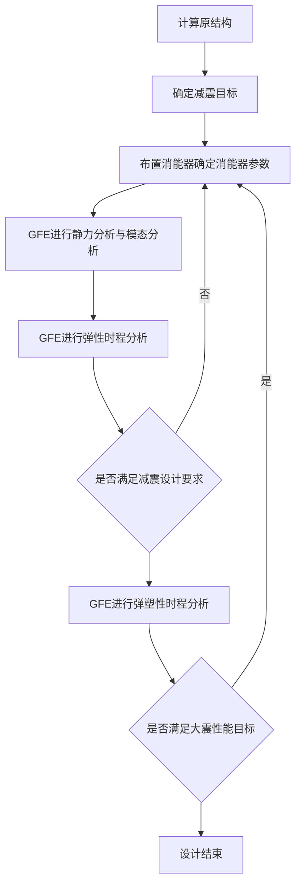
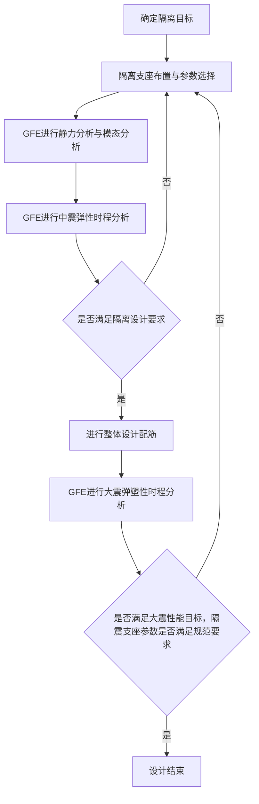

# 高性能有限元分析软件

# GFE

# ——减隔震分析技术手册

natural_image

Abstract 3D illustration of interconnected city buildings and circuit lines, no text or symbols present

杜修力院士科研团队

广州颖力科技有限公司

2023年09月

V2.0

# 目录

# 前言....1

# 第一章 减隔震背景及概念简介 …… 3

1.1 规范依据.... 3  
1.2 减震消能器类型及特点.... 3

1.2.1 速度型阻尼器.... 3  
1.2.2 位移型阻尼器.... 4

1.3 隔震支座类型及特点.... 5

1.3.1 天然橡胶支座 5  
1.3.2 铅芯橡胶支座 6  
1.3.3 摩擦摆支座....6

# 第二章 减隔震设计流程及软件操作....9

2.1 减隔震设计流程.... 9

2.1.1 减震设计流程.... 9  
2.1.2 隔震设计流程.... 10

2.2 软件操作....10

2.2.1 消能器/隔震支座建模.... 10  
2.2.2 消能子结构设置.... 20  
2.2.3 输出设置.... 21  
2.2.4 滞回曲线输出 ..... 23  
2.2.5 能量输出 ..... 25

# 第三章 速度型阻尼器减震设计分析....27

3.1 项目概况及模型信息.... 27  
3.2 静力分析及模态分析结果.... 29  
3.3 多遇地震分析结果.... 29

3.3.1 层间位移角 ..... 29  
3.3.2 层间剪力.... 30  
3.3.3 滞回曲线.... 31  
3.3.4 能量结果及附加阻尼比.... 32

3.4 罕遇地震分析结果.... 33

3.4.1 层间位移角 ..... 33  
3.4.2 层间剪力.... 33  
3.4.3 滞回曲线.... 34  
3.4.4 能量结果及附加阻尼比 ..... 35  
3.4.5 阻尼器验算 ..... 35  
3.4.6 混凝土损伤 ..... 36  
3.4.7 消能子结构设计 ..... 37  
3.5 结论.... 38

# 第四章 位移型阻尼器减震设计分析....39

4.1 项目概况及模型信息.... 39  
4.2 静力分析及模态分析结果 ..... 41  
4.3 多遇地震分析结果.... 42  
4.3.1 层间位移角 ..... 42  
4.3.2 层间剪力.... 43  
4.3.3 滞回曲线.... 44  
4.3.4 能量结果.... 44

4.4 罕遇地震分析结果.... 45

4.4.1 层间位移角 ..... 45  
4.4.2 层间剪力.... 45  
4.4.3 滞回曲线 46  
4.4.4 能量结果及附加阻尼比 ..... 47  
4.4.5 阻尼器验算 ..... 47  
4.4.6 混凝土损伤.... 48  
4.4.7 消能子结构设计 ..... 49

4.5 结论.... 50

# 第五章 铅芯橡胶支座隔震设计分析....51

5.1 项目概况及模型信息.... 51  
5.2 静力分析及模态分析结果.... 53  
5.3 设防地震分析结果.... 54

5.3.1 层间位移角 ..... 54  
5.3.2 层间剪力及底部剪力比 ..... 54  
5.3.3 滞回曲线.... 56  
5.3.4 结构设计 ..... 56

# 5.4 罕遇地震分析结果.... 58

5.4.1 层间位移角 ..... 58  
5.4.2 层间剪力 ..... 59  
5.4.3 滞回曲线.... 60  
5.4.4 阻尼器验算.... 60  
5.4.5 混凝土损伤 61

# 5.5 结论.... 62

# 前言

我国属于地震多发国家，41%左右的国土面积处于地震基本烈度7度及7度以上地区，同时，这些地震多发地区往往又是人口密集地区，地震对这些地区生命和财产造成的损害更加严重。在过去的几十年里，我们目睹了许多地震造成的灾难，这促使人们不断探索和研究如何更好地抵御地震的影响。

减隔震作为抗震技术的一种重要手段，旨在通过引入特殊的减隔震装置，如减震器或隔震支座等，改变结构的动力特性，使其能够在地震中具有较好的抗震性能。近年来发生在我国的较大地震雅安地震、通海地震中，使用减隔震产品的建筑变现出优异的抗震性能。建筑减隔震技术由于其优越的抗震效果，已成为建筑抗震领域成熟有效的抗震技术。

以减隔震技术应用为主要场景，广州颖力科技有限公司自主研发的高性能有限元分析软件 GFE 已全面支持结构减隔震分析。该软件由有限元求解器模块和前后处理模块组成，并可与结构专业设计软件无缝对接进行结构前后处理。GFE 软件减隔震分析的优势与功能特色如下：

（1）“准”一涵盖了多种结构减隔震分析中的分析模型，保证计算结果准确。GFE 软件支持减隔震计算分析中速度型阻尼器常用的 Maxwell 模型和 Kelvin 模型、位移型阻尼器常用的二折线模型和 Bouc-Wen 模型以及天然橡胶支座、铅芯橡胶支座及摩擦摆支座三种常见隔震支座类型。  
（2）“快”一采用了多 GPU 并行计算的显式动力求解和编程架构，保证计算过程快速。软件采用 CPU+GPU 异构并行计算的显式动力分析技术，其计算速度是多 CPU 并行计算速度的 10 倍以上。  
（3）“简”—按照结构减隔震设计流程进行软件升级和功能开发，操作简便。软件支持结构模型及减隔震构件的导入，同时支持减隔震构件的补充建模。用户可以在软件中进行小震或者中震弹性时程分析和大震作用下弹塑性时程分析验算走完减隔震结构设计流程，完成减震结构的设计和验算。此外，GFE 还提供了很多专门针对减隔震分析的新功能，如：消能子结构一键转换、阻尼器滞回曲线生成、能量统计与附加阻尼比的计算、减隔震报告书一键生成等。

本手册为 GFE 软件的减隔震分析技术手册。本手册首先阐述结构减隔震背景及相关概念，然后介绍减隔震设计流程及软件操作，最后结合三种不同类型的减隔震分析案例，包括速度型阻尼器减震案例、位移型阻尼器减震案例及铅芯橡胶支座隔震案例，说明了 GFE 软件在实际减隔震工程应用中的可靠性。

# 第一章 减隔震背景及概念简介

# 1.1 规范依据

《建设工程抗震管理条例》中第十六条提到：“位于高烈度设防地区、地震重点监视防御区的新建学校、幼儿园、医院、养老机构、儿童福利机构、应急指挥中心、应急避难场所、广播电视等建筑应当按照国家有关规定采用隔震减震等技术，保证发生本区域设防地震时能够满足正常使用要求。”，因此近年来减隔震技术被越来越多的应用于《条例》中提到的“八大类”建筑工程中。

目前减震结构设计方法基于《建筑抗震设计规范》和《建筑消能减震技术规程》的抗震性能化设计方法。减震结构的抗震设防目标为：当遭受低于本地区抗震设防烈度的多遇地震影响时，消能部件正常工作，主体结构不受损坏或不需要修理可继续使用；当遭受相当于本地区抗震设防烈度的设防地震影响时，消能部件正常工作，主体结构可能发生损坏，但经一般修理仍可继续使用；当遭受高于本地区抗震设防烈度的罕遇地震影响时，消能部件不应丧失功能，主体结构不致倒塌或发生危及生命的严重破坏，即小震不坏、中震可修、大震不倒。

隔震结构设计方法基于《建筑隔震设计标准》的整体分析设计法进行隔震设计，隔震建筑的基本设防目标为：当遭受相当于本地区基本烈度的设防地震时，主体结构基本不受损坏或不需修理即可继续使用；当遭遇罕遇地震时，结构可能发生损坏，经修复后可继续使用；特殊设防类建筑遭受极罕遇地震时，不致倒塌或发生危及生命的严重破坏，即中震不坏、大震可修、巨震不倒。

# 1.2 减震消能器类型及特点

根据《建筑抗震设计规范》第 12.3.1 条，速度相关型消能器指黏滞消能器和黏弹性消能器等；位移相关型消能器指金属屈服消能器和摩擦消能器等。

# 1.2.1 速度型阻尼器

速度相关型消能器指黏滞消能器和黏弹性消能器等。黏滞消能器增加结构的阻尼，其刚度很小，不改变结构周期，通过增加结构的阻尼实现减小结构基底剪力和层间位移的效果。

速度相关型消能器宜采用 Maxwell 模型或 Kelvin 模型。Maxwell 模型中阻尼单元与弹簧单元串联，当模拟黏滞消能器时可将弹簧单元刚度设成无穷大，则模型中只有阻尼单元发挥

作用。Kelvin 模型该模型是由一个线性弹簧单元和一个线性阻尼单元并联组成，模型中的输出力是二者之和。Maxwell 模型及 Kelvin 模型如图 1.2.1.12 所示。常见速度型阻尼器产品如图 1.2.1.2 所示。

text_image

K
C

(a) Maxwell 模型

text_image

K
C

(b) Kelvin 模型

图 1.2.1.1 速度型阻尼器模型  

text_image

混凝土上墙肢
预埋件
混凝土混凝土板 1FD、机、钢、砂
预埋件
钢筋网架
混凝土下墙肢

图 1.2.1.2 速度型阻尼典型产品示意

# 1.2.2 位移型阻尼器

位移相关型消能器指金属屈服消能器和摩擦消能器等，包括:屈曲约束支撑 (BRB)、软钢剪切消能器、摩擦型消能器、铅消能器等。位移相关型可以有效的增加结构阻尼比，同时增加结构刚度，因此加入位移相关型消能器后，结构的周期变短，阻尼比增加。这种消能器对于减小结构的总基底剪力效果有时候并不显著，但对于控制结构位移效果显著。

在软件中模拟粘滞阻尼器时一般有两种力学模型，分别是双线性模型和 Bouc-Wen 模型。二折线模型 Bouc-Wen 模型的原始力学由一个线性弹簧和一个非线性单元组成，其中非线性单元由一个线性弹簧和一个摩擦块串联组成。两种模型的示意图如图 1.2.2.1 所示。常见速度型阻尼器产品如图 1.2.2.2 所示。

text_image

F
F_{dmax}
F_{zy}
F_0
K_{eff}
O
Δu_{dy}
Δu_{dmax}
Δu

(a) 双线性模型

line

| Curve | Description |
| --- | --- |
| exp = 0 | Initial curve with a vertical segment at F |
| exp = 1 | Intermediate curve with a vertical segment at k |
| exp = 2 | Final curve with a vertical segment at k |

(b) Bouc-wen 模型

图 1.2.2.1 位移型阻尼器模型  

natural_image

Interior view of an unfinished concrete building with exposed beams and windows, no visible text or symbols

图 1.2.2.2 位移型阻尼典型产品示意

# 1.3 隔震支座类型及特点

根据《建筑隔震设计标准》第 5.1.1 条，隔震结构宜采用的隔震支座类型，主要包括天然橡胶支座、铅芯橡胶支座、高阻尼橡胶支座、弹性滑板支座、摩擦摆支座及其他隔震支座。

# 1.3.1 天然橡胶支座

天然橡胶支座中无铅芯，由橡胶层、钢板等叠层粘结而成，天然胶支座阻尼系数较小，一般只利用其较小的水平刚度，以延长结构的周期，避免地震力对建筑的破坏。天然橡胶支座的产品图及力学模型示意图如下图 1.3.1 所示。

text_image

P
δ
Kr

图 D.0.1 天然橡胶隔震支座滞回模型示意图  
(a) 天然橡胶支座模型

  
(b) 产品示意图

图 1.3.1 天然橡胶支座

# 1.3.2 铅芯橡胶支座

铅芯橡胶支座由铅芯棒、橡胶层、钢板等叠层粘结而成。铅芯棒增大支座的阻尼，吸收能量，并且可以提供较大的竖向刚度。由于铅芯可以屈服，铅芯橡胶支座具有非线性属性。铅芯橡胶支座既具有较高的承载力，又具有较大的阻尼，较大的水平位移能力和复位功能，是一种集支承与耗能于一体的隔震装置。铅芯橡胶支座的产品图及力学模型示意图如下图 1.3.2 所示。

text_image

P
Qy
Ky
δ
K0

图 D.0.2 铅芯橡胶支座滞回模型示意图  
(a) 铅芯橡胶支座模型

  
(b) 产品示意图

图 1.3.1 铅芯橡胶支座

# 1.3.3 摩擦摆支座

摩擦摆支座由平面滑板、面滑板、减震球摆、减震滑板、减震底座等组成。摩擦摆支座通过摆动，延长下部结构自振周期，实现隔震功能，摩擦摆支座具有良好的自动复位能力和较高的竖向承载能力、较大的水平位移能力和良好的耐久性。摩擦摆支座的产品图及力学模型示意图如下图 1.3.3 所示。

text_image

P
Qₓ
Kₓ
δ

图 D.0.4 摩擦摆隔震支座滞回模型示意图  
(a) 摩擦摆支座模型

natural_image

3D rendering of a mechanical component with a square base and concentric circular housing (no text or symbols visible)

(b) 产品示意图

图 1.3.3 摩擦摆支座

# 第二章 减隔震设计流程及软件操作

减隔震设计分析中的各工况分析的软件基本操作与普通三维时程分析基本一致, 具体可参见《地下结构动力分析软件 GFE-SSA 技术手册》, 此处不再赘述。本章针对减隔震设计分析特有的设计流程和特定功能进行详细的演示说明。

# 2.1 减隔震设计流程

# 2.1.1 减震设计流程

GFE 软件进行减震设计分析的主要流程有：布置消能器及确定消能器参数、静力分析、模态分析、弹性时程分析及弹塑性时程分析。当弹性时程分析结果未满足减震设计要求或弹塑性时程分析结果未满足大震性能目标时，需重新调整消能器的布置及参数设置。减震设计流程图如下图 2.1.1 所示。

flowchart

图 2.1.1 减震设计流程

# 2.1.2 隔震设计流程

GFE 软件进行隔震设计分析的主要流程有：隔震支座布置与参数选择、静力分析、模态分析、弹性时程分析、整体设计配筋及弹塑性时程分析。当弹性时程分析结果未满足隔震设计要求或弹塑性时程分析结果未满足大震性能目标，隔震支座参数未满足规范要求时时，需重新调整隔震支座的布置及参数设置。隔震设计流程图如下图 2.1.2 所示。

flowchart

图 2.1.2 隔震设计流程

# 2.2 软件操作

# 2.2.1 消能器/隔震支座建模

在进行减震分析时，当盈建科模型未建模减震消能器时，可先在盈建科软件建模消能减震器。后续将盈建科模型导入 GFE 软件时，同时消能器模型及相关参数也会一并导入。盈建科软件消能器建模方式有以下两种方式，盈建科界面操作步骤如图 2.2.1.1 所示。

a. 【构件布置】界面，点击【减震器】，弹出的对话框点击【添加】选择消能器类型并进行参数设置，直接布置在模型中；

b. 【构件布置】界面构件建模好支撑构件，在【前处理及计算】界面点击【特殊支撑】，点击【设置连接属性】选择消能器类型并进行参数设置，点击支撑构件赋予消能器连接属性。

text_image

x64 - 盈建科建筑结构计算模块——YJK-A[5.2.0] - [D:\ZSZ-WORE\TEST\2023.5.30-JIANGEZHEN\J2\YJK\17-3\17-3]
添加 修改 删除 显示 清理
序号 消能器样式 布置参数 名称
1 墙板式 0*1500*1500...
设置消能器样式及参数
1 点击“减震器”
名称 内容
□ 消能器布置定义
消能器样式 1: 墙板式
名称
给端螺环距离d1(mm): 0
连接板亮度d1(mm): 1500
连接板高度d1(mm): 1500
阻尼器高度d1(mm): 500
□ 消能器参数定义 阻尼器雷克斯韦
产品面 0.0
有功阻尼d1(0.8 x/m)/300m/rad
有功阻尼c(0.8 x/m)/0.0
□ 非线性 1000000.0
阻尼系数c1000000000000000000000000000000000000000000000000000000000000000000000000000000000000000000000000000000000000000000000000000000000000000000000000000000000000000000000000000000000000000000000000000000000000000000000000000000000000000000000000000000000000000000000000000000000000000000000000000000000000000000000000000000000000000000000000000000000000000000000000000000000000000000000000000000000000000000000000000000000000000000000000000000000000000000000000000000000000000000000000000000000000000000000000000000000000000000000000000000000000000000000000000000000000000000000000000000000000000000000000000000000000000000000000000000000000000000000000000000000000000000000000000000000000000000000000000000000000000000000000000000000000000000000000000000000000000000000000000000000000000000000000000000000000000000000000000000000000000000000000000000000000000000000000000000000000000000000000000000000000000000000000000000000000000000000000000000000000000000000000000000000000000000000000000000000000000000000000000000000000000000000000000000000000000000000000000000000000000000000000000000000000000000000000000000000000000000000000000000000000000000000000000000000000000000000000000000000000000000000000000000000000000000000000000000000000000000000000000000000000000000000000000000000000000000000000000000000000000000000000000000000000000000000000000000000000000000000000000000000000000000000000000000000000000000000000000000000000000000000000000000000000000000000000000000000000000000000000000000000000000000000000000000000000000000000000000000000000000000000000000000000000000000000000000000000000000000000000000000000000000000000000000000000000000000000000000000000000000000000000000000000000000000000000000000000000000000000000000000000000000000000000000000000000000000000000000000000000000000000000000000000000000000000000000000000000000000000000000000000000000000000000000000000000000000000000000000000000000000000000000000000000000000000000000000000000000000000000000000000000000000000000000000000000000000000000000000000000000000000000000000000000000000000000000000000000000000000000000000000000000000000000000000000000000000000000000000000000000000000000000000000000000000000000000000000000000000000000000000000000000000000000000000000000000000000000000000000000000000000000000000000000000000000000000000000000000000000000000000000000000000000000000000000000000000000000000000000000000000000000000000000000000000000000000000000000000000000000000000000000000000000000000000000000000000000000000000000000000000000000000000000000000000000000000000000000000000000000000000000000000000000000000000000000000000000000000000000000000000000000000000000000000000000000000000000000000000000000000000000000000000000000000000000000000000000000000000000000000000000000000000000000000000000000000000000000000000000000000000000000000000000000000000000000000000000000000000000000000000000000000000000000000000000000000000000000000000000000000000000000000000000000000000000000000000000000000000000000000000000000000000000000000000000000000000000000000000000000000000000000000000000000000000000000000000000000000000000000000000000000000000000000000000000000000000000000000000000000000000000000000000000000000000000000000000000000000000000000000000000000000000000000000000000000000000000000000000000000000000000000000000000000000000000000000000000000000000000000000000000000000000000000000000000000000000000000000000000000000000000000000000000000000000000000000000000000000000000000000000000000000000000000000000000000000000000000000000000000000000000000000000000000000000000000000000000000000000000000000000000000000000000000000000000000000000000000000000000000000000000000000000000000000000000000000000000000000000000000000000000000000000000000000000000000000000000000000000000000000000000000000000000000000000000000000000000000000000000000000000000000000000000000000000000000000000000000000000000000000000000000000000000000000000000000000000000000000000000000000000000000000000000000000000000000000000000000000000000000000000000000000000000000000000000000000000000000000000000000000000000000000000000000000000000000000000000000000000000000000000000000000000000000000000000000000000000000000000000000000000000000000000000000000000000000000000000000000000000000000000000000000000000000000000000000000000000000000000000000000000000000000000000000000000000000000000000000000000000000000000000000000000000000000000000000000000000000000000000000000000000000000000000000000000000000000000000000000000000000000000000000000000000000000000000000000000000000000000000000000000000000000000000000000000000000000000000000000000000000000000000000000000000000000000000000000000000000000000000000000000000000000000000000000000000000000000000000000000000000000000000000000000000000000000000000000000000000000000000000000000000000000000000000000000000000000000000000000000000000000000000000000000000000000000000000000000000000000000000000000000000000000000000000000000000000000000000000000000000000000000000000000000000000000000000000000000000000000000000000000000000000000000000000000000000000000000000000000000000000000000000000000000000000000000000000000000000000000000000000000000000000000000000000000000000000000000000000000000000000000000000000000000000000000000000000000000000000000000000000000000000000000000000000000000000000000000000000000000000000000000000000000000000000000000000000000000000000000000000000000000000000000000000000000000000000000000000000000000000000000000000000000000000000000000000000000000000000000000000000000000000000000000000000000000000000000000000000000000000000000000000000000000000000000000000000000000000000000000000000000000000000000000000000000000000000000000000000000000000000000000000000000000000000000000000000000000000000000000000000000000000000000000000000000000000000000000000000000000000000000000000000000000000000000000000000000000000000000000000000000000000000000000000000000000000000000000000000000000000000000000000000000000000000000000000000000000000000000000000000000000000000000000000000000000000000000000000000000000000000000000000000000000000000000000000000000000000000000000000000000000000000000000000000000000000000000000000000000000000000000000000000000000000000000000000000000000000000000000000000000000000000000000000000000000000000000000000000000000000000000000000000000000000000000000000000000000000000000000000000000000000000000000000000000000000000000000000000000000000000000000000000000000000000000000000000000000000000000000000000000000000000000000000000000000000000000000000000000000000000000000000000000000000000000

(a) 消能器建模方式 a  
  
(b) 消能器建模方式 b  
图 2.2.1.1 盈建科消能器建模

在进行隔震分析时，当盈建科模型未建模隔震支座时，可先在盈建科软件建模隔震支座。后续将盈建科模型导入 GFE 软件时，隔震支座模型及相关参数也会一并导入。在盈建科软件中建模隔震支座，需在【前处理及计算】界面，点击【设置支座】，选择隔震支座的类型及

进行参数设置, 再点击构件将隔震支座属性添加到结构模型中。盈建科界面操作如下图 2.2.1.2 所示。

text_image

前处理模块选择设置支座
选择隔震支座类型及定义
① 前处理模块选择设置支座
② 选择隔震支座类型及定义
③ 将隔震支座添加到结构模型中

图 2.2.1.2 盈建科隔震支座建模

除了使用盈建科接口直接导进减隔震构件，GFE 软件支持直接在软件中进行消能器及隔震支座的布置。GFE 软件里用有限元软件中通用的连接器（connector）对减震消能器和隔震支座进行模拟，右击【连接器】创建连接器，可以看到一个连接器主要包含以下三个部分：

a.连接器行为；b.局部坐标系；c.作用区域。

text_image

Model-1 # D:/ZSZ-WORK/TEST/20230814-JGEXAMPLE/JZ0814/BRB/BRB.pre - GFE PrePo
文件
模型
网络
土木工程
新建
保存
导入...
打开
另存为...
导出...
最近文件
退出
CAD
创建参考点
平移
撤销
CAD
创建面
布尔
旋转
重做
布尔
视图
切割
搜索
查询
拾取
几何
复制
几何
修复
网络
作业
颜色
设置
设置
工具
其他
模型
几何
集合
表面集
材料
截面属性
边界条件与荷载
分析步
工况
相互作用
指定约束
刚体
嵌入区域
多点约束
冲击波
冲击波属性
接触
弹簧/阻尼
连接器行为:
BRB_0_set_behavior
BRB_1_set_behavior
BRB_2_set_behavior
BRB_3_set_behavior
连接器
BRB_0_set_sect
BRB_1_set_sect
BRB_2_set_sect
BRB_3_set_sect
坐标系
BRB_0_set_ori
BRB_1_set_ori
BRB_2_set_ori
BRB_3_set_ori
幅值函数
场输出请求
历史输出请求
地震场场反应
人工边界
一维土层
建模
Color: Material
创建连接器
名称: Connector-1
连接类型:
平动类型: Catersian
转动类型: None
有效分量: F1, F2, F3
受约束分量:
连接器行为: BRB_0_set_behavior
点1局部坐标系: BRB_0_set_ori
点2局部坐标系: (与点1相同)
区域
几何集/节点集
从窗口中拾取
ConstraintPT
确定
取消
右击创建连接器
保存Pre: 'C:/Users/GZYL-08/Documents/
GFE/.PrePo.autosave-24396' 已保存!

图 2.2.1.3 GFE 连接器

右击【连接器行为】可选择减隔震构件类型并进行参数设置。

Maxwell 速度型阻尼器由一个弹簧和一个阻尼串联而成，弹簧的连接器行为与阻尼的连接器行为需分开创建两个连接器行为并赋予两个串联的连接器。创建 Maxwell 速度型阻尼器的弹簧连接器行为时，需右击【连接器行为】，对话框中右击空白处创建【弹性】参数，进行抗压刚度的设置。创建 Maxwell 速度型阻尼器的阻尼连接器行为时，需右击【连接器行为】，对话框中右击空白处创建【阻尼】参数，类型选择【VISCOUS】，进行阻尼力及速度的设置。GFE 界面操作步骤如下图 2.2.1.4 所示。

text_image

Model-1 # D:/ZSZ-WORK/TEST/20230807-减隔离案例演示/减置/Maxwell/GFE/MAX/9.pre - GFE PrePo
文件
模型
保存
导入...
打开
另存为...
导出...
最近文件
退出
CAD
Builder
创建参考点
创建面
创建箱体
布尔
旋转
运算
缩放
布尔
显示
视图
切割
搜索
查询
拾取
几何
复制
网格
作业
颜色
设置
建模
显示
工具
其他
模型
Color: Material
右击创建弹性参数
右击创建连接器行为
编辑连接器行为
名称: Cons_3_set_behavior
弹性
分量:
F1
F2
F3
M1
M2
M3
刚性约束
抗拉刚度
抗压刚度
F1 500000
默认情况下, 抗拉刚度等于抗压刚度。
确定
取消
输入抗压刚度
保存Pre: 'C:/Users/GZYL-08/Documents/
GFE/PrePo.autosave-14084' 已保存!
3
右击创建连接器行为
连接器行为
Maxwell_0_set_behavior
Maxwell_1_set_behavior
Maxwell_2_set_behavior
Cons_3_set_behavior
Cons_4_set_behavior
Cons_5_set_behavior
连接器
坐标系
幅值函数
场输出请求
历史输出请求
地震场地反应
人工边界
一维士层

(a) 创建弹性参数

text_image

Model-1 # D:/ZSZ-WORK/TEST/20230807-减隔震案例演示/减震/Maxwell/GFE/MAX/9.pre - GFE PrePo
文件
模型
保存
导入...
打开
另存为...
导出...
最近文件
退出
建模
显示
工具
其他
模型
Model-1
几何
集合
表面集
材料
截面属性
边界条件与荷载
分析步
工况
相互作用
绑定约束
刚体
嵌入区域
多点约束
冲击波
冲击波属性
接触
弹簧/阻尼
连接器行为
Maxwell_0_set_behavior
Maxwell_1_set_behavior
Maxwell_2_set_behavior
Cons_3_set_behavior
Cons_4_set_behavior
Cons_5_set_behavior
连接器
坐标系
幅值函数
场输出请求
历史输出请求
地震场地反应
人工边界
三维土层
输出
保存Pre: 'C:/Users/GZYL-08/Documents/
GFE/.PrePo.autosave-17656' 已保存!
① 右击创建连接器行为
② 右击创建阻尼参数
名称: Maxwell_0_set_behavior
阻尼
分量: F1 F2 F3
M1 M2 M3
类型: VISCOUS 行: 100
阻尼力/弯矩 速度
1 0 0
2 119.283 0.1
3 146.854 0.2
4 165.849 0.3
5 180.799 0.4
6 193.316 0.5
7 204.184 0.6
8 213.849 0.7
③ 输入Maxwell阻尼器参数
确定 取消
Z
X

(b) 创建阻尼参数  
图 2.2.1.4 Maxwell 速度型阻尼器

创建 Kelvin 速度型阻尼器的连接器行为，需右击【连接器行为】，对话框中右击空白处创建【阻尼】参数，类型选择【GFE DAMP2】,进行阻尼系数及阻尼指数的设置。GFE 界面的操作步骤如下图 2.2.1.5 所示：

text_image

Model-1 # D:/ZSZ-WORK/TEST/20230814-JGZEXAMPLE/JZ0814/backup/KELVIN/kelvin.pre - GFE PrePo
文件
模型
网络
土木工程
新建
保存
导入...
打开
另存为...
导出...
最近文件
退出
CAD
创建参考点
创建面
布尔
旋转
缩放
布尔
视图
切割
搜索
查询
拾取
几何
复制
网格
作业
颜色
设置
选择
创建箱体
布尔
显示
工具
其他
文件
建模
Color: Material
模型
Model-1
几何
集合
表面集
材料
截面属性
边界条件与荷载
分析步
工况
Dead
Live
Comb
dyn
modal
DYNX
相互作用
绑定约束
刚体
嵌入区域
多点约束
冲击波
冲击波属性
接触
弹簧/阻尼
连接器行为
KELVIN
右击创建阻尼参数
名称: KELVIN
阻尼
分量:
F1
F2
F3
类型: GFE DAMP2
阻尼系数
阻尼指数
F1 317,731
0.3
输入Kelvin阻尼器参数
确定
取消
右击创建连接器行为
保存Pre: 'C:/Users/GZYL-08/Documents/
GFE/PrePo.autosave-27604' 已保存!

图 2.2.1.5 Kelvin 速度型阻尼器

创建二折线模型位移型阻尼器的连接器行为，先右击【连接器行为】，对话框中右击空白处创建【弹性】参数，进行抗压刚度的设置。再在对话框中右击空白处创建【塑性】参数，

类型选择【GFE HDN2】，进行屈服力及刚度折减系数的设置。GFE 界面操作步骤如下图 2.2.1.6 所示。

text_image

Model-1 # D:/ZSZ-WORK/TEST/20230814-JGZEXAMPLE/JZ0814/BRB/BRB.pre - GFE PrePo
文件
模型
保存
导入...
打开
另存为...
导出...
最近文件
退出
建模
显示
工具
其他
模型
Model-1
几何
集合
表面集
材料
截面属性
边界条件与荷载
分析步
工况
相互作用
绑定约束
刚体
嵌入区域
多点约束
冲击波
冲击波属性
接触
弹簧/阻尼
连接器行为
BRB_0_set_behavior
BRB_1_set_behavior
BRB_2_set_behavior
BRB_3_set_behavior
连接器
坐标系
幅值函数
场输出请求
历史输出请求
地震场地反应
人工边界
三维土层
右击创建弹性参数
右击创建连接器行为
编辑连接器行为
名称: BRB_0_set_behavior
弹性
分量:
F1
F2
F3
塑性
M1
M2
M3
刚性约束
抗拉刚度
抗压刚度
F1 400000
默认情况下, 抗拉刚度等于抗压刚度。
确定
取消
输入抗压刚度
保存Pre: 'C:/Users/GZYL-08/Documents/
GFE/PrePo.autosave-19560' 已保存!

(a) 创建弹性参数  

text_image

Model-1 # D:/ZSZ-WORK/TEST/20230814-JGZEXAMPLE/JZ0814/BRB/BRB.pre - GFE PrePo
文件
模型
保存
导入...
打开
另存为...
导出...
最近文件
退出
创建参考点
创建面
创建物体
布尔
旋转
运算
缩放
平移
撤销
重做
布尔
显示
视图
切割
搜索
查询
拾取
几何
复制
网格
作业
颜色
设置
管理器
工具
其他
模型
Model-1
几何
集合
表面集
材料
截面属性
边界条件与荷载
分析步
工况
相互作用
绑定约束
刚体
嵌入区域
多点约束
冲击波
冲击波属性
接触
弹簧/阻尼
连接器行为
BBB_0_set_behavior
BBB_1_set_behavior
BBB_2_set_behavior
BBB_3_set_behavior
连接器
坐标系
幅值函数
场输出请求
历史输出请求
地图场地反应
人工边界
三维土层
建模
Color: Material
① 右击创建塑性参数
编辑连接器行为
名称: BRB_0_set_behavior
弹性
分量: F1 F2 F3
塑性
M1 M2 M3
随动硬化参数
定义方式: GFE HDN2
屈服力
刚度折减系数
F1 300 0.02
确定 取消
② 输入二折线模型参数
保存Pre: 'C:/Users/GZYL-08/Documents/
GFE/PrePo.autosave-19560' 已保存!

(b) 创建塑性参数  
图 2.2.1.6 二折线位移型连接器

创建 Bouc-Wen 模型位移型阻尼器的连接器行为，先右击【连接器行为】，对话框中右击空白处创建【弹性】参数，进行抗压刚度的设置。再在对话框中右击空白处创建【塑性】参数，类型选择【GFE BW】，进行屈服力、刚度折减系数及屈服指数的设置。GFE 界面操作步

骤如下图 2.2.1.7 所示。

text_image

Model-1 # D:/ZSZ-WORK/TEST/2023.5.30-JIANGEZHEN/JZ/GFE/17-3-bw/bocwen.pre - GFE PrePo
文件
模型
网络
土木工程
新建
保存
导入...
打开
另存为...
导出...
最近文件
退出
CAD
Builder
创建参考点
创建面
布尔
运算
旋转
缩放
布尔
视图
切割
搜索
查询
拾取
几何
复制
网格
作业
颜色
设置
管理器
颜色
设置
文件
建模
显示
工具
其他
模型
Color: Material
Model-1
几何
集合
表面集
材料
截面属性
边界条件与荷载
分析步
工况
相互作用
绑定约束
刚体
嵌入区域
多点约束
冲击波
冲击波属性
接触
弹簧/阻尼
连接器行为
Cons_0_set_behavior
Cons_1_set_behavior
连接器
坐标系
幅值函数
场输出请求
历史输出请求
地震场场反应
人工边界
一维土层
输出
保存Pre: 'C:/Users/GZYL-08/Documents/
GFE/PrePo.autosave-18856' 已保存!
① 右击创建连接器行为
② 右击创建弹性参数
编辑连接器行为
名称: Cons_0_set_behavior
弹性
分量:
F1
F2
F3
塑性
M1
M2
M3
刚性约束
抗拉刚度
抗压刚度
F1 100000
默认情况下, 抗拉刚度等于抗压刚度。
确定
取消
③ 右击创建塑性参数
确定
取消
Z
Y
LEFT
PRINT

(a) 创建弹性参数  

text_image

Model-1 # D:/ZSZ-WORK/TEST/2023.5.30-JIANGEZHEN/JZ/GFE/17-3-bw/bocwen.pre - GFE PrePo
文件
模型
保存
导入...
打开
另存为...
导出...
最近文件
退出
CAD
Builder
创建参考点
创建面
布尔
运算
缩放
平移
重做
旋转
重做
布尔
视图
切割
搜索
查询
拾取
几何
复制
网格
作业
颜色
设置
管理器
设置
模型
Color: Material
输出
保存Pre:'C:/Users/GZYL-08/Documents/
GFE/PrePo.autosave-18856'已保存!
右击创建塑性参数
编辑连接器行为
名称: Con 0 set behavior
弹性
分量:
F1
F2
F3
弹性
M1
M2
M3
随动硬化参数
定义方式: GFE BW
屈服力
刚度折减系数
屈服指数
F1 150
0.05
0.5
确定
取消
输入Bouc-Wen模型参数
Model-1
几何
集合
表面集
材料
截面属性
边界条件与荷载
分析步
工况
相互作用
绑定约束
刚体
嵌入区域
多点约束
冲击波
冲击波属性
接触
弹簧/阻尼
连接器行为
Cons_0_set_behavior
Cons_1_set_behavior
连接器
坐标系
幅值函数
场输出请求
历史输出请求
地震场地反应
人工边界
一维土层
确定
取消
Z
Y
Z
Y
Z
X

(b) 创建塑性参数  
图 2.2.1.7 Bouc-Wen 位移型连接器

天然橡胶支座只有线性参数，在 GFE 软件中可直接用弹性参数模拟，右击【连接器行为】，对话框中右击空白处创建【弹性】参数，进行抗压刚度的设置。操作步骤如下图 2.2.1.8 所示。

text_image

Model-1 # D:/ZSZ-WORK/TEST/20230814-JGZEXAMPLE/GZ/LRB.pre - GFE PrePo
文件
模型
保存
导入...
打开
另存为...
导出...
最近文件
退出
CAD
Builder
创建参考点
创建面
布尔
运算
缩放
布尔
视图
切割
搜索
查询
拾取
几何
复制
网格
作业
颜色
设置
建模
显示
工具
其他
模型
Model-1
几何
SuperStru
BasementBoundary
集合
表面集
材料
截面属性
边界条件与荷载
分析步
工况
相互作用
绑定约束
刚体
嵌入区域
多点约束
冲击波
冲击波属性
接触
弹量/信息
连接器行为
① 右击创建连接器行为
② 右击创建弹性参数
创建连接器行为
名称: ConnBeh-1
弹性
分量:
F1
F2
F3
M1
M2
M3
刚性约束
抗拉刚度
抗压刚度
抗拉刚度
F1 13290
F2 13290
F3 1.9e6
1.9e5
输入弹性参数属性
默认情况下, 抗拉刚度等于抗压刚度。
确定
取消
输出
保存Pre: 'C:/Users/GZYL-08/Documents/
GFE/.PrePo.autosave-18720' 已保存!

图 2.2.1.8 天然橡胶支座

创建铅芯橡胶支座的连接器行为，先右击【连接器行为】，对话框中右击空白处创建【弹性】参数，进行抗压刚度的设置。再在对话框中右击空白处创建【塑性】参数，类型选择【HALF CYCLE】，进行屈服力及屈服指数的设置。GFE 界面操作步骤如下图 2.2.1.9 所示。

text_image

Model-1 # D:/ZSZ-WORK/TEST/20230814-JGZEXAMPLE/GZ/LRB.pre - GFE PrePo
文件
模型
网络
土木工程
新建
保存
导入...
打开
另存为...
导出...
最近文件
退出
创建参考点
创建面
布尔
旋转
旋转
旋转
布尔
显示
视图
切割
搜索
查询
拾取
几何
复制
网格
作业
颜色
设置
建模
显示
工具
其他
模型
Color: Material
右击创建弹性参数
编辑连接器行为
名称: Isolation_0_set_behavior
弹性
分量:
F1
F2
F3
弹性
M1
M2
M3
刚性约束
抗拉刚度
抗压刚度
抗拉刚度
F1 15290
F2 15290
F3 3.4e+06
340000
输入抗压/抗拉刚度
确认
取消
输出
保存Pre: 'C:/Users/GZYL-08/Documents/
GFE/.PrePo.autosave-24460' 已保存!
右击创建连接器行为
右击创建连接器行为
Isolation_0_set_behavior
连接器
Isolation_0_set_sect
坐标系
Isolation_0_set_ori
幅值函数
25_RH1TG025_(RenGong_T_0...
25_RH1TG025_(RenGong_T_0...
场输出请求
历史输出请求
地震场地反应
人工边界
一维土层

(a) 创建弹性参数

text_image

Model-1 # D:/ZSZ-WORK/TEST/20230814-JGZEXAMPLE/GZ/LRB.pre - GFE PrePo
文件
模型
保存
导入...
打开
另存为...
导出...
最近文件
退出
CAD
Builder
创建参考点
创建面
创建物体
布尔
运算
缩放
平移
旋转
重做
布尔
显示
视图
切割
搜索
查询
拾取
几何
复制
网格
作业
颜色
设置
管理器
工具
其他
模型
Model-1
几何
SuperStru
BasementBoundary
集合
表面集
材料
截面属性
边界条件与荷载
分析步
工况
相互作用
绑定约束
刚体
嵌入区域
多点约束
冲击波
冲击波属性
接触
弹簧/铝尼
连接器行为
Isolation_0_set_behavior
连接器
Isolation_0_set_sect
坐标系
Isolation_0_set_ori
幅值函数
25_RH1TG025_(RenGong_T_0...
25_RH1TG025_(RenGong_T_0...
场输出请求
历史输出请求
地震场地反应
人工边界
一维土层
建模
Color: Material
输出
保存Pre: 'C:/Users/GZYL-08/Documents/
GFE/PrePo.autosave-24460' 已保存!
① 右击创建塑性参数
编辑器
编辑器行为
名称: Isolation_0_set_behavior
弹性
分量:
F1
F2
F3
塑性
M1
M2
M3
随动硬化参数
定义方式: HALF CYCLE
行: 2
层服力
塑性变形
1 106
0
2 238.957
0.1
确定
取消
② 输入铅芯橡胶支座参数
Z
FRONT
RIGHT
X

(b) 创建塑性参数  
图 2.2.1.9 铅芯橡胶支座

创建摩擦摆支座的连接器行为，先右击【连接器行为】，对话框中右击空白处创建【弹性】参数，进行抗压刚度的设置。再在对话框中右击空白处创建【塑性】参数，类型选择【GFE PEND】，进行摩擦系数变化率、屈服位移、快摩擦系数、慢摩擦系数及等效半径的设置。GFE 界面操作步骤如下图 2.2.1.10 所示。

text_image

Model-1 # D:/ZSZ-WORK/TEST/2023.5.30-JIANGEZHEN/GZ/GFE/MCB/MCB0720.pre - GFE PrePo
文件
模型
网络
土木工程
新建
保存
导入...
打开
另存为...
导出...
最近文件
退出
CAD
Builder
创建参考点
创建面
创建物体
布尔
运算
旋转
缩放
平移
旋转
重做
布
布
显示
视图
切割
搜索
链接
查询
拾取
几何
修复
复制
网格
作业
颜色
设置
管理器
工具
其他
模型
Model-1
几何
SuperStru
BasementBoundary
集合
表面集
材料
截面属性
边界条件与荷载
分析步
工况
相互作用
绑定约束
刚体
1
右击创建连接器行为
冲击波
冲击波属性
接触
弹簧/阻尼
连接器行为
Isolation_0_set_behavior
连接器
Isolation_0_set_sect
坐标系
Isolation_0_set_ori
幅值函数
场输出请求
地震场地反应
人工边界
一维土层
建模
Color: Material
输出
保存Pre: 'C/Users/GZYL-08/Documents/
GFE/PrePo.autosave-23600' 已保存!
2 右击创建弹性参数
编辑连接器行为
名称: Isolation_0_set_behavior
弹性
分量:
F1
F2
F3
塑性
M1
M2
M3
刚性约束
抗拉刚度
抗压刚度
F1 5e+07
F2 520
F3 520
默认情况下,抗拉刚度等于抗压刚度。
确定
取消
3 输入抗压刚度
Z
Y
R
O
R
X

(a) 创建弹性参数

text_image

Model-1 # D:/ZSZ-WORK/TEST/2023.5.30-JIANGEZHEN/GZ/GFE/MCB/MCB0720.pre - GFE PrePo
文件
模型
保存
导入...
打开
另存为...
导出...
最近文件
退出
CAD
Builder
创建参考点
创建面
创建箱体
布尔
运算
旋转
缩放
平移
旋转
重做
布尔
显示
视图
切割
搜索
搜索
查询
拾取
几何
修复
复制
网格
作业
管理器
颜色
设置
工具
其他
模型
Model-1
几何
SuperStru
BasementBoundary
集合
表面集
材料
截面属性
边界条件与荷载
分析步
工况
相互作用
绑定约束
刚体
嵌入区域
多点约束
冲击波
冲击波属性
接触
弹簧/阻尼
连接器行为
Isolation_0_set_behavior
连接器
Isolation_0_set_sect
坐标系
Isolation_0_set_ori
幅值函数
场输出请求
历史输出请求
地震场地反应
人工边界
三维土层
建模
Color: Material
右击创建塑性参数
输入摩擦摆支座参数
编辑连接器行为
名称: Isolation_0_set_behavior
弹性
分量:
F1
F2
F3
M1
M2
M3
随动硬化参数
定义方式: GFE PEND
摩擦系数变化率
屈服位移
快摩擦系数
慢摩擦系数
等效半径
F2 20
0.01
0.05
0.04
0.5
F3 20
0.01
0.05
0.04
0.5
确定
取消
保存Pre: 'C/Users/GZYL-08/Documents/
GFE/PrePo.autosave-23600' 已保存!

(b) 创建塑性参数  
图 2.2.1.10 摩擦摆支座

创建连接器的局部坐标系，先点击【坐标系】，在对话框中输入局部坐标系参数。其中【点1】方向未局部坐标系X方向，【点2】方向为局部坐标系Y方向，XY方向叉乘科得到局部坐标系Z方向。点击创建好的连接器或者局部坐标系都可在图形区左上角看到局部坐标系的方向示意。需注意的时局部坐标系需与连接器行为参数一一对应，如：在创建X向的墙板式阻尼器时，阻尼器轴向方向为整体坐标系的X方向，故我们设置了阻尼器轴向方向(即F1)的阻尼参数后，局部坐标系X方向应与阻尼器轴向方向保持一致，即该局部坐标系X向与整体坐标一致。局部连接器的局部坐标系的操作步骤如下图2.2.1.11所示。

text_image

Model-1 # D:/ZSZ-WORK/TEST/20230807-减陷置案例演示/减置/Maxwell/GFE/MAX/9.pre - GFE PrePo
文件
模型
网络
土木工程
新建
保存
导入...
打开
另存为...
导出...
最近文件
退出
CAD
Builder
创建参考点
创建面
创建窗体
布尔
旋转
运算
缩放
显示
视图
切割
搜索
查询
拾取
几何
修复
网格
作业
管理器
颜色
设置
文件
建模
Color: Material
显示
工具
其他
模型
Model-1
几何
集合
表面集
材料
截面属性
边界条件与荷载
分析步
工况
相互作用
指定约束
刚体
嵌入区域
多点约束
冲击波
冲击波属性
接触
弹簧/阻尼
连接器行为
连接器
Maxwell_0_set_sect
Maxwell_1_set_sect
Maxwell_2_set_sect
Cons_3_set_sect
Cons_4_set_sect
Cons_5_set_sect
坐标系
Maxwell_0_set_ori
点击创建好的连接器或局部坐标系都
可在左上角看到局部坐标系的方向示意。
局部坐标系需与连接器行为参数——对应，如：
在设置X向的墙板式阻尼器时，阻尼器轴向方向为整体坐标系的X方向，
故我们设置了阻尼器轴向方向（即F1）的阻尼参数后，局部坐标系X方向
应与阻尼器轴向方向保持一致，即该局部坐标系X向与整体坐标一致。
右击创建局部坐标系
创建/编辑坐标系
名称: Maxwell_0_set_ori
类型: 矩形
定义: 坐标
坐标
原点 0,0,0
点1 1,0,0
点2 0,1,0
确定
取消
输入局部坐标系，点1方向为局部坐标系X方向，点2方向
为局部坐标系Y方向，又乘得到局部坐标系Z方向。
保存Pre: C:/Users/GZYL-08/Documents/
GFE/PrePoAutosave-17656 已保存!
坐标系
坐标系
坐标系
坐标系
坐标系
坐标系
坐标系
坐标系
坐标系
坐标系
坐标系
坐标系
坐标系
坐标系
坐标系
坐标系
坐标系
坐标系
坐标系
坐标系
坐标系
坐标系
坐标系
坐标系
坐标系
坐标系
坐标系
坐标系
坐标系
坐标系
坐标系
坐标系
坐标系
坐标系
坐标系
坐标系
坐标系
坐标系
坐标系
坐标系
坐标系
坐标系
坐标系
坐标系
坐标系
坐标系
坐标系
坐标系
坐标系
坐标系
坐标系
坐标系
坐标系
坐标系
坐标系
坐标系
坐标系
坐标系
坐标系
坐标系
坐标系
坐标系
坐标系
坐标系
坐标系
坐标系
坐标系
坐标系
坐标系
坐标系
坐标系
坐标系
坐标系
坐标系
坐标系
坐标系
坐标系
坐标系
坐标系
坐标系
坐标系
坐标系
坐标系
坐标系
坐标系
坐标系
坐标系
坐标系
坐标系
坐标系
坐标系
坐标系
坐标系
坐标系
坐标系
坐标系
坐标系
坐标系
坐标系
坐标系
坐标系
坐标系
坐标系
坐标系
坐标系
坐标系
坐标系
坐标系
坐标系
坐标系
坐标系
坐标系
坐标系
坐标系
坐标系
坐标系
坐标系
坐标系
坐标系
坐标系
坐标系
坐标系
坐标系
坐标系
坐标系
坐标系
坐标系
坐标系
坐标系
坐标系
坐标系
坐标系
坐标系
坐标系
坐标系
坐标系
坐标系
坐标系
坐标系
坐标系
坐标系
坐标系
坐标系
坐标系
坐标系
坐标系
坐标系
坐标系
坐标系
坐标系
坐标系
坐标系
坐标系
坐标系
坐标系
坐标系
坐标系
坐标系
坐标系
坐标系
坐标系
坐标系
坐标系
坐标系
坐标系
坐标系
坐标系
坐标系
坐标系
坐标系
坐标系
坐标系
坐标系
坐标系
坐标系
坐标系
坐标系
坐标系
坐标系
坐标系
坐标系
坐标系
坐标系
坐标系
坐标系
坐标系
坐标系
坐标系
坐标系
坐标系
坐标系
坐标系
坐标系
坐标系
坐标系
坐标系
坐标系
坐标系
坐标系
坐标系
坐标系
坐标系
坐标系
坐标系
坐标系
坐标系
坐标系
坐标系
坐标系
坐标系
坐标系
坐标系
坐标系
坐标系
坐标系
坐标系
坐标系
坐标系
坐标系
坐标系
坐标系
坐标系
坐标系
坐标系
坐标系
坐标系
坐标系
坐标系
坐标系
坐标系
坐标系
坐标系
坐标系
坐标系
坐标系
坐标系
坐标系
坐标系
坐标系
坐标系
坐标系
坐标系
坐标系
坐标系
坐标系
坐标系
坐标系
坐标系
坐标系
坐标系
坐标系
坐标系
坐标系
坐标系
坐标系
坐标系
坐标系
坐标系
坐标系
坐标系
坐标系
坐标系
坐标系
坐标系
坐标系
坐标系
坐标系
坐标系
坐标系
坐标系
坐标系
坐标系
坐标系
坐标系
坐标系
坐标系
坐标系
坐标系
坐标系
坐标系
坐标系
坐标系
坐标系
坐标系
坐标系
坐标系
坐标系
坐标系
坐标系
坐标系
坐标系
坐标系
坐标系
坐标系
坐标系
坐标系
坐标系
坐标系
坐标系
坐标系
坐标系
坐标系
坐标系
坐标系
坐标系
坐标系
坐标系
坐标系
坐标系
坐标系
坐标系
坐标系
坐标系
坐标系
坐标系
坐标系
坐标系
坐标系
坐标系
坐标系
坐标系
坐标系
坐标系
坐标系
坐标系
坐标系
坐标系
坐标系
坐标系
坐标系
坐标系
坐标系
坐标系
坐标系
坐标系
坐标系
坐标系
坐标系
坐标系
坐标系
坐标系
坐标系
坐标系
坐标系
坐标系
坐标系
坐标系
坐标系
坐标系
坐标系
坐标系
坐标系
坐标系
坐标系
坐标系
坐标系
坐标系
坐标系
坐标系
坐标系
坐标系
坐标系
坐标系
坐标系
坐标系
坐标系
坐标系
坐标系
坐标系
坐标系
坐标系
坐标系
坐标系
坐标系
坐标系
坐标系
坐标系
坐标系
坐标系
坐标系
坐标系
坐标系
坐标系
坐标系
坐标系
坐标系
坐标系
坐标系
坐标系
坐标系
坐标系
坐标系
坐标系
坐标系
坐标系
坐标系
坐标系
坐标系
坐标系
坐标系
坐标系
坐标系
坐标系
坐标系
坐标系
坐标系
坐标系
坐标系
坐标系
坐标系
坐标系
坐标系
坐标系
坐标系
坐标系
坐标系
坐标系
坐标系
坐标系
坐标系
坐标系
坐标系
坐标系
坐标系
坐标系
坐标系
坐标系
坐标系
坐标系
坐标系
坐标系
坐标系
坐标系
坐标系
坐标系
坐标系
坐标系
坐标系
坐标系
坐标系
坐标系
坐标系
坐标系
坐标系
坐标系
坐标系
坐标系
坐标系
坐标系
坐标系
坐标系
坐标系
坐标系
坐标系
坐标系
坐标系
坐标系
坐标系
坐标系
坐标系
坐标系
坐标系
坐标系
坐标系
坐标系
坐标系
坐标系
坐标系
坐标系
坐标系
坐标系
坐标系
坐标系
坐标系
坐标系
坐标系
坐标系
坐标系
坐标系
坐标系
坐标系
坐标系
坐标系
坐标系
坐标系
坐标系
坐标系
坐标系
坐标系
坐标系
坐标系
坐标系
坐标系
坐标系
坐标系
坐标系
坐标系
坐标系
坐标系
坐标系
坐标系
坐标系
坐标系
坐标系
坐标系
坐标系
坐标系
坐标系
坐标系
坐标系
坐标系
坐标系
坐标系
坐标系
坐标系
坐标系
坐标系
坐标系
坐标系
坐标系
坐标系
坐标系
坐标系
坐标系
坐标系
坐标系
坐标系
坐标系
坐标系
坐标系
坐标系
坐标系
坐标系
坐标系
坐标系
坐标系
坐标系
坐标系
坐标系
坐标系
坐标系
坐标系
坐标系
坐标系
坐标系
坐标系
坐标系
坐标系
坐标系
坐标系
坐标系
坐标系
坐标系
坐标系
坐标系
坐标系
坐标系
坐标系
坐标系
坐标系
坐标系
坐标系
坐标系
坐标系
坐标系
坐标系
坐标系
坐标系
坐标系
坐标系
坐标系
坐标系
坐标系
坐标系
坐标系
坐标系
坐标系
坐标系
坐标系
坐标系
坐标系
坐标系
坐标系
坐标系
坐标系
坐标系
坐标系
坐标系
坐标系
坐标系
坐标系
坐标系
坐标系
坐标系
坐标系
坐标系
坐标系
坐标系
坐标系
坐标系
坐标系
坐标系
坐标系
坐标系
坐标系
坐标系
坐标系
坐标系
坐标系
坐标系
坐标系
坐标系
坐标系
坐标系
坐标系
坐标系
坐标系
坐标系
坐标系
坐标系
坐标系
坐标系
坐标系
坐标系
坐标系
坐标系
坐标系
坐标系
坐标系
坐标系
坐标系
坐标系
坐标系
坐标系
坐标系
坐标系
坐标系
坐标系
坐标系
坐标系
坐标系
坐标系
坐标系
坐标系
坐标系
坐标系
坐标系
坐标系
坐标系
坐标系
坐标系
坐标系
坐标系
坐标系
坐标系
坐标系
坐标系
坐标系
坐标系
坐标系
坐标系
坐标系
坐标系
坐标系
坐标系
坐标系
坐标系
坐标系
坐标系
坐标系
坐标系
坐标系
坐标系
坐标系
坐标系
坐标系
坐标系
坐标系
坐标系
坐标系
坐标系
坐标系
坐标系
坐标系
坐标系
坐标系
坐标系
坐标系
坐标系
坐标系
坐标系
坐标系
坐标系
坐标系
坐标系
坐标系
坐标系
坐标系
坐标系
坐标系
坐标系
坐标系
坐标系
坐标系
坐标系
坐标系
坐标系
坐标系
坐标系
坐标系
坐标系
坐标系
坐标系
坐标系
坐标系
坐标系
坐标系
坐标系
坐标系
坐标系
坐标系
坐标系
坐标系
坐标系
坐标系
坐标系
坐标系
坐标系
坐标系
坐标系
坐标系
坐标系
坐标系
坐标系
坐标系
坐标系
坐标系
坐标系
坐标系
坐标系
坐标系
坐标系
坐标系
坐标系
坐标系
坐标系
坐标系
坐标系
坐标系
坐标系
坐标系
坐标系
坐标系
坐标系
坐标系
坐标系
坐标系
坐标系
坐标系
坐标系
坐标系
坐标系
坐标系
坐标系
坐标系
坐标系
坐标系
坐标系
坐标系
坐标系
坐标系
坐标系
坐标系
坐标系
坐标系
坐标系
坐标系
坐标系
坐标系
坐标系
坐标系
坐标系
坐标系
坐标系
坐标系
坐标系
坐标系
坐标系
坐标系
坐标系
坐标系
坐标系
坐标系
坐标系
坐标系
坐标系
坐标系
坐标系
坐标系
坐标系
坐标系
坐标系
坐标系
坐标系
坐标系
坐标系
坐标系
坐标系
坐标系
坐标系
坐标系
坐标系
坐标系
坐标系
坐标系
坐标系
坐标系
坐标系
坐标系
坐标系
坐标系
坐标系
坐标系
坐标系
坐标系
坐标系
坐标系
坐标系
坐标系
坐标系
坐标系
坐标系
坐标系
坐标系
坐标系
坐标系
坐标系
坐标系
坐标系
坐标系
坐标系
坐标系
坐标系
坐标系
坐标系
坐标系
坐标系
坐标系
坐标系
坐标系
坐标系
坐标系
坐标系
坐标系
坐标系
坐标系
坐标系
坐标系
坐标系
坐标系
坐标系
坐标系
坐标系
坐标系
坐标系
坐标系
坐标系
坐标系
坐标系
坐标系
坐标系
坐标系
坐标系
坐标系
坐标系
坐标系
坐标系
坐标系
坐标系
坐标系
坐标系
坐标系
坐标系
坐标系
坐标系
坐标系
坐标系
坐标系
坐标系
坐标系
坐标系
坐标系
坐标系
坐标系
坐标系
坐标系
坐标系
坐标系
坐标系
坐标系
坐标系
坐标系
坐标系
坐标系
坐标系
坐标系
坐标系
坐标系
坐标系
坐标系
坐标系
坐标系
坐标系
坐标系
坐标系
坐标系
坐标系
坐标系
坐标系
坐标系
坐标系
坐标系
坐标系
坐标系
坐标系
坐标系
坐标系
坐标系
坐标系
坐标系
坐标系
坐标系
坐标系
坐标系
坐标系
坐标系
坐标系
坐标系
坐标系
坐标系
坐标系
坐标系
坐标系
坐标系
坐标系
坐标系
坐标系
坐标系
坐标系
坐标系
坐标系
坐标系
坐标系
坐标系
坐标系
坐标系
坐标系
坐标系
坐标系
坐标系
坐标系
坐标系
坐标系
坐标系
坐标系
坐标系
坐标系
坐标系
坐标系
坐标系
坐标系
坐标系
坐标系
坐标系
坐标系
坐标系
坐标系
坐标系
坐标系
坐标系
坐标系
坐标系
坐标系
坐标系
坐标系
坐标系
坐标系
坐标系
坐标系
坐标系
坐标系
坐标系
坐标系
坐标系
坐标系
坐标系
坐标系
坐标系
坐标系
坐标系
坐标系
坐标系
坐标系
坐标系
坐标系
坐标系
坐标系
坐标系
坐标系
坐标系
坐标系
坐标系
坐标系
坐标系
坐标系
坐标系
坐标系
坐标系
坐标系
坐标系
坐标系
坐标系
坐标系
坐标系
坐标系
坐标系
坐标系
坐标系
坐标系
坐标系
坐标系
坐标系
坐标系
坐标系
坐标系
坐标系
坐标系
坐标系
坐标系
坐标系
坐标系
坐标系
坐标系
坐标系
坐标系
坐标系
坐标系
坐标系
坐标系
坐标系
坐标系
坐标系
坐标系
坐标系
坐标系
坐标系
坐标系
坐标系
坐标系
坐标系
坐标系
坐标系
坐标系
坐标系
坐标系
坐标系
坐标系
坐标系
坐标系
坐标系
坐标系
坐标系
坐标系
坐标系
坐标系
坐标系
坐标系
坐标系
坐标系
坐标系
坐标系
坐标系
坐标系
坐标系
坐标系
坐标系
坐标系
坐标系
坐标系
坐标系
坐标系
坐标系
坐标系
坐标系
坐标系
坐标系
坐标系
坐标系
坐标系
坐标系
坐标系
坐标系
坐标系
坐标系
坐标系
坐标系
坐标系
坐标系
坐标系
坐标系
坐标系
坐标系
坐标系
坐标系
坐标系
坐标系
坐标系
坐标系
坐标系
坐标系
坐标系
坐标系
坐标系
坐标系
坐标系
坐标系
坐标系
坐标系
坐标系
坐标系
坐标系
坐标系
坐标系
坐标系
坐标系
坐标系
坐标系
坐标系
坐标系
坐标系
坐标系
坐标系
坐标系
坐标系
坐标系
坐标系
坐标系
坐标系
坐标系
坐标系
坐标系
坐标系
坐标系
坐标系
坐标系
坐标系
坐标系
坐标系
坐标系
坐标系
坐标系
坐标系
坐标系
坐标系
坐标系
坐标系
坐标系
坐标系
坐标系
坐标系
坐标系
坐标系
坐标系
坐标系
坐标系
坐标系
坐标系
坐标系
坐标系
坐标系
坐标系
坐标系
坐标系
坐标系
坐标系
坐标系
坐标系
坐标系
坐标系
坐标系
坐标系
坐标系
坐标系
坐标系
坐标系
坐标系
坐标系
坐标系
坐标系
坐标系
坐标系
坐标系
坐标系
坐标系
坐标系
坐标系
坐标系
坐标系
坐标系
坐标系
坐标系
坐标系
坐标系
坐标系
坐标系
坐标系
坐标系
坐标系
坐标系
坐标系
坐标系
坐标系
坐标系
坐标系
坐标系
坐标系
坐标系
坐标系
坐标系
坐标系
坐标系
坐标系
坐标系
坐标系
坐标系
坐标系
坐标系
坐标系
坐标系
坐标系
坐标系
坐标系
坐标系
坐标系
坐标系
坐标系
坐标系
坐标系
坐标系
坐标系
坐标系
坐标系
坐标系
坐标系
坐标系
坐标系
坐标系
坐标系
坐标系
坐标系
坐标系
坐标系
坐标系
坐标系
坐标系
坐标系
坐标系
坐标系
坐标系
坐标系
坐标系
坐标系
坐标系
坐标系
坐标系
坐标系
坐标系
坐标系
坐标系
坐标系
坐标系
坐标系
坐标系
坐标系
坐标系
坐标系
坐标系
坐标系
坐标系
坐标系
坐标系
坐标系
坐标系
坐标系
坐标系
坐标系
坐标系
坐标系
坐标系
坐标系
坐标系
坐标系
坐标系
坐标系
坐标系
坐标系
坐标系
坐标系
坐标系
坐标系
坐标系
坐标系
坐标系
坐标系
坐标系
坐标系
坐标系
坐标系
坐标系
坐标系
坐标系
坐标系
坐标系
坐标系
坐标系
坐标系
坐标系
坐标系
坐标系
坐标系
坐标系
坐标系
坐标系
坐标系
坐标系
坐标系
坐标系
坐标系
坐标系
坐标系
坐标系
坐标系
坐标系
坐标系
坐标系
坐标系
坐标系
坐标系
坐标系
坐标系
坐标系
坐标系
坐标系
坐标系
坐标系
坐标系
坐标系
坐标系
坐标系
坐标系
坐标系
坐标系
坐标系
坐标系
坐标系
坐标系
坐标系
坐标系
坐标系
坐标系
坐标系
坐标系
坐标系
坐标系
坐标系
坐标系
坐标系
坐标系
坐标系
坐标系
坐标系
坐标系
坐标系
坐标系
坐标系
坐标系
坐标系
坐标系
坐标系
坐标系
坐标系
坐标系
坐标系
坐标系
坐标系
坐标系
坐标系
坐标系
坐标系
坐标系
坐标系
坐标系
坐标系
坐标系
坐标系
坐标系
坐标系
坐标系
坐标系
坐标系
坐标系
坐标系
坐标系
坐标系
坐标系
坐标系
坐标系
坐标系
坐标系
坐标系
坐标系
坐标系
坐标系
坐标系
坐标系
坐标系
坐标系
坐标系
坐标系
坐标系
坐标系
坐标系
坐标系
坐标系
坐标系
坐标系
坐标系
坐标系
坐标系
坐标系
坐标系
坐标系
坐标系
坐标系
坐标系
坐标系
坐标系
坐标系
坐标系
坐标系
坐标系
坐标系
坐标系
坐标系
坐标系
坐标系
坐标系
坐标系
坐标系
坐标系
坐标系
坐标系
坐标系
坐标系
坐标系
坐标系
坐标系
坐标系
坐标系
坐标系
坐标系
坐标系
坐标系
坐标系
坐标系
坐标系
坐标系
坐标系
坐标系
坐标系
坐标系
坐标系
坐标系
坐标系
坐标系
坐标系
坐标系
坐标系
坐标系
坐标系
坐标系
坐标系
坐标系
坐标系
坐标系
坐标系
坐标系
坐标系
坐标系
坐标系
坐标系
坐标系
坐标系
坐标系
坐标系
坐标系
坐标系
坐标系
坐标系
坐标系
坐标系
坐标系
坐标系
坐标系
坐标系
坐标系
坐标系
坐标系
坐标系
坐标系
坐标系
坐标系
坐标系
坐标系
坐标系
坐标系
坐标系
坐标系
坐标系
坐标系
坐标系
坐标系
坐标系
坐标系
坐标系
坐标系
坐标系
坐标系
坐标系
坐标系
坐标系
坐标系
坐标系
坐标系
坐标系
坐标系
坐标系
坐标系
坐标系
坐标系
坐标系
坐标系
坐标系
坐标系
坐标系
坐标系
坐标系
坐标系
坐标系
坐标系
坐标系
坐标系
坐标系
坐标系
坐标系
坐标系
坐标系
坐标系
坐标系
坐标系
坐标系
坐标系
坐标系
坐标系
坐标系
坐标系
坐标系
坐标系
坐标系
坐标系
坐标系
坐标系
坐标系
坐标系
坐标系
坐标系
坐标系
坐标系
坐标系
坐标系
坐标系
坐标系
坐标系
坐标系
坐标系
坐标系
坐标系
坐标系
坐标系
坐标系
坐标系
坐标系
坐标系
坐标系
坐标系
坐标系
坐标系
坐标系
坐标系
坐标系
坐标系
坐标系
坐标系
坐标系
坐标系
坐标系
坐标系
坐标系
坐标系
坐标系
坐标系
坐标系
坐标系
坐标系
坐标系
坐标系
坐标系
坐标系
坐标系
坐标系
坐标系
坐标系
坐标系
坐标系
坐标系
坐标系
坐标系
坐标系
坐标系
坐标系
坐标系
坐标系
坐标系
坐标系
坐标系
坐标系
坐标系
坐标系
坐标系
坐标系
坐标系
坐标系
坐标系
坐标系
坐标系
坐标系
坐标系
坐标系
坐标系
坐标系
坐标系
坐标系
坐标系
坐标系
坐标系
坐标系
坐标系
坐标系
坐标系
坐标系
坐标系
坐标系
坐标系
坐标系
坐标系
坐标系
坐标系
坐标系
坐标系
坐标系
坐标系
坐标系
坐标系
坐标系
坐标系
坐标系
坐标系
坐标系
坐标系
坐标系
坐标系
坐标系
坐标系
坐标系
坐标系
坐标系
坐标系
坐标系
坐标系
坐标系
坐标系
坐标系
坐标系
坐标系
坐标系
坐标系
坐标系
坐标系
坐标系
坐标系
坐标系
坐标系
坐标系
坐标系
坐标系
坐标系
坐标系
坐标系
坐标系
坐标系
坐标系
坐标系
坐标系
坐标系
坐标系
坐标系
坐标系
坐标系
坐标系
坐标系
坐标系
坐标系
坐标系
坐标系
坐标系
坐标系
坐标系
坐标系
坐标系
坐标系
坐标系
坐标系
坐标系
坐标系
坐标系
坐标系
坐标系
坐标系
坐标系
坐标系
坐标系
坐标系
坐标系
坐标系
坐标系
坐标系
坐标系
坐标系
坐标系
坐标系
坐标系
坐标系
坐标系
坐标系
坐标系
坐标系
坐标系
坐标系
坐标系
坐标系
坐标系
坐标系
坐标系
坐标系
坐标系
坐标系
坐标系
坐标系
坐标系
坐标系
坐标系
坐标系
坐标系
坐标系
坐标系
坐标系
坐标系
坐标系
坐标系
坐标系
坐标系
坐标系
坐标系
坐标系
坐标系
坐标系
坐标系
坐标系
坐标系
坐标系
坐标系
坐标系
坐标系
坐标系
坐标系
坐标系
坐标系
坐标系
坐标系
坐标系
坐标系
坐标系
坐标系
坐标系
坐标系
坐标系
坐标系
坐标系
坐标系
坐标系
坐标系
坐标系
坐标系
坐标系
坐标系
坐标系
坐标系
坐标系
坐标系
坐标系
坐标系
坐标系
坐标系
坐标系
坐标系
坐标系
坐标系
坐标系
坐标系
坐标系
坐标系
坐标系
坐标系
坐标系
坐标系
坐标系
坐标系
坐标系
坐标系
坐标系
坐标系
坐标系
坐标系
坐标系
坐标系
坐标系
坐标系
坐标系
坐标系
坐标系
坐标系
坐标系
坐标系
坐标系
坐标系
坐标系
坐标系
坐标系
坐标系
坐标系
坐标系
坐标系
坐标系
坐标系
坐标系
坐标系
坐标系
坐标系
坐标系
坐标系
坐标系
坐标系
坐标系
坐标系
坐标系
坐标系
坐标系
坐标系
坐标系
坐标系
坐标系
坐标系
坐标系
坐标系
坐标系
坐标系
坐标系
坐标系
坐标系
坐标系
坐标系
坐标系
坐标系
坐标系
坐标系
坐标系
坐标系
坐标系
坐标系
坐标系
坐标系
坐标系
坐标系
坐标系
坐标系
坐标系
坐标系
坐标系
坐标系
坐标系
坐标系
坐标系
坐标系
坐标系
坐标系
坐标系
坐标系
坐标系
坐标系
坐标系
坐标系
坐标系
坐标系
坐标系
坐标系
坐标系
坐标系
坐标系
坐标系
坐标系
坐标系
坐标系
坐标系
坐标系
坐标系
坐标系
坐标系
坐标系
坐标系
坐标系
坐标系
坐标系
坐标系
坐标系
坐标系
坐标系
坐标系
坐标系
坐标系
坐标系
坐标系
坐标系
坐标系
坐标系
坐标系
坐标系
坐标系
坐标系
坐标系
坐标系
坐标系
坐标系
坐标系
坐标系
坐标系
坐标系
坐标系
坐标系
坐标系
坐标系
坐标系
坐标系
坐标系
坐标系
坐标系
坐标系
坐标系
坐标系
坐标系
坐标系
坐标系
坐标系
坐标系
坐标系
坐标系
坐标系
坐标系
坐标系
坐标系
坐标系
坐标系
坐标系
坐标系
坐标系
坐标系
坐标系
坐标系
坐标系
坐标系
坐标系
坐标系
坐标系
坐标系
坐标系
坐标系
坐标系
坐标系
坐标系
坐标系
坐标系
坐标系
坐标系
坐标系
坐标系
坐标系
坐标系
坐标系
坐标系
坐标系
坐标系
坐标系
坐标系
坐标系
坐标系
坐标系
坐标系
坐标系
坐标系
坐标系
坐标系
坐标系
坐标系
坐标系
坐标系
坐标系
坐标系
坐标系
坐标系
坐标系
坐标系
坐标系
坐标系
坐标系
坐标系
坐标系
坐标系
坐标系
坐标系
坐标系
坐标系
坐标系
坐标系
坐标系
坐标系
坐标系
坐标系
坐标系
坐标系
坐标系
坐标系
坐标系
坐标系
坐标系
坐标系
坐标系
坐标系
坐标系
坐标系
坐标系
坐标系
坐标系
坐标系
坐标系
坐标系
坐标系
坐标系
坐标系
坐标系
坐标系
坐标系
坐标系
坐标系
坐标系
坐标系
坐标系
坐标系
坐标系
坐标系
坐标系
坐标系
坐标系
坐标系
坐标系
坐标系
坐标系
坐标系
坐标系
坐标系
坐标系
坐标系
坐标系
坐标系
坐标系
坐标系
坐标系
坐标系
坐标系
坐标系
坐标系
坐标系
坐标系
坐标系
坐标系
坐标系
坐标系
坐标系
坐标系
坐标系
坐标系
坐标系
坐标系
坐标系
坐标系
坐标系
坐标系
坐标系
坐标系
坐标系
坐标系
坐标系
坐标系
坐标系
坐标系
坐标系
坐标系
坐标系
坐标系
坐标系
坐标系
坐标系
坐标系
坐标系
坐标系
坐标系
坐标系
坐标系
坐标系
坐标系
坐标系

图 2.2.1.11 局部坐标系

# 2.2.2 消能子结构设置

根据《抗规》12.3.7条规定，减震结构消能器与主结构之间的连接部件应在弹性范围内工作。故在大震弹塑性工况时，消能子结构（即消能器与主体结构连接的梁柱部分）应在弹性范围内工作，需将消能子结构材料本构设置为弹性本构。

设置消能子结构，先点击【土木工程】选项卡下的【消能子结构】功能，图形区中选择需要转换材料本构的构件即可。软件会自动复制一份材料参数，将原本的弹塑性材料转变为弹性材料并赋予被选中的构件。操作步骤如下图 2.2.2 所示。

text_image

Model-1 # D:/ZSZ-WORK/TEST/20230814-JGZEXAMPLE/JZ0814/BRB/BRB-NONL.pre - GFE PrePo
文件
模型
网络
土木工程
创建
创建
EERA
阻尼比
土体材料
配筋
消能子结构
① 点击消能子结构
模型
转换
Color: Material
Model-1
几何
集合
表面集
材料
C1_Mat30
C2_Mat30
HRB400
C1_Mat30-1
C1_Mat30-2
C1_Mat30-3
C1_Mat30-4
截面属性
边界条件与荷载
分析步
工况
相互作用
坐标系
幅值函数
场输出请求
历史输出请求
地震场地反应
人工边界
一堆土层
材料
名称: C1_Mat30-1
预设
常规类 弹性类 塑性类 底凝土类 岩土类
密度
阻尼
弹性
② 选中与消能器相连的梁柱构件
③ 软件自动复制一份材料参数，
并去除材料参数中的非线性参数
质量密度: 2.5
重置
确定 取消 应用
④ 点击确认
X 请选择消能子结构。 确定
保存Pre 'C:/Users/GZYL-08/Documents/
GFE/PrePo.autosave-28068' 已保存!

图 2.2.2 消能子结构

# 2.2.3 输出设置

减隔震分析后处理需输出滞回曲线，阻尼器/隔震支座的内力、变形以及能量输出等信息，故场输出设置中里需包括阻尼器/隔震支座的 SE/SF/SM 数据，历史输出设置中需包括整体模型的能量输出 ALLEN。

设置场输出，点击【ALL】后缀的场数出请求，在所有区域场输出对话框里勾选 SE/SF/SM 等数据。SE 即 Section strain，代表截面变形；SF 即 Section force，代表截面力；SM 即 Section moment，代表截面弯矩。同时，为了能够查看阻尼器/隔震支座在时程分析中最大的内力及变形，需在【MAX】后缀的场输出请求中同样勾选以上数据，创建相应的包络输出。设置操作步骤如下图 2.2.3.1 所示。

  
图 2.2.3.1 场输出设置

设置历史输出，需右击【历史输出请求】，在弹出的历史输出请求对话框里勾选【ALLEN】，即 ALL ENERGY，代表所有类型的能量。历史输出设置操作步骤如下图 2.2.3.1 所示。

text_image

Model-1 # D:/ZSZ-WORK/TEST/20230814-JGZEXAMPLE/JZ0814/BRB/BRB.pre - GFE PrePo
文件
模型
网络
土木工程
新建
保存
导入...
打开
另存为...
导出...
最近文件
退出
CAD
Builder
创建参考点
创建面
创建箱体
布尔
旋转
运算
缩放
显示
视图
切割
搜索
查询
拾取
几何
复制
网络
作业
颜色
设置
显示
工具
其他
模型
建模
Color: Material
输出
输出请求
名称: HistoryOutput-1
输出请求对话框勾选ALLEN,即所有能量。
时间: 时间间隔 0.02
子输出
SubOut-1 (能量)
区域: 所有区域
变量
自定义 ○ 所有 ○ 预选 清除
符号: All energy
描述
□ ALLEN
□ ALLIE
□ ALLPD
□ ALLSE
□ ALLVD
□ ALLKE
□ ALLAE
增加
删除
确定
取消
右击创建历史输出请求
保存Pre: 'C:/Users/GZYL-08/Documents/
GFE/PrePo.autosave-24396 已保存!

图 2.2.3.2 输出设置

GFE 中的能量定义及与国际通用有限元软件 A 的差异如下表 2.2.3 所示。

表 2.2.3 能量输出定义

<table><tr><td>Type</td><td>软件A</td><td>GFE</td></tr><tr><td>ALLKE</td><td>Kinetic energy</td><td>Kinetic energy</td></tr><tr><td>ALLSE</td><td>Recoverable Strain energy</td><td>Strain energy</td></tr><tr><td>ALLPD</td><td>Plastic dissipation(include DISPDAMP)</td><td>Plastic dissipation</td></tr><tr><td>ALLVD</td><td>Viscous dissipation(include VELDAMP)</td><td>Viscous dissipation</td></tr><tr><td>ALLIE</td><td>Internal energy</td><td>Internal energy</td></tr><tr><td>VELDAMP</td><td>/</td><td>Velocity damping dissipation</td></tr><tr><td>DISPDAMP</td><td>/</td><td>Displacement damping dissipation</td></tr></table>

# 2.2.4 滞回曲线输出

输出滞回曲线前需先创建阻尼器/隔震支座的 SE 及 SF 时程曲线，然后对 SE、SF 数据进行 combine 运算生成滞回曲线。

创建 SE、SF 的时程曲线，先点击【XY 数据】，在弹出的【XY 数据管理器中】点击【创建】进行场变量输出，在【场变量输出】对话框中的【变量】勾选 SE、SF，在对话框中的【区域】

输入阻尼器的单元标签或在图形区选中相应阻尼器单元后点击【来自选择】，最后点击保存即可。创建滞回曲线，先在【XY 数据管理器】中点击【创建】，勾选【XY 数据运算】，在【XY 数据运算】对话框中选择【combine(X1,X2)】函数，将 SE、SF 数据添加到表达式中，点击【创基】，即可在【XY 数据管理器】中查看阻尼器的滞回曲线。操作步骤如下图 2.2.4 所示。

text_image

D:/ZSZ-WORK/TEST/20230814-JGZEXAMPLE/JZ0814/BRB/DYNX-NONL-2/Model-1-DYNX-NONL-2/Model-1-DYNX-NONL-2.db - GFE PrePo
文件
结果
其他
土木工程
内部ID: 2632
标签: 4937
替换
相交
撤销
表面(特征边)
变形
循环播放
缩放/谐波
使用当前范围
平滑
自定义
场
数据
过滤
拾取
过滤器
显示
场: Solid Color
All
动画
云图
数据处理
Model-1-DYNX-NONL-2
材料
集合
截面属性
边界条件与荷载
分析步
相互作用
幅值函数
表面
人工边界
一填土层
地震场地反应
选择
场变量输出
激活域
注意: 流变量选项包含多种情况和接收所有帧数时不可用。
选择
变量
区域
搜索帮助
注意: 使用未分割搜索条件, 例如: 节点
条件:
类型: 单元
符号
描述
SE1
SE2
SE3
SF
SF1
SF2
SF3
保存
另存为...
绘制
XY数据管理器
名称
创建
编辑
复制
删除
绘制
Export
(Test)
创建XY数据
Type: -1
标签: 1629
类型: S4R
材料: C2_Mat30
截面属性: Slab_Conc120_C30_8
截面属性集: Slab_Conc120_C30_8
YJK构件ID: 402653186
标签: 1629
类型: S4R
材料: C2_Mat30
截面属性: Slab_Conc120_C30_8
截面属性集: Slab_Conc120_C30_8
YJK构件ID: 402653186
标签: 4937
类型: CONN3D2
材料: 无
截面属性: 无
截面属性集: 无
YJK构件ID: -1
右键点选输出滞回曲线的阻尼器
DB: Model-1-DYNX-NONL-2.db 2023/8/14 19:08
变形系数: 54.0374
帧: 0; 分析步时间: 0

（a）创建 SE/SF 时程曲线  

text_image

D:/ZSZ-WORK/TEST/20230814-JGZEXAMPLE/JZ0814/BRB/DYNX-NONL-NODAL/Model-1-DYNX-NONL-2/Model-1-DYNX-NONL-2.db - GFE PrePo
文件
结果
其他
土木工程
内部ID: 2632
标签: 4937
替换
增加
移除
重做
对称差
全集
自动调整视图
表面(特征边)
关闭节点标签
关闭单元标签
变形
自动计算
54.0374
间隔时间: 20 毫秒
帧: 0
系数: 1.0000
使用当前范围
最小值
最大值
线性
自定义
场
数据
过滤器
拾取
过滤器
显示
场: Solid Color
All
动画
云图
数据处理
结果
Model-1-DYNX-NONL-2
材料
集合
截面属性
边界条件与荷载
分析步
相互作用
幅值函数
表面
人工边界
一级土层
地震场地反应
创建xy数据运算
来源
○ 场变量输出
○ 历史变量输出
● XY数据运算
○ 自定义
继续
取消
XY数据管理器
过滤器:
名称
1 SE:SE1:E4937
2 SF:SF1:E4937
3 XYData-1
创建
编辑
复制
删除
绘制
Export
(Test)
XY数据运算
名称: XYData-2
X 标签
time
Y 标签
data
表达式
combine("SE:SE1:E4937", "SF:SF1:E4937")
XY数据
过滤器
SE:SE1:E4937
SF:SF1:E4937
XYData-1
运算符
A-XY数据, 浮点型或
整升
X-X 数据
F-浮点型
I-整形
+
-
*/
abs(A)
combine(X1,X2)
envmax(X_...)
envmin(X_...)
fft(X)
添加到表达式
创建
绘制
清除表达式
取消
在XY数据管理器中查看创建好的滞回曲线
Type: -1
标签: 1629
类型: S4R
材料: C2_Mat30
截面属性: Slab_Conc120_C30_8
截面属性集: Slab_Conc120_C30_8
YJK构中ID: 402653186
标签: 1629
类型: S4R
材料: C2_Mat30
截面属性: Slab_Conc120_C30_8
截面属性集: Slab_Conc120_C30_8
YJK构中ID: 402653186
标签: 4937
XYData-1
DB: Model-1-DYNX-NONL-2.db 2023/8/14 19:08
变易系数: 54.0374
帧: 0; 分析步时间: 0
数据处理
输出

(b) 生成滞回曲线  
图 2.2.4 滞回曲线输出

# 2.2.5 能量输出

查看能量输出，先点击【XY 数据】，在【XY 数据管理器】中点击【创建】，【创建 XY 数据】窗口中勾选历程变量输出，在【历程变量输出】对话框中保存相应的能量结果，即可在【XY 数据管理器】中查看能量结果。操作步骤如下图 2.2.5 所示。

  
图 2.2.5 能量输出

# 第三章 速度型阻尼器减震设计分析

# 3.1 项目概况及模型信息

该项目为多层框架结构,抗震设防烈度为8度(0.20g)。减震构件采用Kelvin速度型阻尼器,减震构件布置及参数设置如图3.1.1所示。

natural_image

3D architectural rendering of a multi-story building with blue and yellow structural beams (no text or symbols)

(a) 减震构件布置  
  
(b) 参数设置  
图 3.1 减震构件布置及参数设置

从 YJK 导入结构模型, 结构底部采用全约束的边界条件, 划分网格后生成有限元分析模型。

有限元模型如图 3.1.2 所示。有限元模型节点数量 5736，单元数量 8534，单元信息如表 3.1 所示：

natural_image

3D architectural rendering of a multi-story building with green structural elements on the roof (no text or symbols visible)

图 3.1.2 有限元模型

表 3.1 单元信息

<table><tr><td>单元类型</td><td>单元数量</td></tr><tr><td>B31(梁杆单元)</td><td>3626</td></tr><tr><td>S3R(板、墙壳单元)</td><td>381</td></tr><tr><td>S4R(板、墙壳单元)</td><td>4509</td></tr><tr><td>CONN3D2(阻尼器单元)</td><td>18</td></tr></table>

在 GFE 中进行小震弹性分析及大震弹塑性分析时地震作用按整体惯性力输入。小震弹性分析时，地震波幅值函数的峰值加速度 70gal；大震弹塑性分析时，地震波幅值函数的峰值加速度 400gal，地震作用设置如图 3.3 所示。

text_image

边界条件与荷载
名称: earthx
类型: 惯性力
区域: (整个模型)
分量 1: 0.7
分量 2: 0
分量 3: 0
幅值函数: 25_RH1TG025_(RenGong_T_025)_x_Zhu
空间分布
类型: 均匀
方向: 0,0,0
幅值函数: 25_RH1TG025_(RenGong_T_025)_y_Ci
使用相对空间分布
确定 取消
幅值函数
名称: 25_RH1TG025_(RenGong_T_025)_x_Zhu
类型: 表格 预设
行: 1001
时间/频率/空间位置 幅值
1 0 0.0048
2 0.02 0.0053
3 0.04 0.0036
重置 确定 取消
绘制
Line1
时间/频率/空间位置

(a) 小震弹性 X 向地震作用设置

text_image

边界条件与荷载
名称: earthy
类型: 惯性力
区域: (整个模型)
分量 1: 0
分量 2: 0.7
分量 3: 0
幅值函数: 25_RH1TG025_(RenGong_T_025)_y_CI
空间分布
类型: 均匀
方向: 0,0,0
幅值函数: 25_RH1TG025_(RenGong_T_025)_y_CI
使用相对空间分布
确定 取消
幅值函数
名称: 25_RH1TG025_(RenGong_T_025)_y_CI
类型: 表格
行: 1001
时间/频率/
空间位置 幅值
1 0 0.0126
2 0.02 0.0141
3 0.04 0.0078
重置 确定 取消
绘制
Line1

（b）小震弹性 Y 向地震作用设置  
图 3.1.3 地震作用设置

# 3.2 静力分析及模态分析结果

由于两种软件计算假定存在差别，GFE 按照弹性楼板计算，不考虑框架梁刚度放大和连梁刚度折减等因素影响，导致 GFE 模型各节阶阵型与 YJK 计算结果存在一定差异。除此之外，GFE 和 YJK 模型质量差异均较小，说明 GFE 模型与 YJK 模型具有一致性，动力时程分析模型可靠。GFE 与 YJK 计算的结构自振周期、质量结果对比如表 3.2 所示：

表 3.2 结构自振周期、质量结果对比

<table><tr><td colspan="2">计算软件</td><td>GFE</td><td>YJK</td><td>误差</td></tr><tr><td rowspan="3">模态</td><td>第一周期(s)</td><td>1.181</td><td>1.075</td><td>9.84%</td></tr><tr><td>第二周期(s)</td><td>1.113</td><td>1.023</td><td>8.76%</td></tr><tr><td>第三周期(s)</td><td>1.014</td><td>0.954</td><td>6.33%</td></tr><tr><td>质量</td><td>Uz(kN)</td><td>6045.9</td><td>6015.3</td><td>-0.51%</td></tr></table>

# 3.3 多遇地震分析结果

# 3.3.1 层间位移角

本项目小震弹性 X 向地震及 Y 向地震层间位移角均满足《建筑抗震设计规范》5.5.1 条规定的 1/550 的限制要求。层间位移角结果如图 3.3.1 所示，最大层间位移角对比如表 3.3.1 所示。

line

| Depth | Layer Drift X-JZ (deg) | Layer Drift X-NOJZ (deg) |
| --- | --- | --- |
| 0 | 0 | 0 |
| 1 | ~0.0005 | ~0.0006 |
| 2 | ~0.0008 | ~0.0012 |
| 3 | ~0.0005 | ~0.0011 |
| 4 | ~0.0004 | ~0.0012 |
| 5 | ~0.0004 | ~0.0009 |
| 6 | ~0.0004 | ~0.0009 |
| 7 | ~0.0004 | ~0.0009 |

(a) X 向地震层间位移角

line

| 层 | Layer Drift Y-JZ | Layer Drift Y-NOJZ |
| --- | --- | --- |
| 0 | 0 | 0 |
| 1 | ~0.0003 | ~0.0006 |
| 2 | ~0.0007 | ~0.0011 |
| 3 | — | ~0.0012 |
| 4 | — | ~0.0011 |
| 5 | — | ~0.0010 |
| 6 | ~0.0004 | ~0.0008 |
| 7 | ~0.0004 | ~0.0008 |

(b) Y 向地震层间位移角  
图 3.3.1 层间位移角

表 3.3.1 最大层间位移角对比

<table><tr><td>最大层间位移角</td><td>X向地震</td><td>Y向地震</td></tr><tr><td>减震后</td><td>1/1223</td><td>1/1344</td></tr><tr><td>减震前</td><td>1/831</td><td>1/842</td></tr><tr><td>差异率</td><td>-32.66%</td><td>-37.39%</td></tr></table>

# 3.3.2 层间剪力

层间剪力结果如图 3.3.2 所示，最大层间剪力对比如表 3.3.2 所示。

line

| 层号 | Layer Shear X-JZ (剪力) | Layer Shear X-NOJZ (剪力) |
| --- | --- | --- |
| 1 | ~2300 | ~3500 |
| 2 | ~1600 | ~2500 |
| 3 | ~1500 | ~2000 |
| 4 | ~1400 | ~2000 |
| 5 | ~1300 | ~1800 |
| 6 | ~1200 | ~1600 |
| 7 | ~1100 | ~1500 |

(a) X 向地震层间剪力

line

| 层号 | Layer Shear Y-JZ (剪力) | Layer Shear Y-NOJZ (剪力) |
| --- | --- | --- |
| 1 | ~1400 | ~2400 |
| 2 | ~1350 | ~2000 |
| 3 | ~1350 | ~1700 |
| 4 | ~1100 | ~1600 |
| 5 | ~1050 | ~1600 |
| 6 | ~700 | ~1100 |
| 7 | ~500 | ~1100 |

(b) Y 向地震层间剪力

图 3.3.2 层间剪力  
表 3.3.2 最大层间剪力对比

<table><tr><td>最大层间剪力(kN)</td><td>X向地震</td><td>Y向地震</td></tr><tr><td>减震后</td><td>2348.45</td><td>1433.04</td></tr><tr><td>减震前</td><td>3468.36</td><td>2373.77</td></tr><tr><td>差异率</td><td>-32.29%</td><td>-39.63%</td></tr></table>

# 3.3.3 滞回曲线

减震阻尼器滞回曲线结果如图 3.3.3 所示。

line

| SE | SF |
| --- | --- |
| ~-0.002 | ~-70 |
| ~-0.001 | ~80 |
| ~0 | ~85 |
| ~0.001 | ~80 |
| ~0.002 | ~-70 |
| ~0.002 | ~-70 |
| ~0 | ~-100 |
| ~-0.001 | ~-100 |
| ~-0.002 | ~-70 |

(a) X 向地震底部阻尼器滞回曲线

line

| SE | SF |
| --- | --- |
| ~-0.0025 | ~50 |
| ~-0.0025 | ~-50 |
| ~-0.0015 | ~95 |
| ~-0.0015 | ~-95 |
| ~0.0005 | ~95 |
| ~0.0005 | ~-95 |
| ~0.0025 | ~50 |
| ~0.0025 | ~-50 |

(b) Y 向地震底部阻尼器滞回曲线

contour

| SE | SF |
| --- | --- |
| ~-0.0015 | ~50 |
| ~-0.0015 | ~-75 |
| ~-0.0005 | ~90 |
| ~-0.0005 | ~-95 |
| ~0.0005 | ~85 |
| ~0.0005 | ~-85 |
| ~0.0015 | ~50 |
| ~0.0015 | ~-50 |

(c) X 向地震顶部阻尼器滞回曲线

line

| SE | SF |
| --- | --- |
| ~-0.0015 | ~50 |
| ~-0.0012 | ~85 |
| ~-0.0010 | ~-85 |
| ~-0.0005 | ~-85 |
| ~0.0000 | ~-90 |
| ~0.0005 | ~-85 |
| ~0.0010 | ~-70 |
| ~0.0015 | ~50 |

(d) Y 向地震顶部阻尼器滞回曲线  
图 3.3.3 阻尼器滞回曲线

# 3.3.4 能量结果及附加阻尼比

能量结果如图 3.3.4 所示。经表 3.3.4 统计，X 向地震的附加阻尼比为 8.54%，Y 向地震的附加阻尼比为 8.50%。按时程能量法，消能器可提供 8.50% 的附加阻尼比，多遇地震作用下结构总阻尼比为 13.50%。

line

| time | ETOTAL | ALLVD | VELDAMP |
| --- | --- | --- | --- |
| 0 | 0 | 0 | 0 |
| 5 | ~20 | ~7 | ~18 |
| 10 | ~32 | ~12 | ~32 |
| 15 | ~34 | ~12 | ~34 |
| 20 | ~35 | ~12 | ~35 |

(a) X 向地震能量叠加图

line

| time | ETOTAL | ALLVD | VELDAMP |
| --- | --- | --- | --- |
| 0 | 0 | 0 | 0 |
| 5 | ~18 | ~6 | ~17 |
| 10 | ~28 | ~10 | ~27 |
| 15 | ~30 | ~11 | ~30 |
| 20 | ~30 | ~11 | ~30 |

(b) Y 向地震能量叠加图  
图 3.3.4 能量叠加图

表 3.3.4 附加阻尼比统计

<table><tr><td></td><td>速度阻尼耗能</td><td>结构阻尼耗能</td><td>附加阻尼比</td></tr><tr><td>X向地震</td><td>22.03</td><td>12.90</td><td>8.54%</td></tr><tr><td>Y向地震</td><td>18.87</td><td>11.10</td><td>8.50%</td></tr></table>

# 3.4 罕遇地震分析结果

# 3.4.1 层间位移角

本项目大震弹塑性层间位移角均满足《建筑抗震设计规范》5.5.5 条规定的 1/50 的限制要求。层间位移角结果如图 3.4.1 所示，最大层间位移角对比如表 3.4.1 所示。

line

| Depth (m) | Layer Drift X-JZ (deg) | Layer Drift X-NOJZ (deg) |
| --- | --- | --- |
| 0 | 0 | 0 |
| 1 | ~0.0035 | ~0.0035 |
| 2 | ~0.0068 | ~0.0078 |
| 3 | ~0.0055 | ~0.0065 |
| 4 | ~0.0045 | ~0.0055 |
| 5 | ~0.0035 | ~0.0045 |
| 6 | ~0.0035 | ~0.0045 |
| 7 | ~0.0025 | ~0.0045 |

(a) X 向地震层间位移角

line

| 层 | Layer Drift Y-JZ | Layer Drift Y-NOJZ |
| --- | --- | --- |
| 0 | 0 | 0 |
| 1 | ~0.0025 | ~0.0015 |
| 2 | ~0.0058 | ~0.0065 |
| 3 | ~0.0058 | ~0.0085 |
| 4 | — | ~0.0085 |
| 5 | — | ~0.0065 |
| 6 | ~0.004 | ~0.006 |
| 7 | ~0.004 | ~0.0075 |

(b) Y 向地震层间位移角

图 3.4.1 层间位移角  
表 3.4.1 最大层间位移角对比

<table><tr><td>最大层间位移角</td><td>X向地震</td><td>Y向地震</td></tr><tr><td>减震后</td><td>1/142</td><td>1/169</td></tr><tr><td>减震前</td><td>1/126</td><td>1/224</td></tr><tr><td>差异率</td><td>-14.37%</td><td>-26.73%</td></tr></table>

# 3.4.2 层间剪力

层间剪力结果如图 3.4.2 所示，最大层间剪力对比如表 3.4.2 所示。

line

| 层号 | Layer Shear X-JZ (剪力) | Layer Shear X-NOJZ (剪力) |
| --- | --- | --- |
| 1 | ~10500 | ~13000 |
| 2 | ~8000 | ~9000 |
| 3 | ~6500 | ~7000 |
| 4 | ~5500 | ~6000 |
| 5 | ~4500 | ~5000 |
| 6 | ~3500 | ~4000 |
| 7 | ~2500 | ~3000 |

(a) X 向地震层间剪力

line

| 层号 | Layer Shear Y-JZ (剪力) | Layer Shear Y-NOJZ (剪力) |
| --- | --- | --- |
| 1 | ~7800 | ~10500 |
| 2 | ~6500 | ~8200 |
| 3 | ~6300 | ~7900 |
| 4 | ~6300 | ~7900 |
| 5 | ~5500 | ~5000 |
| 6 | ~4500 | ~4800 |
| 7 | ~2500 | ~4800 |

(b) Y 向地震层间剪力

图 3.4.2 层间剪力  
表 3.4.2 最大层间剪力对比

<table><tr><td>最大层间剪力(kN)</td><td>X向地震</td><td>Y向地震</td></tr><tr><td>减震后</td><td>10806.40</td><td>7670.85</td></tr><tr><td>减震前</td><td>12620.30</td><td>10443.50</td></tr><tr><td>差异率</td><td>-14.37%</td><td>-26.55%</td></tr></table>

# 3.4.3 滞回曲线

减震阻尼器滞回曲线结果如图 3.4.3 所示。

line

| SE | SF |
| --- | --- |
| ~-0.025 | ~100 |
| ~-0.025 | ~-150 |
| ~-0.015 | ~180 |
| ~-0.015 | ~-180 |
| ~0.005 | ~160 |
| ~0.005 | ~-200 |
| ~0.025 | ~100 |
| ~0.025 | ~-100 |

(a) X 向地震底部阻尼器滞回曲线

line

| SE | SF |
| --- | --- |
| ~-0.025 | ~-100 |
| ~-0.025 | ~150 |
| ~-0.01 | ~150 |
| ~-0.01 | ~-150 |
| ~0.01 | ~150 |
| ~0.01 | ~-150 |
| ~0.025 | ~100 |

(b) Y 向地震底部阻尼器滞回曲线

line

| SE | SF |
| --- | --- |
| ~-0.015 | ~100 |
| ~-0.015 | ~-100 |
| ~-0.005 | ~180 |
| ~-0.005 | ~-180 |
| ~0.005 | ~150 |
| ~0.005 | ~-150 |
| ~0.015 | ~150 |
| ~0.015 | ~-150 |
| ~0.010 | ~-200 |
| ~0.005 | ~-150 |
| ~-0.005 | ~-180 |
| ~-0.015 | ~-150 |

(c) X 向地震顶部阻尼器滞回曲线

line

| SE | SF |
| --- | --- |
| -0.02 | ~100 |
| -0.01 | ~130 |
| 0 | ~180 |
| 0.01 | ~180 |
| 0.02 | ~100 |
| 0.01 | ~-150 |
| 0 | ~-180 |
| -0.01 | ~-160 |
| -0.02 | ~-130 |

(d) Y 向地震顶部阻尼器滞回曲线  
图 3.4.3 阻尼器滞回曲线

# 3.4.4 能量结果及附加阻尼比

能量结果如图 3.4.4 所示。经表 3.4.4 统计，X 向地震的附加阻尼比为 5.51%，Y 向地震的附加阻尼比为 5.72%。按时程能量法，消能器可提供 5.51% 的附加阻尼比，罕遇地震作用下结构总阻尼比为 10.51%。

line

| time | ETOTAL | ALLVD | VELDAMP |
| --- | --- | --- | --- |
| 0 | ~200 | 0 | 0 |
| 2 | ~500 | ~50 | ~100 |
| 4 | ~800 | ~200 | ~400 |
| 6 | ~1000 | ~300 | ~600 |
| 8 | ~1100 | ~350 | ~700 |
| 10 | ~1150 | ~350 | ~750 |
| 12 | ~1200 | ~400 | ~800 |
| 14 | ~1200 | ~400 | ~850 |
| 16 | ~1250 | ~400 | ~850 |
| 18 | ~1250 | ~400 | ~850 |
| 20 | ~1250 | ~400 | ~850 |

(a) X 向地震能量叠加图

line

| time | ETOTAL | ALLVD | VELDAMP |
| --- | --- | --- | --- |
| 0 | ~200 | 0 | 0 |
| 5 | ~650 | ~120 | ~300 |
| 10 | ~1100 | ~350 | ~750 |
| 15 | ~1250 | ~420 | ~900 |
| 20 | ~1250 | ~420 | ~900 |

(b) Y 向地震能量叠加图

图 3.4.4 能量叠加图  
表 3.3.4 附加阻尼比统计

<table><tr><td></td><td>速度阻尼耗能</td><td>结构阻尼耗能</td><td>附加阻尼比</td></tr><tr><td>X向地震</td><td>454</td><td>412</td><td>5.51%</td></tr><tr><td>Y向地震</td><td>491</td><td>429</td><td>5.72%</td></tr></table>

# 3.4.5 阻尼器验算

罕遇地震下阻尼器设计荷载、设计位移统计结果如表 3.4.5 所示。

表 3.4.5 阻尼器设计信息统计结果

<table><tr><td>最大值</td><td>X向地震</td><td>Y向地震</td></tr><tr><td>SE</td><td>5.781mm</td><td>3.691mm</td></tr><tr><td>SF</td><td>340.2kN</td><td>341.0kN</td></tr></table>

# 3.4.6 混凝土损伤

罕遇地震下结构梁柱损伤结果如图 3.4.6 所示。损伤多出现在梁柱节点处，其中减震后结果中消能子结构部分无混凝土损伤。

surface_3d

| Color | Damage Value |
| --- | --- |
| Red | 5.485E-01 |
| Orange-Red | 5.028E-01 |
| Orange | 4.571E-01 |
| Yellow-Orange | 4.114E-01 |
| Yellow | 3.657E-01 |
| Yellow-Green | 3.200E-01 |
| Green | 2.743E-01 |
| Light Green | 2.286E-01 |
| Cyan | 1.828E-01 |
| Light Blue | 1.371E-01 |
| Blue | 9.142E-02 |
| Dark Blue | 4.571E-02 |
| Deep Blue | 0.000E-00 |

（a）减震后梁柱构件混凝土损伤

surface_3d

| Color | Damage Value |
| --- | --- |
| Red | 5.467E-01 |
| Orange | 5.011E-01 |
| Yellow-Orange | 4.556E-01 |
| Yellow | 4.100E-01 |
| Light Green | 3.644E-01 |
| Green | 3.189E-01 |
| Teal | 2.733E-01 |
| Cyan | 2.278E-01 |
| Light Blue | 1.822E-01 |
| Blue | 1.367E-01 |
| Dark Blue | 9.111E-02 |
| Deep Blue | 4.556E-02 |
| Very Deep Blue | 0.000E+00 |

（b）减震前梁柱构件混凝土损伤  
图 3.4.6 混凝土损伤

# 3.4.7 消能子结构设计

罕遇地震下结构消能子结构位置示意如图 3.4.7.1 所示。罕遇地震结构设计信息如图 3.4.7.2 所示。

text_image

高亮显示构件为消能子结构，大震工况按弹性本构进行配筋验算。

图 3.4.7.1 消能子结构位置示意  

text_image

Grid of eight diagrams showing molecular or structural arrangements with yellow and green nodes, likely representing a computational or engineering model.

图 3.4.7.2 消结构设计信息

# 3.5 结论

1.采用消能减震技术后与采用消能减震技术前相比，该结构的最大层间位移角和基底剪力均有明显降低，采用消能减震技术对降低结构位移响应的效果明显。小震工况及大震工况层间位移角均满足规范要求；  
2. 多遇地震下，消能器滞回曲线十分饱满，起到了充分的滞回耗能作用。按时程能量法，消能器可提供 8.50% 的附加阻尼比，多遇地震作用下结构总阻尼比为 13.50%;  
3.罕遇地震下，消能器滞回曲线饱满，起到了充分的滞回耗能作用。按时程能量法，消能器可提供5.51%的附加阻尼比，罕遇地震作用下结构总阻尼比为10.51%;  
4.采用消能减震技术后与采用消能减震技术前相比，出现中度及中度以上损伤的构件数量明显减少，其在中部楼层布置了消能器的楼层，框架梁柱的损伤情况改善明显。

# 第四章 位移型阻尼器减震设计分析

# 4.1 项目概况及模型信息

该项目为多层框架结构，抗震设防烈度为8度(0.20g)。减震构件采用位移型阻尼器（二折线模型防屈曲支撑），减震构件布置及参数设置如图4.1所示。

natural_image

3D architectural rendering of a multi-story building with yellow and teal structural beams (no text or symbols)

(a) 减震构件布置  
  
(b) 参数设置  
图 4.1.1 减震构件布置及参数设置

从 YJK 导入结构模型, 结构底部采用全约束的边界条件, 划分网格后生成有限元分析模型。有限元模型如图 4.1.2 所示。有限元模型节点数量 2975, 单元数量 3904, 单元信息如表 4.2 所示。

natural_image

3D architectural or structural diagram showing layered grid structure with dashed lines and nodes (no text or symbols)

图 4.1.2 有限元模型

表 4.2 单元信息

<table><tr><td>单元类型</td><td>单元数量</td></tr><tr><td>B31(梁杆单元)</td><td>1536</td></tr><tr><td>S4R(板、墙壳单元)</td><td>2304</td></tr><tr><td>CONN3D2(阻尼器单元)</td><td>64</td></tr></table>

在 GFE 中进行小震弹性分析及大震弹塑性分析时地震作用按整体惯性力输入。小震弹性分析时，地震波幅值函数的峰值加速度 70gal；大震弹塑性分析时，地震波幅值函数的峰值加速度 400gal，地震作用设置如图 3.1.3 所示。

text_image

边界条件与荷载
名称: earthx
类型: 惯性力
区域: (整个模型)
分量 1: 0.7
分量 2: 0
分量 3: 0
幅值函数: 25_RH1TG025_(RenGong_T_025)_x_Zhu
空间分布
类型: 均匀
方向: 0,0,0
幅值函数: 25_RH1TG025_(RenGong_T_025)_y_CI
使用相对空间分布
确定 取消
幅值函数
名称: 25_RH1TG025_(RenGong_T_025)_x_Zhu
类型: 表格
行: 1001
时间/频率/空间位置 幅值
1 0 0.0048
2 0.02 0.0053
3 0.04 0.0036
重置 确定 取消
绘制
Line1
时间/频率/空间位置
1
0.5
0
-0.5
-1
时间/频率/空间位置
0
5
10
15
20

(a) 小震弹性 X 向地震作用设置  

text_image

边界条件与荷载
名称: earthy
类型: 惯性力
区域: (整个模型)
分量 1: 0
分量 2: 0.7
分量 3: 0
幅值函数: 25_RH1TG025_(RenGong_T_025)_y_CI
空间分布
类型: 均匀
方向: 0,0,0
幅值函数: 25_RH1TG025_(RenGong_T_025)_y_CI
使用相对空间分布
确定 取消
幅值函数
名称: 25_RH1TG025_(RenGong_T_025)_y_CI
类型: 表格
行: 1001
时间/频率/空间位置 幅值
1 0 0.0126
2 0.02 0.0141
3 0.04 0.0078
重置 确定 取消
绘制
Line1
幅值
时间/频率/空间位置
时间/频率/空间位置
?

(b) 小震弹性 Y 向地震作用设置  
图 3.1.3 地震作用设置

# 4.2 静力分析及模态分析结果

由于两种软件计算假定存在差别，GFE 按照弹性楼板计算，不考虑框架梁刚度放大和连梁刚度折减等因素影响，导致 GFE 模型各节阶阵型与 YJK 计算结果存在一定差异。除此之外，GFE 和 YJK 模型质量差异均较小，说明 GFE 模型与 YJK 模型具有一致性，动力时程分析模型可靠。GFE 与 YJK 计算的结构自振周期、质量结果对比如表 4.2 所示。

表 4.2 结构自振周期、质量结果对比

<table><tr><td colspan="2">计算软件</td><td>GFE</td><td>YJK</td><td>误差</td></tr><tr><td rowspan="3">模态</td><td>第一周期(s)</td><td>0.681</td><td>0.696</td><td>-2.11%</td></tr><tr><td>第二周期(s)</td><td>0.643</td><td>0.654</td><td>-1.67%</td></tr><tr><td>第三周期(s)</td><td>0.475</td><td>0.514</td><td>-7.55%</td></tr><tr><td>质量</td><td>Uz(kN)</td><td>2754.000</td><td>2754.001</td><td>0.00%</td></tr></table>

# 4.3 多遇地震分析结果

# 4.3.1 层间位移角

本项目小震弹性 X 向地震及 Y 向地震层间位移角均满足《建筑抗震设计规范》5.5.1 条规定的 1/550 的限制要求。层间位移角结果如图 4.3.1 所示，最大层间位移角对比如表 4.3.1 所示。

line

| Depth (m) | Layer Drift X-JZ (deg) | Layer Drift X-NOJZ (deg) |
| --- | --- | --- |
| 0 | 0 | 0 |
| 1 | ~0.00035 | ~0.00055 |
| 2 | ~0.00042 | ~0.00075 |
| 3 | ~0.00042 | ~0.00082 |
| 4 | ~0.00042 | ~0.00062 |
| 5 | ~0.00042 | ~0.00062 |
| 6 | ~0.00042 | ~0.00062 |
| 7 | ~0.00042 | ~0.00042 |
| 8 | ~0.00025 | ~0.00042 |

(a) X 向地震层间位移角

line

| l | Layer Drift Y-JZ | Layer Drift Y-NOJZ |
|---|---|---|
| 0 | 0 | 0 |
| 1 | ~0.00035 | ~0.0005 |
| 2 | ~0.00045 | ~0.0008 |
| 3 | ~0.00045 | ~0.0008 |
| 4 | ~0.00045 | ~0.0007 |
| 5 | ~0.00045 | ~0.0006 |
| 6 | ~0.00045 | ~0.0006 |
| 7 | ~0.00045 | ~0.0005 |
| 8 | ~0.00045 | ~0.0005 |

(b) Y 向地震层间位移角  
图 4.3.1 层间位移角

表 4.3.1 最大层间位移角对比

<table><tr><td>最大层间位移角</td><td>X向地震</td><td>Y向地震</td></tr><tr><td>减震后</td><td>1/2105</td><td>1/1906</td></tr><tr><td>减震前</td><td>1/1225</td><td>1/1184</td></tr><tr><td>差异率</td><td>-41.77%</td><td>-39.59%</td></tr></table>

# 4.3.2 层间剪力

层间剪力结果如图 4.3.2 所示，最大层间剪力对比如表 4.3.2 所示。

line

| 层号 | Layer Shear X-JZ (剪力) | Layer Shear X-NOJZ (剪力) |
| --- | --- | --- |
| 1 | ~850 | ~1400 |
| 2 | ~700 | ~1150 |
| 3 | ~650 | ~1200 |
| 4 | ~600 | ~950 |
| 5 | ~650 | ~950 |
| 6 | ~650 | ~950 |
| 7 | ~600 | ~600 |
| 8 | ~400 | ~800 |

(a) X 向地震层间剪力

line

| 层号 | Layer Shear Y-JZ (剪力) | Layer Shear Y-NOJZ (剪力) |
| --- | --- | --- |
| 1 | ~800 | ~1200 |
| 2 | ~600 | ~900 |
| 3 | ~600 | ~900 |
| 4 | ~600 | ~900 |
| 5 | ~600 | ~900 |
| 6 | ~600 | ~900 |
| 7 | ~400 | ~600 |
| 8 | ~400 | ~400 |

(b) Y 向地震层间剪力

图 4.3.2 层间剪力  
表 4.3.2 最大层间剪力对比

<table><tr><td>最大层间剪力(kN)</td><td>X向地震</td><td>Y向地震</td></tr><tr><td>减震后</td><td>871.85</td><td>817.74</td></tr><tr><td>减震前</td><td>1381.18</td><td>1192.94</td></tr><tr><td>差异率</td><td>-36.88%</td><td>31.45%</td></tr></table>

# 4.3.3 滞回曲线

减震阻尼器滞回曲线结果如图 4.3.3 所示。

line

| SE | SF |
| --- | --- |
| ~-0.0007 | ~-300 |
| ~-0.0005 | ~-250 |
| ~0 | ~0 |
| ~0.0005 | ~150 |
| ~0.0008 | ~300 |

(a) X 向地震底部阻尼器滞回曲线

line

| SE | SF |
| --- | --- |
| ~-0.0006 | ~-240 |
| ~0.0007 | ~300 |

(b) Y 向地震底部阻尼器滞回曲线

line

| SE | SF |
| --- | --- |
| -0.00015 | -60 |
| -0.0001 | -40 |
| -5e-5 | -20 |
| 0 | 0 |
| 5e-5 | 20 |
| 0.0001 | 40 |
| 0.00015 | 55 |

(c) X 向地震顶部阻尼器滞回曲线

line

| SE | SF |
| --- | --- |
| -0.00015 | ~-65 |
| 0 | ~-10 |
| 0.00015 | ~70 |

(d) Y 向地震顶部阻尼器滞回曲线  
图 4.3.3 阻尼器滞回曲线

# 4.3.4 能量结果

能量结果如图 4.3.4 所示。

line

| time | ETOTAL | ALLVD |
| --- | --- | --- |
| 0 | 0 | 0 |
| 5 | ~15 | ~12 |
| 10 | ~24 | ~23 |
| 15 | ~24 | ~24 |
| 20 | ~24 | ~24 |

(a) X 向地震能量叠加图

line

| time | ETOTAL | ALLVD |
| --- | --- | --- |
| 0 | 0 | 0 |
| 5 | ~5 | ~5 |
| 10 | ~14 | ~13 |
| 15 | ~17 | ~16.5 |
| 20 | ~17 | ~16.5 |

(b) Y 向地震能量叠加图  
图 4.3.4 能量叠加图

# 4.4 罕遇地震分析结果

# 4.4.1 层间位移角

本项目大震弹塑性层间位移角均满足《建筑抗震设计规范》5.5.5 条规定的 1/50 的限制要求。层间位移角结果如图 4.4.1 所示，最大层间位移角对比如表 4.4.1 所示。

line

| Depth | Layer Drift X-JZ | Layer Drift X-NOJZ |
| --- | --- | --- |
| 0 | 0 | 0 |
| 1 | ~0.002 | ~0.0035 |
| 2 | ~0.0025 | ~0.005 |
| 3 | ~0.0027 | ~0.0045 |
| 4 | ~0.0028 | ~0.0042 |
| 5 | ~0.0029 | ~0.0038 |
| 6 | ~0.003 | ~0.0032 |
| 7 | ~0.0032 | ~0.0028 |
| 8 | ~0.0035 | ~0.0025 |

(a) X 向地震层间位移角

line

| 咀 | Layer Drift Y-JZ | Layer Drift Y-NOJZ |
| --- | --- | --- |
| 0 | 0 | 0 |
| 1 | ~0.002 | ~0.006 |
| 2 | ~0.003 | ~0.008 |
| 3 | — | ~0.009 |
| 4 | — | ~0.009 |
| 5 | — | ~0.009 |
| 6 | ~0.002 | ~0.007 |
| 7 | — | ~0.005 |
| 8 | ~0.001 | ~0.004 |

(b) Y 向地震层间位移角  
图 4.4.1 层间位移角

表 4.4.1 最大层间位移角对比

<table><tr><td>最大层间位移角</td><td>X向地震</td><td>Y向地震</td></tr><tr><td>减震后</td><td>1/360</td><td>1/435</td></tr><tr><td>减震前</td><td>1/203</td><td>1/113</td></tr><tr><td>差异率</td><td>-43.70%</td><td>-73.96%</td></tr></table>

# 4.4.2 层间剪力

层间剪力结果如图 4.4.2 所示，最大层间剪力对比如表 4.4.2 所示。

line

| 层号 | Layer Shear X-JZ (剪力) | Layer Shear X-NOJZ (剪力) |
| --- | --- | --- |
| 1 | ~3800 | ~5200 |
| 2 | ~3400 | ~4800 |
| 3 | ~3400 | ~4000 |
| 4 | ~3400 | ~4000 |
| 5 | ~2200 | ~3000 |
| 6 | ~1800 | ~2200 |
| 7 | ~1500 | ~1800 |
| 8 | ~1000 | ~1500 |

(a) X 向地震层间剪力

line

| 层号 | Layer Shear Y-JZ (剪力) | Layer Shear Y-NOJZ (剪力) |
| --- | --- | --- |
| 1 | ~3800 | ~6500 |
| 2 | ~3500 | ~5500 |
| 3 | ~3000 | ~5200 |
| 4 | ~2500 | ~5000 |
| 5 | ~2200 | ~5000 |
| 6 | ~2200 | ~4000 |
| 7 | ~1500 | ~3000 |
| 8 | ~1000 | ~2500 |

(b) Y 向地震层间剪力

图 4.4.2 层间剪力  
表 4.4.2 最大层间剪力对比

<table><tr><td>最大层间剪力(kN)</td><td>X向地震</td><td>Y向地震</td></tr><tr><td>减震后</td><td>3871.20</td><td>3667.83</td></tr><tr><td>减震前</td><td>5129.39</td><td>6405.80</td></tr><tr><td>差异率</td><td>-24.53%</td><td>-42.74%</td></tr></table>

# 4.4.3 滞回曲线

减震阻尼器滞回曲线结果如图 4.4.3 所示。

line

| SE | SF |
| --- | --- |
| ~-0.005 | ~-330 |
| ~-0.004 | ~260 |
| ~-0.003 | ~270 |
| ~-0.002 | ~280 |
| ~-0.001 | ~290 |
| 0 | ~300 |
| ~0.001 | ~310 |
| ~0.002 | ~320 |
| ~0.003 | ~330 |
| ~0.004 | ~340 |
| ~0.005 | ~330 |
| ~0.004 | ~-270 |
| ~0.003 | ~-280 |
| ~0.002 | ~-290 |
| ~0.001 | ~-300 |
| 0 | ~-310 |
| ~-0.001 | ~-320 |
| ~-0.002 | ~-330 |
| ~-0.003 | ~-340 |

(a) X 向地震底部阻尼器滞回曲线

line

| SE | SF |
| --- | --- |
| ~-0.005 | ~-340 |
| ~-0.004 | ~260 |
| ~0.005 | ~340 |
| ~0.005 | ~-260 |
| ~0.001 | ~290 |
| ~0.001 | ~-290 |
| ~-0.001 | ~290 |
| ~-0.001 | ~-290 |
| ~0.002 | ~310 |
| ~0.002 | ~-310 |
| ~0.003 | ~310 |
| ~0.003 | ~-310 |
| ~0.004 | ~320 |
| ~0.004 | ~-320 |
| ~0.005 | ~330 |
| ~0.005 | ~-330 |

(b) Y 向地震底部阻尼器滞回曲线

line

| SE | SF |
| --- | --- |
| ~-0.0008 | ~-300 |
| ~0.0002 | ~-300 |
| ~0.0003 | ~-280 |
| ~0.0004 | ~-250 |
| ~0.0005 | ~-200 |
| ~0.0006 | ~-150 |
| ~0.0007 | ~-100 |
| ~0.0008 | ~-50 |
| ~0.0009 | ~0 |
| ~0.0010 | ~50 |
| ~0.0011 | ~100 |
| ~0.0012 | ~150 |
| ~0.0013 | ~200 |
| ~0.0014 | ~250 |
| ~0.0015 | ~300 |
| ~0.0016 | ~300 |
| ~0.0017 | ~290 |
| ~0.0018 | ~280 |
| ~0.0017 | ~250 |
| ~0.0015 | ~220 |
| ~0.0012 | ~180 |
| ~0.0010 | ~150 |
| ~0.0008 | ~120 |
| ~0.0006 | ~100 |
| ~0.0005 | ~80 |
| ~0.0004 | ~60 |
| ~0.0003 | ~40 |
| ~0.0002 | ~20 |
| ~0.0001 | ~0 |
| ~0.0000 | ~-20 |
| ~-0.0001 | ~-40 |
| ~-0.0002 | ~-60 |
| ~-0.0003 | ~-80 |
| ~-0.0004 | ~-100 |
| ~-0.0005 | ~-120 |
| ~-0.0006 | ~-140 |
| ~-0.0007 | ~-160 |
| ~-0.0008 | ~-180 |
| ~-0.0009 | ~-200 |
| ~-0.0010 | ~-220 |
| ~-0.0011 | ~-240 |
| ~-0.0012 | ~-260 |
| ~-0.0013 | ~-280 |
| ~-0.0014 | ~-300 |

(c) X 向地震顶部阻尼器滞回曲线

line

| SE | SF |
| --- | --- |
| ~-0.0008 | ~-280 |
| ~-0.0008 | ~-300 |
| ~0.0008 | ~300 |
| ~0.0015 | ~300 |
| ~0.0008 | ~250 |
| ~0.0008 | ~-250 |
| ~0.0000 | ~-300 |
| ~0.0000 | ~-120 |

(d) Y 向地震顶部阻尼器滞回曲线  
图 4.4.3 阻尼器滞回曲线

# 4.4.4 能量结果及附加阻尼比

能量结果如图 4.4.4 所示。经表 4.4.4 统计，X 向地震的附加阻尼比为 5.92%，Y 向地震的附加阻尼比为 6.04%。按时程能量法，消能器可提供 5.92% 的附加阻尼比，罕遇地震作用下结构总阻尼比为 10.92%。

line

| time | ETOTAL | ALLVD | DISPDAMP |
| --- | --- | --- | --- |
| 0 | ~50 | ~0 | ~0 |
| 5 | ~350 | ~120 | ~280 |
| 10 | ~490 | ~190 | ~420 |
| 15 | ~490 | ~190 | ~420 |
| 20 | ~490 | ~190 | ~420 |

(a) X 向地震能量叠加图

line

| time | ETOTAL | ALLVD | DISPDAMP |
| --- | --- | --- | --- |
| 0 | ~80 | ~10 | ~10 |
| 5 | ~400 | ~150 | ~350 |
| 10 | ~600 | ~230 | ~550 |
| 15 | ~680 | ~270 | ~610 |
| 20 | ~680 | ~280 | ~610 |

(b) Y 向地震能量叠加图  
图 4.4.4 能量叠加图

表 4.4.4 附加阻尼比统计

<table><tr><td></td><td>位移阻尼耗能</td><td>结构阻尼耗能</td><td>附加阻尼比</td></tr><tr><td>X向地震</td><td>231</td><td>195</td><td>5.92%</td></tr><tr><td>Y向地震</td><td>337</td><td>279</td><td>6.04%</td></tr></table>

# 4.4.5 阻尼器验算

罕遇地震下阻尼器设计荷载、设计位移最大值统计结果如表 4.4.5 所示。

表 4.4.5 阻尼器设计信息统计结果

<table><tr><td>最大值</td><td>X向地震</td><td>Y向地震</td></tr><tr><td>SE</td><td>5.781mm</td><td>3.691mm</td></tr><tr><td>SF</td><td>340.2kN</td><td>341.0kN</td></tr></table>

# 4.4.6 混凝土损伤

罕遇地震下结构梁柱损伤结果如图 4.4.6 所示。损伤多出现在梁柱节点处，其中减震后结果中消能子结构部分无混凝土损伤。

surface_3d

| Color | Damage Value |
| --- | --- |
| Red | 2.386E-01 |
| Orange-Red | 2.187E-01 |
| Orange | 1.988E-01 |
| Yellow-Orange | 1.790E-01 |
| Yellow | 1.591E-01 |
| Light Green | 1.392E-01 |
| Green | 1.193E-01 |
| Teal | 9.942E-02 |
| Cyan | 7.953E-02 |
| Light Blue | 5.965E-02 |
| Blue | 3.977E-02 |
| Dark Blue | 1.988E-02 |
| Deep Blue | 0.000E+00 |

（a）减震后梁柱构件混凝土损伤  

surface_3d

| Color | Damage Value |
| --- | --- |
| Red | 3.737E-01 |
| Orange-Red | 3.426E-01 |
| Orange | 3.115E-01 |
| Yellow-Orange | 2.803E-01 |
| Yellow | 2.492E-01 |
| Light Green | 2.180E-01 |
| Green | 1.869E-01 |
| Teal | 1.557E-01 |
| Cyan | 1.246E-01 |
| Light Blue | 9.344E-02 |
| Blue | 6.229E-02 |
| Dark Blue | 3.115E-02 |
| Deep Blue | 0.000E+00 |

（b）减震前梁柱构件混凝土损伤

surface_3d

| Color | Damage Value |
| --- | --- |
| Red | 5.431E-03 |
| Orange-Red | 4.978E-03 |
| Orange | 4.526E-03 |
| Yellow-Orange | 4.073E-03 |
| Yellow | 3.620E-03 |
| Light Green | 3.168E-03 |
| Green | 2.715E-03 |
| Teal | 2.263E-03 |
| Cyan | 1.810E-03 |
| Light Blue | 1.358E-03 |
| Blue | 9.051E-04 |
| Dark Blue | 4.526E-04 |
| Deep Blue | 0.000E+00 |

(c) 减震后楼板混凝土损伤  

heatmap

| Color | Damage Value |
| --- | --- |
| Red | 2.112E-02 |
| Orange-Red | 1.936E-02 |
| Orange | 1.760E-02 |
| Yellow-Orange | 1.584E-02 |
| Yellow | 1.408E-02 |
| Light Green | 1.232E-02 |
| Green | 1.056E-02 |
| Teal | 8.801E-03 |
| Cyan | 7.041E-03 |
| Light Blue | 5.281E-03 |
| Blue | 3.520E-03 |
| Dark Blue | 1.760E-03 |
| Deep Blue | 0.000E+00 |

(d) 减震前楼板混凝土损伤  
图 4.4.6 混凝土损伤

# 4.4.7 消能子结构设计

罕遇地震下结构消能子结构位置示意如图 4.4.7.1 所示。罕遇地震结构设计信息如图 4.4.7.2 所示。

text_image

高亮构件为消能子结构，大震工况下按弹性本构进行配筋复核。

图 4.4.7.1 消能子结构位置示意

text_image

Grid of 12 identical diagrams showing various configurations of grid cells with yellow and blue symbols, each labeled with Chinese text.

图 4.4.7.2 消结构设计信息

# 4.5 结论

1.采用消能减震技术后与采用消能减震技术前相比，该结构的最大层间位移角和基底剪力均有明显降低，采用消能减震技术对降低结构位移响应的效果明显。小震工况及大震工况层间位移角均满足规范要求；  
2. 多遇地震下，底部防屈曲支撑开始屈服，顶部防屈曲支撑未屈服。防屈曲支撑具有一定的初始弹性刚度，在多遇作用下可为结构提供一定的刚度；  
3.罕遇地震下，中下部楼层的防屈曲支撑滞回曲线十分饱满，起到了充分的滞回耗能作用。顶层的防屈曲支撑滞回曲线与其它部位的防屈曲支撑滞回曲线相比略差，但仍起到了一定的滞回耗能作用。按时程能量法，消能器可提供5.92%的附加阻尼比，罕遇地震作用下结构总阻尼比为10.92%;  
4.采用消能减震技术后与采用消能减震技术前相比，框架梁柱及楼板的混凝土受压损伤变小，其中底层框架柱的损伤情况改善明显。

# 第五章 铅芯橡胶支座隔震设计分析

# 5.1 项目概况及模型信息

该项目为多层框架结构，含1层地下室，抗震设防烈度为8度(0.20g)。隔震支座采用铅芯橡胶支座LRB800，隔震支座布置及参数设置如图5.1.1所示。

text_image

隔震层

(a) 隔震支座布置  

text_image

连接单元定义
LRB600
LNR600
LRB700
LNR700
LRB500
LNR500
LRR800
VFD-1
LNR800
连接属性1
类型: 隔震支座
设计参数
有效刚度KE
kN/m, kN, m/radCE(kN, s/m)
有效阻尼
非线性
刚度
K(kN/m)
抗拉刚度
Kt(kN/m)
截面积
A(m2)
U1 3.4e+006 0
3.4e+006 340000 0.503
U2 1830 23
15290 106 0.077
U3 1830 23
15290 106 0.077
R1 0 0
R2 0 0
R3 0 0
屈服力KY(kN)屈服后刚度比KYR
添加 删除 应用 ↓ 打开数据库 ↓ 确定 取消
导人 导出 恢复默认
隔震支座设计参数
(带*号为必填项)
*有效直径(mm) 800
中孔直径(mm) 160
*橡胶总厚度(mm) 159.4
*支座+连接板总高(mm) 337.41
一次形状系数 36.4
*二次形状系数 5.02
□考虑附加弯矩作用
确定 取消

(b) 参数设置  
图 5.1.1 减震构件布置及参数设置

从 YJK 导入结构模型, 结构底部采用全约束的边界条件, 划分网格后生成有限元分析模型。有限元模型如图 5.1.2 所示。有限元模型节点数量 6014, 单元数量 7883, 单元信息如表 5.2 所示。

natural_image

3D architectural rendering of a multi-story building with grid floor and red markers (no text or symbols)

图 5.1.2 有限元模型

表 5.2 单元信息

<table><tr><td>单元类型</td><td>单元数量</td></tr><tr><td>B31(梁杆单元)</td><td>2403</td></tr><tr><td>S3R(板、墙壳单元)</td><td>356</td></tr><tr><td>S4R(板、墙壳单元)</td><td>5100</td></tr><tr><td>CONN3D2 阻尼器单元)</td><td>18</td></tr></table>

在 GFE 中进行中震弹性分析及大震弹塑性分析时地震作用按整体惯性力输入。中震弹性分析时，地震波幅值函数的峰值加速度 200gal，大震弹塑性分析时，地震波幅值函数的峰值加速度 400gal，地震作用设置如图 5.1.3 所示。

text_image

边界条件与荷载
名称: E2X
类型: 惯性力
区域: (整个模型)
分量 1: 2
分量 2: 0
分量 3: 0
幅值函数: 25_RH1TG025_(RenGong_T_025)_x_Zhu
空间分布
类型: 均匀
方向: 0,0,0
幅值函数: 25_RH1TG025_(RenGong_T_025)_x_Zhu
使用相对空间分布
确定 取消
幅值函数
名称: 25_RH1TG025_(RenGong_T_025)_x_Zhu
类型: 表格
行: 1001
时间/频率/空间位置 幅值
1 0 0.0048
2 0.02 0.0053
3 0.04 0.0036
重置 确定 取消
绘制
Line1
幅值
时间/频率/空间位置

(a) 中震弹性 X 向地震作用设置

text_image

边界条件与荷载
名称: earthy
类型: 惯性力
区域: (整个模型)
分量 1: 0
分量 2: 2
分量 3: 0
幅值函数: 25_RH1TG025_(RenGong_T_025)_y_CI
空间分布
类型: 均匀
方向: 0,0,0
幅值函数: 25_RH1TG025_(RenGong_T_025)_x_Zhu
使用相对空间分布
确定 取消
幅值函数
名称: 25_RH1TG025_(RenGong_T_025)_y_CI
类型: 表格
行: 1001
时间/频率/空间位置 幅值
1 0 0.0126
2 0.02 0.0141
3 0.04 0.0078
重置 确定 取消
绘制
Line1

（b）中震弹性 Y 向地震作用设置  
图 5.1.3 地震作用设置

# 5.2 静力分析及模态分析结果

由于两种软件计算假定存在差别，GFE 按照弹性楼板计算，不考虑框架梁刚度放大和连梁刚度折减等因素影响，导致 GFE 模型各节阶阵型与 YJK 计算结果存在一定差异。除此之外，GFE 和 YJK 模型质量差异均较小，说明 GFE 模型与 YJK 模型具有一致性，动力时程分析模型可靠。GFE 与 YJK 计算的结构自振周期、质量结果对比如表 5.2 所示。

表 5.2 结构自振周期、质量结果对比

<table><tr><td colspan="2">计算软件</td><td>GFE</td><td>YJK</td><td>误差</td></tr><tr><td rowspan="3">模态</td><td>第一周期(s)</td><td>0.782</td><td>0.757</td><td>3.36%</td></tr><tr><td>第二周期(s)</td><td>0.710</td><td>0.691</td><td>2.71%</td></tr><tr><td>第三周期(s)</td><td>0.627</td><td>0.632</td><td>-0.86%</td></tr><tr><td>质量</td><td>Uz(kN)</td><td>5343.7</td><td>5361.5</td><td>-0.33%</td></tr></table>

根据《建筑隔震设计标准》4.6.3条，标准设防类建筑在重力荷载代表值作用下，隔震支座的竖向压应力不应超过限值15Mpa。重力荷载代表值下隔震支座的最大截面力为1537kN，所以最大压应力为1537/(3.14\*0.4^2)=3059.32kPa=3.059MPa，满足规范要求。

# 5.3 设防地震分析结果

# 5.3.1 层间位移角

本项目隔震后中震弹性层间位移角均满足《建筑隔震设计标准》4.5.1 条规定的 1/500 的限制要求。层间位移角结果如图 5.3.1 所示，最大层间位移角对比如表 5.3.1 所示。

line

| Depth (m) | Layer Drift X-JZ (deg) | Layer Drift X-NOJZ (deg) |
| --- | --- | --- |
| 0 | ~0.0015 | ~0.0035 |
| 5.5 | ~0.0016 | — |
| 5 | ~0.0017 | — |
| 4 | ~0.0018 | — |
| 3.5 | — | ~0.0025 |
| 3 | ~0.0008 | ~0.0035 |

(a) X 向地震层间位移角

line

| Depth (m) | Layer Drift Y-JZ | Layer Drift Y-NOJZ | 1/500 |
| --- | --- | --- | --- |
| 6 | ~0.0012 | ~0.0023 | 0.002 |
| 5.5 | ~0.0015 | ~0.0023 | 0.002 |
| 5 | ~0.0016 | ~0.0023 | 0.002 |
| 4.5 | ~0.0016 | ~0.0023 | 0.002 |
| 4 | ~0.0016 | ~0.0023 | 0.002 |
| 3.5 | ~0.0016 | ~0.0023 | 0.002 |
| 3 | ~0.0016 | ~0.0023 | 0.002 |

(b) Y 向地震层间位移角  
图 5.3.1 层间位移角

表 5.3.1 最大层间位移角对比

<table><tr><td>最大层间位移角</td><td>X向地震</td><td>Y向地震</td></tr><tr><td>减震后</td><td>1/598</td><td>1/606</td></tr><tr><td>减震前</td><td>1/286</td><td>1/424</td></tr><tr><td>差异率</td><td>-52.1%</td><td>-30.00%</td></tr></table>

# 5.3.2 层间剪力及底部剪力比

中震弹性工况下 X 向地震下底部剪力比为 0.28，Y 向地震下底部剪力比为 0.26，故本结构的底部剪力比为 0.28。根据《建筑隔震设计标准》6.1.3 第二条，上部结构可按本地区设防烈

度降低 1 度确定抗震措施。层间剪力结果如图 5.3.2 所示，最大层间剪力对比如表 5.3.2 所示。

line

| Number of Layers | Layer Shear X-JZ (剪力) | Layer Shear X-NOJZ (剪力) |
| --- | --- | --- |
| 0 | ~2500 | ~6000 |
| 3 | ~3000 | ~10000 |

(a) X 向地震层间剪力

line

| 层号 | Layer Shear Y-JZ (剪力) | Layer Shear Y-NOJZ (剪力) |
| --- | --- | --- |
| 3 | ~3000 | ~11500 |
| 4 | ~3000 | ~6500 |
| 5 | ~3000 | ~4500 |
| 6 | ~3000 | ~4500 |

(b) Y 向地震层间剪力

图 5.3.2 层间剪力  
表 5.3.2 最大层间剪力对比

<table><tr><td>上部结构剪力剪力(kN)</td><td>X向地震</td><td>Y向地震</td></tr><tr><td>减震后</td><td>2799.74</td><td>2927.37</td></tr><tr><td>减震前</td><td>10012.90</td><td>11422.00</td></tr><tr><td>底部剪力比</td><td>0.28</td><td>0.26</td></tr></table>

# 5.3.3 滞回曲线

隔震支座滞回曲线结果如图 5.3.3 所示。

line

| SE | SF |
| --- | --- |
| ~-0.008 | ~-108 |
| ~0.002 | ~-98 |
| ~0.006 | ~105 |
| ~0.015 | ~118 |
| ~0.012 | ~95 |
| ~0.006 | ~105 |
| ~-0.006 | ~-108 |

(a) X 向地震隔震支座滞回曲线

line

| SE | SF |
| --- | --- |
| ~-0.02 | ~-125 |
| ~-0.01 | ~-110 |
| ~-0.005 | ~-100 |
| ~0 | ~-95 |
| ~0.005 | ~-95 |
| ~0.01 | ~105 |
| ~0.015 | ~115 |
| ~0.015 | ~120 |
| ~0.005 | ~90 |
| ~0 | ~95 |
| ~-0.005 | ~90 |
| ~-0.01 | ~-20 |
| ~-0.015 | ~-100 |

(c) Y 向地震隔震支座滞回曲线  
图 5.3.3 隔震支座滞回曲线

# 5.3.4 结构设计

新《隔标》在承载力抗震设计问题上，将原有的“小震设计”提升至“中震设计”。GFE可通过不同的工况组合生成设计师需要的中震工况下结构模型的CAD配筋图纸。罕遇地震下结构消能子结构位置示意如图5.3.4.1所示。罕遇地震结构设计信息如图5.3.4.2所示。

# 编制说明

《建筑隔震设计标准》GB/T 51408-2021，经住房和城乡建设部2021年4月27日以第82号公告批准发布。

本标准制订过程中，编制组进行了大量的调查研究，总结了我国工程建设中隔震技术的实践经验，同时参考了日本《免震构造设计指针》、美国《Uniform Building Code》和我国《建筑抗震设计规范》等国内外技术法规、技术标准，结合我国具体国情，通过试验、计算、试设计、总结和讨论，取得了建筑结构隔震设计的重

要技术参数。其中，在承载力抗震设计问题上，将原有的“小震设计”提升为“中震设计”。在抗震设防目标问题上，将原有的“小震不坏、中震可修、大震不倒”提升为“中震不坏、大震可修、巨震不倒”。在反应谱问题上，充分考虑隔震结构的动力特征，

设计反应谱的长周期段采用指数下降曲线代替原直线下降段，地震加速度时程曲线体现了相位和阻尼的影响。在地震作用计算方法问题上，在原有“底部剪力法”“振型分解反应谱法”“时程分析法”基础上，为充分反映隔震结构的动力特性，将“振型分解反应谱法”扩展为“复振型分解反应谱法”，并规定了各计算方法的适用条件。同时，隔震设计由原来“减震系数法”发展为包含隔震层的整体设计法，用“底部剪力比”的概念代替“减震系数”确定结构的抗震措施，引入了性能化设计方法。在使用范围上，增加了大跨屋盖隔震建筑、核电厂隔震建筑、村镇民居隔震建筑、既有建筑和历史建筑的隔震加固设计等内容，以保证相应设计的特殊性。

为便于广大设计、施工、科研、学校等单位有关人员在使用本标准时能正确理解和执行条文的规定，《建筑隔震设计标准》编制

· 93 ·

图 5.3.4.1《建筑隔震设计标准》  

natural_image

Grid of 12 pixelated square tiles with yellow grid lines on a dark background, no text or symbols present.

图 5.3.4.2 消结构设计信息

# 5.4 罕遇地震分析结果

# 5.4.1 层间位移角

本项目隔震后大震弹塑性层间位移角均满足《建筑隔震设计标准》4.5.1条规定的1/100的限制要求。层间位移角结果如图5.4.1所示，最大层间位移角对比如表5.4.1所示。

line

| Depth (m) | Layer Drift X-JZ (deg) | Layer Drift X-NOJZ (deg) | 1/100 (deg) |
| --- | --- | --- | --- |
| 3.0 | ~0.001 | ~0.002 | 0.01 |
| 3.5 | ~0.0015 | ~0.0035 | 0.01 |
| 4.0 | ~0.002 | ~0.0045 | 0.01 |
| 4.5 | ~0.0025 | ~0.005 | 0.01 |
| 5.0 | ~0.003 | ~0.0055 | 0.01 |
| 5.5 | ~0.0035 | ~0.0055 | 0.01 |
| 6.0 | ~0.004 | ~0.0055 | 0.01 |

(a) X 向地震层间位移角

line

| Layer Position Drift | Layer Drift Y-JZ | Layer Drift Y-NOJZ | 1/100 |
| --- | --- | --- | --- |
| 3 | ~0.001 | ~0.002 | ~0.009 |
| 4 | ~0.002 | ~0.006 | ~0.009 |
| 5 | ~0.002 | ~0.007 | ~0.009 |
| 6 | ~0.002 | ~0.007 | ~0.009 |

(b) Y 向地震层间位移角  
图 5.4.1 层间位移角

表 5.4.1 最大层间位移角对比

<table><tr><td>最大层间位移角</td><td>X向地震</td><td>Y向地震</td></tr><tr><td>减震后</td><td>1/449</td><td>1/459</td></tr><tr><td>减震前</td><td>1/176</td><td>1/145</td></tr><tr><td>差异率</td><td>-60.92%</td><td>-68.53%</td></tr></table>

# 5.4.2 层间剪力

层间剪力结果如图 5.4.2 所示，最大层间剪力对比如表 5.4.2 所示。

line

| 厚力 | Layer Shear X-JZ (剪力) | Layer Shear X-NOJZ (剪力) |
| --- | --- | --- |
| 3 | ~3000 | ~15000 |
| 3.5 | ~3000 | ~12000 |
| 4 | ~3000 | ~10000 |
| 4.5 | ~3000 | ~8000 |
| 5 | ~3000 | ~6000 |
| 5.5 | ~3000 | ~4000 |
| 6 | ~3000 | ~2000 |

(a) X 向地震层间剪力

line

| 层号 | Layer Shear Y-JZ (剪力) | Layer Shear Y-NOJZ (剪力) |
| --- | --- | --- |
| 3 | ~4000 | ~18000 |
| 4 | ~4000 | ~10000 |
| 5 | ~3000 | ~8000 |
| 6 | ~3000 | ~8000 |

(b) Y 向地震层间剪力  
图 5.4.2 层间剪力

表 5.4.2 最大层间剪力对比

<table><tr><td>最大层间剪力(kN)</td><td>X向地震</td><td>Y向地震</td></tr><tr><td>减震后</td><td>3452.35</td><td>4281.30</td></tr><tr><td>减震前</td><td>14815.90</td><td>17800.20</td></tr><tr><td>差异率</td><td>-76.70%</td><td>-75.95%</td></tr></table>

# 5.4.3 滞回曲线

隔震支座阻尼器滞回曲线结果如图 5.4.3 所示。

line

| SE | SF |
| --- | --- |
| ~-0.035 | ~-145 |
| ~-0.025 | ~65 |
| ~-0.015 | ~85 |
| ~-0.005 | ~95 |
| ~0.005 | ~105 |
| ~0.015 | ~115 |
| ~0.025 | ~135 |
| ~0.035 | ~140 |
| ~0.025 | ~-70 |
| ~0.015 | ~-80 |
| ~0.005 | ~-95 |
| ~-0.005 | ~-105 |
| ~-0.015 | ~-115 |
| ~-0.025 | ~-125 |
| ~-0.035 | ~-145 |

(a) X 向地震隔震支座滞回曲线

line

| SE | SF |
| --- | --- |
| ~-0.06 | ~-180 |
| ~-0.05 | ~30 |
| ~-0.03 | ~60 |
| ~-0.02 | ~-140 |
| ~-0.01 | ~-100 |
| ~0.00 | ~-100 |
| ~0.01 | ~100 |
| ~0.02 | ~-100 |
| ~0.03 | ~100 |
| ~0.04 | ~-50 |
| ~0.05 | ~160 |

(c) Y 向地震隔震支座滞回曲线  
图 5.4.3 阻尼器滞回曲线

# 5.4.4 阻尼器验算

罕遇地震下隔震支座设计荷载、设计位移最大值统计结果如表 5.4.4 所示。

GFE 大震弹塑性工况下隔震支座的最大水平位移为 62.01mm，小于《隔标》4.6.6 条所规定的水平位移限制，即 min(800\*0.55,159.4\*3)=440mm，满足规范要求。GFE 大震弹塑性工况下隔震支座的最大竖向压应力为 3741/(3.14\*0.4^2)=7446.26kPa=7.45MPa，未出现拉应力，均小于《隔标》6.2.1 条所规定的罕遇地震下的最大竖向压应力与拉应力限值，满足规范要求。

表 5.4.4 隔震支座设计信息统计结果

<table><tr><td>最大值</td><td>X向地震</td><td>Y向地震</td></tr><tr><td>SE</td><td>42.07mm</td><td>62.01mm</td></tr><tr><td>SF</td><td>3741kN</td><td>3453kN</td></tr></table>

# 5.4.5 混凝土损伤

罕遇地震下结构梁柱损伤结果如图 5.4.5 所示。

surface_3d

| Color | Damage Value |
| --- | --- |
| Red | 7.196E-02 |
| Orange | 6.596E-02 |
| Yellow-Orange | 5.997E-02 |
| Yellow | 5.397E-02 |
| Light Green | 4.797E-02 |
| Green | 4.198E-02 |
| Dark Green | 3.598E-02 |
| Teal | 2.998E-02 |
| Cyan | 2.399E-02 |
| Light Blue | 1.799E-02 |
| Blue | 1.199E-02 |
| Dark Blue | 5.997E-03 |
| Deep Blue | 0.000E+00 |

（a）隔震后梁柱构件混凝土损伤

surface_3d

| Color | Damage Value |
| --- | --- |
| Red | 2.377E-01 |
| Orange | 2.179E-01 |
| Yellow-Orange | 1.981E-01 |
| Yellow | 1.783E-01 |
| Light Green | 1.585E-01 |
| Green | 1.387E-01 |
| Light Green | 1.189E-01 |
| Cyan-Green | 9.905E-02 |
| Cyan | 7.924E-02 |
| Light Blue | 5.943E-02 |
| Blue | 3.962E-02 |
| Dark Blue | 1.981E-02 |
| Deep Blue | 0.000E+00 |

（b）隔震前梁柱构件混凝土损伤  
图 5.4.5 混凝土损伤

# 5.5 结论

1.采用隔震技术后与采用隔震技术前相比，该结构的最大层间位移角和上部结构剪力均有明显降低，采用隔震技术对降低结构位移响应的效果明显。中震工况及大震工况层间位移角均满足规范要求；  
2. 设防地震下，隔震支座滞回曲线饱满，起到了充分的滞回耗能作用。本结构的底部剪力比为 0.28，根据《建筑隔震设计标准》6.1.3 第二条，上部结构可按本地区设防烈度降低 1 度确定抗震措施；  
3.罕遇地震下，消能器滞回曲线十分饱满，起到了充分的滞回耗能作用。隔震支座最大水平位移、压应力及拉应力等指标均满足规范要求；  
4.采用隔震技术后与采用隔震技术前相比,出现中度及中度以上损伤的构件数量明显减少,框架梁柱的损伤情况改善明显。