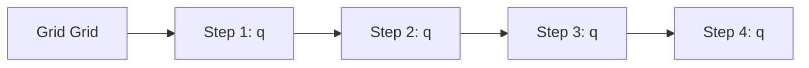
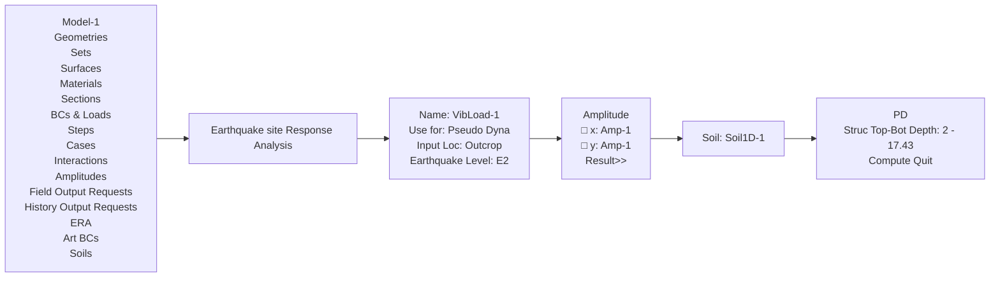
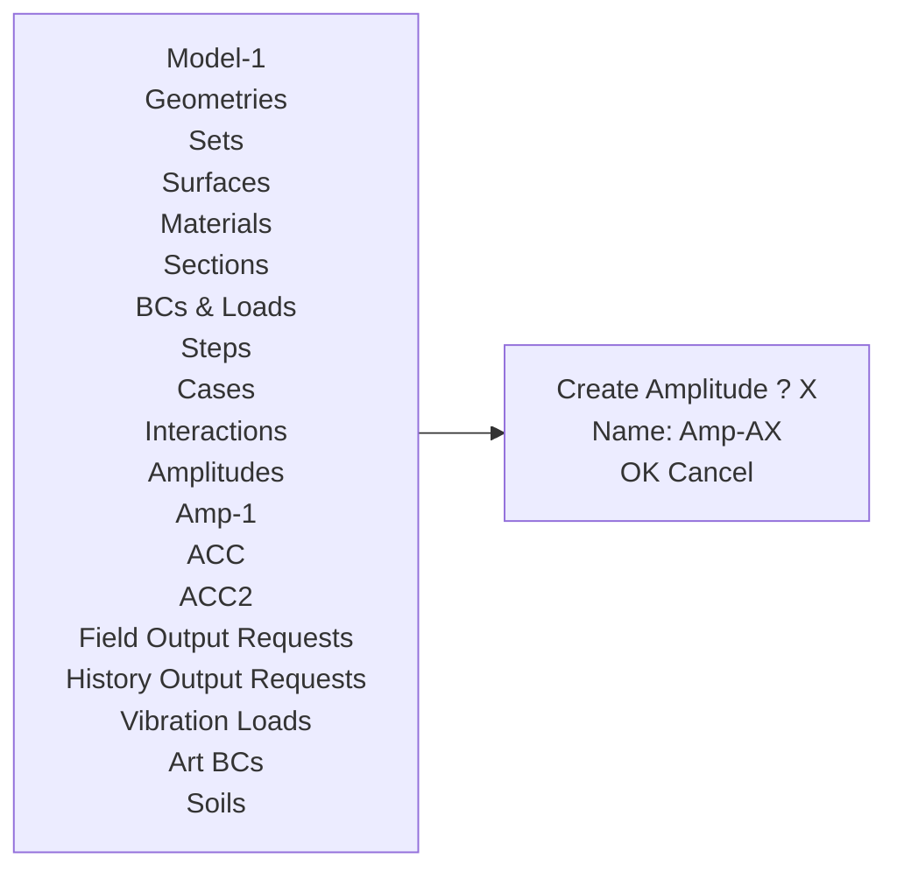
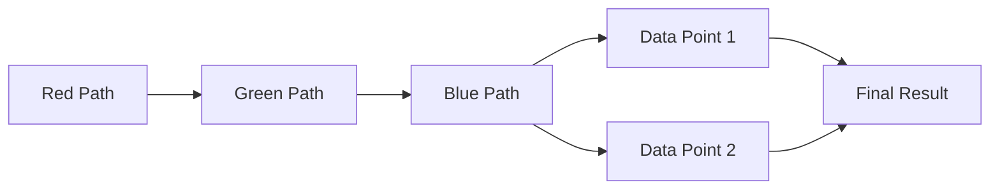

# 地下结构动力分析软件

# GFE-SSA

# ——技术手册

杜修力院士科研团队

广州颖力科技有限公司

2022 年 08 月

V1.0

# 目录

# 前言....-5-

# 第 1 章 地下结构抗震分析方法……-7-

# 1.1 时程分析方法....-7-

1.1.1 控制方程 ..... - 7 -  
1.1.2 人工边界条件 ..... - 9 -  
1.1.3 场地地震反应分析 ..... - 10 -  
1.1.4 地震动输入....- 11 -  
1.1.5 材料非线性本构模型.... - 12 -  
1.1.6 非线性分析的初始应力条件 ..... - 12 -

# 1.2 简化分析方法....-13-

1.2.1 反应加速度法 ..... - 13 -  
1.2.2 反应位移法....-13-

# 第 2 章 典型地铁车站地下结构信息....- 17 -

2.1 车站结构....-17-  
2.2 场地条件....-18-  
2.3 输入地震动....-19-

# 第 3 章 二维时程分析方法……- 21 -

# 3.1 软件操作....-21-

3.1.1 导入结构 ydb 模型.... - 21 -  
3.1.2 创建土体材料及几何....-23-  
3.1.3 整体模型组装....-26-

3.1.4 分析步设置.... - 29 -  
3.1.5 网格划分 ..... - 30 -  
3.1.6 土-结构相互作用设置 ..... - 31 -  
3.1.7 人工边界设置....-33-  
3.1.8 场地地震反应分析与地震动输入.... - 34 -  
3.1.9 场输出设置....-36-  
3.1.10 设置工况并创建任务提交计算 ..... - 38 -

3.2 场地地震反应分析结果....-41-  
3.3 E2 地震线性时程分析结果....- 43 -

3.3.1 结构内力 ..... - 43 -  
3.3.2 结构变形 ..... - 46 -

3.4 E3 地震非线性时程分析结果....-48-

3.4.1 结构损伤 ..... - 48 -  
3.4.2 结构变形 ..... - 50 -

3.5 土层液化对分析结果的影响 ..... - 51 -

3.5.1 层间位移角....-52-  
3.5.2 孔压比....-52-  
3.5.3 结构损伤 ..... - 55 -

# 第 4 章 反应加速度法....- 57 -

4.1 软件操作....-57-

4.1.1 场地地震反应分析与有效反应加速度.... - 57 -  
4.1.2 施加边界条件与惯性力荷载....-62-

4.2 计算结果....-67-

4.2.1 结构内力 ..... - 68 -  
4.2.2 结构变形 ..... - 70 -

# 第 5 章 反应位移法....- 73 -

5.1 软件操作....-73-

5.1.1 场地地震反应分析与三类荷载 ..... - 73 -  
5.1.2 施加边界条件、地基弹簧和三类荷载....-85-

5.2 计算结果....-92-

5.2.1 结构内力 ..... - 93 -  
5.2.2 结构变形 ..... - 95 -

# 第 6 章 三维时程分析方法....- 99 -

6.1 软件操作....-99-  
6.2 E2 地震线性时程分析结果....- 99 -

6.2.1 结构内力 ..... - 100 -  
6.2.2 结构变形 ..... - 114 -

6.3 E3 地震非线性时程分析结果....- 116 -

6.3.1 结构损伤 ..... - 116 -  
6.3.2 结构变形 ..... - 130 -

6.4 土层液化对分析结果的影响 ..... - 131 -

6.4.1 层间位移角....-131-  
6.4.2 孔压比....-132-

# 第 7 章 结论....- 135 -

# 附录一：重力荷载作用静力分析....-137-

附录 1.1 二维模型....-137-

附录 1.2 三维模型....-140-

# 附录二：模态分析 …… - 147 -

附录 2.1 二维模型 ..... - 147 -

附录 2.2 三维模型....-151-

# 前言

随着国民经济持续快速发展以及西部大开发和一带一路战略实施，我国土木基础设施工程建设特别是地下结构和长大隧道建设规模已位居世界首位，并将保持长期大规模高速发展。近年来，世界范围内发生了多次地下结构震害事例，包括1995年日本神户地震，1999年中国台湾集集地震，1999年土耳其科贾埃里地震以及2008年中国汶川地震等。日本神户大地震中，地铁区间隧道及地铁车站遭受了严重破坏，甚至出现大开地铁车站完全塌毁的震害事例，地下结构抗震问题受到关注。我国已颁布实施了地下结构抗震设计规范，如《城市轨道交通结构抗震设计规范》（GB 50909-2014）和《地下结构抗震设计标准》（GB/T51336-2018）。地下结构抗震分析与设计需要考虑土与结构动力相互作用，涉及时程分析方法、反应加速度法和反应位移法等。现有软件尚未集成上述方法，前后处理操作繁琐，三维土-结构系统模型计算效率低。工欲善其事，必先利其器。

广州颖力科技有限公司自主研发了地下结构动力分析软件 GFE-SSA。该软件由有限元求解器模块和前处理模块组成，并可与结构专业设计软件无缝对接进行结构前后处理。GFE 软件的优势与功能特色如下：

（1）“准”一集成了先进的土-结构动力相互作用分析模型与方法，保证计算结果准确。软件的各类单元、本构模型、相互作用、求解算法等对标国际主流通用有限元软件；软件集成了动力人工边界条件、场地地震反应分析、地震动输入等土-结构相互作用分析方法；软件集成了我国地下结构抗震设计规范要求的各类分析方法，包括二维和三维以及线性和非线性时程分析方法、反应加速度法、反应位移法等。  
（2）“快”一采用了多 GPU 并行计算的显式动力求解和编程架构，保证计算过程快速。软件采用 CPU+GPU 异构并行计算的显式动力分析技术，其计算速度是多 CPU 并行计算速度的 10 倍以上。  
（3）“简”一简化了土与结构一体化建模，可进行构件设计并生成计算书，操作简便。可将结构专业设计软件建立的结构模型导入 GFE 软件，之后在 GFE 软件内简单完成土-结构系统建模；基于 GFE 计算得到的结构结果可以完成效应组合、截面验算、配筋、生成计算书等；GFE 软件也支持导入其他有限元软件的计算模型。

本手册首先简介地下结构抗震分析方法；然后以某地铁车站为例，介绍各类分析方法的GFE软件操作并给出计算结果，与主流商业有限元软件结果对比说明GFE软件的优势。

# 第1章 地下结构抗震分析方法

地下结构地震反应分析需要考虑土体与结构之间的动力相互作用。时程分析采用整体分析方法，也称有限元直接法，即建立结构及其周围土体的整体有限元模型，在土体截断边界处施加人工边界条件并输入地震动。本章首先介绍时程分析方法，包括黏弹性人工边界条件、场地地震反应分析、地震动输入、材料非线性本构模型及初始地应力条件等。之后介绍地下结构抗震设计规范要求的简化分析方法，包括反应加速度法和反应位移法。

# 1.1 时程分析方法

# 1.1.1 控制方程

地下结构地震反应分析的整体模型如图 1.1-1 所示。整体分析方法的思路是引入虚拟边界（称作人工边界）截去土体的无限域部分，取出地下结构及其附近土体形成有限域，采用有限元等数值方法进行模拟。


<details>
<summary>text_image</summary>

人工边界
地下结构
土体
人工边界
倾斜入射地震动
</details>

图 1.1-1 地下结构地震反应分析的整体分析模型示意图

根据有限元理论，线弹性有限域的动力有限元方程可以写为：

$$
\left[ \begin{array}{l l} \mathbf {M} _ {R R} & \mathbf {M} _ {R B} \\ \mathbf {M} _ {B R} & \mathbf {M} _ {B B} \end{array} \right] \left\{ \begin{array}{l} \ddot {\mathbf {u}} _ {R} \\ \ddot {\mathbf {u}} _ {B} \end{array} \right\} + \left[ \begin{array}{l l} \mathbf {C} _ {R R} & \mathbf {C} _ {R B} \\ \mathbf {C} _ {B R} & \mathbf {C} _ {B B} \end{array} \right] \left\{ \begin{array}{l} \dot {\mathbf {u}} _ {R} \\ \dot {\mathbf {u}} _ {B} \end{array} \right\} + \left[ \begin{array}{l l} \mathbf {K} _ {R R} & \mathbf {K} _ {R B} \\ \mathbf {K} _ {B R} & \mathbf {K} _ {B B} \end{array} \right] \left\{ \begin{array}{l} \mathbf {u} _ {R} \\ \mathbf {u} _ {B} \end{array} \right\} = \left\{ \begin{array}{l} \mathbf {0} \\ \mathbf {f} _ {B} \end{array} \right\} \tag {1.1-1}
$$

其中，下标 B 和 R 分别表示人工边界自由度和其余自由度；u、 $\dot{u}$ 和 $\ddot{u}$ 分别表示位移、速度和加速度向量；M、C 和 K 分别是质量、阻尼和刚度矩阵； $f_{B}$ 是地震荷载作用下人工边界处被截去的无限域对有限域的作用力。

将人工边界处的总反应分解为散射场和自由场两部分，作用力、位移和速度可以分别分解

为:

$$
\mathbf {f} _ {B} = \mathbf {f} _ {B} ^ {S} + \mathbf {f} _ {B} ^ {F} \tag {1.1-2}
$$

$$
\mathbf {u} _ {B} = \mathbf {u} _ {B} ^ {S} + \mathbf {u} _ {B} ^ {F} \tag {1.1-3}
$$

$$
\dot {\mathbf {u}} _ {B} = \dot {\mathbf {u}} _ {B} ^ {S} + \dot {\mathbf {u}} _ {B} ^ {F} \tag {1.1-4}
$$

其中，自由场用上标 F 表示，由场地反应分析确定；散射场用上标 S 表示，为未知量。

散射场从有限域通过人工边界辐射或者透射进入无限域，采用人工边界条件来模拟，以黏弹性人工边界为例，散射场的作用力和运动关系可以写为：

$$
\mathbf {f} _ {B} ^ {S} = - \mathbf {K} _ {B} ^ {\infty} \mathbf {u} _ {B} ^ {S} - \mathbf {C} _ {B} ^ {\infty} \dot {\mathbf {u}} _ {B} ^ {S} \tag {1.1-5}
$$

其中， $K_{B}^{\infty}$ 和 $C_{B}^{\infty}$ 分别是黏弹性人工边界的弹簧和阻尼系数矩阵，具体取值方法见下一小节。

将式（1.1-3）和式（1.1-4）代入式（1.1-5），然后代入式（1.1-2），最终代入式（1.1-1），整理得：

$$
\left[ \begin{array}{l l} \mathbf {M} _ {R R} & \mathbf {M} _ {R B} \\ \mathbf {M} _ {B R} & \mathbf {M} _ {B B} \end{array} \right] \left\{ \begin{array}{l} \ddot {\mathbf {u}} _ {R} \\ \ddot {\mathbf {u}} _ {B} \end{array} \right\} + \left[ \begin{array}{c c} \mathbf {C} _ {R R} & \mathbf {C} _ {R B} \\ \mathbf {C} _ {B R} & \mathbf {C} _ {B B} + \mathbf {C} _ {B} ^ {\infty} \end{array} \right] \left\{ \begin{array}{l} \dot {\mathbf {u}} _ {R} \\ \dot {\mathbf {u}} _ {B} \end{array} \right\} + \tag {1.1-6}
$$

$$
\left[ \begin{array}{c c} \mathbf {K} _ {R R} & \mathbf {K} _ {R B} \\ \mathbf {K} _ {B R} & \mathbf {K} _ {B B} + \mathbf {K} _ {B} ^ {\infty} \end{array} \right] \left\{ \begin{array}{c} \mathbf {u} _ {R} \\ \mathbf {u} _ {B} \end{array} \right\} = \left\{ \begin{array}{c} \mathbf {0} \\ \mathbf {K} _ {B} ^ {\infty} \mathbf {u} _ {B} ^ {F} + \mathbf {C} _ {B} ^ {\infty} \dot {\mathbf {u}} _ {B} ^ {F} + \mathbf {f} _ {B} ^ {F} \end{array} \right\}
$$

整体分析方法可以考虑有限域内土体和结构的材料和接触等非线性力学行为。此时需要同时考虑地震和体力的共同作用，并且给定体力作用下的初始应力状态作为地震反应分析的初始条件。以式（1.1-6）为例，非线性问题的有限元方程可以进一步写为：

$$
\begin{array}{l} \left[ \begin{array}{c c} \mathbf {M} _ {R R} & \mathbf {M} _ {R B} \\ \mathbf {M} _ {B R} & \mathbf {M} _ {B B} \end{array} \right] \left\{ \begin{array}{c} \ddot {\mathbf {u}} _ {R} \\ \ddot {\mathbf {u}} _ {B} \end{array} \right\} + \left[ \begin{array}{c c} \mathbf {C} _ {R R} & \mathbf {C} _ {R B} \\ \mathbf {C} _ {B R} & \mathbf {C} _ {B B} + \mathbf {C} _ {B} ^ {\infty} \end{array} \right] \left\{ \begin{array}{c} \dot {\mathbf {u}} _ {R} \\ \dot {\mathbf {u}} _ {B} \end{array} \right\} + \left[ \begin{array}{c c} \mathbf {0} & \mathbf {K} _ {R B} \\ \mathbf {K} _ {B R} & \mathbf {K} _ {B B} + \mathbf {K} _ {B} ^ {\infty} \end{array} \right] \left\{ \begin{array}{c} \mathbf {u} _ {R} \\ \mathbf {u} _ {B} \end{array} \right\} \\ + \left[ \begin{array}{c c} \mathbf {f} _ {R} \left(\mathbf {u} _ {R}, \dot {\mathbf {u}} _ {R}\right) & \mathbf {0} \\ \mathbf {0} & \mathbf {0} \end{array} \right] = \left\{ \begin{array}{c} \mathbf {0} \\ \mathbf {K} _ {B} ^ {\infty} \mathbf {u} _ {B} ^ {F} + \mathbf {C} _ {B} ^ {\infty} \dot {\mathbf {u}} _ {B} ^ {F} + \mathbf {f} _ {B} ^ {F} \end{array} \right\} + \left\{ \begin{array}{c} \mathbf {b} _ {R} \\ \mathbf {b} _ {B} \end{array} \right\} + \left\{ \begin{array}{c} \mathbf {0} \\ \mathbf {f} _ {B} ^ {b} \end{array} \right\} \tag {1.1-7} \\ \end{array}
$$

其中， $\mathbf{f}_{R}(\mathbf{u}_{R},\dot{\mathbf{u}}_{R})$ 是非线性内力；b 是体力； $f_{B}^{b}$ 是体力作用下无限域对有限域的作用力。

土-结构动力相互作用时程分析方法的主要步骤包括:

（1）建立土-结构系统的有限元模型；  
（2）施加人工边界条件；  
（3）进行场地地震反应分析，计算并施加人工边界处的等效地震荷载；  
（4）非线性分析还要计算并考虑地震作用前的初始应力条件；  
（5）采用显式或者隐式时间积分算法求解。

# 1.1.2 人工边界条件

《城市轨道交通结构抗震设计规范》（GB50909-2014）中要求地基无限性的模拟应通过在区域边界上引入人工边界加以实现，一般可采用黏性边界或黏弹性边界等合理的边界条件，且侧向人工边界应避免采用固定或自由等不合理的边界条件。黏弹性边界在人工边界的每个自由度上施加一个远端固定的并联弹簧-阻尼器系统，如图 1.1-2 所示。


<details>
<summary>text_image</summary>

FEM boundary
CN
KN
KT
CT
FEM boundary
FEM mesh
Node on FEM boundary
</details>

(a) 二维黏弹性边界


<details>
<summary>text_image</summary>

N
C_Ni
K_Ni
C_Ti
T_1
i
K_Ti
C_Ti
T_2
y
T_2
C_Ti
K_Ti
C_Ni
T_1
i
T_2
C_Ti
K_Ti
C_Ti
T_1
N
T_2
C_Ti
K_Ti
C_Ni
T_1
i
T_2
C_Ti
K_Ti
C_Ti
T_1
N
T_2
C_Ti
K_Ti
C_Ni
T_1
i
T_2
C_Ti
K_Ti
C_Ni
N
</details>

(b) 三维黏弹性边界  
图 1.1-2 黏弹性边界

二维黏弹性人工边界的弹簧-阻尼元件参数为:

法向 $K_{N}=\frac{1}{1+A}\frac{\lambda+2G}{2r},\quad C_{N}=B\rho c_{p}$ (1.1-8)

切向 $K_{T}=\frac{1}{1+A}\frac{G}{2r},\quad C_{T}=B\rho c_{S}$ (1.1-9)

三维黏弹性人工边界的弹簧-阻尼元件参数为:

法向 $K_{N}=\frac{1}{1+A}\frac{\lambda+2G}{r},\quad C_{N}=B\rho c_{p}$ (1.1-10)

切向

$$
K _ {T} = \frac {1}{1 + A} \frac {G}{r}, \quad C _ {T} = B \rho c _ {s} \tag {1.1-11}
$$

式中， $\rho$ 为介质密度； $c_{p}$ 和 $c_{s}$ 分别为P波和S波波速；长度r可取为近场结构几何中心到该人工边界点所在边界线或面的距离；参数A、B的较优建议值为A=0.8、B=1.1。

GFE 软件提供了二维和三维黏弹性人工边界条件，考虑了模型中土层性质变化及模型边界几何形状非规则性，可快速实现黏弹性人工边界条件的自动施加。

# 1.1.3 场地地震反应分析

在利用时程分析方法开展土-结构动力相互作用分析之前，需要进行场地地震反应分析，将场地反应结果作为土-结构相互作用分析的地震荷载，因而场地反应分析结果的准确性至关重要。

局部场地通常可以简化为水平成层土体模型，在地震动作为平面体波竖直入射情况下，场地地震反应分析属于空间一维问题，即所谓一维场地地震反应分析。土体在地震作用下表现出显著的材料非线性特性，工程中通常采用等效线性化方法模拟土体的材料非线性行为。EERA和SHAKE是典型的等效线性一维场地地震反应分析程序。


<details>
<summary>text_image</summary>

基岩地表运动 2uᵢ
场地地表运动 uₛ
一维波动
工程场地
基岩
基岩运动 uᵢ + uᵣ
一维波动
基岩
入射地震动 uᵢ
一维场地地震反应分析
</details>

图 1.1-3 一维场地地震反应分析

一维场地地震反应分析如图 1.1-3 所示，入射地震动为 $u_{i}$ 。忽略地震动在半空间基岩中的传播时间，则基岩地表运动为 $2u_{i}$ 。入射地震动传播进入工程场地获得场地地震反应，场地地表运动为 $u_{s}$ ，基岩运动为 $u=u_{i}+u_{r}$ 。实际工程中，可能给定基岩地表运动、基岩运动或者场地地表运动三个不同位置的地震动作为输入地震动。若已知基岩地表地震动，可将其折半在基岩处输入；若已知基岩地震动，可将其强制在基岩处；若已知场地地表地震动，则需反演得到场地地震反应（等效线性化分析中可以通过正演计算实现）。

GFE 软件提供了等效线性化一维场地地震反应分析模块，可快速实现场地地震反应分析，

并能自动转化为后续土-结构相互作用分析的地震荷载，实现场地反应分析与土-结构相互作用分析间的无缝对接，无需数据的导入导出，操作简便。

  
(a) 平面波 SV 波与 P 波二维输入


(b) 平面波 SV 波与 P 波立方体模型三维输入  
  
(c) 平面波 SV 波柱体模型与半球模型三维输入  
图 1.1-4 地震动输入算例

# 1.1.4 地震动输入

从式（1.1-7）中可以看到，土-结构相互作用分析的地震荷载是作用于人工边界节点处由场地反应转化的节点力时程，即：

$$
\mathbf {f} _ {B} = \mathbf {K} _ {B} ^ {\infty} \mathbf {u} _ {B} ^ {F} + \mathbf {C} _ {B} ^ {\infty} \dot {\mathbf {u}} _ {B} ^ {F} + \mathbf {f} _ {B} ^ {F} \tag {1.1-12}
$$

GFE 软件提供了基于黏弹性人工边界条件的地震动输入方法，可以考虑不同地震波型（P波、SV 波、SH 波）和不同人工边界几何形状，如图 1.1-4 所示。地震动输入方法实现场地反

应分析与土-结构相互作用分析间的无缝对接，无需数据的导入导出，操作简便。

# 1.1.5 材料非线性本构模型

《城市轨道交通结构抗震设计规范》（GB50909-2014）的3.3.1节中规定“对于高架区间结构、地下车站结构、重点设防类和标准设防类的高架车站结构、重点设防类的区间隧道结构在进行抗震性能Ⅱ要求的设计计算中需进行非线性时程分析”。GFE软件提供了钢筋混凝土和土体的材料非线性本构模型。

对于钢筋混凝土地下结构，GFE 软件在纤维梁单元和分层壳单元中引入了钢筋弹塑性本构模型和混凝土塑性损伤本构模型，可有效模拟钢筋混凝土结构材料非线性力学行为。此外，GFE 软件中预设了 Q235-Q460 钢材、HPB235-HPB500 钢材、C30-C80 混凝土等多种常用材料的非线性模型参数，方便用户直接调用。

对于土体，GFE 软件提供了经典的摩尔库伦模型以及可考虑土体动力特性的 Davidenkov 本构模型。

# 1.1.6 非线性分析的初始应力条件

由式（1.1-7）可知，非线性时程分析需要考虑地震作用前的体力引起的初始应力条件。考虑初始应力条件的土-结构相互作用分析过程为：（1）对土-结构系统模型的人工边界施加法向约束，施加体力进行静力分析；（2）将获得的应力和边界约束力施加于土-结构系统地震反应分析模型，进行体力和地震共同作用下的动力分析。

GFE 软件实现了上述静力和动力两个连续分析过程的连续统一，避免了两个分析过程间数据传递的用户操作。图 1.1-5 给出仅考虑重力而不施加地震荷载时某一水平成层场地的两次静力后的计算结果，由图可见，应力场与自重应力的理论结果一致，且位移场基本为零，说明自重作用下初始应力条件的准确性。


<details>
<summary>heatmap</summary>

| Color | Value Range |
| --- | --- |
| Red | 9.5e3 |
| Orange | ~8.5e3 |
| Yellow | ~7.8e3 |
| Green | ~7.2e3 |
| Cyan | ~6.5e3 |
| Blue | 7.79e5 |
</details>

(a) 竖向应力云图


<details>
<summary>line</summary>

| 深度 (m) | 竖向应力 (MPa) |
| --- | --- |
| 0 | 0.0 |
| 7 | ~0.08 |
| 14 | ~0.15 |
| 21 | ~0.22 |
| 35 | ~0.32 |
| 42 | ~0.75 |
</details>

(b) 竖向应力沿深度变化曲线  


<details>
<summary>natural_image</summary>

3D thermal or stress distribution visualization on a rectangular block, with color-coded values ranging from -4.2e-6 (blue) to 1.35e-6 (red)
</details>

(c) 竖向位移云图  
图 1.1-5 自重作用下某水平成层场地的初始状态

# 1.2 简化分析方法

# 1.2.1 反应加速度法

反应加速度法通常用于地下结构二维横断面地震反应分析，是一种简化的静力分析方法。反应加速度法与时程分析方法一样，采用土-结构系统整体分析模型，或称为土层-结构模型，计算模型如图 1.2-1 所示。结构和土体分别采用梁单元和平面应变单元模拟，模型底边界固定、侧边界采用水平滑移边界，整个模型受惯性力荷载作用。


<details>
<summary>text_image</summary>

水平滑移边界
惯性力
水平滑移边界
固定边界
</details>

图 1.2-1 反应加速度法计算模型

惯性力的计算方法如下。首先进行一维场地地震反应分析，提取地下结构顶、底板位置发生最大相对位移时刻土层的剪应力分布，通过式（1.2-1）计算不同土层深度处的有效反应加速度，然后将其以惯性力方式作用于整个计算模型上进行静力计算。

$$
a _ {i} = \frac {\tau_ {i} - \tau_ {i - 1}}{\rho_ {i} h _ {i}} \tag {1.2-1}
$$

式中： $a_{i}$ 为第 i 层土单元的有效反应加速度； $\rho_{i}$ 为第 i 层土单元的密度； $h_{i}$ 为第 i 层土单元的厚度； $\tau_{i-1}$ 、 $\tau_{i}$ 分别为地下结构发生最大变形时第 i 层土单元顶部与底部的剪应力。

# 1.2.2 反应位移法

反应位移法通常用于地下结构二维横断面地震反应分析，是一种简化的静力分析方法。反应位移法采用土-结构相互作用的子结构分析模型，或称为荷载-结构模型，计算模型如图 1.2-2 所示。结构采用梁单元模拟，土体采用施加于结构周围的地基弹簧模拟，结构-弹簧系统承受三类荷载：土层相对位移、结构惯性力和结构周围土层剪力。


<details>
<summary>text_image</summary>

土层剪力
土层剪力
惯性力
土层剪力
地基弹簧
土层位移
土层位移
</details>

图 1.2-2 反应位移法计算模型

地基弹簧刚度可由如下两种方法确定。第一种方法是利用基床系数由式（1.2-2）确定：

$$
k = K L d \tag {1.2-2}
$$

式中：k 为压缩或剪切地基弹簧刚度（N/m）；K 为基床系数（N/m³）；L 为沿结构横向的计算长度（m）；d 为沿结构纵向的计算长度（m）。第二种方法是静力有限元法，如图 1.2-3 所示，在去除了结构的孔洞土体中的四个侧面分别施加垂直向和水平向的作用力，然后根据各侧面的位移来确定各面的地基弹簧刚度。


<details>
<summary>flowchart</summary>


</details>

图 1.2-3 采用静力有限元法计算地基弹簧刚度系数

结构-弹簧系统承受的三类荷载由场地地震反应分析确定。进行一维场地地震反应分析，提取地下结构顶、底板位置发生最大相对位移时刻土层位移、加速度和剪应力分布，分别按照如下方法计算三类荷载。

（1）土层相对位移为：

$$
u ^ {\prime} (z) = u (z) - u (z _ {B}) \tag {1.2-3}
$$

式中： $u'$ （z）为深度z处相对于结构底部的自由土层相对位移（m）；u（z）为深度z处自由土层地震反应位移（m）； $u(z_{B})$ 为结构底部 $z_{B}$ 处的自由土层地震反应位移（m）。土层相对位移强制于地基弹簧远端。

(2) 结构惯性力:

$$
f _ {i} = m _ {i} \ddot {u} _ {i} \tag {1.2-4}
$$

式中： $f_{i}$ 为结构 i 单元上作用的惯性力（N）； $m_{i}$ 为结构 i 单元的质量（kg）； $u_{i}$ 为自由土层对应于结构 i 单元位置处的加速度（ $m/s^{2}$ ）。结构惯性力也可作为集中力施加在结构形心上。

（3）结构周围土层剪力可以将相应位置处的土层剪应力转化为节点力得到。矩形结构侧壁剪力也可进行如下简化计算：

$$
\tau_ {s} = \frac {\tau_ {U} + \tau_ {B}}{2} \tag {1.2-5}
$$

式中： $\tau_{S}$ 为矩形结构侧壁所受的剪力（Pa）； $\tau_{U}$ 和 $\tau_{B}$ 分别为结构顶底板位置处自由土层的剪力（Pa）。

# 第2章 典型地铁车站地下结构信息

选用某地铁车站地下结构抗震分析案例测试 GFE 软件。本章介绍该地铁车站结构、场地条件以及输入地震动等参数信息。

# 2.1 车站结构

某车站为两层三跨结构，层高均为7m，结构埋深为4m。结构中柱混凝土强度等级为C50，其余构件混凝土强度等级为C35；结构外墙厚度700mm，底板厚度900mm，中板厚度为400mm，顶板厚度为750mm，中柱的横向和纵向尺寸分别为700mm和1000mm，中柱间距为7500mm。线弹性分析中，混凝土材料为弹性模型。非线性性分析中，混凝土材料为混凝土损伤模型，混凝土构件配筋由盈建科软件给出，混凝土和钢筋基本物理参数按照《混凝土结构设计规范》选取，如表2.1-1和表2.1-2所示。结构和结构横断面分别如图2.1-1和图2.1-2所示。

表 2.1-1 结构混凝土材料参数

<table><tr><td>结构材料</td><td>弹性模量(kPa)</td><td>泊松比</td><td>容重(t/m3)</td><td>抗压强度(kPa)</td><td>峰值压缩应变</td><td>压缩软化系数</td><td>抗拉强度(kPa)</td><td>峰值拉伸应变</td><td>拉伸软化系数</td></tr><tr><td>C35</td><td>3.15e07</td><td>0.2</td><td>2.5</td><td>23400</td><td>0.0015323</td><td>0.95930</td><td>2200</td><td>9.9984e-05</td><td>1.51144</td></tr><tr><td>C50</td><td>3.45e07</td><td>0.2</td><td>2.5</td><td>32400</td><td>0.0016790</td><td>1.49983</td><td>2640</td><td>1.1018e-04</td><td>2.17510</td></tr></table>

表 2.1-2 结构钢筋材料参数

<table><tr><td>结构材料</td><td>弹性模量(kPa)</td><td>泊松比</td><td>容重(t/m3)</td><td>屈服应力(kPa)</td><td>塑性应变</td></tr><tr><td rowspan="2">Q235</td><td rowspan="2">2.06e08</td><td rowspan="2">0.25</td><td rowspan="2">7.8</td><td>235000</td><td>0</td></tr><tr><td>325000</td><td>0.025</td></tr></table>


<details>
<summary>natural_image</summary>

3D rendering of a green rectangular structure with a blue grid pattern and a small white dot at the top (no text or symbols)
</details>

图 2.1-1 结构模型


<details>
<summary>text_image</summary>

750
6425
14000
700
6800
7500
6800
700
900
6350
400
KZ1
700×1000
KZ1
700×1000
KZ1
700×1000
</details>

图 2.1-2 结构横断面

# 2.2 场地条件

线弹性分析中，土层参数如表 2.2-1 所示，各层土的动剪切模量比和阻尼比随剪应变变化曲线如图 2.2-1 所示。非线性性分析中，土体材料非线性可以分别采用 Davidenkov 本构模型和 Mohr-Coulomb 本构模型模拟，两种本构模型参数如表 2.2-2 和表 2.2-3 所示。

表 2.2-1 土层弹性参数信息

<table><tr><td rowspan="2">名称</td><td rowspan="2">层号</td><td colspan="4">材料参数</td></tr><tr><td>厚度(m)</td><td>弹性模量(kPa)</td><td>泊松比</td><td>容重(t/m3)</td></tr><tr><td>粉质黏土素填土</td><td>1</td><td>5</td><td>175574</td><td>0.35</td><td>1.90</td></tr><tr><td>粉质黏土</td><td>2</td><td>20</td><td>380085</td><td>0.29</td><td>1.92</td></tr><tr><td>粉质黏土</td><td>3</td><td>16</td><td>504811</td><td>0.28</td><td>1.95</td></tr><tr><td>微风化石灰石</td><td>4</td><td>9</td><td>6017540</td><td>0.25</td><td>2.30</td></tr></table>


<details>
<summary>line</summary>

| 剪应变 | 第一层土 (G/Gmax) | 第二层土 (G/Gmax) | 第三层土 (G/Gmax) | 第一层土 (阻尼比%) | 第二层土 (阻尼比%) | 第三层土 (阻尼比%) |
| --- | --- | --- | --- | --- | --- | --- |
| 1E-5 | ~0.96 | ~0.98 | ~0.99 | ~2.1 | ~1.3 | ~1.0 |
| 1E-4 | ~0.80 | ~0.94 | ~0.95 | ~3.7 | ~2.5 | ~3.7 |
| 1E-3 | ~0.30 | ~0.74 | ~0.58 | ~8.5 | ~7.0 | ~6.3 |
| 0.01 | ~0.10 | ~0.14 | ~0.08 | ~12.0 | ~10.5 | ~8.2 |
</details>

图 2.2-1 土层动剪切模量比和阻尼比随剪应变变化曲线

表 2.2-2 Davidenkov 本构模型车站结构周围土层信息

<table><tr><td rowspan="2">名称</td><td rowspan="2">层号</td><td colspan="3">材料参数</td></tr><tr><td>A</td><td>B</td><td> $\gamma_0$ </td></tr><tr><td>粉质黏土素填土</td><td>1</td><td>1.04</td><td>0.4</td><td>0.00036</td></tr><tr><td>粉质黏土</td><td>2</td><td>1.09</td><td>0.41</td><td>0.00037</td></tr><tr><td>粉质黏土</td><td>3</td><td>1.08</td><td>0.46</td><td>0.00041</td></tr></table>

表 2.2-3 Mohr-Coulomb 本构模型车站结构周围土层信息

<table><tr><td rowspan="2">名称</td><td rowspan="2">层号</td><td colspan="3">材料参数</td></tr><tr><td>摩擦角(°)</td><td>剪胀角(°)</td><td>黏聚力(kPa)</td></tr><tr><td>粉质黏土素填土</td><td>1</td><td>8</td><td>4</td><td>10</td></tr><tr><td>粉质黏土</td><td>2</td><td>18</td><td>9</td><td>33</td></tr><tr><td>粉质黏土</td><td>3</td><td>19</td><td>9.5</td><td>35</td></tr></table>

# 2.3 输入地震动

场地地震安全性评价报告给出了基岩地表的 E2 和 E3 地震动，其加速度时程分别如图 2.3-1 和图 2.3-2 所示，分别用于线弹性和非线性分析。


<details>
<summary>line</summary>

| 时间/s | \(加速度/m/s^{2}\) |
| --- | --- |
| 0 | 0 |
| ~4 | ~1.7 |
| ~9 | ~1.4 |
| ~18 | ~0.4 |
| ~27 | ~0.1 |
| ~36 | 0 |
| ~45 | 0 |
</details>

图 2.3-1 基岩地表 E2 地震动加速度时程


<details>
<summary>line</summary>

| 时间/s | \(加速度/m/s^{2}\) |
| --- | --- |
| 0 | 0 |
| ~3 | ~2.4 |
| ~4 | ~-2.0 |
| ~6 | ~2.5 |
| ~7 | ~-2.6 |
| ~9 | ~2.0 |
| ~10 | ~-2.6 |
| ~12 | ~2.0 |
| ~13 | ~-2.8 |
| ~15 | ~2.6 |
| ~16 | ~-2.8 |
| ~18 | ~1.3 |
| ~20 | ~1.0 |
| ~22 | ~0.6 |
| ~24 | ~0.5 |
| ~26 | ~0.4 |
| ~28 | ~0.3 |
| ~30 | ~0.2 |
| ~32 | ~0.2 |
| ~34 | ~0.1 |
| ~36 | ~0.1 |
| ~38 | ~0.1 |
| ~40 | ~0.1 |
| ~42 | ~0.1 |
| ~44 | ~0.1 |
</details>

图 2.3-2 基岩地表 E3 地震动加速度时程

# 第3章 二维时程分析方法

GFE 软件集成了第一章的土-结构相互作用时程分析方法。针对第二章给出的地铁车站地下结构抗震分析案例，本章采用 GFE 软件完成二维横断面时程分析。首先介绍二维时程分析方法在 GFE 软件中的操作步骤，然后给出地铁车站地震反应计算结果。通过与某国际先进通用有限元软件（简称软件 A）的计算结果对比，验证 GFE 软件的可靠性和优势。

# 3.1 软件操作

GFE 软件进行二维时程分析的主要步骤有：导入结构 ydb 模型、创建土体材料及几何、整体模型组装、分析步设置、网格划分、土-结构相互作用设置、人工边界设置、场地地震反应分析与地震动输入、场输出设置、设置工况并创建任务提交计算。非线性与线性时程分析的操作步骤大同小异，都由上述 10 个步骤完成，只在某些步骤上略有不同：导入 ydb 模型时，非线性分析需要选择导入结构专业设计软件 YJK 配筋或默认配筋，结构材料需要选择“塑性”；创建的幅值函数需为 E3 地震动测量数据，并在地震场地反应分析的“地震水准”中勾选 E3；创建工况时，在动力分析步前需要设置模型整体重力载荷下的静力分析步以做地应力平衡。

# 3.1.1 导入结构 ydb 模型

点击【Import /导入】选择【Import YJK DB /导入 YJK 数据库】，弹出对话框中选择需要导入的 ydb 文件，点击【Open /打开】弹出导入设置对话框，根据需求进行设置或保持默认设置，点击【OK /确认】完成模型导入，如图 3.1-1 所示。


  
图 3.1-1 ydb 模型导入

# 3.1.2 创建土体材料及几何

# （1）创建土层材料

右键点击【Materials /材料】，点击【Create/创建】弹出【Create Material /创建材料】窗口，在【Name /名称】中输入土层材料名称，点击【OK /确定】，点击【General /常规类】、【Density /密度】，在【Mass Density /质量密度】中输入土层的密度，如图 3.1-2。点击【Elasticity/弹性类】、【Elastic /弹性类】，在【Young's Modulus /杨氏模量】中输入土层的杨氏模量，在【Poisson /泊松比】里输入泊松比点击【OK /确认】，周围土体的材料创建完成，如图 3.1-3。


图 3.1-2 Material /材料窗口-常规类  
  
图 3.1-3 Material /材料窗口-弹性类

# (2) 创建土层

各土层材料创建完毕后即可创建土层，具体步骤如图 3.1-4 所示。

  
图 3.1-4 创建土层

# （3）创建土体几何

根据土层创建土体几何，右键点击【Creat Soil/创建土体】，二维分析时选择【2D】，【Soil Layers/土层】选择上一步创建的土层，【Length/宽度】输入土体长度尺寸，点击【OK/确认】

完成土体几何创建，如图 3.1-5 所示。

  
图 3.1-5 创建土体几何

# 3.1.3 整体模型组装

结构、地连墙和土体模型创建完成后，需要对其进行组装，形成可用于计算的整体模型。组装过程包括调整土与结构间相对位置和对土进行裁剪操作。

# （1）调整土与结构间相对位置

可通过平移操作调整土与结构间相对位置，具体操作如图 3.1-6 所示，可通过输入平移向量或选择两几何点的方式进行平移。


<details>
<summary>text_image</summary>

Import...
Export...
Create Box
Create Cylinder
Create Sphere
1
Translate
Boolean
Operation
Rotate
Scale
Boolean
Display
View
Find
Contact
Modeling
Display
Node
Element
Surfaces
2.激活、选择视图中需要移动的对象
3.平移方式
4.输入移动向量
Geometries
Vector
0.0, 0.0, 0.0
Yes
No
Output
Total nodes: 4
Self mass: 132 000000
E:/微云/LCZL/2D/erweijiegou.ydb - GFE PrePo
不结构
导入...
导入...
导出...
CAD
Create箱体
创建圆柱形
布尔
旋转
布尔
视图
寻找
网格
查询
拾取
作业
设置
建模
显示
工具
其他
节点
单元
表面
2.激活、选择视图中需要移动的对象
3.平移方式
4.输入移动向量
几何
矢量
50,0,0
是
否
输出
</details>

图 3.1-6 平移操作

(2) 裁剪布尔操作

土与结构相对位置调整后，结构几何嵌入到土体几何中，需要对土体几何进行裁剪以得到容纳结构的空间。先根据结构外轮廓边创建面实体作为裁剪土体的工具，操作过程如图 3.1-7 所示。

  
图 3.1-7 创建面实体

点击【Boolean Operation /布尔运算】进行布尔操作，下方选择【Cut /裁剪】操作，点击【Continue /继续】继续，按操作提示分别选择土体作为裁剪对象和刚创建的面实体作为裁剪工具，点击【OK】完成布尔操作，如图 3.1-8 所示。

  
图 3.1-8 裁剪布尔操作

# 3.1.4 分析步设置

右键点击【Steps】，出现静力通用和动力显式两个选项设置，进行二维横断面动力时程分析时，应该选择动力显式，如图 3.1-9。

  
图 3.1-9 分析步设置

# 3.1.5 网格划分

在工具栏中激活几何体选择, 视图中选择需要划分网格的几何体, 点击【Mesh /网格划分】, 弹出网格划分设置对话框, 见图 3.1-10, 根据实际分析模型选择单元类型及网格尺寸, 点击【OK /确认】完成网格划分。

  
图 3.1-10 网格划分设置

# 3.1.6 土-结构相互作用设置

土-结构的相互作用包括结构与土的 Tie 约束和地连墙 Embed 嵌入土内。

# （1）查找 Tie 接触对

在工具栏中，选择【Find Contact /寻找接触】，见图 3.1-11 所示，在【Search Domain】中会出现四种选择方式，用户可以选择任何一种方式进行分网，之后选择【Search /搜索】，软件会自动寻找土与结构模型间的接触，寻找完成后操作【Ok /确认】按钮。

  
图 3.1-11 查找接触对

# (2) 嵌入约束

创建嵌入约束前应先分别创建地连墙的几何集合和土体几何，分别作为嵌入区域和被嵌

入区域。嵌入约束操作过程如图 3.1-12 所示。

  
图 3.1-12 嵌入约束

# 3.1.7 人工边界设置

GFE 软件中设置人工边界需要两步，第一步建立一个表面，点击【Surfaces /表面集】按

钮，选择所见土体的外边缘，点击【Continue /继续】完成表面的建立，见图 3.1-13；第二步建立人工边界，点击【Art BCs /人工边界】，之后选择结构和所建立的表面，点击【OK /确认】完成人工边界的设置，见图 3.1-14。


图 3.1-13 建立表面  
  
图 3.1-14 建立人工边界

# 3.1.8 场地地震反应分析与地震动输入

双击【Amplitudes/幅值函数】按钮，点击【OK/确认】，之后选择导入按钮，导入的地震动可以为 txt 文件也可以用户手动录入，选择【OK/确认】，地震动导入完成，如图 3.1-15 所示。

  
图 3.1-15 导入地震动

地震动导入完成后，可在 GFE 软件中进行场地分析。首先点击【ERA /地震场地反应】，在弹出的【Earthquake site Response Analysis /地震场地反应分析】窗口中进行设置。在【Use for/ 用于】下拉列表中，选择【Time History /时程分析】；在【Input Loc/输入位置】中可以选

择地表输入、基岩输入和基岩露头三种输入位置，用户可根据实际情况进行选择；在【Amplitude/幅值函数】中选择地震方向及测量地震数据。操作完成后点击【Save/保存】保存。若用户想要查看场地分析结果，可以点击【Compute/计算】按钮，之后选择【Result/结果】查看场地分析结果，具体见图3.1-16所示。

  
图 3.1-16 场地分析

# 3.1.9 场输出设置

点击模型树【Field Output Requests /场输出请求】，弹出【Edit Output Request /编辑场输出请求】窗口，如图 3.1-17。在【Edit Output Request /编辑场输出请求】窗口中，在【Time interval /时间间隔】中可设定输出间隔时间，点击【Add /增加】，弹出【Add SubOutput /新建子输出】窗口，点击【Node /节点】和【Element /单元】可选择节点或者单元输出，点击后在【SubOutput /子输出】中出现新增的输出【SubOut-1（Node）/子输出-1（节点）】，选中后，在右侧【Symbol /符号】下可勾选输出内容。

  
（a）点击【Field Output Requests /场输出请求】

  
图 3.1-17 场输出设置

# 3.1.10 设置工况并创建任务提交计算

提交计算前需先设置计算工况，操作流程如图 3.1-18 所示。

  
图 3.1-18 工况设置

完成上述步骤后，在【Job Manager /作业管理器】窗口中，点击【Create /创建】，弹出【Create Job /创建作业】窗口，在 Job Name 中对工作命名，选择工况，点击【Continue /继续】，弹出【Edit Job /编辑作业】，点击【OK /确认】完成任务创建。【Job Manager /作业管理器】

窗口选中创建的 Job，点击【Submit /提交】提交计算，点击【Monitor /监控】监控计算过程，计算完成后点击【Results /结果】可进入后处理查看结果，操作流程如图 3.1-19 所示。

  
(a) 创建作业

  
(b) 提交计算  
图 3.1-19 创建任务提交计算

# 3.2 场地地震反应分析结果

分别进行 E2 和 E3 地震作用下一维场地地震反应分析，场地土体峰值加速度、峰值相对位移和峰值剪应力沿深度分布结果如图 3.2-1 和图 3.2-2 所示。


<details>
<summary>line</summary>

| Depth (m) | Acceleration \((m/s^{2})\) |
| --- | --- |
| 0 | ~-1.7 |
| -5 | ~-1.0 |
| -10 | ~-0.8 |
| -15 | ~-0.6 |
| -20 | ~-0.4 |
| -25 | ~-0.3 |
| -30 | ~-0.4 |
| -35 | ~-0.5 |
| -40 | ~-0.4 |
| -45 | ~-0.3 |
| -50 | ~-0.2 |
| -55 | ~-0.1 |
| -60 | ~0.0 |
| -65 | ~0.1 |
| -70 | ~0.2 |
| -75 | ~0.1 |
| -80 | ~0.0 |
</details>

(a) 峰值加速度


<details>
<summary>line</summary>

| 深度/m | 相对位移/m |
| --- | --- |
| 0 | ~0.0065 |
| -10 | ~0.0045 |
| -20 | ~0.0040 |
| -30 | ~0.0035 |
| -40 | ~0.0030 |
| -50 | ~0.0025 |
| -60 | ~0.0020 |
| -70 | ~0.0015 |
| -80 | 0.0000 |
</details>

(b) 峰值相对位移


<details>
<summary>line</summary>

| 深度/m | 剪应力/kPa |
| --- | --- |
| 0 | 0 |
| -20 | ~25 |
| -40 | ~40 |
| -60 | ~45 |
| -80 | ~50 |
</details>

(c) 峰值剪应力

图 3.2-1 E2 地震作用下场地地震反应分析结果  


<details>
<summary>line</summary>

| 深度/m | 加速度 \((m/s^{2})\) |
| --- | --- |
| 0 | ~2.9 |
| -10 | ~1.8 |
| -20 | ~1.3 |
| -30 | ~1.1 |
| -40 | ~1.3 |
| -50 | ~1.2 |
| -60 | ~1.1 |
| -70 | ~1.1 |
| -80 | ~1.1 |
</details>

(a) 峰值加速度


<details>
<summary>line</summary>

| 深度/m | 相对位移/m |
| --- | --- |
| 0 | ~0.0065 |
| -10 | ~0.0045 |
| -20 | ~0.0040 |
| -40 | ~0.0030 |
| -60 | ~0.0020 |
| -80 | ~0.0005 |
</details>

(b) 峰值相对位移


<details>
<summary>line</summary>

| 深度/m | 剪应力/kPa |
| --- | --- |
| 0 | 0 |
| -20 | ~50 |
| -40 | ~75 |
| -60 | ~110 |
| -80 | 140 |
</details>

(c) 峰值剪应力  
图 3.2-2 E3 地震作用下场地地震反应分析结果

# 3.3 E2 地震线性时程分析结果

采用 GFE 软件建立的横断面分析模型如图 3.3-1 所示。结构模型尺寸 X\*Y=22.5m\*14m，网格尺寸为 1m，结构构件均采用梁单元模拟。土层模型尺寸 X\*Y=200m\*50m，网格尺寸为 1m。结构单元与周围土层接触部分采用绑定约束，土层左右侧面和底面设置黏弹性人工边界并输入 E2 地震场地反应。


<details>
<summary>natural_image</summary>

Abstract layered diagram with horizontal stripes and a central rectangular block, no text or symbols present
</details>

图 3.3-1 土-结构系统横断面分析模型

# 3.3.1 结构内力

# (a) 剪力

图 3.3-2 给出地震作用下结构剪力时程最大值分布云图。由图可知，GFE 软件和软件 A 计算的结果吻合较好，其中 GFE 软件计算结果云图中最大值为 356kN，软件 A 计算结果云图中最大值为 357kN，二者的差异率为 0.28%。

  
+3.57e2

  
+1.84e0 (kN)


<details>
<summary>natural_image</summary>

Color gradient bar with 12 vertical lines, transitioning from red to blue (no text or symbols)
</details>

(a) GFE 计算结果  
(b) 软件 A 计算结果  
图 3.3-2 结构剪力时程最大值分布

图 3.3-3 给出图 3.3-2 中结构典型部位（顶板端部、侧墙顶部、侧墙底部、底板端部）的剪力值。由图可知，GFE 软件和软件 A 计算结果较为相近，两者的差异率均小于 1%。


<details>
<summary>bar</summary>

| Category | 软件A (kN) | GFE (kN) | 差异率 |
| --- | --- | --- | --- |
| 底板端部 | 313.1 | 314.5 | 0.45% |
| 侧墙底部 | 357 | 356.2 | 0.22% |
| 顶板端部 | 84.1 | 83.4 | 0.83% |
| 侧墙顶部 | 205.5 | 207.1 | 0.77% |
</details>

图 3.3-3 结构典型部位剪力最大值

图 3.3-4 给出侧墙底部剪力时程曲线。由图可知，GFE 软件和软件 A 计算侧墙底部剪力时程结果吻合较好。


<details>
<summary>line</summary>

| 时间/s | GFE (kN) | 软件A (kN) |
| --- | --- | --- |
| 0 | 0 | 0 |
| ~4 | ~-400 | ~-400 |
| ~10 | ~-250 | ~-250 |
| ~14 | ~-300 | ~-300 |
| ~20 | ~0 | ~0 |
| ~30 | 0 | 0 |
| 40 | 0 | 0 |
</details>

图 3.3-4 结构侧墙底部剪力时程曲线

# (b) 弯矩

图 3.3-5 给出地震作用下结构弯矩时程最大值分布云图。由图可知，GFE 软件和软件 A 计算的结果吻合较好，其中 GFE 软件计算结果云图中最大值为 $558kN\cdot m$ ，软件 A 计算结果云图中最大值为 $561kN\cdot m$ ，二者的差异率为 0.53%。


<details>
<summary>heatmap</summary>

| Color | Value \((kN \cdot m)\) |
| --- | --- |
| Red | +5.61e2 |
| Orange | +5.61e2 |
| Yellow | +5.61e2 |
| Light Green | +5.61e2 |
| Green | +5.61e2 |
| Cyan | +5.61e2 |
| Blue | +6.69e-2 |
</details>

(a) GFE 计算结果  
(b) 软件 A 计算结果  
图 3.3-5 结构弯矩时程最大值分布

图 3.3-6 给出图 3.3-5 中结构典型部位（顶板端部、侧墙顶部、侧墙底部、底板端部）的弯矩值。由图可知，GFE 软件和软件 A 计算结果较为相近，两者的差异率均小于 1.5%。


<details>
<summary>bar</summary>

| Category | Software A \((kN \cdot m)\) | GFE \((kN \cdot m)\) | Diffusion Rate (%) |
| --- | --- | --- | --- |
| 底板端部 | 492.3 | 495.8 | 0.71 |
| 侧墙底部 | 525.8 | 525.8 | 0.00 |
| 顶板端部 | 300.3 | 303.7 | 1.13 |
| 侧墙顶部 | 234.2 | 236.4 | 0.94 |
</details>

图 3.3-6 结构典型部位弯矩最大值

图 3.3-7 给出侧墙底部弯矩时程曲线。由图可知，GFE 软件和软件 A 计算侧墙底部弯矩时程结果吻合较好。


<details>
<summary>line</summary>

| 时间/s | \(GFE (kN \cdot m)\) | 软件A \((kN \cdot m)\) |
| --- | --- | --- |
| 0 | 0 | 0 |
| ~4 | ~520 | ~520 |
| ~7 | ~-480 | ~-480 |
| ~10 | ~-450 | ~-450 |
| ~14 | ~-450 | ~-450 |
| ~15 | ~380 | ~380 |
| ~16 | ~-450 | ~-450 |
| ~20 | ~-100 | ~-100 |
| ~30 | ~0 | ~0 |
| 40 | 0 | 0 |
</details>

图 3.3-7 结构侧墙底部弯矩时程曲线

# 3.3.2 结构变形

# (a) 水平位移

图 3.3-8 给出位移反应较大时刻土-结构系统模型的水平位移云图。由图可知，GFE 软件和软件 A 计算的结果吻合较好，其中 GFE 软件计算云图结果中的最大水平位移为 0.0381m，软件 A 计算云图结果中的最大水平位移为 0.0380m，二者的差异率仅为 0.26%。


<details>
<summary>natural_image</summary>

Color gradient contour plot showing layered structure with a central white square feature (no text or symbols)
</details>

(a) GFE 计算结果  


<details>
<summary>natural_image</summary>

Color gradient contour plot showing layered structure with a small rectangular object at the center (no text or symbols)
</details>


<details>
<summary>heatmap</summary>

| Color | Value (m) |
| --- | --- |
| Red | +3.81e-2 |
| Orange | +3.81e-2 |
| Yellow | +3.81e-2 |
| Green | +3.81e-2 |
| Cyan | +2.70e-2 |
| Blue | +2.70e-2 |
</details>

(b) 软件 A 计算结果  
图 3.3-8 土-结构系统的水平位移云图（放大 200 倍）

图 3.3-9 给出图 3.3-8 中结构的水平位移云图。由图可知，GFE 软件和软件 A 计算结果吻合较好，其中 GFE 软件计算的最大水平位移为 0.0376m，软件 A 计算的最大水平位移为 0.0376m，二者完全相同。


<details>
<summary>natural_image</summary>

Simple geometric diagram with a grid of colored lines and a blue base, no text or symbols present.
</details>

+3.80e-2


<details>
<summary>natural_image</summary>

Simple geometric grid pattern with colored lines and no text or symbols
</details>

-3.40e-2 (m)  


<details>
<summary>natural_image</summary>

Color gradient bar with 12 vertical lines, transitioning from red to blue (no text or symbols)
</details>

(a) GFE 计算结果  
(b) 软件 A 计算结果  
图 3.3-9 结构水平位移云图（放大 200 倍）

# (b) 层间位移角

图 3.3-10 给出结构各层的层间位移角结果。由图可知，GFE 软件和软件 A 计算的层间位移角结果吻合较好，GFE 软件计算的最大层间位移角为 1/1118，软件 A 计算的最大层间位移角为 1/1136，二者的差异率仅为 1.58%。


<details>
<summary>line</summary>

| 层数 | GFE | 软件A |
| --- | --- | --- |
| 0 | 0 | 0 |
| 1 | 1 | 1 |
| 2 | 1 | 2 |
</details>

层间位移角  
图 3.3-10 结构各层层间位移角

结构底层层间位移角最大，图 3.3-11 给出结构底层层间位移角时程曲线。由图可知，软件 A 和 GFE 软件计算的底层层间位移角时程结果吻合较好。


<details>
<summary>line</summary>

| 时间/s | GFE (层间位移角) | 软件A (层间位移角) |
| --- | --- | --- |
| 0 | 0 | 0 |
| ~4 | ~1/2500 | ~1/2500 |
| ~8 | ~1/2000 | ~1/2000 |
| ~14 | ~1/2000 | ~1/2000 |
| ~20 | ~0 | ~0 |
| ~30 | 0 | 0 |
| 40 | 0 | 0 |
</details>

图 3.3-11 结构底层层间位移角时程曲线

# 3.4 E3 地震非线性时程分析结果

建立的有限元模型尺寸和网格划分与3.3节相同。为模拟材料非线性，结构梁单元采用一维混凝土塑性损伤本构，材料参数见表2.1-1。土层的本构模型分别采用Davidenkov本构模型和Mohr-Coulomb本构模型，土层材料参数见表2.2-2-表2.2-3。重力荷载作用下的结果见附录一。由于与软件A中材料非线性本构模型的差异，本小节仅给出GFE软件的计算结果。

# 3.4.1 结构损伤

图 3.4-1 和图 3.4-2 分别给出非线性时程分析最终时刻结构的压损伤云图和拉损伤云图。由图 3.4-1 可知，采用不同土体本构模型，地铁车站压损伤云图分布差异不大，压损伤均发生在中柱支座处，最大压损伤为 0.325 和 0.189。由图 3.4-2 可知，该模型采用不同土体本构模型，地铁车站拉损伤云图差异不大，车站侧墙与顶板、中板连接部位以及车站中柱与顶板、中板连接部位附近结构的损伤比较明显，尤其是侧墙和顶板的连接部位。图 3.4-3 给出了钢筋塑性损伤云图。从图中可以看出，两种土体本构模型下，钢筋均发生了一定程度的屈服变形，但数值很小。

  
图 3.4-1 结构压损伤云图

  
图 3.4-2 结构拉损伤云图


<details>
<summary>heatmap</summary>

| Color | Value Range |
| --- | --- |
| Red | +2.20e-4 |
| Orange | +2.20e-4 |
| Yellow | +2.20e-4 |
| Light Green | +2.20e-4 |
| Green | +2.20e-4 |
| Teal | +2.20e-4 |
| Cyan | +2.20e-4 |
| Light Blue | +2.20e-4 |
| Blue | -1.47e-4 |
</details>

(a) Davidenkov 本构模型


<details>
<summary>heatmap</summary>

| Quadrant | Value Range |
| --- | --- |
| Top-Left | N/A |
| Top-Right | N/A |
| Bottom-Left | N/A |
| Bottom-Right | N/A |
</details>

(b) Mohr-Coulomb 本构模型  
图 3.4-3 钢筋塑性损伤云图

# 3.4.2 结构变形

图 3.4-4 给出地震作用下结构各层的层间位移角。由图可知，土体采用 Davidenkov 本构模型和 Mohr-Coulomb 本构模型计算所得最大层间位移角分别为 1/456 和 1/599，两种本构模型时车站结构均发生了较大的层间变形，但均未超过规范规定的限值 1/250。


<details>
<summary>line</summary>

| 层数 | 层间位移角 |
| --- | --- |
| 0 | 0 |
| 1 | 1/500 |
| 2 | 1/500 |
</details>

(a) Davidenkov 本构模型


<details>
<summary>line</summary>

| 层数 | 层间位移角 |
| --- | --- |
| 0 | 0 |
| 1 | 1/500 |
| 2 | 1/250 |
</details>

(b) Mohr-Coulomb 本构模型  
图 3.4-4 结构各层层间位移角


<details>
<summary>line</summary>

| 时间/s | 层间位移角 |
| --- | --- |
| 0 | 0 |
| ~4 | ~1500 |
| ~12 | ~1500 |
| ~15 | ~1500 |
| ~20 | ~100 |
| ~30 | ~100 |
| 40 | ~100 |
</details>

(a) Davidenkov 本构模型


<details>
<summary>line</summary>

| 时间/s | 层间位移角 |
| --- | --- |
| 0 | 0 |
| ~4 | ~150 |
| ~6 | ~-150 |
| ~8 | ~150 |
| ~10 | ~-150 |
| ~12 | ~150 |
| ~14 | ~-150 |
| ~16 | ~150 |
| ~18 | ~-150 |
| ~20 | ~150 |
| ~22 | ~-150 |
| ~24 | ~150 |
| ~26 | ~-150 |
| ~28 | ~150 |
| ~30 | ~-150 |
| ~32 | ~150 |
| ~34 | ~-150 |
| ~36 | ~150 |
| ~38 | ~-150 |
| 40 | 0 |
</details>

(b) Mohr-Coulomb 本构模型  
图 3.4-5 结构底层层间位移角时程曲线

# 3.5 土层液化对分析结果的影响

GFE 支持考虑土层液化的 Davidenkov 本构模型，对上节 E3 地震非线性时程分析中的 Davidenkov 模型考虑中间土层的液化，分析中间土层液化对最终计算结果的影响。液化的土层位于结构周围，如图 3.5-1 所示。土层的液化参数为 $\gamma_{tv}=0.001$ , m=0.345, n=6.689, a3=0.45, c1=1.051, c3=1.25。


<details>
<summary>natural_image</summary>

3D diagram of a rectangular plate with a central rectangular block and a purple textured strip, with XYZ coordinate axes at the base (no text or symbols)
</details>

图 3.5-1 土层液化区域

# 3.5.1 层间位移角


<details>
<summary>line</summary>

| 层数 | Davidenkov模型 (layer spacing) | Davidenkov液化模型 (layer spacing) |
| --- | --- | --- |
| 0 | 0 | 0 |
| 1 | 1/500 | ~1/150 |
| 2 | 1/500 | ~1/150 |
</details>

图 3.5-2 液化层间位移角对比

# 3.5.2 孔压比

孔压比是考察土层液化程度的关键物理量, 分别选取六个时刻的孔压比云图(图 3.5-3), 可知土层在 10.6s 内基本已经全部液化。


<details>
<summary>heatmap</summary>

| Color Range | SDV Value |
| --- | --- |
| Red | 8.810E-01 |
| Orange-Red | 8.076E-01 |
| Orange | 7.342E-01 |
| Yellow-Orange | 6.608E-01 |
| Yellow | 5.874E-01 |
| Light Green | 5.139E-01 |
| Green | 4.405E-01 |
| Teal | 3.671E-01 |
| Cyan | 2.937E-01 |
| Light Blue | 2.203E-01 |
| Blue | 1.468E-01 |
| Dark Blue | 7.342E-02 |
| Darkest Blue | 0.000E+00 |
</details>

(a)t=3.85s


<details>
<summary>heatmap</summary>

| Color Range | SDV Value |
| --- | --- |
| Red | 1.000E+00 |
| Orange-Red | 9.167E-01 |
| Orange | 8.333E-01 |
| Yellow-Orange | 7.500E-01 |
| Yellow | 6.667E-01 |
| Light Green | 5.833E-01 |
| Green | 5.000E-01 |
| Teal | 4.167E-01 |
| Cyan | 3.333E-01 |
| Light Blue | 2.500E-01 |
| Blue | 1.667E-01 |
| Dark Blue | 8.333E-02 |
| Deep Blue | 0.000E+00 |
</details>

(b)t=4.15s


<details>
<summary>heatmap</summary>

| Color Range | SDV Value |
| --- | --- |
| Red | 1.000E+00 |
| Orange-Red | 9.167E-01 |
| Orange | 8.333E-01 |
| Yellow-Orange | 7.500E-01 |
| Yellow | 6.667E-01 |
| Light Green | 5.833E-01 |
| Green | 5.000E-01 |
| Teal | 4.167E-01 |
| Cyan | 3.333E-01 |
| Light Blue | 2.500E-01 |
| Blue | 1.667E-01 |
| Dark Blue | 8.333E-02 |
| Deep Blue | 0.000E+00 |
</details>

(c)t=4.5s

  
图 5.3-3 土层孔压比云图

分别选取土体 55295、55016、54497 和 54393 号单元的作出孔压比曲线, 如图 3.5-5 所示, 可见土层约从 5s 开始液化, 在 12s 后孔压比达到 1 已完全液化。

  
图 5.3-4 提取单元位置


<details>
<summary>line</summary>

| 时间 (s) | 孔压比 |
| --- | --- |
| 0 | 0 |
| ~4 | 0 |
| ~4.2 | 0.1 |
| ~4.5 | 0.12 |
| ~4.8 | 0.68 |
| ~5.2 | 0.86 |
| ~6 | 1.0 |
| 30 | 1.0 |
</details>

(a)E55295 单元


<details>
<summary>line</summary>

| 时间 (s) | 孔压比 |
| --- | --- |
| 0 | 0 |
| 5 | 0 |
| 5 | ~0.25 |
| 5 | ~0.28 |
| 5 | ~0.58 |
| 6 | ~0.58 |
| 6 | ~0.82 |
| 8 | ~0.82 |
| 8 | ~0.93 |
| 12 | ~0.93 |
| 12 | 1 |
| 30 | 1 |
</details>

(b)E55016 单元


<details>
<summary>line</summary>

| 时间 (s) | 孔压比 |
| --- | --- |
| 0 | 0 |
| ~4.5 | 0 |
| ~4.8 | ~0.73 |
| ~5.2 | ~0.84 |
| ~6.5 | 1 |
| 30 | 1 |
</details>

(c)E54497 单元


<details>
<summary>line</summary>

| 时间 (s) | 孔压比 |
| --- | --- |
| 0 | 0 |
| 5 | 0 |
| 5 | ~0.22 |
| 6 | ~0.22 |
| 6 | ~0.94 |
| 7 | ~0.94 |
| 7 | 1 |
| 30 | 1 |
</details>

(d)E54393 单元  
图 3.5-5 孔压比时程曲线

# 3.5.3 结构损伤


图 3.5-6 结构受压损伤对比  
  
(a)不液化  
(b)液化  
图 3.5-7 结构受拉损伤对比

# 第4章 反应加速度法

GFE 软件集成了地下结构抗震设计规范中的反应加速度法。针对第二章给出的地铁车站地下结构抗震分析案例，本章采用 GFE 软件完成二维横断面反应加速度法分析。首先介绍反应加速度法在 GFE 软件中的操作步骤，然后给出地铁车站地震反应计算结果。通过与某国际先进通用有限元软件（简称软件 A）的计算结果对比，验证 GFE 软件的可靠性和优势。

# 4.1 软件操作

GFE 软件进行反应加速度法计算时，土-结构系统模型建立过程与第 3.1 节类似，此处不再赘述。主要介绍场地地震反应分析、有效反应加速度计算、土-结构系统惯性力施加等软件操作过程。

# 4.1.1 场地地震反应分析与有效反应加速度

双击模型树中【ERA/地震场地反应】分支，弹出【Earthquake site Response Analysis/地震场地反应分析】窗口，如图4.1-1所示。在【Use for/用于】下拉列表中，选择【Pseudo Dyna/拟动力分析】，在【Amplitude/幅值函数】中勾选【x:Amp-1】，在【Struc Top-Bot Depth/结构顶底点深度】中输入结构的深度范围。点击【Compute/计算】，点击【Result/结果】，弹出【ERA result/场地分析结果】窗口。


<details>
<summary>flowchart</summary>


</details>


<details>
<summary>text_image</summary>

模型
Model-1
几何
集合
表面集
材料
截面属性
边界条件与荷载
分析步
工况
相互作用
幅值函数
场输出请求
历史输出请求
地震场地反应
人工边界
一维土层
地震场地反应分析
名称: VibLoad-1
用于: 拟动力分析
输入位置: 基岩露头
地震水准: E2
幅值函数
x: Amp-1
y: Amp-1
结果>>
土层信息: Soil1D-1
拟动力
结构顶底点深度: 2 - 17.43
计算 退出
</details>

（a）双击【ERA/地震场地反应】  


<details>
<summary>text_image</summary>

Earthquake site Response Analysis
Name: VibLoad-1
Use for: Pseudo Dyna
Input Loc: Outcrop
Earthquake Level: E2
Advanced>>
Amplitude
x: Amp-1
y: Amp-1
Result>>
Soil: Soil1D-1
PD
Struc Top-Bot Depth: 2 - 17.43
Compute Quit
</details>


<details>
<summary>text_image</summary>

地震场地反应分析
名称: VibLoad-1
用于: 拟动力分析
输入位置: 基岩露头
地震水准: E2
高级>>
幅值函数
x: Amp-1
y: DistAmp-1
结果>>
土层信息: Soil1D-1
拟动力
结构顶底点深度: 2 - 17.43
计算 退出
</details>

(b) 【Earthquake site Response Analysis /地震场地反应分析】窗口操作  
图 4.1-1 土层场地地震反应分析

在【ERA Result/场地分析结果】窗口中可查看场地分析结果，选择【AR/反应加速度】，变量选择【A/加速度】，即得到结构顶、底板位移差最大时刻的加速度曲线。点击【Table/表格】可得到曲线数据，此时第一列数据为土层深度，在【Top coord of depth dir/顶部坐标（深度方向）】中输入土层顶部坐标，第一列数据即变为土层y坐标值。复制表格中数据到Excel中进行升序排列即可得到按空间分布的加速度数据。双击【Amplitudes/幅值函数】，创建加速度数值的幅值函数命名为【Amp-AX】，将空间分布加速度数据粘贴其中即可，如图4.1-2所示。


  
(a) 最大加速度曲线


(b) 最大加速度值  


<details>
<summary>flowchart</summary>


</details>


<details>
<summary>text_image</summary>

Model-1
几何
iieaou
dilianaiana
Face-1
SoilGeom-1
集合
表面集
材料
截面属性
边界条件与荷载
分析步
工况
相互作用
幅值函数
Amp-1
ACC
ACC2
Amp-2
Amp-3
场输出请求
历史输出请求
波动荷载
人工边界
一维土层
创建 幅值
?
×
名称: Amp-AX
确定
取消
TOP
X
</details>

（c）双击【Amplitudes /幅值函数】创建最大加速度数值的幅值函数

  
(d) 将最大加速度值粘贴至【Amp-AX】  
图 4.1-2 创建最大加速度幅值曲线

# 4.1.2 施加边界条件与惯性力荷载

# (a) 施加边界条件

反应加速度法模型需要底面固定约束，左右侧面竖向约束。先创建集合，双击模型树的【Sets/集合】，弹出【Dialog/对话框】窗口，选中左右侧面，创建左右侧面的集合，命名为

【Set-X】，同样的选中底面，创建底面的集合，命名为【Set-Y】，如图 4.1-3 和图 4.1-4 所示。

  
图 4.1-3 创建土-结构模型侧面集合

  
图 4.1-4 创建土-结构模型底面集合

双击【BCs & Loads /边界条件与荷载】，弹出【Boundary Condition & Load /边界条件与荷载】窗口。在【Boundary Condition & Load /边界条件与荷载】窗口中输入【Name /名称】，【Type /类型】选择【Encastre /全约束】，点击【Region /区域】设置按钮，选择刚建立的底面集合【Set-Y】，点击【OK】，底面边界条件建立完成，如图 4.1-5 所示。

  
图 4.1-5 创建土-结构模型底面边界条件

再次双击【BCs & Loads /边界条件与荷载】，弹出【Boundary Condition & Load /边界条件与荷载】窗口，输入【Name /名字】，【Type /类型】选择【Displacement/Rotation /位移/转动位移】，点击【Region /区域】设置按钮，选择刚建立的左右侧面集合【Set-X】，由于需要约束竖向，因此勾选【U2】，在后面空格中写0，点击【OK /确定】，完成模型左右侧面竖向约束，如图4.1-6所示。

  
图 4.1-6 创建土-结构模型侧面竖向约束

# (b) 施加惯性力荷载

双击【BCs & Loads /边界条件与荷载】，弹出【Boundary Condition & Load /边界条件与荷载】窗口，输入【Name /名字】，【Type /类型】选择【Gravity /惯性力】，【Region /区域】默认为【Whole Model /整个模型】，【Component 1 /分量 1】后写 1，【Distribution /空间分布】选择【Y】，【Amplitude /幅值函数】选择上个步骤中创建的最大加速度【Amp-AX】，点击【OK】完成创建，如图 4.1-7 所示。

  
图 4.1-7 施加惯性力

# 4.2 计算结果

采用 GFE 软件建立的横断面分析模型图如图 4.2-1 所示。结构模型尺寸 X\*Y=22.5m\*14m，网格尺寸为 1m，结构构件均采用梁单元模拟。土层模型尺寸 X\*Y=200m\*50m，网格尺寸为 1m。结构单元与周围土层接触部分采用绑定约束，土层底部固定约束，两侧采用竖向位移约束。


<details>
<summary>natural_image</summary>

Abstract layered diagram with horizontal stripes and a central rectangular block, no text or symbols present
</details>

图 4.2-1 土-结构系统横断面分析模型

# 4.2.1 结构内力

# (a) 剪力

图 4.2-2 给出结构剪力云图。由图可知，GFE 软件和软件 A 计算的结果吻合较好，其中 GFE 软件计算的结果云图中最大剪力为 481kN，软件 A 计算的结果云图中最大剪力为 483kN，二者的差异率仅为 0.41%。

  
(a) GFE 计算结果


<details>
<summary>heatmap</summary>

| Color | Value (kN) |
| --- | --- |
| Red | +4.83e2 |
| Orange | ~4.5e2 |
| Yellow | ~4.2e2 |
| Green | ~3.9e2 |
| Cyan | ~3.6e2 |
| Blue | -3.86e2 |
</details>

(b) 软件 A 计算结果  
图 4.2-2 结构剪力云图

图 4.2-3 给出结构典型部位（顶板端部、侧墙顶部、侧墙底部、底板端部）的剪力值。由图可知，GFE 软件和软件 A 计算结果较为相近，两者的差异率均小于 1%。


<details>
<summary>bar</summary>

| Category | Software A (kN) | GFE (kN) | Diffusion Rate (%) |
| :--- | :--- | :--- | :--- |
| 底板端部 | -386.3 | -382.6 | 0.96 |
| 侧墙底部 | 482.8 | 480.5 | 0.48 |
| 顶板端部 | -145.1 | -144.3 | 0.55 |
| 侧墙顶部 | 367.7 | 365.4 | 0.63 |
</details>

图 4.2-3 结构典型部位剪力

# (b) 弯矩

图 4.2-4 给出结构弯矩云图。由图可知，GFE 软件和软件 A 计算的结果吻合较好，其中 GFE 软件计算的结果云图中最大弯矩为 $652kN\cdot m$ ，软件 A 计算的结果云图中最大弯矩为 $673kN\cdot m$ ，二者的差异率为 3.12%。


<details>
<summary>heatmap</summary>

| Metric | Value |
| --- | --- |
| GFE Calculation Result | +6.73e2 |
| Software A Calculation Result | -6.67e2 \((kN \cdot m)\) |
</details>

图 4.2-4 结构弯矩云图

图 4.2-5 给出结构典型部位（顶板端部、侧墙顶部、侧墙底部、底板端部）的弯矩值。由图可知，GFE 软件和软件 A 计算结果较为相近，两者的差异率均小于 3.5%。


<details>
<summary>bar</summary>

| Category | SoftwareA \((kN \cdot m)\) | GFE \((kN \cdot m)\) |
| --- | --- | --- |
| 底板端部 | 672.7 | 652 |
| 侧墙底部 | -638.2 | -617.7 |
| 顶板端部 | 509.2 | 494.3 |
| 侧墙顶部 | 402.2 | 391.8 |
</details>

图 4.2-5 结构典型部位弯矩

# 4.2.2 结构变形

# (a) 水平位移

图 4.2-6 给出结构的水平位移云图。由图可知，GFE 软件和软件 A 计算的结果较为接近，其中 GFE 软件计算的云图结果中最大水平位移为 -0.0282m，软件 A 计算的云图结果中最大水平位移为 -0.0281m，二者的差异率仅为 0.35%。


<details>
<summary>heatmap</summary>

| Metric | Value Range (m) |
| --- | --- |
| (a) GFE 计算结果 | -1.23e-2 ~ -2.82e-2 |
| (b) 软件 A 计算结果 | -2.82e-2 ~ -2.82e-2 |
</details>

图 4.2-6 结构水平位移云图（放大 500 倍）

# (b) 层间位移角

图 4.2-7 给出结构各层的层间位移角。由图可知，GFE 软件和软件 A 计算的层间位移角非常接近，其中 GFE 软件计算的最大层间位移角为 1/1044，软件 A 计算的最大层间位移角为 1/1043，二者的差异率仅为 0.16%。


<details>
<summary>line</summary>

| 层数 | GFE (层间位移角) | 软件A (层间位移角) |
| --- | --- | --- |
| 0 | 0 | 0 |
| 1 | 1/1000 | 1/1000 |
| 2 | ~0.8 | ~0.8 |
</details>

图 4.2-7 结构各层的层间位移角

# 第5章 反应位移法

GFE 软件集成了地下结构抗震设计规范中的反应位移法。针对第二章给出的地铁车站地下结构抗震分析案例，本章采用 GFE 软件完成二维横断面反应位移法分析。首先介绍反应位移法在 GFE 软件中的操作步骤，然后给出地铁车站地震反应计算结果。通过与某国际先进通用有限元软件（简称软件 A）的计算结果对比，验证 GFE 软件的可靠性和优势。

# 5.1 软件操作

反应位移法采用荷载-结构模型。GFE 软件建立地下结构模型的过程可参考第 3.1 节，此处不再赘述。主要介绍场地地震反应分析并计算土层加速度、剪力和相对位移，以及对结构施加边界条件、地基弹簧和三类荷载等软件操作过程。

# 5.1.1 场地地震反应分析与三类荷载

场地地震反应分析流程与上一章反应加速度法一致，在此不再赘述。下面介绍提取土层加速度、剪力和相对位移的操作过程。

在【EERA Result/场地分析结果】窗口中可查看场地分析结果，选择【AR/反应加速度】，变量选择【A/加速度】，即得到结构顶底位移差最大时刻的土层加速度曲线。点击【Table/表格】可得到曲线数据，此时第一列数据为土层深度，在【Top coord of depth dir/顶部坐标（深度方向）】中输入土层顶部坐标，第一列数据即变为土层y坐标值。复制表格中数据到Excel中进行升序排列即可得到按空间分布的加速度数据。双击【Amplitudes/幅值函数】，创建加速度数值的幅值函数命名为【Amp-AX】，将空间分布加速度数据粘贴其中即可。上述操作过程如图5.1-1所示。

同样的方式，在【AR/反应加速度】下，变量选择【U/位移】，得到结构顶底位移差最大时刻的土层位移曲线；选择【S/应力】得到结构顶底位移差最大时刻的土层剪应力曲线。再分别创建两条曲线的空间分布数据，分别命名为【Amp-UX】和【Amp-SX】。操作过程分别如图 5.1-2 和图 5.1-3 所示。值得注意的是，位移曲线【Amp-UX】为相对结构最低点的位移，因此创建 Amp 时需将【UX】数据减去结构最低点处的位移值得到【Amp-UX】。

  
(a) 土层加速度曲线

  
(b) 土层加速度值

  
（c）双击【Amplitudes /幅值函数】创建土层加速度数值的幅值函数

  
(d) 将土层加速度值粘贴至【Amp-AX】  
图 5.1-1 创建土层加速度

  
(a) 土层位移曲线

  
(b) 土层位移数值

  
(c) 双击【Amplitudes /幅值函数】创建土层位移数值的曲线

  
图 5.1-2 创建土层位移

  
(a) 土层剪应力曲线

  
(b) 土层剪应力数值

  
(c) 双击【Amplitudes /幅值函数】创建土层剪应力数值的曲线

  
(d) 将土层位移值粘贴至【Amp-SX】  
图 5.1-3 创建土层剪应力

# 5.1.2 施加边界条件、地基弹簧和三类荷载

# (a) 施加位移约束边界条件

先创建结构地连墙底部两点的几何集合【Set-base】，双击【BCs & Loads /边界条件与荷

载】创建边界条件，弹出窗口中分别约束底部两点【Set-base】的 U1 和 U2 位移，如图 5.1-4 所示。

  
图 5.1-4 施加位移约束边界条件

# (b) 施加地基弹簧

对结构与土接触的界面添加地基弹簧。在创建边界弹簧前需先对结构划分网格，创建节点集合，如图 5.1-5 所示，再在节点集上添加弹簧。双击模型树中【Springs/Dashpots/弹簧/阻尼】，

弹出窗口中给弹簧边界命名，分别设置弹簧类型、施加区域、弹簧方向和弹簧刚度，点击【OK/确定】完成地基弹簧创建，如图 5.1-6 所示。

  
图 5.1-5 创建节点集

  
图 5.1-6 施加地基弹簧

# (c) 施加惯性力

双击【BCs & Loads /边界条件与荷载】，弹出【Boundary Condition & Load /边界条件与荷载】窗口，输入【Name /名称】，【Type /类型】选择【Gravity /惯性力】，【Region /区域】

默认为【Whole Model/整个模型】，【Component 1/分量 1】后写 1，【Distribution/分布】选择【Y】，【Amplitude/幅值函数】选择上个步骤中创建的最大加速度【AX】，点击【OK/确定】完成创建。上述过程如图 5.1-7。

  
图 5.1-7 施加惯性力

# (d) 施加相对位移

在上下和左右侧面施加位移，以左侧面为例，双击【BCs & Loads/边界条件与荷载】，弹

出【Boundary Condition & Load /边界条件与荷载】窗口，输入【Name /名称】，【Type /类型】选择【Line Load /线荷载】，【Region /区域】选择左边侧面的集合（需提前创建），【Component 1 /分量 1】后写区域的 X 向弹簧刚度，【Distribution /空间分布】选择【Y】，【Amplitude /幅值函数】选择上个步骤中创建的最大相对位移【deltaUX】，点击【OK /确定】完成创建。如图 5.1-8。按相同的步骤创建其余面的相对位移力。


<details>
<summary>text_image</summary>

Model
Surfaces
Materials
TU1-1
TU1-2
TU1-3
TU2-4
TU3-5
TU3-6
TU4-7
TU5-8
TU6-9
TU7-10
TU8-11
C1_Mat35
C1_Mat50
Sections 1.双击创建
BCs & Loads
BC-1
gravity
shearforce-1
shearforce-2
shearforce-3
shearforce-4
xiangduiweiyili-1
xiangduiweiyili-2
xiangduiweiyili-3
xiangduiweiyili-4
xiangduiweiyili-6
Steps
Cases
Interactions
Amplitudes
Field Output Requests
Boundary Condition & Load
Name: xiangduiweiyili-2
Type: Line load 2.选择line load类型
Region: left-xia 3.选择区域
Component 1: 40000 4.输入X向弹簧刚度
Component 2: 0
Component 3: 0
Amplitude: (Instantaneous)
Distribution
Type: Y
Direction: 0,0,0
Amplitude: deltaUX
5.选择空间分布
OK Cancel
</details>


<details>
<summary>flowchart</summary>

```mermaid
graph TD
  A["Model-1\n几何\nLLZ\n集合\n表面集\n材料\n截面属性\n边界条件与荷载\nBC-1\ngravity\nshearforce-1\nshearforce-2\nshearforce-3\nshearforce-4\nxiangduiweiyili-1\nxiangduiweiyili-2\nxiangduiweiyili-3\nxiangduiweiyili-4\nxiangduiweiyili-5\nxiangduiweiyili-6\n分析步\n工况\n相互作用\n幅值函数\nAmp-1\nAX\nSX\ndeltaUX\nAmp-SX\n场输出请求\n历史输出请求\n波动荷载\n边界条件与荷载\n名称: xiangduiweiyili-2\n类型: 线荷载\n区域: left-xia\n分量 1: 60000\n分量 2: 0\n分量 3: 0\n幅值函数: (瞬时)\n空间分布\n类型: Y\n方向: 0,0,0\n幅值函数: deltaUX\n确定 取消
```
</details>

图 5.1-8 施加相对位移

# (5) 施加剪应力

剪应力施加于与土层接触的界面，即结构上下面和左右侧面。以左侧面为例，双击【BCs & Loads /边界条件与荷载】，弹出【Boundary Condition & Load /边界条件与荷载】窗口，输入【Name /名称】，【Type /类型】选择【Line Load /线荷载】，【Region /区域】选择左边侧面的集合（需提前创建），【Component 2 / 分量 2】写-1，【Distribution /空间分布】选择【Y】，【Amplitude】选择上个步骤中创建的剪应力【SX】，点击【OK】完成创建。上述过程如图 5.1-9。按照相同的步骤施加其余面的剪应力。

  
图 5.1-9 施加剪应力

# 5.2 计算结果

采用 GFE 软件建立的结构横断面分析模型如图 5.2-1 所示。结构模型尺寸

$X*Y=22.5m*14m$ ，网格尺寸为1m，结构构件均采用梁单元模拟。结构两侧设置地连墙，地连墙长33m，网格尺寸为1m，采用梁单元模拟，地连墙和结构采用绑定约束，在结构和地连墙的周边设置法向地基弹簧和切向地基弹簧。

  
图 5.2-1 结构横断面分析模型

# 5.2.1 结构内力

# (a) 剪力

图 5.2-2 给出结构剪力云图。由图可知，GFE 软件和软件 A 计算的结果吻合较好，其中 GFE 软件计算的结果云图中最大剪力为 -323kN，软件 A 计算的结果云图中最大剪力为 -326kN，二者的差异率仅为 0.92%。

图 5.2-3 给出结构典型部位（顶板端部、侧墙顶部、侧墙底部、底板端部）的剪力值。由图可知，GFE 软件和软件 A 计算结果极为接近，两者差异率均小于 1%。


<details>
<summary>heatmap</summary>

| Metric | Value |
| --- | --- |
| GFE Calculation Result | +1.72e2 |
| Software A Calculation Result | -3.27e2 (kN) |
</details>

图 5.2-2 结构剪力云图


<details>
<summary>bar</summary>

| Category | Software A (kN) | GFE (kN) |
| --- | --- | --- |
| 底板端部 | 129.1 | 129.1 |
| 侧墙底部 | -135.3 | -135.3 |
| 顶板端部 | 42.4 | 42.3 |
| 侧墙顶部 | -126 | -125.7 |
</details>

图 5.2-3 结构典型部位剪力

# (b) 弯矩

图 5.2-4 给出结构弯矩云图。由图可知，GFE 软件和软件 A 计算的结果吻合较好，其中 GFE 软件计算的最大弯矩为 -729kN·m，软件 A 计算的最大弯矩为 -747kN·m，二者的差异率为 2.41%。

  
+5.42e2


<details>
<summary>natural_image</summary>

Color gradient bar with 12 segments in red to blue (no text or symbols)
</details>

(a) GFE 计算结果  
-7.47e2 (kN·m)  
(b) 软件 A 计算结果  
图 5.2-4 结构弯矩云图

图 5.2-5 给出结构典型部位（顶板端部、侧墙顶部、侧墙底部、底板端部）的弯矩值。由图可知，GFE 软件和软件 A 计算结果较为接近，两者的差异率均小于 3.5%。


<details>
<summary>bar</summary>

| Category | SoftwareA \((kN \cdot m)\) | GFE \((kN \cdot m)\) | Difference (%) |
| --- | --- | --- | --- |
| 底板端部 | 433.1 | 421.2 | 2.75% |
| 侧墙底部 | 541.5 | 526.6 | 2.75% |
| 顶板端部 | 253.7 | 246 | 3.04% |
| 侧墙顶部 | -747.4 | -728.7 | 2.54% |
</details>

图 5.2-5 结构典型部位弯矩

# 5.2.2 结构变形

# (a) 水平位移

图 5.2-6 给出结构水平位移云图。由图可知，GFE 软件和软件 A 计算的结果较为接近，

其中 GFE 软件计算的最大水平位移为 0.0142m，软件 A 计算的最大水平位移为 0.0142m，二者完全一致。


<details>
<summary>natural_image</summary>

Abstract geometric pattern with vertical lines and color gradients (no text or symbols)
</details>

+1.42e-2


<details>
<summary>natural_image</summary>

Simple line drawing of a ladder with colored segments (no text or symbols)
</details>

0.00 (m)  
  
(a) GFE 计算结果  
(b) 软件 A 计算结果  
图 5.2-6 结构水平位移云图（放大 200 倍）

# (b) 层间位移角

图 5.2-7 给出结构各层的层间位移角。由图可知，GFE 软件和软件 A 计算的层间位移角极为接近，其中 GFE 软件计算的最大层间位移角为 1/1214，软件 A 计算的最大层间位移角为 1/1213，二者的差异率仅为 0.08%。


<details>
<summary>line</summary>

| 层数 | GFE (cm) | 软件A (cm) |
| --- | --- | --- |
| 0 | 0 | 0 |
| 1 | ~2200 | ~2200 |
| 2 | ~2400 | ~2400 |
</details>

图 5.2-7 结构各层的层间位移角

# 第6章 三维时程分析方法

针对第二章给出的地铁车站地下结构抗震分析案例，本章采用 GFE 软件完成三维时程分析，给出地铁车站地震反应计算结果。通过与某国际先进通用有限元软件（简称软件 A）的计算结果对比，验证 GFE 软件的可靠性和优势。

# 6.1 软件操作

三维时程分析的 GFE 操作流程与二维时程分析基本一致，具体可参见 3.1 节时程分析的 10 个步骤，此处不再赘述。三维时程与二维时程的区别仅在模型维度上不同：导入 ydb 模型时，二维时程在 “模型维度” 上选择 “2D”，而三维时程选择 “3D”；二维时程生成二维土体，三维时程生成三维土体；三维时程在进行裁剪布尔操作时可由导入 ydb 时生成的外轮廓实体进行裁剪而无需额外的创建几何体操作；寻找接触时二维时程选择 “查找几何边”，三维时程选择 “查找几何面” 等。

# 6.2 E2 地震线性时程分析结果

采用 GFE 软件建立的三维土-结构系统分析模型如图 6.2-1 所示。土-结构系统模型的尺寸 X\*Y\*Z=500m\*200m\*50m，模型总节点数 602126 个，总单元数 3209579 个，其中梁单元数 2736 个，壳单元 44813 个，实体单元 3162030 个。土体采用一阶四面体单元模拟，网格尺寸为 3m；车站楼板和侧墙采用壳单元模拟，车站梁柱采用梁单元模拟，网格尺寸为 1.0m。

GFE 采用 2080 单显卡 GPU 双精度并行计算的总时间为 504min，采用 2080 双显卡 GPU 双精度并行计算的总时间为 263min，软件 A 采用 12 核 CPU 双精度并行计算的总时间为 2778min。可以看到，GFE 软件的计算耗时仅为软件 A 的 1/10，极大提高了三维时程分析的计算效率。


<details>
<summary>text_image</summary>

200m
50m
500m
</details>

图 6.2-1 三维土-结构系统分析模型

# 6.2.1 结构内力

# (a) 梁柱轴力

图 6.2-2 和图 6.2-3 分别给出梁柱轴力时程最大值和最小值分布云图。由图可知，GFE 软件和软件 A 计算的结果吻合较好，其中 GFE 软件计算结果云图中绝对值最大为 752kN，软件 A 计算结果云图中绝对值最大为 728kN，二者的差异率为 3.30%。

  
图 6.2-2 梁柱轴力时程最大值分布

  
图 6.2-3 梁柱轴力时程最小值分布

图 6.2-4 给出柱上 4498050 号单元位置。图 6.2-5 给出柱上 4498050 号单元轴力时程曲线。由图可知，GFE 软件和软件 A 计算梁柱轴力时程结果吻合较好，其中 GFE 软件计算的最大轴力为 -113.864kN，软件 A 计算的最大轴力为 -113.972kN，二者的差异率仅为 0.09%。


<details>
<summary>text_image</summary>

Sequence of light blue dots with a red box highlighting the final cluster
</details>

(a) 整体展示


<details>
<summary>text_image</summary>

Ele_4498050
</details>

(b) 局部展示  
图 6.2-4 柱上 4498050 单元位置


<details>
<summary>line</summary>

| 时间/s | GFE (kN) | 软件A (kN) |
| --- | --- | --- |
| 0 | 0 | 0 |
| ~7 | ~80 | ~-120 |
| ~14 | ~80 | ~-80 |
| ~30 | 0 | 0 |
| 40 | 0 | 0 |
</details>

图 6.2-5 柱上 4498050 号单元轴力时程曲线

# (b) 梁柱弯矩

图 6.2-6 和图 6.2-7 分别给出梁柱 1 方向弯矩时程最大值和最小值分布云图。由图可知，GFE 软件和软件 A 计算的结果吻合较好，其中 GFE 软件计算结果云图中绝对值最大为 663kN.m，软件 A 计算结果云图中绝对值最大为 668kN.m，二者的差异率仅为 0.75%。

  
图 6.2-6 梁柱 1 方向弯矩时程最大值分布

  
图 6.2-7 梁柱 1 方向弯矩时程最小值分布

图 6.2-8 给出柱上 4498050 号单元 1 方向弯矩时程曲线。由图可知，GFE 软件和软件 A 计算梁柱弯矩时程结果吻合较好，其中 GFE 软件计算的最大弯矩为 -170.754kN.m，软件 A 计算的最大弯矩为 -169.367kN.m，二者的差异率仅为 0.81%。


<details>
<summary>line</summary>

| 时间/s | GFE \((kN \cdot m)\) | 软件A \((kN \cdot m)\) |
| --- | --- | --- |
| 0 | 0 | 0 |
| ~4 | ~-170 | ~-160 |
| ~8 | ~150 | ~150 |
| ~11 | ~150 | ~150 |
| ~14 | ~120 | ~120 |
| ~15 | ~-130 | ~-130 |
| ~30 | 0 | 0 |
| 40 | 0 | 0 |
</details>

图 6.2-8 柱上 4498050 号单元 1 方向弯矩时程曲线

# (c) 楼板轴力

图 6.2-9 和图 6.2-10 分别给出楼板 1 方向轴力时程最大值和最小值分布云图。由图可知，GFE 软件和软件 A 计算的结果吻合较好，其中 GFE 软件计算结果云图中绝对值最大为 714kN，软件 A 计算结果云图中绝对值最大为 708kN，二者的差异率仅为 0.85%。

  
图 6.2-9 楼板 1 方向轴力时程最大值分布

  
图 6.2-10 楼板 1 方向轴力时程最小值分布

图 6.2-11 给出楼板 4503337 号单元位置。图 6.2-12 给出楼板 4503337 号单元 1 方向轴力时程曲线。由图可知，GFE 软件和软件 A 计算楼板轴力时程结果吻合较好，其中 GFE 软件计算的最大轴力为 -120.516kN，软件 A 计算的最大轴力为 -124.742kN，二者的差异率为 3.51%。


<details>
<summary>natural_image</summary>

Blue layered metal structure with a red square highlighting a specific section (no text or symbols)
</details>

(a) 整体展示


<details>
<summary>text_image</summary>

Ele_4503337
</details>

(b) 局部展示

图 6.2-11 楼板 4503337 号单元位置  


<details>
<summary>line</summary>

| 时间/s | GFE (kN) | 软件A (kN) |
| --- | --- | --- |
| 0 | 0 | 0 |
| ~4 | ~80 | ~80 |
| ~8 | ~-120 | ~-100 |
| ~10 | ~50 | ~50 |
| ~15 | ~70 | ~70 |
| ~20 | ~20 | ~20 |
| ~30 | 0 | 0 |
| 40 | 0 | 0 |
</details>

图 6.2-12 楼板 4503337 号单元 1 方向轴力时程曲线

图 6.2-13 和图 6.2-14 分别给出地震作用下楼板 2 方向轴力时程最大值和最小值分布云图。由图可知，GFE 软件和软件 A 计算的结果吻合较好，其中 GFE 软件计算结果云图中绝对值最大为 600kN，软件 A 计算结果云图中绝对值最大为 646kN，二者的差异率为 7.12%。

  
图 6.2-13 楼板 2 方向轴力时程最大值分布


<details>
<summary>natural_image</summary>

Thermal or density visualization of a layered rectangular structure with red, green, and blue gradients (no text or symbols)
</details>

(a) GFE 计算结果  


<details>
<summary>natural_image</summary>

3D visualization of a layered structure with color-coded stress or deformation (no text or symbols)
</details>

(b) 软件 A 计算结果  


<details>
<summary>heatmap</summary>

| Color | Value (kN) |
| --- | --- |
| Red | -6.74e-1 |
| Orange | -6.74e-1 |
| Yellow | -6.74e-1 |
| Green | -6.74e-1 |
| Cyan | -6.74e-1 |
| Blue | -6.74e-1 |
| Dark Blue | -6.46e2 |
</details>

图 6.2-14 楼板 2 方向轴力时程最小值分布

图 6.2-15 给出楼板 4503337 号单元 2 方向轴力时程曲线。由图可知，GFE 软件和软件 A 计算楼板轴力时程结果吻合较好，其中 GFE 软件计算的最大轴力为 538.547kN，软件 A 计算的最大轴力为 577.140kN，二者的差异率为 7.17%。


<details>
<summary>line</summary>

| 时间/s | GFE (kN) | 软件A (kN) |
| --- | --- | --- |
| 0 | 0 | 0 |
| 10 | ~150 | ~150 |
| 20 | ~50 | ~50 |
| 30 | 0 | 0 |
| 40 | 0 | 0 |
</details>

图 6.2-15 楼板 4503337 号单元 2 方向轴力时程曲线

# (d) 楼板弯矩

图 6.2-16 和图 6.2-17 分别给出楼板 1 方向弯矩时程最大值和最小值分布云图。由图可知，GFE 软件和软件 A 计算的结果吻合较好，其中 GFE 软件计算结果云图中绝对值最大为 121kN.m，软件 A 计算结果云图中绝对值最大为 121kN.m，二者完全相同。


<details>
<summary>text_image</summary>

(a) GFE 计算结果
(b) 软件 A 计算结果
+1.21e2	+1.36e-2 (kN·m)
</details>

图 6.2-16 楼板 1 方向弯矩时程最大值分布


<details>
<summary>text_image</summary>

(a) GFE 计算结果
(b) 软件 A 计算结果
-1.05e-2
-1.19e2 (kN·m)
</details>

图 6.2-17 楼板 1 方向弯矩时程最小值分布

图 6.2-18 给出楼板 4503337 号单元 1 方向弯矩时程曲线。由图可知，GFE 软件和软件 A 计算楼板弯矩时程结果吻合较好，其中 GFE 软件计算的最大弯矩为 117.955kN.m，软件 A 计算的最大弯矩为 115.269kN.m，二者的差异率为 2.28%。


<details>
<summary>line</summary>

| 时间/s | GFE \((kN \cdot m)\) | 软件A \((kN \cdot m)\) |
| --- | --- | --- |
| 0 | 0 | 0 |
| ~4 | ~110 | ~100 |
| ~7 | ~-100 | ~-90 |
| ~10 | ~-90 | ~-80 |
| ~14 | ~80 | ~75 |
| ~15 | ~-90 | ~-85 |
| ~20 | ~10 | ~5 |
| ~30 | 0 | 0 |
| 40 | 0 | 0 |
</details>

图 6.2-18 楼板 4503337 号单元 1 方向弯矩时程曲线

图 6.2-19 和图 6.2-20 分别给出楼板 2 方向弯矩时程最大值和最小值分布云图。由图可知，GFE 软件和软件 A 计算的结果吻合较好，其中 GFE 软件计算结果云图中绝对值最大为 580kN.m，软件 A 计算结果云图中绝对值最大为 589kN.m，二者的差异率为 1.53%。

  
图 6.2-19 楼板 2 方向弯矩时程最大值分布


<details>
<summary>natural_image</summary>

Thermal or heat map visualization of a rectangular object with red and green color gradients (no text or symbols)
</details>

(a) GFE 计算结果  


<details>
<summary>natural_image</summary>

3D rendered diagram of layered red rectangular structures with a 3D coordinate system (X, Y, Z) indicator, no text or symbols present.
</details>

(b) 软件 A 计算结果  


<details>
<summary>heatmap</summary>

| Color | Value \((kN \cdot m)\) |
| --- | --- |
| Red | -2.02e-2 |
| Orange | -2.02e-2 |
| Yellow | -2.02e-2 |
| Green | -2.02e-2 |
| Cyan | -2.02e-2 |
| Blue | -5.85e2 |
</details>

图 6.2-20 楼板 2 方向弯矩时程最小值分布

图 6.2-21 给出楼板 4503337 号单元 2 方向弯矩时程曲线。由图可知，GFE 软件和软件 A 计算楼板弯矩时程结果吻合较好，其中 GFE 软件计算的最大弯矩为 580.155kN.m，软件 A 计算的最大弯矩为 585.816kN.m，二者的差异率为 0.98%。


<details>
<summary>line</summary>

| 时间/s | GFE \((kN \cdot m)\) | 软件A \((kN \cdot m)\) |
| --- | --- | --- |
| 0 | 0 | 0 |
| ~4 | ~550 | ~550 |
| ~7 | ~-550 | ~-550 |
| ~10 | ~-500 | ~-500 |
| ~14 | ~-500 | ~-500 |
| ~15 | ~400 | ~400 |
| ~16 | ~-500 | ~-500 |
| ~20 | ~0 | ~0 |
| ~30 | 0 | 0 |
| 40 | 0 | 0 |
</details>

图 6.2-21 楼板 4503337 号单元 2 方向弯矩时程曲线

# (e) 侧墙轴力

图 6.2-22 和图 6.2-23 分别给出侧墙 1 方向轴力时程最大值和最小值分布云图。由图可知，GFE 软件和软件 A 计算的结果吻合较好，其中 GFE 软件计算结果云图中绝对值最大为 676kN，软件 A 计算结果云图中绝对值最大为 670kN，二者的差异率为 0.90%。


<details>
<summary>heatmap</summary>

| Result Type | Description |
| --- | --- |
| (a) GFE 计算结果 | Heatmap visualization of the GFE model showing force distribution. |
| (b) 软件 A 计算结果 | Heatmap visualization of the Software A model showing force distribution. |
</details>

图 6.2-22 侧墙 1 方向轴力时程最大值分布


<details>
<summary>text_image</summary>

(a) GFE 计算结果
(b) 软件 A 计算结果
-4.44e1
-6.60e2 (kN)
</details>

图 6.2-23 侧墙 1 方向轴力时程最小值分布

图 6.2-24 和图 6.2-25 分别给出侧墙 2 方向轴力时程最大值和最小值分布云图。由图可知，GFE 软件和软件 A 计算的结果吻合较好，其中 GFE 软件计算结果云图中绝对值最大为 509kN，软件 A 计算结果云图中绝对值最大为 509kN，二者完全相同。


<details>
<summary>text_image</summary>

(a) GFE 计算结果
(b) 软件 A 计算结果
+5.00e2
+1.70e0 (kN)
</details>

图 6.2-24 侧墙 2 方向轴力时程最大值分布


<details>
<summary>heatmap</summary>

| Result Type | Description |
| --- | --- |
| (a) GFE 计算结果 | Heatmap visualization of the GFE model showing force distribution. |
| (b) 软件 A 计算结果 | Heatmap visualization of the Software A model showing force distribution. |
</details>

图 6.2-25 侧墙 2 方向轴力时程最小值分布

# (f) 侧墙弯矩

图 6.2-26 和图 6.2-27 分别给出侧墙 1 方向弯矩时程最大值和最小值分布云图。由图可知，GFE 软件和软件 A 计算的结果吻合较好，其中 GFE 软件计算结果云图中绝对值最大为 112kN.m，软件 A 计算结果云图中绝对值最大为 113kN.m，二者的差异率为 0.88%。


<details>
<summary>text_image</summary>

(a) GFE 计算结果
(b) 软件 A 计算结果
+1.13e2
+7.84e-2 (kN·m)
</details>

图 6.2-26 侧墙 1 方向弯矩时程最大值分布

  
图 6.2-27 侧墙 1 方向弯矩时程最小值分布

图 6.2-28 和图 6.2-29 分别给出侧墙 2 方向弯矩时程最大值和最小值分布云图。由图可知，GFE 软件和软件 A 计算的结果吻合较好，其中 GFE 软件计算结果云图中绝对值最大为 507kN.m，软件 A 计算结果云图中绝对值最大为 508kN.m，二者的差异率为 0.20%。

  
图 6.2-28 侧墙 2 方向弯矩时程最大值分布


<details>
<summary>text_image</summary>

(a) GFE 计算结果
(b) 软件 A 计算结果
-4.10e-2                    -4.56e2 (kN·m)
</details>

图 6.2-29 侧墙 2 方向弯矩时程最小值分布

# 6.2.2 结构变形

# (a) 水平位移

图 6.2-30 给出位移反应较大时刻车站结构的水平位移云图。由图可知，GFE 软件和软件 A 计算的结果吻合较好，其中 GFE 软件计算云图结果中的最大水平位移为 0.0291m，软件 A 计算云图结果中的最大水平位移为 0.0299m，二者的差异率仅为 2.68%。


<details>
<summary>natural_image</summary>

3D rendered elongated object with rainbow gradient from red to green (no text or symbols)
</details>

(a) GFE 计算结果  


<details>
<summary>heatmap</summary>

| Color | Value (m) |
| --- | --- |
| Red | +3.00e-2 |
| Orange | +3.00e-2 |
| Yellow | +3.00e-2 |
| Light Green | +3.00e-2 |
| Green | +3.00e-2 |
| Cyan | +3.00e-2 |
| Blue | +3.00e-2 |
| Dark Blue | +1.90e-2 |
</details>

(b) 软件 A 计算结果  
图 6.2-30 车站结构水平位移云图（放大 200 倍）

图 6.2-31 给出图 6.2-30 中结构中间断面的水平位移云图。由图可知，GFE 软件和软件 A 计算结果吻合较好，其中 GFE 软件计算的最大水平位移为 0.0291m，软件 A 计算的最大水平位移为 0.0299m，二者的差异率仅为 2.68%。


<details>
<summary>natural_image</summary>

Simple 3D geometric shape with rainbow-colored edges, no text or symbols present
</details>

+3.00e-2


<details>
<summary>flowchart</summary>


</details>

+1.90e-2 (m)


<details>
<summary>natural_image</summary>

Color gradient bar with 12 vertical lines, transitioning from red to blue (no text or symbols)
</details>

(a) GFE 计算结果  
(b) 软件 A 计算结果  
图 6.2-31 结构中间断面水平位移云图（放大 200 倍）

# (b) 层间位移角

图 6.2-32 给出图 6.2-31 结构中间断面各层的层间位移角结果。由图可知，GFE 软件和软件 A 计算的层间位移角结果吻合较好，GFE 软件计算的最大层间位移角为 1/1127，软件 A 计算的最大层间位移角为 1/1140，二者的差异率仅为 1.15%。


<details>
<summary>line</summary>

| 层数 | GFE (层间位移角) | 软件A (层间位移角) |
| --- | --- | --- |
| 0 | 0 | 0 |
| 1 | ~1/800 | 1 |
| 2 | ~1/800 | 2 |
</details>

图 6.2-32 结构各层层间位移角

结构中间断面底层层间位移角最大，图 6.2-33 给出结构底层层间位移角时程曲线。由图

可知，GFE 软件和软件 A 计算的底层层间位移角时程结果吻合较好。


<details>
<summary>line</summary>

| 时间/s | GFE (层间位移角) | 软件A (层间位移角) |
| --- | --- | --- |
| 0 | 0 | 0 |
| ~4 | ~1/800 | ~1/800 |
| ~6 | ~-1/2500 | ~-1/2500 |
| ~8 | ~1/2000 | ~1/2000 |
| ~10 | ~-1/2500 | ~-1/2500 |
| ~12 | ~1/2000 | ~1/2000 |
| ~14 | ~-1/2500 | ~-1/2500 |
| ~16 | ~1/2000 | ~1/2000 |
| ~18 | ~-1/2500 | ~-1/2500 |
| ~20 | ~1/2000 | ~1/2000 |
| ~22 | ~-1/2500 | ~-1/2500 |
| ~24 | ~1/2000 | ~1/2000 |
| ~26 | ~-1/2500 | ~-1/2500 |
| ~28 | ~1/2000 | ~1/2000 |
| ~30 | ~-1/2500 | ~-1/2500 |
| ~32 | ~1/2000 | ~1/2000 |
| ~34 | ~-1/2500 | ~-1/2500 |
| ~36 | ~1/2000 | ~1/2000 |
| ~38 | ~-1/2500 | ~-1/2500 |
| 40 | 0 | 0 |
</details>

图 6.2-33 结构底层层间位移角时程曲线

# 6.3 E3 地震非线性时程分析结果

建立的有限元模型尺寸和网格划分与6.2节相同。为模拟材料非线性，结构梁单元采用一维混凝土塑性损伤本构；结构分层壳单元采用平面应力混凝土塑性损伤本构，材料参数见表2.1-1。钢筋由YJK软件给出，通过接口程序导入GFE。土层的本构模型分别采用Davidenkov本构模型和Mohr-Coulomb本构模型，土层材料参数见表2.2-2-表2.2-3。重力荷载作用下的结果见附录一。由于与软件A中材料非线性本构模型的差异，本小节仅给出GFE软件的计算结果。

# 6.3.1 结构损伤

# (a) 梁的损伤

图 6.3-1\~图 6.3-3 和图 6.3-4\~图 6.3-6 分别给出非线性时程分析最终时刻梁的压损伤云图和拉损伤云图。由图可知，采用不同土体本构模型，地铁车站的损伤云图分布差异不大，但损伤最大值结果有一定差异。由于混凝土抗拉强度低，梁的拉损伤值远远超过压损伤值，而且拉损伤值集中于梁柱支座处，其中第二层梁损伤最为严重，最大达 0.96；受压损伤较小。


<details>
<summary>heatmap</summary>

| Color Gradient | Value |
| --- | --- |
| Red | 5.20e-3 |
| Orange | 5.20e-3 |
| Yellow | 5.20e-3 |
| Light Green | 5.20e-3 |
| Green | 5.20e-3 |
| Cyan | 5.20e-3 |
| Blue | 5.20e-3 |
</details>

(a) Davidenkov 本构模型


<details>
<summary>heatmap</summary>

| Color Gradient | Value |
| --- | --- |
| Red | 2.00e-2 |
| Orange | 2.00e-2 |
| Yellow | 2.00e-2 |
| Light Green | 2.00e-2 |
| Green | 2.00e-2 |
| Cyan | 2.00e-2 |
| Blue | 2.00e-2 |
| Dark Blue | 2.00e-2 |
</details>

(b) Mohr-Coulomb 本构模型  
图 6.3-1 第一层梁压损伤云图


<details>
<summary>heatmap</summary>

| Color Gradient | Value |
| --- | --- |
| Red | 3.40e-3 |
| Orange | 3.40e-3 |
| Yellow | 3.40e-3 |
| Green | 3.40e-3 |
| Cyan | 3.40e-3 |
| Blue | 3.40e-3 |
| Dark Blue | 3.40e-3 |
</details>

(a) Davidenkov 本构模型


<details>
<summary>heatmap</summary>

| Color | Value |
| --- | --- |
| Red | 3.30e-2 |
| Orange | 3.30e-2 |
| Yellow | 3.30e-2 |
| Green | 3.30e-2 |
| Cyan | 3.30e-2 |
| Blue | 3.30e-2 |
</details>

(b) Mohr-Coulomb 本构模型  
图 6.3-2 第二层梁压损伤云图


<details>
<summary>heatmap</summary>

| Color | Value |
| --- | --- |
| Red | 4.20e-3 |
| Orange | 4.20e-3 |
| Yellow | 4.20e-3 |
| Green | 4.20e-3 |
| Cyan | 4.20e-3 |
| Blue | 4.20e-3 |
</details>

(a) Davidenkov 本构模型


<details>
<summary>heatmap</summary>

| Color Gradient | Value |
| --- | --- |
| Red | 2.60e-2 |
| Orange | 2.60e-2 |
| Yellow | 2.60e-2 |
| Light Green | 2.60e-2 |
| Green | 2.60e-2 |
| Cyan | 2.60e-2 |
| Blue | 2.60e-2 |
</details>

(b) Mohr-Coulomb 本构模型  
图 6.3-3 第三层梁压损伤云图


<details>
<summary>heatmap</summary>

| Color Gradient | Value |
| --- | --- |
| Red | 2.20e-1 |
| Orange | 2.20e-1 |
| Yellow | 2.20e-1 |
| Green | 2.20e-1 |
| Cyan | 2.20e-1 |
| Blue | 2.20e-1 |
| Dark Blue | 0.00 |
</details>

(a) Davidenkov 本构模型


<details>
<summary>heatmap</summary>

| Color Gradient | Value |
| --- | --- |
| Red | 6.80e-1 |
| Orange | 6.80e-1 |
| Yellow | 6.80e-1 |
| Green | 6.80e-1 |
| Cyan | 6.80e-1 |
| Blue | 6.80e-1 |
</details>

(b) Mohr-Coulomb 本构模型  
图 6.3-4 第一层梁拉损伤云图


<details>
<summary>heatmap</summary>

| Color Gradient | Value |
| --- | --- |
| Red | 4.60e-1 |
| Orange | 4.60e-1 |
| Yellow | 4.60e-1 |
| Light Green | 4.60e-1 |
| Green | 4.60e-1 |
| Cyan | 4.60e-1 |
| Blue | 4.60e-1 |
</details>

(a) Davidenkov 本构模型


<details>
<summary>heatmap</summary>

| Color Gradient | Value |
| --- | --- |
| Red | 9.60e-1 |
| Orange | 9.60e-1 |
| Yellow | 9.60e-1 |
| Light Green | 9.60e-1 |
| Green | 9.60e-1 |
| Cyan | 9.60e-1 |
| Blue | 9.60e-1 |
| Dark Blue | 9.60e-1 |
</details>

(b) Mohr-Coulomb 本构模型  
图 6.3-5 第二层梁拉损伤云图


<details>
<summary>heatmap</summary>

| Color Gradient | Value |
| --- | --- |
| Red | 7.30e-1 |
| Orange | 7.30e-1 |
| Yellow | 7.30e-1 |
| Light Green | 7.30e-1 |
| Green | 7.30e-1 |
| Cyan | 7.30e-1 |
| Blue | 7.30e-1 |
| Dark Blue | 7.30e-1 |
</details>

(a) Davidenkov 本构模型


<details>
<summary>heatmap</summary>

| Color Gradient | Value |
| --- | --- |
| Red | 9.60e-1 |
| Orange | 9.60e-1 |
| Yellow | 9.60e-1 |
| Light Green | 9.60e-1 |
| Green | 9.60e-1 |
| Cyan | 9.60e-1 |
| Blue | 9.60e-1 |
| Dark Blue | 9.60e-1 |
</details>

(b) Mohr-Coulomb 本构模型  
图 6.3-6 第三层梁拉损伤云图

# (b) 楼板的损伤

图 6.3-7\~图 6.3-9 和图 6.3-10\~图 6.3-12 分别给出非线性时程分析最终时刻楼板的压损伤云图和拉损伤云图。由图可知，采用不同土体本构模型，地铁车站的损伤云图分布差异不大，但损伤最大值结果有一定差异。如上，由于混凝土抗拉强度低，楼板的拉损伤值远远超过压损伤值，受压损伤较小。


<details>
<summary>heatmap</summary>

| Color | Value Range |
| --- | --- |
| Red | 4.00e-4 |
| Orange | 4.00e-4 |
| Yellow | 4.00e-4 |
| Light Green | 4.00e-4 |
| Green | 4.00e-4 |
| Cyan | 4.00e-4 |
| Light Blue | 4.00e-4 |
| Blue | 4.00e-4 |
</details>

(a) Davidenkov 本构模型


<details>
<summary>heatmap</summary>

| Color Range | Value Range |
| --- | --- |
| Red | 3.30e-3 ~ 0.00 |
| Orange | 3.30e-3 ~ 0.00 |
| Yellow | 3.30e-3 ~ 0.00 |
| Light Green | 3.30e-3 ~ 0.00 |
| Green | 3.30e-3 ~ 0.00 |
| Cyan | 3.30e-3 ~ 0.00 |
| Light Blue | 3.30e-3 ~ 0.00 |
| Medium Blue | 3.30e-3 ~ 0.00 |
| Dark Blue | 3.30e-3 ~ 0.00 |
</details>

(b) Mohr-Coulomb 本构模型

图 6.3-7 第一层楼板压损伤  


<details>
<summary>heatmap</summary>

| Color Range | Value Range |
| --- | --- |
| Red | 3.80e-4 ~ 0.00 |
| Orange | 3.80e-4 ~ 0.00 |
| Yellow | 3.80e-4 ~ 0.00 |
| Light Green | 3.80e-4 ~ 0.00 |
| Green | 3.80e-4 ~ 0.00 |
| Cyan | 3.80e-4 ~ 0.00 |
| Light Blue | 3.80e-4 ~ 0.00 |
| Blue | 3.80e-4 ~ 0.00 |
| Dark Blue | 3.80e-4 ~ 0.00 |
</details>

(a) Davidenkov 本构模型


<details>
<summary>heatmap</summary>

| Color Range | Value |
| --- | --- |
| Red | 1.10e-2 |
| Orange | 1.10e-2 |
| Yellow | 1.10e-2 |
| Light Green | 1.10e-2 |
| Green | 1.10e-2 |
| Cyan | 1.10e-2 |
| Light Blue | 1.10e-2 |
| Dark Blue | 0.00 |
</details>

(b) Mohr-Coulomb 本构模型  
图 6.3-8 第二层楼板压损伤


<details>
<summary>natural_image</summary>

Blue rectangular block with a horizontal yellow line at the top (no text or symbols)
</details>


<details>
<summary>heatmap</summary>

| Color Gradient | Value |
| --- | --- |
| Red | 3.70e-4 |
| Orange | 3.70e-4 |
| Yellow | 3.70e-4 |
| Light Green | 3.70e-4 |
| Green | 3.70e-4 |
| Cyan | 3.70e-4 |
| Blue | 3.70e-4 |
</details>

(a) Davidenkov 本构模型


<details>
<summary>text_image</summary>

Cropped image showing partial text with blue background and pixelated pattern, likely from a document or form.
</details>


<details>
<summary>heatmap</summary>

| Color Gradient | Value |
| --- | --- |
| Red | 4.50e-3 |
| Orange | 4.50e-3 |
| Yellow | 4.50e-3 |
| Light Green | 4.50e-3 |
| Green | 4.50e-3 |
| Cyan | 4.50e-3 |
| Blue | 4.50e-3 |
| Dark Blue | 4.50e-3 |
</details>

(b) Mohr-Coulomb 本构模型

图 6.3-9 第三层楼板压损伤  


<details>
<summary>natural_image</summary>

Solid blue rectangular frame with a row of small square markers at the top and bottom (no text or symbols)
</details>


<details>
<summary>heatmap</summary>

| Color Gradient | Value |
| --- | --- |
| Red | 4.00e-1 |
| Orange-Red | 4.00e-1 |
| Orange | 4.00e-1 |
| Yellow-Orange | 4.00e-1 |
| Yellow | 4.00e-1 |
| Yellow-Green | 4.00e-1 |
| Green | 4.00e-1 |
| Green-Cyan | 4.00e-1 |
| Cyan | 4.00e-1 |
| Light Blue | 4.00e-1 |
| Blue | 4.00e-1 |
| Dark Blue | 4.00e-1 |
</details>

(a) Davidenkov 本构模型


<details>
<summary>natural_image</summary>

Blue rectangular frame with evenly spaced yellow dots on top, no text or symbols visible
</details>


<details>
<summary>heatmap</summary>

| Color Gradient | Value |
| --- | --- |
| Red | 4.00e-1 |
| Orange | 4.00e-1 |
| Yellow | 4.00e-1 |
| Light Green | 4.00e-1 |
| Green | 4.00e-1 |
| Cyan | 4.00e-1 |
| Blue | 4.00e-1 |
</details>

(b) Mohr-Coulomb 本构模型  
图 6.3-10 第一层楼板拉损伤


<details>
<summary>heatmap</summary>

| Color | Value Range |
| --- | --- |
| Red | 0.00~4.00e-1 |
| Orange | 0.00~4.00e-1 |
| Yellow | 0.00~4.00e-1 |
| Light Green | 0.00~4.00e-1 |
| Green | 0.00~4.00e-1 |
| Cyan | 0.00~4.00e-1 |
| Light Blue | 0.00~4.00e-1 |
| Blue | 0.00~4.00e-1 |
</details>

(a) Davidenkov 本构模型


<details>
<summary>heatmap</summary>

| Color | Value Range |
| --- | --- |
| Red | 0.00~4.00e-1 |
| Orange | 0.00~4.00e-1 |
| Yellow | 0.00~4.00e-1 |
| Light Green | 0.00~4.00e-1 |
| Green | 0.00~4.00e-1 |
| Cyan | 0.00~4.00e-1 |
| Light Blue | 0.00~4.00e-1 |
| Blue | 0.00~4.00e-1 |
</details>

(b) Mohr-Coulomb 本构模型

图 6.3-11 第二层楼板拉损伤  


<details>
<summary>heatmap</summary>

| Color Range | Value Range |
| --- | --- |
| Red | 4.00e-1 |
| Orange | ~3.50e-1 |
| Yellow | ~3.00e-1 |
| Green | ~2.50e-1 |
| Cyan | ~2.00e-1 |
| Light Blue | ~1.50e-1 |
| Blue | 0.00 |
</details>

(a) Davidenkov 本构模型


<details>
<summary>heatmap</summary>

| Color | Value Range |
| --- | --- |
| Red | 0.00~4.00e-1 |
| Orange | 0.00~4.00e-1 |
| Yellow | 0.00~4.00e-1 |
| Green | 0.00~4.00e-1 |
| Cyan | 0.00~4.00e-1 |
| Blue | 0.00~4.00e-1 |
| Dark Blue | 0.00~4.00e-1 |
</details>

(b) Mohr-Coulomb 本构模型  
图 6.3-12 第三层楼板拉损伤

# (c) 侧墙的损伤

图 6.3-13\~图 6.3-14 和图 6.3-15\~图 6.3-16 分别给出非线性时程分析最终时刻侧墙的压损伤云图和拉损伤云图。由图可知，采用不同土体本构模型，地铁车站的损伤云图分布差异不大。如上，由于混凝土抗拉强度低，侧墙的拉损伤值远远超过压损伤值，而且拉损伤值集中于侧墙上端和下端，最大拉损伤值达 0.4，受压损伤较小。


<details>
<summary>heatmap</summary>

| Metric | Value |
| --- | --- |
| Maximum Value | 5.30e-4 |
| Minimum Value | 0.00 |
</details>

(a) Davidenkov 本构模型


<details>
<summary>heatmap</summary>

| Color | Value Range |
| --- | --- |
| Red | 7.30e-4 |
| Orange | 7.30e-4 |
| Yellow | 7.30e-4 |
| Green | 7.30e-4 |
| Cyan | 7.30e-4 |
| Blue | 0.00 |
</details>

(b) Mohr-Coulomb 本构模型

图 6.3-13 第二层侧墙压损伤  


<details>
<summary>heatmap</summary>

| Color | Value Range |
| --- | --- |
| Red | 3.80e-4 |
| Orange | 3.80e-4 |
| Yellow | 3.80e-4 |
| Green | 3.80e-4 |
| Cyan | 3.80e-4 |
| Blue | 0.00 |
</details>

(a) Davidenkov 本构模型  


<details>
<summary>heatmap</summary>

| Color | Value Range |
| --- | --- |
| Red | 1.40e-3 |
| Orange | 1.40e-3 |
| Yellow | 1.40e-3 |
| Green | 1.40e-3 |
| Cyan | 1.40e-3 |
| Blue | 1.40e-3 |
| Dark Blue | 0.00 |
</details>

(b) Mohr-Coulomb 本构模型  
图 6.3-14 第三层侧墙压损伤


<details>
<summary>heatmap</summary>

| Color | Value Range |
| --- | --- |
| Red | 4.00e-1 |
| Orange | ~3.50e-1 |
| Yellow | ~3.00e-1 |
| Green | ~2.50e-1 |
| Cyan | ~2.00e-1 |
| Light Blue | ~1.50e-1 |
| Blue | 0.00 |
</details>

(a) Davidenkov 本构模型  


<details>
<summary>heatmap</summary>

| Color | Value Range |
| --- | --- |
| Red | 0.00~4.00e-1 |
| Orange | 0.00~4.00e-1 |
| Yellow | 0.00~4.00e-1 |
| Green | 0.00~4.00e-1 |
| Cyan | 0.00~4.00e-1 |
| Blue | 0.00~4.00e-1 |
</details>

(b) Mohr-Coulomb 本构模型

图 6.3-15 第二层侧墙拉损伤  


<details>
<summary>heatmap</summary>

| Color | Value Range |
| --- | --- |
| Red | 3.80e-4 |
| Orange | ~3.80e-4 |
| Yellow | ~3.80e-4 |
| Green | ~3.80e-4 |
| Cyan | ~3.80e-4 |
| Blue | 0.00 |
</details>

(a) Davidenkov 本构模型  


<details>
<summary>heatmap</summary>

| Color | Value Range |
| --- | --- |
| Red | 4.00e-1 |
| Orange | 4.00e-1 |
| Yellow | 4.00e-1 |
| Light Green | 4.00e-1 |
| Green | 4.00e-1 |
| Cyan | 4.00e-1 |
| Light Blue | 4.00e-1 |
| Blue | 4.00e-1 |
</details>

(b) Mohr-Coulomb 本构模型  
图 6.3-16 第三层侧墙拉损伤

# (d) 柱的损伤

图 6.3-17\~图 6.3-18 和图 6.3-19\~图 6.3-20 分别给出非线性时程分析最终时刻柱的压损伤云图和拉损伤云图。由图可知，采用不同土体本构模型，地铁车站的损伤云图分布差异不大。柱的拉损伤和压损伤均比较大，而且拉损伤值集中于柱和板连接处，最大拉损伤值达 0.99，受压损伤值较小。


<details>
<summary>heatmap</summary>

| Color | Value Range |
| --- | --- |
| Red | 1.80e-1 |
| Orange | 1.80e-1 |
| Yellow | 1.80e-1 |
| Green | 1.80e-1 |
| Cyan | 1.80e-1 |
| Blue | 1.80e-1 |
| Dark Blue | 0.00 |
</details>

(a) Davidenkov 本构模型


<details>
<summary>heatmap</summary>

| Color | Intensity Range |
| --- | --- |
| Red | 2.30e-1 ~ 0.00 |
| Orange | 2.30e-1 ~ 0.00 |
| Yellow | 2.30e-1 ~ 0.00 |
| Green | 2.30e-1 ~ 0.00 |
| Cyan | 2.30e-1 ~ 0.00 |
| Blue | 2.30e-1 ~ 0.00 |
| Dark Blue | 2.30e-1 ~ 0.00 |
</details>

(b) Mohr-Coulomb 本构模型  
图 6.3-17 第二层柱压损伤

  
图 6.3-18 第三层柱压损伤

  
图 6.3-19 第二层柱拉损伤


<details>
<summary>heatmap</summary>

| Color | Value Range |
| --- | --- |
| Red | 0.00~9.60e-1 |
| Orange | 0.00~9.60e-1 |
| Yellow | 0.00~9.60e-1 |
| Green | 0.00~9.60e-1 |
| Cyan | 0.00~9.60e-1 |
| Blue | 0.00~9.60e-1 |
| Dark Blue | 0.00~9.60e-1 |
</details>

(a) Davidenkov 本构模型


<details>
<summary>heatmap</summary>

| Color | Intensity Range |
| --- | --- |
| Red | 0.00~0.99e-1 |
| Orange | 0.00~0.99e-1 |
| Yellow | 0.00~0.99e-1 |
| Green | 0.00~0.99e-1 |
| Cyan | 0.00~0.99e-1 |
| Blue | 0.00~0.99e-1 |
| Dark Blue | 0.00~0.99e-1 |
</details>

(b) Mohr-Coulomb 本构模型  
图 6.3-20 第三层柱拉损伤

# (e) 楼板和侧墙钢筋的塑性应变

图 6.3-21 和图 6.3-22 分别给出非线性时程分析最终时刻楼板和侧墙钢筋 1 方向和 2 方向的塑性应变云图。由图可知，采用不同土体本构模型，地铁车站的塑性应变分布差异不大。最终时刻楼板和侧墙钢筋 1 方向和 2 方向的塑性应变分别为 0 和 3.25e-4。


<details>
<summary>natural_image</summary>

3D model of a blue rectangular structure with a vertical cutout, rendered in a gradient blue color scale (no text or symbols on the model itself)
</details>

(a) Davidenkov 本构模型  


<details>
<summary>natural_image</summary>

3D model of a blue structural beam with a U-shaped end, showing coordinate axes (X, Y, Z) and a color gradient legend (PE, R_PE1), no text or symbols present.
</details>

(b) Mohr-Coulomb 本构模型  
图 6.3-21 楼板和侧墙钢筋 1 方向塑性应变


<details>
<summary>surface_3d</summary>

| Color | PE, R_PE2 |
| --- | --- |
| Red | 3.25E-04 |
| Orange | 2.98E-04 |
| Yellow | 2.71E-04 |
| Light Green | 2.43E-04 |
| Green | 2.16E-04 |
| Teal | 1.89E-04 |
| Cyan | 1.62E-04 |
| Light Blue | 1.35E-04 |
| Blue | 1.08E-04 |
| Dark Blue | 8.12E-05 |
| Deep Blue | 5.41E-05 |
| Very Deep Blue | 2.71E-05 |
| Deepest Blue | 0.005E+00 |
</details>

(a) Davidenkov 本构模型


<details>
<summary>surface_3d</summary>

| Color | PE, R_PE2 |
| --- | --- |
| Red | 3.25E-04 |
| Orange | 2.98E-04 |
| Yellow-Orange | 2.71E-04 |
| Yellow | 2.43E-04 |
| Light Green | 2.16E-04 |
| Green | 1.89E-04 |
| Teal | 1.62E-04 |
| Cyan | 1.35E-04 |
| Light Blue | 1.08E-04 |
| Blue | 8.12E-05 |
| Dark Blue | 5.41E-05 |
| Deep Blue | 2.71E-05 |
| Darkest Blue | 0.00E+00 |
</details>

(b) Mohr-Coulomb 本构模型  
图 6.3-22 楼板和侧墙钢筋 2 方向塑性应变

# (f) 梁柱钢筋的塑性应变

图 6.3-23 分别给出非线性时程分析最终时刻梁柱钢筋塑性应变云图。由图可知，最终时刻梁柱钢筋塑性应变为 3.81e-4。


<details>
<summary>heatmap</summary>

| Color | PE, PE11 |
| --- | --- |
| Red | 3.81E-04 |
| Orange-Red | 3.46E-04 |
| Orange | 3.11E-04 |
| Yellow-Orange | 2.76E-04 |
| Yellow | 2.41E-04 |
| Light Green | 2.06E-04 |
| Green | 1.71E-04 |
| Light Green | 1.36E-04 |
| Cyan | 1.02E-04 |
| Light Blue | 6.66E-05 |
| Blue | 3.17E-05 |
| Dark Blue | -3.26E-06 |
| Deep Blue | -3.82E-05 |
</details>

图 6.3-23 梁柱钢筋塑性应变（Mohr-Coulomb 本构模型）

# 6.3.2 结构变形

图 6.3-24 给出结构各层的层间位移角。由图可知，土体采用 Davidenkov 本构模型和 Mohr-Coulomb 本构模型计算所得最大层间位移角分别为 1/502 和 1/532，两种本构模型时车站结构均发生了较大的层间变形，但均未超过规范规定的限值 1/250。图 6.3-25 给出结构底层层间位移角时程曲线。


<details>
<summary>line</summary>

| 层数 | 层间位移角 |
| --- | --- |
| 0 | 0 |
| 1 | 1/500 |
| 2 | 1/500 |
</details>

(a) Davidenkov 本构模型


<details>
<summary>line</summary>

| 层数 | 层间位移角 |
| --- | --- |
| 0 | 0 |
| 1 | 1/500 |
| 2 | 1/500 |
</details>

(b) Mohr-Coulomb 本构模型  
图 6.3-24 结构各层层间位移角


<details>
<summary>line</summary>

| 时间/s | 层间位移角 |
| --- | --- |
| 0 | 0 |
| ~4 | ~-0.45 |
| ~11 | ~0.35 |
| ~15 | ~-0.40 |
| ~20 | ~0.10 |
| ~30 | ~0.05 |
| 40 | 0 |
</details>

(a) Davidenkov 本构模型  


<details>
<summary>line</summary>

| 时间/s | 层间位移角 |
| --- | --- |
| 0 | 0 |
| ~4 | ~-0.45 |
| ~6 | ~0.25 |
| ~8 | ~0.25 |
| ~10 | ~0.15 |
| ~12 | ~0.40 |
| ~14 | ~-0.45 |
| ~16 | ~0.20 |
| ~18 | ~-0.30 |
| ~20 | ~-0.15 |
| ~22 | ~-0.15 |
| ~24 | ~-0.10 |
| ~26 | ~-0.10 |
| ~28 | ~-0.10 |
| ~30 | ~-0.10 |
| ~32 | ~-0.10 |
| ~34 | ~-0.10 |
| ~36 | ~-0.10 |
| ~38 | ~-0.10 |
| 40 | ~-0.10 |
</details>

(b) Mohr-Coulomb 本构模型  
图 6.3-25 结构底层层间位移角时程曲线

# 6.4 土层液化对分析结果的影响

GFE 支持考虑土层液化的 Davidenkov 本构模型，对上节 E3 地震非线性时程分析中的 Davidenkov 模型考虑中间土层的液化，分析中间土层液化对最终分析结果的影响。液化的土层位于结构周围，如图 6.4-1 所示。土层的液化参数为 $\gamma_{tv}=0.001$ ，m=0.345，n=6.689，a3=0.45，c1=1.051，c3=1.25。


<details>
<summary>natural_image</summary>

3D diagram of a rectangular object with a horizontal stripe and XYZ axis indicators (no text or symbols)
</details>

图 6.4-1 土层液化区域

# 6.4.1 层间位移角

考虑土层液化后的层间位移角结果对比如图 6.4-2 所示。


<details>
<summary>line</summary>

| 层数 | Davidenkov本构模型 (cm) | Davidenkov液化模型 (cm) |
| --- | --- | --- |
| 0 | 0 | 0 |
| 1 | 1/500 | 1/125 |
| 2 | 1/500 | 1/100 |
</details>

图 6.4-2 液化层间位移角对比

# 6.4.2 孔压比

孔压比是考察土层液化程度的关键物理量, 针对考虑液化的土层, 分别选取四个时刻的孔压比云图（图 6.4-3），可知土层在 5s 内基本已经全部液化。


<details>
<summary>heatmap</summary>

| Color Range | SDV Value |
| --- | --- |
| Red | 7.85E-01 |
| Orange-Red | 7.20E-01 |
| Orange | 6.54E-01 |
| Yellow-Orange | 5.89E-01 |
| Yellow | 5.23E-01 |
| Light Green | 4.58E-01 |
| Green | 3.93E-01 |
| Teal | 3.27E-01 |
| Cyan | 2.62E-01 |
| Light Blue | 1.96E-01 |
| Blue | 1.31E-01 |
| Dark Blue | 6.54E-02 |
| Deep Blue | 0.00E+00 |
</details>

(a) t=3.5s  


<details>
<summary>heatmap</summary>

| Color Range | SDV Value |
| --- | --- |
| Red | 1.00E+00 |
| Orange-Red | 9.17E-01 |
| Orange | 8.33E-01 |
| Yellow-Orange | 7.50E-01 |
| Yellow | 6.67E-01 |
| Yellow-Green | 5.83E-01 |
| Green | 5.00E-01 |
| Light Green | 4.17E-01 |
| Cyan | 3.33E-01 |
| Light Blue | 2.50E-01 |
| Blue | 1.67E-01 |
| Dark Blue | 8.33E-02 |
| Deep Blue | 0.00E+00 |
</details>

(b) t=4.0s


<details>
<summary>heatmap</summary>

| Color Range | SDV Value |
| --- | --- |
| Red | 1.00E+00 |
| Orange-Red | 9.17E-01 |
| Orange | 8.33E-01 |
| Yellow-Orange | 7.50E-01 |
| Yellow | 6.67E-01 |
| Light Green | 5.83E-01 |
| Green | 5.00E-01 |
| Teal | 4.17E-01 |
| Cyan | 3.33E-01 |
| Light Blue | 2.50E-01 |
| Blue | 1.67E-01 |
| Dark Blue | 8.33E-02 |
| Deep Blue | 0.00E+00 |
</details>

(c) t=4.5s


<details>
<summary>heatmap</summary>

| Color Range | SDV Value |
| --- | --- |
| Red | 1.00E+00 |
| Orange-Red | 9.17E-01 |
| Orange | 8.33E-01 |
| Yellow-Orange | 7.50E-01 |
| Yellow | 6.67E-01 |
| Light Green | 5.83E-01 |
| Green | 5.00E-01 |
| Teal | 4.17E-01 |
| Cyan | 3.33E-01 |
| Light Blue | 2.50E-01 |
| Blue | 1.67E-01 |
| Dark Blue | 8.33E-02 |
| Deep Blue | 0.00E+00 |
</details>

(d) t=5.0s  
图 6.4-3 土层孔压比云图

分别选取土体 2786473、2954156、2721123 和 3153159 号单元的作出孔压比曲线，单元提取位置如图 6.4-4 所示，孔压比曲线如图 6.4-5 所示，可见土层约从 3.5s 开始液化，在 5\~7s 后孔压比达到 1 已完全液化。

  
图 6.4-3 单元提取位置


<details>
<summary>line</summary>

| 时间/s | 孔压比 |
| --- | --- |
| 0 | 0 |
| ~4 | 0 |
| ~4 | ~0.88 |
| ~6 | ~0.88 |
| ~6 | 1 |
| 40 | 1 |
</details>

(a)E2786473 单元


<details>
<summary>line</summary>

| 时间/s | 孔压比 |
| --- | --- |
| 0 | 0 |
| ~3 | 0 |
| ~3.5 | ~0.16 |
| ~4 | ~0.47 |
| ~6 | ~0.47 |
| ~6.5 | ~0.61 |
| ~7 | 1.0 |
| 40 | 1.0 |
</details>

(b)E2954156 单元


<details>
<summary>line</summary>

| 时间/s | 孔压比 |
| --- | --- |
| 0 | 0 |
| ~4 | 0 |
| ~4.5 | ~0.75 |
| ~5 | 1 |
| 40 | 1 |
</details>

(c)E2721123 单元


<details>
<summary>line</summary>

| 时间/s | 孔压比 |
| --- | --- |
| 0 | 0 |
| ~4 | 0 |
| ~4.5 | ~0.85 |
| ~5 | ~0.85 |
| ~6 | 1 |
| 40 | 1 |
</details>

(d)E3153159 单元  
图 6.4-5 孔压比时程曲线

# 第7章 结论

GFE 软件研发团队已通过多个地下结构抗震分析案例对 GFE 软件进行了测试，均表明 GFE 软件“准、快、简”的三大特色和优势。限于篇幅，本手册仅给出一个地铁车站地下结构抗震分析测试案例。开展了 E2 地震作用下线弹性分析，分别采用了二维和三维时程分析方法、二维反应加速度法和二维反应位移法；开展了 E3 地震下非线性分析，土体分别采用 Davidenkov 和 Mohr-Coulomb 本构模型进行了二维和三维时程分析。表 7-1 给出地下结构最大层间位移角结果，表 7-2 给出 E2 地震作用下三维时程分析计算用时，其中软件 A 为某国际先进通用有限元软件计算结果和用时。上述测试结果表明了 GFE 软件具有如下特色与优势。

# 一、GFE 软件计算 “准”。

1. 对比 GFE 软件与软件 A 计算得到的 E2 地震下结构最大层间位移角，反应位移法、反应加速度法、二维和三维时程分析方法的差异率分别为 0.13%、0.19%、1.52% 和 1.15%，表明 GFE 软件具有国际主流通用有限元软件的计算准确度。手册中结构内力、结构损伤等结果具有同样结论。  
2. GFE 软件支持 E3 地震作用下二维和三维非线性时程分析，计算结果符合认知，满足现行地下结构抗震设计规范对分析方法的要求。非线性分析结果也表明，结构产生的塑性损伤不容忽视，个别部位的混凝土和钢筋发生了较明显的非线性变形。  
3. 结构最大层间位移角结果均未超过现行地下结构抗震设计规范要求的限值，该结构满足抗震设计要求。对比 E2 地震下各类方法计算的结构最大层间位移角表明，二维和三维时程分析的差异率仅为 0.80%、反应加速度法和反应位移法相对于时程分析的误差分别为 7.36% 和 7.72%，符合一般认识。

# 二、GFE 软件计算 “快”。

E2 地震作用下三维时程分析计算用时表明，GFE 软件采用 2080 双卡 GPU 用时 263 分钟，软件 A 采用 16 核 CPU 并行计算用时 2778 分钟，GFE 软件计算用时仅为软件 A 的 1/10，速度提升 10 倍。测试 2000 万自由度模型时，计算速度可以提升 30-50 倍。

# 三、GFE 软件操作 “简”。

针对地下结构抗震分析的土-结构相互作用分析方法以及土-结构系统建模和后处理，现有通用有限元软件操作极为繁琐。GFE 软件集成了上述分析方法，并且与盈建科 YJK 软件无缝对接进行结构前后处理，整个建模、分析和后处理过程操作简单。

表 7-1 地下结构最大层间位移角

<table><tr><td rowspan="2">分析方法</td><td colspan="4">E2 地震线弹性分析</td><td colspan="4">E3 地震非线性分析</td></tr><tr><td>反应位移法</td><td>反应加速度法</td><td>二维时程方法</td><td>三维时程方法</td><td>二维 DD</td><td>二维 MC</td><td>三维 DD</td><td>三维 MC</td></tr><tr><td>GFE</td><td>1/1214</td><td>1/1044</td><td>1/1118</td><td>1/1127</td><td>1/456</td><td>1/599</td><td>1/502</td><td>1/532</td></tr><tr><td>软件 A</td><td>1/1213</td><td>1/1042</td><td>1/1135</td><td>1/1140</td><td>-</td><td>-</td><td>-</td><td>-</td></tr></table>

表 7-2 E2 地震作用下三维时程分析计算用时

<table><tr><td rowspan="2">计算软件和硬件环境</td><td colspan="2">GFE</td><td>软件A</td></tr><tr><td>GPU(2080单卡)</td><td>GPU(2080双卡)</td><td>16核CPU并行</td></tr><tr><td>计算时间(min)</td><td>504</td><td>263</td><td>2778</td></tr></table>

# 附录一：重力荷载作用静力分析

# 附录 1.1 二维模型

# (a) 结构内力

附图 1.1-1 给出重力作用下结构的轴力云图。由图可知，GFE 软件和软件 A 计算的结构轴力吻合较好，其中 GFE 软件计算的最大轴力为 -821kN，软件 A 计算的最大轴力为 -823kN，二者的差异率仅为 0.24%。


<details>
<summary>heatmap</summary>

| Color | Value (kN) |
| --- | --- |
| Red | +1.66e2 |
| Orange | — |
| Yellow | — |
| Light Green | — |
| Green | — |
| Cyan | — |
| Blue | -8.23e2 |
</details>

(a) GFE 计算结果

  
(b) 软件 A 计算结果  
附图 1.1-1 结构轴力云图

附图 1.1-2 给出重力作用下结构典型部位（顶板端部、侧墙顶部、侧墙底部、底板端部）的轴力。由图可知，GFE 软件和软件 A 计算的结构轴力较为接近，差异率小于 2%。


<details>
<summary>bar</summary>

| Category | 软件A (kN) | GFE (kN) | 差异率 |
| --- | --- | --- | --- |
| 底板端部 | -679.5 | -685.2 | 0.83% |
| 侧墙底部 | -610.6 | -615.5 | 0.80% |
| 顶板端部 | 103.6 | 105.5 | 1.80% |
| 侧墙顶部 | -269 | -268.5 | 0.19% |
</details>

附图 1.1-2 结构轴力对比

附图 1.1-3 给出重力作用下结构弯矩云图。由图可知，GFE 软件和软件 A 计算的结构弯矩云图吻合较好，其中 GFE 软件计算的最大弯矩为 $563kN\cdot m$ ，软件 A 计算的最大弯矩为 $584kN\cdot m$ ，二者的差异率为 3.60%。


<details>
<summary>heatmap</summary>

| Metric | Value Range |
| --- | --- |
| (a) GFE 计算结果 | +5.84e2 ~ -5.52e2 \((kN \cdot m)\) |
| (b) 软件 A 计算结果 | -5.52e2 (kN·m) |
</details>

附图 1.1-3 结构弯矩云图

附图 1.1-4 给出重力作用下结构典型部位（侧墙顶部、侧墙底部、底板端部）的弯矩。由图可知，GFE 软件和软件 A 计算的结构弯矩较为接近，差异率小于 4%。


<details>
<summary>bar</summary>

| Category | 软件A \((kN \cdot m)\) | GFE \((kN \cdot m)\) | 差异率 |
| --- | --- | --- | --- |
| 底板端部 | -492 | -475.2 | 3.41% |
| 侧墙底部 | 584.3 | 562.5 | 3.73% |
| 侧墙顶部 | 128.7 | 125.9 | 2.18% |
</details>

附图 1.1-4 结构弯矩对比

# (b) 结构变形

附图 1.1-5 给出重力作用下土-结构系统模型的竖向位移云图。由图可知，GFE 软件和软件 A 计算的模型的位移吻合较好，其中 GFE 软件计算的最大位移为 -0.0616m，软件 A 计算的最大位移为 -0.0616m，二者完全相同。


<details>
<summary>natural_image</summary>

Thermal or fluid simulation visualization with a central white square and gradient color scale (no text or symbols)
</details>

(a) GFE 计算结果


<details>
<summary>natural_image</summary>

Thermal or fluid simulation visualization with a central white grid and gradient color gradient (no text or symbols)
</details>

(b) 软件 A 计算结果


<details>
<summary>heatmap</summary>

| Color | Value (m) |
| --- | --- |
| Red | N/A |
| Orange | N/A |
| Yellow | N/A |
| Green | N/A |
| Cyan | N/A |
| Blue | -6.16e-2 |
</details>

附图 1.1-5 土-结构系统模型的竖向位移云图

附图 1.1-6 给出重力作用下结构的竖向位移云图。由图可知，GFE 软件和软件 A 计算的结构的位移吻合较好，其中 GFE 软件计算的最大位移为 -0.0450m，软件 A 计算的最大位移为 -0.0456m，二者的差异率为 0.13%。

  
附图 1.1-6 结构的竖向位移云图

# 附录 1.2 三维模型

# (a) 结构内力

附图 1.3-1 给出重力作用下梁柱轴力云图。由图可知，GFE 软件和软件 A 计算的梁柱轴力吻合较好，其中 GFE 软件计算的最大轴力为 -8390kN，软件 A 计算的最大轴力为 -8400kN，二者的差异率为 0.15%。


<details>
<summary>natural_image</summary>

Pure architectural line drawing of a multi-level structure without any text, numbers, or symbols
</details>

(a) GFE 计算结果


<details>
<summary>natural_image</summary>

Diagram showing parallel colored lines with vertical bars and a 3D coordinate system (X, Y, Z) at the bottom left, no text or symbols present.
</details>

(b) 软件 A 计算结果


<details>
<summary>heatmap</summary>

| Color | Value (kN) |
| --- | --- |
| Red | +5.05e2 |
| Orange | — |
| Yellow | — |
| Green | — |
| Cyan | — |
| Blue | -8.40e3 |
</details>

附图 1.3-1 梁柱轴力云图

附图 1.3-2 给出重力作用下梁柱剪力云图。由图可知，GFE 软件和软件 A 计算的梁柱剪力吻合较好，其中 GFE 软件计算的最大剪力为 2500kN，软件 A 计算的最大剪力为 2540kN，二者的差异率为 1.69%。


<details>
<summary>natural_image</summary>

Pure architectural line drawing of a multi-story building with green and yellow structural elements (no text or symbols)
</details>

(a) GFE 计算结果


<details>
<summary>natural_image</summary>

3D wireframe diagram of a structural beam with coordinate axes (X, Y, Z) shown in the corner, no text or symbols present.
</details>

(b) 软件 A 计算结果  


<details>
<summary>heatmap</summary>

| Color | Value (kN) |
| --- | --- |
| Red | +2.54e3 |
| Orange | ~2.5e3 |
| Yellow | ~2.0e3 |
| Green | ~1.5e3 |
| Cyan | ~1.0e3 |
| Blue | -2.54e3 |
</details>

附图 1.3-2 梁柱剪力云图

附图 1.3-3 给出重力作用下梁柱 1 方向弯矩云图。由图可知，GFE 软件和软件 A 计算的梁柱弯矩吻合较好，其中 GFE 软件计算的最大弯矩为 -2270kN·m，软件 A 计算的最大弯矩为 -2360kN·m，二者的差异率为 3.40%。


<details>
<summary>natural_image</summary>

Pure architectural line drawing of a multi-level structure with vertical supports and horizontal beams (no text or symbols)
</details>

(a) GFE 计算结果


<details>
<summary>natural_image</summary>

3D diagram of a layered structure with green and blue lines, labeled X, Y, Z axes (no text or symbols on the diagram itself)
</details>

(b) 软件 A 计算结果  


<details>
<summary>heatmap</summary>

| Color | Value \((kN \cdot m)\) |
| --- | --- |
| Red | +2.19e3 |
| Orange | +2.19e3 |
| Yellow | +2.19e3 |
| Light Green | +2.19e3 |
| Green | +2.19e3 |
| Cyan | +2.19e3 |
| Blue | -2.36e3 |
</details>

附图 1.3-3 梁柱 1 方向弯矩云图

附图 1.3-4 给出重力作用下梁柱 2 方向弯矩云图。由图可知，GFE 软件和软件 A 计算的梁柱弯矩吻合较好，其中 GFE 软件计算的最大弯矩为 -228kN·m，软件 A 计算的最大弯矩为 -227kN·m，二者的差异率为 0.44%。


<details>
<summary>natural_image</summary>

Green grid pattern with horizontal and vertical lines, no text or symbols present
</details>

(a) GFE 计算结果


<details>
<summary>natural_image</summary>

3D coordinate system diagram with X, Z axes and a grid pattern (no text or labels)
</details>

(b) 软件 A 计算结果  


<details>
<summary>heatmap</summary>

| Color | Value Range \((kN \cdot m)\) |
| --- | --- |
| Red | +2.24e2 |
| Orange | +2.24e2 |
| Yellow | +2.24e2 |
| Green | +2.24e2 |
| Cyan | +2.24e2 |
| Blue | -2.28e2 |
</details>

附图 1.3-4 梁柱 2 方向弯矩云图

附图 1.3-5 给出重力作用下楼板 1 方向轴力云图。由图可知，GFE 软件和软件 A 计算的

楼板轴力吻合较好,其中 GFE 软件计算的最大轴力为-717kN,软件 A 计算的最大轴力为-691kN,二者的差异率为 3.76%。


<details>
<summary>natural_image</summary>

Color-coded thermal or density distribution visualization on a rectangular object (no text or symbols)
</details>

(a) GFE 计算结果


<details>
<summary>natural_image</summary>

3D simulation visualization of a layered structure with color-coded stress or deformation zones (no text or symbols)
</details>

(b) 软件 A 计算结果


<details>
<summary>heatmap</summary>

| Color | Value (kN) |
| --- | --- |
| Red | +3.63e2 |
| Orange | ~3.5e2 |
| Yellow | ~3.2e2 |
| Green | ~2.9e2 |
| Cyan | ~2.6e2 |
| Blue | -7.17e2 |
</details>

附图 1.3-5 楼板 1 方向轴力云图

附图 1.3-6 给出重力作用下楼板 2 方向轴力云图。由图可知，GFE 软件和软件 A 计算的楼板轴力吻合较好，其中 GFE 软件计算的最大轴力为 -1070kN，软件 A 计算的最大轴力为 -960kN，二者的差异率为 11.46%。


<details>
<summary>natural_image</summary>

Color-coded 3D rectangular block with orange, green, and blue regions, no text or symbols visible
</details>

(a) GFE 计算结果  


<details>
<summary>natural_image</summary>

3D schematic of a layered structure with color-coded regions and XYZ axis indicators (no text or symbols)
</details>

(b) 软件 A 计算结果  


<details>
<summary>heatmap</summary>

| Color | Value (kN) |
| --- | --- |
| Red | N/A |
| Orange | N/A |
| Yellow | N/A |
| Green | N/A |
| Cyan | N/A |
| Blue | N/A |
| Dark Blue | N/A |
</details>

附图 1.3-6 楼板 2 方向轴力云图

附图 1.3-7 给出重力作用下楼板 1 方向弯矩云图。由图可知，GFE 软件和软件 A 计算的楼板弯矩吻合较好，其中 GFE 软件计算的最大弯矩为 $450kN\cdot m$ ，软件 A 计算的最大弯矩为 $441kN\cdot m$ ，二者的差异率为 2.04%。


<details>
<summary>natural_image</summary>

Green rectangular object with red dots and yellow markings, no visible text or symbols
</details>

(a) GFE 计算结果


<details>
<summary>natural_image</summary>

3D diagram of a layered structure with color-coded elements and XYZ axis indicators (no text or symbols)
</details>

(b) 软件 A 计算结果  


<details>
<summary>heatmap</summary>

| Color | Value (kN) |
| --- | --- |
| Red | N/A |
| Orange | N/A |
| Yellow | N/A |
| Green | N/A |
| Cyan | N/A |
| Blue | -4.50e2 |
</details>

附图 1.3-7 楼板 1 方向弯矩云图

附图 1.3-8 给出重力作用下楼板 2 方向弯矩云图。由图可知，GFE 软件和软件 A 计算的楼板弯矩吻合较好，其中 GFE 软件计算的最大弯矩为 -544kN·m，软件 A 计算的最大弯矩为 -529kN·m，二者的差异率为 2.84%。


<details>
<summary>natural_image</summary>

3D rendered diagram of a layered structure with horizontal green bands and scattered orange/red dots (no text or symbols)
</details>

(a) GFE 计算结果


<details>
<summary>natural_image</summary>

3D diagram of layered green structure with red and blue nodes, labeled X, Y, Z axes (no text or symbols beyond axis labels)
</details>

(b) 软件 A 计算结果  


<details>
<summary>heatmap</summary>

| Color | Value Range \((kN \cdot m)\) |
| --- | --- |
| Red | +4.87e2 |
| Orange | +4.87e2 |
| Yellow | +4.87e2 |
| Light Green | +4.87e2 |
| Green | +4.87e2 |
| Cyan | +4.87e2 |
| Blue | -5.44e2 |
</details>

附图 1.3-8 楼板 2 方向弯矩云图

附图 1.3-9 给出重力作用下侧墙轴力云图。由图可知，GFE 软件和软件 A 计算的侧墙轴力吻合较好，其中 GFE 软件计算的最大轴力为 -839kN，软件 A 计算的最大轴力为 -797kN，二者的差异率为 5.27%。


<details>
<summary>natural_image</summary>

3D rendered yellow rectangular prism with a black horizontal line, no text or symbols present
</details>

(a) GFE 计算结果


<details>
<summary>natural_image</summary>

3D rendered rectangular beam with color gradient and XYZ coordinate axes (no text or symbols)
</details>

(b) 软件 A 计算结果  


<details>
<summary>heatmap</summary>

| Color | Value (kN) |
| --- | --- |
| Red | +2.37e3 |
| Orange | +2.37e3 |
| Yellow | +2.37e3 |
| Light Green | +2.37e3 |
| Green | +2.37e3 |
| Cyan | +2.37e3 |
| Blue | -8.39e2 |
</details>

附图 1.3-9 侧墙轴力云图

附图 1.3-10 给出重力作用下侧墙剪力云图。由图可知，GFE 软件和软件 A 计算的侧墙剪力吻合较好，其中 GFE 软件计算的最大剪力为 -984kN，软件 A 计算的最大剪力为 -1030kN，二者的差异率为 4.39%。


<details>
<summary>natural_image</summary>

Green rectangular object with horizontal line and small blue markings, no visible text or symbols
</details>

(a) GFE 计算结果


<details>
<summary>natural_image</summary>

3D rendered rectangular prism with color gradient and XYZ axis indicators (no text or symbols)
</details>

(b) 软件 A 计算结果  


<details>
<summary>heatmap</summary>

| Color | Value (kN) |
| --- | --- |
| Red | +1.70e2 |
| Orange | ~1.5e2 |
| Yellow | ~1.2e2 |
| Green | ~1.0e2 |
| Cyan | ~8.0e1 |
| Blue | -1.03e3 |
</details>

附图 1.3-10 侧墙剪力云图

附图 1.3-11 给出重力作用下侧墙 1 方向弯矩云图。由图可知，GFE 软件和软件 A 计算的侧墙弯矩吻合较好，其中 GFE 软件计算的最大弯矩为 -450kN·m，软件 A 计算的最大弯矩为 -434kN·m，二者的差异率为 3.69%。


(a) GFE 计算结果  


<details>
<summary>natural_image</summary>

3D diagram of a green rectangular prism with XYZ coordinate axes labeled (no text or symbols beyond axis labels)
</details>

(b) 软件 A 计算结果


<details>
<summary>heatmap</summary>

| Color | Value \((kN \cdot m)\) |
| --- | --- |
| Red | +4.67e2 |
| Orange | ~4.50e2 |
| Yellow | ~4.40e2 |
| Green | ~4.30e2 |
| Cyan | ~4.20e2 |
| Blue | -4.50e2 |
</details>

附图 1.3-11 侧墙 1 方向弯矩云图

附图 1.3-12 给出重力作用下侧墙 2 方向弯矩云图。由图可知，GFE 软件和软件 A 计算的侧墙弯矩吻合较好，其中 GFE 软件计算的最大弯矩为 -517kN·m，软件 A 计算的最大弯矩为 -507kN·m，二者的差异率为 1.97%。


<details>
<summary>natural_image</summary>

3D rendered rectangular object with a horizontal line, no text or symbols visible
</details>

(a) GFE 计算结果


<details>
<summary>natural_image</summary>

3D rendered rectangular beam with color gradient and XYZ coordinate axes (no text or symbols)
</details>

(b) 软件 A 计算结果  


<details>
<summary>heatmap</summary>

| Color | Value \((kN \cdot m)\) |
| --- | --- |
| Red | +4.72e2 |
| Orange | N/A |
| Yellow | N/A |
| Green | N/A |
| Cyan | N/A |
| Blue | -5.17e2 |
</details>

附图 1.3-12 侧墙 2 方向弯矩云图

# (a) 结构变形

附图 1.2-13 给出重力作用下结构的竖向位移云图。由图可知，GFE 软件和软件 A 计算的结构竖向位移吻合较好，其中 GFE 软件计算的最大位移为 -0.0485m，软件 A 计算的最大位移为 -0.0487m，二者的差异率为 0.41%。


<details>
<summary>natural_image</summary>

3D rendered rectangular object with a gradient color gradient from blue to green (no text or symbols)
</details>

(a) GFE 计算结果


<details>
<summary>natural_image</summary>

3D rendered model of a rectangular beam with color gradient and XYZ coordinate axes (no text or symbols)
</details>

(b) 软件 A 计算结果  


<details>
<summary>heatmap</summary>

| Color | Value (m) |
| --- | --- |
| Red | -3.40e-2 |
| Orange | -3.40e-2 |
| Yellow | -3.40e-2 |
| Green | -3.40e-2 |
| Cyan | -3.40e-2 |
| Blue | -4.87e-2 |
</details>

附图 1.2-13 结构竖向位移（放大 500 倍）

附图 1.2-14 给出附图 1.2-13 结构中间断面的竖向位移云图。由图可知，GFE 软件和软件 A 计算的结构竖向位移吻合较好，其中 GFE 软件计算的最大位移为 -0.0485m，软件 A 计算的最大位移为 -0.0487m，二者的差异率为 0.41%。


<details>
<summary>heatmap</summary>

| Metric | Value (m) |
| --- | --- |
| (a) GFE 计算结果 | -3.40e-2 |
| (b) 软件 A 计算结果 | -4.87e-2 |
</details>

附图 1.2-14 结构竖向位移

# 附录二：模态分析

# 附录 2.1 二维模型

# (a) 固有频率

附表 2.2-1 给出模型前 10 阶固有频率。由表可知，GFE 软件和软件 A 计算的模型固有频率差异率小于 0.05%。

附表 2.1-1 固有频率

<table><tr><td rowspan="2">阶数</td><td colspan="3">固有频率(Hz)</td></tr><tr><td>软件A</td><td>GFE</td><td>差异率(%)</td></tr><tr><td>1</td><td>1.2420</td><td>1.24204</td><td>0.00</td></tr><tr><td>2</td><td>1.5861</td><td>1.58615</td><td>0.00</td></tr><tr><td>3</td><td>2.1963</td><td>2.19644</td><td>0.01</td></tr><tr><td>4</td><td>2.2397</td><td>2.23978</td><td>0.00</td></tr><tr><td>5</td><td>2.2515</td><td>2.25166</td><td>0.01</td></tr><tr><td>6</td><td>2.4156</td><td>2.41606</td><td>0.02</td></tr><tr><td>7</td><td>2.4672</td><td>2.46773</td><td>0.02</td></tr><tr><td>8</td><td>2.9053</td><td>2.90588</td><td>0.02</td></tr><tr><td>9</td><td>2.9437</td><td>2.94481</td><td>0.04</td></tr><tr><td>10</td><td>3.1357</td><td>3.13589</td><td>0.01</td></tr></table>

# (b) 振型

附图 2.1-1\~图 2.1-6 给出模型的前三阶振型。由图可知，GFE 软件和软件 A 计算的模型前三阶振型基本一致。


<details>
<summary>natural_image</summary>

Color gradient diagram of a layered structure with a white grid overlay (no text or symbols)
</details>

(a) GFE 计算结果


<details>
<summary>natural_image</summary>

Color gradient contour plot showing layered structure with a white rectangular feature on the right side (no text or symbols)
</details>

(b) 软件 A 计算结果

附图 2.1-1 土-结构系统一阶振型  


<details>
<summary>natural_image</summary>

Color gradient visualization of a symmetrical mechanical or fluid system with no text or symbols
</details>

(a) GFE 计算结果


<details>
<summary>natural_image</summary>

Color gradient visualization of a symmetrical mechanical or fluid system with no text or symbols
</details>

(b) 软件 A 计算结果  
附图 2.1-2 土-结构系统二阶振型


<details>
<summary>natural_image</summary>

Color-coded contour map of a wave-like structure with a grid overlay (no text or symbols)
</details>

(a) GFE 计算结果  


<details>
<summary>natural_image</summary>

Color-coded contour map of a curved surface with a grid overlay and a small window on the right (no text or symbols)
</details>

(b) 软件 A 计算结果

附图 2.1-3 土-结构系统三阶振型  


<details>
<summary>natural_image</summary>

Simple geometric diagram with a grid of colored curved lines and a horizontal line, no text or symbols present.
</details>

(a) GFE 计算结果


<details>
<summary>natural_image</summary>

Simple line drawing of a 3x3 grid with curved lines and a horizontal green line (no text or symbols)
</details>

(b) 软件 A 计算结果  
附图 2.1-4 结构一阶振型


<details>
<summary>natural_image</summary>

Simple geometric grid pattern with colored lines forming a 3x3 rectangular shape (no text or symbols)
</details>

(a) GFE 计算结果  
  
(b) 软件 A 计算结果  
附图 2.1-5 结构二阶振型


<details>
<summary>natural_image</summary>

Simple 3x3 grid with colored borders, no text or symbols present
</details>

(a) GFE 计算结果  


<details>
<summary>natural_image</summary>

Simple 3x3 grid with colored lines, no text or symbols present
</details>

(b) 软件 A 计算结果  
附图 2.1-6 结构三阶振型

# 附录 2.2 三维模型

# (a) 固有频率

附表 2.2-1 给出模型前 10 阶固有频率。由表可知，GFE 软件和软件 A 计算所得模型固有频率接近，差异小于 0.4%。

附表 2.2-1 固有频率

<table><tr><td rowspan="2">阶数</td><td colspan="3">固有频率(Hz)</td></tr><tr><td>软件A</td><td>GFE</td><td>差异率%</td></tr><tr><td>1</td><td>1.8221</td><td>1.82834</td><td>0.34</td></tr><tr><td>2</td><td>1.8286</td><td>1.82988</td><td>0.07</td></tr><tr><td>3</td><td>1.8419</td><td>1.84350</td><td>0.09</td></tr><tr><td>4</td><td>1.8627</td><td>1.86464</td><td>0.10</td></tr><tr><td>5</td><td>1.8948</td><td>1.89916</td><td>0.23</td></tr><tr><td>6</td><td>1.9157</td><td>1.91600</td><td>0.02</td></tr><tr><td>7</td><td>1.9789</td><td>1.98147</td><td>0.13</td></tr><tr><td>8</td><td>1.9826</td><td>1.98372</td><td>0.06</td></tr><tr><td>9</td><td>2.0523</td><td>2.05354</td><td>0.06</td></tr><tr><td>10</td><td>2.0722</td><td>2.07438</td><td>0.11</td></tr></table>

# (b) 振型

附图 2.2-1\~图 2.2-6 给出模型前三阶振型。由图可知，GFE 软件和软件 A 计算的模型前三阶振型一致。


<details>
<summary>natural_image</summary>

3D thermal or fluid simulation visualization on a rectangular block, showing gradient from blue to red (no text or symbols)
</details>

(a) GFE 计算结果  


<details>
<summary>natural_image</summary>

3D thermal or fluid simulation visualization on a rectangular block, showing gradient from blue to red (no text or symbols)
</details>

(b) 软件 A 计算结果  
附图 2.2-1 土-结构系统一阶振型


<details>
<summary>natural_image</summary>

3D thermal or fluid simulation visualization showing a central blue vortex surrounded by gradient fields (no text or symbols)
</details>

(a) GFE 计算结果  


<details>
<summary>natural_image</summary>

3D thermal or fluid simulation visualization on a rectangular block, showing a central red hotspot surrounded by gradient gradients (no text or symbols)
</details>

(b) 软件 A 计算结果

附图 2.2-2 土-结构系统二阶振型  


<details>
<summary>natural_image</summary>

3D thermal or fluid simulation visualization with color gradient and two circular hotspots (no text or symbols)
</details>

(a) GFE 计算结果


<details>
<summary>natural_image</summary>

3D thermal or fluid simulation visualization with color gradient, showing two distinct circular hotspots on a curved surface (no text or symbols)
</details>

(b) 软件 A 计算结果  
附图 2.2-3 土-结构系统三阶振型


<details>
<summary>natural_image</summary>

3D surface plot with color gradient from blue to red, no text or symbols present
</details>

(a) GFE 计算结果  


<details>
<summary>natural_image</summary>

3D surface plot of a curved object with color gradient from blue to red, no text or symbols present
</details>

(b) 软件 A 计算结果

附图 2.2-4 结构一阶振型  


<details>
<summary>natural_image</summary>

3D rendered beam with rainbow gradient from red to blue (no text or symbols)
</details>

(a) GFE 计算结果


<details>
<summary>natural_image</summary>

3D rendered beam with rainbow gradient and no text or symbols
</details>

(b) 软件 A 计算结果

附图 2.2-5 结构二阶振型  


<details>
<summary>natural_image</summary>

3D finite element model of a curved beam with color gradient indicating stress or deformation (no text or symbols)
</details>

(a) GFE 计算结果  


<details>
<summary>natural_image</summary>

3D thermal simulation visualization of a curved beam with color gradient (no text or symbols)
</details>

(b) 软件 A 计算结果  
附图 2.2-6 结构三阶振型