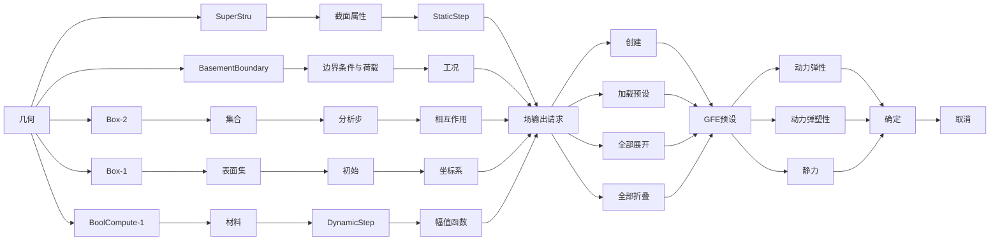

# 高性能有限元分析软件

# GFE

——用户手册 v2025


<details>
<summary>natural_image</summary>

Abstract 3D illustration of interconnected buildings and circuit lines, no text or symbols present
</details>

广州颖力科技有限公司

2025年9月

# 目录

# 前言....1

# 第 1 章 GFE 前处理....3

# § 1.1 界面与操作....3

1.1.1 图形界面.... 3  
1.1.2 基本操作....4

# § 1.2 模型导入与导出....9

1.2.1 文件窗口....9  
1.2.2 文件接口....9

# § 1.3 草图建模.... 17

1.3.1 草图设置.... 17  
1.3.2 对象选择、光标吸附....18  
1.3.3 创建几何图元....20  
1.3.4 几何变换、几何操作....25  
1.3.5 将 2D 对象导入草图....37

# § 1.4 简单几何体建模.... 38

# § 1.5 几何变换、几何操作....45

1.5.1 变换操作....45  
1.5.2 布尔操作....48  
1.5.3 建模操作....51  
1.5.4 几何修复.... 54

# § 1.6 网格划分....55

# § 1.7 集合....60

# § 1.8 材料....62

1.8.1 基础操作....64  
1.8.2 常规类....66  
1.8.3 弹性类....66  
1.8.4 塑性类....69

1.8.5 混凝土类....71  
1.8.6 岩土类....73  
1.8.7 孔隙流体....79  
1.8.8 预设材料....80

# § 1.9 截面属性....82

1.9.1 基本操作....82  
1.9.2 实体截面属性....82  
1.9.3 壳截面属性....83  
1.9.4 梁截面属性....84  
1.9.5 特殊单元截面属性....86

# § 1.10 相互作用....87

1.10.1 绑定约束....87  
1.10.2 刚体....87  
1.10.3 嵌入区域....88  
1.10.4 约束耦合....89  
1.10.5 冲击波与冲击波属性....90  
1.10.6 接触....92  
1.10.7 弹簧/阻尼....93  
1.10.8 连接器行为....96  
1.10.9 连接器....98  
1.10.10 特殊相互作用....99

# § 1.11 边界条件与荷载.... 103

1.11.1 基本操作....104  
1.11.2 全约束.... 105  
1.11.3 位移/转动位移....105  
1.11.4 速度/角速度....105  
1.11.5 加速度.... 106  
1.11.6 集中力/力矩....107  
1.11.7 压力....108

1.11.8 惯性力....109  
1.11.9 线荷载....110  
1.11.10 列车荷载....111  
1.11.11 非结构性质量....118  
1.11.12 动水压力....119  
1.11.13 孔压.... 120  
1.11.14 集中孔隙流量.... 121  
1.11.15 表面孔隙流量....122  
1.11.16 温度.... 123  
1.11.17 体力.... 124  
1.11.18 声压.... 125

§ 1.12 初始条件.... 127

1.12.1 初始应力....127  
1.12.2 初速度.... 128  
1.12.3 初始孔压....128  
1.12.4 初始孔隙比....129  
1.12.5 初始温度....130  
1.12.6 岩土构造二维应力....130

§ 1.13 空间分布.... 132

1.13.1 表达式场....132  
1.13.2 离散场....133

§ 1.14 幅值函数.... 135

§ 1.15 求解设置.... 137

1.15.1 分析步....137  
1.15.2 输出请求....149  
1.15.3 工况....151  
1.15.4 作业管理器.... 152

§ 1.16 设置.... 158

1.16.1 系统设置（语言及定时保存）....158

1.16.2 目录.... 159  
1.16.3 求解器参数设置.... 159

# § 1.17 工具.... 163

1.17.1 过滤器....163  
1.17.2 搜索接触.... 164  
1.17.3 查询....166  
1.17.4 拾取....167  
1.17.5 切割显示....167  
1.17.6 复制网格....168  
1.17.7 工况预览....169  
1.17.8 检查引用关系....170

# § 1.18 土木工程相关功能.... 172

1.18.1 创建土体....172  
1.18.2 人工边界....173  
1.18.3 地震场地反应....174  
1.18.4 非均匀土体....179  
1.18.5 隧道设计器....180  
1.18.6 自动创建集合....185  
1.18.7 施工助手....186  
1.18.8 阻尼转换....187  
1.18.9 土体材料转换....187  
1.18.10 结构材料&配筋转换....188  
1.18.11 消能子结构转换....189  
1.18.12 隧道反应位移法助手....189  
1.18.13 反应位移助手....191  
1.18.14 选波工具....192  
1.18.15 非均匀土体（网格插值方法）....199

# § 1.19 显示相关.... 201

1.19.2 视图设置....203

§ 1.20 流体动力....206

第 2 章 GFE 后处理....208

§ 2.1 界面与操作....208

2.1.1 图形界面....208  
2.1.2 基本操作....209

§ 2.2 显示....211

2.2.1 渲染风格....211  
2.2.2 变形系数....211  
2.2.3 背景颜色....212  
2.2.4 显示节点/单元标签....213  
2.2.5 自定义编号....215  
2.2.6 高亮透视....216  
2.2.7 显示参考点、边界和文本信息....216  
2.2.8 显示梁、壳单元局部坐标系....217  
2.2.9 梁单元和壳单元拉伸显示....218

§ 2.3 云图与动画.... 220

2.3.1 云图设置.... 220  
2.3.2 截屏....222  
2.3.3 颜色设置....223  
2.3.4 动画设置....225

§ 2.4 过滤器与切割.... 229

2.4.1 过滤器....229  
2.4.2 切割显示....230

§ 2.5 拾取与其他.... 233

2.5.1 拾取.... 233  
2.5.2 查询....234  
2.5.3 自定义场....235  
2.5.4 XY 数据....238  
2.5.5 按阈值过滤....245

§ 2.6 土木工程相关.... 246

2.6.1 层间位移角 ..... 246  
2.6.2 层间剪力....247  
2.6.3 导出场地反应结果....249  
2.6.4 轴压比云图....249  
2.6.5 自动生成计算书....251  
2.6.6 生成配筋 DWG 图....255  
2.6.7 构件性能评价....255

§ 2.7 DualSPHysics 结果显示.... 257

§ 2.8 能量堆叠图.... 259

§ 2.9 导出.... 260

修订记录....261

附录一 GFE 的文件系统.... 266

附录二 GFE 支持的 INP 关键字.... 268

附录三 YJK 数据命名规则....301

附录四 参考文献....304

# 前言

工业软件是现代产业体系之“魂”，是工业强国之重器。习近平总书记于2021年5月28日在两院院士大会和中国科协代表大会上发表重要讲话《加快建设科技强国，实现高水平科技自立自强》，指出：“科技攻关要坚持问题导向，奔着最紧急、最紧迫的问题去。要从国家急迫需要和长远需求出发，在石油天然气、基础原材料、高端芯片、工业软件、农作物种子、科学试验用仪器设备、化学制剂等方面关键核心技术上全力攻坚。”。实现工业软件特别是CAE软件的国产替代，解决卡脖子问题，是国家的重大战略需求之一。

以土木工程应用为主要场景, 广州颖力科技有限公司自主研发了高性能有限元分析软件 GFE。该软件由有限元求解器模块和前后处理模块组成, 并可与北京盈建科软件股份有限公司的 YJK 软件无缝对接进行结构前后处理。GFE 软件的优势与功能特色如下:

（1）“准”一集成了先进的土-结构动力相互作用分析模型与方法，保证计算结果准确。软件的各类单元、本构模型、相互作用条件、求解算法等对标国际主流通用有限元软件；软件集成了动力人工边界条件、场地地震反应分析、地震动输入等土-结构相互作用分析方法；软件集成了我国地下结构抗震设计规范要求的各类分析方法，包括二维和三维以及线性和非线性时程分析方法、以及反应加速度法和反应位移法等。  
（2）“快”一采用了多 GPU 并行计算的显式动力求解和编程架构，保证计算过程快速。软件采用 CPU+GPU 异构并行计算的显式动力分析技术，其计算速度是多 CPU 并行计算速度的 10 倍以上。  
（3）“简”一简化了土与结构一体化建模，可进行构件设计并生成计算书，操作简便。可将 YJK 软件建立的结构模型导入 GFE 软件，之后在 GFE 软件内简单完成土-结构系统建模；GFE 计算得到的结构结果可以导入 YJK 软件，之后在 YJK 软件内完成效应组合、截面验算、配筋、生成计算书等；GFE 软件也支

持导入其他有限元软件的计算模型。

本手册为 GFE 软件的前后处理操作手册，分为前处理和后处理两章。第一章前处理包括：界面与操作、模型导入与导出、建立几何模型、建立有限元模型、求解设置、集合和显示等常用工具。第二章后处理包括：界面与操作、显示、云图与动画、过滤器与切割、拾取与其他、地下结构结果。

# 第 1 章 GFE 前处理

# § 1.1 界面与操作

# 1.1.1 图形界面

GFE PrePo 前/后处理间切换方法如图 1.1.1-1 所示。


<details>
<summary>text_image</summary>

OFE PrePo
文件
模型
网格
地下结构
新建
保存
导入...
打开
另存为...
导出...
最近文件...
退出
CAD
Builder
创建参考点
创建源
创建物体
CAD
CAD
CAD
CAD
CAD
CAD
CAD
CAD
CAD
CAD
CAD
CAD
CAD
CAD
CAD
CAD
CAD
CAD
CAD
CAD
CAD
CAD
CAD
CAD
CAD
CAD
CAD
CAD
CAD
CAD
CAD
CAD
CAD
CAD
CAD
CAD
CAD
CAD
CAD
CAD
CAD
CAD
CAD
CAD
CAD
CAD
CAD
CAD
CAD
CAD
CAD
CAD
CAD
CAD
CAD
CAD
CAD
CAD
CAD
CAD
CAD
CAD
CAD
CAD
CAD
CAD
CAD
CAD
CAD
CAD
CAD
CAD
CAD
CAD
CAD
CAD
CAD
CAD
CAD
CAD
CAD
CAD
CAD
CAD
CAD
CAD
CAD
CAD
CAD
CAD
CAD
CAD
CAD
CAD
CAD
CAD
CAD
CAD
CAD
CAD
CAD
CAD
CAD
CAD
CAD
CAD
CAD
CAD
CAD
CAD
CAD
CAD
CAD
CAD
CAD
CAD
CAD
CAD
CAD
CAD
CAD
CAD
CAD
CAD
CAD
CAD
CAD
CAD
CAD
CAD
CAD
CAD
CAD
CAD
CAD
CAD
CAD
CAD
CAD
CAD
CAD
CAD
CAD
CAD
CAD
CAD
CAD
CAD
CAD
CAD
CAD
CAD
CAD
CAD
CAD
CAD
CAD
CAD
CAD
CAD
CAD
CAD
CAD
CAD
CAD
CAD
CAD
CAD
CAD
CAD
CAD
CAD
CAD
CAD
CAD
CAD
CAD
CAD
CAD
CAD
CAD
CAD
CAD
CAD
CAD
CAD
CAD
CAD
CAD
CAD
CAD
CAD
CAD
CAD
CAD
CAD
CAD
CAD
CAD
CAD
CAD
CAD
CAD
CAD
CAD
CAD
CAD
CAD
CAD
CAD
CAD
CAD
CAD
CAD
CAD
CAD
CAD
CAD
CAD
CAD
CAD
CAD
CAD
CAD
CAD
CAD
CAD
CAD
CAD
CAD
CAD
CAD
CAD
CAD
CAD
CAD
CAD
CAD
CAD
CAD
CAD
CAD
CAD
CAD
CAD
CAD
CAD
CAD
CAD
CAD
CAD
CAD
CAD
CAD
CAD
CAD
CAD
CAD
CAD
CAD
CAD
CAD
CAD
CAD
CAD
CAD
CAD
CAD
CAD
CAD
CAD
CAD
CAD
CAD
CAD
CAD
CAD
CAD
CAD
CAD
CAD
CAD
CAD
CAD
CAD
CAD
CAD
CAD
CAD
CAD
CAD
CAD
CAD
CAD
CAD
CAD
CAD
CAD
CAD
CAD
CAD
CAD
CAD
CAD
CAD
CAD
CAD
CAD
CAD
CAD
CAD
CAD
CAD
CAD
CAD
CAD
CAD
CAD
CAD
CAD
CAD
CAD
CAD
CAD
CAD
CAD
CAD
CAD
CAD
CAD
CAD
CAD
CAD
CAD
CAD
CAD
CAD
CAD
CAD
CAD
CAD
CAD
CAD
CAD
CAD
CAD
CAD
CAD
CAD
CAD
CAD
CAD
CAD
CAD
CAD
CAD
CAD
CAD
CAD
CAD
CAD
CAD
CAD
CAD
CAD
CAD
CAD
CAD
CAD
CAD
CAD
CAD
CAD
CAD
CAD
CAD
CAD
CAD
CAD
CAD
CAD
CAD
CAD
CAD
CAD
CAD
CAD
CAD
CAD
CAD
CAD
CAD
CAD
CAD
CAD
CAD
CAD
CAD
CAD
CAD
CAD
CAD
CAD
CAD
CAD
CAD
CAD
CAD
CAD
CAD
CAD
CAD
CAD
CAD
CAD
CAD
CAD
CAD
CAD
CAD
CAD
CAD
CAD
CAD
CAD
CAD
CAD
CAD
CAD
CAD
CAD
CAD
CAD
CAD
CAD
CAD
CAD
CAD
CAD
CAD
CAD
CAD
CAD
CAD
CAD
CAD
CAD
CAD
CAD
CAD
CAD
CAD
CAD
CAD
CAD
CAD
CAD
CAD
CAD
CAD
CAD
CAD
CAD
CAD
CAD
CAD
CAD
CAD
CAD
CAD
CAD
CAD
CAD
CAD
CAD
CAD
CAD
CAD
CAD
CAD
CAD
CAD
CAD
CAD
CAD
CAD
CAD
CAD
CAD
CAD
CAD
CAD
CAD
CAD
CAD
CAD
CAD
CAD
CAD
CAD
CAD
CAD
CAD
CAD
CAD
CAD
CAD
CAD
CAD
CAD
CAD
CAD
CAD
CAD
CAD
CAD
CAD
CAD
CAD
CAD
CAD
CAD
CAD
CAD
CAD
CAD
CAD
CAD
CAD
CAD
CAD
CAD
CAD
CAD
CAD
CAD
CAD
CAD
CAD
CAD
CAD
CAD
CAD
CAD
CAD
CAD
CAD
CAD
CAD
CAD
CAD
CAD
CAD
CAD
CAD
CAD
CAD
CAD
CAD
CAD
CAD
CAD
CAD
CAD
CAD
CAD
CAD
CAD
CAD
CAD
CAD
CAD
CAD
CAD
CAD
CAD
CAD
CAD
CAD
CAD
CAD
CAD
CAD
CAD
CAD
CAD
CAD
CAD
CAD
CAD
CAD
CAD
CAD
CAD
CAD
CAD
CAD
CAD
CAD
CAD
CAD
CAD
CAD
CAD
CAD
CAD
CAD
CAD
CAD
CAD
CAD
CAD
CAD
CAD
CAD
CAD
CAD
CAD
CAD
CAD
CAD
CAD
CAD
CAD
CAD
CAD
CAD
CAD
CAD
CAD
CAD
CAD
CAD
CAD
CAD
CAD
CAD
CAD
CAD
CAD
CAD
CAD
CAD
CAD
CAD
CAD
CAD
CAD
CAD
CAD
CAD
CAD
CAD
CAD
CAD
CAD
CAD
CAD
CAD
CAD
CAD
CAD
CAD
CAD
CAD
CAD
CAD
CAD
CAD
CAD
CAD
CAD
CAD
CAD
CAD
CAD
CAD
CAD
CAD
CAD
CAD
CAD
CAD
CAD
CAD
CAD
CAD
CAD
CAD
CAD
CAD
CAD
CAD
CAD
CAD
CAD
CAD
CAD
CAD
CAD
CAD
CAD
CAD
CAD
CAD
CAD
CAD
CAD
CAD
CAD
CAD
CAD
CAD
CAD
CAD
CAD
CAD
CAD
CAD
CAD
CAD
CAD
CAD
CAD
CAD
CAD
CAD
CAD
CAD
CAD
CAD
CAD
CAD
CAD
CAD
CAD
CAD
CAD
CAD
CAD
CAD
CAD
CAD
CAD
CAD
CAD
CAD
CAD
CAD
CAD
CAD
CAD
CAD
CAD
CAD
CAD
CAD
CAD
CAD
CAD
CAD
CAD
CAD
CAD
CAD
CAD
CAD
CAD
CAD
CAD
CAD
CAD
CAD
CAD
CAD
CAD
CAD
CAD
CAD
CAD
CAD
CAD
CAD
CAD
CAD
CAD
CAD
CAD
CAD
CAD
CAD
CAD
CAD
CAD
CAD
CAD
CAD
CAD
CAD
CAD
CAD
CAD
CAD
CAD
CAD
CAD
CAD
CAD
CAD
CAD
CAD
CAD
CAD
CAD
CAD
CAD
CAD
CAD
CAD
CAD
CAD
CAD
CAD
CAD
CAD
CAD
CAD
CAD
CAD
CAD
CAD
CAD
CAD
CAD
CAD
CAD
CAD
CAD
CAD
CAD
CAD
CAD
CAD
CAD
CAD
CAD
CAD
CAD
CAD
CAD
CAD
CAD
CAD
CAD
CAD
CAD
CAD
CAD
CAD
CAD
CAD
CAD
CAD
CAD
CAD
CAD
CAD
CAD
CAD
CAD
CAD
CAD
CAD
CAD
CAD
CAD
CAD
CAD
CAD
CAD
CAD
CAD
CAD
CAD
CAD
CAD
CAD
CAD
CAD
CAD
CAD
CAD
CAD
CAD
CAD
CAD
CAD
CAD
CAD
CAD
CAD
CAD
CAD
CAD
CAD
CAD
CAD
CAD
CAD
CAD
CAD
CAD
CAD
CAD
CAD
CAD
CAD
CAD
CAD
CAD
CAD
CAD
CAD
CAD
CAD
CAD
CAD
CAD
CAD
CAD
CAD
CAD
CAD
CAD
CAD
CAD
CAD
CAD
CAD
CAD
CAD
CAD
CAD
CAD
CAD
CAD
CAD
CAD
CAD
CAD
CAD
CAD
CAD
CAD
CAD
CAD
CAD
CAD
CAD
CAD
CAD
CAD
CAD
CAD
CAD
CAD
CAD
CAD
CAD
CAD
CAD
CAD
CAD
CAD
CAD
CAD
CAD
CAD
CAD
CAD
CAD
CAD
CAD
CAD
CAD
CAD
CAD
CAD
CAD
CAD
CAD
CAD
CAD
CAD
CAD
CAD
CAD
CAD
CAD
CAD
CAD
CAD
CAD
CAD
CAD
CAD
CAD
CAD
CAD
CAD
CAD
CAD
CAD
CAD
CAD
CAD
CAD
CAD
CAD
CAD
CAD
CAD
CAD
CAD
CAD
CAD
CAD
CAD
CAD
CAD
CAD
CAD
CAD
CAD
CAD
CAD
CAD
CAD
CAD
CAD
CAD
CAD
CAD
CAD
CAD
CAD
CAD
CAD
CAD
CAD
CAD
CAD
CAD
CAD
CAD
CAD
CAD
CAD
CAD
CAD
CAD
CAD
CAD
CAD
CAD
CAD
CAD
CAD
CAD
CAD
CAD
CAD
CAD
CAD
CAD
CAD
CAD
CAD
CAD
CAD
CAD
CAD
CAD
CAD
CAD
CAD
CAD
CAD
CAD
CAD
CAD
CAD
CAD
CAD
CAD
CAD
CAD
CAD
CAD
CAD
CAD
CAD
CAD
CAD
CAD
CAD
CAD
CAD
CAD
CAD
CAD
CAD
CAD
CAD
CAD
CAD
CAD
CAD
CAD
CAD
CAD
CAD
CAD
CAD
CAD
CAD
CAD
CAD
CAD
CAD
CAD
CAD
CAD
CAD
CAD
CAD
CAD
CAD
CAD
CAD
CAD
CAD
CAD
CAD
CAD
CAD
CAD
CAD
CAD
CAD
CAD
CAD
CAD
CAD
CAD
CAD
CAD
CAD
CAD
CAD
CAD
CAD
CAD
CAD
CAD
CAD
CAD
CAD
CAD
CAD
CAD
CAD
CAD
CAD
CAD
CAD
CAD
CAD
CAD
CAD
CAD
CAD
CAD
CAD
CAD
CAD
CAD
CAD
CAD
CAD
CAD
CAD
CAD
CAD
CAD
CAD
CAD
CAD
CAD
CAD
CAD
CAD
CAD
CAD
CAD
CAD
CAD
CAD
CAD
CAD
CAD
CAD
CAD
CAD
CAD
CAD
CAD
CAD
CAD
CAD
CAD
CAD
CAD
CAD
CAD
CAD
CAD
CAD
CAD
CAD
CAD
CAD
CAD
CAD
CAD
CAD
CAD
CAD
CAD
CAD
CAD
CAD
CAD
CAD
CAD
CAD
CAD
CAD
CAD
CAD
CAD
CAD
CAD
CAD
CAD
CAD
CAD
CAD
CAD
CAD
CAD
CAD
CAD
CAD
CAD
CAD
CAD
CAD
CAD
CAD
CAD
CAD
CAD
CAD
CAD
CAD
CAD
CAD
CAD
CAD
CAD
CAD
CAD
CAD
CAD
CAD
CAD
CAD
CAD
CAD
CAD
CAD
CAD
CAD
CAD
CAD
CAD
CAD
CAD
CAD
CAD
CAD
CAD
CAD
CAD
CAD
CAD
CAD
CAD
CAD
CAD
CAD
CAD
CAD
CAD
CAD
CAD
CAD
CAD
CAD
CAD
CAD
CAD
CAD
CAD
CAD
CAD
CAD
CAD
CAD
CAD
CAD
CAD
CAD
CAD
CAD
CAD
CAD
CAD
CAD
CAD
CAD
CAD
CAD
CAD
CAD
CAD
CAD
CAD
CAD
CAD
CAD
CAD
CAD
CAD
CAD
CAD
CAD
CAD
CAD
CAD
CAD
CAD
CAD
CAD
CAD
CAD
CAD
CAD
CAD
CAD
CAD
CAD
CAD
CAD
CAD
CAD
CAD
CAD
CAD
CAD
CAD
CAD
CAD
CAD
CAD
CAD
CAD
CAD
CAD
CAD
CAD
CAD
CAD
CAD
CAD
CAD
CAD
CAD
CAD
CAD
CAD
CAD
CAD
CAD
CAD
CAD
CAD
CAD
CAD
CAD
CAD
CAD
CAD
CAD
CAD
CAD
CAD
CAD
CAD
CAD
CAD
CAD
CAD
CAD
CAD
CAD
CAD
CAD
CAD
CAD
CAD
CAD
CAD
CAD
CAD
CAD
CAD
CAD
CAD
CAD
CAD
CAD
CAD
CAD
CAD
CAD
CAD
CAD
CAD
CAD
CAD
CAD
CAD
CAD
CAD
CAD
CAD
CAD
CAD
CAD
CAD
CAD
CAD
CAD
CAD
CAD
CAD
CAD
CAD
CAD
CAD
CAD
CAD
CAD
CAD
CAD
CAD
CAD
CAD
CAD
CAD
CAD
CAD
CAD
CAD
CAD
CAD
CAD
CAD
CAD
CAD
CAD
CAD
CAD
CAD
CAD
CAD
CAD
CAD
CAD
CAD
CAD
CAD
CAD
CAD
CAD
CAD
CAD
CAD
CAD
CAD
CAD
CAD
CAD
CAD
CAD
CAD
CAD
CAD
CAD
CAD
CAD
CAD
CAD
CAD
CAD
CAD
CAD
CAD
CAD
CAD
CAD
CAD
CAD
CAD
CAD
CAD
CAD
CAD
CAD
CAD
CAD
CAD
CAD
CAD
CAD
CAD
CAD
CAD
CAD
CAD
CAD
CAD
CAD
CAD
CAD
CAD
CAD
CAD
CAD
CAD
CAD
CAD
CAD
CAD
CAD
CAD
CAD
CAD
CAD
CAD
CAD
CAD
CAD
CAD
CAD
CAD
CAD
CAD
CAD
CAD
CAD
CAD
CAD
CAD
CAD
CAD
CAD
CAD
CAD
CAD
CAD
CAD
CAD
CAD
CAD
CAD
CAD
CAD
CAD
CAD
CAD
CAD
CAD
CAD
CAD
CAD
CAD
CAD
CAD
CAD
CAD
CAD
CAD
CAD
CAD
CAD
CAD
CAD
CAD
CAD
CAD
CAD
CAD
CAD
CAD
CAD
CAD
CAD
CAD
CAD
CAD
CAD
CAD
CAD
CAD
CAD
CAD
CAD
CAD
CAD
CAD
CAD
CAD
CAD
CAD
CAD
CAD
CAD
CAD
CAD
CAD
CAD
CAD
CAD
CAD
CAD
CAD
CAD
CAD
CAD
CAD
CAD
CAD
CAD
CAD
CAD
CAD
CAD
CAD
CAD
CAD
CAD
CAD
CAD
CAD
CAD
CAD
CAD
CAD
CAD
CAD
CAD
CAD
CAD
CAD
CAD
CAD
CAD
CAD
CAD
CAD
CAD
CAD
CAD
CAD
CAD
CAD
CAD
CAD
CAD
CAD
CAD
CAD
CAD
CAD
CAD
CAD
CAD
CAD
CAD
CAD
CAD
CAD
CAD
CAD
CAD
CAD
CAD
CAD
CAD
CAD
CAD
CAD
CAD
CAD
CAD
CAD
CAD
CAD
CAD
CAD
CAD
CAD
CAD
CAD
CAD
CAD
CAD
CAD
CAD
CAD
CAD
CAD
CAD
CAD
CAD
CAD
CAD
CAD
CAD
CAD
CAD
CAD
CAD
CAD
CAD
CAD
CAD
CAD
CAD
CAD
CAD
CAD
CAD
CAD
CAD
CAD
CAD
CAD
CAD
CAD
CAD
CAD
CAD
CAD
CAD
CAD
CAD
CAD
CAD
CAD
CAD
CAD
CAD
CAD
CAD
CAD
CAD
CAD
CAD
CAD
CAD
CAD
CAD
CAD
CAD
CAD
CAD
CAD
CAD
CAD
CAD
CAD
CAD
CAD
CAD
CAD
CAD
CAD
CAD
CAD
CAD
CAD
CAD
CAD
CAD
CAD
CAD
CAD
CAD
CAD
CAD
CAD
CAD
CAD
CAD
CAD
CAD
CAD
CAD
CAD
CAD
CAD
CAD
CAD
CAD
CAD
CAD
CAD
CAD
CAD
CAD
CAD
CAD
CAD
CAD
CAD
CAD
CAD
CAD
CAD
CAD
CAD
CAD
CAD
CAD
CAD
CAD
CAD
CAD
CAD
CAD
CAD
CAD
CAD
CAD
CAD
CAD
CAD
CAD
CAD
CAD
CAD
CAD
CAD
CAD
CAD
CAD
CAD
CAD
CAD
CAD
CAD
CAD
CAD
CAD
CAD
CAD
CAD
CAD
CAD
CAD
CAD
CAD
CAD
CAD
CAD
CAD
CAD
CAD
CAD
CAD
CAD
CAD
CAD
CAD
CAD
CAD
CAD
CAD
CAD
CAD
CAD
CAD
CAD
CAD
CAD
CAD
CAD
CAD
CAD
CAD
CAD
CAD
CAD
CAD
CAD
CAD
CAD
CAD
CAD
CAD
CAD
CAD
CAD
CAD
CAD
CAD
CAD
CAD
CAD
CAD
CAD
CAD
CAD
CAD
CAD
CAD
CAD
CAD
CAD
CAD
CAD
CAD
CAD
CAD
CAD
CAD
CAD
CAD
CAD
CAD
CAD
CAD
CAD
CAD
CAD
CAD
CAD
CAD
CAD
CAD
CAD
CAD
CAD
CAD
CAD
CAD
CAD
CAD
CAD
CAD
CAD
CAD
CAD
CAD
CAD
CAD
CAD
CAD
CAD
CAD
CAD
CAD
CAD
CAD
CAD
CAD
CAD
CAD
CAD
CAD
CAD
CAD
CAD
CAD
CAD
CAD
CAD
CAD
CAD
CAD
CAD
CAD
CAD
CAD
CAD
CAD
CAD
CAD
CAD
CAD
CAD
CAD
CAD
CAD
CAD
CAD
CAD
CAD
CAD
CAD
CAD
CAD
CAD
CAD
CAD
CAD
CAD
CAD
CAD
CAD
CAD
CAD
CAD
CAD
CAD
CAD
CAD
CAD
CAD
CAD
CAD
CAD
CAD
CAD
CAD
CAD
CAD
CAD
CAD
CAD
CAD
CAD
CAD
CAD
CAD
CAD
CAD
CAD
CAD
CAD
CAD
CAD
CAD
CAD
CAD
CAD
CAD
CAD
CAD
CAD
CAD
CAD
CAD
CAD
CAD
CAD
CAD
CAD
CAD
CAD
CAD
CAD
CAD
CAD
CAD
CAD
CAD
CAD
CAD
CAD
CAD
CAD
CAD
CAD
CAD
CAD
CAD
CAD
CAD
CAD
CAD
CAD
CAD
CAD
CAD
CAD
CAD
CAD
CAD
CAD
CAD
CAD
CAD
CAD
CAD
CAD
CAD
CAD
CAD
CAD
CAD
CAD
CAD
CAD
CAD
CAD
CAD
CAD
CAD
CAD
CAD
CAD
CAD
CAD
CAD
CAD
CAD
CAD
CAD
CAD
CAD
CAD
CAD
CAD
CAD
CAD
CAD
CAD
CAD
CAD
CAD
CAD
CAD
CAD
CAD
CAD
CAD
CAD
CAD
CAD
CAD
CAD
CAD
CAD
CAD
CAD
CAD
CAD
CAD
CAD
CAD
CAD
CAD
CAD
CAD
CAD
CAD
CAD
CAD
CAD
CAD
CAD
CAD
CAD
CAD
CAD
CAD
CAD
CAD
CAD
CAD
CAD
CAD
CAD
CAD
CAD
CAD
CAD
CAD
CAD
CAD
CAD
CAD
CAD
CAD
CAD
CAD
CAD
CAD
CAD
CAD
CAD
CAD
CAD
CAD
CAD
CAD
CAD
CAD
CAD
CAD
CAD
CAD
CAD
CAD
CAD
CAD
CAD
CAD
CAD
CAD
CAD
CAD
CAD
CAD
CAD
CAD
CAD
CAD
CAD
CAD
CAD
CAD
CAD
CAD
CAD
CAD
CAD
CAD
CAD
CAD
CAD
CAD
CAD
CAD
CAD
CAD
CAD
CAD
CAD
CAD
CAD
CAD
CAD
CAD
CAD
CAD
CAD
CAD
CAD
CAD
CAD
CAD
CAD
CAD
CAD
CAD
CAD
CAD
CAD
CAD
CAD
CAD
CAD
CAD
CAD
CAD
CAD
CAD
CAD
CAD
CAD
CAD
CAD
CAD
CAD
CAD
CAD
CAD
CAD
CAD
CAD
CAD
CAD
CAD
CAD
CAD
CAD
CAD
CAD
CAD
CAD
CAD
CAD
CAD
CAD
CAD
CAD
CAD
CAD
CAD
CAD
CAD
CAD
CAD
CAD
CAD
CAD
CAD
CAD
CAD
CAD
CAD
CAD
CAD
CAD
CAD
CAD
CAD
CAD
CAD
CAD
CAD
CAD
CAD
CAD
CAD
CAD
CAD
CAD
CAD
CAD
CAD
CAD
CAD
CAD
CAD
CAD
CAD
CAD
CAD
CAD
CAD
CAD
CAD
CAD
CAD
CAD
CAD
CAD
CAD
CAD
CAD
CAD
CAD
CAD
CAD
CAD
CAD
CAD
CAD
CAD
CAD
CAD
CAD
CAD
CAD
CAD
CAD
CAD
CAD
CAD
CAD
CAD
CAD
CAD
CAD
CAD
CAD
CAD
CAD
CAD
CAD
CAD
CAD
CAD
CAD
CAD
CAD
CAD
CAD
CAD
CAD
CAD
CAD
CAD
CAD
CAD
CAD
CAD
CAD
CAD
CAD
CAD
CAD
CAD
CAD
CAD
CAD
CAD
CAD
CAD
CAD
CAD
CAD
CAD
CAD
CAD
CAD
CAD
CAD
CAD
CAD
CAD
CAD
CAD
CAD
CAD
CAD
CAD
CAD
CAD
CAD
CAD
CAD
CAD
CAD
CAD
CAD
CAD
CAD
CAD
CAD
CAD
CAD
CAD
CAD
CAD
CAD
CAD
CAD
CAD
CAD
CAD
CAD
CAD
CAD
CAD
CAD
CAD
CAD
CAD
CAD
CAD
CAD
CAD
CAD
CAD
CAD
CAD
CAD
CAD
CAD
CAD
CAD
CAD
CAD
CAD
CAD
CAD
CAD
CAD
CAD
CAD
CAD
CAD
CAD
CAD
CAD
CAD
CAD
CAD
CAD
CAD
CAD
CAD
CAD
CAD
CAD
CAD
CAD
CAD
CAD
CAD
CAD
CAD
CAD
CAD
CAD
CAD
CAD
CAD
CAD
CAD
CAD
CAD
CAD
CAD
CAD
CAD
CAD
CAD
CAD
CAD
CAD
CAD
CAD
CAD
CAD
CAD
CAD
CAD
CAD
CAD
CAD
CAD
CAD
CAD
CAD
CAD
CAD
CAD
CAD
CAD
CAD
CAD
CAD
CAD
CAD
CAD
CAD
CAD
CAD
CAD
CAD
CAD
CAD
CAD
CAD
CAD
CAD
CAD
CAD
CAD
CAD
CAD
CAD
CAD
CAD
CAD
CAD
CAD
CAD
CAD
CAD
CAD
CAD
CAD
CAD
CAD
CAD
CAD
CAD
CAD
CAD
CAD
CAD
CAD
CAD
CAD
CAD
CAD
CAD
CAD
CAD
CAD
CAD
CAD
CAD
CAD
CAD
CAD
CAD
CAD
CAD
CAD
CAD
CAD
CAD
CAD
CAD
CAD
CAD
CAD
CAD
CAD
CAD
CAD
CAD
CAD
CAD
CAD
CAD
CAD
CAD
CAD
CAD
CAD
CAD
CAD
CAD
CAD
CAD
CAD
CAD
CAD
CAD
CAD
CAD
CAD
CAD
CAD
CAD
CAD
CAD
CAD
CAD
CAD
CAD
CAD
CAD
CAD
CAD
CAD
CAD
CAD
CAD
CAD
CAD
CAD
CAD
CAD
CAD
CAD
CAD
CAD
CAD
CAD
CAD
CAD
CAD
CAD
CAD
CAD
CAD
CAD
CAD
CAD
CAD
CAD
CAD
CAD
CAD
CAD
CAD
CAD
CAD
CAD
CAD
CAD
CAD
CAD
CAD
CAD
CAD
CAD
CAD
CAD
CAD
CAD
CAD
CAD
CAD
CAD
CAD
CAD
CAD
CAD
CAD
CAD
CAD
CAD
CAD
CAD
CAD
CAD
CAD
CAD
CAD
CAD
CAD
CAD
CAD
CAD
CAD
CAD
CAD
CAD
CAD
CAD
CAD
CAD
CAD
CAD
CAD
CAD
CAD
CAD
CAD
CAD
CAD
CAD
CAD
CAD
CAD
CAD
CAD
CAD
CAD
CAD
CAD
CAD
CAD
CAD
CAD
CAD
CAD
CAD
CAD
CAD
CAD
CAD
CAD
CAD
CAD
CAD
CAD
CAD
CAD
CAD
CAD
CAD
CAD
CAD
CAD
CAD
CAD
CAD
CAD
CAD
CAD
CAD
CAD
CAD
CAD
CAD
CAD
CAD
CAD
CAD
CAD
CAD
CAD
CAD
CAD
CAD
CAD
CAD
CAD
CAD
CAD
CAD
CAD
CAD
CAD
CAD
CAD
CAD
CAD
CAD
CAD
CAD
CAD
CAD
CAD
CAD
CAD
CAD
CAD
CAD
CAD
CAD
CAD
CAD
CAD
CAD
CAD
CAD
CAD
CAD
CAD
CAD
CAD
CAD
CAD
CAD
CAD
CAD
CAD
CAD
CAD
CAD
CAD
CAD
CAD
CAD
CAD
CAD
CAD
CAD
CAD
CAD
CAD
CAD
CAD
CAD
CAD
CAD
CAD
CAD
CAD
CAD
CAD
CAD
CAD
CAD
CAD
CAD
CAD
CAD
CAD
CAD
CAD
CAD
CAD
CAD
CAD
CAD
CAD
CAD
CAD
CAD
CAD
CAD
CAD
CAD
CAD
CAD
CAD
CAD
CAD
CAD
CAD
CAD
CAD
CAD
CAD
CAD
CAD
CAD
CAD
CAD
CAD
CAD
CAD
CAD
CAD
CAD
CAD
CAD
CAD
CAD
CAD
CAD
CAD
CAD
CAD
CAD
CAD
CAD
CAD
CAD
CAD
CAD
CAD
CAD
CAD
CAD
CAD
CAD
CAD
CAD
CAD
CAD
CAD
CAD
CAD
CAD
CAD
CAD
CAD
CAD
CAD
CAD
CAD
CAD
CAD
CAD
CAD
CAD
CAD
CAD
CAD
CAD
CAD
CAD
CAD
CAD
CAD
CAD
CAD
CAD
CAD
CAD
CAD
CAD
CAD
CAD
CAD
CAD
CAD
CAD
CAD
CAD
CAD
CAD
CAD
CAD
CAD
CAD
CAD
CAD
CAD
CAD
CAD
CAD
CAD
CAD
CAD
CAD
CAD
CAD
CAD
CAD
CAD
CAD
CAD
CAD
CAD
CAD
CAD
CAD
CAD
CAD
CAD
CAD
CAD
CAD
CAD
CAD
CAD
CAD
CAD
CAD
CAD
CAD
CAD
CAD
CAD
CAD
CAD
CAD
CAD
CAD
CAD
CAD
CAD
CAD
CAD
CAD
CAD
CAD
CAD
CAD
CAD
CAD
CAD
CAD
CAD
CAD
CAD
CAD
CAD
CAD
CAD
CAD
CAD
CAD
CAD
CAD
CAD
CAD
CAD
CAD
CAD
CAD
CAD
CAD
CAD
CAD
CAD
CAD
CAD
CAD
CAD
CAD
CAD
CAD
CAD
CAD
CAD
CAD
CAD
CAD
CAD
CAD
CAD
CAD
CAD
CAD
CAD
CAD
CAD
CAD
CAD
CAD
CAD
CAD
CAD
CAD
CAD
CAD
CAD
CAD
CAD
CAD
CAD
CAD
CAD
CAD
CAD
CAD
CAD
CAD
CAD
CAD
CAD
CAD
CAD
CAD
CAD
CAD
CAD
CAD
CAD
CAD
CAD
CAD
CAD
CAD
CAD
CAD
CAD
CAD
CAD
CAD
CAD
CAD
CAD
CAD
CAD
CAD
CAD
CAD
CAD
CAD
CAD
CAD
CAD
CAD
CAD
CAD
CAD
CAD
CAD
CAD
CAD
CAD
CAD
CAD
CAD
CAD
CAD
CAD
CAD
CAD
CAD
CAD
CAD
CAD
CAD
CAD
CAD
CAD
CAD
CAD
CAD
CAD
CAD
CAD
CAD
CAD
CAD
CAD
CAD
CAD
CAD
CAD
CAD
CAD
CAD
CAD
CAD
CAD
CAD
CAD
CAD
CAD
CAD
CAD
CAD
CAD
CAD
CAD
CAD
CAD
CAD
CAD
CAD
CAD
CAD
CAD
CAD
CAD
CAD
CAD
CAD
CAD
CAD
CAD
CAD
CAD
CAD
CAD
CAD
CAD
CAD
CAD
CAD
CAD
CAD
CAD
CAD
CAD
CAD
CAD
CAD
CAD
CAD
CAD
CAD
CAD
CAD
CAD
CAD
CAD
CAD
CAD
CAD
CAD
CAD
CAD
CAD
CAD
CAD
CAD
CAD
CAD
CAD
CAD
CAD
CAD
CAD
CAD
CAD
CAD
CAD
CAD
CAD
CAD
CAD
CAD
CAD
CAD
CAD
CAD
CAD
CAD
CAD
CAD
CAD
CAD
CAD
CAD
CAD
CAD
CAD
CAD
CAD
CAD
CAD
CAD
CAD
CAD
CAD
CAD
CAD
CAD
CAD
CAD
CAD
CAD
CAD
CAD
CAD
CAD
CAD
CAD
CAD
CAD
CAD
CAD
CAD
CAD
CAD
CAD
CAD
CAD
CAD
CAD
CAD
CAD
CAD
CAD
CAD
CAD
CAD
CAD
CAD
CAD
CAD
CAD
CAD
CAD
CAD
CAD
CAD
CAD
CAD
CAD
CAD
CAD
CAD
CAD
CAD
CAD
CAD
CAD
CAD
CAD
CAD
CAD
CAD
CAD
CAD
CAD
CAD
CAD
CAD
CAD
CAD
CAD
CAD
CAD
CAD
CAD
CAD
CAD
CAD
CAD
CAD
CAD
CAD
CAD
CAD
CAD
CAD
CAD
CAD
CAD
CAD
CAD
CAD
CAD
CAD
CAD
CAD
CAD
CAD
CAD
CAD
CAD
CAD
CAD
CAD
CAD
CAD
CAD
CAD
CAD
CAD
CAD
CAD
CAD
CAD
CAD
CAD
CAD
CAD
CAD
CAD
CAD
CAD
CAD
CAD
CAD
CAD
CAD
CAD
CAD
CAD
CAD
CAD
CAD
CAD
CAD
CAD
CAD
CAD
CAD
CAD
CAD
CAD
CAD
CAD
CAD
CAD
CAD
CAD
CAD
CAD
CAD
CAD
CAD
CAD
CAD
CAD
CAD
CAD
CAD
CAD
CAD
CAD
CAD
CAD
CAD
CAD
CAD
CAD
CAD
CAD
CAD
CAD
CAD
CAD
CAD
CAD
CAD
CAD
CAD
CAD
CAD
CAD
CAD
CAD
CAD
CAD
CAD
CAD
CAD
CAD
CAD
CAD
CAD
CAD
CAD
CAD
CAD
CAD
CAD
CAD
CAD
CAD
CAD
CAD
CAD
CAD
CAD
CAD
CAD
CAD
CAD
CAD
CAD
CAD
CAD
CAD
CAD
CAD
CAD
CAD
CAD
CAD
CAD
CAD
CAD
CAD
CAD
CAD
CAD
CAD
CAD
CAD
CAD
CAD
CAD
CAD
CAD
CAD
CAD
CAD
CAD
CAD
CAD
CAD
CAD
CAD
CAD
CAD
CAD
CAD
CAD
CAD
CAD
CAD
CAD
CAD
CAD
CAD
CAD
CAD
CAD
CAD
CAD
CAD
CAD
CAD
CAD
CAD
CAD
CAD
CAD
CAD
CAD
CAD
CAD
CAD
CAD
CAD
CAD
CAD
CAD
CAD
CAD
CAD
CAD
CAD
CAD
CAD
CAD
CAD
CAD
CAD
CAD
CAD
CAD
CAD
CAD
CAD
CAD
CAD
CAD
CAD
CAD
CAD
CAD
CAD
CAD
CAD
CAD
CAD
CAD
CAD
CAD
CAD
CAD
CAD
CAD
CAD
CAD
CAD
CAD
CAD
CAD
CAD
CAD
CAD
CAD
CAD
CAD
CAD
CAD
CAD
CAD
CAD
CAD
CAD
CAD
CAD
CAD
CAD
CAD
CAD
CAD
CAD
CAD
CAD
CAD
CAD
CAD
CAD
CAD
CAD
CAD
CAD
CAD
CAD
CAD
CAD
CAD
CAD
CAD
CAD
CAD
CAD
CAD
CAD
CAD
CAD
CAD
CAD
CAD
CAD
CAD
CAD
CAD
CAD
CAD
CAD
CAD
CAD
CAD
CAD
CAD
CAD
CAD
CAD
CAD
CAD
CAD
CAD
CAD
CAD
CAD
CAD
CAD
CAD
CAD
CAD
CAD
CAD
CAD
CAD
CAD
CAD
CAD
CAD
CAD
CAD
CAD
CAD
CAD
CAD
CAD
CAD
CAD
CAD
CAD
CAD
CAD
CAD
CAD
CAD
CAD
CAD
CAD
CAD
CAD
CAD
CAD
CAD
CAD
CAD
CAD
CAD
CAD
CAD
CAD
CAD
CAD
CAD
CAD
CAD
CAD
CAD
CAD
CAD
CAD
CAD
CAD
CAD
CAD
CAD
CAD
CAD
CAD
CAD
CAD
CAD
CAD
CAD
CAD
CAD
CAD
CAD
CAD
CAD
CAD
CAD
CAD
CAD
CAD
CAD
CAD
CAD
CAD
CAD
CAD
CAD
CAD
CAD
CAD
CAD
CAD
CAD
CAD
CAD
CAD
CAD
CAD
CAD
CAD
CAD
CAD
CAD
CAD
CAD
CAD
CAD
CAD
CAD
CAD
CAD
CAD
CAD
CAD
CAD
CAD
CAD
CAD
CAD
CAD
CAD
CAD
CAD
CAD
CAD
CAD
CAD
CAD
CAD
CAD
CAD
CAD
CAD
CAD
CAD
CAD
CAD
CAD
CAD
CAD
CAD
CAD
CAD
CAD
CAD
CAD
CAD
CAD
CAD
CAD
CAD
CAD
CAD
CAD
CAD
CAD
CAD
CAD
CAD
CAD
CAD
CAD
CAD
CAD
CAD
CAD
CAD
CAD
CAD
CAD
CAD
CAD
CAD
CAD
CAD
CAD
CAD
CAD
CAD
CAD
CAD
CAD
CAD
CAD
CAD
CAD
CAD
CAD
CAD
CAD
CAD
CAD
CAD
CAD
CAD
CAD
CAD
CAD
CAD
CAD
CAD
CAD
CAD
CAD
CAD
CAD
CAD
CAD
CAD
CAD
CAD
CAD
CAD
CAD
CAD
CAD
CAD
CAD
CAD
CAD
CAD
CAD
CAD
CAD
CAD
CAD
CAD
CAD
CAD
CAD
CAD
CAD
CAD
CAD
CAD
CAD
CAD
CAD

</details>

图 1.1.1-1 GFE 前后处理切换

GFE PrePo 前处理界面如图 1.1.1-2 所示，主要包括文件菜单、Ribbon 栏、工具栏、树状列表、图形窗口和输出窗口等区域，分别简介如下。

文件菜单：提供基本的文件管理功能，如：打开/关闭/保存/导入文件以及显示/隐藏界面上部分板块（如隐藏树状列表）等功能。

Ribbon 栏：提供了文件、建模、显示等大部分功能入口。图标右下角黑色三角标志表示长按可以弹出选项菜单。

工具栏：放置了部分常用功能的快捷按钮。

树状列表：将信息以树形结构清晰地展示出来，便于查看/编辑。

图形窗口：用于显示三维图像。

输出窗口：用于输出部分操作的结果。


<details>
<summary>text_image</summary>

文件菜单
文件  选择  搜索选择  三维建模  网络  工程
新建  保存  导入...  智换  相交  面铺  工况:  上一步  快  视图  切割  搜索  查询  拾取  几何  复制  作业  颜色  设置  Ribbon栏
打开  另存为...  导出...  增加  对称差  重做  分析步:  下一步  激活  网格预览  插放/暂停  工况预览  显示  工具  其他
最近文件  退出
文件  过滤器  工况预览  显示  工具  其他
模型
Model-1
几何/网格
SuperStru
BasementBoundary
集会
表面集
材料
截面属性
边界条件与溶解
分析步
工况
相互作用
坐标系
辅助函数
插输出请求
历史输出请求
地震场地反应
人工边界
一层土层
树形菜单
图形窗口
输出栏
YJKB构大致尺寸: X 60.45, Y 47.22872, Z 68.9
保存Pre: C:\Users/GZYL-08/Documents/
GFP\PrePo\autoave-13208\已保存! 
划分网格耗时: 1.25106
划分网格耗时: 0.361851
网格划分完成! 
保存Pre: D/Z5Z-WORK/TEST/test.pre' 已
保存!
</details>

图 1.1.1-2 GFE 前处理界面

# 1.1.2 基本操作

# （1）鼠标操作

前处理鼠标操作如表 1.1.2-1 所示。

表 1.1.2-1

<table><tr><td>交互方式</td><td>鼠标左键</td><td>鼠标中键</td></tr><tr><td>长按拖动</td><td>旋转</td><td>平移</td></tr><tr><td>鼠标滚轮</td><td></td><td>缩放</td></tr><tr><td>单击</td><td>单选</td><td></td></tr><tr><td>Ctrl+单击</td><td>新增选中/取消选中</td><td></td></tr><tr><td>Shift+长按拖动</td><td>矩形框选</td><td></td></tr><tr><td>Ctrl+依次单击</td><td>多边形框选</td><td></td></tr><tr><td>(仅限于多边形框选模式)</td><td></td><td></td></tr></table>

\*注意：多边形框选模式下，右键单击确认选择

# (2) 对象选择

前处理支持多种类型对象的选择，包括几何的点、线、面、实体、形状以及

有限元网格节点、单元、表面等，如图 1.1.2-1 所示。点击相应按钮后便可以在图形窗口中选择相应的对象。

图中：

点——选择顶点

线——选择直线或曲线

面——选择封闭的线围成的面

实体——选择封闭的面围成的三维实体

几何部件——选择单个几何部件

节点——选择划分有限元网格后的节点

单元——选择划分有限元网格后的单元

表面——选择划分有限元网格后的表面

  
图 1.1.2-1 对象选择

# (3) 选择模式

前处理支持默认、添加、移除、转换四种选择模式，点击选择模式按钮会弹出四种选择模式的下拉列表，再次点击相应的按钮便可以切换相应的选择模式，如图 1.1.2-2 所示。分别简介如下。

默认：常规选择模式

添加：选择的对象均更改为选中状态

移除：选择的对象均更改为未选中状态

转换：选择的对象在选中状态与未选中状态之间切换


<details>
<summary>text_image</summary>

Color: All
选择模式: 默认
选择模式: 添加
选择模式: 移除
选择模式: 转换
</details>

图 1.1.2-2 选择模式

# （4）框选模式

前处理支持矩形框选及多边形框选两种框选模式，点击框选模式按钮会弹出下拉列表，再次点击相应的按钮便可以切换相应的框选模式，如图 1.1.2-3 所示。分别简介如下。（操作方式见第 1 章 § 1.11.1.2（1））

矩形：选中矩形框内对象

多边形：选中多边形框内对象


<details>
<summary>text_image</summary>

Color: All
框选模式: 矩形
框选模式: 多边形
</details>

图 1.1.2-3 框选模式

# (5) 框选准则

前处理支持包含及重叠两种框选准则，点击框选准则按钮会弹出下拉列表，再次点击相应的按钮便可以切换相应的框选准则，如图 1.1.2-4 所示。分别简介如下。

包含：选择对象全部被框选中才能选中

重叠：选择对象只要部分被框选中即可选中


<details>
<summary>text_image</summary>

Color: All
框选准则: 包含
框选准则: 重叠
</details>

图 1.1.2-4 框选准则

# (6) 视角切换

前处理的图形窗口使用 View Cube 进行三维视角切换,位于图形窗口左下角,如图 1.1.2-5 所示。单击 View Cube 的特定面可调整图形窗口视角为该面; 单击 View Cube 的边或角可调整图形窗口视角至相应角度。在视角切换过程中会显示切换动画, 以便用户查看视角切换过程。


<details>
<summary>text_image</summary>

Z
RIGHT
Y
Z
RIGHT BACK
Y
Z
RIGHT BACK
X
Y
</details>

图 1.1.2-5 View Cube 视角切换

# (7) 按角度选择

按角度选择是一个用于快速识别和选择网格模型上特定角度特征的高效工具。通过设定角度阈值，用户可以自动选择模型上鼠标落点附近一片区域的所有网格节点、单元或单元表面。

使用时，只需在模型上点击目标区域，系统将以点击位置为起点，自动向周围扩展选择范围。选择过程会分析相邻网格面之间的夹角，当检测到夹角超过设定的阈值时自动停止扩展。

选择的网格对象类型在左侧的三个按钮中选择（网格节点、网格单元、网格表面）

功能入口：前处理工具栏--勾选“按角度选择”后会显示右侧输入框，输入角度阈值

角度阈值范围： $[0^{\circ}, 70^{\circ}]$

支持的可选择对象：网格节点、网格单元、网格表面

# 技术说明：

- 角度计算基于相邻网格面之间的法向量夹角  
- 当相邻面之间的夹角小于设定阈值时，相关网格被选中

# 应用场景:

- 选择特征区域的网格以施加荷载  
- 快速识别模型上的尖锐边缘，查找可能存在网格质量问题的区域

# 使用技巧:

- 可与 Ctrl 多选以及四种选择模式配合使用  
- 可结合显示过滤器使用以避免选中某些额外区域  
● 如果选择范围过大，尝试减小角度阈值


<details>
<summary>text_image</summary>

过滤器
工况预览
按角度选择 20
</details>

图 1.1.2-6 按角度选择

# § 1.2 模型导入与导出

# 1.2.1 文件窗口

文件窗口如图 1.2.1-1 所示。GFE 软件涉及的各类文件说明见附录一 GFE 的文件系统。

新建：打开新图形窗口新建模型；

打开：打开后缀为 pre 的前处理模型文件或后缀为 db 的后处理结果文件；

最近文件：打开最近使用的文件；

保存：将模型保存为后缀名为 pre 的前处理文件；

另存为：另存为后缀名为 pre 的前处理文件；

导入：导入各类已支持的文件格式；

导出：导出各类已支持的文件格式。


<details>
<summary>text_image</summary>

GFE PrePo
文件	模型	网格	地下结构
新建	保存	导入...
打开	另存为...	导出...
最近文件	退出
文件
</details>

图 1.2.1-1 文件窗口

# 1.2.2 文件接口


<details>
<summary>text_image</summary>

三维建模
网格
工程
导入...
几何文件
替换
相交
撤销
对称差
重做
有限元模型
导入INP
土木工程
导入GTS模型
导入材料
导入Key
导入Ansys CDB
导入...
</details>

图 1.2.2-1 导入文件

# (1) 导入...

通用导入功能，对话框不对文件格式进行过滤，但导入不支持的文件格式时会弹窗报错

# (2) INP 文件

Inp 文件是 GFE 的计算任务文件, 在任务管理器中创建计算任务提交计算时会自动生成, 也可点击 “写出 Inp 文件” 仅写出 Inp 文件而不提交计算, 详见。Inp 文件也可作为模型文件导入到 GFE 中。

导入功能入口：文件—导入—有限元模型—导入 Inp。在弹出的文件对话框中选择需要导入的 Inp 文件即可。

导出功能入口：任务管理器—写出 Inp

# (3) STP 文件

导入功能入口：文件菜单—导入—几何文件—导入 STP。在弹出的文件选择对话框中选择相应的 stp/step 文件，点击“打开”即可。

导出功能入口：文件菜单—导出—导出几何

# (4) K 文件

K 文件是 Ls-Dyna 的前处理有限元模型文件，用于描述模型网格、材料特性、

边界条件等信息。GFE 中支持读入此类文件格式，并转换为 GFE 的存储格式。

导入功能入口：文件—导入—有限元模型—导入 Key

导出功能入口：文件—导出—导出 Key。

# (5) GMAT 材料文件

GFE 软件可导出已创建的材料信息并保存为 gmat 材料文件，以备下次创建相同材料时直接导入使用，避免重复输入材料参数的繁琐操作。

导出功能入口：文件—导出—导出材料。

导入功能入口：文件—导入—导入材料。在弹出的文件对话框中选择需要导入的 gmat 材料信息文件即可。

# (6) 导入 YJK 模型

功能入口：文件—导入—土木工程—导入 YJK/PKPM 模型。

GFE 软件支持导入盈建科建筑结构设计软件及 PKPM 结构设计软件生成的模型，充分利用了盈建科软件和 PKPM 软件在建筑结构建模方面简单快捷的优势。盈建科软件接口主要读取以下三个文件：dtlmodel.ydb，dtlCalc.ydb，Jccad\_0.ydb。

dtlmodel.ydb：必要文件。读取 YJK 模型中的荷载、截面、基础布置及其他若干参数信息。上部结构计算完成后，打开盈建科软件的模型荷载输入模块，点击左上方标题栏中带有蓝色箭头的按钮，即可导出该文件。

dtlCalc.ydb：必要文件。读取 YJK 模型中的上部结构几何布置、材料、施工阶段、配筋信息。上部结构计算完成后，打开盈建科软件的设计结果模块，点击左上方标题栏中带有蓝色箭头的按钮，即可导出该文件。

Jccad\_0.ydb: 可选文件。读取 YJK 模型中的基础布置信息。在盈建科软件中完成基础计算后，YJK 模型目录下会自动生成该文件。

在 GFE 的导入界面中，可直接指定 YJK 模型目录，也可将上述文件复制到另外的目录中，并指定该目录。

若用户已于 YJK 模型荷载输入模块中，手动输入基础信息，则该信息会存于 dtlmodel.ydb 中，接口会自动读取，不再读取 Jccad\_0.ydb。

支持的盈建科建筑结构设计软件版本：4.0.0\~6.0.0（V4、V5、V6 系列）。
其余版本未测试，不保证支持。

  
图 1.2.2-2 YJK 模型导入界面

通过 YJK 接口导入的模型，截面属性、荷载等数据，按附录三 YJK 数据命名规则进行自动命名

# (7) 导入 PKPM 模型

功能入口：文件—导入—土木工程—导入 YJK/PKPM 模型

GFE 软件支持导入 PKPM 结构设计软件生成的模型，充分利用了 PKPM 软件在建筑结构建模方面简单快捷的优势。PKPM 软件接口主要读取以下三个文件：模型 SQLite 文件(.jwd)，计算结果 SQLite 文件(\_calc.jwd)，基础构件文件 (.dwb)。

模型 SQLite 文件(.jwd): 必要文件。读取 PKPM 模型中的荷载、截面、基础布置及其他若干参数信息。上部结构计算完成后，打开 PKPM 软件的模型荷载输入模块，点击左上方 PKPM 图标，再点击“导出”，选中“模型 SQLite 文件(.jwd)”，即可导出该文件。

计算结果 SQLite 文件(\_calc.jwd): 必要文件。读取 PKPM 模型中的上部结构几何布置、材料、施工阶段、配筋信息。上部结构计算完成后，打开 PKPM 软件的模型荷载输入模块，点击左上方 PKPM 图标，再点击 “导出”，选中 “计算结果 SQLite 文件(\_calc.jwd)”，即可导出该文件。

基础构件文件（.dwb）：可选文件。读取 PKPM 模型中的基础布置信息。文件导出操作说明如下。

# PKPM 界面操作:

a. 点击 “基础” > “分析与设计” > “模型信息”；  
b.对于独立基础、承台、地基梁、柱墩，仅勾选“截面尺寸”；

对于桩，仅勾选“桩长”；

对于筏板，仅勾选“厚度”；

c.点击界面右下角带有dwg字样的按钮，导出基础模型信息dwg文件；

# CAD2020 界面操作:

a. 打开上一步导出的模型信息 dwg 文件;  
b. 输入 “APPLOAD” 命令，加载插件 “GfePJ2020.arx”；  
c. 输入 “WSD” 命令，程序自动转换基础构件 dwb 文件。

在 GFE 的导入界面中，可直接指定 PKPM 模型目录，也可将上述文件复制到另外的目录中，并指定该目录。

  
图 1.2.2-3 PKPM 模型导入界面

通过 PKPM 接口导入的模型，截面属性、荷载等数据，按附录三 YJK 数据命名规则进行自动命名

# (8) 导入 GTS NX 的 mec 文件

Mec 文件是 GTS NX 的求解器输入文件，描述了模型网格、材料特性、边界条件等信息。GFE 中支持读入此类文件格式，并转换为 GFE 的存储格式。

功能入口：文件—导入—有限元模型—导入 GTS 模型

# (9) 导出 tcl 文件

OpenSees (Open System for Earthquake Engineering Simulation) 软件的前处理模型文件格式为 TCL。本质上是一段使用 TCL 脚本语言来构建和分析模型的命令流。

功能入口：文件—导出—导出 Opensees

# (10) 导入 IFC 文件

IFC（Industry Foundation Classes）是一种用于数字建筑信息模型（BIM）的

开放文件格式，由国际建筑信息联盟创建。GFE 主要读取其中的几何信息。

功能入口：文件—导入—几何文件—导入 IFC

# (11) 导入 Ansys CDB 文件

ANSYS 有限元模型可导出为 cdb 格式文件，cdb 文件以 ANSYS APDL 命令行形式存储模型信息，包含节点单元网格、材料、截面、实常数、相互作用、边界条件与载荷等。GFE 提供 ANSYS 接口可通过导入 cdb 文件的方式获得 ANSYS 有限元模型。

功能入口：文件—导入—有限元模型—导入 Ansys CDB

# (12) 导入 DWG 文件

DWG 文件格式是工业设计、建筑、工程和建造行业中最常用的 CAD 文件格式之一，包含了包括几何图形、图纸设置、图层、线型、注释以及其他关于设计图纸的数据。

功能入口：文件—导入—几何文件—导入 DWG

# 操作步骤:

1. 将目标 DWG 文件放到一个文件夹中  
2. 启动 AutoCAD，打开目标 DWG 文件，在下方键入命令 “APPLOAD”，加载应用程序 GfePJ2020.arx（请在官网的产品下载页面中获取相应程序，或联系技术支持人员）。成功加载后，键入命令 “wsd”，则该插件会在 dwg 同目录下生成一些中间文件。  
3. 回到 GFE 软件，在上述功能入口点击导入 DWG，选择目标 DWG 文件，则 GFE 会读取该目录下的中间文件，将 DWG 的几何数据导入到 GFE 中。

对话框如图 1.2.2-4 所示。参数说明如下:

（1）“来自不同图层的线相互独立”：对应于不同 cad 图层的 GFE 线相互独立，即不做布尔运算。适用场景：轨道板与轨道梁之间几何独立，二者之间采用 tie 连接。  
(2) “线围成板”：限定 DWG 所有线与多段线均位于一个平面，并将线

围成的封闭区域填充成面，暂不支持空间图形。

（3）“长度单位”：此选项用于指定设计人员在 DWG 文件中使用的单位。该选项不会影响图形的实际尺寸或进行任何单位转换，仅影响接口内部图形布尔运算的容差值。

注意：若导入 dwg 文件为三维图形，暂只支持 cad 线。若导入 dwg 文件为二维图形，暂只支持 cad 线、cad 多段线与 cad 弧线。cad 弧线目前会被打断成若干直线，建模中会对网格的划分造成影响，建议导入的弧线，仅作为参考作用或辅助作用，不建议作为需要被划分网格的几何。该功能尚待优化。

  
图 1.2.2-4 DWG 导入

注：该功能目前支持 AutoCAD2020 版本和 AutoCAD2014 版本，其他版本未测试，若需支持其他版本，可联系技术支持人员。

# § 1.3 草图建模

# 1.3.1 草图设置

GFE 软件在进行草图建模前需要进行草图设置，对软件界面工作区进行基本属性设置。

功能入口：Ribbon 栏--草图建模--其他—设置，点击“设置”按钮，将弹出草图设置对话框，如图 1.3.1-1 所示。


<details>
<summary>text_image</summary>

草图设置
方向
● XY平面
○ XZ平面
○ YZ平面
□ 反向
偏移:
栅格
长度: 100
间隔: 1
确定 取消
</details>

图 1.3.1-1 草图设置

图中各项说明如下:

XY 平面、XZ 平面、XZ 平面：工作区平面可选 “XY 平面” “XZ 平面” “YZ 平面”，默认情况为 “XY 平面”。

偏移：工作区平面原点沿工作平面的法向方向偏移一定距离。

反向：当输入偏移距离 x 且勾选反向后，工作区平面原点将平移至 $(-x,-x,-x)$ 坐标点。

长度：工作区栅格总长度，默认情况长度为 100。

间隔：工作区栅格（单格）长度，默认情况间隔为1。

# 1.3.2 对象选择、光标吸附

# （1）对象选择

GFE 前处理草图建模支持多种类型对象的选择，包括选择点、选择线、选择面功能。点击相应按钮后便可以在图形窗口中选择相应的对象。

功能入口：Ribbon 栏--草图建模--图元--选择点（线、面），如图 1.3.2-1 所示，分别介绍如下：

选择点——选择顶点

选择线——选择直线或曲线

选择面——选择封闭的线围成的面


<details>
<summary>text_image</summary>

GFE PrePo
文件 通用 草图建模 三维建模 网格 工程 功能入口
设置 栅格 线段中点 点 矩形 选择点 平移 中心对称 分段 水平 平行 清空 撤销 完成草图
邻近几何 直线 圆弧（三点） 选择线 旋转 阵列 长度 垂直 删除 重做
邻近点 多段折线 圆（三点） 选择面 填充区域 相切
其他 光标吸附 图元 操作
</details>

图 1.3.2-1 对象选择

# (2) 栅格

GFE 草图建模提供栅格吸附功能，当鼠标移动到栅格点位置或栅格点附近时，鼠标选定内容将自动调整至最近的栅格点，以便于用户进行精确的选择操作。

功能入口：Ribbon 栏--草图建模--光标吸附--栅格，如图 1.3.2-2 所示。


<details>
<summary>text_image</summary>

GFE PrePo
文件 通用 草图建模 三维建模 网格 工程
设置 栅格 线段中点 点 矩形 选择点
邻近几何 圆弧 (三点) 选择线
邻近点 多段折线 圆 (三点) 选择面
功能入口
其他 光标吸附 图元
X,Y: -1.000000, 3.000000
吸附光标
(当鼠标移至或靠近栅格点时, 光标会自动吸附至栅格点)
</details>

图 1.3.2-2 栅格

# （3）邻近几何

GFE 草图建模提供邻近几何吸附功能，当鼠标移动到已有几何位置或已有几何附近时，鼠标选定内容将自动调整至最近几何上，以便于用户进行精确的选择操作。

功能入口：Ribbon 栏--草图建模--光标吸附--邻近几何，如图 1.3.2-3 所示。


<details>
<summary>text_image</summary>

GFE PrePo
文件 通用 草图建模 三维建模 网格 工程
设置 栅格 线段中点 点 矩形 选择点
邻近几何 邻近点 功能入口 直线 圆弧 (三点) 选择线
多段折线 圆 (三点) 选择面
其他 光标吸附 图元
X,Y: 0.000000, 2.509134
吸附光标
(当光标移至或靠近几何图形时, 光标自动吸附在几何图形上)
</details>

图 1.3.2-3 邻近几何

# （4）邻近点

GFE 草图建模提供邻近点吸附功能，当鼠标移动到邻近点位置或邻近点附近时，鼠标选定内容将自动调整至最近的点，以便于用户进行精确的选择操作。

功能入口：Ribbon 栏--草图建模--光标吸附--邻近点，如图 1.3.2-4 所示。


<details>
<summary>text_image</summary>

GFE PrePo
文件 通用 草图建模 三维建模 网格 工程
设置 栅格 线段中点 点 矩形 选择点
邻近几何 直线 圆弧 (三点) 选择线
邻近点 多段折线 圆 (三点) 选择面
其他 光标吸附 图元
X,Y: -0.629598, 1.324008
吸附光标
(当光标移至或靠近已有点时, 光标会自动吸附在已有点上)
</details>

图 1.3.2-4 邻近点

# (5) 线段中点

GFE 草图建模提供线段中点吸附功能，当鼠标移动到线段中点位置或线段中点附近时，鼠标选定内容将自动调整至线段中点，以便于用户进行精确的选择操作。

功能入口：Ribbon 栏--草图建模--光标吸附--线段中点，如图 1.3.2-5 所示。


<details>
<summary>text_image</summary>

GFE PrePo
文件 通用 草图建模 三维建模 网格 工程
设置 栅格 线段中点 点 矩形 选择点
邻近几何 直线 圆弧（三点） 选择线
邻近点 多段折线 圆（三点） 选择面
其他 光标吸附 图元
X,Y: 0.916621, 2.573946
吸附光标
(当光标移至或靠近线段中点时，光标自动吸附至线段中点)
</details>

图 1.3.2-5 线段中点

# 1.3.3 创建几何图元

# (1) 点

GFE 软件草图建模支持建模所需关键点的创建，下面是创建点的操作说明。

功能入口：Ribbon 栏--草图建模--图元--点。点击“点”，弹出如图 1.3.3-1 所示对话框。可以通过界面拾取、输入 X、Y 坐标两种方式创建点，分别简介如下。

拾取：允许用户通过直接与软件界面交互的方式，从现有的图形或场景中拾取特定位置，并基于拾取位置直接创建新的点。

X、Y 坐标：通过输入特定位置的 X、Y 坐标，点击 “确定” 后将完成点的创建。


<details>
<summary>text_image</summary>

GFE PrePo
文件 通用 草图建模 三维建模 网格 工程
设置 栅格 线段中点 点 矩形 选择点 平移 中心对称 分段
邻近几何 邻近点 直线 圆弧 (三点) 选择线 阵列
功能入口 多段折线 圆 (三点) 选择面 缩放 填充区域
其他 光标吸附 图元
X,Y: -4.000000, 0.000000
效果显示
拾取一点或输入X,Y坐标 0.0, 0.0 确定 定义点所需参数提示
</details>

图 1.3.3-1 创建点

# (2) 直线

GFE 软件草图建模支持建模所需直线的创建，下面是创建直线的操作说明。

功能入口: Ribbon 栏--草图建模--图元—直线。点击“直线”，弹出如图 1.3.3-2 所示对话框。可以通过界面拾取、输入 X、Y 坐标两种方式创建直线，分别简介如下。

拾取：允许用户通过直接与软件界面交互的方式，从现有的图形或场景中拾取直线的起点与终点，并基于直线的起点与终点直接创建直线。

X、Y 坐标：通过输入起点与终点位置的 X、Y 坐标，点击 “确定” 后将完成直线的创建。


<details>
<summary>text_image</summary>

GFE PrePo
文件 通用 草图建模 三维建模 网格 工程
设置
其他 光标吸附 图元
X,Y: -2.000000, 2.000000
效果显示
X
拾取直线的第一个点或输入X,Y坐标 0.0, 0.0 下一步 根据提示拾取或输入直线点坐标
</details>

图 1.3.3-2 创建直线

# （3）多段折线

GFE 软件草图建模支持建模所需多段折线的创建，下面是创建多段折线的操作说明。

功能入口：Ribbon 栏--草图建模--图元—多段折线。点击“多段折线”，弹出如图 1.3.3-3 所示对话框。可以通过界面拾取、输入 X、Y 坐标两种方式创建多段折线，分别简介如下。

拾取：允许用户通过直接与软件界面交互的方式，从现有的图形或场景中多次拾取折线关键点，并基于拾取顺序与关键点创建多段折线。

X、Y 坐标：通过多次点击 “下一步” 输入关键点的 X、Y 坐标，点击鼠标右键后将完成直线的创建。


<details>
<summary>text_image</summary>

GFE PrePo
文件 通用 草图建模 三维建模 网格 工程
设置 栅格 线段中点 点 矩形 选择点 平移 中心对称 分段
邻近几何 邻近点 直线 圆弧 (三点) 选择线 旋转 阵列
其他 光标吸附 多段折线 填充区域
图元
X,Y:-3.450628, 0.875979
效果展示
X
拾取折线段的一个点或输入X,Y坐标 0.0, 0.0 下一步
多段折线定义参数提示
</details>

图 1.3.3-3 创建多段折线

# (4) 矩形

GFE 软件草图建模支持建模所需矩形的创建，下面是创建矩形的操作说明。

功能入口: Ribbon 栏--草图建模--图元—矩形。点击“矩形”，弹出如图 1.3.3-4 所示对话框。可以通过界面拾取、输入 X、Y 坐标两种方式创建矩形，分别简介如下。

拾取：允许用户通过直接与软件界面交互的方式，从现有的图形或场景中拾

取矩形对角点，并基于对角点创建矩形。

X、Y 坐标：通过输入矩形对角点的 X、Y 坐标，点击 “确定” 后将完成矩形的创建。


<details>
<summary>text_image</summary>

GFE PrePo
文件 通用 草图建模 三维建模 网格 工程 功能入口
设置 栅格 线段中点 点 矩形 选择点 平移 中心对称 分段
邻近几何 直线 圆弧 (三点) 选择线 旋转 阵列
邻近点 多段折线 圆 (三点) 选择面 缩放 填充区域
其他 光标吸附 图元
X,Y: -1.000000, 1.000000
效果图
X 拾取矩形的一个角点或输入X,Y坐标 0.0, 0.0 下一步 矩形定义参数
</details>

图 1.3.3-4 创建矩形

# (5) 圆弧

GFE 软件草图建模支持建模所需圆弧的创建，下面是创建圆弧的操作说明。

功能入口: Ribbon 栏--草图建模--图元—圆弧。点击“圆弧”，弹出如图 1.3.3-5、图 1.3.3-6 所示对话框（图标右下角黑色三角标志表示长按可以弹出选项菜单），可以通过“三点”、“圆心”两种方式创建圆弧，分别简介如下。

三点：用户通过界面拾取或输入坐标的方式，选中或输入目标圆弧的三个点坐标完成圆弧的创建。

圆心：用户通过界面拾取或输入坐标的方式，选中或输入目标圆弧的圆心、圆弧起点、圆弧终点坐标完成圆弧的创建。


<details>
<summary>text_image</summary>

功能入口
文件 通用 草图建模 三维建模 网格 工程
设置 栅格 线段中点 点 矩形 选择点
邻近几何 直线 选择线
邻近点 多段折线 圆弧 (三点) 选择面
其他 光标吸附 图元
X,Y: 8.738790, 5.430627
三点圆弧定义 (第一个点)
效果图
三点圆弧定义 (第二个点)
三点圆弧定义 (第三个点)
拾取圆弧的第一个点或输入X,Y坐标 0.0, 0.0 下一步 三点圆弧定义参数
</details>

图 1.3.3-5 创建圆弧（三点）  


<details>
<summary>text_image</summary>

功能入口
圆弧 (圆心)
圆心方式定义圆弧 (圆上第一点)
圆心方式定义圆弧 (圆心)
圆心方式定义圆弧 (圆上第二点)
X,Y: 1.104020, 5.659998
圆形方式定义圆弧提示信息
拾取圆弧的圆心或输入X,Y坐标 0.0, 0.0 下一步
</details>

图 1.3.3-6 创建圆弧（圆心）

# (6) 圆

GFE 软件草图建模支持建模所需圆形的创建，下面是创建圆的操作说明。

功能入口：Ribbon 栏--草图建模--图元—圆。点击“圆”，弹出如图 1.3.3-7、图 1.3.3-8 所示对话框（图标右下角黑色三角标志表示长按可以弹出选项菜单），可以通过“三点”、“圆心”两种方式创建圆，分别简介如下。

三点：用户通过界面拾取或输入坐标的方式，选中或输入目标圆的三个点坐标完成圆的创建。

圆心：用户通过界面拾取或输入坐标的方式，选中或输入目标圆的圆心、圆

轴上任意一点完成圆的创建。


<details>
<summary>text_image</summary>

GFE PrePo
文件 通用 草图建模 三维建模 网格 工程
设置 栅格 线段中点 点 矩形 选择点 中心对称 分段
邻近几何 直线 圆弧 (圆心) 选择线 阵列
邻近点 多段折线 选择面 缩放 填充区域
其他 光标吸附 图元
X,Y: 0.000000, 6.000000
三点定义圆 (第二个)
三点定义圆 (第一个)
三点定义圆 (第三个)
拾取圆周上的第一个点或输入X,Y坐标 0.0, 0.0 下一步 三点定义圆参数提示
</details>

图 1.3.3-7 创建圆（三点）


<details>
<summary>text_image</summary>

GFE PrePo
文件 通用 草图建模 三维建模 网格 工程
设置 栅格 线段中点 点 矩形 选择点 中心对称 分段
邻近几何 直线 圆弧 (圆心) 选择线 阵列
邻近点 多段折线 选择面 缩放 填充区域
其他 光标吸附 图元
X,Y: -4.826853, -0.434711
圆心定义圆 (圆上一点)
圆心定义圆 (圆心)
X 拾取圆心的一点或输入X,Y坐标 0.0, 0.0 下一步 圆心定义圆参数提示
</details>

图 1.3.3-8 创建圆（圆心）

# 1.3.4 几何变换、几何操作

# (1) 平移

GFE 软件草图建模支持在保证对象形状和大小不变的情况下，沿某一方向平移对象，下面是平移的操作说明。

功能入口：Ribbon 栏--草图建模--操作—平移。

点击 “平移” 按钮，在图形窗口下方会弹出一个操作提示栏（HintBar），用于输入平移操作所需的一些信息。

# 操作步骤:

a. 在 HintBar 中选择平移方式，可以选择 “复制”、“移动” 两种方式进行平移。当选择以 “复制” 方式进行平移时，将在目标位置创建与选定对象形状、大小完全一样的几何图形；当选择以 “移动” 方式进行平移时，将会把选定对象平移至目标位置，如图 1.3.4-1 所示对话框。  
b. 选择平移对象，点击“下一步”。  
c. 通过界面拾取或输入向量的方式选中或输入平移向量的起点，点击“下一步”。  
d. 通过界面拾取或输入向量的方式选中或输入平移向量的终点。  
e. “执行”或“取消”。


<details>
<summary>text_image</summary>

GFE PrePo
文件 通用 草图建模 三维建模 网格 工程
设置 栅格 线段中点 点 矩形 选择点 平移 中心对称 分段
邻近几何 邻线 圆弧 (圆心) 阵列
邻近点 多段折线 圆 (圆心) 缩放 填充区域
其他 光标吸附 图元
复制平移对象
源对象
(当平移方式为复制时, 源对象保留)
选择相同类型对象进行平移, 操作方式: 复制 移动 下一步
选择平移方式
</details>

图 1.3.4-1 几何平移

# (2) 旋转

GFE 软件草图建模支持在保证对象形状和大小不变的情况下，将几何对象沿某一旋转中心旋转一定角度，下面是旋转的操作说明。

功能入口：Ribbon 栏--草图建模--操作—旋转

点击 “旋转” 按钮，在图形窗口下方会弹出一个操作提示栏（HintBar），用于输入旋转操作所需的一些信息。

# 操作步骤:

a. 在 HintBar 中选择旋转方式，可以选择 “复制”、“移动” 两种方式进

行旋转。当选择以“复制”方式进行旋转时，将在目标位置创建与选定对象形状、大小完全一样的几何图形；当选择以“移动”方式进行旋转时，将会把选定对象旋转至目标位置，如图 1.3.4-2 所示对话框。

b. 选择旋转对象，点击“下一步”。  
c. 通过界面拾取或输入坐标的方式选中或输入旋转中心，点击“下一步”。  
d. 通过界面拾取或输入角度的方式选中或输入旋转角度。  
e. “执行”或“取消”。


<details>
<summary>text_image</summary>

GFE PrePo
文件 通用 草图建模 三维建模 网格 工程
光标选择类型
功能入口
设置
栅格 线段中点
点 矩形
选择点
平移 中心对称 分段
邻近几何
直线 圆弧 (圆心)
选择线
阵列
邻近点
多段折线 圆 (圆心)
选择面
旋转
缩放 填充区域
其他 光标吸附 图元
按“shift”框选可多选目标源对象
旋转效果
选择相同类型对象进行旋转，操作方式：复制移动下一步
选择旋转类型
</details>

图 1.3.4-2 几何旋转

# (3) 缩放

GFE 软件草图建模支持在保证对象形状不变的情况下，将几何对象沿某一缩放中心缩放一定大小，下面是缩放的操作说明。

功能入口：Ribbon 栏--草图建模--操作—缩放

点击 “缩放” 按钮，在图形窗口下方会弹出一个操作提示栏（HintBar），用于输入缩放操作所需的一些信息。

# 操作步骤:

a. 在 HintBar 中选择缩放方式，可以选择 “复制”、“移动” 两种方式进行缩放。当选择以 “复制” 方式进行缩放时，将在目标位置创建与选定对象形状完全一样的缩放图形；当选择以 “移动” 方式进行缩放时，将会把选定对象缩放至目标大小，如图 1.3.4-3 所示对话框。

b. 选择缩放对象，点击“下一步”。  
c. 通过界面拾取或输入坐标的方式选中或输入缩放中心，点击“下一步”。  
d. 通过界面拾取或输入缩放因子的方式选中或输入缩放因子。  
e. “执行”或“取消”。


<details>
<summary>text_image</summary>

GFE PrePo
文件 通用 草图建模 三维建模 网格 工程
设置
其他 光标吸附 图元
栅格 线段中点 点 矩形 选择点 平移 中心对称 分段
邻近几何 直线 圆弧 (圆心) 选择线 旋转 阵列
邻近点 多段折线 圆 (圆心) 选择面 缩放 填充区域
缩放中心
缩放效果 (缩放因子0.5)
源对象 (按" shift "可多选)
选择相同类型对象进行缩放，操作方式：复制 移动 下一步
缩放类型选择
</details>

图 1.3.4-3 几何缩放

# （4）中心对称

GFE 软件草图建模支持在保证对象形状和大小不变的情况下，将几何对象进行中心对称，下面是中心对称的操作说明。

功能入口：Ribbon 栏--草图建模--操作—中心对称

点击 “中心对称” 按钮，在图形窗口下方会弹出一个操作提示栏（HintBar），用于输入中心对称操作所需的一些信息。

# 操作步骤:

a. 在 HintBar 中选择中心对称方式，可以选择 “复制”、“移动” 两种方式进行中心对称。当选择以 “复制” 方式进行中心对称时，将在目标位置创建与选定对象形状、大小完全一样的几何图形；当选择以 “移动” 方式进行中心对称时，将会把选定对象对称至目标位置，如图 1.3.4-4 所示对话框。  
b. 选择执行中心对称操作的对象，点击“下一步”。  
c. 通过界面拾取或输入坐标的方式选中或输入对称中心。  
d. “执行”或“取消”。


<details>
<summary>text_image</summary>

GFE PrePo
文件 通用 草图建模 三维建模 网格 工程
设置 栅格 线段中点 点 矩形
邻近几何 直线 圆弧 (圆心) 圆 (圆心) 选择点
邻近点 多段折线 选择面
其他 光标吸附 图元
光标选择类型
功能入口
平移 中心对称 分段
旋转
阵列
缩放 填充区域
对称中心
源对象 效果展示
选择相同类型对象进行对称，操作方式：复制移动下一步
对称方式选择
</details>

图 1.3.4-4 中心对称

# (5) 阵列

GFE 软件草图建模支持在保证对象形状和大小不变的情况下，将几何对象进行阵列，下面是阵列的操作说明。

功能入口：Ribbon 栏--草图建模--操作—阵列（圆阵列），如图 1.3.4-5、图 1.3.4-6 所示，图标右下角黑色三角标志表示长按可以弹出选项菜单。可以选择“阵列”、“圆阵列”两种方式阵列建模，分别简介如下。

阵列：线性阵列，选定所需阵列的模型后，通过输入 x、y 方向的偏移量，阵列出行、列规定数量的模型。

圆阵列：环形阵列，即通过定义旋转轴的起点与方向，绕旋转轴旋转一定的角度，并在旋转路径上环形阵列出一定数量的模型。


<details>
<summary>text_image</summary>

GFE PrePo
文件 通用 草图建模 三维建模 网格 工程 光标选择类型
设置 栅格 线段中点 点 矩形 选择点 平移 中心对称 分段
邻近几何 邻线 圆弧 (圆心) 选择线 阵列
邻近点 多段折线 圆 (圆心) 选择面 缩放 填充区域
其他 光标吸附 图元
y方向偏移量
x方向偏移量
源对象
阵列行数和列数: 3 2 x,y方向偏移量 3,2 确定 阵列参数设置
功能入口
</details>

图 1.3.4-5 阵列


<details>
<summary>text_image</summary>

GFE PrePo
文件 通用 草图建模 三维建模 网格 工程
光标选择类型
功能入口
设置
栅格 线段中点
点 矩形
选择点
平移 中心对称 分段
线段
邻近几何
直线 圆弧（圆心）
多段折线 圆（圆心）
选择线
缩放
填充区域
其他 光标吸附 图元
源对象
中心
圆阵列数量和角度 4 180 中心: -10,4 确定 圆阵列参数设置
</details>

图 1.3.4-6 圆阵列

# (6) 填充区域

GFE 软件草图建模支持识别用户定义的指定区域边界（封闭），并将边界内部填充一个统一的效果进而形成面，下面是填充区域的操作说明。

功能入口：Ribbon 栏--草图建模--操作—填充区域，如图 1.3.4-7 所示。

# 操作步骤:

a. 按住 Ctrl 进行多选，或按住 Shift 进行框选，选择执行填充区域的封闭对象。  
b. 点击 “填充区域”，进行填充。


<details>
<summary>text_image</summary>

GFE PrePo
文件 通用 草图建模 三维建模 网格 工程 光标选择类型 功能入口
设置 栅格 线段中点 点 矩形 选择点 平移 中心对称 分段
邻近几何 邻近点 直线 圆弧 (圆心) 选择线 阵列 (圆)
多段折线 圆 (圆心) 选择面 缩放 填充区域
其他 光标吸附 图元
按“shift”选择封闭线段，填充效果
</details>

图 1.3.4-7 填充区域

# (7) 分段

GFE 软件草图建模支持对已有的图形（整体、连续的）进行截断，分成若干个部分，下面是分段的操作说明。

功能入口：Ribbon 栏--草图建模--操作—分段，如图 1.3.4-8 所示。

# 操作步骤:

a. 按住 Ctrl 进行多选，或按住 Shift 进行框选，选择执行分段的对象。  
b. 点击 “分段”，进行分段操作。


<details>
<summary>text_image</summary>

GFE PrePo
文件 通用 草图建模 三维建模 网格 工程
功能入口
设置 栅格 线段中点 点 矩形 选择点 平移 中心对称 分段
邻近几何 邻近点 圆弧 (圆心) 选择线 旋转 阵列 (圆) 
多段折线 圆 (圆心) 选择面 缩放 填充区域
其他 光标吸附 图元
分段效果
Y
X
</details>

图 1.3.4-8 分段

# (8) 水平

GFE 草图建模中水平功能可将任意方向的一个或多个线段调整为水平方向，下面是水平功能的操作说明。

功能入口：Ribbon 栏--草图建模--操作—水平，如图 1.3.4-9 所示。

点击 “水平” 按钮，在图形窗口下方会弹出一个操作提示栏（HintBar），用于提示水平功能所需操作。

# 操作步骤:

a. 按住 Ctrl 进行多选，或按住 Shift 进行框选，选择执行水平的对象。  
b. 点击 “下一步”，执行水平操作。


<details>
<summary>text_image</summary>

GFE PrePo
文件 通用 草图建模 三维建模 网格 工程
光标类型选择 功能入口
设置
栅格 线段中点 点 矩形 选择点 平移 中心对称 分段 水平 平行
邻近几何 直线 圆弧 (圆心) 旋转 阵列 (圆) 垂直 垂直
邻近点 多段折线 圆 (圆心) 填充区域 长度 相切
其他 光标吸附 图元 操作
线段起点
效果展示 线段终点 (水平)
线段终点 (源对象)
源对象
线段终点 (源对象)
选择线段约束为水平 下一步 水平功能提示信息
</details>

图 1.3.4-9 水平

# (9) 竖直

GFE 草图建模中竖直功能可将任意方向的一个或多个线段调整为竖直方向，下面是竖直功能的操作说明。

功能入口：Ribbon 栏--草图建模--操作—竖直，如图 1.3.4-10。

点击 “竖直” 按钮，在图形窗口下方会弹出一个操作提示栏（HintBar），用于提示竖直功能所需操作。

# 操作步骤:

a. 按住 Ctrl 进行多选，或按住 Shift 进行框选，选择执行竖直的对象。

b. 点击 “下一步”，进行竖直操作。


<details>
<summary>text_image</summary>

GFE PrePo
文件 通用 草图建模 三维建模 网格 工程
光标类型选择
功能入口
设置
栅格
邻近几何
邻近点
线段中点
点
直线
多段折线
矩形
圆弧 (圆心)
圆 (圆心)
选择点
选择线
选择面
平移
旋转
缩放
中心对称
阵列 (圆)
填充区域
水平
竖直
垂直
长度
相切
其他
光标吸附
图元
操作
线段终点 (垂直)
垂直效果展示
线段起点
源对象
线段终点 (源对象)
垂直功能信息提示
选择线段约束为竖直 下一步
</details>

图 1.3.4-10 竖直

# (10) 长度

GFE 草图建模中长度功能可将一个或多个线段调整为固定约束长度，下面是长度功能的操作说明。

功能入口：Ribbon 栏--草图建模--操作—长度

点击 “长度” 按钮，在图形窗口下方会弹出一个操作提示栏（HintBar），用于输入长度操作所需的一些信息。

# 操作步骤:

a. 在 HintBar 中输入约束值，如图 1.3.4-11 所示对话框。  
b. 根据提示选择约束长度的对象，点击“下一步”，执行长度功能。


<details>
<summary>text_image</summary>

GFE PrePo
文件 通用 草图建模 三维建模 网格 工程
光标类型选择 功能入口
设置 栅格 线段中点 点 矩形 选择点 中心对称 分段 水平 平行
邻近几何 邻线 圆弧 (圆心) 选择线 竖直 垂直
邻近点 多段折线 圆 (圆心) 选择面 填充区域 相切
其他 光标吸附 图元 操作
输入约束的值 20 确定 长度功能信息提示
</details>

图 1.3.4-11 长度

# (11) 平行

GFE 草图建模中平行功能可将任意方向的一个或多个线段调整为与统一线段平行，下面是平行功能的操作说明。

功能入口：Ribbon 栏--草图建模--操作—平行

点击 “平行” 按钮，在图形窗口下方会弹出一个操作提示栏（HintBar），用于输入平行操作所需的一些信息。

# 操作步骤:

a. 在 HintBar 中根据图 1.3.4-12 所示对话框提示选择平行约束的参考线段。  
b. 根据提示选择与参考线平行的约束线段。


<details>
<summary>text_image</summary>

GFE PrePo
文件 通用 草图建模 三维建模 网格 工程
设置
栅格 线段中点 点 矩形 选择点 平移 中心对称 分段 水平 平行
邻近几何 直线 圆弧 (圆心) 选择线 旋转 阵列 (圆) 长度 垂直 相切
邻近点 多段折线 圆 (圆心) 选择面 缩放 填充区域
其他 光标吸附 图元 操作
参考线段 与参考线段平行的约束线段
选择平行约束的参考线段 下一步 平行功能信息提示
</details>

图 1.3.4-12 平行

# (12) 垂直

GFE 草图建模中垂直功能可将任意方向的一个或多个线段调整为与统一线段垂直，下面是垂直功能的操作说明。

功能入口：Ribbon 栏--草图建模--操作—垂直。

点击 “垂直” 按钮，在图形窗口下方会弹出一个操作提示栏（HintBar），用于输入垂直操作所需的一些信息。

# 操作步骤:

a. 在 HintBar 中根据图 1.3.4-13 所示对话框提示选择垂直约束的参考线段。  
b. 根据提示选择与参考线垂直的约束线段。


<details>
<summary>text_image</summary>

GFE PrePo
文件 通用 草图建模 三维建模 网格 工程
设置
其他 光标吸附 图元 操作
功能入口
平行
垂直
参考线段
与参考线段垂直约束的线段
选择垂直约束的参考线段 下一步 垂直功能信息提示
</details>

图 1.3.4-13 垂直

# (13) 相切

GFE 草图建模中相切功能可将任意方向的一个或多个线段调整为与同一圆或圆弧相切，下面是相切功能的操作说明。

功能入口：Ribbon 栏--草图建模--操作—相切。

点击 “相切” 按钮，在图形窗口下方会弹出一个操作提示栏（HintBar），用于输入相切操作所需的一些信息。

# 操作步骤:

a. 在 HintBar 中根据图 1.3.4-14 所示对话框提示选择参考圆或圆弧。  
b. 根据提示选择约束为相切的线段，点击“下一步”，执行相切功能。


<details>
<summary>text_image</summary>

GFE PrePo
文件 通用 草图建模 三维建模 网格 工程
设置
栅格 线段中点 点 矩形 选择点 平移 中心对称 分段 水平 平行
邻近几何 直线 圆弧 (圆心) 选择线 竖宽 垂直
邻近点 多段折线 圆 (圆心) 选择面 长度 相切
其他 光标吸附 图元 操作
与参考圆相切的对象
参考圆
选择相切约束的参考圆或圆弧 下一步 相切功能提示信息
</details>

图 1.3.4-14 相切

# (14) 清空

GFE 软件草图建模允许用户快速删除工作区中的所有元素，回到一个干净的初始状态。

功能入口：Ribbon 栏--草图建模--操作—清空，如图 1.3.4-15 所示，点击“清空”按钮，将情况工作区中所有元素。

  
图 1.3.4-15 清空

# (15) 删除

GFE 软件草图建模允许用户选中一个或多个元素，并通过一次删除操作将所有选中元素进行删除，下面是删除功能的操作说明。

功能入口：Ribbon 栏--草图建模--操作—删除，如图 1.3.4-16 所示，点击“删除”按钮，将选中的元素进行删除。


<details>
<summary>text_image</summary>

GFE PrePo
文件 通用 草图建模 三维建模 网格 工程
设置
栅格 线段中点
邻近几何
邻近点
点 矩形 选择点
直线 圆弧（三点） 选择线
多段折线 圆（圆心） 选择面
平移 中心对称 分段
旋转 阵列（圆）
缩放 填充区域
水平 平行 清空 售销
竖直 垂直 删除 重做
长度 相切
其他 光标吸附 图元 操作
功能入口
完成草图
</details>

图 1.3.4-16 删除

# (16) 撤销

GFE 软件草图建模允许用户取消最近一次的操作，从而返回到之前的状态，下面是撤销功能的操作说明。

功能入口：Ribbon 栏--草图建模--操作—撤销，如图 1.3.4-17 所示，点击“撤销”按钮，将取消最近一次操作。

  
图 1.3.4-17 撤销

# (17) 重做

GFE 软件草图建模允许用户在撤销一个或多个操作后，重新执行这些操作，作为撤销功能伴侣，下面是重做功能的操作说明。

功能入口：Ribbon 栏--草图建模--操作—重做，如图 1.3.4-18 所示，点击“重做”按钮，将重新执行最近一次操作。

  
图 1.3.4-18 重做

# 1.3.5 将 2D 对象导入草图

GFE 软件草图建模完成以后，支持将 2D 草图导入至三维建模板块以方便后续建模操作。

功能入口：Ribbon 栏--三维建模--几何图元—导入草图，如图 1.3.5-1 所示。


<details>
<summary>text_image</summary>

GFE PrePo
文件 通用 草图建模 三维建模 网格 工程
参考点 导入草图 长方体 圆锥
折线段 圆柱体 楔形 布尔 旋转 旋转建模 重做
平面 球体 环形 运算 缩放 阵列
几何图元 几何变换
</details>

图 1.3.5-1 导入草图

# § 1.4 简单几何体建模

# (1) 参考点

创建刚体约束、多点约束或耦合约束等相互作用时，往往需要指定控制点。
GFE 可创建单独网格节点作为参考点。

功能入口：Ribbon 栏--三维建模--几何图元--创建参考点。如图 1.4-1 所示。


<details>
<summary>text_image</summary>

GFE PrePo
文件 通用 草图建模 三维建模 网格 工程
参考点 导入草图 长方体 圆锥
折线段 点击创建 圆柱体 楔形 布尔 旋转 旋转建模 重做
平面 参考点 球体 环形 运算 缩放 阵列
几何图元 几何变换
Color: Material
</details>

图 1.4-1 创建参考点

# (2) 折线段

GFE 软件可根据用户需求定义多点折线段，通过输入多个需求点坐标创建折线段。

功能入口：Ribbon 栏--三维建模--几何图元—折线段。如图 1.4-2 所示。


<details>
<summary>text_image</summary>

GFE PrePo
文件 通用 草图建模 三维建模 网格 工程
参考点 导入草图 长方体 圆锥
折线段 点击创建
折线段 圆柱体 楔形 布尔 旋转 旋转建模 重做
平面 球体 环形 运算 缩放 阵列
几何图元 几何变换
Color: Material
创建折线
点数量 4 输入折线段所需点数量、坐标
X Y Z
1
2
3
4
确定 取消
</details>

图 1.4-2 创建折线段

# (3) 平面

GFE 软件可根据视图中现有的图形创建简单的平面。

功能入口：Ribbon 栏--三维建模--几何图元—平面。点击 “平面”，弹出如图 1.4-3 所示对话框。可以通过 “多个点”、“多条边” 和 “一个图形” 三种方式创建面，分别简介如下。

多个点：通过多个点围成区域创建平面。激活几何点选择，在视图中按 Ctrl 键依次拾取几个点，点击“确定”完成创建。

多条边：通过多条边围成的封闭区域创建平面。激活几何边选择，在视图中按 Ctrl 键依次拾取多条边，点击“确定”完成创建。

一个图形：通过所选图形的外轮廓边生成平面。激活形状选择，在视图中选择图形，点击“确定”完成创建。


<details>
<summary>text_image</summary>

GFE PrePo
文件 通用 草图建模 三维建模 网格 工程
参考点 导入草图 长方体 圆锥
折线段 圆柱体 楔形 布尔 旋转 旋转建模 撤销
平面 球体 环形 运算 缩放 阵列
几何图元 几何变换
Color: All
创建面 ? ×
创建一个面, 由:
多个点
多条边
一个图形
选择合适的方式创建面
</details>

图 1.4-3 创建平面

# (4) 长方体

GFE 软件前处理支持长方体的创建，下面是创建长方体的操作说明。

功能入口：Ribbon 栏--三维建模--几何图元—长方体。点击“长方体”，弹出如图 1.4-4 所示对话框。可以通过“长宽高”、“对角线”两种方式创建长方

体，分别简介如下。

长宽高：通过输入长方体的三个边长 dx、dy、dz，点击“确定”将创建边长为 dx、dy、dz 的长方体。

对角点：通过输入长方体两个对角参考点的坐标，点击“确定”后将完成长方体的创建。


<details>
<summary>text_image</summary>

GFE PrePo
文件 通用 草图建模 三维建模 网格 工程
参考点 导入草图 长方体 圆锥
折线段 圆柱体 楔形 布尔 旋转 旋转建模 撤销
平面 球体 环形 运算 缩放 阵列
几何图元 几何变换
Color: All
创建箱体 ? ×
根据几何参数，创建箱体：
● 长宽高 ○ 对角点
dx
dy
dz
确定 取消
选择创建方式、输入参数信息
</details>

图 1.4-4 创建长方体

# (5) 圆柱体

GFE 软件前处理支持圆柱体的创建，下面是创建圆柱体的操作说明。

功能入口：Ribbon 栏--三维建模--几何图元—圆柱体。点击“圆柱体”，弹出如图 1.4-5 所示对话框。通过输入圆柱体上（或下）底面半径、圆柱体高，点击“确定”将创建所需尺寸的圆柱体。


<details>
<summary>text_image</summary>

GFE PrePo
文件 通用 草图建模 三维建模 网格 工程
参考点 导入草图 长方体 圆锥
折线段 圆柱体 楔形 布尔 旋转 旋转建模 重做
平面 球体 环形 运算 缩放 阵列
几何图元 几何变换
Color: All
输入圆柱体底面半径及
圆柱体高创建圆柱体
创建圆柱 ? ×
根据几何参数，创建圆柱体：
半径
高
确定 取消
</details>

图 1.4-5 创建圆柱体

# (6) 球体

GFE 软件前处理支持球体的创建，下面是创建球体的操作说明。

功能入口：Ribbon 栏--三维建模--几何图元—球体。点击“球体”，弹出如图 1.4-6 所示对话框。通过输入球体半径，点击“确定”创建所需尺寸的球体。


<details>
<summary>text_image</summary>

GFE PrePo
文件 通用 草图建模 三维建模 网格 工程
参考点 导入草图 长方体 圆锥
折线段 圆柱体 楔形 布尔 旋转 旋转建模 重做
平面 环形 运算 缩放 阵列
几何图元 几何变换
Color: All
输入球体半径
创建球 ? ×
根据几何参数，创建球体：
半径
确定 取消
</details>

图 1.4-6 创建球体

# (7) 圆锥

GFE 软件前处理支持圆锥的创建，下面是创建圆锥的操作说明。

功能入口：Ribbon 栏--三维建模--几何图元—圆锥。点击“圆锥”，弹出如

图 1.4-7 所示对话框。通过输入圆锥体底面半径、圆锥体高、圆锥体顶面半径（圆锥体顶面半径默认为 0，圆锥体顶面半径可设定其它值，此时将创建圆台几何体），点击“确定”将创建定义尺寸的圆锥体。


<details>
<summary>text_image</summary>

GFE PrePo
文件 通用 草图建模 三维建模 网格 工程
参考点 导入草图 长方体 圆锥
折线段 圆柱体 楔形 布尔 平移 拉伸建模 撤销
平面 球体 环形 运算 旋转 旋转建模 重做
几何图元 几何变换
Color: All
输入圆锥底面半径、高、顶面半径
创建圆锥 ? ×
根据几何参数，参加圆锥：
底面半径 1
高
顶面半径 0
确定 取消
</details>

图 1.4-7 创建圆锥

# (8) 楔形

GFE 软件支持通过前处理创建复杂楔形体，下面是创建楔形体的操作说明。

功能入口：Ribbon 栏--三维建模--几何图元—楔形。点击“楔形”，弹出如图 1.4-8 所示对话框。通过输入楔形参数，点击“确定”将创建所需尺寸的楔形体。

参数说明：

Dx、Dy、Dz、xmin、xmax、zmin、zmax：在物理坐标系 XZ 平面上，基于物理坐标系原点（0,0,0）创建 Dx 为长、Dz 为宽的矩形平面（楔形体的矩形底面）；楔形体顶面由物理坐标（xmin、Dy、zmin）、（xmin、Dy、zmax）、（xmax、Dy、zmax）、（xmax、Dy、zmin）构成。


<details>
<summary>text_image</summary>

GFE PrePo
文件 通用 草图建模 三维建模 网格 工程
参考点 导入草图 长方体 圆锥
折线段 圆柱体 楔形 布尔 拉伸建模 撤销
平面 球体 环形 运算 旋转 旋转建模 重做
几何图元 几何变换
Color: All
输入楔形参数
创建楔形 ? ×
根据几何参数，创建楔形：
Dx
Dy
Dz
xmin
xmax
zmin
zmax
确定 取消
</details>

图 1.4-8 创建楔形

# (9) 环形

GFE 软件支持通过前处理创建简单三维圆环，下面是创建圆环的操作说明。

功能入口：Ribbon 栏--三维建模--几何图元—环形。点击“环形”，弹出如图 1.4-9 所示对话框。通过输入扫掠半径、截面半径，点击“确定”，程序将在 XZ 平面创建一个半径为“截面半径”的圆形截面，在 XY 平面创建一个半径为“扫掠半径”的圆形路径，圆形路径垂直穿过圆形截面的圆心。圆形截面沿着扫掠路径扫掠建模出环形。

参数说明：

扫掠半径：圆环体扫掠路径的半径；

截面半径：圆环体圆形截面的半径。


<details>
<summary>text_image</summary>

GFE PrePo
文件	通用	草图建模	三维建模	网格	工程
参考点	导入草图	长方体	圆锥	平移	拉伸建模	撤销
折线段		圆柱体	楔形	布尔	旋转	旋转建模	重做
平面		球体	环形	运算	缩放	阵列
几何图元	几何变换
模型
Model-1
几何/网格
集合
表面集
材料
截面属性
边界条件与荷载
分析步
工况
创建环	?
根据几何参数，创建环形实体：
扫掠半径
截面半径
确定	取消
</details>

图 1.4-9 创建环形

# § 1.5 几何变换、几何操作

# 1.5.1 变换操作

# (1) 平移

功能入口：Ribbon 栏--三维建模--几何变换--平移

点击 “平移” 按钮，在图形窗口下方会弹出一个操作提示栏（HintBar），用于输入变换操作所需的一些信息。

# 操作步骤:

a. 在 HintBar 的下拉框中选择平移方式，可以选择以 “顶点” 的方式平移或者以 “矢量” 的方式平移。当选择以 “顶点” 方式平移时，需要输入 “顶点 1” 和 “顶点 2”，图形将沿以顶点 1 与顶点 2 形成的矢量平移；当选择以 “矢量” 方式平移时，需要输入平移矢量，图形将沿矢量平移；如图 1.5.1-1 所示。  
b. 在图形窗口中选中要进行平移的图形。  
c. “执行”或“取消”。

# 辅助功能:

形心提取：可以方便地获取选中图形的几何中心，比如，需要把地下结构移至土的中心。

功能入口：顶点坐标输入框的右侧按钮，

操作步骤:

有两种操作逻辑

a. 切换到点选择模式（见 1.1.2（2）），在界面内选择一个几何点后点击该按钮，自动填入点坐标。  
b. 切换到其他任意一种几何选择模式后，选择对应的几何图元并点击该按钮，自动填入该图元的几何形心。


<details>
<summary>text_image</summary>

QFE PrePo
文件 通用 草图建模 三维建模 网格 工程
参考点 导入草图 长方体 圆锥 布尔 旋转 旋转建模 重做
折线段 圆柱体 模形 运算 缩放 阵列
平面 球体 环形
几何图元 几何变换
Color: All
几何平移功能入口
选择顶点（或实体）
选择顶点（或实体）
选择平移方式（默认：顶点）
拾取顶点坐标（或实体形心坐标）
执行平移功能
顶点 起点: 0, 0, 20 终点: 10, 10, 10 执行 退出
顶点
矢量
</details>

图 1.5.1-1 几何体平移

# (2) 旋转

功能入口：Ribbon 栏--三维建模--几何变换--旋转

点击 “旋转” 按钮，在图形窗口下方会弹出一个操作提示栏（HintBar），如图 1.5.1-2 示，用于输入变换操作所需的一些信息。同时，当前选择模式会被锁定为 Shape，即仅能选择单个完整图形。

# 操作步骤:

a. 在 HintBar 的下拉框中选择旋转轴，输入旋转角度  
b. 在视图中选择几何体  
c. “执行”或“取消”


<details>
<summary>text_image</summary>

UGE PrePo
文件 通用 草图建模 三维建模 网格 工程
参考点 导入草图 长方体 圆锥
折线段 圆柱体 模形 布尔 旋转 旋转建模 蛋做
平面 球体 环形 运算 缩纹 列阵列
几何图元
Color: All
旋转功能入口
选择模式被锁定
选择几何体
旋转轴
旋转角度
X轴
Y轴
Z轴
自定义轴
角度: 30 执行 退出
</details>

图 1.5.1-2 几何体旋转

# (3) 缩放

功能入口：Ribbon 栏--三维建模--几何变换--缩放

点击 “缩放” 按钮，在图形窗口下方会弹出一个操作提示栏（HintBar），如图 1.5.1-3 示，用于输入变换操作所需的一些信息。同时，当前选择模式会被锁定为 Shape，即仅能选择单个完整图形。

# 操作步骤:

a. 在 HintBar 的下拉框中输入缩放系数，选择缩放中心  
b. 在视图中选择几何体  
c. “执行”或“取消”


<details>
<summary>text_image</summary>

GFE PrePo
文件 通用 草图建模 三维建模 网格 工程
参考点 导入草图 长方体 圆锥 布尔 旋转 旋转建模 重做
折线段 圆柱体 模形 运算 缩放 层列 缩放功能入口
几何圆元 几何变换
选择模式锁定
选择几何体
缩放系数 缩放中心
缩放系数: 中心: 使用质心 执行 退出
Color: All
</details>

图 1.5.1-3 几何体缩放

# 1.5.2 布尔操作

# (1) 合并

功能入口：Ribbon 栏--三维建模--几何变换--布尔运算--合并

点击“布尔运算”按钮后，在图形窗口下方会弹出一个辅助工具栏（HintBar），如图 1.5.2-1 示，切换到“合并”，输入操作所需的一些信息。同时，当前选择模式会被锁定为 Shape，即仅能选择单个完整图形。

支持不同维度的图形进行合并，当低维度的图形完全位于高维度图形内部。例如，一个实体，与一个完全位于这个实体内部的面进行合并时，效果与切割操作相同；这个面不完全位于实体内部时，合并操作的结果图形会包含实体外的面，而切割操作不会。

# 操作步骤:

a. 在下拉框中选“合并”后点击“下一步”。

b. 按住 Ctrl 进行多选，或按住 Shift 进行框选，在图形窗口中选中 2 个以上几何图形，点击 “确定” 完成合并。


<details>
<summary>text_image</summary>

GFE PrePo
文件 通用 草图建模 三维建模 网格 工程
参考点 导入草图 长方体 圆锥
折线段 圆柱体 模形 布尔
平面 球体 环形 运算 运算
几何图元 几何变换
Color: All
选择多个图形
是否替换原始图形
请选择几何进行合并 □ 替换原始图形的集合 确定
</details>

图 1.5.2-1 几何体合并

# (2) 裁剪

功能入口：Ribbon 栏--三维建模--几何变换--布尔运算--裁剪

点击“布尔运算”按钮后，在图形窗口下方会弹出一个辅助工具栏（HintBar），如图 1.5.2-2 示，切换到“裁剪”，输入变换操作所需的一些信息。同时，当前选择模式会被锁定为 Shape，即仅能选择单个完整图形。

# 操作步骤:

a. 在下拉框中选中 “裁剪” 后点击 “下一步”。  
b. 选中被裁剪的图形（独立图形）。  
c. 选中用于裁剪的图形（独立图形），根据需求选择是否勾选“替换原始形状”，若勾选将以裁剪结果替换被裁减图形，若不勾选，则不替换。  
d. 点击 “确定” 完成裁剪。


<details>
<summary>text_image</summary>

裁剪功能入口
被裁剪图形：红色+绿色几何体
裁剪图形：绿色几何体
裁剪结果：红色几何体
裁剪功能提示
请选择被裁剪的图形 下一步
</details>

图 1.5.2-2 几何体裁剪

# (3) 取交

功能入口：Ribbon 栏--三维建模--几何变换--布尔运算--取交

点击“布尔运算”按钮后，在图形窗口下方会弹出一个辅助工具栏（HintBar），如图 1.5.2-3 示，切换到“取交”，输入操作所需的一些信息。同时，当前选择模式会被锁定为 Shape，即仅能选择单个完整图形。

# 操作步骤:

a.在下拉框中选中“取交”后点击“下一步”。  
b. 按住 Ctrl 进行多选，或按住 Shift 进行框选，选中 2 个或以上几何图形。  
c.点击“确定”完成取交操作。


<details>
<summary>text_image</summary>

GFE PrePo
文件 通用 单面建模 三维建模 网络 工程 取交功能入口
参考点 导入草图 长方体 圆锥 布尔 运算 平移 拉伸建模 撤销
折线段 圆柱体 楔形 旋转 旋转建模 重做
平面 球体 环形 缩放 显示阵列
几何图元 几何变换
Color: All
取交结果
取交功能提示
请选择操作类型: 取交 下一步
</details>

图 1.5.2-3 几何体取交

# （4）分割

功能入口：Ribbon 栏--三维建模--几何变换--布尔运算—分割

点击“布尔运算”按钮后，在图形窗口下方会弹出一个辅助工具栏（HintBar），如图 1.5.2-4 示，切换到“分割”，输入操作所需的一些信息。同时，当前选择模式会被锁定为 Shape，即仅能选择单个完整图形。

# 操作步骤:

a. 在下拉框中选 “分割” 后点击 “下一步”。  
b. 按住 Ctrl 进行多选，或按住 Shift 进行框选，在图形窗口中选中 2 个以上几何图形，点击 “确定” 完成分割。


<details>
<summary>text_image</summary>

分割功能入口
文件 通用 草图建模 三维建模 网格 工程
参考点 导入草图 长方体 圆锥 布尔
折线段 圆柱体 楔形 运算
平面 球体 环形
几何图元
Color: All
几何变换
分割结果
功能提示
请选择操作类型: 分割 下一步
</details>

图 1.5.2-4 几何体分割

# 1.5.3 建模操作

# （1）拉伸建模

GFE 软件可对已有的简单图形进行拉伸建模，形成高一级图形。（点拉伸形成线、线拉伸成面、面拉伸形成体、体不可拉伸）

功能入口：Ribbon 栏--三维建模--几何变换—拉伸建模。点击“拉伸建模”，弹出如图 1.5.3-1 所示对话框。可以通过“顶点”、“矢量”两种方式拉伸建模，分别简介如下。

顶点：选中图形将沿顶点 1 与顶点 2 形成的矢量进行拉伸建模；

矢量：选中图形将沿输入矢量进行拉伸建模。


<details>
<summary>text_image</summary>

功能入口
文件 通用 单面建模 三维建模 网格 工程
参考点 导入草图 长方体 高维
折线段 圆柱体 楔形 布尔 旋转 旋转建模 填销
平面 球体 环形 运算 缩放 阵列
几何图元
几何变换
Color: All
选择拉伸方式
顶点 起点: 0.0, 0.0, 0.0 终点: 0.0, 0.0, 0.0 执行 退出
顶点
矢量
</details>

图 1.5.3-1 拉伸建模

# (2) 旋转建模

GFE 软件可对已有的简单图形进行旋转建模，形成高一级图形。（点旋转建模形成线、线旋转建模形成面、面旋转建模形成体、体不可旋转建模）

功能入口：Ribbon 栏--三维建模--几何变换—旋转建模。点击“旋转建模”，弹出如图 1.5.3-2 所示对话框。通过选择旋转轴、输入旋转角度进行旋转建模。


<details>
<summary>text_image</summary>

GFE PrePo
文件 通用 草图建模 三维建模 网格 工程
参考点 导入草图 长方体 圆锥
折线段 圆柱体 模形 布尔 旋转 旋转建模 重做
平面 球体 环形 运算 缩放 阵列 功能入口
几何图元 几何变换
Color: All
旋转建模结果
选择旋转轴
输入旋转角度
X轴
Y轴
Z轴
自定义轴
角度: 60 执行 退出
</details>

图 1.5.3-2 旋转建模

# (3) 阵列

GFE 软件可对已有的图形进行阵列操作，批量创建多个与已有图形相同的图形。

功能入口：Ribbon 栏--三维建模--几何变换—阵列。点击“阵列”，弹出如图 1.5.3-3 所示对话框。可以通过“阵列”、“圆阵列”两种方式阵列建模，分别简介如下。

阵列：线性阵列，即通过输入 x、y、z 方向的偏移量，阵列出行、列、高规定数量的模型。

圆阵列：环形阵列，即通过定义旋转轴的起点与方向，绕旋转轴旋转一定的角度，并在旋转路径上环形阵列出一定数量的模型。


<details>
<summary>text_image</summary>

GFE PrePo
文件 通用 草图建模 三维建模 网格 工程
参考点 导入草图 长方体 圆锥
折线段 圆柱体 模形 布尔 旋转 旋转建模 重做
平面 球体 环形 运算 缩放 阵列 功能入口
几何图元 几何变换
Color: All
阵列参数
x方向偏移
y方向偏移
z方向偏移
阵列行,列和高: 2 3 4 x,y,z方向偏移: 30,40,50 确定
</details>

图 1.5.3-3 阵列


<details>
<summary>text_image</summary>

GFE PrePo
文件 通用 草图建模 维建模 网格 工程
参考点 导入草图 长方体 圆锥 布尔 旋转 旋转建模 重做
折线段 圆柱体 楔形 运算 缩放 阵列 功能入口
平面 球体 环形
几何图元
几何变换
Color: All
坐标 (0,0,0)
圆阵列参数
阵列数量和角度: 5 180 轴起点和方向: 0,0,0 0,0,1 确定
</details>

图 1.5.3-4 阵列

# 1.5.4 几何修复

GFE 可以对几何图形进行简单的修复, 如图 1.5.4-1 所示激活图形形状选择, 选中需要进行修复的图形, 然后点击 “几何修复” 即可完成。该功能试图修复几何图形中可能存在小缝隙、自相交的线, 并将线和面转换为 B 样条线面。注意: 几何修复之后原图形相关的集合将会失效。

功能入口：Ribbon 栏--通用--工具--几何修复。


<details>
<summary>text_image</summary>

GFE PrePa
文件 通用 草图建模 三维建模 网格 工程
新建 保存 导入... 相交 撤销
打开 另存为... 导出... 增加 对称差 重做
最近文件 退出 所有 激活 网格预览 播放/暂停
文件 过滤器 工况预览 显示 工具 其他
Color: All
</details>

图 1.5.4-1 几何修复

# § 1.6 网格划分

# （1）网格生成与移除

执行网格生成：如图 1.6-1 所示，注意点击 “执行” 前至少选中一个几何部件。

删除已有网格：如图 1.6-2 所示，在树状列表中选中需要删除网格的几何部件，右键选择删除网格即可。注意需要对网格重新划分时，要先删除已有网格。


<details>
<summary>text_image</summary>

Model-1 # F:/注工部分模型归档/案例测试/L/GFE/L-loft.pre - GFE PrePo
文件 通用 单面建模 三维建模 网格 工程
网格生成
管理器 全局参数
网格控制
其他
激活选择模式
① 通过树形菜单
或直接点击图形的方式
选中几何图形
② 点击“网格生成”
图形窗口下方出现相应提示
③ 点击执行网格生成
请选择一个或多个几何体 执行 退出 全局参数设置
保存Pre 'C:/Users/GZYL-08/Documents/
GFE/PrePautosave-23152' 已保存
图形已划分网格。此次不再划分网格划分形
度!
</details>

图 1.6-1 网格划分


<details>
<summary>text_image</summary>

Model-1
几何
Supe
显示/隐藏
移除全部
移除几何
移除网格
集合
表面集
材料
截面属性
边界条件与荷载
分析步
工况
相互作用
坐标系
幅值函数
场输出请求
历史输出请求
地震场地反应
人工边界
一维土层
孤立
重命名
</details>

图 1.6-2 网格删除

# (2) 管理器

如图 1.6-3 网格删除所示，点击 “管理器” 可弹出网格控制对话框。网格控制管理器中会显示全局参数设置，以及创建好的 “扫掠法”、“超限法” 及 “线控制” 等网格控制信息。在对话框右侧可点击相应的按钮对网格控制信息进行创建、编辑、删除及复制等操作。需注意的是，网格控制对话框弹出后即含有全局参数控制，全局参数控制只能进行编辑操作，无法进行创建、删除及复制。


<details>
<summary>text_image</summary>

Model-1 F:/庄工部分模型归档/案例测试儿/GFE/L-loft.pre - GFE PrePo
文件 通用 单面建模 三维建模 网络 工程
网络生成 管理器 全局参数 线控制 线图主 网络阶次 转换
网格控制 其他
模型
Color: YJK Component
Model-1
几何/网格
SuperStru
BasementBoundary
集合
表面集
材料
数据属性
边界条件与荷载
分析步
工况
相互作用
坐标系
辅助函数
插输出请求
历史输出请求
地震场场反应
人工边界
一层土层
点击“管理器”
弹出网格控制对话框
网络控制管理器
名称 区域 创建
全局参数设置 整个模型
尺寸-1 PickedSet-2
创建
编辑
删除
复制
好读框 ? 
□ 归档法
○ 超隔法
□ 线控制
下一步
保存Pre: C:\Users/GZTL-08\Documents/
GFE/PrePo\autosave-23152:已保存!
图形已划分网格, 此次不再划分网格划分完成!
输出
</details>

图 1.6-3 网格删除

# （3）全局参数

如图 1.6-4 所示，可设置网格尺寸，单元形状，剖分算法，单元类型等基本参数。

此处设置的参数作用于全局，若剖分不同的几何部件时需要用不同的网格参数，应在剖分前在此处更新具体数值和选项。


<details>
<summary>text_image</summary>

GFE PrePo
文件 通用 单面建模 三维建模 网格 工程
网格生成 管理器 全局参数 线控制
超限法
归原法
网格控制
模型
Model-1
几何/网格
集合
表面集
材料
截面属性
边界条件与荷载
分析步
工况
相互作用
坐标系
辅助函数
场输出请求
历史输出请求
地震场地反应
人工边界
一层土层
Color: A8
点击“全局参数”，显示对话框
控制单元形状
全局网格控制参数
最大尺寸: 2
最小尺寸: 1
高级选项>>
单元形状
算法
2D角分算法: Automatic
3D角分算法: HXT
2D合并算法: Simple
单元类型
线单元: B31 四面体: C3D4
三角形: S3R 六面体: C3D8R
四边形: S4R 四棱轴: C3D5
三棱柱: C3D6
Automatic: 对菜单平面使用“Delaunay”法，对复杂曲面使用“MeshAdapt”法。
MeshAdapt: 对于复杂曲面，此算法稳定性最好。
Delaunay: 对于菜单平面，此算法速度更快。
Frontal-Delaunay: 此算法生成的网格质量较好。
Frontal-Delaunay for Quads: “Frontal-Delaunay”法的变体，旨在使生成的三角形具有合适的角度，从而令其合并成的四边形网格质量较好。
确定 应用 取消
控制网格尺寸
网格划分算法
鼠标移至文字
下方会显示算法详细解释
单元类型
如: CPE4为平面应变单元
S4R为三维壳单元
单元类型不影响实际几何形状
</details>

图 1.6-4 全局参数

# （4）线控制

如图 1.6-5 网格划分-线控制所示，点击“线控制”打开线控制参数设置对

话框，设置以下参数：

区域：线控制功能作用的几何集，集合里只能包含几何线；

通过数量、节点数：通过指定线段上网格点的数量进行网格控制；

通过间距、密度：通过指定线段上网格点的间距进行网格控制。


<details>
<summary>text_image</summary>

OFE PrePo
文件 通用 布面建模 三维建模 网格 工程
网络生成 管理器 全局参数 网络控制 线控制
超级法
扫描法
网络阶次
转换
其他
网络控制
模型
Color: All
输出
Model-1
几何/网格
由 Box-1
集合
几何集
PickedSet-1
单元集
节点集
表面集
材料
截面属性
边界条件与荷载
分析步
工况
相互作用
坐标系
精度函数
场输出请求
历史输出请求
地震场场反应
人工边界
一层土层
高亮处用线控制功能设置网格间距为0.2，其余采用全局参数
全局网格控制参数
最大尺寸: 1
最小尺寸: 1
单元形状
算法
三角形/四面体
2D剖分算法: Automatic
3D剖分算法: HXT
四边形/六面体
2D合并算法: Simple
单元类型
线单元: B31
四面体: C3D4
三角形: S3R
六面体: C3D8R
四边形: S4R
四棱锥: C3D5
三棱柱: C3D6
Delaunay: 此算法键性最好。
HXT: "Delaunay"的一种速度更快的实现。
Frontal: Netgen中的网格剖分算法。
确定 应用 取消
选择一个或多个几何体 执行 退出 全局参数设置
高亮处用线控制功能设置网格间距为0.2，其余采用全局参数
线控制
名称: 线控制
区域:
通过数量 通过间距
节点数: 6
密度 0.2
说明: 此选项用于指定选中的一条或多条线
段上的网格点个数
确定 取消
</details>

图 1.6-5 网格划分-线控制

# (5) 扫掠法

如图 1.6-6 所示，点击 “扫掠法” 打开扫掠参数设置对话框，设置以下参数：

起始区：拉伸的起始区域，一般是几何线或几何面，先选中，再点击输入框右侧的鼠标按钮，会将图元编号自动填入输入框。

终止区：拉伸的终止区域。

连接区：拉伸的主体部分，一般是几何体。

层数：扫掠时在主体区域生产的网格层数。这个选项可以与“比例”结合使用，以生成不均匀的扫掠网格。比如，令层数=3,4.5，比例=0.2,0.5,1，这样，扫掠法会在主体区域的0-20%区间内生成3层网格，在20%-50%生成4层，在50%-100%生成5层。

比例：如 “层数” 中的描述，“比例"必须是一个各位数值在 0 到 1 之间的递增序列，且最后一位必须是 1。如果不想生成非均匀的扫掠网格请只填 1。

dx,dy,dz: 拉伸的方向，需要与连接区的延伸方向一致，向量长度需要与连接区

# 长度相等。

设置完成后，设置了扫掠参数的区域（连接区）的网格剖分方法会使用扫掠法进行剖分，其余位置依旧使用全局参数。


<details>
<summary>text_image</summary>

F:/Data/广数-跌落/drop.stp - GFE PrePo
文件	模型	网格	土工图
网格生成	管理器	全局参数	线控制	超限法	网格阶次转换
网格控制	其他
模型
Model-1
几何
Shape-1
集合
表面集
材料
截面属性
边界条件与荷载
分析步
工况
相互作用
坐标系
幅值函数
场输出请求
历史输出请求
地震场地反应
人工边界
一堆土层
扫掠效果
自由剖分效果
The distance is 100.000000
划分网格耗时: 6.195950
划分网格耗时: 0.955385
网格划分完成: 0
扫掠法控制参数
名称: 扫掠法-1
起始区: 1-4-11
终止区: 1-4-14
连接区: 1-2-3
层数: 10
比例: 1.000000
dx,dy,dr: 0	0	100
合并侧面2D单元
合并起始区2D单元
扫掠法的结果区域, 比如, 一个圆柱体的顶面, 结束区域的网格
会与起始区域保持一致。
确定	取消
请选择一个或多个几何体	执行	退出	全局参数设置
</details>

图 1.6-6 网格剖分-扫掠法

# (6) 网格阶次转换

如需要划分高阶单元，如二阶四面体，或者是，将二阶四面体转为一阶四面体，可使用该功能，将一个几何部件中的所有一阶四面体转为二阶四面体，或是相反，如图 1.6-7 所示。

  
图 1.6-7 单元阶次转换

# § 1.7 集合

# (1) 集合

前处理可创建几何集、节点集、单元集，后续可对创建的集合进行操作，如：
赋予材料属性、施加边界条件等。

在树状列表中双击 “集合”，或右键 “集合”——“创建”，弹出创建集合对话框，如图 1.7-1 所示。输入 “名称”（同类型集合不允许重名），选择 “类型”，在图形窗口中选中对象，点击 “确定” 完成集合创建。


<details>
<summary>text_image</summary>

模型
Model-1
集合
几何集
单元集
节点集
表面集
材料
截面属性
边界条件与荷载
分析步
工况
相互作用
坐标系
幅值函数
场输出请求
历史输出请求
地震场地反应
人工边界
三维土层
创建
全部展开
全部折叠
创建集合
名称 Set-1
类型
● 几何 ○ 节点 ○ 单元
警告:
如果网格改变
节点和单元集将会失效
确定 取消
选择对象
</details>

图 1.7-1 创建集合

# (2) 表面集

表面集是具有正反属性的面的集合，在定义压力载荷、人工边界、绑定约束、
面面接触时都需要用到表面集。

双击树状列表中 “表面”，或者右键 “表面” —— “创建”，图形窗口下方将出现图 1.7-2 所示选项。输入表面 “名称”，选择采用 “几何”、“单元” 或 “节点” 方式选择面，点击 “下一步” 按钮。在工具栏激活面选择，然后在视图中选择面。若选择了实体表面，则默认为外表面；若选择了二维面，则通过继续选择颜色确定面。点击 “确定” 完成表面创建。


<details>
<summary>text_image</summary>

模型
Model-1
几何
集合
表面集
材料
截面属性
边界条件与荷载
分析步
工况
相互作用
坐标系
幅值函数
场输出请求
历史输出请求
地震场地反应
人工边界
一堆土层
创建
全部展开
全部折叠
激活选择
选择对象
名称: surf
通过以下方式选择面: 几何
下一步
</details>

图 1.7-2 创建表面集


<details>
<summary>text_image</summary>

模型
Model-1
几何
集合
表面集
材料
截面属性
边界条件与荷载
分析步
工况
相互作用
坐标系
幅值函数
场输出请求
历史输出请求
地震场地反应
人工边界
一维土层
Z
TOP
RIGHT
Y
X
表示在inp文件中为单元面或者节点面
请选择一些面，转换为 单元面 确定
</details>

图 1.7-3 创建表面集 2

# § 1.8 材料

注 1：下表中的 “继承” 是指，无特殊说明的情况下，必须包含被继承本构的所有必须包含的材料特性

注 2：下表中的二维实体单元指平面应变单元和平面应力单元

注 3：无特殊说明的情况下，对于隐式计算，下表中的三维实体单元包含 C3D8、C3D8I，三维壳单元包含 S4。

GFE 支持的材料特性、其适用范围以及注意事项:

表 2 支持的材料及其适用范围

<table><tr><td>材料本构或材料特性</td><td>子类型</td><td>适用范围及注意事项</td></tr><tr><td>线弹性本构</td><td>弹性类-弹性</td><td>·适用分析类型:所有
·适用单元类型:所有
·必须包含的其他材料特性:常规类-密度</td></tr><tr><td rowspan="3">弹塑性本构</td><td>塑性类-塑性</td><td>·适用分析类型:静力、显式动力、隐式动力;静力和隐式动力仅支持各向同性。其他分析类型中会退化为线弹性
·适用单元类型:所有
·继承自:线弹性本构</td></tr><tr><td>塑性类-摩尔库伦</td><td>·适用分析类型:静力、显式动力、隐式动力。其他分析类型中会退化为线弹性
·适用单元类型:二维、三维实体单元
·继承自:线弹性本构</td></tr><tr><td>塑性类-考虑屈曲的钢筋</td><td>·适用分析类型:同摩尔库伦本构
·适用单元类型:T3D2(桁架单元)</td></tr><tr><td>弹塑性损伤本构</td><td>混凝土类-混凝土塑性损伤</td><td>·适用分析类型:同摩尔库伦本构
·适用单元类型:三维壳单元、二维、三维实体单元·继承自:线弹性本构</td></tr><tr><td></td><td>混凝土类-一维非线性</td><td>·适用分析类型:同摩尔库伦本构·适用单元类型:二维、三维梁单元</td></tr><tr><td>超弹、泡棉本构</td><td>弹性类-超弹性、弹性类-泡棉</td><td>·适用分析类型:静力、显式动力、隐式动力·适用单元类型:三维实体单元。不支持C3D8I,隐式C3D8R仅支持Mooney-Rivlin·必须包含的其他材料特性:常规类-密度·其他说明1:包含此类材料时,分析步必须打开几何非线性·其他说明2:对于Marlow类型,显式仅支持Uniaxial类型的Test Data,隐式支持Uniaxial和Planar;</td></tr><tr><td rowspan="6">岩土类本构</td><td>岩土类-Davidenkov</td><td>·适用分析类型:显式动力·适用单元类型:三维实体单元。·继承自:线弹性本构</td></tr><tr><td>岩土类-南水</td><td>·适用分析类型:同摩尔库伦本构·适用单元类型:三维实体单元。·必须包含的其他材料特性:常规类-密度</td></tr><tr><td>岩土类-HSS</td><td>·适用分析类型:同摩尔库伦本构·适用单元类型:三维实体单元。·继承自:摩尔库伦本构·必须包含的其他材料特性:常规类-密度</td></tr><tr><td>岩土类-JH-2</td><td>·适用分析类型:显式动力·适用单元类型:三维实体单元。·必须包含的其他材料特性:常规类-密度</td></tr><tr><td>岩土类-E-v</td><td>·静力与隐式动力需要打开几何非线性·其他同南水</td></tr><tr><td>岩土类-E-B</td><td>·静力与隐式动力需要打开几何非线性·其他同南水</td></tr><tr><td>蠕变</td><td>塑性类-蠕变</td><td>·适用分析类型:静力
·适用单元类型:三维实体单元
·继承自:塑性本构
·其他说明:包含此类材料时,分析步必须打开几何非线性</td></tr><tr><td>粘弹性</td><td>弹性类-粘弹性</td><td>·适用分析类型:静力、显式动力。显式动力仅支持时域类型
·适用单元类型:三维实体单元。不支持C3D8I
·继承自:超弹本构或泡棉本构。对于时域类型,可以继承自线弹性本构
其他说明:包含此类材料时,分析步必须打开几何非线性</td></tr><tr><td>孔隙流体</td><td>孔隙流体</td><td>·适用分析类型:Soils、显式动力
·适用单元类型:CPE3P、C3D4P
·继承自:线弹性本构或摩尔库伦本构
·必须包含的其他材料特性:孔隙流体-渗透性,孔隙体积模量(仅显式动力)</td></tr><tr><td>热应力</td><td>弹性类-热传导、弹性类-热膨胀</td><td>·适用分析类型:热传导仅支持热固耦合分析。热膨胀支持静力、显式动力、隐式动力
·适用单元类型:所有。热传导仅支持C3D4T,会忽略其他单元类型
·其他说明1:必须跟其他本构组合使用
·其他说明2:热传导必须跟热膨胀组合使用</td></tr><tr><td>瑞利阻尼</td><td>常规类-阻尼</td><td>·适用分析类型:显式动力、隐式动力、频响
·其他说明:必须跟其他本构组合使用</td></tr></table>

# 1.8.1 基础操作

在左侧树状列表中双击“材料”，或右键“材料”选择“创建”，弹出材料

对话框，如图 1.8.1-1 所示，可以在此对话框中设置材料名称，以及各种特性的数据。


<details>
<summary>text_image</summary>

材料
名称: Material-1
预设
常规类 弹性类 塑性类 混凝土类 岩土类
重置 确定 取消 应用
</details>

图 1.8.1-1 材料对话框

在左侧树状列表内右键任意材料，可选择“编辑”、“重命名”或“移除”。双击任意材料或选择“编辑”以打开材料对话框，除了名称不可修改以外与创建材料操作基本一致。

通过特性菜单栏可以往材料中添加各种特性, 已添加的特性会显示在对话框左侧的列表内, 选择任意特性即可在右侧看到相应的具体数据, 在列表内右键特性并选择 “移除” 可以移除特性, 如图 1.8.1-2 所示。

  
图 1.8.1-2 移除材料属性

# 1.8.2 常规类

a. “密度”用于定义材料的质量密度，在密度页面提供了质量密度（Mass Density）的查看和编辑，如图 1.8.2-1 所示。

  
图 1.8.2-1 密度

b. “阻尼”提供材料 Rayleigh 阻尼的参数 $\alpha$ 和 $\beta$ ，如图 1.8.2-2 所示。

  
图 1.8.2-2 阻尼

c. “用户材料”可以输入任意数量的常数用于定义用户自定义的材料，如图 1.8.2-3 所示。上方数值框可以调整下方表格的行数，后续数值框与表格的组合基本遵循类似的操作逻辑。

  
图 1.8.2-3 用户自定义材料

# 1.8.3 弹性类

a. 线弹性材料是一种应力与应变成线性关系的材料，在弹性材料特性页面提供了杨氏模量、泊松比以及模量时间尺度的查看和编辑，如图 1.8.3-1 所示。

  
图 1.8.3-1 弹性材料

b. 超弹性材料特性页面如图 1.8.3-2 所示, 支持 Mooney-Rivlin、Ogden、Yeoh、Polynomial、Marlow 和 Reduced Polynomial 六种应变势能。每种应变势能有不同的参数类型和数量, 其中 Marlow 模型仅支持数据行形式的输入, 即应力-应变的试验数据, 如图 1.8.3-3 所示。Reduced Polynomial 同时支持直接参数输入和数据行形式输入, 且可以根据输入的数据行计算出对应的参数, 如图 1.8.3-4 所示。其余应变势能仅支持直接参数输入, 如图 1.8.3-5 所示。Mooney-Rivlin 和 Yeoh 参数个数固定不可调整。


<details>
<summary>text_image</summary>

超弹性
应变势能:
模量时间尺度:
Mooney-Rivlin
Ogden
Yeoh
Polynomial
Marlow
Reduced Polynomial
</details>

图 1.8.3-2 超弹性材料

  
图 1.8.3-3 Marlow 参数设置

  
图 1.8.3-4 Reduced Polynomial 参数设置

  
图 1.8.3-5 Ogden 参数设置

应变势能阶次 N：通常取 1-3 之间的数。 $\mu$ 、 $\alpha$ 和 D 为温度相关的材料参数，其中 $\mu$ 单位是压力； $\alpha$ 无纲量，无单位；D 为不可压缩参数用于表示体积变化。

c. 泡棉材料需要选择模量时间尺度，并提供最多6组参数，每组分别为 $\mu$ ， $\alpha$ ，v，如图1.8.3-6所示。暂不支持使用数据行形式定义泡棉材料。

  
图 1.8.3-6 泡棉材料

N 为应变势能阶次， $\mu$ 、 $\alpha$ 和 $\beta$ 为温度相关的材料参数，其中 $\mu$ 单位是压力； $\alpha$ 无纲量，无单位； $\beta$ 决定材料可压缩性的程度，与泊松比 $\nu$ 相关。

d. 粘弹性材料 UI 输入目前仅支持时域粘弹性材料，需要将松弛模量表示为 Prony 级数的形式，并给出 Prony 级数的各项系数，如图 1.8.3-7 所示。图中各项说明如下。

g\_i: 剪切松弛模量在 Prony 级数展开中第 i 项的模量比。

k\_i: 体积松弛模量在 Prony 级数展开中第 i 项的模量比。

τ\_i: Prony 级数展开中第 i 项的松弛时间。

  
图 1.8.3-7 粘弹性材料

注：对于隐式计算，直接修改 Inp 可支持频域 Tabular 类型，详见附录二。

e. 膨胀系数是一个与温度荷载搭配使用的材料系数。其物理意义为固体物质的温度每改变 1 摄氏度时，其长度的变化和它在 $0^{\circ}$ C 时长度之比。其对话框如图 1.8.3-8。

  
图 1.8.3-8 膨胀系数

# 1.8.4 塑性类

# a. 塑性材料

GFE 软件提供了各向同性和 Johnson-Cook 两种塑性硬化模型，如图 1.8.4-1 所示，选择不同模型会显示不同的数据页。


<details>
<summary>text_image</summary>

塑性
硬化:
各向同性
Johnson-Cook
</details>

图 1.8.4-1 塑性硬化模型

各向同性模型可以输入多组应力-应变数据，可以选择是否开启“考虑率效应”及“剪切失效”，界面上会有相应的变化，还可以选择是否开启“Johnson Cook 率效应”，如图 1.8.4-2 所示。


<details>
<summary>text_image</summary>

塑性
硬化： 各向同性
✓ 考虑率效应
行： 1
✓ 剪切失效
屈服应力 塑性应变 应变
1
失效时的等效塑性应变：
等效塑性应变率：
Johnson Cook率效应
C
ε0
</details>

图 1.8.4-2 各向同性模型参数设置

Johnson-Cook 模型具有 6 个参数，A、B、n、m、融化温度和过渡温度，如图 1.8.4-3 所示。

  
图 1.8.4-3 Johnson-Cook 模型参数设置

Johnson-Cook 硬化是一种特殊的各向同性硬化类型，A、B、n 和 m 为在低于过渡温度 $\theta_{transition}$ 时测量得到的材料参数。

# b. 摩尔-库伦塑性模型

摩尔-库伦塑性模型包含两类参数。一类是塑性相关参数，即摩擦角和剪胀

角，如图 1.8.4-4 所示。

  
图 1.8.4-4 塑性相关参数设置

另一类是黏结力相关参数，即黏结屈服应力和塑性应变，如图 1.8.4-5 所示。

  
图 1.8.4-5 黏结力相关参数设置

# c. 蠕变塑性模型

蠕变塑性模型目前支持应变-硬化和随时间变化的蠕变类型，具有 A、n、m 三个试验测定的材料蠕变行为参数，如图 1.8.4-6 所示，需要注意的是，蠕变塑性模型必须搭配弹塑性材料特性。

  
图 1.8.4-6 蠕变塑性模型参数设置

# 1.8.5 混凝土类

# a. 混凝土塑性损伤模型

混凝土塑性损伤模型包含参数输入和测试数据输入，如图 1.8.5-1 所示。图

中各项说明如下。

塑性类：剪胀角。

压缩硬化：屈服应力，非弹性应变。

压缩损伤：损伤参数，非弹性应变。

拉伸刚度：屈服应力，开裂应变。

拉伸损伤：损伤参数，开裂应变。

  
图 1.8.5-1 混凝土塑性损伤模型参数设置

# b. 一维非线性本构材料

一维非线性本构模型的参数包括抗压强度、峰值压缩应变、压缩软化系数、抗拉强度、峰值拉伸应变和拉伸软化系数以及 Johnson Cook 率效应, 如图 1.8.5-2 所示, 需要注意的是, 一维非线性必须搭配弹性特性, 且泊松比固定为 0.2。用户可以根据复选框选中是否需要使用 Johnson Cook 率效应, 使用 Johnson Cook 率效应需要输入参数应变速率常数 C 以及参考应变速率 $\varepsilon_{0}$ 。

  
图 1.8.5-2 一维非线性本构模型参数设置

# 1.8.6 岩土类

# a. Davidenkov 模型

Davidenkov 模型的基础参数为 A、B 和 $\gamma_{0}$ ，若考虑液化，则需要提供更多的参数，如图 1.8.6-1 所示，参数具体含义见技术手册，Davidenkov 同样必须搭配弹性特性。


<details>
<summary>text_image</summary>

Davidenkov
A:
B:
γ0:
液化
✓ 考虑液化
yh_gama_tv: 0.0
yh_m: 0.345
yh_n: 6.689
yh_a3: 0.45
yh_c1: 1.051
yh_c3: 1.25
</details>

图 1.8.6-1 Davidenkov 模型参数设置

b. “试验数据”用于描述土层材料的非线性特性，表示在不同应变时的剪切模量折减系数和材料阻尼比，表中没有给出的值由线性插值得出。点击窗口下方的小三角可计算出相应的 Davidenkov 参数，小三角上方的「范围」是将「表格数据」转为 Davidenkov 参数时考虑的应变范围，「表格数据--应变」中超出该范围的数据行会被忽略。另外，初始设置的范围为 1e-5 到 1e-3，是能得出较为准确的 Davidenkov 参数所建议的范围，也可以根据需要自行修改。


<details>
<summary>text_image</summary>

材料
名称: Material-1
预设
常规类 弹性类 塑性类 混凝土类 岩土类
试验数据
试验数据
行: 0
应变 G/Gmax 阻尼比
范围: 1e-5 - 1e-3
注意: 只有应变处于上述范围内的数据行会被计算
A: y0:
B:
重置 确定 取消 应用
</details>

图 1.8.6-2 试验数据

c. 基床系数(coefficient of subgrade reaction)k 指的是地基上任何一点所受的压力强度 p(x)与该点的沉降量 w 成正比，其中，p(x)为基础梁与地基土接触面上单位面积上的压力。该参数目前仅用于反应位移法助手（1.16.13）中的土弹簧刚度计算。基床系数如图 1.8.6-3 所示。


<details>
<summary>text_image</summary>

材料
名称: Material-1
预设
常规类 弹性类 塑性类 混凝土类 岩土类 孔隙流体
南水
基床系数
水平基床系数: 0
竖向基床系数: 0
重置 确定 取消 应用
</details>

图 1.8.6-3 基床系数

d. 南水模型，GFE 中提供了南水模型的参数设置。南水模型是弹塑性模型中的一种,其综合了邓肯一张模型和剑桥模型的优点,并采用多重屈服面,克服了邓肯一张模型和剑桥模型不能模拟围压或平均压力不断减小的应力路径的缺点。依据南水模型的本构，需要用户提供 10 个参数，如所示。


图 1.8.6-4 南水模型

e. HSS 模型，GFE 提供了用于基坑工程的 Hardening Soil-Small 小应变 (HSS) 模型。根据 HSS 模型的概念，需要用户提供初始剪切模量 70% 时对应剪应变 $\gamma_{0.7}$ 、模量应力水平相关幂指数 m 、动剪切初始模量 $G_{0}^{ref}$ 、加卸载模量 $E_{ur}^{ref}$ 、参考应力 $p^{ref}$ 、加卸载泊松比 $v_{ur}$ 、下限截止刚度应力 $\sigma_{L}$ 。


<details>
<summary>text_image</summary>

材料
名称: Material-1
预设
常规类 弹性类 塑性类 混凝土类 岩土类 孔隙流体
南水
HSS
HSS
y
m
Gref
Eur,ref
Pref
Vur
oL
重置 确定 取消 应用
</details>

图 1.8.6-5 HSS 模型

f. JH-2 本构，GFE 提供了用于陶瓷、玻璃等硬脆材料定义的 JH-2 本构。根据 JH-2 本构用户需要输入参数如下: 密度 $\rho_{0}$ 、剪切模量 G 、最大拉伸压力 T 、休格尼特弹性极限 HEL 、弹性极限下的压力 $P_{HEL}$ 、损伤常数 $D_{1}$ 、损失压力指数 $D_{2}$ 、最大破坏应力 $\varepsilon_{f}^{max}$ 、最小破坏应力 $\varepsilon_{f}^{min}$ 、损伤模式标识 $1_{damage}$ 、线性状态方程常数 $K_{1}$ 、二次状态方程常数 $K_{2}$ 、三次状态方程常数 $K_{3}$ 以及模型参数 A、N、B、M、C、edot0 、 $\sigma_{f}^{max}$ 、 $\sigma_{l}^{max}$ 、 $\beta$ 、 FS 。


<details>
<summary>text_image</summary>

材料
名称: Material-1
预设
常规类 弹性类 塑性类 混凝土类 岩土类 孔隙流体 其他
JH-2
JH-2
ρ₀ PHEL
G β
A D₁
N D₂
B ε₁ᵐᵃˣ
M ε₁ᵐⁱⁿ
C FS
edot0 I_Damage
T K₁
σ₁ᵐᵃˣ K₂
σ₁ᵐᵃˣ K₃
HEL
模型参数
重置 确定 取消 应用
</details>

图 1.8.6-6 JH-2 本构

g. E-v 本构，GFE 提供了 E-v 本构。根据 E-v 本构的概念，用户需要输入参数如下: 粘聚力 c、内摩擦角 $\varphi_{0}$ 、非线性内摩擦角 $\Delta\varphi_{0}$ 以及模型参数 $R_{f}$ 、K、n、 $K_{uf}$ 、G、F、D。


<details>
<summary>text_image</summary>

材料
名称: Material-1
预设
常规类 弹性类 塑性类 混凝土类 岩土类 孔隙流体 其他
E-v
E-B
E-v
c
φ₀ (角度)
Δφ (角度)
Rf
K
n
Kur
G
F
D
模型参数
重置 确定 取消 应用
</details>

图 1.8.6-7 E-v 本构

h. E-b 本构，GFE 提供了 E-b 本构。根据 E-b 本构的概念，用户需要输入参数如下: 粘聚力 c、内摩擦角 $\varphi_{0}$ 、非线性内摩擦角 $\Delta\varphi_{0}$ 以及模型参数 $R_{f}$ 、K、n、 $K_{b}$ 、m。


<details>
<summary>text_image</summary>

材料
名称: Material-1
预设
常规类 弹性类 塑性类 混凝土类 岩土类 孔隙流体 其他
E-B
E-B
c
φ₀ (角度)
Δφ (角度)
Rf
K
n
Kb
m
模型参数
重置 确定 取消 应用
</details>

图 1.8.6-8 E-b 本构

# 1.8.7 孔隙流体

# a. 渗透性

该选项卡对话框如图 1.8.7-1 所示。类型选项目前只支持各向同性。间隙流体比重（无量纲物理量）物理意义为流体的重度与 $4^{\circ}$ C 的纯水的重度的比值。“K”表示渗透系数。


<details>
<summary>text_image</summary>

材料
名称: Material-2
常规类 弹性类 塑性类 混凝土类 岩土类 孔隙流体
渗透性
渗透性
类型: 各向同性
间隙流体比重 10
行数: 1
K
1
重置
确定 取消 应用
</details>

图 1.8.7-1 渗透系数

# b.孔隙体积模量

通过该对话框可以设置材料的体积模量。


<details>
<summary>text_image</summary>

材料
名称: Material-2
预设
常规类 弹性类 塑性类 混凝土类 岩土类 孔隙流体
孔隙体积模量
孔隙体积模量
流体屈曲模式
重置 确定 取消 应用
</details>

图 1.8.7-2 孔隙体积模量

# 1.8.8 预设材料

除了上述可自由设置参数的模型外，GFE 软件还提供了预先设定好的地下结构分析常用材料本构模型，包括一维非线性、混凝土塑性损伤、钢材三类，如图 1.8.8-1 所示。选择预设材料并确定后，会自动添加此预设材料包含的参数并给定相应的数据。

  
图 1.8.8-1 预设材料

# § 1.9 截面属性

截面属性包含了部件的材料和几何等信息。例如，假设该部件是可变形的线，在计算前须提供该部件的横截面几何形状和材料等信息。目前截面属性支持实体、壳、梁三种类型，每种类型都需要引用材料名称以及指定作用区域（单元集）。

# 1.9.1 基本操作

在左侧树状列表中双击 “截面属性”，或右键 “截面属性” 选择 “创建” 打开截面属性对话框，如图 1.9.1-1 所示，可以在此对话框中设置截面属性名称，以及各种参数。


<details>
<summary>text_image</summary>

截面属性
名称: Property-1
类别: 实体
单元集: 实体
壳
梁
类型
● 各向同性
材料
□ 厚度 1
重置
确定
取消
</details>

图 1.9.1-1 截面属性对话框

在左侧树状列表内右键任意截面属性，可选择“编辑”、“重命名”、“移除”。双击任意截面属性或选择“编辑”以打开截面属性信息对话框，除了名称不可修改以外与创建截面属性操作基本一致。

# 1.9.2 实体截面属性

定义二维、三维和轴对称实体的属性。实体截面属性编辑对话框如图 1.9.2-1 所示。目前仅支持各向同性类型，仅需要选择材料，厚度为可选项。


<details>
<summary>text_image</summary>

截面属性
名称: Property-1
类别: 实体
单元集: 
类型
● 各向同性
材料
□ 厚度 1
重置
确定 取消
</details>

图 1.9.2-1 实体截面属性

# 1.9.3 壳截面属性

定义壳的属性。壳截面属性编辑对话框如图 1.9.3-1 所示。图中各项说明如下。

各向同性：均质的壳属性，参数包括材料、壳厚度、积分点个数和偏心。

膜：表示空间中的薄平面，它与均质壳类似，但不具有弯曲刚度。参数包括材料、膜厚度。


<details>
<summary>text_image</summary>

截面属性
名称: Property-1
类别: 壳
单元集:
类型
● 各向同性
○ 膜
材料:
壳厚度:
积分点个数: 1
钢筋层:
偏心:
重置
确定
取消
</details>

图 1.9.3-1 壳截面属性

壳截面属性还可以定义单层或多层钢筋, 点击各向同性或膜页面中“钢筋层”设置按钮即可打开钢筋层对话框, 如图 1.9.3-2 所示。其中需要提供方向名称以

及每一层钢筋的层名称、材料、面积、间隔、位置、角度、方向、延伸率和半径。

  
图 1.9.3-2 钢筋层对话框

# 1.9.4 梁截面属性

在形状分页里，可以选择梁横截面的形状，GFE 软件提供矩形、箱型、工字型、圆形、L 字型、管型、厚管型、任意型和通用截面，如图 1.9.4-1 所示，每种形状需要提供相应的形状数据。在选择了材料之后，点击形状分页中间的三角形按钮可以根据形状数据和材料参数计算出面积 A，1 方向等效剪切 Asy，2 方向等效剪切面积 Asz，扭转惯量 Ixx，1 方向转动惯量 Iy，2 方向转动惯量 Iz，1 方向等效剪切刚度 Ksy，2 方向等效剪切刚度 Ksz 的数值。

  
图 1.9.4-1 梁截面形状

在数据分页里,参数包含材料、以 xyz 三个数表示的方向和偏心,如图 1.9.4-2 所示。


<details>
<summary>text_image</summary>

形状	数据
材料：
方向：
偏心：
</details>

图 1.9.4-2 梁截面数据

如果设置为通用截面数据，则材料部分属性不需要设置。将采用在截面形状页面所设置的值，通用梁截面的形状页面如图 1.9.4-3 所示。

  
图 1.9.4-3 通用梁截面数据

# 1.9.5 特殊单元截面属性

目前特殊单元截面有 truss 单元的单元截面。Truss 单元的单元截面需要按照实体单元截面去建立。需要给定厚度，给定的厚度实际上是给 truss 单元一个截面面积。

# § 1.10 相互作用

GFE 提供了 9 种相互作用，包括 “绑定约束”、“刚体”、“嵌入区域”、“约束/耦合”、“冲击波”、“接触”、“弹簧/阻尼”、“连接器” 和 “特殊相互作用”。

# 1.10.1 绑定约束


<details>
<summary>text_image</summary>

模型
Model-1
几何/网格
集合
表面集
材料
截面属性
边界条件与荷载
分析步
工况
相互作用
绑定约束
刚体
嵌入区域
约束/耦合
冲击波
冲击波属性
接触
弹簧/阻尼
连接器行为
连接器
特殊相互作用
表面对
名称: Tie-1
类型:
主面:
从面:
绑定数据
位置容差: 0.01
重置
确定
取消
</details>

图 1.10.1-1 绑定约束

设置绑定约束的部分需具有相同的自由度,适用于区域间网格划分不一致但变形连续的情况。

主面/从面：表面集

位置容差：指用于确定从面中哪些节点应该与主面绑定的截断距离

# 1.10.2 刚体


<details>
<summary>text_image</summary>

模型
Model-1
几何/网格
集合
表面集
材料
截面属性
边界条件与荷载
分析步
工况
相互作用
绑定约束
刚体
嵌入区域
约束/耦合
冲击波
冲击波属性
接触
弹簧/阻尼
连接器行为
连接器
特殊相互作用
刚体
名称: Rigid-1
区域:
参考点:
密度: 0.01
厚度: 0
重置
确定
取消
</details>

图 1.10.2-1 刚体约束

约束区域的位移与某参考点保持一致。

区域：几何集/单元集。

参考点，两种操作方式：

a. 输入节点号  
b. 切换至网格节点选择模式，选中一个节点，点击参考点输入框右方按钮，自动填入节点号

密度：被约束区域所有单元的密度

厚度：被约束区域所有单元的厚度

# 1.10.3 嵌入区域


<details>
<summary>text_image</summary>

模型
Model-1
几何/网格
集合
表面集
材料
截面属性
边界条件与荷载
分析步
工况
相互作用
绑定约束
刚体
嵌入区域
约束/耦合
冲击波
冲击波属性
接触
弹簧/阻尼
连接器行为
连接器
特殊相互作用
嵌入
名称: Embed-1
嵌入区域:
主区域:
舍入容差: 1e-06
外部容差: 0.05
选择嵌入区域
类型 名称
重置 确定 取消
</details>

图 1.10.3-1 嵌入区域

该功能常用来模拟加筋对基体的增强功能。如钢筋混凝土，分别创建钢筋和混凝土模型，然后将钢筋嵌入到混凝土结构中；再如土钉加固边坡，也可采用类似的做法。

# 1.10.4 约束耦合


<details>
<summary>text_image</summary>

模型
Model-1
几何/网格
集合
表面集
材料
截面属性
边界条件与荷载
分析步
工况
相互作用
绑定约束
刚体
嵌入区域
约束/耦合
冲击波
冲击波属性
接触
弹簧/阻尼
连接器行为
连接器
特殊相互作用
多点约束
名称: Mpc-1
类型: 刚性杆
从属区域: 刚性杆
绑定
主控点: 耦合
重置 确定 取消
</details>

图 1.10.4-1 约束耦合

建立一系列点与单个参考点自由度之间的关系。

# 类型:

a. 刚性杆：被约束点与主控点间具有相同的平动和转动自由度  
b. 绑定：使被约束点与主控点之间的所有有效自由度的值相等  
c. 耦合：被约束点与主控点间具有相同的刚体运动

从属区域：几何集/节点集

主控点：见 1.10.2 中参考点的描述

# 1.10.5 冲击波与冲击波属性


<details>
<summary>text_image</summary>

Material-1
截面属性
Property-1
Property-2
空间分布
边界条件与荷载
初始条件
分析步
工况
相互作用
绑定约束
刚体
嵌入区域
约束/耦合
冲击波
IW-1
冲击波属性
接触
弹簧/阻尼
连接器行为
连接器
特殊相互作用
坐标系
幅值函数
场输出请求
冲击波
名称: IW-2
源点:
表面:
属性:
起爆时间:
数值放缩系数:
□ 创建镜像冲击波
重置
确定
取消
</details>

图 1.10.5-1 冲击波

GFE 软件可创建冲击波相互作用来模拟爆炸载荷。双击树状列表中 “相互作用” —— “冲击波”，弹出 “冲击波” 设置对话框。

源点：起爆源点，几何集（点）

表面：冲击波作用表面，表面集

属性：冲击波属性，见图 1.10.5-2

起爆时间：冲击波开始作用时间

数值放缩系数：将 CONWEP 数据单位转换为当前模型所用的单位。

镜像冲击波：创建一个镜像冲击波。（测试功能，一般不需要打开，目前仅适用于个别场景，具体原理参阅技术手册）


<details>
<summary>text_image</summary>

模型
Model-1
几何/网格
集合
表面集
材料
截面属性
边界条件与荷载
分析步
工况
相互作用
绑定约束
刚体
嵌入区域
约束/耦合
冲击波
冲击波属性
接触
弹簧/阻尼
连接器行为
连接器
特殊相互作用
坐标系
幅值函数
冲击波属性
名称: IncProp-1
定义: 空气爆破
CONWEP装载
TNT的等效质量:
质量转换为千克:
长度转换为米:
时间转换为秒:
压力转换为帕:
重置
确定
取消
</details>

图 1.10.5-2 冲击波属性

双击树状列表中 “相互作用” —— “冲击波属性”，弹出 “冲击波属性” 设置对话框，如图 1.10.5-2 所示。需输入 TNT 的等效质量和将模型所用单位转换为标准单位时需要乘上的系数，比如原单位是吨，则「质量转换为千克」一栏应填 1000。

# 1.10.6 接触

创建接触对话框如图 1.10.6-1 所示。双击模型树中的“接触”可进行接触创建，输入名称，选择接触类型后点击“确定”会弹出“编辑接触”对话框。在对话框中设置接触区域，输入摩擦系数后点击“确定”即可完成接触的创建。其中接触类型包括通用接触和面对面接触。

  
图 1.10.6-1 接触

# 1.10.7 弹簧/阻尼

弹簧和阻尼器是常用的相互作用模型，GFE 软件可以设置接地的弹簧和阻

尼器以及两点间的弹簧和阻尼器。

双击树状列表中的“弹簧/阻尼”，弹出创建窗口。在“类型”中，可选择“接地弹簧”或“两点弹簧”，分别说明如下。


<details>
<summary>text_image</summary>

模型
Model-1
几何
集合
表面集
材料
截面属性
边界条件与荷载
分析步
工况
相互作用
绑定约束
刚体
嵌入区域
多点约束
冲击波
冲击波属性
接触
弹簧/阻尼
坐标系
幅值函数
场输出请求
历史输出请求
地震场地反应
人工边界
一维土层
弹簧/阻尼
名称: Spring/Dashpot-1
类型: 接地弹簧
区域: 选择区域
自由度 选择
属性
弹簧刚度
阻尼系数
确定 取消
</details>

图 1.10.7-1 接地弹簧

# a. 接地弹簧

接地弹簧只需定义在一个节点上，弹簧一端连接该节点，另一端固定，只要节点有位移就会产生相应的弹簧恢复力。各项说明如下。

区域：点击 “选择区域” 弹出对话框，如图 1.10.7-2 所示，可以通过在视图中拾取或选择集合的方式来确定施加弹簧的点。

自由度：选择弹簧的自由度方向。

属性：包括弹簧刚度和阻尼系数，勾选后可输入具体数值。

  
图 1.10.7-2 选择弹簧区域

# b. 两点弹簧

选择 “两点弹簧” 后，对话框如图 1.10.7-3 所示。图中各项说明如下。

弹簧/阻尼点对：在视图选取两个几何点或节点后点击“添加”即可创建点对，执行相似操作可以创建多个点对，选中已创建的点对条目并点击“移除”可对其进行移除。

轴：可选择“沿线方向”或“固定方向”，选择“固定方向”时需指定点1和点2的自由度方向。

属性：包括弹簧刚度和阻尼系数，勾选后可输入具体数值。


<details>
<summary>text_image</summary>

弹簧/阻尼
名称: Spring/Dashpot-1
类型: 两点弹簧
弹簧/阻尼点对
点1	点2
添加	移除
轴: 沿线方向
属性
✓ 弹簧刚度 30000
□ 阻尼系数
确定	取消
</details>

图 1.10.7-3 两点弹簧

# 1.10.8 连接器行为

GFE 中支持定义连接器的一些属性包括弹性、塑性及阻尼。

弹性：弹性可以分别规定 6 个自由度的抗拉强度及抗压强度或者将某一只有都设置为刚性。可以规定多个 “弹性” 以便对自由度进行不同的控制。

  
图 1.10.8-1 连接器行为

塑性：支持对六个自由度的弹塑性进行规定。目前支持的定义方式有 GFE HDN2、HALF CYCLE、GFE BW、GFE PEND。支持多个弹塑性的定义。

GFE PEND: 需要规定摩擦系数变化率、屈服位移、快摩擦系数、慢摩擦系数及等效半径。适用于摩擦摆支座。

GFE HDN2：适用于二折线模型的位移。在规定了连接器行为中的弹性后，定义塑性行为并选择为 GFE HDN2。该种定义方式需要给定屈服力，以及达到该屈服力后的刚度折减系数。

HALF CYCLE: 适用于定义非线性的应力应变关系。能够通过定义多组屈服力与塑性变形的关系去定义一个非线性的塑性行为。

GFE BW: 使用的是 Bouc-wen 模型。使用该类型时，需要定义屈服力、刚度折减系数及屈服指数。

阻尼：支持六个自由度的阻尼的定义。支持多个阻尼的定义。目前支持的类型有 VISCOUS、GFE\_DAMP2。

VISCOUS 类型：线性类型。可进行多行规定，每一行表示达到相应速度时，对应的力或者弯矩。

GFE\_DAMP2 类型：指数类型。规定力/弯矩等于阻尼系数与以阻尼指数为乘方的速度的乘积。公式表达为 $F_{d}=C\times v^{\alpha}$ 。

# 1.10.9 连接器

GFE 中支持设置节点间的连接关系，支持弹性参数、弹塑性参数、阻尼参数等多种类型的连接属性。

连接类型：用于设置连接器两点间的约束状态。例如 Catersian，表示考虑两点相对位移产生的力；Align，表示约束住两点不产生相对转动。

注：选择不同的连接类型时，有效分量及约束分量将会发生变化。如选择平动类型为 Catersian，转动类型为 Rotation 时，有效分量为三个平动变量和三个转动变量。选择平动类型为 Join 时，两个点间将不会产生相对的平动位移。因此，受约束分量为 F1、F2 和 F3。此时，连接器行为不能有平动变量的定义。类似的，转动类型为 Align 时，连接器行为不能有转动变量的定义。

连接器行为：支持设置连接器的弹性、弹塑性、阻尼参数，可自由组合。

局部坐标系：两点的局部坐标系。连接类型、连接器行为中的自由度都指局部坐标系下的自由度。

  
图 1.10.9-1 连接器

区域：支持设置连接器两端节点的几何集或者节点集。自动搜索功能支持在两个集合之间自动建立连接关系。系统会遍历第二个集合中的每个点，计算并找到第一个集合中距离最近的点，然后在这两点之间创建连接器。几何集/节点集支持将几何集中的点按照顺序两两相连。

  
图 1.10.8-2 连接器行为

# 1.10.10 特殊相互作用

GFE 中支持接地弹簧（拉压异性）、绑定约束（法向只压不拉、切向无作用）、绑定约束（法向只压不拉，切向绑定）、绑定约束（附带材料属性）和绑定约束（三向刚度可指定）五种特殊的相互作用。

(注: 特殊相互作用的文件写出在 inpx)

a. 接地弹簧（拉压异性）

接地弹簧定义参见 1.10.7。“拉压异性”表示该接地弹簧可三个方向不同的抗压刚度与抗拉刚度，常用于模拟反应位移法计算时二维结构与土体之间的相互作用。支持 GFEXC、GFEXG、GFEXN 求解器。

b. 绑定约束（法向只压不拉、切向无作用）

绑定约束定义参见 1.10.1。“法向只压不拉、切向无作用”表示该绑定约束只在主面与从面之间产生压力时生效，切向不作约束，常用于模拟地下结构抗震

分析中三维结构与土体之间的相互作用。支持 GFEXC、GFEXG、GFEXN 求解器。

  
图 1.10.9-1 特殊相互作用

# c. 绑定约束（法向只压不拉，切向绑定）

“法向只压不拉，切向绑定”表示该绑定约束只在主面与从面之间产生压力时生效，切向作绑定约束，常用于模拟地下结构抗震分析中三维结构与土体之间的相互作用。支持 GFEXC、GFEXG、GFEXN 求解器。

  
图 1.10.9-2 特殊相互作用（法向只压不拉）

# d. 绑定约束（附带材料属性）

“附带材料属性”表示该绑定约束支持设置材料，作用于主从面之间的一个界面层。支持 GFEXC、GFEXG 求解器。


<details>
<summary>text_image</summary>

创建特殊相互作用
名称: MatTie-1
类型: 附带材料属性的绑定约束
主面:
从面:
材料:
确定 取消
</details>

图 1.10.9-3 附带材料属性的绑定约束

# e. 绑定约束（三向刚度可指定）

“三向刚度可指定”表示可指定法向和两个切向方向的刚度与阻尼，常用于模拟地下振动分析的减振垫板模型。GFE 软件 UI 界面暂时未开发，可在 inpx 中自行修改。

  
图 1.10.9-4 三向刚度可指定绑定约束 inpx 设置

# § 1.11 边界条件与荷载

GFE 软件提供了多种边界条件或荷载。每种都需要选择分析步和作用区域，由于几何集最终会生成同名节点集和单元集，因此所有作用区域可选节点和单元集合的均可选择几何集。不同类型边界条件或荷载还需要提供不同的参数，下面逐一说明。

注 1：下表支持的分析类型都不包括反应谱分析，反应谱分析主要根据上一步的模态分析结果进行计算，不需要单独设置边界条件。

表 3 边界条件与荷载适用范围

<table><tr><td>边界条件与荷载</td><td>适用范围及注意事项</td></tr><tr><td>全约束</td><td>·适用分析类型:所有
·适用单元类型:所有</td></tr><tr><td>位移</td><td>·适用分析类型:除模态分析
·适用单元类型:所有</td></tr><tr><td>速度</td><td>·适用分析类型:显式动力分析
·适用单元类型:所有</td></tr><tr><td>加速度</td><td>·适用分析类型:显式动力分析
·适用单元类型:所有</td></tr><tr><td>集中力</td><td>·适用分析类型:除模态分析
·适用单元类型:所有</td></tr><tr><td>压力</td><td>·适用分析类型:除模态分析、频响分析
·适用单元类型:所有</td></tr><tr><td>惯性力</td><td>同压力</td></tr><tr><td>线荷载</td><td>同压力</td></tr><tr><td>列车荷载</td><td>同集中力</td></tr><tr><td>非结构性质量</td><td>·适用分析类型:所有
·适用单元类型:所有
·注:静力分析中只有跟惯性力同时使用才有意义</td></tr><tr><td>动水压力</td><td>同非结构性质量</td></tr><tr><td>孔压</td><td>·适用分析类型:Soils分析
·适用单元类型:C3D4P、CPE3P</td></tr><tr><td>集中孔隙流量</td><td>·适用分析类型:Soils分析
·适用单元类型:C3D4P、CPE3P</td></tr><tr><td>表面孔隙流量</td><td>·适用分析类型:Soils分析
·适用单元类型:C3D4P、CPE3P</td></tr><tr><td>温度</td><td>同位移</td></tr><tr><td>体力</td><td>同压力</td></tr><tr><td>声压</td><td>·适用分析类型:显式动力分析
·适用单元类型:AC3D4</td></tr></table>

# 1.11.1 基本操作

在左侧树状列表中双击“边界条件与荷载”，或右键“边界条件与荷载”选择“创建”，打开创建边界条件与荷载对话框，如图 1.11.1-1 所示。点击对话框中的作用“区域”设置按钮，会弹出作用区域选择对话框，可以选择相应类型的集合或直接输入 ID。

  
图 1.11.1-1 入口/BC 对话框介绍

在左侧树状列表内右键任意边界条件与荷载，可选择“编辑”、“移除”。

双击任意边界条件和荷载或选择“编辑”，打开边界条件与荷载编辑对话框，可查看和编辑此边界条件或荷载的相关数据。

# 1.11.2 全约束

全约束的作用区域为节点集或节点 ID，除此之外不需要其他参数。

# 1.11.3 位移/转动位移

位移/转动位移边界条件对话框如图 1.11.3-1 所示。位移/转动位移的作用区域为节点集或节点 ID，可以选择施加 U1、U2、U3、UR1、UR2 和 UR3 六个自由度上的位移和转动位移。勾选自由度后输入基础系数，并在下方下拉框选择相应的幅值函数。基础系数乘上幅值函数得到边界条件的时间曲线。


<details>
<summary>text_image</summary>

边界条件与荷载
名称: BC-1
类型: 位移/转动位移
区域: jiegou
U1
U2
U3
UR1
UR2
UR3
幅值函数: 25_RH1TG025_(RenGong_T_025)_y_Ci
确定 取消
</details>

图 1.11.3-1 位移/转动位移

# 1.11.4 速度/角速度

速度/角速度边界条件对话框如图 1.11.4-1 所示。速度/角速度的作用区域为

节点集或节点 ID，可以选择施加 V1、V2、V3、VR1、VR2 和 VR3 六个自由度上的速度和角速度。勾选自由度后输入基础系数，并在下方下拉框选择相应的幅值函数。基础系数乘上幅值函数得到边界条件的时间曲线。(注：隐式动力分析暂不支持该荷载，可用“位移”荷载通过幅值函数模拟速度荷载)


<details>
<summary>text_image</summary>

边界条件与荷载
名称: BC-1
类型: 速度/角速度
区域:
□ V1
□ V2
□ V3
□ VR1
□ VR2
□ VR3
幅值函数: (瞬时)
确定 取消
</details>

图 1.11.4-1 速度/角速度

# 1.11.5 加速度

加速度边界条件对话框如图 1.11.5-1 所示。加速度的作用区域为节点集或节点 ID，可以选择施加 A1、A2、A3 三个自由度上的加速度。勾选自由度后输入基础系数，并在下方下拉框选择相应的幅值函数。基础系数乘上幅值函数得到边界条件的时间曲线。(注：隐式动力分析暂不支持该荷载)


<details>
<summary>text_image</summary>

边界条件与荷载
名称: BC-1
类型: 加速度
区域:
□ A1
□ A2
□ A3
幅值函数: (瞬时)
确定 取消
</details>

图 1.11.5-1 加速度

# 1.11.6 集中力/力矩

集中力/力矩对话框如图 1.11.6-1 所示。集中力/力矩的作用区域为节点集或节点 ID，可以输入 CF1、CF2、CF3 三个自由度上的集中力基础系数，以及 CM1、CM2、CM3 三个力矩，并选择相应的幅值函数。


<details>
<summary>text_image</summary>

边界条件与荷载
名称: BC-1
类型: 集中力/力矩
区域:
CF1:
CF2: 1
CF3:
CM1:
CM2:
CM3:
幅值函数: 25_RH1TG025_(RenGong_T_025)_y_Ci
确定 取消
</details>

图 1.11.6-1 集中力/力矩

# 1.11.7 压力

压力的作用区域为表面,支持空间分布设置。压力对话框如图 1.11.7-1 所示。图中各项说明如下。

数值：输入压力的大小。

幅值函数：选择随时间分布的幅值函数。

空间分布类型：选择空间分布的类型。

空间分布幅值函数：选择空间分布的幅值函数。

如空间分布类型选择为 Y，则表示压力沿坐标轴 Y 方向空间分布，所选幅值函数的第一列数据即表示 y 向坐标。根据用户所定义幅值函数的第一列数据含义决定是否勾选“使用相对空间分布”，譬如幅值函数的第一列数据表示整体坐标系中的 y 坐标，则无需勾选此选项。若勾选此选项，则系统默认幅值函数中第一列数据的 y 坐标值为局部坐标系下坐标值，该局部坐标系原点位于所选压力作用区域 y 坐标最小值处。


<details>
<summary>text_image</summary>

边界条件与荷载
名称: BC-1
类型: 压力
区域: gk2_P_SLAB200_87
数值: 5
幅值函数: AMP-1
空间分布
类型: Y
方向:
幅值函数: AMP-1
☑ 使用相对空间分布
确定 取消
</details>

图 1.11.7-1 压力

# 1.11.8 惯性力

惯性力对话框如图 1.11.8-1 所示。惯性力的作用区域默认为 “整个模型”，也可以选择单元集或单元 ID。提供三个方向上的惯性力分量，并选择幅值函数。惯性力载荷支持空间分布设置，相关选项含义同 “压力” 设置。


<details>
<summary>text_image</summary>

边界条件与荷载
名称: BC-1
类型: 惯性力
区域: (整个模型)
分量 1: 0
分量 2: 0
分量 3: -9.8
幅值函数: AMP-1
空间分布
类型: Y
方向:
幅值函数: AMP-2
☑ 使用相对空间分布
确定 取消
</details>

图 1.11.8-1 惯性力

# 1.11.9 线荷载

线荷载对话框如图 1.11.9-1 所示。线荷载作用区域为单元集或单元 ID，所包含的单元仅能为线单元，可提供三个方向上的分量。线载荷支持时间和空间分布的幅值函数，参数含义同“压力”载荷。


<details>
<summary>text_image</summary>

边界条件与荷载
名称: BC-1
类型: 线荷载
区域: floor0-AllBeam
分量 1: 0
分量 2: 5
分量 3: 0
幅值函数: AMP-1
空间分布
类型: X
方向:
幅值函数: AMP-2
☑ 使用相对空间分布
确定 取消
</details>

图 1.11.9-1 线荷载

# 1.11.10 列车荷载

列车载荷是列车在行驶过程中作用在铁轨上的动力载荷, 其特点是载荷作用区域随时间和空间变化。

列车载荷作用在几何线上。列车载荷一般作用于轨道，在 GFE 中轨道在几何上可简化为一根线。轨道线的几何被创建后，需要创建轨道的截面属性，一般为工字梁截面。轨道线可以是直线、曲线或连续的折线，但不能是分离的两根线。轨道线可与轨道板、隧道或土体等几何进行绑定约束形成可分析的整体模型。

列车载荷设置好后，列车载荷本质上是加载到轨道线节点上的节点力，每个节点力的时程都有一个幅值函数，一系列节点时程实现对移动荷载的模拟。由于列车载荷本质上是节点载荷，因此加载列车载荷前需要先对轨道线划分网格。轨道线的网格划分越密理论上列车载荷越精确，但在显式动力学分析中同时也需要考虑精细网格对模型整体计算效率的影响。

实际列车轨道是两轮双轨道，因此 GFE 建模时应建双轨道线，每根轨道线

的列车载荷大小约为列车重力的一半。若采用单根轨道线的简化建模，创建列车载荷时需注意将轮轨力乘以 2，或施加两个相同的列车载荷在这根线上。

列车荷载对话框如所示。各项说明如下所示。


<details>
<summary>text_image</summary>

边界条件与荷载
名称: TL-kjgd1-left
类型: 列车荷载
区域: Set-kjgd1-left
基本	列车数据	动轮轨力
起点:	起点已选择
终点:	终点已选择
缩放系数:	1
列车速度:	4.16667 米/秒
起始时间:	0 秒
起始位置:	0 米
方向:	0	0	-1
轮轨力:	动轮轨力
确定	取消
</details>

图 1.11.10-1 列车荷载

区域：轨道线的几何集或节点集，几何集中只能包含几何线。

起点：列车驶入轨道时起始点，当区域为几何集时，需要选择几何点。当区域为节点集的时候，需要选择网格点。

终点：列车驶出轨道时终止点。当区域为几何集时，需要选择几何点。当区域为节点集的时候，需要选择网格点。

起点终点一般为轨道线的两端点，决定了列车行驶的方向。

缩放系数：列车载荷的缩放系数，默认为1。

列车速度：列车行驶速度，单位为 m/s。

起始时间：列车开始行驶的时间点，即列车载荷开始施加的时间点，单位为 s。

起始位置：在起始时刻，列车车头距离轨道起点的长度。

通过设置起始时间和起始位置可计算任意列车行驶阶段的列车载荷。

方向：轨道所受列车轮轨力的方向，一般为重力方向。

轮轨力：可选择静轮轨力或动轮轨力，静轮轨力为只考虑列车重力所引起的轮轨力，一般用于轨道绝对平顺的理想状态下列车的平稳运行；动轮轨力则还考虑了轨道不平顺对列车颠簸的影响，因此相较于静轮轨力，动轮轨力曲线会显得高低不平，更能反映列车实际运行状态，对于实际的环境振动分析项目宜采用动轮轨力。

若轮轨力为静轮轨力，则在列车数据页面卡中，列车数据有两列，第一列为列车车厢各车轮的位置，第二列为车轮的轮轨力大小。如下图所示：

  
图 1.11.10-2 静轮轨力下列车数据


<details>
<summary>text_image</summary>

2100
10300
2100
3500
</details>

图 1.11.10-3 车轮位置示意图

若轮轨力为动轮轨力，则列车数据仅有长度一列数据，为列车车厢各车轮的位置，同时动轮轨力页面卡将会被激活，以供用户设置车轮动轮轨力。


<details>
<summary>text_image</summary>

边界条件与荷载
名称: TL-kjgd1-left
类型: 列车荷载
区域: Set-kjgd1-left
基本 列车数据 动轮轨力
轨道不平顺法
总时长: 120 秒
轨道不平顺等级: 级别4
轮对质量: 1.654 吨
转向架质量: 3.97 吨
车厢质量: 23.825 吨
一系悬挂垂向阻尼: 10.626 千牛秒/米
二系悬挂垂向阻尼: 20.59 千牛秒/米
一系悬挂垂向刚度: 1260 千牛/米
二系悬挂垂向刚度: 490 千牛/米
确定 取消
</details>

图 1.11.10-4 动轮轨力设置

在动轮轨力页面卡中，有三种计算动轮轨力的方法，分别为直接输入法、轨道不平顺法和轨道实测加速度法。

# 直接输入法:

可直接输入随时间变化的单轮轮轨力，如图 1.11.10-5 所示。设置完成后，列车所有车轮都将采用该动轮轨力曲线数据计算轨道节点载荷。

  
图 1.11.10-5 直接输入法动轮轨力设置

# 轨道实测加速度法:

采用轨道实测加速度法需要输入轮对质量、转向架质量、车厢质量等，还需输入车厢一、二系悬挂的垂向阻尼和刚度，如图 1.11.10-6 所示，其中轨道实测加速度法车厢力学简化模型如图 1.11.10-7 所示。

加速度: 车厢车轮所受到的加速度激励, 一般采用轨道上某一固定测点的实测加速度值近似代替。加速度数据文件为包含一列加速度数据的文本文件。

时间间隔：加速度文件中加速度数据间的时间间隔。


<details>
<summary>text_image</summary>

边界条件与荷载
名称: TL-kjgd1-left
类型: 列车荷载
区域: Set-kjgd1-left
基本 列车数据 动轮轨力
轨道实测加速度法
加速度: 场/轨道实测加速度-26#81.txt ...
时间间隔: 5e-4 秒
轮对质量: 1.654 吨
转向架质量: 3.97 吨
车厢质量: 23.825 吨
一系悬挂垂向阻尼: 10.626 千牛秒/米
二系悬挂垂向阻尼: 40.0 千牛秒/米
一系悬挂垂向刚度: 1260.0 千牛/米
二系悬挂垂向刚度: 490.0 千牛/米
确定 取消
</details>

图 1.11.10-6 轨道实测加速度法动轮轨力设置


<details>
<summary>text_image</summary>

轨道实测加速度法
车速v=70km/h轨道实测加速度
加速度幅值(unit=m/s/s)
时间(unit=s)
傅氏逆变换法
荷载幅值(unit=N/m)
时间(unit=s)
v
m3
X3
C2
K2
m2
X2
C1
K1
X1
m1
a(t)
</details>

图 1.11.10-7 轨道实测加速度法力学简化模型

# 轨道不平顺法:

与轨道实测加速度法类似，需要输入轮对质量、转向架质量、车厢质量等，还需输入车厢一、二系悬挂的垂向阻尼和刚度，如图 1.11.10-8 所示，其中轨道

不平顺法车厢力学简化模型如图 1.11.10-9 所示。此外，轨道不平顺法还需输入总时长和轨道不平顺等级。

总时长: 内部生成加速度时程曲线的总时长, 应填列车完全经过轨道所需的时间(可通过载荷预览的方式确定列车完全经过轨道所需的时间, 所填总时长可以大于所需时间但不应小于该值)。

轨道不平顺等级：数字越小则轨道越不平顺。


<details>
<summary>text_image</summary>

边界条件与荷载
名称: TL-kjgd1-left
类型: 列车荷载
区域: Set-kjgd1-left
基本 列车数据 动轮轨力
轨道不平顺法
总时长: 120 秒
轨道不平顺等级: 级别4
轮对质量: 1.654 吨
转向架质量: 3.97 吨
车厢质量: 23.825 吨
一系悬挂垂向阻尼: 10.626 千牛秒/米
二系悬挂垂向阻尼: 20.59 千牛秒/米
一系悬挂垂向刚度: 1260 千牛/米
二系悬挂垂向刚度: 490 千牛/米
确定 取消
</details>

图 1.11.10-8 轨道不平顺法动轮轨力设置

# 轨道不平顺数定方法

  
图 1.11.10-9 轨道不平顺法力学简化模型

设置完成后，点 ≈ 可对列车载荷进行预览，其中左侧数字列表为轨道节点号，如图 1.11.10-10 所示。


<details>
<summary>bar</summary>

| X | Y |
| --- | --- |
| 0 | ~45 |
| 3 | ~49 |
| 5 | ~47 |
| 6 | ~44 |
| 10 | ~48 |
| 11 | ~48 |
| 12 | ~47 |
| 14 | ~50 |
| 16 | ~47 |
| 17 | ~45 |
| 20 | ~46 |
| 21 | ~46 |
| 22 | ~48 |
| 24 | ~46 |
| 26 | ~47 |
| 27 | ~49 |
| 29 | ~46 |
| 31 | ~45 |
| 32 | ~46 |
| 34 | ~46 |
| 36 | ~47 |
| 38 | ~45 |
| 39 | ~46 |
| 41 | ~44 |
| 42 | ~47 |
</details>

图 1.11.10-10 列车载荷预览

# 1.11.11 非结构性质量

非结构性质量对话框如图 1.11.11-1 所示。非结构性质量的作用区域为单元集。有三种类型，分别是节点质量，表示线均布质量的“单位长度质量”和表示面均布质量的“单位面积质量”，另外需要输入质量的数值。在工况中需加在 Initial

分析步，可在静力分析、动力分析中搭配惯性力使用以作重力作用。

须注意当质量单元和重力范围重合时，A 软件计算需要给质量单元集合区域也加上惯性力，或者按默认的惯性力作用区域施加于整个模型亦可。


<details>
<summary>text_image</summary>

边界条件与荷载
名称: BC-1
类型: 非结构性质量
区域:
单位: 节点质量
数值: 0
确定 取消
</details>

图 1.11.11-1 非结构性质量

# 1.11.12 动水压力

GFE 中支持基于附加质量法的动水压力荷载。根据输入的水位信息，将动水压力转换为等效的附加质量施加在作用区域上。（附加质量用非结构性质量荷载提供，用法见 1.11.11）

其中 Westgarrd 计算模型 $^{[1]}$ 适用于水坝建筑等开阔水域，Housner 则适用于水池等封闭水体，请根据自身的仿真场景选择合适的计算模型。

# 注意事项：

1. 若模型的高度方向不是沿着 Z 轴正向，可能导致分析结果不合理。  
2. 作用区域的最低点应当是水位的最低点，否则可能导致分析结果不合理。  
3. 作用区域中，相对区域最低点的高度高于水位高度的单元受到的压力为 0。

# 4. 动水压力写在 inpx 中，其他软件无法导入计算

# 参数说明：

水位高度：需注意该高度并非在 Z 方向上的绝对坐标数值，而是水面相较于作用区域最低点所处的高度。比如作用区域最低点 Z 坐标是 10，水面 Z 坐标是 53，则水位高度是 43。同时留意上文“注意事项”中的第 3 点。


<details>
<summary>text_image</summary>

边界条件与荷载
名称: BC-1
类型: 等效动水压力
区域:
计算模型: ● Westgarrd ○ Housner
密度:
水位高度:
确定 取消
</details>

图 1.11.12-1 动水压力

# 1.11.13 孔压

孔压对话框如图 1.11.13-1 所示。孔压作用区域为节点集或几何集。需要用户输入一个数值作用于所选择得节点集或者节点上。支持空间分布。

数值：输入孔压的幅值大小。

幅值函数：选择随时间分布的幅值函数。

分布：选择空间分布函数。


<details>
<summary>text_image</summary>

边界条件与荷载
名称: BC-1
类型: 孔压
区域:
分布: (均匀)
数值: 0
幅值函数: (瞬时)
确定 取消
</details>

图 1.11.13-1 孔压

# 1.11.14 集中孔隙流量

集中孔隙流量对话框如图 1.11.14-1 所示。集中孔隙流量作用区域为节点集或几何集。需要用户输入一个数值作用于所选择得节点集或者节点上。支持空间分布。

数值：输入集中孔隙流量的幅值大小。

幅值函数：选择随时间分布的幅值函数。

分布：选择空间分布函数。

注：该荷载只用于“土”分析步。


<details>
<summary>text_image</summary>

边界条件与荷载
名称: BC-1
类型: 集中孔隙流量
区域:
分布: (均匀)
数值: 0
幅值函数: (瞬时)
确定 取消
</details>

图 1.11.14-1 集中孔隙流量

# 1.11.15 表面孔隙流量

表面孔隙流量对话框如图 1.11.15-1 所示。表面孔隙流量作用区域为节点集或几何集。需要用户输入一个数值作用于所选择得节点集或者节点上。支持空间分布。

数值：输入表面孔隙流量的幅值大小。

幅值函数：选择随时间分布的幅值函数。

分布：选择空间分布函数。

注：该荷载只用于“土”分析步。


<details>
<summary>text_image</summary>

边界条件与荷载
名称: BC-1
类型: 表面孔隙流量
区域:
分布: (均匀)
数值: 0
幅值函数: (瞬时)
确定 取消
</details>

图 1.11.15-1 表面孔隙流量

# 1.11.16 温度

温度对话框如图 1.11.16-1 所示。温度作用区域为一个几何集和节点集。需要用户输入一个数值作用于所选择的几何集和节点集上。

# 注意事项：

1. 温度荷载计算目前只支持静力分析计算与显式动力分析计算，并且在创建作业时，计算核心需要选择 GFEXN。  
2. 在显式动力分析计算时需于 inp 对应的荷载中添加 Amplitude。  
3. 材料需要有膨胀系数。


<details>
<summary>text_image</summary>

边界条件与荷载
名称: BC-1
类型: 温度
区域:
数值: 0
确定 取消
</details>

图 1.11.16-1 温度

# 1.11.17 体力

体力对话框如图 1.11.17-1 所示。体力作用区域为单元集或几何集。需要用户输入一个数值作用于所选择的单元集或几何集。支持输入 3 个方向的体力。支持空间分布。

幅值函数：选择随时间分布的幅值函数。

分布：选择空间分布函数。


<details>
<summary>text_image</summary>

边界条件与荷载
名称: BC-1
类型: 体力
区域:
分布: (均匀)
分量 1: 0
分量 2: 0
分量 3: 0
幅值函数: (瞬时)
确定 取消
</details>

图 1.11.17-1 体力

# 1.11.18 声压

声压对话框如图 1.11.18-1 所示。声压作用区域为节点集或几何集。需要用户输入一个数值作用于所选择得节点集或者节点上。支持空间分布。

数值：输入声压的幅值大小。

幅值函数：选择随时间分布的幅值函数。

分布：选择空间分布函数。


<details>
<summary>text_image</summary>

边界条件与荷载
名称: BC-1
类型: 声压
区域:
分布: (均匀)
数值: 0
幅值函数: (瞬时)
确定 取消
</details>

图 1.11.18-1 声压

# § 1.12 初始条件

初始条件的设置步骤如图 1.12-1 所示。目前提供的初始条件有应力、速度、孔压、孔隙比、温度及岩土构造应力（二维）。


<details>
<summary>text_image</summary>

几何/网格
集合
表面集
材料
截面属性
空间分布
边界条件与荷载
初始条件
分析步
工况
Case-1
Case-1-XG
Case-1-XN
相互作用
绑定约束
刚体
嵌入区域
约束/耦合
冲击波
冲击波属性
接触
弹簧/阻尼
连接器行为
连接器
特殊相互作用
坐标系
幅值函数
场输出请求
双击
创建初始条件
名称: InitialCondition-1
类型: 应力
区域:
选择类型
分布: 常数
Sigma11
Sigma22
Sigma33
Sigma12
Sigma13
Sigma23
确定 取消
选择区域
Eligible Regions
选择初始条件区域
名称: 过滤器:
名称 类型
top Geometry
all Geometry
base Geometry
高亮选中区域
确定 取消
</details>

图 1.12-1 初始条件

# 1.12.1 初始应力

初始应力的对话框如图 1.12.1-1 所示。通过点击 “区域” 右侧小箭头设置初始应力的作用区域。通过输入各个应力值来设置所需要应力状态。目前，求解器还没支持初始应力的计算。初始应力支持空间分布。


<details>
<summary>text_image</summary>

创建初始条件
名称: InitialCondition-1
类型: 应力
区域:
分布: 常数
Sigma11
Sigma22
Sigma33
Sigma12
Sigma13
Sigma23
确定 取消
</details>

图 1.12.1-1 初始应力

# 1.12.2 初速度

初速度的对话框如图 1.12.2-1 所示。通过点击 “区域” 右侧小箭头设置初速度的作用区域。通过输入各个方向初速度来设置所需初速度。初速度支持空间分布。


<details>
<summary>text_image</summary>

创建初始条件
名称: InitialCondition-1
类型: 速度
区域:
分布: 常数
□ V1
□ V2
□ V3
确定 取消
</details>

图 1.12.2-1 初速度

# 1.12.3 初始孔压

孔压对话框如图 1.12.3-1 所示。通过点击 “区域” 右侧小箭头设置孔压的作用区域。通过输入值来设置所需孔压。其中，常数形式的孔压会为作用区域内的节点设置一致的孔压。线性形式的孔压根据坐标值及应力值为作用区域内的节点设置线性的孔压。（坐标方向，3 维模型是 Z 坐标，二维模型是 Y 坐标）


<details>
<summary>text_image</summary>

创建初始条件
名称: InitialCondition-1
类型: 孔压
区域:
标高分布	● 常数	○ 线性
应力值1:
确定	取消
</details>

(a)


<details>
<summary>text_image</summary>

创建初始条件
名称: InitialCondition-1
类型: 孔压
区域:
标高分布	○ 常数	● 线性
应力值1:
矢量坐标1:
应力值2:
矢量坐标2:
确定	取消
</details>

(b)  
图 1.12.3-1 初始孔压：（a）常数孔压设置；（b）线性孔压设置

# 1.12.4 初始孔隙比

孔隙比对话框如图 1.12.4-1 所示。通过点击 “区域” 右侧小箭头设置孔隙比的作用区域。通过输入值来设置所需孔隙比。其中，常数形式的孔隙比会为作用区域内的节点设置一致的孔隙比。线性形式的孔隙比根据坐标值及应力值为作用区域内的节点设置线性的孔隙比。（坐标方向，3 维模型是 Z 坐标，二维模型是 Y 坐标）


<details>
<summary>text_image</summary>

创建初始条件
名称: InitialCondition-1
类型: 孔隙比
区域:
标高分布	● 常数	○ 线性
孔隙比1:
确定	取消
</details>

(a)


<details>
<summary>text_image</summary>

创建初始条件
名称: InitialCondition-1
类型: 孔隙比
区域:
标高分布	○ 常数	● 线性
孔隙比1:
矢量坐标1:
孔隙比2:
矢量坐标2:
确定	取消
</details>

(b)  
图 1.12.4-1 初始孔隙比：（a）常数孔隙比设置；（b）线性孔隙比设置

# 1.12.5 初始温度

温度对话框如图 1.12.5-1 所示。通过点击 “区域” 右侧小箭头设置温度的作用区域。通过输入数值来设置所需温度。温度支持空间分布。


<details>
<summary>text_image</summary>

创建初始条件
名称: InitialCondition-1
类型: 温度
区域:
分布: 常数
数值:
确定 取消
</details>

图 1.12.5-1 温度

# 1.12.6 岩土构造二维应力

岩土构造二维应力对话框如图 1.12.6-1 所示。通过点击 “区域” 右侧小箭头来设置岩土构造二维应力的作用区域。Sigma1 表示主应力方向。Sigma3 垂直于 Sigma1。水平夹角表示 Sigma1 从水平向右，逆时针旋转的角度，如图 1.12.6-2。通过输入上述数值来设置岩土构造的应力。


<details>
<summary>text_image</summary>

创建初始条件
名称: InitialCondition-1
类型: 岩土构造应力 (二维)
区域:
Sigma 1
Sigma 3
水平夹角
计算
应力(11, 22, 33, 12):
确定 取消
</details>

图 1.12.6-1 岩土构造二维应力


<details>
<summary>text_image</summary>

Sigma3
Sigma1
角度
</details>

图 1.12.6-2 岩土构造二维应力参数示意图

# § 1.13 空间分布

空间分布是 GFE 中用来设定一些沿着 x 轴、y 轴、z 轴的函数，有离散场和表达场两种类型。前者适用于模型简单的具有规律的变量场，后者适用于模型和规律都较为复杂，无法用公式表述的变量场。空间分布所设定的函数会在支持“分布”的荷载类型中使用。荷载对话框中含有“分布”选项卡的就可以使用空间分布。


<details>
<summary>text_image</summary>

请选择空间分布类型
● 表达式场
○ 离散场
确定 取消
</details>

图 1.13-1 空间分布类型选择

# 1.13.1 表达式场

表达式场中，用户可以以参数中的 X、Y 以及 Z 为基础构建连续空间函数，右侧的运算符用于构建更为复杂的连续空间函数。其作用是为根据定义的空间函数以及单元或者节点的坐标为荷载乘以一个相应的系数（该系数由关于 X、Y、Z 的连续函数定义）。表达式场对话框如图 1.13.1-1。


<details>
<summary>text_image</summary>

创建表达式场
名称: ExpField-1
表达式
用法: 通过键入或选择下列参数和运算将来输入表达式, 空格和换行将被忽略.
注意: 参数和运算符区分大小写.
例子: 2.5 * X + sin(Y + 2)
参数
X
Y
Z
运算符
A, B - 参数
()
+
-
*
/
^
pi
e
abs(A)
sin(A)
cos(A)
确定 取消
</details>

图 1.13.1-1 表达式场

表达式场还支持分段函数的输入。按照多个以下格式要求组成满足需求的分段函数：(float)(分段函数的条件)\*(该分段的实际表达式)。分段条件用“&&”表示需要同时满足，“||”表示满足其一即可，“（）”表示一个整体并且优先计算。示例如下：

$$
(\text {float}) (X <   0 \& \& Y <   1 \& \& Z <   2) * (X + Y * Z) + (\text {float}) (X > = 0) * (X + 3)
$$

该示例第一分段组成为当 x 小于 0，y 小于 0，z 小于 2 时，表达式形式为 “X+Y+Z”。当 x 大于等于 0 时，表达式形式为 “X+3”。

# 1.13.2 离散场

离散场对话框如图 1.13.2-1。所示。离散场是表达场的补充。该功能能够为难以用函数表达的场量以离散的数据形式进行表达。当选择以标量形式加离散场时，其作用为根据节点号或者单元号为该单元或者节点的荷载乘以一个相应的系数（该系数按照用户输入的数值去定义）。


<details>
<summary>text_image</summary>

对话框
名称: DisField-1
位置: ● 节点 ○ 单元
数据类型: ● 标量 ○ 矩阵6
行数: 1
节点号 分量 1
1 Default 0
确定 取消
</details>

图 1.13.2-1 离散场

# § 1.14 幅值函数

在树状列表双击 “幅值函数”，或右键 “幅值函数” 选择 “创建”，启动创建幅值函数对话框，如图 1.14-1 所示。可以输入名称和幅值函数。

树状列表右键已有的幅值函数，可选择“编辑”、“重命名”或者“移除”该幅值函数。

右键“幅值函数对话框”中的表格选择复制，会将所选数据行复制，可粘贴到另一幅值函数或外部 txt 文件内，也可以选择从外部 txt 文件导入幅值函数，每一数据行的两个数据以逗号或空格分隔。


<details>
<summary>text_image</summary>

模型
Model-1
几何
集合
表面集
材料
截面属性
边界条件与荷载
分析步
工况
相互作用
坐标系
幅值函数
场输出请求
历史输出请求
地震场地反应
人工边界
一维土层
双击或右键创建
幅值函数
名称: Amp-1
类型: 表格
行: 1001
时间/频率	幅值
1	0	0.013
2	0.02	0.012
3	0.04	0.0143
4	0.06	0.0033
5	0.08	0.0294
6	0.1	-0.0053
7	0.12	0.0239
8	0.14	0.0143
重置	确定	取消
绘制
幅值
Line1
时间/频率
输入幅值数据
查看:
D:...件夹
我的计算机
GZYL-08
名称
test.txt
文件名称(N): test.txt
文件类型: 文本文件 (*.txt)
打开(O)
取消
</details>

图 1.14-1 幅值函数

另外,对于地下结构领域,GFE 提供了若干地震动幅值函数预设,如图 1.14-2 所示。在“幅值函数预设”对话框选择任一预设并确定后,即可生成相应的幅值函数数据。

  
图 1.14-2 地震动预设

# § 1.15 求解设置

# 1.15.1 分析步

求解设置需要定义一个或多个分析步。分析步一般包含分析过程选择、载荷选择、输出要求选择。每个分析步可采用不同的分析过程、载荷和输出要求。
GFE 提供 “初始步” 和 “分析步” 两种分析步。

初始步：GFE 软件自动创建名为 Initial 的初始分析步，它不能被修改、编辑或者删除。设置工况时，边界条件和接触通常会集成在初始步中。

分析步：可被修改、编辑或删除。每个分析步都定义了一种分析类型及其分析过程。设置工况时，相关载荷、边界条件和输出请求会集成在相应的分析步中。

双击树状列表中的“分析步”，或者右键“分析步”——“创建”，弹出创建分析步对话框，如图 1.15.1-1 所示。根据需求设置分析步“名称”及分析类型，GFE 软件支持静力分析、静力分析（地应力平衡）、显式动力分析、隐式动力分析、模态分析、频响分析、模态动力分析和反应谱分析八种分析类型，点击“确定”，进入“编辑分析步”对话框。

  
图 1.15.1-1 分析步对话框

# (1) 静力分析步


<details>
<summary>text_image</summary>

编辑分析步
名称: Static-1
类型: 静力分析
基本
描述:
总时长: 1
几何非线性: 关闭
打开
(决定是否引入大位移非线性,并将影响到随后的分析步。)
初始 最小 最大
增量大小 1 1e-05 1
确定 取消
</details>

图 1.15.1-2 静力分析步

# (2) 静力分析步(地应力平衡)

该分析步用于让地应力场与模型上施加的载荷和边界条件取得平衡。


<details>
<summary>text_image</summary>

编辑分析步
名称: GeoStatic-1
类型: 静力分析 (地应力平衡)
基本
描述:
总时长: 1
几何非线性: 关闭
打开
(决定是否引入大位移非线性, 并将影响到随后的分析步。)
初始步长 最小步长 最大步长
时间增量 1 1e-05 1
确定 取消
</details>

图 1.15.1-3 静力分析步（地应力平衡）

# （3）显式动力分析步

质量缩放：目前 GFE 动力分析中的迭代步长等于质量缩放中设置的时间增量，如未设置质量缩放，默认为 5e-5。设置方法如图 1.15.1-4，勾选 “使用下面的缩放定义”，点击左下角的 “添加新内容”，根据需求设置 “目标时间增量”。

阻尼：GFE 显式动力分析可考虑振型阻尼。设置界面如图 1.15.1-4，通过指定模态分析的结果文件（.db）所在路径，选取结构的节点集，输入振型阻尼的振型数及阻尼比即可设置成功。


  
图 1.15.1-4 显式动力分析步

# （4）隐式动力分析步


<details>
<summary>text_image</summary>

编辑分析步
名称: DynImp-1
类型: 隐式动力分析
基本
描述:
总时长: 1
几何非线性: 关闭
打开
(决定是否引入大位移非线性,并将影响到随后的分析步。)
初始步长 最小步长 最大步长
时间增量 1 1e-05 1
确定 取消
</details>

图 1.15.1-5 隐式动力分析步

# (5) 模态分析步

  
图 1.15.1-6 模态分析步

# (6) 频响分析步

频响分析是指在频域上分析结构的动力学响应，也称为稳态响应分析。对实际工程中的建筑结构进行频响分析，可以确定主要频率和结构响应最敏感的频率范围，根据频率响应分析的结果改变荷载作用频率或者通过更改结构来改变结构固有频率，进而得到不同的频率响应，避免共振现象。

频响分析步基本设置对话框如图 1.15.1-7 所示。各项说明如下。


图 1.15.1-7 频响分析步基本设置

计算方法：支持模态法与直接法两种计算方法。频响分析模态法需要先设置模态分析步。

模态法是指以系统无阻尼振型为空间基底，通过坐标变换，使原动力方程解耦，求解 n 个相互独立方程的模态坐标值，进而通过叠加各阶模态的贡献求得系统的响应。模态法的特点是求解速度快，精度较直接法低。

直接法是指在积分动力学方程之前，不进行坐标变换，直接进行数值积分。
直接法的特点是求解速度满，计算精度高。

缩放方式：支持对数和线性两种缩放方式。

间距：支持 Range、Eigen frequency、Spread 三种间距类型。点击可弹出间距类型说明对话框，间距类型所需数据集间距类型说明对话框如图 1.15.1-8 所示。参数说明如下。

偏置：仅当在四个或更多频率点请求结果时，此参数才有用。它用于将结果点偏向区间的末端，从而获得更好的分辨率。Range 间距类型默认的偏移参数为 1.0。Eigen frequency 间距类型默认偏差参数为 3.0。Spread 间距类型中如果给定的值不同于 1.0，则偏置参数将重置为 1.0。

缩放系数：除频率范围的下限和上限外，所有频率点都按此因子缩放。默认频率比例因子为 1.0。

Spread 系数：将排列确定为指定范围内每个本征频率的分数值。该值必须大于 0.0 且小于 1.0。默认频率范围为 0.1。


  
图 1.15.1-8 间距类型

频响分析支持振型阻尼及全局阻尼，阻尼设置对话框如图 1.15.1-9 所示。

  
图 1.15.1-9 阻尼设置

# (7) 模态动力分析步

模态动力分析也称为振型叠加法，振动叠加法是一种结构动力学分析方法，用于将多自由度系统的耦合振动方程转化为独立单自由度方程，然后求解并叠加得到结构的瞬态响应。这种方法需要先求解系统的特征问题，获得各阶固有频率和振型。

模态动力分析需先设置模态分析步，模态动力分析可通过输入阻尼比或者瑞利阻尼两种振型阻尼输入方法。模态动力分析步对话框如图 1.15.1-10 所示。

  
图 1.15.1-10 模态动力分析步

# (8) 反应谱分析步

反应谱分析是一种专门用于评估结构体系地震响应的方法。该方法结合了结构自振动力特性与外部地震激励，以揭示结构在不同地震条件下的动力行为。当特定的地震加速度作用于结构体系时，单质点体系的最大位移、速度和加速度响

应随其自振周期的变化而变化的曲线，即称为反应谱。

反应谱分析步需先设置模态分析步，可根据用户提供的响应谱及结构的模态分析结果计算出结构的峰值响应。反应谱法分析步对话框如图 1.15.1-11 所示。目前 GFE 仅支持单个方法的激励及绝对值求和方法。GFE 后处理中可通过自定义场中的 SRSS 函数及 CQC 函数进行求和，详见 2.5.3。反应谱分析可通过输入阻尼比或者瑞利阻尼两种振型阻尼输入方法。

  
图 1.15.1-11 反应谱分析步

# （9）流体动力分析步

GFE 流体动力分析采用 SPH 方法进行计算，分析步设置包含 “定义常量”、“对象顺序”、“求解参数”、“其它” 四个页面卡。

定义常量: 用于定义整体分析模型的预设常数, 如内部粒子间距、SPH 计算区域、重力加速度、流体密度等。

内部粒子距离——生成粒子的间距，决定 SPH 对象生成粒子数的多寡，不宜过大或过小。若设置过大，超出了 SPH 对象尺寸则该对象无法正常生成粒子；若设置过小则容易因为粒子数过多导致模型过大，最终计算时间过长和结果文件过大。

计算区域设置——SPH 几何对象生成粒子的区域范围,为一个长方体包围盒,可勾选自动计算或手动设置最小最大点坐标。计算区域应合理设置,若区域设置过小,几何对象在区域外,则该对象会因无法生成粒子而计算报错。

重力加速度——设置整体模型的重力方向和大小。

流体参考密度——整体模型的流体密度。


<details>
<summary>text_image</summary>

名称: SPH-1
类型: 流体动力
定义常量	对象顺序	求解参数	其他
内部粒子距离: 0.025
☑ 自动计算SPH计算区域
最小点[X, Y, Z]: 
最大点[X, Y, Z]: 
参考点[X, Y, Z]: 0	0	0	米
重力加速度[X, Y, Z]: 0	0	-9.81	米/秒²
流体参考密度: 1000
初始密度梯度方法: 2
☑ 自动计算使用声音系数计算声速的最大静水位
使用声音系数计算声速的最大静水位: 
状态方程中使用的水的多方常数: 7	单位
☑ 自动计算最大系统速度
最大系统速度: 
声音系数: 20	单位
确定	取消
</details>

图 1.15.1-12 流体动力分析步-定义常量

对象顺序: 写出 xml 文件前需对 SPH 对象进行排序, 排序的先后会决定 SPH 对象生成粒子的先后。若两个 SPH 对象有重叠的区域, 在重叠区域内中后生成

粒子的对象粒子会覆盖前面对象生成的粒子,因此需要根据实际的计算需求和几何对象间的相对位置合理设置对象顺序。

  
图 1.15.1-13 流体动力分析步-对象顺序

求解参数：可调整求解器计算参数，选择分析算法等。如设置分析时长、输出结果数据间隔等。


<details>
<summary>text_image</summary>

编辑分析步
名称: SPH-1
类型: 流体动力
定义常量	对象顺序	求解参数	其他
使用双精度保存粒子位置:	否	✓
边界方法:	DBC	✓
分析步算法:	Verlet	✓
Verlet步数:	40
接触内核:	Wendland	✓
粘度公式:	人工	✓
粘度值(α):	0.01
边界粘度因子:	1
密度扩散项:	无	✓
密度扩散值:	0.1
移动模式:	无	✓
移动系数:	-2
自由边界检测阈值:	0
实体	实体接触:	流体动力
确定	取消
</details>

图 1.15.1-14 流体动力分析步-求解参数

其它：若 SPH 对象为一维梁单元，生成粒子时可强制指定该梁截面为矩形，按矩形梁区域来生成粒子。若 SPH 对象为壳单元，生成粒子时可将所有壳单元设置成统一的壳厚度。

该功能主要用于 SPH 粒子间距不一时导致的错误或者计算速度慢的情况。


<details>
<summary>text_image</summary>

编辑分析步
名称: SPH-1
类型: 流体动力
定义常量	对象顺序	求解参数	其他
☑ 指定梁截面
仅在SPH分析中强制指定梁截面为 矩形
矩形 [a, b]:		米
☑ 指定壳截面
仅在SPH分析中指定壳截面
壳厚度:		确定	取消
</details>

图 1.15.1-15 流体动力分析步-其它

\*注意：以上参数输入皆需为 SI(m)标准单位。

# 1.15.2 输出请求

查看有限元分析的计算结果需要在求解前定义输出请求, 设置需要输出的物理量、输出频率、输出区域等。输出请求包含 “场输出” 和 “历史输出”：场输出一般用于查看模型整体的结果；历史输出是为了精细追踪模型最为关心区域（如某个节点或单元）的物理量变化曲线。

双击树状列表中“场输出请求/历史输出请求”，或者右键“场输出请求/历史输出请求”—“创建”，弹出“编辑输出请求”对话框，如图1.5-5所示。图中各项说明如下。

类型：可选“场输出”或“包络输出”，创建包络输出前需先创建对应物理量的场输出。历史输出请求无“类型”选项。

时间：设置结果的输出频率，可选“时间间隔”、“间隔数”或“频率”。

时间间隔：分析步内每隔时间 t 输出一次。

间隔数：分析步内按相同时间间隔均匀输出 n 个结果。

频率：每隔 n 个增量步输出一次。

子输出：定义输出物理量类型，可点击下方按钮进行“增加”或“删除”。点击“增加”时，弹出“新建子输出”窗口，如图1.15.2-1所示，可选择“节点”、“单元”、“能量”、“接触”或“统计量”五种物理量类型。子输出创建后，在子输出框中点击相应条目可在右方对该条目进行详细的输出设置，包括输出“区域”和输出“变量”选择。

设置完成后点击 “确定”，完成输出请求创建。


<details>
<summary>text_image</summary>

编辑输出请求
名称: ○-DynaEla-Jiegou-0.02
类型: 场输出
时间: 时间间隔 0.02
子输出
node_outOut-1 (节点)
SubOut-2 (单元)
区域: 几何集 jiegou
变量
自定义 所有 预选 清除
符号	描述
□ DAMAGEC Compression damage
□ DAMAGET Tensile damage
□ DELTAP
□ DUCTCRT
> E Strain
□ EMSF
□ EVOL
□ IsRemoved
> LE Logarithmic strain
> LEP All principal logarithmic strain component
增加 删除
新建子输出
名称: SubOut-1
类型: 节点
节点
单元
能量
接触
统计量
确定	取消
</details>

图 1.15.2-1 输出请求

另外，对于地下结构的求解，GFE 提供了三种类型的场输出预设，如图 1.15.2-2 所示。右键点击“场输出请求”，选择“加载预设”后会弹出“输出请求预设”对话框，可以选择加载“动力弹性”、“动力弹塑性”以及“静力”预设。加载时若已创建了输出请求，会提示是否覆盖原有的请求。加载后会将预设好的场输出及包络输出添加到树状列表中。


<details>
<summary>flowchart</summary>


</details>

图 1.15.2-2 输出请求预设

# 1.15.3 工况

可以定义多种求解工况，后续编辑作业时可以选择不同的工况进行计算。

双击树状列表中 “工况”，或者右键 “工况” —— “创建”，弹出创建工况对话框，如图 1.15.3-1 所示。图中各项说明如下。

名称：输入创建的工况名称。

所有组：显示前面创建全部分析步、模型、输出请求，供创建工况选择。

激活组：从“所有组”中选择的该工况包含的分析步、模型、输出请求等。
模型内容需填加入分析步中。

+: 将 “所有组” 中选择内容填加到 “激活组”。

-：删除“激活组”中选中的内容。

撤销：撤销上一步的操作。

重做：恢复已撤销的操作。在“激活组”中分析步窗口下方选择分析步；

生死单元-添加：将几何集或单元集添加到分析步中；

生死单元-移除：将几何集或单元集从分析步中移除；

点击 “确定” 按钮完成工况创建。


<details>
<summary>text_image</summary>

编辑工况
名称: jikengkaiwa
所有组
分析步
边界条件与荷载
地震场地反应
人工边界
场输出请求
历史输出请求
几何集
单元集
lizhu-1
pshnt-1
dlq-1
neizhicheng1-1
neizhicheng2-1
激活组
分析步:
Initial
GeoStatic-1
fangpo
kaiwa1
kaiwa2
kaiwa3
kaiwa4
fangpo
地震场地反应
人工边界
场输出请求
历史输出请求
生死单元 - 添加
pshnt-1
dlq-1
neizhicheng1-1
lizhu-1
生死单元 - 移除
Set-fangpo
确定 取消
撤销
重做
+
-
添加单元
移除单元
</details>

图 1.15.3-1 工况

# 1.15.4 作业管理器

# （1）创建作业

点击 Ribbon 栏中的 “作业管理器” 按钮（图 1.15.4-1），弹出作业管理器对话框（图 1.15.4-2），点击左下角“创建”，弹出“创建作业”对话框（图 1.15.4-3），进行 “作业名称”、“模型名称”、“工况”、“目录”、“计算核心” 等设置后，点击 “确定” 完成作业创建。


<details>
<summary>text_image</summary>

作业
管理器
设置
其他
</details>

图 1.15.4-1 作业管理器入口

  
图 1.15.4-2 作业管理器


<details>
<summary>text_image</summary>

编辑作业
作业名称: Model-1-jikengkaiwa
模型名称: Model-1
工况: jikengkaiwa
目录: D:/ZSZ-WORK/
前置的DB:
计算核心: GFEXN
GPUID: 0
高级 >>
移除单元 >>
确定 取消
</details>

图 1.15.4-3 创建作业

# （2）提交作业

点击作业条目，可以对其进行“编辑”、“复制”、“删除”操作，也可以进行“写出 INP 文件”、“提交”、“监控”（提交后）、“结果”（提交后）、

“中断”（提交后）操作。

点击 “提交” 按钮，完成作业提交。

选择 “GFEXN” 作为求解器时，如果该作业中存在未开启几何非线性的分析步，会有弹窗提示，点击确定，将会把所有分析步的几何非线性属性打开。（使用 GFENX 时，一般推荐打开几何非线性）

# （3）导出计算文件

界面提交计算后，将自动导出 inp 和 inpx 文件。如果模型由 ydb 模型导入，还会自动导出 gjdy 文件。

由命令行提交计算，需要已形成 inp 和 inpx 文件。

# （4）移除畸形单元

作业设置--移除单元中，可以设置畸形单元的长宽比、偏斜度、长度、面积、体积等判断指标，满足条件的单元在写出 inp 时，会在 inp 文件中注释掉，即不参与后续计算。


<details>
<summary>text_image</summary>

创建作业
作业名称: Model-1-
模型名称: Model-1
工况:
目录: F:/ ...
前置的DB:
计算核心: GPU
GPUID: 0
高级 >>
移除单元 >>
确定 取消
单元质量控制
移除单元
□ 长宽比 > 5
□ 偏斜度 > 0.7
□ 长度 (1D单元) <
□ 面积 (2D单元) <
□ 体积 (3D单元) <
最长边与最短边之比。仅适用于三角形与四边形。
非常差: > 20
较差: 5~20
普通: 2~5
较好: 1~2
</details>

图 1.15.4-4 移除畸形单元

# (5) 高级

写出 Vuel: 勾选后写出 inp 时会将人工边界单元写入到 inp 文件中，并将场地地震动输入生成 vload 文件。

列车载荷写入 inpx：默认勾选，列车载荷信息储存在 inpx 中；若不勾选，列车载荷信息会以节点力载荷的形式写出到 inp 中。

写出 SPH xml 文件：勾选后写出 inp 时会将 SPH 流体动力分析工况写出成 xml 求解文件。

# (6) 批处理参数说明

除作业管理器提交外，还可通过批处理方式提交。当需要提交的任务较多，或需要提交多个相似任务时，采用批处理提交方式较为方便。

批处理提交例子：PrePo.exe -daemon -dat "F:\Data\inp\c3d6.inp" -gfedir "F:\Data\inp\c3d6" -split 2

参数说明：

<table><tr><td>参数名</td><td>是否必填</td><td>说明</td></tr><tr><td>-daemon</td><td>是</td><td>表示不启动前后处理界面</td></tr><tr><td>-dat</td><td>是</td><td>后跟 inp 文件路径</td></tr><tr><td>-gfeidr</td><td>是</td><td>后跟结果输出目录</td></tr><tr><td>-cpu</td><td>否</td><td>表示使用 GFEXC(旧版 CPU 求解器)计算,与-standard 不可同时使用;-cpu 和-standard 都不包含时,默认使用 GFEXG(显式动力求解器)计算</td></tr><tr><td>-standard</td><td>否</td><td>表示使用 GFEXN(隐式求解器)计算,与-cpu 不可同时使用;-cpu 和-standard 都不包含时,默认使用 GFEXG(显式动力求解器)计算</td></tr><tr><td>-prevdb</td><td>否</td><td>后跟前置 db 路径,常用于大震分析中静力接动力分析,实现地应力平衡,详见案例操作手册。</td></tr><tr><td>-split</td><td>否</td><td>仅用于 linux 版本程序。后跟数字,表示分区数。</td></tr><tr><td></td><td></td><td>用于多GPU并行计算。</td></tr><tr><td>-scotch</td><td>否</td><td>后跟x,y,z,xy,yz,xz或xyz。表示分区时的切割方向。必须与-split结合使用。不设置此参数时默认为xy。</td></tr><tr><td>-minElemVol</td><td>否</td><td>后跟一个数字,体积小于该值的单元将在预处理中被移除,不参与计算。对于二维单元,此处表示的是面积,一维单元不处理。</td></tr><tr><td>-cutquad</td><td>否</td><td>后跟一个数字,表示曲率,曲率大于该值的四边形将在预处理中被拆分为两个三角形,为0时拆分掉所有的四边形,想完全不拆分的话可以设置一个大数。不设置此参数时曲率的默认阈值为0.2。</td></tr><tr><td>-config</td><td>否</td><td>后跟config.txt文件路径。软件按特定优先级从多处查找config.txt,详见1.16.3章末尾的*注。</td></tr><tr><td>-solvemethod</td><td>否</td><td>后跟一个数字,用于指定线性方程组求解所使用的第三方库。0:Pardiso(默认),1:Mumps,2:AMGX。</td></tr><tr><td>-nomiddlenode</td><td>否</td><td>设置此选项时通用接触表面信息中考虑二阶四面体的中间节点。该选项的名称容易误导,后续改进。</td></tr><tr><td>-range</td><td>否</td><td>后跟形如“1-13”,“200-500”,这样的数,例如:-range 200-500。表示对每个*Element,只读取下面的第200行到第500行。</td></tr><tr><td>-debug</td><td>否</td><td>输出调试文件。开发人员使用</td></tr><tr><td>-searchstep</td><td>否</td><td>已废弃。</td></tr><tr><td colspan="3">下面是一些后来新加的参数选项,习惯上不再包含前面的“-”符号,参数与其后跟的数值之间一般采用“=”接驳,如include_inner_face=Surf-1。</td></tr><tr><td>all_exterior</td><td>否</td><td>包含此选项时,无论inp中是否包含通用接触,总是把通用接触外表面信息传给求解器</td></tr><tr><td>include_inner_face</td><td>否</td><td>可以后跟单元集名称,或不跟任何内容。后跟单元集时,表示只将这个单元集所有的单元面加到通用接触中,不跟单元集时,表示将所有单元面都加到通用接触中。</td></tr><tr><td>splittet2</td><td>否</td><td>后跟两个数字,例如:splittet2=45000,100。第一个数字表示弹性模量,第二个数字表示屈服应力。对于所有的二阶四面体,如果它是弹塑性材料,弹性模量小于指定值,Rate=0时的最小屈服应力夜宵于指定值,则这个二阶四面体拆分为4个六面体</td></tr><tr><td>splittet2-prefea</td><td>否</td><td>后跟一个.feabin文件的路径。结合splittet2参数使用。使用指定的feabin文件中的通用接触信息。在使用splittet2拆分了二阶四面体后,希望通用接触仍用拆分前的单元面信息时有用。</td></tr><tr><td>tmp-soils</td><td>否</td><td>纯渗流分析计算模式。详见案例操作手册</td></tr><tr><td>test_exchange</td><td>否</td><td>验证DataExchange模块读写是否匹配。开发人员使用。</td></tr></table>

\*注：电脑上包含多个 GPU 时，批处理文件中需要指定用于计算的 GPU ID。方法：在批处理文件第一行加上 CUDA\_VISIBLE\_DEVICES=0,1,2,3，其中 0,1,2,3 为需要用于 GPU 计算的 GPU ID 号。

# § 1.16 设置

设置对话框如所示，包含了“系统”、“目录”、“求解器参数”三个设置项目。

功能入口：前处理—Ribbon 面板最右侧—「其他」板块

  
图 1.16-1 系统设置对话框

# 1.16.1 系统设置（语言及定时保存）

“系统”包括语言设置以及定时保存两项。目前语言支持简体中文及英文。关于定时保存，“打开自动保存”用于开启以及关闭自动保存功能。“自动保存时间间隔”用于设置自动保存的时间间隔，最小时间间隔为10分钟。

# 1.16.2 目录

用于设置各种文件格式的默认保存目录。

# \*注意:

- 工作目录变更 → 所有专用文件目录同步更新  
- 专用文件目录变更 → 不影响工作目录和其他关联目录

  
图 1.16.2-1 目录设置

# 1.16.3 求解器参数设置


<details>
<summary>text_image</summary>

布尔
显示
视图
切割
搜索
接触
查询
拾取
几何
修复
复制
网格
作业
管理器
设置
显示
工具
其他
设置
系统
目录
求解器参数
求解器参数
Tet_DtCo
0.75
Tet10_DtCo
0.75
Hen_DtCo
0.5
Hex_DtCo
0.5
Tri_DtCo
0.35
Quad_DtCo
0.5
Beam_DtCo
0.25
Hen_HourGlass_Co
0
Hex_HourGlass_Co
1
ContactMassRatio
0.1
ContactRigidMassRatio
0.1
ContactStiffRatio
0.75
BuckSize_Co
3
SelfContact_Bool
1
Update_BuckSize_Bool
0
确定
取消
应用
</details>

图 1.16.3-1 求解器参数设置

求解器参数设置如图 1.16.3-1 所示，含义在下面列出（部分列出的参数在界面上可能没有，可以到程序安装目录/program 下手动修改 config.txt 文件）：

<table><tr><td>参数</td><td>默认值</td><td>参数含义</td></tr><tr><td>Alpha_Damp_Co</td><td>0</td><td>alpha 阻尼参数,求解器无用</td></tr><tr><td>Beam_DtCo</td><td>0.25</td><td>梁单元稳定步长折减系数,数越小越保守,质量放得越大</td></tr><tr><td>Beta_Damp_Co</td><td>0</td><td>另外一种数值刚度阻尼,默认为0</td></tr><tr><td>BuckSize_Co</td><td>3</td><td>全局搜索中桶的大小参数(通用接触时用到)</td></tr><tr><td>BulkDampB1_Co</td><td>0</td><td>体积阻尼系数1(越大结果越平缓,但结果可能会发散)</td></tr><tr><td>BulkDampB2_Co</td><td>0</td><td>体积阻尼系数1(越大结果越平缓,但结果可能会发散)</td></tr><tr><td>ContactMassRatio</td><td>0.1</td><td>接触质量比(柔性体)</td></tr><tr><td>ContactRigidMassRatio</td><td>0.1</td><td>接触质量比(刚体)</td></tr><tr><td>ContactStiffRatio</td><td>0.75</td><td>接触刚度比</td></tr><tr><td>Contact_Damping_Co</td><td>0.05</td><td>接触阻尼系数</td></tr><tr><td>Conv_Tol</td><td>0.005</td><td>迭代收敛容差(仅适用于GFEXN求解器的隐式静力分析)</td></tr><tr><td>Hen_DtCo</td><td>0.5</td><td>楔形体单元稳定步长折减系数</td></tr><tr><td>Hen_HourGlass_Co</td><td>1</td><td>楔形体单元物理沙漏控制系数</td></tr><tr><td>Hen_Reduced_Bool</td><td>1</td><td>楔形体单元是否使用减缩积分</td></tr><tr><td>Hex_DtCo</td><td>0.5</td><td>六面体单元稳定步长折减系数</td></tr><tr><td>Hex_HUGHS_Bool</td><td>0</td><td>六面体单元构造方式,是否使用HUGHS构造方式</td></tr><tr><td>Hex_HourGlassNGEO_Bool</td><td>0</td><td>六面体单元物理沙漏是否考虑几何非线性,一般取0,不考虑</td></tr><tr><td>Hex_HourGlass_Co</td><td>1</td><td>六面体单元物理沙漏刚度系数,一般取1,取0就没有物理沙漏,完全单点积分。</td></tr><tr><td>HyperEquiElasticModulus_Co</td><td>10</td><td>超单元等效弹性模量系数</td></tr><tr><td>IsRemoved2_Co</td><td>1.00E+09</td><td>二维单元删除,当剪切应变达到该数值则单元杀死</td></tr><tr><td>IsRemoved_Co</td><td>1.00E+10</td><td>三维单元删除,当剪切应变达到该数值则单元杀死</td></tr><tr><td>IsRemoved3_Co</td><td>1.00E+10</td><td>三维单元删除,当剪切应变达到该数值则单元杀死</td></tr><tr><td>MPC_Kinematic_Bool</td><td>0</td><td>MPC是否用运动学方法,一般不用,为0,即使用罚函数法</td></tr><tr><td>MaxStrain_FoamHyper</td><td>0.5</td><td>泡棉单元,应变达到该数值后将其转换为不考虑几何非线性的普通单元,主要为了稳定</td></tr><tr><td>MaxStrain_Hyper</td><td>0.5</td><td>超弹单元,应变达到该数值后将其转换为不考虑几何非线性的普通单元,主要为了稳定</td></tr><tr><td>MaxStrain_RecoverHyper</td><td>-1</td><td>变为普通单元后若应变减小了是否恢复为超弹单元,一般不恢复,-1即可。</td></tr><tr><td>Max_Iter</td><td>6</td><td>最大迭代次数(仅适用于GFEXN求解器隐式静力分析)</td></tr><tr><td>MpcMassRatio</td><td>0.1</td><td>Mpc质量比</td></tr><tr><td>MpcStiffRatio</td><td>0.495</td><td>Mpc刚度比</td></tr><tr><td>NoRigid_Contact_Bool</td><td>1</td><td>是否考虑刚体间的接触,一般不考虑,取值1</td></tr><tr><td>Quad_DtCo</td><td>0.5</td><td>四边形单元稳定步长折减系数</td></tr><tr><td>Rigid_Alpha_Damping_Co</td><td>1</td><td>刚体参考点阻尼系数</td></tr><tr><td>SelfContact_Bool</td><td>1</td><td>是否考虑自接触,一般考虑</td></tr><tr><td>Shell_Tie_Penalty_Bool</td><td>0</td><td>求解器无用</td></tr><tr><td>Soild_GeoNonlinea_Co</td><td>10</td><td>模量小于该数值时不考虑单元的几何非线性</td></tr><tr><td>Soild_Tet10_GeoNonlinea_Co</td><td>10</td><td>对于二阶四面体,模量小于该数值时不考虑单元的几何非线性</td></tr><tr><td>Soild_Tet10_GeoNonlinea_MaxStrain_Co</td><td>1</td><td>对于二阶四面体,剪切应变超过该数值时不考虑单元的几何非线性</td></tr><tr><td>Tet10_DtCo</td><td>0.75</td><td>二阶四面体单元稳定步长折减系数</td></tr><tr><td>Tet_DtCo</td><td>0.75</td><td>四面体单元稳定步长折减系数</td></tr><tr><td>TieMassRatio</td><td>0.05</td><td>Tie质量比</td></tr><tr><td>TieStiffRatio</td><td>0.75</td><td>Tie刚度比</td></tr><tr><td>Tie_HWZC_Bool</td><td>0</td><td>0</td></tr><tr><td>Tie_Kinematic_Bool</td><td>0</td><td>是否使用tie运动学算法,0</td></tr><tr><td>Tri_DtCo</td><td>0.25</td><td>三角形单元稳定步长折减系数</td></tr><tr><td>Update_BuckSize_Bool</td><td>1</td><td>是否更新桶搜索范围,建议取1,即更新桶范围</td></tr><tr><td>ViscoEsticity_Bool</td><td>1</td><td>弹性材料是否考虑粘性,一般取1</td></tr><tr><td>ViscoHyperEsticity_Bool</td><td>1</td><td>超弹材料是否考虑粘性,一般取1</td></tr><tr><td>RenGongBianJie_Nonlinear</td><td>0</td><td>是否考虑人工边界非线性,建议取0;科研用取1</td></tr><tr><td>RenGongBianJie_OnlyRF</td><td>0</td><td>人工边界只考虑反力作用,常用于非人工边界模型的地应力平衡,如滚轴边界的地应力平衡</td></tr><tr><td>Use_OOC</td><td>0</td><td>表示是否使用OOC模式,使用的话会借助硬盘空间来进行计算,减轻内存占用,计算大模型的时候可以考虑。OOC模式需要固态硬盘(机械硬盘非常慢),且一定的硬盘空间,会在工程目录下创建临时文件(仅适用于GFEXN求解器)</td></tr><tr><td>Embedded_MassRatio</td><td>0.01</td><td></td></tr><tr><td>Embedded_TieStiffRatio</td><td>0.01</td><td></td></tr><tr><td>Sigma_Co</td><td>3.00E+4</td><td>控制液化范围,该数越大,液化范围越大</td></tr><tr><td>YH_CO</td><td>0.01</td><td>控制液化程度,该数越小,液化程度越大</td></tr><tr><td>Quad_Check_Co</td><td>1.00E-3</td><td>范围0~1。四边形单元内部的一个控制参数,出现静力计算不收敛,打印出来的Fint L2 特别大时可以考虑调大这个参数;调大就会放松单元里的一个判定,会更好收敛。</td></tr><tr><td>Use_Penalty_Coupling</td><td>0</td><td>是否使用 coupling 罚函数法,0:拉格朗日乘子法,精度好一些,但容易发散,不够稳定;1:罚函数法,比较稳定</td></tr></table>

\*注：程序会从多处查找 config.txt 文件，优先级依次为：批处理命令中指定的 config.txt 路径；结果目录下的 config.txt；程序目录下的 txt，都没有的话采用默认参数。

# § 1.17 工具

# 1.17.1 过滤器

支持几何及单元的过滤显示，可通过过滤器在视图中查看模型的局部细节。功能入口：Ribbon 栏——过滤器，如图 1.17.1-1 所示。点击过滤器旁的齿轮按钮，弹出“过滤器”窗口，如图 1.17.1-2 所示。

  
图 1.17.1-1 前处理「过滤器」入口

  
图 1.17.1-2 前处理「过滤器」对话框

对于需要进行布尔显示的图形对象，可进行三级筛选。先在“区域”内选择要显示“几何”、“单元”或“节点”；再在“方法”内选择如“类型”、“集”或“选择”等方法；最后在右侧大方框内对图形对象进行具体的选择或输入。详

细的各种筛选方式见表 1.17.1-1。

表 1.17.1-1

<table><tr><td>区域</td><td>方法</td><td>操作方式</td></tr><tr><td rowspan="2">几何</td><td>类型</td><td>按几何类型可选择整个模型的几何点、线、面、体</td></tr><tr><td>集</td><td>按已创建的几何集合进行选择</td></tr><tr><td rowspan="3">单元</td><td>选择</td><td>在视图中直接选取点、线、面、体等几何对象</td></tr><tr><td>标签</td><td>通过输入单元号的方式选择单元</td></tr><tr><td>集</td><td>通过已创建的单元集选择单元</td></tr></table>

选择图形对象后，可执行“替换”、“添加”、“移除”、“相交”等布尔显示操作，也可点击“撤销”来取消上一步的布尔显示操作，点击“重做”来恢复撤销掉的上一步操作。勾选“高亮选择”可对已选的图形要素在视图中高亮。

进行集合和类型选择时，可通过下方“搜索”框输入名字快速定位所需集合或类型；输入新的单元或节点编号后需点击“更新”确认选择。

# Ribbon 面板操作:

GFE 2024 版本中，新增了过滤器的面板操作。在模型树，或者图形界面上选中

# 1.17.2 搜索接触

“搜索接触”功能通过搜索来生成接触面和定义接触对。

功能入口：Ribbon 栏——搜索接触，如图 1.17.2-1 所示。点击 “搜索接触”，弹出 “查找接触对” 对话框，如图 1.17.2-2 所示。“查找选项” 页面可对查找区域、容差等进行设置。“查找区域” 可选择 “整个模型”、“选择”、“显示”、“列表” 四种方式。图中各项说明如下。

整个模型：设置整个模型为查找区域。

选择：在视图中选择两个几何体作为查找区域，先选的几何体作为主面，后选的作为从面。

显示：设置视图中显示的几何体为查找区域。

列表：通过列表的方式选择主面图形和从面图形来设置查找区域。

搜索容差：输入接触对容差，当两面距离小于该值时被判定为接触。

考虑自接触：勾选后可在单个图形内查找接触对。

“其它”页面可设置查找对象类型。当查找对象为二维模型时，应勾选“查找几何边”；当查找对象为三维模型时，应勾选“查找几何面”。


<details>
<summary>text_image</summary>

搜索
接触
查询
拾取
几何
修复
复制
网格
工具
</details>

图 1.17.2-1 「搜索接触」入口

  
图 1.17.2-2 「搜索接触」对话框

设置完成后，点击左下角“搜索”按钮后开始进行搜索。查找结果会在“接触对”框中显示，点击相应条目，接触面会在视图中高亮显示。接触对的最后一列为相互作用类型，支持绑定约束、绑定约束（只压）和无三种选择。点击“确定”后，在树状列表的表面集中会自动增加接触面，在相互作用的绑定约束中会自动增加 tie 绑定约束。

# 1.17.3 查询

“查询”功能提供模型信息的查询，可查询点坐标、两点距离、网格信息、节点和单元信息等。

功能入口：Ribbon 栏——查询。点击查询按钮，弹出查询对话框，如图 1.17.3-1 所示。图中各选项说明如下。

点：激活几何点选择，根据操作提示在视图中选择几何点，在操作提示栏中点“完成”，下方信息输出框即会输出所选点的三维坐标。

距离：激活相应几何要素的选择，根据操作提示在视图中选择两个需要测量距离的几何要素，在操作提示栏中点击“完成”，信息输出框中即会输出两几何要素的距离。可通过此功能测量两点、点线、点面、线线、平行线面、平行面面间的距离。

网格：可查询网格部件的节点数和单元数。激活节点或单元选择，根据操作提示在视图中选择网格部件中的任意节点或单元，在操作提示栏中点击“完成”，信息输出框中即会输出该几何部件网格的节点数和单元数。

节点：激活节点选择，根据操作提示在视图中选择一节点，在操作提示栏中点击“完成”，信息输出框中即会输出该节点的编号及三维坐标。

单元：激活单元选择，根据操作提示在视图中选择一单元，在操作提示栏中点击“完成”，信息输出框中即会输出该单元的编号、单元类型及组成该单元的节点编号。


<details>
<summary>text_image</summary>

搜索
接触
查询
拾取
几何
修复
复制
网格
作业
管理器
设置
工具
其他
查询
?
普通查询
点
距离
网格
节点
单元
</details>

图 1.17.3-1 「查询」入口&对话框

# 1.17.4 拾取

功能入口：Ribbon 栏——拾取。点击拾取按钮，弹出拾取对话框，如图 1.17.4-1 所示。选择输入节点或单元编号，点击“应用”或“确定”即可完成拾取操作。


<details>
<summary>text_image</summary>

搜索
接触
查询
拾取
几何
修复
复制
网格
作业
管理器
设置
工具
其他
选择
输入 节点 要拾取的标签 (用'；'分隔)
应用 清除 确定 取消
</details>

图 1.17.4-1 「拾取」入口&对话框

# 1.17.5 切割显示

功能入口: Ribbon 栏——切割。点击「切割」按钮, 弹出对话框, 如图 1.17.5-1 所示。选择需要切片显示的图形, 然后勾选预设的 XYZ 平面并拖动滑条进行显示, 也可以自定义任意平面并选择多个面同时切片显示。


<details>
<summary>text_image</summary>

布尔
显示
视图
切割
搜索
接触
查询
拾取
几何
修复
复制
网格
作业
管理器
设置
显示
工具
其他
切割图形
切割图形 整个模型
自定义平面
名称	滑动	值
1 □ X:		0 ^
2 □ Y:		0 ^
3 □ Z:		0 ^
添加
确定	取消
</details>

图 1.17.5-1 「切割」对话框

# 1.17.6 复制网格

该功能可根据一个几何集、单元集或表面集生成新的网格，可以设置为与源共节点。

注意事项：目前该功能生成的网格无法删除

功能入口：Ribbon 栏——「工具」面板，点击「复制网格」按钮，弹出对话框，如图所示。

# 主要步骤:

a. 选择源区域  
b. 选择新生成的网格类型。若与源区域单元面形状不匹配，点击“确定”时会报错  
c. 选择是否源区域共节点  
d. 点击“确定”完成


<details>
<summary>text_image</summary>

视图
切割
搜索
接触
查询
拾取
几何
修复
复制
网格
显示
工具
复制网格
源区域: 几何集
名称 过滤器: col
Set-col
目标单元类型: B31
使用和源相同的节点 <同源>
B21
目标单元集合名前缀: B31
CPE3
CPE4R
S3R
S4R
R3D3
R3D4
C3D4
</details>

图 1.17.6-1 「复制网格」对话框

# 1.17.7 工况预览

当工况中含多个分析步且进行了单元添加或单元移除的设置, 可使用该功能进行工况预览。勾选 “激活” 后可在图形界面查看几何集添加或移除的效果, 勾选 “网格预览” 后会同时激活单元集添加或移除的效果。工况预览对话框如图 1.17.7-1 所示。


<details>
<summary>text_image</summary>

工况: jikengkaiwa
分析步: kaiwa4
☑ 激活 ☑ 网格预览
上况预览
Color: Material
显示
</details>

图 1.17.7-1 「工况预览」对话框

# 1.17.8 检查引用关系

树状菜单栏右上角有一个如图 1.17.8-1 所示的按钮。该按钮可以检查树状菜单栏的各个子项之间的引用关系是否存在。比如截面属性需要引用单元集或者几何集，当几何集被删除或者误删时，并不会失效相应的截面属性，容易造成错误。使用该按钮可以将失去引用关系的子项进行失效。

  
图 1.17.8-1 检查引用关系

# § 1.18 土木工程相关功能

# 1.18.1 创建土体

创建土体几何前需先创建土层信息, 然后可根据土层信息创建二维或三维土体几何。土体几何创建完成后, 土体的各土层集合、截面也会一同被创建, 用户可在树状列表中查看。

# （1）创建土层

双击树状列表中的“一维土层”或者右键“一维土层”——“创建”，启动创建土层对话框，如图 1.18.1-1 所示。设置土层的名称、层数、深度方向、深度、材料、基岩材料后点击“计算”，软件将自动计算土层的 P 波速、S 波速、建议网格尺寸，最后点击“确定”完成土层创建。

  
图 1.18.1-1 「创建土层」对话框

另外，「复制」与「粘贴」可实现土层数据的写入/保存，文本格式与对话框中的表格一致，列之间以逗号分隔。

# (2) 创建土体

功能入口：Ribbon 栏——土木工程——创建土体。点击 “创建土体”，出现

创建土体几何对话框，如图 1.18.1-2 所示。根据需求选择土体的形状、土层信息文件、长度、宽度，点击“确定”即可完成土体几何创建。


<details>
<summary>text_image</summary>

GFE PrePo
文件 通用 草图建模 三维建模 网格 工程
快速建土 粘弹性 地震 非均匀 土体 自动生成 集合 隧道 设计器 施工助手 阻尼转换
模型
Model-1
几何/网格
集合
表面集
材料
Material-1
截面属性
边界条件与荷载
分析步
工况
相互作用
坐标系
幅值函数
场输出请求
工具
创建土体几何
名称: SoilGeom-1
长方体 (3D) 圆柱体 (3D)
长方形 (2D)
土层: Soil1D-1
长度 500
宽 500
确定 取消 应用
</details>

图 1.18.1-2 「创建土体几何」入口&对话框

# 1.18.2 人工边界

地下结构等工程的土-结构动力相互作用分析求解的是一个半无限空间问题，将半无限空间问题转化为有界区域的有限元问题需要用到人工边界，GFE软件提供了黏弹性人工边界条件。双击树状列表中“人工边界”，或者右键“人工边界”——“创建”，弹出创建人工边界对话框，如图1.18.2-1所示。根据需求设置“名称”和“表面”，可通过选择结构自动确定形心或手动输入形心坐标确定形心，最后点击“确定”按钮完成人工边界的施加。目前形心只支持通过几何计算以及直接输入的形式，不支持网格。


<details>
<summary>text_image</summary>

创建人工边界
名称: ArtBC-1
表面:
形心: ● 选择几何 ○ 直接输入
确定 取消
</details>

图 1.18.2-1 人工边界

# 1.18.3 地震场地反应

地震场地反应分析是通过地表或基岩处测量的地震动数据和土层信息得到整个地震过程中土层各位置的位移、速度、加速度、剪力等响应的分析过程。在GFE中，地震场地反应分析有三个作用：为后续土-结构相互作用时程动力分析提供地震荷载；对非线性土层材料的刚度进行折减并添加阻尼；获得到地震过程中结构最危险时刻土层加速度、位移、剪力等结果。双击树状列表中“地震场地反应”，或者右键“地震场地反应”——“创建”，弹出场地反应分析对话框，如图1.18.3-1所示。图中各项说明如下。

名称：场地分析形成的地震荷载名称。

用于：选择后续计算的分析类型，可以选择“时程分析（等效线性化）”、“时程分析（非线性）”、“拟动力分析”。

“时程分析（等效线性化）”用于小震/中震弹性分析。为后续时程方法提供地震荷载，对土层材料的刚度进行折减，并添加瑞利阻尼。

“时程分析（非线性）”用于大震弹塑性分析。为后续时程方法提供地震荷载。

“拟动力分析”用于反应加速度法或反应位移法。提供地震过程中结构最危险时刻的土层结果分布（位移、速度、加速度、应力）；作为这些方法的荷载的空间分布函数，不直接作为荷载使用。相比时程分析，“拟动力分析”还需要输入结构的顶底点深度，用于计算结构顶底位移差最大时刻。此处的深度指的是与场地表面的距离，即两个值都需要不小于0，并且底点深度值应该大于顶点深度值。两个数值都不能大于所设置的一维土层的总深度。

输入位置：进行场地反应分析的已知地震动位置（地震测量点），可以选择“基岩处”、“基岩露头”或“地表”。

幅值函数：选择振动方向和测量地震波。

土层信息：选择创建的一维土层。

高级：进行高级选项设置，如图 1.18.3-2 所示。

点击 “计算” 按钮，然后点击 “结果” 按钮查看结果，如图 1.18.3-1 所示。

如果结果无误，点击“保存”按钮即可完成地震荷载的创建。


<details>
<summary>text_image</summary>

地震场地反应分析
名称: VibLoad-1
用于: 时程分析 (非线性)
输入位置: 基岩露头
高级>>
幅值函数
x:
y:
z:
结果>>
调幅
目标地表加速度峰值: 0.980 m/s²
最大迭代次数: 5
容差: 0.010
土层信息:
保存 计算 退出
</details>

图 1.18.3-1 「场地反应分析」对话框

  
图 1.18.3-2 「场地反应分析」高级设置

场地反应高级参数:

N: 傅里叶变换所用到的采样点个数。用于频域法

MaxIter: 最大迭代次数。用于频域法

Tol: 收敛容差。用于频域法

Rr: 有效应变系数。用于频域法

SubLayerHeight: 土细分层层高

TimeInterval: 时程曲线输出时间间隔

DampConvOrder: 将频域法迭代得到的阻尼比转换为 Rayleigh 阻尼时，所采用的是第几阶模态，1 表示第 1 阶，n 或大于 n 时表示第 n 阶（n=最大阶）

DampScale: 将频域法迭代得到的阻尼比转换为 Rayleigh 阻尼时，所使用的放缩系数

UseIntgOutp: 为 true 时，将频域法得到的等效材料和基岩露头输入，作为时域法的输入参数进行计算，并采用时域法的结果作为场地反应结果。为 false 时直接使用频域法结果

UseAmp: 为 false 时在分析中不施加场地荷载。可与 UseEERAMat 结合使用，实现只对材料进行等效线性，不施加场地荷载。默认为 true

UseEERAMat: 为 false 时在分析中不对材料进行等效线性化。可与 UseAmp 结合使用，实现只施加场地荷载，不对材料进行等效线性化。默认为 true


<details>
<summary>line</summary>

| 时间 | 频域法 (位移) | 时域法 (位移) |
| --- | --- | --- |
| 0 | 0 | 0 |
| 5 | ~0.11 | ~0.11 |
| 10 | ~-0.04 | ~-0.04 |
| 15 | ~-0.02 | ~-0.02 |
| 20 | 0 | 0 |
</details>

图 1.18.3-3 时程曲线


<details>
<summary>line</summary>

| 深度 | 剪切模量折减系数 |
| --- | --- |
| 0 | ~0.69 |
| 10 | ~0.96 |
| 20 | ~0.93 |
| 30 | ~0.87 |
| 40 | ~0.99 |
</details>

图 1.18.3-4 统计量

  
图 1.18.3-5 土体相关

在 “时程曲线” 页面，可选择查看某一土层位置的位移、速度、加速度和应力的时程结果。

在“统计量”页面，可查看迭代过程中各土层的剪切模量折减系数、阻尼比、最大位移、最大速度、最大加速度、最大应力、最大应变等统计信息。

在 “土” 页面，“模态” 选项中可查看底点固定的一维土柱的固有频率及振型，“材料” 选项中可查看各土层材料的刚度折减和阻尼变化情况。

# 调幅功能:

GFE 2024 版本中，场地反应分析新增了调幅功能。可设定一个目标地表加速度峰值，程序内部对输入加速度乘以系数，多次迭代，直至计算结果的地表加速度峰值与目标地表加速度峰值的差距小于设定的容差。计算公式如图 1.18.3-7 所示


<details>
<summary>text_image</summary>

地震场地反应分析
名称: VibLoad-1
用于: 时程分析 (等效线性化)
输入位置: 基岩露头
高级>>
幅值函数
x:
y:
z:
结果>>
调幅
目标地表加速度峰值: 0.980 m/s²
最大迭代次数: 5
容差: 0.010
土层信息: Soil1D-1
保存 计算 退出
</details>

图 1.18.3-6 调幅功能

  
图 1.18.3-7 调幅公式

# 1.18.4 非均匀土体

GFE 前处理除了支持均匀成层土体的创建外，也可创建非均匀成层土体。非均匀土体几何创建完成后，土体的各土层集合、截面也会一同被创建，用户可在树状列表中查看。

功能入口：Ribbon 栏——工程——非均匀土体。点击 “非均匀土体”，出现

创建非均匀土体对话框，如 Zx（Z1、Z2……）：钻孔第 n 层土底部的 Z 坐标

图 1.18.4-1 所示。对话框图中各项说明如下。完成参数的填写后，点击“确定”即可创建非均匀成层场地。

维度：可选择创建二维非均匀土层和三维非均匀土层

土层数：非均匀土体的土层数量

钻孔数：输入的钻孔数量

土层材料：非均匀土体的土层材料及顺序

X: 钻孔的 X 坐标

Y: 钻孔的 Y 坐标

地表坐标：钻孔地表处的 Z 坐标

土层 n 底部坐标：钻孔第 n 层土底部的 Z 坐标

Zx（Z1、Z2……）：钻孔第 n 层土底部的 Z 坐标

  
图 1.18.4-1 非均匀土体

# 1.18.5 隧道设计器

GFE 前处理的隧道设计器下共有隧道、锚杆及 3D 三个选项卡，分别对应隧道截面的创建、锚杆的创建、3D 隧道模型的创建。

# (1) 隧道

功能入口: Ribbon 栏——工程——隧道设计器——隧道。点击“隧道设计器”，出现隧道建模助手对话框，隧道截面相关参数如图 1.18.5-1、图 1.18.5-2、图 1.18.5-3 所示。对话框图中各项说明如下。

名称：隧道截面的名称。

形状：圆、3心圆及5心圆三种形状。

截面属性：隧道形状的截面属性。当创建二维截面时，需对应梁类型的截面属性；当创建三维截面截面时，此处需对应壳类型的截面属性。

R:圆弧的半径，3 心圆及 5 心圆截面类型中各参数对应的半径参见示意图。

A:圆弧的角度，3心圆及5心圆截面类型中各参数对应的角度参见示意图。

保存：可将创建的隧道截面进行保存。

导入：可将保存的隧道截面重新导入当前对话框进行调整修改。


<details>
<summary>text_image</summary>

隧道建模助手
隧道 | 锚杆 | 3D
名称: Tunnel-1
形状: 圆
截面属性: 
大小
R1 A1
R
保存 导入
确定 取消
</details>

图 1.18.5-1 隧道-圆形截面


<details>
<summary>text_image</summary>

隧道建模助手
隧道 | 锚杆 | 3D |
名称: Tunnel-1
形状: 3心圆
截面属性: 
大小
R1 A1
R2 A2
仰拱
半径 角度
保存 导入
确定 取消
</details>

图 1.18.5-2 隧道-3 心圆截面


<details>
<summary>text_image</summary>

隧道建模助手
隧道 | 锚杆 | 3D |
名称: Tunnel-1
形状: 5心圆
截面属性:
大小
R1 A1
R2 A2
R3 A3
仰拱
R4 A4
保存 导入
确定 取消
</details>

图 1.18.5-3 隧道-5 心圆截面

# (2) 锚杆

功能入口：Ribbon 栏——工程——隧道设计器——锚杆。点击隧道建模助手对话框中的锚杆选项卡，可切换到锚杆参数设置对话框，锚杆相关参数如图 1.18.5-4 所示。对话框图中各项说明如下。

锚杆：可选选项，勾选后可在隧道截面上同时生成锚杆。

独立生成锚杆: 可选选项, 勾选后锚杆与隧道会分别创建锚杆与隧道几何体, 若不勾选, 锚杆与隧道创建后在同一个几何体内。

截面属性：锚杆的截面属性。

数量：创建锚杆的数量。

长度：创建锚杆的长度。

弧长：各锚杆间隔的圆弧长度。

偏移：锚杆根部与隧道之间的距离。


<details>
<summary>text_image</summary>

隧道建模助手
隧道	锚杆	3D
✓锚杆
□独立生成锚杆
截面属性:
数量:	9
长度
弧长(L)	0
注意:如果指定锚杆数量超过可用数量.
超过的部分锚杆将不会创建
确定	取消
</details>

图 1.18.5-4 锚杆

# (3) 3D

隧道建模助手下的 3D 选项卡主要用于根据隧道选项卡中的隧道截面来建立三维隧道模型及相应的隧道实体轮廓模型。隧道模型及相应的实体轮廓可根据用户需要进行分段，便于后续的施工模拟设置。

功能入口：Ribbon 栏——工程——隧道设计器——3D。点击隧道建模助手对话框中的 3D 选项卡，可切换到 3D 参数设置对话框，3D 相关参数如图 1.18.5-5 所示。对话框图中各项说明如下。

3D: 可选选项，不勾选的情况下默认创建二维的隧道模型（线类型）及隧道外轮廓线的填充区域模型。勾选该选项后，可创建三维的隧道模型（壳模型）及隧道外轮廓线的填充区域平面拉伸后的几何体模型。

注：二维模型中的填充区域及三维模型中的填充区域所拉伸出的几何体一般用做隧道开挖模拟中的隧道内土体几何。

矢量拉伸，长度：输入相应的长度，隧道截面及相应的填充区域将沿着法向

方向拉伸相应的长度。

曲线扫掠：可通过选择视图窗口中的曲线，隧道截面及相应的填充区域将沿着曲线的 Z 方向进行扫掠建模。

分段间距：输入间距数值后，可将三维隧道模型及对应的填充几何体按输入的间距数值进行分段。该间距可输入多个数值形成一组数据，数值间以逗号进行分隔，程序会按该组数据形成循环数列，按数列中的数值进行相应长度的分段操作。

锚杆间距：输入间距数值后，程序将按间距数值依次创建隧道上的锚杆。该间距可输入多个数值形成一组数据，数值间以逗号进行分隔，程序会按该组数据形成循环数列，按数列中的数值进行锚杆的布置。

锚杆角度：不填写的情况下，锚杆垂直于隧道布置。填写锚杆角度后，创建的锚杆会沿顺时针旋转相应的角度。

施工：可选选项，勾选后可根据隧道分段数量及锚杆分段数量自动创建好分析步及工况，并将相应的隧道和锚杆几何集添加到分析中。用户可在树形菜单下进行查看。

每个分析步隧道分段数量、每个分析步锚杆分段数量：在创建的施工工况的分析步中“添加单元”选项下的隧道锚杆分段数量。

  
图 1.18.5-5 3 维拉伸选项

# 1.18.6 自动创建集合

在进行施工阶段模拟时，常常需要创建大量的几何、单元或节点集合。GFE的自动创建集合功能可根据程序自动分组或用户手动输入参考值进行分组。

功能入口：Ribbon 栏——工程——自动创建集合。点击 “自动创建集合”，即可弹出自动创建集合对话框，如图 1.17.6-1 所示。各项参数说明如下。

区域类型：可选择“几何”、“单元”和“节点”三种类型；

名称前缀：集合名称的前缀；

分类方向：在创建集合时所选的区域的形心坐标的排序方向；

自动分组：程序自动将每个独立的区域都创建相应的集合；

参考值分组：可输入一组坐标值形成数个区间，区域形心在分类方向上的坐标值处于同一区间的将分在同一组，按不同组生成集合。例：分类方向为 X 向，输入一组 X 方向坐标值（X1，X2，X3），程序会根据输入的参考值形成以下几个坐标值区间（0，X1）、（X1，X2）、（X3，∞），形心分类方向坐标值位于的同一坐标值区间的会被创建在同一个集合中。

在聚类设定下选择集合分类的方向，再勾选自动分组或者手动输入参考值进行分组，点击“确定”，即可创建相应的集合，用户可在树形菜单下进行查看。


<details>
<summary>text_image</summary>

自动生成集合
区域类型: 几何
名称前缀:
聚类设定
分类方向: X
自动分组 参考值分组
参考值 value1,value2,value3,...
确定 取消
</details>

图 1.18.6-1 自动创建集合

# 1.18.7 施工助手

在进行施工阶段的模拟分析时，常常需要将集合进行添加及移除来进行实际工程的施工模拟。当项目存在较多的分析步时，可使用施工助手快速实现集合添加及移除。对话框图中各项说明如下。

功能入口：Ribbon 栏——工程——施工助手。

（1）区域类型：支持几何集、单元集、边界条件和场输出的筛选。  
（2）区域：可筛选出用于后续在分析步中进行添加或移除的集合。用户可输入集合关键字进行集合搜索，并将搜索结果中所需要的集合移动到右框中，用于后续集合的添加或移除。  
（3）排序：筛选后的集合可按中心（形心）、最低点、最高点、X方向、Y方向、Z方向进行排序（假如选择X方向和最低点就是按照选中集合的X方向的最低点进行排序），点击“排序”或“反序”会更新右框中的排列顺序。（场输出不能排序，选择场输出后排序功能不可用。）  
（4）点击“添加”或者“移除”复选按钮，设置初始施工步与施工增量后，点击“应用”按钮即可添加或移除集合（几何集与单元集的添加与移除操作均在生死单元设置中进行）。当区域类型选择为几何集、单元集或边界条件时，若尚未生成分析步，系统将自动生成与筛选集合数量一致的分析步。若已存在分析步，则系统会根据预设的初始分析步、增量值以及筛选集合的数量，来判断是否需新增分析步。若依据设置计算得出的分析步数量超出既有分析步数量，系统将自动添加新的分析步；反之，则会在原有分析步中进行集合添加。对于区域类型为场输出的情况，若选择添加，则会对所选工况中的所有分析步统一进行添加操作；若选择移除，则会对所选工况中的所有分析步统一进行移除操作。


<details>
<summary>text_image</summary>

施工助手
区域类型: 几何集
区域
搜索
搜索关键字
候选集
Comb_PointForce_818
Comb_PointLoad_774
Comb_PointLoad_775
Comb_PointLoad_776
Comb_PointLoad_777
<
>
>
>
<
>
<<
生效集
Comb_PointLoad_774
排序 左框: 搜索内容
右框: 需要的内容
● 中心
○ 最低点
○ 最高点
● X
○ Y
○ Z
反序
排序
分析
工况: Dead
● 移除 ○ 添加
初始施工步 1
施工步增量 1
应用
确定
取消
</details>

图 1.18.7-1 施工助手

# 1.18.8 阻尼转换

可将阻尼比按照给定的固有频率转换为 Rayleigh 阻尼，并添加到选中的材料，如图 1.18.8-1 所示。


<details>
<summary>text_image</summary>

GFE PrePo
文件 通用 草图建模 三维建模 网格 工程
快速建土 粘弹性 地震 非均匀 土体 自动生成 集合 建道 设计器 施工助手 阻尼转换 土体材料 配筋 消能
人工边界 场地反应 土体 集合
模型
工具
转换
Color: All
阻尼转换
材料
Material-1
选择 全部选择
取消选择 全部取消选择
阻尼比: 0.05
频率: 1
确定 取消
Model-1
几何/网格
集合
表面集
材料
Material-1
截面属性
边界条件与荷载
分析步
工况
相互作用
坐标系
幅值函数
场输出请求
历史输出请求
地震场地反应
人工边界
三维土层
</details>

图 1.18.8-1 阻尼转换

# 1.18.9 土体材料转换

可将含有试验数据的土材料转换为 Davidenkov 材料，同时保留试验数据，并且支持还原为原始材料，如图 1.18.9-1 所示，具体转换规则可参考 1.8.6 中试验数据的内容。


<details>
<summary>text_image</summary>

工程
生成
合
隧道
设计器
施工助手
阻尼转换
土体材料
配筋
消能
子结构
转换
Color: All
土材料转换
?
×
材料
TU1-1
TU1-3
TU1-5
TU2-1
TU2-3
TU2-5
TU3-1
TU3-8
选择
全部选择
取消选择
全部取消选择
范围: 1e-5 - 1e-3
转换
还原
</details>

图 1.18.9-1 土材料转换

# 1.18.10 结构材料&配筋转换

导入 YJK 模型后，可以对其使用的材料做线性和非线性的转换，也能够转换模型是否使用配筋。选择线性和非线性类型材料，并点击转换材料，即可把材料数据转换为相应类型的数据。注意非 GFE 中预设的材料不会进行转换。配筋转换时有 3 种状态：无配筋，GFE 默认配筋，YJK 配筋。选择对应的类型和添加相关数据，并点击转换配筋即可转换到相应的配筋。其中无配筋是删除所有配筋，GFE 默认配筋需要给定材料和一些构件的配筋参数，YJK 配筋则需要依照类型给出 4 种配筋数据所在的 ydb。如图 1.18.10-1 所示。


<details>
<summary>text_image</summary>

GFE PrePo
文件 通用 草图建模 三维建模 网格 工程
快速建土 粘弹性 地震 场地反应 非均匀 土体 自动生成 集合 隧道 设计器 施工助手 阻尼转换 土体材料 配筋 消能子结构
模型
工具
转换
Color: All
Model-1
几何/网格
集合
表面集
材料
截面属性
边界条件与荷载
分析步
工况
相互作用
坐标系
幅值函数
场输出请求
历史输出请求
地震场地反应
人工边界
一维土层
YJK结构材料与配筋转换
材料: ○ 线性 ● 非线性
配筋: ○ 无 ○ 默认 ● YJK
转换材料 转换配筋 取消
</details>

图 1.18.10-1 配筋转换

# 1.18.11 消能子结构转换

根据《建筑抗震设计规范》，减震分析大震弹塑性工况下消能子结构需保持在弹性范围内工作，GFE 新版本支持一键将弹塑性本构构件转换为弹性本构材料。

入口：前处理-土木工程-转换-消能子结构


<details>
<summary>text_image</summary>

GFE PrePo
文件	通用	草图建模	三维建模	网格	工程
快速建土	粘弹性	地震	非均匀	自动生成	隧道	施工助手	阻尼转换	土体材料	配筋	消能子结构
工具	转换
</details>

图 1.18.11-1 子结构转换

# 1.18.12 隧道反应位移法助手

GFE 提供了 “隧道反应位移法” 助手用于计算地震作用下隧道的响应。“隧道反应位移法” 助手的界面如图 1.18.12-1 所示。

  
图 1.18.12-1 隧道反应位移法界面

该界面各个参数的意义如下:

（1）隧道几何：需要用户先进行建模选择需要进行计算的隧道几何。  
（2）隧道截面：选择隧道截面，隧道截面会通过影响衬砌厚度以及截面的一些参数（如内外径）进而影响计算结果。  
（3）场地材料：在已经建立的材料中，选择一种材料作为隧道外部的场地材料，该参数通过影响场地软硬程度进而影响计算结果。  
（4）波类型：对于地震波的类型可以选择地震波或者正弦波两种形式。  
（5）位移时程曲线文件：选取地震波。通过点击箭头图标，选择相应的 txt 文件。txt 的格式要求为按行输入时间加上幅值。时间与幅值间用空格隔开。  
（6）最不利时刻：程序计算的是某一个时刻的结果。这个时刻可以是三个选项中某一种最大的时刻。  
（7）正弦波振幅：若是波类型选择正弦波，需要用户输入相应的正弦波振幅。  
（8）柔度系数 $\delta$ ：需要用户输入一个柔度系数。场地-隧道界面上不同的切向接触条件对入射剪切波作用下隧道地震反应会有不同影响，切向接触条件通过柔度系数 $\delta$ 来评价。隧道动力反应随柔性系数 $\delta$ 的变化特征是十分明显的。在不同的

地震频率和不同的场地条件下,剪力在一定范围内均随柔度系数的增大而单调减小,而弯矩值则随柔度系数的增大而增大。

（9）地震波时间频率：用户输入一个地震波时间频率。该参数将被程序用于一些参数的计算，比如选择为正弦波时，正选波的原频率需要该参数进行计算。  
（10）分析时长：用户按照需求输入一个分析时长。

# 1.18.13 反应位移助手

反应位移法助手界面如图 1.18.13-1 所示。该功能旨在帮助用户在完成基础建模或导入 YJK 模型后，自动完成反应位移法的荷载、弹簧、相互作用等建模过程及相关工况设置，减少建模工作量。材料中需要加入基床系数。

使用前请确保已完成结构建模或模型导入工作。在界面中，用户需要在"结构"选项中指定要进行反应位移法分析的模型。

如果工程中包含地下连续墙，请勾选"地连墙"选项并选择相应的地连墙几何模型，系统将自动生成地连墙与主体结构之间的绑定约束。

对于地震场地反应选项，用户需要先完成地震场地反应（1.18.3）的设置，然后才能在此处进行相应选择。


<details>
<summary>text_image</summary>

对话框
结构:
□ 地连墙:
地震场地反应:
生成	关闭
</details>

图 1.18.13-1 反应位移助手

# 1.18.14 选波工具

# (1) 选波工具描述

GFE 提供选波工具。该工具是为了选取与目前反应谱特性接近的地震波。在 GFE 安装路径的 program 文件夹性爱点击 “SelWave.exe”，或者，在 GFE 前处理模块的 “工程” 页面点击 “选波工具” 按钮即可打开选波工具。

# （2）选波工具介绍

选波工具整体的对话框如图 1.18.14-1。所示。该对话框可以大致分为上方的菜单栏、地震波选择区域、绘图区域、参数设置、已选地震波区域以及最终的地震波与目标反应谱的对比区域。整个选波流程只需要跟随菜单栏从左往右的顺序即可完成选波。


<details>
<summary>text_image</summary>

主Window
工具
工作路径 自定义反应谱 规范反应谱 人工波 天然波 更新自定义 导入周期 导出周期 筛选 添加到已选 清空已选 删除已选 输出反应谱
备选地震波（双击下方某条波，则添加到已选）
天然波库
人工波库
自定义天然波
自定义人工波
初选天然波
初选人工波
绘图区
已选地震波
设防烈度 7度 平均反应谱与目标值比值范围 0.80 1.20
地震水准 多遇 单条反应谱与目标值比值范围 0.50 1.50
特征周期(s) 0.35 积分步长(s) 0.01 工作路径 D:/Work
地震影响系数 0.23 阻尼比 0.05 人工波路径
峰值加速度(cm/s2) 100.0 终止周期(s) 6.0 天然波路径
反应谱比对周期点数 3
周期
参与系数 平均 目标 误差
2.200 1.0 0.0 0.0 0.00
1.500 1.0 0.0 0.0 0.00
3.200 1.0 0.0 0.0 0.00
显示曲线图
加速度 反应谱
</details>

图 1.18.14-1 选波工具

# （3）设置工作路径

点击工作路径，弹出相应的对话框，设置相应的对话框，即可设置工作路径。


<details>
<summary>text_image</summary>

点击“工作路径”
工作路径 自定义反应谱 属性反应谱 人工波 天然波 更新自定义 导入周期 导出周期 筛选 添加到已选 清空已选 删除已选 输出反应谱
备选地震波 (双击下方某条波, 则添加到已选)
> 天然波库
> 人工波库
自定义天频波
自定义人工波
初选天频波
初选人工波
Find Directory
Look in: D:\WORK_2GL\案例手册更新\地震波选择
Name Size Type Date Mod
fanyingpu File Folder 2024/11/1
rengongwave File Folder 2024/11/1
tianranwave File Folder 2024/11/1
zhouqi File Folder 2024/11/1
图片 File Folder 2024/11/1
< >
< >
Directory:
Choose
Files of type: All Files (x)
Cancel
已选地震波
设防烈度 7度 平均反应谱与目标值比值范围 0.80 1.20 反应谱比对周期点数 3
地震水深 多遇 单条反应谱与目标值比值范围 0.50 1.50
特征周期(s) 0.35 积分步长(s) 0.01 工作路径 MEX_2GL\案例手册更新\地震波选择
地震影响系数 0.23 随尼比 0.05 人工波路径
峰值加速度(m/s2) 100.0 终止周期(s) 6.0 天然波路径
工作路径设置完成
1 2.200 1.0 0.0 0.0 0.00
3 1.200 1.0 0.0 0.0 0.00
</details>

图 1.18.14-2 设置工作路径

# （4）目标反应谱设置

考虑到安评报告内会提供场地的反应谱, 选波工具提供了两种目标反应谱的选择形式。一种为自定义反应谱, 即将目标反应谱设置为用户自定义的反应谱, 如图 1.18.14-3。所示。另一种是规范反应谱（采用《建筑抗震设计标准》GB/T50011-2010 规定的反应谱），即将目标反应谱设置为规范要求的反应谱。


<details>
<summary>text_image</summary>

1 点击自定义反应谱，用户可以导入自定义的反应谱
2 点击打开后，反应谱会绘制到绘图区中
3 用户可以根据需求修改参数
已选地震波（点击工具栏中“解除已选”，则免除选中的一条波）
① 点击自定义反应谱，用户可以导入自定义的反应谱
② 点击打开后，反应谱会绘制到绘图区中
③ 用户可以根据需求修改参数
① 点击自定义反应谱，用户可以导入自定义的反应谱
② 点击打开后，反应谱会绘制到绘图区中
③ 点击自定义反应谱，用户可以导入自定义的反应谱
④ 点击自定义反应谱，用户可以导入自定义的反应谱
⑤ 点击自定义反应谱，用户可以导入自定义的反应谱
⑥ 点击自定义反应谱，用户可以导入自定义的反应谱
⑦ 点击自定义反应谱，用户可以导入自定义的反应谱
⑧ 点击自定义反应谱，用户可以导入自定义的反应谱
⑨ 点击自定义反应谱，用户可以导入自定义的反应谱
⑩ 点击自定义反应谱，用户可以导入自定义的反应谱
⑪ 点击自定义反应谱，用户可以导入自定义的反应谱
⑫ 点击自定义反应谱，用户可以导入自定义的反应谱
⑬ 点击自定义反应谱，用户可以导入自定义的反应谱
⑭ 点击自定义反应谱，用户可以导入自定义的反应谱
⑮ 点击自定义反应谱，用户可以导入自定义的反应谱
⑯ 点击自定义反应谱，用户可以导入自定义的反应谱
⑰ 点击自定义反应谱，用户可以导入自定义的反应谱
⑱ 点击自定义反应谱，用户可以导入自定义的反应谱
⑲ 点击自定义反应谱，用户可以导入自定义的反应谱
⑳ 点击自定义反应谱，用户可以导入自定义的反应谱
⑱ 点击自定义反应谱，用户可以导入自定义的反应谱
⑲ 点击自定义反应谱，用户可以导入自定义的反应谱
⑳ 点击自定义反应谱，用户可以导入自定义的反应谱
⑱ 点击自定义反应谱，用户可以导入自定义的反应谱
⑲ 点击自定义反应谱，用户可以导入自定义的反应谱
⑳ 点击自定义反应谱，用户可以导入自定义的反应谱
⑱ 点击自定义反应谱，用户可以导入自定义的反应谱
⑲ 点击自定义反应谱，用户可以导入自定义的反应谱
⑳ 点击自定义反应谱，用户可以导入自定义的反应谱
⑱ 点击自定义反应谱，用户可以导入自定义的反应谱
⑲ 点击自定义反应谱，用户可以导入自定义的反应谱
⑳ 点击自定义反应谱，用户可以导入自定义的反应谱
⑱ 点击自定义反应谱，用户可以导入自定义的反应谱
⑲ 点击自定义反应谱，用户可以导入自定义的反应谱
⑳ 点击自定义反应谱，用户可以导入自定义的反应谱
⑱ 点击自定义反应谱，用户可以导入自定义的反应谱
⑲ 点击自定义反应谱，用户可以导入自定义的反应谱
⑳ 点击自定义反应谱，用户可以导入自定义的反应谱
⑱ 点击自定义反应谱，用户可以导入自定义的反应谱
⑲ 点击自定义反应谱，用户可以导入自定义的反应谱
⑳ 点击自定义反应谱，用户可以导入自定义的反应谱
⑱ 点击自定义反应谱，用户可以导入自定义的反应谱
⑲ 点击自定义反应谱，用户可以导入自定义的反应谱
⑳ 点击自定义反应谱，用户可以导入自定义的反应谱
⑱ 点击自定义反应谱，用户可以导入自定义的反应谱
⑲ 点击自定义反应谱，用户可以导入自定义的反应谱
⑳ 点击自定义反应谱，用户可以导入自定义的反应谱
⑱ 点击自定义反应谱，用户可以导入自定义的反应谱
⑲ 点击自定义反应谱，用户可以导入自定义的反应谱
⑳ 点击自定义反应谱，用户可以导入自定义的反应谱
⑱ 点击自定义反应谱，用户可以导入自定义的反应谱
⑲ 点击自定义反应谱，用户可以导入自定义的反应谱
⑳ 点击自定义反应谱，用户可以导入自定义的反应谱
⑱ 点击自定义反应谱，用户可以导入自定义的反应谱
⑲ 点击自定义反应谱，用户可以导入自定义的反应谱
⑳ 点击自定义反应谱，用户可以导入自定义的反应谱
⑱ 点击自定义反应谱，用户可以导入自定义的反应谱
⑲ 点击自定义反应谱，用户可以导入自定义的反应谱
⑳ 点击自定义反应谱，用户可以导入自定义的反应谱
⑱ 点击自定义反应谱，用户可以导入自定义的反应谱
⑲ 点击自定义反应谱，用户可以导入自定义的反应谱
⑳ 点击自定义反应谱，用户可以导入自定义的反应谱
⑱ 点击自定义反应谱，用户可以导入自定义的反应谱
⑲ 点击自定义反应谱，用户可以导入自定义的反应谱
⑳ 点击自定义反应谱，用户可以导入自定义的反应谱
⑱ 点击自定义反应谱，用户可以导入自定义的反应谱
⑲ 点击自定义反应谱，用户可以导入自定义的反应谱
⑳ 点击自定义反应谱，用户可以导入自定义的反应谱
⑱ 点击自定义反应谱，用户可以导入自定义的反应谱
⑲ 点击自定义反应谱，用户可以导入自定义的反应谱
⑳ 点击自定义反应谱，用户可以导入自定义的反应谱
⑱ 点击自定义反应谱，用户可以导入自定义的反应谱
⑲ 点击自定义反应谱，用户可以导入自定义的反应谱
⑳ 点击自定义反应谱，用户可以导入自定义的反应谱
⑱ 点击自定义反应谱，用户可以导入自定义的反应谱
⑲ 点击自定义反应谱，用户可以导入自定义的反应谱
⑳ 点击自定义反应谱，用户可以导入自定义的反应谱
⑱ 点击自定义反应谱，用户可以导入自定义的反应谱
⑲ 点击自定义反应谱，用户可以导入自定义的反应谱
⑳ 点击自定义反应谱，用户可以导入自定义的反应谱
⑱ 点击自定义反应谱，用户可以导入自定义的反应谱
⑲ 点击自定义反应谱，用户可以导入自定义的反应谱
⑳ 点击自定义反应谱，用户可以导入自定义的反应谱
⑱ 点击自定义反应谱，用户可以导入自定义的反应谱
⑲ 点击自定义反应谱，用户可以导入自定义的反应谱
⑳ 点击自定义反应谱，用户可以导入自定义的反应谱
⑱ 点击自定义反应谱，用户可以导入自定义的反应谱
⑲ 点击自定义反应谱，用户可以导入自定义的反应谱
⑳ 点击自定义反应谱，用户可以导入自定义的反应谱
⑱ 点击自定义反应谱，用户可以导入自定义的反应谱
⑲ 点击自定义反应谱，用户可以导入自定义的反应谱
⑳ 点击自定义反应谱，用户可以导入自定义的反应谱
⑱ 点击自定义反应谱，用户可以导入自定义的反应谱
⑲ 点击自定义反应谱，用户可以导入自定义的反应谱
⑳ 点击自定义反应谱，用户可以导入自定义的反应谱
⑱ 点击自定义反应谱，用户可以导入自定义的反应谱
⑲ 点击自定义反应谱，用户可以导入自定义的反应谱
⑳ 点击自定义反应谱，用户可以导入自定义的反应谱
⑱ 点击自定义反应谱，用户可以导入自定义的反应谱
⑲ 点击自定义反应谱，用户可以导入自定义的反应谱
⑳ 点击自定义反应谱，用户可以导入自定义的反应谱
⑱ 点击自定义反应谱，用户可以导入自定义的反应谱
⑲ 点击自定义反应谱，用户可以导入自定义的反应谱
⑳ 点击自定义反应谱，用户可以导入自定义的反应谱
⑱ 点击自定义反应谱，用户可以导入自定义的反应谱
⑲ 点击自定义反应谱，用户可以导入自定义的反应谱
⑳ 点击自定义反应谱，用户可以导入自定义的反应谱
⑱ 点击自定义反应谱，用户可以导入自定义的反应谱
⑲ 点击自定义反应谱，用户可以导入自定义的反应谱
⑳ 点击自定义反应谱，用户可以导入自定义的反应谱
⑱ 点击自定义反应谱，用户可以导入自定义的反应谱
⑲ 点击自定义反应谱，用户可以导入自定义的反应谱
⑳ 点击自定义反应谱，用户可以导入自定义的反应谱
⑱ 点击自定义反应谱，用户可以导入自定义的反应谱
⑲ 点击自定义反应谱，用户可以导入自定义的反应谱
⑳ 点击自定义反应谱，用户可以导入自定义的反应谱
⑱ 点击自定义反应谱，用户可以导入自定义的反应谱
⑲ 点击自定义反应谱，用户可以导入自定义的反应谱
⑳ 点击自定义反应谱，用户可以导入自定义的反应谱
⑱ 点击自定义反应谱，用户可以导入自定义的反应谱
⑲ 点击自定义反应谱，用户可以导入自定义的反应谱
⑳ 点击自定义反应谱，用户可以导入自定义的反应谱
⑱ 点击自定义反应谱，用户可以导入自定义的反应谱
⑲ 点击自定义反应谱，用户可以导入自定义的反应谱
⑳ 点击自定义反应谱，用户可以导入自定义的反应谱
⑱ 点击自定义反应谱，用户可以导入自定义的反应谱
⑲ 点击自定义反应谱，用户可以导入自定义的反应谱
⑳ 点击自定义反应谱，用户可以导入自定义的反应谱
⑱ 点击自定义反应谱，用户可以导入自定义的反应谱
⑲ 点击自定义反应谱，用户可以导入自定义的反应谱
⑳ 点击自定义反应谱，用户可以导入自定义的反应谱
⑱ 点击自定义反应谱，用户可以导入自定义的反应谱
⑲ 点击自定义反应谱，用户可以导入自定义的反应谱
⑳ 点击自定义反应谱，用户可以导入自定义的反应谱
⑱ 点击自定义反应谱，用户可以导入自定义的反应谱
⑲ 点击自定义反应谱，用户可以导入自定义的反应谱
⑳ 点击自定义反应谱，用户可以导入自定义的反应谱
⑱ 点击自定义反应谱，用户可以导入自定义的反应谱
⑲ 点击自定义反应谱，用户可以导入自定义的反应谱
⑳ 点击自定义反应谱，用户可以导入自定义的反应谱
⑱ 点击自定义反应谱，用户可以导入自定义的反应谱
⑲ 点击自定义反应谱，用户可以导入自定义的反应谱
⑳ 点击自定义反应谱，用户可以导入自定义的反应谱
⑱ 点击自定义反应谱，用户可以导入自定义的反应谱
⑲ 点击自定义反应谱，用户可以导入自定义的反应谱
⑳ 点击自定义反应谱，用户可以导入自定义的反应谱
⑱ 点击自定义反应谱，用户可以导入自定义的反应谱
⑲ 点击自定义反应谱，用户可以导入自定义的反应谱
⑳ 点击自定义反应谱，用户可以导入自定义的反应谱
⑱ 点击自定义反应谱，用户可以导入自定义的反应谱
⑲ 点击自定义反应谱，用户可以导入自定义的反应谱
⑳ 点击自定义反应谱，用户可以导入自定义的反应谱
⑱ 点击自定义反应谱，用户可以导入自定义的反应谱
⑲ 点击自定义反应谱，用户可以导入自定义的反应谱
⑳ 点击自定义反应谱，用户可以导入自定义的反应谱
⑱ 点击自定义反应谱，用户可以导入自定义的反应谱
⑲ 点击自定义反应谱，用户可以导入自定义的反应谱
⑳ 点击自定义反应谱，用户可以导入自定义的反应谱
⑱ 点击自定义反应谱，用户可以导入自定义的反应谱
⑲ 点击自定义反应谱，用户可以导入自定义的反应谱
⑳ 点击自定义反应谱，用户可以导入自定义的反应谱
⑱ 点击自定义反应谱，用户可以导入自定义的反应谱
⑲ 点击自定义反应谱，用户可以导入自定义的反应谱
⑳ 点击自定义反应谱，用户可以导入自定义的反应谱
⑱ 点击自定义反应谱，用户可以导入自定义的反应谱
⑲ 点击自定义反应谱，用户可以导入自定义的反应谱
⑳ 点击自定义反应谱，用户可以导入自定义的反应谱
⑱ 点击自定义反应谱，用户可以导入自定义的反应谱
⑲ 点击自定义反应谱，用户可以导入自定义的反应谱
⑳ 点击自定义反应谱，用户可以导入自定义的反应谱
⑱ 点击自定义反应谱，用户可以导入自定义的反应谱
⑲ 点击自定义反应谱，用户可以导入自定义的反应谱
⑳ 点击自定义反应谱，用户可以导入自定义的反应谱
⑱ 点击自定义反应谱，用户可以导入自定义的反应谱
⑲ 点击自定义反应谱，用户可以导入自定义的反应谱
⑳ 点击自定义反应谱，用户可以导入自定义的反应谱
⑱ 点击自定义反应谱，用户可以导入自定义的反应谱
⑲ 点击自定义反应谱，用户可以导入自定义的反应谱
⑳ 点击自定义反应谱，用户可以导入自定义的反应谱
⑱ 点击自定义反应谱，用户可以导入自定义的反应谱
⑲ 点击自定义反应谱，用户可以导入自定义的反应谱
⑳ 点击自定义反应谱，用户可以导入自定义的反应谱
⑱ 点击自定义反应谱，用户可以导入自定义的反应谱
⑲ 点击自定义反应谱，用户可以导入自定义的反应谱
⑳ 点击自定义反应谱，用户可以导入自定义的反应谱
⑱ 点击自定义反应谱，用户可以导入自定义的反应谱
⑲ 点击自定义反应谱，用户可以导入自定义的反应谱
⑳ 点击自定义反应谱，用户可以导入自定义的反应谱
⑱ 点击自定义反应谱，用户可以导入自定义的反应谱
⑲ 点击自定义反应谱，用户可以导入自定义的反应谱
⑳ 点击自定义反应谱，用户可以导入自定义的反应谱
⑱ 点击自定义反应谱，用户可以导入自定义的反应谱
⑲ 点击自定义反应谱，用户可以导入自定义的反应谱
⑳ 点击自定义反应谱，用户可以导入自定义的反应谱
⑱ 点击自定义反应谱，用户可以导入自定义的反应谱
⑲ 点击自定义反应谱，用户可以导入自定义的反应谱
⑳ 点击自定义反应谱，用户可以导入自定义的反应谱
⑱ 点击自定义反应谱，用户可以导入自定义的反应谱
⑲ 点击自定义反应谱，用户可以导入自定义的反应谱
⑳ 点击自定义反应谱，用户可以导入自定义的反应谱
⑱ 点击自定义反应谱，用户可以导入自定义的反应谱
⑲ 点击自定义反应谱，用户可以导入自定义的反应谱
⑳ 点击自定义反应谱，用户可以导入自定义的反应谱
⑱ 点击自定义反应谱，用户可以导入自定义的反应谱
⑲ 点击自定义反应谱，用户可以导入自定义的反应谱
⑳ 点击自定义反应谱，用户可以导入自定义的反应谱
⑱ 点击自定义反应谱，用户可以导入自定义的反应谱
⑲ 点击自定义反应谱，用户可以导入自定义的反应谱
⑳ 点击自定义反应谱，用户可以导入自定义的反应谱
⑱ 点击自定义反应谱，用户可以导入自定义的反应谱
⑲ 点击自定义反应谱，用户可以导入自定义的反应谱
⑳ 点击自定义反应谱，用户可以导入自定义的反应谱
⑱ 点击自定义反应谱，用户可以导入自定义的反应谱
⑲ 点击自定义反应谱，用户可以导入自定义的反应谱
⑳ 点击自定义反应谱，用户可以导入自定义的反应谱
⑱ 点击自定义反应谱，用户可以导入自定义的反应谱
⑲ 点击自定义反应谱，用户可以导入自定义的反应谱
⑳ 点击自定义反应谱，用户可以导入自定义的反应谱
⑱ 点击自定义反应谱，用户可以导入自定义的反应谱
⑲ 点击自定义反应谱，用户可以导入自定义的反应谱
⑳ 点击自定义反应谱，用户可以导入自定义的反应谱
⑱ 点击自定义反应谱，用户可以导入自定义的反应谱
⑲ 点击自定义反应谱，用户可以导入自定义的反应谱
⑳ 点击自定义反应谱，用户可以导入自定义的反应谱
⑱ 点击自定义反应谱，用户可以导入自定义的反应谱
⑲ 点击自定义反应谱，用户可以导入自定义的反应谱
⑳ 点击自定义反应谱，用户可以导入自定义的反应谱
⑱ 点击自定义反应谱，用户可以导入自定义的反应谱
⑲ 点击自定义反应谱，用户可以导入自定义的反应谱
⑳ 点击自定义反应谱，用户可以导入自定义的反应谱
⑱ 点击自定义反应谱，用户可以导入自定义的反应谱
⑲ 点击自定义反应谱，用户可以导入自定义的反应谱
⑳ 点击自定义反应谱，用户可以导入自定义的反应谱
⑱ 点击自定义反应谱，用户可以导入自定义的反应谱
⑲ 点击自定义反应谱，用户可以导入自定义的反应谱
⑳ 点击自定义反应谱，用户可以导入自定义的反应谱
⑱ 点击自定义反应谱，用户可以导入自定义的反应谱
⑲ 点击自定义反应谱，用户可以导入自定义的反应谱
⑳ 点击自定义反应谱，用户可以导入自定义的反应谱
⑱ 点击自定义反应谱，用户可以导入自定义的反应谱
⑲ 点击自定义反应谱，用户可以导入自定义的反应谱
⑳ 点击自定义反应谱，用户可以导入自定义的反应谱
⑱ 点击自定义反应谱，用户可以导入自定义的反应谱
⑲ 点击自定义反应谱，用户可以导入自定义的反应谱
⑳ 点击自定义反应谱，用户可以导入自定义的反应谱
⑱ 点击自定义反应谱，用户可以导入自定义的反应谱
⑲ 点击自定义反应谱，用户可以导入自定义的反应谱
⑳ 点击自定义反应谱，用户可以导入自定义的反应谱
⑱ 点击自定义反应谱，用户可以导入自定义的反应谱
⑲ 点击自定义反应谱，用户可以导入自定义的反应谱
⑳ 点击自定义反应谱，用户可以导入自定义的反应谱
⑱ 点击自定义反应谱，用户可以导入自定义的反应谱
⑲ 点击自定义反应谱，用户可以导入自定义的反应谱
⑳ 点击自定义反应谱，用户可以导入自定义的反应谱
⑱ 点击自定义反应谱，用户可以导入自定义的反应谱
⑲ 点击自定义反应谱，用户可以导入自定义的反应谱
⑳ 点击自定义反应谱，用户可以导入自定义的反应谱
⑱ 点击自定义反应谱，用户可以导入自定义的反应谱
⑲ 点击自定义反应谱，用户可以导入自定义的反应谱
⑳ 点击自定义反应谱，用户可以导入自定义的反应谱
⑱ 点击自定义反应谱，用户可以导入自定义的反应谱
⑲ 点击自定义反应谱，用户可以导入自定义的反应谱
⑳ 点击自定义反应谱，用户可以导入自定义的反应谱
⑱ 点击自定义反应谱，用户可以导入自定义的反应谱
⑲ 点击自定义反应谱，用户可以导入自定义的反应谱
⑳ 点击自定义反应谱，用户可以导入自定义的反应谱
⑱ 点击自定义反应谱，用户可以导入自定义的反应谱
⑲ 点击自定义反应谱，用户可以导入自定义的反应谱
⑳ 点击自定义反应谱，用户可以导入自定义的反应谱
⑱ 点击自定义反应谱，用户可以导入自定义的反应谱
⑲ 点击自定义反应谱，用户可以导入自定义的反应谱
⑳ 点击自定义反应谱，用户可以导入自定义的反应谱
⑱ 点击自定义反应谱，用户可以导入自定义的反应谱
⑲ 点击自定义反应谱，用户可以导入自定义的反应谱
⑳ 点击自定义反应谱，用户可以导入自定义的反应谱
⑱ 点击自定义反应谱，用户可以导入自定义的反应谱
⑲ 点击自定义反应谱，用户可以导入自定义的反应谱
⑳ 点击自定义反应谱，用户可以导入自定义的反应谱
⑱ 点击自定义反应谱，用户可以导入自定义的反应谱
⑲ 点击自定义反应谱，用户可以导入自定义的反应谱
⑳ 点击自定义反应谱，用户可以导入自定义的反应谱
⑱ 点击自定义反应谱，用户可以导入自定义的反应谱
⑲ 点击自定义反应谱，用户可以导入自定义的反应谱
⑳ 点击自定义反应谱，用户可以导入自定义的反应谱
⑱ 点击自定义反应谱，用户可以导入自定义的反应谱
⑲ 点击自定义反应谱，用户可以导入自定义的反应谱
⑳ 点击自定义反应谱，用户可以导入自定义的反应谱
⑱ 点击自定义反应谱，用户可以导入自定义的反应谱
⑲ 点击自定义反应谱，用户可以导入自定义的反应谱
⑳ 点击自定义反应谱，用户可以导入自定义的反应谱
⑱ 点击自定义反应谱，用户可以导入自定义的反应谱
⑲ 点击自定义反应谱，用户可以导入自定义的反应谱
⑳ 点击自定义反应谱，用户可以导入自定义的反应谱
⑱ 点击自定义反应谱，用户可以导入自定义的反应谱
⑲ 点击自定义反应谱，用户可以导入自定义的反应谱
⑳ 点击自定义反应谱，用户可以导入自定义的反应谱
⑱ 点击自定义反应谱，用户可以导入自定义的反应谱
⑲ 点击自定义反应谱，用户可以导入自定义的反应谱
⑳ 点击自定义反应谱，用户可以导入自定义的反应谱
⑱ 点击自定义反应谱，用户可以导入自定义的反应谱
⑲ 点击自定义反应谱，用户可以导入自定义的反应谱
⑳ 点击自定义反应谱，用户可以导入自定义的反应谱
⑱ 点击自定义反应谱，用户可以导入自定义的反应谱
⑲ 点击自定义反应谱，用户可以导入自定义的反应谱
⑳ 点击自定义反应谱，用户可以导入自定义的反应谱
⑱ 点击自定义反应谱，用户可以导入自定义的反应谱
⑲ 点击自定义反应谱，用户可以导入自定义的反应谱
⑳ 点击自定义反应谱，用户可以导入自定义的反应谱
⑱ 点击自定义反应谱，用户可以导入自定义的反应谱
⑲ 点击自定义反应谱，用户可以导入自定义的反应谱
⑳ 点击自定义反应谱，用户可以导入自定义的反应谱
⑱ 点击自定义反应谱，用户可以导入自定义的反应谱
⑲ 点击自定义反应谱，用户可以导入自定义的反应谱
⑳ 点击自定义反应谱，用户可以导入自定义的反应谱
⑱ 点击自定义反应谱，用户可以导入自定义的反应谱
⑲ 点击自定义反应谱，用户可以导入自定义的反应谱
⑳ 点击自定义反应谱，用户可以导入自定义的反应谱
⑱ 点击自定义反应谱，用户可以导入自定义的反应谱
⑲ 点击自定义反应谱，用户可以导入自定义的反应谱
⑳ 点击自定义反应谱，用户可以导入自定义的反应谱
⑱ 点击自定义反应谱，用户可以导入自定义的反应谱
⑲ 点击自定义反应谱，用户可以导入自定义的反应谱
⑳ 点击自定义反应谱，用户可以导入自定义的反应谱
⑱ 点击自定义反应谱，用户可以导入自定义的反应谱
⑲ 点击自定义反应谱，用户可以导入自定义的反应谱
⑳ 点击自定义反应谱，用户可以导入自定义的反应谱
⑱ 点击自定义反应谱，用户可以导入自定义的反应谱
⑲ 点击自定义反应谱，用户可以导入自定义的反应谱
⑳ 点击自定义反应谱，用户可以导入自定义的反应谱
⑱ 点击自定义反应谱，用户可以导入自定义的反应谱
⑲ 点击自定义反应谱，用户可以导入自定义的反应谱
⑳ 点击自定义反应谱，用户可以导入自定义的反应谱
⑱ 点击自定义反应谱，用户可以导入自定义的反应谱
⑲ 点击自定义反应谱，用户可以导入自定义的反应谱
⑳ 点击自定义反应谱，用户可以导入自定义的反应谱
⑱ 点击自定义反应谱，用户可以导入自定义的反应谱
⑲ 点击自定义反应谱，用户可以导入自定义的反应谱
⑳ 点击自定义反应谱，用户可以导入自定义的反应谱
⑱ 点击自定义反应谱，用户可以导入自定义的反应谱
⑲ 点击自定义反应谱，用户可以导入自定义的反应谱
⑳ 点击自定义反应谱，用户可以导入自定义的反应谱
⑱ 点击自定义反应谱，用户可以导入自定义的反应谱
⑲ 点击自定义反应谱，用户可以导入自定义的反应谱
⑳ 点击自定义反应谱，用户可以导入自定义的反应谱
⑱ 点击自定义反应谱，用户可以导入自定义的反应谱
⑲ 点击自定义反应谱，用户可以导入自定义的反应谱
⑳ 点击自定义反应谱，用户可以导入自定义的反应谱
⑱ 点击自定义反应谱，用户可以导入自定义的反应谱
⑲ 点击自定义反应谱，用户可以导入自定义的反应谱
⑳ 点击自定义反应谱，用户可以导入自定义的反应谱
⑱ 点击自定义反应谱，用户可以导入自定义的反应谱
⑲ 点击自定义反应谱，用户可以导入自定义的反应谱
⑳ 点击自定义反应谱，用户可以导入自定义的反应谱
⑱ 点击自定义反应谱，用户可以导入自定义的反应谱
⑲ 点击自定义反应谱，用户可以导入自定义的反应谱
⑳ 点击自定义反应谱，用户可以导入自定义的反应谱
⑱ 点击自定义反应谱，用户可以导入自定义的反应谱
⑲ 点击自定义反应谱，用户可以导入自定义的反应谱
⑳ 点击自定义反应谱，用户可以导入自定义的反应谱
⑱ 点击自定义反应谱，用户可以导入自定义的反应谱
⑲ 点击自定义反应谱，用户可以导入自定义的反应谱
⑳ 点击自定义反应谱，用户可以导入自定义的反应谱
⑱ 点击自定义反应谱，用户可以导入自定义的反应谱
⑲ 点击自定义反应谱，用户可以导入自定义的反应谱
⑳ 点击自定义反应谱，用户可以导入自定义的反应谱
⑱ 点击自定义反应谱，用户可以导入自定义的反应谱
⑲ 点击自定义反应谱，用户可以导入自定义的反应谱
⑳ 点击自定义反应谱，用户可以导入自定义的反应谱
⑱ 点击自定义反应谱，用户可以导入自定义的反应谱
⑲ 点击自定义反应谱，用户可以导入自定义的反应谱
⑳ 点击自定义反应谱，用户可以导入自定义的反应谱
⑱ 点击自定义反应谱，用户可以导入自定义的反应谱
⑲ 点击自定义反应
</details>

图 1.18.14-3 自定义反应谱设置

关于自定义的反应谱格式说明。文件格式采取 txt 的文件格式。内容书写格式应按照频率加空格的形式按行输入。

  
图 1.18.14-4 自定义反应谱文件格式

# （5）人工波与天然波添加

对于天然波以及人工波, 虽然选波工具已经预设好一部分天然波以及人工波, 但是考虑到用户的特异性需求, 选波工具提供了接口导入用户自定义的天然波以及人工波。操作流程如图 1.18.14-5 所示。


<details>
<summary>text_image</summary>

1 点击人工波或者天然波
2 展开有预设的人工波及天然波
3 加载的文件下的txt文件
2 选择自定义的文件夹，选波工具会自动读取文件夹内的
txt文件
Find Directory
Look in:
D:\WORK_2GL\案例手册更新\地震波选择
My C...
GZYL-
Name
Size
Type
Date Mod
fanyingpu
rengongwave
File Folder 2024/11/1
tianranwave
File Folder 2024/11/1
zhouqi
File Folder 2024/11/1
图片
Directory: rengongwave
Choose
Files of type: All Files (*)
Cancel
已选地震波（点击工具栏中“删除已选”，则去除选中的一条波）
设防烈度 7度
平均反应谱与目标值比值范围 0.80 1.20
地震水准 多遇
单条反应谱与目标值比值范围 0.50 1.50
特征周期(s) 0.35 积分步长(s) 0.01 工作路径 REK_2GL/案例手册更新/地震波选择
地震影响系数 0.23 阻尼比 0.05 人工波路径 手册更新/地震波选择/rengongwave
峰值加速度(cm/s2) 100.0 终止周期(s) 6.0 天然波路径 手册更新/地震波选择/tianranwave
反应谱比对周期点数
周期
参与系数
平均
目标
误差
1 2.200 1.0
0.0
0.0
0.0
2 1.500 1.0
0.0
0.0
0.0
3 1.200 1.0
0.0
0.0
0.0
显示曲线图
加速度
反应谱
</details>

图 1.18.14-5 自定义人工波或天然波导入

自定义的人工波或者天然波的文件格式及具体书写格式与反应谱要求相同，即文件格式采取 txt 的文件格式，内容书写格式应按照频率加空格的形式按行输入。当需要修改自定义的天然波或者人工波时，只需要在修改完对应的 txt 文件后，点击菜单栏中的更新自定义，即可进行更新。

# (6) 导入周期

在需要导入周期以及对应的质量参与系数时,可以点击导入周期按钮进行导入。文件格式要求同之前自定义的内容,在此不赘述。


<details>
<summary>text_image</summary>

导入周期
导入周期
打开文件
< 地震波选择 > zhouqi
在 zhouqi 中搜索
组织
新建文件夹
此电脑
3D 对象
视频
图片
文档
下载
音乐
桌面
本地磁盘 (C:)
新加卷 (D:)
新加卷 (E:)
名称
修改日期
类型
AverageResp.txt
2024/11/12 14:38
文本文档
选择txt文件后点击打开
文件名(N): AverageResp.txt
All Files (*)
打开(O)
取消
已选地震波 (点击工具栏中“删除已选”，则去除选中的一条波)
设防烈度
7度
平均反应谱与目标值比值范围 0.80
1.20
地震水准
多遇
单条反应谱与目标值比值范围 0.50
1.50
特征周期(s)
0.35
积分步长(s)
0.01
工作路径
ERR_26L/案例手册更新/地震波选择
地震影响系数
0.23
阻尼比
0.05
人工波路径
手册更新/地震波选择/renongwave
峰值加速度(m/s2)
100.0
终止周期(s)
6.0
天然波路径
手册更新/地震波选择/tianramwave
3
导入周期后的效果
周期
参与系数
平均
目标
误差
1
2.200
0.8
0.0
0.0
0.00
2
1.900
0.2
0.0
0.0
0.00
3
0.800
0.1
0.0
0.0
0.00
显示曲线图
加速度
反应谱
3
</details>

图 1.18.14-6 周期导入

# (7) 筛选地震波

地震波筛选需要点击筛选按钮。在弹出的对话框，将想要进行筛选的地震波添加到预筛选框内。点击对话框内的筛选，即可进行筛选。操作流程如图1.18.14-7所示。


<details>
<summary>text_image</summary>

MainWindow
工具
工作路径 自定义反应谱 规范反应谱 人工波 天然波 更新自定义 导入周期 导出周期 确选 添加到已选 清空已选 删除已选 输出反应谱
备选地震波（双击下方某条波，则添加到已选）
> 天然波库
> 人工波库
✓ 自定义天然波
tianran1
tianran2
✓ 自定义人工波
rengong1
rengong2
rengong3
> 初选天然波
> 初选人工波
Dialog
备选地震波：接地特征周期
> 天然波库
> 人工波库
✓ 自定义天然波
tianran1
tianran2
✓ 自定义人工波
rengong1
rengong2
rengong3
用于筛选的地震波
25_TH1TG025_(TianRan_T)
25_TH2TG025_(TianRan_T)
25_TH3TG025_(TianRan_T)
25_TH4TG025_(TianRan_T)
25_TH4TG025_(TianRan_T)
25_TH4TG025_(RenGong_T)
25_TH1TG025_(RenGong_T)
SelectWave
run
14%
Cancel
OK
Cancel
选择地震波，点击“+”或者“-”进行增删
设置初选地震波，点击筛选，开始进行筛选
筛选完的地震波会展示在这
点击ok，完成筛选
已选地震波（点击工具栏中“删除已选”，则去除选中的一条波）
设防烈度 7度
地震水准 多遇
特征周期(s) 0.35 积分步长(s) 0.01 工作路径 RRZOL/案例手册更新/地震波选择
地震影响系数 0.23 限尼比 0.05 人工波路径 手用更新/地震波选择/rengongware
峰值加速度(cm/s2) 100.0 终止周期(s) 6.0 天然波路径 手用更新/地震波选择/tianramware
平均反应谱与目标值比值范围 0.80 1.20
单条反应谱与目标值比值范围 0.50 1.50
反应谱比对周期点数
周期 参与系数 平均 目标 误差
1 2.200 0.8 0.0 0.0 0.00
2 1.900 0.2 0.0 0.0 0.00
3 0.800 0.1 0.0 0.0 0.00
</details>

图 1.18.14-7 地震波筛选

# (9) 地震波添加与删除

在 “备选地震波” 内，双击想要添加的地震波，可以把地震波加入到已选地震波内。删除 “已选地震波” 的地震波则需要先选择地震波，再点击菜单栏中的 “删除已选” 进行删除。

在 “显示曲线图” 中选择相应类型，再在 “已选地震波” 中选择地震波，会在绘图区域画出相应的图形。（反应谱还会绘制目标反应谱形成对比）。

  
图 1.18.14-8 已选地震波展示

# （10）输出反应谱

点击输出反应谱，则会将已选反应谱及目标反应谱进行计算及对比，并在工作路径下生成时程曲线的 txt 文件和图形及反应谱的 txt 文件和图形。


<details>
<summary>line</summary>

| period | Average Resp (Series 1) | Average Resp (Series 2) |
| --- | --- | --- |
| 0 | ~100 | ~100 |
| 0.25 | ~230 | ~230 |
| 0.5 | ~150 | ~180 |
| 1 | ~80 | ~100 |
| 2 | ~50 | ~60 |
| 3 | ~40 | ~50 |
| 4 | ~35 | ~45 |
| 5 | ~30 | ~40 |
| 6 | ~25 | ~35 |
</details>

图 1.18.14-9 计算结果及对比

  
图 1.18.14-10 工作路径下生成的文件

# 1.18.15 非均匀土体（网格插值方法）

网格插值法适用于复杂土层的建立。该种类型的土层区别于其他类型土层的特点往往是土层不连续、土层不平整、深度方向土层类型（材料）杂糅（一种土可多次出现）。GFE 中均匀土层（1.17.1 创建土体）创建出来的土体是每层土水平方向上是标高一致的，并且某一深度范围内只可能有一种土类型（材料）。非均匀土体区别于均与土层的特点则是土层会有起伏，即不平整或者土层水平方向标高会出现不一致的情况。网格插值则是能创建出更加复杂的土体。网格插值对话框如图 1.18.15-1 所示。特此注明：进行网格插值的几何土体需要先进行网格划分。

  
图 1.18.15-1 “网格插值” 对话框

钻孔文件路径：钻孔文件需要先导入相关的文件夹。文件夹内应该包含命名为 nodes 及 surface 的 txt 文件。（两个 txt 文件必须为此命名）

Nodes 文件应包含钻孔信息。nodes 文件中，包含了每个钻孔的信息。如下图，每个钻孔信息编辑格式：(1)第一行为 “Hole”；（2）第二行为 X 及 Y 坐标；（3）接下来每一行为土的标高加上土层类型编号。（4）最后一行为 “End” 结尾表示该钻孔数据结束。

  
图 1.18.15-2 nodes 文件

Surface 文件则应包含每个钻孔的地表位置信息。Surface 文件包含了一系列的 X、Y、Z 坐标。每一行为一个坐标数据。

网格编号：用于确定是哪个几何体需要进行网格插值。选择划分几何体上的任意节点即可。

大概网格尺寸：要求与几何体划分网格时的参数设置一致。

划分网格后的几何体经过网格插值后的效果，如下图所示。


<details>
<summary>natural_image</summary>

Isometric 3D diagram of a layered structure with colored blocks and a coordinate system (X, Y, Z) in the corner, no text or symbols present.
</details>

图 1.18.15-3 nodes 文件

# § 1.19 显示相关

# 1.19.1 颜色设置

入口：前处理-模型-其他-颜色设置，如图 1.19.1-1 所示。


<details>
<summary>text_image</summary>

Model-1 - 0 / WORK_2G /suto_earthquake_analysis /YJK_Model/PrePo (Fri: Oct 11 15_02_23 2024) .pre - GSE PrePo
文件
模型
Model-1
几何结构
SuperStru
BasementBoundary
混合
外观集
结构
C1_Mat30
C2_Mat40
C1_Mat50
C2_Mat50
HRB335
HRB400
Q345
Q390
Usa
shahinlaningtu
Ezhinlaningtu
quenfenghuahuagangan
数据属性
空间分布
云界条件与功能
钻头件
钻孔点
工况
模拟应用
坐标轴
锚杆位置
锚杆位置参数
1
2
颜色设置
颜色设置
Default ANGeo
Default AINMesh
YJK struct-1
名称
颜色
C1_Mat30
C2_Mat40
C1_Mat50
C2_Mat50
HRB335
HRB400
Q345
Q390
Usa
shahinlaningtu
Ezhinlaningtu
添加
删除
预置
预置1:
预置2:
确定
应用
取消
K7GL/model_cen/
02_09_41_2024/pre
K7GL/model_cen/
02_33_41_2024/pre
K7GL/model_cen/
03_03_41_2024/pre
K7GL/model_cen/
03_33_41_2024/pre
K7GL/model_cen/
04_03_41_2024/pre
K7GL/model_cen/
04_33_41_2024/pre
K7GL/model_cen/
05_03_41_2024/pre
K7GL/model_cen/
05_33_41_2024/pre
K7GL/model_cen/
06_03_41_2024/pre
K7GL/model_cen/
07_03_41_2024/pre
K7GL/model_cen/
PrePo (Fri Oct 25 07_33_41 2024/pre
已删除)
预置Pre: D/WORK_2GL/model_cen/
PrePo (Fri Oct 25 08_03_41 2024/pre
已删除)
预置Pre: D/WORK_2GL/model_cen/
PrePo (Fri Oct 25 08_33_41 2024/pre
已删除)
预置Pre: D/WORK_2GL/model_cen/
PrePo (Fri Oct 25 09_03_41 2024/pre
已删除)
预置Pre: C/A/ers/GZL-08/
Documents/GFE/PreAutosave-3749
已删除
预置Pre: C/A/ers/GZL-08/
Documents/GFE/PreAutosave-3749
已删除
预置Pre: D/WORK_2GL/model_cen/
PrePo (Fri Oct 25 09_33_41 2024/pre
已删除)
预置Pre: D/WORK_2GL/model_cen/
PrePo (Fri Oct 25 09_33_41 2024/pre
已删除)
</details>

图 1.19.1-1 前处理颜色设置

GFE 前处理中支持模型颜色显示, 用户可以对网格以及几何的颜色进行设置。同时, 支持背景颜色设置。

软件默认设置了 Default AllGeo 以及 Default AllMesh 两种颜色设置。对于每一个颜色设置，用户设定好“颜色设置”的作用区域以及“类别”并根据需求调整颜色图谱，如图 1.18.1-2 所示。

“区域”提供了四个选项：所有几何、所有网格、网格（某一网格）以及几何（某一几何）。

“类别”提供了三个选项：All、Material 以及 YJK Component。All 表示区域内的几何或者网格统一设置成一个颜色。

Material 表示区域内的几何或者网格根据材料进行颜色设置，会预设好 “颜色图谱”。

YJK Component 表示区域内网格或者几何根据盈建科的构件类型进行颜色设置，也会预设好 “颜色图谱”。对颜色图谱内的条目，可以双击色块更改条目

的颜色。


<details>
<summary>text_image</summary>

颜色设置
颜色设置
Default AllGeo
Default AllMesh
YJK struct-1
VisSetting-1
区域: 所有网格
类别: Material
颜色图谱
名称	颜色
1	C1_Mat30
2	C2_Mat30
3	C1_Mat40
4	C2_Mat40
5	C1_Mat50
6	C2_Mat50
7	HRB335
8	HRB400
9	Q345
10	Q390
11	Lisa
12_shazhinianxi...
13_lizhinianxingtu
颜色设置的增删
添加	删除
背景
颜色1:	颜色2:	背景色设置
默认预设的两种颜色模型
类别设置
颜色图谱,可双击颜色框对条目的颜色进行单独设置。
背景色设置
确定	应用	取消
</details>

图 1.19.1-2 “颜色设置” 对话框示意图

该功能使用逻辑如下:

（1）软件默认设置了 Default AllGeo 以及 Default AllMesh 两种“颜色设置”，两种设置分别对模型的所有几何、所有网格进行设置。两种“颜色设置”会先根据“类型”选项以及“类型”的颜色图谱，对模型进行整体的颜色设置。

用户可以根据需求在设置完 Default AllGeo 以及 Default AllMesh 以后，再增加“颜色设置”对特定的区域进行颜色的设置。如图 1.19.1-3，此时名称为“YJK struct-1”的“颜色设置”的区域变为可选状态。对增加的“颜色设置”将会在原有的基础上进行颜色设置。


<details>
<summary>text_image</summary>

颜色设置
颜色设置
Default AllGeo
Default AllMesh
YJK struct-1
VisSetting-1
区域: 几何
SuperStru
类别: Material
SuperStru
BasementBoundary
颜色图谱
名称	颜色
1	C1_Mat30
2	C2_Mat30
3	C1_Mat40
4	C2_Mat40
5	C1_Mat50
6	C2_Mat50
7	HRB335
8	HRB400
9	Q345
10	Q390
11	Lisa
12_shazhinianxi...
13_lizhinianxingtu
添加	删除
背景
颜色1:	颜色2:	确定	应用	取消
</details>

图 1.19.1-3 增加的“颜色设置”示意图

# 1.19.2 视图设置

GFE 可进行视图显示方式、渲染风格的修改。

功能入口：Ribbon 栏——视图，如图 1.19.2-1 所示。点击 “视图” 按钮，弹出视图选项对话框，如图 1.19.2-2 所示。在该对话框里能够设置渲染风格、几何的显示以及网格的显示。


<details>
<summary>text_image</summary>

视图
切割
显示
</details>

图 1.19.2-1 视图入口

  
图 1.19.2-2 视图对话框

# （1）渲染风格

渲染风格包括 “自动的” （默认选项）、框线及阴影部分。“自动的” 能够将图形渲染成包含框线以及阴影部分。框线就是将模型渲染成只有线条组成的形式。阴影部分则展示封闭图形围成的区域。

# (2) 几何

几何包括两个默认无法更改的选项及“显示线/面截面”选项。“显示线/面截面”选项能够显示出线或者面的截面。

# (3) 网格

网格中的选项是在网格划分后才能生效。使用网格划分中的选项，可以在前处理界面显示出节点标签（粉色）、单元标签（黄棕色）及梁/壳的截面，如图1.19.2-3所示（示例为上部壳单元下部梁单元）。配合过滤器使用支持显示部分节点标签或部分单元标签。

  
图 1.19.2-3 「网格」设置后示意图

# § 1.20 流体动力

GFE 可对已创建的几何体或网格赋予 SPH 粒子属性，以导出 xml 模型文件进行 SPH 流体动力分析。SPH 粒子类型有三种，分别为固体、流体和浮体。其中固体为固定的粒子，在 SPH 动力分析中充当固定不动的边界，其粒子固定在空间整体坐标系中；流体粒子可自由流动，相互之间可产生滑移，用于模拟流体介质；浮体粒子相互之间位置保持不变，无相对滑移，但整体可产生刚体位移，用于模拟可移动的固体。

功能入口：模型树->流体动力

SPH 区域：可选择几何/网格或单元集。

几何/网格：SPH 区域中选择几何/网格时可设置，会将所选几何/网格设置为相应 SPH 对象并写出到 xml 文件中。

单元集: SPH 区域中选择单元集时可设置, 会将所选单元集单元设置为相应 SPH 对象并写出到 xml 文件中。

对象类型：可设置 SPH 对象为固体或流体类型。当对象类型为固体并勾选下方“设置为浮体”时，则该对象类型为浮体。

填充模式：可设置为全部、实体、面、线。

全部——将所选的几何/网格或单元集对象的内部和外表面全部生成粒子；

实体——仅在对象内部生成粒子，表面不生成粒子；

面——仅在对象表面生成粒子，内部不生成粒子；

线——仅在对象外表面轮廓特征线上生成粒子。

设置为浮体：勾选时，固体对象类型为浮体，下方可设置浮体密度；不勾选时，固体对象类型则为固定粒子。

浮体密度(kg/m³): 可设置浮体密度, 由于 SPH 动力分析为 SI(m)固定单位制, 密度单位必须为 kg/m³。

设置为非牛顿流体：支持设置为非牛顿流体，需要输入参数密度、粘度、屈服应力、HBP m、HBP n。

初始速度：需要输入初始速度的数值以及方向。


<details>
<summary>text_image</summary>

创建SPH
名称: SPH-1
SPH 区域: ● 几何/网格 ○ 单元集
几何/网格:
单元集:
对象类型: 流体
填充模式: 全部
设置为非牛顿流体
密度: 1379
粘度: 0.02
屈服应力: 0.01
HBP m 100
HBP n 1
初始速度
数值:
方向 [X, Y, Z]: 
确定 取消
</details>

图 1.20-1 SPH 对象设置

# 第 2 章 GFE 后处理

# § 2.1 界面与操作

# 2.1.1 图形界面


<details>
<summary>text_image</summary>

F:/yjk/ky12/GFE/Y向地置/Y向地置.db - GFE PrePo
文件
文件菜单
 ribbon栏
文件
引用
替换
添加
删除
全部
自动调整视图
表面（特征边）
关闭节点标签
关闭单元标签
循环播放
缩放/溢波
间隔时间：20 秒
帧：150
系数：1.0000
-162.92 -169.23
-162.92 -169.23
-162.92 -169.23
-162.92 -169.23
-162.92 -169.23
-162.92 -169.23
-162.92 -169.23
-162.92 -169.23
-162.92 -169.23
-162.92 -169.23
-162.92 -169.23
-162.92 -169.23
-162.92 -169.23
-162.92 -169.23
-162.92 -169.23
-162.92 -169.23
-162.92 -169.23
-162.92 -169.23
-162.92 -169.23
-162.92 -169.23
-162.92 -169.23
-162.92 -169.23
-162.92 -169.23
-162.92 -169.23
-162.92 -169.23
-162.92 -169.23
-162.92 -169.23
-162.92 -169.23
-162.92 -169.23
-162.92 -169.23
-162.92 -169.23
-162.92 -169.23
-162.92 -169.23
-162.92 -169.23
-162.92 -169.23
-162.92 -169.23
-162.92 -169.23
-162.92 -169.23
-162.92 -169.23
-162.92 -169.23
-162.92 -169.23
-162.92 -169.23
-162.92 -169.23
-162.92 -169.23
-162.92 -169.23
-162.92 -169.23
-162.92 -169.23
-162.92 -169.23
-162.92 -169.23
-162.92 -169.23
-162.92 -169.23
-162.92 -169.23
-162.92 -169.23
-162.92 -169.23
-162.92 -169.23
-162.92 -169.23
-162.92 -169.23
-162.92 -169.23
-162.92 -169.23
-162.92 -169.23
-162.92 -169.23
-162.92 -169.23
-162.92 -169.23
-162.92 -169.23
-162.92 -169.23
-162.92 -169.23
-162.92 -169.23
-162.92 -169.23
-162.92 -169.23
-162.92 -169.23
-162.92 -169.23
-162.92 -169.23
-162.92 -169.23
-162.92 -169.23
-162.92 -169.23
-162.92 -169.23
-162.92 -169.23
-162.92 -169.23
-162.92 -169.23
-162.92 -169.23
-162.92 -169.23
-162.92 -169.23
-162.92 -169.23
-162.92 -169.23
-162.92 -169.23
-162.92 -169.23
-162.92 -169.23
-162.92 -169.23
-162.92 -169.23
-162.92 -169.23
-162.92 -169.23
-162.92 -169.23
-162.92 -169.23
-162.92 -169.23
-162.92 -169.23
-162.92 -169.23
-162.92 -169.23
-162.92 -169.23
-162.92 -169.23
-162.92 -169.23
-162.92 -169.23
-162.92 -169.23
-162.92 -169.23
-162.92 -169.23
-162.92 -169.23
-162.92 -169.23
-162.92 -169.23
-162.92 -169.23
-162.92 -169.23
-162.92 -169.23
-162.92 -169.23
-162.92 -169.23
-162.92 -169.23
-162.92 -169.23
-162.92 -169.23
-162.92 -169.23
-162.92 -169.23
-162.92 -169.23
-162.92 -169.23
-162.92 -169.23
-162.92 -169.23
-162.92 -169.23
-162.92 -169.23
-162.92 -169.23
-162.92 -169.23
-162.92 -169.23
-162.92 -169.23
-162.92 -169.23
-162.92 -169.23
-162.92 -169.23
-162.92 -169.23
-162.92 -169.23
-162.92 -169.23
-162.92 -169.23
-162.92 -169.23
-162.92 -169.23
-162.92 -169.23
-162.92 -169.23
-162.92 -169.23
-162.92 -169.23
-162.92 -169.23
-162.92 -169.23
-162.92 -169.23
-162.92 -169.23
-162.92 -169.23
-162.92 -169.23
-162.92 -169.23
-162.92 -169.23
-162.92 -169.23
-162.92 -169.23
-162.92 -169.23
-162.92 -169.23
-162.92 -169.23
-162.92 -169.23
-162.92 -169.23
-162.92 -169.23
-162.92 -169.23
-162.92 -169.23
-162.92 -169.23
-162.92 -169.23
-162.92 -169.23
-162.92 -169.23
-162.92 -169.23
-162.92 -169.23
-162.92 -169.23
-162.92 -169.23
-162.92 -169.23
-162.92 -169.23
-162.92 -169.23
-162.92 -169.23
-162.92 -169.23
-162.92 -169.23
-162.92 -169.23
-162.92 -169.23
-162.92 -169.23
-162.92 -169.23
-162.92 -169.23
-162.92 -169.23
-162.92 -169.23
-162.92 -169.23
-162.92 -169.23
-162.92 -169.23
-162.92 -169.23
-162.92 -169.23
-162.92 -169.23
-162.92 -169.23
-162.92 -169.23
-162.92 -169.23
-162.92 -169.23
-162.92 -169.23
-162.92 -169.23
-162.92 -169.23
-162.92 -169.23
-162.92 -169.23
-162.92 -169.23
-162.92 -169.23
-162.92 -169.23
-162.92 -169.23
-162.92 -169.23
-162.92 -169.23
-162.92 -169.23
-162.92 -169.23
-162.92 -169.23
-162.92 -169.23
-162.92 -169.23
-162.92 -169.23
-162.92 -169.23
-162.92 -169.23
-162.92 -169.23
-162.92 -169.23
-162.92 -169.23
-162.92 -169.23
-162.92 -169.23
-162.92 -169.23
-162.92 -169.23
-162.92 -169.23
-162.92 -169.23
-162.92 -169.23
-162.92 -169.23
-162.92 -169.23
-162.92 -169.23
-162.92 -169.23
-162.92 -169.23
-162.92 -169.23
-162.92 -169.23
-162.92 -169.23
-162.92 -169.23
-162.92 -169.23
-162.92 -169.23
-162.92 -169.23
-162.92 -169.23
-162.92 -169.23
-162.92 -169.23
-162.92 -169.23
-162.92 -169.23
-162.92 -169.23
-162.92 -169.23
-162.92 -169.23
-162.92 -169.23
-162.92 -169.23
-162.92 -169.23
-162.92 -169.23
-162.92 -169.23
-162.92 -169.23
-162.92 -169.23
-162.92 -169.23
-162.92 -169.23
-162.92 -169.23
-162.92 -169.23
-162.92 -169.23
-162.92 -169.23
-162.92 -169.23
-162.92 -169.23
-162.92 -169.23
-162.92 -169.23
-162.92 -169.23
-162.92 -169.23
-162.92 -169.23
-162.92 -169.23
-162.92 -169.23
-162.92 -169.23
-162.92 -169.23
-162.92 -169.23
-162.92 -169.23
-162.92 -169.23
-162.92 -169.23
-162.92 -169.23
-162.92 -169.23
-162.92 -169.23
-162.92 -169.23
-162.92 -169.23
-162.92 -169.23
-162.92 -169.23
-162.92 -169.23
-162.92 -169.23
-162.92 -169.23
-162.92 -169.23
-162.92 -169.23
-162.92 -169.23
-162.92 -169.23
-162.92 -169.23
-162.92 -169.23
-162.92 -169.23
-162.92 -169.23
-162.92 -169.23
-162.92 -169.23
-162.92 -169.23
-162.92 -169.23
-162.92 -169.23
-162.92 -169.23
-162.92 -169.23
-162.92 -169.23
-162.92 -169.23
-162.92 -169.23
-162.92 -169.23
-162.92 -169.23
-162.92 -169.23
-162.92 -169.23
-162.92 -169.23
-162.92 -169.23
-162.92 -169.23
-162.92 -169.23
-162.92 -169.23
-162.92 -169.23
-162.92 -169.23
-162.92 -169.23
-162.92 -169.23
-162.92 -169.23
-162.92 -169.23
-162.92 -169.23
-162.92 -169.23
-162.92 -169.23
-162.92 -169.23
-162.92 -169.23
-162.92 -169.23
-162.92 -169.23
-162.92 -169.23
-162.92 -169.23
-162.92 -169.23
-162.92 -169.23
-162.92 -169.23
-162.92 -169.23
-162.92 -169.23
-162.92 -169.23
-162.92 -169.23
-162.92 -169.23
-162.92 -169.23
-162.92 -169.23
-162.92 -169.23
-162.92 -169.23
-162.92 -169.23
-162.92 -169.23
-162.92 -169.23
-162.92 -169.23
-162.92 -169.23
-162.92 -169.23
-162.92 -169.23
-162.92 -169.23
-162.92 -169.23
-162.92 -169.23
-162.92 -169.23
-162.92 -169.23
-162.92 -169.23
-162.92 -169.23
-162.92 -169.23
-162.92 -169.23
-162.92 -169.23
-162.92 -169.23
-162.92 -169.23
-162.92 -169.23
-162.92 -169.23
-162.92 -169.23
-162.92 -169.23
-162.92 -169.23
-162.92 -169.23
-162.92 -169.23
-162.92 -169.23
-162.92 -169.23
-162.92 -169.23
-162.92 -169.23
-162.92 -169.23
-162.92 -169.23
-162.92 -169.23
-162.92 -169.23
-162.92 -169.23
-162.92 -169.23
-162.92 -169.23
-162.92 -169.23
-162.92 -169.23
-162.92 -169.23
-162.92 -169.23
-162.92 -169.23
-162.92 -169.23
-162.92 -169.23
-162.92 -169.23
-162.92 -169.23
-162.92 -169.23
-162.92 -169.23
-162.92 -169.23
-162.92 -169.23
-162.92 -169.23
-162.92 -169.23
-162.92 -169.23
-162.92 -169.23
-162.92 -169.23
-162.92 -169.23
-162.92 -169.23
-162.92 -169.23
-162.92 -169.23
-162.92 -169.23
-162.92 -169.23
-162.92 -169.23
-162.92 -169.23
-162.92 -169.23
-162.92 -169.23
-162.92 -169.23
-162.92 -169.23
-162.92 -169.23
-162.92 -169.23
-162.92 -169.23
-162.92 -169.23
-162.92 -169.23
-162.92 -169.23
-162.92 -169.23
-162.92 -169.23
-162.92 -169.23
-162.92 -169.23
-162.92 -169.23
-162.92 -169.23
-162.92 -169.23
-162.92 -169.23
-162.92 -169.23
-162.92 -169.23
-162.92 -169.23
-162.92 -169.23
-162.92 -169.23
-162.92 -169.23
-162.92 -169.23
-162.92 -169.23
-162.92 -169.23
-162.92 -169.23
-162.92 -169.23
-162.92 -169.23
-162.92 -169.23
-162.92 -169.23
-162.92 -169.23
-162.92 -169.23
-162.92 -169.23
-162.92 -169.23
-162.92 -169.23
-162.92 -169.23
-162.92 -169.23
-162.92 -169.23
-162.92 -169.23
-162.92 -169.23
-162.92 -169.23
-162.92 -169.23
-162.92 -169.23
-162.92 -169.23
-162.92 -169.23
-162.92 -169.23
-162.92 -169.23
-162.92 -169.23
-162.92 -169.23
-162.92 -169.23
-162.92 -169.23
-162.92 -169.23
-162.92 -169.23
-162.92 -169.23
-162.92 -169.23
-162.92 -169.23
-162.92 -169.23
-162.92 -169.23
-162.92 -169.23
-162.92 -169.23
-162.92 -169.23
-162.92 -169.23
-162.92 -169.23
-162.92 -169.23
-162.92 -169.23
-162.92 -169.23
-162.92 -169.23
-162.92 -169.23
-162.92 -169.23
-162.92 -169.23
-162.92 -169.23
-162.92 -169.23
-162.92 -169.23
-162.92 -169.23
-1
</details>

图 2.1.1-1 GFE 后处理界面

点击图 1.1.1-1 所示的前/后处理切换入口按钮即可进入后处理界面。GFE 后处理界面如图 2.1.1-1 所示，主要包括文件菜单、Ribbon 栏、工具栏、树状列表、信息窗口、图形窗口和输出窗口，分别简介如下。

文件菜单：提供基本的文件管理功能，如打开/关闭/保存/导入文件以及显示/隐藏界面上部分板块（如隐藏树状列表）等功能。

Ribbon 栏：大部分功能入口所在。提供了结果文件处理、查看模型各种结果等功能。

工具栏：放置了部分常用功能的快捷按钮。

树状列表：将模型信息以树形结构清晰地展示出来，便于查看/编辑。

信息列表：用于显示树状列表中选中条目的具体信息。

图形窗口：用于显示三维图像。

输出窗口：用于输出部分查询功能的结果。

GFE 中提供了上述各个窗口部件的显示/隐藏功能。入口：「文件菜单」——「视图」。如下图：


<details>
<summary>text_image</summary>

文件	结果	地下结构
新建
打开
打开最近
保存
关闭
视图	工具栏
关于	停靠窗口	✓ 结果树状列表
退出	inc800_C35_82	✓ 信息
	inc700_C35_83
Slab_Conc400_C35_84	✓ 输出
</details>

图 2.1-2 显示/隐藏窗口部件

# 2.1.2 基本操作

# （1）鼠标操作

后处理鼠标操作如下表所示。

表 2.1.2-1 后处理鼠标交互方式

<table><tr><td>交互方式</td><td>鼠标左键</td><td>鼠标中键</td><td>鼠标右键</td></tr><tr><td>长按拖动</td><td>旋转</td><td>平移</td><td>放大(↑→)缩小(↓←)</td></tr><tr><td>鼠标滚轮</td><td></td><td>缩放</td><td></td></tr></table>

单击

拾取节点/单元, 详见

2.5.1

# (2) 视角切换

后处理提供了几种默认的视角，包括正等轴测图、正视图、背视图、俯视图、仰视图、左视图、右视图。只需点击工具栏上的相应的按钮即可。


<details>
<summary>text_image</summary>

Z
Y
X
Y
X
Y
Z
Y
Z
Z
X
X
Z
</details>

图 2.1.2-1 默认视角

后处理还提供了一些简便的视角操作功能，包括自动调整视图、开/关平行投影、水平旋转、垂直旋转、时针旋转。其中，合适视角会自动将模型移至视角中央并缩放到合适比例。三种旋转各提供了两种旋转方向，通过使用鼠标左键或右键点击按钮实现不同方向的旋转。


<details>
<summary>flowchart</summary>


</details>

图 2.1.2-2 视角操作

# § 2.2 显示

# 2.2.1 渲染风格

GFE 软件提供了多种不同的渲染方式，由 “渲染风格” 与 “可见边缘” 组合构成。同时，Ribbon 栏上提供了几种常用的渲染风格快速切换的入口


<details>
<summary>text_image</summary>

表面 (特征边)
关闭节点标签
关闭单元标签
变形
自动计算
35.7836
间隔时间: 20 毫秒
帧: 150
系数: 1.0
显示
动画
场: Field Output
SF
SF1
通用选项
基本
背景
标签
高亮
其他
渲染风格
○ 点
○ 框线
● 表面
可见边缘
○ 全部边缘
○ 外部边缘
● 特征边缘
○ 没有边缘
变形系数
● 自动计算 <35.7836>
○ 一致: 1
○ 非均匀
X: 1
Y: 1
Z: 1
重置
确定
取消
应用
</details>

图 2.2.1-1 渲染风格

# 2.2.2 变形系数

GFE 中可修改变形系数或切换变形状态，如图 2.2.2-1 所示。可通过 Ribbon 上的按钮快速切换变形状态、修改变形系数设置方式和数值。

变形状态：未变形、变形、同时显示

# 变形系数设置方式:

1. 自动计算：系统根据模型全时程的变形幅度（相较原尺寸）计算出最适变形比例。  
2. 一致：给定整体的变形比例。  
3. 非均匀：x, y, z 轴各自设置不同的变形比例。


<details>
<summary>text_image</summary>

表面（特征边）
关闭节点标签
关闭单元标签
变形
自动计算
35.7836
显示
场: Field Output SF SF1
动画
通用选项
基本 背景 标签 高亮 其他
渲染风格
○ 点
○ 框线
● 表面
可见边缘
○ 全部边缘
○ 外部边缘
● 特征边缘
○ 没有边缘
变形系数
● 自动计算 <35.7836>
○ 一致: 1
○ 非均匀
X: 1 Y: 1 Z: 1
重置 确定 取消 应用
</details>

图 2.2.2-1 变形系数

# 2.2.3 背景颜色

入口：Ribbon 栏——「显示」设置按钮——「背景」页面卡，如图 2.2.3-1 所示

  
图 2.2.3-1 背景颜色

# 2.2.4 显示节点/单元标签

GFE 后处理中可以将网格的节点/单元号在图形窗口中标识出来。

入口 1: Ribbon——「显示」面板

入口 2: Ribbon——「显示」设置按钮——「标签」页面卡

注 1：标签分为 “内部” 和 “Inp” 两种，前者是 GFE 内部的编号，从 0 开始顺序排列，后者是 Inp 文件中的编号，不一定从 0 开始，不一定连续排列，比如 “3,4,5,10023,10024”

注 2：此功能打开后会大大降低渲染效率，导致平移/旋转等操作卡顿，建议只在查看少量单元时打开此功能

  
图 2.2.4-1 节点/单元标签

# 2.2.5 自定义编号

GFE 后处理可设置自定义编号。操作流程:

1、点击“显示”旁边的齿轮按钮，弹出“通用选项”对话框。  
2、点击“自定义编号”。  
3、选择需要自定义编号的类型（节点或者单元），设置行数，输入想要设置的节点标签及该节点的编号（英文）。点击“应用”或“确定”完成设置。

整个操作流程如图 2.2.5-1 所示。图中设置节点标签为 1 的节点的编号为 DG-8。


<details>
<summary>text_image</summary>

显示
场: Field Output
U
Magnitude
通用选项
基本 背景 标签 高亮 其他
节点
不显示节点标签
显示内部节点标签
显示Inp节点标签
单元
不显示单元标签
显示内部单元标签
显示Inp单元标签
自定义编号
设置自定义编号
节点
行数 1
节点标签
编号
1 1
DG-8
应用
确定
取消
重置
确定
取消
应用
</details>

图 2.2.5-1 自定义编号设置

# 2.2.6 高亮透视

GFE 后处理可设置高亮是否需要透视显示

入口：Ribbon 栏——「显示」设置按钮——「高亮」页面卡

  
图 2.2.5-1 高亮透视/非透视对比

# 2.2.7 显示参考点、边界和文本信息

入口：Ribbon 栏——「显示」设置按钮——「其他」页面卡

注：建议平时关闭边界条件的显示以提高渲染效率


<details>
<summary>text_image</summary>

F:/Data/Abaqus/inp/acoustic/modal_03/modal_03Step-2.db - GFE PrePo
文件	结果	地下结构
内部ID
标签
替换	相交	草稿
增加	对称差	重叠
删除	全集	自动调整视图	表面(特征边)	变形
	关闭节点标签	自动计算
	关闭单元标签	1.5115	间隙时间: 20 毫秒	帧: 199	系数: 1.0000	1.25081e-0.0002505	线性	选择切割	其他
拾取	过滤器	显示	动画	云图	切割
结果
modal_03Step-2
		选项选项
		基本	背景	标签	高亮	其他
		显示参考点
		显示边界
		符号大小	7
		显示文本信息
		大小 12
		重置	确定	取消	应用
信息
信息
		U, Magnitude
	18: modal_03Step-2.db	2022-06-30 15:40
	变形系数: 1.8115
	帧: 199: 分析余时间: 200
</details>

图 2.2.6-1 参考点/边界/文本信息

# 2.2.8 显示梁、壳单元局部坐标系

GFE 后处理可显示梁单元和壳单元的局部坐标系

入口：Ribbon 栏——「显示」设置按钮——「其他」页面卡

注 1：局部坐标系可分为 “完整坐标系” 和 “根据物理量而定” 两种，后者是根据单元类型和物理量类型来确定显示坐标系的某个坐标轴或某两个坐标轴

注 2：可拖动滑动条来缩放局部坐标系，以适应其所在单元大小


<details>
<summary>text_image</summary>

C:/Users/GZYL-11/Desktop/ReportDB/高新园车站/Model-1-Dead/Model-1-Dead.db - GFE PrePo
文件	结果	其他	工程
内部ID
标签
替换	相交	撤销
添加	对称差	重做
移除	全集	自动调整视图
页面(特征边)	变形
关闭节点标签	自动计算
关闭单元标签	181.855
循环播放	缩放/溢波
间隔时间: 20 秒	帧: 0	系数: 1.0000
使用当前范围	平滑
最小值	-最大值	线性	自由定义	XY	按阈值	查询
数据处理
抽取
过滤器
显示
场: Solid Color	All
动画
输出
Model-1-Dead
材料
集合
通用选项
基本	背景	标签	高宽	其他
显示参考点
显示边界
符号大小:	50
显示文本信息
大小: 12
颜色:
显示局部坐标系
完整坐标系	根据物理量而定
坐标轴大小:	50
重置
确定	取消	应用
DB: Model-1-Dead.db	2024/3/15 11:32
变形系数: 181.855
帧: 0: 频率: 0
</details>

图 2.2.7-1 显示梁、壳单元完整局部坐标系


<details>
<summary>text_image</summary>

C:/Users/6ZYL-11/Desktop/ReportDB/高新圆车站/Model1-1-Dead/Model1-1-Dead.db - GFE PrePo
文件	结果	其他	工程
内部ID
标签
替换
增加
删除
替换
删除
删除
删除
删除
删除
删除
删除
删除
删除
删除
删除
删除
删除
删除
删除
删除
删除
删除
删除
删除
删除
删除
删除
删除
删除
删除
删除
删除
删除
删除
删除
删除
删除
删除
删除
删除
删除
删除
删除
删除
删除
删除
删除
删除
删除
删除
删除
删除
删除
删除
删除
删除
删除
删除
删除
删除
删除
删除
删除
删除
删除
删除
删除
删除
删除
删除
删除
删除
删除
删除
删除
删除
删除
删除
删除
删除
删除
删除
删除
删除
删除
删除
删除
删除
删除
删除
删除
删除
删除
删除
删除
删除
删除
删除
删除
删除
删除
删除
删除
删除
删除
删除
删除
删除
删除
删除
删除
删除
删除
删除
删除
删除
删除
删除
删除
删除
删除
删除
删除
删除
删除
删除
删除
删除
删除
删除
删除
删除
删除
删除
删除
删除
删除
删除
删除
删除
删除
删除
删除
删除
删除
删除
删除
删除
删除
删除
删除
删除
删除
删除
删除
删除
删除
删除
删除
删除
删除
删除
删除
删除
删除
删除
删除
删除
删除
删除
删除
删除
删除
删除
删除
删除
删除
删除
删除
删除
删除
删除
删除
删除
删除
删除
删除
删除
删除
删除
删除
删除
删除
删除
删除
删除
删除
删除
删除
删除
删除
删除
删除
删除
删除
删除
删除
删除
删除
删除
删除
删除
删除
删除
删除
删除
删除
删除
删除
删除
删除
删除
删除
删除
删除
删除
删除
删除
删除
删除
删除
删除
删除
删除
删除
删除
删除
删除
删除
删除
删除
删除
删除
删除
删除
删除
删除
删除
删除
删除
删除
删除
删除
删除
删除
删除
删除
删除
删除
删除
删除
删除
删除
删除
删除
删除
删除
删除
删除
删除
删除
删除
删除
删除
删除
删除
删除
删除
删除
删除
删除
删除
删除
删除
删除
删除
删除
删除
删除
删除
删除
删除
删除
删除
删除
删除
删除
删除
删除
删除
删除
删除
删除
删除
删除
删除
删除
删除
删除
删除
删除
删除
删除
删除
删除
删除
删除
删除
删除
删除
删除
删除
删除
删除
删除
删除
删除
删除
删除
删除
删除
删除
删除
删除
删除
删除
删除
删除
删除
删除
删除
删除
删除
删除
删除
删除
删除
删除
删除
删除
删除
删除
删除
删除
删除
删除
删除
删除
删除
删除
删除
删除
删除
删除
删除
删除
删除
删除
删除
删除
删除
删除
删除
删除
删除
删除
删除
删除
删除
删除
删除
删除
删除
删除
删除
删除
删除
删除
删除
删除
删除
删除
删除
删除
删除
删除
删除
删除
删除
删除
删除
删除
删除
删除
删除
删除
删除
删除
删除
删除
删除
删除
删除
删除
删除
删除
删除
删除
删除
删除
删除
删除
删除
删除
删除
删除
删除
删除
删除
删除
删除
删除
删除
删除
删除
删除
删除
删除
删除
删除
删除
删除
删除
删除
删除
删除
删除
删除
删除
删除
删除
删除
删除
删除
删除
删除
删除
删除
删除
删除
删除
删除
删除
删除
删除
删除
删除
删除
删除
删除
删除
删除
删除
删除
删除
删除
删除
删除
删除
删除
删除
删除
删除
删除
删除
删除
删除
删除
删除
删除
删除
删除
删除
删除
删除
删除
删除
删除
删除
删除
删除
删除
删除
删除
删除
删除
删除
删除
删除
删除
删除
删除
删除
删除
删除
删除
删除
删除
删除
删除
删除
删除
删除
删除
删除
删除
删除
删除
删除
删除
删除
删除
删除
删除
删除
删除
删除
删除
删除
删除
删除
删除
删除
删除
删除
删除
删除
删除
删除
删除
删除
删除
删除
删除
删除
删除
删除
删除
删除
删除
删除
删除
删除
删除
删除
删除
删除
删除
删除
删除
删除
删除
删除
删除
删除
删除
删除
删除
删除
删除
删除
删除
删除
删除
删除
删除
删除
删除
删除
删除
删除
删除
删除
删除
删除
删除
删除
删除
删除
删除
删除
删除
删除
删除
删除
删除
删除
删除
删除
删除
删除
删除
删除
删除
删除
删除
删除
删除
删除
删除
删除
删除
删除
删除
删除
删除
删除
删除
删除
删除
删除
删除
删除
删除
删除
删除
删除
删除
删除
删除
删除
删除
删除
删除
删除
删除
删除
删除
删除
删除
删除
删除
删除
删除
删除
删除
删除
删除
删除
删除
删除
删除
删除
删除
删除
删除
删除
删除
删除
删除
删除
删除
删除
删除
删除
删除
删除
删除
删除
删除
删除
删除
删除
删除
删除
删除
删除
删除
删除
删除
删除
删除
删除
删除
删除
删除
删除
删除
删除
删除
删除
删除
删除
删除
删除
删除
删除
删除
删除
删除
删除
删除
删除
删除
删除
删除
删除
删除
删除
删除
删除
删除
删除
删除
删除
删除
删除
删除
删除
删除
删除
删除
删除
删除
删除
删除
删除
删除
删除
删除
删除
删除
删除
删除
删除
删除
删除
删除
删除
删除
删除
删除
删除
删除
删除
删除
删除
删除
删除
删除
删除
删除
删除
删除
删除
删除
删除
删除
删除
删除
删除
删除
删除
删除
删除
删除
删除
删除
删除
删除
删除
删除
删除
删除
删除
删除
删除
删除
删除
删除
删除
删除
删除
删除
删除
删除
删除
删除
删除
删除
删除
删除
删除
删除
删除
删除
删除
删除
删除
删除
删除
删除
删除
删除
删除
删除
删除
删除
删除
删除
删除
删除
删除
删除
删除
删除
删除
删除
删除
删除
删除
删除
删除
删除
删除
删除
删除
删除
删除
删除
删除
删除
删除
删除
删除
删除
删除
删除
删除
删除
删除
删除
删除
删除
删除
删除
删除
删除
删除
删除
删除
删除
删除
删除
删除
删除
删除
删除
删除
删除
删除
删除
删除
删除
删除
删除
删除
删除
删除
删除
删除
删除
删除
删除
删除
删除
删除
删除
删除
删除
删除
删除
删除
删除
删除
删除
删除
删除
删除
删除
删除
删除
删除
删除
删除
删除
删除
删除
删除
删除
删除
删除
删除
删除
删除
删除
删除
删除
删除
删除
删除
删除
删除
删除
删除
删除
删除
删除
删除
删除
删除
删除
删除
删除
删除
删除
删除
删除
删除
删除
删除
删除
删除
删除
删除
删除
删除
删除
删除
删除
删除
删除
删除
删除
删除
删除
删除
删除
删除
删除
删除
删除
删除
删除
删除
删除
删除
删除
删除
删除
删除
删除
删除
删除
删除
删除
删除
删除
删除
删除
删除
删除
删除
删除
删除
删除
删除
删除
删除
删除
删除
删除
删除
删除
删除
删除
删除
删除
删除
删除
删除
删除
删除
删除
删除
删除
删除
删除
删除
删除
删除
删除
删除
删除
删除
删除
删除
删除
删除
删除
删除
删除
删除
删除
删除
删除
删除
删除
删除
删除
删除
删除
删除
删除
删除
删除
删除
删除
删除
删除
删除
删除
删除
删除
删除
删除
删除
删除
删除
删除
删除
删除
删除
删除
删除
删除
删除
删除
删除
删除
删除
删除
删除
删除
删除
删除
删除
删除
删除
删除
删除
删除
删除
删除
删除
删除
删除
删除
删除
删除
删除
删除
删除
删除
删除
删除
删除
删除
删除
删除
删除
删除
删除
删除
删除
删除
删除
删除
删除
删除
删除
删除
删除
删除
删除
删除
删除
删除
删除
删除
删除
删除
删除
删除
删除
删除
删除
删除
删除
删除
删除
删除
删除
删除
删除
删除
删除
删除
删除
删除
删除
删除
删除
删除
删除
删除
删除
删除
删除
删除
删除
删除
删除
删除
删除
删除
删除
删除
删除
删除
删除
删除
删除
删除
删除
删除
删除
删除
删除
删除
删除
删除
删除
删除
删除
删除
删除
删除
删除
删除
删除
删除
删除
删除
删除
删除
删除
删除
删除
删除
删除
删除
删除
删除
删除
删除
删除
删除
删除
删除
删除
删除
删除
删除
删除
删除
删除
删除
删除
删除
删除
删除
删除
删除
删除
删除
删除
删除
删除
删除
删除
删除
删除
删除
删除
删除
删除
删除
删除
删除
删除
删除
删除
删除
删除
删除
删除
删除
删除
删除
删除
删除
删除
删除
删除
删除
删除
删除
删除
删除
删除
删除
删除
删除
删除
删除
删除
删除
删除
删除
删除
删除
删除
删除
删除
删除
删除
删除
删除
删除
删除
删除
删除
删除
删除
删除
删除
删除
删除
删除
删除
删除
删除
删除
删除
删除
删除
删除
删除
删除
删除
删除
删除
删除
删除
删除
删除
删除
删除
删除
删除
删除
删除
删除
删除
删除
删除
删除
删除
删除
删除
删除
删除
删除
删除
删除
删除
删除
删除
删除
删除
删除
删除
删除
删除
删除
删除
删除
删除
删除
删除
删除
删除
删除
删除
删除
删除
删除
删除
删除
删除
删除
删除
删除
删除
删除
删除
删除
删除
删除
删除
删除
删除
删除
删除
删除
删除
删除
删除
删除
删除
删除
删除
删除
删除
删除
删除
删除
删除
删除
删除
删除
删除
删除
删除
删除
删除
删除
删除
删除
删除
删除
删除
删除
删除
删除
删除
删除
删除
删除
删除
删除
删除
删除
删除
删除
删除
删除
删除
删除
删除
删除
删除
删除
删除
删除
删除
删除
删除
删除
删除
删除
删除
删除
删除
删除
删除
删除
删除
删除
删除
删除
删除
删除
删除
删除
删除
删除
删除
删除
删除
删除
删除
删除
删除
删除
删除
删除
删除
删除
删除
删除
删除
删除
删除
删除
删除
删除
删除
删除
删除
删除
删除
删除
删除
删除
删除
删除
删除
删除
删除
删除
删除
删除
删除
删除
删除
删除
删除
删除
删除
删除
删除
删除
删除
删除
删除
删除
删除
删除
删除
删除
删除
删除
删除
删除
删除
删除
删除
删除
删除
删除
删除
删除
删除
删除
删除
删除
删除
删除
删除
删除
删除
删除
删除
删除
删除
删除
删除
删除
删除
删除
删除
删除
删除
删除
删除
删除
删除
删除
删除
删除
删除
删除
删除
删除
删除
删除
删除
删除
删除
删除
删除
删除
删除
删除
删除
删除
删除
删除
删除
删除
删除
删除
删除
删除
删除
删除
删除
删除
删除
删除
删除
删除
删除
删除
删除
删除
删除
删除
删除
删除
删除
删除
删除
删除
删除
删除
删除
删除
删除
删除
删除
删除
删除
删除
删除
删除
删除
删除
删除
删除
删除
删除
删除
删除
删除
删除
删除
删除
删除
删除
删除
删除
删除
删除
删除
删除
删除
删除
删除
删除
删除
删除
删除
删除
删除
删除
删除
删除
删除
删除
删除
删除
删除
删除
删除
删除
删除
删除
删除
删除
删除
删除
删除
删除
删除
删除
删除
删除
删除
删除
删除
删除
删除
删除
删除
删除
删除
删除
删除
删除
删除
删除
删除
删除
删除
删除
删除
删除
删除
删除
删除
删除
删除
删除
删除
删除
删除
删除
删除
删除
删除
删除
删除
删除
删除
删除
删除
删除
删除
删除
删除
删除
删除
删除
删除
删除
删除
删除
删除
删除
删除
删除
删除
删除
删除
删除
删除
删除
删除
删除
删除
删除
删除
删除
删除
删除
删除
删除
删除
删除
删除
删除
删除
删除
删除
删除
删除
删除
删除
删除
删除
删除
删除
删除
删除
删除
删除
删除
删除
删除
删除
删除
删除
删除
删除
删除
删除
删除
删除
删除
删除
删除
删除
删除
删除
删除
删除
删除
删除
删除
删除
删除
删除
删除
删除
删除
删除
删除
删除
删除
删除
删除
删除
删除
删除
删除
删除
删除
删除
删除
删除
删除
删除
删除
删除
删除
删除
删除
删除
删除
删除
删除
删除
删除
删除
删除
删除
删除
删除
删除
删除
删除
删除
删除
删除
删除
删除
删除
删除
删除
删除
删除
删除
删除
删除
删除
删除
删除
删除
删除
删除
删除
删除
删除
删除
删除
删除
删除
删除
删除
删除
删除
删除
删除
删除
删除
删除
删除
删除
删除
删除
删除
删除
删除
删除
删除
删除
删除
删除
删除
删除
删除
删除
删除
删除
删除
删除
删除
删除
删除
删除
删除
删除
删除
删除
删除
删除
删除
删除
删除
删除
删除
删除
删除
删除
删除
删除
删除
删除
删除
删除
删除
删除
删除
删除
删除
删除
删除
删除
删除
删除
删除
删除
删除
删除
删除
删除
删除
删除
删除
删除
删除
删除
删除
删除
删除
删除
删除
删除
删除
删除
删除
删除
删除
删除
删除
删除
删除
删除
删除
删除
删除
删除
删除
删除
删除
删除
删除
删除
删除
删除
删除
删除
删除
删除
删除
删除
删除
删除
删除
删除
删除
删除
删除
删除
删除
删除
删除
删除
删除
删除
删除
删除
删除
删除
删除
删除
删除
删除
删除
删除
删除
删除
删除
删除
删除
删除
删除
删除
删除
删除
删除
删除
删除
删除
删除
删除
删除
删除
删除
删除
删除
删除
删除
删除
删除
删除
删除
删除
删除
删除
删除
删除
删除
删除
删除
删除
删除
删除
删除
删除
删除
删除
删除
删除
删除
删除
删除
删除
删除
删除
删除
删除
删除
删除
删除
删除
删除
删除
删除
删除
删除
删除
删除
删除
删除
删除
删除
删除
删除
删除
删除
删除
删除
删除
删除
删除
删除
删除
删除
删除
删除
删除
删除
删除
删除
删除
删除
删除
删除
删除
删除
删除
删除
删除
删除
删除
删除
删除
删除
删除
删除
删除
删除
删除
删除
删除
删除
删除
删除
删除
删除
删除
删除
删除
删除
删除
删除
删除
删除
删除
删除
删除
删除
删除
删除
删除
删除
删除
删除
删除
删除
删除
删除
删除
删除
删除
删除
删除
删除
删除
删除
删除
删除
删除
删除
删除
删除
删除
删除
删除
删除
删除
删除
删除
删除
删除
删除
删除
删除
删除
删除
删除
删除
删除
删除
删除
删除
删除
删除
删除
删除
删除
删除
删除
删除
删除
删除
删除
删除
删除
删除
删除
删除
删除
删除
删除
删除
删除
删除
删除
删除
删除
删除
删除
删除
删除
删除
删除
删除
删除
删除
删除
删除
删除
删除
删除
删除
删除
删除
删除
删除
删除
删除
删除
删除
删除
删除
删除
删除
删除
删除
删除
删除
删除
删除
删除
删除
删除
删除
删除
删除
删除
删除
删除
删除
删除
删除
删除
删除
删除
删除
删除
删除
删除
删除
删除
删除
删除
删除
删除
删除
删除
删除
删除
删除
删除
删除
删除
删除
删除
删除
删除
删除
删除
删除
删除
删除
删除
删除
删除
删除
删除
删除
删除
删除
删除
删除
删除
删除
删除
删除
删除
删除
删除
删除
删除
删除
删除
删除
删除
删除
删除
删除
删除
删除
删除
删除
删除
删除
删除
删除
删除
删除
删除
删除
删除
删除
删除
删除
删除
删除
删除
删除
删除
删除
删除
删除
删除
删除
删除
删除
删除
删除
删除
删除
删除
删除
删除
删除
删除
删除
删除
删除
删除
删除
删除
删除
删除
删除
删除
删除
删除
删除
删除
删除
删除
删除
删除
删除
删除
删除
删除
删除
删除
删除
删除
删除
删除
删除
删除
删除
删除
删除
删除
删除
删除
删除
删除
删除
删除
删除
删除
删除
删除
删除
删除
删除
删除
删除
删除
删除
删除
删除
删除
删除
删除
删除
删除
删除
删除
删除
删除
删除
删除
删除
删除
删除
删除
删除
删除
删除
删除
删除
删除
删除
删除
删除
删除
删除
删除
删除
删除
删除
删除
删除
删除
删除
删除
删除
删除
删除
删除
删除
删除
删除
删除
删除
删除
删除
删除
删除
删除
删除
删除
删除
删除
删除
删除
删除
删除
删除
删除
删除
删除
删除
删除
删除
删除
删除
删除
删除
删除
删除
删除
删除
删除
删除
删除
删除
删除
删除
删除
删除
删除
删除
删除
删除
删除
删除
删除
删除
删除
删除
删除
删除
删除
删除
删除
删除
删除
删除
删除
删除
删除
删除
删除
删除
删除
删除
删除
删除
删除
删除
删除
删除
删除
删除
删除
删除
删除
删除
删除
删除
删除
删除
删除
删除
删除
删除
删除
删除
删除
删除
删除
删除
删除
删除
删除
删除
删除
删除
删除
删除
删除
删除
删除
删除
删除
删除
删除
删除
删除
删除
删除
删除
删除
删除
删除
删除
删除
删除
删除
删除
删除
删除
删除
删除
删除
删除
删除
删除
删除
删除
删除
删除
删除
删除
删除
删除
删除
删除
删除
删除
删除
删除
删除
删除
删除
删除
删除
删除
删除
删除
删除
删除
删除
删除
删除
删除
删除
删除
删除
删除
删除
删除
删除
删除
删除
删除
删除
删除
删除
删除
删除
删除
删除
删除
删除
删除
删除
删除
删除
删除
删除
删除
删除
删除
删除
删除
删除
删除
删除
删除
删除
删除
删除
删除
删除
删除
删除
删除
删除
删除
删除
删除
删除
删除
删除
删除
删除
删除
删除
删除
删除
删除
删除
删除
删除
删除
删除
删除
删除
删除
删除
删除
删除
删除
删除
删除
删除
删除
删除
删除
删除
删除
删除
删除
删除
删除
删除
删除
删除
删除
删除
删除
删除
删除
删除
删除
删除
删除
删除
删除
删除
删除
删除
删除
删除
删除
删除
删除
删除
删除
删除
删除
删除
删除
删除
删除
删除
删除
删除
删除
删除
删除
删除
删除
删除
删除
删除
删除
删除
删除
删除
删除
删除
删除
删除
删除
删除
删除
删除
删除
删除
删除
删除
删除
删除
删除
删除
删除
删除
删除
删除
删除
删除
删除
删除
删除
删除
删除
删除
删除
删除
删除
删除
删除
删除
删除
删除
删除
删除
删除
删除
删除
删除
删除
删除
删除
删除
删除
删除
删除
删除
删除
删除
删除
删除
删除
删除
删除
删除
删除
删除
删除
删除
删除
删除
删除
删除
删除
删除
删除
删除
删除
删除
删除
删除
删除
删除
删除
删除
删除
删除
删除
删除
删除
删除
删除
删除
删除
删除
删除
删除
删除
删除
删除
删除
删除
删除
删除
删除
删除
删除
删除
删除
删除
删除
删除
删除
删除
删除
删除
删除
删除
删除
删除
删除
删除
删除
删除
删除
删除
删除
删除
删除
删除
删除
删除
删除
删除
删除
删除
删除
删除
删除
删除
删除
删除
删除
删除
删除
删除
删除
删除
删除
删除
删除
删除
删除
删除
删除
删除
删除
删除
删除
删除
删除
删除
删除
删除
删除
删除
删除
删除
删除
删除
删除
删除
删除
删除
删除
删除
删除
删除
删除
删除
删除
删除
删除
删除
删除
删除
删除
删除
删除
删除
删除
删除
删除
删除
删除
删除
删除
删除
删除
删除
删除
删除
删除
删除
删除
删除
删除
删除
删除
删除
删除
删除
删除
删除
删除
删除
删除
删除
删除
删除
删除
删除
删除
删除
删除
删除
删除
删除
删除
删除
删除
删除
删除
删除
删除
删除
删除
删除
删除
删除
删除
删除
删除
删除
删除
删除
删除
删除
删除
删除
删除
删除
删除
删除
删除
删除
删除
删除
删除
删除
删除
删除
删除
删除
删除
删除
删除
删除
删除
删除
删除
删除
删除
删除
删除
删除
删除
删除
删除
删除
删除
删除
删除
删除
删除
删除
删除
删除
删除
删除
删除
删除
删除
删除
删除
删除
删除
删除
删除
删除
删除
删除
删除
删除
删除
删除
删除
删除
删除
删除
删除
删除
删除
删除
删除
删除
删除
删除
删除
删除
删除
删除
删除
删除
删除
删除
删除
删除
删除
删除
删除
删除
删除
删除
删除
删除
删除
删除
删除
删除
删除
删除
删除
删除
删除
删除
删除
删除
删除
删除
删除
删除
删除
删除
删除
删除
删除
删除
删除
删除
删除
删除
删除
删除
删除
删除
删除
删除
删除
删除
删除
删除
删除
删除
删除
删除
删除
删除
删除
删除
删除
删除
删除
删除
删除
删除
删除
删除
删除
删除
删除
删除
删除
删除
删除
删除
删除
删除
删除
删除
删除
删除
删除
删除
删除
删除
删除
删除
删除
删除
删除
删除
删除
删除
删除
删除
删除
删除
删除
删除
删除
删除
删除
删除
删除
删除
删除
删除
删除
删除
删除
删除
删除
删除
删除
删除
删除
删除
删除
删除
删除
删除
删除
删除
删除
删除
删除
删除
删除
删除
删除
删除
删除
删除
删除
删除
删除
删除
删除
删除
删除
删除
删除
删除
删除
删除
删除
删除
删除
删除
删除
删除
删除
删除
删除
删除
删除
删除
删除
删除
删除
删除
删除
删除
删除
删除
删除
删除
删除
删除
删除
删除
删除
删除
删除
删除
删除
删除
删除
删除
删除
删除
删除
删除
删除
删除
删除
删除
删除
删除
删除
删除
删除
删除
删除
删除
删除
删除
删除
删除
删除
删除
删除
删除
删除
删除
删除
删除
删除
删除
删除
删除
删除
删除
删除
删除
删除
删除
删除
删除
删除
删除
删除
删除
删除
删除
删除
删除
删除
删除
删除
删除
删除
删除
删除
删除
删除
删除
删除
删除
删除
删除
删除
删除
删除
删除
删除
删除
删除
删除
删除
删除
删除
删除
删除
删除
删除
删除
删除
删除
删除
删除
删除
删除
删除
删除
删除
删除
删除
删除
删除
删除
删除
删除
删除
删除
删除
删除
删除
删除
删除
删除
删除
删除
删除
删除
删除
删除
删除
删除
删除
删除
删除
删除
删除
删除
删除
删除
删除
删除
删除
删除
删除
删除
删除
删除
删除
删除
删除
删除
删除
删除
删除
删除
删除
删除
删除
删除
删除
删除
删除
删除
删除
删除
删除
删除
删除
删除
删除
删除
删除
删除
删除
删除
删除
删除
删除
删除
删除
删除
删除
删除
删除
删除
删除
删除
删除
删除
删除
删除
删除
删除
删除
删除
删除
删除
删除
删除
删除
删除
删除
删除
删除
删除
删除
删除
删除
删除
删除
删除
删除
删除
删除
删除
删除
删除
删除
删除
删除
删除
删除
删除
删除
删除
删除
删除
删除
删除
删除
删除
删除
删除
删除
删除
删除
删除
删除
删除
删除
删除
删除
删除
删除
删除
删除
删除
删除
删除
删除
删除
删除
删除
删除
删除
删除
删除
删除
删除
删除
删除
删除
删除
删除
删除
删除
删除
删除
删除
删除
删除
删除
删除
删除
删除
删除
删除
删除
删除
删除
删除
删除
删除
删除
删除
删除
删除
删除
删除
删除
删除
删除
删除
删除
删除
删除
删除
删除
删除
删除
删除
删除
删除
删除
删除
删除
删除
删除
删除
删除
删除
删除
删除
删除
删除
删除
删除
删除
删除
删除
删除
删除
删除
删除
删除
删除
删除
删除
删除
删除
删除
删除
删除
删除
删除
删除
删除
删除
删除
删除
删除
删除
删除
删除
删除
删除
删除
删除
删除
删除
删除
删除
删除
删除
删除
删除
删除
删除
删除
删除
删除
删除
删除
删除
删除
删除
删除
删除
删除
删除
删除
删除
删除
删除
删除
删除
删除
删除
删除
删除
删除
删除
删除
删除
删除
删除
删除
删除
删除
删除
删除
删除
删除
删除
删除
删除
删除
删除
删除
删除
删除
删除
删除
删除
删除
删除
删除
删除
删除
删除
删除
删除
删除
删除
删除
删除
删除
删除
删除
删除
删除
删除
删除
删除
删除
删除
删除
删除
删除
删除
删除
删除
删除
删除
删除
删除
删除
删除
删除
删除
删除
删除
删除
删除
删除
删除
删除
删除
删除
删除
删除
删除
</details>

图 2.2.7-2 根据物理量显示梁、壳单元局部坐标系

# 2.2.9 梁单元和壳单元拉伸显示

GFE 后处理可以显示出梁单元的真实截面形状，以及壳单元的真实厚度。

入口：Ribbon 栏——「显示」设置按钮——「其他」页面卡——勾选显示截面

注意：该选项会降低渲染效率。模型较大时，可能影响操作流畅度。默认关

闭。


<details>
<summary>text_image</summary>

1
2
3
高亮选择
布尔显示
替换	增加	移除	相交	对称差	撤销	重做
关闭
输出
网格显示耗时: 0.009472
网格划分完成!
保存Pre: C:/Users/79293/
Documents(GFE/PrePo.autos
ave-20192 已保存!
Redo(Replace): (node29)
Redo(Replace): (node30)
Redo(Replace): (node31)
Redo(Replace): (node32)
Redo(Replace): (node33)
Redo(Replace): (node35)
Redo(Replace): (node36)
Undo(Replace): (node38)
Undo(Replace): (node35)
Undo(Replace): (node33)
Undo(Replace): (node32)
Undo(Replace): (node31)
Undo(Replace): (node30)
Undo(Replace): (node29)
Undo(Replace): (node28)
Undo(Replace): (node27)
Undo(Replace): (node3)
Redo(Replace): (node46)
Redo(Replace): (node47)
Redo(Replace): (node48)
Redo(Replace): (node50)
Redo(Replace): (node52)
Redo(Replace): (node3)
Redo(Intersect):
((node3)&node55)
Redo(Replace): (node3)
Model-1
Model-1-Dead
</details>

图 2.2.8-1 仅显示梁、壳单元


<details>
<summary>text_image</summary>

文件
结果
其他
工程
流体动力
替换
相交
撤销
表面...征边
变形
循环播放
缩放/谐波
使用当前范围
平滑
标签:9599
标签:9599
标签:9599
标签:9599
标签:9599
标签:9599
标签:9599
标签:9599
标签:9599
标签:9599
标签:9599
标签:9599
标签:9599
标签:9599
标签:9599
标签:9599
标签:9599
标签:9599
标签:9599
标签:9599
标签:9599
标签:9599
标签:9599
标签:9599
标签:9599
标签:9599
标签:9599
标签:9599
标签:9599
标签:9599
标签:9599
标签:9599
标签:9599
标签:9599
标签:9599
标签:9599
标签:9599
标签:9599
标签:9599
标签:9599
标签:9599
标签:9599
标签:9599
标签:9599
标签:9599
标签:9599
标签:9599
标签:9599
标签:9599
标签:9599
标签:9599
标签:9599
标签:9599
标签:9599
标签:9599
标签:9599
标签:9599
标签:9599
标签:9599
标签:9599
标签:9599
标签:9599
标签:9599
标签:9599
标签:9599
标签:9599
标签:9599
标签:9599
标签:9599
标签:9599
标签:9599
标签:9599
标签:9599
标签:9599
标签:9599
标签:9599
标签:9599
标签:9599
标签:9599
标签:9599
标签:9599
标签:9599
标签:9599
标签:9599
标签:9599
标签:9599
标签:9599
标签:9599
标签:9599
标签:9599
标签:9599
标签:9599
标签:9599
标签:9599
标签:9599
标签:9599
标签:9599
标签:9599
标签:9599
标签:9599
标签:9599
标签:9599
标签:9599
标签:9599
标签:9599
标签:9599
标签:9599
标签:9599
标签:9599
标签:9599
标签:9599
标签:9599
标签:9599
标签:9599
标签:9599
标签:9599
标签:9599
标签:9599
标签:9599
标签:9599
标签:9599
标签:9599
标签:9599
标签:9599
标签:9599
标签:9599
标签:9599
标签:9599
标签:9599
标签:9599
标签:9599
标签:9599
标签:9599
标签:9599
标签:9599
标签:9599
标签:9599
标签:9599
标签:9599
标签:9599
标签:9599
标签:9599
标签:9599
标签:9599
标签:9599
标签:9599
标签:9599
标签:9599
标签:9599
标签:9599
标签:9599
标签:9599
标签:9599
标签:9599
标签:9599
标签:9599
标签:9599
标签:9599
标签:9599
标签:9599
标签:9599
标签:9599
标签:9599
标签:9599
标签:9599
标签:9599
标签:9599
标签:9599
标签:9599
标签:9599
标签:9599
标签:9599
标签:9599
标签:9599
标签:9599
标签:9599
标签:9599
标签:9599
标签:9599
标签:9599
标签:9599
标签:9599
标签:9599
标签:9599
标签:9599
标签:9599
标签:9599
标签:9599
标签:9599
标签:9599
标签:9599
标签:9599
标签:9599
标签:9599
标签:9599
标签:9599
标签:9599
标签:9599
标签:9599
标签:9599
标签:9599
标签:9599
标签:9599
标签:9599
标签:9599
标签:9599
标签:9599
标签:9599
标签:9599
标签:9599
标签:9599
标签:9599
标签:9599
标签:9599
标签:9599
标签:9599
标签:9599
标签:9599
标签:9599
标签:9599
标签:9599
标签:9599
标签:9599
标签:9599
标签:9599
标签:9599
标签:9599
标签:9599
标签:9599
标签:9599
标签:9599
标签:9599
标签:9599
标签:9599
标签:9599
标签:9599
标签:9599
标签:9599
标签:9599
标签:9599
标签:9599
标签:9599
标签:9599
标签:9599
标签:9599
标签:9599
标签:9599
标签:9599
标签:9599
标签:9599
标签:9599
标签:9599
标签:9599
标签:9599
标签:9599
标签:9599
标签:9599
标签:9599
标签:9599
标签:9599
标签:9599
标签:9599
标签:9599
标签:9599
标签:9599
标签:9599
标签:9599
标签:9599
标签:9599
标签:9599
标签:9599
标签:9599
标签:9599
标签:9599
标签:9599
标签:9599
标签:9599
标签:9599
标签:9599
标签:9599
标签:9599
标签:9599
标签:9599
标签:9599
标签:9599
标签:9599
标签:9599
标签:9599
标签:9599
标签:9599
标签:9599
标签:9599
标签:9599
标签:9599
标签:9599
标签:9599
标签:9599
标签:9599
标签:9599
标签:9599
标签:9599
标签:9599
标签:9599
标签:9599
标签:9599
标签:9599
标签:9599
标签:9599
标签:9599
标签:9599
标签:9599
标签:9599
标签:9599
标签:9599
标签:9599
标签:9599
标签:9599
标签:9599
标签:9599
标签:9599
标签:9599
标签:9599
标签:9599
标签:9599
标签:9599
标签:9599
标签:9599
标签:9599
标签:9599
标签:9599
标签:9599
标签:9599
标签:9599
标签:9599
标签:9599
标签:9599
标签:9599
标签:9599
标签:9599
标签:9599
标签:9599
标签:9599
标签:9599
标签:9599
标签:9599
标签:9599
标签:9599
标签:9599
标签:9599
标签:9599
标签:9599
标签:9599
标签:9599
标签:9599
标签:9599
标签:9599
标签:9599
标签:9599
标签:9599
标签:9599
标签:9599
标签:9599
标签:9599
标签:9599
标签:9599
标签:9599
标签:9599
标签:9599
标签:9599
标签:9599
标签:9599
标签:9599
标签:9599
标签:9599
标签:9599
标签:9599
标签:9599
标签:9599
标签:9599
标签:9599
标签:9599
标签:9599
标签:9599
标签:9599
标签:9599
标签:9599
标签:9599
标签:9599
标签:9599
标签:9599
标签:9599
标签:9599
标签:9599
标签:9599
标签:9599
标签:9599
标签:9599
标签:9599
标签:9599
标签:9599
标签:9599
标签:9599
标签:9599
标签:9599
标签:9599
标签:9599
标签:9599
标签:9599
标签:9599
标签:9599
标签:9599
标签:9599
标签:9599
标签:9599
标签:9599
标签:9599
标签:9599
标签:9599
标签:9599
标签:9599
标签:9599
标签:9599
标签:9599
标签:9599
标签:9599
标签:9599
标签:9599
标签:9599
标签:9599
标签:9599
标签:9599
标签:9599
标签:9599
标签:9599
标签:9599
标签:9599
标签:9599
标签:9599
标签:9599
标签:9599
标签:9599
标签:9599
标签:9599
标签:9599
标签:9599
标签:9599
标签:9599
标签:9599
标签:9599
标签:9599
标签:9599
标签:9599
标签:9599
标签:9599
标签:9599
标签:9599
标签:9599
标签:9599
标签:9599
标签:9599
标签:9599
标签:9599
标签:9599
标签:9599
标签:9599
标签:9599
标签:9599
标签:9599
标签:9599
标签:9599
标签:9599
标签:9599
标签:9599
标签:9599
标签:9599
标签:9599
标签:9599
标签:9599
标签:9599
标签:9599
标签:9599
标签:9599
标签:9599
标签:9599
标签:9599
标签:9599
标签:9599
标签:9599
标签:9599
标签:9599
标签:9599
标签:9599
标签:9599
标签:9599
标签:9599
标签:9599
标签:9599
标签:9599
标签:9599
标签:9599
标签:9599
标签:9599
标签:9599
标签:9599
标签:9599
标签:9599
标签:9599
标签:9599
标签:9599
标签:9599
标签:9599
标签:9599
标签:9599
标签:9599
标签:9599
标签:9599
标签:9599
标签:9599
标签:9599
标签:9599
标签:9599
标签:9599
标签:9599
标签:9599
标签:9599
标签:9599
标签:9599
标签:9599
标签:9599
标签:9599
标签:9599
标签:9599
标签:9599
标签:9599
标签:9599
标签:9599
标签:9599
标签:9599
标签:9599
标签:9599
标签:9599
标签:9599
标签:9599
标签:9599
标签:9599
标签:9599
标签:9599
标签:9599
标签:9599
标签:9599
标签:9599
标签:9599
标签:9599
标签:9599
标签:9599
标签:9599
标签:9599
标签:9599
标签:9599
标签:9599
标签:9599
标签:9599
标签:9599
标签:9599
标签:9599
标签:9599
标签:9599
标签:9599
标签:9599
标签:9599
标签:9599
标签:9599
标签:9599
标签:9599
标签:9599
标签:9599
标签:9599
标签:9599
标签:9599
标签:9599
标签:9599
标签:9599
标签:9599
标签:9599
标签:9599
标签:9599
标签:9599
标签:9599
标签:9599
标签:9599
标签:9599
标签:9599
标签:9599
标签:9599
标签:9599
标签:9599
标签:9599
标签:9599
标签:9599
标签:9599
标签:9599
标签:9599
标签:9599
标签:9599
标签:9599
标签:9599
标签:9599
标签:9599
标签:9599
标签:9599
标签:9599
标签:9599
标签:9599
标签:9599
标签:9599
标签:9599
标签:9599
标签:9599
标签:9599
标签:9599
标签:9599
标签:9599
标签:9599
标签:9599
标签:9599
标签:9599
标签:9599
标签:9599
标签:9599
标签:9599
标签:9599
标签:9599
标签:9599
标签:9599
标签:9599
标签:9599
标签:9599
标签:9599
标签:9599
标签:9599
标签:9599
标签:9599
标签:9599
标签:9599
标签:9599
标签:9599
标签:9599
标签:9599
标签:9599
标签:9599
标签:9599
标签:9599
标签:9599
标签:9599
标签:9599
标签:9599
标签:9599
标签:9599
标签:9599
标签:9599
标签:9599
标签:9599
标签:9599
标签:9599
标签:9599
标签:9599
标签:9599
标签:9599
标签:9599
标签:9599
标签:9599
标签:9599
标签:9599
标签:9599
标签:9599
标签:9599
标签:9599
标签:9599
标签:9599
标签:9599
标签:9599
标签:9599
标签:9599
标签:9599
标签:9599
标签:9599
标签:9599
标签:9599
标签:9599
标签:9599
标签:9599
标签:9599
标签:9599
标签:9599
标签:9599
标签:9599
标签:9599
标签:9599
标签:9599
标签:9599
标签:9599
标签:9599
标签:9599
标签:9599
标签:9599
标签:9599
标签:9599
标签:9599
标签:9599
标签:9599
标签:9599
标签:9599
标签:9599
标签:9599
标签:9599
标签:9599
标签:9599
标签:9599
标签:9599
标签:9599
标签:9599
标签:9599
标签:9599
标签:9599
标签:9599
标签:9599
标签:9599
标签:9599
标签:9599
标签:9599
标签:9599
标签:9599
标签:9599
标签:9599
标签:9599
标签:9599
标签:9599
标签:9599
标签:9599
标签:9599
标签:9599
标签:9599
标签:9599
标签:9599
标签:9599
标签:9599
标签:9599
标签:9599
标签:9599
标签:9599
标签:9599
标签:9599
标签:9599
标签:9599
标签:9599
标签:9599
标签:9599
标签:9599
标签:9599
标签:9599
标签:9599
标签:9599
标签:9599
标签:9599
标签:9599
标签:9599
标签:9599
标签:9599
标签:9599
标签:9599
标签:9599
标签:9599
标签:9599
标签:9599
标签:9599
标签:9599
标签:9599
标签:9599
标签:9599
标签:9599
标签:9599
标签:9599
标签:9599
标签:9599
标签:9599
标签:9599
标签:9599
标签:9599
标签:9599
标签:9599
标签:9599
标签:9599
标签:9599
标签:9599
标签:9599
标签:9599
标签:9599
标签:9599
标签:9599
标签:9599
标签:9599
标签:9599
标签:9599
标签:9599
标签:9599
标签:9599
标签:9599
标签:9599
标签:9599
标签:9599
标签:9599
标签:9599
标签:9599
标签:9599
标签:9599
标签:9599
标签:9599
标签:9599
标签:9599
标签:9599
标签:9599
标签:9599
标签:9599
标签:9599
标签:9599
标签:9599
标签:9599
标签:9599
标签:9599
标签:9599
标签:9599
标签:9599
标签:9599
标签:9599
标签:9599
标签:9599
标签:9599
标签:9599
标签:9599
标签:9599
标签:9599
标签:9599
标签:9599
标签:9599
标签:9599
标签:9599
标签:9599
标签:9599
标签:9599
标签:9599
标签:9599
标签:9599
标签:9599
标签:9599
标签:9599
标签:9599
标签:9599
标签:9599
标签:9599
标签:9599
标签:9599
标签:9599
标签:9599
标签:9599
标签:9599
标签:9599
标签:9599
标签:9599
标签:9599
标签:9599
标签:9599
标签:9599
标签:9599
标签:9599
标签:9599
标签:9599
标签:9599
标签:9599
标签:9599
标签:9599
标签:9599
标签:9599
标签:9599
标签:9599
标签:9599
标签:9599
标签:9599
标签:9599
标签:9599
标签:9599
标签:9599
标签:9599
标签:9599
标签:9599
标签:9599
标签:9599
标签:9599
标签:9599
标签:9599
标签:9599
标签:9599
标签:9599
标签:9599
标签:9599
标签:9599
标签:9599
标签:9599
标签:9599
标签:9599
标签:9599
标签:9599
标签:9599
标签:9599
标签:9599
标签:9599
标签:9599
标签:9599
标签:9599
标签:9599
标签:9599
标签:9599
标签:9599
标签:9599
标签:9599
标签:9599
标签:9599
标签:9599
标签:9599
标签:9599
标签:9599
标签:9599
标签:9599
标签:9599
标签:9599
标签:9599
标签:9599
标签:9599
标签:9599
标签:9599
标签:9599
标签:9599
标签:9599
标签:9599
标签:9599
标签:9599
标签:9599
标签:9599
标签:9599
标签:9599
标签:9599
标签:9599
标签:9599
标签:9599
标签:9599
标签:9599
标签:9599
标签:9599
标签:9599
标签:9599
标签:9599
标签:9599
标签:9599
标签:9599
标签:9599
标签:9599
标签:9599
标签:9599
标签:9599
标签:9599
标签:9599
标签:9599
标签:9599
标签:9599
标签:9599
标签:9599
标签:9599
标签:9599
标签:9599
标签:9599
标签:9599
标签:9599
标签:9599
标签:9599
标签:9599
标签:9599
标签:9599
标签:9599
标签:9599
标签:9599
标签:9599
标签:9599
标签:9599
标签:9599
标签:9599
标签:9599
标签:9599
标签:9599
标签:9599
标签:9599
标签:9599
标签:9599
标签:9599
标签:9599
标签:9599
标签:9599
标签:9599
标签:9599
标签:9599
标签:9599
标签:9599
标签:9599
标签:9599
标签:9599
标签:9599
标签:9599
标签:9599
标签:9599
标签:9599
标签:9599
标签:9599
标签:9599
标签:9599
标签:9599
标签:9599
标签:9599
标签:9599

</details>

图 2.2.8-2 梁、壳单元拉伸显示

# § 2.3 云图与动画

# 2.3.1 云图设置

# （1）云图颜色范围

支持三种云图颜色范围：“当前”数据范围、“历史”全时程数据范围、“自定义”数据范围，如图 2.3.1-1 所示。

支持两种区间放缩方式：“线性”和“对数”形式（底数为10），如图2.3-2所示。


<details>
<summary>text_image</summary>

F:/yjk/ky12/QFE/Y向地震/Y向地震.db - QFE PrePo
文件
结果
地下结构
内部ID
标签
替换
相交
旋转
表面(特征边)
变形
关闭节点标签
自动计算
关闭单元标签
间隔时间: 20 秒
帧: 150
系数: 1.0000
-162.92 -169.23
线性
输出
Jiegou
Y向地震
集合
节点集
Jiegou
单元集
Jiegou
显示
场: Field Output SF SF1
云图
输出
Redo(Replace): (node5)
基本 标量表 范围
显示效果
○ 原始 平滑
间隔
○ 连续的 12
○ 高致 12
比例类型: 线性
量程
确定
取消
应用
Y Z X
08: Y向地震 dB 2022-12-01 10:08
变形系数: 35.7836
帧: 150; 分析步时间: 3
SF, SF1
1.435+02
1.425+02
1.414+02
1.403+01
1.391+01
1.380+01
1.369+00
1.358+01
1.347+01
1.336+01
1.325+01
1.314+01
1.303+01
1.292+01
1.281+01
1.270+01
1.259+01
1.248+01
1.237+01
1.226+01
1.215+01
1.204+01
1.193+01
1.182+01
1.171+01
1.160+01
1.149+01
1.138+01
1.127+01
1.116+01
1.105+01
1.094+01
1.083+01
1.072+01
1.061+01
1.040+01
1.020+01
1.000+01
1.000-02
1.000-02
1.000-02
1.000-02
1.000-02
1.000-02
1.000-02
1.000-02
1.000-02
1.000-02
1.000-02
1.000-02
1.000-02
1.000-02
1.000-02
1.000-02
1.000-02
1.000-02
1.000-02
1.000-02
1.000-02
1.000-02
1.000-02
1.000-02
1.000-02
1.000-02
1.000-02
1.000-02
1.000-02
1.000-02
1.000-02
1.000-02
1.000-02
1.000-02
1.000-02
1.000-02
1.000-02
1.000-02
1.000-02
1.000-02
1.000-02
1.000-02
1.000-02
1.000-02
1.000-02
1.000-02
1.000-02
1.000-02
1.000-02
1.000-02
1.000-02
1.000-02
1.000-02
1.000-02
1.000-02
1.000-02
1.000-02
1.000-02
1.000-02
1.000-02
1.000-02
1.000-02
1.000-02
1.000-02
1.000-02
1.000-02
1.000-02
1.000-02
1.000-02
1.000-02
1.000-02
1.000-02
1.000-02
1.000-02
1.000-02
1.000-02
1.000-02
1.000-02
1.000-02
1.000-02
1.000-02
1.000-02
1.000-02
1.000-02
1.000-02
1.000-02
1.000-02
1.000-02
1.000-02
1.000-02
1.000-02
1.000-02
1.000-02
1.000-02
1.000-02
1.000-02
1.000-02
1.000-02
1.000-02
1.000-02
1.000-02
1.000-02
1.000-02
1.000-02
1.000-02
1.000-02
1.000-02
1.000-02
1.000-02
1.000-02
1.000-02
1.000-02
1.000-02
1.000-02
1.000-02
1.000-02
1.000-02
1.000-02
1.000-02
1.000-02
1.000-02
1.000-02
1.000-02
1.000-02
1.000-02
1.000-02
1.000-02
1.000-02
1.000-02
1.000-02
1.000-02
1.000-02
1.000-02
1.000-02
1.000-02
1.000-02
1.000-02
1.000-02
1.000-02
1.000-02
1.000-02
1.000-02
1.000-02
1.000-02
1.000-02
1.000-02
1.000-02
1.000-02
1.000-02
1.000-02
1.000-02
1.000-02
1.000-02
1.000-02
1.000-02
1.000-02
1.000-02
1.000-02
1.000-02
1.000-02
1.000-02
1.000-02
1.000-02
1.000-02
1.000-02
1.000-02
1.000-02
1.000-02
1.000-02
1.000-02
1.000-02
1.000-02
1.000-02
1.000-02
1.000-02
1.000-02
1.000-02
1.000-02
1.000-02
1.000-02
1.000-02
1.000-02
1.000-02
1.000-02
1.000-02
1.000-02
1.000-02
1.000-02
1.000-02
1.000-02
1.000-02
1.000-02
1.000-02
1.000-02
1.000-02
1.000-02
1.000-02
1.000-02
1.000-02
1.000-02
1.000-02
1.000-02
1.000-02
1.000-02
1.000-02
1.000-02
1.000-02
1.000-02
1.000-02
1.000-02
1.000-02
1.000-02
1.000-02
1.000-02
1.000-02
1.000-02
1.000-02
1.000-02
1.000-02
1.000-02
1.000-02
1.000-02
1.000-02
1.000-02
1.000-02
1.000-02
1.000-02
1.000-02
1.000-02
1.000-02
1.000-02
1.000-02
1.000-02
1.000-02
1.000-02
1.000-02
1.000-02
1.000-02
1.000-02
1.000-02
1.000-02
1.000-02
1.000-02
1.000-02
1.000-02
1.000-02
1.000-02
1.000-02
1.000-02
1.000-02
1.000-02
1.000-02
1.000-02
1.000-02
1.000-02
1.000-02
1.000-02
1.000-02
1.000-02
1.000-02
1.000-02
1.000-02
1.000-02
1.000-02
1.000-02
1.000-02
1.000-02
1.000-02
1.000-02
1.000-02
1.000-02
1.000-02
1.000-02
1.000-02
1.000-02
1.000-02
1.000-02
1.000-02
1.000-02
1.000-02
1.000-02
1.000-02
1.000-02
1.000-02
1.000-02
1.000-02
1.000-02
1.000-02
1.000-02
1.000-02
1.000-02
1.000-02
1.000-02
1.000-02
1.000-02
1.000-02
1.000-02
1.000-02
1.000-02
1.000-02
1.000-02
1.000-02
1.000-02
1.000-02
1.000-02
1.000-02
1.000-02
1.000-02
1.000-02
1.000-02
1.000-02
1.000-02
1.000-02
1.000-02
1.000-02
1.000-02
1.000-02
1.000-02
1.000-02
1.000-02
1.000-02
1.000-02
1.000-02
1.000-02
1.000-02
1.000-02
1.000-02
1.000-02
1.000-02
1.000-02
1.000-02
1.000-02
1.000-02
1.000-02
1.000-02
1.000-02
1.000-02
1.000-02
1.000-02
1.000-02
1.000-02
1.000-02
1.000-02
1.000-02
1.000-02
1.000-02
1.000-02
1.000-02
1.000-02
1.000-02
1.000-02
1.000-02
1.000-02
1.000-02
1.000-02
1.000-02
1.000-02
1.000-02
1.000-02
1.000-02
1.000-02
1.000-02
1.000-02
1.000-02
1.000-02
1.000-02
1.000-02
1.000-02
1.000-02
1.000-02
1.000-02
1.000-02
1.000-02
1.000-02
1.000-02
1.000-02
1.000-02
1.000-02
1.000-02
1.000-02
1.000-02
1.000-02
1.000-02
1.000-02
1.000-02
1.000-02
1.000-02
1.000-02
1.000-02
1.000-02
1.000-02
1.000-02
1.000-02
1.000-02
1.000-02
1.000-02
1.000-02
1.000-02
1.000-02
1.000-02
1.000-02
1.000-02
1.000-02
1.000-02
1.000-02
1.000-02
1.000-02
1.000-02
1.000-02
1.000-02
1.000-02
1.000-02
1.000-02
1.000-02
1.000-02
1.000-02
1.000-02
1.000-02
1.000-02
1.000-02
1.000-02
1.000-02
1.000-02
1.000-02
1.000-02
1.000-02
1.000-02
1.000-02
1.000-02
1.000-02
1.000-02
1.000-02
1.000-02
1.000-02
1.000-02
1.000-02
1.000-02
1.000-02
1.000-02
1.000-02
1.000-02
1.000-02
1.000-02
1.000-02
1.000-02
1.000-02
1.000-02
1.000-02
1.000-02
1.000-02
1.000-02
1.000-02
1.000-02
1.000-02
1.000-02
1.000-02
1.000-02
1.000-02
1.000-02
1.000-02
1.000-02
1.000-02
1.000-02
1.000-02
1.000-02
1.000-02
1.000-02
1.000-02
1.000-02
1.000-02
1.000-02
1.000-02
1.000-02
1.000-02
1.000-02
1.000-02
1.000-02
1.000-02
1.000-02
1.000-02
1.000-02
1.000-02
1.000-02
1.000-02
1.000-02
1.000-02
1.000-02
1.000-02
1.000-02
1.000-02
1.000-02
1.000-02
1.000-02
1.000-02
1.000-02
1.000-02
1.000-02
1.000-02
1.000-02
1.000-02
1.000-02
1.000-02
1.000-02
1.000-02
1.000-02
1.000-02
1.000-02
1.000-02
1.000-02
1.000-02
1.000-02
1.000-02
1.000-02
1.000-02
1.000-02
1.000-02
1.000-02
1.000-02
1.000-02
1.000-02
1.000-02
1.000-02
1.000-02
1.000-02
1.000-02
1.000-02
1.000-02
1.000-02
1.000-02
1.000-02
1.000-02
1.000-02
1.000-02
1.000-02
1.000-02
1.000-02
1.000-02
1.000-02
1.000-02
1.000-02
1.000-02
1.000-02
1.000-02
1.000-02
1.000-02
1.000-02
1.000-02
1.000-02
1.000-02
1.000-02
1.000-02
1.000-02
1.000-02
1.000-02
1.000-02
1.000-02
1.000-02
1.000-02
1.000-02
1.000-02
1.000-02
1.000-02
1.000-02
1.000-02
1.000-02
1.000-02
1.000-02
1.000-02
1.000-02
1.000-02
1.000-02
1.000-02
1.000-02
1.000-02
1.000-02
1.000-02
1.000-02
1.000-02
1.000-02
1.000-02
1.000-02
1.000-02
1.000-02
1.000-02
1.000-02
1.000-02
1.000-02
1.000-02
1.000-02
1.000-02
1.000-02
1.000-02
1.000-02
1.000-02
1.000-02
1.000-02
1.000-02
1.000-02
1.000-02
1.000-02
1.000-02
1.000-02
1.000-02
1.000-02
1.000-02
1.000-02
1.000-02
1.000-02
1.000-02
1.000-02
1.000-02
1.000-02
1.000-02
1.000-02
1.000-02
1.000-02
1.000-02
1.000-02
1.000-02
1.000-02
1.000-02
1.000-02
1.000-02
1.000-02
1.000-02
1.000-02
1.000-02
1.000-02
1.000-02
1.000-02
1.000-02
1.000-02
1.000-02
1.000-02
1.000-02
1.000-02
1.000-02
1.000-02
1.000-02
1.000-02
1.000-02
1.000-02
1.000-02
1.000-02
1.000-02
1.000-02
1.000-02
1.000-02
1.000-02
1.000-02
1.000-02
1.000-02
1.000-02
1.000-02
1.000-02
1.000-02
1.000-02
1.000-02
1.000-02
1.000-02
1.000-02
1.000-02
1.000-02
1.000-02
1.000-02
1.000-02
1.000-02
1.000-02
1.000-02
1.000-02
1.000-02
1.000-02
1.000-02
1.000-02
1.000-02
1.000-02
1.000-02
1.000-02
1.000-02
1.000-02
1.000-02
1.000-02
1.000-02
1.000-02
1.000-02
1.000-02
1.000-02
1.000-02
1.000-02
1.000-02
1.000-02
1.000-02
1.000-02
1.000-02
1.000-02
1.000-02
1.000-02
1.000-02
1.000-02
1.000-02
1.000-02
1.000-02
1.000-02
1.000-02
1.000-02
1.000-02
1.000-02
1.000-02
1.000-02
1.000-02
1.000-02
1.000-02
1.000-02
1.000-02
1.000-02
1.000-02
1.000-02
1.000-02
1.000-02
1.000-02
1.000-02
1.000-02
1.000-02
1.000-02
1.000-02
1.000-02
1
</details>

图 2.3.1-1 云图颜色范围


<details>
<summary>text_image</summary>

F:/y.jk/ky12/GFE/Y向地雷/Y向地雷:db - GFE PrePo
文件	结果	地下结构
内部ID
标签
替换
增加
删除
替换
删除
删除
删除
删除
删除
删除
删除
删除
删除
删除
删除
删除
删除
删除
删除
删除
删除
删除
删除
删除
删除
删除
删除
删除
删除
删除
删除
删除
删除
删除
删除
删除
删除
删除
删除
删除
删除
删除
删除
删除
删除
删除
删除
删除
删除
删除
删除
删除
删除
删除
删除
删除
删除
删除
删除
删除
删除
删除
删除
删除
删除
删除
删除
删除
删除
删除
删除
删除
删除
删除
删除
删除
删除
删除
删除
删除
删除
删除
删除
删除
删除
删除
删除
删除
删除
删除
删除
删除
删除
删除
删除
删除
删除
删除
删除
删除
删除
删除
删除
删除
删除
删除
删除
删除
删除
删除
删除
删除
删除
删除
删除
删除
删除
删除
删除
删除
删除
删除
删除
删除
删除
删除
删除
删除
删除
删除
删除
删除
删除
删除
删除
删除
删除
删除
删除
删除
删除
删除
删除
删除
删除
删除
删除
删除
删除
删除
删除
删除
删除
删除
删除
删除
删除
删除
删除
删除
删除
删除
删除
删除
删除
删除
删除
删除
删除
删除
删除
删除
删除
删除
删除
删除
删除
删除
删除
删除
删除
删除
删除
删除
删除
删除
删除
删除
删除
删除
删除
删除
删除
删除
删除
删除
删除
删除
删除
删除
删除
删除
删除
删除
删除
删除
删除
删除
删除
删除
删除
删除
删除
删除
删除
删除
删除
删除
删除
删除
删除
删除
删除
删除
删除
删除
删除
删除
删除
删除
删除
删除
删除
删除
删除
删除
删除
删除
删除
删除
删除
删除
删除
删除
删除
删除
删除
删除
删除
删除
删除
删除
删除
删除
删除
删除
删除
删除
删除
删除
删除
删除
删除
删除
删除
删除
删除
删除
删除
删除
删除
删除
删除
删除
删除
删除
删除
删除
删除
删除
删除
删除
删除
删除
删除
删除
删除
删除
删除
删除
删除
删除
删除
删除
删除
删除
删除
删除
删除
删除
删除
删除
删除
删除
删除
删除
删除
删除
删除
删除
删除
删除
删除
删除
删除
删除
删除
删除
删除
删除
删除
删除
删除
删除
删除
删除
删除
删除
删除
删除
删除
删除
删除
删除
删除
删除
删除
删除
删除
删除
删除
删除
删除
删除
删除
删除
删除
删除
删除
删除
删除
删除
删除
删除
删除
删除
删除
删除
删除
删除
删除
删除
删除
删除
删除
删除
删除
删除
删除
删除
删除
删除
删除
删除
删除
删除
删除
删除
删除
删除
删除
删除
删除
删除
删除
删除
删除
删除
删除
删除
删除
删除
删除
删除
删除
删除
删除
删除
删除
删除
删除
删除
删除
删除
删除
删除
删除
删除
删除
删除
删除
删除
删除
删除
删除
删除
删除
删除
删除
删除
删除
删除
删除
删除
删除
删除
删除
删除
删除
删除
删除
删除
删除
删除
删除
删除
删除
删除
删除
删除
删除
删除
删除
删除
删除
删除
删除
删除
删除
删除
删除
删除
删除
删除
删除
删除
删除
删除
删除
删除
删除
删除
删除
删除
删除
删除
删除
删除
删除
删除
删除
删除
删除
删除
删除
删除
删除
删除
删除
删除
删除
删除
删除
删除
删除
删除
删除
删除
删除
删除
删除
删除
删除
删除
删除
删除
删除
删除
删除
删除
删除
删除
删除
删除
删除
删除
删除
删除
删除
删除
删除
删除
删除
删除
删除
删除
删除
删除
删除
删除
删除
删除
删除
删除
删除
删除
删除
删除
删除
删除
删除
删除
删除
删除
删除
删除
删除
删除
删除
删除
删除
删除
删除
删除
删除
删除
删除
删除
删除
删除
删除
删除
删除
删除
删除
删除
删除
删除
删除
删除
删除
删除
删除
删除
删除
删除
删除
删除
删除
删除
删除
删除
删除
删除
删除
删除
删除
删除
删除
删除
删除
删除
删除
删除
删除
删除
删除
删除
删除
删除
删除
删除
删除
删除
删除
删除
删除
删除
删除
删除
删除
删除
删除
删除
删除
删除
删除
删除
删除
删除
删除
删除
删除
删除
删除
删除
删除
删除
删除
删除
删除
删除
删除
删除
删除
删除
删除
删除
删除
删除
删除
删除
删除
删除
删除
删除
删除
删除
删除
删除
删除
删除
删除
删除
删除
删除
删除
删除
删除
删除
删除
删除
删除
删除
删除
删除
删除
删除
删除
删除
删除
删除
删除
删除
删除
删除
删除
删除
删除
删除
删除
删除
删除
删除
删除
删除
删除
删除
删除
删除
删除
删除
删除
删除
删除
删除
删除
删除
删除
删除
删除
删除
删除
删除
删除
删除
删除
删除
删除
删除
删除
删除
删除
删除
删除
删除
删除
删除
删除
删除
删除
删除
删除
删除
删除
删除
删除
删除
删除
删除
删除
删除
删除
删除
删除
删除
删除
删除
删除
删除
删除
删除
删除
删除
删除
删除
删除
删除
删除
删除
删除
删除
删除
删除
删除
删除
删除
删除
删除
删除
删除
删除
删除
删除
删除
删除
删除
删除
删除
删除
删除
删除
删除
删除
删除
删除
删除
删除
删除
删除
删除
删除
删除
删除
删除
删除
删除
删除
删除
删除
删除
删除
删除
删除
删除
删除
删除
删除
删除
删除
删除
删除
删除
删除
删除
删除
删除
删除
删除
删除
删除
删除
删除
删除
删除
删除
删除
删除
删除
删除
删除
删除
删除
删除
删除
删除
删除
删除
删除
删除
删除
删除
删除
删除
删除
删除
删除
删除
删除
删除
删除
删除
删除
删除
删除
删除
删除
删除
删除
删除
删除
删除
删除
删除
删除
删除
删除
删除
删除
删除
删除
删除
删除
删除
删除
删除
删除
删除
删除
删除
删除
删除
删除
删除
删除
删除
删除
删除
删除
删除
删除
删除
删除
删除
删除
删除
删除
删除
删除
删除
删除
删除
删除
删除
删除
删除
删除
删除
删除
删除
删除
删除
删除
删除
删除
删除
删除
删除
删除
删除
删除
删除
删除
删除
删除
删除
删除
删除
删除
删除
删除
删除
删除
删除
删除
删除
删除
删除
删除
删除
删除
删除
删除
删除
删除
删除
删除
删除
删除
删除
删除
删除
删除
删除
删除
删除
删除
删除
删除
删除
删除
删除
删除
删除
删除
删除
删除
删除
删除
删除
删除
删除
删除
删除
删除
删除
删除
删除
删除
删除
删除
删除
删除
删除
删除
删除
删除
删除
删除
删除
删除
删除
删除
删除
删除
删除
删除
删除
删除
删除
删除
删除
删除
删除
删除
删除
删除
删除
删除
删除
删除
删除
删除
删除
删除
删除
删除
删除
删除
删除
删除
删除
删除
删除
删除
删除
删除
删除
删除
删除
删除
删除
删除
删除
删除
删除
删除
删除
删除
删除
删除
删除
删除
删除
删除
删除
删除
删除
删除
删除
删除
删除
删除
删除
删除
删除
删除
删除
删除
删除
删除
删除
删除
删除
删除
删除
删除
删除
删除
删除
删除
删除
删除
删除
删除
删除
删除
删除
删除
删除
删除
删除
删除
删除
删除
删除
删除
删除
删除
删除
删除
删除
删除
删除
删除
删除
删除
删除
删除
删除
删除
删除
删除
删除
删除
删除
删除
删除
删除
删除
删除
删除
删除
删除
删除
删除
删除
删除
删除
删除
删除
删除
删除
删除
删除
删除
删除
删除
删除
删除
删除
删除
删除
删除
删除
删除
删除
删除
删除
删除
删除
删除
删除
删除
删除
删除
删除
删除
删除
删除
删除
删除
删除
删除
删除
删除
删除
删除
删除
删除
删除
删除
删除
删除
删除
删除
删除
删除
删除
删除
删除
删除
删除
删除
删除
删除
删除
删除
删除
删除
删除
删除
删除
删除
删除
删除
删除
删除
删除
删除
删除
删除
删除
删除
删除
删除
删除
删除
删除
删除
删除
删除
删除
删除
删除
删除
删除
删除
删除
删除
删除
删除
删除
删除
删除
删除
删除
删除
删除
删除
删除
删除
删除
删除
删除
删除
删除
删除
删除
删除
删除
删除
删除
删除
删除
删除
删除
删除
删除
删除
删除
删除
删除
删除
删除
删除
删除
删除
删除
删除
删除
删除
删除
删除
删除
删除
删除
删除
删除
删除
删除
删除
删除
删除
删除
删除
删除
删除
删除
删除
删除
删除
删除
删除
删除
删除
删除
删除
删除
删除
删除
删除
删除
删除
删除
删除
删除
删除
删除
删除
删除
删除
删除
删除
删除
删除
删除
删除
删除
删除
删除
删除
删除
删除
删除
删除
删除
删除
删除
删除
删除
删除
删除
删除
删除
删除
删除
删除
删除
删除
删除
删除
删除
删除
删除
删除
删除
删除
删除
删除
删除
删除
删除
删除
删除
删除
删除
删除
删除
删除
删除
删除
删除
删除
删除
删除
删除
删除
删除
删除
删除
删除
删除
删除
删除
删除
删除
删除
删除
删除
删除
删除
删除
删除
删除
删除
删除
删除
删除
删除
删除
删除
删除
删除
删除
删除
删除
删除
删除
删除
删除
删除
删除
删除
删除
删除
删除
删除
删除
删除
删除
删除
删除
删除
删除
删除
删除
删除
删除
删除
删除
删除
删除
删除
删除
删除
删除
删除
删除
删除
删除
删除
删除
删除
删除
删除
删除
删除
删除
删除
删除
删除
删除
删除
删除
删除
删除
删除
删除
删除
删除
删除
删除
删除
删除
删除
删除
删除
删除
删除
删除
删除
删除
删除
删除
删除
删除
删除
删除
删除
删除
删除
删除
删除
删除
删除
删除
删除
删除
删除
删除
删除
删除
删除
删除
删除
删除
删除
删除
删除
删除
删除
删除
删除
删除
删除
删除
删除
删除
删除
删除
删除
删除
删除
删除
删除
删除
删除
删除
删除
删除
删除
删除
删除
删除
删除
删除
删除
删除
删除
删除
删除
删除
删除
删除
删除
删除
删除
删除
删除
删除
删除
删除
删除
删除
删除
删除
删除
删除
删除
删除
删除
删除
删除
删除
删除
删除
删除
删除
删除
删除
删除
删除
删除
删除
删除
删除
删除
删除
删除
删除
删除
删除
删除
删除
删除
删除
删除
删除
删除
删除
删除
删除
删除
删除
删除
删除
删除
删除
删除
删除
删除
删除
删除
删除
删除
删除
删除
删除
删除
删除
删除
删除
删除
删除
删除
删除
删除
删除
删除
删除
删除
删除
删除
删除
删除
删除
删除
删除
删除
删除
删除
删除
删除
删除
删除
删除
删除
删除
删除
删除
删除
删除
删除
删除
删除
删除
删除
删除
删除
删除
删除
删除
删除
删除
删除
删除
删除
删除
删除
删除
删除
删除
删除
删除
删除
删除
删除
删除
删除
删除
删除
删除
删除
删除
删除
删除
删除
删除
删除
删除
删除
删除
删除
删除
删除
删除
删除
删除
删除
删除
删除
删除
删除
删除
删除
删除
删除
删除
删除
删除
删除
删除
删除
删除
删除
删除
删除
删除
删除
删除
删除
删除
删除
删除
删除
删除
删除
删除
删除
删除
删除
删除
删除
删除
删除
删除
删除
删除
删除
删除
删除
删除
删除
删除
删除
删除
删除
删除
删除
删除
删除
删除
删除
删除
删除
删除
删除
删除
删除
删除
删除
删除
删除
删除
删除
删除
删除
删除
删除
删除
删除
删除
删除
删除
删除
删除
删除
删除
删除
删除
删除
删除
删除
删除
删除
删除
删除
删除
删除
删除
删除
删除
删除
删除
删除
删除
删除
删除
删除
删除
删除
删除
删除
删除
删除
删除
删除
删除
删除
删除
删除
删除
删除
删除
删除
删除
删除
删除
删除
删除
删除
删除
删除
删除
删除
删除
删除
删除
删除
删除
删除
删除
删除
删除
删除
删除
删除
删除
删除
删除
删除
删除
删除
删除
删除
删除
删除
删除
删除
删除
删除
删除
删除
删除
删除
删除
删除
删除
删除
删除
删除
删除
删除
删除
删除
删除
删除
删除
删除
删除
删除
删除
删除
删除
删除
删除
删除
删除
删除
删除
删除
删除
删除
删除
删除
删除
删除
删除
删除
删除
删除
删除
删除
删除
删除
删除
删除
删除
删除
删除
删除
删除
删除
删除
删除
删除
删除
删除
删除
删除
删除
删除
删除
删除
删除
删除
删除
删除
删除
删除
删除
删除
删除
删除
删除
删除
删除
删除
删除
删除
删除
删除
删除
删除
删除
删除
删除
删除
删除
删除
删除
删除
删除
删除
删除
删除
删除
删除
删除
删除
删除
删除
删除
删除
删除
删除
删除
删除
删除
删除
删除
删除
删除
删除
删除
删除
删除
删除
删除
删除
删除
删除
删除
删除
删除
删除
删除
删除
删除
删除
删除
删除
删除
删除
删除
删除
删除
删除
删除
删除
删除
删除
删除
删除
删除
删除
删除
删除
删除
删除
删除
删除
删除
删除
删除
删除
删除
删除
删除
删除
删除
删除
删除
删除
删除
删除
删除
删除
删除
删除
删除
删除
删除
删除
删除
删除
删除
删除
删除
删除
删除
删除
删除
删除
删除
删除
删除
删除
删除
删除
删除
删除
删除
删除
删除
删除
删除
删除
删除
删除
删除
删除
删除
删除
删除
删除
删除
删除
删除
删除
删除
删除
删除
删除
删除
删除
删除
删除
删除
删除
删除
删除
删除
删除
删除
删除
删除
删除
删除
删除
删除
删除
删除
删除
删除
删除
删除
删除
删除
删除
删除
删除
删除
删除
删除
删除
删除
删除
删除
删除
删除
删除
删除
删除
删除
删除
删除
删除
删除
删除
删除
删除
删除
删除
删除
删除
删除
删除
删除
删除
删除
删除
删除
删除
删除
删除
删除
删除
删除
删除
删除
删除
删除
删除
删除
删除
删除
删除
删除
删除
删除
删除
删除
删除
删除
删除
删除
删除
删除
删除
删除
删除
删除
删除
删除
删除
删除
删除
删除
删除
删除
删除
删除
删除
删除
删除
删除
删除
删除
删除
删除
删除
删除
删除
删除
删除
删除
删除
删除
删除
删除
删除
删除
删除
删除
删除
删除
删除
删除
删除
删除
删除
删除
删除
删除
删除
删除
删除
删除
删除
删除
删除
删除
删除
删除
删除
删除
删除
删除
删除
删除
删除
删除
删除
删除
删除
删除
删除
删除
删除
删除
删除
删除
删除
删除
删除
删除
删除
删除
删除
删除
删除
删除
删除
删除
删除
删除
删除
删除
删除
删除
删除
删除
删除
删除
删除
删除
删除
删除
删除
删除
删除
删除
删除
删除
删除
删除
删除
删除
删除
删除
删除
删除
删除
删除
删除
删除
删除
删除
删除
删除
删除
删除
删除
删除
删除
删除
删除
删除
删除
删除
删除
删除
删除
删除
删除
删除
删除
删除
删除
删除
删除
删除
删除
删除
删除
删除
删除
删除
删除
删除
删除
删除
删除
删除
删除
删除
删除
删除
删除
删除
删除
删除
删除
删除
删除
删除
删除
删除
删除
删除
删除
删除
删除
删除
删除
删除
删除
删除
删除
删除
删除
删除
删除
删除
删除
删除
删除
删除
删除
删除
删除
删除
删除
删除
删除
删除
删除
删除
删除
删除
删除
删除
删除
删除
删除
删除
删除
删除
删除
删除
删除
删除
删除
删除
删除
删除
删除
删除
删除
删除
删除
删除
删除
删除
删除
删除
删除
删除
删除
删除
删除
删除
删除
删除
删除
删除
删除
删除
删除
删除
删除
删除
删除
删除
删除
删除
删除
删除
删除
删除
删除
删除
删除
删除
删除
删除
删除
删除
删除
删除
删除
删除
删除
删除
删除
删除
删除
删除
删除
删除
删除
删除
删除
删除
删除
删除
删除
删除
删除
删除
删除
删除
删除
删除
删除
删除
删除
删除
删除
删除
删除
删除
删除
删除
删除
删除
删除
删除
删除
删除
删除
删除
删除
删除
删除
删除
删除
删除
删除
删除
删除
删除
删除
删除
删除
删除
删除
删除
删除
删除
删除
删除
删除
删除
删除
删除
删除
删除
删除
删除
删除
删除
删除
删除
删除
删除
删除
删除
删除
删除
删除
删除
删除
删除
删除
删除
删除
删除
删除
删除
删除
删除
删除
删除
删除
删除
删除
删除
删除
删除
删除
删除
删除
删除
删除
删除
删除
删除
删除
删除
删除
删除
删除
删除
删除
删除
删除
删除
删除
删除
删除
删除
删除
删除
删除
删除
删除
删除
删除
删除
删除
删除
删除
删除
删除
删除
删除
删除
删除
删除
删除
删除
删除
删除
删除
删除
删除
删除
删除
删除
删除
删除
删除
删除
删除
删除
删除
删除
删除
删除
删除
删除
删除
删除
删除
删除
删除
删除
删除
删除
删除
删除
删除
删除
删除
删除
删除
删除
删除
删除
删除
删除
删除
删除
删除
删除
删除
删除
删除
删除
删除
删除
删除
删除
删除
删除
删除
删除
删除
删除
删除
删除
删除
删除
删除
删除
删除
删除
删除
删除
删除
删除
删除
删除
删除
删除
删除
删除
删除
删除
删除
删除
删除
删除
删除
删除
删除
删除
删除
删除
删除
删除
删除
删除
删除
删除
删除
删除
删除
删除
删除
删除
删除
删除
删除
删除
删除
删除
删除
删除
删除
删除
删除
删除
删除
删除
删除
删除
删除
删除
删除
删除
删除
删除
删除
删除
删除
删除
删除
删除
删除
删除
删除
删除
删除
删除
删除
删除
删除
删除
删除
删除
删除
删除
删除
删除
删除
删除
删除
删除
删除
删除
删除
删除
删除
删除
删除
删除
删除
删除
删除
删除
删除
删除
删除
删除
删除
删除
删除
删除
删除
删除
删除
删除
删除
删除
删除
删除
删除
删除
删除
删除
删除
删除
删除
删除
删除
删除
删除
删除
删除
删除
删除
删除
删除
删除
删除
删除
删除
删除
删除
删除
删除
删除
删除
删除
删除
删除
删除
删除
删除
删除
删除
删除
删除
删除
删除
删除
删除
删除
删除
删除
删除
删除
删除
删除
删除
删除
删除
删除
删除
删除
删除
删除
删除
删除
删除
删除
删除
删除
删除
删除
删除
删除
删除
删除
删除
删除
删除
删除
删除
删除
删除
删除
删除
删除
删除
删除
删除
删除
删除
删除
删除
删除
删除
删除
删除
删除
删除
删除
删除
删除
删除
删除
删除
删除
删除
删除
删除
删除
删除
删除
删除
删除
删除
删除
删除
删除
删除
删除
删除
删除
删除
删除
删除
删除
删除
删除
删除
删除
删除
删除
删除
删除
删除
删除
删除
删除
删除
删除
删除
删除
删除
删除
删除
删除
删除
删除
删除
删除
删除
删除
删除
删除
删除
删除
删除
删除
删除
删除
删除
删除
删除
删除
删除
删除
删除
删除
删除
删除
删除
删除
删除
删除
删除
删除
删除
删除
删除
删除
删除
删除
删除
删除
删除
删除
删除
删除
删除
删除
删除
删除
删除
删除
删除
删除
删除
删除
删除
删除
删除
删除
删除
删除
删除
删除
删除
删除
删除
删除
删除
删除
删除
删除
删除
删除
删除
删除
删除
删除
删除
删除
删除
删除
删除
删除
删除
删除
删除
删除
删除
删除
删除
删除
删除
删除
删除
删除
删除
删除
删除
删除
删除
删除
删除
删除
删除
删除
删除
删除
删除
删除
删除
删除
删除
删除
删除
删除
删除
删除
删除
删除
删除
删除
删除
删除
删除
删除
删除
删除
删除
删除
删除
删除
删除
删除
删除
删除
删除
删除
删除
删除
删除
删除
删除
删除
删除
删除
删除
删除
删除
删除
删除
删除
删除
删除
删除
删除
删除
删除
删除
删除
删除
删除
删除
删除
删除
删除
删除
删除
删除
删除
删除
删除
删除
删除
删除
删除
删除
删除
删除
删除
删除
删除
删除
删除
删除
删除
删除
删除
删除
删除
删除
删除
删除
删除
删除
删除
删除
删除
删除
删除
删除
删除
删除
删除
删除
删除
删除
删除
删除
删除
删除
删除
删除
删除
删除
删除
删除
删除
删除
删除
删除
删除
删除
删除
删除
删除
删除
删除
删除
删除
删除
删除
删除
删除
删除
删除
删除
删除
删除
删除
删除
删除
删除
删除
删除
删除
删除
删除
删除
删除
删除
删除
删除
删除
删除
删除
删除
删除
删除
删除
删除
删除
删除
删除
删除
删除
删除
删除
删除
删除
删除
删除
删除
删除
删除
删除
删除
删除
删除
删除
删除
删除
删除
删除
删除
删除
删除
删除
删除
删除
删除
删除
删除
删除
删除
删除
删除
删除
删除
删除
删除
删除
删除
删除
删除
删除
删除
删除
删除
删除
删除
删除
删除
删除
删除
删除
删除
删除
删除
删除
删除
删除
删除
删除
删除
删除
删除
删除
删除
删除
删除
删除
删除
删除
删除
删除
删除
删除
删除
删除
删除
删除
删除
删除
删除
删除
删除
删除
删除
删除
删除
删除
删除
删除
删除
删除
删除
删除
删除
删除
删除
删除
删除
删除
删除
删除
删除
删除
删除
删除
删除
删除
删除
删除
删除
删除
删除
删除
删除
删除
删除
删除
删除
删除
删除
删除
删除
删除
删除
删除
删除
删除
删除
删除
删除
删除
删除
删除
删除
删除
删除
删除
删除
删除
删除
删除
删除
删除
删除
删除
删除
删除
删除
删除
删除
删除
删除
删除
删除
删除
删除
删除
删除
删除
删除
删除
删除
删除
删除
删除
删除
删除
删除
删除
删除
删除
删除
删除
删除
删除
删除
删除
删除
删除
删除
删除
删除
删除
删除
删除
删除
删除
删除
删除
删除
删除
删除
删除
删除
删除
删除
删除
删除
删除
删除
删除
删除
删除
删除
删除
删除
删除
删除
删除
删除
删除
删除
删除
删除
删除
删除
删除
删除
删除
删除
删除
删除
删除
删除
删除
删除
删除
删除
删除
删除
删除
删除
删除
删除
删除
删除
删除
删除
删除
删除
删除
删除
删除
删除
删除
删除
删除
删除
删除
删除
删除
删除
删除
删除
删除
删除
删除
删除
删除
删除
删除
删除
删除
删除
删除
删除
删除
删除
删除
删除
删除
删除
删除
删除
删除
删除
删除
删除
删除
删除
删除
删除
删除
删除
删除
删除
删除
删除
删除
删除
删除
删除
删除
删除
删除
删除
删除
删除
删除
删除
删除
删除
删除
删除
删除
删除
删除
删除
删除
删除
删除
删除
删除
删除
删除
删除
删除
删除
删除
删除
删除
删除
删除
删除
删除
删除
删除
删除
删除
删除
删除
删除
删除
删除
删除
删除
删除
删除
删除
删除
删除
删除
删除
删除
删除
删除
删除
删除
删除
删除
删除
删除
删除
删除
删除
删除
删除
删除
删除
删除
删除
删除
删除
删除
删除
删除
删除
删除
删除
删除
删除
删除
删除
删除
删除
删除
删除
删除
删除
删除
删除
删除
删除
删除
删除
删除
删除
删除
删除
删除
删除
删除
删除
删除
删除
删除
删除
删除
删除
删除
删除
删除
删除
删除
删除
删除
删除
删除
删除
删除
删除
删除
删除
删除
删除
删除
删除
删除
删除
删除
删除
删除
删除
删除
删除
删除
删除
删除
删除
删除
删除
删除
删除
删除
删除
删除
删除
删除
删除
删除
删除
删除
删除
删除
删除
删除
删除
删除
删除
删除
删除
删除
删除
删除
删除
删除
删除
删除
删除
删除
删除
删除
删除
删除
删除
删除
删除
删除
删除
删除
删除
删除
删除
删除
删除
删除
删除
删除
删除
删除
删除
删除
删除

</details>

图 2.3.1-2 云图区间放缩方式

# (2) 云图类型

支持两种云图显示类型，如图 2.3.1-3 所示，分别简介如下。

原始：初始模式。对于节点物理量，通过附着在节点上的标量数据着色；对于单元物理量，通过附着在单元上的标量数据着色（一个单元仅有一种颜色）。

平滑：对于节点物理量，与“原始”效果相同；对于单元物理量，通过赋值在节点上的数据（插值后得到的）着色，插值方式是对节点相邻单元求均值。


<details>
<summary>text_image</summary>

F:/yjky12/QFE/Y向地置/Y向地置: db - QFE PrePo
文件	结果	地下结构
内嵌D
标签
插取
Y向地置
集合
节点集
jengou
单元集
Jengou
显示
场: Field Output	 SF	 SF1
显示效果
○ 原始 ● 平滑
间隔
○ 连续的	12
● 高致	12
比例类型: 线性
重置	确定	取消	应用
Redo(Replace): (node5)
00: Y向地置: db: 2022-12-01 10:08
变形系数: 35.7836
帧: 150: 分析步时间: 3
</details>

图 2.3.1-3 云图显示类型

# （3）标注文字

支持对右方标量条的文字大小以及小数点位数进行调整,如图 2.3.1-4 所示。


<details>
<summary>text_image</summary>

F:/yjk/xy12/GFE/Y向地震/Y向地震.db - GFE PrePo
文件	结果	地下结构
内部ID
标签
替换	相交	重映	表面(特征边)	变形
增加	对称差	重映	关闭节点标签	自动计算	循环播放	缩放/锯波	使用当前范围	平滑	选择切割
删除	全集	自动调整视图	关闭单元标签	时间: 20 秒	帧: 150	系数: 1.0000	-162.92	-169.23	线性	切割	其他
拾取	过滤器	显示	动画	云图	输出
结果
Jiegou
Y向地震
集合
节点集
Jiegou
单元集
Jiegou
信息
显示
名称 Jiegou
类型 单元集
数量 5894
Y
Z
X
DB: Y10地震, 由: 2022-12-01 10:08
变形系数: 35.7836
帧: 150; 分析会时间: 3
云图选项
基本	标量条	范围
大小
标题: 15	粗体
标题: 10	粗体
其他
十进制: 	2
颜色: 	0
重置	确定	取消	应用
SFJ, SF1
1.45E+02
1.42E+02
1.40E+02
1.38E+01
1.35E+01
1.33E+01
1.31E+01
1.29E+01
1.27E+01
1.25E+01
1.23E+01
1.21E+01
1.19E+02
1.18E+02
1.16E+02
1.14E+02
1.12E+02
1.10E+02
1.08E+02
1.06E+02
1.04E+02
1.02E+02
1.00E+02
Redo(Replace): (node5)
</details>

图 2.3.1-4 标量条设置

# 2.3.2 截屏

可对视图窗口进行截屏操作，如图 2.3.2-1 所示。功能入口：Ribbon 栏——截屏。弹出窗口中输入截图名称并选择保存路径即可。


<details>
<summary>text_image</summary>

选择切割
其他
自定义
场
XY
数据
按阈值
过滤
查询
截屏
颜色
设置
其他
</details>

图 2.3.2-1 截屏

# 2.3.3 颜色设置

可通过 “颜色设置” 来区分模型的不同部分，如图 2.3.3-1 所示。


<details>
<summary>text_image</summary>

其他
自定义
场
XY
数据
按阈值
过滤
查询
截屏
颜色
设置
其他
</details>

图 2.3.3-1 颜色设置—入口

点击 “颜色设置” 按钮，弹出如图 2.3.3-2 所示对话框。

在 “图元” 中，可选择 “All” 或 “Element”。“All” 方式为整个模型采用同一种颜色；“Element” 方式可按单元不同的属性分类进行设置。

“属性”可选择材料“Material”、单元集“Set”、及单元几何类型“Type”。

选定图元和属性后，在“颜色图谱”列表中双击任一条目中“颜色”项，可更改该条目的颜色设置，点击“确定”完成颜色设置。

  
图 2.3.3-2 颜色设置—对话框

在 “场” 的一级下拉菜单中选择 “Solid Color”，在二级和三级下拉菜单中分别选择前面设置的 “图元” 和 “属性”，视图中即显示按颜色设置的模型，如图 2.3.3-3 所示。


<details>
<summary>natural_image</summary>

3D diagram of a layered rectangular structure with no visible text or symbols
</details>

图 2.3.3-3 颜色设置—效果

# 2.3.4 动画设置

支持云图动画播放，并且可以跳转至特定帧，如图 2.3.4-1 所示。


<details>
<summary>text_image</summary>

循环播放
缩放/谐波
间隔时间: 20 毫秒
帧: 1
系数: 1.0000
动画
</details>

图 2.3.4-1 动画播放

# (1) 播放速度

支持设置动画播放速度，如图 2.3.4-2 所示。对话框中的数字表示时间间隔，下限为 20 毫秒，实际可能会更长，取决于模型大小，当模型较大时一帧的处理时间可能要大于此处设置的时间间隔，此时实际时间间隔为一帧的处理时间。


<details>
<summary>text_image</summary>

循环播放
□ 缩放/谐波
间隔时间: 20 毫秒
帧: 1
系数: 1.0000
</details>

图 2.3.4-2 动画播放速度

# (2) 播放模式

支持设置动画播放模式，如图 2.3.4-3 所示，播放模式分为单次播放、循环播放、反向循环播放、摆动播放四种。

  
图 2.3.4-3 动画播放模式

# （3）缩放/谐波动画

支持播放单帧云图的形变过程，如图 2.3.4-4、图 2.3.4-5。

选项解释:

全周期：缩放系数变化范围从-1到1

半周期：缩放系数变化范围从 0 到 1

线性：缩放系数均匀变化

谐波：缩放系数按正弦函数变化

帧数：指半周期的帧数，全周期帧数为此处数值乘 2


<details>
<summary>text_image</summary>

循环播放
缩放/谐波
间隔时间: 20 毫秒 帧: 0 系数: 1.0000
动画
</details>

图 2.3.4-4 缩放/谐波动画入口


<details>
<summary>text_image</summary>

变形
自动计算
1726.39
循环播放
缩放/谐波
间隔时间: 20 毫秒
帧: 1
系数: 1.0000
0.0
动画
场: Field Output
U
Magnitude
动画选项
?
×
播放
缩放系数/谐波
相对比例
○ 全周期
● 半周期
系数模式
● 线性
○ 谐波
帧: 10
确定
取消
</details>

图 2.3.4-5 缩放/谐波动画选项

# （4）保存动画

支持保存动画，保存窗口及操作如图 2.3.4-6 所示。


<details>
<summary>text_image</summary>

循环播放
缩放/谐波
间隔时间: 20 毫秒
帧: 1
系数: 1.0000
</details>

图 2.3.4-6 保存动画

# (5) 自定义时间轴

支持自定义需要播放的动画时间轴，点击选择时间轴按钮后弹出菜单，可选所有帧或自定义，点击自定义后弹出选择帧对话框。可以自由选择需要播放的帧，并且提供了一些选择辅助便于选择遵循某种规律的时间轴，如图 2.3.4-7 所示。

  
图 2.3.4-7 自定义时间轴

# § 2.4 过滤器与切割

# 2.4.1 过滤器

过滤器是根据集合、类型等属性对单元、节点、单元表面进行提取，从而实现高亮。对于单元，可将所提取的单元与当前视图的单元进行布尔运算，然后将运算结果在当前视图中显示，从而实现过滤。

可过滤对象方面，目前支持：

单元：单元标签、单元集、单元形状、节点标签（提取出所有包含这些节点的单元）、单元类型、YJK 构件

节点：节点标签、节点集

单元表面：表面集、绑定约束

其中节点和单元表面目前仅支持高亮，不支持布尔运算

布尔运算方面，支持“替换”、“添加”、“移除”、“相交”、“或”、“所有”六种运算类型。

支持 Undo/Redo。如图 2.4.1-2 所示，除了在对话框中操作以外，GFE 中也提供了高亮与布尔操作的便捷功能。在 UI 左侧的树状列表中选中节点/单元/表面集合，或者是，材料、荷载、相互作用等以上述集合为载体/作用区域的对象，也可高亮。对于单元，点击过滤器面板中的布尔运算按钮便可进行布尔运算。

# 操作技巧：

1. 在模型较大时，选中树状列表中的项目后提取出高亮对象所耗时间可能较长，此时可以关闭树状列表右上方的高亮开关，提高操作流畅度。  
2. 每次布尔运算后，窗口会自动调整缩放距离，以合适的比例显示当前图形。若不希望程序自动调整，可以取消勾选过滤器面板中的“自动调整视图”。


<details>
<summary>text_image</summary>

F:/yjk/龙城镇/GFE/230203/Model-1-Dead/Model-1-Dead.db - GFE PrePo
文件
结果
地下结构
替换
相交
撤销
表面(外部边)
变形
关闭节点标签
自动计算
循环播放
缩放/锯波
使用当前范围
平滑
选择切割
0.0004234 - 0.0020274
线性
其他
抽取
过滤器
显示
场: Field Output
U
Magnitude
云图
切割
结果
Jiegou
Model-1-Dead
集合
节点集
Jiegou
单元集
Jiegou
信息
高卡
名称: Jiegou
类型: 单元集
数量: 2898
U, Magnitude
DB: Model-1-Dead.db 2022-02-01 17:15
变形系数: 1726.39
轴: 1; 分析步时间: 1
</details>

图 2.4.1-1 布尔显示—入口 1


<details>
<summary>text_image</summary>

F:/yjk/龙铺钻/GFE/230203/Model-1-Dead/Model-1-Dead.db - GFE PrePo
文件
结果
地下结构
替换
相交
撤销
表面（特征边）
变形
循环播放
缩放/锯波
使用当前范围
平滑
选择切割
0.0004234 - 0.0020274
线性
其他
拾取
过滤器
显示
场: Field Output
U
Magnitude
布尔运算
高亮开关
布尔运算
在树状列表中选中对应的项
信息
高卡
ID 1
名称 C2_Mat30
密度 2.5
类型 各向网性
精度模量 3e+07
铂粒比 0.2
U, Magnitude
2.01E-01
1.89E-01
1.78E-01
1.68E-01
1.58E-01
1.48E-01
1.38E-01
1.28E-01
1.18E-01
9.98E-04
8.98E-04
8.89E-04
8.79E-04
8.69E-04
8.59E-04
8.49E-04
8.39E-04
8.29E-04
8.19E-04
8.09E-04
7.99E-04
7.89E-04
7.79E-04
7.69E-04
7.59E-04
7.49E-04
7.39E-04
7.29E-04
7.19E-04
7.09E-04
6.99E-04
6.89E-04
6.79E-04
6.69E-04
6.59E-04
6.49E-04
6.39E-04
6.29E-04
6.19E-04
6.09E-04
5.99E-04
5.89E-04
5.79E-04
5.69E-04
5.59E-04
5.49E-04
5.39E-04
5.29E-04
5.19E-04
5.09E-04
4.99E-04
4.89E-04
4.79E-04
4.69E-04
4.59E-04
4.49E-04
4.39E-04
4.29E-04
4.19E-04
4.09E-04
3.99E-04
3.89E-04
3.79E-04
3.69E-04
3.59E-04
3.49E-04
3.39E-04
3.29E-04
3.19E-04
3.09E-04
2.99E-04
2.89E-04
2.79E-04
2.69E-04
2.59E-04
2.49E-04
2.39E-04
2.29E-04
2.19E-04
2.09E-04
1.99E-04
1.89E-04
1.79E-04
1.69E-04
1.59E-04
1.49E-04
1.39E-04
1.29E-04
1.19E-04
1.09E-04
9.99E-04
8.99E-04
8.89E-04
8.79E-04
8.69E-04
8.59E-04
8.49E-04
8.39E-04
8.29E-04
8.19E-04
8.09E-04
7.99E-04
7.89E-04
7.79E-04
7.69E-04
7.59E-04
7.49E-04
7.39E-04
7.29E-04
7.19E-04
7.09E-04
6.99E-04
6.89E-04
6.79E-04
6.69E-04
6.59E-04
6.49E-04
6.39E-04
6.29E-04
6.19E-04
6.09E-04
5.99E-04
5.89E-04
5.79E-04
5.69E-04
5.59E-04
5.49E-04
5.39E-04
5.29E-04
5.19E-04
5.09E-04
4.99E-04
4.89E-04
4.79E-04
4.69E-04
4.59E-04
4.49E-04
4.39E-04
4.29E-04
4.19E-04
4.09E-04
3.99E-04
3.89E-04
3.79E-04
3.69E-04
3.59E-04
3.49E-04
3.39E-04
3.29E-04
3.19E-04
3.09E-04
2.99E-04
2.89E-04
2.79E-04
2.69E-04
2.59E-04
2.49E-04
2.39E-04
2.29E-04
2.19E-04
2.09E-04
1.99E-04
1.89E-04
1.79E-04
1.69E-04
1.59E-04
1.49E-04
1.39E-04
1.29E-04
1.19E-04
1.09E-04
9.99E-04
8.99E-04
8.89E-04
8.79E-04
8.69E-04
8.59E-04
8.49E-04
8.39E-04
8.29E-04
8.19E-04
8.09E-04
7.99E-04
7.89E-04
7.79E-04
7.69E-04
7.59E-04
7.49E-04
7.39E-04
7.29E-04
7.19E-04
7.09E-04
6.99E-04
6.89E-04
6.79E-04
6.69E-04
6.59E-04
6.49E-04
6.39E-04
6.29E-04
6.19E-04
6.09E-04
5.99E-04
5.89E-04
5.79E-04
5.69E-04
5.59E-04
5.49E-04
5.39E-04
5.29E-04
5.19E-04
5.09E-04
4.99E-04
4.89E-04
4.79E-04
4.69E-04
4.59E-04
4.49E-04
4.39E-04
4.29E-04
4.19E-04
4.09E-04
3.99E-04
3.89E-04
3.79E-04
3.69E-04
3.59E-04
3.49E-04
3.39E-04
3.29E-04
3.19E-04
3.09E-04
2.99E-04
2.89E-04
2.79E-04
2.69E-04
2.59E-04
2.49E-04
2.39E-04
2.29E-04
2.19E-04
2.09E-04
1.99E-04
1.89E-04
1.79E-04
1.69E-04
1.59E-04
1.49E-04
1.39E-04
1.29E-04
1.19E-04
1.09E-04
9.99E-04
8.99E-04
8.89E-04
8.79E-04
8.69E-04
8.59E-04
8.49E-04
8.39E-04
8.29E-04
8.19E-04
8.09E-04
7.99E-04
7.89E-04
7.79E-04
7.69E-04
7.59E-04
7.49E-04
7.39E-04
7.29E-04
7.19E-04
7.09E-04
6.99E-04
6.89E-04
6.79E-04
6.69E-04
6.59E-04
6.49E-04
6.39E-04
6.29E-04
6.19E-04
6.09E-04
5.99E-04
5.89E-04
5.79E-04
5.69E-04
5.59E-04
5.49E-04
5.39E-04
5.29E-04
5.19E-04
5.09E-04
4.99E-04
4.89E-04
4.79E-04
4.69E-04
4.59E-04
4.49E-04
4.39E-04
4.29E-04
4.19E-04
4.09E-04
3.99E-04
3.89E-04
3.79E-04
3.69E-04
3.59E-04
3.49E-04
3.39E-04
3.29E-04
3.19E-04
3.09E-04
2.99E-04
2.89E-04
2.79E-04
2.69E-04
2.59E-04
2.49E-04
2.39E-04
2.29E-04
2.19E-04
2.09E-04
1.99E-04
1.89E-04
1.79E-04
1.69E-04
1.59E-04
1.49E-04
1.39E-04
1.29E-04
1.19E-04
1.09E-04
9.99E-04
8.99E-04
8.89E-04
8.79E-04
8.69E-04
8.59E-04
8.49E-04
8.39E-04
8.29E-04
8.19E-04
7.99E-04
6.99E-04
6.89E-04
6.79E-04
6.69E-04
6.59E-04
6.49E-04
6.39E-04
6.29E-04
6.19E-04
5.99E-04
4.99E-04
4.89E-04
4.79E-04
4.69E-04
4.59E-04
4.49E-04
4.39E-04
4.29E-04
4.19E-04
3.99E-04
2.99E-04
2.89E-04
2.79E-04
2.69E-04
2.59E-04
2.49E-04
2.39E-04
2.29E-04
2.19E-04
2.09E-04
1.99E-04
1.89E-04
1.79E-04
1.69E-04
1.59E-04
1.49E-04
1.39E-04
1.29E-04
1.19E-04
1.09E-04
9.99E-04
8.99E-04
8.89E-04
8.79E-04
8.69E-04
8.59E-04
8.49E-04
8.39E-04
8.29E-04
8.19E-04
7.99E-04
6.99E-04
6.89E-04
6.79E-04
6.69E-04
6.59E-04
6.49E-04
6.39E-04
6.29E-04
6.19E-04
5.99E-04
4.99E-04
4.89E-04
4.79E-04
4.69E-04
4.59E-04
4.49E-04
4.39E-04
4.29E-04
4.19E-04
3.99E-04
2.99E-04
2.89E-04
2.79E-04
2.69E-04
2.59E-04
2.49E-04
2.39E-04
2.29E-04
2.19E-04
1.99E-04
1.89E-04
1.79E-04
1.69E-04
1.59E-04
1.49E-04
1.39E-04
1.29E-04
1.19E-04
1.09E-04
9.99E-04
8.99E-04
8.89E-04
8.79E-04
8.69E-04
8.59E-04
8.49E-04
8.39E-04
8.29E-04
8.19E-04
7.99E-04
6.99E-04
6.89E-04
6.79E-04
6.69E-04
6.59E-04
6.49E-04
6.39E-04
6.29E-04
6.19E-04
5.99E-04
4.99E-04
4.89E-04
4.79E-04
4.69E-04
4.59E-04
4.49E-04
4.39E-04
4.29E-04
4.19E-04
3.99E-04
2.99E-04
2.89E-04
2.79E-04
2.69E-04
2.59E-04
2.49E-04
2.39E-04
2.29E-04
2.19E-04
1.99E-04
1.89E-04
1.79E-04
1.69E-04
1.59E-04
1.49E-04
1.39E-04
1.29E-04
1.19E-04
1.09E-04
9.99E-04
8.99E-04
8.89E-04
8.79E-04
8.69E-04
8.59E-04
8.49E-04
8.39E-04
8.29E-04
8.19E-04
7.99E-04
6.99E-04
6.89E-04
6.79E-04
6.69E-04
6.59E-04
6.49E-04
6.39E-04
6.29E-04
6.19E-04
5.99E-04
4.99E-04
4.89E-04
4.79E-04
4.69E-04
4.59E-04
4.49E-04
4.39E-04
4.29E-04
4.19E-04
3.99E-04
2.99E-04
2.89E-04
2.79E-04
2.69E-04
2.59E-04
2.49E-04
2.39E-04
2.29E-04
2.19E-04
1.99E-04
1.89E-04
1.79E-04
1.69E-04
1.59E-04
1.49E-04
1.39E-04
1.29E-04
1.19E-04
1.09E-04
9.99E-04
8.99E-04
8.89E-04
8.79E-04
8.69E-04
8.59E-04
8.49E-04
8.39E-04
8.29E-04
8.19E-04
7.99E-04
6.99E-04
6.89E-04
6.79E-04
6.69E-04
6.59E-04
6.49E-04
6.39E-04
6.29E-04
6.19E-04
5.99E-04
4.99E-04
4.89E-04
4.79E-04
4.69E-04
4.59E-04
4.49E-04
4.39E-04
4.29E-04
4.19E-04
3.99E-04
2.99E-04
2.89E-04
2.79E-04
2.69E-04
2.59E-04
2.49E-04
2.39E-04
2.29E-04
2.19E-04
1.99E-04
1.89E-04
1.79E-04
1.69E-04
1.59E-04
1.49E-04
1.39E-04
1.29E-04
1.19E-04
1.09E-04
9.99E-04
8.99E-04
8.89E-04
8.79E-04
8.69E-04
8.59E-04
8.49E-04
8.39E-04
8.29E-04
8.19E-04
7.99E-04
6.99E-04
6.89E-04
6.79E-04
6.69E-04
6.59E-04
6.49E-04
6.39E-04
6.29E-04
6.19E-04
5.99E-04
4.99E-04
4.89E-04
4.79E-04
4.69E-04
4.59E-04
4.49E-04
4.39E-04
4.29E-04
4.19E-04
3.99E-04
2.99E-04
2.89E-04
2.79E-04
2.69E-04
2.59E-04
2.49E-04
2.39E-04
2.29E-04
2.19E-04
1.99E-04
1.89E-04
1.79E-04
1.69E-04
1.59E-04
1.49E-04
1.39E-04
1.29E-04
1.19E-04
1.09E-04
9.99E-04
8.99E-04
8.89E-04
8.79E-04
8.69E-04
8.59E-04
8.49E-04
8.39E-04
8.29E-04
8.19E-04
7.99E-04
6.99E-04
6.89E-04
6.79E-04
6.69E-04
6.59E-04
6.49E-04
6.39E-04
6.29E-04
6.19E-04
5.99E-04
4.99E-04
4.89E-04
4.79E-04
4.69E-04
4.59E-04
4.49E-04
4.39E-04
4.29E-04
4.19E-04
3.99E-04
2.99E-04
2.89E-04
2.79E-04
2.69E-04
2.59E-04
2.49E-04
2.39E-04
2.29E-04
2.19E-04
1.99E-04
1.89E-04
1.79E-04
1.69E-04
1.59E-04
1.49E-04
1.39E-04
1.29E-04
1.19E-04
1.09E-04
9.99E-04
8.99E-04
8.89E-04
8.79E-04
8.69E-04
8.59E-04
8.49E-04
8.39E-04
8.29E-04
8.19E-04
7.99E-04
6.99E-04
6.89E-04
6.79E-04
6.69E-04
6.59E-04
6.49E-04
6.39E-04
6.29E-04
6.19E-04
5.99E-04
4.99E-04
4.89E-04
4.79E-04
4.69E-04
4.59E-04
4.49E-04
4.39E-04
4.29E-04
4.19E-04
3.99E-04
2.99E-04
2.89E-04
2.79E-04
2.69E-04
2.59E-04
2.49E-04
2.39E-04
2.29E-04
2.19E-04
1.99E-04
1.89E-04
1.79E-04
1.69E-04
1.59E-04
1.49E-04
1.39E-04
1.29E-04
1.19E-04
1.09E-04
9.99E-04
8.99E-04
8.89E-04
8.79E-04
8.69E-04
8.59E-04
8.49E-04
8.39E-04
8.29E-04
8.19E-04
7.99E-04
6.99E-04
6.89E-04
6.79E-04
6.69E-04
6.59E-04
6.49E-04
6.39E-04
6.29E-04
6.19E-04
5.99E-04
4.99E-04
4.89E-04
4.79E-04
4.69E-04
4.59E-04
4.49E-04
4.39E-04
4.29E-04
4.19E-04
3.99E-04
2.99E-04
2.89E-04
2.79E-04
2.69E-04
2
</details>

图 2.4.1-2 布尔显示—入口 2

# 2.4.2 切割显示

切割显示是通过使用一个隐函数（暂时只支持平面）来裁剪模型，该过滤器遍历数据模型中的所有单元，将隐函数定义空间外的单元排除，当单元位于隐函数边界时，构造新的节点并对该单元进行切割。切割步骤如下：

a. 点击“结果”分页中“切割”齿轮图标，打开切割管理对话框，如图 2.4.2-1

所示。

b. 点击 “创建”，创建一个切割平面。  
c. 在切割管理对话框的列表中，勾选显示切割后的图形。“正面”和“背面”分别表示切割的两个方向上得到的图形，“中间”表示中间的切片。  
d. 也可以勾选“直接编辑模式”使辅助平面显示出来，便于调整切割面的位置。

另外，对于切割平面也能够进行编辑，如图 2.4.2-2 所示。点击 “编辑”，弹出编辑平面的对话框，即可对切割平面进行编辑，可对切割面的中心点位置以及切割面的法向进行编辑。


<details>
<summary>text_image</summary>

F:/yjk/龙城站/GFE/230203/Model-1-Dead/Model-1-Dead.db - GFE PrePo
文件
结果
地下结构
内部ID: 396361
标签: 393464
替换
相交
撤销
曲面(特征边)
变形
关闭节点标签
自动计算
关闭单元标签
循环播放
缩放/缩波
间隔时间: 20 毫秒
帧: 1
系数: 1.0000
3.24974e-0.0020274
线性
选择切割 X-平面
输出
Redo(Replace): (node5)
标签: 80349
坐标: 93.3172,49.7749,-4
标签: 80344
75.3172,42.2749,-4
0.00183152
X-平面
Y-平面
Z-平面
创建
place: (node3)
3D4
复制
FU1-1
SoilLayerProp-1
主轴: SoilLayer-1
ID: -1
删除
选项
关闭
控制
直接偏感模式
偏移 0
Jiegou
Model-1-Dead
集会
节点集
Jiegou
单元集
Jiegou
信息
基卡
名称: Jiegou
类型: 章元集
数量: 2898
DB: Model-1-Dead.db 2022-02-01 17:15
变形系数: 1726.39
帧: 1; 分布步时间: 1
</details>

图 2.4.2-1 切割显示


<details>
<summary>text_image</summary>

编辑
名称 X-平面
类型 平面
值
原点 法向
X 0.5 X 1
Y 0.5 Y 0
Z 0.49999 Z 0
确定 取消
切割管理器
显示 名称 正面 中部 背面
X-平面
编辑
Y-平面
Z-平面
创建
复制
重命名
删除
选项
关闭
控制
直接编辑模式 当前直接编辑平面 X-平面
偏移 0
</details>

图 2.4.2-2 切割面编辑

# § 2.5 拾取与其他

# 2.5.1 拾取

GFE 中支持节点/单元鼠标拾取，或是直接输入编号，点击输入框右侧的确定按钮高亮显示，如图 2.5-1 所示。左上方红框内，左侧三个图标从上到下分别是：不拾取、拾取点、拾取单元。鼠标操作方式如表 2.5.1-1

鼠标选中，或是直接输入编号后，输出窗口中会输出被拾取节点或单元的相关信息。如图 2.5.1-1，点击拾取面板下方的齿轮按钮可弹出拾取选项对话框，可设置拾取时输出的信息内容，分为单选和框选，

# 单选包括:

1. 内部编号：区别于（Inp）编号，是程序内部所使用的节点/单元索引号，一般是开发人员会用到。  
2. 形状：指单元的几何形状，如三角形、四边形等  
3. 类型：指单元类型：如 C3D4，C3D8 等  
4. 数据：指节点/单元的当前物理量数值  
5. 材料、截面属性、截面属性集合：指单元的材料、截面属性、截面属性所属的集合。  
6. YJK 构件编号：指单元所属的 YJK 构件编号，若不属于任何构件，输出 -1。该选项仅当 db 结果对应的前处理模型是由 YJK 接口导入时有效。

# 框选包括:

1. 材料、截面属性  
2. 求和：勾选后，会在单次框选的输出信息最后，输出此次选中的所有节点/单元的当前物理量数值的和。  
3. 限制：若单次框选选中的节点/单元数超过此处设置的数值，会弹出提示对话框，询问是否需要将输出信息打印到文本文件中并打开。此选项主要为避免数据过多时在输出窗口中查看不方便。

注：仅当物理量为节点物理量时，拾取点会显示节点数据；仅当物理量为单元物理量，且显示类型为“原始”时，拾取单元会显示单元数据。关于显示类型

的设置请见 2.3.1（2）

表 2.5.1-1 后处理拾取操作

<table><tr><td>交互方式</td><td>鼠标左键</td></tr><tr><td>单击</td><td>单选</td></tr><tr><td>Shift+长按拖动</td><td>框选</td></tr><tr><td>Ctrl+单击</td><td>新增选中</td></tr></table>


<details>
<summary>text_image</summary>

F:/yjk/龙域链/GFE/230203/Model-1-Dead/Model-1-Dead.db - GFE PrePo
文件	结果	地下结构
内部ID
标签
替换
增加
删除
全集
自动调整视图
表面积(外邻边)
关闭节点标签
关闭单元标签
变形
自动计算
1726.39
循环播放
缩放/缩放
间隔时间: 20 秒
帧: 1
系统: 1.0000
0.0004234 - 0.0020274
线性
动画
选项
输出
Jiegou
Model-1-Dead
集合
节点集
Jiegou
单元集
Jiegou
输出选项
单选
□ 内部编号
□ 材料
□ 形状
□ 截面属性
□ 类型
□ 截面属性集合
□ 数据
□ YIK构件编号
框选
□ 材料
□ 截面属性
□ 求和
限制: 10
确定	应用	取消
U, Magnitude
Redo(Replace): (node5)
名称: Jiegou
类型: 单元集
数量: 2898
DB: Model-1-Dead.db 2023-02-01 17:13
变形系数: 1726.39
帧: 1; 分析步时间: 1
U, Magnitude
2.0E-03
1.8E-03
1.6E-03
1.4E-03
1.2E-03
1.0E-03
9.8E-04
8.6E-04
8.4E-04
8.2E-04
8.0E-04
4.2E-04
</details>

图 2.5.1-1 拾取

# 2.5.2 查询

支持模型的网格查询与场查询, 查询结果将显示在输出窗口中, 如图 2.5.2-1 所示。

网格查询结果会输出当前模型的节点数量、单元数量、单元类型及每种单元的数量。

场查询结果会输出当前云图的场类型、场范围、场最值点/单元编号、当前帧号。


<details>
<summary>text_image</summary>

循环播放
缩放/谐波
使用当前范围
平滑
选择切割
间隔时间: 20 毫秒
帧: 1
系数: 1.0000
0.0004234 - 0.0020274
线性
动画
U
Magnitude
云图
自定义
场
XY
数据
按阈值
过滤
查询
截屏
颜色
设置
其他
标签: 30344
坐标: 75.3172,42.2749,-4
节点数据: 0.00183152
----
Redo(Replace): (node3)
标签: 393464
类型: C3D4
材料: TU1-1
截面属性: SoilLayerProp-1
截面属性集: SoilLayer-1
YJK构件ID: -1
----
Redo(Replace): (node11)
Redo(Replace): (node14)
Redo(Replace): (node14)
标签: 415819
类型: S4R
材料: C2_Mat35
截面属性: Slab_Conc750_C35_25
截面属性集: Slab_Conc750_C35_25
YJK构件ID: 402653299
----
标签: 415804
类型: S4R
材料: C2_Mat35
截面属性: Slab_Conc750_C35_25
截面属性集: Slab_Conc750_C35_25
YJK构件ID: 402653295
----
Redo(Replace): (node17)
Undo(Replace): (node14)
U, Magnitude
2.03E-03
1.89E-03
1.76E-03
1.63E-03
1.49E-03
1.36E-03
1.23E-03
1.09E-03
9.88E-04
8.24E-04
6.91E-04
</details>

图 2.5.2-1 查询

# 2.5.3 自定义场

结果中的场输出仅包含求解时指定物理量，“自定义场”功能支持对这些场输出进行操作来扩充分析结果。自定义场有两种类型操作：物理量帧操作和对多帧取值。通过表达式进行构造自定义场，表达式格式可见功能界面。

# （1）物理量帧操作

用户可以对物理量进行多帧操作，包括多帧之间的计算（要求帧数对齐）或者多帧对单帧的操作。

多帧间计算：用户可以对齐多个帧后进行计算。这意味着所有参与计算的帧必须具有相同数量的帧数，以便正确对齐数据，如表达式

"U\_U1[0:1]"-"U\_U2[0:1]"。

多帧对单帧操作：在这种操作中，用户可以将多个帧中的每一个帧与一个单一的帧进行计算。这涉及到将多帧数据逐一与指定的单帧数据进行相应的数学运算，如表达式"U\_U1[0:1]"-"U\_U2[0]"。

# 支持的操作包括:

- 基本算术运算：加法、减法、乘法、除法。  
- 绝对值（abs(A)）：计算物理量绝对值的函数。  
- 指数函数（pow(A, F)）：计算物理量指数的函数，其中 A 是底数，F 是指数。  
- 自然对数（log(A)）：计算物理量自然对数的函数，表示为 log。

# (2) 对多帧取值

用户可以对同一个物理量在不同帧之间的值进行操作，以提取特定的信息。操作结果通常只包含一帧。

# 支持的操作包括:

- 最小（min）：每个点/单元上的值为全时程的最小值。结果仅包含一帧。  
- 最大（max）：每个点/单元上的值为全时程的最大值。结果仅包含一帧。  
- 绝对最小（absmin）：每个点/单元上的值为全时程的绝对值最小值。结果仅包含一帧。  
- 绝对最大（absmax）：每个点/单元上的值为全时程的绝对值最大值。结果仅包含一帧。  
- CQC（Complete Quadratic Combination）：完全二次组合法求和方法。用于反应谱分析。  
- SRSS（Square Root of the Sum of Squares）：平方和的平方根求和方法。用于反应谱分析。

# （3）操作步骤

a. 点击后处理中的“自定义场”按钮, 弹出“创建场输出”对话框, 如图 2.5.3-1 所示。  
b. 输入 “名称”，根据需求选择对物理量进行操作或者多帧取值，选择运算符和公式，然后在变量框中选择要查看的变量（图中选择 “RM” 变量），可以扩展变量选择它的分量，然后点击 “添加到表达式” 按钮。  
c. 中间的窗口，根据左侧选中的物理量不同，会显示不同的内容:

- 物理量：显示物理量符号含义  
- 物理量分量：显示可选的帧

\- 自定义物理量：显示计算出该自定义物理量的表达式

d. 结果查看：在结果展示框“场”中选择“Custom”、自定义场输出名字、及需要查看的变量，图形窗口将显示定义的场结果，如图 2.5.3-2 所示。


<details>
<summary>text_image</summary>

创建自定义场
名称: field1
表达式
用法: 手动输入一个表达式或者选择下方窗口的帧号添加到表达式中, 空格和新行将被忽略。支持相同帧数场输出之间的操作, 也支持多帧和一帧场输出之间的操作。
示例: "U_U1[0:10]" + abs("U_U2[0:10)") 或 "U_U1[1]" + abs("U_U2[0:10)")
abs("RM_RM1[0:1]")
选择物理量帧号
分析步: Step 1
物理量
帧
E
RF
RM
RM1
RM2
RM3
S
SF
SM
Frame: 0;Time: 0
Frame: 1;Time: 1
添加到表达式
运算符
对多帧取值
0
+
-
*/
abs(A)
log(A)
pow(A,F)
3
7
创建
清除表达式
取消
</details>

图 2.5.3-3 创建自定义场


<details>
<summary>text_image</summary>

F:/y.jk/ky12/GFE/Y向地震/Y向地震.db - GFE PrePo
文件	结果	地下结构
内部ID
标签
替换	相交	撤销
增加	对称差	重做	表面(特征边)	变形
关闭节点标签	自动计算	循环降纹	缩放/溢波	使用当前范围	平滑	选择切割
全集	自动调整视图	关闭单元标签	35.7836	间隔时间: 20 毫秒	帧: 0	系数: 1.0000	-21967.1 -22687.3	线性	其他
拾取	过滤器	显示	动画	输出
Jiegou
Y向地震
集合
节点集
Jiegou
单元集
Jiegou
场: Custom	SF_abmax	SF1
Solid Color
Field Output
Custom
Redo(Replace): (node5)
信息
英寸
名称: Jiegou
类型: 单元集
数量: 5894
DB: Y向地震.db	2022-12-01 10:08
变形系数: 55.7836
帧: 0: 分析余时间: 0
SF_abmax.SF1
2.07E+03
1.93E+03
1.82E+03
1.71E+03
1.61E+03
1.50E+03
1.39E+03
1.28E+03
1.17E+03
1.06E+03
1.04E+03
1.02E+03
1.00E+03
-0.99E+03
-0.98E+03
-0.97E+03
-0.96E+03
-0.95E+03
-0.94E+03
-0.93E+03
-0.92E+03
-0.91E+03
-0.90E+03
-0.89E+03
-0.88E+03
-0.87E+03
-0.86E+03
-0.85E+03
-0.84E+03
-0.83E+03
-0.82E+03
-0.81E+03
-0.80E+03
-0.79E+03
-0.78E+03
-0.77E+03
-0.76E+03
-0.75E+03
-0.74E+03
-0.73E+03
-0.72E+03
-0.71E+03
-0.70E+03
-0.69E+03
-0.68E+03
-0.67E+03
-0.66E+03
-0.65E+03
-0.64E+03
-0.63E+03
-0.62E+03
-0.61E+03
-0.60E+03
-0.59E+03
-0.58E+03
-0.57E+03
-0.56E+03
-0.55E+03
-0.54E+03
-0.53E+03
-0.52E+03
-0.51E+03
-0.50E+03
-0.49E+03
-0.48E+03
-0.47E+03
-0.46E+03
-0.45E+03
-0.44E+03
-0.43E+03
-0.42E+03
-0.41E+03
-0.40E+03
-0.39E+03
-0.38E+03
-0.37E+03
-0.36E+03
-0.35E+03
-0.34E+03
-0.33E+03
-0.32E+03
-0.31E+03
-0.30E+03
-0.29E+03
-0.28E+03
-0.27E+03
-0.26E+03
-0.25E+03
-0.24E+03
-0.23E+03
-0.22E+03
-0.21E+03
-0.20E+03
-0.19E+03
-0.18E+03
-0.17E+03
-0.16E+03
-0.15E+03
-0.14E+03
-0.13E+03
-0.12E+03
-0.11E+03
-0.10E+03
-0.09E+03
-0.08E+03
-0.07E+03
-0.06E+03
-0.05E+03
-0.04E+03
-0.03E+03
-0.02E+03
-0.01E+03
0
-0.00E+03
-0.00E+03
-0.00E+03
-0.00E+03
-0.00E+03
-0.00E+03
-0.00E+03
-0.00E+03
-0.00E+03
-0.00E+03
-0.00E+03
-0.00E+03
-0.00E+03
-0.00E+03
-0.00E+03
-0.00E+03
-0.00E+03
-0.00E+03
-0.00E+03
-0.00E+03
-0.00E+03
-0.00E+03
-0.00E+03
-0.00E+03
-0.00E+03
-0.00E+03
-0.00E+03
-0.00E+03
-0.00E+03
-0.00E+03
-0.00E+03
-0.00E+03
-0.00E+03
-0.00E+03
-0.00E+03
-0.00E+03
-0.00E+03
-0.00E+03
-0.00E+03
-0.00E+03
-0.00E+03
-0.00E+03
-0.00E+03
-0.00E+03
-0.00E+03
-0.00E+03
-0.00E+03
-0.00E+03
-0.00E+03
-0.00E+03
-0.00E+03
-0.00E+03
-0.00E+03
-0.00E+03
-0.00E+03
-0.00E+03
-0.00E+03
-0.00E+03
-0.00E+03
-0.00E+03
-0.00E+03
-0.00E+03
-0.00E+03
-0.00E+03
-0.00E+03
-0.00E+03
-0.00E+03
-0.00E+03
-0.00E+03
-0.00E+03
-0.00E+03
-0.00E+03
-0.00E+03
-0.00E+03
-0.00E+03
-0.00E+03
-0.00E+03
-0.00E+03
-0.00E+03
-0.00E+03
-0.00E+03
-0.00E+03
-0.00E+03
-0.00E+03
-0.00E+03
-0.00E+03
-0.00E+03
-0.00E+03
-0.00E+03
-0.00E+03
-0.00E+03
-0.00E+03
-0.00E+03
-0.00E+03
-0.00E+03
-0.00E+03
-0.00E+03
-0.00E+03
-0.00E+03
-0.00E+03
-0.00E+03
-0.00E+03
-0.00E+03
-0.00E+03
-0.00E+03
-0.00E+03
-0.00E+03
-0.00E+03
-0.00E+03
-0.00E+03
-0.00E+03
-0.00E+03
-0.00E+03
-0.00E+03
-0.00E+03
-0.00E+03
-0.00E+03
-0.00E+03
-0.00E+03
-0.00E+03
-0.00E+03
-0.00E+03
-0.00E+03
-0.00E+03
-0.00E+03
-0.00E+03
-0.00E+03
-0.00E+03
-0.00E+03
-0.00E+03
-0.00E+03
-0.00E+03
-0.00E+03
-0.00E+03
-0.00E+03
-0.00E+03
-0.00E+03
-0.00E+03
-0.00E+03
-0.00E+03
-0.00E+03
-0.00E+03
-0.00E+03
-0.00E+03
-0.00E+03
-0.00E+03
-0.00E+03
-0.00E+03
-0.00E+03
-0.00E+03
-0.00E+03
-0.00E+03
-0.00E+03
-0.00E+03
-0.00E+03
-0.00E+03
-0.00E+03
-0.00E+03
-0.00E+03
-0.00E+03
-0.00E+03
-0.00E+03
-0.00E+03
-0.00E+03
-0.00E+03
-0.00E+03
-0.00E+03
-0.00E+03
-0.00E+03
-0.00E+03
-0.00E+03
-0.00E+03
-0.00E+03
-0.00E+03
-0.00E+03
-0.00E+03
-0.00E+03
-0.00E+03
-0.00E+03
-0.00E+03
-0.00E+03
-0.00E+03
-0.00E+03
-0.00E+03
-0.00E+03
-0.00E+03
-0.00E+03
-0.00E+03
-0.00E+03
-0.00E+03
-0.00E+03
-0.00E+03
-0.00E+03
-0.00E+03
-0.00E+03
-0.00E+03
-0.00E+03
-0.00E+03
-0.00E+03
-0.00E+03
-0.00E+03
-0.00E+03
-0.00E+03
-0.00E+03
-0.00E+03
-0.00E+03
-0.00E+03
-0.00E+03
-0.00E+03
-0.00E+03
-0.00E+03
-0.00E+03
-0.00E+03
-0.00E+03
-0.00E+03
-0.00E+03
-0.00E+03
-0.00E+03
-0.00E+03
-0.00E+03
-0.00E+03
-0.00E+03
-0.00E+03
-0.00E+03
-0.00E+03
-0.00E+03
-0.00E+03
-0.00E+03
-0.00E+03
-0.00E+03
-0.00E+03
-0.00E+03
-0.00E+03
-0.00E+03
-0.00E+03
-0.00E+03
-0.00E+03
-0.00E+03
-0.00E+03
-0.00E+03
-0.00E+03
-0.00E+03
-0.00E+03
-0.00E+03
-0.00E+03
-0.00E+03
-0.00E+03
-0.00E+03
-0.00E+03
-0.00E+03
-0.00E+03
-0.00E+03
-0.00E+03
-0.00E+03
-0.00E+03
-0.00E+03
-0.00E+03
-0.00E+03
-0.00E+03
-0.00E+03
-0.00E+03
-0.00E+03
-0.00E+03
-0.00E+03
-0.00E+03
-0.00E+03
-0.00E+03
-0.00E+03
-0.00E+03
-0.00E+03
-0.00E+03
-0.00E+03
-0.00E+03
-0.00E+03
-0.00E+03
-0.00E+03
-0.00E+03
-0.00E+03
-0.00E+03
-0.00E+03
-0.00E+03
-0.00E+03
-0.00E+03
-0.00E+03
-0.00E+03
-0.00E+03
-0.00E+03
-0.00E+03
-0.00E+03
-0.00E+03
-0.00E+03
-0.00E+03
-0.00E+03
-0.00E+03
-0.00E+03
-0.00E+03
-0.00E+03
-0.00E+03
-0.00E+03
-0.00E+03
-0.00E+03
-0.00E+03
-0.00E+03
-0.00E+03
-0.00E+03
-0.00E+03
-0.00E+03
-0.00E+03
-0.00E+03
-0.00E+03
-0.00E+03
-0.00E+03
-0.00E+03
-0.00E+03
-0.00E+03
-0.00E+03
-0.00E+03
-0.00E+03
-0.00E+03
-0.00E+03
-0.00E+03
-0.00E+03
-0.00E+03
-0.00E+03
-0.00E+03
-0.00E+03
-0.00E+03
-0.00E+03
-0.00E+03
-0.00E+03
-0.00E+03
-0.00E+03
-0.00E+03
-0.00E+03
-0.00E+03
-0.00E+03
-0.00E+03
-0.00E+03
-0.00E+03
-0.00E+03
-0.00E+03
-0.00E+03
-0.00E+03
-0.00E+03
-0.00E+03
-0.00E+03
-0.00E+03
-0.00E+03
-0.00E+03
-0.00E+03
-0.00E+03
-0.00E+03
-0.00E+03
-0.00E+03
-0.00E+03
-0.00E+03
-0.00E+03
-0.00E+03
-0.00E+03
-0.00E+03
-0.00E+03
-0.00E+03
-0.00E+03
-0.00E+03
-0.00E+03
-0.00E+03
-0.00E+03
-0.00E+03
-0.00E+03
-0.00E+03
-0.00E+03
-0.00E+03
-0.00E+03
-0.00E+03
-0.00E+03
-0.00E+03
-0.00E+03
-0.00E+03
-0.00E+03
-0.00E+03
-0.00E+03
-0.00E+03
-0.00E+03
-0.00E+03
-0.00E+03
-0.00E+03
-0.00E+03
-0.00E+03
-0.00E+03
-0.00E+03
-0.00E+03
-0.00E+03
-0.00E+03
-0.00E+03
-0.00E+03
-0.00E+03
-0.00E+03
-0.00E+03
-0.00E+03
-0.00E+03
-0.00E+03
-0.00E+03
-0.00E+03
-0.00E+03
-0.00E+03
-0.00E+03
-0.00E+03
-0.00E+03
-0.00E+03
-0.00E+03
-0.00E+03
-0.00E+03
-0.00E+03
-0.00E+03
-0.00E+03
-0.00E+03
-0.00E+03
-0.00E+03
-0.00E+03
-0.00E+03
-0.00E+03
-0.00E+03
-0.00E+03
-0.00E+03
-0.00E+03
-0.00E+03
-0.00E+03
-0.00E+03
-0.00E+03
-0.00E+03
-0.00E+03
-0.00E+03
-0.00E+03
-0.00E+03
-0.00E+03
-0.00E+03
-0.00E+03
-0.00E+03
-0.00E+03
-0.00E+03
-0.00E+03
-0.00E+03
-0.00E+03
-0.00E+03
-0.00E+03
-0.00E+03
-0.00E+03
-0.00E+03
-0.00E+03
-0.00E+03
-0.00E+03
-0.00E+03
-0.00E+03
-0.00E+03
-0.00E+03
-0.00E+03
-0.00E+03
-0.00E+03
-0.00E+03
-0.00E+03
-0.00E+03
-0.00E+03
-0.00E+03
-0.00E+03
-0.00E+03
-0.00E+03
-0.00E+03
-0.00E+03
-0.00E+03
-0.00E+03
-0.00E+03
-0.00E+03
-0.00E+03
-0.00E+03
-0.00E+03
-0.00E+03
-0.00E+03
-0.00E+03
-0.00E+03
-0.00E+03
-0.00E+03
-0.00E+03
-0.00E+03
-0.00E+03
-0.00E+03
-0.00E+03
-0.00E+03
-0.00E+03
-0.00E+03
-0.00E+03
-0.00E+03
-0.00E+03
-0.00E+03
-0.00E+03
-0.00E+03
-0.00E+03
-0.00E+03
-0.00E+03
-0.00E+03
-0.00E+03
-0.00E+03
-0.00E+03
-0.00E+03
-0.00E+03
-0.00E+03
-0.00E+03
-0.00E+03
-0.00E+03
-0.00E+03
-0.00E+03
-0.00E+03
-0.00E+03
-0.00E+03
-0.00E+03
-0.00E+03
-0.00E+03
-0.00E+03
-0.00E+03
-0.00E+03
-0.00E+03
-0.00E+03
-0.00E+03
-0.00E+03
-0.00E+03
-0.00E+03
-0.00E+03
-0.00E+03
-0.00E+03
-0.00E+03
-0.00E+03
-0.00E+03
-0.00E+03
-0.00E+03
-0.00E+03
-0.00E+03
-0.00E+03
-0.00E+03
-0.00E+03
-0.00E+03
-0.00E+03
-0.00E+03
-0.00E+03
-0.00E+03
-0.00E+03
-0.00E+03
-0.00E+03
-0.00E+03
-0.00E+03
-0.00E+03
-0.00E+03
-0.00E+03
-0.00E+03
-0.00E+03
-0.00E+03
-0.00E+03
-0.00E+03
-0.00E+03
-0.00E+03
-0.00E+03
-0.00E+03
-0.00E+03
-0.00E+03
-0.00E+03
-0.00E+03
-0.00E+03
-0.00E+03
-0.00E+03
-0.00E+03
-0.00E+03
-0.00E+03
-0.00E+03
-0.00E+0
</details>

图 2.5.3-4 切换至自定义场

# 2.5.4 XY 数据

「XY 数据」是一个数据提取/处理功能，能够从云图数据（即场输出）或历史输出中高效地提取信息。该工具不仅支持绘制精确的折线图，以直观展示数据变化趋势，而且还能在表格中清晰地查看和分析数据。此外，"XY 数据"还具备强大的数据运算功能，可以进行各种数据之间的运算，包括但不限于加减乘除和更复杂的数学运算。

功能入口：后处理--Ribbon 栏--结果--数据处理--XY 数据


<details>
<summary>text_image</summary>

征边) 变形
标签 自动计算
标签 492.615
间隔时间: 20 毫秒 帧: 1 系数: 1.0000
使用当前范围 平滑
125.487 - 4429.61 线性
自定义 XY 数据 按阈值
场 过滤
显示 动画 云图 数据处理
场: Field Output S Mises 实部 输出
XY数据管理器
数据源
当前 DB: Model-1-Dead
过滤器:
名称
创建
编辑
删除
绘制
复制到DB
从DB加载
导出(测试)
S, Mises
4.43E+03
4.07E+03
3.71E+03
3.35E+03
2.99E+03
2.64E+03
2.28E+03
1.92E+03
1.56E+03
1.20E+03
</details>

图 2.5.4-1 「XY 数据」入口&对话框

# （1）提取场输出数据

# 操作步骤:

a. 点击后处理中 “XY 数据” 按钮，弹出 “XY 数据管理器” 对话框，点击 “创建”，选择 “场输出”。  
b. 点击 “继续” 按钮，弹出 “场输出” 对话框，如图 2.5.4-2 所示。在上方 “激活帧” 中可以选择要提取数据的帧，下方树状列表选择要提取数据的物理量  
c. 选择好要输出的物理量和帧之后，切换至“区域”页面，如图 2.5.4-3 所示。方法框中各项说明如下。

标签：在模型中选择想要查看的节点/单元，点击“来自选择”或者直接在框中输入节点号/单元编号。

节点集/单元集：选择定义的节点集/单元集。

最后点击保存按钮，在 XY 数据管理器中会出现保存的变量数据，通过对话框右侧可以对数据进行 “创建”、“编辑”、“删除”、“绘制” 操作。


<details>
<summary>text_image</summary>

自动计算
287.444
间隔时间: 20 毫秒
帧: 0
系数: 1.0000
最小值 - 最大值
线性
自定义 XY 按阈值 查询
场: Solid Color All
动画
云图
数据处理
场输出
激活帧
提示: 无结果的帧 (NAN) 不会出现在XY数据中。
选择
变量 区域
类型: 单元
切换物理量类型
选择要提取数据的帧
符号	描述
□ DAMAGEC	受压损伤
□ E	应变
□ E11	X方向上的应变
□ E12	XY平面内的剪应变
□ E22	Y方向上的应变
□ E23	YZ平面内的剪应变
□ E31	XZ平面内的剪应变
□ E33	Z方向上的应变
□ Max.Principal 最大主应变
□ Mid.Principal 中主应变
□ Min.Principal 最小主应变
□ NFORC1
□ NFORC2
□ SF	截面内力 (各分量方向由单元局部坐标系定义)
□ SM	截面弯矩 (各分量方向由单元局部坐标系定义)
保存	另存为...	绘制
</details>

图 2.5.4-2 「XYData」—「场变量输出」


<details>
<summary>text_image</summary>

场: Solid Color - All
绘制
SF: SF3:E184667
时间
40
20
0
-20
-40
XY数据管理器
数据源
当前 DB: Model-1-LinearDyna
过滤器:
名称
创建
编辑
删除
绘制
复制到DB
从DB加载
导出(测试)
激活帧
提示: 无结果的帧 (NAN) 不会出现在XY数据中。
选择
变量 区域
方法
选择
标签
节点集
单元集
184667
更新 来自选择
保存 另存为...
绘制
</details>

图 2.5.4-3 「XYData」区域选择&数据保存

# （2）提取历史输出数据

# 操作步骤:

a. 与提取场输出数据类似，在数据管理器中点击创建，选择历史输出，选择需要查看的历史输出记录，点击保存，即可将数据保存至数据管理器中查看。

# (3) XY 数据运算

# 操作步骤:

a. 点击图 2.5.4-1 中数据管理器右侧的创建按钮，选择 “操作 XY 数据”，

弹出对话框，如图 2.5.4-4 所示。

b. 选择 “操作器” 内的函数，然后选中 XY 数据并点击 “添加到表达式” 将 XY 数据添加到表达式中，可以多选 XY 数据添加，表达式中会以逗号分隔。  
c. 点击创建，将运算结果保存到数据管理器

# 函数说明：

加减乘除（+-\*/）：以 X 列数据为基准，对 Y 列数据进行四则运算，对于 XY 数据之间 X 列数据不一致的情况，会使用插值得到 Y 列数据。

绝对值（abs）：对 Y 列数据进行绝对值运算。

组合（combine）：提取第一个 XY 数据的 Y 列数据作为结果的 X 列数据，第二个 XY 数据的 Y 列数据作为结果的 Y 列数据。

上/下包络（envmax/envmin）：对选中的一系列 XY 数据求上/下包络。

快速傅里叶变换（fft）：对选中的 XY 数据做快速傅里叶变换。

自然对数（log）：对选中的 XY 数据求自然对数。

幂函数（pow）：对选中的 XY 数据求以输入的浮点数为指数的幂。

求和（sum）：与“加”操作类似，便于对多个 XY 数据求和。

Z 振级（vlz\_1985/vlz\_1997）：输入加速度时程，得到 Z 振级。vlz\_1985 采用 ISO 2631—1:1985 标准，vlz\_1997 采用 ISO 2631—1:1997 标准

分频振级（val）：输入加速度时程，得到分频振级。

VC 振级（rms\_velo）：输入速度时程，得到 VC 振级。

二次结构噪声（noise1/noise2）：输入速度时程，得到1/3倍频程声压级曲线（\_Lp后缀）以及最大等效连续A声级（\_LAeq后缀）。noise1为标准房间，noise2为其他房间。noise2的后三个参数分别为：声辐射效率、房间平均高度（单位：米）、室内混响时间（单位：秒）。

反应谱（spectrum）：输入加速度时程，得到加速度、速度、位移时程（a-t、v-t、u-t 后缀）以及加速度、速度、位移反应谱（a-T、v-T、u-T 后缀）。后三个参数分别为：阻尼比、输出的谱曲线的频率间隔、输出的谱曲线的终点频率。

注：鼠标于函数名上悬停1秒也会弹出函数具体说明


<details>
<summary>text_image</summary>

XY数据管理器
数据源
● 当前 ○ DB: Model-1-LinearDyna
过滤器:
名称
创建
编辑
删除
绘制
复制到DB
从DB加载
导出(测试)
XY数据运算
名称: XYData-1 X 标签 time Y 标签 data
表达式
用法: 通过键入或选择下面的 XY 数据 和 Operators 来输入表达式, 空格和换行符将被忽略。
例子: "XYData-1" + "XYData-2"
XY 数据
过滤器
运算符
A-XY数据, 浮点型或整形
X-XY数据
F-浮点型
I-整形
+
-
*/
abs(A)
combine(X1,X2)
onumay(X1)
添加到表达式
创建 绘制 清除表达式 取消
</details>

图 2.5.4-4 XY 数据运算

（4）多组 XYData 数据运算

# 操作步骤:

a. 点击中图 2.5.4-5 数据管理器右侧的创建按钮，选择 “多组 XYData 数据运算”，弹出对话框，如图 2.5.4-6 所示。  
b. 按需求输入相应的名称前缀、X 轴标签、Y 轴标签。函数选项，按需选择相应的函数，每种函数下面都有相应的说明。  
c. 选择需要进行运算的 XY 数据点击 “>>” 按钮，将相应数据导入到右侧的对话框中（保存了等待计算的 XY 数据），点击 “执行”，就能进行相应的计算并将计算结果保存到 XY 数据管理器中。


<details>
<summary>text_image</summary>

XY数据管理器
数据源
当前  DB: predb
过滤器:
名称
23 U:U2:N3
创建 XY 数据  ?
来源
场输出
历史输出
XY数据运算
多组XYData数据运算
自定义
继续  取消
创建
编辑
删除
绘制
复制到DB
从DB加载
导出(测试)
33 收集-Y绝对值最大-1
</details>

图 2.5.4-5 多组 XYData 数据运算

  
图 2.5.4-6 多组 XYData 数据运算对话框

(5) 自定义 XY 数据

点击图 2.5.4-1 中 “XY 数据管理器” 右侧的 “创建” 按钮后选择 “自定义” 可打开 “编辑 XY 数据” 对话框，如图 2.5.4-7

所示。在此可以自定义输入 XY 数据，勾选“接受复数”后可输入复数，右键点击表格可以进行“复制”和“粘贴”操作。


<details>
<summary>text_image</summary>

编辑 XY 数据
名称: XYData-1
X标签: x
Y标签: y
□ 接受复数 (只有a+bi)
行数: 0
X Y
复制
粘贴
□ 只读
确定 取消
</details>

图 2.5.4-7 自定义 XYData

# (6) 切换 Log 刻度

在绘制界面，鼠标右键单击选择“普通/对数坐标轴”，可以使 X 轴在线性刻度和对数刻度（底数为 10）之间切换。对数刻度在处理具有对数增长特性的数据集时非常有用，它使得数据在视觉上的分布更加均匀，便于观察和分析。

  
图 2.5.4-8 绘制对数刻度的 XY 数据

# 2.5.5 按阈值过滤

GFE 后处理中提供按阈值过滤功能，即将每一帧中数据落在阈值区域内的单元移除。主要步骤：

a. 点击 “结果” 中 “场输出” 按钮，弹出 “场变量输出” 对话框，如图 2.5.5-1 所示。  
b. 勾选“使用状态变量”选项。  
c. 选择变量。  
d. 设置移除的变量区间，根据需求勾选“显示移除单元粒子”，若勾选可以调整节点大小，勾选此项后，被认定为需要移除的节点会以设置的节点大小的灰点显示。  
e. 最后点击“确定”或“应用”。

注：若选择的是节点物理量，则会计算出所有符合条件的节点后，移除掉所有用到这些节点的单元


<details>
<summary>text_image</summary>

按截面过译
状态变量
输出变量
使用状态变量
变量	类型	说明
SM SM2	单元	
SM SM3	单元	
SM SM4	单元	
SM SM5	单元	
SM SM6	单元	
U Magnitude	节点	
U U1	节点	
U U2	节点	
U U3	节点	
UR Magnitude	节点	
UR UR1	节点	
UR UR2	节点	
UR UR3	节点	
移除单元 (最小值 +)	最小值: 2.2E-02	最大值: 6.1584e-312
□ 显示移除单元粒子	节点大小 10
确定	应用	取消
U, Magnitude
2.20E-02
2.14E-02
2.08E-02
2.02E-02
1.95E-02
1.89E-02
1.83E-02
1.77E-02
1.71E-02
1.65E-02
1.58E-02
1.52E-02
1.46E-02
DB: Mdi-ela2_11_05.db	2025/2/20 17:52
变形系数: 1
帧: 300; 分析步时间: 12
</details>

图 2.5.5-1 按阈值过滤

# § 2.6 土木工程相关

# 2.6.1 层间位移角

GFE 中支持查看和导出结构的层间位移角。

# (1) 查看层间位移角

查看层间位移角界面如图 2.6.1-1 所示，步骤如下：

a. 点击 “地下结构” 中 “层间位移角”，弹出 “层间位移角” 对话框，如图 2.6-1 所示。  
b. 通过“>”按钮将选中的节点集输入到右侧“选择”框中。“<”按钮将“选择”框中选中的节点集删除，“>>”将全部节点集输入到“选择”框中，“<<”将“选择”框中的节点集全部删除。  
c. 通过 b 的操作，将各层的节点集加入到右侧的 “选择” 框中，每层的节点集仅包含该层层底和层顶的节点。  
d. 确保右侧选择框中的集合，从上到下，对应低楼层到高楼层。“排序”按钮可以将名称前缀相同的集合，按后缀数字的大小排升序  
e. 选择模型高度方向与模型维度。  
f. 点击 “计算” 按钮，弹出 “XY 数据管理器” 对话框，通过 “过滤器” 或者直接选择楼层名称来选择想要查看的楼层，点击 “编辑” 按钮可以查看楼层层间位移角的具体数值，点击 “绘图” 按钮可以查看楼层位移角的折线图。

注：要计算层间位移角，需要满足以下条件：

1. DB 文件中含相应的位移输出，即前处理建模时需要设置位移输出。  
2. 集合需要满足步骤 c 中的条件

若前处理模型是通过导入 yjk 模型生成，则场输出请求中会自动生成包含了位移输出的输出请求，并且会自动生成计算层间位移角所需集合（前缀为 StoryDrift）。


<details>
<summary>text_image</summary>

F:/最近/层间剪力/L-loft/L-loft.db - GFE PrePo
文件	结果	土木工程
层间
位移角	层间
剪力	场输出	导出	导出	自动	生成
		层间位移角		场地反应结果		图表	计算书
结果
L-loft
	材料
	集合
	截面属性
	边界条件与荷载
	分析步
	相互作用
	编辑函数
	表面
	人工边界
	一横土层
	地震场地反应
层间位移角
节点集	选择集
StoryDrift-16	>>	StoryDrift-1
StoryDrift-2	>>	StoryDrift-2
StoryDrift-3	>>	StoryDrift-3
StoryDrift-4	<<	StoryDrift-4
StoryDrift-5	<<	StoryDrift-5
StoryDrift-6	<<	StoryDrift-6
StoryDrift-7	<<	StoryDrift-7
StoryDrift-8	<<	StoryDrift-8
StoryDrift-9	<<	StoryDrift-9
	排序
	drift
	方向	维度	3
	离类选择
计算	关闭
XY数据管理器
过滤器:
名称
495 Layer Drift X Frame 248
496 Layer Drift Y Frame 248
497 Layer Drift X Frame 249
498 Layer Drift Y Frame 249
499 Layer Drift X Frame 250
500 Layer Drift Y Frame 250
501 Layer Drift X Envelope
502 Layer Drift Y Envelope
创建
编辑
复制
删除
绘制
Export
(Test)
编辑 XY 数据
名称: Layer Drift X Envelope
X标签: 层间位移角
Y标签: 层
□接受复数 (只有a+bi)
行数: 17
X	Y
1	0	0
2	0.000538629	1
3	0.000637207	2
4	0.00144828	3
5	0.00148664	4
6	0.00190162	5
只读
确定	取消
Layer Drift X Envelope
0	0	0.002	0.003
0	0.001	0.002
0	0.001	0.002
0	0.001	0.002
0	0.001	0.002
0	0.001	0.002
0	0.001	0.002
0	0.001	0.002
0	0.001	0.002
0	0.001	0.002
0	0.001	0.002
0	0.001	0.002
0	0.001	0.002
0	0.001	0.002
0	0.001	0.002
0	0.001	0.002
0	0.001	0.002
0	0.001	0.002
0	0.001	0.002
0	0.001	0.002
0	0.001	0.002
0	0.001	0.002
0	0.001	0.002
0	0.001	0.002
0	0.001	0.002
0	0.001	0.002
0	0.001	0.002
0	0.001	0.002
0	0.001	0.002
0	0.001	0.002
0	0.001	0.002
0	0.001	0.002
0	0.001	0.002
0	0.001	0.002
0	0.001	0.002
0	0.001	0.002
0	0.001	0.002
0	0.001	0.002
0	0.001	0.002
0	0.001	0.002
0	0.001	0.002
0	0.001	0.002
0	0.001	0.002
0	0.001	0.002
0	0.001	0.002
0	0.001	0.002
0	0.001	0.002
0	0.001	0.002
0	0.001	0.002
0	0.001	0.002
0	0.001	0.002
0	0.001	0.002
0	0.001	0.002
0	0.001	0.002
0	0.001	0.002
0	0.001	0.002
0	0.001	0.002
0	0.001	0.002
0	0.001	0.002
0	0.001	0.002
0	0.001	0.002
0	0.001	0.002
0	0.001	0.002
0	0.001	0.002
0	0.001	0.002
0	0.001	0.002
0	0.001	0.002
0	0.001	0.002
0	0.001	0.002
0	0.001	0.002
0	0.001	0.002
0	0.001	0.002
0	0.001	0.002
0	0.001	0.002
0	0.001	0.002
0	0.001	0.002
0	0.001	0.002
0	0.001	0.002
0	0.001	0.002
0	0.001	0.002
0	0.001	0.002
0	0.001	0.002
0	0.001	0.002
0	0.001	0.002
0	0.001	0.002
0	0.001	0.002
0	0.001	0.002
0	0.001	0.002
0	0.001	0.002
0	0.001	0.002
0	0.001	0.002
0	0.001	0.002
0	0.001	0.002
0	0.001	0.002
0	0.001	0.002
0	0.001	0.002
0	0.001	0.002
0	0.001	0.002
0	0.001	0.002
0	0.001	0.002
0	0.001	0.002
0	0.001	0.002
0	0.001	0.002
0	0.001	0.002
0	0.001	0.002
0	0.001	0.002
0	0.001	0.002
0	0.001	0.002
0	0.001	0.002
0	0.001	0.002
0	0.001	0.002
0	0.001	0.002
0	0.001	0.002
0	0.001	0.002
0	0.001	0.002
0	0.001	0.002
0	0.001	0.002
0	0.001	0.002
0	0.001	0.002
0	0.001	0.002
0	0.001	0.002
0	0.001	0.002
0	0.001	0.002
0	0.001	0.002
0	0.001	0.002
0	0.001	0.002
0	0.001	0.002
0	0.001	0.002
0	0.001	0.002
0	0.001	0.002
0	0.001	0.002
0	0.001	0.002
0	0.001	0.002
0	0.001	0.002
0	0.001	0.002
0	0.001	0.002
0	0.001	0.002
0	0.001	0.002
0	0.001	0.002
0	0.001	0.002
0	0.001	0.002
0	0.001	0.002
0	0.001	0.002
0	0.001	0.002
0	0.001	0.002
0	0.001	0.002
0	0.001	0.002
0	0.001	0.002
0	0.001	0.002
0	0.001	0.002
0	0.001	0.002
0	0.001	0.002
0	0.001	0.002
0	0.001	0.002
0	0.001	0.002
0	0.001	0.002
0	0.001	0.002
0	0.001	0.002
0	0.001	0.002
0	0.001	0.002
0	0.001	0.002
0	0.001	0.002
0	0.001	0.002
0	0.001	0.002
0	0.001	0.002
0	0.001	0.002
0	0.001	0.002
0	0.001	0.002
0	0.001	0.002
0	0.001	0.002
0	0.001	0.002
0	0.001	0.002
0	0.001	0.002
0	0.001	0.002
0	0.001	0.002
0	0.001	0.002
0	0.001	0.002
0	0.001	0.002
0	0.001	0.002
0	0.001	0.002
0	0.001	0.002
0	0.001	0.002
0	0.001	0.002
0	0.001	0.002
0	0.001	0.002
0	0.001	0.002
0	0.001	0.002
0	0.001	0.002
0	0.001	0.002
0	0.001	0.002
0	0.001	0.002
0	0.001	0.002
0	0.001	0.002
0	0.001	0.002
0	0.001	0.002
0	0.001	0.002
0	0.001	0.002
0	0.001	0.002
0	0.001	0.002
0	0.001	0.002
0	0.001	0.002
0	0.001	0.002
0	0.001	0.002
0	0.001	0.002
0	0.001	0.002
0	0.001	0.002
0	0.001	0.002
0	0.001	0.002
0	0.001	0.002
0	0.001	0.002
0	0.001	0.002
0	0.001	0.002
0	0.001	0.002
0	0.001	0.002
0	0.001	0.002
0	0.001	0.002
0	0.001	0.002
0	0.001	0.002
0	0.001	0.002
0	0.001	0.002
0	0.001	0.002
0	0.001	0.002
0	0.001	0.002
0	0.001	0.002
0	0.001	0.002
0	0.001	0.002
0	0.001	0.002
0	0.001	0.002
0	0.001	0.002
0	0.001	0.002
0	0.001	0.002
0	0.001	0.002
0	0.001	0.002
0	0.001	0.002
0	0.001	0.002
0	0.001	0.002
0	0.001	0.002
0	0.001	0.002
0	0.001	0.002
0	0.001	0.002
0	0.001	0.002
0	0.001	0.002
0	0.001	0.002
0	0.001	0.002
0	0.001	0.002
0	0.001	0.002
0	0.001	0.002
0	0.001	0.002
0	0.001	0.002
0	0.001	0.002
0	0.001	0.002
0	0.001	0.002
0	0.001	0.002
0	0.001	0.002
0	0.001	0.002
0	0.001	0.002
0	0.001	0.002
0	0.001	0.002
0	0.001	0.002
0	0.001	0.002
0	0.001	0.002
0	0.001	0.002
0	0.001	0.002
0	0.001	0.002
0	0.001	0.002
0	0.001	0.002
0	0.001	0.002
0	0.001	0.002
0	0.001	0.002
0	0.001	0.002
0	0.001	0.002
0	0.001	0.002
0	0.001	0.002
0	0.001	0.002
0	0.001	0.002
0	0.001	0.002
0	0.001	0.002
0	0.001	0.002
0	0.001	0.002
0	0.001	0.002
0	0.001	0.002
0	0.001	0.002
0	0.001	0.002
0	0.001	0.002
0	0.001	0.002
0	0.001	0.002
0	0.001	0.002
0	0.001	0.002
0	0.001	0.002
0	0.001	0.002
0	0.001	0.002
0	0.001	0.002
0	0.001	0.002
0	0.001	0.002
0	0.001	0.002
0	0.001	0.002
0	0.001	0.002
0	0.001	0.002
0	0.001	0.002
0	0.001	0.002
0	0.001	0.002
0	0.001	0.002
0	0.001	0.002
0	0.001	0.002
0	0.001	0.002
0	0.001	0.002
0	0.001	0.002
0	0.001	0.002
0	0.001	0.002
0	0.001	0.002
0	0.001	0.002
0	0.001	0.002
0	0.001	0.002
0	0.001	0.002
0	0.001	0.002
0	0.001	0.002
0	0.001	0.002
0	0.001	0.002
0	0.001	0.002
0	0.001	0.002
0	0.001	0.002
0	0.001	0.002
0	0.001	0.002
0	0.001	0.002
0	0.001	0.002
0	0.001	0.002
0	0.001	0.002
0	0.001	0.002
0	0.001	0.002
0	0.001	0.002
0	0.001	0.002
0	0.001	0.002
0	0.001	0.002
0	0.001	0.002
0	0.001	0.002
0	0.001	0.002
0	0.001	0.002
0	0.001	0.002
0	0.001	0.002
0	0.001	0.002
0	0.001	0.002
0	0.001	0.002
0	0.001	0.002
0	0.001	0.002
0	0.001	0.002
0	0.001	0.002
0	0.001	0.002
0	0.001	0.002
0	0.001	0.002
0	0.001	0.002
0	0.001	0.002
0	0.001	0.002
0	0.001	0.002
0	0.001	0.002
0	0.001	0.002
0	0.001	0.002
0	0.001	0.002
0	0.001	0.002
0	0.001	0.002
0	0.001	0.002
0	0.001	0.002
0	0.001	0.002
0	0.001	0.002
0	0.001	0.002
0	0.001	0.002
0	0.001	0.002
0	0.001	0.002
0	0.001	0.002
0	0.001	0.002
0	0.001	0.002
0	0.001	0.002
0	0.001	0.002
0	0.001	0.002
0	0.001	0.002
0	0.001	0.002
0	0.001	0.002
0	0.001	0.002
0	0.001	0.002
0	0.001	0.002
0	0.001	0.002
0	0.001	0.002
0	0.001	0.002
0	0.001	0.002
0	0.001	0.002
0	0.001	0.002
0	0.001	0.002
0	0.001	0.002
0	0.001	0.002
0	0.001	0.002
0	0.001	0.002
0	0.001	0.002
0	0.001	0.002
0	0.001	0.002
0	0.001	0.002
0	0.001	0.002
0	0.001	0.002
0	0.001	0.002
0	0.001	0.002
0	0.001	0.002
0	0.001	0.002
0	0.001	0.002
0	0.001	0.002
0	0.001	0.002
0	0.001	0.002
0	0.001	0.002
0	0.001	0.002
0	0.001	0.002
0	0.001	0.002
0	0.001	0.002
0	0.001	0.002
0	0.001	0.002
0	0.001	0.002
0	0.001	0.002
0	0.001	0.002
0	0.001	0.002
0	0.001	0.002
0	0.001	0.002
0	0.001	0.002
0	0.001	0.002
0	0.001	0.002
0	0.001	0.002
0	0.001	0.002
0	0.001	0.002
0	0.001	0.002
0	0.001	0.002
0	0.001	0.002
0	0.001	0.002
0	0.001	0.002
0	0.001	0.002
0	0.001	0.002
0	0.001	0.002
0	0.001	0.002
0	0.001	0.002
0	0.001	0.002
0	0.001	0.002
0	0.001	0.002
0	0.001	0.002
0	0.001	0.002
0	0.001	0.002
0	0.001	0.002
0	0.001	0.002
0	0.001	0.002
0	0.001	0.002
0	0.001	0.002
0	0.001	0.002
0	0.001	0.002
0	0.001	0.002
0	0.001	0.002
0	0.001	0.002
0	0.001	0.002
0	0.001	0.002
0	0.001	0.002
0	0.001	0.002
0	0.001	0.002
0	0.001	0.002
0	0.001	0.002
0	0.001	0.002
0	0.001	0.002
0	0.001	0.002
0	0.001	0.002
0	0.001	0.002
0	0.001	0.002
0	0.001	0.002
0	0.001	0.002
0	0.001	0.002
0	0.001	0.002
0	0.001	0.002
0	0.001	0.002
0	0.001	0.002
0	0.001	0
</details>

图 2.6.1-1 查看层间位移角

# (2) 导出层间位移角

可导出层间位移角结果为.txt 文件，如图 2.6.1-2 所示。功能入口：地下结构——导出层间位移角。选择模型 “高度方向” 和 “维度” 后，点击 “确定” 即可将各层的层间位移角时程和包络数据输出到工作目录中。


<details>
<summary>text_image</summary>

导出
层间位移角
导出
场地反应结果
自动
截图
生成
计算书
快捷方式
请选择模型高度方向及其维度
?
×
高度方向: ○ X ○ Y ● Z
维度: ○ 2D ● 3D
确定 取消
</details>

图 2.6.1-2 导出层间位移角

# 2.6.2 层间剪力

GFE 中支持查看结构的层间剪力。如图 2.6.2-1 所示，步骤与查看层间位移角类似，如下：

a. 点击 “地下结构” 中 “层间剪力”，弹出图 2.6.2-1 所示对话框。  
b. 通过“>”按钮将选中的节点集输入到右侧“选择”框中。“<”按钮将“选择”框中选中的单元集删除，“>>”将全部单元集输入到“选择”框中，

“<<”将“选择”框中的单元集全部删除。

c. 通过 b 的操作，将各层的单元集加入到右侧的 “选择” 框中，每层的单元集仅包含该层层底的单元。  
d. 确保右侧选择框中的集合，从上到下，对应低楼层到高楼层。“排序”按钮可以将名称前缀相同的集合，按后缀数字的大小排升序  
e. 选择模型高度方向与模型维度。  
f. 点击 “计算” 按钮，出现 “XY 数据管理器” 对话框，通过 “过滤器” 或者直接选择楼层名称来选择想要查看的楼层，点击 “编辑” 按钮可以查看楼层剪力的具体数值，点击 “绘图” 按钮可以查看楼层剪力的折线图。

注：要计算层间剪力，需要满足以下条件：

1. DB 文件中含相应的 NFORC 输出，即前处理建模时需要设置相应的 NFORC 输出。  
2. 集合需要满足步骤 c 中的条件

若前处理模型是通过导入 yjk 模型生成，则场输出请求中会自动生成包含了 NFORC 输出的输出请求，并且会自动生成计算层间剪力所需集合（前缀为 StoryShear）。

自动生成的场输出请求仅包含 NFORC1，NFORC2，对应 X 和 Y 方向的单元节点力，可满足一般需要。特殊情况下，若三维模型高度方向不为 Z，或是二维模型不希望输出多余的 NFORC，可手动调整输出请求。


<details>
<summary>text_image</summary>

F:/最近/层间努力/L-loft/L-loft.db - GFE PrePo
文件	结果	土木工程
层间
位移角	层间
剪力	场输出	导出	导出	自动	生成
		层间位移角	场地反应结果	截面	计算书
层
快速方式
结果
L-loft
	材料
	集合
	截面属性
	边界条件与荷载
	分析多
	相互作用
	编辑函数
	表面
	人工边界
	一端土层
	地震场地反应
信息
层间剪力
单元集	选择集
StoryShear-floor2	>>	StoryShear-floor0
StoryShear-floor3
StoryShear-floor4
StoryShear-floor5
StoryShear-floor6
StoryShear-floor7
StoryShear-floor8
StoryShear-floor9
StoryShear-All
		<<	StoryShear-floor3
		<<	StoryShear-floor4
		<<	StoryShear-floor5
		<<	StoryShear-floor6
		排序	StoryShear-floor7
		○ shear	方向 Z 维度 3
	□ 商完选择
计算
X数据管理器
过滤器
名称
495 Layer Shear X Frame 248
496 Layer Shear Y Frame 248
497 Layer Shear X Frame 249
498 Layer Shear Y Frame 249
499 Layer Shear X Frame 250
500 Layer Shear Y Frame 250
501 Layer Shear X envelope Frames
502 Layer Shear Y envelope Frames
创建
编辑
复制
删除
绘制
Export
(Test)
确定	取消
保存Pre 'C:\Users/31303\Documents/
GFE\PrePo\autosave-2448' 已保存!
X
Y
1	7.49558e-06	-21.7
2	30312.5	-11.7
3	24124.2	-7.8
4	9913.93	0
5	8149.16	8.2
6	8727.85	11.8
L-loft
Y/Y地震
08: L-loft.db 2023-03-28 18:07
变形系数: 38.4637
轴: 0: 分析多时间: 0
Layer Shear X envelope Frames
Layer Shear X envelope Frames
60
40
20
0
-20
-40
0
20000	40000
剪力
输出
</details>

图 2.6.2-1 计算层间剪力

# 2.6.3 导出场地反应结果

可导出场地反应相关结果为.txt 文件，如图 2.6.3-1 所示。功能入口：地下结构——导出场地反应结果。选择导出路径后点击“确定”，可将场地反应相关结果导出到指定目录下。

  
图 2.6.3-1 导出场地反应结果

# 2.6.4 轴压比云图

使用生成轴压比云图功能时，需打开任一计算工况的结果文件（db），在后处理界面功能入口：工程——场输出，如图 2.6.4-1 所示。

在 “文件路径” 分页选择工程主目录后，会自动搜索目录下各个工况并填入下方表格内。若进需输出特定层的轴压比，可在输出控制分页进行设置。注意，该页中的 “简化轴压比计算” 需结合包络场输出使用，若动力时程分析工况中

未设置 SF 的包络场输出，则此处不应勾选该项。

点击下一步后，会弹出“组合系数”对话框，并自动生成默认的工况组合，可手动修改。点击“确定”后会自动生成轴压比云图，然后可以在后处理中查看各个组合的轴压比云图。


<details>
<summary>text_image</summary>

D:/Z-GovernWork/GFE/OS研究项目/18地铁专项报告书/弹性时程分析/000-example/Model-1-Dead/Model-1-Dead.db - GFE PrePo
文件	结果	其他	工程
层间	层间	场输出	导出	导出	自动	生成	性能
位移角	剪力	层间位移角	截面	计算书	评价
层
快捷方式
结果
Model-1-Dead
	材料
	集合
	截面属性
	边界条件与荷载
	分析步
	相互作用
	编辑函数
	表面
	人工边界
	一般土层
	地震场地反应
创建场输出
文件路径	输出控制	变量
主目录:	研究项目/18地铁专项报告书/弹性时程分析/000-example
类型	工况	D8路径	GIDV路径
恒载	Model-1-Dead	Dz/Z...	Dz/Z...
动力	Model-1-E2Y	Dz/Z...	Dz/Z...
动力	Model-1-E2Yb	Dz/Z...	Dz/Z...
动力	Model-1-E2Yc	Dz/Z...	Dz/Z...
滤载	Model-1-Live	Dz/Z...	Dz/Z...
下一步	取消
DB: Model-1-Dead.db	2023/9/27 19:32
变形系数:	181.865
截:	0:	频率:	0
</details>

图 2.6.4-1 生成轴压比云图功能入口

  
图 2.6.4-2 输出特定层的轴压比云图

  
图 2.6.4-3 工况组合系数表


<details>
<summary>text_image</summary>

D:/Z-GovernWork/GFE/05研究项目/18地铁专项报告书/弹性时程分析/000-example/Model-1-Dead/Model-1-Dead.db - GFE PrePo
文件
结果
其他
工程
替换
相交
撤销
增加
对称差
重做
移除
全集
自动调整视图
表面（特征边）
关闭节点标签
自动计算
关闭单元标签
181.855
循环喷波
缩放/谐波
间隙时间：20 秒
帧：0
帧数：1.0000
0.0175015 - 0.384478
线性
自由定义
XY
数据
校对
过滤器
显示
场：Engineering
ACR
Comb1
Comb1
Comb2
Comb3
Comb4
Comb5
Comb6
Comb7
Comb8
Comb9
Comb10
各个组合的轴压比
结合“过滤器”功能，仅显示墙柱构件
轴压比
ACR, Comb1
1.8E-01
1.6E-01
1.4E-01
1.2E-01
1.0E-01
0.8E-01
0.6E-01
0.4E-01
0.2E-01
0.0E-01
-0.2E-01
-0.4E-01
-0.6E-01
-0.8E-01
-1.0E-01
-1.2E-01
-1.4E-01
-1.6E-01
-1.8E-01
-2.0E-01
-2.2E-01
-2.4E-01
-2.6E-01
-2.8E-01
-3.0E-01
-3.2E-01
-3.4E-01
-3.6E-01
-3.8E-01
-4.0E-01
-4.2E-01
-4.4E-01
-4.6E-01
-4.8E-01
-5.0E-01
-5.2E-01
-5.4E-01
-5.6E-01
-5.8E-01
-6.0E-01
-6.2E-01
-6.4E-01
-6.6E-01
-6.8E-01
-7.0E-01
-7.2E-01
-7.4E-01
-7.6E-01
-7.8E-01
-8.0E-01
-8.2E-01
-8.4E-01
-8.6E-01
-8.8E-01
-9.0E-01
-9.2E-01
-9.4E-01
-9.6E-01
-9.8E-01
-10.0E-01
-10.2E-01
-10.4E-01
-10.6E-01
-10.8E-01
-11.0E-01
-11.2E-01
-11.4E-01
-11.6E-01
-11.8E-01
-12.0E-01
-12.2E-01
-12.4E-01
-12.6E-01
-12.8E-01
-13.0E-01
-13.2E-01
-13.4E-01
-13.6E-01
-13.8E-01
-14.0E-01
-14.2E-01
-14.4E-01
-14.6E-01
-14.8E-01
-15.0E-01
-15.2E-01
-15.4E-01
-15.6E-01
-15.8E-01
-16.0E-01
-16.2E-01
-16.4E-01
-16.6E-01
-16.8E-01
-17.0E-01
-17.2E-01
-17.4E-01
-17.6E-01
-17.8E-01
-18.0E-01
-18.2E-01
-18.4E-01
-18.6E-01
-18.8E-01
-19.0E-01
-19.2E-01
-19.4E-01
-19.6E-01
-19.8E-01
-20.0E-01
-20.2E-01
-20.4E-01
-20.6E-01
-20.8E-01
-21.0E-01
-21.2E-01
-21.4E-01
-21.6E-01
-21.8E-01
-22.0E-01
-22.2E-01
-22.4E-01
-22.6E-01
-22.8E-01
-23.0E-01
-23.2E-01
-23.4E-01
-23.6E-01
-23.8E-01
-24.0E-01
-24.2E-01
-24.4E-01
-24.6E-01
-24.8E-01
-25.0E-01
-25.2E-01
-25.4E-01
-25.6E-01
-25.8E-01
-26.0E-01
-26.2E-01
-26.4E-01
-26.6E-01
-26.8E-01
-27.0E-01
-27.2E-01
-27.4E-01
-27.6E-01
-27.8E-01
-28.0E-01
-28.2E-01
-28.4E-01
-28.6E-01
-28.8E-01
-29.0E-01
-29.2E-01
-29.4E-01
-29.6E-01
-29.8E-01
-30.0E-01
-30.2E-01
-30.4E-01
-30.6E-01
-30.8E-01
-31.0E-01
-31.2E-01
-31.4E-01
-31.6E-01
-31.8E-01
-32.0E-01
-32.2E-01
-32.4E-01
-32.6E-01
-32.8E-01
-33.0E-01
-33.2E-01
-33.4E-01
-33.6E-01
-33.8E-01
-34.0E-01
-34.2E-01
-34.4E-01
-34.6E-01
-34.8E-01
-35.0E-01
-35.2E-01
-35.4E-01
-35.6E-01
-35.8E-01
-36.0E-01
-36.2E-01
-36.4E-01
-36.6E-01
-36.8E-01
-37.0E-01
-37.2E-01
-37.4E-01
-37.6E-01
-37.8E-01
-38.0E-01
-38.2E-01
-38.4E-01
-38.6E-01
-38.8E-01
-39.0E-01
-39.2E-01
-39.4E-01
-39.6E-01
-39.8E-01
-40.0E-01
-40.2E-01
-40.4E-01
-40.6E-01
-40.8E-01
-41.0E-01
-41.2E-01
-41.4E-01
-41.6E-01
-41.8E-01
-42.0E-01
-42.2E-01
-42.4E-01
-42.6E-01
-42.8E-01
-43.0E-01
-43.2E-01
-43.4E-01
-43.6E-01
-43.8E-01
-44.0E-01
-44.2E-01
-44.4E-01
-44.6E-01
-44.8E-01
-45.0E-01
-45.2E-01
-45.4E-01
-45.6E-01
-45.8E-01
-46.0E-01
-46.2E-01
-46.4E-01
-46.6E-01
-46.8E-01
-47.0E-01
-47.2E-01
-47.4E-01
-47.6E-01
-47.8E-01
-48.0E-01
-48.2E-01
-48.4E-01
-48.6E-01
-48.8E-01
-49.0E-01
-49.2E-01
-49.4E-01
-49.6E-01
-49.8E-01
-50.0E-01
-50.2E-01
-50.4E-01
-50.6E-01
-50.8E-01
-51.0E-01
-51.2E-01
-51.4E-01
-51.6E-01
-51.8E-01
-52.0E-01
-52.2E-01
-52.4E-01
-52.6E-01
-52.8E-01
-53.0E-01
-53.2E-01
-53.4E-01
-53.6E-01
-53.8E-01
-54.0E-01
-54.2E-01
-54.4E-01
-54.6E-01
-54.8E-01
-55.0E-01
-55.2E-01
-55.4E-01
-55.6E-01
-55.8E-01
-56.0E-01
-56.2E-01
-56.4E-01
-56.6E-01
-56.8E-01
-57.0E-01
-57.2E-01
-57.4E-01
-57.6E-01
-57.8E-01
-58.0E-01
-58.2E-01
-58.4E-01
-58.6E-01
-58.8E-01
-59.0E-01
-59.2E-01
-59.4E-01
-59.6E-01
-59.8E-01
-60.0E-01
-60.2E-01
-60.4E-01
-60.6E-01
-60.8E-01
-61.0E-01
-61.2E-01
-61.4E-01
-61.6E-01
-61.8E-01
-62.0E-01
-62.2E-01
-62.4E-01
-62.6E-01
-62.8E-01
-63.0E-01
-63.2E-01
-63.4E-01
-63.6E-01
-63.8E-01
-64.0E-01
-64.2E-01
-64.4E-01
-64.6E-01
-64.8E-01
-65.0E-01
-65.2E-01
-65.4E-01
-65.6E-01
-65.8E-01
-66.0E-01
-66.2E-01
-66.4E-01
-66.6E-01
-66.8E-01
-67.0E-01
-67.2E-01
-67.4E-01
-67.6E-01
-67.8E-01
-68.0E-01
-68.2E-01
-68.4E-01
-68.6E-01
-68.8E-01
-69.0E-01
-69.2E-01
-69.4E-01
-69.6E-01
-69.8E-01
-70.0E-01
-70.2E-01
-70.4E-01
-70.6E-01
-70.8E-01
-71.0E-01
-71.2E-01
-71.4E-01
-71.6E-01
-71.8E-01
-72.0E-01
-72.2E-01
-72.4E-01
-72.6E-01
-72.8E-01
-73.0E-01
-73.2E-01
-73.4E-01
-73.6E-01
-73.8E-01
-74.0E-01
-74.2E-01
-74.4E-01
-74.6E-01
-74.8E-01
-75.0E-01
-75.2E-01
-75.4E-01
-75.6E-01
-75.8E-01
-76.0E-01
-76.2E-01
-76.4E-01
-76.6E-01
-76.8E-01
-77.0E-01
-77.2E-01
-77.4E-01
-77.6E-01
-77.8E-01
-78.0E-01
-78.2E-01
-78.4E-01
-78.6E-01
-78.8E-01
-79.0E-01
-79.2E-01
-79.4E-01
-79.6E-01
-79.8E-01
-80.0E-01
-80.2E-01
-80.4E-01
-80.6E-01
-80.8E-01
-81.0E-01
-81.2E-01
-81.4E-01
-81.6E-01
-81.8E-01
-82.0E-01
-82.2E-01
-82.4E-01
-82.6E-01
-82.8E-01
-83.0E-01
-83.2E-01
-83.4E-01
-83.6E-01
-83.8E-01
-84.0E-01
-84.2E-01
-84.4E-01
-84.6E-01
-84.8E-01
-85.0E-01
-85.2E-01
-85.4E-01
-85.6E-01
-85.8E-01
-86.0E-01
-86.2E-01
-86.4E-01
-86.6E-01
-86.8E-01
-87.0E-01
-87.2E-01
-87.4E-01
-87.6E-01
-87.8E-01
-88.0E-01
-88.2E-01
-88.4E-01
-88.6E-01
-88.8E-01
-89.0E-01
-89.2E-01
-89.4E-01
-89.6E-01
-89.8E-01
-90.0E-01
-90.2E-01
-90.4E-01
-90.6E-01
-90.8E-01
-91.0E-01
-91.2E-01
-91.4E-01
-91.6E-01
-91.8E-01
-92.0E-01
-92.2E-01
-92.4E-01
-92.6E-01
-92.8E-01
-93.0E-01
-93.2E-01
-93.4E-01
-93.6E-01
-93.8E-01
-94.0E-01
-94.2E-01
-94.4E-01
-94.6E-01
-94.8E-01
-95.0E-01
-95.2E-01
-95.4E-01
-95.6E-01
-95.8E-01
-96.0E-01
-96.2E-01
-96.4E-01
-96.6E-01
-96.8E-01
-97.0E-01
-97.2E-01
-97.4E-01
-97.6E-01
-97.8E-01
-98.0E-01
-98.2E-01
-98.4E-01
-98.6E-01
-98.8E-01
-99.0E-01
-99.2E-01
-99.4E-01
-99.6E-01
-99.8E-01
-100.0E-01
-100.2E-01
-100.4E-01
-100.6E-01
-100.8E-01
-101.0E-01
-101.2E-01
-101.4E-01
-101.6E-01
-101.8E-01
-102.0E-01
-102.2E-01
-102.4E-01
-102.6E-01
-102.8E-01
-103.0E-01
-103.2E-01
-103.4E-01
-103.6E-01
-103.8E-01
-104.0E-01
-104.2E-01
-104.4E-01
-104.6E-01
-104.8E-01
-105.0E-01
-105.2E-01
-105.4E-01
-105.6E-01
-105.8E-01
-106.0E-01
-106.2E-01
-106.4E-01
-106.6E-01
-106.8E-01
-107.0E-01
-107.2E-01
-107.4E-01
-107.6E-01
-107.8E-01
-108.0E-01
-108.2E-01
-108.4E-01
-108.6E-01
-108.8E-01
-109.0E-01
-109.2E-01
-109.4E-01
-109.6E-01
-109.8E-01
-110.0E-01
-110.2E-01
-110.4E-01
-110.6E-01
-110.8E-01
-111.0E-01
-111.2E-01
-111.4E-01
-111.6E-01
-111.8E-01
-112.0E-01
-112.2E-01
-112.4E-01
-112.6E-01
-112.8E-01
-113.0E-01
-113.2E-01
-113.4E-01
-113.6E-01
-113.8E-01
-114.0E-01
-114.2E-01
-114.4E-01
-114.6E-01
-114.8E-01
-115.0E-01
-115.2E-01
-115.4E-01
-115.6E-01
-115.8E-01
-116.0E-01
-116.2E-01
-116.4E-01
-116.6E-01
-116.8E-01
-117.0E-01
-117.2E-01
-117.4E-01
-117.6E-01
-117.8E-01
-118.0E-01
-118.2E-01
-118.4E-01
-118.6E-01
-118.8E-01
-119.0E-01
-119.2E-01
-119.4E-01
-119.6E-01
-119.8E-01
-120.0E-01
-120.2E-01
-120.4E-01
-120.6E-01
-120.8E-01
-121.0E-01
-121.2E-01
-121.4E-01
-121.6E-01
-121.8E-01
-122.0E-01
-122.2E-01
-122.4E-01
-122.6E-01
-122.8E-01
-123.0E-01
-123.2E-01
-123.4E-01
-123.6E-01
-123.8E-01
-124.0E-01
-124.2E-01
-124.4E-01
-124.6E-01
-124.8E-01
-125.0E-01
-125.2E-01
-125.4E-01
-125.6E-01
-125.8E-01
-126.0E-01
-126.2E-01
-126.4E-01
-126.6E-01
-126.8E-01
-127.0E-01
-127.2E-01
-127.4E-01
-127.6E-01
-127.8E-01
-128.0E-01
-128.2E-01
-128.4E-01
-128.6E-01
-128.8E-01
-129.0E-01
-129.2E-01
-129.4E-01
-129.6E-01
-129.8E-01
-130.0E-01
-130.2E-01
-130.4E-01
-130.6E-01
-130.8E-01
-131.0E-01
-131.2E-01
-131.4E-01
-131.6E-01
-131.8E-01
-132.0E-01
-132.2E-01
-132.4E-01
-132.6E-01
-132.8E-01
-133.0E-01
-133.2E-01
-133.4E-01
-133
</details>

图 2.6.4-4 切换到轴压比云图

# 2.6.5 自动生成计算书

自动生成计算书功能，需要先安装 Microsoft Office Word/Excel 或者 WPS，可根据所选工程结果生成.docx 格式的计算书。生成报告书功能可以不打开 db 文件，只需切换到 GFE 后处理模块。

功能入口：工程——生成计算书。对话框如图 2.6.5-1 所示。


<details>
<summary>text_image</summary>

B:\B#B#B_3DL\buy_text\fangpingewiyi_\jiaenw\Model1-1\RecDropCase-1-1\Model1-1\RecDropCase-1-1.db - U/E Profile
文件 编辑 视图 工具 剪贴
应用 窗口 帮助
导出 命回控制器
导出 场地反动控制器
自动 装置
生成 计算书
性能
快捷方式
图层
Model-1-RecDropCase-1-1
  切线
  要点
  轨面属性
  云背景条件与映射
  切线
  相对引用
  轨面参数
  窗口
  人工边界
  一端互连
  地面环境反定
MainWindow
Tool About
Report Case Cab Screen Red
U. Magnitude
4.50E-01
4.12E-01
3.79E-01
3.37E-01
3.05E-01
2.62E-01
2.29E-01
1.87E-01
1.50E-01
1.12E-01
7.50E-02
3.75E-02
0.00E+00
Active code page 65001
## read ydb
## start
## read dtModel.ydb
## read dFCaL.ydb
## read Acd, 3.ydb
## move salcol
## move slab
## full slab point
## line cross
## slide slab
## to rebar
## to set
## to shape
## Build story 0
## Build tower Shape
## add set
## to pre
## to surface
Y:数据最大窗口: X:21.4, Y:29.03, Z:0
## Pre C:\Users\GZYL-08/
Documents\GZYL\PreP\autoave-22888
[已删除]
## read ydb
## start
## read dtModel.ydb
## read dtCAT.ydb
## read lcd, 3.ydb
## move salcol
## move slab
## full slab point
## line cross
## slide slab
## to rebar
## to set
## to shape
## Build story 0
## Build tower Shape
## add set
## to pre
## to surface
Y:数据最大窗口: X:21.4, Y:19.93, Z:0
## Pre C:\Users\GZYL-08/
Documents\GZYL\PreP\autoave-22888
[已删除]
## to pre
## to surface
Y:数据最大窗口: X:21.4, Y:19.93, Z:0
## Pre C:\Users\GZYL-08/
Documents\GZYL\PreP\autoave-22888
[已删除]
## to rebar
## to set
## to shape
## Build story 0
## Build tower Shape
## add set
## to pre
## to surface
Y:数据最大窗口: X:21.4, Y:19.93, Z:0
## Pre C:\Users\GZYL-08/
Documents\GZYL\PreP\autoave-22888
[已删除]
## to pre
## to surface
Y:数据最大窗口: X:21.4, Y:19.93, Z:0
## Pre C:\Users\GZYL-08/
Documents\GZYL\PreP\autoave-22888
[已删除]
## to rebar
## to set
## to shape
## Build story 0
## Build tower Shape
## add set
## to pre
## to surface
Y:数据最大窗口: X:21.4, Y:19.93, Z:0
## Pre C:\Users\GZYL-08/
Documents\GZYL\PreP\autoave-22888
[已删除]
## to rebar
## to set
## to shape
## Build story 0
## Build tower Shape
## add set
## to pre
## to surface
Y:数据最大窗口: X:21.4, Y:19.93, Z:0
## Pre C:\Users\GZYL-08/
Documents\GZYL\PreP\autoave-22888
[已删除]
## to rebar
## to set
## to shape
## Build story 0
## Build tower Shape
## add set
## to pre
## to surface
Y:数据最大窗口: X:21.4, Y:19.93, Z:0
## Pre C:\Users\GZYL-08/
Documents\GZYL\PreP\autoave-22888
[已删除]
## to rebar
## to set
## to shape
## Build story 0
## Build tower Shape
## add set
## to pre
## to surface
Y:数据最大窗口: X:21.4, Y:19.93, Z:0
## Pre C:\Users\GZYL-08/
Documents\GZYL\PreP\autoave-22888
[已删除]
## to rebar
## to set
## to shape
## Build story 0
## Build tower Shape
## add set
## to pre
## to surface
Y:数据最大窗口: X:21.4, Y:19.93, Z:0
## Pre C:\Users\GZYL-08/
Documents\GZYL\PreP\autoave-22888
[已删除]
## to rebar
## to set
## to shape
## Build story 0
## Build tower Shape
## add set
## to pre
## to surface
Y:数据最大窗口: X:21.4, Y:19.93, Z:0
## Pre C:\Users\GZYL-08/
Documents\GZYL\PreP\autoave-22888
[已删除]
## to rebar
## to set
## to shape
## Build story 0
## Build tower Shape
## add set
## to pre
## to surface
Y:数据最大窗口: X:21.4, Y:19.93, Z:0
## Pre C:\Users\GZYL-08/
Documents\GZYL\PreP\autoave-22888
[已删除]
## to rebar
## to set
## to shape
## Build story 0
## Build tower Shape
## add set
## to pre
## to surface
Y:数据最大窗口: X:21.4, Y:19.93, Z:0
## Pre C:\Users\GZYL-08/
Documents\GZYL\PreP\autoave-22888
[已删除]
## to rebar
## to set
## to shape
## Build story 0
## Build tower Shape
## add set
## to pre
## to surface
Y:数据最大窗口: X:21.4, Y:19.93, Z:0
## Pre C:\Users\GZYL-08/
Documents\GZYL\PreP\autoave-22888
[已删除]
## to rebar
## to set
## to shape
## Build story 0
## Build tower Shape
## add set
## to pre
## to surface
Y:数据最大窗口: X:21.4, Y:19.93, Z:0
## Pre C:\Users\GZYL-08/
Documents\GZYL\PreP\autoave-22888
[已删除]
## to rebar
## to set
## to shape
## Build story 0
## Build tower Shape
## add set
## to pre
## to surface
Y:数据最大窗口: X:21.4, Y:19.93, Z:0
## Pre C:\Users\GZYL-08/
Documents\GZYL\PreP\autoave-22888
[已删除]
## to rebar
## to set
## to shape
## Build story 0
## Build tower Shape
## add set
## to pre
## to surface
Y:数据最大窗口: X:21.4, Y:19.93, Z:0
## Pre C:\Users\GZYL-08/
Documents\GZYL\PreP\autoave-22888
[已删除]
## to rebar
## to set
## to shape
## Build story 0
## Build tower Shape
## add set
## to pre
## to surface
Y:数据最大窗口: X:21.4, Y:19.93, Z:0
## Pre C:\Users\GZYL-08/
Documents\GZYL\PreP\autoave-22888
[已删除]
## to rebar
## to set
## to shape
## Build story 0
## Build tower Shape
## add set
## to pre
## to surface
Y:数据最大窗口: X:21.4, Y:19.93, Z:0
## Pre C:\Users\GZYL-08/
Documents\GZYL\PreP\autoave-22888
[已删除]
## to rebar
## to set
## to shape
## Build story 0
## Build tower Shape
## add set
## to pre
## to surface
Y:数据最大窗口: X:21.4, Y:19.93, Z:0
## Pre C:\Users\GZYL-08/
Documents\GZYL\PreP\autoave-22888
[已删除]
## to rebar
## to set
## to shape
## Build story 0
## Build tower Shape
## add set
## to pre
## to surface
Y:数据最大窗口: X:21.4, Y:19.93, Z:0
## Pre C:\Users\GZYL-08/
Documents\GZYL\PreP\autoave-22888
[已删除]
## to rebar
## to set
## to shape
## Build story 0
## Build tower Shape
## add set
## to pre
## to surface
Y:数据最大窗口: X:21.4, Y:19.93, Z:0
## Pre C:\Users\GZYL-08/
Documents\GZYL\PreP\autoave-22888
[已删除]
## to rebar
## to set
## to shape
## Build story 0
## Build tower Shape
## add set
## to pre
## to surface
Y:数据最大窗口: X:21.4, Y:19.93, Z:0
## Pre C:\Users\GZYL-08/
Documents\GZYL\PreP\autoave-22888
[已删除]
## to rebar
## to set
## to shape
## Build story 0
## Build tower Shape
## add set
## to pre
## to surface
Y:数据最大窗口: X:21.4, Y:19.93, Z:0
## Pre C:\Users\GZYL-08/
Documents\GZYL\PreP\autoave-22888
[已删除]
## to rebar
## to set
## to shape
## Build story 0
## Build tower Shape
## add set
## to pre
## to surface
Y:数据最大窗口: X:21.4, Y:19.93, Z:0
## Pre C:\Users\GZYL-08/
Documents\GZYL\PreP\autoave-22888
[已删除]
## to rebar
## to set
## to shape
## Build story 0
## Build tower Shape
## add set
## to pre
## to surface
Y:数据最大窗口: X:21.4, Y:19.93, Z:0
## Pre C:\Users\GZYL-08/
Documents\GZYL\PreP\autoave-22888
[已删除]
## to rebar
## to set
## to shape
## Build story 0
## Build tower Shape
## add set
## to pre
## to surface
Y:数据最大窗口: X:21.4, Y:19.93, Z:0
## Pre C:\Users\GZYL-08/
Documents\GZYL\PreP\autoave-22888
[已删除]
## to rebar
## to set
## to shape
## Build story 0
## Build tower Shape
## add set
## to pre
## to surface
Y:数据最大窗口: X:21.4, Y:19.93, Z:0
## Pre C:\Users\GZYL-08/
Documents\GZYL\PreP\autoave-22888
[已删除]
## to rebar
## to set
## to shape
## Build story 0
## Build tower Shape
## add set
## to pre
## to surface
Y:数据最大窗口: X:21.4, Y:19.93, Z:0
## Pre C:\Users\GZYL-08/
Documents\GZYL\PreP\autoave-22888
[已删除]
## to rebar
## to set
## to shape
## Build story 0
## Build tower Shape
## add set
## to pre
## to surface
Y:数据最大窗口: X:21.4, Y:19.93, Z:0
## Pre C:\Users\GZYL-08/
Documents\GZYL\PreP\autoave-22888
[已删除]
## to rebar
## to set
## to shape
## Build story 0
## Build tower Shape
## add set
## to pre
## to surface
Y:数据最大窗口: X:21.4, Y:19.93, Z:0
## Pre C:\Users\GZYL-08/
Documents\GZYL\PreP\autoave-22888
[已删除]
## to rebar
## to set
## to shape
## Build story 0
## Build tower Shape
## add set
## to pre
## to surface
Y:数据最大窗口: X:21.4, Y:19.93, Z:0
## Pre C:\Users\GZYL-08/
Documents\GZYL\PreP\autoave-22888
[已删除]
## to rebar
## to set
## to shape
## Build story 0
## Build tower Shape
## add set
## to pre
## to surface
Y:数据最大窗口: X:21.4, Y:19.93, Z:0
## Pre C:\Users\GZYL-08/
Documents\GZYL\PreP\autoave-22888
[已删除]
## to rebar
## to set
## to shape
## Build story 0
## Build tower Shape
## add set
## to pre
## to surface
Y:数据最大窗口: X:21.4, Y:19.93, Z:0
## Pre C:\Users\GZYL-08/
Documents\GZYL\PreP\autoave-22888
[已删除]
## to rebar
## to set
## to shape
## Build story 0
## Build tower Shape
## add set
## to pre
## to surface
Y:数据最大窗口: X:21.4, Y:19.93, Z:0
## Pre C:\Users\GZYL-08/
Documents\GZYL\PreP\autoave-22888
[已删除]
## to rebar
## to set
## to shape
## Build story 0
## Build tower Shape
## add set
## to pre
## to surface
Y:数据最大窗口: X:21.4, Y:19.93, Z:0
## Pre C:\Users\GZYL-08/
Documents\GZYL\PreP\autoave-22888
[已删除]
## to rebar
## to set
## to shape
## Build story 0
## Build tower Shape
## add set
## to pre
## to surface
Y:数据最大窗口: X:21.4, Y:19.93, Z:0
## Pre C:\Users\GZYL-08/
Documents\GZYL\PreP\autoave-22888
[已删除]
## to rebar
## to set
## to shape
## Build story 0
## Build tower Shape
## add set
## to pre
## to surface
Y:数据最大窗口: X:21.4, Y:19.93, Z:0
## Pre C:\Users\GZYL-08/
Documents\GZYL\PreP\autoave-22888
[已删除]
## to rebar
## to set
## to shape
## Build story 0
## Build tower Shape
## add set
## to pre
## to surface
Y:数据最大窗口: X:21.4, Y:19.93, Z:0
## Pre C:\Users\GZYL-08/
Documents\GZYL\PreP\autoave-22888
[已删除]
## to rebar
## to set
## to shape
## Build story 0
## Build tower Shape
## add set
## to pre
## to surface
Y:数据最大窗口: X:21.4, Y:19.93, Z:0
## Pre C:\Users\GZYL-08/
Documents\GZYL\PreP\autoave-22888
[已删除]
## to rebar
## to set
## to shape
## Build story 0
## Build tower Shape
## add set
## to pre
## to surface
Y:数据最大窗口: X:21.4, Y:19.93, Z:0
## Pre C:\Users\GZYL-08/
Documents\GZYL\PreP\autoave-22888
[已删除]
## to rebar
## to set
## to shape
## Build story 0
## Build tower Shape
## add set
## to pre
## to surface
Y:数据最大窗口: X:21.4, Y:19.93, Z:0
## Pre C:\Users\GZYL-08/
Documents\GZYL\PreP\autoave-22888
[已删除]
## to rebar
## to set
## to shape
## Build story 0
## Build tower Shape
## add set
## to pre
## to surface
Y:数据最大窗口: X:21.4, Y:19.93, Z:0
## Pre C:\Users\GZYL-08/
Documents\GZYL\PreP\autoave-22888
[已删除]
## to rebar
## to set
## to shape
## Build story 0
## Build tower Shape
## add set
## to pre
## to surface
Y:数据最大窗口: X:21.4, Y:19.93, Z:0
## Pre C:\Users\GZYL-08/
Documents\GZYL\PreP\autoave-22888
[已删除]
## to rebar
## to set
## to shape
## Build story 0
## Build tower Shape
## add set
## to pre
## to surface
Y:数据最大窗口: X:21.4, Y:19.93, Z:0
## Pre C:\Users\GZYL-08/
Documents\GZYL\PreP\autoave-22888
[已删除]
## to rebar
## to set
## to shape
## Build story 0
## Build tower Shape
## add set
## to pre
## to surface
Y:数据最大窗口: X:21.4, Y:19.93, Z:0
## Pre C:\Users\GZYL-08/
Documents\GZYL\PreP\autoave-22888
[已删除]
## to rebar
## to set
## to shape
## Build story 0
## Build tower Shape
## add set
## to pre
## to surface
Y:数据最大窗口: X:21.4, Y:19.93, Z:0
## Pre C:\Users\GZYL-08/
Documents\GZYL\PreP\autoave-22888
[已删除]
## to rebar
## to set
## to shape
## Build story 0
## Build tower Shape
## add set
## to pre
## to surface
Y:数据最大窗口: X:21.4, Y:19.93, Z:0
## Pre C:\Users\GZYL-08/
Documents\GZYL\PreP\autoave-22888
[已删除]
## to rebar
## to set
## to shape
## Build story 0
## Build tower Shape
## add set
## to pre
## to surface
Y:数据最大窗口: X:21.4, Y:19.93, Z:0
## Pre C:\Users\GZYL-08/
Documents\GZYL\PreP\autoave-22888
[已删除]
## to rebar
## to set
## to shape
## Build story 0
## Build tower Shape
## add set
## to pre
## to surface
Y:数据最大窗口: X:21.4, Y:19.93, Z:0
## Pre C:\Users\GZYL-08/
Documents\GZYL\PreP\autoave-22888
[已删除]
## to rebar
## to set
## to shape
## Build story 0
## Build tower Shape
## add set
## to pre
## to surface
Y:数据最大窗口: X:21.4, Y:19.93, Z:0
## Pre C:\Users\GZYL-08/
Documents\GZYL\PreP\autoave-22888
[已删除]
## to rebar
## to set
## to shape
## Build story 0
## Build tower Shape
## add set
## to pre
## to surface
Y:数据最大窗口: X:21.4, Y:19.93, Z:0
## Pre C:\Users\GZYL-08/
Documents\GZYL\PreP\autoave-22888
[已删除]
## to rebar
## to set
## to shape
## Build story 0
## Build tower Shape
## add set
## to pre
## to surface
Y:数据最大窗口: X:21.4, Y:19.93, Z:0
## Pre C:\Users\GZYL-08/
Documents\GZYL\PreP\autoave-22888
[已删除]
## to rebar
## to set
## to shape
## Build story 0
## Build tower Shape
## add set
## to pre
## to surface
Y:数据最大窗口: X:21.4, Y:19.93, Z:0
## Pre C:\Users\GZYL-08/
Documents\GZYL\PreP\autoave-22888
[已删除]
## to rebar
## to set
## to shape
## Build story 0
## Build tower Shape
## add set
## to pre
## to surface
Y:数据最大窗口: X:21.4, Y:19.93, Z:0
## Pre C:\Users\GZYL-08/
Documents\GZYL\PreP\autoave-22888
[已删除]
## to rebar
## to set
## to shape
## Build story 0
## Build tower Shape
## add set
## to pre
## to surface
Y:数据最大窗口: X:21.4, Y:19.93, Z:0
## Pre C:\Users\GZYL-08/
Documents\GZYL\PreP\autoave-22888
[已删除]
## to rebar
## to set
## to shape
## Build story 0
## Build tower Shape
## add set
## to pre
## to surface
Y:数据最大窗口: X:21.4, Y:19.93, Z:0
## Pre C:\Users\GZYL-08/
Documents\GZYL\PreP\autoave-22888
[已删除]
## to rebar
## to set
## to shape
## Build story 0
## Build tower Shape
## add set
## to pre
## to surface
Y:数据最大窗口: X:21.4, Y:19.93, Z:0
## Pre C:\Users\GZYL-08/
Documents\GZYL\PreP\autoave-22888
[已删除]
## to rebar
## to set
## to shape
## Build story 0
## Build tower Shape
## add set
## to pre
## to surface
Y:数据最大窗口: X:21.4, Y:19.93, Z:0
## Pre C:\Users\GZYL-08/
Documents\GZYL\PreP\autoave-22888
[已删除]
## to rebar
## to set
## to shape
## Build story 0
## Build tower Shape
## add set
## to pre
## to surface
Y:数据最大窗口: X:21.4, Y:19.93, Z:0
## Pre C:\Users\GZYL-08/
Documents\GZYL\PreP\autoave-22888
[已删除]
## to rebar
## to set
## to shape
## Build story 0
## Build tower Shape
## add set
## to pre
## to surface
Y:数据最大窗口: X:21.4, Y:19.93, Z:0
## Pre C:\Users\GZYL-08/
Documents\GZYL\PreP\autoave-22888
[已删除]
## to rebar
## to set
## to shape
## Build story 0
## Build tower Shape
## add set
## to pre
## to surface
Y:数据最大窗口: X:21.4, Y:19.93, Z:0
## Pre C:\Users\GZYL-08/
Documents\GZYL\PreP\autoave-22888
[已删除]
## to rebar
## to set
## to shape
## Build story 0
## Build tower Shape
## add set
## to pre
## to surface
Y:数据最大窗口: X:21.4, Y:19.93, Z:0
## Pre C:\Users\GZYL-08/
Documents\GZYL\PreP\autoave-22888
[已删除]
## to rebar
## to set
## to shape
## Build story 0
## Build tower Shape
## add set
## to pre
## to surface
Y:数据最大窗口: X:21.4, Y:19.93, Z:0
## Pre C:\Users\GZYL-08/
Documents\GZYL\PreP\autoave-22888
[已删除]
## to rebar
## to set
## to shape
## Build story 0
## Build tower Shape
## add set
## to pre
## to surface
Y:数据最大窗口: X:21.4, Y:19.93, Z:0
## Pre C:\Users\GZYL-08/
Documents\GZYL\PreP\autoave-22888
[已删除]
## to rebar
## to set
## to shape
## Build story 0
## Build tower Shape
## add set
## to pre
## to surface
Y:数据最大窗口: X:21.4, Y:19.93, Z:0
## Pre C:\Users\GZYL-08/
Documents\GZYL\PreP\autoave-22888
[已删除]
## to rebar
## to set
## to shape
## Build story 0
## Build tower Shape
## add set
## to pre
## to surface
Y:数据最大窗口: X:21.4, Y:19.93, Z:0
## Pre C:\Users\GZYL-08/
Documents\GZYL\PreP\autoave-22888
[已删除]
## to rebar
## to set
## to shape
## Build story 0
## Build tower Shape
## add set
## to pre
## to surface
Y:数据最大窗口: X:21.4, Y:19.93, Z:0
## Pre C:\Users\GZYL-08/
Documents\GZYL\PreP\autoave-22888
[已删除]
## to rebar
## to set
## to shape
## Build story 0
## Build tower Shape
## add set
## to pre
## to surface
Y:数据最大窗口: X:21.4, Y:19.93, Z:0
## Pre C:\Users\GZYL-08/
Documents\GZYL\PreP\autoave-22888
[已删除]
## to rebar
## to set
## to shape
## Build story 0
## Build tower Shape
## add set
## to pre
## to surface
Y:数据最大窗口: X:21.4, Y:19.93, Z:0
## Pre C:\Users\GZYL-08/
Documents\GZYL\PreP\autoave-22888
[已删除]
## to rebar
## to
</details>

图 2.6.5-1 对话框

自动生成报告书共支持三种报告书，分别为反应位移法报告书、弹性地震报告书、塑性地震报告书。选择报告书类型，放在“report”按钮下，如图 2.6.5-2 所示。

  
图 2.6.5-2 报告书类型

选择任意一种计算书类型后，会弹出文件路径对话框，如所示。该文件路径下需要包含所计算模型工况的 inp 文件以及结果文件（db 文件）。

  
图 2.6.5-3 文件路径对话框

关于文件路径对话框的参数解释。

“CaseType”：工况类型，目前支持恒载工况、活载工况及地震工况。如果识别不对，用户可以手动修改。

“CaseName”：该工况的名称，是通过读取 db 文件的名称而来的。

“DB”：该工况 db 文件的路径。

“GJDY”：该工况 gjdy 文件的路径。

“Soil”：用于反应位移法报告不同情况下的考虑设置。（远期、近期、远期下地震、不考虑）

“Valid”：是否考虑该工况，不点选则该工况不会加入报告。

“End”：是否读取最后一帧。

进行完工况选择后，会有“工况系数组合”对话框，如图 2.6.5-4。该表会有

多种组合情况，可以根据需求修改组合系数。“type”表示规范要求的组合类型，例如基本组合、准永久组合等。

  
图 2.6.5-4 工况系数组合对话框

设置完工况系数对话框后，便可以生成报告。主对话还会生成一些云图进行展示，如所示。


<details>
<summary>heatmap</summary>

| Color Range | Value |
| --- | --- |
| Red | 0.553 |
| Orange-Red | 0.507 |
| Orange | 0.461 |
| Yellow-Orange | 0.415 |
| Yellow | 0.369 |
| Light Green | 0.323 |
| Green | 0.277 |
| Teal | 0.231 |
| Cyan | 0.184 |
| Light Blue | 0.138 |
| Blue | 0.0922 |
| Dark Blue | 0.0461 |
| Deep Blue | 0.00 |
</details>

图 2.6.5-5 云图查看

点击 “word”，即可查看生成的报告。报告中仍旧有需要用户进行修改的地方。这些需要自定义的地方会使用 “\*XXX\*” 的格式标红，可以使用 “>\*\*\*<” 的通配符方式查找。

# 2.6.6 生成配筋 DWG 图

“生成计算书”或“生成轴压比云图”过程执行成功后，D盘中会创建一个叫GfeDwg的文件夹（若D盘不存在，会查找E盘，E盘也不存在，则在C盘中创建），在此文件夹中存放着中间文件“pj.pjb”和“pj.pje”。

启动 AutoCAD，新建空白图形文件，在下方键入命令“APPLOAD”，加载应用程序 GfePJ2020.arx（请在官网的产品下载页面中获取相应程序，或联系技术支持人员）。成功加载后，键入命令“wtd”，则该应用程序会读取上述 GfeDwg 文件夹中的中间文件，并生成该模型的 dwg 图。

注：该功能目前支持 AutoCAD2020 版本，其他版本未测试，若需支持其他版本，可联系技术支持人员。

# 2.6.7 构件性能评价

在 GFE 中，用户可以基于单元的损伤结果（DAMAGEC、DAMAGET），以及构件-单元关联关系（记录于.gjdy 文件），计算并输出构件的损伤结果，从而进行更详细的损伤分析。通过预设的损伤阈值，软件将损伤程度划分为 6 个不同的等级，从无损伤到严重损伤。这种分级方法使得损伤评估结果更加直观和易于理解，便于工程师对构件的健康状况进行快速评估。

功能入口：后处理--Ribbon--工程--性能评价

# 操作步骤:

a. 计算前, 在前处理模块, 必须确保场输出中设置了损伤物理量(DAMAGEC、DAMAGET) 的输出。选择动力弹塑性的预设输出则会默认勾选上。  
b. 计算完成后，打开结果数据库(.db)。  
c. 打开性能评价对话框，选择对应的 gjdy 文件（该文件一般在结果目录的上一级目录，即前处理创建计算任务时，「目录」那栏所写的路径）。

d. 切到「设置」分页，可以设置各损伤等级，各构件类型的阈值，一般按默认即可。  
e. 点击计算，即可得到每一帧的损伤结果，包括饼图和损伤等级云图。  
f. 在 Ribbon，回到「结果」分页，在「动画」板块切换帧，对话框中的饼图也会相应更新，反应的是各帧的损伤等级占比情况。  
g. 若希望查看某种类型的构件的损伤占比情况, 可以通过饼图上方的下拉框切换构件类型。  
h. 查看损伤等级云图时，需要先在 Ribbon--云图板块中，将右上角的云图插值方式改为“原始”，如图 2.6.7-1。


<details>
<summary>pie</summary>

| Damage Level | Percentage |
| --- | --- |
| 0 | ~10% |
| 1 | ~25% |
| 2 | ~30% |
| 3 | ~15% |
| 4 | ~15% |
| 5 | ~15% |
</details>

图 2.6.7-1 性能评价结果

# § 2.7 DualSPHysics 结果显示

GFE 的后处理模块具备读取由 DualSPHysics 生成的 vtk 文件(流体分析结果)的功能。用户可以选择单独查看流体的计算结果，也可以将流体的计算结果与固体部分的 db 文件计算结果进行共同显示。也支持导入多帧的 vtk 文件，进行动画播放。

入口：Ribbon 栏——「流体动力」页面卡

1. 单独显示流体计算结果：无需打开 db 文件，直接在打开 vtk 文件。  
2. 流体计算结果与 db 固体计算结果共同显示：需打开 db，并将流体分析的变量与场输出变量设置一致（当前物理量只有速度），如图 2.7-1 所示。  
3. 播放流体动画：在「流体动力」页面卡中点击“打开”按钮，选择vtk文件所在目录后，在列表中选中多行，流体帧的顺序按从上到下依次排列。有固体结果的时候，固体和流体的帧会同步切换。  
4. 关于流体和固体之间的物理量同步：鉴于 DualSPHysics 与 GFE（或其他固体计算软件）在输出结果时，所采用的物理量名称及单位可能不一致，当前系统尚未能自动识别并匹配某些本质上相同的物理量以实现无缝对齐。

为了克服这一限制，在「流体动力」页面卡中，允许用户手动指定并选择DualSPHysics计算得到的流体相关物理量，以确保与GFE中固体计算结果的物理量进行对应。

在同时展示固体与流体计算结果时，系统会根据固体与流体各自物理量的最大值与最小值，自动计算出一个包含两者数据范围的包络区间，并据此设置云图色标带的范围。

5. 完整的 GFE 与 DualSPHysics 联动计算操作流程，详见实际案例操作手册注意事项：

1. 目前其他页面卡中的后处理操作，如：过滤，切片，修改变形系数，节点/单元拾取等功能，对流体结果均不起作用。通过 vtk 文件导入的流体结果，仅可以查看云图以及动画。  
2. 流体结果的变形系数固定为 1，如需观察到固体与流体的正常相互作用效果，需要将固体部分的变形系数设为 1。  
3. 由于 SPH 计算，流体结果中的粒子数会逐渐增多，播放动画时可能会出

现到后面的帧渲染效率较慢的情况。从 vtk 文件的大小可以看出


<details>
<summary>text_image</summary>

C:\Users\027L-11\Desktop\Test20\SPN\Brige\Model-1\rockdrop70740409 - 谱求.db - GFE PrePe
文件	成果	其他	工程	预览动态
打开	格式	文件	文件	文件
SPN Field
结果
Model-1\rockdrop20340409 - 副本
• SPN
• 距点
• 距离属性
• 过程条件与视图
• 分析方法
• 相位作用
• 颜色函数
• 视图
• 人工边界
• 三维层
• 地面结构反应
信息
V, V1
0.04E+01
0.07E+01
0.1E+01
0.2E+01
0.3E+01
0.4E+01
0.5E+01
0.6E+01
0.7E+01
0.8E+01
0.9E+01
1.0E+01
1.1E+01
1.2E+01
1.3E+01
1.4E+01
1.5E+01
1.6E+01
1.7E+01
1.8E+01
1.9E+01
2.0E+01
2.1E+01
2.2E+01
2.3E+01
2.4E+01
2.5E+01
2.6E+01
2.7E+01
2.8E+01
2.9E+01
3.0E+01
3.1E+01
3.2E+01
3.3E+01
3.4E+01
3.5E+01
3.6E+01
3.7E+01
3.8E+01
3.9E+01
4.0E+01
4.1E+01
4.2E+01
4.3E+01
4.4E+01
4.5E+01
4.6E+01
4.7E+01
4.8E+01
4.9E+01
5.0E+01
5.1E+01
5.2E+01
5.3E+01
5.4E+01
5.5E+01
5.6E+01
5.7E+01
5.8E+01
5.9E+01
6.0E+01
6.1E+01
6.2E+01
6.3E+01
6.4E+01
6.5E+01
6.6E+01
6.7E+01
6.8E+01
6.9E+01
7.0E+01
7.1E+01
7.2E+01
7.3E+01
7.4E+01
7.5E+01
7.6E+01
7.7E+01
7.8E+01
7.9E+01
8.0E+01
8.1E+01
8.2E+01
8.3E+01
8.4E+01
8.5E+01
8.6E+01
8.7E+01
8.8E+01
8.9E+01
9.0E+01
9.1E+01
9.2E+01
9.3E+01
9.4E+01
9.5E+01
9.6E+01
9.7E+01
9.8E+01
9.9E+01
10.0E+01
10.1E+01
10.2E+01
10.3E+01
10.4E+01
10.5E+01
10.6E+01
10.7E+01
10.8E+01
10.9E+01
11.0E+01
11.1E+01
11.2E+01
11.3E+01
11.4E+01
11.5E+01
11.6E+01
11.7E+01
11.8E+01
11.9E+01
12.0E+01
12.1E+01
12.2E+01
12.3E+01
12.4E+01
12.5E+01
12.6E+01
12.7E+01
12.8E+01
12.9E+01
13.0E+01
13.1E+01
13.2E+01
13.3E+01
13.4E+01
13.5E+01
13.6E+01
13.7E+01
13.8E+01
13.9E+01
14.0E+01
14.1E+01
14.2E+01
14.3E+01
14.4E+01
14.5E+01
14.6E+01
14.7E+01
14.8E+01
14.9E+01
15.0E+01
15.1E+01
15.2E+01
15.3E+01
15.4E+01
15.5E+01
15.6E+01
15.7E+01
15.8E+01
15.9E+01
16.0E+01
16.1E+01
16.2E+01
16.3E+01
16.4E+01
16.5E+01
16.6E+01
16.7E+01
16.8E+01
16.9E+01
17.0E+01
17.1E+01
17.2E+01
17.3E+01
17.4E+01
17.5E+01
17.6E+01
17.7E+01
17.8E+01
17.9E+01
18.0E+01
18.1E+01
18.2E+01
18.3E+01
18.4E+01
18.5E+01
18.6E+01
18.7E+01
18.8E+01
18.9E+01
19.0E+01
19.1E+01
19.2E+01
19.3E+01
19.4E+01
19.5E+01
19.6E+01
19.7E+01
19.8E+01
19.9E+01
20.0E+01
20.1E+01
20.2E+01
20.3E+01
20.4E+01
20.5E+01
20.6E+01
20.7E+01
20.8E+01
20.9E+01
21.0E+01
21.1E+01
21.2E+01
21.3E+01
21.4E+01
21.5E+01
21.6E+01
21.7E+01
21.8E+01
21.9E+01
22.0E+01
22.1E+01
22.2E+01
22.3E+01
22.4E+01
22.5E+01
22.6E+01
22.7E+01
22.8E+01
22.9E+01
23.0E+01
23.1E+01
23.2E+01
23.3E+01
23.4E+01
23.5E+01
23.6E+01
23.7E+01
23.8E+01
23.9E+01
24.0E+01
24.1E+01
24.2E+01
24.3E+01
24.4E+01
24.5E+01
24.6E+01
24.7E+01
24.8E+01
24.9E+01
25.0E+01
25.1E+01
25.2E+01
25.3E+01
25.4E+01
25.5E+01
25.6E+01
25.7E+01
25.8E+01
25.9E+01
26.0E+01
26.1E+01
26.2E+01
26.3E+01
26.4E+01
26.5E+01
26.6E+01
26.7E+01
26.8E+01
26.9E+01
27.0E+01
27.1E+01
27.2E+01
27.3E+01
27.4E+01
27.5E+01
27.6E+01
27.7E+01
27.8E+01
27.9E+01
28.0E+01
28.1E+01
28.2E+01
28.3E+01
28.4E+01
28.5E+01
28.6E+01
28.7E+01
28.8E+01
28.9E+01
29.0E+01
29.1E+01
29.2E+01
29.3E+01
29.4E+01
29.5E+01
29.6E+01
29.7E+01
29.8E+01
29.9E+01
30.0E+01
30.1E+01
30.2E+01
30.3E+01
30.4E+01
30.5E+01
30.6E+01
30.7E+01
30.8E+01
30.9E+01
31.0E+01
31.1E+01
31.2E+01
31.3E+01
31.4E+01
31.5E+01
31.6E+01
31.7E+01
31.8E+01
31.9E+01
32.0E+01
32.1E+01
32.2E+01
32.3E+01
32.4E+01
32.5E+01
32.6E+01
32.7E+01
32.8E+01
32.9E+01
33.0E+01
33.1E+01
33.2E+01
33.3E+01
33.4E+01
33.5E+01
33.6E+01
33.7E+01
33.8E+01
33.9E+01
34.0E+01
34.1E+01
34.2E+01
34.3E+01
34.4E+01
34.5E+01
34.6E+01
34.7E+01
34.8E+01
34.9E+01
35.0E+01
35.1E+01
35.2E+01
35.3E+01
35.4E+01
35.5E+01
35.6E+01
35.7E+01
35.8E+01
35.9E+01
36.0E+01
36.1E+01
36.2E+01
36.3E+01
36.4E+01
36.5E+01
36.6E+01
36.7E+01
36.8E+01
36.9E+01
37.0E+01
37.1E+01
37.2E+01
37.3E+01
37.4E+01
37.5E+01
37.6E+01
37.7E+01
37.8E+01
37.9E+01
38.0E+01
38.1E+01
38.2E+01
38.3E+01
38.4E+01
38.5E+01
38.6E+01
38.7E+01
38.8E+01
38.9E+01
39.0E+01
39.1E+01
39.2E+01
39.3E+01
39.4E+01
39.5E+01
39.6E+01
39.7E+01
39.8E+01
39.9E+01
40.0E+01
40.1E+01
40.2E+01
40.3E+01
40.4E+01
40.5E+01
40.6E+01
40.7E+01
40.8E+01
40.9E+01
41.0E+01
41.1E+01
41.2E+01
41.3E+01
41.4E+01
41.5E+01
41.6E+01
41.7E+01
41.8E+01
41.9E+01
42.0E+01
42.1E+01
42.2E+01
42.3E+01
42.4E+01
42.5E+01
42.6E+01
42.7E+01
42.8E+01
42.9E+01
43.0E+01
43.1E+01
43.2E+01
43.3E+01
43.4E+01
43.5E+01
43.6E+01
43.7E+01
43.8E+01
43.9E+01
44.0E+01
44.1E+01
44.2E+01
44.3E+01
44.4E+01
44.5E+01
44.6E+01
44.7E+01
44.8E+01
44.9E+01
45.0E+01
45.1E+01
45.2E+01
45.3E+01
45.4E+01
45.5E+01
45.6E+01
45.7E+01
45.8E+01
45.9E+01
46.0E+01
46.1E+01
46.2E+01
46.3E+01
46.4E+01
46.5E+01
46.6E+01
46.7E+01
46.8E+01
46.9E+01
47.0E+01
47.1E+01
47.2E+01
47.3E+01
47.4E+01
47.5E+01
47.6E+01
47.7E+01
47.8E+01
47.9E+01
48.0E+01
48.1E+01
48.2E+01
48.3E+01
48.4E+01
48.5E+01
48.6E+01
48.7E+01
48.8E+01
48.9E+01
49.0E+01
49.1E+01
49.2E+01
49.3E+01
49.4E+01
49.5E+01
49.6E+01
49.7E+01
49.8E+01
49.9E+01
50.0E+01
50.1E+01
50.2E+01
50.3E+01
50.4E+01
50.5E+01
50.6E+01
50.7E+01
50.8E+01
50.9E+01
51.0E+01
51.1E+01
51.2E+01
51.3E+01
51.4E+01
51.5E+01
51.6E+01
51.7E+01
51.8E+01
51.9E+01
52.0E+01
52.1E+01
52.2E+01
52.3E+01
52.4E+01
52.5E+01
52.6E+01
52.7E+01
52.8E+01
52.9E+01
53.0E+01
53.1E+01
53.2E+01
53.3E+01
53.4E+01
53.5E+01
53.6E+01
53.7E+01
53.8E+01
53.9E+01
54.0E+01
54.1E+01
54.2E+01
54.3E+01
54.4E+01
54.5E+01
54.6E+01
54.7E+01
54.8E+01
54.9E+01
55.0E+01
55.1E+01
55.2E+01
55.3E+01
55.4E+01
55.5E+01
55.6E+01
55.7E+01
55.8E+01
55.9E+01
56.0E+01
56.1E+01
56.2E+01
56.3E+01
56.4E+01
56.5E+01
56.6E+01
56.7E+01
56.8E+01
56.9E+01
57.0E+01
57.1E+01
57.2E+01
57.3E+01
57.4E+01
57.5E+01
57.6E+01
57.7E+01
57.8E+01
57.9E+01
58.0E+01
58.1E+01
58.2E+01
58.3E+01
58.4E+01
58.5E+01
58.6E+01
58.7E+01
58.8E+01
58.9E+01
59.0E+01
59.1E+01
59.2E+01
59.3E+01
59.4E+01
59.5E+01
59.6E+01
59.7E+01
59.8E+01
59.9E+01
60.0E+01
60.1E+01
60.2E+01
60.3E+01
60.4E+01
60.5E+01
60.6E+01
60.7E+01
60.8E+01
60.9E+01
61.0E+01
61.1E+01
61.2E+01
61.3E+01
61.4E+01
61.5E+01
61.6E+01
61.7E+01
61.8E+01
61.9E+01
62.0E+01
62.1E+01
62.2E+01
62.3E+01
62.4E+01
62.5E+01
62.6E+01
62.7E+01
62.8E+01
62.9E+01
63.0E+01
63.1E+01
63.2E+01
63.3E+01
63.4E+01
63.5E+01
63.6E+01
63.7E+01
63.8E+01
63.9E+01
64.0E+01
64.1E+01
64.2E+01
64.3E+01
64.4E+01
64.5E+01
64.6E+01
64.7E+01
64.8E+01
64.9E+01
65.0E+01
65.1E+01
65.2E+01
65.3E+01
65.4E+01
65.5E+01
65.6E+01
65.7E+01
65.8E+01
65.9E+01
66.0E+01
66.1E+01
66.2E+01
66.3E+01
66.4E+01
66.5E+01
66.6E+01
66.7E+01
66.8E+01
66.9E+01
67.0E+01
67.1E+01
67.2E+01
67.3E+01
67.4E+01
67.5E+01
67.6E+01
67.7E+01
67.8E+01
67.9E+01
68.0E+01
68.1E+01
68.2E+01
68.3E+01
68.4E+01
68.5E+01
68.6E+01
68.7E+01
68.8E+01
68.9E+01
69.0E+01
69.1E+01
69.2E+01
69.3E+01
69.4E+01
69.5E+01
69.6E+01
69.7E+01
69.8E+01
69.9E+01
70.0E+01
70.1E+01
70.2E+01
70.3E+01
70.4E+01
70.5E+01
70.6E+01
70.7E+01
70.8E+01
70.9E+01
71.0E+01
71.1E+01
71.2E+01
71.3E+01
71.4E+01
71.5E+01
71.6E+01
71.7E+01
71.8E+01
71.9E+01
72.0E+01
72.1E+01
72.2E+01
72.3E+01
72.4E+01
72.5E+01
72.6E+01
72.7E+01
72.8E+01
72.9E+01
73.0E+01
73.1E+01
73.2E+01
73.3E+01
73.4E+01
73.5E+01
73.6E+01
73.7E+01
73.8E+01
73.9E+01
74.0E+01
74.1E+01
74.2E+01
74.3E+01
74.4E+01
74.5E+01
74.6E+01
74.7E+01
74.8E+01
74.9E+01
75.0E+01
75.1E+01
75.2E+01
75.3E+01
75.4E+01
75.5E+01
75.6E+01
75.7E+01
75.8E+01
75.9E+01
76.0E+01
76.1E+01
76.2E+01
76.3E+01
76.4E+01
76.5E+01
76.6E+01
76.7E+01
76.8E+01
76.9E+01
77.0E+01
77.1E+01
77.2E+01
77.3E+01
77.4E+01
77.5E+01
77.6E+01
77.7E+01
77.8E+01
77.9E+01
78.0E+01
78.1E+01
78.2E+01
78.3E+01
78.4E+01
78.5E+01
78.6E+01
78.7E+01
78.8E+01
78.9E+01
79.0E+01
79.1E+01
79.2E+01
79.3E+01
79.4E+01
79.5E+01
79.6E+01
79.7E+01
79.8E+01
79.9E+01
80.0E+01
80.1E+01
80.2E+01
80.3E+01
80.4E+01
80.5E+01
80.6E+01
80.7E+01
80.8E+01
80.9E+01
81.0E+01
81.1E+01
81.2E+01
81.3E+01
81.4E+01
81.5E+01
81.6E+01
81.7E+01
81.8E+01
81.9E+01
82.0E+01
82.1E+01
82.2E+01
82.3E+01
82.4E+01
82.5E+01
82.6E+01
82.7E+01
82.8E+01
82.9E+01
83
</details>

图 2.7-1 SPH 流体结果显示

# § 2.8 能量堆叠图

GFE 的后处理可以绘制时程能量堆叠图, 可以展示不同能量随时间变化的趋势, 以及它们对全部能量的贡献, 能量堆叠图的不同能量定义可见减隔震分析技术手册。

入口：Ribbon 栏——「其他」页面卡——「能量图」按钮

在计算结果目录中选择要绘制的.BAEnH 文件后，就会弹出能量堆叠图，如图 2.8-1。

注意事项：

1. 计算模型中需要包含能量历史输出请求, 即输出请求中应包括一个能量子输出, 其中选择所有区域并勾选ALLEN, 否则BAEnH文件为空。


<details>
<summary>area_stacked</summary>

| X | Velocity damping dissipation | Displacement damping dissipation | Damping dissipation | Strain energy | Kinetic energy | Total energy |
| --- | --- | --- | --- | --- | --- | --- |
| 0.0 | 0 | 0 | 0 | 0 | 0 | 0 |
| 2.5 | ~0.2e12 | ~0.1e12 | ~0.1e12 | ~0.1e12 | ~0.1e12 | ~0.1e12 |
| 5.0 | ~0.6e12 | ~0.4e12 | ~0.4e12 | ~0.4e12 | ~0.4e12 | ~0.4e12 |
| 7.5 | ~1.0e12 | ~0.8e12 | ~0.8e12 | ~0.8e12 | ~0.8e12 | ~0.8e12 |
| 10.0 | ~1.4e12 | ~1.2e12 | ~1.2e12 | ~1.2e12 | ~1.2e12 | ~1.2e12 |
| 12.5 | ~1.8e12 | ~1.6e12 | ~1.6e12 | ~1.6e12 | ~1.6e12 | ~1.6e12 |
| 15.0 | ~2.2e12 | ~2.0e12 | ~2.0e12 | ~2.0e12 | ~2.0e12 | ~2.0e12 |
| 17.5 | ~2.6e12 | ~2.4e12 | ~2.4e12 | ~2.4e12 | ~2.4e12 | ~2.4e12 |
| 20.0 | ~3.0e12 | ~2.8e12 | ~2.8e12 | ~2.8e12 | ~2.8e12 | ~2.8e12 |
</details>

图 2.8-1 能量堆叠图

# § 2.9 导出

GFE 支持将 GFE 后处理文件中各帧的内容导出为其他文件。目前支持导出的文件类型有 vtu 以及 vtk 文件。“导出”按钮在 ribbon 栏的最右侧。

操作流程:

(1) 点击 “导出” 按钮，弹出如图 2.9-1 所示对话框。  
(2) 选择需要导出的文件类型，按下右边文件图案，选择输出目录，点击“确定”，输出目录即可被确定。  
(3) 勾选需要导出的帧，选择导出的类型（节点、单元等），输出物理量会根据导出的类型变化。之后，选择相应的物理量，点击导出。  
(4) 等待导出结果，导出完成后，可在输出目录下查看相应的结果。如果选择的帧数较多或者模型较为复杂，导出会卡住，等待即可。


<details>
<summary>text_image</summary>

导出
文件
文件类型: .vtu
输出目录: D:/WORK_ZGL/preDB_wen/predb/VTK
数据库转换为VTK类型文件
选择帧
✓ 帧: 0; 时间: 0
✓ 帧: 1; 时间: 0.01
✓ 帧: 2; 时间: 0.02
✓ 帧: 3; 时间: 0.03
✓ 帧: 4; 时间: 0.04
✓ 帧: 5; 时间: 0.05
✓ 帧: 6; 时间: 0.06
✓ 帧: 7; 时间: 0.07
✓ 帧: 8; 时间: 0.08
✓ 帧: 9; 时间: 0.09
✓ 帧: 10; 时间: 0.1
✓ 帧: 11; 时间: 0.11
✓ 帧: 12; 时间: 0.12
✓ 帧: 13; 时间: 0.13
选择	取消选择
选择场输出
类型: 节点
符号	描述
> ✓ RF
> ✓ U	位移
导出	取消
</details>

图 2.9-1 “导出” 对话框

修订记录

<table><tr><td>程序版本</td><td>修订日期</td><td>修改说明</td></tr><tr><td>3.0.0</td><td>2025.09</td><td>● 修改边界条件内容,增加特殊相互作用部分模块,增加边界条件与荷载适用范围表● DWG 导入说明● 更新 1.6 中(4)关于线控制的说明● 材料章节 1.8 模块增加 JH-2、E-v、E-b 本构说明● 更新 1.10.9 连接器说明● 1.10.10 特殊相互作用增加带材料属性的通用约束说明● 更新 1.11.10 列车荷载相应的说明● 增加 1.13 空间分布● 更新 1.15.1 分析步图片及(9)流体动力分析● 更新 1.15.4 中 GFEXN 的说明● 新增 1.15.4(6)批处理参数说明● 更新 1.18.2 中人工边界的一些说明● 增加 1.18.3 地震场地反应的反演说明● 1.18.14 选波工具图片名称勘误● 更新 1.20 流体动力的非牛顿流体的说明● 新增 2.2.5 自定义编号● 更新 2.4.2 切割显示的说明● 增加 2.5.4XY 数据多种 XY 数据运算说明● 增加 2.5.5 阈值过滤中(d)说明● 增加 2.9 导出● 文件格式更新(图前后空一行)● 更新附录二(2)材料,新增*User Material 中各类材料的说明● 更新附录二,新增热固耦合分析相关关键字,包括*Conductivity,*CFlux,*Coupled Temperature-Displacement增加通用梁截面的简单叙述更新通用梁截面图片以及 truss 单元截面设置说明新增材料适用范围表,粘弹性支持的类型更新(材料章节&amp;附录二)更新 1.16.3 求解器参数设置</td></tr><tr><td>2.11.5</td><td>2025.02</td><td>新增 1.10.8 节连接器属性原 1.10.8 节连接器改为 1.10.9,同时连接类型增加说明1.11.12 节动水压力删去基本单位限制</td></tr><tr><td>2.11.0</td><td>2024.11</td><td>1.11.12 节 动水压力,修正注意事项,补充参数说明</td></tr><tr><td>2.11.0</td><td>2024.11.22</td><td>1.1.2 节新增(7)按角度选择1.2.2 节新增导出 K 文件和导出 Opensees TCL 文件更新 1.2.2(12)导入 DWG 文件,增加参数说明1.6(5)扫掠法内容更新1.8.3 节新增热膨胀材料1.8.4 a.塑性本构、1.8.5 a.混凝土塑性损伤本构、1.8.5 b.一维非线性混凝土本构,新增 Johnson Cook 率效应1.8.6 新增 c.基床系数、d.南水本构、e.HSS 本构新增 1.8.7 孔隙流体1.10.5 冲击波作用新增镜像冲击波选项1.10.9 特殊相互作用新增法向只压不拉绑定约束新增 1.11.13~1.11.18,孔压、集中孔隙流量、表面孔隙流量、温度、体力、声压新增 1.12 初始条件,包括应力、速度、孔压、孔隙比、位移、岩土构造二维应力1.14.1 新增(9)流体动力分析步1.14.4 作业管理器新增(5)高级设置原 1.14.5 求解器参数设置迁移至 1.15 节,内容有更新新增 1.15 大节 设置1.17.3节补充拟动力分析的一些说明更新1.17.7施工助手新增1.17.12隧道反应位移法助手新增1.17.13反应位移法助手新增1.17.14节,选波工具新增1.17.15节,非均匀土体(网格插值法)删除原1.16.2节,新增1.18大节,显示设置相关内容新增1.19节流体动力新增2.2.8节梁单元和壳单元拉伸显示2.5.3节自定义场功能重构2.5.4节新增(5)切换Log刻度2.6.5节自动生成计算书功能重构新增2.7 DualSPHysics结果显示新增2.8能量堆叠图</td></tr><tr><td>2.6.0</td><td>2024.3</td><td>1.1.2基本操作内容更新:新增多边形区域选择的鼠标操作说明新增添加、移除、转换三种新选择模式的逻辑说明新增包含、重叠两种框选准则的逻辑说明1.2节新增DWG接口1.3建立几何模型,拆分为三节:1.3草图建模1.4简单几何体建模1.5几何变换、几何操作新增1.5.2(4)分割操作新增1.5.3建模操作1.4改为1.6新增线控制1.6改为1.81.8.4新增蠕变塑性模型1.8 改为 1.10■ 1.10.4 多点约束改为 1.10.4 约束、耦合■ 新增 1.10.9 特殊相互作用1.9 改为 1.11■ 1.11.11 列车荷载内容更新1.11. 改为 1.13.■ 1.13.1 新增多种分析类型■ 1.13.3 工况--新增生死单元1.12 改为 1.14■ 1.14.1「布尔显示」改为「过滤器」。Ribbon 更新■ 1.14.3 搜索接触。新增可设置接触类型■ 1.14.7 复制网格。UI 更新■ 1.14.8 新增工况预览1.13 改为 1.15■ 1.15.3 地震场地反应,新增调幅功能说明■ 1.15.5 新增隧道设计器■ 1.15.6 新增自动生成集合■ 1.15.7 新增施工阶段助手新增 2.2.7 显示梁、壳单元局部坐标系2.5.4 节 XY 数据第(3)小节,新增部分函数2.5.6 节自动生成计算书重写新增 2.5.7 节构件性能评价附录二(2)新增 Creep,更新超弹、泡棉部分说明(4)Dload 新增 P 标识(5)新增 cohesive 相关关键字(6)新增多种分析步关键字</td></tr><tr><td>1.5.0</td><td>2023.8</td><td>新增 1.9.13 节 动水压力更新 1.2.2(5)YJK 接口截图●新增1.8.8节连接器●新增1.13.7节消能子结构转换●新增1.14大节显示相关,新增1.14.1节颜色设置●附录一新增chklog文件说明●附录二(8)新增connector关键字</td></tr><tr><td>1.0.0</td><td>2023.5</td><td>●新增K、Mec、IFC接口●1.4节网格剖分,重写●1.6.3、1.6.6,超弹材料更新,Davidenkov材料更新●1.9.11列车荷载新增动轮轨力●1.9节边界荷载,新增速度、加速度边界条件●1.11.4节,作业管理器部分新增“移除畸形单元”●2.3.4节,动画,新增缩放/谐波模式●2.4.1节,过滤器,新增按YJK构件过滤●2.5.1节,拾取,新增拾取选项●2.6.1、2.6.2节,层间位移角、层间剪力内容重写●2.6.4节,配筋模块,新增轴压比云图、dwg文件</td></tr><tr><td>0.48.0</td><td>2022.9</td><td>第一次正式发布</td></tr></table>

# 附录一 GFE 的文件系统

GFE 软件前后处理过程中涉及如下文件:

# （1）后缀为 pre 的前处理文件

当用户保存当前模型后，会产生 pre 文件，其中包含了模型几何形状、材料特性、荷载条件、边界条件、网格划分等一系列数据。

# （2）后缀为 stp/step 的几何信息文件

CAD 软件产生的包含了模型几何形状数据的文件，可直接导入 GFE 软件中并生模型。

# (3) 含 dtlmodel.ydb 和 dtlCalc.ydb 的 YJK 模型目录

盈建科软件产生的模型目录，可直接导入 GFE 软件中并生成结构模型，相应的包含几何形状和材料特性等一系列数据。

# （4）后缀为 gmat 的材料信息文件

由 GFE 软件导出的二进制文件，记录材料信息，可直接导入 GFE 软件。导入后会在当前模型的材料下添加 gmat 中记录的材料信息，若存在材料重名，新增材料会自动添加后缀。

# (5) 后缀为 inp 的任务文件

GFE 软件的计算输入文件，又称任务文件，其格式与国际上常用的有限元模型文件 Nastran Inp 相同，可以用文本编辑工具打开。它包含了有限元网格、材料、截面属性、荷载、分析步等计算所需的必要信息。可以由 GFE 软件生成，也可以由用户按照规定格式直接编写。

# (6) 后缀为 inpx 的任务文件

Inp 文件的补充文件, GFE 软件生成 inp 文件时一并生成, 旨在补充一些 GFE 软件中特有而 Nastran Inp 中不支持的功能, 如构件偏心、地震载荷、人工边界、工况、空间分布函数、包络输出等。

# (7) 后缀为 feasta 的监控信息文件

求解状态文件，记录着作业管理器中“监控”输出的信息。可在此文件查中

看求解器在计算各阶段的求解状态，如求解进度、计算耗时、计算中止信息等。
当求解报错时，可在此文件中查看报错原因。

# （8）后缀为 db 的后处理文件

结果数据文件，可在 GFE 软件后处理中打开进行可视化结果查看。

# (9) 后缀为 gjdy 的文件

YJK 模型写 inp 时随同写出的文件，记录了模型的平移旋转信息和几何构件对应的单元信息。

# (10) 后缀为 chklog 的文件

提交计算后，预处理阶段会在结果目录中生成的数据检查文件。

# 附录二 GFE 支持的 INP 关键字

本章列出 GFE 中支持的 INP 关键字类型，旨在阐明 GFE 当前版本对 INP 文件格式的支持范围，对其功能仅作出简单解释，详见 Abaqus Keyword Reference（下称 A）

# （1）有限元网格

\*Node

功能描述：节点

\*Element

功能描述：单元

必要参数：

type: 单元类型

可选参数：

elset: 见 A

\*Nset

功能描述：节点集

必要参数：

nset: 名称

可选参数：

generate: 见 A

\*Elset

功能描述：单元集

# 必要参数：

elset: 名称

可选参数:

generate: 见 A

\*Surface

功能描述：表面集

必要参数:

name: 名称

可选参数:

type（缺省时=element）：表面集的元素类型，比如单元面（element）、节点（node），详见 A。目前仅支持 element

# (2) 材料

\*Material

描述：材料

必要参数:

name: 名称

必要子关键字：\*Density

必要子关键字（互斥）：\*Elastic、\*Elastic+\*Plastic、\*Elastic+\*Mohr Coulomb、

\*Elastic+\*Concrete Damage Plasticity、\*HyperElastic

可选子关键字：\*Damping

\*Acoustic medium

描述：声学介质

层级：归属于其上方最近的\*Material

可选参数:

BULK MODULUS（默认值）

数据行:

BULK MODULUS: 屈服模量、温度

\*Density

描述：密度。与其他类型的本构参数组合使用，不可单独使用

层级：归属于其上方最近的\*Material

数据行：仅支持均匀密度

\*Damping

描述：阻尼。与其他类型的本构参数组合使用，不可单独使用

层级：归属于其上方最近的\*Material

可选参数：

alpha: alpha 阻尼

beta: beta 阻尼

\*Elastic

描述：弹性参数

层级：归属于其上方最近的\*Material

必要同级关键字：\*Density

可选参数:

type（缺省时=isotropic）：见 A。支持 isotropic、lamina（仅显式动力分析）

moduli（缺省时=long term）：见 A

数据行:

istropic: 单行输入。杨氏模量、泊松比

lamina: 单行输入。E1, E2, v12, G12, G13, G23, 共 6 个数

\*Plastic

描述：塑性参数

层级：归属于其上方最近的\*Material

可选参数:

hardening（缺省时=isotropic）：见 A。支持 Isotropic、Johnson Cook

rate: 考虑率效应。

必要同级关键字：\*Density、\*Elastic

数据行:

isotropic: 多行输入。每行分别是屈服应力，塑性应变

johnson cook: 单行输入。A, B, n, m, 共 4 个数

\*Shear Failure（求解器暂时未接）

描述：剪切失效。材料中定义了塑性参数而未定义剪切失效时，剪切失效参数默

认为1E9，1E9

层级：归属于其上方最近的\*Plastic

数据行：仅支持 TABULAR；仅支持前两位

\*Rate Dependent

描述：见 A

可选参数：

type: 见 A。仅支持 Johnson Cook

层级：归属于其上方最近的\*Plastic

数据行：单行。两个公式参数

\*Mohr Coulomb

描述：摩尔库伦

层级：归属于其上方最近的\*Material

数据行：仅支持前两位

必要同级关键字：\*Elastic

\*Mohr Coulomb Hardening

描述：见 A

层级：归属于其上方最近的\*Mohr Coulomb

数据行：仅支持前两位

\*Concrete Damage Plasticity

功描述：混凝土塑性

层级：归属于其上方最近的\*Material

数据行：单行输入。5个公式参数，其中第4位参数目前没实际用到

必要同级关键字: \*Density、\*Elastic、\*Concrete Compression Hardening、\*Concrete Compression Damage、\*Concrete Tension Stiffening、\*Concrete Tension Damage

\*注：GFE 的混凝土塑性损伤本构支持 Johnson Cook 类型的率效应，需要在前处理界面上设置，关键字会在 INPX 文件中生成

\*Concrete Compression Hardening

描述：混凝土压缩硬化

层级：归属于其上方最近的\*Material

数据行：多行输入。每行 2 个参数：屈服应力，非弹性应变

必要同级关键字：\*Density、\*Elastic、\*Concrete Damage Plasticity、\*Concrete

Compression Damage、\*Concrete Tension Stiffening、\*Concrete Tension Damage

\*Concrete Compression Damage

描述：混凝土压缩损伤

可选参数:

tension recovery: 拉损伤刚度恢复。默认值为 0。有效范围[0,1]

层级：归属于其上方最近的\*Material

数据行：多行输入。每行 2 个参数：压缩损伤，非弹性应变

必要同级关键字：\*Density、\*Elastic、\*Concrete Damage Plasticity、\*Concrete

Compression Hardening、\*Concrete Tension Stiffening、\*Concrete Tension Damage

\*Concrete Tension Stiffening

描述：混凝土拉伸刚度

层级：归属于其上方最近的\*Material

数据行：多行输入。每行 2 个参数：屈服应力，开裂应变

必要同级关键字：\*Elastic、\*Concrete Damage Plasticity、\*Concrete Compression

Hardening、\*Concrete Compression Damage、\*Concrete Tension Damage

\*Concrete Tension Damage

描述：混凝土拉伸损伤

层级：归属于其上方最近的\*Material

可选参数:

compression recovery: 压缩刚度恢复。默认值为 1。有效范围[0,1]。

数据行：多行输入。每行 2 个参数：拉伸损伤，非弹性应变

必要同级关键字：\*Density、\*Elastic、\*Concrete Damage Plasticity、\*Concrete

Compression Hardening、\*Concrete Compression Damage、\*Concrete Tension Stiffening

\*Creep

描述：蠕变

层级：归属于其上方最近的\*Material

支持的参数:

law=strain, time=creep

数据行：只读取了前三个数

\*HyperElastic

描述：超弹本构

层级：归属于其上方最近的\*Material

必要同级关键字：\*Density

可选参数：

test data input: 指定试验数据时需要包含该选项

必要参数-计算模型（互斥）：marlow、mooney-rivlin、ogden、yeoh、polynomial、reduced polynomial、arruda-boyce、neo hooke、van der waals

# Marlow:

1. 必须包含 poisson 选项  
2. 必须包含 test data。目前只支持 Uniaxial 和 Planar

# Mooney-Rivlin:

1. 可以设置 test data，也可以直接输入公式参数  
2. test data 的类型目前只支持 Uniaxial。设置了 test data 时必须包含 poisson 选项  
3. 输入公式参数时固定是 3 个数，N 选项无效

# Odgen:

1. 不支持 test data  
2. poisson 选项不起作用  
3. 支持 N=1 到 6，公式参数个数是 N\*3，每行最多 8 个数

# Polynomial:

1. 可以设置 test data，也可以直接输入公式参数  
2. test data 的类型目前只支持 Uniaxial。设置了 test data 时必须包含 poisson 选项和 N 选项，N 只能是 1 或者 2  
3. 输入公式参数时，N 可以是 1 到 6，公式参数个数是 N\*(N+5)/2，每行最多 8 个数

# Reduced Polynomail:

1. 可以设置 test data，也可以直接输入公式参数  
2. 4 种 test data 的类型都支持。设置了 test data 时必须包含 N 选项，可以是 1 到 6  
3. 输入公式参数是，N 可以是 1 到 6，公式参数个数是 N\*2，每行最多 8 个数
其余四种（Yeoh、Arruda-Boyce、Neo Hooke、Van Der Waals）：

1. 不支持 test data; poisson 选项无效；公式参数固定，N 选项无效

2. 公式参数个数:

(1) Yeoh: 6 个  
(2) Arruda-Boyce: 3 个  
(3) Neo Hooke: 2 个  
(4) Van Der Waals: 5 个

# \*Uniaxial Test Data

描述：见 A

层级：归属于其上方最近的\*HyperElastic 或\*HyperFoam

数据行：多行输入。每行两个数

\*注：另外三种，\*Biaxial Test Data、\*Planar Test Data、\*Volumetric Test Data，跟
\*Uniaxial Test Data 数据格式一样

# \*HyperFoam

描述：泡棉材料

层级：归属于其上方最近的\*Material

# 可选参数:

moduli（缺省时=long term）：见 A

N（缺省时=1）：有效范围1到6

poisson: 使用 test data 时必须给出

test data input: 指定试验数据时需要包含该选项

# 数据行:

1. 公式参数。个数等于 N\*3。  
2. 使用 test data，则不需要输入公式参数。目前只支持 Uniaxial

\*ViscoElastic

描述：粘弹性参数

层级：归属于其上方最近的\*Elastic、\*HyperElastic 或\*HyperFoam

# 必要参数：

time: 仅支持 prony

frequency: 仅隐式计算支持 tabular。

# 数据行:

time: 支持多行，每行 3 个参数。

frequency: 支持多行，每行 5 个参数，其中第 3、4 个参数目前未使用，可随意填写。

\*User Material

功描述：GFE 内置自定义材料

层级：归属于其上方最近的\*Material

# 必要参数：

constants: 与数据行参数个数保持一致即可

# 数据行:

第一位为标识位：

0: 保留、

1: 一维非线性混凝土本构

2: Davidenkov 本构、液化 Davidenkov 本构（岩土类）  
3: HSS 本构（岩土类）  
4: 南水本构（岩土类）  
5: 考虑屈曲的钢筋滞回本构  
6: JH-2 本构（陶瓷材料）  
7: E-v 本构（邓肯-张模型）  
8: E-B 本构（邓肯-张改进模型）

公式参数（第二位开始）：

表 7 UserMaterial 本构参数表

<table><tr><td>本构名称</td><td>参数个数</td><td>说明(按 Inp 中的先后顺序)</td></tr><tr><td>一维非线性混凝土</td><td>7</td><td>抗压强度,峰值压缩应变,压缩软化系数,抗拉强度,峰值拉伸应变,拉伸软化系数*注:支持 Johnson Cook 率效应,设置方法跟混凝土塑性损伤本构类似。</td></tr><tr><td>Davidenkov</td><td>6</td><td>杨氏模量,泊松比,A,B,gamma0,tao_max</td></tr><tr><td>液化Davidenkov</td><td>12</td><td>前6个参数同 Davidenkov gamma_tv,m,n,a3,c1,c3</td></tr><tr><td>HSS</td><td>7</td><td>γ0.7:当割线剪切模量衰减到70%GO时对应的剪应变m:剪切模量随σ3上升的幂指数GO,ref:小应变初始参考剪切模量Eur,ref:参考围压下的再加载模量pref:参考围压vur:泊松比σref:截止应力(为了避免当σ3趋近于0时出现零刚度)*注:控制HSS塑性部分用的是MC模型,所以该本构前面必须得有MC本构(*Mohr Coulomb)!</td></tr><tr><td>南水</td><td>11</td><td>C:粘聚力 $\phi$ :内摩擦角 $\Delta\phi$ :是围压 $\sigma3$ 增加一个数量级时峰值摩擦角降低的度数Rf:破坏比K:初始弹性模量系数Kur:卸载回弹模量系数n:弹性模量随 $\sigma3$ 提高的拟合幂次Cd: $\sigma3$ 等于一个标准大气压时的最大收缩体应变nd:收缩体应变随 $\sigma3$ 增加而增加的幂指数Rd:一发生最大收缩时的( $\sigma1-\sigma3$ )与偏应力的渐进值( $\sigma1-\sigma3$ )ult之比pa:标准大气压</td></tr><tr><td>考虑屈曲的钢筋滞回模型</td><td>5</td><td>Es:初始刚度fy:屈服强度Esh/ES:硬化刚度/初始刚度LDR:长细比 $\alpha$ : $\alpha$ 取值在0.75—1.0之间,相关文献建议对于线性硬化的取1.0,而理想弹塑性取0.75。塑性的取0.75</td></tr><tr><td>JH-2</td><td>23</td><td> $\rho0$ :初始密度G:剪切模量A:模型参数N:模型参数B:模型参数M:模型参数C:模型参数edot0:模型参数T:模型参数sigIMax:模型参数sigFMax: 模型参数HEL: 休格尼特弹性极限PHEL: 弹性极限下的压力beta: 模型参数D1: 损伤常数D2: 损伤压力指数efMax: 最大破坏应变efMin: 最小破坏应变FS: 模型参数IDamage: 损伤模式标识K1: 线性状态方程常数K2: 二次状态方程常数K3: 三次状态方程常数</td></tr><tr><td>E-v</td><td>10</td><td>c: 粘聚力 $\phi 0$ : 内摩擦角(角度) $\Delta \phi$ : 非线性摩擦角考虑围压影响的参数,易破碎就高一点10度左右(角度)Rf: 模型参数K: 模型参数n: 模型参数Kur: 模型参数G: 模型参数F: 模型参数D: 模型参数</td></tr><tr><td>E-B</td><td>8</td><td>c: 粘聚力 $\phi 0$ : 内摩擦角(角度) $\Delta \phi$ : 非线性摩擦角考虑围压影响的参数,易破碎就高一点10度左右(角度)Rf: 模型参数K: 模型参数n: 模型参数Kb: 模型参数m: 模型参数</td></tr></table>

# \*Expansion

描述：热膨胀系数。

数据行：单行输入。一个数。

# \*Porous Bulk Moduli

描述：孔隙体积模量。仅支持孔压单元+隐式计算。

数据行：单行输入。两个数，其中第二个数目前实际没用到。

# \*Permeability

描述：渗透性。仅支持孔压单元+隐式计算。

# 必选参数：

type: 目前仅支持 isotropic

specific: 间隙流体比重

数据行：单行输入。一个数。

# \*Conductivity

描述：热传导系数。需要结合热固耦合分析步使用，仅支持 C3D4，详见案例操作手册。

# 可选参数：

type: 目前仅支持 ISO。可以缺省该参数

数据行：单行输入。一个数。

# （3）截面属性

\*Beam Section

功能描述：梁截面属性

必要参数：

Elset: 单元集

Material: 材料

Section: 截面类型, 例: RECT-矩形截面、CIRC-圆形截面。详见 A

数据行：因截面类型而异。详见 A

\*Transverse Shear Stiffness

功能描述：剪切刚度

层级：归属其上方最近的\*Beam Section

数据行：详见 A

\*Shell Section

功能描述：壳截面属性

必要参数：

elset: 单元集

material: 材料

control: 见下文 “\*Section Controls”。具体含义见 A

数据行：仅支持均质截面属性

\*Membrane Section

功能描述：膜截面属性

必要参数:

elset: 单元集

material: 材料

\*Rebar Layer

功能描述：钢筋层

层级：归属其上方最近的\*Shell Section、\*Membrane Section

可选参数：orientation

数据行：详见 A

\*Solid Section

功能描述：实体截面属性

必要参数:

elset: 单元集

material: 材料

control: 见下文 “\*Section Controls”。具体含义见 A

\*Section Controls

功能描述：当前版本，用于 GFE 计算的 INP 中须加上 “\*Section Controls,

Name=ENG, Hourglass=ENHANCED”，并在所有\*Solid Section 和\*Shell Section

的 control 参数中引用这个 “ENG”，即比如 “\*Solid Section, ..., control=ENG”。

GFE 写出的 INP 会自动创建 Section Control 并引用。具体含义见 A。

必要参数：

hourglass=ENHANCED: 详见 A

# （4）边界条件与荷载

# \*Boundary

描述：边界条件。GFE 中的约束、位移、初始速度在 inp 中表示为 Boundary

层级：顶层（表示在 Initial 分析步）或归属于其上方最近的\*Step

# 可选参数:

type=veolocity: 表示速度

type=acceleration: 表示加速度

amplitude: 引用幅值函数名称。当引用了幅值函数时，边界条件数值\*幅值函数=最终数值。用于动力分析

# 数据行:

A 中描述的情况较多较复杂，这里给出 GFE 目前支持的格式，包括两种：

1. 每行四位，分别是“节点集名称或节点编号，首个被约束的自由度，最后一个被约束的自由度，边界条件数值”  
2. 每行两位，分别是“节点集名称或节点编号, ENCASTRE”。表示全约束  
3. 同 1，但是首个被约束的自由度和最后一个被约束的自由度都设为 8，表示孔压或声压（根据节点所属单元类型而定）

# \*Cload

描述：集中力。GFE 前处理中创建的列车荷载，写出 inp 时也会转换为集中力荷载

层级：顶层（表示在 Initial 分析步）或归属于其上方最近的\*Step

# 可选参数：

amplitude: 引用幅值函数的名称。当引用了幅值函数时，荷载数值\*幅值函数=最终数值。用于动力分析

数据行：A 中描述的情况较多较复杂，这里给出 GFE 目前支持的格式，每行三位，分别是 “节点集名称或节点编号，自由度，荷载数值”

# \*Dload

描述：见 A。GFE 中的惯性力、线荷载在 inp 中表示为 Dload

层级：顶层（表示在 Initial 分析步）或归属于其上方最近的\*Step

# 可选参数：

amplitude: 引用幅值函数的名称。当引用了幅值函数时，荷载数值\*幅值函数=最终数值。用于动力分析

# 数据行:

A 中描述的情况较多较复杂，这里给出 GFE 目前支持的格式，包括两种：

1. 惯性力：每行六位，分别是“节点集名称或节点编号, Grav, 荷载向量的模长, 分量 1, 分量 2, 分量 3”。注意，后三位的三个分量，仅用于描述力的方向，模长（荷载数值）写在第三位。在 GFE 前处理界面中创建时会自动做归一化和计算模长的工作，不需要额外操作  
2. 线荷载：每行三位，分别是“节点集名称或节点编号, PX, 荷载数值”。其中的 PX 可换成 PY 或 PZ，表示荷载方向  
3. 第二位为 P: 先计算出第一位中设置的区域的外表面, 面号取 “SNEG”, 在这个外表面上施加面压力。类似 Dsload, 只是自动做了前面划线的那一步。  
4. 体积力，第二位为 BX、BY 或 BZ，其余与 2 相同

# \*Dsload

描述：见 A。GFE 中压力在 inp 中表示为 Dsload

层级：顶层（表示在 Initial 分析步）或归属于其上方最近的\*Step

# 可选参数:

amplitude: 引用幅值函数的名称。当引用了幅值函数时，荷载数值\*幅值函数=最终数值。用于动力分析

数据行：A 中描述的情况较多较复杂，这里给出 GFE 目前支持的格式，每行三位，分别是 “表面集名称, P, 荷载数值”

# \*Amplitude

描述：幅值函数

必要参数：name

数据行：仅支持 tarbular

\*Mass

描述：节点质量

必要参数:

elset: 质量施加区域，引用单元集名称。该区域的单元类型必须为 Mass。

必要同级关键字：\*Element, type=Mass, elset=单元集名称。每个 Mass 单元包含单元号，以及 1 个节点

数据行：见 A。仅支持各向同性

\*Nonstructural Mass

描述：非结构性质量（均布质量）。

必要参数:

elset: 质量施加区域，引用单元集名称

units: 支持 mass per length（线质量）和 mass per area（面质量）

\*Temperature

描述：温度荷载。仅适用于包含热膨胀系数的材料

可选参数:

amplitude: 幅值函数

数据行：支持多行输入。每行：节点编号或节点集名称，温度数值

\*CFlow:

描述：集中孔隙流量。仅适用于孔压单元+隐式计算

必要参数&数据行：与\*Cload 相同

\*DsFlow

描述：表面孔隙流量。仅适用于孔压单元+隐式计算

必要参数&数据行：与\*Dsload 相同

\*Initial Conditions

描述：初始条件

层级：最外层。不能放在 step 内部。

# 必要参数:

type=stress: 初始应力（仅适用于平面应变单元）

type=velocity: 初始速度

type=pore pressure: 初始孔压（仅适用于孔压单元+隐式计算）

type=ratio: 初始孔隙比（仅适用于孔压单元+隐式计算）

# 数据行:

type=stress: 第一位是单元编号或单元集名称，后续六位是各自由度的初始应力数值，从左到右分别对应 11，22，33，12，23，13，其中带 3 的目前不起实际作用

type=velocity: 第一位是节点编号或节点集名称，后续三位分别是 1, 2, 3 自由度的数值

type=pore pressure、type=ratio:

# 有两种情况：

1. 节点编号或节点集名称，数值。表示均匀分布  
2. 节点编号或节点集名称，数值 1，坐标 1，数值 2，坐标 2。表示线性分布，详见 1.12.3 中线性分布的描述

\*CFlux

描述：集中热流量。需要结合热固耦合分析步使用，仅支持 C3D4，详见案例操作手册。

层级：归属于其上方最近的\*Step

数据行：跟 Cload 类似，每行三位，分别是 “节点集名称或节点编号，自由度，荷载数值”

# (5) 相互作用

\*Tie

描述：绑定约束

必要参数：name

可选参数:

position tolerance（缺省时=0）：见 A

cyclic symmetry: 见 A

\*Rigid Body

描述：刚体约束。从属区域必须为刚性单元（R3D3 或 R3D4）

必要参数：ref node、density

必要参数（互斥）：elset、analytical surface

数据行：必须填上厚度（非0值）

\*Embedded Element

描述：嵌入区域

必要参数：host elset

数据行：仅支持填写单元集名称

\*MPC

描述：多点约束

数据行：仅支持 BEAM 和 TIE 两类

\*Contact

描述：通用接触

层级：目前只能位于顶层，后续可能支持置于\*Step 内

必要参数：op=new

\*Contact Inclusions

描述：通用接触的区域

层级：目前只能紧邻\*Contact，位于其下一行

可选参数：all exterior

数据行：需要定义接触的两个表面集。若定义了 all exterior 参数，数据行中的定义无效

\*Contact Property Assignment

描述：接触属性

层级：归属于其上方最近的\*Contact

# 数据行:

1. 对于 cohesive: 前两位是设置接触的两个表面集, 第三位是 Surface Interaction 的名称。即只有 Surface Interaction 中包含 cohesive 参数时, 前两位的区域信息才会被考虑到, 为这个区域设置上 cohesive 属性  
2. 其他情况：仅第三位有效。无视前两位的数据，区域都是通用接触区域

\*Contact Pair

描述：面面接触

# 必要参数:

cpset: 名称

interaction: 接触属性。引用\*Surface Interaction 的名称

数据行：见 A

\*Surface Interaction

描述：接触属性

必要参数：name

\*Cohesive Behavior

功能描述：接触属性

层级：归属于其上方最近的\*Surface Interaction

目前支持的参数设置:

```txt
type=uncoupled
```

数据行：仅读取了前三位

```txt
*Damage Evolution
```

描述：接触属性

层级：归属于其上方最近的\*Surface Interaction

目前支持的参数设置:

```txt
type=energy, softening=linear, mixed mode behavior=power law
```

可选参数：

power: 默认为 2

数据行：仅读取了前三位

```txt
*Damage Initiation
```

描述：接触属性

层级：归属于其上方最近的\*Surface Interaction

目前支持的参数设置:

```gitattributes
criterion=quads
```

数据行：仅读取了前三位

```txt
*Friction
```

描述：摩擦属性

层级：目前只能紧邻\*Surface Interaction，位于其下一行

数据行：仅支持一位，表示摩擦系数

```txt
*Cohesive Behavior
```

功能描述：见 A。测试功能，待完善。UI 上不支持

层级：紧邻\*Surface Interaction

\*Incident Wave Interaction

描述：冲击波

必要参数:

conwep: 见 A

property: 引用\*Incident Wave Interaction Property 的名称

数据行：仅支持 conwep 的情况

\*Incident Wave Interaction Property

描述：冲击波属性

必要参数：

name: 名称

type: 仅支持 air blast 和 surface blast

\*Conwep Charge Property

描述：见 A

层级：归属于其上方最近的\*Incident Wave Interaction Property

\*Spring

描述：弹簧

必要参数：

elset: 弹簧施加区域, 引用单元集名称。该区域的单元类型必须为 Spring1、Spring2 或 SpringA

必要同级关键字：\*Element, type=Spring1/Spring2/SpringA, elset=单元集名称。每个弹簧单元包含单元号，以及1（接地弹簧）或2个节点（两点弹簧）

数据行：支持 Spring1（接地弹簧），Spring2（固定方向的两点弹簧），SpringA（沿两点连线方向的两点弹簧）。仅支持输入自由度、刚度

\*Dashpot

描述：阻尼

# 必要参数:

elset: 阻尼施加区域,引用单元集名称。该区域的单元类型必须为 Dashpot1、

Dashpot2 或 DashpotA

必要同级关键字：\*Element, type=Dashpot1/Dashpot2/DashpotA, elset=单元集名称。

每个阻尼单元包含单元号，以及1（接地阻尼）或2个节点（两点阻尼）

数据行: 支持 Dashpot1（接地阻尼）, Dashpot2（固定方向的两点阻尼）, DashpotA

（沿两点连线方向的两点阻尼）。仅支持输入自由度、阻尼系数

\*Connector Section

描述：连接器单元截面属性

# 必要参数：

elset: 截面属性所赋予的单元集

# 可选参数:

behavior: 连接器行为

必要同级关键字：\*Element, type=CONN3d2, elset=单元集名称。每个连接器单元包含单元号以及2个节点

# 数据行:

第 1 行：目前仅支持 Catersian、Join、Rotation、Align 四种连接器类型，或者留空。

第 2 行：目前仅支持设置第一个点的局部坐标系

\*Connector Behavior

描述：连接器行为

# 必要参数：

name: 名称

\*Connector Elasticity

描述：连接器弹性参数

层级：归属于其上方最近的\*Connector Behavior

必要参数:

component

可选参数:

rigid: 表示刚性约束

GFE 自定义参数:

definition=GFE ELA

数据行:

只有一行。

若 definition=GFE ELA: 抗压刚度, 抗拉刚度

否则：抗压刚度。（GFE 中，抗拉刚度=抗压刚度；A 则没有此参数）

\*Connector Plasticity

描述：连接器塑性参数

必要参数:

component

\*Connector Hardening

描述：连接器行为

层级：归属于其上方最近的\*Connector Plasticity

固定参数:

type: 目前仅支持 Kinematic。不写默认等于 Kinematic

必要参数：

definition: A 中的类型目前仅支持 Half Cycle

GFE 自定义参数:

definition=GFE HDN2

definition=GFE BW

definition=GFE PEND

# 数据行:

definition=Half Cycle: 见 A，每行仅支持前两位

definition=GFE HDN2: 一行。屈服力、刚度折减系数

definition=GFE BW: 一行。屈服力、刚度折减系数、屈服指数

definition=GFE PEND: 一行。摩擦系数变化率、屈服位移、快摩擦系数、慢摩擦系数、等效半径

```txt
*Connector Damping
```

描述：连接器阻尼参数

# 固定参数:

nonlinear: 目前仅支持 nonlinear

# 必要参数：

```ignorefile
component
```

type: A 中的类型目前仅支持 VISCOUS。不写默认是 VISCOUS

GFE 自定义参数:

```txt
type=GFE DAMP2
```

# 数据行:

type=VISCOUS: 见 A

type=GFE DAMP2: 一行。阻尼系数、阻尼指数

# (6) 分析步

\*Step

描述：分析步

必要参数：

name: 名称

nlgeom: 几何非线性开关

必要子关键字（互斥）：\*Static，\*Dyanmic, Explicit 或\*Frequency

必要同级关键字：\*End Step

\*Static

描述：静力分析

层级：归属于其上方最近的\*Step

数据行：共四位，分别是“初始迭代步长，总分析时长，最小迭代步长，最大迭代步长”。实际上目前这四个数据均未使用，但也需要填上数值，按 GFE 前处理界面的数值填上即可

\*Model Change

描述：生死单元

层级：归属于其上方最近的\*Static

支持的参数:

add: 表示激活单元。跟 remove 互斥

remove: 表示移除单元。跟 add 互斥

数据行：单元集名称。支持多行

\*Dynamic

描述：动力分析

层级：归属于其上方最近的\*Step

可选参数:

Explicit: 表示使用显式方法。没有时表示使用隐式方法

# ① 显式方法:

数据行：仅读取了第二位，表示总分析时长。对于动力分析的迭代步长，GFE与Abaqus的逻辑目前不太一样。关于GFE的步长设置，见下文的\*Variable Mass Scaling

必要同级关键字:

\*Bulk Viscosity

0.06, 1.2

该关键字 GFE 未支持，但在与 Abaqus 进行对比时需要加上。具体含义见 A

# ② 隐式方法:

数据行：仅读取了前两位，分别表示固定的计算步长、总分析时长

# \*Variable Mass Scaling

描述：质量缩放。在 GFE 当前版本中，对相应单元进行质量缩放的同时，还会将迭代步长固定为质量缩放中设置的最小步长，而 Abaqus 中实际计算中，实际步长有时会略大于质量缩放中的最小步长

# 必要参数：

dt: 对稳定步长小于 dt 的单元，进行质量缩放

# \*Frequency

描述：模态分析

层级：归属于其上方最近的\*Step

数据行：仅支持第一位。表示取的模态阶数

# \*Modal Dynamic

描述：模态动力分析（即振型叠加法）

层级：归属于其上方最近的\*Step

数据行：支持两位数据，表示时间增量和总分析时长

注意：模态动力分析的上一个分析步必须是模态分析

\*Steady State Dynamics

描述：频响分析

层级：归属于其上方最近的\*Step

# 支持的参数:

direct: 有这个标识表示直接法计算，否则表示模态法

interval: 支持所有类型

scale: 支持所有类型

数据行：根据 interval 和 scale 而定。详见 A

注意：采用模态法计算时，上一个分析步必须是模态分析

\*Response Spectrum

描述：反应谱分析

层级：归属于其上方最近的\*Step

数据行：只读取前五位数据，分别表示反应谱名称、地震动方向对 x, y, z 三轴的余弦值，地震动放缩系数

# 注意:

1. sum 参数目前没有读，在后处理的「自定义场」功能中可以对反应谱结果进行求和

2. 上一个分析步必须是模态分析

\*Spectrum

描述：反应谱。

# 支持的参数:

type: 支持 acceleration、velocity、displacement

数据行：读取三位数据，表示幅值、频率、阻尼比。支持多行

\*Modal Damping

描述：振型阻尼

层级：归属于其上方最近的\*Modal Dynamic、\*Steady State Dynamic 或者

\*Response Spectrum

# 支持的参数:

type: 仅支持 direct（阻尼比）和 rayleigh（瑞利阻尼）

definition: 仅支持 mode（第几阶模态）

field: 仅支持 mechanical

# 数据行:

1. type=direct，读取前三位数据，表示起始模态，截止模态，阻尼比  
2. type=rayleigh，读取前四位数据，表示起始模态，截止模态，alpha 阻尼，beta 阻尼

\*Global Damping

描述：全局阻尼

层级：归属于其上方最近的\*Steady State Dynamic

# 支持的参数:

filed: 仅支持 mechanical

数据行：读取前两位数据，表示 alpha 阻尼，beta 阻尼

\*Visco

描述：考虑粘弹性的静力分析

层级：归属于其上方最近的\*Step

数据行：跟\*Static 相同

\*Geostatic

描述：地应力平衡分析步

层级：归属于其上方最近的\*Step

数据行：跟\*Static 相同

\*Coupled Temperature-Displacement

描述：热固耦合分析（稳态）。有使用限制，详见实际案例手册。

层级：归属于其上方最近的\*Step

数据行：单行，四个数字，目前只用了前两位，第一位为增量步长，第二位为计算时长。

说明：GFE 中目前实现的热固耦合分析与软件 A 不同，识别到该分析步关键字后，会进行一次纯热的有限元分析，算出单元温度变化时程后，将其作为温度荷载再做一次显式动力分析。这个分析步下面的增量步长仅用于纯热计算，时长则同时用于纯热计算和显式动力分析。进行此类计算时，应当用\*Mass Scaling 指定显式动力分析步的增量步长。

# (7) 输出请求

\*Output

功能描述：输出请求

层级：归属于其上方最近的\*Step

必要参数 1（互斥）：field、history

必要参数 2（互斥）：time interval、number interval、frequency

\*Node Output

功能描述：子输出-节点

层级：归属于其上方最近的\*Output

可选参数:

nset: 见 A。缺省时为整个模型

variable: 见 A

\*Element Output

功能描述：子输出-单元

层级：归属于其上方最近的\*Output

可选参数:

elset: 见 A。缺省时为整个模型

variable: 见 A

\*Energy Output

功能描述：子输出-能量

层级：归属于其上方最近的\*Output, history

可选参数:

elset: 见 A。缺省时为整个模型

variable: 见 A

per element set: 见 A。若包含该参数，elset 参数的值无效

\*Contact Output

功能描述：子输出-接触

层级：归属于其上方最近的\*Output

必要参数（互斥）：surface、general contact

可选参数：variable

\*Integrated Output

功能描述：子输出-统计量

层级：归属于其上方最近的\*Output, history

必要参数（互斥）：surface、elset

可选参数：variable

\*Time Points

功能描述：自定义输出时间序列

层级：最顶层，不归属于任何关键字

必要参数：name

可选参数：generate

# 数据行:

含 generate 时，每行的组成为：起始时刻，终止时刻，时间增量

不含 generate 时，列出所有要输出的时间点，每行最多 8 个数，逗号分隔

# 附录三 YJK 数据命名规则

工况

Dead，恒载

Live，活载

gk1，自定义工况 1  
gk2，自定义工况 2  
gk3，自定义工况 3  
gk4，自定义工况 4

Comb，组合工况，由各个单工况乘以组合系数求和而得，组合系数同 yjk 重力荷载代表值的组合系数

荷载

LL\_BEAM，梁竖向线荷载

LL\_HORI，梁水平线荷载

LL\_COL，柱水平线荷载

P\_SLAB，板压力

P\_WALL，墙压力

FV，点集中竖向荷载

FH，点水平荷载

附加质量

M\_Point，点质量

M\_BEAM，梁质量

M\_SLAB，板质量

截面与厚度属性、截面与厚度集合的名称，均以截面与厚度标识符开头，后缀为集合的序号

举例：WallC\_Conc800\_C35\_1576、Beam\_H500x200\_Sub0\_Q355\_385

截面与厚度标识符

WallC，剪力墙

WallB，墙梁（采用壳单元模拟的连梁）

Slab，板

Beam，梁

Col，柱

Brace，斜撑

Raft，筏板

Pile，桩

厚度尺寸标识符

Conc，混凝土

St，钢板

截面形状标识符

REC，矩形

H，工字钢

D，圆

CROSS，十字形

BOX，箱形

PIPE，管形

TRAPE，梯形

CROSS\_H，十字形工字钢

CFT\_PIPE，圆钢管混凝土

REC\_H，内置工字形的矩形型钢混凝土

REC\_BOX，内置箱形的矩形型钢混凝土

REC\_CROSS，内置十字形的矩形型钢混凝土

L，L形截面

T，T形截面

REC\_BOX，内置箱形的矩形型钢混凝土

D\_H，内置工字形的圆形型钢混凝土

D\_PIPE，内置管形的圆形型钢混凝土

D\_CROSS，内置管十字形的圆形型钢混凝土

CFT\_BOX，方钢管混凝土

截面形状标识符之后为外轮廓子截面尺寸

矩形，宽 x 高

箱形，宽 x 高

圆形，直径

管形，直径 x 壁厚

工字钢，高 x 宽

T形，宽x高

子截面序号标识符，其中第0个截面为外轮廓子截面

Sub

# 附录四 参考文献

[1]. 杨剑, 王恒栋, 彭夏军. 基于附加质量法水与水池壁板动力相互作用分析 [C]// 中国土木工程学会水工业分会结构专业委员会五届二次会议. 中国土木工程学会, 2013.